# PACK 1999 TEMPLATES PARTE 09 - Bloco 1

Templates neste bloco: 20

## Sumário

- [Template 1865 - Definir workflow de erro padrão](#template-1865)
- [Template 1867 - Implantação automática de workflows (JSON)](#template-1867)
- [Template 1870 - Criar lead a partir de fork do GitHub](#template-1870)
- [Template 1872 - Localizador de configurações OAuth por IA](#template-1872)
- [Template 1873 - Servidor MCP integrado ao Airtable](#template-1873)
- [Template 1876 - Agente de transcrição e insights em tempo real](#template-1876)
- [Template 1877 - Pipeline ETL de Tweets com análise de sentimento](#template-1877)
- [Template 1880 - Implantação PUQ Docker InfluxDB](#template-1880)
- [Template 1882 - Agente CMC para exchanges, ativos e sentimento](#template-1882)
- [Template 1884 - Raspagem agendada de sites](#template-1884)
- [Template 1886 - Gerar e executar SQL a partir de perguntas sobre e-mails](#template-1886)
- [Template 1888 - Agente de chat com busca na web](#template-1888)
- [Template 1890 - Agente com memória em Supabase e RAG](#template-1890)
- [Template 1892 - Bot Telegram com memória em Supabase](#template-1892)
- [Template 1894 - RAG e chat com conteúdo WordPress](#template-1894)
- [Template 1896 - Sincronizar novos arquivos do Google Drive com Airtable](#template-1896)
- [Template 1899 - Chatbot agente com scraper Jina.ai](#template-1899)
- [Template 1900 - Automação de Merge Requests GitLab](#template-1900)
- [Template 1902 - Agente de chat com acesso a banco SQL](#template-1902)
- [Template 1904 - Fluxo de chatbot para análise de documentos](#template-1904)

---

<a id="template-1865"></a>

## Template 1865 - Definir workflow de erro padrão

- **Nome:** Definir workflow de erro padrão
- **Descrição:** Define um workflow de erro padrão em workflows que não possuem um configurado, excetuando aqueles marcados para exclusão; executa periodicamente ou por teste manual.
- **Funcionalidade:** • Agendamento e teste manual: Executa automaticamente a cada 4 horas e permite execução manual para testes.
• Recuperação de workflows: Lista todos os workflows disponíveis via API da plataforma de workflows.
• Exclusão por tag: Ignora workflows que tenham a tag de exclusão (por exemplo, "default_error:false").
• Verificação do valor atual: Verifica se o workflow já possui o workflow de erro padrão definido para evitar atualizações desnecessárias.
• Atualização no banco de dados: Atualiza o registro persistente (tabela de workflows) ajustando o campo settings.errorWorkflow com o ID padrão.
• Variáveis de configuração: Utiliza variáveis configuráveis para o ID do workflow de erro padrão e para o rótulo de exclusão.
- **Ferramentas:** • Banco de dados PostgreSQL: Armazena e permite atualizar a tabela de workflows (workflow_entity) com o novo valor em settings.errorWorkflow.
• Plataforma de gestão de workflows (API): Fornece a listagem dos workflows que serão avaliados e possivelmente atualizados.


## Fluxo visual

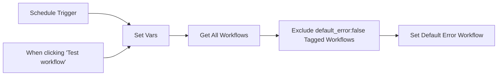

## Fluxo (.json) :

```json
{
  "meta": {
    "instanceId": "f4b99447bb6b56ad425b30ab755dc982ee1c258e7ce783958190eabedd1bcbb0"
  },
  "nodes": [
    {
      "id": "d496660c-88be-4130-ad6c-32e55f820af0",
      "name": "Set Default Error Workflow",
      "type": "n8n-nodes-base.postgres",
      "position": [
        1700,
        500
      ],
      "parameters": {
        "table": {
          "__rl": true,
          "mode": "list",
          "value": "workflow_entity",
          "cachedResultName": "workflow_entity"
        },
        "schema": {
          "__rl": true,
          "mode": "list",
          "value": "public"
        },
        "columns": {
          "value": {
            "id": "={{ $json.id }}",
            "settings": "={{ JSON.stringify({ ...$json.settings, errorWorkflow: $('Set Vars').item.json.default_error_workflow_id }, null, null) }}"
          },
          "schema": [
            {
              "id": "name",
              "type": "string",
              "display": true,
              "removed": true,
              "required": true,
              "displayName": "name",
              "defaultMatch": false,
              "canBeUsedToMatch": true
            },
            {
              "id": "active",
              "type": "boolean",
              "display": true,
              "removed": true,
              "required": true,
              "displayName": "active",
              "defaultMatch": false,
              "canBeUsedToMatch": true
            },
            {
              "id": "nodes",
              "type": "object",
              "display": true,
              "removed": true,
              "required": true,
              "displayName": "nodes",
              "defaultMatch": false,
              "canBeUsedToMatch": true
            },
            {
              "id": "connections",
              "type": "object",
              "display": true,
              "removed": true,
              "required": true,
              "displayName": "connections",
              "defaultMatch": false,
              "canBeUsedToMatch": true
            },
            {
              "id": "createdAt",
              "type": "dateTime",
              "display": true,
              "removed": true,
              "required": false,
              "displayName": "createdAt",
              "defaultMatch": false,
              "canBeUsedToMatch": true
            },
            {
              "id": "updatedAt",
              "type": "dateTime",
              "display": true,
              "removed": true,
              "required": false,
              "displayName": "updatedAt",
              "defaultMatch": false,
              "canBeUsedToMatch": true
            },
            {
              "id": "settings",
              "type": "object",
              "display": true,
              "removed": false,
              "required": false,
              "displayName": "settings",
              "defaultMatch": false,
              "canBeUsedToMatch": true
            },
            {
              "id": "staticData",
              "type": "object",
              "display": true,
              "removed": true,
              "required": false,
              "displayName": "staticData",
              "defaultMatch": false,
              "canBeUsedToMatch": true
            },
            {
              "id": "pinData",
              "type": "object",
              "display": true,
              "removed": true,
              "required": false,
              "displayName": "pinData",
              "defaultMatch": false,
              "canBeUsedToMatch": true
            },
            {
              "id": "versionId",
              "type": "string",
              "display": true,
              "removed": true,
              "required": false,
              "displayName": "versionId",
              "defaultMatch": false,
              "canBeUsedToMatch": true
            },
            {
              "id": "triggerCount",
              "type": "number",
              "display": true,
              "removed": true,
              "required": false,
              "displayName": "triggerCount",
              "defaultMatch": false,
              "canBeUsedToMatch": true
            },
            {
              "id": "id",
              "type": "string",
              "display": true,
              "removed": false,
              "required": true,
              "displayName": "id",
              "defaultMatch": true,
              "canBeUsedToMatch": true
            },
            {
              "id": "meta",
              "type": "object",
              "display": true,
              "removed": true,
              "required": false,
              "displayName": "meta",
              "defaultMatch": false,
              "canBeUsedToMatch": true
            }
          ],
          "mappingMode": "defineBelow",
          "matchingColumns": [
            "id"
          ]
        },
        "options": {},
        "operation": "update"
      },
      "credentials": {
        "postgres": {
          "id": "rFLN9F42378ayUmI",
          "name": "GCS:threat-intel-context/dev-n8n-conf"
        }
      },
      "retryOnFail": true,
      "typeVersion": 2.3
    },
    {
      "id": "334c557c-bc6c-44f8-85ac-3cacc145cf2f",
      "name": "Set Vars",
      "type": "n8n-nodes-base.set",
      "position": [
        1040,
        500
      ],
      "parameters": {
        "options": {},
        "assignments": {
          "assignments": [
            {
              "id": "b2302801-f93e-4134-a785-47454dfe31d4",
              "name": "default_error_workflow_id",
              "type": "string",
              "value": "2fgSBCqYJyEZWtTO"
            },
            {
              "id": "efe2c80d-2b98-4a6b-8f76-7e2d5866c4ea",
              "name": "default_error_exclusion_tag",
              "type": "string",
              "value": "default_error:false"
            }
          ]
        }
      },
      "retryOnFail": true,
      "typeVersion": 3.3
    },
    {
      "id": "858d36f2-1024-43dd-89e9-00402fb1bae2",
      "name": "Exclude default_error:false Tagged Workflows",
      "type": "n8n-nodes-base.filter",
      "position": [
        1480,
        500
      ],
      "parameters": {
        "options": {},
        "conditions": {
          "options": {
            "leftValue": "",
            "caseSensitive": true,
            "typeValidation": "strict"
          },
          "combinator": "and",
          "conditions": [
            {
              "id": "911501c7-18cc-4292-a4e8-fe8f8c3cb8aa",
              "operator": {
                "type": "boolean",
                "operation": "false",
                "singleValue": true
              },
              "leftValue": "={{ $json.tags.some(item => item.name === $('Set Vars').item.json.default_error_exclusion_tag) }}",
              "rightValue": ""
            },
            {
              "id": "e22db4f5-ec03-4000-a996-d3150db17a73",
              "operator": {
                "type": "string",
                "operation": "notEquals"
              },
              "leftValue": "={{ $json.settings.errorWorkflow ? $json.settings.errorWorkflow : \"\" }}",
              "rightValue": "={{ $('Set Vars').item.json.default_error_workflow_id }}"
            }
          ]
        }
      },
      "retryOnFail": true,
      "typeVersion": 2
    },
    {
      "id": "f0ac7515-8175-458c-9357-b5246019a22c",
      "name": "When clicking \"Test workflow\"",
      "type": "n8n-nodes-base.manualTrigger",
      "position": [
        780,
        580
      ],
      "parameters": {},
      "typeVersion": 1
    },
    {
      "id": "2545b766-a0a0-4e31-9941-d51d5594aff6",
      "name": "Schedule Trigger",
      "type": "n8n-nodes-base.scheduleTrigger",
      "position": [
        780,
        400
      ],
      "parameters": {
        "rule": {
          "interval": [
            {
              "field": "hours",
              "hoursInterval": 4
            }
          ]
        }
      },
      "notesInFlow": false,
      "typeVersion": 1.1
    },
    {
      "id": "901e4df3-4dd3-4b92-ac09-555d51d2d7e9",
      "name": "Get All Workflows",
      "type": "n8n-nodes-base.n8n",
      "position": [
        1260,
        500
      ],
      "parameters": {
        "filters": {}
      },
      "credentials": {
        "n8nApi": {
          "id": "r2RZq6ObikiqFu1y",
          "name": "n8n account"
        }
      },
      "retryOnFail": true,
      "typeVersion": 1
    }
  ],
  "pinData": {},
  "connections": {
    "Set Vars": {
      "main": [
        [
          {
            "node": "Get All Workflows",
            "type": "main",
            "index": 0
          }
        ]
      ]
    },
    "Schedule Trigger": {
      "main": [
        [
          {
            "node": "Set Vars",
            "type": "main",
            "index": 0
          }
        ]
      ]
    },
    "Get All Workflows": {
      "main": [
        [
          {
            "node": "Exclude default_error:false Tagged Workflows",
            "type": "main",
            "index": 0
          }
        ]
      ]
    },
    "When clicking \"Test workflow\"": {
      "main": [
        [
          {
            "node": "Set Vars",
            "type": "main",
            "index": 0
          }
        ]
      ]
    },
    "Exclude default_error:false Tagged Workflows": {
      "main": [
        [
          {
            "node": "Set Default Error Workflow",
            "type": "main",
            "index": 0
          }
        ]
      ]
    }
  }
}
```

<a id="template-1867"></a>

## Template 1867 - Implantação automática de workflows (JSON)

- **Nome:** Implantação automática de workflows (JSON)
- **Descrição:** Fluxo que automatiza a importação de workflows em JSON para uma instância, buscando tags existentes, preparando o JSON para importação, criando o workflow, atribuindo uma tag e movendo o arquivo de ToDeploy para Deployed, acionado por um gatilho de arquivo na pasta ToDeploy.
- **Funcionalidade:** • Detecção de novos arquivos JSON em ToDeploy: aciona o fluxo quando um arquivo é criado na pasta ToDeploy.
• Leitura de tags existentes: obtém as tags disponíveis para selecionar a que será aplicada.
• Preparação do JSON do workflow: limpa o JSON mantendo apenas os campos permitidos para importação (nome, nodes, conexões, settings).
• Criação de workflow na instância de destino: envia o JSON limpo para criar o workflow com as configurações especificadas.
• Atribuição de tag ao workflow criado: associa a tag correspondente ao workflow recém-criado.
• Movimentação do arquivo para Deployed: move o arquivo de ToDeploy para a pasta Deployed após a criação e atribuição.
• Download do arquivo JSON de deployment: baixa o arquivo JSON da pasta ToDeploy para importação.
• Configuração de autenticação: utiliza credenciais para chamadas à API de criação e atualização de workflows.
• Captura de falhas: registra falhas na criação do workflow e retorna informações relevantes como nome do fluxo e mensagem de erro.
- **Ferramentas:** • Google Drive: Armazena arquivos JSON de workflows, monitora a pasta ToDeploy e move arquivos para a pasta Deployed.


## Fluxo visual

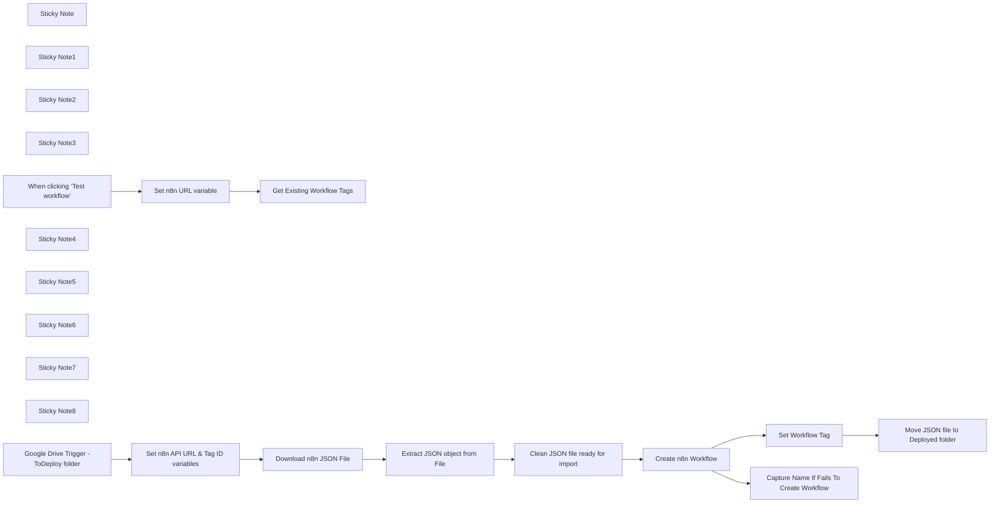

## Fluxo (.json) :

```json
{
  "id": "bhWsUxipJ9wuTA5K",
  "meta": {
    "instanceId": "fd11e31161384d7618b8c5580f01ec2285d2165d3df82195429972f6a3f814eb",
    "templateCredsSetupCompleted": true
  },
  "name": "n8n workflow deployer",
  "tags": [],
  "nodes": [
    {
      "id": "8db6d045-5ef8-444a-ae3e-0f0611946008",
      "name": "Get Existing Workflow Tags",
      "type": "n8n-nodes-base.httpRequest",
      "position": [
        -580,
        -580
      ],
      "parameters": {
        "url": "={{ $json.N8N_Instance_URL }}api/v1/tags",
        "options": {},
        "sendHeaders": true,
        "authentication": "predefinedCredentialType",
        "headerParameters": {
          "parameters": [
            {
              "name": "accept",
              "value": "application/json"
            }
          ]
        },
        "nodeCredentialType": "n8nApi"
      },
      "credentials": {
        "n8nApi": {
          "id": "eOE2pATZyQiS1K4C",
          "name": "n8n account"
        }
      },
      "retryOnFail": true,
      "typeVersion": 4.2,
      "waitBetweenTries": 5000
    },
    {
      "id": "da4aeef3-05a4-48c9-ae5c-9038f07e3693",
      "name": "Sticky Note",
      "type": "n8n-nodes-base.stickyNote",
      "position": [
        -300,
        -1040
      ],
      "parameters": {
        "color": 3,
        "width": 1460,
        "height": 760,
        "content": "## Setup Instructions\n\n**1.** In Google Drive create a **ToDeploy** folder and a **Deployed** folder\n+ Update \"**Google Drive Trigger -ToDeploy folder**\" to your ToDeploy folder\n+ Update \"**Move JSON file to Deployed folder**\" to you Deployed folder\n\n\n**2.** Create a **n8n API key**:\n+Go to Settings > n8n API\n+Select Create an API key\n+Copy API Key\n\n**3.** In \"**Get Existing Workflow Tags**\" node: \nCreate n8n API Authentication\n**Authentication:** Predefined Credential Type\n**Credential Type:** n8n API\n\nCreate new credential:\n+Paste in API key\n+Baseurl: https://SUB.DOMAINNAME.com/api/v1/\n\n**4.** Add n8n API authentication to: \n+ \"**Create n8n Workflow**\" node\n+ \"**Set Workflow Tag**\" node\n\n\n**5.** Add your N8N instance URL to the **N8N_Instance_URL** variable in \"**Set n8n URL variable**\" node.\n\n**6.** Run **\"Get Workflow Tags\"** node and copy the ID of your chosen tag.\n\n**7.** In \"**Set n8n API URL & Tag ID variables**\" node:\n+ Add the Workflow Tag ID to the **N8N_Instance_Tag** variable\n+ Add your N8N instance URL to the **N8N_Instance_URL** variable\n\n\n**9.** Set workflow to Active\n\n**10.** Add n8n json files to Google Drive folder \n\n"
      },
      "typeVersion": 1
    },
    {
      "id": "520aa22e-0456-4383-ba6d-fd89fd77f193",
      "name": "Sticky Note1",
      "type": "n8n-nodes-base.stickyNote",
      "position": [
        -680,
        -140
      ],
      "parameters": {
        "color": 4,
        "width": 260,
        "height": 280,
        "content": "### Set variables:\n**N8N_Instance_Tag** **N8N_Instance_URL** "
      },
      "typeVersion": 1
    },
    {
      "id": "2e0794eb-0213-48fd-a974-26301bfdfc8a",
      "name": "Sticky Note2",
      "type": "n8n-nodes-base.stickyNote",
      "position": [
        300,
        -120
      ],
      "parameters": {
        "color": 4,
        "width": 440,
        "height": 260,
        "content": "### Configure n8n API authentication"
      },
      "typeVersion": 1
    },
    {
      "id": "f77ad2ef-32e3-4d24-b79b-9898152cbbac",
      "name": "Sticky Note3",
      "type": "n8n-nodes-base.stickyNote",
      "position": [
        -1100,
        -780
      ],
      "parameters": {
        "color": 5,
        "width": 740,
        "height": 420,
        "content": "## 1. Get Workflow Tags"
      },
      "typeVersion": 1
    },
    {
      "id": "cf10c998-44fc-4f1a-8d61-9187a9eae82a",
      "name": "When clicking ‘Test workflow’",
      "type": "n8n-nodes-base.manualTrigger",
      "position": [
        -1040,
        -580
      ],
      "parameters": {},
      "typeVersion": 1
    },
    {
      "id": "206fffc1-d7ee-41eb-b6ad-55be8ae60526",
      "name": "Sticky Note4",
      "type": "n8n-nodes-base.stickyNote",
      "position": [
        -880,
        -700
      ],
      "parameters": {
        "color": 4,
        "width": 220,
        "height": 280,
        "content": "### Set variable:\n**N8N_Instance_URL** "
      },
      "typeVersion": 1
    },
    {
      "id": "2bbe9b3e-c302-497f-a724-e8c51ce673ef",
      "name": "Extract JSON object from File",
      "type": "n8n-nodes-base.extractFromFile",
      "position": [
        -80,
        -40
      ],
      "parameters": {
        "options": {},
        "operation": "fromJson"
      },
      "typeVersion": 1
    },
    {
      "id": "2f0acb18-86c4-4f94-8f76-b72174809643",
      "name": "Clean JSON file ready for import",
      "type": "n8n-nodes-base.code",
      "position": [
        140,
        -40
      ],
      "parameters": {
        "mode": "runOnceForEachItem",
        "jsCode": "const fullWorkflow = $json.data || $json;\n\n// Build settings with only allowed fields\nconst cleanSettings = {};\nif (fullWorkflow.settings?.executionOrder) {\n  cleanSettings.executionOrder = fullWorkflow.settings.executionOrder;\n}\nif (fullWorkflow.settings?.timezone) {\n  cleanSettings.timezone = fullWorkflow.settings.timezone;\n}\n\n// Construct clean workflow object\nconst cleanWorkflow = {\n  name: fullWorkflow.name,\n  nodes: fullWorkflow.nodes,\n  connections: fullWorkflow.connections,\n  settings: cleanSettings,\n};\n\nreturn { json: cleanWorkflow };\n"
      },
      "typeVersion": 2
    },
    {
      "id": "f0428a03-2194-4390-b14b-5149ea3a220b",
      "name": "Set n8n API URL & Tag ID variables",
      "type": "n8n-nodes-base.set",
      "position": [
        -600,
        -40
      ],
      "parameters": {
        "options": {},
        "assignments": {
          "assignments": [
            {
              "id": "41afa23f-bacf-4c2b-9630-68483acc9fe6",
              "name": "N8N_Instance_URL",
              "type": "string",
              "value": "https://SUB.DOMAINNAME.com/"
            },
            {
              "id": "c27f2d9d-ee1f-4ada-90cc-20177017b342",
              "name": "N8N_Instance_Tag",
              "type": "string",
              "value": "mIzqUB1qBwewiiX3"
            }
          ]
        }
      },
      "typeVersion": 3.4
    },
    {
      "id": "9f59cba9-9452-4e05-9d95-3e405ec195cf",
      "name": "Sticky Note5",
      "type": "n8n-nodes-base.stickyNote",
      "position": [
        -980,
        -140
      ],
      "parameters": {
        "color": 4,
        "width": 260,
        "height": 280,
        "content": "### Change Google Drive Folder"
      },
      "typeVersion": 1
    },
    {
      "id": "87ce4868-407c-461f-92e2-6b3bf1dd616e",
      "name": "Sticky Note6",
      "type": "n8n-nodes-base.stickyNote",
      "position": [
        -640,
        -760
      ],
      "parameters": {
        "color": 4,
        "height": 340,
        "content": "### Configure n8n API authentication.\n\n### Tag ID\nCopy your chosen Tag ID to **N8N_Instance_Tag** "
      },
      "typeVersion": 1
    },
    {
      "id": "b1c3f693-a587-4928-a90a-8288eb84a879",
      "name": "Create n8n Workflow",
      "type": "n8n-nodes-base.httpRequest",
      "onError": "continueErrorOutput",
      "position": [
        360,
        -40
      ],
      "parameters": {
        "url": "={{ $('Set n8n API URL & Tag ID variables').item.json.N8N_Instance_URL }}api/v1/workflows",
        "body": "={{ $json }}",
        "method": "POST",
        "options": {},
        "sendBody": true,
        "contentType": "raw",
        "sendHeaders": true,
        "authentication": "predefinedCredentialType",
        "rawContentType": "application/json",
        "headerParameters": {
          "parameters": [
            {
              "name": "accept",
              "value": "application/json"
            },
            {
              "name": "Content-Type",
              "value": "application/json"
            }
          ]
        },
        "nodeCredentialType": "n8nApi"
      },
      "credentials": {
        "n8nApi": {
          "id": "eOE2pATZyQiS1K4C",
          "name": "n8n account"
        }
      },
      "typeVersion": 4.2
    },
    {
      "id": "70ff3b11-3664-4fec-a220-72696a6083c5",
      "name": "Set Workflow Tag",
      "type": "n8n-nodes-base.httpRequest",
      "onError": "continueRegularOutput",
      "position": [
        600,
        -40
      ],
      "parameters": {
        "url": "={{ $('Set n8n API URL & Tag ID variables').item.json.N8N_Instance_URL }}api/v1/workflows/{{ $json.id }}/tags",
        "method": "PUT",
        "options": {},
        "jsonBody": "=[\n  {\n    \"id\": \"{{ $('Set n8n API URL & Tag ID variables').item.json.N8N_Instance_Tag }}\"\n  }\n]",
        "sendBody": true,
        "specifyBody": "json",
        "authentication": "predefinedCredentialType",
        "nodeCredentialType": "n8nApi"
      },
      "credentials": {
        "n8nApi": {
          "id": "eOE2pATZyQiS1K4C",
          "name": "n8n account"
        }
      },
      "retryOnFail": true,
      "typeVersion": 4.2,
      "waitBetweenTries": 5000
    },
    {
      "id": "55671121-7027-476b-8eff-9d9a16385cce",
      "name": "Sticky Note7",
      "type": "n8n-nodes-base.stickyNote",
      "position": [
        800,
        -120
      ],
      "parameters": {
        "color": 4,
        "width": 260,
        "height": 260,
        "content": "### Change Google Drive Deployed Folder"
      },
      "typeVersion": 1
    },
    {
      "id": "e8a9bbd8-a41d-4b82-931c-5570651d8583",
      "name": "Capture Name If Fails To Create Workflow",
      "type": "n8n-nodes-base.code",
      "position": [
        600,
        160
      ],
      "parameters": {
        "jsCode": "return [{\n  json: {\n    workflowName:   $json.name,\n    errorMessage:   $json.error.message,\n  }\n}];\n"
      },
      "typeVersion": 2
    },
    {
      "id": "0fee0939-f3bd-4fd1-b444-40509f4b0f50",
      "name": "Move JSON file to Deployed folder",
      "type": "n8n-nodes-base.googleDrive",
      "position": [
        880,
        -40
      ],
      "parameters": {
        "fileId": {
          "__rl": true,
          "mode": "id",
          "value": "={{ $('Google Drive Trigger -ToDeploy folder').item.json.id }}"
        },
        "driveId": {
          "__rl": true,
          "mode": "list",
          "value": "My Drive"
        },
        "folderId": {
          "__rl": true,
          "mode": "list",
          "value": "1nQb17Xf7ZTF75E-aettkFtBVKI_nOrsW",
          "cachedResultUrl": "https://drive.google.com/drive/folders/1nQb17Xf7ZTF75E-aettkFtBVKI_nOrsW",
          "cachedResultName": "Deployed"
        },
        "operation": "move"
      },
      "credentials": {
        "googleDriveOAuth2Api": {
          "id": "SfLfcExz8PihKGNB",
          "name": "Google Drive account"
        }
      },
      "typeVersion": 3
    },
    {
      "id": "59567f07-4d69-4d30-a5ef-934198ff101d",
      "name": "Download n8n JSON File",
      "type": "n8n-nodes-base.googleDrive",
      "position": [
        -320,
        -40
      ],
      "parameters": {
        "fileId": {
          "__rl": true,
          "mode": "id",
          "value": "={{ $('Google Drive Trigger -ToDeploy folder').item.json.id }}"
        },
        "options": {
          "binaryPropertyName": "data"
        },
        "operation": "download"
      },
      "credentials": {
        "googleDriveOAuth2Api": {
          "id": "SfLfcExz8PihKGNB",
          "name": "Google Drive account"
        }
      },
      "typeVersion": 3
    },
    {
      "id": "a5837765-9787-43a5-bbfe-44e5f3728aee",
      "name": "Sticky Note8",
      "type": "n8n-nodes-base.stickyNote",
      "position": [
        -1100,
        -260
      ],
      "parameters": {
        "color": 5,
        "width": 2260,
        "height": 620,
        "content": "## 2. Import JSON Workflow Into n8n Instance"
      },
      "typeVersion": 1
    },
    {
      "id": "bcb77b34-36c8-4839-b3e2-72f8e60871ba",
      "name": "Set n8n URL variable",
      "type": "n8n-nodes-base.set",
      "position": [
        -820,
        -580
      ],
      "parameters": {
        "options": {},
        "assignments": {
          "assignments": [
            {
              "id": "41afa23f-bacf-4c2b-9630-68483acc9fe6",
              "name": "N8N_Instance_URL",
              "type": "string",
              "value": "https://SUB.DOMAINNAME.com/"
            }
          ]
        }
      },
      "typeVersion": 3.4
    },
    {
      "id": "7281ab81-d1e8-4a78-8e2f-e1049633d6e6",
      "name": "Google Drive Trigger -ToDeploy folder",
      "type": "n8n-nodes-base.googleDriveTrigger",
      "position": [
        -880,
        -40
      ],
      "parameters": {
        "event": "fileCreated",
        "options": {},
        "pollTimes": {
          "item": [
            {
              "mode": "everyMinute"
            }
          ]
        },
        "triggerOn": "specificFolder",
        "folderToWatch": {
          "__rl": true,
          "mode": "list",
          "value": "1EPGHT5fBn0Hx_EVDixJiJMJgRbNNdB0I",
          "cachedResultUrl": "https://drive.google.com/drive/folders/1EPGHT5fBn0Hx_EVDixJiJMJgRbNNdB0I",
          "cachedResultName": "toDeploy"
        }
      },
      "credentials": {
        "googleDriveOAuth2Api": {
          "id": "SfLfcExz8PihKGNB",
          "name": "Google Drive account"
        }
      },
      "typeVersion": 1
    }
  ],
  "active": true,
  "settings": {
    "executionOrder": "v1"
  },
  "versionId": "77325a25-51f0-441a-8750-fe6d1d5a266f",
  "connections": {
    "Set Workflow Tag": {
      "main": [
        [
          {
            "node": "Move JSON file to Deployed folder",
            "type": "main",
            "index": 0
          }
        ]
      ]
    },
    "Create n8n Workflow": {
      "main": [
        [
          {
            "node": "Set Workflow Tag",
            "type": "main",
            "index": 0
          }
        ],
        [
          {
            "node": "Capture Name If Fails To Create Workflow",
            "type": "main",
            "index": 0
          }
        ]
      ]
    },
    "Set n8n URL variable": {
      "main": [
        [
          {
            "node": "Get Existing Workflow Tags",
            "type": "main",
            "index": 0
          }
        ]
      ]
    },
    "Download n8n JSON File": {
      "main": [
        [
          {
            "node": "Extract JSON object from File",
            "type": "main",
            "index": 0
          }
        ]
      ]
    },
    "Extract JSON object from File": {
      "main": [
        [
          {
            "node": "Clean JSON file ready for import",
            "type": "main",
            "index": 0
          }
        ]
      ]
    },
    "Clean JSON file ready for import": {
      "main": [
        [
          {
            "node": "Create n8n Workflow",
            "type": "main",
            "index": 0
          }
        ]
      ]
    },
    "When clicking ‘Test workflow’": {
      "main": [
        [
          {
            "node": "Set n8n URL variable",
            "type": "main",
            "index": 0
          }
        ]
      ]
    },
    "Set n8n API URL & Tag ID variables": {
      "main": [
        [
          {
            "node": "Download n8n JSON File",
            "type": "main",
            "index": 0
          }
        ]
      ]
    },
    "Google Drive Trigger -ToDeploy folder": {
      "main": [
        [
          {
            "node": "Set n8n API URL & Tag ID variables",
            "type": "main",
            "index": 0
          }
        ]
      ]
    }
  }
}
```

<a id="template-1870"></a>

## Template 1870 - Criar lead a partir de fork do GitHub

- **Nome:** Criar lead a partir de fork do GitHub
- **Descrição:** Quando um repositório é forkado, o fluxo obtém os dados do usuário que fez o fork, busca ou cria essa pessoa no Pipedrive, cria um lead associado e registra uma nota com a URL do GitHub.
- **Funcionalidade:** • Detecção do evento de fork: Inicia o fluxo ao detectar que um repositório foi forkado.
• Coleta de informações do usuário do GitHub: Recupera dados do usuário que fez o fork, incluindo email quando disponível.
• Busca de pessoa no Pipedrive por email: Procura se o usuário já existe no CRM usando o email retornado.
• Condicional de existência de pessoa: Se a pessoa existir, utiliza o ID existente; se não existir, cria uma nova pessoa no Pipedrive.
• Criação de lead associado à pessoa: Gera um lead com título que referencia o repositório e o usuário, associando-o à pessoa encontrada ou criada.
• Adição de nota com URL do GitHub: Anexa uma nota ao lead contendo a URL do usuário no GitHub.
- **Ferramentas:** • GitHub: Fonte do evento de fork e provedor das informações do usuário (conta, email e URLs).
• Pipedrive: CRM utilizado para buscar e criar pessoas, criar leads e adicionar notas.


## Fluxo visual

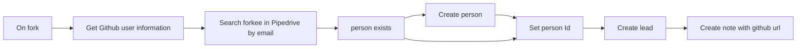

## Fluxo (.json) :

```json
{
  "meta": {
    "instanceId": "237600ca44303ce91fa31ee72babcdc8493f55ee2c0e8aa2b78b3b4ce6f70bd9"
  },
  "nodes": [
    {
      "id": "a84fa822-fd74-45db-93c6-f51be75ef307",
      "name": "person exists",
      "type": "n8n-nodes-base.if",
      "position": [
        920,
        340
      ],
      "parameters": {
        "conditions": {
          "string": [
            {
              "value1": "={{$json[\"name\"]}}",
              "operation": "isNotEmpty"
            }
          ]
        }
      },
      "typeVersion": 1
    },
    {
      "id": "500ef1bd-8965-4245-81d7-14c3897b4275",
      "name": "Set person Id",
      "type": "n8n-nodes-base.set",
      "position": [
        1480,
        320
      ],
      "parameters": {
        "values": {
          "string": [
            {
              "name": "PipedrivePersonId",
              "value": "={{ $json[\"id\"] }}"
            }
          ]
        },
        "options": {}
      },
      "typeVersion": 1
    },
    {
      "id": "ab1a1335-92c8-41f8-b008-5b19530f08e9",
      "name": "Create lead",
      "type": "n8n-nodes-base.pipedrive",
      "position": [
        1740,
        320
      ],
      "parameters": {
        "title": "=Repo '{{$node[\"On fork\"].json[\"body\"][\"repository\"][\"full_name\"]}}' forked by {{$json[\"name\"]}}",
        "resource": "lead",
        "person_id": "={{$json[\"PipedrivePersonId\"]}}",
        "associateWith": "person",
        "additionalFields": {}
      },
      "credentials": {
        "pipedriveApi": {
          "id": "1",
          "name": "Pipedrive account"
        }
      },
      "typeVersion": 1
    },
    {
      "id": "4fd06c6a-4975-4a6a-95f3-bb48f3e9bdf6",
      "name": "On fork",
      "type": "n8n-nodes-base.githubTrigger",
      "position": [
        180,
        340
      ],
      "webhookId": "ff05ca29-9ed3-4b97-a4ce-4f9b1c05255f",
      "parameters": {
        "owner": "John-n8n",
        "events": [
          "fork"
        ],
        "repository": "DemoRepo"
      },
      "credentials": {
        "githubApi": {
          "id": "7",
          "name": "GitHub account"
        }
      },
      "typeVersion": 1
    },
    {
      "id": "86554078-ce7c-4dd3-b36f-d1bf22530f7b",
      "name": "Create person",
      "type": "n8n-nodes-base.pipedrive",
      "position": [
        1200,
        440
      ],
      "parameters": {
        "name": "={{ $node[\"On fork\"].json[\"body\"].forkee.owner.login }}",
        "resource": "person",
        "additionalFields": {
          "email": [
            "={{$node[\"Get Github user information\"].email}}"
          ]
        }
      },
      "credentials": {
        "pipedriveApi": {
          "id": "1",
          "name": "Pipedrive account"
        }
      },
      "typeVersion": 1
    },
    {
      "id": "c4a8dae8-d6f3-4309-8fa5-78d69cf1b1e8",
      "name": "Create note with github url",
      "type": "n8n-nodes-base.pipedrive",
      "position": [
        1980,
        320
      ],
      "parameters": {
        "content": "=Github user url: {{ $node[\"On fork\"].json[\"body\"].sender.html_url }}",
        "resource": "note",
        "additionalFields": {
          "lead_id": "={{ $json[\"id\"] }}"
        }
      },
      "credentials": {
        "pipedriveApi": {
          "id": "1",
          "name": "Pipedrive account"
        }
      },
      "typeVersion": 1
    },
    {
      "id": "8dfa3e8e-29d8-4098-825d-8ec915ca6f3f",
      "name": "Get Github user information",
      "type": "n8n-nodes-base.httpRequest",
      "position": [
        440,
        340
      ],
      "parameters": {
        "url": "={{$json[\"body\"].sender.url}}",
        "options": {},
        "authentication": "predefinedCredentialType",
        "nodeCredentialType": "githubApi"
      },
      "credentials": {
        "githubApi": {
          "id": "7",
          "name": "GitHub account"
        }
      },
      "typeVersion": 2
    },
    {
      "id": "c4c2538a-28e8-4c75-856d-000a727a4f13",
      "name": "Search forkee in Pipedrive by email",
      "type": "n8n-nodes-base.pipedrive",
      "position": [
        680,
        340
      ],
      "parameters": {
        "term": "={{ $json[\"email\"]}}",
        "resource": "person",
        "operation": "search",
        "additionalFields": {
          "fields": "email"
        }
      },
      "credentials": {
        "pipedriveApi": {
          "id": "1",
          "name": "Pipedrive account"
        }
      },
      "typeVersion": 1,
      "alwaysOutputData": true
    }
  ],
  "connections": {
    "On fork": {
      "main": [
        [
          {
            "node": "Get Github user information",
            "type": "main",
            "index": 0
          }
        ]
      ]
    },
    "Create lead": {
      "main": [
        [
          {
            "node": "Create note with github url",
            "type": "main",
            "index": 0
          }
        ]
      ]
    },
    "Create person": {
      "main": [
        [
          {
            "node": "Set person Id",
            "type": "main",
            "index": 0
          }
        ]
      ]
    },
    "Set person Id": {
      "main": [
        [
          {
            "node": "Create lead",
            "type": "main",
            "index": 0
          }
        ]
      ]
    },
    "person exists": {
      "main": [
        [
          {
            "node": "Set person Id",
            "type": "main",
            "index": 0
          }
        ],
        [
          {
            "node": "Create person",
            "type": "main",
            "index": 0
          }
        ]
      ]
    },
    "Get Github user information": {
      "main": [
        [
          {
            "node": "Search forkee in Pipedrive by email",
            "type": "main",
            "index": 0
          }
        ]
      ]
    },
    "Search forkee in Pipedrive by email": {
      "main": [
        [
          {
            "node": "person exists",
            "type": "main",
            "index": 0
          }
        ]
      ]
    }
  }
}
```

<a id="template-1872"></a>

## Template 1872 - Localizador de configurações OAuth por IA

- **Nome:** Localizador de configurações OAuth por IA
- **Descrição:** Recebe um nome de serviço e utiliza um modelo de linguagem para identificar e devolver o nome do serviço, audience, authorization_uri, token_uri, justificativa e um índice de confiança em formato JSON.
- **Funcionalidade:** • Recepção de entrada JSON: Inicia a execução a partir de um payload externo contendo o campo "name".
• Consulta a modelo de linguagem: Envia um prompt detalhado para um LLM para determinar service_name, audience, authorization_uri e token_uri.
• Geração de justificativa: Produz uma explicação sucinta (racional) sobre a correspondência encontrada.
• Pontuação de confiança: Calcula e retorna um score numérico (0.01 a 1.00) que indica a confiança dos dados fornecidos.
• Normalização de saída: Converte o texto gerado pelo LLM em um JSON estruturado adequado para consumo por processos downstream.
• Improvisação controlada: Quando os dados são incertos, o fluxo permite inventar valores com justificativa e baixa confiança para garantir retorno sempre presente.
• Documentação embutida: Inclui notas explicativas e instruções para facilitar manutenção e adaptação do fluxo.
- **Ferramentas:** • OpenRouter: Serviço de API que fornece acesso ao modelo de linguagem utilizado para inferência.
• Wayfarer Large 70b (Llama 3.3): Modelo de linguagem aplicado para interpretar o nome do serviço e gerar as configurações OAuth.
• Fontes públicas de documentação de APIs: Sites oficiais de provedores (por exemplo, documentação do Atlassian, Sage, Google, SAP e similares) usados como referência para verificar URIs e padrões OAuth.


## Fluxo visual

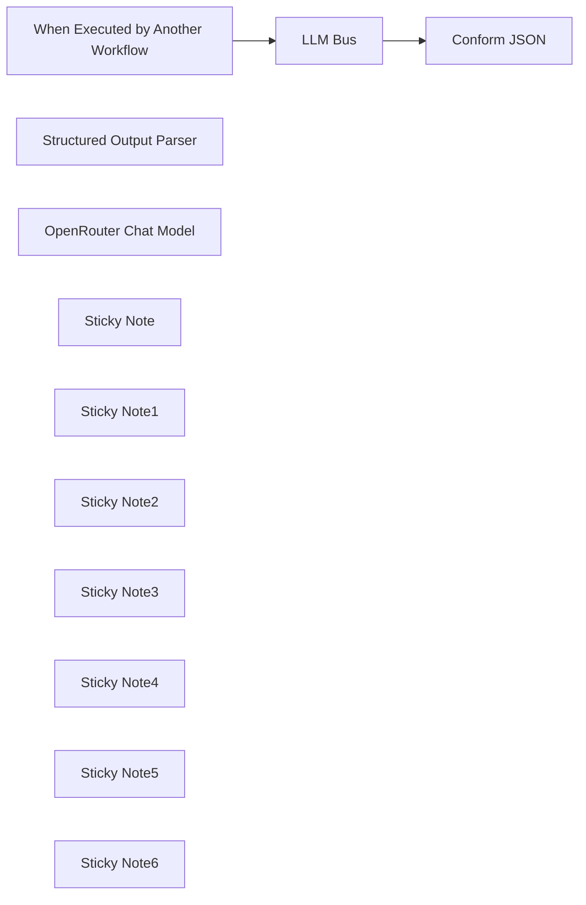

## Fluxo (.json) :

```json
{
  "id": "eHuvG2I1vOYj0U6k",
  "meta": {
    "instanceId": "1c7be698fdfa769249b0c65dcf8862b184efc981b9cec697fe71be1be502c151"
  },
  "name": "My workflow",
  "tags": [
    {
      "id": "isKwzRd30jBHOwft",
      "name": "AI",
      "createdAt": "2025-03-20T12:19:54.225Z",
      "updatedAt": "2025-03-20T12:19:54.225Z"
    },
    {
      "id": "14BO5kV7hwR3aVmH",
      "name": "OAuth",
      "createdAt": "2025-03-20T12:19:58.622Z",
      "updatedAt": "2025-03-20T12:19:58.622Z"
    },
    {
      "id": "hzAAB0A7DmXlEfor",
      "name": "Service",
      "createdAt": "2025-03-20T12:20:03.063Z",
      "updatedAt": "2025-03-20T12:20:03.063Z"
    }
  ],
  "nodes": [
    {
      "id": "6503d6be-e4f3-4a06-b027-9fb210788a30",
      "name": "When Executed by Another Workflow",
      "type": "n8n-nodes-base.executeWorkflowTrigger",
      "position": [
        80,
        340
      ],
      "parameters": {
        "inputSource": "jsonExample",
        "jsonExample": "{\n  \"name\" : \"Atlassian\",\n  \"audience\" : \"api.atlassian.com\"\n}"
      },
      "typeVersion": 1.1
    },
    {
      "id": "d6246380-096b-458f-a52c-b263c1e4b800",
      "name": "LLM Bus",
      "type": "@n8n/n8n-nodes-langchain.chainLlm",
      "position": [
        400,
        340
      ],
      "parameters": {
        "text": "You are an AI agent tasked with identifying the (pretty-print) OAuth service name, audience, authorization URI, and token URI.\nThe input is only a name bearing on the OAUth service, e.g.:\n1. Jira.  The name Jira must be resolved to the correlated API service, in this case, Atlassian.  OAuth information can be gleaned from https://developer.atlassian.com/.\n2. Sage. This is potentially a vague name.  However, in the context of API and OAuth, it is probably Sage300 the ERP system.  OAuth information can be gleaned from https://developer.sage.com.\n3. SAP. This can be the SAP HANA Cloud Platform. Authorization is usually be dedicated URL, e.g., https://<host_name>:<port_number>/sap/bc/sec/oauth2/client/grant/authorization?\n4. Google. This can be the Google API, e.g., https://accounts.google.com/o/oauth2/v2/auth? with audience as project-id-random-value.apps.googleusercontent.com.\n\nObtaining these details by just knowing the pretty-name of the service might be cumbersome.  Therefore a confidence score, as a probabilistic indication your confidence\nof the data must be calculated.  Express your confidence score on a scale of 1 (absolute certainty) down to almost zero (least certain), i.e., confidence NUMERIC(3, 2) CHECK (confidence >= 0.1 AND confidence <= 1.0).\nIf you can't obtain information, invent the data, but justify your improvisation by assigning a very low confidence score.  You must always return a result, no matter\nhow low your confidence.\n\nThese Instructions comprise a Context Understanding, Information Retrieval, Output Format, an Example, with Accuracy and Verification.  \n1. Context Understanding: The name (as input) value represents the target API or service. You need to identify the service name, audience, authorization URI, and token URI based on the name value. \n2. Information Retrieval: Use reputable sources and official documentation to find the correct service name, audience, authorization URI and token URI.\n3. Output Format: Service Name: [Service Name], [Audience], [Authorization URI], [Token URI], [Details]: (Your choice rationale in about 100 words to justify your answer), and lastly the [Confidence] (probability factor) as a numeric value 0<x≤1andx∈{0.01,0.02,…,1.00}.\n4. Example 1: If the name is Sage, the service is probably something like sage300.yourdomain.com (where the yourdomain is clearly a proprietary name), the authorization and token uri follow the same pattern, e.g., \na. Service Name: Sage 300,\nb. Audience: sage300.yourdomain.com\nc. Authorization URI: https://sage300.yourdomain.com/oauth/authorize?, \nd. Token URI: https://sage300.yourdomain.com/oauth/token, \ne. Details: Your domain is embedded in the standard presentation of the audience, authorization uri, and the token uri.  Therefore I substituted the standard representations of the OAuth pattern. \nf. Confidence: 0.90 (=> 0<x≤1andx∈{0.01,0.02,…,1.00})\n5. Example 2: If the name is Jira, the API service is probably Atlassian the elements: \na. Service Name: Atlassian, \nb. Audience: api.atlassian.com\nc. Authorization URI: https://auth.atlassian.com/authorize?, \nd. Token URI: https://auth.atlassian.com/oauth/token, \ne. Details: I have referenced the Atlassian online API documentation and retrieved the standard presentation of the audience, authorization uri, and the token uri from their documentation. \nf. Confidence: 1 (=> 0<x≤1andx∈{0.01,0.02,…,1.00})\n6. Accuracy and Verification: Double-check the information to ensure it is correct and up-to-date. If the name value is ambiguous or not well-documented, provide the best possible match based on available information, or improvise an answer based on the patterns of OAuth, but assign a low Confidence.\n7. Improvisation when OAuth elements relating to the provided {{ $json.name }} (API service name) cannot be determined with high confidence you should specify common patterns or fallback options for OAuth and perform additional searches to cross-reference multiple sources to improve accuracy.\n",
        "messages": {
          "messageValues": [
            {
              "type": "HumanMessagePromptTemplate",
              "message": "=The OAuth requester wants you to define the:  OAuth Service (pretty print) Name, the audience (parameter in the authorization uri), the aurhorization_uri (for the API OAuth authorization call), the token_uri (for the token call), your explanation for choosing these values, and your Confidence about the information you provided. \nOutput the service_name, audience, authorization_uri, token_uri, details, and the Confidence factor.\nOAuth Service for which to obtain configuration: {{ $json.name }}.  \nProvide the requester with the pretty-print OAuth Service Name, the audience (authorization parameter) the authorization_uri, the token_uri, your rationale (in n more than 75 words) for choosing the values, and the Confidence factor pertaining."
            }
          ]
        },
        "promptType": "define",
        "hasOutputParser": true
      },
      "typeVersion": 1.5
    },
    {
      "id": "90cdcbfa-cf7e-4123-b241-dafaea12d1a4",
      "name": "Structured Output Parser",
      "type": "@n8n/n8n-nodes-langchain.outputParserStructured",
      "position": [
        640,
        580
      ],
      "parameters": {
        "schemaType": "manual",
        "inputSchema": "{\n  \"$schema\": \"http://json-schema.org/draft-07/schema#\",\n  \"title\": \"Generated schema for Root\",\n  \"type\": \"object\",\n  \"properties\": {\n    \"action\": {\n      \"type\": \"string\"\n    },\n    \"text\": {\n      \"type\": \"string\"\n    }\n  },\n  \"required\": [\n    \"action\",\n    \"text\"\n  ]\n}"
      },
      "typeVersion": 1.2
    },
    {
      "id": "5f8cb1e1-39e7-4617-9b56-e0b41bfee466",
      "name": "OpenRouter Chat Model",
      "type": "@n8n/n8n-nodes-langchain.lmChatOpenRouter",
      "position": [
        340,
        580
      ],
      "parameters": {
        "model": "latitudegames/wayfarer-large-70b-llama-3.3",
        "options": {
          "topP": 0.9,
          "maxTokens": 2500,
          "maxRetries": 2,
          "temperature": 0.5,
          "responseFormat": "json_object",
          "presencePenalty": 0.6,
          "frequencyPenalty": 0.5
        }
      },
      "credentials": {
        "openRouterApi": {
          "id": "QRSxlMSE2Tacaxcl",
          "name": "OpenRouter account"
        }
      },
      "typeVersion": 1
    },
    {
      "id": "13012149-1408-4dbc-9108-146281001562",
      "name": "Conform JSON",
      "type": "n8n-nodes-base.code",
      "position": [
        900,
        340
      ],
      "parameters": {
        "jsCode": "// Extract the relevant information from the original output\nconst items =$input.all();\n// Extract the relevant information from the input\nconst originalText = items[0].json.output.text;\n\n// Parse the text to extract the required fields\nconst lines = originalText.split('\\n');\nconst service_name = lines[0].split(': ')[1];\nconst audience = lines[1].split(': ')[1];\nconst authorization_uri = lines[2].split(': ')[1];\nconst token_uri = lines[3].split(': ')[1];\nconst details = lines[4].split(': ')[1];\nconst confidence = parseFloat(lines[5].split(': ')[1]);\n\n// Return the transformed output\nreturn [\n  {\n    json: {\n      output: {\n        service_name,\n        audience,\n        authorization_uri,\n        token_uri,\n        details,\n        confidence\n      }\n    }\n  }\n];"
      },
      "typeVersion": 2
    },
    {
      "id": "8d4d10a4-ac75-4fc7-a607-19d91cde6ac6",
      "name": "Sticky Note",
      "type": "n8n-nodes-base.stickyNote",
      "position": [
        0,
        -200
      ],
      "parameters": {
        "color": 4,
        "width": 1100,
        "height": 360,
        "content": "## OAuth2 Settings Finder with OpenRouter Chat Model and Llama 3.3\n\n**Overview:**\nThe AI agent identifies:\n- Authorization URI\n- Token URI\n- Audience\n\n**Methodology:**\nConfidence scoring is utilized to assess the trustworthiness of extracted data:\n- Score Range: 0 < x ≤ 1\n- Score Granularity: 0.01 increments\n\n**Model Details:**\nLeveraging the Wayfarer Large 70b Llama 3.3 model."
      },
      "typeVersion": 1
    },
    {
      "id": "e3abf498-e9ca-482e-9e75-4a4db0bbb813",
      "name": "Sticky Note1",
      "type": "n8n-nodes-base.stickyNote",
      "position": [
        0,
        180
      ],
      "parameters": {
        "width": 280,
        "height": 560,
        "content": "## Start\n**Trigger** input from the calling process."
      },
      "typeVersion": 1
    },
    {
      "id": "2359628b-7f58-4f04-ac94-7d33f6bf9b0e",
      "name": "Sticky Note2",
      "type": "n8n-nodes-base.stickyNote",
      "position": [
        300,
        180
      ],
      "parameters": {
        "color": 5,
        "height": 560,
        "content": "## AI Agent\n**Prompt** input to find data."
      },
      "typeVersion": 1
    },
    {
      "id": "e6977545-9559-45e5-a9ee-c131cc6f021b",
      "name": "Sticky Note3",
      "type": "n8n-nodes-base.stickyNote",
      "position": [
        560,
        180
      ],
      "parameters": {
        "color": 5,
        "height": 560,
        "content": "## Output\n**Parser** to grab the AI results into a JSON structure, according to the specified schema."
      },
      "typeVersion": 1
    },
    {
      "id": "9216c88f-2c79-458e-9583-9fc718a78ea2",
      "name": "Sticky Note4",
      "type": "n8n-nodes-base.stickyNote",
      "position": [
        820,
        180
      ],
      "parameters": {
        "color": 7,
        "width": 280,
        "height": 560,
        "content": "## Conform\n**Output** to your process expectation."
      },
      "typeVersion": 1
    },
    {
      "id": "18b261ec-e2c2-4ce8-a61d-72397ecb328d",
      "name": "Sticky Note5",
      "type": "n8n-nodes-base.stickyNote",
      "position": [
        -1520,
        -200
      ],
      "parameters": {
        "color": 7,
        "width": 1500,
        "height": 940,
        "content": "## Purpose\nThis template is designed to assist users in obtaining OAuth2 settings using AI-powered insights. It is ideal for developers, IT professionals, or anyone working with APIs that require OAuth2 authentication. By leveraging the AI agent, users can simplify the process of extracting and validating key details such as the `authorization_url`, `token_url`, and `audience`.\n\n## Value \nObtaining OAuth2 details via AI saves time and reduces the risk of human error. The confidence scoring system provides an indication of the trustworthiness of the results, empowering users to make informed decisions.\n## Setup Instructions\n### 1. Configuration Nodes\n- **Structured Output Node**: Parses the AI model's output using a predefined JSON schema. This ensures the data is structured for downstream processing.\n- **Code Node**:  If the AI model’s output does not match the required format, use the Code node to re-arrange and transform the data. Example code snippets are provided below for common scenarios.\n### 2. AI Model Prompt\nThe prompt for the AI model includes:\n- A detailed structure and objectives of the query.\n- Flexibility for the model to improvise when accurate results cannot be determined.\n### 3. Confidence Scoring\nThe AI model assigns a confidence score (0 < x ≤ 1) to indicate the reliability of the extracted data. Scores are provided in increments of 0.01 for granularity.\n\n## Configuration Example\nThis is an example of the Code node can be configured to reformat the data:\n```const items =$input.all();\nconst originalText = items[0].json.output.text;\nconst lines = originalText.split('\\n');\nconst service_name = lines[0].split(': ')[1];\nconst audience = lines[1].split(': ')[1];\nconst authorization_uri = lines[2].split(': ')[1];\nconst token_uri = lines[3].split(': ')[1];\nconst details = lines[4].split(': ')[1];\nconst confidence = parseFloat(lines[5].split(': ')[1]);\nreturn [\n  {\n    json: {\n      output: {\n        service_name,\n        audience,\n        authorization_uri,\n        token_uri,\n        details,\n        confidence\n      }\n    }\n  }\n];"
      },
      "typeVersion": 1
    },
    {
      "id": "05edd9e4-e2ad-4dc5-930e-44aa814c07b2",
      "name": "Sticky Note6",
      "type": "n8n-nodes-base.stickyNote",
      "position": [
        -1520,
        760
      ],
      "parameters": {
        "color": 6,
        "width": 2620,
        "content": "## Adaptability\n**Customize** this template:\n* Update the AI model prompt with details specific to your API or OAuth2 setup.\n* Adjust the JSON schema in the Structured Output node to match the data format.\n* Modify the Code logic to suit the application's requirements. "
      },
      "typeVersion": 1
    }
  ],
  "active": false,
  "pinData": {
    "When Executed by Another Workflow": [
      {
        "json": {
          "name": "Atlassian"
        }
      }
    ]
  },
  "settings": {
    "executionOrder": "v1"
  },
  "versionId": "c1321677-4ea5-4c8c-8742-02ffd4c8ef70",
  "connections": {
    "LLM Bus": {
      "main": [
        [
          {
            "node": "Conform JSON",
            "type": "main",
            "index": 0
          }
        ]
      ]
    },
    "OpenRouter Chat Model": {
      "ai_languageModel": [
        [
          {
            "node": "LLM Bus",
            "type": "ai_languageModel",
            "index": 0
          }
        ]
      ]
    },
    "Structured Output Parser": {
      "ai_outputParser": [
        [
          {
            "node": "LLM Bus",
            "type": "ai_outputParser",
            "index": 0
          }
        ]
      ]
    },
    "When Executed by Another Workflow": {
      "main": [
        [
          {
            "node": "LLM Bus",
            "type": "main",
            "index": 0
          }
        ]
      ]
    }
  }
}
```

<a id="template-1873"></a>

## Template 1873 - Servidor MCP integrado ao Airtable

- **Nome:** Servidor MCP integrado ao Airtable
- **Descrição:** Fluxo que expõe um endpoint MCP para permitir que um agente de IA interaja com uma base do Airtable, realizando operações CRUD e gerando conteúdo de publicações sociais.
- **Funcionalidade:** • Disparo por mensagem de chat: inicia o fluxo ao receber uma mensagem de chat.
• Agente de IA com modelo de chat: utiliza um modelo de linguagem para processar instruções e tomar decisões.
• Memória de contexto: mantém histórico recente de conversas para respostas contextualizadas.
• Endpoint MCP/SSE: expõe um caminho configurável e usa um endpoint SSE para comunicação em tempo real entre cliente e servidor.
• Operações Airtable CRUD: obtém, busca, cria, atualiza e deleta registros em uma tabela específica.
• Mapeamento de campos da tabela: trabalha com colunas como títulos, resumos, URLs, canais sociais, cópias para redes e prompts de imagem para automatizar conteúdo.
• Configuração de credenciais e endpoint: permite atualizar token de acesso e endpoint SSE para integração segura e personalizada.
- **Ferramentas:** • Airtable: armazenamento e gerenciamento dos registros da tabela (base de "AI news and social posts" / tabela "Social Posts").
• OpenAI (modelo de chat, ex.: GPT-4o): geração de linguagem para entendimento de requisições, criação de cópias e decisões do agente.
• Serviço SSE (Server-Sent Events): canal em tempo real para comunicação entre o cliente MCP e o servidor, usado pelo cliente MCP para enviar/receber eventos.


## Fluxo visual

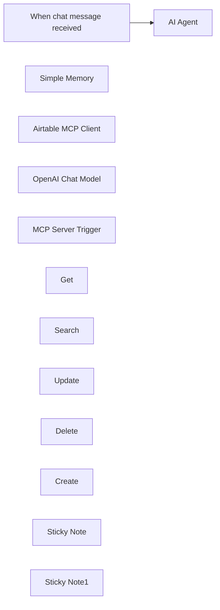

## Fluxo (.json) :

```json
{
  "id": "kS9EfgZeaK3QV6Mw",
  "meta": {
    "instanceId": "9219ebc7795bea866f70aa3d977d54417fdf06c41944be95e20cfb60f992db19",
    "templateCredsSetupCompleted": true
  },
  "name": "Build an MCP server with Airtable",
  "tags": [],
  "nodes": [
    {
      "id": "357649f0-43c5-4d6c-97b9-079fa3b5c1f3",
      "name": "When chat message received",
      "type": "@n8n/n8n-nodes-langchain.chatTrigger",
      "position": [
        -100,
        -80
      ],
      "webhookId": "c42d1e2e-b175-48cf-bfd4-aa8289266a20",
      "parameters": {
        "options": {}
      },
      "typeVersion": 1.1
    },
    {
      "id": "ddf28f88-d76c-4ab6-82c4-c1ab1b746009",
      "name": "AI Agent",
      "type": "@n8n/n8n-nodes-langchain.agent",
      "position": [
        152,
        -180
      ],
      "parameters": {
        "options": {}
      },
      "typeVersion": 1.9
    },
    {
      "id": "3170d4fd-700c-4449-a800-0395c06711aa",
      "name": "Simple Memory",
      "type": "@n8n/n8n-nodes-langchain.memoryBufferWindow",
      "position": [
        260,
        40
      ],
      "parameters": {},
      "typeVersion": 1.3
    },
    {
      "id": "557b0e0a-133b-4e80-afba-408803ed9898",
      "name": "Airtable MCP Client",
      "type": "@n8n/n8n-nodes-langchain.mcpClientTool",
      "position": [
        600,
        100
      ],
      "parameters": {
        "sseEndpoint": "https://your-sse-endpoint-url"
      },
      "typeVersion": 1
    },
    {
      "id": "a0bc9aa3-decb-42f1-bee4-b9e425db81e8",
      "name": "OpenAI Chat Model",
      "type": "@n8n/n8n-nodes-langchain.lmChatOpenAi",
      "position": [
        80,
        40
      ],
      "parameters": {
        "model": {
          "__rl": true,
          "mode": "list",
          "value": "gpt-4o",
          "cachedResultName": "gpt-4o"
        },
        "options": {}
      },
      "credentials": {
        "openAiApi": {
          "id": "vupAk5StuhOafQcb",
          "name": "OpenAi account"
        }
      },
      "typeVersion": 1.2
    },
    {
      "id": "7737e491-ddd4-4e4f-a34d-73f518497990",
      "name": "MCP Server Trigger",
      "type": "@n8n/n8n-nodes-langchain.mcpTrigger",
      "position": [
        140,
        240
      ],
      "webhookId": "a93f35fb-3a86-4475-9ebd-1434aef8e433",
      "parameters": {
        "path": "insert-your-cool-path-here"
      },
      "typeVersion": 1
    },
    {
      "id": "0ce9e128-be31-41d8-ae06-894316781358",
      "name": "Get",
      "type": "n8n-nodes-base.airtableTool",
      "position": [
        0,
        460
      ],
      "parameters": {
        "id": "={{ /*n8n-auto-generated-fromAI-override*/ $fromAI('Record_ID', ``, 'string') }}",
        "base": {
          "__rl": true,
          "mode": "list",
          "value": "appltMFy409fOqCVt",
          "cachedResultUrl": "https://airtable.com/appltMFy409fOqCVt",
          "cachedResultName": "AI news and social posts"
        },
        "table": {
          "__rl": true,
          "mode": "list",
          "value": "tblZwA0JCNPeORaGi",
          "cachedResultUrl": "https://airtable.com/appltMFy409fOqCVt/tblZwA0JCNPeORaGi",
          "cachedResultName": "Social Posts"
        },
        "options": {}
      },
      "credentials": {
        "airtableTokenApi": {
          "id": "4hNTBxRPe8ft4Iic",
          "name": "Airtable Personal Access Token account"
        }
      },
      "typeVersion": 2.1
    },
    {
      "id": "1f9c6a61-9357-4fa1-81e0-42719284d291",
      "name": "Search",
      "type": "n8n-nodes-base.airtableTool",
      "position": [
        140,
        460
      ],
      "parameters": {
        "base": {
          "__rl": true,
          "mode": "list",
          "value": "appltMFy409fOqCVt",
          "cachedResultUrl": "https://airtable.com/appltMFy409fOqCVt",
          "cachedResultName": "AI news and social posts"
        },
        "table": {
          "__rl": true,
          "mode": "list",
          "value": "tblZwA0JCNPeORaGi",
          "cachedResultUrl": "https://airtable.com/appltMFy409fOqCVt/tblZwA0JCNPeORaGi",
          "cachedResultName": "Social Posts"
        },
        "options": {},
        "operation": "search",
        "returnAll": "={{ /*n8n-auto-generated-fromAI-override*/ $fromAI('Return_All', ``, 'boolean') }}",
        "filterByFormula": "={{ /*n8n-auto-generated-fromAI-override*/ $fromAI('Filter_By_Formula', ``, 'string') }}"
      },
      "credentials": {
        "airtableTokenApi": {
          "id": "4hNTBxRPe8ft4Iic",
          "name": "Airtable Personal Access Token account"
        }
      },
      "typeVersion": 2.1
    },
    {
      "id": "061a0eb9-26de-47f1-b444-5dd98c984d70",
      "name": "Update",
      "type": "n8n-nodes-base.airtableTool",
      "position": [
        260,
        460
      ],
      "parameters": {
        "base": {
          "__rl": true,
          "mode": "list",
          "value": "appltMFy409fOqCVt",
          "cachedResultUrl": "https://airtable.com/appltMFy409fOqCVt",
          "cachedResultName": "AI news and social posts"
        },
        "table": {
          "__rl": true,
          "mode": "list",
          "value": "tblZwA0JCNPeORaGi",
          "cachedResultUrl": "https://airtable.com/appltMFy409fOqCVt/tblZwA0JCNPeORaGi",
          "cachedResultName": "Social Posts"
        },
        "columns": {
          "value": {},
          "schema": [
            {
              "id": "id",
              "type": "string",
              "display": true,
              "removed": false,
              "readOnly": true,
              "required": false,
              "displayName": "id",
              "defaultMatch": true
            },
            {
              "id": "sourceHeadline",
              "type": "string",
              "display": true,
              "removed": false,
              "readOnly": false,
              "required": false,
              "displayName": "sourceHeadline",
              "defaultMatch": false,
              "canBeUsedToMatch": true
            },
            {
              "id": "sourceSummary",
              "type": "string",
              "display": true,
              "removed": false,
              "readOnly": false,
              "required": false,
              "displayName": "sourceSummary",
              "defaultMatch": false,
              "canBeUsedToMatch": true
            },
            {
              "id": "goToArticle",
              "type": "string",
              "display": true,
              "removed": true,
              "readOnly": true,
              "required": false,
              "displayName": "goToArticle",
              "defaultMatch": false,
              "canBeUsedToMatch": true
            },
            {
              "id": "sourceURL",
              "type": "string",
              "display": true,
              "removed": false,
              "readOnly": false,
              "required": false,
              "displayName": "sourceURL",
              "defaultMatch": false,
              "canBeUsedToMatch": true
            },
            {
              "id": "socialChannels",
              "type": "array",
              "display": true,
              "options": [
                {
                  "name": "Twitter",
                  "value": "Twitter"
                },
                {
                  "name": "LinkedIn",
                  "value": "LinkedIn"
                },
                {
                  "name": "Blog",
                  "value": "Blog"
                },
                {
                  "name": "Instagram",
                  "value": "Instagram"
                },
                {
                  "name": "Facebook",
                  "value": "Facebook"
                }
              ],
              "removed": false,
              "readOnly": false,
              "required": false,
              "displayName": "socialChannels",
              "defaultMatch": false,
              "canBeUsedToMatch": true
            },
            {
              "id": "needsImage?",
              "type": "options",
              "display": true,
              "options": [
                {
                  "name": "Yes",
                  "value": "Yes"
                },
                {
                  "name": "No",
                  "value": "No"
                }
              ],
              "removed": false,
              "readOnly": false,
              "required": false,
              "displayName": "needsImage?",
              "defaultMatch": false,
              "canBeUsedToMatch": true
            },
            {
              "id": "twitterCopy",
              "type": "string",
              "display": true,
              "removed": false,
              "readOnly": false,
              "required": false,
              "displayName": "twitterCopy",
              "defaultMatch": false,
              "canBeUsedToMatch": true
            },
            {
              "id": "linkedinCopy",
              "type": "string",
              "display": true,
              "removed": false,
              "readOnly": false,
              "required": false,
              "displayName": "linkedinCopy",
              "defaultMatch": false,
              "canBeUsedToMatch": true
            },
            {
              "id": "instagramCopy",
              "type": "string",
              "display": true,
              "removed": false,
              "readOnly": false,
              "required": false,
              "displayName": "instagramCopy",
              "defaultMatch": false,
              "canBeUsedToMatch": true
            },
            {
              "id": "facebookCopy",
              "type": "string",
              "display": true,
              "removed": false,
              "readOnly": false,
              "required": false,
              "displayName": "facebookCopy",
              "defaultMatch": false,
              "canBeUsedToMatch": true
            },
            {
              "id": "blogCopy",
              "type": "string",
              "display": true,
              "removed": false,
              "readOnly": false,
              "required": false,
              "displayName": "blogCopy",
              "defaultMatch": false,
              "canBeUsedToMatch": true
            },
            {
              "id": "imagePrompt",
              "type": "string",
              "display": true,
              "removed": false,
              "readOnly": false,
              "required": false,
              "displayName": "imagePrompt",
              "defaultMatch": false,
              "canBeUsedToMatch": true
            },
            {
              "id": "postImage",
              "type": "array",
              "display": true,
              "removed": false,
              "readOnly": false,
              "required": false,
              "displayName": "postImage",
              "defaultMatch": false,
              "canBeUsedToMatch": true
            },
            {
              "id": "Status",
              "type": "options",
              "display": true,
              "options": [
                {
                  "name": "Waiting for Content",
                  "value": "Waiting for Content"
                },
                {
                  "name": "Needs Approval",
                  "value": "Needs Approval"
                },
                {
                  "name": "Approved",
                  "value": "Approved"
                },
                {
                  "name": "Posted",
                  "value": "Posted"
                }
              ],
              "removed": false,
              "readOnly": false,
              "required": false,
              "displayName": "Status",
              "defaultMatch": false,
              "canBeUsedToMatch": true
            },
            {
              "id": "datePosted",
              "type": "string",
              "display": true,
              "removed": false,
              "readOnly": false,
              "required": false,
              "displayName": "datePosted",
              "defaultMatch": false,
              "canBeUsedToMatch": true
            },
            {
              "id": "ID",
              "type": "string",
              "display": true,
              "removed": true,
              "readOnly": true,
              "required": false,
              "displayName": "ID",
              "defaultMatch": false,
              "canBeUsedToMatch": true
            }
          ],
          "mappingMode": "autoMapInputData",
          "matchingColumns": [
            "id"
          ],
          "attemptToConvertTypes": false,
          "convertFieldsToString": false
        },
        "options": {},
        "operation": "update"
      },
      "credentials": {
        "airtableTokenApi": {
          "id": "4hNTBxRPe8ft4Iic",
          "name": "Airtable Personal Access Token account"
        }
      },
      "typeVersion": 2.1
    },
    {
      "id": "b0e17724-5a56-4b71-997d-f9f44d16e5bc",
      "name": "Delete",
      "type": "n8n-nodes-base.airtableTool",
      "position": [
        400,
        460
      ],
      "parameters": {
        "id": "={{ /*n8n-auto-generated-fromAI-override*/ $fromAI('Record_ID', ``, 'string') }}",
        "base": {
          "__rl": true,
          "mode": "list",
          "value": "appltMFy409fOqCVt",
          "cachedResultUrl": "https://airtable.com/appltMFy409fOqCVt",
          "cachedResultName": "AI news and social posts"
        },
        "table": {
          "__rl": true,
          "mode": "list",
          "value": "tblZwA0JCNPeORaGi",
          "cachedResultUrl": "https://airtable.com/appltMFy409fOqCVt/tblZwA0JCNPeORaGi",
          "cachedResultName": "Social Posts"
        },
        "operation": "deleteRecord"
      },
      "credentials": {
        "airtableTokenApi": {
          "id": "4hNTBxRPe8ft4Iic",
          "name": "Airtable Personal Access Token account"
        }
      },
      "typeVersion": 2.1
    },
    {
      "id": "2d0273b6-520b-45b7-8192-a83b10661028",
      "name": "Create",
      "type": "n8n-nodes-base.airtableTool",
      "position": [
        520,
        460
      ],
      "parameters": {
        "base": {
          "__rl": true,
          "mode": "list",
          "value": "appltMFy409fOqCVt",
          "cachedResultUrl": "https://airtable.com/appltMFy409fOqCVt",
          "cachedResultName": "AI news and social posts"
        },
        "table": {
          "__rl": true,
          "mode": "list",
          "value": "tblZwA0JCNPeORaGi",
          "cachedResultUrl": "https://airtable.com/appltMFy409fOqCVt/tblZwA0JCNPeORaGi",
          "cachedResultName": "Social Posts"
        },
        "columns": {
          "value": {},
          "schema": [
            {
              "id": "sourceHeadline",
              "type": "string",
              "display": true,
              "removed": false,
              "readOnly": false,
              "required": false,
              "displayName": "sourceHeadline",
              "defaultMatch": false,
              "canBeUsedToMatch": true
            },
            {
              "id": "sourceSummary",
              "type": "string",
              "display": true,
              "removed": false,
              "readOnly": false,
              "required": false,
              "displayName": "sourceSummary",
              "defaultMatch": false,
              "canBeUsedToMatch": true
            },
            {
              "id": "goToArticle",
              "type": "string",
              "display": true,
              "removed": true,
              "readOnly": true,
              "required": false,
              "displayName": "goToArticle",
              "defaultMatch": false,
              "canBeUsedToMatch": true
            },
            {
              "id": "sourceURL",
              "type": "string",
              "display": true,
              "removed": false,
              "readOnly": false,
              "required": false,
              "displayName": "sourceURL",
              "defaultMatch": false,
              "canBeUsedToMatch": true
            },
            {
              "id": "socialChannels",
              "type": "array",
              "display": true,
              "options": [
                {
                  "name": "Twitter",
                  "value": "Twitter"
                },
                {
                  "name": "LinkedIn",
                  "value": "LinkedIn"
                },
                {
                  "name": "Blog",
                  "value": "Blog"
                },
                {
                  "name": "Instagram",
                  "value": "Instagram"
                },
                {
                  "name": "Facebook",
                  "value": "Facebook"
                }
              ],
              "removed": false,
              "readOnly": false,
              "required": false,
              "displayName": "socialChannels",
              "defaultMatch": false,
              "canBeUsedToMatch": true
            },
            {
              "id": "needsImage?",
              "type": "options",
              "display": true,
              "options": [
                {
                  "name": "Yes",
                  "value": "Yes"
                },
                {
                  "name": "No",
                  "value": "No"
                }
              ],
              "removed": false,
              "readOnly": false,
              "required": false,
              "displayName": "needsImage?",
              "defaultMatch": false,
              "canBeUsedToMatch": true
            },
            {
              "id": "twitterCopy",
              "type": "string",
              "display": true,
              "removed": false,
              "readOnly": false,
              "required": false,
              "displayName": "twitterCopy",
              "defaultMatch": false,
              "canBeUsedToMatch": true
            },
            {
              "id": "linkedinCopy",
              "type": "string",
              "display": true,
              "removed": false,
              "readOnly": false,
              "required": false,
              "displayName": "linkedinCopy",
              "defaultMatch": false,
              "canBeUsedToMatch": true
            },
            {
              "id": "instagramCopy",
              "type": "string",
              "display": true,
              "removed": false,
              "readOnly": false,
              "required": false,
              "displayName": "instagramCopy",
              "defaultMatch": false,
              "canBeUsedToMatch": true
            },
            {
              "id": "facebookCopy",
              "type": "string",
              "display": true,
              "removed": false,
              "readOnly": false,
              "required": false,
              "displayName": "facebookCopy",
              "defaultMatch": false,
              "canBeUsedToMatch": true
            },
            {
              "id": "blogCopy",
              "type": "string",
              "display": true,
              "removed": false,
              "readOnly": false,
              "required": false,
              "displayName": "blogCopy",
              "defaultMatch": false,
              "canBeUsedToMatch": true
            },
            {
              "id": "imagePrompt",
              "type": "string",
              "display": true,
              "removed": false,
              "readOnly": false,
              "required": false,
              "displayName": "imagePrompt",
              "defaultMatch": false,
              "canBeUsedToMatch": true
            },
            {
              "id": "postImage",
              "type": "array",
              "display": true,
              "removed": false,
              "readOnly": false,
              "required": false,
              "displayName": "postImage",
              "defaultMatch": false,
              "canBeUsedToMatch": true
            },
            {
              "id": "Status",
              "type": "options",
              "display": true,
              "options": [
                {
                  "name": "Waiting for Content",
                  "value": "Waiting for Content"
                },
                {
                  "name": "Needs Approval",
                  "value": "Needs Approval"
                },
                {
                  "name": "Approved",
                  "value": "Approved"
                },
                {
                  "name": "Posted",
                  "value": "Posted"
                }
              ],
              "removed": false,
              "readOnly": false,
              "required": false,
              "displayName": "Status",
              "defaultMatch": false,
              "canBeUsedToMatch": true
            },
            {
              "id": "datePosted",
              "type": "string",
              "display": true,
              "removed": false,
              "readOnly": false,
              "required": false,
              "displayName": "datePosted",
              "defaultMatch": false,
              "canBeUsedToMatch": true
            },
            {
              "id": "ID",
              "type": "string",
              "display": true,
              "removed": true,
              "readOnly": true,
              "required": false,
              "displayName": "ID",
              "defaultMatch": false,
              "canBeUsedToMatch": true
            }
          ],
          "mappingMode": "autoMapInputData",
          "matchingColumns": [],
          "attemptToConvertTypes": false,
          "convertFieldsToString": false
        },
        "options": {},
        "operation": "create"
      },
      "credentials": {
        "airtableTokenApi": {
          "id": "4hNTBxRPe8ft4Iic",
          "name": "Airtable Personal Access Token account"
        }
      },
      "typeVersion": 2.1
    },
    {
      "id": "69e906cf-82da-45c4-bacc-00970902d1f5",
      "name": "Sticky Note",
      "type": "n8n-nodes-base.stickyNote",
      "position": [
        480,
        -60
      ],
      "parameters": {
        "width": 360,
        "height": 280,
        "content": "## Update SSE endpoint "
      },
      "typeVersion": 1
    },
    {
      "id": "819d82c9-da54-48c6-a007-2e8750cfb3e2",
      "name": "Sticky Note1",
      "type": "n8n-nodes-base.stickyNote",
      "position": [
        -520,
        -220
      ],
      "parameters": {
        "width": 380,
        "height": 540,
        "content": "## Talk to your Airtable database \nPoint to your SSE endpoint, update your credentials and talk to your Airtable to:\n\n- Get records\n- Search records\n- Update records\n- Delete records\n- Create records\n\nand more!\n\nThis example showcases basic yet powerful functionality for a table.\n\nFeel free to combine it with other tools, connect a Slack channel as trigger node or another as output to receive the updates for the stakeholders and project owners.\n\nEnjoy!\n\nAitor\n[1 Node](https://1node.ai)"
      },
      "typeVersion": 1
    }
  ],
  "active": false,
  "pinData": {},
  "settings": {
    "executionOrder": "v1"
  },
  "versionId": "2355fe0d-0515-4d1b-8a02-42712191f466",
  "connections": {
    "Get": {
      "ai_tool": [
        [
          {
            "node": "MCP Server Trigger",
            "type": "ai_tool",
            "index": 0
          }
        ]
      ]
    },
    "Create": {
      "ai_tool": [
        [
          {
            "node": "MCP Server Trigger",
            "type": "ai_tool",
            "index": 0
          }
        ]
      ]
    },
    "Delete": {
      "ai_tool": [
        [
          {
            "node": "MCP Server Trigger",
            "type": "ai_tool",
            "index": 0
          }
        ]
      ]
    },
    "Search": {
      "ai_tool": [
        [
          {
            "node": "MCP Server Trigger",
            "type": "ai_tool",
            "index": 0
          }
        ]
      ]
    },
    "Update": {
      "ai_tool": [
        [
          {
            "node": "MCP Server Trigger",
            "type": "ai_tool",
            "index": 0
          }
        ]
      ]
    },
    "AI Agent": {
      "main": [
        []
      ]
    },
    "Simple Memory": {
      "ai_memory": [
        [
          {
            "node": "AI Agent",
            "type": "ai_memory",
            "index": 0
          }
        ]
      ]
    },
    "OpenAI Chat Model": {
      "ai_languageModel": [
        [
          {
            "node": "AI Agent",
            "type": "ai_languageModel",
            "index": 0
          }
        ]
      ]
    },
    "Airtable MCP Client": {
      "ai_tool": [
        [
          {
            "node": "AI Agent",
            "type": "ai_tool",
            "index": 0
          }
        ]
      ]
    },
    "When chat message received": {
      "main": [
        [
          {
            "node": "AI Agent",
            "type": "main",
            "index": 0
          }
        ]
      ]
    }
  }
}
```

<a id="template-1876"></a>

## Template 1876 - Agente de transcrição e insights em tempo real

- **Nome:** Agente de transcrição e insights em tempo real
- **Descrição:** Fluxo que cria um bot para transcrever reuniões em tempo real, armazena as falas em um banco de dados e aciona um assistente AI para gerar notas ou ações quando palavras-chave são detectadas.
- **Funcionalidade:** • Criação do bot de transcrição: Envia solicitação para criar um bot que entra na reunião e ativa transcrição em tempo real com configuração de saída.
• Configuração de transcrição com provider: Define o provedor de transcrição (AssemblyAI) e o destino para envio dos fragments transcritos.
• Criação de thread no OpenAI: Instancia uma thread/assistente para gerenciar interações e gerar conteúdo com base nas transcrições.
• Registro inicial de metadados: Salva IDs do bot e da thread, além da URL da reunião, em um registro no banco de dados.
• Recebimento de fragments via webhook: Recebe eventos de transcrição contendo palavras, oradores e timestamps.
• Inserção/atualização de diálogo no banco: Agrega fragments ao array de diálogo, mantendo ordem, speaker, speaker_id e date_updated.
• Detecção de palavra-chave e acionamento: Verifica o texto recebido por palavras-chave (ex.: "Jimmy") e, se encontradas, dispara o assistente AI para responder ou tomar ação.
• Geração automática de notas com AI: Usa o assistente para criar texto de nota e salva essas notas no campo de output no banco de dados.
• Ordenação e filtragem de diálogos: Filtra e ordena entradas de diálogo por data/ordem antes de enviar ao assistente para contexto coerente.
- **Ferramentas:** • Recall.ai: Plataforma para criar e gerenciar bots que entram em reuniões e enviam transcrições em tempo real.
• AssemblyAI: Serviço de transcrição de áudio usado como provedor para gerar texto dos áudios das reuniões.
• OpenAI: Assistente/threads para processar contexto das transcrições, gerar notas e respostas automatizadas.
• Supabase / Postgres: Banco de dados para armazenar registros de input/output, diálogos e notas geradas.

## Fluxo visual

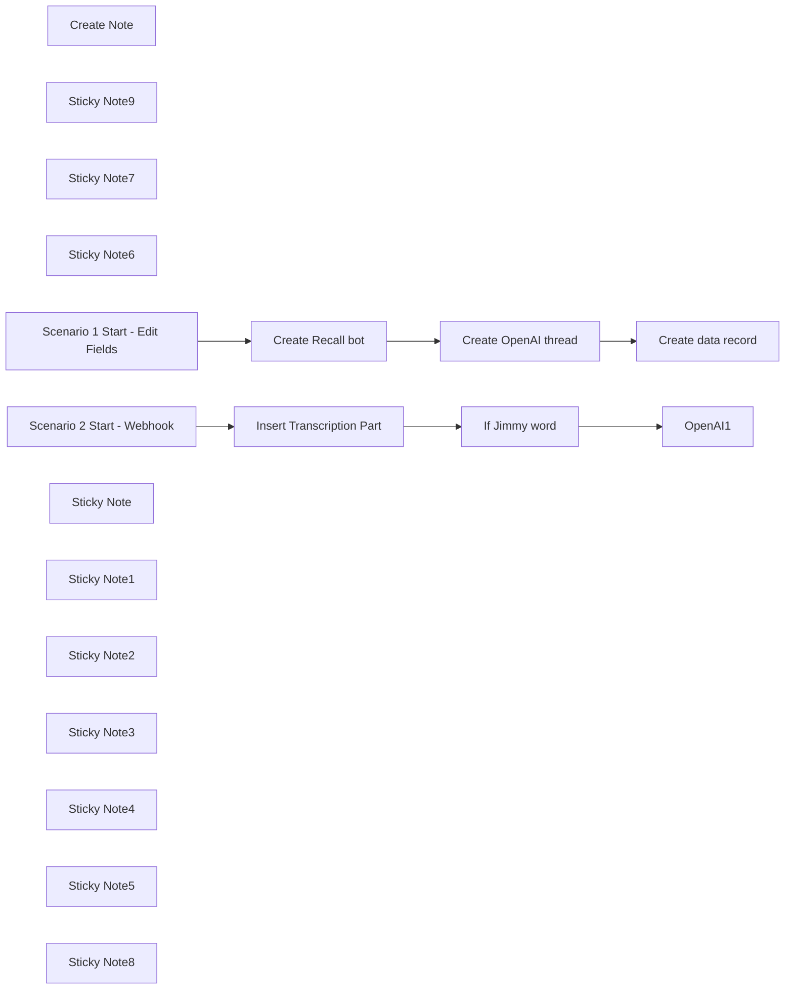

## Fluxo (.json) :

```json
{
  "nodes": [
    {
      "id": "d44489b8-8cb7-4776-8c16-a8bb01e52171",
      "name": "OpenAI1",
      "type": "@n8n/n8n-nodes-langchain.openAi",
      "position": [
        300,
        -300
      ],
      "parameters": {
        "text": "={{ \n     JSON.parse($('Insert Transcription Part').item.json.dialog)\n        .filter(item => item.date_updated && new Date(item.date_updated) >= new Date($('Insert Transcription Part').item.json.date_updated))\n        .sort((a, b) => a.order - b.order)\n        .map(item => `${item.words}\\n${item.speaker}`)\n        .join('\\n\\n')\n}}",
        "memory": "threadId",
        "prompt": "define",
        "options": {},
        "resource": "assistant",
        "threadId": "={{ $json.thread_id }}",
        "assistantId": {
          "__rl": true,
          "mode": "list",
          "value": "asst_D5t6bNnNpenmfC7PmvywMqyR",
          "cachedResultName": "5minAI - Realtime Agent"
        }
      },
      "credentials": {
        "openAiApi": {
          "id": "SphXAX7rlwRLkiox",
          "name": "Test club key"
        }
      },
      "typeVersion": 1.6
    },
    {
      "id": "3425f1c1-ad68-495e-bb9a-95ea92e7cf23",
      "name": "Insert Transcription Part",
      "type": "n8n-nodes-base.postgres",
      "position": [
        -120,
        -300
      ],
      "parameters": {
        "query": "UPDATE public.data\nSET output = jsonb_set(\n    output,\n    '{dialog}', \n    (\n        COALESCE(\n            (output->'dialog')::jsonb, \n            '[]'::jsonb  -- Initialize as empty array if dialog does not exist\n        ) || jsonb_build_object(\n            'order', (COALESCE(jsonb_array_length(output->'dialog'), 0) + 1),  -- Calculate the next order\n            'words', '{{ $('Webhook2').item.json.body.data.transcript.words.map(word => word.text.replace(/'/g, \"''\")).join(\" \") }}',\n            'speaker', '{{ $('Webhook2').item.json.body.data.transcript.speaker }}',\n            'language', '{{ $('Webhook2').item.json.body.data.transcript.language }}',\n            'speaker_id', ('{{ $('Webhook2').item.json.body.data.transcript.speaker_id }}')::int,\n  'date_updated', to_jsonb('{{ $now }}'::text)\n        )\n    )\n)\nWHERE input->>'recall_bot_id' = $1\nReturning input->>'openai_thread_id' as thread_id;",
        "options": {
          "queryReplacement": "={{ $('Scenario 2 Start - Webhook').item.json.body.data.bot_id }}"
        },
        "operation": "executeQuery"
      },
      "credentials": {
        "postgres": {
          "id": "AO9cER6p8uX7V07T",
          "name": "Postgres 5minai"
        }
      },
      "typeVersion": 2.5
    },
    {
      "id": "9bcc0605-fc35-4842-a3f4-30ef902f35c1",
      "name": "Create Note",
      "type": "n8n-nodes-base.postgresTool",
      "position": [
        180,
        -120
      ],
      "parameters": {
        "query": "UPDATE public.data\nSET output = jsonb_set(\n    output,\n    '{notes}', \n    (\n        COALESCE(\n            (output->'notes')::jsonb, \n            '[]'::jsonb  -- Initialize as empty array if dialog does not exist\n        ) || jsonb_build_object(\n            'order', (COALESCE(jsonb_array_length(output->'notes'), 0) + 1),  -- Calculate the next order\n            'text', '{{ $fromAI(\"note\",\"Text of note.\") }}'\n        )\n    )\n)\nWHERE input->>'recall_bot_id' = $1",
        "options": {
          "queryReplacement": "={{ $('Scenario 2 Start - Webhook').item.json.body.data.bot_id }}"
        },
        "operation": "executeQuery",
        "descriptionType": "manual",
        "toolDescription": "Create note record."
      },
      "credentials": {
        "postgres": {
          "id": "AO9cER6p8uX7V07T",
          "name": "Postgres 5minai"
        }
      },
      "typeVersion": 2.5
    },
    {
      "id": "0831c139-ca4b-4b4c-aa7f-7495c4ca0110",
      "name": "Create Recall bot",
      "type": "n8n-nodes-base.httpRequest",
      "position": [
        -60,
        -980
      ],
      "parameters": {
        "url": "https://us-west-2.recall.ai/api/v1/bot",
        "method": "POST",
        "options": {},
        "jsonBody": "={\n  \"meeting_url\":\"{{ $json.meeting_url }}\",\n  \"transcription_options\": {\n    \"provider\": \"assembly_ai\"\n  }\n,\n\"real_time_transcription\": {\n    \"destination_url\": \"https://n8n.lowcoding.dev/webhook/d074ca1e-52f9-47af-8587-8c24d431f9cd\"\n  },\n\"automatic_leave\": {\n  \"silence_detection\": {\n    \"timeout\": 300, \n    \"activate_after\": 600\n  },\n  \"bot_detection\": {\n    \"using_participant_events\": {\n      \"timeout\": 600, \n      \"activate_after\": 1200\n    }\n  },\n  \"waiting_room_timeout\": 600,\n  \"noone_joined_timeout\": 600,\n  \"everyone_left_timeout\": 2,\n  \"in_call_not_recording_timeout\": 600,\n  \"recording_permission_denied_timeout\": 600\n}\n}",
        "sendBody": true,
        "specifyBody": "json",
        "authentication": "genericCredentialType",
        "genericAuthType": "httpHeaderAuth"
      },
      "credentials": {
        "httpHeaderAuth": {
          "id": "lfHu7Kn7L7SH3LAF",
          "name": "Recall"
        }
      },
      "typeVersion": 4.2
    },
    {
      "id": "e1122b5b-3af5-4836-802c-40c3a0eb3c93",
      "name": "Create OpenAI thread",
      "type": "n8n-nodes-base.httpRequest",
      "position": [
        140,
        -980
      ],
      "parameters": {
        "url": "https://api.openai.com/v1/threads",
        "method": "POST",
        "options": {},
        "sendHeaders": true,
        "authentication": "predefinedCredentialType",
        "headerParameters": {
          "parameters": [
            {
              "name": "OpenAI-Beta",
              "value": "assistants=v2"
            }
          ]
        },
        "nodeCredentialType": "openAiApi"
      },
      "credentials": {
        "openAiApi": {
          "id": "SphXAX7rlwRLkiox",
          "name": "Test club key"
        }
      },
      "typeVersion": 4.2
    },
    {
      "id": "784c123d-adbb-4265-9485-2c88dd3091c2",
      "name": "Create data record",
      "type": "n8n-nodes-base.supabase",
      "position": [
        320,
        -980
      ],
      "parameters": {
        "tableId": "data",
        "fieldsUi": {
          "fieldValues": [
            {
              "fieldId": "input",
              "fieldValue": "={{ {\"openai_thread_id\": $('Create OpenAI thread').item.json.id, \"recall_bot_id\": $('Create Recall bot').item.json.id, \"meeting_url\":$('Webhook').item.json.body.meeting_url } }}"
            },
            {
              "fieldId": "output",
              "fieldValue": "={{ {\"dialog\":[]} }}"
            }
          ]
        }
      },
      "credentials": {
        "supabaseApi": {
          "id": "iVKNf5qv3ZFhq0ZV",
          "name": "Supabase 5minAI"
        }
      },
      "typeVersion": 1
    },
    {
      "id": "f455c7de-1e64-4a28-9eef-11d19c982813",
      "name": "Sticky Note9",
      "type": "n8n-nodes-base.stickyNote",
      "position": [
        -900,
        -380
      ],
      "parameters": {
        "color": 7,
        "width": 330.5152611046425,
        "height": 239.5888196628349,
        "content": "### ... or watch set up video [10 min]\n[](https://www.youtube.com/watch?v=rtaX6BMiTeo)\n"
      },
      "typeVersion": 1
    },
    {
      "id": "ea90c110-18ad-4f4b-90ab-fcb88b92e709",
      "name": "Sticky Note7",
      "type": "n8n-nodes-base.stickyNote",
      "position": [
        -1200,
        -1060
      ],
      "parameters": {
        "color": 7,
        "width": 636,
        "height": 657,
        "content": "\n## AI Agent for realtime insights on meetings\n**Made by [Mark Shcherbakov](https://www.linkedin.com/in/marklowcoding/) from community [5minAI](https://www.skool.com/5minai)**\n\nTranscribing meetings manually can be tedious and prone to error. This workflow automates the transcription process in real-time, ensuring that key discussions and decisions are accurately captured and easily accessible for later review, thus enhancing productivity and clarity in communications.\n\nThe workflow employs an AI-powered assistant to join virtual meetings and capture discussions through real-time transcription. Key functionalities include:\n- Automatic joining of meetings on platforms like Zoom, Google Meet, and others with the ability to provide real-time transcription.\n- Integration with transcription APIs (e.g., AssemblyAI) to deliver seamless and accurate capture of dialogue.\n- Structuring and storing transcriptions efficiently in a database for easy retrieval and analysis.\n\n1. **Real-Time Transcription**: The assistant captures audio during meetings and transcribes it in real-time, allowing participants to focus on discussions.\n2. **Keyword Recognition**: Key phrases can trigger specific actions, such as noting important points or making prompts to the assistant.\n3. **Structured Data Management**: The assistant maintains a database of transcriptions linked to meeting details for organized storage and quick access later."
      },
      "typeVersion": 1
    },
    {
      "id": "378c19bb-0e4a-43d3-9ba5-2a77ebfb5b83",
      "name": "Sticky Note6",
      "type": "n8n-nodes-base.stickyNote",
      "position": [
        -1200,
        -380
      ],
      "parameters": {
        "color": 7,
        "width": 280,
        "height": 626,
        "content": "### Set up steps\n\n#### Preparation\n\n1. **Create Recall.ai API key**\n2. **Setup Supabase account and table**\n```\ncreate table\n  public.data (\n    id uuid not null default gen_random_uuid (),\n    date_created timestamp with time zone not null default (now() at time zone 'utc'::text),\n    input jsonb null,\n    output jsonb null,\n    constraint data_pkey primary key (id),\n  ) tablespace pg_default;\n\n```\n3. **Create OpenAI API key**\n\n#### Development\n\n1. **Bot Creation**: \n   - Use a node to create the bot that will join meetings. Provide the meeting URL and set transcription options within the API request.\n\n2. **Authentication**: \n   - Configure authentication settings via a Bearer token for interacting with your transcription service.\n\n3. **Webhook Setup**: \n   - Create a webhook to receive real-time transcription updates, ensuring timely data capture during meetings.\n\n4. **Join Meeting**: \n   - Set the bot to join the specified meeting and actively listen to capture conversations.\n\n5. **Transcription Handling**: \n   - Combine transcription fragments into cohesive sentences and manage dialog arrays for coherence.\n\n6. **Trigger Actions on Keywords**: \n   - Set up keyword recognition that can initiate requests to the OpenAI API for additional interactions based on captured dialogue.\n\n7. **Output and Summary Generation**: \n   - Produce insights and summary notes from the transcriptions that can be stored back into the database for future reference."
      },
      "typeVersion": 1
    },
    {
      "id": "9a4ff741-ccfd-42e9-883e-43297a73e2c3",
      "name": "Scenario 1 Start - Edit Fields",
      "type": "n8n-nodes-base.set",
      "position": [
        -260,
        -980
      ],
      "parameters": {
        "options": {},
        "assignments": {
          "assignments": [
            {
              "id": "4891fa6e-2dd5-4433-925c-5497ec82e8ab",
              "name": "meeting_url",
              "type": "string",
              "value": "https://meet.google.com/iix-vrav-kuc"
            }
          ]
        }
      },
      "typeVersion": 3.4
    },
    {
      "id": "a4368763-b96e-45e7-884d-aa0cbae2d276",
      "name": "Scenario 2 Start - Webhook",
      "type": "n8n-nodes-base.webhook",
      "position": [
        -320,
        -300
      ],
      "webhookId": "7f176935-cb83-4147-ac14-48c8d747863a",
      "parameters": {
        "path": "d074ca1e-52f9-47af-8587-8c24d431f9cd",
        "options": {},
        "httpMethod": "POST"
      },
      "typeVersion": 2
    },
    {
      "id": "107b26af-d1d2-40c7-ad4f-7193d3ae9b70",
      "name": "If Jimmy word",
      "type": "n8n-nodes-base.if",
      "position": [
        80,
        -300
      ],
      "parameters": {
        "options": {},
        "conditions": {
          "options": {
            "version": 2,
            "leftValue": "",
            "caseSensitive": true,
            "typeValidation": "strict"
          },
          "combinator": "and",
          "conditions": [
            {
              "id": "ba6c2ae5-d0f4-4242-9cf8-97cb84335a93",
              "operator": {
                "type": "string",
                "operation": "contains"
              },
              "leftValue": "={{ $('Scenario 2 Start - Webhook').item.json.body.data.transcript.words.map(word => word.text.replace(/'/g, \"''\")).join(\" \") }}",
              "rightValue": "=Jimmy"
            }
          ]
        }
      },
      "typeVersion": 2.2
    },
    {
      "id": "49cf34f6-86cf-42cc-9da4-3efb37e6f565",
      "name": "Sticky Note",
      "type": "n8n-nodes-base.stickyNote",
      "position": [
        -380,
        -1040
      ],
      "parameters": {
        "width": 920,
        "height": 400,
        "content": "## Scenario 1\n\n"
      },
      "typeVersion": 1
    },
    {
      "id": "34660f39-6ecc-4f2d-98e8-a2c529255e98",
      "name": "Sticky Note1",
      "type": "n8n-nodes-base.stickyNote",
      "position": [
        -380,
        -360
      ],
      "parameters": {
        "width": 1020,
        "height": 420,
        "content": "## Scenario 2\n\n"
      },
      "typeVersion": 1
    },
    {
      "id": "5027e72d-2b2c-40b4-921e-c4f40d85f251",
      "name": "Sticky Note2",
      "type": "n8n-nodes-base.stickyNote",
      "position": [
        -200,
        -120
      ],
      "parameters": {
        "color": 3,
        "width": 270,
        "height": 80,
        "content": "### Replace Supabase credentials"
      },
      "typeVersion": 1
    },
    {
      "id": "dddea341-da40-4b6a-ae25-a8417e869cc9",
      "name": "Sticky Note3",
      "type": "n8n-nodes-base.stickyNote",
      "position": [
        -100,
        -780
      ],
      "parameters": {
        "color": 3,
        "width": 200,
        "height": 80,
        "content": "### Replace server location\n\n"
      },
      "typeVersion": 1
    },
    {
      "id": "e8e76c2a-f949-400e-92b2-39da8034b471",
      "name": "Sticky Note4",
      "type": "n8n-nodes-base.stickyNote",
      "position": [
        340,
        -100
      ],
      "parameters": {
        "color": 4,
        "width": 270,
        "height": 80,
        "content": "### Replace OpenAI credentials"
      },
      "typeVersion": 1
    },
    {
      "id": "729a5f6e-5aea-4908-9a82-2a7d7bea1322",
      "name": "Sticky Note5",
      "type": "n8n-nodes-base.stickyNote",
      "position": [
        140,
        -780
      ],
      "parameters": {
        "color": 3,
        "width": 290,
        "height": 80,
        "content": "### Replace credentials"
      },
      "typeVersion": 1
    },
    {
      "id": "31178e90-62ce-4bf8-8381-dc8138088889",
      "name": "Sticky Note8",
      "type": "n8n-nodes-base.stickyNote",
      "position": [
        -320,
        -780
      ],
      "parameters": {
        "color": 3,
        "width": 200,
        "height": 80,
        "content": "### Replace meeting url\n\n"
      },
      "typeVersion": 1
    }
  ],
  "pinData": {
    "Create Recall bot": [
      {
        "id": "ab35fa56-e42b-47c6-b716-eac8d12af601",
        "join_at": null,
        "metadata": {},
        "recording": null,
        "video_url": null,
        "recordings": [],
        "meeting_url": {
          "platform": "google_meet",
          "meeting_id": "zst-ymag-zoa"
        },
        "status_changes": [
          {
            "code": "ready",
            "message": null,
            "sub_code": null,
            "created_at": "2024-11-01T11:29:32.364684Z"
          }
        ],
        "meeting_metadata": null,
        "calendar_meetings": [],
        "meeting_participants": []
      }
    ],
    "Insert Transcription Part": [
      {
        "dialog": "[{\"order\": 1, \"words\": \"Wait.\", \"speaker\": \"Mark S.\", \"language\": null, \"speaker_id\": 100}, {\"order\": 2, \"words\": \"A bit.\", \"speaker\": \"Mark S.\", \"language\": null, \"speaker_id\": 100}, {\"order\": 3, \"words\": \"It's not even subtitles and it's not even a real. It's. A Google Meet.\", \"speaker\": \"Mark S.\", \"language\": null, \"speaker_id\": 100}, {\"order\": 4, \"words\": \"Same story. I wasn't prepared. I don't know what to tell you. Maybe my AI body can help me.\", \"speaker\": \"Mark S.\", \"language\": null, \"speaker_id\": 100}, {\"order\": 5, \"words\": \"What truth?\", \"speaker\": \"Mark S.\", \"language\": null, \"speaker_id\": 100}, {\"order\": 6, \"words\": \"You can get the same AI body in one day. Just drop AI in comment and I will. Send you a guide.\", \"speaker\": \"Mark S.\", \"language\": null, \"speaker_id\": 100}, {\"order\": 7, \"words\": \"As it works well.\", \"speaker\": \"Mark S.\", \"language\": \"null\", \"speaker_id\": 100}, {\"order\": 8, \"words\": \"As it works well.\", \"speaker\": \"Mark S.\", \"language\": \"null\", \"speaker_id\": 100}, {\"order\": 9, \"words\": \"As it works well.\", \"speaker\": \"Mark S.\", \"language\": \"null\", \"speaker_id\": 100}, {\"order\": 10, \"words\": \"Let's it works well.\", \"speaker\": \"Mark S.\", \"language\": \"null\", \"speaker_id\": 100}, {\"order\": 11, \"words\": \"Let's it works well.\", \"speaker\": \"Mark S.\", \"language\": \"null\", \"speaker_id\": 100}, {\"order\": 12, \"words\": \"Let's it works well.\", \"speaker\": \"Mark S.\", \"language\": \"null\", \"speaker_id\": 100, \"date_updated\": \"2024-11-22T08:41:24.164+01:00\"}, {\"order\": 13, \"words\": \"Let's it works well.\", \"speaker\": \"Mark S.\", \"language\": \"null\", \"speaker_id\": 100, \"date_updated\": \"2024-11-22T08:50:11.330+01:00\"}]",
        "thread_id": "thread_0g7p3iE7MYmDPiUuPiZP5vfR",
        "date_updated": "2024-11-22T08:37:55.751+01:00"
      }
    ],
    "Scenario 2 Start - Webhook": [
      {
        "body": {
          "data": {
            "bot_id": "0032c6e2-78e9-46e7-a2ef-41d7b853ef48",
            "transcript": {
              "words": [
                {
                  "text": "Let's",
                  "end_time": 11.88,
                  "start_time": 11.68
                },
                {
                  "text": "it",
                  "end_time": 12.12,
                  "start_time": 11.88
                },
                {
                  "text": "works",
                  "end_time": 12.44,
                  "start_time": 12.12
                },
                {
                  "text": "well.",
                  "end_time": 12.48,
                  "start_time": 12.44
                }
              ],
              "source": "smart_annotator",
              "speaker": "Mark S.",
              "is_final": true,
              "language": null,
              "speaker_id": 100,
              "original_transcript_id": 32
            },
            "recording_id": "ee1ad589-39fe-4ed5-b96f-cd14c63f3bc2"
          },
          "event": "bot.transcription"
        },
        "query": {},
        "params": {},
        "headers": {
          "host": "n8n.lowcoding.dev",
          "accept": "*/*",
          "content-type": "application/json",
          "content-length": "495",
          "accept-encoding": "gzip",
          "x-forwarded-for": "52.10.191.34",
          "x-forwarded-host": "n8n.lowcoding.dev",
          "x-forwarded-proto": "https"
        },
        "webhookUrl": "https://n8n.lowcoding.dev/webhook/d074ca1e-52f9-47af-8587-8c24d431f9cd",
        "executionMode": "production"
      }
    ]
  },
  "connections": {
    "OpenAI1": {
      "main": [
        []
      ]
    },
    "Create Note": {
      "ai_tool": [
        [
          {
            "node": "OpenAI1",
            "type": "ai_tool",
            "index": 0
          }
        ]
      ]
    },
    "If Jimmy word": {
      "main": [
        [
          {
            "node": "OpenAI1",
            "type": "main",
            "index": 0
          }
        ]
      ]
    },
    "Create Recall bot": {
      "main": [
        [
          {
            "node": "Create OpenAI thread",
            "type": "main",
            "index": 0
          }
        ],
        []
      ]
    },
    "Create data record": {
      "main": [
        []
      ]
    },
    "Create OpenAI thread": {
      "main": [
        [
          {
            "node": "Create data record",
            "type": "main",
            "index": 0
          }
        ]
      ]
    },
    "Insert Transcription Part": {
      "main": [
        [
          {
            "node": "If Jimmy word",
            "type": "main",
            "index": 0
          }
        ]
      ]
    },
    "Scenario 2 Start - Webhook": {
      "main": [
        [
          {
            "node": "Insert Transcription Part",
            "type": "main",
            "index": 0
          }
        ]
      ]
    },
    "Scenario 1 Start - Edit Fields": {
      "main": [
        [
          {
            "node": "Create Recall bot",
            "type": "main",
            "index": 0
          }
        ]
      ]
    }
  }
}
```

<a id="template-1877"></a>

## Template 1877 - Pipeline ETL de Tweets com análise de sentimento

- **Nome:** Pipeline ETL de Tweets com análise de sentimento
- **Descrição:** Coleta tweets com a hashtag #OnThisDay, armazena os dados, executa análise de sentimento e envia notificações quando o sentimento excede um limiar.
- **Funcionalidade:** • Agendamento periódico: Executa o processo diariamente às 06:00.
• Busca de tweets: Pesquisa até 3 tweets contendo a hashtag #OnThisDay.
• Armazenamento inicial: Insere o texto dos tweets em uma coleção MongoDB para persistência bruta.
• Análise de sentimento: Envia o texto armazenado para um serviço de linguagem para extrair score e magnitude do sentimento.
• Preparação de dados: Mapeia e formata o score, magnitude e texto para uso posterior.
• Armazenamento final: Insere os registros enriquecidos (texto, score, magnitude) em uma tabela PostgreSQL e retorna os campos inseridos.
• Avaliação condicional: Verifica se o score do sentimento excede um limiar para decidir ações subsequentes.
• Notificação: Quando a condição é satisfeita, publica uma mensagem em um canal Slack com o texto do tweet e os valores de sentimento.
- **Ferramentas:** • Twitter: Plataforma para pesquisar e coletar tweets públicos por hashtag.
• MongoDB: Banco de dados NoSQL utilizado para armazenar temporariamente o texto dos tweets.
• Google Cloud Natural Language: Serviço de análise de linguagem que fornece score e magnitude de sentimento.
• PostgreSQL: Banco de dados relacional onde os tweets enriquecidos são armazenados de forma estruturada.
• Slack: Plataforma de mensagens usada para alertar e compartilhar tweets com seus scores de sentimento.

## Fluxo visual

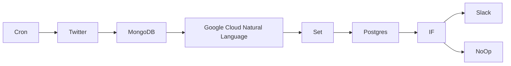

## Fluxo (.json) :

```json
{
  "id": "6",
  "name": "ETL pipeline",
  "nodes": [
    {
      "name": "Twitter",
      "type": "n8n-nodes-base.twitter",
      "position": [
        300,
        300
      ],
      "parameters": {
        "limit": 3,
        "operation": "search",
        "searchText": "=#OnThisDay",
        "additionalFields": {}
      },
      "credentials": {
        "twitterOAuth1Api": "twitter_api"
      },
      "typeVersion": 1
    },
    {
      "name": "Postgres",
      "type": "n8n-nodes-base.postgres",
      "position": [
        1100,
        300
      ],
      "parameters": {
        "table": "tweets",
        "columns": "text, score, magnitude",
        "returnFields": "=*"
      },
      "credentials": {
        "postgres": "postgres"
      },
      "typeVersion": 1
    },
    {
      "name": "MongoDB",
      "type": "n8n-nodes-base.mongoDb",
      "position": [
        500,
        300
      ],
      "parameters": {
        "fields": "text",
        "options": {},
        "operation": "insert",
        "collection": "tweets"
      },
      "credentials": {
        "mongoDb": "mongodb"
      },
      "typeVersion": 1
    },
    {
      "name": "Slack",
      "type": "n8n-nodes-base.slack",
      "position": [
        1500,
        200
      ],
      "parameters": {
        "text": "=🐦 NEW TWEET with sentiment score {{$json[\"score\"]}} and magnitude {{$json[\"magnitude\"]}} ⬇️\n{{$json[\"text\"]}}",
        "channel": "tweets",
        "attachments": [],
        "otherOptions": {}
      },
      "credentials": {
        "slackApi": "slack"
      },
      "typeVersion": 1
    },
    {
      "name": "IF",
      "type": "n8n-nodes-base.if",
      "position": [
        1300,
        300
      ],
      "parameters": {
        "conditions": {
          "number": [
            {
              "value1": "={{$json[\"score\"]}}",
              "operation": "larger"
            }
          ]
        }
      },
      "typeVersion": 1
    },
    {
      "name": "NoOp",
      "type": "n8n-nodes-base.noOp",
      "position": [
        1500,
        400
      ],
      "parameters": {},
      "typeVersion": 1
    },
    {
      "name": "Google Cloud Natural Language",
      "type": "n8n-nodes-base.googleCloudNaturalLanguage",
      "position": [
        700,
        300
      ],
      "parameters": {
        "content": "={{$node[\"MongoDB\"].json[\"text\"]}}",
        "options": {}
      },
      "credentials": {
        "googleCloudNaturalLanguageOAuth2Api": "google_nlp"
      },
      "typeVersion": 1
    },
    {
      "name": "Set",
      "type": "n8n-nodes-base.set",
      "position": [
        900,
        300
      ],
      "parameters": {
        "values": {
          "number": [
            {
              "name": "score",
              "value": "={{$json[\"documentSentiment\"][\"score\"]}}"
            },
            {
              "name": "magnitude",
              "value": "={{$json[\"documentSentiment\"][\"magnitude\"]}}"
            }
          ],
          "string": [
            {
              "name": "text",
              "value": "={{$node[\"Twitter\"].json[\"text\"]}}"
            }
          ]
        },
        "options": {}
      },
      "typeVersion": 1
    },
    {
      "name": "Cron",
      "type": "n8n-nodes-base.cron",
      "position": [
        100,
        300
      ],
      "parameters": {
        "triggerTimes": {
          "item": [
            {
              "hour": 6
            }
          ]
        }
      },
      "typeVersion": 1
    }
  ],
  "active": false,
  "settings": {},
  "connections": {
    "IF": {
      "main": [
        [
          {
            "node": "Slack",
            "type": "main",
            "index": 0
          }
        ],
        [
          {
            "node": "NoOp",
            "type": "main",
            "index": 0
          }
        ]
      ]
    },
    "Set": {
      "main": [
        [
          {
            "node": "Postgres",
            "type": "main",
            "index": 0
          }
        ]
      ]
    },
    "Cron": {
      "main": [
        [
          {
            "node": "Twitter",
            "type": "main",
            "index": 0
          }
        ]
      ]
    },
    "MongoDB": {
      "main": [
        [
          {
            "node": "Google Cloud Natural Language",
            "type": "main",
            "index": 0
          }
        ]
      ]
    },
    "Twitter": {
      "main": [
        [
          {
            "node": "MongoDB",
            "type": "main",
            "index": 0
          }
        ]
      ]
    },
    "Postgres": {
      "main": [
        [
          {
            "node": "IF",
            "type": "main",
            "index": 0
          }
        ]
      ]
    },
    "Google Cloud Natural Language": {
      "main": [
        [
          {
            "node": "Set",
            "type": "main",
            "index": 0
          }
        ]
      ]
    }
  }
}
```

<a id="template-1880"></a>

## Template 1880 - Implantação PUQ Docker InfluxDB

- **Nome:** Implantação PUQ Docker InfluxDB
- **Descrição:** Automatiza a implantação de um ambiente InfluxDB em Docker para um domínio específico, incluindo configuração de volumes, proxy Nginx, montagem de disco e gerenciamento de ciclo de vida do container via API webhook e comandos remotos.
- **Funcionalidade:** • Recepção de comandos via webhook API: permite gerenciar o fluxo de deploy e operações (create, start, stop, suspend, unsuspend, terminate, change_package) para um domínio.
• Geração e configuração de docker-compose por domínio: cria o arquivo docker-compose.yml com o container influxdb e volumes montados, incluindo limites de memória e CPU.
• Deploy e inicialização de containers: inicia os serviços com docker compose up -d e cria o ambiente pronto.
• Gerenciamento de disco/armazenamento: monta data.img como volume de dados, disponibiliza libs e etc, e atualiza fstab.
• Configuração de proxy e ACLs: configura Nginx proxy e ACLs para domínio, criando vhosts e regras de acesso.
• Monitoramento e logs: obtém inspect, stats e logs do container para diagnóstico.
• Gerenciamento de ACLs e pacotes: atualiza ACLs, atualiza main_ips no nginx e aplica configuração.
• Verificação de versão e administração: verifica a versão do InfluxDB e possibilita alteração de senha do usuário.
• Resposta ao webhook API: envia respostas com status de operações (success, error).
• Armazenamento de saída de comandos: guarda resultados de comandos em status/variáveis para retorno.
- **Ferramentas:** • Docker: plataforma para containers e orquestração de serviços.
• Docker Compose: ferramenta de orquestração de múltiplos containers via docker-compose.yml.
• Nginx Proxy: proxy reverso para domínios com regras de ACLs e vhosts.
• SSH: acesso remoto seguro para executar comandos e gerenciar serviços.
• Webhook/API externa: ponto de integração que dispara ações e recebe respostas para o fluxo.

## Fluxo visual

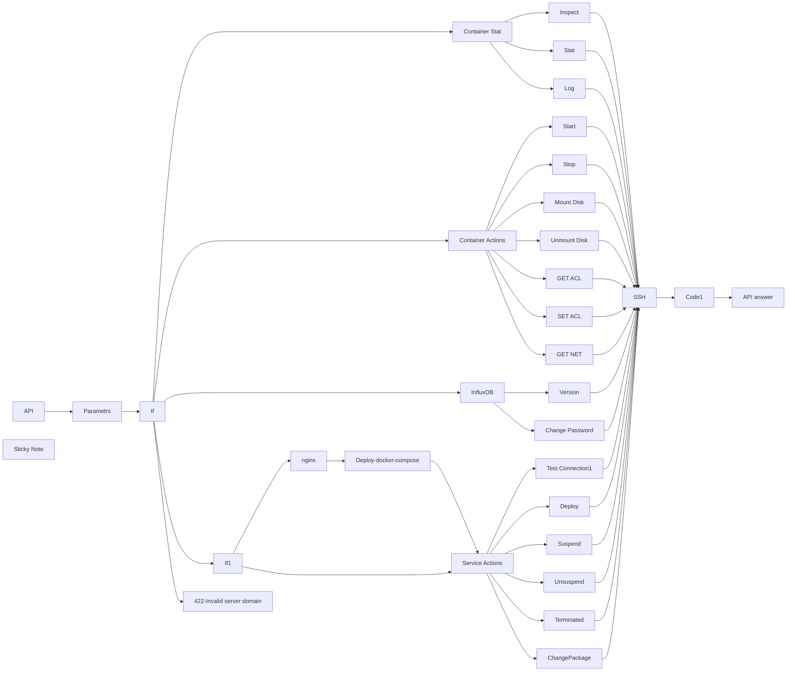

## Fluxo (.json) :

```json
{
  "id": "bpq5aoogWibWq94t",
  "meta": {
    "instanceId": "ffb0782f8b2cf4278577cb919e0cd26141bc9ff8774294348146d454633aa4e3",
    "templateCredsSetupCompleted": true
  },
  "name": "puq-docker-influxdb-deploy",
  "tags": [],
  "nodes": [
    {
      "id": "b1c793ae-265c-420b-8cd1-8ecc180bfb52",
      "name": "If",
      "type": "n8n-nodes-base.if",
      "position": [
        -2060,
        -320
      ],
      "parameters": {
        "options": {},
        "conditions": {
          "options": {
            "version": 2,
            "leftValue": "",
            "caseSensitive": true,
            "typeValidation": "strict"
          },
          "combinator": "or",
          "conditions": [
            {
              "id": "b702e607-888a-42c9-b9a7-f9d2a64dfccd",
              "operator": {
                "type": "string",
                "operation": "equals"
              },
              "leftValue": "={{ $json.server_domain }}",
              "rightValue": "={{ $('API').item.json.body.server_domain }}"
            }
          ]
        }
      },
      "typeVersion": 2.2
    },
    {
      "id": "d93df9de-1c37-46ee-8bbf-77297a1b63d5",
      "name": "Parametrs",
      "type": "n8n-nodes-base.set",
      "position": [
        -2280,
        -320
      ],
      "parameters": {
        "options": {},
        "assignments": {
          "assignments": [
            {
              "id": "a6328600-7ee0-4031-9bdb-fcee99b79658",
              "name": "server_domain",
              "type": "string",
              "value": "d01-test.uuq.pl"
            },
            {
              "id": "370ddc4e-0fc0-48f6-9b30-ebdfba72c62f",
              "name": "clients_dir",
              "type": "string",
              "value": "/opt/docker/clients"
            },
            {
              "id": "92202bb8-6113-4bc5-9a29-79d238456df2",
              "name": "mount_dir",
              "type": "string",
              "value": "/mnt"
            },
            {
              "id": "baa52df2-9c10-42b2-939f-f05ea85ea2be",
              "name": "screen_left",
              "type": "string",
              "value": "{{"
            },
            {
              "id": "2b19ed99-2630-412a-98b6-4be44d35d2e7",
              "name": "screen_right",
              "type": "string",
              "value": "}}"
            }
          ]
        }
      },
      "typeVersion": 3.4
    },
    {
      "id": "35e09115-77bc-48e4-b534-d6015162521f",
      "name": "API",
      "type": "n8n-nodes-base.webhook",
      "position": [
        -2600,
        -320
      ],
      "webhookId": "6760feea-1d9b-466c-82a9-3891a300b0fd",
      "parameters": {
        "path": "docker-influxdb",
        "options": {},
        "httpMethod": [
          "POST"
        ],
        "responseMode": "responseNode",
        "authentication": "basicAuth",
        "multipleMethods": true
      },
      "credentials": {
        "httpBasicAuth": {
          "id": "ljwsCBagSzOWlGsf",
          "name": "InfluxDB"
        }
      },
      "typeVersion": 2
    },
    {
      "id": "bddedef2-c43f-4e7b-b599-13fb7d47d504",
      "name": "422-Invalid server domain",
      "type": "n8n-nodes-base.respondToWebhook",
      "position": [
        -2100,
        0
      ],
      "parameters": {
        "options": {
          "responseCode": 422
        },
        "respondWith": "json",
        "responseBody": "[{\n  \"status\": \"error\",\n  \"error\": \"Invalid server domain\"\n}]"
      },
      "typeVersion": 1.1,
      "alwaysOutputData": false
    },
    {
      "id": "eedc340a-f599-4e65-91cc-299a9cc075e6",
      "name": "Code1",
      "type": "n8n-nodes-base.code",
      "position": [
        800,
        -240
      ],
      "parameters": {
        "mode": "runOnceForEachItem",
        "jsCode": "try {\n  if ($json.stdout === 'success') {\n    return {\n      json: {\n        status: 'success',\n        message: '',\n        data: '',\n      }\n    };\n  }\n\n  const parsedData = JSON.parse($json.stdout);\n\n  return {\n    json: {\n      status: parsedData.status === 'error' ? 'error' : 'success',\n      message: parsedData.message || (parsedData.status === 'error' ? 'An error occurred' : ''),\n      data: parsedData || '',\n    }\n  };\n\n} catch (error) {\n  return {\n    json: {\n      status: 'error',\n      message: $json.stdout??$json.error,\n      data: '',\n    }\n  };\n}"
      },
      "executeOnce": false,
      "retryOnFail": false,
      "typeVersion": 2,
      "alwaysOutputData": false
    },
    {
      "id": "82ac9991-aabe-4ebc-8a0a-dc712e219abf",
      "name": "SSH",
      "type": "n8n-nodes-base.ssh",
      "onError": "continueErrorOutput",
      "position": [
        500,
        -240
      ],
      "parameters": {
        "cwd": "=/",
        "command": "={{ $json.sh }}"
      },
      "credentials": {
        "sshPassword": {
          "id": "Cyjy61UWHwD2Xcd8",
          "name": "d01-test.uuq.pl-puq"
        }
      },
      "executeOnce": true,
      "typeVersion": 1
    },
    {
      "id": "825591ef-4b1d-4e4d-84a0-75370d26bbfb",
      "name": "Container Actions",
      "type": "n8n-nodes-base.switch",
      "position": [
        -1660,
        -600
      ],
      "parameters": {
        "rules": {
          "values": [
            {
              "outputKey": "start",
              "conditions": {
                "options": {
                  "version": 2,
                  "leftValue": "",
                  "caseSensitive": true,
                  "typeValidation": "strict"
                },
                "combinator": "and",
                "conditions": [
                  {
                    "id": "66ad264d-5393-410c-bfa3-011ab8eb234a",
                    "operator": {
                      "name": "filter.operator.equals",
                      "type": "string",
                      "operation": "equals"
                    },
                    "leftValue": "={{ $('API').item.json.body.command }}",
                    "rightValue": "container_start"
                  }
                ]
              },
              "renameOutput": true
            },
            {
              "outputKey": "stop",
              "conditions": {
                "options": {
                  "version": 2,
                  "leftValue": "",
                  "caseSensitive": true,
                  "typeValidation": "strict"
                },
                "combinator": "and",
                "conditions": [
                  {
                    "id": "b48957a0-22c0-4ac0-82ef-abd9e7ab0207",
                    "operator": {
                      "name": "filter.operator.equals",
                      "type": "string",
                      "operation": "equals"
                    },
                    "leftValue": "={{ $('API').item.json.body.command }}",
                    "rightValue": "container_stop"
                  }
                ]
              },
              "renameOutput": true
            },
            {
              "outputKey": "mount_disk",
              "conditions": {
                "options": {
                  "version": 2,
                  "leftValue": "",
                  "caseSensitive": true,
                  "typeValidation": "strict"
                },
                "combinator": "and",
                "conditions": [
                  {
                    "id": "727971bf-4218-41c1-9b07-22df4b947852",
                    "operator": {
                      "name": "filter.operator.equals",
                      "type": "string",
                      "operation": "equals"
                    },
                    "leftValue": "={{ $('API').item.json.body.command }}",
                    "rightValue": "container_mount_disk"
                  }
                ]
              },
              "renameOutput": true
            },
            {
              "outputKey": "unmount_disk",
              "conditions": {
                "options": {
                  "version": 2,
                  "leftValue": "",
                  "caseSensitive": true,
                  "typeValidation": "strict"
                },
                "combinator": "and",
                "conditions": [
                  {
                    "id": "0c80b1d9-e7ca-4cf3-b3ac-b40fdf4dd8f8",
                    "operator": {
                      "name": "filter.operator.equals",
                      "type": "string",
                      "operation": "equals"
                    },
                    "leftValue": "={{ $('API').item.json.body.command }}",
                    "rightValue": "container_unmount_disk"
                  }
                ]
              },
              "renameOutput": true
            },
            {
              "outputKey": "container_get_acl",
              "conditions": {
                "options": {
                  "version": 2,
                  "leftValue": "",
                  "caseSensitive": true,
                  "typeValidation": "strict"
                },
                "combinator": "and",
                "conditions": [
                  {
                    "id": "755e1a9f-667a-4022-9cb5-3f8153f62e95",
                    "operator": {
                      "name": "filter.operator.equals",
                      "type": "string",
                      "operation": "equals"
                    },
                    "leftValue": "={{ $('API').item.json.body.command }}",
                    "rightValue": "container_get_acl"
                  }
                ]
              },
              "renameOutput": true
            },
            {
              "outputKey": "container_set_acl",
              "conditions": {
                "options": {
                  "version": 2,
                  "leftValue": "",
                  "caseSensitive": true,
                  "typeValidation": "strict"
                },
                "combinator": "and",
                "conditions": [
                  {
                    "id": "8d75626f-789e-42fc-be5e-3a4e93a9bbc6",
                    "operator": {
                      "name": "filter.operator.equals",
                      "type": "string",
                      "operation": "equals"
                    },
                    "leftValue": "={{ $('API').item.json.body.command }}",
                    "rightValue": "container_set_acl"
                  }
                ]
              },
              "renameOutput": true
            },
            {
              "outputKey": "container_get_net",
              "conditions": {
                "options": {
                  "version": 2,
                  "leftValue": "",
                  "caseSensitive": true,
                  "typeValidation": "strict"
                },
                "combinator": "and",
                "conditions": [
                  {
                    "id": "c49d811a-735c-42f4-8b77-d0cd47b3d2b8",
                    "operator": {
                      "name": "filter.operator.equals",
                      "type": "string",
                      "operation": "equals"
                    },
                    "leftValue": "={{ $('API').item.json.body.command }}",
                    "rightValue": "container_get_net"
                  }
                ]
              },
              "renameOutput": true
            }
          ]
        },
        "options": {}
      },
      "typeVersion": 3.2
    },
    {
      "id": "5dddba42-28bf-41b9-ac94-52cc35a753a6",
      "name": "Service Actions",
      "type": "n8n-nodes-base.switch",
      "position": [
        -800,
        -1160
      ],
      "parameters": {
        "rules": {
          "values": [
            {
              "outputKey": "test_connection",
              "conditions": {
                "options": {
                  "version": 2,
                  "leftValue": "",
                  "caseSensitive": true,
                  "typeValidation": "strict"
                },
                "combinator": "and",
                "conditions": [
                  {
                    "id": "3afdd2f1-fe93-47c2-95cd-bac9b1d94eeb",
                    "operator": {
                      "name": "filter.operator.equals",
                      "type": "string",
                      "operation": "equals"
                    },
                    "leftValue": "={{ $('API').item.json.body.command }}",
                    "rightValue": "test_connection"
                  }
                ]
              },
              "renameOutput": true
            },
            {
              "outputKey": "create",
              "conditions": {
                "options": {
                  "version": 2,
                  "leftValue": "",
                  "caseSensitive": true,
                  "typeValidation": "strict"
                },
                "combinator": "and",
                "conditions": [
                  {
                    "id": "102f10e9-ec6c-4e63-ba95-0fe6c7dc0bd1",
                    "operator": {
                      "type": "string",
                      "operation": "equals"
                    },
                    "leftValue": "={{ $('API').item.json.body.command }}",
                    "rightValue": "create"
                  }
                ]
              },
              "renameOutput": true
            },
            {
              "outputKey": "suspend",
              "conditions": {
                "options": {
                  "version": 2,
                  "leftValue": "",
                  "caseSensitive": true,
                  "typeValidation": "strict"
                },
                "combinator": "and",
                "conditions": [
                  {
                    "id": "f62dfa34-6751-4b34-adcc-3d6ba1b21a8c",
                    "operator": {
                      "name": "filter.operator.equals",
                      "type": "string",
                      "operation": "equals"
                    },
                    "leftValue": "={{ $('API').item.json.body.command }}",
                    "rightValue": "suspend"
                  }
                ]
              },
              "renameOutput": true
            },
            {
              "outputKey": "unsuspend",
              "conditions": {
                "options": {
                  "version": 2,
                  "leftValue": "",
                  "caseSensitive": true,
                  "typeValidation": "strict"
                },
                "combinator": "and",
                "conditions": [
                  {
                    "id": "384d2026-b753-4c27-94c2-8f4fc189eb5f",
                    "operator": {
                      "name": "filter.operator.equals",
                      "type": "string",
                      "operation": "equals"
                    },
                    "leftValue": "={{ $('API').item.json.body.command }}",
                    "rightValue": "unsuspend"
                  }
                ]
              },
              "renameOutput": true
            },
            {
              "outputKey": "terminate",
              "conditions": {
                "options": {
                  "version": 2,
                  "leftValue": "",
                  "caseSensitive": true,
                  "typeValidation": "strict"
                },
                "combinator": "and",
                "conditions": [
                  {
                    "id": "0e190a97-827a-4e87-8222-093ff7048b21",
                    "operator": {
                      "name": "filter.operator.equals",
                      "type": "string",
                      "operation": "equals"
                    },
                    "leftValue": "={{ $('API').item.json.body.command }}",
                    "rightValue": "terminate"
                  }
                ]
              },
              "renameOutput": true
            },
            {
              "outputKey": "change_package",
              "conditions": {
                "options": {
                  "version": 2,
                  "leftValue": "",
                  "caseSensitive": true,
                  "typeValidation": "strict"
                },
                "combinator": "and",
                "conditions": [
                  {
                    "id": "6f7832f3-b61d-4517-ab6b-6007998136dd",
                    "operator": {
                      "name": "filter.operator.equals",
                      "type": "string",
                      "operation": "equals"
                    },
                    "leftValue": "={{ $('API').item.json.body.command }}",
                    "rightValue": "change_package"
                  }
                ]
              },
              "renameOutput": true
            }
          ]
        },
        "options": {}
      },
      "typeVersion": 3.2
    },
    {
      "id": "b50f9cca-87ec-4cc4-a4a0-6070746b25f2",
      "name": "API answer",
      "type": "n8n-nodes-base.respondToWebhook",
      "position": [
        820,
        0
      ],
      "parameters": {
        "options": {
          "responseCode": 200
        },
        "respondWith": "allIncomingItems"
      },
      "typeVersion": 1.1,
      "alwaysOutputData": true
    },
    {
      "id": "7e39251f-9a03-4800-b070-2bf2885c44be",
      "name": "Inspect",
      "type": "n8n-nodes-base.set",
      "onError": "continueRegularOutput",
      "position": [
        -1140,
        -980
      ],
      "parameters": {
        "options": {},
        "assignments": {
          "assignments": [
            {
              "id": "21f4453e-c136-4388-be90-1411ae78e8a5",
              "name": "sh",
              "type": "string",
              "value": "=#!/bin/bash\n\nCOMPOSE_DIR=\"{{ $('Parametrs').item.json.clients_dir }}/{{ $('API').item.json.body.domain }}\"\nCONTAINER_NAME=\"{{ $('API').item.json.body.domain }}_influxdb\"\n\nINSPECT_JSON=\"{}\"\nif sudo docker ps -a --filter \"name=$CONTAINER_NAME\" | grep -q \"$CONTAINER_NAME\"; then\n  INSPECT_JSON=$(sudo docker inspect \"$CONTAINER_NAME\")\nfi\n\necho \"{\\\"inspect\\\": $INSPECT_JSON}\"\n\nexit 0\n"
            }
          ]
        }
      },
      "typeVersion": 3.4,
      "alwaysOutputData": true
    },
    {
      "id": "4f63a2e0-dc0d-4373-9441-a57ee8d9bfdf",
      "name": "Stat",
      "type": "n8n-nodes-base.set",
      "onError": "continueRegularOutput",
      "position": [
        -980,
        -880
      ],
      "parameters": {
        "options": {},
        "assignments": {
          "assignments": [
            {
              "id": "21f4453e-c136-4388-be90-1411ae78e8a5",
              "name": "sh",
              "type": "string",
              "value": "=#!/bin/bash\n\nCOMPOSE_DIR=\"{{ $('Parametrs').item.json.clients_dir }}/{{ $('API').item.json.body.domain }}\"\nIMG_FILE=\"$COMPOSE_DIR/data.img\"\nMOUNT_DIR=\"{{ $('Parametrs').item.json.mount_dir }}/{{ $('API').item.json.body.domain }}\"\nCONTAINER_NAME=\"{{ $('API').item.json.body.domain }}_influxdb\"\n\n# Initialize empty container data\nINSPECT_JSON=\"{}\"\nSTATS_JSON=\"{}\"\n\n# Check if container is running\nif sudo docker ps -a --filter \"name=$CONTAINER_NAME\" | grep -q \"$CONTAINER_NAME\"; then\n  # Get Docker inspect info in JSON (as raw string)\n  INSPECT_JSON=$(sudo docker inspect \"$CONTAINER_NAME\")\n\n  # Get Docker stats info in JSON (as raw string)\n  STATS_JSON=$(sudo docker stats --no-stream --format \"{{ $('Parametrs').item.json.screen_left }}json .{{ $('Parametrs').item.json.screen_right }}\" \"$CONTAINER_NAME\")\n  STATS_JSON=${STATS_JSON:-'{}'}\nfi\n\n# Initialize disk info variables\nMOUNT_USED=\"N/A\"\nMOUNT_FREE=\"N/A\"\nMOUNT_TOTAL=\"N/A\"\nMOUNT_PERCENT=\"N/A\"\nIMG_SIZE=\"N/A\"\nIMG_PERCENT=\"N/A\"\nDISK_STATS_IMG=\"N/A\"\n\n# Check if mount directory exists and is accessible\nif [ -d \"$MOUNT_DIR\" ]; then\n  if mount | grep -q \"$MOUNT_DIR\"; then\n    # Get disk usage for mounted directory\n    DISK_STATS_MOUNT=$(df -h \"$MOUNT_DIR\" | tail -n 1)\n    MOUNT_USED=$(echo \"$DISK_STATS_MOUNT\" | awk '{print $3}')\n    MOUNT_FREE=$(echo \"$DISK_STATS_MOUNT\" | awk '{print $4}')\n    MOUNT_TOTAL=$(echo \"$DISK_STATS_MOUNT\" | awk '{print $2}')\n    MOUNT_PERCENT=$(echo \"$DISK_STATS_MOUNT\" | awk '{print $5}')\n  fi\nfi\n\n# Check if image file exists\nif [ -f \"$IMG_FILE\" ]; then\n  # Get disk usage for image file\n  IMG_SIZE=$(du -sh \"$IMG_FILE\" | awk '{print $1}')\nfi\n\n# Manually create a combined JSON object\nFINAL_JSON=\"{\\\"inspect\\\": $INSPECT_JSON, \\\"stats\\\": $STATS_JSON, \\\"disk\\\": {\\\"mounted\\\": {\\\"used\\\": \\\"$MOUNT_USED\\\", \\\"free\\\": \\\"$MOUNT_FREE\\\", \\\"total\\\": \\\"$MOUNT_TOTAL\\\", \\\"percent\\\": \\\"$MOUNT_PERCENT\\\"}, \\\"img_file\\\": {\\\"size\\\": \\\"$IMG_SIZE\\\"}}}\"\n\n# Output the result\necho \"$FINAL_JSON\"\n\nexit 0"
            }
          ]
        }
      },
      "typeVersion": 3.4,
      "alwaysOutputData": true
    },
    {
      "id": "993286dd-8757-40a2-ac62-3e5ab5d1261f",
      "name": "Start",
      "type": "n8n-nodes-base.set",
      "onError": "continueRegularOutput",
      "position": [
        -1160,
        -620
      ],
      "parameters": {
        "options": {},
        "assignments": {
          "assignments": [
            {
              "id": "21f4453e-c136-4388-be90-1411ae78e8a5",
              "name": "sh",
              "type": "string",
              "value": "=#!/bin/bash\n\nCOMPOSE_DIR=\"{{ $('Parametrs').item.json.clients_dir }}/{{ $('API').item.json.body.domain }}\"\nIMG_FILE=\"$COMPOSE_DIR/data.img\"\nMOUNT_DIR=\"{{ $('Parametrs').item.json.mount_dir }}/{{ $('API').item.json.body.domain }}\"\nCONTAINER_NAME=\"{{ $('API').item.json.body.domain }}_influxdb\"\n\n# Function to log an error, write to status file, and print to console\nhandle_error() {\n    echo \"error: $1\"\n    exit 1\n}\n\nif ! df -h | grep -q \"$MOUNT_DIR\"; then\n    handle_error \"The file $IMG_FILE is not mounted to $MOUNT_DIR\"\nfi\n\nif sudo docker ps --filter \"name=$CONTAINER_NAME\" --filter \"status=running\" -q | grep -q .; then\n    handle_error \"$CONTAINER_NAME container is running\"\nfi\n\n# Change to the compose directory\ncd \"$COMPOSE_DIR\" > /dev/null 2>&1 || handle_error \"Failed to change directory to $COMPOSE_DIR\"\n\n# Start the Docker containers\nif ! sudo docker compose up -d > /dev/null 2>error.log; then\n    ERROR_MSG=$(tail -n 10 error.log)\n    handle_error \"Docker-compose failed: $ERROR_MSG\"\nfi\n\n# Success\necho \"success\"\n\nexit 0\n"
            }
          ]
        }
      },
      "typeVersion": 3.4,
      "alwaysOutputData": true
    },
    {
      "id": "32fc208c-cd56-4db0-9a8f-766c52bae9f5",
      "name": "Stop",
      "type": "n8n-nodes-base.set",
      "onError": "continueRegularOutput",
      "position": [
        -1040,
        -520
      ],
      "parameters": {
        "options": {},
        "assignments": {
          "assignments": [
            {
              "id": "21f4453e-c136-4388-be90-1411ae78e8a5",
              "name": "sh",
              "type": "string",
              "value": "=#!/bin/bash\n\nCOMPOSE_DIR=\"{{ $('Parametrs').item.json.clients_dir }}/{{ $('API').item.json.body.domain }}\"\nIMG_FILE=\"$COMPOSE_DIR/data.img\"\nMOUNT_DIR=\"{{ $('Parametrs').item.json.mount_dir }}/{{ $('API').item.json.body.domain }}\"\nCONTAINER_NAME=\"{{ $('API').item.json.body.domain }}_influxdb\"\n\n# Function to log an error, write to status file, and print to console\nhandle_error() {\n    echo \"error: $1\"\n    exit 1\n}\n\n# Check if Docker container is running\nif ! sudo docker ps --filter \"name=$CONTAINER_NAME\" --filter \"status=running\" -q | grep -q .; then\n    handle_error \"$CONTAINER_NAME container is not running\"\nfi\n\n# Stop and remove the Docker containers (also remove associated volumes)\nif ! sudo docker compose -f \"$COMPOSE_DIR/docker-compose.yml\" down > /dev/null 2>&1; then\n    handle_error \"Failed to stop and remove docker-compose containers\"\nfi\n\necho \"success\"\n\nexit 0\n"
            }
          ]
        }
      },
      "typeVersion": 3.4,
      "alwaysOutputData": true
    },
    {
      "id": "9b87a055-2949-4a53-94e9-9ae059ed4913",
      "name": "Test Connection1",
      "type": "n8n-nodes-base.set",
      "onError": "continueRegularOutput",
      "position": [
        -220,
        -1320
      ],
      "parameters": {
        "options": {},
        "assignments": {
          "assignments": [
            {
              "id": "21f4453e-c136-4388-be90-1411ae78e8a5",
              "name": "sh",
              "type": "string",
              "value": "=#!/bin/bash\n\n# Function to log an error, print to console\nhandle_error() {\n    echo \"error: $1\"\n    exit 1\n}\n\n# Check if Docker is installed\nif ! command -v docker &> /dev/null; then\n    handle_error \"Docker is not installed\"\nfi\n\n# Check if Docker service is running\nif ! systemctl is-active --quiet docker; then\n    handle_error \"Docker service is not running\"\nfi\n\n# Check if nginx-proxy container is running\nif ! sudo docker ps --filter \"name=nginx-proxy\" --filter \"status=running\" -q > /dev/null; then\n    handle_error \"nginx-proxy container is not running\"\nfi\n\n# Check if letsencrypt-nginx-proxy-companion container is running\nif ! sudo docker ps --filter \"name=letsencrypt-nginx-proxy-companion\" --filter \"status=running\" -q > /dev/null; then\n    handle_error \"letsencrypt-nginx-proxy-companion container is not running\"\nfi\n\n# If everything is successful\necho \"success\"\n\nexit 0\n"
            }
          ]
        }
      },
      "typeVersion": 3.4,
      "alwaysOutputData": true
    },
    {
      "id": "2a2bafe1-ded2-4857-9853-e5ef75fab5d7",
      "name": "Deploy",
      "type": "n8n-nodes-base.set",
      "onError": "continueRegularOutput",
      "position": [
        -220,
        -1120
      ],
      "parameters": {
        "options": {},
        "assignments": {
          "assignments": [
            {
              "id": "21f4453e-c136-4388-be90-1411ae78e8a5",
              "name": "sh",
              "type": "string",
              "value": "=#!/bin/bash\n\n# Get values for variables from templates\nDOMAIN=\"{{ $('API').item.json.body.domain }}\"\nCOMPOSE_DIR=\"{{ $('Parametrs').item.json.clients_dir }}/$DOMAIN\"\nCOMPOSE_FILE=\"$COMPOSE_DIR/docker-compose.yml\"\nSTATUS_FILE=\"$COMPOSE_DIR/status\"\nIMG_FILE=\"$COMPOSE_DIR/data.img\"\nNGINX_DIR=\"$COMPOSE_DIR/nginx\"\nVHOST_DIR=\"/opt/docker/nginx-proxy/nginx/vhost.d\"\nMOUNT_DIR=\"{{ $('Parametrs').item.json.mount_dir }}/$DOMAIN\"\nDOCKER_COMPOSE_TEXT='{{ JSON.stringify($('Deploy-docker-compose').item.json['docker-compose']).base64Encode() }}'\n\nNGINX_MAIN_ACL_FILE=\"$NGINX_DIR/$DOMAIN\"_acl\n\nNGINX_MAIN_TEXT='{{ JSON.stringify($('nginx').item.json['main']).base64Encode() }}'\nNGINX_MAIN_FILE=\"$NGINX_DIR/$DOMAIN\"\nVHOST_MAIN_FILE=\"$VHOST_DIR/$DOMAIN\"\n\nNGINX_MAIN_LOCATION_TEXT='{{ JSON.stringify($('nginx').item.json['main_location']).base64Encode() }}'\nNGINX_MAIN_LOCATION_FILE=\"$NGINX_DIR/$DOMAIN\"_location\nVHOST_MAIN_LOCATION_FILE=\"$VHOST_DIR/$DOMAIN\"_location\n\n\nDISK_SIZE=\"{{ $('API').item.json.body.disk }}\"\n\n# Function to handle errors: write to the status file and print the message to console\nhandle_error() {\n    STATUS_JSON=\"{\\\"status\\\": \\\"error\\\", \\\"message\\\": \\\"$1\\\"}\"\n    echo \"$STATUS_JSON\" | sudo tee \"$STATUS_FILE\" > /dev/null  # Write error to the status file\n    echo \"error: $1\"  # Print the error message to the console\n    exit 1  # Exit the script with an error code\n}\n\n# Check if the directory already exists. If yes, exit with an error.\nif [ -d \"$COMPOSE_DIR\" ]; then\n    echo \"error: Directory $COMPOSE_DIR already exists\"\n    exit 1\nfi\n\n# Create necessary directories with permissions\nsudo mkdir -p \"$COMPOSE_DIR\" > /dev/null 2>&1 || handle_error \"Failed to create $COMPOSE_DIR\"\nsudo mkdir -p \"$NGINX_DIR\" > /dev/null 2>&1 || handle_error \"Failed to create $NGINX_DIR\"\nsudo mkdir -p \"$MOUNT_DIR\" > /dev/null 2>&1 || handle_error \"Failed to create $MOUNT_DIR\"\n\n# Set permissions on the created directories\nsudo chmod -R 777 \"$COMPOSE_DIR\" > /dev/null 2>&1 || handle_error \"Failed to set permissions on $COMPOSE_DIR\"\nsudo chmod -R 777 \"$NGINX_DIR\" > /dev/null 2>&1 || handle_error \"Failed to set permissions on $NGINX_DIR\"\nsudo chmod -R 777 \"$MOUNT_DIR\" > /dev/null 2>&1 || handle_error \"Failed to set permissions on $MOUNT_DIR\"\n\n# Create docker-compose.yml file\necho -e \"$DOCKER_COMPOSE_TEXT\" | base64 --decode | sed 's/\\\\n/\\n/g' | sed 's/\\\\\"/\"/g' | sed '1s/^\"//' | sed '$s/\"$//' | sudo tee \"$COMPOSE_FILE\" > /dev/null 2>&1 || handle_error \"Failed to create $COMPOSE_FILE\"\n\n# Create NGINX configuration files\necho \"\" | sudo tee \"$NGINX_MAIN_ACL_FILE\" > /dev/null 2>&1 || handle_error \"Failed to create $NGINX_MAIN_ACL_FILE\"\n\necho -e \"$NGINX_MAIN_TEXT\" | base64 --decode | sed 's/\\\\n/\\n/g' | sed 's/\\\\\"/\"/g' | sed '1s/^\"//' | sed '$s/\"$//' | sudo tee \"$NGINX_MAIN_FILE\" > /dev/null 2>&1 || handle_error \"Failed to create $NGINX_MAIN_FILE\"\necho -e \"$NGINX_MAIN_LOCATION_TEXT\" | base64 --decode | sed 's/\\\\n/\\n/g' | sed 's/\\\\\"/\"/g' | sed '1s/^\"//' | sed '$s/\"$//' | sudo tee \"$NGINX_MAIN_LOCATION_FILE\" > /dev/null 2>&1 || handle_error \"Failed to create $NGINX_MAIN_LOCATION_FILE\"\n\n# Change to the compose directory\ncd \"$COMPOSE_DIR\" > /dev/null 2>&1 || handle_error \"Failed to change directory to $COMPOSE_DIR\"\n\n# Create data.img file if it doesn't exist\nif [ ! -f \"$IMG_FILE\" ]; then\n    sudo fallocate -l \"$DISK_SIZE\"G \"$IMG_FILE\" > /dev/null 2>&1 || sudo truncate -s \"$DISK_SIZE\"G \"$IMG_FILE\" > /dev/null 2>&1 || handle_error \"Failed to create $IMG_FILE\"\n    sudo mkfs.ext4 \"$IMG_FILE\" > /dev/null 2>&1 || handle_error \"Failed to format $IMG_FILE\"  # Format the image as ext4\n    sync  # Synchronize the data to disk\nfi\n\n# Add an entry to /etc/fstab for mounting if not already present\nif ! grep -q \"$IMG_FILE\" /etc/fstab; then\n    echo \"$IMG_FILE $MOUNT_DIR ext4 loop 0 0\" | sudo tee -a /etc/fstab > /dev/null || handle_error \"Failed to add entry to /etc/fstab\"\nfi\n\n# Mount all entries in /etc/fstab\nsudo mount -a || handle_error \"Failed to mount entries from /etc/fstab\"\n\n# Set permissions on the mount directory\nsudo chmod -R 777 \"$MOUNT_DIR\" > /dev/null 2>&1 || handle_error \"Failed to set permissions on $MOUNT_DIR\"\n\nsudo mkdir -p \"$MOUNT_DIR/lib\" > /dev/null 2>&1 || handle_error \"Failed to create $MOUNT_DIR/lib\"\nsudo chmod -R 777 \"$MOUNT_DIR/lib\" > /dev/null 2>&1 || handle_error \"Failed to set permissions on $MOUNT_DIR/lib\"\n\nsudo mkdir -p \"$MOUNT_DIR/etc\" > /dev/null 2>&1 || handle_error \"Failed to create $MOUNT_DIR/etc\"\nsudo chmod -R 777 \"$MOUNT_DIR/etc\" > /dev/null 2>&1 || handle_error \"Failed to set permissions on $MOUNT_DIR/etc\"\n\n# Copy NGINX configuration files instead of creating symbolic links\nsudo cp -f \"$NGINX_MAIN_FILE\" \"$VHOST_MAIN_FILE\" || handle_error \"Failed to copy $NGINX_MAIN_FILE to $VHOST_MAIN_FILE\"\nsudo chmod 777 \"$VHOST_MAIN_FILE\" || handle_error \"Failed to set permissions on $VHOST_MAIN_FILE\"\n\nsudo cp -f \"$NGINX_MAIN_LOCATION_FILE\" \"$VHOST_MAIN_LOCATION_FILE\" || handle_error \"Failed to copy $NGINX_MAIN_LOCATION_FILE to $VHOST_MAIN_LOCATION_FILE\"\nsudo chmod 777 \"$VHOST_MAIN_LOCATION_FILE\" || handle_error \"Failed to set permissions on $VHOST_MAIN_LOCATION_FILE\"\n\n# Start Docker containers using docker-compose\nif ! sudo docker compose up -d > /dev/null 2>error.log; then\n    ERROR_MSG=$(tail -n 10 error.log)  # Read the last 10 lines from error.log\n    handle_error \"Docker-compose failed: $ERROR_MSG\"\nfi\n\n# If everything is successful, update the status file and print success message\necho \"active\" | sudo tee \"$STATUS_FILE\" > /dev/null\necho \"success\"\n\nexit 0\n"
            }
          ]
        }
      },
      "typeVersion": 3.4,
      "alwaysOutputData": true
    },
    {
      "id": "cc74e942-766c-43f3-9789-1eccb139d58d",
      "name": "Suspend",
      "type": "n8n-nodes-base.set",
      "onError": "continueRegularOutput",
      "position": [
        -220,
        -960
      ],
      "parameters": {
        "options": {},
        "assignments": {
          "assignments": [
            {
              "id": "21f4453e-c136-4388-be90-1411ae78e8a5",
              "name": "sh",
              "type": "string",
              "value": "=#!/bin/bash\n\nDOMAIN=\"{{ $('API').item.json.body.domain }}\"\nCOMPOSE_DIR=\"{{ $('Parametrs').item.json.clients_dir }}/$DOMAIN\"\nCOMPOSE_FILE=\"$COMPOSE_DIR/docker-compose.yml\"\nSTATUS_FILE=\"$COMPOSE_DIR/status\"\nIMG_FILE=\"$COMPOSE_DIR/data.img\"\nNGINX_DIR=\"$COMPOSE_DIR/nginx\"\nVHOST_DIR=\"/opt/docker/nginx-proxy/nginx/vhost.d\"\nMOUNT_DIR=\"{{ $('Parametrs').item.json.mount_dir }}/$DOMAIN\"\n\nVHOST_MAIN_FILE=\"$VHOST_DIR/$DOMAIN\"\nVHOST_MAIN_LOCATION_FILE=\"$VHOST_DIR/$DOMAIN\"_location\n\n# Function to log an error, write to status file, and print to console\nhandle_error() {\n    echo \"$1\" | sudo tee \"$STATUS_FILE\" > /dev/null\n    echo \"error: $1\"\n    exit 1\n}\n\n# Stop and remove Docker containers (also remove associated volumes)\nif [ -f \"$COMPOSE_FILE\" ]; then\n    if ! sudo docker compose -f \"$COMPOSE_FILE\" down > /dev/null 2>&1; then\n        handle_error \"Failed to stop and remove docker-compose containers\"\n    fi\nelse\n    echo \"Warning: docker-compose.yml not found, skipping container stop.\"\nfi\n\n# Remove mount entry from /etc/fstab if it exists\nif grep -q \"$IMG_FILE\" /etc/fstab; then\n    sudo sed -i \"\\|$(printf '%s\\n' \"$IMG_FILE\" | sed 's/[.[\\*^$]/\\\\&/g')|d\" /etc/fstab\nfi\n\n# Unmount the image if it is mounted\nif mount | grep -q \"$MOUNT_DIR\"; then\n    sudo umount \"$MOUNT_DIR\" > /dev/null 2>&1 || handle_error \"Failed to unmount $MOUNT_DIR\"\nfi\n\n# Remove the mount directory\nif [ -d \"$MOUNT_DIR\" ]; then\n    sudo rm -rf \"$MOUNT_DIR\" > /dev/null 2>&1 || handle_error \"Failed to remove $MOUNT_DIR\"\nfi\n\n# Remove NGINX configuration files\n[ -f \"$VHOST_MAIN_FILE\" ] && sudo rm -f \"$VHOST_MAIN_FILE\" || handle_error \"Warning: $VHOST_MAIN_FILE not found.\"\n[ -f \"$VHOST_MAIN_LOCATION_FILE\" ] && sudo rm -f \"$VHOST_MAIN_LOCATION_FILE\" || handle_error \"Warning: $VHOST_MAIN_LOCATION_FILE not found.\"\n\n# Update status\necho \"suspended\" | sudo tee \"$STATUS_FILE\" > /dev/null\n\n# Success\necho \"success\"\nexit 0\n"
            }
          ]
        }
      },
      "typeVersion": 3.4,
      "alwaysOutputData": true
    },
    {
      "id": "bc93158d-cab4-4161-aa34-f54905869eae",
      "name": "Terminated",
      "type": "n8n-nodes-base.set",
      "onError": "continueRegularOutput",
      "position": [
        -220,
        -620
      ],
      "parameters": {
        "options": {},
        "assignments": {
          "assignments": [
            {
              "id": "21f4453e-c136-4388-be90-1411ae78e8a5",
              "name": "sh",
              "type": "string",
              "value": "=#!/bin/bash\n\nDOMAIN=\"{{ $('API').item.json.body.domain }}\"\nCOMPOSE_DIR=\"{{ $('Parametrs').item.json.clients_dir }}/$DOMAIN\"\nCOMPOSE_FILE=\"$COMPOSE_DIR/docker-compose.yml\"\nSTATUS_FILE=\"$COMPOSE_DIR/status\"\nIMG_FILE=\"$COMPOSE_DIR/data.img\"\nNGINX_DIR=\"$COMPOSE_DIR/nginx\"\nVHOST_DIR=\"/opt/docker/nginx-proxy/nginx/vhost.d\"\n\nVHOST_MAIN_FILE=\"$VHOST_DIR/$DOMAIN\"\nVHOST_MAIN_LOCATION_FILE=\"$VHOST_DIR/$DOMAIN\"_location\nVHOST_CONSOLE_FILE=\"$VHOST_DIR/console.$DOMAIN\"\nVHOST_CONSOLE_LOCATION_FILE=\"$VHOST_DIR/console.$DOMAIN\"_location\nMOUNT_DIR=\"{{ $('Parametrs').item.json.mount_dir }}/$DOMAIN\"\n\n# Function to log an error, write to status file, and print to console\nhandle_error() {\n    echo \"error: $1\"\n    exit 1\n}\n\n# Stop and remove the Docker containers\nif [ -f \"$COMPOSE_FILE\" ]; then\n    sudo docker compose -f \"$COMPOSE_FILE\" down > /dev/null 2>&1\nfi\n\n# Remove the mount entry from /etc/fstab if it exists\nif grep -q \"$IMG_FILE\" /etc/fstab; then\n    sudo sed -i \"\\|$(printf '%s\\n' \"$IMG_FILE\" | sed 's/[.[\\*^$]/\\\\&/g')|d\" /etc/fstab\nfi\n\n# Unmount the image if it is still mounted\nif mount | grep -q \"$MOUNT_DIR\"; then\n    sudo umount \"$MOUNT_DIR\" > /dev/null 2>&1 || handle_error \"Failed to unmount $MOUNT_DIR\"\nfi\n\n# Remove all related directories and files\nfor item in \"$MOUNT_DIR\" \"$COMPOSE_DIR\" \"$VHOST_MAIN_FILE\" \"$VHOST_MAIN_LOCATION_FILE\" \"$VHOST_CONSOLE_FILE\" \"$VHOST_CONSOLE_LOCATION_FILE\"; do\n    if [ -e \"$item\" ]; then\n        sudo rm -rf \"$item\" || handle_error \"Failed to remove $item\"\n    fi\ndone\n\necho \"success\"\nexit 0\n"
            }
          ]
        }
      },
      "typeVersion": 3.4,
      "alwaysOutputData": true
    },
    {
      "id": "ab47d0f6-502b-43f6-acd1-547adb8c6bda",
      "name": "Unsuspend",
      "type": "n8n-nodes-base.set",
      "onError": "continueRegularOutput",
      "position": [
        -220,
        -800
      ],
      "parameters": {
        "options": {},
        "assignments": {
          "assignments": [
            {
              "id": "21f4453e-c136-4388-be90-1411ae78e8a5",
              "name": "sh",
              "type": "string",
              "value": "=#!/bin/bash\n\nDOMAIN=\"{{ $('API').item.json.body.domain }}\"\nCOMPOSE_DIR=\"{{ $('Parametrs').item.json.clients_dir }}/$DOMAIN\"\nCOMPOSE_FILE=\"$COMPOSE_DIR/docker-compose.yml\"\nSTATUS_FILE=\"$COMPOSE_DIR/status\"\nIMG_FILE=\"$COMPOSE_DIR/data.img\"\nNGINX_DIR=\"$COMPOSE_DIR/nginx\"\nVHOST_DIR=\"/opt/docker/nginx-proxy/nginx/vhost.d\"\nMOUNT_DIR=\"{{ $('Parametrs').item.json.mount_dir }}/$DOMAIN\"\nDOCKER_COMPOSE_TEXT='{{ JSON.stringify($('Deploy-docker-compose').item.json['docker-compose']).base64Encode() }}'\n\nNGINX_MAIN_ACL_FILE=\"$NGINX_DIR/$DOMAIN\"_acl\n\nNGINX_MAIN_TEXT='{{ JSON.stringify($('nginx').item.json['main']).base64Encode() }}'\nNGINX_MAIN_FILE=\"$NGINX_DIR/$DOMAIN\"\nVHOST_MAIN_FILE=\"$VHOST_DIR/$DOMAIN\"\n\nNGINX_MAIN_LOCATION_TEXT='{{ JSON.stringify($('nginx').item.json['main_location']).base64Encode() }}'\nNGINX_MAIN_LOCATION_FILE=\"$NGINX_DIR/$DOMAIN\"_location\nVHOST_MAIN_LOCATION_FILE=\"$VHOST_DIR/$DOMAIN\"_location\n\nDISK_SIZE=\"{{ $('API').item.json.body.disk }}\"\n\n# Function to log an error, write to status file, and print to console\nhandle_error() {\n    echo \"$1\" | sudo tee \"$STATUS_FILE\" > /dev/null\n    echo \"error: $1\"\n    exit 1\n}\n\nupdate_nginx_acl() {\n    ACL_FILE=$1\n    LOCATION_FILE=$2\n    \n    if [ -s \"$ACL_FILE\" ]; then  # Проверяем, что файл существует и не пустой\n        VALID_LINES=$(grep -vE '^\\s*$' \"$ACL_FILE\")  # Убираем пустые строки\n        if [ -n \"$VALID_LINES\" ]; then  # Если есть непустые строки\n            while IFS= read -r line; do\n                echo \"allow $line;\" | sudo tee -a \"$LOCATION_FILE\" > /dev/null || handle_error \"Failed to update $LOCATION_FILE\"\n            done <<< \"$VALID_LINES\"\n            echo \"deny all;\" | sudo tee -a \"$LOCATION_FILE\" > /dev/null || handle_error \"Failed to update $LOCATION_FILE\"\n        fi\n    fi\n}\n\n# Create necessary directories with permissions\nfor dir in \"$COMPOSE_DIR\" \"$NGINX_DIR\" \"$MOUNT_DIR\"; do\n    sudo mkdir -p \"$dir\" || handle_error \"Failed to create $dir\"\n    sudo chmod -R 777 \"$dir\" || handle_error \"Failed to set permissions on $dir\"\ndone\n\n# Check if the image is already mounted using fstab\nif ! grep -q \"$IMG_FILE\" /etc/fstab; then\n    echo \"$IMG_FILE $MOUNT_DIR ext4 loop 0 0\" | sudo tee -a /etc/fstab > /dev/null || handle_error \"Failed to add fstab entry for $IMG_FILE\"\nfi\n\n# Apply the fstab changes and mount the image\nif ! mount | grep -q \"$MOUNT_DIR\"; then\n    sudo mount -a || handle_error \"Failed to mount image using fstab\"\nfi\n\n# Create docker-compose.yml file\necho -e \"$DOCKER_COMPOSE_TEXT\" | base64 --decode | sed 's/\\\\n/\\n/g' | sed 's/\\\\\"/\"/g' | sed '1s/^\"//' | sed '$s/\"$//' | sudo tee \"$COMPOSE_FILE\" > /dev/null 2>&1 || handle_error \"Failed to create $COMPOSE_FILE\"\n\n# Create NGINX configuration files\necho -e \"$NGINX_MAIN_TEXT\" | base64 --decode | sed 's/\\\\n/\\n/g' | sed 's/\\\\\"/\"/g' | sed '1s/^\"//' | sed '$s/\"$//' | sudo tee \"$NGINX_MAIN_FILE\" > /dev/null 2>&1 || handle_error \"Failed to create $NGINX_MAIN_FILE\"\necho -e \"$NGINX_MAIN_LOCATION_TEXT\" | base64 --decode | sed 's/\\\\n/\\n/g' | sed 's/\\\\\"/\"/g' | sed '1s/^\"//' | sed '$s/\"$//' | sudo tee \"$NGINX_MAIN_LOCATION_FILE\" > /dev/null 2>&1 || handle_error \"Failed to create $NGINX_MAIN_LOCATION_FILE\"\n\n# Copy NGINX configuration files instead of creating symbolic links\nsudo cp -f \"$NGINX_MAIN_FILE\" \"$VHOST_MAIN_FILE\" || handle_error \"Failed to copy $NGINX_MAIN_FILE to $VHOST_MAIN_FILE\"\nsudo chmod 777 \"$VHOST_MAIN_FILE\" || handle_error \"Failed to set permissions on $VHOST_MAIN_FILE\"\n\nsudo cp -f \"$NGINX_MAIN_LOCATION_FILE\" \"$VHOST_MAIN_LOCATION_FILE\" || handle_error \"Failed to copy $NGINX_MAIN_LOCATION_FILE to $VHOST_MAIN_LOCATION_FILE\"\nsudo chmod 777 \"$VHOST_MAIN_LOCATION_FILE\" || handle_error \"Failed to set permissions on $VHOST_MAIN_LOCATION_FILE\"\n\nupdate_nginx_acl \"$NGINX_MAIN_ACL_FILE\" \"$VHOST_MAIN_LOCATION_FILE\"\n\n# Change to the compose directory\ncd \"$COMPOSE_DIR\" || handle_error \"Failed to change directory to $COMPOSE_DIR\"\n\n# Start Docker containers using docker-compose\n> error.log\nif ! sudo docker compose up -d > error.log 2>&1; then\n    ERROR_MSG=$(tail -n 10 error.log)  # Read the last 10 lines from error.log\n    handle_error \"Docker-compose failed: $ERROR_MSG\"\nfi\n\n# If everything is successful, update the status file and print success message\necho \"active\" | sudo tee \"$STATUS_FILE\" > /dev/null\necho \"success\"\nexit 0\n"
            }
          ]
        }
      },
      "typeVersion": 3.4,
      "alwaysOutputData": true
    },
    {
      "id": "93a5ca68-9397-43f4-a277-64f98544a6e2",
      "name": "Mount Disk",
      "type": "n8n-nodes-base.set",
      "onError": "continueRegularOutput",
      "position": [
        -1160,
        -400
      ],
      "parameters": {
        "options": {},
        "assignments": {
          "assignments": [
            {
              "id": "21f4453e-c136-4388-be90-1411ae78e8a5",
              "name": "sh",
              "type": "string",
              "value": "=#!/bin/bash\n\nCOMPOSE_DIR=\"{{ $('Parametrs').item.json.clients_dir }}/{{ $('API').item.json.body.domain }}\"\nIMG_FILE=\"$COMPOSE_DIR/data.img\"\nMOUNT_DIR=\"{{ $('Parametrs').item.json.mount_dir }}/{{ $('API').item.json.body.domain }}\"\n\n# Function to log an error, write to status file, and print to console\nhandle_error() {\n    echo \"error: $1\"\n    exit 1\n}\n\n# Create necessary directories with permissions\nsudo mkdir -p \"$MOUNT_DIR\" > /dev/null 2>&1 || handle_error \"Failed to create $MOUNT_DIR\"\nsudo chmod 777 \"$MOUNT_DIR\" > /dev/null 2>&1 || handle_error \"Failed to set permissions on $MOUNT_DIR\"\n\nif df -h | grep -q \"$MOUNT_DIR\"; then\n    handle_error \"The file $IMG_FILE is mounted to $MOUNT_DIR\"\nfi\n\nif ! grep -q \"$IMG_FILE\" /etc/fstab; then\n    echo \"$IMG_FILE $MOUNT_DIR ext4 loop 0 0\" | sudo tee -a /etc/fstab > /dev/null || handle_error \"Failed to add entry to /etc/fstab\"\nfi\n\nsudo mount -a || handle_error \"Failed to mount entries from /etc/fstab\"\n\necho \"success\"\n\nexit 0\n"
            }
          ]
        }
      },
      "typeVersion": 3.4,
      "alwaysOutputData": true
    },
    {
      "id": "99041aec-cc6b-4994-a185-316233261a11",
      "name": "Unmount Disk",
      "type": "n8n-nodes-base.set",
      "onError": "continueRegularOutput",
      "position": [
        -1040,
        -300
      ],
      "parameters": {
        "options": {},
        "assignments": {
          "assignments": [
            {
              "id": "21f4453e-c136-4388-be90-1411ae78e8a5",
              "name": "sh",
              "type": "string",
              "value": "=#!/bin/bash\n\nCOMPOSE_DIR=\"{{ $('Parametrs').item.json.clients_dir }}/{{ $('API').item.json.body.domain }}\"\nIMG_FILE=\"$COMPOSE_DIR/data.img\"\nMOUNT_DIR=\"{{ $('Parametrs').item.json.mount_dir }}/{{ $('API').item.json.body.domain }}\"\nCONTAINER_NAME=\"{{ $('API').item.json.body.domain }}_influxdb\"\n\n# Function to log an error, write to status file, and print to console\nhandle_error() {\n    echo \"error: $1\"\n    exit 1\n}\n\nif ! df -h | grep -q \"$MOUNT_DIR\"; then\n    handle_error \"The file $IMG_FILE is not mounted to $MOUNT_DIR\"\nfi\n\n# Remove the mount entry from /etc/fstab if it exists\nif grep -q \"$IMG_FILE\" /etc/fstab; then\n    sudo sed -i \"\\|$(printf '%s\\n' \"$IMG_FILE\" | sed 's/[.[\\*^$]/\\\\&/g')|d\" /etc/fstab\nfi\n\n# Unmount the image if it is mounted (using fstab)\nif mount | grep -q \"$MOUNT_DIR\"; then\n    sudo umount \"$MOUNT_DIR\" > /dev/null 2>&1 || handle_error \"Failed to unmount $MOUNT_DIR\"\nfi\n\n# Remove the mount directory (if needed)\nif ! sudo rm -rf \"$MOUNT_DIR\" > /dev/null 2>&1; then\n    handle_error \"Failed to remove $MOUNT_DIR\"\nfi\n\necho \"success\"\n\nexit 0\n"
            }
          ]
        }
      },
      "typeVersion": 3.4,
      "alwaysOutputData": true
    },
    {
      "id": "64c83aad-dd98-4418-8a73-8cdf6fdf0580",
      "name": "Log",
      "type": "n8n-nodes-base.set",
      "onError": "continueRegularOutput",
      "position": [
        -840,
        -780
      ],
      "parameters": {
        "options": {},
        "assignments": {
          "assignments": [
            {
              "id": "21f4453e-c136-4388-be90-1411ae78e8a5",
              "name": "sh",
              "type": "string",
              "value": "=#!/bin/bash\n\nCONTAINER_NAME=\"{{ $('API').item.json.body.domain }}_influxdb\"\nLOGS_JSON=\"{}\"\n\n# Function to return error in JSON format\nhandle_error() {\n    echo \"{\\\"status\\\": \\\"error\\\", \\\"message\\\": \\\"$1\\\"}\"\n    exit 1\n}\n\n# Check if the container exists\nif ! sudo docker ps -a | grep -q \"$CONTAINER_NAME\" > /dev/null 2>&1; then\n    handle_error \"Container $CONTAINER_NAME not found\"\nfi\n\n# Get logs of the container\nLOGS=$(sudo docker logs --tail 1000 \"$CONTAINER_NAME\" 2>&1)\nif [ $? -ne 0 ]; then\n    handle_error \"Failed to retrieve logs for $CONTAINER_NAME\"\nfi\n\n# Format logs as JSON\necho \"$LOGS\" | jq -R -s '{\"logs\": .}'\n\nexit 0"
            }
          ]
        }
      },
      "typeVersion": 3.4,
      "alwaysOutputData": true
    },
    {
      "id": "77d2d93f-d006-493c-84ed-5e318ebacfcd",
      "name": "ChangePackage",
      "type": "n8n-nodes-base.set",
      "onError": "continueRegularOutput",
      "position": [
        -220,
        -460
      ],
      "parameters": {
        "options": {},
        "assignments": {
          "assignments": [
            {
              "id": "21f4453e-c136-4388-be90-1411ae78e8a5",
              "name": "sh",
              "type": "string",
              "value": "=#!/bin/bash\n\n# Get values for variables from templates\nDOMAIN=\"{{ $('API').item.json.body.domain }}\"\nCOMPOSE_DIR=\"{{ $('Parametrs').item.json.clients_dir }}/$DOMAIN\"\nCOMPOSE_FILE=\"$COMPOSE_DIR/docker-compose.yml\"\nSTATUS_FILE=\"$COMPOSE_DIR/status\"\nIMG_FILE=\"$COMPOSE_DIR/data.img\"\nNGINX_DIR=\"$COMPOSE_DIR/nginx\"\nVHOST_DIR=\"/opt/docker/nginx-proxy/nginx/vhost.d\"\nMOUNT_DIR=\"{{ $('Parametrs').item.json.mount_dir }}/$DOMAIN\"\nDOCKER_COMPOSE_TEXT='{{ JSON.stringify($('Deploy-docker-compose').item.json['docker-compose']).base64Encode() }}'\n\nNGINX_MAIN_TEXT='{{ JSON.stringify($('nginx').item.json['main']).base64Encode() }}'\nNGINX_MAIN_FILE=\"$NGINX_DIR/$DOMAIN\"\nVHOST_MAIN_FILE=\"$VHOST_DIR/$DOMAIN\"\n\nNGINX_MAIN_LOCATION_TEXT='{{ JSON.stringify($('nginx').item.json['main_location']).base64Encode() }}'\nNGINX_MAIN_LOCATION_FILE=\"$NGINX_DIR/$DOMAIN\"_location\nVHOST_MAIN_LOCATION_FILE=\"$VHOST_DIR/$DOMAIN\"_location\n\nDISK_SIZE=\"{{ $('API').item.json.body.disk }}\"\n\n# Function to log an error, write to status file, and print to console\nhandle_error() {\n    STATUS_JSON=\"{\\\"status\\\": \\\"error\\\", \\\"message\\\": \\\"$1\\\"}\"\n    echo \"$STATUS_JSON\" | sudo tee \"$STATUS_FILE\" > /dev/null\n    echo \"error: $1\"\n    exit 1\n}\n\n# Create docker-compose.yml file\necho -e \"$DOCKER_COMPOSE_TEXT\" | base64 --decode | sed 's/\\\\n/\\n/g' | sed 's/\\\\\"/\"/g' | sed '1s/^\"//' | sed '$s/\"$//' | sudo tee \"$COMPOSE_FILE\" > /dev/null 2>&1 || handle_error \"Failed to create $COMPOSE_FILE\"\n\n# Check if the compose file exists before stopping the container\nif [ -f \"$COMPOSE_FILE\" ]; then\n    sudo docker compose -f \"$COMPOSE_FILE\" down > /dev/null 2>&1 || handle_error \"Failed to stop container\"\nelse\n    handle_error \"docker-compose.yml not found\"\nfi\n\n# Unmount the image if it is currently mounted\nif mount | grep -q \"$MOUNT_DIR\"; then\n    sudo umount \"$MOUNT_DIR\" > /dev/null 2>&1 || handle_error \"Failed to unmount $MOUNT_DIR\"\nfi\n\n# Create docker-compose.yml file\necho -e \"$DOCKER_COMPOSE_TEXT\" | base64 --decode | sed 's/\\\\n/\\n/g' | sed 's/\\\\\"/\"/g' | sed '1s/^\"//' | sed '$s/\"$//' | sudo tee \"$COMPOSE_FILE\" > /dev/null 2>&1 || handle_error \"Failed to create $COMPOSE_FILE\"\n\n# Create NGINX configuration files\necho -e \"$NGINX_MAIN_TEXT\" | base64 --decode | sed 's/\\\\n/\\n/g' | sed 's/\\\\\"/\"/g' | sed '1s/^\"//' | sed '$s/\"$//' | sudo tee \"$NGINX_MAIN_FILE\" > /dev/null 2>&1 || handle_error \"Failed to create $NGINX_MAIN_FILE\"\necho -e \"$NGINX_MAIN_LOCATION_TEXT\" | base64 --decode | sed 's/\\\\n/\\n/g' | sed 's/\\\\\"/\"/g' | sed '1s/^\"//' | sed '$s/\"$//' | sudo tee \"$NGINX_MAIN_LOCATION_FILE\" > /dev/null 2>&1 || handle_error \"Failed to create $NGINX_MAIN_LOCATION_FILE\"\n\n# Resize the disk image if it exists\nif [ -f \"$IMG_FILE\" ]; then\n    sudo truncate -s \"$DISK_SIZE\"G \"$IMG_FILE\" > /dev/null 2>&1 || handle_error \"Failed to resize $IMG_FILE (truncate)\"\n    sudo e2fsck -fy \"$IMG_FILE\" > /dev/null 2>&1 || handle_error \"Filesystem check failed on $IMG_FILE\"\n    sudo resize2fs \"$IMG_FILE\" > /dev/null 2>&1 || handle_error \"Failed to resize filesystem on $IMG_FILE\"\nelse\n    handle_error \"Disk image $IMG_FILE does not exist\"\nfi\n\n# Mount the disk only if it is not already mounted\nif ! mount | grep -q \"$MOUNT_DIR\"; then\n    sudo mount -a || handle_error \"Failed to mount entries from /etc/fstab\"\nfi\n\n# Change to the compose directory\ncd \"$COMPOSE_DIR\" > /dev/null 2>&1 || handle_error \"Failed to change directory to $COMPOSE_DIR\"\n\n# Copy NGINX configuration files instead of creating symbolic links\nsudo cp -f \"$NGINX_MAIN_FILE\" \"$VHOST_MAIN_FILE\" || handle_error \"Failed to copy $NGINX_MAIN_FILE to $VHOST_MAIN_FILE\"\nsudo chmod 777 \"$VHOST_MAIN_FILE\" || handle_error \"Failed to set permissions on $VHOST_MAIN_FILE\"\n\nsudo cp -f \"$NGINX_MAIN_LOCATION_FILE\" \"$VHOST_MAIN_LOCATION_FILE\" || handle_error \"Failed to copy $NGINX_MAIN_LOCATION_FILE to $VHOST_MAIN_LOCATION_FILE\"\nsudo chmod 777 \"$VHOST_MAIN_LOCATION_FILE\" || handle_error \"Failed to set permissions on $VHOST_MAIN_LOCATION_FILE\"\n\n# Start Docker containers using docker-compose\nif ! sudo docker compose up -d > /dev/null 2>error.log; then\n    ERROR_MSG=$(tail -n 10 error.log)  # Read the last 10 lines from error.log\n    handle_error \"Docker-compose failed: $ERROR_MSG\"\nfi\n\n# Update status file\necho \"active\" | sudo tee \"$STATUS_FILE\" > /dev/null\n\necho \"success\"\n\nexit 0\n"
            }
          ]
        }
      },
      "typeVersion": 3.4,
      "alwaysOutputData": true
    },
    {
      "id": "b6508dbe-809f-45c6-b182-e6aa148d467a",
      "name": "Sticky Note",
      "type": "n8n-nodes-base.stickyNote",
      "position": [
        -2640,
        -1280
      ],
      "parameters": {
        "color": 6,
        "width": 639,
        "height": 909,
        "content": "## 👋 Welcome to PUQ Docker InfluxDB deploy!\n## Template for InfluxDB: API Backend for WHMCS/WISECP by PUQcloud\n\nv.1\n\nThis is an n8n template that creates an API backend for the WHMCS/WISECP module developed by PUQcloud.\n\n## Setup Instructions\n\n### 1. Configure API Webhook and SSH Access\n- Create a Credential (Basic Auth) for the **Webhook API Block** in n8n.\n- Create a Credential for **SSH access** to a server with Docker installed (**SSH Block**).\n\n### 2. Modify Template Parameters\nIn the **Parameters** block of the template, update the following settings:\n\n- `server_domain` – must match the domain of the WHMCS/WISECP Docker server.\n- `clients_dir` – directory where user data related to Docker and disks will be stored.\n- `mount_dir` – default mount point for the container disk (recommended not to change).\n\n**Do not modify** the following technical parameters:\n\n- `screen_left`\n- `screen_right`\n\n## Additional Resources\n- Full documentation: [https://doc.puq.info/books/docker-influxdb-whmcs-module](https://doc.puq.info/books/docker-influxdb-whmcs-module)\n- WHMCS module: [https://puqcloud.com/whmcs-module-docker-influxdb.php](https://puqcloud.com/whmcs-module-docker-influxdb.php)\n\n"
      },
      "typeVersion": 1
    },
    {
      "id": "eee5aa6b-b346-4341-aead-12715e55ee95",
      "name": "Deploy-docker-compose",
      "type": "n8n-nodes-base.set",
      "position": [
        -1140,
        -1260
      ],
      "parameters": {
        "options": {},
        "assignments": {
          "assignments": [
            {
              "id": "21f4453e-c136-4388-be90-1411ae78e8a5",
              "name": "docker-compose",
              "type": "string",
              "value": "=name: \"{{ $('API').item.json.body.domain }}_influxdb\"\n\nservices:\n  {{ $('API').item.json.body.domain }}_influxdb:\n    container_name: {{ $('API').item.json.body.domain }}_influxdb\n    image: influxdb:2.7\n    restart: unless-stopped\n    volumes:\n      - {{ $('Parametrs').item.json.mount_dir }}/{{ $('API').item.json.body.domain }}/lib:/var/lib/influxdb2\n      - {{ $('Parametrs').item.json.mount_dir }}/{{ $('API').item.json.body.domain }}/etc:/etc/influxdb2\n    environment:\n      - LETSENCRYPT_HOST={{ $('API').item.json.body.domain }}\n      - VIRTUAL_HOST={{ $('API').item.json.body.domain }}\n      - DOCKER_INFLUXDB_INIT_MODE=setup\n      - DOCKER_INFLUXDB_INIT_USERNAME={{ $('API').item.json.body.username }}\n      - DOCKER_INFLUXDB_INIT_PASSWORD={{ $('API').item.json.body.password }}\n      - DOCKER_INFLUXDB_INIT_ORG={{ $('API').item.json.body.username }}_ORG\n      - DOCKER_INFLUXDB_INIT_BUCKET={{ $('API').item.json.body.username }}_BUCKET\n    healthcheck:\n      disable: false\n    networks:\n      - nginx-proxy_web\n    mem_limit: \"{{ $('API').item.json.body.ram }}G\"\n    cpus: \"{{ $('API').item.json.body.cpu }}\"\n\nnetworks:\n  nginx-proxy_web:\n    external: true\n"
            }
          ]
        }
      },
      "typeVersion": 3.4,
      "alwaysOutputData": true
    },
    {
      "id": "bfcb35da-1053-4eaa-8ed4-c270333dd28f",
      "name": "Version",
      "type": "n8n-nodes-base.set",
      "onError": "continueRegularOutput",
      "position": [
        -1040,
        240
      ],
      "parameters": {
        "options": {},
        "assignments": {
          "assignments": [
            {
              "id": "21f4453e-c136-4388-be90-1411ae78e8a5",
              "name": "sh",
              "type": "string",
              "value": "=#!/bin/bash\n\nCONTAINER_NAME=\"{{ $('API').item.json.body.domain }}_influxdb\"\nVERSION_JSON=\"{}\"\n\n# Function to return error in JSON format\nhandle_error() {\n    echo \"{\\\"status\\\": \\\"error\\\", \\\"message\\\": \\\"$1\\\"}\"\n    exit 1\n}\n\n# Check if the container exists\nif ! sudo docker ps -a | grep -q \"$CONTAINER_NAME\" > /dev/null 2>&1; then\n    handle_error \"Container $CONTAINER_NAME not found\"\nfi\n\n# Get the MinIO version from the container (first line only)\nVERSION=$(sudo docker exec \"$CONTAINER_NAME\" influxd version)\n\n# Format version as JSON\nVERSION_JSON=\"{\\\"version\\\": \\\"$VERSION\\\"}\"\n\necho \"$VERSION_JSON\"\nexit 0\n"
            }
          ]
        }
      },
      "typeVersion": 3.4,
      "alwaysOutputData": true
    },
    {
      "id": "4cc9c309-0044-4c11-9cff-c1b43616d5f8",
      "name": "If1",
      "type": "n8n-nodes-base.if",
      "position": [
        -1680,
        -1120
      ],
      "parameters": {
        "options": {},
        "conditions": {
          "options": {
            "version": 2,
            "leftValue": "",
            "caseSensitive": true,
            "typeValidation": "strict"
          },
          "combinator": "or",
          "conditions": [
            {
              "id": "8602bd4c-9693-4d5f-9e7d-5ee62210baca",
              "operator": {
                "name": "filter.operator.equals",
                "type": "string",
                "operation": "equals"
              },
              "leftValue": "={{ $('API').item.json.body.command }}",
              "rightValue": "create"
            },
            {
              "id": "1c630b59-0e5a-441d-8aa5-70b31338d897",
              "operator": {
                "name": "filter.operator.equals",
                "type": "string",
                "operation": "equals"
              },
              "leftValue": "={{ $('API').item.json.body.command }}",
              "rightValue": "change_package"
            },
            {
              "id": "b3eb7052-a70f-438e-befd-8c5240df32c7",
              "operator": {
                "name": "filter.operator.equals",
                "type": "string",
                "operation": "equals"
              },
              "leftValue": "={{ $('API').item.json.body.command }}",
              "rightValue": "unsuspend"
            }
          ]
        }
      },
      "typeVersion": 2.2
    },
    {
      "id": "6ebe8bea-ff92-4e02-b683-36b15b1826f5",
      "name": "nginx",
      "type": "n8n-nodes-base.set",
      "position": [
        -1420,
        -1260
      ],
      "parameters": {
        "options": {},
        "assignments": {
          "assignments": [
            {
              "id": "21f4453e-c136-4388-be90-1411ae78e8a5",
              "name": "main",
              "type": "string",
              "value": "="
            },
            {
              "id": "6507763a-21d4-4ff0-84d2-5dc9d21b7430",
              "name": "main_location",
              "type": "string",
              "value": "=proxy_pass_header Server;\nproxy_set_header X-Real-IP $remote_addr;\nproxy_set_header X-Forwarded-For $proxy_add_x_forwarded_for;\nproxy_set_header X-Scheme $scheme;\nproxy_set_header Host $http_host;"
            }
          ]
        }
      },
      "typeVersion": 3.4,
      "alwaysOutputData": true
    },
    {
      "id": "5d1a92d8-1559-4d2f-837c-c1ed597cd531",
      "name": "Container Stat",
      "type": "n8n-nodes-base.switch",
      "position": [
        -1620,
        -880
      ],
      "parameters": {
        "rules": {
          "values": [
            {
              "outputKey": "inspect",
              "conditions": {
                "options": {
                  "version": 2,
                  "leftValue": "",
                  "caseSensitive": true,
                  "typeValidation": "strict"
                },
                "combinator": "and",
                "conditions": [
                  {
                    "id": "66ad264d-5393-410c-bfa3-011ab8eb234a",
                    "operator": {
                      "name": "filter.operator.equals",
                      "type": "string",
                      "operation": "equals"
                    },
                    "leftValue": "={{ $('API').item.json.body.command }}",
                    "rightValue": "container_information_inspect"
                  }
                ]
              },
              "renameOutput": true
            },
            {
              "outputKey": "stats",
              "conditions": {
                "options": {
                  "version": 2,
                  "leftValue": "",
                  "caseSensitive": true,
                  "typeValidation": "strict"
                },
                "combinator": "and",
                "conditions": [
                  {
                    "id": "b48957a0-22c0-4ac0-82ef-abd9e7ab0207",
                    "operator": {
                      "name": "filter.operator.equals",
                      "type": "string",
                      "operation": "equals"
                    },
                    "leftValue": "={{ $('API').item.json.body.command }}",
                    "rightValue": "container_information_stats"
                  }
                ]
              },
              "renameOutput": true
            },
            {
              "outputKey": "log",
              "conditions": {
                "options": {
                  "version": 2,
                  "leftValue": "",
                  "caseSensitive": true,
                  "typeValidation": "strict"
                },
                "combinator": "and",
                "conditions": [
                  {
                    "id": "50ede522-af22-4b7a-b1fd-34b27fd3fadd",
                    "operator": {
                      "name": "filter.operator.equals",
                      "type": "string",
                      "operation": "equals"
                    },
                    "leftValue": "={{ $('API').item.json.body.command }}",
                    "rightValue": "container_log"
                  }
                ]
              },
              "renameOutput": true
            }
          ]
        },
        "options": {}
      },
      "typeVersion": 3.2
    },
    {
      "id": "297dd668-c6b4-47fd-9ed7-1ed7aeda83bd",
      "name": "GET ACL",
      "type": "n8n-nodes-base.set",
      "onError": "continueRegularOutput",
      "position": [
        -1160,
        -200
      ],
      "parameters": {
        "options": {},
        "assignments": {
          "assignments": [
            {
              "id": "21f4453e-c136-4388-be90-1411ae78e8a5",
              "name": "sh",
              "type": "string",
              "value": "=#!/bin/bash\n\n# Get values for variables from templates\nDOMAIN=\"{{ $('API').item.json.body.domain }}\"\nCOMPOSE_DIR=\"{{ $('Parametrs').item.json.clients_dir }}/$DOMAIN\"\nNGINX_DIR=\"$COMPOSE_DIR/nginx\"\n\nNGINX_MAIN_ACL_FILE=\"$NGINX_DIR/$DOMAIN\"_acl\n\n# Function to log an error and exit\nhandle_error() {\n    echo \"error: $1\"\n    exit 1\n}\n\n# Read files if they exist, else assign empty array\nif [[ -f \"$NGINX_MAIN_ACL_FILE\" ]]; then\n    MAIN_IPS=$(cat \"$NGINX_MAIN_ACL_FILE\" | jq -R -s 'split(\"\\n\") | map(select(length > 0))')\nelse\n    MAIN_IPS=\"[]\"\nfi\n\n# Output JSON\necho \"{ \\\"main_ips\\\": $MAIN_IPS}\"\n\nexit 0\n"
            }
          ]
        }
      },
      "typeVersion": 3.4,
      "alwaysOutputData": true
    },
    {
      "id": "1fd4caf1-bc7c-4dd0-8a82-028f548611bf",
      "name": "SET ACL",
      "type": "n8n-nodes-base.set",
      "onError": "continueRegularOutput",
      "position": [
        -1080,
        -40
      ],
      "parameters": {
        "options": {},
        "assignments": {
          "assignments": [
            {
              "id": "21f4453e-c136-4388-be90-1411ae78e8a5",
              "name": "sh",
              "type": "string",
              "value": "=#!/bin/bash\n\n# Get values for variables from templates\nDOMAIN=\"{{ $('API').item.json.body.domain }}\"\nCOMPOSE_DIR=\"{{ $('Parametrs').item.json.clients_dir }}/$DOMAIN\"\nNGINX_DIR=\"$COMPOSE_DIR/nginx\"\nVHOST_DIR=\"/opt/docker/nginx-proxy/nginx/vhost.d\"\n\nNGINX_MAIN_ACL_FILE=\"$NGINX_DIR/$DOMAIN\"_acl\nNGINX_MAIN_ACL_TEXT=\"{{ $('API').item.json.body.main_ips }}\"\nVHOST_MAIN_LOCATION_FILE=\"$VHOST_DIR/$DOMAIN\"_location\nNGINX_MAIN_LOCATION_FILE=\"$NGINX_DIR/$DOMAIN\"_location\n\n# Function to log an error and exit\nhandle_error() {\n    echo \"error: $1\"\n    exit 1\n}\n\nupdate_nginx_acl() {\n    ACL_FILE=$1\n    LOCATION_FILE=$2\n    \n    if [ -s \"$ACL_FILE\" ]; then\n        VALID_LINES=$(grep -vE '^\\s*$' \"$ACL_FILE\")\n        if [ -n \"$VALID_LINES\" ]; then\n            while IFS= read -r line; do\n                echo \"allow $line;\" | sudo tee -a \"$LOCATION_FILE\" > /dev/null || handle_error \"Failed to update $LOCATION_FILE\"\n            done <<< \"$VALID_LINES\"\n            echo \"deny all;\" | sudo tee -a \"$LOCATION_FILE\" > /dev/null || handle_error \"Failed to update $LOCATION_FILE\"\n        fi\n    fi\n}\n\n# Create or overwrite the file with the content from variables\necho \"$NGINX_MAIN_ACL_TEXT\" | sudo tee \"$NGINX_MAIN_ACL_FILE\" > /dev/null\n\nsudo cp -f \"$NGINX_MAIN_LOCATION_FILE\" \"$VHOST_MAIN_LOCATION_FILE\" || handle_error \"Failed to copy $NGINX_MAIN_LOCATION_FILE to $VHOST_MAIN_LOCATION_FILE\"\nsudo chmod 777 \"$VHOST_MAIN_LOCATION_FILE\" || handle_error \"Failed to set permissions on $VHOST_MAIN_LOCATION_FILE\"\n\nupdate_nginx_acl \"$NGINX_MAIN_ACL_FILE\" \"$VHOST_MAIN_LOCATION_FILE\"\n\n# Reload Nginx with sudo\nif sudo docker exec nginx-proxy nginx -s reload; then\n    echo \"success\"\nelse\n    handle_error \"Failed to reload Nginx.\"\nfi\n\nexit 0\n"
            }
          ]
        }
      },
      "typeVersion": 3.4,
      "alwaysOutputData": true
    },
    {
      "id": "965d9170-c157-4a43-a13a-1c696908827f",
      "name": "GET NET",
      "type": "n8n-nodes-base.set",
      "onError": "continueRegularOutput",
      "position": [
        -1160,
        80
      ],
      "parameters": {
        "options": {},
        "assignments": {
          "assignments": [
            {
              "id": "21f4453e-c136-4388-be90-1411ae78e8a5",
              "name": "sh",
              "type": "string",
              "value": "=#!/bin/bash\n\n# Get values for variables from templates\nDOMAIN=\"{{ $('API').item.json.body.domain }}\"\nCONTAINER_NAME=\"{{ $('API').item.json.body.domain }}_influxdb\"\nCOMPOSE_DIR=\"{{ $('Parametrs').item.json.clients_dir }}/$DOMAIN\"\nNGINX_DIR=\"$COMPOSE_DIR/nginx\"\nNET_IN_FILE=\"$COMPOSE_DIR/net_in\"\nNET_OUT_FILE=\"$COMPOSE_DIR/net_out\"\n\n# Function to log an error and exit\nhandle_error() {\n    echo \"error: $1\"\n    exit 1\n}\n\n# Get current network statistics from container\nSTATS=$(sudo docker exec \"$CONTAINER_NAME\" cat /proc/net/dev | grep eth0) || handle_error \"Failed to get network stats\"\nNET_IN_NEW=$(echo \"$STATS\" | awk '{print $2}')  # RX bytes (received)\nNET_OUT_NEW=$(echo \"$STATS\" | awk '{print $10}') # TX bytes (transmitted)\n\n# Ensure directory exists\nmkdir -p \"$COMPOSE_DIR\"\n\n# Read old values, create files if they don't exist\nif [[ -f \"$NET_IN_FILE\" ]]; then\n    NET_IN_OLD=$(sudo cat \"$NET_IN_FILE\")\nelse\n    NET_IN_OLD=0\nfi\n\nif [[ -f \"$NET_OUT_FILE\" ]]; then\n    NET_OUT_OLD=$(sudo cat \"$NET_OUT_FILE\")\nelse\n    NET_OUT_OLD=0\nfi\n\n# Save new values\necho \"$NET_IN_NEW\" | sudo tee \"$NET_IN_FILE\" > /dev/null\necho \"$NET_OUT_NEW\" | sudo tee \"$NET_OUT_FILE\" > /dev/null\n\n# Output JSON\necho \"{ \\\"net_in_new\\\": $NET_IN_NEW, \\\"net_out_new\\\": $NET_OUT_NEW, \\\"net_in_old\\\": $NET_IN_OLD, \\\"net_out_old\\\": $NET_OUT_OLD }\"\n\nexit 0\n"
            }
          ]
        }
      },
      "typeVersion": 3.4,
      "alwaysOutputData": true
    },
    {
      "id": "75d4b504-5c6f-4337-bdd4-08c9a6198c16",
      "name": "InfluxDB",
      "type": "n8n-nodes-base.switch",
      "position": [
        -1500,
        320
      ],
      "parameters": {
        "rules": {
          "values": [
            {
              "outputKey": "version",
              "conditions": {
                "options": {
                  "version": 2,
                  "leftValue": "",
                  "caseSensitive": true,
                  "typeValidation": "strict"
                },
                "combinator": "and",
                "conditions": [
                  {
                    "id": "66ad264d-5393-410c-bfa3-011ab8eb234a",
                    "operator": {
                      "name": "filter.operator.equals",
                      "type": "string",
                      "operation": "equals"
                    },
                    "leftValue": "={{ $('API').item.json.body.command }}",
                    "rightValue": "app_version"
                  }
                ]
              },
              "renameOutput": true
            },
            {
              "outputKey": "change_password",
              "conditions": {
                "options": {
                  "version": 2,
                  "leftValue": "",
                  "caseSensitive": true,
                  "typeValidation": "strict"
                },
                "combinator": "and",
                "conditions": [
                  {
                    "id": "f7b833d7-fb58-49d2-af25-3aa93a3faa00",
                    "operator": {
                      "name": "filter.operator.equals",
                      "type": "string",
                      "operation": "equals"
                    },
                    "leftValue": "={{ $('API').item.json.body.command }}",
                    "rightValue": "change_password"
                  }
                ]
              },
              "renameOutput": true
            }
          ]
        },
        "options": {}
      },
      "typeVersion": 3.2
    },
    {
      "id": "df933a19-b866-4559-b32c-7d951ae75062",
      "name": "Change Password",
      "type": "n8n-nodes-base.set",
      "onError": "continueRegularOutput",
      "position": [
        -1040,
        440
      ],
      "parameters": {
        "options": {},
        "assignments": {
          "assignments": [
            {
              "id": "21f4453e-c136-4388-be90-1411ae78e8a5",
              "name": "sh",
              "type": "string",
              "value": "=#!/bin/bash\n\nCONTAINER_NAME=\"{{ $('API').item.json.body.domain }}_influxdb\"\nUSERNAME=\"{{ $('API').item.json.body.username }}\"\nNEW_PASSWORD=\"{{ $('API').item.json.body.password }}\"\n\n# Function to return error in JSON format\nhandle_error() {\n    echo \"{\\\"status\\\": \\\"error\\\", \\\"message\\\": \\\"$1\\\"}\"\n    exit 1\n}\n\n# Run the password reset command for InfluxDB\nRESET_RESULT=$(sudo docker exec $CONTAINER_NAME influx user password --name $USERNAME --password $NEW_PASSWORD 2>&1)\n\n# Check if the reset was successful\nif [[ $RESET_RESULT == *\"Successfully updated password for user\"* ]]; then\n    echo \"{\\\"status\\\": \\\"success\\\"}\"\n    exit 0\nelse\n    handle_error \"Failed to reset password: $RESET_RESULT\"\nfi"
            }
          ]
        }
      },
      "typeVersion": 3.4,
      "alwaysOutputData": true
    }
  ],
  "active": true,
  "pinData": {},
  "settings": {
    "timezone": "America/Winnipeg",
    "executionOrder": "v1"
  },
  "versionId": "39fee67c-21b0-471c-9f9c-4bad8aeeffd6",
  "connections": {
    "If": {
      "main": [
        [
          {
            "node": "Container Stat",
            "type": "main",
            "index": 0
          },
          {
            "node": "Container Actions",
            "type": "main",
            "index": 0
          },
          {
            "node": "InfluxDB",
            "type": "main",
            "index": 0
          },
          {
            "node": "If1",
            "type": "main",
            "index": 0
          }
        ],
        [
          {
            "node": "422-Invalid server domain",
            "type": "main",
            "index": 0
          }
        ]
      ]
    },
    "API": {
      "main": [
        [
          {
            "node": "Parametrs",
            "type": "main",
            "index": 0
          }
        ],
        []
      ]
    },
    "If1": {
      "main": [
        [
          {
            "node": "nginx",
            "type": "main",
            "index": 0
          }
        ],
        [
          {
            "node": "Service Actions",
            "type": "main",
            "index": 0
          }
        ]
      ]
    },
    "Log": {
      "main": [
        [
          {
            "node": "SSH",
            "type": "main",
            "index": 0
          }
        ]
      ]
    },
    "SSH": {
      "main": [
        [
          {
            "node": "Code1",
            "type": "main",
            "index": 0
          }
        ],
        [
          {
            "node": "Code1",
            "type": "main",
            "index": 0
          }
        ]
      ]
    },
    "Stat": {
      "main": [
        [
          {
            "node": "SSH",
            "type": "main",
            "index": 0
          }
        ]
      ]
    },
    "Stop": {
      "main": [
        [
          {
            "node": "SSH",
            "type": "main",
            "index": 0
          }
        ]
      ]
    },
    "Code1": {
      "main": [
        [
          {
            "node": "API answer",
            "type": "main",
            "index": 0
          }
        ]
      ]
    },
    "Start": {
      "main": [
        [
          {
            "node": "SSH",
            "type": "main",
            "index": 0
          }
        ]
      ]
    },
    "nginx": {
      "main": [
        [
          {
            "node": "Deploy-docker-compose",
            "type": "main",
            "index": 0
          }
        ]
      ]
    },
    "Deploy": {
      "main": [
        [
          {
            "node": "SSH",
            "type": "main",
            "index": 0
          }
        ]
      ]
    },
    "GET ACL": {
      "main": [
        [
          {
            "node": "SSH",
            "type": "main",
            "index": 0
          }
        ]
      ]
    },
    "GET NET": {
      "main": [
        [
          {
            "node": "SSH",
            "type": "main",
            "index": 0
          }
        ]
      ]
    },
    "Inspect": {
      "main": [
        [
          {
            "node": "SSH",
            "type": "main",
            "index": 0
          }
        ]
      ]
    },
    "SET ACL": {
      "main": [
        [
          {
            "node": "SSH",
            "type": "main",
            "index": 0
          }
        ]
      ]
    },
    "Suspend": {
      "main": [
        [
          {
            "node": "SSH",
            "type": "main",
            "index": 0
          }
        ],
        []
      ]
    },
    "Version": {
      "main": [
        [
          {
            "node": "SSH",
            "type": "main",
            "index": 0
          }
        ]
      ]
    },
    "InfluxDB": {
      "main": [
        [
          {
            "node": "Version",
            "type": "main",
            "index": 0
          }
        ],
        [
          {
            "node": "Change Password",
            "type": "main",
            "index": 0
          }
        ]
      ]
    },
    "Parametrs": {
      "main": [
        [
          {
            "node": "If",
            "type": "main",
            "index": 0
          }
        ]
      ]
    },
    "Unsuspend": {
      "main": [
        [
          {
            "node": "SSH",
            "type": "main",
            "index": 0
          }
        ]
      ]
    },
    "Mount Disk": {
      "main": [
        [
          {
            "node": "SSH",
            "type": "main",
            "index": 0
          }
        ]
      ]
    },
    "Terminated": {
      "main": [
        [
          {
            "node": "SSH",
            "type": "main",
            "index": 0
          }
        ]
      ]
    },
    "Unmount Disk": {
      "main": [
        [
          {
            "node": "SSH",
            "type": "main",
            "index": 0
          }
        ]
      ]
    },
    "ChangePackage": {
      "main": [
        [
          {
            "node": "SSH",
            "type": "main",
            "index": 0
          }
        ]
      ]
    },
    "Container Stat": {
      "main": [
        [
          {
            "node": "Inspect",
            "type": "main",
            "index": 0
          }
        ],
        [
          {
            "node": "Stat",
            "type": "main",
            "index": 0
          }
        ],
        [
          {
            "node": "Log",
            "type": "main",
            "index": 0
          }
        ]
      ]
    },
    "Change Password": {
      "main": [
        [
          {
            "node": "SSH",
            "type": "main",
            "index": 0
          }
        ]
      ]
    },
    "Service Actions": {
      "main": [
        [
          {
            "node": "Test Connection1",
            "type": "main",
            "index": 0
          }
        ],
        [
          {
            "node": "Deploy",
            "type": "main",
            "index": 0
          }
        ],
        [
          {
            "node": "Suspend",
            "type": "main",
            "index": 0
          }
        ],
        [
          {
            "node": "Unsuspend",
            "type": "main",
            "index": 0
          }
        ],
        [
          {
            "node": "Terminated",
            "type": "main",
            "index": 0
          }
        ],
        [
          {
            "node": "ChangePackage",
            "type": "main",
            "index": 0
          }
        ]
      ]
    },
    "Test Connection1": {
      "main": [
        [
          {
            "node": "SSH",
            "type": "main",
            "index": 0
          }
        ]
      ]
    },
    "Container Actions": {
      "main": [
        [
          {
            "node": "Start",
            "type": "main",
            "index": 0
          }
        ],
        [
          {
            "node": "Stop",
            "type": "main",
            "index": 0
          }
        ],
        [
          {
            "node": "Mount Disk",
            "type": "main",
            "index": 0
          }
        ],
        [
          {
            "node": "Unmount Disk",
            "type": "main",
            "index": 0
          }
        ],
        [
          {
            "node": "GET ACL",
            "type": "main",
            "index": 0
          }
        ],
        [
          {
            "node": "SET ACL",
            "type": "main",
            "index": 0
          }
        ],
        [
          {
            "node": "GET NET",
            "type": "main",
            "index": 0
          }
        ]
      ]
    },
    "Deploy-docker-compose": {
      "main": [
        [
          {
            "node": "Service Actions",
            "type": "main",
            "index": 0
          }
        ]
      ]
    }
  }
}
```

<a id="template-1882"></a>

## Template 1882 - Agente CMC para exchanges, ativos e sentimento

- **Nome:** Agente CMC para exchanges, ativos e sentimento
- **Descrição:** Agente que responde a consultas sobre exchanges, ativos on‑chain, índice CMC 100 e sentimento de mercado usando a API do CoinMarketCap e um modelo de linguagem, mantendo contexto de sessão.
- **Funcionalidade:** • Disparo por outro workflow: recebe sessionId e message para iniciar a execução.
• Resolução de ID de exchanges: consulta o mapa de exchanges (slug → id) antes de chamadas dependentes.
• Obtenção de metadata de exchange: busca descrição, ano de lançamento, país, site e links sociais.
• Recuperação de ativos da exchange: retorna saldos de tokens, endereços de carteira, plataforma e valor em USD.
• Consulta do índice CMC 100: fornece constituintes do índice e seus pesos.
• Consulta do Fear and Greed (mais recente): obtém pontuação de sentimento e classificação (Fear/Greed).
• Gerenciamento de contexto de sessão: armazena e utiliza histórico curto para conversas continuadas.
• Geração de respostas com modelo de linguagem: interpreta perguntas e formata respostas claras e estruturadas.
• Tratamento de erros e limites: identifica respostas muito grandes e orienta a refinar consultas (limit, start, id, slug) e lida com erros HTTP comuns.
- **Ferramentas:** • CoinMarketCap API: fornece endpoints para mapear exchanges, obter informações e ativos de exchanges, acessar o índice CMC 100 e o Fear & Greed Index.
• OpenAI (gpt-4o-mini): modelo de linguagem utilizado para interpretar solicitações do usuário e gerar respostas enriquecidas.
• Autenticação via chave de API (cabeçalho HTTP): método de autorização necessário para acessar os endpoints da CoinMarketCap.

## Fluxo visual

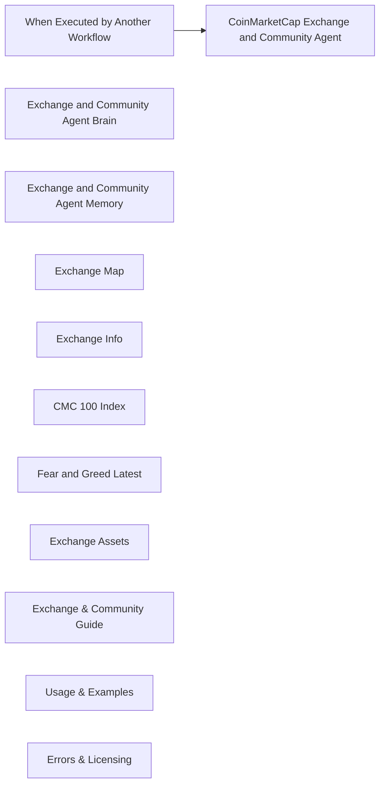

## Fluxo (.json) :

```json
{
  "id": "kbJb4VMD3SZlcS2u",
  "meta": {
    "instanceId": "a5283507e1917a33cc3ae615b2e7d5ad2c1e50955e6f831272ddd5ab816f3fb6",
    "templateCredsSetupCompleted": true
  },
  "name": "CoinMarketCap_Exchange_and_Community_Agent_Tool",
  "tags": [],
  "nodes": [
    {
      "id": "c055762a-8fe7-4141-a639-df2372f30060",
      "name": "When Executed by Another Workflow",
      "type": "n8n-nodes-base.executeWorkflowTrigger",
      "position": [
        -160,
        340
      ],
      "parameters": {
        "workflowInputs": {
          "values": [
            {
              "name": "sessionId"
            },
            {
              "name": "message"
            }
          ]
        }
      },
      "typeVersion": 1.1
    },
    {
      "id": "3609967c-f7c4-4be5-8cf5-1213dcf8cd39",
      "name": "CoinMarketCap Exchange and Community Agent",
      "type": "@n8n/n8n-nodes-langchain.agent",
      "position": [
        300,
        340
      ],
      "parameters": {
        "text": "={{ $json.message }}",
        "options": {
          "systemMessage": "You are a **digital asset intelligence agent** designed to provide deep insights into the cryptocurrency ecosystem by querying CoinMarketCap's API. You support data retrieval across exchanges, community sentiment, and index tracking.\n\n---\n\n### 🛠️ Available Tools & Capabilities\n\n#### 1. 🔍 **Exchange Map**\n- **Purpose:** Retrieve a list of all registered cryptocurrency exchanges.\n- **Endpoint:** `https://pro-api.coinmarketcap.com/v1/exchange/map`\n- **Query Parameters:** \n  - `slug` (recommended starting point)\n  - `listing_status`, `start`, `limit`, `crypto_id`\n- **Returns:** Exchange ID, name, slug — essential for identifying exchanges.\n- **Usage:** Use first to acquire the `id` needed by other tools.\n\n---\n\n#### 2. 🧾 **Exchange Info**\n- **Purpose:** Obtain metadata for a specific exchange.\n- **Endpoint:** `https://pro-api.coinmarketcap.com/v1/exchange/info`\n- **Required Parameter:** `id` (from Exchange Map)\n- **Returns:** Description, launch year, country, website/Twitter links, and status.\n\n---\n\n#### 3. 💰 **Exchange Assets**\n- **Purpose:** View on-chain token holdings of an exchange.\n- **Endpoint:** `https://pro-api.coinmarketcap.com/v1/exchange/assets`\n- **Required Parameter:** `id` (from Exchange Map)\n- **Returns:** Token balances, wallet addresses, blockchain platform, and USD value.\n\n---\n\n#### 4. 📈 **CMC 100 Index**\n- **Purpose:** Get the latest CoinMarketCap 100 Index data.\n- **Endpoint:** `https://pro-api.coinmarketcap.com/v3/index/cmc100-latest`\n- **Returns:** Constituents of the index and their weights.\n\n---\n\n#### 5. 😱 **Fear and Greed Index (Latest)**\n- **Purpose:** Access current crypto market sentiment.\n- **Endpoint:** `https://pro-api.coinmarketcap.com/v3/fear-and-greed/latest`\n- **Returns:** Sentiment index score and classification (e.g., Fear, Greed).\n\n---\n\n### ⚠️ Error Trap: API Response Overload\nIf the API response returns **too much data** and exceeds the GPT model's token limit:\n- Notify the user with the message:  \n  **\"⚠️ The requested data exceeds the processing capacity of this model. Please refine your query by limiting results or filtering data.\"**\n- Suggest parameters like `limit`, `start`, or using a specific `id` or `slug` to reduce data size.\n\n---\n\nKeep responses structured, insightful, and performant. Always validate if required parameters are available before invoking a tool. Prioritize `Exchange Map` for ID resolution before calling `Exchange Info` or `Exchange Assets`.\n\n"
        },
        "promptType": "define"
      },
      "typeVersion": 1.8
    },
    {
      "id": "811480ce-f2c9-4400-b585-1a3609b5bef0",
      "name": "Exchange and Community Agent Brain",
      "type": "@n8n/n8n-nodes-langchain.lmChatOpenAi",
      "position": [
        -320,
        620
      ],
      "parameters": {
        "model": {
          "__rl": true,
          "mode": "list",
          "value": "gpt-4o-mini",
          "cachedResultName": "gpt-4o-mini"
        },
        "options": {}
      },
      "credentials": {
        "openAiApi": {
          "id": "yUizd8t0sD5wMYVG",
          "name": "OpenAi account"
        }
      },
      "typeVersion": 1.2
    },
    {
      "id": "007b07fd-2abe-4bdd-80ef-8883e0cbfcec",
      "name": "Exchange and Community Agent Memory",
      "type": "@n8n/n8n-nodes-langchain.memoryBufferWindow",
      "position": [
        -140,
        620
      ],
      "parameters": {},
      "typeVersion": 1.3
    },
    {
      "id": "669566d0-3dc5-413e-a8b5-80cf4aeaa54d",
      "name": "Exchange Map",
      "type": "@n8n/n8n-nodes-langchain.toolHttpRequest",
      "position": [
        60,
        620
      ],
      "parameters": {
        "url": "https://pro-api.coinmarketcap.com/v1/exchange/map",
        "sendQuery": true,
        "sendHeaders": true,
        "authentication": "genericCredentialType",
        "genericAuthType": "httpHeaderAuth",
        "parametersQuery": {
          "values": [
            {
              "name": "slug"
            }
          ]
        },
        "toolDescription": "Get a map of all crypto exchanges with CoinMarketCap ID, name, and slug.\n\n1st query with only the slug only, if error then try others.",
        "parametersHeaders": {
          "values": [
            {
              "name": "Accept"
            }
          ]
        }
      },
      "credentials": {
        "httpHeaderAuth": {
          "id": "OKXROn8aWkgAOvvV",
          "name": "CoinMarketCap Standard"
        }
      },
      "typeVersion": 1.1
    },
    {
      "id": "03b3e44f-a740-414c-a011-de4d571b7968",
      "name": "Exchange Info",
      "type": "@n8n/n8n-nodes-langchain.toolHttpRequest",
      "position": [
        280,
        620
      ],
      "parameters": {
        "url": "https://pro-api.coinmarketcap.com/v1/exchange/info",
        "sendQuery": true,
        "sendHeaders": true,
        "authentication": "genericCredentialType",
        "genericAuthType": "httpHeaderAuth",
        "parametersQuery": {
          "values": [
            {
              "name": "id"
            }
          ]
        },
        "toolDescription": "Get metadata for a crypto exchange including description, launch date, country, and links.",
        "parametersHeaders": {
          "values": [
            {
              "name": "Accept"
            }
          ]
        }
      },
      "credentials": {
        "httpHeaderAuth": {
          "id": "OKXROn8aWkgAOvvV",
          "name": "CoinMarketCap Standard"
        }
      },
      "typeVersion": 1.1
    },
    {
      "id": "65c2b8ab-7d6d-415e-a436-0a9c14af2457",
      "name": "CMC 100 Index",
      "type": "@n8n/n8n-nodes-langchain.toolHttpRequest",
      "position": [
        740,
        620
      ],
      "parameters": {
        "url": "https://pro-api.coinmarketcap.com/v3/index/cmc100-latest",
        "sendHeaders": true,
        "authentication": "genericCredentialType",
        "genericAuthType": "httpHeaderAuth",
        "toolDescription": "Returns the latest CoinMarketCap 100 Index value, including constituents and their weights.",
        "parametersHeaders": {
          "values": [
            {
              "name": "Accept"
            }
          ]
        }
      },
      "credentials": {
        "httpHeaderAuth": {
          "id": "OKXROn8aWkgAOvvV",
          "name": "CoinMarketCap Standard"
        }
      },
      "typeVersion": 1.1
    },
    {
      "id": "51a94f35-4405-4e53-9fa5-91911759802d",
      "name": "Fear and Greed Latest",
      "type": "@n8n/n8n-nodes-langchain.toolHttpRequest",
      "position": [
        980,
        620
      ],
      "parameters": {
        "url": "https://pro-api.coinmarketcap.com/v3/fear-and-greed/latest",
        "sendHeaders": true,
        "authentication": "genericCredentialType",
        "genericAuthType": "httpHeaderAuth",
        "toolDescription": "Returns the latest value from the CMC Crypto Fear and Greed Index.",
        "parametersHeaders": {
          "values": [
            {
              "name": "Accept"
            }
          ]
        }
      },
      "credentials": {
        "httpHeaderAuth": {
          "id": "OKXROn8aWkgAOvvV",
          "name": "CoinMarketCap Standard"
        }
      },
      "typeVersion": 1.1
    },
    {
      "id": "26240549-9b41-4b6a-bf24-d61c8ee155ca",
      "name": "Exchange Assets",
      "type": "@n8n/n8n-nodes-langchain.toolHttpRequest",
      "position": [
        520,
        620
      ],
      "parameters": {
        "url": "https://pro-api.coinmarketcap.com/v1/exchange/assets",
        "sendQuery": true,
        "sendHeaders": true,
        "authentication": "genericCredentialType",
        "genericAuthType": "httpHeaderAuth",
        "parametersQuery": {
          "values": [
            {
              "name": "id"
            }
          ]
        },
        "toolDescription": "Returns token holdings of a specific exchange including wallet addresses, platform, balance, and USD value.",
        "parametersHeaders": {
          "values": [
            {
              "name": "Accept"
            }
          ]
        }
      },
      "credentials": {
        "httpHeaderAuth": {
          "id": "OKXROn8aWkgAOvvV",
          "name": "CoinMarketCap Standard"
        }
      },
      "typeVersion": 1.1
    },
    {
      "id": "22b5608c-467e-41ff-81d9-559d110b872d",
      "name": "Exchange & Community Guide",
      "type": "n8n-nodes-base.stickyNote",
      "position": [
        -1520,
        -680
      ],
      "parameters": {
        "width": 1200,
        "height": 720,
        "content": "# 🧠 CoinMarketCap_Exchange_and_Community_Agent_Tool Guide\n\nThis agent handles **exchange-level** data, **community sentiment**, and **index insights** using CoinMarketCap API endpoints.\n\n## 🔌 Supported Tools\n1. `/v1/exchange/map` – Get exchange ID, name, and slug\n2. `/v1/exchange/info` – Metadata: launch date, social, location\n3. `/v1/exchange/assets` – Token holdings of exchange\n4. `/v3/index/cmc100-latest` – CoinMarketCap 100 Index info\n5. `/v3/fear-and-greed/latest` – Sentiment index (0–100)\n\n## 🧠 Agent Components:\n- **🧠 Brain**: GPT-4o Mini\n- **💾 Memory**: Conversation state handler\n- **⚙️ Tools**: 5 direct API endpoints\n\n## 🧩 Trigger Parameters:\n- `message` – Main query prompt\n- `sessionId` – Contextual memory key\n\n## 🔑 Notes:\n- Use `Exchange Map` to get valid `id` before calling `Exchange Info` or `Assets`\n- Fear & Greed index returns daily updated data points\n- Index tools return structured component weights"
      },
      "typeVersion": 1
    },
    {
      "id": "dd38cd37-bff7-4200-94e4-a7f2a0f3b979",
      "name": "Usage & Examples",
      "type": "n8n-nodes-base.stickyNote",
      "position": [
        -80,
        -680
      ],
      "parameters": {
        "color": 5,
        "width": 840,
        "height": 920,
        "content": "## 📌 Usage Instructions\n\n### ✅ Step 1: Provide Inputs\nUse `slug` for exchanges or `id` for metadata/assets. \n\n### ✅ Step 2: Trigger from Supervisor Agent\nThe main workflow will send `message` and `sessionId`.\n\n### ✅ Step 3: Results Output\nReturns JSON with insights on exchanges or index data.\n\n---\n\n## 🔍 Example Prompts\n\n### 1️⃣ Show latest Fear & Greed score\n```plaintext\nGET /v3/fear-and-greed/latest\n```\n\n### 2️⃣ Get Binance exchange token holdings\n```plaintext\n1. GET /v1/exchange/map?slug=binance\n2. Use ID to query /v1/exchange/assets?id=...\n```\n\n### 3️⃣ What coins make up the CMC 100 Index?\n```plaintext\nGET /v3/index/cmc100-latest\n```\n\n### 4️⃣ Show info on Coinbase\n```plaintext\n1. /v1/exchange/map?slug=coinbase\n2. /v1/exchange/info?id=...\n```"
      },
      "typeVersion": 1
    },
    {
      "id": "ce0e7093-9fe0-4b9c-8cf5-50cdfef45d94",
      "name": "Errors & Licensing",
      "type": "n8n-nodes-base.stickyNote",
      "position": [
        1020,
        -680
      ],
      "parameters": {
        "color": 3,
        "width": 640,
        "height": 500,
        "content": "## ⚠️ Error Handling Tips\n\n| Error Code | Meaning |\n|------------|---------|\n| `400` | Bad Request – missing/invalid param |\n| `401` | Unauthorized – check API key |\n| `429` | Rate Limit Exceeded |\n| `500` | CoinMarketCap server error |\n\n### ⚠️ Large Response Warning\nIf result data exceeds memory limits:\n- Prompt: _“⚠️ Data too large, refine query with limit or filters.”_\n\n---\n\n**Need Help?**  \n🌐 Connect on LinkedIn:  \n🔗 [http://linkedin.com/in/donjayamahajr](http://linkedin.com/in/donjayamahajr)\n\n© 2025 Treasurium Capital Limited Company. All rights reserved.\nThis AI workflow architecture, including logic, design, and prompt structures, is the intellectual property of Treasurium Capital Limited Company. Unauthorized reproduction, redistribution, or resale is prohibited under U.S. copyright law. Licensed use only."
      },
      "typeVersion": 1
    }
  ],
  "active": false,
  "pinData": {},
  "settings": {
    "executionOrder": "v1"
  },
  "versionId": "faf44acc-2d07-4185-877c-b57f9c8c88bb",
  "connections": {
    "Exchange Map": {
      "ai_tool": [
        [
          {
            "node": "CoinMarketCap Exchange and Community Agent",
            "type": "ai_tool",
            "index": 0
          }
        ]
      ]
    },
    "CMC 100 Index": {
      "ai_tool": [
        [
          {
            "node": "CoinMarketCap Exchange and Community Agent",
            "type": "ai_tool",
            "index": 0
          }
        ]
      ]
    },
    "Exchange Info": {
      "ai_tool": [
        [
          {
            "node": "CoinMarketCap Exchange and Community Agent",
            "type": "ai_tool",
            "index": 0
          }
        ]
      ]
    },
    "Exchange Assets": {
      "ai_tool": [
        [
          {
            "node": "CoinMarketCap Exchange and Community Agent",
            "type": "ai_tool",
            "index": 0
          }
        ]
      ]
    },
    "Fear and Greed Latest": {
      "ai_tool": [
        [
          {
            "node": "CoinMarketCap Exchange and Community Agent",
            "type": "ai_tool",
            "index": 0
          }
        ]
      ]
    },
    "When Executed by Another Workflow": {
      "main": [
        [
          {
            "node": "CoinMarketCap Exchange and Community Agent",
            "type": "main",
            "index": 0
          }
        ]
      ]
    },
    "Exchange and Community Agent Brain": {
      "ai_languageModel": [
        [
          {
            "node": "CoinMarketCap Exchange and Community Agent",
            "type": "ai_languageModel",
            "index": 0
          }
        ]
      ]
    },
    "Exchange and Community Agent Memory": {
      "ai_memory": [
        [
          {
            "node": "CoinMarketCap Exchange and Community Agent",
            "type": "ai_memory",
            "index": 0
          }
        ]
      ]
    }
  }
}
```

<a id="template-1884"></a>

## Template 1884 - Raspagem agendada de sites

- **Nome:** Raspagem agendada de sites
- **Descrição:** Agenda e envia uma requisição para a API Scrappey usando uma URL fornecida como dado de teste, retornando o conteúdo raspado do site.
- **Funcionalidade:** • Agendamento periódico: inicia o fluxo em intervalos definidos para executar a raspagem automaticamente.
• Fornecimento de dados de teste: injeta um nome e uma URL de exemplo para usar nas requisições.
• Requisição à API de raspagem: envia um POST para a API externa com o comando para obter a página (cmd=request.get) e a URL dinâmica.
• Uso de chave de API: inclui a chave da API como parâmetro de consulta para autenticação do serviço de raspagem.
• Documentação interna: inclui notas explicativas com instruções e recomendações de configuração.
- **Ferramentas:** • Scrappey API: serviço externo que realiza a raspagem de sites e fornece o conteúdo HTML/resultado da requisição; usado para contornar bloqueios anti-bot e exige chave de API.
• Website alvo: qualquer site público fornecido como URL de entrada, que será acessado e raspado pela API.

## Fluxo visual

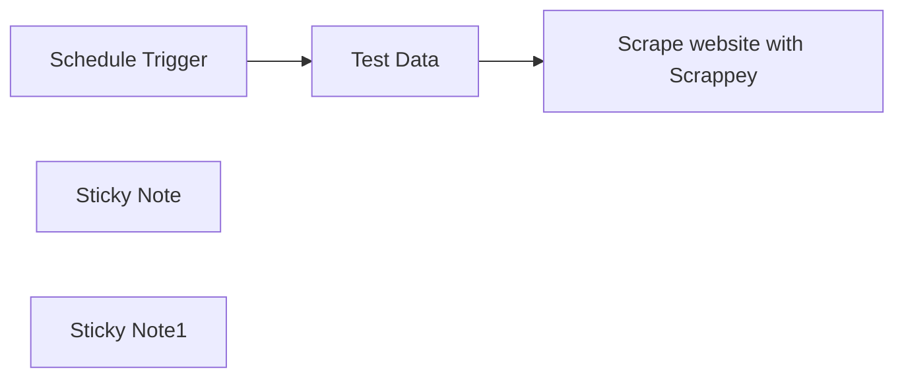

## Fluxo (.json) :

```json
{
  "meta": {
    "instanceId": "1dd912a1610cd0376bae7bb8f1b5838d2b601f42ac66a48e012166bb954fed5a",
    "templateId": "2299",
    "templateCredsSetupCompleted": true
  },
  "nodes": [
    {
      "id": "edf41c95-2421-4008-9097-73687fe4bbfc",
      "name": "Schedule Trigger",
      "type": "n8n-nodes-base.scheduleTrigger",
      "position": [
        380,
        240
      ],
      "parameters": {
        "rule": {
          "interval": [
            {}
          ]
        }
      },
      "typeVersion": 1.2
    },
    {
      "id": "bde8d167-b7c4-4fc8-a256-b022bb33347d",
      "name": "Test Data",
      "type": "n8n-nodes-base.set",
      "position": [
        800,
        240
      ],
      "parameters": {
        "options": {},
        "assignments": {
          "assignments": [
            {
              "id": "e0e09aa8-2374-43f7-87bf-f2ffcac8e1d9",
              "name": "name",
              "type": "string",
              "value": "n8n"
            },
            {
              "id": "2086908e-c301-4392-9cf6-b6461e11dcd4",
              "name": "url",
              "type": "string",
              "value": "https://n8n.io/"
            }
          ]
        }
      },
      "typeVersion": 3.3
    },
    {
      "id": "e53d7ec5-f98a-41fe-b082-00e2f680dcea",
      "name": "Sticky Note",
      "type": "n8n-nodes-base.stickyNote",
      "position": [
        760,
        40
      ],
      "parameters": {
        "content": "## Test Data \n\nUsing n8n.io as test url.\n\nFor production use, you have to connect your data here."
      },
      "typeVersion": 1
    },
    {
      "id": "835c2a8c-edd6-43dc-b898-e2c49dd65beb",
      "name": "Sticky Note1",
      "type": "n8n-nodes-base.stickyNote",
      "position": [
        1120,
        -40
      ],
      "parameters": {
        "width": 389,
        "height": 255.7976193268613,
        "content": "## Web Scraping \n\nUsing **Scrappey's** API to scrape every website.\n\nDon't get blocked again by anti-bot technologies while scraping the web.\n\n**Setup:**\nReplace YOUR_API_KEY with [your Scrappey API key.](https://scrappey.com/?ref=n8n)\n"
      },
      "typeVersion": 1
    },
    {
      "id": "7f8b3077-ec09-4fec-a4f0-f6b7f3f7ec0e",
      "name": "Scrape website with Scrappey",
      "type": "n8n-nodes-base.httpRequest",
      "position": [
        1280,
        240
      ],
      "parameters": {
        "url": "https://publisher.scrappey.com/api/v1",
        "method": "POST",
        "options": {
          "redirect": {
            "redirect": {}
          }
        },
        "sendBody": true,
        "sendQuery": true,
        "bodyParameters": {
          "parameters": [
            {
              "name": "cmd",
              "value": "request.get"
            },
            {
              "name": "url",
              "value": "={{ $json.url }}"
            }
          ]
        },
        "queryParameters": {
          "parameters": [
            {
              "name": "key",
              "value": "YOUR_API_KEY"
            }
          ]
        }
      },
      "typeVersion": 4.2
    }
  ],
  "pinData": {},
  "connections": {
    "Test Data": {
      "main": [
        [
          {
            "node": "Scrape website with Scrappey",
            "type": "main",
            "index": 0
          }
        ]
      ]
    },
    "Schedule Trigger": {
      "main": [
        [
          {
            "node": "Test Data",
            "type": "main",
            "index": 0
          }
        ]
      ]
    }
  }
}
```

<a id="template-1886"></a>

## Template 1886 - Gerar e executar SQL a partir de perguntas sobre e-mails

- **Nome:** Gerar e executar SQL a partir de perguntas sobre e-mails
- **Descrição:** Converte perguntas em linguagem natural sobre e-mails em consultas SQL compatíveis com o esquema do banco, executa essas consultas e retorna os resultados formatados.
- **Funcionalidade:** • Geração de consultas SQL a partir de linguagem natural: usa um modelo de IA para transformar pedidos em SQL seguindo regras estritas.
• Carregamento e extração do esquema do banco: obtém lista de tabelas, colunas e tipos para garantir aderência ao esquema.
• Validação e formatação de queries: verifica presença de ponto e vírgula, extrai e limpa a instrução SELECT antes de executar.
• Execução de consultas no banco de dados: roda as consultas geradas contra o PostgreSQL e recupera os resultados.
• Formatação dos resultados: apresenta colunas e linhas em formato legível (coluna | coluna ...).
• Cache local do esquema: salva o esquema em arquivo JSON local para reutilização e desempenho.
• Suporte a gatilhos manuais e por chat/sub-workflow: pode ser acionado manualmente ou via entrada de chat/natural language.
• Combinação da resposta do AI com resultados SQL: mescla a saída do agente de IA com os resultados da consulta para retorno ao usuário.
• Regras de segurança e restrição de esquema: impede invenção de colunas, aplica operadores compatíveis com tipos de dados e evita considerar e-mails do futuro.
- **Ferramentas:** • PostgreSQL: banco de dados relacional que contém a tabela de metadados de e-mails usada para consultas.
• Modelo de linguagem Ollama (phi4-mini): gerador de consultas SQL a partir de instruções em linguagem natural.
• Sistema de arquivos local: armazenamento e leitura do esquema em arquivo JSON para cache e reutilização.

## Fluxo visual

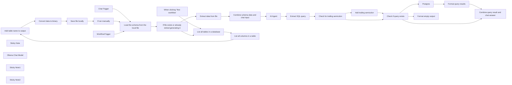

## Fluxo (.json) :

```json
{
  "id": "AC4paL1SXMFURgmc",
  "meta": {
    "instanceId": "8a3ba313628b26e4e4cf0504ff23322f235d6b433d92e59bcf8762764730ed80",
    "templateCredsSetupCompleted": true
  },
  "name": "Translate questions about e-mails into SQL queries and run them",
  "tags": [],
  "nodes": [
    {
      "id": "dd63600a-6bee-43cd-a1d2-87aae2089ed4",
      "name": "Add table name to output",
      "type": "n8n-nodes-base.set",
      "position": [
        840,
        160
      ],
      "parameters": {
        "options": {},
        "assignments": {
          "assignments": [
            {
              "id": "764176d6-3c89-404d-9c71-301e8a406a68",
              "name": "table",
              "type": "string",
              "value": "={{ $('List all tables in a database').item.json.table_name ?? 'emails_metadata'}}"
            }
          ]
        },
        "includeOtherFields": true
      },
      "typeVersion": 3.4
    },
    {
      "id": "1bf02b6d-e8e4-4b1b-8ee2-c91a8c390a21",
      "name": "Convert data to binary",
      "type": "n8n-nodes-base.convertToFile",
      "position": [
        1040,
        160
      ],
      "parameters": {
        "options": {},
        "operation": "toJson"
      },
      "typeVersion": 1.1
    },
    {
      "id": "cf930fa2-03bd-46fa-af4d-df282262f965",
      "name": "Save file locally",
      "type": "n8n-nodes-base.readWriteFile",
      "position": [
        1220,
        160
      ],
      "parameters": {
        "options": {},
        "fileName": "=/files/pgsql-{{ $workflow.id }}.json",
        "operation": "write"
      },
      "typeVersion": 1
    },
    {
      "id": "48bc8812-7e1b-4d08-8610-884e00069f3c",
      "name": "Extract data from file",
      "type": "n8n-nodes-base.extractFromFile",
      "position": [
        920,
        620
      ],
      "parameters": {
        "options": {},
        "operation": "fromJson"
      },
      "typeVersion": 1
    },
    {
      "id": "0d6a0a55-a7cb-4471-ba80-a336324d2939",
      "name": "Chat Trigger",
      "type": "@n8n/n8n-nodes-langchain.chatTrigger",
      "position": [
        260,
        520
      ],
      "webhookId": "c308dec7-655c-4b79-832e-991bd8ea891f",
      "parameters": {
        "options": {}
      },
      "typeVersion": 1.1
    },
    {
      "id": "8f39276c-4ce7-4b27-b022-231607a9cfb3",
      "name": "Sticky Note",
      "type": "n8n-nodes-base.stickyNote",
      "position": [
        160,
        -60
      ],
      "parameters": {
        "color": 3,
        "width": 1505,
        "height": 486,
        "content": "## This can run manually\nThis section:\n* loads a list of all tables from the database\n* extracts the database schema for each table and adds the table name\n* converts the schema into a binary JSON format\n* saves the schema  file locally"
      },
      "typeVersion": 1
    },
    {
      "id": "4fb5174f-a3ed-413f-98f7-41b0b46b62ae",
      "name": "When clicking \"Test workflow\"",
      "type": "n8n-nodes-base.manualTrigger",
      "position": [
        260,
        160
      ],
      "parameters": {},
      "typeVersion": 1
    },
    {
      "id": "cf6e9426-18ca-4d6e-bff2-d517ae7b4c1e",
      "name": "Combine schema data and chat input",
      "type": "n8n-nodes-base.set",
      "position": [
        1140,
        620
      ],
      "parameters": {
        "options": {},
        "assignments": {
          "assignments": [
            {
              "id": "42abd24e-419a-47d6-bc8b-7146dd0b8314",
              "name": "sessionId",
              "type": "string",
              "value": "={{ $('Chat Trigger').isExecuted && $('Chat Trigger').first().json.sessionId }}"
            },
            {
              "id": "39244192-a1a6-42fe-bc75-a6fba1f264df",
              "name": "action",
              "type": "string",
              "value": "={{ $('Chat Trigger').isExecuted && $('Chat Trigger').first().json.action }}"
            },
            {
              "id": "f78c57d9-df13-43c7-89a7-5387e528107e",
              "name": "chatinput",
              "type": "string",
              "value": "={{ $('WorkflowTrigger').isExecuted ? $('WorkflowTrigger').first().json.natural_language_query: $('Chat Trigger').first().json.chatInput }}"
            },
            {
              "id": "e42b39eb-dfbd-48d9-94ed-d658bdd41454",
              "name": "schema",
              "type": "string",
              "value": "={{ $json.data }}"
            }
          ]
        }
      },
      "executeOnce": true,
      "typeVersion": 3.4
    },
    {
      "id": "6a960e03-ea13-4090-8ef8-9b294963fa63",
      "name": "Load the schema from the local file",
      "type": "n8n-nodes-base.readWriteFile",
      "onError": "continueRegularOutput",
      "maxTries": 2,
      "position": [
        480,
        620
      ],
      "parameters": {
        "options": {},
        "fileSelector": "=/files/pgsql-{{ $workflow.id }}.json"
      },
      "retryOnFail": false,
      "typeVersion": 1,
      "alwaysOutputData": true
    },
    {
      "id": "0bad6e46-e8ed-4ba6-a7d9-2d69fd11227b",
      "name": "Extract SQL query",
      "type": "n8n-nodes-base.set",
      "position": [
        1740,
        620
      ],
      "parameters": {
        "options": {},
        "assignments": {
          "assignments": [
            {
              "id": "ebbe194a-4b8b-44c9-ac19-03cf69d353bf",
              "name": "query",
              "type": "string",
              "value": "={{ ($json.output.match(/SELECT[^;]*/i) || [])[0] || \"\" }}"
            }
          ]
        }
      },
      "typeVersion": 3.4
    },
    {
      "id": "2aa91c40-8648-4fba-899d-5599866122e3",
      "name": "Check if query exists",
      "type": "n8n-nodes-base.if",
      "position": [
        2400,
        620
      ],
      "parameters": {
        "options": {},
        "conditions": {
          "options": {
            "version": 2,
            "leftValue": "",
            "caseSensitive": true,
            "typeValidation": "strict"
          },
          "combinator": "and",
          "conditions": [
            {
              "id": "2963d04d-9d79-49f9-b52a-dc8732aca781",
              "operator": {
                "type": "string",
                "operation": "notEmpty",
                "singleValue": true
              },
              "leftValue": "={{ $json.query }}",
              "rightValue": ""
            }
          ]
        }
      },
      "typeVersion": 2.2
    },
    {
      "id": "24b59747-7f9b-473c-9d31-660e17867986",
      "name": "Format query results",
      "type": "n8n-nodes-base.set",
      "position": [
        2840,
        460
      ],
      "parameters": {
        "options": {},
        "assignments": {
          "assignments": [
            {
              "id": "f944d21f-6aac-4842-8926-4108d6cad4bf",
              "name": "sqloutput",
              "type": "string",
              "value": "={{ Object.keys($jmespath($input.all(),'[].json')[0]).join(' | ') }} \n{{ ($jmespath($input.all(),'[].json')).map(obj => Object.values(obj).join(' | ')).join('\\n') }}"
            }
          ]
        }
      },
      "executeOnce": true,
      "typeVersion": 3.4
    },
    {
      "id": "a25acba2-74c5-4af6-a1e4-46cfd1364b44",
      "name": "Combine query result and chat answer",
      "type": "n8n-nodes-base.merge",
      "position": [
        3060,
        540
      ],
      "parameters": {
        "mode": "combine",
        "options": {
          "includeUnpaired": true
        },
        "combineBy": "combineByPosition"
      },
      "typeVersion": 3
    },
    {
      "id": "a1cde4a1-7b47-4aa2-bd2c-a7090bfb0bb2",
      "name": "List all columns in a table",
      "type": "n8n-nodes-base.postgres",
      "position": [
        640,
        160
      ],
      "parameters": {
        "query": "SELECT\n  column_name, \n  udt_name as data_type, \n  CASE WHEN data_type = 'ARRAY' THEN TRUE ELSE FALSE END AS is_array,\n  is_nullable \nFROM INFORMATION_SCHEMA.COLUMNS where table_name = '{{ $json.table_name }}'",
        "options": {},
        "operation": "executeQuery"
      },
      "credentials": {},
      "typeVersion": 2.6
    },
    {
      "id": "cf167b64-007d-469a-bb3e-1144fe435a17",
      "name": "List all tables in a database",
      "type": "n8n-nodes-base.postgres",
      "position": [
        460,
        160
      ],
      "parameters": {
        "query": "SELECT table_name FROM INFORMATION_SCHEMA.TABLES WHERE table_schema='public'",
        "options": {},
        "operation": "executeQuery"
      },
      "credentials": {},
      "typeVersion": 2.6
    },
    {
      "id": "6f6fd892-d779-41d4-ac19-1d5630674f67",
      "name": "Ollama Chat Model",
      "type": "@n8n/n8n-nodes-langchain.lmChatOllama",
      "position": [
        1440,
        840
      ],
      "parameters": {
        "model": "phi4-mini:latest",
        "options": {}
      },
      "credentials": {},
      "typeVersion": 1
    },
    {
      "id": "6cb76f04-3183-4bce-aa15-0724205d0ab3",
      "name": "Postgres",
      "type": "n8n-nodes-base.postgres",
      "onError": "continueRegularOutput",
      "position": [
        2620,
        460
      ],
      "parameters": {
        "query": "{{ $json.query }}",
        "options": {},
        "operation": "executeQuery"
      },
      "credentials": {},
      "typeVersion": 2.6,
      "alwaysOutputData": true
    },
    {
      "id": "9c2a4d74-c2e6-4fac-a00d-2a84a5150027",
      "name": "Add trailing semicolon",
      "type": "n8n-nodes-base.set",
      "position": [
        2180,
        540
      ],
      "parameters": {
        "options": {},
        "assignments": {
          "assignments": [
            {
              "id": "15622b82-a226-4f54-9c0e-3f30b2c0cf4b",
              "name": "query",
              "type": "string",
              "value": "={{ $json.query }};"
            }
          ]
        }
      },
      "typeVersion": 3.4
    },
    {
      "id": "7725f9c3-9c5d-41d6-b4d1-fc444122ae2f",
      "name": "Check for trailing semicolon",
      "type": "n8n-nodes-base.if",
      "position": [
        1960,
        620
      ],
      "parameters": {
        "options": {},
        "conditions": {
          "options": {
            "version": 2,
            "leftValue": "",
            "caseSensitive": true,
            "typeValidation": "strict"
          },
          "combinator": "and",
          "conditions": [
            {
              "id": "94bd2686-21e7-44aa-b6a8-be5a17bd0242",
              "operator": {
                "type": "string",
                "operation": "notEmpty",
                "singleValue": true
              },
              "leftValue": "={{ $json.query }}",
              "rightValue": ""
            },
            {
              "id": "f22c8914-62f3-4f15-be6f-dd23de5a099a",
              "operator": {
                "type": "string",
                "operation": "notEndsWith"
              },
              "leftValue": "={{ $json.query }}",
              "rightValue": ";"
            }
          ]
        }
      },
      "typeVersion": 2.2
    },
    {
      "id": "c7dd1e14-a8f6-4222-a12a-802928b10f56",
      "name": "WorkflowTrigger",
      "type": "n8n-nodes-base.executeWorkflowTrigger",
      "position": [
        260,
        720
      ],
      "parameters": {
        "workflowInputs": {
          "values": [
            {
              "name": "natural_language_query"
            }
          ]
        }
      },
      "typeVersion": 1.1
    },
    {
      "id": "f658fbba-54e3-40f5-9217-a0c8730b1ff4",
      "name": "If ran manually",
      "type": "n8n-nodes-base.if",
      "position": [
        1420,
        160
      ],
      "parameters": {
        "options": {},
        "conditions": {
          "options": {
            "version": 2,
            "leftValue": "",
            "caseSensitive": true,
            "typeValidation": "strict"
          },
          "combinator": "or",
          "conditions": [
            {
              "id": "c761a475-43ac-483b-827c-0eb69dfebc9a",
              "operator": {
                "type": "boolean",
                "operation": "true",
                "singleValue": true
              },
              "leftValue": "={{ $('When clicking \"Test workflow\"').isExecuted }}",
              "rightValue": ""
            }
          ]
        }
      },
      "typeVersion": 2.2
    },
    {
      "id": "67810482-afb7-47b0-ba0d-8b79a140e890",
      "name": "If file exists or already retried generating it",
      "type": "n8n-nodes-base.if",
      "position": [
        700,
        620
      ],
      "parameters": {
        "options": {},
        "conditions": {
          "options": {
            "version": 2,
            "leftValue": "",
            "caseSensitive": true,
            "typeValidation": "strict"
          },
          "combinator": "or",
          "conditions": [
            {
              "id": "28000886-13f4-4628-b1c0-afaaf596ec56",
              "operator": {
                "type": "object",
                "operation": "exists",
                "singleValue": true
              },
              "leftValue": "={{ $input.item.binary }}",
              "rightValue": ""
            },
            {
              "id": "ddcd8702-8774-4075-a2d0-6d99cf0cb2c2",
              "operator": {
                "type": "boolean",
                "operation": "true",
                "singleValue": true
              },
              "leftValue": "={{ $('If ran manually').isExecuted }}",
              "rightValue": ""
            }
          ]
        }
      },
      "typeVersion": 2.2
    },
    {
      "id": "38121ff4-b0d2-4274-92bf-be346b71c1e9",
      "name": "Sticky Note1",
      "type": "n8n-nodes-base.stickyNote",
      "position": [
        160,
        440
      ],
      "parameters": {
        "width": 720,
        "height": 540,
        "content": "## This is triggered by chat or as a sub-workflow\nNatural language requests can be asked, and a SQL query as well as its results will be returned."
      },
      "typeVersion": 1
    },
    {
      "id": "05dce292-4d93-4b0d-87e1-09e8b1dab70a",
      "name": "AI Agent",
      "type": "@n8n/n8n-nodes-langchain.agent",
      "position": [
        1360,
        620
      ],
      "parameters": {
        "text": "=You have access to a database containing all my personal email and documents.\n\nToday's date is {{ $now.toLocaleString() }}\n\nThe database schema is:\n```\n{{ $json.schema }}\n```\n\nGenerate a SQL query that will:\n```\n{{ $json.chatinput }}\n```\n\nIMPORTANT: \n1. ONLY use column names that exist in the schema above\n2. NEVER invent columns or assume JSON fields that aren't listed\n3. The only metadata fields are emails_metadata.id and emails_metadata.thread_id\n4. Use operators appropriate for each data type:\n   - Text fields → ILIKE '%term%'\n   - Date fields → Date comparisons (>,<,BETWEEN)\n   - Array fields → @>, ANY(), IS NOT NULL\n5. Output ONLY the raw SQL statement ending with a semicolon\n6. The database cannot contain emails from the future",
        "options": {
          "systemMessage": "=You are an expert SQL query generator that creates precise PostgreSQL queries based on natural language requests. You must strictly adhere to the provided database schema and NEVER invent columns that don't exist.\n\nCRITICAL SCHEMA ADHERENCE RULES:\n\n1. ONLY use columns explicitly listed in the schema\n2. The metadata fields are strictly limited to:\n   - emails_metadata.id\n   - emails_metadata.thread_id\n3. NEVER invent fields like \"priority\", \"category\", or any metadata attributes not in the schema\n4. NEVER use JSON operators (->>, @>) unless the schema shows JSONB columns\n\nDATA TYPE HANDLING:\n\n1. TEXT/VARCHAR FIELDS:\n   - Use ILIKE '%term%' for case-insensitive pattern matching\n   - Example: WHERE email_subject ILIKE '%meeting%'\n\n2. TIMESTAMP/DATE FIELDS:\n   - NEVER use LIKE/ILIKE on date fields\n   - \"yesterday\" → date > CURRENT_DATE - INTERVAL '1 day' AND date < CURRENT_DATE\n   - \"last week\" → date > CURRENT_DATE - INTERVAL '7 days'\n   - Example: WHERE date > CURRENT_DATE - INTERVAL '3 days'\n\n3. ARRAY FIELDS:\n   - Use @> for checking if array contains elements\n   - Example: WHERE attachments IS NOT NULL\n\n4. BOOLEAN LOGIC:\n   - Always use parentheses to clarify operator precedence\n   - Example: WHERE (email_subject ILIKE '%report%' OR email_text ILIKE '%report%') AND date > '2023-01-01'\n\nQUERY CONSTRUCTION GUIDELINES:\n- Start with \"SELECT * FROM\" unless specific fields are requested\n- Use ORDER BY date DESC for recency when appropriate\n- Apply LIMIT only when specifically requested or implied by quantity terms\n- End all statements with semicolons\n- Output only the raw SQL without explanations or code blocks\n- Mind the difference between emails _about_ future dates references, and emails _received_ in specific date references. The database cannot contain emails from the future.\n\nEXAMPLE QUERIES:\n1. \"recent emails about projects from Sarah with attachments\"\n   SELECT * FROM emails_metadata \n   WHERE (email_subject ILIKE '%project%' OR email_text ILIKE '%project%')\n   AND email_from ILIKE '%sarah%' \n   AND attachments IS NOT NULL\n   ORDER BY date DESC;\n\n2. \"emails received yesterday\"\n   SELECT * FROM emails_metadata \n   WHERE date > CURRENT_DATE - INTERVAL '1 day' AND date < CURRENT_DATE;\n\n3. \"one email about budget\"\n   SELECT * FROM emails_metadata \n   WHERE (email_subject ILIKE '%budget%' OR email_text ILIKE '%budget%')\n   LIMIT 1;\n\n4. \"Find emails about interviews scheduled from April 28 to May 4\"\n   SELECT * FROM emails_metadata\n   WHERE (email_subject ILIKE '%interview%' OR email_text ILIKE '%interview%');\n\n5. \"Find emails from April about interviews\"\n   SELECT * FROM emails_metadata \n   WHERE (email_subject ILIKE '%interview%' OR email_text ILIKE '%interview%') AND date BETWEEN '2025-04-01' AND '2025-04-30';\n\n6. \"emails in thread 123\"\n   SELECT * FROM emails_metadata \n   WHERE thread_id = '123';\n\n7. \"what's my latest email?\"\n   SELECT * FROM emails_metadata\n   ORDER BY date DESC LIMIT 1;\n"
        },
        "promptType": "define"
      },
      "typeVersion": 1.8
    },
    {
      "id": "6961fed9-4dcf-4a7f-97eb-bbf9e66dff3e",
      "name": "Format empty output",
      "type": "n8n-nodes-base.set",
      "position": [
        2620,
        760
      ],
      "parameters": {
        "options": {},
        "assignments": {
          "assignments": [
            {
              "id": "aa55e186-1535-4923-aee4-e088ca69575b",
              "name": "query",
              "type": "string",
              "value": "={{ $json.query ?? '' }}"
            }
          ]
        }
      },
      "typeVersion": 3.4
    },
    {
      "id": "8138aed4-e38d-4c3c-9850-a200bd4d762e",
      "name": "Sticky Note2",
      "type": "n8n-nodes-base.stickyNote",
      "position": [
        1320,
        440
      ],
      "parameters": {
        "width": 340,
        "height": 540,
        "content": "## Quite the prompt 😅\nSome refined prompt engineering work here.\n\nIt may or may not been done aided by Kagi's Assistant and Claude 3.7 Sonnet 👀"
      },
      "typeVersion": 1
    }
  ],
  "active": false,
  "pinData": {},
  "settings": {
    "executionOrder": "v1"
  },
  "versionId": "c4e0962f-2c7f-4d14-af37-df491db2ebd0",
  "connections": {
    "AI Agent": {
      "main": [
        [
          {
            "node": "Extract SQL query",
            "type": "main",
            "index": 0
          }
        ]
      ]
    },
    "Postgres": {
      "main": [
        [
          {
            "node": "Format query results",
            "type": "main",
            "index": 0
          }
        ]
      ]
    },
    "Chat Trigger": {
      "main": [
        [
          {
            "node": "Load the schema from the local file",
            "type": "main",
            "index": 0
          }
        ]
      ]
    },
    "If ran manually": {
      "main": [
        [],
        [
          {
            "node": "Load the schema from the local file",
            "type": "main",
            "index": 0
          }
        ]
      ]
    },
    "WorkflowTrigger": {
      "main": [
        [
          {
            "node": "Load the schema from the local file",
            "type": "main",
            "index": 0
          }
        ]
      ]
    },
    "Extract SQL query": {
      "main": [
        [
          {
            "node": "Check for trailing semicolon",
            "type": "main",
            "index": 0
          }
        ]
      ]
    },
    "Ollama Chat Model": {
      "ai_languageModel": [
        [
          {
            "node": "AI Agent",
            "type": "ai_languageModel",
            "index": 0
          }
        ]
      ]
    },
    "Save file locally": {
      "main": [
        [
          {
            "node": "If ran manually",
            "type": "main",
            "index": 0
          }
        ]
      ]
    },
    "Format query results": {
      "main": [
        [
          {
            "node": "Combine query result and chat answer",
            "type": "main",
            "index": 0
          }
        ]
      ]
    },
    "Check if query exists": {
      "main": [
        [
          {
            "node": "Combine query result and chat answer",
            "type": "main",
            "index": 1
          },
          {
            "node": "Postgres",
            "type": "main",
            "index": 0
          }
        ],
        [
          {
            "node": "Format empty output",
            "type": "main",
            "index": 0
          }
        ]
      ]
    },
    "Add trailing semicolon": {
      "main": [
        [
          {
            "node": "Check if query exists",
            "type": "main",
            "index": 0
          }
        ]
      ]
    },
    "Convert data to binary": {
      "main": [
        [
          {
            "node": "Save file locally",
            "type": "main",
            "index": 0
          }
        ]
      ]
    },
    "Extract data from file": {
      "main": [
        [
          {
            "node": "Combine schema data and chat input",
            "type": "main",
            "index": 0
          }
        ]
      ]
    },
    "Add table name to output": {
      "main": [
        [
          {
            "node": "Convert data to binary",
            "type": "main",
            "index": 0
          }
        ]
      ]
    },
    "List all columns in a table": {
      "main": [
        [
          {
            "node": "Add table name to output",
            "type": "main",
            "index": 0
          }
        ]
      ]
    },
    "Check for trailing semicolon": {
      "main": [
        [
          {
            "node": "Add trailing semicolon",
            "type": "main",
            "index": 0
          }
        ],
        [
          {
            "node": "Check if query exists",
            "type": "main",
            "index": 0
          }
        ]
      ]
    },
    "List all tables in a database": {
      "main": [
        [
          {
            "node": "List all columns in a table",
            "type": "main",
            "index": 0
          }
        ]
      ]
    },
    "When clicking \"Test workflow\"": {
      "main": [
        [
          {
            "node": "List all tables in a database",
            "type": "main",
            "index": 0
          }
        ]
      ]
    },
    "Combine schema data and chat input": {
      "main": [
        [
          {
            "node": "AI Agent",
            "type": "main",
            "index": 0
          }
        ]
      ]
    },
    "Load the schema from the local file": {
      "main": [
        [
          {
            "node": "If file exists or already retried generating it",
            "type": "main",
            "index": 0
          }
        ],
        []
      ]
    },
    "Combine query result and chat answer": {
      "main": [
        []
      ]
    },
    "If file exists or already retried generating it": {
      "main": [
        [
          {
            "node": "Extract data from file",
            "type": "main",
            "index": 0
          }
        ],
        [
          {
            "node": "List all tables in a database",
            "type": "main",
            "index": 0
          }
        ]
      ]
    }
  }
}
```

<a id="template-1888"></a>

## Template 1888 - Agente de chat com busca na web

- **Nome:** Agente de chat com busca na web
- **Descrição:** Agente conversacional que responde a mensagens de chat usando um modelo de linguagem e consulta a web quando necessário.
- **Funcionalidade:** • Recepção de mensagens de chat: inicia o fluxo ao receber uma nova mensagem do usuário.
• Agente de IA para decisão: avalia a intenção e decide quando é necessário realizar uma busca na web.
• Integração com SearchAPI: executa consultas na web para obter informações atualizadas e relevantes.
• Uso de modelo de linguagem: gera respostas naturais e contextualizadas utilizando um LLM (por exemplo, gpt-4o-mini).
• Memória de contexto: mantém um histórico curto das interações recentes para melhorar a coerência das respostas.
• Configuração de mecanismo de busca: permite ajustar o motor/engine de busca utilizado pela API.
- **Ferramentas:** • SearchAPI (searchapi.io): serviço de busca na web usado para recuperar resultados e conteúdo atualizados.
• Modelo de linguagem (por exemplo OpenAI gpt-4o-mini): serviço de LLM usado para interpretar consultas e gerar respostas em linguagem natural.

## Fluxo visual

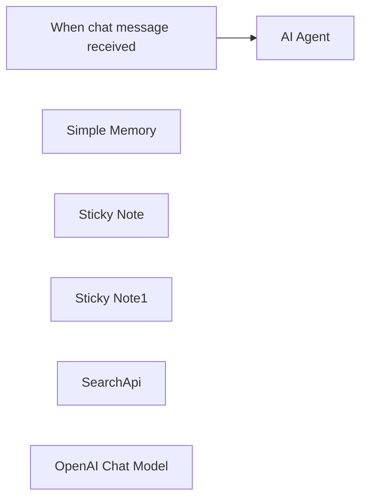

## Fluxo (.json) :

```json
{
  "id": "mvgpK03LMiYSiyxH",
  "meta": {
    "instanceId": "d58ea5647f14a122a558f2a99ce9c999af3b31f43e8079989af146576e4a2268"
  },
  "name": "SearchApi AI Agent",
  "tags": [],
  "nodes": [
    {
      "id": "72554855-a492-4382-9e6d-f3eb4b8bccdd",
      "name": "When chat message received",
      "type": "@n8n/n8n-nodes-langchain.chatTrigger",
      "position": [
        600,
        480
      ],
      "webhookId": "d48f9e07-3c05-4be8-86ca-5cee4c27b78f",
      "parameters": {
        "options": {}
      },
      "typeVersion": 1.1
    },
    {
      "id": "95d926d7-5c58-485d-bb44-0655ea71a172",
      "name": "Simple Memory",
      "type": "@n8n/n8n-nodes-langchain.memoryBufferWindow",
      "position": [
        980,
        700
      ],
      "parameters": {
        "contextWindowLength": 20
      },
      "typeVersion": 1.3
    },
    {
      "id": "3c62679b-66c9-4d06-a291-90c33b0b6c1a",
      "name": "AI Agent",
      "type": "@n8n/n8n-nodes-langchain.agent",
      "position": [
        860,
        480
      ],
      "parameters": {
        "options": {}
      },
      "typeVersion": 1.8
    },
    {
      "id": "050a87a7-b035-4d1b-bea6-915d413b31ac",
      "name": "Sticky Note",
      "type": "n8n-nodes-base.stickyNote",
      "position": [
        500,
        260
      ],
      "parameters": {
        "color": 5,
        "width": 340,
        "content": "## SearchApi AI Agent\nWhenever you ask a question that should be searched on the web, the AI Agent will use SearchAPI to do it. To run this workflow, you need to have the credentials for Searchapi.io and some LLM provider."
      },
      "typeVersion": 1
    },
    {
      "id": "8322c743-0f0a-49a8-bff7-ec4960a75287",
      "name": "Sticky Note1",
      "type": "n8n-nodes-base.stickyNote",
      "position": [
        1360,
        800
      ],
      "parameters": {
        "width": 260,
        "height": 120,
        "content": "## Tip\nYou can change the node to use any of the engines available on [SearchAPI.io](https://www.searchapi.io/)"
      },
      "typeVersion": 1
    },
    {
      "id": "45085fa9-7be4-41b0-9f2f-a6d4c8ff6979",
      "name": "SearchApi",
      "type": "@searchapi/n8n-nodes-searchapi.searchApiTool",
      "position": [
        1120,
        700
      ],
      "parameters": {
        "parameters": {
          "parameter": [
            {
              "name": "q",
              "value": "={{ /*n8n-auto-generated-fromAI-override*/ $fromAI('parameter0_Value', ``, 'string') }}"
            }
          ]
        },
        "requestOptions": {}
      },
      "typeVersion": 1
    },
    {
      "id": "f4edfcf7-a083-4781-9381-0b3c57f0d0bb",
      "name": "OpenAI Chat Model",
      "type": "@n8n/n8n-nodes-langchain.lmChatOpenAi",
      "position": [
        840,
        700
      ],
      "parameters": {
        "model": {
          "__rl": true,
          "mode": "list",
          "value": "gpt-4o-mini"
        },
        "options": {}
      },
      "typeVersion": 1.2
    }
  ],
  "active": false,
  "pinData": {},
  "settings": {
    "executionOrder": "v1"
  },
  "versionId": "1256a1a1-cf4e-4c91-8047-70bca3d93ca2",
  "connections": {
    "SearchApi": {
      "ai_tool": [
        [
          {
            "node": "AI Agent",
            "type": "ai_tool",
            "index": 0
          }
        ]
      ]
    },
    "Simple Memory": {
      "ai_memory": [
        [
          {
            "node": "AI Agent",
            "type": "ai_memory",
            "index": 0
          }
        ]
      ]
    },
    "OpenAI Chat Model": {
      "ai_languageModel": [
        [
          {
            "node": "AI Agent",
            "type": "ai_languageModel",
            "index": 0
          }
        ]
      ]
    },
    "When chat message received": {
      "main": [
        [
          {
            "node": "AI Agent",
            "type": "main",
            "index": 0
          }
        ]
      ]
    }
  }
}
```

<a id="template-1890"></a>

## Template 1890 - Agente com memória em Supabase e RAG

- **Nome:** Agente com memória em Supabase e RAG
- **Descrição:** Fluxo que expõe um agente via webhook, gerencia suas mensagens, tarefas, status e conhecimento em um banco Supabase, e utiliza embeddings OpenAI para recuperação de informações (RAG).
- **Funcionalidade:** • Recepção por webhook: Inicia o agente ao receber uma requisição externa.
• Gerenciamento de mensagens: Cria, obtém, atualiza, deleta e lista registros na tabela de mensagens do agente.
• Gerenciamento de tarefas: Cria, obtém, atualiza, deleta e lista registros na tabela de tarefas do agente.
• Gerenciamento de status: Cria, obtém, atualiza, deleta e lista registros na tabela de status do agente.
• Gerenciamento de conhecimento: Cria, obtém, atualiza, deleta, lista registros e permite limpeza específica na tabela de conhecimento do agente.
• Memória e recuperação (RAG): Recupera interações e instruções do sistema usando um índice vetorial armazenado para responder com contexto relevante.
• Geração de embeddings: Gera embeddings de texto para indexação e busca semântica.
• Integração de operações como ferramentas do agente: Todas as operações de banco e busca vetorial ficam disponíveis como ferramentas acessíveis pelo agente central.
- **Ferramentas:** • Supabase: Banco de dados relacional e armazenamento vetorial usado para persistir tabelas de agent_messages, agent_tasks, agent_status, agent_knowledge e a coleção de documentos/embeddings.
• OpenAI Embeddings: Serviço de geração de embeddings (modelo text-embedding-ada-002) usado para criar representações vetoriais dos textos para indexação e recuperação semântica.

## Fluxo visual


## Fluxo (.json) :

```json
{
  "id": "oowUGM7ey6gWxzEG",
  "meta": {
    "instanceId": "6d46e25379ef430a7067964d1096b885c773564549240cb3ad4c087f6cf94bd3",
    "templateCredsSetupCompleted": true
  },
  "name": "MCP_SUPABASE_AGENT",
  "tags": [],
  "nodes": [
    {
      "id": "135ceeee-77cd-479f-a0b4-dd72abe23ac4",
      "name": "MCP_SUPABASE",
      "type": "@n8n/n8n-nodes-langchain.mcpTrigger",
      "position": [
        -1460,
        1180
      ],
      "webhookId": "affff59c-9c5c-4a07-b531-616c1d631601",
      "parameters": {
        "path": "affff59c-9c5c-4a07-b531-616c1d631601"
      },
      "typeVersion": 1
    },
    {
      "id": "b25040a8-2d70-4d3a-ba58-b8c7164d375e",
      "name": "RAG",
      "type": "@n8n/n8n-nodes-langchain.vectorStoreSupabase",
      "position": [
        1240,
        760
      ],
      "parameters": {
        "mode": "retrieve-as-tool",
        "topK": 5,
        "options": {},
        "toolName": "ITERACOES",
        "tableName": {
          "__rl": true,
          "mode": "list",
          "value": "documents",
          "cachedResultName": "documents"
        },
        "toolDescription": "lembra das interacoes e consulta as instrucoes do system como assim tambem vai guardando o que aprende"
      },
      "credentials": {
        "supabaseApi": {
          "id": "yfa6fXRKgmrEx175",
          "name": "Supabase account"
        }
      },
      "typeVersion": 1.1
    },
    {
      "id": "081035c0-ecc2-4924-8f07-da4cbb69fb06",
      "name": "Embeddings OpenAI",
      "type": "@n8n/n8n-nodes-langchain.embeddingsOpenAi",
      "position": [
        1500,
        960
      ],
      "parameters": {
        "model": "text-embedding-ada-002",
        "options": {}
      },
      "credentials": {
        "openAiApi": {
          "id": "zUnIUrOWA279vAoC",
          "name": "OpenAi account"
        }
      },
      "typeVersion": 1.2
    },
    {
      "id": "361e0a74-b386-4e03-9e7b-5f435f0d8c5f",
      "name": "Sticky Note",
      "type": "n8n-nodes-base.stickyNote",
      "position": [
        -260,
        120
      ],
      "parameters": {
        "width": 1380,
        "height": 520,
        "content": "## AGENT_MESSAGE\n"
      },
      "typeVersion": 1
    },
    {
      "id": "5aafb3a6-edd1-4154-adab-948db9aad8e7",
      "name": "Sticky Note1",
      "type": "n8n-nodes-base.stickyNote",
      "position": [
        -260,
        720
      ],
      "parameters": {
        "width": 1380,
        "height": 520,
        "content": "## AGENT_TASK\n"
      },
      "typeVersion": 1
    },
    {
      "id": "61b75c2e-b472-4597-a12a-f6027caecf4e",
      "name": "Sticky Note2",
      "type": "n8n-nodes-base.stickyNote",
      "position": [
        -260,
        1320
      ],
      "parameters": {
        "width": 1380,
        "height": 520,
        "content": "## AGENT_STATUS\n\n\n"
      },
      "typeVersion": 1
    },
    {
      "id": "7adc4cd9-cbac-4922-b928-f0b556d6f839",
      "name": "Sticky Note3",
      "type": "n8n-nodes-base.stickyNote",
      "position": [
        -260,
        1900
      ],
      "parameters": {
        "width": 1380,
        "height": 520,
        "content": "## AGENT_KNOWLEDGE\n\n"
      },
      "typeVersion": 1
    },
    {
      "id": "7680abd0-d5f1-41db-96ad-d64c1b857032",
      "name": "DELETE_ROW_INSCRICOES_CURSOS",
      "type": "n8n-nodes-base.supabaseTool",
      "position": [
        260,
        2020
      ],
      "parameters": {
        "tableId": "agent_knowledge",
        "operation": "delete"
      },
      "credentials": {
        "supabaseApi": {
          "id": "yfa6fXRKgmrEx175",
          "name": "Supabase account"
        }
      },
      "typeVersion": 1
    },
    {
      "id": "5c752cf4-6dde-49d9-9328-2ed0731c6d7a",
      "name": "GET_ROW_AGENT_MESSAGE",
      "type": "n8n-nodes-base.supabaseTool",
      "position": [
        80,
        260
      ],
      "parameters": {
        "tableId": "agent_messages",
        "operation": "get"
      },
      "credentials": {
        "supabaseApi": {
          "id": "yfa6fXRKgmrEx175",
          "name": "Supabase account"
        }
      },
      "typeVersion": 1
    },
    {
      "id": "f65e9fd3-a656-473c-a7af-217d9b041aa7",
      "name": "CREATE_ROW_AGENT_MESSAGE",
      "type": "n8n-nodes-base.supabaseTool",
      "position": [
        -100,
        260
      ],
      "parameters": {
        "tableId": "agent_messages"
      },
      "credentials": {
        "supabaseApi": {
          "id": "yfa6fXRKgmrEx175",
          "name": "Supabase account"
        }
      },
      "typeVersion": 1
    },
    {
      "id": "61269957-e6ac-4e5b-adb0-fd610cdff8aa",
      "name": "DELETE_ROW_AGENT_MESSAGE",
      "type": "n8n-nodes-base.supabaseTool",
      "position": [
        260,
        260
      ],
      "parameters": {
        "tableId": "agent_messages",
        "operation": "delete"
      },
      "credentials": {
        "supabaseApi": {
          "id": "yfa6fXRKgmrEx175",
          "name": "Supabase account"
        }
      },
      "typeVersion": 1
    },
    {
      "id": "52db9de5-5610-4b2d-9194-e1551b95a4e6",
      "name": "UPDATE_ROW_AGENT_MESSAGE",
      "type": "n8n-nodes-base.supabaseTool",
      "position": [
        440,
        260
      ],
      "parameters": {
        "tableId": "agent_messages",
        "operation": "update"
      },
      "credentials": {
        "supabaseApi": {
          "id": "yfa6fXRKgmrEx175",
          "name": "Supabase account"
        }
      },
      "typeVersion": 1
    },
    {
      "id": "b43aaea6-7841-4848-9228-2be6dd07a03f",
      "name": "GET_MANY_ROW_AGENT_MESSAGE",
      "type": "n8n-nodes-base.supabaseTool",
      "position": [
        620,
        260
      ],
      "parameters": {
        "limit": "={{ /*n8n-auto-generated-fromAI-override*/ $fromAI('Limit', ``, 'number') }}",
        "tableId": "agent_messages",
        "operation": "getAll"
      },
      "credentials": {
        "supabaseApi": {
          "id": "yfa6fXRKgmrEx175",
          "name": "Supabase account"
        }
      },
      "typeVersion": 1
    },
    {
      "id": "c5347c5e-f9cb-40aa-bca5-249e8c220839",
      "name": "CREATE_ROW_AGENT_TASKS",
      "type": "n8n-nodes-base.supabaseTool",
      "position": [
        -100,
        840
      ],
      "parameters": {
        "tableId": "agent_tasks"
      },
      "credentials": {
        "supabaseApi": {
          "id": "yfa6fXRKgmrEx175",
          "name": "Supabase account"
        }
      },
      "typeVersion": 1
    },
    {
      "id": "85e3c8e1-6a75-40ce-a344-4a8fd3a1ae16",
      "name": "GET_ROW_AGENT_TASKS",
      "type": "n8n-nodes-base.supabaseTool",
      "position": [
        80,
        840
      ],
      "parameters": {
        "tableId": "agent_tasks",
        "operation": "get"
      },
      "credentials": {
        "supabaseApi": {
          "id": "yfa6fXRKgmrEx175",
          "name": "Supabase account"
        }
      },
      "typeVersion": 1
    },
    {
      "id": "7dacc138-a3aa-4483-a79c-5f2eee915c72",
      "name": "DELETE_ROW_AGENT_TASKS",
      "type": "n8n-nodes-base.supabaseTool",
      "position": [
        260,
        840
      ],
      "parameters": {
        "tableId": "agent_tasks",
        "operation": "delete"
      },
      "credentials": {
        "supabaseApi": {
          "id": "yfa6fXRKgmrEx175",
          "name": "Supabase account"
        }
      },
      "typeVersion": 1
    },
    {
      "id": "cb942ab1-e7f2-4fd7-bc1e-fa9e559480a1",
      "name": "UPDATE_ROW_AGENT_TASKS",
      "type": "n8n-nodes-base.supabaseTool",
      "position": [
        440,
        840
      ],
      "parameters": {
        "tableId": "agent_tasks",
        "operation": "update"
      },
      "credentials": {
        "supabaseApi": {
          "id": "yfa6fXRKgmrEx175",
          "name": "Supabase account"
        }
      },
      "typeVersion": 1
    },
    {
      "id": "ed9cc573-764c-4cda-82f4-796851b16fba",
      "name": "GET_MANY_ROW_AGENT_TASKS",
      "type": "n8n-nodes-base.supabaseTool",
      "position": [
        620,
        840
      ],
      "parameters": {
        "limit": "={{ /*n8n-auto-generated-fromAI-override*/ $fromAI('Limit', ``, 'number') }}",
        "tableId": "agent_tasks",
        "operation": "getAll"
      },
      "credentials": {
        "supabaseApi": {
          "id": "yfa6fXRKgmrEx175",
          "name": "Supabase account"
        }
      },
      "typeVersion": 1
    },
    {
      "id": "d3412d90-6025-4db5-a845-8b1ea6070ea3",
      "name": "CREATE_ROW_AGENT_STATUS",
      "type": "n8n-nodes-base.supabaseTool",
      "position": [
        -100,
        1440
      ],
      "parameters": {
        "tableId": "agent_status"
      },
      "credentials": {
        "supabaseApi": {
          "id": "yfa6fXRKgmrEx175",
          "name": "Supabase account"
        }
      },
      "typeVersion": 1
    },
    {
      "id": "843a2b92-8fb4-4453-9517-b37e07148f52",
      "name": "GET_ROW_AGENT_STATUS",
      "type": "n8n-nodes-base.supabaseTool",
      "position": [
        80,
        1440
      ],
      "parameters": {
        "tableId": "agent_status",
        "operation": "get"
      },
      "credentials": {
        "supabaseApi": {
          "id": "yfa6fXRKgmrEx175",
          "name": "Supabase account"
        }
      },
      "typeVersion": 1
    },
    {
      "id": "9a075b33-23fa-487c-b139-41e7e4794831",
      "name": "DELETE_ROW_AGENT_STATUS",
      "type": "n8n-nodes-base.supabaseTool",
      "position": [
        260,
        1440
      ],
      "parameters": {
        "tableId": "agent_status",
        "operation": "delete"
      },
      "credentials": {
        "supabaseApi": {
          "id": "yfa6fXRKgmrEx175",
          "name": "Supabase account"
        }
      },
      "typeVersion": 1
    },
    {
      "id": "a066b99d-15f4-4c3e-bab6-4423b749bb74",
      "name": "UPDATE_ROW_AGENT_STATUS",
      "type": "n8n-nodes-base.supabaseTool",
      "position": [
        440,
        1440
      ],
      "parameters": {
        "tableId": "agent_status",
        "operation": "update"
      },
      "credentials": {
        "supabaseApi": {
          "id": "yfa6fXRKgmrEx175",
          "name": "Supabase account"
        }
      },
      "typeVersion": 1
    },
    {
      "id": "be9930a8-4e01-4823-a0be-4adfd06dd29c",
      "name": "GET_MANY_ROW_AGENT_STATUS",
      "type": "n8n-nodes-base.supabaseTool",
      "position": [
        620,
        1440
      ],
      "parameters": {
        "limit": "={{ /*n8n-auto-generated-fromAI-override*/ $fromAI('Limit', ``, 'number') }}",
        "tableId": "agent_status",
        "operation": "getAll"
      },
      "credentials": {
        "supabaseApi": {
          "id": "yfa6fXRKgmrEx175",
          "name": "Supabase account"
        }
      },
      "typeVersion": 1
    },
    {
      "id": "01fbbe34-81e7-4017-a10e-ef7137024d6a",
      "name": "CREATE_ROW_AGENT_KNOWLEDGE",
      "type": "n8n-nodes-base.supabaseTool",
      "position": [
        -100,
        2020
      ],
      "parameters": {
        "tableId": "agent_knowledge"
      },
      "credentials": {
        "supabaseApi": {
          "id": "yfa6fXRKgmrEx175",
          "name": "Supabase account"
        }
      },
      "typeVersion": 1
    },
    {
      "id": "5ba9e5eb-76bb-499c-b93b-5cca7286259b",
      "name": "GET_ROW_AGENT_KNOWLEDGE",
      "type": "n8n-nodes-base.supabaseTool",
      "position": [
        80,
        2020
      ],
      "parameters": {
        "tableId": "agent_knowledge",
        "operation": "get"
      },
      "credentials": {
        "supabaseApi": {
          "id": "yfa6fXRKgmrEx175",
          "name": "Supabase account"
        }
      },
      "typeVersion": 1
    },
    {
      "id": "a25cef14-0cf0-4ded-81f0-cde300f74432",
      "name": "UPDATE_ROW_INSCRICOES_AGENT_KNOWLEDGE",
      "type": "n8n-nodes-base.supabaseTool",
      "position": [
        440,
        2020
      ],
      "parameters": {
        "tableId": "agent_knowledge",
        "operation": "update"
      },
      "credentials": {
        "supabaseApi": {
          "id": "yfa6fXRKgmrEx175",
          "name": "Supabase account"
        }
      },
      "typeVersion": 1
    },
    {
      "id": "1c1fae2e-97f9-449f-913a-8ac730c1f145",
      "name": "GET_MANY_ROW_AGENT_KNOWLEDGE",
      "type": "n8n-nodes-base.supabaseTool",
      "position": [
        620,
        2020
      ],
      "parameters": {
        "limit": "={{ /*n8n-auto-generated-fromAI-override*/ $fromAI('Limit', ``, 'number') }}",
        "tableId": "agent_knowledge",
        "operation": "getAll"
      },
      "credentials": {
        "supabaseApi": {
          "id": "yfa6fXRKgmrEx175",
          "name": "Supabase account"
        }
      },
      "typeVersion": 1
    }
  ],
  "active": false,
  "pinData": {},
  "settings": {
    "executionOrder": "v1"
  },
  "versionId": "d32edd9b-7508-45a9-adcc-049543647145",
  "connections": {
    "RAG": {
      "ai_tool": [
        [
          {
            "node": "MCP_SUPABASE",
            "type": "ai_tool",
            "index": 0
          }
        ]
      ]
    },
    "Embeddings OpenAI": {
      "ai_embedding": [
        [
          {
            "node": "RAG",
            "type": "ai_embedding",
            "index": 0
          }
        ]
      ]
    },
    "GET_ROW_AGENT_TASKS": {
      "ai_tool": [
        [
          {
            "node": "MCP_SUPABASE",
            "type": "ai_tool",
            "index": 0
          }
        ]
      ]
    },
    "GET_ROW_AGENT_STATUS": {
      "ai_tool": [
        [
          {
            "node": "MCP_SUPABASE",
            "type": "ai_tool",
            "index": 0
          }
        ]
      ]
    },
    "GET_ROW_AGENT_MESSAGE": {
      "ai_tool": [
        [
          {
            "node": "MCP_SUPABASE",
            "type": "ai_tool",
            "index": 0
          }
        ]
      ]
    },
    "CREATE_ROW_AGENT_TASKS": {
      "ai_tool": [
        [
          {
            "node": "MCP_SUPABASE",
            "type": "ai_tool",
            "index": 0
          }
        ]
      ]
    },
    "DELETE_ROW_AGENT_TASKS": {
      "ai_tool": [
        [
          {
            "node": "MCP_SUPABASE",
            "type": "ai_tool",
            "index": 0
          }
        ]
      ]
    },
    "UPDATE_ROW_AGENT_TASKS": {
      "ai_tool": [
        [
          {
            "node": "MCP_SUPABASE",
            "type": "ai_tool",
            "index": 0
          }
        ]
      ]
    },
    "CREATE_ROW_AGENT_STATUS": {
      "ai_tool": [
        [
          {
            "node": "MCP_SUPABASE",
            "type": "ai_tool",
            "index": 0
          }
        ]
      ]
    },
    "DELETE_ROW_AGENT_STATUS": {
      "ai_tool": [
        [
          {
            "node": "MCP_SUPABASE",
            "type": "ai_tool",
            "index": 0
          }
        ]
      ]
    },
    "GET_ROW_AGENT_KNOWLEDGE": {
      "ai_tool": [
        [
          {
            "node": "MCP_SUPABASE",
            "type": "ai_tool",
            "index": 0
          }
        ]
      ]
    },
    "UPDATE_ROW_AGENT_STATUS": {
      "ai_tool": [
        [
          {
            "node": "MCP_SUPABASE",
            "type": "ai_tool",
            "index": 0
          }
        ]
      ]
    },
    "CREATE_ROW_AGENT_MESSAGE": {
      "ai_tool": [
        [
          {
            "node": "MCP_SUPABASE",
            "type": "ai_tool",
            "index": 0
          }
        ]
      ]
    },
    "DELETE_ROW_AGENT_MESSAGE": {
      "ai_tool": [
        [
          {
            "node": "MCP_SUPABASE",
            "type": "ai_tool",
            "index": 0
          }
        ]
      ]
    },
    "GET_MANY_ROW_AGENT_TASKS": {
      "ai_tool": [
        [
          {
            "node": "MCP_SUPABASE",
            "type": "ai_tool",
            "index": 0
          }
        ]
      ]
    },
    "UPDATE_ROW_AGENT_MESSAGE": {
      "ai_tool": [
        [
          {
            "node": "MCP_SUPABASE",
            "type": "ai_tool",
            "index": 0
          }
        ]
      ]
    },
    "GET_MANY_ROW_AGENT_STATUS": {
      "ai_tool": [
        [
          {
            "node": "MCP_SUPABASE",
            "type": "ai_tool",
            "index": 0
          }
        ]
      ]
    },
    "CREATE_ROW_AGENT_KNOWLEDGE": {
      "ai_tool": [
        [
          {
            "node": "MCP_SUPABASE",
            "type": "ai_tool",
            "index": 0
          }
        ]
      ]
    },
    "GET_MANY_ROW_AGENT_MESSAGE": {
      "ai_tool": [
        [
          {
            "node": "MCP_SUPABASE",
            "type": "ai_tool",
            "index": 0
          }
        ]
      ]
    },
    "DELETE_ROW_INSCRICOES_CURSOS": {
      "ai_tool": [
        [
          {
            "node": "MCP_SUPABASE",
            "type": "ai_tool",
            "index": 0
          }
        ]
      ]
    },
    "GET_MANY_ROW_AGENT_KNOWLEDGE": {
      "ai_tool": [
        [
          {
            "node": "MCP_SUPABASE",
            "type": "ai_tool",
            "index": 0
          }
        ]
      ]
    },
    "UPDATE_ROW_INSCRICOES_AGENT_KNOWLEDGE": {
      "ai_tool": [
        [
          {
            "node": "MCP_SUPABASE",
            "type": "ai_tool",
            "index": 0
          }
        ]
      ]
    }
  }
}
```

<a id="template-1892"></a>

## Template 1892 - Bot Telegram com memória em Supabase

- **Nome:** Bot Telegram com memória em Supabase
- **Descrição:** Fluxo que recebe mensagens de usuários no Telegram, encaminha para um assistente OpenAI mantendo contexto por usuário usando Supabase como armazenamento de sessão.
- **Funcionalidade:** • Receber mensagens do Telegram: O fluxo inicia ao receber uma nova mensagem enviada ao bot.
• Verificar existência do usuário: Consulta a tabela no banco para checar se já existe um thread associado ao telegram_id.
• Criar usuário e thread OpenAI: Se não existir, cria um novo thread no OpenAI e salva openai_thread_id junto com o telegram_id no banco.
• Enviar mensagem do usuário ao assistente: Encaminha o texto do usuário para o thread correspondente no OpenAI.
• Executar assistente com streaming: Inicia uma execução (run) do assistente e acompanha a resposta em streaming até a conclusão.
• Recuperar resposta e enviar ao usuário: Obtém a mensagem gerada pelo assistente e envia de volta para o chat do usuário no Telegram.
- **Ferramentas:** • Telegram: Plataforma de mensagens usada para receber mensagens dos usuários e enviar respostas via bot API.
• OpenAI Assistants API: Serviço de IA usado para criar threads, enviar mensagens ao thread, executar o assistente (runs) e obter respostas, incluindo suporte a streaming de conteúdo.
• Supabase (Postgres): Banco de dados gerenciado usado para persistir o mapeamento entre telegram_id e openai_thread_id e manter memória por usuário.

## Fluxo visual

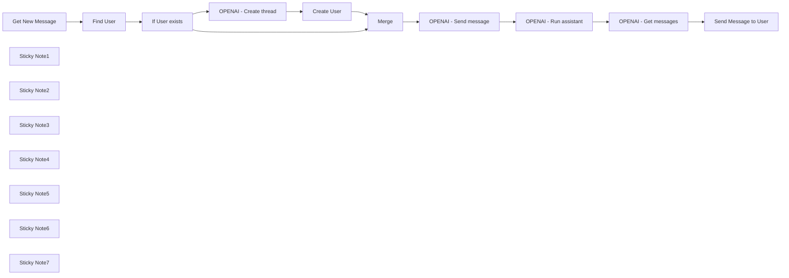

## Fluxo (.json) :

```json
{
  "nodes": [
    {
      "id": "9cc26a42-eb43-40c4-b507-cbaf187a5e15",
      "name": "Get New Message",
      "type": "n8n-nodes-base.telegramTrigger",
      "position": [
        1120,
        500
      ],
      "webhookId": "464f0a75-56d1-402f-8b12-b358452e9736",
      "parameters": {
        "updates": [
          "message"
        ],
        "additionalFields": {}
      },
      "credentials": {
        "telegramApi": {
          "id": "rI0zyfIYVIyXt2fL",
          "name": "Telegram Club"
        }
      },
      "typeVersion": 1.1
    },
    {
      "id": "098b6fcf-7cb6-4730-8892-949fedc946b3",
      "name": "OPENAI - Create thread",
      "type": "n8n-nodes-base.httpRequest",
      "position": [
        1740,
        640
      ],
      "parameters": {
        "url": "https://api.openai.com/v1/threads",
        "method": "POST",
        "options": {},
        "sendHeaders": true,
        "authentication": "predefinedCredentialType",
        "headerParameters": {
          "parameters": [
            {
              "name": "OpenAI-Beta",
              "value": "assistants=v2"
            }
          ]
        },
        "nodeCredentialType": "openAiApi"
      },
      "credentials": {
        "openAiApi": {
          "id": "zJhr5piyEwVnWtaI",
          "name": "OpenAi club"
        }
      },
      "typeVersion": 4.2
    },
    {
      "id": "fa157f8c-b776-4b20-bfaf-c17460383505",
      "name": "Create User",
      "type": "n8n-nodes-base.supabase",
      "position": [
        1900,
        640
      ],
      "parameters": {
        "tableId": "telegram_users",
        "fieldsUi": {
          "fieldValues": [
            {
              "fieldId": "telegram_id",
              "fieldValue": "={{ $('Get New Message').item.json.message.chat.id }}"
            },
            {
              "fieldId": "openai_thread_id",
              "fieldValue": "={{ $('OPENAI - Create thread').item.json.id }}"
            }
          ]
        }
      },
      "credentials": {
        "supabaseApi": {
          "id": "QBhcokohbJHfQZ9A",
          "name": "Supabase club"
        }
      },
      "typeVersion": 1
    },
    {
      "id": "115e417f-5962-409b-8adf-ff236eb9ce2e",
      "name": "Merge",
      "type": "n8n-nodes-base.merge",
      "position": [
        2080,
        500
      ],
      "parameters": {},
      "typeVersion": 3
    },
    {
      "id": "ba5c7385-8c80-43c8-9de2-430175bda70b",
      "name": "OPENAI - Send message",
      "type": "n8n-nodes-base.httpRequest",
      "position": [
        2240,
        500
      ],
      "parameters": {
        "url": "=https://api.openai.com/v1/threads/{{ $('Merge').item.json.openai_thread_id }}/messages ",
        "method": "POST",
        "options": {},
        "sendBody": true,
        "sendHeaders": true,
        "authentication": "predefinedCredentialType",
        "bodyParameters": {
          "parameters": [
            {
              "name": "role",
              "value": "user"
            },
            {
              "name": "content",
              "value": "={{ $('Get New Message').item.json.message.text }}"
            }
          ]
        },
        "headerParameters": {
          "parameters": [
            {
              "name": "OpenAI-Beta",
              "value": "assistants=v2"
            }
          ]
        },
        "nodeCredentialType": "openAiApi"
      },
      "credentials": {
        "openAiApi": {
          "id": "fLfRtaXbR0EVD0pl",
          "name": "OpenAi account"
        }
      },
      "typeVersion": 4.2
    },
    {
      "id": "024832bc-3d42-4879-a57f-b23e962b4c69",
      "name": "OPENAI - Run assistant",
      "type": "n8n-nodes-base.httpRequest",
      "position": [
        2440,
        500
      ],
      "parameters": {
        "url": "=https://api.openai.com/v1/threads/{{ $('Merge').item.json.openai_thread_id }}/runs",
        "method": "POST",
        "options": {},
        "sendBody": true,
        "sendHeaders": true,
        "authentication": "predefinedCredentialType",
        "bodyParameters": {
          "parameters": [
            {
              "name": "assistant_id",
              "value": "asst_b0QhuzySG6jofHFdzPZD7WEz"
            },
            {
              "name": "stream",
              "value": "={{true}}"
            }
          ]
        },
        "headerParameters": {
          "parameters": [
            {
              "name": "OpenAI-Beta",
              "value": "assistants=v2"
            }
          ]
        },
        "nodeCredentialType": "openAiApi"
      },
      "credentials": {
        "openAiApi": {
          "id": "fLfRtaXbR0EVD0pl",
          "name": "OpenAi account"
        }
      },
      "typeVersion": 4.2
    },
    {
      "id": "bc191e2b-15f4-45b7-af2e-19ed1639b7f5",
      "name": "OPENAI - Get messages",
      "type": "n8n-nodes-base.httpRequest",
      "position": [
        2640,
        500
      ],
      "parameters": {
        "url": "=https://api.openai.com/v1/threads/{{ $('Merge').item.json.openai_thread_id }}/messages",
        "options": {},
        "sendHeaders": true,
        "authentication": "predefinedCredentialType",
        "headerParameters": {
          "parameters": [
            {
              "name": "OpenAI-Beta",
              "value": "assistants=v2"
            }
          ]
        },
        "nodeCredentialType": "openAiApi"
      },
      "credentials": {
        "openAiApi": {
          "id": "zJhr5piyEwVnWtaI",
          "name": "OpenAi club"
        }
      },
      "typeVersion": 4.2
    },
    {
      "id": "c22e05e5-f0a7-4a09-a864-acfc58469b30",
      "name": "Send Message to User",
      "type": "n8n-nodes-base.telegram",
      "position": [
        2840,
        500
      ],
      "parameters": {
        "text": "={{ $('OPENAI - Get messages').item.json.data[0].content[0].text.value }}",
        "chatId": "={{ $('Get New Message').item.json.message.chat.id }}",
        "additionalFields": {
          "appendAttribution": false
        }
      },
      "credentials": {
        "telegramApi": {
          "id": "rI0zyfIYVIyXt2fL",
          "name": "Telegram Club"
        }
      },
      "typeVersion": 1.2
    },
    {
      "id": "0673be1f-3cae-42a0-9c62-1ed570859043",
      "name": "If User exists",
      "type": "n8n-nodes-base.if",
      "position": [
        1560,
        500
      ],
      "parameters": {
        "options": {},
        "conditions": {
          "options": {
            "leftValue": "",
            "caseSensitive": true,
            "typeValidation": "strict"
          },
          "combinator": "and",
          "conditions": [
            {
              "id": "b6e69a1f-eb42-4ef6-b80c-3167f1b8c830",
              "operator": {
                "type": "string",
                "operation": "exists",
                "singleValue": true
              },
              "leftValue": "={{ $json.id }}",
              "rightValue": ""
            }
          ]
        }
      },
      "typeVersion": 2.1
    },
    {
      "id": "a4916f54-ae6b-495d-979b-92dca965e3bb",
      "name": "Find User",
      "type": "n8n-nodes-base.supabase",
      "position": [
        1360,
        500
      ],
      "parameters": {
        "filters": {
          "conditions": [
            {
              "keyName": "telegram_id",
              "keyValue": "={{ $json.message.chat.id }}",
              "condition": "eq"
            }
          ]
        },
        "tableId": "telegram_users",
        "operation": "getAll"
      },
      "credentials": {
        "supabaseApi": {
          "id": "QBhcokohbJHfQZ9A",
          "name": "Supabase club"
        }
      },
      "typeVersion": 1,
      "alwaysOutputData": true
    },
    {
      "id": "6d01d7ed-e96b-47cf-9a5f-46608031baa2",
      "name": "Sticky Note1",
      "type": "n8n-nodes-base.stickyNote",
      "position": [
        1300,
        800
      ],
      "parameters": {
        "color": 7,
        "width": 600.723278204605,
        "height": 213.15921994594194,
        "content": "SQL query to create table in Supabase:\n\n```\ncreate table\n  public.telegram_users (\n    id uuid not null default gen_random_uuid (),\n    date_created timestamp with time zone not null default (now() at time zone 'utc'::text),\n    telegram_id bigint null,\n    openai_thread_id text null,\n    constraint telegram_users_pkey primary key (id)\n  ) tablespace pg_default;\n```"
      },
      "typeVersion": 1
    },
    {
      "id": "1a996da0-6022-48d7-ba40-1d137547a3d7",
      "name": "Sticky Note2",
      "type": "n8n-nodes-base.stickyNote",
      "position": [
        2340,
        360
      ],
      "parameters": {
        "color": 3,
        "width": 282.075050779723,
        "height": 80,
        "content": "Create assistant in [OpenAI](https://platform.openai.com/assistants).\n\n**Specify own assistant id here**\n"
      },
      "typeVersion": 1
    },
    {
      "id": "b24d2008-7950-41f0-a7fa-50360c0c6854",
      "name": "Sticky Note3",
      "type": "n8n-nodes-base.stickyNote",
      "position": [
        1040,
        380
      ],
      "parameters": {
        "color": 3,
        "width": 235.09282368774151,
        "height": 80,
        "content": "Create own Telegram bot in [Botfather bot](https://t.me/botfather)"
      },
      "typeVersion": 1
    },
    {
      "id": "9eb2491e-5ad9-4015-8ed9-611e72924503",
      "name": "Sticky Note4",
      "type": "n8n-nodes-base.stickyNote",
      "position": [
        1300,
        680
      ],
      "parameters": {
        "color": 3,
        "height": 80,
        "content": "Create table in [Supabase](https://supabase.com) with SQL query"
      },
      "typeVersion": 1
    },
    {
      "id": "884b5a1b-007c-4752-becc-46c8fc58db92",
      "name": "Sticky Note5",
      "type": "n8n-nodes-base.stickyNote",
      "position": [
        200,
        120
      ],
      "parameters": {
        "color": 7,
        "width": 280.2462120317618,
        "height": 438.5821431288714,
        "content": "### Set up steps\n1. **Create a Telegram Bot** using the [Botfather](https://t.me/botfather) and obtain the bot token.\n2. **Set up Supabase:**\n\t1. Create a new project and generate a ```SUPABASE_URL``` and ```SUPABASE_KEY```.\n\t2. Create a new table named ```telegram_users``` with the following SQL query:\n```\ncreate table\n  public.telegram_users (\n    id uuid not null default gen_random_uuid (),\n    date_created timestamp with time zone not null default (now() at time zone 'utc'::text),\n    telegram_id bigint null,\n    openai_thread_id text null,\n    constraint telegram_users_pkey primary key (id)\n  ) tablespace pg_default;\n```\n3. **OpenAI Setup:**\n\t1. Create an OpenAI assistant and obtain the ```OPENAI_API_KEY```.\n\t2. Customize your assistant’s personality or use cases according to your requirements.\n4. **Environment Configuration in n8n:**\n\t1. Configure the Telegram, Supabase, and OpenAI nodes with the appropriate credentials.\n\t2. Set up triggers for receiving messages and handling conversation logic.\n\t3. Set up OpenAI assistant ID in \"++OPENAI - Run assistant++\" node."
      },
      "typeVersion": 1
    },
    {
      "id": "02db77ac-4909-4a56-a558-03c86d8b8552",
      "name": "Sticky Note6",
      "type": "n8n-nodes-base.stickyNote",
      "position": [
        200,
        -400
      ],
      "parameters": {
        "color": 7,
        "width": 636.2128494576581,
        "height": 494.9629292914819,
        "content": ".png)\n## AI Telegram Bot with Supabase memory\n**Made by [Mark Shcherbakov](https://www.linkedin.com/in/marklowcoding/) from community [5minAI](https://www.skool.com/5minai-2861)**\n\nMany simple chatbots lack context awareness and user memory. This workflow solves that by integrating Supabase to keep track of user sessions (via ```telegram_id``` and ```openai_thread_id```), allowing the bot to maintain continuity and context in conversations, leading to a more human-like and engaging experience.\n\nThis Telegram bot template connects with OpenAI to answer user queries while storing and retrieving user information from a Supabase database. The memory component ensures that the bot can reference past interactions, making it suitable for use cases such as customer support, virtual assistants, or any application where context retention is crucial.\n\n"
      },
      "typeVersion": 1
    },
    {
      "id": "a991a7c9-ea5f-4a25-aa92-6dc2fce11b05",
      "name": "Sticky Note7",
      "type": "n8n-nodes-base.stickyNote",
      "position": [
        500,
        120
      ],
      "parameters": {
        "color": 7,
        "width": 330.5152611046425,
        "height": 240.6839895136402,
        "content": "### ... or watch set up video [5 min]\n[.png)](https://www.youtube.com/watch?v=kS41gut8l0g)\n"
      },
      "typeVersion": 1
    }
  ],
  "pinData": {
    "Merge": [
      {
        "id": "4a5d71a4-a2f7-43e2-936f-37ee5bf5cc9e",
        "telegram_id": 1468754364,
        "date_created": "2024-10-04T08:29:07.458869+00:00",
        "openai_thread_id": null
      }
    ],
    "Find User": [
      {
        "id": "4a5d71a4-a2f7-43e2-936f-37ee5bf5cc9e",
        "telegram_id": 1468754364,
        "date_created": "2024-10-04T08:29:07.458869+00:00",
        "openai_thread_id": null
      }
    ],
    "Get New Message": [
      {
        "message": {
          "chat": {
            "id": 1468754364,
            "type": "private",
            "username": "low_code",
            "first_name": "Mark"
          },
          "date": 1727961249,
          "from": {
            "id": 1468754364,
            "is_bot": false,
            "username": "low_code",
            "first_name": "Mark",
            "language_code": "en"
          },
          "text": "Hello, how are you?",
          "entities": [
            {
              "type": "bot_command",
              "length": 6,
              "offset": 0
            }
          ],
          "message_id": 3
        },
        "update_id": 412281353
      }
    ],
    "Send Message to User": [
      {
        "ok": true,
        "result": {
          "chat": {
            "id": 1468754364,
            "type": "private",
            "username": "low_code",
            "first_name": "Mark"
          },
          "date": 1727971919,
          "from": {
            "id": 7999029315,
            "is_bot": true,
            "username": "test241234_bot",
            "first_name": "Test bot"
          },
          "text": "Hello! I'm just a program, but I'm here and ready to help you. How can I assist you today?",
          "message_id": 7
        }
      }
    ],
    "OPENAI - Get messages": [
      {
        "data": [
          {
            "id": "msg_C7aXbSotAl6xCxjR9avi4wUz",
            "role": "assistant",
            "object": "thread.message",
            "run_id": "run_9avgP4lZ1FRSsL3y9UO8HPa1",
            "content": [
              {
                "text": {
                  "value": "Hello! I'm just a program, but I'm here and ready to help you. How can I assist you today?",
                  "annotations": []
                },
                "type": "text"
              }
            ],
            "metadata": {},
            "thread_id": "thread_laO8JLPW6L1upYHW6fSRj8Bt",
            "created_at": 1727971739,
            "attachments": [],
            "assistant_id": "asst_b0QhuzySG6jofHFdzPZD7WEz"
          },
          {
            "id": "msg_fVGPVHR03QKheHXh54SFpmpm",
            "role": "user",
            "object": "thread.message",
            "run_id": null,
            "content": [
              {
                "text": {
                  "value": "Hello, how are you?",
                  "annotations": []
                },
                "type": "text"
              }
            ],
            "metadata": {},
            "thread_id": "thread_laO8JLPW6L1upYHW6fSRj8Bt",
            "created_at": 1727971467,
            "attachments": [],
            "assistant_id": null
          }
        ],
        "object": "list",
        "last_id": "msg_fVGPVHR03QKheHXh54SFpmpm",
        "first_id": "msg_C7aXbSotAl6xCxjR9avi4wUz",
        "has_more": false
      }
    ],
    "OPENAI - Send message": [
      {
        "id": "msg_fVGPVHR03QKheHXh54SFpmpm",
        "role": "user",
        "object": "thread.message",
        "run_id": null,
        "content": [
          {
            "text": {
              "value": "Hello, how are you?",
              "annotations": []
            },
            "type": "text"
          }
        ],
        "metadata": {},
        "thread_id": "thread_laO8JLPW6L1upYHW6fSRj8Bt",
        "created_at": 1727971467,
        "attachments": [],
        "assistant_id": null
      }
    ],
    "OPENAI - Create thread": [
      {
        "id": "thread_laO8JLPW6L1upYHW6fSRj8Bt",
        "object": "thread",
        "metadata": {},
        "created_at": 1727971362,
        "tool_resources": {}
      }
    ],
    "OPENAI - Run assistant": [
      {
        "data": "event: thread.run.created\ndata: {\"id\":\"run_9avgP4lZ1FRSsL3y9UO8HPa1\",\"object\":\"thread.run\",\"created_at\":1727971737,\"assistant_id\":\"asst_b0QhuzySG6jofHFdzPZD7WEz\",\"thread_id\":\"thread_laO8JLPW6L1upYHW6fSRj8Bt\",\"status\":\"queued\",\"started_at\":null,\"expires_at\":1727972337,\"cancelled_at\":null,\"failed_at\":null,\"completed_at\":null,\"required_action\":null,\"last_error\":null,\"model\":\"gpt-4o-mini\",\"instructions\":\"You are ChatGPT\",\"tools\":[],\"tool_resources\":{\"code_interpreter\":{\"file_ids\":[]}},\"metadata\":{},\"temperature\":1.0,\"top_p\":1.0,\"max_completion_tokens\":null,\"max_prompt_tokens\":null,\"truncation_strategy\":{\"type\":\"auto\",\"last_messages\":null},\"incomplete_details\":null,\"usage\":null,\"response_format\":\"auto\",\"tool_choice\":\"auto\",\"parallel_tool_calls\":true}\n\nevent: thread.run.queued\ndata: {\"id\":\"run_9avgP4lZ1FRSsL3y9UO8HPa1\",\"object\":\"thread.run\",\"created_at\":1727971737,\"assistant_id\":\"asst_b0QhuzySG6jofHFdzPZD7WEz\",\"thread_id\":\"thread_laO8JLPW6L1upYHW6fSRj8Bt\",\"status\":\"queued\",\"started_at\":null,\"expires_at\":1727972337,\"cancelled_at\":null,\"failed_at\":null,\"completed_at\":null,\"required_action\":null,\"last_error\":null,\"model\":\"gpt-4o-mini\",\"instructions\":\"You are ChatGPT\",\"tools\":[],\"tool_resources\":{\"code_interpreter\":{\"file_ids\":[]}},\"metadata\":{},\"temperature\":1.0,\"top_p\":1.0,\"max_completion_tokens\":null,\"max_prompt_tokens\":null,\"truncation_strategy\":{\"type\":\"auto\",\"last_messages\":null},\"incomplete_details\":null,\"usage\":null,\"response_format\":\"auto\",\"tool_choice\":\"auto\",\"parallel_tool_calls\":true}\n\nevent: thread.run.in_progress\ndata: {\"id\":\"run_9avgP4lZ1FRSsL3y9UO8HPa1\",\"object\":\"thread.run\",\"created_at\":1727971737,\"assistant_id\":\"asst_b0QhuzySG6jofHFdzPZD7WEz\",\"thread_id\":\"thread_laO8JLPW6L1upYHW6fSRj8Bt\",\"status\":\"in_progress\",\"started_at\":1727971738,\"expires_at\":1727972337,\"cancelled_at\":null,\"failed_at\":null,\"completed_at\":null,\"required_action\":null,\"last_error\":null,\"model\":\"gpt-4o-mini\",\"instructions\":\"You are ChatGPT\",\"tools\":[],\"tool_resources\":{\"code_interpreter\":{\"file_ids\":[]}},\"metadata\":{},\"temperature\":1.0,\"top_p\":1.0,\"max_completion_tokens\":null,\"max_prompt_tokens\":null,\"truncation_strategy\":{\"type\":\"auto\",\"last_messages\":null},\"incomplete_details\":null,\"usage\":null,\"response_format\":\"auto\",\"tool_choice\":\"auto\",\"parallel_tool_calls\":true}\n\nevent: thread.run.step.created\ndata: {\"id\":\"step_b0iFvL1q1UEZDfBRbbNTiulO\",\"object\":\"thread.run.step\",\"created_at\":1727971739,\"run_id\":\"run_9avgP4lZ1FRSsL3y9UO8HPa1\",\"assistant_id\":\"asst_b0QhuzySG6jofHFdzPZD7WEz\",\"thread_id\":\"thread_laO8JLPW6L1upYHW6fSRj8Bt\",\"type\":\"message_creation\",\"status\":\"in_progress\",\"cancelled_at\":null,\"completed_at\":null,\"expires_at\":1727972337,\"failed_at\":null,\"last_error\":null,\"step_details\":{\"type\":\"message_creation\",\"message_creation\":{\"message_id\":\"msg_C7aXbSotAl6xCxjR9avi4wUz\"}},\"usage\":null}\n\nevent: thread.run.step.in_progress\ndata: {\"id\":\"step_b0iFvL1q1UEZDfBRbbNTiulO\",\"object\":\"thread.run.step\",\"created_at\":1727971739,\"run_id\":\"run_9avgP4lZ1FRSsL3y9UO8HPa1\",\"assistant_id\":\"asst_b0QhuzySG6jofHFdzPZD7WEz\",\"thread_id\":\"thread_laO8JLPW6L1upYHW6fSRj8Bt\",\"type\":\"message_creation\",\"status\":\"in_progress\",\"cancelled_at\":null,\"completed_at\":null,\"expires_at\":1727972337,\"failed_at\":null,\"last_error\":null,\"step_details\":{\"type\":\"message_creation\",\"message_creation\":{\"message_id\":\"msg_C7aXbSotAl6xCxjR9avi4wUz\"}},\"usage\":null}\n\nevent: thread.message.created\ndata: {\"id\":\"msg_C7aXbSotAl6xCxjR9avi4wUz\",\"object\":\"thread.message\",\"created_at\":1727971739,\"assistant_id\":\"asst_b0QhuzySG6jofHFdzPZD7WEz\",\"thread_id\":\"thread_laO8JLPW6L1upYHW6fSRj8Bt\",\"run_id\":\"run_9avgP4lZ1FRSsL3y9UO8HPa1\",\"status\":\"in_progress\",\"incomplete_details\":null,\"incomplete_at\":null,\"completed_at\":null,\"role\":\"assistant\",\"content\":[],\"attachments\":[],\"metadata\":{}}\n\nevent: thread.message.in_progress\ndata: {\"id\":\"msg_C7aXbSotAl6xCxjR9avi4wUz\",\"object\":\"thread.message\",\"created_at\":1727971739,\"assistant_id\":\"asst_b0QhuzySG6jofHFdzPZD7WEz\",\"thread_id\":\"thread_laO8JLPW6L1upYHW6fSRj8Bt\",\"run_id\":\"run_9avgP4lZ1FRSsL3y9UO8HPa1\",\"status\":\"in_progress\",\"incomplete_details\":null,\"incomplete_at\":null,\"completed_at\":null,\"role\":\"assistant\",\"content\":[],\"attachments\":[],\"metadata\":{}}\n\nevent: thread.message.delta\ndata: {\"id\":\"msg_C7aXbSotAl6xCxjR9avi4wUz\",\"object\":\"thread.message.delta\",\"delta\":{\"content\":[{\"index\":0,\"type\":\"text\",\"text\":{\"value\":\"Hello\",\"annotations\":[]}}]}}\n\nevent: thread.message.delta\ndata: {\"id\":\"msg_C7aXbSotAl6xCxjR9avi4wUz\",\"object\":\"thread.message.delta\",\"delta\":{\"content\":[{\"index\":0,\"type\":\"text\",\"text\":{\"value\":\"!\"}}]}}\n\nevent: thread.message.delta\ndata: {\"id\":\"msg_C7aXbSotAl6xCxjR9avi4wUz\",\"object\":\"thread.message.delta\",\"delta\":{\"content\":[{\"index\":0,\"type\":\"text\",\"text\":{\"value\":\" I'm\"}}]}}\n\nevent: thread.message.delta\ndata: {\"id\":\"msg_C7aXbSotAl6xCxjR9avi4wUz\",\"object\":\"thread.message.delta\",\"delta\":{\"content\":[{\"index\":0,\"type\":\"text\",\"text\":{\"value\":\" just\"}}]}}\n\nevent: thread.message.delta\ndata: {\"id\":\"msg_C7aXbSotAl6xCxjR9avi4wUz\",\"object\":\"thread.message.delta\",\"delta\":{\"content\":[{\"index\":0,\"type\":\"text\",\"text\":{\"value\":\" a\"}}]}}\n\nevent: thread.message.delta\ndata: {\"id\":\"msg_C7aXbSotAl6xCxjR9avi4wUz\",\"object\":\"thread.message.delta\",\"delta\":{\"content\":[{\"index\":0,\"type\":\"text\",\"text\":{\"value\":\" program\"}}]}}\n\nevent: thread.message.delta\ndata: {\"id\":\"msg_C7aXbSotAl6xCxjR9avi4wUz\",\"object\":\"thread.message.delta\",\"delta\":{\"content\":[{\"index\":0,\"type\":\"text\",\"text\":{\"value\":\",\"}}]}}\n\nevent: thread.message.delta\ndata: {\"id\":\"msg_C7aXbSotAl6xCxjR9avi4wUz\",\"object\":\"thread.message.delta\",\"delta\":{\"content\":[{\"index\":0,\"type\":\"text\",\"text\":{\"value\":\" but\"}}]}}\n\nevent: thread.message.delta\ndata: {\"id\":\"msg_C7aXbSotAl6xCxjR9avi4wUz\",\"object\":\"thread.message.delta\",\"delta\":{\"content\":[{\"index\":0,\"type\":\"text\",\"text\":{\"value\":\" I'm\"}}]}}\n\nevent: thread.message.delta\ndata: {\"id\":\"msg_C7aXbSotAl6xCxjR9avi4wUz\",\"object\":\"thread.message.delta\",\"delta\":{\"content\":[{\"index\":0,\"type\":\"text\",\"text\":{\"value\":\" here\"}}]}}\n\nevent: thread.message.delta\ndata: {\"id\":\"msg_C7aXbSotAl6xCxjR9avi4wUz\",\"object\":\"thread.message.delta\",\"delta\":{\"content\":[{\"index\":0,\"type\":\"text\",\"text\":{\"value\":\" and\"}}]}}\n\nevent: thread.message.delta\ndata: {\"id\":\"msg_C7aXbSotAl6xCxjR9avi4wUz\",\"object\":\"thread.message.delta\",\"delta\":{\"content\":[{\"index\":0,\"type\":\"text\",\"text\":{\"value\":\" ready\"}}]}}\n\nevent: thread.message.delta\ndata: {\"id\":\"msg_C7aXbSotAl6xCxjR9avi4wUz\",\"object\":\"thread.message.delta\",\"delta\":{\"content\":[{\"index\":0,\"type\":\"text\",\"text\":{\"value\":\" to\"}}]}}\n\nevent: thread.message.delta\ndata: {\"id\":\"msg_C7aXbSotAl6xCxjR9avi4wUz\",\"object\":\"thread.message.delta\",\"delta\":{\"content\":[{\"index\":0,\"type\":\"text\",\"text\":{\"value\":\" help\"}}]}}\n\nevent: thread.message.delta\ndata: {\"id\":\"msg_C7aXbSotAl6xCxjR9avi4wUz\",\"object\":\"thread.message.delta\",\"delta\":{\"content\":[{\"index\":0,\"type\":\"text\",\"text\":{\"value\":\" you\"}}]}}\n\nevent: thread.message.delta\ndata: {\"id\":\"msg_C7aXbSotAl6xCxjR9avi4wUz\",\"object\":\"thread.message.delta\",\"delta\":{\"content\":[{\"index\":0,\"type\":\"text\",\"text\":{\"value\":\".\"}}]}}\n\nevent: thread.message.delta\ndata: {\"id\":\"msg_C7aXbSotAl6xCxjR9avi4wUz\",\"object\":\"thread.message.delta\",\"delta\":{\"content\":[{\"index\":0,\"type\":\"text\",\"text\":{\"value\":\" How\"}}]}}\n\nevent: thread.message.delta\ndata: {\"id\":\"msg_C7aXbSotAl6xCxjR9avi4wUz\",\"object\":\"thread.message.delta\",\"delta\":{\"content\":[{\"index\":0,\"type\":\"text\",\"text\":{\"value\":\" can\"}}]}}\n\nevent: thread.message.delta\ndata: {\"id\":\"msg_C7aXbSotAl6xCxjR9avi4wUz\",\"object\":\"thread.message.delta\",\"delta\":{\"content\":[{\"index\":0,\"type\":\"text\",\"text\":{\"value\":\" I\"}}]}}\n\nevent: thread.message.delta\ndata: {\"id\":\"msg_C7aXbSotAl6xCxjR9avi4wUz\",\"object\":\"thread.message.delta\",\"delta\":{\"content\":[{\"index\":0,\"type\":\"text\",\"text\":{\"value\":\" assist\"}}]}}\n\nevent: thread.message.delta\ndata: {\"id\":\"msg_C7aXbSotAl6xCxjR9avi4wUz\",\"object\":\"thread.message.delta\",\"delta\":{\"content\":[{\"index\":0,\"type\":\"text\",\"text\":{\"value\":\" you\"}}]}}\n\nevent: thread.message.delta\ndata: {\"id\":\"msg_C7aXbSotAl6xCxjR9avi4wUz\",\"object\":\"thread.message.delta\",\"delta\":{\"content\":[{\"index\":0,\"type\":\"text\",\"text\":{\"value\":\" today\"}}]}}\n\nevent: thread.message.delta\ndata: {\"id\":\"msg_C7aXbSotAl6xCxjR9avi4wUz\",\"object\":\"thread.message.delta\",\"delta\":{\"content\":[{\"index\":0,\"type\":\"text\",\"text\":{\"value\":\"?\"}}]}}\n\nevent: thread.message.completed\ndata: {\"id\":\"msg_C7aXbSotAl6xCxjR9avi4wUz\",\"object\":\"thread.message\",\"created_at\":1727971739,\"assistant_id\":\"asst_b0QhuzySG6jofHFdzPZD7WEz\",\"thread_id\":\"thread_laO8JLPW6L1upYHW6fSRj8Bt\",\"run_id\":\"run_9avgP4lZ1FRSsL3y9UO8HPa1\",\"status\":\"completed\",\"incomplete_details\":null,\"incomplete_at\":null,\"completed_at\":1727971740,\"role\":\"assistant\",\"content\":[{\"type\":\"text\",\"text\":{\"value\":\"Hello! I'm just a program, but I'm here and ready to help you. How can I assist you today?\",\"annotations\":[]}}],\"attachments\":[],\"metadata\":{}}\n\nevent: thread.run.step.completed\ndata: {\"id\":\"step_b0iFvL1q1UEZDfBRbbNTiulO\",\"object\":\"thread.run.step\",\"created_at\":1727971739,\"run_id\":\"run_9avgP4lZ1FRSsL3y9UO8HPa1\",\"assistant_id\":\"asst_b0QhuzySG6jofHFdzPZD7WEz\",\"thread_id\":\"thread_laO8JLPW6L1upYHW6fSRj8Bt\",\"type\":\"message_creation\",\"status\":\"completed\",\"cancelled_at\":null,\"completed_at\":1727971740,\"expires_at\":1727972337,\"failed_at\":null,\"last_error\":null,\"step_details\":{\"type\":\"message_creation\",\"message_creation\":{\"message_id\":\"msg_C7aXbSotAl6xCxjR9avi4wUz\"}},\"usage\":{\"prompt_tokens\":39,\"completion_tokens\":25,\"total_tokens\":64}}\n\nevent: thread.run.completed\ndata: {\"id\":\"run_9avgP4lZ1FRSsL3y9UO8HPa1\",\"object\":\"thread.run\",\"created_at\":1727971737,\"assistant_id\":\"asst_b0QhuzySG6jofHFdzPZD7WEz\",\"thread_id\":\"thread_laO8JLPW6L1upYHW6fSRj8Bt\",\"status\":\"completed\",\"started_at\":1727971738,\"expires_at\":null,\"cancelled_at\":null,\"failed_at\":null,\"completed_at\":1727971740,\"required_action\":null,\"last_error\":null,\"model\":\"gpt-4o-mini\",\"instructions\":\"You are ChatGPT\",\"tools\":[],\"tool_resources\":{\"code_interpreter\":{\"file_ids\":[]}},\"metadata\":{},\"temperature\":1.0,\"top_p\":1.0,\"max_completion_tokens\":null,\"max_prompt_tokens\":null,\"truncation_strategy\":{\"type\":\"auto\",\"last_messages\":null},\"incomplete_details\":null,\"usage\":{\"prompt_tokens\":39,\"completion_tokens\":25,\"total_tokens\":64},\"response_format\":\"auto\",\"tool_choice\":\"auto\",\"parallel_tool_calls\":true}\n\nevent: done\ndata: [DONE]\n\n"
      }
    ]
  },
  "connections": {
    "Merge": {
      "main": [
        [
          {
            "node": "OPENAI - Send message",
            "type": "main",
            "index": 0
          }
        ]
      ]
    },
    "Find User": {
      "main": [
        [
          {
            "node": "If User exists",
            "type": "main",
            "index": 0
          }
        ]
      ]
    },
    "Create User": {
      "main": [
        [
          {
            "node": "Merge",
            "type": "main",
            "index": 1
          }
        ]
      ]
    },
    "If User exists": {
      "main": [
        [
          {
            "node": "Merge",
            "type": "main",
            "index": 0
          }
        ],
        [
          {
            "node": "OPENAI - Create thread",
            "type": "main",
            "index": 0
          }
        ]
      ]
    },
    "Get New Message": {
      "main": [
        [
          {
            "node": "Find User",
            "type": "main",
            "index": 0
          }
        ]
      ]
    },
    "OPENAI - Get messages": {
      "main": [
        [
          {
            "node": "Send Message to User",
            "type": "main",
            "index": 0
          }
        ]
      ]
    },
    "OPENAI - Send message": {
      "main": [
        [
          {
            "node": "OPENAI - Run assistant",
            "type": "main",
            "index": 0
          }
        ]
      ]
    },
    "OPENAI - Create thread": {
      "main": [
        [
          {
            "node": "Create User",
            "type": "main",
            "index": 0
          }
        ]
      ]
    },
    "OPENAI - Run assistant": {
      "main": [
        [
          {
            "node": "OPENAI - Get messages",
            "type": "main",
            "index": 0
          }
        ]
      ]
    }
  }
}
```

<a id="template-1894"></a>

## Template 1894 - RAG e chat com conteúdo WordPress

- **Nome:** RAG e chat com conteúdo WordPress
- **Descrição:** Fluxo para extrair conteúdo de um site WordPress, gerar e armazenar embeddings, atualizar o índice de vetores e oferecer uma interface de chat que recupera documentos relevantes e responde com um modelo generativo integrando metadados.
- **Funcionalidade:** • Coleta de conteúdo WordPress: Recupera posts e páginas via API para indexação.
• Filtragem de conteúdo: Inclui somente itens publicados e não protegidos.
• Conversão HTML → Markdown: Limpa e converte o conteúdo antes do processamento.
• Geração de embeddings: Cria vetores de embedding a partir do texto para indexação semântica.
• Armazenamento e upsert de vetores: Insere ou atualiza documentos em um repositório de vetores (insere novo ou substitui quando atualizado).
• Agendamento de verificação: Executa buscas periódicas por conteúdo modificado após a última execução para manter o índice atualizado.
• Gerenciamento de histórico de execução: Registra cada execução do fluxo com timestamp para controle de atualização incremental.
• Recuperação semântica para chat: Ao receber uma pergunta, pesquisa os documentos mais relevantes no índice de vetores e agrega metadados.
• Agente conversacional com integração de metadados: Envia pergunta + documentos encontrados a um modelo generativo e força a inclusão dos metadados (URL, tipo de conteúdo, data de publicação/alteração) na resposta.
• Memória de conversa: Armazena histórico de chat para manter contexto conversacional entre interações.
• Resposta via webhook: Retorna a resposta gerada ao solicitante que chamou o webhook.
- **Ferramentas:** • WordPress: Fonte do conteúdo (posts e páginas) acessada via API REST para indexação.
• OpenAI: Modelos de embedding (ex.: text-embedding-3-small) e modelo de chat (ex.: gpt-4o-mini) usados para gerar vetores e respostas gerativas.
• Supabase: Armazenamento e indexação de documentos em tabela de vetores, usado para inserção, busca semântica e registro de execuções.
• PostgreSQL (com extensão pgvector): Banco de dados que suporta a tabela de documentos, funções de similaridade e armazenamento da memória/conteúdo quando necessário.

## Fluxo visual

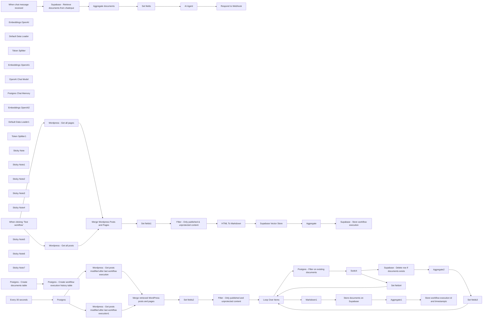

## Fluxo (.json) :

```json
{
  "id": "o8iTqIh2sVvnuWz5",
  "meta": {
    "instanceId": "b9faf72fe0d7c3be94b3ebff0778790b50b135c336412d28fd4fca2cbbf8d1f5"
  },
  "name": "RAG & GenAI App With WordPress Content",
  "tags": [],
  "nodes": [
    {
      "id": "c3738490-ed39-4774-b337-bf5ee99d0c72",
      "name": "When clicking ‘Test workflow’",
      "type": "n8n-nodes-base.manualTrigger",
      "position": [
        500,
        940
      ],
      "parameters": {},
      "typeVersion": 1
    },
    {
      "id": "3ab719bd-3652-433f-a597-9cd28f8cfcea",
      "name": "Embeddings OpenAI",
      "type": "@n8n/n8n-nodes-langchain.embeddingsOpenAi",
      "position": [
        2580,
        1320
      ],
      "parameters": {
        "model": "text-embedding-3-small",
        "options": {}
      },
      "typeVersion": 1
    },
    {
      "id": "e8639569-2091-44de-a84d-c3fc3ce54de4",
      "name": "Default Data Loader",
      "type": "@n8n/n8n-nodes-langchain.documentDefaultDataLoader",
      "position": [
        2800,
        1260
      ],
      "parameters": {
        "options": {
          "metadata": {
            "metadataValues": [
              {
                "name": "title",
                "value": "={{ $json.title }}"
              },
              {
                "name": "url",
                "value": "={{ $json.url }}"
              },
              {
                "name": "content_type",
                "value": "={{ $json.content_type }}"
              },
              {
                "name": "publication_date",
                "value": "={{ $json.publication_date }}"
              },
              {
                "name": "modification_date",
                "value": "={{ $json.modification_date }}"
              },
              {
                "name": "id",
                "value": "={{ $json.id }}"
              }
            ]
          }
        },
        "jsonData": "={{ $json.data }}",
        "jsonMode": "expressionData"
      },
      "typeVersion": 1
    },
    {
      "id": "e7f858eb-4dca-40ea-9da9-af953687e63d",
      "name": "Token Splitter",
      "type": "@n8n/n8n-nodes-langchain.textSplitterTokenSplitter",
      "position": [
        2900,
        1480
      ],
      "parameters": {
        "chunkSize": 300,
        "chunkOverlap": 30
      },
      "typeVersion": 1
    },
    {
      "id": "27585104-5315-4c11-b333-4b5d27d9bae4",
      "name": "Embeddings OpenAI1",
      "type": "@n8n/n8n-nodes-langchain.embeddingsOpenAi",
      "position": [
        1400,
        2340
      ],
      "parameters": {
        "model": "text-embedding-3-small",
        "options": {}
      },
      "typeVersion": 1
    },
    {
      "id": "35269a98-d905-4e4f-ae5b-dadad678f260",
      "name": "OpenAI Chat Model",
      "type": "@n8n/n8n-nodes-langchain.lmChatOpenAi",
      "position": [
        2800,
        2300
      ],
      "parameters": {
        "model": "gpt-4o-mini",
        "options": {}
      },
      "typeVersion": 1
    },
    {
      "id": "cd26b6fa-a8bb-4139-9bec-8656d90d8203",
      "name": "Postgres Chat Memory",
      "type": "@n8n/n8n-nodes-langchain.memoryPostgresChat",
      "position": [
        2920,
        2300
      ],
      "parameters": {
        "tableName": "website_chat_histories"
      },
      "typeVersion": 1.1
    },
    {
      "id": "7c718e1b-1398-49f3-ba67-f970a82983e0",
      "name": "Respond to Webhook",
      "type": "n8n-nodes-base.respondToWebhook",
      "position": [
        3380,
        2060
      ],
      "parameters": {
        "options": {}
      },
      "typeVersion": 1.1
    },
    {
      "id": "f91f18e0-7a04-4218-8490-bff35dfbf7a8",
      "name": "Set fields",
      "type": "n8n-nodes-base.set",
      "position": [
        2360,
        2060
      ],
      "parameters": {
        "options": {},
        "assignments": {
          "assignments": [
            {
              "id": "6888175b-853b-457a-96f7-33dfe952a05d",
              "name": "documents",
              "type": "string",
              "value": "={{ \n  JSON.stringify(\n    $json.documents.map(doc => ({\n      metadata: \n        'URL: ' + doc.metadata.url.replaceAll('&rsquo;', \"'\").replaceAll(/[\"]/g, '') + '\\n' +\n        'Publication Date: ' + doc.metadata.publication_date.replaceAll(/[\"]/g, '') + '\\n' +\n        'Modification Date: ' + doc.metadata.modification_date.replaceAll(/[\"]/g, '') + '\\n' +\n        'Content Type: ' + doc.metadata.content_type.replaceAll(/[\"]/g, '') + '\\n' +\n        'Title: ' + doc.metadata.title.replaceAll('&rsquo;', \"'\").replaceAll(/[\"]/g, '') + '\\n',\n      \n      page_content: doc.pageContent\n    }))\n  ).replaceAll(/[\\[\\]{}]/g, '')\n}}"
            },
            {
              "id": "ae310b77-4560-4f44-8c4e-8d13f680072e",
              "name": "sessionId",
              "type": "string",
              "value": "={{ $('When chat message received').item.json.sessionId }}"
            },
            {
              "id": "8738f4de-b3c3-45ad-af4b-8311c8105c35",
              "name": "chatInput",
              "type": "string",
              "value": "={{ $('When chat message received').item.json.chatInput }}"
            }
          ]
        }
      },
      "typeVersion": 3.4
    },
    {
      "id": "7f392a40-e353-4bb2-9ecf-3ee330110b95",
      "name": "Embeddings OpenAI2",
      "type": "@n8n/n8n-nodes-langchain.embeddingsOpenAi",
      "position": [
        6400,
        860
      ],
      "parameters": {
        "model": "text-embedding-3-small",
        "options": {}
      },
      "typeVersion": 1
    },
    {
      "id": "9e045857-5fcd-4c4b-83ee-ceda28195b76",
      "name": "Default Data Loader1",
      "type": "@n8n/n8n-nodes-langchain.documentDefaultDataLoader",
      "position": [
        6500,
        860
      ],
      "parameters": {
        "options": {
          "metadata": {
            "metadataValues": [
              {
                "name": "title",
                "value": "={{ $json.title }}"
              },
              {
                "name": "url",
                "value": "={{ $json.url }}"
              },
              {
                "name": "content_type",
                "value": "={{ $json.content_type }}"
              },
              {
                "name": "publication_date",
                "value": "={{ $json.publication_date }}"
              },
              {
                "name": "modification_date",
                "value": "={{ $json.modification_date }}"
              },
              {
                "name": "id",
                "value": "={{ $json.id }}"
              }
            ]
          }
        },
        "jsonData": "={{ $json.data }}",
        "jsonMode": "expressionData"
      },
      "typeVersion": 1
    },
    {
      "id": "d0c1144b-4542-470e-8cbe-f985e839d9d0",
      "name": "Token Splitter1",
      "type": "@n8n/n8n-nodes-langchain.textSplitterTokenSplitter",
      "position": [
        6500,
        980
      ],
      "parameters": {
        "chunkSize": 300,
        "chunkOverlap": 30
      },
      "typeVersion": 1
    },
    {
      "id": "ec7cf1b2-f56f-45da-bb34-1dc8a66a7de6",
      "name": "Markdown1",
      "type": "n8n-nodes-base.markdown",
      "position": [
        6240,
        900
      ],
      "parameters": {
        "html": "={{ $json.content }}",
        "options": {}
      },
      "typeVersion": 1
    },
    {
      "id": "8399976b-340a-49ce-a5b6-f7339957aa9d",
      "name": "Postgres",
      "type": "n8n-nodes-base.postgres",
      "position": [
        4260,
        900
      ],
      "parameters": {
        "query": "select max(created_at) as last_workflow_execution from n8n_website_embedding_histories",
        "options": {},
        "operation": "executeQuery"
      },
      "typeVersion": 2.5
    },
    {
      "id": "88e79403-06df-4f18-9e4c-a4c4e727aa17",
      "name": "Aggregate",
      "type": "n8n-nodes-base.aggregate",
      "position": [
        3300,
        900
      ],
      "parameters": {
        "options": {},
        "aggregate": "aggregateAllItemData"
      },
      "typeVersion": 1
    },
    {
      "id": "db7241e8-1c3a-4f91-99b7-383000f41afe",
      "name": "Aggregate1",
      "type": "n8n-nodes-base.aggregate",
      "position": [
        6800,
        680
      ],
      "parameters": {
        "options": {},
        "aggregate": "aggregateAllItemData"
      },
      "typeVersion": 1
    },
    {
      "id": "94bbba31-d83b-427f-a7dc-336725238294",
      "name": "Aggregate2",
      "type": "n8n-nodes-base.aggregate",
      "position": [
        7180,
        1160
      ],
      "parameters": {
        "options": {},
        "fieldsToAggregate": {
          "fieldToAggregate": [
            {
              "fieldToAggregate": "metadata.id"
            }
          ]
        }
      },
      "typeVersion": 1
    },
    {
      "id": "52a110fa-cdd6-4b1d-99fe-394b5dfa0a1f",
      "name": "Sticky Note",
      "type": "n8n-nodes-base.stickyNote",
      "position": [
        440,
        600
      ],
      "parameters": {
        "color": 5,
        "width": 3308.2687575224263,
        "height": 1015.3571428571431,
        "content": "# Workflow 1 : Initial Embedding \n## Use this workflow to create the initial embedding for your WordPress website content\n\n"
      },
      "typeVersion": 1
    },
    {
      "id": "4cbf8135-a52b-4a54-b7b0-15ea27ce7ae3",
      "name": "Sticky Note1",
      "type": "n8n-nodes-base.stickyNote",
      "position": [
        3812,
        605
      ],
      "parameters": {
        "color": 5,
        "width": 3785.6673412474183,
        "height": 1020.4528919414245,
        "content": "# Workflow 2 : Upsert\n## Use this workflow to upsert embeddings for documents stored in the Supabase vector table\n"
      },
      "typeVersion": 1
    },
    {
      "id": "f6e954e0-a37a-45ac-9882-20f4f1944b70",
      "name": "Sticky Note2",
      "type": "n8n-nodes-base.stickyNote",
      "position": [
        440,
        1820
      ],
      "parameters": {
        "color": 5,
        "width": 3235.199999999999,
        "height": 817.9199999999992,
        "content": "# Workflow 3 : Use this workflow to enable chat functionality with your website content. The chat can be embedded into your website to enhance user experience"
      },
      "typeVersion": 1
    },
    {
      "id": "acbdd54b-f02a-41aa-a0ce-8642db560151",
      "name": "Wordpress - Get all posts",
      "type": "n8n-nodes-base.wordpress",
      "position": [
        1260,
        880
      ],
      "parameters": {
        "options": {},
        "operation": "getAll",
        "returnAll": true
      },
      "typeVersion": 1
    },
    {
      "id": "94fce59d-9336-4d49-a378-17335ec02e52",
      "name": "Wordpress - Get all pages",
      "type": "n8n-nodes-base.wordpress",
      "position": [
        1260,
        1060
      ],
      "parameters": {
        "options": {},
        "resource": "page",
        "operation": "getAll",
        "returnAll": true
      },
      "typeVersion": 1
    },
    {
      "id": "b00c92e5-1765-4fd9-9981-e01053992a0a",
      "name": "Sticky Note3",
      "type": "n8n-nodes-base.stickyNote",
      "position": [
        1157,
        727
      ],
      "parameters": {
        "width": 1108.3519999999999,
        "height": 561.4080000000004,
        "content": "## Use filters to create embeddings only for content that you want to include in your GenAI application"
      },
      "typeVersion": 1
    },
    {
      "id": "f8a22739-898d-456b-93f8-79f74b60a00c",
      "name": "Set fields1",
      "type": "n8n-nodes-base.set",
      "position": [
        2320,
        900
      ],
      "parameters": {
        "options": {},
        "assignments": {
          "assignments": [
            {
              "id": "de6711dc-d03c-488c-bef4-0a853e2d0a14",
              "name": "publication_date",
              "type": "string",
              "value": "={{ $json.date }}"
            },
            {
              "id": "f8e35dcc-c96c-4554-b6bc-8e5d7eca90e3",
              "name": "modification_date",
              "type": "string",
              "value": "={{ $json.modified }}"
            },
            {
              "id": "f6a6e3de-fe39-4cfc-ab07-c4ccfaef78f5",
              "name": "content_type",
              "type": "string",
              "value": "={{ $json.type }}"
            },
            {
              "id": "b0428598-073f-4560-9a0c-01caf3708921",
              "name": "title",
              "type": "string",
              "value": "={{ $json.title.rendered }}"
            },
            {
              "id": "534f51b4-b43a-40d3-8120-58df8043d909",
              "name": "url",
              "type": "string",
              "value": "={{ $json.link }}"
            },
            {
              "id": "dbe0c559-90bd-49f8-960e-0d85d5ed4f5e",
              "name": "content",
              "type": "string",
              "value": "={{ $json.content.rendered }}"
            },
            {
              "id": "892be7c6-b032-4129-b285-1986ed4ee046",
              "name": "protected",
              "type": "boolean",
              "value": "={{ $json.excerpt.protected }}"
            },
            {
              "id": "06fac885-4431-41ff-a43b-6eb84ca57401",
              "name": "status",
              "type": "string",
              "value": "={{ $json.status }}"
            },
            {
              "id": "43b1aea7-895e-41da-a0a6-2f1cec1f1b97",
              "name": "id",
              "type": "number",
              "value": "={{ $json.id }}"
            }
          ]
        }
      },
      "typeVersion": 3.4
    },
    {
      "id": "404db031-f470-4e42-a3b3-66b849a86174",
      "name": "Filter - Only published &  unprotected content",
      "type": "n8n-nodes-base.filter",
      "position": [
        2520,
        900
      ],
      "parameters": {
        "options": {},
        "conditions": {
          "options": {
            "version": 2,
            "leftValue": "",
            "caseSensitive": true,
            "typeValidation": "strict"
          },
          "combinator": "and",
          "conditions": [
            {
              "id": "1f708587-f3d3-487a-843a-b6a2bfad2ca9",
              "operator": {
                "type": "boolean",
                "operation": "false",
                "singleValue": true
              },
              "leftValue": "={{ $json.protected }}",
              "rightValue": ""
            },
            {
              "id": "04f47269-e112-44c3-9014-749898aca8bd",
              "operator": {
                "name": "filter.operator.equals",
                "type": "string",
                "operation": "equals"
              },
              "leftValue": "={{ $json.status }}",
              "rightValue": "publish"
            }
          ]
        }
      },
      "typeVersion": 2.2
    },
    {
      "id": "05bb6091-515e-4f22-a3fd-d25b2046a03d",
      "name": "HTML To Markdown",
      "type": "n8n-nodes-base.markdown",
      "position": [
        2740,
        900
      ],
      "parameters": {
        "html": "={{ $json.content}}",
        "options": {}
      },
      "typeVersion": 1
    },
    {
      "id": "391e9ea7-71dd-42ae-bee7-badcae32427c",
      "name": "Supabase - Store workflow execution",
      "type": "n8n-nodes-base.supabase",
      "position": [
        3520,
        900
      ],
      "parameters": {
        "tableId": "n8n_website_embedding_histories",
        "fieldsUi": {
          "fieldValues": [
            {
              "fieldId": "id",
              "fieldValue": "={{ $executionId }}"
            }
          ]
        }
      },
      "typeVersion": 1
    },
    {
      "id": "47dad096-efc8-4bdd-9c22-49562325d8a0",
      "name": "Sticky Note4",
      "type": "n8n-nodes-base.stickyNote",
      "position": [
        460,
        1320
      ],
      "parameters": {
        "width": 851.1898437499999,
        "height": 275.2000000000001,
        "content": "## Run these two nodes if the \"documents\" table on Supabase and the \"n8n_website_embedding_histories\" table do not exist"
      },
      "typeVersion": 1
    },
    {
      "id": "d19f3a5f-fa42-46d0-a366-4c5a5d09f559",
      "name": "Every 30 seconds",
      "type": "n8n-nodes-base.scheduleTrigger",
      "position": [
        3940,
        900
      ],
      "parameters": {
        "rule": {
          "interval": [
            {
              "field": "seconds"
            }
          ]
        }
      },
      "typeVersion": 1.2
    },
    {
      "id": "a22ab0dd-1da8-4fc2-8106-6130bf7938c8",
      "name": "Sticky Note5",
      "type": "n8n-nodes-base.stickyNote",
      "position": [
        3820,
        740
      ],
      "parameters": {
        "width": 336.25,
        "height": 292.5,
        "content": "## Set this node to match the frequency of publishing and updating on your website"
      },
      "typeVersion": 1
    },
    {
      "id": "ba25135b-6e6e-406b-b18a-f532a6e37276",
      "name": "Wordpress - Get posts modified after last workflow execution",
      "type": "n8n-nodes-base.httpRequest",
      "position": [
        4600,
        840
      ],
      "parameters": {
        "url": "https://mydomain.com/wp-json/wp/v2/posts",
        "options": {},
        "sendQuery": true,
        "authentication": "predefinedCredentialType",
        "queryParameters": {
          "parameters": [
            {
              "name": "modified_after",
              "value": "={{ $json.last_workflow_execution }}"
            }
          ]
        },
        "nodeCredentialType": "wordpressApi"
      },
      "typeVersion": 4.2
    },
    {
      "id": "a1d8572e-2b0d-40a1-a898-bbd563a6b190",
      "name": "Wordpress - Get posts modified after last workflow execution1",
      "type": "n8n-nodes-base.httpRequest",
      "position": [
        4600,
        1060
      ],
      "parameters": {
        "url": "https://mydomain.com/wp-json/wp/v2/pages",
        "options": {},
        "sendQuery": true,
        "authentication": "predefinedCredentialType",
        "queryParameters": {
          "parameters": [
            {
              "name": "modified_after",
              "value": "={{ $json.last_workflow_execution }}"
            }
          ]
        },
        "nodeCredentialType": "wordpressApi"
      },
      "typeVersion": 4.2
    },
    {
      "id": "c0839aaa-8ba7-47ff-8fa9-dc75e1c4da84",
      "name": "Set fields2",
      "type": "n8n-nodes-base.set",
      "position": [
        5420,
        920
      ],
      "parameters": {
        "options": {},
        "assignments": {
          "assignments": [
            {
              "id": "de6711dc-d03c-488c-bef4-0a853e2d0a14",
              "name": "publication_date",
              "type": "string",
              "value": "={{ $json.date }}"
            },
            {
              "id": "f8e35dcc-c96c-4554-b6bc-8e5d7eca90e3",
              "name": "modification_date",
              "type": "string",
              "value": "={{ $json.modified }}"
            },
            {
              "id": "f6a6e3de-fe39-4cfc-ab07-c4ccfaef78f5",
              "name": "content_type",
              "type": "string",
              "value": "={{ $json.type }}"
            },
            {
              "id": "b0428598-073f-4560-9a0c-01caf3708921",
              "name": "title",
              "type": "string",
              "value": "={{ $json.title.rendered }}"
            },
            {
              "id": "534f51b4-b43a-40d3-8120-58df8043d909",
              "name": "url",
              "type": "string",
              "value": "={{ $json.link }}"
            },
            {
              "id": "dbe0c559-90bd-49f8-960e-0d85d5ed4f5e",
              "name": "content",
              "type": "string",
              "value": "={{ $json.content.rendered }}"
            },
            {
              "id": "892be7c6-b032-4129-b285-1986ed4ee046",
              "name": "protected",
              "type": "boolean",
              "value": "={{ $json.content.protected }}"
            },
            {
              "id": "06fac885-4431-41ff-a43b-6eb84ca57401",
              "name": "status",
              "type": "string",
              "value": "={{ $json.status }}"
            },
            {
              "id": "43b1aea7-895e-41da-a0a6-2f1cec1f1b97",
              "name": "id",
              "type": "number",
              "value": "={{ $json.id }}"
            }
          ]
        }
      },
      "typeVersion": 3.4
    },
    {
      "id": "15b1d30a-5861-4380-89d5-0eef65240503",
      "name": "Filter - Only published and unprotected content",
      "type": "n8n-nodes-base.filter",
      "position": [
        5760,
        920
      ],
      "parameters": {
        "options": {},
        "conditions": {
          "options": {
            "version": 2,
            "leftValue": "",
            "caseSensitive": true,
            "typeValidation": "strict"
          },
          "combinator": "and",
          "conditions": [
            {
              "id": "c2b25d74-91d7-44ea-8598-422100947b07",
              "operator": {
                "type": "boolean",
                "operation": "false",
                "singleValue": true
              },
              "leftValue": "={{ $json.protected }}",
              "rightValue": ""
            },
            {
              "id": "3e63bf79-25ca-4ccf-aa86-ff5f90e1ece1",
              "operator": {
                "name": "filter.operator.equals",
                "type": "string",
                "operation": "equals"
              },
              "leftValue": "={{ $json.status }}",
              "rightValue": "publish"
            }
          ]
        }
      },
      "typeVersion": 2.2
    },
    {
      "id": "0990f503-8d6f-44f6-8d04-7e2f7d74301a",
      "name": "Loop Over Items",
      "type": "n8n-nodes-base.splitInBatches",
      "position": [
        6040,
        920
      ],
      "parameters": {
        "options": {}
      },
      "typeVersion": 3
    },
    {
      "id": "6cc4e46e-3884-4259-b7ed-51c5552cc3e0",
      "name": "Set fields3",
      "type": "n8n-nodes-base.set",
      "position": [
        7400,
        1160
      ],
      "parameters": {
        "options": {},
        "assignments": {
          "assignments": [
            {
              "id": "de6711dc-d03c-488c-bef4-0a853e2d0a14",
              "name": "publication_date",
              "type": "string",
              "value": "={{ $('Loop Over Items').item.json.publication_date }}"
            },
            {
              "id": "f8e35dcc-c96c-4554-b6bc-8e5d7eca90e3",
              "name": "modification_date",
              "type": "string",
              "value": "={{ $('Loop Over Items').item.json.modification_date }}"
            },
            {
              "id": "f6a6e3de-fe39-4cfc-ab07-c4ccfaef78f5",
              "name": "content_type",
              "type": "string",
              "value": "={{ $('Loop Over Items').item.json.content_type }}"
            },
            {
              "id": "b0428598-073f-4560-9a0c-01caf3708921",
              "name": "title",
              "type": "string",
              "value": "={{ $('Loop Over Items').item.json.title }}"
            },
            {
              "id": "534f51b4-b43a-40d3-8120-58df8043d909",
              "name": "url",
              "type": "string",
              "value": "={{ $('Loop Over Items').item.json.url }}"
            },
            {
              "id": "dbe0c559-90bd-49f8-960e-0d85d5ed4f5e",
              "name": "content",
              "type": "string",
              "value": "={{ $('Loop Over Items').item.json.content }}"
            },
            {
              "id": "892be7c6-b032-4129-b285-1986ed4ee046",
              "name": "protected",
              "type": "boolean",
              "value": "={{ $('Loop Over Items').item.json.protected }}"
            },
            {
              "id": "06fac885-4431-41ff-a43b-6eb84ca57401",
              "name": "status",
              "type": "string",
              "value": "={{ $('Loop Over Items').item.json.status }}"
            },
            {
              "id": "43b1aea7-895e-41da-a0a6-2f1cec1f1b97",
              "name": "id",
              "type": "number",
              "value": "={{ $('Loop Over Items').item.json.id }}"
            }
          ]
        }
      },
      "typeVersion": 3.4
    },
    {
      "id": "24f47982-a803-4848-8390-c400a8cebcee",
      "name": "Set fields4",
      "type": "n8n-nodes-base.set",
      "position": [
        6680,
        1400
      ],
      "parameters": {
        "options": {},
        "assignments": {
          "assignments": [
            {
              "id": "de6711dc-d03c-488c-bef4-0a853e2d0a14",
              "name": "publication_date",
              "type": "string",
              "value": "={{ $('Loop Over Items').item.json.publication_date }}"
            },
            {
              "id": "f8e35dcc-c96c-4554-b6bc-8e5d7eca90e3",
              "name": "modification_date",
              "type": "string",
              "value": "={{ $('Loop Over Items').item.json.modification_date }}"
            },
            {
              "id": "f6a6e3de-fe39-4cfc-ab07-c4ccfaef78f5",
              "name": "content_type",
              "type": "string",
              "value": "={{ $('Loop Over Items').item.json.content_type }}"
            },
            {
              "id": "b0428598-073f-4560-9a0c-01caf3708921",
              "name": "title",
              "type": "string",
              "value": "={{ $('Loop Over Items').item.json.title }}"
            },
            {
              "id": "534f51b4-b43a-40d3-8120-58df8043d909",
              "name": "url",
              "type": "string",
              "value": "={{ $('Loop Over Items').item.json.url }}"
            },
            {
              "id": "dbe0c559-90bd-49f8-960e-0d85d5ed4f5e",
              "name": "content",
              "type": "string",
              "value": "={{ $('Loop Over Items').item.json.content }}"
            },
            {
              "id": "892be7c6-b032-4129-b285-1986ed4ee046",
              "name": "protected",
              "type": "boolean",
              "value": "={{ $('Loop Over Items').item.json.protected }}"
            },
            {
              "id": "06fac885-4431-41ff-a43b-6eb84ca57401",
              "name": "status",
              "type": "string",
              "value": "={{ $('Loop Over Items').item.json.status }}"
            },
            {
              "id": "43b1aea7-895e-41da-a0a6-2f1cec1f1b97",
              "name": "id",
              "type": "number",
              "value": "={{ $('Loop Over Items').item.json.id }}"
            }
          ]
        }
      },
      "typeVersion": 3.4
    },
    {
      "id": "5f59ebbf-ca17-4311-809c-85b74ce624cc",
      "name": "Store documents on Supabase",
      "type": "@n8n/n8n-nodes-langchain.vectorStoreSupabase",
      "position": [
        6380,
        680
      ],
      "parameters": {
        "mode": "insert",
        "options": {
          "queryName": "match_documents"
        },
        "tableName": {
          "__rl": true,
          "mode": "list",
          "value": "documents",
          "cachedResultName": "documents"
        }
      },
      "typeVersion": 1
    },
    {
      "id": "2422562e-9c95-4d77-ae8c-485b06f9234e",
      "name": "Store workflow execution id and timestamptz",
      "type": "n8n-nodes-base.supabase",
      "position": [
        7060,
        680
      ],
      "parameters": {
        "tableId": "n8n_website_embedding_histories"
      },
      "typeVersion": 1
    },
    {
      "id": "5013f3a1-f7fb-4fa7-9ef2-3599f77f5fc8",
      "name": "Aggregate documents",
      "type": "n8n-nodes-base.aggregate",
      "position": [
        1960,
        2060
      ],
      "parameters": {
        "options": {},
        "fieldsToAggregate": {
          "fieldToAggregate": [
            {
              "renameField": true,
              "outputFieldName": "documents",
              "fieldToAggregate": "document"
            }
          ]
        }
      },
      "typeVersion": 1
    },
    {
      "id": "26532217-3206-4be3-b186-733bc364913b",
      "name": "Sticky Note6",
      "type": "n8n-nodes-base.stickyNote",
      "position": [
        1220,
        1980
      ],
      "parameters": {
        "width": 665.78125,
        "height": 507.65625,
        "content": "## Retrieve documents from Supabase immediately after chat input to send metadata to OpenAI"
      },
      "typeVersion": 1
    },
    {
      "id": "78d2806c-8d13-44b8-bd6d-866fa794edae",
      "name": "Sticky Note7",
      "type": "n8n-nodes-base.stickyNote",
      "position": [
        6375,
        1090
      ],
      "parameters": {
        "width": 1198.9843749999998,
        "height": 515.4687499999998,
        "content": "## Switch:\n- **If the document exists and has been updated:** delete rows and insert new embedding\n- **If it’s a new document:** insert embedding"
      },
      "typeVersion": 1
    },
    {
      "id": "3b5ffada-ae2a-45a2-a76c-69732b05761c",
      "name": "Postgres - Create documents table",
      "type": "n8n-nodes-base.postgres",
      "position": [
        560,
        1440
      ],
      "parameters": {
        "query": "-- Enable the pgvector extension to work with embedding vectors\nCREATE EXTENSION vector;\n\n-- Create a table to store your documents with default RLS\nCREATE TABLE\n  documents (\n    id BIGINT PRIMARY KEY GENERATED ALWAYS AS IDENTITY,\n    CONTENT TEXT, -- corresponds to Document.pageContent\n    metadata jsonb, -- corresponds to Document.metadata\n    embedding vector (1536) -- 1536 works for OpenAI embeddings, change if needed\n  );\n\n-- Enable Row Level Security on the documents table\nALTER TABLE documents ENABLE ROW LEVEL SECURITY;\n\n-- Create a function to search for documents\nCREATE FUNCTION match_documents (\n  query_embedding vector (1536),\n  match_count INT DEFAULT NULL,\n  FILTER jsonb DEFAULT '{}'\n) RETURNS TABLE (\n  id BIGINT,\n  CONTENT TEXT,\n  metadata jsonb,\n  similarity FLOAT\n) LANGUAGE plpgsql AS $$\n#variable_conflict use_column\nBEGIN\n  RETURN QUERY\n  SELECT\n    id,\n    content,\n    metadata,\n    1 - (documents.embedding <=> query_embedding) AS similarity\n  FROM documents\n  WHERE metadata @> filter\n  ORDER BY documents.embedding <=> query_embedding\n  LIMIT match_count;\nEND;\n$$;",
        "options": {},
        "operation": "executeQuery"
      },
      "typeVersion": 2.5
    },
    {
      "id": "632a7b44-a062-472e-a777-805ee74a4bd6",
      "name": "Postgres - Create workflow execution history table",
      "type": "n8n-nodes-base.postgres",
      "position": [
        920,
        1440
      ],
      "parameters": {
        "query": "CREATE TABLE\n  n8n_website_embedding_histories (\n    id BIGINT PRIMARY KEY GENERATED ALWAYS AS IDENTITY,\n    created_at TIMESTAMP WITH TIME ZONE DEFAULT NOW()\n  );",
        "options": {},
        "operation": "executeQuery"
      },
      "typeVersion": 2.5
    },
    {
      "id": "7c55e08b-e116-4e22-bd1d-e4bec5107d89",
      "name": "Merge Wordpress Posts and Pages",
      "type": "n8n-nodes-base.merge",
      "position": [
        1660,
        900
      ],
      "parameters": {},
      "typeVersion": 3
    },
    {
      "id": "4520db6c-2e68-45ff-9439-6fd95f95dc85",
      "name": "Merge retrieved WordPress posts and pages",
      "type": "n8n-nodes-base.merge",
      "position": [
        5120,
        920
      ],
      "parameters": {},
      "typeVersion": 3
    },
    {
      "id": "d547a063-6b76-4bfd-ba0a-165181c4af19",
      "name": "Postgres - Filter on existing documents",
      "type": "n8n-nodes-base.postgres",
      "position": [
        6260,
        1180
      ],
      "parameters": {
        "query": "SELECT *\nFROM documents\nWHERE (metadata->>'id')::integer = {{ $json.id }};\n",
        "options": {},
        "operation": "executeQuery"
      },
      "typeVersion": 2.5,
      "alwaysOutputData": true
    },
    {
      "id": "03456a81-d512-4fd8-842a-27b6d8b3f94e",
      "name": "Supabase - Delete row if documents exists",
      "type": "n8n-nodes-base.supabase",
      "position": [
        6900,
        1160
      ],
      "parameters": {
        "tableId": "documents",
        "operation": "delete",
        "filterType": "string",
        "filterString": "=metadata->>id=like.{{ $json.metadata.id }}"
      },
      "executeOnce": false,
      "typeVersion": 1,
      "alwaysOutputData": false
    },
    {
      "id": "72e5bf4b-c413-4fb7-acb8-59e7abee60f7",
      "name": "Switch",
      "type": "n8n-nodes-base.switch",
      "position": [
        6580,
        1180
      ],
      "parameters": {
        "rules": {
          "values": [
            {
              "outputKey": "existing_documents",
              "conditions": {
                "options": {
                  "version": 2,
                  "leftValue": "",
                  "caseSensitive": true,
                  "typeValidation": "strict"
                },
                "combinator": "and",
                "conditions": [
                  {
                    "operator": {
                      "type": "number",
                      "operation": "exists",
                      "singleValue": true
                    },
                    "leftValue": "={{ $json.metadata.id }}",
                    "rightValue": ""
                  }
                ]
              },
              "renameOutput": true
            },
            {
              "outputKey": "new_documents",
              "conditions": {
                "options": {
                  "version": 2,
                  "leftValue": "",
                  "caseSensitive": true,
                  "typeValidation": "strict"
                },
                "combinator": "and",
                "conditions": [
                  {
                    "id": "696d1c1b-8674-4549-880e-e0d0ff681905",
                    "operator": {
                      "type": "number",
                      "operation": "notExists",
                      "singleValue": true
                    },
                    "leftValue": "={{ $json.metadata.id }}",
                    "rightValue": ""
                  }
                ]
              },
              "renameOutput": true
            }
          ]
        },
        "options": {}
      },
      "typeVersion": 3.2
    },
    {
      "id": "6c5d8f6a-569e-4f1e-99a6-07ec492575ff",
      "name": "When chat message received",
      "type": "@n8n/n8n-nodes-langchain.chatTrigger",
      "position": [
        660,
        2060
      ],
      "webhookId": "4e762668-c19f-40ec-83bf-302bb9fc6527",
      "parameters": {
        "mode": "webhook",
        "public": true,
        "options": {}
      },
      "typeVersion": 1.1
    },
    {
      "id": "9a2f17ba-902f-4528-9eef-f8c0e4ddf516",
      "name": "Supabase - Retrieve documents from chatinput",
      "type": "@n8n/n8n-nodes-langchain.vectorStoreSupabase",
      "position": [
        1380,
        2060
      ],
      "parameters": {
        "mode": "load",
        "prompt": "={{ $json.chatInput }}",
        "options": {},
        "tableName": {
          "__rl": true,
          "mode": "list",
          "value": "documents",
          "cachedResultName": "documents"
        }
      },
      "typeVersion": 1
    },
    {
      "id": "43607f23-d33f-4aca-b478-f20ba8c218cf",
      "name": "AI Agent",
      "type": "@n8n/n8n-nodes-langchain.agent",
      "position": [
        2780,
        2060
      ],
      "parameters": {
        "text": "=Visitor's question : {{ $json.chatInput }}\nDocuments found: {{ $json.documents }}",
        "agent": "conversationalAgent",
        "options": {
          "systemMessage": "You are an assistant tasked with answering questions from visitors to the website {{your_website_url}}.\n\nInput:\nVisitor's question: The question posed by the visitor.\nDocuments found: A selection of documents from the vector database that match the visitor's question. These documents are accompanied by the following metadata:\nurl: The URL of the page or blog post found.\ncontent_type: The type of content (e.g., page or blog article).\npublication_date: The publication date of the document.\nmodification_date: The last modification date of the document.\nObjective:\nProvide a helpful answer using the relevant information from the documents found.\nIMPORTANT : You must always include all metadata (url, content_type, publication_date, and modification_date) directly in the main answer to the visitor to indicate the source of the information. These should not be separated from the main answer, and must be naturally integrated into the response.\nIf multiple documents are used in your response, mention each one with its respective metadata.\nIf no relevant documents are found, or if the documents are insufficient, clearly indicate this in your response.\nImportant: Respond in the language used by the visitor who asked the question.\nExample of forced metadata integration:\n\"The cost of a home charging station for an electric vehicle varies depending on several factors. According to [title of the page](https://example.com/charging-point-price), published on April 8, 2021, and updated on July 24, 2022, the price for a 7kW station is €777.57 including VAT. This page provides further details about the price range and installation considerations.\""
        },
        "promptType": "define"
      },
      "typeVersion": 1.6
    },
    {
      "id": "cd4107cb-e521-4c1e-88e2-3417a12fd585",
      "name": "Supabase Vector Store",
      "type": "@n8n/n8n-nodes-langchain.vectorStoreSupabase",
      "position": [
        2940,
        900
      ],
      "parameters": {
        "mode": "insert",
        "options": {
          "queryName": "match_documents"
        },
        "tableName": {
          "__rl": true,
          "mode": "list",
          "value": "documents",
          "cachedResultName": "documents"
        }
      },
      "typeVersion": 1
    }
  ],
  "active": false,
  "pinData": {},
  "settings": {
    "executionOrder": "v1"
  },
  "versionId": "fe2a25f4-04b3-462c-97cd-a173b4a0631b",
  "connections": {
    "Switch": {
      "main": [
        [
          {
            "node": "Supabase - Delete row if documents exists",
            "type": "main",
            "index": 0
          }
        ],
        [
          {
            "node": "Set fields4",
            "type": "main",
            "index": 0
          }
        ]
      ]
    },
    "AI Agent": {
      "main": [
        [
          {
            "node": "Respond to Webhook",
            "type": "main",
            "index": 0
          }
        ]
      ]
    },
    "Postgres": {
      "main": [
        [
          {
            "node": "Wordpress - Get posts modified after last workflow execution",
            "type": "main",
            "index": 0
          },
          {
            "node": "Wordpress - Get posts modified after last workflow execution1",
            "type": "main",
            "index": 0
          }
        ]
      ]
    },
    "Aggregate": {
      "main": [
        [
          {
            "node": "Supabase - Store workflow execution",
            "type": "main",
            "index": 0
          }
        ]
      ]
    },
    "Markdown1": {
      "main": [
        [
          {
            "node": "Store documents on Supabase",
            "type": "main",
            "index": 0
          }
        ]
      ]
    },
    "Aggregate1": {
      "main": [
        [
          {
            "node": "Store workflow execution id and timestamptz",
            "type": "main",
            "index": 0
          }
        ]
      ]
    },
    "Aggregate2": {
      "main": [
        [
          {
            "node": "Set fields3",
            "type": "main",
            "index": 0
          }
        ]
      ]
    },
    "Set fields": {
      "main": [
        [
          {
            "node": "AI Agent",
            "type": "main",
            "index": 0
          }
        ]
      ]
    },
    "Set fields1": {
      "main": [
        [
          {
            "node": "Filter - Only published &  unprotected content",
            "type": "main",
            "index": 0
          }
        ]
      ]
    },
    "Set fields2": {
      "main": [
        [
          {
            "node": "Filter - Only published and unprotected content",
            "type": "main",
            "index": 0
          }
        ]
      ]
    },
    "Set fields3": {
      "main": [
        [
          {
            "node": "Loop Over Items",
            "type": "main",
            "index": 0
          }
        ]
      ]
    },
    "Set fields4": {
      "main": [
        [
          {
            "node": "Loop Over Items",
            "type": "main",
            "index": 0
          }
        ]
      ]
    },
    "Token Splitter": {
      "ai_textSplitter": [
        [
          {
            "node": "Default Data Loader",
            "type": "ai_textSplitter",
            "index": 0
          }
        ]
      ]
    },
    "Loop Over Items": {
      "main": [
        [
          {
            "node": "Markdown1",
            "type": "main",
            "index": 0
          }
        ],
        [
          {
            "node": "Postgres - Filter on existing documents",
            "type": "main",
            "index": 0
          }
        ]
      ]
    },
    "Token Splitter1": {
      "ai_textSplitter": [
        [
          {
            "node": "Default Data Loader1",
            "type": "ai_textSplitter",
            "index": 0
          }
        ]
      ]
    },
    "Every 30 seconds": {
      "main": [
        [
          {
            "node": "Postgres",
            "type": "main",
            "index": 0
          }
        ]
      ]
    },
    "HTML To Markdown": {
      "main": [
        [
          {
            "node": "Supabase Vector Store",
            "type": "main",
            "index": 0
          }
        ]
      ]
    },
    "Embeddings OpenAI": {
      "ai_embedding": [
        [
          {
            "node": "Supabase Vector Store",
            "type": "ai_embedding",
            "index": 0
          }
        ]
      ]
    },
    "OpenAI Chat Model": {
      "ai_languageModel": [
        [
          {
            "node": "AI Agent",
            "type": "ai_languageModel",
            "index": 0
          }
        ]
      ]
    },
    "Embeddings OpenAI1": {
      "ai_embedding": [
        [
          {
            "node": "Supabase - Retrieve documents from chatinput",
            "type": "ai_embedding",
            "index": 0
          }
        ]
      ]
    },
    "Embeddings OpenAI2": {
      "ai_embedding": [
        [
          {
            "node": "Store documents on Supabase",
            "type": "ai_embedding",
            "index": 0
          }
        ]
      ]
    },
    "Aggregate documents": {
      "main": [
        [
          {
            "node": "Set fields",
            "type": "main",
            "index": 0
          }
        ]
      ]
    },
    "Default Data Loader": {
      "ai_document": [
        [
          {
            "node": "Supabase Vector Store",
            "type": "ai_document",
            "index": 0
          }
        ]
      ]
    },
    "Default Data Loader1": {
      "ai_document": [
        [
          {
            "node": "Store documents on Supabase",
            "type": "ai_document",
            "index": 0
          }
        ]
      ]
    },
    "Postgres Chat Memory": {
      "ai_memory": [
        [
          {
            "node": "AI Agent",
            "type": "ai_memory",
            "index": 0
          }
        ]
      ]
    },
    "Supabase Vector Store": {
      "main": [
        [
          {
            "node": "Aggregate",
            "type": "main",
            "index": 0
          }
        ]
      ]
    },
    "Wordpress - Get all pages": {
      "main": [
        [
          {
            "node": "Merge Wordpress Posts and Pages",
            "type": "main",
            "index": 1
          }
        ]
      ]
    },
    "Wordpress - Get all posts": {
      "main": [
        [
          {
            "node": "Merge Wordpress Posts and Pages",
            "type": "main",
            "index": 0
          }
        ]
      ]
    },
    "When chat message received": {
      "main": [
        [
          {
            "node": "Supabase - Retrieve documents from chatinput",
            "type": "main",
            "index": 0
          }
        ]
      ]
    },
    "Store documents on Supabase": {
      "main": [
        [
          {
            "node": "Aggregate1",
            "type": "main",
            "index": 0
          }
        ]
      ]
    },
    "Merge Wordpress Posts and Pages": {
      "main": [
        [
          {
            "node": "Set fields1",
            "type": "main",
            "index": 0
          }
        ]
      ]
    },
    "Postgres - Create documents table": {
      "main": [
        [
          {
            "node": "Postgres - Create workflow execution history table",
            "type": "main",
            "index": 0
          }
        ]
      ]
    },
    "When clicking ‘Test workflow’": {
      "main": [
        [
          {
            "node": "Wordpress - Get all posts",
            "type": "main",
            "index": 0
          },
          {
            "node": "Wordpress - Get all pages",
            "type": "main",
            "index": 0
          }
        ]
      ]
    },
    "Postgres - Filter on existing documents": {
      "main": [
        [
          {
            "node": "Switch",
            "type": "main",
            "index": 0
          }
        ]
      ]
    },
    "Merge retrieved WordPress posts and pages": {
      "main": [
        [
          {
            "node": "Set fields2",
            "type": "main",
            "index": 0
          }
        ]
      ]
    },
    "Supabase - Delete row if documents exists": {
      "main": [
        [
          {
            "node": "Aggregate2",
            "type": "main",
            "index": 0
          }
        ]
      ]
    },
    "Supabase - Retrieve documents from chatinput": {
      "main": [
        [
          {
            "node": "Aggregate documents",
            "type": "main",
            "index": 0
          }
        ]
      ]
    },
    "Filter - Only published &  unprotected content": {
      "main": [
        [
          {
            "node": "HTML To Markdown",
            "type": "main",
            "index": 0
          }
        ]
      ]
    },
    "Filter - Only published and unprotected content": {
      "main": [
        [
          {
            "node": "Loop Over Items",
            "type": "main",
            "index": 0
          }
        ]
      ]
    },
    "Wordpress - Get posts modified after last workflow execution": {
      "main": [
        [
          {
            "node": "Merge retrieved WordPress posts and pages",
            "type": "main",
            "index": 0
          }
        ]
      ]
    },
    "Wordpress - Get posts modified after last workflow execution1": {
      "main": [
        [
          {
            "node": "Merge retrieved WordPress posts and pages",
            "type": "main",
            "index": 1
          }
        ]
      ]
    }
  }
}
```

<a id="template-1896"></a>

## Template 1896 - Sincronizar novos arquivos do Google Drive com Airtable

- **Nome:** Sincronizar novos arquivos do Google Drive com Airtable
- **Descrição:** Este fluxo detecta novos arquivos em uma pasta do Google Drive, compartilha-os com um destinatário e registra os metadados no Airtable para controle.
- **Funcionalidade:** • Detecção de novos arquivos em pasta específica: monitora uma pasta definida no Google Drive e inicia a automação quando um arquivo é criado.
• Verificação periódica (polling): realiza checagens regulares (configurado para cada minuto) para detectar novos uploads.
• Compartilhamento automático por e-mail: adiciona permissão de usuário (por exemplo, role writer) ao arquivo para o e-mail do destinatário, gerando notificação de compartilhamento.
• Registro de metadados no Airtable: cria um registro com campos como FileId, sentId (ID do compartilhamento), FileName, CreatedTime e ModifiedTime.
• Mapeamento de campos configurável: mapeia os valores do arquivo para as colunas definidas na base para facilitar rastreamento e pesquisa.
- **Ferramentas:** • Google Drive: armazenamento em nuvem usado para detectar novos arquivos, gerenciar permissões e enviar notificações de compartilhamento por e-mail.
• Airtable: base de dados tipo planilha usada para registrar e organizar os metadados dos arquivos (nome, ID, timestamps e ID do compartilhamento).

## Fluxo visual

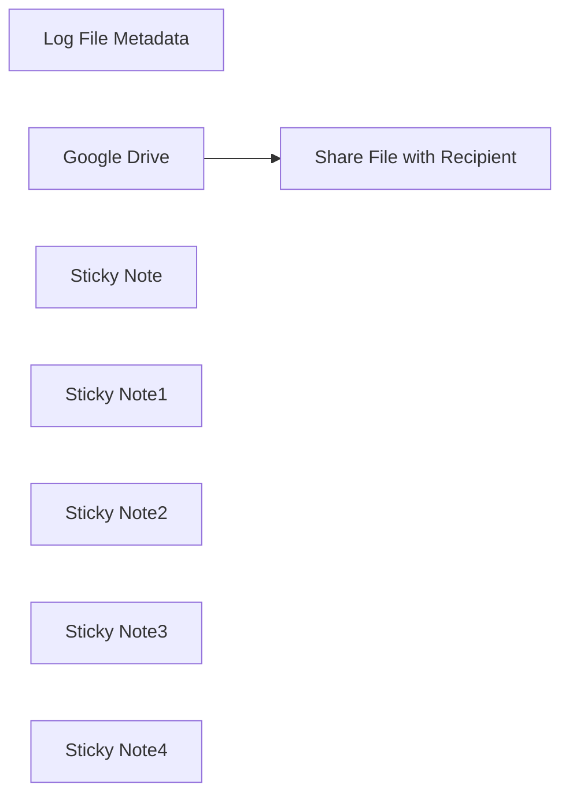

## Fluxo (.json) :

```json
{
  "id": "uLHpFu2ndN6ZKClZ",
  "meta": {
    "instanceId": "14e4c77104722ab186539dfea5182e419aecc83d85963fe13f6de862c875ebfa",
    "templateCredsSetupCompleted": true
  },
  "name": "Sync New Files From Google Drive with Airtable",
  "tags": [
    {
      "id": "uScnF9NzR3PLIyvU",
      "name": "Published",
      "createdAt": "2025-03-21T07:22:28.491Z",
      "updatedAt": "2025-03-21T07:22:28.491Z"
    }
  ],
  "nodes": [
    {
      "id": "f648b663-8adb-4587-bf80-cff7554b72c4",
      "name": "Share File with Recipient",
      "type": "n8n-nodes-base.googleDrive",
      "notes": "Share File via Email",
      "position": [
        660,
        -20
      ],
      "parameters": {
        "fileId": {
          "__rl": true,
          "mode": "id",
          "value": "={{ $json.id }}"
        },
        "options": {},
        "operation": "share",
        "permissionsUi": {
          "permissionsValues": {
            "role": "writer",
            "type": "user",
            "emailAddress": "test@gmail.com"
          }
        }
      },
      "credentials": {
        "googleDriveOAuth2Api": {
          "id": "",
          "name": ""
        }
      },
      "notesInFlow": true,
      "typeVersion": 3
    },
    {
      "id": "29c9dacf-e9fa-49b7-81e5-0416dbdbc9ba",
      "name": " Log File Metadata",
      "type": "n8n-nodes-base.airtable",
      "notes": "Store File Metadata",
      "position": [
        940,
        -160
      ],
      "parameters": {
        "base": {
          "__rl": true,
          "mode": "url",
          "value": ""
        },
        "table": {
          "__rl": true,
          "mode": "url",
          "value": ""
        },
        "columns": {
          "value": {
            "FileId": "={{ $('Google Drive').item.json.id }}",
            "sentId": "={{ $json.id }}",
            "FileName": "={{ $('Google Drive').item.json.name }}",
            "CreatedTime": "={{ $('Google Drive').item.json.createdTime }}",
            "ModifiedTime": "={{ $('Google Drive').item.json.modifiedTime }}"
          },
          "schema": [
            {
              "id": "FileName",
              "type": "string",
              "display": true,
              "removed": false,
              "readOnly": false,
              "required": false,
              "displayName": "FileName",
              "defaultMatch": false,
              "canBeUsedToMatch": true
            },
            {
              "id": "FileId",
              "type": "string",
              "display": true,
              "removed": false,
              "readOnly": false,
              "required": false,
              "displayName": "FileId",
              "defaultMatch": false,
              "canBeUsedToMatch": true
            },
            {
              "id": "CreatedTime",
              "type": "dateTime",
              "display": true,
              "removed": false,
              "readOnly": false,
              "required": false,
              "displayName": "CreatedTime",
              "defaultMatch": false,
              "canBeUsedToMatch": true
            },
            {
              "id": "ModifiedTime",
              "type": "dateTime",
              "display": true,
              "removed": false,
              "readOnly": false,
              "required": false,
              "displayName": "ModifiedTime",
              "defaultMatch": false,
              "canBeUsedToMatch": true
            },
            {
              "id": "sentId",
              "type": "string",
              "display": true,
              "removed": false,
              "readOnly": false,
              "required": false,
              "displayName": "sentId",
              "defaultMatch": false,
              "canBeUsedToMatch": true
            }
          ],
          "mappingMode": "defineBelow",
          "matchingColumns": []
        },
        "options": {},
        "operation": "create"
      },
      "credentials": {
        "airtableTokenApi": {
          "id": "",
          "name": ""
        }
      },
      "notesInFlow": true,
      "typeVersion": 2.1
    },
    {
      "id": "f2a4c6af-cf00-4549-88af-1a3e125508d6",
      "name": "Google Drive",
      "type": "n8n-nodes-base.googleDriveTrigger",
      "notes": "Fetch New File",
      "position": [
        420,
        -180
      ],
      "parameters": {
        "event": "fileCreated",
        "options": {},
        "pollTimes": {
          "item": [
            {
              "mode": "everyMinute"
            }
          ]
        },
        "triggerOn": "specificFolder",
        "folderToWatch": {
          "__rl": true,
          "mode": "url",
          "value": ""
        }
      },
      "credentials": {
        "googleDriveOAuth2Api": {
          "id": "",
          "name": ""
        }
      },
      "notesInFlow": true,
      "typeVersion": 1
    },
    {
      "id": "14da3a1a-def0-4718-8456-f3f11c0fb238",
      "name": "Sticky Note",
      "type": "n8n-nodes-base.stickyNote",
      "position": [
        400,
        -20
      ],
      "parameters": {
        "width": 150,
        "height": 140,
        "content": "This node retrieves the newly added file from the specified folder in Google Drive."
      },
      "typeVersion": 1
    },
    {
      "id": "d9224406-31e5-46a6-a2da-56effb86c8eb",
      "name": "Sticky Note1",
      "type": "n8n-nodes-base.stickyNote",
      "position": [
        640,
        -180
      ],
      "parameters": {
        "width": 170,
        "height": 140,
        "content": "This node sends the fetched file via email to the specified recipient."
      },
      "typeVersion": 1
    },
    {
      "id": "cad9869a-cf58-4786-8d0a-d696bf3a0c84",
      "name": "Sticky Note2",
      "type": "n8n-nodes-base.stickyNote",
      "position": [
        920,
        0
      ],
      "parameters": {
        "width": 180,
        "content": "This node stores the file’s metadata (name, ID, creation time, modification time, and recipient email) in Airtable."
      },
      "typeVersion": 1
    },
    {
      "id": "0f6c1ffc-7d9e-41ee-b5f4-ee65f792222e",
      "name": "Sticky Note3",
      "type": "n8n-nodes-base.stickyNote",
      "position": [
        320,
        -240
      ],
      "parameters": {
        "width": 860,
        "height": 420,
        "content": "### Automatic File Upload & Sharing Workflow with Google Drive & Airtable Integration\n\n"
      },
      "typeVersion": 1
    },
    {
      "id": "99acf1d1-ce4e-4942-bb6c-d053ef886a29",
      "name": "Sticky Note4",
      "type": "n8n-nodes-base.stickyNote",
      "position": [
        320,
        220
      ],
      "parameters": {
        "width": 860,
        "height": 120,
        "content": "### Description:\nThis workflow automatically fetches newly uploaded files from a specific folder in Google Drive, shares them via email with specified recipients, and logs the file details (name, ID, created time, modified time) into Airtable for easy tracking. It streamlines the process of file sharing and management while keeping track of important metadata in a central place.)"
      },
      "typeVersion": 1
    }
  ],
  "active": false,
  "pinData": {},
  "settings": {
    "executionOrder": "v1"
  },
  "versionId": "c4ff2316-a648-4cd2-9af8-b29c29115ac6",
  "connections": {
    "Google Drive": {
      "main": [
        [
          {
            "node": "Share File with Recipient",
            "type": "main",
            "index": 0
          }
        ]
      ]
    },
    "Share File with Recipient": {
      "main": [
        [
          {
            "node": " Log File Metadata",
            "type": "main",
            "index": 0
          }
        ]
      ]
    }
  }
}
```

<a id="template-1899"></a>

## Template 1899 - Chatbot agente com scraper Jina.ai

- **Nome:** Chatbot agente com scraper Jina.ai
- **Descrição:** Fluxo que recebe uma pergunta do usuário, raspas conteúdo de páginas web quando necessário via Jina.ai e gera respostas contextuais usando um modelo de linguagem, mantendo histórico recente de conversa.
- **Funcionalidade:** • Detecção de mensagens de chat: inicia o fluxo ao receber uma mensagem do usuário.
• Extração de conteúdo web em tempo real: chama um serviço de scraping para obter o texto de uma URL fornecida pelo usuário.
• Agente conversacional: decide quando usar a ferramenta de scraping, interpreta o conteúdo retornado e formula a resposta.
• Geração de resposta com LLM: usa um modelo de linguagem para analisar os dados e criar respostas claras e concisas.
• Memória de contexto em janela: armazena histórico recente das interações para manter contexto entre mensagens.
• Suporte a prompts com URL: exige que o usuário inclua a URL na pergunta para acionar o scraping quando necessário.
- **Ferramentas:** • Jina.ai (r.jina.ai): endpoint público para obter o conteúdo renderizado de uma página web a partir de uma URL, usado para scraping sem necessidade de chave de API.
• OpenAI (gpt-4o-mini): modelo de linguagem utilizado para interpretar perguntas, processar o conteúdo raspado e gerar respostas em linguagem natural.

## Fluxo visual

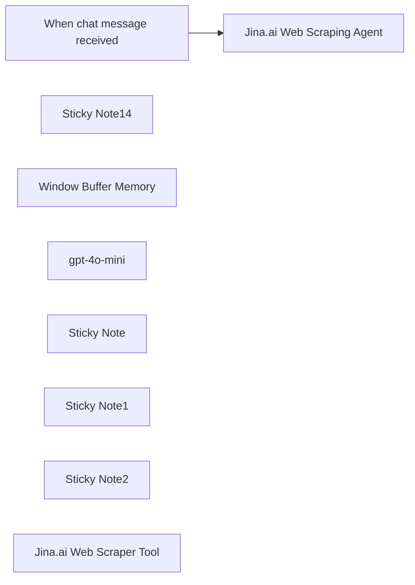

## Fluxo (.json) :

```json
{
  "id": "xEij0kj2I1DHbL3I",
  "meta": {
    "instanceId": "31e69f7f4a77bf465b805824e303232f0227212ae922d12133a0f96ffeab4fef"
  },
  "name": "🌐🪛 AI Agent Chatbot with Jina.ai Webpage Scraper",
  "tags": [],
  "nodes": [
    {
      "id": "ea5369a0-4283-46fc-b738-8cf787181e93",
      "name": "When chat message received",
      "type": "@n8n/n8n-nodes-langchain.chatTrigger",
      "position": [
        0,
        -280
      ],
      "webhookId": "e298fd8c-2af9-4db2-bb8b-94d70fbc2938",
      "parameters": {
        "options": {}
      },
      "typeVersion": 1.1
    },
    {
      "id": "07c8338b-d47e-467b-996f-99c9fbe67f89",
      "name": "Sticky Note14",
      "type": "n8n-nodes-base.stickyNote",
      "position": [
        240,
        -460
      ],
      "parameters": {
        "color": 5,
        "width": 680,
        "height": 700,
        "content": "## AI Agent Chatbot with Jina.ai Web Scraper\n### https://jina.ai/\n"
      },
      "typeVersion": 1
    },
    {
      "id": "00da1c9b-b5f7-42b8-8bdd-938a8daf7410",
      "name": "Window Buffer Memory",
      "type": "@n8n/n8n-nodes-langchain.memoryBufferWindow",
      "position": [
        520,
        20
      ],
      "parameters": {},
      "typeVersion": 1.3
    },
    {
      "id": "f14426ee-709d-4651-a0b7-e823bff5ee74",
      "name": "Jina.ai Web Scraping Agent",
      "type": "@n8n/n8n-nodes-langchain.agent",
      "position": [
        440,
        -280
      ],
      "parameters": {
        "text": "=You have access to a powerful scrape_website tool that can retrieve real-time web content. Use this tool to extract any needed information from the website, analyze the data, and craft a clear, accurate, and concise answer to the user's question. Be sure to include relevant details from the scraped content. \n\nUser Question: {{ $json.chatInput }}\n\n",
        "options": {},
        "promptType": "define"
      },
      "typeVersion": 1.7
    },
    {
      "id": "3ce16f26-073b-4ccc-a65f-2ca870a9bd16",
      "name": "gpt-4o-mini",
      "type": "@n8n/n8n-nodes-langchain.lmChatOpenAi",
      "position": [
        340,
        20
      ],
      "parameters": {
        "model": {
          "__rl": true,
          "mode": "list",
          "value": "gpt-4o-mini"
        },
        "options": {}
      },
      "credentials": {
        "openAiApi": {
          "id": "jEMSvKmtYfzAkhe6",
          "name": "OpenAi account"
        }
      },
      "typeVersion": 1.2
    },
    {
      "id": "3a503859-ef0a-492d-81c6-37e4f0c4c25e",
      "name": "Sticky Note",
      "type": "n8n-nodes-base.stickyNote",
      "position": [
        700,
        -20
      ],
      "parameters": {
        "width": 400,
        "height": 320,
        "content": "## Jina.ai Web Scraper Tool\n### No API Key Required\nhttps://docs.n8n.io/integrations/builtin/cluster-nodes/sub-nodes/n8n-nodes-langchain.toolhttprequest/"
      },
      "typeVersion": 1
    },
    {
      "id": "833d19c0-3a98-4cb0-a60c-412ea4d3a67a",
      "name": "Sticky Note1",
      "type": "n8n-nodes-base.stickyNote",
      "position": [
        -580,
        -460
      ],
      "parameters": {
        "color": 7,
        "width": 460,
        "height": 760,
        "content": "The **AI Agent Chatbot with Jina.ai Web Scraper** workflow is a powerful automation designed to integrate real-time web scraping capabilities into an AI-driven chatbot. Here's how it works and why it's important:\n\n### **How It Works**\n1. **Chat Trigger**: The workflow begins when a user sends a chat message, triggering the \"When chat message received\" node.\n2. **AI Agent Processing**: The input is passed to the \"Jina.ai Web Scraping Agent,\" which uses advanced AI logic to interpret the user’s query and determine the information needed.\n3. **Web Scraping**: The agent utilizes the \"HTTP Request\" node to scrape real-time data from a user-provided URL. This allows the chatbot to fetch and analyze live content from websites.\n4. **Memory Management**: The \"Window Buffer Memory\" node ensures context retention by storing and managing conversational history, enabling seamless interactions.\n5. **Language Model Integration**: The scraped data is processed using the \"gpt-4o-mini\" language model, which generates clear, accurate, and contextually relevant responses for the user.\n\n### **Why It's Important**\n- **Real-Time Information Retrieval**: This workflow empowers users to access up-to-date web content directly through a chatbot, eliminating the need for manual web searches.\n- **Enhanced User Experience**: By combining web scraping with conversational AI, it delivers precise answers tailored to user queries in real time.\n- **Versatility**: It can be applied across various domains, such as customer support, research, or data analysis, making it a valuable tool for businesses and individuals alike.\n- **Automation Efficiency**: Automating web scraping and response generation saves time and effort while ensuring accuracy.\n\n"
      },
      "typeVersion": 1
    },
    {
      "id": "9e9cc23b-9881-44ab-bd20-5c9176ba1c43",
      "name": "Sticky Note2",
      "type": "n8n-nodes-base.stickyNote",
      "position": [
        -80,
        -80
      ],
      "parameters": {
        "color": 4,
        "width": 280,
        "height": 320,
        "content": "## Try Me!\n\n### User prompt must include a URL with initial question.\n\n\nPrompt Example:\n\n\"How do I install Ollama on windows using the docs from https://github.com/ollama/ollama\""
      },
      "typeVersion": 1
    },
    {
      "id": "a95efbfd-f908-4f7b-bf47-05b993250ed2",
      "name": "Jina.ai Web Scraper Tool",
      "type": "@n8n/n8n-nodes-langchain.toolHttpRequest",
      "position": [
        860,
        140
      ],
      "parameters": {
        "url": "=https://r.jina.ai/{url}",
        "toolDescription": "Call this tool to scrape a website.  Extract the URL from the user prompt.",
        "placeholderDefinitions": {
          "values": [
            {
              "name": "url",
              "type": "string",
              "description": "User provided website url"
            }
          ]
        }
      },
      "typeVersion": 1.1
    }
  ],
  "active": false,
  "pinData": {},
  "settings": {
    "executionOrder": "v1"
  },
  "versionId": "5ce466c5-2195-4038-9c52-cc7debd5f4b8",
  "connections": {
    "gpt-4o-mini": {
      "ai_languageModel": [
        [
          {
            "node": "Jina.ai Web Scraping Agent",
            "type": "ai_languageModel",
            "index": 0
          }
        ]
      ]
    },
    "Window Buffer Memory": {
      "ai_memory": [
        [
          {
            "node": "Jina.ai Web Scraping Agent",
            "type": "ai_memory",
            "index": 0
          }
        ]
      ]
    },
    "Jina.ai Web Scraper Tool": {
      "ai_tool": [
        [
          {
            "node": "Jina.ai Web Scraping Agent",
            "type": "ai_tool",
            "index": 0
          }
        ]
      ]
    },
    "When chat message received": {
      "main": [
        [
          {
            "node": "Jina.ai Web Scraping Agent",
            "type": "main",
            "index": 0
          }
        ]
      ]
    }
  }
}
```

<a id="template-1900"></a>

## Template 1900 - Automação de Merge Requests GitLab

- **Nome:** Automação de Merge Requests GitLab
- **Descrição:** Fluxo que verifica existência de merge requests por branch, fecha MRs antigos quando necessário, cria novos MRs, adiciona comentários, aguarda execução de pipeline e aciona o merge com opções configuráveis.
- **Funcionalidade:** • Gatilho agendado: inicia o processo periodicamente.
• Verificação de MRs existentes: consulta a API do GitLab para identificar merge requests abertos pelo branch de origem.
• Criação de novo MR: cria um merge request com título, branch de origem e branch de destino quando nenhum MR existe para o branch.
• Adição de comentários personalizados: adiciona notas ao merge request recém-criado com informações/customizações.
• Espera programada: pausa o fluxo por um tempo configurável (ex.: 30s) para permitir aprovação ou conclusão do pipeline.
• Configuração de merge: define opções como aguardar pipeline bem‑sucedido e remover o branch de origem após o merge.
• Merge condicionado ao pipeline: aciona a requisição de merge para ocorrer quando o pipeline tiver sucesso, conforme configurado.
• Fechamento de MRs antigos/indesejados: itera sobre itens e fecha merge requests específicos via API.
• Processamento em lotes: divide itens em lotes para iterações e operações controladas.
- **Ferramentas:** • GitLab: Plataforma de hospedagem de código e CI/CD, utilizada aqui via API para listar, criar, comentar, fechar e mesclar merge requests.

## Fluxo visual

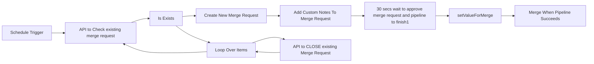

## Fluxo (.json) :

```json
{
  "meta": {
    "templateCredsSetupCompleted": true
  },
  "nodes": [
    {
      "id": "b9a807c3-5847-477a-a242-2fdf5b15ba7e",
      "name": "API to Check existing merge request",
      "type": "n8n-nodes-base.httpRequest",
      "position": [
        -840,
        -20
      ],
      "parameters": {
        "url": "=https://gitlab.com/<projectid>/merge_requests",
        "options": {
          "allowUnauthorizedCerts": false
        },
        "sendQuery": true,
        "sendHeaders": true,
        "queryParameters": {
          "parameters": [
            {
              "name": "state",
              "value": "opened"
            },
            {
              "name": "source_branch",
              "value": "=sourceBranchName"
            }
          ]
        },
        "headerParameters": {
          "parameters": [
            {
              "name": "PRIVATE-TOKEN",
              "value": "=gitlabToken"
            }
          ]
        }
      },
      "typeVersion": 4.2,
      "alwaysOutputData": true
    },
    {
      "id": "42270a5a-d696-44f3-b2f5-16b2ddb3488c",
      "name": "Is Exists",
      "type": "n8n-nodes-base.if",
      "position": [
        -660,
        -20
      ],
      "parameters": {
        "options": {},
        "conditions": {
          "options": {
            "version": 2,
            "leftValue": "",
            "caseSensitive": true,
            "typeValidation": "strict"
          },
          "combinator": "and",
          "conditions": [
            {
              "id": "d895b8cc-5679-442f-a1bf-d8375174a24b",
              "operator": {
                "type": "boolean",
                "operation": "true",
                "singleValue": true
              },
              "leftValue": "={{ $node[\"API to Check existing merge request\"].data.isEmpty() }}",
              "rightValue": ""
            }
          ]
        }
      },
      "typeVersion": 2.2
    },
    {
      "id": "d380c943-0525-4976-9e70-c90de1177f0c",
      "name": "Create New Merge Request",
      "type": "n8n-nodes-base.httpRequest",
      "position": [
        -440,
        -200
      ],
      "parameters": {
        "url": "=https://gitlab.com/<projectid>/merge_requests",
        "method": "POST",
        "options": {
          "allowUnauthorizedCerts": false
        },
        "sendBody": true,
        "contentType": "form-urlencoded",
        "sendHeaders": true,
        "bodyParameters": {
          "parameters": [
            {
              "name": "source_branch",
              "value": "=sourceBranchName"
            },
            {
              "name": "target_branch",
              "value": "=targetBranchName"
            },
            {
              "name": "title",
              "value": "=mergeTitle"
            }
          ]
        },
        "headerParameters": {
          "parameters": [
            {
              "name": "PRIVATE-TOKEN",
              "value": "=gitlabToken"
            }
          ]
        }
      },
      "typeVersion": 4.2
    },
    {
      "id": "600a0ed5-cb68-4479-8aee-55b55f0d8630",
      "name": "Loop Over Items",
      "type": "n8n-nodes-base.splitInBatches",
      "position": [
        -440,
        160
      ],
      "parameters": {
        "options": {}
      },
      "typeVersion": 3
    },
    {
      "id": "555643cb-761c-41ec-b983-8e0194851a8d",
      "name": "API to CLOSE existing Merge Request",
      "type": "n8n-nodes-base.httpRequest",
      "position": [
        -220,
        180
      ],
      "parameters": {
        "url": "=https://gitlab.com/<projectid>/merge_requests/<merge_iid>",
        "method": "PUT",
        "options": {
          "allowUnauthorizedCerts": false
        },
        "sendBody": true,
        "contentType": "form-urlencoded",
        "sendHeaders": true,
        "bodyParameters": {
          "parameters": [
            {
              "name": "state_event",
              "value": "close"
            }
          ]
        },
        "headerParameters": {
          "parameters": [
            {
              "name": "PRIVATE-TOKEN",
              "value": "=gitlabToken"
            }
          ]
        }
      },
      "typeVersion": 4.2
    },
    {
      "id": "0c94b06a-80e3-4e50-8bac-2bd4015f085e",
      "name": "Add Custom Notes To Merge Request",
      "type": "n8n-nodes-base.httpRequest",
      "position": [
        -220,
        -200
      ],
      "parameters": {
        "url": "=https://gitlab.com/<projectid>/merge_requests/<merge_iid>/notes",
        "method": "POST",
        "options": {
          "allowUnauthorizedCerts": false
        },
        "sendBody": true,
        "contentType": "form-urlencoded",
        "sendHeaders": true,
        "bodyParameters": {
          "parameters": [
            {
              "name": "body",
              "value": "=<mergeComments>"
            }
          ]
        },
        "headerParameters": {
          "parameters": [
            {
              "name": "PRIVATE-TOKEN",
              "value": "=gitlabToken"
            }
          ]
        }
      },
      "typeVersion": 4.2
    },
    {
      "id": "8e849f4f-2a52-46ba-9e0a-17126a8d966c",
      "name": "30 secs wait to approve merge request and pipeline to finish1",
      "type": "n8n-nodes-base.wait",
      "position": [
        140,
        -200
      ],
      "webhookId": "ac7bb2de-2c6f-479a-8807-13a29d8eaf5e",
      "parameters": {
        "amount": 30
      },
      "typeVersion": 1.1
    },
    {
      "id": "05cca829-b2df-4c1e-9441-56349acc4a0d",
      "name": "Merge When Pipeline Succeeds",
      "type": "n8n-nodes-base.httpRequest",
      "position": [
        720,
        -200
      ],
      "parameters": {
        "url": "=https://gitlab.com/<projectid>/merge_requests/<merge_iid>/merge",
        "method": "PUT",
        "options": {
          "allowUnauthorizedCerts": false
        },
        "jsonBody": "={\n\"merge_when_pipeline_succeeds\": {{ $('setValueForMerge').item.json.merge_when_pipeline_succeeds }},\n  \"should_remove_source_branch\": {{ $('setValueForMerge').item.json.should_remove_source_branch }}\n}",
        "sendBody": true,
        "sendHeaders": true,
        "specifyBody": "json",
        "headerParameters": {
          "parameters": [
            {
              "name": "PRIVATE-TOKEN",
              "value": "=gitlabToken"
            }
          ]
        }
      },
      "typeVersion": 4.2
    },
    {
      "id": "e3ce9cdc-5484-4b4b-8701-6b9089a1f76d",
      "name": "setValueForMerge",
      "type": "n8n-nodes-base.set",
      "position": [
        460,
        -200
      ],
      "parameters": {
        "options": {},
        "assignments": {
          "assignments": [
            {
              "id": "a22922c7-0c69-4ac1-bd15-4d289fa57737",
              "name": "merge_when_pipeline_succeeds",
              "type": "boolean",
              "value": false
            },
            {
              "id": "17580668-84d9-4ad6-b93b-e7b6c9c0f8ea",
              "name": "should_remove_source_branch",
              "type": "boolean",
              "value": true
            }
          ]
        }
      },
      "typeVersion": 3.4
    },
    {
      "id": "0d49ec98-4806-492e-a6c2-a298ed8bb11a",
      "name": "Schedule Trigger",
      "type": "n8n-nodes-base.scheduleTrigger",
      "position": [
        -1160,
        -20
      ],
      "parameters": {
        "rule": {
          "interval": [
            {}
          ]
        }
      },
      "typeVersion": 1.2
    }
  ],
  "pinData": {},
  "connections": {
    "Is Exists": {
      "main": [
        [
          {
            "node": "Create New Merge Request",
            "type": "main",
            "index": 0
          }
        ],
        [
          {
            "node": "Loop Over Items",
            "type": "main",
            "index": 0
          }
        ]
      ]
    },
    "Loop Over Items": {
      "main": [
        [
          {
            "node": "API to Check existing merge request",
            "type": "main",
            "index": 0
          }
        ],
        [
          {
            "node": "API to CLOSE existing Merge Request",
            "type": "main",
            "index": 0
          }
        ]
      ]
    },
    "Schedule Trigger": {
      "main": [
        [
          {
            "node": "API to Check existing merge request",
            "type": "main",
            "index": 0
          }
        ]
      ]
    },
    "setValueForMerge": {
      "main": [
        [
          {
            "node": "Merge When Pipeline Succeeds",
            "type": "main",
            "index": 0
          }
        ]
      ]
    },
    "Create New Merge Request": {
      "main": [
        [
          {
            "node": "Add Custom Notes To Merge Request",
            "type": "main",
            "index": 0
          }
        ]
      ]
    },
    "Add Custom Notes To Merge Request": {
      "main": [
        [
          {
            "node": "30 secs wait to approve merge request and pipeline to finish1",
            "type": "main",
            "index": 0
          }
        ]
      ]
    },
    "API to CLOSE existing Merge Request": {
      "main": [
        [
          {
            "node": "Loop Over Items",
            "type": "main",
            "index": 0
          }
        ]
      ]
    },
    "API to Check existing merge request": {
      "main": [
        [
          {
            "node": "Is Exists",
            "type": "main",
            "index": 0
          }
        ]
      ]
    },
    "30 secs wait to approve merge request and pipeline to finish1": {
      "main": [
        [
          {
            "node": "setValueForMerge",
            "type": "main",
            "index": 0
          }
        ]
      ]
    }
  }
}
```

<a id="template-1902"></a>

## Template 1902 - Agente de chat com acesso a banco SQL

- **Nome:** Agente de chat com acesso a banco SQL
- **Descrição:** Fluxo que recebe mensagens de chat, usa um agente de IA para interpretar pedidos e gera/executa consultas SQL contra um banco Postgres, retornando os resultados ao usuário.
- **Funcionalidade:** • Recepção de mensagens de chat: Inicia o processo ao receber uma mensagem do usuário.
• Interpretação por agente de IA: Utiliza um modelo de linguagem para entender a intenção do usuário e formular respostas.
• Geração automática de consultas SQL: Constrói statements SQL a partir da solicitação do usuário.
• Execução de consultas no banco de dados: Executa as consultas geradas no banco Postgres e retorna os resultados.
• Memória de contexto: Mantém um histórico recente da conversa para respostas mais consistentes.
• Orientações internas: Inclui instruções visuais que guiam o usuário sobre como interagir (ex.: pedir quais tabelas estão disponíveis) e indica que o banco pode ser trocado.
- **Ferramentas:** • OpenAI: Serviço de modelo de linguagem usado para interpretar mensagens e gerar SQL e respostas (modelo configurado: gpt-4o-mini).
• Banco de dados SQL (Postgres): Armazena os dados consultados e alterados pelo agente; pode ser substituído por MySQL ou SQLite.

## Fluxo visual

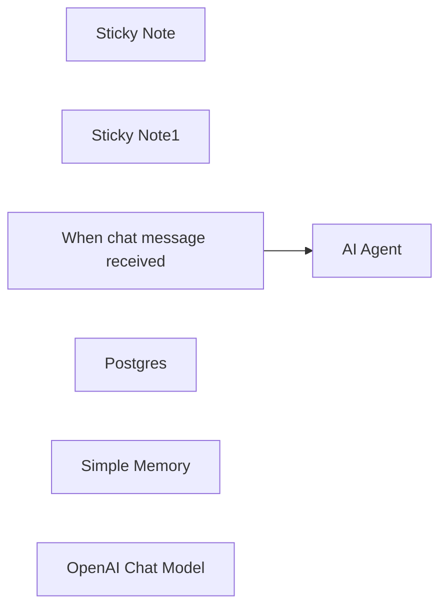

## Fluxo (.json) :

```json
{
  "meta": {
    "instanceId": "408f9fb9940c3cb18ffdef0e0150fe342d6e655c3a9fac21f0f644e8bedabcd9",
    "templateCredsSetupCompleted": true
  },
  "nodes": [
    {
      "id": "d08a2559-17fd-4bdb-a976-795c3823a88a",
      "name": "Sticky Note",
      "type": "n8n-nodes-base.stickyNote",
      "position": [
        -520,
        240
      ],
      "parameters": {
        "content": "## Try me out\nClick the 'chat' button at the bottom of the canvas and paste in:\n\n_Which tables are available?_"
      },
      "typeVersion": 1
    },
    {
      "id": "3019b559-6100-4ead-8e1a-a7dece2a6982",
      "name": "Sticky Note1",
      "type": "n8n-nodes-base.stickyNote",
      "position": [
        -380,
        -60
      ],
      "parameters": {
        "color": 7,
        "width": 677,
        "height": 505,
        "content": "This workflow uses a Postgres DB, but you could swap it for a MySQL or SQLite one"
      },
      "typeVersion": 1
    },
    {
      "id": "73786411-5383-4921-82ee-06b3b582bab7",
      "name": "When chat message received",
      "type": "@n8n/n8n-nodes-langchain.chatTrigger",
      "position": [
        -320,
        40
      ],
      "webhookId": "1c0d08f0-abd0-4bdc-beef-370c27aae1a0",
      "parameters": {
        "options": {}
      },
      "typeVersion": 1.1
    },
    {
      "id": "e65a1558-e0c0-4c4a-a306-90dc6dcb618a",
      "name": "Postgres",
      "type": "n8n-nodes-base.postgresTool",
      "position": [
        140,
        260
      ],
      "parameters": {
        "query": "{{ $fromAI('sql_statement') }}",
        "options": {},
        "operation": "executeQuery"
      },
      "credentials": {
        "postgres": {
          "id": "elRn5sxKOfCdlEs6",
          "name": "Postgres account"
        }
      },
      "typeVersion": 2.5
    },
    {
      "id": "9df537e7-3ca2-4e72-bc85-ae0d944fbdd1",
      "name": "Simple Memory",
      "type": "@n8n/n8n-nodes-langchain.memoryBufferWindow",
      "position": [
        0,
        260
      ],
      "parameters": {},
      "typeVersion": 1.3
    },
    {
      "id": "57b2b959-9f25-475f-b6bb-842139725411",
      "name": "AI Agent",
      "type": "@n8n/n8n-nodes-langchain.agent",
      "position": [
        -100,
        40
      ],
      "parameters": {
        "options": {}
      },
      "typeVersion": 1.8
    },
    {
      "id": "f21ac2dc-56ff-4ea6-a29e-168e7dfaf3fa",
      "name": "OpenAI Chat Model",
      "type": "@n8n/n8n-nodes-langchain.lmChatOpenAi",
      "position": [
        -160,
        260
      ],
      "parameters": {
        "model": {
          "__rl": true,
          "mode": "list",
          "value": "gpt-4o-mini"
        },
        "options": {}
      },
      "credentials": {
        "openAiApi": {
          "id": "8gccIjcuf3gvaoEr",
          "name": "OpenAi account"
        }
      },
      "typeVersion": 1.2
    }
  ],
  "pinData": {},
  "connections": {
    "Postgres": {
      "ai_tool": [
        [
          {
            "node": "AI Agent",
            "type": "ai_tool",
            "index": 0
          }
        ]
      ]
    },
    "Simple Memory": {
      "ai_memory": [
        [
          {
            "node": "AI Agent",
            "type": "ai_memory",
            "index": 0
          }
        ]
      ]
    },
    "OpenAI Chat Model": {
      "ai_languageModel": [
        [
          {
            "node": "AI Agent",
            "type": "ai_languageModel",
            "index": 0
          }
        ]
      ]
    },
    "When chat message received": {
      "main": [
        [
          {
            "node": "AI Agent",
            "type": "main",
            "index": 0
          }
        ]
      ]
    }
  }
}
```

<a id="template-1904"></a>

## Template 1904 - Fluxo de chatbot para análise de documentos

- **Nome:** Fluxo de chatbot para análise de documentos
- **Descrição:** Este fluxo recebe documentos via formulário, analisa seu conteúdo, gera um relatório estruturado e envia o resultado por e-mail, armazenando o conhecimento processado para consultas futuras.
- **Funcionalidade:** • Captura de envio de formulário com múltiplos arquivos: inicia o processamento a partir do envio de um formulário que carrega arquivos e o e-mail do usuário.
• Divisão de itens binários: separa cada arquivo binário para processamento individual em paralelo.
• Parsing de documentos: envia o conteúdo para uma API externa de parsing para extrair texto estruturado (markdown).
• Consolidação e formatação do texto: utiliza agentes de linguagem para reformatar, estruturar e limpar o conteúdo mantendo o sentido.
• Extração de informações-chave: extrai informações relevantes como visão geral do projeto e requisitos do sistema.
• Embeddings e armazenamento de vetores: gera embeddings e armazena em um índice de vetores para recuperação.
• Resposta baseada em contexto: utiliza um modelo de linguagem para responder com base no conteúdo recuperado, com suporte a QA.
• Geração de relatório final e envio por e-mail: transforma o conteúdo processado em arquivo de texto/markdown e envia por Gmail como relatório.
- **Ferramentas:** • Google Gemini Chat Model: modelo de linguagem utilizado para gerar e refinar respostas de conversa com o usuário.
• Pinecone Vector Store: serviço de armazenamento e recuperação de vetores de conteúdos analisados.
• Embeddings Mistral Cloud: serviço de criação de embeddings para representação vetorial do texto.
• LlamaIndex Parsing API: API externa usada para upload e parsing de documentos para extrair texto estruturado.
• Gmail: serviço de envio de e-mails para compartilhar relatórios/resultados com o usuário.

## Fluxo visual

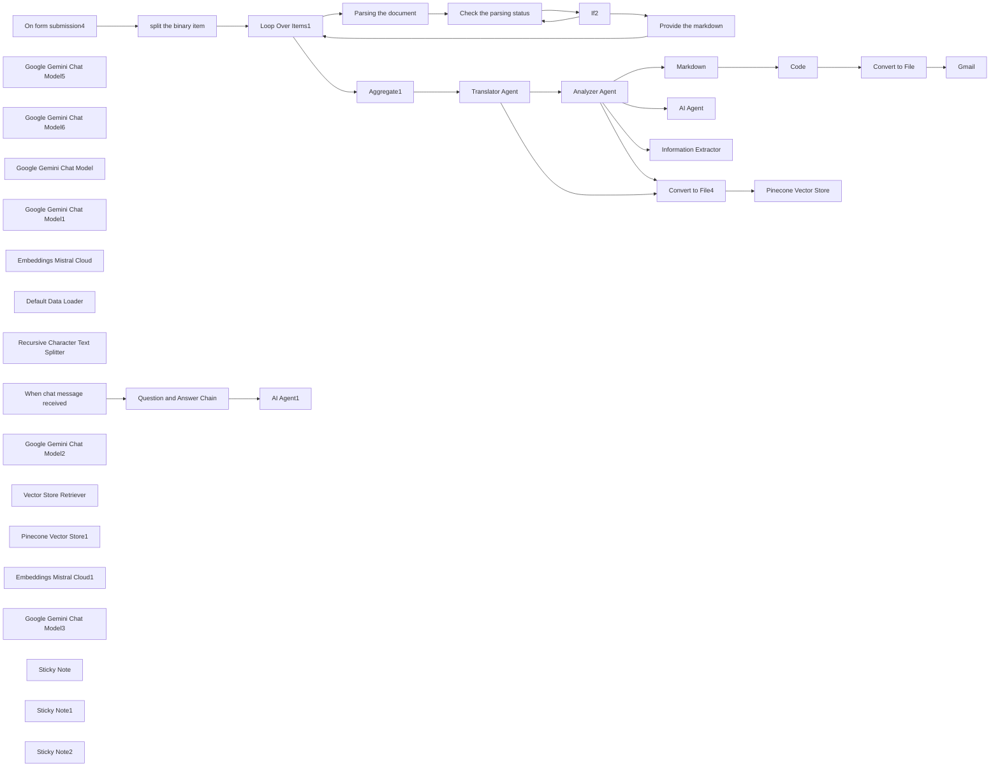

## Fluxo (.json) :

```json
{
  "id": "cGNK44mkCzIh4113",
  "meta": {
    "instanceId": "44c282b5a828cd0d7dda8a13c9168fe32406aaef7e8faa5a847408311387e400"
  },
  "name": "My workflow 3",
  "tags": [],
  "nodes": [
    {
      "id": "4db348cf-bd5a-408e-b212-d75b792460b4",
      "name": "On form submission4",
      "type": "n8n-nodes-base.formTrigger",
      "position": [
        -1720,
        20
      ],
      "webhookId": "34a4ae98-8eb8-486b-8d7e-dd5fdde15cd5",
      "parameters": {
        "options": {},
        "formTitle": "form which gets multiple files",
        "formFields": {
          "values": [
            {
              "fieldType": "file",
              "fieldLabel": "file1",
              "requiredField": true
            },
            {
              "fieldType": "file",
              "fieldLabel": "file2"
            },
            {
              "fieldLabel": "provide your mail Id",
              "requiredField": true
            }
          ]
        }
      },
      "typeVersion": 2.2
    },
    {
      "id": "6a1f197f-310e-4eb1-926f-60cfbae60a49",
      "name": "Loop Over Items1",
      "type": "n8n-nodes-base.splitInBatches",
      "position": [
        -380,
        20
      ],
      "parameters": {
        "options": {}
      },
      "typeVersion": 3,
      "alwaysOutputData": false
    },
    {
      "id": "7eb210e4-687c-4e9d-b2e7-50d0b85da8dc",
      "name": "If2",
      "type": "n8n-nodes-base.if",
      "position": [
        700,
        100
      ],
      "parameters": {
        "options": {},
        "conditions": {
          "options": {
            "version": 2,
            "leftValue": "",
            "caseSensitive": true,
            "typeValidation": "strict"
          },
          "combinator": "and",
          "conditions": [
            {
              "id": "1edbcd59-130d-4053-9db3-cb8dec068fe0",
              "operator": {
                "name": "filter.operator.equals",
                "type": "string",
                "operation": "equals"
              },
              "leftValue": "={{ $json.status }}",
              "rightValue": "SUCCESS"
            }
          ]
        }
      },
      "typeVersion": 2.2
    },
    {
      "id": "e76b9523-3f87-4ad3-87df-1e4e93ead090",
      "name": "Aggregate1",
      "type": "n8n-nodes-base.aggregate",
      "position": [
        0,
        0
      ],
      "parameters": {
        "options": {},
        "fieldsToAggregate": {
          "fieldToAggregate": [
            {
              "fieldToAggregate": "markdown"
            }
          ]
        }
      },
      "typeVersion": 1
    },
    {
      "id": "21234dcf-52dc-4ae0-975e-36a1a18ed456",
      "name": "Google Gemini Chat Model5",
      "type": "@n8n/n8n-nodes-langchain.lmChatGoogleGemini",
      "position": [
        1060,
        180
      ],
      "parameters": {
        "options": {},
        "modelName": "models/gemini-1.5-flash"
      },
      "typeVersion": 1
    },
    {
      "id": "52fcaca7-c49d-4004-96a3-0094ed0e510f",
      "name": "split the binary item",
      "type": "n8n-nodes-base.code",
      "position": [
        -1000,
        20
      ],
      "parameters": {
        "jsCode": "// Get the input data\nconst items = $input.all()\n\n// Initialize an array to hold the split items\nconst splitItems = [];\n\n// Iterate over each item\nitems.forEach(item => {\n  // Check if the item has binary data\n  if (item.binary) {\n    // Iterate over each binary field\n    for (const [key, value] of Object.entries(item.binary)) {\n      // Create a new item for each binary file\n      splitItems.push({\n        json: {},\n        binary: {\n          data: value\n        }\n      });\n    }\n  }\n});\n\n// Return the split items\nreturn splitItems;"
      },
      "typeVersion": 2,
      "alwaysOutputData": true
    },
    {
      "id": "4660eef4-de62-4b13-9f51-05000b1afa33",
      "name": "Parsing the document",
      "type": "n8n-nodes-base.httpRequest",
      "position": [
        260,
        100
      ],
      "parameters": {
        "url": "https://api.cloud.llamaindex.ai/api/parsing/upload",
        "method": "POST",
        "options": {
          "redirect": {
            "redirect": {}
          }
        },
        "sendBody": true,
        "contentType": "multipart-form-data",
        "sendHeaders": true,
        "bodyParameters": {
          "parameters": [
            {
              "name": "=file",
              "parameterType": "formBinaryData",
              "inputDataFieldName": "=data"
            }
          ]
        },
        "headerParameters": {
          "parameters": [
            {
              "name": "accept",
              "value": "application/json"
            },
            {
              "name": "Authorization",
              "value": "Bearer $secret token"
            }
          ]
        }
      },
      "typeVersion": 4.2
    },
    {
      "id": "07e76215-b9d4-4adb-b8f3-f8c8615abb56",
      "name": "Check the parsing status",
      "type": "n8n-nodes-base.httpRequest",
      "position": [
        480,
        100
      ],
      "parameters": {
        "url": "=https://api.cloud.llamaindex.ai/api/parsing/job/{{ $json.id }}",
        "options": {},
        "sendHeaders": true,
        "headerParameters": {
          "parameters": [
            {
              "name": "accept",
              "value": "application/json"
            },
            {
              "name": "Authorization",
              "value": "Bearer $secret token"
            }
          ]
        }
      },
      "typeVersion": 4.2
    },
    {
      "id": "3909a632-7002-4d60-a53b-3f73e4958c27",
      "name": "Provide the markdown",
      "type": "n8n-nodes-base.httpRequest",
      "position": [
        1180,
        400
      ],
      "parameters": {
        "url": "=https://api.cloud.llamaindex.ai/api/parsing/job/{{ $json.id }}/result/markdown",
        "options": {},
        "sendHeaders": true,
        "headerParameters": {
          "parameters": [
            {
              "name": "accept",
              "value": "application/json"
            },
            {
              "name": "Authorization",
              "value": "Bearer $secret token"
            }
          ]
        }
      },
      "typeVersion": 4.2
    },
    {
      "id": "89c25b95-8bc6-4bb5-82d2-1f870416c4af",
      "name": "Google Gemini Chat Model6",
      "type": "@n8n/n8n-nodes-langchain.lmChatGoogleGemini",
      "position": [
        1600,
        300
      ],
      "parameters": {
        "options": {},
        "modelName": "models/gemini-1.5-flash"
      },
      "typeVersion": 1
    },
    {
      "id": "8ddf6e94-6da0-4ef9-a6dc-0db8967914a6",
      "name": "Markdown",
      "type": "n8n-nodes-base.markdown",
      "position": [
        2140,
        0
      ],
      "parameters": {
        "mode": "markdownToHtml",
        "options": {},
        "markdown": "={{ $json.output }}",
        "destinationKey": "html"
      },
      "typeVersion": 1
    },
    {
      "id": "59c33f95-6f8f-4992-8421-dc3a0b668861",
      "name": "Gmail",
      "type": "n8n-nodes-base.gmail",
      "position": [
        4540,
        0
      ],
      "webhookId": "35fdc2a2-b8f8-4217-be0b-66ed98a548f1",
      "parameters": {
        "sendTo": "={{ $('On form submission4').item.json['provide your mail Id'] }}",
        "message": "=Hi user,\nThe below document contains the detailed analysis of the provided document.\n\nYou can also use the below link to interact with the assistant regarding your doubts on the analysis\nhttps://pavithranvh28.app.n8n.cloud/webhook/8c5c9e83-f595-4e4b-b45c-544a9a0840c4/chat\n\n\n",
        "options": {
          "attachmentsUi": {
            "attachmentsBinary": [
              {}
            ]
          }
        },
        "subject": "Analysis of the documents provided",
        "emailType": "text"
      },
      "typeVersion": 2.1
    },
    {
      "id": "b9bb8338-d52e-4f5b-bd2f-d517851b6014",
      "name": "Code",
      "type": "n8n-nodes-base.code",
      "position": [
        3200,
        0
      ],
      "parameters": {
        "jsCode": "const items = $input.first().json.html;\n\n// Ensure items is an array\nconst htmlArray = Array.isArray(items) ? items : [items];\n\nfunction htmlToFormattedText(html) {\n    // Replace heading tags (h1-h6) with bold text\n    html = html.replace(/<h[1-6]>(.*?)</h[1-6]>/gi, \"\\n**$1**\\n\");\n\n    // Replace paragraph tags with spacing\n    html = html.replace(/<p>(.*?)</p>/gi, \"\\n$1\\n\");\n\n    // Replace line breaks with newline characters\n    html = html.replace(/<br\\s*/?>/gi, \"\\n\");\n\n    // Remove all other HTML tags\n    html = html.replace(/<[^>]+>/g, \"\").trim();\n\n    // Remove extra newlines\n    return html.replace(/\\n{2,}/g, \"\\n\").trim();\n}\n\nconst updatedItems = htmlArray.map((item) => {\n    const htmlContent = item?.json?.html || item;\n    const textContent = htmlToFormattedText(htmlContent);\n    return { textContent };\n});\n\nreturn updatedItems;\n"
      },
      "typeVersion": 2
    },
    {
      "id": "e8176d99-3625-47a5-8989-80fdce053ba7",
      "name": "Convert to File",
      "type": "n8n-nodes-base.convertToFile",
      "position": [
        3840,
        0
      ],
      "parameters": {
        "options": {},
        "operation": "toText",
        "sourceProperty": "textContent"
      },
      "typeVersion": 1.1
    },
    {
      "id": "9fb1a6a0-c49f-48f5-93bc-f0c6e9b8a138",
      "name": "AI Agent",
      "type": "@n8n/n8n-nodes-langchain.agent",
      "position": [
        2600,
        460
      ],
      "parameters": {
        "text": "={{ $json.output }}",
        "options": {
          "systemMessage": "You are a helpful assistant.\nObjective:\nThe agent must process the input content to enhance readability, apply structured formatting, and bold necessary text elements while preserving the original meaning.\n\nProcessing Rules:\nApply Text Formatting:\n\nConvert any text enclosed with * (asterisks) into bold.\nStructurize the Content:\n\nOrganize the content using clear section headers.\nSeparate sections with line breaks for readability.\nEnsure proper indentation and bullet point usage for clarity.\nMaintain Clarity & Coherence:\n\nReformat the text without changing the core meaning.\nRemove redundancy while ensuring key details remain intact.\nText File Compatibility:\n\nResponse NEEDS TO BE A TEXT FILE"
        },
        "promptType": "define"
      },
      "typeVersion": 1.8
    },
    {
      "id": "9995921a-ca41-40c5-9159-350908ca8213",
      "name": "Google Gemini Chat Model",
      "type": "@n8n/n8n-nodes-langchain.lmChatGoogleGemini",
      "position": [
        2780,
        740
      ],
      "parameters": {
        "options": {},
        "modelName": "models/gemini-1.5-flash"
      },
      "typeVersion": 1
    },
    {
      "id": "bd281ef9-bc33-4b3a-9d3f-41d00521b14e",
      "name": "Information Extractor",
      "type": "@n8n/n8n-nodes-langchain.informationExtractor",
      "position": [
        2820,
        880
      ],
      "parameters": {
        "text": "={{ $json.output }}",
        "options": {
          "systemPromptTemplate": "You are an expert extraction algorithm.\nOnly extract relevant information from the text.\nIf you do not know the value of an attribute asked to extract, you may omit the attribute's value."
        },
        "attributes": {
          "attributes": [
            {
              "name": "Project Overview",
              "description": "overview of the content extracted"
            },
            {
              "name": "System and prerequisites",
              "description": "=which contains the information about the system and the prerequisites needed"
            }
          ]
        }
      },
      "typeVersion": 1
    },
    {
      "id": "2f1c4efb-6885-48c9-b2a6-a13d2e9b4f66",
      "name": "Google Gemini Chat Model1",
      "type": "@n8n/n8n-nodes-langchain.lmChatGoogleGemini",
      "position": [
        3140,
        1100
      ],
      "parameters": {
        "options": {},
        "modelName": "models/gemini-1.5-flash"
      },
      "typeVersion": 1
    },
    {
      "id": "b7a0276a-d253-43a8-a7f3-fb3b83599d7f",
      "name": "Convert to File4",
      "type": "n8n-nodes-base.convertToFile",
      "position": [
        1840,
        740
      ],
      "parameters": {
        "options": {},
        "operation": "toText",
        "sourceProperty": "output"
      },
      "typeVersion": 1.1
    },
    {
      "id": "7441e1ff-1966-4535-abaa-ee565db787de",
      "name": "Pinecone Vector Store",
      "type": "@n8n/n8n-nodes-langchain.vectorStorePinecone",
      "position": [
        2080,
        980
      ],
      "parameters": {
        "mode": "insert",
        "options": {},
        "pineconeIndex": {
          "__rl": true,
          "mode": "list",
          "value": "samuraichamploo",
          "cachedResultName": "samuraichamploo"
        }
      },
      "typeVersion": 1.1
    },
    {
      "id": "82d9d9fb-6f8c-4c86-9287-d5e7e73f58a7",
      "name": "Embeddings Mistral Cloud",
      "type": "@n8n/n8n-nodes-langchain.embeddingsMistralCloud",
      "position": [
        2140,
        1200
      ],
      "parameters": {
        "options": {}
      },
      "typeVersion": 1
    },
    {
      "id": "3a3332f7-3fda-4898-999e-c5020c0ea02e",
      "name": "Default Data Loader",
      "type": "@n8n/n8n-nodes-langchain.documentDefaultDataLoader",
      "position": [
        2240,
        1280
      ],
      "parameters": {
        "options": {},
        "dataType": "binary"
      },
      "typeVersion": 1
    },
    {
      "id": "4a625913-5c98-4075-9022-058e863af326",
      "name": "Recursive Character Text Splitter",
      "type": "@n8n/n8n-nodes-langchain.textSplitterRecursiveCharacterTextSplitter",
      "position": [
        2320,
        1460
      ],
      "parameters": {
        "options": {}
      },
      "typeVersion": 1
    },
    {
      "id": "5e38e72b-390f-433f-a638-522537bf1369",
      "name": "When chat message received",
      "type": "@n8n/n8n-nodes-langchain.chatTrigger",
      "position": [
        -1820,
        660
      ],
      "webhookId": "8c5c9e83-f595-4e4b-b45c-544a9a0840c4",
      "parameters": {
        "public": true,
        "options": {}
      },
      "typeVersion": 1.1
    },
    {
      "id": "77ea1fd6-73a9-42f6-835f-b945ce7fd294",
      "name": "Question and Answer Chain",
      "type": "@n8n/n8n-nodes-langchain.chainRetrievalQa",
      "position": [
        -1400,
        680
      ],
      "parameters": {
        "options": {
          "systemPromptTemplate": "You are an assistant for question-answering tasks. Use the following pieces of retrieved context to answer the question.\nIf you don't know the answer, just say that you don't know, don't try to make up an answer.\n----------------\nContext: {context}"
        }
      },
      "typeVersion": 1.5
    },
    {
      "id": "d71b0efe-7e27-44f8-beb4-370c02ef1d5f",
      "name": "Google Gemini Chat Model2",
      "type": "@n8n/n8n-nodes-langchain.lmChatGoogleGemini",
      "position": [
        -1380,
        1020
      ],
      "parameters": {
        "options": {},
        "modelName": "models/gemini-1.5-flash"
      },
      "typeVersion": 1
    },
    {
      "id": "eb967c9d-415f-4992-bacd-517b7dddd6bf",
      "name": "Vector Store Retriever",
      "type": "@n8n/n8n-nodes-langchain.retrieverVectorStore",
      "position": [
        -1220,
        900
      ],
      "parameters": {},
      "typeVersion": 1
    },
    {
      "id": "690eacb5-1d47-430b-8914-4c474833be0b",
      "name": "Pinecone Vector Store1",
      "type": "@n8n/n8n-nodes-langchain.vectorStorePinecone",
      "position": [
        -900,
        1060
      ],
      "parameters": {
        "options": {},
        "pineconeIndex": {
          "__rl": true,
          "mode": "list",
          "value": "samuraichamploo",
          "cachedResultName": "samuraichamploo"
        }
      },
      "typeVersion": 1.1
    },
    {
      "id": "6d289625-ca46-49d7-8ee2-5996dc645ebe",
      "name": "Embeddings Mistral Cloud1",
      "type": "@n8n/n8n-nodes-langchain.embeddingsMistralCloud",
      "position": [
        -780,
        1460
      ],
      "parameters": {
        "options": {}
      },
      "typeVersion": 1
    },
    {
      "id": "dcc8bb20-e5f3-428e-93be-dc4081e1463c",
      "name": "AI Agent1",
      "type": "@n8n/n8n-nodes-langchain.agent",
      "position": [
        -460,
        680
      ],
      "parameters": {
        "text": "={{ $json.response }}",
        "options": {
          "systemMessage": "You are a helpful assistant.rephrase the prompt provided and Provide ONLY the response in a text format"
        },
        "promptType": "define"
      },
      "typeVersion": 1.8
    },
    {
      "id": "777b4e63-7a0a-42fa-9069-83ab006e19a9",
      "name": "Google Gemini Chat Model3",
      "type": "@n8n/n8n-nodes-langchain.lmChatGoogleGemini",
      "position": [
        -400,
        980
      ],
      "parameters": {
        "options": {},
        "modelName": "models/gemini-1.5-flash"
      },
      "typeVersion": 1
    },
    {
      "id": "f5d69ecd-9cdc-4bef-a8ae-7477dfc3f7c7",
      "name": "Sticky Note",
      "type": "n8n-nodes-base.stickyNote",
      "position": [
        -1900,
        440
      ],
      "parameters": {
        "width": 360,
        "content": "## I'm a note \nThe below workflow is a chatbot workflow which will be triggered when a user types his/her prompt related to document the user provided for analysis on the chatbot link which was ent to the user via mail."
      },
      "typeVersion": 1
    },
    {
      "id": "7140d564-a636-4937-b2c6-811b48dde851",
      "name": "Translator Agent",
      "type": "@n8n/n8n-nodes-langchain.agent",
      "position": [
        1060,
        0
      ],
      "parameters": {
        "text": "={{ $('Aggregate1').item.json.markdown }}",
        "options": {
          "systemMessage": "You are a helpful assistant. Kindly check the prompt fed and  find the language of the  prompt you receive  and if the prompt is in other language except english translate it and provide that as a response and also ATTACH THE REMAINING PROMPT WHICH IS IN ENGLISH WITH THE RESPONSE"
        },
        "promptType": "define"
      },
      "typeVersion": 1.8
    },
    {
      "id": "496d49f1-5b7f-48ab-b759-2facd8fade8d",
      "name": "Analyzer Agent",
      "type": "@n8n/n8n-nodes-langchain.agent",
      "position": [
        1420,
        0
      ],
      "parameters": {
        "text": "={{ $json.output }}",
        "options": {
          "systemMessage": "=You are a helpful assistant. \n1️⃣ Comprehensive Prompt Analysis\n\nCarefully examine the entire prompt provided by the user.\nEnsure all details are considered before formulating a response.\n2️⃣ Interactive and Clear Breakdown\n\nStructure the response in a well-organized manner with clear topic separation.\nPresent insights in a way that enhances understanding and usability.\n3️⃣ Duplicate Check and Handling\n\nIdentify and highlight any repeated information within the prompt.\nIf duplicates exist, consolidate the relevant details to avoid redundancy.\n4️⃣ Reliable and Actionable Resolutions\n\nProvide resolutions that are dependable and practical.\nEnsure the solutions align with the context and user’s intent.\nWhere applicable, offer alternative approaches for flexibility.\nAlso make sure not to add too much of star or hash to indicate the difference"
        },
        "promptType": "define"
      },
      "typeVersion": 1.8
    },
    {
      "id": "4218f320-c580-41ae-91ca-134bd2cc8128",
      "name": "Sticky Note1",
      "type": "n8n-nodes-base.stickyNote",
      "position": [
        2880,
        640
      ],
      "parameters": {
        "content": "## I'm a note \nThese two subflows are for trial purpose"
      },
      "typeVersion": 1
    },
    {
      "id": "bc0a3e52-1259-4651-bbe4-9ba727d8e46a",
      "name": "Sticky Note2",
      "type": "n8n-nodes-base.stickyNote",
      "position": [
        1420,
        700
      ],
      "parameters": {
        "content": "## I'm a note \nThis subflow is responsible for storing the translated as well as the analyzed contents into the vector database to feed as a knowledge to the chatbot"
      },
      "typeVersion": 1
    }
  ],
  "active": false,
  "pinData": {},
  "settings": {
    "executionOrder": "v1"
  },
  "versionId": "7c6e0b7c-dfbb-45e5-bc16-038ff6175cdc",
  "connections": {
    "If2": {
      "main": [
        [
          {
            "node": "Provide the markdown",
            "type": "main",
            "index": 0
          }
        ],
        [
          {
            "node": "Check the parsing status",
            "type": "main",
            "index": 0
          }
        ]
      ]
    },
    "Code": {
      "main": [
        [
          {
            "node": "Convert to File",
            "type": "main",
            "index": 0
          }
        ]
      ]
    },
    "AI Agent": {
      "main": [
        []
      ]
    },
    "Markdown": {
      "main": [
        [
          {
            "node": "Code",
            "type": "main",
            "index": 0
          }
        ]
      ]
    },
    "Aggregate1": {
      "main": [
        [
          {
            "node": "Translator Agent",
            "type": "main",
            "index": 0
          }
        ]
      ]
    },
    "Analyzer Agent": {
      "main": [
        [
          {
            "node": "Markdown",
            "type": "main",
            "index": 0
          },
          {
            "node": "AI Agent",
            "type": "main",
            "index": 0
          },
          {
            "node": "Information Extractor",
            "type": "main",
            "index": 0
          },
          {
            "node": "Convert to File4",
            "type": "main",
            "index": 0
          }
        ]
      ]
    },
    "Convert to File": {
      "main": [
        [
          {
            "node": "Gmail",
            "type": "main",
            "index": 0
          }
        ]
      ]
    },
    "Convert to File4": {
      "main": [
        [
          {
            "node": "Pinecone Vector Store",
            "type": "main",
            "index": 0
          }
        ]
      ]
    },
    "Loop Over Items1": {
      "main": [
        [
          {
            "node": "Aggregate1",
            "type": "main",
            "index": 0
          }
        ],
        [
          {
            "node": "Parsing the document",
            "type": "main",
            "index": 0
          }
        ]
      ]
    },
    "Translator Agent": {
      "main": [
        [
          {
            "node": "Analyzer Agent",
            "type": "main",
            "index": 0
          },
          {
            "node": "Convert to File4",
            "type": "main",
            "index": 0
          }
        ]
      ]
    },
    "Default Data Loader": {
      "ai_document": [
        [
          {
            "node": "Pinecone Vector Store",
            "type": "ai_document",
            "index": 0
          }
        ]
      ]
    },
    "On form submission4": {
      "main": [
        [
          {
            "node": "split the binary item",
            "type": "main",
            "index": 0
          }
        ]
      ]
    },
    "Parsing the document": {
      "main": [
        [
          {
            "node": "Check the parsing status",
            "type": "main",
            "index": 0
          }
        ]
      ]
    },
    "Provide the markdown": {
      "main": [
        [
          {
            "node": "Loop Over Items1",
            "type": "main",
            "index": 0
          }
        ]
      ]
    },
    "split the binary item": {
      "main": [
        [
          {
            "node": "Loop Over Items1",
            "type": "main",
            "index": 0
          }
        ]
      ]
    },
    "Pinecone Vector Store1": {
      "ai_vectorStore": [
        [
          {
            "node": "Vector Store Retriever",
            "type": "ai_vectorStore",
            "index": 0
          }
        ]
      ]
    },
    "Vector Store Retriever": {
      "ai_retriever": [
        [
          {
            "node": "Question and Answer Chain",
            "type": "ai_retriever",
            "index": 0
          }
        ]
      ]
    },
    "Check the parsing status": {
      "main": [
        [
          {
            "node": "If2",
            "type": "main",
            "index": 0
          }
        ]
      ]
    },
    "Embeddings Mistral Cloud": {
      "ai_embedding": [
        [
          {
            "node": "Pinecone Vector Store",
            "type": "ai_embedding",
            "index": 0
          }
        ]
      ]
    },
    "Google Gemini Chat Model": {
      "ai_languageModel": [
        [
          {
            "node": "AI Agent",
            "type": "ai_languageModel",
            "index": 0
          }
        ]
      ]
    },
    "Embeddings Mistral Cloud1": {
      "ai_embedding": [
        [
          {
            "node": "Pinecone Vector Store1",
            "type": "ai_embedding",
            "index": 0
          }
        ]
      ]
    },
    "Google Gemini Chat Model1": {
      "ai_languageModel": [
        [
          {
            "node": "Information Extractor",
            "type": "ai_languageModel",
            "index": 0
          }
        ]
      ]
    },
    "Google Gemini Chat Model2": {
      "ai_languageModel": [
        [
          {
            "node": "Question and Answer Chain",
            "type": "ai_languageModel",
            "index": 0
          }
        ]
      ]
    },
    "Google Gemini Chat Model3": {
      "ai_languageModel": [
        [
          {
            "node": "AI Agent1",
            "type": "ai_languageModel",
            "index": 0
          }
        ]
      ]
    },
    "Google Gemini Chat Model5": {
      "ai_languageModel": [
        [
          {
            "node": "Translator Agent",
            "type": "ai_languageModel",
            "index": 0
          }
        ]
      ]
    },
    "Google Gemini Chat Model6": {
      "ai_languageModel": [
        [
          {
            "node": "Analyzer Agent",
            "type": "ai_languageModel",
            "index": 0
          }
        ]
      ]
    },
    "Question and Answer Chain": {
      "main": [
        [
          {
            "node": "AI Agent1",
            "type": "main",
            "index": 0
          }
        ]
      ]
    },
    "When chat message received": {
      "main": [
        [
          {
            "node": "Question and Answer Chain",
            "type": "main",
            "index": 0
          }
        ]
      ]
    },
    "Recursive Character Text Splitter": {
      "ai_textSplitter": [
        [
          {
            "node": "Default Data Loader",
            "type": "ai_textSplitter",
            "index": 0
          }
        ]
      ]
    }
  }
}
```
