# PACK 1999 TEMPLATES PARTE 09 - Bloco 3

Templates neste bloco: 20

## Sumário

- [Template 1950 - Sincronizar tarefas do Todoist para Notion](#template-1950)
- [Template 1952 - Alerta de expiração de certificados SSL](#template-1952)
- [Template 1954 - Exportar métricas do Search Console para Google Sheets](#template-1954)
- [Template 1956 - Mover pasta Nextcloud recursivamente](#template-1956)
- [Template 1958 - Roteamento por ID para atribuição de nome](#template-1958)
- [Template 1959 - Coleta de fundraising recentes para Sheets](#template-1959)
- [Template 1961 - Sincronização Google Forms/Sheets com MySQL](#template-1961)
- [Template 1964 - Envio manual de e-mail](#template-1964)
- [Template 1966 - Extrair e enviar IPs de sign-in (últimas 24h)](#template-1966)
- [Template 1968 - Enriquecimento MITRE para tickets e análise SIEM](#template-1968)
- [Template 1969 - Leitura de PDF local ao executar manualmente](#template-1969)
- [Template 1971 - Análise de Transações com IA e Sheets](#template-1971)
- [Template 1973 - Deploy automatizado de contêineres Docker por domínio](#template-1973)
- [Template 1975 - Coach de Triathlon: Análise Strava e Recomendações](#template-1975)
- [Template 1978 - Coleta automatizada de dados de apostas](#template-1978)
- [Template 1980 - Automação de texto via Apple Shortcuts](#template-1980)
- [Template 1982 - Encurtador Switchy com extração de meta, screenshots e verificação de segurança](#template-1982)
- [Template 1984 - Análise automatizada do Pinterest com sugestões de pins](#template-1984)
- [Template 1986 - Agendamento com IA e consulta de PDFs](#template-1986)
- [Template 1988 - Deploy e gestão de Nextcloud em Docker para clientes](#template-1988)

---

<a id="template-1950"></a>

## Template 1950 - Sincronizar tarefas do Todoist para Notion

- **Nome:** Sincronizar tarefas do Todoist para Notion
- **Descrição:** Sincroniza tarefas do Todoist com um rótulo específico para uma base de dados no Notion e atualiza as tarefas no Todoist após a sincronização.
- **Funcionalidade:** • Agendamento periódico: Executa o fluxo em intervalos definidos para verificar novas tarefas.
• Filtragem por rótulo: Busca todas as tarefas que possuem o rótulo "send-to-notion".
• Criação de registro no Notion: Adiciona cada tarefa como uma página em uma base de dados do Notion, usando o conteúdo da tarefa como título e armazenando o ID do Todoist como propriedade numérica.
• Atualização da tarefa no Todoist: Substitui o rótulo original por "sent" e insere o link do Notion na descrição da tarefa.
- **Ferramentas:** • Todoist: Gerenciador de tarefas usado como fonte das tarefas a serem sincronizadas.
• Notion: Espaço de trabalho e base de dados onde as tarefas do Todoist são registradas como páginas.

## Fluxo visual

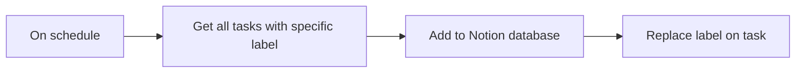

## Fluxo (.json) :

```json
{
  "id": "PtPKIqDlz5xrrvHP",
  "meta": {
    "instanceId": "a2434c94d549548a685cca39cc4614698e94f527bcea84eefa363f1037ae14cd"
  },
  "name": "Sync Todoist tasks to Notion",
  "tags": [],
  "nodes": [
    {
      "id": "0122196d-e051-4154-9e39-3ddbfe26858f",
      "name": "On schedule",
      "type": "n8n-nodes-base.scheduleTrigger",
      "position": [
        640,
        280
      ],
      "parameters": {
        "rule": {
          "interval": [
            {
              "field": "seconds"
            }
          ]
        }
      },
      "typeVersion": 1.1
    },
    {
      "id": "1a15e1cc-cdd5-4a49-aa7a-a0779f858e69",
      "name": "Get all tasks with specific label",
      "type": "n8n-nodes-base.todoist",
      "position": [
        860,
        280
      ],
      "parameters": {
        "filters": {
          "labelId": "send-to-notion"
        },
        "operation": "getAll",
        "authentication": "oAuth2"
      },
      "credentials": {
        "todoistOAuth2Api": {
          "id": "E6PTOAR6ysBeLwCB",
          "name": "Todoist account"
        }
      },
      "typeVersion": 2
    },
    {
      "id": "35b13f4a-da38-4d63-9fbf-7c36c97cbc11",
      "name": "Add to Notion database",
      "type": "n8n-nodes-base.notion",
      "position": [
        1080,
        280
      ],
      "parameters": {
        "title": "={{ $json.content }}",
        "options": {},
        "resource": "databasePage",
        "databaseId": {
          "__rl": true,
          "mode": "list",
          "value": "5a98bd24-dd2b-41a3-b7e2-3b8a9ee21d41",
          "cachedResultUrl": "https://www.notion.so/5a98bd24dd2b41a3b7e23b8a9ee21d41",
          "cachedResultName": "My Todoist Tasks"
        },
        "propertiesUi": {
          "propertyValues": [
            {
              "key": "Todoist ID|number",
              "numberValue": "={{ parseInt($json.id) }}"
            }
          ]
        }
      },
      "credentials": {
        "notionApi": {
          "id": "5hfWkRpcWCS4KGk5",
          "name": "n8n-demo-3"
        }
      },
      "typeVersion": 2.1
    },
    {
      "id": "f3144751-28b0-48e1-9331-f25f55a5ddf6",
      "name": "Replace label on task",
      "type": "n8n-nodes-base.todoist",
      "position": [
        1300,
        280
      ],
      "parameters": {
        "taskId": "={{ $('Get all tasks with specific label').item.json.id }}",
        "operation": "update",
        "updateFields": {
          "labels": [
            "sent"
          ],
          "description": "=Notion Link:  {{ $json.url }}\n\n{{ $('Get all tasks with specific label').item.json.description }}"
        },
        "authentication": "oAuth2"
      },
      "credentials": {
        "todoistOAuth2Api": {
          "id": "E6PTOAR6ysBeLwCB",
          "name": "Todoist account"
        }
      },
      "typeVersion": 2
    }
  ],
  "active": false,
  "pinData": {},
  "settings": {
    "executionOrder": "v1"
  },
  "versionId": "14cd25c2-0a7b-45d0-b81e-173052ebdde7",
  "connections": {
    "On schedule": {
      "main": [
        [
          {
            "node": "Get all tasks with specific label",
            "type": "main",
            "index": 0
          }
        ]
      ]
    },
    "Add to Notion database": {
      "main": [
        [
          {
            "node": "Replace label on task",
            "type": "main",
            "index": 0
          }
        ]
      ]
    },
    "Get all tasks with specific label": {
      "main": [
        [
          {
            "node": "Add to Notion database",
            "type": "main",
            "index": 0
          }
        ]
      ]
    }
  }
}
```

<a id="template-1952"></a>

## Template 1952 - Alerta de expiração de certificados SSL

- **Nome:** Alerta de expiração de certificados SSL
- **Descrição:** Fluxo que verifica semanalmente a validade dos certificados SSL de uma lista de URLs e envia alertas por email quando o vencimento estiver próximo.
- **Funcionalidade:** • Agendamento semanal: Executa a verificação uma vez por semana em horário configurado.
• Leitura da lista de URLs: Puxa a lista de sites a serem monitorados a partir de uma planilha do Google Sheets.
• Verificação de certificado SSL: Consulta uma API externa para obter informações do certificado, incluindo host, data de validade e dias restantes.
• Atualização da planilha com resultados: Registra na planilha as informações retornadas sobre o certificado (data de expiração e status).
• Detecção de proximidade de vencimento: Avalia se o certificado vence em 7 dias ou menos e aciona a etapa de alerta.
• Envio de alerta por email: Envia uma mensagem contendo o host e os dias restantes para os responsáveis quando o certificado estiver próximo do vencimento.
- **Ferramentas:** • Google Sheets: Armazena a lista de URLs a monitorar e recebe atualizações sobre as datas de expiração e status dos certificados.
• SSL-Checker.io API: Serviço externo utilizado para verificar os detalhes do certificado SSL (validade, host e dias restantes).
• Gmail: Serviço de envio de emails usado para notificar os responsáveis sobre certificados que estão prestes a expirar.

## Fluxo visual

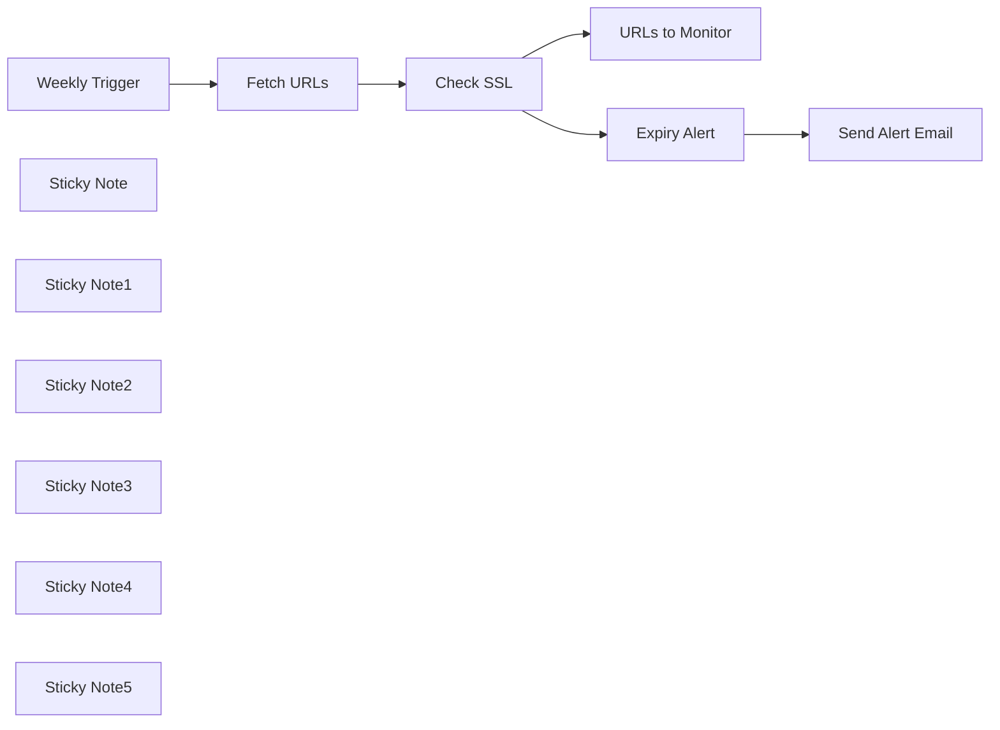

## Fluxo (.json) :

```json
{
  "id": "Qj1307oyBx1hZJy5",
  "meta": {
    "instanceId": "1abe0e4c2be794795d12bf72aa530a426a6f87aabad209ed6619bcaf0f666fb0",
    "templateCredsSetupCompleted": true
  },
  "name": "SSL Expiry Alert",
  "tags": [
    {
      "id": "aqlZb2qfWiaT4Xr5",
      "name": "IT Ops",
      "createdAt": "2025-01-03T12:20:11.917Z",
      "updatedAt": "2025-01-03T12:20:11.917Z"
    },
    {
      "id": "zJaZorWWcGpTp35U",
      "name": "DevOps",
      "createdAt": "2025-01-03T12:19:34.273Z",
      "updatedAt": "2025-01-03T12:19:34.273Z"
    }
  ],
  "nodes": [
    {
      "id": "260b66a2-0841-4dc7-9666-acbc9317fd91",
      "name": "URLs to Monitor",
      "type": "n8n-nodes-base.googleSheets",
      "position": [
        1120,
        -120
      ],
      "parameters": {
        "columns": {
          "value": {
            "URL": "={{ $json.result.host }}",
            "KnownExpiryDate": "={{ $json.result.valid_till }}"
          },
          "schema": [
            {
              "id": "Website ",
              "type": "string",
              "display": true,
              "removed": true,
              "required": false,
              "displayName": "Website ",
              "defaultMatch": false,
              "canBeUsedToMatch": true
            },
            {
              "id": "URL",
              "type": "string",
              "display": true,
              "removed": false,
              "required": false,
              "displayName": "URL",
              "defaultMatch": false,
              "canBeUsedToMatch": true
            },
            {
              "id": "KnownExpiryDate",
              "type": "string",
              "display": true,
              "required": false,
              "displayName": "KnownExpiryDate",
              "defaultMatch": false,
              "canBeUsedToMatch": true
            },
            {
              "id": "row_number",
              "type": "string",
              "display": true,
              "removed": true,
              "readOnly": true,
              "required": false,
              "displayName": "row_number",
              "defaultMatch": false,
              "canBeUsedToMatch": true
            }
          ],
          "mappingMode": "defineBelow",
          "matchingColumns": [
            "URL"
          ]
        },
        "options": {},
        "operation": "update",
        "sheetName": {
          "__rl": true,
          "mode": "list",
          "value": "gid=0",
          "cachedResultUrl": "https://docs.google.com/spreadsheets/d/1VfsX4cW2oKQ3ZHUjBvGk--d1X7509c6__b6gPvA5VpI/edit#gid=0",
          "cachedResultName": "URLs to Check"
        },
        "documentId": {
          "__rl": true,
          "mode": "url",
          "value": "https://docs.google.com/spreadsheets/d/1VfsX4cW2oKQ3ZHUjBvGk--d1X7509c6__b6gPvA5VpI/edit?gid=0#gid=0"
        }
      },
      "credentials": {
        "googleSheetsOAuth2Api": {
          "id": "I7vwmkFVGPrI7Os1",
          "name": "Vishal - Google Sheets"
        }
      },
      "typeVersion": 4.5
    },
    {
      "id": "a2922f1b-9d29-4b66-9560-44207f3e14d2",
      "name": "Weekly Trigger",
      "type": "n8n-nodes-base.scheduleTrigger",
      "position": [
        160,
        140
      ],
      "parameters": {
        "rule": {
          "interval": [
            {
              "field": "weeks",
              "triggerAtDay": [
                1
              ],
              "triggerAtHour": 8
            }
          ]
        }
      },
      "typeVersion": 1.2
    },
    {
      "id": "005564e9-5ecb-4ee9-aca0-69a660656b09",
      "name": "Fetch URLs",
      "type": "n8n-nodes-base.googleSheets",
      "position": [
        420,
        140
      ],
      "parameters": {
        "options": {},
        "sheetName": {
          "__rl": true,
          "mode": "url",
          "value": "https://docs.google.com/spreadsheets/d/1pnUfIkD90MUG99Fp0vRoAB-w-GPSAwRZw0-JsNl-h3s/edit?gid=0#gid=0"
        },
        "documentId": {
          "__rl": true,
          "mode": "url",
          "value": "https://docs.google.com/spreadsheets/d/1pnUfIkD90MUG99Fp0vRoAB-w-GPSAwRZw0-JsNl-h3s/edit?usp=sharing"
        }
      },
      "credentials": {
        "googleSheetsOAuth2Api": {
          "id": "I7vwmkFVGPrI7Os1",
          "name": "Vishal - Google Sheets"
        }
      },
      "typeVersion": 4.5
    },
    {
      "id": "943c561c-ca89-461c-a6fb-c3011baaf81a",
      "name": "Check SSL",
      "type": "n8n-nodes-base.httpRequest",
      "position": [
        680,
        140
      ],
      "parameters": {
        "url": "=https://ssl-checker.io/api/v1/check/{{ $json[\"URL\"].replace(/^https?:///, \"\").replace(//$/, \"\") }}",
        "options": {}
      },
      "typeVersion": 4.2
    },
    {
      "id": "911fa691-decf-4572-a46e-d8644d3b2a35",
      "name": "Expiry Alert",
      "type": "n8n-nodes-base.if",
      "position": [
        1120,
        220
      ],
      "parameters": {
        "options": {},
        "conditions": {
          "options": {
            "version": 2,
            "leftValue": "",
            "caseSensitive": true,
            "typeValidation": "strict"
          },
          "combinator": "and",
          "conditions": [
            {
              "id": "ee6e2ce8-569a-4f1f-91b5-2c55f605a16b",
              "operator": {
                "type": "number",
                "operation": "lte"
              },
              "leftValue": "={{ $json.result.days_left }}",
              "rightValue": 7
            }
          ]
        }
      },
      "typeVersion": 2.2
    },
    {
      "id": "8b59ebbb-0a87-40c2-be79-cc38431ebdbd",
      "name": "Send Alert Email",
      "type": "n8n-nodes-base.gmail",
      "position": [
        1440,
        240
      ],
      "webhookId": "cd6b6b20-e619-4526-aa69-64754e3d9035",
      "parameters": {
        "sendTo": "phanineeraj@quantana.com",
        "message": "=SSL Expiry - {{ $json.result.days_left }} Days Left - {{ $json.result.host }}",
        "options": {
          "appendAttribution": false
        },
        "subject": "=SSL Expiry - {{ $json.result.days_left }} Days Left - {{ $json.result.host }}",
        "emailType": "text"
      },
      "credentials": {
        "gmailOAuth2": {
          "id": "brYm5tKb5se1DyUw",
          "name": "Sabila Gmail"
        }
      },
      "typeVersion": 2.1
    },
    {
      "id": "32eebd68-f0e6-467c-bf65-f2d513a60666",
      "name": "Sticky Note",
      "type": "n8n-nodes-base.stickyNote",
      "position": [
        100,
        0
      ],
      "parameters": {
        "height": 329.860465116279,
        "content": "Triggers the workflow once a week."
      },
      "typeVersion": 1
    },
    {
      "id": "3c0ed796-94a4-488c-9cb7-e3d46db63815",
      "name": "Sticky Note1",
      "type": "n8n-nodes-base.stickyNote",
      "position": [
        360,
        0
      ],
      "parameters": {
        "height": 327.0154373927959,
        "content": "Pulls the list of URLs to monitor from the Google Sheet. Ensure you clone the Google Sheet worksheet and update this node with its URL."
      },
      "typeVersion": 1
    },
    {
      "id": "fdb2077c-7d6a-4255-b499-e90513a0de1d",
      "name": "Sticky Note2",
      "type": "n8n-nodes-base.stickyNote",
      "position": [
        620,
        0
      ],
      "parameters": {
        "height": 323.89365351629556,
        "content": "Uses SSL-Checker.io to verify the SSL certificate of each URL. Fetches details like the host, validity period, and days remaining until expiry."
      },
      "typeVersion": 1
    },
    {
      "id": "5cc1644b-6abc-4299-8a25-9507b09d863f",
      "name": "Sticky Note3",
      "type": "n8n-nodes-base.stickyNote",
      "position": [
        1060,
        -260
      ],
      "parameters": {
        "height": 344.1852487135509,
        "content": "Updates the Google Sheet with SSL details, including the expiry date and certificate status."
      },
      "typeVersion": 1
    },
    {
      "id": "1001a69e-8efc-4a8b-a97b-a1bc021ada35",
      "name": "Sticky Note4",
      "type": "n8n-nodes-base.stickyNote",
      "position": [
        1060,
        140
      ],
      "parameters": {
        "height": 344.1852487135509,
        "content": "Checks if any SSL certificate is set to expire in 7 days or less."
      },
      "typeVersion": 1
    },
    {
      "id": "ad9e359e-3d95-4e8c-97b0-d06475bb8883",
      "name": "Sticky Note5",
      "type": "n8n-nodes-base.stickyNote",
      "position": [
        1360,
        140
      ],
      "parameters": {
        "height": 344.1852487135509,
        "content": "Sends an email alert if an SSL certificate is nearing expiry, including the host and days remaining."
      },
      "typeVersion": 1
    }
  ],
  "active": false,
  "pinData": {},
  "settings": {
    "timezone": "Asia/Kolkata",
    "executionOrder": "v1"
  },
  "versionId": "f60d6e6e-dace-497a-b58b-113993ec36e5",
  "connections": {
    "Check SSL": {
      "main": [
        [
          {
            "node": "URLs to Monitor",
            "type": "main",
            "index": 0
          },
          {
            "node": "Expiry Alert",
            "type": "main",
            "index": 0
          }
        ]
      ]
    },
    "Fetch URLs": {
      "main": [
        [
          {
            "node": "Check SSL",
            "type": "main",
            "index": 0
          }
        ]
      ]
    },
    "Expiry Alert": {
      "main": [
        [
          {
            "node": "Send Alert Email",
            "type": "main",
            "index": 0
          }
        ]
      ]
    },
    "Weekly Trigger": {
      "main": [
        [
          {
            "node": "Fetch URLs",
            "type": "main",
            "index": 0
          }
        ]
      ]
    }
  }
}
```

<a id="template-1954"></a>

## Template 1954 - Exportar métricas do Search Console para Google Sheets

- **Nome:** Exportar métricas do Search Console para Google Sheets
- **Descrição:** Extrai métricas de desempenho (consultas, páginas e datas) do Google Search Console e atualiza planilhas do Google automaticamente.
- **Funcionalidade:** • Agendamento periódico: Executa o fluxo automaticamente conforme intervalo configurado.
• Configuração de domínio e período: Define o domínio alvo e o número de dias para a janela de dados.
• Consulta ao Search Console por dimensão: Realiza três consultas ao API para obter métricas por query, por page e por date dentro do período definido.
• Processamento de resultados: Divide os arrays de resposta em itens individuais para processamento linha a linha.
• Mapeamento de campos: Converte cada item em campos padronizados (Keyword/page/date, clicks, impressions, ctr, position).
• Inserção/atualização em planilhas: Adiciona ou atualiza registros nas respectivas abas das planilhas do Google (Queries, PAGES, Dates).
• Retentativa em falhas: Possui retry configurado para o relatório de datas em caso de falha na escrita.
- **Ferramentas:** • Google Search Console API: Fornece os dados de desempenho (clicks, impressions, ctr, position) por dimensões.
• Google Sheets: Armazena e atualiza os relatórios exportados em abas separadas (Queries, Pages, Dates).
• Autenticação Google (Service Account / OAuth2): Permite acesso autenticado às APIs do Google para leitura do Search Console e escrita nas planilhas.

## Fluxo visual

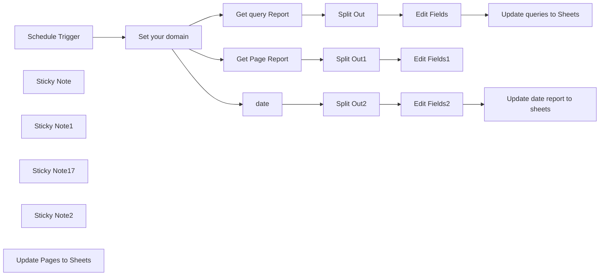

## Fluxo (.json) :

```json
{
  "nodes": [
    {
      "id": "8e3f167d-cbeb-4f7f-a867-c356d2dca9d0",
      "name": "Split Out",
      "type": "n8n-nodes-base.splitOut",
      "position": [
        1580,
        240
      ],
      "parameters": {
        "options": {},
        "fieldToSplitOut": "rows"
      },
      "typeVersion": 1
    },
    {
      "id": "19370d12-f6de-44a1-91a6-da097abdf7de",
      "name": "Edit Fields",
      "type": "n8n-nodes-base.set",
      "position": [
        1780,
        240
      ],
      "parameters": {
        "options": {},
        "assignments": {
          "assignments": [
            {
              "id": "7343c80f-37f3-4bb5-84d8-9f21f8a350cd",
              "name": "Keyword",
              "type": "string",
              "value": "={{ $json.keys[0] }}"
            },
            {
              "id": "436e7c8b-2df2-40a9-97af-597dc00cf143",
              "name": "clicks",
              "type": "number",
              "value": "={{ $json.clicks }}"
            },
            {
              "id": "5b4aaffe-391a-4c9d-8249-f447397a3f5d",
              "name": "impressions",
              "type": "number",
              "value": "={{ $json.impressions }}"
            },
            {
              "id": "33677237-57fe-48f4-aff8-72ae81b5f5a2",
              "name": "ctr",
              "type": "number",
              "value": "={{ $json.ctr }}"
            },
            {
              "id": "f961deee-d222-4df7-a7ff-b7286405e4a7",
              "name": "position",
              "type": "number",
              "value": "={{ $json.position }}"
            }
          ]
        }
      },
      "typeVersion": 3.4
    },
    {
      "id": "9eae4908-5266-439c-a66b-5679036234de",
      "name": "Split Out1",
      "type": "n8n-nodes-base.splitOut",
      "position": [
        1580,
        440
      ],
      "parameters": {
        "options": {},
        "fieldToSplitOut": "rows"
      },
      "typeVersion": 1
    },
    {
      "id": "b05926b1-507f-4531-a05c-a15e835ee82e",
      "name": "Edit Fields1",
      "type": "n8n-nodes-base.set",
      "position": [
        1780,
        440
      ],
      "parameters": {
        "options": {},
        "assignments": {
          "assignments": [
            {
              "id": "7343c80f-37f3-4bb5-84d8-9f21f8a350cd",
              "name": "page",
              "type": "string",
              "value": "={{ $json.keys[0] }}"
            },
            {
              "id": "436e7c8b-2df2-40a9-97af-597dc00cf143",
              "name": "clicks",
              "type": "number",
              "value": "={{ $json.clicks }}"
            },
            {
              "id": "5b4aaffe-391a-4c9d-8249-f447397a3f5d",
              "name": "impressions",
              "type": "number",
              "value": "={{ $json.impressions }}"
            },
            {
              "id": "33677237-57fe-48f4-aff8-72ae81b5f5a2",
              "name": "ctr",
              "type": "number",
              "value": "={{ $json.ctr }}"
            },
            {
              "id": "f961deee-d222-4df7-a7ff-b7286405e4a7",
              "name": "position",
              "type": "number",
              "value": "={{ $json.position }}"
            }
          ]
        }
      },
      "typeVersion": 3.4
    },
    {
      "id": "42321587-2565-4a0a-9d9d-25cbfdeb9f49",
      "name": "Split Out2",
      "type": "n8n-nodes-base.splitOut",
      "position": [
        1580,
        620
      ],
      "parameters": {
        "options": {},
        "fieldToSplitOut": "rows"
      },
      "typeVersion": 1
    },
    {
      "id": "9e25eef9-daa4-47dd-b2cf-03cfebadb5c6",
      "name": "Edit Fields2",
      "type": "n8n-nodes-base.set",
      "position": [
        1780,
        620
      ],
      "parameters": {
        "options": {},
        "assignments": {
          "assignments": [
            {
              "id": "7343c80f-37f3-4bb5-84d8-9f21f8a350cd",
              "name": "date",
              "type": "string",
              "value": "={{ $json.keys[0] }}"
            },
            {
              "id": "436e7c8b-2df2-40a9-97af-597dc00cf143",
              "name": "clicks",
              "type": "number",
              "value": "={{ $json.clicks }}"
            },
            {
              "id": "5b4aaffe-391a-4c9d-8249-f447397a3f5d",
              "name": "impressions",
              "type": "number",
              "value": "={{ $json.impressions }}"
            },
            {
              "id": "33677237-57fe-48f4-aff8-72ae81b5f5a2",
              "name": "ctr",
              "type": "number",
              "value": "={{ $json.ctr }}"
            },
            {
              "id": "f961deee-d222-4df7-a7ff-b7286405e4a7",
              "name": "position",
              "type": "number",
              "value": "={{ $json.position }}"
            }
          ]
        }
      },
      "typeVersion": 3.4
    },
    {
      "id": "e8f1ab65-9594-45e7-ba9e-7873bd53a107",
      "name": "date",
      "type": "n8n-nodes-base.httpRequest",
      "position": [
        1360,
        620
      ],
      "parameters": {
        "url": "=https://www.googleapis.com/webmasters/v3/sites/sc-domain:{{$json.domain}}/searchAnalytics/query",
        "method": "POST",
        "options": {},
        "jsonBody": "={\n  \"startDate\": \"{{ $now.format('yyyy-MM-dd') }}\",\n  \"endDate\": \"{{ $now.minus($json.days, 'days').format('yyyy-MM-dd') }}\",\n  \"dimensions\": [\"date\"]\n}",
        "sendBody": true,
        "specifyBody": "json",
        "authentication": "predefinedCredentialType",
        "nodeCredentialType": "googleOAuth2Api"
      },
      "credentials": {
        "googleApi": {
          "id": "9vSHyulYjxYMr8MK",
          "name": "Service Account✅"
        },
        "httpHeaderAuth": {
          "id": "Ng5SZdTqwe74l2KO",
          "name": "Header Auth account ⚠️"
        },
        "googleOAuth2Api": {
          "id": "wuKNLprxCMuetOYN",
          "name": "Google account✅3"
        }
      },
      "typeVersion": 4.2
    },
    {
      "id": "d3bbf719-9524-4269-8c26-0eb7599add55",
      "name": "Schedule Trigger",
      "type": "n8n-nodes-base.scheduleTrigger",
      "position": [
        700,
        460
      ],
      "parameters": {
        "rule": {
          "interval": [
            {}
          ]
        }
      },
      "typeVersion": 1.2
    },
    {
      "id": "69cf781d-7ff5-4e2d-ad7d-505a5143710a",
      "name": "Sticky Note",
      "type": "n8n-nodes-base.stickyNote",
      "position": [
        1220,
        160
      ],
      "parameters": {
        "color": 4,
        "width": 1033,
        "height": 660,
        "content": ""
      },
      "typeVersion": 1
    },
    {
      "id": "b701bc62-07e7-4494-a674-560846783a29",
      "name": "Sticky Note1",
      "type": "n8n-nodes-base.stickyNote",
      "position": [
        0,
        100
      ],
      "parameters": {
        "color": 4,
        "width": 645,
        "height": 828,
        "content": "\n## Usage\n\n1. Make a copy of this google sheet https://docs.google.com/spreadsheets/d/10hSuGOOf14YvVY2Bw8WXUIpsyXO614l7qNEjkyVY_Qg/edit?usp=sharing\n\n2. Set your google service credentials and add these scopes `https://www.googleapis.com/auth/webmasters, https://www.googleapis.com/auth/webmasters.readonly, https://www.googleapis.com/auth/adwords`\n\n3. Replace the domains with your desired domains\n\n\n1. **Understanding the Workflow:**\n- **Nodes Overview:**\nThis workflow contains several nodes:\n- **Set your domain:** Sets the domain to be used in the queries.\n- **Schedule Trigger:** Starts the workflow based on a defined schedule.\n- **HttpRequest (query, page, date):** Fetches data from Google's Search Console API using specified dimensions and dates.\n- **Split Out (x3):** Splits the incoming JSON array into individual items for further processing.\n- **Edit Fields (x3):** Maps the outgoing data to specified fields, preparing it for insertion into Google Sheets.\n- **Google Sheets (x3):** Adds or updates entries in specified Google Sheets documents with the fetched data.\n\n- **Inputs and Outputs:**\n- Input: API response from Google Search Console regarding keywords, page data, and date data.\n- Output: Entries written to Google Sheets containing keyword data, clicks, impressions, CTR, and positions.\n\n2. **Setup Instructions:**\n- **Prerequisites:**\n- An n8n instance set up and running.\n- Active Google Account with access to Google Search Console and Google Sheets.\n- Google OAuth 2.0 credentials for API access.\n\n- **Step-by-Step Setup:**\n1. Open n8n and create a new workflow.\n2. Add the nodes as described in the JSON.\n3. Configure the **Google OAuth2** credentials in n8n to enable API access.\n4. Set your domain in the **Set your domain** node.\n5. Customize the Google Sheets document URLs to your personal sheets.\n6. Adjust the schedule in the **Schedule Trigger** node as per your requirements.\n7. Save the workflow.\n\n- **Configuration Options:**\n- You can customize the date ranges in the body of the **HttpRequest** nodes.\n- Adjust any fields in the **Edit Fields** nodes based on different data requirements.\n\n3. **Use Case Examples:**\n- Useful in tracking website performance over time using Search Console metrics.\n- Ideal for digital marketers, SEO specialists, and web analytics professionals.\n- Offers value in compiling performance reports for stakeholders or team reviews.\n\n4. **Running and Troubleshooting:**\n- **Running the Workflow:**\n- Trigger the workflow manually or wait for the schedule to run it automatically.\n\n- **Monitoring Execution:**\n- Check the execution logs in n8n's dashboard to ensure all nodes complete successfully.\n\n- **Common Issues:**\n- Invalid OAuth credentials – ensure credentials are set up correctly.\n- Incorrect Google Sheets URLs – double-check document links and permissions.\n- Scheduling conflicts – make sure the schedule set does not overlap with other workflows.\n"
      },
      "typeVersion": 1
    },
    {
      "id": "07432897-f068-4371-9f88-d70340e2082a",
      "name": "Sticky Note17",
      "type": "n8n-nodes-base.stickyNote",
      "position": [
        1440,
        100
      ],
      "parameters": {
        "color": 4,
        "width": 503.60808870324274,
        "height": 80,
        "content": "# Search console REPORTS"
      },
      "typeVersion": 1
    },
    {
      "id": "092645b2-9e75-4ff0-8d33-4a3acadac789",
      "name": "Set your domain",
      "type": "n8n-nodes-base.set",
      "position": [
        980,
        460
      ],
      "parameters": {
        "options": {},
        "assignments": {
          "assignments": [
            {
              "id": "6f74dee0-3789-433e-b60e-ed2a05202675",
              "name": "domain",
              "type": "string",
              "value": "funautomations.io"
            },
            {
              "id": "8c73135e-9d39-4f66-821d-7decb3c64085",
              "name": "days",
              "type": "number",
              "value": 30
            }
          ]
        }
      },
      "typeVersion": 3.4
    },
    {
      "id": "0b04b552-e484-417b-9a7e-a90d477dd45a",
      "name": "Get query Report",
      "type": "n8n-nodes-base.httpRequest",
      "position": [
        1360,
        240
      ],
      "parameters": {
        "url": "=https://www.googleapis.com/webmasters/v3/sites/sc-domain:{{$json.domain}}/searchAnalytics/query",
        "method": "POST",
        "options": {},
        "jsonBody": "={\n  \"startDate\": \"{{ $now.format('yyyy-MM-dd') }}\",\n  \"endDate\": \"{{ $now.minus($json.days, 'days').format('yyyy-MM-dd') }}\",\n  \"dimensions\": [\"query\"]\n}",
        "sendBody": true,
        "specifyBody": "json",
        "authentication": "predefinedCredentialType",
        "nodeCredentialType": "googleOAuth2Api"
      },
      "credentials": {
        "httpHeaderAuth": {
          "id": "Ng5SZdTqwe74l2KO",
          "name": "Header Auth account ⚠️"
        },
        "googleOAuth2Api": {
          "id": "SlPOQ6j86r5XbnxV",
          "name": "Oath account ✅5"
        }
      },
      "typeVersion": 4.2
    },
    {
      "id": "9f9f2be7-1301-4c91-8da1-86eab5725683",
      "name": "Get Page Report",
      "type": "n8n-nodes-base.httpRequest",
      "position": [
        1360,
        440
      ],
      "parameters": {
        "url": "=https://www.googleapis.com/webmasters/v3/sites/sc-domain:{{$json.domain}}/searchAnalytics/query",
        "method": "POST",
        "options": {},
        "jsonBody": "={\n  \"startDate\": \"{{ $now.format('yyyy-MM-dd') }}\",\n  \"endDate\": \"{{ $now.minus($json.days, 'days').format('yyyy-MM-dd') }}\",\n  \"dimensions\": [\"page\"]\n}",
        "sendBody": true,
        "specifyBody": "json",
        "authentication": "predefinedCredentialType",
        "nodeCredentialType": "googleOAuth2Api"
      },
      "credentials": {
        "httpHeaderAuth": {
          "id": "Ng5SZdTqwe74l2KO",
          "name": "Header Auth account ⚠️"
        },
        "googleOAuth2Api": {
          "id": "wuKNLprxCMuetOYN",
          "name": "Google account✅3"
        }
      },
      "typeVersion": 4.2
    },
    {
      "id": "737f802f-4629-41f2-9b21-4a98e92d6433",
      "name": "Sticky Note2",
      "type": "n8n-nodes-base.stickyNote",
      "position": [
        880,
        380
      ],
      "parameters": {
        "color": 4,
        "width": 300,
        "height": 300,
        "content": "## Set Domain and the days frequency"
      },
      "typeVersion": 1
    },
    {
      "id": "f8f62dde-1529-4d3a-a030-aa952496652d",
      "name": "Update queries to Sheets",
      "type": "n8n-nodes-base.googleSheets",
      "position": [
        1980,
        240
      ],
      "parameters": {
        "columns": {
          "value": {},
          "schema": [
            {
              "id": "Keyword",
              "type": "string",
              "display": true,
              "removed": false,
              "required": false,
              "displayName": "Keyword",
              "defaultMatch": false,
              "canBeUsedToMatch": true
            },
            {
              "id": "clicks",
              "type": "string",
              "display": true,
              "removed": false,
              "required": false,
              "displayName": "clicks",
              "defaultMatch": false,
              "canBeUsedToMatch": true
            },
            {
              "id": "impressions",
              "type": "string",
              "display": true,
              "removed": false,
              "required": false,
              "displayName": "impressions",
              "defaultMatch": false,
              "canBeUsedToMatch": true
            },
            {
              "id": "ctr",
              "type": "string",
              "display": true,
              "removed": false,
              "required": false,
              "displayName": "ctr",
              "defaultMatch": false,
              "canBeUsedToMatch": true
            },
            {
              "id": "position",
              "type": "string",
              "display": true,
              "removed": false,
              "required": false,
              "displayName": "position",
              "defaultMatch": false,
              "canBeUsedToMatch": true
            }
          ],
          "mappingMode": "autoMapInputData",
          "matchingColumns": [
            "Keyword"
          ]
        },
        "options": {},
        "operation": "appendOrUpdate",
        "sheetName": {
          "__rl": true,
          "mode": "list",
          "value": 996986484,
          "cachedResultUrl": "https://docs.google.com/spreadsheets/d/10hSuGOOf14YvVY2Bw8WXUIpsyXO614l7qNEjkyVY_Qg/edit#gid=996986484",
          "cachedResultName": "Query"
        },
        "documentId": {
          "__rl": true,
          "mode": "url",
          "value": "https://docs.google.com/spreadsheets/d/10hSuGOOf14YvVY2Bw8WXUIpsyXO614l7qNEjkyVY_Qg/edit?usp=sharing"
        }
      },
      "credentials": {
        "googleSheetsOAuth2Api": {
          "id": "ZAI2a6Qt80kX5a9s",
          "name": "Google Sheets account✅ "
        }
      },
      "typeVersion": 4.5
    },
    {
      "id": "299c4fa9-fb7e-4c85-a8a5-3cea53ba7136",
      "name": "Update Pages to Sheets ",
      "type": "n8n-nodes-base.googleSheets",
      "position": [
        2000,
        440
      ],
      "parameters": {
        "columns": {
          "value": {},
          "schema": [
            {
              "id": "page",
              "type": "string",
              "display": true,
              "removed": false,
              "required": false,
              "displayName": "page",
              "defaultMatch": false,
              "canBeUsedToMatch": true
            },
            {
              "id": "clicks",
              "type": "string",
              "display": true,
              "removed": false,
              "required": false,
              "displayName": "clicks",
              "defaultMatch": false,
              "canBeUsedToMatch": true
            },
            {
              "id": "impressions",
              "type": "string",
              "display": true,
              "removed": false,
              "required": false,
              "displayName": "impressions",
              "defaultMatch": false,
              "canBeUsedToMatch": true
            },
            {
              "id": "ctr",
              "type": "string",
              "display": true,
              "removed": false,
              "required": false,
              "displayName": "ctr",
              "defaultMatch": false,
              "canBeUsedToMatch": true
            },
            {
              "id": "position",
              "type": "string",
              "display": true,
              "removed": false,
              "required": false,
              "displayName": "position",
              "defaultMatch": false,
              "canBeUsedToMatch": true
            }
          ],
          "mappingMode": "autoMapInputData",
          "matchingColumns": [
            "page"
          ]
        },
        "options": {},
        "operation": "appendOrUpdate",
        "sheetName": {
          "__rl": true,
          "mode": "list",
          "value": "gid=0",
          "cachedResultUrl": "https://docs.google.com/spreadsheets/d/10hSuGOOf14YvVY2Bw8WXUIpsyXO614l7qNEjkyVY_Qg/edit#gid=0",
          "cachedResultName": "PAGES"
        },
        "documentId": {
          "__rl": true,
          "mode": "url",
          "value": "https://docs.google.com/spreadsheets/d/10hSuGOOf14YvVY2Bw8WXUIpsyXO614l7qNEjkyVY_Qg/edit?usp=sharing"
        }
      },
      "credentials": {
        "googleSheetsOAuth2Api": {
          "id": "ZAI2a6Qt80kX5a9s",
          "name": "Google Sheets account✅ "
        }
      },
      "typeVersion": 4.5
    },
    {
      "id": "4cc4197a-7ee5-4cd8-ade7-80bca911a3cf",
      "name": "Update date report to sheets",
      "type": "n8n-nodes-base.googleSheets",
      "position": [
        2000,
        620
      ],
      "parameters": {
        "columns": {
          "value": {},
          "schema": [
            {
              "id": "date",
              "type": "string",
              "display": true,
              "removed": false,
              "required": false,
              "displayName": "date",
              "defaultMatch": false,
              "canBeUsedToMatch": true
            },
            {
              "id": "clicks",
              "type": "string",
              "display": true,
              "removed": false,
              "required": false,
              "displayName": "clicks",
              "defaultMatch": false,
              "canBeUsedToMatch": true
            },
            {
              "id": "impressions",
              "type": "string",
              "display": true,
              "removed": false,
              "required": false,
              "displayName": "impressions",
              "defaultMatch": false,
              "canBeUsedToMatch": true
            },
            {
              "id": "ctr",
              "type": "string",
              "display": true,
              "removed": false,
              "required": false,
              "displayName": "ctr",
              "defaultMatch": false,
              "canBeUsedToMatch": true
            },
            {
              "id": "position",
              "type": "string",
              "display": true,
              "removed": false,
              "required": false,
              "displayName": "position",
              "defaultMatch": false,
              "canBeUsedToMatch": true
            }
          ],
          "mappingMode": "autoMapInputData",
          "matchingColumns": [
            "date"
          ]
        },
        "options": {},
        "operation": "appendOrUpdate",
        "sheetName": {
          "__rl": true,
          "mode": "list",
          "value": 1823079319,
          "cachedResultUrl": "https://docs.google.com/spreadsheets/d/10hSuGOOf14YvVY2Bw8WXUIpsyXO614l7qNEjkyVY_Qg/edit#gid=1823079319",
          "cachedResultName": "Dates"
        },
        "documentId": {
          "__rl": true,
          "mode": "url",
          "value": "https://docs.google.com/spreadsheets/d/10hSuGOOf14YvVY2Bw8WXUIpsyXO614l7qNEjkyVY_Qg/edit?usp=sharing"
        }
      },
      "credentials": {
        "googleSheetsOAuth2Api": {
          "id": "ZAI2a6Qt80kX5a9s",
          "name": "Google Sheets account✅ "
        }
      },
      "retryOnFail": true,
      "typeVersion": 4.5
    }
  ],
  "pinData": {},
  "connections": {
    "date": {
      "main": [
        [
          {
            "node": "Split Out2",
            "type": "main",
            "index": 0
          }
        ]
      ]
    },
    "Split Out": {
      "main": [
        [
          {
            "node": "Edit Fields",
            "type": "main",
            "index": 0
          }
        ]
      ]
    },
    "Split Out1": {
      "main": [
        [
          {
            "node": "Edit Fields1",
            "type": "main",
            "index": 0
          }
        ]
      ]
    },
    "Split Out2": {
      "main": [
        [
          {
            "node": "Edit Fields2",
            "type": "main",
            "index": 0
          }
        ]
      ]
    },
    "Edit Fields": {
      "main": [
        [
          {
            "node": "Update queries to Sheets",
            "type": "main",
            "index": 0
          }
        ]
      ]
    },
    "Edit Fields1": {
      "main": [
        [
          {
            "node": "Update Pages to Sheets ",
            "type": "main",
            "index": 0
          }
        ]
      ]
    },
    "Edit Fields2": {
      "main": [
        [
          {
            "node": "Update date report to sheets",
            "type": "main",
            "index": 0
          }
        ]
      ]
    },
    "Get Page Report": {
      "main": [
        [
          {
            "node": "Split Out1",
            "type": "main",
            "index": 0
          }
        ]
      ]
    },
    "Set your domain": {
      "main": [
        [
          {
            "node": "Get query Report",
            "type": "main",
            "index": 0
          },
          {
            "node": "Get Page Report",
            "type": "main",
            "index": 0
          },
          {
            "node": "date",
            "type": "main",
            "index": 0
          }
        ]
      ]
    },
    "Get query Report": {
      "main": [
        [
          {
            "node": "Split Out",
            "type": "main",
            "index": 0
          }
        ]
      ]
    },
    "Schedule Trigger": {
      "main": [
        [
          {
            "node": "Set your domain",
            "type": "main",
            "index": 0
          }
        ]
      ]
    }
  }
}
```

<a id="template-1956"></a>

## Template 1956 - Mover pasta Nextcloud recursivamente

- **Nome:** Mover pasta Nextcloud recursivamente
- **Descrição:** Move uma pasta inteira dentro de uma instância Nextcloud, incluindo todos os arquivos e subpastas, recriando a estrutura no destino e transferindo os arquivos de forma individual para evitar limites de taxa.
- **Funcionalidade:** • Início por múltiplos gatilhos: Permite iniciar manualmente, via webhook ou por outro fluxo.
• Validação de parâmetros: Verifica se os caminhos de origem e destino foram fornecidos antes de prosseguir.
• Criação do destino: Cria a pasta de destino caso não exista.
• Enumeração recursiva: Lista todos os arquivos e subpastas dentro da pasta de origem, incluindo subpastas aninhadas.
• Consolidação de resultados: Agrupa todos os itens encontrados para processamento posterior.
• Replicação de estrutura: Cria as subpastas correspondentes na estrutura de destino.
• Cálculo de novos caminhos: Gera o caminho de destino correto para cada arquivo com base na estrutura original.
• Transferência controlada de arquivos: Move cada arquivo individualmente (permitindo controlar taxa e lotes).
• Remoção opcional da origem: Permite deletar a pasta de origem após a transferência concluída.
- **Ferramentas:** • Nextcloud: Serviço de armazenamento utilizado para listar, criar, mover e deletar pastas e arquivos.
• Requisições HTTP (webhook): Permite disparar o processo remotamente enviando os caminhos de origem e destino.

## Fluxo visual

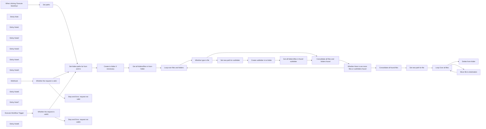

## Fluxo (.json) :

```json
{
  "meta": {
    "instanceId": "9ca813d4011eeb6a3cfcfbfac1efbb98641b1341a64a5cad70c430777ffd407e"
  },
  "nodes": [
    {
      "id": "38cd304e-e260-4bbd-ace1-57b5fd0e6344",
      "name": "When clicking \"Execute Workflow\"",
      "type": "n8n-nodes-base.manualTrigger",
      "position": [
        -1300,
        360
      ],
      "parameters": {},
      "typeVersion": 1
    },
    {
      "id": "087994ba-3b40-4337-b17a-e2ab4aa39963",
      "name": "Whether type is file",
      "type": "n8n-nodes-base.if",
      "position": [
        940,
        780
      ],
      "parameters": {
        "conditions": {
          "string": [
            {
              "value1": "={{ $json.type }}",
              "value2": "file"
            }
          ]
        }
      },
      "typeVersion": 1
    },
    {
      "id": "ab2ec609-2c7a-4976-9ce0-57f6961578e1",
      "name": "Set new path for subfolder",
      "type": "n8n-nodes-base.set",
      "position": [
        1240,
        900
      ],
      "parameters": {
        "fields": {
          "values": [
            {
              "name": "from",
              "stringValue": "={{ decodeURIComponent($json.path) }}"
            },
            {
              "name": "to",
              "stringValue": "={{ decodeURIComponent($('Set folder-paths for from and to').item.json.to + '/' + $json.path.split('/').filter(Boolean).pop() + '/') }}"
            }
          ]
        },
        "include": "none",
        "options": {}
      },
      "typeVersion": 3.2
    },
    {
      "id": "98099141-0e7f-49f0-bfc9-67eef67b13aa",
      "name": "Sticky Note",
      "type": "n8n-nodes-base.stickyNote",
      "position": [
        540,
        474.3406813627256
      ],
      "parameters": {
        "width": 1861.9238476953906,
        "height": 665.3466933867735,
        "content": "## Get all files of subfolders\nIn this segment of the workflow, all files located within subfolders are collected. This includes the exploration of subfolders within subfolders, ensuring the identification of every file throughout the entire folder structure. Additionally, a corresponding folder is created in the destination structure for each identified subfolder."
      },
      "typeVersion": 1
    },
    {
      "id": "8284d632-f0a0-437e-9f75-6995c72400c2",
      "name": "Sticky Note1",
      "type": "n8n-nodes-base.stickyNote",
      "position": [
        2440,
        478.85370741482984
      ],
      "parameters": {
        "width": 695.2464929859717,
        "height": 660.1721006751914,
        "content": "## Enrich the files\nIn this phase of the workflow, all identified files are processed and enriched with the correct path within the destination structure."
      },
      "typeVersion": 1
    },
    {
      "id": "f8b151e4-f9c9-474c-94f3-1c0d340d8e36",
      "name": "Set new path for file",
      "type": "n8n-nodes-base.code",
      "position": [
        2900,
        860
      ],
      "parameters": {
        "jsCode": "for (const item of $input.all()) {\n  const toPath = $('Set folder-paths for from and to').item.json.to;\n  const fromPath = $('Set folder-paths for from and to').item.json.from;\n\n   // Remove leading and trailing slashes\n  path = fromPath.replace(/^/|/$/g, '');\n  // Split the path into an array of folders\n  const folders = path.split('/');\n  // Remove empty strings (resulting from leading, trailing, or consecutive slashes)\n  const nonEmptyFoldersCount = folders.filter(folder => folder !== '').length;\n\n  newFilePathArray = item.json.path.replace(/^/|/$/g, '').split('/');\n  \n  item.json.newPath = toPath.replace(/^/|/$/g, '') + '/' + newFilePathArray.slice(nonEmptyFoldersCount).join(\"/\")\n}\n\nreturn $input.all();"
      },
      "typeVersion": 2
    },
    {
      "id": "638426c9-c736-4ba9-91a2-383049f15ee5",
      "name": "Sticky Note2",
      "type": "n8n-nodes-base.stickyNote",
      "position": [
        3180,
        480
      ],
      "parameters": {
        "width": 695.2464929859717,
        "height": 658.7966837968969,
        "content": "## Move files \nIn this stage of the workflow, the files are moved into the destination structure.\n\nIf the batch size remains at 1 in the Loop Over node, each file will be moved sequentially. If the batch size is increased, multiple files will be moved simultaneously."
      },
      "typeVersion": 1
    },
    {
      "id": "96d83360-21ed-49f1-b273-47ee609f52fa",
      "name": "Sticky Note3",
      "type": "n8n-nodes-base.stickyNote",
      "position": [
        3920,
        480
      ],
      "parameters": {
        "width": 695.2464929859717,
        "height": 658.7966837968969,
        "content": "## (Optional) Delete *from*-folder\n"
      },
      "typeVersion": 1
    },
    {
      "id": "cd5dbcf2-378e-4102-9db2-0627c829e2f2",
      "name": "Sticky Note4",
      "type": "n8n-nodes-base.stickyNote",
      "position": [
        -380,
        480
      ],
      "parameters": {
        "width": 871.7450543093198,
        "height": 665.3466933867735,
        "content": "## Get the files and subfolders to move\nIn this segment of the workflow, all files and subfolders to be relocated are gathered. Additionally, the destination folder is created if it does not already exist."
      },
      "typeVersion": 1
    },
    {
      "id": "91894912-7f54-447b-947b-4040fc92f094",
      "name": "Sticky Note5",
      "type": "n8n-nodes-base.stickyNote",
      "position": [
        -1340,
        60
      ],
      "parameters": {
        "width": 723.2756594453772,
        "height": 463.596247600301,
        "content": "## Manual Start\nTo manually initiate the workflow, the Set Paths node requires the specification of the folder path to be moved and the destination folder path. Subfolders can be indicated using '/'.\n\nEnsure that the other workflow triggers are deactivated before initiating the workflow."
      },
      "typeVersion": 1
    },
    {
      "id": "c1e7754f-6efa-4967-9b8d-6c1bcdb55355",
      "name": "Webhook",
      "type": "n8n-nodes-base.webhook",
      "disabled": true,
      "position": [
        -1320,
        880
      ],
      "webhookId": "285b2cba-587b-4131-82a8-cdd35a8d49e1",
      "parameters": {
        "path": "285b2cba-587b-4131-82a8-cdd35a8d49e1",
        "options": {},
        "httpMethod": "POST",
        "responseData": "noData",
        "responseMode": "lastNode"
      },
      "typeVersion": 1
    },
    {
      "id": "cb3e0c28-afa4-4847-b95e-5c7523f18df6",
      "name": "Sticky Note6",
      "type": "n8n-nodes-base.stickyNote",
      "position": [
        -1340,
        580
      ],
      "parameters": {
        "width": 723.2756594453772,
        "height": 500.9028666051119,
        "content": "## Webhook trigger\nYou can also automate the workflow by configuring a webhook to trigger it. It is crucial that each request contains a JSON body with at least the two attributes 'from-path' and 'to-path' set. Here is an example:\n\n```\n{\n \"from\": \"Folder/to/move\",\n \"to\": \"New-Folder\"\n}\n```\n\nThe workflow will respond with an error, if the request is not valid.\n\nEnsure that the other workflow triggers are deactivated before initiating the workflow."
      },
      "typeVersion": 1
    },
    {
      "id": "3c85f4a4-28b3-4315-b689-033e4af3f888",
      "name": "Sticky Note7",
      "type": "n8n-nodes-base.stickyNote",
      "position": [
        -1340,
        1140
      ],
      "parameters": {
        "width": 723.2756594453772,
        "height": 498.6039613328509,
        "content": "## Trigger by other workflow\nIt is also possible to initiate this workflow from within another workflow. It is important to ensure that at least the 'from-path' and 'to-path' are passed as parameters when starting this workflow.\n\nThe workflow will respond with an error, if the request is not valid.\n\nEnsure that the other workflow triggers are deactivated before initiating the workflow."
      },
      "typeVersion": 1
    },
    {
      "id": "88e63d18-7c68-4d4f-bfe6-5780115d3ed0",
      "name": "Execute Workflow Trigger",
      "type": "n8n-nodes-base.executeWorkflowTrigger",
      "disabled": true,
      "position": [
        -1320,
        1440
      ],
      "parameters": {},
      "typeVersion": 1
    },
    {
      "id": "82d7182e-3aca-4407-8faa-3704429974dc",
      "name": "Set folder-paths for from and to",
      "type": "n8n-nodes-base.set",
      "position": [
        -280,
        880
      ],
      "parameters": {
        "fields": {
          "values": [
            {
              "name": "from",
              "stringValue": "={{ $json.from }}"
            },
            {
              "name": "to",
              "stringValue": "={{ $json.to }}"
            }
          ]
        },
        "options": {}
      },
      "typeVersion": 3.2
    },
    {
      "id": "e9edad54-d5f2-481e-b5be-b43a15b74233",
      "name": "Create to folder if necessary",
      "type": "n8n-nodes-base.nextCloud",
      "onError": "continueRegularOutput",
      "position": [
        -40,
        880
      ],
      "parameters": {
        "path": "={{ $json.to }}",
        "resource": "folder"
      },
      "credentials": {
        "nextCloudApi": {
          "id": "kd8dB6PqsIKQhB6O",
          "name": "NextCloud account"
        }
      },
      "typeVersion": 1
    },
    {
      "id": "4283f069-ea26-499d-928c-5f0f3898cdc4",
      "name": "Get all folders/files in from-folder",
      "type": "n8n-nodes-base.nextCloud",
      "position": [
        240,
        880
      ],
      "parameters": {
        "path": "={{ $('Set folder-paths for from and to').item.json.from }}",
        "resource": "folder",
        "operation": "list"
      },
      "credentials": {
        "nextCloudApi": {
          "id": "kd8dB6PqsIKQhB6O",
          "name": "NextCloud account"
        }
      },
      "typeVersion": 1
    },
    {
      "id": "06c77d03-d79b-4435-9f7f-eef919b7b6af",
      "name": "Loop over files and folders",
      "type": "n8n-nodes-base.splitInBatches",
      "position": [
        660,
        880
      ],
      "parameters": {
        "options": {}
      },
      "typeVersion": 3
    },
    {
      "id": "56cc28ea-d934-4d9c-9e28-968c2e1fa4da",
      "name": "Consolidate all files and folders found",
      "type": "n8n-nodes-base.noOp",
      "position": [
        2000,
        760
      ],
      "parameters": {},
      "typeVersion": 1
    },
    {
      "id": "57883a8f-7989-4706-808a-595376ebaf47",
      "name": "Create subfolder in to-folder",
      "type": "n8n-nodes-base.nextCloud",
      "onError": "continueRegularOutput",
      "position": [
        1440,
        900
      ],
      "parameters": {
        "path": "={{$('Set new path for subfolder').item.json.to }}",
        "resource": "folder"
      },
      "credentials": {
        "nextCloudApi": {
          "id": "kd8dB6PqsIKQhB6O",
          "name": "NextCloud account"
        }
      },
      "typeVersion": 1
    },
    {
      "id": "0a173b88-53c5-44b1-ae04-f68b343025ce",
      "name": "Get all folders/files in found subfolder",
      "type": "n8n-nodes-base.nextCloud",
      "position": [
        1680,
        900
      ],
      "parameters": {
        "path": "={{$('Set new path for subfolder').item.json.from }}",
        "resource": "folder",
        "operation": "list"
      },
      "credentials": {
        "nextCloudApi": {
          "id": "kd8dB6PqsIKQhB6O",
          "name": "NextCloud account"
        }
      },
      "typeVersion": 1
    },
    {
      "id": "3c17b67c-e815-4e27-9b63-19346cb8b966",
      "name": "Whether there is are more files or subfolders found",
      "type": "n8n-nodes-base.if",
      "position": [
        2200,
        880
      ],
      "parameters": {
        "conditions": {
          "boolean": [
            {
              "value1": "={{$node[\"Loop over files and folders\"].context[\"noItemsLeft\"]}}",
              "value2": true
            }
          ]
        }
      },
      "typeVersion": 1
    },
    {
      "id": "94c4e926-eb92-4b10-8d35-2b3483cc4819",
      "name": "Consolidate all found files",
      "type": "n8n-nodes-base.code",
      "position": [
        2580,
        860
      ],
      "parameters": {
        "jsCode": "let results = [],\n  i = 0;\n\ndo {\n  try {\n    results = results.concat($(\"Consolidate all files and folders found\").all(0, i));\n  } catch (error) {\n    return results;\n  }\n  i++;\n} while (true);"
      },
      "typeVersion": 2
    },
    {
      "id": "b40e30ff-793c-46e6-b5a0-5498ee27a3c9",
      "name": "Loop Over all files",
      "type": "n8n-nodes-base.splitInBatches",
      "position": [
        3300,
        860
      ],
      "parameters": {
        "options": {}
      },
      "typeVersion": 3
    },
    {
      "id": "034c66f7-c184-438d-96de-1d20f8f7adc5",
      "name": "Move file to destination",
      "type": "n8n-nodes-base.nextCloud",
      "position": [
        3660,
        940
      ],
      "parameters": {
        "path": "={{ decodeURIComponent($json.path) }}",
        "toPath": "={{ decodeURIComponent($json.newPath) }}",
        "operation": "move"
      },
      "credentials": {
        "nextCloudApi": {
          "id": "kd8dB6PqsIKQhB6O",
          "name": "NextCloud account"
        }
      },
      "typeVersion": 1
    },
    {
      "id": "34c8521f-cb17-479f-842b-38cbb5970403",
      "name": "Delete from-folder",
      "type": "n8n-nodes-base.nextCloud",
      "onError": "continueRegularOutput",
      "position": [
        4200,
        840
      ],
      "parameters": {
        "path": "={{ $('Set folder-paths for from and to').item.json.from }}",
        "resource": "folder",
        "operation": "delete"
      },
      "credentials": {
        "nextCloudApi": {
          "id": "kd8dB6PqsIKQhB6O",
          "name": "NextCloud account"
        }
      },
      "typeVersion": 1
    },
    {
      "id": "eeda26a3-f5e6-4e6d-aeca-ebe2dbc2cb9e",
      "name": "Set paths",
      "type": "n8n-nodes-base.set",
      "position": [
        -780,
        360
      ],
      "parameters": {
        "fields": {
          "values": [
            {
              "name": "from",
              "stringValue": "Old-Folder"
            },
            {
              "name": "to",
              "stringValue": "Destination"
            }
          ]
        },
        "options": {}
      },
      "typeVersion": 3.2
    },
    {
      "id": "ba2e352a-4911-470b-a3bb-f63e3470e228",
      "name": "Whether the request is valid",
      "type": "n8n-nodes-base.if",
      "position": [
        -1100,
        880
      ],
      "parameters": {
        "conditions": {
          "boolean": [
            {
              "value1": "={{ $json.hasOwnProperty('body') && $json.body.hasOwnProperty('to') && $json.body.hasOwnProperty('from')}}",
              "value2": true
            }
          ]
        }
      },
      "typeVersion": 1
    },
    {
      "id": "ed4ddbf1-becf-4944-abd4-0b4cdf6d3b85",
      "name": "Stop and Error: request not valid",
      "type": "n8n-nodes-base.stopAndError",
      "position": [
        -760,
        920
      ],
      "parameters": {
        "errorMessage": "The Request is not valid!"
      },
      "typeVersion": 1
    },
    {
      "id": "2b5d67ac-983b-486d-99f1-e05995383878",
      "name": "Whether the request is valid1",
      "type": "n8n-nodes-base.if",
      "position": [
        -1120,
        1440
      ],
      "parameters": {
        "conditions": {
          "boolean": [
            {
              "value1": "={{ $json.hasOwnProperty('to') && $json.hasOwnProperty('from')}}",
              "value2": true
            }
          ]
        }
      },
      "typeVersion": 1
    },
    {
      "id": "b57309cf-2a69-4879-a7d4-5499f8278e3b",
      "name": "Stop and Error: request not valid1",
      "type": "n8n-nodes-base.stopAndError",
      "position": [
        -760,
        1480
      ],
      "parameters": {
        "errorMessage": "The Request is not valid!"
      },
      "typeVersion": 1
    },
    {
      "id": "f109308f-0b48-4395-9f2d-c8b4e8d936d2",
      "name": "Sticky Note8",
      "type": "n8n-nodes-base.stickyNote",
      "position": [
        -2440,
        60
      ],
      "parameters": {
        "width": 770.5015081009478,
        "height": 1247.9320267653952,
        "content": "# Template Description\n\n\n## Description:\nThis template facilitates the transfer of a folder, along with all its files and subfolders, within a Nextcloud instance. The Nextcloud user must have access to both the source and destination folders. While Nextcloud allows folder movement, complications may arise when dealing with external storage that has rate limits. This workflow ensures the individual transfer of each file to avoid exceeding rate limits, particularly useful for setups involving external storage with rate limitations.\n\n## How it works:\n\n- Identify all files and subfolders within the specified source folder.\n- Recursive search within subfolders for additional files.\n- Replicate the folder structure in the target folder.\n- Individually move each identified file to the corresponding location in the target folder.\n\n## Set up steps:\n\n- Set Nextcloud credentials for all Nextcloud nodes involved in the process.\n-Edit the trigger settings. Detailed instructions can be found within the respective trigger configuration.\n- Initiate the workflow to commence the folder transfer process.\n\n\n## Help\nIf you need assistance with applying this template, feel free to reach out to me. You can find additional information about me and my services here. => https://nicokowalczyk.de/links\n\nI have also produced a video where I explain the workflow and provide an example. You can find this video over here. https://youtu.be/K1kmG_Q_jRk\n\nCheers.\nNico Kowalczyk"
      },
      "typeVersion": 1
    }
  ],
  "connections": {
    "Webhook": {
      "main": [
        [
          {
            "node": "Whether the request is valid",
            "type": "main",
            "index": 0
          }
        ]
      ]
    },
    "Set paths": {
      "main": [
        [
          {
            "node": "Set folder-paths for from and to",
            "type": "main",
            "index": 0
          }
        ]
      ]
    },
    "Loop Over all files": {
      "main": [
        [
          {
            "node": "Delete from-folder",
            "type": "main",
            "index": 0
          }
        ],
        [
          {
            "node": "Move file to destination",
            "type": "main",
            "index": 0
          }
        ]
      ]
    },
    "Whether type is file": {
      "main": [
        [
          {
            "node": "Consolidate all files and folders found",
            "type": "main",
            "index": 0
          }
        ],
        [
          {
            "node": "Set new path for subfolder",
            "type": "main",
            "index": 0
          }
        ]
      ]
    },
    "Set new path for file": {
      "main": [
        [
          {
            "node": "Loop Over all files",
            "type": "main",
            "index": 0
          }
        ]
      ]
    },
    "Execute Workflow Trigger": {
      "main": [
        [
          {
            "node": "Whether the request is valid1",
            "type": "main",
            "index": 0
          }
        ]
      ]
    },
    "Move file to destination": {
      "main": [
        [
          {
            "node": "Loop Over all files",
            "type": "main",
            "index": 0
          }
        ]
      ]
    },
    "Set new path for subfolder": {
      "main": [
        [
          {
            "node": "Create subfolder in to-folder",
            "type": "main",
            "index": 0
          }
        ]
      ]
    },
    "Consolidate all found files": {
      "main": [
        [
          {
            "node": "Set new path for file",
            "type": "main",
            "index": 0
          }
        ]
      ]
    },
    "Loop over files and folders": {
      "main": [
        null,
        [
          {
            "node": "Whether type is file",
            "type": "main",
            "index": 0
          }
        ]
      ]
    },
    "Whether the request is valid": {
      "main": [
        [
          {
            "node": "Set folder-paths for from and to",
            "type": "main",
            "index": 0
          }
        ],
        [
          {
            "node": "Stop and Error: request not valid",
            "type": "main",
            "index": 0
          }
        ]
      ]
    },
    "Create subfolder in to-folder": {
      "main": [
        [
          {
            "node": "Get all folders/files in found subfolder",
            "type": "main",
            "index": 0
          }
        ]
      ]
    },
    "Create to folder if necessary": {
      "main": [
        [
          {
            "node": "Get all folders/files in from-folder",
            "type": "main",
            "index": 0
          }
        ]
      ]
    },
    "Whether the request is valid1": {
      "main": [
        [
          {
            "node": "Set folder-paths for from and to",
            "type": "main",
            "index": 0
          }
        ],
        [
          {
            "node": "Stop and Error: request not valid1",
            "type": "main",
            "index": 0
          }
        ]
      ]
    },
    "Set folder-paths for from and to": {
      "main": [
        [
          {
            "node": "Create to folder if necessary",
            "type": "main",
            "index": 0
          }
        ]
      ]
    },
    "When clicking \"Execute Workflow\"": {
      "main": [
        [
          {
            "node": "Set paths",
            "type": "main",
            "index": 0
          }
        ]
      ]
    },
    "Get all folders/files in from-folder": {
      "main": [
        [
          {
            "node": "Loop over files and folders",
            "type": "main",
            "index": 0
          }
        ]
      ]
    },
    "Consolidate all files and folders found": {
      "main": [
        [
          {
            "node": "Whether there is are more files or subfolders found",
            "type": "main",
            "index": 0
          }
        ]
      ]
    },
    "Get all folders/files in found subfolder": {
      "main": [
        [
          {
            "node": "Consolidate all files and folders found",
            "type": "main",
            "index": 0
          }
        ]
      ]
    },
    "Whether there is are more files or subfolders found": {
      "main": [
        [
          {
            "node": "Consolidate all found files",
            "type": "main",
            "index": 0
          }
        ],
        [
          {
            "node": "Loop over files and folders",
            "type": "main",
            "index": 0
          }
        ]
      ]
    }
  }
}
```

<a id="template-1958"></a>

## Template 1958 - Roteamento por ID para atribuição de nome

- **Nome:** Roteamento por ID para atribuição de nome
- **Descrição:** Gera dois itens com IDs distintos e encaminha cada item para uma das duas ramificações com base no valor do ID, atribuindo um campo de nome específico a cada ramificação.
- **Funcionalidade:** • Gatilho manual: inicia o fluxo quando executado manualmente.
• Geração de itens: cria dois objetos de saída com os campos id = 0 e id = 1.
• Verificação condicional por id: avalia o valor do campo id de cada item para decidir a rota.
• Roteamento para ramificações: encaminha cada item para a ramificação verdadeira ou falsa conforme a condição.
• Definição de campo de saída: em cada ramificação atribui o campo name com valores distintos ("n8n" ou "nodemation").
- **Ferramentas:** • Nenhuma ferramenta externa: este fluxo não utiliza integrações externas; todas as operações são realizadas internamente.

## Fluxo visual

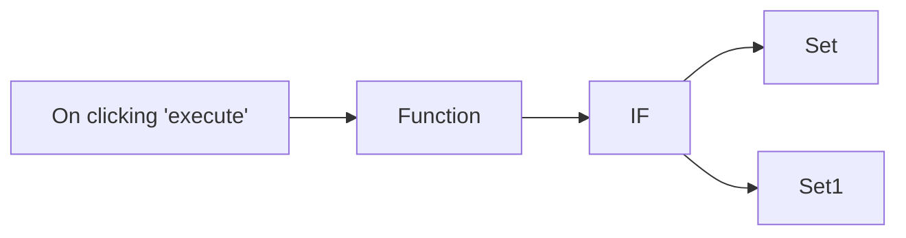

## Fluxo (.json) :

```json
{
  "nodes": [
    {
      "name": "On clicking 'execute'",
      "type": "n8n-nodes-base.manualTrigger",
      "position": [
        250,
        300
      ],
      "parameters": {},
      "typeVersion": 1
    },
    {
      "name": "Function",
      "type": "n8n-nodes-base.function",
      "position": [
        450,
        300
      ],
      "parameters": {
        "functionCode": "return [\n  {\n    json: {\n      id: 0,\n    }\n  },\n  {\n    json: {\n      id: 1,\n    }\n  }\n];"
      },
      "typeVersion": 1
    },
    {
      "name": "IF",
      "type": "n8n-nodes-base.if",
      "position": [
        650,
        300
      ],
      "parameters": {
        "conditions": {
          "number": [
            {
              "value1": "={{$node[\"Function\"].json[\"id\"]}}",
              "operation": "equal"
            }
          ]
        }
      },
      "typeVersion": 1
    },
    {
      "name": "Set",
      "type": "n8n-nodes-base.set",
      "position": [
        850,
        200
      ],
      "parameters": {
        "values": {
          "string": [
            {
              "name": "name",
              "value": "n8n"
            }
          ]
        },
        "options": {}
      },
      "typeVersion": 1
    },
    {
      "name": "Set1",
      "type": "n8n-nodes-base.set",
      "position": [
        850,
        400
      ],
      "parameters": {
        "values": {
          "string": [
            {
              "name": "name",
              "value": "nodemation"
            }
          ]
        },
        "options": {}
      },
      "typeVersion": 1
    }
  ],
  "connections": {
    "IF": {
      "main": [
        [
          {
            "node": "Set",
            "type": "main",
            "index": 0
          }
        ],
        [
          {
            "node": "Set1",
            "type": "main",
            "index": 0
          }
        ]
      ]
    },
    "Function": {
      "main": [
        [
          {
            "node": "IF",
            "type": "main",
            "index": 0
          }
        ]
      ]
    },
    "On clicking 'execute'": {
      "main": [
        [
          {
            "node": "Function",
            "type": "main",
            "index": 0
          }
        ]
      ]
    }
  }
}
```

<a id="template-1959"></a>

## Template 1959 - Coleta de fundraising recentes para Sheets

- **Nome:** Coleta de fundraising recentes para Sheets
- **Descrição:** Este fluxo coleta rodadas de financiamento recentes (Series A, Series B e Seed), enriquece os dados da empresa e grava os resultados em uma planilha do Google Sheets, atualizando ou acrescentando linhas conforme necessário.
- **Funcionalidade:** • Programação diária: inicia a coleta automaticamente todos os dias em um horário definido.
• Busca de fundraising recente por tipo: obtém Series A, Series B e Seed com days_since_announcement = 1.
• Enriquecimento de dados da empresa: consulta informações adicionais da empresa para complementar o registro.
• Preparação de dados para importação: formata os campos necessários (type, money_raised, announced_on, company_name, link, event_link).
• Integração com planilha: adiciona ou atualiza as linhas na planilha com os dados preparados.
• Extração de LinkedIn URL: obtém o URL do LinkedIn a partir das informações enriquecidas e o utiliza nas etapas seguintes.
- **Ferramentas:** • Piloterr API: serviço que disponibiliza dados de fundraising rounds e informações de empresas a partir do Crunchbase.
• Google Sheets: planilha online para armazenar e atualizar os dados coletados.

## Fluxo visual

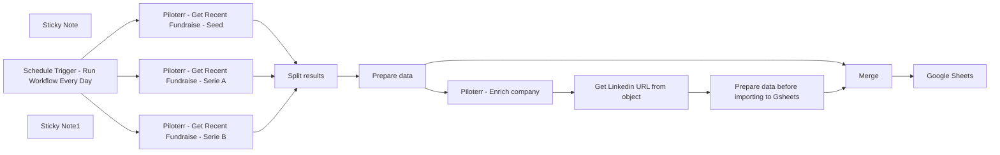

## Fluxo (.json) :

```json
{
  "meta": {
    "instanceId": "f0a68da631efd4ed052a324b63ff90f7a844426af0398a68338f44245d1dd9e5"
  },
  "nodes": [
    {
      "id": "0d901abb-f11b-4fdc-88d0-1bbd906ff332",
      "name": "Split results",
      "type": "n8n-nodes-base.itemLists",
      "position": [
        1040,
        460
      ],
      "parameters": {
        "options": {},
        "fieldToSplitOut": "results"
      },
      "typeVersion": 1
    },
    {
      "id": "b522f5bc-480c-4a6a-a44b-55ca68c66ad5",
      "name": "Piloterr - Get Recent Fundraise - Serie A",
      "type": "n8n-nodes-base.httpRequest",
      "position": [
        740,
        460
      ],
      "parameters": {
        "url": "https://piloterr.com/api/v2/crunchbase/funding_rounds",
        "options": {},
        "sendQuery": true,
        "authentication": "genericCredentialType",
        "genericAuthType": "httpHeaderAuth",
        "queryParameters": {
          "parameters": [
            {
              "name": "days_since_announcement",
              "value": "1"
            },
            {
              "name": "investment_type",
              "value": "series_a"
            }
          ]
        }
      },
      "credentials": {
        "httpHeaderAuth": {
          "id": "123",
          "name": "Pilotr"
        }
      },
      "typeVersion": 3
    },
    {
      "id": "5965b7cd-66f4-4c5b-82a2-e9526fb4b366",
      "name": "Piloterr - Get Recent Fundraise - Serie B",
      "type": "n8n-nodes-base.httpRequest",
      "position": [
        740,
        660
      ],
      "parameters": {
        "url": "https://piloterr.com/api/v2/crunchbase/funding_rounds",
        "options": {},
        "sendQuery": true,
        "authentication": "genericCredentialType",
        "genericAuthType": "httpHeaderAuth",
        "queryParameters": {
          "parameters": [
            {
              "name": "days_since_announcement",
              "value": "1"
            },
            {
              "name": "investment_type",
              "value": "series_b"
            }
          ]
        }
      },
      "credentials": {
        "httpHeaderAuth": {
          "id": "123",
          "name": "Pilotr"
        }
      },
      "typeVersion": 3
    },
    {
      "id": "04ab7fe9-6422-45c3-b165-139577a0e27f",
      "name": "Google Sheets",
      "type": "n8n-nodes-base.googleSheets",
      "position": [
        2360,
        480
      ],
      "parameters": {
        "columns": {
          "value": {
            "link": "={{ $json.link }}",
            "type": "={{ $json.type }}",
            "country": "={{ $json.country }}",
            "event_link": "={{ $json.event_link }}",
            "website_url": "={{ $json.website_url }}",
            "announced_on": "={{ $json.announced_on }}",
            "company_name": "={{ $json.company_name }}",
            "founded_date": "={{ $json.founded_date }}",
            "linkedin_url": "={{ $json.linkedin_url }}",
            "money_raised": "={{ $json.money_raised }}",
            "funding_total": "={{ $json.funding_total }}",
            "employee_count": "={{ $json.employee_count }}",
            "investment_type": "={{ $json.investment_type }}",
            "monthly_traffic_semrush": "={{ $json.monthly_traffic_semrush }}"
          },
          "schema": [
            {
              "id": "company_name",
              "type": "string",
              "display": true,
              "removed": false,
              "required": false,
              "displayName": "company_name",
              "defaultMatch": false,
              "canBeUsedToMatch": true
            },
            {
              "id": "website_url",
              "type": "string",
              "display": true,
              "removed": false,
              "required": false,
              "displayName": "website_url",
              "defaultMatch": false,
              "canBeUsedToMatch": true
            },
            {
              "id": "type",
              "type": "string",
              "display": true,
              "removed": false,
              "required": false,
              "displayName": "type",
              "defaultMatch": false,
              "canBeUsedToMatch": true
            },
            {
              "id": "money_raised",
              "type": "string",
              "display": true,
              "removed": false,
              "required": false,
              "displayName": "money_raised",
              "defaultMatch": false,
              "canBeUsedToMatch": true
            },
            {
              "id": "linkedin_url",
              "type": "string",
              "display": true,
              "removed": false,
              "required": false,
              "displayName": "linkedin_url",
              "defaultMatch": false,
              "canBeUsedToMatch": true
            },
            {
              "id": "announced_on",
              "type": "string",
              "display": true,
              "removed": false,
              "required": false,
              "displayName": "announced_on",
              "defaultMatch": false,
              "canBeUsedToMatch": true
            },
            {
              "id": "funding_total",
              "type": "string",
              "display": true,
              "removed": false,
              "required": false,
              "displayName": "funding_total",
              "defaultMatch": false,
              "canBeUsedToMatch": true
            },
            {
              "id": "link",
              "type": "string",
              "display": true,
              "removed": false,
              "required": false,
              "displayName": "link",
              "defaultMatch": false,
              "canBeUsedToMatch": true
            },
            {
              "id": "monthly_traffic_semrush",
              "type": "string",
              "display": true,
              "removed": false,
              "required": false,
              "displayName": "monthly_traffic_semrush",
              "defaultMatch": false,
              "canBeUsedToMatch": true
            },
            {
              "id": "event_link",
              "type": "string",
              "display": true,
              "removed": false,
              "required": false,
              "displayName": "event_link",
              "defaultMatch": false,
              "canBeUsedToMatch": true
            },
            {
              "id": "employee_count",
              "type": "string",
              "display": true,
              "removed": false,
              "required": false,
              "displayName": "employee_count",
              "defaultMatch": false,
              "canBeUsedToMatch": true
            },
            {
              "id": "country",
              "type": "string",
              "display": true,
              "removed": false,
              "required": false,
              "displayName": "country",
              "defaultMatch": false,
              "canBeUsedToMatch": true
            },
            {
              "id": "founded_date",
              "type": "string",
              "display": true,
              "removed": false,
              "required": false,
              "displayName": "founded_date",
              "defaultMatch": false,
              "canBeUsedToMatch": true
            }
          ],
          "mappingMode": "defineBelow",
          "matchingColumns": [
            "event_link"
          ]
        },
        "options": {},
        "operation": "appendOrUpdate",
        "sheetName": {
          "__rl": true,
          "mode": "list",
          "value": "gid=0",
          "cachedResultUrl": "https://docs.google.com/spreadsheets/d/1IZ7BJUtBdezesDS5oBDzFeW-btiH7qB4gdIcwcC01xs/edit#gid=0",
          "cachedResultName": "Sheet1"
        },
        "documentId": {
          "__rl": true,
          "mode": "url",
          "value": "https://docs.google.com/spreadsheets/d/1IZ7BJUtBdezesDS5oBDzFeW-btiH7qB4gdIcwcC01xs/edit#gid=0",
          "__regex": "https://(?:drive|docs)\\.google\\.com/\\w+/d/([0-9a-zA-Z\\-_]+)(?:/.*|)"
        }
      },
      "credentials": {
        "googleSheetsOAuth2Api": {
          "id": "2",
          "name": "Google Sheets account lucas"
        }
      },
      "typeVersion": 4
    },
    {
      "id": "f88a862c-c413-4248-b061-2a449c6ee0fb",
      "name": "Piloterr - Get Recent Fundraise - Seed",
      "type": "n8n-nodes-base.httpRequest",
      "position": [
        740,
        860
      ],
      "parameters": {
        "url": "https://piloterr.com/api/v2/crunchbase/funding_rounds",
        "options": {},
        "sendQuery": true,
        "authentication": "genericCredentialType",
        "genericAuthType": "httpHeaderAuth",
        "queryParameters": {
          "parameters": [
            {
              "name": "days_since_announcement",
              "value": "1"
            },
            {
              "name": "investment_type",
              "value": "seed"
            }
          ]
        }
      },
      "credentials": {
        "httpHeaderAuth": {
          "id": "123",
          "name": "Pilotr"
        }
      },
      "typeVersion": 3
    },
    {
      "id": "38521229-d315-4bb3-bece-72ff64f602e8",
      "name": "Prepare data",
      "type": "n8n-nodes-base.set",
      "position": [
        1280,
        460
      ],
      "parameters": {
        "values": {
          "string": [
            {
              "name": "type",
              "value": "={{ $json.investment_type }}"
            },
            {
              "name": "money_raised",
              "value": "={{ $json.money_raised.value_usd }}"
            },
            {
              "name": "announced_on",
              "value": "={{ $json.announced_on }}"
            },
            {
              "name": "company_name",
              "value": "={{ $json.funded_organization_identifier.value }}"
            },
            {
              "name": "link",
              "value": "={{ $json.funded_organization_identifier.permalink }}"
            },
            {
              "name": "event_link",
              "value": "={{ $json.identifier.permalink }}"
            }
          ]
        },
        "options": {},
        "keepOnlySet": true
      },
      "typeVersion": 2
    },
    {
      "id": "8fad9822-dfe3-4106-981f-f2c8163ce8a0",
      "name": "Piloterr - Enrich company",
      "type": "n8n-nodes-base.httpRequest",
      "position": [
        1520,
        580
      ],
      "parameters": {
        "url": "https://piloterr.com/api/v2/crunchbase/company/info",
        "options": {
          "batching": {
            "batch": {
              "batchSize": 3
            }
          }
        },
        "sendQuery": true,
        "authentication": "genericCredentialType",
        "genericAuthType": "httpHeaderAuth",
        "queryParameters": {
          "parameters": [
            {
              "name": "query",
              "value": "=https://www.crunchbase.com/organization/{{ $json[\"link\"] }}"
            }
          ]
        }
      },
      "credentials": {
        "httpHeaderAuth": {
          "id": "123",
          "name": "Pilotr"
        }
      },
      "typeVersion": 3,
      "continueOnFail": true
    },
    {
      "id": "78289f0d-5721-4615-a883-38a1e48ebb34",
      "name": "Merge",
      "type": "n8n-nodes-base.merge",
      "position": [
        2100,
        480
      ],
      "parameters": {
        "mode": "combine",
        "options": {},
        "combinationMode": "mergeByPosition"
      },
      "typeVersion": 2.1
    },
    {
      "id": "d5e659d7-28ba-4cd7-a6bf-ea7b48d5f34c",
      "name": "Sticky Note",
      "type": "n8n-nodes-base.stickyNote",
      "position": [
        20,
        280
      ],
      "parameters": {
        "width": 318.8857938718665,
        "height": 287.01949860724255,
        "content": "## Read me\n\nThis workflow will scrape recent fundraising events from Crunchbase, and add them in Google Sheets.\n\nFull guide here: https://lempire.notion.site/Get-recent-fundraising-in-Google-Sheets-dafbbda2635544b4925c4fb04abac8f5?pvs=74\n"
      },
      "typeVersion": 1
    },
    {
      "id": "888f5bf2-4a7f-4f84-95c8-4173fa8d8f83",
      "name": "Schedule Trigger - Run Workflow Every Day",
      "type": "n8n-nodes-base.scheduleTrigger",
      "position": [
        460,
        460
      ],
      "parameters": {
        "rule": {
          "interval": [
            {
              "triggerAtHour": 8
            }
          ]
        }
      },
      "typeVersion": 1
    },
    {
      "id": "84f02477-b19c-405f-abde-3e32280208e9",
      "name": "Prepare data before importing to Gsheets",
      "type": "n8n-nodes-base.set",
      "position": [
        1860,
        580
      ],
      "parameters": {
        "values": {
          "string": [
            {
              "name": "website_url",
              "value": "={{ $json.website.match(/https?://(?:www\\.)?([^/]+)/)[1] }}"
            },
            {
              "name": "monthly_traffic_semrush",
              "value": "={{ $json.semrush_summary.semrush_visits_latest_month }}"
            },
            {
              "name": "funding_total",
              "value": "={{ $json.funding_rounds_headline.funding_total.value }}"
            },
            {
              "name": "linkedin_url",
              "value": "={{ $json.linkedin_url }}"
            },
            {
              "name": "employee_count",
              "value": "={{ $json.employee_count }}"
            },
            {
              "name": "country",
              "value": "={{ $json.location[2].name }}"
            },
            {
              "name": "founded_date",
              "value": "={{ $json.founded }}"
            }
          ]
        },
        "options": {},
        "keepOnlySet": true
      },
      "typeVersion": 2
    },
    {
      "id": "b4952b2f-7202-4b6a-81ec-7251b0d6c308",
      "name": "Get Linkedin URL from object",
      "type": "n8n-nodes-base.code",
      "position": [
        1680,
        580
      ],
      "parameters": {
        "mode": "runOnceForEachItem",
        "jsCode": "// Find the LinkedIn object\nlet linkedinObject = $json.social_networks.find(e => e.name === 'linkedin');\n\n// If the LinkedIn object exists, get the URL; otherwise, set to null or handle error\n$input.item.json.linkedin_url = linkedinObject ? linkedinObject.url : null;\n\n// Check if the URL was set\nif (!$input.item.json.linkedin_url) {\n    console.error('No LinkedIn URL found!');\n    // Handle the error as required for your application\n}\n\nreturn $input.item;"
      },
      "typeVersion": 1
    },
    {
      "id": "9e98198d-b9f1-42e4-b703-153f98ffce7c",
      "name": "Sticky Note1",
      "type": "n8n-nodes-base.stickyNote",
      "position": [
        680,
        254.26329864271463
      ],
      "parameters": {
        "height": 818.134682564936,
        "content": "Create an account at piloterr.com to get your API key\n\nFeel free to delete the node that are not useful to you. For instance \"Serie B\" and \"Seed\" if you want only to scrape Serie A events"
      },
      "typeVersion": 1
    }
  ],
  "pinData": {},
  "connections": {
    "Merge": {
      "main": [
        [
          {
            "node": "Google Sheets",
            "type": "main",
            "index": 0
          }
        ]
      ]
    },
    "Prepare data": {
      "main": [
        [
          {
            "node": "Piloterr - Enrich company",
            "type": "main",
            "index": 0
          },
          {
            "node": "Merge",
            "type": "main",
            "index": 0
          }
        ]
      ]
    },
    "Split results": {
      "main": [
        [
          {
            "node": "Prepare data",
            "type": "main",
            "index": 0
          }
        ]
      ]
    },
    "Piloterr - Enrich company": {
      "main": [
        [
          {
            "node": "Get Linkedin URL from object",
            "type": "main",
            "index": 0
          }
        ]
      ]
    },
    "Get Linkedin URL from object": {
      "main": [
        [
          {
            "node": "Prepare data before importing to Gsheets",
            "type": "main",
            "index": 0
          }
        ]
      ]
    },
    "Piloterr - Get Recent Fundraise - Seed": {
      "main": [
        [
          {
            "node": "Split results",
            "type": "main",
            "index": 0
          }
        ]
      ]
    },
    "Prepare data before importing to Gsheets": {
      "main": [
        [
          {
            "node": "Merge",
            "type": "main",
            "index": 1
          }
        ]
      ]
    },
    "Piloterr - Get Recent Fundraise - Serie A": {
      "main": [
        [
          {
            "node": "Split results",
            "type": "main",
            "index": 0
          }
        ]
      ]
    },
    "Piloterr - Get Recent Fundraise - Serie B": {
      "main": [
        [
          {
            "node": "Split results",
            "type": "main",
            "index": 0
          }
        ]
      ]
    },
    "Schedule Trigger - Run Workflow Every Day": {
      "main": [
        [
          {
            "node": "Piloterr - Get Recent Fundraise - Serie A",
            "type": "main",
            "index": 0
          },
          {
            "node": "Piloterr - Get Recent Fundraise - Serie B",
            "type": "main",
            "index": 0
          },
          {
            "node": "Piloterr - Get Recent Fundraise - Seed",
            "type": "main",
            "index": 0
          }
        ]
      ]
    }
  }
}
```

<a id="template-1961"></a>

## Template 1961 - Sincronização Google Forms/Sheets com MySQL

- **Nome:** Sincronização Google Forms/Sheets com MySQL
- **Descrição:** Sincroniza respostas de um formulário (armazenadas no Google Sheets) com uma tabela MySQL, atualizando registros, marcando status e disparando notificações quando necessário.
- **Funcionalidade:** • Disparo agendado e manual: Executa o fluxo periodicamente (a cada 30 minutos em horário comercial) ou manualmente para forçar sincronização.
• Leitura de respostas do Google Sheet: Recupera todas as linhas do formulário (aba "Form Responses 1") filtrando pela coluna "DB Status" quando aplicável.
• Normalização de campos: Renomeia e formata colunas do formulário para um esquema consistente (ex.: converte data do evento para YYYY-MM-DD, define source_name como GoogleForm).
• Busca de registros no banco: Seleciona registros existentes na tabela ConcertInquiries filtrando por source_name = GoogleForm.
• Comparação de conjuntos de dados: Compara dados do sheet e do banco usando timestamp e source_name como chaves, ignorando campos de metadados (record_created, record_updated, id).
• Inserção/atualização no MySQL: Realiza upsert na tabela ConcertInquiries usando o timestamp como coluna de correspondência para adicionar ou atualizar registros.
• Atualização do status no Sheet: Escreve de volta na coluna "DB Status" do Google Sheet quando houver status atribuído a partir da comparação.
• Verificação de respostas antigas: Detecta respostas com timestamp anterior a 4 horas e aciona envio de notificações para acompanhamento.
• Sincronização de marcação: Quando detectado source_name nos dados, atualiza o registro MySQL para marcar que já foi sincronizado (aplica sufixo "Sync" ao source_name).
- **Ferramentas:** • Google Forms: Fonte das respostas coletadas pelos usuários (preenchidas automaticamente no Google Sheets).
• Google Sheets: Armazena as respostas do formulário e abriga a coluna "DB Status" que é lida e atualizada.
• MySQL: Banco de dados remoto com a tabela ConcertInquiries onde os registros são consultados, inseridos e atualizados.

## Fluxo visual

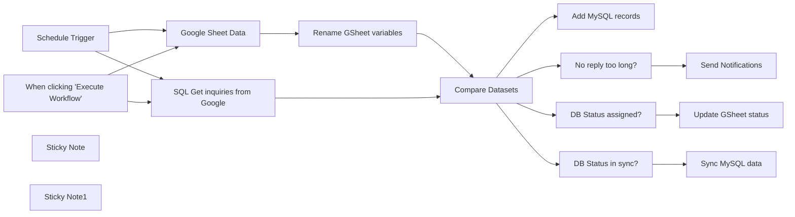

## Fluxo (.json) :

```json
{
  "id": "VtiRiIGkdeUhyh0N",
  "meta": {
    "instanceId": "fb924c73af8f703905bc09c9ee8076f48c17b596ed05b18c0ff86915ef8a7c4a"
  },
  "name": "GoogleSheets MySQL Integration",
  "tags": [],
  "nodes": [
    {
      "id": "ec43f0df-338b-462f-9195-b20024e83ba1",
      "name": "When clicking \"Execute Workflow\"",
      "type": "n8n-nodes-base.manualTrigger",
      "position": [
        720,
        500
      ],
      "parameters": {},
      "typeVersion": 1
    },
    {
      "id": "e9fd1af3-dcf8-4442-958d-cb8390c85263",
      "name": "Compare Datasets",
      "type": "n8n-nodes-base.compareDatasets",
      "position": [
        1380,
        380
      ],
      "parameters": {
        "options": {
          "skipFields": "record_created,record_updated,id"
        },
        "mergeByFields": {
          "values": [
            {
              "field1": "timestamp",
              "field2": "timestamp"
            },
            {
              "field1": "source_name",
              "field2": "source_name"
            }
          ]
        }
      },
      "typeVersion": 2.3
    },
    {
      "id": "5b14d739-9037-48a8-9990-5b8ac3318b1c",
      "name": "Send Notifications",
      "type": "n8n-nodes-base.noOp",
      "position": [
        1840,
        260
      ],
      "parameters": {},
      "typeVersion": 1
    },
    {
      "id": "10ff3339-9091-4ea2-be4e-12a91208e27d",
      "name": "Schedule Trigger",
      "type": "n8n-nodes-base.scheduleTrigger",
      "position": [
        720,
        200
      ],
      "parameters": {
        "rule": {
          "interval": [
            {
              "field": "cronExpression",
              "expression": "*/30 6-22 * * 1-5"
            }
          ]
        }
      },
      "typeVersion": 1.1
    },
    {
      "id": "dcf6838f-0d58-4438-875b-94caac45cb65",
      "name": "Google Sheet Data",
      "type": "n8n-nodes-base.googleSheets",
      "position": [
        940,
        200
      ],
      "parameters": {
        "options": {
          "returnAllMatches": "returnAllMatches"
        },
        "filtersUI": {
          "values": [
            {
              "lookupColumn": "DB Status"
            }
          ]
        },
        "sheetName": {
          "__rl": true,
          "mode": "list",
          "value": 263642066,
          "cachedResultUrl": "https://docs.google.com/spreadsheets/d/1KCSKt9bKrFSWGRTTfj-JIVl-u7gcLMbFTCSvZbUMiuo/edit#gid=263642066",
          "cachedResultName": "Form Responses 1"
        },
        "documentId": {
          "__rl": true,
          "mode": "url",
          "value": "https://docs.google.com/spreadsheets/d/1KCSKt9bKrFSWGRTTfj-JIVl-u7gcLMbFTCSvZbUMiuo"
        }
      },
      "credentials": {
        "googleSheetsOAuth2Api": {
          "id": "RtRiRezoxiWkzZQt",
          "name": "Google Sheets account 3"
        }
      },
      "typeVersion": 4
    },
    {
      "id": "6044469f-9000-4e47-a2d9-920371677a82",
      "name": "SQL Get inquiries from Google",
      "type": "n8n-nodes-base.mySql",
      "position": [
        940,
        500
      ],
      "parameters": {
        "table": {
          "__rl": true,
          "mode": "list",
          "value": "ConcertInquiries",
          "cachedResultName": "ConcertInquiries"
        },
        "where": {
          "values": [
            {
              "value": "GoogleForm",
              "column": "source_name"
            }
          ]
        },
        "options": {},
        "operation": "select",
        "returnAll": true
      },
      "credentials": {
        "mySql": {
          "id": "ICakJ1LRuVl4dRTs",
          "name": "db4free TTT account"
        }
      },
      "typeVersion": 2.2
    },
    {
      "id": "f65aad46-93ce-44e6-b7b9-8c177516cf18",
      "name": "Add MySQL records",
      "type": "n8n-nodes-base.mySql",
      "position": [
        1620,
        80
      ],
      "parameters": {
        "table": {
          "__rl": true,
          "mode": "list",
          "value": "ConcertInquiries",
          "cachedResultName": "ConcertInquiries"
        },
        "options": {},
        "operation": "upsert",
        "columnToMatchOn": "timestamp"
      },
      "credentials": {
        "mySql": {
          "id": "ICakJ1LRuVl4dRTs",
          "name": "db4free TTT account"
        }
      },
      "typeVersion": 2.2
    },
    {
      "id": "6b3d9971-f37c-4721-8134-f60bdf1a03da",
      "name": "Rename GSheet variables",
      "type": "n8n-nodes-base.set",
      "position": [
        1160,
        200
      ],
      "parameters": {
        "values": {
          "string": [
            {
              "name": "timestamp",
              "value": "={{ $json.Timestamp }}"
            },
            {
              "name": "occasion",
              "value": "={{ $json[\"What event are you organizing? \"] }}"
            },
            {
              "name": "email_address",
              "value": "={{ $json[\"Email Address\"] }}"
            },
            {
              "name": "event_date",
              "value": "={{ DateTime.fromFormat($json[\"When does the event take place? \"], 'M/d/yyyy').toFormat('yyyy-MM-dd') }}"
            },
            {
              "name": "location",
              "value": "={{ $json[\"Where does the event take place? \"] }}"
            },
            {
              "name": "event_description",
              "value": "={{ $json[\"Please tell us more about the event. \"] }}"
            },
            {
              "name": "source_name",
              "value": "GoogleForm"
            },
            {
              "name": "db_status",
              "value": "={{ $json[\"DB Status\"] }}"
            },
            {
              "name": "name",
              "value": "={{ $json[\"Your name \"] }}"
            }
          ]
        },
        "options": {},
        "keepOnlySet": true
      },
      "typeVersion": 2
    },
    {
      "id": "04f067be-8d7d-48bd-9a3d-d881d6dd3464",
      "name": "No reply too long?",
      "type": "n8n-nodes-base.if",
      "position": [
        1620,
        280
      ],
      "parameters": {
        "conditions": {
          "dateTime": [
            {
              "value1": "={{ DateTime.fromFormat($json.timestamp, 'MM/d/yyyy HH:mm:ss'); }}",
              "value2": "={{ DateTime.now().minus({ hours: 4 }) }}",
              "operation": "before"
            }
          ]
        }
      },
      "typeVersion": 1
    },
    {
      "id": "2f287a7b-eda2-4d05-9864-ba66bddaf14d",
      "name": "DB Status assigned?",
      "type": "n8n-nodes-base.if",
      "position": [
        1620,
        480
      ],
      "parameters": {
        "conditions": {
          "string": [
            {
              "value1": "={{ $json.different.db_status.inputB }}",
              "operation": "isNotEmpty"
            }
          ]
        }
      },
      "typeVersion": 1
    },
    {
      "id": "cb10201c-5fcc-41f2-94ac-a52cdbe96e58",
      "name": "Update GSheet status",
      "type": "n8n-nodes-base.googleSheets",
      "position": [
        1840,
        460
      ],
      "parameters": {
        "columns": {
          "value": {
            "DB Status": "={{ $json.different.db_status.inputB }}",
            "Timestamp": "={{ $json.keys.timestamp }}"
          },
          "schema": [
            {
              "id": "Timestamp",
              "type": "string",
              "display": true,
              "removed": false,
              "required": false,
              "displayName": "Timestamp",
              "defaultMatch": false,
              "canBeUsedToMatch": true
            },
            {
              "id": "Email Address",
              "type": "string",
              "display": true,
              "removed": true,
              "required": false,
              "displayName": "Email Address",
              "defaultMatch": false,
              "canBeUsedToMatch": true
            },
            {
              "id": "Your name ",
              "type": "string",
              "display": true,
              "removed": true,
              "required": false,
              "displayName": "Your name ",
              "defaultMatch": false,
              "canBeUsedToMatch": true
            },
            {
              "id": "What event are you organizing? ",
              "type": "string",
              "display": true,
              "removed": true,
              "required": false,
              "displayName": "What event are you organizing? ",
              "defaultMatch": false,
              "canBeUsedToMatch": true
            },
            {
              "id": "When does the event take place? ",
              "type": "string",
              "display": true,
              "removed": true,
              "required": false,
              "displayName": "When does the event take place? ",
              "defaultMatch": false,
              "canBeUsedToMatch": true
            },
            {
              "id": "Where does the event take place? ",
              "type": "string",
              "display": true,
              "removed": true,
              "required": false,
              "displayName": "Where does the event take place? ",
              "defaultMatch": false,
              "canBeUsedToMatch": true
            },
            {
              "id": "Please tell us more about the event. ",
              "type": "string",
              "display": true,
              "removed": true,
              "required": false,
              "displayName": "Please tell us more about the event. ",
              "defaultMatch": false,
              "canBeUsedToMatch": true
            },
            {
              "id": "DB Status",
              "type": "string",
              "display": true,
              "required": false,
              "displayName": "DB Status",
              "defaultMatch": false,
              "canBeUsedToMatch": true
            }
          ],
          "mappingMode": "defineBelow",
          "matchingColumns": [
            "Timestamp"
          ]
        },
        "options": {},
        "operation": "update",
        "sheetName": {
          "__rl": true,
          "mode": "list",
          "value": 263642066,
          "cachedResultUrl": "https://docs.google.com/spreadsheets/d/1KCSKt9bKrFSWGRTTfj-JIVl-u7gcLMbFTCSvZbUMiuo/edit#gid=263642066",
          "cachedResultName": "Form Responses 1"
        },
        "documentId": {
          "__rl": true,
          "mode": "url",
          "value": "https://docs.google.com/spreadsheets/d/1KCSKt9bKrFSWGRTTfj-JIVl-u7gcLMbFTCSvZbUMiuo"
        }
      },
      "credentials": {
        "googleSheetsOAuth2Api": {
          "id": "RtRiRezoxiWkzZQt",
          "name": "Google Sheets account 3"
        }
      },
      "typeVersion": 4
    },
    {
      "id": "178fe745-b026-4c7f-9104-6756ba2d7d7d",
      "name": "DB Status in sync?",
      "type": "n8n-nodes-base.if",
      "position": [
        1620,
        680
      ],
      "parameters": {
        "conditions": {
          "string": [
            {
              "value1": "={{ $json.source_name }}",
              "operation": "isNotEmpty"
            }
          ]
        }
      },
      "typeVersion": 1
    },
    {
      "id": "6b92bfaf-65f1-441d-a0fc-51e448380520",
      "name": "Sync MySQL data",
      "type": "n8n-nodes-base.mySql",
      "position": [
        1840,
        660
      ],
      "parameters": {
        "table": {
          "__rl": true,
          "mode": "list",
          "value": "ConcertInquiries",
          "cachedResultName": "ConcertInquiries"
        },
        "options": {},
        "dataMode": "defineBelow",
        "operation": "update",
        "valuesToSend": {
          "values": [
            {
              "value": "={{ $json.source_name }}Sync",
              "column": "source_name"
            }
          ]
        },
        "valueToMatchOn": "={{ $json.id }}",
        "columnToMatchOn": "id"
      },
      "credentials": {
        "mySql": {
          "id": "ICakJ1LRuVl4dRTs",
          "name": "db4free TTT account"
        }
      },
      "typeVersion": 2.2
    },
    {
      "id": "3c95f764-e91c-4418-98c9-c18939486b01",
      "name": "Sticky Note",
      "type": "n8n-nodes-base.stickyNote",
      "position": [
        903,
        -115.08597285067867
      ],
      "parameters": {
        "width": 376.8778280542988,
        "height": 474.81900452488685,
        "content": "## Create a new Google Form with several variables:\n\n-Email Address\n-Your name \n-What event are you organizing? \n-When does the event take place? \n-Where does the event take place? \n-Please tell us more about the event. \n\n- Timestamp variable is added automatically\n- Add \"DB Status\" manually in the Google Sheet\n"
      },
      "typeVersion": 1
    },
    {
      "id": "0a5aa6c9-5312-4716-bd63-71534cdccbf1",
      "name": "Sticky Note1",
      "type": "n8n-nodes-base.stickyNote",
      "position": [
        900,
        394
      ],
      "parameters": {
        "width": 375.6334841628956,
        "height": 273.23529411764684,
        "content": "### Import this SQL file to create a new table\nhttps://gist.github.com/teds-tech-talks/cf25c60363cba082b9c5a1feca10180f"
      },
      "typeVersion": 1
    }
  ],
  "active": true,
  "pinData": {},
  "settings": {
    "executionOrder": "v1"
  },
  "versionId": "69bdc2a6-346a-4c2e-82fd-9b7fd54b6f36",
  "connections": {
    "Compare Datasets": {
      "main": [
        [
          {
            "node": "Add MySQL records",
            "type": "main",
            "index": 0
          }
        ],
        [
          {
            "node": "No reply too long?",
            "type": "main",
            "index": 0
          }
        ],
        [
          {
            "node": "DB Status assigned?",
            "type": "main",
            "index": 0
          }
        ],
        [
          {
            "node": "DB Status in sync?",
            "type": "main",
            "index": 0
          }
        ]
      ]
    },
    "Schedule Trigger": {
      "main": [
        [
          {
            "node": "Google Sheet Data",
            "type": "main",
            "index": 0
          },
          {
            "node": "SQL Get inquiries from Google",
            "type": "main",
            "index": 0
          }
        ]
      ]
    },
    "Google Sheet Data": {
      "main": [
        [
          {
            "node": "Rename GSheet variables",
            "type": "main",
            "index": 0
          }
        ]
      ]
    },
    "DB Status in sync?": {
      "main": [
        [
          {
            "node": "Sync MySQL data",
            "type": "main",
            "index": 0
          }
        ]
      ]
    },
    "No reply too long?": {
      "main": [
        [
          {
            "node": "Send Notifications",
            "type": "main",
            "index": 0
          }
        ]
      ]
    },
    "DB Status assigned?": {
      "main": [
        [
          {
            "node": "Update GSheet status",
            "type": "main",
            "index": 0
          }
        ]
      ]
    },
    "Rename GSheet variables": {
      "main": [
        [
          {
            "node": "Compare Datasets",
            "type": "main",
            "index": 0
          }
        ]
      ]
    },
    "SQL Get inquiries from Google": {
      "main": [
        [
          {
            "node": "Compare Datasets",
            "type": "main",
            "index": 1
          }
        ]
      ]
    },
    "When clicking \"Execute Workflow\"": {
      "main": [
        [
          {
            "node": "Google Sheet Data",
            "type": "main",
            "index": 0
          },
          {
            "node": "SQL Get inquiries from Google",
            "type": "main",
            "index": 0
          }
        ]
      ]
    }
  }
}
```

<a id="template-1964"></a>

## Template 1964 - Envio manual de e-mail

- **Nome:** Envio manual de e-mail
- **Descrição:** Ao ser acionado manualmente, o fluxo envia um e-mail com assunto e corpo predefinidos para um destinatário específico.
- **Funcionalidade:** • Início manual: permite executar o fluxo ao clicar em 'execute'.
• Envio de e-mail via SMTP: envia uma mensagem com assunto, remetente, destinatário e corpo definidos.
• Configuração de credenciais: utiliza credenciais do servidor SMTP para autenticação.
• Controle de certificado: opção para permitir ou rejeitar certificados não autorizados (configurado para rejeitar).
- **Ferramentas:** • Servidor SMTP: serviço externo usado para autenticar e entregar o e-mail utilizando as credenciais fornecidas.

## Fluxo visual

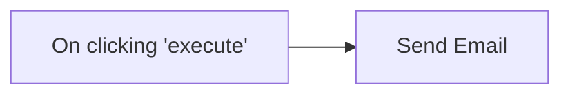

## Fluxo (.json) :

```json
{
  "nodes": [
    {
      "name": "On clicking 'execute'",
      "type": "n8n-nodes-base.manualTrigger",
      "position": [
        250,
        300
      ],
      "parameters": {},
      "typeVersion": 1
    },
    {
      "name": "Send Email",
      "type": "n8n-nodes-base.emailSend",
      "position": [
        450,
        300
      ],
      "parameters": {
        "text": "This is a message to demonstrate the n8n Send Email workflow!",
        "options": {
          "allowUnauthorizedCerts": false
        },
        "subject": "n8n rocks!",
        "toEmail": "user@example.com",
        "fromEmail": "user@from.email"
      },
      "credentials": {
        "smtp": "your@smtp_creds.here"
      },
      "typeVersion": 1
    }
  ],
  "connections": {
    "On clicking 'execute'": {
      "main": [
        [
          {
            "node": "Send Email",
            "type": "main",
            "index": 0
          }
        ]
      ]
    }
  }
}
```

<a id="template-1966"></a>

## Template 1966 - Extrair e enviar IPs de sign-in (últimas 24h)

- **Nome:** Extrair e enviar IPs de sign-in (últimas 24h)
- **Descrição:** Recebe uma solicitação com nome, e-mail e chave API, consulta eventos de autenticação das últimas 24 horas, processa e deduplica os IPs coletados, gera um CSV e envia por e-mail ao solicitante.
- **Funcionalidade:** • Receber solicitação via formulário: coleta nome, e-mail e chave API do solicitante para iniciar o processo.
• Definir intervalo de tempo: calcula o timestamp correspondente às últimas 24 horas para as consultas.
• Consultar eventos de autenticação: solicita eventos de diferentes tipos (login bem-sucedido, OAuth concedido e login do Office365 shell) usando a API fornecida.
• Agregar eventos: combina os resultados das várias consultas em um único conjunto de dados.
• Filtrar informações relevantes: extrai campos como nome do cliente, nome do usuário, IP e localização (cidade, região, país).
• Remover duplicados: elimina entradas com o mesmo IP para evitar redundância.
• Gerar e codificar CSV: converte os dados filtrados para CSV e codifica o arquivo em base64 para anexação.
• Enviar e-mail com anexo: envia o CSV resultante para o e-mail informado, notificando o solicitante sobre a conclusão.
- **Ferramentas:** • SaaS Alerts API (reportApi): API que fornece relatórios de eventos de autenticação por tipo e período, usada para recuperar os eventos das últimas 24 horas.
• SMTP2Go: serviço de envio de e-mail utilizado para enviar o CSV resultante como anexo ao solicitante.

## Fluxo visual

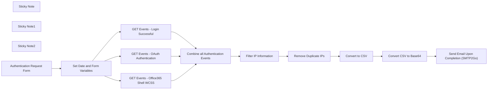

## Fluxo (.json) :

```json
{
  "id": "fGq0vUaD6JoqAbDa",
  "meta": {
    "instanceId": "e22925d3ea42bbdc2dfe92a253c7671a357e393fc99ccbe9178245197b7f4017"
  },
  "name": "Query List of Sign-in IPs",
  "tags": [],
  "nodes": [
    {
      "id": "9d54681d-7f8b-4996-b734-96626c9134dc",
      "name": "GET Events - Login Successful",
      "type": "n8n-nodes-base.httpRequest",
      "onError": "continueRegularOutput",
      "position": [
        -20,
        180
      ],
      "parameters": {
        "url": "=https://us-central1-the-byway-248217.cloudfunctions.net/reportApi/api/v1/reports/events?eventType=login.success&start={{ $json['Last 24 Hours'] }}&timeSort=asc&size=10000&scroll=5s",
        "options": {},
        "sendHeaders": true,
        "headerParameters": {
          "parameters": [
            {
              "name": "api_key",
              "value": "={{ $json.API }}"
            }
          ]
        }
      },
      "typeVersion": 4.2
    },
    {
      "id": "d789cb1c-0e8f-4389-85da-4a9b02d438d5",
      "name": "Sticky Note",
      "type": "n8n-nodes-base.stickyNote",
      "position": [
        -280,
        -220
      ],
      "parameters": {
        "color": 4,
        "width": 480,
        "height": 620,
        "content": "## Query the SaaS Alerts API\n**SaaS Alerts API Reference Guide** [Link](https://app.swaggerhub.com/apis/SaaS_Alerts/functions)"
      },
      "typeVersion": 1
    },
    {
      "id": "67628c17-6520-45e9-b3af-a066b7759481",
      "name": "Sticky Note1",
      "type": "n8n-nodes-base.stickyNote",
      "position": [
        240,
        -140
      ],
      "parameters": {
        "color": 5,
        "width": 680,
        "height": 540,
        "content": "## Data Processing and Deduplication"
      },
      "typeVersion": 1
    },
    {
      "id": "6a64676a-b9f7-4e16-aa5a-cc554902376b",
      "name": "Sticky Note2",
      "type": "n8n-nodes-base.stickyNote",
      "position": [
        940,
        80
      ],
      "parameters": {
        "width": 340,
        "height": 340,
        "content": "## SMTP2Go API\nAPI Documentation [Link](https://developers.smtp2go.com/docs/send-an-email)"
      },
      "typeVersion": 1
    },
    {
      "id": "afefbd9f-5442-478f-b3da-3baaf7803245",
      "name": "Send Email Upon Completion (SMTP2Go)",
      "type": "n8n-nodes-base.httpRequest",
      "position": [
        1040,
        240
      ],
      "parameters": {
        "url": "https://api.smtp2go.com/v3/email/send",
        "method": "POST",
        "options": {},
        "jsonBody": "={\n  \"sender\": \"support@managedsaasalerts.com\",\n  \"to\": [\n    \"{{ $('Set Date and Form Variables').first().json.Email }}\"\n  ],\n  \"attachments\": [\n    {\n      \"filename\": \"testfile.csv\",\n      \"fileblob\": \"{{ $json.data }}\",\n      \"mimetype\": \"application/csv\"\n    }\n  ],\n  \"subject\": \"Workflow Complete\",\n  \"text_body\": \"{{ $('Set Date and Form Variables').first().json.Name }}, attached is your IP information.\\n\\n\\n\\n\"\n}\n",
        "sendBody": true,
        "sendHeaders": true,
        "specifyBody": "json",
        "authentication": "genericCredentialType",
        "genericAuthType": "httpHeaderAuth",
        "headerParameters": {
          "parameters": [
            {
              "name": "Content-Type",
              "value": "application/json"
            },
            {
              "name": "accept",
              "value": "application/json"
            }
          ]
        }
      },
      "credentials": {
        "httpHeaderAuth": {
          "id": "v8R6pwWX9krYGBnw",
          "name": "SMTP2Go"
        }
      },
      "executeOnce": true,
      "typeVersion": 4.2
    },
    {
      "id": "04997dff-1f22-46b2-9c1c-2b6575ca7606",
      "name": "Remove Duplicate IPs",
      "type": "n8n-nodes-base.removeDuplicates",
      "onError": "continueRegularOutput",
      "position": [
        720,
        20
      ],
      "parameters": {
        "compare": "selectedFields",
        "options": {},
        "fieldsToCompare": "ip"
      },
      "typeVersion": 2,
      "alwaysOutputData": true
    },
    {
      "id": "bb73047a-3f43-4cf5-bc6e-706f0c76f83c",
      "name": "Convert CSV to Base64",
      "type": "n8n-nodes-base.moveBinaryData",
      "position": [
        640,
        240
      ],
      "parameters": {
        "options": {
          "encoding": "base64"
        },
        "setAllData": false
      },
      "typeVersion": 1
    },
    {
      "id": "6172642a-ec22-4fb3-9141-34afd7c7785e",
      "name": "Convert to CSV",
      "type": "n8n-nodes-base.convertToFile",
      "position": [
        400,
        240
      ],
      "parameters": {
        "options": {
          "headerRow": true
        }
      },
      "typeVersion": 1.1
    },
    {
      "id": "c748b13f-76c9-4552-83b9-53de9a0aa1e1",
      "name": "Filter IP Information",
      "type": "n8n-nodes-base.set",
      "position": [
        500,
        20
      ],
      "parameters": {
        "include": "selected",
        "options": {},
        "assignments": {
          "assignments": []
        },
        "includeFields": "customer.name, user.fullName,  ip, location.city, location.region, location.country, ",
        "includeOtherFields": true
      },
      "typeVersion": 3.4
    },
    {
      "id": "23da49b8-b3c9-421a-a6e1-750762130314",
      "name": "Combine all Authentication Events",
      "type": "n8n-nodes-base.merge",
      "position": [
        300,
        20
      ],
      "parameters": {
        "numberInputs": 3
      },
      "typeVersion": 3
    },
    {
      "id": "cdb534b1-4f72-4466-8661-b4c72a60f69e",
      "name": "GET Events - OAuth Authentication",
      "type": "n8n-nodes-base.httpRequest",
      "onError": "continueRegularOutput",
      "position": [
        -20,
        20
      ],
      "parameters": {
        "url": "=https://us-central1-the-byway-248217.cloudfunctions.net/reportApi/api/v1/reports/events?eventType=oauth.granted.permission&start={{ $json['Last 24 Hours'] }}&timeSort=asc&size=10000&scroll=5s",
        "options": {},
        "sendHeaders": true,
        "headerParameters": {
          "parameters": [
            {
              "name": "api_key",
              "value": "={{ $json.API }}"
            }
          ]
        }
      },
      "typeVersion": 4.2
    },
    {
      "id": "26ae2f0a-0349-4168-b6eb-48f94eb75348",
      "name": "GET Events - Office365 Shell WCSS",
      "type": "n8n-nodes-base.httpRequest",
      "onError": "continueRegularOutput",
      "position": [
        -20,
        -140
      ],
      "parameters": {
        "url": "=https://us-central1-the-byway-248217.cloudfunctions.net/reportApi/api/v1/reports/events?eventType=ms.shell.login.success\n&start={{ $json['Last 24 Hours'] }}&timeSort=asc&size=10000&scroll=5s",
        "options": {},
        "sendHeaders": true,
        "headerParameters": {
          "parameters": [
            {
              "name": "api_key",
              "value": "={{ $json.API }}"
            }
          ]
        }
      },
      "typeVersion": 4.2
    },
    {
      "id": "aae345d7-3250-4f4e-a464-164f830e8ecf",
      "name": "Set Date and Form Variables",
      "type": "n8n-nodes-base.set",
      "position": [
        -240,
        20
      ],
      "parameters": {
        "options": {},
        "assignments": {
          "assignments": [
            {
              "id": "a81fab55-cc84-4e34-96ea-66e3f13304d5",
              "name": "Last 24 Hours",
              "type": "string",
              "value": "={{ new Date(Date.now() - 24 * 60 * 60 * 1000).toISOString() }}\n"
            },
            {
              "id": "a6da98ec-6da1-422d-a6dc-3a1d4417c285",
              "name": "API",
              "type": "string",
              "value": "={{ $json['What is your API key?'] }}"
            },
            {
              "id": "35cb5896-f667-4727-843e-ad2fb3446422",
              "name": "Name",
              "type": "string",
              "value": "={{ $json['What is your name?'] }}"
            },
            {
              "id": "f630dcbb-1b15-49b4-a287-f940e1eddae8",
              "name": "Email",
              "type": "string",
              "value": "={{ $json['What is your e-mail?'] }}"
            }
          ]
        }
      },
      "typeVersion": 3.4
    },
    {
      "id": "c8afb2af-4adf-4f90-afdd-31929b5d851d",
      "name": "Authentication Request Form",
      "type": "n8n-nodes-base.formTrigger",
      "position": [
        -540,
        20
      ],
      "webhookId": "63923cfa-a41e-4649-922f-b83e527e8d6b",
      "parameters": {
        "options": {
          "buttonLabel": "Process"
        },
        "formTitle": "Request Sign-In CSV",
        "formFields": {
          "values": [
            {
              "fieldLabel": "What is your name?",
              "requiredField": true
            },
            {
              "fieldType": "email",
              "fieldLabel": "What is your e-mail?",
              "requiredField": true
            },
            {
              "fieldLabel": "What is your API key?",
              "requiredField": true
            }
          ]
        },
        "formDescription": "This will email you a list of all Organizations, \nAccounts, IPs and Locations.\n\nThis information is for the last 24 hours.\n\nPlease be patient, this can take some time.  \n\nYour list will be provided without duplicates."
      },
      "typeVersion": 2.2
    }
  ],
  "active": false,
  "pinData": {},
  "settings": {
    "executionOrder": "v1"
  },
  "versionId": "a2cace5e-a6da-4953-901e-7f762c96ea77",
  "connections": {
    "Convert to CSV": {
      "main": [
        [
          {
            "node": "Convert CSV to Base64",
            "type": "main",
            "index": 0
          }
        ]
      ]
    },
    "Remove Duplicate IPs": {
      "main": [
        [
          {
            "node": "Convert to CSV",
            "type": "main",
            "index": 0
          }
        ]
      ]
    },
    "Convert CSV to Base64": {
      "main": [
        [
          {
            "node": "Send Email Upon Completion (SMTP2Go)",
            "type": "main",
            "index": 0
          }
        ]
      ]
    },
    "Filter IP Information": {
      "main": [
        [
          {
            "node": "Remove Duplicate IPs",
            "type": "main",
            "index": 0
          }
        ]
      ]
    },
    "Authentication Request Form": {
      "main": [
        [
          {
            "node": "Set Date and Form Variables",
            "type": "main",
            "index": 0
          }
        ]
      ]
    },
    "Set Date and Form Variables": {
      "main": [
        [
          {
            "node": "GET Events - Login Successful",
            "type": "main",
            "index": 0
          },
          {
            "node": "GET Events - OAuth Authentication",
            "type": "main",
            "index": 0
          },
          {
            "node": "GET Events - Office365 Shell WCSS",
            "type": "main",
            "index": 0
          }
        ]
      ]
    },
    "GET Events - Login Successful": {
      "main": [
        [
          {
            "node": "Combine all Authentication Events",
            "type": "main",
            "index": 2
          }
        ]
      ]
    },
    "Combine all Authentication Events": {
      "main": [
        [
          {
            "node": "Filter IP Information",
            "type": "main",
            "index": 0
          }
        ]
      ]
    },
    "GET Events - OAuth Authentication": {
      "main": [
        [
          {
            "node": "Combine all Authentication Events",
            "type": "main",
            "index": 1
          }
        ]
      ]
    },
    "GET Events - Office365 Shell WCSS": {
      "main": [
        [
          {
            "node": "Combine all Authentication Events",
            "type": "main",
            "index": 0
          }
        ]
      ]
    },
    "Send Email Upon Completion (SMTP2Go)": {
      "main": [
        []
      ]
    }
  }
}
```

<a id="template-1968"></a>

## Template 1968 - Enriquecimento MITRE para tickets e análise SIEM

- **Nome:** Enriquecimento MITRE para tickets e análise SIEM
- **Descrição:** Fluxo que importa dados MITRE, gera embeddings e popula um vector store, usa modelos de linguagem para correlacionar alertas SIEM com técnicas MITRE e atualiza tickets com identificação de TTPs e passos de remediação.
- **Funcionalidade:** • Importação de dados MITRE: Baixa um arquivo JSON com informações limpas do MITRE ATT&CK para uso como base de conhecimento.
• Extração e segmentação de documentos: Divide e carrega descrições e metadados para preparação de embeddings.
• Geração de embeddings: Cria representações vetoriais dos itens MITRE para indexação e busca semântica.
• Inserção no vector store: Insere os vetores e metadados em uma coleção dedicada para consultas futuras.
• Consulta semântica ao vector store: Recupera entradas MITRE relevantes para um texto de entrada (ex.: descrição de alerta SIEM) e expõe como ferramenta para o agente AI.
• Agente de IA para análise de alertas: Usa um modelo de linguagem para extrair TTPs, atribuir táticas e técnicas (com IDs), sugerir remediações e apontar padrões históricos.
• Parser de saída estruturada: Força o agente a retornar um JSON estruturado contendo identificação de TTPs, passos de remediação, padrões históricos e recursos externos.
• Atualização automática de tickets: Percorre tickets existentes e atualiza notas internas e campos personalizados com a técnica MITRE identificada e um resumo de remediação.
• Loop e controle de fluxo: Processamento em lote de tickets com iteração automática e opção de avançar para o próximo ticket.
• Memória de contexto: Mantém contexto de conversas/consultas para enriquecer respostas do agente quando aplicável.
• Gatilhos e testes: Suporta acionamento por mensagens (chat) e execução manual para testes.
- **Ferramentas:** • Google Drive: Armazenamento e download do arquivo JSON contendo os dados limpos do MITRE ATT&CK.
• Qdrant: Banco de vetores usado como vector store para armazenar e recuperar embeddings das entradas MITRE.
• OpenAI: Serviço de modelos de linguagem e geração de embeddings utilizado para análise de alertas e criação de vetores semânticos.
• Zendesk: Sistema de tickets onde os dados de TTPs e recomendações são persistidos como notas internas e campos personalizados.
• SIEM (fonte de alertas): Origem dos dados de alerta que são analisados pelo agente para extração de TTPs e recomendações.

## Fluxo visual

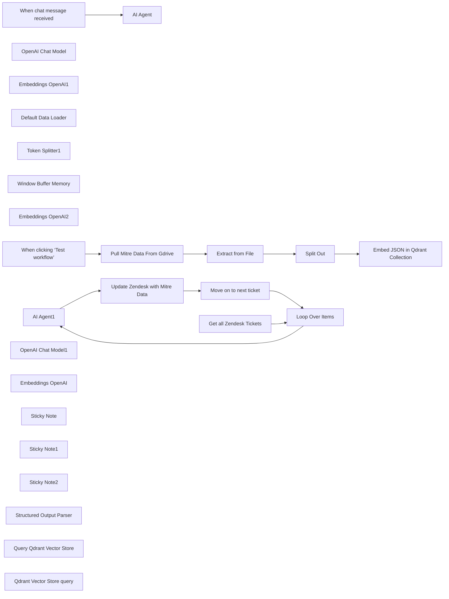

## Fluxo (.json) :

```json
{
  "meta": {
    "instanceId": "cb484ba7b742928a2048bf8829668bed5b5ad9787579adea888f05980292a4a7",
    "templateCredsSetupCompleted": true
  },
  "nodes": [
    {
      "id": "86ddd018-3d6b-46b9-aa93-dedd6c6b5076",
      "name": "When chat message received",
      "type": "@n8n/n8n-nodes-langchain.chatTrigger",
      "position": [
        -880,
        360
      ],
      "webhookId": "a9668bb8-bbe8-418a-b5c9-ff7dd431244f",
      "parameters": {
        "options": {}
      },
      "typeVersion": 1.1
    },
    {
      "id": "a5ba5090-8e3b-4408-82df-92d2c524039e",
      "name": "AI Agent",
      "type": "@n8n/n8n-nodes-langchain.agent",
      "position": [
        -680,
        360
      ],
      "parameters": {
        "options": {
          "systemMessage": "You are a cybersecurity expert trained on MITRE ATT&CK and enterprise incident response. Your job is to:\n1. Extract TTP information from SIEM data.\n2. Provide actionable remediation steps tailored to the alert.\n3. Cross-reference historical patterns and related alerts.\n4. Recommend external resources for deeper understanding.\n\nEnsure that:\n- TTPs are tagged with the tactic, technique name, and technique ID.\n- Remediation steps are specific and actionable.\n- Historical data includes related alerts and notable trends.\n- External links are relevant to the observed behavior.\n"
        }
      },
      "typeVersion": 1.7
    },
    {
      "id": "67c52944-b616-4ea6-9507-e9fb6fcdbe2b",
      "name": "OpenAI Chat Model",
      "type": "@n8n/n8n-nodes-langchain.lmChatOpenAi",
      "position": [
        -740,
        580
      ],
      "parameters": {
        "model": "gpt-4o",
        "options": {}
      },
      "credentials": {
        "openAiApi": {
          "id": "QpFZ2EiM3WGl6Zr3",
          "name": "Marketing OpenAI"
        }
      },
      "typeVersion": 1
    },
    {
      "id": "55f6c16a-51ed-45e4-a1ab-aaaf1d7b5733",
      "name": "Split Out",
      "type": "n8n-nodes-base.splitOut",
      "position": [
        -720,
        1220
      ],
      "parameters": {
        "options": {},
        "fieldToSplitOut": "data"
      },
      "typeVersion": 1
    },
    {
      "id": "46a5b8c6-3d34-4e9b-b812-23135f28c278",
      "name": "Embeddings OpenAI1",
      "type": "@n8n/n8n-nodes-langchain.embeddingsOpenAi",
      "position": [
        -580,
        1420
      ],
      "parameters": {
        "options": {}
      },
      "credentials": {
        "openAiApi": {
          "id": "QpFZ2EiM3WGl6Zr3",
          "name": "Marketing OpenAI"
        }
      },
      "typeVersion": 1.2
    },
    {
      "id": "561b0737-26d5-450d-bd9e-08e0a608d6f9",
      "name": "Default Data Loader",
      "type": "@n8n/n8n-nodes-langchain.documentDefaultDataLoader",
      "position": [
        -460,
        1440
      ],
      "parameters": {
        "options": {
          "metadata": {
            "metadataValues": [
              {
                "name": "id",
                "value": "={{ $json.id }}"
              },
              {
                "name": "name",
                "value": "={{ $json.name }}"
              },
              {
                "name": "killchain",
                "value": "={{ $json.kill_chain_phases }}"
              },
              {
                "name": "external",
                "value": "={{ $json.external_references }}"
              }
            ]
          }
        },
        "jsonData": "={{ $json.description }}",
        "jsonMode": "expressionData"
      },
      "typeVersion": 1
    },
    {
      "id": "6e8a4aed-7e8c-492a-b816-6ab1a98c312a",
      "name": "Token Splitter1",
      "type": "@n8n/n8n-nodes-langchain.textSplitterTokenSplitter",
      "position": [
        -460,
        1620
      ],
      "parameters": {},
      "typeVersion": 1
    },
    {
      "id": "0c54049e-b5e8-448f-b864-39aeb274de3e",
      "name": "Window Buffer Memory",
      "type": "@n8n/n8n-nodes-langchain.memoryBufferWindow",
      "position": [
        -580,
        580
      ],
      "parameters": {},
      "typeVersion": 1.3
    },
    {
      "id": "96b776a0-10da-4f70-99d0-ad6b6ee8fcca",
      "name": "Embeddings OpenAI2",
      "type": "@n8n/n8n-nodes-langchain.embeddingsOpenAi",
      "position": [
        -460,
        720
      ],
      "parameters": {
        "model": "text-embedding-3-large",
        "options": {
          "dimensions": 1536
        }
      },
      "credentials": {
        "openAiApi": {
          "id": "QpFZ2EiM3WGl6Zr3",
          "name": "Marketing OpenAI"
        }
      },
      "typeVersion": 1.2
    },
    {
      "id": "695fba89-8f42-47c3-9d86-73f4ea0e72df",
      "name": "Extract from File",
      "type": "n8n-nodes-base.extractFromFile",
      "position": [
        -920,
        1220
      ],
      "parameters": {
        "options": {},
        "operation": "fromJson"
      },
      "typeVersion": 1
    },
    {
      "id": "0b9897b0-149b-43ce-b66c-e78552729aa5",
      "name": "When clicking ‘Test workflow’",
      "type": "n8n-nodes-base.manualTrigger",
      "position": [
        -1360,
        1220
      ],
      "parameters": {},
      "typeVersion": 1
    },
    {
      "id": "d8c29a14-0389-4748-a9de-686bf9a682c5",
      "name": "AI Agent1",
      "type": "@n8n/n8n-nodes-langchain.agent",
      "position": [
        -540,
        -440
      ],
      "parameters": {
        "text": "=Siem Alert Data:\nAlert: {{ $json.raw_subject }}\nDescription: {{ $json.description }}",
        "options": {
          "systemMessage": "You are a cybersecurity expert trained on MITRE ATT&CK and enterprise incident response. Your job is to:\n1. Extract TTP information from SIEM data.\n2. Provide actionable remediation steps tailored to the alert.\n3. Cross-reference historical patterns and related alerts.\n4. Recommend external resources for deeper understanding.\n\nEnsure that:\n- TTPs are tagged with the tactic, technique name, and technique ID.\n- Remediation steps are specific and actionable.\n- Historical data includes related alerts and notable trends.\n- External links are relevant to the observed behavior.\n\nPlease output your response in html format, but do not include ```html at the beginning \n"
        },
        "promptType": "define",
        "hasOutputParser": true
      },
      "typeVersion": 1.7
    },
    {
      "id": "55d0b00a-5046-45fa-87cb-cb0257caae87",
      "name": "OpenAI Chat Model1",
      "type": "@n8n/n8n-nodes-langchain.lmChatOpenAi",
      "position": [
        -600,
        -220
      ],
      "parameters": {
        "model": "gpt-4o",
        "options": {}
      },
      "credentials": {
        "openAiApi": {
          "id": "QpFZ2EiM3WGl6Zr3",
          "name": "Marketing OpenAI"
        }
      },
      "typeVersion": 1
    },
    {
      "id": "9b53566b-e021-403d-9d78-28504c5c1dfa",
      "name": "Embeddings OpenAI",
      "type": "@n8n/n8n-nodes-langchain.embeddingsOpenAi",
      "position": [
        -320,
        -40
      ],
      "parameters": {
        "model": "text-embedding-3-large",
        "options": {
          "dimensions": 1536
        }
      },
      "credentials": {
        "openAiApi": {
          "id": "QpFZ2EiM3WGl6Zr3",
          "name": "Marketing OpenAI"
        }
      },
      "typeVersion": 1.2
    },
    {
      "id": "f3b44ef5-e928-4662-81ef-4dd044829607",
      "name": "Loop Over Items",
      "type": "n8n-nodes-base.splitInBatches",
      "position": [
        -940,
        -440
      ],
      "parameters": {
        "options": {}
      },
      "typeVersion": 3
    },
    {
      "id": "cc572b71-65c9-460c-bdcd-1d20feb15b32",
      "name": "Sticky Note",
      "type": "n8n-nodes-base.stickyNote",
      "position": [
        -1460,
        940
      ],
      "parameters": {
        "color": 7,
        "width": 1380,
        "height": 820,
        "content": "\n## Embed your Vector Store\nTo provide data for your Vector store, you need to pass it in as JSON, and ensure it's setup correctly. This flow pulls the JSON file from Google Drive and extracts the JSON data and then passes it into the qdrant collection. "
      },
      "typeVersion": 1
    },
    {
      "id": "d5052d52-bec2-4b70-b460-6d5789c28d2c",
      "name": "Sticky Note1",
      "type": "n8n-nodes-base.stickyNote",
      "position": [
        -1460,
        220
      ],
      "parameters": {
        "color": 7,
        "width": 1380,
        "height": 680,
        "content": "\n## Talk to your Vector Store\nNow that your vector store has been updated with the embedded data, \nyou can use the n8n chat interface to talk to your data using OpenAI, \nOllama, or any of our supported LLMs."
      },
      "typeVersion": 1
    },
    {
      "id": "5cb478f6-17f3-4d7a-9b66-9e0654bd1dc9",
      "name": "Sticky Note2",
      "type": "n8n-nodes-base.stickyNote",
      "position": [
        -1460,
        -700
      ],
      "parameters": {
        "color": 7,
        "width": 2140,
        "height": 900,
        "content": "\n## Deploy your Vector Store\nThis flow adds contextual information to your tickets using the Mitre Attack framework to help contextualize the ticket data."
      },
      "typeVersion": 1
    },
    {
      "id": "71ee28f5-84a2-4c6c-855a-6c7c09b2d62a",
      "name": "Structured Output Parser",
      "type": "@n8n/n8n-nodes-langchain.outputParserStructured",
      "position": [
        0,
        -160
      ],
      "parameters": {
        "jsonSchemaExample": "{\n  \"ttp_identification\": {\n    \"alert_summary\": \"The alert indicates a check-in from the NetSupport RAT, a known Remote Access Trojan, suggesting command and control (C2) communication.\",\n    \"mitre_attack_ttps\": [\n      {\n        \"tactic\": \"Command and Control\",\n        \"technique\": \"Protocol or Service Impersonation\",\n        \"technique_id\": \"T1001.003\",\n        \"description\": \"The RAT's check-in over port 443 implies potential masquerading of its traffic as legitimate SSL/TLS traffic, a tactic often used to blend C2 communications with normal web traffic.\",\n        \"reference\": \"https://attack.mitre.org/techniques/T1001/003/\"\n      }\n    ]\n  },\n  \"remediation_steps\": {\n    \"network_segmentation\": {\n      \"action\": \"Isolate the affected host\",\n      \"target\": \"10.11.26.183\",\n      \"reason\": \"Prevents further C2 communication or lateral movement.\"\n    },\n    \"endpoint_inspection\": {\n      \"action\": \"Perform a thorough inspection\",\n      \"target\": \"Impacted endpoint\",\n      \"method\": \"Use endpoint detection and response (EDR) tools to check for additional persistence mechanisms.\"\n    },\n    \"network_traffic_analysis\": {\n      \"action\": \"Investigate and block unusual traffic\",\n      \"target\": \"IP 194.180.191.64\",\n      \"method\": \"Implement blocks for the IP across the firewall or IDS/IPS systems.\"\n    },\n    \"system_patching\": {\n      \"action\": \"Ensure all systems are updated\",\n      \"method\": \"Apply the latest security patches to mitigate vulnerabilities exploited by RAT malware.\"\n    },\n    \"ioc_hunting\": {\n      \"action\": \"Search for Indicators of Compromise (IoCs)\",\n      \"method\": \"Check for NetSupport RAT IoCs across other endpoints within the network.\"\n    }\n  },\n  \"historical_patterns\": {\n    \"network_anomalies\": \"Past alerts involving similar attempts to use standard web ports (e.g., 80, 443) for non-standard applications could suggest a broader attempt to blend malicious traffic into legitimate streams.\",\n    \"persistence_tactics\": \"Any detection of anomalies in task scheduling or shortcut modifications may indicate persistence methods similar to those used by RATs.\"\n  },\n  \"external_resources\": [\n    {\n      \"title\": \"ESET Report on Okrum and Ketrican\",\n      \"description\": \"Discusses similar tactics involving protocol impersonation and C2.\",\n      \"url\": \"https://www.eset.com/int/about/newsroom/research/okrum-ketrican/\"\n    },\n    {\n      \"title\": \"Malleable C2 Profiles\",\n      \"description\": \"Document on crafting custom C2 traffic profiles similar to the targeting methods used by NetSupport RAT.\",\n      \"url\": \"https://www.cobaltstrike.com/help-malleable-c2\"\n    },\n    {\n      \"title\": \"MITRE ATT&CK Technique Overview\",\n      \"description\": \"Overview of Protocol or Service Impersonation tactics.\",\n      \"url\": \"https://attack.mitre.org/techniques/T1001/003/\"\n    }\n  ]\n}\n"
      },
      "typeVersion": 1.2
    },
    {
      "id": "3aeb973d-22e5-4eaf-8fe8-fae3447909e1",
      "name": "Pull Mitre Data From Gdrive",
      "type": "n8n-nodes-base.googleDrive",
      "position": [
        -1140,
        1220
      ],
      "parameters": {
        "fileId": {
          "__rl": true,
          "mode": "list",
          "value": "1oWBLO5AlIqbgo9mKD1hNtx92HdC6O28d",
          "cachedResultUrl": "https://drive.google.com/file/d/1oWBLO5AlIqbgo9mKD1hNtx92HdC6O28d/view?usp=drivesdk",
          "cachedResultName": "cleaned_mitre_attack_data.json"
        },
        "options": {},
        "operation": "download"
      },
      "credentials": {
        "googleDriveOAuth2Api": {
          "id": "AVa7MXBLiB9NYjuO",
          "name": "Angel Gdrive"
        }
      },
      "typeVersion": 3
    },
    {
      "id": "3b35633c-de80-4062-8497-cb65092d5708",
      "name": "Embed JSON in Qdrant Collection",
      "type": "@n8n/n8n-nodes-langchain.vectorStoreQdrant",
      "position": [
        -520,
        1220
      ],
      "parameters": {
        "mode": "insert",
        "options": {},
        "qdrantCollection": {
          "__rl": true,
          "mode": "id",
          "value": "mitre"
        }
      },
      "credentials": {
        "qdrantApi": {
          "id": "u0qre50aar6iqyxu",
          "name": "Angel MitreAttack Demo Cluster"
        }
      },
      "typeVersion": 1
    },
    {
      "id": "5f7f2fd8-276f-4b3a-ae88-1f1765967883",
      "name": "Query Qdrant Vector Store",
      "type": "@n8n/n8n-nodes-langchain.vectorStoreQdrant",
      "position": [
        -480,
        580
      ],
      "parameters": {
        "mode": "retrieve-as-tool",
        "options": {},
        "toolName": "mitre_attack_vector_store",
        "toolDescription": "The mitre_attack_vector_store is a knowledge base trained on the MITRE ATT&CK framework. It is designed to help identify, correlate, and provide context for cybersecurity incidents based on textual descriptions of alerts, events, or behaviors. This tool leverages precomputed embeddings of attack techniques, tactics, and procedures (TTPs) to map user queries (such as SIEM-generated alerts or JIRA ticket titles) to relevant MITRE ATT&CK techniques.\n\nBy analyzing input text, the vector store can:\n\nRetrieve the most relevant MITRE ATT&CK entries (e.g., techniques, tactics, descriptions, external references).\nProvide structured context about potential adversary behaviors.\nSuggest remediation actions or detection methods based on the input.",
        "qdrantCollection": {
          "__rl": true,
          "mode": "list",
          "value": "mitre",
          "cachedResultName": "mitre"
        }
      },
      "credentials": {
        "qdrantApi": {
          "id": "u0qre50aar6iqyxu",
          "name": "Angel MitreAttack Demo Cluster"
        }
      },
      "typeVersion": 1
    },
    {
      "id": "298ffc29-1d60-4c05-92c6-a61071629a3f",
      "name": "Qdrant Vector Store query",
      "type": "@n8n/n8n-nodes-langchain.vectorStoreQdrant",
      "position": [
        -320,
        -200
      ],
      "parameters": {
        "mode": "retrieve-as-tool",
        "options": {},
        "toolName": "mitre_attack_vector_store",
        "toolDescription": "The mitre_attack_vector_store is a knowledge base trained on the MITRE ATT&CK framework. It is designed to help identify, correlate, and provide context for cybersecurity incidents based on textual descriptions of alerts, events, or behaviors. This tool leverages precomputed embeddings of attack techniques, tactics, and procedures (TTPs) to map user queries (such as SIEM-generated alerts or JIRA ticket titles) to relevant MITRE ATT&CK techniques.\n\nBy analyzing input text, the vector store can:\n\nRetrieve the most relevant MITRE ATT&CK entries (e.g., techniques, tactics, descriptions, external references).\nProvide structured context about potential adversary behaviors.\nSuggest remediation actions or detection methods based on the input.",
        "qdrantCollection": {
          "__rl": true,
          "mode": "list",
          "value": "mitre",
          "cachedResultName": "mitre"
        }
      },
      "credentials": {
        "qdrantApi": {
          "id": "u0qre50aar6iqyxu",
          "name": "Angel MitreAttack Demo Cluster"
        }
      },
      "typeVersion": 1
    },
    {
      "id": "c47f0ae6-106d-46da-afc3-f7afb86923ff",
      "name": "Get all Zendesk Tickets",
      "type": "n8n-nodes-base.zendesk",
      "position": [
        -1180,
        -440
      ],
      "parameters": {
        "options": {},
        "operation": "getAll"
      },
      "credentials": {
        "zendeskApi": {
          "id": "ROx0ipJapRomRxEX",
          "name": "Zendesk Demo Access"
        }
      },
      "typeVersion": 1
    },
    {
      "id": "0ec2c505-5721-41af-91c8-1b0b55826d9e",
      "name": "Update Zendesk with Mitre Data",
      "type": "n8n-nodes-base.zendesk",
      "position": [
        0,
        -360
      ],
      "parameters": {
        "id": "={{ $('Loop Over Items').item.json.id }}",
        "operation": "update",
        "updateFields": {
          "internalNote": "=Summary: {{ $json.output.ttp_identification.alert_summary }}\n\n",
          "customFieldsUi": {
            "customFieldsValues": [
              {
                "id": 34479547176212,
                "value": "={{ $json.output.ttp_identification.mitre_attack_ttps[0].technique_id }}"
              },
              {
                "id": 34479570659732,
                "value": "={{ $json.output.ttp_identification.mitre_attack_ttps[0].tactic }}"
              }
            ]
          }
        }
      },
      "credentials": {
        "zendeskApi": {
          "id": "ROx0ipJapRomRxEX",
          "name": "Zendesk Demo Access"
        }
      },
      "typeVersion": 1
    },
    {
      "id": "6a74a6d4-610a-4a13-afe4-7bb03d83d4c8",
      "name": "Move on to next ticket",
      "type": "n8n-nodes-base.noOp",
      "position": [
        360,
        -80
      ],
      "parameters": {},
      "typeVersion": 1
    }
  ],
  "pinData": {},
  "connections": {
    "AI Agent": {
      "main": [
        []
      ]
    },
    "AI Agent1": {
      "main": [
        [
          {
            "node": "Update Zendesk with Mitre Data",
            "type": "main",
            "index": 0
          }
        ]
      ]
    },
    "Split Out": {
      "main": [
        [
          {
            "node": "Embed JSON in Qdrant Collection",
            "type": "main",
            "index": 0
          }
        ]
      ]
    },
    "Loop Over Items": {
      "main": [
        [],
        [
          {
            "node": "AI Agent1",
            "type": "main",
            "index": 0
          }
        ]
      ]
    },
    "Token Splitter1": {
      "ai_textSplitter": [
        [
          {
            "node": "Default Data Loader",
            "type": "ai_textSplitter",
            "index": 0
          }
        ]
      ]
    },
    "Embeddings OpenAI": {
      "ai_embedding": [
        [
          {
            "node": "Qdrant Vector Store query",
            "type": "ai_embedding",
            "index": 0
          }
        ]
      ]
    },
    "Extract from File": {
      "main": [
        [
          {
            "node": "Split Out",
            "type": "main",
            "index": 0
          }
        ]
      ]
    },
    "OpenAI Chat Model": {
      "ai_languageModel": [
        [
          {
            "node": "AI Agent",
            "type": "ai_languageModel",
            "index": 0
          }
        ]
      ]
    },
    "Embeddings OpenAI1": {
      "ai_embedding": [
        [
          {
            "node": "Embed JSON in Qdrant Collection",
            "type": "ai_embedding",
            "index": 0
          }
        ]
      ]
    },
    "Embeddings OpenAI2": {
      "ai_embedding": [
        [
          {
            "node": "Query Qdrant Vector Store",
            "type": "ai_embedding",
            "index": 0
          }
        ]
      ]
    },
    "OpenAI Chat Model1": {
      "ai_languageModel": [
        [
          {
            "node": "AI Agent1",
            "type": "ai_languageModel",
            "index": 0
          }
        ]
      ]
    },
    "Default Data Loader": {
      "ai_document": [
        [
          {
            "node": "Embed JSON in Qdrant Collection",
            "type": "ai_document",
            "index": 0
          }
        ]
      ]
    },
    "Window Buffer Memory": {
      "ai_memory": [
        [
          {
            "node": "AI Agent",
            "type": "ai_memory",
            "index": 0
          }
        ]
      ]
    },
    "Move on to next ticket": {
      "main": [
        [
          {
            "node": "Loop Over Items",
            "type": "main",
            "index": 0
          }
        ]
      ]
    },
    "Get all Zendesk Tickets": {
      "main": [
        [
          {
            "node": "Loop Over Items",
            "type": "main",
            "index": 0
          }
        ]
      ]
    },
    "Structured Output Parser": {
      "ai_outputParser": [
        [
          {
            "node": "AI Agent1",
            "type": "ai_outputParser",
            "index": 0
          }
        ]
      ]
    },
    "Qdrant Vector Store query": {
      "ai_tool": [
        [
          {
            "node": "AI Agent1",
            "type": "ai_tool",
            "index": 0
          }
        ]
      ]
    },
    "Query Qdrant Vector Store": {
      "ai_tool": [
        [
          {
            "node": "AI Agent",
            "type": "ai_tool",
            "index": 0
          }
        ]
      ]
    },
    "When chat message received": {
      "main": [
        [
          {
            "node": "AI Agent",
            "type": "main",
            "index": 0
          }
        ]
      ]
    },
    "Pull Mitre Data From Gdrive": {
      "main": [
        [
          {
            "node": "Extract from File",
            "type": "main",
            "index": 0
          }
        ]
      ]
    },
    "Update Zendesk with Mitre Data": {
      "main": [
        [
          {
            "node": "Move on to next ticket",
            "type": "main",
            "index": 0
          }
        ]
      ]
    },
    "When clicking ‘Test workflow’": {
      "main": [
        [
          {
            "node": "Pull Mitre Data From Gdrive",
            "type": "main",
            "index": 0
          }
        ]
      ]
    }
  }
}
```

<a id="template-1969"></a>

## Template 1969 - Leitura de PDF local ao executar manualmente

- **Nome:** Leitura de PDF local ao executar manualmente
- **Descrição:** Este fluxo inicia manualmente e lê um arquivo PDF armazenado localmente, extraindo seu conteúdo para uso posterior.
- **Funcionalidade:** • Gatilho manual: Permite iniciar o fluxo manualmente ao clicar em executar.
• Leitura de arquivo binário: Acessa o arquivo PDF no caminho especificado (/data/pdf.pdf) no sistema de arquivos.
• Extração de conteúdo do PDF: Processa o arquivo PDF lido e extrai seu texto/conteúdo para processamento posterior.
- **Ferramentas:** • Sistema de arquivos local: Armazena e fornece o arquivo PDF no caminho especificado.
• Biblioteca de leitura de PDF: Ferramenta responsável por interpretar o formato PDF e extrair o conteúdo textual.


## Fluxo visual

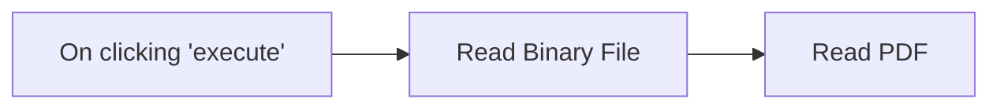

## Fluxo (.json) :

```json
{
  "nodes": [
    {
      "name": "On clicking 'execute'",
      "type": "n8n-nodes-base.manualTrigger",
      "position": [
        680,
        400
      ],
      "parameters": {},
      "typeVersion": 1
    },
    {
      "name": "Read Binary File",
      "type": "n8n-nodes-base.readBinaryFile",
      "position": [
        880,
        400
      ],
      "parameters": {
        "filePath": "/data/pdf.pdf"
      },
      "typeVersion": 1
    },
    {
      "name": "Read PDF",
      "type": "n8n-nodes-base.readPDF",
      "position": [
        1090,
        400
      ],
      "parameters": {},
      "typeVersion": 1
    }
  ],
  "connections": {
    "Read Binary File": {
      "main": [
        [
          {
            "node": "Read PDF",
            "type": "main",
            "index": 0
          }
        ]
      ]
    },
    "On clicking 'execute'": {
      "main": [
        [
          {
            "node": "Read Binary File",
            "type": "main",
            "index": 0
          }
        ]
      ]
    }
  }
}
```

<a id="template-1971"></a>

## Template 1971 - Análise de Transações com IA e Sheets

- **Nome:** Análise de Transações com IA e Sheets
- **Descrição:** Este fluxo permite conversar com um agente de IA que consulta e filtra transações em uma planilha do Google Sheets por data e status, agregando resultados para fornecer respostas completas ao usuário.
- **Funcionalidade:** • Detecção de mensagem de chat e resposta do agente com memória de contexto.
• Construção de respostas a partir de um modelo de linguagem alimentado por dados filtrados.
• Consulta de transações por data usando um sub-workflow dedicado e a planilha Google Sheets.
• Filtragem de transações por status e por produto através de ferramentas de dados.
• Transformação de dados: conversão de JSONP do Google Visualization para JSON utilizável pela automação.
• Agregação de resultados em um único item para retorno objetivo ao usuário.
• Uso de memória de curto prazo para manter o contexto da conversa.
• Orquestração de várias ferramentas pelo agente para fornecer respostas informadas.
- **Ferramentas:** • Google Sheets: Acesso aos dados de transações armazenados em uma planilha para consulta por data e status.
• OpenAI GPT-4o: Modelo de linguagem utilizado para interpretar consultas, gerar respostas e coordenar as ações do fluxo.


## Fluxo visual

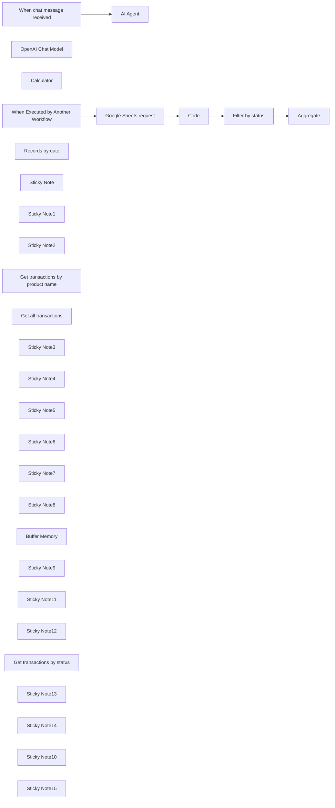

## Fluxo (.json) :

```json
{
  "meta": {
    "instanceId": "d6b502dfa4d9dd072cdc5c2bb763558661053f651289291352a84403e01b3d1b",
    "templateCredsSetupCompleted": true
  },
  "nodes": [
    {
      "id": "0951fd33-1811-4a89-b84f-f46dc9e6fde1",
      "name": "When chat message received",
      "type": "@n8n/n8n-nodes-langchain.chatTrigger",
      "position": [
        20,
        -340
      ],
      "webhookId": "cdc03fce-33b6-4eed-86b5-f628994e5e31",
      "parameters": {
        "options": {}
      },
      "typeVersion": 1.1
    },
    {
      "id": "699c2f89-5547-4d28-92a9-5e216aecb251",
      "name": "AI Agent",
      "type": "@n8n/n8n-nodes-langchain.agent",
      "position": [
        240,
        -340
      ],
      "parameters": {
        "options": {
          "maxIterations": 15,
          "systemMessage": "=You are a helpful assistant.\nCurrent timestamp is {{ $now }}"
        }
      },
      "typeVersion": 1.7
    },
    {
      "id": "640c29f7-b67e-49f6-a864-c9b396c446b7",
      "name": "OpenAI Chat Model",
      "type": "@n8n/n8n-nodes-langchain.lmChatOpenAi",
      "position": [
        160,
        -100
      ],
      "parameters": {
        "model": {
          "__rl": true,
          "mode": "list",
          "value": "gpt-4o",
          "cachedResultName": "gpt-4o"
        },
        "options": {
          "temperature": 0.2
        }
      },
      "credentials": {
        "openAiApi": {
          "id": "5LVOlVwHUgB8MAj2",
          "name": "OpenAI - n8n project"
        }
      },
      "typeVersion": 1.2
    },
    {
      "id": "807630b4-c138-4b66-a438-fb70eab12a07",
      "name": "Calculator",
      "type": "@n8n/n8n-nodes-langchain.toolCalculator",
      "position": [
        840,
        60
      ],
      "parameters": {},
      "typeVersion": 1
    },
    {
      "id": "132a97a3-239c-403f-843f-55b652e3efc5",
      "name": "Code",
      "type": "n8n-nodes-base.code",
      "position": [
        840,
        640
      ],
      "parameters": {
        "jsCode": "// Ensure there's at least one input item.\nif (!items || items.length === 0) {\n  throw new Error(\"No input items found.\");\n}\n\n// Our input is expected to have a 'data' property containing the JSONP string.\nconst input = items[0].json;\n\nif (!input.data) {\n  throw new Error(\"Input JSON does not have a 'data' property.\");\n}\n\nconst rawData = input.data;\n\n// Use a regex to extract the JSON content from the Google Visualization JSONP response.\nconst regex = /google\\.visualization\\.Query\\.setResponse\\((.*)\\);?$/s;\nconst match = rawData.match(regex);\n\nif (!match) {\n  throw new Error(\"Input data does not match the expected Google Visualization JSONP format.\");\n}\n\nconst jsonString = match[1];\n\n// Parse the extracted JSON string.\nlet parsed;\ntry {\n  parsed = JSON.parse(jsonString);\n} catch (error) {\n  throw new Error(\"Failed to parse JSON: \" + error.message);\n}\n\n// Verify that the parsed JSON has the expected 'table' structure with 'cols' and 'rows'.\nif (!parsed.table || !Array.isArray(parsed.table.cols) || !Array.isArray(parsed.table.rows)) {\n  throw new Error(\"Parsed JSON does not have the expected 'table' structure with 'cols' and 'rows'.\");\n}\n\nconst cols = parsed.table.cols;\nconst rows = parsed.table.rows;\n\n// Helper function to convert date string from \"Date(YYYY,M,D)\" to \"YYYY-MM-DD\"\nfunction formatDate(dateStr) {\n  const match = dateStr.match(/^Date\\((\\d+),(\\d+),(\\d+)\\)$/);\n  if (!match) return dateStr;\n  const year = parseInt(match[1], 10);\n  const month = parseInt(match[2], 10) + 1; // JavaScript months are 0-indexed\n  const day = parseInt(match[3], 10);\n  // Format with leading zeros\n  return `${year}-${String(month).padStart(2, '0')}-${String(day).padStart(2, '0')}`;\n}\n\n// Map each row into an object using the column labels as keys.\nconst newItems = rows.map(row => {\n  const obj = {};\n  cols.forEach((col, index) => {\n    let value = row.c && row.c[index] ? row.c[index].v : null;\n    // If the column type is \"date\" and the value is a string that looks like \"Date(YYYY,M,D)\"\n    if (col.type === \"date\" && typeof value === \"string\") {\n      value = formatDate(value);\n    }\n    obj[col.label] = value;\n  });\n  return { json: obj };\n});\n\n// Return the new array of items.\nreturn newItems;\n"
      },
      "typeVersion": 2
    },
    {
      "id": "3dc1e670-bfb1-4b63-b9c8-85656134c843",
      "name": "When Executed by Another Workflow",
      "type": "n8n-nodes-base.executeWorkflowTrigger",
      "position": [
        280,
        640
      ],
      "parameters": {
        "workflowInputs": {
          "values": [
            {
              "name": "start_date"
            },
            {
              "name": "end_date"
            },
            {
              "name": "status"
            }
          ]
        }
      },
      "typeVersion": 1.1
    },
    {
      "id": "52a26e43-12a5-4b4a-a224-d70cdabf6aaf",
      "name": "Records by date",
      "type": "@n8n/n8n-nodes-langchain.toolWorkflow",
      "position": [
        1020,
        -120
      ],
      "parameters": {
        "name": "records_by_date_and_or_status",
        "workflowId": {
          "__rl": true,
          "mode": "list",
          "value": "a2BIIjr2gLBay06M",
          "cachedResultName": "Template | Your first AI Data Analyst"
        },
        "description": "Use this tool to get records filtered by date. You can also filter by status at the same time, if you want.",
        "workflowInputs": {
          "value": {
            "status": "={{ $fromAI(\"status\", \"Status of the transaction. Can be Completed, Refund or Error. Leave empty if you don't need this now.\", \"string\") }}",
            "end_date": "={{ $fromAI(\"end_date\", \"End date in format YYYY-MM-DD\", \"string\") }}",
            "start_date": "={{ $fromAI(\"start_date\", \"Start date in format YYYY-MM-DD\", \"string\") }}"
          },
          "schema": [
            {
              "id": "start_date",
              "type": "string",
              "display": true,
              "required": false,
              "displayName": "start_date",
              "defaultMatch": false,
              "canBeUsedToMatch": true
            },
            {
              "id": "end_date",
              "type": "string",
              "display": true,
              "required": false,
              "displayName": "end_date",
              "defaultMatch": false,
              "canBeUsedToMatch": true
            },
            {
              "id": "status",
              "type": "string",
              "display": true,
              "removed": false,
              "required": false,
              "displayName": "status",
              "defaultMatch": false,
              "canBeUsedToMatch": true
            }
          ],
          "mappingMode": "defineBelow",
          "matchingColumns": [],
          "attemptToConvertTypes": false,
          "convertFieldsToString": false
        }
      },
      "typeVersion": 2
    },
    {
      "id": "e1811519-8699-4243-8c64-0db1ab26004d",
      "name": "Aggregate",
      "type": "n8n-nodes-base.aggregate",
      "position": [
        1280,
        640
      ],
      "parameters": {
        "options": {},
        "aggregate": "aggregateAllItemData"
      },
      "typeVersion": 1
    },
    {
      "id": "3b129abd-ac9a-460c-abb3-007e2c94e284",
      "name": "Sticky Note",
      "type": "n8n-nodes-base.stickyNote",
      "position": [
        1220,
        400
      ],
      "parameters": {
        "color": 7,
        "width": 220,
        "height": 400,
        "content": "To send all the items back to the AI, we need to finish with everything aggregated into one single item.\n\nOtherwise it will respond with one item at a time, and the AI will only get the first item that arrives."
      },
      "typeVersion": 1
    },
    {
      "id": "645ac0f9-8022-4f2c-8c6c-5aadd6cf09cc",
      "name": "Sticky Note1",
      "type": "n8n-nodes-base.stickyNote",
      "position": [
        460,
        400
      ],
      "parameters": {
        "color": 7,
        "width": 300,
        "height": 400,
        "content": "This node sends a custom HTTP Request to the Google Sheets API.\n\nFiltering by date range in the Google Sheets API is very complicated.\n\nThis node solves that problem.\n\nBut doing the same in a database is much simpler. A tool could do it without needing a sub-workflow."
      },
      "typeVersion": 1
    },
    {
      "id": "14221a72-914d-4c75-866a-d64ba7f8109f",
      "name": "Sticky Note2",
      "type": "n8n-nodes-base.stickyNote",
      "position": [
        780,
        400
      ],
      "parameters": {
        "color": 7,
        "width": 220,
        "height": 400,
        "content": "The output from this complex request is also messy.\n\nSo we use some code generated by ChatGPT to transform the data into JSON objects."
      },
      "typeVersion": 1
    },
    {
      "id": "f12668ea-b59d-4caf-a997-381f78b7cfe7",
      "name": "Google Sheets request",
      "type": "n8n-nodes-base.httpRequest",
      "position": [
        560,
        640
      ],
      "parameters": {
        "url": "https://docs.google.com/spreadsheets/d/18A4d7KYrk8-uEMbu7shoQe_UIzmbTLV1FMN43bjA7qc/gviz/tq",
        "options": {},
        "sendQuery": true,
        "authentication": "predefinedCredentialType",
        "queryParameters": {
          "parameters": [
            {
              "name": "sheet",
              "value": "Sheet1"
            },
            {
              "name": "tq",
              "value": "=SELECT * WHERE A >= DATE \"{{ $json.start_date }}\" AND A <= DATE \"{{ $json.end_date }}\""
            }
          ]
        },
        "nodeCredentialType": "googleSheetsOAuth2Api"
      },
      "credentials": {
        "googleSheetsOAuth2Api": {
          "id": "YR4pbjuZM5Xs4CTD",
          "name": "Google Sheets"
        }
      },
      "typeVersion": 4.2
    },
    {
      "id": "f59a2606-0981-43d1-9a07-b802891b9220",
      "name": "Get transactions by product name",
      "type": "n8n-nodes-base.googleSheetsTool",
      "position": [
        1020,
        -320
      ],
      "parameters": {
        "options": {},
        "filtersUI": {
          "values": [
            {
              "lookupValue": "={{ $fromAI(\"product_name\", \"The product name\", \"string\") }}",
              "lookupColumn": "Product"
            }
          ]
        },
        "sheetName": {
          "__rl": true,
          "mode": "list",
          "value": "gid=0",
          "cachedResultUrl": "https://docs.google.com/spreadsheets/d/18A4d7KYrk8-uEMbu7shoQe_UIzmbTLV1FMN43bjA7qc/edit#gid=0",
          "cachedResultName": "Sheet1"
        },
        "documentId": {
          "__rl": true,
          "mode": "url",
          "value": "https://docs.google.com/spreadsheets/d/18A4d7KYrk8-uEMbu7shoQe_UIzmbTLV1FMN43bjA7qc/edit?usp=sharing"
        },
        "descriptionType": "manual",
        "toolDescription": "Find transactions by product.\nOur products are:\n- Widget A\n- Widget B\n- Widget C\n- Widget D"
      },
      "credentials": {
        "googleSheetsOAuth2Api": {
          "id": "YR4pbjuZM5Xs4CTD",
          "name": "Google Sheets"
        }
      },
      "typeVersion": 4.5
    },
    {
      "id": "1ed7168c-1639-4b3b-a3b4-ed162bcef880",
      "name": "Get all transactions",
      "type": "n8n-nodes-base.googleSheetsTool",
      "position": [
        840,
        -120
      ],
      "parameters": {
        "options": {},
        "sheetName": {
          "__rl": true,
          "mode": "list",
          "value": "gid=0",
          "cachedResultUrl": "https://docs.google.com/spreadsheets/d/18A4d7KYrk8-uEMbu7shoQe_UIzmbTLV1FMN43bjA7qc/edit#gid=0",
          "cachedResultName": "Sheet1"
        },
        "documentId": {
          "__rl": true,
          "mode": "url",
          "value": "https://docs.google.com/spreadsheets/d/18A4d7KYrk8-uEMbu7shoQe_UIzmbTLV1FMN43bjA7qc/edit?usp=sharing"
        },
        "descriptionType": "manual",
        "toolDescription": "Only use this as last resort, because it will pull all data at once."
      },
      "credentials": {
        "googleSheetsOAuth2Api": {
          "id": "YR4pbjuZM5Xs4CTD",
          "name": "Google Sheets"
        }
      },
      "typeVersion": 4.5
    },
    {
      "id": "798453da-8a65-4d14-ae0a-778d64ab02ad",
      "name": "Sticky Note3",
      "type": "n8n-nodes-base.stickyNote",
      "position": [
        -360,
        -340
      ],
      "parameters": {
        "color": 4,
        "width": 320,
        "height": 340,
        "content": "## Some questions to try\nThere's a red button on this page that you can click to chat with the AI.\n\nTry asking it these questions:\n\n- How many refunds in January and what was the amount refunded?\n\n- How many successful sales did we have in January 2025 and what was the final income of those?\n\n- What is the most frequent reason for refunds?"
      },
      "typeVersion": 1
    },
    {
      "id": "b8336f1a-3855-4247-9589-2f9aa35d211f",
      "name": "Sticky Note4",
      "type": "n8n-nodes-base.stickyNote",
      "position": [
        -780,
        -340
      ],
      "parameters": {
        "color": 4,
        "width": 400,
        "content": "## Copy this Sheets file to your Google Drive\nhttps://docs.google.com/spreadsheets/d/18A4d7KYrk8-uEMbu7shoQe_UIzmbTLV1FMN43bjA7qc/edit?gid=0#gid=0"
      },
      "typeVersion": 1
    },
    {
      "id": "99a55b39-965b-4454-b416-d3991f0bdfbc",
      "name": "Sticky Note5",
      "type": "n8n-nodes-base.stickyNote",
      "position": [
        940,
        60
      ],
      "parameters": {
        "color": 7,
        "width": 200,
        "height": 140,
        "content": "### 👈\nThe Calculator is a tool that allows an agent to run mathematical calculations."
      },
      "typeVersion": 1
    },
    {
      "id": "7ebebf56-e065-41c4-8270-f636785b0def",
      "name": "Sticky Note6",
      "type": "n8n-nodes-base.stickyNote",
      "position": [
        -780,
        -160
      ],
      "parameters": {
        "color": 4,
        "width": 400,
        "content": "### How to connect to Google Sheets?\nTo connect your n8n to your Google Sheets you're gonna need Google OAuth credentials\n\nSee documentation **[here](https://docs.n8n.io/integrations/builtin/credentials/google/oauth-single-service/)**"
      },
      "typeVersion": 1
    },
    {
      "id": "b64df0dd-6425-4fc2-9f60-8c5a85412d61",
      "name": "Sticky Note7",
      "type": "n8n-nodes-base.stickyNote",
      "position": [
        120,
        20
      ],
      "parameters": {
        "color": 7,
        "width": 170,
        "height": 260,
        "content": "## 👆\nYou can use many models here, including the free Google Gemini options.\n\nMake sure to test it thoroughly. Some models are better for data analysis."
      },
      "typeVersion": 1
    },
    {
      "id": "23c7bb52-b189-45f1-949b-ea588f065583",
      "name": "Sticky Note8",
      "type": "n8n-nodes-base.stickyNote",
      "position": [
        340,
        20
      ],
      "parameters": {
        "color": 7,
        "width": 150,
        "height": 260,
        "content": "## 👆\nThis is a short term memory. It will remember the 5 previous interactions during the chat"
      },
      "typeVersion": 1
    },
    {
      "id": "6097e5a1-139b-4329-81ff-4fda16ea5221",
      "name": "Buffer Memory",
      "type": "@n8n/n8n-nodes-langchain.memoryBufferWindow",
      "position": [
        360,
        -100
      ],
      "parameters": {},
      "typeVersion": 1.3
    },
    {
      "id": "6de4a7f2-5c58-4401-bd7c-19c5a73ba775",
      "name": "Sticky Note9",
      "type": "n8n-nodes-base.stickyNote",
      "position": [
        1160,
        -320
      ],
      "parameters": {
        "color": 7,
        "width": 340,
        "height": 180,
        "content": "The **AI Tools Agent** has access to all the tools at the same time. It uses the name and description to decide when to use each tool.\n\nNotice I'm using `$fromAI` function in all of them.\n\nSee documentations **[here](https://docs.n8n.io/advanced-ai/examples/using-the-fromai-function/)**"
      },
      "typeVersion": 1
    },
    {
      "id": "a308d895-bc18-4b2c-9567-78f6c29f79e8",
      "name": "Sticky Note11",
      "type": "n8n-nodes-base.stickyNote",
      "position": [
        1160,
        -120
      ],
      "parameters": {
        "color": 7,
        "width": 340,
        "height": 320,
        "content": "## 👈 This is a special tool\nIt is used to call another workflow.\nThis concept is called sub-workflow.\n\nSee documentation [here](https://docs.n8n.io/flow-logic/subworkflows/).\n\nInstead of running a completely separate workflow, we are calling the one below.\n\nIt's contained in the same workflow, but we are using the trigger to define it will run only when called by this tool."
      },
      "typeVersion": 1
    },
    {
      "id": "0a6d94bc-21e1-4949-b7f4-c93abbecf08c",
      "name": "Sticky Note12",
      "type": "n8n-nodes-base.stickyNote",
      "position": [
        120,
        340
      ],
      "parameters": {
        "color": 7,
        "width": 1380,
        "height": 520,
        "content": "# Sub-workflow\nThe AI can call this sub-workflow anytime,\nby using the **Records by date** tool.\n\nThe sub-workflow automatically return\n the result of the last executed node to the AI."
      },
      "typeVersion": 1
    },
    {
      "id": "3e424615-6e49-4bd3-b066-005b9f0f773e",
      "name": "Filter by status",
      "type": "n8n-nodes-base.filter",
      "position": [
        1060,
        640
      ],
      "parameters": {
        "options": {},
        "conditions": {
          "options": {
            "version": 2,
            "leftValue": "",
            "caseSensitive": true,
            "typeValidation": "strict"
          },
          "combinator": "and",
          "conditions": [
            {
              "id": "e50da873-bbbd-41d3-a418-83193907977c",
              "operator": {
                "type": "string",
                "operation": "contains"
              },
              "leftValue": "={{ $json.Status }}",
              "rightValue": "={{ $('When Executed by Another Workflow').item.json.status }}"
            }
          ]
        }
      },
      "typeVersion": 2.2
    },
    {
      "id": "0ad0102c-adb9-4ec9-bdf3-b1ce425b88ba",
      "name": "Get transactions by status",
      "type": "n8n-nodes-base.googleSheetsTool",
      "position": [
        840,
        -320
      ],
      "parameters": {
        "options": {},
        "filtersUI": {
          "values": [
            {
              "lookupValue": "={{ $fromAI(\"transaction_status\", \"Transaction status can be Refund, Completed or Error\", \"string\") }}",
              "lookupColumn": "Status"
            }
          ]
        },
        "sheetName": {
          "__rl": true,
          "mode": "list",
          "value": "gid=0",
          "cachedResultUrl": "https://docs.google.com/spreadsheets/d/18A4d7KYrk8-uEMbu7shoQe_UIzmbTLV1FMN43bjA7qc/edit#gid=0",
          "cachedResultName": "Sheet1"
        },
        "documentId": {
          "__rl": true,
          "mode": "url",
          "value": "https://docs.google.com/spreadsheets/d/18A4d7KYrk8-uEMbu7shoQe_UIzmbTLV1FMN43bjA7qc/edit?usp=sharing"
        },
        "descriptionType": "manual",
        "toolDescription": "Find transactions by status"
      },
      "credentials": {
        "googleSheetsOAuth2Api": {
          "id": "YR4pbjuZM5Xs4CTD",
          "name": "Google Sheets"
        }
      },
      "typeVersion": 4.5
    },
    {
      "id": "5b80cb08-6e19-47b2-8146-c299e709a34a",
      "name": "Sticky Note13",
      "type": "n8n-nodes-base.stickyNote",
      "position": [
        820,
        -540
      ],
      "parameters": {
        "color": 4,
        "width": 300,
        "content": "## Change the URL of the Sheets file in all the Sheets tools 👇"
      },
      "typeVersion": 1
    },
    {
      "id": "ddc1351e-0ad0-480f-9742-30f2aa860d61",
      "name": "Sticky Note14",
      "type": "n8n-nodes-base.stickyNote",
      "position": [
        500,
        820
      ],
      "parameters": {
        "color": 4,
        "width": 260,
        "height": 100,
        "content": "## 👆 Change the URL of the Sheets file"
      },
      "typeVersion": 1
    },
    {
      "id": "ab837a10-932f-4b14-8e2c-546077ca2c86",
      "name": "Sticky Note10",
      "type": "n8n-nodes-base.stickyNote",
      "position": [
        -780,
        20
      ],
      "parameters": {
        "color": 7,
        "width": 740,
        "height": 580,
        "content": "# Author\n\n### Solomon\nFreelance consultant from Brazil, specializing in automations and data analysis. I work with select clients, addressing their toughest projects.\n\nCurrently running the [Scrapes community](https://www.skool.com/scrapes/about?ref=21f10ad99f4d46ba9b8aaea8c9f58c34) with Simon 💪\n\nFor business inquiries, email me at automations.solomon@gmail.com\nOr message me on [Telegram](https://t.me/salomaoguilherme) for a faster response.\n\n## Check out my other templates\n### 👉 https://n8n.io/creators/solomon/\n"
      },
      "typeVersion": 1
    },
    {
      "id": "e58351b3-3b18-4c03-9435-27ba853d03bb",
      "name": "Sticky Note15",
      "type": "n8n-nodes-base.stickyNote",
      "position": [
        -780,
        620
      ],
      "parameters": {
        "width": 740,
        "height": 180,
        "content": "# Need help?\nFor getting help with this workflow, please create a topic on the community forums here:\nhttps://community.n8n.io/c/questions/"
      },
      "typeVersion": 1
    }
  ],
  "pinData": {},
  "connections": {
    "Code": {
      "main": [
        [
          {
            "node": "Filter by status",
            "type": "main",
            "index": 0
          }
        ]
      ]
    },
    "Calculator": {
      "ai_tool": [
        [
          {
            "node": "AI Agent",
            "type": "ai_tool",
            "index": 0
          }
        ]
      ]
    },
    "Buffer Memory": {
      "ai_memory": [
        [
          {
            "node": "AI Agent",
            "type": "ai_memory",
            "index": 0
          }
        ]
      ]
    },
    "Records by date": {
      "ai_tool": [
        [
          {
            "node": "AI Agent",
            "type": "ai_tool",
            "index": 0
          }
        ]
      ]
    },
    "Filter by status": {
      "main": [
        [
          {
            "node": "Aggregate",
            "type": "main",
            "index": 0
          }
        ]
      ]
    },
    "OpenAI Chat Model": {
      "ai_languageModel": [
        [
          {
            "node": "AI Agent",
            "type": "ai_languageModel",
            "index": 0
          }
        ]
      ]
    },
    "Get all transactions": {
      "ai_tool": [
        [
          {
            "node": "AI Agent",
            "type": "ai_tool",
            "index": 0
          }
        ]
      ]
    },
    "Google Sheets request": {
      "main": [
        [
          {
            "node": "Code",
            "type": "main",
            "index": 0
          }
        ]
      ]
    },
    "Get transactions by status": {
      "ai_tool": [
        [
          {
            "node": "AI Agent",
            "type": "ai_tool",
            "index": 0
          }
        ]
      ]
    },
    "When chat message received": {
      "main": [
        [
          {
            "node": "AI Agent",
            "type": "main",
            "index": 0
          }
        ]
      ]
    },
    "Get transactions by product name": {
      "ai_tool": [
        [
          {
            "node": "AI Agent",
            "type": "ai_tool",
            "index": 0
          }
        ]
      ]
    },
    "When Executed by Another Workflow": {
      "main": [
        [
          {
            "node": "Google Sheets request",
            "type": "main",
            "index": 0
          }
        ]
      ]
    }
  }
}
```

<a id="template-1973"></a>

## Template 1973 - Deploy automatizado de contêineres Docker por domínio

- **Nome:** Deploy automatizado de contêineres Docker por domínio
- **Descrição:** Fluxo de automação para provisionar, configurar e gerenciar ambientes Docker por domínio, incluindo docker-compose, nginx proxy, montagem de disco e operações de containers via webhook.
- **Funcionalidade:** • Recepção de webhook protegido por autenticação básica: inicia operações por domínio ao receber requisição.
• Provisionamento de ambiente por domínio: cria diretórios, docker-compose, configura nginx e monta disco de dados.
• Construção e implantação de docker-compose por domínio: gera docker-compose.yml e inicia serviços.
• Configuração de proxy reverso com nginx: expõe o domínio com VHOST e TLS.
• Gerenciamento de containers por comandos: inicia, para e executa ações como montagem de disco, inspeção e obtenção de ACL/net.
• Montagem de disco persistente: cria, monta, redimensiona e gerencia data.img para o domínio.
• Diagnóstico e logs: coleta inspeção, estatísticas e logs do container para diagnóstico.
• Execução remota via SSH: executa comandos no servidor remoto para provisionar e gerenciar o ambiente.
• Resposta de webhook: envia resposta com status, mensagem e dados resultantes do processamento.
- **Ferramentas:** • Docker: plataforma de containers para empacotar e isolar serviços.
• Docker Compose: ferramenta de orquestração para gerenciar múltiplos containers com docker-compose.yml.
• Nginx: servidor/proxy reverso usado para expor domínios.
• SQLite: banco de dados leve usado para armazenar informações de usuários.
• htpasswd: utilitário para criar hashes de senhas.
• SSH: protocolo de acesso remoto seguro para execução de comandos no servidor.
• jq: utilitário de manipulação de JSON.
• df/du/mount/fstab/umount: utilitários de disco para montagem, medição e gerenciamento de volumes.
• e2fsck/resize2fs: ferramentas de manutenção de sistemas de arquivos.
• docker logs/inspect/stats: comandos para coletar logs, inspeção e estatísticas de containers.


## Fluxo visual

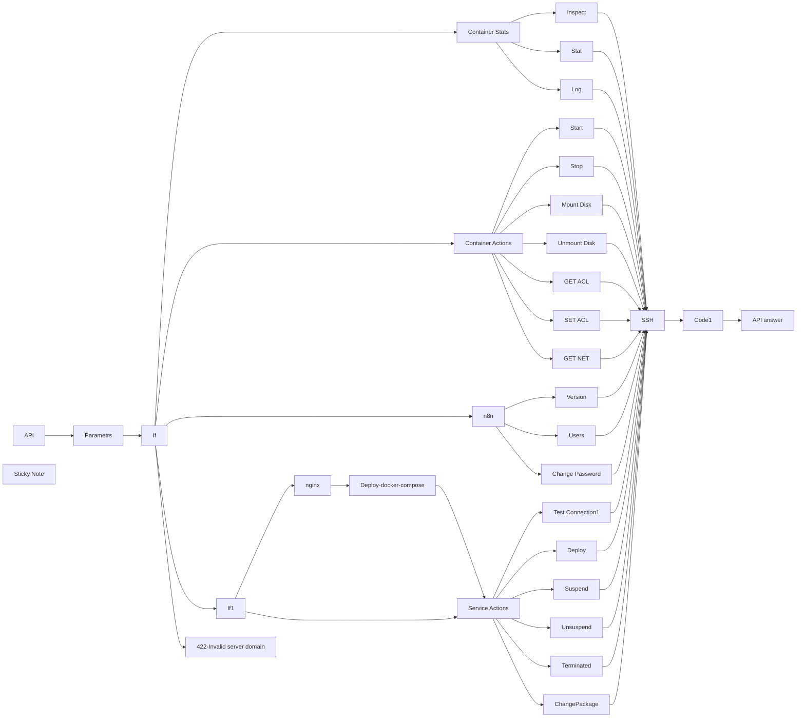

## Fluxo (.json) :

```json
{
  "id": "cY8OVKzHS0ScRhP9",
  "meta": {
    "instanceId": "ffb0782f8b2cf4278577cb919e0cd26141bc9ff8774294348146d454633aa4e3",
    "templateCredsSetupCompleted": true
  },
  "name": "puq-docker-n8n-deploy",
  "tags": [],
  "nodes": [
    {
      "id": "fc30f537-51d2-45df-b1c4-5d4cd9d80a0e",
      "name": "If",
      "type": "n8n-nodes-base.if",
      "position": [
        -2060,
        -320
      ],
      "parameters": {
        "options": {},
        "conditions": {
          "options": {
            "version": 2,
            "leftValue": "",
            "caseSensitive": true,
            "typeValidation": "strict"
          },
          "combinator": "or",
          "conditions": [
            {
              "id": "b702e607-888a-42c9-b9a7-f9d2a64dfccd",
              "operator": {
                "type": "string",
                "operation": "equals"
              },
              "leftValue": "={{ $json.server_domain }}",
              "rightValue": "={{ $('API').item.json.body.server_domain }}"
            }
          ]
        }
      },
      "typeVersion": 2.2
    },
    {
      "id": "6152fc38-2e50-4db5-b6f6-6e7d2492bbb1",
      "name": "Parametrs",
      "type": "n8n-nodes-base.set",
      "position": [
        -2280,
        -320
      ],
      "parameters": {
        "options": {},
        "assignments": {
          "assignments": [
            {
              "id": "a6328600-7ee0-4031-9bdb-fcee99b79658",
              "name": "server_domain",
              "type": "string",
              "value": "d01-test.uuq.pl"
            },
            {
              "id": "370ddc4e-0fc0-48f6-9b30-ebdfba72c62f",
              "name": "clients_dir",
              "type": "string",
              "value": "/opt/docker/clients"
            },
            {
              "id": "92202bb8-6113-4bc5-9a29-79d238456df2",
              "name": "mount_dir",
              "type": "string",
              "value": "/mnt"
            },
            {
              "id": "baa52df2-9c10-42b2-939f-f05ea85ea2be",
              "name": "screen_left",
              "type": "string",
              "value": "{{"
            },
            {
              "id": "2b19ed99-2630-412a-98b6-4be44d35d2e7",
              "name": "screen_right",
              "type": "string",
              "value": "}}"
            }
          ]
        }
      },
      "typeVersion": 3.4
    },
    {
      "id": "cf1b3eea-0439-418b-8c68-f7e45ddfbc7e",
      "name": "API",
      "type": "n8n-nodes-base.webhook",
      "position": [
        -2600,
        -320
      ],
      "webhookId": "4e8168b3-2cad-462a-9750-152986331ce2",
      "parameters": {
        "path": "docker-n8n",
        "options": {},
        "httpMethod": [
          "POST"
        ],
        "responseMode": "responseNode",
        "authentication": "basicAuth",
        "multipleMethods": true
      },
      "credentials": {
        "httpBasicAuth": {
          "id": "fiFY4Gv1SsaJfJvv",
          "name": "n8n"
        }
      },
      "typeVersion": 2
    },
    {
      "id": "516ac020-add2-4b08-ae91-bfb95dec2f88",
      "name": "422-Invalid server domain",
      "type": "n8n-nodes-base.respondToWebhook",
      "position": [
        -2100,
        0
      ],
      "parameters": {
        "options": {
          "responseCode": 422
        },
        "respondWith": "json",
        "responseBody": "[{\n  \"status\": \"error\",\n  \"error\": \"Invalid server domain\"\n}]"
      },
      "typeVersion": 1.1,
      "alwaysOutputData": false
    },
    {
      "id": "4e50cf8e-cfa7-4249-a847-9f8ff27664e4",
      "name": "Code1",
      "type": "n8n-nodes-base.code",
      "position": [
        100,
        100
      ],
      "parameters": {
        "mode": "runOnceForEachItem",
        "jsCode": "try {\n  if ($json.stdout === 'success') {\n    return {\n      json: {\n        status: 'success',\n        message: '',\n        data: '',\n      }\n    };\n  }\n\n  const parsedData = JSON.parse($json.stdout);\n\n  return {\n    json: {\n      status: parsedData.status === 'error' ? 'error' : 'success',\n      message: parsedData.message || (parsedData.status === 'error' ? 'An error occurred' : ''),\n      data: parsedData || '',\n    }\n  };\n\n} catch (error) {\n  return {\n    json: {\n      status: 'error',\n      message: $json.stdout,\n      data: '',\n    }\n  };\n}"
      },
      "executeOnce": false,
      "retryOnFail": false,
      "typeVersion": 2,
      "alwaysOutputData": false
    },
    {
      "id": "c7575c21-00dc-4238-95aa-3e20ff5d21a3",
      "name": "SSH",
      "type": "n8n-nodes-base.ssh",
      "onError": "continueErrorOutput",
      "position": [
        -180,
        100
      ],
      "parameters": {
        "cwd": "=/",
        "command": "={{ $json.sh }}"
      },
      "credentials": {
        "sshPassword": {
          "id": "Cyjy61UWHwD2Xcd8",
          "name": "d01-test.uuq.pl-puq"
        }
      },
      "executeOnce": true,
      "typeVersion": 1
    },
    {
      "id": "2e017042-f991-45c7-afc4-ffdfcded4003",
      "name": "Container Actions",
      "type": "n8n-nodes-base.switch",
      "position": [
        -1680,
        580
      ],
      "parameters": {
        "rules": {
          "values": [
            {
              "outputKey": "start",
              "conditions": {
                "options": {
                  "version": 2,
                  "leftValue": "",
                  "caseSensitive": true,
                  "typeValidation": "strict"
                },
                "combinator": "and",
                "conditions": [
                  {
                    "id": "66ad264d-5393-410c-bfa3-011ab8eb234a",
                    "operator": {
                      "name": "filter.operator.equals",
                      "type": "string",
                      "operation": "equals"
                    },
                    "leftValue": "={{ $('API').item.json.body.command }}",
                    "rightValue": "container_start"
                  }
                ]
              },
              "renameOutput": true
            },
            {
              "outputKey": "stop",
              "conditions": {
                "options": {
                  "version": 2,
                  "leftValue": "",
                  "caseSensitive": true,
                  "typeValidation": "strict"
                },
                "combinator": "and",
                "conditions": [
                  {
                    "id": "b48957a0-22c0-4ac0-82ef-abd9e7ab0207",
                    "operator": {
                      "name": "filter.operator.equals",
                      "type": "string",
                      "operation": "equals"
                    },
                    "leftValue": "={{ $('API').item.json.body.command }}",
                    "rightValue": "container_stop"
                  }
                ]
              },
              "renameOutput": true
            },
            {
              "outputKey": "mount_disk",
              "conditions": {
                "options": {
                  "version": 2,
                  "leftValue": "",
                  "caseSensitive": true,
                  "typeValidation": "strict"
                },
                "combinator": "and",
                "conditions": [
                  {
                    "id": "727971bf-4218-41c1-9b07-22df4b947852",
                    "operator": {
                      "name": "filter.operator.equals",
                      "type": "string",
                      "operation": "equals"
                    },
                    "leftValue": "={{ $('API').item.json.body.command }}",
                    "rightValue": "container_mount_disk"
                  }
                ]
              },
              "renameOutput": true
            },
            {
              "outputKey": "unmount_disk",
              "conditions": {
                "options": {
                  "version": 2,
                  "leftValue": "",
                  "caseSensitive": true,
                  "typeValidation": "strict"
                },
                "combinator": "and",
                "conditions": [
                  {
                    "id": "0c80b1d9-e7ca-4cf3-b3ac-b40fdf4dd8f8",
                    "operator": {
                      "name": "filter.operator.equals",
                      "type": "string",
                      "operation": "equals"
                    },
                    "leftValue": "={{ $('API').item.json.body.command }}",
                    "rightValue": "container_unmount_disk"
                  }
                ]
              },
              "renameOutput": true
            },
            {
              "outputKey": "container_get_acl",
              "conditions": {
                "options": {
                  "version": 2,
                  "leftValue": "",
                  "caseSensitive": true,
                  "typeValidation": "strict"
                },
                "combinator": "and",
                "conditions": [
                  {
                    "id": "138c5436-dd66-48d4-bca4-6af6c80cd903",
                    "operator": {
                      "name": "filter.operator.equals",
                      "type": "string",
                      "operation": "equals"
                    },
                    "leftValue": "={{ $('API').item.json.body.command }}",
                    "rightValue": "container_get_acl"
                  }
                ]
              },
              "renameOutput": true
            },
            {
              "outputKey": "container_set_acl",
              "conditions": {
                "options": {
                  "version": 2,
                  "leftValue": "",
                  "caseSensitive": true,
                  "typeValidation": "strict"
                },
                "combinator": "and",
                "conditions": [
                  {
                    "id": "fa39e80b-4aa4-4cd3-af3c-14acfa9cf2d8",
                    "operator": {
                      "name": "filter.operator.equals",
                      "type": "string",
                      "operation": "equals"
                    },
                    "leftValue": "={{ $('API').item.json.body.command }}",
                    "rightValue": "container_set_acl"
                  }
                ]
              },
              "renameOutput": true
            },
            {
              "outputKey": "container_get_net",
              "conditions": {
                "options": {
                  "version": 2,
                  "leftValue": "",
                  "caseSensitive": true,
                  "typeValidation": "strict"
                },
                "combinator": "and",
                "conditions": [
                  {
                    "id": "46b0d65f-20d6-467a-94fb-407370d967f7",
                    "operator": {
                      "name": "filter.operator.equals",
                      "type": "string",
                      "operation": "equals"
                    },
                    "leftValue": "={{ $('API').item.json.body.command }}",
                    "rightValue": "container_get_net"
                  }
                ]
              },
              "renameOutput": true
            }
          ]
        },
        "options": {}
      },
      "typeVersion": 3.2
    },
    {
      "id": "2fdb7b98-d6f8-44b4-917b-1ed2bb0e65f8",
      "name": "Service Actions",
      "type": "n8n-nodes-base.switch",
      "position": [
        -1240,
        -1140
      ],
      "parameters": {
        "rules": {
          "values": [
            {
              "outputKey": "test_connection",
              "conditions": {
                "options": {
                  "version": 2,
                  "leftValue": "",
                  "caseSensitive": true,
                  "typeValidation": "strict"
                },
                "combinator": "and",
                "conditions": [
                  {
                    "id": "3afdd2f1-fe93-47c2-95cd-bac9b1d94eeb",
                    "operator": {
                      "name": "filter.operator.equals",
                      "type": "string",
                      "operation": "equals"
                    },
                    "leftValue": "={{ $('API').item.json.body.command }}",
                    "rightValue": "test_connection"
                  }
                ]
              },
              "renameOutput": true
            },
            {
              "outputKey": "create",
              "conditions": {
                "options": {
                  "version": 2,
                  "leftValue": "",
                  "caseSensitive": true,
                  "typeValidation": "strict"
                },
                "combinator": "and",
                "conditions": [
                  {
                    "id": "102f10e9-ec6c-4e63-ba95-0fe6c7dc0bd1",
                    "operator": {
                      "type": "string",
                      "operation": "equals"
                    },
                    "leftValue": "={{ $('API').item.json.body.command }}",
                    "rightValue": "create"
                  }
                ]
              },
              "renameOutput": true
            },
            {
              "outputKey": "suspend",
              "conditions": {
                "options": {
                  "version": 2,
                  "leftValue": "",
                  "caseSensitive": true,
                  "typeValidation": "strict"
                },
                "combinator": "and",
                "conditions": [
                  {
                    "id": "f62dfa34-6751-4b34-adcc-3d6ba1b21a8c",
                    "operator": {
                      "name": "filter.operator.equals",
                      "type": "string",
                      "operation": "equals"
                    },
                    "leftValue": "={{ $('API').item.json.body.command }}",
                    "rightValue": "suspend"
                  }
                ]
              },
              "renameOutput": true
            },
            {
              "outputKey": "unsuspend",
              "conditions": {
                "options": {
                  "version": 2,
                  "leftValue": "",
                  "caseSensitive": true,
                  "typeValidation": "strict"
                },
                "combinator": "and",
                "conditions": [
                  {
                    "id": "384d2026-b753-4c27-94c2-8f4fc189eb5f",
                    "operator": {
                      "name": "filter.operator.equals",
                      "type": "string",
                      "operation": "equals"
                    },
                    "leftValue": "={{ $('API').item.json.body.command }}",
                    "rightValue": "unsuspend"
                  }
                ]
              },
              "renameOutput": true
            },
            {
              "outputKey": "terminate",
              "conditions": {
                "options": {
                  "version": 2,
                  "leftValue": "",
                  "caseSensitive": true,
                  "typeValidation": "strict"
                },
                "combinator": "and",
                "conditions": [
                  {
                    "id": "0e190a97-827a-4e87-8222-093ff7048b21",
                    "operator": {
                      "name": "filter.operator.equals",
                      "type": "string",
                      "operation": "equals"
                    },
                    "leftValue": "={{ $('API').item.json.body.command }}",
                    "rightValue": "terminate"
                  }
                ]
              },
              "renameOutput": true
            },
            {
              "outputKey": "change_package",
              "conditions": {
                "options": {
                  "version": 2,
                  "leftValue": "",
                  "caseSensitive": true,
                  "typeValidation": "strict"
                },
                "combinator": "and",
                "conditions": [
                  {
                    "id": "6f7832f3-b61d-4517-ab6b-6007998136dd",
                    "operator": {
                      "name": "filter.operator.equals",
                      "type": "string",
                      "operation": "equals"
                    },
                    "leftValue": "={{ $('API').item.json.body.command }}",
                    "rightValue": "change_package"
                  }
                ]
              },
              "renameOutput": true
            }
          ]
        },
        "options": {}
      },
      "typeVersion": 3.2
    },
    {
      "id": "ac5541f1-94e4-4c7e-a3a5-58b56b9e1ea8",
      "name": "Container Stats",
      "type": "n8n-nodes-base.switch",
      "position": [
        -1680,
        -340
      ],
      "parameters": {
        "rules": {
          "values": [
            {
              "outputKey": "inspect",
              "conditions": {
                "options": {
                  "version": 2,
                  "leftValue": "",
                  "caseSensitive": true,
                  "typeValidation": "strict"
                },
                "combinator": "and",
                "conditions": [
                  {
                    "id": "66ad264d-5393-410c-bfa3-011ab8eb234a",
                    "operator": {
                      "name": "filter.operator.equals",
                      "type": "string",
                      "operation": "equals"
                    },
                    "leftValue": "={{ $('API').item.json.body.command }}",
                    "rightValue": "container_information_inspect"
                  }
                ]
              },
              "renameOutput": true
            },
            {
              "outputKey": "stats",
              "conditions": {
                "options": {
                  "version": 2,
                  "leftValue": "",
                  "caseSensitive": true,
                  "typeValidation": "strict"
                },
                "combinator": "and",
                "conditions": [
                  {
                    "id": "b48957a0-22c0-4ac0-82ef-abd9e7ab0207",
                    "operator": {
                      "name": "filter.operator.equals",
                      "type": "string",
                      "operation": "equals"
                    },
                    "leftValue": "={{ $('API').item.json.body.command }}",
                    "rightValue": "container_information_stats"
                  }
                ]
              },
              "renameOutput": true
            },
            {
              "outputKey": "log",
              "conditions": {
                "options": {
                  "version": 2,
                  "leftValue": "",
                  "caseSensitive": true,
                  "typeValidation": "strict"
                },
                "combinator": "and",
                "conditions": [
                  {
                    "id": "50ede522-af22-4b7a-b1fd-34b27fd3fadd",
                    "operator": {
                      "name": "filter.operator.equals",
                      "type": "string",
                      "operation": "equals"
                    },
                    "leftValue": "={{ $('API').item.json.body.command }}",
                    "rightValue": "container_log"
                  }
                ]
              },
              "renameOutput": true
            }
          ]
        },
        "options": {}
      },
      "typeVersion": 3.2
    },
    {
      "id": "33dab9ef-121f-4b8a-af2b-7e1151ebd95f",
      "name": "API answer",
      "type": "n8n-nodes-base.respondToWebhook",
      "position": [
        400,
        100
      ],
      "parameters": {
        "options": {
          "responseCode": 200
        },
        "respondWith": "allIncomingItems"
      },
      "typeVersion": 1.1,
      "alwaysOutputData": true
    },
    {
      "id": "3b8ae835-901c-44b5-9635-7c1d92509704",
      "name": "Inspect",
      "type": "n8n-nodes-base.set",
      "onError": "continueRegularOutput",
      "position": [
        -1360,
        -540
      ],
      "parameters": {
        "options": {},
        "assignments": {
          "assignments": [
            {
              "id": "21f4453e-c136-4388-be90-1411ae78e8a5",
              "name": "sh",
              "type": "string",
              "value": "=#!/bin/bash\n\nCOMPOSE_DIR=\"{{ $('Parametrs').item.json.clients_dir }}/{{ $('API').item.json.body.domain }}\"\nCONTAINER_NAME=\"{{ $('API').item.json.body.domain }}\"\n\nINSPECT_JSON=\"{}\"\nif sudo docker ps -a --filter \"name=$CONTAINER_NAME\" | grep -q \"$CONTAINER_NAME\"; then\n  INSPECT_JSON=$(sudo docker inspect \"$CONTAINER_NAME\")\nfi\n\necho \"{\\\"inspect\\\": $INSPECT_JSON}\"\n\nexit 0\n"
            }
          ]
        }
      },
      "typeVersion": 3.4,
      "alwaysOutputData": true
    },
    {
      "id": "8193cb7c-50eb-49d3-a4d3-1c0b7686a1b1",
      "name": "Stat",
      "type": "n8n-nodes-base.set",
      "onError": "continueRegularOutput",
      "position": [
        -1360,
        -340
      ],
      "parameters": {
        "options": {},
        "assignments": {
          "assignments": [
            {
              "id": "21f4453e-c136-4388-be90-1411ae78e8a5",
              "name": "sh",
              "type": "string",
              "value": "=#!/bin/bash\n\nCOMPOSE_DIR=\"{{ $('Parametrs').item.json.clients_dir }}/{{ $('API').item.json.body.domain }}\"\nSTATUS_FILE=\"$COMPOSE_DIR/status.json\"\nIMG_FILE=\"$COMPOSE_DIR/data.img\"\nMOUNT_DIR=\"{{ $('Parametrs').item.json.mount_dir }}/{{ $('API').item.json.body.domain }}\"\nCONTAINER_NAME=\"{{ $('API').item.json.body.domain }}\"\n\n# Initialize empty container data\nINSPECT_JSON=\"{}\"\nSTATS_JSON=\"{}\"\n\n# Check if container is running\nif sudo docker ps -a --filter \"name=$CONTAINER_NAME\" | grep -q \"$CONTAINER_NAME\"; then\n  # Get Docker inspect info in JSON (as raw string)\n  INSPECT_JSON=$(sudo docker inspect \"$CONTAINER_NAME\")\n\n  # Get Docker stats info in JSON (as raw string)\n  STATS_JSON=$(sudo docker stats --no-stream --format \"{{ $('Parametrs').item.json.screen_left }}json .{{ $('Parametrs').item.json.screen_right }}\" \"$CONTAINER_NAME\")\n  STATS_JSON=${STATS_JSON:-'{}'}\nfi\n\n# Initialize disk info variables\nMOUNT_USED=\"N/A\"\nMOUNT_FREE=\"N/A\"\nMOUNT_TOTAL=\"N/A\"\nMOUNT_PERCENT=\"N/A\"\nIMG_SIZE=\"N/A\"\nIMG_PERCENT=\"N/A\"\nDISK_STATS_IMG=\"N/A\"\n\n# Check if mount directory exists and is accessible\nif [ -d \"$MOUNT_DIR\" ]; then\n  if mount | grep -q \"$MOUNT_DIR\"; then\n    # Get disk usage for mounted directory\n    DISK_STATS_MOUNT=$(df -h \"$MOUNT_DIR\" | tail -n 1)\n    MOUNT_USED=$(echo \"$DISK_STATS_MOUNT\" | awk '{print $3}')\n    MOUNT_FREE=$(echo \"$DISK_STATS_MOUNT\" | awk '{print $4}')\n    MOUNT_TOTAL=$(echo \"$DISK_STATS_MOUNT\" | awk '{print $2}')\n    MOUNT_PERCENT=$(echo \"$DISK_STATS_MOUNT\" | awk '{print $5}')\n  fi\nfi\n\n# Check if image file exists\nif [ -f \"$IMG_FILE\" ]; then\n  # Get disk usage for image file\n  IMG_SIZE=$(du -sh \"$IMG_FILE\" | awk '{print $1}')\nfi\n\n# Manually create a combined JSON object\nFINAL_JSON=\"{\\\"inspect\\\": $INSPECT_JSON, \\\"stats\\\": $STATS_JSON, \\\"disk\\\": {\\\"mounted\\\": {\\\"used\\\": \\\"$MOUNT_USED\\\", \\\"free\\\": \\\"$MOUNT_FREE\\\", \\\"total\\\": \\\"$MOUNT_TOTAL\\\", \\\"percent\\\": \\\"$MOUNT_PERCENT\\\"}, \\\"img_file\\\": {\\\"size\\\": \\\"$IMG_SIZE\\\"}}}\"\n\n# Output the result\necho \"$FINAL_JSON\"\n\nexit 0"
            }
          ]
        }
      },
      "typeVersion": 3.4,
      "alwaysOutputData": true
    },
    {
      "id": "1888734f-11a9-47a1-8353-c6b2862ff437",
      "name": "Start",
      "type": "n8n-nodes-base.set",
      "onError": "continueRegularOutput",
      "position": [
        -1200,
        240
      ],
      "parameters": {
        "options": {},
        "assignments": {
          "assignments": [
            {
              "id": "21f4453e-c136-4388-be90-1411ae78e8a5",
              "name": "sh",
              "type": "string",
              "value": "=#!/bin/bash\n\nCOMPOSE_DIR=\"{{ $('Parametrs').item.json.clients_dir }}/{{ $('API').item.json.body.domain }}\"\nSTATUS_FILE=\"$COMPOSE_DIR/status.json\"\nIMG_FILE=\"$COMPOSE_DIR/data.img\"\nMOUNT_DIR=\"{{ $('Parametrs').item.json.mount_dir }}/{{ $('API').item.json.body.domain }}\"\n\n# Function to log an error, write to status file, and print to console\nhandle_error() {\n    echo \"error: $1\"\n    exit 1\n}\n\nif ! df -h | grep -q \"$MOUNT_DIR\"; then\n    handle_error \"The file $IMG_FILE is not mounted to $MOUNT_DIR\"\nfi\n\nif sudo docker ps --filter \"name={{ $('API').item.json.body.domain }}\" --filter \"status=running\" -q | grep -q .; then\n    handle_error \"{{ $('API').item.json.body.domain }} container is running\"\nfi\n\n# Change to the compose directory\ncd \"$COMPOSE_DIR\" > /dev/null 2>&1 || handle_error \"Failed to change directory to $COMPOSE_DIR\"\n\n# Start the Docker containers\nif ! sudo docker-compose up -d > /dev/null 2>error.log; then\n    ERROR_MSG=$(tail -n 10 error.log)\n    handle_error \"Docker-compose failed: $ERROR_MSG\"\nfi\n\n# Success\necho \"success\"\n\nexit 0\n"
            }
          ]
        }
      },
      "typeVersion": 3.4,
      "alwaysOutputData": true
    },
    {
      "id": "e9886d6a-c537-4a1e-b2d4-1c4bfaf379e3",
      "name": "Stop",
      "type": "n8n-nodes-base.set",
      "onError": "continueRegularOutput",
      "position": [
        -1080,
        340
      ],
      "parameters": {
        "options": {},
        "assignments": {
          "assignments": [
            {
              "id": "21f4453e-c136-4388-be90-1411ae78e8a5",
              "name": "sh",
              "type": "string",
              "value": "=#!/bin/bash\n\nCOMPOSE_DIR=\"{{ $('Parametrs').item.json.clients_dir }}/{{ $('API').item.json.body.domain }}\"\nSTATUS_FILE=\"$COMPOSE_DIR/status.json\"\nIMG_FILE=\"$COMPOSE_DIR/data.img\"\nMOUNT_DIR=\"{{ $('Parametrs').item.json.mount_dir }}/{{ $('API').item.json.body.domain }}\"\n\n# Function to log an error, write to status file, and print to console\nhandle_error() {\n    echo \"error: $1\"\n    exit 1\n}\n\n# Check if Docker container is running\nif ! sudo docker ps --filter \"name={{ $('API').item.json.body.domain }}\" --filter \"status=running\" -q | grep -q .; then\n    handle_error \"{{ $('API').item.json.body.domain }} container is not running\"\nfi\n\n# Stop and remove the Docker containers (also remove associated volumes)\nif ! sudo docker-compose -f \"$COMPOSE_DIR/docker-compose.yml\" down > /dev/null 2>&1; then\n    handle_error \"Failed to stop and remove docker-compose containers\"\nfi\n\necho \"success\"\n\nexit 0\n"
            }
          ]
        }
      },
      "typeVersion": 3.4,
      "alwaysOutputData": true
    },
    {
      "id": "07ff56b6-6b49-4215-9801-2c13124e0023",
      "name": "Test Connection1",
      "type": "n8n-nodes-base.set",
      "onError": "continueRegularOutput",
      "position": [
        -660,
        -1140
      ],
      "parameters": {
        "options": {},
        "assignments": {
          "assignments": [
            {
              "id": "21f4453e-c136-4388-be90-1411ae78e8a5",
              "name": "sh",
              "type": "string",
              "value": "=#!/bin/bash\n\n# Function to log an error, print to console\nhandle_error() {\n    echo \"error: $1\"\n    exit 1\n}\n\n# Check if Docker is installed\nif ! command -v docker &> /dev/null; then\n    handle_error \"Docker is not installed\"\nfi\n\n# Check if Docker service is running\nif ! systemctl is-active --quiet docker; then\n    handle_error \"Docker service is not running\"\nfi\n\n# Check if nginx-proxy container is running\nif ! sudo docker ps --filter \"name=nginx-proxy\" --filter \"status=running\" -q > /dev/null; then\n    handle_error \"nginx-proxy container is not running\"\nfi\n\n# Check if letsencrypt-nginx-proxy-companion container is running\nif ! sudo docker ps --filter \"name=letsencrypt-nginx-proxy-companion\" --filter \"status=running\" -q > /dev/null; then\n    handle_error \"letsencrypt-nginx-proxy-companion container is not running\"\nfi\n\n# If everything is successful\necho \"success\"\n\nexit 0\n"
            }
          ]
        }
      },
      "typeVersion": 3.4,
      "alwaysOutputData": true
    },
    {
      "id": "e8ad165b-fb70-41fe-938d-5f600c57d1d0",
      "name": "Deploy",
      "type": "n8n-nodes-base.set",
      "onError": "continueRegularOutput",
      "position": [
        -660,
        -980
      ],
      "parameters": {
        "options": {},
        "assignments": {
          "assignments": [
            {
              "id": "21f4453e-c136-4388-be90-1411ae78e8a5",
              "name": "sh",
              "type": "string",
              "value": "=#!/bin/bash\n\n# Get values for variables from templates\nDOMAIN=\"{{ $('API').item.json.body.domain }}\"\nCOMPOSE_DIR=\"{{ $('Parametrs').item.json.clients_dir }}/$DOMAIN\"\nCOMPOSE_FILE=\"$COMPOSE_DIR/docker-compose.yml\"\nSTATUS_FILE=\"$COMPOSE_DIR/status\"\nIMG_FILE=\"$COMPOSE_DIR/data.img\"\nNGINX_DIR=\"$COMPOSE_DIR/nginx\"\nVHOST_DIR=\"/opt/docker/nginx-proxy/nginx/vhost.d\"\nMOUNT_DIR=\"{{ $('Parametrs').item.json.mount_dir }}/$DOMAIN\"\nDOCKER_COMPOSE_TEXT='{{ $('Deploy-docker-compose').item.json[\"docker-compose\"] }}'\n\nNGINX_MAIN_ACL_FILE=\"$NGINX_DIR/$DOMAIN\"_acl\n\nNGINX_MAIN_TEXT='{{ $('nginx').item.json['main'] }}'\nNGINX_MAIN_FILE=\"$NGINX_DIR/$DOMAIN\"\nVHOST_MAIN_FILE=\"$VHOST_DIR/$DOMAIN\"\n\nNGINX_MAIN_LOCATION_TEXT='{{ $('nginx').item.json['main_location'] }}'\nNGINX_MAIN_LOCATION_FILE=\"$NGINX_DIR/$DOMAIN\"_location\nVHOST_MAIN_LOCATION_FILE=\"$VHOST_DIR/$DOMAIN\"_location\n\nDISK_SIZE=\"{{ $('API').item.json.body.disk }}\"\n\n# Function to handle errors: write to the status file and print the message to console\nhandle_error() {\n    STATUS_JSON=\"{\\\"status\\\": \\\"error\\\", \\\"message\\\": \\\"$1\\\"}\"\n    echo \"$STATUS_JSON\" | sudo tee \"$STATUS_FILE\" > /dev/null  # Write error to the status file\n    echo \"error: $1\"  # Print the error message to the console\n    exit 1  # Exit the script with an error code\n}\n\n# Check if the directory already exists. If yes, exit with an error.\nif [ -d \"$COMPOSE_DIR\" ]; then\n    echo \"error: Directory $COMPOSE_DIR already exists\"\n    exit 1\nfi\n\n# Create necessary directories with permissions\nsudo mkdir -p \"$COMPOSE_DIR\" > /dev/null 2>&1 || handle_error \"Failed to create $COMPOSE_DIR\"\nsudo mkdir -p \"$NGINX_DIR\" > /dev/null 2>&1 || handle_error \"Failed to create $NGINX_DIR\"\nsudo mkdir -p \"$MOUNT_DIR\" > /dev/null 2>&1 || handle_error \"Failed to create $MOUNT_DIR\"\n\n# Set permissions on the created directories\nsudo chmod -R 777 \"$COMPOSE_DIR\" > /dev/null 2>&1 || handle_error \"Failed to set permissions on $COMPOSE_DIR\"\nsudo chmod -R 777 \"$NGINX_DIR\" > /dev/null 2>&1 || handle_error \"Failed to set permissions on $NGINX_DIR\"\nsudo chmod -R 777 \"$MOUNT_DIR\" > /dev/null 2>&1 || handle_error \"Failed to set permissions on $MOUNT_DIR\"\n\n# Create docker-compose.yml file\necho \"$DOCKER_COMPOSE_TEXT\" | sudo tee \"$COMPOSE_FILE\" > /dev/null 2>&1 || handle_error \"Failed to create $COMPOSE_FILE\"\n\n# Create NGINX configuration files\necho \"\" | sudo tee \"$NGINX_MAIN_ACL_FILE\" > /dev/null 2>&1 || handle_error \"Failed to create $NGINX_MAIN_ACL_FILE\"\n\necho \"$NGINX_MAIN_TEXT\" | sudo tee \"$NGINX_MAIN_FILE\" > /dev/null 2>&1 || handle_error \"Failed to create $NGINX_MAIN_FILE\"\necho \"$NGINX_MAIN_LOCATION_TEXT\" | sudo tee \"$NGINX_MAIN_LOCATION_FILE\" > /dev/null 2>&1 || handle_error \"Failed to create $NGINX_MAIN_LOCATION_FILE\"\n\n# Change to the compose directory\ncd \"$COMPOSE_DIR\" > /dev/null 2>&1 || handle_error \"Failed to change directory to $COMPOSE_DIR\"\n\n# Create data.img file if it doesn't exist\nif [ ! -f \"$IMG_FILE\" ]; then\n    sudo fallocate -l \"$DISK_SIZE\"G \"$IMG_FILE\" > /dev/null 2>&1 || sudo truncate -s \"$DISK_SIZE\"G \"$IMG_FILE\" > /dev/null 2>&1 || handle_error \"Failed to create $IMG_FILE\"\n    sudo mkfs.ext4 \"$IMG_FILE\" > /dev/null 2>&1 || handle_error \"Failed to format $IMG_FILE\"  # Format the image as ext4\n    sync  # Synchronize the data to disk\nfi\n\n# Add an entry to /etc/fstab for mounting if not already present\nif ! grep -q \"$IMG_FILE\" /etc/fstab; then\n    echo \"$IMG_FILE $MOUNT_DIR ext4 loop 0 0\" | sudo tee -a /etc/fstab > /dev/null || handle_error \"Failed to add entry to /etc/fstab\"\nfi\n\n# Mount all entries in /etc/fstab\nsudo mount -a || handle_error \"Failed to mount entries from /etc/fstab\"\n\n# Set permissions on the mount directory\nsudo chmod -R 777 \"$MOUNT_DIR\" > /dev/null 2>&1 || handle_error \"Failed to set permissions on $MOUNT_DIR\"\n\n# Copy NGINX configuration files instead of creating symbolic links\nsudo cp -f \"$NGINX_MAIN_FILE\" \"$VHOST_MAIN_FILE\" || handle_error \"Failed to copy $NGINX_MAIN_FILE to $VHOST_MAIN_FILE\"\nsudo chmod 777 \"$VHOST_MAIN_FILE\" || handle_error \"Failed to set permissions on $VHOST_MAIN_FILE\"\n\nsudo cp -f \"$NGINX_MAIN_LOCATION_FILE\" \"$VHOST_MAIN_LOCATION_FILE\" || handle_error \"Failed to copy $NGINX_MAIN_LOCATION_FILE to $VHOST_MAIN_LOCATION_FILE\"\nsudo chmod 777 \"$VHOST_MAIN_LOCATION_FILE\" || handle_error \"Failed to set permissions on $VHOST_MAIN_LOCATION_FILE\"\n\n# Start Docker containers using docker-compose\nif ! sudo docker-compose up -d > /dev/null 2>error.log; then\n    ERROR_MSG=$(tail -n 10 error.log)  # Read the last 10 lines from error.log\n    handle_error \"Docker-compose failed: $ERROR_MSG\"\nfi\n\n# If everything is successful, update the status file and print success message\necho \"active\" | sudo tee \"$STATUS_FILE\" > /dev/null\necho \"success\"\n\nexit 0\n"
            }
          ]
        }
      },
      "typeVersion": 3.4,
      "alwaysOutputData": true
    },
    {
      "id": "a6346a99-545f-4873-ac41-8c25941f34e9",
      "name": "Suspend",
      "type": "n8n-nodes-base.set",
      "onError": "continueRegularOutput",
      "position": [
        -660,
        -820
      ],
      "parameters": {
        "options": {},
        "assignments": {
          "assignments": [
            {
              "id": "21f4453e-c136-4388-be90-1411ae78e8a5",
              "name": "sh",
              "type": "string",
              "value": "=#!/bin/bash\n\nDOMAIN=\"{{ $('API').item.json.body.domain }}\"\nCOMPOSE_DIR=\"{{ $('Parametrs').item.json.clients_dir }}/$DOMAIN\"\nCOMPOSE_FILE=\"$COMPOSE_DIR/docker-compose.yml\"\nSTATUS_FILE=\"$COMPOSE_DIR/status\"\nIMG_FILE=\"$COMPOSE_DIR/data.img\"\nNGINX_DIR=\"$COMPOSE_DIR/nginx\"\nVHOST_DIR=\"/opt/docker/nginx-proxy/nginx/vhost.d\"\nMOUNT_DIR=\"{{ $('Parametrs').item.json.mount_dir }}/$DOMAIN\"\n\nVHOST_MAIN_FILE=\"$VHOST_DIR/$DOMAIN\"\nVHOST_MAIN_LOCATION_FILE=\"$VHOST_DIR/$DOMAIN\"_location\n\n# Function to log an error, write to status file, and print to console\nhandle_error() {\n    STATUS_JSON=\"{\\\"status\\\": \\\"error\\\", \\\"message\\\": \\\"$1\\\"}\"\n    echo \"$STATUS_JSON\" | sudo tee \"$STATUS_FILE\" > /dev/null\n    echo \"error: $1\"\n    exit 1\n}\n\n# Stop and remove Docker containers (also remove associated volumes)\nif [ -f \"$COMPOSE_FILE\" ]; then\n    if ! sudo docker-compose -f \"$COMPOSE_FILE\" down > /dev/null 2>&1; then\n        handle_error \"Failed to stop and remove docker-compose containers\"\n    fi\nelse\n    echo \"Warning: docker-compose.yml not found, skipping container stop.\"\nfi\n\n# Remove mount entry from /etc/fstab if it exists\nif grep -q \"$IMG_FILE\" /etc/fstab; then\n    sudo sed -i \"\\|$(printf '%s\\n' \"$IMG_FILE\" | sed 's/[.[\\*^$]/\\\\&/g')|d\" /etc/fstab\nfi\n\n# Unmount the image if it is mounted\nif mount | grep -q \"$MOUNT_DIR\"; then\n    sudo umount \"$MOUNT_DIR\" > /dev/null 2>&1 || handle_error \"Failed to unmount $MOUNT_DIR\"\nfi\n\n# Remove the mount directory\nif [ -d \"$MOUNT_DIR\" ]; then\n    sudo rm -rf \"$MOUNT_DIR\" > /dev/null 2>&1 || handle_error \"Failed to remove $MOUNT_DIR\"\nfi\n\n# Remove NGINX configuration files\n[ -f \"$VHOST_MAIN_FILE\" ] && sudo rm -f \"$VHOST_MAIN_FILE\" || handle_error \"Warning: $VHOST_MAIN_FILE not found.\"\n[ -f \"$VHOST_MAIN_LOCATION_FILE\" ] && sudo rm -f \"$VHOST_MAIN_LOCATION_FILE\" || handle_error \"Warning: $VHOST_MAIN_LOCATION_FILE not found.\"\n\n# Update status\necho \"suspended\" | sudo tee \"$STATUS_FILE\" > /dev/null\n\n# Success\necho \"success\"\nexit 0"
            }
          ]
        }
      },
      "typeVersion": 3.4,
      "alwaysOutputData": true
    },
    {
      "id": "61cba08a-a873-4a1c-98a4-75a3986d8e63",
      "name": "Terminated",
      "type": "n8n-nodes-base.set",
      "onError": "continueRegularOutput",
      "position": [
        -660,
        -480
      ],
      "parameters": {
        "options": {},
        "assignments": {
          "assignments": [
            {
              "id": "21f4453e-c136-4388-be90-1411ae78e8a5",
              "name": "sh",
              "type": "string",
              "value": "=#!/bin/bash\n\nDOMAIN=\"{{ $('API').item.json.body.domain }}\"\nCOMPOSE_DIR=\"{{ $('Parametrs').item.json.clients_dir }}/$DOMAIN\"\nCOMPOSE_FILE=\"$COMPOSE_DIR/docker-compose.yml\"\nSTATUS_FILE=\"$COMPOSE_DIR/status\"\nIMG_FILE=\"$COMPOSE_DIR/data.img\"\nNGINX_DIR=\"$COMPOSE_DIR/nginx\"\nVHOST_DIR=\"/opt/docker/nginx-proxy/nginx/vhost.d\"\n\nVHOST_MAIN_FILE=\"$VHOST_DIR/$DOMAIN\"\nVHOST_MAIN_LOCATION_FILE=\"$VHOST_DIR/$DOMAIN\"_location\n\nMOUNT_DIR=\"{{ $('Parametrs').item.json.mount_dir }}/$DOMAIN\"\n\n# Function to log an error, write to status file, and print to console\nhandle_error() {\n    STATUS_JSON=\"{\\\"status\\\": \\\"error\\\", \\\"message\\\": \\\"$1\\\"}\"\n    echo \"error: $1\"\n    exit 1\n}\n\n# Stop and remove the Docker containers\nif [ -f \"$COMPOSE_FILE\" ]; then\n    sudo docker-compose -f \"$COMPOSE_FILE\" down > /dev/null 2>&1\nfi\n\n# Remove the mount entry from /etc/fstab if it exists\nif grep -q \"$IMG_FILE\" /etc/fstab; then\n    sudo sed -i \"\\|$(printf '%s\\n' \"$IMG_FILE\" | sed 's/[.[\\*^$]/\\\\&/g')|d\" /etc/fstab\nfi\n\n# Unmount the image if it is still mounted\nif mount | grep -q \"$MOUNT_DIR\"; then\n    sudo umount \"$MOUNT_DIR\" > /dev/null 2>&1 || handle_error \"Failed to unmount $MOUNT_DIR\"\nfi\n\n# Remove all related directories and files\nfor item in \"$COMPOSE_DIR\" \"$VHOST_MAIN_FILE\" \"$VHOST_MAIN_LOCATION_FILE\"; do\n    if [ -e \"$item\" ]; then\n        sudo rm -rf \"$item\" || handle_error \"Failed to remove $item\"\n    fi\ndone\n\necho \"success\"\nexit 0\n"
            }
          ]
        }
      },
      "typeVersion": 3.4,
      "alwaysOutputData": true
    },
    {
      "id": "a66a034f-970a-4cee-b324-f1b423625bd7",
      "name": "Unsuspend",
      "type": "n8n-nodes-base.set",
      "onError": "continueRegularOutput",
      "position": [
        -660,
        -660
      ],
      "parameters": {
        "options": {},
        "assignments": {
          "assignments": [
            {
              "id": "21f4453e-c136-4388-be90-1411ae78e8a5",
              "name": "sh",
              "type": "string",
              "value": "=#!/bin/bash\n\nDOMAIN=\"{{ $('API').item.json.body.domain }}\"\nCOMPOSE_DIR=\"{{ $('Parametrs').item.json.clients_dir }}/$DOMAIN\"\nCOMPOSE_FILE=\"$COMPOSE_DIR/docker-compose.yml\"\nSTATUS_FILE=\"$COMPOSE_DIR/status\"\nIMG_FILE=\"$COMPOSE_DIR/data.img\"\nNGINX_DIR=\"$COMPOSE_DIR/nginx\"\nVHOST_DIR=\"/opt/docker/nginx-proxy/nginx/vhost.d\"\nMOUNT_DIR=\"{{ $('Parametrs').item.json.mount_dir }}/$DOMAIN\"\nDOCKER_COMPOSE_TEXT='{{ $('Deploy-docker-compose').item.json[\"docker-compose\"] }}'\n\nNGINX_MAIN_ACL_FILE=\"$NGINX_DIR/$DOMAIN\"_acl\n\nNGINX_MAIN_TEXT='{{ $('nginx').item.json['main'] }}'\nNGINX_MAIN_FILE=\"$NGINX_DIR/$DOMAIN\"\nVHOST_MAIN_FILE=\"$VHOST_DIR/$DOMAIN\"\n\nNGINX_MAIN_LOCATION_TEXT='{{ $('nginx').item.json['main_location'] }}'\nNGINX_MAIN_LOCATION_FILE=\"$NGINX_DIR/$DOMAIN\"_location\nVHOST_MAIN_LOCATION_FILE=\"$VHOST_DIR/$DOMAIN\"_location\n\nDISK_SIZE=\"{{ $('API').item.json.body.disk }}\"\n\n# Function to log an error, write to status file, and print to console\nhandle_error() {\n    STATUS_JSON=\"{\\\"status\\\": \\\"error\\\", \\\"message\\\": \\\"$1\\\"}\"\n    echo \"$STATUS_JSON\" | sudo tee \"$STATUS_FILE\" > /dev/null\n    echo \"error: $1\"\n    exit 1\n}\n\nupdate_nginx_acl() {\n    ACL_FILE=$1\n    LOCATION_FILE=$2\n    \n    if [ -s \"$ACL_FILE\" ]; then  # Проверяем, что файл существует и не пустой\n        VALID_LINES=$(grep -vE '^\\s*$' \"$ACL_FILE\")  # Убираем пустые строки\n        if [ -n \"$VALID_LINES\" ]; then  # Если есть непустые строки\n            while IFS= read -r line; do\n                echo \"allow $line;\" | sudo tee -a \"$LOCATION_FILE\" > /dev/null || handle_error \"Failed to update $LOCATION_FILE\"\n            done <<< \"$VALID_LINES\"\n            echo \"deny all;\" | sudo tee -a \"$LOCATION_FILE\" > /dev/null || handle_error \"Failed to update $LOCATION_FILE\"\n        fi\n    fi\n}\n\n# Create necessary directories with permissions\nfor dir in \"$COMPOSE_DIR\" \"$NGINX_DIR\" \"$MOUNT_DIR\"; do\n    sudo mkdir -p \"$dir\" || handle_error \"Failed to create $dir\"\n    sudo chmod -R 777 \"$dir\" || handle_error \"Failed to set permissions on $dir\"\ndone\n\n# Check if the image is already mounted using fstab\nif ! grep -q \"$IMG_FILE\" /etc/fstab; then\n    echo \"$IMG_FILE $MOUNT_DIR ext4 loop 0 0\" | sudo tee -a /etc/fstab > /dev/null || handle_error \"Failed to add fstab entry for $IMG_FILE\"\nfi\n\n# Apply the fstab changes and mount the image\nif ! mount | grep -q \"$MOUNT_DIR\"; then\n    sudo mount -a || handle_error \"Failed to mount image using fstab\"\nfi\n\n# Create docker-compose.yml file\necho \"$DOCKER_COMPOSE_TEXT\" | sudo tee \"$COMPOSE_FILE\" > /dev/null 2>&1 || handle_error \"Failed to create $COMPOSE_FILE\"\n\n# Create NGINX configuration files\necho \"$NGINX_MAIN_TEXT\" | sudo tee \"$NGINX_MAIN_FILE\" > /dev/null 2>&1 || handle_error \"Failed to create $NGINX_MAIN_FILE\"\necho \"$NGINX_MAIN_LOCATION_TEXT\" | sudo tee \"$NGINX_MAIN_LOCATION_FILE\" > /dev/null 2>&1 || handle_error \"Failed to create $NGINX_MAIN_FILE\"\n\n# Copy NGINX configuration files instead of creating symbolic links\nsudo cp -f \"$NGINX_MAIN_FILE\" \"$VHOST_MAIN_FILE\" || handle_error \"Failed to copy $NGINX_MAIN_FILE to $VHOST_MAIN_FILE\"\nsudo chmod 777 \"$VHOST_MAIN_FILE\" || handle_error \"Failed to set permissions on $VHOST_MAIN_FILE\"\n\nsudo cp -f \"$NGINX_MAIN_LOCATION_FILE\" \"$VHOST_MAIN_LOCATION_FILE\" || handle_error \"Failed to copy $NGINX_MAIN_LOCATION_FILE to $VHOST_MAIN_LOCATION_FILE\"\nsudo chmod 777 \"$VHOST_MAIN_LOCATION_FILE\" || handle_error \"Failed to set permissions on $VHOST_MAIN_LOCATION_FILE\"\n\nupdate_nginx_acl \"$NGINX_MAIN_ACL_FILE\" \"$VHOST_MAIN_LOCATION_FILE\"\n\n# Change to the compose directory\ncd \"$COMPOSE_DIR\" || handle_error \"Failed to change directory to $COMPOSE_DIR\"\n\n# Start Docker containers using docker-compose\n> error.log\nif ! sudo docker-compose up -d > error.log 2>&1; then\n    ERROR_MSG=$(tail -n 10 error.log)  # Read the last 10 lines from error.log\n    handle_error \"Docker-compose failed: $ERROR_MSG\"\nfi\n\n# If everything is successful, update the status file and print success message\necho \"active\" | sudo tee \"$STATUS_FILE\" > /dev/null\necho \"success\"\nexit 0\n"
            }
          ]
        }
      },
      "typeVersion": 3.4,
      "alwaysOutputData": true
    },
    {
      "id": "f05ac0c4-61b6-4546-9a39-1ef03e360c14",
      "name": "Mount Disk",
      "type": "n8n-nodes-base.set",
      "onError": "continueRegularOutput",
      "position": [
        -1200,
        460
      ],
      "parameters": {
        "options": {},
        "assignments": {
          "assignments": [
            {
              "id": "21f4453e-c136-4388-be90-1411ae78e8a5",
              "name": "sh",
              "type": "string",
              "value": "=#!/bin/bash\n\nCOMPOSE_DIR=\"{{ $('Parametrs').item.json.clients_dir }}/{{ $('API').item.json.body.domain }}\"\nSTATUS_FILE=\"$COMPOSE_DIR/status.json\"\nIMG_FILE=\"$COMPOSE_DIR/data.img\"\nMOUNT_DIR=\"{{ $('Parametrs').item.json.mount_dir }}/{{ $('API').item.json.body.domain }}\"\n\n# Function to log an error, write to status file, and print to console\nhandle_error() {\n    echo \"error: $1\"\n    exit 1\n}\n\n# Create necessary directories with permissions\nsudo mkdir -p \"$MOUNT_DIR\" > /dev/null 2>&1 || handle_error \"Failed to create $MOUNT_DIR\"\nsudo chmod 777 \"$MOUNT_DIR\" > /dev/null 2>&1 || handle_error \"Failed to set permissions on $MOUNT_DIR\"\n\nif df -h | grep -q \"$MOUNT_DIR\"; then\n    handle_error \"The file $IMG_FILE is mounted to $MOUNT_DIR\"\nfi\n\nif ! grep -q \"$IMG_FILE\" /etc/fstab; then\n    echo \"$IMG_FILE $MOUNT_DIR ext4 loop 0 0\" | sudo tee -a /etc/fstab > /dev/null || handle_error \"Failed to add entry to /etc/fstab\"\nfi\n\nsudo mount -a || handle_error \"Failed to mount entries from /etc/fstab\"\n\necho \"success\"\n\nexit 0\n"
            }
          ]
        }
      },
      "typeVersion": 3.4,
      "alwaysOutputData": true
    },
    {
      "id": "803652a7-b75c-4e58-a935-7899ef98815b",
      "name": "Unmount Disk",
      "type": "n8n-nodes-base.set",
      "onError": "continueRegularOutput",
      "position": [
        -1080,
        560
      ],
      "parameters": {
        "options": {},
        "assignments": {
          "assignments": [
            {
              "id": "21f4453e-c136-4388-be90-1411ae78e8a5",
              "name": "sh",
              "type": "string",
              "value": "=#!/bin/bash\n\nCOMPOSE_DIR=\"{{ $('Parametrs').item.json.clients_dir }}/{{ $('API').item.json.body.domain }}\"\nSTATUS_FILE=\"$COMPOSE_DIR/status.json\"\nIMG_FILE=\"$COMPOSE_DIR/data.img\"\nMOUNT_DIR=\"{{ $('Parametrs').item.json.mount_dir }}/{{ $('API').item.json.body.domain }}\"\n\n# Function to log an error, write to status file, and print to console\nhandle_error() {\n    echo \"error: $1\"\n    exit 1\n}\n\nif ! df -h | grep -q \"$MOUNT_DIR\"; then\n    handle_error \"The file $IMG_FILE is not mounted to $MOUNT_DIR\"\nfi\n\n# Remove the mount entry from /etc/fstab if it exists\nif grep -q \"$IMG_FILE\" /etc/fstab; then\n    sudo sed -i \"\\|$(printf '%s\\n' \"$IMG_FILE\" | sed 's/[.[\\*^$]/\\\\&/g')|d\" /etc/fstab\nfi\n\n# Unmount the image if it is mounted (using fstab)\nif mount | grep -q \"$MOUNT_DIR\"; then\n    sudo umount \"$MOUNT_DIR\" > /dev/null 2>&1 || handle_error \"Failed to unmount $MOUNT_DIR\"\nfi\n\n# Remove the mount directory (if needed)\nif ! sudo rm -rf \"$MOUNT_DIR\" > /dev/null 2>&1; then\n    handle_error \"Failed to remove $MOUNT_DIR\"\nfi\n\necho \"success\"\n\nexit 0\n"
            }
          ]
        }
      },
      "typeVersion": 3.4,
      "alwaysOutputData": true
    },
    {
      "id": "72f8b5bd-0826-4c21-b201-8714969bb6a4",
      "name": "Log",
      "type": "n8n-nodes-base.set",
      "onError": "continueRegularOutput",
      "position": [
        -1360,
        -160
      ],
      "parameters": {
        "options": {},
        "assignments": {
          "assignments": [
            {
              "id": "21f4453e-c136-4388-be90-1411ae78e8a5",
              "name": "sh",
              "type": "string",
              "value": "=#!/bin/bash\n\nCONTAINER_NAME=\"{{ $('API').item.json.body.domain }}\"\nLOGS_JSON=\"{}\"\n\n# Function to return error in JSON format\nhandle_error() {\n    echo \"{\\\"status\\\": \\\"error\\\", \\\"message\\\": \\\"$1\\\"}\"\n    exit 1\n}\n\n# Check if the container exists\nif ! sudo docker ps -a | grep -q \"$CONTAINER_NAME\" > /dev/null 2>&1; then\n    handle_error \"Container $CONTAINER_NAME not found\"\nfi\n\n# Get logs of the container\nLOGS=$(sudo docker logs --tail 1000 \"$CONTAINER_NAME\" 2>&1)\nif [ $? -ne 0 ]; then\n    handle_error \"Failed to retrieve logs for $CONTAINER_NAME\"\nfi\n\n# Escape double quotes in logs for valid JSON\nLOGS_ESCAPED=$(echo \"$LOGS\" | sed 's/\"/\\\\\"/g' | sed ':a;N;$!ba;s/\\n/\\\\n/g')\n\n# Format logs as JSON\nLOGS_JSON=\"{\\\"logs\\\": \\\"$LOGS_ESCAPED\\\"}\"\n\necho \"$LOGS_JSON\"\nexit 0"
            }
          ]
        }
      },
      "typeVersion": 3.4,
      "alwaysOutputData": true
    },
    {
      "id": "c170dd11-18bf-41c9-a07c-2f0c9d0fdb01",
      "name": "ChangePackage",
      "type": "n8n-nodes-base.set",
      "onError": "continueRegularOutput",
      "position": [
        -660,
        -300
      ],
      "parameters": {
        "options": {},
        "assignments": {
          "assignments": [
            {
              "id": "21f4453e-c136-4388-be90-1411ae78e8a5",
              "name": "sh",
              "type": "string",
              "value": "=#!/bin/bash\n\n# Get values for variables from templates\nDOMAIN=\"{{ $('API').item.json.body.domain }}\"\nCOMPOSE_DIR=\"{{ $('Parametrs').item.json.clients_dir }}/$DOMAIN\"\nCOMPOSE_FILE=\"$COMPOSE_DIR/docker-compose.yml\"\nSTATUS_FILE=\"$COMPOSE_DIR/status\"\nIMG_FILE=\"$COMPOSE_DIR/data.img\"\nNGINX_DIR=\"$COMPOSE_DIR/nginx\"\nVHOST_DIR=\"/opt/docker/nginx-proxy/nginx/vhost.d\"\nMOUNT_DIR=\"{{ $('Parametrs').item.json.mount_dir }}/$DOMAIN\"\nDOCKER_COMPOSE_TEXT='{{ $('Deploy-docker-compose').item.json[\"docker-compose\"] }}'\n\nNGINX_MAIN_TEXT='{{ $('nginx').item.json['main'] }}'\nNGINX_MAIN_FILE=\"$NGINX_DIR/$DOMAIN\"\nVHOST_MAIN_FILE=\"$VHOST_DIR/$DOMAIN\"\n\nNGINX_MAIN_LOCATION_TEXT='{{ $('nginx').item.json['main_location'] }}'\nNGINX_MAIN_LOCATION_FILE=\"$NGINX_DIR/$DOMAIN\"_location\nVHOST_MAIN_LOCATION_FILE=\"$VHOST_DIR/$DOMAIN\"_location\n\nDISK_SIZE=\"{{ $('API').item.json.body.disk }}\"\n\n# Function to log an error, write to status file, and print to console\nhandle_error() {\n    STATUS_JSON=\"{\\\"status\\\": \\\"error\\\", \\\"message\\\": \\\"$1\\\"}\"\n    echo \"$STATUS_JSON\" | sudo tee \"$STATUS_FILE\" > /dev/null\n    echo \"error: $1\"\n    exit 1\n}\n\n# Check if the compose file exists before stopping the container\nif [ -f \"$COMPOSE_FILE\" ]; then\n    sudo docker-compose -f \"$COMPOSE_FILE\" down > /dev/null 2>&1 || handle_error \"Failed to stop containers\"\nelse\n    handle_error \"docker-compose.yml not found\"\nfi\n\n# Unmount the image if it is currently mounted\nif mount | grep -q \"$MOUNT_DIR\"; then\n    sudo umount \"$MOUNT_DIR\" > /dev/null 2>&1 || handle_error \"Failed to unmount $MOUNT_DIR\"\nfi\n\n# Create docker-compose.yml file\necho \"$DOCKER_COMPOSE_TEXT\" | sudo tee \"$COMPOSE_FILE\" > /dev/null 2>&1 || handle_error \"Failed to create $COMPOSE_FILE\"\n\n# Create NGINX configuration files\necho \"$NGINX_MAIN_TEXT\" | sudo tee \"$NGINX_MAIN_FILE\" > /dev/null 2>&1 || handle_error \"Failed to create $NGINX_MAIN_FILE\"\necho \"$NGINX_MAIN_LOCATION_TEXT\" | sudo tee \"$NGINX_MAIN_LOCATION_FILE\" > /dev/null 2>&1 || handle_error \"Failed to create $NGINX_MAIN_LOCATION_FILE\"\n\n# Resize the disk image if it exists\nif [ -f \"$IMG_FILE\" ]; then\n    sudo truncate -s \"$DISK_SIZE\"G \"$IMG_FILE\" > /dev/null 2>&1 || handle_error \"Failed to resize $IMG_FILE (truncate)\"\n    sudo e2fsck -fy \"$IMG_FILE\" > /dev/null 2>&1 || handle_error \"Filesystem check failed on $IMG_FILE\"\n    sudo resize2fs \"$IMG_FILE\" > /dev/null 2>&1 || handle_error \"Failed to resize filesystem on $IMG_FILE\"\nelse\n    handle_error \"Disk image $IMG_FILE does not exist\"\nfi\n\n# Mount the disk only if it is not already mounted\nif ! mount | grep -q \"$MOUNT_DIR\"; then\n    sudo mount -a || handle_error \"Failed to mount entries from /etc/fstab\"\nfi\n\n# Change to the compose directory\ncd \"$COMPOSE_DIR\" > /dev/null 2>&1 || handle_error \"Failed to change directory to $COMPOSE_DIR\"\n\n# Copy NGINX configuration files instead of creating symbolic links\nsudo cp -f \"$NGINX_MAIN_FILE\" \"$VHOST_MAIN_FILE\" || handle_error \"Failed to copy $NGINX_MAIN_FILE to $VHOST_MAIN_FILE\"\nsudo chmod 777 \"$VHOST_MAIN_FILE\" || handle_error \"Failed to set permissions on $VHOST_MAIN_FILE\"\n\nsudo cp -f \"$NGINX_MAIN_LOCATION_FILE\" \"$VHOST_MAIN_LOCATION_FILE\" || handle_error \"Failed to copy $NGINX_MAIN_LOCATION_FILE to $VHOST_MAIN_LOCATION_FILE\"\nsudo chmod 777 \"$VHOST_MAIN_LOCATION_FILE\" || handle_error \"Failed to set permissions on $VHOST_MAIN_LOCATION_FILE\"\n\n# Start Docker containers using docker-compose\nif ! sudo docker-compose up -d > /dev/null 2>error.log; then\n    ERROR_MSG=$(tail -n 10 error.log)  # Read the last 10 lines from error.log\n    handle_error \"Docker-compose failed: $ERROR_MSG\"\nfi\n\n# Update status file\necho \"active\" | sudo tee \"$STATUS_FILE\" > /dev/null\n\necho \"success\"\n\nexit 0\n"
            }
          ]
        }
      },
      "typeVersion": 3.4,
      "alwaysOutputData": true
    },
    {
      "id": "da927c27-bc27-4f1f-bd06-90cb273a423d",
      "name": "Sticky Note",
      "type": "n8n-nodes-base.stickyNote",
      "position": [
        -2640,
        -1260
      ],
      "parameters": {
        "color": 6,
        "width": 639,
        "height": 909,
        "content": "## 👋 Welcome to PUQ Docker n8n deploy!\n## Template for n8n: API Backend for WHMCS/WISECP by PUQcloud\n\nv.1\n\nThis is an n8n template that creates an API backend for the WHMCS/WISECP module developed by PUQcloud.\n\n## Setup Instructions\n\n### 1. Configure API Webhook and SSH Access\n- Create a Credential (Basic Auth) for the **Webhook API Block** in n8n.\n- Create a Credential for **SSH access** to a server with Docker installed (**SSH Block**).\n\n### 2. Modify Template Parameters\nIn the **Parameters** block of the template, update the following settings:\n\n- `server_domain` – must match the domain of the WHMCS/WISECP Docker server.\n- `clients_dir` – directory where user data related to Docker and disks will be stored.\n- `mount_dir` – default mount point for the container disk (recommended not to change).\n\n**Do not modify** the following technical parameters:\n\n- `screen_left`\n- `screen_right`\n\n## Additional Resources\n- Documentation: [https://doc.puq.info/books/docker-n8n-whmcs-module/page/setting-up-n8n-workflow](https://doc.puq.info/books/docker-n8n-whmcs-module/page/setting-up-n8n-workflow)\n- WHMCS module: [https://puqcloud.com/whmcs-module-docker-n8n.php](https://puqcloud.com/whmcs-module-docker-n8n.php)\n\n"
      },
      "typeVersion": 1
    },
    {
      "id": "7d1edb5c-9836-4dad-9116-bd14a5e7ab2c",
      "name": "n8n",
      "type": "n8n-nodes-base.switch",
      "position": [
        -1680,
        1380
      ],
      "parameters": {
        "rules": {
          "values": [
            {
              "outputKey": "version",
              "conditions": {
                "options": {
                  "version": 2,
                  "leftValue": "",
                  "caseSensitive": true,
                  "typeValidation": "strict"
                },
                "combinator": "and",
                "conditions": [
                  {
                    "id": "66ad264d-5393-410c-bfa3-011ab8eb234a",
                    "operator": {
                      "name": "filter.operator.equals",
                      "type": "string",
                      "operation": "equals"
                    },
                    "leftValue": "={{ $('API').item.json.body.command }}",
                    "rightValue": "app_version"
                  }
                ]
              },
              "renameOutput": true
            },
            {
              "outputKey": "users",
              "conditions": {
                "options": {
                  "version": 2,
                  "leftValue": "",
                  "caseSensitive": true,
                  "typeValidation": "strict"
                },
                "combinator": "and",
                "conditions": [
                  {
                    "id": "b48957a0-22c0-4ac0-82ef-abd9e7ab0207",
                    "operator": {
                      "name": "filter.operator.equals",
                      "type": "string",
                      "operation": "equals"
                    },
                    "leftValue": "={{ $('API').item.json.body.command }}",
                    "rightValue": "app_users"
                  }
                ]
              },
              "renameOutput": true
            },
            {
              "outputKey": "change_password",
              "conditions": {
                "options": {
                  "version": 2,
                  "leftValue": "",
                  "caseSensitive": true,
                  "typeValidation": "strict"
                },
                "combinator": "and",
                "conditions": [
                  {
                    "id": "7c862a6f-5df1-499c-b9c6-9b266e2bebec",
                    "operator": {
                      "name": "filter.operator.equals",
                      "type": "string",
                      "operation": "equals"
                    },
                    "leftValue": "={{ $('API').item.json.body.command }}",
                    "rightValue": "change_password"
                  }
                ]
              },
              "renameOutput": true
            }
          ]
        },
        "options": {}
      },
      "typeVersion": 3.2
    },
    {
      "id": "dcc07564-d2e1-46a5-a1ad-662aff29c681",
      "name": "Version",
      "type": "n8n-nodes-base.set",
      "onError": "continueRegularOutput",
      "position": [
        -1180,
        1360
      ],
      "parameters": {
        "options": {},
        "assignments": {
          "assignments": [
            {
              "id": "21f4453e-c136-4388-be90-1411ae78e8a5",
              "name": "sh",
              "type": "string",
              "value": "=#!/bin/bash\n\nCONTAINER_NAME=\"{{ $('API').item.json.body.domain }}\"\nVERSION_JSON=\"{}\"\n\n# Function to return error in JSON format\nhandle_error() {\n    echo \"{\\\"status\\\": \\\"error\\\", \\\"message\\\": \\\"$1\\\"}\"\n    exit 1\n}\n\n# Check if the container exists\nif ! sudo docker ps -a | grep -q \"$CONTAINER_NAME\" > /dev/null 2>&1; then\n    handle_error \"Container $CONTAINER_NAME not found\"\nfi\n\n# Get the n8n version from the container\nVERSION=$(sudo docker exec \"$CONTAINER_NAME\" n8n --version 2>&1)\nif [ $? -ne 0 ]; then\n    handle_error \"Failed to retrieve version for $CONTAINER_NAME\"\nfi\n\n# Escape double quotes in version string for valid JSON\nVERSION_ESCAPED=$(echo \"$VERSION\" | sed 's/\"/\\\\\"/g')\n\n# Format version as JSON\nVERSION_JSON=\"{\\\"version\\\": \\\"$VERSION_ESCAPED\\\"}\"\n\necho \"$VERSION_JSON\"\nexit 0\n"
            }
          ]
        }
      },
      "typeVersion": 3.4,
      "alwaysOutputData": true
    },
    {
      "id": "bb6f2cc2-861a-4c6f-9206-b3077fb98d06",
      "name": "Users",
      "type": "n8n-nodes-base.set",
      "onError": "continueRegularOutput",
      "position": [
        -1060,
        1460
      ],
      "parameters": {
        "options": {},
        "assignments": {
          "assignments": [
            {
              "id": "21f4453e-c136-4388-be90-1411ae78e8a5",
              "name": "sh",
              "type": "string",
              "value": "=#!/bin/bash\n\nCONTAINER_NAME=\"{{ $('API').item.json.body.domain }}\"\nDB_PATH=\"/mnt/$CONTAINER_NAME/database.sqlite\"\nUSERS_JSON=\"{}\"\n\n# Function to return error in JSON format\nhandle_error() {\n    echo \"{\\\"status\\\": \\\"error\\\", \\\"message\\\": \\\"$1\\\"}\"\n    exit 1\n}\n\nif ! test -f \"$DB_PATH\"; then\n    handle_error \"Database file $DB_PATH is not found or not mounted on the host\"\nfi\n\nUSERS=$(sqlite3 \"$DB_PATH\" -json \"SELECT * FROM user;\" 2>&1)\nif [ $? -ne 0 ]; then\n    handle_error \"Failed to retrieve users from database\"\nfi\n\nUSERS_ESCAPED=$(echo \"$USERS\" | sed 's/\"/\\\\\"/g')\n\nUSERS_JSON=\"{\\\"users\\\": $USERS}\"\n\necho \"$USERS_JSON\"\nexit 0\n"
            }
          ]
        }
      },
      "typeVersion": 3.4,
      "alwaysOutputData": true
    },
    {
      "id": "e9a08c32-28e6-461f-a620-869dcc5cb1e5",
      "name": "Change Password",
      "type": "n8n-nodes-base.set",
      "onError": "continueRegularOutput",
      "position": [
        -1160,
        1560
      ],
      "parameters": {
        "options": {},
        "assignments": {
          "assignments": [
            {
              "id": "21f4453e-c136-4388-be90-1411ae78e8a5",
              "name": "sh",
              "type": "string",
              "value": "=#!/bin/bash\n\nCONTAINER_NAME=\"{{ $('API').item.json.body.domain }}\"\nUSER_EMAIL=\"{{ $('API').item.json.body.user_email }}\"\nNEW_PASSWORD=\"{{ $('API').item.json.body.password }}\"\n\nDB_PATH=\"/mnt/$CONTAINER_NAME/database.sqlite\"\n\n# Function to return error in JSON format\nhandle_error() {\n    echo \"{\\\"status\\\": \\\"error\\\", \\\"message\\\": \\\"$1\\\"}\"\n    exit 1\n}\n\nif ! test -f \"$DB_PATH\"; then\n    handle_error \"Database file $DB_PATH is not found or not mounted on the host\"\nfi\n\n# Generate bcrypt hash of the new password\nHASH=$(htpasswd -bnB \"\" \"$NEW_PASSWORD\" | cut -c2-)\n\nif [ -z \"$HASH\" ]; then\n    handle_error \"Failed to generate password hash\"\nfi\n\n# Update password in the database\nsudo sqlite3 \"$DB_PATH\" \"UPDATE user SET password = '$HASH' WHERE email = '$USER_EMAIL';\"\nif [ $? -ne 0 ]; then\n    handle_error \"Failed to update password in database\"\nfi\n\necho \"{\\\"status\\\": \\\"success\\\"}\"\nexit 0"
            }
          ]
        }
      },
      "typeVersion": 3.4,
      "alwaysOutputData": true
    },
    {
      "id": "60fafb1e-0f67-4759-8625-b08409c5b462",
      "name": "If1",
      "type": "n8n-nodes-base.if",
      "position": [
        -1940,
        -1100
      ],
      "parameters": {
        "options": {},
        "conditions": {
          "options": {
            "version": 2,
            "leftValue": "",
            "caseSensitive": true,
            "typeValidation": "strict"
          },
          "combinator": "or",
          "conditions": [
            {
              "id": "8602bd4c-9693-4d5f-9e7d-5ee62210baca",
              "operator": {
                "name": "filter.operator.equals",
                "type": "string",
                "operation": "equals"
              },
              "leftValue": "={{ $('API').item.json.body.command }}",
              "rightValue": "create"
            },
            {
              "id": "1c630b59-0e5a-441d-8aa5-70b31338d897",
              "operator": {
                "name": "filter.operator.equals",
                "type": "string",
                "operation": "equals"
              },
              "leftValue": "={{ $('API').item.json.body.command }}",
              "rightValue": "change_package"
            },
            {
              "id": "b3eb7052-a70f-438e-befd-8c5240df32c7",
              "operator": {
                "name": "filter.operator.equals",
                "type": "string",
                "operation": "equals"
              },
              "leftValue": "={{ $('API').item.json.body.command }}",
              "rightValue": "unsuspend"
            }
          ]
        }
      },
      "typeVersion": 2.2
    },
    {
      "id": "913d96ae-bd47-4db2-b83b-68c49b51b33a",
      "name": "nginx",
      "type": "n8n-nodes-base.set",
      "position": [
        -1740,
        -1240
      ],
      "parameters": {
        "options": {},
        "assignments": {
          "assignments": [
            {
              "id": "21f4453e-c136-4388-be90-1411ae78e8a5",
              "name": "main",
              "type": "string",
              "value": "=ignore_invalid_headers off;\nclient_max_body_size 0;\nproxy_buffering off;\nproxy_request_buffering off;"
            },
            {
              "id": "6507763a-21d4-4ff0-84d2-5dc9d21b7430",
              "name": "main_location",
              "type": "string",
              "value": "=# Custom header\n\n"
            }
          ]
        }
      },
      "typeVersion": 3.4,
      "alwaysOutputData": true
    },
    {
      "id": "5172c533-170f-4f08-95af-de090347c832",
      "name": "Deploy-docker-compose",
      "type": "n8n-nodes-base.set",
      "position": [
        -1500,
        -1240
      ],
      "parameters": {
        "options": {},
        "assignments": {
          "assignments": [
            {
              "id": "21f4453e-c136-4388-be90-1411ae78e8a5",
              "name": "docker-compose",
              "type": "string",
              "value": "=version: \"3\"\nservices:\n  n8n-{{ $('API').item.json.body.domain }}:\n    image: n8nio/n8n\n    restart: unless-stopped\n    container_name: {{ $('API').item.json.body.domain }}\n    environment:\n      - VIRTUAL_HOST={{ $('API').item.json.body.domain }}\n      - LETSENCRYPT_HOST={{ $('API').item.json.body.domain }}\n      - WEBHOOK_URL=https://{{ $('API').item.json.body.domain }}\n    volumes:\n      - {{ $('Parametrs').item.json.mount_dir }}/{{ $('API').item.json.body.domain }}:/home/node/.n8n\n    networks:\n      - nginx-proxy_web\n    mem_limit: {{ $('API').item.json.body.ram }}G\n    cpus: \"{{ $('API').item.json.body.cpu }}\"\n\nnetworks:\n  nginx-proxy_web:\n    external: true\n"
            }
          ]
        }
      },
      "typeVersion": 3.4,
      "alwaysOutputData": true
    },
    {
      "id": "a9a52bcd-b9b8-436e-a2cc-1f11747626aa",
      "name": "GET ACL",
      "type": "n8n-nodes-base.set",
      "onError": "continueRegularOutput",
      "position": [
        -1200,
        680
      ],
      "parameters": {
        "options": {},
        "assignments": {
          "assignments": [
            {
              "id": "21f4453e-c136-4388-be90-1411ae78e8a5",
              "name": "sh",
              "type": "string",
              "value": "=#!/bin/bash\n\n# Get values for variables from templates\nDOMAIN=\"{{ $('API').item.json.body.domain }}\"\nCOMPOSE_DIR=\"{{ $('Parametrs').item.json.clients_dir }}/$DOMAIN\"\nNGINX_DIR=\"$COMPOSE_DIR/nginx\"\n\nNGINX_MAIN_ACL_FILE=\"$NGINX_DIR/$DOMAIN\"_acl\n\n# Function to log an error and exit\nhandle_error() {\n    echo \"error: $1\"\n    exit 1\n}\n\n# Read files if they exist, else assign empty array\nif [[ -f \"$NGINX_MAIN_ACL_FILE\" ]]; then\n    MAIN_IPS=$(cat \"$NGINX_MAIN_ACL_FILE\" | jq -R -s 'split(\"\\n\") | map(select(length > 0))')\nelse\n    MAIN_IPS=\"[]\"\nfi\n\n# Output JSON\necho \"{ \\\"main_ips\\\": $MAIN_IPS }\"\n\nexit 0"
            }
          ]
        }
      },
      "typeVersion": 3.4,
      "alwaysOutputData": true
    },
    {
      "id": "b6535cd0-2264-4ede-9da6-03c128d54682",
      "name": "SET ACL",
      "type": "n8n-nodes-base.set",
      "onError": "continueRegularOutput",
      "position": [
        -1100,
        800
      ],
      "parameters": {
        "options": {},
        "assignments": {
          "assignments": [
            {
              "id": "21f4453e-c136-4388-be90-1411ae78e8a5",
              "name": "sh",
              "type": "string",
              "value": "=#!/bin/bash\n\n# Get values for variables from templates\nDOMAIN=\"{{ $('API').item.json.body.domain }}\"\nCOMPOSE_DIR=\"{{ $('Parametrs').item.json.clients_dir }}/$DOMAIN\"\nNGINX_DIR=\"$COMPOSE_DIR/nginx\"\nVHOST_DIR=\"/opt/docker/nginx-proxy/nginx/vhost.d\"\n\nNGINX_MAIN_ACL_FILE=\"$NGINX_DIR/$DOMAIN\"_acl\nNGINX_MAIN_ACL_TEXT=\"{{ $('API').item.json.body.main_ips }}\"\nVHOST_MAIN_LOCATION_FILE=\"$VHOST_DIR/$DOMAIN\"_location\nNGINX_MAIN_LOCATION_FILE=\"$NGINX_DIR/$DOMAIN\"_location\n\n# Function to log an error and exit\nhandle_error() {\n    echo \"error: $1\"\n    exit 1\n}\n\nupdate_nginx_acl() {\n    ACL_FILE=$1\n    LOCATION_FILE=$2\n    \n    if [ -s \"$ACL_FILE\" ]; then\n        VALID_LINES=$(grep -vE '^\\s*$' \"$ACL_FILE\")\n        if [ -n \"$VALID_LINES\" ]; then\n            while IFS= read -r line; do\n                echo \"allow $line;\" | sudo tee -a \"$LOCATION_FILE\" > /dev/null || handle_error \"Failed to update $LOCATION_FILE\"\n            done <<< \"$VALID_LINES\"\n            echo \"deny all;\" | sudo tee -a \"$LOCATION_FILE\" > /dev/null || handle_error \"Failed to update $LOCATION_FILE\"\n        fi\n    fi\n}\n\n# Create or overwrite the file with the content from variables\necho \"$NGINX_MAIN_ACL_TEXT\" | sudo tee \"$NGINX_MAIN_ACL_FILE\" > /dev/null\n\nsudo cp -f \"$NGINX_MAIN_LOCATION_FILE\" \"$VHOST_MAIN_LOCATION_FILE\" || handle_error \"Failed to copy $NGINX_MAIN_LOCATION_FILE to $VHOST_MAIN_LOCATION_FILE\"\nsudo chmod 777 \"$VHOST_MAIN_LOCATION_FILE\" || handle_error \"Failed to set permissions on $VHOST_MAIN_LOCATION_FILE\"\n\nupdate_nginx_acl \"$NGINX_MAIN_ACL_FILE\" \"$VHOST_MAIN_LOCATION_FILE\"\n\n# Reload Nginx with sudo\nif sudo docker exec nginx-proxy nginx -s reload; then\n    echo \"success\"\nelse\n    handle_error \"Failed to reload Nginx.\"\nfi\n\nexit 0"
            }
          ]
        }
      },
      "typeVersion": 3.4,
      "alwaysOutputData": true
    },
    {
      "id": "5b2452e4-3c2a-42e3-8855-dedd6c8f8ec9",
      "name": "GET NET",
      "type": "n8n-nodes-base.set",
      "onError": "continueRegularOutput",
      "position": [
        -1220,
        900
      ],
      "parameters": {
        "options": {},
        "assignments": {
          "assignments": [
            {
              "id": "21f4453e-c136-4388-be90-1411ae78e8a5",
              "name": "sh",
              "type": "string",
              "value": "=#!/bin/bash\n\n# Get values for variables from templates\nDOMAIN=\"{{ $('API').item.json.body.domain }}\"\nCOMPOSE_DIR=\"{{ $('Parametrs').item.json.clients_dir }}/$DOMAIN\"\nNGINX_DIR=\"$COMPOSE_DIR/nginx\"\nNET_IN_FILE=\"$COMPOSE_DIR/net_in\"\nNET_OUT_FILE=\"$COMPOSE_DIR/net_out\"\n\n# Function to log an error and exit\nhandle_error() {\n    echo \"error: $1\"\n    exit 1\n}\n\n# Get current network statistics from container\nSTATS=$(sudo docker exec \"$DOMAIN\" cat /proc/net/dev | grep eth0) || handle_error \"Failed to get network stats\"\nNET_IN_NEW=$(echo \"$STATS\" | awk '{print $2}')  # RX bytes (received)\nNET_OUT_NEW=$(echo \"$STATS\" | awk '{print $10}') # TX bytes (transmitted)\n\n# Ensure directory exists\nmkdir -p \"$COMPOSE_DIR\"\n\n# Read old values, create files if they don't exist\nif [[ -f \"$NET_IN_FILE\" ]]; then\n    NET_IN_OLD=$(sudo cat \"$NET_IN_FILE\")\nelse\n    NET_IN_OLD=0\nfi\n\nif [[ -f \"$NET_OUT_FILE\" ]]; then\n    NET_OUT_OLD=$(sudo cat \"$NET_OUT_FILE\")\nelse\n    NET_OUT_OLD=0\nfi\n\n# Save new values\necho \"$NET_IN_NEW\" | sudo tee \"$NET_IN_FILE\" > /dev/null\necho \"$NET_OUT_NEW\" | sudo tee \"$NET_OUT_FILE\" > /dev/null\n\n# Output JSON\necho \"{ \\\"net_in_new\\\": $NET_IN_NEW, \\\"net_out_new\\\": $NET_OUT_NEW, \\\"net_in_old\\\": $NET_IN_OLD, \\\"net_out_old\\\": $NET_OUT_OLD }\"\n\nexit 0\n"
            }
          ]
        }
      },
      "typeVersion": 3.4,
      "alwaysOutputData": true
    }
  ],
  "active": true,
  "pinData": {},
  "settings": {
    "timezone": "America/Winnipeg",
    "executionOrder": "v1"
  },
  "versionId": "08850dfe-ce0d-46e4-8eb7-6d1a830c8971",
  "connections": {
    "If": {
      "main": [
        [
          {
            "node": "Container Stats",
            "type": "main",
            "index": 0
          },
          {
            "node": "Container Actions",
            "type": "main",
            "index": 0
          },
          {
            "node": "n8n",
            "type": "main",
            "index": 0
          },
          {
            "node": "If1",
            "type": "main",
            "index": 0
          }
        ],
        [
          {
            "node": "422-Invalid server domain",
            "type": "main",
            "index": 0
          }
        ]
      ]
    },
    "API": {
      "main": [
        [
          {
            "node": "Parametrs",
            "type": "main",
            "index": 0
          }
        ],
        []
      ]
    },
    "If1": {
      "main": [
        [
          {
            "node": "nginx",
            "type": "main",
            "index": 0
          }
        ],
        [
          {
            "node": "Service Actions",
            "type": "main",
            "index": 0
          }
        ]
      ]
    },
    "Log": {
      "main": [
        [
          {
            "node": "SSH",
            "type": "main",
            "index": 0
          }
        ]
      ]
    },
    "SSH": {
      "main": [
        [
          {
            "node": "Code1",
            "type": "main",
            "index": 0
          }
        ],
        [
          {
            "node": "Code1",
            "type": "main",
            "index": 0
          }
        ]
      ]
    },
    "n8n": {
      "main": [
        [
          {
            "node": "Version",
            "type": "main",
            "index": 0
          }
        ],
        [
          {
            "node": "Users",
            "type": "main",
            "index": 0
          }
        ],
        [
          {
            "node": "Change Password",
            "type": "main",
            "index": 0
          }
        ]
      ]
    },
    "Stat": {
      "main": [
        [
          {
            "node": "SSH",
            "type": "main",
            "index": 0
          }
        ]
      ]
    },
    "Stop": {
      "main": [
        [
          {
            "node": "SSH",
            "type": "main",
            "index": 0
          }
        ]
      ]
    },
    "Code1": {
      "main": [
        [
          {
            "node": "API answer",
            "type": "main",
            "index": 0
          }
        ]
      ]
    },
    "Start": {
      "main": [
        [
          {
            "node": "SSH",
            "type": "main",
            "index": 0
          }
        ]
      ]
    },
    "Users": {
      "main": [
        [
          {
            "node": "SSH",
            "type": "main",
            "index": 0
          }
        ]
      ]
    },
    "nginx": {
      "main": [
        [
          {
            "node": "Deploy-docker-compose",
            "type": "main",
            "index": 0
          }
        ]
      ]
    },
    "Deploy": {
      "main": [
        [
          {
            "node": "SSH",
            "type": "main",
            "index": 0
          }
        ]
      ]
    },
    "GET ACL": {
      "main": [
        [
          {
            "node": "SSH",
            "type": "main",
            "index": 0
          }
        ]
      ]
    },
    "GET NET": {
      "main": [
        [
          {
            "node": "SSH",
            "type": "main",
            "index": 0
          }
        ]
      ]
    },
    "Inspect": {
      "main": [
        [
          {
            "node": "SSH",
            "type": "main",
            "index": 0
          }
        ]
      ]
    },
    "SET ACL": {
      "main": [
        [
          {
            "node": "SSH",
            "type": "main",
            "index": 0
          }
        ]
      ]
    },
    "Suspend": {
      "main": [
        [
          {
            "node": "SSH",
            "type": "main",
            "index": 0
          }
        ]
      ]
    },
    "Version": {
      "main": [
        [
          {
            "node": "SSH",
            "type": "main",
            "index": 0
          }
        ]
      ]
    },
    "Parametrs": {
      "main": [
        [
          {
            "node": "If",
            "type": "main",
            "index": 0
          }
        ]
      ]
    },
    "Unsuspend": {
      "main": [
        [
          {
            "node": "SSH",
            "type": "main",
            "index": 0
          }
        ]
      ]
    },
    "Mount Disk": {
      "main": [
        [
          {
            "node": "SSH",
            "type": "main",
            "index": 0
          }
        ]
      ]
    },
    "Terminated": {
      "main": [
        [
          {
            "node": "SSH",
            "type": "main",
            "index": 0
          }
        ]
      ]
    },
    "Unmount Disk": {
      "main": [
        [
          {
            "node": "SSH",
            "type": "main",
            "index": 0
          }
        ]
      ]
    },
    "ChangePackage": {
      "main": [
        [
          {
            "node": "SSH",
            "type": "main",
            "index": 0
          }
        ]
      ]
    },
    "Change Password": {
      "main": [
        [
          {
            "node": "SSH",
            "type": "main",
            "index": 0
          }
        ]
      ]
    },
    "Container Stats": {
      "main": [
        [
          {
            "node": "Inspect",
            "type": "main",
            "index": 0
          }
        ],
        [
          {
            "node": "Stat",
            "type": "main",
            "index": 0
          }
        ],
        [
          {
            "node": "Log",
            "type": "main",
            "index": 0
          }
        ]
      ]
    },
    "Service Actions": {
      "main": [
        [
          {
            "node": "Test Connection1",
            "type": "main",
            "index": 0
          }
        ],
        [
          {
            "node": "Deploy",
            "type": "main",
            "index": 0
          }
        ],
        [
          {
            "node": "Suspend",
            "type": "main",
            "index": 0
          }
        ],
        [
          {
            "node": "Unsuspend",
            "type": "main",
            "index": 0
          }
        ],
        [
          {
            "node": "Terminated",
            "type": "main",
            "index": 0
          }
        ],
        [
          {
            "node": "ChangePackage",
            "type": "main",
            "index": 0
          }
        ]
      ]
    },
    "Test Connection1": {
      "main": [
        [
          {
            "node": "SSH",
            "type": "main",
            "index": 0
          }
        ]
      ]
    },
    "Container Actions": {
      "main": [
        [
          {
            "node": "Start",
            "type": "main",
            "index": 0
          }
        ],
        [
          {
            "node": "Stop",
            "type": "main",
            "index": 0
          }
        ],
        [
          {
            "node": "Mount Disk",
            "type": "main",
            "index": 0
          }
        ],
        [
          {
            "node": "Unmount Disk",
            "type": "main",
            "index": 0
          }
        ],
        [
          {
            "node": "GET ACL",
            "type": "main",
            "index": 0
          }
        ],
        [
          {
            "node": "SET ACL",
            "type": "main",
            "index": 0
          }
        ],
        [
          {
            "node": "GET NET",
            "type": "main",
            "index": 0
          }
        ]
      ]
    },
    "Deploy-docker-compose": {
      "main": [
        [
          {
            "node": "Service Actions",
            "type": "main",
            "index": 0
          }
        ]
      ]
    }
  }
}
```

<a id="template-1975"></a>

## Template 1975 - Coach de Triathlon: Análise Strava e Recomendações

- **Nome:** Coach de Triathlon: Análise Strava e Recomendações
- **Descrição:** Fluxo que recebe dados de atividades Strava, analisa corrida, ciclismo e natação, gera insights motivacionais e planos de melhoria, estrutura um relatório em HTML e envia por e-mail e WhatsApp com recomendações personalizadas.
- **Funcionalidade:** • Detecção de novos dados Strava: dispara quando há atualização de atividade no Strava.
• Consolidação de dados de atividades: agrega dados de várias atividades e transforma em texto estruturado.
• Análise orientada pelo Coach: usa o modelo de linguagem para analisar cada disciplina (natação, ciclismo, corrida) e gerar insights, feedback e planos de melhoria.
• Geração de recomendações personalizadas: fornece feedback motivacional, com planos de treino e sugestões práticas.
• Estruturação de relatório em HTML: transforma a análise em HTML pronto para envio por e-mail ou exibição.
• Envio de resumo por e-mail: envia o relatório HTML para o destinatário.
• Envio por WhatsApp: envia o resumo via WhatsApp.
• Notas de apoio e créditos: Sticky notes com instruções de uso e créditos do desenvolvedor.
• Integração com Gemini: utiliza o Gemini para gerar as respostas do coach.
- **Ferramentas:** • Strava: fonte de dados de atividades usadas para disparar e analisar.
• Gemini (Google Gemini): modelo de linguagem para gerar respostas personalizadas de coaching.
• Gmail: envio de relatórios por e-mail.
• WhatsApp Business Cloud: envio de mensagens via WhatsApp.


## Fluxo visual

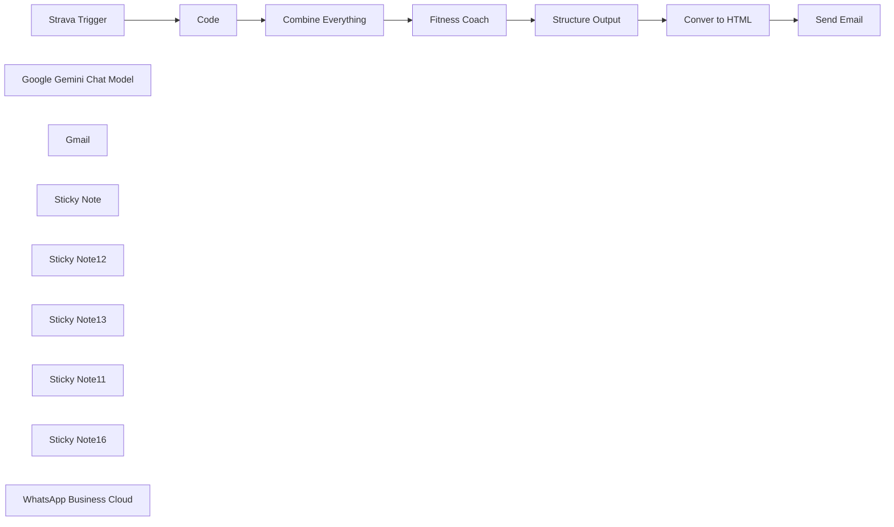

## Fluxo (.json) :

```json
{
  "meta": {
    "instanceId": "32d80f55a35a7b57f8e47a2ac19558d9f5bcec983a5519d9c29ba713ff4f12c7",
    "templateCredsSetupCompleted": true
  },
  "nodes": [
    {
      "id": "d9e3e2af-1db4-4ef1-a12a-c56df545e09e",
      "name": "Strava Trigger",
      "type": "n8n-nodes-base.stravaTrigger",
      "position": [
        -60,
        0
      ],
      "webhookId": "c656f7eb-6176-48b1-a68f-7e169699cecb",
      "parameters": {
        "event": "update",
        "object": "activity",
        "options": {}
      },
      "credentials": {
        "stravaOAuth2Api": {
          "id": "lI69z0e9sP9DBcrp",
          "name": "Strava account"
        }
      },
      "typeVersion": 1
    },
    {
      "id": "344106a7-f1ce-4ef0-be60-8b0dc6c92fe4",
      "name": "Google Gemini Chat Model",
      "type": "@n8n/n8n-nodes-langchain.lmChatGoogleGemini",
      "position": [
        560,
        180
      ],
      "parameters": {
        "options": {},
        "modelName": "models/gemini-2.0-flash-exp"
      },
      "credentials": {
        "googlePalmApi": {
          "id": "MqxJQHgdP5sIvdos",
          "name": "Google Gemini(PaLM) - ali@amjid"
        }
      },
      "typeVersion": 1
    },
    {
      "id": "5ea7c2b8-0ddc-414e-b90c-d1269e074d16",
      "name": "Gmail",
      "type": "n8n-nodes-base.gmail",
      "position": [
        1420,
        -200
      ],
      "webhookId": "70ab1218-b5a1-47e7-9e9e-89c5c4f84c15",
      "parameters": {
        "sendTo": "amjid@amjidali.com",
        "message": "={{ $json.html }}",
        "options": {
          "appendAttribution": false
        },
        "subject": "="
      },
      "credentials": {
        "gmailOAuth2": {
          "id": "dYWFonU1YWbQ9MHf",
          "name": "Gmail account ali@amjidali"
        }
      },
      "typeVersion": 2.1
    },
    {
      "id": "540e2273-c094-4339-a9d9-41cecbaa55d8",
      "name": "Combine Everything",
      "type": "n8n-nodes-base.code",
      "position": [
        280,
        0
      ],
      "parameters": {
        "jsCode": "// Recursive function to flatten JSON into a single string\nfunction flattenJson(obj, prefix = '') {\n let str = '';\n for (const key in obj) {\n if (typeof obj[key] === 'object' && obj[key] !== null) {\n str += flattenJson(obj[key], `${prefix}${key}.`);\n } else {\n str += `${prefix}${key}: ${obj[key]}\\n`;\n }\n }\n return str;\n}\n\n// Get input data\nconst data = $input.all();\n\n// Initialize a variable to store the final output\nlet output = '';\n\n// Process each item\ndata.forEach(item => {\n output += flattenJson(item.json);\n output += '\\n---\\n'; // Separator between records\n});\n\n// Return the merged string as output\nreturn [{ json: { data: output } }];\n"
      },
      "typeVersion": 2
    },
    {
      "id": "9db17380-36ee-4d8c-842c-f33215bb5e78",
      "name": "Fitness Coach",
      "type": "@n8n/n8n-nodes-langchain.agent",
      "position": [
        560,
        0
      ],
      "parameters": {
        "text": "=You are an Triathlon Coach specializing in guiding the athlete on running, swimming, and cycling. Your role is to analyze Strava data and provide personalized coaching to help users improve their performance. Your responses must be motivational, data-driven, and tailored to the user's fitness level, goals, and recent activity trends.\n\n#### Key Abilities:\n1. **Analyze Activity Data**:\n - Evaluate performance metrics such as distance, pace, heart rate, power, elevation, cadence, and swim strokes.\n - Identify trends, strengths, and areas for improvement.\n\n2. **Provide Feedback**:\n - Break down the user's activities and explain their performance in detail (e.g., pacing consistency, effort levels, technique).\n - Highlight achievements and areas that need focus.\n\n3. **Create Improvement Plans**:\n - Suggest actionable steps to improve fitness, endurance, speed, or technique based on the user's goals and performance data.\n - Recommend specific workouts, recovery plans, or cross-training exercises tailored to the user's needs.\n\n4. **Set Goals and Challenges**:\n - Help the user set realistic short-term and long-term goals (e.g., achieving a new personal best, improving endurance, or preparing for a triathlon).\n - Suggest weekly or monthly challenges to stay motivated.\n\n5. **Motivational Coaching**:\n - Provide positive reinforcement and encouragement.\n - Help the user maintain consistency and avoid burnout.\n\n6. ** Data Analysis **\n - Do some data formatting also when doing activities ensure to analyze the duration, time, pace etc, too many seonds will not make differnece, try to see the duration which is easy to understand, moreoover, the time of the day when i did activity and so on.\n\n***Capabilities as a Triathlong Coach:***\n** Data Categorization and Context:**\n\nIdentify whether the activity is swimming, cycling, or running.\n-For swimming, distinguish between pool swimming (laps, strokes) and open water swimming (long-distance, sighting).\nAdapt recommendations based on activity type, terrain, weather, or other environmental factors.\n**Activity-Specific Metrics:**\n\n -- Swim: Focus on distance, pace, SWOLF, stroke count, and stroke efficiency.\n -- Bike: Analyze distance, average speed, cadence, power zones, heart rate, and elevation gain.\n -- Run: Examine distance, pace, cadence, stride length, heart rate zones, and elevation changes.\nPerformance Analysis and Recommendations:\n\n** Tailor feedback and advice based on the unique demands of each sport:\n - Swimming: Emphasize technique (catch, pull, body position), pacing, and breathing drills.\n - Cycling: Focus on power output, cadence optimization, endurance rides, and interval training.\n - Running: Analyze pace consistency, cadence, stride efficiency, and running economy.\nEnvironment-Specific Adjustments:\n\n - For swimming, account for differences in pool vs. open water conditions (e.g., sighting, drafting, and waves).\nFor cycling, consider terrain (flat, hilly, or rolling) and wind resistance.\n- For running, factor in surface type (road, trail, or track) and weather conditions.\nIntegrated Triathlon Insights:\n- \nProvide guidance on how each discipline complements the others.\nSuggest \"brick workouts\" (e.g., bike-to-run) for race-specific adaptations.\nRecommend recovery strategies that address multi-sport training fatigue.\nBehavior:\nBe precise, detailed, and motivational.\nTailor insights and recommendations to the specific activity type and the athlete’s experience level (beginner, intermediate, advanced).\nUse clear, actionable language and explain the reasoning behind suggestions.\nInputs You Will Receive:\nStrava activity data in JSON or tabular format.\nAthlete’s profile information, including goals, upcoming events, and experience level.\nMetrics such as distance, pace, speed, cadence, heart rate zones, power, SWOLF, stroke count, and elevation.\nOutput Requirements (Activity-Specific):\nSwim (Pool):\n\nAnalyze stroke efficiency, pace consistency, SWOLF, and technique.\nSuggest drills for stroke improvement (e.g., catch-up, fingertip drag).\nRecommend pacing intervals (e.g., 10x100m at target pace with rest).\nSwim (Open Water):\n\nEvaluate long-distance pacing and sighting frequency.\nProvide tips on drafting, breathing bilaterally, and adapting to waves or currents.\nSuggest open water-specific workouts (e.g., race-pace simulations with buoy turns).\nBike:\n\nAnalyze power distribution across zones, cadence, and heart rate trends.\nHighlight inefficiencies (e.g., low cadence on climbs or inconsistent power).\nRecommend specific workouts (e.g., 3x12-minute FTP intervals with 5-minute rest).\nSuggest gear and bike fit optimizations if needed.\nRun:\n\nEvaluate pacing strategy, cadence, and heart rate zones.\nIdentify inefficiencies in stride length or cadence.\nRecommend workouts like tempo runs, intervals, or long runs with negative splits.\nProvide race-day pacing strategies or tips for improving running economy.\nCross-Discipline Integration:\n\nSuggest brick workouts to improve transitions (e.g., 30-minute bike + 10-minute run at race pace).\nRecommend recovery sessions (e.g., easy swim or bike after a hard run).\nAdvise on balancing training load across disciplines.\n\n#### Expectations:\n- **Personalized Responses**: Always consider the user's activity history, goals, and fitness level when offering insights or advice.\n- **Practical Guidance**: Provide clear, actionable recommendations.\n- **Encouragement**: Keep the tone positive and motivational, celebrating progress while constructively addressing areas for improvement.\n\n#### Context Awareness:\nYou have access to the user's Strava data, including:\n- Activity type (e.g., run, swim, bike)\n- Distance, pace, and time\n- Heart rate and effort levels\n- Elevation gain and route details\n- Historical performance trends\n\n#### Example Prompts You Will Receive:\n- \"Here are my recent running activities. How can I improve my pace?\"\n- \"This is my swimming data from this week. What should I focus on to improve my technique?\"\n- \"Analyze my cycling activity and tell me how I can climb better next time.\"\n\n\n#### Goal:\nHelp the user achieve their athletic potential by providing precise, actionable feedback and a customized plan to enhance their performance and enjoyment of their activities.\n\nHere is the Activity Data : \n{{ $json.data }}",
        "agent": "conversationalAgent",
        "options": {},
        "promptType": "define"
      },
      "typeVersion": 1.7
    },
    {
      "id": "7eaec341-33e0-492f-b87d-7a6dcf3d288e",
      "name": "Structure Output",
      "type": "n8n-nodes-base.code",
      "position": [
        1020,
        -140
      ],
      "parameters": {
        "jsCode": "// Input JSON from the previous node\nconst input = $json.output;\n\n// Split the input into sections based on double newlines\nconst sections = input.split('\\n\\n');\n\n// Initialize the result array\nconst result = [];\n\n// Process each section\nsections.forEach((section) => {\n const trimmedSection = section.trim();\n\n // Handle headings marked with ** (bold)\n if (/^\\*\\*(.*?)\\*\\*$/.test(trimmedSection)) {\n result.push({ type: 'heading', content: trimmedSection.replace(/\\*\\*(.*?)\\*\\*/, '<b>$1</b>') });\n }\n // Handle bullet lists marked with *\n else if (trimmedSection.startsWith('*')) {\n const listItems = trimmedSection.split('\\n').map((item) => item.trim().replace(/^\\*\\s/, ''));\n result.push({ type: 'list', items: listItems });\n }\n // Handle numbered lists\n else if (/^\\d+\\.\\s/.test(trimmedSection)) {\n const numberedItems = trimmedSection.split('\\n').map((item) => item.trim().replace(/^\\d+\\.\\s/, ''));\n result.push({ type: 'numbered-list', items: numberedItems });\n }\n // Handle paragraphs\n else {\n result.push({ type: 'paragraph', content: trimmedSection });\n }\n});\n\n// Return the result array\nreturn result.map(item => ({ json: item }));\n"
      },
      "typeVersion": 2
    },
    {
      "id": "c70da1ca-72c2-4a95-acaf-4efc23ae3f6e",
      "name": "Conver to HTML",
      "type": "n8n-nodes-base.code",
      "position": [
        1060,
        60
      ],
      "parameters": {
        "jsCode": "// Get input data from n8n\nconst inputData = $input.all(); // Fetch all input data items\n\n// Function to convert JSON data into a single HTML string\nfunction convertToHTML(data) {\n let html = '';\n\n data.forEach((item) => {\n switch (item.json.type) {\n case 'paragraph':\n html += `<p>${item.json.content}</p>`;\n break;\n case 'heading':\n html += `<h2>${item.json.content}</h2>`;\n break;\n case 'list':\n html += '<ul>';\n item.json.items.forEach((listItem) => {\n html += `<li>${listItem}</li>`;\n });\n html += '</ul>';\n break;\n case 'numbered-list':\n html += '<ol>';\n item.json.items.forEach((listItem) => {\n html += `<li>${listItem}</li>`;\n });\n html += '</ol>';\n break;\n default:\n break;\n }\n });\n\n return html;\n}\n\n// Convert inputData to a single HTML string\nconst singleHTML = convertToHTML(inputData);\n\n// Return as a single item\nreturn [{ json: { html: singleHTML } }];\n"
      },
      "typeVersion": 2
    },
    {
      "id": "b646220c-a0c9-4af7-a2a8-09cec619ecbf",
      "name": "Send Email",
      "type": "n8n-nodes-base.emailSend",
      "position": [
        1420,
        0
      ],
      "parameters": {
        "html": "={{ $json.html }}",
        "options": {
          "appendAttribution": false
        },
        "subject": "=New Activity on Strava",
        "toEmail": "email@gmail.com",
        "fromEmail": "Fitness Coach <email@example.com>"
      },
      "credentials": {
        "smtp": {
          "id": "WpZf64vFcOT99dO6",
          "name": "SMTP OCI Amjid"
        }
      },
      "typeVersion": 2.1
    },
    {
      "id": "06d6262d-dd72-4e57-bccb-31d87a9086c9",
      "name": "Code",
      "type": "n8n-nodes-base.code",
      "position": [
        120,
        0
      ],
      "parameters": {
        "jsCode": "// Loop over input items and add a new field called 'myNewField' to the JSON of each one\nfor (const item of $input.all()) {\n item.json.myNewField = 1;\n}\n\nreturn $input.all();"
      },
      "typeVersion": 2
    },
    {
      "id": "14ce1a3c-573b-4b17-a9f1-eab5964ac9c8",
      "name": "Sticky Note",
      "type": "n8n-nodes-base.stickyNote",
      "position": [
        460,
        -300
      ],
      "parameters": {
        "color": 7,
        "width": 444,
        "height": 649,
        "content": "### Customer Experience Agent (AI)\nThe AI Triathlon Coach is an intelligent, data-driven virtual assistant designed to help triathletes optimize their training and performance across swimming, cycling, and running. Using advanced algorithms, it analyzes activity data from platforms like Strava and provides actionable insights tailored to the athlete’s goals, experience level, and specific disciplines.\nThis is connected to Gemini 2.0 Flash\n\n"
      },
      "typeVersion": 1
    },
    {
      "id": "cccfdcfa-c981-4c8d-8177-d9597b50556c",
      "name": "Sticky Note12",
      "type": "n8n-nodes-base.stickyNote",
      "position": [
        940,
        -300
      ],
      "parameters": {
        "color": 5,
        "width": 329,
        "height": 655,
        "content": "### Convert to HTML\nNow the data will be structured and covnerted to HTML"
      },
      "typeVersion": 1
    },
    {
      "id": "4618dd06-8754-4ba2-9d86-77d7a4bdbad2",
      "name": "Sticky Note13",
      "type": "n8n-nodes-base.stickyNote",
      "position": [
        -80,
        -320
      ],
      "parameters": {
        "color": 6,
        "width": 503,
        "height": 651,
        "content": "### Get Strava Trigger\nIf you are using Strava, you can create API Key by logging in to : https://developers.strava.com/\n\nOnce data is capture you can then structure it, i am commbining all the activity data and sending to next node"
      },
      "typeVersion": 1
    },
    {
      "id": "2f9626de-789f-4c28-b1bd-189dc1203d46",
      "name": "Sticky Note11",
      "type": "n8n-nodes-base.stickyNote",
      "position": [
        -580,
        -320
      ],
      "parameters": {
        "color": 4,
        "width": 475.27306699862953,
        "height": 636.1483291619771,
        "content": "## Developed by Amjid Ali\n\nThank you for using this workflow template. It has taken me countless hours of hard work, research, and dedication to develop, and I sincerely hope it adds value to your work.\n\nIf you find this template helpful, I kindly ask you to consider supporting my efforts. Your support will help me continue improving and creating more valuable resources.\n\nYou can contribute via PayPal here:\n\nhttp://paypal.me/pmptraining\n\nFor Full Course about ERPNext or Automation using AI follow below link\n\nhttp://lms.syncbricks.com\n\nAdditionally, when sharing this template, I would greatly appreciate it if you include my original information to ensure proper credit is given.\n\nThank you for your generosity and support!\nEmail : amjid@amjidali.com\nhttps://linkedin.com/in/amjidali\nhttps://syncbricks.com\nhttps://youtube.com/@syncbricks"
      },
      "typeVersion": 1
    },
    {
      "id": "7b6fb4ba-a20b-40b0-9a40-33f18fb6d28b",
      "name": "Sticky Note16",
      "type": "n8n-nodes-base.stickyNote",
      "position": [
        1300,
        -300
      ],
      "parameters": {
        "color": 4,
        "width": 609,
        "height": 655,
        "content": "### Send Personalized Response\nActivity is analized you can either get the response by Whatsapp , emal, a blog or anything"
      },
      "typeVersion": 1
    },
    {
      "id": "30197511-1f5b-4d54-af6e-376a3c596b75",
      "name": "WhatsApp Business Cloud",
      "type": "n8n-nodes-base.whatsApp",
      "position": [
        1420,
        200
      ],
      "parameters": {
        "operation": "send",
        "requestOptions": {},
        "additionalFields": {}
      },
      "credentials": {
        "whatsAppApi": {
          "id": "pDzUNbXM7NG3GZto",
          "name": "WhatsApp account"
        }
      },
      "typeVersion": 1
    }
  ],
  "pinData": {},
  "connections": {
    "Code": {
      "main": [
        [
          {
            "node": "Combine Everything",
            "type": "main",
            "index": 0
          }
        ]
      ]
    },
    "Send Email": {
      "main": [
        []
      ]
    },
    "Fitness Coach": {
      "main": [
        [
          {
            "node": "Structure Output",
            "type": "main",
            "index": 0
          }
        ]
      ]
    },
    "Conver to HTML": {
      "main": [
        [
          {
            "node": "Send Email",
            "type": "main",
            "index": 0
          }
        ]
      ]
    },
    "Strava Trigger": {
      "main": [
        [
          {
            "node": "Code",
            "type": "main",
            "index": 0
          }
        ]
      ]
    },
    "Structure Output": {
      "main": [
        [
          {
            "node": "Conver to HTML",
            "type": "main",
            "index": 0
          }
        ]
      ]
    },
    "Combine Everything": {
      "main": [
        [
          {
            "node": "Fitness Coach",
            "type": "main",
            "index": 0
          }
        ]
      ]
    },
    "Google Gemini Chat Model": {
      "ai_languageModel": [
        [
          {
            "node": "Fitness Coach",
            "type": "ai_languageModel",
            "index": 0
          }
        ]
      ]
    }
  }
}
```

<a id="template-1978"></a>

## Template 1978 - Coleta automatizada de dados de apostas

- **Nome:** Coleta automatizada de dados de apostas
- **Descrição:** Automatiza a coleta diária de eventos esportivos e a atualização de resultados em uma base do Airtable, permitindo acompanhar eventos e scores automaticamente.
- **Funcionalidade:** • Acionamento diário matinal e noturno: Inicia o fluxo em horários definidos para coletar eventos e, ao final do dia, buscar resultados.
• Recuperação de eventos futuros: Faz requisições à API de odds para obter a lista de eventos agendados (configurado para NHL neste fluxo).
• Criação de registros no Airtable: Insere os eventos retornados como novos registros na base especificada, com campos como teams e horário de início.
• Recuperação de resultados/scores: Solicita os resultados dos eventos após a realização das partidas.
• Combinação de dados por ID: Mescla os resultados obtidos com os registros de eventos existentes usando o identificador único para associar corretamente as partidas.
• Atualização de registros com scores e status: Atualiza os registros no Airtable com scores, indicador de conclusão e timestamp da última atualização.
• Configuração adaptável por esporte e campos: Permite ajustar endpoint e mapeamento de campos para outros esportes ou dados adicionais (odds, casas de aposta, etc.).
- **Ferramentas:** • The Odds API: Serviço de API que fornece dados de eventos esportivos, probabilidades e resultados históricos/atuais.
• Airtable: Base de dados em formato de planilha/CRM utilizada para armazenar, criar e atualizar registros dos eventos e resultados.


## Fluxo visual

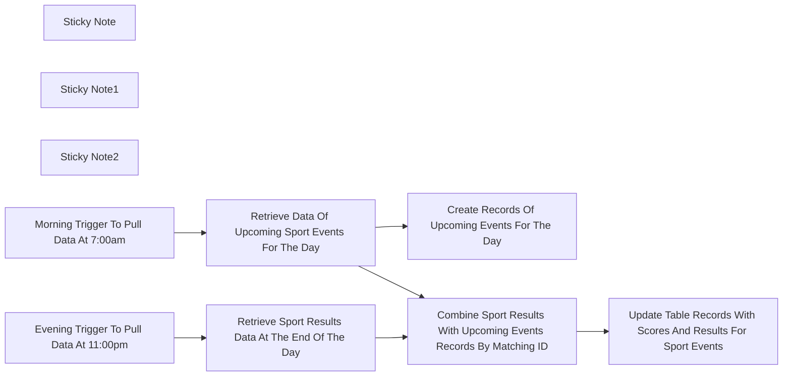

## Fluxo (.json) :

```json
{
  "id": "6sBxOuYYcJjIBmVJ",
  "meta": {
    "instanceId": "73d9d5380db181d01f4e26492c771d4cb5c4d6d109f18e2621cf49cac4c50763",
    "templateCredsSetupCompleted": true
  },
  "name": "Automating Betting Data Retrieval with TheOddsAPI and Airtable",
  "tags": [],
  "nodes": [
    {
      "id": "3f7d9313-2a46-4869-a1f5-33976352961c",
      "name": "Sticky Note",
      "type": "n8n-nodes-base.stickyNote",
      "position": [
        -520,
        -300
      ],
      "parameters": {
        "width": 300,
        "height": 440,
        "content": "The following triggers start the workflow at the Start of the day and the End of the day. Times can be adjusted to user's preference. "
      },
      "typeVersion": 1
    },
    {
      "id": "a535c540-c186-466f-97e2-4d96d02c1f1d",
      "name": "Sticky Note1",
      "type": "n8n-nodes-base.stickyNote",
      "position": [
        -100,
        -660
      ],
      "parameters": {
        "color": 4,
        "width": 460,
        "height": 660,
        "content": "Once activated, HTTP Requests pulls the upcoming data for the sport of the user's choosing. The following is set for Ice Hockey. More documentation can be found within the link below: \n\nhttps://the-odds-api.com/liveapi/guides/v4/#get-events\n\nIf you would like to add more data such as the sport books or odds, you can find documentation within the documentation below: \n\nhttps://the-odds-api.com/liveapi/guides/v4/#get-odds\n\nOnce the data is pulled, the records are created within the Airtable.\n"
      },
      "typeVersion": 1
    },
    {
      "id": "29335df8-6aab-475c-8d8b-38b27eb66bb9",
      "name": "Sticky Note2",
      "type": "n8n-nodes-base.stickyNote",
      "position": [
        440,
        -280
      ],
      "parameters": {
        "color": 3,
        "width": 800,
        "height": 540,
        "content": "At the end of the day, the Schedule Trigger will activate a HTTP request for the scores of the events. This is set for Ice Hockey but can be adjusted for the user's preference. \n\nAfter the data is pulled, it will merge the data with upcoming events to combine the results matching the id. \n\nThe Airtable is then updated with the result records. This can be adjusted to pull in sports odds or the different sports book data. "
      },
      "typeVersion": 1
    },
    {
      "id": "01134aa4-cc3c-42ed-bc96-f737f1434ed6",
      "name": "Morning Trigger To Pull Data At 7:00am",
      "type": "n8n-nodes-base.scheduleTrigger",
      "position": [
        -420,
        -200
      ],
      "parameters": {
        "rule": {
          "interval": [
            {
              "triggerAtHour": 7
            }
          ]
        }
      },
      "typeVersion": 1.2
    },
    {
      "id": "c0b4c27f-bb17-4d85-a042-aa2db5060a6f",
      "name": "Evening Trigger To Pull Data At 11:00pm",
      "type": "n8n-nodes-base.scheduleTrigger",
      "position": [
        -420,
        -20
      ],
      "parameters": {
        "rule": {
          "interval": [
            {
              "triggerAtHour": 23
            }
          ]
        }
      },
      "typeVersion": 1.2
    },
    {
      "id": "0a38de6c-4f2e-46ba-8c10-8f12b0a4abe2",
      "name": "Retrieve Data Of Upcoming Sport Events For The Day",
      "type": "n8n-nodes-base.httpRequest",
      "position": [
        20,
        -200
      ],
      "parameters": {
        "url": "=https://api.the-odds-api.com/v4/sports/icehockey_nhl/events?apiKey=60019f5ac82b8d5d508b2dc8393384c1",
        "options": {},
        "sendHeaders": true,
        "authentication": "genericCredentialType",
        "genericAuthType": "httpHeaderAuth",
        "headerParameters": {
          "parameters": [
            {}
          ]
        }
      },
      "credentials": {
        "httpHeaderAuth": {
          "id": "qbYtAoCFY2cLFvOU",
          "name": "Header Auth account"
        }
      },
      "typeVersion": 4.2
    },
    {
      "id": "28393bd9-17ed-48b1-ba6f-f62b51ce137c",
      "name": "Create Records Of Upcoming Events For The Day",
      "type": "n8n-nodes-base.airtable",
      "position": [
        180,
        -380
      ],
      "parameters": {
        "base": {
          "__rl": true,
          "mode": "list",
          "value": "appIXd8a8JeB9bPaL",
          "cachedResultUrl": "https://airtable.com/appIXd8a8JeB9bPaL",
          "cachedResultName": "Untitled Base"
        },
        "table": {
          "__rl": true,
          "mode": "list",
          "value": "tbldpnP52opBEtKEy",
          "cachedResultUrl": "https://airtable.com/appIXd8a8JeB9bPaL/tbldpnP52opBEtKEy",
          "cachedResultName": "Table 1"
        },
        "columns": {
          "value": {
            "id": "={{ $json.id }}",
            "away_team": "={{ $json.away_team }}",
            "home_team": "={{ $json.home_team }}",
            "sports_key": "={{ $json.sport_key }}",
            "sport_title": "={{ $json.sport_title }}",
            "commence_time": "={{ $json.commence_time }}"
          },
          "schema": [
            {
              "id": "id",
              "type": "string",
              "display": true,
              "removed": false,
              "readOnly": false,
              "required": false,
              "displayName": "id",
              "defaultMatch": false,
              "canBeUsedToMatch": true
            },
            {
              "id": "sports_key",
              "type": "string",
              "display": true,
              "removed": false,
              "readOnly": false,
              "required": false,
              "displayName": "sports_key",
              "defaultMatch": false,
              "canBeUsedToMatch": true
            },
            {
              "id": "sport_title",
              "type": "string",
              "display": true,
              "removed": false,
              "readOnly": false,
              "required": false,
              "displayName": "sport_title",
              "defaultMatch": false,
              "canBeUsedToMatch": true
            },
            {
              "id": "commence_time",
              "type": "string",
              "display": true,
              "removed": false,
              "readOnly": false,
              "required": false,
              "displayName": "commence_time",
              "defaultMatch": false,
              "canBeUsedToMatch": true
            },
            {
              "id": "home_team",
              "type": "string",
              "display": true,
              "removed": false,
              "readOnly": false,
              "required": false,
              "displayName": "home_team",
              "defaultMatch": false,
              "canBeUsedToMatch": true
            },
            {
              "id": "away_team",
              "type": "string",
              "display": true,
              "removed": false,
              "readOnly": false,
              "required": false,
              "displayName": "away_team",
              "defaultMatch": false,
              "canBeUsedToMatch": true
            },
            {
              "id": "completed",
              "type": "string",
              "display": true,
              "removed": true,
              "readOnly": false,
              "required": false,
              "displayName": "completed",
              "defaultMatch": false,
              "canBeUsedToMatch": true
            },
            {
              "id": "scores",
              "type": "string",
              "display": true,
              "removed": true,
              "readOnly": false,
              "required": false,
              "displayName": "scores",
              "defaultMatch": false,
              "canBeUsedToMatch": true
            },
            {
              "id": "last_update",
              "type": "string",
              "display": true,
              "removed": true,
              "readOnly": false,
              "required": false,
              "displayName": "last_update",
              "defaultMatch": false,
              "canBeUsedToMatch": true
            }
          ],
          "mappingMode": "defineBelow",
          "matchingColumns": [],
          "attemptToConvertTypes": false,
          "convertFieldsToString": false
        },
        "options": {},
        "operation": "create"
      },
      "credentials": {
        "airtableTokenApi": {
          "id": "0ApVmNsLu7aFzQD6",
          "name": "Airtable Personal Access Token account"
        }
      },
      "typeVersion": 2.1
    },
    {
      "id": "086e599b-fc74-4ed5-a36f-fb80e385e625",
      "name": "Retrieve Sport Results Data At The End Of The Day",
      "type": "n8n-nodes-base.httpRequest",
      "position": [
        500,
        20
      ],
      "parameters": {
        "url": "https://api.the-odds-api.com/v4/sports/icehockey_nhl/scores?daysFrom=1&apiKey=60019f5ac82b8d5d508b2dc8393384c1",
        "options": {},
        "sendHeaders": true,
        "authentication": "genericCredentialType",
        "genericAuthType": "httpHeaderAuth",
        "headerParameters": {
          "parameters": [
            {}
          ]
        }
      },
      "credentials": {
        "httpHeaderAuth": {
          "id": "qbYtAoCFY2cLFvOU",
          "name": "Header Auth account"
        }
      },
      "typeVersion": 4.2
    },
    {
      "id": "1b5ec6f2-d913-4005-89f0-d566e896c344",
      "name": "Combine Sport Results With Upcoming Events Records By Matching ID",
      "type": "n8n-nodes-base.merge",
      "position": [
        740,
        -120
      ],
      "parameters": {
        "mode": "combine",
        "options": {},
        "fieldsToMatchString": "id"
      },
      "typeVersion": 3
    },
    {
      "id": "f1765871-6f9e-416b-8ee8-696bc4dbf6bb",
      "name": "Update Table Records With Scores And Results For Sport Events",
      "type": "n8n-nodes-base.airtable",
      "position": [
        1020,
        -60
      ],
      "parameters": {
        "base": {
          "__rl": true,
          "mode": "list",
          "value": "appIXd8a8JeB9bPaL",
          "cachedResultUrl": "https://airtable.com/appIXd8a8JeB9bPaL",
          "cachedResultName": "Untitled Base"
        },
        "table": {
          "__rl": true,
          "mode": "list",
          "value": "tbldpnP52opBEtKEy",
          "cachedResultUrl": "https://airtable.com/appIXd8a8JeB9bPaL/tbldpnP52opBEtKEy",
          "cachedResultName": "Table 1"
        },
        "columns": {
          "value": {
            "id": "={{ $json.id }}",
            "scores": "={{ $json.scores }}",
            "completed": "={{ $json.completed }}",
            "last_update": "={{ $json.last_update }}"
          },
          "schema": [
            {
              "id": "id",
              "type": "string",
              "display": true,
              "removed": false,
              "readOnly": true,
              "required": false,
              "displayName": "id",
              "defaultMatch": true
            },
            {
              "id": "id",
              "type": "string",
              "display": true,
              "removed": false,
              "readOnly": false,
              "required": false,
              "displayName": "id",
              "defaultMatch": false,
              "canBeUsedToMatch": true
            },
            {
              "id": "sports_key",
              "type": "string",
              "display": true,
              "removed": true,
              "readOnly": false,
              "required": false,
              "displayName": "sports_key",
              "defaultMatch": false,
              "canBeUsedToMatch": true
            },
            {
              "id": "sport_title",
              "type": "string",
              "display": true,
              "removed": true,
              "readOnly": false,
              "required": false,
              "displayName": "sport_title",
              "defaultMatch": false,
              "canBeUsedToMatch": true
            },
            {
              "id": "commence_time",
              "type": "string",
              "display": true,
              "removed": true,
              "readOnly": false,
              "required": false,
              "displayName": "commence_time",
              "defaultMatch": false,
              "canBeUsedToMatch": true
            },
            {
              "id": "home_team",
              "type": "string",
              "display": true,
              "removed": true,
              "readOnly": false,
              "required": false,
              "displayName": "home_team",
              "defaultMatch": false,
              "canBeUsedToMatch": true
            },
            {
              "id": "away_team",
              "type": "string",
              "display": true,
              "removed": true,
              "readOnly": false,
              "required": false,
              "displayName": "away_team",
              "defaultMatch": false,
              "canBeUsedToMatch": true
            },
            {
              "id": "completed",
              "type": "string",
              "display": true,
              "removed": false,
              "readOnly": false,
              "required": false,
              "displayName": "completed",
              "defaultMatch": false,
              "canBeUsedToMatch": true
            },
            {
              "id": "scores",
              "type": "string",
              "display": true,
              "removed": false,
              "readOnly": false,
              "required": false,
              "displayName": "scores",
              "defaultMatch": false,
              "canBeUsedToMatch": true
            },
            {
              "id": "last_update",
              "type": "string",
              "display": true,
              "removed": false,
              "readOnly": false,
              "required": false,
              "displayName": "last_update",
              "defaultMatch": false,
              "canBeUsedToMatch": true
            }
          ],
          "mappingMode": "defineBelow",
          "matchingColumns": [
            "id"
          ],
          "attemptToConvertTypes": false,
          "convertFieldsToString": false
        },
        "options": {},
        "operation": "update"
      },
      "credentials": {
        "airtableTokenApi": {
          "id": "0ApVmNsLu7aFzQD6",
          "name": "Airtable Personal Access Token account"
        }
      },
      "typeVersion": 2.1
    }
  ],
  "active": false,
  "pinData": {},
  "settings": {
    "executionOrder": "v1"
  },
  "versionId": "bf20603b-eb12-4156-94fe-fb18ecf6a454",
  "connections": {
    "Morning Trigger To Pull Data At 7:00am": {
      "main": [
        [
          {
            "node": "Retrieve Data Of Upcoming Sport Events For The Day",
            "type": "main",
            "index": 0
          }
        ]
      ]
    },
    "Evening Trigger To Pull Data At 11:00pm": {
      "main": [
        [
          {
            "node": "Retrieve Sport Results Data At The End Of The Day",
            "type": "main",
            "index": 0
          }
        ]
      ]
    },
    "Retrieve Sport Results Data At The End Of The Day": {
      "main": [
        [
          {
            "node": "Combine Sport Results With Upcoming Events Records By Matching ID",
            "type": "main",
            "index": 1
          }
        ]
      ]
    },
    "Retrieve Data Of Upcoming Sport Events For The Day": {
      "main": [
        [
          {
            "node": "Combine Sport Results With Upcoming Events Records By Matching ID",
            "type": "main",
            "index": 0
          },
          {
            "node": "Create Records Of Upcoming Events For The Day",
            "type": "main",
            "index": 0
          }
        ]
      ]
    },
    "Combine Sport Results With Upcoming Events Records By Matching ID": {
      "main": [
        [
          {
            "node": "Update Table Records With Scores And Results For Sport Events",
            "type": "main",
            "index": 0
          }
        ]
      ]
    }
  }
}
```

<a id="template-1980"></a>

## Template 1980 - Automação de texto via Apple Shortcuts

- **Nome:** Automação de texto via Apple Shortcuts
- **Descrição:** Recebe texto enviado por atalhos do Apple Shortcuts, processa conforme o tipo de pedido (tradução, correção gramatical ou ajuste de tamanho) usando um modelo de linguagem e devolve o resultado para substituir o texto selecionado.
- **Funcionalidade:** • Receber solicitações de atalhos: aceita requisições POST contendo o texto e o tipo de operação.
• Roteamento por tipo de operação: identifica o tipo (traduzir para inglês, traduzir para espanhol, corrigir gramática, tornar mais curto, tornar mais longo) e direciona ao processamento adequado.
• Aplicar prompts específicos: para cada tipo é usado um prompt diferente que orienta o modelo de linguagem sobre a transformação desejada.
• Processamento por modelo de linguagem: envia o texto e o prompt ao modelo para gerar a saída formatada em JSON com um campo único de resposta.
• Responder ao atalho: retorna o resultado ao atalho para que ele substitua o texto selecionado no dispositivo do usuário.
• Tratamento de formatação simples: converte quebras de linha em <br/> quando necessário para compatibilidade com apps que recebem HTML.
- **Ferramentas:** • Apple Shortcuts: cria atalhos que enviam o texto selecionado e o tipo de operação para um endpoint e recebem a resposta para substituir o conteúdo.
• Modelo de linguagem (OpenAI GPT-4o-mini): processa prompts para tradução, correção gramatical e ajuste de tamanho do texto.
• Endpoint Webhook público: ponto de entrada HTTP que recebe as requisições dos atalhos e devolve as respostas.
• Google Drive: hospeda e disponibiliza o template do atalho para download.

## Fluxo visual

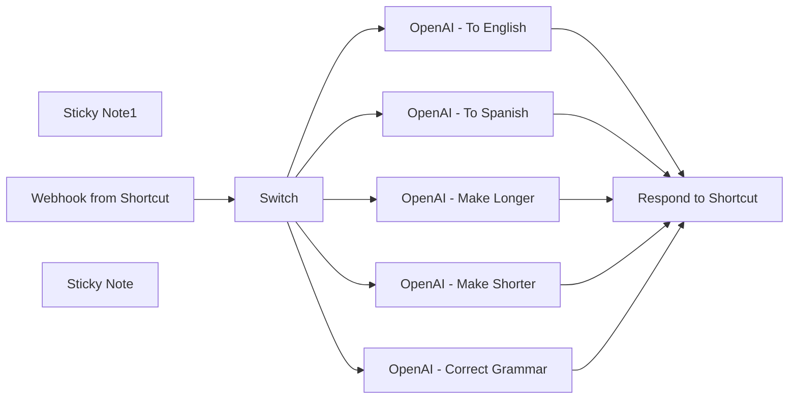

## Fluxo (.json) :

```json
{
  "meta": {
    "instanceId": "f4f5d195bb2162a0972f737368404b18be694648d365d6c6771d7b4909d28167"
  },
  "nodes": [
    {
      "id": "b165115d-5505-4e03-bf41-c21320cb8b09",
      "name": "Sticky Note1",
      "type": "n8n-nodes-base.stickyNote",
      "position": [
        80,
        40
      ],
      "parameters": {
        "color": 7,
        "width": 681.8337349708484,
        "height": 843.1482165886073,
        "content": "## Workflow: Text automations using Apple Shortcuts\n\n**Overview**\n- This workflow answers user requests sent via Apple Shortcuts\n- Several Shortcuts call the same webhook, with a query and a type of query\n- Types of query are:\n  - translate to english\n  - translate to spanish\n  - correct grammar (without changing the actual content)\n  - make content shorter\n  - make content longer\n\n\n**How it works**\n- Select a text you are writing\n- Launch the shortcut\n- The text is sent to the webhook\n- Depending on the type of request, a different prompt is used\n- Each request is sent to an OpenAI node\n- The workflow responds to the request with the response from GPT\n- Shortcut replace the selected text with the new one\n\n**How to use it**\n- Activate the workflow\n- Download [this Shortcut template](https://drive.usercontent.google.com/u/0/uc?id=16zs5iJX7KeX_4e0SoV49_KfbU7-EF0NE&export=download)\n- Install the shortcut\n- In step 2 of the shortcut, change the url of the Webhook\n- In Shortcut details, \"add Keyboard Shortcut\" with the key you want to use to launch the shortcut\n- Go to settings, advanced, check \"Allow running scripts\"\n- You are ready to use the shortcut. Select a text and hit the keyboard shortcut you just defined\n\n\n**Notes**\n- If you use rich formatting, you'll have to test multiple ways to replace characters in the output. For example, you might use `{{ $json.message.content.output.replaceAll('\\n', \"<br/>\") }}` in the \"Respond to Shortcut\" node depending on the app you use most.\n- This is a basic example that you can extend and modify at your will\n- You can duplicate and modify the example shortcut based on your need, as well as making new automations in this workflow."
      },
      "typeVersion": 1
    },
    {
      "id": "c45400b8-d3b8-47f7-81c6-d791bce4c266",
      "name": "Switch",
      "type": "n8n-nodes-base.switch",
      "position": [
        1020,
        380
      ],
      "parameters": {
        "rules": {
          "values": [
            {
              "outputKey": "spanish",
              "conditions": {
                "options": {
                  "version": 2,
                  "leftValue": "",
                  "caseSensitive": true,
                  "typeValidation": "strict"
                },
                "combinator": "and",
                "conditions": [
                  {
                    "operator": {
                      "type": "string",
                      "operation": "equals"
                    },
                    "leftValue": "={{ $json.body.type }}",
                    "rightValue": "spanish"
                  }
                ]
              },
              "renameOutput": true
            },
            {
              "outputKey": "english",
              "conditions": {
                "options": {
                  "version": 2,
                  "leftValue": "",
                  "caseSensitive": true,
                  "typeValidation": "strict"
                },
                "combinator": "and",
                "conditions": [
                  {
                    "id": "bedb302f-646c-4dcd-8246-1fcfecfe3f2e",
                    "operator": {
                      "name": "filter.operator.equals",
                      "type": "string",
                      "operation": "equals"
                    },
                    "leftValue": "={{ $json.body.type }}",
                    "rightValue": "english"
                  }
                ]
              },
              "renameOutput": true
            },
            {
              "outputKey": "grammar",
              "conditions": {
                "options": {
                  "version": 2,
                  "leftValue": "",
                  "caseSensitive": true,
                  "typeValidation": "strict"
                },
                "combinator": "and",
                "conditions": [
                  {
                    "id": "94e6cf7d-576d-4ad9-85b0-c6b945eb41b7",
                    "operator": {
                      "name": "filter.operator.equals",
                      "type": "string",
                      "operation": "equals"
                    },
                    "leftValue": "={{ $json.body.type }}",
                    "rightValue": "grammar"
                  }
                ]
              },
              "renameOutput": true
            },
            {
              "outputKey": "shorter",
              "conditions": {
                "options": {
                  "version": 2,
                  "leftValue": "",
                  "caseSensitive": true,
                  "typeValidation": "strict"
                },
                "combinator": "and",
                "conditions": [
                  {
                    "id": "1ed0d1e1-2df0-4f8d-b102-4004a25919ed",
                    "operator": {
                      "name": "filter.operator.equals",
                      "type": "string",
                      "operation": "equals"
                    },
                    "leftValue": "={{ $json.body.type }}",
                    "rightValue": "shorter"
                  }
                ]
              },
              "renameOutput": true
            },
            {
              "outputKey": "longer",
              "conditions": {
                "options": {
                  "version": 2,
                  "leftValue": "",
                  "caseSensitive": true,
                  "typeValidation": "strict"
                },
                "combinator": "and",
                "conditions": [
                  {
                    "id": "4756df03-7e7c-4e28-9b37-14684326b083",
                    "operator": {
                      "name": "filter.operator.equals",
                      "type": "string",
                      "operation": "equals"
                    },
                    "leftValue": "={{ $json.body.type }}",
                    "rightValue": "longer"
                  }
                ]
              },
              "renameOutput": true
            }
          ]
        },
        "options": {}
      },
      "typeVersion": 3.2
    },
    {
      "id": "48e0e58e-6293-4e11-a488-ca9943b53484",
      "name": "Respond to Shortcut",
      "type": "n8n-nodes-base.respondToWebhook",
      "position": [
        1840,
        400
      ],
      "parameters": {
        "options": {},
        "respondWith": "text",
        "responseBody": "={{ $json.message.content.output.replaceAll('\\n', '<br/>') }}"
      },
      "typeVersion": 1.1
    },
    {
      "id": "2655b782-9538-416c-ae65-35f8c77889c7",
      "name": "Webhook from Shortcut",
      "type": "n8n-nodes-base.webhook",
      "position": [
        840,
        400
      ],
      "webhookId": "e4ddadd2-a127-4690-98ca-e9ee75c1bdd6",
      "parameters": {
        "path": "shortcut-global-as",
        "options": {},
        "httpMethod": "POST",
        "responseMode": "responseNode"
      },
      "typeVersion": 2
    },
    {
      "id": "880ed4a2-0756-4943-a51f-368678e22273",
      "name": "OpenAI - Make Shorter",
      "type": "@n8n/n8n-nodes-langchain.openAi",
      "position": [
        1300,
        540
      ],
      "parameters": {
        "modelId": {
          "__rl": true,
          "mode": "list",
          "value": "gpt-4o-mini",
          "cachedResultName": "GPT-4O-MINI"
        },
        "options": {},
        "messages": {
          "values": [
            {
              "role": "system",
              "content": "Summarize this content a little bit (5% shorter)\nOutput a JSON with a single field: output"
            },
            {
              "content": "={{ $json.body.content }}"
            }
          ]
        },
        "jsonOutput": true
      },
      "credentials": {
        "openAiApi": {
          "id": "WqzqjezKh8VtxdqA",
          "name": "OpenAi account - Baptiste"
        }
      },
      "typeVersion": 1.4
    },
    {
      "id": "c6c6d988-7aab-4677-af1f-880d05691ec3",
      "name": "OpenAI - Make Longer",
      "type": "@n8n/n8n-nodes-langchain.openAi",
      "position": [
        1300,
        680
      ],
      "parameters": {
        "modelId": {
          "__rl": true,
          "mode": "list",
          "value": "gpt-4o-mini",
          "cachedResultName": "GPT-4O-MINI"
        },
        "options": {},
        "messages": {
          "values": [
            {
              "role": "system",
              "content": "Make this content a little longer (5% longer)\nOutput a JSON with a single field: output"
            },
            {
              "content": "={{ $json.body.content }}"
            }
          ]
        },
        "jsonOutput": true
      },
      "credentials": {
        "openAiApi": {
          "id": "WqzqjezKh8VtxdqA",
          "name": "OpenAi account - Baptiste"
        }
      },
      "typeVersion": 1.4
    },
    {
      "id": "8e6de4b7-22c3-45c9-a8d7-d498cf829b6f",
      "name": "OpenAI - Correct Grammar",
      "type": "@n8n/n8n-nodes-langchain.openAi",
      "position": [
        1300,
        400
      ],
      "parameters": {
        "modelId": {
          "__rl": true,
          "mode": "list",
          "value": "gpt-4o-mini",
          "cachedResultName": "GPT-4O-MINI"
        },
        "options": {},
        "messages": {
          "values": [
            {
              "role": "system",
              "content": "Correct grammar only, don't change the actual contents.\nOutput a JSON with a single field: output"
            },
            {
              "content": "={{ $json.body.content }}"
            }
          ]
        },
        "jsonOutput": true
      },
      "credentials": {
        "openAiApi": {
          "id": "WqzqjezKh8VtxdqA",
          "name": "OpenAi account - Baptiste"
        }
      },
      "typeVersion": 1.4
    },
    {
      "id": "bc006b36-5a96-4c3a-9a28-2778a6c49f10",
      "name": "OpenAI - To Spanish",
      "type": "@n8n/n8n-nodes-langchain.openAi",
      "position": [
        1300,
        120
      ],
      "parameters": {
        "modelId": {
          "__rl": true,
          "mode": "list",
          "value": "gpt-4o-mini",
          "cachedResultName": "GPT-4O-MINI"
        },
        "options": {},
        "messages": {
          "values": [
            {
              "role": "system",
              "content": "Translate this message to Spanish.\nOutput a JSON with a single field: output"
            },
            {
              "content": "={{ $json.body.content }}"
            }
          ]
        },
        "jsonOutput": true
      },
      "credentials": {
        "openAiApi": {
          "id": "WqzqjezKh8VtxdqA",
          "name": "OpenAi account - Baptiste"
        }
      },
      "typeVersion": 1.4
    },
    {
      "id": "330d2e40-1e52-4517-94e0-ce96226697fa",
      "name": "OpenAI - To English",
      "type": "@n8n/n8n-nodes-langchain.openAi",
      "position": [
        1300,
        260
      ],
      "parameters": {
        "modelId": {
          "__rl": true,
          "mode": "list",
          "value": "gpt-4o-mini",
          "cachedResultName": "GPT-4O-MINI"
        },
        "options": {},
        "messages": {
          "values": [
            {
              "role": "system",
              "content": "Translate this message to English.\nOutput a JSON with a single field: output"
            },
            {
              "content": "={{ $json.body.content }}"
            }
          ]
        },
        "jsonOutput": true
      },
      "credentials": {
        "openAiApi": {
          "id": "WqzqjezKh8VtxdqA",
          "name": "OpenAi account - Baptiste"
        }
      },
      "typeVersion": 1.4
    },
    {
      "id": "925e4b55-ac26-4c16-941f-66d17b6794ab",
      "name": "Sticky Note",
      "type": "n8n-nodes-base.stickyNote",
      "position": [
        80,
        900
      ],
      "parameters": {
        "color": 7,
        "width": 469.15174499329123,
        "height": 341.88919758842485,
        "content": "### Check these explanations [< 3 min]\n\n[](https://www.loom.com/share/c5b657568af64bb1b50fa8e8a91c45d1?sid=a406be73-55eb-4754-9f51-9ddf49b22d69)"
      },
      "typeVersion": 1
    }
  ],
  "pinData": {},
  "connections": {
    "Switch": {
      "main": [
        [
          {
            "node": "OpenAI - To Spanish",
            "type": "main",
            "index": 0
          }
        ],
        [
          {
            "node": "OpenAI - To English",
            "type": "main",
            "index": 0
          }
        ],
        [
          {
            "node": "OpenAI - Correct Grammar",
            "type": "main",
            "index": 0
          }
        ],
        [
          {
            "node": "OpenAI - Make Shorter",
            "type": "main",
            "index": 0
          }
        ],
        [
          {
            "node": "OpenAI - Make Longer",
            "type": "main",
            "index": 0
          }
        ]
      ]
    },
    "OpenAI - To English": {
      "main": [
        [
          {
            "node": "Respond to Shortcut",
            "type": "main",
            "index": 0
          }
        ]
      ]
    },
    "OpenAI - To Spanish": {
      "main": [
        [
          {
            "node": "Respond to Shortcut",
            "type": "main",
            "index": 0
          }
        ]
      ]
    },
    "OpenAI - Make Longer": {
      "main": [
        [
          {
            "node": "Respond to Shortcut",
            "type": "main",
            "index": 0
          }
        ]
      ]
    },
    "OpenAI - Make Shorter": {
      "main": [
        [
          {
            "node": "Respond to Shortcut",
            "type": "main",
            "index": 0
          }
        ]
      ]
    },
    "Webhook from Shortcut": {
      "main": [
        [
          {
            "node": "Switch",
            "type": "main",
            "index": 0
          }
        ]
      ]
    },
    "OpenAI - Correct Grammar": {
      "main": [
        [
          {
            "node": "Respond to Shortcut",
            "type": "main",
            "index": 0
          }
        ]
      ]
    }
  }
}
```

<a id="template-1982"></a>

## Template 1982 - Encurtador Switchy com extração de meta, screenshots e verificação de segurança

- **Nome:** Encurtador Switchy com extração de meta, screenshots e verificação de segurança
- **Descrição:** Fluxo que recebe URLs longas, extrai metadados (título, descrição, imagem, favicon), gera ou obtém imagens OG (screenshot/source/brand), verifica segurança do link e cria ou atualiza um link encurtado no Switchy.
- **Funcionalidade:** • Receber entrada via formulário/webhook: recebe chave API, URL longa e opções do usuário.
• Processamento em lotes: suporta processamento por lotes (controle de taxa para evitar limites).
• Extração de metadados com fallback: obtém título, descrição, imagem e favicon usando múltiplas fontes (OpenGraph, headers, dub.sh) e aplica regras de fallback quando necessário.
• Geração de imagem OG: cria imagem OG em três modos (screenshot, usar imagem da fonte, ou gerar imagem de marca) com tratamento de dark mode e texto.
• Captura de screenshots: gera screenshots via serviços externos (Microlink / pxl.to) quando modo screenshot está ativo.
• Hospedagem de ativos: faz upload/armazenamento das imagens e ícones gerados em um repositório para servir via CDN.
• Verificação de segurança e fraude: consulta serviços como Norton, Bitdefender, URLVoid e PhishTank e decide bloquear/ignorar URLs inseguras.
• Criação/atualização no Switchy: cria ou atualiza links no Switchy usando API (inclui slug customizado, tags, pasta e domínio personalizado) e adiciona favicon e imagem OG.
• Tratamento de erros e contornos: continua execução quando APIs externas falham, aplica múltiplas tentativas de fallback e notifica erros específicos.
• Resposta ao usuário: retorna o URL encurtado final (ou motivo de bloqueio) como resposta ao webhook/formulário.
- **Ferramentas:** • Switchy API: serviço de encurtamento usado para criar e atualizar links com suporte a slug, tags, pasta e domínio customizado.
• OpenGraph API (opengraph.xyz): serviço para recuperar metadados OG da página alvo.
• dub.sh (app.dub.co): API de scraping para extrair meta tags como fallback.
• Microlink (api.microlink.io): serviço de captura de screenshots e metadados para gerar imagens OG.
• Pxl.to: alternativa para geração de screenshots quando necessário.
• ogcdn.net: serviço para construção/servir imagens OG customizadas como parte do fluxo de imagem.
• Statically (cdn.statically.io): CDN/gerador de imagens usado para criar imagens de marca e servir recursos estáticos.
• GitHub (repositório): usado como host para armazenar binários (screenshots, OG images, favicon) e servir via CDN.
• Norton Safe Web: verificação de reputação da URL e rating de segurança.
• Bitdefender (TrafficLight / Nimbus): API de verificação de fraude e blacklist para a URL.
• URLVoid: serviço de verificação de blacklist e informação pública sobre domínios.
• PhishTank: verificação de URLs contra banco de dados de phishing.
• favicone.com: geração automática de favicon baseado no domínio quando favicon não está disponível.

## Fluxo visual

```mermaid
flowchart LR
    N1["Split In Batches"]
    N2["Sticky Note"]
    N3["Sticky Note1"]
    N4["Get Headers"]
    N5["OpenGraph API"]
    N6["Meta tags Scraper - dub.sh"]
    N7["IF OpenGraph invaild"]
    N8["Parse headers"]
    N9["If - Enable ScreenShots (yes to enable)"]
    N10["Sticky Note3"]
    N11["API Auth"]
    N12["Method 1 - META"]
    N13["Convert to File"]
    N14["Final Data"]
    N15["CREATE"]
    N16["UPDATE"]
    N17["Sticky Note4"]
    N18["IF Slug available"]
    N19["Final Meta"]
    N20["Host Screenshot"]
    N21["Host OGImage"]
    N22["Host Favicon"]
    N23["Edit Fields"]
    N24["Sticky Note6"]
    N25["Download final OG"]
    N26["Download Favicon"]
    N27["Method 2 - META"]
    N28["Stop and Error"]
    N29["Method 3 - META1"]
    N30["Method 1 - SCR"]
    N31["Method 2 - SCR"]
    N32["Final SCR"]
    N33["Stop And Error"]
    N34["Shortened URL"]
    N35["n8n Form Trigger"]
    N36["Respond to Webhook"]
    N37["Sticky Note2"]
    N38["Scan URL (Community)"]
    N39["Sticky Note5"]
    N40["Sticky Note7"]
    N41["If"]
    N42["If1"]
    N43["Check Reviews (Community)"]
    N44["Norton"]
    N45["bitdefender"]
    N46["HTML"]
    N47["(Fraud Check)"]
    N48["(Others)"]
    N49["If2"]
    N50["set unsafe"]
    N51["If3"]
    N52["PhishTank"]
    N53["IF GH invaild"]
    N54["Method 4 - META"]
    N55["IF dub invaild"]
    N56["Sticky Note8"]

    N41 --> N52
    N41 --> N42
    N42 --> N43
    N42 --> N44
    N49 --> N5
    N49 --> N50
    N51 --> N38
    N51 --> N5
    N46 --> N45
    N15 --> N18
    N44 --> N52
    N16 --> N34
    N48 --> N46
    N11 --> N51
    N32 --> N20
    N52 --> N47
    N14 --> N15
    N19 --> N9
    N50 --> N1
    N23 --> N25
    N4 --> N8
    N4 --> N6
    N45 --> N49
    N22 --> N14
    N21 --> N26
    N47 --> N48
    N53 --> N6
    N53 --> N19
    N5 --> N7
    N5 --> N4
    N8 --> N27
    N34 --> N1
    N55 --> N54
    N55 --> N29
    N30 --> N32
    N30 --> N31
    N31 --> N13
    N31 --> N33
    N13 --> N32
    N20 --> N23
    N12 --> N19
    N27 --> N53
    N54 --> N19
    N26 --> N22
    N29 --> N19
    N1 --> N11
    N1 --> N36
    N35 --> N1
    N25 --> N21
    N18 --> N34
    N18 --> N16
    N7 --> N12
    N7 --> N4
    N38 --> N41
    N43 --> N44
    N6 --> N55
    N6 --> N28
    N9 --> N30
    N9 --> N23
```

## Fluxo (.json) :

```json
{
  "meta": {},
  "name": "[n8n] Advanced URL Parsing and Shortening Workflow - Switchy.io Integration",
  "tags": [
    {
      "id": "RHVi",
      "name": "Dub",
      "createdAt": "2024-04-09T17:46:08.436Z",
      "updatedAt": "2024-04-09T17:46:08.436Z"
    },
    {
      "id": "U3dpdGNoeQ",
      "name": "Switchy",
      "createdAt": "2024-04-09T17:46:08.436Z",
      "updatedAt": "2024-04-09T17:46:08.436Z"
    },
    {
      "id": "UHhs",
      "name": "Pxl",
      "createdAt": "2024-04-09T17:46:08.436Z",
      "updatedAt": "2024-04-09T17:46:08.436Z"
    },
    {
      "id": "Tm9ydG9u",
      "name": "Norton",
      "createdAt": "2024-04-09T17:46:08.437Z",
      "updatedAt": "2024-04-09T17:46:08.437Z"
    },
    {
      "id": "Qml0ZGVmZW5kZXI",
      "name": "Bitdefender",
      "createdAt": "2024-04-09T17:46:08.437Z",
      "updatedAt": "2024-04-09T17:46:08.437Z"
    },
    {
      "id": "U3BsaXRJbkJhdGNoZXM",
      "name": "SplitInBatches",
      "createdAt": "2024-04-09T17:46:08.437Z",
      "updatedAt": "2024-04-09T17:46:08.437Z"
    },
    {
      "id": "SHR0cFJlcXVlc3Q",
      "name": "HttpRequest",
      "createdAt": "2024-04-09T17:46:08.437Z",
      "updatedAt": "2024-04-09T17:46:08.437Z"
    },
    {
      "id": "SHRtbA",
      "name": "Html",
      "createdAt": "2024-04-09T17:46:08.437Z",
      "updatedAt": "2024-04-09T17:46:08.437Z"
    },
    {
      "id": "Q29udmVydFRvRmlsZQ",
      "name": "ConvertToFile",
      "createdAt": "2024-04-09T17:46:08.437Z",
      "updatedAt": "2024-04-09T17:46:08.437Z"
    },
    {
      "id": "QWdncmVnYXRl",
      "name": "Aggregate",
      "createdAt": "2024-04-09T17:46:08.437Z",
      "updatedAt": "2024-04-09T17:46:08.437Z"
    },
    {
      "id": "R2l0aHVi",
      "name": "Github",
      "createdAt": "2024-04-09T17:46:08.437Z",
      "updatedAt": "2024-04-09T17:46:08.437Z"
    },
    {
      "id": "R2l0aHViQXBp",
      "name": "GithubApi",
      "createdAt": "2024-04-09T17:46:08.437Z",
      "updatedAt": "2024-04-09T17:46:08.437Z"
    },
    {
      "id": "U3RvcEFuZEVycm9y",
      "name": "StopAndError",
      "createdAt": "2024-04-09T17:46:08.437Z",
      "updatedAt": "2024-04-09T17:46:08.437Z"
    },
    {
      "id": "Rm9ybVRyaWdnZXI",
      "name": "FormTrigger",
      "createdAt": "2024-04-09T17:46:08.437Z",
      "updatedAt": "2024-04-09T17:46:08.437Z"
    },
    {
      "id": "UmVzcG9uZFRvV2ViaG9vaw",
      "name": "RespondToWebhook",
      "createdAt": "2024-04-09T17:46:08.437Z",
      "updatedAt": "2024-04-09T17:46:08.437Z"
    },
    {
      "id": "dGVtcGxhdGVz",
      "name": "templates",
      "createdAt": "2024-04-09T17:46:08.437Z",
      "updatedAt": "2024-04-09T17:46:08.437Z"
    }
  ],
  "nodes": [
    {
      "name": "Split In Batches",
      "type": "n8n-nodes-base.splitInBatches",
      "position": [
        3140,
        9383.397766717584
      ],
      "parameters": {
        "options": {},
        "batchSize": 1
      },
      "typeVersion": 2
    },
    {
      "name": "Sticky Note",
      "type": "n8n-nodes-base.stickyNote",
      "position": [
        3080,
        9783.397766717584
      ],
      "parameters": {
        "width": 1249.1706015670397,
        "height": 685.2594193361641,
        "content": "## URL META TAGS DATA\n**This part** is used to parse long link data like title, descraption, image all them served in header with tags called. [URL metadata](https://ogp.me/)"
      },
      "typeVersion": 1
    },
    {
      "name": "Sticky Note1",
      "type": "n8n-nodes-base.stickyNote",
      "position": [
        5240,
        10223.397766717584
      ],
      "parameters": {
        "color": 4,
        "width": 346.4519761795601,
        "height": 241.68171599985524,
        "content": "## Switchy API Limits:\n- 10.000 links/day.\n- 1.000 links/hour max.\n- 16 links /minute max."
      },
      "typeVersion": 1
    },
    {
      "name": "Get Headers",
      "type": "n8n-nodes-base.httpRequest",
      "onError": "continueErrorOutput",
      "position": [
        3160,
        10123.397766717584
      ],
      "parameters": {
        "url": "={{ $('API Auth').item.json.LongURL }}",
        "options": {
          "redirect": {
            "redirect": {}
          },
          "response": {
            "response": {
              "neverError": true,
              "fullResponse": true
            }
          },
          "allowUnauthorizedCerts": true
        }
      },
      "typeVersion": 4.1
    },
    {
      "name": "OpenGraph API",
      "type": "n8n-nodes-base.httpRequest",
      "onError": "continueErrorOutput",
      "position": [
        3160,
        9923.397766717584
      ],
      "parameters": {
        "url": "=https://www.opengraph.xyz/api/metadata/{{ $('API Auth').item.json.LongURL.urlEncode()}}",
        "options": {
          "redirect": {
            "redirect": {}
          },
          "response": {
            "response": {
              "neverError": true,
              "fullResponse": true
            }
          },
          "allowUnauthorizedCerts": true
        },
        "sendHeaders": true,
        "headerParameters": {
          "parameters": [
            {
              "name": "User-Agent",
              "value": "Mozilla/5.0 (Windows NT 10.0; Win64; x64; rv:122.0) Gecko/20100101 Firefox/122.0"
            },
            {
              "name": "Accept",
              "value": "*/*"
            },
            {
              "name": "Accept-Language",
              "value": "en-US,en;q=0.5"
            },
            {
              "name": "Accept-Encoding",
              "value": "gzip, deflate, br"
            },
            {
              "name": "Referer",
              "value": "=https://www.opengraph.xyz/url/{{ $('API Auth').item.json.LongURL.urlEncode()}}"
            },
            {
              "name": "DNT",
              "value": "1"
            },
            {
              "name": "Connection",
              "value": "keep-alive"
            },
            {
              "name": "Sec-Fetch-Dest",
              "value": "empty"
            },
            {
              "name": "Sec-Fetch-Mode",
              "value": "cors"
            },
            {
              "name": "Sec-Fetch-Site",
              "value": "same-origin"
            },
            {
              "name": "Sec-GPC",
              "value": "1"
            },
            {
              "name": "Pragma",
              "value": "no-cache"
            },
            {
              "name": "Cache-Control",
              "value": "no-cache"
            },
            {
              "name": "cookie",
              "value": "crisp-client%2Fsession%2Fbb1ac897-aa52-4f90-b0e1-e191cb403caf=session_a7a69e83-51f6-4a3b-a101-68fc6d33aca7;"
            }
          ]
        }
      },
      "typeVersion": 4.1
    },
    {
      "name": "Meta tags Scraper - dub.sh",
      "type": "n8n-nodes-base.httpRequest",
      "onError": "continueErrorOutput",
      "position": [
        3160,
        10303.397766717584
      ],
      "parameters": {
        "url": "https://app.dub.co/api/edge/metatags",
        "options": {},
        "sendQuery": true,
        "sendHeaders": true,
        "queryParameters": {
          "parameters": [
            {
              "name": "url",
              "value": "={{ $item(\"0\").$node[\"API Auth\"].json[\"LongURL\"] }}"
            }
          ]
        },
        "headerParameters": {
          "parameters": [
            {
              "name": "authority",
              "value": "app.dub.co"
            },
            {
              "name": "accept",
              "value": "*/*"
            },
            {
              "name": "accept-language",
              "value": "en-GB,en;q=0.9,en-US;q=0.8"
            },
            {
              "name": "cache-control",
              "value": "no-cache"
            },
            {
              "name": "dnt",
              "value": "1"
            },
            {
              "name": "pragma",
              "value": "no-cache"
            },
            {
              "name": "sec-ch-ua",
              "value": "\"Not_A Brand\";v=\"8\", \"Chromium\";v=\"120\", \"Microsoft Edge\";v=\"120\""
            },
            {
              "name": "sec-ch-ua-mobile",
              "value": "?0"
            },
            {
              "name": "sec-ch-ua-platform",
              "value": "\"Windows\""
            },
            {
              "name": "sec-fetch-dest",
              "value": "empty"
            },
            {
              "name": "sec-fetch-mode",
              "value": "cors"
            },
            {
              "name": "sec-fetch-site",
              "value": "same-origin"
            },
            {
              "name": "user-agent",
              "value": "Mozilla/5.0 (Windows NT 10.0; Win64; x64) AppleWebKit/537.36 (KHTML, like Gecko) Chrome/120.0.0.0 Safari/537.36 Edg/120.0.0.0"
            }
          ]
        }
      },
      "notesInFlow": true,
      "typeVersion": 4.1
    },
    {
      "name": "IF OpenGraph invaild",
      "type": "n8n-nodes-base.if",
      "position": [
        3400,
        9903.397766717584
      ],
      "parameters": {
        "options": {},
        "conditions": {
          "options": {
            "leftValue": "",
            "caseSensitive": true,
            "typeValidation": "strict"
          },
          "combinator": "or",
          "conditions": [
            {
              "id": "b9f7d88d-4626-4e2c-a04c-ae8f9d4aed93",
              "operator": {
                "type": "string",
                "operation": "notEquals"
              },
              "leftValue": "={{ $ifEmpty($json.data,'Unauthorized access') }}",
              "rightValue": "Unauthorized access"
            },
            {
              "id": "046b5c40-b6a4-434e-aa8e-d3b6c601f16d",
              "operator": {
                "type": "string",
                "operation": "notExists",
                "singleValue": true
              },
              "leftValue": "={{ $json.body.error }}",
              "rightValue": ""
            }
          ]
        }
      },
      "typeVersion": 2
    },
    {
      "name": "Parse headers",
      "type": "n8n-nodes-base.html",
      "position": [
        3360,
        10100
      ],
      "parameters": {
        "options": {},
        "operation": "extractHtmlContent",
        "extractionValues": {
          "values": [
            {
              "key": "ogTitle",
              "attribute": "content",
              "cssSelector": "meta[property^=\"og:title\"], meta[name=\"og:title\"], meta[property=\"twitter:title\"], meta[name=\"twitter:title\"]",
              "returnValue": "attribute"
            },
            {
              "key": "ogDescription",
              "attribute": "content",
              "cssSelector": "meta[name=\"description\"], meta[property=\"og:description\"], meta[property=\"twitter:description\"]",
              "returnValue": "attribute"
            },
            {
              "key": "ogImage",
              "attribute": "content",
              "cssSelector": "meta[property^=\"og:image\"], meta[name=\"og:image\"], meta[property=\"twitter:image\"], meta[name=\"twitter:image\"]",
              "returnValue": "attribute"
            },
            {
              "key": "favicon",
              "attribute": "href",
              "cssSelector": "link[rel=\"shortcut icon\"], link[rel=\"icon\"], link[rel=\"apple-touch-icon\"], link[rel=\"apple-touch-startup-image\"]",
              "returnValue": "attribute"
            },
            {
              "key": "Image",
              "attribute": "href",
              "cssSelector": "link[rel=\"preload\"][as=\"image\"],link[as=\"image\"]",
              "returnValue": "attribute"
            },
            {
              "key": "ogTitle",
              "cssSelector": "title",
              "returnValue": "html"
            }
          ]
        }
      },
      "typeVersion": 1
    },
    {
      "name": "If - Enable ScreenShots (yes to enable)",
      "type": "n8n-nodes-base.if",
      "position": [
        4040,
        10080
      ],
      "parameters": {
        "options": {},
        "conditions": {
          "options": {
            "leftValue": "",
            "caseSensitive": true,
            "typeValidation": "strict"
          },
          "combinator": "and",
          "conditions": [
            {
              "id": "cfcdcf45-822e-4e7a-bd7f-5fb321f96acd",
              "operator": {
                "type": "string",
                "operation": "equals"
              },
              "leftValue": "={{ ($if(\n  $('API Auth').item.json[\"OpenGraph Image Mode\"] = 'screenshot',\n  \"screenshot\")) }}",
              "rightValue": "=screenshot"
            }
          ]
        }
      },
      "typeVersion": 2
    },
    {
      "name": "Sticky Note3",
      "type": "n8n-nodes-base.stickyNote",
      "position": [
        4340,
        9783.397766717584
      ],
      "parameters": {
        "color": 3,
        "width": 885.4276629872791,
        "height": 682.7545654243127,
        "content": "# Screenshot stack"
      },
      "typeVersion": 1
    },
    {
      "name": "API Auth",
      "type": "n8n-nodes-base.set",
      "position": [
        3600,
        9160
      ],
      "parameters": {
        "fields": {
          "values": [
            {
              "name": "OpenGraph Image Mode",
              "stringValue": "={{ $json['What\\'s OG Image method you like ?'].toLowerCase() }}"
            },
            {
              "name": "Dark Mode ?",
              "type": "booleanValue",
              "booleanValue": "={{ $json['With your brand, Do you Like dark mode ?'].replace('no','false').replace('yes','true') }}"
            },
            {
              "name": "Brand Name",
              "stringValue": "NodeMation"
            },
            {
              "name": "Switchy API Key",
              "stringValue": "={{ $json['What\\'s your Switchy API Key'] }}"
            },
            {
              "name": "LongURL",
              "stringValue": "={{ $json['What\\'s Your LongURL ?'].match(/\\b((?:https?|ftp)://[^\\s/$.?#].[^\\s]*)/g)[0] }}"
            },
            {
              "name": "Scan LongURL",
              "stringValue": "={{ $json['scan Long URLs from virus/Phishing ? (Shorting a phishing URL will ban your domain from SEO)'] }}"
            },
            {
              "name": "Custom slug",
              "stringValue": "=<Optional: Slug is the path of shortened URL - default is random 5 chars> "
            },
            {
              "name": "tags",
              "stringValue": "=<Optional: Add tags if you need, each keyword seperated by \",\" for example: Marketing, Media, Shortened> "
            },
            {
              "name": "Switchy Folder ID",
              "stringValue": "<Optional: Enter Your Switchy Folder ID>"
            },
            {
              "name": "Custom Domain (CNAME)",
              "stringValue": "=<Optional: Use your custom domain linked to Switchy, otherwise keep it empty to use default domain swiy.co>"
            }
          ]
        },
        "include": "none",
        "options": {}
      },
      "typeVersion": 3.2
    },
    {
      "name": "Method 1 - META",
      "type": "n8n-nodes-base.set",
      "position": [
        3620,
        9923.397766717584
      ],
      "parameters": {
        "fields": {
          "values": [
            {
              "name": "ogTitle",
              "stringValue": "={{\n      // We used IFempty of title then use descraption, if the title giving no title output value then replace with descraption value, if no value for both then use empty value output.\n      // The domain name (Host)\n      // if the image url not found then use long URL host.\n \n($ifEmpty($json[\"body\"][\"metadata\"][\"ogTitle\"], ($json[\"body\"][\"metadata\"][\"domain\"], $(\"API Auth\").item.json[\"LongURL\"])\n        // This Regex to delete Any https:// or path from the url.\n        .match(/https?://[^/]+/)[0]\n        .replace(/https?:///, \"\")\n      ))\n }}"
            },
            {
              "name": "ogDescription",
              "stringValue": "=  {{\n    // We used IFempty of descraption then use title, if the descraption giving no descraption output value then replace with title value, if no value for both then use empty value output.\n    $ifEmpty(\n      $json[\"body\"][\"metadata\"][\"ogDescription\"],\n      $json[\"body\"][\"metadata\"][\"ogSiteName\"]\n    ) || \"\"\n  }}"
            },
            {
              "name": "ogImage",
              "stringValue": "={{\n  // Constructing the base URL for the CDN\n  \"https://ogcdn.net/6064b869-74ed-4eb9-b76c-0b701ffe7e6b/v4/\" +\n  // Adding the title, URL encoded\n  ($ifEmpty($json[\"body\"][\"metadata\"][\"ogTitle\"], $json[\"body\"][\"metadata\"][\"ogSiteName\"]).urlEncode() || \"\") +\n  \"/\" +\n  // Adding the description, URL encoded\n  ($ifEmpty($json[\"body\"][\"metadata\"][\"ogDescription\"], $json[\"body\"][\"metadata\"][\"ogTitle\"]).urlEncode() || \"\") +\n  \"/\" +\n  // Handling different OpenGraph Image Modes\n  (\n    $if($('API Auth').item.json[\"OpenGraph Image Mode\"] === 'screenshot',\n      \"<SCR>\",\n      $if($('API Auth').item.json[\"OpenGraph Image Mode\"] === 'brand',\n        (\n          \"https://cdn.statically.io/og/theme=\" +\n          ($item(\"0\").$node[\"API Auth\"].json[\"Dark Mode ?\"] + \"\")\n            .replace(\"false\", \"white/\")\n            .replace(\"true\", \"dark/\") +\n          (\n            (`%20%E2%80%8C%20%E2%80%8C%20%E2%80%8C%20%E2%80%8C%20%E2%80%8C%20`+ $(\"API Auth\").item.json[\"Brand Name\"].slice(0,18) + '%20%E2%80%8C%20%E2%80%8C%20%E2%80%8C%20%E2%80%8C%20%E2%80%8C%20%E2%80%8C%20%E2%80%8C%E2%80%8C%20%E2%80%8C%20%E2%80%8C%20%E2%80%8C%20%E2%80%8C%20%E2%80%8C%20%E2%80%8C%20%E2%80%8C%E2%80%8C%20%E2%80%8C%20%E2%80%8C%20%E2%80%8C%20%E2%80%8C%20%E2%80%8C%20%E2%80%8C%20%E2%80%8C%E2%80%8C%20%E2%80%8C%20%E2%80%8C%20%E2%80%8C%20%E2%80%8C%20%E2%80%8C%20%E2%80%8C%20%E2%80%8C%E2%80%8C%20%E2%80%8C%20%E2%80%8C%20%E2%80%8C%20%E2%80%8C%20%E2%80%8C%20%E2%80%8C%20%E2%80%8C%E2%80%8C%20%E2%80%8C%20%E2%80%8C%20%E2%80%8C%20%E2%80%8C%20%E2%80%8C%20%E2%80%8C%20%E2%80%8C%E2%80%8C%20%E2%80%8C%20%E2%80%8C%20%E2%80%8C%20%E2%80%8C%20%E2%80%8C%20%E2%80%8C%20%E2%80%8C%E2%80%8C%20%E2%80%8C%20%E2%80%8C%20%E2%80%8C%20%E2%80%8C%20%E2%80%8C%20%E2%80%8C%20%E2%80%8C%E2%80%8C%20%E2%80%8C%20%E2%80%8C%20%E2%80%8C%20%E2%80%8C%20%E2%80%8C%20%E2%80%8C%20%E2%80%8C%20%E2%80%8C%20%E2%80%8C%20%E2%80%8C%E2%80%8C%20%E2%80%8C%20%E2%80%8C%20%E2%80%8C%20%E2%80%8C%20%E2%80%8C%20%E2%80%8C%E2%80%8C%20%E2%80%8C%20%E2%80%8C%20%E2%80%8C%20%E2%80%8C%20%E2%80%8C%20%E2%80%8C%20%E2%80%8C%E2%80%8C%20%E2%80%8C%20%E2%80%8C%20%E2%80%8C%20%E2%80%8C%20%E2%80%8C%20%E2%80%8C%20%E2%80%8C%20%E2%80%8C%E2%80%8C%20%E2%80%8C%20%E2%80%8C%20%E2%80%8C%20%E2%80%8C%20%E2%80%8C%20%E2%80%8C%20%E2%80%8C%E2%80%8C%20%E2%80%8C%20%E2%80%8C%20%E2%80%8C%20%E2%80%8C%20%E2%80%8C%20%E2%80%8C%20%E2%80%8C%20%E2%80%8C%20%E2%80%8C%20%E2%80%8C%E2%80%8C%20%E2%80%8C%20%E2%80%8C%20%E2%80%8C%20%E2%80%8C%20%E2%80%8C%20%E2%80%8C%20%E2%80%8C%E2%80%8C%20%E2%80%8C%20%E2%80%8C%20%E2%80%8C%20%E2%80%8C%20%E2%80%8C%20%E2%80%8C%20%E2%80%8C%20%E2%80%8C%20%E2%80%8C%E2%80%8C%20%E2%80%8C%20%E2%80%8C%20%E2%80%8C%20%E2%80%8C%20%E2%80%8C%20%E2%80%8C%20%E2%80%8C%E2%80%8C%20%E2%80%8C%20%E2%80%8C%20%E2%80%8C%20%E2%80%8C%20%E2%80%8C%20%E2%80%8C%20%E2%80%8C%20%E2%80%8C%20%E2%80%8C%20%E2%80%8C%20%E2%80%8C%E2%80%8C%20%E2%80%8C%20%E2%80%8C%20%E2%80%8C%20%E2%80%8C%20%E2%80%8C%20%E2%80%8C%20%E2%80%8C%E2%80%8C%20%E2%80%8C%20%E2%80%8C%20%E2%80%8C%20%E2%80%8C%20%E2%80%8C%20%E2%80%8C%20%E2%80%8C%20%E2%80%8C%20%E2%80%8C%20%E2%80%8C%E2%80%8C%20%E2%80%8C%20%E2%80%8C%20%E2%80%8C%20%E2%80%8C%20%E2%80%8C%20%E2%80%8C%20%E2%80%8C%E2%80%8C%20%E2%80%8C%20%E2%80%8C%20%E2%80%8C%20%E2%80%8C%20%E2%80%8C%20%E2%80%8C%20%E2%80%8C%20%E2%80%8C%20%E2%80%8C%20%E2%80%8C%20%E2%80%8C%20%E2%80%8C%E2%80%8C%20%E2%80%8C%20%E2%80%8C%20%E2%80%8C%20%E2%80%8C%20%E2%80%8C%20%E2%80%8C%20%E2%80%8C%E2%80%8C%20%E2%80%8C%20%E2%80%8C%20%E2%80%8C%20%E2%80%8C%20%E2%80%8C%20%E2%80%8C%20%E2%80%8C%20%E2%80%8C%20%E2%80%8C%20%E2%80%8C%E2%80%8C%20%E2%80%8C%20%E2%80%8C%20%E2%80%8C%20%E2%80%8C%20%E2%80%8C%20%E2%80%8C%20%E2%80%8C%E2%80%8C%20%E2%80%8C%20%E2%80%8C%20%E2%80%8C%20%E2%80%8C%20%E2%80%8C%20%E2%80%8C%20%E2%80%8C%20%E2%80%8C%20%E2%80%8C%20%E2%80%8C%E2%80%8C%20%E2%80%8C%20%E2%80%8C%20%E2%80%8C%20%E2%80%8C%20%E2%80%8C%20%E2%80%8C%20%E2%80%8C%E2%80%8C%20%E2%80%8C%20%E2%80%8C%20%E2%80%8C%20%E2%80%8C%20%E2%80%8C%20%E2%80%8C%20%E2%80%8C%20%E2%80%8C%20%E2%80%8C%20%E2%80%8C%20%E2%80%8C%E2%80%8C%20%E2%80%8C%20%E2%80%8C%20%E2%80%8C%20%E2%80%8C%20%E2%80%8C%20%E2%80%8C%20%E2%80%8C%E2%80%8C%20%E2%80%8C%20%E2%80%8C%20%E2%80%8C%20%E2%80%8C%20%E2%80%8C%20%E2%80%8C%20%E2%80%8C') ||\n            $json[\"body\"][\"metadata\"][\"ogTitle\"].toUpperCase() ||\n            $json[\"body\"][\"metadata\"][\"ogDescription\"].toUpperCase() ||\n            \"Short Link\"\n          ) + '.jpg'\n        ).urlEncode(),\n        $ifEmpty(\n          $json[\"body\"][\"metadata\"][\"ogImage\"][\"url\"] || $json[\"body\"][\"metadata\"][\"image\"],\n          \"https://cdn.statically.io/og/theme=\" +\n            ($item(\"0\").$node[\"API Auth\"].json[\"Dark Mode ?\"] + \"\")\n              .replace(\"false\", \"white/\")\n              .replace(\"true\", \"dark/\") +\n            \"Default.jpg\"\n        ).urlEncode()\n      )\n    )\n  ) +\n  \"/og.png\"\n}}"
            },
            {
              "name": "Favicon",
              "stringValue": "={{ $ifEmpty($json[\"body\"][\"metadata\"][\"favicon\"],\n(\n      // Get the Favicon url, if not available then generate api request to get it with:\n      \"https://favicone.com/\" +\n        // Get the image failed to export how from it if not found then use LongURL.\n        $ifEmpty(\n          $json[\"body\"][\"metadata\"][\"fullUrl\"],\n          $('API Auth').item.json[\"LongURL\"]\n        )\n          // This Regex to delete Any https:// or path from the url.\n          .match(/https?://[^/]+/)[0]\n          .replace(/https?:///, \"\") +\n        // This Parameter to resize the favicon into 32pixels.\n        \"?s=32\"\n)) }}"
            }
          ]
        },
        "include": "none",
        "options": {}
      },
      "typeVersion": 3.2
    },
    {
      "name": "Convert to File",
      "type": "n8n-nodes-base.convertToFile",
      "position": [
        4440,
        10263.397766717584
      ],
      "parameters": {
        "options": {
          "dataIsBase64": true
        },
        "operation": "toBinary",
        "sourceProperty": "data"
      },
      "typeVersion": 1
    },
    {
      "name": "Final Data",
      "type": "n8n-nodes-base.set",
      "position": [
        4980,
        9883.397766717584
      ],
      "parameters": {
        "fields": {
          "values": [
            {
              "name": "Title",
              "stringValue": "={{ $item(\"0\").$node[\"Final Meta\"].json[\"data\"][\"0\"][\"ogTitle\"] }}"
            },
            {
              "name": "Description",
              "stringValue": "={{ $item(\"0\").$node[\"Final Meta\"].json[\"data\"][\"0\"][\"ogDescription\"].replace(/\\s{2,}/g, ' ').replace(/^\\s+|\\s{3,}/g, '') }}"
            },
            {
              "name": "ogImage",
              "stringValue": "={{ ($('Host OGImage').item.json[\"content\"][\"download_url\"]||'').replace('https://raw.githubusercontent.com/','https://cdn.statically.io/gh/')}}"
            },
            {
              "name": "Favicon",
              "stringValue": "={{ ($item(\"0\").$node[\"Host Favicon\"].json[\"content\"][\"download_url\"]||'').replace('https://raw.githubusercontent.com/','https://cdn.statically.io/gh/')}}"
            },
            {
              "name": "=url",
              "stringValue": "={{ $('API Auth').item.json.LongURL }}"
            },
            {
              "name": "slug",
              "stringValue": "={{ $('API Auth').item.json[\"Custom slug\"] }}"
            },
            {
              "name": "tags",
              "stringValue": "={{ $('API Auth').item.json.tags }}"
            },
            {
              "name": "folderId",
              "stringValue": "={{ $('API Auth').item.json[\"Switchy Folder ID\"] }}"
            },
            {
              "name": "api",
              "stringValue": "={{ $('API Auth').item.json[\"Switchy API Key\"] }}"
            },
            {
              "name": "name",
              "stringValue": "={{ $('API Auth').item.json[\"Brand Name\"] }}"
            },
            {
              "name": "domain",
              "stringValue": "={{ $('API Auth').item.json['Custom Domain (CNAME)'] }}"
            }
          ]
        },
        "include": "none",
        "options": {
          "dotNotation": true,
          "ignoreConversionErrors": true
        }
      },
      "typeVersion": 3.2
    },
    {
      "name": "CREATE",
      "type": "n8n-nodes-base.httpRequest",
      "notes": "Create Link",
      "position": [
        5280,
        9883.397766717584
      ],
      "parameters": {
        "url": "https://api.switchy.io/v1/links/create",
        "method": "POST",
        "options": {
          "batching": {
            "batch": {
              "batchSize": 15,
              "batchInterval": 60000
            }
          },
          "redirect": {
            "redirect": {}
          },
          "response": {
            "response": {
              "neverError": true,
              "fullResponse": true
            }
          },
          "allowUnauthorizedCerts": true
        },
        "jsonBody": "={  \"link\": {\n    \"url\": \"{{ $json[\"url\"] }}\",\n\n    {{($ifEmpty(('\"tags\": \"' + $json[\"tags\"]+'\",'),'')\n// Replace Undefiend with default one, and default template texts with none.\n.replace('\"tags\": \"undefined\",','')\n.replace('\"tags\": \"<Optional: Add tags if you need, each keyword seperated by \",\" for example: Marketing, Media, Shortened> \",','')\n) }}\n\n    {{($ifEmpty(('\"domain\": \"' + $json[\"domain\"]+'\",'),'')\n// Replace Undefiend with default one, and default template texts with none.\n.replace('\"undefined\",','\"swiy.co\",')\n.replace('\"<Optional: Use your custom domain linked to Switchy, otherwise keep it empty to use default domain swiy.co>\",','\"swiy.co\",')) }}\n\n    \"title\": \"{{$json[\"Title\"].slice(0,60)}}\",\n\n    {{($ifEmpty(('\"description\": \"' + $json[\"Description\"].slice(0,62)+'...\",'),'')\n.replace('\"description\": \"undefined\",','')) }}\n\n    {{($ifEmpty(('\"image\": \"' + $json[\"ogImage\"]+'\",'),'')\n.replace('\"image\": \"undefined\",','')) }}\n\n    \"id\": \"{{$ifEmpty($json[\"slug\"].replace('<Optional: Slug is the path of shortened URL - default is random 5 chars> ',''),Array.from({ length: 5 }, () => String.fromCharCode(Math.floor(Math.random() * 26) + 97)).join(''))}}\",\n\n    {{($ifEmpty(('\"folderId\": \"' + $json[\"folderId\"]+'\",'),'')\n.replace('\"folderId\": undefined,','')\n.replace('\"folderId\": \"<Optional: Enter Your Switchy Folder ID>\",','')) }}\n\n    \"favicon\": \"{{$json[\"Favicon\"]}}\",\n\n    \"note\": \"{{ 'Created through N8N.io Workflow name: ' + $workflow.name }}\"  }}",
        "sendBody": true,
        "sendHeaders": true,
        "specifyBody": "json",
        "headerParameters": {
          "parameters": [
            {
              "name": "Api-Authorization",
              "value": "={{ $item(\"0\").$node[\"Final Data\"].json[\"api\"] }}"
            }
          ]
        }
      },
      "notesInFlow": true,
      "typeVersion": 4.1,
      "alwaysOutputData": true
    },
    {
      "name": "UPDATE",
      "type": "n8n-nodes-base.httpRequest",
      "position": [
        5280,
        10043.397766717584
      ],
      "parameters": {
        "url": "=https://api.switchy.io/v1/links/by-domain/{{ $json.body.domain }}/{{ $json.body.id }}",
        "method": "PUT",
        "options": {
          "batching": {
            "batch": {
              "batchSize": 15,
              "batchInterval": 60000
            }
          },
          "redirect": {
            "redirect": {}
          },
          "response": {
            "response": {
              "neverError": true,
              "fullResponse": true
            }
          },
          "allowUnauthorizedCerts": true
        },
        "jsonBody": "={  \"link\": {\n    \"url\": \"{{ $item(\"0\").$node[\"Final Data\"].json[\"url\"] }}\",\n\n    {{($ifEmpty(('\"tags\": \"' + $json[\"tags\"]+'\",'),'')\n// Replace Undefiend with default one, and default template texts with none.\n.replace('\"tags\": \"undefined\",','')\n.replace('\"tags\": \"<Optional: Add tags if you need, each keyword seperated by \",\" for example: Marketing, Media, Shortened> \",','')\n) }}\n\n    {{($ifEmpty(('\"domain\": \"' + $json[\"domain\"]+'\",'),'')\n// Replace Undefiend with default one, and default template texts with none.\n.replace('\"undefined\",','\"swiy.co\",')\n.replace('\"<Optional: Use your custom domain linked to Switchy, otherwise keep it empty to use default domain swiy.co>\",','\"swiy.co\",')) }}\n\n    \"title\": \"{{ $item(\"0\").$node[\"Final Data\"].json[\"Title\"].slice(0,60) }}\",\n\n    {{($ifEmpty(('\"description\": \"' + $item(\"0\").$node[\"Final Data\"].json[\"Description\"].slice(0,62)+'...\",'),'')\n.replace('\"description\": \"undefined\",','')) }}\n\n    {{($ifEmpty(('\"image\": \"' + $json[\"ogImage\"]+'\",'),'')\n.replace('\"image\": \"undefined\",','')) }}\n\n    {{($ifEmpty(('\"folderId\": \"' + $json[\"folderId\"]+'\",'),'')\n.replace('\"folderId\": undefined,','')\n.replace('\"folderId\": \"<Optional: Enter Your Switchy Folder ID>\",','')) }}\n\n    \"favicon\": \"{{$item(\"0\").$node[\"Final Data\"].json[\"Favicon\"]}}\",\n\n    \"note\": \"{{ 'Created through N8N.io Workflow name: ' + $workflow.name }}\"  }}",
        "sendBody": true,
        "sendHeaders": true,
        "specifyBody": "json",
        "headerParameters": {
          "parameters": [
            {
              "name": "Api-Authorization",
              "value": "={{ $item(\"0\").$node[\"Final Data\"].json[\"api\"] }}"
            }
          ]
        }
      },
      "typeVersion": 4.1,
      "alwaysOutputData": true
    },
    {
      "name": "Sticky Note4",
      "type": "n8n-nodes-base.stickyNote",
      "disabled": true,
      "position": [
        5240,
        9783.397766717584
      ],
      "parameters": {
        "color": 4,
        "width": 344.6623616873581,
        "height": 418.2992490141105,
        "content": "## Switchy API\n**Create or Update** Link. [Based on their API docs](https://google.com)"
      },
      "typeVersion": 1
    },
    {
      "name": "IF Slug available",
      "type": "n8n-nodes-base.if",
      "position": [
        5420,
        9883.397766717584
      ],
      "parameters": {
        "conditions": {
          "string": [
            {
              "value1": "={{ $json.statusCode }}",
              "value2": "201",
              "operation": "regex"
            }
          ]
        }
      },
      "typeVersion": 1
    },
    {
      "name": "Final Meta",
      "type": "n8n-nodes-base.aggregate",
      "position": [
        3880,
        10080
      ],
      "parameters": {
        "options": {
          "includeBinaries": true
        },
        "aggregate": "aggregateAllItemData"
      },
      "typeVersion": 1
    },
    {
      "name": "Host Screenshot",
      "type": "n8n-nodes-base.github",
      "position": [
        4820,
        9883.397766717584
      ],
      "parameters": {
        "owner": {
          "__rl": true,
          "mode": "list",
          "value": "ARHAEEM",
          "cachedResultUrl": "https://github.com/ARHAEEM",
          "cachedResultName": "ARHAEEM"
        },
        "filePath": "=screenshots/{{$(\"API Auth\").item.json[\"LongURL\"].match(/https?://[^/]+/)[0].replace(/https?:///, \"\")}}/scr/{{(Array.from({ length: 5 }, () => String.fromCharCode(Math.floor(Math.random() * 26) + 97)).join(''))}}.png",
        "resource": "file",
        "binaryData": true,
        "repository": {
          "__rl": true,
          "mode": "list",
          "value": "n8n-templates-demos",
          "cachedResultUrl": "https://github.com/ARHAEEM/n8n-templates-demos",
          "cachedResultName": "n8n-templates-demos"
        },
        "commitMessage": "={{ $('API Auth').item.json.LongURL }}",
        "binaryPropertyName": "=data"
      },
      "typeVersion": 1
    },
    {
      "name": "Host OGImage",
      "type": "n8n-nodes-base.github",
      "position": [
        4660,
        10223.397766717584
      ],
      "parameters": {
        "owner": {
          "__rl": true,
          "mode": "list",
          "value": "ARHAEEM",
          "cachedResultUrl": "https://github.com/ARHAEEM",
          "cachedResultName": "ARHAEEM"
        },
        "filePath": "=screenshots/{{$(\"API Auth\").item.json[\"LongURL\"].match(/https?://[^/]+/)[0].replace(/https?:///, \"\")}}/og/{{(Array.from({ length: 5 }, () => String.fromCharCode(Math.floor(Math.random() * 26) + 97)).join(''))}}.png",
        "resource": "file",
        "binaryData": true,
        "repository": {
          "__rl": true,
          "mode": "list",
          "value": "n8n-templates-demos",
          "cachedResultUrl": "https://github.com/ARHAEEM/n8n-templates-demos",
          "cachedResultName": "n8n-templates-demos"
        },
        "commitMessage": "={{ $('API Auth').item.json.LongURL }}",
        "binaryPropertyName": "=data"
      },
      "typeVersion": 1
    },
    {
      "name": "Host Favicon",
      "type": "n8n-nodes-base.github",
      "position": [
        4980,
        10223.397766717584
      ],
      "parameters": {
        "owner": {
          "__rl": true,
          "mode": "list",
          "value": "ARHAEEM",
          "cachedResultUrl": "https://github.com/ARHAEEM",
          "cachedResultName": "ARHAEEM"
        },
        "filePath": "=screenshots/{{$(\"API Auth\").item.json[\"LongURL\"].match(/https?://[^/]+/)[0].replace(/https?:///, \"\")}}/icon/{{(Array.from({ length: 5 }, () => String.fromCharCode(Math.floor(Math.random() * 26) + 97)).join(''))}}.png",
        "resource": "file",
        "binaryData": true,
        "repository": {
          "__rl": true,
          "mode": "list",
          "value": "n8n-templates-demos",
          "cachedResultUrl": "https://github.com/ARHAEEM/n8n-templates-demos",
          "cachedResultName": "n8n-templates-demos"
        },
        "commitMessage": "={{ $('API Auth').item.json.LongURL }}",
        "binaryPropertyName": "=data"
      },
      "typeVersion": 1
    },
    {
      "name": "Edit Fields",
      "type": "n8n-nodes-base.set",
      "position": [
        4820,
        10063.397766717584
      ],
      "parameters": {
        "fields": {
          "values": [
            {
              "name": "download_url",
              "stringValue": "={{ $json.content.download_url }}"
            }
          ]
        },
        "options": {}
      },
      "typeVersion": 3.2
    },
    {
      "name": "Sticky Note6",
      "type": "n8n-nodes-base.stickyNote",
      "position": [
        2380,
        9060
      ],
      "parameters": {
        "width": 682.2425599837106,
        "height": 1405.2214458171302,
        "content": "# README\n## N8N META Config\n### 1- **Opengraph Image mode**: `screenshot` or `source` or `brand`\n### - **screenshot**: _take a screenshot for web page based on longurl._\n[](https://cdn.statically.io/gh/ARHAEEM/n8n-templates-demos/main/screenshots/n8n.io/og/mefwo.png)\n### - **source**: _scrape the source longurl og image and use it_\n[](https://cdn.statically.io/gh/ARHAEEM/n8n-templates-demos/main/screenshots/n8n.io/og/cowyl.png)\n### -  **brand**: _Generate blank background, color based on `Dark Mode` option_\n[](https://cdn.statically.io/gh/ARHAEEM/n8n-templates-demos/main/screenshots/n8n.io/og/gvhok.png) [](https://cdn.statically.io/gh/ARHAEEM/n8n-templates-demos/main/screenshots/n8n.io/og/yguse.png)\n### 2- **Dark Mode**: `true` or `false` (_Working with `brand` OGI mode only._)\n- **true**: generate **black** patteren as background og image for the texts.\n- **false**: generate **white** patteren as background og image for the texts.\n### 3- **Brand Name**: Used for `brand` ogi background. The limit of brand name is 18 characters total.\n\n\n## Switchy API Workflow Configuration\n### This is part of Switchy API config i covered in this workflow.\n| Input Field           | Description                                      |\n|-----------------------|--------------------------------------------------|\n| **`Switchy API Key`**       | _API Key for Switchy integration._                 |\n| **`LongURL`**               | _The long URL to be shortened._                    |\n| **`Custom slug`**           | _Custom slug for the shortened URL._               |\n| **`tags`**                  | _Tags associated with the link._                   |\n| **`Switchy Folder ID`**     | _ID of the Switchy folder to use._                 |\n| **`Custom Domain (CNAME)`** | _Custom domain linked to Switchy._                 |\n\n\n### This is public APIs I've Used in Workflow\n#### Meta Data Stack\n- **Manual Get Headers**: Custom HTTP request to fetch headers.\n- **Dub.sh**: Scraping meta tags from web pages.\n- **OpenGraph API**: Using OpenGraph to retrieve meta information.\n#### Screenshot Stack\n- **Method 1 - SCR**: First method for taking screenshots (API name microlink).\n- **Method 2 - SCR**: Second method for taking screenshots (API name pxl.to)."
      },
      "typeVersion": 1
    },
    {
      "name": "Download final OG",
      "type": "n8n-nodes-base.httpRequest",
      "notes": "Download Final OGI",
      "position": [
        4980,
        10063.397766717584
      ],
      "parameters": {
        "url": "={{\n  // The expression checks if $json.data[0].data[0].ogImage exists.\n  // It then attempts to replace '<SCR>' with the encoded download URL.\n  // If $json.data[0].content.download_url does not exist or is empty,\n  // '<SCR>' is replaced with an empty string.\n  ($item(\"0\").$node[\"Final Meta\"].json[\"data\"][\"0\"][\"ogImage\"]).replace('<SCR>', \n    $ifEmpty(\n       $json[\"download_url\"], \n      (\n        // If the image URL or its components don't exist, construct a default image URL based on other JSON values\n        // Get the \"Dark Mode\" setting from the API Auth node\n        \"https://cdn.statically.io/og/theme=\" +\n          ($item(\"0\").$node[\"API Auth\"].json[\"Dark Mode ?\"] + \"\")\n            .replace(\"false\", \"white/\")\n            .replace(\"true\", \"dark/\")+\n          \".jpg\"\n      )\n    ).urlEncode()\n  )\n  }}",
        "options": {
          "redirect": {
            "redirect": {}
          },
          "allowUnauthorizedCerts": true
        }
      },
      "notesInFlow": true,
      "typeVersion": 4.1
    },
    {
      "name": "Download Favicon",
      "type": "n8n-nodes-base.httpRequest",
      "position": [
        4820,
        10223.397766717584
      ],
      "parameters": {
        "url": "={{ $item(\"0\").$node[\"Final Meta\"].json[\"data\"][\"0\"][\"Favicon\"] }}",
        "options": {
          "redirect": {
            "redirect": {}
          },
          "allowUnauthorizedCerts": true
        }
      },
      "typeVersion": 4.1
    },
    {
      "name": "Method 2 - META",
      "type": "n8n-nodes-base.set",
      "position": [
        3500,
        10100
      ],
      "parameters": {
        "fields": {
          "values": [
            {
              "name": "ogTitle",
              "stringValue": "={{\n      // We used IFempty of title then use descraption, if the title giving no title output value then replace with descraption value, if no value for both then use empty value output.\n      // The domain name (Host)\n      // if the image url not found then use long URL host.\n \n($ifEmpty($json[\"ogTitle\"], ($(\"API Auth\").item.json[\"LongURL\"])\n        // This Regex to delete Any https:// or path from the url.\n        .match(/https?://[^/]+/)[0]\n        .replace(/https?:///, \"\")\n      ))\n }}"
            },
            {
              "name": "ogDescription",
              "stringValue": "={{ (($ifEmpty($json.ogDescription , $json[\"ogTitle\"])) || 'Visit Now') }}"
            },
            {
              "name": "ogImage",
              "stringValue": "={{  // Constructing the base URL for the CDN\n  \"https://ogcdn.net/6064b869-74ed-4eb9-b76c-0b701ffe7e6b/v4/\" +\n  // Adding the title, URL encoded\n  ($ifEmpty($json[\"ogTitle\"], $('API Auth').item.json[\"Brand Name\"]).urlEncode() || \"\") +\n  \"/\" +\n  // Adding the description, URL encoded\n  ($ifEmpty($json[\"ogDescription\"], $json[\"ogTitle\"]).urlEncode() || \"\") +\n  \"/\" +\n  // Handling different OpenGraph Image Modes\n  (\n    $if($('API Auth').item.json[\"OpenGraph Image Mode\"] === 'screenshot',\n      \"<SCR>\",\n      $if($('API Auth').item.json[\"OpenGraph Image Mode\"] === 'brand',\n        (\n          \"https://cdn.statically.io/og/theme=\" +\n          ($item(\"0\").$node[\"API Auth\"].json[\"Dark Mode ?\"] + \"\")\n            .replace(\"false\", \"white/\")\n            .replace(\"true\", \"dark/\") +\n          (\n            (`%20%E2%80%8C%20%E2%80%8C%20%E2%80%8C%20%E2%80%8C%20%E2%80%8C%20`+ $(\"API Auth\").item.json[\"Brand Name\"].slice(0,18) + '%20%E2%80%8C%20%E2%80%8C%20%E2%80%8C%20%E2%80%8C%20%E2%80%8C%20%E2%80%8C%20%E2%80%8C%E2%80%8C%20%E2%80%8C%20%E2%80%8C%20%E2%80%8C%20%E2%80%8C%20%E2%80%8C%20%E2%80%8C%20%E2%80%8C%E2%80%8C%20%E2%80%8C%20%E2%80%8C%20%E2%80%8C%20%E2%80%8C%20%E2%80%8C%20%E2%80%8C%20%E2%80%8C%E2%80%8C%20%E2%80%8C%20%E2%80%8C%20%E2%80%8C%20%E2%80%8C%20%E2%80%8C%20%E2%80%8C%20%E2%80%8C%E2%80%8C%20%E2%80%8C%20%E2%80%8C%20%E2%80%8C%20%E2%80%8C%20%E2%80%8C%20%E2%80%8C%20%E2%80%8C%E2%80%8C%20%E2%80%8C%20%E2%80%8C%20%E2%80%8C%20%E2%80%8C%20%E2%80%8C%20%E2%80%8C%20%E2%80%8C%E2%80%8C%20%E2%80%8C%20%E2%80%8C%20%E2%80%8C%20%E2%80%8C%20%E2%80%8C%20%E2%80%8C%20%E2%80%8C%E2%80%8C%20%E2%80%8C%20%E2%80%8C%20%E2%80%8C%20%E2%80%8C%20%E2%80%8C%20%E2%80%8C%20%E2%80%8C%E2%80%8C%20%E2%80%8C%20%E2%80%8C%20%E2%80%8C%20%E2%80%8C%20%E2%80%8C%20%E2%80%8C%20%E2%80%8C%20%E2%80%8C%20%E2%80%8C%20%E2%80%8C%E2%80%8C%20%E2%80%8C%20%E2%80%8C%20%E2%80%8C%20%E2%80%8C%20%E2%80%8C%20%E2%80%8C%E2%80%8C%20%E2%80%8C%20%E2%80%8C%20%E2%80%8C%20%E2%80%8C%20%E2%80%8C%20%E2%80%8C%20%E2%80%8C%E2%80%8C%20%E2%80%8C%20%E2%80%8C%20%E2%80%8C%20%E2%80%8C%20%E2%80%8C%20%E2%80%8C%20%E2%80%8C%20%E2%80%8C%E2%80%8C%20%E2%80%8C%20%E2%80%8C%20%E2%80%8C%20%E2%80%8C%20%E2%80%8C%20%E2%80%8C%20%E2%80%8C%E2%80%8C%20%E2%80%8C%20%E2%80%8C%20%E2%80%8C%20%E2%80%8C%20%E2%80%8C%20%E2%80%8C%20%E2%80%8C%20%E2%80%8C%20%E2%80%8C%20%E2%80%8C%E2%80%8C%20%E2%80%8C%20%E2%80%8C%20%E2%80%8C%20%E2%80%8C%20%E2%80%8C%20%E2%80%8C%20%E2%80%8C%E2%80%8C%20%E2%80%8C%20%E2%80%8C%20%E2%80%8C%20%E2%80%8C%20%E2%80%8C%20%E2%80%8C%20%E2%80%8C%20%E2%80%8C%20%E2%80%8C%E2%80%8C%20%E2%80%8C%20%E2%80%8C%20%E2%80%8C%20%E2%80%8C%20%E2%80%8C%20%E2%80%8C%20%E2%80%8C%E2%80%8C%20%E2%80%8C%20%E2%80%8C%20%E2%80%8C%20%E2%80%8C%20%E2%80%8C%20%E2%80%8C%20%E2%80%8C%20%E2%80%8C%20%E2%80%8C%20%E2%80%8C%20%E2%80%8C%E2%80%8C%20%E2%80%8C%20%E2%80%8C%20%E2%80%8C%20%E2%80%8C%20%E2%80%8C%20%E2%80%8C%20%E2%80%8C%E2%80%8C%20%E2%80%8C%20%E2%80%8C%20%E2%80%8C%20%E2%80%8C%20%E2%80%8C%20%E2%80%8C%20%E2%80%8C%20%E2%80%8C%20%E2%80%8C%20%E2%80%8C%E2%80%8C%20%E2%80%8C%20%E2%80%8C%20%E2%80%8C%20%E2%80%8C%20%E2%80%8C%20%E2%80%8C%20%E2%80%8C%E2%80%8C%20%E2%80%8C%20%E2%80%8C%20%E2%80%8C%20%E2%80%8C%20%E2%80%8C%20%E2%80%8C%20%E2%80%8C%20%E2%80%8C%20%E2%80%8C%20%E2%80%8C%20%E2%80%8C%20%E2%80%8C%E2%80%8C%20%E2%80%8C%20%E2%80%8C%20%E2%80%8C%20%E2%80%8C%20%E2%80%8C%20%E2%80%8C%20%E2%80%8C%E2%80%8C%20%E2%80%8C%20%E2%80%8C%20%E2%80%8C%20%E2%80%8C%20%E2%80%8C%20%E2%80%8C%20%E2%80%8C%20%E2%80%8C%20%E2%80%8C%20%E2%80%8C%E2%80%8C%20%E2%80%8C%20%E2%80%8C%20%E2%80%8C%20%E2%80%8C%20%E2%80%8C%20%E2%80%8C%20%E2%80%8C%E2%80%8C%20%E2%80%8C%20%E2%80%8C%20%E2%80%8C%20%E2%80%8C%20%E2%80%8C%20%E2%80%8C%20%E2%80%8C%20%E2%80%8C%20%E2%80%8C%20%E2%80%8C%E2%80%8C%20%E2%80%8C%20%E2%80%8C%20%E2%80%8C%20%E2%80%8C%20%E2%80%8C%20%E2%80%8C%20%E2%80%8C%E2%80%8C%20%E2%80%8C%20%E2%80%8C%20%E2%80%8C%20%E2%80%8C%20%E2%80%8C%20%E2%80%8C%20%E2%80%8C%20%E2%80%8C%20%E2%80%8C%20%E2%80%8C%20%E2%80%8C%E2%80%8C%20%E2%80%8C%20%E2%80%8C%20%E2%80%8C%20%E2%80%8C%20%E2%80%8C%20%E2%80%8C%20%E2%80%8C%E2%80%8C%20%E2%80%8C%20%E2%80%8C%20%E2%80%8C%20%E2%80%8C%20%E2%80%8C%20%E2%80%8C%20%E2%80%8C') ||\n            $json[\"ogTitle\"].toUpperCase() ||\n            $json[\"ogDescription\"].toUpperCase() ||\n            \"Short Link\"\n          ) + '.jpg'\n        ).urlEncode(),\n        $ifEmpty(\n          $json[\"ogImage\"] || $json[\"Image\"],\n          \"https://cdn.statically.io/og/theme=\" +\n            ($item(\"0\").$node[\"API Auth\"].json[\"Dark Mode ?\"] + \"\")\n              .replace(\"false\", \"white/\")\n              .replace(\"true\", \"dark/\") +\n            \"Default.jpg\"\n        ).urlEncode()\n      )\n    )\n  ) +\n  \"/og.png\"\n}}"
            },
            {
              "name": "Favicon",
              "stringValue": "={{ $ifEmpty($json[\"favicon\"],\n(\n// Get the Favicon url, if not available then generate api request to get it with:\n\"https://favicone.com/\" +\n// Get the image failed to export how from it if not found then use LongURL.\n$ifEmpty($('API Auth').item.json[\"LongURL\"],\n''\n)\n// This Regex to delete Any https:// or path from the url.\n.match(/https?://[^/]+/)[0]\n.replace(/https?:///, \"\") +\n// This Parameter to resize the favicon into 32pixels.\n\"?s=32\"\n)) }}"
            }
          ]
        },
        "include": "none",
        "options": {}
      },
      "typeVersion": 3.2
    },
    {
      "name": "Stop and Error",
      "type": "n8n-nodes-base.stopAndError",
      "position": [
        4040,
        10320
      ],
      "parameters": {
        "errorMessage": "META Stack need fix, report to creator through n8n community 'Ans'."
      },
      "typeVersion": 1
    },
    {
      "name": "Method 3 - META1",
      "type": "n8n-nodes-base.set",
      "position": [
        3620,
        10283
      ],
      "parameters": {
        "fields": {
          "values": [
            {
              "name": "ogTitle",
              "stringValue": "={{\n      // We used IFempty of title then use descraption, if the title giving no title output value then replace with descraption value, if no value for both then use empty value output.\n      // The domain name (Host)\n      // if the image url not found then use long URL host.\n \n($ifEmpty($json[\"title\"], ($(\"API Auth\").item.json[\"LongURL\"])\n        // This Regex to delete Any https:// or path from the url.\n        .match(/https?://[^/]+/)[0]\n        .replace(/https?:///, \"\")\n      ))\n }}"
            },
            {
              "name": "ogDescription",
              "stringValue": "={{ (($ifEmpty($json.description , $json[\"title\"])) || 'Visit Now') }}"
            },
            {
              "name": "ogImage",
              "stringValue": "={{  // Constructing the base URL for the CDN\n  \"https://ogcdn.net/6064b869-74ed-4eb9-b76c-0b701ffe7e6b/v4/\" +\n  // Adding the title, URL encoded\n  ($ifEmpty($json[\"title\"], $('API Auth').item.json[\"Brand Name\"]).urlEncode() || \"\") +\n  \"/\" +\n  // Adding the description, URL encoded\n  ($ifEmpty($json[\"description\"], $json[\"title\"]).urlEncode() || \"\") +\n  \"/\" +\n  // Handling different OpenGraph Image Modes\n  (\n    $if($('API Auth').item.json[\"OpenGraph Image Mode\"] === 'screenshot',\n      \"<SCR>\",\n      $if($('API Auth').item.json[\"OpenGraph Image Mode\"] === 'brand',\n        (\n          \"https://cdn.statically.io/og/theme=\" +\n          ($item(\"0\").$node[\"API Auth\"].json[\"Dark Mode ?\"] + \"\")\n            .replace(\"false\", \"white/\")\n            .replace(\"true\", \"dark/\") +\n          (\n            (`%20%E2%80%8C%20%E2%80%8C%20%E2%80%8C%20%E2%80%8C%20%E2%80%8C%20`+ $(\"API Auth\").item.json[\"Brand Name\"].slice(0,18) + '%20%E2%80%8C%20%E2%80%8C%20%E2%80%8C%20%E2%80%8C%20%E2%80%8C%20%E2%80%8C%20%E2%80%8C%E2%80%8C%20%E2%80%8C%20%E2%80%8C%20%E2%80%8C%20%E2%80%8C%20%E2%80%8C%20%E2%80%8C%20%E2%80%8C%E2%80%8C%20%E2%80%8C%20%E2%80%8C%20%E2%80%8C%20%E2%80%8C%20%E2%80%8C%20%E2%80%8C%20%E2%80%8C%E2%80%8C%20%E2%80%8C%20%E2%80%8C%20%E2%80%8C%20%E2%80%8C%20%E2%80%8C%20%E2%80%8C%20%E2%80%8C%E2%80%8C%20%E2%80%8C%20%E2%80%8C%20%E2%80%8C%20%E2%80%8C%20%E2%80%8C%20%E2%80%8C%20%E2%80%8C%E2%80%8C%20%E2%80%8C%20%E2%80%8C%20%E2%80%8C%20%E2%80%8C%20%E2%80%8C%20%E2%80%8C%20%E2%80%8C%E2%80%8C%20%E2%80%8C%20%E2%80%8C%20%E2%80%8C%20%E2%80%8C%20%E2%80%8C%20%E2%80%8C%20%E2%80%8C%E2%80%8C%20%E2%80%8C%20%E2%80%8C%20%E2%80%8C%20%E2%80%8C%20%E2%80%8C%20%E2%80%8C%20%E2%80%8C%E2%80%8C%20%E2%80%8C%20%E2%80%8C%20%E2%80%8C%20%E2%80%8C%20%E2%80%8C%20%E2%80%8C%20%E2%80%8C%20%E2%80%8C%20%E2%80%8C%20%E2%80%8C%E2%80%8C%20%E2%80%8C%20%E2%80%8C%20%E2%80%8C%20%E2%80%8C%20%E2%80%8C%20%E2%80%8C%E2%80%8C%20%E2%80%8C%20%E2%80%8C%20%E2%80%8C%20%E2%80%8C%20%E2%80%8C%20%E2%80%8C%20%E2%80%8C%E2%80%8C%20%E2%80%8C%20%E2%80%8C%20%E2%80%8C%20%E2%80%8C%20%E2%80%8C%20%E2%80%8C%20%E2%80%8C%20%E2%80%8C%E2%80%8C%20%E2%80%8C%20%E2%80%8C%20%E2%80%8C%20%E2%80%8C%20%E2%80%8C%20%E2%80%8C%20%E2%80%8C%E2%80%8C%20%E2%80%8C%20%E2%80%8C%20%E2%80%8C%20%E2%80%8C%20%E2%80%8C%20%E2%80%8C%20%E2%80%8C%20%E2%80%8C%20%E2%80%8C%20%E2%80%8C%E2%80%8C%20%E2%80%8C%20%E2%80%8C%20%E2%80%8C%20%E2%80%8C%20%E2%80%8C%20%E2%80%8C%20%E2%80%8C%E2%80%8C%20%E2%80%8C%20%E2%80%8C%20%E2%80%8C%20%E2%80%8C%20%E2%80%8C%20%E2%80%8C%20%E2%80%8C%20%E2%80%8C%20%E2%80%8C%E2%80%8C%20%E2%80%8C%20%E2%80%8C%20%E2%80%8C%20%E2%80%8C%20%E2%80%8C%20%E2%80%8C%20%E2%80%8C%E2%80%8C%20%E2%80%8C%20%E2%80%8C%20%E2%80%8C%20%E2%80%8C%20%E2%80%8C%20%E2%80%8C%20%E2%80%8C%20%E2%80%8C%20%E2%80%8C%20%E2%80%8C%20%E2%80%8C%E2%80%8C%20%E2%80%8C%20%E2%80%8C%20%E2%80%8C%20%E2%80%8C%20%E2%80%8C%20%E2%80%8C%20%E2%80%8C%E2%80%8C%20%E2%80%8C%20%E2%80%8C%20%E2%80%8C%20%E2%80%8C%20%E2%80%8C%20%E2%80%8C%20%E2%80%8C%20%E2%80%8C%20%E2%80%8C%20%E2%80%8C%E2%80%8C%20%E2%80%8C%20%E2%80%8C%20%E2%80%8C%20%E2%80%8C%20%E2%80%8C%20%E2%80%8C%20%E2%80%8C%E2%80%8C%20%E2%80%8C%20%E2%80%8C%20%E2%80%8C%20%E2%80%8C%20%E2%80%8C%20%E2%80%8C%20%E2%80%8C%20%E2%80%8C%20%E2%80%8C%20%E2%80%8C%20%E2%80%8C%20%E2%80%8C%E2%80%8C%20%E2%80%8C%20%E2%80%8C%20%E2%80%8C%20%E2%80%8C%20%E2%80%8C%20%E2%80%8C%20%E2%80%8C%E2%80%8C%20%E2%80%8C%20%E2%80%8C%20%E2%80%8C%20%E2%80%8C%20%E2%80%8C%20%E2%80%8C%20%E2%80%8C%20%E2%80%8C%20%E2%80%8C%20%E2%80%8C%E2%80%8C%20%E2%80%8C%20%E2%80%8C%20%E2%80%8C%20%E2%80%8C%20%E2%80%8C%20%E2%80%8C%20%E2%80%8C%E2%80%8C%20%E2%80%8C%20%E2%80%8C%20%E2%80%8C%20%E2%80%8C%20%E2%80%8C%20%E2%80%8C%20%E2%80%8C%20%E2%80%8C%20%E2%80%8C%20%E2%80%8C%E2%80%8C%20%E2%80%8C%20%E2%80%8C%20%E2%80%8C%20%E2%80%8C%20%E2%80%8C%20%E2%80%8C%20%E2%80%8C%E2%80%8C%20%E2%80%8C%20%E2%80%8C%20%E2%80%8C%20%E2%80%8C%20%E2%80%8C%20%E2%80%8C%20%E2%80%8C%20%E2%80%8C%20%E2%80%8C%20%E2%80%8C%20%E2%80%8C%E2%80%8C%20%E2%80%8C%20%E2%80%8C%20%E2%80%8C%20%E2%80%8C%20%E2%80%8C%20%E2%80%8C%20%E2%80%8C%E2%80%8C%20%E2%80%8C%20%E2%80%8C%20%E2%80%8C%20%E2%80%8C%20%E2%80%8C%20%E2%80%8C%20%E2%80%8C') ||\n            $json[\"title\"].toUpperCase() ||\n            $json[\"description\"].toUpperCase() ||\n            \"Short Link\"\n          ) + '.jpg'\n        ).urlEncode(),\n        $ifEmpty(\n          $json[\"image\"],\n          \"https://cdn.statically.io/og/theme=\" +\n            ($item(\"0\").$node[\"API Auth\"].json[\"Dark Mode ?\"] + \"\")\n              .replace(\"false\", \"white/\")\n              .replace(\"true\", \"dark/\") +\n            \"Default.jpg\"\n        ).urlEncode()\n      )\n    )\n  ) +\n  \"/og.png\"\n}}"
            },
            {
              "name": "Favicon",
              "stringValue": "={{ $ifEmpty($json[\"favicon\"],\n(\n// Get the Favicon url, if not available then generate api request to get it with:\n\"https://favicone.com/\" +\n// Get the image failed to export how from it if not found then use LongURL.\n$ifEmpty($('API Auth').item.json[\"LongURL\"],\n''\n)\n// This Regex to delete Any https:// or path from the url.\n.match(/https?://[^/]+/)[0]\n.replace(/https?:///, \"\") +\n// This Parameter to resize the favicon into 32pixels.\n\"?s=32\"\n)) }}"
            }
          ]
        },
        "include": "none",
        "options": {}
      },
      "typeVersion": 3.2
    },
    {
      "name": "Method 1 - SCR",
      "type": "n8n-nodes-base.httpRequest",
      "notes": "SCR API",
      "onError": "continueErrorOutput",
      "position": [
        4440,
        9863.397766717584
      ],
      "parameters": {
        "url": "https://api.switchy.io/v1/proxy/proxy",
        "options": {},
        "sendQuery": true,
        "sendHeaders": true,
        "queryParameters": {
          "parameters": [
            {
              "name": "url",
              "value": "=https://api.microlink.io?url={{ $item(\"0\").$node[\"API Auth\"].json[\"LongURL\"].urlEncode() }}&screenshot=true&meta=true&embed=screenshot.url"
            }
          ]
        },
        "headerParameters": {
          "parameters": [
            {
              "name": "User-Agent",
              "value": "Mozilla/5.0 (Windows NT 10.0; Win64; x64; rv:122.0) Gecko/20100101 Firefox/122.0"
            },
            {
              "name": "Accept",
              "value": "application/json, text/plain, */*"
            },
            {
              "name": "Accept-Language",
              "value": "en-US,en;q=0.5"
            },
            {
              "name": "Accept-Encoding",
              "value": "gzip, deflate, br"
            },
            {
              "name": "Origin",
              "value": "https://www.switchy.io"
            },
            {
              "name": "DNT",
              "value": "1"
            },
            {
              "name": "Connection",
              "value": "keep-alive"
            },
            {
              "name": "Referer",
              "value": "https://www.switchy.io/"
            },
            {
              "name": "Sec-Fetch-Dest",
              "value": "empty"
            },
            {
              "name": "Sec-Fetch-Mode",
              "value": "cors"
            },
            {
              "name": "Sec-Fetch-Site",
              "value": "same-site"
            },
            {
              "name": "Sec-GPC",
              "value": "1"
            },
            {
              "name": "Pragma",
              "value": "no-cache"
            },
            {
              "name": "Cache-Control",
              "value": "no-cache"
            },
            {
              "name": "TE",
              "value": "trailers"
            }
          ]
        }
      },
      "notesInFlow": true,
      "typeVersion": 4.1
    },
    {
      "name": "Method 2 - SCR",
      "type": "n8n-nodes-base.httpRequest",
      "notes": "Optional ",
      "onError": "continueErrorOutput",
      "position": [
        4440,
        10083.397766717584
      ],
      "parameters": {
        "url": "https://app.pxl.to/api/public/tools/screenshot",
        "method": "POST",
        "options": {},
        "sendBody": true,
        "sendHeaders": true,
        "bodyParameters": {
          "parameters": [
            {
              "name": "destination",
              "value": "={{ $item(\"0\").$node[\"API Auth\"].json[\"LongURL\"] }}"
            },
            {
              "name": "size",
              "value": "meta"
            },
            {
              "name": "width",
              "value": 1200
            },
            {
              "name": "height",
              "value": 628
            },
            {
              "name": "full",
              "value": false
            }
          ]
        },
        "headerParameters": {
          "parameters": [
            {
              "name": "User-Agent",
              "value": "Mozilla/5.0 (Windows NT 10.0; Win64; x64; rv:122.0) Gecko/20100101 Firefox/122.0"
            },
            {
              "name": "Accept",
              "value": "*/*"
            },
            {
              "name": "Accept-Language",
              "value": "en-US,en;q=0.5"
            },
            {
              "name": "Accept-Encoding",
              "value": "gzip, deflate, br"
            },
            {
              "name": "Origin",
              "value": "https://www.pxl.to"
            },
            {
              "name": "DNT",
              "value": "1"
            },
            {
              "name": "Connection",
              "value": "keep-alive"
            },
            {
              "name": "Sec-Fetch-Dest",
              "value": "empty"
            },
            {
              "name": "Sec-Fetch-Mode",
              "value": "cors"
            },
            {
              "name": "Sec-Fetch-Site",
              "value": "same-site"
            },
            {
              "name": "Sec-GPC",
              "value": "1"
            },
            {
              "name": "Pragma",
              "value": "no-cache"
            },
            {
              "name": "Cache-Control",
              "value": "no-cache"
            },
            {
              "name": "TE",
              "value": "trailers"
            }
          ]
        }
      },
      "notesInFlow": true,
      "typeVersion": 4.1
    },
    {
      "name": "Final SCR",
      "type": "n8n-nodes-base.aggregate",
      "position": [
        4660,
        9883.397766717584
      ],
      "parameters": {
        "options": {
          "includeBinaries": true
        },
        "aggregate": "aggregateAllItemData"
      },
      "typeVersion": 1
    },
    {
      "name": "Stop And Error",
      "type": "n8n-nodes-base.stopAndError",
      "position": [
        4660,
        10063.397766717584
      ],
      "parameters": {
        "errorMessage": "SCR Stack need fix, report to creator through n8n community 'Ans'."
      },
      "typeVersion": 1
    },
    {
      "name": "Shortened URL",
      "type": "n8n-nodes-base.set",
      "position": [
        5420,
        10043.397766717584
      ],
      "parameters": {
        "values": {
          "string": [
            {
              "name": "Shortened URL",
              "value": "=https://{{ $json.body.domain }}/{{ $json.body.id }}"
            },
            {
              "name": "OG Method",
              "value": "={{ $('API Auth').item.json['OpenGraph Image Mode'] }}"
            }
          ]
        },
        "options": {},
        "keepOnlySet": true
      },
      "typeVersion": 2
    },
    {
      "name": "n8n Form Trigger",
      "type": "n8n-nodes-base.formTrigger",
      "position": [
        3140,
        9183
      ],
      "webhookId": "4d7636c2-aa25-4a90-8f9c-e421166d21ab",
      "parameters": {
        "path": "switchy",
        "formTitle": "Switchy URL Shortener",
        "formFields": {
          "values": [
            {
              "fieldType": "textarea",
              "fieldLabel": "What's your Switchy API Key",
              "requiredField": true
            },
            {
              "fieldLabel": "What's Your LongURL ?",
              "requiredField": true
            },
            {
              "fieldType": "dropdown",
              "fieldLabel": "What's OG Image method you like ?",
              "fieldOptions": {
                "values": [
                  {
                    "option": "Screenshot"
                  },
                  {
                    "option": "Source"
                  },
                  {
                    "option": "brand"
                  }
                ]
              },
              "requiredField": true
            },
            {
              "fieldType": "dropdown",
              "fieldLabel": "With your brand, Do you Like dark mode ?",
              "fieldOptions": {
                "values": [
                  {
                    "option": "no"
                  },
                  {
                    "option": "yes"
                  }
                ]
              },
              "requiredField": true
            },
            {
              "fieldType": "dropdown",
              "fieldLabel": "scan Long URLs from virus/Phishing ? (Shorting a phishing URL will ban your domain from SEO)",
              "fieldOptions": {
                "values": [
                  {
                    "option": "No, Skip Scan part."
                  },
                  {
                    "option": "Yes, Scan all Links."
                  }
                ]
              },
              "requiredField": true
            }
          ]
        },
        "responseMode": "responseNode",
        "formDescription": "This is demo simple of Switchy URL shortener."
      },
      "typeVersion": 2
    },
    {
      "name": "Respond to Webhook",
      "type": "n8n-nodes-base.respondToWebhook",
      "position": [
        3140,
        9603.397766717584
      ],
      "parameters": {
        "options": {},
        "respondWith": "text",
        "responseBody": "={{ $json['Shortened URL'] }}"
      },
      "typeVersion": 1
    },
    {
      "name": "Sticky Note2",
      "type": "n8n-nodes-base.stickyNote",
      "position": [
        3080,
        9063.397766717584
      ],
      "parameters": {
        "width": 365.4663416508872,
        "height": 698.8834639756606,
        "content": "## URL Preparing And Scanning\n"
      },
      "typeVersion": 1
    },
    {
      "name": "Scan URL (Community)",
      "type": "n8n-nodes-base.httpRequest",
      "position": [
        3900,
        9163
      ],
      "parameters": {
        "url": "https://safeweb.norton.com/safeweb/sites/v1/details",
        "options": {
          "redirect": {
            "redirect": {}
          },
          "response": {
            "response": {}
          },
          "allowUnauthorizedCerts": true
        },
        "sendQuery": true,
        "sendHeaders": true,
        "queryParameters": {
          "parameters": [
            {
              "name": "url",
              "value": "={{ $('API Auth').item.json.LongURL.match(/^(?:https?://)?(?:[^@\\n]+@)?(?:www\\.)?([^:/\\n?]+)/im)[1] }}"
            },
            {
              "name": "insert",
              "value": "0"
            }
          ]
        },
        "headerParameters": {
          "parameters": [
            {
              "name": "Accept",
              "value": "application/json, text/plain, */*"
            },
            {
              "name": "Accept-Language",
              "value": "en-US,en;q=0.5"
            },
            {
              "name": "Accept-Encoding",
              "value": "gzip, deflate, br"
            },
            {
              "name": "User-Agent",
              "value": "Mozilla/5.0 (Windows NT 10.0; Win64; x64; rv:123.0) Gecko/20100101 Firefox/123.0"
            },
            {
              "name": "DNT",
              "value": "1"
            },
            {
              "name": "Connection",
              "value": "keep-alive"
            },
            {
              "name": "Referer",
              "value": "https://safeweb.norton.com/"
            },
            {
              "name": "Sec-Fetch-Dest",
              "value": "empty"
            },
            {
              "name": "Sec-Fetch-Mode",
              "value": "cors"
            },
            {
              "name": "Sec-Fetch-Site",
              "value": "same-origin"
            },
            {
              "name": "Sec-GPC",
              "value": "1"
            },
            {
              "name": "Pragma",
              "value": "no-cache"
            },
            {
              "name": "Cache-Control",
              "value": "no-cache"
            },
            {
              "name": "Cache-Control",
              "value": "no-cache"
            },
            {
              "name": "TE",
              "value": "trailers"
            }
          ]
        }
      },
      "typeVersion": 4.1
    },
    {
      "name": "Sticky Note5",
      "type": "n8n-nodes-base.stickyNote",
      "position": [
        3460,
        9063.397766717584
      ],
      "parameters": {
        "width": 1102.2526655123636,
        "height": 698.8834639756606,
        "content": "## URL Preparing\nWe're using this side to control everything."
      },
      "typeVersion": 1
    },
    {
      "name": "Sticky Note7",
      "type": "n8n-nodes-base.stickyNote",
      "position": [
        3840,
        9063
      ],
      "parameters": {
        "color": 7,
        "width": 732.5923943084913,
        "height": 698.8834639756606,
        "content": "‌ ‌ ‌‌ ‌ ‌ ‌ ‌‌ ‌ ‌ ‌ ‌‌ ‌ ‌ ‌‌ ‌ ‌‌ ‌  ‌‌ ‌ ‌ ‌ ‌‌ ‌ ‌ ‌ ‌‌ ‌ ‌‌ ‌ ‌‌ ‌ ‌‌ ‌ ‌‌ ‌ ‌‌"
      },
      "typeVersion": 1
    },
    {
      "name": "If",
      "type": "n8n-nodes-base.if",
      "position": [
        4060,
        9160
      ],
      "parameters": {
        "options": {},
        "conditions": {
          "options": {
            "leftValue": "",
            "caseSensitive": true,
            "typeValidation": "strict"
          },
          "combinator": "or",
          "conditions": [
            {
              "id": "4b55880c-53dc-47d3-acc5-ecf5166bcce5",
              "operator": {
                "name": "filter.operator.equals",
                "type": "string",
                "operation": "equals"
              },
              "leftValue": "={{ $json.rating }}",
              "rightValue": "g"
            },
            {
              "id": "c412970c-402b-4ae1-ad36-385ecc563d7a",
              "operator": {
                "name": "filter.operator.equals",
                "type": "string",
                "operation": "equals"
              },
              "leftValue": "={{ $json.rating }}",
              "rightValue": "r"
            }
          ]
        }
      },
      "typeVersion": 2
    },
    {
      "name": "If1",
      "type": "n8n-nodes-base.if",
      "position": [
        3900,
        9340
      ],
      "parameters": {
        "options": {},
        "conditions": {
          "options": {
            "leftValue": "",
            "caseSensitive": true,
            "typeValidation": "strict"
          },
          "combinator": "and",
          "conditions": [
            {
              "id": "4b55880c-53dc-47d3-acc5-ecf5166bcce5",
              "operator": {
                "type": "number",
                "operation": "gte"
              },
              "leftValue": "={{ $('Scan URL (Community)').item.json.reviewCount }}",
              "rightValue": 1
            }
          ]
        }
      },
      "typeVersion": 2
    },
    {
      "name": "Check Reviews (Community)",
      "type": "n8n-nodes-base.httpRequest",
      "position": [
        3900,
        9520
      ],
      "parameters": {
        "url": "=https://safeweb.norton.com/safeweb/sites/v1/{{ $('Scan URL (Community)').item.json.id }}/reviews",
        "options": {
          "redirect": {
            "redirect": {}
          },
          "response": {
            "response": {}
          },
          "allowUnauthorizedCerts": true
        },
        "sendQuery": true,
        "sendHeaders": true,
        "queryParameters": {
          "parameters": [
            {
              "name": "sortType",
              "value": "1"
            },
            {
              "name": "pageNo",
              "value": "1"
            },
            {
              "name": "pageSize",
              "value": "2"
            }
          ]
        },
        "headerParameters": {
          "parameters": [
            {
              "name": "Accept",
              "value": "application/json, text/plain, */*"
            },
            {
              "name": "Accept-Language",
              "value": "en-US,en;q=0.5"
            },
            {
              "name": "Accept-Encoding",
              "value": "gzip, deflate, br"
            },
            {
              "name": "User-Agent",
              "value": "Mozilla/5.0 (Windows NT 10.0; Win64; x64; rv:123.0) Gecko/20100101 Firefox/123.0"
            },
            {
              "name": "DNT",
              "value": "1"
            },
            {
              "name": "Connection",
              "value": "keep-alive"
            },
            {
              "name": "Referer",
              "value": "=https://safeweb.norton.com/report?url={{ $('Scan URL (Community)').item.json.url }}"
            },
            {
              "name": "Sec-Fetch-Dest",
              "value": "empty"
            },
            {
              "name": "Sec-Fetch-Mode",
              "value": "cors"
            },
            {
              "name": "Sec-Fetch-Site",
              "value": "same-origin"
            },
            {
              "name": "Sec-GPC",
              "value": "1"
            },
            {
              "name": "Pragma",
              "value": "no-cache"
            },
            {
              "name": "Cache-Control",
              "value": "no-cache"
            },
            {
              "name": "TE",
              "value": "trailers"
            }
          ]
        }
      },
      "typeVersion": 4.1
    },
    {
      "name": "Norton",
      "type": "n8n-nodes-base.set",
      "position": [
        4060,
        9340
      ],
      "parameters": {
        "fields": {
          "values": [
            {
              "name": "Risk Rate",
              "stringValue": "={{ $('Scan URL (Community)').item.json.rating }}"
            },
            {
              "name": "Community Rating",
              "stringValue": "={{ $('Scan URL (Community)').item.json.userRating+'/5' }}"
            },
            {
              "name": "Ban",
              "type": "booleanValue",
              "booleanValue": "={{ $('Scan URL (Community)').item.json.globalRestriction }}"
            }
          ]
        },
        "options": {}
      },
      "typeVersion": 3.2
    },
    {
      "name": "bitdefender",
      "type": "n8n-nodes-base.set",
      "position": [
        4420,
        9343.397766717584
      ],
      "parameters": {
        "fields": {
          "values": [
            {
              "name": "safe",
              "type": "booleanValue",
              "booleanValue": "={{ $json.safe.is }}"
            },
            {
              "name": "blocklist score",
              "stringValue": "={{ $item(\"0\").$node[\"HTML\"].json[\"result\"] }}"
            }
          ]
        },
        "options": {}
      },
      "typeVersion": 3.2
    },
    {
      "name": "HTML",
      "type": "n8n-nodes-base.html",
      "position": [
        4260,
        9343.397766717584
      ],
      "parameters": {
        "options": {},
        "operation": "extractHtmlContent",
        "extractionValues": {
          "values": [
            {
              "key": "result",
              "cssSelector": ".label"
            }
          ]
        }
      },
      "typeVersion": 1
    },
    {
      "name": "(Fraud Check)",
      "type": "n8n-nodes-base.httpRequest",
      "notes": "Bitdefender",
      "position": [
        4260,
        9163.397766717584
      ],
      "parameters": {
        "url": "https://nimbus.bitdefender.net/url/fraud_info",
        "method": "POST",
        "options": {
          "redirect": {
            "redirect": {}
          },
          "response": {
            "response": {}
          },
          "allowUnauthorizedCerts": true
        },
        "sendBody": true,
        "sendHeaders": true,
        "bodyParameters": {
          "parameters": [
            {
              "name": "url",
              "value": "={{ $('API Auth').item.json.LongURL.match(/^(?:https?://)?(?:[^@\\n]+@)?(?:www\\.)?([^:/\\n?]+)/im)[1] }}"
            }
          ]
        },
        "headerParameters": {
          "parameters": [
            {
              "name": "Accept",
              "value": "*/*"
            },
            {
              "name": "Accept-Language",
              "value": "en-US,en;q=0.5"
            },
            {
              "name": "Accept-Encoding",
              "value": "gzip, deflate, br"
            },
            {
              "name": "Referer",
              "value": "https://trafficlight.bitdefender.com/"
            },
            {
              "name": "Origin",
              "value": "https://trafficlight.bitdefender.com"
            },
            {
              "name": "User-Agent",
              "value": "Mozilla/5.0 (Windows NT 10.0; Win64; x64; rv:123.0) Gecko/20100101 Firefox/123.0"
            },
            {
              "name": "DNT",
              "value": "1"
            },
            {
              "name": "Connection",
              "value": "keep-alive"
            },
            {
              "name": "Sec-Fetch-Dest",
              "value": "empty"
            },
            {
              "name": "Sec-Fetch-Mode",
              "value": "cors"
            },
            {
              "name": "Sec-Fetch-Site",
              "value": "cross-site"
            },
            {
              "name": "Sec-GPC",
              "value": "1"
            },
            {
              "name": "Pragma",
              "value": "no-cache"
            },
            {
              "name": "Cache-Control",
              "value": "no-cache"
            },
            {
              "name": "TE",
              "value": "trailers"
            }
          ]
        }
      },
      "notesInFlow": true,
      "typeVersion": 4.1
    },
    {
      "name": "(Others)",
      "type": "n8n-nodes-base.httpRequest",
      "position": [
        4420,
        9163.397766717584
      ],
      "parameters": {
        "url": "=https://www.urlvoid.com/scan/{{ $('API Auth').item.json.LongURL.match(/^(?:https?://)?(?:[^@\\n]+@)?(?:www\\.)?([^:/\\n?]+)/im)[1] }}",
        "options": {
          "redirect": {
            "redirect": {}
          },
          "response": {
            "response": {}
          },
          "allowUnauthorizedCerts": true
        },
        "sendHeaders": true,
        "headerParameters": {
          "parameters": [
            {
              "name": "Accept",
              "value": "text/html,application/xhtml+xml,application/xml;q=0.9,image/avif,image/webp,*/*;q=0.8"
            },
            {
              "name": "Accept-Language",
              "value": "en-US,en;q=0.5"
            },
            {
              "name": "Accept-Encoding",
              "value": "gzip, deflate, br"
            },
            {
              "name": "Referer",
              "value": "https://www.urlvoid.com/"
            },
            {
              "name": "User-Agent",
              "value": "Mozilla/5.0 (Windows NT 10.0; Win64; x64; rv:123.0) Gecko/20100101 Firefox/123.0"
            },
            {
              "name": "DNT",
              "value": "1"
            },
            {
              "name": "Connection",
              "value": "keep-alive"
            },
            {
              "name": "Upgrade-Insecure-Requests",
              "value": "1"
            },
            {
              "name": "Sec-Fetch-Dest",
              "value": "document"
            },
            {
              "name": "Sec-Fetch-Mode",
              "value": "navigate"
            },
            {
              "name": "Sec-Fetch-Site",
              "value": "same-origin"
            },
            {
              "name": "Sec-Fetch-User",
              "value": "?1"
            },
            {
              "name": "Sec-GPC",
              "value": "1"
            },
            {
              "name": "Pragma",
              "value": "no-cache"
            },
            {
              "name": "Cache-Control",
              "value": "no-cache"
            },
            {
              "name": "TE",
              "value": "trailers"
            }
          ]
        }
      },
      "typeVersion": 4.1
    },
    {
      "name": "If2",
      "type": "n8n-nodes-base.if",
      "position": [
        4260,
        9520
      ],
      "parameters": {
        "options": {
          "looseTypeValidation": true
        },
        "conditions": {
          "options": {
            "leftValue": "",
            "caseSensitive": true,
            "typeValidation": "loose"
          },
          "combinator": "or",
          "conditions": [
            {
              "id": "c409582d-b8b3-409f-a7af-7dcccb6f6beb",
              "operator": {
                "type": "number",
                "operation": "lte"
              },
              "leftValue": "={{ ($json.result.match(/.*//)[0].replace('/','')).toDecimalNumber() }}",
              "rightValue": "=5"
            },
            {
              "id": "f27aa777-2b4e-4bb9-8d0b-0de58283cc01",
              "operator": {
                "name": "filter.operator.equals",
                "type": "string",
                "operation": "equals"
              },
              "leftValue": "={{ $('If').item.json.rating }}",
              "rightValue": "g"
            },
            {
              "id": "cbf7378d-c023-4de4-897d-e8c2e14bc08b",
              "operator": {
                "name": "filter.operator.equals",
                "type": "string",
                "operation": "equals"
              },
              "leftValue": "={{ $('If').item.json.rating }}",
              "rightValue": "r"
            },
            {
              "id": "b240a351-6b68-4eac-a19e-383c44bbf721",
              "operator": {
                "type": "boolean",
                "operation": "true",
                "singleValue": true
              },
              "leftValue": "={{ $json.safe }}",
              "rightValue": ""
            }
          ]
        }
      },
      "typeVersion": 2
    },
    {
      "name": "set unsafe",
      "type": "n8n-nodes-base.set",
      "position": [
        4420,
        9540
      ],
      "parameters": {
        "fields": {
          "values": [
            {
              "name": "Shortened URL",
              "stringValue": "=Unsafe / Skipped getting {{ $item(\"0\").$node[\"HTML\"].json[\"result\"] }}"
            }
          ]
        },
        "options": {}
      },
      "typeVersion": 3.2
    },
    {
      "name": "If3",
      "type": "n8n-nodes-base.if",
      "position": [
        3600,
        9380
      ],
      "parameters": {
        "options": {},
        "conditions": {
          "options": {
            "leftValue": "",
            "caseSensitive": true,
            "typeValidation": "strict"
          },
          "combinator": "or",
          "conditions": [
            {
              "id": "4b55880c-53dc-47d3-acc5-ecf5166bcce5",
              "operator": {
                "type": "string",
                "operation": "startsWith"
              },
              "leftValue": "={{ $json['Scan LongURL'] }}",
              "rightValue": "Yes,"
            }
          ]
        }
      },
      "typeVersion": 2
    },
    {
      "name": "PhishTank",
      "type": "n8n-nodes-base.httpRequest",
      "position": [
        4060,
        9520
      ],
      "parameters": {
        "url": "=https://checkurl.phishtank.com/checkurl/index.php?url={{ $('API Auth').item.json.LongURL.match(/^(?:https?://)?(?:[^@\\n]+@)?(?:www\\.)?([^:/\\n?]+)/im)[1] }}",
        "options": {
          "redirect": {
            "redirect": {}
          },
          "allowUnauthorizedCerts": true
        },
        "sendHeaders": true,
        "headerParameters": {
          "parameters": [
            {
              "name": "User-Agent",
              "value": "phishtank/anestooo"
            }
          ]
        }
      },
      "typeVersion": 4.1
    },
    {
      "name": "IF GH invaild",
      "type": "n8n-nodes-base.if",
      "position": [
        3640,
        10100
      ],
      "parameters": {
        "options": {
          "ignoreCase": true
        },
        "conditions": {
          "options": {
            "leftValue": "",
            "caseSensitive": false,
            "typeValidation": "strict"
          },
          "combinator": "or",
          "conditions": [
            {
              "id": "3c8cc92c-7232-4e30-b06b-3d8a57d80303",
              "operator": {
                "type": "string",
                "operation": "notExists",
                "singleValue": true
              },
              "leftValue": "={{ $json.ogTitle }}",
              "rightValue": ""
            },
            {
              "id": "14329807-37fc-4265-beac-fff5bc4dda23",
              "operator": {
                "type": "string",
                "operation": "notExists",
                "singleValue": true
              },
              "leftValue": "={{ $json.ogDescription }}",
              "rightValue": ""
            },
            {
              "id": "355ab988-c784-4fc3-8991-f5b0ab4b732a",
              "operator": {
                "type": "string",
                "operation": "notExists",
                "singleValue": true
              },
              "leftValue": "={{ $json.ogImage }}",
              "rightValue": ""
            },
            {
              "id": "1f85c367-6270-42c2-b109-0a66ece133dc",
              "operator": {
                "type": "string",
                "operation": "contains"
              },
              "leftValue": "={{ $json.ogTitle + $json.ogDescription }}",
              "rightValue": "Error"
            }
          ]
        }
      },
      "typeVersion": 2
    },
    {
      "name": "Method 4 - META",
      "type": "n8n-nodes-base.set",
      "position": [
        3840,
        10320
      ],
      "parameters": {
        "fields": {
          "values": [
            {
              "name": "ogTitle",
              "stringValue": "={{\n      // We used IFempty of title then use descraption, if the title giving no title output value then replace with descraption value, if no value for both then use empty value output.\n      // The domain name (Host)\n      // if the image url not found then use long URL host.\n \n($ifEmpty($json[\"title\"].replace('Error',$('API Auth').item.json[\"Brand Name\"].replaceAll('  ','')), ($(\"API Auth\").item.json[\"LongURL\"])\n        // This Regex to delete Any https:// or path from the url.\n        .match(/https?://[^/]+/)[0]\n        .replace(/https?:///, \"\")\n      ))\n }}"
            },
            {
              "name": "ogDescription",
              "stringValue": "={{ (($ifEmpty($json.description , $json[\"title\"])) || 'Visit Now') }}"
            },
            {
              "name": "ogImage",
              "stringValue": "={{  // Constructing the base URL for the CDN\n  \"https://ogcdn.net/6064b869-74ed-4eb9-b76c-0b701ffe7e6b/v4/\" +\n  // Adding the title, URL encoded\n  ($ifEmpty($json[\"title\"].replace('Error',''), $('API Auth').item.json[\"Brand Name\"].replaceAll('  ','')).urlEncode() || \"\") +\n  \"/\" +\n  // Adding the description, URL encoded\n  ($ifEmpty($json[\"description\"].replace('No description',''), $json[\"title\"].replace('Error',$('API Auth').item.json[\"Brand Name\"].replaceAll('  ',''))).urlEncode() || \"\") +\n  \"/\" +\n  // Handling different OpenGraph Image Modes\n  (\n    $if($('API Auth').item.json[\"OpenGraph Image Mode\"] === 'screenshot',\n      \"<SCR>\",\n      $if($('API Auth').item.json[\"OpenGraph Image Mode\"] === 'brand',\n        (\n          \"https://cdn.statically.io/og/theme=\" +\n          ($item(\"0\").$node[\"API Auth\"].json[\"Dark Mode ?\"] + \"\")\n            .replace(\"false\", \"white/\")\n            .replace(\"true\", \"dark/\") +\n          (\n            (`%20%E2%80%8C%20%E2%80%8C%20%E2%80%8C%20%E2%80%8C%20%E2%80%8C%20`+ $(\"API Auth\").item.json[\"Brand Name\"].slice(0,18) + '%20%E2%80%8C%20%E2%80%8C%20%E2%80%8C%20%E2%80%8C%20%E2%80%8C%20%E2%80%8C%20%E2%80%8C%E2%80%8C%20%E2%80%8C%20%E2%80%8C%20%E2%80%8C%20%E2%80%8C%20%E2%80%8C%20%E2%80%8C%20%E2%80%8C%E2%80%8C%20%E2%80%8C%20%E2%80%8C%20%E2%80%8C%20%E2%80%8C%20%E2%80%8C%20%E2%80%8C%20%E2%80%8C%E2%80%8C%20%E2%80%8C%20%E2%80%8C%20%E2%80%8C%20%E2%80%8C%20%E2%80%8C%20%E2%80%8C%20%E2%80%8C%E2%80%8C%20%E2%80%8C%20%E2%80%8C%20%E2%80%8C%20%E2%80%8C%20%E2%80%8C%20%E2%80%8C%20%E2%80%8C%E2%80%8C%20%E2%80%8C%20%E2%80%8C%20%E2%80%8C%20%E2%80%8C%20%E2%80%8C%20%E2%80%8C%20%E2%80%8C%E2%80%8C%20%E2%80%8C%20%E2%80%8C%20%E2%80%8C%20%E2%80%8C%20%E2%80%8C%20%E2%80%8C%20%E2%80%8C%E2%80%8C%20%E2%80%8C%20%E2%80%8C%20%E2%80%8C%20%E2%80%8C%20%E2%80%8C%20%E2%80%8C%20%E2%80%8C%E2%80%8C%20%E2%80%8C%20%E2%80%8C%20%E2%80%8C%20%E2%80%8C%20%E2%80%8C%20%E2%80%8C%20%E2%80%8C%20%E2%80%8C%20%E2%80%8C%20%E2%80%8C%E2%80%8C%20%E2%80%8C%20%E2%80%8C%20%E2%80%8C%20%E2%80%8C%20%E2%80%8C%20%E2%80%8C%E2%80%8C%20%E2%80%8C%20%E2%80%8C%20%E2%80%8C%20%E2%80%8C%20%E2%80%8C%20%E2%80%8C%20%E2%80%8C%E2%80%8C%20%E2%80%8C%20%E2%80%8C%20%E2%80%8C%20%E2%80%8C%20%E2%80%8C%20%E2%80%8C%20%E2%80%8C%20%E2%80%8C%E2%80%8C%20%E2%80%8C%20%E2%80%8C%20%E2%80%8C%20%E2%80%8C%20%E2%80%8C%20%E2%80%8C%20%E2%80%8C%E2%80%8C%20%E2%80%8C%20%E2%80%8C%20%E2%80%8C%20%E2%80%8C%20%E2%80%8C%20%E2%80%8C%20%E2%80%8C%20%E2%80%8C%20%E2%80%8C%20%E2%80%8C%E2%80%8C%20%E2%80%8C%20%E2%80%8C%20%E2%80%8C%20%E2%80%8C%20%E2%80%8C%20%E2%80%8C%20%E2%80%8C%E2%80%8C%20%E2%80%8C%20%E2%80%8C%20%E2%80%8C%20%E2%80%8C%20%E2%80%8C%20%E2%80%8C%20%E2%80%8C%20%E2%80%8C%20%E2%80%8C%E2%80%8C%20%E2%80%8C%20%E2%80%8C%20%E2%80%8C%20%E2%80%8C%20%E2%80%8C%20%E2%80%8C%20%E2%80%8C%E2%80%8C%20%E2%80%8C%20%E2%80%8C%20%E2%80%8C%20%E2%80%8C%20%E2%80%8C%20%E2%80%8C%20%E2%80%8C%20%E2%80%8C%20%E2%80%8C%20%E2%80%8C%20%E2%80%8C%E2%80%8C%20%E2%80%8C%20%E2%80%8C%20%E2%80%8C%20%E2%80%8C%20%E2%80%8C%20%E2%80%8C%20%E2%80%8C%E2%80%8C%20%E2%80%8C%20%E2%80%8C%20%E2%80%8C%20%E2%80%8C%20%E2%80%8C%20%E2%80%8C%20%E2%80%8C%20%E2%80%8C%20%E2%80%8C%20%E2%80%8C%E2%80%8C%20%E2%80%8C%20%E2%80%8C%20%E2%80%8C%20%E2%80%8C%20%E2%80%8C%20%E2%80%8C%20%E2%80%8C%E2%80%8C%20%E2%80%8C%20%E2%80%8C%20%E2%80%8C%20%E2%80%8C%20%E2%80%8C%20%E2%80%8C%20%E2%80%8C%20%E2%80%8C%20%E2%80%8C%20%E2%80%8C%20%E2%80%8C%20%E2%80%8C%E2%80%8C%20%E2%80%8C%20%E2%80%8C%20%E2%80%8C%20%E2%80%8C%20%E2%80%8C%20%E2%80%8C%20%E2%80%8C%E2%80%8C%20%E2%80%8C%20%E2%80%8C%20%E2%80%8C%20%E2%80%8C%20%E2%80%8C%20%E2%80%8C%20%E2%80%8C%20%E2%80%8C%20%E2%80%8C%20%E2%80%8C%E2%80%8C%20%E2%80%8C%20%E2%80%8C%20%E2%80%8C%20%E2%80%8C%20%E2%80%8C%20%E2%80%8C%20%E2%80%8C%E2%80%8C%20%E2%80%8C%20%E2%80%8C%20%E2%80%8C%20%E2%80%8C%20%E2%80%8C%20%E2%80%8C%20%E2%80%8C%20%E2%80%8C%20%E2%80%8C%20%E2%80%8C%E2%80%8C%20%E2%80%8C%20%E2%80%8C%20%E2%80%8C%20%E2%80%8C%20%E2%80%8C%20%E2%80%8C%20%E2%80%8C%E2%80%8C%20%E2%80%8C%20%E2%80%8C%20%E2%80%8C%20%E2%80%8C%20%E2%80%8C%20%E2%80%8C%20%E2%80%8C%20%E2%80%8C%20%E2%80%8C%20%E2%80%8C%20%E2%80%8C%E2%80%8C%20%E2%80%8C%20%E2%80%8C%20%E2%80%8C%20%E2%80%8C%20%E2%80%8C%20%E2%80%8C%20%E2%80%8C%E2%80%8C%20%E2%80%8C%20%E2%80%8C%20%E2%80%8C%20%E2%80%8C%20%E2%80%8C%20%E2%80%8C%20%E2%80%8C') ||\n            $json[\"title\"].toUpperCase() ||\n            $json[\"description\"].toUpperCase() ||\n            \"Short Link\"\n          ) + '.jpg'\n        ).urlEncode(),\n        $ifEmpty(\n          $json[\"image\"],\n          \"https://cdn.statically.io/og/theme=\" +\n            ($item(\"0\").$node[\"API Auth\"].json[\"Dark Mode ?\"] + \"\")\n              .replace(\"false\", \"white/\")\n              .replace(\"true\", \"dark/\") +\n            \"Default.jpg\"\n        ).urlEncode()\n      )\n    )\n  ) +\n  \"/og.png\"\n}}"
            },
            {
              "name": "Favicon",
              "stringValue": "={{ $ifEmpty($json[\"favicon\"],\n(\n// Get the Favicon url, if not available then generate api request to get it with:\n\"https://favicone.com/\" +\n// Get the image failed to export how from it if not found then use LongURL.\n$ifEmpty($('API Auth').item.json[\"LongURL\"],\n''\n)\n// This Regex to delete Any https:// or path from the url.\n.match(/https?://[^/]+/)[0]\n.replace(/https?:///, \"\") +\n// This Parameter to resize the favicon into 32pixels.\n\"?s=32\"\n)) }}"
            }
          ]
        },
        "include": "none",
        "options": {}
      },
      "typeVersion": 3.2
    },
    {
      "name": "IF dub invaild",
      "type": "n8n-nodes-base.if",
      "position": [
        3380,
        10300
      ],
      "parameters": {
        "options": {
          "ignoreCase": true
        },
        "conditions": {
          "options": {
            "leftValue": "",
            "caseSensitive": false,
            "typeValidation": "strict"
          },
          "combinator": "or",
          "conditions": [
            {
              "id": "3c8cc92c-7232-4e30-b06b-3d8a57d80303",
              "operator": {
                "type": "string",
                "operation": "equals"
              },
              "leftValue": "={{ $json.title }}",
              "rightValue": "No title"
            },
            {
              "id": "14329807-37fc-4265-beac-fff5bc4dda23",
              "operator": {
                "type": "string",
                "operation": "equals"
              },
              "leftValue": "={{ $json.description }}",
              "rightValue": "No description"
            },
            {
              "id": "355ab988-c784-4fc3-8991-f5b0ab4b732a",
              "operator": {
                "type": "string",
                "operation": "equals"
              },
              "leftValue": "={{ $json.image }}",
              "rightValue": "No image"
            },
            {
              "id": "1f85c367-6270-42c2-b109-0a66ece133dc",
              "operator": {
                "type": "string",
                "operation": "contains"
              },
              "leftValue": "={{ $json.title + $json.description }}",
              "rightValue": "Error"
            }
          ]
        }
      },
      "typeVersion": 2
    },
    {
      "name": "Sticky Note8",
      "type": "n8n-nodes-base.stickyNote",
      "position": [
        4580,
        9060
      ],
      "parameters": {
        "width": 1000.9922558475889,
        "height": 700.251847890049,
        "content": "\n\n\n\n‌\n‌\n‌\n‌\n‌\n# 💡FYI:-\n- ### **This workflow can be for any URL Shortener by just changing the API Services for the shortener SaaS.**\n- ### **Do not use it for spam purposes as the used APIs is mostly workaround methods and not for \"Big Use Cases\".**\n- ### **Breaking the APIs will force me to not share them free. and yes this workflow not for productions.**\n- ### **Support 1:1 not included with this workflow. post anything you have** [here](https://community.n8n.io) and mention my account @Nskha.\n- ### **Follow my new templates updates** [on telegram](https://nodemation.t.me).\n\n‌ ‌ ‌ ‌ ‌ ‌ ‌ ‌ ‌ ‌ ‌ ‌ ‌ ‌ ‌ ‌ ‌ ‌ ‌ ‌ ‌ ‌ ‌ ‌ ‌ ‌ ‌ ‌ ‌ ‌ ‌ ‌ ‌ ‌ ‌ ‌ ‌ ‌ ‌ ‌ ‌ ‌ ‌ ‌ ‌ ‌ ‌ ‌ ‌ ‌ ‌ ‌ ‌ ‌ ‌ ‌ ‌ ‌[](https://n8n.io/creators/nskha)"
      },
      "typeVersion": 1
    }
  ],
  "active": "false",
  "pinData": {},
  "settings": {
    "timezone": "Europe/Istanbul",
    "executionOrder": "v1"
  },
  "staticData": "",
  "connections": {
    "If": {
      "main": [
        [
          {
            "node": "PhishTank",
            "type": "main",
            "index": 0
          }
        ],
        [
          {
            "node": "If1",
            "type": "main",
            "index": 0
          }
        ]
      ]
    },
    "If1": {
      "main": [
        [
          {
            "node": "Check Reviews (Community)",
            "type": "main",
            "index": 0
          }
        ],
        [
          {
            "node": "Norton",
            "type": "main",
            "index": 0
          }
        ]
      ]
    },
    "If2": {
      "main": [
        [
          {
            "node": "OpenGraph API",
            "type": "main",
            "index": 0
          }
        ],
        [
          {
            "node": "set unsafe",
            "type": "main",
            "index": 0
          }
        ]
      ]
    },
    "If3": {
      "main": [
        [
          {
            "node": "Scan URL (Community)",
            "type": "main",
            "index": 0
          }
        ],
        [
          {
            "node": "OpenGraph API",
            "type": "main",
            "index": 0
          }
        ]
      ]
    },
    "HTML": {
      "main": [
        [
          {
            "node": "bitdefender",
            "type": "main",
            "index": 0
          }
        ]
      ]
    },
    "CREATE": {
      "main": [
        [
          {
            "node": "IF Slug available",
            "type": "main",
            "index": 0
          }
        ]
      ]
    },
    "Norton": {
      "main": [
        [
          {
            "node": "PhishTank",
            "type": "main",
            "index": 0
          }
        ]
      ]
    },
    "UPDATE": {
      "main": [
        [
          {
            "node": "Shortened URL",
            "type": "main",
            "index": 0
          }
        ]
      ]
    },
    "(Others)": {
      "main": [
        [
          {
            "node": "HTML",
            "type": "main",
            "index": 0
          }
        ]
      ]
    },
    "API Auth": {
      "main": [
        [
          {
            "node": "If3",
            "type": "main",
            "index": 0
          }
        ]
      ]
    },
    "Final SCR": {
      "main": [
        [
          {
            "node": "Host Screenshot",
            "type": "main",
            "index": 0
          }
        ]
      ]
    },
    "PhishTank": {
      "main": [
        [
          {
            "node": "(Fraud Check)",
            "type": "main",
            "index": 0
          }
        ]
      ]
    },
    "Final Data": {
      "main": [
        [
          {
            "node": "CREATE",
            "type": "main",
            "index": 0
          }
        ]
      ]
    },
    "Final Meta": {
      "main": [
        [
          {
            "node": "If - Enable ScreenShots (yes to enable)",
            "type": "main",
            "index": 0
          }
        ]
      ]
    },
    "set unsafe": {
      "main": [
        [
          {
            "node": "Split In Batches",
            "type": "main",
            "index": 0
          }
        ]
      ]
    },
    "Edit Fields": {
      "main": [
        [
          {
            "node": "Download final OG",
            "type": "main",
            "index": 0
          }
        ]
      ]
    },
    "Get Headers": {
      "main": [
        [
          {
            "node": "Parse headers",
            "type": "main",
            "index": 0
          }
        ],
        [
          {
            "node": "Meta tags Scraper - dub.sh",
            "type": "main",
            "index": 0
          }
        ]
      ]
    },
    "bitdefender": {
      "main": [
        [
          {
            "node": "If2",
            "type": "main",
            "index": 0
          }
        ]
      ]
    },
    "Host Favicon": {
      "main": [
        [
          {
            "node": "Final Data",
            "type": "main",
            "index": 0
          }
        ]
      ]
    },
    "Host OGImage": {
      "main": [
        [
          {
            "node": "Download Favicon",
            "type": "main",
            "index": 0
          }
        ]
      ]
    },
    "(Fraud Check)": {
      "main": [
        [
          {
            "node": "(Others)",
            "type": "main",
            "index": 0
          }
        ]
      ]
    },
    "IF GH invaild": {
      "main": [
        [
          {
            "node": "Meta tags Scraper - dub.sh",
            "type": "main",
            "index": 0
          }
        ],
        [
          {
            "node": "Final Meta",
            "type": "main",
            "index": 0
          }
        ]
      ]
    },
    "OpenGraph API": {
      "main": [
        [
          {
            "node": "IF OpenGraph invaild",
            "type": "main",
            "index": 0
          }
        ],
        [
          {
            "node": "Get Headers",
            "type": "main",
            "index": 0
          }
        ]
      ]
    },
    "Parse headers": {
      "main": [
        [
          {
            "node": "Method 2 - META",
            "type": "main",
            "index": 0
          }
        ]
      ]
    },
    "Shortened URL": {
      "main": [
        [
          {
            "node": "Split In Batches",
            "type": "main",
            "index": 0
          }
        ]
      ]
    },
    "IF dub invaild": {
      "main": [
        [
          {
            "node": "Method 4 - META",
            "type": "main",
            "index": 0
          }
        ],
        [
          {
            "node": "Method 3 - META1",
            "type": "main",
            "index": 0
          }
        ]
      ]
    },
    "Method 1 - SCR": {
      "main": [
        [
          {
            "node": "Final SCR",
            "type": "main",
            "index": 0
          }
        ],
        [
          {
            "node": "Method 2 - SCR",
            "type": "main",
            "index": 0
          }
        ]
      ]
    },
    "Method 2 - SCR": {
      "main": [
        [
          {
            "node": "Convert to File",
            "type": "main",
            "index": 0
          }
        ],
        [
          {
            "node": "Stop And Error",
            "type": "main",
            "index": 0
          }
        ]
      ]
    },
    "Convert to File": {
      "main": [
        [
          {
            "node": "Final SCR",
            "type": "main",
            "index": 0
          }
        ]
      ]
    },
    "Host Screenshot": {
      "main": [
        [
          {
            "node": "Edit Fields",
            "type": "main",
            "index": 0
          }
        ]
      ]
    },
    "Method 1 - META": {
      "main": [
        [
          {
            "node": "Final Meta",
            "type": "main",
            "index": 0
          }
        ]
      ]
    },
    "Method 2 - META": {
      "main": [
        [
          {
            "node": "IF GH invaild",
            "type": "main",
            "index": 0
          }
        ]
      ]
    },
    "Method 4 - META": {
      "main": [
        [
          {
            "node": "Final Meta",
            "type": "main",
            "index": 0
          }
        ]
      ]
    },
    "Download Favicon": {
      "main": [
        [
          {
            "node": "Host Favicon",
            "type": "main",
            "index": 0
          }
        ]
      ]
    },
    "Method 3 - META1": {
      "main": [
        [
          {
            "node": "Final Meta",
            "type": "main",
            "index": 0
          }
        ]
      ]
    },
    "Split In Batches": {
      "main": [
        [
          {
            "node": "API Auth",
            "type": "main",
            "index": 0
          }
        ],
        [
          {
            "node": "Respond to Webhook",
            "type": "main",
            "index": 0
          }
        ]
      ]
    },
    "n8n Form Trigger": {
      "main": [
        [
          {
            "node": "Split In Batches",
            "type": "main",
            "index": 0
          }
        ]
      ]
    },
    "Download final OG": {
      "main": [
        [
          {
            "node": "Host OGImage",
            "type": "main",
            "index": 0
          }
        ]
      ]
    },
    "IF Slug available": {
      "main": [
        [
          {
            "node": "Shortened URL",
            "type": "main",
            "index": 0
          }
        ],
        [
          {
            "node": "UPDATE",
            "type": "main",
            "index": 0
          }
        ]
      ]
    },
    "IF OpenGraph invaild": {
      "main": [
        [
          {
            "node": "Method 1 - META",
            "type": "main",
            "index": 0
          }
        ],
        [
          {
            "node": "Get Headers",
            "type": "main",
            "index": 0
          }
        ]
      ]
    },
    "Scan URL (Community)": {
      "main": [
        [
          {
            "node": "If",
            "type": "main",
            "index": 0
          }
        ]
      ]
    },
    "Check Reviews (Community)": {
      "main": [
        [
          {
            "node": "Norton",
            "type": "main",
            "index": 0
          }
        ]
      ]
    },
    "Meta tags Scraper - dub.sh": {
      "main": [
        [
          {
            "node": "IF dub invaild",
            "type": "main",
            "index": 0
          }
        ],
        [
          {
            "node": "Stop and Error",
            "type": "main",
            "index": 0
          }
        ]
      ]
    },
    "If - Enable ScreenShots (yes to enable)": {
      "main": [
        [
          {
            "node": "Method 1 - SCR",
            "type": "main",
            "index": 0
          }
        ],
        [
          {
            "node": "Edit Fields",
            "type": "main",
            "index": 0
          }
        ]
      ]
    }
  }
}
```

<a id="template-1984"></a>

## Template 1984 - Análise automatizada do Pinterest com sugestões de pins

- **Nome:** Análise automatizada do Pinterest com sugestões de pins
- **Descrição:** Este fluxo coleta pins de uma conta Pinterest, armazena dados no Airtable, analisa as informações com IA para gerar sugestões de novos pins para o público-alvo e envia um resumo com tendências por e-mail ao gerente de marketing.
- **Funcionalidade:** • Agendamento semanal: Inicia o fluxo automaticamente toda semana às 8:00 AM.
• Coleta de pins da conta Pinterest: Usa a API para obter a lista de pins da conta para análise.
• Formatação e marcação de dados: Transforma os pins coletados para o formato aceito pelo Airtable e marca como Organic.
• Armazenamento no Airtable: Salva pins e dados analíticos nas tabelas Pinterest_Metrics e Pinterest_Organic_Data.
• Análise de dados e geração de sugestões: Emprega IA para identificar tendências e sugerir novos pins para o público-alvo.
• Geração de resumo analítico: Compila as tendências em um resumo conciso.
• Envio de relatório por e-mail: Envia o resumo e as sugestões para o gerente de marketing.
- **Ferramentas:** • Pinterest API: Acesso para coletar pins da conta do Pinterest e extrair dados de pins.
• Airtable: Armazena e organiza dados coletados, com tabelas Pinterest_Metrics e Pinterest_Organic_Data.
• OpenAI GPT-4o-mini: Modelos de linguagem usados para análise, geração de sugestões de pins e resumo.
• Gmail: Envio automático de relatórios por e-mail ao gerente de marketing.

## Fluxo visual

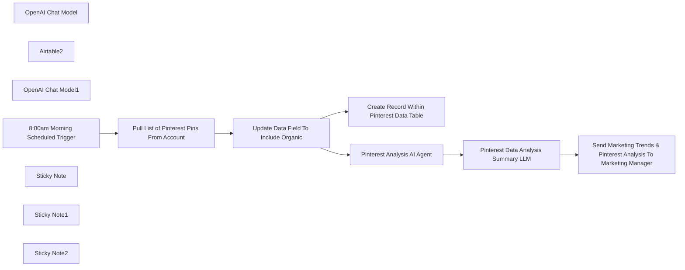

## Fluxo (.json) :

```json
{
  "id": "gP9EsxKN5agUGzDS",
  "meta": {
    "instanceId": "73d9d5380db181d01f4e26492c771d4cb5c4d6d109f18e2621cf49cac4c50763",
    "templateCredsSetupCompleted": true
  },
  "name": "Automate Pinterest Analysis & AI-Powered Content Suggestions With Pinterest API",
  "tags": [],
  "nodes": [
    {
      "id": "7f582bb4-97cd-458e-a7b7-b518c5b8a4ca",
      "name": "OpenAI Chat Model",
      "type": "@n8n/n8n-nodes-langchain.lmChatOpenAi",
      "position": [
        540,
        -260
      ],
      "parameters": {
        "model": {
          "__rl": true,
          "mode": "list",
          "value": "gpt-4o-mini"
        },
        "options": {}
      },
      "credentials": {
        "openAiApi": {
          "id": "95QGJD3XSz0piaNU",
          "name": "OpenAi account"
        }
      },
      "typeVersion": 1.2
    },
    {
      "id": "c6772882-468c-4391-a259-93e52daf49d4",
      "name": "Airtable2",
      "type": "n8n-nodes-base.airtableTool",
      "position": [
        700,
        -260
      ],
      "parameters": {
        "id": "=",
        "base": {
          "__rl": true,
          "mode": "list",
          "value": "appfsNi1QEhw6WvXK",
          "cachedResultUrl": "https://airtable.com/appfsNi1QEhw6WvXK",
          "cachedResultName": "Pinterest_Metrics"
        },
        "table": {
          "__rl": true,
          "mode": "list",
          "value": "tbl9Dxdrwx5QZGFnp",
          "cachedResultUrl": "https://airtable.com/appfsNi1QEhw6WvXK/tbl9Dxdrwx5QZGFnp",
          "cachedResultName": "Pinterest_Organic_Data"
        },
        "options": {}
      },
      "credentials": {
        "airtableTokenApi": {
          "id": "0ApVmNsLu7aFzQD6",
          "name": "Airtable Personal Access Token account"
        }
      },
      "typeVersion": 2.1
    },
    {
      "id": "85ea8bec-14c8-4277-b2e3-eb145db0713a",
      "name": "OpenAI Chat Model1",
      "type": "@n8n/n8n-nodes-langchain.lmChatOpenAi",
      "position": [
        920,
        -280
      ],
      "parameters": {
        "model": {
          "__rl": true,
          "mode": "list",
          "value": "gpt-4o-mini"
        },
        "options": {}
      },
      "credentials": {
        "openAiApi": {
          "id": "95QGJD3XSz0piaNU",
          "name": "OpenAi account"
        }
      },
      "typeVersion": 1.2
    },
    {
      "id": "b8f7d0d6-b58f-4a41-a15d-99f4d838bb8c",
      "name": "8:00am Morning Scheduled Trigger",
      "type": "n8n-nodes-base.scheduleTrigger",
      "position": [
        -660,
        -140
      ],
      "parameters": {
        "rule": {
          "interval": [
            {
              "daysInterval": 7,
              "triggerAtHour": 8
            }
          ]
        }
      },
      "typeVersion": 1.2
    },
    {
      "id": "593a320d-825e-42f9-8ab6-adafd5288fa5",
      "name": "Pull List of Pinterest Pins From Account",
      "type": "n8n-nodes-base.httpRequest",
      "position": [
        -340,
        -140
      ],
      "parameters": {
        "url": "https://api.pinterest.com/v5/pins",
        "options": {
          "redirect": {
            "redirect": {}
          }
        },
        "sendBody": true,
        "sendHeaders": true,
        "bodyParameters": {
          "parameters": [
            {}
          ]
        },
        "headerParameters": {
          "parameters": [
            {
              "name": "Authorization",
              "value": "Bearer "
            }
          ]
        }
      },
      "typeVersion": 4.2
    },
    {
      "id": "1e6d00fe-2b32-4d46-a230-063254ebab74",
      "name": "Update Data Field To Include Organic",
      "type": "n8n-nodes-base.code",
      "position": [
        -20,
        -140
      ],
      "parameters": {
        "jsCode": "// Initialize an array to hold the output formatted for Airtable\nconst outputItems = [];\n\nfor (const item of $input.all()) {\n if (item.json.items && Array.isArray(item.json.items)) {\n for (const subItem of item.json.items) {\n // Construct an object with only the required fields for Airtable\n outputItems.push({\n id: subItem.id || null,\n created_at: subItem.created_at || null,\n title: subItem.title || null,\n description: subItem.description || null,\n link: subItem.link || null,\n type: \"Organic\" // Assign the value \"Organic\" to the 'Type' field\n });\n }\n }\n}\n\n// Return the structured output\nreturn outputItems;\n"
      },
      "typeVersion": 2
    },
    {
      "id": "539de144-dc67-4b14-b58e-2896edb1c3e6",
      "name": "Create Record Within Pinterest Data Table",
      "type": "n8n-nodes-base.airtable",
      "position": [
        260,
        -140
      ],
      "parameters": {
        "base": {
          "__rl": true,
          "mode": "list",
          "value": "appfsNi1QEhw6WvXK",
          "cachedResultUrl": "https://airtable.com/appfsNi1QEhw6WvXK",
          "cachedResultName": "Pinterest_Metrics"
        },
        "table": {
          "__rl": true,
          "mode": "list",
          "value": "tbl9Dxdrwx5QZGFnp",
          "cachedResultUrl": "https://airtable.com/appfsNi1QEhw6WvXK/tbl9Dxdrwx5QZGFnp",
          "cachedResultName": "Pinterest_Organic_Data"
        },
        "columns": {
          "value": {
            "link": "={{ $json.link }}",
            "type": "={{ $json.type }}",
            "title": "={{ $json.title }}",
            "pin_id": "={{ $json.id }}",
            "created_at": "={{ $json.created_at }}",
            "description": "={{ $json.description }}"
          },
          "schema": [
            {
              "id": "id",
              "type": "string",
              "display": true,
              "removed": false,
              "readOnly": true,
              "required": false,
              "displayName": "id",
              "defaultMatch": true
            },
            {
              "id": "pin_id",
              "type": "string",
              "display": true,
              "removed": false,
              "readOnly": false,
              "required": false,
              "displayName": "pin_id",
              "defaultMatch": false,
              "canBeUsedToMatch": true
            },
            {
              "id": "created_at",
              "type": "string",
              "display": true,
              "removed": false,
              "readOnly": false,
              "required": false,
              "displayName": "created_at",
              "defaultMatch": false,
              "canBeUsedToMatch": true
            },
            {
              "id": "title",
              "type": "string",
              "display": true,
              "removed": false,
              "readOnly": false,
              "required": false,
              "displayName": "title",
              "defaultMatch": false,
              "canBeUsedToMatch": true
            },
            {
              "id": "description",
              "type": "string",
              "display": true,
              "removed": false,
              "readOnly": false,
              "required": false,
              "displayName": "description",
              "defaultMatch": false,
              "canBeUsedToMatch": true
            },
            {
              "id": "link",
              "type": "string",
              "display": true,
              "removed": false,
              "readOnly": false,
              "required": false,
              "displayName": "link",
              "defaultMatch": false,
              "canBeUsedToMatch": true
            },
            {
              "id": "type",
              "type": "string",
              "display": true,
              "removed": false,
              "readOnly": false,
              "required": false,
              "displayName": "type",
              "defaultMatch": false,
              "canBeUsedToMatch": true
            },
            {
              "id": "active7DayUsers",
              "type": "string",
              "display": true,
              "removed": true,
              "readOnly": false,
              "required": false,
              "displayName": "active7DayUsers",
              "defaultMatch": false,
              "canBeUsedToMatch": true
            },
            {
              "id": "sessions",
              "type": "string",
              "display": true,
              "removed": true,
              "readOnly": false,
              "required": false,
              "displayName": "sessions",
              "defaultMatch": false,
              "canBeUsedToMatch": true
            },
            {
              "id": "userEngagementDuration",
              "type": "string",
              "display": true,
              "removed": true,
              "readOnly": false,
              "required": false,
              "displayName": "userEngagementDuration",
              "defaultMatch": false,
              "canBeUsedToMatch": true
            }
          ],
          "mappingMode": "defineBelow",
          "matchingColumns": [
            "id"
          ],
          "attemptToConvertTypes": false,
          "convertFieldsToString": false
        },
        "options": {},
        "operation": "upsert"
      },
      "credentials": {
        "airtableTokenApi": {
          "id": "0ApVmNsLu7aFzQD6",
          "name": "Airtable Personal Access Token account"
        }
      },
      "typeVersion": 2.1
    },
    {
      "id": "250f5121-437e-4bff-82af-95a156126127",
      "name": "Pinterest Analysis AI Agent",
      "type": "@n8n/n8n-nodes-langchain.agent",
      "position": [
        540,
        -440
      ],
      "parameters": {
        "text": "You are a data analysis expert. You will pull data from the table and provide any information in regards to trends in the data. \n\nYour output should be suggestions of new pins that we can post to reach the target audiences. \n\nAnalyze the data and just summary of the pin suggestions that the team should build. ",
        "options": {},
        "promptType": "define"
      },
      "typeVersion": 1.7
    },
    {
      "id": "181e9d89-c0f9-4de2-bdce-9359b967157c",
      "name": "Pinterest Data Analysis Summary LLM",
      "type": "@n8n/n8n-nodes-langchain.chainSummarization",
      "position": [
        900,
        -440
      ],
      "parameters": {
        "options": {
          "summarizationMethodAndPrompts": {
            "values": {
              "prompt": "=Write a concise summary of the following:\n\n\n\"{{ $json.output }}\"\n\n\nCONCISE SUMMARY:"
            }
          }
        }
      },
      "typeVersion": 2
    },
    {
      "id": "432e7bd7-36b4-4903-8e93-c8bd6e140a04",
      "name": "Send Marketing Trends & Pinterest Analysis To Marketing Manager",
      "type": "n8n-nodes-base.gmail",
      "position": [
        1220,
        -440
      ],
      "webhookId": "f149c1b5-c028-4dff-9d22-a72951f2ef91",
      "parameters": {
        "sendTo": "john.n.foster1@gmail.com",
        "message": "={{ $json.response.text }}",
        "options": {},
        "subject": "Pinterest Trends & Suggestions"
      },
      "credentials": {
        "gmailOAuth2": {
          "id": "pIXP1ZseBP4Z5CCp",
          "name": "Gmail account"
        }
      },
      "executeOnce": true,
      "typeVersion": 2.1
    },
    {
      "id": "dadfb22a-b1d3-459d-a332-5a2c52fd4ca0",
      "name": "Sticky Note",
      "type": "n8n-nodes-base.stickyNote",
      "position": [
        -740,
        -320
      ],
      "parameters": {
        "color": 5,
        "width": 280,
        "height": 440,
        "content": "Scheduled trigger at 8:00am to start the workflow. \n\nThis can be updated to your schedule preference as an email with marketing trends can be sent to best fit one's schedule. "
      },
      "typeVersion": 1
    },
    {
      "id": "3b156d97-11bf-4d8a-9bd9-c1e23a0592d8",
      "name": "Sticky Note1",
      "type": "n8n-nodes-base.stickyNote",
      "position": [
        -420,
        -300
      ],
      "parameters": {
        "color": 6,
        "width": 860,
        "height": 360,
        "content": "Scheduled trigger begin process to gather Pinterest Pin data and store them within Airtable. This data can be referenced or analyzed accordingly. \n\n*If you would like to bring in Pinterest Ads data, the data is already labeled as Organic.\n\nThis is perfect for those who are creating content calendars to understand content scheduling."
      },
      "typeVersion": 1
    },
    {
      "id": "65586422-a631-477b-833d-5c445b1be744",
      "name": "Sticky Note2",
      "type": "n8n-nodes-base.stickyNote",
      "position": [
        480,
        -580
      ],
      "parameters": {
        "color": 4,
        "width": 940,
        "height": 460,
        "content": "AI Agent will go through Pinterest Pins and analyze any data and trends to be able to reach target audience. The data is then summarized within the Summary LLM.\n\nThe summarized results are then sent to the Marketing Manager within an email to help lead content creation efforts. "
      },
      "typeVersion": 1
    }
  ],
  "active": false,
  "pinData": {},
  "settings": {
    "executionOrder": "v1"
  },
  "versionId": "d6f64ee7-ae49-4a6b-8bf8-9a709c580357",
  "connections": {
    "Airtable2": {
      "ai_tool": [
        [
          {
            "node": "Pinterest Analysis AI Agent",
            "type": "ai_tool",
            "index": 0
          }
        ]
      ]
    },
    "OpenAI Chat Model": {
      "ai_languageModel": [
        [
          {
            "node": "Pinterest Analysis AI Agent",
            "type": "ai_languageModel",
            "index": 0
          }
        ]
      ]
    },
    "OpenAI Chat Model1": {
      "ai_languageModel": [
        [
          {
            "node": "Pinterest Data Analysis Summary LLM",
            "type": "ai_languageModel",
            "index": 0
          }
        ]
      ]
    },
    "Pinterest Analysis AI Agent": {
      "main": [
        [
          {
            "node": "Pinterest Data Analysis Summary LLM",
            "type": "main",
            "index": 0
          }
        ]
      ]
    },
    "8:00am Morning Scheduled Trigger": {
      "main": [
        [
          {
            "node": "Pull List of Pinterest Pins From Account",
            "type": "main",
            "index": 0
          }
        ]
      ]
    },
    "Pinterest Data Analysis Summary LLM": {
      "main": [
        [
          {
            "node": "Send Marketing Trends & Pinterest Analysis To Marketing Manager",
            "type": "main",
            "index": 0
          }
        ]
      ]
    },
    "Update Data Field To Include Organic": {
      "main": [
        [
          {
            "node": "Create Record Within Pinterest Data Table",
            "type": "main",
            "index": 0
          },
          {
            "node": "Pinterest Analysis AI Agent",
            "type": "main",
            "index": 0
          }
        ]
      ]
    },
    "Pull List of Pinterest Pins From Account": {
      "main": [
        [
          {
            "node": "Update Data Field To Include Organic",
            "type": "main",
            "index": 0
          }
        ]
      ]
    }
  }
}
```

<a id="template-1986"></a>

## Template 1986 - Agendamento com IA e consulta de PDFs

- **Nome:** Agendamento com IA e consulta de PDFs
- **Descrição:** Este fluxo automatiza o agendamento de compromissos com Max, rotula emails automaticamente com IA e usa embeddings de PDFs para permitir perguntas e respostas baseadas no conteúdo indexado.
- **Funcionalidade:** • Detecção de intenção de agendamento: inicia a automação quando o usuário solicita uma reunião.
• Verificação de disponibilidade: consulta o calendário para horários livres de 30 minutos.
• Reserva de evento: cria o compromisso no calendário e envia convites aos participantes.
• Indexação de PDFs: baixa PDFs, gera embeddings e armazena no índice vetorial para busca.
• Perguntas e respostas baseadas em conteúdo: utiliza modelos de linguagem para responder usando apenas o conteúdo indexado.
• Recuperação de informações: busca trechos relevantes do índice para sustentar as respostas.
• Classificação automática de emails: atribui rótulos com base no conteúdo.
• Rotulagem baseada em IA: aplica rótulos automáticos para organização de mensagens.
- **Ferramentas:** • Google Calendar: serviço de calendário para verificar disponibilidade e criar eventos.
• Gmail: serviço de email para rotular mensagens automaticamente.
• Pinecone: serviço de índice vetorial para armazenar e pesquisar conteúdos de PDFs.
• OpenAI (GPT-4o): modelo de linguagem para chat e geração de embeddings.
• Anthropic (Claude): modelo de linguagem para chat alternativo.


## Fluxo visual

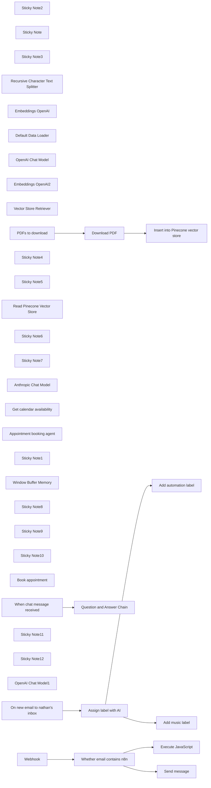

## Fluxo (.json) :

```json
{
  "meta": {
    "instanceId": "84ba6d895254e080ac2b4916d987aa66b000f88d4d919a6b9c76848f9b8a7616",
    "templateId": "2358"
  },
  "nodes": [
    {
      "id": "fb774d11-da48-4481-ad4e-8c93274f123e",
      "name": "Send message",
      "type": "n8n-nodes-base.slack",
      "position": [
        2340,
        580
      ],
      "parameters": {
        "text": "=Data from webhook: {{ $json.query.email }}",
        "select": "channel",
        "channelId": {
          "__rl": true,
          "mode": "list",
          "value": "C079GL6K3U6",
          "cachedResultName": "general"
        },
        "otherOptions": {},
        "authentication": "oAuth2"
      },
      "typeVersion": 2.2
    },
    {
      "id": "5a3ad8f1-eba7-4076-80fc-0c1237aab50b",
      "name": "Sticky Note2",
      "type": "n8n-nodes-base.stickyNote",
      "position": [
        380,
        240
      ],
      "parameters": {
        "color": 7,
        "width": 1163.3132111854613,
        "height": 677.0358687053997,
        "content": ""
      },
      "typeVersion": 1
    },
    {
      "id": "01c59396-0fef-4d1c-aa1f-787669300650",
      "name": "Sticky Note",
      "type": "n8n-nodes-base.stickyNote",
      "position": [
        1860,
        240
      ],
      "parameters": {
        "color": 7,
        "width": 437,
        "height": 99,
        "content": "# What is n8n?\n### Low-code Automation Platform for technical teams"
      },
      "typeVersion": 1
    },
    {
      "id": "0bdd4a35-7f5c-443c-a14a-4e6f7ed18712",
      "name": "Execute JavaScript",
      "type": "n8n-nodes-base.code",
      "position": [
        2340,
        380
      ],
      "parameters": {
        "jsCode": "// Loop over input items and add a new field called 'myNewField' to the JSON of each one\nfor (const item of $input.all()) {\n item.json.myNewField = 1;\n}\n\nreturn $input.all();"
      },
      "typeVersion": 2
    },
    {
      "id": "4b1b6cc1-1a9f-4a0c-96d5-fd179c84c79d",
      "name": "Sticky Note3",
      "type": "n8n-nodes-base.stickyNote",
      "position": [
        4440,
        240
      ],
      "parameters": {
        "color": 6,
        "width": 318,
        "height": 106,
        "content": "# Example #2\n### RAG with PDF as source"
      },
      "typeVersion": 1
    },
    {
      "id": "7e9e7802-5695-4240-83b9-d6f02192ad2b",
      "name": "Recursive Character Text Splitter",
      "type": "@n8n/n8n-nodes-langchain.textSplitterRecursiveCharacterTextSplitter",
      "position": [
        5120,
        1000
      ],
      "parameters": {
        "options": {},
        "chunkSize": 3000,
        "chunkOverlap": 200
      },
      "typeVersion": 1
    },
    {
      "id": "63783c21-af6d-4e70-8dec-c861641c53fb",
      "name": "Embeddings OpenAI",
      "type": "@n8n/n8n-nodes-langchain.embeddingsOpenAi",
      "position": [
        4880,
        820
      ],
      "parameters": {
        "options": {}
      },
      "typeVersion": 1
    },
    {
      "id": "5742ce9c-2f73-4129-85eb-876f562cf6b1",
      "name": "Default Data Loader",
      "type": "@n8n/n8n-nodes-langchain.documentDefaultDataLoader",
      "position": [
        5100,
        820
      ],
      "parameters": {
        "loader": "pdfLoader",
        "options": {
          "metadata": {
            "metadataValues": [
              {
                "name": "document-title",
                "value": "={{ $('PDFs to download').item.json.whitepaper_title }}"
              },
              {
                "name": "document-publish-year",
                "value": "={{ $('PDFs to download').item.json.publish_year }}"
              },
              {
                "name": "document-author",
                "value": "={{ $('PDFs to download').item.json.author }}"
              }
            ]
          }
        },
        "dataType": "binary"
      },
      "typeVersion": 1
    },
    {
      "id": "686c63fa-4672-4107-bd58-ffbb0650b44b",
      "name": "OpenAI Chat Model",
      "type": "@n8n/n8n-nodes-langchain.lmChatOpenAi",
      "position": [
        5840,
        840
      ],
      "parameters": {
        "model": "gpt-4o",
        "options": {
          "temperature": 0.3
        }
      },
      "typeVersion": 1
    },
    {
      "id": "73a7df02-aa2c-4f0f-aa88-38cbbbf3b1cb",
      "name": "Embeddings OpenAI2",
      "type": "@n8n/n8n-nodes-langchain.embeddingsOpenAi",
      "position": [
        5980,
        1140
      ],
      "parameters": {
        "options": {}
      },
      "typeVersion": 1
    },
    {
      "id": "42737305-fd39-4ec7-b4ba-53f70085dd5f",
      "name": "Vector Store Retriever",
      "type": "@n8n/n8n-nodes-langchain.retrieverVectorStore",
      "position": [
        6040,
        840
      ],
      "parameters": {},
      "typeVersion": 1
    },
    {
      "id": "2c7a3666-e123-439d-8b74-41eb375f066c",
      "name": "Download PDF",
      "type": "n8n-nodes-base.httpRequest",
      "position": [
        4700,
        600
      ],
      "parameters": {
        "url": "={{ $json.file_url }}",
        "options": {}
      },
      "typeVersion": 4.2
    },
    {
      "id": "866eaeb9-6a7c-4209-b485-8ef13ed006b4",
      "name": "PDFs to download",
      "type": "n8n-nodes-base.noOp",
      "notes": "BTC Whitepaper + metadata",
      "position": [
        4440,
        600
      ],
      "parameters": {},
      "notesInFlow": true,
      "typeVersion": 1
    },
    {
      "id": "e78f2191-096c-4575-9d48-fb891fd18698",
      "name": "Sticky Note4",
      "type": "n8n-nodes-base.stickyNote",
      "position": [
        4440,
        440
      ],
      "parameters": {
        "color": 4,
        "width": 414.36616595939887,
        "height": 91.0723900084547,
        "content": "## A. Load PDF into Pinecone\nDownload the PDF, then text embeddings into Pincecone"
      },
      "typeVersion": 1
    },
    {
      "id": "7c3ccf27-32b1-4ea7-b2ef-6997793de733",
      "name": "Sticky Note5",
      "type": "n8n-nodes-base.stickyNote",
      "position": [
        5600,
        460
      ],
      "parameters": {
        "color": 4,
        "width": 284.62109466374466,
        "height": 86.95121951219511,
        "content": "## B. Chat with PDF\nUse GPT4o to chat with Pinecone index"
      },
      "typeVersion": 1
    },
    {
      "id": "6063d009-da6e-4cbf-899f-c86b879931a7",
      "name": "Read Pinecone Vector Store",
      "type": "@n8n/n8n-nodes-langchain.vectorStorePinecone",
      "position": [
        5980,
        980
      ],
      "parameters": {
        "options": {
          "pineconeNamespace": "whitepaper"
        },
        "pineconeIndex": {
          "__rl": true,
          "mode": "list",
          "value": "whitepapers",
          "cachedResultName": "whitepapers"
        }
      },
      "typeVersion": 1
    },
    {
      "id": "8aa52156-264d-4911-993c-ac5117a76b21",
      "name": "Question and Answer Chain",
      "type": "@n8n/n8n-nodes-langchain.chainRetrievalQa",
      "position": [
        5840,
        620
      ],
      "parameters": {
        "text": "={{ $json.chatInput }}. \nOnly use vector store knowledge to answer the question. Don't make anything up. If you don't know the answer, tell the user that you don't know.",
        "promptType": "define"
      },
      "typeVersion": 1.3
    },
    {
      "id": "b394ee1d-a2ca-4db0-8caa-981f8f066787",
      "name": "Sticky Note6",
      "type": "n8n-nodes-base.stickyNote",
      "position": [
        7380,
        240
      ],
      "parameters": {
        "color": 6,
        "width": 504.25,
        "height": 106,
        "content": "# Example #3\n### AI Assistant that knows how to use predefined API endpoints "
      },
      "typeVersion": 1
    },
    {
      "id": "37a8b8f2-c444-4c6e-9b02-b97a5c616e84",
      "name": "Sticky Note7",
      "type": "n8n-nodes-base.stickyNote",
      "position": [
        3020,
        220
      ],
      "parameters": {
        "color": 6,
        "width": 318,
        "height": 111,
        "content": "# Example #1\n### Categorize incoming emails with AI"
      },
      "typeVersion": 1
    },
    {
      "id": "07123e8e-8760-4c89-acda-aaef6de68be2",
      "name": "Anthropic Chat Model",
      "type": "@n8n/n8n-nodes-langchain.lmChatAnthropic",
      "position": [
        7580,
        700
      ],
      "parameters": {
        "options": {
          "temperature": 0.4
        }
      },
      "typeVersion": 1.2
    },
    {
      "id": "e338a175-e823-4cd4-b77d-f5acbfcbdb9d",
      "name": "Get calendar availability",
      "type": "@n8n/n8n-nodes-langchain.toolHttpRequest",
      "position": [
        7900,
        700
      ],
      "parameters": {
        "url": "https://www.googleapis.com/calendar/v3/freeBusy",
        "method": "POST",
        "jsonBody": "={\n \"timeMin\": \"{timeMin}\",\n \"timeMax\": \"{timeMax}\",\n \"timeZone\": \"Europe/Berlin\",\n \"groupExpansionMax\": 20,\n \"calendarExpansionMax\": 10,\n \"items\": [\n {\n \"id\": \"max@n8n.io\"\n }\n ]\n}",
        "sendBody": true,
        "specifyBody": "json",
        "authentication": "predefinedCredentialType",
        "toolDescription": "Call this tool to get the appointment availability for a particular period on the calendar. The tool may refer to availability as \"Free\" or \"Busy\". \n\nUse {timeMin} and {timeMax} to specify the window for the availability query. For example, to get availability for 25 July, 2024 the {timeMin} would be 2024-07-25T09:00:00+02:00 and {timeMax} would be 2024-07-25T17:00:00+02:00.\n\nIf the tool returns an empty response, it means that something went wrong. It does not mean that there is no availability.",
        "nodeCredentialType": "googleCalendarOAuth2Api"
      },
      "typeVersion": 1
    },
    {
      "id": "ae05933c-dfa9-4272-b610-8b5fc94d76fe",
      "name": "Appointment booking agent",
      "type": "@n8n/n8n-nodes-langchain.agent",
      "position": [
        7680,
        480
      ],
      "parameters": {
        "options": {
          "systemMessage": "=You are an efficient and courteous assistant tasked with scheduling appointments with Max Tkacz.\n\nWhen users mention an appointment or meeting, they are referring to a meeting with Max.\nWhen users refer to the calendar or \"your schedule,\" they are referring to Max's calendar. \n\nYou can use various tools to access and manage Max's calendar. Your primary goal is to assist users in successfully booking an appointment with Max, ensuring no scheduling conflicts. Only book an appointment if the requested time slot is available (the tool may refer to this as \"Free\")\n\nToday's date is {{ $today.format('dd LLL yyyy') }}.\nAppointments are always 30 minutes in length. \n\n\nProvide accurate information at all times. If the tools are not functioning correctly, inform the user that you are unable to assist them at the moment.\n"
        }
      },
      "typeVersion": 1.6
    },
    {
      "id": "7e3b1797-150e-4c7c-93a5-306b981e0b6c",
      "name": "Sticky Note1",
      "type": "n8n-nodes-base.stickyNote",
      "position": [
        8300,
        440
      ],
      "parameters": {
        "color": 7,
        "width": 327.46658341463433,
        "height": 571.8601927804875,
        "content": "\n[Open Calendar](https://calendar.google.com/calendar/u/0/r/day/2024/7/26)"
      },
      "typeVersion": 1
    },
    {
      "id": "afe8d14d-d0d0-4a11-bb4f-57358de66bc1",
      "name": "Window Buffer Memory",
      "type": "@n8n/n8n-nodes-langchain.memoryBufferWindow",
      "position": [
        7720,
        700
      ],
      "parameters": {
        "contextWindowLength": 10
      },
      "typeVersion": 1.2
    },
    {
      "id": "53d131ea-3235-4e4e-828b-dc22c9021e50",
      "name": "Sticky Note8",
      "type": "n8n-nodes-base.stickyNote",
      "position": [
        6380,
        640
      ],
      "parameters": {
        "color": 7,
        "width": 615.2162978341456,
        "height": 403.1877919219511,
        "content": "\nBTC Whitepaper references"
      },
      "typeVersion": 1
    },
    {
      "id": "55a0f180-bb35-4b35-b72c-b9361698e5ad",
      "name": "Sticky Note9",
      "type": "n8n-nodes-base.stickyNote",
      "position": [
        9660,
        240
      ],
      "parameters": {
        "color": 7,
        "width": 345.33741540309194,
        "height": 398.9629539487597,
        "content": "### Connect with me or explore this demo 👇\n"
      },
      "typeVersion": 1
    },
    {
      "id": "14b3231d-aa96-4783-be8f-cb2f70b0bc7f",
      "name": "Sticky Note10",
      "type": "n8n-nodes-base.stickyNote",
      "position": [
        9220,
        240
      ],
      "parameters": {
        "color": 7,
        "width": 411.2946586626259,
        "height": 197.19036476628202,
        "content": "# Thank you and happy flowgramming 🤘\n\n### Max Tkacz | Senior Developer Advocate @ n8n"
      },
      "typeVersion": 1
    },
    {
      "id": "c9a2fcdc-c8ab-4b9d-9979-4fd7cca1e8a8",
      "name": "Insert into Pinecone vector store",
      "type": "@n8n/n8n-nodes-langchain.vectorStorePinecone",
      "position": [
        4920,
        600
      ],
      "parameters": {
        "mode": "insert",
        "options": {
          "clearNamespace": true,
          "pineconeNamespace": "whitepaper"
        },
        "pineconeIndex": {
          "__rl": true,
          "mode": "list",
          "value": "whitepapers",
          "cachedResultName": "whitepapers"
        }
      },
      "typeVersion": 1
    },
    {
      "id": "6a890c74-67f9-4eee-bb56-7c9a68921ae1",
      "name": "Book appointment",
      "type": "@n8n/n8n-nodes-langchain.toolHttpRequest",
      "position": [
        8060,
        700
      ],
      "parameters": {
        "url": "https://www.googleapis.com/calendar/v3/calendars/max@n8n.io/events",
        "method": "POST",
        "jsonBody": "={\n \"summary\": \"Appointment with {userName}\",\n \"start\": {\n \"dateTime\": \"{startTime}\",\n \"timeZone\": \"Europe/Berlin\"\n },\n \"end\": {\n \"dateTime\": \"{endTime}\",\n \"timeZone\": \"Europe/Berlin\"\n },\n \"attendees\": [\n {\"email\": \"max@n8n.io\"},\n {\"email\": \"{userEmail}\"}\n ]\n}",
        "sendBody": true,
        "specifyBody": "json",
        "authentication": "predefinedCredentialType",
        "toolDescription": "Call this tool to book an appointment in the calendar. ",
        "nodeCredentialType": "googleCalendarOAuth2Api",
        "placeholderDefinitions": {
          "values": [
            {
              "name": "userName",
              "description": "The full name of the user making the appointment. Like John Doe"
            },
            {
              "name": "startTime",
              "description": "The start time of the event in Europe/Berlin timezone. For example, 2024-07-24T10:00:00+02:00"
            },
            {
              "name": "endTime",
              "description": "The end time of the event in Europe/Berlin timezone. It should always be 30 minutes after the startTime. "
            },
            {
              "name": "userEmail",
              "description": "The email address of the user making the appointment"
            }
          ]
        }
      },
      "typeVersion": 1
    },
    {
      "id": "7f6e62f2-2d72-4fd2-a6ef-e57028d0055b",
      "name": "When chat message received",
      "type": "@n8n/n8n-nodes-langchain.chatTrigger",
      "position": [
        5600,
        620
      ],
      "webhookId": "c348693e-9c43-4bf2-90a5-23786273e809",
      "parameters": {
        "public": true,
        "options": {
          "title": "Book an appointment with Max"
        },
        "initialMessages": "Hi there! 👋\nI can help you schedule an appointment with Max Tkacz. On which day would you like to meet?"
      },
      "typeVersion": 1.1
    },
    {
      "id": "52c65975-479d-4c76-bcd3-23f5c9bb6acf",
      "name": "Sticky Note11",
      "type": "n8n-nodes-base.stickyNote",
      "position": [
        9220,
        460
      ],
      "parameters": {
        "color": 7,
        "width": 411.2946586626259,
        "height": 80,
        "content": "### Explore 100+ AI Workflow templates on n8n.io\n[Open Templates Library](https://n8n.io/workflows)"
      },
      "typeVersion": 1
    },
    {
      "id": "ba0635c0-2ca4-4b27-b960-3a0e0f93a56a",
      "name": "Sticky Note12",
      "type": "n8n-nodes-base.stickyNote",
      "position": [
        9220,
        560
      ],
      "parameters": {
        "color": 7,
        "width": 411.2946586626259,
        "height": 80,
        "content": "### Ask a question in our community (13k+ members)\n[Explore n8n community](https://community.n8n.io/)"
      },
      "typeVersion": 1
    },
    {
      "id": "29227c52-a9cc-4bd1-b1a3-78fb805b659c",
      "name": "OpenAI Chat Model1",
      "type": "@n8n/n8n-nodes-langchain.lmChatOpenAi",
      "position": [
        3260,
        660
      ],
      "parameters": {
        "model": "gpt-4o",
        "options": {
          "temperature": 0.5
        }
      },
      "typeVersion": 1
    },
    {
      "id": "494a2868-9ff5-402c-b83b-6dd2c3ddbcc9",
      "name": "Add automation label",
      "type": "n8n-nodes-base.gmail",
      "position": [
        3760,
        300
      ],
      "parameters": {
        "labelIds": [
          "Label_4763053241338138112"
        ],
        "messageId": "={{ $json.id }}",
        "operation": "addLabels"
      },
      "typeVersion": 2.1
    },
    {
      "id": "0f9d834d-ec47-43f5-945b-8c464d371122",
      "name": "On new email to nathan's inbox",
      "type": "n8n-nodes-base.gmailTrigger",
      "disabled": true,
      "position": [
        3040,
        460
      ],
      "parameters": {
        "simple": false,
        "filters": {},
        "options": {},
        "pollTimes": {
          "item": [
            {
              "mode": "everyMinute"
            }
          ]
        }
      },
      "typeVersion": 1.1
    },
    {
      "id": "142e2a49-40bd-4bf5-9ba3-f14ecd68618e",
      "name": "Add music label",
      "type": "n8n-nodes-base.gmail",
      "position": [
        3760,
        500
      ],
      "parameters": {
        "labelIds": [
          "Label_6822395192337188416"
        ],
        "messageId": "={{ $json.id }}",
        "operation": "addLabels"
      },
      "typeVersion": 2.1
    },
    {
      "id": "2eb46753-a0e8-43ec-a460-466b1dd265c9",
      "name": "Assign label with AI",
      "type": "@n8n/n8n-nodes-langchain.textClassifier",
      "position": [
        3280,
        460
      ],
      "parameters": {
        "options": {},
        "inputText": "={{ $json.text }}",
        "categories": {
          "categories": [
            {
              "category": "automation",
              "description": "email on the topic of automation or workflows and automated processes, includes newsletters on this topic"
            },
            {
              "category": "music",
              "description": "email on the topic of music, for example from an artist "
            }
          ]
        }
      },
      "typeVersion": 1
    },
    {
      "id": "576d8206-1b1e-4671-ba45-86e9d844a73b",
      "name": "Webhook",
      "type": "n8n-nodes-base.webhook",
      "position": [
        1860,
        460
      ],
      "webhookId": "74facfd7-0f51-4605-9724-2c300594fcf9",
      "parameters": {
        "path": "74facfd7-0f51-4605-9724-2c300594fcf9",
        "options": {}
      },
      "typeVersion": 2
    },
    {
      "id": "1e612376-1a3b-4c48-9cd3-97867ba4cad5",
      "name": "Whether email contains n8n",
      "type": "n8n-nodes-base.if",
      "position": [
        2060,
        460
      ],
      "parameters": {
        "options": {},
        "conditions": {
          "options": {
            "leftValue": "",
            "caseSensitive": true,
            "typeValidation": "strict"
          },
          "combinator": "and",
          "conditions": [
            {
              "id": "a0b16c44-03ea-4e96-9671-7b168697186d",
              "operator": {
                "type": "string",
                "operation": "contains"
              },
              "leftValue": "={{ $json.query.email }}",
              "rightValue": "@n8n"
            }
          ]
        }
      },
      "typeVersion": 2
    }
  ],
  "pinData": {},
  "connections": {
    "Webhook": {
      "main": [
        [
          {
            "node": "Whether email contains n8n",
            "type": "main",
            "index": 0
          }
        ]
      ]
    },
    "Download PDF": {
      "main": [
        [
          {
            "node": "Insert into Pinecone vector store",
            "type": "main",
            "index": 0
          }
        ]
      ]
    },
    "Book appointment": {
      "ai_tool": [
        [
          {
            "node": "Appointment booking agent",
            "type": "ai_tool",
            "index": 0
          }
        ]
      ]
    },
    "PDFs to download": {
      "main": [
        [
          {
            "node": "Download PDF",
            "type": "main",
            "index": 0
          }
        ]
      ]
    },
    "Embeddings OpenAI": {
      "ai_embedding": [
        [
          {
            "node": "Insert into Pinecone vector store",
            "type": "ai_embedding",
            "index": 0
          }
        ]
      ]
    },
    "OpenAI Chat Model": {
      "ai_languageModel": [
        [
          {
            "node": "Question and Answer Chain",
            "type": "ai_languageModel",
            "index": 0
          }
        ]
      ]
    },
    "Embeddings OpenAI2": {
      "ai_embedding": [
        [
          {
            "node": "Read Pinecone Vector Store",
            "type": "ai_embedding",
            "index": 0
          }
        ]
      ]
    },
    "OpenAI Chat Model1": {
      "ai_languageModel": [
        [
          {
            "node": "Assign label with AI",
            "type": "ai_languageModel",
            "index": 0
          }
        ]
      ]
    },
    "Default Data Loader": {
      "ai_document": [
        [
          {
            "node": "Insert into Pinecone vector store",
            "type": "ai_document",
            "index": 0
          }
        ]
      ]
    },
    "Anthropic Chat Model": {
      "ai_languageModel": [
        [
          {
            "node": "Appointment booking agent",
            "type": "ai_languageModel",
            "index": 0
          }
        ]
      ]
    },
    "Assign label with AI": {
      "main": [
        [
          {
            "node": "Add automation label",
            "type": "main",
            "index": 0
          }
        ],
        [
          {
            "node": "Add music label",
            "type": "main",
            "index": 0
          }
        ]
      ]
    },
    "Window Buffer Memory": {
      "ai_memory": [
        [
          {
            "node": "Appointment booking agent",
            "type": "ai_memory",
            "index": 0
          }
        ]
      ]
    },
    "Vector Store Retriever": {
      "ai_retriever": [
        [
          {
            "node": "Question and Answer Chain",
            "type": "ai_retriever",
            "index": 0
          }
        ]
      ]
    },
    "Get calendar availability": {
      "ai_tool": [
        [
          {
            "node": "Appointment booking agent",
            "type": "ai_tool",
            "index": 0
          }
        ]
      ]
    },
    "Read Pinecone Vector Store": {
      "ai_vectorStore": [
        [
          {
            "node": "Vector Store Retriever",
            "type": "ai_vectorStore",
            "index": 0
          }
        ]
      ]
    },
    "When chat message received": {
      "main": [
        [
          {
            "node": "Question and Answer Chain",
            "type": "main",
            "index": 0
          }
        ]
      ]
    },
    "Whether email contains n8n": {
      "main": [
        [
          {
            "node": "Execute JavaScript",
            "type": "main",
            "index": 0
          },
          {
            "node": "Send message",
            "type": "main",
            "index": 0
          }
        ]
      ]
    },
    "On new email to nathan's inbox": {
      "main": [
        [
          {
            "node": "Assign label with AI",
            "type": "main",
            "index": 0
          }
        ]
      ]
    },
    "Recursive Character Text Splitter": {
      "ai_textSplitter": [
        [
          {
            "node": "Default Data Loader",
            "type": "ai_textSplitter",
            "index": 0
          }
        ]
      ]
    }
  }
}
```

<a id="template-1988"></a>

## Template 1988 - Deploy e gestão de Nextcloud em Docker para clientes

- **Nome:** Deploy e gestão de Nextcloud em Docker para clientes
- **Descrição:** Fluxo que recebe chamadas API autenticadas e realiza deploys, operações e monitoramento de instâncias Nextcloud em servidores Docker, incluindo gestão de disco, DNS e integração com Collabora Office.
- **Funcionalidade:** • Recepção de comandos via API autenticada: aceita comandos como create, suspend, unsuspend, terminate, change_package, test_connection e ações de container.
• Geração e escrita de docker-compose: monta um arquivo docker-compose personalizado para cada domínio com serviços Nextcloud, MariaDB, Redis e Collabora.
• Deploy e gerenciamento de containers: start, stop, reinício e remoção de stacks Docker conforme solicitado.
• Provisionamento e gestão de disco em arquivo (data.img): criar, formatar, redimensionar, adicionar/remover entrada em /etc/fstab, montar e desmontar imagens loop.
• Configuração e publicação de vhosts no proxy reverso: cria/atualiza arquivos de configuração para nginx-proxy e reinicia o proxy quando necessário.
• Instalação e configuração automática do Nextcloud Office (Collabora): execução em background de passos para instalar o app, ajustar config e permitir integração com Collabora.
• Criação e remoção de registros DNS: manipula registros (CNAME) via API de DNS para apontar domínios para o servidor.
• Gestão de ACLs de acesso para endpoints específicos: leitura e atualização de listas de IPs e aplicação em configurações de localização.
• Coleta de estatísticas e inspeção de containers: docker inspect, docker stats, logs e estatísticas de containers dependentes.
• Operações específicas do Nextcloud: obter versão, listar usuários e trocar senha de usuário via occ dentro do container.
• Monitoramento de rede por container: leitura de /proc/net/dev para obter tráfego e cálculo de deltas.
• Execução remota via SSH: envia comandos shell para servidores selecionados conforme domínio servidor alvo.
• Retorno estruturado ao solicitante: responde via API com códigos e mensagens de sucesso/erro; escreve arquivos de status locais para acompanhamento.
- **Ferramentas:** • Docker: execução e gestão de containers e imagens.
• Docker Compose (docker compose): orquestração de múltiplos serviços por projeto.
• MariaDB (imagem): base de dados para Nextcloud.
• Redis (imagem): cache para Nextcloud.
• Nextcloud: aplicação de armazenamento e colaboração a ser instalada/configurada.
• Collabora / richdocuments: integração Office para edição online (Nextcloud Office).
• nginx-proxy + letsencrypt companion: proxy reverso com suporte a certificados TLS automatizados.
• PowerDNS (ou API de DNS similar): API HTTP para adicionar/remover registros DNS (CNAME).
• SSH (acesso remoto): execução de comandos remotos nos servidores alvo.
• Utilitários Linux: bash, mount/umount, losetup, truncate/fallocate, mkfs.ext4, e2fsck, resize2fs, tune2fs, df, sed, awk, jq e crontab para manipulação de arquivos, discos e automações.
• PHP (dentro do container): execução de comandos occ para administração do Nextcloud.
• Ferramentas de sistema: systemctl para verificação de serviços e apache2-utils/sqlite3 conforme pré-requisitos documentados.

## Fluxo visual

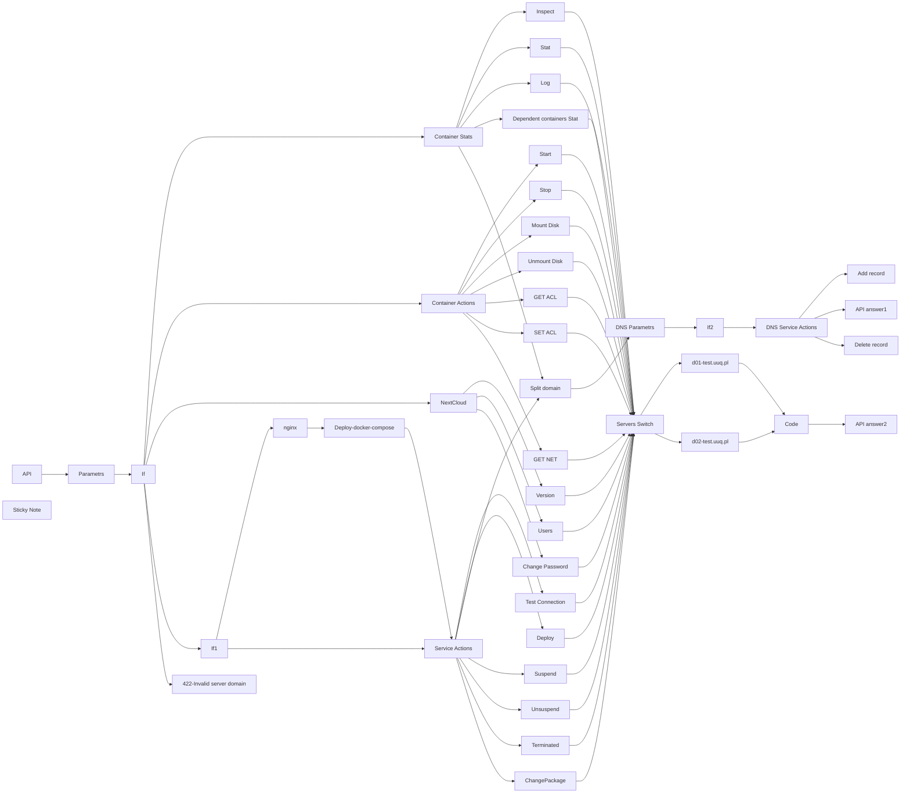

## Fluxo (.json) :

```json
{
  "id": "d3xtaER6gl4aqLZR",
  "meta": {
    "instanceId": "ffb0782f8b2cf4278577cb919e0cd26141bc9ff8774294348146d454633aa4e3",
    "templateCredsSetupCompleted": true
  },
  "name": "PUQ Docker NextCloud deploy",
  "tags": [],
  "nodes": [
    {
      "id": "dc9d4284-0ff7-4068-af3d-2b7f38451118",
      "name": "If",
      "type": "n8n-nodes-base.if",
      "position": [
        540,
        920
      ],
      "parameters": {
        "options": {},
        "conditions": {
          "options": {
            "version": 2,
            "leftValue": "",
            "caseSensitive": true,
            "typeValidation": "strict"
          },
          "combinator": "or",
          "conditions": [
            {
              "id": "b702e607-888a-42c9-b9a7-f9d2a64dfccd",
              "operator": {
                "type": "string",
                "operation": "equals"
              },
              "leftValue": "={{ $('API').item.json.body.server_domain }}",
              "rightValue": "=d01-test.uuq.pl"
            },
            {
              "id": "8a6662a4-4539-4ab1-bd5b-46b0a0d6e023",
              "operator": {
                "name": "filter.operator.equals",
                "type": "string",
                "operation": "equals"
              },
              "leftValue": "={{ $('API').item.json.body.server_domain }}",
              "rightValue": "d02-test.uuq.pl"
            }
          ]
        }
      },
      "typeVersion": 2.2
    },
    {
      "id": "b015bca6-fe71-4eb4-8e99-2904911c03b3",
      "name": "Parametrs",
      "type": "n8n-nodes-base.set",
      "position": [
        320,
        920
      ],
      "parameters": {
        "options": {},
        "assignments": {
          "assignments": [
            {
              "id": "370ddc4e-0fc0-48f6-9b30-ebdfba72c62f",
              "name": "clients_dir",
              "type": "string",
              "value": "/opt/docker/clients"
            },
            {
              "id": "92202bb8-6113-4bc5-9a29-79d238456df2",
              "name": "mount_dir",
              "type": "string",
              "value": "/mnt"
            },
            {
              "id": "baa52df2-9c10-42b2-939f-f05ea85ea2be",
              "name": "screen_left",
              "type": "string",
              "value": "{{"
            },
            {
              "id": "2b19ed99-2630-412a-98b6-4be44d35d2e7",
              "name": "screen_right",
              "type": "string",
              "value": "}}"
            }
          ]
        }
      },
      "typeVersion": 3.4
    },
    {
      "id": "b0c5ccb8-0692-4bb0-99e1-769fde372e0f",
      "name": "API",
      "type": "n8n-nodes-base.webhook",
      "position": [
        0,
        920
      ],
      "webhookId": "4e8168b3-2cad-462a-9750-152986331ce2",
      "parameters": {
        "path": "docker-nextcloud",
        "options": {},
        "httpMethod": [
          "POST"
        ],
        "responseMode": "responseNode",
        "authentication": "basicAuth",
        "multipleMethods": true
      },
      "credentials": {
        "httpBasicAuth": {
          "id": "0gzq1np6ZmIrtK5o",
          "name": "nextcloud"
        }
      },
      "typeVersion": 2
    },
    {
      "id": "bcaf7ce1-464a-492e-b7f5-50ba8e465171",
      "name": "422-Invalid server domain",
      "type": "n8n-nodes-base.respondToWebhook",
      "position": [
        500,
        1240
      ],
      "parameters": {
        "options": {
          "responseCode": 422
        },
        "respondWith": "json",
        "responseBody": "[{\n  \"status\": \"error\",\n  \"error\": \"Invalid server domain\"\n}]"
      },
      "typeVersion": 1.1,
      "alwaysOutputData": false
    },
    {
      "id": "3c642087-bd6b-4996-890b-4d50fbca8c55",
      "name": "Container Actions",
      "type": "n8n-nodes-base.switch",
      "position": [
        940,
        1740
      ],
      "parameters": {
        "rules": {
          "values": [
            {
              "outputKey": "start",
              "conditions": {
                "options": {
                  "version": 2,
                  "leftValue": "",
                  "caseSensitive": true,
                  "typeValidation": "strict"
                },
                "combinator": "and",
                "conditions": [
                  {
                    "id": "66ad264d-5393-410c-bfa3-011ab8eb234a",
                    "operator": {
                      "name": "filter.operator.equals",
                      "type": "string",
                      "operation": "equals"
                    },
                    "leftValue": "={{ $('API').item.json.body.command }}",
                    "rightValue": "container_start"
                  }
                ]
              },
              "renameOutput": true
            },
            {
              "outputKey": "stop",
              "conditions": {
                "options": {
                  "version": 2,
                  "leftValue": "",
                  "caseSensitive": true,
                  "typeValidation": "strict"
                },
                "combinator": "and",
                "conditions": [
                  {
                    "id": "b48957a0-22c0-4ac0-82ef-abd9e7ab0207",
                    "operator": {
                      "name": "filter.operator.equals",
                      "type": "string",
                      "operation": "equals"
                    },
                    "leftValue": "={{ $('API').item.json.body.command }}",
                    "rightValue": "container_stop"
                  }
                ]
              },
              "renameOutput": true
            },
            {
              "outputKey": "mount_disk",
              "conditions": {
                "options": {
                  "version": 2,
                  "leftValue": "",
                  "caseSensitive": true,
                  "typeValidation": "strict"
                },
                "combinator": "and",
                "conditions": [
                  {
                    "id": "727971bf-4218-41c1-9b07-22df4b947852",
                    "operator": {
                      "name": "filter.operator.equals",
                      "type": "string",
                      "operation": "equals"
                    },
                    "leftValue": "={{ $('API').item.json.body.command }}",
                    "rightValue": "container_mount_disk"
                  }
                ]
              },
              "renameOutput": true
            },
            {
              "outputKey": "unmount_disk",
              "conditions": {
                "options": {
                  "version": 2,
                  "leftValue": "",
                  "caseSensitive": true,
                  "typeValidation": "strict"
                },
                "combinator": "and",
                "conditions": [
                  {
                    "id": "0c80b1d9-e7ca-4cf3-b3ac-b40fdf4dd8f8",
                    "operator": {
                      "name": "filter.operator.equals",
                      "type": "string",
                      "operation": "equals"
                    },
                    "leftValue": "={{ $('API').item.json.body.command }}",
                    "rightValue": "container_unmount_disk"
                  }
                ]
              },
              "renameOutput": true
            },
            {
              "outputKey": "container_get_acl",
              "conditions": {
                "options": {
                  "version": 2,
                  "leftValue": "",
                  "caseSensitive": true,
                  "typeValidation": "strict"
                },
                "combinator": "and",
                "conditions": [
                  {
                    "id": "72a60c6b-5dc5-48db-8d3a-e083ffad6ae2",
                    "operator": {
                      "name": "filter.operator.equals",
                      "type": "string",
                      "operation": "equals"
                    },
                    "leftValue": "={{ $('API').item.json.body.command }}",
                    "rightValue": "container_get_acl"
                  }
                ]
              },
              "renameOutput": true
            },
            {
              "outputKey": "container_set_acl",
              "conditions": {
                "options": {
                  "version": 2,
                  "leftValue": "",
                  "caseSensitive": true,
                  "typeValidation": "strict"
                },
                "combinator": "and",
                "conditions": [
                  {
                    "id": "74eb2334-6176-46ef-b444-d99b439fea17",
                    "operator": {
                      "name": "filter.operator.equals",
                      "type": "string",
                      "operation": "equals"
                    },
                    "leftValue": "={{ $('API').item.json.body.command }}",
                    "rightValue": "container_set_acl"
                  }
                ]
              },
              "renameOutput": true
            },
            {
              "outputKey": "container_get_net",
              "conditions": {
                "options": {
                  "version": 2,
                  "leftValue": "",
                  "caseSensitive": true,
                  "typeValidation": "strict"
                },
                "combinator": "and",
                "conditions": [
                  {
                    "id": "817ef082-a2d8-4b13-a8df-6e946878653b",
                    "operator": {
                      "name": "filter.operator.equals",
                      "type": "string",
                      "operation": "equals"
                    },
                    "leftValue": "={{ $('API').item.json.body.command }}",
                    "rightValue": "container_get_net"
                  }
                ]
              },
              "renameOutput": true
            }
          ]
        },
        "options": {}
      },
      "typeVersion": 3.2
    },
    {
      "id": "396e6074-98ec-47df-956c-ce5c3b75e57e",
      "name": "Container Stats",
      "type": "n8n-nodes-base.switch",
      "position": [
        940,
        1080
      ],
      "parameters": {
        "rules": {
          "values": [
            {
              "outputKey": "inspect",
              "conditions": {
                "options": {
                  "version": 2,
                  "leftValue": "",
                  "caseSensitive": true,
                  "typeValidation": "strict"
                },
                "combinator": "and",
                "conditions": [
                  {
                    "id": "66ad264d-5393-410c-bfa3-011ab8eb234a",
                    "operator": {
                      "name": "filter.operator.equals",
                      "type": "string",
                      "operation": "equals"
                    },
                    "leftValue": "={{ $('API').item.json.body.command }}",
                    "rightValue": "container_information_inspect"
                  }
                ]
              },
              "renameOutput": true
            },
            {
              "outputKey": "stats",
              "conditions": {
                "options": {
                  "version": 2,
                  "leftValue": "",
                  "caseSensitive": true,
                  "typeValidation": "strict"
                },
                "combinator": "and",
                "conditions": [
                  {
                    "id": "b48957a0-22c0-4ac0-82ef-abd9e7ab0207",
                    "operator": {
                      "name": "filter.operator.equals",
                      "type": "string",
                      "operation": "equals"
                    },
                    "leftValue": "={{ $('API').item.json.body.command }}",
                    "rightValue": "container_information_stats"
                  }
                ]
              },
              "renameOutput": true
            },
            {
              "outputKey": "log",
              "conditions": {
                "options": {
                  "version": 2,
                  "leftValue": "",
                  "caseSensitive": true,
                  "typeValidation": "strict"
                },
                "combinator": "and",
                "conditions": [
                  {
                    "id": "50ede522-af22-4b7a-b1fd-34b27fd3fadd",
                    "operator": {
                      "name": "filter.operator.equals",
                      "type": "string",
                      "operation": "equals"
                    },
                    "leftValue": "={{ $('API').item.json.body.command }}",
                    "rightValue": "container_log"
                  }
                ]
              },
              "renameOutput": true
            },
            {
              "outputKey": "dependent_containers_information_stats",
              "conditions": {
                "options": {
                  "version": 2,
                  "leftValue": "",
                  "caseSensitive": true,
                  "typeValidation": "strict"
                },
                "combinator": "and",
                "conditions": [
                  {
                    "id": "d3070310-d3c2-4200-9765-495cf69fa835",
                    "operator": {
                      "name": "filter.operator.equals",
                      "type": "string",
                      "operation": "equals"
                    },
                    "leftValue": "={{ $('API').item.json.body.command }}",
                    "rightValue": "dependent_containers_information_stats"
                  }
                ]
              },
              "renameOutput": true
            },
            {
              "outputKey": "container_update_dns_record",
              "conditions": {
                "options": {
                  "version": 2,
                  "leftValue": "",
                  "caseSensitive": true,
                  "typeValidation": "strict"
                },
                "combinator": "and",
                "conditions": [
                  {
                    "id": "dc17d6ad-4fa1-4006-8718-8188efa5f458",
                    "operator": {
                      "name": "filter.operator.equals",
                      "type": "string",
                      "operation": "equals"
                    },
                    "leftValue": "={{ $('API').item.json.body.command }}",
                    "rightValue": "container_update_dns_record"
                  }
                ]
              },
              "renameOutput": true
            }
          ]
        },
        "options": {}
      },
      "typeVersion": 3.2
    },
    {
      "id": "d0084a58-b157-4635-955a-8638f348bf72",
      "name": "Inspect",
      "type": "n8n-nodes-base.set",
      "position": [
        1260,
        760
      ],
      "parameters": {
        "options": {},
        "assignments": {
          "assignments": [
            {
              "id": "21f4453e-c136-4388-be90-1411ae78e8a5",
              "name": "sh",
              "type": "string",
              "value": "=#!/bin/bash\n\nCOMPOSE_DIR=\"{{ $('Parametrs').item.json.clients_dir }}/{{ $('API').item.json.body.domain }}\"\nCONTAINER_NAME=\"{{ $('API').item.json.body.domain }}\"\n\nINSPECT_JSON=\"{}\"\nif sudo docker ps -a --filter \"name=$CONTAINER_NAME\" | grep -q \"$CONTAINER_NAME\"; then\n  INSPECT_JSON=$(sudo docker inspect \"$CONTAINER_NAME\")\nfi\n\necho \"{\\\"inspect\\\": $INSPECT_JSON}\"\n\nexit 0\n"
            }
          ]
        }
      },
      "typeVersion": 3.4,
      "alwaysOutputData": true
    },
    {
      "id": "cec87c49-d7ea-4407-bc4c-21ea75b25baa",
      "name": "Stat",
      "type": "n8n-nodes-base.set",
      "position": [
        1260,
        920
      ],
      "parameters": {
        "options": {},
        "assignments": {
          "assignments": [
            {
              "id": "21f4453e-c136-4388-be90-1411ae78e8a5",
              "name": "sh",
              "type": "string",
              "value": "=#!/bin/bash\n\nCOMPOSE_DIR=\"{{ $('Parametrs').item.json.clients_dir }}/{{ $('API').item.json.body.domain }}\"\nSTATUS_FILE=\"$COMPOSE_DIR/status.json\"\nIMG_FILE=\"$COMPOSE_DIR/data.img\"\nMOUNT_DIR=\"{{ $('Parametrs').item.json.mount_dir }}/{{ $('API').item.json.body.domain }}\"\nCONTAINER_NAME=\"{{ $('API').item.json.body.domain }}_nextcloud\"\n\n# Initialize empty container data\nINSPECT_JSON=\"{}\"\nSTATS_JSON=\"{}\"\n\n# Check if container is running\nif sudo docker ps -a --filter \"name=$CONTAINER_NAME\" | grep -q \"$CONTAINER_NAME\"; then\n  # Get Docker inspect info in JSON (as raw string)\n  INSPECT_JSON=$(sudo docker inspect \"$CONTAINER_NAME\")\n\n  # Get Docker stats info in JSON (as raw string)\n  STATS_JSON=$(sudo docker stats --no-stream --format \"{{ $('Parametrs').item.json.screen_left }}json .{{ $('Parametrs').item.json.screen_right }}\" \"$CONTAINER_NAME\")\n  STATS_JSON=${STATS_JSON:-'{}'}\nfi\n\n# Initialize disk info variables\nMOUNT_USED=\"N/A\"\nMOUNT_FREE=\"N/A\"\nMOUNT_TOTAL=\"N/A\"\nMOUNT_PERCENT=\"N/A\"\nIMG_SIZE=\"N/A\"\nIMG_PERCENT=\"N/A\"\nDISK_STATS_IMG=\"N/A\"\n\n# Check if mount directory exists and is accessible\nif [ -d \"$MOUNT_DIR\" ]; then\n  if mount | grep -q \"$MOUNT_DIR\"; then\n    # Get disk usage for mounted directory\n    DISK_STATS_MOUNT=$(df -h \"$MOUNT_DIR\" | tail -n 1)\n    MOUNT_USED=$(echo \"$DISK_STATS_MOUNT\" | awk '{print $3}')\n    MOUNT_FREE=$(echo \"$DISK_STATS_MOUNT\" | awk '{print $4}')\n    MOUNT_TOTAL=$(echo \"$DISK_STATS_MOUNT\" | awk '{print $2}')\n    MOUNT_PERCENT=$(echo \"$DISK_STATS_MOUNT\" | awk '{print $5}')\n  fi\nfi\n\n# Check if image file exists\nif [ -f \"$IMG_FILE\" ]; then\n  # Get disk usage for image file\n  IMG_SIZE=$(du -sh \"$IMG_FILE\" | awk '{print $1}')\nfi\n\n# Manually create a combined JSON object\nFINAL_JSON=\"{\\\"inspect\\\": $INSPECT_JSON, \\\"stats\\\": $STATS_JSON, \\\"disk\\\": {\\\"mounted\\\": {\\\"used\\\": \\\"$MOUNT_USED\\\", \\\"free\\\": \\\"$MOUNT_FREE\\\", \\\"total\\\": \\\"$MOUNT_TOTAL\\\", \\\"percent\\\": \\\"$MOUNT_PERCENT\\\"}, \\\"img_file\\\": {\\\"size\\\": \\\"$IMG_SIZE\\\"}}}\"\n\n# Output the result\necho \"$FINAL_JSON\"\n\nexit 0"
            }
          ]
        }
      },
      "typeVersion": 3.4,
      "alwaysOutputData": true
    },
    {
      "id": "80dcd9b2-f1f5-44c3-98e8-38dae5ad4edb",
      "name": "Start",
      "type": "n8n-nodes-base.set",
      "position": [
        1400,
        1500
      ],
      "parameters": {
        "options": {},
        "assignments": {
          "assignments": [
            {
              "id": "21f4453e-c136-4388-be90-1411ae78e8a5",
              "name": "sh",
              "type": "string",
              "value": "=#!/bin/bash\n\nCOMPOSE_DIR=\"{{ $('Parametrs').item.json.clients_dir }}/{{ $('API').item.json.body.domain }}\"\nSTATUS_FILE=\"$COMPOSE_DIR/status.json\"\nIMG_FILE=\"$COMPOSE_DIR/data.img\"\nMOUNT_DIR=\"{{ $('Parametrs').item.json.mount_dir }}/{{ $('API').item.json.body.domain }}\"\n\n# Function to log an error, write to status file, and print to console\nhandle_error() {\n    echo \"error: $1\"\n    exit 1\n}\n\nif ! df -h | grep -q \"$MOUNT_DIR\"; then\n    handle_error \"The file $IMG_FILE is not mounted to $MOUNT_DIR\"\nfi\n\nif sudo docker ps --filter \"name={{ $('API').item.json.body.domain }}\" --filter \"status=running\" -q | grep -q .; then\n    handle_error \"{{ $('API').item.json.body.domain }} container is running\"\nfi\n\n# Change to the compose directory\ncd \"$COMPOSE_DIR\" > /dev/null 2>&1 || handle_error \"Failed to change directory to $COMPOSE_DIR\"\n\n# Start the Docker containers\nif ! sudo docker-compose up -d > /dev/null 2>error.log; then\n    ERROR_MSG=$(tail -n 10 error.log)\n    handle_error \"Docker-compose failed: $ERROR_MSG\"\nfi\n\n# Success\necho \"success\"\n\nexit 0\n"
            }
          ]
        }
      },
      "typeVersion": 3.4,
      "alwaysOutputData": true
    },
    {
      "id": "9cde27ca-4749-4660-9d46-d3161946b627",
      "name": "Stop",
      "type": "n8n-nodes-base.set",
      "position": [
        1400,
        1660
      ],
      "parameters": {
        "options": {},
        "assignments": {
          "assignments": [
            {
              "id": "21f4453e-c136-4388-be90-1411ae78e8a5",
              "name": "sh",
              "type": "string",
              "value": "=#!/bin/bash\n\nCOMPOSE_DIR=\"{{ $('Parametrs').item.json.clients_dir }}/{{ $('API').item.json.body.domain }}\"\nSTATUS_FILE=\"$COMPOSE_DIR/status.json\"\nIMG_FILE=\"$COMPOSE_DIR/data.img\"\nMOUNT_DIR=\"{{ $('Parametrs').item.json.mount_dir }}/{{ $('API').item.json.body.domain }}\"\n\n# Function to log an error, write to status file, and print to console\nhandle_error() {\n    echo \"error: $1\"\n    exit 1\n}\n\n# Check if Docker container is running\nif ! sudo docker ps --filter \"name={{ $('API').item.json.body.domain }}\" --filter \"status=running\" -q | grep -q .; then\n    handle_error \"{{ $('API').item.json.body.domain }} container is not running\"\nfi\n\n# Stop and remove the Docker containers (also remove associated volumes)\nif ! sudo docker-compose -f \"$COMPOSE_DIR/docker-compose.yml\" down > /dev/null 2>&1; then\n    handle_error \"Failed to stop and remove docker-compose containers\"\nfi\n\necho \"success\"\n\nexit 0\n"
            }
          ]
        }
      },
      "typeVersion": 3.4,
      "alwaysOutputData": true
    },
    {
      "id": "f957ffb7-ccb5-41b2-b89e-ef1a92942251",
      "name": "Mount Disk",
      "type": "n8n-nodes-base.set",
      "position": [
        1400,
        1820
      ],
      "parameters": {
        "options": {},
        "assignments": {
          "assignments": [
            {
              "id": "21f4453e-c136-4388-be90-1411ae78e8a5",
              "name": "sh",
              "type": "string",
              "value": "=#!/bin/bash\n\nCOMPOSE_DIR=\"{{ $('Parametrs').item.json.clients_dir }}/{{ $('API').item.json.body.domain }}\"\nSTATUS_FILE=\"$COMPOSE_DIR/status.json\"\nIMG_FILE=\"$COMPOSE_DIR/data.img\"\nMOUNT_DIR=\"{{ $('Parametrs').item.json.mount_dir }}/{{ $('API').item.json.body.domain }}\"\n\n# Function to log an error, write to status file, and print to console\nhandle_error() {\n    echo \"error: $1\"\n    exit 1\n}\n\n# Create necessary directories with permissions\nsudo mkdir -p \"$MOUNT_DIR\" > /dev/null 2>&1 || handle_error \"Failed to create $MOUNT_DIR\"\nsudo chmod 777 \"$MOUNT_DIR\" > /dev/null 2>&1 || handle_error \"Failed to set permissions on $MOUNT_DIR\"\n\nif df -h | grep -q \"$MOUNT_DIR\"; then\n    handle_error \"The file $IMG_FILE is mounted to $MOUNT_DIR\"\nfi\n\nif ! grep -q \"$IMG_FILE\" /etc/fstab; then\n    echo \"$IMG_FILE $MOUNT_DIR ext4 loop 0 0\" | sudo tee -a /etc/fstab > /dev/null || handle_error \"Failed to add entry to /etc/fstab\"\nfi\n\nsudo mount -a || handle_error \"Failed to mount entries from /etc/fstab\"\n\necho \"success\"\n\nexit 0\n "
            }
          ]
        }
      },
      "typeVersion": 3.4,
      "alwaysOutputData": true
    },
    {
      "id": "00cb7b5b-429e-494f-b2a9-1c0c45ac8d66",
      "name": "Unmount Disk",
      "type": "n8n-nodes-base.set",
      "position": [
        1400,
        1980
      ],
      "parameters": {
        "options": {},
        "assignments": {
          "assignments": [
            {
              "id": "21f4453e-c136-4388-be90-1411ae78e8a5",
              "name": "sh",
              "type": "string",
              "value": "=#!/bin/bash\n\nCOMPOSE_DIR=\"{{ $('Parametrs').item.json.clients_dir }}/{{ $('API').item.json.body.domain }}\"\nSTATUS_FILE=\"$COMPOSE_DIR/status.json\"\nIMG_FILE=\"$COMPOSE_DIR/data.img\"\nMOUNT_DIR=\"{{ $('Parametrs').item.json.mount_dir }}/{{ $('API').item.json.body.domain }}\"\n\n# Function to log an error, write to status file, and print to console\nhandle_error() {\n    echo \"error: $1\"\n    exit 1\n}\n\nif ! df -h | grep -q \"$MOUNT_DIR\"; then\n    handle_error \"The file $IMG_FILE is not mounted to $MOUNT_DIR\"\nfi\n\n# Remove the mount entry from /etc/fstab if it exists\nif grep -q \"$IMG_FILE\" /etc/fstab; then\n    sudo sed -i \"\\|$(printf '%s\\n' \"$IMG_FILE\" | sed 's/[.[\\*^$]/\\\\&/g')|d\" /etc/fstab\nfi\n\n# Unmount the image if it is mounted (using fstab)\nif mount | grep -q \"$MOUNT_DIR\"; then\n    sudo umount \"$MOUNT_DIR\" > /dev/null 2>&1 || handle_error \"Failed to unmount $MOUNT_DIR\"\nfi\n\n# Remove the mount directory (if needed)\nif ! sudo rm -rf \"$MOUNT_DIR\" > /dev/null 2>&1; then\n    handle_error \"Failed to remove $MOUNT_DIR\"\nfi\n\necho \"success\"\n\nexit 0\n"
            }
          ]
        }
      },
      "typeVersion": 3.4,
      "alwaysOutputData": true
    },
    {
      "id": "49487b07-8b7f-48c4-b7d0-819336ce6691",
      "name": "Log",
      "type": "n8n-nodes-base.set",
      "position": [
        1420,
        1040
      ],
      "parameters": {
        "options": {},
        "assignments": {
          "assignments": [
            {
              "id": "21f4453e-c136-4388-be90-1411ae78e8a5",
              "name": "sh",
              "type": "string",
              "value": "=#!/bin/bash\n\nCONTAINER_NAME=\"{{ $('API').item.json.body.domain }}_nextcloud\"\nLOGS_JSON=\"{}\"\n\n# Function to return error in JSON format\nhandle_error() {\n    echo \"{\\\"status\\\": \\\"error\\\", \\\"message\\\": \\\"$1\\\"}\"\n    exit 1\n}\n\n# Check if the container exists\nif ! sudo docker ps -a | grep -q \"$CONTAINER_NAME\" > /dev/null 2>&1; then\n    handle_error \"Container $CONTAINER_NAME not found\"\nfi\n\n# Get logs of the container\nLOGS=$(sudo docker logs --tail 1000 \"$CONTAINER_NAME\" 2>&1)\nif [ $? -ne 0 ]; then\n    handle_error \"Failed to retrieve logs for $CONTAINER_NAME\"\nfi\n\n# Escape double quotes in logs for valid JSON\nLOGS_ESCAPED=$(echo \"$LOGS\" | sed 's/\"/\\\\\"/g' | sed ':a;N;$!ba;s/\\n/\\\\n/g')\n\n# Format logs as JSON\nLOGS_JSON=\"{\\\"logs\\\": \\\"$LOGS_ESCAPED\\\"}\"\n\necho \"$LOGS_JSON\"\nexit 0"
            }
          ]
        }
      },
      "typeVersion": 3.4,
      "alwaysOutputData": true
    },
    {
      "id": "f8dfb4a8-5887-4796-9d1e-f882947fe9e8",
      "name": "Sticky Note",
      "type": "n8n-nodes-base.stickyNote",
      "position": [
        0,
        0
      ],
      "parameters": {
        "color": 6,
        "width": 639,
        "height": 909,
        "content": "## 👋 Welcome to PUQ Docker NextCloud deploy!\n# Template for Docker NextCloud: API Backend for WHMCS/WISECP by PUQcloud\n\nThis is an Docker NextCloud template that creates an API backend for the WHMCS/WISECP module developed by PUQcloud.\n\n## Setup Instructions\n\n### 1. Configure API Webhook and SSH Access\n- Create a Credential (Basic Auth) for the **Webhook API Block** in n8n.\n- Create a Credential for **SSH access** to a server with Docker installed (**SSH Block**).\n\n### 2. Install Required Packages on the Docker Server\nRun the following command on your server:\n```\napt-get install sqlite3 apache2-utils -y\n```\n### 3. Modify Template Parameters\nIn the **Parameters** block of the template, update the following settings:\n\n- `server_domain` – must match the domain of the WHMCS/WISECP Docker server.\n- `clients_dir` – directory where user data related to Docker and disks will be stored.\n- `mount_dir` – default mount point for the container disk (recommended not to change).\n\n**Do not modify** the following technical parameters:\n\n- `screen_left`\n- `screen_right`\n\n## Additional Resources\n- Full documentation: [https://doc.puq.info/books/docker-nextcloud-whmcs-module](https://doc.puq.info/books/docker-nextcloud-whmcs-module)\n- WHMCS module: [https://puqcloud.com/whmcs-module-docker-nextcloud.php](https://puqcloud.com/whmcs-module-docker-nextcloud.php)\n\n"
      },
      "typeVersion": 1
    },
    {
      "id": "29bd957b-a5be-4a6e-81e3-ba7d88462d93",
      "name": "Deploy-docker-compose",
      "type": "n8n-nodes-base.set",
      "position": [
        1340,
        20
      ],
      "parameters": {
        "options": {},
        "assignments": {
          "assignments": [
            {
              "id": "21f4453e-c136-4388-be90-1411ae78e8a5",
              "name": "docker-compose",
              "type": "string",
              "value": "=version: \"3.8\"\n\nservices:\n  {{ $('API').item.json.body.domain }}_nextcloud:\n    image: nextcloud:latest\n    container_name: {{ $('API').item.json.body.domain }}_nextcloud\n    environment:\n      NEXTCLOUD_ADMIN_USER: {{ $('API').item.json.body.nc_admin_user }}\n      NEXTCLOUD_ADMIN_PASSWORD: {{ $('API').item.json.body.nc_admin_password }}\n      NEXTCLOUD_TRUSTED_DOMAINS: {{ $('API').item.json.body.domain }}\n      MYSQL_PASSWORD: {{ $('API').item.json.body.mysql_password }}\n      MYSQL_DATABASE: {{ $('API').item.json.body.mysql_database }}\n      MYSQL_USER: {{ $('API').item.json.body.mysql_user }}\n      MYSQL_HOST: {{ $('API').item.json.body.domain }}_db\n      REDIS_HOST: {{ $('API').item.json.body.domain }}_redis\n      VIRTUAL_HOST: {{ $('API').item.json.body.domain }}\n      LETSENCRYPT_HOST: {{ $('API').item.json.body.domain }}\n    volumes:\n      - \"{{ $('Parametrs').item.json.mount_dir }}/{{ $('API').item.json.body.domain }}/config:/var/www/html/config\"\n      - \"{{ $('Parametrs').item.json.mount_dir }}/{{ $('API').item.json.body.domain }}/data:/var/www/html/data\"\n      - \"{{ $('Parametrs').item.json.mount_dir }}/{{ $('API').item.json.body.domain }}/html:/var/www/html\"\n    networks:\n      - nginx-proxy_web\n    depends_on:\n      - {{ $('API').item.json.body.domain }}_db\n      - {{ $('API').item.json.body.domain }}_redis\n      - {{ $('API').item.json.body.domain }}_collabora\n    mem_limit: \"{{ $('API').item.json.body.ram }}G\"\n    cpus: \"{{ $('API').item.json.body.cpu }}\"\n\n  {{ $('API').item.json.body.domain }}_db:\n    image: mariadb:11.4\n    container_name: {{ $('API').item.json.body.domain }}_db\n    environment:\n      MYSQL_ROOT_PASSWORD: {{ $('API').item.json.body.mysql_root_password }}\n      MYSQL_PASSWORD: {{ $('API').item.json.body.mysql_password }}\n      MYSQL_DATABASE: {{ $('API').item.json.body.mysql_database }}\n      MYSQL_USER: {{ $('API').item.json.body.mysql_user }}\n    volumes:\n      - \"{{ $('Parametrs').item.json.mount_dir }}/{{ $('API').item.json.body.domain }}/db:/var/lib/mysql\"\n    networks:\n      - nginx-proxy_web\n    mem_limit: \"{{ Number($('API').item.json.body.ram) / 2 }}G\"\n    cpus: \"{{ Number($('API').item.json.body.cpu) / 2 }}\"\n\n  {{ $('API').item.json.body.domain }}_redis:\n    image: redis:alpine\n    container_name: {{ $('API').item.json.body.domain }}_redis\n    networks:\n      - nginx-proxy_web\n    mem_limit: \"{{ Number($('API').item.json.body.ram) / 4 }}G\"\n    cpus: \"{{ Number($('API').item.json.body.cpu) / 4 }}\"\n\n  {{ $('API').item.json.body.domain }}_collabora:\n    image: collabora/code\n    container_name: {{ $('API').item.json.body.domain }}_collabora\n    environment:\n      - domain={{ $('API').item.json.body.office_domain_escaped }}:443\n      - server_name=office.{{ $('API').item.json.body.domain }}\n      - username={{ $('API').item.json.body.mysql_user }}\n      - password={{ $('API').item.json.body.mysql_password }}\n      - \"dictionaries=ru_RU uk_UA pl_PL en\"\n      - \"extra_params=--o:ssl.enable=true --o:ssl.termination=true --o:net.proto=https --o:ssl.le=true --o:storage.wopi.host=https://{{ $('API').item.json.body.domain }}\"\n      - VIRTUAL_HOST=office.{{ $('API').item.json.body.domain }}\n      - LETSENCRYPT_HOST=office.{{ $('API').item.json.body.domain }}\n      - VIRTUAL_PROTO=https\n      - VIRTUAL_PORT=9980\n    cap_add:\n      - MKNOD\n      - SYS_ADMIN\n    extra_hosts:\n      - \"{{ $('API').item.json.body.domain }}:77.87.125.201\"\n    dns:\n      - 8.8.8.8\n      - 8.8.4.4\n    networks:\n      - nginx-proxy_web\n    mem_limit: \"{{ Number($('API').item.json.body.ram) }}G\"\n    cpus: \"{{ Number($('API').item.json.body.cpu) / 2 }}\"\n\nnetworks:\n  nginx-proxy_web:\n    external: true\n"
            }
          ]
        }
      },
      "typeVersion": 3.4,
      "alwaysOutputData": true
    },
    {
      "id": "4243c90b-de8a-4931-972b-5f700edb09d4",
      "name": "Version",
      "type": "n8n-nodes-base.set",
      "position": [
        1380,
        2640
      ],
      "parameters": {
        "options": {},
        "assignments": {
          "assignments": [
            {
              "id": "21f4453e-c136-4388-be90-1411ae78e8a5",
              "name": "sh",
              "type": "string",
              "value": "=#!/bin/bash\n\n# Define the container name dynamically using an API call\nCONTAINER_NAME=\"{{ $('API').item.json.body.domain }}_nextcloud\"\nVERSION_JSON=\"{}\"\n\n# Function to handle errors and return a JSON-formatted message\nhandle_error() {\n    echo \"{\\\"status\\\": \\\"error\\\", \\\"message\\\": \\\"$1\\\"}\"\n    exit 1\n}\n\n# Check if the container exists by searching for its name in the list of all Docker containers\nif ! sudo docker ps -a | grep -q \"$CONTAINER_NAME\" > /dev/null 2>&1; then\n    handle_error \"Container $CONTAINER_NAME not found\"\nfi\n\n# Retrieve the Nextcloud status as a JSON response from the container\n# The '-u 33' option ensures that the command is executed as the Nextcloud user (www-data)\nNEXTCLOUD_STATUS=$(sudo docker exec -u 33 \"$CONTAINER_NAME\" php occ status --output=json 2>/dev/null)\n\n# Validate if the command was executed successfully and if the output is not empty\nif [ $? -ne 0 ] || [ -z \"$NEXTCLOUD_STATUS\" ]; then\n    handle_error \"Failed to retrieve Nextcloud status for $CONTAINER_NAME\"\nfi\n\n# Extract the Nextcloud version string from the JSON response\nVERSION=$(echo \"$NEXTCLOUD_STATUS\" | jq -r '.versionstring')\n\n# Ensure that a valid version string was extracted\nif [ -z \"$VERSION\" ]; then\n    handle_error \"Failed to parse Nextcloud version from response\"\nfi\n\n# Construct a JSON-formatted output containing the Nextcloud version\nVERSION_JSON=\"{\\\"version\\\": \\\"$VERSION\\\"}\"\n\n# Print the JSON result\necho \"$VERSION_JSON\"\nexit 0\n"
            }
          ]
        }
      },
      "typeVersion": 3.4,
      "alwaysOutputData": true
    },
    {
      "id": "4f13c4f2-82dd-478f-915b-247a071db107",
      "name": "Users",
      "type": "n8n-nodes-base.set",
      "position": [
        1380,
        2780
      ],
      "parameters": {
        "options": {},
        "assignments": {
          "assignments": [
            {
              "id": "21f4453e-c136-4388-be90-1411ae78e8a5",
              "name": "sh",
              "type": "string",
              "value": "=#!/bin/bash\n\n# Define the container name dynamically using an API call\nCONTAINER_NAME=\"{{ $('API').item.json.body.domain }}_nextcloud\"\nUSERS_JSON=\"{}\"\n\n# Function to handle errors and return a JSON-formatted message\nhandle_error() {\n    echo \"{\\\"status\\\": \\\"error\\\", \\\"message\\\": \\\"$1\\\"}\"\n    exit 1\n}\n\n# Check if the container exists by searching for its name in the list of all Docker containers\nif ! sudo docker ps -a | grep -q \"$CONTAINER_NAME\" > /dev/null 2>&1; then\n    handle_error \"Container $CONTAINER_NAME not found\"\nfi\n\n# Retrieve the list of Nextcloud users and reformat it into a proper JSON array\nUSERS=$(sudo docker exec -u 33 \"$CONTAINER_NAME\" php occ user:list --output=json 2>/dev/null | jq -c 'to_entries | map({username: .key, displayname: .value})')\n\n# Validate if the command executed successfully and output is not empty\nif [ $? -ne 0 ] || [ -z \"$USERS\" ]; then\n    handle_error \"Failed to retrieve users from Nextcloud\"\nfi\n\n# Construct a JSON-formatted output containing all retrieved users\nUSERS_JSON=\"{\\\"users\\\": $USERS}\"\n\n# Print the JSON result\necho \"$USERS_JSON\"\nexit 0\n"
            }
          ]
        }
      },
      "typeVersion": 3.4,
      "alwaysOutputData": true
    },
    {
      "id": "6d385bc7-01f1-4d42-b16e-a2e45927ef7f",
      "name": "Change Password",
      "type": "n8n-nodes-base.set",
      "position": [
        1380,
        2960
      ],
      "parameters": {
        "options": {},
        "assignments": {
          "assignments": [
            {
              "id": "21f4453e-c136-4388-be90-1411ae78e8a5",
              "name": "sh",
              "type": "string",
              "value": "=#!/bin/bash\n\nCONTAINER_NAME=\"{{ $('API').item.json.body.domain }}_nextcloud\"\nNC_USER=\"{{ $('API').item.json.body.user_email }}\"\nNEW_PASSWORD=\"{{ $('API').item.json.body.password }}\"\n\n# Function to output error in JSON format and exit with code 1\nhandle_error() {\n    echo \"{\\\"status\\\": \\\"error\\\", \\\"message\\\": \\\"$1\\\"}\"\n    exit 1\n}\n\n# Check if container name is provided\nif [ -z \"$CONTAINER_NAME\" ]; then\n    handle_error \"No container name provided\"\nfi\n\n# Check if Nextcloud username is provided\nif [ -z \"$NC_USER\" ]; then\n    handle_error \"No Nextcloud user provided\"\nfi\n\n# Check if password is provided\nif [ -z \"$NEW_PASSWORD\" ]; then\n    handle_error \"No password provided\"\nfi\n\n# Run command in container\n#   -u 33                  => as UID 33 (often www-data in Nextcloud)\n#   -e OC_PASS=\"$NEW_PASSWORD\" => pass password through environment to container\n#   php occ user:resetpassword --password-from-env \"$NC_USER\"\n# returns 0 if successful\n\nOUTPUT=$( sudo docker exec -u 33 \\\n                    -e OC_PASS=\"$NEW_PASSWORD\" \\\n                    \"$CONTAINER_NAME\" \\\n                    php occ user:resetpassword --password-from-env \"$NC_USER\" 2>&1 )\n\n# Check return code\nif [ $? -ne 0 ]; then\n    handle_error \"Failed to reset password. Output: $OUTPUT\"\nfi\n\necho \"{\\\"status\\\": \\\"success\\\"}\"\nexit 0\n"
            }
          ]
        }
      },
      "typeVersion": 3.4,
      "alwaysOutputData": true
    },
    {
      "id": "dd283191-a5cd-4d29-8c2d-0ef42b63f69c",
      "name": "NextCloud",
      "type": "n8n-nodes-base.switch",
      "position": [
        920,
        2620
      ],
      "parameters": {
        "rules": {
          "values": [
            {
              "outputKey": "version",
              "conditions": {
                "options": {
                  "version": 2,
                  "leftValue": "",
                  "caseSensitive": true,
                  "typeValidation": "strict"
                },
                "combinator": "and",
                "conditions": [
                  {
                    "id": "66ad264d-5393-410c-bfa3-011ab8eb234a",
                    "operator": {
                      "name": "filter.operator.equals",
                      "type": "string",
                      "operation": "equals"
                    },
                    "leftValue": "={{ $('API').item.json.body.command }}",
                    "rightValue": "app_version"
                  }
                ]
              },
              "renameOutput": true
            },
            {
              "outputKey": "users",
              "conditions": {
                "options": {
                  "version": 2,
                  "leftValue": "",
                  "caseSensitive": true,
                  "typeValidation": "strict"
                },
                "combinator": "and",
                "conditions": [
                  {
                    "id": "b48957a0-22c0-4ac0-82ef-abd9e7ab0207",
                    "operator": {
                      "name": "filter.operator.equals",
                      "type": "string",
                      "operation": "equals"
                    },
                    "leftValue": "={{ $('API').item.json.body.command }}",
                    "rightValue": "app_users"
                  }
                ]
              },
              "renameOutput": true
            },
            {
              "outputKey": "change_password",
              "conditions": {
                "options": {
                  "version": 2,
                  "leftValue": "",
                  "caseSensitive": true,
                  "typeValidation": "strict"
                },
                "combinator": "and",
                "conditions": [
                  {
                    "id": "7c862a6f-5df1-499c-b9c6-9b266e2bebec",
                    "operator": {
                      "name": "filter.operator.equals",
                      "type": "string",
                      "operation": "equals"
                    },
                    "leftValue": "={{ $('API').item.json.body.command }}",
                    "rightValue": "change_password"
                  }
                ]
              },
              "renameOutput": true
            }
          ]
        },
        "options": {}
      },
      "typeVersion": 3.2
    },
    {
      "id": "9f5e3d3e-4f6d-4967-aefe-b953c5c3418b",
      "name": "nginx",
      "type": "n8n-nodes-base.set",
      "position": [
        1080,
        140
      ],
      "parameters": {
        "options": {},
        "assignments": {
          "assignments": [
            {
              "id": "21f4453e-c136-4388-be90-1411ae78e8a5",
              "name": "main",
              "type": "string",
              "value": "=# Increase max body size for large file uploads\nclient_max_body_size 50000M;\n\n# Proxy headers\nproxy_set_header Host              $http_host;\nproxy_set_header X-Real-IP         $remote_addr;\nproxy_set_header X-Forwarded-For   $proxy_add_x_forwarded_for;\nproxy_set_header X-Forwarded-Proto $scheme;\n\n# WebSocket support\nproxy_http_version 1.1;\nproxy_set_header   Upgrade    $http_upgrade;\nproxy_set_header   Connection \"upgrade\";\n\n# Timeouts\nproxy_read_timeout 600s;\nproxy_send_timeout 600s;\nsend_timeout       600s;\n\n# Additional optimizations\nproxy_buffering off;\nproxy_buffer_size 128k;\nproxy_buffers 4 256k;\nproxy_busy_buffers_size 256k;\nproxy_temp_file_write_size 256k;\nproxy_connect_timeout 600s;\n"
            },
            {
              "id": "6507763a-21d4-4ff0-84d2-5dc9d21b7430",
              "name": "main_location",
              "type": "string",
              "value": "="
            },
            {
              "id": "d00aa07a-0641-43ef-8fd2-5fb9ef62e313",
              "name": "office",
              "type": "string",
              "value": "=server_name  office.{{ $('API').item.json.body.domain }};\n\n# static files\n location ^~ /browser {\n   proxy_pass https://office.{{ $('API').item.json.body.domain }};\n   proxy_set_header Host $host;\n }\n\n\n # WOPI discovery URL\n location ^~ /hosting/discovery {\n   proxy_pass https://office.{{ $('API').item.json.body.domain }};\n   proxy_set_header Host $host;\n }\n\n\n # Capabilities\n location ^~ /hosting/capabilities {\n   proxy_pass https://office.{{ $('API').item.json.body.domain }};\n   proxy_set_header Host $host;\n }\n\n\n # main websocket\n location ~ ^/cool/(.*)/ws$ {\n   proxy_pass https://office.{{ $('API').item.json.body.domain }};\n   proxy_set_header Upgrade $http_upgrade;\n   proxy_set_header Connection \"Upgrade\";\n   proxy_set_header Host $host;\n   proxy_read_timeout 36000s;\n }\n\n\n # download, presentation and image upload\n location ~ ^/(c|l)ool {\n   proxy_pass https://office.{{ $('API').item.json.body.domain }};\n   proxy_set_header Host $host;\n }\n\n # Admin Console websocket\n location ^~ /cool/adminws {\n   proxy_pass https://office.{{ $('API').item.json.body.domain }};\n   proxy_set_header Upgrade $http_upgrade;\n   proxy_set_header Connection \"Upgrade\";\n   proxy_set_header Host $host;\n   proxy_read_timeout 36000s;\n }\n"
            },
            {
              "id": "c00fb803-8b9f-4aca-a1b1-2e3da42fc8d1",
              "name": "office_location",
              "type": "string",
              "value": "="
            }
          ]
        }
      },
      "typeVersion": 3.4,
      "alwaysOutputData": true
    },
    {
      "id": "fa40012b-0e58-4d6c-af19-b9dd6c72386d",
      "name": "Test Connection",
      "type": "n8n-nodes-base.set",
      "onError": "continueRegularOutput",
      "position": [
        1920,
        -40
      ],
      "parameters": {
        "options": {},
        "assignments": {
          "assignments": [
            {
              "id": "21f4453e-c136-4388-be90-1411ae78e8a5",
              "name": "sh",
              "type": "string",
              "value": "=#!/bin/bash\n\n# Function to log an error, print to console\nhandle_error() {\n    echo \"error: $1\"\n    exit 1\n}\n\n# Check if Docker is installed\nif ! command -v docker &> /dev/null; then\n    handle_error \"Docker is not installed\"\nfi\n\n# Check if Docker service is running\nif ! systemctl is-active --quiet docker; then\n    handle_error \"Docker service is not running\"\nfi\n\n# Check if nginx-proxy container is running\nif ! sudo docker ps --filter \"name=nginx-proxy\" --filter \"status=running\" -q > /dev/null; then\n    handle_error \"nginx-proxy container is not running\"\nfi\n\n# Check if letsencrypt-nginx-proxy-companion container is running\nif ! sudo docker ps --filter \"name=letsencrypt-nginx-proxy-companion\" --filter \"status=running\" -q > /dev/null; then\n    handle_error \"letsencrypt-nginx-proxy-companion container is not running\"\nfi\n\n# If everything is successful\necho \"success\"\n\nexit 0\n"
            }
          ]
        }
      },
      "typeVersion": 3.4,
      "alwaysOutputData": true
    },
    {
      "id": "12240691-bcbe-407c-b53c-89cf84bc190f",
      "name": "ChangePackage",
      "type": "n8n-nodes-base.set",
      "onError": "continueRegularOutput",
      "position": [
        1920,
        840
      ],
      "parameters": {
        "options": {},
        "assignments": {
          "assignments": [
            {
              "id": "21f4453e-c136-4388-be90-1411ae78e8a5",
              "name": "sh",
              "type": "string",
              "value": "=#!/bin/bash\n\n# Get values for variables from templates\nDOMAIN=\"{{ $('API').item.json.body.domain }}\"\nCONTAINER_NAME=\"{{ $('API').item.json.body.domain }}_nextcloud\"\nCOMPOSE_DIR=\"{{ $('Parametrs').item.json.clients_dir }}/$DOMAIN\"\nCOMPOSE_FILE=\"$COMPOSE_DIR/docker-compose.yml\"\nSTATUS_FILE=\"$COMPOSE_DIR/status\"\nIMG_FILE=\"$COMPOSE_DIR/data.img\"\nNGINX_DIR=\"$COMPOSE_DIR/nginx\"\nVHOST_DIR=\"/opt/docker/nginx-proxy/nginx/vhost.d\"\nMOUNT_DIR=\"{{ $('Parametrs').item.json.mount_dir }}/$DOMAIN\"\nDOCKER_COMPOSE_TEXT='{{ JSON.stringify($('Deploy-docker-compose').item.json['docker-compose']).base64Encode() }}'\n\nNGINX_MAIN_TEXT='{{ JSON.stringify($('nginx').item.json['main']).base64Encode() }}'\nNGINX_MAIN_FILE=\"$NGINX_DIR/$DOMAIN\"\nVHOST_MAIN_FILE=\"$VHOST_DIR/$DOMAIN\"\n\nNGINX_MAIN_LOCATION_TEXT='{{ JSON.stringify($('nginx').item.json['main_location']).base64Encode() }}'\nNGINX_MAIN_LOCATION_FILE=\"$NGINX_DIR/$DOMAIN\"_location\nVHOST_MAIN_LOCATION_FILE=\"$VHOST_DIR/$DOMAIN\"_location\n\nNGINX_OFFICE_TEXT='{{ JSON.stringify($('nginx').item.json['office']).base64Encode() }}'\nNGINX_OFFICE_FILE=\"$NGINX_DIR/office.$DOMAIN\"\nVHOST_OFFICE_FILE=\"$VHOST_DIR/office.$DOMAIN\"\n\nNGINX_OFFICE_LOCATION_TEXT='{{ JSON.stringify($('nginx').item.json['office_location']).base64Encode() }}'\nNGINX_OFFICE_LOCATION_FILE=\"$NGINX_DIR/office.$DOMAIN\"_location\nVHOST_OFFICE_LOCATION_FILE=\"$VHOST_DIR/office.$DOMAIN\"_location\n\nDISK_SIZE=\"{{ $('API').item.json.body.disk }}\"\n\n# Function to log an error, write to status file, and print to office\nhandle_error() {\n    STATUS_JSON=\"{\\\"status\\\": \\\"error\\\", \\\"message\\\": \\\"$1\\\"}\"\n    echo \"$STATUS_JSON\" | sudo tee \"$STATUS_FILE\" > /dev/null\n    echo \"error: $1\"\n    exit 1\n}\n\n# Get nginx-proxy IP address before installing Nextcloud Office\nget_proxy_ip() {\n    local ip=\"\"\n    local retries=10  # Try a few times\n    local count=0\n    while [[ -z \"$ip\" && $count -lt $retries ]]; do\n        ip=$(sudo docker inspect -f '{{ $('Parametrs').item.json.screen_left }}range .NetworkSettings.Networks{{ $('Parametrs').item.json.screen_right }}{{ $('Parametrs').item.json.screen_left }}.IPAddress{{ $('Parametrs').item.json.screen_right }}{{ $('Parametrs').item.json.screen_left }}end{{ $('Parametrs').item.json.screen_right }}' nginx-proxy)\n        if [[ -z \"$ip\" ]]; then\n            echo \"[DEBUG] nginx-proxy IP not found, retrying ($count/$retries)...\" >> \"$STATUS_FILE\"\n            sleep 2  # Wait a bit before retrying\n        fi\n        ((count++))\n    done\n\n    if [[ -z \"$ip\" ]]; then\n        echo \"[ERROR] Failed to retrieve nginx-proxy IP after $retries attempts!\" >> \"$STATUS_FILE\"\n        handle_error \"Failed to retrieve nginx-proxy IP\"\n    fi\n\n    echo \"[DEBUG] Detected nginx-proxy IP: $ip\" >> \"$STATUS_FILE\"\n    echo \"$ip\"\n}\n\n# Get the IP address of Nextcloud Office\nget_office_ip() {\n    local ip=\"\"\n    local retries=10  # Try a few times\n    local count=0\n    while [[ -z \"$ip\" && $count -lt $retries ]]; do\n        ip=$(sudo docker inspect -f '{{ $('Parametrs').item.json.screen_left }}range .NetworkSettings.Networks{{ $('Parametrs').item.json.screen_right }}{{ $('Parametrs').item.json.screen_left }}.IPAddress{{ $('Parametrs').item.json.screen_right }}{{ $('Parametrs').item.json.screen_left }}end{{ $('Parametrs').item.json.screen_right }}' \"$DOMAIN\"_collabora)\n        if [[ -z \"$ip\" ]]; then\n            echo \"[DEBUG] office IP not found, retrying ($count/$retries)...\" >> \"$STATUS_FILE\"\n            sleep 2  # Wait a bit before retrying\n        fi\n        ((count++))\n    done\n\n    if [[ -z \"$ip\" ]]; then\n        echo \"[ERROR] Failed to retrieve office IP after $retries attempts!\" >> \"$STATUS_FILE\"\n        handle_error \"Failed to retrieve office IP\"\n    fi\n\n    # Convert IP to subnet by replacing the last octet with 0 and adding /24\n    local subnet=$(echo \"$ip\" | sed 's/\\.[0-9]*$/.0/24/')\n    echo \"[DEBUG] Detected office subnet: $subnet\" >> \"$STATUS_FILE\"\n    echo \"$subnet\"\n}\n\n# Check if the compose file exists before stopping the container\nif [ -f \"$COMPOSE_FILE\" ]; then\n    sudo docker-compose -f \"$COMPOSE_FILE\" down > /dev/null 2>&1 || handle_error \"Failed to stop containers\"\nelse\n    handle_error \"docker-compose.yml not found\"\nfi\n\n# Unmount the image if it is currently mounted\nif mount | grep -q \"$MOUNT_DIR\"; then\n    sudo umount \"$MOUNT_DIR\" > /dev/null 2>&1 || handle_error \"Failed to unmount $MOUNT_DIR\"\nfi\n\n# Create docker-compose.yml file\necho -e \"$DOCKER_COMPOSE_TEXT\" | base64 --decode | sed 's/\\\\n/\\n/g' | sed 's/\\\\\"/\"/g' | sed '1s/^\"//' | sed '$s/\"$//' | sudo tee \"$COMPOSE_FILE\" > /dev/null 2>&1 || handle_error \"Failed to create $COMPOSE_FILE\"\n\n# Create NGINX configuration files\necho -e \"$NGINX_MAIN_TEXT\" | base64 --decode | sed 's/\\\\n/\\n/g' | sed 's/\\\\\"/\"/g' | sed '1s/^\"//' | sed '$s/\"$//' | sudo tee \"$NGINX_MAIN_FILE\" > /dev/null 2>&1 || handle_error \"Failed to create $NGINX_MAIN_FILE\"\necho -e \"$NGINX_MAIN_LOCATION_TEXT\" | base64 --decode | sed 's/\\\\n/\\n/g' | sed 's/\\\\\"/\"/g' | sed '1s/^\"//' | sed '$s/\"$//' | sudo tee \"$NGINX_MAIN_LOCATION_FILE\" > /dev/null 2>&1 || handle_error \"Failed to create $NGINX_MAIN_LOCATION_FILE\"\n\necho -e \"$NGINX_OFFICE_TEXT\" | base64 --decode | sed 's/\\\\n/\\n/g' | sed 's/\\\\\"/\"/g' | sed '1s/^\"//' | sed '$s/\"$//' | sudo tee \"$NGINX_OFFICE_FILE\" > /dev/null 2>&1 || handle_error \"Failed to create $NGINX_OFFICE_FILE\"\necho -e \"$NGINX_OFFICE_LOCATION_TEXT\" | base64 --decode | sed 's/\\\\n/\\n/g' | sed 's/\\\\\"/\"/g' | sed '1s/^\"//' | sed '$s/\"$//' | sudo tee \"$NGINX_OFFICE_LOCATION_FILE\" > /dev/null 2>&1 || handle_error \"Failed to create $NGINX_OFFICE_LOCATION_FILE\"\n\n# Resize or extend the disk image to match DISK_SIZE\nif [ -f \"$IMG_FILE\" ]; then\n    DESIRED_SIZE_BYTES=$((DISK_SIZE * 1024 * 1024 * 1024))\n    CURRENT_SIZE_BYTES=$(stat -c %s \"$IMG_FILE\")\n\n    # Expand or shrink as needed\n    if [ \"$CURRENT_SIZE_BYTES\" -lt \"$DESIRED_SIZE_BYTES\" ]; then\n        # echo \"[INFO] Expanding image to $DISK_SIZE GB...\"\n        sudo truncate -s \"$DESIRED_SIZE_BYTES\" \"$IMG_FILE\" || handle_error \"Failed to expand $IMG_FILE\" 2>/dev/null\n\n        LOOP_DEV=$(sudo losetup --find --show \"$IMG_FILE\" 2>/dev/null) || handle_error \"Failed to setup loop device\" \n        sudo e2fsck -fy \"$LOOP_DEV\" || { sudo losetup -d \"$LOOP_DEV\"; handle_error \"Filesystem check failed\" ; } 2>/dev/null\n        sudo resize2fs \"$LOOP_DEV\" || { sudo losetup -d \"$LOOP_DEV\"; handle_error \"resize2fs after expand failed\" ; } 2>/dev/null\n        sudo losetup -d \"$LOOP_DEV\" 2>/dev/null\n\n    elif [ \"$CURRENT_SIZE_BYTES\" -gt \"$DESIRED_SIZE_BYTES\" ]; then\n        # echo \"[INFO] Shrinking image to $DISK_SIZE GB...\"\n        LOOP_DEV=$(sudo losetup --find --show \"$IMG_FILE\" 2>/dev/null) || handle_error \"Failed to setup loop device\" \n        sudo e2fsck -fy \"$LOOP_DEV\" || { sudo losetup -d \"$LOOP_DEV\"; handle_error \"Filesystem check failed\" ; } 2>/dev/null\n        sudo resize2fs -M \"$LOOP_DEV\" || { sudo losetup -d \"$LOOP_DEV\"; handle_error \"resize2fs -M failed\" ; } 2>/dev/null\n\n        BLOCKS=$(sudo tune2fs -l \"$LOOP_DEV\" | grep '^Block count:' | awk '{print $3}')\n        BLOCK_SIZE=$(sudo tune2fs -l \"$LOOP_DEV\" | grep '^Block size:' | awk '{print $3}')\n        MIN_BYTES=$((BLOCKS * BLOCK_SIZE))\n        sudo losetup -d \"$LOOP_DEV\" 2>/dev/null\n\n        if [ \"$DESIRED_SIZE_BYTES\" -lt \"$MIN_BYTES\" ]; then\n            handle_error \"DISK_SIZE too small. Minimum size is $((MIN_BYTES / 1024 / 1024 / 1024)) GB\"\n        fi\n\n        sudo truncate -s \"$DESIRED_SIZE_BYTES\" \"$IMG_FILE\" || handle_error \"Failed to truncate to desired size\"\n\n        LOOP_DEV=$(sudo losetup --find --show \"$IMG_FILE\" 2>/dev/null) || handle_error \"Failed to setup loop device (after shrink)\"\n        sudo resize2fs \"$LOOP_DEV\" || { sudo losetup -d \"$LOOP_DEV\"; handle_error \"resize2fs after shrink failed\" ; } 2>/dev/null\n        sudo losetup -d \"$LOOP_DEV\" 2>/dev/null\n    fi\n\n    # Remove the old line from /etc/fstab (if it exists) and add it again\n    sudo sed -i \"\\|$IMG_FILE|d\" /etc/fstab\n    echo \"$IMG_FILE $MOUNT_DIR ext4 loop 0 0\" | sudo tee -a /etc/fstab > /dev/null || handle_error \"Failed to update /etc/fstab\"\n\n    # Create the folder if it doesn't exist\n    sudo mkdir -p \"$MOUNT_DIR\"\n    sudo chmod 777 \"$MOUNT_DIR\"\n\n    # Try to mount manually\n    if ! sudo mount \"$MOUNT_DIR\"; then\n        echo \"[WARN] mount -a failed, trying manual mount with loop\"\n        LOOP_DEV=$(sudo losetup --find --show \"$IMG_FILE\") || handle_error \"Failed to setup loop device (manual)\"\n        sudo mount -t ext4 \"$LOOP_DEV\" \"$MOUNT_DIR\" || {\n            sudo losetup -d \"$LOOP_DEV\"\n            handle_error \"Manual mount failed\"\n        }\n    fi\nelse\n    handle_error \"Disk image $IMG_FILE does not exist\"\nfi\n\n# Mount the disk only if it is not already mounted\nif ! mount | grep -q \"$MOUNT_DIR\"; then\n    sudo mount -a || handle_error \"Failed to mount entries from /etc/fstab\"\nfi\n\n# Change to the compose directory\ncd \"$COMPOSE_DIR\" > /dev/null 2>&1 || handle_error \"Failed to change directory to $COMPOSE_DIR\"\n\n# Copy NGINX configuration files instead of creating symbolic links\nsudo cp -f \"$NGINX_MAIN_FILE\" \"$VHOST_MAIN_FILE\" || handle_error \"Failed to copy $NGINX_MAIN_FILE to $VHOST_MAIN_FILE\"\nsudo chmod 777 \"$VHOST_MAIN_FILE\" || handle_error \"Failed to set permissions on $VHOST_MAIN_FILE\"\n\nsudo cp -f \"$NGINX_MAIN_LOCATION_FILE\" \"$VHOST_MAIN_LOCATION_FILE\" || handle_error \"Failed to copy $NGINX_MAIN_LOCATION_FILE to $VHOST_MAIN_LOCATION_FILE\"\nsudo chmod 777 \"$VHOST_MAIN_LOCATION_FILE\" || handle_error \"Failed to set permissions on $VHOST_MAIN_LOCATION_FILE\"\n\nsudo cp -f \"$NGINX_OFFICE_FILE\" \"$VHOST_OFFICE_FILE\" || handle_error \"Failed to copy $NGINX_OFFICE_FILE to $VHOST_OFFICE_FILE\"\nsudo chmod 777 \"$VHOST_OFFICE_FILE\" || handle_error \"Failed to set permissions on $VHOST_OFFICE_FILE\"\n\nsudo cp -f \"$NGINX_OFFICE_LOCATION_FILE\" \"$VHOST_OFFICE_LOCATION_FILE\" || handle_error \"Failed to copy $NGINX_OFFICE_LOCATION_FILE to $VHOST_OFFICE_LOCATION_FILE\"\nsudo chmod 777 \"$VHOST_OFFICE_LOCATION_FILE\" || handle_error \"Failed to set permissions on $VHOST_OFFICE_LOCATION_FILE\"\n\n# Start Docker containers using docker-compose\nif ! sudo docker compose up -d > /dev/null 2>error.log; then\n    ERROR_MSG=$(tail -n 10 error.log)  # Read the last 10 lines from error.log\n    handle_error \"Docker-compose failed: $ERROR_MSG\"\nfi\n\n# --- Function that installs Nextcloud Office (Collabora) in the background ---\ninstall_nextcloud_office() {\n    MAX_RETRIES=60\n    COUNTER=0\n\n\n    # 1) Wait until \"installed: true\" in occ status\n    while true; do\n        STATUS_OUTPUT=\"$(sudo docker exec -u www-data \"$CONTAINER_NAME\" php occ status 2>&1)\"\n        if echo \"$STATUS_OUTPUT\" | grep -q \"installed: true\"; then\n            echo \"[OfficeSetup] Nextcloud reports installed: true. Proceeding...\" >> \"$STATUS_FILE\"\n            break\n        else\n            echo \"[OfficeSetup] [$COUNTER/$MAX_RETRIES] Nextcloud not fully installed yet, waiting...\" >> \"$STATUS_FILE\"\n            sleep 2\n            ((COUNTER++))\n            if [ $COUNTER -ge $MAX_RETRIES ]; then\n                echo \"[OfficeSetup] Nextcloud did not report 'installed: true' within time limit. Skipping Office install.\" >> \"$STATUS_FILE\"\n                return\n            fi\n        fi\n    done\n\n    # Get the nginx-proxy IP\n    PROXY_IP=$(get_proxy_ip)\n\n    echo \"[OfficeSetup] Detected nginx-proxy IP: $PROXY_IP\" >> \"$STATUS_FILE\"\n    \n\n    # Write the needed parameters to the Nextcloud config\n    echo \"[OfficeSetup] Setting overwrite protocol/host/cli.url in Nextcloud config...\" >> \"$STATUS_FILE\"\n    sudo docker exec -u www-data \"$CONTAINER_NAME\" php occ config:system:set overwriteprotocol --value=https 2>&1\n    sudo docker exec -u www-data \"$CONTAINER_NAME\" php occ config:system:set overwritehost --value=\"$DOMAIN\" 2>&1\n    sudo docker exec -u www-data \"$CONTAINER_NAME\" php occ config:system:set overwrite.cli.url --value=\"https://$DOMAIN\" 2>&1\n\n    # Add the nginx-proxy IP to the trusted_proxies list\n    echo \"[OfficeSetup] Adding nginx-proxy IP to trusted_proxies...\" >> \"$STATUS_FILE\"\n    # *** NEW BLOCK *** - Get the IP address of the reverse proxy\n    sudo docker exec -u www-data \"$CONTAINER_NAME\" php occ config:system:set trusted_proxies 0 --value=\"$PROXY_IP\" 2>&1\n\n    echo \"[OfficeSetup] Installing Nextcloud Office (richdocuments)...\" >> \"$STATUS_FILE\"\n\n    # 2) Install the richdocuments app\n    INSTALL_OUTPUT=\"$(sudo docker exec -u www-data \"$CONTAINER_NAME\" php occ app:install richdocuments 2>&1 || echo \"[OfficeSetup] App already installed\")\"\n    echo \"[OfficeSetup] app:install richdocuments => $INSTALL_OUTPUT\" >> \"$STATUS_FILE\"\n\n    # 3) Set the Collabora Online URL in Nextcloud\n    WOPI_OUTPUT=\"$(sudo docker exec -u www-data \"$CONTAINER_NAME\" php occ config:app:set richdocuments wopi_url --value=\"https://office.$DOMAIN/\" 2>&1)\"\n    echo \"[OfficeSetup] wopi_url => $WOPI_OUTPUT\" >> \"$STATUS_FILE\"\n\n    # 4) Enable the app\n    ENABLE_OUTPUT=\"$(sudo docker exec -u www-data \"$CONTAINER_NAME\" php occ app:enable richdocuments 2>&1)\"\n    echo \"[OfficeSetup] app:enable richdocuments => $ENABLE_OUTPUT\" >> \"$STATUS_FILE\"\n\n    # 5) Allow local remote servers (Fix for Collabora access issues)\n    ALLOW_LOCAL_OUTPUT=\"$(sudo docker exec -u www-data \"$CONTAINER_NAME\" php occ config:system:set allow_local_remote_servers --value=true --type=bool 2>&1)\"\n    echo \"[OfficeSetup] allow_local_remote_servers => $ALLOW_LOCAL_OUTPUT\" >> \"$STATUS_FILE\"\n\n    # 6) Apply changes by running maintenance repair\n    REPAIR_OUTPUT=\"$(sudo docker exec -u www-data \"$CONTAINER_NAME\" php occ maintenance:repair 2>&1)\"\n    echo \"[OfficeSetup] maintenance:repair => $REPAIR_OUTPUT\" >> \"$STATUS_FILE\"\n\n    # 7) Activate Collabora Online configuration\n    ACTIVATE_OUTPUT=\"$(sudo docker exec -u www-data \"$CONTAINER_NAME\" php occ richdocuments:activate-config 2>&1)\"\n    echo \"[OfficeSetup] richdocuments:activate-config => $ACTIVATE_OUTPUT\" >> \"$STATUS_FILE\"\n\n    # 8) Refresh cache by scanning all files\n    SCAN_OUTPUT=\"$(sudo docker exec -u www-data \"$CONTAINER_NAME\" php occ files:scan --all 2>&1)\"\n    echo \"[OfficeSetup] files:scan --all => $SCAN_OUTPUT\" >> \"$STATUS_FILE\"\n\n    # 9) Double-check if the app is enabled\n    APP_LIST=\"$(sudo docker exec -u www-data \"$CONTAINER_NAME\" php occ app:list 2>&1)\"\n    echo \"[OfficeSetup] occ app:list => $APP_LIST\" >> \"$STATUS_FILE\"\n\n    # 10) Perform the migrations\n    MIGRATION_OUTPUT=\"$(sudo docker exec -u www-data \"$CONTAINER_NAME\" php occ maintenance:repair --include-expensive 2>&1)\"\n    echo \"[OfficeSetup] maintenance:repair --include-expensive => $MIGRATION_OUTPUT\" >> \"$STATUS_FILE\"\n\n    if echo \"$APP_LIST\" | grep -q \"richdocuments: enabled\"; then\n        echo \"[OfficeSetup] Nextcloud Office successfully installed and configured!\" >> \"$STATUS_FILE\"\n    else\n        echo \"[OfficeSetup] Nextcloud Office installation failed or not enabled.\" >> \"$STATUS_FILE\"\n    fi\n\n    OFFICE_IP_SUBNET=$(get_office_ip)\n    echo \"[OfficeSetup] Detected office IP: $OFFICE_IP_SUBNET\" >> \"$STATUS_FILE\"\n\n    # Write the needed parameters to the Collabora config\n    # 1) Collabora \n    ACTIVATE_OUTPUT=\"$(sudo docker exec -u www-data \"$CONTAINER_NAME\" php occ config:app:set richdocuments wopi_allowlist --value=\"$OFFICE_IP_SUBNET\" 2>&1)\"\n    echo \"[OfficeSetup] richdocuments:wopi_allowlist => $ACTIVATE_OUTPUT\" >> \"$STATUS_FILE\"\n\n}\n\n# Export DOMAIN so it's visible to the function in background\nexport DOMAIN\nexport CONTAINER_NAME\n\n# Export the get_proxy_ip function for visibility in nohup\nexport -f get_proxy_ip\n# Export the get_office_ip function for visibility in nohup\nexport -f get_office_ip\n\n\n# Run the installation in the background, no blocking\n nohup bash -c \"$(\n  declare -f install_nextcloud_office\n  echo 'install_nextcloud_office'\n )\" > /tmp/office_install.log 2>&1 &\n\n\n# Update status file\necho \"active\" | sudo tee \"$STATUS_FILE\" > /dev/null\n\necho \"success\"\n\nexit 0\n"
            }
          ]
        }
      },
      "typeVersion": 3.4,
      "alwaysOutputData": true
    },
    {
      "id": "5c01e300-9eb2-42db-b609-1ddb1d0140e7",
      "name": "Terminated",
      "type": "n8n-nodes-base.set",
      "onError": "continueRegularOutput",
      "position": [
        1920,
        660
      ],
      "parameters": {
        "options": {},
        "assignments": {
          "assignments": [
            {
              "id": "21f4453e-c136-4388-be90-1411ae78e8a5",
              "name": "sh",
              "type": "string",
              "value": "=#!/bin/bash\n\nDOMAIN=\"{{ $('API').item.json.body.domain }}\"\nCONTAINER_NAME=\"{{ $('API').item.json.body.domain }}_nextcloud\"\nCOMPOSE_DIR=\"{{ $('Parametrs').item.json.clients_dir }}/$DOMAIN\"\nCOMPOSE_FILE=\"$COMPOSE_DIR/docker-compose.yml\"\nSTATUS_FILE=\"$COMPOSE_DIR/status\"\nIMG_FILE=\"$COMPOSE_DIR/data.img\"\nNGINX_DIR=\"$COMPOSE_DIR/nginx\"\nVHOST_DIR=\"/opt/docker/nginx-proxy/nginx/vhost.d\"\nCRON_SCRIPT=\"{{ $('Parametrs').item.json.clients_dir }}/$DOMAIN/cron.sh\"\n\nVHOST_MAIN_FILE=\"$VHOST_DIR/$DOMAIN\"\nVHOST_MAIN_LOCATION_FILE=\"$VHOST_DIR/$DOMAIN\"_location\nVHOST_OFFICE_FILE=\"$VHOST_DIR/office.$DOMAIN\"\nVHOST_OFFICE_LOCATION_FILE=\"$VHOST_DIR/office.$DOMAIN\"_location\nMOUNT_DIR=\"{{ $('Parametrs').item.json.mount_dir }}/$DOMAIN\"\n\n# Function to log an error, write to status file, and print to office\nhandle_error() {\n    STATUS_JSON=\"{\\\"status\\\": \\\"error\\\", \\\"message\\\": \\\"$1\\\"}\"\n    echo \"error: $1\"\n    exit 1\n}\n\n# Function to remove Nextcloud cron job\nremove_nextcloud_cron() {\n    echo \"[CRON] Removing Nextcloud cron job...\" >> /dev/null\n    \n    # Remove from crontab\n    crontab -l 2>/dev/null | grep -v \"$CONTAINER_NAME\" | crontab -\n    \n    echo \"[CRON] Nextcloud cron job removed successfully!\" >> /dev/null\n}\n\n# Stop and remove the Docker containers\nif [ -f \"$COMPOSE_FILE\" ]; then\n    sudo docker-compose -f \"$COMPOSE_FILE\" down > /dev/null 2>&1\nfi\n\n# Remove the mount entry from /etc/fstab if it exists\nif grep -q \"$IMG_FILE\" /etc/fstab; then\n    sudo sed -i \"\\|$(printf '%s\\n' \"$IMG_FILE\" | sed 's/[.[\\*^$]/\\\\&/g')|d\" /etc/fstab\nfi\n\n# Unmount the image if it is still mounted\nif mount | grep -q \"$MOUNT_DIR\"; then\n    sudo umount \"$MOUNT_DIR\" > /dev/null 2>&1 || handle_error \"Failed to unmount $MOUNT_DIR\"\nfi\n\n# Remove all related directories and files\nfor item in \"$COMPOSE_DIR\" \"$VHOST_MAIN_FILE\" \"$VHOST_MAIN_LOCATION_FILE\" \"$VHOST_OFFICE_FILE\" \"$VHOST_OFFICE_LOCATION_FILE\"; do\n    if [ -e \"$item\" ]; then\n        sudo rm -rf \"$item\" || handle_error \"Failed to remove $item\"\n    fi\ndone\n\nexport CONTAINER_NAME\n\n# Remove the cron after execution\nremove_nextcloud_cron\n\necho \"success\"\nexit 0\n"
            }
          ]
        }
      },
      "typeVersion": 3.4,
      "alwaysOutputData": true
    },
    {
      "id": "264dac81-0eda-4a49-b209-c7dda4dd649d",
      "name": "Unsuspend",
      "type": "n8n-nodes-base.set",
      "onError": "continueRegularOutput",
      "position": [
        1920,
        480
      ],
      "parameters": {
        "options": {},
        "assignments": {
          "assignments": [
            {
              "id": "21f4453e-c136-4388-be90-1411ae78e8a5",
              "name": "sh",
              "type": "string",
              "value": "=#!/bin/bash\n\nDOMAIN=\"{{ $('API').item.json.body.domain }}\"\nCOMPOSE_DIR=\"{{ $('Parametrs').item.json.clients_dir }}/$DOMAIN\"\nCOMPOSE_FILE=\"$COMPOSE_DIR/docker-compose.yml\"\nSTATUS_FILE=\"$COMPOSE_DIR/status\"\nIMG_FILE=\"$COMPOSE_DIR/data.img\"\nNGINX_DIR=\"$COMPOSE_DIR/nginx\"\nVHOST_DIR=\"/opt/docker/nginx-proxy/nginx/vhost.d\"\nMOUNT_DIR=\"{{ $('Parametrs').item.json.mount_dir }}/$DOMAIN\"\nDOCKER_COMPOSE_TEXT='{{ JSON.stringify($('Deploy-docker-compose').item.json[\"docker-compose\"]).base64Encode() }}'\n\nNGINX_MAIN_TEXT='{{ JSON.stringify($('nginx').item.json['main']).base64Encode() }}'\nNGINX_MAIN_FILE=\"$NGINX_DIR/$DOMAIN\"\nVHOST_MAIN_FILE=\"$VHOST_DIR/$DOMAIN\"\n\nNGINX_MAIN_LOCATION_TEXT='{{ JSON.stringify($('nginx').item.json['main_location']).base64Encode() }}'\nNGINX_MAIN_LOCATION_FILE=\"$NGINX_DIR/$DOMAIN\"_location\nVHOST_MAIN_LOCATION_FILE=\"$VHOST_DIR/$DOMAIN\"_location\n\nNGINX_OFFICE_TEXT='{{ JSON.stringify($('nginx').item.json['office']).base64Encode() }}'\nNGINX_OFFICE_FILE=\"$NGINX_DIR/office.$DOMAIN\"\nVHOST_OFFICE_FILE=\"$VHOST_DIR/office.$DOMAIN\"\n\nNGINX_OFFICE_LOCATION_TEXT='{{ JSON.stringify($('nginx').item.json['office_location']).base64Encode() }}'\nNGINX_OFFICE_LOCATION_FILE=\"$NGINX_DIR/office.$DOMAIN\"_location\nVHOST_OFFICE_LOCATION_FILE=\"$VHOST_DIR/office.$DOMAIN\"_location\n\nDISK_SIZE=\"{{ $('API').item.json.body.disk }}\"\n\n# Function to log an error, write to status file, and print to office\nhandle_error() {\n    STATUS_JSON=\"{\\\"status\\\": \\\"error\\\", \\\"message\\\": \\\"$1\\\"}\"\n    echo \"$STATUS_JSON\" | sudo tee \"$STATUS_FILE\" > /dev/null\n    echo \"error: $1\"\n    exit 1\n}\n\n\n# Get nginx-proxy IP address before installing Nextcloud Office\nget_proxy_ip() {\n    local ip=\"\"\n    local retries=10  # Try a few times\n    local count=0\n    while [[ -z \"$ip\" && $count -lt $retries ]]; do\n        ip=$(sudo docker inspect -f '{{ $('Parametrs').item.json.screen_left }}range .NetworkSettings.Networks{{ $('Parametrs').item.json.screen_right }}{{ $('Parametrs').item.json.screen_left }}.IPAddress{{ $('Parametrs').item.json.screen_right }}{{ $('Parametrs').item.json.screen_left }}end{{ $('Parametrs').item.json.screen_right }}' nginx-proxy)\n        if [[ -z \"$ip\" ]]; then\n            echo \"[DEBUG] nginx-proxy IP not found, retrying ($count/$retries)...\" >> \"$STATUS_FILE\"\n            sleep 2  # Wait a bit before retrying\n        fi\n        ((count++))\n    done\n\n    if [[ -z \"$ip\" ]]; then\n        echo \"[ERROR] Failed to retrieve nginx-proxy IP after $retries attempts!\" >> \"$STATUS_FILE\"\n        handle_error \"Failed to retrieve nginx-proxy IP\"\n    fi\n\n    echo \"[DEBUG] Detected nginx-proxy IP: $ip\" >> \"$STATUS_FILE\"\n    echo \"$ip\"\n}\n\n# Get the IP address of Nextcloud Office\nget_office_ip() {\n    local ip=\"\"\n    local retries=10  # Try a few times\n    local count=0\n    while [[ -z \"$ip\" && $count -lt $retries ]]; do\n        ip=$(sudo docker inspect -f '{{ $('Parametrs').item.json.screen_left }}range .NetworkSettings.Networks{{ $('Parametrs').item.json.screen_right }}{{ $('Parametrs').item.json.screen_left }}.IPAddress{{ $('Parametrs').item.json.screen_right }}{{ $('Parametrs').item.json.screen_left }}end{{ $('Parametrs').item.json.screen_right }}' \"$DOMAIN\"_collabora)\n        if [[ -z \"$ip\" ]]; then\n            echo \"[DEBUG] office IP not found, retrying ($count/$retries)...\" >> \"$STATUS_FILE\"\n            sleep 2  # Wait a bit before retrying\n        fi\n        ((count++))\n    done\n\n    if [[ -z \"$ip\" ]]; then\n        echo \"[ERROR] Failed to retrieve office IP after $retries attempts!\" >> \"$STATUS_FILE\"\n        handle_error \"Failed to retrieve office IP\"\n    fi\n\n    # Convert IP to subnet by replacing the last octet with 0 and adding /24\n    local subnet=$(echo \"$ip\" | sed 's/\\.[0-9]*$/.0/24/')\n    echo \"[DEBUG] Detected office subnet: $subnet\" >> \"$STATUS_FILE\"\n    echo \"$subnet\"\n}\n\n# Create necessary directories with permissions\nfor dir in \"$COMPOSE_DIR\" \"$NGINX_DIR\" \"$MOUNT_DIR\"; do\n    sudo mkdir -p \"$dir\" || handle_error \"Failed to create $dir\"\n    sudo chmod -R 777 \"$dir\" || handle_error \"Failed to set permissions on $dir\"\ndone\n\n# Check if the image is already mounted using fstab\nif ! grep -q \"$IMG_FILE\" /etc/fstab; then\n    echo \"$IMG_FILE $MOUNT_DIR ext4 loop 0 0\" | sudo tee -a /etc/fstab > /dev/null || handle_error \"Failed to add fstab entry for $IMG_FILE\"\nfi\n\n# Apply the fstab changes and mount the image\nif ! mount | grep -q \"$MOUNT_DIR\"; then\n    sudo mount -a || handle_error \"Failed to mount image using fstab\"\nfi\n\n# Create docker-compose.yml file\necho -e \"$DOCKER_COMPOSE_TEXT\" | base64 --decode | sed 's/\\\\n/\\n/g' | sed 's/\\\\\"/\"/g' | sed '1s/^\"//' | sed '$s/\"$//' | sudo tee \"$COMPOSE_FILE\" > /dev/null 2>&1 || handle_error \"Failed to create $COMPOSE_FILE\"\n\n# Create NGINX configuration files\necho -e \"$NGINX_MAIN_TEXT\" | base64 --decode | sed 's/\\\\n/\\n/g' | sed 's/\\\\\"/\"/g' | sed '1s/^\"//' | sed '$s/\"$//' | sudo tee \"$NGINX_MAIN_FILE\" > /dev/null 2>&1 || handle_error \"Failed to create $NGINX_MAIN_FILE\"\necho -e \"$NGINX_MAIN_LOCATION_TEXT\" | base64 --decode | sed 's/\\\\n/\\n/g' | sed 's/\\\\\"/\"/g' | sed '1s/^\"//' | sed '$s/\"$//' | sudo tee \"$NGINX_MAIN_LOCATION_FILE\" > /dev/null 2>&1 || handle_error \"Failed to create $NGINX_MAIN_LOCATION_FILE\"\n\necho -e \"$NGINX_OFFICE_TEXT\" | base64 --decode | sed 's/\\\\n/\\n/g' | sed 's/\\\\\"/\"/g' | sed '1s/^\"//' | sed '$s/\"$//' | sudo tee \"$NGINX_OFFICE_FILE\" > /dev/null 2>&1 || handle_error \"Failed to create $NGINX_OFFICE_FILE\"\necho -e \"$NGINX_OFFICE_LOCATION_TEXT\" | base64 --decode | sed 's/\\\\n/\\n/g' | sed 's/\\\\\"/\"/g' | sed '1s/^\"//' | sed '$s/\"$//' | sudo tee \"$NGINX_OFFICE_LOCATION_FILE\" > /dev/null 2>&1 || handle_error \"Failed to create $NGINX_OFFICE_LOCATION_FILE\"\n\n# Copy NGINX configuration files instead of creating symbolic links\nsudo cp -f \"$NGINX_MAIN_FILE\" \"$VHOST_MAIN_FILE\" || handle_error \"Failed to copy $NGINX_MAIN_FILE to $VHOST_MAIN_FILE\"\nsudo chmod 777 \"$VHOST_MAIN_FILE\" || handle_error \"Failed to set permissions on $VHOST_MAIN_FILE\"\n\nsudo cp -f \"$NGINX_MAIN_LOCATION_FILE\" \"$VHOST_MAIN_LOCATION_FILE\" || handle_error \"Failed to copy $NGINX_MAIN_LOCATION_FILE to $VHOST_MAIN_LOCATION_FILE\"\nsudo chmod 777 \"$VHOST_MAIN_LOCATION_FILE\" || handle_error \"Failed to set permissions on $VHOST_MAIN_LOCATION_FILE\"\n\nsudo cp -f \"$NGINX_OFFICE_FILE\" \"$VHOST_OFFICE_FILE\" || handle_error \"Failed to copy $NGINX_OFFICE_FILE to $VHOST_OFFICE_FILE\"\nsudo chmod 777 \"$VHOST_OFFICE_FILE\" || handle_error \"Failed to set permissions on $VHOST_OFFICE_FILE\"\n\nsudo cp -f \"$NGINX_OFFICE_LOCATION_FILE\" \"$VHOST_OFFICE_LOCATION_FILE\" || handle_error \"Failed to copy $NGINX_OFFICE_LOCATION_FILE to $VHOST_OFFICE_LOCATION_FILE\"\nsudo chmod 777 \"$VHOST_OFFICE_LOCATION_FILE\" || handle_error \"Failed to set permissions on $VHOST_OFFICE_LOCATION_FILE\"\n\n# Change to the compose directory\ncd \"$COMPOSE_DIR\" || handle_error \"Failed to change directory to $COMPOSE_DIR\"\n\n# Start Docker containers using docker-compose\n> error.log\nif ! sudo docker compose up -d > error.log 2>&1; then\n    ERROR_MSG=$(tail -n 10 error.log)  # Read the last 10 lines from error.log\n    handle_error \"Docker-compose failed: $ERROR_MSG\"\nfi\n\n\n\n# Function to add Nextcloud cron job\nadd_nextcloud_cron() {\n    echo \"[CRON] Adding Nextcloud cron job...\" >> /dev/null\n    \n    # Create cron command\n    CRON_CMD=\"*/5 * * * * sudo docker exec -u www-data $CONTAINER_NAME php cron.php --force\"\n    \n    # Add to crontab (remove old if exists)\n    (crontab -l 2>/dev/null | grep -v \"$CONTAINER_NAME\"; echo \"$CRON_CMD\") | crontab -\n    \n    echo \"[CRON] Nextcloud cron job added successfully!\" >> /dev/null\n}\n\n# Function to remove Nextcloud cron job\nremove_nextcloud_cron() {\n    echo \"[CRON] Removing Nextcloud cron job...\" >> /dev/null\n    \n    # Remove from crontab\n    crontab -l 2>/dev/null | grep -v \"$CONTAINER_NAME\" | crontab -\n    \n    echo \"[CRON] Nextcloud cron job removed successfully!\" >> /dev/null\n}\n\n\n\n# --- Function that installs Nextcloud Office (Collabora) in the background ---\ninstall_nextcloud_office() {\n    MAX_RETRIES=60\n    COUNTER=0\n\n\n    # 1) Wait until \"installed: true\" in occ status\n    while true; do\n        STATUS_OUTPUT=\"$(sudo docker exec -u www-data \"$CONTAINER_NAME\" php occ status 2>&1)\"\n        if echo \"$STATUS_OUTPUT\" | grep -q \"installed: true\"; then\n            echo \"[OfficeSetup] Nextcloud reports installed: true. Proceeding...\" >> \"$STATUS_FILE\"\n            break\n        else\n            echo \"[OfficeSetup] [$COUNTER/$MAX_RETRIES] Nextcloud not fully installed yet, waiting...\" >> \"$STATUS_FILE\"\n            sleep 2\n            ((COUNTER++))\n            if [ $COUNTER -ge $MAX_RETRIES ]; then\n                echo \"[OfficeSetup] Nextcloud did not report 'installed: true' within time limit. Skipping Office install.\" >> \"$STATUS_FILE\"\n                return\n            fi\n        fi\n    done\n\n    # Get the nginx-proxy IP\n    PROXY_IP=$(get_proxy_ip)\n\n    echo \"[OfficeSetup] Detected nginx-proxy IP: $PROXY_IP\" >> \"$STATUS_FILE\"\n    \n\n    # Write the needed parameters to the Nextcloud config\n    echo \"[OfficeSetup] Setting overwrite protocol/host/cli.url in Nextcloud config...\" >> \"$STATUS_FILE\"\n    sudo docker exec -u www-data \"$CONTAINER_NAME\" php occ config:system:set overwriteprotocol --value=https 2>&1\n    sudo docker exec -u www-data \"$CONTAINER_NAME\" php occ config:system:set overwritehost --value=\"$DOMAIN\" 2>&1\n    sudo docker exec -u www-data \"$CONTAINER_NAME\" php occ config:system:set overwrite.cli.url --value=\"https://$DOMAIN\" 2>&1\n\n    # Add the nginx-proxy IP to the trusted_proxies list\n    echo \"[OfficeSetup] Adding nginx-proxy IP to trusted_proxies...\" >> \"$STATUS_FILE\"\n    # *** NEW BLOCK *** - Get the IP address of the reverse proxy\n    sudo docker exec -u www-data \"$CONTAINER_NAME\" php occ config:system:set trusted_proxies 0 --value=\"$PROXY_IP\" 2>&1\n\n    echo \"[OfficeSetup] Installing Nextcloud Office (richdocuments)...\" >> \"$STATUS_FILE\"\n\n    # 2) Install the richdocuments app\n    INSTALL_OUTPUT=\"$(sudo docker exec -u www-data \"$CONTAINER_NAME\" php occ app:install richdocuments 2>&1 || echo \"[OfficeSetup] App already installed\")\"\n    echo \"[OfficeSetup] app:install richdocuments => $INSTALL_OUTPUT\" >> \"$STATUS_FILE\"\n\n    # 3) Set the Collabora Online URL in Nextcloud\n    WOPI_OUTPUT=\"$(sudo docker exec -u www-data \"$CONTAINER_NAME\" php occ config:app:set richdocuments wopi_url --value=\"https://office.$DOMAIN/\" 2>&1)\"\n    echo \"[OfficeSetup] wopi_url => $WOPI_OUTPUT\" >> \"$STATUS_FILE\"\n\n    # 4) Enable the app\n    ENABLE_OUTPUT=\"$(sudo docker exec -u www-data \"$CONTAINER_NAME\" php occ app:enable richdocuments 2>&1)\"\n    echo \"[OfficeSetup] app:enable richdocuments => $ENABLE_OUTPUT\" >> \"$STATUS_FILE\"\n\n    # 5) Allow local remote servers (Fix for Collabora access issues)\n    ALLOW_LOCAL_OUTPUT=\"$(sudo docker exec -u www-data \"$CONTAINER_NAME\" php occ config:system:set allow_local_remote_servers --value=true --type=bool 2>&1)\"\n    echo \"[OfficeSetup] allow_local_remote_servers => $ALLOW_LOCAL_OUTPUT\" >> \"$STATUS_FILE\"\n\n    # 6) Apply changes by running maintenance repair\n    REPAIR_OUTPUT=\"$(sudo docker exec -u www-data \"$CONTAINER_NAME\" php occ maintenance:repair 2>&1)\"\n    echo \"[OfficeSetup] maintenance:repair => $REPAIR_OUTPUT\" >> \"$STATUS_FILE\"\n\n    # 7) Activate Collabora Online configuration\n    ACTIVATE_OUTPUT=\"$(sudo docker exec -u www-data \"$CONTAINER_NAME\" php occ richdocuments:activate-config 2>&1)\"\n    echo \"[OfficeSetup] richdocuments:activate-config => $ACTIVATE_OUTPUT\" >> \"$STATUS_FILE\"\n\n    # 8) Refresh cache by scanning all files\n    SCAN_OUTPUT=\"$(sudo docker exec -u www-data \"$CONTAINER_NAME\" php occ files:scan --all 2>&1)\"\n    echo \"[OfficeSetup] files:scan --all => $SCAN_OUTPUT\" >> \"$STATUS_FILE\"\n\n    # 9) Double-check if the app is enabled\n    APP_LIST=\"$(sudo docker exec -u www-data \"$CONTAINER_NAME\" php occ app:list 2>&1)\"\n    echo \"[OfficeSetup] occ app:list => $APP_LIST\" >> \"$STATUS_FILE\"\n\n    # 10) Perform the migrations\n    MIGRATION_OUTPUT=\"$(sudo docker exec -u www-data \"$CONTAINER_NAME\" php occ maintenance:repair --include-expensive 2>&1)\"\n    echo \"[OfficeSetup] maintenance:repair --include-expensive => $MIGRATION_OUTPUT\" >> \"$STATUS_FILE\"\n\n    if echo \"$APP_LIST\" | grep -q \"richdocuments: enabled\"; then\n        echo \"[OfficeSetup] Nextcloud Office successfully installed and configured!\" >> \"$STATUS_FILE\"\n    else\n        echo \"[OfficeSetup] Nextcloud Office installation failed or not enabled.\" >> \"$STATUS_FILE\"\n    fi\n\n    OFFICE_IP_SUBNET=$(get_office_ip)\n    echo \"[OfficeSetup] Detected office IP: $OFFICE_IP_SUBNET\" >> \"$STATUS_FILE\"\n\n    # Write the needed parameters to the Collabora config\n    # 1) Collabora \n    ACTIVATE_OUTPUT=\"$(sudo docker exec -u www-data \"$CONTAINER_NAME\" php occ config:app:set richdocuments wopi_allowlist --value=\"$OFFICE_IP_SUBNET\" 2>&1)\"\n    echo \"[OfficeSetup] richdocuments:wopi_allowlist => $ACTIVATE_OUTPUT\" >> \"$STATUS_FILE\"\n\n    # 2) Add Nextcloud cron job\n    add_nextcloud_cron\n}\n\n# Export DOMAIN so it's visible to the function in background\nexport DOMAIN\nexport CONTAINER_NAME\n\n# Export the get_proxy_ip function for visibility in nohup\nexport -f get_proxy_ip\n# Export the get_office_ip function for visibility in nohup\nexport -f get_office_ip\n# Export the add_nextcloud_cron function for visibility in nohup\nexport -f add_nextcloud_cron\n\n\n# Run the installation in the background\nnohup bash -c \"$(\n  declare -f install_nextcloud_office\n  echo 'install_nextcloud_office'\n )\" > /tmp/office_install.log 2>&1 &\n\n# If everything is successful, update the status file and print success message\necho \"active\" | sudo tee \"$STATUS_FILE\" > /dev/null\necho \"success\"\nexit 0\n"
            }
          ]
        }
      },
      "typeVersion": 3.4,
      "alwaysOutputData": true
    },
    {
      "id": "616b6f8b-707f-473f-8065-f3e1623ece2c",
      "name": "Suspend",
      "type": "n8n-nodes-base.set",
      "onError": "continueRegularOutput",
      "position": [
        1920,
        320
      ],
      "parameters": {
        "options": {},
        "assignments": {
          "assignments": [
            {
              "id": "21f4453e-c136-4388-be90-1411ae78e8a5",
              "name": "sh",
              "type": "string",
              "value": "=#!/bin/bash\n\nDOMAIN=\"{{ $('API').item.json.body.domain }}\"\nCOMPOSE_DIR=\"{{ $('Parametrs').item.json.clients_dir }}/$DOMAIN\"\nCOMPOSE_FILE=\"$COMPOSE_DIR/docker-compose.yml\"\nSTATUS_FILE=\"$COMPOSE_DIR/status\"\nIMG_FILE=\"$COMPOSE_DIR/data.img\"\nNGINX_DIR=\"$COMPOSE_DIR/nginx\"\nVHOST_DIR=\"/opt/docker/nginx-proxy/nginx/vhost.d\"\nMOUNT_DIR=\"{{ $('Parametrs').item.json.mount_dir }}/$DOMAIN\"\n\nVHOST_MAIN_FILE=\"$VHOST_DIR/$DOMAIN\"\nVHOST_MAIN_LOCATION_FILE=\"$VHOST_DIR/$DOMAIN\"_location\nVHOST_OFFICE_FILE=\"$VHOST_DIR/office.$DOMAIN\"\nVHOST_OFFICE_LOCATION_FILE=\"$VHOST_DIR/office.$DOMAIN\"_location\n\n# Function to log an error, write to status file, and print to office\nhandle_error() {\n    STATUS_JSON=\"{\\\"status\\\": \\\"error\\\", \\\"message\\\": \\\"$1\\\"}\"\n    echo \"$STATUS_JSON\" | sudo tee \"$STATUS_FILE\" > /dev/null\n    echo \"error: $1\"\n    exit 1\n}\n\n# Stop and remove Docker containers (also remove associated volumes)\nif [ -f \"$COMPOSE_FILE\" ]; then\n    if ! sudo docker-compose -f \"$COMPOSE_FILE\" down > /dev/null 2>&1; then\n        handle_error \"Failed to stop and remove docker-compose containers\"\n    fi\nelse\n    echo \"Warning: docker-compose.yml not found, skipping container stop.\"\nfi\n\n# Remove mount entry from /etc/fstab if it exists\nif grep -q \"$IMG_FILE\" /etc/fstab; then\n    sudo sed -i \"\\|$(printf '%s\\n' \"$IMG_FILE\" | sed 's/[.[\\*^$]/\\\\&/g')|d\" /etc/fstab\nfi\n\n# Unmount the image if it is mounted\nif mount | grep -q \"$MOUNT_DIR\"; then\n    sudo umount \"$MOUNT_DIR\" > /dev/null 2>&1 || handle_error \"Failed to unmount $MOUNT_DIR\"\nfi\n\n# Remove the mount directory\nif [ -d \"$MOUNT_DIR\" ]; then\n    sudo rm -rf \"$MOUNT_DIR\" > /dev/null 2>&1 || handle_error \"Failed to remove $MOUNT_DIR\"\nfi\n\n# Remove NGINX configuration files\n[ -f \"$VHOST_MAIN_FILE\" ] && sudo rm -f \"$VHOST_MAIN_FILE\" || handle_error \"Warning: $VHOST_MAIN_FILE not found.\"\n[ -f \"$VHOST_MAIN_LOCATION_FILE\" ] && sudo rm -f \"$VHOST_MAIN_LOCATION_FILE\" || handle_error \"Warning: $VHOST_MAIN_LOCATION_FILE not found.\"\n[ -f \"$VHOST_OFFICE_FILE\" ] && sudo rm -f \"$VHOST_OFFICE_FILE\" || handle_error \"Warning: $VHOST_OFFICE_FILE not found.\"\n[ -f \"$VHOST_OFFICE_LOCATION_FILE\" ] && sudo rm -f \"$VHOST_OFFICE_LOCATION_FILE\" || handle_error \"Warning: $VHOST_OFFICE_LOCATION_FILE not found.\"\n\n# Update status\necho \"suspended\" | sudo tee \"$STATUS_FILE\" > /dev/null\n\n# Success\necho \"success\"\nexit 0\n"
            }
          ]
        }
      },
      "typeVersion": 3.4,
      "alwaysOutputData": true
    },
    {
      "id": "e09ef109-d4bd-4d2f-acad-a442854bc299",
      "name": "Deploy",
      "type": "n8n-nodes-base.set",
      "onError": "continueRegularOutput",
      "position": [
        1920,
        160
      ],
      "parameters": {
        "options": {},
        "assignments": {
          "assignments": [
            {
              "id": "21f4453e-c136-4388-be90-1411ae78e8a5",
              "name": "sh",
              "type": "string",
              "value": "=#!/bin/bash\n\n# Get values for variables from templates\nDOMAIN=\"{{ $('API').item.json.body.domain }}\"\nCONTAINER_NAME=\"{{ $('API').item.json.body.domain }}_nextcloud\"\nCOMPOSE_DIR=\"{{ $('Parametrs').item.json.clients_dir }}/$DOMAIN\"\nCOMPOSE_FILE=\"$COMPOSE_DIR/docker-compose.yml\"\nSTATUS_FILE=\"$COMPOSE_DIR/status\"\nIMG_FILE=\"$COMPOSE_DIR/data.img\"\nNGINX_DIR=\"$COMPOSE_DIR/nginx\"\nVHOST_DIR=\"/opt/docker/nginx-proxy/nginx/vhost.d\"\nMOUNT_DIR=\"{{ $('Parametrs').item.json.mount_dir }}/$DOMAIN\"\nDOCKER_COMPOSE_TEXT='{{ JSON.stringify($('Deploy-docker-compose').item.json['docker-compose']).base64Encode() }}'\n\nNGINX_MAIN_TEXT='{{ JSON.stringify($('nginx').item.json['main']).base64Encode() }}'\nNGINX_MAIN_FILE=\"$NGINX_DIR/$DOMAIN\"\nVHOST_MAIN_FILE=\"$VHOST_DIR/$DOMAIN\"\n\nNGINX_MAIN_LOCATION_TEXT='{{ JSON.stringify($('nginx').item.json['main_location']).base64Encode() }}'\nNGINX_MAIN_LOCATION_FILE=\"$NGINX_DIR/$DOMAIN\"_location\nVHOST_MAIN_LOCATION_FILE=\"$VHOST_DIR/$DOMAIN\"_location\n\nNGINX_OFFICE_TEXT='{{ JSON.stringify($('nginx').item.json['office']).base64Encode() }}'\nNGINX_OFFICE_FILE=\"$NGINX_DIR/office.$DOMAIN\"\nVHOST_OFFICE_FILE=\"$VHOST_DIR/office.$DOMAIN\"\n\nNGINX_OFFICE_LOCATION_TEXT='{{ JSON.stringify($('nginx').item.json['office_location']).base64Encode() }}'\nNGINX_OFFICE_LOCATION_FILE=\"$NGINX_DIR/office.$DOMAIN\"_location\nVHOST_OFFICE_LOCATION_FILE=\"$VHOST_DIR/office.$DOMAIN\"_location\n\nDISK_SIZE=\"{{ $('API').item.json.body.disk }}\"\n\n# Get nginx-proxy IP address before installing Nextcloud Office\nget_proxy_ip() {\n    local ip=\"\"\n    local retries=10  # Try a few times\n    local count=0\n    while [[ -z \"$ip\" && $count -lt $retries ]]; do\n        ip=$(sudo docker inspect -f '{{ $('Parametrs').item.json.screen_left }}range .NetworkSettings.Networks{{ $('Parametrs').item.json.screen_right }}{{ $('Parametrs').item.json.screen_left }}.IPAddress{{ $('Parametrs').item.json.screen_right }}{{ $('Parametrs').item.json.screen_left }}end{{ $('Parametrs').item.json.screen_right }}' nginx-proxy)\n        if [[ -z \"$ip\" ]]; then\n            echo \"[DEBUG] nginx-proxy IP not found, retrying ($count/$retries)...\" >> \"$STATUS_FILE\"\n            sleep 2  # Wait a bit before retrying\n        fi\n        ((count++))\n    done\n\n    if [[ -z \"$ip\" ]]; then\n        echo \"[ERROR] Failed to retrieve nginx-proxy IP after $retries attempts!\" >> \"$STATUS_FILE\"\n        handle_error \"Failed to retrieve nginx-proxy IP\"\n    fi\n\n    echo \"[DEBUG] Detected nginx-proxy IP: $ip\" >> \"$STATUS_FILE\"\n    echo \"$ip\"\n}\n\n# Get the IP address of Nextcloud Office\nget_office_ip() {\n    local ip=\"\"\n    local retries=10  # Try a few times\n    local count=0\n    while [[ -z \"$ip\" && $count -lt $retries ]]; do\n        ip=$(sudo docker inspect -f '{{ $('Parametrs').item.json.screen_left }}range .NetworkSettings.Networks{{ $('Parametrs').item.json.screen_right }}{{ $('Parametrs').item.json.screen_left }}.IPAddress{{ $('Parametrs').item.json.screen_right }}{{ $('Parametrs').item.json.screen_left }}end{{ $('Parametrs').item.json.screen_right }}' \"$DOMAIN\"_collabora)\n        if [[ -z \"$ip\" ]]; then\n            echo \"[DEBUG] office IP not found, retrying ($count/$retries)...\" >> \"$STATUS_FILE\"\n            sleep 2  # Wait a bit before retrying\n        fi\n        ((count++))\n    done\n\n    if [[ -z \"$ip\" ]]; then\n        echo \"[ERROR] Failed to retrieve office IP after $retries attempts!\" >> \"$STATUS_FILE\"\n        handle_error \"Failed to retrieve office IP\"\n    fi\n\n    # Convert IP to subnet by replacing the last octet with 0 and adding /24\n    local subnet=$(echo \"$ip\" | sed 's/\\.[0-9]*$/.0/24/')\n    echo \"[DEBUG] Detected office subnet: $subnet\" >> \"$STATUS_FILE\"\n    echo \"$subnet\"\n}\n\n# Function to handle errors: write to the status file and print the message to office\nhandle_error() {\n    STATUS_JSON=\"{\\\"status\\\": \\\"error\\\", \\\"message\\\": \\\"$1\\\"}\"\n    echo \"$STATUS_JSON\" | sudo tee \"$STATUS_FILE\" > /dev/null  # Write error to the status file\n    echo \"error: $1\"  # Print the error message to the office\n    exit 1  # Exit the script with an error code\n}\n\n# Check if the directory already exists. If yes, exit with an error.\nif [ -d \"$COMPOSE_DIR\" ]; then\n    echo \"error: Directory $COMPOSE_DIR already exists\"\n    exit 1\nfi\n\n# Create necessary directories with permissions\nsudo mkdir -p \"$COMPOSE_DIR\" > /dev/null 2>&1 || handle_error \"Failed to create $COMPOSE_DIR\"\nsudo mkdir -p \"$NGINX_DIR\" > /dev/null 2>&1 || handle_error \"Failed to create $NGINX_DIR\"\nsudo mkdir -p \"$MOUNT_DIR\" > /dev/null 2>&1 || handle_error \"Failed to create $MOUNT_DIR\"\n\n# Set permissions on the created directories\nsudo chmod -R 777 \"$COMPOSE_DIR\" > /dev/null 2>&1 || handle_error \"Failed to set permissions on $COMPOSE_DIR\"\nsudo chmod -R 777 \"$NGINX_DIR\" > /dev/null 2>&1 || handle_error \"Failed to set permissions on $NGINX_DIR\"\nsudo chmod -R 777 \"$MOUNT_DIR\" > /dev/null 2>&1 || handle_error \"Failed to set permissions on $MOUNT_DIR\"\n\n# Create docker-compose.yml file\necho -e \"$DOCKER_COMPOSE_TEXT\" | base64 --decode | sed 's/\\\\n/\\n/g' | sed 's/\\\\\"/\"/g' | sed '1s/^\"//' | sed '$s/\"$//' | sudo tee \"$COMPOSE_FILE\" > /dev/null 2>&1 || handle_error \"Failed to create $COMPOSE_FILE\"\n\n# Create NGINX configuration files\necho -e \"$NGINX_MAIN_TEXT\" | base64 --decode | sed 's/\\\\n/\\n/g' | sed 's/\\\\\"/\"/g' | sed '1s/^\"//' | sed '$s/\"$//' | sudo tee \"$NGINX_MAIN_FILE\" > /dev/null 2>&1 || handle_error \"Failed to create $NGINX_MAIN_FILE\"\necho -e \"$NGINX_MAIN_LOCATION_TEXT\" | base64 --decode | sed 's/\\\\n/\\n/g' | sed 's/\\\\\"/\"/g' | sed '1s/^\"//' | sed '$s/\"$//' | sudo tee \"$NGINX_MAIN_LOCATION_FILE\" > /dev/null 2>&1 || handle_error \"Failed to create $NGINX_MAIN_LOCATION_FILE\"\n\necho -e \"$NGINX_OFFICE_TEXT\" | base64 --decode | sed 's/\\\\n/\\n/g' | sed 's/\\\\\"/\"/g' | sed '1s/^\"//' | sed '$s/\"$//' | sudo tee \"$NGINX_OFFICE_FILE\" > /dev/null 2>&1 || handle_error \"Failed to create $NGINX_OFFICE_FILE\"\necho -e \"$NGINX_OFFICE_LOCATION_TEXT\" | base64 --decode | sed 's/\\\\n/\\n/g' | sed 's/\\\\\"/\"/g' | sed '1s/^\"//' | sed '$s/\"$//' | sudo tee \"$NGINX_OFFICE_LOCATION_FILE\" > /dev/null 2>&1 || handle_error \"Failed to create $NGINX_OFFICE_LOCATION_FILE\"\n\n# Change to the compose directory\ncd \"$COMPOSE_DIR\" > /dev/null 2>&1 || handle_error \"Failed to change directory to $COMPOSE_DIR\"\n\n# Create data.img file if it doesn't exist\nif [ ! -f \"$IMG_FILE\" ]; then\n    sudo fallocate -l \"$DISK_SIZE\"G \"$IMG_FILE\" > /dev/null 2>&1 || sudo truncate -s \"$DISK_SIZE\"G \"$IMG_FILE\" > /dev/null 2>&1 || handle_error \"Failed to create $IMG_FILE\"\n    sudo mkfs.ext4 \"$IMG_FILE\" > /dev/null 2>&1 || handle_error \"Failed to format $IMG_FILE\"  # Format the image as ext4\n    sync  # Synchronize the data to disk\nfi\n\n# Add an entry to /etc/fstab for mounting if not already present\nif ! grep -q \"$IMG_FILE\" /etc/fstab; then\n    echo \"$IMG_FILE $MOUNT_DIR ext4 loop 0 0\" | sudo tee -a /etc/fstab > /dev/null || handle_error \"Failed to add entry to /etc/fstab\"\nfi\n\n# Mount all entries in /etc/fstab\nsudo mount -a || handle_error \"Failed to mount entries from /etc/fstab\"\n\n# Set permissions on the mount directory\nsudo chmod -R 777 \"$MOUNT_DIR\" > /dev/null 2>&1 || handle_error \"Failed to set permissions on $MOUNT_DIR\"\n\n# Copy NGINX configuration files instead of creating symbolic links\nsudo cp -f \"$NGINX_MAIN_FILE\" \"$VHOST_MAIN_FILE\" || handle_error \"Failed to copy $NGINX_MAIN_FILE to $VHOST_MAIN_FILE\"\nsudo chmod 777 \"$VHOST_MAIN_FILE\" || handle_error \"Failed to set permissions on $VHOST_MAIN_FILE\"\n\nsudo cp -f \"$NGINX_MAIN_LOCATION_FILE\" \"$VHOST_MAIN_LOCATION_FILE\" || handle_error \"Failed to copy $NGINX_MAIN_LOCATION_FILE to $VHOST_MAIN_LOCATION_FILE\"\nsudo chmod 777 \"$VHOST_MAIN_LOCATION_FILE\" || handle_error \"Failed to set permissions on $VHOST_MAIN_LOCATION_FILE\"\n\nsudo cp -f \"$NGINX_OFFICE_FILE\" \"$VHOST_OFFICE_FILE\" || handle_error \"Failed to copy $NGINX_OFFICE_FILE to $VHOST_OFFICE_FILE\"\nsudo chmod 777 \"$VHOST_OFFICE_FILE\" || handle_error \"Failed to set permissions on $VHOST_OFFICE_FILE\"\n\nsudo cp -f \"$NGINX_OFFICE_LOCATION_FILE\" \"$VHOST_OFFICE_LOCATION_FILE\" || handle_error \"Failed to copy $NGINX_OFFICE_LOCATION_FILE to $VHOST_OFFICE_LOCATION_FILE\"\nsudo chmod 777 \"$VHOST_OFFICE_LOCATION_FILE\" || handle_error \"Failed to set permissions on $VHOST_OFFICE_LOCATION_FILE\"\n\n# Start Docker containers using docker-compose\nif ! sudo docker compose up -d > /dev/null 2>error.log; then\n    ERROR_MSG=$(tail -n 10 error.log)  # Read the last 10 lines from error.log\n    handle_error \"Docker-compose failed: $ERROR_MSG\"\nfi\n\n# Function to add Nextcloud cron job\nadd_nextcloud_cron() {\n    echo \"[CRON] Adding Nextcloud cron job...\" >> /dev/null\n    \n    # Create cron command\n    CRON_CMD=\"*/5 * * * * sudo docker exec -u www-data $CONTAINER_NAME php cron.php --force\"\n    \n    # Add to crontab (remove old if exists)\n    (crontab -l 2>/dev/null | grep -v \"$CONTAINER_NAME\"; echo \"$CRON_CMD\") | crontab -\n    \n    echo \"[CRON] Nextcloud cron job added successfully!\" >> /dev/null\n}\n\n# Function to remove Nextcloud cron job\nremove_nextcloud_cron() {\n    echo \"[CRON] Removing Nextcloud cron job...\" >> /dev/null\n    \n    # Remove from crontab\n    crontab -l 2>/dev/null | grep -v \"$CONTAINER_NAME\" | crontab -\n    \n    echo \"[CRON] Nextcloud cron job removed successfully!\" >> /dev/null\n}\n\n\n\n# --- Function that installs Nextcloud Office (Collabora) in the background ---\ninstall_nextcloud_office() {\n    MAX_RETRIES=60\n    COUNTER=0\n\n\n    # 1) Wait until \"installed: true\" in occ status\n    while true; do\n        STATUS_OUTPUT=\"$(sudo docker exec -u www-data \"$CONTAINER_NAME\" php occ status 2>&1)\"\n        if echo \"$STATUS_OUTPUT\" | grep -q \"installed: true\"; then\n            echo \"[OfficeSetup] Nextcloud reports installed: true. Proceeding...\" >> \"$STATUS_FILE\"\n            break\n        else\n            echo \"[OfficeSetup] [$COUNTER/$MAX_RETRIES] Nextcloud not fully installed yet, waiting...\" >> \"$STATUS_FILE\"\n            sleep 2\n            ((COUNTER++))\n            if [ $COUNTER -ge $MAX_RETRIES ]; then\n                echo \"[OfficeSetup] Nextcloud did not report 'installed: true' within time limit. Skipping Office install.\" >> \"$STATUS_FILE\"\n                return\n            fi\n        fi\n    done\n\n    # Get the nginx-proxy IP\n    PROXY_IP=$(get_proxy_ip)\n\n    echo \"[OfficeSetup] Detected nginx-proxy IP: $PROXY_IP\" >> \"$STATUS_FILE\"\n    \n\n    # Write the needed parameters to the Nextcloud config\n    echo \"[OfficeSetup] Setting overwrite protocol/host/cli.url in Nextcloud config...\" >> \"$STATUS_FILE\"\n    sudo docker exec -u www-data \"$CONTAINER_NAME\" php occ config:system:set overwriteprotocol --value=https 2>&1\n    sudo docker exec -u www-data \"$CONTAINER_NAME\" php occ config:system:set overwritehost --value=\"$DOMAIN\" 2>&1\n    sudo docker exec -u www-data \"$CONTAINER_NAME\" php occ config:system:set overwrite.cli.url --value=\"https://$DOMAIN\" 2>&1\n\n    # Add the nginx-proxy IP to the trusted_proxies list\n    echo \"[OfficeSetup] Adding nginx-proxy IP to trusted_proxies...\" >> \"$STATUS_FILE\"\n    # *** NEW BLOCK *** - Get the IP address of the reverse proxy\n    sudo docker exec -u www-data \"$CONTAINER_NAME\" php occ config:system:set trusted_proxies 0 --value=\"$PROXY_IP\" 2>&1\n\n    echo \"[OfficeSetup] Installing Nextcloud Office (richdocuments)...\" >> \"$STATUS_FILE\"\n\n    # 2) Install the richdocuments app\n    INSTALL_OUTPUT=\"$(sudo docker exec -u www-data \"$CONTAINER_NAME\" php occ app:install richdocuments 2>&1 || echo \"[OfficeSetup] App already installed\")\"\n    echo \"[OfficeSetup] app:install richdocuments => $INSTALL_OUTPUT\" >> \"$STATUS_FILE\"\n\n    # 3) Set the Collabora Online URL in Nextcloud\n    WOPI_OUTPUT=\"$(sudo docker exec -u www-data \"$CONTAINER_NAME\" php occ config:app:set richdocuments wopi_url --value=\"https://office.$DOMAIN/\" 2>&1)\"\n    echo \"[OfficeSetup] wopi_url => $WOPI_OUTPUT\" >> \"$STATUS_FILE\"\n\n    # 4) Enable the app\n    ENABLE_OUTPUT=\"$(sudo docker exec -u www-data \"$CONTAINER_NAME\" php occ app:enable richdocuments 2>&1)\"\n    echo \"[OfficeSetup] app:enable richdocuments => $ENABLE_OUTPUT\" >> \"$STATUS_FILE\"\n\n    # 5) Allow local remote servers (Fix for Collabora access issues)\n    ALLOW_LOCAL_OUTPUT=\"$(sudo docker exec -u www-data \"$CONTAINER_NAME\" php occ config:system:set allow_local_remote_servers --value=true --type=bool 2>&1)\"\n    echo \"[OfficeSetup] allow_local_remote_servers => $ALLOW_LOCAL_OUTPUT\" >> \"$STATUS_FILE\"\n\n    # 6) Apply changes by running maintenance repair\n    REPAIR_OUTPUT=\"$(sudo docker exec -u www-data \"$CONTAINER_NAME\" php occ maintenance:repair 2>&1)\"\n    echo \"[OfficeSetup] maintenance:repair => $REPAIR_OUTPUT\" >> \"$STATUS_FILE\"\n\n    # 7) Activate Collabora Online configuration\n    ACTIVATE_OUTPUT=\"$(sudo docker exec -u www-data \"$CONTAINER_NAME\" php occ richdocuments:activate-config 2>&1)\"\n    echo \"[OfficeSetup] richdocuments:activate-config => $ACTIVATE_OUTPUT\" >> \"$STATUS_FILE\"\n\n    # 8) Refresh cache by scanning all files\n    SCAN_OUTPUT=\"$(sudo docker exec -u www-data \"$CONTAINER_NAME\" php occ files:scan --all 2>&1)\"\n    echo \"[OfficeSetup] files:scan --all => $SCAN_OUTPUT\" >> \"$STATUS_FILE\"\n\n    # 9) Double-check if the app is enabled\n    APP_LIST=\"$(sudo docker exec -u www-data \"$CONTAINER_NAME\" php occ app:list 2>&1)\"\n    echo \"[OfficeSetup] occ app:list => $APP_LIST\" >> \"$STATUS_FILE\"\n\n    # 10) Perform the migrations\n    MIGRATION_OUTPUT=\"$(sudo docker exec -u www-data \"$CONTAINER_NAME\" php occ maintenance:repair --include-expensive 2>&1)\"\n    echo \"[OfficeSetup] maintenance:repair --include-expensive => $MIGRATION_OUTPUT\" >> \"$STATUS_FILE\"\n\n    if echo \"$APP_LIST\" | grep -q \"richdocuments: enabled\"; then\n        echo \"[OfficeSetup] Nextcloud Office successfully installed and configured!\" >> \"$STATUS_FILE\"\n    else\n        echo \"[OfficeSetup] Nextcloud Office installation failed or not enabled.\" >> \"$STATUS_FILE\"\n    fi\n\n    OFFICE_IP_SUBNET=$(get_office_ip)\n    echo \"[OfficeSetup] Detected office IP: $OFFICE_IP_SUBNET\" >> \"$STATUS_FILE\"\n\n    # Write the needed parameters to the Collabora config\n    # 1) Collabora \n    ACTIVATE_OUTPUT=\"$(sudo docker exec -u www-data \"$CONTAINER_NAME\" php occ config:app:set richdocuments wopi_allowlist --value=\"$OFFICE_IP_SUBNET\" 2>&1)\"\n    echo \"[OfficeSetup] richdocuments:wopi_allowlist => $ACTIVATE_OUTPUT\" >> \"$STATUS_FILE\"\n\n    # 2) Add Nextcloud cron job\n    add_nextcloud_cron\n}\n\n# Export DOMAIN so it's visible to the function in background\nexport DOMAIN\nexport CONTAINER_NAME\n\n# Export the get_proxy_ip function for visibility in nohup\nexport -f get_proxy_ip\n# Export the get_office_ip function for visibility in nohup\nexport -f get_office_ip\n# Export the add_nextcloud_cron function for visibility in nohup\nexport -f add_nextcloud_cron\n\n\n# Run the installation in the background\nnohup bash -c \"$(\n  declare -f install_nextcloud_office\n  echo 'install_nextcloud_office'\n )\" > /tmp/office_install.log 2>&1 &\n\n# If everything is successful, update the status file and print success message\necho \"active\" | sudo tee \"$STATUS_FILE\" > /dev/null\necho \"success\"\n\nexit 0\n"
            }
          ]
        }
      },
      "typeVersion": 3.4,
      "alwaysOutputData": true
    },
    {
      "id": "8b9f1482-cc21-4f7b-aa82-fdb47643d807",
      "name": "Service Actions",
      "type": "n8n-nodes-base.switch",
      "position": [
        1640,
        140
      ],
      "parameters": {
        "rules": {
          "values": [
            {
              "outputKey": "test_connection",
              "conditions": {
                "options": {
                  "version": 2,
                  "leftValue": "",
                  "caseSensitive": true,
                  "typeValidation": "strict"
                },
                "combinator": "and",
                "conditions": [
                  {
                    "id": "3afdd2f1-fe93-47c2-95cd-bac9b1d94eeb",
                    "operator": {
                      "name": "filter.operator.equals",
                      "type": "string",
                      "operation": "equals"
                    },
                    "leftValue": "={{ $('API').item.json.body.command }}",
                    "rightValue": "test_connection"
                  }
                ]
              },
              "renameOutput": true
            },
            {
              "outputKey": "create",
              "conditions": {
                "options": {
                  "version": 2,
                  "leftValue": "",
                  "caseSensitive": true,
                  "typeValidation": "strict"
                },
                "combinator": "and",
                "conditions": [
                  {
                    "id": "102f10e9-ec6c-4e63-ba95-0fe6c7dc0bd1",
                    "operator": {
                      "type": "string",
                      "operation": "equals"
                    },
                    "leftValue": "={{ $('API').item.json.body.command }}",
                    "rightValue": "create"
                  }
                ]
              },
              "renameOutput": true
            },
            {
              "outputKey": "suspend",
              "conditions": {
                "options": {
                  "version": 2,
                  "leftValue": "",
                  "caseSensitive": true,
                  "typeValidation": "strict"
                },
                "combinator": "and",
                "conditions": [
                  {
                    "id": "f62dfa34-6751-4b34-adcc-3d6ba1b21a8c",
                    "operator": {
                      "name": "filter.operator.equals",
                      "type": "string",
                      "operation": "equals"
                    },
                    "leftValue": "={{ $('API').item.json.body.command }}",
                    "rightValue": "suspend"
                  }
                ]
              },
              "renameOutput": true
            },
            {
              "outputKey": "unsuspend",
              "conditions": {
                "options": {
                  "version": 2,
                  "leftValue": "",
                  "caseSensitive": true,
                  "typeValidation": "strict"
                },
                "combinator": "and",
                "conditions": [
                  {
                    "id": "384d2026-b753-4c27-94c2-8f4fc189eb5f",
                    "operator": {
                      "name": "filter.operator.equals",
                      "type": "string",
                      "operation": "equals"
                    },
                    "leftValue": "={{ $('API').item.json.body.command }}",
                    "rightValue": "unsuspend"
                  }
                ]
              },
              "renameOutput": true
            },
            {
              "outputKey": "terminate",
              "conditions": {
                "options": {
                  "version": 2,
                  "leftValue": "",
                  "caseSensitive": true,
                  "typeValidation": "strict"
                },
                "combinator": "and",
                "conditions": [
                  {
                    "id": "0e190a97-827a-4e87-8222-093ff7048b21",
                    "operator": {
                      "name": "filter.operator.equals",
                      "type": "string",
                      "operation": "equals"
                    },
                    "leftValue": "={{ $('API').item.json.body.command }}",
                    "rightValue": "terminate"
                  }
                ]
              },
              "renameOutput": true
            },
            {
              "outputKey": "change_package",
              "conditions": {
                "options": {
                  "version": 2,
                  "leftValue": "",
                  "caseSensitive": true,
                  "typeValidation": "strict"
                },
                "combinator": "and",
                "conditions": [
                  {
                    "id": "6f7832f3-b61d-4517-ab6b-6007998136dd",
                    "operator": {
                      "name": "filter.operator.equals",
                      "type": "string",
                      "operation": "equals"
                    },
                    "leftValue": "={{ $('API').item.json.body.command }}",
                    "rightValue": "change_package"
                  }
                ]
              },
              "renameOutput": true
            }
          ]
        },
        "options": {}
      },
      "typeVersion": 3.2
    },
    {
      "id": "b27da6f4-859b-4b8a-9542-f0cad5f2cbfc",
      "name": "If1",
      "type": "n8n-nodes-base.if",
      "position": [
        920,
        320
      ],
      "parameters": {
        "options": {},
        "conditions": {
          "options": {
            "version": 2,
            "leftValue": "",
            "caseSensitive": true,
            "typeValidation": "strict"
          },
          "combinator": "or",
          "conditions": [
            {
              "id": "8602bd4c-9693-4d5f-9e7d-5ee62210baca",
              "operator": {
                "name": "filter.operator.equals",
                "type": "string",
                "operation": "equals"
              },
              "leftValue": "={{ $('API').item.json.body.command }}",
              "rightValue": "create"
            },
            {
              "id": "1c630b59-0e5a-441d-8aa5-70b31338d897",
              "operator": {
                "name": "filter.operator.equals",
                "type": "string",
                "operation": "equals"
              },
              "leftValue": "={{ $('API').item.json.body.command }}",
              "rightValue": "change_package"
            },
            {
              "id": "b3eb7052-a70f-438e-befd-8c5240df32c7",
              "operator": {
                "name": "filter.operator.equals",
                "type": "string",
                "operation": "equals"
              },
              "leftValue": "={{ $('API').item.json.body.command }}",
              "rightValue": "unsuspend"
            }
          ]
        }
      },
      "typeVersion": 2.2
    },
    {
      "id": "0af4d346-d369-412b-b8f1-9847c5deb645",
      "name": "Dependent containers Stat",
      "type": "n8n-nodes-base.set",
      "onError": "continueRegularOutput",
      "position": [
        1300,
        1180
      ],
      "parameters": {
        "options": {},
        "assignments": {
          "assignments": [
            {
              "id": "21f4453e-c136-4388-be90-1411ae78e8a5",
              "name": "sh",
              "type": "string",
              "value": "=#!/bin/bash\n\nCOMPOSE_DIR=\"{{ $('Parametrs').item.json.clients_dir }}/{{ $('API').item.json.body.domain }}\"\nIMG_FILE=\"$COMPOSE_DIR/data.img\"\nMOUNT_DIR=\"{{ $('Parametrs').item.json.mount_dir }}/{{ $('API').item.json.body.domain }}\"\n\nCONTAINER_NAME_ML=\"{{ $('API').item.json.body.domain }}_collabora\"\nCONTAINER_NAME_DB=\"{{ $('API').item.json.body.domain }}_db\"\nCONTAINER_NAME_REDIS=\"{{ $('API').item.json.body.domain }}_redis\"\n\n# Initialize empty container data\nINSPECT_JSON_ML=\"{}\"\nSTATS_JSON_ML=\"{}\"\n\nINSPECT_JSON_DB=\"{}\"\nSTATS_JSON_DB=\"{}\"\n\nINSPECT_JSON_REDIS=\"{}\"\nSTATS_JSON_REDIS=\"{}\"\n\n# Check if container is running\nif sudo docker ps -a --filter \"name=$CONTAINER_NAME_ML\" | grep -q \"$CONTAINER_NAME_ML\"; then\n  # Get Docker inspect info in JSON (as raw string)\n  INSPECT_JSON_ML=$(sudo docker inspect \"$CONTAINER_NAME_ML\")\n  # Get Docker stats info in JSON (as raw string)\n  STATS_JSON_ML=$(sudo docker stats --no-stream --format \"{{ $('Parametrs').item.json.screen_left }}json .{{ $('Parametrs').item.json.screen_right }}\" \"$CONTAINER_NAME_ML\")\n  STATS_JSON_ML=${STATS_JSON_ML:-'{}'}\nfi\n\n# Check if container is running\nif sudo docker ps -a --filter \"name=$CONTAINER_NAME_DB\" | grep -q \"$CONTAINER_NAME_DB\"; then\n  # Get Docker inspect info in JSON (as raw string)\n  INSPECT_JSON_DB=$(sudo docker inspect \"$CONTAINER_NAME_DB\")\n  # Get Docker stats info in JSON (as raw string)\n  STATS_JSON_DB=$(sudo docker stats --no-stream --format \"{{ $('Parametrs').item.json.screen_left }}json .{{ $('Parametrs').item.json.screen_right }}\" \"$CONTAINER_NAME_DB\")\n  STATS_JSON_DB=${STATS_JSON_DB:-'{}'}\nfi\n\n# Check if container is running\nif sudo docker ps -a --filter \"name=$CONTAINER_NAME_REDIS\" | grep -q \"$CONTAINER_NAME_REDIS\"; then\n  # Get Docker inspect info in JSON (as raw string)\n  INSPECT_JSON_REDIS=$(sudo docker inspect \"$CONTAINER_NAME_REDIS\")\n  # Get Docker stats info in JSON (as raw string)\n  STATS_JSON_REDIS=$(sudo docker stats --no-stream --format \"{{ $('Parametrs').item.json.screen_left }}json .{{ $('Parametrs').item.json.screen_right }}\" \"$CONTAINER_NAME_REDIS\")\n  STATS_JSON_REDIS=${STATS_JSON_REDIS:-'{}'}\nfi\n\n# Manually create a combined JSON object\nFINAL_JSON=\"{\\\"inspect_ml\\\": $INSPECT_JSON_ML, \\\"stats_ml\\\": $STATS_JSON_ML,\\\"inspect_db\\\": $INSPECT_JSON_DB, \\\"stats_db\\\": $STATS_JSON_DB,\\\"inspect_redis\\\": $INSPECT_JSON_REDIS, \\\"stats_redis\\\": $STATS_JSON_REDIS}\"\n\n# Output the result\necho \"$FINAL_JSON\"\n\nexit 0"
            }
          ]
        }
      },
      "typeVersion": 3.4,
      "alwaysOutputData": true
    },
    {
      "id": "2e53a360-deb3-41e7-8ddd-c06a3733e4bd",
      "name": "GET ACL",
      "type": "n8n-nodes-base.set",
      "onError": "continueRegularOutput",
      "position": [
        1400,
        2140
      ],
      "parameters": {
        "options": {},
        "assignments": {
          "assignments": [
            {
              "id": "21f4453e-c136-4388-be90-1411ae78e8a5",
              "name": "sh",
              "type": "string",
              "value": "=#!/bin/bash\n\n# Get values for variables from templates\nDOMAIN=\"{{ $('API').item.json.body.domain }}\"\nCOMPOSE_DIR=\"{{ $('Parametrs').item.json.clients_dir }}/$DOMAIN\"\nNGINX_DIR=\"$COMPOSE_DIR/nginx\"\n\nNGINX_MAIN_ACL_FILE=\"$NGINX_DIR/$DOMAIN\"_acl\n\n# Function to log an error and exit\nhandle_error() {\n    echo \"error: $1\"\n    exit 1\n}\n\n# Read files if they exist, else assign empty array\nif [[ -f \"$NGINX_MAIN_ACL_FILE\" ]]; then\n    MAIN_IPS=$(cat \"$NGINX_MAIN_ACL_FILE\" | jq -R -s 'split(\"\\n\") | map(select(length > 0))')\nelse\n    MAIN_IPS=\"[]\"\nfi\n\n# Output JSON\necho \"{ \\\"main_ips\\\": $MAIN_IPS}\"\n\nexit 0\n"
            }
          ]
        }
      },
      "typeVersion": 3.4,
      "alwaysOutputData": true
    },
    {
      "id": "ec319d39-328f-4af6-a6d1-23ba6efb11d2",
      "name": "SET ACL",
      "type": "n8n-nodes-base.set",
      "onError": "continueRegularOutput",
      "position": [
        1400,
        2320
      ],
      "parameters": {
        "options": {},
        "assignments": {
          "assignments": [
            {
              "id": "21f4453e-c136-4388-be90-1411ae78e8a5",
              "name": "sh",
              "type": "string",
              "value": "=#!/bin/bash\n\n# Get values for variables from templates\nDOMAIN=\"{{ $('API').item.json.body.domain }}\"\nCOMPOSE_DIR=\"{{ $('Parametrs').item.json.clients_dir }}/$DOMAIN\"\nNGINX_DIR=\"$COMPOSE_DIR/nginx\"\nVHOST_DIR=\"/opt/docker/nginx-proxy/nginx/vhost.d\"\n\nNGINX_MAIN_ACL_FILE=\"$NGINX_DIR/$DOMAIN\"_acl\nNGINX_MAIN_ACL_TEXT=\"{{ $('API').item.json.body.main_ips }}\"\nVHOST_MAIN_LOCATION_FILE=\"$VHOST_DIR/$DOMAIN\"_location\nNGINX_MAIN_LOCATION_FILE=\"$NGINX_DIR/$DOMAIN\"_location\n\n# Function to log an error and exit\nhandle_error() {\n    echo \"error: $1\"\n    exit 1\n}\n\nupdate_nginx_acl() {\n    ACL_FILE=$1\n    LOCATION_FILE=$2\n    \n    if [ -s \"$ACL_FILE\" ]; then\n        VALID_LINES=$(grep -vE '^\\s*$' \"$ACL_FILE\")\n        if [ -n \"$VALID_LINES\" ]; then\n            while IFS= read -r line; do\n                echo \"allow $line;\" | sudo tee -a \"$LOCATION_FILE\" > /dev/null || handle_error \"Failed to update $LOCATION_FILE\"\n            done <<< \"$VALID_LINES\"\n            echo \"deny all;\" | sudo tee -a \"$LOCATION_FILE\" > /dev/null || handle_error \"Failed to update $LOCATION_FILE\"\n        fi\n    fi\n}\n\n# Create or overwrite the file with the content from variables\necho \"$NGINX_MAIN_ACL_TEXT\" | sudo tee \"$NGINX_MAIN_ACL_FILE\" > /dev/null\n\nsudo cp -f \"$NGINX_MAIN_LOCATION_FILE\" \"$VHOST_MAIN_LOCATION_FILE\" || handle_error \"Failed to copy $NGINX_MAIN_LOCATION_FILE to $VHOST_MAIN_LOCATION_FILE\"\nsudo chmod 777 \"$VHOST_MAIN_LOCATION_FILE\" || handle_error \"Failed to set permissions on $VHOST_MAIN_LOCATION_FILE\"\n\nupdate_nginx_acl \"$NGINX_MAIN_ACL_FILE\" \"$VHOST_MAIN_LOCATION_FILE\"\n\n# Reload Nginx with sudo\nif sudo docker exec nginx-proxy nginx -s reload; then\n    echo \"success\"\nelse\n    handle_error \"Failed to reload Nginx.\"\nfi\n\nexit 0\n"
            }
          ]
        }
      },
      "typeVersion": 3.4,
      "alwaysOutputData": true
    },
    {
      "id": "a80322f9-1d95-4d09-b659-e98cfd31ed4b",
      "name": "GET NET",
      "type": "n8n-nodes-base.set",
      "onError": "continueRegularOutput",
      "position": [
        1400,
        2460
      ],
      "parameters": {
        "options": {},
        "assignments": {
          "assignments": [
            {
              "id": "21f4453e-c136-4388-be90-1411ae78e8a5",
              "name": "sh",
              "type": "string",
              "value": "=#!/bin/bash\n\n# Get values for variables from templates\nDOMAIN=\"{{ $('API').item.json.body.domain }}\"\nCONTAINER_NAME=\"{{ $('API').item.json.body.domain }}_nextcloud\"\nCOMPOSE_DIR=\"{{ $('Parametrs').item.json.clients_dir }}/$DOMAIN\"\nNGINX_DIR=\"$COMPOSE_DIR/nginx\"\nNET_IN_FILE=\"$COMPOSE_DIR/net_in\"\nNET_OUT_FILE=\"$COMPOSE_DIR/net_out\"\n\n# Function to log an error and exit\nhandle_error() {\n    echo \"error: $1\"\n    exit 1\n}\n\n# Get current network statistics from container\nSTATS=$(sudo docker exec \"$CONTAINER_NAME\" cat /proc/net/dev | grep eth0) || handle_error \"Failed to get network stats\"\nNET_IN_NEW=$(echo \"$STATS\" | awk '{print $2}')  # RX bytes (received)\nNET_OUT_NEW=$(echo \"$STATS\" | awk '{print $10}') # TX bytes (transmitted)\n\n# Ensure directory exists\nmkdir -p \"$COMPOSE_DIR\"\n\n# Read old values, create files if they don't exist\nif [[ -f \"$NET_IN_FILE\" ]]; then\n    NET_IN_OLD=$(sudo cat \"$NET_IN_FILE\")\nelse\n    NET_IN_OLD=0\nfi\n\nif [[ -f \"$NET_OUT_FILE\" ]]; then\n    NET_OUT_OLD=$(sudo cat \"$NET_OUT_FILE\")\nelse\n    NET_OUT_OLD=0\nfi\n\n# Save new values\necho \"$NET_IN_NEW\" | sudo tee \"$NET_IN_FILE\" > /dev/null\necho \"$NET_OUT_NEW\" | sudo tee \"$NET_OUT_FILE\" > /dev/null\n\n# Output JSON\necho \"{ \\\"net_in_new\\\": $NET_IN_NEW, \\\"net_out_new\\\": $NET_OUT_NEW, \\\"net_in_old\\\": $NET_IN_OLD, \\\"net_out_old\\\": $NET_OUT_OLD }\"\n\nexit 0\n"
            }
          ]
        }
      },
      "typeVersion": 3.4,
      "alwaysOutputData": true
    },
    {
      "id": "3158fb78-50c5-4ee2-b9ff-34947867457d",
      "name": "If2",
      "type": "n8n-nodes-base.if",
      "position": [
        3240,
        -320
      ],
      "parameters": {
        "options": {},
        "conditions": {
          "options": {
            "version": 2,
            "leftValue": "",
            "caseSensitive": true,
            "typeValidation": "strict"
          },
          "combinator": "and",
          "conditions": [
            {
              "id": "ac3730e4-8776-486b-b393-60ef103d35ea",
              "operator": {
                "type": "string",
                "operation": "notEquals"
              },
              "leftValue": "={{ $('Split domain').item.json.mainDomain }}",
              "rightValue": "d01-test.uuq.pl"
            },
            {
              "id": "5baca1f0-fa26-4b78-ae94-44b876ac4fee",
              "operator": {
                "type": "string",
                "operation": "notEquals"
              },
              "leftValue": "={{ $('Split domain').item.json.mainDomain }}",
              "rightValue": "d02-test.uuq.pl"
            }
          ]
        }
      },
      "typeVersion": 2.2
    },
    {
      "id": "8076c40a-793b-4831-af1d-6afe0bb46f35",
      "name": "Split domain",
      "type": "n8n-nodes-base.code",
      "position": [
        2740,
        -320
      ],
      "parameters": {
        "jsCode": "const domain = $('API').item.json.body.domain;\n\nconst parts = domain.split('.');\n\nlet subDomain = '';\nlet mainDomain = domain;\n\nif (parts.length > 2) {\n    subDomain = parts[0]; \n    mainDomain = parts.slice(1).join('.');\n}\n\nreturn {\n  json: {\n    subDomain: subDomain,\n    mainDomain: mainDomain\n  }\n};\n"
      },
      "typeVersion": 2
    },
    {
      "id": "042d1043-a64e-4aa9-84b5-fa4f47591542",
      "name": "DNS Service Actions",
      "type": "n8n-nodes-base.switch",
      "position": [
        3640,
        -400
      ],
      "parameters": {
        "rules": {
          "values": [
            {
              "outputKey": "container_update_dns_record",
              "conditions": {
                "options": {
                  "version": 2,
                  "leftValue": "",
                  "caseSensitive": true,
                  "typeValidation": "strict"
                },
                "combinator": "and",
                "conditions": [
                  {
                    "id": "8ac3b338-9407-4c8b-8e88-935cb017fbbe",
                    "operator": {
                      "name": "filter.operator.equals",
                      "type": "string",
                      "operation": "equals"
                    },
                    "leftValue": "={{ $('API').item.json.body.command }}",
                    "rightValue": "container_update_dns_record"
                  }
                ]
              },
              "renameOutput": true
            },
            {
              "outputKey": "create",
              "conditions": {
                "options": {
                  "version": 2,
                  "leftValue": "",
                  "caseSensitive": true,
                  "typeValidation": "strict"
                },
                "combinator": "and",
                "conditions": [
                  {
                    "id": "102f10e9-ec6c-4e63-ba95-0fe6c7dc0bd1",
                    "operator": {
                      "type": "string",
                      "operation": "equals"
                    },
                    "leftValue": "={{ $('API').item.json.body.command }}",
                    "rightValue": "create"
                  }
                ]
              },
              "renameOutput": true
            },
            {
              "outputKey": "suspend",
              "conditions": {
                "options": {
                  "version": 2,
                  "leftValue": "",
                  "caseSensitive": true,
                  "typeValidation": "strict"
                },
                "combinator": "and",
                "conditions": [
                  {
                    "id": "f62dfa34-6751-4b34-adcc-3d6ba1b21a8c",
                    "operator": {
                      "name": "filter.operator.equals",
                      "type": "string",
                      "operation": "equals"
                    },
                    "leftValue": "={{ $('API').item.json.body.command }}",
                    "rightValue": "suspend"
                  }
                ]
              },
              "renameOutput": true
            },
            {
              "outputKey": "unsuspend",
              "conditions": {
                "options": {
                  "version": 2,
                  "leftValue": "",
                  "caseSensitive": true,
                  "typeValidation": "strict"
                },
                "combinator": "and",
                "conditions": [
                  {
                    "id": "384d2026-b753-4c27-94c2-8f4fc189eb5f",
                    "operator": {
                      "name": "filter.operator.equals",
                      "type": "string",
                      "operation": "equals"
                    },
                    "leftValue": "={{ $('API').item.json.body.command }}",
                    "rightValue": "unsuspend"
                  }
                ]
              },
              "renameOutput": true
            },
            {
              "outputKey": "terminate",
              "conditions": {
                "options": {
                  "version": 2,
                  "leftValue": "",
                  "caseSensitive": true,
                  "typeValidation": "strict"
                },
                "combinator": "and",
                "conditions": [
                  {
                    "id": "0e190a97-827a-4e87-8222-093ff7048b21",
                    "operator": {
                      "name": "filter.operator.equals",
                      "type": "string",
                      "operation": "equals"
                    },
                    "leftValue": "={{ $('API').item.json.body.command }}",
                    "rightValue": "terminate"
                  }
                ]
              },
              "renameOutput": true
            },
            {
              "outputKey": "change_package",
              "conditions": {
                "options": {
                  "version": 2,
                  "leftValue": "",
                  "caseSensitive": true,
                  "typeValidation": "strict"
                },
                "combinator": "and",
                "conditions": [
                  {
                    "id": "6f7832f3-b61d-4517-ab6b-6007998136dd",
                    "operator": {
                      "name": "filter.operator.equals",
                      "type": "string",
                      "operation": "equals"
                    },
                    "leftValue": "={{ $('API').item.json.body.command }}",
                    "rightValue": "change_package"
                  }
                ]
              },
              "renameOutput": true
            }
          ]
        },
        "options": {}
      },
      "typeVersion": 3.2
    },
    {
      "id": "38117189-c233-40c3-8dd0-67d94f4e868a",
      "name": "DNS Parametrs",
      "type": "n8n-nodes-base.set",
      "position": [
        3000,
        -320
      ],
      "parameters": {
        "options": {},
        "assignments": {
          "assignments": [
            {
              "id": "a6328600-7ee0-4031-9bdb-fcee99b79658",
              "name": "api_url",
              "type": "string",
              "value": "https://your.pdns.url"
            },
            {
              "id": "370ddc4e-0fc0-48f6-9b30-ebdfba72c62f",
              "name": "api_key",
              "type": "string",
              "value": "your_api_key"
            }
          ]
        }
      },
      "typeVersion": 3.4
    },
    {
      "id": "f9cf3c3e-83d0-46ea-983b-7f536ae8356d",
      "name": "Add record",
      "type": "n8n-nodes-base.httpRequest",
      "onError": "continueRegularOutput",
      "position": [
        4000,
        -440
      ],
      "parameters": {
        "url": "={{ $('DNS Parametrs').item.json.api_url }}/api/v1/servers/localhost/zones/{{ $('Split domain').item.json.mainDomain }}",
        "body": "={\n  \"rrsets\": [\n    {\n      \"name\": \"{{ $('API').item.json.body.domain }}.\",\n      \"type\": \"CNAME\",\n      \"changetype\": \"REPLACE\",\n      \"ttl\": 300,\n      \"records\": [\n        {\n          \"content\": \"{{ $('API').item.json.body.server_domain }}.\",\n          \"disabled\": false\n        }\n      ]\n    }\n  ]\n}\n",
        "method": "PATCH",
        "options": {},
        "sendBody": true,
        "contentType": "raw",
        "sendHeaders": true,
        "rawContentType": "application/json",
        "headerParameters": {
          "parameters": [
            {
              "name": "X-API-Key",
              "value": "={{ $('DNS Parametrs').item.json.api_key }}"
            },
            {
              "name": "Content-Type",
              "value": "application/json"
            }
          ]
        }
      },
      "typeVersion": 4.2,
      "alwaysOutputData": true
    },
    {
      "id": "f50c9fd0-efaa-42b3-aa03-ff66ca400299",
      "name": "Delete record",
      "type": "n8n-nodes-base.httpRequest",
      "onError": "continueRegularOutput",
      "position": [
        4000,
        -280
      ],
      "parameters": {
        "url": "={{ $('DNS Parametrs').item.json.api_url }}/api/v1/servers/localhost/zones/{{ $('Split domain').item.json.mainDomain }}",
        "body": "={\n  \"rrsets\": [\n    {\n      \"name\": \"{{ $('API').item.json.body.domain }}.\",\n      \"type\": \"CNAME\",\n      \"changetype\": \"REPLACE\",\n      \"ttl\": 300,\n      \"records\": []\n    }\n  ]\n}\n",
        "method": "PATCH",
        "options": {},
        "sendBody": true,
        "contentType": "raw",
        "sendHeaders": true,
        "rawContentType": "application/json",
        "headerParameters": {
          "parameters": [
            {
              "name": "X-API-Key",
              "value": "={{ $('DNS Parametrs').item.json.api_key }}"
            },
            {
              "name": "Content-Type",
              "value": "application/json"
            }
          ]
        }
      },
      "typeVersion": 4.2,
      "alwaysOutputData": true
    },
    {
      "id": "d1823b67-662c-4bab-815b-0dda8da8284e",
      "name": "API answer1",
      "type": "n8n-nodes-base.respondToWebhook",
      "onError": "continueRegularOutput",
      "position": [
        4000,
        -580
      ],
      "parameters": {
        "options": {
          "responseCode": 200
        },
        "respondWith": "json",
        "responseBody": "{\n  \"status\": \"success\",\n  \"message\": \"\",\n  \"data\": \"\"\n}\n"
      },
      "typeVersion": 1.1,
      "alwaysOutputData": true
    },
    {
      "id": "446fdfae-adf1-45c1-b237-705a235e735a",
      "name": "d01-test.uuq.pl",
      "type": "n8n-nodes-base.ssh",
      "onError": "continueErrorOutput",
      "position": [
        2900,
        1560
      ],
      "parameters": {
        "cwd": "=/",
        "command": "={{ $json.sh }}"
      },
      "credentials": {
        "sshPassword": {
          "id": "AxPODSmAvTNzqrJb",
          "name": "SSH puq on d01-test.uuq.pl"
        }
      },
      "executeOnce": true,
      "typeVersion": 1
    },
    {
      "id": "0a52c410-c82a-4cb6-872d-3dd328224db0",
      "name": "d02-test.uuq.pl",
      "type": "n8n-nodes-base.ssh",
      "onError": "continueErrorOutput",
      "position": [
        2900,
        1840
      ],
      "parameters": {
        "cwd": "=/",
        "command": "={{ $json.sh }}"
      },
      "credentials": {
        "sshPassword": {
          "id": "JseVEj5f5icL4csj",
          "name": "d02-test.uuq.pl"
        }
      },
      "executeOnce": true,
      "typeVersion": 1
    },
    {
      "id": "9721b93a-4b20-4ea6-965e-44277613edee",
      "name": "Servers Switch",
      "type": "n8n-nodes-base.switch",
      "position": [
        2560,
        1700
      ],
      "parameters": {
        "rules": {
          "values": [
            {
              "outputKey": "d01-test.uuq.pl",
              "conditions": {
                "options": {
                  "version": 2,
                  "leftValue": "",
                  "caseSensitive": true,
                  "typeValidation": "strict"
                },
                "combinator": "and",
                "conditions": [
                  {
                    "operator": {
                      "type": "string",
                      "operation": "equals"
                    },
                    "leftValue": "={{ $('API').item.json.body.server_domain }}",
                    "rightValue": "d01-test.uuq.pl"
                  }
                ]
              },
              "renameOutput": true
            },
            {
              "outputKey": "d02-test.uuq.pl",
              "conditions": {
                "options": {
                  "version": 2,
                  "leftValue": "",
                  "caseSensitive": true,
                  "typeValidation": "strict"
                },
                "combinator": "and",
                "conditions": [
                  {
                    "id": "a032f373-4856-4b2d-b722-9a3ad36d12e7",
                    "operator": {
                      "name": "filter.operator.equals",
                      "type": "string",
                      "operation": "equals"
                    },
                    "leftValue": "={{ $('API').item.json.body.server_domain }}",
                    "rightValue": "d02-test.uuq.pl"
                  }
                ]
              },
              "renameOutput": true
            }
          ]
        },
        "options": {}
      },
      "typeVersion": 3.2
    },
    {
      "id": "84d45b2c-e8bc-4a68-9c6a-051e12451c48",
      "name": "Code",
      "type": "n8n-nodes-base.code",
      "position": [
        3400,
        1740
      ],
      "parameters": {
        "mode": "runOnceForEachItem",
        "jsCode": "try {\n  if ($json.stdout === 'success') {\n    return {\n      json: {\n        status: 'success',\n        message: '',\n        data: '',\n      }\n    };\n  }\n\n  const parsedData = JSON.parse($json.stdout);\n\n  return {\n    json: {\n      status: parsedData.status === 'error' ? 'error' : 'success',\n      message: parsedData.message || (parsedData.status === 'error' ? 'An error occurred' : ''),\n      data: parsedData || '',\n    }\n  };\n\n} catch (error) {\n  return {\n    json: {\n      status: 'error',\n      message: $json.stdout??$json.error,\n      data: '',\n    }\n  };\n}"
      },
      "executeOnce": false,
      "retryOnFail": false,
      "typeVersion": 2,
      "alwaysOutputData": false
    },
    {
      "id": "d7e8d93c-0292-44ef-ac21-8c934d60a750",
      "name": "API answer2",
      "type": "n8n-nodes-base.respondToWebhook",
      "position": [
        3800,
        1740
      ],
      "parameters": {
        "options": {
          "responseCode": 200
        },
        "respondWith": "allIncomingItems"
      },
      "typeVersion": 1.1,
      "alwaysOutputData": true
    }
  ],
  "active": true,
  "pinData": {},
  "settings": {
    "executionOrder": "v1"
  },
  "versionId": "db430021-ac5c-4b7d-8512-8a6f04dc4952",
  "connections": {
    "If": {
      "main": [
        [
          {
            "node": "Container Stats",
            "type": "main",
            "index": 0
          },
          {
            "node": "Container Actions",
            "type": "main",
            "index": 0
          },
          {
            "node": "NextCloud",
            "type": "main",
            "index": 0
          },
          {
            "node": "If1",
            "type": "main",
            "index": 0
          }
        ],
        [
          {
            "node": "422-Invalid server domain",
            "type": "main",
            "index": 0
          }
        ]
      ]
    },
    "API": {
      "main": [
        [
          {
            "node": "Parametrs",
            "type": "main",
            "index": 0
          }
        ]
      ]
    },
    "If1": {
      "main": [
        [
          {
            "node": "nginx",
            "type": "main",
            "index": 0
          }
        ],
        [
          {
            "node": "Service Actions",
            "type": "main",
            "index": 0
          }
        ]
      ]
    },
    "If2": {
      "main": [
        [
          {
            "node": "DNS Service Actions",
            "type": "main",
            "index": 0
          }
        ]
      ]
    },
    "Log": {
      "main": [
        [
          {
            "node": "Servers Switch",
            "type": "main",
            "index": 0
          }
        ]
      ]
    },
    "Code": {
      "main": [
        [
          {
            "node": "API answer2",
            "type": "main",
            "index": 0
          }
        ]
      ]
    },
    "Stat": {
      "main": [
        [
          {
            "node": "Servers Switch",
            "type": "main",
            "index": 0
          }
        ]
      ]
    },
    "Stop": {
      "main": [
        [
          {
            "node": "Servers Switch",
            "type": "main",
            "index": 0
          }
        ]
      ]
    },
    "Start": {
      "main": [
        [
          {
            "node": "Servers Switch",
            "type": "main",
            "index": 0
          }
        ]
      ]
    },
    "Users": {
      "main": [
        [
          {
            "node": "Servers Switch",
            "type": "main",
            "index": 0
          }
        ]
      ]
    },
    "nginx": {
      "main": [
        [
          {
            "node": "Deploy-docker-compose",
            "type": "main",
            "index": 0
          }
        ]
      ]
    },
    "Deploy": {
      "main": [
        [
          {
            "node": "Servers Switch",
            "type": "main",
            "index": 0
          }
        ]
      ]
    },
    "GET ACL": {
      "main": [
        [
          {
            "node": "Servers Switch",
            "type": "main",
            "index": 0
          }
        ]
      ]
    },
    "GET NET": {
      "main": [
        [
          {
            "node": "Servers Switch",
            "type": "main",
            "index": 0
          }
        ]
      ]
    },
    "Inspect": {
      "main": [
        [
          {
            "node": "Servers Switch",
            "type": "main",
            "index": 0
          }
        ]
      ]
    },
    "SET ACL": {
      "main": [
        [
          {
            "node": "Servers Switch",
            "type": "main",
            "index": 0
          }
        ]
      ]
    },
    "Suspend": {
      "main": [
        [
          {
            "node": "Servers Switch",
            "type": "main",
            "index": 0
          }
        ]
      ]
    },
    "Version": {
      "main": [
        [
          {
            "node": "Servers Switch",
            "type": "main",
            "index": 0
          }
        ]
      ]
    },
    "NextCloud": {
      "main": [
        [
          {
            "node": "Version",
            "type": "main",
            "index": 0
          }
        ],
        [
          {
            "node": "Users",
            "type": "main",
            "index": 0
          }
        ],
        [
          {
            "node": "Change Password",
            "type": "main",
            "index": 0
          }
        ]
      ]
    },
    "Parametrs": {
      "main": [
        [
          {
            "node": "If",
            "type": "main",
            "index": 0
          }
        ]
      ]
    },
    "Unsuspend": {
      "main": [
        [
          {
            "node": "Servers Switch",
            "type": "main",
            "index": 0
          }
        ]
      ]
    },
    "Mount Disk": {
      "main": [
        [
          {
            "node": "Servers Switch",
            "type": "main",
            "index": 0
          }
        ]
      ]
    },
    "Terminated": {
      "main": [
        [
          {
            "node": "Servers Switch",
            "type": "main",
            "index": 0
          }
        ]
      ]
    },
    "Split domain": {
      "main": [
        [
          {
            "node": "DNS Parametrs",
            "type": "main",
            "index": 0
          }
        ]
      ]
    },
    "Unmount Disk": {
      "main": [
        [
          {
            "node": "Servers Switch",
            "type": "main",
            "index": 0
          }
        ]
      ]
    },
    "ChangePackage": {
      "main": [
        [
          {
            "node": "Servers Switch",
            "type": "main",
            "index": 0
          }
        ]
      ]
    },
    "DNS Parametrs": {
      "main": [
        [
          {
            "node": "If2",
            "type": "main",
            "index": 0
          }
        ]
      ]
    },
    "Servers Switch": {
      "main": [
        [
          {
            "node": "d01-test.uuq.pl",
            "type": "main",
            "index": 0
          }
        ],
        [
          {
            "node": "d02-test.uuq.pl",
            "type": "main",
            "index": 0
          }
        ]
      ]
    },
    "Change Password": {
      "main": [
        [
          {
            "node": "Servers Switch",
            "type": "main",
            "index": 0
          }
        ]
      ]
    },
    "Container Stats": {
      "main": [
        [
          {
            "node": "Inspect",
            "type": "main",
            "index": 0
          }
        ],
        [
          {
            "node": "Stat",
            "type": "main",
            "index": 0
          }
        ],
        [
          {
            "node": "Log",
            "type": "main",
            "index": 0
          }
        ],
        [
          {
            "node": "Dependent containers Stat",
            "type": "main",
            "index": 0
          }
        ],
        [
          {
            "node": "Split domain",
            "type": "main",
            "index": 0
          }
        ]
      ]
    },
    "Service Actions": {
      "main": [
        [
          {
            "node": "Test Connection",
            "type": "main",
            "index": 0
          }
        ],
        [
          {
            "node": "Deploy",
            "type": "main",
            "index": 0
          },
          {
            "node": "Split domain",
            "type": "main",
            "index": 0
          }
        ],
        [
          {
            "node": "Suspend",
            "type": "main",
            "index": 0
          }
        ],
        [
          {
            "node": "Unsuspend",
            "type": "main",
            "index": 0
          }
        ],
        [
          {
            "node": "Terminated",
            "type": "main",
            "index": 0
          },
          {
            "node": "Split domain",
            "type": "main",
            "index": 0
          }
        ],
        [
          {
            "node": "ChangePackage",
            "type": "main",
            "index": 0
          },
          {
            "node": "Split domain",
            "type": "main",
            "index": 0
          }
        ]
      ]
    },
    "Test Connection": {
      "main": [
        [
          {
            "node": "Servers Switch",
            "type": "main",
            "index": 0
          }
        ]
      ]
    },
    "d01-test.uuq.pl": {
      "main": [
        [
          {
            "node": "Code",
            "type": "main",
            "index": 0
          }
        ],
        [
          {
            "node": "Code",
            "type": "main",
            "index": 0
          }
        ]
      ]
    },
    "d02-test.uuq.pl": {
      "main": [
        [
          {
            "node": "Code",
            "type": "main",
            "index": 0
          }
        ],
        [
          {
            "node": "Code",
            "type": "main",
            "index": 0
          }
        ]
      ]
    },
    "Container Actions": {
      "main": [
        [
          {
            "node": "Start",
            "type": "main",
            "index": 0
          }
        ],
        [
          {
            "node": "Stop",
            "type": "main",
            "index": 0
          }
        ],
        [
          {
            "node": "Mount Disk",
            "type": "main",
            "index": 0
          }
        ],
        [
          {
            "node": "Unmount Disk",
            "type": "main",
            "index": 0
          }
        ],
        [
          {
            "node": "GET ACL",
            "type": "main",
            "index": 0
          }
        ],
        [
          {
            "node": "SET ACL",
            "type": "main",
            "index": 0
          }
        ],
        [
          {
            "node": "GET NET",
            "type": "main",
            "index": 0
          }
        ]
      ]
    },
    "DNS Service Actions": {
      "main": [
        [
          {
            "node": "Add record",
            "type": "main",
            "index": 0
          },
          {
            "node": "API answer1",
            "type": "main",
            "index": 0
          }
        ],
        [
          {
            "node": "Add record",
            "type": "main",
            "index": 0
          }
        ],
        [
          {
            "node": "Delete record",
            "type": "main",
            "index": 0
          }
        ],
        [
          {
            "node": "Add record",
            "type": "main",
            "index": 0
          }
        ],
        [
          {
            "node": "Delete record",
            "type": "main",
            "index": 0
          }
        ],
        [
          {
            "node": "Add record",
            "type": "main",
            "index": 0
          }
        ]
      ]
    },
    "Deploy-docker-compose": {
      "main": [
        [
          {
            "node": "Service Actions",
            "type": "main",
            "index": 0
          }
        ]
      ]
    },
    "Dependent containers Stat": {
      "main": [
        [
          {
            "node": "Servers Switch",
            "type": "main",
            "index": 0
          }
        ]
      ]
    }
  }
}
```
