# PACK 1999 TEMPLATES PARTE 09 - Bloco 5

Templates neste bloco: 20

## Sumário

- [Template 2030 - Geração automática de clipes e upload para YouTube](#template-2030)
- [Template 2032 - Gerar múltiplos CSVs de usuários fictícios com GPT-4](#template-2032)
- [Template 2033 - Otimização automática de imagens do Google Drive](#template-2033)
- [Template 2035 - Bot de resposta para Instagram com IA](#template-2035)
- [Template 2037 - Retentativa exponencial para APIs do Google](#template-2037)
- [Template 2039 - Agente de chat com busca web e memória](#template-2039)
- [Template 2041 - Cadastro automático de lead a partir de Calendly](#template-2041)
- [Template 2043 - Monitoramento semanal de notícias e análise de Reddit para PR](#template-2043)
- [Template 2045 - Chatbot Line com Groq e Llama 3](#template-2045)
- [Template 2048 - Notificações por email de novos vídeos](#template-2048)
- [Template 2050 - Consulta de credenciais de workflows via IA](#template-2050)
- [Template 2052 - Assistente LINE com integração Calendário e Gmail](#template-2052)
- [Template 2053 - Bot Telegram — receita vegana diária](#template-2053)
- [Template 2055 - Consulta à API Perplexity com prompts customizados](#template-2055)
- [Template 2057 - Top 5 Product Hunt -> Discord (horário)](#template-2057)
- [Template 2059 - Pipeline de fact-checking e resumo de texto](#template-2059)
- [Template 2061 - Criar/Atualizar link curto no Dub.co](#template-2061)
- [Template 2062 - Armazenamento automático de faturas Orlen](#template-2062)
- [Template 2063 - Upload em lote de crops para Qdrant com embeddings Voyage](#template-2063)
- [Template 2064 - Purgar histórico MySQL (>30 dias)](#template-2064)

---

<a id="template-2030"></a>

## Template 2030 - Geração automática de clipes e upload para YouTube

- **Nome:** Geração automática de clipes e upload para YouTube
- **Descrição:** Automatiza a seleção aleatória de uma citação, um vídeo de fundo e uma faixa musical, gera um clipe vertical com sobreposição de texto e publica o vídeo no YouTube atualizando o status nas planilhas.
- **Funcionalidade:** • Importação de dados de citações: Lê e prepara entradas de citações e autores a partir de uma planilha.
• Listagem de arquivos de fundo: Lista vídeos e músicas disponíveis em pastas específicas no armazenamento em nuvem.
• Registro de arquivos em planilha: Insere URLs de backgrounds e músicas em planilhas para controle de uso.
• Mesclagem e seleção aleatória: Junta as listas e seleciona aleatoriamente um vídeo, uma faixa musical e uma citação.
• Download e salvamento local: Baixa os arquivos selecionados e grava temporariamente no disco (vídeo e áudio).
• Preparação da sobreposição de texto: Gera comandos drawtext para FFmpeg, fazendo quebra de linha, centralização do texto da citação e posicionamento do autor.
• Geração do clipe final com FFmpeg: Escala e corta o vídeo para 9:16, aplica sobreposição de texto, mistura áudio e exporta um MP4 final.
• Upload resumable para YouTube: Inicia sessão de upload resumable e envia o arquivo de vídeo para publicação com metadados.
• Atualização de status nas planilhas: Marca citações e backgrounds como usados e grava a URL do YouTube na planilha correspondente.
- **Ferramentas:** • Google Sheets: Armazenamento e atualização das citações, listas de backgrounds/músicas e status de publicação.
• Google Drive: Hospedagem e fornecimento dos arquivos de vídeo de fundo e faixas de música.
• FFmpeg: Processamento de vídeo (scale, crop, overlays de texto, mixagem de áudio e codificação final).
• YouTube Data API: Criação de uploads resumable, envio do vídeo e publicação com metadados.
• Sistema de arquivos local: Armazenamento temporário dos arquivos baixados e leitura do arquivo final para upload.


## Fluxo visual

```mermaid
flowchart LR
    N1["Start AutoClip Workflow"]
    N2["Retrieve Video Background Data"]
    N3["Retrieve Quote Data"]
    N4["List Video Background Files"]
    N5["Configure Music Background Folder ID"]
    N6["List Music Background Files"]
    N7["Retrieve Music Background Data"]
    N8["Merge File Selection Data"]
    N9["Select Random Video, Music & Quote"]
    N10["Sticky Note"]
    N11["Download Selected Video Background"]
    N12["Download Selected Music Background"]
    N13["Save Video Background Locally"]
    N14["Save Music Background Locally"]
    N15["Prepare Overlay Text (Quote & Author)"]
    N16["Generate Final Video Clip"]
    N17["Sticky Note1"]
    N18["Initiate YouTube Resumable Upload"]
    N19["Read output file"]
    N20["Upload Video to YouTube"]
    N21["Update Quote Upload Status"]
    N22["Mark Background as Used"]
    N23["Sticky Note2"]

    N19 --> N20
    N3 --> N8
    N1 --> N3
    N1 --> N4
    N1 --> N5
    N20 --> N21
    N16 --> N18
    N8 --> N9
    N21 --> N22
    N6 --> N7
    N4 --> N2
    N14 --> N15
    N13 --> N12
    N7 --> N8
    N2 --> N8
    N18 --> N19
    N12 --> N14
    N11 --> N13
    N9 --> N11
    N5 --> N6
    N15 --> N16
```

## Fluxo (.json) :

```json
{
  "id": "gI3QGKTf52zwyh6O",
  "meta": {
    "instanceId": "e2034325698638870d6b764285427bad9d79bf1e08a458be597c06e61ad7e545",
    "templateCredsSetupCompleted": true
  },
  "name": "AutoClip – Automatically Generate Video Clips and Upload to YouTube",
  "tags": [],
  "nodes": [
    {
      "id": "99e8f5d2-247a-44c7-85db-4bdd63c2a4f6",
      "name": "Start AutoClip Workflow",
      "type": "n8n-nodes-base.manualTrigger",
      "position": [
        40,
        0
      ],
      "parameters": {},
      "typeVersion": 1
    },
    {
      "id": "221b0fa1-7e71-43e1-88a6-7070c6c10ed8",
      "name": "Retrieve Video Background Data",
      "type": "n8n-nodes-base.googleSheets",
      "position": [
        500,
        180
      ],
      "parameters": {
        "columns": {
          "value": {
            "BackgroundURL": "={{ $json.webViewLink }}"
          },
          "schema": [
            {
              "id": "BackgroundURL",
              "type": "string",
              "display": true,
              "required": false,
              "displayName": "BackgroundURL",
              "defaultMatch": false,
              "canBeUsedToMatch": true
            },
            {
              "id": "BackgroudStatus",
              "type": "string",
              "display": true,
              "required": false,
              "displayName": "BackgroudStatus",
              "defaultMatch": false,
              "canBeUsedToMatch": true
            }
          ],
          "mappingMode": "defineBelow",
          "matchingColumns": [],
          "attemptToConvertTypes": false,
          "convertFieldsToString": false
        },
        "options": {},
        "operation": "append",
        "sheetName": {
          "__rl": true,
          "mode": "list",
          "value": 90817124,
          "cachedResultUrl": "https://docs.google.com/spreadsheets/d/184-zcrfWSzQpDa-t57Oo_8DLyAF-2B_6yvGrybrcd5I/edit#gid=90817124",
          "cachedResultName": "video_backgroud_list"
        },
        "documentId": {
          "__rl": true,
          "mode": "id",
          "value": "184-zcrfWSzQpDa-t57Oo_8DLyAF-2B_6yvGrybrcd5I"
        }
      },
      "credentials": {
        "googleSheetsOAuth2Api": {
          "id": "Ra2f1dlqOJ13jTtb",
          "name": "Google Sheets account"
        }
      },
      "typeVersion": 4.5
    },
    {
      "id": "120db4aa-5a1a-4685-9d1d-6d7814b20458",
      "name": "Retrieve Quote Data",
      "type": "n8n-nodes-base.googleSheets",
      "position": [
        500,
        0
      ],
      "parameters": {
        "options": {},
        "filtersUI": {
          "values": [
            {
              "lookupColumn": "CreateStatus"
            }
          ]
        },
        "sheetName": {
          "__rl": true,
          "mode": "list",
          "value": "gid=0",
          "cachedResultUrl": "https://docs.google.com/spreadsheets/d/184-zcrfWSzQpDa-t57Oo_8DLyAF-2B_6yvGrybrcd5I/edit#gid=0",
          "cachedResultName": "Quotes_status"
        },
        "documentId": {
          "__rl": true,
          "mode": "id",
          "value": "184-zcrfWSzQpDa-t57Oo_8DLyAF-2B_6yvGrybrcd5I"
        }
      },
      "credentials": {
        "googleSheetsOAuth2Api": {
          "id": "Ra2f1dlqOJ13jTtb",
          "name": "Google Sheets account"
        }
      },
      "typeVersion": 4.5
    },
    {
      "id": "17e6585a-0e48-40e7-86ec-4fb53f45bd07",
      "name": "List Video Background Files",
      "type": "n8n-nodes-base.googleDrive",
      "position": [
        260,
        180
      ],
      "parameters": {
        "filter": {
          "folderId": {
            "__rl": true,
            "mode": "id",
            "value": "1mLOqFJZvUm563mJ7LvTsIcKrAoakX-h2"
          }
        },
        "options": {
          "fields": [
            "webViewLink",
            "id",
            "name"
          ]
        },
        "resource": "fileFolder"
      },
      "credentials": {
        "googleDriveOAuth2Api": {
          "id": "nd1GyFEAYkpaT3xt",
          "name": "Google Drive account"
        }
      },
      "typeVersion": 3
    },
    {
      "id": "34d51d42-2562-4437-8cbc-e0158badb134",
      "name": "Configure Music Background Folder ID",
      "type": "n8n-nodes-base.set",
      "position": [
        40,
        360
      ],
      "parameters": {
        "options": {},
        "assignments": {
          "assignments": [
            {
              "id": "19727718-f70d-4333-93dd-1ade2b1a66bf",
              "name": "MusicBackgroundFolderID",
              "type": "string",
              "value": "12T6ABEuR7WlZ2i88GqcB3U4DmuKVM4iR"
            }
          ]
        }
      },
      "typeVersion": 3.4
    },
    {
      "id": "0d819b1f-923d-4500-858a-166d65864872",
      "name": "List Music Background Files",
      "type": "n8n-nodes-base.googleDrive",
      "position": [
        260,
        360
      ],
      "parameters": {
        "filter": {
          "folderId": {
            "__rl": true,
            "mode": "id",
            "value": "=12T6ABEuR7WlZ2i88GqcB3U4DmuKVM4iR"
          }
        },
        "options": {
          "fields": [
            "webViewLink",
            "name",
            "id"
          ]
        },
        "resource": "fileFolder"
      },
      "credentials": {
        "googleDriveOAuth2Api": {
          "id": "OEWvSsY5xiUhqOnx",
          "name": "Google Drive account - PeakWave"
        }
      },
      "typeVersion": 3
    },
    {
      "id": "3041385c-52d9-4d95-a454-de2064164717",
      "name": "Retrieve Music Background Data",
      "type": "n8n-nodes-base.googleSheets",
      "position": [
        500,
        360
      ],
      "parameters": {
        "columns": {
          "value": {
            "MusicURL": "={{ $json.webViewLink }}"
          },
          "schema": [
            {
              "id": "MusicURL",
              "type": "string",
              "display": true,
              "required": false,
              "displayName": "MusicURL",
              "defaultMatch": false,
              "canBeUsedToMatch": true
            },
            {
              "id": "MusicStatus",
              "type": "string",
              "display": true,
              "required": false,
              "displayName": "MusicStatus",
              "defaultMatch": false,
              "canBeUsedToMatch": true
            }
          ],
          "mappingMode": "defineBelow",
          "matchingColumns": [],
          "attemptToConvertTypes": false,
          "convertFieldsToString": false
        },
        "options": {},
        "operation": "append",
        "sheetName": {
          "__rl": true,
          "mode": "list",
          "value": 1264732774,
          "cachedResultUrl": "https://docs.google.com/spreadsheets/d/184-zcrfWSzQpDa-t57Oo_8DLyAF-2B_6yvGrybrcd5I/edit#gid=1264732774",
          "cachedResultName": "music_backgroud_list"
        },
        "documentId": {
          "__rl": true,
          "mode": "id",
          "value": "184-zcrfWSzQpDa-t57Oo_8DLyAF-2B_6yvGrybrcd5I"
        }
      },
      "credentials": {
        "googleSheetsOAuth2Api": {
          "id": "Ra2f1dlqOJ13jTtb",
          "name": "Google Sheets account"
        }
      },
      "typeVersion": 4.5
    },
    {
      "id": "ab86cac3-e44e-4e87-a467-a1c26e1f9752",
      "name": "Merge File Selection Data",
      "type": "n8n-nodes-base.merge",
      "position": [
        740,
        200
      ],
      "parameters": {
        "numberInputs": 3
      },
      "typeVersion": 3
    },
    {
      "id": "28c79ad7-cb34-424a-97ed-fcec5471e179",
      "name": "Select Random Video, Music & Quote",
      "type": "n8n-nodes-base.code",
      "position": [
        940,
        200
      ],
      "parameters": {
        "jsCode": "function getRandomItem(arr) {\n  return arr[Math.floor(Math.random() * arr.length)];\n}\n\n// Filter items based on unique keys from the merged inputs\nconst videoItems = items.filter(item => item.json.BackgroundURL !== undefined);\nconst musicItems = items.filter(item => item.json.MusicURL !== undefined);\nconst quoteItems = items.filter(item => item.json.Qoute !== undefined);\n\n// Debug logs to check counts in the execution log\nconsole.log(\"Video Items count: \" + videoItems.length);\nconsole.log(\"Music Items count: \" + musicItems.length);\nconsole.log(\"Quote Items count: \" + quoteItems.length);\n\nif (videoItems.length === 0 || musicItems.length === 0 || quoteItems.length === 0) {\n  throw new Error(\"One or more input arrays are empty. Check your previous nodes.\");\n}\n\nconst selectedVideo = getRandomItem(videoItems);\nconst selectedMusic = getRandomItem(musicItems);\nconst selectedQuote = getRandomItem(quoteItems);\n\n// Return the combined selected items\nreturn [{\n  video: selectedVideo.json,\n  music: selectedMusic.json,\n  quote: selectedQuote.json\n}];\n"
      },
      "typeVersion": 2
    },
    {
      "id": "bd3fa420-555d-46a2-b48c-15a916f62b44",
      "name": "Sticky Note",
      "type": "n8n-nodes-base.stickyNote",
      "position": [
        -20,
        -120
      ],
      "parameters": {
        "width": 1100,
        "height": 660,
        "content": "## Data Preparation & File Selection\nRetrieve and merge source data for quotes, video backgrounds, and music from Google Sheets and Google Drive; then randomly select one quote, one background video, and one music file."
      },
      "typeVersion": 1
    },
    {
      "id": "7da639cb-6576-4ab5-891a-308ce35aecaf",
      "name": "Download Selected Video Background",
      "type": "n8n-nodes-base.googleDrive",
      "position": [
        1180,
        0
      ],
      "parameters": {
        "fileId": {
          "__rl": true,
          "mode": "url",
          "value": "={{ $json.video.BackgroundURL }}"
        },
        "options": {
          "binaryPropertyName": "data"
        },
        "operation": "download"
      },
      "credentials": {
        "googleDriveOAuth2Api": {
          "id": "OEWvSsY5xiUhqOnx",
          "name": "Google Drive account - PeakWave"
        }
      },
      "typeVersion": 3
    },
    {
      "id": "5ee8befc-979d-4a47-8eba-b31d6de8ea1f",
      "name": "Download Selected Music Background",
      "type": "n8n-nodes-base.googleDrive",
      "position": [
        1180,
        340
      ],
      "parameters": {
        "fileId": {
          "__rl": true,
          "mode": "url",
          "value": "={{ $json.music.MusicURL }}"
        },
        "options": {
          "binaryPropertyName": "data"
        },
        "operation": "download"
      },
      "credentials": {
        "googleDriveOAuth2Api": {
          "id": "OEWvSsY5xiUhqOnx",
          "name": "Google Drive account - PeakWave"
        }
      },
      "typeVersion": 3
    },
    {
      "id": "fd8fd1f8-64a6-4bf0-8586-8f5be506c8a1",
      "name": "Save Video Background Locally",
      "type": "n8n-nodes-base.readWriteFile",
      "position": [
        1420,
        0
      ],
      "parameters": {
        "options": {},
        "fileName": "video1.mp4",
        "operation": "write"
      },
      "typeVersion": 1
    },
    {
      "id": "9a8e1891-16c2-490c-ae91-4773f90e67d3",
      "name": "Save Music Background Locally",
      "type": "n8n-nodes-base.readWriteFile",
      "position": [
        1420,
        340
      ],
      "parameters": {
        "options": {
          "append": false
        },
        "fileName": "music1.mp3",
        "operation": "write"
      },
      "typeVersion": 1
    },
    {
      "id": "9fdca64e-79d7-4a58-91dc-4aa9f9b3c4cc",
      "name": "Prepare Overlay Text (Quote & Author)",
      "type": "n8n-nodes-base.code",
      "position": [
        1620,
        20
      ],
      "parameters": {
        "jsCode": "// Define separate configuration for the quote and the author\nconst quoteFont = \"Kanit-Italic.ttf\";      // Font for the quote\nconst quoteFontSize = 70;\nconst authorFont = \"Kanit-Italic.ttf\";         // Font for the author (ensure this supports Thai)\nconst authorFontSize = 50;\nconst fontColor = \"white\";\nconst lineHeightMultiplier = 1.1;\nconst videoWidth = 1080;\nconst margin = 40;  // Gap from left and right edges\n\n// Effective width for the quote text (accounting for left/right margins)\nconst effectiveVideoWidth = videoWidth - 2 * margin;\n\n// Estimate average character width based on quoteFontSize (this is a rough estimate)\nconst avgCharWidth = quoteFontSize * 0.6;\nconst maxCharsPerLine = Math.floor(effectiveVideoWidth / avgCharWidth);\n\n// Retrieve the quote transcript and author from the \"Merge\" node\nconst transcript = $node[\"Merge File Selection Data\"].json[\"Qoute\"];\nif (!transcript) {\n  throw new Error(\"Quote not found\");\n}\nconst author = $node[\"Merge File Selection Data\"].json[\"Author\"];\nif (!author) {\n  throw new Error(\"Author not found\");\n}\n\n// Split the transcript into words and group them into lines based on maxCharsPerLine\nconst words = transcript.split(' ');\nconst lines = [];\nlet currentLine = \"\";\nlet currentCharCount = 0;\n\nwords.forEach(word => {\n  const wordLength = word.length;\n  const additionalSpace = currentLine ? 1 : 0;\n  const potentialLength = currentCharCount + additionalSpace + wordLength;\n  if (potentialLength <= maxCharsPerLine) {\n    currentLine += (currentLine ? \" \" : \"\") + word;\n    currentCharCount = potentialLength;\n  } else {\n    lines.push(currentLine);\n    currentLine = word;\n    currentCharCount = wordLength;\n  }\n});\nif (currentLine) {\n  lines.push(currentLine);\n}\n\n// Calculate layout for the quote block\nconst lineHeight = quoteFontSize * lineHeightMultiplier;\nconst totalHeight = lines.length * lineHeight;\n\n// Build drawtext commands for each quote line (centered horizontally)\n// Each line is positioned so that the entire quote block is vertically centered.\nconst quoteCommands = lines.map((line, index) => {\n  // Escape any single quotes in the line\n  const escapedLine = line.replace(/'/g, \"\\\\'\");\n  return `drawtext=fontfile=${quoteFont}:text='${escapedLine}':fontsize=${quoteFontSize}:fontcolor=${fontColor}:x=(w-text_w)/2:y=((h-${totalHeight})/2)+(${index}*${lineHeight})`;\n});\n\n// Build the drawtext command for the author\n// Place the author text below the quote block with a small gap (e.g. 20 pixels)\n// Align it to the right by setting x = w - text_w - margin.\nconst authorY = `((h-${totalHeight})/2)+(${lines.length}*${lineHeight})+20`;\nconst escapedAuthor = author.replace(/'/g, \"\\\\'\");\nconst authorCommand = `drawtext=fontfile=${authorFont}:text='${escapedAuthor}':fontsize=${authorFontSize}:fontcolor=${fontColor}:x=w-text_w-${margin}:y=${authorY}`;\n\n// Combine all commands (separated by commas) into one drawtext filter string.\nconst fullDrawTextFilter = quoteCommands.concat(authorCommand).join(\", \");\n\n// Return the prepared filter string for insertion into your FFmpeg command.\nreturn {\n  json: {\n    drawText: fullDrawTextFilter\n  }\n};\n"
      },
      "typeVersion": 2
    },
    {
      "id": "082cf794-89a9-42cc-b9ee-96792a17893f",
      "name": "Generate Final Video Clip",
      "type": "n8n-nodes-base.executeCommand",
      "position": [
        1640,
        340
      ],
      "parameters": {
        "command": "=ffmpeg -i {{ $('Save Video Background Locally').item.json.fileName }} -i {{ $('Save Music Background Locally').item.json.fileName }} -filter_complex \"[0:v]scale=1080:1920:force_original_aspect_ratio=increase,crop=1080:1920[vid]; color=black@0.3:size=1080x1920:d=10[bg]; [vid][bg]overlay=shortest=1[bgvid]; [bgvid]{{ $json.drawText }}[outv]; [1:a]volume=0.8[aout]\" -map \"[outv]\" -map \"[aout]\" -aspect 9:16 -c:v libx264 -c:a aac -shortest output.mp4 -y"
      },
      "typeVersion": 1
    },
    {
      "id": "460d3ddc-b24b-4714-8e00-023294da8375",
      "name": "Sticky Note1",
      "type": "n8n-nodes-base.stickyNote",
      "position": [
        1100,
        -120
      ],
      "parameters": {
        "color": 3,
        "width": 700,
        "height": 660,
        "content": "## File Download & Video Processing\nDownload the selected files, write them to disk, prepare overlay text (quote and author), and generate the final video clip using FFmpeg."
      },
      "typeVersion": 1
    },
    {
      "id": "b148528f-7d45-4a59-9b29-52c7229f05e8",
      "name": "Initiate YouTube Resumable Upload",
      "type": "n8n-nodes-base.httpRequest",
      "position": [
        1860,
        20
      ],
      "parameters": {
        "url": "=https://www.googleapis.com/upload/youtube/v3/videos?part=snippet,status&uploadType=resumable",
        "body": "={\n  \"snippet\": {\n    \"title\": \"{{ $('Save Music Background Locally').item.json.quote.Qoute }}\",\n    \"description\": \"{{ $('Save Music Background Locally').item.json.quote.Qoute }}\\n{{ $('Save Music Background Locally').item.json.quote.Author }}\",\n    \"defaultLanguage\": \"en\",\n    \"defaultAudioLanguage\": \"en\"\n  },\n  \"status\": {\n    \"privacyStatus\": \"public\",\n    \"license\": \"youtube\",\n    \"embeddable\": true,\n    \"publicStatsViewable\": true,\n    \"madeForKids\": false\n  }\n}",
        "method": "POST",
        "options": {
          "response": {
            "response": {
              "fullResponse": true
            }
          }
        },
        "sendBody": true,
        "contentType": "raw",
        "sendHeaders": true,
        "authentication": "predefinedCredentialType",
        "rawContentType": "RAW/JSON",
        "headerParameters": {
          "parameters": [
            {
              "name": "Content-Type",
              "value": "application/json"
            },
            {
              "name": "X-Upload-Content-Type",
              "value": "video/webm"
            }
          ]
        },
        "nodeCredentialType": "youTubeOAuth2Api"
      },
      "credentials": {
        "youTubeOAuth2Api": {
          "id": "f9uNp5YNQMnXrNw2",
          "name": "YouTube account"
        }
      },
      "typeVersion": 4.2
    },
    {
      "id": "e8a97b56-be01-497b-bc91-ec84bc59d039",
      "name": "Read output file",
      "type": "n8n-nodes-base.readWriteFile",
      "position": [
        2060,
        20
      ],
      "parameters": {
        "options": {},
        "fileSelector": "=output.mp4"
      },
      "typeVersion": 1
    },
    {
      "id": "7965943e-e5c9-4c97-afca-18b3fc5881cd",
      "name": "Upload Video to YouTube",
      "type": "n8n-nodes-base.httpRequest",
      "position": [
        2260,
        20
      ],
      "parameters": {
        "url": "={{ $('Initiate YouTube Resumable Upload').item.json.headers.location }}",
        "method": "PUT",
        "options": {},
        "sendBody": true,
        "contentType": "binaryData",
        "sendHeaders": true,
        "authentication": "predefinedCredentialType",
        "headerParameters": {
          "parameters": [
            {
              "name": "Content-Type",
              "value": "video/webm"
            }
          ]
        },
        "inputDataFieldName": "data",
        "nodeCredentialType": "youTubeOAuth2Api"
      },
      "credentials": {
        "youTubeOAuth2Api": {
          "id": "f9uNp5YNQMnXrNw2",
          "name": "YouTube account"
        }
      },
      "typeVersion": 4.2
    },
    {
      "id": "040f9064-9d7f-4106-9f1c-55222d6bf4d4",
      "name": "Update Quote Upload Status",
      "type": "n8n-nodes-base.googleSheets",
      "position": [
        1860,
        340
      ],
      "parameters": {
        "columns": {
          "value": {
            "Index": "={{ $('Save Music Background Locally').item.json.quote.Index }}",
            "YoutubeURL": "=https://www.youtube.com/watch?v={{ $json.id }}",
            "CreateStatus": "DONE"
          },
          "schema": [
            {
              "id": "Index",
              "type": "string",
              "display": true,
              "removed": false,
              "required": false,
              "displayName": "Index",
              "defaultMatch": false,
              "canBeUsedToMatch": true
            },
            {
              "id": "Qoute",
              "type": "string",
              "display": true,
              "required": false,
              "displayName": "Qoute",
              "defaultMatch": false,
              "canBeUsedToMatch": true
            },
            {
              "id": "Author",
              "type": "string",
              "display": true,
              "required": false,
              "displayName": "Author",
              "defaultMatch": false,
              "canBeUsedToMatch": true
            },
            {
              "id": "CreateStatus",
              "type": "string",
              "display": true,
              "required": false,
              "displayName": "CreateStatus",
              "defaultMatch": false,
              "canBeUsedToMatch": true
            },
            {
              "id": "YoutubeURL",
              "type": "string",
              "display": true,
              "required": false,
              "displayName": "YoutubeURL",
              "defaultMatch": false,
              "canBeUsedToMatch": true
            }
          ],
          "mappingMode": "defineBelow",
          "matchingColumns": [
            "Index"
          ],
          "attemptToConvertTypes": false,
          "convertFieldsToString": false
        },
        "options": {},
        "operation": "appendOrUpdate",
        "sheetName": {
          "__rl": true,
          "mode": "list",
          "value": "gid=0",
          "cachedResultUrl": "https://docs.google.com/spreadsheets/d/184-zcrfWSzQpDa-t57Oo_8DLyAF-2B_6yvGrybrcd5I/edit#gid=0",
          "cachedResultName": "Quotes_status"
        },
        "documentId": {
          "__rl": true,
          "mode": "id",
          "value": "184-zcrfWSzQpDa-t57Oo_8DLyAF-2B_6yvGrybrcd5I"
        }
      },
      "credentials": {
        "googleSheetsOAuth2Api": {
          "id": "Ra2f1dlqOJ13jTtb",
          "name": "Google Sheets account"
        }
      },
      "typeVersion": 4.5
    },
    {
      "id": "526ffabc-3f12-4619-abe3-01d729f96db6",
      "name": "Mark Background as Used",
      "type": "n8n-nodes-base.googleSheets",
      "position": [
        2240,
        340
      ],
      "parameters": {
        "columns": {
          "value": {
            "BackgroundURL": "{{ $('Read/Write Files from Disk1').item.json.video.BackgroundURL }}",
            "BackgroudStatus": "DONE"
          },
          "schema": [
            {
              "id": "BackgroundURL",
              "type": "string",
              "display": true,
              "removed": false,
              "required": false,
              "displayName": "BackgroundURL",
              "defaultMatch": false,
              "canBeUsedToMatch": true
            },
            {
              "id": "BackgroudStatus",
              "type": "string",
              "display": true,
              "required": false,
              "displayName": "BackgroudStatus",
              "defaultMatch": false,
              "canBeUsedToMatch": true
            }
          ],
          "mappingMode": "defineBelow",
          "matchingColumns": [
            "BackgroundURL"
          ],
          "attemptToConvertTypes": false,
          "convertFieldsToString": false
        },
        "options": {},
        "operation": "appendOrUpdate",
        "sheetName": {
          "__rl": true,
          "mode": "list",
          "value": 90817124,
          "cachedResultUrl": "https://docs.google.com/spreadsheets/d/184-zcrfWSzQpDa-t57Oo_8DLyAF-2B_6yvGrybrcd5I/edit#gid=90817124",
          "cachedResultName": "video_backgroud_list"
        },
        "documentId": {
          "__rl": true,
          "mode": "url",
          "value": "https://docs.google.com/spreadsheets/d/184-zcrfWSzQpDa-t57Oo_8DLyAF-2B_6yvGrybrcd5I/edit?gid=0#gid=0"
        }
      },
      "credentials": {
        "googleSheetsOAuth2Api": {
          "id": "Ra2f1dlqOJ13jTtb",
          "name": "Google Sheets account"
        }
      },
      "typeVersion": 4.5
    },
    {
      "id": "5c833f0d-5c4b-489a-a53b-234b38433a2a",
      "name": "Sticky Note2",
      "type": "n8n-nodes-base.stickyNote",
      "position": [
        1820,
        -120
      ],
      "parameters": {
        "width": 620,
        "height": 660,
        "content": "## Video Upload & Post-Processing\nUpload the final video to YouTube using the YouTube API and update your Google Sheets with upload statuses and YouTube links."
      },
      "typeVersion": 1
    }
  ],
  "active": false,
  "pinData": {},
  "settings": {
    "executionOrder": "v1"
  },
  "versionId": "49ffd0ae-2689-483f-9821-b99b9083ac8b",
  "connections": {
    "Read output file": {
      "main": [
        [
          {
            "node": "Upload Video to YouTube",
            "type": "main",
            "index": 0
          }
        ]
      ]
    },
    "Retrieve Quote Data": {
      "main": [
        [
          {
            "node": "Merge File Selection Data",
            "type": "main",
            "index": 0
          }
        ]
      ]
    },
    "Start AutoClip Workflow": {
      "main": [
        [
          {
            "node": "Retrieve Quote Data",
            "type": "main",
            "index": 0
          },
          {
            "node": "List Video Background Files",
            "type": "main",
            "index": 0
          },
          {
            "node": "Configure Music Background Folder ID",
            "type": "main",
            "index": 0
          }
        ]
      ]
    },
    "Upload Video to YouTube": {
      "main": [
        [
          {
            "node": "Update Quote Upload Status",
            "type": "main",
            "index": 0
          }
        ]
      ]
    },
    "Generate Final Video Clip": {
      "main": [
        [
          {
            "node": "Initiate YouTube Resumable Upload",
            "type": "main",
            "index": 0
          }
        ]
      ]
    },
    "Merge File Selection Data": {
      "main": [
        [
          {
            "node": "Select Random Video, Music & Quote",
            "type": "main",
            "index": 0
          }
        ]
      ]
    },
    "Update Quote Upload Status": {
      "main": [
        [
          {
            "node": "Mark Background as Used",
            "type": "main",
            "index": 0
          }
        ]
      ]
    },
    "List Music Background Files": {
      "main": [
        [
          {
            "node": "Retrieve Music Background Data",
            "type": "main",
            "index": 0
          }
        ]
      ]
    },
    "List Video Background Files": {
      "main": [
        [
          {
            "node": "Retrieve Video Background Data",
            "type": "main",
            "index": 0
          }
        ]
      ]
    },
    "Save Music Background Locally": {
      "main": [
        [
          {
            "node": "Prepare Overlay Text (Quote & Author)",
            "type": "main",
            "index": 0
          }
        ]
      ]
    },
    "Save Video Background Locally": {
      "main": [
        [
          {
            "node": "Download Selected Music Background",
            "type": "main",
            "index": 0
          }
        ]
      ]
    },
    "Retrieve Music Background Data": {
      "main": [
        [
          {
            "node": "Merge File Selection Data",
            "type": "main",
            "index": 2
          }
        ]
      ]
    },
    "Retrieve Video Background Data": {
      "main": [
        [
          {
            "node": "Merge File Selection Data",
            "type": "main",
            "index": 1
          }
        ]
      ]
    },
    "Initiate YouTube Resumable Upload": {
      "main": [
        [
          {
            "node": "Read output file",
            "type": "main",
            "index": 0
          }
        ]
      ]
    },
    "Download Selected Music Background": {
      "main": [
        [
          {
            "node": "Save Music Background Locally",
            "type": "main",
            "index": 0
          }
        ]
      ]
    },
    "Download Selected Video Background": {
      "main": [
        [
          {
            "node": "Save Video Background Locally",
            "type": "main",
            "index": 0
          }
        ]
      ]
    },
    "Select Random Video, Music & Quote": {
      "main": [
        [
          {
            "node": "Download Selected Video Background",
            "type": "main",
            "index": 0
          }
        ]
      ]
    },
    "Configure Music Background Folder ID": {
      "main": [
        [
          {
            "node": "List Music Background Files",
            "type": "main",
            "index": 0
          }
        ]
      ]
    },
    "Prepare Overlay Text (Quote & Author)": {
      "main": [
        [
          {
            "node": "Generate Final Video Clip",
            "type": "main",
            "index": 0
          }
        ]
      ]
    }
  }
}
```

<a id="template-2032"></a>

## Template 2032 - Gerar múltiplos CSVs de usuários fictícios com GPT-4

- **Nome:** Gerar múltiplos CSVs de usuários fictícios com GPT-4
- **Descrição:** Gera listas de usuários fictícios usando GPT-4 e gera vários arquivos CSV com esses dados, salvando-os no disco local.
- **Funcionalidade:** • Geração de dados fictícios via GPT-4: Solicita ao modelo uma lista JSON de 10 usuários com regras específicas (nomes de personagens fictícios, iniciais iguais, datas condicionais).
• Geração de múltiplas variações: Pede múltiplas respostas do modelo (3) e processa cada resposta separadamente para criar vários arquivos.
• Parsing e transformação: Converte o JSON retornado em itens e transforma esses itens em tabelas CSV com cabeçalho.
• Tratamento de codificação: Remove bytes BOM e cria um binário válido para garantir que os arquivos CSV possam ser lidos corretamente.
• Nomenclatura e salvamento de arquivos: Gera nomes de arquivo dinâmicos para cada lote e salva os arquivos CSV no disco local.
- **Ferramentas:** • OpenAI (GPT-4): Gera os dados mock em formato JSON conforme as instruções do prompt.
• Sistema de arquivos local: Armazenamento dos arquivos CSV gerados no caminho especificado.


## Fluxo visual

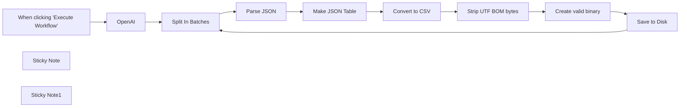

## Fluxo (.json) :

```json
{
  "id": "6FSx5OMVxp8Ldg8A",
  "meta": {
    "instanceId": "fb924c73af8f703905bc09c9ee8076f48c17b596ed05b18c0ff86915ef8a7c4a"
  },
  "name": "Prepare CSV files with GPT-4",
  "tags": [],
  "nodes": [
    {
      "id": "5b43e57d-1fe1-4ea6-bf3d-661f7e5fc4b0",
      "name": "When clicking \"Execute Workflow\"",
      "type": "n8n-nodes-base.manualTrigger",
      "position": [
        960,
        240
      ],
      "parameters": {},
      "typeVersion": 1
    },
    {
      "id": "291466e8-1592-4080-a675-5e9f486d0d05",
      "name": "OpenAI",
      "type": "n8n-nodes-base.openAi",
      "position": [
        1160,
        240
      ],
      "parameters": {
        "model": "gpt-4",
        "prompt": {
          "messages": [
            {
              "content": "=please create a list of 10 random users. Return back ONLY a JSON array. Character names of famous fiction characters. Make Names and Surnames start with the same letter. Name and Surname can be from different characters. If subscribed is false then make date_subscribed empty. If date_subscribed is not empty then make it random and no later then 2023-10-01. Make JSON in a single line, avoid line breaks. Here's an example: [{\"user_name\": \"Jack Jones\", \"user_email\":\"jackjo@yahoo.com\",\"subscribed\": true, \"date_subscribed\":\"2023-10-01\" },{\"user_name\": \"Martin Moor\", \"user_email\":\"mmoor@gmail.com\",\"subscribed\": false, \"date_subscribed\":\"\" }]"
            }
          ]
        },
        "options": {
          "n": 3,
          "maxTokens": 2500,
          "temperature": 1
        },
        "resource": "chat"
      },
      "credentials": {
        "openAiApi": {
          "id": "63",
          "name": "OpenAi account"
        }
      },
      "typeVersion": 1
    },
    {
      "id": "edd5bed7-a8a1-4298-b026-3b0061c5064a",
      "name": "Split In Batches",
      "type": "n8n-nodes-base.splitInBatches",
      "position": [
        1340,
        240
      ],
      "parameters": {
        "options": {},
        "batchSize": 1
      },
      "typeVersion": 2
    },
    {
      "id": "f0e414e6-741a-42db-86eb-ba95e220f9ef",
      "name": "Sticky Note",
      "type": "n8n-nodes-base.stickyNote",
      "position": [
        940,
        80
      ],
      "parameters": {
        "width": 600,
        "height": 126,
        "content": "## This is a helper workflow to create 3 CSV files\n### Feel free to adapt as needed\n### Some mock data from GPT is pinned for convenience"
      },
      "typeVersion": 1
    },
    {
      "id": "f1c2891f-5110-423c-9fb4-37e0a0d0f750",
      "name": "Parse JSON",
      "type": "n8n-nodes-base.set",
      "position": [
        1520,
        240
      ],
      "parameters": {
        "fields": {
          "values": [
            {
              "name": "content",
              "type": "arrayValue",
              "arrayValue": "={{JSON.parse($json.message.content)}}"
            }
          ]
        },
        "include": "none",
        "options": {}
      },
      "typeVersion": 3
    },
    {
      "id": "ce59d3e1-3916-48ad-a811-fa19ad66284a",
      "name": "Make JSON Table",
      "type": "n8n-nodes-base.itemLists",
      "position": [
        1700,
        240
      ],
      "parameters": {
        "options": {},
        "fieldToSplitOut": "content"
      },
      "typeVersion": 3
    },
    {
      "id": "8b1fda14-6593-4cc2-ab74-483b7aa4d84a",
      "name": "Convert to CSV",
      "type": "n8n-nodes-base.spreadsheetFile",
      "position": [
        1880,
        240
      ],
      "parameters": {
        "options": {
          "fileName": "=funny_names_{{ $('Split In Batches').item.json.index+1 }}.{{ $parameter[\"fileFormat\"] }}",
          "headerRow": true
        },
        "operation": "toFile",
        "fileFormat": "csv"
      },
      "typeVersion": 2
    },
    {
      "id": "d2a621e0-88df-4642-91ab-772f062c8682",
      "name": "Save to Disk",
      "type": "n8n-nodes-base.writeBinaryFile",
      "position": [
        2420,
        240
      ],
      "parameters": {
        "options": {},
        "fileName": "=./.n8n/{{ $binary.data.fileName }}"
      },
      "typeVersion": 1
    },
    {
      "id": "20f60bb0-0527-44c4-85d5-a95c20670893",
      "name": "Strip UTF BOM bytes",
      "type": "n8n-nodes-base.moveBinaryData",
      "position": [
        2060,
        240
      ],
      "parameters": {
        "options": {
          "encoding": "utf8",
          "stripBOM": true,
          "jsonParse": false,
          "keepSource": false
        },
        "setAllData": false
      },
      "typeVersion": 1
    },
    {
      "id": "bda91493-df5d-4b8c-b739-abca6045faf9",
      "name": "Create valid binary",
      "type": "n8n-nodes-base.moveBinaryData",
      "position": [
        2240,
        240
      ],
      "parameters": {
        "mode": "jsonToBinary",
        "options": {
          "addBOM": false,
          "encoding": "utf8",
          "fileName": "=funny_names_{{ $('Split In Batches').item.json.index+1 }}.{{ $('Convert to CSV').first().binary.data.fileExtension }}",
          "mimeType": "text/csv",
          "keepSource": false,
          "useRawData": true
        },
        "convertAllData": false
      },
      "typeVersion": 1
    },
    {
      "id": "e1b54e0d-56a5-43e7-82b4-aaead2875a9d",
      "name": "Sticky Note1",
      "type": "n8n-nodes-base.stickyNote",
      "position": [
        2007,
        140
      ],
      "parameters": {
        "width": 394,
        "height": 254,
        "content": "### These 2 nodes fix an issue with BOM bytes in the beginning of the file.\nWithout them reading the CSV file back becomes tricky"
      },
      "typeVersion": 1
    }
  ],
  "active": false,
  "pinData": {
    "OpenAI": [
      {
        "json": {
          "index": 0,
          "message": {
            "role": "assistant",
            "content": "[{\"user_name\": \"Harry Holmes\", \"user_email\": \"harryholmes@gmail.com\", \"subscribed\": true, \"date_subscribed\": \"2022-08-15\"}, {\"user_name\": \"Frodo Fawkes\", \"user_email\": \"frodo.fawks01@gmail.com\", \"subscribed\": false, \"date_subscribed\": \"\"}, {\"user_name\": \"Luke Longbottom\", \"user_email\": \"lukeLongbottom@gmail.com\", \"subscribed\": true, \"date_subscribed\": \"2023-09-25\"}, {\"user_name\": \"Perry Potter\", \"user_email\": \"perry_potter@yahoo.com\", \"subscribed\": false, \"date_subscribed\": \"\"}, {\"user_name\": \"James Joyce\", \"user_email\": \"jjoyce@gmail.com\", \"subscribed\": true, \"date_subscribed\": \"2023-06-12\"}, {\"user_name\": \"Bilbo Baggins\", \"user_email\": \"bilbobaggins@gmail.com\", \"subscribed\": true, \"date_subscribed\": \"2023-03-12\"}, {\"user_name\": \"Tom Tompkins\", \"user_email\": \"tompkins.tom@outlook.com\", \"subscribed\": false, \"date_subscribed\": \"\"}, {\"user_name\": \"Ronald Reagan\", \"user_email\": \"ronald.reagan@gmail.com\", \"subscribed\": true, \"date_subscribed\": \"2023-01-05\"}, {\"user_name\": \"Mary Morstan\", \"user_email\": \"maryMorstan@gmail.com\", \"subscribed\": false, \"date_subscribed\": \"\"}, {\"user_name\": \"Arthur Arthur\", \"user_email\": \"arthur.arthur@aol.com\", \"subscribed\": true, \"date_subscribed\": \"2023-04-17\"}]"
          },
          "finish_reason": "stop"
        },
        "pairedItem": {
          "item": 0
        }
      },
      {
        "json": {
          "index": 1,
          "message": {
            "role": "assistant",
            "content": "[{\"user_name\": \"Harry Holmes\", \"user_email\":\"hholmes@email.com\", \"subscribed\": true, \"date_subscribed\":\"2021-12-15\"}, {\"user_name\": \"James Jasper\", \"user_email\":\"jjasper@yahoo.com\", \"subscribed\": false, \"date_subscribed\":\"\"}, {\"user_name\": \"Frodo Fenton\", \"user_email\":\"frodonot@gmail.com\", \"subscribed\": true, \"date_subscribed\":\"2022-07-09\"}, {\"user_name\": \"Katniss Kennedy\", \"user_email\":\"kennedy@hotmail.com\", \"subscribed\": false, \"date_subscribed\":\"\"}, {\"user_name\": \"Bilbo Brandy\", \"user_email\":\"bbrandy@gmail.net\",\"subscribed\": true, \"date_subscribed\":\"2022-02-20\"}, {\"user_name\": \"Percy Pepper\", \"user_email\":\"percy@gmail.com\", \"subscribed\": false, \"date_subscribed\":\"\"}, {\"user_name\": \"Samwise Sprint\", \"user_email\":\"ssprint@outlook.com\", \"subscribed\": true, \"date_subscribed\":\"2021-06-01\"}, {\"user_name\": \"Gandalf Gatsby\", \"user_email\":\"gandalfg@gmail.com\", \"subscribed\": true, \"date_subscribed\":\"2023-01-22\"}, {\"user_name\": \"Dumbledore Dane\", \"user_email\":\"ddane@gmail.com\",\"subscribed\": false, \"date_subscribed\":\"\"}, {\"user_name\": \"Tommy Torrance\", \"user_email\":\"ttorrance@hotmail.com\", \"subscribed\": true, \"date_subscribed\":\"2023-08-15\"}]"
          },
          "finish_reason": "stop"
        },
        "pairedItem": {
          "item": 0
        }
      },
      {
        "json": {
          "index": 2,
          "message": {
            "role": "assistant",
            "content": "[{\"user_name\": \"Harry Holmes\", \"user_email\":\"harryholmes@hotmail.com\", \"subscribed\": true, \"date_subscribed\":\"2023-01-09\"}, {\"user_name\": \"Sam Spade\", \"user_email\":\"samspade@gmail.com\", \"subscribed\": false, \"date_subscribed\":\"\"}, {\"user_name\": \"Tom Sawyer\", \"user_email\":\"tomsawyer@yahoo.com\", \"subscribed\": true, \"date_subscribed\":\"2022-12-12\"}, {\"user_name\": \"Frodo Fawkes\", \"user_email\":\"frodofawkes@gmail.com\", \"subscribed\": true, \"date_subscribed\":\"2023-09-30\"}, {\"user_name\": \"Bruce Bond\", \"user_email\":\"brucebond@gmail.com\", \"subscribed\": true, \"date_subscribed\":\"2023-08-15\"}, {\"user_name\": \"Peter Pan\", \"user_email\":\"peterpan@gmail.com\", \"subscribed\": false, \"date_subscribed\":\"\"}, {\"user_name\": \"Hermione Holmes\", \"user_email\":\"hermioneholmes@yahoo.com\", \"subscribed\": true, \"date_subscribed\":\"2023-02-21\"}, {\"user_name\": \"Walter White\", \"user_email\":\"walterwhite@hotmail.com\", \"subscribed\": false, \"date_subscribed\":\"\"}, {\"user_name\": \"Tony Twist\", \"user_email\":\"tonytwist@gmail.com\", \"subscribed\": true, \"date_subscribed\":\"2023-04-27\"}, {\"user_name\": \"Ron Ranger\", \"user_email\":\"ronranger@yahoo.com\", \"subscribed\": true, \"date_subscribed\":\"2023-07-13\"}]"
          },
          "finish_reason": "stop"
        },
        "pairedItem": {
          "item": 0
        }
      }
    ]
  },
  "settings": {
    "executionOrder": "v1"
  },
  "versionId": "91f77342-1d0f-4033-b09a-3e3c8791107e",
  "connections": {
    "OpenAI": {
      "main": [
        [
          {
            "node": "Split In Batches",
            "type": "main",
            "index": 0
          }
        ]
      ]
    },
    "Parse JSON": {
      "main": [
        [
          {
            "node": "Make JSON Table",
            "type": "main",
            "index": 0
          }
        ]
      ]
    },
    "Save to Disk": {
      "main": [
        [
          {
            "node": "Split In Batches",
            "type": "main",
            "index": 0
          }
        ]
      ]
    },
    "Convert to CSV": {
      "main": [
        [
          {
            "node": "Strip UTF BOM bytes",
            "type": "main",
            "index": 0
          }
        ]
      ]
    },
    "Make JSON Table": {
      "main": [
        [
          {
            "node": "Convert to CSV",
            "type": "main",
            "index": 0
          }
        ]
      ]
    },
    "Split In Batches": {
      "main": [
        [
          {
            "node": "Parse JSON",
            "type": "main",
            "index": 0
          }
        ]
      ]
    },
    "Create valid binary": {
      "main": [
        [
          {
            "node": "Save to Disk",
            "type": "main",
            "index": 0
          }
        ]
      ]
    },
    "Strip UTF BOM bytes": {
      "main": [
        [
          {
            "node": "Create valid binary",
            "type": "main",
            "index": 0
          }
        ]
      ]
    },
    "When clicking \"Execute Workflow\"": {
      "main": [
        [
          {
            "node": "OpenAI",
            "type": "main",
            "index": 0
          }
        ]
      ]
    }
  }
}
```

<a id="template-2033"></a>

## Template 2033 - Otimização automática de imagens do Google Drive

- **Nome:** Otimização automática de imagens do Google Drive
- **Descrição:** Quando uma imagem é adicionada a uma pasta do Google Drive, o fluxo envia a imagem para o TinyPNG para otimização e salva a versão otimizada em uma pasta do Google Drive configurada.
- **Funcionalidade:** • Monitoramento de pasta: detecta automaticamente quando um novo ficheiro é criado numa pasta específica do Google Drive.
• Download de imagem: faz o download do ficheiro de imagem recém-adicionado.
• Envio para otimização: envia a imagem ao serviço TinyPNG através da API para compressão/otimização.
• Recuperação da imagem otimizada: obtém a imagem otimizada a partir do TinyPNG.
• Upload da versão otimizada: grava a imagem otimizada numa pasta de destino do Google Drive, podendo renomear o ficheiro (ex.: sufixo -optimised).
• Configuração de credenciais e chave API: permite configurar credenciais do Google Drive e a chave de API do TinyPNG.
• Agendamento/sondagem: verifica a pasta em intervalos regulares (por exemplo, a cada minuto) para novos ficheiros.
- **Ferramentas:** • Google Drive: armazenamento em nuvem utilizado para detectar, baixar e armazenar imagens (pasta de origem e pasta de destino).
• TinyPNG: serviço de otimização/compressão de imagens acessado via API para reduzir o tamanho dos ficheiros mantendo qualidade.


## Fluxo visual

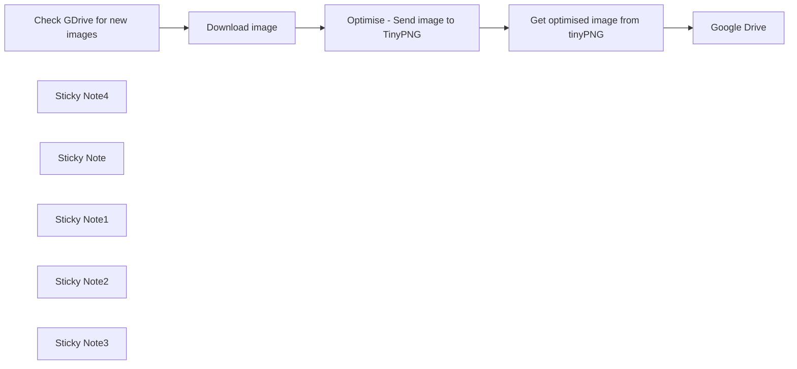

## Fluxo (.json) :

```json
{
  "id": "FpZJ8jaNQ3j2DO1L",
  "meta": {
    "instanceId": "cb484ba7b742928a2048bf8829668bed5b5ad9787579adea888f05980292a4a7"
  },
  "name": "Optimise images uploaded to GDrive",
  "nodes": [
    {
      "id": "a6fac2bb-4079-4872-9cc9-17b1016d2fcc",
      "name": "Check GDrive for new images",
      "type": "n8n-nodes-base.googleDriveTrigger",
      "position": [
        500,
        160
      ],
      "parameters": {
        "event": "fileCreated",
        "options": {},
        "pollTimes": {
          "item": [
            {
              "mode": "everyMinute"
            }
          ]
        },
        "triggerOn": "specificFolder",
        "folderToWatch": {
          "__rl": true,
          "mode": "list",
          "value": "",
          "cachedResultUrl": "",
          "cachedResultName": ""
        }
      },
      "credentials": {
        "googleDriveOAuth2Api": {
          "id": "",
          "name": ""
        }
      },
      "typeVersion": 1
    },
    {
      "id": "a0cae553-e4c1-408b-b11a-ceda4ff1aaa4",
      "name": "Download image",
      "type": "n8n-nodes-base.googleDrive",
      "position": [
        700,
        160
      ],
      "parameters": {
        "fileId": {
          "__rl": true,
          "mode": "id",
          "value": "={{ $json.id }}"
        },
        "options": {},
        "operation": "download"
      },
      "credentials": {
        "googleDriveOAuth2Api": {
          "id": "",
          "name": ""
        }
      },
      "typeVersion": 3
    },
    {
      "id": "006ba31a-f42b-460c-87e1-66c5345fb6d7",
      "name": "Optimise - Send image to TinyPNG",
      "type": "n8n-nodes-base.httpRequest",
      "position": [
        940,
        320
      ],
      "parameters": {
        "url": "https://api.tinify.com/shrink",
        "method": "POST",
        "options": {
          "response": {
            "response": {
              "fullResponse": true
            }
          }
        },
        "sendBody": true,
        "contentType": "binaryData",
        "sendHeaders": true,
        "headerParameters": {
          "parameters": [
            {
              "name": "Authorization",
              "value": "Basic "
            }
          ]
        },
        "inputDataFieldName": "data"
      },
      "typeVersion": 4.1
    },
    {
      "id": "e380304e-1c94-4841-bc1c-73047e4c2501",
      "name": "Get optimised image from tinyPNG",
      "type": "n8n-nodes-base.httpRequest",
      "position": [
        1140,
        320
      ],
      "parameters": {
        "url": "={{ $json.headers.location }}",
        "options": {}
      },
      "typeVersion": 4.1
    },
    {
      "id": "f4db56cf-e362-41da-b2c2-da59b71a103f",
      "name": "Sticky Note4",
      "type": "n8n-nodes-base.stickyNote",
      "position": [
        -60,
        -60
      ],
      "parameters": {
        "color": 4,
        "width": 459.2991776576996,
        "height": 146.4269155371431,
        "content": "## Automatically optimise images uploaded to Google drive folder\nEach time an image is added to a google drive folder, this workflow will send it to tinypng.com to optimise the size and resave it to a google drive location of your choice.\n\n"
      },
      "typeVersion": 1
    },
    {
      "id": "b9e2dd81-245d-4328-adbc-a1f17100d590",
      "name": "Sticky Note",
      "type": "n8n-nodes-base.stickyNote",
      "position": [
        -60,
        120
      ],
      "parameters": {
        "color": 6,
        "width": 463.09809221779403,
        "height": 176.7894351639415,
        "content": "### 1. Pre-setup: Google Drive credentials\n\n**a.** Firstly you'll need to setup Google Drive credentials. Best thing is to [read n8n docs](https://docs.n8n.io/integrations/builtin/credentials/google/oauth-single-service/) to to do that.\n**b.** Once you're successfully connecting to your GDrive account, set all 3 of the Drive nodes to connect using that credential."
      },
      "typeVersion": 1
    },
    {
      "id": "285b5324-07d5-4f17-b6cc-9013e60644ad",
      "name": "Sticky Note1",
      "type": "n8n-nodes-base.stickyNote",
      "position": [
        480,
        -60
      ],
      "parameters": {
        "color": 6,
        "width": 411.49840818526235,
        "height": 189.2115813199212,
        "content": "### 2. Choose the Google Drive folder n8n is going to watch for new files\n\n**a.** Go to Google Drive and create the folder you want n8n to watch for new images\n**b.** Then you need to select that folder in the Google Drive trigger node"
      },
      "typeVersion": 1
    },
    {
      "id": "8b574c32-baec-48ec-9cab-41d9f9813c6f",
      "name": "Sticky Note2",
      "type": "n8n-nodes-base.stickyNote",
      "position": [
        940,
        100
      ],
      "parameters": {
        "color": 6,
        "width": 322.632285684791,
        "height": 189.2115813199212,
        "content": "### 3. Create an API key for tinypng.com\n\n**a.** Visit [tinypng.com](https://tinypng.com/developers) and request an API key\n**b.** Update the \"Authorisation\" parameter value with your api key. It will be in the format of \"Basic YOUR_API_KEY_IN_BASE_64\""
      },
      "typeVersion": 1
    },
    {
      "id": "d3740bb8-f296-4b81-816e-ebc6e42927ad",
      "name": "Sticky Note3",
      "type": "n8n-nodes-base.stickyNote",
      "position": [
        1380,
        240
      ],
      "parameters": {
        "color": 6,
        "width": 322.632285684791,
        "height": 239.85571564814694,
        "content": "### 4. Choose your Google Drive folder to save your upload your optimised images to\n\n**a.** Finally, create and select the folder that you want your optimised images to be saved to\n**b.** OPTIONAL: You can also change the formatting of the name that you set. By default it will use the original file name then -optimised"
      },
      "typeVersion": 1
    },
    {
      "id": "b69a925f-9938-4672-9329-4f8895ea9c79",
      "name": "Google Drive",
      "type": "n8n-nodes-base.googleDrive",
      "position": [
        1480,
        520
      ],
      "parameters": {
        "name": "name.png",
        "driveId": {
          "__rl": true,
          "mode": "list",
          "value": ""
        },
        "options": {},
        "folderId": {
          "__rl": true,
          "mode": "list",
          "value": "",
          "cachedResultUrl": "",
          "cachedResultName": ""
        }
      },
      "credentials": {
        "googleDriveOAuth2Api": {
          "id": "",
          "name": ""
        }
      },
      "typeVersion": 3
    }
  ],
  "active": false,
  "pinData": {},
  "settings": {
    "executionOrder": "v1"
  },
  "versionId": "7cdfcaa5-cbce-4582-9563-c72ba8d425b9",
  "connections": {
    "Download image": {
      "main": [
        [
          {
            "node": "Optimise - Send image to TinyPNG",
            "type": "main",
            "index": 0
          }
        ]
      ]
    },
    "Check GDrive for new images": {
      "main": [
        [
          {
            "node": "Download image",
            "type": "main",
            "index": 0
          }
        ]
      ]
    },
    "Get optimised image from tinyPNG": {
      "main": [
        [
          {
            "node": "Google Drive",
            "type": "main",
            "index": 0
          }
        ]
      ]
    },
    "Optimise - Send image to TinyPNG": {
      "main": [
        [
          {
            "node": "Get optimised image from tinyPNG",
            "type": "main",
            "index": 0
          }
        ]
      ]
    }
  }
}
```

<a id="template-2035"></a>

## Template 2035 - Bot de resposta para Instagram com IA

- **Nome:** Bot de resposta para Instagram com IA
- **Descrição:** Recebe mensagens do Instagram via ManyChat, gera respostas em estilo de influenciador usando IA e envia de volta ao usuário.
- **Funcionalidade:** • Recepção de mensagens: Captura mensagens recebidas do Instagram através de um webhook.
• Definição de persona e prompt: Permite configurar o prompt do sistema para que a IA responda como um influenciador.
• Geração de respostas com IA: Utiliza um modelo de linguagem para criar respostas simples no estilo definido.
• Histórico por sessão: Mantém um histórico limitado de mensagens para preservar contexto nas conversas.
• Envio de resposta ao usuário: Retorna a resposta gerada para o fluxo do ManyChat, que a entrega no Instagram.
• Configuração flexível: Possibilidade de escolher o modelo de linguagem e ajustar o tamanho do histórico de contexto.
- **Ferramentas:** • Instagram: Plataforma onde os usuários enviam e recebem mensagens.
• ManyChat: Serviço usado como ponte para receber e enviar mensagens do Instagram via ações personalizadas.
• OpenAI (ChatGPT): Modelo de linguagem usado para gerar as respostas em estilo de influenciador.


## Fluxo visual

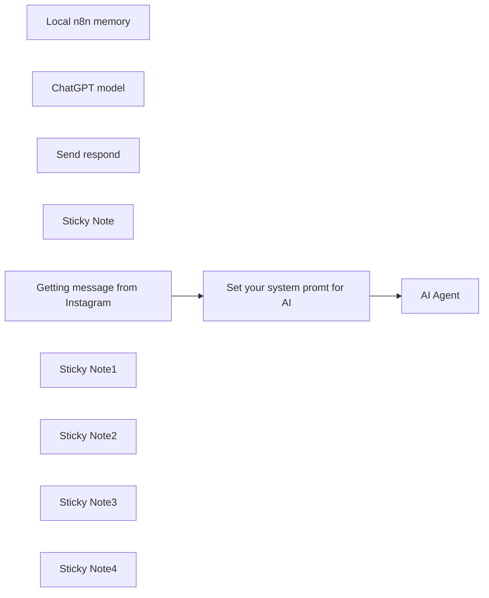

## Fluxo (.json) :

```json
{
  "id": "qww129cm4TM9N8Ru",
  "meta": {
    "instanceId": "038da3428bba4563b42be267feeca21b4922693db254331ac640a5c56ee7cadf",
    "templateCredsSetupCompleted": true
  },
  "name": "InstaTest",
  "tags": [
    {
      "id": "8PlqXsDyqVlHJ7RC",
      "name": "AI",
      "createdAt": "2024-07-10T14:12:10.657Z",
      "updatedAt": "2024-07-10T14:12:10.657Z"
    }
  ],
  "nodes": [
    {
      "id": "51dcaa84-d1f9-4abc-aebc-24a06801e42d",
      "name": "Set your system promt for AI",
      "type": "n8n-nodes-base.set",
      "notes": "In this node in \"prompt\" variable you can set your system prompt",
      "position": [
        1120,
        620
      ],
      "parameters": {
        "options": {},
        "assignments": {
          "assignments": [
            {
              "id": "0b3c3d71-5627-4b8c-91f0-ac44eaedf196",
              "name": "prompt",
              "type": "string",
              "value": "=Persona: You are a instagram influencer.\nContext: You receive a messages from your subscribers\nTask: Answer questions in your writing style and patterns according to your previous posts text. Use your post only for style and patterns reference.\nStyle rules:\nsimple answers"
            },
            {
              "id": "c2a9e272-5c0d-4685-ad0e-ce6995f92a1c",
              "name": "sessionId",
              "type": "string",
              "value": "={{ $json.body.session_id }}"
            },
            {
              "id": "b3c20ee3-07a1-4584-b0d9-7310a2c6b723",
              "name": "chatInput",
              "type": "string",
              "value": "={{ $json.body.text }}"
            }
          ]
        }
      },
      "typeVersion": 3.3
    },
    {
      "id": "0fb36573-d632-4403-8809-3973f9caa32a",
      "name": "Local n8n memory",
      "type": "@n8n/n8n-nodes-langchain.memoryBufferWindow",
      "position": [
        1500,
        780
      ],
      "parameters": {
        "sessionKey": "={{ $('Set your system promt for AI').last().json.sessionId }}",
        "sessionIdType": "customKey",
        "contextWindowLength": 20
      },
      "typeVersion": 1.3
    },
    {
      "id": "2f0471a7-2a84-41ce-aab1-896d5ea95ac3",
      "name": "ChatGPT model",
      "type": "@n8n/n8n-nodes-langchain.lmChatOpenAi",
      "position": [
        1360,
        780
      ],
      "parameters": {
        "options": {}
      },
      "credentials": {
        "openAiApi": {
          "id": "HxWZhtJcnqTXVHAA",
          "name": "General"
        }
      },
      "typeVersion": 1
    },
    {
      "id": "49abc3a3-faf9-4249-b874-908138a84aea",
      "name": "Send respond ",
      "type": "n8n-nodes-base.respondToWebhook",
      "position": [
        1720,
        620
      ],
      "parameters": {
        "options": {}
      },
      "typeVersion": 1.1
    },
    {
      "id": "49382508-9307-4ffa-8b31-78fac3a7db10",
      "name": "Sticky Note",
      "type": "n8n-nodes-base.stickyNote",
      "position": [
        320,
        360
      ],
      "parameters": {
        "color": 5,
        "width": 458.4028599661066,
        "height": 447.98321744507007,
        "content": "## Easy Instagram(via ManyChat) bot\n---\n### Description:\nThis template is a main part of Entire solution. It's getting new message from Instagram via ManyChat(Extra No-Code tool for getting and sending message in Instagram). Generating message using ChatGPT and send back to ManyChat that sends it to Instagrtam.\n\n### Logic:\n1. Getting message from Instagram(from ManyChat)\n2. Set you system prompt for AI\n3. Create simple answer for message in AI block\n4. Send answer to Instagram(to ManyChat)\n\n---\n*Helpful links:*\n- [Guide in Notion how to create full bot](https://shadowed-pound-d6e.notion.site/Instagram-GPT-light-version-Manychat-X-N8N-176293bddff880899a9ac255585d29f7?pvs=4)\n- [ManyChat](https://manychat.partnerlinks.io/vm4wkw8j81tc)"
      },
      "typeVersion": 1
    },
    {
      "id": "5d14544c-7039-435f-a53c-615b5722bb99",
      "name": "Getting message from Instagram",
      "type": "n8n-nodes-base.webhook",
      "position": [
        900,
        620
      ],
      "webhookId": "68d3fbc9-6e49-4bdc-851c-2a532be911ab",
      "parameters": {
        "path": "instagram_chat",
        "options": {},
        "httpMethod": "POST",
        "responseMode": "responseNode"
      },
      "typeVersion": 2
    },
    {
      "id": "3770f558-341b-4d67-a7f0-0bb2fecf51a3",
      "name": "Sticky Note1",
      "type": "n8n-nodes-base.stickyNote",
      "position": [
        1320,
        300
      ],
      "parameters": {
        "width": 313.9634922216307,
        "height": 614.7475040550845,
        "content": "## 3) AI block\n---\nThere is 3 nodes:\n- AI Agent\n- Chat GPT model\n- Memory for history messages\n\n### To do:\n- in ChatGPT node you can choose the best model for you\n- in Memory Block you can change number of messages in history\n\n"
      },
      "typeVersion": 1
    },
    {
      "id": "cbb6c5a2-9b96-4305-afce-5ac560ae2dec",
      "name": "AI Agent",
      "type": "@n8n/n8n-nodes-langchain.agent",
      "position": [
        1340,
        620
      ],
      "parameters": {
        "text": "={{ $json.chatInput }}",
        "options": {
          "systemMessage": "={{ $json.prompt }}"
        },
        "promptType": "define"
      },
      "typeVersion": 1.7
    },
    {
      "id": "4e28119f-b1aa-4b20-a8ed-28bd137f9627",
      "name": "Sticky Note2",
      "type": "n8n-nodes-base.stickyNote",
      "position": [
        820,
        360
      ],
      "parameters": {
        "height": 440,
        "content": "## 1) HTTP Post webhook\n\n**To do:**\nJust copy production link from this node and insert to custom action in ManyChat\n\nNo edits needed"
      },
      "typeVersion": 1
    },
    {
      "id": "b18a8890-b420-4086-91c8-8edbc845c8af",
      "name": "Sticky Note3",
      "type": "n8n-nodes-base.stickyNote",
      "position": [
        1080,
        480
      ],
      "parameters": {
        "width": 220,
        "height": 320,
        "content": "## 2) Edit prompt\n\n**To do:**\nGo inside and change input\n"
      },
      "typeVersion": 1
    },
    {
      "id": "74d4e6f5-069e-4b37-8005-8c03226b05df",
      "name": "Sticky Note4",
      "type": "n8n-nodes-base.stickyNote",
      "position": [
        1660,
        480
      ],
      "parameters": {
        "height": 300,
        "content": "## 4) Respond webhook\n\nNo edits needed"
      },
      "typeVersion": 1
    }
  ],
  "active": true,
  "pinData": {},
  "settings": {
    "executionOrder": "v1"
  },
  "versionId": "2f36fc7a-0a69-4af3-a958-25e9d278f058",
  "connections": {
    "AI Agent": {
      "main": [
        [
          {
            "node": "Send respond ",
            "type": "main",
            "index": 0
          }
        ]
      ]
    },
    "ChatGPT model": {
      "ai_languageModel": [
        [
          {
            "node": "AI Agent",
            "type": "ai_languageModel",
            "index": 0
          }
        ]
      ]
    },
    "Local n8n memory": {
      "ai_memory": [
        [
          {
            "node": "AI Agent",
            "type": "ai_memory",
            "index": 0
          }
        ]
      ]
    },
    "Set your system promt for AI": {
      "main": [
        [
          {
            "node": "AI Agent",
            "type": "main",
            "index": 0
          }
        ]
      ]
    },
    "Getting message from Instagram": {
      "main": [
        [
          {
            "node": "Set your system promt for AI",
            "type": "main",
            "index": 0
          }
        ]
      ]
    }
  }
}
```

<a id="template-2037"></a>

## Template 2037 - Retentativa exponencial para APIs do Google

- **Nome:** Retentativa exponencial para APIs do Google
- **Descrição:** Fluxo que implementa retentativa exponencial ao interagir com APIs do Google, controlando tentativas, aguardando entre retries e interrompendo após limite máximo.
- **Funcionalidade:** • Gatilho manual: inicia o fluxo quando acionado manualmente para testes.
• Processamento em lotes: divide itens em lotes para processar múltiplos registros sequencialmente.
• Chamadas à API do Google Sheets com tolerância a erros: executa operações na planilha e permite captura de erro sem interromper imediatamente o fluxo.
• Cálculo de backoff exponencial: calcula tempo de espera crescente (delay inicial multiplicado por 2^retryCount) e incrementa o contador de tentativas.
• Espera entre tentativas: pausa a execução pelo tempo calculado antes de reemitir a requisição.
• Verificação do limite de tentativas: checa se o número de retries ultrapassou o limite configurado e toma ação apropriada.
• Interrupção com erro quando excede limites: encerra o fluxo com uma mensagem de erro se o máximo de tentativas for atingido.
- **Ferramentas:** • Google Sheets API: serviço para leitura e escrita em planilhas, alvo das operações que podem sofrer limites de requisições.
• Conta de serviço do Google: credenciais usadas para autenticar e autorizar chamadas às APIs do Google.

## Fluxo visual

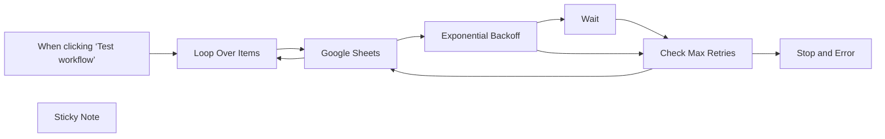

## Fluxo (.json) :

```json
{
  "id": "2NhqmUqW3KruEkaE",
  "meta": {
    "instanceId": "d868e3d040e7bda892c81b17cf446053ea25d2556fcef89cbe19dd61a3e876e9"
  },
  "name": "Exponential Backoff for Google APIs",
  "tags": [
    {
      "id": "nezaWFCGa7eZsVKu",
      "name": "Utility",
      "createdAt": "2024-11-13T18:08:08.207Z",
      "updatedAt": "2024-11-13T18:08:08.207Z"
    }
  ],
  "nodes": [
    {
      "id": "5d6b1730-33c5-401c-b73f-2b7ea8eedfe3",
      "name": "When clicking ‘Test workflow’",
      "type": "n8n-nodes-base.manualTrigger",
      "position": [
        -580,
        -80
      ],
      "parameters": {},
      "typeVersion": 1
    },
    {
      "id": "6726b630-597c-46cf-8839-75cd80108f2f",
      "name": "Exponential Backoff",
      "type": "n8n-nodes-base.code",
      "position": [
        160,
        120
      ],
      "parameters": {
        "mode": "runOnceForEachItem",
        "jsCode": "// Define the retry count (coming from a previous node or set manually)\nconst retryCount = $json[\"retryCount\"] || 0;  // If not present, default to 0\nconst maxRetries = 5;  // Define the maximum number of retries\nconst initialDelay = 1;  // Initial delay in seconds (1 second)\n\n// If the retry count is less than the max retries, calculate the delay\nif (retryCount < maxRetries) {\n    const currentDelayInSeconds = initialDelay * Math.pow(2, retryCount);  // Exponential backoff delay in seconds\n    \n    // Log the delay time for debugging\n    console.log(`Waiting for ${currentDelayInSeconds} seconds before retry...`);\n    \n    return {\n        json: {\n            retryCount: retryCount + 1,  // Increment retry count\n            waitTimeInSeconds: currentDelayInSeconds, // Pass the delay time in seconds\n            status: 'retrying',\n        }\n    };\n} else {\n    // If max retries are exceeded, return a failure response\n    return {\n        json: {\n            error: 'Max retries exceeded',\n            retryCount: retryCount,\n            status: 'failed'\n        }\n    };\n}\n"
      },
      "typeVersion": 2
    },
    {
      "id": "605b8ff0-aa19-42dd-8dbb-aa12380ac4bc",
      "name": "Stop and Error",
      "type": "n8n-nodes-base.stopAndError",
      "position": [
        760,
        120
      ],
      "parameters": {
        "errorMessage": "Google Sheets API Limit has been triggered and the workflow has stopped"
      },
      "typeVersion": 1
    },
    {
      "id": "97818e8b-e0cc-4a49-8797-43e02535740f",
      "name": "Loop Over Items",
      "type": "n8n-nodes-base.splitInBatches",
      "position": [
        -360,
        -80
      ],
      "parameters": {
        "options": {}
      },
      "typeVersion": 3
    },
    {
      "id": "0583eabd-bd97-4330-8a38-b2aed3a90c37",
      "name": "Google Sheets",
      "type": "n8n-nodes-base.googleSheets",
      "onError": "continueErrorOutput",
      "position": [
        -120,
        20
      ],
      "parameters": {
        "options": {},
        "sheetName": {
          "__rl": true,
          "mode": "name",
          "value": "Sheet1"
        },
        "documentId": {
          "__rl": true,
          "mode": "url",
          "value": "https://docs.google.com/spreadsheets/d/1_gxZl6n_AYPHRFRTWfhy7TZnhEYuWzh8UvGdtWCD3sU/edit?gid=0#gid=0"
        },
        "authentication": "serviceAccount"
      },
      "credentials": {
        "googleApi": {
          "id": "lm7dPHYumCy6sP6k",
          "name": "AlexK1919 Google Service"
        }
      },
      "typeVersion": 4.5
    },
    {
      "id": "0d8023f8-f7ac-4303-b18e-821690cc9f94",
      "name": "Wait",
      "type": "n8n-nodes-base.wait",
      "position": [
        360,
        120
      ],
      "webhookId": "f1651aa1-6497-4496-9e07-240dcf1852f3",
      "parameters": {
        "amount": "={{ $json[\"waitTime\"] }}"
      },
      "typeVersion": 1.1
    },
    {
      "id": "72e0001e-f99b-4d57-9006-4a4dd5d3d8d5",
      "name": "Check Max Retries",
      "type": "n8n-nodes-base.if",
      "position": [
        560,
        120
      ],
      "parameters": {
        "options": {},
        "conditions": {
          "options": {
            "version": 2,
            "leftValue": "",
            "caseSensitive": true,
            "typeValidation": "strict"
          },
          "combinator": "and",
          "conditions": [
            {
              "id": "51e191cb-af20-423b-9303-8523caa4ae0d",
              "operator": {
                "type": "number",
                "operation": "gt"
              },
              "leftValue": "={{ $('Exponential Backoff').item.json[\"retryCount\"] }}",
              "rightValue": 10
            }
          ]
        }
      },
      "typeVersion": 2.2
    },
    {
      "id": "2ea14bb0-4313-4595-811d-729ca6d37420",
      "name": "Sticky Note",
      "type": "n8n-nodes-base.stickyNote",
      "position": [
        100,
        -80
      ],
      "parameters": {
        "color": 3,
        "width": 820,
        "height": 460,
        "content": "# Exponential Backoff for Google APIs \n## Connect these nodes to any Google API node such as the Google Sheets node example in this workflow"
      },
      "typeVersion": 1
    }
  ],
  "active": false,
  "pinData": {},
  "settings": {
    "executionOrder": "v1"
  },
  "versionId": "729e3a54-6238-4e4c-833e-8e37dba16dbb",
  "connections": {
    "Wait": {
      "main": [
        [
          {
            "node": "Check Max Retries",
            "type": "main",
            "index": 0
          }
        ]
      ]
    },
    "Google Sheets": {
      "main": [
        [
          {
            "node": "Loop Over Items",
            "type": "main",
            "index": 0
          }
        ],
        [
          {
            "node": "Exponential Backoff",
            "type": "main",
            "index": 0
          }
        ]
      ]
    },
    "Loop Over Items": {
      "main": [
        [],
        [
          {
            "node": "Google Sheets",
            "type": "main",
            "index": 0
          }
        ]
      ]
    },
    "Check Max Retries": {
      "main": [
        [
          {
            "node": "Stop and Error",
            "type": "main",
            "index": 0
          }
        ],
        [
          {
            "node": "Google Sheets",
            "type": "main",
            "index": 0
          }
        ]
      ]
    },
    "Exponential Backoff": {
      "main": [
        [
          {
            "node": "Wait",
            "type": "main",
            "index": 0
          },
          {
            "node": "Check Max Retries",
            "type": "main",
            "index": 0
          }
        ]
      ]
    },
    "When clicking ‘Test workflow’": {
      "main": [
        [
          {
            "node": "Loop Over Items",
            "type": "main",
            "index": 0
          }
        ]
      ]
    }
  }
}
```

<a id="template-2039"></a>

## Template 2039 - Agente de chat com busca web e memória

- **Nome:** Agente de chat com busca web e memória
- **Descrição:** Este fluxo funciona como um agente de chat que utiliza um modelo de linguagem para responder, faz buscas na web quando necessário e mantém o contexto recente da conversa usando memória de janela.
- **Funcionalidade:** • Detecção de mensagem de chat: inicia a conversa quando o usuário envia uma mensagem.
• Geração de respostas com modelo de linguagem: utiliza o modelo de linguagem para criar respostas coerentes.
• Gerenciamento de memória de curto prazo: mantém o histórico recente da conversa para contexto.
• Busca de informações na web: consulta a web usando uma ferramenta de busca para fornecer dados atualizados.
• Orquestração entre memória, modelo e ferramentas: o agente coordena entrada, memória, modelo e busca para entregar respostas.
- **Ferramentas:** • OpenAI API: serviço de modelo de linguagem utilizado para gerar respostas.
• SerpAPI: serviço de busca na web utilizado para coletar informações atualizadas.


## Fluxo visual

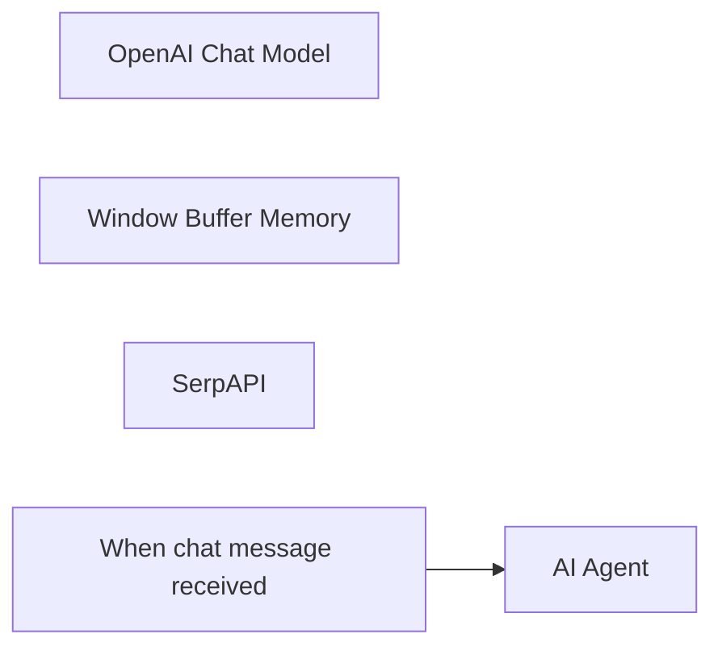

## Fluxo (.json) :

```json
{
  "meta": {
    "instanceId": "408f9fb9940c3cb18ffdef0e0150fe342d6e655c3a9fac21f0f644e8bedabcd9"
  },
  "nodes": [
    {
      "id": "939bb301-5e12-4d5b-9a56-61a61cca5f0d",
      "name": "OpenAI Chat Model",
      "type": "@n8n/n8n-nodes-langchain.lmChatOpenAi",
      "position": [
        640,
        460
      ],
      "parameters": {
        "model": "gpt-4o-mini",
        "options": {}
      },
      "credentials": {
        "openAiApi": {
          "id": "8gccIjcuf3gvaoEr",
          "name": "OpenAi account"
        }
      },
      "typeVersion": 1
    },
    {
      "id": "372777e8-ce90-4dea-befc-ac1b2eb4729f",
      "name": "Window Buffer Memory",
      "type": "@n8n/n8n-nodes-langchain.memoryBufferWindow",
      "position": [
        780,
        460
      ],
      "parameters": {},
      "typeVersion": 1.2
    },
    {
      "id": "7a8f0ad1-1c00-4043-b3e5-c88521140a1a",
      "name": "SerpAPI",
      "type": "@n8n/n8n-nodes-langchain.toolSerpApi",
      "position": [
        920,
        460
      ],
      "parameters": {
        "options": {}
      },
      "credentials": {
        "serpApi": {
          "id": "aJCKjxx6U3K7ydDe",
          "name": "SerpAPI account"
        }
      },
      "typeVersion": 1
    },
    {
      "id": "a7624108-e3da-4193-a625-887314216b8b",
      "name": "When chat message received",
      "type": "@n8n/n8n-nodes-langchain.chatTrigger",
      "position": [
        360,
        240
      ],
      "webhookId": "53c136fe-3e77-4709-a143-fe82746dd8b6",
      "parameters": {
        "options": {}
      },
      "typeVersion": 1.1
    },
    {
      "id": "6b8b7de8-fe3f-43b5-97ce-a52a9e44eb5e",
      "name": "AI Agent",
      "type": "@n8n/n8n-nodes-langchain.agent",
      "position": [
        680,
        240
      ],
      "parameters": {
        "options": {}
      },
      "typeVersion": 1.6
    }
  ],
  "pinData": {},
  "connections": {
    "SerpAPI": {
      "ai_tool": [
        [
          {
            "node": "AI Agent",
            "type": "ai_tool",
            "index": 0
          }
        ]
      ]
    },
    "OpenAI Chat Model": {
      "ai_languageModel": [
        [
          {
            "node": "AI Agent",
            "type": "ai_languageModel",
            "index": 0
          }
        ]
      ]
    },
    "Window Buffer Memory": {
      "ai_memory": [
        [
          {
            "node": "AI Agent",
            "type": "ai_memory",
            "index": 0
          }
        ]
      ]
    },
    "When chat message received": {
      "main": [
        [
          {
            "node": "AI Agent",
            "type": "main",
            "index": 0
          }
        ]
      ]
    }
  }
}
```

<a id="template-2041"></a>

## Template 2041 - Cadastro automático de lead a partir de Calendly

- **Nome:** Cadastro automático de lead a partir de Calendly
- **Descrição:** Fluxo que dispara quando um invitee é criado no Calendly, enriquece os dados do contato com o Dropcontact e registra um novo item na base de dados com informações de contato e links relevantes.
- **Funcionalidade:** • Detecção de evento Calendly: Inicia a automação quando um invitee é criado no Calendly.
• Enriquecimento de dados do contato: Obtém informações adicionais do contato por meio do Dropcontact a partir do email do invitee.
• Criação de registro na base de dados: Registra um novo item com campos como Date, email, Leads name, LinkedIn Profile, Website, LinkedIn Company e Civility.
• Mapeamento de campos entre entrada e base: Converte as informações recebidas para os campos da base de dados.
• Associação de pessoa no registro: Vincula a pessoa correspondente ao registro usando o ID especificado.
- **Ferramentas:** • Calendly: ferramenta de agendamento que gera eventos de invitee e disparos de fluxo.
• Dropcontact: serviço de enriquecimento de dados de contatos.
• Notion: base de dados para armazenar e organizar leads.

## Fluxo visual

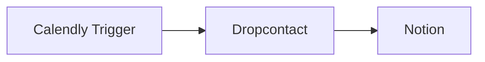

## Fluxo (.json) :

```json
{
  "nodes": [
    {
      "name": "Notion",
      "type": "n8n-nodes-base.notion",
      "position": [
        850,
        400
      ],
      "parameters": {
        "resource": "databasePage",
        "databaseId": "",
        "propertiesUi": {
          "propertyValues": [
            {
              "key": "Date|date",
              "range": true,
              "dateEnd": "={{$node[\"Function\"].json[\"payload\"][\"event\"][\"end_time\"]}}",
              "dateStart": "={{$node[\"Function\"].json[\"payload\"][\"event\"][\"invitee_start_time\"]}}"
            },
            {
              "key": "email|email",
              "emailValue": "={{$json[\"email\"][0][\"email\"]}}"
            },
            {
              "key": "Leads|name",
              "title": "={{$json[\"full_name\"]}}"
            },
            {
              "key": "LinkedIn Profile|url",
              "urlValue": "={{$json[\"linkedin\"]}}"
            },
            {
              "key": "Person|people",
              "peopleValue": [
                "22ad678a-175a-405c-b504-978d7804ebb8"
              ]
            },
            {
              "key": "Website|url",
              "urlValue": "={{$json[\"website\"]}}"
            },
            {
              "key": "LinkedIn Company|url",
              "urlValue": "={{$json[\"company_linkedin\"]}}"
            },
            {
              "key": "Civility|rich_text",
              "textContent": "={{$json[\"civility\"]}}"
            }
          ]
        }
      },
      "credentials": {
        "notionApi": {
          "id": "",
          "name": ""
        }
      },
      "typeVersion": 1
    },
    {
      "name": "Dropcontact",
      "type": "n8n-nodes-base.dropcontact",
      "position": [
        650,
        400
      ],
      "parameters": {
        "email": "={{$json[\"payload\"][\"invitee\"][\"email\"]}}",
        "options": {
          "siren": true,
          "language": "fr"
        },
        "additionalFields": {
          "full_name": "={{$json[\"payload\"][\"invitee\"][\"name\"]}}",
          "last_name": "={{$json[\"payload\"][\"invitee\"][\"last_name\"]}}",
          "first_name": "={{$json[\"payload\"][\"invitee\"][\"first_name\"]}}"
        }
      },
      "credentials": {
        "dropcontactApi": {
          "id": "",
          "name": ""
        }
      },
      "typeVersion": 1
    },
    {
      "name": "Calendly Trigger",
      "type": "n8n-nodes-base.calendlyTrigger",
      "position": [
        460,
        400
      ],
      "webhookId": "",
      "parameters": {
        "events": [
          "invitee.created"
        ]
      },
      "typeVersion": 1
    }
  ],
  "connections": {
    "Dropcontact": {
      "main": [
        [
          {
            "node": "Notion",
            "type": "main",
            "index": 0
          }
        ]
      ]
    },
    "Calendly Trigger": {
      "main": [
        [
          {
            "node": "Dropcontact",
            "type": "main",
            "index": 0
          }
        ]
      ]
    }
  }
}
```

<a id="template-2043"></a>

## Template 2043 - Monitoramento semanal de notícias e análise de Reddit para PR

- **Nome:** Monitoramento semanal de notícias e análise de Reddit para PR
- **Descrição:** Executa uma rotina semanal que identifica posts do Reddit sobre tópicos definidos, analisa comentários e o conteúdo das matérias, gera relatórios estratégicos de PR e distribui os arquivos para a equipe.
- **Funcionalidade:** • Agendamento semanal: Executa automaticamente a rotina em um horário definido toda semana.
• Entrada de tópicos: Recebe uma lista de tópicos de interesse para orientar buscas por posts relevantes.
• Busca e filtragem de posts do Reddit: Procura posts relacionados aos tópicos, filtra por número de upvotes, tipo de postagem e exclusão de URLs indesejadas.
• Remoção de duplicatas: Agrupa resultados por URL e mantém apenas a versão com maior engajamento.
• Processamento em lote: Itera por cada post selecionado para processamento individualizado.
• Extração de comentários: Recupera a árvore de comentários do post e exclui entradas deletadas.
• Seleção dos melhores comentários: Identifica e preserva até os top N comentários por score, mantendo a hierarquia de respostas relevantes.
• Formatação em Markdown: Converte o conjunto de comentários filtrados em formato Markdown estruturado.
• Análise de comentários por IA: Gera uma análise detalhada de sentimento, narrativas e implicações para PR usando um modelo de linguagem.
• Extração de conteúdo da notícia: Obtém e resume o conteúdo da URL da notícia para análise complementar.
• Análise de notícia por IA: Avalia o conteúdo noticioso combinando métricas do Reddit e insights de sentimento para mapear oportunidades de narrativa.
• Geração de relatório estratégico: Consolida métricas, análises e propostas de pauta em um relatório final voltado para PR.
• Conversão e agregação de arquivos: Converte o relatório em arquivo de texto, agrega binários e cria um arquivo compactado para distribuição.
• Armazenamento e compartilhamento: Faz upload do arquivo compactado para armazenamento em nuvem e altera permissões para compartilhamento público quando necessário.
• Notificação da equipe: Envia uma mensagem ao canal da equipe contendo o link para download do relatório final.
- **Ferramentas:** • Reddit: Fonte de posts e threads de comentários usada para detectar tendências e coletar métricas de engajamento.
• Jina (r.jina.ai): Serviço de extração/normalização de conteúdo de páginas web para obter o texto das matérias vinculadas.
• Anthropic (Claude): Modelos de linguagem usados para realizar análises de sentimento, mapeamento de narrativas e geração de relatórios estratégicos.
• Google Drive: Armazenamento em nuvem para guardar os relatórios compactados e permitir compartilhamento por link.
• Mattermost: Canal de comunicação da equipe usado para notificar e distribuir o link do relatório final.

## Fluxo visual

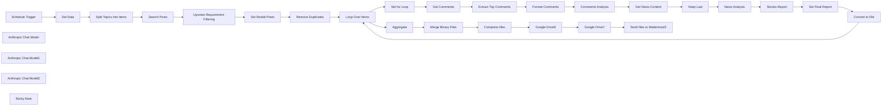

## Fluxo (.json) :

```json
{
  "id": "h2uiciRa1D3ntSTT",
  "meta": {
    "instanceId": "ddfdf733df99a65c801a91865dba5b7c087c95cc22a459ff3647e6deddf2aee6"
  },
  "name": "My workflow",
  "tags": [],
  "nodes": [
    {
      "id": "4b885b7d-0976-4dd3-bc1c-091ab0dff437",
      "name": "Split Topics into Items",
      "type": "n8n-nodes-base.code",
      "position": [
        420,
        420
      ],
      "parameters": {
        "jsCode": "// Input data (from $json.Topics)\nconst topicsString = $json.Topics;\n\n// Split the string by newlines and trim whitespace\nconst topicsArray = topicsString.split('\\n').map(topic => topic.trim());\n\n// Create an array of items for each topic\nconst items = topicsArray.map(topic => {\n  return { json: { Topic: topic } };\n});\n\n// Output the new array of items\nreturn items;\n"
      },
      "typeVersion": 2
    },
    {
      "id": "935d0266-feda-48cb-b441-b4da19d8b163",
      "name": "Search Posts",
      "type": "n8n-nodes-base.reddit",
      "position": [
        620,
        420
      ],
      "parameters": {
        "keyword": "meta",
        "location": "allReddit",
        "operation": "search",
        "returnAll": true,
        "additionalFields": {
          "sort": "hot"
        }
      },
      "typeVersion": 1
    },
    {
      "id": "cea577c8-c025-4132-926a-74d6946d81b8",
      "name": "Upvotes Requirement Filtering",
      "type": "n8n-nodes-base.if",
      "position": [
        800,
        420
      ],
      "parameters": {
        "options": {},
        "conditions": {
          "options": {
            "version": 2,
            "leftValue": "",
            "caseSensitive": true,
            "typeValidation": "strict"
          },
          "combinator": "and",
          "conditions": [
            {
              "id": "f767f7a8-a2e8-4566-be80-bd735249e069",
              "operator": {
                "type": "number",
                "operation": "gt"
              },
              "leftValue": "={{ $json.ups }}",
              "rightValue": 100
            },
            {
              "id": "3af82bef-5a78-4e6e-91ef-a5bd0141c87f",
              "operator": {
                "name": "filter.operator.equals",
                "type": "string",
                "operation": "equals"
              },
              "leftValue": "={{ $json.post_hint }}",
              "rightValue": "link"
            },
            {
              "id": "980a84ed-d640-47a7-b49a-bf638e811f20",
              "operator": {
                "type": "string",
                "operation": "notContains"
              },
              "leftValue": "={{ $json.url }}",
              "rightValue": "bsky.app"
            }
          ]
        }
      },
      "typeVersion": 2.2
    },
    {
      "id": "eec2d833-9a63-4cf6-a6bd-56b300ede5e0",
      "name": "Set Reddit Posts",
      "type": "n8n-nodes-base.set",
      "position": [
        1040,
        420
      ],
      "parameters": {
        "options": {},
        "assignments": {
          "assignments": [
            {
              "id": "8d5ae4fa-2f54-48d7-8f61-766f4ecf9d96",
              "name": "Title",
              "type": "string",
              "value": "={{ $json.title }}"
            },
            {
              "id": "8eb33a06-d8e7-4eea-bcd3-f956e20e06e6",
              "name": "Subreddit",
              "type": "string",
              "value": "={{ $json.subreddit }}"
            },
            {
              "id": "5ff8c76e-a8d5-4f76-a7d0-faa69b7960e4",
              "name": "Upvotes",
              "type": "string",
              "value": "={{ $json.ups }}"
            },
            {
              "id": "05a2b453-0e29-4a81-8f10-5934ae721f64",
              "name": "Comments",
              "type": "string",
              "value": "={{ $json.num_comments }}"
            },
            {
              "id": "78f73e89-19a7-4dd5-9db0-ead55dfd5606",
              "name": "Reddit URL",
              "type": "string",
              "value": "=https://www.reddit.com{{ $json.permalink }}"
            },
            {
              "id": "6f92bce7-2dc5-4dfd-b216-efc12c5411bb",
              "name": "URL",
              "type": "string",
              "value": "={{ $json.url }}"
            },
            {
              "id": "0b20d78c-1d6b-4c84-99ef-978ee39fd35e",
              "name": "Is_URL",
              "type": "string",
              "value": "={{ $json.post_hint }}"
            },
            {
              "id": "489807f6-25ef-47d5-bd47-711ca75dedea",
              "name": "Date",
              "type": "string",
              "value": "={{ new Date($json.created * 1000).toISOString().split('T')[0] }}"
            },
            {
              "id": "0a9fb817-bfb7-4ea7-9182-1eddc404035f",
              "name": "Post ID",
              "type": "string",
              "value": "={{ $json.id }}"
            }
          ]
        }
      },
      "typeVersion": 3.4
    },
    {
      "id": "9b45abb0-866a-47f4-b2b3-03e4cf41c988",
      "name": "Remove Duplicates",
      "type": "n8n-nodes-base.code",
      "position": [
        1220,
        420
      ],
      "parameters": {
        "jsCode": "// Get all input items\nconst inputItems = $input.all();\n\n// Create a Map to store the most upvoted item for each URL\nconst uniqueItemsMap = new Map();\n\nfor (const item of inputItems) {\n  const url = item.json.URL;\n  \n  // Skip items where URL contains \"redd.it\"\n  if (url && url.includes(\"redd.it\")) {\n    continue;\n  }\n  \n  const upvotes = parseInt(item.json.Upvotes, 10) || 0; // Ensure upvotes is a number\n\n  if (!uniqueItemsMap.has(url)) {\n    // Add the first occurrence of the URL\n    uniqueItemsMap.set(url, item);\n  } else {\n    // Compare upvotes and keep the item with the most upvotes\n    const existingItem = uniqueItemsMap.get(url);\n    const existingUpvotes = parseInt(existingItem.json.Upvotes, 10) || 0;\n    if (upvotes > existingUpvotes) {\n      uniqueItemsMap.set(url, item);\n    }\n  }\n}\n\n// Extract all unique items\nconst uniqueItems = Array.from(uniqueItemsMap.values());\n\n// Return each unique item as a separate output\nreturn uniqueItems;"
      },
      "typeVersion": 2
    },
    {
      "id": "39672fd4-3f8c-4cdb-acd5-bb862ae5eddd",
      "name": "Loop Over Items",
      "type": "n8n-nodes-base.splitInBatches",
      "position": [
        40,
        660
      ],
      "parameters": {
        "options": {}
      },
      "typeVersion": 3
    },
    {
      "id": "ad70aec7-a610-42f8-b87c-0d3dbee00e7b",
      "name": "Get Comments",
      "type": "n8n-nodes-base.reddit",
      "position": [
        480,
        640
      ],
      "parameters": {
        "postId": "={{ $json[\"Post ID\"] }}",
        "resource": "postComment",
        "operation": "getAll",
        "subreddit": "={{ $json.Subreddit }}"
      },
      "typeVersion": 1
    },
    {
      "id": "af7f0b35-4250-49e5-afa7-608155df0fd5",
      "name": "Extract Top Comments",
      "type": "n8n-nodes-base.code",
      "position": [
        660,
        640
      ],
      "parameters": {
        "jsCode": "/**\n * n8n Code Node for filtering top 30 Reddit-style comments by score/ups\n * and ensuring replies are included in the comment tree.\n * Excludes deleted comments.\n */\n\n// Get all input items\nconst inputItems = $input.all();\nconst commentsArray = inputItems.flatMap(item => item.json);\n\n/**\n * Checks if a comment is deleted.\n * @param {Object} commentObj - The comment to check.\n * @returns {boolean} - True if the comment is deleted, false otherwise.\n */\nfunction isDeletedComment(commentObj) {\n  return commentObj.author === \"[deleted]\" && commentObj.body === \"[removed]\";\n}\n\n// Function to recursively flatten a comment and its replies\nfunction flattenCommentTree(commentObj) {\n  // Skip deleted comments\n  if (isDeletedComment(commentObj)) {\n    return null;\n  }\n\n  const { body, ups, score, replies, author } = commentObj;\n\n  // Calculate score\n  const finalScore = typeof ups === 'number' ? ups : (score || 0);\n\n  // Process comment\n  const flatComment = {\n    body: body || '',\n    score: finalScore,\n    author: author || 'Unknown',\n    replies: [],\n  };\n\n  // Process replies\n  if (\n    replies &&\n    replies.data &&\n    Array.isArray(replies.data.children)\n  ) {\n    flatComment.replies = replies.data.children\n      .filter(child => child.kind === 't1' && child.data)\n      .map(child => flattenCommentTree(child.data)) // Recursively flatten replies\n      .filter(reply => reply !== null); // Filter out null replies (deleted comments)\n  }\n\n  return flatComment;\n}\n\n// Flatten all comments, preserving hierarchy\nconst allComments = commentsArray\n  .map(flattenCommentTree)\n  .filter(comment => comment !== null); // Filter out null comments (deleted comments)\n\n// Flatten the hierarchy to a list for scoring and filtering\nfunction flattenForScoring(tree) {\n  const result = [];\n  tree.forEach(comment => {\n    result.push(comment); // Add current comment\n    if (comment.replies && comment.replies.length > 0) {\n      result.push(...flattenForScoring(comment.replies)); // Add replies recursively\n    }\n  });\n  return result;\n}\n\n// Flatten the hierarchy and sort by score\nconst flatList = flattenForScoring(allComments);\nflatList.sort((a, b) => b.score - a.score);\n\n// Select the top 30 comments\nconst top30 = flatList.slice(0, 30);\n\n// Rebuild the hierarchy from the top 30\nfunction filterHierarchy(tree, allowedBodies) {\n  return tree\n    .filter(comment => allowedBodies.has(comment.body))\n    .map(comment => ({\n      ...comment,\n      replies: filterHierarchy(comment.replies || [], allowedBodies), // Recurse for replies\n    }));\n}\n\nconst allowedBodies = new Set(top30.map(comment => comment.body));\nconst filteredHierarchy = filterHierarchy(allComments, allowedBodies);\n\n// Return in n8n format\nreturn [\n  {\n    json: {\n      comments: filteredHierarchy,\n    },\n  },\n];"
      },
      "executeOnce": true,
      "typeVersion": 2
    },
    {
      "id": "e709d131-b8fa-42d5-bc66-479cb13574e6",
      "name": "Format Comments",
      "type": "n8n-nodes-base.code",
      "position": [
        840,
        640
      ],
      "parameters": {
        "jsCode": "/**\n * Convert comments data into Markdown format with accurate hierarchy visualization.\n * Excludes deleted comments.\n */\n\n// Input data (replace this with your actual comments data)\nconst data = $input.all()[0].json.comments;\n\n/**\n * Checks if a comment is deleted.\n * @param {Object} comment - The comment to check.\n * @returns {boolean} - True if the comment is deleted, false otherwise.\n */\nfunction isDeletedComment(comment) {\n  return comment.author === \"[deleted]\" && comment.body === \"[removed]\";\n}\n\n/**\n * Filters out deleted comments and their replies.\n * @param {Array} comments - Array of comments.\n * @returns {Array} - Filtered array of comments.\n */\nfunction filterDeletedComments(comments) {\n  if (!comments || !comments.length) return [];\n  \n  return comments\n    .filter(comment => !isDeletedComment(comment))\n    .map(comment => {\n      if (comment.replies && comment.replies.length > 0) {\n        comment.replies = filterDeletedComments(comment.replies);\n      }\n      return comment;\n    });\n}\n\n/**\n * Recursive function to format comments and replies into Markdown.\n * @param {Array} comments - Array of comments.\n * @param {number} level - Current level of the comment hierarchy for indentation.\n * @returns {string} - Formatted Markdown string.\n */\nfunction formatCommentsToMarkdown(comments, level = 0) {\n  let markdown = '';\n  const indent = '  '.repeat(level); // Indentation for replies\n\n  for (const comment of comments) {\n    // Format the main comment\n    markdown += `${indent}- **Author**: ${comment.author}\\n`;\n    markdown += `${indent}  **Score**: ${comment.score}\\n`;\n    markdown += `${indent}  **Comment**:\\n\\n`;\n    markdown += `${indent}    > ${comment.body.replace(/\\n/g, `\\n${indent}    > `)}\\n\\n`;\n\n    // Process replies if they exist\n    if (comment.replies && comment.replies.length > 0) {\n      markdown += `${indent}  **Replies:**\\n\\n`;\n      markdown += formatCommentsToMarkdown(comment.replies, level + 1);\n    }\n  }\n\n  return markdown;\n}\n\n// Filter out deleted comments first\nconst filteredData = filterDeletedComments(data);\n\n// Generate the Markdown\nconst markdownOutput = formatCommentsToMarkdown(filteredData);\n\n// Return the Markdown as an output for n8n\nreturn [\n  {\n    json: {\n      markdown: markdownOutput,\n    },\n  },\n];"
      },
      "typeVersion": 2
    },
    {
      "id": "284d511b-7d80-46ba-add0-6ff59aff176c",
      "name": "Set for Loop",
      "type": "n8n-nodes-base.set",
      "position": [
        280,
        640
      ],
      "parameters": {
        "options": {},
        "assignments": {
          "assignments": [
            {
              "id": "ac7c257d-544f-44e5-abc6-d0436f12517f",
              "name": "Title",
              "type": "string",
              "value": "={{ $json.Title }}"
            },
            {
              "id": "fb22c6a5-a809-4588-9f6e-49c3e11f5ed2",
              "name": "Subreddit",
              "type": "string",
              "value": "={{ $json.Subreddit }}"
            },
            {
              "id": "4bfcc849-539b-48cd-856f-1b7f3be113ed",
              "name": "Upvotes",
              "type": "string",
              "value": "={{ $json.Upvotes }}"
            },
            {
              "id": "9a3a3a2a-8f43-4419-9203-bc83f5b0c0bc",
              "name": "Comments",
              "type": "string",
              "value": "={{ $json.Comments }}"
            },
            {
              "id": "2d31f321-fbdc-43d3-8a92-a78f418f112f",
              "name": "Reddit URL",
              "type": "string",
              "value": "={{ $json[\"Reddit URL\"] }}"
            },
            {
              "id": "f224323a-79ef-4f66-ae10-d77c8fddbccd",
              "name": "URL",
              "type": "string",
              "value": "={{ $json.URL }}"
            },
            {
              "id": "dbbc5a98-b5e2-45bb-bc18-2c438522d683",
              "name": "Date",
              "type": "string",
              "value": "={{ $json.Date }}"
            },
            {
              "id": "837cae4e-858a-48ba-bab9-bb66a2e51837",
              "name": "Post ID",
              "type": "string",
              "value": "={{ $json[\"Post ID\"] }}"
            }
          ]
        }
      },
      "typeVersion": 3.4
    },
    {
      "id": "b88fad49-edc4-4749-8984-a8e81f6a2899",
      "name": "Get News Content",
      "type": "n8n-nodes-base.httpRequest",
      "maxTries": 5,
      "position": [
        1360,
        640
      ],
      "parameters": {
        "url": "=https://r.jina.ai/{{ $('Set for Loop').first().json.URL }}",
        "options": {},
        "sendHeaders": true,
        "headerParameters": {
          "parameters": [
            {
              "name": "Accept",
              "value": "text/event-stream"
            },
            {
              "name": "Authorization",
              "value": "=Bearer {{ $('Set Data').first().json['Jina API Key'] }}"
            },
            {
              "name": "X-Retain-Images",
              "value": "none"
            },
            {
              "name": "X-Respond-With",
              "value": "readerlm-v2"
            },
            {
              "name": "X-Remove-Selector",
              "value": "header, footer, sidebar"
            }
          ]
        }
      },
      "retryOnFail": true,
      "typeVersion": 4.2,
      "waitBetweenTries": 5000
    },
    {
      "id": "26a8906c-2966-4ebf-8465-18a48b359f7d",
      "name": "Set Final Report",
      "type": "n8n-nodes-base.set",
      "position": [
        2400,
        640
      ],
      "parameters": {
        "options": {},
        "assignments": {
          "assignments": [
            {
              "id": "0782b9a6-d659-4695-8696-6ff0e574f77a",
              "name": "Final Report",
              "type": "string",
              "value": "=// Reddit Metrics:\nPost Link: {{ $('Set for Loop').first().json['Reddit URL'] }}\nUpvotes: {{ $('Set for Loop').first().json.Upvotes }}\nComments: {{ $('Set for Loop').first().json.Comments }}\n\n# FINAL REPORT\n{{ $json.text.replace(/[\\s\\S]*<new_stories_report>/, '').replace(/</new_stories_report>[\\s\\S]*/, '') }}\n\n# RAW ANALYSIS DATA (FOR FURTHER ANALYSIS)\n\n## NEWS CONTENT ANALYSIS\n{{ $('News Analysis').item.json.text.replace(/[\\s\\S]*<news_analysis>/, '').replace(/</news_analysis>[\\s\\S]*/, '') }}\n\n## REDDIT COMMENTS ANALYSIS\n{{ $('Comments Analysis').first().json.text.replace(/[\\s\\S]*<comments_analysis>/, '').replace(/</comments_analysis>[\\s\\S]*/, '') }}"
            }
          ]
        }
      },
      "typeVersion": 3.4
    },
    {
      "id": "219ccb20-1b36-4c70-866a-0fded9c9b9fd",
      "name": "Convert to File",
      "type": "n8n-nodes-base.convertToFile",
      "position": [
        2580,
        640
      ],
      "parameters": {
        "options": {
          "encoding": "utf8",
          "fileName": "={{ $json[\"Final Report\"].match(/Headline:\\s*[\"“](.*?)[\"”]/i)?.[1] }}.txt"
        },
        "operation": "toText",
        "sourceProperty": "Final Report"
      },
      "typeVersion": 1.1
    },
    {
      "id": "427d5a2d-6927-4427-9902-e033736410ca",
      "name": "Compress files",
      "type": "n8n-nodes-base.compression",
      "position": [
        600,
        940
      ],
      "parameters": {
        "fileName": "=Trending_Stories_{{$now.format(\"yyyy_MM_dd\")}}_{{Math.floor(Math.random() * 10000).toString().padStart(4, '0')}}.zip",
        "operation": "compress",
        "outputFormat": "zip",
        "binaryPropertyName": "={{ $json[\"binary_keys\"] }}",
        "binaryPropertyOutput": "files_combined"
      },
      "typeVersion": 1
    },
    {
      "id": "7f6ef656-0f76-433f-95a8-782de21caa53",
      "name": "Merge Binary Files",
      "type": "n8n-nodes-base.code",
      "position": [
        420,
        940
      ],
      "parameters": {
        "jsCode": "// Get the first (and only) item since you're using Aggregate\nconst item = items[0];\nlet binary_keys = [];\n\n// Generate the list of binary keys from your aggregated item\nfor (let key in item.binary) {\n    binary_keys.push(key);\n}\n\nreturn [{\n    json: {\n        binary_keys: binary_keys.join(',')\n    },\n    binary: item.binary  // Keep the original binary data\n}];"
      },
      "executeOnce": true,
      "typeVersion": 2
    },
    {
      "id": "20411444-5ce8-452b-869c-97928200b205",
      "name": "Google Drive6",
      "type": "n8n-nodes-base.googleDrive",
      "position": [
        780,
        940
      ],
      "parameters": {
        "driveId": {
          "__rl": true,
          "mode": "list",
          "value": "My Drive",
          "cachedResultUrl": "https://drive.google.com/drive/my-drive",
          "cachedResultName": "My Drive"
        },
        "options": {},
        "folderId": {
          "__rl": true,
          "mode": "id",
          "value": "1HCTq5YupRHcgRd7FIlSeUMMjqqOZ4Q9x"
        },
        "inputDataFieldName": "files_combined"
      },
      "typeVersion": 3
    },
    {
      "id": "2eb8112a-8655-4f06-998f-a9ffef74d72a",
      "name": "Google Drive7",
      "type": "n8n-nodes-base.googleDrive",
      "position": [
        960,
        940
      ],
      "parameters": {
        "fileId": {
          "__rl": true,
          "mode": "id",
          "value": "={{ $json.id }}"
        },
        "options": {},
        "operation": "share",
        "permissionsUi": {
          "permissionsValues": {
            "role": "reader",
            "type": "anyone"
          }
        }
      },
      "typeVersion": 3
    },
    {
      "id": "7f4e5e0c-49cc-4024-b62b-f7e099d4867d",
      "name": "Send files to Mattermost3",
      "type": "n8n-nodes-base.httpRequest",
      "position": [
        1140,
        940
      ],
      "parameters": {
        "url": "https://team.YOUR_DOMAIN.com/hooks/REPLACE_THIS_WITH_YOUR_HOOK_ID",
        "method": "POST",
        "options": {},
        "jsonBody": "={\n    \"channel\": \"digital-pr\",\n    \"username\": \"NotifyBot\",\n    \"icon_url\": \"https://team.YOUR_DOMAIN.com/api/v4/users/YOUR_USER_ID/image?_=0\",\n    \"text\": \"@channel New trending stories have been generated 🎉\\n\\n\\n You can download it here: https://drive.google.com/file/d/{{ $('Google Drive6').item.json.id }}/view?usp=drive_link\"\n}",
        "sendBody": true,
        "specifyBody": "json"
      },
      "typeVersion": 4.2
    },
    {
      "id": "3c47f58d-8006-4565-b220-033d71239126",
      "name": "Aggregate",
      "type": "n8n-nodes-base.aggregate",
      "position": [
        260,
        940
      ],
      "parameters": {
        "options": {
          "includeBinaries": true
        },
        "aggregate": "aggregateAllItemData"
      },
      "executeOnce": false,
      "typeVersion": 1
    },
    {
      "id": "5611cdce-91ae-4037-9479-3b513eb07b77",
      "name": "Schedule Trigger",
      "type": "n8n-nodes-base.scheduleTrigger",
      "position": [
        40,
        420
      ],
      "parameters": {
        "rule": {
          "interval": [
            {
              "field": "weeks",
              "triggerAtDay": [
                1
              ],
              "triggerAtHour": 6
            }
          ]
        }
      },
      "typeVersion": 1.2
    },
    {
      "id": "5cfeb9ea-45b6-4a0a-8702-34539738f280",
      "name": "Anthropic Chat Model",
      "type": "@n8n/n8n-nodes-langchain.lmChatAnthropic",
      "position": [
        960,
        800
      ],
      "parameters": {
        "model": "=claude-3-7-sonnet-20250219",
        "options": {
          "temperature": 0.5,
          "maxTokensToSample": 8096
        }
      },
      "typeVersion": 1.2
    },
    {
      "id": "b11b2fa6-f92a-4791-b255-51ce1b07181b",
      "name": "Anthropic Chat Model1",
      "type": "@n8n/n8n-nodes-langchain.lmChatAnthropic",
      "position": [
        1640,
        800
      ],
      "parameters": {
        "model": "=claude-3-7-sonnet-20250219",
        "options": {
          "temperature": 0.5,
          "maxTokensToSample": 8096
        }
      },
      "typeVersion": 1.2
    },
    {
      "id": "ffa45242-1dd4-46be-bacc-55bde63d0227",
      "name": "Keep Last",
      "type": "n8n-nodes-base.code",
      "position": [
        1540,
        640
      ],
      "parameters": {
        "jsCode": "// Extract input data from n8n\nconst inputData = $json.data;\n\n// Ensure input is valid\nif (!inputData || typeof inputData !== 'string') {\n    return [{ error: \"Invalid input data\" }];\n}\n\n// Split the data into lines\nlet lines = inputData.split(\"\\n\");\n\n// Extract only JSON entries\nlet jsonEntries = lines\n    .map(line => line.trim()) // Remove spaces\n    .filter(line => line.startsWith('data: {')) // Keep valid JSON objects\n    .map(line => line.replace('data: ', '')); // Remove the prefix\n\n// Ensure there are entries\nif (jsonEntries.length === 0) {\n    return [{ error: \"No valid JSON entries found\" }];\n}\n\n// Get only the LAST entry\nlet lastEntry = jsonEntries[jsonEntries.length - 1];\n\ntry {\n    // Parse the last entry as JSON\n    let jsonObject = JSON.parse(lastEntry);\n\n    // Extract title and content\n    return [{\n        title: jsonObject.title || \"No Title\",\n        content: jsonObject.content || \"No Content\"\n    }];\n} catch (error) {\n    return [{ error: \"JSON parsing failed\", raw: lastEntry }];\n}"
      },
      "typeVersion": 2
    },
    {
      "id": "956672cc-8ceb-4a2c-93e8-bad2b9497043",
      "name": "Anthropic Chat Model2",
      "type": "@n8n/n8n-nodes-langchain.lmChatAnthropic",
      "position": [
        1980,
        800
      ],
      "parameters": {
        "model": "=claude-3-7-sonnet-20250219",
        "options": {
          "temperature": 0.5,
          "maxTokensToSample": 8096
        }
      },
      "typeVersion": 1.2
    },
    {
      "id": "b55df80f-dbdf-4d8d-8b62-93533d1fb6ef",
      "name": "Sticky Note",
      "type": "n8n-nodes-base.stickyNote",
      "position": [
        0,
        0
      ],
      "parameters": {
        "width": 1020,
        "height": 340,
        "content": "## Automatic Weekly Digital PR Stories Suggestions\nA weekly automated system that identifies trending news on Reddit, evaluates public sentiment through comment analysis, extracts key information from source articles, and generates strategic angles for potential digital PR campaigns. This workflow delivers curated, sentiment-analyzed news opportunities based on current social media trends. The final comprehensive report is automatically uploaded to Google Drive for storage and simultaneously shared with team members via a dedicated Mattermost channel for immediate collaboration.\n\n### Set up instructions:\n1. Add a new credential \"Reddit OAuth2 API\" by following this [guide](https://docs.n8n.io/integrations/builtin/credentials/reddit/). Assign your Reddit OAuth2 account to the Reddit nodes.\n2. Add a new credential \"Anthropic Account\" by following this [guide]\n(https://docs.n8n.io/integrations/builtin/credentials/anthropic/). Assign your Anthropic account to the nodes \"Anthropic Chat Model\".\n3. Add a new credential \"Google Drive OAuth2 API\" by following this [guide](https://docs.n8n.io/integrations/builtin/credentials/google/oauth-single-service/). Assign your Google Drive OAuth2 account to the node \"Gmail Drive\" nodes.\n4. Set your interested topics (one per line) and Jina API key in the \"Set Data\" node. You can obtain your Jina API key [here](https://jina.ai/api-dashboard/key-manager).\n5. Update your Mattermost information (Mattermost instance URL, Webhook ID and Channel) in the Mattermost node. You can follow this [guide](https://developers.mattermost.com/integrate/webhooks/incoming/).\n6. You can adjust the cron if needed. It currently run every Monday at 6am."
      },
      "typeVersion": 1
    },
    {
      "id": "07f1e0ff-892c-4aaf-ad77-e636138570a1",
      "name": "Comments Analysis",
      "type": "@n8n/n8n-nodes-langchain.chainLlm",
      "position": [
        1020,
        640
      ],
      "parameters": {
        "text": "=Please analyze the following Reddit post and its comments:\n\nCONTEXT:\n<Reddit_Post_Info>\nPost Title: {{ $('Set for Loop').first().json.Title.replace(/\\\"/g, '\\\\\\\"') }}\nPost Date: {{ $('Set for Loop').first().json.Date }}\nShared URL: {{ $('Set for Loop').first().json.URL }}\nTotal Upvotes: {{ $('Set for Loop').first().json.Upvotes }}\nTotal Comments: {{ $('Set for Loop').first().json.Comments }}\n</Reddit_Post_Info>\n\nComment Thread Data:\n<Reddit_Post_Top_Comments>\n{{ $json.markdown.replace(/\\\"/g, '\\\\\\\"') }}\n</Reddit_Post_Top_Comments>\n\nAnalyze this discussion through these dimensions:\n\n1. CONTENT CONTEXT:\n   • Main topic/subject matter\n   • Why this is trending (based on engagement metrics)\n   • News cycle timing implications\n   • Relationship to broader industry/market trends\n\n2. SENTIMENT ANALYSIS:\n   • Overall sentiment score (Scale: -5 to +5)\n   • Primary emotional undertones\n   • Sentiment progression in discussion threads\n   • Consensus vs. controversial viewpoints\n   • Changes in sentiment based on comment depth\n\n3. ENGAGEMENT INSIGHTS:\n   • Most upvoted perspectives (with exact scores)\n   • Controversial discussion points\n   • Comment chains with deepest engagement\n   • Types of responses generating most interaction\n\n4. NARRATIVE MAPPING:\n   • Dominant narratives\n   • Counter-narratives\n   • Emerging sub-themes\n   • Unexplored angles\n   • Missing perspectives\n\nOutput Format (Place inside XML tags <comments_analysis>):\n\nPOST OVERVIEW:\nTitle: [Original title]\nEngagement Metrics:\n• Upvotes: [count]\n• Comments: [count]\n• Virality Assessment: [analysis of why this gained traction]\n\nSENTIMENT ANALYSIS:\n• Overall Score: [numerical score with explanation]\n• Sentiment Distribution: [percentage breakdown]\n• Key Emotional Drivers:\n  - Primary: [emotion]\n  - Secondary: [emotion]\n  - Notable Shifts: [pattern analysis]\n\nTOP NARRATIVES:\n[List 3-5 dominant narratives]\nFor each narrative:\n• Key Points\n• Supporting Comments [with scores]\n• Counter-Arguments\n• Engagement Level\n\nAUDIENCE INSIGHTS:\n• Knowledge Level: [assessment]\n• Pain Points: [list key concerns]\n• Misconceptions: [list with evidence]\n• Information Gaps: [identified missing information]\n\nPR IMPLICATIONS:\n1. Story Opportunities:\n   • [List potential angles]\n   • [Supporting evidence from comments]\n\n2. Risk Factors:\n   • [List potential PR risks]\n   • [Supporting evidence from comments]\n\n3. Narrative Recommendations:\n   • [Strategic guidance for messaging]\n   • [Areas to address/avoid]\n\nNEXT STEPS CONSIDERATIONS:\n• Key data points for content analysis\n• Suggested focus areas for PR story development\n• Critical elements to address in messaging\n• Potential expert perspectives needed\n\nMETA INSIGHTS:\n• Pattern connections to similar discussions\n• Unique aspects of this conversation\n• Viral elements to note\n• Community-specific nuances\n\nFocus on extracting insights that will:\n1. Inform the subsequent content analysis step\n2. Guide PR story development\n3. Identify unique angles and opportunities\n4. Highlight potential risks and challenges\n5. Suggest effective narrative approaches\n\nNote: Prioritize insights that will be valuable for the following workflow steps of content analysis and PR story development. Flag any particularly unique or compelling elements that could inform breakthrough story angles.",
        "messages": {
          "messageValues": [
            {
              "message": "=You are an expert Social Media Intelligence Analyst specialized in Reddit discourse analysis. Your task is to analyze Reddit posts and comments to extract meaningful patterns, sentiments, and insights for PR strategy development."
            }
          ]
        },
        "promptType": "define"
      },
      "typeVersion": 1.5
    },
    {
      "id": "4cdc4e49-6aae-4e6a-844e-c3c339638950",
      "name": "News Analysis",
      "type": "@n8n/n8n-nodes-langchain.chainLlm",
      "position": [
        1720,
        640
      ],
      "parameters": {
        "text": "=CONTEXT IMPORTANCE:\nReddit data is used as a critical indicator of news story potential because:\n• High upvotes indicate strong public interest\n• Comment volume shows discussion engagement\n• Comment sentiment reveals public perception\n• Discussion threads expose knowledge gaps and controversies\n• Community reaction predicts potential viral spread\n• Sub-discussions highlight unexplored angles\n• Engagement patterns suggest story longevity\n\nINPUT CONTEXT:\nNews URL: {{ $('Set for Loop').first().json.URL }}\nNews Content:\n<News_Content>\n{{ $json.content }}\n</News_Content>\nReddit Metrics:\n• Post Title (Understanding how the story was shared): {{ $('Set for Loop').first().json.Title }}\n• Upvotes (Indicator of initial interest): {{ $('Set for Loop').first().json.Upvotes }}\n• Total Comments (Engagement level): {{ $('Set for Loop').first().json.Comments }}\nReddit Sentiment Analysis:\n<Sentiment_Analysis>\n{{ $('Comments Analysis').first().json.text.replace(/[\\s\\S]*<comments_analysis>/, '').replace(/</comments_analysis>[\\s\\S]*/, '') }}\n</Sentiment_Analysis>\n\nFor each story, analyze through these dimensions:\n\n1. POPULARITY ASSESSMENT:\n   A. Reddit Performance:\n      • Upvote ratio and volume\n      • Comment engagement rate\n      • Discussion quality metrics\n      • Viral spread indicators\n      \n   B. Audience Reception:\n      • Initial reaction patterns\n      • Discussion evolution\n      • Community consensus vs. debate\n      • Information seeking behavior\n\n1. CONTENT ANALYSIS:\n   A. Core Story Elements:\n      • Central narrative\n      • Key stakeholders\n      • Market implications\n      • Industry impact\n      \n   B. Technical Analysis:\n      • Writing style\n      • Data presentation\n      • Expert citations\n      • Supporting evidence\n\n2. SOCIAL PROOF INTEGRATION:\n   A. Engagement Metrics:\n      • Reddit performance metrics\n      • Discussion quality indicators\n      • Viral spread patterns\n      \n   B. Sentiment Patterns:\n      • Primary audience reactions\n      • Controversial elements\n      • Support vs. criticism ratio\n      • Knowledge gaps identified\n\n3. NARRATIVE OPPORTUNITY MAPPING:\n   A. Current Coverage:\n      • Main angles covered\n      • Supporting arguments\n      • Counter-arguments\n      • Expert perspectives\n      \n   B. Gap Analysis:\n      • Unexplored perspectives\n      • Missing stakeholder voices\n      • Underutilized data points\n      • Potential counter-narratives\n\nOUTPUT FORMAT (Place inside XML tags <news_analysis>):\n\nSTORY OVERVIEW:\nTitle: [Most compelling angle]\nURL: [Source]\nCategory: [Industry/Topic]\n\nCONTENT SUMMARY:\nTLDR: [3-5 sentences emphasizing viral potential]\nCore Message: [One-line essence]\n\nKEY POINTS:\n• [Strategic point 1]\n• [Strategic point 2]\n• [Continue as needed]\n\nSOCIAL PROOF ANALYSIS:\nEngagement Metrics:\n• Reddit Performance: [Metrics + Interpretation]\n• Discussion Quality: [Analysis of conversation depth]\n• Sentiment Distribution: [From sentiment analysis]\n\nVIRAL ELEMENTS:\n1. Current Drivers:\n   • [What's making it spread]\n   • [Why people are engaging]\n   • [Emotional triggers identified]\n\n2. Potential Amplifiers:\n   • [Untapped viral elements]\n   • [Engagement opportunities]\n   • [Emotional hooks not yet used]\n\nNARRATIVE OPPORTUNITIES:\n1. Unexplored Angles:\n   • [Angle 1 + Why it matters]\n   • [Angle 2 + Why it matters]\n   • [Angle 3 + Why it matters]\n\n2. Content Gaps:\n   • [Missing perspectives]\n   • [Underutilized data]\n   • [Stakeholder voices needed]\n\n3. Controversy Points:\n   • [Debate opportunities]\n   • [Conflicting viewpoints]\n   • [Areas of misconception]\n\nSTRATEGIC RECOMMENDATIONS:\n1. Immediate Opportunities:\n   • [Quick-win suggestions]\n   • [Timing considerations]\n\n2. Development Needs:\n   • [Required research]\n   • [Expert input needed]\n   • [Data gaps to fill]\n\nPR POTENTIAL SCORE: [1-10 scale with explanation]\n\nFocus on elements that:\n• Show strong viral potential\n• Address identified audience concerns\n• Fill gaps in current coverage\n• Leverage positive sentiment patterns\n• Address or utilize controversial elements\n• Can be developed into unique angles\n\nNote: Prioritize insights that:\n1. Build on identified sentiment patterns\n2. Address audience knowledge gaps\n3. Leverage existing engagement drivers\n4. Can create breakthrough narratives\n5. Have immediate PR potential",
        "messages": {
          "messageValues": [
            {
              "message": "=You are an expert PR Content Analyst specialized in identifying viral potential in news stories. Your mission is to analyze news content while leveraging Reddit engagement metrics and sentiment data to evaluate news popularity and potential PR opportunities."
            }
          ]
        },
        "promptType": "define"
      },
      "typeVersion": 1.5
    },
    {
      "id": "c4905ed1-324a-4b08-a1f4-f5465229b56c",
      "name": "Stories Report",
      "type": "@n8n/n8n-nodes-langchain.chainLlm",
      "position": [
        2060,
        640
      ],
      "parameters": {
        "text": "=INPUT CONTEXT:\nNews Analysis: \n<News_Analysis>\n{{ $json.text.replace(/[\\s\\S]*<news_analysis>/, '').replace(/</news_analysis>[\\s\\S]*/, '') }}\n</News_Analysis>\nReddit Metrics:\n• Post Title (Understanding how the story was shared): {{ $('Set for Loop').first().json.Title }}\n• Upvotes (Indicator of initial interest): {{ $('Set for Loop').first().json.Upvotes }}\n• Total Comments (Engagement level): {{ $('Set for Loop').first().json.Comments }}\nReddit Sentiment Analysis:\n<Sentiment_Analysis>\n{{ $('Comments Analysis').first().json.text.replace(/[\\s\\S]*<comments_analysis>/, '').replace(/</comments_analysis>[\\s\\S]*/, '') }}\n</Sentiment_Analysis>\n\nOUTPUT FORMAT (Place inside XML tags <new_stories_report>):\n\nTREND ANALYSIS SUMMARY:\nTopic: [News topic/category]\nCurrent Coverage Status: [Overview of existing coverage]\nAudience Reception: [From Reddit/sentiment analysis]\nMarket Timing: [Why now is relevant]\n\nSTORY OPPORTUNITIES:\n\n1. FIRST-MOVER STORIES:\n[For each story idea (2-3)]\n\nStory #1:\n• Headline: [Compelling title]\n• Hook: [One-line grabber]\n• Story Summary: [2-3 sentences]\n• Why It Works:\n  - Audience Evidence: [From Reddit data]\n  - Market Gap: [From news analysis]\n  - Timing Advantage: [Why now]\n• Development Needs:\n  - Research Required: [List]\n  - Expert Input: [Specific needs]\n  - Supporting Data: [What's needed]\n• Media Strategy:\n  - Primary Targets: [Publications]\n  - Secondary Targets: [Publications]\n  - Exclusive Potential: [Yes/No + Rationale]\n• Success Metrics:\n  - Coverage Goals: [Specific targets]\n  - Engagement Expectations: [Based on Reddit data]\n\n2. TREND-AMPLIFIER STORIES:\n[Same format as above for 2-3 stories]\n\nPRIORITY RANKING:\n1. [Story Title] - Score: [X/10]\n   • Impact Potential: [Score + Rationale]\n   • Resource Requirements: [High/Medium/Low]\n   • Timeline: [Immediate/Short-term/Long-term]\n   \n2. [Continue for all stories]\n\nEXECUTION ROADMAP:\n• Immediate Actions (24-48 hours)\n• Week 1 Priorities\n• Risk Management\n• Contingency Plans\n\nSTRATEGIC RECOMMENDATIONS:\n• Core Strategy\n• Alternative Angles\n• Resource Requirements\n• Timeline Considerations\n\nANALYTICAL FRAMEWORK:\n\n1. TREND VALIDATION:\n   A. Story Performance Indicators:\n      • Reddit engagement metrics\n      • Public sentiment patterns\n      • Discussion quality\n      • Viral elements identified\n\n   B. Current Narrative Landscape:\n      • Dominant themes from news analysis\n      • Public perception gaps\n      • Controversial elements\n      • Underserved perspectives\n\n2. OPPORTUNITY MAPPING:\n   A. Content Gap Analysis:\n      • Unexplored angles from news analysis\n      • Audience questions from comments\n      • Missing expert perspectives\n      • Data/research opportunities\n\n   B. Timing Assessment:\n      • News cycle position\n      • Trend trajectory\n      • Optimal launch window\n      • Competition consideration\n\nPR STORY OPPORTUNITIES:\nGenerate 4-6 high-potential story ideas, categorized as:\n\nA. \\\"FIRST-MOVER\\\" OPPORTUNITIES (2-3 ideas):\nFor each idea:\n\n1. Story Concept:\n   • Headline\n   • Sub-headline\n   • Key message\n   • Unique selling point\n\n2. Why It Works:\n   • Gap in current coverage\n   • Evidence from Reddit discussions\n   • Sentiment analysis support\n   • Market timing rationale\n\n3. Development Requirements:\n   • Required data/research\n   • Expert perspectives needed\n   • Supporting elements\n   • Potential challenges\n\n4. Media Strategy:\n   • Target publications\n   • Journalist appeal factors\n   • Exclusive potential\n   • Supporting assets needed\n\nB. \\\"TREND-AMPLIFIER\\\" OPPORTUNITIES (2-3 ideas):\n[Same structure as above, but focused on enhancing existing narratives]\n\nSTORY PRIORITIZATION MATRIX:\nFor each story idea:\n1. Impact Potential (1-10):\n   • Audience interest indicators\n   • Media appeal factors\n   • Viral potential\n   • Business value\n\n2. Resource Requirements:\n   • Time to develop\n   • Research needs\n   • Expert input\n   • Asset creation\n\n3. Risk Assessment:\n   • Competition factors\n   • Timing risks\n   • Narrative challenges\n   • Mitigation strategies\n\nEXECUTION ROADMAP:\n1. Immediate Actions (Next 24-48 hours):\n   • Priority research needs\n   • Expert outreach\n   • Data gathering\n   • Asset development\n\n2. Development Timeline:\n   • Story development sequence\n   • Key milestones\n   • Decision points\n   • Launch windows\n\n3. Success Metrics:\n   • Coverage targets\n   • Engagement goals\n   • Share of voice objectives\n   • Impact measurements\n\nSTRATEGIC RECOMMENDATIONS:\n1. Primary Strategy:\n   • Core approach\n   • Key differentiators\n   • Critical success factors\n   • Risk mitigation\n\n2. Alternative Approaches:\n   • Backup angles\n   • Pivot opportunities\n   • Alternative narratives\n   • Contingency plans\n\nFocus on creating stories that:\n• Address identified audience interests (from Reddit data)\n• Fill gaps in current coverage\n• Leverage positive sentiment patterns\n• Solve for identified pain points\n• Offer unique, data-backed perspectives\n• Present clear competitive advantages\n\nBased on the provided news analysis, Reddit metrics, and sentiment analysis, please generate a comprehensive PR strategy report following the format above.",
        "messages": {
          "messageValues": [
            {
              "message": "=You are an elite PR Strategy Consultant specialized in crafting breakthrough story angles that capture media attention. Your mission is to analyze trending story patterns and develop high-impact PR opportunities based on comprehensive data analysis.\n\nCONTEXT IMPORTANCE:\nThis analysis combines three critical data sources:\n1. Reddit Engagement Data:\n   • Indicates public interest levels\n   • Shows organic discussion patterns\n   • Reveals audience sentiment\n   • Highlights knowledge gaps\n   • Demonstrates viral potential\n\n2. News Content Analysis:\n   • Provides core story elements\n   • Shows current media angles\n   • Identifies market implications\n   • Reveals coverage gaps\n   • Maps expert perspectives\n\n3. Sentiment Analysis:\n   • Reveals public perception\n   • Identifies controversy points\n   • Shows emotional triggers\n   • Highlights audience concerns\n   • Indicates story longevity\n\nThis combined data helps us:\n• Validate story potential\n• Identify unexplored angles\n• Understand audience needs\n• Predict media interest\n• Craft compelling narratives"
            }
          ]
        },
        "promptType": "define"
      },
      "typeVersion": 1.5
    },
    {
      "id": "1379c60b-387c-4eba-a7c2-2bcb1cda48fd",
      "name": "Set Data",
      "type": "n8n-nodes-base.set",
      "position": [
        240,
        420
      ],
      "parameters": {
        "options": {},
        "assignments": {
          "assignments": [
            {
              "id": "b4da0605-b5e1-47e1-8e7e-00158ecaba33",
              "name": "Topics",
              "type": "string",
              "value": "=Donald Trump\nPolitics"
            },
            {
              "id": "d7602355-7082-4e98-a0b5-a400fade6dbc",
              "name": "Jina API Key",
              "type": "string",
              "value": "YOUR_API_KEY"
            }
          ]
        }
      },
      "typeVersion": 3.4
    }
  ],
  "active": false,
  "pinData": {},
  "settings": {
    "executionOrder": "v1"
  },
  "versionId": "dad1fb7a-599f-4b98-9461-8b27baa774d9",
  "connections": {
    "Set Data": {
      "main": [
        [
          {
            "node": "Split Topics into Items",
            "type": "main",
            "index": 0
          }
        ]
      ]
    },
    "Aggregate": {
      "main": [
        [
          {
            "node": "Merge Binary Files",
            "type": "main",
            "index": 0
          }
        ]
      ]
    },
    "Keep Last": {
      "main": [
        [
          {
            "node": "News Analysis",
            "type": "main",
            "index": 0
          }
        ]
      ]
    },
    "Get Comments": {
      "main": [
        [
          {
            "node": "Extract Top Comments",
            "type": "main",
            "index": 0
          }
        ]
      ]
    },
    "Search Posts": {
      "main": [
        [
          {
            "node": "Upvotes Requirement Filtering",
            "type": "main",
            "index": 0
          }
        ]
      ]
    },
    "Set for Loop": {
      "main": [
        [
          {
            "node": "Get Comments",
            "type": "main",
            "index": 0
          }
        ]
      ]
    },
    "Google Drive6": {
      "main": [
        [
          {
            "node": "Google Drive7",
            "type": "main",
            "index": 0
          }
        ]
      ]
    },
    "Google Drive7": {
      "main": [
        [
          {
            "node": "Send files to Mattermost3",
            "type": "main",
            "index": 0
          }
        ]
      ]
    },
    "News Analysis": {
      "main": [
        [
          {
            "node": "Stories Report",
            "type": "main",
            "index": 0
          }
        ]
      ]
    },
    "Compress files": {
      "main": [
        [
          {
            "node": "Google Drive6",
            "type": "main",
            "index": 0
          }
        ]
      ]
    },
    "Stories Report": {
      "main": [
        [
          {
            "node": "Set Final Report",
            "type": "main",
            "index": 0
          }
        ]
      ]
    },
    "Convert to File": {
      "main": [
        [
          {
            "node": "Loop Over Items",
            "type": "main",
            "index": 0
          }
        ]
      ]
    },
    "Format Comments": {
      "main": [
        [
          {
            "node": "Comments Analysis",
            "type": "main",
            "index": 0
          }
        ]
      ]
    },
    "Loop Over Items": {
      "main": [
        [
          {
            "node": "Aggregate",
            "type": "main",
            "index": 0
          }
        ],
        [
          {
            "node": "Set for Loop",
            "type": "main",
            "index": 0
          }
        ]
      ]
    },
    "Get News Content": {
      "main": [
        [
          {
            "node": "Keep Last",
            "type": "main",
            "index": 0
          }
        ]
      ]
    },
    "Schedule Trigger": {
      "main": [
        [
          {
            "node": "Set Data",
            "type": "main",
            "index": 0
          }
        ]
      ]
    },
    "Set Final Report": {
      "main": [
        [
          {
            "node": "Convert to File",
            "type": "main",
            "index": 0
          }
        ]
      ]
    },
    "Set Reddit Posts": {
      "main": [
        [
          {
            "node": "Remove Duplicates",
            "type": "main",
            "index": 0
          }
        ]
      ]
    },
    "Comments Analysis": {
      "main": [
        [
          {
            "node": "Get News Content",
            "type": "main",
            "index": 0
          }
        ]
      ]
    },
    "Remove Duplicates": {
      "main": [
        [
          {
            "node": "Loop Over Items",
            "type": "main",
            "index": 0
          }
        ]
      ]
    },
    "Merge Binary Files": {
      "main": [
        [
          {
            "node": "Compress files",
            "type": "main",
            "index": 0
          }
        ]
      ]
    },
    "Anthropic Chat Model": {
      "ai_languageModel": [
        [
          {
            "node": "Comments Analysis",
            "type": "ai_languageModel",
            "index": 0
          }
        ]
      ]
    },
    "Extract Top Comments": {
      "main": [
        [
          {
            "node": "Format Comments",
            "type": "main",
            "index": 0
          }
        ]
      ]
    },
    "Anthropic Chat Model1": {
      "ai_languageModel": [
        [
          {
            "node": "News Analysis",
            "type": "ai_languageModel",
            "index": 0
          }
        ]
      ]
    },
    "Anthropic Chat Model2": {
      "ai_languageModel": [
        [
          {
            "node": "Stories Report",
            "type": "ai_languageModel",
            "index": 0
          }
        ]
      ]
    },
    "Split Topics into Items": {
      "main": [
        [
          {
            "node": "Search Posts",
            "type": "main",
            "index": 0
          }
        ]
      ]
    },
    "Upvotes Requirement Filtering": {
      "main": [
        [
          {
            "node": "Set Reddit Posts",
            "type": "main",
            "index": 0
          }
        ]
      ]
    }
  }
}
```

<a id="template-2045"></a>

## Template 2045 - Chatbot Line com Groq e Llama 3

- **Nome:** Chatbot Line com Groq e Llama 3
- **Descrição:** Recebe mensagens do Line, envia o texto para um modelo AI (Llama 3 via Groq) e devolve a resposta ao usuário no Line.
- **Funcionalidade:** • Recepção de eventos do Line: Captura mensagens recebidas via webhook e extrai texto, id da mensagem, usuário e replyToken.
• Extração de dados da mensagem: Isola body.events[0].message.text e campos relacionados para uso posterior.
• Envio ao assistente AI: Encaminha o texto para a API da Groq usando o modelo Llama 3.3-70b para gerar a resposta.
• Configuração do modelo: Define parâmetros como temperatura, max_completion_tokens e top_p para controlar a geração.
• Formatação da resposta: Usa choices[0].message.content retornado pela API AI como conteúdo da mensagem de resposta.
• Resposta ao usuário no Line: Envia a mensagem de volta usando o replyToken, garantindo correspondência com a conversa original.
• Gerenciamento de mensagens longas: Ajusta max_completion_tokens para respeitar limitações do envio de mensagens e evitar erros JSON/limites da plataforma.
- **Ferramentas:** • Line Messaging API: Plataforma de mensagens usada para receber eventos de usuários e enviar respostas, requer token de acesso (obtido via Line Business Manager).
• Groq API: Endpoint de completions compatível com OpenAI para processar prompts e retornar respostas geradas.
• Llama 3 (llama-3.3-70b-versatile): Modelo de linguagem usado pelo provedor Groq para gerar as respostas de conversação.

## Fluxo visual

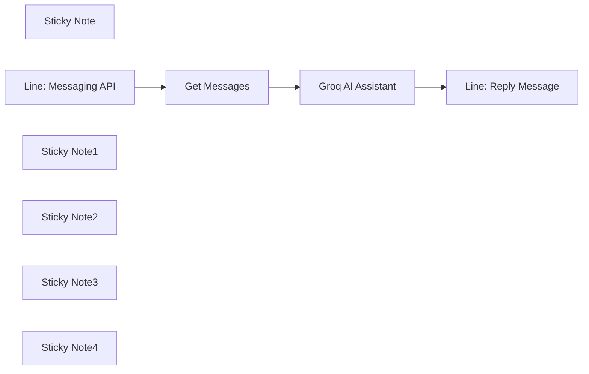

## Fluxo (.json) :

```json
{
  "id": "xibc6WDU53isYN1o",
  "meta": {
    "instanceId": "b3225e6e1bdf5f128a5dd199e31e87e9e2b7cb5f141a1bbe60059a1964dd7091",
    "templateCredsSetupCompleted": true
  },
  "name": "Line Chatbot Handling AI Responses with Groq and Llama3",
  "tags": [],
  "nodes": [
    {
      "id": "9b936123-7f31-4ddc-b1ca-fd172da9c5a8",
      "name": "Sticky Note",
      "type": "n8n-nodes-base.stickyNote",
      "position": [
        0,
        -200
      ],
      "parameters": {
        "width": 440,
        "content": "## Line AI Chatbot with Groq \nThis workflow automates the process of handling messages from Line Messaging API by sending message to Groq as your AI assistant and reply back to you. In this workflow, you can see that there is no JSON error when sending long and complex message."
      },
      "typeVersion": 1
    },
    {
      "id": "0d75416e-58f0-4411-8904-7051f0d1c06a",
      "name": "Line: Messaging API",
      "type": "n8n-nodes-base.webhook",
      "position": [
        0,
        0
      ],
      "webhookId": "befed026-573c-4d3a-9113-046ea8ae5930",
      "parameters": {
        "path": "befed026-573c-4d3a-9113-046ea8ae5930",
        "options": {},
        "httpMethod": "POST"
      },
      "typeVersion": 2
    },
    {
      "id": "e363c981-acdf-4048-a531-31808cd3edc5",
      "name": "Get Messages",
      "type": "n8n-nodes-base.set",
      "position": [
        300,
        0
      ],
      "parameters": {
        "options": {},
        "assignments": {
          "assignments": [
            {
              "id": "654c2465-5531-46fb-9b11-74cc23c899a9",
              "name": "body.events[0].message.text",
              "type": "string",
              "value": "={{ $json.body.events[0].message.text }}"
            },
            {
              "id": "be878a5c-f3e2-40c4-b8f2-6c6708b3b2ad",
              "name": "body.events[0].message.id",
              "type": "string",
              "value": "={{ $json.body.events[0].message.id }}"
            },
            {
              "id": "de79a8fe-d9fb-4bf4-a2a7-df3969b194a4",
              "name": "body.events[0].source.userId",
              "type": "string",
              "value": "={{ $json.body.events[0].source.userId }}"
            }
          ]
        }
      },
      "typeVersion": 3.4
    },
    {
      "id": "6e0b17ab-9f38-4a73-b650-b35bd51657e4",
      "name": "Groq AI Assistant",
      "type": "n8n-nodes-base.httpRequest",
      "position": [
        580,
        0
      ],
      "parameters": {
        "url": "https://api.groq.com/openai/v1/chat/completions",
        "method": "POST",
        "options": {},
        "jsonBody": "={\n  \"messages\": [\n    {\n      \"role\": \"user\",\n      \"content\": \"{{ $json.body.events[0].message.text }}\"\n    }\n  ],\n  \"model\": \"llama-3.3-70b-versatile\",\n  \"temperature\": 1,\n  \"max_completion_tokens\": 2500,\n  \"top_p\": 1,\n  \"stream\": null,\n  \"stop\": null\n} ",
        "sendBody": true,
        "specifyBody": "json",
        "authentication": "genericCredentialType",
        "genericAuthType": "httpHeaderAuth"
      },
      "credentials": {
        "httpHeaderAuth": {
          "id": "iqHHZfH8mAbuFprI",
          "name": "Groq Authorization"
        }
      },
      "typeVersion": 4.2
    },
    {
      "id": "25e929d1-3a38-45e1-a089-1cab0919f49d",
      "name": "Line: Reply Message",
      "type": "n8n-nodes-base.httpRequest",
      "position": [
        860,
        0
      ],
      "parameters": {
        "url": "https://api.line.me/v2/bot/message/reply",
        "method": "POST",
        "options": {},
        "jsonBody": "={\n  \"replyToken\":\"{{ $('Line: Messaging API').item.json.body.events[0].replyToken }}\",\n  \"messages\":[\n    {\n      \"type\":\"text\",\n      \"text\": {{ JSON.stringify($('Groq AI Assistant).item.json.choices[0].message.content) }}\n    }\n  ]\n}",
        "sendBody": true,
        "specifyBody": "json",
        "authentication": "genericCredentialType",
        "genericAuthType": "httpHeaderAuth"
      },
      "credentials": {
        "httpHeaderAuth": {
          "id": "hX58q9WFQLFROFui",
          "name": "Header Auth account"
        }
      },
      "typeVersion": 4.2
    },
    {
      "id": "efcd27d2-a347-4ec4-8190-ccbef6616dd5",
      "name": "Sticky Note1",
      "type": "n8n-nodes-base.stickyNote",
      "position": [
        -80,
        160
      ],
      "parameters": {
        "width": 260,
        "content": "## LINE Messaging API \nGet the access token from Line Business https://manager.line.biz/"
      },
      "typeVersion": 1
    },
    {
      "id": "0c720dac-7c64-4635-9ef0-b92a4886db14",
      "name": "Sticky Note2",
      "type": "n8n-nodes-base.stickyNote",
      "position": [
        220,
        160
      ],
      "parameters": {
        "content": "## Get Message\nGet message from Line account."
      },
      "typeVersion": 1
    },
    {
      "id": "b7afaacd-7d23-44e0-a601-81f7907b7af2",
      "name": "Sticky Note3",
      "type": "n8n-nodes-base.stickyNote",
      "position": [
        500,
        160
      ],
      "parameters": {
        "content": "## Groq API Key\nApply Groq account and get API key then you should set ```max_completion_tokens``` less than 5000 because of Line message limitation"
      },
      "typeVersion": 1
    },
    {
      "id": "e10ae59d-374a-4926-8f38-6baa79f4782b",
      "name": "Sticky Note4",
      "type": "n8n-nodes-base.stickyNote",
      "position": [
        780,
        160
      ],
      "parameters": {
        "content": "## Reply message\nUse replyToken from Line messaging API and use ```choices[].message.content``` to reply to you."
      },
      "typeVersion": 1
    }
  ],
  "active": true,
  "pinData": {},
  "settings": {
    "executionOrder": "v1"
  },
  "versionId": "dcdc5794-7034-4215-a719-b73513f0f0ee",
  "connections": {
    "Get Messages": {
      "main": [
        [
          {
            "node": "Groq AI Assistant",
            "type": "main",
            "index": 0
          }
        ]
      ]
    },
    "Groq AI Assistant": {
      "main": [
        [
          {
            "node": "Line: Reply Message",
            "type": "main",
            "index": 0
          }
        ]
      ]
    },
    "Line: Messaging API": {
      "main": [
        [
          {
            "node": "Get Messages",
            "type": "main",
            "index": 0
          }
        ]
      ]
    }
  }
}
```

<a id="template-2048"></a>

## Template 2048 - Notificações por email de novos vídeos

- **Nome:** Notificações por email de novos vídeos
- **Descrição:** Fluxo que verifica periodicamente as inscrições de um usuário no YouTube e envia um email com thumbnail para cada vídeo novo relevante.
- **Funcionalidade:** • Agendamento periódico: Executa a verificação em intervalos configuráveis (padrão: a cada hora).
• Leitura das inscrições do usuário: Busca todas as inscrições do canal via API e faz paginação automática.
• Tratamento de erros: Detecta respostas com erro da API e interrompe o processo exibindo a mensagem.
• Filtragem de canais com novos vídeos: Mantém apenas canais com contagem de itens novos maior que zero para reduzir processamento.
• Opção de exclusão manual de canais: Permite ignorar canais específicos por ID.
• Leitura dos últimos 15 vídeos por canal via RSS: Obtém os 15 vídeos mais recentes de cada canal usando o feed RSS público.
• Seleção de vídeos publicados desde a última execução: Compara a data de publicação com a última execução para manter apenas vídeos novos.
• Consulta adicional de detalhes do vídeo: Chama a API para obter miniaturas e duração dos vídeos.
• Filtragem de "shorts": Exclui vídeos curtos (<= 61 segundos) mantendo vídeos com duração ausente (ex.: transmissões ao vivo arquivadas) ou maiores que 61s.
• Envio de email por vídeo novo: Envia um email individual com o título e a melhor miniatura disponível que linka para o vídeo.
- **Ferramentas:** • YouTube Data API (v3): Usada para listar inscrições do usuário e buscar detalhes adicionais dos vídeos (thumbnails, duração, etc.).
• Feeds RSS públicos do YouTube: Usados para obter os 15 vídeos mais recentes de cada canal sem consumir quota pesada da API.
• Servidor SMTP/Conta de email: Envia os emails com o conteúdo HTML e a miniatura vinculada ao vídeo.

## Fluxo visual

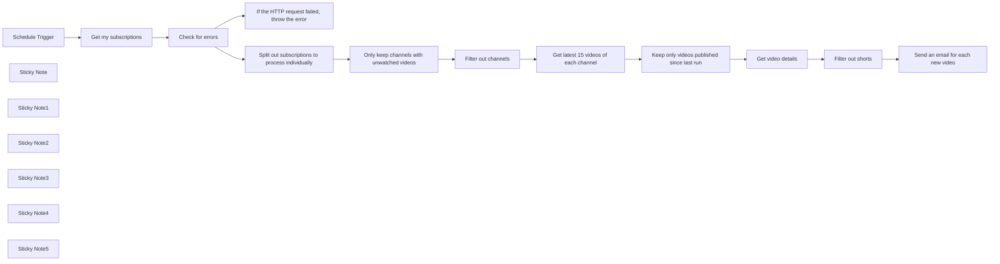

## Fluxo (.json) :

```json
{
  "meta": {
    "instanceId": "4a8c4d3ed2f4423694f8ac022d1c321551900c7ab47e0c03549acecec1ab4a89",
    "templateCredsSetupCompleted": true
  },
  "nodes": [
    {
      "id": "a5292068-5ace-4372-9869-46100ae81b8f",
      "name": "Get video details",
      "type": "n8n-nodes-base.youTube",
      "notes": "Make a call to the YouTube API so that we have the thumbnail for the email and the duration to filter out shorts.",
      "position": [
        1000,
        -60
      ],
      "parameters": {
        "part": [
          "contentDetails",
          "snippet",
          "id"
        ],
        "options": {},
        "videoId": "={{ $json.id.replace(\"yt:video:\", \"\") }}",
        "resource": "video",
        "operation": "get"
      },
      "credentials": {
        "youTubeOAuth2Api": {
          "id": "5lD8Hahvq4r7Og0F",
          "name": "YouTube account"
        }
      },
      "typeVersion": 1
    },
    {
      "id": "b9eb34aa-90c4-492a-a33e-37a32812fa32",
      "name": "Schedule Trigger",
      "type": "n8n-nodes-base.scheduleTrigger",
      "position": [
        -840,
        -160
      ],
      "parameters": {
        "rule": {
          "interval": [
            {
              "field": "hours",
              "hoursInterval": 1,
              "triggerAtMinute": 47
            }
          ]
        }
      },
      "typeVersion": 1.2
    },
    {
      "id": "8f0dbe74-53e5-4b14-86f6-eb0f502c8471",
      "name": "Filter out shorts",
      "type": "n8n-nodes-base.if",
      "notes": "Sometime, some live broadcasts that are then posted as regular videos do not have a duration. That is why we check if `duration` is present in `contentDetails`.",
      "position": [
        1180,
        -60
      ],
      "parameters": {
        "options": {},
        "conditions": {
          "options": {
            "version": 1,
            "leftValue": "",
            "caseSensitive": true,
            "typeValidation": "strict"
          },
          "combinator": "or",
          "conditions": [
            {
              "id": "5342ecc0-d764-4bef-8161-d1f571fcb931",
              "operator": {
                "type": "string",
                "operation": "notExists",
                "singleValue": true
              },
              "leftValue": "={{ $json.contentDetails.duration }}",
              "rightValue": "\"duration\""
            },
            {
              "id": "b82e3373-a28b-49bd-afa0-4f48cafe2bfe",
              "operator": {
                "type": "number",
                "operation": "gt"
              },
              "leftValue": "={{ Duration.fromISO($json.contentDetails.duration).as('seconds') }}",
              "rightValue": 61
            }
          ]
        }
      },
      "notesInFlow": false,
      "typeVersion": 2
    },
    {
      "id": "14d54ed0-f5c0-4992-af56-0af2d8973963",
      "name": "Sticky Note",
      "type": "n8n-nodes-base.stickyNote",
      "position": [
        -900,
        -340
      ],
      "parameters": {
        "color": 7,
        "width": 220,
        "height": 460,
        "content": "### Default frequency: every hour\nChanging it here is enough if you want to check for new videos at a higher or lower frequency. You don't have to edit anything else."
      },
      "typeVersion": 1
    },
    {
      "id": "c4acbb10-1f57-4934-a324-f26d0532767c",
      "name": "Sticky Note1",
      "type": "n8n-nodes-base.stickyNote",
      "position": [
        -660,
        -340
      ],
      "parameters": {
        "color": 5,
        "width": 880,
        "height": 460,
        "content": "### Get my subscriptions from the YouTube Data v3 API\nYou can expect to use 1 quota per 50 subscriptions per run, which is well within the 10 000/req a day allowed by default."
      },
      "typeVersion": 1
    },
    {
      "id": "4ae2d2f3-53b5-4431-90d8-06e41a6950e2",
      "name": "Sticky Note2",
      "type": "n8n-nodes-base.stickyNote",
      "position": [
        480,
        -160
      ],
      "parameters": {
        "color": 4,
        "width": 440,
        "height": 280,
        "content": "### Get the 15 latest videos of each channel with RSS\nUsing the YouTube API instead would cost too many quotas to make it viable."
      },
      "typeVersion": 1
    },
    {
      "id": "48894d79-7e59-49fc-beb5-445fb5ca2ff6",
      "name": "Sticky Note3",
      "type": "n8n-nodes-base.stickyNote",
      "position": [
        940,
        -160
      ],
      "parameters": {
        "color": 3,
        "width": 400,
        "height": 280,
        "content": "### Call YouTube's API for more data\nWe need the thumbnails for the email and the duration to filter out shorts."
      },
      "typeVersion": 1
    },
    {
      "id": "e3da3f97-138c-481e-a763-9a3c9e402928",
      "name": "Sticky Note4",
      "type": "n8n-nodes-base.stickyNote",
      "position": [
        1360,
        -160
      ],
      "parameters": {
        "color": 6,
        "width": 260,
        "height": 280,
        "content": "### Configure your email here\nTo go to the video from the email, simply click on the thumbnail."
      },
      "typeVersion": 1
    },
    {
      "id": "0d092c3d-b2e1-4468-a044-c6cf0f37672b",
      "name": "Get latest 15 videos of each channel",
      "type": "n8n-nodes-base.rssFeedRead",
      "notes": "YouTube provides an RSS feed for each channel with the 15 latest videos.\nWe use this instead of the YouTube Data v3 API, as search requests cost a lot of \"quota points\" and would easily put us over the daily limit with just one workflow run.",
      "position": [
        540,
        -60
      ],
      "parameters": {
        "url": "=https://www.youtube.com/feeds/videos.xml?channel_id={{ $json.snippet.resourceId.channelId }}",
        "options": {}
      },
      "typeVersion": 1.1
    },
    {
      "id": "34823384-d8a5-415a-87ff-203d65aa9a75",
      "name": "Get my subscriptions",
      "type": "n8n-nodes-base.httpRequest",
      "notes": "Get subscriptions from YouTube Data v3 API",
      "position": [
        -600,
        -160
      ],
      "parameters": {
        "url": "https://www.googleapis.com/youtube/v3/subscriptions",
        "options": {
          "pagination": {
            "pagination": {
              "parameters": {
                "parameters": [
                  {
                    "name": "pageToken",
                    "value": "={{ $response.body.nextPageToken }}"
                  }
                ]
              },
              "completeExpression": "={{ !('nextPageToken' in $response.body) }}",
              "paginationCompleteWhen": "other"
            }
          }
        },
        "sendQuery": true,
        "authentication": "predefinedCredentialType",
        "queryParameters": {
          "parameters": [
            {
              "name": "mine",
              "value": "true"
            },
            {
              "name": "part",
              "value": "snippet,contentDetails"
            },
            {
              "name": "maxResults",
              "value": "50"
            }
          ]
        },
        "nodeCredentialType": "youTubeOAuth2Api"
      },
      "credentials": {
        "youTubeOAuth2Api": {
          "id": "5lD8Hahvq4r7Og0F",
          "name": "YouTube account"
        }
      },
      "notesInFlow": true,
      "typeVersion": 4.2
    },
    {
      "id": "534e38f3-ac40-4194-8821-5926ee581605",
      "name": "Check for errors",
      "type": "n8n-nodes-base.if",
      "position": [
        -400,
        -160
      ],
      "parameters": {
        "options": {},
        "conditions": {
          "options": {
            "version": 2,
            "leftValue": "",
            "caseSensitive": true,
            "typeValidation": "strict"
          },
          "combinator": "and",
          "conditions": [
            {
              "id": "5972ff90-aa5a-470c-aa96-87138eb60565",
              "operator": {
                "type": "object",
                "operation": "exists",
                "singleValue": true
              },
              "leftValue": "={{ $json.error }}",
              "rightValue": "error"
            }
          ]
        }
      },
      "typeVersion": 2.2
    },
    {
      "id": "2d872c0f-30b9-4ffc-aba0-6644bf05d7bb",
      "name": "Only keep channels with unwatched videos",
      "type": "n8n-nodes-base.filter",
      "notes": "It's not a perfect indicator for new videos but helps reduce the amount of channels to process.",
      "position": [
        40,
        -60
      ],
      "parameters": {
        "options": {},
        "conditions": {
          "options": {
            "version": 2,
            "leftValue": "",
            "caseSensitive": true,
            "typeValidation": "strict"
          },
          "combinator": "and",
          "conditions": [
            {
              "id": "4734ee8c-1655-47be-bd45-a9527aee2833",
              "operator": {
                "type": "number",
                "operation": "gt"
              },
              "leftValue": "={{ $json.contentDetails.newItemCount }}",
              "rightValue": 0
            }
          ]
        }
      },
      "typeVersion": 2.2
    },
    {
      "id": "c7bd97ec-47c1-40b4-955d-bf89d3cde330",
      "name": "Keep only videos published since last run",
      "type": "n8n-nodes-base.filter",
      "notes": "We dynamically figure out the last run's execution time through the settings of the \"Schedule Trigger\" node.",
      "position": [
        740,
        -60
      ],
      "parameters": {
        "options": {},
        "conditions": {
          "options": {
            "version": 2,
            "leftValue": "",
            "caseSensitive": true,
            "typeValidation": "strict"
          },
          "combinator": "and",
          "conditions": [
            {
              "id": "65d905a2-c89e-41f3-a2cf-0d1a76c48d8e",
              "operator": {
                "type": "dateTime",
                "operation": "after"
              },
              "leftValue": "={{ $json.pubDate.toDateTime() }}",
              "rightValue": "={{ \n  $('Schedule Trigger').item.json.timestamp.toDateTime().minus(\n    $('Schedule Trigger').params.rule.interval[0].hoursInterval,\n    $('Schedule Trigger').params.rule.interval[0].field\n  ).toISO()\n}}"
            }
          ]
        }
      },
      "typeVersion": 2.2
    },
    {
      "id": "72341b1f-a391-4210-b3ca-4e74ae1f2e1b",
      "name": "Send an email for each new video",
      "type": "n8n-nodes-base.emailSend",
      "notes": "The expression in the HTML for the thumbnail simply selects the last element of the thumbnails array so that we get the best possible resolution thumbnail available.",
      "position": [
        1440,
        -60
      ],
      "webhookId": "44bf0e95-98e5-4b5b-a7c5-c802379ab3b0",
      "parameters": {
        "html": "=<h1 style=\"text-align: center;\">{{ $json.snippet.title }}</h1>\n<a href=\"https://www.youtube.com/watch?v={{ $json.id }}\">\n  \n</a>",
        "options": {
          "appendAttribution": false
        },
        "subject": "={{ $json.snippet.channelTitle }}",
        "toEmail": "My Name <to@email.com>",
        "fromEmail": "YouTube <from@email.com>"
      },
      "credentials": {
        "smtp": {
          "id": "ThrKm6bLUg1owKn1",
          "name": "SMTP account"
        }
      },
      "notesInFlow": false,
      "typeVersion": 2.1
    },
    {
      "id": "b82cfbd5-71e3-418f-9b6d-6d0ec007733a",
      "name": "If the HTTP request failed, throw the error",
      "type": "n8n-nodes-base.stopAndError",
      "position": [
        -180,
        -260
      ],
      "parameters": {
        "errorMessage": "=Status code: {{ $json.error.code }}\nMessage: {{ $json.error.message }}"
      },
      "typeVersion": 1
    },
    {
      "id": "e89eca92-896f-46b5-8a4b-149d51682faa",
      "name": "Split out subscriptions to process individually",
      "type": "n8n-nodes-base.splitOut",
      "position": [
        -180,
        -60
      ],
      "parameters": {
        "options": {},
        "fieldToSplitOut": "items"
      },
      "typeVersion": 1
    },
    {
      "id": "0e00fda6-1489-4c1a-8205-22e620a554c5",
      "name": "Sticky Note5",
      "type": "n8n-nodes-base.stickyNote",
      "position": [
        240,
        -240
      ],
      "parameters": {
        "width": 220,
        "height": 360,
        "content": "## Manually filter out channels\nTo find the channel ID of a channel, click on the description → Share channel → Copy channel ID"
      },
      "typeVersion": 1
    },
    {
      "id": "bcc2e57c-23b2-42b7-81ab-cdd88b70b8a3",
      "name": "Filter out channels",
      "type": "n8n-nodes-base.filter",
      "notes": "Optional step",
      "position": [
        300,
        -60
      ],
      "parameters": {
        "options": {},
        "conditions": {
          "options": {
            "version": 2,
            "leftValue": "",
            "caseSensitive": true,
            "typeValidation": "strict"
          },
          "combinator": "and",
          "conditions": [
            {
              "id": "b27b14a9-c86c-4ebd-8a0f-4e7db722796e",
              "operator": {
                "type": "array",
                "operation": "notContains",
                "rightType": "any"
              },
              "leftValue": "={{[\n  \"exampleChannelId1\",\n  \"exampleChannelId2\"\n]}}",
              "rightValue": "={{ $json.snippet.resourceId.channelId }}"
            }
          ]
        }
      },
      "notesInFlow": true,
      "typeVersion": 2.2
    }
  ],
  "pinData": {},
  "connections": {
    "Check for errors": {
      "main": [
        [
          {
            "node": "If the HTTP request failed, throw the error",
            "type": "main",
            "index": 0
          }
        ],
        [
          {
            "node": "Split out subscriptions to process individually",
            "type": "main",
            "index": 0
          }
        ]
      ]
    },
    "Schedule Trigger": {
      "main": [
        [
          {
            "node": "Get my subscriptions",
            "type": "main",
            "index": 0
          }
        ]
      ]
    },
    "Filter out shorts": {
      "main": [
        [
          {
            "node": "Send an email for each new video",
            "type": "main",
            "index": 0
          }
        ],
        []
      ]
    },
    "Get video details": {
      "main": [
        [
          {
            "node": "Filter out shorts",
            "type": "main",
            "index": 0
          }
        ]
      ]
    },
    "Filter out channels": {
      "main": [
        [
          {
            "node": "Get latest 15 videos of each channel",
            "type": "main",
            "index": 0
          }
        ]
      ]
    },
    "Get my subscriptions": {
      "main": [
        [
          {
            "node": "Check for errors",
            "type": "main",
            "index": 0
          }
        ]
      ]
    },
    "Send an email for each new video": {
      "main": [
        []
      ]
    },
    "Get latest 15 videos of each channel": {
      "main": [
        [
          {
            "node": "Keep only videos published since last run",
            "type": "main",
            "index": 0
          }
        ]
      ]
    },
    "Only keep channels with unwatched videos": {
      "main": [
        [
          {
            "node": "Filter out channels",
            "type": "main",
            "index": 0
          }
        ]
      ]
    },
    "Keep only videos published since last run": {
      "main": [
        [
          {
            "node": "Get video details",
            "type": "main",
            "index": 0
          }
        ]
      ]
    },
    "Split out subscriptions to process individually": {
      "main": [
        [
          {
            "node": "Only keep channels with unwatched videos",
            "type": "main",
            "index": 0
          }
        ]
      ]
    }
  }
}
```

<a id="template-2050"></a>

## Template 2050 - Consulta de credenciais de workflows via IA

- **Nome:** Consulta de credenciais de workflows via IA
- **Descrição:** Fluxo que extrai mapeamento de credenciais dos workflows, armazena em um banco SQLite local e permite buscas por credenciais através de um agente de IA que executa consultas SQL.
- **Funcionalidade:** • Coleta de workflows e metadados: Consulta a API da plataforma para obter a lista de workflows, seus nós e informações de credenciais.
• Mapeamento de credenciais por workflow: Extrai workflow_id, workflow_name e lista consolidada de credenciais usadas pelos nós.
• Persistência local: Armazena ou atualiza o mapeamento em um banco SQLite local usando operações INSERT OR REPLACE.
• Interface conversacional com agente de IA: Permite ao usuário buscar workflows por apps/credenciais via chat.
• Execução de consultas dinâmicas: O agente pode enviar consultas SQL ao banco para recuperar resultados relevantes.
• Uso de modelo de linguagem e memória de contexto: Utiliza um modelo de linguagem com buffer de memória para manter o histórico da conversa e melhorar respostas.
• Geração opcional de links para workflows: Quando solicitado, constrói URLs para os workflows substituindo o identificador apropriado.
- **Ferramentas:** • API de gerenciamento de workflows: Serviço que fornece lista de workflows, nós e credenciais para extração.
• SQLite: Banco de dados local para armazenar mapeamento de workflows e credenciais.
• OpenAI: Modelo de linguagem usado pelo agente de chat para interpretar perguntas e gerar respostas.
• Python: Execução de scripts para criar/consultar o banco e transformar resultados em JSON.

## Fluxo visual

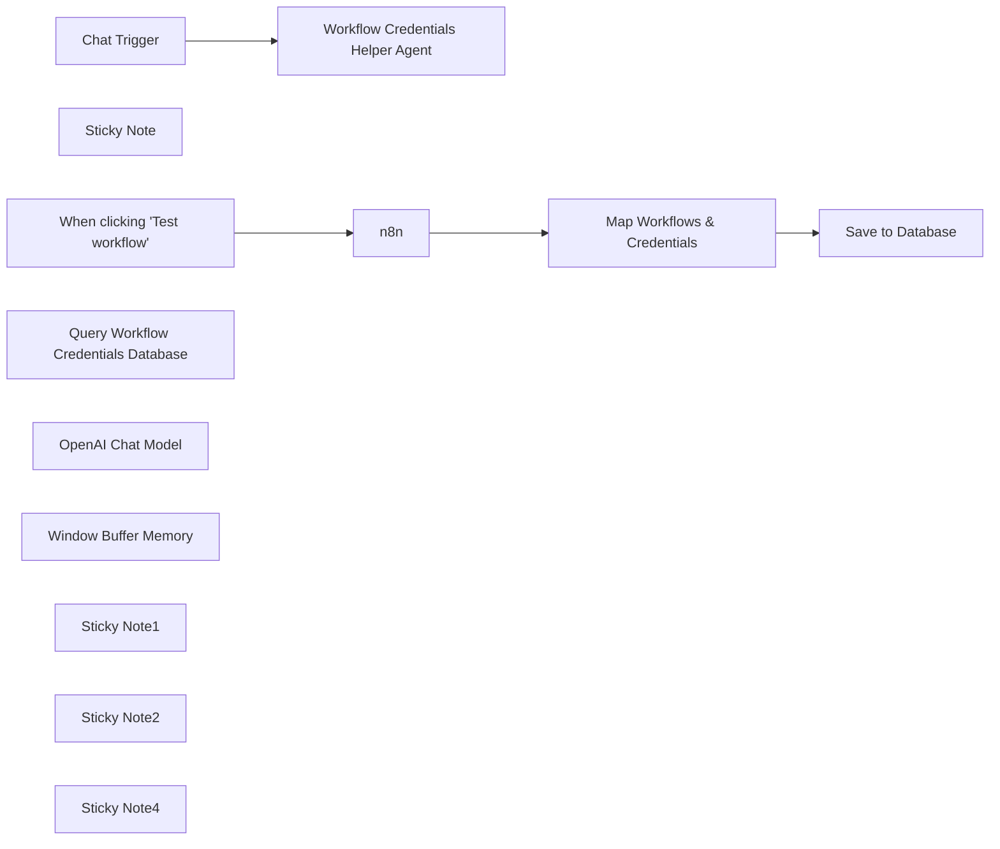

## Fluxo (.json) :

```json
{
  "meta": {
    "instanceId": "26ba763460b97c249b82942b23b6384876dfeb9327513332e743c5f6219c2b8e"
  },
  "nodes": [
    {
      "id": "382dddd4-da50-49fa-90a2-f7d6d160afdf",
      "name": "When clicking \"Test workflow\"",
      "type": "n8n-nodes-base.manualTrigger",
      "position": [
        920,
        280
      ],
      "parameters": {},
      "typeVersion": 1
    },
    {
      "id": "efa8f415-62f7-43b3-a76a-a2eabf779cb8",
      "name": "Map Workflows & Credentials",
      "type": "n8n-nodes-base.set",
      "position": [
        1360,
        280
      ],
      "parameters": {
        "options": {},
        "assignments": {
          "assignments": [
            {
              "id": "0fd19a68-c561-4cc2-94d6-39848977e6d2",
              "name": "workflow_id",
              "type": "string",
              "value": "={{ $json.id }}"
            },
            {
              "id": "a81f9e6f-9c78-4c3d-9b79-e820f8c5ba29",
              "name": "workflow_name",
              "type": "string",
              "value": "={{ $json.name }}"
            },
            {
              "id": "58ab0f2f-7598-48de-bea1-f3373c5731fe",
              "name": "credentials",
              "type": "array",
              "value": "={{ $json.nodes.map(node => node.credentials).compact().reduce((acc,cred) => { const keys = Object.keys(cred); const items = keys.map(key => ({ type: key, ...cred[key] })); acc.push(...items); return acc; }, []) }}"
            }
          ]
        }
      },
      "typeVersion": 3.3
    },
    {
      "id": "9e9b4f9c-12b7-47ba-8cf4-a9818902a538",
      "name": "Sticky Note",
      "type": "n8n-nodes-base.stickyNote",
      "position": [
        1084,
        252
      ],
      "parameters": {
        "width": 216,
        "height": 299.56273929030715,
        "content": "\n\n\n\n\n\n\n\n\n\n\n\n\n\n### 🚨Required\nYou'll need an n8n API key. Note: available workflows will be scoped to your key."
      },
      "typeVersion": 1
    },
    {
      "id": "cf04eff5-12b2-42fb-9089-2d0c992af1b8",
      "name": "Save to Database",
      "type": "n8n-nodes-base.code",
      "position": [
        1540,
        280
      ],
      "parameters": {
        "language": "python",
        "pythonCode": "import json\nimport sqlite3\ncon = sqlite3.connect(\"n8n_workflow_credentials.db\")\n\ncur = con.cursor()\ncur.execute(\"CREATE TABLE IF NOT EXISTS n8n_workflow_credentials (workflow_id TEXT PRIMARY KEY, workflow_name TEXT, credentials TEXT);\")\n\nfor item in _input.all():\n cur.execute('INSERT OR REPLACE INTO n8n_workflow_credentials VALUES(?,?,?)', (\n item.json.workflow_id,\n item.json.workflow_name,\n json.dumps(item.json.credentials.to_py())\n ))\n\ncon.commit()\ncon.close()\n\nreturn [{ \"affected_rows\": len(_input.all()) }]"
      },
      "typeVersion": 2
    },
    {
      "id": "7e32cf83-0498-4666-8677-7fd32eec779c",
      "name": "Chat Trigger",
      "type": "@n8n/n8n-nodes-langchain.chatTrigger",
      "position": [
        1880,
        280
      ],
      "webhookId": "993ce267-a1e5-4657-a38c-08f86715063d",
      "parameters": {},
      "typeVersion": 1
    },
    {
      "id": "8c37f2ae-192b-4f98-a6fa-5aabf870e9e0",
      "name": "Query Workflow Credentials Database",
      "type": "@n8n/n8n-nodes-langchain.toolCode",
      "position": [
        2320,
        440
      ],
      "parameters": {
        "name": "query_workflow_credentials_database",
        "language": "python",
        "pythonCode": "import json\nimport sqlite3\ncon = sqlite3.connect(\"n8n_workflow_credentials.db\")\n\ncur = con.cursor()\nres = cur.execute(query);\n\noutput = json.dumps(res.fetchall())\n\ncon.close()\nreturn output;",
        "description": "Call this tool to query the workflow credentials database. The database is already set. The available tables are as follows:\n* n8n_workflow_credentials (workflow_id TEXT PRIMARY KEY, workflow_name TEXT, credentials TEXT);\n * n8n_workflow_credentials.credentials are stored as json string and the app name may be obscured. Prefer querying using the %LIKE% operation for best results.\n\nPass a SQL SELECT query to this tool for the available tables."
      },
      "typeVersion": 1.1
    },
    {
      "id": "60b2ab16-dc7c-4cb8-a58f-696f721b8d6f",
      "name": "OpenAI Chat Model",
      "type": "@n8n/n8n-nodes-langchain.lmChatOpenAi",
      "position": [
        2060,
        440
      ],
      "parameters": {
        "options": {}
      },
      "credentials": {
        "openAiApi": {
          "id": "8gccIjcuf3gvaoEr",
          "name": "OpenAi account"
        }
      },
      "typeVersion": 1
    },
    {
      "id": "adf576c1-ddb0-4fef-980c-5b485a3204f2",
      "name": "Window Buffer Memory",
      "type": "@n8n/n8n-nodes-langchain.memoryBufferWindow",
      "position": [
        2180,
        440
      ],
      "parameters": {},
      "typeVersion": 1.2
    },
    {
      "id": "4335b038-3e9f-4173-986d-cabdb87cc0b4",
      "name": "Sticky Note1",
      "type": "n8n-nodes-base.stickyNote",
      "position": [
        860,
        100
      ],
      "parameters": {
        "color": 7,
        "width": 930.8402221561373,
        "height": 488.8805508857059,
        "content": "## Step 1. Store Workflows Credential Mappings to Database\n\nWe'll achieve this by querying n8n's built-in API to query all workflows, extract the credentials list from the nodes within and then store them in a SQLite database. Don't worry, the actual credential data won't be exposed! For the database, we'll abuse the fact that the code node is able to create Sqlite databases - however, this is created in memory and will be wiped if the n8n instance is restarted."
      },
      "typeVersion": 1
    },
    {
      "id": "c1f557ee-1176-4f3e-8431-d162f1a59990",
      "name": "Sticky Note2",
      "type": "n8n-nodes-base.stickyNote",
      "position": [
        1820,
        100
      ],
      "parameters": {
        "color": 7,
        "width": 688.6507290693205,
        "height": 527.3794193342486,
        "content": "## Step 2. Use Agent as Search Interface\n\nInstead of building a form interface like a regular person, we'll just use an AI tools agent who is given aaccess to perform queries on our database. You can ask it things like \"which workflows are using slack + airtable + googlesheets?\""
      },
      "typeVersion": 1
    },
    {
      "id": "9bdc3fa9-d4a0-4040-bb32-6c76aaca3ad9",
      "name": "Workflow Credentials Helper Agent",
      "type": "@n8n/n8n-nodes-langchain.agent",
      "position": [
        2080,
        280
      ],
      "parameters": {
        "options": {
          "systemMessage": "=You help find information on n8n workflow credentials. When user mentions an app, assume they mean the workflow credential for the app.\n* Only if the user requests to provide a link to the workflow, replace $workflow_id with the workflow id in the following url schema: {{ window.location.protocol + '//' + window.location.host }}/workflow/$workflow_id"
        }
      },
      "typeVersion": 1.6
    },
    {
      "id": "ff39f504-9953-47c9-81eb-3146dfd6c8c5",
      "name": "Sticky Note4",
      "type": "n8n-nodes-base.stickyNote",
      "position": [
        420,
        100
      ],
      "parameters": {
        "width": 415.13049730628427,
        "height": 347.7398931123371,
        "content": "## Try It Out!\n\n### This workflow let's you query workflow credentials using an AI SQL agent. Example use-case could be:\n* \"Which workflows are using Slack and Google Calendar?\"\n* \"Which workflows have AI in their name but are not using openAI?\"\n\n### Run the Steps separately!\n* Step 1 populates a local database\n* Step 2 engages with the chatbot"
      },
      "typeVersion": 1
    },
    {
      "id": "3db2116c-abde-4856-bd1e-a15e0275477f",
      "name": "n8n",
      "type": "n8n-nodes-base.n8n",
      "position": [
        1140,
        280
      ],
      "parameters": {
        "filters": {},
        "requestOptions": {}
      },
      "credentials": {
        "n8nApi": {
          "id": "5vELmsVPmK4Bkqkg",
          "name": "n8n account"
        }
      },
      "typeVersion": 1
    }
  ],
  "pinData": {},
  "connections": {
    "n8n": {
      "main": [
        [
          {
            "node": "Map Workflows & Credentials",
            "type": "main",
            "index": 0
          }
        ]
      ]
    },
    "Chat Trigger": {
      "main": [
        [
          {
            "node": "Workflow Credentials Helper Agent",
            "type": "main",
            "index": 0
          }
        ]
      ]
    },
    "OpenAI Chat Model": {
      "ai_languageModel": [
        [
          {
            "node": "Workflow Credentials Helper Agent",
            "type": "ai_languageModel",
            "index": 0
          }
        ]
      ]
    },
    "Window Buffer Memory": {
      "ai_memory": [
        [
          {
            "node": "Workflow Credentials Helper Agent",
            "type": "ai_memory",
            "index": 0
          }
        ]
      ]
    },
    "Map Workflows & Credentials": {
      "main": [
        [
          {
            "node": "Save to Database",
            "type": "main",
            "index": 0
          }
        ]
      ]
    },
    "When clicking \"Test workflow\"": {
      "main": [
        [
          {
            "node": "n8n",
            "type": "main",
            "index": 0
          }
        ]
      ]
    },
    "Query Workflow Credentials Database": {
      "ai_tool": [
        [
          {
            "node": "Workflow Credentials Helper Agent",
            "type": "ai_tool",
            "index": 0
          }
        ]
      ]
    }
  }
}
```

<a id="template-2052"></a>

## Template 2052 - Assistente LINE com integração Calendário e Gmail

- **Nome:** Assistente LINE com integração Calendário e Gmail
- **Descrição:** Assistente conversacional que recebe mensagens do LINE, interpreta intenções usando um modelo de linguagem e interage com calendário e e-mail para ler ou criar eventos e recuperar mensagens.
- **Funcionalidade:** • Detecção de mensagens LINE: Recebe webhooks do LINE e inicia o processamento para cada evento recebido.
• Filtragem de tipo de mensagem: Identifica se a mensagem é texto e desvia para resposta de erro quando o tipo não é suportado.
• Processamento por modelo de linguagem: Encaminha o conteúdo do usuário a um agente de IA com instruções de sistema para interpretar a intenção e extrair parâmetros (datas, nome do evento, etc.).
• Memória por usuário: Mantém contexto de conversa por usuário usando um buffer de memória por sessão para melhorar o diálogo contínuo.
• Limpeza de texto: Normaliza e remove formatação/markdown das respostas antes de enviá-las ao usuário.
• Integração com Google Calendar: Lê eventos em um intervalo especificado e cria novos eventos usando as datas e nomes extraídos pelo agente de IA.
• Leitura de Gmail: Recupera e-mails recebidos após uma data fornecida pelo usuário para consulta ou resumo.
• Respostas e tratamento de erros: Responde ao usuário no LINE com a saída processada ou envia uma mensagem padrão em caso de erro ou falha no processamento.
• Consulta a fontes externas: Utiliza uma fonte de conhecimento externa quando necessário para complementar respostas (ex.: Wikipedia).
- **Ferramentas:** • LINE Messaging API: Plataforma de mensagens usada para receber webhooks de eventos e enviar respostas ao usuário via reply token.
• OpenAI (modelo de linguagem): Serviço de modelo de linguagem usado para interpretar mensagens, extrair parâmetros e gerar respostas (ex.: gpt-4o-mini).
• Google Calendar: Conta de calendário utilizada para ler eventos existentes e criar novos compromissos programados.
• Gmail: Conta de e-mail utilizada para buscar e recuperar mensagens recebidas conforme filtros de data.
• Wikipedia: Fonte pública de referência utilizada para consultas de conhecimento complementar.

## Fluxo visual

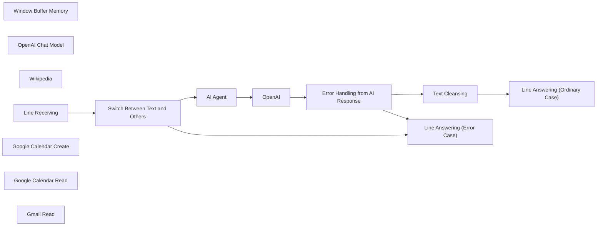

## Fluxo (.json) :

```json
{
  "id": "Z5OgwYfK4reCTv9y",
  "meta": {
    "instanceId": "c59c4acfed171bdc864e7c432be610946898c3ee271693e0303565c953d88c1d"
  },
  "name": "LINE Assistant with Google Calendar and Gmail Integration",
  "tags": [],
  "nodes": [
    {
      "id": "9e1e1c11-f406-47de-8f65-9669cf078d3d",
      "name": "AI Agent",
      "type": "@n8n/n8n-nodes-langchain.agent",
      "position": [
        -1140,
        120
      ],
      "parameters": {
        "text": "={{ $json.body.events[0].message.text }}",
        "options": {
          "systemMessage": "=You are a helpful assistant.\n\nHere is the current date {{ $now }}"
        },
        "promptType": "define"
      },
      "typeVersion": 1.7
    },
    {
      "id": "fa722820-8804-47da-bb21-02c0d2b5d665",
      "name": "Window Buffer Memory",
      "type": "@n8n/n8n-nodes-langchain.memoryBufferWindow",
      "position": [
        -1020,
        580
      ],
      "parameters": {
        "sessionKey": "={{ $json.body.events[0].source.userId }}",
        "sessionIdType": "customKey"
      },
      "typeVersion": 1.3
    },
    {
      "id": "5149b91a-5934-4037-a444-dfdb93d0cd16",
      "name": "OpenAI Chat Model",
      "type": "@n8n/n8n-nodes-langchain.lmChatOpenAi",
      "position": [
        -1180,
        580
      ],
      "parameters": {
        "options": {}
      },
      "typeVersion": 1
    },
    {
      "id": "211a120d-d65f-4708-adc2-66dc8f4a40d6",
      "name": "Wikipedia",
      "type": "@n8n/n8n-nodes-langchain.toolWikipedia",
      "position": [
        -360,
        380
      ],
      "parameters": {},
      "typeVersion": 1
    },
    {
      "id": "0e03137d-0300-47a4-bbd8-03c87c93d6e2",
      "name": "OpenAI",
      "type": "@n8n/n8n-nodes-langchain.openAi",
      "position": [
        -780,
        120
      ],
      "parameters": {
        "modelId": {
          "__rl": true,
          "mode": "list",
          "value": "gpt-4o-mini",
          "cachedResultName": "GPT-4O-MINI"
        },
        "options": {},
        "messages": {
          "values": [
            {
              "role": "system",
              "content": "Your task is to extract and condense the answer into an easily readable format. Don't provide a link or details such as \"ดูเพิ่มเติม\" or \"ดูรายละเอียดได้ที่นี่.\""
            },
            {
              "content": "={{ $json.output }}"
            }
          ]
        }
      },
      "typeVersion": 1.7
    },
    {
      "id": "8c6e96bc-aa9d-44d1-b7ce-6bb85b175cf1",
      "name": "Switch Between Text and Others",
      "type": "n8n-nodes-base.switch",
      "position": [
        -1820,
        640
      ],
      "parameters": {
        "rules": {
          "values": [
            {
              "conditions": {
                "options": {
                  "version": 2,
                  "leftValue": "",
                  "caseSensitive": true,
                  "typeValidation": "strict"
                },
                "combinator": "and",
                "conditions": [
                  {
                    "operator": {
                      "type": "string",
                      "operation": "equals"
                    },
                    "leftValue": "={{ $('Line Receiving').item.json.body.events[0].message.type }}",
                    "rightValue": "text"
                  }
                ]
              }
            }
          ]
        },
        "options": {
          "fallbackOutput": "extra"
        }
      },
      "typeVersion": 3.2
    },
    {
      "id": "721a5e5e-3a9a-435e-9302-03ca7cf64fb7",
      "name": "Line Receiving",
      "type": "n8n-nodes-base.webhook",
      "position": [
        -2320,
        560
      ],
      "webhookId": "********-****-****-****-************",
      "parameters": {
        "path": "linechatbotagent",
        "options": {},
        "httpMethod": "POST"
      },
      "typeVersion": 2
    },
    {
      "id": "2b47f8f1-a501-4204-9221-c838edfceae7",
      "name": "Error Handling from AI Response",
      "type": "n8n-nodes-base.switch",
      "position": [
        -220,
        100
      ],
      "parameters": {
        "rules": {
          "values": [
            {
              "conditions": {
                "options": {
                  "version": 2,
                  "leftValue": "",
                  "caseSensitive": true,
                  "typeValidation": "strict"
                },
                "combinator": "and",
                "conditions": [
                  {
                    "operator": {
                      "type": "string",
                      "operation": "exists",
                      "singleValue": true
                    },
                    "leftValue": "={{ $json.message.content }}",
                    "rightValue": "={{ $json.output }}"
                  }
                ]
              }
            }
          ]
        },
        "options": {
          "fallbackOutput": "extra"
        }
      },
      "typeVersion": 3.2
    },
    {
      "id": "99218c08-5ec7-44b9-a795-e98f1ec4aab3",
      "name": "Text Cleansing",
      "type": "n8n-nodes-base.set",
      "position": [
        0,
        0
      ],
      "parameters": {
        "options": {},
        "assignments": {
          "assignments": [
            {
              "id": "********-****-****-****-************",
              "name": "message.content",
              "type": "string",
              "value": "={{ $json.message.content.replaceAll(\"\\n\",\"\\\\n\").replaceAll(\"\\n\",\"\").removeMarkdown().removeTags().replaceAll('\"',\"\") }}"
            }
          ]
        }
      },
      "typeVersion": 3.4
    },
    {
      "id": "39476f44-9dc7-4c72-a857-9e79f85ccd72",
      "name": "Line Answering (Error Case)",
      "type": "n8n-nodes-base.httpRequest",
      "position": [
        760,
        680
      ],
      "parameters": {
        "url": "https://api.line.me/v2/bot/message/reply",
        "method": "POST",
        "options": {},
        "jsonBody": "={\n \"replyToken\": \"{{ $('Line Receiving').item.json.body.events[0].replyToken }}\",\n \"messages\": [\n {\n \"type\": \"text\",\n \"text\": \"กรุณาส่งอย่างอื่นเถอะนะเตงอัว\"\n }\n ]}",
        "sendBody": true,
        "jsonHeaders": "{\n\"Authorization\": \"Bearer ****************************************\",\n\"Content-Type\": \"application/json\"\n}",
        "sendHeaders": true,
        "specifyBody": "json",
        "specifyHeaders": "json"
      },
      "typeVersion": 4.2
    },
    {
      "id": "a7f8837d-c21b-457d-ad8b-b0b69e3c1ba7",
      "name": "Line Answering (Ordinary Case)",
      "type": "n8n-nodes-base.httpRequest",
      "position": [
        600,
        120
      ],
      "parameters": {
        "url": "https://api.line.me/v2/bot/message/reply",
        "method": "POST",
        "options": {},
        "jsonBody": "={\n \"replyToken\": \"{{ $('Line Receiving').item.json.body.events[0].replyToken }}\",\n \"messages\": [\n {\n \"type\": \"text\",\n \"text\": \"{{ $json.message.content }}\"\n }\n ]}",
        "sendBody": true,
        "jsonHeaders": "{\n\"Authorization\": \"Bearer ****************************************\",\n\"Content-Type\": \"application/json\"\n}",
        "sendHeaders": true,
        "specifyBody": "json",
        "specifyHeaders": "json"
      },
      "typeVersion": 4.2
    },
    {
      "id": "3280f331-0130-41c2-a581-14feccf76514",
      "name": "Google Calendar Create",
      "type": "n8n-nodes-base.googleCalendarTool",
      "position": [
        -640,
        400
      ],
      "parameters": {
        "end": "= {{ $fromAI(\"createenddate\",\"end date and time to create event\") }}",
        "start": "= {{ $fromAI(\"createstartdate\",\"start date and time to create event\") }}",
        "calendar": {
          "__rl": true,
          "mode": "list",
          "value": "***********@gmail.com",
          "cachedResultName": "***********@gmail.com"
        },
        "additionalFields": {
          "summary": "={{ $fromAI(\"event_name\",\"Name of an Event\") }}"
        }
      },
      "credentials": {
        "googleCalendarOAuth2Api": {
          "id": "0PzHsuCKdTBU5E2Q",
          "name": "Google Calendar account"
        }
      },
      "typeVersion": 1.2
    },
    {
      "id": "7701895f-9781-41b9-aa80-8440e4e9cbd3",
      "name": "Google Calendar Read",
      "type": "n8n-nodes-base.googleCalendarTool",
      "position": [
        -880,
        580
      ],
      "parameters": {
        "limit": 5,
        "options": {
          "timeMax": "={{ $fromAI(\"enddate\",\"end date user mentioned about\") }}",
          "timeMin": "={{ $fromAI(\"startdate\",\"start date user mentioned about\") }}"
        },
        "calendar": {
          "__rl": true,
          "mode": "list",
          "value": "***********@gmail.com",
          "cachedResultName": "***********@gmail.com"
        },
        "operation": "getAll"
      },
      "credentials": {
        "googleCalendarOAuth2Api": {
          "id": "0PzHsuCKdTBU5E2Q",
          "name": "Google Calendar account"
        }
      },
      "typeVersion": 1.2
    },
    {
      "id": "881daa7f-cf9a-4d1f-8235-55d206925ac0",
      "name": "Gmail Read",
      "type": "n8n-nodes-base.gmailTool",
      "position": [
        -700,
        560
      ],
      "webhookId": "********-****-****-****-************",
      "parameters": {
        "limit": 5,
        "filters": {
          "receivedAfter": "={{ $fromAI(\"receiveddate\",\"the date email received\") }}"
        },
        "operation": "getAll"
      },
      "credentials": {
        "gmailOAuth2": {
          "id": "cZmU8EQya5OtXVgQ",
          "name": "Gmail account"
        }
      },
      "typeVersion": 2.1
    }
  ],
  "active": false,
  "pinData": {
    "Line Receiving": [
      {
        "json": {
          "body": {
            "events": [
              {
                "mode": "active",
                "type": "message",
                "source": {
                  "type": "user",
                  "userId": "****************************************"
                },
                "message": {
                  "id": "539986086979174564",
                  "text": "",
                  "type": "text",
                  "quoteToken": "****************************************"
                },
                "timestamp": 1734688093030,
                "replyToken": "********************************",
                "webhookEventId": "01JFHQFD2KQE4BA5VVW32YDBZV",
                "deliveryContext": {
                  "isRedelivery": false
                }
              }
            ],
            "destination": "****************************************"
          },
          "query": {},
          "params": {},
          "headers": {
            "host": "n8n-9pul.onrender.com",
            "cf-ray": "****************",
            "rndr-id": "****************",
            "cdn-loop": "cloudflare; loops=1; subreqs=1",
            "cf-ew-via": "15",
            "cf-worker": "onrender.com",
            "cf-visitor": "{\"scheme\":\"https\"}",
            "user-agent": "LineBotWebhook/2.0",
            "cf-ipcountry": "JP",
            "content-type": "application/json; charset=utf-8",
            "content-length": "619",
            "true-client-ip": "***.***.***.**",
            "accept-encoding": "gzip, br",
            "x-forwarded-for": "***.***.***.***, ***.***.***.**",
            "x-request-start": "1734688093431195",
            "cf-connecting-ip": "***.***.***.**",
            "render-proxy-ttl": "4",
            "x-line-signature": "****************************************",
            "x-forwarded-proto": "https"
          },
          "webhookUrl": "https://n8n-9pul.onrender.com/webhook/linechatbotagent",
          "executionMode": "production"
        }
      }
    ]
  },
  "settings": {
    "executionOrder": "v1"
  },
  "versionId": "14065639-6706-4161-9380-4f4dde6eb501",
  "connections": {
    "OpenAI": {
      "main": [
        [
          {
            "node": "Error Handling from AI Response",
            "type": "main",
            "index": 0
          }
        ]
      ]
    },
    "AI Agent": {
      "main": [
        [
          {
            "node": "OpenAI",
            "type": "main",
            "index": 0
          }
        ]
      ]
    },
    "Wikipedia": {
      "ai_tool": [
        [
          {
            "node": "AI Agent",
            "type": "ai_tool",
            "index": 0
          }
        ]
      ]
    },
    "Gmail Read": {
      "ai_tool": [
        [
          {
            "node": "AI Agent",
            "type": "ai_tool",
            "index": 0
          }
        ]
      ]
    },
    "Line Receiving": {
      "main": [
        [
          {
            "node": "Switch Between Text and Others",
            "type": "main",
            "index": 0
          }
        ]
      ]
    },
    "Text Cleansing": {
      "main": [
        [
          {
            "node": "Line Answering (Ordinary Case)",
            "type": "main",
            "index": 0
          }
        ]
      ]
    },
    "OpenAI Chat Model": {
      "ai_languageModel": [
        [
          {
            "node": "AI Agent",
            "type": "ai_languageModel",
            "index": 0
          }
        ]
      ]
    },
    "Google Calendar Read": {
      "ai_tool": [
        [
          {
            "node": "AI Agent",
            "type": "ai_tool",
            "index": 0
          }
        ]
      ]
    },
    "Window Buffer Memory": {
      "ai_memory": [
        [
          {
            "node": "AI Agent",
            "type": "ai_memory",
            "index": 0
          }
        ]
      ]
    },
    "Google Calendar Create": {
      "ai_tool": [
        [
          {
            "node": "AI Agent",
            "type": "ai_tool",
            "index": 0
          }
        ]
      ]
    },
    "Switch Between Text and Others": {
      "main": [
        [
          {
            "node": "AI Agent",
            "type": "main",
            "index": 0
          }
        ],
        [
          {
            "node": "Line Answering (Error Case)",
            "type": "main",
            "index": 0
          }
        ]
      ]
    },
    "Error Handling from AI Response": {
      "main": [
        [
          {
            "node": "Text Cleansing",
            "type": "main",
            "index": 0
          }
        ],
        [
          {
            "node": "Line Answering (Error Case)",
            "type": "main",
            "index": 0
          }
        ]
      ]
    }
  }
}
```

<a id="template-2053"></a>

## Template 2053 - Bot Telegram — receita vegana diária

- **Nome:** Bot Telegram — receita vegana diária
- **Descrição:** Envia uma receita vegana aleatória por dia para usuários inscritos e registra novos usuários que iniciam o bot.
- **Funcionalidade:** • Agendamento diário: Dispara o processo de envio em um horário programado.
• Busca de receitas aleatórias: Obtém uma receita (imagem, título e link) de uma API externa.
• Envio de imagem e link: Envia a foto da receita e, em seguida, envia o título e o URL ao chat do usuário.
• Registro de usuários: Quando um usuário inicia o bot, armazena seu chat ID e nome em uma base de dados para envios futuros.
• Mensagem de boas-vindas e primeira receita: Ao entrar, o usuário recebe uma mensagem de boas-vindas e a primeira receita.
• Prevenção de duplicados: Verifica se o chat ID já existe antes de adicionar à lista de envio.
- **Ferramentas:** • Telegram: Plataforma de mensagens usada para receber novos usuários e enviar fotos e textos.
• Airtable: Base de dados online usada para armazenar chat IDs e nomes dos usuários.
• Spoonacular (Food API): Serviço de receitas usado para obter receitas aleatórias com imagem, título e link.

## Fluxo visual

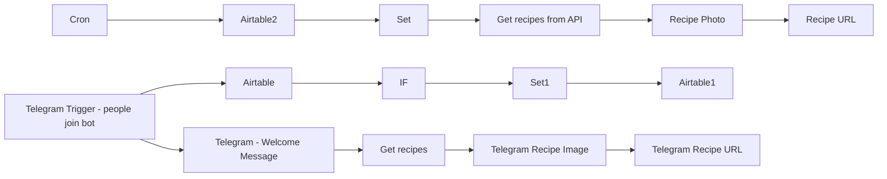

## Fluxo (.json) :

```json
{
  "nodes": [
    {
      "name": "Cron",
      "type": "n8n-nodes-base.cron",
      "position": [
        440,
        440
      ],
      "parameters": {
        "triggerTimes": {
          "item": [
            {}
          ]
        }
      },
      "typeVersion": 1
    },
    {
      "name": "Airtable2",
      "type": "n8n-nodes-base.airtable",
      "notes": "Grab our list of chats from Airtable to send a random recipe",
      "position": [
        660,
        440
      ],
      "parameters": {
        "table": "Table 1",
        "operation": "list",
        "application": "your_sheet_id",
        "additionalOptions": {}
      },
      "credentials": {
        "airtableApi": {
          "id": "5",
          "name": "Airtable account"
        }
      },
      "notesInFlow": true,
      "typeVersion": 1
    },
    {
      "name": "Set",
      "type": "n8n-nodes-base.set",
      "position": [
        860,
        600
      ],
      "parameters": {
        "values": {
          "number": [
            {
              "name": "chatid",
              "value": "={{$node[\"Airtable2\"].json[\"fields\"][\"chatid\"]}}"
            }
          ],
          "string": []
        },
        "options": {}
      },
      "typeVersion": 1
    },
    {
      "name": "Recipe Photo",
      "type": "n8n-nodes-base.telegram",
      "position": [
        1240,
        440
      ],
      "parameters": {
        "file": "={{$node[\"Get recipes from API\"].json[\"recipes\"][0][\"image\"]}}",
        "chatId": "={{$node[\"Set\"].json[\"chatid\"]}}",
        "operation": "sendPhoto",
        "additionalFields": {}
      },
      "credentials": {
        "telegramApi": {
          "id": "1",
          "name": "Telegram account"
        }
      },
      "typeVersion": 1,
      "continueOnFail": true
    },
    {
      "name": "Recipe URL",
      "type": "n8n-nodes-base.telegram",
      "position": [
        1420,
        440
      ],
      "parameters": {
        "text": "=\n{{$node[\"Get recipes from API\"].json[\"recipes\"][0][\"title\"]}}\n\n{{$node[\"Get recipes from API\"].json[\"recipes\"][0][\"sourceUrl\"]}}",
        "chatId": "={{$node[\"Set\"].json[\"chatid\"]}}",
        "additionalFields": {}
      },
      "credentials": {
        "telegramApi": {
          "id": "1",
          "name": "Telegram account"
        }
      },
      "typeVersion": 1,
      "continueOnFail": true
    },
    {
      "name": "IF",
      "type": "n8n-nodes-base.if",
      "notes": "If the chat ID isn't in our airtable, we add it. This is to send a new recipe daily. ",
      "position": [
        860,
        -80
      ],
      "parameters": {
        "conditions": {
          "number": [],
          "string": [
            {
              "value1": "= {{$node[\"Airtable1\"].parameter[\"fields\"][1]}}",
              "value2": "= {{$node[\"Airtable1\"].parameter[\"fields\"][0]}}",
              "operation": "notEqual"
            }
          ],
          "boolean": []
        }
      },
      "notesInFlow": true,
      "typeVersion": 1
    },
    {
      "name": "Airtable",
      "type": "n8n-nodes-base.airtable",
      "position": [
        620,
        -80
      ],
      "parameters": {
        "table": "Table 1",
        "operation": "list",
        "application": "your_sheet_id",
        "additionalOptions": {}
      },
      "credentials": {
        "airtableApi": {
          "id": "5",
          "name": "Airtable account"
        }
      },
      "typeVersion": 1
    },
    {
      "name": "Airtable1",
      "type": "n8n-nodes-base.airtable",
      "position": [
        1340,
        -100
      ],
      "parameters": {
        "table": "Table 1",
        "fields": [
          "chatid",
          "={{$node[\"Telegram Trigger - people join bot\"].json[\"message\"][\"chat\"][\"id\"]}}",
          "Name",
          "={{$node[\"Telegram Trigger - people join bot\"].json[\"message\"][\"from\"][\"first_name\"]}}"
        ],
        "options": {},
        "operation": "append",
        "application": "your_sheet_id",
        "addAllFields": false
      },
      "credentials": {
        "airtableApi": {
          "id": "5",
          "name": "Airtable account"
        }
      },
      "typeVersion": 1
    },
    {
      "name": "Telegram Recipe Image",
      "type": "n8n-nodes-base.telegram",
      "position": [
        980,
        180
      ],
      "parameters": {
        "file": "={{$node[\"Get recipes\"].json[\"recipes\"][0][\"image\"]}}",
        "chatId": "={{$node[\"Telegram Trigger - people join bot\"].json[\"message\"][\"chat\"][\"id\"]}}",
        "operation": "sendPhoto",
        "additionalFields": {}
      },
      "credentials": {
        "telegramApi": {
          "id": "1",
          "name": "Telegram account"
        }
      },
      "typeVersion": 1
    },
    {
      "name": "Telegram Recipe URL",
      "type": "n8n-nodes-base.telegram",
      "position": [
        1180,
        180
      ],
      "parameters": {
        "text": "=\n{{$node[\"Get recipes\"].json[\"recipes\"][0][\"title\"]}}\n\n{{$node[\"Get recipes\"].json[\"recipes\"][0][\"sourceUrl\"]}}",
        "chatId": "={{$node[\"Telegram Trigger - people join bot\"].json[\"message\"][\"chat\"][\"id\"]}}",
        "additionalFields": {}
      },
      "credentials": {
        "telegramApi": {
          "id": "1",
          "name": "Telegram account"
        }
      },
      "typeVersion": 1
    },
    {
      "name": "Set1",
      "type": "n8n-nodes-base.set",
      "position": [
        1120,
        -100
      ],
      "parameters": {
        "values": {
          "string": [
            {
              "name": "chatid",
              "value": "={{$node[\"Telegram Trigger - people join bot\"].json[\"message\"][\"chat\"][\"id\"]}}"
            },
            {
              "name": "Name",
              "value": "={{$node[\"Telegram Trigger - people join bot\"].json[\"message\"][\"from\"][\"first_name\"]}}"
            }
          ]
        },
        "options": {}
      },
      "typeVersion": 1
    },
    {
      "name": "Get recipes from API",
      "type": "n8n-nodes-base.httpRequest",
      "notes": "https://spoonacular.com/food-api/docs",
      "position": [
        1080,
        440
      ],
      "parameters": {
        "url": "https://api.spoonacular.com/recipes/random?apiKey=APIKEYHERE&number=1&tags=vegan",
        "options": {
          "fullResponse": false
        },
        "queryParametersUi": {
          "parameter": []
        }
      },
      "typeVersion": 1
    },
    {
      "name": "Get recipes",
      "type": "n8n-nodes-base.httpRequest",
      "notes": "https://spoonacular.com/food-api/docs",
      "position": [
        800,
        180
      ],
      "parameters": {
        "url": "https://api.spoonacular.com/recipes/random?apiKey=APIKEYHERE&number=1&tags=vegan",
        "options": {
          "fullResponse": false
        },
        "queryParametersUi": {
          "parameter": []
        }
      },
      "typeVersion": 1
    },
    {
      "name": "Telegram Trigger - people join bot",
      "type": "n8n-nodes-base.telegramTrigger",
      "position": [
        420,
        140
      ],
      "webhookId": "your_bot_id",
      "parameters": {
        "updates": [
          "message"
        ],
        "additionalFields": {}
      },
      "credentials": {
        "telegramApi": {
          "id": "1",
          "name": "Telegram account"
        }
      },
      "typeVersion": 1
    },
    {
      "name": "Telegram - Welcome Message",
      "type": "n8n-nodes-base.telegram",
      "position": [
        620,
        180
      ],
      "parameters": {
        "text": "=Welcome! This bot will send you one vegan recipe a day. Here is your first recipe!",
        "chatId": "={{$node[\"Telegram Trigger - people join bot\"].json[\"message\"][\"chat\"][\"id\"]}}",
        "additionalFields": {}
      },
      "credentials": {
        "telegramApi": {
          "id": "1",
          "name": "Telegram account"
        }
      },
      "typeVersion": 1
    }
  ],
  "connections": {
    "IF": {
      "main": [
        [
          {
            "node": "Set1",
            "type": "main",
            "index": 0
          }
        ]
      ]
    },
    "Set": {
      "main": [
        [
          {
            "node": "Get recipes from API",
            "type": "main",
            "index": 0
          }
        ]
      ]
    },
    "Cron": {
      "main": [
        [
          {
            "node": "Airtable2",
            "type": "main",
            "index": 0
          }
        ]
      ]
    },
    "Set1": {
      "main": [
        [
          {
            "node": "Airtable1",
            "type": "main",
            "index": 0
          }
        ]
      ]
    },
    "Airtable": {
      "main": [
        [
          {
            "node": "IF",
            "type": "main",
            "index": 0
          }
        ]
      ]
    },
    "Airtable2": {
      "main": [
        [
          {
            "node": "Set",
            "type": "main",
            "index": 0
          }
        ]
      ]
    },
    "Get recipes": {
      "main": [
        [
          {
            "node": "Telegram Recipe Image",
            "type": "main",
            "index": 0
          }
        ]
      ]
    },
    "Recipe Photo": {
      "main": [
        [
          {
            "node": "Recipe URL",
            "type": "main",
            "index": 0
          }
        ]
      ]
    },
    "Get recipes from API": {
      "main": [
        [
          {
            "node": "Recipe Photo",
            "type": "main",
            "index": 0
          }
        ]
      ]
    },
    "Telegram Recipe Image": {
      "main": [
        [
          {
            "node": "Telegram Recipe URL",
            "type": "main",
            "index": 0
          }
        ]
      ]
    },
    "Telegram - Welcome Message": {
      "main": [
        [
          {
            "node": "Get recipes",
            "type": "main",
            "index": 0
          }
        ]
      ]
    },
    "Telegram Trigger - people join bot": {
      "main": [
        [
          {
            "node": "Airtable",
            "type": "main",
            "index": 0
          },
          {
            "node": "Telegram - Welcome Message",
            "type": "main",
            "index": 0
          }
        ]
      ]
    }
  }
}
```

<a id="template-2055"></a>

## Template 2055 - Consulta à API Perplexity com prompts customizados

- **Nome:** Consulta à API Perplexity com prompts customizados
- **Descrição:** Envia prompts (system e user) para a API de chat da Perplexity, aplica filtros de busca por domínio e extrai a resposta e citações retornadas.
- **Funcionalidade:** • Início manual: inicia o fluxo ao acionar o teste manualmente.
• Definição de parâmetros: configura system_prompt, user_prompt e lista de domínios para pesquisa.
• Requisição à API de chat: envia os prompts para o endpoint de completions da Perplexity usando o modelo Sonar (Sonar Pro) com parâmetros de temperatura, top_p e filtros de recência e domínio.
• Extração e limpeza da resposta: captura o conteúdo principal da resposta e as citações retornadas pela API.
• Configuração de credenciais: utiliza cabeçalho Authorization com chave Bearer para autenticação na API.
- **Ferramentas:** • Perplexity AI: serviço de geração de respostas e pesquisa web em linguagem natural; utilizado via endpoint de chat/completions com o modelo Sonar (Sonar Pro).

## Fluxo visual

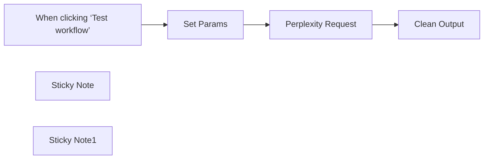

## Fluxo (.json) :

```json
{
  "nodes": [
    {
      "id": "293b70f0-06e8-4db5-befd-bfaed1f3575a",
      "name": "When clicking ‘Test workflow’",
      "type": "n8n-nodes-base.manualTrigger",
      "position": [
        -460,
        80
      ],
      "parameters": {},
      "typeVersion": 1
    },
    {
      "id": "1c473546-6280-412d-9f8e-b43962365d78",
      "name": "Set Params",
      "type": "n8n-nodes-base.set",
      "position": [
        -160,
        -60
      ],
      "parameters": {
        "options": {},
        "assignments": {
          "assignments": [
            {
              "id": "8b5c6ca0-5ca8-4f67-abc1-44341cf419bc",
              "name": "system_prompt",
              "type": "string",
              "value": "You are an n8n fanboy."
            },
            {
              "id": "7c36c362-6269-4564-b6fe-f82126bc8f5e",
              "name": "user_prompt",
              "type": "string",
              "value": "What are the differences between n8n and Make?"
            },
            {
              "id": "4366d2b5-ad22-445a-8589-fddab1caa1ab",
              "name": "domains",
              "type": "string",
              "value": "n8n.io, make.com"
            }
          ]
        }
      },
      "typeVersion": 3.4
    },
    {
      "id": "894bd6a4-5db7-45fb-a8e0-1a81af068bbf",
      "name": "Clean Output",
      "type": "n8n-nodes-base.set",
      "position": [
        580,
        -100
      ],
      "parameters": {
        "options": {},
        "assignments": {
          "assignments": [
            {
              "id": "5859093c-6b22-41db-ac6c-9a9f6f18b7e3",
              "name": "output",
              "type": "string",
              "value": "={{ $json.choices[0].message.content }}"
            },
            {
              "id": "13208fff-5153-45a7-a1cb-fe49e32d9a03",
              "name": "citations",
              "type": "array",
              "value": "={{ $json.citations }}"
            }
          ]
        }
      },
      "typeVersion": 3.4
    },
    {
      "id": "52d3a832-8c9b-4356-ad2a-377340678a58",
      "name": "Perplexity Request",
      "type": "n8n-nodes-base.httpRequest",
      "position": [
        240,
        40
      ],
      "parameters": {
        "url": "https://api.perplexity.ai/chat/completions",
        "method": "POST",
        "options": {},
        "jsonBody": "={\n \"model\": \"sonar\",\n \"messages\": [\n {\n \"role\": \"system\",\n \"content\": \"{{ $json.system_prompt }}\"\n },\n {\n \"role\": \"user\",\n \"content\": \"{{ $json.user_prompt }}\"\n }\n ],\n \"temperature\": 0.2,\n \"top_p\": 0.9,\n \"search_domain_filter\": {{ (JSON.stringify($json.domains.split(','))) }},\n \"return_images\": false,\n \"return_related_questions\": false,\n \"search_recency_filter\": \"month\",\n \"top_k\": 0,\n \"stream\": false,\n \"presence_penalty\": 0,\n \"frequency_penalty\": 1,\n \"response_format\": null\n}",
        "sendBody": true,
        "specifyBody": "json",
        "authentication": "genericCredentialType",
        "genericAuthType": "httpHeaderAuth"
      },
      "credentials": {
        "httpBasicAuth": {
          "id": "yEocL0NSpUWzMsHG",
          "name": "Perplexity"
        },
        "httpHeaderAuth": {
          "id": "TngzgS09J1YvLIXl",
          "name": "Perplexity"
        }
      },
      "typeVersion": 4.2
    },
    {
      "id": "48657f2c-d1dd-4d7e-8014-c27748e63e58",
      "name": "Sticky Note",
      "type": "n8n-nodes-base.stickyNote",
      "position": [
        -140,
        -440
      ],
      "parameters": {
        "width": 480,
        "height": 300,
        "content": "## Credentials Setup\n\n1/ Go to the perplexity dashboard, purchase some credits and create an API Key\n\nhttps://www.perplexity.ai/settings/api\n\n2/ In the perplexity Request node, use Generic Credentials, Header Auth. \n\nFor the name, use the value \"Authorization\"\nAnd for the value \"Bearer pplx-e4...59ea\" (Your Perplexity Api Key)\n\n"
      },
      "typeVersion": 1
    },
    {
      "id": "e0daabee-c145-469e-93c2-c759c303dc2a",
      "name": "Sticky Note1",
      "type": "n8n-nodes-base.stickyNote",
      "position": [
        100,
        260
      ],
      "parameters": {
        "color": 5,
        "width": 480,
        "height": 120,
        "content": "**Sonar Pro** is the current top model used by perplexity. \nIf you want to use a different one, check this page: \n\nhttps://docs.perplexity.ai/guides/model-cards"
      },
      "typeVersion": 1
    }
  ],
  "pinData": {},
  "connections": {
    "Set Params": {
      "main": [
        [
          {
            "node": "Perplexity Request",
            "type": "main",
            "index": 0
          }
        ]
      ]
    },
    "Perplexity Request": {
      "main": [
        [
          {
            "node": "Clean Output",
            "type": "main",
            "index": 0
          }
        ]
      ]
    },
    "When clicking ‘Test workflow’": {
      "main": [
        [
          {
            "node": "Set Params",
            "type": "main",
            "index": 0
          }
        ]
      ]
    }
  }
}
```

<a id="template-2057"></a>

## Template 2057 - Top 5 Product Hunt -> Discord (horário)

- **Nome:** Top 5 Product Hunt -> Discord (horário)
- **Descrição:** Busca os cinco melhores produtos do Product Hunt das últimas 24 horas e envia uma mensagem formatada para um canal do Discord a cada hora.
- **Funcionalidade:** • Agendamento periódico: Executa o fluxo a cada hora para manter as informações atualizadas.
• Consulta GraphQL ao Product Hunt: Recupera os cinco produtos com melhor ranking publicados nas últimas 24 horas.
• Processamento da lista de itens: Separa e itera sobre os resultados retornados pela API.
• Extração de campos relevantes: Coleta nome, descrição e contagem de votos de cada produto.
• Envio de mensagem formatada: Publica no Discord uma mensagem com nome, descrição e votos de cada produto.
- **Ferramentas:** • Product Hunt (GraphQL API): Fonte dos dados dos produtos, usada para obter nome, descrição e votos dos top 5 nas últimas 24 horas.
• Discord (webhook): Canal de publicação onde as mensagens formatadas com os produtos são enviadas automaticamente.

## Fluxo visual

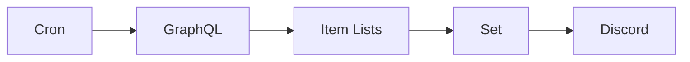

## Fluxo (.json) :

```json
{
  "nodes": [
    {
      "name": "Cron",
      "type": "n8n-nodes-base.cron",
      "position": [
        459,
        371
      ],
      "parameters": {
        "triggerTimes": {
          "item": [
            {
              "mode": "everyHour"
            }
          ]
        }
      },
      "typeVersion": 1
    },
    {
      "name": "Set",
      "type": "n8n-nodes-base.set",
      "position": [
        1109,
        371
      ],
      "parameters": {
        "values": {
          "number": [
            {
              "name": "Votes",
              "value": "={{$json[\"posts\"][\"node\"][\"votesCount\"]}}"
            }
          ],
          "string": [
            {
              "name": "Name",
              "value": "={{$json[\"posts\"][\"node\"][\"name\"]}}"
            },
            {
              "name": "Description",
              "value": "={{$json[\"posts\"][\"node\"][\"description\"]}}"
            }
          ]
        },
        "options": {},
        "keepOnlySet": true
      },
      "typeVersion": 1
    },
    {
      "name": "GraphQL",
      "type": "n8n-nodes-base.graphql",
      "position": [
        700,
        370
      ],
      "parameters": {
        "query": "=query PostRanking{\n  posts(postedAfter:\"{{new Date(new Date(Date.now()).getTime() - (1000*60*60*1*24)).toUTCString()}}\", order:RANKING, first:5, postedBefore:\"{{new Date(Date.now()).toUTCString()}}\"){\n    edges {\n      node {\n        name\n        tagline\n        description\n        votesCount\n        reviewsRating\n      }\n    }\n  }\n}",
        "endpoint": "https://api.producthunt.com/v2/api/graphql",
        "requestFormat": "json",
        "headerParametersUi": {
          "parameter": [
            {
              "name": "Authorization",
              "value": "Bearer YOUR-TOKEN"
            }
          ]
        }
      },
      "typeVersion": 1
    },
    {
      "name": "Item Lists",
      "type": "n8n-nodes-base.itemLists",
      "position": [
        900,
        370
      ],
      "parameters": {
        "options": {
          "destinationFieldName": "posts"
        },
        "fieldToSplitOut": "data.posts.edges"
      },
      "typeVersion": 1
    },
    {
      "name": "Discord",
      "type": "n8n-nodes-base.discord",
      "position": [
        1310,
        370
      ],
      "parameters": {
        "text": "=Here are the top 5 PH projects:\n**Name:** {{$json[\"Name\"]}}\n**Description:** {{$json[\"Description\"]}}\n**Vote:** {{$json[\"Votes\"]}}\n-------",
        "webhookUri": "DISCORD WEBHOOK URL"
      },
      "typeVersion": 1
    }
  ],
  "connections": {
    "Set": {
      "main": [
        [
          {
            "node": "Discord",
            "type": "main",
            "index": 0
          }
        ]
      ]
    },
    "Cron": {
      "main": [
        [
          {
            "node": "GraphQL",
            "type": "main",
            "index": 0
          }
        ]
      ]
    },
    "GraphQL": {
      "main": [
        [
          {
            "node": "Item Lists",
            "type": "main",
            "index": 0
          }
        ]
      ]
    },
    "Item Lists": {
      "main": [
        [
          {
            "node": "Set",
            "type": "main",
            "index": 0
          }
        ]
      ]
    }
  }
}
```

<a id="template-2059"></a>

## Template 2059 - Pipeline de fact-checking e resumo de texto

- **Nome:** Pipeline de fact-checking e resumo de texto
- **Descrição:** Recebe um texto, divide-o em frases, verifica factualidade de cada afirmação usando modelos de linguagem especializados e gera um resumo com as incorreções encontradas.
- **Funcionalidade:** • Recepção de entrada por acionador: Aceita execução manual ou chamada por outro fluxo para processar texto.
• Divisão inteligente em sentenças: Separa o texto em sentenças preservando datas e itens de lista.
• Anexar contexto de fatos: Combina um bloco de fatos fornecido com cada afirmação para checagem contextualizada.
• Checagem factual por sentença: Envia cada afirmação a modelos de linguagem especializados para avaliar veracidade.
• Agregação de resultados: Reúne respostas individuais em um único conjunto de dados.
• Geração de resumo de problemas: Produz um relatório resumido com a lista de afirmações incorretas e avaliação final da precisão do texto.
• Flexibilidade de saída: Permite retornar tanto um resumo formatado quanto os dados brutos com os problemas detectados.
- **Ferramentas:** • Ollama: Plataforma para hospedar e executar modelos de linguagem localmente ou em infraestrutura própria.
• bespoke-minicheck (modelo): Modelo especializado em detecção e validação de afirmações factuais, usado para checagem por sentença.
• qwen2.5 (modelo): Modelo de linguagem maior utilizado para geração de resumos e avaliação consolidada dos resultados.

## Fluxo visual

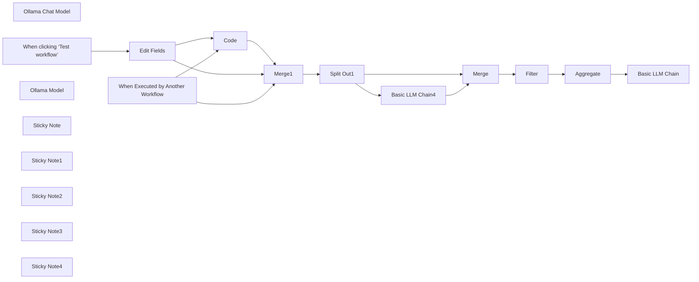

## Fluxo (.json) :

```json
{
  "meta": {
    "instanceId": "6e361bfcd1e8378c9b07774b22409c7eaea7080f01d5248da45077c0c6108b99",
    "templateCredsSetupCompleted": true
  },
  "nodes": [
    {
      "id": "cbc036f7-b0e1-4eb4-94c3-7571c67a1efe",
      "name": "Code",
      "type": "n8n-nodes-base.code",
      "position": [
        -120,
        40
      ],
      "parameters": {
        "mode": "runOnceForEachItem",
        "jsCode": "// Get the input text\nconst text = $input.item.json.text;\n\n// Ensure text is not null or undefined\nif (!text) {\n  throw new Error('Input text is empty');\n}\n\n// Function to split text into sentences while preserving dates and list items\nfunction splitIntoSentences(text) {\n  const monthNames = '(?:Januar|Februar|März|April|Mai|Juni|Juli|August|September|Oktober|November|Dezember)';\n  const datePattern = `(?:\\\\d{1,2}\\\\.\\\\s*(?:${monthNames}|\\\\d{1,2}\\\\.)\\\\s*\\\\d{2,4})`;\n  \n  // Split by sentence-ending punctuation, but not within dates or list items\n  const regex = new RegExp(`(?<=[.!?])\\\\s+(?=[A-ZÄÖÜ]|$)(?!${datePattern}|\\\\s*[-•]\\\\s)`, 'g');\n  \n  return text.split(regex)\n    .map(sentence => sentence.trim())\n    .filter(sentence => sentence !== '');\n}\n\n// Split the text into sentences\nconst sentences = splitIntoSentences(text);\n\n// Output a single object with an array of sentences\nreturn { json: { sentences: sentences } };"
      },
      "typeVersion": 2
    },
    {
      "id": "faae4740-a529-4275-be0e-b079c3bfde58",
      "name": "Split Out1",
      "type": "n8n-nodes-base.splitOut",
      "position": [
        340,
        -180
      ],
      "parameters": {
        "options": {
          "destinationFieldName": "claim"
        },
        "fieldToSplitOut": "sentences"
      },
      "typeVersion": 1
    },
    {
      "id": "c3944f89-e267-4df0-8fc4-9281eac4e759",
      "name": "Basic LLM Chain4",
      "type": "@n8n/n8n-nodes-langchain.chainLlm",
      "position": [
        640,
        -40
      ],
      "parameters": {
        "text": "=Document: {{ $('Merge1').item.json.facts }}\nClaim: {{ $json.claim }}",
        "promptType": "define"
      },
      "typeVersion": 1.5
    },
    {
      "id": "4e53c7f1-ab9f-42be-a253-9328b209fc68",
      "name": "Ollama Chat Model",
      "type": "@n8n/n8n-nodes-langchain.lmChatOllama",
      "position": [
        700,
        160
      ],
      "parameters": {
        "model": "bespoke-minicheck:latest",
        "options": {}
      },
      "credentials": {
        "ollamaApi": {
          "id": "DeuK54dDNrCCnXHl",
          "name": "Ollama account"
        }
      },
      "typeVersion": 1
    },
    {
      "id": "0252e47e-0e50-4024-92a0-74b554c8cbd1",
      "name": "When clicking ‘Test workflow’",
      "type": "n8n-nodes-base.manualTrigger",
      "position": [
        -760,
        40
      ],
      "parameters": {},
      "typeVersion": 1
    },
    {
      "id": "8dd3f67c-e36f-4b03-8f9f-9b52ea23e0ed",
      "name": "Edit Fields",
      "type": "n8n-nodes-base.set",
      "position": [
        -460,
        40
      ],
      "parameters": {
        "options": {},
        "assignments": {
          "assignments": [
            {
              "id": "55748f38-486f-495f-91ec-02c1d49acf18",
              "name": "facts",
              "type": "string",
              "value": "Sara Beery came to MIT as an assistant professor in MIT’s Department of Electrical Engineering and Computer Science (EECS) eager to focus on ecological challenges. She has fashioned her research career around the opportunity to apply her expertise in computer vision, machine learning, and data science to tackle real-world issues in conservation and sustainability. Beery was drawn to the Institute’s commitment to “computing for the planet,” and set out to bring her methods to global-scale environmental and biodiversity monitoring.\n\nIn the Pacific Northwest, salmon have a disproportionate impact on the health of their ecosystems, and their complex reproductive needs have attracted Beery’s attention. Each year, millions of salmon embark on a migration to spawn. Their journey begins in freshwater stream beds where the eggs hatch. Young salmon fry (newly hatched salmon) make their way to the ocean, where they spend several years maturing to adulthood. As adults, the salmon return to the streams where they were born in order to spawn, ensuring the continuation of their species by depositing their eggs in the gravel of the stream beds. Both male and female salmon die shortly after supplying the river habitat with the next generation of salmon."
            },
            {
              "id": "7d8e29db-4a4b-47c5-8c93-fda1e72137a7",
              "name": "text",
              "type": "string",
              "value": "MIT's AI Pioneer Tackles Salmon Conservation  Professor Sara Beery, a rising star in MIT's Department of Electrical Engineering and Computer Science, is revolutionizing ecological conservation through cutting-edge technology. Specializing in computer vision, machine learning, and data science, Beery has set her sights on addressing real-world sustainability challenges.  Her current focus? The vital salmon populations of the Pacific Northwest. These fish play a crucial role in their ecosystems, with their complex life cycle spanning from freshwater streams to the open ocean and back again. Beery's innovative approach uses AI to monitor salmon migration patterns, providing unprecedented insights into their behavior and habitat needs.  Beery's work has led to the development of underwater AI cameras that can distinguish between different salmon species with 99.9% accuracy. Her team has also created a revolutionary \"salmon translator\" that can predict spawning locations based on fish vocalizations.  As climate change threatens these delicate ecosystems, Beery's research offers hope for more effective conservation strategies. By harnessing the power of technology, she's not just studying nature – she's actively working to preserve it for future generations."
            }
          ]
        }
      },
      "typeVersion": 3.4
    },
    {
      "id": "25849b47-1550-464c-9e70-e787712e5765",
      "name": "Merge",
      "type": "n8n-nodes-base.merge",
      "position": [
        1120,
        -160
      ],
      "parameters": {
        "mode": "combine",
        "options": {},
        "combineBy": "combineByPosition"
      },
      "typeVersion": 3
    },
    {
      "id": "eaea7ef4-a5d5-42b8-b262-e9a4bd6b7281",
      "name": "Filter",
      "type": "n8n-nodes-base.filter",
      "position": [
        1340,
        -160
      ],
      "parameters": {
        "options": {},
        "conditions": {
          "options": {
            "version": 2,
            "leftValue": "",
            "caseSensitive": true,
            "typeValidation": "strict"
          },
          "combinator": "and",
          "conditions": [
            {
              "id": "20a4ffd6-0dd0-44f9-97bc-7d891f689f4d",
              "operator": {
                "name": "filter.operator.equals",
                "type": "string",
                "operation": "equals"
              },
              "leftValue": "={{ $json.text }}",
              "rightValue": "No"
            }
          ]
        }
      },
      "typeVersion": 2.2
    },
    {
      "id": "9f074bdb-b1a6-4c36-be1c-203f78092657",
      "name": "When Executed by Another Workflow",
      "type": "n8n-nodes-base.executeWorkflowTrigger",
      "position": [
        -760,
        -200
      ],
      "parameters": {
        "workflowInputs": {
          "values": [
            {
              "name": "facts"
            },
            {
              "name": "text"
            }
          ]
        }
      },
      "typeVersion": 1.1
    },
    {
      "id": "0a08ac40-b497-4f6e-ac2c-2213a00d63f2",
      "name": "Aggregate",
      "type": "n8n-nodes-base.aggregate",
      "position": [
        1560,
        -160
      ],
      "parameters": {
        "options": {},
        "aggregate": "aggregateAllItemData"
      },
      "typeVersion": 1
    },
    {
      "id": "b0d79886-01fc-43c7-88fe-a7a5b8b56b35",
      "name": "Merge1",
      "type": "n8n-nodes-base.merge",
      "position": [
        80,
        -180
      ],
      "parameters": {
        "mode": "combine",
        "options": {},
        "combineBy": "combineByPosition"
      },
      "typeVersion": 3
    },
    {
      "id": "82640408-9db4-4a12-9136-1a22985b609b",
      "name": "Basic LLM Chain",
      "type": "@n8n/n8n-nodes-langchain.chainLlm",
      "position": [
        1780,
        -160
      ],
      "parameters": {
        "text": "={{ $json.data }}",
        "messages": {
          "messageValues": [
            {
              "message": "You are a fact-checking assistant. Your task is to analyze a list of statements, each accompanied by a \"yes\" or \"no\" indicating whether the statement is correct. Follow these guidelines:\n\n1. Review Process:\n   a) Carefully read through each statement and its corresponding yes/no answer.\n   b) Identify which statements are marked as incorrect (no).\n   c) Ignore chit-chat sentences or statements that don't contain factual information.\n   d) Count the total number of incorrect factual statements.\n\n2. Statement Classification:\n   - Factual Statements: Contains specific information, data, or claims that can be verified.\n   - Chit-chat/Non-factual: General comments, introductions, or transitions that don't present verifiable facts.\n\n3. Summary Structure:\n   a) Overview: Provide a brief summary of the number of factual errors found.\n   b) List of Problems: Enumerate the incorrect factual statements.\n   c) Final Assessment: Offer a concise evaluation of the overall state of the article's factual accuracy.\n\n4. Prioritization:\n   - Focus only on the factual statements marked as incorrect (no).\n   - Ignore statements marked as correct (yes) and non-factual chit-chat.\n\n5. Feedback Tone:\n   - Maintain a neutral and objective tone.\n   - Present the information factually without additional commentary.\n\n6. Output Format:\n   Present your summary in the following structure:\n\n   ## Problem Summary\n   [Number] incorrect factual statements were identified in the article.\n\n   ## List of Incorrect Factual Statements\n   1. [First incorrect factual statement]\n   2. [Second incorrect factual statement]\n   3. [Third incorrect factual statement]\n   (Continue listing all incorrect factual statements)\n\n   ## Final Assessment\n   Based on the number of incorrect factual statements:\n   - If 0-1 errors: The article appears to be highly accurate and may only need minor factual adjustments.\n   - If 2-3 errors: The article requires some revision to address these factual inaccuracies.\n   - If 4 or more errors: The article needs significant revision to improve its factual accuracy.\n\nRemember, your role is to provide a clear, concise summary of the incorrect factual statements to help the writing team quickly understand what needs to be addressed. Ignore any chit-chat or non-factual statements in your analysis and summary."
            }
          ]
        },
        "promptType": "define"
      },
      "typeVersion": 1.5
    },
    {
      "id": "719054ef-0863-4e52-8390-23313c750aac",
      "name": "Ollama Model",
      "type": "@n8n/n8n-nodes-langchain.lmOllama",
      "position": [
        1880,
        60
      ],
      "parameters": {
        "model": "qwen2.5:1.5b",
        "options": {}
      },
      "credentials": {
        "ollamaApi": {
          "id": "DeuK54dDNrCCnXHl",
          "name": "Ollama account"
        }
      },
      "typeVersion": 1
    },
    {
      "id": "6595eb25-32ce-49f5-a013-b87d7f3c65d3",
      "name": "Sticky Note",
      "type": "n8n-nodes-base.stickyNote",
      "position": [
        1480,
        -320
      ],
      "parameters": {
        "width": 860,
        "height": 600,
        "content": "## Build a summary\n\nThis is useful to run it in an agentic workflow. You may remove the summary part and return the raw array with the found issues."
      },
      "typeVersion": 1
    },
    {
      "id": "9f6cde97-d2a7-44e4-b715-321ec1e68bd3",
      "name": "Sticky Note1",
      "type": "n8n-nodes-base.stickyNote",
      "position": [
        -240,
        -320
      ],
      "parameters": {
        "width": 760,
        "height": 600,
        "content": "## Split into sentences"
      },
      "typeVersion": 1
    },
    {
      "id": "1ceb8f3c-c00b-4496-82b2-20578550c4be",
      "name": "Sticky Note2",
      "type": "n8n-nodes-base.stickyNote",
      "position": [
        540,
        -320
      ],
      "parameters": {
        "width": 920,
        "height": 600,
        "content": "## Fact checking\n\nThis use a small ollama model that is specialized on that task: https://ollama.com/library/bespoke-minicheck\n\nYou have to install it before use with `ollama pull bespoke-minicheck`."
      },
      "typeVersion": 1
    },
    {
      "id": "6e340925-d4e5-4fe1-ba9d-a89a23b68226",
      "name": "Sticky Note3",
      "type": "n8n-nodes-base.stickyNote",
      "position": [
        -860,
        -20
      ],
      "parameters": {
        "width": 600,
        "height": 300,
        "content": "## Test workflow\n"
      },
      "typeVersion": 1
    },
    {
      "id": "5561d606-93d2-4887-839d-8ce2230ff30c",
      "name": "Sticky Note4",
      "type": "n8n-nodes-base.stickyNote",
      "position": [
        -860,
        -320
      ],
      "parameters": {
        "width": 600,
        "height": 280,
        "content": "## Entrypoint to use in other workflows\n"
      },
      "typeVersion": 1
    }
  ],
  "pinData": {},
  "connections": {
    "Code": {
      "main": [
        [
          {
            "node": "Merge1",
            "type": "main",
            "index": 1
          }
        ]
      ]
    },
    "Merge": {
      "main": [
        [
          {
            "node": "Filter",
            "type": "main",
            "index": 0
          }
        ]
      ]
    },
    "Filter": {
      "main": [
        [
          {
            "node": "Aggregate",
            "type": "main",
            "index": 0
          }
        ]
      ]
    },
    "Merge1": {
      "main": [
        [
          {
            "node": "Split Out1",
            "type": "main",
            "index": 0
          }
        ]
      ]
    },
    "Aggregate": {
      "main": [
        [
          {
            "node": "Basic LLM Chain",
            "type": "main",
            "index": 0
          }
        ]
      ]
    },
    "Split Out1": {
      "main": [
        [
          {
            "node": "Merge",
            "type": "main",
            "index": 0
          },
          {
            "node": "Basic LLM Chain4",
            "type": "main",
            "index": 0
          }
        ]
      ]
    },
    "Edit Fields": {
      "main": [
        [
          {
            "node": "Code",
            "type": "main",
            "index": 0
          },
          {
            "node": "Merge1",
            "type": "main",
            "index": 0
          }
        ]
      ]
    },
    "Ollama Model": {
      "ai_languageModel": [
        [
          {
            "node": "Basic LLM Chain",
            "type": "ai_languageModel",
            "index": 0
          }
        ]
      ]
    },
    "Basic LLM Chain4": {
      "main": [
        [
          {
            "node": "Merge",
            "type": "main",
            "index": 1
          }
        ]
      ]
    },
    "Ollama Chat Model": {
      "ai_languageModel": [
        [
          {
            "node": "Basic LLM Chain4",
            "type": "ai_languageModel",
            "index": 0
          }
        ]
      ]
    },
    "When Executed by Another Workflow": {
      "main": [
        [
          {
            "node": "Code",
            "type": "main",
            "index": 0
          },
          {
            "node": "Merge1",
            "type": "main",
            "index": 0
          }
        ]
      ]
    },
    "When clicking ‘Test workflow’": {
      "main": [
        [
          {
            "node": "Edit Fields",
            "type": "main",
            "index": 0
          }
        ]
      ]
    }
  }
}
```

<a id="template-2061"></a>

## Template 2061 - Criar/Atualizar link curto no Dub.co

- **Nome:** Criar/Atualizar link curto no Dub.co
- **Descrição:** Fluxo para criar ou atualizar links curtos no Dub.co usando dados fornecidos (URL longa, slug, projeto e domínio), retornando a URL encurtada.
- **Funcionalidade:** • Gatilho manual: Inicia o fluxo quando o usuário executa o teste.
• Definição de entradas e credenciais: Recebe chave da API, URL longa, slug personalizado, slug do projeto e domínio personalizado.
• Criação de link: Envia requisição para criar um novo link curto no Dub.co com os parâmetros informados.
• Verificação de resposta: Avalia o resultado da criação para identificar sucesso ou conflito (slug já existente).
• Recuperação de link existente: Se a criação não for bem-sucedida, consulta informações do link com base no slug e domínio.
• Atualização de link: Atualiza o link existente com os dados desejados quando necessário.
• Entrega do resultado: Extrai e disponibiliza a URL encurtada final.
• Controle de taxa/lote: Suporta envio em lotes e configura intervalos para respeitar limites da API.
- **Ferramentas:** • Dub.co API: Serviço para criar, recuperar e atualizar links curtos; usa autenticação por token (Bearer) e permite slugs e domínios personalizados.

## Fluxo visual

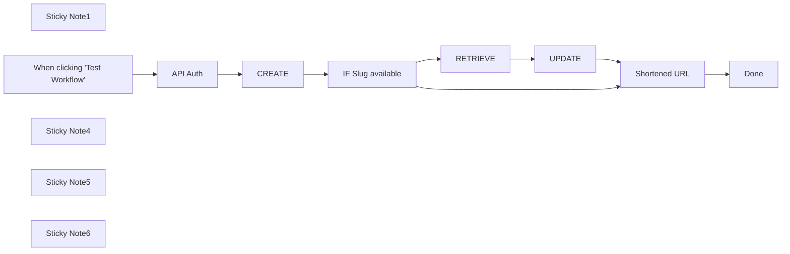

## Fluxo (.json) :

```json
{
  "id": "ReXF4z8ZKcEd6Kea",
  "meta": {
    "instanceId": "10e1a946d44026e16f5f1b336bb25f918a0e45738f9dee8024757614581d7d73"
  },
  "name": "dub.co URL Shortener",
  "tags": [],
  "nodes": [
    {
      "id": "63170148-b769-43b6-9a7a-02baa9f76b02",
      "name": "Sticky Note1",
      "type": "n8n-nodes-base.stickyNote",
      "position": [
        1480,
        1100
      ],
      "parameters": {
        "color": 4,
        "width": 346.4519761795601,
        "height": 227.3959699655325,
        "content": "## Dub.co API Limits:\nDub’s API is capped at 10 requests per second per user."
      },
      "typeVersion": 1
    },
    {
      "id": "defd82ef-25a0-4aa4-8681-d352e5fe8275",
      "name": "When clicking \"Test Workflow\"",
      "type": "n8n-nodes-base.manualTrigger",
      "position": [
        1231,
        560
      ],
      "parameters": {},
      "typeVersion": 1
    },
    {
      "id": "fec7fb8a-3f88-4de9-8392-5c7929a712e7",
      "name": "Sticky Note4",
      "type": "n8n-nodes-base.stickyNote",
      "disabled": true,
      "position": [
        1480,
        460
      ],
      "parameters": {
        "color": 4,
        "width": 826.4578951225271,
        "height": 605.7992490141105,
        "content": "## Dub.co API\n**Create** Link. [Based on their API docs](https://dub.co/docs/api-reference/endpoint/create-a-new-link)"
      },
      "typeVersion": 1
    },
    {
      "id": "8c87aad8-519c-491b-b272-f21dfd5b069f",
      "name": "Sticky Note5",
      "type": "n8n-nodes-base.stickyNote",
      "position": [
        1171,
        460
      ],
      "parameters": {
        "height": 870.5323777622334,
        "content": "## Control Stack"
      },
      "typeVersion": 1
    },
    {
      "id": "a6cfe224-95d9-47d6-a900-667eed065264",
      "name": "Sticky Note6",
      "type": "n8n-nodes-base.stickyNote",
      "position": [
        486,
        460
      ],
      "parameters": {
        "width": 655.6800599837106,
        "height": 462.29577922809585,
        "content": "# README\n\n## Dub.co API Workflow Configuration\n| Required | Input Field           | Description                                      |\n|----------|-----------------------|--------------------------------------------------|\n|✓| **`Dub API Key`**     | _API Key for Dub.co integration._                 |\n|✓| **`Long URL`**               | _The long URL to be shortened._                    |\n| | **`Custom Slug`**           | _Slug is the path of shortened URL - default is random 7 characters._               |\n|✓| **`Project Slug`**                  | _Enter Your Dub project slug, The slug for the project to create links for. E.g. for app.dub.co/acme, the project slug is 'acme'._                   |\n| | **`Custom Domain`** | _Custom domain linked to Dub.co._                 |\n\n\n\n\n\n\n\nYou'll need to add the details listed above in the \"API Auth\" node by clicking on it and filling the fields ==>"
      },
      "typeVersion": 1
    },
    {
      "id": "f3164150-9730-4d20-9aef-9ae7f84e73fc",
      "name": "API Auth",
      "type": "n8n-nodes-base.set",
      "position": [
        1240,
        820
      ],
      "parameters": {
        "fields": {
          "values": [
            {
              "name": "Dub API Key",
              "stringValue": "=<Required: Get your Dub API Key from https://app.dub.co/settings/tokens>"
            },
            {
              "name": "Long URL",
              "stringValue": "https://n8n.io"
            },
            {
              "name": "Custom Slug",
              "stringValue": "=<Optional: Slug is the path of shortened URL - default is random 7 characters>"
            },
            {
              "name": "Project Slug",
              "stringValue": "=<Required: Enter Your Dub project slug, The slug for the project to create links for. E.g. for app.dub.co/acme, the project slug is 'acme'.>"
            },
            {
              "name": "Custom Domain",
              "stringValue": "=<Optional: The domain of the short link. If not provided, the primary domain for the project will be used (or dub.sh if the project has no domains)>"
            }
          ]
        },
        "options": {}
      },
      "typeVersion": 3.2
    },
    {
      "id": "a2279ab1-6550-43ef-a41d-c24c669bb2b6",
      "name": "CREATE",
      "type": "n8n-nodes-base.httpRequest",
      "notes": "Create Link",
      "position": [
        1540,
        560
      ],
      "parameters": {
        "url": "https://api.dub.co/links",
        "method": "POST",
        "options": {
          "batching": {
            "batch": {
              "batchSize": 10,
              "batchInterval": 60000
            }
          },
          "redirect": {
            "redirect": {}
          },
          "response": {
            "response": {
              "neverError": true,
              "fullResponse": true
            }
          },
          "allowUnauthorizedCerts": true
        },
        "jsonBody": "={\n{{ $ifEmpty(`\"domain\": \"${$json[\"Custom Domain\"] || \"undefined\"}\",`, \"\").replace('\"domain\": \"<Optional: The domain of the short link. If not provided, the primary domain for the project will be used (or dub.sh if the project has no domains)>\",', \"\").replace('\"domain\": \"undefined\",', \"\") }}\n{{ $ifEmpty(`\"key\": \"${$json[\"Custom Slug\"] || \"undefined\"}\",`, \"\").replace('\"key\": \"<Optional: Slug is the path of shortened URL - default is random 7 characters>\",', \"\").replace('\"key\": \"undefined\",', \"\") }}\n  \"url\": \"{{ $json[\"Long URL\"] }}\",\n  \"comments\": \"Updated using N8N.io workflow: {{$workflow.name}}\"\n}",
        "sendBody": true,
        "sendQuery": true,
        "sendHeaders": true,
        "specifyBody": "json",
        "queryParameters": {
          "parameters": [
            {
              "name": "projectSlug",
              "value": "={{ $json[\"Project Slug\"] }}"
            }
          ]
        },
        "headerParameters": {
          "parameters": [
            {
              "name": "Authorization",
              "value": "=Bearer {{ $json['Dub API Key'] }}"
            }
          ]
        }
      },
      "notesInFlow": true,
      "typeVersion": 4.1,
      "alwaysOutputData": true
    },
    {
      "id": "970d062f-9206-4ec6-acdd-3fc1cc87db69",
      "name": "IF Slug available",
      "type": "n8n-nodes-base.if",
      "position": [
        1760,
        560
      ],
      "parameters": {
        "conditions": {
          "string": [
            {
              "value1": "={{ $json.statusCode }}",
              "value2": "200",
              "operation": "regex"
            }
          ]
        }
      },
      "typeVersion": 1
    },
    {
      "id": "d25eedfd-95a7-4c17-8a76-1cdfae6670d1",
      "name": "RETRIEVE",
      "type": "n8n-nodes-base.httpRequest",
      "notes": "Retrieve the link id",
      "position": [
        1540,
        840
      ],
      "parameters": {
        "url": "=https://api.dub.co/links/info",
        "options": {
          "batching": {
            "batch": {
              "batchSize": 10,
              "batchInterval": 60000
            }
          },
          "redirect": {
            "redirect": {}
          },
          "response": {
            "response": {
              "neverError": true,
              "fullResponse": true
            }
          },
          "allowUnauthorizedCerts": true
        },
        "sendQuery": true,
        "sendHeaders": true,
        "queryParameters": {
          "parameters": [
            {
              "name": "projectSlug",
              "value": "={{ $('API Auth').item.json[\"Project Slug\"] }}"
            },
            {
              "name": "key",
              "value": "={{ $('API Auth').item.json[\"Custom Slug\"] }}"
            },
            {
              "name": "domain",
              "value": "={{ $('API Auth').item.json[\"Custom Domain\"] }}"
            }
          ]
        },
        "headerParameters": {
          "parameters": [
            {
              "name": "Authorization",
              "value": "=Bearer {{ $('API Auth').item.json[\"Dub API Key\"] }}"
            }
          ]
        }
      },
      "notesInFlow": true,
      "typeVersion": 4.1,
      "alwaysOutputData": true
    },
    {
      "id": "18bf5187-422c-486e-84c4-c2f79855ba25",
      "name": "UPDATE",
      "type": "n8n-nodes-base.httpRequest",
      "notes": "Update Link",
      "position": [
        1780,
        840
      ],
      "parameters": {
        "url": "=https://api.dub.co/links/{{ $json.body.id }}",
        "method": "PUT",
        "options": {
          "batching": {
            "batch": {
              "batchSize": 10,
              "batchInterval": 60000
            }
          },
          "redirect": {
            "redirect": {}
          },
          "response": {
            "response": {
              "neverError": true,
              "fullResponse": true
            }
          },
          "allowUnauthorizedCerts": true
        },
        "jsonBody": "={\n    {{ $ifEmpty(`\"domain\": \"${$('API Auth').item.json[\"Custom Domain\"] || \"undefined\"}\",`, \"\").replace('\"domain\": \"<Optional: The domain of the short link. If not provided, the primary domain for the project will be used (or dub.sh if the project has no domains)>\",', \"\").replace('\"domain\": \"undefined\",', \"\") }}\n{{ $ifEmpty(`\"key\": \"${$('API Auth').item.json[\"Custom Slug\"] || \"undefined\"}\",`, \"\").replace('\"key\": \"<Optional: Slug is the path of shortened URL - default is random 7 characters>\",', \"\").replace('\"key\": \"undefined\",', \"\") }}\n\n  \"url\": \"{{ $('API Auth').item.json[\"Long URL\"] }}\",\n  \"comments\": \"Updated using N8N.io workflow: {{$workflow.name}}\"\n}",
        "sendBody": true,
        "sendQuery": true,
        "sendHeaders": true,
        "specifyBody": "json",
        "queryParameters": {
          "parameters": [
            {
              "name": "projectSlug",
              "value": "={{ $('API Auth').item.json[\"Project Slug\"] }}"
            }
          ]
        },
        "headerParameters": {
          "parameters": [
            {
              "name": "Authorization",
              "value": "=Bearer {{ $('API Auth').item.json[\"Dub API Key\"] }}"
            }
          ]
        }
      },
      "notesInFlow": true,
      "typeVersion": 4.1,
      "alwaysOutputData": true
    },
    {
      "id": "c16dc19b-f807-4784-a323-5d790cebe718",
      "name": "Shortened URL",
      "type": "n8n-nodes-base.set",
      "position": [
        2120,
        840
      ],
      "parameters": {
        "values": {
          "string": [
            {
              "name": "Shortened URL",
              "value": "={{ $json.body.shortLink }}"
            }
          ]
        },
        "options": {},
        "keepOnlySet": true
      },
      "typeVersion": 2
    },
    {
      "id": "44d31a47-dd84-4b07-a606-2da99a73cad1",
      "name": "Done",
      "type": "n8n-nodes-base.set",
      "position": [
        1240,
        1060
      ],
      "parameters": {
        "options": {}
      },
      "typeVersion": 3.2
    }
  ],
  "active": false,
  "pinData": {},
  "settings": {
    "executionOrder": "v1"
  },
  "versionId": "3b5edd9c-e373-4dc1-95d0-b320beb47020",
  "connections": {
    "CREATE": {
      "main": [
        [
          {
            "node": "IF Slug available",
            "type": "main",
            "index": 0
          }
        ]
      ]
    },
    "UPDATE": {
      "main": [
        [
          {
            "node": "Shortened URL",
            "type": "main",
            "index": 0
          }
        ]
      ]
    },
    "API Auth": {
      "main": [
        [
          {
            "node": "CREATE",
            "type": "main",
            "index": 0
          }
        ]
      ]
    },
    "RETRIEVE": {
      "main": [
        [
          {
            "node": "UPDATE",
            "type": "main",
            "index": 0
          }
        ]
      ]
    },
    "Shortened URL": {
      "main": [
        [
          {
            "node": "Done",
            "type": "main",
            "index": 0
          }
        ]
      ]
    },
    "IF Slug available": {
      "main": [
        [
          {
            "node": "Shortened URL",
            "type": "main",
            "index": 0
          }
        ],
        [
          {
            "node": "RETRIEVE",
            "type": "main",
            "index": 0
          }
        ]
      ]
    },
    "When clicking \"Test Workflow\"": {
      "main": [
        [
          {
            "node": "API Auth",
            "type": "main",
            "index": 0
          }
        ]
      ]
    }
  }
}
```

<a id="template-2062"></a>

## Template 2062 - Armazenamento automático de faturas Orlen

- **Nome:** Armazenamento automático de faturas Orlen
- **Descrição:** Captura faturas enviadas por e‑mail pela Orlen, salva os anexos em pastas organizadas por ano/mês no Google Drive e notifica a equipe no Slack.
- **Funcionalidade:** • Disparo manual e agendado: Permite execução clicando manualmente ou automaticamente todo dia às 23:45.
• Obtenção da data atual: Calcula ano e mês para definir a estrutura de pastas de destino.
• Localização de pasta por ano: Busca a pasta correspondente ao ano no armazenamento.
• Localização de pasta por mês: Busca a subpasta do mês dentro da pasta do ano.
• Busca de e‑mails da Orlen com anexos: Procura mensagens não lidas vindas de orlenpay@orlen.pl que contenham anexos.
• Upload dos anexos para o Drive: Salva os arquivos anexados na pasta do mês correspondente no Google Drive.
• Marcação de e‑mail como lido: Remove o rótulo de não lido após o processamento.
• Notificação no Slack: Envia mensagem informando a adição da fatura e o caminho da pasta.
- **Ferramentas:** • Gmail: Recebe e fornece acesso às mensagens e anexos enviados pela Orlen.
• Google Drive: Armazena os arquivos em uma estrutura de pastas organizada por ano e mês.
• Slack: Envia notificações para canal da equipe sobre faturas adicionadas.

## Fluxo visual

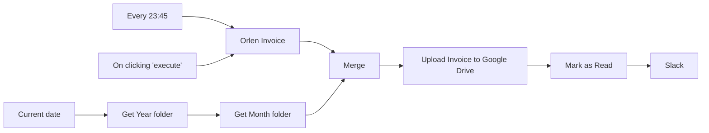

## Fluxo (.json) :

```json
{
  "id": 3,
  "name": "Orlen",
  "nodes": [
    {
      "name": "On clicking 'execute'",
      "type": "n8n-nodes-base.manualTrigger",
      "position": [
        240,
        300
      ],
      "parameters": {},
      "typeVersion": 1
    },
    {
      "name": "Current date",
      "type": "n8n-nodes-base.function",
      "position": [
        1160,
        960
      ],
      "parameters": {
        "functionCode": "var today = new Date();\nvar year = today.getFullYear();\nvar month = today.getMonth() + 1;\nvar day = today.getDate();\n\nif(month < 10) {\n  month = \"0\" + month;\n}\n\nitems[0].json.year = year;\nitems[0].json.month = month;\nitems[0].json.day = day;\n\nreturn items;"
      },
      "typeVersion": 1
    },
    {
      "name": "Every 23:45",
      "type": "n8n-nodes-base.cron",
      "position": [
        960,
        960
      ],
      "parameters": {
        "triggerTimes": {
          "item": [
            {
              "hour": 23,
              "minute": 45
            }
          ]
        }
      },
      "typeVersion": 1
    },
    {
      "name": "Get Year folder",
      "type": "n8n-nodes-base.googleDrive",
      "position": [
        1360,
        960
      ],
      "parameters": {
        "options": {
          "fields": [
            "id"
          ]
        },
        "operation": "list",
        "queryFilters": {
          "name": [
            {
              "value": "={{$json[\"year\"]}}",
              "operation": "is"
            }
          ],
          "mimeType": [
            {
              "mimeType": "application/vnd.google-apps.folder"
            }
          ]
        },
        "authentication": "oAuth2"
      },
      "credentials": {
        "googleDriveOAuth2Api": {
          "id": "7",
          "name": "Google Drive account"
        }
      },
      "typeVersion": 1
    },
    {
      "name": "Get Month folder",
      "type": "n8n-nodes-base.googleDrive",
      "position": [
        1560,
        960
      ],
      "parameters": {
        "options": {
          "fields": [
            "id"
          ]
        },
        "operation": "list",
        "queryString": "='{{$json[\"id\"]}}' in parents and name = '{{$node[\"Current date\"].json[\"month\"]}}'",
        "authentication": "oAuth2",
        "useQueryString": true
      },
      "credentials": {
        "googleDriveOAuth2Api": {
          "id": "7",
          "name": "Google Drive account"
        }
      },
      "typeVersion": 1
    },
    {
      "name": "Orlen Invoice",
      "type": "n8n-nodes-base.gmail",
      "position": [
        1760,
        960
      ],
      "parameters": {
        "resource": "message",
        "operation": "getAll",
        "returnAll": true,
        "additionalFields": {
          "q": "from:(orlenpay@orlen.pl) has:attachment is:unread",
          "format": "resolved"
        }
      },
      "credentials": {
        "gmailOAuth2": {
          "id": "5",
          "name": "dbarwikowski Gmail account"
        }
      },
      "typeVersion": 1
    },
    {
      "name": "Upload Invoice to Google Drive",
      "type": "n8n-nodes-base.googleDrive",
      "position": [
        1960,
        960
      ],
      "parameters": {
        "name": "=Orlen {{$binary.attachment_0.directory}}.{{$binary.attachment_0.fileExtension}}",
        "options": {},
        "parents": [
          "={{$node[\"Get Month folder\"].json[\"id\"]}}"
        ],
        "binaryData": true,
        "resolveData": true,
        "authentication": "oAuth2",
        "binaryPropertyName": "attachment_0"
      },
      "credentials": {
        "googleDriveOAuth2Api": {
          "id": "7",
          "name": "Google Drive account"
        }
      },
      "typeVersion": 1
    },
    {
      "name": "Mark as Read",
      "type": "n8n-nodes-base.gmail",
      "position": [
        2160,
        960
      ],
      "parameters": {
        "labelIds": [
          "UNREAD"
        ],
        "resource": "messageLabel",
        "messageId": "={{$node[\"Orlen Invoice\"].json[\"id\"]}}",
        "operation": "remove"
      },
      "credentials": {
        "gmailOAuth2": {
          "id": "5",
          "name": "dbarwikowski Gmail account"
        }
      },
      "typeVersion": 1
    },
    {
      "name": "Merge",
      "type": "n8n-nodes-base.merge",
      "position": [
        2280,
        960
      ],
      "parameters": {
        "mode": "mergeByIndex"
      },
      "typeVersion": 1
    },
    {
      "name": "Slack",
      "type": "n8n-nodes-base.slack",
      "position": [
        860,
        540
      ],
      "parameters": {
        "text": "=Kapitanie!\nDodano fakturę {{$node[\"Orlen Invoice\"].binary.attachment_0.directory}} do Firma/{{$node[\"Current date\"].json[\"year\"]}}/{{$node[\"Current date\"].json[\"month\"]}}",
        "channel": "n8n",
        "attachments": [],
        "otherOptions": {},
        "authentication": "oAuth2"
      },
      "credentials": {
        "slackOAuth2Api": {
          "id": "6",
          "name": "Slack account"
        }
      },
      "typeVersion": 1
    }
  ],
  "active": true,
  "settings": {
    "timezone": "Europe/Warsaw"
  },
  "createdAt": "2022-04-11T17:11:34.040Z",
  "updatedAt": "2022-04-11T21:59:45.898Z",
  "staticData": null,
  "connections": {
    "Merge": {
      "main": [
        [
          {
            "node": "Upload Invoice to Google Drive",
            "type": "main",
            "index": 0
          }
        ]
      ]
    },
    "Every 23:45": {
      "main": [
        [
          {
            "node": "Orlen Invoice",
            "type": "main",
            "index": 0
          }
        ]
      ]
    },
    "Current date": {
      "main": [
        [
          {
            "node": "Get Year folder",
            "type": "main",
            "index": 0
          }
        ]
      ]
    },
    "Mark as Read": {
      "main": [
        [
          {
            "node": "Slack",
            "type": "main",
            "index": 0
          }
        ]
      ]
    },
    "Orlen Invoice": {
      "main": [
        [
          {
            "node": "Merge",
            "type": "main",
            "index": 1
          }
        ]
      ]
    },
    "Get Year folder": {
      "main": [
        [
          {
            "node": "Get Month folder",
            "type": "main",
            "index": 0
          }
        ]
      ]
    },
    "Get Month folder": {
      "main": [
        [
          {
            "node": "Merge",
            "type": "main",
            "index": 0
          }
        ]
      ]
    },
    "On clicking 'execute'": {
      "main": [
        [
          {
            "node": "Orlen Invoice",
            "type": "main",
            "index": 0
          }
        ]
      ]
    },
    "Upload Invoice to Google Drive": {
      "main": [
        [
          {
            "node": "Mark as Read",
            "type": "main",
            "index": 0
          }
        ]
      ]
    }
  }
}
```

<a id="template-2063"></a>

## Template 2063 - Upload em lote de crops para Qdrant com embeddings Voyage

- **Nome:** Upload em lote de crops para Qdrant com embeddings Voyage
- **Descrição:** Este fluxo automatiza a ingestão de imagens de crops a partir de um bucket no Google Cloud Storage, gera embeddings com a Voyage API em lotes e faz upload dos pontos (com metadados) para uma coleção no Qdrant, incluindo criação de coleção e indexação de campos.
- **Funcionalidade:** • Verificação e criação da coleção no Qdrant: verifica se a coleção já existe e a cria se não existir.
• Configuração da coleção com vetor nomeado 'voyage', dimensão 1024 e distância Cosine.
• Indexação do payload crop_name para consultas eficientes.
• Importação de imagens do Google Cloud Storage com prefixo agricultural-crops.
• Agrupamento de imagens em batches, gerando UUIDs para cada ponto.
• Geração de embeddings em batch com a Voyage API para os URLs de imagem.
• Upload em batch de embeddings e payloads para a coleção no Qdrant.
• Filtragem de tomates para testes de anomalias durante o pipeline.
- **Ferramentas:** • Google Cloud Storage: serviço de armazenamento utilizado para hospedar e fornecer links públicos das imagens.
• Voyage API: serviço de embeddings multimodais utilizado para gerar vetores de imagem a partir dos URLs.
• Qdrant Cloud: serviço de armazenamento vetorial usado para criar a coleção, indexar campos e realizar o upload de pontos em batches.

## Fluxo visual

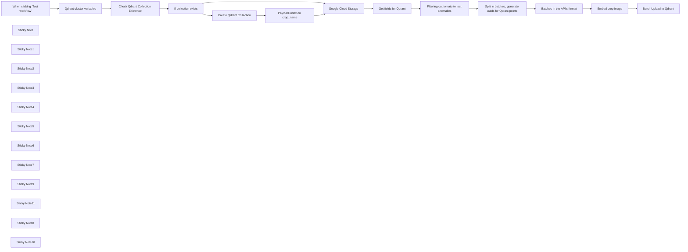

## Fluxo (.json) :

```json
{
  "id": "pPtCy6qPfEv1qNRn",
  "meta": {
    "instanceId": "205b3bc06c96f2dc835b4f00e1cbf9a937a74eeb3b47c99d0c30b0586dbf85aa"
  },
  "name": "[1/3 - anomaly detection] [1/2 - KNN classification] Batch upload dataset to Qdrant (crops dataset)",
  "tags": [
    {
      "id": "n3zAUYFhdqtjhcLf",
      "name": "qdrant",
      "createdAt": "2024-12-10T11:56:59.987Z",
      "updatedAt": "2024-12-10T11:56:59.987Z"
    }
  ],
  "nodes": [
    {
      "id": "53831410-b4f3-4374-8bdd-c2a33cd873cb",
      "name": "When clicking ‘Test workflow’",
      "type": "n8n-nodes-base.manualTrigger",
      "position": [
        -640,
        0
      ],
      "parameters": {},
      "typeVersion": 1
    },
    {
      "id": "e303ccea-c0e0-4fe5-bd31-48380a0e438f",
      "name": "Google Cloud Storage",
      "type": "n8n-nodes-base.googleCloudStorage",
      "position": [
        820,
        160
      ],
      "parameters": {
        "resource": "object",
        "returnAll": true,
        "bucketName": "n8n-qdrant-demo",
        "listFilters": {
          "prefix": "agricultural-crops"
        },
        "requestOptions": {}
      },
      "credentials": {
        "googleCloudStorageOAuth2Api": {
          "id": "fn0sr7grtfprVQvL",
          "name": "Google Cloud Storage account"
        }
      },
      "typeVersion": 1
    },
    {
      "id": "737bdb15-61cf-48eb-96af-569eb5986ee8",
      "name": "Get fields for Qdrant",
      "type": "n8n-nodes-base.set",
      "position": [
        1080,
        160
      ],
      "parameters": {
        "options": {},
        "assignments": {
          "assignments": [
            {
              "id": "10d9147f-1c0c-4357-8413-3130829c2e24",
              "name": "=publicLink",
              "type": "string",
              "value": "=https://storage.googleapis.com/{{ $json.bucket }}/{{ $json.selfLink.split('/').splice(-1) }}"
            },
            {
              "id": "ff9e6a0b-e47a-4550-a13b-465507c75f8f",
              "name": "cropName",
              "type": "string",
              "value": "={{ $json.id.split('/').slice(-3, -2)[0].toLowerCase()}}"
            }
          ]
        }
      },
      "typeVersion": 3.4
    },
    {
      "id": "2b18ed0c-38d3-49e9-be3d-4f7b35f4d9e5",
      "name": "Qdrant cluster variables",
      "type": "n8n-nodes-base.set",
      "position": [
        -360,
        0
      ],
      "parameters": {
        "options": {},
        "assignments": {
          "assignments": [
            {
              "id": "58b7384d-fd0c-44aa-9f8e-0306a99be431",
              "name": "qdrantCloudURL",
              "type": "string",
              "value": "=https://152bc6e2-832a-415c-a1aa-fb529f8baf8d.eu-central-1-0.aws.cloud.qdrant.io"
            },
            {
              "id": "e34c4d88-b102-43cc-a09e-e0553f2da23a",
              "name": "collectionName",
              "type": "string",
              "value": "=agricultural-crops"
            },
            {
              "id": "33581e0a-307f-4380-9533-615791096de7",
              "name": "VoyageEmbeddingsDim",
              "type": "number",
              "value": 1024
            },
            {
              "id": "6e390343-2cd2-4559-aba9-82b13acb7f52",
              "name": "batchSize",
              "type": "number",
              "value": 4
            }
          ]
        }
      },
      "typeVersion": 3.4
    },
    {
      "id": "f88d290e-3311-4322-b2a5-1350fc1f8768",
      "name": "Embed crop image",
      "type": "n8n-nodes-base.httpRequest",
      "position": [
        2120,
        160
      ],
      "parameters": {
        "url": "https://api.voyageai.com/v1/multimodalembeddings",
        "method": "POST",
        "options": {},
        "jsonBody": "={{\n{\n  \"inputs\": $json.batchVoyage,\n  \"model\": \"voyage-multimodal-3\",\n  \"input_type\": \"document\"\n}\n}}",
        "sendBody": true,
        "specifyBody": "json",
        "authentication": "genericCredentialType",
        "genericAuthType": "httpHeaderAuth"
      },
      "credentials": {
        "httpHeaderAuth": {
          "id": "Vb0RNVDnIHmgnZOP",
          "name": "Voyage API"
        }
      },
      "typeVersion": 4.2
    },
    {
      "id": "250c6a8d-f545-4037-8069-c834437bbe15",
      "name": "Create Qdrant Collection",
      "type": "n8n-nodes-base.httpRequest",
      "position": [
        320,
        160
      ],
      "parameters": {
        "url": "={{ $('Qdrant cluster variables').first().json.qdrantCloudURL }}/collections/{{ $('Qdrant cluster variables').first().json.collectionName }}",
        "method": "PUT",
        "options": {},
        "jsonBody": "={{\n{\n  \"vectors\": {\n    \"voyage\": { \n      \"size\": $('Qdrant cluster variables').first().json.VoyageEmbeddingsDim, \n      \"distance\": \"Cosine\" \n    } \n  }\n}\n}}",
        "sendBody": true,
        "specifyBody": "json",
        "authentication": "predefinedCredentialType",
        "nodeCredentialType": "qdrantApi"
      },
      "credentials": {
        "qdrantApi": {
          "id": "it3j3hP9FICqhgX6",
          "name": "QdrantApi account"
        }
      },
      "typeVersion": 4.2
    },
    {
      "id": "20b612ff-4794-43ef-bf45-008a16a2f30f",
      "name": "Check Qdrant Collection Existence",
      "type": "n8n-nodes-base.httpRequest",
      "position": [
        -100,
        0
      ],
      "parameters": {
        "url": "={{ $json.qdrantCloudURL }}/collections/{{ $json.collectionName }}/exists",
        "options": {},
        "authentication": "predefinedCredentialType",
        "nodeCredentialType": "qdrantApi"
      },
      "credentials": {
        "qdrantApi": {
          "id": "it3j3hP9FICqhgX6",
          "name": "QdrantApi account"
        }
      },
      "typeVersion": 4.2
    },
    {
      "id": "c067740b-5de3-452e-a614-bf14985a73a0",
      "name": "Batches in the API's format",
      "type": "n8n-nodes-base.set",
      "position": [
        1860,
        160
      ],
      "parameters": {
        "options": {},
        "assignments": {
          "assignments": [
            {
              "id": "f14db112-6f15-4405-aa47-8cb56bb8ae7a",
              "name": "=batchVoyage",
              "type": "array",
              "value": "={{ $json.batch.map(item => ({ \"content\": ([{\"type\": \"image_url\", \"image_url\": item[\"publicLink\"]}])}))}}"
            },
            {
              "id": "3885fd69-66f5-4435-86a4-b80eaa568ac1",
              "name": "=batchPayloadQdrant",
              "type": "array",
              "value": "={{ $json.batch.map(item => ({\"crop_name\":item[\"cropName\"], \"image_path\":item[\"publicLink\"]})) }}"
            },
            {
              "id": "8ea7a91e-af27-49cb-9a29-41dae15c4e33",
              "name": "uuids",
              "type": "array",
              "value": "={{ $json.uuids }}"
            }
          ]
        }
      },
      "typeVersion": 3.4
    },
    {
      "id": "bf9a9532-db64-4c02-b91d-47e708ded4d3",
      "name": "Batch Upload to Qdrant",
      "type": "n8n-nodes-base.httpRequest",
      "position": [
        2320,
        160
      ],
      "parameters": {
        "url": "={{ $('Qdrant cluster variables').first().json.qdrantCloudURL }}/collections/{{ $('Qdrant cluster variables').first().json.collectionName }}/points",
        "method": "PUT",
        "options": {},
        "jsonBody": "={{\n{\n  \"batch\": {\n      \"ids\" : $('Batches in the API\\'s format').item.json.uuids,\n      \"vectors\": {\"voyage\": $json.data.map(item => item[\"embedding\"]) },\n      \"payloads\": $('Batches in the API\\'s format').item.json.batchPayloadQdrant\n  }\n}\n}}",
        "sendBody": true,
        "specifyBody": "json",
        "authentication": "predefinedCredentialType",
        "nodeCredentialType": "qdrantApi"
      },
      "credentials": {
        "qdrantApi": {
          "id": "it3j3hP9FICqhgX6",
          "name": "QdrantApi account"
        }
      },
      "typeVersion": 4.2
    },
    {
      "id": "3c30373f-c84c-405f-bb84-ec8b4c7419f4",
      "name": "Split in batches, generate uuids for Qdrant points",
      "type": "n8n-nodes-base.code",
      "position": [
        1600,
        160
      ],
      "parameters": {
        "language": "python",
        "pythonCode": "import uuid\n\ncrops = [item.json for item in _input.all()]\nbatch_size = int(_('Qdrant cluster variables').first()['json']['batchSize'])\n\ndef split_into_batches_add_uuids(array, batch_size):\n    return [\n      {\n        \"batch\": array[i:i + batch_size],\n        \"uuids\": [str(uuid.uuid4()) for j in range(len(array[i:i + batch_size]))]\n      }\n       for i in range(0, len(array), batch_size)\n    ]\n\n# Split crops into batches\nbatched_crops = split_into_batches_add_uuids(crops, batch_size)\n\nreturn batched_crops"
      },
      "typeVersion": 2
    },
    {
      "id": "2b028f8c-0a4c-4a3a-9e2b-14b1c2401c6d",
      "name": "If collection exists",
      "type": "n8n-nodes-base.if",
      "position": [
        120,
        0
      ],
      "parameters": {
        "options": {},
        "conditions": {
          "options": {
            "version": 2,
            "leftValue": "",
            "caseSensitive": true,
            "typeValidation": "strict"
          },
          "combinator": "and",
          "conditions": [
            {
              "id": "2104b862-667c-4a34-8888-9cb81a2e10f8",
              "operator": {
                "type": "boolean",
                "operation": "true",
                "singleValue": true
              },
              "leftValue": "={{ $json.result.exists }}",
              "rightValue": "true"
            }
          ]
        }
      },
      "typeVersion": 2.2
    },
    {
      "id": "768793f6-391e-4cc9-b637-f32ee2f77156",
      "name": "Sticky Note",
      "type": "n8n-nodes-base.stickyNote",
      "position": [
        500,
        340
      ],
      "parameters": {
        "width": 280,
        "height": 200,
        "content": "In the next workflow, we're going to use Qdrant to get the number of images belonging to each crop type defined by `crop_name` (for example, *\"cucumber\"*). \nTo get this information about counts in payload fields, we need to create an index on that field to optimise the resources (it needs to be done once). That's what is happening here"
      },
      "typeVersion": 1
    },
    {
      "id": "0c8896f7-8c57-4add-bc4d-03c4a774bdf1",
      "name": "Payload index on crop_name",
      "type": "n8n-nodes-base.httpRequest",
      "position": [
        500,
        160
      ],
      "parameters": {
        "url": "={{ $('Qdrant cluster variables').first().json.qdrantCloudURL }}/collections/{{ $('Qdrant cluster variables').first().json.collectionName }}/index",
        "method": "PUT",
        "options": {},
        "jsonBody": "={\n  \"field_name\": \"crop_name\",\n  \"field_schema\": \"keyword\"\n}",
        "sendBody": true,
        "specifyBody": "json",
        "authentication": "predefinedCredentialType",
        "nodeCredentialType": "qdrantApi"
      },
      "credentials": {
        "qdrantApi": {
          "id": "it3j3hP9FICqhgX6",
          "name": "QdrantApi account"
        }
      },
      "typeVersion": 4.2
    },
    {
      "id": "342186f6-41bf-46be-9be8-a9b1ca290d55",
      "name": "Sticky Note1",
      "type": "n8n-nodes-base.stickyNote",
      "position": [
        -360,
        -360
      ],
      "parameters": {
        "height": 300,
        "content": "Setting up variables\n1) Cloud URL - to connect to Qdrant Cloud (your personal cluster URL)\n2) Collection name in Qdrant\n3) Size of Voyage embeddings (needed for collection creation in Qdrant) <this one should not be changed unless the embedding model is changed>\n4) Batch size for batch embedding/batch uploading to Qdrant "
      },
      "typeVersion": 1
    },
    {
      "id": "fae9248c-dbcc-4b6d-b977-0047f120a587",
      "name": "Sticky Note2",
      "type": "n8n-nodes-base.stickyNote",
      "position": [
        -100,
        -220
      ],
      "parameters": {
        "content": "In Qdrant, you can create a collection once; if you try to create it two times with the same name, you'll get an error, so I am adding here a check if a collection with this name exists already"
      },
      "typeVersion": 1
    },
    {
      "id": "f7aea242-3d98-4a1c-a98a-986ac2b4928b",
      "name": "Sticky Note3",
      "type": "n8n-nodes-base.stickyNote",
      "position": [
        180,
        340
      ],
      "parameters": {
        "height": 280,
        "content": "If a collection with the name set up in variables doesn't exist yet, I create an empty one; \n\nCollection will contain [named vectors](https://qdrant.tech/documentation/concepts/vectors/#named-vectors), with a name *\"voyage\"*\nFor these named vectors, I define two parameters:\n1) Vectors size (in our case, Voyage embeddings size)\n2) Similarity metric to compare embeddings: in our case, **\"Cosine\"**.\n"
      },
      "typeVersion": 1
    },
    {
      "id": "b84045c1-f66a-4543-8d42-1e76de0b6e91",
      "name": "Sticky Note4",
      "type": "n8n-nodes-base.stickyNote",
      "position": [
        800,
        -280
      ],
      "parameters": {
        "height": 400,
        "content": "Now it's time to embed & upload to Qdrant  our image datasets;\nBoth of them, [crops](https://www.kaggle.com/datasets/mdwaquarazam/agricultural-crops-image-classification) and [lands](https://www.kaggle.com/datasets/apollo2506/landuse-scene-classification) were uploaded to our Google Cloud Storage bucket, and in this workflow we're fetching **the crops dataset** (for lands it will be a nearly identical workflow, up to variable names)\n(you should replace it with your image datasets)\n\nDatasets consist of **image URLs**; images are grouped by folders based on their class. For example, we have a system of subfolders like *\"tomato\"* and *\"cucumber\"* for the crops dataset with image URLs of the respective class.\n"
      },
      "typeVersion": 1
    },
    {
      "id": "255dfad8-c545-4d75-bc9c-529aa50447a9",
      "name": "Sticky Note5",
      "type": "n8n-nodes-base.stickyNote",
      "position": [
        1080,
        -140
      ],
      "parameters": {
        "height": 240,
        "content": "Google Storage node returns **mediaLink**, which can be used directly for downloading images; however, we just need a public image URL so that Voyage API can process it; so here we construct this public link and extract a crop name from the folder in which image was stored (for example, *\"cucumber\"*)\n"
      },
      "typeVersion": 1
    },
    {
      "id": "a6acce75-cce0-4de3-bc64-37592c97359b",
      "name": "Sticky Note6",
      "type": "n8n-nodes-base.stickyNote",
      "position": [
        1600,
        -80
      ],
      "parameters": {
        "height": 180,
        "content": "I regroup images into batches of `batchSize` size and, to make batch upload to Qdrant possible, generate UUIDs to use them as batch [point IDs](https://qdrant.tech/documentation/concepts/points/#point-ids) (Qdrant doesn't set up id's for the user; users have to choose them themselves)"
      },
      "typeVersion": 1
    },
    {
      "id": "cab3cc83-b50c-41f4-8d51-59e04bba5556",
      "name": "Sticky Note7",
      "type": "n8n-nodes-base.stickyNote",
      "position": [
        1340,
        -60
      ],
      "parameters": {
        "content": "Since we build anomaly detection based on the crops dataset, to test it properly, I didn't upload to Qdrant pictures of tomatoes at all; I filter them out here"
      },
      "typeVersion": 1
    },
    {
      "id": "e5cdcce5-efdc-41f2-9796-656bd345f783",
      "name": "Sticky Note9",
      "type": "n8n-nodes-base.stickyNote",
      "position": [
        1860,
        -100
      ],
      "parameters": {
        "height": 200,
        "content": "Since Voyage API requires a [specific json structure](https://docs.voyageai.com/reference/multimodal-embeddings-api) for batch embeddings, as does [Qdrant's API for uploading points in batches](https://api.qdrant.tech/api-reference/points/upsert-points), I am adapting the structure of jsons\n\n[NB] - [payload = meta data in Qdrant]"
      },
      "typeVersion": 1
    },
    {
      "id": "a7f15c44-3d5c-4b43-bfb2-94fe27a32071",
      "name": "Sticky Note11",
      "type": "n8n-nodes-base.stickyNote",
      "position": [
        2120,
        20
      ],
      "parameters": {
        "width": 180,
        "height": 80,
        "content": "Embedding images with Voyage model (mind `input_type`)"
      },
      "typeVersion": 1
    },
    {
      "id": "01b92e7e-d954-4d58-85b1-109c336546c4",
      "name": "Filtering out tomato to test anomalies",
      "type": "n8n-nodes-base.filter",
      "position": [
        1340,
        160
      ],
      "parameters": {
        "options": {},
        "conditions": {
          "options": {
            "version": 2,
            "leftValue": "",
            "caseSensitive": true,
            "typeValidation": "strict"
          },
          "combinator": "and",
          "conditions": [
            {
              "id": "f7953ae2-5333-4805-abe5-abf6da645c5e",
              "operator": {
                "type": "string",
                "operation": "notEquals"
              },
              "leftValue": "={{ $json.cropName }}",
              "rightValue": "tomato"
            }
          ]
        }
      },
      "typeVersion": 2.2
    },
    {
      "id": "8d564817-885e-453a-a087-900b34b84d9c",
      "name": "Sticky Note8",
      "type": "n8n-nodes-base.stickyNote",
      "position": [
        -1160,
        -280
      ],
      "parameters": {
        "width": 440,
        "height": 460,
        "content": "## Batch Uploading Dataset to Qdrant \n### This template imports dataset images from storage, creates embeddings for them in batches, and uploads them to Qdrant in batches. In this particular template, we work with [crops dataset](https://www.kaggle.com/datasets/mdwaquarazam/agricultural-crops-image-classification). However, it's analogous to [lands dataset](https://www.kaggle.com/datasets/apollo2506/landuse-scene-classification), and in general, it's adaptable to any dataset consisting of image URLs (as the following pipelines are).\n\n* First, check for an existing Qdrant collection to use; otherwise, create it here. Additionally, when creating the collection, we'll create a [payload index](https://qdrant.tech/documentation/concepts/indexing/#payload-index), which is required for a particular type of Qdrant requests we will use later.\n* Next, import all (dataset) images from Google Storage but keep only non-tomato-related ones (for anomaly detection testing).\n* Create (per batch) embeddings for all imported images using the Voyage AI multimodal embeddings API.\n* Finally, upload the resulting embeddings and image descriptors to Qdrant via batch uploading."
      },
      "typeVersion": 1
    },
    {
      "id": "0233d3d0-bbdf-4d5b-a366-53cbfa4b6f9c",
      "name": "Sticky Note10",
      "type": "n8n-nodes-base.stickyNote",
      "position": [
        -860,
        360
      ],
      "parameters": {
        "color": 4,
        "width": 540,
        "height": 420,
        "content": "### For anomaly detection\n**1. This is the first pipeline to upload (crops) dataset to Qdrant's collection.**\n2. The second pipeline is to set up cluster (class) centres in this Qdrant collection & cluster (class) threshold scores.\n3. The third is the anomaly detection tool, which takes any image as input and uses all preparatory work done with Qdrant (crops) collection.\n\n### For KNN (k nearest neighbours) classification\n**1. This is the first pipeline to upload (lands) dataset to Qdrant's collection.**\n2. The second is the KNN classifier tool, which takes any image as input and classifies it based on queries to the Qdrant (lands) collection.\n\n### To recreate both\nYou'll have to upload [crops](https://www.kaggle.com/datasets/mdwaquarazam/agricultural-crops-image-classification) and [lands](https://www.kaggle.com/datasets/apollo2506/landuse-scene-classification) datasets from Kaggle to your own Google Storage bucket, and re-create APIs/connections to [Qdrant Cloud](https://qdrant.tech/documentation/quickstart-cloud/) (you can use **Free Tier** cluster), Voyage AI API & Google Cloud Storage\n\n**In general, pipelines are adaptable to any dataset of images**\n"
      },
      "typeVersion": 1
    }
  ],
  "active": false,
  "pinData": {},
  "settings": {
    "executionOrder": "v1"
  },
  "versionId": "27776c4a-3bf9-4704-9c13-345b75ffacc0",
  "connections": {
    "Embed crop image": {
      "main": [
        [
          {
            "node": "Batch Upload to Qdrant",
            "type": "main",
            "index": 0
          }
        ]
      ]
    },
    "Google Cloud Storage": {
      "main": [
        [
          {
            "node": "Get fields for Qdrant",
            "type": "main",
            "index": 0
          }
        ]
      ]
    },
    "If collection exists": {
      "main": [
        [
          {
            "node": "Google Cloud Storage",
            "type": "main",
            "index": 0
          }
        ],
        [
          {
            "node": "Create Qdrant Collection",
            "type": "main",
            "index": 0
          }
        ]
      ]
    },
    "Get fields for Qdrant": {
      "main": [
        [
          {
            "node": "Filtering out tomato to test anomalies",
            "type": "main",
            "index": 0
          }
        ]
      ]
    },
    "Batch Upload to Qdrant": {
      "main": [
        []
      ]
    },
    "Create Qdrant Collection": {
      "main": [
        [
          {
            "node": "Payload index on crop_name",
            "type": "main",
            "index": 0
          }
        ]
      ]
    },
    "Qdrant cluster variables": {
      "main": [
        [
          {
            "node": "Check Qdrant Collection Existence",
            "type": "main",
            "index": 0
          }
        ]
      ]
    },
    "Payload index on crop_name": {
      "main": [
        [
          {
            "node": "Google Cloud Storage",
            "type": "main",
            "index": 0
          }
        ]
      ]
    },
    "Batches in the API's format": {
      "main": [
        [
          {
            "node": "Embed crop image",
            "type": "main",
            "index": 0
          }
        ]
      ]
    },
    "Check Qdrant Collection Existence": {
      "main": [
        [
          {
            "node": "If collection exists",
            "type": "main",
            "index": 0
          }
        ]
      ]
    },
    "When clicking ‘Test workflow’": {
      "main": [
        [
          {
            "node": "Qdrant cluster variables",
            "type": "main",
            "index": 0
          }
        ]
      ]
    },
    "Filtering out tomato to test anomalies": {
      "main": [
        [
          {
            "node": "Split in batches, generate uuids for Qdrant points",
            "type": "main",
            "index": 0
          }
        ]
      ]
    },
    "Split in batches, generate uuids for Qdrant points": {
      "main": [
        [
          {
            "node": "Batches in the API's format",
            "type": "main",
            "index": 0
          }
        ]
      ]
    }
  }
}
```

<a id="template-2064"></a>

## Template 2064 - Purgar histórico MySQL (>30 dias)

- **Nome:** Purgar histórico MySQL (>30 dias)
- **Descrição:** Remove registros antigos da tabela execution_entity em um banco MySQL, podendo ser executado manualmente ou automaticamente por agendamento diário.
- **Funcionalidade:** • Acionamento manual: Permite executar a limpeza sob demanda ao clicar em 'execute'.
• Agendamento diário às 07:00: Executa a limpeza automaticamente todos os dias às 07:00.
• Exclusão de registros antigos: Remove registros cuja coluna stoppedAt seja anterior a 30 dias.
• Execução de query SQL direta: Roda uma instrução DELETE usando operação de execução de query.
• Uso de credenciais de banco: Conecta ao banco MySQL com credenciais configuradas para executar a operação.
- **Ferramentas:** • MySQL: Sistema de gerenciamento de banco de dados relacional usado para armazenar e remover registros da tabela execution_entity.

## Fluxo visual

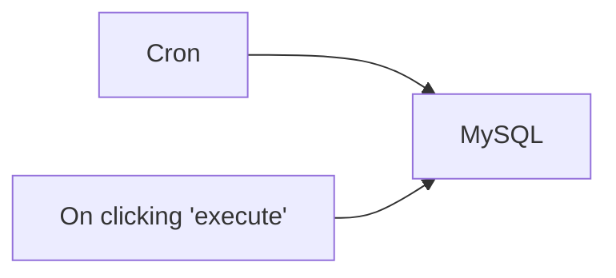

## Fluxo (.json) :

```json
{
  "id": "60",
  "name": "n8n_mysql_purge_history_greater_than_10_days",
  "nodes": [
    {
      "name": "On clicking 'execute'",
      "type": "n8n-nodes-base.manualTrigger",
      "position": [
        250,
        300
      ],
      "parameters": {},
      "typeVersion": 1
    },
    {
      "name": "MySQL",
      "type": "n8n-nodes-base.mySql",
      "position": [
        450,
        300
      ],
      "parameters": {
        "query": "DELETE FROM execution_entity \nWHERE DATE(stoppedAt) < DATE_SUB(CURDATE(), INTERVAL 30 DAY)",
        "operation": "executeQuery"
      },
      "credentials": {
        "mySql": "n8n"
      },
      "typeVersion": 1
    },
    {
      "name": "Cron",
      "type": "n8n-nodes-base.cron",
      "position": [
        250,
        460
      ],
      "parameters": {
        "triggerTimes": {
          "item": [
            {
              "hour": 7
            }
          ]
        }
      },
      "typeVersion": 1
    }
  ],
  "active": true,
  "settings": {},
  "connections": {
    "Cron": {
      "main": [
        [
          {
            "node": "MySQL",
            "type": "main",
            "index": 0
          }
        ]
      ]
    },
    "On clicking 'execute'": {
      "main": [
        [
          {
            "node": "MySQL",
            "type": "main",
            "index": 0
          }
        ]
      ]
    }
  }
}
```
