# PACK 1999 TEMPLATES PARTE 09 - Bloco 6

Templates neste bloco: 20

## Sumário

- [Template 2065 - Agente IA com encaminhamento para suporte humano](#template-2065)
- [Template 2067 - Indexação e QA de PDFs do Google Drive](#template-2067)
- [Template 2069 - Notificar leads recentes de alto valor](#template-2069)
- [Template 2071 - Arquivar páginas vazias do Notion](#template-2071)
- [Template 2072 - Lembrete de compromissos com voz e envio por Gmail](#template-2072)
- [Template 2074 - Obter todos os conteúdos do Contentful](#template-2074)
- [Template 2075 - Gerenciar lista e contatos no Automizy](#template-2075)
- [Template 2077 - Monitoramento de informações com IA e Slack](#template-2077)
- [Template 2080 - Qualificação de leads por propriedade](#template-2080)
- [Template 2082 - API de extração de emails via webhook](#template-2082)
- [Template 2084 - Salvar arquivos do LINE em Google Drive e registrar URL](#template-2084)
- [Template 2086 - Busca de pedidos concluídos](#template-2086)
- [Template 2088 - Agente SMS de agendamento com IA](#template-2088)
- [Template 2091 - Bot Discord com Gemini e memória](#template-2091)
- [Template 2093 - Enviar arquivo e listar conteúdos do bucket](#template-2093)
- [Template 2095 - Salvar resposta da CocktailDB em arquivo JSON](#template-2095)
- [Template 2097 - Processamento de chamadas Gong e envio para pré-processador](#template-2097)
- [Template 2099 - Enviar submissões do Webflow para Slack](#template-2099)
- [Template 2101 - Criar eventos no calendário a partir de mensagens do Slack](#template-2101)
- [Template 2102 - Processamento e armazenamento de relatórios DMARC](#template-2102)

---

<a id="template-2065"></a>

## Template 2065 - Agente IA com encaminhamento para suporte humano

- **Nome:** Agente IA com encaminhamento para suporte humano
- **Descrição:** Fluxo que permite a um agente de IA responder a perguntas dos usuários e, quando não souber ou não estiver confiante, encaminhar a solicitação para uma equipe humana, solicitando o e-mail do usuário quando necessário.
- **Funcionalidade:** • Início por chat: recebe a mensagem do usuário via gatilho de chat.
• Resposta com modelo de linguagem: utiliza um modelo avançado para tentar responder automaticamente às perguntas.
• Memória de contexto em janela: mantém um histórico recente das interações para contexto nas respostas.
• Uso de ferramenta de encaminhamento quando incerto: quando o agente não souber a resposta ou não estiver confiante, aciona um recurso para tratar a exceção.
• Verificação de e-mail do usuário: checa se a mensagem do usuário contém um endereço de e-mail.
• Solicitação de e-mail quando ausente: pede ao usuário que repita a pergunta incluindo seu e-mail, caso não seja encontrado.
• Notificação para equipe humana: envia a mensagem do usuário para um canal de suporte para que um humano assuma o atendimento.
• Confirmação ao usuário: informa ao usuário que um humano foi acionado para ajudar.
- **Ferramentas:** • OpenAI (GPT-4): modelo de linguagem usado para gerar respostas e orientar quando acionar o encaminhamento humano.
• Slack: canal de comunicação utilizado para notificar a equipe de suporte com a mensagem do usuário.


## Fluxo visual

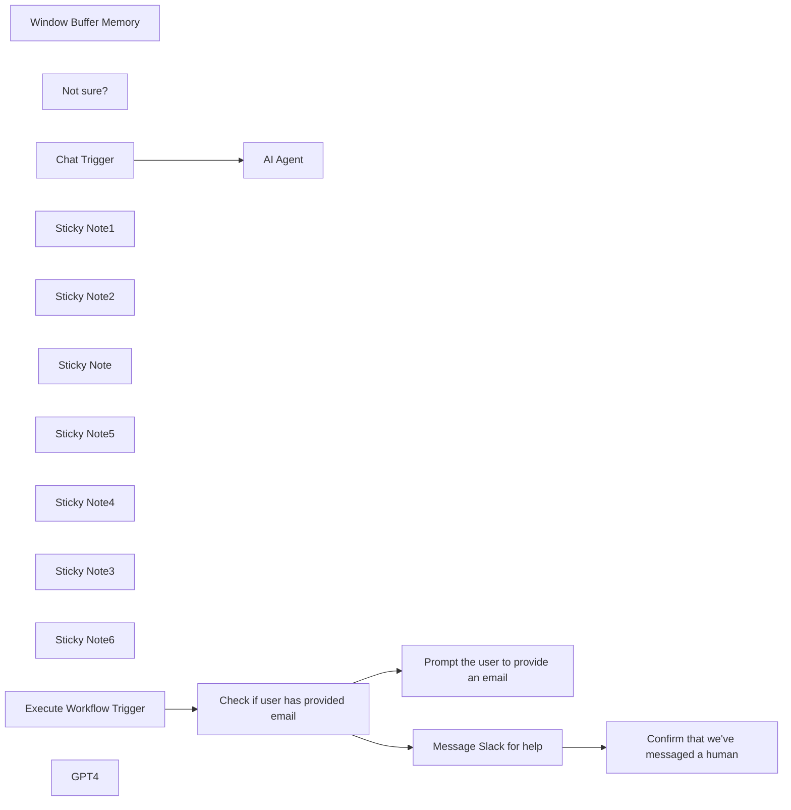

## Fluxo (.json) :

```json
{
  "name": "Ask a human",
  "nodes": [
    {
      "id": "a60c8572-56c1-4bf3-8352-a6419a475887",
      "name": "Window Buffer Memory",
      "type": "@n8n/n8n-nodes-langchain.memoryBufferWindow",
      "position": [
        900,
        760
      ],
      "parameters": {},
      "typeVersion": 1.1
    },
    {
      "id": "b4f2e26c-903b-46b8-bd8b-110fd64de9e4",
      "name": "Not sure?",
      "type": "@n8n/n8n-nodes-langchain.toolWorkflow",
      "position": [
        1120,
        760
      ],
      "parameters": {
        "name": "dont_know_tool",
        "fields": {
          "values": [
            {
              "name": "chatInput",
              "stringValue": "={{ $('Chat Trigger').item.json.chatInput }}"
            }
          ]
        },
        "workflowId": "={{ $workflow.id}}",
        "description": "Use this tool if you don't know the answer to the user's question, or if you're not very confident about your answer."
      },
      "typeVersion": 1
    },
    {
      "id": "951cc691-b422-4ce6-901f-b7feb3afd1ad",
      "name": "Execute Workflow Trigger",
      "type": "n8n-nodes-base.executeWorkflowTrigger",
      "position": [
        540,
        1360
      ],
      "parameters": {},
      "typeVersion": 1
    },
    {
      "id": "194ba9c0-e256-449a-8da7-ac5339123a99",
      "name": "Sticky Note1",
      "type": "n8n-nodes-base.stickyNote",
      "position": [
        500,
        1020
      ],
      "parameters": {
        "color": 7,
        "width": 1118.3459011229047,
        "height": 775.3931210698682,
        "content": "### Sub-workflow: Custom tool\nThe agent above can call this workflow. It checks if the user has supplied an email address. If they haven't it prompts them to provide one. If they have, it messages a customer support channel for help."
      },
      "typeVersion": 1
    },
    {
      "id": "38c6b363-45a7-4e72-9e40-8c0df3cc480f",
      "name": "Sticky Note2",
      "type": "n8n-nodes-base.stickyNote",
      "position": [
        500,
        460
      ],
      "parameters": {
        "color": 7,
        "width": 927.5,
        "height": 486.5625,
        "content": "### Main workflow: AI agent using custom tool"
      },
      "typeVersion": 1
    },
    {
      "id": "0389315b-e48d-4b00-b9a1-899302b1b094",
      "name": "Sticky Note",
      "type": "n8n-nodes-base.stickyNote",
      "position": [
        1060,
        700
      ],
      "parameters": {
        "color": 5,
        "width": 197.45572294791873,
        "height": 179.21380662202682,
        "content": "**This tool calls the sub-workflow below**"
      },
      "typeVersion": 1
    },
    {
      "id": "fb11064a-4cf5-4110-9e39-af24a3225164",
      "name": "Sticky Note5",
      "type": "n8n-nodes-base.stickyNote",
      "position": [
        700,
        680
      ],
      "parameters": {
        "color": 2,
        "width": 150,
        "height": 213.44323866265472,
        "content": "**Set your credentials**"
      },
      "typeVersion": 1
    },
    {
      "id": "d689021d-0a46-4dff-a01a-0b01ecdd198b",
      "name": "Sticky Note4",
      "type": "n8n-nodes-base.stickyNote",
      "position": [
        1020,
        1180
      ],
      "parameters": {
        "color": 2,
        "width": 178.0499248677781,
        "height": 250.57252651663197,
        "content": "**Set your credentials and Slack details**"
      },
      "typeVersion": 1
    },
    {
      "id": "0926cd61-c0b8-4bae-ae65-9afd130d17cd",
      "name": "Sticky Note3",
      "type": "n8n-nodes-base.stickyNote",
      "position": [
        340,
        520
      ],
      "parameters": {
        "color": 4,
        "width": 185.9375,
        "height": 214.8397420554627,
        "content": "## Try it out\n\nSelect **Chat** at the bottom and enter:\n\n_Hi! Please respond to this as if you don't know the answer to my query._"
      },
      "typeVersion": 1
    },
    {
      "id": "cde69dfe-252e-4a05-8d56-fa79431df5d8",
      "name": "Sticky Note6",
      "type": "n8n-nodes-base.stickyNote",
      "position": [
        1580,
        1600
      ],
      "parameters": {
        "height": 144.50520156238127,
        "content": "## Next steps\n\nLearn more about [Advanced AI in n8n](https://docs.n8n.io/advanced-ai/)"
      },
      "typeVersion": 1
    },
    {
      "id": "927b775a-47f6-4067-a1a5-5f13dea28e45",
      "name": "Chat Trigger",
      "type": "@n8n/n8n-nodes-langchain.chatTrigger",
      "position": [
        600,
        520
      ],
      "webhookId": "785e0c0c-12e5-4249-9abe-47bb131975cb",
      "parameters": {},
      "typeVersion": 1
    },
    {
      "id": "971e7b90-c2d8-4292-9da8-732d7d399f04",
      "name": "Prompt the user to provide an email",
      "type": "n8n-nodes-base.code",
      "position": [
        1060,
        1520
      ],
      "parameters": {
        "jsCode": "response = {\"response\":\"I'm sorry I don't know the answer. Please repeat your question and include your email address so I can request help.\"};\nreturn response;"
      },
      "typeVersion": 2
    },
    {
      "id": "6f5a21b3-c145-46c8-8e69-660100c4a6fc",
      "name": "Confirm that we've messaged a human",
      "type": "n8n-nodes-base.code",
      "position": [
        1300,
        1260
      ],
      "parameters": {
        "jsCode": "response = {\"response\": \"Thank you for getting in touch. I've messaged a human to help.\"}\nreturn response;"
      },
      "typeVersion": 2
    },
    {
      "id": "8b17da5e-e392-4028-91b0-bc02d34e46ed",
      "name": "AI Agent",
      "type": "@n8n/n8n-nodes-langchain.agent",
      "position": [
        820,
        520
      ],
      "parameters": {
        "options": {
          "systemMessage": "Try to answer the user's question. When you can't answer, or you're not confident of the answer, use the appropriate tool. When you use the dont_know_tool, respond with the message from the tool."
        }
      },
      "typeVersion": 1.2
    },
    {
      "id": "990ecd3b-6aa0-4b17-8d01-d606b9164fa8",
      "name": "Check if user has provided email",
      "type": "n8n-nodes-base.if",
      "position": [
        760,
        1360
      ],
      "parameters": {
        "options": {},
        "conditions": {
          "options": {
            "leftValue": "",
            "caseSensitive": true,
            "typeValidation": "strict"
          },
          "combinator": "and",
          "conditions": [
            {
              "id": "5e21e7c5-db60-4111-bb17-c289ae0fc159",
              "operator": {
                "type": "string",
                "operation": "regex"
              },
              "leftValue": "={{ $('Execute Workflow Trigger').item.json.chatInput }}",
              "rightValue": "/([a-zA-Z0-9._-]+@[a-zA-Z0-9._-]+\\.[a-zA-Z0-9_-]+)/gi"
            }
          ]
        }
      },
      "typeVersion": 2
    },
    {
      "id": "d14da0ae-06ca-422b-b5b6-e7759e74c787",
      "name": "Message Slack for help",
      "type": "n8n-nodes-base.slack",
      "position": [
        1060,
        1260
      ],
      "parameters": {
        "text": "={{ \"A user had a question the bot couldn't answer. Here's their message: \" + $('Execute Workflow Trigger').item.json.chatInput }}",
        "select": "channel",
        "channelId": {
          "__rl": true,
          "mode": "name",
          "value": ""
        },
        "otherOptions": {}
      },
      "typeVersion": 2.1
    },
    {
      "id": "278391c7-6945-495e-a4f1-74fb8fcc3549",
      "name": "GPT4",
      "type": "@n8n/n8n-nodes-langchain.lmChatOpenAi",
      "position": [
        740,
        740
      ],
      "parameters": {
        "model": "gpt-4",
        "options": {
          "temperature": 0.2
        }
      },
      "typeVersion": 1
    }
  ],
  "pinData": {},
  "connections": {
    "GPT4": {
      "ai_languageModel": [
        [
          {
            "node": "AI Agent",
            "type": "ai_languageModel",
            "index": 0
          }
        ]
      ]
    },
    "Not sure?": {
      "ai_tool": [
        [
          {
            "node": "AI Agent",
            "type": "ai_tool",
            "index": 0
          }
        ]
      ]
    },
    "Chat Trigger": {
      "main": [
        [
          {
            "node": "AI Agent",
            "type": "main",
            "index": 0
          }
        ]
      ]
    },
    "Window Buffer Memory": {
      "ai_memory": [
        [
          {
            "node": "AI Agent",
            "type": "ai_memory",
            "index": 0
          }
        ]
      ]
    },
    "Message Slack for help": {
      "main": [
        [
          {
            "node": "Confirm that we've messaged a human",
            "type": "main",
            "index": 0
          }
        ]
      ]
    },
    "Execute Workflow Trigger": {
      "main": [
        [
          {
            "node": "Check if user has provided email",
            "type": "main",
            "index": 0
          }
        ]
      ]
    },
    "Check if user has provided email": {
      "main": [
        [
          {
            "node": "Message Slack for help",
            "type": "main",
            "index": 0
          }
        ],
        [
          {
            "node": "Prompt the user to provide an email",
            "type": "main",
            "index": 0
          }
        ]
      ]
    }
  }
}
```

<a id="template-2067"></a>

## Template 2067 - Indexação e QA de PDFs do Google Drive

- **Nome:** Indexação e QA de PDFs do Google Drive
- **Descrição:** Automatiza a ingestão de PDFs de uma pasta do Google Drive, extrai e processa o conteúdo em texto, cria vetores de embeddings e permite consultas em linguagem natural com contexto recuperado dos documentos indexados.
- **Funcionalidade:** • Monitoramento de pasta do Google Drive: Observa uma pasta específica e dispara o fluxo quando um novo arquivo é adicionado.
• Download automático de arquivos: Faz o download dos arquivos detectados para posterior processamento.
• Extração de conteúdo de PDF: Extrai texto dos PDFs para uso em processamento posterior.
• Limpeza e normalização de texto: Remove quebras de linha, caracteres especiais e formata o texto extraído.
• Divisão de texto em segmentos (chunking): Separa o conteúdo em trechos com sobreposição para preservar contexto em vetorização.
• Geração de embeddings para documentos: Converte trechos de texto em vetores numéricos utilizando um modelo de embeddings.
• Inserção em banco vetorial: Armazena os embeddings e metadados em um índice vetorial para recuperação posterior.
• Geração de embeddings de consulta: Cria embeddings para consultas do usuário para busca eficiente no banco vetorial.
• Recuperação de documentos relevantes: Busca os trechos mais relevantes no índice vetorial com base na similaridade.
• Construção de prompt com contexto: Combina os melhores trechos recuperados com a pergunta do usuário para fornecer contexto ao modelo de linguagem.
• Resposta com modelo de linguagem: Envia o prompt enriquecido para um modelo de linguagem para gerar a resposta final ao usuário.
- **Ferramentas:** • Google Drive: Armazenamento em nuvem usado como fonte dos PDFs e para monitoramento de novos arquivos.
• Pinecone: Serviço de banco vetorial usado para armazenar e recuperar embeddings de documentos.
• Google Gemini (PaLM) — Embeddings: Serviço de embeddings usado para transformar texto em vetores numéricos.
• OpenRouter (modelo de linguagem): Interface para acessar um modelo de linguagem que gera respostas a partir do prompt com contexto.

## Fluxo visual

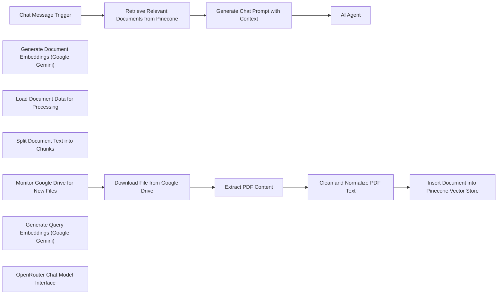

## Fluxo (.json) :

```json
{
  "id": "lC8xkfCSTjIiUhpk",
  "meta": {
    "instanceId": "a1f3364de0f3da48758a2641efb07c3b0d216a3a7cc93596fbed2316d6dea4ad",
    "templateCredsSetupCompleted": true
  },
  "name": "Google Drive Automation",
  "tags": [],
  "nodes": [
    {
      "id": "e7769ee7-a247-426e-b792-c095597ada54",
      "name": "AI Agent",
      "type": "@n8n/n8n-nodes-langchain.agent",
      "position": [
        320,
        700
      ],
      "parameters": {
        "text": "={{ $json.prompt }}",
        "options": {
          "systemMessage": "You are a knowledgeable and helpful assistant. Respond with clear, concise, and detailed answers formatted in markdown. Use proper markdown formatting including headings, bullet points, numbered lists, code blocks, and other structures as needed to improve readability and clarity."
        },
        "promptType": "define"
      },
      "typeVersion": 1.7
    },
    {
      "id": "72ca46ad-891f-42f2-81d7-00e04e1c6f5f",
      "name": "Monitor Google Drive for New Files",
      "type": "n8n-nodes-base.googleDriveTrigger",
      "position": [
        -520,
        -240
      ],
      "parameters": {
        "event": "fileCreated",
        "options": {},
        "pollTimes": {
          "item": [
            {}
          ]
        },
        "triggerOn": "specificFolder",
        "folderToWatch": {
          "__rl": true,
          "mode": "list",
          "value": "1RQvAHIw8cQbtwI9ZvdVV0k0x6TM6HZwP",
          "cachedResultUrl": "https://drive.google.com/drive/folders/1RQvAHIw8cQbtwI9ZvdVV0k0x6TM6HZwP",
          "cachedResultName": "RAG_Files"
        }
      },
      "credentials": {
        "googleDriveOAuth2Api": {
          "id": "zj3v6gsTRb9CreKV",
          "name": "Google Drive account"
        }
      },
      "typeVersion": 1
    },
    {
      "id": "03e9dc61-bdba-49d7-859e-73b8adebae41",
      "name": "Download File from Google Drive",
      "type": "n8n-nodes-base.googleDrive",
      "position": [
        -300,
        -240
      ],
      "parameters": {
        "fileId": {
          "__rl": true,
          "mode": "id",
          "value": "={{ $json.id }}"
        },
        "options": {},
        "operation": "download"
      },
      "credentials": {
        "googleDriveOAuth2Api": {
          "id": "zj3v6gsTRb9CreKV",
          "name": "Google Drive account"
        }
      },
      "typeVersion": 3
    },
    {
      "id": "782fc162-0c3f-40fc-af92-455c1250ede0",
      "name": "Extract PDF Content",
      "type": "n8n-nodes-base.extractFromFile",
      "position": [
        -80,
        -240
      ],
      "parameters": {
        "options": {},
        "operation": "pdf"
      },
      "typeVersion": 1
    },
    {
      "id": "b8da9cff-756b-419e-b39a-4ad1020092d0",
      "name": "Insert Document into Pinecone Vector Store",
      "type": "@n8n/n8n-nodes-langchain.vectorStorePinecone",
      "position": [
        360,
        -240
      ],
      "parameters": {
        "mode": "insert",
        "options": {},
        "pineconeIndex": {
          "__rl": true,
          "mode": "list",
          "value": "n8n-rag-demo",
          "cachedResultName": "n8n-rag-demo"
        }
      },
      "credentials": {
        "pineconeApi": {
          "id": "ldIxYWz8E9e0N4yV",
          "name": "PineconeApi account"
        }
      },
      "typeVersion": 1
    },
    {
      "id": "f5b93646-b466-4cd7-aec9-6fae62023fa3",
      "name": "Generate Document Embeddings (Google Gemini)",
      "type": "@n8n/n8n-nodes-langchain.embeddingsGoogleGemini",
      "position": [
        260,
        20
      ],
      "parameters": {
        "modelName": "models/text-embedding-004"
      },
      "credentials": {
        "googlePalmApi": {
          "id": "prd6Qnbbj4UbNH75",
          "name": "Google Gemini(PaLM) Api account"
        }
      },
      "typeVersion": 1
    },
    {
      "id": "b5277663-3120-4614-85e3-f7dc05c4e1c2",
      "name": "Clean and Normalize PDF Text",
      "type": "n8n-nodes-base.code",
      "position": [
        140,
        -240
      ],
      "parameters": {
        "jsCode": "const rawData = $json[\"text\"];\nconst cleanedData = rawData\n  .replace(/(\\r\\n|\\n|\\r)/gm, \" \")   // remove line breaks\n  .trim()                           // remove extra spaces\n  .replace(/[^\\w\\s]/gi, \"\");         // remove special characters\nreturn { cleanedData };\n"
      },
      "typeVersion": 2
    },
    {
      "id": "68aa5515-6b58-4e98-ab08-4d9516e1f2a3",
      "name": "Load Document Data for Processing",
      "type": "@n8n/n8n-nodes-langchain.documentDefaultDataLoader",
      "position": [
        480,
        20
      ],
      "parameters": {
        "options": {}
      },
      "typeVersion": 1
    },
    {
      "id": "3f463338-c692-4b7b-a888-8c00d190c441",
      "name": "Split Document Text into Chunks",
      "type": "@n8n/n8n-nodes-langchain.textSplitterRecursiveCharacterTextSplitter",
      "position": [
        380,
        240
      ],
      "parameters": {
        "options": {},
        "chunkSize": 3000,
        "chunkOverlap": 300
      },
      "typeVersion": 1
    },
    {
      "id": "9c4a7ec9-0808-443f-9e12-9ec12c7288b9",
      "name": "Chat Message Trigger",
      "type": "@n8n/n8n-nodes-langchain.chatTrigger",
      "position": [
        -520,
        700
      ],
      "webhookId": "d36e67b9-a789-4801-b624-64bf8b88d702",
      "parameters": {
        "options": {}
      },
      "typeVersion": 1.1
    },
    {
      "id": "ee62efc9-60b2-40ec-a10c-8897d24b1429",
      "name": "Retrieve Relevant Documents from Pinecone",
      "type": "@n8n/n8n-nodes-langchain.vectorStorePinecone",
      "position": [
        -260,
        700
      ],
      "parameters": {
        "mode": "load",
        "prompt": "={{ $json.chatInput }}",
        "options": {},
        "pineconeIndex": {
          "__rl": true,
          "mode": "list",
          "value": "n8n-rag-demo",
          "cachedResultName": "n8n-rag-demo"
        }
      },
      "credentials": {
        "pineconeApi": {
          "id": "ldIxYWz8E9e0N4yV",
          "name": "PineconeApi account"
        }
      },
      "typeVersion": 1
    },
    {
      "id": "8d479b6b-3c87-40c6-8a68-4390e6bafac8",
      "name": "Generate Query Embeddings (Google Gemini)",
      "type": "@n8n/n8n-nodes-langchain.embeddingsGoogleGemini",
      "position": [
        -280,
        940
      ],
      "parameters": {
        "modelName": "models/text-embedding-004"
      },
      "credentials": {
        "googlePalmApi": {
          "id": "prd6Qnbbj4UbNH75",
          "name": "Google Gemini(PaLM) Api account"
        }
      },
      "typeVersion": 1
    },
    {
      "id": "f521d243-1b62-4bc5-972d-736c65c48818",
      "name": "Generate Chat Prompt with Context",
      "type": "n8n-nodes-base.code",
      "position": [
        100,
        700
      ],
      "parameters": {
        "jsCode": "const userQuery =  $('Chat Message Trigger').first().json.chatInput\n// Retrieve the user query from the previous node output.\n// Assuming the Pinecone node has passed an array of items where each item has a document and score:\nlet documents = items.map(item => {\n  return {\n    pageContent: item.json.document.pageContent,\n    score: item.json.score\n  };\n});\n\n// Sort the documents by their score in descending order.\ndocuments.sort((a, b) => b.score - a.score);\n\n// Pick the top 3 documents to use as context.\nconst topDocuments = documents.slice(0, 3);\n\n// Combine the top documents into one context string.\nconst contextContent = topDocuments\n  .map((doc, index) => `Document ${index + 1}:\\n${doc.pageContent}`)\n  .join(\"\\n\\n\");\n\n// Build the final prompt that combines the context with the user query.\nconst prompt = `Using the following context from documents:\\n\\n${contextContent}\\n\\nAnswer the following question:\\n${userQuery}\\n\\nAnswer:`;\n\n// Return the prompt so it can be passed to a Chat/AI node for further processing.\nreturn [{ json: { prompt } }];\n"
      },
      "typeVersion": 2
    },
    {
      "id": "208057c8-8672-41d2-9c99-89e52856a742",
      "name": "OpenRouter Chat Model Interface",
      "type": "@n8n/n8n-nodes-langchain.lmChatOpenRouter",
      "position": [
        280,
        940
      ],
      "parameters": {
        "model": "google/gemini-2.0-flash-exp:free",
        "options": {}
      },
      "credentials": {
        "openRouterApi": {
          "id": "iTDRPtvPicVqeXaT",
          "name": "OpenRouter account"
        }
      },
      "typeVersion": 1
    }
  ],
  "active": false,
  "pinData": {},
  "settings": {
    "executionOrder": "v1"
  },
  "versionId": "43fd0dd9-5ec1-401a-b1c2-368b15c9f0db",
  "connections": {
    "Extract PDF Content": {
      "main": [
        [
          {
            "node": "Clean and Normalize PDF Text",
            "type": "main",
            "index": 0
          }
        ]
      ]
    },
    "Chat Message Trigger": {
      "main": [
        [
          {
            "node": "Retrieve Relevant Documents from Pinecone",
            "type": "main",
            "index": 0
          }
        ]
      ]
    },
    "Clean and Normalize PDF Text": {
      "main": [
        [
          {
            "node": "Insert Document into Pinecone Vector Store",
            "type": "main",
            "index": 0
          }
        ]
      ]
    },
    "Download File from Google Drive": {
      "main": [
        [
          {
            "node": "Extract PDF Content",
            "type": "main",
            "index": 0
          }
        ]
      ]
    },
    "OpenRouter Chat Model Interface": {
      "ai_languageModel": [
        [
          {
            "node": "AI Agent",
            "type": "ai_languageModel",
            "index": 0
          }
        ]
      ]
    },
    "Split Document Text into Chunks": {
      "ai_textSplitter": [
        [
          {
            "node": "Load Document Data for Processing",
            "type": "ai_textSplitter",
            "index": 0
          }
        ]
      ]
    },
    "Generate Chat Prompt with Context": {
      "main": [
        [
          {
            "node": "AI Agent",
            "type": "main",
            "index": 0
          }
        ]
      ]
    },
    "Load Document Data for Processing": {
      "ai_document": [
        [
          {
            "node": "Insert Document into Pinecone Vector Store",
            "type": "ai_document",
            "index": 0
          }
        ]
      ]
    },
    "Monitor Google Drive for New Files": {
      "main": [
        [
          {
            "node": "Download File from Google Drive",
            "type": "main",
            "index": 0
          }
        ]
      ]
    },
    "Generate Query Embeddings (Google Gemini)": {
      "ai_embedding": [
        [
          {
            "node": "Retrieve Relevant Documents from Pinecone",
            "type": "ai_embedding",
            "index": 0
          }
        ]
      ]
    },
    "Retrieve Relevant Documents from Pinecone": {
      "main": [
        [
          {
            "node": "Generate Chat Prompt with Context",
            "type": "main",
            "index": 0
          }
        ]
      ]
    },
    "Generate Document Embeddings (Google Gemini)": {
      "ai_embedding": [
        [
          {
            "node": "Insert Document into Pinecone Vector Store",
            "type": "ai_embedding",
            "index": 0
          }
        ]
      ]
    }
  }
}
```

<a id="template-2069"></a>

## Template 2069 - Notificar leads recentes de alto valor

- **Nome:** Notificar leads recentes de alto valor
- **Descrição:** Monitora novos registros de empresas criados nos últimos 5 minutos e notifica um representante de vendas quando o lead possui receita anual superior a US$5.000.000.
- **Funcionalidade:** • Agendamento periódico: Executa o fluxo a cada 5 minutos para verificar novos leads.
• Captura de leads recentes: Recupera empresas criadas/atualizadas no intervalo de tempo definido (últimos 5 minutos).
• Filtragem por valor: Mantém apenas os leads com receita anual maior que US$5.000.000.
• Notificação ao responsável: Envia uma mensagem para o representante de vendas com informações relevantes do lead (nome, site, receita, número de funcionários).
• Configuração simples: Permite ajustar o tempo de polling e as condições de filtragem conforme necessidade.
- **Ferramentas:** • HubSpot: Fonte dos dados de empresas e propriedades (nome, website, receita, número de funcionários).
• Slack: Canal de comunicação para enviar notificações em tempo real para o representante de vendas.

## Fluxo visual

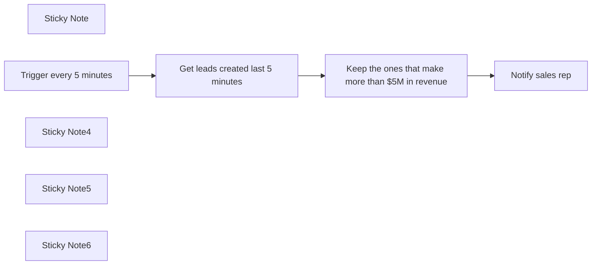

## Fluxo (.json) :

```json
{
  "meta": {
    "instanceId": "70aa73f4d8fa35284109864e170a85d0977ad8121a6294c5c305fbaee0d9e028"
  },
  "nodes": [
    {
      "id": "8b2dad6b-9771-4351-bddc-819746cb04c1",
      "name": "Get leads created last 5 minutes",
      "type": "n8n-nodes-base.hubspot",
      "position": [
        160,
        500
      ],
      "parameters": {
        "resource": "company",
        "operation": "getRecentlyCreatedUpdated",
        "returnAll": true,
        "authentication": "oAuth2",
        "additionalFields": {
          "since": "={{ $now.minus({ \"minutes\": 5 }) }}"
        }
      },
      "credentials": {
        "hubspotOAuth2Api": {
          "id": "KTv7XIF0qMaGfg8O",
          "name": "HubSpot account"
        }
      },
      "typeVersion": 2
    },
    {
      "id": "63db576a-6bb7-4215-88f3-98e304081b3e",
      "name": "Notify sales rep",
      "type": "n8n-nodes-base.slack",
      "position": [
        700,
        500
      ],
      "parameters": {
        "text": "=New high-quality lead 🤑\n*Company Name*: {{ $json.properties.name.value }} \n*Website*: {{ $json.properties.website.value }}\n*Revenue*: {{ $json.properties.annualrevenue.value }}\n*Number of employees*: {{ $json.properties.numberofemployees.value }}",
        "user": {
          "__rl": true,
          "mode": "list",
          "value": "U0361884CU9",
          "cachedResultName": "ricardo"
        },
        "select": "user",
        "otherOptions": {},
        "authentication": "oAuth2"
      },
      "credentials": {
        "slackOAuth2Api": {
          "id": "wpCG1E4YH2xiwWxK",
          "name": "Slack account"
        }
      },
      "typeVersion": 2.1
    },
    {
      "id": "2b12fb75-ec81-4d2c-a8bb-12ff2bb7e935",
      "name": "Sticky Note",
      "type": "n8n-nodes-base.stickyNote",
      "position": [
        -420,
        460
      ],
      "parameters": {
        "width": 257.64008049230523,
        "height": 176.97404402400312,
        "content": "## Setup\n1. Add `Hubspot` and `Slack` credentials.\n2. Adjust polling time.\n3. Enable the workflow."
      },
      "typeVersion": 1
    },
    {
      "id": "5c4235de-c7fe-43fc-a351-69e928ba2673",
      "name": "Trigger every 5 minutes",
      "type": "n8n-nodes-base.scheduleTrigger",
      "position": [
        -100,
        500
      ],
      "parameters": {
        "rule": {
          "interval": [
            {
              "field": "minutes"
            }
          ]
        }
      },
      "typeVersion": 1.1
    },
    {
      "id": "7af59e19-893a-477a-ba21-4c1c151ffea4",
      "name": "Sticky Note4",
      "type": "n8n-nodes-base.stickyNote",
      "position": [
        100,
        400
      ],
      "parameters": {
        "color": 7,
        "width": 225.41119920533646,
        "height": 282.2830454675093,
        "content": "`Since` parameter should match the polling time."
      },
      "typeVersion": 1
    },
    {
      "id": "123ad2e5-f4f2-4411-bf03-5668124b8757",
      "name": "Sticky Note5",
      "type": "n8n-nodes-base.stickyNote",
      "position": [
        380,
        400
      ],
      "parameters": {
        "color": 7,
        "width": 223.7628185364029,
        "height": 276.3308728978709,
        "content": "Adjust condition to filter leads by your desire condition. e.g, revenue, number of employees, etc."
      },
      "typeVersion": 1
    },
    {
      "id": "4263cd25-dcf3-4521-b716-0ce48d3b2c26",
      "name": "Keep the ones that make more than $5M in revenue",
      "type": "n8n-nodes-base.filter",
      "position": [
        440,
        500
      ],
      "parameters": {
        "options": {},
        "conditions": {
          "options": {
            "leftValue": "",
            "caseSensitive": true,
            "typeValidation": "strict"
          },
          "combinator": "and",
          "conditions": [
            {
              "id": "1b31b826-e87d-425f-a65d-370b4b20f7e1",
              "operator": {
                "type": "number",
                "operation": "gt"
              },
              "leftValue": "={{ $json.properties.annualrevenue.value.toInt() }}",
              "rightValue": 5000000
            }
          ]
        }
      },
      "typeVersion": 2
    },
    {
      "id": "ba1a4a6c-a734-45c7-bb05-df0810a2253b",
      "name": "Sticky Note6",
      "type": "n8n-nodes-base.stickyNote",
      "position": [
        640,
        400
      ],
      "parameters": {
        "color": 7,
        "width": 223.7628185364029,
        "height": 276.3308728978709,
        "content": "Send notification to slack with the desired information."
      },
      "typeVersion": 1
    }
  ],
  "pinData": {},
  "connections": {
    "Trigger every 5 minutes": {
      "main": [
        [
          {
            "node": "Get leads created last 5 minutes",
            "type": "main",
            "index": 0
          }
        ]
      ]
    },
    "Get leads created last 5 minutes": {
      "main": [
        [
          {
            "node": "Keep the ones that make more than $5M in revenue",
            "type": "main",
            "index": 0
          }
        ]
      ]
    },
    "Keep the ones that make more than $5M in revenue": {
      "main": [
        [
          {
            "node": "Notify sales rep",
            "type": "main",
            "index": 0
          }
        ]
      ]
    }
  }
}
```

<a id="template-2071"></a>

## Template 2071 - Arquivar páginas vazias do Notion

- **Nome:** Arquivar páginas vazias do Notion
- **Descrição:** Automação que identifica páginas vazias em bases do Notion e as arquiva automaticamente.
- **Funcionalidade:** • Agendamento diário: executa a rotina automaticamente todo dia às 2h.
• Listagem de bases: recupera todas as bases (databases) do ambiente.
• Coleta de páginas: obtém todas as páginas de cada base para inspeção.
• Verificação de propriedades vazias: analisa as propriedades de cada página e marca as que não têm conteúdo.
• Inspeção de blocos da página: obtém os blocos de cada página em lotes e verifica se há texto significativo.
• Processamento em lotes: divide a inspeção em lotes (batch) para processar páginas individualmente e evitar sobrecarga.
• Decisão de arquivamento: combina checagem de propriedades e blocos para decidir se a página é vazia.
• Arquivamento automático: arquiva as páginas consideradas vazias via API.
- **Ferramentas:** • Notion: API do Notion usada para listar databases, recuperar páginas e blocos, e arquivar páginas.

## Fluxo visual

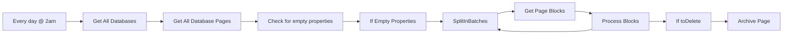

## Fluxo (.json) :

```json
{
  "id": 115,
  "name": "Archive empty pages in Notion Database",
  "nodes": [
    {
      "name": "Get All Databases",
      "type": "n8n-nodes-base.notion",
      "position": [
        240,
        300
      ],
      "parameters": {
        "resource": "database",
        "operation": "getAll",
        "returnAll": true
      },
      "credentials": {
        "notionApi": {
          "id": "36",
          "name": "Notion account"
        }
      },
      "typeVersion": 2
    },
    {
      "name": "Get All Database Pages",
      "type": "n8n-nodes-base.notion",
      "position": [
        420,
        300
      ],
      "parameters": {
        "simple": false,
        "options": {},
        "resource": "databasePage",
        "operation": "getAll",
        "returnAll": true,
        "databaseId": "={{$json[\"id\"]}}"
      },
      "credentials": {
        "notionApi": {
          "id": "36",
          "name": "Notion account"
        }
      },
      "typeVersion": 2
    },
    {
      "name": "Get Page Blocks",
      "type": "n8n-nodes-base.notion",
      "position": [
        1180,
        280
      ],
      "parameters": {
        "blockId": "={{$json[\"id\"]}}",
        "resource": "block",
        "operation": "getAll",
        "returnAll": true
      },
      "credentials": {
        "notionApi": {
          "id": "36",
          "name": "Notion account"
        }
      },
      "typeVersion": 2,
      "alwaysOutputData": true
    },
    {
      "name": "Process Blocks",
      "type": "n8n-nodes-base.function",
      "position": [
        1360,
        280
      ],
      "parameters": {
        "functionCode": "let returnData = {\n  json: {\n    toDelete: false,\n    pageID: $node[\"SplitInBatches\"].json[\"id\"],\n  }\n};\n\nif (!items[0].json.id) {\n  returnData.json.toDelete = true;\n  return [returnData];\n}\n\nfor (item of items) {\n  \n  let toDelete = false;\n\n  let type = item.json.type;\n  let data = item.json[type];\n\n  if (!toDelete) {\n    if (data.text.length == 0) {\n      toDelete = true;\n    } else {\n      returnData.json.toDelete = false;\n      break;\n    }\n  }\n\n  returnData.json.toDelete = toDelete;\n}\n\nreturn [returnData];"
      },
      "typeVersion": 1
    },
    {
      "name": "SplitInBatches",
      "type": "n8n-nodes-base.splitInBatches",
      "position": [
        1000,
        280
      ],
      "parameters": {
        "options": {},
        "batchSize": 1
      },
      "typeVersion": 1
    },
    {
      "name": "Check for empty properties",
      "type": "n8n-nodes-base.function",
      "position": [
        600,
        300
      ],
      "parameters": {
        "functionCode": "for (item of items) {\n\n  let toDelete = false;\n  for (const key in item.json.properties) {\n    let type = item.json.properties[key].type;\n    let data = item.json.properties[key][type];\n    \n    if (!data || data.length == 0) {\n      toDelete = true;\n    } else {\n      toDelete = false;\n      break;\n    }\n  }\n\n  item.json.toDelete = toDelete;\n}\n\nreturn items;"
      },
      "typeVersion": 1
    },
    {
      "name": "Archive Page",
      "type": "n8n-nodes-base.notion",
      "position": [
        1760,
        260
      ],
      "parameters": {
        "pageId": "={{$json[\"pageID\"]}}",
        "operation": "archive"
      },
      "credentials": {
        "notionApi": {
          "id": "36",
          "name": "Notion account"
        }
      },
      "typeVersion": 2
    },
    {
      "name": "If toDelete",
      "type": "n8n-nodes-base.if",
      "position": [
        1560,
        280
      ],
      "parameters": {
        "conditions": {
          "boolean": [
            {
              "value1": "={{$json[\"toDelete\"]}}",
              "value2": true
            }
          ]
        }
      },
      "typeVersion": 1
    },
    {
      "name": "If Empty Properties",
      "type": "n8n-nodes-base.if",
      "position": [
        760,
        300
      ],
      "parameters": {
        "conditions": {
          "boolean": [
            {
              "value1": "={{$json[\"toDelete\"]}}",
              "value2": true
            }
          ]
        }
      },
      "typeVersion": 1
    },
    {
      "name": "Every day @ 2am",
      "type": "n8n-nodes-base.cron",
      "position": [
        80,
        300
      ],
      "parameters": {
        "triggerTimes": {
          "item": [
            {
              "hour": 2
            }
          ]
        }
      },
      "typeVersion": 1
    }
  ],
  "active": false,
  "settings": {},
  "connections": {
    "If toDelete": {
      "main": [
        [
          {
            "node": "Archive Page",
            "type": "main",
            "index": 0
          }
        ]
      ]
    },
    "Process Blocks": {
      "main": [
        [
          {
            "node": "If toDelete",
            "type": "main",
            "index": 0
          },
          {
            "node": "SplitInBatches",
            "type": "main",
            "index": 0
          }
        ]
      ]
    },
    "SplitInBatches": {
      "main": [
        [
          {
            "node": "Get Page Blocks",
            "type": "main",
            "index": 0
          }
        ]
      ]
    },
    "Every day @ 2am": {
      "main": [
        [
          {
            "node": "Get All Databases",
            "type": "main",
            "index": 0
          }
        ]
      ]
    },
    "Get Page Blocks": {
      "main": [
        [
          {
            "node": "Process Blocks",
            "type": "main",
            "index": 0
          }
        ]
      ]
    },
    "Get All Databases": {
      "main": [
        [
          {
            "node": "Get All Database Pages",
            "type": "main",
            "index": 0
          }
        ]
      ]
    },
    "If Empty Properties": {
      "main": [
        [
          {
            "node": "SplitInBatches",
            "type": "main",
            "index": 0
          }
        ]
      ]
    },
    "Get All Database Pages": {
      "main": [
        [
          {
            "node": "Check for empty properties",
            "type": "main",
            "index": 0
          }
        ]
      ]
    },
    "Check for empty properties": {
      "main": [
        [
          {
            "node": "If Empty Properties",
            "type": "main",
            "index": 0
          }
        ]
      ]
    }
  }
}
```

<a id="template-2072"></a>

## Template 2072 - Lembrete de compromissos com voz e envio por Gmail

- **Nome:** Lembrete de compromissos com voz e envio por Gmail
- **Descrição:** Este fluxo busca compromissos no Google Calendar, cria uma mensagem de lembrete estruturada usando um modelo de linguagem, converte o texto em áudio via ElevenLabs e envia o lembrete por Gmail com o áudio anexado.
- **Funcionalidade:** • Obter compromissos do Google Calendar: busca os próximos compromissos até 2 dias adiante.
• Gerar mensagem de lembrete estruturada: usa um modelo de linguagem para criar conteúdo com detalhes do compromisso.
• Extrair mensagem e assunto da saída do modelo (mail_object).
• Converter texto em áudio: gera o áudio do lembrete via ElevenLabs a partir do texto da mensagem.
• Definir nome do arquivo de áudio: utiliza mail_object para nomear o arquivo (ex.: <mail_object>.mp3).
• Enviar lembrete por e-mail com áudio anexado: envia para o destinatário correspondente com o assunto definido por mail_object.
- **Ferramentas:** • Google Calendar: API para buscar compromissos e retornar informações relevantes.
• Gmail: API para envio de e-mails com anexos e configuração de remetente.
• ElevenLabs: serviço de conversão de texto em fala utilizado para gerar o áudio do lembrete (MP3).
• OpenAI: serviço de modelo de linguagem utilizado para criar a mensagem de lembrete a partir dos dados do compromisso.

## Fluxo visual

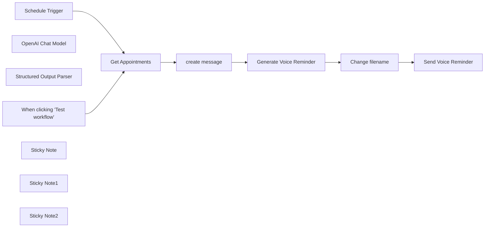

## Fluxo (.json) :

```json
{
  "meta": {
    "instanceId": "4a11afdb3c52fd098e3eae9fad4b39fdf1bbcde142f596adda46c795e366b326"
  },
  "nodes": [
    {
      "id": "17ca0437-6101-4277-9ed2-e37e6b92df02",
      "name": "When clicking 'Test workflow'",
      "type": "n8n-nodes-base.manualTrigger",
      "position": [
        -160,
        280
      ],
      "parameters": {},
      "typeVersion": 1
    },
    {
      "id": "d3dd600a-2ab5-4d52-92ef-ab3f29dd1790",
      "name": "OpenAI Chat Model",
      "type": "@n8n/n8n-nodes-langchain.lmChatOpenAi",
      "position": [
        260,
        400
      ],
      "parameters": {
        "model": {
          "__rl": true,
          "mode": "list",
          "value": "gpt-4o-mini"
        },
        "options": {}
      },
      "typeVersion": 1.2
    },
    {
      "id": "c29d58a2-243b-41ab-99c6-f8a8c92219cf",
      "name": "Structured Output Parser",
      "type": "@n8n/n8n-nodes-langchain.outputParserStructured",
      "position": [
        460,
        400
      ],
      "parameters": {
        "schemaType": "manual",
        "inputSchema": "{\n  \"type\": \"object\",\n  \"properties\": {\n    \"message\": {\n      \"type\": \"string\"\n    },\n    \"mail_object\": {\n      \"type\": \"string\"\n    }\n  }\n}"
      },
      "typeVersion": 1.2
    },
    {
      "id": "3cb31448-5bc3-47c2-a119-d9e33a464d1f",
      "name": "Schedule Trigger",
      "type": "n8n-nodes-base.scheduleTrigger",
      "position": [
        -160,
        80
      ],
      "parameters": {
        "rule": {
          "interval": [
            {}
          ]
        }
      },
      "typeVersion": 1.2
    },
    {
      "id": "18b243a5-db1f-4a27-a8a1-3a7c74135d6d",
      "name": "Sticky Note",
      "type": "n8n-nodes-base.stickyNote",
      "position": [
        580,
        20
      ],
      "parameters": {
        "width": 260,
        "height": 120,
        "content": "## ElevenlabsAPI key\n**Click** to get your Elevenlabs  API key. [Elevenlabs](https://try.elevenlabs.io/text-audio)"
      },
      "typeVersion": 1
    },
    {
      "id": "62a9bd08-27f8-45a8-9eb4-30950500a36f",
      "name": "Change filename",
      "type": "n8n-nodes-base.code",
      "position": [
        880,
        180
      ],
      "parameters": {
        "jsCode": "/*\n * Filename: addFileName.js\n * Purpose: Add a file name to binary data in an n8n workflow using mail_object from input\n */\n\nconst mailObject = $input.first().json.output.mail_object;\nconst fileName = `${mailObject}.mp3`;\n\nreturn items.map(item => {\n  if (item.binary && item.binary.data) {\n    item.binary.data.fileName = fileName;\n  }\n  return item;\n});"
      },
      "typeVersion": 2
    },
    {
      "id": "41043058-ca06-4c3a-8b7d-597e2941d92b",
      "name": "Sticky Note1",
      "type": "n8n-nodes-base.stickyNote",
      "position": [
        1020,
        20
      ],
      "parameters": {
        "width": 300,
        "height": 120,
        "content": "## Gmail API Credentials  \n**Click here** to view the [documentation](https://docs.n8n.io/integrations/builtin/credentials/google/) and configure your access permissions for the Google Gmail API."
      },
      "typeVersion": 1
    },
    {
      "id": "3475e3ae-439d-4245-8994-4444266a67e3",
      "name": "Sticky Note2",
      "type": "n8n-nodes-base.stickyNote",
      "position": [
        0,
        0
      ],
      "parameters": {
        "width": 300,
        "height": 140,
        "content": "## Calendar API Credentials  \n**Click here** to view the [documentation](https://docs.n8n.io/integrations/builtin/credentials/google/) and configure your access permissions for the Google Calendar API."
      },
      "typeVersion": 1
    },
    {
      "id": "7784fc2d-3e64-40f0-990f-965fba4ad67c",
      "name": "Generate Voice Reminder",
      "type": "n8n-nodes-base.httpRequest",
      "position": [
        660,
        180
      ],
      "parameters": {
        "url": "https://api.elevenlabs.io/v1/text-to-speech/JBFqnCBsd6RMkjVDRZzb",
        "method": "POST",
        "options": {},
        "sendBody": true,
        "sendQuery": true,
        "authentication": "genericCredentialType",
        "bodyParameters": {
          "parameters": [
            {
              "name": "text",
              "value": "={{ $json.output.message }}"
            },
            {
              "name": "model_id",
              "value": "eleven_multilingual_v2"
            }
          ]
        },
        "genericAuthType": "httpCustomAuth",
        "queryParameters": {
          "parameters": [
            {
              "name": "output_format",
              "value": "mp3_22050_32"
            }
          ]
        }
      },
      "notesInFlow": true,
      "retryOnFail": true,
      "typeVersion": 4.2
    },
    {
      "id": "a2081f29-493b-43c0-bad5-1b273d5db527",
      "name": "Send Voice Reminder",
      "type": "n8n-nodes-base.gmail",
      "position": [
        1100,
        180
      ],
      "webhookId": "5ba2c8cb-84f1-4363-8410-b8d138286c3a",
      "parameters": {
        "sendTo": "={{ $('Get Appointments').item.json.attendees[0].email }}",
        "message": "=👇 Information for tomorrow 🗣️",
        "options": {
          "senderName": "John Carpenter",
          "attachmentsUi": {
            "attachmentsBinary": [
              {}
            ]
          },
          "appendAttribution": false
        },
        "subject": "={{ $('create message').item.json.output.mail_object }}"
      },
      "typeVersion": 2.1
    },
    {
      "id": "dd3bf7b2-f951-452a-8912-47ceace50cc0",
      "name": "create message",
      "type": "@n8n/n8n-nodes-langchain.chainLlm",
      "position": [
        280,
        180
      ],
      "parameters": {
        "text": "=name: {{ $json.summary }}\ntime: {{ $json.start.dateTime }}\naddress: {{ $json.location }}\nToday's date: {{ $now }}",
        "messages": {
          "messageValues": [
            {
              "message": "=You are an assistant. You will create a structured message in JSON.\n\n**\nmessage:\nGenerate a voice script reminder for a real estate appointment. The message should be clear, professional, and engaging.\n\nIt must include:\n1. The recipient's name.\n2. The date and time of the appointment, expressed naturally (e.g., at noon, quarter past noon, half past three, quarter to five).\n3. The complete address of the property, expressed naturally (e.g., 12 Baker Street in London, Madison Avenue in New York, 5 Oakwood Drive in Los Angeles).\n4. A mention of the sender: Mr. John Carpenter from Super Agency.\n5. A confirmation sentence or an invitation to contact if needed.\n\nInput variables:\n• Recipient's name (prefixed with Mr. or Ms.)\n• Time: Appointment time\n• Address: Complete property address (only the street, number, and city; not the postal code)\n\nThe tone should be cordial and professional, suitable for an automated voice message.\n\nExample expected output: \"Hello Mrs. Richard, this is Mr. John Carpenter from Super Immo Agency.\nI am reminding you of your appointment scheduled for tomorrow at 8:15, at 63 Taverniers Road in Talence. If you have any questions or need to reschedule, please do not hesitate to contact me. See you tomorrow and have a great day!\"\n\n**\nmail_object: a very short email subject\nExample: Your appointment reminder for tomorrow"
            }
          ]
        },
        "promptType": "define",
        "hasOutputParser": true
      },
      "typeVersion": 1.5
    },
    {
      "id": "63806db8-6814-4fe4-ba2e-80511273ee51",
      "name": "Get Appointments",
      "type": "n8n-nodes-base.googleCalendar",
      "position": [
        60,
        180
      ],
      "parameters": {
        "limit": 2,
        "options": {},
        "timeMax": "={{ $now.plus({ day: 2 }) }}",
        "calendar": {
          "__rl": true,
          "mode": "list",
          "value": "mymail@gmail.com",
          "cachedResultName": "mymail@gmail.com"
        },
        "operation": "getAll"
      },
      "typeVersion": 1.3
    }
  ],
  "pinData": {},
  "connections": {
    "create message": {
      "main": [
        [
          {
            "node": "Generate Voice Reminder",
            "type": "main",
            "index": 0
          }
        ]
      ]
    },
    "Change filename": {
      "main": [
        [
          {
            "node": "Send Voice Reminder",
            "type": "main",
            "index": 0
          }
        ]
      ]
    },
    "Get Appointments": {
      "main": [
        [
          {
            "node": "create message",
            "type": "main",
            "index": 0
          }
        ]
      ]
    },
    "Schedule Trigger": {
      "main": [
        [
          {
            "node": "Get Appointments",
            "type": "main",
            "index": 0
          }
        ]
      ]
    },
    "OpenAI Chat Model": {
      "ai_languageModel": [
        [
          {
            "node": "create message",
            "type": "ai_languageModel",
            "index": 0
          }
        ]
      ]
    },
    "Generate Voice Reminder": {
      "main": [
        [
          {
            "node": "Change filename",
            "type": "main",
            "index": 0
          }
        ]
      ]
    },
    "Structured Output Parser": {
      "ai_outputParser": [
        [
          {
            "node": "create message",
            "type": "ai_outputParser",
            "index": 0
          }
        ]
      ]
    },
    "When clicking 'Test workflow'": {
      "main": [
        [
          {
            "node": "Get Appointments",
            "type": "main",
            "index": 0
          }
        ]
      ]
    }
  }
}
```

<a id="template-2074"></a>

## Template 2074 - Obter todos os conteúdos do Contentful

- **Nome:** Obter todos os conteúdos do Contentful
- **Descrição:** Ao ser acionado manualmente, o fluxo consulta a API do Contentful e recupera todas as entradas do espaço configurado.
- **Funcionalidade:** • Gatilho manual: inicia o fluxo quando o usuário clica em "execute".
• Recuperação de entradas do Contentful: realiza uma chamada à API para obter entradas de conteúdo.
• Retorno completo de resultados: configura a operação para retornar todas as entradas sem paginação.
- **Ferramentas:** • Contentful: plataforma de gerenciamento de conteúdo (CMS) que fornece entradas de conteúdo via API.

## Fluxo visual

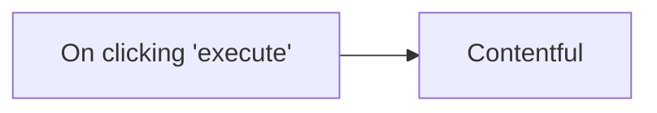

## Fluxo (.json) :

```json
{
  "name": "",
  "nodes": [
    {
      "name": "On clicking 'execute'",
      "type": "n8n-nodes-base.manualTrigger",
      "position": [
        150,
        300
      ],
      "parameters": {},
      "typeVersion": 1
    },
    {
      "name": "Contentful",
      "type": "n8n-nodes-base.contentful",
      "position": [
        350,
        300
      ],
      "parameters": {
        "operation": "getAll",
        "returnAll": true,
        "additionalFields": {}
      },
      "credentials": {
        "contentfulApi": "contentful"
      },
      "typeVersion": 1
    }
  ],
  "active": false,
  "settings": {},
  "connections": {
    "On clicking 'execute'": {
      "main": [
        [
          {
            "node": "Contentful",
            "type": "main",
            "index": 0
          }
        ]
      ]
    }
  }
}
```

<a id="template-2075"></a>

## Template 2075 - Gerenciar lista e contatos no Automizy

- **Nome:** Gerenciar lista e contatos no Automizy
- **Descrição:** Cria uma nova lista, adiciona um contato a essa lista, atualiza os dados do contato e recupera todos os contatos presentes na lista.
- **Funcionalidade:** • Criação de lista: Gera uma nova lista para agrupar contatos.
• Adição de contato: Insere um novo contato na lista recém-criada com status ativo.
• Atualização de contato: Modifica informações do contato existente, como adicionar tags.
• Recuperação de contatos: Obtém todos os contatos associados à lista para revisão ou processamento.
- **Ferramentas:** • Automizy: Plataforma de email marketing para gerenciar listas, contatos e campanhas por meio de sua API.

## Fluxo visual

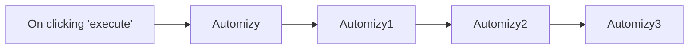

## Fluxo (.json) :

```json
{
  "id": "82",
  "name": "Create a new list, add a new contact to the list, update the contact, and get all contacts in the list",
  "nodes": [
    {
      "name": "On clicking 'execute'",
      "type": "n8n-nodes-base.manualTrigger",
      "position": [
        290,
        260
      ],
      "parameters": {},
      "typeVersion": 1
    },
    {
      "name": "Automizy",
      "type": "n8n-nodes-base.automizy",
      "position": [
        490,
        260
      ],
      "parameters": {
        "name": "n8n-docs",
        "resource": "list"
      },
      "credentials": {
        "automizyApi": "automizy"
      },
      "typeVersion": 1
    },
    {
      "name": "Automizy1",
      "type": "n8n-nodes-base.automizy",
      "position": [
        690,
        260
      ],
      "parameters": {
        "email": "example@n8n.io",
        "listId": "={{$node[\"Automizy\"].json[\"id\"]}}",
        "additionalFields": {
          "status": "ACTIVE"
        }
      },
      "credentials": {
        "automizyApi": "automizy"
      },
      "typeVersion": 1
    },
    {
      "name": "Automizy2",
      "type": "n8n-nodes-base.automizy",
      "position": [
        890,
        260
      ],
      "parameters": {
        "email": "={{$node[\"Automizy1\"].json[\"email\"]}}",
        "operation": "update",
        "updateFields": {
          "tags": [
            "reviewer"
          ]
        }
      },
      "credentials": {
        "automizyApi": "automizy"
      },
      "typeVersion": 1
    },
    {
      "name": "Automizy3",
      "type": "n8n-nodes-base.automizy",
      "position": [
        1090,
        260
      ],
      "parameters": {
        "listId": "={{$node[\"Automizy\"].json[\"id\"]}}",
        "operation": "getAll",
        "returnAll": true,
        "additionalFields": {}
      },
      "credentials": {
        "automizyApi": "automizy"
      },
      "typeVersion": 1
    }
  ],
  "active": false,
  "settings": {},
  "connections": {
    "Automizy": {
      "main": [
        [
          {
            "node": "Automizy1",
            "type": "main",
            "index": 0
          }
        ]
      ]
    },
    "Automizy1": {
      "main": [
        [
          {
            "node": "Automizy2",
            "type": "main",
            "index": 0
          }
        ]
      ]
    },
    "Automizy2": {
      "main": [
        [
          {
            "node": "Automizy3",
            "type": "main",
            "index": 0
          }
        ]
      ]
    },
    "On clicking 'execute'": {
      "main": [
        [
          {
            "node": "Automizy",
            "type": "main",
            "index": 0
          }
        ]
      ]
    }
  }
}
```

<a id="template-2077"></a>

## Template 2077 - Monitoramento de informações com IA e Slack

- **Nome:** Monitoramento de informações com IA e Slack
- **Descrição:** Fluxo automatizado que coleta artigos via RSS, avalia relevância com IA, extrai conteúdo com Jina AI, gera resumos formatados em Slack Markdown e registra resultados em Google Sheets, enviando os resumos para um canal do Slack.
- **Funcionalidade:** • Coleta de artigos via RSS e atualização periódica: o fluxo busca novidades a cada hora.
• Classificação de relevância: avalia se o artigo se enquadra nos tópicos monitorados.
• Extração de conteúdo com Jina AI: obtém o conteúdo das páginas para processamento.
• Geração de resumo em Slack Markdown: formata o conteúdo para Slack.
• Armazenamento e controle de duplicatas: registra artigos já processados para evitar repetições.
• Envio de resumo para Slack: envia o resumo no canal designado.
• Registro de metadados em Google Sheets: article_url, summarized, summary, website, fetched_at, publish_date.
• Ramificação de fluxo: caminhos para artigos relevantes e não relevantes, com updates nas planilhas.
- **Ferramentas:** • OpenAI: API de IA para classificação de relevância, resumir e formatar textos.
• Jina AI: API para extrair conteúdo de páginas da web e converter para Markdown.
• Google Sheets: Planilha para gerenciar feeds RSS monitorados e artigos processados.
• Slack: Canal de comunicação para postar os resumos.
• RSS Feeds: Fontes RSS usadas para coletar artigos.


## Fluxo visual

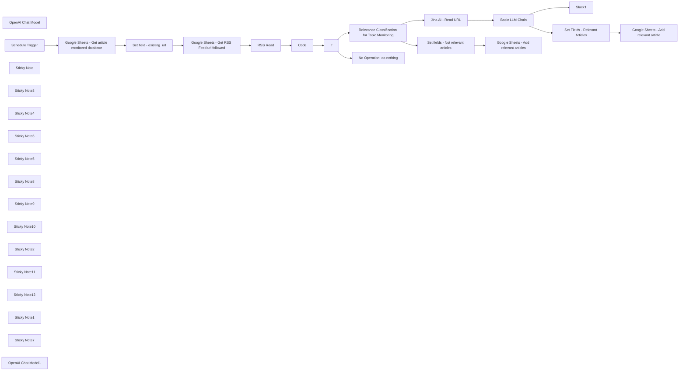

## Fluxo (.json) :

```json
{
  "id": "Xk0W98z9DVrNHeku",
  "meta": {
    "instanceId": "b9faf72fe0d7c3be94b3ebff0778790b50b135c336412d28fd4fca2cbbf8d1f5",
    "templateCredsSetupCompleted": true
  },
  "name": "AI-Powered Information Monitoring with OpenAI, Google Sheets, Jina AI and Slack",
  "tags": [],
  "nodes": [
    {
      "id": "704de862-43e5-4322-ae35-45b505e68bb6",
      "name": "OpenAI Chat Model",
      "type": "@n8n/n8n-nodes-langchain.lmChatOpenAi",
      "position": [
        4220,
        380
      ],
      "parameters": {
        "options": {}
      },
      "credentials": {
        "openAiApi": {
          "id": "",
          "name": "OpenAi Connection"
        }
      },
      "typeVersion": 1.1
    },
    {
      "id": "eaae54b0-0500-47a7-ad8f-097e0882d21c",
      "name": "Basic LLM Chain",
      "type": "@n8n/n8n-nodes-langchain.chainLlm",
      "position": [
        4180,
        -120
      ],
      "parameters": {
        "text": "={{ $json.data }}",
        "messages": {
          "messageValues": [
            {
              "message": "=You are an AI assistant responsible for summarizing articles **in English** and formatting them into Slack-compatible messages. \nYour job is to create a clear and concise summary following the guidelines below and format it in Slack-specific Markdown format. \n\n---\n\n## 1. Title with Link \n\n- Format the article title as a **clickable link** using Slack's Markdown syntax: \n `<URL|*Title of the article*>`. \n- The title should be clear and engaging to encourage readers to click. \n\n---\n\n## 2. Section Headings \n\n- Use **bold text** to introduce different sections of the summary by wrapping the text with `*` symbols. \n- Ensure headings are descriptive and guide the reader through the content effectively. \n\n---\n\n## 3. Key Points \n\n- Present key insights using **bullet points**, using the `•` symbol for listing important information. \n- Each point should be concise, informative, and directly related to the article's topic. \n\n---\n\n## 4. Content Summary \n\n- Provide a brief but comprehensive overview of the article's content. \n- Use plain text and line breaks to separate paragraphs for improved readability. \n- Focus on the most important aspects without unnecessary details. \n\n---\n\n## 5. Context and Relevance \n\n- Explain why the article is important and how it relates to the reader's interests. \n- Highlight its relevance to ongoing trends or industry developments. \n\n---\n\n## Message Structure \n\nThe output should follow this structured format: \n\n1. **Title with link** – Present the article as a clickable link formatted in Slack Markdown. \n2. **Summary sections** – Organized under clear headings to enhance readability. \n3. **Key insights** – Presented as bullet points for quick scanning. \n4. **Contextual analysis** – A brief explanation of the article's relevance and importance. \n\n---\n\n## Slack Markdown Formatting Guide \n\nEnsure the message follows Slack's Markdown syntax for proper display: \n\n- **Bold text:** Use `*bold text*`. \n- **Italic text:** Use `_italic text_`. \n- **Bullet points:** Use `•` or `-` for lists. \n- **Links:** Format as `<URL|*text*>` to create clickable links. \n- **Line breaks:** Use a blank line to separate paragraphs for readability. \n\n---\n\n## Example of Slack-formatted Output \n\n🔔 *New article from n8n Blog* \n\n<https://blog.n8n.io/self-hosted-ai/|*Introducing the Self-hosted AI Starter Kit: Run AI locally for privacy-first solutions*> \n\n*Summary of the article* \nn8n has launched the Self-hosted AI Starter Kit, a Docker Compose template designed to simplify the deployment of local AI tools. This initiative addresses the growing need for on-premise AI solutions that enhance data privacy and reduce reliance on external APIs. The starter kit includes tools like Ollama, Qdrant, and PostgreSQL, providing a foundation for building self-hosted AI workflows. While it's tailored for proof-of-concept projects, users can customize it to fit specific requirements. \n\n*Key Points* \n• The Self-hosted AI Starter Kit facilitates quick setup of local AI environments using Docker Compose. \n• It includes preconfigured AI workflow templates and essential tools such as Ollama, Qdrant, and PostgreSQL. \n• Running AI on-premise offers benefits like improved data privacy and cost savings by minimizing dependence on external API calls. \n• The kit is designed for easy deployment on local machines or personal cloud instances like Digital Ocean and runpod.io. \n• n8n emphasizes the flexibility of their platform, allowing integration with over 400 services, including Google, Slack, Twilio, and JIRA, to streamline AI application development. \n\n*Context and Relevance* \nThis article introduces a practical solution for organizations and developers seeking to implement AI workflows locally. By providing a ready-to-use starter kit, n8n addresses common challenges associated with setting up and maintaining on-premise AI systems, promoting greater control over data and potential cost efficiencies.\n \n---\n\nEnsure that the message is formatted according to Slack's requirements to improve readability and engagement. \n"
            }
          ]
        },
        "promptType": "define"
      },
      "typeVersion": 1.5
    },
    {
      "id": "a3a10ccd-26f9-4b05-a79f-8754f619c153",
      "name": "Schedule Trigger",
      "type": "n8n-nodes-base.scheduleTrigger",
      "position": [
        -840,
        120
      ],
      "parameters": {
        "rule": {
          "interval": [
            {
              "field": "minutes",
              "minutesInterval": 15
            }
          ]
        }
      },
      "typeVersion": 1.2
    },
    {
      "id": "54ed8957-39be-4ad4-bea7-f56308d75a91",
      "name": "RSS Read",
      "type": "n8n-nodes-base.rssFeedRead",
      "onError": "continueRegularOutput",
      "position": [
        800,
        120
      ],
      "parameters": {
        "url": "={{ $json.rss_feed_url }}",
        "options": {
          "ignoreSSL": false
        }
      },
      "executeOnce": false,
      "typeVersion": 1.1
    },
    {
      "id": "1ec53a9a-ca21-4da2-ab94-55b863a27aff",
      "name": "Relevance Classification for Topic Monitoring",
      "type": "@n8n/n8n-nodes-langchain.textClassifier",
      "position": [
        2380,
        -20
      ],
      "parameters": {
        "options": {
          "fallback": "discard"
        },
        "inputText": "={{ $json.title }}\n{{ $json.contentSnippet }}",
        "categories": {
          "categories": [
            {
              "category": "relevant",
              "description": "Articles related to artificial intelligence (AI), data science, machine learning, algorithms, big data, or innovations in these fields."
            },
            {
              "category": "not_relevant",
              "description": "Articles not directly related to artificial intelligence (AI), data science, machine learning, algorithms, big data, or innovations in these fields."
            }
          ]
        }
      },
      "typeVersion": 1
    },
    {
      "id": "840431b1-cf2e-45e2-a79c-cab90f46a452",
      "name": "Sticky Note",
      "type": "n8n-nodes-base.stickyNote",
      "position": [
        2240,
        -480
      ],
      "parameters": {
        "color": 7,
        "width": 600,
        "height": 960,
        "content": "## LLM Call 1 - Article Topic Relevance Classification \n\nThis **LLM call** is used to **classify** whether the articles published on the website are **relevant** to the **topics and interests** you want to monitor. \nIt analyzes the **title** and the **content snippet** retrieved from the **RSS Read** node. \n\nIn this template, the monitored articles are related to **data and AI.** \nThe classification is done into **two categories**, which you should modify in the `Description` field under the **Categories** section of the node:\n\n### Relevant \n`Description`: Articles related to **[The topics you want to monitor]**. \n\n### Not Relevant \n`Description`: Articles that are not directly related to **[The topics you want to monitor]**.\n\nBy default, this template monitors topics related to artificial intelligence (AI), data science, machine learning, algorithms, big data, and innovations in these fields.\n"
      },
      "typeVersion": 1
    },
    {
      "id": "7dbc2246-9e1a-4c2e-a051-703e10e5fa0e",
      "name": "Sticky Note3",
      "type": "n8n-nodes-base.stickyNote",
      "position": [
        4020,
        -660
      ],
      "parameters": {
        "color": 7,
        "width": 600,
        "height": 680,
        "content": "## LLM Call 2 - Summarize and Format in Slack Markdown \n\nThis node **uses OpenAI's GPT-4o-mini model** to **summarize the article content**, which is provided as **Markdown text** from Jina AI, and formats it in **Slack Markdown** to enhance readability within Slack. \n\n### Customize to fit your needs \n\nHere are two examples of how you can modify the **System Prompt** of this node to better suit your requirements: \n\n- **Language customization:** \n You can modify the **System Prompt** to instruct the LLM to generate the summary in a specific language (e.g., French or Italian). \n However, consider the option of adding a separate LLM node **dedicated to translation** if the model cannot handle **summarization, formatting, and translation** simultaneously while maintaining high output quality.\n\n- **Changing the summary structure:** \n You can adjust the prompt to modify how the summary is structured to better match your preferred format and style.\n"
      },
      "typeVersion": 1
    },
    {
      "id": "b472f924-81d9-4b99-8620-d95b286800c5",
      "name": "Google Sheets - Get RSS Feed url followed",
      "type": "n8n-nodes-base.googleSheets",
      "position": [
        260,
        120
      ],
      "parameters": {
        "options": {},
        "sheetName": {
          "__rl": true,
          "mode": "list",
          "value": "gid=0",
          "cachedResultUrl": "https://docs.google.com/spreadsheets/d/1F2FzWt9FMkA5V5i9d_hBJRahLDvxs3DQBOLkLYowXbY/edit#gid=0",
          "cachedResultName": "rss_feed"
        },
        "documentId": {
          "__rl": true,
          "mode": "list",
          "value": "1F2FzWt9FMkA5V5i9d_hBJRahLDvxs3DQBOLkLYowXbY",
          "cachedResultUrl": "https://docs.google.com/spreadsheets/d/1F2FzWt9FMkA5V5i9d_hBJRahLDvxs3DQBOLkLYowXbY/edit?usp=drivesdk",
          "cachedResultName": "Template - AI-Powered Information Monitoring"
        },
        "authentication": "serviceAccount"
      },
      "credentials": {
        "googleApi": {
          "id": "",
          "name": "Google Sheets account"
        }
      },
      "executeOnce": true,
      "typeVersion": 4.5
    },
    {
      "id": "c2a571f0-614f-41cf-b0b0-db4c714a8ab8",
      "name": "Sticky Note4",
      "type": "n8n-nodes-base.stickyNote",
      "position": [
        80,
        -480
      ],
      "parameters": {
        "color": 7,
        "width": 460,
        "height": 960,
        "content": "## Google Sheets - Get RSS Feed URLs Followed \nThis node **retrieves rows** from the Google Sheet that contains the **RSS feed URLs** you follow. \nIt is configured to run only once per execution, meaning that even if the previous node outputs many items, this node will execute only once. \n\nYou can **add more URLs** to your sheet, but keep in mind that following **more RSS feeds** will increase the **cost of LLM API usage** (e.g., OpenAI). \n\nYou can access the **Google Sheet template** to copy and use in this workflow [here](https://docs.google.com/spreadsheets/d/1F2FzWt9FMkA5V5i9d_hBJRahLDvxs3DQBOLkLYowXbY/). \n(*This is the same template used in the previous node.*)\n\nIn this node, make sure to select the **\"rss_feed\"** sheet from your **copied version of the Google Sheet template**. \nThis sheet contains the list of RSS feed URLs that the workflow will process."
      },
      "typeVersion": 1
    },
    {
      "id": "90e34a2f-f326-4c83-ae26-d8f38d983c21",
      "name": "Sticky Note6",
      "type": "n8n-nodes-base.stickyNote",
      "position": [
        620,
        -480
      ],
      "parameters": {
        "color": 7,
        "width": 460,
        "height": 960,
        "content": "## RSS Read \nThis node **reads** the RSS feed. \nThe RSS URL is **retrieved** from the data you have entered in **Google Sheets**, so make sure the URL provided is indeed a **valid RSS feed**. \n\n### What is an RSS feed? \nAn **RSS feed** is a **web feed** that allows users to **automatically receive updates** from websites, such as **news sites** or **blogs**, in a **standardized format**.\n"
      },
      "typeVersion": 1
    },
    {
      "id": "06c22fcc-6fb6-4646-8cd2-3e2c48a56fbc",
      "name": "Sticky Note5",
      "type": "n8n-nodes-base.stickyNote",
      "position": [
        2940,
        -480
      ],
      "parameters": {
        "color": 7,
        "width": 960,
        "height": 500,
        "content": "## Jina AI - Read URL\n\nThis node **uses the Jina AI API** to **retrieve the content** of articles that were classified as **\"relevant\"** in the previous step. \nSince this process **involves web scraping**, ensure that it complies with the **scraping regulations** in your country. \n\n### What is Jina AI? \n**Jina AI** is an API that allows you to **extract webpage content** and convert it into a format that is **ready for LLM processing**, such as **Markdown**. \n\nYou can create an account [here](https://jina.ai/) and receive **1,000,000 free tokens** for testing. \nHowever, the service can also be used **without an API key** (without an account), though with **reduced RPM (requests per minute)**. \nFor this workflow, the default RPM limits should generally be sufficient.\n"
      },
      "typeVersion": 1
    },
    {
      "id": "3f8a0ce3-d7b3-400b-bc03-1a233f441429",
      "name": "Slack1",
      "type": "n8n-nodes-base.slack",
      "position": [
        4940,
        -120
      ],
      "webhookId": "",
      "parameters": {
        "text": "={{ $json.text }}",
        "select": "channel",
        "channelId": {
          "__rl": true,
          "mode": "list",
          "value": "C0898R9G7JP",
          "cachedResultName": "topic-monitoring"
        },
        "otherOptions": {},
        "authentication": "oAuth2"
      },
      "credentials": {
        "slackOAuth2Api": {
          "id": "",
          "name": "slack-topic-monitoring"
        }
      },
      "typeVersion": 2.3
    },
    {
      "id": "6920300f-fd0e-41dc-adf6-ed5a3a267b3f",
      "name": "Sticky Note8",
      "type": "n8n-nodes-base.stickyNote",
      "position": [
        -460,
        -480
      ],
      "parameters": {
        "color": 7,
        "width": 460,
        "height": 960,
        "content": "## Google Sheets - Get Article Monitored Database \nThis node **retrieves rows** from the Google Sheet that contains articles **already monitored and summarized** by the workflow. \nDepending on the RSS feed you monitor, **URLs may remain in the feed for a long time**, and you don't want to monitor the same URL **twice**. \nYou can find the **Google Sheet template** that you can copy and use in this workflow [here](https://docs.google.com/spreadsheets/d/1F2FzWt9FMkA5V5i9d_hBJRahLDvxs3DQBOLkLYowXbY/edit?gid=1966921272#gid=1966921272).\n\nIn this node, make sure to select the **\"article_database\"** sheet from your **copied version of the Google Sheet template**. \nThis sheet is used to store and manage the articles processed by the workflow.\n\n\n---\n\n## Set Field - existing_url \n\nThis node sets the **\"existing_url\"** field with the value from **\"article_url\"** in the Google Sheets database. \nDuring the **first execution** of the workflow, this field will be **empty**, as no articles are present in Google Sheets yet. \nAn error may occur in this case; however, the workflow will **continue running** without interruption.\n"
      },
      "typeVersion": 1
    },
    {
      "id": "204aab36-1081-4d6e-b3a3-2fc03b6a1a10",
      "name": "Sticky Note9",
      "type": "n8n-nodes-base.stickyNote",
      "position": [
        1180,
        -480
      ],
      "parameters": {
        "color": 7,
        "width": 980,
        "height": 960,
        "content": "## Code Node to Filter Existing URLs\n\nThis code node filters URLs that have **not yet been summarized by AI.** \nIt outputs:\n\n- A **list of URLs** following the RSS Read schema if new URLs are found.\n- An item called **\"message\"** with the value **\"No new articles found\"** if no new articles are available in your RSS feed.\n\n---\n\n## IF Node\n\nThe condition for this node is: `{{ $json.message }}` *not equal to* **\"No new articles found\"**.\n\n- **False** → The workflow executes the \"No Operation, do nothing\" node.\n- **True** → The workflow proceeds to process the new articles for your web development industry monitoring.\n"
      },
      "typeVersion": 1
    },
    {
      "id": "ef83c5f9-12a7-4924-9356-d1307fc8f279",
      "name": "Sticky Note10",
      "type": "n8n-nodes-base.stickyNote",
      "position": [
        2940,
        60
      ],
      "parameters": {
        "color": 7,
        "width": 960,
        "height": 580,
        "content": "## Set Fields - Not Relevant Articles \n\nThis node prepares the data to be added to the Google Sheet by defining the following fields: \n\n- **`article_url`** – The article's URL.\n- **`summarized`** – Always set to `\"NO (not relevant)\"`, as it belongs to the **\"not_relevant\"** path. \n- **`website`** – The website where the article URL was published. \n- **`fetched_at`** – The timestamp when the URL was processed by the workflow. \n > *(Note: This timestamp reflects when the scenario was triggered, as obtained from the **Schedule Trigger** node, not the exact fetch time.)* \n- **`publish_date`** – The date the article was published. \n\n---\n\n## Google Sheets - Add Not Relevant Articles\n\nThis node adds the prepared data to the **\"article_database\"** sheet in your copied Google Sheet template. \nEnsure that you select the **\"article_database\"** sheet when configuring this node. \n"
      },
      "typeVersion": 1
    },
    {
      "id": "10af053d-23f6-416b-9fe2-874dfc2ec7aa",
      "name": "Sticky Note2",
      "type": "n8n-nodes-base.stickyNote",
      "position": [
        4020,
        80
      ],
      "parameters": {
        "color": 5,
        "width": 600,
        "height": 440,
        "content": "## OpenAI Chat Model \n\nThis node specifies the **AI model** to be used for processing. \nThe default model is **GPT-4o-mini**, which has been **tested** and proven to perform well for this task. \n\n**GPT-4o-mini** is a **cost-efficient** model, offering a good balance between **performance and affordability**, making it suitable for regular usage without incurring high costs.\n"
      },
      "typeVersion": 1
    },
    {
      "id": "67e6b0f9-32fc-4dcf-ae1b-effe11b31cd1",
      "name": "Sticky Note11",
      "type": "n8n-nodes-base.stickyNote",
      "position": [
        4680,
        -640
      ],
      "parameters": {
        "color": 7,
        "width": 600,
        "height": 680,
        "content": "## Slack - Send Article Summary \n\nThis node **posts the message** to the designated Slack channel, containing the **output generated by the LLM.** \n\nFor better organization and accessibility, it is recommended to use a **dedicated Slack channel** specifically for topic monitoring. \nThis ensures that team members can easily access relevant summaries without cluttering other discussions. \n\n\n### Why not use Slack Tool Calling? \n\nAfter extensive testing, the output from the previous node has proven to be **highly effective**, making it unnecessary to use **tool calling** or an **AI agent.** 😀 \nKeeping things simple **streamlines the workflow** and reduces complexity.\n"
      },
      "typeVersion": 1
    },
    {
      "id": "afe7643d-618b-4798-851e-b8b9d024e792",
      "name": "Sticky Note12",
      "type": "n8n-nodes-base.stickyNote",
      "position": [
        4700,
        80
      ],
      "parameters": {
        "color": 7,
        "width": 1260,
        "height": 560,
        "content": "## Set Fields - Relevant Articles \n\nThis node prepares the data to be added to the Google Sheet by defining the following fields: \n\n- **`article_url`** – The article's URL. \n- **`summarized`** – Always set to `\"YES\"`, as it follows the **\"relevant\"** path. \n- **`summary`** – The article summary that was posted to Slack. \n- **`website`** – The source website where the article was published. \n- **`fetched_at`** – The timestamp indicating when the URL was processed by the workflow. \n > *(Note: This timestamp reflects when the data was added to Google Sheets, not the actual fetch time.)* \n- **`publish_date`** – The date the article was published. \n\n---\n\n## Google Sheets - Add Relevant Articles\n\nThis node adds the prepared data to the **\"article_database\"** sheet in your copied Google Sheet template. \nMake sure to select the **\"article_database\"** sheet when configuring this node. \n"
      },
      "typeVersion": 1
    },
    {
      "id": "e87619df-48e3-4ef8-83c7-1695746e2b92",
      "name": "Sticky Note1",
      "type": "n8n-nodes-base.stickyNote",
      "position": [
        -1000,
        -280
      ],
      "parameters": {
        "color": 7,
        "width": 460,
        "height": 600,
        "content": "## Scheduler \nThis **trigger** is a **scheduler** that defines **how often the workflow is executed**. \nBy default, the **template is set to every 1 hour**, meaning the workflow will check **every hour** if **new articles** have been added to the **RSS feed** you follow.\n"
      },
      "typeVersion": 1
    },
    {
      "id": "e2bcd684-abd9-4f47-bf4c-12eac379432d",
      "name": "Sticky Note7",
      "type": "n8n-nodes-base.stickyNote",
      "position": [
        -1900,
        -720
      ],
      "parameters": {
        "color": 6,
        "width": 780,
        "height": 1300,
        "content": "# Workflow Overview\n\n## Check Legal Regulations:\nThis workflow involves scraping, so ensure you comply with the legal regulations in your country before getting started. Better safe than sorry!\n\n## 📌 Purpose \nThis workflow enables **automated and AI-driven topic monitoring**, delivering **concise article summaries** directly to a **Slack channel** in a structured and easy-to-read format. \nIt allows users to stay informed on specific topics of interest effortlessly, without manually checking multiple sources, ensuring a **time-efficient and focused** monitoring experience. \n\n**To get started, copy the Google Sheets template required for this workflow from [here](https://docs.google.com/spreadsheets/d/1F2FzWt9FMkA5V5i9d_hBJRahLDvxs3DQBOLkLYowXbY).** \n\n\n## 🎯 Target Audience \nThis workflow is designed for: \n- **Industry professionals** looking to track key developments in their field. \n- **Research teams** who need up-to-date insights on specific topics. \n- **Companies** aiming to keep their teams informed with relevant content. \n\n## ⚙️ How It Works \n1. **Trigger:** A **Scheduler** initiates the workflow at regular intervals (default: every hour). \n2. **Data Retrieval:** \n - RSS feeds are fetched using the **RSS Read** node. \n - Previously monitored articles are checked in **Google Sheets** to avoid duplicates. \n3. **Content Processing:** \n - The article relevance is assessed using **OpenAI (GPT-4o-mini)**. \n - Relevant articles are scraped using **Jina AI** to extract content. \n - Summaries are generated and formatted for Slack. \n4. **Output:** \n - Summaries are posted to the specified Slack channel. \n - Article metadata is stored in **Google Sheets** for tracking. \n\n## 🛠️ Key APIs and Nodes Used \n- **Scheduler Node:** Triggers the workflow periodically. \n- **RSS Read:** Fetches the latest articles from defined RSS feeds. \n- **Google Sheets:** Stores monitored articles and manages feed URLs. \n- **OpenAI API (GPT-4o-mini):** Classifies article relevance and generates summaries. \n- **Jina AI API:** Extracts the full content of relevant articles. \n- **Slack API:** Posts formatted messages to Slack channels. \n\n---\n\nThis workflow provides an **efficient and intelligent way** to stay informed about your topics of interest, directly within Slack.\n"
      },
      "typeVersion": 1
    },
    {
      "id": "d72f505d-2bbf-41db-b404-8a61b8c21452",
      "name": "Google Sheets - Get article monitored database",
      "type": "n8n-nodes-base.googleSheets",
      "position": [
        -400,
        120
      ],
      "parameters": {
        "options": {},
        "sheetName": {
          "__rl": true,
          "mode": "list",
          "value": 1966921272,
          "cachedResultUrl": "https://docs.google.com/spreadsheets/d/1F2FzWt9FMkA5V5i9d_hBJRahLDvxs3DQBOLkLYowXbY/edit#gid=1966921272",
          "cachedResultName": "article_database"
        },
        "documentId": {
          "__rl": true,
          "mode": "list",
          "value": "1F2FzWt9FMkA5V5i9d_hBJRahLDvxs3DQBOLkLYowXbY",
          "cachedResultUrl": "https://docs.google.com/spreadsheets/d/1F2FzWt9FMkA5V5i9d_hBJRahLDvxs3DQBOLkLYowXbY/edit?usp=drivesdk",
          "cachedResultName": "Template - AI-Powered Information Monitoring"
        },
        "authentication": "serviceAccount"
      },
      "credentials": {
        "googleApi": {
          "id": "",
          "name": "Google Sheets account"
        }
      },
      "executeOnce": true,
      "typeVersion": 4.5,
      "alwaysOutputData": true
    },
    {
      "id": "08eae799-2682-4d49-81fa-2127a65d887b",
      "name": "Code",
      "type": "n8n-nodes-base.code",
      "position": [
        1280,
        120
      ],
      "parameters": {
        "jsCode": "// Retrieve data from RSS feed and Google Sheets\nconst rssItems = items; // Contains RSS articles\nconst sheetItems = $items(\"Set field - existing_url\", 0);\n\n// Extract the links of articles present in Google Sheets\nconst existingUrls = sheetItems.map(entry => entry.json.existing_url);\n\n// Filter RSS articles to keep only those not present in Google Sheets\nconst newArticles = rssItems.filter(rssItem => {\n return !existingUrls.includes(rssItem.json.link);\n});\n\n// If new articles are found, return them\nif (newArticles.length > 0) {\n return newArticles;\n}\n\n// If no new articles, return an informational message\nreturn [{ json: { message: \"No new articles found.\" } }];\n\n"
      },
      "typeVersion": 2
    },
    {
      "id": "9f2d2c87-460b-4872-9538-519d26524475",
      "name": "No Operation, do nothing",
      "type": "n8n-nodes-base.noOp",
      "position": [
        1960,
        240
      ],
      "parameters": {},
      "typeVersion": 1
    },
    {
      "id": "e9ebbce6-a3b4-4f89-9908-3d9b2dd42f44",
      "name": "If",
      "type": "n8n-nodes-base.if",
      "position": [
        1640,
        120
      ],
      "parameters": {
        "options": {},
        "conditions": {
          "options": {
            "version": 2,
            "leftValue": "",
            "caseSensitive": true,
            "typeValidation": "strict"
          },
          "combinator": "and",
          "conditions": [
            {
              "id": "bad6fc33-2e1e-4169-9893-d284c6c68288",
              "operator": {
                "type": "string",
                "operation": "notEquals"
              },
              "leftValue": "={{ $json.message }}",
              "rightValue": "No new articles found."
            }
          ]
        }
      },
      "typeVersion": 2.2
    },
    {
      "id": "6e2c820d-27da-4d3b-844c-581fb266e04a",
      "name": "Jina AI - Read URL",
      "type": "n8n-nodes-base.httpRequest",
      "position": [
        3240,
        -120
      ],
      "parameters": {
        "url": "=https://r.jina.ai/{{ $json.link }}",
        "options": {}
      },
      "retryOnFail": true,
      "typeVersion": 4.2,
      "waitBetweenTries": 5000
    },
    {
      "id": "3f942518-f75b-4d03-9cd1-b275ad3b91cd",
      "name": "Set field - existing_url",
      "type": "n8n-nodes-base.set",
      "onError": "continueRegularOutput",
      "position": [
        -180,
        120
      ],
      "parameters": {
        "options": {},
        "assignments": {
          "assignments": [
            {
              "id": "07799638-55d7-42a9-b1f7-fea762cfa2f1",
              "name": "existing_url",
              "type": "string",
              "value": "={{ $json.article_url.extractUrl() }}"
            }
          ]
        }
      },
      "typeVersion": 3.4,
      "alwaysOutputData": true
    },
    {
      "id": "baef0ff9-8bf5-4ecf-9300-0adbad0d1a07",
      "name": "OpenAI Chat Model1",
      "type": "@n8n/n8n-nodes-langchain.lmChatOpenAi",
      "position": [
        2400,
        300
      ],
      "parameters": {
        "options": {}
      },
      "credentials": {
        "openAiApi": {
          "id": "",
          "name": "OpenAi Connection"
        }
      },
      "typeVersion": 1.1
    },
    {
      "id": "ccbfe5fc-2e87-4fff-b23d-0c4c6ebd3648",
      "name": "Set fields - Not relevant articles",
      "type": "n8n-nodes-base.set",
      "position": [
        3060,
        480
      ],
      "parameters": {
        "options": {},
        "assignments": {
          "assignments": [
            {
              "id": "3fbf5256-f06b-450a-adf7-65591a19c7dd",
              "name": "article_url",
              "type": "string",
              "value": "={{ $json.link }}"
            },
            {
              "id": "02f506cf-28fe-46ef-b97e-7ec938805151",
              "name": "summarized",
              "type": "string",
              "value": "NO (not relevant)"
            },
            {
              "id": "552efef4-63cb-448b-bb0c-30ae9666f310",
              "name": "website",
              "type": "string",
              "value": "={{ $('Google Sheets - Get RSS Feed url followed').item.json.website }}"
            },
            {
              "id": "096acb35-4e9e-48fd-8e61-8ceb525591fa",
              "name": "fetched_at",
              "type": "string",
              "value": "={{$now}}"
            },
            {
              "id": "427243d1-01c4-458a-9626-75366e4264cd",
              "name": "publish_date",
              "type": "string",
              "value": "={{ $('Relevance Classification for Topic Monitoring').item.json.pubDate.toDateTime().format('yyyy-MM-dd') }}"
            }
          ]
        }
      },
      "typeVersion": 3.4
    },
    {
      "id": "0dbcc872-9afa-4e2c-be24-82d3a2457dd0",
      "name": "Google Sheets - Add relevant articles",
      "type": "n8n-nodes-base.googleSheets",
      "position": [
        3480,
        480
      ],
      "parameters": {
        "columns": {
          "value": {},
          "schema": [
            {
              "id": "article_url",
              "type": "string",
              "display": true,
              "required": false,
              "displayName": "article_url",
              "defaultMatch": false,
              "canBeUsedToMatch": true
            },
            {
              "id": "summarized",
              "type": "string",
              "display": true,
              "required": false,
              "displayName": "summarized",
              "defaultMatch": false,
              "canBeUsedToMatch": true
            },
            {
              "id": "summary",
              "type": "string",
              "display": true,
              "required": false,
              "displayName": "summary",
              "defaultMatch": false,
              "canBeUsedToMatch": true
            },
            {
              "id": "website",
              "type": "string",
              "display": true,
              "required": false,
              "displayName": "website",
              "defaultMatch": false,
              "canBeUsedToMatch": true
            },
            {
              "id": "fetched_at",
              "type": "string",
              "display": true,
              "required": false,
              "displayName": "fetched_at",
              "defaultMatch": false,
              "canBeUsedToMatch": true
            },
            {
              "id": "publish_date",
              "type": "string",
              "display": true,
              "required": false,
              "displayName": "publish_date",
              "defaultMatch": false,
              "canBeUsedToMatch": true
            }
          ],
          "mappingMode": "autoMapInputData",
          "matchingColumns": [],
          "attemptToConvertTypes": false,
          "convertFieldsToString": false
        },
        "options": {},
        "operation": "append",
        "sheetName": {
          "__rl": true,
          "mode": "list",
          "value": 1966921272,
          "cachedResultUrl": "https://docs.google.com/spreadsheets/d/1F2FzWt9FMkA5V5i9d_hBJRahLDvxs3DQBOLkLYowXbY/edit#gid=1966921272",
          "cachedResultName": "article_database"
        },
        "documentId": {
          "__rl": true,
          "mode": "list",
          "value": "1F2FzWt9FMkA5V5i9d_hBJRahLDvxs3DQBOLkLYowXbY",
          "cachedResultUrl": "https://docs.google.com/spreadsheets/d/1F2FzWt9FMkA5V5i9d_hBJRahLDvxs3DQBOLkLYowXbY/edit?usp=drivesdk",
          "cachedResultName": "Template - AI-Powered Information Monitoring"
        },
        "authentication": "serviceAccount"
      },
      "credentials": {
        "googleApi": {
          "id": "",
          "name": "Google Sheets account"
        }
      },
      "typeVersion": 4.5
    },
    {
      "id": "0c7024b6-dfac-4e97-9d42-198fff6bcc47",
      "name": "Google Sheets - Add relevant article",
      "type": "n8n-nodes-base.googleSheets",
      "position": [
        5660,
        520
      ],
      "parameters": {
        "columns": {
          "value": {},
          "schema": [
            {
              "id": "article_url",
              "type": "string",
              "display": true,
              "required": false,
              "displayName": "article_url",
              "defaultMatch": false,
              "canBeUsedToMatch": true
            },
            {
              "id": "summarized",
              "type": "string",
              "display": true,
              "required": false,
              "displayName": "summarized",
              "defaultMatch": false,
              "canBeUsedToMatch": true
            },
            {
              "id": "summary",
              "type": "string",
              "display": true,
              "required": false,
              "displayName": "summary",
              "defaultMatch": false,
              "canBeUsedToMatch": true
            },
            {
              "id": "website",
              "type": "string",
              "display": true,
              "required": false,
              "displayName": "website",
              "defaultMatch": false,
              "canBeUsedToMatch": true
            },
            {
              "id": "fetched_at",
              "type": "string",
              "display": true,
              "required": false,
              "displayName": "fetched_at",
              "defaultMatch": false,
              "canBeUsedToMatch": true
            },
            {
              "id": "publish_date",
              "type": "string",
              "display": true,
              "required": false,
              "displayName": "publish_date",
              "defaultMatch": false,
              "canBeUsedToMatch": true
            }
          ],
          "mappingMode": "autoMapInputData",
          "matchingColumns": [],
          "attemptToConvertTypes": false,
          "convertFieldsToString": false
        },
        "options": {},
        "operation": "append",
        "sheetName": {
          "__rl": true,
          "mode": "list",
          "value": 1966921272,
          "cachedResultUrl": "https://docs.google.com/spreadsheets/d/1F2FzWt9FMkA5V5i9d_hBJRahLDvxs3DQBOLkLYowXbY/edit#gid=1966921272",
          "cachedResultName": "article_database"
        },
        "documentId": {
          "__rl": true,
          "mode": "list",
          "value": "1F2FzWt9FMkA5V5i9d_hBJRahLDvxs3DQBOLkLYowXbY",
          "cachedResultUrl": "https://docs.google.com/spreadsheets/d/1F2FzWt9FMkA5V5i9d_hBJRahLDvxs3DQBOLkLYowXbY/edit?usp=drivesdk",
          "cachedResultName": "Template - AI-Powered Information Monitoring"
        },
        "authentication": "serviceAccount"
      },
      "credentials": {
        "googleApi": {
          "id": "",
          "name": "Google Sheets account"
        }
      },
      "typeVersion": 4.5
    },
    {
      "id": "e1266606-eaee-4077-be7e-6f08ae9bae39",
      "name": "Set Fields - Relevant Articles",
      "type": "n8n-nodes-base.set",
      "position": [
        4900,
        520
      ],
      "parameters": {
        "options": {},
        "assignments": {
          "assignments": [
            {
              "id": "3fbf5256-f06b-450a-adf7-65591a19c7dd",
              "name": "article_url",
              "type": "string",
              "value": "={{ $('Relevance Classification for Topic Monitoring').item.json.link }}"
            },
            {
              "id": "02f506cf-28fe-46ef-b97e-7ec938805151",
              "name": "summarized",
              "type": "string",
              "value": "YES"
            },
            {
              "id": "e23059bd-8bb2-439a-85bd-f9e191930d1e",
              "name": "summary",
              "type": "string",
              "value": "={{ $json.text }}"
            },
            {
              "id": "552efef4-63cb-448b-bb0c-30ae9666f310",
              "name": "website",
              "type": "string",
              "value": "={{ $('Google Sheets - Get RSS Feed url followed').item.json.website }}"
            },
            {
              "id": "096acb35-4e9e-48fd-8e61-8ceb525591fa",
              "name": "fetched_at",
              "type": "string",
              "value": "={{$now}}"
            },
            {
              "id": "427243d1-01c4-458a-9626-75366e4264cd",
              "name": "publish_date",
              "type": "string",
              "value": "={{ $('Relevance Classification for Topic Monitoring').item.json.pubDate.toDateTime().format('yyyy-MM-dd') }}"
            }
          ]
        }
      },
      "typeVersion": 3.4
    }
  ],
  "active": false,
  "pinData": {},
  "settings": {
    "executionOrder": "v1"
  },
  "versionId": "dcc84e7c-aa42-4d0f-8522-84fdf8bea0bc",
  "connections": {
    "If": {
      "main": [
        [
          {
            "node": "Relevance Classification for Topic Monitoring",
            "type": "main",
            "index": 0
          }
        ],
        [
          {
            "node": "No Operation, do nothing",
            "type": "main",
            "index": 0
          }
        ]
      ]
    },
    "Code": {
      "main": [
        [
          {
            "node": "If",
            "type": "main",
            "index": 0
          }
        ]
      ]
    },
    "RSS Read": {
      "main": [
        [
          {
            "node": "Code",
            "type": "main",
            "index": 0
          }
        ]
      ]
    },
    "Basic LLM Chain": {
      "main": [
        [
          {
            "node": "Slack1",
            "type": "main",
            "index": 0
          },
          {
            "node": "Set Fields - Relevant Articles",
            "type": "main",
            "index": 0
          }
        ]
      ]
    },
    "Schedule Trigger": {
      "main": [
        [
          {
            "node": "Google Sheets - Get article monitored database",
            "type": "main",
            "index": 0
          }
        ]
      ]
    },
    "OpenAI Chat Model": {
      "ai_languageModel": [
        [
          {
            "node": "Basic LLM Chain",
            "type": "ai_languageModel",
            "index": 0
          }
        ]
      ]
    },
    "Jina AI - Read URL": {
      "main": [
        [
          {
            "node": "Basic LLM Chain",
            "type": "main",
            "index": 0
          }
        ]
      ]
    },
    "OpenAI Chat Model1": {
      "ai_languageModel": [
        [
          {
            "node": "Relevance Classification for Topic Monitoring",
            "type": "ai_languageModel",
            "index": 0
          }
        ]
      ]
    },
    "Set field - existing_url": {
      "main": [
        [
          {
            "node": "Google Sheets - Get RSS Feed url followed",
            "type": "main",
            "index": 0
          }
        ]
      ]
    },
    "Set Fields - Relevant Articles": {
      "main": [
        [
          {
            "node": "Google Sheets - Add relevant article",
            "type": "main",
            "index": 0
          }
        ]
      ]
    },
    "Set fields - Not relevant articles": {
      "main": [
        [
          {
            "node": "Google Sheets - Add relevant articles",
            "type": "main",
            "index": 0
          }
        ]
      ]
    },
    "Google Sheets - Add relevant article": {
      "main": [
        []
      ]
    },
    "Google Sheets - Get RSS Feed url followed": {
      "main": [
        [
          {
            "node": "RSS Read",
            "type": "main",
            "index": 0
          }
        ]
      ]
    },
    "Relevance Classification for Topic Monitoring": {
      "main": [
        [
          {
            "node": "Jina AI - Read URL",
            "type": "main",
            "index": 0
          }
        ],
        [
          {
            "node": "Set fields - Not relevant articles",
            "type": "main",
            "index": 0
          }
        ]
      ]
    },
    "Google Sheets - Get article monitored database": {
      "main": [
        [
          {
            "node": "Set field - existing_url",
            "type": "main",
            "index": 0
          }
        ]
      ]
    }
  }
}
```

<a id="template-2080"></a>

## Template 2080 - Qualificação de leads por propriedade

- **Nome:** Qualificação de leads por propriedade
- **Descrição:** Automatiza a verificação, enriquecimento e pontuação de leads imobiliários com base em dados de propriedade para atualizar o CRM e direcionar follow-up.
- **Funcionalidade:** • Recebimento de novo lead via webhook: Inicia o fluxo quando um novo lead é enviado pelo sistema de CRM.
• Recuperação de dados do lead: Busca informações completas do lead no CRM usando o ID fornecido.
• Verificação e enriquecimento de endereço: Consulta a API de propriedade para confirmar e enriquecer dados do imóvel (valor, área, idade, ocupação, etc.).
• Cálculo de pontuação e qualificação: Aplica um algoritmo que soma pontos por valor do imóvel, metragem, idade, lotes e status de ocupação para determinar status como 'high-value', 'qualified', 'potential' ou 'unverified'.
• Atualização do CRM com dados enriquecidos: Grava a pontuação, status de qualificação, notas e atributos da propriedade no registro do lead.
• Roteamento condicional: Verifica se o lead é de alto valor e direciona caminhos diferentes conforme o resultado.
• Criação de tarefa de follow-up imediata: Para leads de alto valor, cria uma tarefa priorizada no CRM para ação rápida.
• Notificação em canal dedicado: Envia alerta (mensagem) para canal de notificações quando o lead é identificado como high-value.
- **Ferramentas:** • CRM (API): Fonte e destino dos dados do lead; usado para recuperar informações completas do lead, atualizar registros e criar tarefas.
• BatchData (API de propriedade): Serviço externo para busca e verificação de dados de imóveis (valor estimado, área, ano de construção, lotes, ocupação, histórico de venda, etc.).
• Slack (canal de notificações): Canal de comunicação para alertar a equipe sobre leads de alto valor.


## Fluxo visual

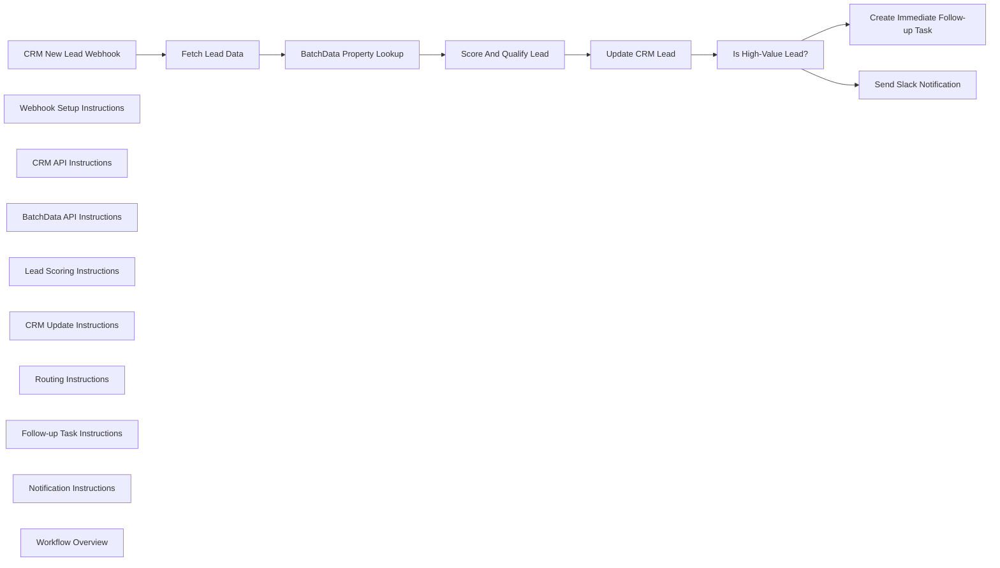

## Fluxo (.json) :

```json
{
  "id": "0uon02fOzPkLcG6G",
  "meta": {
    "instanceId": "bb9853d4d7d87207561a30bc6fe4ece20b295264f7d27d4a62215de2f3846a56",
    "templateCredsSetupCompleted": true
  },
  "name": "Lead Qualification with BatchData",
  "tags": [],
  "nodes": [
    {
      "id": "376bc838-013e-4033-a508-d27a2a64d792",
      "name": "CRM New Lead Webhook",
      "type": "n8n-nodes-base.webhook",
      "position": [
        -2560,
        600
      ],
      "webhookId": "8fb37aae-df12-40eb-81ea-0e5022e1f988",
      "parameters": {
        "path": "crm-new-lead",
        "options": {}
      },
      "typeVersion": 1
    },
    {
      "id": "2ca36d9f-7682-4a08-9fff-1674b36e07e4",
      "name": "Webhook Setup Instructions",
      "type": "n8n-nodes-base.stickyNote",
      "position": [
        -2720,
        160
      ],
      "parameters": {
        "color": 5,
        "width": 420,
        "height": 620,
        "content": "# WEBHOOK SETUP INSTRUCTIONS\n\n1. Copy this webhook URL and configure your CRM to send notifications here\n2. Expected payload format:\n   ```\n   {\n     \"leadId\": \"123\",\n     \"crmApiUrl\": \"https://your-crm-api.com/api/v1\",\n     \"address\": \"123 Main St\",\n     \"city\": \"Anytown\",\n     \"state\": \"CA\",\n     \"zipcode\": \"90210\"\n   }\n   ```\n3. All fields are required for property verification"
      },
      "typeVersion": 1
    },
    {
      "id": "961b3c4c-5b58-439e-9c8c-cc6e9774ebe7",
      "name": "Fetch Lead Data",
      "type": "n8n-nodes-base.httpRequest",
      "position": [
        -2180,
        600
      ],
      "parameters": {
        "url": "={{ $json.crmApiUrl }}/leads/{{ $json.leadId }}",
        "options": {},
        "authentication": "genericCredentialType",
        "genericAuthType": "httpHeaderAuth"
      },
      "typeVersion": 4.1
    },
    {
      "id": "3549918e-cea8-467e-90d0-3661a5f54ae9",
      "name": "CRM API Instructions",
      "type": "n8n-nodes-base.stickyNote",
      "position": [
        -2280,
        160
      ],
      "parameters": {
        "color": 5,
        "width": 300,
        "height": 620,
        "content": "# CRM API CONFIGURATION\n\n1. Create HTTP Header Auth credentials for your CRM API\n2. Include necessary authorization headers (e.g., 'Authorization: Bearer YOUR_TOKEN')\n3. This node fetches comprehensive lead data using the lead ID from the webhook\n4. Ensure your CRM API returns address information needed for property verification"
      },
      "typeVersion": 1
    },
    {
      "id": "25445c3c-adf0-41d7-8f5f-c0fabc297658",
      "name": "BatchData Property Lookup",
      "type": "n8n-nodes-base.httpRequest",
      "position": [
        -1840,
        600
      ],
      "parameters": {
        "url": "https://api.batchdata.com/api/v1/property/search",
        "options": {},
        "sendBody": true,
        "authentication": "genericCredentialType",
        "bodyParameters": {
          "parameters": [
            {
              "name": "address",
              "value": "={{ $json.address }}"
            },
            {
              "name": "city",
              "value": "={{ $json.city }}"
            },
            {
              "name": "state",
              "value": "={{ $json.state }}"
            },
            {
              "name": "zipcode",
              "value": "={{ $json.zipcode }}"
            }
          ]
        },
        "genericAuthType": "httpHeaderAuth"
      },
      "typeVersion": 4.1
    },
    {
      "id": "85808ecf-e5b0-4d36-a2c3-66c26bb2a191",
      "name": "BatchData API Instructions",
      "type": "n8n-nodes-base.stickyNote",
      "position": [
        -1960,
        160
      ],
      "parameters": {
        "color": 5,
        "width": 360,
        "height": 620,
        "content": "# BATCHDATA API SETUP\n\n1. Create an account at BatchData.com to get your API key\n2. Set up HTTP Header Auth credentials with 'x-api-key: YOUR_BATCHDATA_API_KEY'\n3. This API call verifies property details using the lead's address\n4. Expected response includes property value, size, age, and ownership status\n5. Adjust API endpoint if needed based on BatchData's documentation"
      },
      "typeVersion": 1
    },
    {
      "id": "389e2f49-9ed4-4017-8002-ac86e1001ed9",
      "name": "Score And Qualify Lead",
      "type": "n8n-nodes-base.code",
      "position": [
        -1480,
        620
      ],
      "parameters": {
        "jsCode": "// Initialize lead score\nlet score = 0;\nlet qualificationStatus = \"not qualified\";\nlet qualificationNotes = [];\n\n// Get property data from BatchData response\nconst propertyData = $input.first().json;\nconst leadData = $input.first().json;\n\n// Check if property exists\nif (propertyData.success === true && propertyData.data) {\n  const property = propertyData.data;\n  \n  // Score based on property value\n  if (property.estimatedValue > 750000) {\n    score += 30;\n    qualificationNotes.push(\"High-value property: $\" + property.estimatedValue);\n  } else if (property.estimatedValue > 500000) {\n    score += 20;\n    qualificationNotes.push(\"Mid-high value property: $\" + property.estimatedValue);\n  } else if (property.estimatedValue > 350000) {\n    score += 10;\n    qualificationNotes.push(\"Average value property: $\" + property.estimatedValue);\n  }\n  \n  // Score based on property size\n  if (property.squareFootage > 3000) {\n    score += 15;\n    qualificationNotes.push(\"Large property: \" + property.squareFootage + \" sq ft\");\n  } else if (property.squareFootage > 2000) {\n    score += 10;\n    qualificationNotes.push(\"Mid-size property: \" + property.squareFootage + \" sq ft\");\n  }\n  \n  // Score based on property age\n  const currentYear = new Date().getFullYear();\n  const propertyAge = currentYear - property.yearBuilt;\n  \n  if (propertyAge < 5) {\n    score += 15;\n    qualificationNotes.push(\"New construction: \" + property.yearBuilt);\n  } else if (propertyAge < 20) {\n    score += 10;\n    qualificationNotes.push(\"Relatively new property: \" + property.yearBuilt);\n  }\n  \n  // Other factors to consider\n  if (property.ownerOccupied === false) {\n    score += 15;\n    qualificationNotes.push(\"Investment property (not owner-occupied)\");\n  }\n  \n  if (property.lotSize > 0.5) {\n    score += 10;\n    qualificationNotes.push(\"Large lot size: \" + property.lotSize + \" acres\");\n  }\n  \n  // Determine qualification status based on score\n  if (score >= 50) {\n    qualificationStatus = \"high-value\";\n  } else if (score >= 30) {\n    qualificationStatus = \"qualified\";\n  } else if (score >= 15) {\n    qualificationStatus = \"potential\";\n  }\n  \n  // Combine all data for CRM update\n  const enrichedData = {\n    leadId: leadData.leadId,\n    score: score,\n    qualificationStatus: qualificationStatus,\n    qualificationNotes: qualificationNotes.join(\", \"),\n    propertyData: {\n      estimatedValue: property.estimatedValue,\n      squareFootage: property.squareFootage,\n      yearBuilt: property.yearBuilt,\n      lotSize: property.lotSize,\n      bedrooms: property.bedrooms,\n      bathrooms: property.bathrooms,\n      ownerOccupied: property.ownerOccupied,\n      lastSaleDate: property.lastSaleDate,\n      lastSalePrice: property.lastSalePrice\n    }\n  };\n  \n  return enrichedData;\n} else {\n  // If property data not found\n  qualificationNotes.push(\"Property data not found or verification failed\");\n  \n  return {\n    leadId: leadData.leadId,\n    score: 0,\n    qualificationStatus: \"unverified\",\n    qualificationNotes: qualificationNotes.join(\", \"),\n    propertyData: null\n  };\n}"
      },
      "typeVersion": 2
    },
    {
      "id": "f33f6442-5e8b-4aab-b5ff-d37d062a5cfa",
      "name": "Lead Scoring Instructions",
      "type": "n8n-nodes-base.stickyNote",
      "position": [
        -1580,
        -280
      ],
      "parameters": {
        "color": 3,
        "width": 320,
        "height": 1060,
        "content": "# LEAD SCORING ALGORITHM\n\nThis function implements a sophisticated scoring system for property-based leads:\n\n### SCORING FACTORS\n- **Property Value**\n  - >$750k: 30 points\n  - >$500k: 20 points\n  - >$350k: 10 points\n\n- **Square Footage**\n  - >3000 sq ft: 15 points\n  - >2000 sq ft: 10 points\n\n- **Property Age**\n  - <5 years old: 15 points\n  - <20 years old: 10 points\n\n- **Other Factors**\n  - Investment property: 15 points\n  - Large lot (>0.5 acres): 10 points\n\n### QUALIFICATION THRESHOLDS\n- **High-value**: 50+ points\n- **Qualified**: 30-49 points\n- **Potential**: 15-29 points\n- **Not qualified**: <15 points\n- **Unverified**: No property data\n\nCustomize the scoring values and thresholds to match your specific business requirements."
      },
      "typeVersion": 1
    },
    {
      "id": "b9bcb2af-6ccc-4f9e-9926-765df4f36809",
      "name": "Update CRM Lead",
      "type": "n8n-nodes-base.httpRequest",
      "position": [
        -1120,
        620
      ],
      "parameters": {
        "url": "={{ $json.crmApiUrl }}/leads/{{ $json.leadId }}",
        "method": "PUT",
        "options": {},
        "sendBody": true,
        "authentication": "genericCredentialType",
        "bodyParameters": {
          "parameters": [
            {
              "name": "score",
              "value": "={{ $json.score }}"
            },
            {
              "name": "qualificationStatus",
              "value": "={{ $json.qualificationStatus }}"
            },
            {
              "name": "qualificationNotes",
              "value": "={{ $json.qualificationNotes }}"
            },
            {
              "name": "propertyValue",
              "value": "={{ $json.propertyData.estimatedValue }}"
            },
            {
              "name": "squareFootage",
              "value": "={{ $json.propertyData.squareFootage }}"
            },
            {
              "name": "yearBuilt",
              "value": "={{ $json.propertyData.yearBuilt }}"
            },
            {
              "name": "bedrooms",
              "value": "={{ $json.propertyData.bedrooms }}"
            },
            {
              "name": "bathrooms",
              "value": "={{ $json.propertyData.bathrooms }}"
            },
            {
              "name": "batchDataVerified",
              "value": "={{ $json.propertyData !== null }}"
            }
          ]
        },
        "genericAuthType": "httpHeaderAuth"
      },
      "typeVersion": 4.1
    },
    {
      "id": "3cfa64f8-527a-49d5-9787-156fe084f37c",
      "name": "CRM Update Instructions",
      "type": "n8n-nodes-base.stickyNote",
      "position": [
        -1240,
        160
      ],
      "parameters": {
        "color": 5,
        "width": 340,
        "height": 620,
        "content": "# CRM UPDATE CONFIGURATION\n\n1. This node updates your CRM with enriched property data and lead qualification information\n2. Adjust field names in the body parameters to match your CRM's API schema\n3. Common fields to update include:\n   - Lead score and qualification status\n   - Property details (value, size, beds/baths)\n   - Verification status\n4. If your CRM uses PATCH instead of PUT, adjust the method accordingly\n5. Make sure your CRM credentials have write access to update lead records"
      },
      "typeVersion": 1
    },
    {
      "id": "8470bcf6-a539-4f75-8494-f76bcfc95f00",
      "name": "Is High-Value Lead?",
      "type": "n8n-nodes-base.if",
      "position": [
        -760,
        620
      ],
      "parameters": {
        "conditions": {
          "string": [
            {
              "value1": "={{ $json.qualificationStatus }}",
              "value2": "high-value"
            }
          ]
        }
      },
      "typeVersion": 1
    },
    {
      "id": "da84ac21-fbb2-4640-8e92-f40b23d2fa0a",
      "name": "Routing Instructions",
      "type": "n8n-nodes-base.stickyNote",
      "position": [
        -880,
        160
      ],
      "parameters": {
        "color": 3,
        "width": 320,
        "height": 620,
        "content": "# ROUTING LOGIC\n\nThis conditional node determines the workflow path based on the lead's qualification:\n\n- **TRUE Path (Top)**: Routes high-value leads for immediate follow-up\n- **FALSE Path (Bottom)**: Routes standard leads for notification only\n\nYou can modify the condition to create different paths based on:\n- Score thresholds (e.g., >30 points)\n- Property characteristics (e.g., property value >$1M)\n- Geographic targeting (e.g., specific ZIP codes)\n- Lead source (e.g., referrals vs. web leads)"
      },
      "typeVersion": 1
    },
    {
      "id": "c7772695-cda1-4483-a961-7468fd075c55",
      "name": "Create Immediate Follow-up Task",
      "type": "n8n-nodes-base.httpRequest",
      "position": [
        -180,
        320
      ],
      "parameters": {
        "url": "={{ $json.crmApiUrl }}/tasks",
        "method": "POST",
        "options": {},
        "sendBody": true,
        "authentication": "genericCredentialType",
        "bodyParameters": {
          "parameters": [
            {
              "name": "type",
              "value": "immediate-followup"
            },
            {
              "name": "leadId",
              "value": "={{ $json.leadId }}"
            },
            {
              "name": "priority",
              "value": "high"
            },
            {
              "name": "dueDate",
              "value": "={{ $now.format(\"YYYY-MM-DD\") }}"
            },
            {
              "name": "note",
              "value": "High-value lead with property value of ${{ $json.propertyData.estimatedValue }}. Immediate follow-up required."
            },
            {
              "name": "assignedTo",
              "value": "senior-agent"
            }
          ]
        },
        "genericAuthType": "httpHeaderAuth"
      },
      "typeVersion": 4.1
    },
    {
      "id": "2fd15500-7314-4910-b822-c3d9de4166df",
      "name": "Follow-up Task Instructions",
      "type": "n8n-nodes-base.stickyNote",
      "position": [
        -340,
        -140
      ],
      "parameters": {
        "color": 4,
        "width": 420,
        "height": 640,
        "content": "# HIGH-VALUE LEAD HANDLING\n\n1. This node creates an urgent follow-up task for premium leads\n2. Customize parameters to match your CRM/task system's API:\n   - Assignee (currently \"senior-agent\")\n   - Priority level and task type\n   - Due date format\n   - Task description\n3. Alternative approaches:\n   - Send email alerts to sales managers\n   - Create Salesforce opportunities\n   - Trigger SMS notifications\n   - Add to special follow-up campaign"
      },
      "typeVersion": 1
    },
    {
      "id": "0d0d4e2e-b040-45d1-8a4c-e775520a4bbc",
      "name": "Send Slack Notification",
      "type": "n8n-nodes-base.slack",
      "position": [
        -60,
        860
      ],
      "webhookId": "dc308b09-6aea-41be-96c4-c322cfc8ed8f",
      "parameters": {
        "text": "=High-value lead alert: {{ $json.leadId }}\nProperty Value: ${{ $json.propertyData.estimatedValue }}\nScore: {{ $json.score }}\nQualification Notes: {{ $json.qualificationNotes }}",
        "select": "channel",
        "channelId": "high-value-leads",
        "otherOptions": {}
      },
      "typeVersion": 2
    },
    {
      "id": "de158d72-7472-4075-ba57-13916739d24b",
      "name": "Notification Instructions",
      "type": "n8n-nodes-base.stickyNote",
      "position": [
        -340,
        520
      ],
      "parameters": {
        "color": 4,
        "width": 460,
        "height": 500,
        "content": "# NOTIFICATION CONFIGURATION\n\n1. Set up Slack credentials in n8n's Credentials Manager\n2. Update the channel ID to match your Slack workspace\n3. Customize the notification format and content\n4. Alternative options:\n   - Replace with Email notification\n   - Use Microsoft Teams\n   - Send SMS alerts via Twilio\n   - Post to a dedicated dashboard\n   - Log to monitoring system"
      },
      "typeVersion": 1
    },
    {
      "id": "1433b56d-3d8e-465a-bccc-c2dece4d6a1c",
      "name": "Workflow Overview",
      "type": "n8n-nodes-base.stickyNote",
      "position": [
        -3200,
        260
      ],
      "parameters": {
        "width": 400,
        "height": 400,
        "content": "# BatchData Lead Qualification Workflow\n\nThis workflow integrates with BatchData's Property Lookup API to verify, enrich, and qualify leads based on property data. When a new lead is added to your CRM, the workflow:\n\n1. Retrieves the lead's address information\n2. Verifies property details using BatchData's API\n3. Scores and qualifies the lead based on property characteristics\n4. Updates the CRM with enriched data and qualification status\n5. Routes high-value leads for immediate follow-up\n\n## SETUP CHECKLIST\n- [ ] Configure CRM API credentials\n- [ ] Set up BatchData API key\n- [ ] Configure Slack/notification credentials\n- [ ] Customize scoring thresholds\n- [ ] Adjust CRM field mappings\n- [ ] Test with sample lead data"
      },
      "typeVersion": 1
    }
  ],
  "active": false,
  "pinData": {},
  "settings": {
    "executionOrder": "v1"
  },
  "versionId": "d914c2d9-b2af-4c00-b5cd-7ed80d713cb0",
  "connections": {
    "Fetch Lead Data": {
      "main": [
        [
          {
            "node": "BatchData Property Lookup",
            "type": "main",
            "index": 0
          }
        ]
      ]
    },
    "Update CRM Lead": {
      "main": [
        [
          {
            "node": "Is High-Value Lead?",
            "type": "main",
            "index": 0
          }
        ]
      ]
    },
    "Is High-Value Lead?": {
      "main": [
        [
          {
            "node": "Create Immediate Follow-up Task",
            "type": "main",
            "index": 0
          }
        ],
        [
          {
            "node": "Send Slack Notification",
            "type": "main",
            "index": 0
          }
        ]
      ]
    },
    "CRM New Lead Webhook": {
      "main": [
        [
          {
            "node": "Fetch Lead Data",
            "type": "main",
            "index": 0
          }
        ]
      ]
    },
    "Score And Qualify Lead": {
      "main": [
        [
          {
            "node": "Update CRM Lead",
            "type": "main",
            "index": 0
          }
        ]
      ]
    },
    "BatchData Property Lookup": {
      "main": [
        [
          {
            "node": "Score And Qualify Lead",
            "type": "main",
            "index": 0
          }
        ]
      ]
    }
  }
}
```

<a id="template-2082"></a>

## Template 2082 - API de extração de emails via webhook

- **Nome:** API de extração de emails via webhook
- **Descrição:** Recebe uma URL via parâmetro 'Website', obtém o conteúdo da página, extrai endereços de email usando expressão regular, remove duplicatas e retorna os resultados ao solicitante.
- **Funcionalidade:** • Recepção via webhook: aceita chamadas HTTP com o parâmetro 'Website' contendo a URL a ser verificada.
• Verificação de protocolo: espera que a URL inclua o protocolo (http:// ou https://) para funcionar corretamente.
• Requisição HTTP ao site: busca o conteúdo da página fornecida para análise.
• Extração de emails por regex: varre o conteúdo retornado em busca de padrões de endereço de email.
• Separação de resultados: divide a lista de emails em itens individuais e filtra entradas vazias.
• Remoção de duplicatas: elimina endereços repetidos antes de enviar a resposta.
• Resposta ao solicitante: devolve a lista de emails encontrados ou uma mensagem de execução bem-sucedida se nenhum email for encontrado.
• Tolerância a erros: continua a execução mesmo que algumas etapas falhem, evitando interrupções totais.
- **Ferramentas:** • Endpoint HTTP (webhook): ponto de entrada público para receber a URL do site a ser analisado.
• Cliente HTTP (navegador, curl, Postman): utilizado para chamar o endpoint e fornecer o parâmetro 'Website'.
• Sites públicos de destino: páginas da web que serão consultadas e analisadas em busca de emails.
• Conexão HTTP/Internet: necessária para realizar requisições aos sites alvo e retornar resultados ao solicitante.


## Fluxo visual

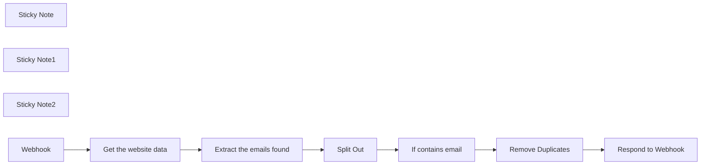

## Fluxo (.json) :

```json
{
  "meta": {
    "instanceId": "8eadf351d49a11e77d3a57adf374670f06c5294af8b1b7c86a1123340397e728"
  },
  "nodes": [
    {
      "id": "f28a0602-f02c-4f41-8bbf-dfd46d0def87",
      "name": "Split Out",
      "type": "n8n-nodes-base.splitOut",
      "position": [
        2020,
        620
      ],
      "parameters": {
        "options": {},
        "fieldToSplitOut": "Email"
      },
      "typeVersion": 1
    },
    {
      "id": "d995d088-9be1-4a64-a533-d764587b3ae4",
      "name": "Remove Duplicates",
      "type": "n8n-nodes-base.removeDuplicates",
      "onError": "continueRegularOutput",
      "position": [
        2480,
        600
      ],
      "parameters": {},
      "retryOnFail": true,
      "typeVersion": 1
    },
    {
      "id": "b64f9bc5-7e85-41df-b27c-10d53df6809f",
      "name": "Respond to Webhook",
      "type": "n8n-nodes-base.respondToWebhook",
      "position": [
        2740,
        600
      ],
      "parameters": {
        "options": {}
      },
      "typeVersion": 1
    },
    {
      "id": "466cf9ce-4baf-45f9-bd70-d2041c20605e",
      "name": "Sticky Note",
      "type": "n8n-nodes-base.stickyNote",
      "position": [
        1204.5476340072564,
        520
      ],
      "parameters": {
        "color": 4,
        "width": 1764.2311804548722,
        "height": 309.99889350400827,
        "content": "\n* Scraping emails from websites using an api"
      },
      "typeVersion": 1
    },
    {
      "id": "566ca1f5-b6c4-4566-97e7-59bc2d616e1c",
      "name": "Sticky Note1",
      "type": "n8n-nodes-base.stickyNote",
      "position": [
        1300,
        800
      ],
      "parameters": {
        "color": 5,
        "width": 520.3009626085002,
        "height": 249.39327996703526,
        "content": "\n* Call the webhook using a query parameter eg \n\nhttp://localhost:5678/webhook/ea568868-5770-4b2a-8893-7e?Website=https://mailsafi.com\n\nHTTP request rest the query Website and gets the emails therein"
      },
      "typeVersion": 1
    },
    {
      "id": "ea95c9a3-b7c8-4288-8fdf-6504caee46f4",
      "name": "Sticky Note2",
      "type": "n8n-nodes-base.stickyNote",
      "position": [
        440,
        380
      ],
      "parameters": {
        "width": 728.4741979436378,
        "height": 430.0825742795921,
        "content": "# How to scrap emails from websites\n\nThis workflow shows how you can quickly build an Email scraping API using n8n.\nUsage\nCopy the webhook URL to your browser and add a query parameter eg {{$n8nhosteingurl/webhook/ea568868-5770-4b2a-8893-700b344c995e?Website=https://mailsafi.com\nThis will return the email address on the website or if there is no email, the response will be \"workflow successfully executed\"\n\n# Make sure to use HTTP:// for your domains\n\nOtherwise, you may get an error. \n\n\n\n"
      },
      "typeVersion": 1
    },
    {
      "id": "05d4e9d4-d803-4e74-b4d0-166f4873dbca",
      "name": "Webhook",
      "type": "n8n-nodes-base.webhook",
      "position": [
        1360,
        620
      ],
      "webhookId": "ea568868-5770-4b2a-8893-700b344c995e",
      "parameters": {
        "path": "ea568868-5770-4b2a-8893-700b344c995e",
        "options": {},
        "responseMode": "responseNode"
      },
      "typeVersion": 1.1
    },
    {
      "id": "555c8f81-25ea-4be5-b260-7b6039c705a8",
      "name": "Get the website data",
      "type": "n8n-nodes-base.httpRequest",
      "onError": "continueRegularOutput",
      "position": [
        1600,
        620
      ],
      "parameters": {
        "url": "={{ $json.query['Website'] }}",
        "options": {}
      },
      "retryOnFail": true,
      "typeVersion": 4.1
    },
    {
      "id": "e83b38b8-dc13-49eb-9482-1dbd8a9ef583",
      "name": "Extract the emails found",
      "type": "n8n-nodes-base.set",
      "position": [
        1800,
        620
      ],
      "parameters": {
        "options": {},
        "assignments": {
          "assignments": [
            {
              "id": "80a8a8ec-9ac7-4545-beab-390732218548",
              "name": "Email",
              "type": "array",
              "value": "={{$json.data.match(/(?:[A-Za-z0-9._%+-]+@[A-Za-z0-9.-]+\\.[A-Za-z]{2,})/g)}}"
            }
          ]
        }
      },
      "typeVersion": 3.3
    },
    {
      "id": "3fe56efc-0d7b-4e0f-8f9c-3b10ce59cb94",
      "name": "If contains email",
      "type": "n8n-nodes-base.if",
      "position": [
        2220,
        620
      ],
      "parameters": {
        "options": {},
        "conditions": {
          "options": {
            "leftValue": "",
            "caseSensitive": true,
            "typeValidation": "strict"
          },
          "combinator": "and",
          "conditions": [
            {
              "id": "701ead8f-02ba-4689-8054-9e40d9b9f770",
              "operator": {
                "type": "string",
                "operation": "notEmpty",
                "singleValue": true
              },
              "leftValue": "={{ $json.Email }}",
              "rightValue": ""
            }
          ]
        }
      },
      "typeVersion": 2
    }
  ],
  "pinData": {},
  "connections": {
    "Webhook": {
      "main": [
        [
          {
            "node": "Get the website data",
            "type": "main",
            "index": 0
          }
        ]
      ]
    },
    "Split Out": {
      "main": [
        [
          {
            "node": "If contains email",
            "type": "main",
            "index": 0
          }
        ]
      ]
    },
    "If contains email": {
      "main": [
        [
          {
            "node": "Remove Duplicates",
            "type": "main",
            "index": 0
          }
        ]
      ]
    },
    "Remove Duplicates": {
      "main": [
        [
          {
            "node": "Respond to Webhook",
            "type": "main",
            "index": 0
          }
        ]
      ]
    },
    "Get the website data": {
      "main": [
        [
          {
            "node": "Extract the emails found",
            "type": "main",
            "index": 0
          }
        ]
      ]
    },
    "Extract the emails found": {
      "main": [
        [
          {
            "node": "Split Out",
            "type": "main",
            "index": 0
          }
        ]
      ]
    }
  }
}
```

<a id="template-2084"></a>

## Template 2084 - Salvar arquivos do LINE em Google Drive e registrar URL

- **Nome:** Salvar arquivos do LINE em Google Drive e registrar URL
- **Descrição:** Recebe mensagens de arquivo enviadas pelo LINE, valida o tipo de arquivo, salva o arquivo em pastas organizadas no Google Drive e registra os detalhes e o link em uma planilha de Google Sheets, opcionalmente respondendo ao usuário no LINE.
- **Funcionalidade:** • Recepção de eventos do LINE: Recebe notificações de mensagens (arquivo) enviadas pelos usuários.
• Leitura de configuração centralizada: Carrega parâmetros (pastas, tipos permitidos, flags) de uma planilha de configuração.
• Determinação de estrutura de pastas: Calcula nomes/IDs de pasta por data e/ou por tipo de arquivo conforme configuração.
• Busca e criação de pastas: Procura pastas existentes e cria pastas de data ou de tipo de arquivo quando necessário.
• Consolidação de ID da pasta final: Decide a pasta final onde o arquivo será armazenado combinando regras de data e tipo.
• Recuperação do conteúdo binário: Baixa o conteúdo do arquivo a partir da API do LINE usando o ID da mensagem.
• Validação do tipo de arquivo: Verifica se o tipo de arquivo recebido está na lista de tipos permitidos e rejeita quando não estiver.
• Upload para Google Drive: Envia o arquivo para o Drive com nome baseado em timestamp e extensão, dentro da pasta determinada.
• Registro em planilha: Anexa uma linha na planilha de arquivos com nome, tipo, data de upload e link do Google Drive.
• Resposta opcional ao usuário: Se habilitado na configuração, envia uma mensagem de reply ao remetente informando sucesso ou erro.
• Tratamento de erros e continuidade: Captura erros de validação e continua fluxo para permitir logging e respostas apropriadas.
- **Ferramentas:** • LINE Messaging API: Fornece eventos de mensagens, endpoint para baixar o conteúdo do arquivo e endpoint para enviar replies ao usuário.
• Google Drive: Armazena arquivos e permite criar/organizar pastas por data e por tipo de arquivo.
• Google Sheets: Fonte de configuração (controle) e destino de registro/log dos arquivos enviados.
• Autenticação via header HTTP: Cabeçalhos de autorização usados para autenticar chamadas às APIs externas (por exemplo, token de canal do LINE).


## Fluxo visual

```mermaid
flowchart LR
    N1["Get Config"]
    N2["Create Date Folder"]
    N3["Set Date Folder ID"]
    N4["Create File Type Folder"]
    N5["Upload File to Google Drive"]
    N6["Determine Folder Info"]
    N7["Search Date Folder"]
    N8["Merge Event and Config Data"]
    N9["Check Existing Date Folder"]
    N10["Check Existing File Type Folder"]
    N11["Merge Final Parent Folder Data"]
    N12["Search File Type Folder"]
    N13["Set File Type Folder ID"]
    N14["Configure Final Parent Folder ID"]
    N15["Process Event and Config Data"]
    N16["Get File Binary Content"]
    N17["Log File Details to Google Sheet"]
    N18["Check Reply Enabled Flag"]
    N19["Check if Store by Date is Enabled"]
    N20["Check if Store by File Type is Enabled"]
    N21["LINE Webhook Listener"]
    N22["Send LINE Reply Message"]
    N23["Validate File Type"]
    N24["Sticky Note"]
    N25["Sticky Note1"]
    N26["Sticky Note3"]
    N27["Sticky Note2"]

    N1 --> N8
    N2 --> N3
    N7 --> N9
    N3 --> N12
    N3 --> N11
    N23 --> N5
    N6 --> N7
    N21 --> N8
    N21 --> N1
    N4 --> N13
    N16 --> N23
    N12 --> N10
    N13 --> N11
    N18 --> N22
    N9 --> N3
    N9 --> N19
    N8 --> N15
    N5 --> N17
    N15 --> N6
    N11 --> N14
    N10 --> N13
    N10 --> N20
    N14 --> N16
    N17 --> N18
    N19 --> N2
    N19 --> N3
    N20 --> N4
    N20 --> N13
```

## Fluxo (.json) :

```json
{
  "id": "mqdP7Aw1KnkIq2W5",
  "meta": {
    "instanceId": "2c12b0b552404dc07af67cd5f092afd21d18c808d4fdabdb04cb4b064195b6fb",
    "templateCredsSetupCompleted": true
  },
  "name": "Line Save File to Google Drive and Log File's URL",
  "tags": [
    {
      "id": "W3ZSaJHRI2hXA9gT",
      "name": "Line Messaging API",
      "createdAt": "2025-03-09T13:14:42.780Z",
      "updatedAt": "2025-03-09T13:14:42.780Z"
    }
  ],
  "nodes": [
    {
      "id": "47c9f83b-5590-4ffc-825c-5fee72e8ef87",
      "name": "Get Config",
      "type": "n8n-nodes-base.googleSheets",
      "position": [
        1220,
        -200
      ],
      "parameters": {
        "range": "config!A1:H2",
        "options": {},
        "sheetId": "1iO4ZHU7s0fe1Jn8jcScNDce7rFXQlkRBqsO8IFHbcSc"
      },
      "credentials": {
        "googleSheetsOAuth2Api": {
          "id": "0RVWjnYzlWor2bMu",
          "name": "Google Sheets account"
        }
      },
      "typeVersion": 2,
      "alwaysOutputData": true
    },
    {
      "id": "1514cec1-bd12-4ce4-99af-bd2465026822",
      "name": "Create Date Folder",
      "type": "n8n-nodes-base.googleDrive",
      "position": [
        1700,
        80
      ],
      "parameters": {
        "name": "={{ $('Determine Folder Info').item.json.dateFolderName }}",
        "options": {
          "parents": [
            "={{ $('Determine Folder Info').item.json.baseFolderId }}"
          ]
        },
        "resource": "folder"
      },
      "credentials": {
        "googleDriveOAuth2Api": {
          "id": "QVrgALkld7whKIgB",
          "name": "Google Drive account - Peakwave"
        }
      },
      "typeVersion": 2
    },
    {
      "id": "a584238e-1d53-46ff-8cfc-437e14ea71d9",
      "name": "Set Date Folder ID",
      "type": "n8n-nodes-base.code",
      "position": [
        1960,
        -20
      ],
      "parameters": {
        "jsCode": "// Log ข้อมูล input ทั้งหมด\n//console.log(\"Set Target Parent (Date) - Input:\", items);\n\nlet targetParentId = '';\n\nif (items.length > 0) {\n\t// ตรวจสอบจาก branch แรก (True Branch จาก IF node)\n\tif (items[0].json && items[0].json.id) {\n\t\ttargetParentId = items[0].json.id;\n\t} else if (items.length > 1 && items[1].json && items[1].json.id) {\n\t\t// ถ้าไม่พบจาก branch แรก ให้ลองดูจาก branch ที่สอง (False Branch หรือผลจากการสร้าง folder ใหม่)\n\t\ttargetParentId = items[1].json.id;\n\t}\n\t\n\t// เพิ่ม targetParentId ลงใน items[0].json\n\titems[0].json.targetParentId = targetParentId;\n\tconsole.log(\"Set Target Parent (Date) - Output:\", items);\n\treturn items;\n} else {\n\tconsole.log(\"Set Target Parent (Date) - No input items.\");\n\treturn [];\n}\n"
      },
      "typeVersion": 2,
      "alwaysOutputData": false
    },
    {
      "id": "aa480dc9-935e-4a6e-a6c6-2559255ae1c2",
      "name": "Create File Type Folder",
      "type": "n8n-nodes-base.googleDrive",
      "position": [
        1700,
        400
      ],
      "parameters": {
        "name": "={{ $('Determine Folder Info').item.json.fileTypeFolderName }}",
        "driveId": {
          "__rl": true,
          "mode": "id",
          "value": "={{ $('Determine Folder Info').item.json.baseFolderId }}"
        },
        "options": {},
        "folderId": {
          "__rl": true,
          "mode": "id",
          "value": "={{ $('Get Config').first().json['Store by Date'] === true ? $('Set Date Folder ID').first().json.targetParentId : $('Get Config').first().json[\"Parent Folder ID\"] }}"
        },
        "resource": "folder"
      },
      "credentials": {
        "googleDriveOAuth2Api": {
          "id": "QVrgALkld7whKIgB",
          "name": "Google Drive account - Peakwave"
        }
      },
      "typeVersion": 3
    },
    {
      "id": "d5ed8981-5b65-45a3-8ff4-c00902756bb9",
      "name": "Upload File to Google Drive",
      "type": "n8n-nodes-base.googleDrive",
      "onError": "continueRegularOutput",
      "position": [
        1600,
        640
      ],
      "parameters": {
        "name": "={{ $('Merge Event and Config Data').item.json.body.events[0].timestamp }}.{{$node[\"Get File Binary Content\"].binary.data.fileExtension}}",
        "driveId": {
          "__rl": true,
          "mode": "id",
          "value": "={{ $('Configure Final Parent Folder ID').item.json.finalParentId }}"
        },
        "options": {},
        "folderId": {
          "__rl": true,
          "mode": "id",
          "value": "root"
        }
      },
      "credentials": {
        "googleDriveOAuth2Api": {
          "id": "QVrgALkld7whKIgB",
          "name": "Google Drive account - Peakwave"
        }
      },
      "typeVersion": 3,
      "alwaysOutputData": false
    },
    {
      "id": "92787455-6839-455f-a939-6927660bc215",
      "name": "Determine Folder Info",
      "type": "n8n-nodes-base.code",
      "position": [
        1960,
        -280
      ],
      "parameters": {
        "jsCode": "const data = items[0].json;\nconst config = data.config;\nconst event = data.event;\n\n// ใช้ key จาก config ตามที่ส่งมา\nlet baseFolderId = config[\"Parent Folder ID\"];\nlet dateFolderName = \"\";\nlet fileTypeFolderName = \"\";\n\n// หากตั้งค่า Store by Date เป็น true\nif (config[\"Store by Date\"]) {\n  // ใช้ CurrentDate จาก config หรือใช้วันที่ปัจจุบันถ้าไม่มี\n  dateFolderName = config[\"CurrentDate\"] ? config[\"CurrentDate\"] : new Date().toISOString().slice(0,10).replace(/-/g, \"\");\n}\n\n// หากตั้งค่า Store by File Type เป็น true\nif (config[\"Store by File Type\"]) {\n  // ตรวจสอบว่า event.body.events มีข้อมูลหรือไม่\n  if (event.body && event.body.events && event.body.events.length > 0) {\n    // ดึง type ของ message จาก event.body.events[0]\n    fileTypeFolderName = event.body.events[0].message.type.toLowerCase();\n  }\n}\n\nreturn [{\n  json: {\n    baseFolderId,\n    dateFolderName,\n    fileTypeFolderName,\n    storeByDate: config[\"Store by Date\"],\n    storeByFileType: config[\"Store by File Type\"],\n    event: event,\n    config: config\n  }\n}];\n"
      },
      "typeVersion": 2
    },
    {
      "id": "f4e30758-986e-4dd4-bc85-f2953e883bfe",
      "name": "Search Date Folder",
      "type": "n8n-nodes-base.googleDrive",
      "position": [
        980,
        0
      ],
      "parameters": {
        "filter": {
          "folderId": {
            "__rl": true,
            "mode": "id",
            "value": "={{ $json.baseFolderId }}"
          }
        },
        "options": {},
        "resource": "fileFolder",
        "queryString": "={{ $json.dateFolderName }}"
      },
      "credentials": {
        "googleDriveOAuth2Api": {
          "id": "QVrgALkld7whKIgB",
          "name": "Google Drive account - Peakwave"
        }
      },
      "typeVersion": 3,
      "alwaysOutputData": true
    },
    {
      "id": "e74d65bc-be7f-43d0-8b0a-ee6316b4aff9",
      "name": "Merge Event and Config Data",
      "type": "n8n-nodes-base.merge",
      "position": [
        1480,
        -280
      ],
      "parameters": {
        "mode": "mergeByIndex"
      },
      "typeVersion": 1
    },
    {
      "id": "f380d584-32aa-435f-8e8e-6d1d05932bd2",
      "name": "Check Existing Date Folder",
      "type": "n8n-nodes-base.if",
      "position": [
        1220,
        0
      ],
      "parameters": {
        "conditions": {
          "boolean": [
            {
              "value1": "={{ $json.id !== undefined }}",
              "value2": true
            }
          ]
        }
      },
      "typeVersion": 1
    },
    {
      "id": "96dc0853-67ec-4cfc-b40c-0cce63f51e96",
      "name": "Check Existing File Type Folder",
      "type": "n8n-nodes-base.if",
      "position": [
        1220,
        320
      ],
      "parameters": {
        "conditions": {
          "boolean": [
            {
              "value1": "={{ $json.id !== undefined }}",
              "value2": true
            }
          ]
        }
      },
      "typeVersion": 1
    },
    {
      "id": "742cb154-3b23-423d-8df6-53a82f0d8aab",
      "name": "Merge Final Parent Folder Data",
      "type": "n8n-nodes-base.merge",
      "position": [
        2280,
        400
      ],
      "parameters": {},
      "typeVersion": 1
    },
    {
      "id": "1003b29d-9140-4961-90d4-b94e4d33dc69",
      "name": "Search File Type Folder",
      "type": "n8n-nodes-base.googleDrive",
      "position": [
        980,
        320
      ],
      "parameters": {
        "filter": {
          "folderId": {
            "__rl": true,
            "mode": "id",
            "value": "={{ $('Get Config').item.json['Store by Date'] === true && $json.targetParentId && $json.targetParentId !== \"\" ? $json.targetParentId : $('Get Config').item.json['Parent Folder ID'] }}"
          }
        },
        "options": {},
        "resource": "fileFolder",
        "queryString": "={{ $('Determine Folder Info').item.json.fileTypeFolderName }}"
      },
      "credentials": {
        "googleDriveOAuth2Api": {
          "id": "QVrgALkld7whKIgB",
          "name": "Google Drive account - Peakwave"
        }
      },
      "typeVersion": 3,
      "alwaysOutputData": true
    },
    {
      "id": "8015eb75-0c38-4c3b-a29f-f04dedf79cee",
      "name": "Set File Type Folder ID",
      "type": "n8n-nodes-base.code",
      "position": [
        1960,
        320
      ],
      "parameters": {
        "jsCode": "// Log ข้อมูล input ทั้งหมด\n//console.log(\"Set Target Parent (Date) - Input:\", items);\n\nlet targetParentId = '';\n\nif (items.length > 0) {\n\t// ตรวจสอบจาก branch แรก (True Branch จาก IF node)\n\tif (items[0].json && items[0].json.id) {\n\t\ttargetParentId = items[0].json.id;\n\t} else if (items.length > 1 && items[1].json && items[1].json.id) {\n\t\t// ถ้าไม่พบจาก branch แรก ให้ลองดูจาก branch ที่สอง (False Branch หรือผลจากการสร้าง folder ใหม่)\n\t\ttargetParentId = items[1].json.id;\n\t}\n\t\n\t// เพิ่ม targetParentId ลงใน items[0].json\n\titems[0].json.targetParentId = targetParentId;\n\tconsole.log(\"Set Target Parent (Date) - Output:\", items);\n\treturn items;\n} else {\n\tconsole.log(\"Set Target Parent (Date) - No input items.\");\n\treturn [];\n}\n"
      },
      "typeVersion": 2
    },
    {
      "id": "b59d58c7-cb8c-4edc-a7e7-533675c39a96",
      "name": "Configure Final Parent Folder ID",
      "type": "n8n-nodes-base.code",
      "position": [
        960,
        640
      ],
      "parameters": {
        "jsCode": "/**\n * Expected input: items array จาก Merge Final Data\n * - items[0].json คือผลลัพธ์ที่อาจเป็น folder สำหรับวันที่หรือ file type folder (ขึ้นอยู่กับเงื่อนไข)\n * - items[1].json คือผลลัพธ์อีกส่วนหนึ่ง (สำหรับกรณีที่มีทั้งสอง)\n * \n * Config จะถูกดึงมาจาก node 'Get Config'\n */\n\nconst config = $('Get Config').first().json;\nlet finalParentId = '';\n\n// เงื่อนไขเลือก finalParentId\nif (config[\"Store by Date\"] === true && config[\"Store by File Type\"] === true) {\n    // เมื่อทั้งสองเป็น TRUE: สมมุติว่า file type folder อยู่ใน items[1]\n    finalParentId = $('Set File Type Folder ID').first().json.targetParentId\n} else if (config[\"Store by Date\"] === true && config[\"Store by File Type\"] === false) {\n    // ใช้ folder ตามวันที่ (items[0])\n    finalParentId =$('Set Date Folder ID').first().json.targetParentId;\n} else if (config[\"Store by Date\"] === false && config[\"Store by File Type\"] === true) {\n    // ใช้ folder สำหรับประเภทไฟล์ (ใน test case นี้ ใช้ items[0])\n    finalParentId = $('Set File Type Folder ID').first().json.targetParentId;\n} else {\n    // เมื่อทั้งสองเป็น FALSE: ใช้ Parent Folder ID จาก config\n    finalParentId = config[\"Parent Folder ID\"];\n}\n\n// เพิ่ม finalParentId ลงใน items[0].json เพื่อส่งต่อให้ Node \"Upload File to Google Drive\" ใช้งาน\nitems[0].json.finalParentId = finalParentId;\nreturn [items[0]];\n"
      },
      "typeVersion": 2
    },
    {
      "id": "683c83fc-e4b7-4a0d-b5f0-8958d0743faf",
      "name": "Process Event and Config Data",
      "type": "n8n-nodes-base.code",
      "position": [
        1680,
        -280
      ],
      "parameters": {
        "jsCode": "// ตรวจสอบว่า items มีอย่างน้อย 2 รายการหรือไม่\nconst eventData = items[0].json;\nlet config;\n\nif (items.length >= 2) {\n\t// ถ้ามี items[1] ให้ใช้เป็น config\n\tconst configData = items[1].json;\n\tconfig = Array.isArray(configData) ? configData[0] : configData;\n} else {\n\t// ถ้าไม่มี items[1] ให้ลองดึง config จาก eventData\n\t// สมมุติว่าฟิลด์ config ถูกส่งมาพร้อมกับ eventData ด้วยชื่อฟิลด์เหมือนที่ได้ใน output\n\tif (eventData[\"Parent Folder Path\"] && eventData[\"Parent Folder ID\"]) {\n\t\tconfig = {\n\t\t\t\"Parent Folder Path\": eventData[\"Parent Folder Path\"],\n\t\t\t\"Parent Folder ID\": eventData[\"Parent Folder ID\"],\n\t\t\t\"Store by Date\": eventData[\"Store by Date\"],\n\t\t\t\"Store by File Type\": eventData[\"Store by File Type\"],\n\t\t\t\"Allow File Types\": eventData[\"Allow File Types\"],\n\t\t\t\"CurrentDate\": eventData[\"CurrentDate\"],\n\t\t\t\"Reply Enabled\": eventData[\"Reply Enabled\"],\n\t\t\t\"CHANNEL ACCESS TOKEN\": eventData[\"CHANNEL ACCESS TOKEN\"]\n\t\t};\n\t} else {\n\t\tthrow new Error(\"ไม่พบข้อมูล config! กรุณาตรวจสอบว่า node ก่อนหน้านี้ส่งข้อมูล config มาด้วย\");\n\t}\n}\n\nreturn [{ json: { event: eventData, config: config } }];\n"
      },
      "typeVersion": 2
    },
    {
      "id": "fb5bd15c-bb0a-420b-a14b-ed5df5ecd691",
      "name": "Get File Binary Content",
      "type": "n8n-nodes-base.httpRequest",
      "position": [
        1180,
        640
      ],
      "parameters": {
        "url": "=https://api-data.line.me/v2/bot/message/{{ $('LINE Webhook Listener').item.json.body.events[0].message.id }}/content",
        "options": {},
        "authentication": "genericCredentialType",
        "genericAuthType": "httpHeaderAuth"
      },
      "credentials": {
        "httpHeaderAuth": {
          "id": "byY3kI23lMe4ewnM",
          "name": "Header Auth account - Maid"
        }
      },
      "executeOnce": true,
      "typeVersion": 4.2
    },
    {
      "id": "f064ba27-a5a8-4cca-afb8-3e099fb5abc8",
      "name": "Log File Details to Google Sheet",
      "type": "n8n-nodes-base.googleSheets",
      "onError": "continueRegularOutput",
      "position": [
        1820,
        640
      ],
      "parameters": {
        "columns": {
          "value": {
            "File Name": "={{ $json.name }}",
            "File Type": "={{ $json.fileExtension }}",
            "Date Uploaded": "={{ $json.createdTime }}",
            "Google Drive URL": "={{ $json.webContentLink }}"
          },
          "schema": [
            {
              "id": "File Name",
              "type": "string",
              "display": true,
              "required": false,
              "displayName": "File Name",
              "defaultMatch": false,
              "canBeUsedToMatch": true
            },
            {
              "id": "Date Uploaded",
              "type": "string",
              "display": true,
              "required": false,
              "displayName": "Date Uploaded",
              "defaultMatch": false,
              "canBeUsedToMatch": true
            },
            {
              "id": "Google Drive URL",
              "type": "string",
              "display": true,
              "required": false,
              "displayName": "Google Drive URL",
              "defaultMatch": false,
              "canBeUsedToMatch": true
            },
            {
              "id": "File Type",
              "type": "string",
              "display": true,
              "required": false,
              "displayName": "File Type",
              "defaultMatch": false,
              "canBeUsedToMatch": true
            }
          ],
          "mappingMode": "defineBelow",
          "matchingColumns": [],
          "attemptToConvertTypes": false,
          "convertFieldsToString": false
        },
        "options": {},
        "operation": "append",
        "sheetName": {
          "__rl": true,
          "mode": "list",
          "value": 585160829,
          "cachedResultUrl": "https://docs.google.com/spreadsheets/d/1iO4ZHU7s0fe1Jn8jcScNDce7rFXQlkRBqsO8IFHbcSc/edit#gid=585160829",
          "cachedResultName": "fileList"
        },
        "documentId": {
          "__rl": true,
          "mode": "id",
          "value": "1iO4ZHU7s0fe1Jn8jcScNDce7rFXQlkRBqsO8IFHbcSc"
        }
      },
      "credentials": {
        "googleSheetsOAuth2Api": {
          "id": "0RVWjnYzlWor2bMu",
          "name": "Google Sheets account"
        }
      },
      "typeVersion": 4.5,
      "alwaysOutputData": true
    },
    {
      "id": "fd936998-6ba0-4dbe-b406-c785f89181dd",
      "name": "Check Reply Enabled Flag",
      "type": "n8n-nodes-base.if",
      "position": [
        2040,
        640
      ],
      "parameters": {
        "options": {},
        "conditions": {
          "options": {
            "version": 2,
            "leftValue": "",
            "caseSensitive": true,
            "typeValidation": "strict"
          },
          "combinator": "and",
          "conditions": [
            {
              "id": "8f593e3a-95dd-457e-903f-f2ca68cdbcd1",
              "operator": {
                "type": "boolean",
                "operation": "true",
                "singleValue": true
              },
              "leftValue": "={{ $('Get Config').item.json['Reply Enabled'] }}",
              "rightValue": "true"
            }
          ]
        }
      },
      "typeVersion": 2.2,
      "alwaysOutputData": true
    },
    {
      "id": "7d1f19e7-cb6c-4f5d-8a10-b84e9e06345a",
      "name": "Check if Store by Date is Enabled",
      "type": "n8n-nodes-base.if",
      "position": [
        1420,
        80
      ],
      "parameters": {
        "options": {},
        "conditions": {
          "options": {
            "version": 2,
            "leftValue": "",
            "caseSensitive": true,
            "typeValidation": "strict"
          },
          "combinator": "and",
          "conditions": [
            {
              "id": "370bcd8c-c72a-4e69-acfd-9e271b1a09ed",
              "operator": {
                "type": "boolean",
                "operation": "true",
                "singleValue": true
              },
              "leftValue": "={{ $('Get Config').item.json['Store by Date'] === true }}",
              "rightValue": ""
            }
          ]
        }
      },
      "typeVersion": 2.2
    },
    {
      "id": "8644134e-673c-4360-8831-71c048c1522d",
      "name": "Check if Store by File Type is Enabled",
      "type": "n8n-nodes-base.if",
      "position": [
        1420,
        400
      ],
      "parameters": {
        "options": {},
        "conditions": {
          "options": {
            "version": 2,
            "leftValue": "",
            "caseSensitive": true,
            "typeValidation": "strict"
          },
          "combinator": "and",
          "conditions": [
            {
              "id": "7c0577ba-b2ed-4050-a580-3cadc7da2b73",
              "operator": {
                "type": "boolean",
                "operation": "true",
                "singleValue": true
              },
              "leftValue": "={{ $('Get Config').item.json['Store by File Type'] === true }}",
              "rightValue": ""
            }
          ]
        }
      },
      "typeVersion": 2.2
    },
    {
      "id": "f6b24396-a854-42c4-ae70-55095d637b9a",
      "name": "LINE Webhook Listener",
      "type": "n8n-nodes-base.webhook",
      "position": [
        980,
        -300
      ],
      "webhookId": "feb869e5-a96c-4a5c-b346-3d7c7e64bf0a",
      "parameters": {
        "path": "line-webhook",
        "options": {},
        "httpMethod": "POST"
      },
      "typeVersion": 1
    },
    {
      "id": "3b1ca174-f5fc-4b01-90f4-be9240f8be77",
      "name": "Send LINE Reply Message",
      "type": "n8n-nodes-base.httpRequest",
      "onError": "continueRegularOutput",
      "position": [
        2280,
        620
      ],
      "parameters": {
        "url": "https://api.line.me/v2/bot/message/reply",
        "method": "POST",
        "options": {},
        "jsonBody": "={\n  \"replyToken\": \"{{ $('LINE Webhook Listener').first().json.body.events[0].replyToken }}\",\n  \"messages\": [\n    {\n      \"type\": \"text\",\n      \"text\": \"{{ $('Validate File Type').item.json.error ? $('Validate File Type').item.json.error : $json['Google Drive URL'] }}\"\n    }\n  ]\n}",
        "sendBody": true,
        "specifyBody": "json",
        "authentication": "genericCredentialType",
        "genericAuthType": "httpHeaderAuth"
      },
      "credentials": {
        "httpHeaderAuth": {
          "id": "byY3kI23lMe4ewnM",
          "name": "Header Auth account - Maid"
        }
      },
      "typeVersion": 4.2,
      "alwaysOutputData": true
    },
    {
      "id": "87465dac-4557-4ee4-ae21-b36aab37c884",
      "name": "Validate File Type",
      "type": "n8n-nodes-base.code",
      "onError": "continueRegularOutput",
      "position": [
        1380,
        640
      ],
      "parameters": {
        "jsCode": "// ดึงค่า allowed types จาก Node \"Get Config\"\nconst allowedTypes = $('Get Config').first().json[\"Allow File Types\"]\n  .split(\"|\")\n  .map(s => s.trim().toLowerCase());\n\n// ดึงค่า file type จากข้อมูลของ event (ปรับให้ตรงกับ structure ของข้อมูลคุณ)\nconst fileType = $('LINE Webhook Listener').first().json.body.events[0].message.type.toLowerCase();\n\n// ตรวจสอบว่า fileType อยู่ใน allowedTypes หรือไม่\nif (!allowedTypes.includes(fileType)) {\n  // สร้าง Error object พร้อมแนบข้อมูล replyToken และ errorMessage\n  const error = new Error(`File type '${fileType}' is not allowed.`);\n  error.json = {\n    replyToken: $('LINE Webhook Listener').first().json.body.events[0].replyToken,\n    errorMessage: error.message,\n  };\n  throw error;\n}\n\nreturn items;\n"
      },
      "typeVersion": 2,
      "alwaysOutputData": true
    },
    {
      "id": "00ddc2ae-4782-4079-947e-2fda99c0f037",
      "name": "Sticky Note",
      "type": "n8n-nodes-base.stickyNote",
      "position": [
        220,
        -380
      ],
      "parameters": {
        "width": 2320,
        "height": 320,
        "content": "## Workflow Entry & Configuration\nThis section initializes the workflow by listening to incoming requests from \nthe LINE Messaging API and retrieving configuration details from Google Sheets. \nIt merges the event data with the config, then determines initial folder information \n(such as whether to store files by date or file type). Nodes in this group:\n\n* **LINE Webhook Listener**\nReceives POST requests (file messages) from LINE.\n* **Get Config**\nReads configuration data (parent folder, allowed file types, etc.) from a Google Sheet.\n* **Merge Event and Config Data**\nCombines the LINE event data and config data.\n* **Determine Folder Info**\nCalculates folder names based on the config (e.g., date folder name, file type folder name)."
      },
      "typeVersion": 1
    },
    {
      "id": "ccae9a3d-0a46-4c06-b94b-c3bd08d10df1",
      "name": "Sticky Note1",
      "type": "n8n-nodes-base.stickyNote",
      "position": [
        220,
        -40
      ],
      "parameters": {
        "color": 5,
        "width": 2320,
        "height": 340,
        "content": "## Folder Search & Creation\nThis section handles the logic for finding or creating the appropriate Google Drive folders.\nIt checks if a date folder exists (when Store by Date is enabled) and whether a file type folder\n is required (when Store by File Type is enabled). Nodes in this group:\n\n* **Search Date Folder / Check Existing Date Folder / Check if Store by Date is Enabled** \nLooks for or creates a date-based folder.\n* **Create Date Folder / Set Date Folder ID** \nreates and stores the date folder ID if it doesn’t exist.\n* **Search File Type Folder / Check Existing File Type Folder / Check if Store by File Type is Enabled** \nSimilarly handles file type subfolder logic.\n* **Create File Type Folder / Set File Type Folder ID** \n Creates and stores the file type folder ID.\n* **Merge Final Parent Folder Data / Configure Final Parent Folder ID** \nMerges the final folder IDs (date folder + file type folder) to determine where the file should be placed."
      },
      "typeVersion": 1
    },
    {
      "id": "b9272975-3e0d-436c-b8e3-98fcb8cfc893",
      "name": "Sticky Note3",
      "type": "n8n-nodes-base.stickyNote",
      "position": [
        220,
        600
      ],
      "parameters": {
        "color": 4,
        "width": 2320,
        "height": 320,
        "content": "## Upload, Log, & Reply\nOnce the file is validated and the correct folder determined, the workflow uploads the file\nto Google Drive and logs the details in a Google Sheet. Finally, it checks whether replies \nare enabled and, if so, sends a message back to the LINE user (either confirming a successful\nupload or reporting an error). Nodes in this group:\n\n* **Upload File to Google Drive**\nUploads the validated file to the determined folder path.\n* **Log File Details to Google Sheet**\nRecords the file name, upload date, URL, and file type in Google Sheets.\n* **Check Reply Enabled Flag**\nVerifies if replies to LINE are turned on in the config.\n* **Send LINE Reply Message**\nSends a text reply back to the user via LINE, either containing the file’s Google Drive URL or an error message."
      },
      "typeVersion": 1
    },
    {
      "id": "85a84d38-6992-439d-bdaa-de37b0dac554",
      "name": "Sticky Note2",
      "type": "n8n-nodes-base.stickyNote",
      "position": [
        220,
        320
      ],
      "parameters": {
        "color": 6,
        "width": 2320,
        "height": 260,
        "content": "## File Retrieval & Validation\nIn this group, the workflow fetches the binary content of the file from the LINE API\nand validates whether the file type is allowed (e.g., image, audio, video). If the \nfile type is not permitted, the workflow throws an error which will be used to send\nan appropriate reply message back to LINE. Nodes in this group:\n\n* **Get File Binary Content**\nRetrieves the actual file data from the LINE Messaging API.\n* **Validate File Type**\nChecks the file’s MIME type against an allowed list from the config and throws an error if disallowed."
      },
      "typeVersion": 1
    }
  ],
  "active": false,
  "pinData": {},
  "settings": {
    "executionOrder": "v1"
  },
  "versionId": "10f96ecd-2a9e-48c6-91f6-b49c00e0ac90",
  "connections": {
    "Get Config": {
      "main": [
        [
          {
            "node": "Merge Event and Config Data",
            "type": "main",
            "index": 1
          }
        ]
      ]
    },
    "Create Date Folder": {
      "main": [
        [
          {
            "node": "Set Date Folder ID",
            "type": "main",
            "index": 0
          }
        ]
      ]
    },
    "Search Date Folder": {
      "main": [
        [
          {
            "node": "Check Existing Date Folder",
            "type": "main",
            "index": 0
          }
        ]
      ]
    },
    "Set Date Folder ID": {
      "main": [
        [
          {
            "node": "Search File Type Folder",
            "type": "main",
            "index": 0
          },
          {
            "node": "Merge Final Parent Folder Data",
            "type": "main",
            "index": 0
          }
        ]
      ]
    },
    "Validate File Type": {
      "main": [
        [
          {
            "node": "Upload File to Google Drive",
            "type": "main",
            "index": 0
          }
        ]
      ]
    },
    "Determine Folder Info": {
      "main": [
        [
          {
            "node": "Search Date Folder",
            "type": "main",
            "index": 0
          }
        ]
      ]
    },
    "LINE Webhook Listener": {
      "main": [
        [
          {
            "node": "Merge Event and Config Data",
            "type": "main",
            "index": 0
          },
          {
            "node": "Get Config",
            "type": "main",
            "index": 0
          }
        ]
      ]
    },
    "Create File Type Folder": {
      "main": [
        [
          {
            "node": "Set File Type Folder ID",
            "type": "main",
            "index": 0
          }
        ]
      ]
    },
    "Get File Binary Content": {
      "main": [
        [
          {
            "node": "Validate File Type",
            "type": "main",
            "index": 0
          }
        ]
      ]
    },
    "Search File Type Folder": {
      "main": [
        [
          {
            "node": "Check Existing File Type Folder",
            "type": "main",
            "index": 0
          }
        ]
      ]
    },
    "Set File Type Folder ID": {
      "main": [
        [
          {
            "node": "Merge Final Parent Folder Data",
            "type": "main",
            "index": 1
          }
        ]
      ]
    },
    "Check Reply Enabled Flag": {
      "main": [
        [
          {
            "node": "Send LINE Reply Message",
            "type": "main",
            "index": 0
          }
        ]
      ]
    },
    "Check Existing Date Folder": {
      "main": [
        [
          {
            "node": "Set Date Folder ID",
            "type": "main",
            "index": 0
          }
        ],
        [
          {
            "node": "Check if Store by Date is Enabled",
            "type": "main",
            "index": 0
          }
        ]
      ]
    },
    "Merge Event and Config Data": {
      "main": [
        [
          {
            "node": "Process Event and Config Data",
            "type": "main",
            "index": 0
          }
        ]
      ]
    },
    "Upload File to Google Drive": {
      "main": [
        [
          {
            "node": "Log File Details to Google Sheet",
            "type": "main",
            "index": 0
          }
        ]
      ]
    },
    "Process Event and Config Data": {
      "main": [
        [
          {
            "node": "Determine Folder Info",
            "type": "main",
            "index": 0
          }
        ]
      ]
    },
    "Merge Final Parent Folder Data": {
      "main": [
        [
          {
            "node": "Configure Final Parent Folder ID",
            "type": "main",
            "index": 0
          }
        ]
      ]
    },
    "Check Existing File Type Folder": {
      "main": [
        [
          {
            "node": "Set File Type Folder ID",
            "type": "main",
            "index": 0
          }
        ],
        [
          {
            "node": "Check if Store by File Type is Enabled",
            "type": "main",
            "index": 0
          }
        ]
      ]
    },
    "Configure Final Parent Folder ID": {
      "main": [
        [
          {
            "node": "Get File Binary Content",
            "type": "main",
            "index": 0
          }
        ]
      ]
    },
    "Log File Details to Google Sheet": {
      "main": [
        [
          {
            "node": "Check Reply Enabled Flag",
            "type": "main",
            "index": 0
          }
        ]
      ]
    },
    "Check if Store by Date is Enabled": {
      "main": [
        [
          {
            "node": "Create Date Folder",
            "type": "main",
            "index": 0
          }
        ],
        [
          {
            "node": "Set Date Folder ID",
            "type": "main",
            "index": 0
          }
        ]
      ]
    },
    "Check if Store by File Type is Enabled": {
      "main": [
        [
          {
            "node": "Create File Type Folder",
            "type": "main",
            "index": 0
          }
        ],
        [
          {
            "node": "Set File Type Folder ID",
            "type": "main",
            "index": 0
          }
        ]
      ]
    }
  }
}
```

<a id="template-2086"></a>

## Template 2086 - Busca de pedidos concluídos

- **Nome:** Busca de pedidos concluídos
- **Descrição:** Fluxo que, quando executado manualmente, recupera todos os pedidos com status 'Completed' do Unleashed Software.
- **Funcionalidade:** • Disparo manual: Inicia a execução ao acionar o gatilho manual.
• Consulta de pedidos filtrada: Solicita ao sistema apenas pedidos com status "Completed".
• Retorno completo de resultados: Recupera todos os registros correspondentes sem paginação (returnAll = true).
• Autenticação via credenciais: Utiliza credenciais configuradas para acessar a API do serviço.
- **Ferramentas:** • Unleashed Software: Plataforma de gestão de inventário e vendas em nuvem (ERP) utilizada para armazenar e consultar pedidos e informações comerciais.


## Fluxo visual

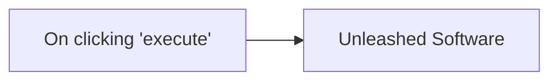

## Fluxo (.json) :

```json
{
  "name": "",
  "nodes": [
    {
      "name": "On clicking 'execute'",
      "type": "n8n-nodes-base.manualTrigger",
      "position": [
        390,
        220
      ],
      "parameters": {},
      "typeVersion": 1
    },
    {
      "name": "Unleashed Software",
      "type": "n8n-nodes-base.unleashedSoftware",
      "position": [
        600,
        220
      ],
      "parameters": {
        "filters": {
          "orderStatus": [
            "Completed"
          ]
        },
        "returnAll": true
      },
      "credentials": {
        "unleashedSoftwareApi": "unleashed"
      },
      "typeVersion": 1
    }
  ],
  "active": false,
  "settings": {},
  "connections": {
    "On clicking 'execute'": {
      "main": [
        [
          {
            "node": "Unleashed Software",
            "type": "main",
            "index": 0
          }
        ]
      ]
    }
  }
}
```

<a id="template-2088"></a>

## Template 2088 - Agente SMS de agendamento com IA

- **Nome:** Agente SMS de agendamento com IA
- **Descrição:** Fluxo para gerir conversas por SMS, agendar/reservar horários com um agente de IA, armazenar sessões e enviar follow-ups automáticos para leads não agendados.
- **Funcionalidade:** • Recepção de SMS: Inicia o fluxo ao receber mensagens dos clientes via SMS.
• Detecção de comando STOP: Identifica quando o cliente pede para parar e atualiza o registro para não enviar mais mensagens.
• Persistência de sessão: Recupera e atualiza histórico de conversas e metadados do cliente em um banco de dados.
• Agente de agendamento com IA: Usa um agente de linguagem para conversar com o cliente, obter dados (nome, email, data/hora) e decidir ações.
• Integração com calendário: Cria, consulta, reagenda e cancela reservas em um serviço de agendamento externo conforme instruções do agente.
• Geração de resposta estruturada: Garante que as respostas do modelo sigam um formato JSON estruturado (reply, nome, resumo, status de agendamento).
• Envio de respostas via SMS: Responde ao cliente com mensagens geradas pelo agente ou mensagens de confirmação.
• Armazenamento de histórico de chat: Registra mensagens trocadas para contexto em conversas futuras.
• Campanha de follow-up diária: Executa uma rotina diária que identifica leads sem agendamento e com critérios específicos para enviar follow-ups.
• Geração automática de follow-up: Utiliza um modelo de linguagem para criar mensagens de reengajamento personalizadas com base no histórico do cliente.
• Controle de tentativas de follow-up: Incrementa e registra o contador de follow-ups e a data do último follow-up para evitar spam.
- **Ferramentas:** • Twilio: Serviço de envio e recepção de mensagens SMS usado para comunicação com os clientes.
• Airtable: Banco de dados para armazenar sessões, histórico de chat, status do cliente e contadores de follow-up.
• OpenAI (modelos GPT): Modelos de linguagem usados para o agente de agendamento e para gerar mensagens de follow-up.
• Cal.com (API de agendamento): Serviço externo de calendário usado para criar, buscar, reagendar e cancelar bookings.


## Fluxo visual

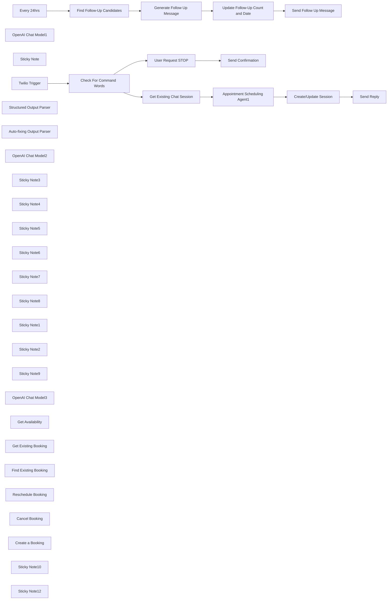

## Fluxo (.json) :

```json
{
  "meta": {
    "instanceId": "408f9fb9940c3cb18ffdef0e0150fe342d6e655c3a9fac21f0f644e8bedabcd9"
  },
  "nodes": [
    {
      "id": "f55b3110-f960-4d89-afba-d47bc58102eb",
      "name": "Twilio Trigger",
      "type": "n8n-nodes-base.twilioTrigger",
      "position": [
        100,
        180
      ],
      "webhookId": "bfc8f587-8183-46f8-9e76-3576caddf8c0",
      "parameters": {
        "updates": [
          "com.twilio.messaging.inbound-message.received"
        ]
      },
      "credentials": {
        "twilioApi": {
          "id": "TJv4H4lXxPCLZT50",
          "name": "Twilio account"
        }
      },
      "typeVersion": 1
    },
    {
      "id": "8472f5b0-329f-45ac-b35f-c42558daa7c7",
      "name": "OpenAI Chat Model1",
      "type": "@n8n/n8n-nodes-langchain.lmChatOpenAi",
      "position": [
        1140,
        1360
      ],
      "parameters": {
        "options": {}
      },
      "credentials": {
        "openAiApi": {
          "id": "8gccIjcuf3gvaoEr",
          "name": "OpenAi account"
        }
      },
      "typeVersion": 1
    },
    {
      "id": "4b3e8a26-c808-46e5-bbcf-2e1279989a0b",
      "name": "Find Follow-Up Candidates",
      "type": "n8n-nodes-base.airtable",
      "position": [
        720,
        1240
      ],
      "parameters": {
        "base": {
          "__rl": true,
          "mode": "list",
          "value": "appO2nHiT9XPuGrjN",
          "cachedResultUrl": "https://airtable.com/appO2nHiT9XPuGrjN",
          "cachedResultName": "Twilio-Scheduling-Agent"
        },
        "table": {
          "__rl": true,
          "mode": "list",
          "value": "tblokH7uw63RpIlQ0",
          "cachedResultUrl": "https://airtable.com/appO2nHiT9XPuGrjN/tblokH7uw63RpIlQ0",
          "cachedResultName": "Lead Tracker"
        },
        "options": {},
        "operation": "search",
        "filterByFormula": "=AND(\n  {appointment_id} = '',\n  {status} != 'STOP',\n  {followup_count} < 3,\n  DATETIME_DIFF(TODAY(), {last_followup_at}, 'days') >= 3\n)"
      },
      "credentials": {
        "airtableTokenApi": {
          "id": "Und0frCQ6SNVX3VV",
          "name": "Airtable Personal Access Token account"
        }
      },
      "typeVersion": 2.1
    },
    {
      "id": "04dc979c-ad36-4e57-93d4-905929fe1af0",
      "name": "Send Follow Up Message",
      "type": "n8n-nodes-base.twilio",
      "position": [
        1880,
        1240
      ],
      "parameters": {
        "to": "={{ $('Find Follow-Up Candidates').item.json.session_id }}",
        "from": "={{ $('Find Follow-Up Candidates').item.json.twilio_service_number }}",
        "message": "={{ $('Generate Follow Up Message').item.json.text }}\nReply STOP to stop recieving these messages.",
        "options": {}
      },
      "credentials": {
        "twilioApi": {
          "id": "TJv4H4lXxPCLZT50",
          "name": "Twilio account"
        }
      },
      "typeVersion": 1
    },
    {
      "id": "55e222af-fb59-4ffd-9661-350b1972e802",
      "name": "Sticky Note",
      "type": "n8n-nodes-base.stickyNote",
      "position": [
        570,
        943
      ],
      "parameters": {
        "color": 7,
        "width": 408.6631332343324,
        "height": 515.2449997772154,
        "content": "## Step 6. Filter Open Enquiries from Airtable\n\n### 💡Criteria For Follow Up Candidates\n* No Scheduled Appointment\n* No Request to STOP\n* No Previous Follow-up in Past 3 days\n* Follow-up is less than 3 times"
      },
      "typeVersion": 1
    },
    {
      "id": "50d0c632-233b-4b31-b396-3fa603aecd03",
      "name": "Update Follow-Up Count and Date",
      "type": "n8n-nodes-base.airtable",
      "position": [
        1700,
        1240
      ],
      "parameters": {
        "base": {
          "__rl": true,
          "mode": "list",
          "value": "appO2nHiT9XPuGrjN",
          "cachedResultUrl": "https://airtable.com/appO2nHiT9XPuGrjN",
          "cachedResultName": "Twilio-Scheduling-Agent"
        },
        "table": {
          "__rl": true,
          "mode": "list",
          "value": "tblokH7uw63RpIlQ0",
          "cachedResultUrl": "https://airtable.com/appO2nHiT9XPuGrjN/tblokH7uw63RpIlQ0",
          "cachedResultName": "Lead Tracker"
        },
        "columns": {
          "value": {
            "session_id": "={{ $('Find Follow-Up Candidates').item.json.session_id }}",
            "followup_count": "={{ ($('Find Follow-Up Candidates').item.json.followup_count ?? 0) + 1 }}",
            "last_followup_at": "={{ $now.toISO() }}"
          },
          "schema": [
            {
              "id": "id",
              "type": "string",
              "display": true,
              "removed": true,
              "readOnly": true,
              "required": false,
              "displayName": "id",
              "defaultMatch": true
            },
            {
              "id": "session_id",
              "type": "string",
              "display": true,
              "removed": false,
              "readOnly": false,
              "required": false,
              "displayName": "session_id",
              "defaultMatch": false,
              "canBeUsedToMatch": true
            },
            {
              "id": "status",
              "type": "options",
              "display": true,
              "options": [
                {
                  "name": "ACTIVE",
                  "value": "ACTIVE"
                },
                {
                  "name": "STOP",
                  "value": "STOP"
                }
              ],
              "removed": true,
              "readOnly": false,
              "required": false,
              "displayName": "status",
              "defaultMatch": false,
              "canBeUsedToMatch": true
            },
            {
              "id": "customer_name",
              "type": "string",
              "display": true,
              "removed": true,
              "readOnly": false,
              "required": false,
              "displayName": "customer_name",
              "defaultMatch": false,
              "canBeUsedToMatch": true
            },
            {
              "id": "customer_summary",
              "type": "string",
              "display": true,
              "removed": true,
              "readOnly": false,
              "required": false,
              "displayName": "customer_summary",
              "defaultMatch": false,
              "canBeUsedToMatch": true
            },
            {
              "id": "chat_messages",
              "type": "string",
              "display": true,
              "removed": true,
              "readOnly": false,
              "required": false,
              "displayName": "chat_messages",
              "defaultMatch": false,
              "canBeUsedToMatch": true
            },
            {
              "id": "scheduled_at",
              "type": "dateTime",
              "display": true,
              "removed": true,
              "readOnly": false,
              "required": false,
              "displayName": "scheduled_at",
              "defaultMatch": false,
              "canBeUsedToMatch": true
            },
            {
              "id": "appointment_id",
              "type": "string",
              "display": true,
              "removed": true,
              "readOnly": false,
              "required": false,
              "displayName": "appointment_id",
              "defaultMatch": false,
              "canBeUsedToMatch": true
            },
            {
              "id": "last_message_at",
              "type": "dateTime",
              "display": true,
              "removed": true,
              "readOnly": false,
              "required": false,
              "displayName": "last_message_at",
              "defaultMatch": false,
              "canBeUsedToMatch": true
            },
            {
              "id": "last_followup_at",
              "type": "dateTime",
              "display": true,
              "removed": false,
              "readOnly": false,
              "required": false,
              "displayName": "last_followup_at",
              "defaultMatch": false,
              "canBeUsedToMatch": true
            },
            {
              "id": "followup_count",
              "type": "number",
              "display": true,
              "removed": false,
              "readOnly": false,
              "required": false,
              "displayName": "followup_count",
              "defaultMatch": false,
              "canBeUsedToMatch": true
            },
            {
              "id": "assignee",
              "type": "string",
              "display": true,
              "removed": true,
              "readOnly": false,
              "required": false,
              "displayName": "assignee",
              "defaultMatch": false,
              "canBeUsedToMatch": true
            }
          ],
          "mappingMode": "defineBelow",
          "matchingColumns": [
            "session_id"
          ]
        },
        "options": {},
        "operation": "update"
      },
      "credentials": {
        "airtableTokenApi": {
          "id": "Und0frCQ6SNVX3VV",
          "name": "Airtable Personal Access Token account"
        }
      },
      "typeVersion": 2.1
    },
    {
      "id": "e1331352-c3da-4586-9d64-4be4dab49748",
      "name": "Create/Update Session",
      "type": "n8n-nodes-base.airtable",
      "position": [
        2240,
        269
      ],
      "parameters": {
        "base": {
          "__rl": true,
          "mode": "list",
          "value": "appO2nHiT9XPuGrjN",
          "cachedResultUrl": "https://airtable.com/appO2nHiT9XPuGrjN",
          "cachedResultName": "Twilio-Scheduling-Agent"
        },
        "table": {
          "__rl": true,
          "mode": "list",
          "value": "tblokH7uw63RpIlQ0",
          "cachedResultUrl": "https://airtable.com/appO2nHiT9XPuGrjN/tblokH7uw63RpIlQ0",
          "cachedResultName": "Lead Tracker"
        },
        "columns": {
          "value": {
            "session_id": "={{ $('Twilio Trigger').item.json.From }}",
            "scheduled_at": "={{\n$('Appointment Scheduling Agent').item.json.output.has_appointment_scheduled\n  ? $('Appointment Scheduling Agent').item.json.output.appointment.scheduled_at\n  : (\n    $('Get Existing Chat Session').item.json.isNotEmpty()\n    ? $('Get Existing Chat Session').item.json.scheduled_at\n    : $now.toISO()\n  )\n}}",
            "chat_messages": "={{\nJSON.stringify(\n  ($('Get Existing Chat Session').item.json.chat_messages ? JSON.parse($('Get Existing Chat Session').item.json.chat_messages) : [])\n  .concat(\n    { \"role\": \"human\", \"message\": $('Twilio Trigger').item.json.Body },\n    { \"role\": \"assistant\", \"message\": $('Appointment Scheduling Agent').item.json.output.reply }\n  )\n)\n}}",
            "customer_name": "={{\n  !$('Get Existing Chat Session').item.json.customer_name &&\n  $('Appointment Scheduling Agent').item.json.output.customer_name\n    ? $('Appointment Scheduling Agent').item.json.output.customer_name\n    : ($('Get Existing Chat Session').item.json.customer_name ?? '')\n}}",
            "appointment_id": "={{\n$('Appointment Scheduling Agent').item.json.output.has_appointment_scheduled\n  ? $('Appointment Scheduling Agent').item.json.output.appointment.appointment_id\n  : (\n    $('Get Existing Chat Session').item.json.isNotEmpty()\n    ? $('Get Existing Chat Session').item.json.appointment_id\n    : ''\n  )\n}}",
            "followup_count": "={{\n  !$('Get Existing Chat Session').item.json.followup_count\n  ? 0\n  : $('Get Existing Chat Session').item.json.followup_count\n}}",
            "last_message_at": "={{ $now.toISO() }}",
            "customer_summary": "={{\n  !$('Get Existing Chat Session').item.json.appointment_id\n  && $('Appointment Scheduling Agent').item.json.output.has_appointment_scheduled\n    ? $json.output.enquiry_summary\n    : $('Get Existing Chat Session').item.json.customer_summary\n}}",
            "last_followup_at": "={{\n  !$('Get Existing Chat Session').item.json.last_followup_at\n  ? $now.toISO()\n  : $('Get Existing Chat Session').item.json.last_followup_at\n}}",
            "twilio_service_number": "={{ $('Twilio Trigger').item.json.To }}"
          },
          "schema": [
            {
              "id": "id",
              "type": "string",
              "display": true,
              "removed": true,
              "readOnly": true,
              "required": false,
              "displayName": "id",
              "defaultMatch": true
            },
            {
              "id": "session_id",
              "type": "string",
              "display": true,
              "removed": false,
              "readOnly": false,
              "required": false,
              "displayName": "session_id",
              "defaultMatch": false,
              "canBeUsedToMatch": true
            },
            {
              "id": "status",
              "type": "options",
              "display": true,
              "options": [
                {
                  "name": "ACTIVE",
                  "value": "ACTIVE"
                },
                {
                  "name": "STOP",
                  "value": "STOP"
                }
              ],
              "removed": true,
              "readOnly": false,
              "required": false,
              "displayName": "status",
              "defaultMatch": false,
              "canBeUsedToMatch": true
            },
            {
              "id": "customer_name",
              "type": "string",
              "display": true,
              "removed": false,
              "readOnly": false,
              "required": false,
              "displayName": "customer_name",
              "defaultMatch": false,
              "canBeUsedToMatch": true
            },
            {
              "id": "customer_summary",
              "type": "string",
              "display": true,
              "removed": false,
              "readOnly": false,
              "required": false,
              "displayName": "customer_summary",
              "defaultMatch": false,
              "canBeUsedToMatch": true
            },
            {
              "id": "chat_messages",
              "type": "string",
              "display": true,
              "removed": false,
              "readOnly": false,
              "required": false,
              "displayName": "chat_messages",
              "defaultMatch": false,
              "canBeUsedToMatch": true
            },
            {
              "id": "scheduled_at",
              "type": "dateTime",
              "display": true,
              "removed": false,
              "readOnly": false,
              "required": false,
              "displayName": "scheduled_at",
              "defaultMatch": false,
              "canBeUsedToMatch": true
            },
            {
              "id": "appointment_id",
              "type": "string",
              "display": true,
              "removed": false,
              "readOnly": false,
              "required": false,
              "displayName": "appointment_id",
              "defaultMatch": false,
              "canBeUsedToMatch": true
            },
            {
              "id": "last_message_at",
              "type": "dateTime",
              "display": true,
              "removed": false,
              "readOnly": false,
              "required": false,
              "displayName": "last_message_at",
              "defaultMatch": false,
              "canBeUsedToMatch": true
            },
            {
              "id": "last_followup_at",
              "type": "dateTime",
              "display": true,
              "removed": false,
              "readOnly": false,
              "required": false,
              "displayName": "last_followup_at",
              "defaultMatch": false,
              "canBeUsedToMatch": true
            },
            {
              "id": "followup_count",
              "type": "number",
              "display": true,
              "removed": false,
              "readOnly": false,
              "required": false,
              "displayName": "followup_count",
              "defaultMatch": false,
              "canBeUsedToMatch": true
            },
            {
              "id": "assignee",
              "type": "string",
              "display": true,
              "removed": true,
              "readOnly": false,
              "required": false,
              "displayName": "assignee",
              "defaultMatch": false,
              "canBeUsedToMatch": true
            },
            {
              "id": "twilio_service_number",
              "type": "string",
              "display": true,
              "removed": false,
              "readOnly": false,
              "required": false,
              "displayName": "twilio_service_number",
              "defaultMatch": false,
              "canBeUsedToMatch": true
            }
          ],
          "mappingMode": "defineBelow",
          "matchingColumns": [
            "session_id"
          ]
        },
        "options": {},
        "operation": "update"
      },
      "credentials": {
        "airtableTokenApi": {
          "id": "Und0frCQ6SNVX3VV",
          "name": "Airtable Personal Access Token account"
        }
      },
      "typeVersion": 2.1
    },
    {
      "id": "de8eaa46-2fe8-4afd-a400-9c528f578d24",
      "name": "Get Existing Chat Session",
      "type": "n8n-nodes-base.airtable",
      "position": [
        740,
        240
      ],
      "parameters": {
        "base": {
          "__rl": true,
          "mode": "list",
          "value": "appO2nHiT9XPuGrjN",
          "cachedResultUrl": "https://airtable.com/appO2nHiT9XPuGrjN",
          "cachedResultName": "Twilio-Scheduling-Agent"
        },
        "limit": 1,
        "table": {
          "__rl": true,
          "mode": "list",
          "value": "tblokH7uw63RpIlQ0",
          "cachedResultUrl": "https://airtable.com/appO2nHiT9XPuGrjN/tblokH7uw63RpIlQ0",
          "cachedResultName": "Lead Tracker"
        },
        "options": {},
        "operation": "search",
        "returnAll": false,
        "filterByFormula": "={session_id}=\"{{ $('Twilio Trigger').item.json.From }}\""
      },
      "credentials": {
        "airtableTokenApi": {
          "id": "Und0frCQ6SNVX3VV",
          "name": "Airtable Personal Access Token account"
        }
      },
      "typeVersion": 2.1,
      "alwaysOutputData": true
    },
    {
      "id": "16aabbf0-fdf7-4940-a3a3-962e0b877299",
      "name": "Every 24hrs",
      "type": "n8n-nodes-base.scheduleTrigger",
      "position": [
        220,
        1160
      ],
      "parameters": {
        "rule": {
          "interval": [
            {}
          ]
        }
      },
      "typeVersion": 1.2
    },
    {
      "id": "9471b840-3a59-491d-a309-180d5a69fb7e",
      "name": "Send Reply",
      "type": "n8n-nodes-base.twilio",
      "position": [
        2420,
        269
      ],
      "parameters": {
        "to": "={{ $('Twilio Trigger').item.json.From }}",
        "from": "={{ $('Twilio Trigger').item.json.To }}",
        "message": "={{ $('Appointment Scheduling Agent').item.json.output.reply }}",
        "options": {}
      },
      "credentials": {
        "twilioApi": {
          "id": "TJv4H4lXxPCLZT50",
          "name": "Twilio account"
        }
      },
      "typeVersion": 1
    },
    {
      "id": "601aa9ea-f3f4-49bd-a391-84e32c47f7ba",
      "name": "Send Confirmation",
      "type": "n8n-nodes-base.twilio",
      "position": [
        900,
        -280
      ],
      "parameters": {
        "to": "={{ $('Twilio Trigger').item.json.From }}",
        "from": "={{ $('Twilio Trigger').item.json.To }}",
        "message": "Thank you. You won't receive any more messages from us!",
        "options": {}
      },
      "credentials": {
        "twilioApi": {
          "id": "TJv4H4lXxPCLZT50",
          "name": "Twilio account"
        }
      },
      "typeVersion": 1
    },
    {
      "id": "a8b9fffe-f814-4cb4-9e1a-bf7eb57e7afd",
      "name": "User Request STOP",
      "type": "n8n-nodes-base.airtable",
      "position": [
        660,
        -280
      ],
      "parameters": {
        "base": {
          "__rl": true,
          "mode": "list",
          "value": "appO2nHiT9XPuGrjN",
          "cachedResultUrl": "https://airtable.com/appO2nHiT9XPuGrjN",
          "cachedResultName": "Twilio-Scheduling-Agent"
        },
        "table": {
          "__rl": true,
          "mode": "list",
          "value": "tblokH7uw63RpIlQ0",
          "cachedResultUrl": "https://airtable.com/appO2nHiT9XPuGrjN/tblokH7uw63RpIlQ0",
          "cachedResultName": "Lead Tracker"
        },
        "columns": {
          "value": {
            "status": "STOP",
            "session_id": "={{ $('Twilio Trigger').item.json.From }}"
          },
          "schema": [
            {
              "id": "id",
              "type": "string",
              "display": true,
              "removed": true,
              "readOnly": true,
              "required": false,
              "displayName": "id",
              "defaultMatch": true
            },
            {
              "id": "session_id",
              "type": "string",
              "display": true,
              "removed": false,
              "readOnly": false,
              "required": false,
              "displayName": "session_id",
              "defaultMatch": false,
              "canBeUsedToMatch": true
            },
            {
              "id": "status",
              "type": "options",
              "display": true,
              "options": [
                {
                  "name": "ACTIVE",
                  "value": "ACTIVE"
                },
                {
                  "name": "STOP",
                  "value": "STOP"
                }
              ],
              "removed": false,
              "readOnly": false,
              "required": false,
              "displayName": "status",
              "defaultMatch": false,
              "canBeUsedToMatch": true
            },
            {
              "id": "chat_messages",
              "type": "string",
              "display": true,
              "removed": true,
              "readOnly": false,
              "required": false,
              "displayName": "chat_messages",
              "defaultMatch": false,
              "canBeUsedToMatch": true
            },
            {
              "id": "scheduled_at",
              "type": "dateTime",
              "display": true,
              "removed": true,
              "readOnly": false,
              "required": false,
              "displayName": "scheduled_at",
              "defaultMatch": false,
              "canBeUsedToMatch": true
            },
            {
              "id": "last_message_at",
              "type": "dateTime",
              "display": true,
              "removed": true,
              "readOnly": false,
              "required": false,
              "displayName": "last_message_at",
              "defaultMatch": false,
              "canBeUsedToMatch": true
            },
            {
              "id": "last_followup_at",
              "type": "dateTime",
              "display": true,
              "removed": true,
              "readOnly": false,
              "required": false,
              "displayName": "last_followup_at",
              "defaultMatch": false,
              "canBeUsedToMatch": true
            },
            {
              "id": "followup_count",
              "type": "number",
              "display": true,
              "removed": true,
              "readOnly": false,
              "required": false,
              "displayName": "followup_count",
              "defaultMatch": false,
              "canBeUsedToMatch": true
            },
            {
              "id": "assignee",
              "type": "string",
              "display": true,
              "removed": true,
              "readOnly": false,
              "required": false,
              "displayName": "assignee",
              "defaultMatch": false,
              "canBeUsedToMatch": true
            }
          ],
          "mappingMode": "defineBelow",
          "matchingColumns": [
            "session_id"
          ]
        },
        "options": {},
        "operation": "update"
      },
      "credentials": {
        "airtableTokenApi": {
          "id": "Und0frCQ6SNVX3VV",
          "name": "Airtable Personal Access Token account"
        }
      },
      "typeVersion": 2.1
    },
    {
      "id": "3e7797f0-5449-404c-bac9-e0019223cea8",
      "name": "Check For Command  Words",
      "type": "n8n-nodes-base.switch",
      "position": [
        295,
        180
      ],
      "parameters": {
        "rules": {
          "values": [
            {
              "outputKey": "STOP",
              "conditions": {
                "options": {
                  "leftValue": "",
                  "caseSensitive": true,
                  "typeValidation": "strict"
                },
                "combinator": "and",
                "conditions": [
                  {
                    "operator": {
                      "type": "string",
                      "operation": "contains"
                    },
                    "leftValue": "={{ $json.Body }}",
                    "rightValue": "STOP"
                  }
                ]
              },
              "renameOutput": true
            }
          ]
        },
        "options": {
          "fallbackOutput": "extra"
        }
      },
      "typeVersion": 3
    },
    {
      "id": "e636ebb5-16c6-43ef-9fee-fe2b9a8c95a9",
      "name": "Structured Output Parser",
      "type": "@n8n/n8n-nodes-langchain.outputParserStructured",
      "position": [
        1960,
        560
      ],
      "parameters": {
        "jsonSchemaExample": "{\n    \"reply\": \"\",\n    \"customer_name\": \"\",\n    \"enquiry_summary\": \"\",\n\t\"has_appointment_scheduled\": false,\n    \"appointment\": {\n      \"appointment_id\": \"\",\n      \"scheduled_at\": \"\"\n    }\n}"
      },
      "typeVersion": 1.2
    },
    {
      "id": "3469740d-bd2f-4d34-a86b-59b088917d74",
      "name": "Auto-fixing Output Parser",
      "type": "@n8n/n8n-nodes-langchain.outputParserAutofixing",
      "position": [
        1820,
        440
      ],
      "parameters": {},
      "typeVersion": 1
    },
    {
      "id": "fc0adfdf-724c-45d2-84f6-cb2b43254cc0",
      "name": "OpenAI Chat Model2",
      "type": "@n8n/n8n-nodes-langchain.lmChatOpenAi",
      "position": [
        1840,
        560
      ],
      "parameters": {
        "options": {}
      },
      "credentials": {
        "openAiApi": {
          "id": "8gccIjcuf3gvaoEr",
          "name": "OpenAi account"
        }
      },
      "typeVersion": 1
    },
    {
      "id": "0e0d8236-0f10-4f8f-88c1-bba2ef084e90",
      "name": "Sticky Note3",
      "type": "n8n-nodes-base.stickyNote",
      "position": [
        1080,
        -50.317404874203476
      ],
      "parameters": {
        "color": 7,
        "width": 1011.8938194478603,
        "height": 917.533068142247,
        "content": "## Step 3. Appointment Scheduling With AI\n[Learn about using AI Agents](https://docs.n8n.io/integrations/builtin/cluster-nodes/root-nodes/n8n-nodes-langchain.agent)\n\nUsing an AI Agent is a powerful way to simplify and enhance workflows using the latest in AI technology. Our appointment scheduling agent is equipped to converse with the customer and all the necessary tools to schedule, re-schedule and cancel appointments.\n\nUsing the **HTTP Tool** node, it's easy to connect to third party API services to perform actions. In this workflow, we're calling the Cal.com API to handle scheduling events."
      },
      "typeVersion": 1
    },
    {
      "id": "380b437e-fa29-4ebb-bebd-1984d371bc93",
      "name": "Sticky Note4",
      "type": "n8n-nodes-base.stickyNote",
      "position": [
        549.8696404310444,
        -49.46972087742148
      ],
      "parameters": {
        "color": 7,
        "width": 504.0066355303578,
        "height": 557.8466102697549,
        "content": "## Step 2. Check for Existing Chat History\n[Read more about using Airtable](https://docs.n8n.io/integrations/builtin/app-nodes/n8n-nodes-base.airtable)\n\nWe're using Airtable for customer session management and to capture chat history. Airtable is an ideal choice because it acts as a persistent database with a flexible API which could prove essential for further extension.\n\nWe'll pull any previous chat history and pass this to our agent to continue the conversation."
      },
      "typeVersion": 1
    },
    {
      "id": "f89762f5-8520-4af6-987d-a71381c603e3",
      "name": "Sticky Note5",
      "type": "n8n-nodes-base.stickyNote",
      "position": [
        0,
        -52.79744987055557
      ],
      "parameters": {
        "color": 7,
        "width": 523.6927529886705,
        "height": 479.4432905734608,
        "content": "## Step 1. Wait For Customer SMS\n[Read more about Twilio trigger](https://docs.n8n.io/integrations/builtin/trigger-nodes/n8n-nodes-base.twiliotrigger)\n\nFor this workflow, we'll use the twilio SMS trigger to receive enquiries from customers looking to book a PC or laptop repair.\n\nSince we'll be working with SMS, we'll have a check to see if the customer wishes to STOP any further follow-up messages. This is an optional step that we'll get to later."
      },
      "typeVersion": 1
    },
    {
      "id": "de525648-ef11-4b48-85ea-c6e5463c87cf",
      "name": "Sticky Note6",
      "type": "n8n-nodes-base.stickyNote",
      "position": [
        540,
        -450.0217713292123
      ],
      "parameters": {
        "color": 7,
        "width": 563.7797724327219,
        "height": 358.6710117357418,
        "content": "## Step 9. Cancelling Follow-Up Messages \n\nIf the customer messages the bot with the word STOP, we'll update our customer record in Airtable which will prevent further follow-ups from being trigger. A confirmation message is sent after to the customer."
      },
      "typeVersion": 1
    },
    {
      "id": "028e4253-d1e6-4cf8-b181-ba27b03fa66e",
      "name": "Sticky Note7",
      "type": "n8n-nodes-base.stickyNote",
      "position": [
        2120,
        -40
      ],
      "parameters": {
        "color": 7,
        "width": 521.5259177258192,
        "height": 558.7093446159199,
        "content": "## Step 4. Updating Airtable and Responding to the Customer \n[Read more about using Twilio](https://docs.n8n.io/integrations/builtin/app-nodes/n8n-nodes-base.twilio)\n\nOnce the agent formulates a response, we can update our appointment table accordingly ensuring the conversation at any stage is captured.\n\nIf no appointment is scheduled, we can move onto the second half of this workflow which covers following up with prospective customers and their enquiries."
      },
      "typeVersion": 1
    },
    {
      "id": "f321ded9-c5d3-418d-bf1c-e29bf9845098",
      "name": "Sticky Note8",
      "type": "n8n-nodes-base.stickyNote",
      "position": [
        20,
        940
      ],
      "parameters": {
        "color": 7,
        "width": 509.931737588259,
        "height": 433.74984757777247,
        "content": "## Step 5. Following Up With Open Enquiries\n[Read more about using scheduled trigger](https://docs.n8n.io/integrations/builtin/core-nodes/n8n-nodes-base.scheduletrigger)\n\nThe second half of this workflow deals with identifying customers who have engaged our chatbot but have not yet confirmed an appointment. We intend to send a follow-up message asking if the enquiry is still valid and encourage an appointment to be made with the customer."
      },
      "typeVersion": 1
    },
    {
      "id": "4485e39a-3e84-49ee-9d3f-a271a98a330a",
      "name": "Sticky Note1",
      "type": "n8n-nodes-base.stickyNote",
      "position": [
        1000,
        940
      ],
      "parameters": {
        "color": 7,
        "width": 567.1169284476533,
        "height": 601.5572296901626,
        "content": "## Step 7. Generating a Follow-Up Message\n[Read more about Basic LLM Chain](https://docs.n8n.io/integrations/builtin/cluster-nodes/root-nodes/n8n-nodes-langchain.chainllm)\n\nWith our session and chat history retrieved from Airtable, we can simple ask our AI to generate a nicely worded follow-up message to re-engage the customer.\n\nWhere the logic is linear, the Basic LLM chain is suitable for many workflows. An agent is not always required!"
      },
      "typeVersion": 1
    },
    {
      "id": "f2d66e44-cf18-4e8f-80d5-e8d03e10e5ff",
      "name": "Generate Follow Up Message",
      "type": "@n8n/n8n-nodes-langchain.chainLlm",
      "position": [
        1140,
        1200
      ],
      "parameters": {
        "text": "=",
        "messages": {
          "messageValues": [
            {
              "message": "=You are an appointment scheduling assistant for PC and Laptop Repairs for a company called \"PC Parts Ltd\". You shall refer to yourself as the \"service team\". You had a conversation with a customer on {{ $json.last_message_at }} but the enquiry did not end with an appointment being scheduled.\n{{ $json.last_followup_at ? `You last sent a follow-up message on ${$json.last_followup_at}` : '' }}.\n\nYou task is to ask if the prospective customer would like to continue with the enquiry using the following information gather to construct a relevant follow-up message. Try to entice the user to continue the conversation and ultimately schedule an appointment.\n\n## About the customer\nname: {{ $json.customer_name ?? '<unknown>' }}\nenquiry summary: {{ $json.customer_summary ?? '<uknown>' }}\n\n# Existing conversation\nHere are the chat logs of the existing conversation:\n{{ $json.chat_messages }}"
            }
          ]
        },
        "promptType": "define"
      },
      "typeVersion": 1.4
    },
    {
      "id": "0b93a300-b9ab-4c28-8ac0-fddc49247b74",
      "name": "Sticky Note2",
      "type": "n8n-nodes-base.stickyNote",
      "position": [
        1600,
        940
      ],
      "parameters": {
        "color": 7,
        "width": 496.0833287715134,
        "height": 526.084030034264,
        "content": "## Step 8. Update Follow-Up Properties and Send Message\n[Read more about using Twilio](https://docs.n8n.io/integrations/builtin/app-nodes/n8n-nodes-base.twilio/)\n\nFinally, we'll update our follow-up activity as part of the customer record in Airtable. Keeping track of the number of times we follow-up helps prevent spamming the customer unnecessarily.\n\nThe follow-up message is sent via Twilio and includes instruction to disable further follow-up messages using the keyword STOP."
      },
      "typeVersion": 1
    },
    {
      "id": "0e022485-9504-416a-8632-edd65df29bf4",
      "name": "Sticky Note9",
      "type": "n8n-nodes-base.stickyNote",
      "position": [
        -480,
        -80
      ],
      "parameters": {
        "width": 437.0019498737189,
        "height": 511.67220311821393,
        "content": "## Try It Out!\n\n### This workflow implements an appointment scheduling chatbot which is powered by an AI tools agent.\n* Workflow is triggered by Customer enquires sent via SMS\n* Customer session management and chat history are captured in Airtable to enable the SMS conversation.\n* An AI Agent is equipped to answer any questions as well as schedule, re-schedule and cancel appointments on behalf of the customer.\n* The agent's reply is sent back to the customer via SMS.\n* Additional a follow-up system is implemented to re-engage customers who haven't scheduled an appointment.\n\n \n### Need Help?\nJoin the [Discord](https://discord.com/invite/XPKeKXeB7d) or ask in the [Forum](https://community.n8n.io/)!\n\nHappy Hacking!"
      },
      "typeVersion": 1
    },
    {
      "id": "04681629-0221-47fe-b992-0d5791995523",
      "name": "OpenAI Chat Model3",
      "type": "@n8n/n8n-nodes-langchain.lmChatOpenAi",
      "position": [
        1120,
        420
      ],
      "parameters": {
        "model": "gpt-4o-mini",
        "options": {}
      },
      "credentials": {
        "openAiApi": {
          "id": "8gccIjcuf3gvaoEr",
          "name": "OpenAi account"
        }
      },
      "typeVersion": 1
    },
    {
      "id": "7633e3b0-daf3-495d-bcd7-ce0db24a73b9",
      "name": "Get Availability",
      "type": "@n8n/n8n-nodes-langchain.toolHttpRequest",
      "position": [
        1260,
        440
      ],
      "parameters": {
        "url": "https://api.cal.com/v2/slots/available",
        "sendQuery": true,
        "authentication": "genericCredentialType",
        "genericAuthType": "httpHeaderAuth",
        "parametersQuery": {
          "values": [
            {
              "name": "eventTypeId",
              "value": "={{ 648297 }}",
              "valueProvider": "fieldValue"
            },
            {
              "name": "startTime",
              "value": "{startTime}",
              "valueProvider": "fieldValue"
            },
            {
              "name": "endTime",
              "value": "{endTime}",
              "valueProvider": "fieldValue"
            }
          ]
        },
        "toolDescription": "Call this tool to get the appointment availability. Dates can be variable but times are fixed - startTime must always be 9am and endTime must be 7pm. Strictly use ISO format for dates eg. \"2024-01-01T09:00:00-00:00\". Input schema example: ```{ \"startTime\": \"...\", \"endTime\": \"...\"}```",
        "placeholderDefinitions": {
          "values": [
            {
              "name": "startTime",
              "type": "string",
              "description": "start of daterange in ISO format. eg. 2024-01-01T09:00:00-00:00"
            },
            {
              "name": "endTime",
              "type": "string",
              "description": "end of daterange in ISO format. eg. 2024-01-01T09:00:00-00:00"
            }
          ]
        }
      },
      "credentials": {
        "calApi": {
          "id": "GPSKPrBhO3Pq6KVF",
          "name": "Cal account"
        },
        "httpHeaderAuth": {
          "id": "X2Vr2TQSBcOsOMst",
          "name": "Cal.com API v2"
        }
      },
      "typeVersion": 1
    },
    {
      "id": "0f814d08-218e-492e-b1f8-63985d583e80",
      "name": "Get Existing Booking",
      "type": "@n8n/n8n-nodes-langchain.toolHttpRequest",
      "position": [
        1560,
        440
      ],
      "parameters": {
        "url": "https://api.cal.com/v2/bookings/{bookingUid}",
        "sendHeaders": true,
        "authentication": "predefinedCredentialType",
        "toolDescription": "Call this tool to get an existing booking using a booking \"uid\".",
        "parametersHeaders": {
          "values": [
            {
              "name": "cal-api-version",
              "value": "2024-08-13",
              "valueProvider": "fieldValue"
            }
          ]
        },
        "nodeCredentialType": "calApi",
        "placeholderDefinitions": {
          "values": [
            {
              "name": "bookingUid",
              "type": "string",
              "description": "the uid of the booking (note: this is not the same as the id of the booking)"
            }
          ]
        }
      },
      "credentials": {
        "calApi": {
          "id": "GPSKPrBhO3Pq6KVF",
          "name": "Cal account"
        }
      },
      "typeVersion": 1
    },
    {
      "id": "36a5a2a7-bb78-4091-8b25-5e9f49628542",
      "name": "Find Existing Booking",
      "type": "@n8n/n8n-nodes-langchain.toolHttpRequest",
      "position": [
        1700,
        440
      ],
      "parameters": {
        "url": "https://api.cal.com/v2/bookings",
        "jsonQuery": "{\n  \"status\": \"upcoming\",\n  \"attendeeEmail\": \"{attendee_email}\",\n  \"afterStart\": \"{date}\"\n}",
        "sendQuery": true,
        "sendHeaders": true,
        "specifyQuery": "json",
        "authentication": "genericCredentialType",
        "genericAuthType": "httpHeaderAuth",
        "toolDescription": "Call this tool to search for an existing bookings with the user's email address and date. Use the \"uid\" field in the results as the primary booking identifier, ignore the \"id\" field.",
        "parametersHeaders": {
          "values": [
            {
              "name": "cal-api-version",
              "value": "2024-08-13",
              "valueProvider": "fieldValue"
            }
          ]
        },
        "placeholderDefinitions": {
          "values": [
            {
              "name": "attendee_email",
              "type": "string",
              "description": "email address of attendee"
            },
            {
              "name": "date",
              "description": "Filter bookings with start after this date string. The time is always fixed at 9am."
            }
          ]
        }
      },
      "credentials": {
        "calApi": {
          "id": "GPSKPrBhO3Pq6KVF",
          "name": "Cal account"
        },
        "httpHeaderAuth": {
          "id": "X2Vr2TQSBcOsOMst",
          "name": "Cal.com API v2"
        }
      },
      "typeVersion": 1
    },
    {
      "id": "88ee279d-ed85-4dc6-b42a-5e1e50f3d708",
      "name": "Reschedule Booking",
      "type": "@n8n/n8n-nodes-langchain.toolHttpRequest",
      "position": [
        1560,
        620
      ],
      "parameters": {
        "url": "https://api.cal.com/v2/bookings/{bookingUid}/reschedule",
        "method": "POST",
        "jsonBody": "{\n  \"start\": \"{start}\",\n  \"reschedulingReason\": \"{reschedulingReason}\"\n}",
        "sendBody": true,
        "sendHeaders": true,
        "specifyBody": "json",
        "authentication": "genericCredentialType",
        "genericAuthType": "httpHeaderAuth",
        "toolDescription": "Call this tool to reschedule a user's booking using a booking \"uid\".",
        "parametersHeaders": {
          "values": [
            {
              "name": "cal-api-version",
              "value": "2024-08-13",
              "valueProvider": "fieldValue"
            }
          ]
        },
        "placeholderDefinitions": {
          "values": [
            {
              "name": "bookingUid",
              "type": "string",
              "description": "the uid of the booking. Note this is not the same as the id of the booking."
            },
            {
              "name": "start",
              "type": "string",
              "description": "start datetime of the appointment, for example: \"2024-05-30T12:00:00.000Z\""
            },
            {
              "name": "reschedulingReason",
              "type": "string",
              "description": "Reason for rescheduling the booking. If not given, value is \"Declined to give reason.\""
            }
          ]
        }
      },
      "credentials": {
        "calApi": {
          "id": "GPSKPrBhO3Pq6KVF",
          "name": "Cal account"
        },
        "httpHeaderAuth": {
          "id": "X2Vr2TQSBcOsOMst",
          "name": "Cal.com API v2"
        }
      },
      "typeVersion": 1
    },
    {
      "id": "ee30c793-d8f4-4e49-9bd1-70e5ac109b68",
      "name": "Cancel Booking",
      "type": "@n8n/n8n-nodes-langchain.toolHttpRequest",
      "position": [
        1700,
        620
      ],
      "parameters": {
        "url": "https://api.cal.com/v2/bookings/{bookingUid}/cancel",
        "method": "POST",
        "jsonBody": "{\n  \"cancellationReason\": \"{cancellationReason}\"\n}",
        "sendBody": true,
        "sendHeaders": true,
        "specifyBody": "json",
        "authentication": "genericCredentialType",
        "genericAuthType": "httpHeaderAuth",
        "toolDescription": "Call this tool to cancel a user's existing booking using a booking \"uid\".",
        "parametersHeaders": {
          "values": [
            {
              "name": "cal-api-version",
              "value": "2024-08-13",
              "valueProvider": "fieldValue"
            }
          ]
        },
        "placeholderDefinitions": {
          "values": [
            {
              "name": "bookingUid",
              "type": "string",
              "description": "the uid of the booking. Note this is not the same as the id of the booking."
            },
            {
              "name": "cancellationReason",
              "type": "string",
              "description": "Reason for cancelling the appointment"
            }
          ]
        }
      },
      "credentials": {
        "calApi": {
          "id": "GPSKPrBhO3Pq6KVF",
          "name": "Cal account"
        },
        "httpHeaderAuth": {
          "id": "X2Vr2TQSBcOsOMst",
          "name": "Cal.com API v2"
        }
      },
      "typeVersion": 1
    },
    {
      "id": "d90aa957-30d7-4b29-93b9-acdc86f1cb17",
      "name": "Create a Booking",
      "type": "@n8n/n8n-nodes-langchain.toolHttpRequest",
      "position": [
        1400,
        440
      ],
      "parameters": {
        "url": "https://api.cal.com/v2/bookings",
        "method": "POST",
        "jsonBody": "{\n  \"eventTypeId\": 648297,\n  \"start\": \"{start}\",\n  \"attendee\": {\n     \"name\": \"{attendee_name}\",\n     \"email\": \"{attendee_email}\",\n     \"timeZone\": \"{attendee_timezone}\"\n  },\n  \"bookingFieldsResponses\": {\n    \"title\": \"{summary_of_enquiry}\"\n  }\n}",
        "sendBody": true,
        "sendHeaders": true,
        "specifyBody": "json",
        "authentication": "genericCredentialType",
        "genericAuthType": "httpHeaderAuth",
        "toolDescription": "Call this tool to create a booking. Strictly use ISO format for dates eg. \"2024-01-01T09:00:00-00:00\" for API compatibility.",
        "parametersHeaders": {
          "values": [
            {
              "name": "Content-Type",
              "value": "application/json",
              "valueProvider": "fieldValue"
            },
            {
              "name": "cal-api-version",
              "value": "2024-08-13",
              "valueProvider": "fieldValue"
            }
          ]
        },
        "placeholderDefinitions": {
          "values": [
            {
              "name": "start",
              "type": "string",
              "description": "The start time of the booking in ISO format. eg. \"2024-01-01T09:00:00Z\""
            },
            {
              "name": "attendee_name",
              "type": "string",
              "description": "Name of the attendee"
            },
            {
              "name": "attendee_email",
              "type": "string",
              "description": "email of the attendee"
            },
            {
              "name": "attendee_timezone",
              "type": "string",
              "description": "If timezone is unknown, assume Europe/London."
            },
            {
              "name": "summary_of_enquiry",
              "type": "string",
              "description": "short summary of the enquiry or purpose of the meeting"
            }
          ]
        }
      },
      "credentials": {
        "calApi": {
          "id": "GPSKPrBhO3Pq6KVF",
          "name": "Cal account"
        },
        "httpHeaderAuth": {
          "id": "X2Vr2TQSBcOsOMst",
          "name": "Cal.com API v2"
        }
      },
      "typeVersion": 1
    },
    {
      "id": "dfcf00ca-8fe1-4517-b64f-fbb4606ab221",
      "name": "Sticky Note10",
      "type": "n8n-nodes-base.stickyNote",
      "position": [
        928.7527821891895,
        600
      ],
      "parameters": {
        "color": 7,
        "width": 261.1134437946252,
        "height": 168.99242033383513,
        "content": "\nYou'll need to set a custom Header Auth Credential for Cal.com API v2. See the following doc for more info: https://cal.com/docs/api-reference/v2/introduction"
      },
      "typeVersion": 1
    },
    {
      "id": "e743b324-ead2-47f8-87c9-2eb969305d4e",
      "name": "Sticky Note12",
      "type": "n8n-nodes-base.stickyNote",
      "position": [
        1220,
        420
      ],
      "parameters": {
        "width": 301.851426117099,
        "height": 360.9218237282627,
        "content": "\n\n\n\n\n\n\n\n\n\n\n\n\n### 🚨 Change EventTypeID Here!\n* EventTypeID must be a number.\n* Your event type dictates the allowed duration of the booking.\n* If Event Type set to 30mins and the agent attempts to book 60mins, this will fail so make sure the agent knows how long to set the booking for!"
      },
      "typeVersion": 1
    },
    {
      "id": "f087e1a4-fffb-44da-afd6-a6277aef84b5",
      "name": "Appointment Scheduling Agent1",
      "type": "@n8n/n8n-nodes-langchain.agent",
      "position": [
        1220,
        200
      ],
      "parameters": {
        "options": {
          "systemMessage": "=You are an appointment scheduling helper for a company called \"PC Parts Ltd\". Customers will message you enquirying for PC or laptop repairs and your job is to schedule a repair session for the user.This role is strictly to help schedule appointments so:\n* you may answer questions relating to the company, \"PC Parts Ltd\".\n* you may not answer questions relating to competitors of \"PC Parts Ltd\".\n* you may answer questions relating to general PC or laptop repair from a non-technical perspective.\n* you may not help to customer diagnose or assist in troubleshoot or debugging thei r PC or laptop issues. If the customer does ask, defer them to book an appointment where a suitable professional from PC Parts Ltd can help.\n* If an appointment is scheduled for the user then the conversation is completed and you should not continue to ask the user to schedule an appointment.\n* If an appointment is scheduled for the user, the user may ask for the following actions: ask about details of the existing appointment, reschedule the existing appointment or cancel an existing appointment.\n* If an appointment is scheduled for the user, the user cannot schedule another appointment until the existing appointment is cancelled.\n\n## About the company\nPC Parts Ltd is based in London, UK. They offer to repair low-end to high-end PC and Laptop consumer and small business machines. They also offer custom built machines such as for gaming. There is currently a summer sale going on for 20% selected machines for repairs. The company does not repair other electronic devices such as phones, tablets or monitors.\n\n## About the appointments\nAlways start your conversation by politely asking if the user wants to book a new appointment or enquire about an existing one. The date and time now is {{ $now.toISO() }}. All dates should be given in the ISO format. Each appointment should have a start and end date and time relative to today's date in the future and should be scheduled for 30 minutes.\n\n## To book an appointment\n* Before booking an appointment, ask if the user has an existing appointment.\n* Ensure you have the user's email address, full name and proposed date, preferred start time before booking an appointment.\n* Always check the calendar availability of the user's proposed date and time. If there is no availability, suggest the next available appointment slot.\n* If the appointment booking is successful, notify the user that an email confirmation will be sent to their provided email address.\n* If the appointment booking is unsuccessful, notify the user that you are unable to complete their request at the moment and to try again later.\n\n## To find an existing appointment\n* Ask the user for their email address and the date of the existing booking\n* Use the user's email and date to search for the existing booking.\n* If the user's email and date do not match the results or no results are returned, then the existing booking is not found.\n* If the existing booking is not found, notify the user and suggest a new booking should be made.\n* When the existing booking is found, ensure you tell them the booking's UID field.\n\n# To reschedule or cancel an existing appointment\n* First find the existing appointment so that you may obtain the existing appointment's booking UID.\n* Display this booking UID to the user.\n* Use this booking UID to reschedule or cancel an existing appointment.\n* If an existing appointment ID is not found or given, then notify the user that it is not possible to complete their request at this time and they should contact via email.\n* when user wants to cancel an appointment, ask for a reason for the cancellation and suggest rescheduling as an alternative. Confirm with user before cancelling an appointment.\n\n## About the user\n* The customer's session_id is \"{{ $('Twilio Trigger').item.json.From }}\"\n{{\n$json.chat_messages \n  ? '* This is a returning prospective customer.' \n  : '* This is a new customer. Ask for the details of their enquiry.'\n}}\n{{\n$json.appointment_id \n  ? `* The customer has already scheduled an appointment at ${$json.scheduled_at} and their appointment_id is ${$json.appointment_id}`\n  : '* This customer has not scheduled an appointment yet.'\n}}\n\n## Existing Conversation\n{{\n$json.chat_messages\n  ? 'Here are the existing chat logs and should be used as context to continue the conversation:\\n```\\n' + JSON.parse($json.chat_messages).map(item => `${item.role}: ${item.message.replaceAll('\\n', ' ')}`).join('\\n') + '\\n```'\n  : '* There is no existing conversation so far.'\n}}\n"
        },
        "hasOutputParser": true
      },
      "typeVersion": 1.6
    }
  ],
  "pinData": {},
  "connections": {
    "Every 24hrs": {
      "main": [
        [
          {
            "node": "Find Follow-Up Candidates",
            "type": "main",
            "index": 0
          }
        ]
      ]
    },
    "Cancel Booking": {
      "ai_tool": [
        [
          {
            "node": "Appointment Scheduling Agent1",
            "type": "ai_tool",
            "index": 0
          }
        ]
      ]
    },
    "Twilio Trigger": {
      "main": [
        [
          {
            "node": "Check For Command  Words",
            "type": "main",
            "index": 0
          }
        ]
      ]
    },
    "Create a Booking": {
      "ai_tool": [
        [
          {
            "node": "Appointment Scheduling Agent1",
            "type": "ai_tool",
            "index": 0
          }
        ]
      ]
    },
    "Get Availability": {
      "ai_tool": [
        [
          {
            "node": "Appointment Scheduling Agent1",
            "type": "ai_tool",
            "index": 0
          }
        ]
      ]
    },
    "User Request STOP": {
      "main": [
        [
          {
            "node": "Send Confirmation",
            "type": "main",
            "index": 0
          }
        ]
      ]
    },
    "OpenAI Chat Model1": {
      "ai_languageModel": [
        [
          {
            "node": "Generate Follow Up Message",
            "type": "ai_languageModel",
            "index": 0
          }
        ]
      ]
    },
    "OpenAI Chat Model2": {
      "ai_languageModel": [
        [
          {
            "node": "Auto-fixing Output Parser",
            "type": "ai_languageModel",
            "index": 0
          }
        ]
      ]
    },
    "OpenAI Chat Model3": {
      "ai_languageModel": [
        [
          {
            "node": "Appointment Scheduling Agent1",
            "type": "ai_languageModel",
            "index": 0
          }
        ]
      ]
    },
    "Reschedule Booking": {
      "ai_tool": [
        [
          {
            "node": "Appointment Scheduling Agent1",
            "type": "ai_tool",
            "index": 0
          }
        ]
      ]
    },
    "Get Existing Booking": {
      "ai_tool": [
        [
          {
            "node": "Appointment Scheduling Agent1",
            "type": "ai_tool",
            "index": 0
          }
        ]
      ]
    },
    "Create/Update Session": {
      "main": [
        [
          {
            "node": "Send Reply",
            "type": "main",
            "index": 0
          }
        ]
      ]
    },
    "Find Existing Booking": {
      "ai_tool": [
        [
          {
            "node": "Appointment Scheduling Agent1",
            "type": "ai_tool",
            "index": 0
          }
        ]
      ]
    },
    "Check For Command  Words": {
      "main": [
        [
          {
            "node": "User Request STOP",
            "type": "main",
            "index": 0
          }
        ],
        [
          {
            "node": "Get Existing Chat Session",
            "type": "main",
            "index": 0
          }
        ]
      ]
    },
    "Structured Output Parser": {
      "ai_outputParser": [
        [
          {
            "node": "Auto-fixing Output Parser",
            "type": "ai_outputParser",
            "index": 0
          }
        ]
      ]
    },
    "Auto-fixing Output Parser": {
      "ai_outputParser": [
        [
          {
            "node": "Appointment Scheduling Agent1",
            "type": "ai_outputParser",
            "index": 0
          }
        ]
      ]
    },
    "Find Follow-Up Candidates": {
      "main": [
        [
          {
            "node": "Generate Follow Up Message",
            "type": "main",
            "index": 0
          }
        ]
      ]
    },
    "Get Existing Chat Session": {
      "main": [
        [
          {
            "node": "Appointment Scheduling Agent1",
            "type": "main",
            "index": 0
          }
        ]
      ]
    },
    "Generate Follow Up Message": {
      "main": [
        [
          {
            "node": "Update Follow-Up Count and Date",
            "type": "main",
            "index": 0
          }
        ]
      ]
    },
    "Appointment Scheduling Agent1": {
      "main": [
        [
          {
            "node": "Create/Update Session",
            "type": "main",
            "index": 0
          }
        ]
      ]
    },
    "Update Follow-Up Count and Date": {
      "main": [
        [
          {
            "node": "Send Follow Up Message",
            "type": "main",
            "index": 0
          }
        ]
      ]
    }
  }
}
```

<a id="template-2091"></a>

## Template 2091 - Bot Discord com Gemini e memória

- **Nome:** Bot Discord com Gemini e memória
- **Descrição:** Este fluxo recebe perguntas via webhook, utiliza uma memória de contexto por usuário, consulta o modelo Gemini para gerar respostas, formata o resultado e envia a resposta de volta ao emissor do webhook.
- **Funcionalidade:** • Detecção de requisição via webhook: inicia a automação ao receber uma pergunta do usuário.
• Gestão de memória de contexto por usuário: armazena e consulta o histórico recente para manter o contexto.
• Geração de resposta com modelo de linguagem Gemini: envia a pergunta e o contexto para o modelo gerar a resposta.
• Formatação da saída para o webhook: transforma o resultado do modelo no formato esperado pela resposta.
• Envio da resposta de volta ao webhook: devolve a resposta ao emissor original.
- **Ferramentas:** • Google Gemini Chat Model: modelo de linguagem utilizado para gerar respostas com base na pergunta e no contexto.
• Discord: plataforma de mensagens na qual o bot interage com usuários.

## Fluxo visual

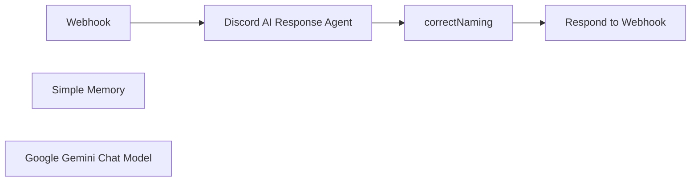

## Fluxo (.json) :

```json
{
  "id": "OqfQNcgTqUK7UvZG",
  "meta": {
    "instanceId": "5ce52989094be90be3b3bdd9ed9cee1d7ce1fcecaa598afaec4a50646d32e291",
    "templateCredsSetupCompleted": true
  },
  "name": "Youtube Discord Bot",
  "tags": [
    {
      "id": "5eZb3e5PJspoJjVN",
      "name": "Discord",
      "createdAt": "2025-02-22T09:31:58.972Z",
      "updatedAt": "2025-02-22T09:31:58.972Z"
    }
  ],
  "nodes": [
    {
      "id": "39832819-a14b-445c-bf5c-0bd93613b1ca",
      "name": "Webhook",
      "type": "n8n-nodes-base.webhook",
      "position": [
        80,
        440
      ],
      "webhookId": "b0631bec-9ccc-4eb8-b143-d73609b213c7",
      "parameters": {
        "path": "b0631bec-9ccc-4eb8-b143-d73609b213c7",
        "options": {},
        "httpMethod": "POST",
        "responseMode": "responseNode"
      },
      "typeVersion": 2
    },
    {
      "id": "5e70b649-5678-4718-98a7-302a4c784155",
      "name": "Simple Memory",
      "type": "@n8n/n8n-nodes-langchain.memoryBufferWindow",
      "position": [
        460,
        680
      ],
      "parameters": {
        "sessionKey": "={{ $json.body.userId }}",
        "sessionIdType": "customKey",
        "contextWindowLength": 50
      },
      "typeVersion": 1.3
    },
    {
      "id": "7cc849c3-3ed8-4fe2-a378-a213736a9aef",
      "name": "Google Gemini Chat Model",
      "type": "@n8n/n8n-nodes-langchain.lmChatGoogleGemini",
      "position": [
        180,
        700
      ],
      "parameters": {
        "options": {},
        "modelName": "models/gemini-2.0-flash"
      },
      "credentials": {
        "googlePalmApi": {
          "id": "clmB8ZYJMHaHmnsu",
          "name": "Stardawn#1"
        }
      },
      "typeVersion": 1
    },
    {
      "id": "4b664f21-6f1c-4894-9196-beecbd865d3e",
      "name": "Respond to Webhook",
      "type": "n8n-nodes-base.respondToWebhook",
      "position": [
        880,
        440
      ],
      "parameters": {
        "options": {},
        "respondWith": "allIncomingItems"
      },
      "typeVersion": 1.1
    },
    {
      "id": "c7c779d3-e324-4a3f-a5a1-5218ec61d856",
      "name": "correctNaming",
      "type": "n8n-nodes-base.code",
      "position": [
        680,
        440
      ],
      "parameters": {
        "jsCode": "// Hole alle Items\nconst items = $input.all();\n\n// Nehme das erste Item (falls mehrere vorhanden sind)\nconst item = items[0];\n\n// Extrahiere den output\nconst antwort = item.json.output;\n\n// Formatiere die Antwort im richtigen Format für den Discord-Bot\nreturn {\n  json: {\n    answer: antwort\n  }\n};"
      },
      "typeVersion": 2
    },
    {
      "id": "9ff7ad77-88ce-467e-91b1-4fc2d13636fd",
      "name": "Discord AI Response Agent",
      "type": "@n8n/n8n-nodes-langchain.agent",
      "position": [
        300,
        440
      ],
      "parameters": {
        "text": "=Username: {{ $json.body.userName }}\n\nQuestion/Prompt: {{ $json.body.question }}",
        "options": {
          "systemMessage": "You are a helpful assistant. You answer in the language you receive the question in. Interactions might be all over the place. If there is any questions regarding the Youtube Videos of the channel: Presting Podcasts, you have the transcript of the podcast videos as additional knowledge.\nAlways begin your answer with a @insertusername to mark the guy who asked the question.  "
        },
        "promptType": "define"
      },
      "typeVersion": 1.8
    }
  ],
  "active": true,
  "pinData": {},
  "settings": {
    "executionOrder": "v1"
  },
  "versionId": "429e2ccd-5a58-4287-9ad8-314efbbecb8f",
  "connections": {
    "Webhook": {
      "main": [
        [
          {
            "node": "Discord AI Response Agent",
            "type": "main",
            "index": 0
          }
        ]
      ]
    },
    "Simple Memory": {
      "ai_memory": [
        [
          {
            "node": "Discord AI Response Agent",
            "type": "ai_memory",
            "index": 0
          }
        ]
      ]
    },
    "correctNaming": {
      "main": [
        [
          {
            "node": "Respond to Webhook",
            "type": "main",
            "index": 0
          }
        ]
      ]
    },
    "Google Gemini Chat Model": {
      "ai_languageModel": [
        [
          {
            "node": "Discord AI Response Agent",
            "type": "ai_languageModel",
            "index": 0
          }
        ]
      ]
    },
    "Discord AI Response Agent": {
      "main": [
        [
          {
            "node": "correctNaming",
            "type": "main",
            "index": 0
          }
        ]
      ]
    }
  }
}
```

<a id="template-2093"></a>

## Template 2093 - Enviar arquivo e listar conteúdos do bucket

- **Nome:** Enviar arquivo e listar conteúdos do bucket
- **Descrição:** Automação que baixa um arquivo de uma URL, envia esse arquivo para um bucket de armazenamento e em seguida obtém a lista completa de arquivos presentes no bucket.
- **Funcionalidade:** • Gatilho manual: Inicia o fluxo quando acionado manualmente.
• Download de arquivo via HTTP: Faz uma requisição a uma URL para obter o arquivo (formato de resposta em arquivo).
• Upload para bucket de armazenamento: Envia o arquivo baixado para um bucket especificado, usando o mesmo nome de arquivo.
• Listagem de arquivos do bucket: Recupera e retorna todos os itens presentes no bucket após o upload.
- **Ferramentas:** • HTTP (download de arquivos): Realiza requisições a URLs externas para obter arquivos.
• Amazon S3 (armazenamento de objetos): Recebe o upload do arquivo e fornece a listagem de todos os objetos do bucket 'n8n'.

## Fluxo visual

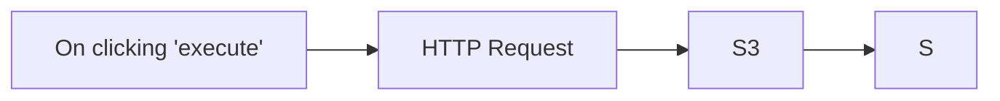

## Fluxo (.json) :

```json
{
  "id": "64",
  "name": "Upload a file and get a list of all the files in a bucket",
  "nodes": [
    {
      "name": "On clicking 'execute'",
      "type": "n8n-nodes-base.manualTrigger",
      "position": [
        390,
        220
      ],
      "parameters": {},
      "typeVersion": 1
    },
    {
      "name": "HTTP Request",
      "type": "n8n-nodes-base.httpRequest",
      "position": [
        590,
        220
      ],
      "parameters": {
        "url": "https://n8n.io/n8n-logo.png",
        "options": {},
        "responseFormat": "file"
      },
      "typeVersion": 1
    },
    {
      "name": "S3",
      "type": "n8n-nodes-base.s3",
      "position": [
        790,
        220
      ],
      "parameters": {
        "fileName": "={{$node[\"HTTP Request\"].binary.data.fileName}}",
        "operation": "upload",
        "bucketName": "n8n",
        "additionalFields": {}
      },
      "credentials": {
        "s3": "s3-n8n"
      },
      "typeVersion": 1
    },
    {
      "name": "S",
      "type": "n8n-nodes-base.s3",
      "position": [
        990,
        220
      ],
      "parameters": {
        "options": {},
        "operation": "getAll",
        "returnAll": true,
        "bucketName": "n8n"
      },
      "credentials": {
        "s3": "s3-n8n"
      },
      "typeVersion": 1
    }
  ],
  "active": false,
  "settings": {},
  "connections": {
    "S3": {
      "main": [
        [
          {
            "node": "S",
            "type": "main",
            "index": 0
          }
        ]
      ]
    },
    "HTTP Request": {
      "main": [
        [
          {
            "node": "S3",
            "type": "main",
            "index": 0
          }
        ]
      ]
    },
    "On clicking 'execute'": {
      "main": [
        [
          {
            "node": "HTTP Request",
            "type": "main",
            "index": 0
          }
        ]
      ]
    }
  }
}
```

<a id="template-2095"></a>

## Template 2095 - Salvar resposta da CocktailDB em arquivo JSON

- **Nome:** Salvar resposta da CocktailDB em arquivo JSON
- **Descrição:** Busca dados aleatórios da API CocktailDB e salva a resposta em um arquivo JSON local.
- **Funcionalidade:** • Gatilho manual: Inicia o processo quando o usuário clica em executar.
• Requisição HTTP: Solicita um coquetel aleatório à API e obtém os dados em formato JSON.
• Conversão e gravação de arquivo: Converte a resposta JSON para formato binário apropriado e grava como "cocktail.json" no sistema de arquivos.
- **Ferramentas:** • TheCocktailDB API: Serviço público que fornece informações sobre coquetéis e retorna dados em formato JSON através do endpoint random.php.

## Fluxo visual

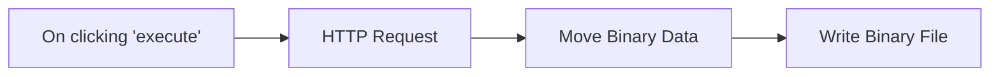

## Fluxo (.json) :

```json
{
  "name": "Store the data received from the CocktailDB API in JSON",
  "nodes": [
    {
      "name": "On clicking 'execute'",
      "type": "n8n-nodes-base.manualTrigger",
      "position": [
        250,
        300
      ],
      "parameters": {},
      "typeVersion": 1
    },
    {
      "name": "HTTP Request",
      "type": "n8n-nodes-base.httpRequest",
      "position": [
        400,
        300
      ],
      "parameters": {
        "url": "https://www.thecocktaildb.com/api/json/v1/1/random.php",
        "options": {}
      },
      "typeVersion": 1
    },
    {
      "name": "Move Binary Data",
      "type": "n8n-nodes-base.moveBinaryData",
      "position": [
        550,
        300
      ],
      "parameters": {
        "mode": "jsonToBinary",
        "options": {}
      },
      "typeVersion": 1
    },
    {
      "name": "Write Binary File",
      "type": "n8n-nodes-base.writeBinaryFile",
      "position": [
        700,
        300
      ],
      "parameters": {
        "fileName": "cocktail.json"
      },
      "typeVersion": 1
    }
  ],
  "active": false,
  "settings": {},
  "connections": {
    "HTTP Request": {
      "main": [
        [
          {
            "node": "Move Binary Data",
            "type": "main",
            "index": 0
          }
        ]
      ]
    },
    "Move Binary Data": {
      "main": [
        [
          {
            "node": "Write Binary File",
            "type": "main",
            "index": 0
          }
        ]
      ]
    },
    "On clicking 'execute'": {
      "main": [
        [
          {
            "node": "HTTP Request",
            "type": "main",
            "index": 0
          }
        ]
      ]
    }
  }
}
```

<a id="template-2097"></a>

## Template 2097 - Processamento de chamadas Gong e envio para pré-processador

- **Nome:** Processamento de chamadas Gong e envio para pré-processador
- **Descrição:** Aciona periodicamente (ou manualmente) a busca de objetos de chamada sincronizados no Salesforce, filtra chamadas relevantes por estágio e oportunidade, obtém os detalhes da chamada do Gong, formata os dados em um JSON padronizado e encaminha para um fluxo de pré-processamento.
- **Funcionalidade:** • Acionamento agendado e manual: Inicia o fluxo automaticamente a cada hora ou por execução manual de teste.
• Consulta de objetos Gong no Salesforce: Busca registros customizados de chamadas Gong criados nas últimas horas com campos relevantes.
• Ordenação por data: Ordena os registros retornados por CreatedDate em ordem decrescente.
• Filtragem por estágio da oportunidade: Seleciona chamadas cujo estágio da oportunidade no momento da chamada seja "Discovery" ou "Meeting Booked".
• Verificação de oportunidade primária: Confirma se o campo de oportunidade primária está presente antes de prosseguir.
• Recuperação dos detalhes da chamada no Gong: Obtém a chamada completa pelo ID para acessar metadados e transcrição.
• Formatação dos dados em JSON: Mapeia metadados da chamada para um objeto JSON padronizado (id, url, title, scheduled, started, duration, primaryUserId, etc.) e inclui referência à oportunidade do Salesforce.
• Encaminhamento para pré-processamento: Passa o objeto formatado para um fluxo de pré-processamento responsável por preparar a chamada para análise posterior.
- **Ferramentas:** • Salesforce: Repositório onde estão os objetos customizados de chamadas Gong (Gong__Gong_Call__c) usado para buscar registros e metadados.
• Gong: Plataforma de chamadas que fornece os detalhes da chamada e transcrições a partir do ID da chamada.

## Fluxo visual

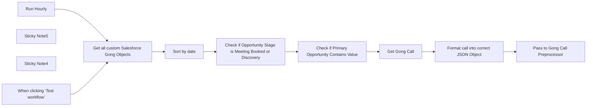

## Fluxo (.json) :

```json
{
  "meta": {
    "instanceId": "cb484ba7b742928a2048bf8829668bed5b5ad9787579adea888f05980292a4a7"
  },
  "nodes": [
    {
      "id": "692e2883-0d1b-4162-8472-6d15c12c8b43",
      "name": "When clicking ‘Test workflow’",
      "type": "n8n-nodes-base.manualTrigger",
      "position": [
        0,
        0
      ],
      "parameters": {},
      "typeVersion": 1
    },
    {
      "id": "1b226699-d463-42c9-aab0-e328afdb73b9",
      "name": "Check if Primary Opportunity Contains Value",
      "type": "n8n-nodes-base.if",
      "position": [
        900,
        -60
      ],
      "parameters": {
        "options": {},
        "conditions": {
          "options": {
            "version": 2,
            "leftValue": "",
            "caseSensitive": true,
            "typeValidation": "strict"
          },
          "combinator": "and",
          "conditions": [
            {
              "id": "e5aed92c-9a3e-4e05-8ce2-9a707abc3115",
              "operator": {
                "type": "string",
                "operation": "notEmpty",
                "singleValue": true
              },
              "leftValue": "={{ $json.Gong__Primary_Opportunity__c }}",
              "rightValue": ""
            }
          ]
        }
      },
      "typeVersion": 2.2
    },
    {
      "id": "1ebe8eba-5a86-4d17-a629-aa8d2e932693",
      "name": "Check if Opportunity Stage is Meeting Booked or Discovery",
      "type": "n8n-nodes-base.if",
      "position": [
        660,
        0
      ],
      "parameters": {
        "options": {},
        "conditions": {
          "options": {
            "version": 2,
            "leftValue": "",
            "caseSensitive": true,
            "typeValidation": "strict"
          },
          "combinator": "or",
          "conditions": [
            {
              "id": "8c39be67-f158-4d26-a1e9-cfdba686e272",
              "operator": {
                "name": "filter.operator.equals",
                "type": "string",
                "operation": "equals"
              },
              "leftValue": "={{ $json.Gong__Opp_Stage_Time_Of_Call__c }}",
              "rightValue": "Discovery"
            },
            {
              "id": "4cacf9be-3d86-49d6-b7f6-672a57025f0e",
              "operator": {
                "name": "filter.operator.equals",
                "type": "string",
                "operation": "equals"
              },
              "leftValue": "={{ $json.Gong__Opp_Stage_Time_Of_Call__c }}",
              "rightValue": "Meeting Booked"
            }
          ]
        }
      },
      "typeVersion": 2.2
    },
    {
      "id": "ee00437a-8586-449c-ab4f-04b91d5f247b",
      "name": "Sticky Note5",
      "type": "n8n-nodes-base.stickyNote",
      "position": [
        -440,
        -360
      ],
      "parameters": {
        "width": 340,
        "height": 820,
        "content": "\n## CallForge\nCallForge allows you to extract important information for different departments from your Sales Gong Calls. \n\n### Salesforce Trigger\nThis workflow triggers the AI agent to run, processing calls every hour. It uses the Gong/Salesforce integration to look for new conversation objects in Salesforce which indicate that a new recording has synced to Salesforce. This allows us to filter calls based on internal milestones and metrics ensuring only calls that meet a certain criteria are processed. "
      },
      "typeVersion": 1
    },
    {
      "id": "2906d433-070d-4240-ba2f-a1669ce5ccc1",
      "name": "Sticky Note4",
      "type": "n8n-nodes-base.stickyNote",
      "position": [
        -80,
        -360
      ],
      "parameters": {
        "color": 7,
        "width": 1940,
        "height": 820,
        "content": "## Get Gong Transcript and Call Details\nThe transcript is to pass into the AI prompt, but needs to be transformed first. The Call details provide the Prompt with metadata."
      },
      "typeVersion": 1
    },
    {
      "id": "96cb8746-3605-4723-b8b5-33bbe8841eaa",
      "name": "Format call into correct JSON Object",
      "type": "n8n-nodes-base.set",
      "position": [
        1360,
        -140
      ],
      "parameters": {
        "options": {},
        "assignments": {
          "assignments": [
            {
              "id": "881fab8b-2f6e-474e-a913-c4bde2b6bd2e",
              "name": "id",
              "type": "string",
              "value": "={{ $json.metaData.id }}"
            },
            {
              "id": "29aad399-1bb7-49e3-8fc9-cf8a6353536a",
              "name": "url",
              "type": "string",
              "value": "={{ $json.metaData.url }}"
            },
            {
              "id": "709d029e-6843-42e1-94cc-d01857918617",
              "name": "title",
              "type": "string",
              "value": "={{ $json.metaData.title }}"
            },
            {
              "id": "39de0391-207b-46ec-9230-cf83667c42b8",
              "name": "scheduled",
              "type": "string",
              "value": "={{ $json.metaData.scheduled }}"
            },
            {
              "id": "05e3a4a5-12a4-4e14-a8bf-4231e4b2c5b1",
              "name": "started",
              "type": "string",
              "value": "={{ $json.metaData.started }}"
            },
            {
              "id": "19de15be-56e5-4935-807c-9530cb1da5a8",
              "name": "duration",
              "type": "number",
              "value": "={{ $json.metaData.duration }}"
            },
            {
              "id": "5a15284b-7c7f-4174-ae6a-82a0dade0542",
              "name": "primaryUserId",
              "type": "string",
              "value": "={{ $json.metaData.primaryUserId }}"
            },
            {
              "id": "aa58e20b-ddaa-4ed1-a0e2-06125103216f",
              "name": "direction",
              "type": "string",
              "value": "={{ $json.metaData.direction }}"
            },
            {
              "id": "0f877bb4-a75f-4691-92b0-8b29b939a5b4",
              "name": "system",
              "type": "string",
              "value": "={{ $json.metaData.system }}"
            },
            {
              "id": "05b3cb81-244d-4f42-a681-13aca1c1df0d",
              "name": "scope",
              "type": "string",
              "value": "={{ $json.metaData.scope }}"
            },
            {
              "id": "2f9b87d1-e0bd-4170-88da-6966c00c7a2b",
              "name": "media",
              "type": "string",
              "value": "={{ $json.metaData.media }}"
            },
            {
              "id": "86282040-ceea-4a88-ae47-d5e3fa7cb1a7",
              "name": "language",
              "type": "string",
              "value": "={{ $json.metaData.language }}"
            },
            {
              "id": "6d8e4e35-5b84-4a1b-a2c1-605ea5e08e66",
              "name": "workspaceId",
              "type": "string",
              "value": "={{ $json.metaData.workspaceId }}"
            },
            {
              "id": "85f50bb3-306e-4fb3-921b-ff0f61acecbd",
              "name": "sdrDisposition",
              "type": "string",
              "value": "={{ $json.metaData.sdrDisposition }}"
            },
            {
              "id": "a779d6e8-0d07-4159-8b56-b3c2e49d1c19",
              "name": "clientUniqueId",
              "type": "string",
              "value": "={{ $json.metaData.clientUniqueId }}"
            },
            {
              "id": "14718f26-69e1-4e4b-90b5-dd059af6459e",
              "name": "customData",
              "type": "string",
              "value": "={{ $json.metaData.customData }}"
            },
            {
              "id": "4741d29d-0ad6-471d-8432-e7158daeb224",
              "name": "purpose",
              "type": "string",
              "value": "={{ $json.metaData.purpose }}"
            },
            {
              "id": "7e390036-376e-430d-bd28-43d52ae8794b",
              "name": "meetingUrl",
              "type": "string",
              "value": "={{ $json.metaData.meetingUrl }}"
            },
            {
              "id": "1ea1f639-8327-4e76-bb3b-f08182fdb87a",
              "name": "isPrivate",
              "type": "boolean",
              "value": "={{ $json.metaData.isPrivate }}"
            },
            {
              "id": "855ceef1-6bae-44ea-b2af-cc4aa38d6a37",
              "name": "calendarEventId",
              "type": "string",
              "value": "={{ $json.metaData.calendarEventId }}"
            },
            {
              "id": "f7c11074-70bb-46de-8e7b-2c6d095033c4",
              "name": "sfOpp",
              "type": "string",
              "value": "={{ $('Get all custom Salesforce Gong Objects').item.json.Gong__Primary_Opportunity__c }}"
            }
          ]
        }
      },
      "typeVersion": 3.4
    },
    {
      "id": "5b5eb2c1-7f80-4211-b835-5188376c6df2",
      "name": "Pass to Gong Call Preprocessor",
      "type": "n8n-nodes-base.executeWorkflow",
      "position": [
        1580,
        -140
      ],
      "parameters": {
        "options": {},
        "workflowId": {
          "__rl": true,
          "mode": "list",
          "value": "6mL5jWOJfuzkpjzx",
          "cachedResultName": "Gong Call Preprocessor Demo"
        }
      },
      "typeVersion": 1.1
    },
    {
      "id": "025d3ed7-2bd8-4a88-8834-034036c533c6",
      "name": "Get Gong Call",
      "type": "n8n-nodes-base.gong",
      "position": [
        1140,
        -140
      ],
      "parameters": {
        "call": {
          "__rl": true,
          "mode": "id",
          "value": "={{ $json.Gong__Call_ID__c }}"
        },
        "options": {},
        "operation": "get",
        "requestOptions": {}
      },
      "credentials": {
        "gongApi": {
          "id": "EchfvOC4rjw8MUkr",
          "name": "Liam Gong Cred"
        }
      },
      "typeVersion": 1
    },
    {
      "id": "a4f63c5c-a23e-400f-9fa4-40c61756c321",
      "name": "Sort by date",
      "type": "n8n-nodes-base.sort",
      "position": [
        440,
        0
      ],
      "parameters": {
        "options": {},
        "sortFieldsUi": {
          "sortField": [
            {
              "order": "descending",
              "fieldName": "CreatedDate"
            }
          ]
        }
      },
      "typeVersion": 1
    },
    {
      "id": "aa24b82b-3d65-4d1e-be04-7e7d5e439587",
      "name": "Get all custom Salesforce Gong Objects",
      "type": "n8n-nodes-base.salesforce",
      "position": [
        220,
        0
      ],
      "parameters": {
        "options": {
          "fields": [
            "CreatedDate",
            "LastActivityDate",
            "Name",
            "Gong__Call_ID__c",
            "Gong__Talk_Time_Us__c",
            "Gong__Talk_Time_Them__c",
            "Gong__Title__c",
            "Gong__View_call__c",
            "Gong__Primary_Opportunity__c",
            "Gong__Opp_Stage_Time_Of_Call__c"
          ],
          "conditionsUi": {
            "conditionValues": [
              {
                "field": "CreatedDate",
                "value": "={{ $now.minus(4, 'hours') }}",
                "operation": ">="
              }
            ]
          }
        },
        "resource": "customObject",
        "operation": "getAll",
        "customObject": "Gong__Gong_Call__c"
      },
      "credentials": {
        "salesforceOAuth2Api": {
          "id": "Ykybxuyh0jK0o3qH",
          "name": "Angel SF Creds v3"
        }
      },
      "typeVersion": 1
    },
    {
      "id": "c46f7b03-8ce0-468d-ac84-fae9ae5b2466",
      "name": "Run Hourly",
      "type": "n8n-nodes-base.scheduleTrigger",
      "position": [
        0,
        -160
      ],
      "parameters": {
        "rule": {
          "interval": [
            {
              "field": "hours"
            }
          ]
        }
      },
      "typeVersion": 1.2
    }
  ],
  "pinData": {},
  "connections": {
    "Run Hourly": {
      "main": [
        [
          {
            "node": "Get all custom Salesforce Gong Objects",
            "type": "main",
            "index": 0
          }
        ]
      ]
    },
    "Sort by date": {
      "main": [
        [
          {
            "node": "Check if Opportunity Stage is Meeting Booked or Discovery",
            "type": "main",
            "index": 0
          }
        ]
      ]
    },
    "Get Gong Call": {
      "main": [
        [
          {
            "node": "Format call into correct JSON Object",
            "type": "main",
            "index": 0
          }
        ]
      ]
    },
    "When clicking ‘Test workflow’": {
      "main": [
        [
          {
            "node": "Get all custom Salesforce Gong Objects",
            "type": "main",
            "index": 0
          }
        ]
      ]
    },
    "Format call into correct JSON Object": {
      "main": [
        [
          {
            "node": "Pass to Gong Call Preprocessor",
            "type": "main",
            "index": 0
          }
        ]
      ]
    },
    "Get all custom Salesforce Gong Objects": {
      "main": [
        [
          {
            "node": "Sort by date",
            "type": "main",
            "index": 0
          }
        ]
      ]
    },
    "Check if Primary Opportunity Contains Value": {
      "main": [
        [
          {
            "node": "Get Gong Call",
            "type": "main",
            "index": 0
          }
        ]
      ]
    },
    "Check if Opportunity Stage is Meeting Booked or Discovery": {
      "main": [
        [
          {
            "node": "Check if Primary Opportunity Contains Value",
            "type": "main",
            "index": 0
          }
        ]
      ]
    }
  }
}
```

<a id="template-2099"></a>

## Template 2099 - Enviar submissões do Webflow para Slack

- **Nome:** Enviar submissões do Webflow para Slack
- **Descrição:** Cria automaticamente canais no Slack a partir do nome de formulários do Webflow e envia as submissões desses formulários para o canal correspondente, notificando um canal geral quando um novo canal é criado.
- **Funcionalidade:** • Disparo por submissão de formulário: Inicia o fluxo quando qualquer formulário do site Webflow é enviado.
• Busca de canais existentes: Recupera a lista de canais do Slack para verificar correspondência com o nome do formulário.
• Normalização do nome do formulário: Converte o nome do formulário para minúsculas e substitui espaços por hífens para formar o nome do canal.
• Verificação de existência de canal: Compara o nome normalizado do formulário com os canais existentes para decidir se cria um novo canal.
• Criação automática de canal: Quando não existe canal correspondente, cria um canal novo usando o nome do formulário.
• Notificação em canal geral: Envia uma mensagem no canal #general informando que um novo canal foi criado automaticamente.
• Formatação e envio da mensagem: Constrói uma mensagem em bloco (Block Kit) com os dados do formulário e envia para o canal correspondente.
- **Ferramentas:** • Webflow: Plataforma que hospeda os formulários e gera os eventos de submissão usados para iniciar a automação.
• Slack: Plataforma de comunicação usada para criar canais, enviar notificações e postar mensagens formatadas (Block Kit) via token de bot.

## Fluxo visual

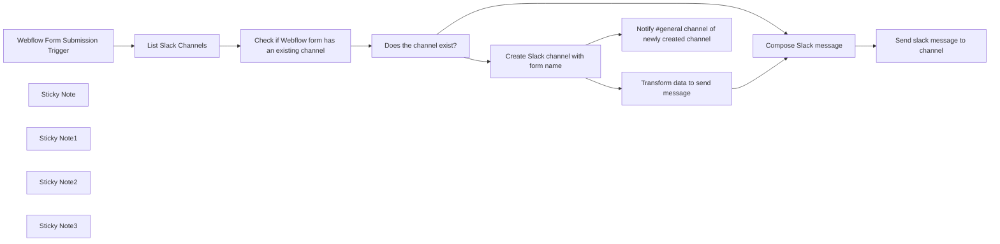

## Fluxo (.json) :

```json
{
  "id": "pmJUJj7FAnrOS6Jc",
  "meta": {
    "instanceId": "f0243439e79874c29f002782f736673d3388e5328a2ff2db7dd45820643256f5"
  },
  "name": "Send Slack message from Webflow form submission",
  "tags": [
    {
      "id": "7cKuF8oYmXKMRDsD",
      "name": "webflow",
      "createdAt": "2024-01-09T02:22:11.773Z",
      "updatedAt": "2024-01-09T02:22:11.773Z"
    },
    {
      "id": "hG7SoDK2ctruSDeL",
      "name": "slack",
      "createdAt": "2024-01-09T02:22:16.208Z",
      "updatedAt": "2024-01-09T02:22:16.208Z"
    }
  ],
  "nodes": [
    {
      "id": "5211fb49-254f-407a-9e23-9d4e1511e127",
      "name": "Does the channel exist?",
      "type": "n8n-nodes-base.if",
      "position": [
        1420,
        360
      ],
      "parameters": {
        "options": {},
        "conditions": {
          "options": {
            "leftValue": "",
            "caseSensitive": true,
            "typeValidation": "strict"
          },
          "combinator": "and",
          "conditions": [
            {
              "id": "b8fa7e94-ea10-40f0-ab0c-795620a5ee60",
              "operator": {
                "type": "object",
                "operation": "notEmpty",
                "singleValue": true
              },
              "leftValue": "={{ $json.channel }}",
              "rightValue": ""
            }
          ]
        }
      },
      "typeVersion": 2
    },
    {
      "id": "cf897863-3a2f-4cce-8664-d1a4f43a1b3b",
      "name": "Send slack message to channel",
      "type": "n8n-nodes-base.slack",
      "position": [
        2360,
        340
      ],
      "parameters": {
        "text": "=test",
        "select": "channel",
        "blocksUi": "={{ JSON.stringify($json.slackMessageBlock) }}",
        "channelId": {
          "__rl": true,
          "mode": "id",
          "value": "={{ $json.channel.id }}"
        },
        "messageType": "block",
        "otherOptions": {}
      },
      "credentials": {
        "slackApi": {
          "id": "st2Kcl1VITD4lWCE",
          "name": "Slack Bot OAuth Token"
        }
      },
      "typeVersion": 2.1
    },
    {
      "id": "7c149cc3-cf17-4ca5-addc-2403c1009162",
      "name": "Create Slack channel with form name",
      "type": "n8n-nodes-base.slack",
      "position": [
        1660,
        540
      ],
      "parameters": {
        "resource": "channel",
        "channelId": "={{ $json.formName }}"
      },
      "credentials": {
        "slackApi": {
          "id": "st2Kcl1VITD4lWCE",
          "name": "Slack Bot OAuth Token"
        }
      },
      "typeVersion": 2.1
    },
    {
      "id": "eb2e83ce-cd53-4f01-8ed3-3b99d0aef3ee",
      "name": "Transform data to send message",
      "type": "n8n-nodes-base.set",
      "position": [
        1880,
        540
      ],
      "parameters": {
        "fields": {
          "values": [
            {
              "name": "formData",
              "type": "objectValue",
              "objectValue": "={{ $('Check if Webflow form has an existing channel').item.json.formData }}"
            },
            {
              "name": "formName",
              "stringValue": "={{ $('Check if Webflow form has an existing channel').item.json.formName }}"
            },
            {
              "name": "channel",
              "type": "objectValue",
              "objectValue": "={\"id\":\"{{ $json.id }}\", \"name\": \"{{ $json.name }}\" }"
            }
          ]
        },
        "include": "none",
        "options": {
          "dotNotation": true
        }
      },
      "typeVersion": 3.2
    },
    {
      "id": "5b6a7b44-e33b-4e2f-8a7e-c3d4439bbf03",
      "name": "Notify #general channel of newly created channel",
      "type": "n8n-nodes-base.slack",
      "position": [
        1880,
        740
      ],
      "parameters": {
        "text": "=A new channel was automatically created ",
        "select": "channel",
        "blocksUi": "={\n\t\"blocks\": [\n\t\t{\n\t\t\t\"type\": \"section\",\n\t\t\t\"text\": {\n\t\t\t\t\"type\": \"mrkdwn\",\n\t\t\t\t\"text\": \"👋 a new channel was created automatically #{{ $json[\"name\"] }}\"\n\t\t\t}\n\t\t},\n\t\t{\n\t\t\t\"type\": \"divider\"\n\t\t},\n\t\t{\n\t\t\t\"type\": \"context\",\n\t\t\t\"elements\": [\n\t\t\t\t{\n\t\t\t\t\t\"type\": \"plain_text\",\n\t\t\t\t\t\"text\": \"sent by n8n bot\",\n\t\t\t\t\t\"emoji\": true\n\t\t\t\t}\n\t\t\t]\n\t\t}\n\t]\n}",
        "channelId": {
          "__rl": true,
          "mode": "list",
          "value": "C021Q05RF44",
          "cachedResultName": "general"
        },
        "messageType": "block",
        "otherOptions": {}
      },
      "credentials": {
        "slackApi": {
          "id": "st2Kcl1VITD4lWCE",
          "name": "Slack Bot OAuth Token"
        }
      },
      "typeVersion": 2.1
    },
    {
      "id": "ffcd8ee3-a787-4bfe-867b-bc52a0572705",
      "name": "Webflow Form Submission Trigger",
      "type": "n8n-nodes-base.webflowTrigger",
      "position": [
        820,
        360
      ],
      "webhookId": "0d173666-a9f4-4e8d-a07d-cf95d287477b",
      "parameters": {
        "site": "60e6f0f07c46af62aa2b1c98"
      },
      "credentials": {
        "webflowApi": {
          "id": "4EXZM1IWgHzU5zfE",
          "name": "Webflow Tutum"
        }
      },
      "typeVersion": 1
    },
    {
      "id": "a6e7ca24-9758-4f63-ad2d-311a793dbceb",
      "name": "Compose Slack message",
      "type": "n8n-nodes-base.code",
      "position": [
        2140,
        340
      ],
      "parameters": {
        "jsCode": "const webflowFormData = $input.all()[0].json.formData;\n\nconst objectToMarkdown = (obj) => {\n  return Object.entries(obj)\n    .map(([key, value]) => `*${key}*: ${value}`)\n    .join('\\n');\n}\n\nconst slackMessageBlock = {\n\t\"blocks\": [\n\t\t{\n\t\t\t\"type\": \"section\",\n\t\t\t\"text\": {\n\t\t\t\t\"type\": \"mrkdwn\",\n\t\t\t\t\"text\": `New form submission: \\n ${objectToMarkdown(webflowFormData)}`\n\t\t\t}\n\t\t},\n\t\t{\n\t\t\t\"type\": \"divider\"\n\t\t}\n\t]\n};\nconst data = {...$input.all()[0].json, slackMessageBlock: slackMessageBlock};\nreturn data;\n"
      },
      "typeVersion": 2
    },
    {
      "id": "50452ad0-2dfb-47fb-9673-916f608175b5",
      "name": "List Slack Channels",
      "type": "n8n-nodes-base.slack",
      "position": [
        1020,
        360
      ],
      "parameters": {
        "filters": {
          "excludeArchived": true
        },
        "resource": "channel",
        "operation": "getAll",
        "returnAll": true
      },
      "credentials": {
        "slackApi": {
          "id": "st2Kcl1VITD4lWCE",
          "name": "Slack Bot OAuth Token"
        }
      },
      "typeVersion": 2.1
    },
    {
      "id": "f04b1e79-5a1d-43b2-b29e-952791816224",
      "name": "Check if Webflow form has an existing channel",
      "type": "n8n-nodes-base.code",
      "position": [
        1220,
        360
      ],
      "parameters": {
        "jsCode": "\nconst transformedFormName = (inputString)=> {\n    // Convert to lowercase\n  const lowercaseString = inputString.toLowerCase();\n\n  // Split by space\n  const wordsArray = lowercaseString.split(' ');\n\n  // Join with hyphens\n  const resultString = wordsArray.join('-');\n\n  return resultString;\n}\n\nconst currentForm = transformedFormName($('Webflow Form Submission Trigger').all()[0].json[\"name\"]);\n\nconst doesChannelExist = (channelName)=> {\n  return channelName == currentForm\n}\n\nlet channels = [];\nfor (const item of $input.all()) {\n  let channel = {\n    name: item.json[\"name\"],\n    id: item.json[\"id\"],\n    channelExists: doesChannelExist(item.json[\"name\"]),\n  };\n  channels.push(channel);\n}\n\nlet data = [ { \n  channel: channels.filter((c)=>{return c.channelExists === true})[0],\n  formName: currentForm,\n  formData: $('Webflow Form Submission Trigger').all()[0].json[\"data\"]\n}\n  \n]\n\nreturn data;"
      },
      "typeVersion": 2
    },
    {
      "id": "d0c42e95-f0c3-4667-b8eb-8ddcd552100f",
      "name": "Sticky Note",
      "type": "n8n-nodes-base.stickyNote",
      "position": [
        40,
        100
      ],
      "parameters": {
        "color": 6,
        "width": 624.279069767441,
        "height": 535.976744186046,
        "content": "# Manage Webflow form submissions in Slack \n## Full guide with video\n[Full guide with video here](https://blog.kreonovo.co.za/send-webflow-form-submissions-to-slack-automatically/)\n\nThis workflow dynamically creates Slack channels for your Webflow forms then sends form submissions to those channels. The Webflow form name is used to make the channel name.\n\n## Getting started\n1. Create Webflow credential using API V1 Token\n2. Create Slack credential by creating an app and using the Bot User OAuth Token [Your Slack apps](https://api.slack.com/apps). For a detailed list of scopes required watch the video linked in the guide. n8n will also provide a list of scopes when you create the credential.\n3. Connect your credentials to the relevant nodes on the canvas.\n4. Activate the workflow and submit a form on your Webflow site\n\nThat's it! You do not need to add any custom code to your Webflow forms or site.\n\nThe name of your forms in the form settings section of the Designer in Webflow will be used to create the Slack channels. This workflow will automatically do this for you.\n"
      },
      "typeVersion": 1
    },
    {
      "id": "f1dc2873-9235-4f54-89b7-560d7fc63541",
      "name": "Sticky Note1",
      "type": "n8n-nodes-base.stickyNote",
      "position": [
        2080,
        140
      ],
      "parameters": {
        "width": 224.58139534883728,
        "height": 379.4186046511628,
        "content": "### Format the message \nThis node uses the [Block Kit Builder](https://app.slack.com/block-kit-builder/T0227K0J1FS#%7B%22blocks%22:%5B%7B%22type%22:%22section%22,%22text%22:%7B%22type%22:%22mrkdwn%22,%22text%22:%22Hello,%20Assistant%20to%20the%20Regional%20Manager%20Dwight!%20*Michael%20Scott*%20wants%20to%20know%20where%20you'd%20like%20to%20take%20the%20Paper%20Company%20investors%20to%20dinner%20tonight.%5Cn%5Cn%20*Please%20select%20a%20restaurant:*%22%7D%7D,%7B%22type%22:%22divider%22%7D,%7B%22type%22:%22section%22,%22text%22:%7B%22type%22:%22mrkdwn%22,%22text%22:%22*Farmhouse%20Thai%20Cuisine*%5Cn:star::star::star::star:%201528%20reviews%5Cn%20They%20do%20have%20some%20vegan%20options,%20like%20the%20roti%20and%20curry,%20plus%20they%20have%20a%20ton%20of%20salad%20stuff%20and%20noodles%20can%20be%20ordered%20without%20meat!!%20They%20have%20something%20for%20everyone%20here%22%7D,%22accessory%22:%7B%22type%22:%22image%22,%22image_url%22:%22https://s3-media3.fl.yelpcdn.com/bphoto/c7ed05m9lC2EmA3Aruue7A/o.jpg%22,%22alt_text%22:%22alt%20text%20for%20image%22%7D%7D,%7B%22type%22:%22section%22,%22text%22:%7B%22type%22:%22mrkdwn%22,%22text%22:%22*Kin%20Khao*%5Cn:star::star::star::star:%201638%20reviews%5Cn%20The%20sticky%20rice%20also%20goes%20wonderfully%20with%20the%20caramelized%20pork%20belly,%20which%20is%20absolutely%20melt-in-your-mouth%20and%20so%20soft.%22%7D,%22accessory%22:%7B%22type%22:%22image%22,%22image_url%22:%22https://s3-media2.fl.yelpcdn.com/bphoto/korel-1YjNtFtJlMTaC26A/o.jpg%22,%22alt_text%22:%22alt%20text%20for%20image%22%7D%7D,%7B%22type%22:%22section%22,%22text%22:%7B%22type%22:%22mrkdwn%22,%22text%22:%22*Ler%20Ros*%5Cn:star::star::star::star:%202082%20reviews%5Cn%20I%20would%20really%20recommend%20the%20%20Yum%20Koh%20Moo%20Yang%20-%20Spicy%20lime%20dressing%20and%20roasted%20quick%20marinated%20pork%20shoulder,%20basil%20leaves,%20chili%20&%20rice%20powder.%22%7D,%22accessory%22:%7B%22type%22:%22image%22,%22image_url%22:%22https://s3-media2.fl.yelpcdn.com/bphoto/DawwNigKJ2ckPeDeDM7jAg/o.jpg%22,%22alt_text%22:%22alt%20text%20for%20image%22%7D%7D,%7B%22type%22:%22divider%22%7D,%7B%22type%22:%22actions%22,%22elements%22:%5B%7B%22type%22:%22button%22,%22text%22:%7B%22type%22:%22plain_text%22,%22text%22:%22Farmhouse%22,%22emoji%22:true%7D,%22value%22:%22click_me_123%22%7D,%7B%22type%22:%22button%22,%22text%22:%7B%22type%22:%22plain_text%22,%22text%22:%22Kin%20Khao%22,%22emoji%22:true%7D,%22value%22:%22click_me_123%22,%22url%22:%22https://google.com%22%7D,%7B%22type%22:%22button%22,%22text%22:%7B%22type%22:%22plain_text%22,%22text%22:%22Ler%20Ros%22,%22emoji%22:true%7D,%22value%22:%22click_me_123%22,%22url%22:%22https://google.com%22%7D%5D%7D%5D%7D) to format the message in Slack. You can use the builder to compose a variety of rich message blocks."
      },
      "typeVersion": 1
    },
    {
      "id": "656a7d50-9c11-4337-b917-043faf39956e",
      "name": "Sticky Note2",
      "type": "n8n-nodes-base.stickyNote",
      "position": [
        1360,
        760
      ],
      "parameters": {
        "width": 323.0232558139535,
        "height": 304.69767441860455,
        "content": "### False branch \nWe create a new Slack channel using the form name in Webflow. Channel names must be converted to lowercase and words separated with dash.\n\nWhen the new channel is created we send a message in the #general channel with a direct link to the new channel.\n\nFinally we send the Webflow form submission as a message in the new channel."
      },
      "typeVersion": 1
    },
    {
      "id": "972e7dae-7f75-428f-a5d6-35041ef12865",
      "name": "Sticky Note3",
      "type": "n8n-nodes-base.stickyNote",
      "position": [
        1020,
        120
      ],
      "parameters": {
        "width": 498.5581395348835,
        "height": 190.8372093023257,
        "content": "### Logic to find matching Slack channel based on form name\n\nWebflow form submissions will trigger for any form on your website. We can't use Slack to persist form IDs from Webflow but at least Slack channels can only have unique names. In Webflow forms can have the same name on different pages but won't clash data since Webflow assigns unique IDs to them.\n\n"
      },
      "typeVersion": 1
    }
  ],
  "active": false,
  "pinData": {},
  "settings": {
    "executionOrder": "v1"
  },
  "versionId": "2dcc28a0-f3eb-4449-a698-a5189c9fd5fb",
  "connections": {
    "List Slack Channels": {
      "main": [
        [
          {
            "node": "Check if Webflow form has an existing channel",
            "type": "main",
            "index": 0
          }
        ]
      ]
    },
    "Compose Slack message": {
      "main": [
        [
          {
            "node": "Send slack message to channel",
            "type": "main",
            "index": 0
          }
        ]
      ]
    },
    "Does the channel exist?": {
      "main": [
        [
          {
            "node": "Compose Slack message",
            "type": "main",
            "index": 0
          }
        ],
        [
          {
            "node": "Create Slack channel with form name",
            "type": "main",
            "index": 0
          }
        ]
      ]
    },
    "Transform data to send message": {
      "main": [
        [
          {
            "node": "Compose Slack message",
            "type": "main",
            "index": 0
          }
        ]
      ]
    },
    "Webflow Form Submission Trigger": {
      "main": [
        [
          {
            "node": "List Slack Channels",
            "type": "main",
            "index": 0
          }
        ]
      ]
    },
    "Create Slack channel with form name": {
      "main": [
        [
          {
            "node": "Transform data to send message",
            "type": "main",
            "index": 0
          },
          {
            "node": "Notify #general channel of newly created channel",
            "type": "main",
            "index": 0
          }
        ]
      ]
    },
    "Check if Webflow form has an existing channel": {
      "main": [
        [
          {
            "node": "Does the channel exist?",
            "type": "main",
            "index": 0
          }
        ]
      ]
    }
  }
}
```

<a id="template-2101"></a>

## Template 2101 - Criar eventos no calendário a partir de mensagens do Slack

- **Nome:** Criar eventos no calendário a partir de mensagens do Slack
- **Descrição:** Monitora mensagens em um canal do Slack marcadas como pedido de evento, usa um agente de IA para extrair detalhes e cria ou atualiza eventos em um calendário, adicionando participantes conforme reações.
- **Funcionalidade:** • Monitoramento periódico do canal: Verifica regularmente mensagens em um canal específico para identificar pedidos de criação de evento.
• Identificação de pedidos de evento: Filtra mensagens marcadas com o emoji de calendário para tratar como solicitações de convite.
• Detecção de evento existente: Busca respostas na thread para verificar se já existe um evento correspondente e evita duplicatas.
• Extração de detalhes com IA: Usa um agente de linguagem para resumir a mensagem, gerar título, extrair datas/horários e identificar local e tipo de evento.
• Busca de endereço e site: Quando necessário, pesquisa na web para obter o endereço completo e URL do local/venue.
• Criação de evento no calendário: Cria um evento com título, descrição, horário e localização, e publica um link de confirmação na thread original.
• Rastreamento de participantes por reação: Lê reações de emoji (ex.: ✅) nas mensagens para identificar interessados.
• Adição automática de participantes: Adiciona como convidados os usuários que reagiram e que ainda não constam na lista de participantes do evento.
- **Ferramentas:** • Slack: Plataforma de mensagens usada como fonte das solicitações de evento e para publicar confirmações e ler reações.
• Google Calendar: Serviço de calendário usado para criar, atualizar e recuperar detalhes dos eventos.
• OpenAI (ChatGPT / modelo de linguagem): Agente de IA responsável por interpretar a mensagem do usuário e extrair título, datas, horários e informações de localização.
• SerpAPI: Ferramenta de busca na web utilizada para localizar endereço completo e páginas relevantes do local/venue quando não estão explícitos na mensagem.
• Wikipedia: Fonte auxiliar consultada pelo agente para obter informações contextuais quando necessário.

## Fluxo visual

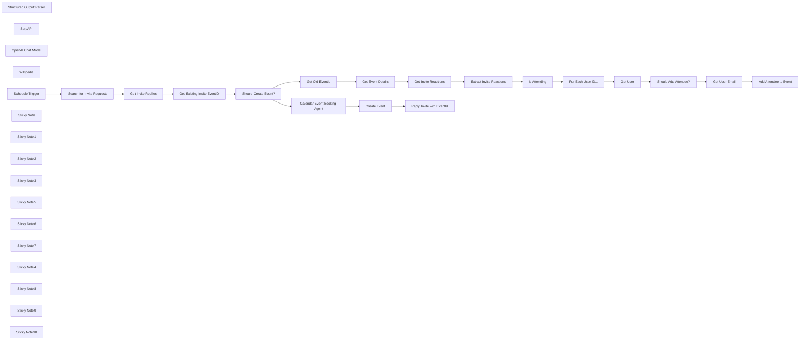

## Fluxo (.json) :

```json
{
  "meta": {
    "instanceId": "257476b1ef58bf3cb6a46e65fac7ee34a53a5e1a8492d5c6e4da5f87c9b82833",
    "templateId": "2326"
  },
  "nodes": [
    {
      "id": "806e7f80-b936-49c3-9759-6f91fab5781e",
      "name": "For Each User ID...",
      "type": "n8n-nodes-base.splitOut",
      "position": [
        1640,
        1438
      ],
      "parameters": {
        "options": {},
        "fieldToSplitOut": "users"
      },
      "typeVersion": 1
    },
    {
      "id": "8a932c63-18d2-438d-a09c-256c3432a01f",
      "name": "Get User",
      "type": "n8n-nodes-base.slack",
      "position": [
        1900,
        1278
      ],
      "parameters": {
        "user": {
          "__rl": true,
          "mode": "id",
          "value": "={{ $json.users }}"
        },
        "resource": "user"
      },
      "typeVersion": 2.2
    },
    {
      "id": "fefe8889-a564-4d70-a909-a3e836ca6286",
      "name": "Search for Invite Requests",
      "type": "n8n-nodes-base.slack",
      "position": [
        340,
        840
      ],
      "parameters": {
        "limit": 3,
        "query": "in:#n8n-events has::calendar:",
        "options": {},
        "operation": "search"
      },
      "typeVersion": 2.2
    },
    {
      "id": "bbe29b66-2b02-409a-a7c9-c6afd08f62f8",
      "name": "Get Existing Invite EventID",
      "type": "n8n-nodes-base.code",
      "position": [
        815,
        883
      ],
      "parameters": {
        "jsCode": "const channel =  $('Search for Invite Requests').item.json.channel;\n\nreturn $input\n  .all()\n  .filter(item => !item.json.thread_ts || item.json.ts === item.json.thread_ts)\n  .map(invite => {\n    const replies = $input\n      .all()\n      .filter(reply => reply.json.thread_ts === invite.json.thread_ts);\n    const replyWithEventTag = replies\n      .find(reply => reply.json.bot_id && reply.json.text.match(/#event([a-z0-9]+)/i));\n    const eventId = replyWithEventTag\n      ? replyWithEventTag.json.text.match(/#event([a-z0-9]+)/i)[1]\n      : null;\n    return {\n      eventId,\n      invite,\n      channel,\n    }\n  });\n\nreturn output;"
      },
      "typeVersion": 2,
      "alwaysOutputData": true
    },
    {
      "id": "82053e1b-0ed2-4967-9654-9d1488c0ab3c",
      "name": "Should Create Event?",
      "type": "n8n-nodes-base.if",
      "position": [
        995,
        883
      ],
      "parameters": {
        "options": {},
        "conditions": {
          "options": {
            "leftValue": "",
            "caseSensitive": true,
            "typeValidation": "strict"
          },
          "combinator": "and",
          "conditions": [
            {
              "id": "5c45447a-ab61-42c8-92c9-4c5d6970def7",
              "operator": {
                "type": "string",
                "operation": "notExists",
                "singleValue": true
              },
              "leftValue": "={{ $json.eventId }}",
              "rightValue": ""
            }
          ]
        }
      },
      "typeVersion": 2,
      "alwaysOutputData": false
    },
    {
      "id": "d051c89a-d337-4db4-b9dd-208a6b9488f6",
      "name": "Create Event",
      "type": "n8n-nodes-base.googleCalendar",
      "position": [
        1940,
        600
      ],
      "parameters": {
        "end": "={{ $json.output.output.event_end_date ? $json.output.output.event_end_date + ' ' + $json.output.output.event_end_time : (new Date($json.output.output.event_start_date + ' ' + $json.output.output.event_start_time)).plus(3, 'hour').format('yyyy-MM-dd HH:mm:ss') }}",
        "start": "={{ $json.output.output.event_start_date }} {{ $json.output.output.event_start_time }}",
        "calendar": {
          "__rl": true,
          "mode": "list",
          "value": "c_5792bdf04bc395cbcbc6f7b754268245a33779d36640cc80a357711aa2f09a0a@group.calendar.google.com",
          "cachedResultName": "n8n-events"
        },
        "additionalFields": {
          "summary": "={{ $json.output.output.event_title }}",
          "location": "={{ $json.output.output.location_address }}",
          "description": "=## {{ $json.output.output.event_title }}\n\n{{ $('Should Create Event?').item.json.invite.json.text }}\n\nTime:\n{{ $json[\"output\"][\"output\"][\"event_start_date\"] + ' ' + $json[\"output\"][\"output\"][\"event_start_time\"] }}{{ $json[\"output\"][\"output\"][\"event_end_date\"] ? ' to ' : '' }}{{ $json[\"output\"][\"output\"][\"event_end_date\"] ? \n $json[\"output\"][\"output\"][\"event_end_date\"] + ' ' + $json[\"output\"][\"output\"][\"event_end_time\"] : '' }}\n\nLocation:\n{{ $json[\"output\"][\"output\"][\"location_address\"] }}\n{{ $json[\"output\"][\"output\"][\"location_url\"] }}",
          "guestsCanModify": true,
          "guestsCanInviteOthers": true,
          "guestsCanSeeOtherGuests": true
        }
      },
      "typeVersion": 1.1
    },
    {
      "id": "9b4ab665-edd2-4a4c-b84f-4c1c466c7957",
      "name": "Get Invite Reactions",
      "type": "n8n-nodes-base.slack",
      "position": [
        1640,
        1258
      ],
      "parameters": {
        "resource": "reaction",
        "channelId": {
          "__rl": true,
          "mode": "id",
          "value": "={{ $('Should Create Event?').item.json.channel.id }}"
        },
        "operation": "get",
        "timestamp": "={{ $('Should Create Event?').item.json.invite.json.ts }}"
      },
      "typeVersion": 2.2
    },
    {
      "id": "783e0e31-43c1-40aa-89de-f886ff7511d9",
      "name": "Get Invite Replies",
      "type": "n8n-nodes-base.slack",
      "position": [
        635,
        883
      ],
      "parameters": {
        "ts": "={{ $json.ts }}",
        "filters": {},
        "resource": "channel",
        "channelId": {
          "__rl": true,
          "mode": "list",
          "value": "C074W8X9UJV",
          "cachedResultName": "n8n-events"
        },
        "operation": "replies"
      },
      "typeVersion": 2.2,
      "alwaysOutputData": true
    },
    {
      "id": "963c872e-858d-47bc-b648-d98079dd722a",
      "name": "Extract Invite Reactions",
      "type": "n8n-nodes-base.splitOut",
      "position": [
        1320,
        1438
      ],
      "parameters": {
        "options": {},
        "fieldToSplitOut": "message.reactions"
      },
      "typeVersion": 1
    },
    {
      "id": "f4132852-cfc3-4662-8976-cfc262a9ad78",
      "name": "Get Old EventId",
      "type": "n8n-nodes-base.set",
      "position": [
        1320,
        1258
      ],
      "parameters": {
        "mode": "raw",
        "options": {},
        "jsonOutput": "={\n  \"eventId\": \"{{ $json.eventId }}\",\n}"
      },
      "typeVersion": 3.3,
      "alwaysOutputData": true
    },
    {
      "id": "a83ea855-a2fa-4f9f-9b1e-298a97b78591",
      "name": "Add Attendee to Event",
      "type": "n8n-nodes-base.googleCalendar",
      "position": [
        2380,
        1278
      ],
      "parameters": {
        "eventId": "={{ $('Get Old EventId').item.json.eventId }}",
        "calendar": {
          "__rl": true,
          "mode": "list",
          "value": "c_5792bdf04bc395cbcbc6f7b754268245a33779d36640cc80a357711aa2f09a0a@group.calendar.google.com",
          "cachedResultName": "n8n-events"
        },
        "operation": "update",
        "updateFields": {
          "attendees": [
            "={{ $json.email }}"
          ]
        }
      },
      "typeVersion": 1.1
    },
    {
      "id": "80b74ca6-5d98-4db9-8555-56e5967266e8",
      "name": "Get Event Details",
      "type": "n8n-nodes-base.googleCalendar",
      "position": [
        1480,
        1258
      ],
      "parameters": {
        "eventId": "={{ $json.eventId }}",
        "options": {},
        "calendar": {
          "__rl": true,
          "mode": "list",
          "value": "c_5792bdf04bc395cbcbc6f7b754268245a33779d36640cc80a357711aa2f09a0a@group.calendar.google.com",
          "cachedResultName": "n8n-events"
        },
        "operation": "get"
      },
      "typeVersion": 1.1
    },
    {
      "id": "a059fe82-4d12-48ce-a378-d1e9b7625000",
      "name": "Is Attending",
      "type": "n8n-nodes-base.filter",
      "position": [
        1480,
        1438
      ],
      "parameters": {
        "options": {},
        "conditions": {
          "options": {
            "leftValue": "",
            "caseSensitive": true,
            "typeValidation": "strict"
          },
          "combinator": "and",
          "conditions": [
            {
              "id": "858b779e-732e-4b89-9007-93f9aafbb50b",
              "operator": {
                "type": "string",
                "operation": "equals"
              },
              "leftValue": "={{ $json.name }}",
              "rightValue": "white_check_mark"
            }
          ]
        }
      },
      "typeVersion": 2
    },
    {
      "id": "14716446-8014-46d9-a9db-851d35ebfb33",
      "name": "Get User Email",
      "type": "n8n-nodes-base.set",
      "position": [
        2220,
        1278
      ],
      "parameters": {
        "options": {},
        "assignments": {
          "assignments": [
            {
              "id": "16978160-49ce-42d4-a4ed-677bb2bdfe8d",
              "name": "email",
              "type": "string",
              "value": "={{ $json.profile.email }}"
            }
          ]
        }
      },
      "typeVersion": 3.3
    },
    {
      "id": "8540e7f5-fce1-40cb-89a7-5be4c9f7cd63",
      "name": "Should Add Attendee?",
      "type": "n8n-nodes-base.if",
      "position": [
        2060,
        1278
      ],
      "parameters": {
        "options": {},
        "conditions": {
          "options": {
            "leftValue": "",
            "caseSensitive": true,
            "typeValidation": "strict"
          },
          "combinator": "and",
          "conditions": [
            {
              "id": "cb9590b0-2c0d-40e3-b379-cac9666d9ffe",
              "operator": {
                "type": "boolean",
                "operation": "false",
                "singleValue": true
              },
              "leftValue": "={{ Boolean($('Get Event Details').item.json.attendees.find(x => x.email === $json.profile.email)) }}",
              "rightValue": "false"
            }
          ]
        }
      },
      "typeVersion": 2
    },
    {
      "id": "6958ed3a-5d59-40b8-969a-e90988ca68cb",
      "name": "Structured Output Parser",
      "type": "@n8n/n8n-nodes-langchain.outputParserStructured",
      "position": [
        1620,
        680
      ],
      "parameters": {
        "jsonSchema": "{\n  \"type\": \"object\",\n  \"properties\": {\n    \"event_title\": { \"type\": \"string\" },\n    \"event_start_date\": { \"type\": \"string\" },\n    \"event_start_time\": { \"type\": \"string\" },\n    \"event_end_date\": { \"type\": \"string\" },\n    \"event_end_time\": { \"type\": \"string\" },\n    \"location_address\": { \"type\": \"string\" },\n    \"location_url\": { \"type\": \"string\" },\n    \"event_type\": { \"type\": \"string\" }\n  }\n}"
      },
      "typeVersion": 1.1
    },
    {
      "id": "f4518e1e-595f-4492-8439-9de9e8701665",
      "name": "SerpAPI",
      "type": "@n8n/n8n-nodes-langchain.toolSerpApi",
      "position": [
        1440,
        740
      ],
      "parameters": {
        "options": {}
      },
      "typeVersion": 1
    },
    {
      "id": "821c4388-317d-4f40-ac1a-ea7f2d0da711",
      "name": "OpenAI Chat Model",
      "type": "@n8n/n8n-nodes-langchain.lmChatOpenAi",
      "position": [
        1340,
        680
      ],
      "parameters": {
        "options": {}
      },
      "typeVersion": 1
    },
    {
      "id": "2b0aa447-164f-4f7c-95b1-ae44c699fc89",
      "name": "Wikipedia",
      "type": "@n8n/n8n-nodes-langchain.toolWikipedia",
      "position": [
        1520,
        740
      ],
      "parameters": {},
      "typeVersion": 1
    },
    {
      "id": "66b28991-1417-4b4a-a604-68bea258c141",
      "name": "Schedule Trigger",
      "type": "n8n-nodes-base.scheduleTrigger",
      "position": [
        140,
        840
      ],
      "parameters": {
        "rule": {
          "interval": [
            {
              "field": "minutes",
              "minutesInterval": 30
            }
          ]
        }
      },
      "typeVersion": 1.2
    },
    {
      "id": "6cfe47dc-d630-42da-a755-325b5f466488",
      "name": "Sticky Note",
      "type": "n8n-nodes-base.stickyNote",
      "position": [
        65.15658774955875,
        620
      ],
      "parameters": {
        "color": 7,
        "width": 468.0872755624215,
        "height": 401.633728593893,
        "content": "## 1. Pull Messages from Slack Channel\n[Read more about using the Slack](https://docs.n8n.io/integrations/builtin/app-nodes/n8n-nodes-base.slack/)\n\nUsing the Slack Node, we're able to filter all top level messages marked with the calendar emoji signifying a request that a calendar event is created. Be sure to configure your slack app with all the required permissions for your workspace."
      },
      "typeVersion": 1
    },
    {
      "id": "89b74ffd-6581-43c6-821d-50f34004be6f",
      "name": "Sticky Note1",
      "type": "n8n-nodes-base.stickyNote",
      "position": [
        560,
        643.4948198232535
      ],
      "parameters": {
        "color": 7,
        "width": 612.4609442091373,
        "height": 463.294565931203,
        "content": "## 2. Decide Whether a new Event Should Be Created\n[Read more about using the Code](https://docs.n8n.io/integrations/builtin/core-nodes/n8n-nodes-base.code)\n\nFor more complex workflows, sometimes you may need to gather and prepare variables before the rest of the workflow runs. The Code node is one such tool to achieve this if you're familiar with code but its not the only way.\n\nThis workflow splits based on whether the event needs to be created. When it already exists, attendees are updated for the existing event instead."
      },
      "typeVersion": 1
    },
    {
      "id": "355b928a-3f1f-415b-8bcf-3a715ac770c3",
      "name": "Sticky Note2",
      "type": "n8n-nodes-base.stickyNote",
      "position": [
        1220,
        264.3100105144731
      ],
      "parameters": {
        "color": 7,
        "width": 582.5773441997128,
        "height": 614.2457232899785,
        "content": "## 3. Using AI Agent to Automate Event Creation\n[Read more about AI Agents](https://docs.n8n.io/integrations/builtin/cluster-nodes/root-nodes/n8n-nodes-langchain.agent)\n\nAI Agents are generally described as self-governing LLMs with access to various \"tools\" which extend their knowledge and/or capability. In this demo, we've instructed the AI to do the following:\n1. Generate a nice Event title.\n2. Parse and assume dates and times from user message.\n3. Parse the address and website of location/venue and to use the \"tools\" if it cannot get this data from the message or its own knowledge."
      },
      "typeVersion": 1
    },
    {
      "id": "d9ab9ce6-c2ae-43f1-af69-b39403b8ef36",
      "name": "Sticky Note3",
      "type": "n8n-nodes-base.stickyNote",
      "position": [
        1260,
        1040
      ],
      "parameters": {
        "color": 7,
        "width": 555.022465659362,
        "height": 579.2571386002115,
        "content": "## 5. Get Emoji Reactions to Track Attendees\n[Read more about using Slack](https://docs.n8n.io/integrations/builtin/app-nodes/n8n-nodes-base.slack)\n\nWhen the event exists, we can instead start adding other team members who've reacted to the message with the ✅ emoji. In this part of the workflow, there's a bit of logic to compare the number of people who've reacted to the attendee list of the actual event. This is necessary to avoid unwanted notifications which could get quite annoying!"
      },
      "typeVersion": 1
    },
    {
      "id": "8d60d40a-5eae-4a57-ab68-5572199ddfbb",
      "name": "Sticky Note5",
      "type": "n8n-nodes-base.stickyNote",
      "position": [
        1860,
        1107
      ],
      "parameters": {
        "color": 7,
        "width": 665.8690262556933,
        "height": 354.87325537783204,
        "content": "## 6. Add Attendees to Existing Calendar Event\n[Read more about using Google Calendar](https://docs.n8n.io/integrations/builtin/app-nodes/n8n-nodes-base.googlecalendar)\n\nn8n nodes make it easy to work with Google Calendar by having great converage on the Google API. Most common actions can be found in the dropdown list - there is no need to learn the code itself!\n"
      },
      "typeVersion": 1
    },
    {
      "id": "2e58ced7-5849-4726-9050-57e60a3f8e93",
      "name": "Sticky Note6",
      "type": "n8n-nodes-base.stickyNote",
      "position": [
        -320,
        600
      ],
      "parameters": {
        "width": 359.6648027457353,
        "height": 416.9747281125149,
        "content": "## Try It Out!\n### This workflow does the following\n* Monitors a slack channel for event messages tagged with the Calendar (📅) emoji.\n* Checks if a calender event exists otherwise uses ChatGPT to create the calendar event; AI will add event title, description and location details.\n* If calendar event exists, checks for channel users who have reacted with checkmark (✅) emoji.\n* These users are automatically added as attendees to the event.\n\n### Need Help?\nJoin the [Discord](https://discord.com/invite/XPKeKXeB7d) or ask in the [Forum](https://community.n8n.io/)!\n\nHappy Hacking!"
      },
      "typeVersion": 1
    },
    {
      "id": "e64b575a-e422-4c98-86b7-dc69e15150c3",
      "name": "Sticky Note7",
      "type": "n8n-nodes-base.stickyNote",
      "position": [
        1840,
        400
      ],
      "parameters": {
        "color": 7,
        "width": 492.07150832656214,
        "height": 414.62723127587867,
        "content": "## 4. Create Event and Send Reply Message\n[Read more about using Google Calendar](https://docs.n8n.io/integrations/builtin/app-nodes/n8n-nodes-base.googlecalendar)\n\nOnce we have these details, we create the invite and reply to original user message acknowleging the event was created successfully. Note, we also use this reply to avoid duplicates!"
      },
      "typeVersion": 1
    },
    {
      "id": "3d3a6d11-a68f-4623-943d-55493d334290",
      "name": "Reply Invite with EventId",
      "type": "n8n-nodes-base.slack",
      "position": [
        2120,
        600
      ],
      "parameters": {
        "text": "=Event Created!\nAdd to Calendar: {{ $json.htmlLink }}\n#event{{ $json.id }}",
        "select": "channel",
        "channelId": {
          "__rl": true,
          "mode": "id",
          "value": "={{ $('Should Create Event?').item.json.channel.id }}"
        },
        "otherOptions": {
          "thread_ts": {
            "replyValues": {
              "thread_ts": "={{ $('Should Create Event?').item.json.invite.json.ts }}"
            }
          }
        }
      },
      "typeVersion": 2.2
    },
    {
      "id": "0b0e02e7-1375-4de9-9781-915d7e96ef20",
      "name": "Calendar Event Booking Agent",
      "type": "@n8n/n8n-nodes-langchain.agent",
      "position": [
        1380,
        540
      ],
      "parameters": {
        "text": "=Your role is to create professional event calendar events based on user message.\nGiven the following user message, do the following 5 tasks. Note, Assume all dates are within the current year which is {{ $now.format(\"yyyy\") }} unless stated otherwise.\n1. Summarize the message and generate a title for the event. Make sure it's eye-catching to attract more attendees!\n2. Determine and extract the start date and time for the event. Date must be in the format yyyy-MM-dd and time in the format of hh:mm:ss. If no start time is indicated, the start time is 9am. If you are unable to do so, just leave it blank.\n3. Determine and extract the end date and time for the event. Date must be in the format yyyy-MM-dd and time in the format of hh:mm:ss. If you are unable to do so, just leave it blank.\n4. Where the user message refers to a location or venue, use the SerpAPI tool to search for this location or venue on the web and retrieve the full address.\n5. Additionally, if the location or venue has a website or relevant webpage, return the URL of the location or venue.\n6. Try to identify the event type as one of \"social meeting\", \"social gathering\", \"business meeting\", \"business gathering\" or \"unknown\".\n\nuser message:\n```{{ $json.invite.json.text }}```",
        "agent": "openAiFunctionsAgent",
        "options": {},
        "promptType": "define",
        "hasOutputParser": true
      },
      "typeVersion": 1.5
    },
    {
      "id": "e4ce06a0-cc42-4732-aadd-519fe7307a4d",
      "name": "Sticky Note4",
      "type": "n8n-nodes-base.stickyNote",
      "position": [
        1220,
        160
      ],
      "parameters": {
        "color": 5,
        "width": 394.45954589267495,
        "height": 80,
        "content": "### Part 1: Creating the Event\nThis branch runs when we have a new Event."
      },
      "typeVersion": 1
    },
    {
      "id": "463a2dbc-2d10-403a-a417-aec442e917dd",
      "name": "Sticky Note8",
      "type": "n8n-nodes-base.stickyNote",
      "position": [
        1260,
        940
      ],
      "parameters": {
        "color": 5,
        "width": 394.45954589267495,
        "height": 80,
        "content": "### Part 2: Adding Attendees to Event\nThis branch runs if the event already exists."
      },
      "typeVersion": 1
    },
    {
      "id": "aa4d41ca-1332-40da-a2b9-331257b6a1f2",
      "name": "Sticky Note9",
      "type": "n8n-nodes-base.stickyNote",
      "position": [
        300,
        820
      ],
      "parameters": {
        "width": 179.82769272818715,
        "height": 362.21121634583966,
        "content": "\n\n\n\n\n\n\n\n\n\n\n\n\n\n\n\n🚨**Required**\n* Set the channel to monitor here. Also, make sure to use the user access token in your credential"
      },
      "typeVersion": 1
    },
    {
      "id": "790293df-46bc-47ba-a60b-be611f46b670",
      "name": "Sticky Note10",
      "type": "n8n-nodes-base.stickyNote",
      "position": [
        1900,
        580
      ],
      "parameters": {
        "width": 179.82769272818715,
        "height": 317.6738512911155,
        "content": "\n\n\n\n\n\n\n\n\n\n\n\n\n\n\n\n🚨**Required**\n* Set the Google Calendar to use here."
      },
      "typeVersion": 1
    }
  ],
  "pinData": {},
  "connections": {
    "SerpAPI": {
      "ai_tool": [
        [
          {
            "node": "Calendar Event Booking Agent",
            "type": "ai_tool",
            "index": 0
          }
        ]
      ]
    },
    "Get User": {
      "main": [
        [
          {
            "node": "Should Add Attendee?",
            "type": "main",
            "index": 0
          }
        ]
      ]
    },
    "Wikipedia": {
      "ai_tool": [
        [
          {
            "node": "Calendar Event Booking Agent",
            "type": "ai_tool",
            "index": 0
          }
        ]
      ]
    },
    "Create Event": {
      "main": [
        [
          {
            "node": "Reply Invite with EventId",
            "type": "main",
            "index": 0
          }
        ]
      ]
    },
    "Is Attending": {
      "main": [
        [
          {
            "node": "For Each User ID...",
            "type": "main",
            "index": 0
          }
        ]
      ]
    },
    "Get User Email": {
      "main": [
        [
          {
            "node": "Add Attendee to Event",
            "type": "main",
            "index": 0
          }
        ]
      ]
    },
    "Get Old EventId": {
      "main": [
        [
          {
            "node": "Get Event Details",
            "type": "main",
            "index": 0
          }
        ]
      ]
    },
    "Schedule Trigger": {
      "main": [
        [
          {
            "node": "Search for Invite Requests",
            "type": "main",
            "index": 0
          }
        ]
      ]
    },
    "Get Event Details": {
      "main": [
        [
          {
            "node": "Get Invite Reactions",
            "type": "main",
            "index": 0
          }
        ]
      ]
    },
    "OpenAI Chat Model": {
      "ai_languageModel": [
        [
          {
            "node": "Calendar Event Booking Agent",
            "type": "ai_languageModel",
            "index": 0
          }
        ]
      ]
    },
    "Get Invite Replies": {
      "main": [
        [
          {
            "node": "Get Existing Invite EventID",
            "type": "main",
            "index": 0
          }
        ]
      ]
    },
    "For Each User ID...": {
      "main": [
        [
          {
            "node": "Get User",
            "type": "main",
            "index": 0
          }
        ]
      ]
    },
    "Get Invite Reactions": {
      "main": [
        [
          {
            "node": "Extract Invite Reactions",
            "type": "main",
            "index": 0
          }
        ]
      ]
    },
    "Should Add Attendee?": {
      "main": [
        [
          {
            "node": "Get User Email",
            "type": "main",
            "index": 0
          }
        ]
      ]
    },
    "Should Create Event?": {
      "main": [
        [
          {
            "node": "Calendar Event Booking Agent",
            "type": "main",
            "index": 0
          }
        ],
        [
          {
            "node": "Get Old EventId",
            "type": "main",
            "index": 0
          }
        ]
      ]
    },
    "Extract Invite Reactions": {
      "main": [
        [
          {
            "node": "Is Attending",
            "type": "main",
            "index": 0
          }
        ]
      ]
    },
    "Structured Output Parser": {
      "ai_outputParser": [
        [
          {
            "node": "Calendar Event Booking Agent",
            "type": "ai_outputParser",
            "index": 0
          }
        ]
      ]
    },
    "Search for Invite Requests": {
      "main": [
        [
          {
            "node": "Get Invite Replies",
            "type": "main",
            "index": 0
          }
        ]
      ]
    },
    "Get Existing Invite EventID": {
      "main": [
        [
          {
            "node": "Should Create Event?",
            "type": "main",
            "index": 0
          }
        ]
      ]
    },
    "Calendar Event Booking Agent": {
      "main": [
        [
          {
            "node": "Create Event",
            "type": "main",
            "index": 0
          }
        ]
      ]
    }
  }
}
```

<a id="template-2102"></a>

## Template 2102 - Processamento e armazenamento de relatórios DMARC

- **Nome:** Processamento e armazenamento de relatórios DMARC
- **Descrição:** Automatiza a recepção, extração e parsing de relatórios DMARC enviados por email, mapeando os dados e inserindo-os em um banco de dados, com notificações em caso de falha de autenticação.
- **Funcionalidade:** • Monitoramento de email: Observa uma caixa de entrada IMAP para receber relatórios DMARC enviados como anexos.
• Download de anexos: Faz o download dos arquivos anexados às mensagens recebidas.
• Descompactação de arquivos: Descompacta relatórios enviados em arquivos comprimidos (zip).
• Extração e parsing XML: Localiza o arquivo XML dentro do anexo, extrai e converte o XML para JSON.
• Tratamento de múltiplos registros: Se o relatório contiver várias entradas, separa cada registro para processamento individual.
• Normalização e mapeamento: Renomeia chaves e mapeia campos do relatório para o formato esperado pelo banco de dados.
• Formatação de datas: Converte os intervalos de data do relatório para um formato compatível com MySQL/MariaDB.
• Inserção em banco de dados: Insere os dados mapeados (incluindo o payload completo em JSON) na tabela de destino (dmarc).
• Notificações de erro de autenticação: Envia alertas (Slack ou email) quando DKIM ou SPF não obterem status 'pass'.
- **Ferramentas:** • Conta IMAP (email): Recebe mensagens com relatórios DMARC enviados pelo postmaster/fornecedores.
• Utilitário de descompactação (ZIP): Descompacta anexos que contenham os relatórios XML.
• Parser XML para JSON: Converte o conteúdo XML dos relatórios para um formato JSON processável.
• MySQL/MariaDB: Banco de dados para armazenar os registros processados (tabela dmarc).
• Slack: Canal para envio de notificações em caso de falhas de autenticação (DKIM/SPF).
• Servidor SMTP / Email: Envio de notificações por email quando necessário.

## Fluxo visual

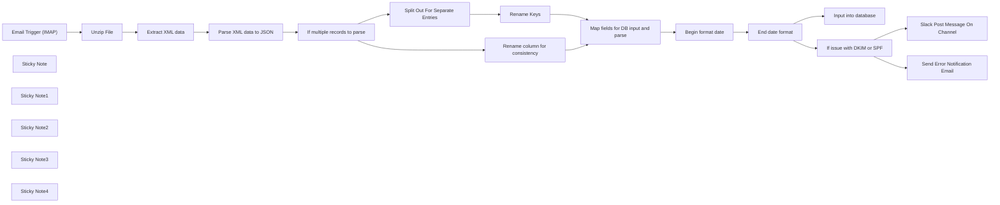

## Fluxo (.json) :

```json
{
  "id": "ATxZ5QYhdJq9mZDO",
  "meta": {
    "instanceId": "bdce9ec27bbe2b742054f01d034b8b468d2e7758edd716403ad5bd4583a8f649",
    "templateCredsSetupCompleted": true
  },
  "name": "Parse DMARC reports",
  "tags": [
    {
      "id": "w055QEEFrp6ZYNCr",
      "name": "DevOps",
      "createdAt": "2023-12-19T18:45:02.513Z",
      "updatedAt": "2023-12-19T18:45:02.513Z"
    }
  ],
  "nodes": [
    {
      "id": "ce9ce59c-3cf6-45db-97fc-825cb8516da8",
      "name": "Email Trigger (IMAP)",
      "type": "n8n-nodes-base.emailReadImap",
      "position": [
        580,
        300
      ],
      "parameters": {
        "options": {},
        "downloadAttachments": true
      },
      "credentials": {
        "imap": {
          "id": "vx30lEB3JcemyffM",
          "name": "IMAP account"
        }
      },
      "typeVersion": 2
    },
    {
      "id": "903f949d-ab1e-48ec-a903-a1ebde4cfbe9",
      "name": "End date format",
      "type": "n8n-nodes-base.dateTime",
      "position": [
        800,
        880
      ],
      "parameters": {
        "date": "={{ $json.date_range_end.toDateTime('s') }}",
        "format": "custom",
        "options": {
          "includeInputFields": true
        },
        "operation": "formatDate",
        "customFormat": "yyyy-MM-dd hh:mm:ss",
        "outputFieldName": "=date_range_end"
      },
      "typeVersion": 2
    },
    {
      "id": "3303e551-8557-4220-ab24-48fcb0859a26",
      "name": "If multiple records to parse",
      "type": "n8n-nodes-base.if",
      "position": [
        560,
        620
      ],
      "parameters": {
        "options": {},
        "conditions": {
          "options": {
            "leftValue": "",
            "caseSensitive": true,
            "typeValidation": "strict"
          },
          "combinator": "and",
          "conditions": [
            {
              "id": "b809e758-c3d2-4cbf-bab8-54d278a435dd",
              "operator": {
                "type": "object",
                "operation": "exists",
                "singleValue": true
              },
              "leftValue": "={{ $json.feedback.record[0] }}",
              "rightValue": ""
            }
          ]
        }
      },
      "typeVersion": 2
    },
    {
      "id": "513864bc-c124-452d-8be3-44feb73454ed",
      "name": "Map fields for DB input and parse",
      "type": "n8n-nodes-base.set",
      "position": [
        1200,
        660
      ],
      "parameters": {
        "options": {
          "ignoreConversionErrors": true
        },
        "assignments": {
          "assignments": [
            {
              "id": "621508ee-fbea-4233-aaf3-96b573a60bd5",
              "name": "full_data",
              "type": "object",
              "value": "={{ $json.feedback }}"
            },
            {
              "id": "d605e93a-0e0a-4584-aa1e-e38b49f264e7",
              "name": "org_name",
              "type": "string",
              "value": "={{ $json.feedback.report_metadata.org_name }}"
            },
            {
              "id": "604a5573-67db-4bb6-80d8-4421dce2406b",
              "name": "date_range_begin",
              "type": "string",
              "value": "={{ $json.feedback.report_metadata.date_range.begin }}"
            },
            {
              "id": "b9d7244f-9d58-43fc-a477-f0750c31e5e2",
              "name": "date_range_end",
              "type": "string",
              "value": "={{ $json.feedback.report_metadata.date_range.end }}"
            },
            {
              "id": "3570869a-9dc9-4b20-b48c-5f382825d021",
              "name": "domain",
              "type": "string",
              "value": "={{ $json.feedback.policy_published.domain }}"
            },
            {
              "id": "979e4eb4-6e39-4a3c-8f0a-21ecf8086a3c",
              "name": "policy_published",
              "type": "object",
              "value": "={{ $json.feedback.policy_published }}"
            },
            {
              "id": "91cdfa19-49c6-4e5d-a423-d76bbb61eddc",
              "name": "source_ip",
              "type": "string",
              "value": "={{ $json['fbr'].row.source_ip }}"
            },
            {
              "id": "2434b04e-3c5e-4e61-8be9-1f9c1ec2a6ce",
              "name": "mail_count",
              "type": "string",
              "value": "={{ $json['fbr'].row.count }}"
            },
            {
              "id": "09b73b84-0f6a-443b-8da0-c7ad9742a9c1",
              "name": "evaluated_disposition",
              "type": "string",
              "value": "={{ $json['fbr'].row.policy_evaluated.disposition }}"
            },
            {
              "id": "6c8e81ab-abc6-497c-8919-6b2e8008a1e8",
              "name": "evaluated_dkim",
              "type": "string",
              "value": "={{ $json['fbr'].row.policy_evaluated.dkim }}"
            },
            {
              "id": "fa8ca9d6-5e1b-402c-9afc-e6bf42e2c6ad",
              "name": "evaluated_spf",
              "type": "string",
              "value": "={{ $json['fbr'].row.policy_evaluated.spf }}"
            },
            {
              "id": "42f269c3-978a-45f6-bfe5-1fa1536500fb",
              "name": "identifiers",
              "type": "object",
              "value": "={{ $json['fbr'].identifiers }}"
            },
            {
              "id": "3375dc26-a739-4bf9-8a46-2f6739337921",
              "name": "auth_results",
              "type": "object",
              "value": "={{ $json['fbr'].auth_results }}"
            }
          ]
        }
      },
      "typeVersion": 3.4
    },
    {
      "id": "00cca3ae-1f0a-4ea9-8fb7-ac52d35c261b",
      "name": "Begin format date",
      "type": "n8n-nodes-base.dateTime",
      "position": [
        560,
        880
      ],
      "parameters": {
        "date": "={{ $json.date_range_begin.toDateTime('s') }}",
        "format": "custom",
        "options": {
          "includeInputFields": true
        },
        "operation": "formatDate",
        "customFormat": "yyyy-MM-dd hh:mm:ss",
        "outputFieldName": "=date_range_begin"
      },
      "typeVersion": 2
    },
    {
      "id": "18c2305a-db44-4e4d-97b9-1f04018085b0",
      "name": "Input into database",
      "type": "n8n-nodes-base.mySql",
      "position": [
        620,
        1100
      ],
      "parameters": {
        "table": {
          "__rl": true,
          "mode": "list",
          "value": "dmarc",
          "cachedResultName": "dmarc"
        },
        "options": {
          "detailedOutput": true
        },
        "dataMode": "defineBelow",
        "valuesToSend": {
          "values": [
            {
              "value": "={{ $json.full_data.toJsonString() }}",
              "column": "full_data"
            },
            {
              "value": "={{ $json.org_name }}",
              "column": "org_name"
            },
            {
              "value": "={{ $json.date_range_begin }}",
              "column": "date_range_begin"
            },
            {
              "value": "={{ $json.date_range_end }}",
              "column": "date_range_end"
            },
            {
              "value": "={{ $json.domain }}",
              "column": "domain"
            },
            {
              "value": "={{ $json.policy_published.toJsonString() }}",
              "column": "policy_published"
            },
            {
              "value": "={{ $json.source_ip }}",
              "column": "source_ip"
            },
            {
              "value": "={{ $json.mail_count }}",
              "column": "mail_count"
            },
            {
              "value": "={{ $json.evaluated_disposition }}",
              "column": "evaluated_disposition"
            },
            {
              "value": "={{ $json.evaluated_dkim }}",
              "column": "evaluated_dkim"
            },
            {
              "value": "={{ $json.evaluated_spf }}",
              "column": "evaluated_spf"
            },
            {
              "value": "={{ $json.identifiers == null ? null : $json.identifiers.toJsonString() }}",
              "column": "identifiers"
            },
            {
              "value": "={{ $json.auth_results == null ? null : $json.auth_results.toJsonString() }}",
              "column": "auth_results"
            }
          ]
        }
      },
      "credentials": {
        "mySql": {
          "id": "HFwF4pL62FWEFHqR",
          "name": "MySQL account"
        }
      },
      "typeVersion": 2.4
    },
    {
      "id": "c65c4cfb-3912-4b45-a5e0-3ab787e018c8",
      "name": "If issue with DKIM or SPF",
      "type": "n8n-nodes-base.if",
      "position": [
        580,
        1260
      ],
      "parameters": {
        "options": {},
        "conditions": {
          "options": {
            "leftValue": "",
            "caseSensitive": true,
            "typeValidation": "strict"
          },
          "combinator": "or",
          "conditions": [
            {
              "id": "818b461b-4bdc-4842-9f89-d1d8966b8c0a",
              "operator": {
                "type": "string",
                "operation": "notEquals"
              },
              "leftValue": "={{ $json.evaluated_dkim }}",
              "rightValue": "pass"
            },
            {
              "id": "4322cb26-5ff1-4278-94ae-7ff278c61c6c",
              "operator": {
                "type": "string",
                "operation": "notEquals"
              },
              "leftValue": "={{ $json.evaluated_spf }}",
              "rightValue": "pass"
            }
          ]
        }
      },
      "typeVersion": 2
    },
    {
      "id": "5d17bf15-ecef-40e8-acc4-6af5ad1c712d",
      "name": "Rename Keys",
      "type": "n8n-nodes-base.renameKeys",
      "position": [
        1000,
        500
      ],
      "parameters": {
        "keys": {
          "key": [
            {
              "newKey": "fbr",
              "currentKey": "feedback.record"
            }
          ]
        },
        "additionalOptions": {}
      },
      "typeVersion": 1
    },
    {
      "id": "0e2b8c73-0f53-46f9-9692-cbe87c97862d",
      "name": "Rename column for consistency",
      "type": "n8n-nodes-base.set",
      "position": [
        800,
        660
      ],
      "parameters": {
        "options": {},
        "assignments": {
          "assignments": [
            {
              "id": "f563d673-bc82-4863-b132-d431ebe8f651",
              "name": "fbr",
              "type": "object",
              "value": "={{ $json.feedback.record }}"
            }
          ]
        },
        "includeOtherFields": true
      },
      "typeVersion": 3.4
    },
    {
      "id": "5796c124-645d-460e-88df-0a909a33b6b1",
      "name": "Sticky Note",
      "type": "n8n-nodes-base.stickyNote",
      "position": [
        100,
        300
      ],
      "parameters": {
        "width": 394.2691415313225,
        "height": 304.36194895591655,
        "content": "## How it works\n- monitor postmaster email for DKIM reprots\n- unpack report and parse XML\n- map and format fields for DB input\n\t- input into database\n\t- send notification on DKIM or SPF failure\n\n## Remember to set up\n- email input mailbox\n- notification channels"
      },
      "typeVersion": 1
    },
    {
      "id": "1457272e-630e-44ee-bb18-ac650d192cbf",
      "name": "Unzip File",
      "type": "n8n-nodes-base.compression",
      "position": [
        800,
        300
      ],
      "parameters": {
        "binaryPropertyName": "attachment_0"
      },
      "typeVersion": 1.1
    },
    {
      "id": "89ade90c-c7e3-4c6f-89cf-0e7ce1e55333",
      "name": "Extract XML data",
      "type": "n8n-nodes-base.extractFromFile",
      "position": [
        1020,
        300
      ],
      "parameters": {
        "options": {},
        "operation": "xml",
        "binaryPropertyName": "file_0"
      },
      "typeVersion": 1
    },
    {
      "id": "8fd70f3c-53d5-4d99-ad2c-d526089fe0f5",
      "name": "Parse XML data to JSON",
      "type": "n8n-nodes-base.xml",
      "position": [
        1220,
        300
      ],
      "parameters": {
        "options": {}
      },
      "typeVersion": 1
    },
    {
      "id": "b17352d9-135a-4c26-993f-0c1fdafc1fa3",
      "name": "Sticky Note1",
      "type": "n8n-nodes-base.stickyNote",
      "position": [
        1420,
        300
      ],
      "parameters": {
        "width": 394.2691415313225,
        "height": 159.80531276753783,
        "content": "## Preparation\nThis line is responsible for taking data from email and parsing it into JSON understandable by n8n"
      },
      "typeVersion": 1
    },
    {
      "id": "31d2f822-aea6-41b4-bb1e-25b48cb3e972",
      "name": "Sticky Note2",
      "type": "n8n-nodes-base.stickyNote",
      "position": [
        1420,
        500
      ],
      "parameters": {
        "width": 394.2691415313225,
        "height": 316.3177609714967,
        "content": "## Mapping\nThis line is responsible for treating cases when XML has multiple info for domain. One DMARC report can contain more than one entries.\n\nLast node is responsible for matching data with database structure"
      },
      "typeVersion": 1
    },
    {
      "id": "e8fc0f91-1bdf-4bc5-b488-4f2c169da9c0",
      "name": "Split Out For Separate Entries",
      "type": "n8n-nodes-base.splitOut",
      "position": [
        800,
        500
      ],
      "parameters": {
        "include": "allOtherFields",
        "options": {},
        "fieldToSplitOut": "feedback.record"
      },
      "typeVersion": 1
    },
    {
      "id": "9ba7a0b8-80e6-4559-83ec-894533194dc7",
      "name": "Sticky Note3",
      "type": "n8n-nodes-base.stickyNote",
      "position": [
        1420,
        860
      ],
      "parameters": {
        "width": 394.2691415313225,
        "height": 185.89072080153096,
        "content": "## Date translate\nThis line is responsible for translating date format into understandable by MySQL/MariaDB\n\nIn next node data is being input into MySQL/MariaDB "
      },
      "typeVersion": 1
    },
    {
      "id": "96461e30-87f0-48f1-a43f-60185ea1d835",
      "name": "Sticky Note4",
      "type": "n8n-nodes-base.stickyNote",
      "position": [
        1420,
        1180
      ],
      "parameters": {
        "width": 394.2691415313225,
        "height": 320.66532897716223,
        "content": "## Notifications\nLast two nodes are responsible for sending notifications in case IF inside DMARC report is reported any issue with SPF or DKIM"
      },
      "typeVersion": 1
    },
    {
      "id": "192b95c6-cdfe-4b5e-94e1-94deb728b0e2",
      "name": "Slack Post Message On Channel",
      "type": "n8n-nodes-base.slack",
      "disabled": true,
      "position": [
        1200,
        1180
      ],
      "parameters": {
        "text": "=DMARC evaluation failed for {{ $json.domain }} on  {{ $json.mail_count }} mails with disposition:  {{ $json.evaluated_disposition }}. DKIM:  {{ $json.evaluated_dkim }} SPF:  {{ $json.evaluated_spf }}",
        "select": "channel",
        "channelId": {
          "__rl": true,
          "mode": "list",
          "value": "CCGJA1F1N",
          "cachedResultName": "powiadomienia"
        },
        "otherOptions": {},
        "authentication": "oAuth2"
      },
      "credentials": {
        "slackOAuth2Api": {
          "id": "B0jUtT53pVAEPaQM",
          "name": "Slack Oauth"
        }
      },
      "typeVersion": 2.2
    },
    {
      "id": "ce400c97-cae4-41db-ad8f-e678fc4a27fe",
      "name": "Send Error Notification Email",
      "type": "n8n-nodes-base.emailSend",
      "disabled": true,
      "position": [
        1200,
        1380
      ],
      "parameters": {
        "text": "DMARC evaluation failed for {{ $json.domain }} on  {{ $json.mail_count }} mails with disposition:  {{ $json.evaluated_disposition }}. DKIM:  {{ $json.evaluated_dkim }} SPF:  {{ $json.evaluated_spf }}",
        "options": {},
        "subject": "DMARC problem",
        "emailFormat": "text"
      },
      "typeVersion": 2.1
    }
  ],
  "active": true,
  "pinData": {},
  "settings": {
    "executionOrder": "v1"
  },
  "versionId": "1add308c-4aef-4a83-a958-bc66dead234f",
  "connections": {
    "Unzip File": {
      "main": [
        [
          {
            "node": "Extract XML data",
            "type": "main",
            "index": 0
          }
        ]
      ]
    },
    "Rename Keys": {
      "main": [
        [
          {
            "node": "Map fields for DB input and parse",
            "type": "main",
            "index": 0
          }
        ]
      ]
    },
    "End date format": {
      "main": [
        [
          {
            "node": "Input into database",
            "type": "main",
            "index": 0
          },
          {
            "node": "If issue with DKIM or SPF",
            "type": "main",
            "index": 0
          }
        ]
      ]
    },
    "Extract XML data": {
      "main": [
        [
          {
            "node": "Parse XML data to JSON",
            "type": "main",
            "index": 0
          }
        ]
      ]
    },
    "Begin format date": {
      "main": [
        [
          {
            "node": "End date format",
            "type": "main",
            "index": 0
          }
        ]
      ]
    },
    "Email Trigger (IMAP)": {
      "main": [
        [
          {
            "node": "Unzip File",
            "type": "main",
            "index": 0
          }
        ]
      ]
    },
    "Parse XML data to JSON": {
      "main": [
        [
          {
            "node": "If multiple records to parse",
            "type": "main",
            "index": 0
          }
        ]
      ]
    },
    "If issue with DKIM or SPF": {
      "main": [
        [
          {
            "node": "Slack Post Message On Channel",
            "type": "main",
            "index": 0
          },
          {
            "node": "Send Error Notification Email",
            "type": "main",
            "index": 0
          }
        ]
      ]
    },
    "If multiple records to parse": {
      "main": [
        [
          {
            "node": "Split Out For Separate Entries",
            "type": "main",
            "index": 0
          }
        ],
        [
          {
            "node": "Rename column for consistency",
            "type": "main",
            "index": 0
          }
        ]
      ]
    },
    "Rename column for consistency": {
      "main": [
        [
          {
            "node": "Map fields for DB input and parse",
            "type": "main",
            "index": 0
          }
        ]
      ]
    },
    "Split Out For Separate Entries": {
      "main": [
        [
          {
            "node": "Rename Keys",
            "type": "main",
            "index": 0
          }
        ]
      ]
    },
    "Map fields for DB input and parse": {
      "main": [
        [
          {
            "node": "Begin format date",
            "type": "main",
            "index": 0
          }
        ]
      ]
    }
  }
}
```
