# PACK 1999 TEMPLATES PARTE 09 - Bloco 8

Templates neste bloco: 20

## Sumário

- [Template 2144 - Monitoramento de preços Amazon](#template-2144)
- [Template 2147 - Bot Telegram com manejo de mensagens, callbacks e pagamentos](#template-2147)
- [Template 2149 - Criar sala, convidar membros e enviar mensagem](#template-2149)
- [Template 2151 - Formulários dinâmicos a partir de Airtable/Baserow](#template-2151)
- [Template 2153 - Agente SQL com memória](#template-2153)
- [Template 2155 - Ingestão de arquivos do Google Drive para banco vetorial](#template-2155)
- [Template 2159 - Extração e cadastro de itens de faturas](#template-2159)
- [Template 2160 - Criar fotos profissionais de produto](#template-2160)
- [Template 2162 - Agendar atividade do workflow](#template-2162)
- [Template 2165 - Extrair dados de PDF com Claude e Gemini](#template-2165)
- [Template 2166 - Transformar array em itens JSON individuais](#template-2166)
- [Template 2168 - Agrupar itens em um único array](#template-2168)
- [Template 2170 - Salvar anexos no Drive por tamanho](#template-2170)
- [Template 2171 - Inserção periódica de leituras de sensor no PostgreSQL](#template-2171)
- [Template 2174 - Lista diária de reuniões para Telegram](#template-2174)
- [Template 2175 - Carregar prompts do GitHub e preencher variáveis](#template-2175)
- [Template 2178 - Sincronização Notion → Clockify](#template-2178)
- [Template 2180 - Encurtador de URLs com armazenamento e painel](#template-2180)
- [Template 2182 - Agente de chat com memória e pesquisa](#template-2182)
- [Template 2185 - Consulta semanal Shodan e alerta TheHive](#template-2185)

---

<a id="template-2144"></a>

## Template 2144 - Monitoramento de preços Amazon

- **Nome:** Monitoramento de preços Amazon
- **Descrição:** Fluxo para monitorar preços de produtos Amazon, registrar histórico e enviar alertas por email quando houver variações significativas.
- **Funcionalidade:** • Agendamento de verificações: realiza checagens periódicas (horárias) dos produtos monitorados.
• Leitura da lista de produtos: obtém ASINs e limites de alerta a partir de uma planilha configurada.
• Consulta de dados do produto: busca nome, preço e avaliação usando uma API externa especializada em dados da Amazon.
• Validação de preço: ignora ou pula resultados com preço inválido ou igual a zero.
• Cálculo de variações: calcula diferença absoluta e percentual entre o preço atual e o último preço registrado.
• Avaliação de alertas: determina se a variação excede limites superiores ou inferiores configurados e define status de alerta (High/Low).
• Registro histórico: adiciona uma entrada com timestamp na aba de histórico de preços para análise ao longo do tempo.
• Atualização da planilha: atualiza a linha do produto com nome, preço atual, variação, status de alerta e data/hora da última verificação.
• Notificações por e-mail: envia um email HTML detalhado para destinatários configurados quando um alerta é disparado.
• Configuração centralizada: permite definir URL da planilha, chave da API e endereços de remetente/destinatário em um único ponto de configuração.
- **Ferramentas:** • ScrapeOps: serviço/API que fornece dados estruturados de produtos Amazon (preço, nome, avaliações).
• Google Sheets: planilha usada para armazenar a lista de produtos, thresholds, e o histórico de preços.
• Servidor SMTP / Conta de e-mail: serviço de envio de email usado para disparar notificações HTML aos destinatários.
• Amazon: fonte dos dados do produto (ASINs) e do comércio cujos preços são monitorados.

## Fluxo visual

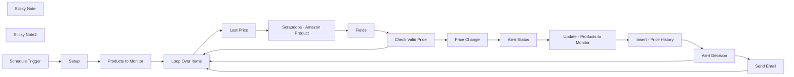

## Fluxo (.json) :

```json
{
  "id": "TqnC0nyAa0LRfYBX",
  "meta": {
    "instanceId": "c2ff056313a72210aa803da7c5191a260dbed0dab6ae2b8e39a8dd21701bf0ab",
    "templateCredsSetupCompleted": true
  },
  "name": "Amazon Product Price Tracker",
  "tags": [],
  "nodes": [
    {
      "id": "cc15c8e6-53f9-4dd1-895f-34a72af4506f",
      "name": "Products to Monitor",
      "type": "n8n-nodes-base.googleSheets",
      "position": [
        40,
        -220
      ],
      "parameters": {
        "options": {},
        "sheetName": {
          "__rl": true,
          "mode": "list",
          "value": "gid=0",
          "cachedResultUrl": "https://docs.google.com/spreadsheets/d/1hRv-TBXrpN6rkIU65WorttNHt-IPWas_An0sF4Of39U/edit#gid=0",
          "cachedResultName": "Products to Monitor"
        },
        "documentId": {
          "__rl": true,
          "mode": "url",
          "value": "={{ $json.spreadsheet_url }}"
        }
      },
      "credentials": {
        "googleSheetsOAuth2Api": {
          "id": "xWJJNb7VGUUp4vzV",
          "name": "Google Sheets account 2"
        }
      },
      "typeVersion": 4.5
    },
    {
      "id": "4ec34045-ea02-40bc-a243-b50c804ab947",
      "name": "Loop Over Items",
      "type": "n8n-nodes-base.splitInBatches",
      "position": [
        260,
        -220
      ],
      "parameters": {
        "options": {}
      },
      "typeVersion": 3
    },
    {
      "id": "d5cdb7eb-144f-477b-83d6-85be5cd2eb79",
      "name": "Scrapeops - Amazon Product",
      "type": "n8n-nodes-base.httpRequest",
      "position": [
        720,
        -80
      ],
      "parameters": {
        "url": "https://proxy.scrapeops.io/v1/structured-data/amazon/product",
        "options": {},
        "sendQuery": true,
        "queryParameters": {
          "parameters": [
            {
              "name": "asin",
              "value": "={{ $('Loop Over Items').item.json.asin }}"
            },
            {
              "name": "api_key",
              "value": "={{ $('Setup').item.json.scrapeops_apikey }}"
            }
          ]
        }
      },
      "typeVersion": 4.2
    },
    {
      "id": "32134749-17e9-456a-9814-2e03b34ce37b",
      "name": "Fields",
      "type": "n8n-nodes-base.set",
      "position": [
        940,
        -80
      ],
      "parameters": {
        "options": {},
        "assignments": {
          "assignments": [
            {
              "id": "ae829540-06b7-4ea8-a5f8-d2750b02c530",
              "name": "name",
              "type": "string",
              "value": "={{ $json.data.name }}"
            },
            {
              "id": "4dec41ce-3522-481b-985f-455c858702e0",
              "name": "pricing",
              "type": "number",
              "value": "={{ parseFloat(($json.data.pricing || \"\").replace(/[^\\d.-]/g, \"\")) || 0 }}"
            },
            {
              "id": "ebb64d89-e9b2-4384-9778-fce8aa9eb3be",
              "name": "product_url",
              "type": "string",
              "value": "=https://www.amazon.com/dp/{{ $('Loop Over Items').item.json.asin }}?th=1&psc=1"
            }
          ]
        }
      },
      "typeVersion": 3.4
    },
    {
      "id": "954afd09-609f-4ed1-94a0-6d6431b8a9e6",
      "name": "Last Price",
      "type": "n8n-nodes-base.set",
      "position": [
        480,
        -80
      ],
      "parameters": {
        "options": {},
        "assignments": {
          "assignments": [
            {
              "id": "db85d431-5631-4629-99f8-426ec3d7ecc7",
              "name": "last_pricing",
              "type": "number",
              "value": "={{ $json.pricing }}"
            }
          ]
        }
      },
      "typeVersion": 3.4
    },
    {
      "id": "695673df-6bf7-4e64-898c-f143c77c8ff0",
      "name": "Price Change",
      "type": "n8n-nodes-base.set",
      "position": [
        1420,
        -180
      ],
      "parameters": {
        "options": {},
        "assignments": {
          "assignments": [
            {
              "id": "4ef9bde2-62d3-4d6a-9759-4ae6c13db127",
              "name": "price_change",
              "type": "number",
              "value": "={{ \n  $('Last Price').item.json.last_pricing !== \"\" && $('Last Price').item.json.last_pricing !== undefined ? \n  ($json.pricing - $('Last Price').item.json.last_pricing).toFixed(2) : \n  0 \n}}"
            },
            {
              "id": "02e5a84b-76bf-4511-a78d-c725882a64dc",
              "name": "percent_change",
              "type": "number",
              "value": "={{ \n  $('Last Price').item.json.last_pricing !== \"\" && $('Last Price').item.json.last_pricing !== undefined && parseFloat($('Last Price').item.json.last_pricing) !== 0 ? \n  ((($json.pricing - $('Last Price').item.json.last_pricing) / $('Last Price').item.json.last_pricing)).toFixed(2) : \n  0 \n}}"
            }
          ]
        }
      },
      "typeVersion": 3.4
    },
    {
      "id": "ab56b334-c4a7-45f7-95d0-9c7e990c21d7",
      "name": "Alert Status",
      "type": "n8n-nodes-base.set",
      "position": [
        1600,
        -180
      ],
      "parameters": {
        "options": {},
        "assignments": {
          "assignments": [
            {
              "id": "fd261f8a-8417-4fdb-95de-bd71768300e6",
              "name": "alert_status",
              "type": "string",
              "value": "={{ \n  $json.percent_change > $('Loop Over Items').item.json.alert_threshold_high ? \n  \"High\" : \n  ($json.percent_change < $('Loop Over Items').item.json.alert_threshold_low ? \n    \"Low\" : \n    \"\")\n}}"
            }
          ]
        }
      },
      "typeVersion": 3.4
    },
    {
      "id": "54f3ef24-58bc-4eba-b341-b14ab9f66d68",
      "name": "Insert - Price History",
      "type": "n8n-nodes-base.googleSheets",
      "position": [
        2020,
        -180
      ],
      "parameters": {
        "columns": {
          "value": {
            "asin": "={{ $('Loop Over Items').item.json.asin }}",
            "pricing": "={{ $('Scrapeops - Amazon Product').item.json.data.pricing.replace(/[^\\d.]/g, '') }}",
            "timestamp": "={{$now.format(\"MM/dd/yyyy HH:mm:ss\")}}"
          },
          "schema": [
            {
              "id": "asin",
              "type": "string",
              "display": true,
              "removed": false,
              "required": false,
              "displayName": "asin",
              "defaultMatch": false,
              "canBeUsedToMatch": true
            },
            {
              "id": "pricing",
              "type": "string",
              "display": true,
              "removed": false,
              "required": false,
              "displayName": "pricing",
              "defaultMatch": false,
              "canBeUsedToMatch": true
            },
            {
              "id": "timestamp",
              "type": "string",
              "display": true,
              "removed": false,
              "required": false,
              "displayName": "timestamp",
              "defaultMatch": false,
              "canBeUsedToMatch": true
            }
          ],
          "mappingMode": "defineBelow",
          "matchingColumns": [],
          "attemptToConvertTypes": false,
          "convertFieldsToString": false
        },
        "options": {},
        "operation": "append",
        "sheetName": {
          "__rl": true,
          "mode": "name",
          "value": "Price History"
        },
        "documentId": {
          "__rl": true,
          "mode": "url",
          "value": "={{ $('Setup').item.json.spreadsheet_url }}"
        }
      },
      "credentials": {
        "googleSheetsOAuth2Api": {
          "id": "xWJJNb7VGUUp4vzV",
          "name": "Google Sheets account 2"
        }
      },
      "typeVersion": 4.5
    },
    {
      "id": "b161e44b-1fbf-40f1-a485-a7b132f42efc",
      "name": "Update - Products to Monitor",
      "type": "n8n-nodes-base.googleSheets",
      "position": [
        1800,
        -180
      ],
      "parameters": {
        "columns": {
          "value": {
            "asin": "={{ $('Loop Over Items').item.json.asin }}",
            "name": "={{ $('Scrapeops - Amazon Product').item.json.data.name }}",
            "pricing": "={{ $('Scrapeops - Amazon Product').item.json.data.pricing.replace(/[^\\d.]/g, '') }}",
            "product_url": "=https://www.amazon.com/dp/{{ $('Loop Over Items').item.json.asin }}?th=1&psc=1",
            "alert_status": "={{ $json.alert_status }}",
            "last_updated": "={{$now.format(\"MM/dd/yyyy HH:mm:ss\")}}",
            "price_change": "={{ $('Price Change').item.json.price_change }}",
            "average_rating": "={{ $('Scrapeops - Amazon Product').item.json.data.average_rating }}",
            "percent_change": "={{ $('Price Change').item.json.percent_change }}"
          },
          "schema": [
            {
              "id": "asin",
              "type": "string",
              "display": true,
              "removed": false,
              "required": false,
              "displayName": "asin",
              "defaultMatch": false,
              "canBeUsedToMatch": true
            },
            {
              "id": "alert_threshold_low",
              "type": "string",
              "display": true,
              "removed": true,
              "required": false,
              "displayName": "alert_threshold_low",
              "defaultMatch": false,
              "canBeUsedToMatch": true
            },
            {
              "id": "alert_threshold_high",
              "type": "string",
              "display": true,
              "removed": true,
              "required": false,
              "displayName": "alert_threshold_high",
              "defaultMatch": false,
              "canBeUsedToMatch": true
            },
            {
              "id": "name",
              "type": "string",
              "display": true,
              "required": false,
              "displayName": "name",
              "defaultMatch": false,
              "canBeUsedToMatch": true
            },
            {
              "id": "average_rating",
              "type": "string",
              "display": true,
              "required": false,
              "displayName": "average_rating",
              "defaultMatch": false,
              "canBeUsedToMatch": true
            },
            {
              "id": "product_url",
              "type": "string",
              "display": true,
              "required": false,
              "displayName": "product_url",
              "defaultMatch": false,
              "canBeUsedToMatch": true
            },
            {
              "id": "pricing",
              "type": "string",
              "display": true,
              "required": false,
              "displayName": "pricing",
              "defaultMatch": false,
              "canBeUsedToMatch": true
            },
            {
              "id": "price_change",
              "type": "string",
              "display": true,
              "removed": false,
              "required": false,
              "displayName": "price_change",
              "defaultMatch": false,
              "canBeUsedToMatch": true
            },
            {
              "id": "percent_change",
              "type": "string",
              "display": true,
              "removed": false,
              "required": false,
              "displayName": "percent_change",
              "defaultMatch": false,
              "canBeUsedToMatch": true
            },
            {
              "id": "alert_status",
              "type": "string",
              "display": true,
              "removed": false,
              "required": false,
              "displayName": "alert_status",
              "defaultMatch": false,
              "canBeUsedToMatch": true
            },
            {
              "id": "last_updated",
              "type": "string",
              "display": true,
              "removed": false,
              "required": false,
              "displayName": "last_updated",
              "defaultMatch": false,
              "canBeUsedToMatch": true
            },
            {
              "id": "row_number",
              "type": "string",
              "display": true,
              "removed": true,
              "readOnly": true,
              "required": false,
              "displayName": "row_number",
              "defaultMatch": false,
              "canBeUsedToMatch": true
            }
          ],
          "mappingMode": "defineBelow",
          "matchingColumns": [
            "asin"
          ],
          "attemptToConvertTypes": false,
          "convertFieldsToString": false
        },
        "options": {},
        "operation": "update",
        "sheetName": {
          "__rl": true,
          "mode": "name",
          "value": "Products to Monitor"
        },
        "documentId": {
          "__rl": true,
          "mode": "url",
          "value": "={{ $('Setup').item.json.spreadsheet_url }}"
        }
      },
      "credentials": {
        "googleSheetsOAuth2Api": {
          "id": "xWJJNb7VGUUp4vzV",
          "name": "Google Sheets account 2"
        }
      },
      "typeVersion": 4.5
    },
    {
      "id": "62372099-de2a-4dcf-afdf-e9d9697a7a95",
      "name": "Send Email",
      "type": "n8n-nodes-base.emailSend",
      "position": [
        2560,
        120
      ],
      "webhookId": "c0eb28fe-1c74-4692-9701-3790014c8951",
      "parameters": {
        "html": "=<!DOCTYPE html>\n<html>\n<head>\n    <style>\n        body { font-family: Arial, sans-serif; line-height: 1.6; color: #333; }\n        .container { max-width: 600px; margin: 0 auto; padding: 20px; background: #fff; }\n        .header { text-align: center; padding-bottom: 15px; border-bottom: 1px solid #eee; }\n        .price-up { color: #d64541; font-weight: bold; }\n        .price-down { color: #27ae60; font-weight: bold; }\n        .price-details { background: #f5f5f5; padding: 15px; margin: 15px 0; border-radius: 5px; }\n    .button {\n        display: block;\n        background-color: #2c3e50;\n        color: white !important; \n        text-decoration: none;\n        text-align: center;\n        padding: 10px;\n        border-radius: 4px;\n        margin: 20px auto;\n        width: 200px;\n        font-weight: bold;\n    }\n    .button:visited {\n        color: white !important;\n        background-color: #2c3e50 !important;\n        text-decoration: none !important;\n    }\n    .button:hover {\n        background-color: #34495e !important;\n        text-decoration: none !important;\n    }\n    .footer { font-size: 12px; color: #999; text-align: center; margin-top: 20px; border-top: 1px solid #eee; padding-top: 15px; }\n    </style>\n</head>\n<body>\n    <div class=\"container\">\n        <div class=\"header\">\n            <h1>Price Alert</h1>\n            <p>We've detected a significant price change for an item you're tracking</p>\n        </div>\n\n        <div class=\"price-details\">\n            <h2 class=\"{{ $('Alert Status').item.json.alert_status === 'High' ? 'price-up' : 'price-down' }}\">\n                {{ $('Alert Status').item.json.alert_status === 'High' ? 'Price Increased by ' : 'Price Decreased by ' }} \n                {{ (Math.abs($('Update - Products to Monitor').item.json.percent_change  * 100).toFixed(2)) }}%\n            </h2>\n            \n            <h3>{{ $('Update - Products to Monitor').item.json.name }}</h3>\n            <p>ASIN: {{ $json.asin }}</p>\n            \n            <table width=\"100%\" border=\"0\" cellspacing=\"0\" cellpadding=\"0\">\n                <tr>\n                    <th align=\"left\">Previous Price</th>\n                    <th align=\"left\">Current Price</th>\n                    <th align=\"left\">Difference</th>\n                </tr>\n                <tr>\n                    <td>${{ $('Last Price').item.json.last_pricing.toFixed(2) }}</td>\n                    <td>${{ $('Update - Products to Monitor').item.json.pricing }}</td>\n                    <td>{{ \n                      $('Update - Products to Monitor').item.json.price_change >= 0 \n                        ? '$' + $('Update - Products to Monitor').item.json.price_change.toFixed(2) \n                        : '- $' + Math.abs($('Update - Products to Monitor').item.json.price_change).toFixed(2) \n                    }}</td>\n                </tr>\n            </table>\n            \n            <p>Last updated: {{ $('Insert - Price History').item.json.timestamp }}</p>\n        </div>\n\n        <a href=\"{{ $('Update - Products to Monitor').item.json.product_url }}\" class=\"button\">View Product</a>\n\n        <div class=\"footer\">\n            <p>This alert was generated by Amazon Price Tracker, your automated price monitoring system.</p>\n            <p>© 2025 ScrapeOps. All rights reserved.</p>\n        </div>\n    </div>\n</body>\n</html>",
        "options": {
          "appendAttribution": false
        },
        "subject": "=Amazon Price Tracker Alert: {{ $('Update - Products to Monitor').item.json.name }} Price Change Detected",
        "toEmail": "={{ $('Setup').item.json.to_email }}",
        "fromEmail": "={{ $('Setup').item.json.from_email }}"
      },
      "credentials": {
        "smtp": {
          "id": "k3bEE2wVXvRZ42hg",
          "name": "SMTP account"
        }
      },
      "typeVersion": 2.1
    },
    {
      "id": "834dd1f0-d651-48b4-8765-360d8d5dcf27",
      "name": "Check Valid Price",
      "type": "n8n-nodes-base.if",
      "position": [
        1160,
        -80
      ],
      "parameters": {
        "options": {},
        "conditions": {
          "options": {
            "version": 2,
            "leftValue": "",
            "caseSensitive": true,
            "typeValidation": "strict"
          },
          "combinator": "and",
          "conditions": [
            {
              "id": "f9d540d5-bc09-4970-904d-34977192b771",
              "operator": {
                "type": "number",
                "operation": "gt"
              },
              "leftValue": "={{ $json.pricing }}",
              "rightValue": 0
            }
          ]
        }
      },
      "typeVersion": 2.2
    },
    {
      "id": "163385ad-6f41-4144-bf2a-6ba2e2425ae2",
      "name": "Alert Decision",
      "type": "n8n-nodes-base.if",
      "position": [
        2240,
        -40
      ],
      "parameters": {
        "options": {},
        "conditions": {
          "options": {
            "version": 2,
            "leftValue": "",
            "caseSensitive": true,
            "typeValidation": "strict"
          },
          "combinator": "and",
          "conditions": [
            {
              "id": "6b1f16aa-dd42-4889-9c07-7fdba5a56067",
              "operator": {
                "type": "string",
                "operation": "notEmpty",
                "singleValue": true
              },
              "leftValue": "={{ $('Alert Status').item.json.alert_status }}",
              "rightValue": ""
            }
          ]
        }
      },
      "typeVersion": 2.2
    },
    {
      "id": "dd075f72-22bc-438e-a75b-a2437a8920c3",
      "name": "Sticky Note",
      "type": "n8n-nodes-base.stickyNote",
      "position": [
        -1100,
        -600
      ],
      "parameters": {
        "color": 5,
        "width": 660,
        "height": 360,
        "content": "# Amazon Product Price Tracker\n\nThis workflow automates price monitoring for Amazon products using the ScrapeOps API. It tracks price changes over time, alerts you when prices cross your defined thresholds, and maintains a historical record of all price movements.\n\n## Features\n- Scheduled price checks for multiple Amazon products\n- Price change calculations (absolute and percentage)\n- Smart alerting based on customizable thresholds\n- Automated email notifications with detailed price information\n- Historical price tracking for trend analysis"
      },
      "typeVersion": 1
    },
    {
      "id": "83324982-44e9-49cc-8782-d0520955c1ff",
      "name": "Sticky Note2",
      "type": "n8n-nodes-base.stickyNote",
      "position": [
        -1100,
        -200
      ],
      "parameters": {
        "color": 5,
        "width": 660,
        "height": 740,
        "content": "## API Configuration\nThis workflow requires a ScrapeOps API key to fetch Amazon product data.\nTo obtain your API key, register at https://scrapeops.io/app/register/main\n\n## API Documentation\nFor detailed information about the Amazon Product API endpoint used in this workflow,\nrefer to the official documentation at:\nhttps://scrapeops.io/docs/data-api/amazon-product-api/\nThe documentation provides details on all available parameters, response formats,\nand best practices for optimizing your API usage.\n\n## Integration Setup\nOnce registered, insert your API key in the \"Scrapeops - Amazon Product\" node parameters.\nThis workflow uses the structured data endpoint which returns clean, parsed product data\nin a consistent JSON format.\n\n## Google Sheets Configuration\nA Google Sheets spreadsheet is used to store the product data collected through this workflow.\nThe original template spreadsheet is shared in read-only mode through this link:\nhttps://docs.google.com/spreadsheets/d/1hRv-TBXrpN6rkIU65WorttNHt-IPWas_An0sF4Of39U\n\nTo use this workflow:\n1. Access the shared spreadsheet using the link above\n2. Make your own copy by going to File > Make a copy\n3. Share your copy with appropriate permissions\n4. In the n8n workflow, locate the \"Setup\" node\n5. Update the \"spreadsheet_url\" variable with the link to YOUR copy of the spreadsheet\n\nThis ensures each user works with their own separate spreadsheet, avoiding data overlap \nbetween different users while maintaining the original structure needed by the workflow."
      },
      "typeVersion": 1
    },
    {
      "id": "2b3d3b37-7e9d-48a0-a97a-223f4d60c6a6",
      "name": "Setup",
      "type": "n8n-nodes-base.set",
      "position": [
        -160,
        -220
      ],
      "parameters": {
        "options": {},
        "assignments": {
          "assignments": [
            {
              "id": "6f1a8857-9ecc-4fcd-8803-4494ca230ae4",
              "name": "spreadsheet_url",
              "type": "string",
              "value": "https://docs.google.com/spreadsheets/d/1hRv-TBXrpN6rkIU65WorttNHt-IPWas_An0sF4Of39U"
            },
            {
              "id": "bbe91759-984c-4d62-b832-b37d84997211",
              "name": "scrapeops_apikey",
              "type": "string",
              "value": ""
            },
            {
              "id": "29428dd3-8659-43d0-a888-1e2ee7c37ab8",
              "name": "from_email",
              "type": "string",
              "value": ""
            },
            {
              "id": "d39032ee-895d-436e-9948-355d37abb740",
              "name": "to_email",
              "type": "string",
              "value": ""
            }
          ]
        }
      },
      "typeVersion": 3.4
    },
    {
      "id": "aab72c63-3864-42b4-87b6-c9911d8d09be",
      "name": "Schedule Trigger",
      "type": "n8n-nodes-base.scheduleTrigger",
      "position": [
        -360,
        -220
      ],
      "parameters": {
        "rule": {
          "interval": [
            {
              "field": "hours"
            }
          ]
        }
      },
      "typeVersion": 1.2
    }
  ],
  "active": false,
  "pinData": {},
  "settings": {
    "executionOrder": "v1"
  },
  "versionId": "38990374-8154-4f1e-8026-ce206ed2d90d",
  "connections": {
    "Setup": {
      "main": [
        [
          {
            "node": "Products to Monitor",
            "type": "main",
            "index": 0
          }
        ]
      ]
    },
    "Fields": {
      "main": [
        [
          {
            "node": "Check Valid Price",
            "type": "main",
            "index": 0
          }
        ]
      ]
    },
    "Last Price": {
      "main": [
        [
          {
            "node": "Scrapeops - Amazon Product",
            "type": "main",
            "index": 0
          }
        ]
      ]
    },
    "Send Email": {
      "main": [
        [
          {
            "node": "Loop Over Items",
            "type": "main",
            "index": 0
          }
        ]
      ]
    },
    "Alert Status": {
      "main": [
        [
          {
            "node": "Update - Products to Monitor",
            "type": "main",
            "index": 0
          }
        ]
      ]
    },
    "Price Change": {
      "main": [
        [
          {
            "node": "Alert Status",
            "type": "main",
            "index": 0
          }
        ]
      ]
    },
    "Alert Decision": {
      "main": [
        [
          {
            "node": "Send Email",
            "type": "main",
            "index": 0
          }
        ],
        [
          {
            "node": "Loop Over Items",
            "type": "main",
            "index": 0
          }
        ]
      ]
    },
    "Loop Over Items": {
      "main": [
        [],
        [
          {
            "node": "Last Price",
            "type": "main",
            "index": 0
          }
        ]
      ]
    },
    "Schedule Trigger": {
      "main": [
        [
          {
            "node": "Setup",
            "type": "main",
            "index": 0
          }
        ]
      ]
    },
    "Check Valid Price": {
      "main": [
        [
          {
            "node": "Price Change",
            "type": "main",
            "index": 0
          }
        ],
        [
          {
            "node": "Loop Over Items",
            "type": "main",
            "index": 0
          }
        ]
      ]
    },
    "Products to Monitor": {
      "main": [
        [
          {
            "node": "Loop Over Items",
            "type": "main",
            "index": 0
          }
        ]
      ]
    },
    "Insert - Price History": {
      "main": [
        [
          {
            "node": "Alert Decision",
            "type": "main",
            "index": 0
          }
        ]
      ]
    },
    "Scrapeops - Amazon Product": {
      "main": [
        [
          {
            "node": "Fields",
            "type": "main",
            "index": 0
          }
        ]
      ]
    },
    "Update - Products to Monitor": {
      "main": [
        [
          {
            "node": "Insert - Price History",
            "type": "main",
            "index": 0
          }
        ]
      ]
    }
  }
}
```

<a id="template-2147"></a>

## Template 2147 - Bot Telegram com manejo de mensagens, callbacks e pagamentos

- **Nome:** Bot Telegram com manejo de mensagens, callbacks e pagamentos
- **Descrição:** Fluxo que recebe atualizações do Telegram, roteia por tipo (texto, foto, arquivo, voz, callback, sistema e pagamentos), aciona subfluxos para registro e pagamentos, e atualiza status de usuários em uma planilha.
- **Funcionalidade:** • Recepção de atualizações do Telegram: detecta mensagens, callback_query, eventos de membro (my_chat_member), pre_checkout_query e successful_payment.
• Roteamento por tipo de mensagem: encaminha entradas para fluxos específicos conforme se trata de texto, foto, arquivo (document) ou voz.
• Tratamento de comandos: identifica mensagens que iniciam com "/" e encaminha para lógica de comandos (ex.: /pay e outros comandos configurados).
• Envio de faturas e processamento de pagamento: prepara dados para envio de invoice e aciona subfluxo responsável pelo pagamento; também encaminha eventos de pre_checkout_query e successful_payment para o handler de pagamento.
• Registro de novos membros: ao ser adicionado como membro, dispara subfluxo de registro e grava dados necessários.
• Atualização de planilha de usuários: atualiza o campo Status (e outros identificadores) em uma planilha para refletir mudanças de estado do usuário.
• Menus e callbacks interativos: trata respostas de botões (callback_query) e encaminha para ações de menu (por exemplo menu_conditions e menu_reviews).
• Respostas automáticas ao usuário: envia mensagens de texto, fotos, arquivos e mensagens de voz conforme o tipo de entrada.
• Fallback para comandos desconhecidos: responde com mensagem informando que o comando não é reconhecido.
- **Ferramentas:** • Telegram: plataforma de mensagens usada para receber eventos de usuários, enviar respostas, apresentar botões interativos e iniciar pagamentos via bot.
• Google Sheets: planilha usada para armazenar e atualizar informações dos usuários (ID, Status e outros campos).
• Serviço de pagamento externo: fornecedor responsável por emitir faturas/invoices e processar pagamentos acionados pelo fluxo.

## Fluxo visual

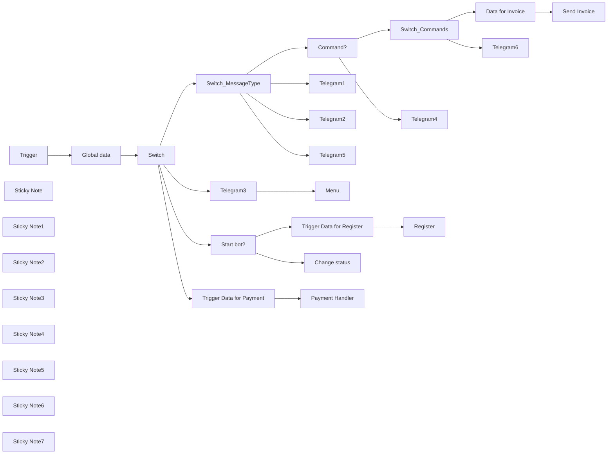

## Fluxo (.json) :

```json
{
  "meta": {
    "instanceId": "1dbc26c48fe55fbd6f6084822260e5ffcc6df7c619b3d6ceeb699da53e67c82c"
  },
  "nodes": [
    {
      "id": "5d9cf2ce-4808-4d44-9f0d-2c15d8dcea91",
      "name": "Trigger",
      "type": "n8n-nodes-base.telegramTrigger",
      "position": [
        -400,
        340
      ],
      "webhookId": "96a20e88-ba8f-4827-b874-b0a9867c59e9",
      "parameters": {
        "updates": [
          "*"
        ],
        "additionalFields": {}
      },
      "credentials": {
        "telegramApi": {
          "id": "BsrAeDsPMOnQOFa7",
          "name": "n8n template"
        }
      },
      "typeVersion": 1.1
    },
    {
      "id": "22fc0669-96f2-4767-9bc2-03644c7ced21",
      "name": "Global data",
      "type": "n8n-nodes-base.set",
      "position": [
        -200,
        340
      ],
      "parameters": {
        "options": {}
      },
      "typeVersion": 3.4
    },
    {
      "id": "d5925fd8-abde-45bf-ac3d-22649ecb1f4e",
      "name": "Telegram1",
      "type": "n8n-nodes-base.telegram",
      "position": [
        1700,
        -360
      ],
      "parameters": {
        "text": "Photo",
        "chatId": "={{ $('Trigger').item.json.message.from.id }}",
        "additionalFields": {
          "appendAttribution": false
        }
      },
      "credentials": {
        "telegramApi": {
          "id": "BsrAeDsPMOnQOFa7",
          "name": "n8n template"
        }
      },
      "typeVersion": 1.2
    },
    {
      "id": "5dc06f04-26b4-45af-99d6-a06b7c1b936d",
      "name": "Telegram2",
      "type": "n8n-nodes-base.telegram",
      "position": [
        1700,
        -120
      ],
      "parameters": {
        "text": "File",
        "chatId": "={{ $('Trigger').item.json.message.from.id }}",
        "additionalFields": {
          "appendAttribution": false
        }
      },
      "credentials": {
        "telegramApi": {
          "id": "BsrAeDsPMOnQOFa7",
          "name": "n8n template"
        }
      },
      "typeVersion": 1.2
    },
    {
      "id": "d036c602-17bb-45b5-b7b0-331339570cb3",
      "name": "Telegram3",
      "type": "n8n-nodes-base.telegram",
      "position": [
        1260,
        460
      ],
      "parameters": {
        "text": "Callback",
        "chatId": "={{ $('Trigger').item.json.callback_query.data }}",
        "additionalFields": {
          "appendAttribution": false
        }
      },
      "credentials": {
        "telegramApi": {
          "id": "BsrAeDsPMOnQOFa7",
          "name": "n8n template"
        }
      },
      "typeVersion": 1.2
    },
    {
      "id": "a86fe429-65df-471b-bdcb-e4765b14f109",
      "name": "Telegram4",
      "type": "n8n-nodes-base.telegram",
      "position": [
        1600,
        -700
      ],
      "parameters": {
        "text": "Text",
        "chatId": "={{ $('Trigger').item.json.message.from.id }}",
        "additionalFields": {
          "appendAttribution": false
        }
      },
      "credentials": {
        "telegramApi": {
          "id": "BsrAeDsPMOnQOFa7",
          "name": "n8n template"
        }
      },
      "typeVersion": 1.2
    },
    {
      "id": "b28ef71b-4e4b-48cb-b64d-029feee13ee4",
      "name": "Sticky Note",
      "type": "n8n-nodes-base.stickyNote",
      "position": [
        980,
        360
      ],
      "parameters": {
        "color": 7,
        "width": 1200.5980355767667,
        "height": 326.00218267794156,
        "content": "## Callback"
      },
      "typeVersion": 1
    },
    {
      "id": "d51d4ac4-e182-4245-b26f-248f99235de8",
      "name": "Sticky Note1",
      "type": "n8n-nodes-base.stickyNote",
      "position": [
        980,
        -920
      ],
      "parameters": {
        "color": 7,
        "width": 1200.5980355767667,
        "height": 481.314448671577,
        "content": "## Text\n"
      },
      "typeVersion": 1
    },
    {
      "id": "05754c06-8f64-44c6-be55-3eb480e0cb3d",
      "name": "Sticky Note2",
      "type": "n8n-nodes-base.stickyNote",
      "position": [
        980,
        -400
      ],
      "parameters": {
        "color": 7,
        "width": 1200.5980355767667,
        "height": 198.69915410333263,
        "content": "## Photo"
      },
      "typeVersion": 1
    },
    {
      "id": "d9906042-25cd-4812-bbf1-4c46aa2c0492",
      "name": "Sticky Note3",
      "type": "n8n-nodes-base.stickyNote",
      "position": [
        980,
        -160
      ],
      "parameters": {
        "color": 7,
        "width": 1200.5980355767667,
        "height": 198.69915410333263,
        "content": "## File"
      },
      "typeVersion": 1
    },
    {
      "id": "0e0bfc7f-23a3-478e-a3a1-cffbc9f9f95e",
      "name": "Sticky Note4",
      "type": "n8n-nodes-base.stickyNote",
      "position": [
        980,
        100
      ],
      "parameters": {
        "color": 7,
        "width": 1200.5980355767667,
        "height": 198.69915410333263,
        "content": "## Voice"
      },
      "typeVersion": 1
    },
    {
      "id": "a4519088-76c3-427c-95b6-7982814bf8e3",
      "name": "Telegram5",
      "type": "n8n-nodes-base.telegram",
      "position": [
        1700,
        140
      ],
      "parameters": {
        "text": "Voice",
        "chatId": "={{ $('Trigger').item.json.message.from.id }}",
        "additionalFields": {
          "appendAttribution": false
        }
      },
      "credentials": {
        "telegramApi": {
          "id": "BsrAeDsPMOnQOFa7",
          "name": "n8n template"
        }
      },
      "typeVersion": 1.2
    },
    {
      "id": "0b597db9-d240-4be3-90f3-095117b1c6bc",
      "name": "Switch_MessageType",
      "type": "n8n-nodes-base.switch",
      "position": [
        720,
        -120
      ],
      "parameters": {
        "rules": {
          "values": [
            {
              "outputKey": "Text",
              "conditions": {
                "options": {
                  "leftValue": "",
                  "caseSensitive": true,
                  "typeValidation": "strict"
                },
                "combinator": "and",
                "conditions": [
                  {
                    "id": "360a2e5b-8736-488c-87dc-b5fcbd2b5102",
                    "operator": {
                      "type": "boolean",
                      "operation": "true",
                      "singleValue": true
                    },
                    "leftValue": "={{ $('Trigger').item.json.message.hasOwnProperty('text') }}",
                    "rightValue": "/"
                  }
                ]
              },
              "renameOutput": true
            },
            {
              "outputKey": "Photo",
              "conditions": {
                "options": {
                  "leftValue": "",
                  "caseSensitive": true,
                  "typeValidation": "strict"
                },
                "combinator": "and",
                "conditions": [
                  {
                    "operator": {
                      "type": "boolean",
                      "operation": "true",
                      "singleValue": true
                    },
                    "leftValue": "={{ $('Trigger').item.json.message.hasOwnProperty('photo') }}",
                    "rightValue": ""
                  }
                ]
              },
              "renameOutput": true
            },
            {
              "outputKey": "File",
              "conditions": {
                "options": {
                  "leftValue": "",
                  "caseSensitive": true,
                  "typeValidation": "strict"
                },
                "combinator": "and",
                "conditions": [
                  {
                    "id": "eb5a5507-4374-46c9-b8eb-25b36cbe17ee",
                    "operator": {
                      "type": "boolean",
                      "operation": "true",
                      "singleValue": true
                    },
                    "leftValue": "={{ $('Trigger').item.json.message.hasOwnProperty('document') }}",
                    "rightValue": "2"
                  }
                ]
              },
              "renameOutput": true
            },
            {
              "outputKey": "Voice",
              "conditions": {
                "options": {
                  "leftValue": "",
                  "caseSensitive": true,
                  "typeValidation": "strict"
                },
                "combinator": "and",
                "conditions": [
                  {
                    "id": "b5a43050-e657-4b56-aa9b-290a94aa8902",
                    "operator": {
                      "type": "boolean",
                      "operation": "true",
                      "singleValue": true
                    },
                    "leftValue": "={{ $('Trigger').item.json.message.hasOwnProperty('voice') }}",
                    "rightValue": ""
                  }
                ]
              },
              "renameOutput": true
            }
          ]
        },
        "options": {}
      },
      "typeVersion": 3
    },
    {
      "id": "efb08696-e76f-494c-8872-d117a379adec",
      "name": "Sticky Note5",
      "type": "n8n-nodes-base.stickyNote",
      "position": [
        980,
        -1440
      ],
      "parameters": {
        "color": 7,
        "width": 1195.9520561291508,
        "height": 481.314448671577,
        "content": "## Commands"
      },
      "typeVersion": 1
    },
    {
      "id": "7edecce3-6371-45ab-8dc1-f3e1a2052daa",
      "name": "Telegram6",
      "type": "n8n-nodes-base.telegram",
      "position": [
        1840,
        -1180
      ],
      "parameters": {
        "text": "Don't know the command",
        "chatId": "={{ $('Trigger').item.json.message.from.id }}",
        "additionalFields": {
          "appendAttribution": false
        }
      },
      "credentials": {
        "telegramApi": {
          "id": "BsrAeDsPMOnQOFa7",
          "name": "n8n template"
        }
      },
      "typeVersion": 1.2
    },
    {
      "id": "c3b030e2-a085-4e21-8645-0224d6bb7c35",
      "name": "Menu",
      "type": "n8n-nodes-base.switch",
      "position": [
        1420,
        460
      ],
      "parameters": {
        "rules": {
          "values": [
            {
              "outputKey": "Conditions",
              "conditions": {
                "options": {
                  "leftValue": "",
                  "caseSensitive": true,
                  "typeValidation": "strict"
                },
                "combinator": "and",
                "conditions": [
                  {
                    "id": "798e1a40-e85b-4294-afcb-b129f92eb833",
                    "operator": {
                      "name": "filter.operator.equals",
                      "type": "string",
                      "operation": "equals"
                    },
                    "leftValue": "={{ $('Trigger').item.json.callback_query.data }}",
                    "rightValue": "menu_conditions"
                  }
                ]
              },
              "renameOutput": true
            },
            {
              "outputKey": "Reviews",
              "conditions": {
                "options": {
                  "leftValue": "",
                  "caseSensitive": true,
                  "typeValidation": "strict"
                },
                "combinator": "and",
                "conditions": [
                  {
                    "id": "f91b8a94-8961-4d20-ae9c-0ee34ff04000",
                    "operator": {
                      "name": "filter.operator.equals",
                      "type": "string",
                      "operation": "equals"
                    },
                    "leftValue": "={{ $('Trigger').item.json.callback_query.data }}",
                    "rightValue": "menu_reviews"
                  }
                ]
              },
              "renameOutput": true
            }
          ]
        },
        "options": {}
      },
      "typeVersion": 3
    },
    {
      "id": "71907904-21f3-459c-a445-ca44a432dd36",
      "name": "Command?",
      "type": "n8n-nodes-base.if",
      "position": [
        1380,
        -760
      ],
      "parameters": {
        "options": {},
        "conditions": {
          "options": {
            "leftValue": "",
            "caseSensitive": true,
            "typeValidation": "strict"
          },
          "combinator": "and",
          "conditions": [
            {
              "id": "a2025331-2c2b-4df8-9e23-37035a5c808a",
              "operator": {
                "type": "string",
                "operation": "startsWith"
              },
              "leftValue": "={{ $('Trigger').item.json.message.text }}\n",
              "rightValue": "/"
            }
          ]
        }
      },
      "typeVersion": 2
    },
    {
      "id": "23e5c351-095b-4485-ad09-4dc4df195a8d",
      "name": "Change status",
      "type": "n8n-nodes-base.googleSheets",
      "position": [
        1460,
        1220
      ],
      "parameters": {
        "columns": {
          "value": {
            "Status": "0"
          },
          "schema": [
            {
              "id": "ID",
              "type": "string",
              "display": true,
              "removed": false,
              "required": false,
              "displayName": "ID",
              "defaultMatch": false,
              "canBeUsedToMatch": true
            },
            {
              "id": "Name",
              "type": "string",
              "display": true,
              "removed": true,
              "required": false,
              "displayName": "Name",
              "defaultMatch": false,
              "canBeUsedToMatch": true
            },
            {
              "id": "Lastname",
              "type": "string",
              "display": true,
              "removed": true,
              "required": false,
              "displayName": "Lastname",
              "defaultMatch": false,
              "canBeUsedToMatch": true
            },
            {
              "id": "Username",
              "type": "string",
              "display": true,
              "removed": true,
              "required": false,
              "displayName": "Username",
              "defaultMatch": false,
              "canBeUsedToMatch": true
            },
            {
              "id": "Date",
              "type": "string",
              "display": true,
              "removed": true,
              "required": false,
              "displayName": "Date",
              "defaultMatch": false,
              "canBeUsedToMatch": true
            },
            {
              "id": "Language",
              "type": "string",
              "display": true,
              "removed": true,
              "required": false,
              "displayName": "Language",
              "defaultMatch": false,
              "canBeUsedToMatch": true
            },
            {
              "id": "Status",
              "type": "string",
              "display": true,
              "required": false,
              "displayName": "Status",
              "defaultMatch": false,
              "canBeUsedToMatch": true
            },
            {
              "id": "Balance",
              "type": "string",
              "display": true,
              "removed": true,
              "required": false,
              "displayName": "Balance",
              "defaultMatch": false,
              "canBeUsedToMatch": true
            },
            {
              "id": "row_number",
              "type": "string",
              "display": true,
              "removed": true,
              "readOnly": true,
              "required": false,
              "displayName": "row_number",
              "defaultMatch": false,
              "canBeUsedToMatch": true
            }
          ],
          "mappingMode": "defineBelow",
          "matchingColumns": [
            "ID"
          ]
        },
        "options": {},
        "operation": "update",
        "sheetName": {
          "__rl": true,
          "mode": "list",
          "value": "gid=0",
          "cachedResultUrl": "https://docs.google.com/spreadsheets/d/1nTDcSinsEdKUA_BzISUwCa8WogQZXc7sjIdBvs3D7o0/edit#gid=0",
          "cachedResultName": "USERS"
        },
        "documentId": {
          "__rl": true,
          "mode": "url",
          "value": "https://docs.google.com/spreadsheets/d/1nTDcSinsEdKUA_BzISUwCa8WogQZXc7sjIdBvs3D7o0/edit?gid=0#gid=0"
        }
      },
      "credentials": {
        "googleSheetsOAuth2Api": {
          "id": "3",
          "name": "Google Sheets account"
        }
      },
      "typeVersion": 4.4
    },
    {
      "id": "12e9c69a-ac4d-4c1b-ba2e-18602a1ac715",
      "name": "Start bot?",
      "type": "n8n-nodes-base.if",
      "position": [
        1260,
        1040
      ],
      "parameters": {
        "options": {},
        "conditions": {
          "options": {
            "leftValue": "",
            "caseSensitive": true,
            "typeValidation": "strict"
          },
          "combinator": "and",
          "conditions": [
            {
              "id": "253b4dfb-2b86-499a-a1a6-b6d916c9c25f",
              "operator": {
                "name": "filter.operator.equals",
                "type": "string",
                "operation": "equals"
              },
              "leftValue": "={{ $('Trigger').item.json.my_chat_member.new_chat_member.status }}",
              "rightValue": "member"
            }
          ]
        }
      },
      "typeVersion": 2.1
    },
    {
      "id": "b60a7063-a62f-4fbe-bc33-40ff55170f3e",
      "name": "Register",
      "type": "n8n-nodes-base.executeWorkflow",
      "position": [
        1620,
        920
      ],
      "parameters": {
        "options": {
          "waitForSubWorkflow": false
        },
        "workflowId": "XZKoHGcXJE1fUizb"
      },
      "typeVersion": 1
    },
    {
      "id": "6a7249dd-f664-4115-a907-883d1da4e1c5",
      "name": "Payment Handler",
      "type": "n8n-nodes-base.executeWorkflow",
      "position": [
        1460,
        1660
      ],
      "parameters": {
        "options": {},
        "workflowId": {
          "__rl": true,
          "mode": "id",
          "value": "lPX901W8CIMbKbww"
        }
      },
      "typeVersion": 1.1
    },
    {
      "id": "586f875f-e119-467e-8a3d-6090b8eaed80",
      "name": "Trigger Data for Payment",
      "type": "n8n-nodes-base.set",
      "notes": "Chat ID required. \n\nSend action name to handle it inside Payment workflow",
      "position": [
        1280,
        1660
      ],
      "parameters": {
        "mode": "raw",
        "options": {},
        "jsonOutput": "={{ Object.assign({}, $('Trigger').item.json, { \"action\": \"HandlePayment\" }) }}"
      },
      "notesInFlow": true,
      "typeVersion": 3.4
    },
    {
      "id": "f6f231a0-f5b7-4e58-acda-4f8dfe46a666",
      "name": "Trigger Data for Register",
      "type": "n8n-nodes-base.set",
      "position": [
        1460,
        920
      ],
      "parameters": {
        "mode": "raw",
        "options": {},
        "jsonOutput": "={{ $('Trigger').item.json }}"
      },
      "typeVersion": 3.4
    },
    {
      "id": "b7287bcc-b4d0-4b42-bdfc-eeb8c1a0c289",
      "name": "Switch",
      "type": "n8n-nodes-base.switch",
      "position": [
        -20,
        340
      ],
      "parameters": {
        "rules": {
          "values": [
            {
              "outputKey": "Message",
              "conditions": {
                "options": {
                  "leftValue": "",
                  "caseSensitive": true,
                  "typeValidation": "strict"
                },
                "combinator": "and",
                "conditions": [
                  {
                    "id": "360a2e5b-8736-488c-87dc-b5fcbd2b5102",
                    "operator": {
                      "type": "boolean",
                      "operation": "true",
                      "singleValue": true
                    },
                    "leftValue": "={{ $('Trigger').item.json.message && (!$('Trigger').item.json.message.successful_payment) }}",
                    "rightValue": "/"
                  }
                ]
              },
              "renameOutput": true
            },
            {
              "outputKey": "Callback",
              "conditions": {
                "options": {
                  "leftValue": "",
                  "caseSensitive": true,
                  "typeValidation": "strict"
                },
                "combinator": "and",
                "conditions": [
                  {
                    "operator": {
                      "type": "boolean",
                      "operation": "true",
                      "singleValue": true
                    },
                    "leftValue": "={{ $('Trigger').item.json.hasOwnProperty('callback_query') }}",
                    "rightValue": ""
                  }
                ]
              },
              "renameOutput": true
            },
            {
              "outputKey": "System",
              "conditions": {
                "options": {
                  "leftValue": "",
                  "caseSensitive": true,
                  "typeValidation": "strict"
                },
                "combinator": "and",
                "conditions": [
                  {
                    "id": "e014a230-519a-4028-98b3-33c10d408c85",
                    "operator": {
                      "type": "boolean",
                      "operation": "true",
                      "singleValue": true
                    },
                    "leftValue": "={{ $('Trigger').item.json.hasOwnProperty('my_chat_member') }}",
                    "rightValue": "System"
                  }
                ]
              },
              "renameOutput": true
            },
            {
              "outputKey": "Payment",
              "conditions": {
                "options": {
                  "leftValue": "",
                  "caseSensitive": true,
                  "typeValidation": "strict"
                },
                "combinator": "and",
                "conditions": [
                  {
                    "id": "b03aaa37-d57f-437c-acb2-de2068d3241a",
                    "operator": {
                      "type": "boolean",
                      "operation": "true",
                      "singleValue": true
                    },
                    "leftValue": "={{ $('Trigger').item.json.hasOwnProperty('pre_checkout_query') || $('Trigger').item.json.message.hasOwnProperty('successful_payment') }}",
                    "rightValue": ""
                  }
                ]
              },
              "renameOutput": true
            }
          ]
        },
        "options": {}
      },
      "typeVersion": 3
    },
    {
      "id": "509c5575-2226-486c-8398-887eb69a74f8",
      "name": "Data for Invoice",
      "type": "n8n-nodes-base.set",
      "notes": "Chat ID required. \n\nSend action name to handle it inside Payment workflow",
      "position": [
        1840,
        -1380
      ],
      "parameters": {
        "mode": "raw",
        "options": {},
        "jsonOutput": "={{ Object.assign({}, $('Trigger').item.json, { \"action\": \"SendInvoice\" }) }}"
      },
      "notesInFlow": true,
      "typeVersion": 3.4
    },
    {
      "id": "6634d3a8-848a-4a14-ba37-58f33e3409f2",
      "name": "Send Invoice",
      "type": "n8n-nodes-base.executeWorkflow",
      "position": [
        2040,
        -1380
      ],
      "parameters": {
        "options": {
          "waitForSubWorkflow": false
        },
        "workflowId": "lPX901W8CIMbKbww"
      },
      "typeVersion": 1
    },
    {
      "id": "e4bef639-3451-4ddc-ad26-481ba2acf33d",
      "name": "Sticky Note6",
      "type": "n8n-nodes-base.stickyNote",
      "position": [
        980,
        820
      ],
      "parameters": {
        "color": 7,
        "width": 1216.6513404859077,
        "height": 612.9550079288388,
        "content": "## New member or Member left"
      },
      "typeVersion": 1
    },
    {
      "id": "4affaf7d-0694-4aa0-9616-8e12ca5bee15",
      "name": "Sticky Note7",
      "type": "n8n-nodes-base.stickyNote",
      "position": [
        980,
        1500
      ],
      "parameters": {
        "color": 7,
        "width": 1216.6513404859077,
        "height": 496.56854733756575,
        "content": "## Payment handler"
      },
      "typeVersion": 1
    },
    {
      "id": "58008f10-7336-4633-ab15-51556e3b53bd",
      "name": "Switch_Commands",
      "type": "n8n-nodes-base.switch",
      "position": [
        1540,
        -1280
      ],
      "parameters": {
        "rules": {
          "values": [
            {
              "outputKey": "Command 1",
              "conditions": {
                "options": {
                  "leftValue": "",
                  "caseSensitive": true,
                  "typeValidation": "strict"
                },
                "combinator": "and",
                "conditions": [
                  {
                    "id": "360a2e5b-8736-488c-87dc-b5fcbd2b5102",
                    "operator": {
                      "type": "string",
                      "operation": "contains"
                    },
                    "leftValue": "={{ $('Trigger').item.json.message.text }}",
                    "rightValue": "/pay"
                  }
                ]
              },
              "renameOutput": true
            },
            {
              "outputKey": "Command 2",
              "conditions": {
                "options": {
                  "leftValue": "",
                  "caseSensitive": true,
                  "typeValidation": "strict"
                },
                "combinator": "and",
                "conditions": [
                  {
                    "id": "546c81bf-2ee0-46b2-847b-1f92b84efaf3",
                    "operator": {
                      "type": "string",
                      "operation": "contains"
                    },
                    "leftValue": "={{ $('Trigger').item.json.message.text }}",
                    "rightValue": "/command2"
                  }
                ]
              },
              "renameOutput": true
            }
          ]
        },
        "options": {
          "fallbackOutput": "extra"
        }
      },
      "typeVersion": 3
    }
  ],
  "pinData": {},
  "connections": {
    "Switch": {
      "main": [
        [
          {
            "node": "Switch_MessageType",
            "type": "main",
            "index": 0
          }
        ],
        [
          {
            "node": "Telegram3",
            "type": "main",
            "index": 0
          }
        ],
        [
          {
            "node": "Start bot?",
            "type": "main",
            "index": 0
          }
        ],
        [
          {
            "node": "Trigger Data for Payment",
            "type": "main",
            "index": 0
          }
        ]
      ]
    },
    "Trigger": {
      "main": [
        [
          {
            "node": "Global data",
            "type": "main",
            "index": 0
          }
        ]
      ]
    },
    "Command?": {
      "main": [
        [
          {
            "node": "Switch_Commands",
            "type": "main",
            "index": 0
          }
        ],
        [
          {
            "node": "Telegram4",
            "type": "main",
            "index": 0
          }
        ]
      ]
    },
    "Telegram3": {
      "main": [
        [
          {
            "node": "Menu",
            "type": "main",
            "index": 0
          }
        ]
      ]
    },
    "Start bot?": {
      "main": [
        [
          {
            "node": "Trigger Data for Register",
            "type": "main",
            "index": 0
          }
        ],
        [
          {
            "node": "Change status",
            "type": "main",
            "index": 0
          }
        ]
      ]
    },
    "Global data": {
      "main": [
        [
          {
            "node": "Switch",
            "type": "main",
            "index": 0
          }
        ]
      ]
    },
    "Switch_Commands": {
      "main": [
        [
          {
            "node": "Data for Invoice",
            "type": "main",
            "index": 0
          }
        ],
        [
          {
            "node": "Telegram6",
            "type": "main",
            "index": 0
          }
        ]
      ]
    },
    "Data for Invoice": {
      "main": [
        [
          {
            "node": "Send Invoice",
            "type": "main",
            "index": 0
          }
        ]
      ]
    },
    "Switch_MessageType": {
      "main": [
        [
          {
            "node": "Command?",
            "type": "main",
            "index": 0
          }
        ],
        [
          {
            "node": "Telegram1",
            "type": "main",
            "index": 0
          }
        ],
        [
          {
            "node": "Telegram2",
            "type": "main",
            "index": 0
          }
        ],
        [
          {
            "node": "Telegram5",
            "type": "main",
            "index": 0
          }
        ]
      ]
    },
    "Trigger Data for Payment": {
      "main": [
        [
          {
            "node": "Payment Handler",
            "type": "main",
            "index": 0
          }
        ]
      ]
    },
    "Trigger Data for Register": {
      "main": [
        [
          {
            "node": "Register",
            "type": "main",
            "index": 0
          }
        ]
      ]
    }
  }
}
```

<a id="template-2149"></a>

## Template 2149 - Criar sala, convidar membros e enviar mensagem

- **Nome:** Criar sala, convidar membros e enviar mensagem
- **Descrição:** Cria uma sala no Matrix, convida membros de outra sala e envia uma mensagem de boas-vindas na sala criada.
- **Funcionalidade:** • Acionamento manual: Inicia o fluxo quando executado manualmente.
• Criação de sala: Cria uma nova sala com nome e alias especificados.
• Recuperação do usuário autenticado: Obtém o ID do usuário que está executando a automação.
• Listagem de membros de outra sala: Busca os membros de uma sala existente para avaliar convites.
• Filtragem para evitar auto-convite: Compara IDs e impede convidar o próprio usuário que executa o fluxo.
• Convite de membros: Envia convites aos membros filtrados para participarem da sala criada.
• Envio de mensagem de boas-vindas: Publica uma mensagem de texto na sala após os convites.
• Caminho alternativo sem ação: Mantém um fluxo neutro quando não há convite a ser enviado.
- **Ferramentas:** • Matrix: Serviço de comunicação descentralizado (protocolo Matrix) utilizado para criar salas, gerenciar membros, enviar convites e publicar mensagens.

## Fluxo visual

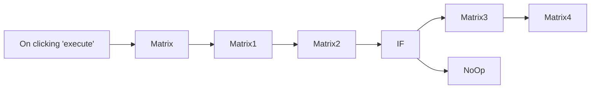

## Fluxo (.json) :

```json
{
  "id": "83",
  "name": "Create a room, invite members from a different room, and send a message in the room we created",
  "nodes": [
    {
      "name": "On clicking 'execute'",
      "type": "n8n-nodes-base.manualTrigger",
      "position": [
        240,
        300
      ],
      "parameters": {},
      "typeVersion": 1
    },
    {
      "name": "Matrix",
      "type": "n8n-nodes-base.matrix",
      "position": [
        400,
        300
      ],
      "parameters": {
        "resource": "room",
        "roomName": "n8n",
        "roomAlias": "discussion-n8n"
      },
      "credentials": {
        "matrixApi": "matrix"
      },
      "typeVersion": 1
    },
    {
      "name": "IF",
      "type": "n8n-nodes-base.if",
      "position": [
        840,
        300
      ],
      "parameters": {
        "conditions": {
          "string": [
            {
              "value1": "={{$node[\"Matrix1\"].json[\"user_id\"]}}",
              "value2": "={{$node[\"Matrix2\"].json[\"user_id\"]}}",
              "operation": "notEqual"
            }
          ]
        }
      },
      "typeVersion": 1
    },
    {
      "name": "Matrix3",
      "type": "n8n-nodes-base.matrix",
      "position": [
        990,
        200
      ],
      "parameters": {
        "roomId": "={{$node[\"Matrix\"].json[\"room_id\"]}}",
        "userId": "={{$node[\"IF\"].json[\"user_id\"]}}",
        "resource": "room",
        "operation": "invite"
      },
      "credentials": {
        "matrixApi": "matrix"
      },
      "typeVersion": 1
    },
    {
      "name": "Matrix4",
      "type": "n8n-nodes-base.matrix",
      "position": [
        1140,
        200
      ],
      "parameters": {
        "text": "Welcome to n8n!",
        "roomId": "={{$node[\"Matrix\"].json[\"room_id\"]}}"
      },
      "credentials": {
        "matrixApi": "matrix"
      },
      "typeVersion": 1
    },
    {
      "name": "NoOp",
      "type": "n8n-nodes-base.noOp",
      "position": [
        990,
        400
      ],
      "parameters": {},
      "typeVersion": 1
    },
    {
      "name": "Matrix1",
      "type": "n8n-nodes-base.matrix",
      "position": [
        540,
        300
      ],
      "parameters": {
        "resource": "account"
      },
      "credentials": {
        "matrixApi": "matrix"
      },
      "typeVersion": 1,
      "continueOnFail": true
    },
    {
      "name": "Matrix2",
      "type": "n8n-nodes-base.matrix",
      "position": [
        690,
        300
      ],
      "parameters": {
        "roomId": "!cMUIsUgevrhCoeMkSG:matrix.org",
        "filters": {},
        "resource": "roomMember"
      },
      "credentials": {
        "matrixApi": "matrix"
      },
      "typeVersion": 1
    }
  ],
  "active": false,
  "settings": {},
  "connections": {
    "IF": {
      "main": [
        [
          {
            "node": "Matrix3",
            "type": "main",
            "index": 0
          }
        ],
        [
          {
            "node": "NoOp",
            "type": "main",
            "index": 0
          }
        ]
      ]
    },
    "Matrix": {
      "main": [
        [
          {
            "node": "Matrix1",
            "type": "main",
            "index": 0
          }
        ]
      ]
    },
    "Matrix1": {
      "main": [
        [
          {
            "node": "Matrix2",
            "type": "main",
            "index": 0
          }
        ]
      ]
    },
    "Matrix2": {
      "main": [
        [
          {
            "node": "IF",
            "type": "main",
            "index": 0
          }
        ]
      ]
    },
    "Matrix3": {
      "main": [
        [
          {
            "node": "Matrix4",
            "type": "main",
            "index": 0
          }
        ]
      ]
    },
    "On clicking 'execute'": {
      "main": [
        [
          {
            "node": "Matrix",
            "type": "main",
            "index": 0
          }
        ]
      ]
    }
  }
}
```

<a id="template-2151"></a>

## Template 2151 - Formulários dinâmicos a partir de Airtable/Baserow

- **Nome:** Formulários dinâmicos a partir de Airtable/Baserow
- **Descrição:** Gera formulários dinâmicos com base no esquema de uma tabela do Airtable ou Baserow; ao submeter, cria a linha correspondente e trata anexos separadamente.
- **Funcionalidade:** • Seleção dinâmica de base/tabela: Permite escolher a base ou tabela de origem via formulário para gerar o formulário dinâmico.
• Importação de esquema: Recupera o esquema da tabela (Airtable ou Baserow) para extrair campos e metadados.
• Conversão de esquema para formulário: Converte tipos de campo do banco (texto, número, data, opções, arquivos, booleano, etc.) para o formato de formulário JSON.
• Filtragem de campos não suportados: Remove ou ignora campos cujo tipo não pode ser representado no formulário gerado.
• Renderização do formulário JSON: Exibe um formulário gerado dinamicamente ao usuário baseado no esquema convertido.
• Preparação de dados para inserção: Ao receber submissão, filtra campos de arquivo, aplica conversões de tipo (ex.: booleanos) e monta o payload para criação de linha.
• Criação de registro: Insere a nova linha na base correspondente (Airtable ou Baserow) usando a API apropriada.
• Tratamento de arquivos/attachments: Processa campos de arquivo separadamente — faz upload dos arquivos e associa as referências ao registro criado.
• Fluxos específicos por provedor: Para Baserow faz upload de arquivos e depois atualiza a linha com referências; para Airtable usa endpoint de upload de anexos (append).
• Agrupamento e mapeamento de arquivos: Agrupa arquivos por nome de campo para montar o payload de atualização de attachments.
• Mensagem de conclusão: Mostra uma tela de confirmação ao usuário após a submissão e processamento.
- **Ferramentas:** • Airtable: Plataforma de base de dados usada para obter esquema da base, criar registros e fazer upload/atualização de attachments via API.
• Baserow: Plataforma de base de dados usada para listar campos da tabela, criar linhas, fazer upload de arquivos e atualizar linhas com referências aos arquivos.

## Fluxo visual

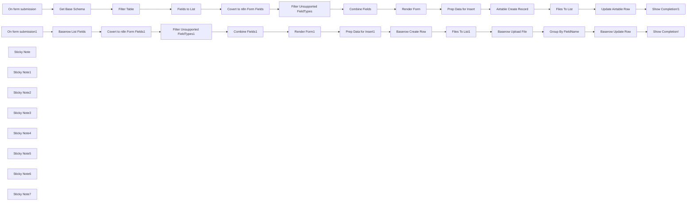

## Fluxo (.json) :

```json
{
  "meta": {
    "instanceId": "408f9fb9940c3cb18ffdef0e0150fe342d6e655c3a9fac21f0f644e8bedabcd9"
  },
  "nodes": [
    {
      "id": "266ebce9-540d-4fd8-95c2-2799f0eff8d9",
      "name": "Get Base Schema",
      "type": "n8n-nodes-base.airtable",
      "position": [
        420,
        160
      ],
      "parameters": {
        "base": {
          "__rl": true,
          "mode": "id",
          "value": "={{ $json.BaseId }}"
        },
        "resource": "base",
        "operation": "getSchema"
      },
      "credentials": {
        "airtableTokenApi": {
          "id": "Und0frCQ6SNVX3VV",
          "name": "Airtable Personal Access Token account"
        }
      },
      "typeVersion": 2.1
    },
    {
      "id": "1c33d0db-6eac-4638-8b5e-867ec52abd11",
      "name": "On form submission",
      "type": "n8n-nodes-base.formTrigger",
      "position": [
        80,
        160
      ],
      "webhookId": "a6daabfe-5507-4ac1-9345-45a59ba67630",
      "parameters": {
        "options": {
          "path": "airtable-n8n-form",
          "ignoreBots": true
        },
        "formTitle": "Airtable to n8n Form",
        "formFields": {
          "values": [
            {
              "fieldType": "dropdown",
              "fieldLabel": "BaseId",
              "fieldOptions": {
                "values": [
                  {
                    "option": "appfP15Xd0aVZR9xV"
                  }
                ]
              },
              "requiredField": true
            },
            {
              "fieldType": "dropdown",
              "fieldLabel": "TableId",
              "fieldOptions": {
                "values": [
                  {
                    "option": "tblBuJjQmTZL0MI8U"
                  }
                ]
              },
              "requiredField": true
            }
          ]
        },
        "formDescription": "This workflow creates an n8n form for an Airtable base."
      },
      "typeVersion": 2.2
    },
    {
      "id": "fef7c4f2-0153-4321-a0a4-700b84f27a0b",
      "name": "Filter Unsupported FieldTypes",
      "type": "n8n-nodes-base.filter",
      "position": [
        1220,
        160
      ],
      "parameters": {
        "options": {},
        "conditions": {
          "options": {
            "version": 2,
            "leftValue": "",
            "caseSensitive": true,
            "typeValidation": "strict"
          },
          "combinator": "and",
          "conditions": [
            {
              "id": "72309d3f-cd52-4bfa-8b29-df0795e38d7f",
              "operator": {
                "type": "string",
                "operation": "exists",
                "singleValue": true
              },
              "leftValue": "={{ $json.fieldType }}",
              "rightValue": ""
            }
          ]
        }
      },
      "typeVersion": 2.2
    },
    {
      "id": "b62f82bd-781b-4b41-83a1-57423e639c5e",
      "name": "Combine Fields",
      "type": "n8n-nodes-base.aggregate",
      "position": [
        1400,
        160
      ],
      "parameters": {
        "options": {},
        "aggregate": "aggregateAllItemData"
      },
      "typeVersion": 1
    },
    {
      "id": "b38ef15c-0098-47d9-964e-50466f4cd7fa",
      "name": "Render Form",
      "type": "n8n-nodes-base.form",
      "position": [
        1800,
        160
      ],
      "webhookId": "86e5d6db-20ee-4df5-b37a-38ac85e16b7d",
      "parameters": {
        "options": {},
        "defineForm": "json",
        "jsonOutput": "={{ $json.data }}"
      },
      "typeVersion": 1
    },
    {
      "id": "00bb7ad8-0457-4c38-a430-d9a1cd41d5fe",
      "name": "Files To List",
      "type": "n8n-nodes-base.code",
      "position": [
        3160,
        160
      ],
      "parameters": {
        "jsCode": "let results = [];\n\nconst fileInputs = $('Combine Fields').first().json.data.filter(item => item.fieldType === 'file');\n\nif (!fileInputs.length) return [];\n\nconst { json, binary } = $('Render Form').first();\n\nfor (fileInput of fileInputs) {\n  const binaryKeys = Object.keys(binary).filter(key => key.startsWith(fileInput.fieldLabel));\n  for (key of binaryKeys) {\n    results.push({\n      json: { fieldLabel: fileInput.fieldLabel },\n      binary: {\n          data: binary[key],\n      }\n    });\n  }\n}\n\nreturn results;"
      },
      "typeVersion": 2
    },
    {
      "id": "5f570811-ace9-489b-8889-d9686fe398f7",
      "name": "Fields to List",
      "type": "n8n-nodes-base.splitOut",
      "position": [
        780,
        160
      ],
      "parameters": {
        "options": {},
        "fieldToSplitOut": "fields"
      },
      "typeVersion": 1
    },
    {
      "id": "e3d222de-9673-4529-8a7c-8a16071b3ac9",
      "name": "Covert to n8n Form Fields",
      "type": "n8n-nodes-base.code",
      "position": [
        1040,
        160
      ],
      "parameters": {
        "mode": "runOnceForEachItem",
        "jsCode": "function createField (\n  label = '',\n  type = '',\n  options = {},\n) {\n  return {\n    fieldLabel: label,\n    fieldType: type,\n    formatDate: options.formatDate,\n    fieldOptions: options.choices ?  { values: options.choices } : undefined,\n    requiredField: options.isRequired || true,\n    placeholder: options.placeholder,\n    multiselect: options.isMultipleSelect,\n    multipleFiles: options.isMultipleFiles,\n    acceptFileTypes: options.acceptFileType,\n  }\n};\n\n\nconst { type, name, options } = $input.item.json;\nlet field = null;\n\nswitch (type) {\n  case 'singleLineText':\n  case 'phoneNumber':\n  case 'url': {\n    field = createField(name, 'text');\n    break;\n  }\n  case 'multilineText': {\n    field = createField(name, 'textarea');\n    break;\n  }\n  case 'number': {\n    field = createField(name, 'number');\n    break;\n  }\n  case 'email': {\n    field = createField(name, 'email');\n    break;\n  }\n  case 'dateTime': {\n    field = createField(name, 'date', {\n      formatDate: `yyyy-MM-dd HH:mm`\n    });\n    break;\n  }\n  case 'singleSelect':\n  case 'multipleSelects': {\n    field = createField(name, 'dropdown', {\n      choices: options.choices.map(choice => ({ option: choice.name })),\n      isMultipleSelect: type === 'multipleSelects'\n    });\n    break;\n  }\n  case 'checkbox': {\n    field = createField(name, 'dropdown', {\n      choices: [{ 'option': name }],\n      isMultipleSelect: true\n    });\n    break;\n  }\n  case 'multipleAttachments': {\n    field = createField(name, 'file', {\n      isMultipleFiles: true,\n    });\n    break;\n  }\n  default:\n}\n\nreturn { json: field || {} }"
      },
      "typeVersion": 2
    },
    {
      "id": "f88924ed-288a-4790-a092-67bf74866217",
      "name": "Filter Table",
      "type": "n8n-nodes-base.filter",
      "position": [
        600,
        160
      ],
      "parameters": {
        "options": {},
        "conditions": {
          "options": {
            "version": 2,
            "leftValue": "",
            "caseSensitive": true,
            "typeValidation": "strict"
          },
          "combinator": "and",
          "conditions": [
            {
              "id": "d74b2ca6-da27-4f84-9e2c-6c1353921df9",
              "operator": {
                "name": "filter.operator.equals",
                "type": "string",
                "operation": "equals"
              },
              "leftValue": "={{ $json.id }}",
              "rightValue": "={{ $('On form submission').item.json.TableId }}"
            }
          ]
        }
      },
      "typeVersion": 2.2
    },
    {
      "id": "262eca82-3488-4a2d-9fc2-fe137253f72c",
      "name": "Baserow List Fields",
      "type": "n8n-nodes-base.httpRequest",
      "position": [
        420,
        460
      ],
      "parameters": {
        "url": "=https://api.baserow.io/api/database/fields/table/{{ $json.TableId }}/",
        "options": {},
        "authentication": "genericCredentialType",
        "genericAuthType": "httpHeaderAuth"
      },
      "credentials": {
        "httpHeaderAuth": {
          "id": "bRnXiQiL9kogLPl3",
          "name": "Baserow.io"
        }
      },
      "typeVersion": 4.2
    },
    {
      "id": "933b8ee7-ec8f-4cca-af29-fb7eab8f581a",
      "name": "Covert to n8n Form Fields1",
      "type": "n8n-nodes-base.code",
      "position": [
        1040,
        460
      ],
      "parameters": {
        "mode": "runOnceForEachItem",
        "jsCode": "function createField (\n  label = '',\n  type = '',\n  options = {},\n) {\n  return {\n    fieldLabel: label,\n    fieldType: type,\n    formatDate: options.formatDate,\n    fieldOptions: options.choices ?  { values: options.choices } : undefined,\n    requiredField: options.isRequired || true,\n    placeholder: options.placeholder,\n    multiselect: options.isMultipleSelect,\n    multipleFiles: options.isMultipleFiles,\n    acceptFileTypes: options.acceptFileType,\n  }\n};\n\n\nconst { type, name, select_options } = $input.item.json;\nlet field = null;\n\nswitch (type) {\n  case 'text':\n  case 'phone_number':\n  case 'url': {\n    field = createField(name, 'text');\n    break;\n  }\n  case 'long_text': {\n    field = createField(name, 'textarea');\n    break;\n  }\n  case 'number': {\n    field = createField(name, 'number');\n    break;\n  }\n  case 'email': {\n    field = createField(name, 'email');\n    break;\n  }\n  case 'date': {\n    field = createField(name, 'date', {\n      formatDate: `yyyy-MM-dd HH:mm`\n    });\n    break;\n  }\n  case 'single_select':\n  case 'multiple_select': {\n    field = createField(name, 'dropdown', {\n      choices: select_options.map(choice => ({\n        option: choice.value\n      })),\n      isMultipleSelect: type === 'multiple_select'\n    });\n    break;\n  }\n  case 'boolean': {\n    field = createField(name, 'dropdown', {\n      choices: [{ 'option': name }],\n      isMultipleSelect: true\n    });\n    break;\n  }\n  case 'file': {\n    field = createField(name, 'file', {\n      isMultipleFiles: true,\n    });\n    break;\n  }\n  default:\n}\n\nreturn { json: field || {} }"
      },
      "typeVersion": 2
    },
    {
      "id": "74dc5acf-0dc9-4898-bff4-3fe27f04fbc8",
      "name": "Combine Fields1",
      "type": "n8n-nodes-base.aggregate",
      "position": [
        1400,
        460
      ],
      "parameters": {
        "options": {},
        "aggregate": "aggregateAllItemData"
      },
      "typeVersion": 1
    },
    {
      "id": "73eccae5-377e-4a8e-91ed-2f24f47eca71",
      "name": "Filter Unsupported FieldTypes1",
      "type": "n8n-nodes-base.filter",
      "position": [
        1220,
        460
      ],
      "parameters": {
        "options": {},
        "conditions": {
          "options": {
            "version": 2,
            "leftValue": "",
            "caseSensitive": true,
            "typeValidation": "strict"
          },
          "combinator": "and",
          "conditions": [
            {
              "id": "72309d3f-cd52-4bfa-8b29-df0795e38d7f",
              "operator": {
                "type": "string",
                "operation": "exists",
                "singleValue": true
              },
              "leftValue": "={{ $json.fieldType }}",
              "rightValue": ""
            }
          ]
        }
      },
      "typeVersion": 2.2
    },
    {
      "id": "702354ad-a138-46b7-93c3-7bb431164c12",
      "name": "Render Form1",
      "type": "n8n-nodes-base.form",
      "position": [
        1800,
        460
      ],
      "webhookId": "86e5d6db-20ee-4df5-b37a-38ac85e16b7d",
      "parameters": {
        "options": {},
        "defineForm": "json",
        "jsonOutput": "={{ $json.data }}"
      },
      "typeVersion": 1
    },
    {
      "id": "158eee94-5ca9-432f-8020-3195eec243ee",
      "name": "Baserow Create Row",
      "type": "n8n-nodes-base.httpRequest",
      "position": [
        2460,
        460
      ],
      "parameters": {
        "url": "=https://api.baserow.io/api/database/rows/table/{{ $('On form submission1').first().json.TableId }}/?user_field_names=true",
        "method": "POST",
        "options": {},
        "jsonBody": "={{ $json.toJsonString() }}",
        "sendBody": true,
        "specifyBody": "json",
        "authentication": "genericCredentialType",
        "genericAuthType": "httpHeaderAuth"
      },
      "credentials": {
        "httpHeaderAuth": {
          "id": "bRnXiQiL9kogLPl3",
          "name": "Baserow.io"
        }
      },
      "typeVersion": 4.2
    },
    {
      "id": "405030ad-af35-48ce-a1b5-61a7c8dfeb05",
      "name": "On form submission1",
      "type": "n8n-nodes-base.formTrigger",
      "position": [
        80,
        460
      ],
      "webhookId": "8ef4e5d9-5d92-4a3d-8d44-adf35a4bde3a",
      "parameters": {
        "options": {
          "path": "baserow-n8n-form"
        },
        "formTitle": "Baserow to n8n Form",
        "formFields": {
          "values": [
            {
              "fieldType": "dropdown",
              "fieldLabel": "TableId",
              "fieldOptions": {
                "values": [
                  {
                    "option": "401709"
                  }
                ]
              },
              "requiredField": true
            }
          ]
        },
        "formDescription": "This workflow creates an n8n form for a Baserow table."
      },
      "typeVersion": 2.2
    },
    {
      "id": "940e2015-cdfe-4fb9-841b-a25ef5903097",
      "name": "Files To List1",
      "type": "n8n-nodes-base.code",
      "position": [
        2800,
        460
      ],
      "parameters": {
        "jsCode": "let results = [];\n\nconst fileInputs = $('Combine Fields1').first().json.data.filter(item => item.fieldType === 'file');\n\nif (!fileInputs.length) return [];\n\nconst { json, binary } = $('Render Form1').first();\n\nfor (fileInput of fileInputs) {\n  const binaryKeys = Object.keys(binary).filter(key => key.startsWith(fileInput.fieldLabel));\n  for (key of binaryKeys) {\n    results.push({\n      json: { fieldLabel: fileInput.fieldLabel },\n      binary: {\n          data: binary[key],\n      }\n    });\n  }\n}\n\nreturn results;"
      },
      "typeVersion": 2
    },
    {
      "id": "dd18a5ff-230a-4b94-ab6f-a258fbf034e0",
      "name": "Baserow Upload File",
      "type": "n8n-nodes-base.httpRequest",
      "position": [
        2980,
        460
      ],
      "parameters": {
        "url": "https://api.baserow.io/api/user-files/upload-file/",
        "method": "POST",
        "options": {},
        "sendBody": true,
        "contentType": "multipart-form-data",
        "authentication": "genericCredentialType",
        "bodyParameters": {
          "parameters": [
            {
              "name": "file",
              "parameterType": "formBinaryData",
              "inputDataFieldName": "data"
            }
          ]
        },
        "genericAuthType": "httpHeaderAuth"
      },
      "credentials": {
        "httpHeaderAuth": {
          "id": "bRnXiQiL9kogLPl3",
          "name": "Baserow.io"
        }
      },
      "typeVersion": 4.2
    },
    {
      "id": "5679a086-d80d-4d55-89e4-1bea1626f561",
      "name": "Baserow Update Row",
      "type": "n8n-nodes-base.httpRequest",
      "position": [
        3340,
        460
      ],
      "parameters": {
        "url": "=https://api.baserow.io/api/database/rows/table/{{ $('On form submission1').first().json.TableId }}/{{ $('Baserow Create Row').first().json.id }}/?user_field_names=true",
        "method": "PATCH",
        "options": {
          "lowercaseHeaders": false
        },
        "jsonBody": "={{ $json.data.toJsonString() }}",
        "sendBody": true,
        "sendHeaders": true,
        "specifyBody": "json",
        "authentication": "genericCredentialType",
        "genericAuthType": "httpHeaderAuth",
        "headerParameters": {
          "parameters": [
            {
              "name": "Content-Type",
              "value": "application/json"
            }
          ]
        }
      },
      "credentials": {
        "httpHeaderAuth": {
          "id": "bRnXiQiL9kogLPl3",
          "name": "Baserow.io"
        }
      },
      "executeOnce": false,
      "typeVersion": 4.2
    },
    {
      "id": "3a3a2074-5d7d-4f42-bc52-8255f86483c5",
      "name": "Group By FieldName",
      "type": "n8n-nodes-base.code",
      "position": [
        3160,
        460
      ],
      "parameters": {
        "jsCode": "const pairs = $input.all().map((item, idx) => ({\n  field: $('Files To List1').itemMatching(idx).json.fieldLabel,\n  file: item.json,\n}));\n\nconst groups = {};\npairs.forEach(pair => {\n  if (!groups[pair.field]) groups[pair.field] = [];\n  groups[pair.field].push({\n    name: pair.file.name,\n    visible_name: pair.file.original_name\n  });\n});\n\nreturn { json: { data: groups } };"
      },
      "typeVersion": 2
    },
    {
      "id": "79480b76-6bc9-4786-9c67-3d0a2c36b8bd",
      "name": "Update Airtable Row",
      "type": "n8n-nodes-base.httpRequest",
      "position": [
        3340,
        160
      ],
      "parameters": {
        "url": "=https://content.airtable.com/v0/{{ $('On form submission').first().json.BaseId }}/{{ $('Airtable Create Record').first().json.id }}/{{ $json.fieldLabel }}/uploadAttachment",
        "method": "POST",
        "options": {},
        "sendBody": true,
        "authentication": "predefinedCredentialType",
        "bodyParameters": {
          "parameters": [
            {
              "name": "contentType",
              "value": "={{ $binary.data.mimeType }}"
            },
            {
              "name": "filename",
              "value": "={{ $binary.data.fileName }}"
            },
            {
              "name": "file",
              "value": "={{ $input.item.binary.data.data }}"
            }
          ]
        },
        "nodeCredentialType": "airtableTokenApi"
      },
      "credentials": {
        "airtableTokenApi": {
          "id": "Und0frCQ6SNVX3VV",
          "name": "Airtable Personal Access Token account"
        }
      },
      "typeVersion": 4.2
    },
    {
      "id": "94d20c33-d589-43db-aef2-afe3d4a3efcf",
      "name": "Sticky Note",
      "type": "n8n-nodes-base.stickyNote",
      "position": [
        -540,
        -200
      ],
      "parameters": {
        "width": 446.4999999999999,
        "height": 834.0643999999993,
        "content": "## Try It Out!\n### This template is an example of how you could replace Airtable or Baserow forms with n8n forms. Though debateable whether this is actually useful, it is a cool demo of how someone would approach this if it every became a problem.\n\n## How it works\n* A form trigger is used to dynamically select a database/table from which to build the n8n form from.\n* the table's schema is imported into the workflow and using the code node, is converted into the n8n form fields schema.\n* This let's us dynamically build the fields in our n8n form when we choose to define the form using the JSON option.\n* Once the n8n form submits, we convert the values back into our table's API schema so that we can create a new row.\n* Note any files/attachments fields are removed as they need to be handled separately.\n* Files are processed separately as they may first need to be stored. Once complete, the reference is saved into the newly created row.\n\n\n**Check out the example Airtable here** - [https://airtable.com/appfP15Xd0aVZR9xV/shrGFgXLyQ4Jg58SU](https://airtable.com/appfP15Xd0aVZR9xV/shrGFgXLyQ4Jg58SU)\n\n\n⭐️ [**New to Airtable? Sign up here!**](https://airtable.com/invite/r/cKzxFYVc)\n\n## How to use\n* The n8n form is autogenerated which means you only need provide access to the table. Using this approach, this template can be reused for any number of Airtable and/or Baserow tables.\n\n### Need Help?\nJoin the [Discord](https://discord.com/invite/XPKeKXeB7d) or ask in the [Forum](https://community.n8n.io/)!\n\nHappy Hacking!\n"
      },
      "typeVersion": 1
    },
    {
      "id": "bf89ec64-0524-428a-b087-a563311b02d7",
      "name": "Sticky Note1",
      "type": "n8n-nodes-base.stickyNote",
      "position": [
        338,
        -20
      ],
      "parameters": {
        "color": 7,
        "width": 600.75,
        "height": 675.625,
        "content": "## 1. Get Table Schema\n\n**Airtable** schema returns all tables with extra metadata whereas **Baserow** has a dedicated list fields endpoint for each table. This means for **Airtable**, we need to filter out the table we want and split out its fields array."
      },
      "typeVersion": 1
    },
    {
      "id": "c2b77c23-b2d4-46b1-8d59-8f8d950cfc70",
      "name": "Sticky Note2",
      "type": "n8n-nodes-base.stickyNote",
      "position": [
        967.5,
        -20
      ],
      "parameters": {
        "color": 7,
        "width": 616.40625,
        "height": 677.1875,
        "content": "## 2. Convert To N8N Form Schema\n\nBoth products contain similar schema with only different field labels. This makes it quite simple to convert either to n8n's forms. JSON schema."
      },
      "typeVersion": 1
    },
    {
      "id": "1cb13171-5682-41e4-8976-1f3f6f5d2cf5",
      "name": "Sticky Note3",
      "type": "n8n-nodes-base.stickyNote",
      "position": [
        1600,
        -20
      ],
      "parameters": {
        "color": 7,
        "width": 483.015625,
        "height": 677.1875,
        "content": "## 3. Render as N8N Form\n\nDid you know you can build forms dynamically from JSON? Well, you can! This flexibility makes working with n8n forms strategic because you can conditionally exclude fields which may not apply to the user or the context."
      },
      "typeVersion": 1
    },
    {
      "id": "e2603a0c-0c0d-4702-998f-f1e3c2e9955b",
      "name": "Sticky Note4",
      "type": "n8n-nodes-base.stickyNote",
      "position": [
        2100,
        -20
      ],
      "parameters": {
        "color": 7,
        "width": 602.265625,
        "height": 677.1875,
        "content": "## 4. Create New Row\n\nBoth **Airtable** and **Baserow** accept field labels as body param keys when using their API however, files and attachments are handled separately. Here we omit any file fields "
      },
      "typeVersion": 1
    },
    {
      "id": "42a4b3e1-2b18-4f19-a803-b6ff9ea8133b",
      "name": "Sticky Note5",
      "type": "n8n-nodes-base.stickyNote",
      "position": [
        2720,
        -20
      ],
      "parameters": {
        "color": 7,
        "width": 824.3125,
        "height": 677.1875,
        "content": "## 5. Upload Files & Attachments\n\n**Baserow** requires a 2 step process where the file is first uploaded and the returning reference is used to update the row. **Airtable** API allows upload and update of the row in one operation. The **Airtable** upload API also seems to work in an append fashion - each call adds to the attachments array - but **Baserow** uses replace approach meaning you need to upload the files in one go."
      },
      "typeVersion": 1
    },
    {
      "id": "356e3852-2268-41d0-ad83-e44d62cb6675",
      "name": "Sticky Note6",
      "type": "n8n-nodes-base.stickyNote",
      "position": [
        20,
        20
      ],
      "parameters": {
        "color": 5,
        "width": 264.0997209302325,
        "height": 99.50571162790695,
        "content": "### AirTable Example\n### 🚨 Change your Base ID and Table ID here!"
      },
      "typeVersion": 1
    },
    {
      "id": "1e93967b-792d-4608-b7d3-eec5f84c2c8b",
      "name": "Sticky Note7",
      "type": "n8n-nodes-base.stickyNote",
      "position": [
        20,
        620
      ],
      "parameters": {
        "color": 5,
        "width": 259.5844837209301,
        "height": 80,
        "content": "### BaseRow Example\n### 🚨 Change your TableId here!"
      },
      "typeVersion": 1
    },
    {
      "id": "84cf486e-15a5-4bb2-b62f-885056254944",
      "name": "Prep Data for Insert1",
      "type": "n8n-nodes-base.code",
      "position": [
        2240,
        460
      ],
      "parameters": {
        "mode": "runOnceForEachItem",
        "jsCode": "const schema = $('Baserow List Fields').all().map(input => input.json);\nconst data = $input.item.json;\n\n// 1. filter out file inputs\nconst fileKeys = schema.filter(item => item.type === 'file').map(item => item.name);\n\nconst filteredData = Object.keys(data)\n  .filter(key => !fileKeys.includes(key))\n  .reduce((acc,key) => ({\n    ...acc,\n    [key]: data[key]\n  }), {});\n\n// 2. typecast for boolean\nconst booleanKeys = schema.filter(item => item.type === 'boolean').map(item => item.name);\n\nbooleanKeys.forEach(key => {\n  if (filteredData[key] !== undefined) filteredData[key] = Boolean(filteredData[key]);\n});\n\nreturn { json: filteredData }\n"
      },
      "typeVersion": 2
    },
    {
      "id": "68fd3129-7bfd-4d73-80b0-f5af51161dc2",
      "name": "Prep Data for Insert",
      "type": "n8n-nodes-base.code",
      "position": [
        2240,
        160
      ],
      "parameters": {
        "mode": "runOnceForEachItem",
        "jsCode": "const schema = $('Fields to List').all().map(input => input.json);\nconst data = $input.item.json;\n\n// 1. filter out file inputs\nconst fileKeys = schema.filter(item => item.type === 'multipleAttachments').map(item => item.name);\n\nconst filteredData = schema\n  .filter(field => !fileKeys.includes(field.name))\n  .reduce((acc,field) => ({\n    ...acc,\n    [field.name]: data[field.name]\n  }), {});\n\n// 2. typecast for boolean\nconst booleanKeys = schema.filter(item => item.type === 'checkbox').map(item => item.name);\n\nbooleanKeys.forEach(key => {\n  if (filteredData[key] !== undefined) filteredData[key] = Boolean(filteredData[key]);\n});\n\nreturn { json: filteredData }\n"
      },
      "typeVersion": 2
    },
    {
      "id": "1a9fe02f-9100-453e-97d5-789d6c0f74dc",
      "name": "Airtable Create Record",
      "type": "n8n-nodes-base.airtable",
      "position": [
        2460,
        160
      ],
      "parameters": {
        "base": {
          "__rl": true,
          "mode": "id",
          "value": "={{ $('On form submission').first().json.BaseId }}"
        },
        "table": {
          "__rl": true,
          "mode": "id",
          "value": "={{ $('On form submission').first().json.TableId }}"
        },
        "columns": {
          "value": {
            "Name": "={{ $json.Name }}",
            "Email": "={{ $json.Email }}",
            "Notes": "={{ $json.Notes }}",
            "Mobile": "={{ $json.Mobile }}",
            "Status": "={{ $json.Status }}",
            "Website": "={{ $json.Website }}",
            "Categories": "={{ $json.Categories }}",
            "Is Special?": "={{ $json[\"Is Special?\"].isNotEmpty() }}",
            "Target Date": "={{ $now.toISO() }}",
            "Retry Attempts": "={{ $json[\"Retry Attempts\"] }}"
          },
          "schema": [
            {
              "id": "Name",
              "type": "string",
              "display": true,
              "removed": false,
              "readOnly": false,
              "required": false,
              "displayName": "Name",
              "defaultMatch": false,
              "canBeUsedToMatch": true
            },
            {
              "id": "Notes",
              "type": "string",
              "display": true,
              "removed": false,
              "readOnly": false,
              "required": false,
              "displayName": "Notes",
              "defaultMatch": false,
              "canBeUsedToMatch": true
            },
            {
              "id": "Status",
              "type": "options",
              "display": true,
              "options": [
                {
                  "name": "Todo",
                  "value": "Todo"
                },
                {
                  "name": "In progress",
                  "value": "In progress"
                },
                {
                  "name": "Done",
                  "value": "Done"
                }
              ],
              "removed": false,
              "readOnly": false,
              "required": false,
              "displayName": "Status",
              "defaultMatch": false,
              "canBeUsedToMatch": true
            },
            {
              "id": "Categories",
              "type": "array",
              "display": true,
              "options": [
                {
                  "name": "Finance",
                  "value": "Finance"
                },
                {
                  "name": "Agriculture",
                  "value": "Agriculture"
                },
                {
                  "name": "Business Management",
                  "value": "Business Management"
                },
                {
                  "name": "Arts & Culture",
                  "value": "Arts & Culture"
                }
              ],
              "removed": false,
              "readOnly": false,
              "required": false,
              "displayName": "Categories",
              "defaultMatch": false,
              "canBeUsedToMatch": true
            },
            {
              "id": "Is Special?",
              "type": "boolean",
              "display": true,
              "removed": false,
              "readOnly": false,
              "required": false,
              "displayName": "Is Special?",
              "defaultMatch": false,
              "canBeUsedToMatch": true
            },
            {
              "id": "Target Date",
              "type": "dateTime",
              "display": true,
              "removed": false,
              "readOnly": false,
              "required": false,
              "displayName": "Target Date",
              "defaultMatch": false,
              "canBeUsedToMatch": true
            },
            {
              "id": "Mobile",
              "type": "string",
              "display": true,
              "removed": false,
              "readOnly": false,
              "required": false,
              "displayName": "Mobile",
              "defaultMatch": false,
              "canBeUsedToMatch": true
            },
            {
              "id": "Email",
              "type": "string",
              "display": true,
              "removed": false,
              "readOnly": false,
              "required": false,
              "displayName": "Email",
              "defaultMatch": false,
              "canBeUsedToMatch": true
            },
            {
              "id": "Website",
              "type": "string",
              "display": true,
              "removed": false,
              "readOnly": false,
              "required": false,
              "displayName": "Website",
              "defaultMatch": false,
              "canBeUsedToMatch": true
            },
            {
              "id": "Retry Attempts",
              "type": "number",
              "display": true,
              "removed": false,
              "readOnly": false,
              "required": false,
              "displayName": "Retry Attempts",
              "defaultMatch": false,
              "canBeUsedToMatch": true
            },
            {
              "id": "Attachments",
              "type": "array",
              "display": true,
              "removed": true,
              "readOnly": false,
              "required": false,
              "displayName": "Attachments",
              "defaultMatch": false,
              "canBeUsedToMatch": true
            }
          ],
          "mappingMode": "autoMapInputData",
          "matchingColumns": []
        },
        "options": {},
        "operation": "create"
      },
      "credentials": {
        "airtableTokenApi": {
          "id": "Und0frCQ6SNVX3VV",
          "name": "Airtable Personal Access Token account"
        }
      },
      "typeVersion": 2.1
    },
    {
      "id": "9e92dcf9-43ca-49df-8e53-8cfaea94ed96",
      "name": "Show Completion!",
      "type": "n8n-nodes-base.form",
      "position": [
        3680,
        460
      ],
      "webhookId": "ebf678ed-c9eb-4365-afd1-bfebe03955c6",
      "parameters": {
        "options": {},
        "operation": "completion",
        "completionTitle": "Submission Complete!",
        "completionMessage": "Thanks for completing the form."
      },
      "executeOnce": true,
      "typeVersion": 1
    },
    {
      "id": "5dc56f6b-e218-45de-8875-542d9ff0cec3",
      "name": "Show Completion!1",
      "type": "n8n-nodes-base.form",
      "position": [
        3680,
        160
      ],
      "webhookId": "ebf678ed-c9eb-4365-afd1-bfebe03955c6",
      "parameters": {
        "options": {},
        "operation": "completion",
        "completionTitle": "Submission Complete!",
        "completionMessage": "Thanks for completing the form."
      },
      "executeOnce": true,
      "typeVersion": 1
    }
  ],
  "pinData": {},
  "connections": {
    "Render Form": {
      "main": [
        [
          {
            "node": "Prep Data for Insert",
            "type": "main",
            "index": 0
          }
        ]
      ]
    },
    "Filter Table": {
      "main": [
        [
          {
            "node": "Fields to List",
            "type": "main",
            "index": 0
          }
        ]
      ]
    },
    "Render Form1": {
      "main": [
        [
          {
            "node": "Prep Data for Insert1",
            "type": "main",
            "index": 0
          }
        ]
      ]
    },
    "Files To List": {
      "main": [
        [
          {
            "node": "Update Airtable Row",
            "type": "main",
            "index": 0
          }
        ]
      ]
    },
    "Combine Fields": {
      "main": [
        [
          {
            "node": "Render Form",
            "type": "main",
            "index": 0
          }
        ]
      ]
    },
    "Fields to List": {
      "main": [
        [
          {
            "node": "Covert to n8n Form Fields",
            "type": "main",
            "index": 0
          }
        ]
      ]
    },
    "Files To List1": {
      "main": [
        [
          {
            "node": "Baserow Upload File",
            "type": "main",
            "index": 0
          }
        ]
      ]
    },
    "Combine Fields1": {
      "main": [
        [
          {
            "node": "Render Form1",
            "type": "main",
            "index": 0
          }
        ]
      ]
    },
    "Get Base Schema": {
      "main": [
        [
          {
            "node": "Filter Table",
            "type": "main",
            "index": 0
          }
        ]
      ]
    },
    "Baserow Create Row": {
      "main": [
        [
          {
            "node": "Files To List1",
            "type": "main",
            "index": 0
          }
        ]
      ]
    },
    "Baserow Update Row": {
      "main": [
        [
          {
            "node": "Show Completion!",
            "type": "main",
            "index": 0
          }
        ]
      ]
    },
    "Group By FieldName": {
      "main": [
        [
          {
            "node": "Baserow Update Row",
            "type": "main",
            "index": 0
          }
        ]
      ]
    },
    "On form submission": {
      "main": [
        [
          {
            "node": "Get Base Schema",
            "type": "main",
            "index": 0
          }
        ]
      ]
    },
    "Baserow List Fields": {
      "main": [
        [
          {
            "node": "Covert to n8n Form Fields1",
            "type": "main",
            "index": 0
          }
        ]
      ]
    },
    "Baserow Upload File": {
      "main": [
        [
          {
            "node": "Group By FieldName",
            "type": "main",
            "index": 0
          }
        ]
      ]
    },
    "On form submission1": {
      "main": [
        [
          {
            "node": "Baserow List Fields",
            "type": "main",
            "index": 0
          }
        ]
      ]
    },
    "Update Airtable Row": {
      "main": [
        [
          {
            "node": "Show Completion!1",
            "type": "main",
            "index": 0
          }
        ]
      ]
    },
    "Prep Data for Insert": {
      "main": [
        [
          {
            "node": "Airtable Create Record",
            "type": "main",
            "index": 0
          }
        ]
      ]
    },
    "Prep Data for Insert1": {
      "main": [
        [
          {
            "node": "Baserow Create Row",
            "type": "main",
            "index": 0
          }
        ]
      ]
    },
    "Airtable Create Record": {
      "main": [
        [
          {
            "node": "Files To List",
            "type": "main",
            "index": 0
          }
        ]
      ]
    },
    "Covert to n8n Form Fields": {
      "main": [
        [
          {
            "node": "Filter Unsupported FieldTypes",
            "type": "main",
            "index": 0
          }
        ]
      ]
    },
    "Covert to n8n Form Fields1": {
      "main": [
        [
          {
            "node": "Filter Unsupported FieldTypes1",
            "type": "main",
            "index": 0
          }
        ]
      ]
    },
    "Filter Unsupported FieldTypes": {
      "main": [
        [
          {
            "node": "Combine Fields",
            "type": "main",
            "index": 0
          }
        ]
      ]
    },
    "Filter Unsupported FieldTypes1": {
      "main": [
        [
          {
            "node": "Combine Fields1",
            "type": "main",
            "index": 0
          }
        ]
      ]
    }
  }
}
```

<a id="template-2153"></a>

## Template 2153 - Agente SQL com memória

- **Nome:** Agente SQL com memória
- **Descrição:** Fluxo que permite conversar com um banco de dados SQLite local (chinook.db) através de um agente que executa consultas SQL usando um modelo de linguagem e mantém contexto entre interações.
- **Funcionalidade:** • Download do banco de exemplo: baixa o arquivo chinook.zip a partir da fonte pública.
• Extração e salvamento local do banco: extrai o conteúdo do ZIP e grava o chinook.db no armazenamento local.
• Recepção de mensagens de chat: aceita entradas de usuário via gatilho de chat para iniciar consultas.
• Carregamento do banco a cada interação: abre o arquivo SQLite local sempre que houver uma nova mensagem.
• Combinação da entrada com o binário do banco: junta o JSON da mensagem do chat com os dados binários do arquivo SQLite para processamento.
• Agente SQL alimentado por modelo de linguagem: o agente pode executar várias consultas SQL sequenciais antes de gerar a resposta final ao usuário.
• Memória de contexto em janela deslizante: armazena o histórico recente (janela de 10 interações) para fornecer contexto em conversas subsequentes.
• Configuração do modelo: utiliza um modelo de linguagem com temperatura reduzida (mais determinístico) para respostas consistentes.
- **Ferramentas:** • OpenAI (API): serviço de modelo de linguagem utilizado para interpretar instruções e gerar respostas (ex.: GPT-4-Turbo).
• SQLite (chinook.db): base de dados local de exemplo usada para realizar consultas SQL e responder perguntas sobre os dados.
• sqlitetutorial.net (download): fonte pública do arquivo chinook.zip usado para obter o banco de dados de exemplo.

## Fluxo visual

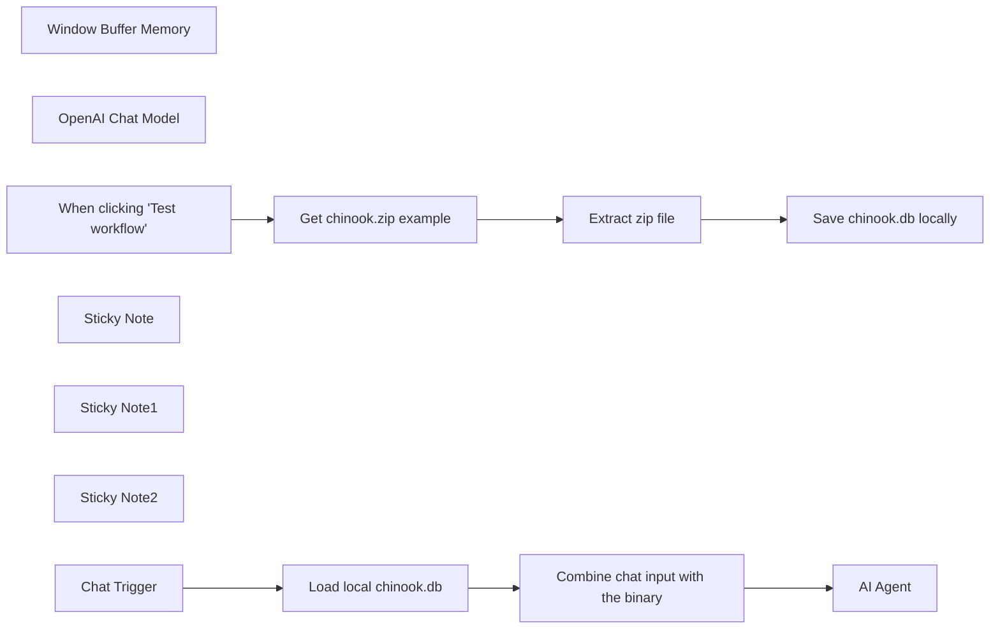

## Fluxo (.json) :

```json
{
  "id": "AQJ6QnF2yVdCWMnx",
  "meta": {
    "instanceId": "fb924c73af8f703905bc09c9ee8076f48c17b596ed05b18c0ff86915ef8a7c4a",
    "templateCredsSetupCompleted": true
  },
  "name": "SQL agent with memory",
  "tags": [],
  "nodes": [
    {
      "id": "3544950e-4d8e-46ca-8f56-61c152a5cae3",
      "name": "Window Buffer Memory",
      "type": "@n8n/n8n-nodes-langchain.memoryBufferWindow",
      "position": [
        1220,
        500
      ],
      "parameters": {
        "contextWindowLength": 10
      },
      "typeVersion": 1.2
    },
    {
      "id": "743cc4e7-5f24-4adc-b872-7241ee775bd0",
      "name": "OpenAI Chat Model",
      "type": "@n8n/n8n-nodes-langchain.lmChatOpenAi",
      "position": [
        1000,
        500
      ],
      "parameters": {
        "model": "gpt-4-turbo",
        "options": {
          "temperature": 0.3
        }
      },
      "credentials": {
        "openAiApi": {
          "id": "rveqdSfp7pCRON1T",
          "name": "Ted's Tech Talks OpenAi"
        }
      },
      "typeVersion": 1
    },
    {
      "id": "cc30066c-ad2c-4729-82c1-a6b0f4214dee",
      "name": "When clicking \"Test workflow\"",
      "type": "n8n-nodes-base.manualTrigger",
      "position": [
        500,
        -80
      ],
      "parameters": {},
      "typeVersion": 1
    },
    {
      "id": "0deacd0d-45cb-4738-8da0-9d1251858867",
      "name": "Get chinook.zip example",
      "type": "n8n-nodes-base.httpRequest",
      "position": [
        700,
        -80
      ],
      "parameters": {
        "url": "https://www.sqlitetutorial.net/wp-content/uploads/2018/03/chinook.zip",
        "options": {}
      },
      "typeVersion": 4.2
    },
    {
      "id": "61f34708-f8ed-44a9-8522-6042d28511ae",
      "name": "Extract zip file",
      "type": "n8n-nodes-base.compression",
      "position": [
        900,
        -80
      ],
      "parameters": {},
      "typeVersion": 1.1
    },
    {
      "id": "6a12d9ac-f1b7-4267-8b34-58cdb9d347bb",
      "name": "Save chinook.db locally",
      "type": "n8n-nodes-base.readWriteFile",
      "position": [
        1100,
        -80
      ],
      "parameters": {
        "options": {},
        "fileName": "./chinook.db",
        "operation": "write",
        "dataPropertyName": "file_0"
      },
      "typeVersion": 1
    },
    {
      "id": "701d1325-4186-4185-886a-3738163db603",
      "name": "Load local chinook.db",
      "type": "n8n-nodes-base.readWriteFile",
      "position": [
        620,
        360
      ],
      "parameters": {
        "options": {},
        "fileSelector": "./chinook.db"
      },
      "typeVersion": 1
    },
    {
      "id": "d7b3813d-8180-4ff1-87a4-bd54a03043af",
      "name": "Sticky Note",
      "type": "n8n-nodes-base.stickyNote",
      "position": [
        440,
        -280.9454545454546
      ],
      "parameters": {
        "width": 834.3272727272731,
        "height": 372.9454545454546,
        "content": "## Run this part only once\nThis section:\n* downloads the example zip file from https://www.sqlitetutorial.net/sqlite-sample-database/\n* extracts the archive (it contains only a single file)\n* saves the extracted `chinook.db` SQLite database locally\n\nNow you can use chat to \"talk\" to your data!"
      },
      "typeVersion": 1
    },
    {
      "id": "6bd25563-2c59-44c2-acf9-407bd28a15cf",
      "name": "Sticky Note1",
      "type": "n8n-nodes-base.stickyNote",
      "position": [
        400,
        240
      ],
      "parameters": {
        "width": 558.5454545454544,
        "height": 297.89090909090913,
        "content": "## On every chat message:\n* the local SQLite database is loaded\n* JSON from Chat Trigger is combined with SQLite binary data"
      },
      "typeVersion": 1
    },
    {
      "id": "2be63956-236e-46f7-b8e4-0f55e2e25a5c",
      "name": "Combine chat input with the binary",
      "type": "n8n-nodes-base.set",
      "position": [
        820,
        360
      ],
      "parameters": {
        "mode": "raw",
        "options": {
          "includeBinary": true
        },
        "jsonOutput": "={{ $('Chat Trigger').item.json }}\n"
      },
      "typeVersion": 3.3
    },
    {
      "id": "7f4c9adb-eab4-40d7-ad2e-44f2c0e3e30a",
      "name": "Sticky Note2",
      "type": "n8n-nodes-base.stickyNote",
      "position": [
        980,
        120
      ],
      "parameters": {
        "width": 471.99692219161466,
        "height": 511.16641410437836,
        "content": "### LangChain SQL Agent can make several queries before producing the final answer.\nTry these examples:\n1. \"Please describe the database\". This input usually requires just 1 query + an extra observation to produce a final answer.\n2. \"What are the revenues by genre?\". This input will launch a series of Agent actions, because it needs to make several queries.\n\nThe final answer is stored in the memory and will be recalled on the next input from the user."
      },
      "typeVersion": 1
    },
    {
      "id": "ac819eb5-13b2-4280-b9d6-06ec1209700e",
      "name": "AI Agent",
      "type": "@n8n/n8n-nodes-langchain.agent",
      "position": [
        1020,
        360
      ],
      "parameters": {
        "agent": "sqlAgent",
        "options": {},
        "dataSource": "sqlite"
      },
      "typeVersion": 1.6
    },
    {
      "id": "5ecaa3eb-e93e-4e41-bbc0-98a8c2b2d463",
      "name": "Chat Trigger",
      "type": "@n8n/n8n-nodes-langchain.chatTrigger",
      "position": [
        420,
        360
      ],
      "webhookId": "fb565f08-a459-4ff9-8249-1ede58599660",
      "parameters": {},
      "typeVersion": 1
    }
  ],
  "active": false,
  "pinData": {},
  "settings": {
    "executionOrder": "v1"
  },
  "versionId": "fbc06ddd-dbd8-49ee-bbee-2f495d5651a2",
  "connections": {
    "Chat Trigger": {
      "main": [
        [
          {
            "node": "Load local chinook.db",
            "type": "main",
            "index": 0
          }
        ]
      ]
    },
    "Extract zip file": {
      "main": [
        [
          {
            "node": "Save chinook.db locally",
            "type": "main",
            "index": 0
          }
        ]
      ]
    },
    "OpenAI Chat Model": {
      "ai_languageModel": [
        [
          {
            "node": "AI Agent",
            "type": "ai_languageModel",
            "index": 0
          }
        ]
      ]
    },
    "Window Buffer Memory": {
      "ai_memory": [
        [
          {
            "node": "AI Agent",
            "type": "ai_memory",
            "index": 0
          }
        ]
      ]
    },
    "Load local chinook.db": {
      "main": [
        [
          {
            "node": "Combine chat input with the binary",
            "type": "main",
            "index": 0
          }
        ]
      ]
    },
    "Get chinook.zip example": {
      "main": [
        [
          {
            "node": "Extract zip file",
            "type": "main",
            "index": 0
          }
        ]
      ]
    },
    "When clicking \"Test workflow\"": {
      "main": [
        [
          {
            "node": "Get chinook.zip example",
            "type": "main",
            "index": 0
          }
        ]
      ]
    },
    "Combine chat input with the binary": {
      "main": [
        [
          {
            "node": "AI Agent",
            "type": "main",
            "index": 0
          }
        ]
      ]
    }
  }
}
```

<a id="template-2155"></a>

## Template 2155 - Ingestão de arquivos do Google Drive para banco vetorial

- **Nome:** Ingestão de arquivos do Google Drive para banco vetorial
- **Descrição:** Automatiza a busca, extração e vetorização de arquivos armazenados em uma pasta do Google Drive, inserindo os embeddings resultantes em um banco de dados PostgreSQL com suporte a vetores.
- **Funcionalidade:** • Busca em pasta do Google Drive: Pesquisa arquivos em uma pasta configurada como origem.
• Loop e download de arquivos: Itera sobre os arquivos encontrados e baixa cada item para processamento.
• Detecção de tipo de arquivo e extração: Identifica o MIME type e extrai texto de PDFs, arquivos de texto e JSONs.
• Divisão de texto em chunks: Divide o conteúdo em pedaços menores usando divisão recursiva com sobreposição de 50 caracteres.
• Geração de embeddings: Converte os trechos de texto em vetores de embeddings via serviço de embeddings.
• Inserção em banco vetorial: Insere embeddings e metadados em uma tabela PostgreSQL com extensão para vetores, organizados em coleção configurada.
• Movimentação de arquivo processado: Move o arquivo para uma pasta de destino (‘vectorized’) após inserção bem-sucedida.
• Gatilhos programados e manuais: Suporta execução agendada (diária) e execução manual para testes.
• Inclusão de nota de licença: Adiciona informação de licença Creative Commons no fluxo.
- **Ferramentas:** • Google Drive: Armazenamento e origem dos arquivos; permite listar, baixar e mover arquivos entre pastas.
• OpenAI (Embeddings): Serviço para gerar vetores de embeddings a partir de trechos de texto (modelo text-embedding-3-small).
• PostgreSQL com PGVector: Banco de dados relacional com extensão para vetores, usado para armazenar embeddings e metadados (tabela configurada: n8n_vectors_wfs, coleção: n8n_wfs).

## Fluxo visual

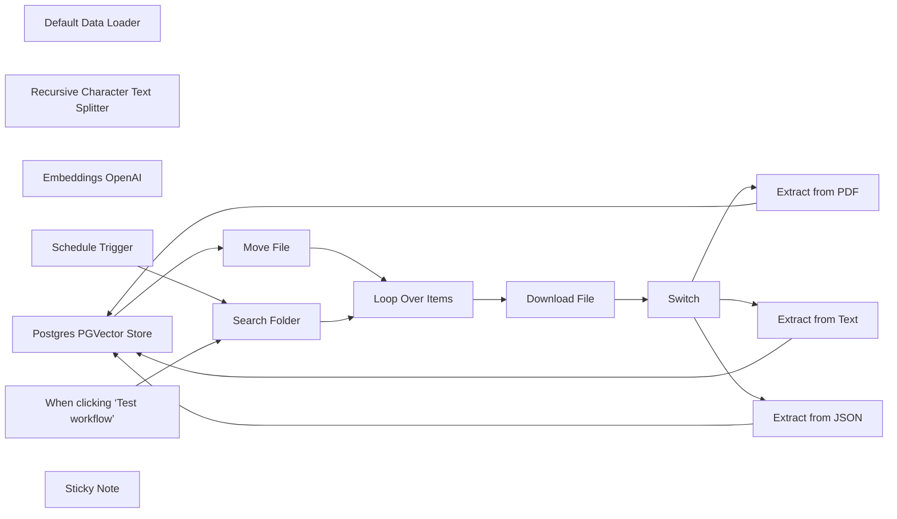

## Fluxo (.json) :

```json
{
  "id": "WceMkVib0VLlF1BZ",
  "meta": {
    "instanceId": "ecc960f484e18b0e09045fd93acf0d47f4cfff25cc212ea348a08ac3aae81850",
    "templateCredsSetupCompleted": true
  },
  "name": "Vector DB Loader from Google Drive",
  "tags": [
    {
      "id": "6rb8rVhKZj4t0Kne",
      "name": "Current",
      "createdAt": "2025-02-04T18:13:17.427Z",
      "updatedAt": "2025-02-04T18:13:17.427Z"
    }
  ],
  "nodes": [
    {
      "id": "6652e41a-d14a-4e17-9dcd-34df114d219a",
      "name": "Default Data Loader",
      "type": "@n8n/n8n-nodes-langchain.documentDefaultDataLoader",
      "position": [
        1240,
        1100
      ],
      "parameters": {
        "options": {}
      },
      "typeVersion": 1
    },
    {
      "id": "8ae38b72-52fd-46bc-ab47-50bebe5ac4ee",
      "name": "Recursive Character Text Splitter",
      "type": "@n8n/n8n-nodes-langchain.textSplitterRecursiveCharacterTextSplitter",
      "position": [
        1320,
        1300
      ],
      "parameters": {
        "options": {},
        "chunkOverlap": 50
      },
      "typeVersion": 1
    },
    {
      "id": "57ce64af-88d4-4dc4-8c8e-01717c1bd47d",
      "name": "Embeddings OpenAI",
      "type": "@n8n/n8n-nodes-langchain.embeddingsOpenAi",
      "position": [
        1120,
        1100
      ],
      "parameters": {
        "model": "text-embedding-3-small",
        "options": {}
      },
      "credentials": {
        "openAiApi": {
          "id": "fzLcLisovaZjIqma",
          "name": "AlexK OpenAi account"
        }
      },
      "typeVersion": 1
    },
    {
      "id": "e6bed8bc-f629-41fd-aa6e-9158b1cbc323",
      "name": "Postgres PGVector Store",
      "type": "@n8n/n8n-nodes-langchain.vectorStorePGVector",
      "position": [
        1140,
        880
      ],
      "parameters": {
        "mode": "insert",
        "options": {
          "collection": {
            "values": {
              "useCollection": true,
              "collectionName": "n8n_wfs"
            }
          }
        },
        "tableName": "n8n_vectors_wfs"
      },
      "credentials": {
        "postgres": {
          "id": "UkNm7VVkmuXOwMVa",
          "name": "KBB Postgres account"
        }
      },
      "typeVersion": 1.1
    },
    {
      "id": "96fbc1f3-920d-44c9-9314-742efa3a698a",
      "name": "When clicking ‘Test workflow’",
      "type": "n8n-nodes-base.manualTrigger",
      "position": [
        -280,
        740
      ],
      "parameters": {},
      "typeVersion": 1
    },
    {
      "id": "4cd7a934-04cc-47b5-a771-db554680ba77",
      "name": "Loop Over Items",
      "type": "n8n-nodes-base.splitInBatches",
      "position": [
        160,
        740
      ],
      "parameters": {
        "options": {}
      },
      "typeVersion": 3
    },
    {
      "id": "778593d8-fe1c-4eb9-865a-e6ce9ed5f900",
      "name": "Move File",
      "type": "n8n-nodes-base.googleDrive",
      "position": [
        1500,
        880
      ],
      "parameters": {
        "fileId": {
          "__rl": true,
          "mode": "id",
          "value": "={{ $('Loop Over Items').item.json.id }}"
        },
        "driveId": {
          "__rl": true,
          "mode": "list",
          "value": "My Drive"
        },
        "folderId": {
          "__rl": true,
          "mode": "list",
          "value": "1Re6vg-PZxBoUU6sTRDbGs-77bAJ40u8F",
          "cachedResultUrl": "https://drive.google.com/drive/folders/1Re6vg-PZxBoUU6sTRDbGs-77bAJ40u8F",
          "cachedResultName": "vectorized"
        },
        "operation": "move"
      },
      "credentials": {
        "googleDriveOAuth2Api": {
          "id": "kxXwhBLKOmB8CkBW",
          "name": "AlexK Google Drive account"
        }
      },
      "typeVersion": 3
    },
    {
      "id": "3a6584f5-ed86-4900-9177-40ffe82d0ad3",
      "name": "Download File",
      "type": "n8n-nodes-base.googleDrive",
      "position": [
        380,
        680
      ],
      "parameters": {
        "fileId": {
          "__rl": true,
          "mode": "id",
          "value": "={{ $json.id }}"
        },
        "options": {},
        "operation": "download"
      },
      "credentials": {
        "googleDriveOAuth2Api": {
          "id": "kxXwhBLKOmB8CkBW",
          "name": "AlexK Google Drive account"
        }
      },
      "typeVersion": 3
    },
    {
      "id": "e1931ab6-4391-46c3-9d7d-22cbfbf90327",
      "name": "Search Folder",
      "type": "n8n-nodes-base.googleDrive",
      "position": [
        -60,
        740
      ],
      "parameters": {
        "filter": {
          "folderId": {
            "__rl": true,
            "mode": "list",
            "value": "1mBHrP8UzUnfn3dj_3QS1r0XhQQyVPAGX",
            "cachedResultUrl": "https://drive.google.com/drive/folders/1mBHrP8UzUnfn3dj_3QS1r0XhQQyVPAGX",
            "cachedResultName": "n8n Workflow JSON Files"
          },
          "whatToSearch": "files"
        },
        "options": {},
        "resource": "fileFolder",
        "returnAll": true
      },
      "credentials": {
        "googleDriveOAuth2Api": {
          "id": "kxXwhBLKOmB8CkBW",
          "name": "AlexK Google Drive account"
        }
      },
      "typeVersion": 3
    },
    {
      "id": "95134ab4-806f-4c47-96a6-e261b3176ebf",
      "name": "Schedule Trigger",
      "type": "n8n-nodes-base.scheduleTrigger",
      "position": [
        -280,
        940
      ],
      "parameters": {
        "rule": {
          "interval": [
            {
              "triggerAtHour": 3
            }
          ]
        }
      },
      "typeVersion": 1.2
    },
    {
      "id": "0fe604ed-e886-4aa3-856f-c46fb79ce0de",
      "name": "Sticky Note",
      "type": "n8n-nodes-base.stickyNote",
      "position": [
        1700,
        960
      ],
      "parameters": {
        "color": 7,
        "width": 380,
        "height": 240,
        "content": "## Creative Commons License\n*License*: **Creative Commons Attribution-ShareAlike 4.0 International** (CC BY-SA 4.0)\n\n*Author*: **AlexK1919**\nYou are free to use, adapt, and share this workflow—even commercially—under the terms of this license.\n\nFull license details: https://creativecommons.org/licenses/by-sa/4.0/"
      },
      "typeVersion": 1
    },
    {
      "id": "f8055452-b487-46c7-92fe-14b3c88d193f",
      "name": "Switch",
      "type": "n8n-nodes-base.switch",
      "position": [
        560,
        680
      ],
      "parameters": {
        "rules": {
          "values": [
            {
              "outputKey": "pdf",
              "conditions": {
                "options": {
                  "version": 2,
                  "leftValue": "",
                  "caseSensitive": true,
                  "typeValidation": "strict"
                },
                "combinator": "and",
                "conditions": [
                  {
                    "id": "7b4e792b-ab6d-4b9b-88a1-d8e51bea6853",
                    "operator": {
                      "type": "string",
                      "operation": "equals"
                    },
                    "leftValue": "={{$binary[\"data\"].mimeType}}",
                    "rightValue": "application/pdf"
                  }
                ]
              },
              "renameOutput": true
            },
            {
              "outputKey": "text",
              "conditions": {
                "options": {
                  "version": 2,
                  "leftValue": "",
                  "caseSensitive": true,
                  "typeValidation": "strict"
                },
                "combinator": "and",
                "conditions": [
                  {
                    "id": "09b7d7c5-5353-4719-b4e2-072e4da39948",
                    "operator": {
                      "name": "filter.operator.equals",
                      "type": "string",
                      "operation": "equals"
                    },
                    "leftValue": "={{$binary[\"data\"].mimeType}}",
                    "rightValue": "text/plain"
                  }
                ]
              },
              "renameOutput": true
            },
            {
              "outputKey": "json",
              "conditions": {
                "options": {
                  "version": 2,
                  "leftValue": "",
                  "caseSensitive": true,
                  "typeValidation": "strict"
                },
                "combinator": "and",
                "conditions": [
                  {
                    "id": "d2763a45-a592-47c8-868f-59dfcd17a71c",
                    "operator": {
                      "name": "filter.operator.equals",
                      "type": "string",
                      "operation": "equals"
                    },
                    "leftValue": "={{$binary[\"data\"].mimeType}}",
                    "rightValue": "application/json"
                  }
                ]
              },
              "renameOutput": true
            }
          ]
        },
        "options": {}
      },
      "typeVersion": 3.2
    },
    {
      "id": "c704f48e-a1f5-4539-bde2-545862d21bc6",
      "name": "Extract from PDF",
      "type": "n8n-nodes-base.extractFromFile",
      "position": [
        780,
        480
      ],
      "parameters": {
        "options": {},
        "operation": "pdf"
      },
      "typeVersion": 1
    },
    {
      "id": "63b3a751-5726-4821-8379-72af15226584",
      "name": "Extract from Text",
      "type": "n8n-nodes-base.extractFromFile",
      "position": [
        780,
        680
      ],
      "parameters": {
        "options": {},
        "operation": "text"
      },
      "typeVersion": 1
    },
    {
      "id": "44a5980a-17aa-4a09-8040-a7d9804c7998",
      "name": "Extract from JSON",
      "type": "n8n-nodes-base.extractFromFile",
      "position": [
        780,
        880
      ],
      "parameters": {
        "options": {},
        "operation": "fromJson"
      },
      "typeVersion": 1
    }
  ],
  "active": false,
  "pinData": {},
  "settings": {
    "timezone": "America/Los_Angeles",
    "executionOrder": "v1"
  },
  "versionId": "4f54c70a-b18b-4e4c-8959-ace70dd41218",
  "connections": {
    "Switch": {
      "main": [
        [
          {
            "node": "Extract from PDF",
            "type": "main",
            "index": 0
          }
        ],
        [
          {
            "node": "Extract from Text",
            "type": "main",
            "index": 0
          }
        ],
        [
          {
            "node": "Extract from JSON",
            "type": "main",
            "index": 0
          }
        ]
      ]
    },
    "Move File": {
      "main": [
        [
          {
            "node": "Loop Over Items",
            "type": "main",
            "index": 0
          }
        ]
      ]
    },
    "Download File": {
      "main": [
        [
          {
            "node": "Switch",
            "type": "main",
            "index": 0
          }
        ]
      ]
    },
    "Search Folder": {
      "main": [
        [
          {
            "node": "Loop Over Items",
            "type": "main",
            "index": 0
          }
        ]
      ]
    },
    "Loop Over Items": {
      "main": [
        [],
        [
          {
            "node": "Download File",
            "type": "main",
            "index": 0
          }
        ]
      ]
    },
    "Extract from PDF": {
      "main": [
        [
          {
            "node": "Postgres PGVector Store",
            "type": "main",
            "index": 0
          }
        ]
      ]
    },
    "Schedule Trigger": {
      "main": [
        [
          {
            "node": "Search Folder",
            "type": "main",
            "index": 0
          }
        ]
      ]
    },
    "Embeddings OpenAI": {
      "ai_embedding": [
        [
          {
            "node": "Postgres PGVector Store",
            "type": "ai_embedding",
            "index": 0
          }
        ]
      ]
    },
    "Extract from JSON": {
      "main": [
        [
          {
            "node": "Postgres PGVector Store",
            "type": "main",
            "index": 0
          }
        ]
      ]
    },
    "Extract from Text": {
      "main": [
        [
          {
            "node": "Postgres PGVector Store",
            "type": "main",
            "index": 0
          }
        ]
      ]
    },
    "Default Data Loader": {
      "ai_document": [
        [
          {
            "node": "Postgres PGVector Store",
            "type": "ai_document",
            "index": 0
          }
        ]
      ]
    },
    "Postgres PGVector Store": {
      "main": [
        [
          {
            "node": "Move File",
            "type": "main",
            "index": 0
          }
        ]
      ]
    },
    "Recursive Character Text Splitter": {
      "ai_textSplitter": [
        [
          {
            "node": "Default Data Loader",
            "type": "ai_textSplitter",
            "index": 0
          }
        ]
      ]
    },
    "When clicking ‘Test workflow’": {
      "main": [
        [
          {
            "node": "Search Folder",
            "type": "main",
            "index": 0
          }
        ]
      ]
    }
  }
}
```

<a id="template-2159"></a>

## Template 2159 - Extração e cadastro de itens de faturas

- **Nome:** Extração e cadastro de itens de faturas
- **Descrição:** Automatiza a captura de arquivos de faturas, extrai dados e itens, valida e transforma os valores, e cria registros de fatura e itens em um sistema de base de dados.
- **Funcionalidade:** • Detecção de novos arquivos em pasta: Monitora uma pasta dedicada para identificar uploads de faturas.
• Envio do arquivo para parsing: Envia o arquivo recebido a um serviço de parsing (LlamaParse) para extração de dados estruturados.
• Recebimento via webhook: Recebe os resultados do parsing por webhook para processamento posterior.
• Criação de registro de fatura: Gera um registro inicial de fatura no sistema com os dados extraídos.
• Extração e transformação de itens: Converte campos de texto (descrição, quantidade, preço unitário, valor) para uma estrutura de itens padronizada.
• Validação e formatação via modelo de linguagem: Usa um modelo para validar e retornar os itens no formato JSON Schema esperado.
• Conversão de valores numéricos: Remove símbolos (ex.: $) e converte strings de preços e quantidades em números para armazenamento.
• Mapeamento e envio para base de dados: Mapeia campos formatados (Description, Qty, Unit price, Amount) e cria registros vinculados à fatura na base (ex.: Airtable).
• Tratamento de parsing do modelo: Executa código para interpretar o conteúdo retornado pelo modelo e extrair o array de itens de forma segura.
- **Ferramentas:** • Google Drive: Armazenamento e gatilho para detectar novos arquivos de faturas em uma pasta específica.
• LlamaParse: Serviço de parsing/extração de dados de documentos (faturas) que retorna dados estruturados.
• Webhook HTTP: Endpoint público para receber resultados de parsing e acionar o fluxo de processamento.
• OpenAI (gpt-4o-mini): Modelo de linguagem usado para validar e formatar os itens conforme um JSON Schema.
• Airtable: Banco de dados/planilha online usado para criar e vincular registros de fatura e itens, com mapeamento de campos e conversão de valores.

## Fluxo (.json) :

```json
{
  "\"id\"": "\"a80e6528-cf79-4229-8c58-6856fd86b6e7\",",
  "\"Qty\"": "\"={{ $json.qty }}\",",
  "\"url\"": "\"=https://api.openai.com/v1/chat/completions\",",
  "\"__rl\"": "true,",
  "\"base\"": "{",
  "\"item\"": "[",
  "\"main\"": "[",
  "\"mode\"": "\"list\",",
  "\"name\"": "\"Sticky Note6\",",
  "\"node\"": "\"Create Invoice\",",
  "\"path\"": "\"0f7f5ebb-8b66-453b-a818-20cc3647c783\",",
  "\"type\"": "\"main\",",
  "\"color\"": "7,",
  "\"event\"": "\"fileCreated\",",
  "\"index\"": "0",
  "\"nodes\"": "[",
  "\"table\"": "{",
  "\"value\"": "\"={\\n \\\"name\\\": \\\"generate_schema\\\",\\n \\\"description\\\": \\\"Generate schema for an array of objects representing items with their descriptions, quantities, unit prices, and amounts.\\\",\\n \\\"strict\\\": true,\\n \\\"schema\\\": {\\n \\\"type\\\": \\\"object\\\",\\n \\\"required\\\": [\\n \\\"items\\\"\\n ],\\n \\\"properties\\\": {\\n \\\"items\\\": {\\n \\\"type\\\": \\\"array\\\",\\n \\\"description\\\": \\\"Array of item objects\\\",\\n \\\"items\\\": {\\n \\\"type\\\": \\\"object\\\",\\n \\\"required\\\": [\\n \\\"description\\\",\\n \\\"qty\\\",\\n \\\"unit_price\\\",\\n \\\"amount\\\"\\n ],\\n \\\"properties\\\": {\\n \\\"description\\\": {\\n \\\"type\\\": \\\"string\\\",\\n \\\"description\\\": \\\"Description of the item\\\"\\n },\\n \\\"qty\\\": {\\n \\\"type\\\": \\\"string\\\",\\n \\\"description\\\": \\\"Quantity of the item\\\"\\n },\\n \\\"unit_price\\\": {\\n \\\"type\\\": \\\"string\\\",\\n \\\"description\\\": \\\"Unit price of the item formatted as a string\\\"\\n },\\n \\\"amount\\\": {\\n \\\"type\\\": \\\"string\\\",\\n \\\"description\\\": \\\"Total amount for the item formatted as a string\\\"\\n }\\n },\\n \\\"additionalProperties\\\": false\\n }\\n }\\n },\\n \\\"additionalProperties\\\": false\\n }\\n}\"",
  "\"width\"": "280,",
  "\"Amount\"": "\"={{ parseFloat($json.amount.replace('$', '').trim()) }}\",",
  "\"fileId\"": "{",
  "\"height\"": "626,",
  "\"jsCode\"": "\"// Get the input from the \\\"OpenAI - Extract Line Items\\\" node\\nconst input = $(\\\"OpenAI - Extract Line Items\\\").first().json;\\n\\n// Initialize an array for the output\\nconst outputItems = [];\\n\\n// Navigate to the 'content' field in the choices array\\nconst content = input.choices[0]?.message?.content;\\n\\nif (content) {\\n try {\\n // Parse the stringified JSON in the 'content' field\\n const parsedContent = JSON.parse(content);\\n\\n // Extract 'items' and add them to the output array\\n if (Array.isArray(parsedContent.items)) {\\n outputItems.push(...parsedContent.items.map(i => ({ json: i })));\\n }\\n } catch (error) {\\n // Handle any parsing errors\\n console.error('Error parsing content:', error);\\n }\\n}\\n\\n// Return the extracted items\\nreturn outputItems;\\n\"",
  "\"method\"": "\"POST\",",
  "\"schema\"": "[",
  "\"Webhook\"": "{",
  "\"columns\"": "{",
  "\"content\"": "\"### Set up steps\\n\\n1. **Google Drive Trigger**: \\n - Set up a trigger to detect new files in a specified folder dedicated to invoices.\\n\\n2. **File Upload to LlamaParse**: \\n - Create an HTTP request that sends the invoice file to LlamaParse for parsing, including relevant header settings and webhook URL.\\n\\n3. **Webhook Processing**: \\n - Establish a webhook node to handle parsed results from LlamaParse, extracting needed invoice details effectively.\\n\\n4. **Invoice Record Creation**: \\n - Create initial records for invoices in your database using the parsed details received from the webhook.\\n\\n5. **Line Item Processing**: \\n - Transform string data into structured line item arrays and create individual records for each item linked to the main invoice.\"",
  "\"display\"": "true,",
  "\"options\"": "{},",
  "\"pinData\"": "{},",
  "\"removed\"": "false,",
  "\"Invoices\"": "\"=[\\\"{{ $('Create Invoice').item.json.id }}\\\"]\",",
  "\"jsonBody\"": "\"={\\n \\\"model\\\": \\\"gpt-4o-mini\\\",\\n \\\"messages\\\": [\\n {\\n \\\"role\\\": \\\"system\\\",\\n \\\"content\\\": {{ JSON.stringify($('Set Fields').item.json.prompt) }}\\n },\\n {\\n \\\"role\\\": \\\"user\\\",\\n \\\"content\\\": {{ JSON.stringify( JSON.stringify($('Webhook').item.json.body.json[0].items) ) }}\\n }\\n ],\\n \\\"response_format\\\":{ \\\"type\\\": \\\"json_schema\\\", \\\"json_schema\\\": {{ $('Set Fields').item.json.schema }}\\n\\n }\\n }\",",
  "\"position\"": "[",
  "\"readOnly\"": "false,",
  "\"required\"": "false,",
  "\"sendBody\"": "true,",
  "\"openAiApi\"": "{",
  "\"operation\"": "\"create\"",
  "\"pollTimes\"": "{",
  "\"triggerOn\"": "\"specificFolder\",",
  "\"webhookId\"": "\"0f7f5ebb-8b66-453b-a818-20cc3647c783\",",
  "\"Set Fields\"": "{",
  "\"Unit price\"": "\"={{ parseFloat($json.unit_price.replace('$', '').trim()) }}\",",
  "\"httpMethod\"": "\"POST\"",
  "\"parameters\"": "{",
  "\"Description\"": "\"={{ $json.description }}\"",
  "\"assignments\"": "[",
  "\"connections\"": "{",
  "\"contentType\"": "\"multipart-form-data\",",
  "\"credentials\"": "{",
  "\"displayName\"": "\"Invoices\",",
  "\"mappingMode\"": "\"defineBelow\",",
  "\"sendHeaders\"": "true,",
  "\"specifyBody\"": "\"json\",",
  "\"typeVersion\"": "1",
  "\"Google Drive\"": "{",
  "\"defaultMatch\"": "false,",
  "\"folderToWatch\"": "{",
  "\"parameterType\"": "\"formBinaryData\",",
  "\"Create Invoice\"": "{",
  "\"authentication\"": "\"predefinedCredentialType\",",
  "\"bodyParameters\"": "{",
  "\"cachedResultUrl\"": "\"https://airtable.com/appndgSF4faN4jPXi/tblIuVR9ocAomznzK\",",
  "\"matchingColumns\"": "[]",
  "\"airtableTokenApi\"": "{",
  "\"cachedResultName\"": "\"Line Items\"",
  "\"canBeUsedToMatch\"": "true",
  "\"headerParameters\"": "{",
  "\"Process Line Items\"": "{",
  "\"inputDataFieldName\"": "\"data\"",
  "\"nodeCredentialType\"": "\"openAiApi\"",
  "\"Google Drive Trigger\"": "{",
  "\"googleDriveOAuth2Api\"": "{",
  "\"OpenAI - Extract Line Items\"": "{"
}
```

<a id="template-2160"></a>

## Template 2160 - Criar fotos profissionais de produto

- **Nome:** Criar fotos profissionais de produto
- **Descrição:** Automatiza a análise de imagens de produto, gera prompts de fotografia profissional, envia para edição/geração de imagem e salva os resultados no Drive e na planilha.
- **Funcionalidade:** • Leitura de URLs de imagem: Extrai links de imagens a partir de uma planilha.
• Download das imagens: Baixa as imagens originais a partir das URLs fornecidas.
• Análise breve da imagem: Gera uma descrição curta do conteúdo da imagem para orientar a criação do prompt.
• Criação de prompt para fotografia de produto: Monta um prompt específico que exige modelo humano com rosto visível, referências a "this [PRODUCT]", instruções de iluminação, ângulo, cores e granulação cinematográfica.
• Envio da imagem com prompt para edição/geração: Combina o arquivo da imagem com o prompt e solicita ao serviço de imagens uma edição/geração profissional.
• Conversão de resposta base64 para arquivo: Converte o resultado em base64 para um arquivo binário utilizável.
• Upload para armazenamento em nuvem: Salva a imagem final em uma pasta no Drive.
• Atualização da planilha com resultados: Insere o link público da imagem gerada e o prompt utilizado na tabela original.
• Execução manual e processamento por linhas: Permite iniciar a execução manualmente e processar múltiplas linhas de forma ordenada.
- **Ferramentas:** • Google Sheets: Armazena as URLs de imagens de entrada e recebe os links de saída e prompts atualizados.
• Google Drive: Repositório em nuvem onde as imagens finais são salvas.
• OpenAI API (modelos de linguagem e imagem): Usada para analisar imagens, gerar prompts de fotografia profissional e executar edições/gerações de imagem (endpoint de imagens).
• Requisições HTTP: Baixa as imagens originais a partir das URLs fornecidas e faz chamadas multipart para o serviço de imagens.


## Fluxo visual

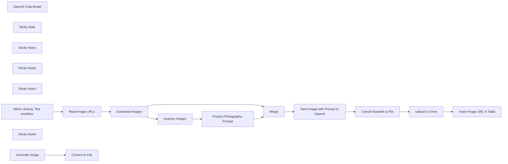

## Fluxo (.json) :

```json
{
  "meta": {
    "instanceId": "05da4424857d12101f50fff429f8deac0b96048b0ed4cdf3b1b3691af23f7345"
  },
  "nodes": [
    {
      "id": "68c2216d-7393-4d64-a6e4-7b5e384389a4",
      "name": "OpenAI Chat Model",
      "type": "@n8n/n8n-nodes-langchain.lmChatOpenAi",
      "position": [
        420,
        1020
      ],
      "parameters": {
        "model": {
          "__rl": true,
          "mode": "list",
          "value": "gpt-4.1-mini",
          "cachedResultName": "gpt-4.1-mini"
        },
        "options": {}
      },
      "credentials": {
        "openAiApi": {
          "id": "DVUm005uVd1yUYSL",
          "name": "OpenAi account"
        }
      },
      "typeVersion": 1.2
    },
    {
      "id": "849df02a-cd4c-4c1a-80c9-84852eccd7d7",
      "name": "Merge",
      "type": "n8n-nodes-base.merge",
      "position": [
        840,
        500
      ],
      "parameters": {
        "mode": "combine",
        "options": {},
        "combineBy": "combineByPosition"
      },
      "typeVersion": 3.1
    },
    {
      "id": "b1fe6bd4-f20b-4e13-83ce-58aa80372fe5",
      "name": "Read Image URLs",
      "type": "n8n-nodes-base.googleSheets",
      "position": [
        -300,
        480
      ],
      "parameters": {
        "options": {},
        "sheetName": {
          "__rl": true,
          "mode": "list",
          "value": "gid=0",
          "cachedResultUrl": "https://docs.google.com/spreadsheets/d/17zQUytFekDK305wvgxYdEYm4N5QEQ1mrwsfccNn872I/edit#gid=0",
          "cachedResultName": "Product Images"
        },
        "documentId": {
          "__rl": true,
          "mode": "list",
          "value": "17zQUytFekDK305wvgxYdEYm4N5QEQ1mrwsfccNn872I",
          "cachedResultUrl": "https://docs.google.com/spreadsheets/d/17zQUytFekDK305wvgxYdEYm4N5QEQ1mrwsfccNn872I/edit?usp=drivesdk",
          "cachedResultName": "Image Generation"
        }
      },
      "credentials": {
        "googleSheetsOAuth2Api": {
          "id": "LZ3LlQvYNg4X6eWJ",
          "name": "ivanov"
        }
      },
      "typeVersion": 4.5
    },
    {
      "id": "3c69465c-e3c7-4536-80ae-70f2bac53414",
      "name": "Download Images",
      "type": "n8n-nodes-base.httpRequest",
      "position": [
        -100,
        480
      ],
      "parameters": {
        "url": "={{ $json['Image-URL'] }}",
        "options": {}
      },
      "typeVersion": 4.2
    },
    {
      "id": "8f099961-42bd-43c2-8258-64e12a2b9f4b",
      "name": "Analyze Images",
      "type": "@n8n/n8n-nodes-langchain.openAi",
      "position": [
        260,
        820
      ],
      "parameters": {
        "text": "Briefly explain in less than 5 words what this image is about.",
        "modelId": {
          "__rl": true,
          "mode": "list",
          "value": "gpt-4o-mini",
          "cachedResultName": "GPT-4O-MINI"
        },
        "options": {},
        "resource": "image",
        "inputType": "base64",
        "operation": "analyze"
      },
      "credentials": {
        "openAiApi": {
          "id": "DVUm005uVd1yUYSL",
          "name": "OpenAi account"
        }
      },
      "typeVersion": 1.8
    },
    {
      "id": "9ec41380-5297-4786-8216-140255285edb",
      "name": "Product Photography Prompt",
      "type": "@n8n/n8n-nodes-langchain.chainLlm",
      "position": [
        460,
        820
      ],
      "parameters": {
        "text": "=Image description: {{ $json.content }}",
        "messages": {
          "messageValues": [
            {
              "message": "=Create a short prompt for an AI image generator that receives a photo of a product to ultimately produce professional product photography.\n\nIf the product is wearable, it must be worn by a human model with visible face; if it's not wearable, it must be held or interacted with by a model.\n\nThe product must ALWAYS be shown together with a human model with the model's face visible.\n\nEnsure that instructions for optimal realism, best lighting, best angle, best colors, best model positioning, etc. are included according to the product type.\n\nAlways formulate the prompt to refer to the product as \"this [PRODUCT]\" so the AI image generator knows that an input photo of the product is being submitted.\n\nAlways add subtle grain for a cinematic look.\nThe description of the product will be sent to you. Respond exclusively with the final prompt, nothing else, not even quotation marks."
            }
          ]
        },
        "promptType": "define"
      },
      "typeVersion": 1.6
    },
    {
      "id": "e5fbd22f-4081-4f51-9906-4b0f2d58fa81",
      "name": "Send Image with Prompt to OpenAI",
      "type": "n8n-nodes-base.httpRequest",
      "position": [
        1100,
        500
      ],
      "parameters": {
        "url": "https://api.openai.com/v1/images/edits",
        "method": "POST",
        "options": {},
        "sendBody": true,
        "contentType": "multipart-form-data",
        "authentication": "predefinedCredentialType",
        "bodyParameters": {
          "parameters": [
            {
              "name": "model",
              "value": "gpt-image-1"
            },
            {
              "name": "prompt",
              "value": "={{ $json.text }}"
            },
            {
              "name": "image[]",
              "parameterType": "formBinaryData",
              "inputDataFieldName": "data"
            },
            {
              "name": "quality",
              "value": "high"
            },
            {
              "name": "size",
              "value": "1536x1024"
            }
          ]
        },
        "nodeCredentialType": "openAiApi"
      },
      "credentials": {
        "openAiApi": {
          "id": "DVUm005uVd1yUYSL",
          "name": "OpenAi account"
        }
      },
      "typeVersion": 4.2
    },
    {
      "id": "4812c3d5-d5eb-4ee0-97cb-786d2a3a9da5",
      "name": "Convert Base64 to File",
      "type": "n8n-nodes-base.convertToFile",
      "position": [
        1300,
        500
      ],
      "parameters": {
        "options": {},
        "operation": "toBinary",
        "sourceProperty": "data[0].b64_json"
      },
      "typeVersion": 1.1
    },
    {
      "id": "b6cb024c-1f67-4df2-8bb1-1a3740212b4d",
      "name": "Upload to Drive",
      "type": "n8n-nodes-base.googleDrive",
      "position": [
        1600,
        500
      ],
      "parameters": {
        "name": "={{ $('Analyze Images').item.json.content }}",
        "driveId": {
          "__rl": true,
          "mode": "list",
          "value": "My Drive"
        },
        "options": {},
        "folderId": {
          "__rl": true,
          "mode": "list",
          "value": "1mAV3g0eR5XZ2wknZTbcfZOkLlq8GZryP",
          "cachedResultUrl": "https://drive.google.com/drive/folders/1mAV3g0eR5XZ2wknZTbcfZOkLlq8GZryP",
          "cachedResultName": "Product Images"
        }
      },
      "credentials": {
        "googleDriveOAuth2Api": {
          "id": "cGjALhySclQE3yCC",
          "name": "ivanov"
        }
      },
      "typeVersion": 3
    },
    {
      "id": "7e855dc6-0a1b-44f3-83b8-64d76693de87",
      "name": "Insert Image URL in Table",
      "type": "n8n-nodes-base.googleSheets",
      "position": [
        1820,
        500
      ],
      "parameters": {
        "columns": {
          "value": {
            "Output": "={{ $json.webViewLink }}",
            "Prompt": "={{ $('Product Photography Prompt').item.json.text }}",
            "Image-URL": "={{ $('Read Image URLs').item.json['Image-URL'] }}"
          },
          "schema": [
            {
              "id": "Image-URL",
              "type": "string",
              "display": true,
              "removed": false,
              "required": false,
              "displayName": "Image-URL",
              "defaultMatch": false,
              "canBeUsedToMatch": true
            },
            {
              "id": "Prompt",
              "type": "string",
              "display": true,
              "removed": false,
              "required": false,
              "displayName": "Prompt",
              "defaultMatch": false,
              "canBeUsedToMatch": true
            },
            {
              "id": "Output",
              "type": "string",
              "display": true,
              "required": false,
              "displayName": "Output",
              "defaultMatch": false,
              "canBeUsedToMatch": true
            },
            {
              "id": "row_number",
              "type": "string",
              "display": true,
              "removed": false,
              "readOnly": true,
              "required": false,
              "displayName": "row_number",
              "defaultMatch": false,
              "canBeUsedToMatch": true
            }
          ],
          "mappingMode": "defineBelow",
          "matchingColumns": [
            "Image-URL"
          ],
          "attemptToConvertTypes": false,
          "convertFieldsToString": false
        },
        "options": {},
        "operation": "update",
        "sheetName": {
          "__rl": true,
          "mode": "list",
          "value": "gid=0",
          "cachedResultUrl": "https://docs.google.com/spreadsheets/d/17zQUytFekDK305wvgxYdEYm4N5QEQ1mrwsfccNn872I/edit#gid=0",
          "cachedResultName": "Product Images"
        },
        "documentId": {
          "__rl": true,
          "mode": "list",
          "value": "17zQUytFekDK305wvgxYdEYm4N5QEQ1mrwsfccNn872I",
          "cachedResultUrl": "https://docs.google.com/spreadsheets/d/17zQUytFekDK305wvgxYdEYm4N5QEQ1mrwsfccNn872I/edit?usp=drivesdk",
          "cachedResultName": "Image Generation"
        }
      },
      "credentials": {
        "googleSheetsOAuth2Api": {
          "id": "LZ3LlQvYNg4X6eWJ",
          "name": "ivanov"
        }
      },
      "typeVersion": 4.5
    },
    {
      "id": "611b6d08-5a55-4085-840a-53a1b4eb24ed",
      "name": "Sticky Note",
      "type": "n8n-nodes-base.stickyNote",
      "position": [
        -540,
        380
      ],
      "parameters": {
        "width": 600,
        "height": 360,
        "content": "## Extract Product Images from Template"
      },
      "typeVersion": 1
    },
    {
      "id": "e27aa751-41d4-40a9-a72c-90e327388257",
      "name": "Sticky Note1",
      "type": "n8n-nodes-base.stickyNote",
      "position": [
        180,
        720
      ],
      "parameters": {
        "color": 4,
        "width": 600,
        "height": 360,
        "content": "## Analyze Images and Create Prompt for Product Photography"
      },
      "typeVersion": 1
    },
    {
      "id": "ea5e9556-0485-4be9-a35f-32be69ed2de0",
      "name": "Sticky Note2",
      "type": "n8n-nodes-base.stickyNote",
      "position": [
        1020,
        380
      ],
      "parameters": {
        "color": 5,
        "width": 460,
        "height": 360,
        "content": "## gpt-image-1 creates the Product Photography"
      },
      "typeVersion": 1
    },
    {
      "id": "9869ab24-02db-4b88-8429-b0f7f5a5bf2d",
      "name": "Sticky Note3",
      "type": "n8n-nodes-base.stickyNote",
      "position": [
        1520,
        380
      ],
      "parameters": {
        "color": 3,
        "width": 520,
        "height": 360,
        "content": "## Output is uploaded to Drive and the Image URLs are saved in the table"
      },
      "typeVersion": 1
    },
    {
      "id": "05c2e7af-6e3e-4171-ac28-444bec1eef49",
      "name": "When clicking 'Test workflow'",
      "type": "n8n-nodes-base.manualTrigger",
      "position": [
        -500,
        480
      ],
      "parameters": {},
      "typeVersion": 1
    },
    {
      "id": "88c861e1-6b7c-4597-899a-e0f13ad7994a",
      "name": "Convert to File",
      "type": "n8n-nodes-base.convertToFile",
      "position": [
        -80,
        -120
      ],
      "parameters": {
        "options": {},
        "operation": "toBinary",
        "sourceProperty": "data[0].b64_json"
      },
      "typeVersion": 1.1
    },
    {
      "id": "0edb4268-9e9e-41a9-9e6e-9bed3a73f0d9",
      "name": "Sticky Note4",
      "type": "n8n-nodes-base.stickyNote",
      "position": [
        -540,
        -220
      ],
      "parameters": {
        "color": 6,
        "width": 660,
        "height": 260,
        "content": "## Simple Image Generation\n### Don't forget the manual trigger ;)"
      },
      "typeVersion": 1
    },
    {
      "id": "81b1385a-4a94-475c-9ee8-31dd5efb8dc7",
      "name": "Generate Image",
      "type": "n8n-nodes-base.httpRequest",
      "position": [
        -260,
        -120
      ],
      "parameters": {
        "url": "https://api.openai.com/v1/images/generations",
        "method": "POST",
        "options": {},
        "sendBody": true,
        "authentication": "predefinedCredentialType",
        "bodyParameters": {
          "parameters": [
            {
              "name": "model",
              "value": "gpt-image-1"
            },
            {
              "name": "prompt",
              "value": "A childrens book drawing of a veterinarian using a stethoscope to listen to the heartbeat of a baby otter."
            }
          ]
        },
        "nodeCredentialType": "openAiApi"
      },
      "credentials": {
        "openAiApi": {
          "id": "DVUm005uVd1yUYSL",
          "name": "OpenAi account"
        }
      },
      "typeVersion": 4.2
    }
  ],
  "pinData": {
    "Read Image URLs": [
      {
        "Output": "",
        "Prompt": "",
        "Image-URL": "https://www.chamelo.com/cdn/shop/files/image_143.png?v=1727088856",
        "row_number": 2
      },
      {
        "Output": "",
        "Prompt": "",
        "Image-URL": "https://encrypted-tbn3.gstatic.com/shopping?q=tbn:ANd9GcQLTiQY-Gk_H9uIqBRFFx_C_R8qQqwh2Ob1wWyUnEaLPMlrKxlu1OmQA_zfFWeoSLIFwRUZoNUlcABIZ9VUCx6dJ6ce455OHY2wn7khZdr0BKuFpvgoM6SlFg",
        "row_number": 3
      },
      {
        "Output": "",
        "Prompt": "",
        "Image-URL": "https://www.spierandmackay.com/files/catalog/PRODUCT_IMAGES/Spier&Mackay-JSBH2110-3-Taupe%20-%20Wool%20Scarf%20(3).jpg",
        "row_number": 4
      }
    ],
    "When clicking 'Test workflow'": [
      {}
    ]
  },
  "connections": {
    "Merge": {
      "main": [
        [
          {
            "node": "Send Image with Prompt to OpenAI",
            "type": "main",
            "index": 0
          }
        ]
      ]
    },
    "Analyze Images": {
      "main": [
        [
          {
            "node": "Product Photography Prompt",
            "type": "main",
            "index": 0
          }
        ]
      ]
    },
    "Generate Image": {
      "main": [
        [
          {
            "node": "Convert to File",
            "type": "main",
            "index": 0
          }
        ]
      ]
    },
    "Download Images": {
      "main": [
        [
          {
            "node": "Analyze Images",
            "type": "main",
            "index": 0
          },
          {
            "node": "Merge",
            "type": "main",
            "index": 0
          }
        ]
      ]
    },
    "Read Image URLs": {
      "main": [
        [
          {
            "node": "Download Images",
            "type": "main",
            "index": 0
          }
        ]
      ]
    },
    "Upload to Drive": {
      "main": [
        [
          {
            "node": "Insert Image URL in Table",
            "type": "main",
            "index": 0
          }
        ]
      ]
    },
    "OpenAI Chat Model": {
      "ai_languageModel": [
        [
          {
            "node": "Product Photography Prompt",
            "type": "ai_languageModel",
            "index": 0
          }
        ]
      ]
    },
    "Convert Base64 to File": {
      "main": [
        [
          {
            "node": "Upload to Drive",
            "type": "main",
            "index": 0
          }
        ]
      ]
    },
    "Product Photography Prompt": {
      "main": [
        [
          {
            "node": "Merge",
            "type": "main",
            "index": 1
          }
        ]
      ]
    },
    "When clicking 'Test workflow'": {
      "main": [
        [
          {
            "node": "Read Image URLs",
            "type": "main",
            "index": 0
          }
        ]
      ]
    },
    "Send Image with Prompt to OpenAI": {
      "main": [
        [
          {
            "node": "Convert Base64 to File",
            "type": "main",
            "index": 0
          }
        ]
      ]
    }
  }
}
```

<a id="template-2162"></a>

## Template 2162 - Agendar atividade do workflow

- **Nome:** Agendar atividade do workflow
- **Descrição:** Ativa e desativa automaticamente um workflow em horários programados, usando chamadas autenticadas à API de gerenciamento.
- **Funcionalidade:** • Agendamento de ativação diária: Ativa o workflow alvo em horário configurado (ex.: 08:00).
• Agendamento de desativação diária: Desativa o workflow alvo em horário configurado (ex.: 20:00).
• Definição do ID do workflow: Permite especificar o ID do workflow a ser controlado.
• Uso de credenciais de API: Executa chamadas autenticadas para alterar o estado do workflow.
• Configuração via expressão cron: Suporta intervalos personalizados por cron para ajustar os horários de ativação/desativação.
• Requisitos de conta/API: Verifica que a conta possua acesso à API; não funciona em contas de avaliação sem acesso à API.
- **Ferramentas:** • API de gerenciamento de workflows: Interface REST/API usada para ativar e desativar workflows remotamente.
• Agendador/cron: Sistema de agendamento que interpreta expressões cron para disparar ações em horários programados.
• Mecanismo de autenticação por chave/API: Responsável por autenticar e autorizar chamadas à API da plataforma.

## Fluxo visual

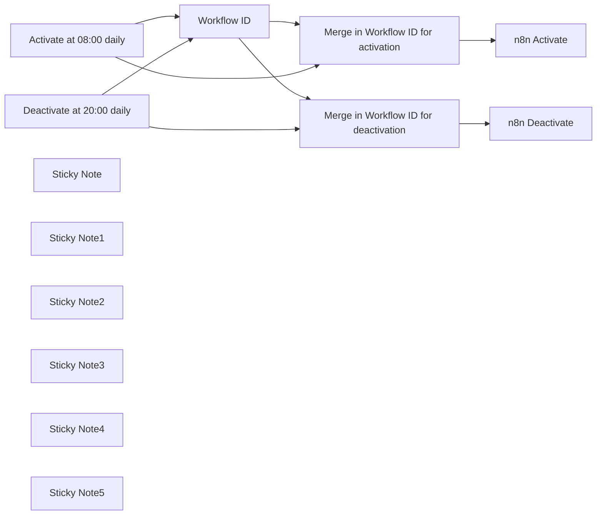

## Fluxo (.json) :

```json
{
  "id": "cGqPi5Uy2u1ShmoO",
  "meta": {
    "instanceId": "8fccc85e4982eaaf920505127420cfb3a600b56930a56e499973488bb6dc5e3a",
    "templateCredsSetupCompleted": true
  },
  "name": "💻 Schedule workflow activity time",
  "tags": [
    {
      "id": "0IPbflTW7vujkmxO",
      "name": "DevOps",
      "createdAt": "2025-03-16T13:11:38.707Z",
      "updatedAt": "2025-03-16T13:11:38.707Z"
    }
  ],
  "nodes": [
    {
      "id": "294244fd-8c35-4b70-af84-cc466a60541f",
      "name": "n8n Activate",
      "type": "n8n-nodes-base.n8n",
      "position": [
        360,
        -180
      ],
      "parameters": {
        "operation": "activate",
        "workflowId": {
          "__rl": true,
          "mode": "id",
          "value": "={{ $json.workflowID }}"
        },
        "requestOptions": {}
      },
      "credentials": {
        "n8nApi": {
          "id": "zYX6aInNigxW08J2",
          "name": "n8n acc for Gitlab/hub sync of repos"
        }
      },
      "typeVersion": 1
    },
    {
      "id": "e669e5e3-288a-4d6b-af12-011340e60f64",
      "name": "n8n Deactivate",
      "type": "n8n-nodes-base.n8n",
      "position": [
        360,
        140
      ],
      "parameters": {
        "operation": "deactivate",
        "workflowId": {
          "__rl": true,
          "mode": "id",
          "value": "={{ $json.workflowID }}"
        },
        "requestOptions": {}
      },
      "credentials": {
        "n8nApi": {
          "id": "zYX6aInNigxW08J2",
          "name": "n8n acc for Gitlab/hub sync of repos"
        }
      },
      "typeVersion": 1
    },
    {
      "id": "a9c7337f-d0ca-4e7e-873d-1d38813f2717",
      "name": "Workflow ID",
      "type": "n8n-nodes-base.set",
      "position": [
        -60,
        -80
      ],
      "parameters": {
        "options": {},
        "assignments": {
          "assignments": [
            {
              "id": "86a66597-b7c3-4e26-aab9-fdf6cc4e43b5",
              "name": "workflowID",
              "type": "string",
              "value": "cGqPi5Uy2u1ShmoO"
            }
          ]
        }
      },
      "typeVersion": 3.4
    },
    {
      "id": "9c641940-fb33-4750-b3ef-ed3d216c339e",
      "name": "Merge in Workflow ID for deactivation",
      "type": "n8n-nodes-base.merge",
      "position": [
        180,
        140
      ],
      "parameters": {
        "mode": "combine",
        "options": {},
        "combineBy": "combineByPosition"
      },
      "typeVersion": 3
    },
    {
      "id": "1368366d-0bec-45b3-9de9-d1902ca9b30c",
      "name": "Merge in Workflow ID for activation",
      "type": "n8n-nodes-base.merge",
      "position": [
        180,
        -180
      ],
      "parameters": {
        "mode": "combine",
        "options": {},
        "combineBy": "combineByPosition"
      },
      "typeVersion": 3
    },
    {
      "id": "68f765bc-23e2-48c9-8558-a30fc4d8bbb1",
      "name": "Activate at 08:00 daily",
      "type": "n8n-nodes-base.scheduleTrigger",
      "position": [
        -320,
        -200
      ],
      "parameters": {
        "rule": {
          "interval": [
            {
              "field": "cronExpression",
              "expression": "0 8 * * *"
            }
          ]
        }
      },
      "typeVersion": 1.2
    },
    {
      "id": "2b51cc72-55c8-444a-931e-54adb0a7ada8",
      "name": "Deactivate at 20:00 daily",
      "type": "n8n-nodes-base.scheduleTrigger",
      "position": [
        -320,
        160
      ],
      "parameters": {
        "rule": {
          "interval": [
            {
              "field": "cronExpression",
              "expression": "0 20 * * *"
            }
          ]
        }
      },
      "typeVersion": 1.2
    },
    {
      "id": "27edd566-b0cc-47d8-922b-33a909df9e56",
      "name": "Sticky Note",
      "type": "n8n-nodes-base.stickyNote",
      "position": [
        -180,
        -500
      ],
      "parameters": {
        "color": 5,
        "width": 320,
        "height": 800,
        "content": "## Set targeted Workflow ID\n\nYou will find it in the URL of the workflow you want to manage.\n\n\n"
      },
      "typeVersion": 1
    },
    {
      "id": "d568b8e8-aaad-45ae-aa56-b6e6671f246d",
      "name": "Sticky Note1",
      "type": "n8n-nodes-base.stickyNote",
      "position": [
        -500,
        -500
      ],
      "parameters": {
        "color": 5,
        "width": 300,
        "height": 800,
        "content": "## Set Activate/deactivate schedule \n\n[Custom (cron) interval](https://docs.n8n.io/integrations/builtin/core-nodes/n8n-nodes-base.scheduletrigger/#custom-cron-interval) is a recommended approach.\n\n"
      },
      "typeVersion": 1
    },
    {
      "id": "d23ff5a9-a8c2-43c7-8241-fcc3ff53f290",
      "name": "Sticky Note2",
      "type": "n8n-nodes-base.stickyNote",
      "position": [
        300,
        -500
      ],
      "parameters": {
        "color": 5,
        "width": 320,
        "height": 800,
        "content": "## Set n8n API credentials\n\n1. Create an API key:\nhttps://docs.n8n.io/api/authentication/\n\n2. Create n8n credentials using the API key\n\n\nThis workflow uses **[n8n node](https://docs.n8n.io/integrations/builtin/core-nodes/n8n-nodes-base.n8n/)**."
      },
      "typeVersion": 1
    },
    {
      "id": "0dd08d9b-046a-4c11-9bf4-bfb6beffa852",
      "name": "Sticky Note3",
      "type": "n8n-nodes-base.stickyNote",
      "position": [
        -500,
        -620
      ],
      "parameters": {
        "width": 1120,
        "height": 100,
        "content": "## ⚠️ Warning!\nThis approach **won't work for trial users** as it requires n8n API that is not available to trial users.\nSee https://docs.n8n.io/api/ for details."
      },
      "typeVersion": 1
    },
    {
      "id": "895034b7-5d7d-4e02-a125-6df6e4c44531",
      "name": "Sticky Note4",
      "type": "n8n-nodes-base.stickyNote",
      "position": [
        -500,
        -740
      ],
      "parameters": {
        "color": 4,
        "width": 1120,
        "height": 100,
        "content": "## Scheduling workflow activity time\nYour workflow wants to work normal business hours?\nMaybe it is in its own right."
      },
      "typeVersion": 1
    },
    {
      "id": "18e464f1-fc3b-4ce5-b5c7-c3769b3fc697",
      "name": "Sticky Note5",
      "type": "n8n-nodes-base.stickyNote",
      "position": [
        640,
        -500
      ],
      "parameters": {
        "color": 5,
        "width": 320,
        "height": 800,
        "content": "## Activate this workflow!"
      },
      "typeVersion": 1
    }
  ],
  "active": false,
  "pinData": {},
  "settings": {
    "executionOrder": "v1"
  },
  "versionId": "bb1c2014-2e38-41c0-ae1c-952fb98d0504",
  "connections": {
    "Workflow ID": {
      "main": [
        [
          {
            "node": "Merge in Workflow ID for activation",
            "type": "main",
            "index": 1
          },
          {
            "node": "Merge in Workflow ID for deactivation",
            "type": "main",
            "index": 0
          }
        ]
      ]
    },
    "Activate at 08:00 daily": {
      "main": [
        [
          {
            "node": "Workflow ID",
            "type": "main",
            "index": 0
          },
          {
            "node": "Merge in Workflow ID for activation",
            "type": "main",
            "index": 0
          }
        ]
      ]
    },
    "Deactivate at 20:00 daily": {
      "main": [
        [
          {
            "node": "Workflow ID",
            "type": "main",
            "index": 0
          },
          {
            "node": "Merge in Workflow ID for deactivation",
            "type": "main",
            "index": 1
          }
        ]
      ]
    },
    "Merge in Workflow ID for activation": {
      "main": [
        [
          {
            "node": "n8n Activate",
            "type": "main",
            "index": 0
          }
        ]
      ]
    },
    "Merge in Workflow ID for deactivation": {
      "main": [
        [
          {
            "node": "n8n Deactivate",
            "type": "main",
            "index": 0
          }
        ]
      ]
    }
  }
}
```

<a id="template-2165"></a>

## Template 2165 - Extrair dados de PDF com Claude e Gemini

- **Nome:** Extrair dados de PDF com Claude e Gemini
- **Descrição:** Fluxo que baixa um PDF, converte para base64 e envia o arquivo junto com um prompt para APIs de IA (Claude e Gemini) para extrair e comparar informações.
- **Funcionalidade:** • Download do PDF: Baixa o arquivo selecionado de um armazenamento em nuvem para processamento.
• Conversão para base64: Converte o conteúdo binário do PDF para uma string base64 exigida pelas APIs.
• Definição de prompt: Permite inserir e editar o prompt que define quais dados extrair e como formatá-los.
• Envio para múltiplas APIs de IA: Envia o PDF em base64 e o prompt para Claude 3.5 Sonnet e Gemini 2.0 Flash simultaneamente.
• Comparação de resultados: Facilita comparar respostas, latência e custo entre as duas APIs.
• Suporte a saída estruturada: Permite solicitar resposta em JSON ou formato estruturado para facilitar processamento posterior.
• Configuração seletiva de chamadas: Possibilidade de ativar/desativar uma das chamadas de API conforme necessidade.
- **Ferramentas:** • Google Drive: Armazenamento em nuvem usado para selecionar e baixar o PDF a ser processado.
• Anthropic (Claude 3.5 Sonnet): API de IA usada para processar o PDF e extrair informações conforme o prompt.
• Google Gemini (PaLM) API: API de IA usada para processar o PDF e extrair informações conforme o prompt.

## Fluxo visual

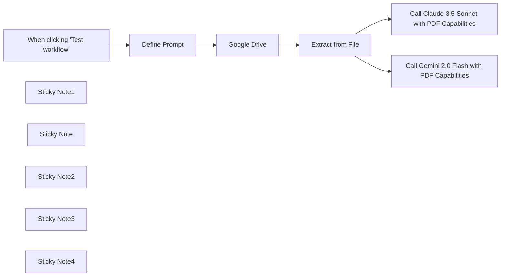

## Fluxo (.json) :

```json
{
  "meta": {
    "instanceId": "f4f5d195bb2162a0972f737368404b18be694648d365d6c6771d7b4909d28167"
  },
  "nodes": [
    {
      "id": "b6cd232e-e82e-457b-9f03-c010b3eba148",
      "name": "When clicking 'Test workflow'",
      "type": "n8n-nodes-base.manualTrigger",
      "position": [
        -40,
        0
      ],
      "parameters": {},
      "typeVersion": 1
    },
    {
      "id": "2b734806-e3c0-4552-a491-54ca846ed3ac",
      "name": "Extract from File",
      "type": "n8n-nodes-base.extractFromFile",
      "position": [
        620,
        0
      ],
      "parameters": {
        "options": {},
        "operation": "binaryToPropery"
      },
      "typeVersion": 1
    },
    {
      "id": "2c199499-cc4f-405c-8560-765500b7acba",
      "name": "Google Drive",
      "type": "n8n-nodes-base.googleDrive",
      "position": [
        420,
        0
      ],
      "parameters": {
        "fileId": {
          "__rl": true,
          "mode": "list",
          "value": "18Ac2xorxirIBm9FNFDDB5aVUSPBCCg1U",
          "cachedResultUrl": "https://drive.google.com/file/d/18Ac2xorxirIBm9FNFDDB5aVUSPBCCg1U/view?usp=drivesdk",
          "cachedResultName": "Invoice-798FE2FA-0004.pdf"
        },
        "options": {},
        "operation": "download"
      },
      "credentials": {
        "googleDriveOAuth2Api": {
          "id": "AUEpxwlqBJghNMtb",
          "name": "Google Drive account"
        }
      },
      "typeVersion": 3
    },
    {
      "id": "e3031c0c-f059-4f30-9684-10014a277d55",
      "name": "Call Gemini 2.0 Flash with PDF Capabilities",
      "type": "n8n-nodes-base.httpRequest",
      "position": [
        880,
        220
      ],
      "parameters": {
        "url": "https://generativelanguage.googleapis.com/v1beta/models/gemini-2.0-flash-exp:generateContent",
        "method": "POST",
        "options": {},
        "jsonBody": "={\n \"contents\": [\n {\n \"parts\": [\n {\n \"inline_data\": {\n \"mime_type\": \"application/pdf\",\n \"data\": \"{{ $json.data }}\"\n }\n },\n {\n \"text\": \"{{ $('Define Prompt').item.json.prompt }}\"\n }\n ]\n }\n ]\n}",
        "sendBody": true,
        "specifyBody": "json",
        "authentication": "predefinedCredentialType",
        "nodeCredentialType": "googlePalmApi"
      },
      "credentials": {
        "anthropicApi": {
          "id": "eOt6Ois0jSizRFMJ",
          "name": "Anthropic Mira Account"
        },
        "googlePalmApi": {
          "id": "IQrjvfoUd5LUft3b",
          "name": "Google Gemini(PaLM) Api account"
        }
      },
      "typeVersion": 4.2
    },
    {
      "id": "135df716-32a1-47e8-9ed8-30c830b803d6",
      "name": "Call Claude 3.5 Sonnet with PDF Capabilities",
      "type": "n8n-nodes-base.httpRequest",
      "position": [
        880,
        -140
      ],
      "parameters": {
        "url": "https://api.anthropic.com/v1/messages",
        "method": "POST",
        "options": {},
        "jsonBody": "={\n \"model\": \"claude-3-5-sonnet-20241022\",\n \"max_tokens\": 1024,\n \"messages\": [{\n \"role\": \"user\",\n \"content\": [{\n \"type\": \"document\",\n \"source\": {\n \"type\": \"base64\",\n \"media_type\": \"application/pdf\",\n \"data\": \"{{$json.data}}\"\n }\n },\n {\n \"type\": \"text\",\n \"text\": \"{{ $('Define Prompt').item.json.prompt }}\"\n }]\n }]\n}",
        "sendBody": true,
        "sendHeaders": true,
        "specifyBody": "json",
        "authentication": "predefinedCredentialType",
        "headerParameters": {
          "parameters": [
            {
              "name": "anthropic-version",
              "value": "2023-06-01"
            },
            {
              "name": "content-type",
              "value": "application/json"
            }
          ]
        },
        "nodeCredentialType": "anthropicApi"
      },
      "credentials": {
        "anthropicApi": {
          "id": "eOt6Ois0jSizRFMJ",
          "name": "Anthropic Mira Account"
        }
      },
      "typeVersion": 4.2
    },
    {
      "id": "5b8994d1-4bfd-4776-84ac-b3141aca6378",
      "name": "Sticky Note1",
      "type": "n8n-nodes-base.stickyNote",
      "position": [
        -700,
        -280
      ],
      "parameters": {
        "color": 7,
        "width": 601,
        "height": 585,
        "content": "## Workflow: Extract data from PDF with Claude 3.5 Sonnet or Gemini 2.0 Flash\n\n**Overview**\n- This workflow helps you compare Claude 3.5 Sonnet and Gemini 2.0 Flash when extracting data from a PDF\n- This workflow extracts and processes the data within a PDF in **one single step**, **instead of calling an OCR and then an LLM”**\n\n\n**How it works**\n- The initial 2 steps download the PDF and convert it to base64.\n- This base64 string is then sent to both Claude 3.5 Sonnet and Gemini 2.0 Flash to extract information.\n- This workflow is made to let you compare results, latency, and cost (in their dedicated dashboard).\n\n\n**How to use it**\n- Set up your Google Drive if not already done\n- Select a document on your Google Drive\n- Modify the prompt in \"Define Prompt\" to extract the information you need and transform it as wanted.\n- Get a [Claude API key](https://console.anthropic.com/settings/keys) and/or [Gemini API key](https://aistudio.google.com/app/apikey)\n- Note that you can deactivate one of the 2 API calls if you don't want to try both\n- Test the Workflow\n"
      },
      "typeVersion": 1
    },
    {
      "id": "616241a9-6199-406b-88dc-0afc7d974250",
      "name": "Sticky Note",
      "type": "n8n-nodes-base.stickyNote",
      "position": [
        820,
        60
      ],
      "parameters": {
        "color": 5,
        "width": 320,
        "height": 360,
        "content": "You can output the result as JSON by adding the following:\n```\n\"generationConfig\": {\n \"responseMimeType\": \"application/json\"\n```\nor even use a structured output.\n[Check the documentation](https://ai.google.dev/gemini-api/docs/structured-output?lang=rest)"
      },
      "typeVersion": 1
    },
    {
      "id": "bbac8d3d-d68f-4aa2-a41a-b06f7de2317b",
      "name": "Define Prompt",
      "type": "n8n-nodes-base.set",
      "position": [
        180,
        0
      ],
      "parameters": {
        "options": {},
        "assignments": {
          "assignments": [
            {
              "id": "dba23ef5-95df-496a-8e24-c7c1544533d2",
              "name": "prompt",
              "type": "string",
              "value": "Extract the VAT numbers for each country"
            }
          ]
        }
      },
      "typeVersion": 3.4
    },
    {
      "id": "3c2e7265-76e5-4911-a950-7e6b0c89ec5a",
      "name": "Sticky Note2",
      "type": "n8n-nodes-base.stickyNote",
      "position": [
        820,
        -200
      ],
      "parameters": {
        "color": 5,
        "width": 320,
        "height": 240,
        "content": "You can force Claude to output JSON with [Prefill response format](https://docs.anthropic.com/en/docs/test-and-evaluate/strengthen-guardrails/increase-consistency#prefill-claudes-response)"
      },
      "typeVersion": 1
    },
    {
      "id": "f2b46305-5200-486e-ad4d-ecc0d2a14314",
      "name": "Sticky Note3",
      "type": "n8n-nodes-base.stickyNote",
      "position": [
        380,
        -120
      ],
      "parameters": {
        "color": 5,
        "width": 380,
        "height": 280,
        "content": "These 2 steps first download the PDF file, and then convert it to base64.\nThis is required by both APIs to process the file."
      },
      "typeVersion": 1
    },
    {
      "id": "e5dff70f-b55a-4c23-9025-765a7cf19c4a",
      "name": "Sticky Note4",
      "type": "n8n-nodes-base.stickyNote",
      "position": [
        120,
        -120
      ],
      "parameters": {
        "color": 5,
        "width": 220,
        "height": 280,
        "content": "This prompt is used in both Gemini’s and Claude’s calls to define what information should be extracted and processed."
      },
      "typeVersion": 1
    }
  ],
  "pinData": {},
  "connections": {
    "Google Drive": {
      "main": [
        [
          {
            "node": "Extract from File",
            "type": "main",
            "index": 0
          }
        ]
      ]
    },
    "Define Prompt": {
      "main": [
        [
          {
            "node": "Google Drive",
            "type": "main",
            "index": 0
          }
        ]
      ]
    },
    "Extract from File": {
      "main": [
        [
          {
            "node": "Call Claude 3.5 Sonnet with PDF Capabilities",
            "type": "main",
            "index": 0
          },
          {
            "node": "Call Gemini 2.0 Flash with PDF Capabilities",
            "type": "main",
            "index": 0
          }
        ]
      ]
    },
    "When clicking 'Test workflow'": {
      "main": [
        [
          {
            "node": "Define Prompt",
            "type": "main",
            "index": 0
          }
        ]
      ]
    }
  }
}
```

<a id="template-2166"></a>

## Template 2166 - Transformar array em itens JSON individuais

- **Nome:** Transformar array em itens JSON individuais
- **Descrição:** Gera dados simulados e converte um array de objetos contido em uma única entrada em múltiplos itens JSON separados.
- **Funcionalidade:** • Geração de dados simulados: Cria um conjunto de objetos de teste com campos id e name.
• Separação de itens: Recebe um único registro cujo campo json contém um array e transforma cada objeto desse array em um item independente.
• Preservação de atributos: Mantém os campos originais (id e name) em cada item resultante, prontos para uso posterior.
- **Ferramentas:** • Nenhuma: Não utiliza ferramentas externas; todo o processamento é feito internamente por meio de código.

## Fluxo visual

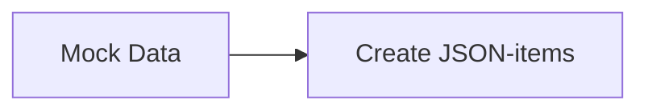

## Fluxo (.json) :

```json
{
  "nodes": [
    {
      "name": "Mock Data",
      "type": "n8n-nodes-base.function",
      "position": [
        670,
        371
      ],
      "parameters": {
        "functionCode": "return [\n  {\n    json:[\n      {\n        id: 1,\n        name: \"Jim\"\n      }, \n      {\n        id: 2,\n        name: \"Stefan\"\n      },\n      {\n        id: 3,\n        name: \"Hans\"\n      }\n    ]\n  }\n];"
      },
      "typeVersion": 1
    },
    {
      "name": "Create JSON-items",
      "type": "n8n-nodes-base.function",
      "position": [
        910,
        371
      ],
      "parameters": {
        "functionCode": "return items[0].json.map(item => { \n  return {\n    json: item,\n  }\n})\n"
      },
      "typeVersion": 1
    }
  ],
  "connections": {
    "Mock Data": {
      "main": [
        [
          {
            "node": "Create JSON-items",
            "type": "main",
            "index": 0
          }
        ]
      ]
    }
  }
}
```

<a id="template-2168"></a>

## Template 2168 - Agrupar itens em um único array

- **Nome:** Agrupar itens em um único array
- **Descrição:** Recebe registros de exemplo e os consolida em um único objeto contendo um array com esses registros.
- **Funcionalidade:** • Geração de dados simulados: Cria um conjunto de registros de exemplo contendo id e name.
• Agrupamento em um array de objetos: Consolida os registros recebidos em um único objeto cuja propriedade data_object contém o array com todos os registros.
- **Ferramentas:** • Nenhuma ferramenta externa: O fluxo utiliza dados simulados internamente e não depende de ferramentas externas.

## Fluxo visual

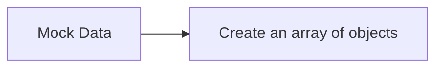

## Fluxo (.json) :

```json
{
  "nodes": [
    {
      "name": "Mock Data",
      "type": "n8n-nodes-base.function",
      "position": [
        802,
        307
      ],
      "parameters": {
        "functionCode": "return [\n  {\n    json: {\n      id: 1,\n      name: \"Jim\"\n    }\n  },\n  {\n    json: {\n      id: 2,\n      name: \"Stefan\"\n    }\n  },\n  {\n    json: {\n      id: 3,\n      name: \"Hans\"\n    }\n  }\n];"
      },
      "typeVersion": 1
    },
    {
      "name": "Create an array of objects",
      "type": "n8n-nodes-base.function",
      "position": [
        1052,
        307
      ],
      "parameters": {
        "functionCode": "return [\n  {\n    json: {\n      data_object: items.map(item => item.json),\n    },\n  }\n];\n"
      },
      "typeVersion": 1
    }
  ],
  "connections": {
    "Mock Data": {
      "main": [
        [
          {
            "node": "Create an array of objects",
            "type": "main",
            "index": 0
          }
        ]
      ]
    }
  }
}
```

<a id="template-2170"></a>

## Template 2170 - Salvar anexos no Drive por tamanho

- **Nome:** Salvar anexos no Drive por tamanho
- **Descrição:** Recebe e-mails de um remetente específico, baixa anexos e toma decisões com base no tamanho dos arquivos, salvando alguns no Google Drive ou notificando sobre os maiores.
- **Funcionalidade:** • Monitoramento de e-mail: Monitora mensagens não lidas de um remetente específico e baixa automaticamente os anexos.
• Separação de anexos: Divide múltiplos anexos em itens individuais para processamento isolado.
• Classificação por tamanho: Avalia o tamanho de cada arquivo e classifica em grandes, médios ou pequenos.
• Ações condicionais: Dispara uma notificação para arquivos muito grandes, salva arquivos médios no armazenamento e ignora pequenos arquivos irrelevantes.
• Upload com nome original: Faz upload dos anexos para uma pasta definida no armazenamento em nuvem mantendo o nome do arquivo.
- **Ferramentas:** • Gmail: Serviço de e-mail utilizado para receber mensagens e extrair anexos.
• Google Drive: Serviço de armazenamento em nuvem usado para salvar os arquivos recebidos em uma pasta específica.


## Fluxo visual

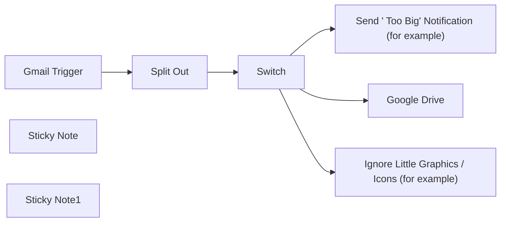

## Fluxo (.json) :

```json
{
  "meta": {
    "instanceId": "abc123",
    "templateCredsSetupCompleted": true
  },
  "nodes": [
    {
      "id": "c8481fc0-4cc2-4662-b008-e81eaeb4840b",
      "name": "Gmail Trigger",
      "type": "n8n-nodes-base.gmailTrigger",
      "position": [
        -340,
        0
      ],
      "parameters": {
        "simple": false,
        "filters": {
          "sender": "ray.thomas@charter.com",
          "readStatus": "unread"
        },
        "options": {
          "downloadAttachments": true,
          "dataPropertyAttachmentsPrefixName": "attachment_"
        },
        "pollTimes": {
          "item": [
            {
              "mode": "everyMinute"
            }
          ]
        }
      },
      "credentials": {
        "gmailOAuth2": {
          "id": "egorWvqjkdIG2ovh",
          "name": "Gmail account - rthomascharter"
        }
      },
      "typeVersion": 1.2
    },
    {
      "id": "fd82d244-dfab-46db-af8e-e674501db75d",
      "name": "Google Drive",
      "type": "n8n-nodes-base.googleDrive",
      "position": [
        540,
        0
      ],
      "parameters": {
        "name": "={{ $binary.values()[0].fileName }}",
        "driveId": {
          "__rl": true,
          "mode": "list",
          "value": "My Drive"
        },
        "options": {},
        "folderId": {
          "__rl": true,
          "mode": "list",
          "value": "0BwqhgrfUUaOuM2x1NXhxLUlGVEE",
          "cachedResultUrl": "https://drive.google.com/drive/folders/0BwqhgrfUUaOuM2x1NXhxLUlGVEE?resourcekey=0-fQoeO57wF_vlzIWPZAoNXg",
          "cachedResultName": "misc"
        },
        "inputDataFieldName": "={{ $binary.keys()[0] }}"
      },
      "credentials": {
        "googleDriveOAuth2Api": {
          "id": "fwkvLJni8GfLNqBZ",
          "name": "Google Drive account - rthomascharter"
        }
      },
      "typeVersion": 3
    },
    {
      "id": "5686e523-e12c-41b1-818d-03545122ad6f",
      "name": "Split Out",
      "type": "n8n-nodes-base.splitOut",
      "position": [
        -120,
        0
      ],
      "parameters": {
        "options": {},
        "fieldToSplitOut": "$binary"
      },
      "typeVersion": 1
    },
    {
      "id": "1774a0d8-2909-49e4-b0f7-1c3e343602b1",
      "name": "Sticky Note",
      "type": "n8n-nodes-base.stickyNote",
      "position": [
        420,
        -360
      ],
      "parameters": {
        "width": 380,
        "height": 820,
        "content": "## Reference \"Single\" Binary Using Expressions\nThis contains examples of how to reference a single binary in each input item **regardless of its key name.**"
      },
      "typeVersion": 1
    },
    {
      "id": "204fe711-c5f3-4243-be3b-829419a07c82",
      "name": "Switch",
      "type": "n8n-nodes-base.switch",
      "position": [
        100,
        0
      ],
      "parameters": {
        "rules": {
          "values": [
            {
              "outputKey": "Large Files",
              "conditions": {
                "options": {
                  "version": 2,
                  "leftValue": "",
                  "caseSensitive": true,
                  "typeValidation": "strict"
                },
                "combinator": "and",
                "conditions": [
                  {
                    "operator": {
                      "type": "number",
                      "operation": "gt"
                    },
                    "leftValue": "={{ $binary.values()[0].fileSize.split(' ')[0].toNumber() }}",
                    "rightValue": 300
                  }
                ]
              },
              "renameOutput": true
            },
            {
              "outputKey": "Medium Files",
              "conditions": {
                "options": {
                  "version": 2,
                  "leftValue": "",
                  "caseSensitive": true,
                  "typeValidation": "strict"
                },
                "combinator": "and",
                "conditions": [
                  {
                    "id": "27a59343-5f2a-43b0-a74d-ddb0a988c0cb",
                    "operator": {
                      "type": "number",
                      "operation": "gt"
                    },
                    "leftValue": "={{ $binary.values()[0].fileSize.split(' ')[0].toNumber() }}",
                    "rightValue": 10
                  }
                ]
              },
              "renameOutput": true
            }
          ]
        },
        "options": {
          "fallbackOutput": "extra"
        }
      },
      "typeVersion": 3.2
    },
    {
      "id": "1e00cb68-fed2-4f88-be84-4860c26c8a3b",
      "name": "Sticky Note1",
      "type": "n8n-nodes-base.stickyNote",
      "position": [
        -200,
        -240
      ],
      "parameters": {
        "width": 260,
        "height": 460,
        "content": "## Split Multiple Binary Files\nThis uses the `$binary` name (not expression var) to make individual items for each attachment binary.\n* Note: This still doesn't homogenize the name of each binary."
      },
      "typeVersion": 1
    },
    {
      "id": "1089eb84-51d3-4669-8a5a-fd1d0855ca41",
      "name": "Send \" Too Big\" Notification (for example)",
      "type": "n8n-nodes-base.noOp",
      "position": [
        540,
        -200
      ],
      "parameters": {},
      "typeVersion": 1
    },
    {
      "id": "29c83742-72b6-40ec-a5fc-aab5ef1d5149",
      "name": "Ignore Little Graphics / Icons (for example)",
      "type": "n8n-nodes-base.noOp",
      "position": [
        540,
        220
      ],
      "parameters": {},
      "typeVersion": 1
    }
  ],
  "pinData": {},
  "connections": {
    "Switch": {
      "main": [
        [
          {
            "node": "Send \" Too Big\" Notification (for example)",
            "type": "main",
            "index": 0
          }
        ],
        [
          {
            "node": "Google Drive",
            "type": "main",
            "index": 0
          }
        ],
        [
          {
            "node": "Ignore Little Graphics / Icons (for example)",
            "type": "main",
            "index": 0
          }
        ]
      ]
    },
    "Split Out": {
      "main": [
        [
          {
            "node": "Switch",
            "type": "main",
            "index": 0
          }
        ]
      ]
    },
    "Gmail Trigger": {
      "main": [
        [
          {
            "node": "Split Out",
            "type": "main",
            "index": 0
          }
        ]
      ]
    }
  }
}
```

<a id="template-2171"></a>

## Template 2171 - Inserção periódica de leituras de sensor no PostgreSQL

- **Nome:** Inserção periódica de leituras de sensor no PostgreSQL
- **Descrição:** Gera leituras simuladas de um sensor a cada minuto e salva os registros em uma tabela no PostgreSQL.
- **Funcionalidade:** • Agendamento periódico: dispara o fluxo a cada minuto para ingestão contínua de dados.
• Geração de dados simulados: cria leituras do sensor com sensor_id 'humidity01' e valor aleatório entre 1 e 100.
• Formatação de timestamp: monta carimbo de data/hora no formato 'YYYY-M-D H:M:S' para registro.
• Marcação de notificação: inclui um campo booleano 'notification' definido como false.
• Inserção no banco de dados: persiste os campos sensor_id, value, time_stamp e notification na tabela 'n8n' do banco.
- **Ferramentas:** • PostgreSQL: banco de dados relacional utilizado para armazenar as leituras de sensor (tabela 'n8n').

## Fluxo visual

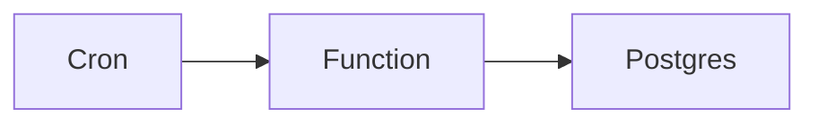

## Fluxo (.json) :

```json
{
  "id": "33",
  "name": "Postgres Data Ingestion",
  "nodes": [
    {
      "name": "Cron",
      "type": "n8n-nodes-base.cron",
      "position": [
        300,
        250
      ],
      "parameters": {
        "triggerTimes": {
          "item": [
            {
              "mode": "everyMinute"
            }
          ]
        }
      },
      "typeVersion": 1
    },
    {
      "name": "Function",
      "type": "n8n-nodes-base.function",
      "position": [
        500,
        250
      ],
      "parameters": {
        "functionCode": "var today = new Date();\nvar date = today.getFullYear()+'-'+(today.getMonth()+1)+'-'+today.getDate();\nvar time = today.getHours() + \":\" + today.getMinutes() + \":\" + today.getSeconds();\nvar dateTime = date+' '+time;\n\nitems[0].json.sensor_id = 'humidity01';\nitems[0].json.value = Math.ceil(Math.random()*100);\nitems[0].json.time_stamp = dateTime;\nitems[0].json.notification = false;\n\nreturn items;"
      },
      "typeVersion": 1
    },
    {
      "name": "Postgres",
      "type": "n8n-nodes-base.postgres",
      "position": [
        680,
        250
      ],
      "parameters": {
        "table": "n8n",
        "columns": "sensor_id,value,time_stamp,notification"
      },
      "credentials": {
        "postgres": "Postgres"
      },
      "typeVersion": 1
    }
  ],
  "active": true,
  "settings": {},
  "connections": {
    "Cron": {
      "main": [
        [
          {
            "node": "Function",
            "type": "main",
            "index": 0
          }
        ]
      ]
    },
    "Function": {
      "main": [
        [
          {
            "node": "Postgres",
            "type": "main",
            "index": 0
          }
        ]
      ]
    }
  }
}
```

<a id="template-2174"></a>

## Template 2174 - Lista diária de reuniões para Telegram

- **Nome:** Lista diária de reuniões para Telegram
- **Descrição:** Envia todos os dias, pela manhã, uma lista com as reuniões agendadas para o dia ao seu Telegram, ajudando a acompanhar compromissos rapidamente.
- **Funcionalidade:** • Agendamento diário: Executa automaticamente todas as manhãs às 06:00 (fuso Asia/Tehran).
• Obtenção de reuniões do dia: Recupera todos os eventos do calendário selecionado entre o início do dia e o início do dia seguinte.
• Extração de detalhes: Coleta título da reunião, horário de início e lista de convidados.
• Formatação de mensagem: Monta uma mensagem legível listando cada reunião com o horário formatado (locale fa-IR) e os convidados.
• Tratamento de convidados ausentes: Indica "sem convidados" quando não houver participantes listados.
• Envio ao usuário: Entrega a mensagem formatada diretamente ao usuário via bot do Telegram.
• Configuração necessária: Requer acesso ao calendário específico, um bot do Telegram e o ID do usuário destinatário.
- **Ferramentas:** • Google Calendar: Serviço de calendário usado para armazenar e recuperar os eventos/meetings do dia a partir de um calendário específico (por exemplo, sala de reuniões).
• Telegram: Plataforma de mensagens usada para enviar a lista de reuniões ao usuário final através de um bot.

## Fluxo visual

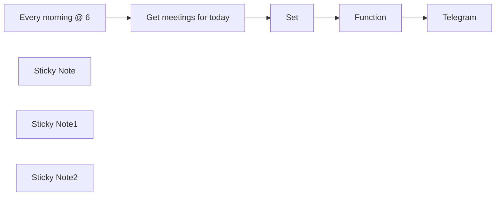

## Fluxo (.json) :

```json
{
  "id": "nV1xFcF5HWJcD6w7",
  "meta": {
    "instanceId": "b1be0f8fadff87de92fbcd08be474fb794e544ef8a62dd9c586c9914a3836990"
  },
  "name": "Automatically Send Daily Meeting List to Telegram",
  "tags": [
    {
      "id": "THCdGkSMWvR7AzSR",
      "name": "Template",
      "createdAt": "2024-02-28T08:32:57.511Z",
      "updatedAt": "2024-02-28T08:32:57.511Z"
    },
    {
      "id": "ro6MmCu2eov1eWfR",
      "name": "Creators",
      "createdAt": "2024-03-01T11:11:36.214Z",
      "updatedAt": "2024-03-01T11:11:36.214Z"
    }
  ],
  "nodes": [
    {
      "id": "eee04fe7-7f65-4db8-8ad8-7b67197a1f70",
      "name": "Get meetings for today",
      "type": "n8n-nodes-base.googleCalendar",
      "position": [
        1240,
        580
      ],
      "parameters": {
        "options": {
          "timeMax": "={{ $today.plus({ days: 1 }) }}",
          "timeMin": "={{ $today }}",
          "singleEvents": true
        },
        "calendar": {
          "__rl": true,
          "mode": "list",
          "value": "lrnr6ha3nt9cv8i0fimup684e4@group.calendar.google.com",
          "cachedResultName": "Meeting Room"
        },
        "operation": "getAll"
      },
      "credentials": {
        "googleCalendarOAuth2Api": {
          "id": "BSvdyVkCIqvVagsr",
          "name": "Google Calendar account"
        }
      },
      "typeVersion": 1
    },
    {
      "id": "358ab462-d69f-4980-99fd-de5a22a3c783",
      "name": "Every morning @ 6",
      "type": "n8n-nodes-base.scheduleTrigger",
      "position": [
        940,
        580
      ],
      "parameters": {
        "rule": {
          "interval": [
            {
              "triggerAtHour": 6
            }
          ]
        }
      },
      "typeVersion": 1.1
    },
    {
      "id": "57f77b4e-d608-4929-bc49-2dfecff88c8d",
      "name": "Set",
      "type": "n8n-nodes-base.set",
      "position": [
        1520,
        580
      ],
      "parameters": {
        "values": {
          "number": [],
          "string": [
            {
              "name": "Name",
              "value": "={{ $json.summary }}"
            },
            {
              "name": "Time",
              "value": "={{ $json.start }}"
            },
            {
              "name": "Guests",
              "value": "={{ $json.attendees }}"
            }
          ]
        },
        "options": {},
        "keepOnlySet": true
      },
      "typeVersion": 1
    },
    {
      "id": "6bcde2e8-46f6-46aa-b2f2-0e2670a9ce66",
      "name": "Function",
      "type": "n8n-nodes-base.function",
      "position": [
        1780,
        580
      ],
      "parameters": {
        "functionCode": "let message = \"*Your meetings today are:* \\n\";\n\nfor (item of items) {\n  const time = new Date(item.json.Time.dateTime);\n  const formattedTime = new Intl.DateTimeFormat('fa-IR', {\n    hour: 'numeric',\n    minute: 'numeric',\n    timeZone: item.json.Time.timeZone\n  }).format(time);\n\n  message += `* ${item.json.Name} | ${formattedTime}\\n`;\n\n  if (item.json.Guests && item.json.Guests.length > 0) {\n    message += '*Â&nbsp;- ';\n    item.json.Guests.forEach((guest, index) => {\n      message += `${guest.email}${index < item.json.Guests.length - 1 ? ', ' : ''}`;\n    });\n    message += '\\n';\n  } else {\n    message += '*Â&nbsp;- No guests\\n';\n  }\n}\n\nreturn [{ json: { message } }];\n"
      },
      "typeVersion": 1
    },
    {
      "id": "568c4efd-a4d4-4309-ab3e-c15c955ce361",
      "name": "Telegram",
      "type": "n8n-nodes-base.telegram",
      "position": [
        2120,
        580
      ],
      "parameters": {
        "text": "={{$json[\"message\"]}}",
        "additionalFields": {}
      },
      "typeVersion": 1.1
    },
    {
      "id": "9f2b0543-9f3f-43e2-a7ea-e77ce1430985",
      "name": "Sticky Note",
      "type": "n8n-nodes-base.stickyNote",
      "position": [
        800,
        232
      ],
      "parameters": {
        "color": 7,
        "width": 1527.817454565021,
        "height": 658.1528835709971,
        "content": "## This workflow \nprovides a convenient and automated way to stay on top of your daily meetings and improve your personal productivity.\n\n\n"
      },
      "typeVersion": 1
    },
    {
      "id": "41d85383-ccca-42f6-b9a1-d18e14ab3e32",
      "name": "Sticky Note1",
      "type": "n8n-nodes-base.stickyNote",
      "position": [
        2031.7098362416477,
        431.96581702471417
      ],
      "parameters": {
        "color": 5,
        "width": 268.2901637583533,
        "height": 315.7841809336307,
        "content": "### Create a Telegram bot in @botfather\nUses your Telegram user ID to send the list of meetings as a message to Telegram."
      },
      "typeVersion": 1
    },
    {
      "id": "254dccf8-a366-4cdc-84ca-987eca928ed6",
      "name": "Sticky Note2",
      "type": "n8n-nodes-base.stickyNote",
      "position": [
        820,
        340
      ],
      "parameters": {
        "width": 430.6727493433055,
        "height": 151.60560223016907,
        "content": "## setup:\n###    - Google Calendar connected to n8n\n###    - A Telegram bot created and connected to n8n\n###    - Your Telegram user ID specified"
      },
      "typeVersion": 1
    }
  ],
  "active": false,
  "pinData": {},
  "settings": {
    "timezone": "Asia/Tehran",
    "executionOrder": "v1"
  },
  "versionId": "9dc21ef6-2b7d-4c80-9c03-0d636ab6f0d1",
  "connections": {
    "Set": {
      "main": [
        [
          {
            "node": "Function",
            "type": "main",
            "index": 0
          }
        ]
      ]
    },
    "Function": {
      "main": [
        [
          {
            "node": "Telegram",
            "type": "main",
            "index": 0
          }
        ]
      ]
    },
    "Every morning @ 6": {
      "main": [
        [
          {
            "node": "Get meetings for today",
            "type": "main",
            "index": 0
          }
        ]
      ]
    },
    "Get meetings for today": {
      "main": [
        [
          {
            "node": "Set",
            "type": "main",
            "index": 0
          }
        ]
      ]
    }
  }
}
```

<a id="template-2175"></a>

## Template 2175 - Carregar prompts do GitHub e preencher variáveis

- **Nome:** Carregar prompts do GitHub e preencher variáveis
- **Descrição:** Carrega um arquivo de prompt de um repositório GitHub, verifica e substitui variáveis definidas pelo usuário e envia o prompt final para um agente de IA para gerar uma resposta.
- **Funcionalidade:** • Carregamento de prompt do repositório: Recupera o arquivo de prompt a partir de um repositório e caminho especificados.
• Extração de conteúdo do arquivo: Lê o texto bruto do arquivo recuperado.
• Definição de variáveis de contexto: Permite definir valores (empresa, produto, recursos, setor, etc.) que serão usados para substituir placeholders.
• Detecção de placeholders dinâmicos: Analisa o prompt em busca de variáveis no formato {{ ... }} e extrai os nomes necessários.
• Verificação de presença de variáveis: Compara os placeholders extraídos com as variáveis definidas e identifica quais estão faltando.
• Fluxo condicional e tratamento de erro: Interrompe a execução e retorna uma mensagem clara se houver variáveis ausentes.
• Substituição dinâmica de placeholders: Substitui os placeholders no prompt pelos valores correspondentes, mesmo quando usam notação de ponto (pega a última parte do caminho).
• Envio para agente de IA: Encaminha o prompt concluído para um agente de linguagem para geração de output.
• Captura e armazenamento da resposta: Armazena a saída do modelo de IA para uso posterior no fluxo.
- **Ferramentas:** • GitHub: Plataforma para hospedar e recuperar arquivos de prompt a partir de repositórios públicos ou privados.
• Ollama: Servidor de modelos de linguagem (execução de modelos de chat) utilizado para gerar respostas do prompt.
• LangChain: Framework para orquestrar agentes, prompts e integrações com modelos de linguagem.

## Fluxo visual

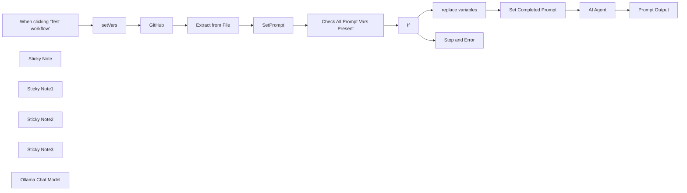

## Fluxo (.json) :

```json
{
  "id": "QyMyf3zraY0wxXDf",
  "meta": {
    "instanceId": "ba3fa76a571c35110ef5f67e5099c9a5c1768ef125c2f3b804ba20de75248c0b",
    "templateCredsSetupCompleted": true
  },
  "name": "Load Prompts from Github Repo and auto populate n8n expressions",
  "tags": [],
  "nodes": [
    {
      "id": "34781446-b06e-41eb-83b8-b96bda1a5595",
      "name": "When clicking ‘Test workflow’",
      "type": "n8n-nodes-base.manualTrigger",
      "position": [
        -80,
        0
      ],
      "parameters": {},
      "typeVersion": 1
    },
    {
      "id": "c53b7243-7c82-47e0-a5ee-bd82bc51c386",
      "name": "GitHub",
      "type": "n8n-nodes-base.github",
      "position": [
        600,
        0
      ],
      "parameters": {
        "owner": {
          "__rl": true,
          "mode": "name",
          "value": "={{ $json.Account }}"
        },
        "filePath": "={{ $json.path }}{{ $json.prompt }}",
        "resource": "file",
        "operation": "get",
        "repository": {
          "__rl": true,
          "mode": "name",
          "value": "={{ $json.repo }}"
        },
        "additionalParameters": {}
      },
      "credentials": {
        "githubApi": {
          "id": "ostHZNoe8GSsbaQM",
          "name": "The GitHub account"
        }
      },
      "typeVersion": 1
    },
    {
      "id": "9976b199-b744-47a7-9d75-4b831274c01b",
      "name": "Extract from File",
      "type": "n8n-nodes-base.extractFromFile",
      "position": [
        840,
        0
      ],
      "parameters": {
        "options": {},
        "operation": "text"
      },
      "typeVersion": 1
    },
    {
      "id": "26aa4e6a-c487-4cdf-91d5-df660cf826a6",
      "name": "setVars",
      "type": "n8n-nodes-base.set",
      "position": [
        180,
        0
      ],
      "parameters": {
        "options": {},
        "assignments": {
          "assignments": [
            {
              "id": "150618c5-09b1-4f8b-a7b4-984662bf3381",
              "name": "Account",
              "type": "string",
              "value": "TPGLLC-US"
            },
            {
              "id": "22e8a3b0-bd53-485c-b971-7f1dd0686f0e",
              "name": "repo",
              "type": "string",
              "value": "PeresPrompts"
            },
            {
              "id": "ab94d0a1-ef3a-4fe9-9076-6882c6fda0ac",
              "name": "path",
              "type": "string",
              "value": "SEO/"
            },
            {
              "id": "66f122eb-1cbd-4769-aac8-3f05cdb6c116",
              "name": "prompt",
              "type": "string",
              "value": "keyword_research.md"
            },
            {
              "id": "03fe26a3-04e6-439c-abcb-d438fc5203c0",
              "name": "company",
              "type": "string",
              "value": "South Nassau Physical Therapy"
            },
            {
              "id": "c133d216-a457-4872-a060-0ba4d94549af",
              "name": "product",
              "type": "string",
              "value": "Manual Therapy"
            },
            {
              "id": "584864dd-2518-45e2-b501-02828757fc3a",
              "name": "features",
              "type": "string",
              "value": "pain relief"
            },
            {
              "id": "0c4594cc-302a-4215-bdad-12cf54f57967",
              "name": "sector",
              "type": "string",
              "value": "physical therapy"
            }
          ]
        }
      },
      "typeVersion": 3.4
    },
    {
      "id": "9d92f581-8cd9-448c-aa1d-023a96c1ddda",
      "name": "replace variables",
      "type": "n8n-nodes-base.code",
      "position": [
        1900,
        -20
      ],
      "parameters": {
        "jsCode": "// Fetch the prompt text\nconst prompt = $('SetPrompt').first().json.data; // Ensure the prompt contains placeholders like {{ some.node.value }}\n\n// Example variables object\nconst variables = {\n company: $('setVars').first().json.company,\n features: \"Awesome Software\",\n keyword: \"2025-02-07\"\n};\n\n// Function to replace placeholders dynamically\nconst replaceVariables = (text, vars) => {\n return text.replace(/{{(.*?)}}/g, (match, key) => {\n const trimmedKey = key.trim();\n \n // Extract last part after the last dot\n const finalKey = trimmedKey.split('.').pop();\n\n // Replace if key exists, otherwise leave placeholder unchanged\n return vars.hasOwnProperty(finalKey) ? vars[finalKey] : match;\n });\n};\n\n// Replace and return result\nreturn [{\n prompt: replaceVariables(prompt, variables)\n}];\n"
      },
      "typeVersion": 2
    },
    {
      "id": "6c6c4fde-6ee5-47a8-894d-44d1afcedc2a",
      "name": "If",
      "type": "n8n-nodes-base.if",
      "position": [
        1560,
        0
      ],
      "parameters": {
        "options": {},
        "conditions": {
          "options": {
            "version": 2,
            "leftValue": "",
            "caseSensitive": true,
            "typeValidation": "strict"
          },
          "combinator": "and",
          "conditions": [
            {
              "id": "2717a7e5-095a-42bf-8b5b-8050c3389ec5",
              "operator": {
                "type": "boolean",
                "operation": "true",
                "singleValue": true
              },
              "leftValue": "={{ $json.success }}",
              "rightValue": "={{ $('Check All Prompt Vars Present').item.json.keys()}}"
            }
          ]
        }
      },
      "typeVersion": 2.2
    },
    {
      "id": "3b7712b8-5152-4f60-9401-03c89c39e227",
      "name": "Check All Prompt Vars Present",
      "type": "n8n-nodes-base.code",
      "position": [
        1280,
        0
      ],
      "parameters": {
        "jsCode": "// Get prompt text\nconst prompt = $json.data;\n\n// Extract variables inside {{ }} dynamically\nconst matches = [...prompt.matchAll(/{{(.*?)}}/g)];\nconst uniqueVars = [...new Set(matches.map(match => match[1].trim().split('.').pop()))];\n\n// Get variables from the Set Node\nconst setNodeVariables = $node[\"setVars\"].json || {};\n\n// Log extracted variables and Set Node keys\nconsole.log(\"Extracted Variables:\", uniqueVars);\nconsole.log(\"Set Node Keys:\", Object.keys(setNodeVariables));\n\n// Check if all required variables are present in the Set Node\nconst missingKeys = uniqueVars.filter(varName => !setNodeVariables.hasOwnProperty(varName));\n\nconsole.log(\"Missing Keys:\", missingKeys);\n\n// Return false if any required variable is missing, otherwise return true\nreturn [{\n success: missingKeys.length === 0,\n missingKeys: missingKeys\n}];\n"
      },
      "typeVersion": 2
    },
    {
      "id": "32618e10-3285-4c16-9e78-058dde329337",
      "name": "SetPrompt",
      "type": "n8n-nodes-base.set",
      "position": [
        1060,
        0
      ],
      "parameters": {
        "options": {},
        "assignments": {
          "assignments": [
            {
              "id": "335b450d-542a-4714-83d8-ccc237188fc5",
              "name": "data",
              "type": "string",
              "value": "={{ $json.data }}"
            }
          ]
        }
      },
      "typeVersion": 3.4
    },
    {
      "id": "4d8b34ca-50dd-4f37-b4f7-542291461662",
      "name": "Stop and Error",
      "type": "n8n-nodes-base.stopAndError",
      "position": [
        1900,
        200
      ],
      "parameters": {
        "errorMessage": "=Missing Prompt Variables : {{ $('Check All Prompt Vars Present').item.json.missingKeys }}\n"
      },
      "typeVersion": 1
    },
    {
      "id": "a78c1e17-9152-4241-bcdf-c0d723da543b",
      "name": "Set Completed Prompt",
      "type": "n8n-nodes-base.set",
      "position": [
        2220,
        -20
      ],
      "parameters": {
        "options": {},
        "assignments": {
          "assignments": [
            {
              "id": "57a9625b-adea-4ee7-a72a-2be8db15f3d4",
              "name": "Prompt",
              "type": "string",
              "value": "={{ $json.prompt }}"
            }
          ]
        }
      },
      "typeVersion": 3.4
    },
    {
      "id": "51447c90-a222-4172-a49b-86ec43332559",
      "name": "AI Agent",
      "type": "@n8n/n8n-nodes-langchain.agent",
      "position": [
        2440,
        -20
      ],
      "parameters": {
        "text": "={{ $json.Prompt }}",
        "options": {},
        "promptType": "define"
      },
      "typeVersion": 1.7
    },
    {
      "id": "f15b6af1-7af2-4515-be8f-960211118dce",
      "name": "Sticky Note",
      "type": "n8n-nodes-base.stickyNote",
      "position": [
        60,
        -120
      ],
      "parameters": {
        "width": 340,
        "height": 260,
        "content": "# Set The variables in your prompt here"
      },
      "typeVersion": 1
    },
    {
      "id": "163db6cc-5b06-4ae6-ac97-5890b37cdb18",
      "name": "Sticky Note1",
      "type": "n8n-nodes-base.stickyNote",
      "position": [
        520,
        -120
      ],
      "parameters": {
        "color": 5,
        "content": "## The repo is currently public for you to test with"
      },
      "typeVersion": 1
    },
    {
      "id": "83ff6a86-a759-42a9-ace4-e20d57b906db",
      "name": "Sticky Note2",
      "type": "n8n-nodes-base.stickyNote",
      "position": [
        1780,
        -200
      ],
      "parameters": {
        "width": 360,
        "height": 260,
        "content": "## Replaces the values in the prompt with the variables in the \n# 'setVars' Node"
      },
      "typeVersion": 1
    },
    {
      "id": "7dd61153-84ac-4b59-b449-333825476c33",
      "name": "Sticky Note3",
      "type": "n8n-nodes-base.stickyNote",
      "position": [
        2000,
        180
      ],
      "parameters": {
        "color": 3,
        "content": "## If you're missing variables they will be listed here"
      },
      "typeVersion": 1
    },
    {
      "id": "1f070dc3-3d25-41d8-b534-912ba7c8b2b0",
      "name": "Prompt Output",
      "type": "n8n-nodes-base.set",
      "position": [
        2800,
        -20
      ],
      "parameters": {
        "options": {},
        "assignments": {
          "assignments": [
            {
              "id": "01a30683-c348-4712-a3b1-739fc4a17718",
              "name": "promptResponse",
              "type": "string",
              "value": "={{ $json.output }}"
            }
          ]
        }
      },
      "typeVersion": 3.4
    },
    {
      "id": "2d12a6e2-7976-41b0-8cb2-01466b28269d",
      "name": "Ollama Chat Model",
      "type": "@n8n/n8n-nodes-langchain.lmChatOllama",
      "position": [
        2480,
        200
      ],
      "parameters": {
        "options": {}
      },
      "credentials": {
        "ollamaApi": {
          "id": "ERfZ8mAfQ1b0aoxZ",
          "name": "Ollama account"
        }
      },
      "typeVersion": 1
    }
  ],
  "active": false,
  "pinData": {},
  "settings": {
    "executionOrder": "v1"
  },
  "versionId": "4327a337-59e7-4b5b-98e8-93c6be550972",
  "connections": {
    "If": {
      "main": [
        [
          {
            "node": "replace variables",
            "type": "main",
            "index": 0
          }
        ],
        [
          {
            "node": "Stop and Error",
            "type": "main",
            "index": 0
          }
        ]
      ]
    },
    "GitHub": {
      "main": [
        [
          {
            "node": "Extract from File",
            "type": "main",
            "index": 0
          }
        ]
      ]
    },
    "setVars": {
      "main": [
        [
          {
            "node": "GitHub",
            "type": "main",
            "index": 0
          }
        ]
      ]
    },
    "AI Agent": {
      "main": [
        [
          {
            "node": "Prompt Output",
            "type": "main",
            "index": 0
          }
        ]
      ]
    },
    "SetPrompt": {
      "main": [
        [
          {
            "node": "Check All Prompt Vars Present",
            "type": "main",
            "index": 0
          }
        ]
      ]
    },
    "Extract from File": {
      "main": [
        [
          {
            "node": "SetPrompt",
            "type": "main",
            "index": 0
          }
        ]
      ]
    },
    "Ollama Chat Model": {
      "ai_languageModel": [
        [
          {
            "node": "AI Agent",
            "type": "ai_languageModel",
            "index": 0
          }
        ]
      ]
    },
    "replace variables": {
      "main": [
        [
          {
            "node": "Set Completed Prompt",
            "type": "main",
            "index": 0
          }
        ]
      ]
    },
    "Set Completed Prompt": {
      "main": [
        [
          {
            "node": "AI Agent",
            "type": "main",
            "index": 0
          }
        ]
      ]
    },
    "Check All Prompt Vars Present": {
      "main": [
        [
          {
            "node": "If",
            "type": "main",
            "index": 0
          }
        ]
      ]
    },
    "When clicking ‘Test workflow’": {
      "main": [
        [
          {
            "node": "setVars",
            "type": "main",
            "index": 0
          }
        ]
      ]
    }
  }
}
```

<a id="template-2178"></a>

## Template 2178 - Sincronização Notion → Clockify

- **Nome:** Sincronização Notion → Clockify
- **Descrição:** Sincroniza clientes, projetos e tarefas entre bancos de dados do Notion e o workspace do Clockify, criando, atualizando, arquivando ou removendo itens e registrando os IDs do Clockify de volta no Notion.
- **Funcionalidade:** • Descoberta do workspace: Obtém automaticamente o ID do workspace do Clockify e permite sobrescrever esse valor.
• Acionadores flexíveis: Executa a sincronização periodicamente (agendada) e permite execução manual via webhook (botão no Notion).
• Sincronização de clientes: Compara clientes ativos no Notion e Clockify, cria clientes novos no Clockify, atualiza dados e armazena o ID do Clockify no Notion.
• Sincronização de projetos: Sincroniza projetos vinculados a clientes, cria e atualiza projetos no Clockify, mantém a relação com o cliente e armazena o ID do Clockify no Notion.
• Sincronização de tarefas: Sincroniza tarefas associadas a projetos, cria/atualiza tarefas no Clockify e armazena o ID do Clockify no Notion; mapeia status de conclusão/arquivamento.
• Mapeamento de status/arquivamento: Converte campos de status e checkbox do Notion para os campos de arquivamento/status do Clockify e vice-versa quando aplicável.
• Tratamento de itens deletados: Detecta quando um item foi removido no Clockify e registra erro/parada para evitar inconsistências ao atualizar o Notion.
• Registro de IDs: Após criar entidades no Clockify, grava os IDs correspondentes nas propriedades do banco de dados do Notion para futura referência.
• Robustez e retry: Inclui tentativas de reexecução e limites para evitar sobrecarga e lidar com falhas temporárias das APIs.
- **Ferramentas:** • Notion: Fonte de dados e banco de dados onde estão armazenados clientes, projetos e tarefas; usado também para armazenar os IDs retornados pelo Clockify.
• Clockify: Plataforma de rastreamento de tempo onde o fluxo cria, atualiza, arquiva e remove clientes, projetos e tarefas e consulta dados do workspace.

## Fluxo visual

```mermaid
flowchart LR
    N1["Webhook"]
    N2["Globals"]
    N3["Schedule Trigger"]
    N4["Get first workspace ID"]
    N5["Compare Datasets"]
    N6["Stop and Error"]
    N7["Structure output"]
    N8["Map values"]
    N9["Map values1"]
    N10["No Operation"]
    N11["Get active Clients from Notion"]
    N12["Get active Clients from Clockify"]
    N13["If unmapped in Notion"]
    N14["Set new values"]
    N15["Update Client in Clockify"]
    N16["Get archived Client from Notion"]
    N17["Create Client in Clockify"]
    N18["Store Clockify ID in Notion"]
    N19["Remove Client from Clockify"]
    N20["Merge"]
    N21["No Operation, do nothing"]
    N22["Get active Projects from Notion"]
    N23["Get active Projects from Clockify"]
    N24["Update Project in Clockify"]
    N25["Get completed Project from Notion"]
    N26["Create Project in Clockify"]
    N27["Remove Project from Clockify"]
    N28["Structure output1"]
    N29["No Operation1"]
    N30["Map values2"]
    N31["Map values3"]
    N32["Compare Datasets1"]
    N33["If unmapped in Notion1"]
    N34["Set new values1"]
    N35["Store Clockify ID in Notion1"]
    N36["Stop and Error1"]
    N37["Merge1"]
    N38["No Operation, do nothing2"]
    N39["Get active Tasks from Notion"]
    N40["Get active Tasks from Clockify"]
    N41["Update Task in Clockify"]
    N42["Get completed Task from Notion"]
    N43["Create Task in Clockify"]
    N44["Remove Task from Clockify"]
    N45["Structure output2"]
    N46["No Operation2"]
    N47["Map values4"]
    N48["Map values5"]
    N49["Get active Projects from Clockify1"]
    N50["Compare Datasets2"]
    N51["If unmapped in Notion2"]
    N52["Set new values2"]
    N53["Store Clockify ID in Notion2"]
    N54["Stop and Error2"]
    N55["Limit"]
    N56["Limit1"]
    N57["Sticky Note"]
    N58["Sticky Note1"]
    N59["Sticky Note2"]
    N60["Sticky Note3"]
    N61["Sticky Note4"]
    N62["Sticky Note5"]
    N63["Sticky Note6"]
    N64["Sticky Note7"]
    N65["Sticky Note8"]
    N66["Sticky Note9"]
    N67["Sticky Note10"]
    N68["Sticky Note11"]

    N55 --> N29
    N20 --> N55
    N56 --> N46
    N37 --> N56
    N2 --> N10
    N1 --> N4
    N8 --> N5
    N9 --> N5
    N30 --> N32
    N31 --> N32
    N47 --> N50
    N48 --> N50
    N10 --> N11
    N10 --> N12
    N29 --> N22
    N29 --> N23
    N46 --> N49
    N46 --> N39
    N14 --> N15
    N34 --> N24
    N52 --> N41
    N5 --> N13
    N5 --> N7
    N5 --> N15
    N5 --> N16
    N3 --> N4
    N7 --> N20
    N32 --> N33
    N32 --> N28
    N32 --> N24
    N32 --> N25
    N50 --> N51
    N50 --> N45
    N50 --> N41
    N50 --> N42
    N28 --> N37
    N13 --> N17
    N13 --> N15
    N4 --> N2
    N33 --> N26
    N33 --> N24
    N51 --> N43
    N51 --> N41
    N43 --> N53
    N21 --> N20
    N17 --> N18
    N38 --> N37
    N44 --> N54
    N15 --> N20
    N26 --> N35
    N24 --> N37
    N19 --> N6
    N18 --> N21
    N18 --> N19
    N39 --> N47
    N27 --> N36
    N35 --> N38
    N35 --> N27
    N53 --> N44
    N11 --> N8
    N40 --> N48
    N42 --> N52
    N22 --> N30
    N16 --> N14
    N12 --> N9
    N23 --> N31
    N25 --> N34
    N49 --> N40
```

## Fluxo (.json) :

```json
{
  "id": "HpjjgJm3Ulnl1cJQ",
  "meta": {
    "instanceId": "fb8bc2e315f7f03c97140b30aa454a27bc7883a19000fa1da6e6b571bf56ad6d",
    "templateCredsSetupCompleted": true
  },
  "name": "Notion to Clockify Sync Template",
  "tags": [
    {
      "id": "RKga6I6NviNI12bx",
      "name": "template",
      "createdAt": "2024-09-19T19:09:21.997Z",
      "updatedAt": "2024-09-19T19:09:21.997Z"
    }
  ],
  "nodes": [
    {
      "id": "e0e40960-a45f-44a2-91b8-d0f45c254679",
      "name": "Webhook",
      "type": "n8n-nodes-base.webhook",
      "position": [
        -400,
        -100
      ],
      "webhookId": "43028c1f-7331-4fbe-bf56-d6f47c92d9be",
      "parameters": {
        "path": "43028c1f-7331-4fbe-bf56-d6f47c92d9be",
        "options": {},
        "httpMethod": "POST"
      },
      "typeVersion": 2
    },
    {
      "id": "cda9abae-ede3-4ce1-8f2b-b2913eba887a",
      "name": "Globals",
      "type": "n8n-nodes-base.set",
      "position": [
        40,
        -200
      ],
      "parameters": {
        "options": {},
        "assignments": {
          "assignments": [
            {
              "id": "0955695f-888f-46bc-807d-979a0798114f",
              "name": "workspace_id",
              "type": "string",
              "value": "={{ $json.id }}"
            }
          ]
        }
      },
      "typeVersion": 3.4
    },
    {
      "id": "a3d588b2-f169-479e-801b-2534bffc47ed",
      "name": "Schedule Trigger",
      "type": "n8n-nodes-base.scheduleTrigger",
      "position": [
        -400,
        -300
      ],
      "parameters": {
        "rule": {
          "interval": [
            {
              "triggerAtHour": 4
            }
          ]
        }
      },
      "typeVersion": 1.2
    },
    {
      "id": "73bccaca-2c54-4c40-9181-831c3a713f8a",
      "name": "Get first workspace ID",
      "type": "n8n-nodes-base.clockify",
      "position": [
        -180,
        -200
      ],
      "parameters": {
        "limit": 1,
        "resource": "workspace"
      },
      "credentials": {
        "clockifyApi": {
          "id": "CMJ0LAYOs143GAXw",
          "name": "Clockify (octionictest)"
        }
      },
      "typeVersion": 1
    },
    {
      "id": "d6e6fa71-fd9a-40ed-a915-02fae1fa3d78",
      "name": "Compare Datasets",
      "type": "n8n-nodes-base.compareDatasets",
      "position": [
        920,
        -220
      ],
      "parameters": {
        "options": {},
        "resolve": "mix",
        "mergeByFields": {
          "values": [
            {
              "field1": "clockify_client_id",
              "field2": "clockify_client_id"
            }
          ]
        }
      },
      "typeVersion": 2.3
    },
    {
      "id": "00a30e3d-e966-4512-829f-5c7729027c04",
      "name": "Stop and Error",
      "type": "n8n-nodes-base.stopAndError",
      "position": [
        2020,
        -460
      ],
      "parameters": {
        "errorMessage": "Could not update client in Notion (deleted in Clockify again)"
      },
      "typeVersion": 1
    },
    {
      "id": "4dfe33a9-670c-400e-8ef9-090ca74b21f7",
      "name": "Structure output",
      "type": "n8n-nodes-base.noOp",
      "position": [
        1140,
        -280
      ],
      "parameters": {},
      "typeVersion": 1
    },
    {
      "id": "029e1297-3133-433f-a779-c3c1a6b5762c",
      "name": "Map values",
      "type": "n8n-nodes-base.set",
      "position": [
        700,
        -300
      ],
      "parameters": {
        "options": {},
        "assignments": {
          "assignments": [
            {
              "id": "8e12edff-162e-49eb-84de-2b060c1050f3",
              "name": "name",
              "type": "string",
              "value": "={{ $json.name }}"
            },
            {
              "id": "df7765a2-9452-4e67-a261-23ef5d2ad1f8",
              "name": "archived",
              "type": "boolean",
              "value": "={{ $json.property_archive }}"
            },
            {
              "id": "eb2692cb-e40f-45c8-a3e3-ca676a3b6df3",
              "name": "clockify_client_id",
              "type": "string",
              "value": "={{ $json.property_clockify_client_id }}"
            }
          ]
        }
      },
      "typeVersion": 3.4
    },
    {
      "id": "4c7d62d1-9987-4f47-983a-e5d7c11d9f8f",
      "name": "Map values1",
      "type": "n8n-nodes-base.set",
      "position": [
        700,
        -100
      ],
      "parameters": {
        "options": {},
        "assignments": {
          "assignments": [
            {
              "id": "043540c8-8784-4445-93c5-b945de834696",
              "name": "name",
              "type": "string",
              "value": "={{ $json.name }}"
            },
            {
              "id": "1cb47384-f444-484d-a1a1-41b4d7fe1d9a",
              "name": "archived",
              "type": "boolean",
              "value": "={{ $json.archived }}"
            },
            {
              "id": "04b62bab-0db7-4f03-8c2e-2c45b6d5d3b8",
              "name": "clockify_client_id",
              "type": "string",
              "value": "={{ $json.id }}"
            }
          ]
        }
      },
      "typeVersion": 3.4
    },
    {
      "id": "c608bfe4-07f4-45d8-a37b-3153a2e659a5",
      "name": "No Operation",
      "type": "n8n-nodes-base.noOp",
      "position": [
        260,
        -200
      ],
      "parameters": {},
      "typeVersion": 1
    },
    {
      "id": "92b717ba-9620-4fdf-abbc-1b2c5f9c3bf9",
      "name": "Get active Clients from Notion",
      "type": "n8n-nodes-base.notion",
      "position": [
        480,
        -300
      ],
      "parameters": {
        "filters": {
          "conditions": [
            {
              "key": "Archive|checkbox",
              "condition": "equals"
            }
          ]
        },
        "options": {},
        "resource": "databasePage",
        "matchType": "allFilters",
        "operation": "getAll",
        "returnAll": true,
        "databaseId": {
          "__rl": true,
          "mode": "list",
          "value": "1a878e40-f803-80e4-bc79-e24747562817",
          "cachedResultUrl": "https://www.notion.so/1a878e40f80380e4bc79e24747562817",
          "cachedResultName": "Clients"
        },
        "filterType": "manual"
      },
      "credentials": {
        "notionApi": {
          "id": "ObmaBA0dJss3JJPv",
          "name": "Notion (Test)"
        }
      },
      "retryOnFail": true,
      "typeVersion": 2.2,
      "waitBetweenTries": 5000
    },
    {
      "id": "af035e80-835d-4099-85dd-f7a24d6b9e47",
      "name": "Get active Clients from Clockify",
      "type": "n8n-nodes-base.clockify",
      "position": [
        480,
        -100
      ],
      "parameters": {
        "resource": "client",
        "operation": "getAll",
        "returnAll": true,
        "workspaceId": "={{ $('Globals').item.json.workspace_id }}",
        "additionalFields": {
          "archived": false
        }
      },
      "credentials": {
        "clockifyApi": {
          "id": "CMJ0LAYOs143GAXw",
          "name": "Clockify (octionictest)"
        }
      },
      "retryOnFail": true,
      "typeVersion": 1,
      "waitBetweenTries": 5000
    },
    {
      "id": "872e869a-0e44-409d-8c3f-e3b24f28fbd2",
      "name": "If unmapped in Notion",
      "type": "n8n-nodes-base.if",
      "position": [
        1140,
        -480
      ],
      "parameters": {
        "options": {},
        "conditions": {
          "options": {
            "version": 2,
            "leftValue": "",
            "caseSensitive": true,
            "typeValidation": "strict"
          },
          "combinator": "and",
          "conditions": [
            {
              "id": "26af0d64-ef8d-492e-87ca-6a893e8f85a1",
              "operator": {
                "type": "string",
                "operation": "empty",
                "singleValue": true
              },
              "leftValue": "={{ $json.clockify_client_id }}",
              "rightValue": ""
            }
          ]
        }
      },
      "typeVersion": 2.2
    },
    {
      "id": "ca45be8c-7dc7-4c2e-a7a0-8f8f0621e488",
      "name": "Set new values",
      "type": "n8n-nodes-base.set",
      "position": [
        1360,
        -20
      ],
      "parameters": {
        "options": {},
        "assignments": {
          "assignments": [
            {
              "id": "bfc2ff08-56a1-49c1-b1db-475063f88032",
              "name": "archived",
              "type": "boolean",
              "value": true
            },
            {
              "id": "2e8b2166-149b-4eed-8bf2-dd08e9b98210",
              "name": "name",
              "type": "string",
              "value": "={{ $json.name }}"
            }
          ]
        },
        "includeOtherFields": true
      },
      "typeVersion": 3.4
    },
    {
      "id": "b44b7ccd-316a-487c-841e-7a27a117285e",
      "name": "Update Client in Clockify",
      "type": "n8n-nodes-base.clockify",
      "position": [
        1580,
        -180
      ],
      "parameters": {
        "name": "={{ $json.name }}",
        "clientId": "={{ $('Compare Datasets').item.json.clockify_client_id }}",
        "resource": "client",
        "operation": "update",
        "workspaceId": "={{ $('Globals').item.json.workspace_id }}",
        "updateFields": {
          "archived": "={{ $json.archived }}"
        }
      },
      "credentials": {
        "clockifyApi": {
          "id": "CMJ0LAYOs143GAXw",
          "name": "Clockify (octionictest)"
        }
      },
      "retryOnFail": true,
      "typeVersion": 1,
      "waitBetweenTries": 5000
    },
    {
      "id": "6efa63a5-b242-4e25-87a9-9a6f90a923a7",
      "name": "Get archived Client from Notion",
      "type": "n8n-nodes-base.notion",
      "position": [
        1140,
        -20
      ],
      "parameters": {
        "limit": 1,
        "filters": {
          "conditions": [
            {
              "key": "Clockify Client ID|rich_text",
              "condition": "equals",
              "richTextValue": "={{ $json.clockify_client_id }}"
            }
          ]
        },
        "options": {},
        "resource": "databasePage",
        "operation": "getAll",
        "databaseId": {
          "__rl": true,
          "mode": "list",
          "value": "1a878e40-f803-80e4-bc79-e24747562817",
          "cachedResultUrl": "https://www.notion.so/1a878e40f80380e4bc79e24747562817",
          "cachedResultName": "Clients"
        },
        "filterType": "manual"
      },
      "credentials": {
        "notionApi": {
          "id": "ObmaBA0dJss3JJPv",
          "name": "Notion (Test)"
        }
      },
      "retryOnFail": true,
      "typeVersion": 2.2,
      "alwaysOutputData": false,
      "waitBetweenTries": 5000
    },
    {
      "id": "93fd7fa7-07fd-4ba4-a9c4-8043897e654e",
      "name": "Create Client in Clockify",
      "type": "n8n-nodes-base.clockify",
      "position": [
        1360,
        -580
      ],
      "parameters": {
        "name": "={{ $json.name }}",
        "resource": "client",
        "workspaceId": "={{ $('Globals').item.json.workspace_id }}"
      },
      "credentials": {
        "clockifyApi": {
          "id": "CMJ0LAYOs143GAXw",
          "name": "Clockify (octionictest)"
        }
      },
      "retryOnFail": true,
      "typeVersion": 1,
      "waitBetweenTries": 5000
    },
    {
      "id": "ef51cbbf-2ea6-429b-a654-1510d28c4df3",
      "name": "Store Clockify ID in Notion",
      "type": "n8n-nodes-base.notion",
      "onError": "continueErrorOutput",
      "position": [
        1580,
        -580
      ],
      "parameters": {
        "pageId": {
          "__rl": true,
          "mode": "id",
          "value": "={{ $('Get active Clients from Notion').item.json.id }}"
        },
        "options": {},
        "resource": "databasePage",
        "operation": "update",
        "propertiesUi": {
          "propertyValues": [
            {
              "key": "Clockify Client ID|rich_text",
              "textContent": "={{ $json.id}}"
            }
          ]
        }
      },
      "credentials": {
        "notionApi": {
          "id": "ObmaBA0dJss3JJPv",
          "name": "Notion (Test)"
        }
      },
      "retryOnFail": true,
      "typeVersion": 2.2,
      "waitBetweenTries": 5000
    },
    {
      "id": "aff72e76-e59d-4402-a6e9-b21c07f1d3fc",
      "name": "Remove Client from Clockify",
      "type": "n8n-nodes-base.clockify",
      "position": [
        1800,
        -460
      ],
      "parameters": {
        "clientId": "={{ $('Create Client in Clockify').item.json.id }}",
        "resource": "client",
        "operation": "delete",
        "workspaceId": "={{ $('Globals').item.json.workspace_id }}"
      },
      "credentials": {
        "clockifyApi": {
          "id": "CMJ0LAYOs143GAXw",
          "name": "Clockify (octionictest)"
        }
      },
      "retryOnFail": true,
      "typeVersion": 1,
      "waitBetweenTries": 5000
    },
    {
      "id": "6d43bed2-af7c-450d-b4fd-42f84a9081a2",
      "name": "Merge",
      "type": "n8n-nodes-base.merge",
      "position": [
        2240,
        -280
      ],
      "parameters": {
        "numberInputs": 3
      },
      "typeVersion": 3
    },
    {
      "id": "a1046097-90ff-4447-a0d0-adb16ccc3c31",
      "name": "No Operation, do nothing",
      "type": "n8n-nodes-base.noOp",
      "position": [
        2020,
        -680
      ],
      "parameters": {},
      "typeVersion": 1
    },
    {
      "id": "3b9e2bb5-cc78-4495-880f-3702b9edfead",
      "name": "Get active Projects from Notion",
      "type": "n8n-nodes-base.notion",
      "position": [
        480,
        620
      ],
      "parameters": {
        "filters": {
          "conditions": [
            {
              "key": "Status|status",
              "condition": "does_not_equal",
              "statusValue": "Done"
            },
            {
              "key": "Status|status",
              "condition": "does_not_equal",
              "statusValue": "Obsolete"
            },
            {
              "key": "Clients|relation",
              "condition": "is_not_empty"
            }
          ]
        },
        "options": {},
        "resource": "databasePage",
        "matchType": "allFilters",
        "operation": "getAll",
        "returnAll": true,
        "databaseId": {
          "__rl": true,
          "mode": "list",
          "value": "1a878e40-f803-80bf-a72a-d7373be374b2",
          "cachedResultUrl": "https://www.notion.so/1a878e40f80380bfa72ad7373be374b2",
          "cachedResultName": "Buckets"
        },
        "filterType": "manual"
      },
      "credentials": {
        "notionApi": {
          "id": "ObmaBA0dJss3JJPv",
          "name": "Notion (Test)"
        }
      },
      "retryOnFail": true,
      "typeVersion": 2.2,
      "waitBetweenTries": 5000
    },
    {
      "id": "17cdb708-b5cf-44d3-872e-fb3d2528dc85",
      "name": "Get active Projects from Clockify",
      "type": "n8n-nodes-base.clockify",
      "position": [
        480,
        820
      ],
      "parameters": {
        "operation": "getAll",
        "returnAll": true,
        "workspaceId": "={{ $('Globals').item.json.workspace_id }}",
        "additionalFields": {
          "archived": false
        }
      },
      "credentials": {
        "clockifyApi": {
          "id": "CMJ0LAYOs143GAXw",
          "name": "Clockify (octionictest)"
        }
      },
      "retryOnFail": true,
      "typeVersion": 1,
      "waitBetweenTries": 5000
    },
    {
      "id": "0624cebc-7310-4559-ac35-4447212fb4b0",
      "name": "Update Project in Clockify",
      "type": "n8n-nodes-base.httpRequest",
      "position": [
        1580,
        740
      ],
      "parameters": {
        "url": "=https://api.clockify.me/api/v1/workspaces/{{ $('Globals').item.json.workspace_id }}/projects/{{ $('Compare Datasets1').item.json.clockify_project_id }}",
        "method": "PUT",
        "options": {},
        "jsonBody": "={\n  \"archived\": {{ $json.archived }},\n  \"clientId\": \"{{ $('Compare Datasets1').item.json.clockify_client_id }}\",\n  \"name\": \"{{ $json.name }}\"\n}",
        "sendBody": true,
        "specifyBody": "json",
        "authentication": "predefinedCredentialType",
        "nodeCredentialType": "clockifyApi"
      },
      "credentials": {
        "clockifyApi": {
          "id": "CMJ0LAYOs143GAXw",
          "name": "Clockify (octionictest)"
        }
      },
      "retryOnFail": true,
      "typeVersion": 4.2,
      "waitBetweenTries": 5000
    },
    {
      "id": "5edb9a80-5d3a-4c2d-80a7-6d545f02b053",
      "name": "Get completed Project from Notion",
      "type": "n8n-nodes-base.notion",
      "position": [
        1140,
        900
      ],
      "parameters": {
        "filters": {
          "conditions": [
            {
              "key": "Clockify Project ID|rich_text",
              "condition": "equals",
              "richTextValue": "={{ $json.clockify_project_id }}"
            }
          ]
        },
        "options": {},
        "resource": "databasePage",
        "matchType": "allFilters",
        "operation": "getAll",
        "returnAll": true,
        "databaseId": {
          "__rl": true,
          "mode": "list",
          "value": "1a878e40-f803-80bf-a72a-d7373be374b2",
          "cachedResultUrl": "https://www.notion.so/1a878e40f80380bfa72ad7373be374b2",
          "cachedResultName": "Buckets"
        },
        "filterType": "manual"
      },
      "credentials": {
        "notionApi": {
          "id": "ObmaBA0dJss3JJPv",
          "name": "Notion (Test)"
        }
      },
      "retryOnFail": true,
      "typeVersion": 2.2,
      "waitBetweenTries": 5000
    },
    {
      "id": "079795a3-51bc-4077-8fe1-84ed16e88125",
      "name": "Create Project in Clockify",
      "type": "n8n-nodes-base.httpRequest",
      "position": [
        1360,
        340
      ],
      "parameters": {
        "url": "=https://api.clockify.me/api/v1/workspaces/{{ $('Globals').item.json.workspace_id }}/projects",
        "method": "POST",
        "options": {},
        "jsonBody": "={\n  \"archived\": {{ $json.archived }},\n  \"clientId\": \"{{ $json.clockify_client_id }}\",\n  \"name\": \"{{ $('Get active Projects from Notion').item.json.name }}\"\n}",
        "sendBody": true,
        "specifyBody": "json",
        "authentication": "predefinedCredentialType",
        "nodeCredentialType": "clockifyApi"
      },
      "credentials": {
        "clockifyApi": {
          "id": "CMJ0LAYOs143GAXw",
          "name": "Clockify (octionictest)"
        }
      },
      "retryOnFail": true,
      "typeVersion": 4.2,
      "waitBetweenTries": 5000
    },
    {
      "id": "53ad9719-ba0b-4858-846e-a338eae1d48e",
      "name": "Remove Project from Clockify",
      "type": "n8n-nodes-base.clockify",
      "position": [
        1800,
        440
      ],
      "parameters": {
        "clientId": "={{ $('Compare Datasets1').item.json.clockify_project_id }}",
        "resource": "client",
        "operation": "delete",
        "workspaceId": "={{ $('Globals').item.json.workspace_id }}"
      },
      "credentials": {
        "clockifyApi": {
          "id": "CMJ0LAYOs143GAXw",
          "name": "Clockify (octionictest)"
        }
      },
      "retryOnFail": true,
      "typeVersion": 1,
      "waitBetweenTries": 5000
    },
    {
      "id": "b6224074-8712-4134-bc94-7b5f127f0971",
      "name": "Structure output1",
      "type": "n8n-nodes-base.noOp",
      "position": [
        1140,
        640
      ],
      "parameters": {},
      "typeVersion": 1
    },
    {
      "id": "247b31ae-7bdf-4813-aa60-08ddade1dd70",
      "name": "No Operation1",
      "type": "n8n-nodes-base.noOp",
      "position": [
        260,
        720
      ],
      "parameters": {},
      "typeVersion": 1
    },
    {
      "id": "d92f6ced-133c-4881-98f1-f2dfd9b2c5d4",
      "name": "Map values2",
      "type": "n8n-nodes-base.set",
      "position": [
        700,
        620
      ],
      "parameters": {
        "options": {},
        "assignments": {
          "assignments": [
            {
              "id": "63fe0f05-c1b4-41b8-99e9-74f5ef2d51b6",
              "name": "name",
              "type": "string",
              "value": "={{ $json.name }}"
            },
            {
              "id": "44339109-9634-451b-965c-b2767aa3c628",
              "name": "archived",
              "type": "boolean",
              "value": "={{ ['Done', 'Obsolete'].includes($json.property_status) }}"
            },
            {
              "id": "12f7a5b6-e98f-4fa7-ad67-208c54ab2924",
              "name": "clockify_project_id",
              "type": "string",
              "value": "={{ $json.property_clockify_project_id }}"
            },
            {
              "id": "bddd1a9b-df7c-4d2f-891e-501639c786cc",
              "name": "clockify_client_id",
              "type": "string",
              "value": "={{ $json.property_clockify_client_id[0] || \"\" }}"
            }
          ]
        }
      },
      "typeVersion": 3.4
    },
    {
      "id": "7644f331-e5ae-47d1-ac6c-bf026fde2e9c",
      "name": "Map values3",
      "type": "n8n-nodes-base.set",
      "position": [
        700,
        820
      ],
      "parameters": {
        "options": {},
        "assignments": {
          "assignments": [
            {
              "id": "b2bea7bb-8b70-4268-84dd-a0463f8a30c1",
              "name": "name",
              "type": "string",
              "value": "={{ $json.name }}"
            },
            {
              "id": "bbe039ac-a0ac-4570-b4f6-e6728b1d68ff",
              "name": "archived",
              "type": "boolean",
              "value": "={{ $json.archived }}"
            },
            {
              "id": "2547d142-507f-4f8b-bc65-1556e217c801",
              "name": "clockify_project_id",
              "type": "string",
              "value": "={{ $json.id }}"
            },
            {
              "id": "7342b5ea-7da7-4158-bdca-ca40d1cdb042",
              "name": "clockify_client_id",
              "type": "string",
              "value": "={{ $json.clientId }}"
            }
          ]
        }
      },
      "typeVersion": 3.4
    },
    {
      "id": "9e7d0b28-dc9c-476b-9da7-36ec2354c45d",
      "name": "Compare Datasets1",
      "type": "n8n-nodes-base.compareDatasets",
      "position": [
        920,
        700
      ],
      "parameters": {
        "options": {},
        "resolve": "mix",
        "mergeByFields": {
          "values": [
            {
              "field1": "clockify_project_id",
              "field2": "clockify_project_id"
            }
          ]
        }
      },
      "typeVersion": 2.3
    },
    {
      "id": "2b7ae0ca-0bac-4875-b5e4-e809938004fa",
      "name": "If unmapped in Notion1",
      "type": "n8n-nodes-base.if",
      "position": [
        1140,
        440
      ],
      "parameters": {
        "options": {},
        "conditions": {
          "options": {
            "version": 2,
            "leftValue": "",
            "caseSensitive": true,
            "typeValidation": "strict"
          },
          "combinator": "and",
          "conditions": [
            {
              "id": "26af0d64-ef8d-492e-87ca-6a893e8f85a1",
              "operator": {
                "type": "string",
                "operation": "empty",
                "singleValue": true
              },
              "leftValue": "={{ $json.clockify_project_id }}",
              "rightValue": ""
            }
          ]
        }
      },
      "typeVersion": 2.2
    },
    {
      "id": "b118db13-1ee1-41ce-9232-dfd8eec40104",
      "name": "Set new values1",
      "type": "n8n-nodes-base.set",
      "position": [
        1360,
        900
      ],
      "parameters": {
        "options": {},
        "assignments": {
          "assignments": [
            {
              "id": "bfc2ff08-56a1-49c1-b1db-475063f88032",
              "name": "archived",
              "type": "boolean",
              "value": true
            },
            {
              "id": "2e8b2166-149b-4eed-8bf2-dd08e9b98210",
              "name": "name",
              "type": "string",
              "value": "={{ $json.name }}"
            }
          ]
        },
        "includeOtherFields": true
      },
      "typeVersion": 3.4
    },
    {
      "id": "49a65fbe-ba66-4127-a5af-f5fdf2cf8b37",
      "name": "Store Clockify ID in Notion1",
      "type": "n8n-nodes-base.notion",
      "onError": "continueErrorOutput",
      "position": [
        1580,
        340
      ],
      "parameters": {
        "pageId": {
          "__rl": true,
          "mode": "id",
          "value": "={{ $('Get active Projects from Notion').item.json.id }}"
        },
        "options": {},
        "resource": "databasePage",
        "operation": "update",
        "propertiesUi": {
          "propertyValues": [
            {
              "key": "Clockify Project ID|rich_text",
              "textContent": "={{ $json.id }}"
            }
          ]
        }
      },
      "credentials": {
        "notionApi": {
          "id": "ObmaBA0dJss3JJPv",
          "name": "Notion (Test)"
        }
      },
      "retryOnFail": true,
      "typeVersion": 2.2,
      "waitBetweenTries": 5000
    },
    {
      "id": "d995e6e4-588e-4e26-9531-d40b5ba3ab86",
      "name": "Stop and Error1",
      "type": "n8n-nodes-base.stopAndError",
      "position": [
        2020,
        440
      ],
      "parameters": {
        "errorMessage": "Could not update bucket in Notion (deleted in Clockify again)"
      },
      "typeVersion": 1
    },
    {
      "id": "434a1c89-a388-4069-adf4-0f2da4e8ca3e",
      "name": "Merge1",
      "type": "n8n-nodes-base.merge",
      "position": [
        2240,
        640
      ],
      "parameters": {
        "numberInputs": 3
      },
      "typeVersion": 3
    },
    {
      "id": "19ecbb3b-8007-4a78-bba2-f31e3afca794",
      "name": "No Operation, do nothing2",
      "type": "n8n-nodes-base.noOp",
      "position": [
        2020,
        240
      ],
      "parameters": {},
      "typeVersion": 1
    },
    {
      "id": "30719262-f037-4d00-a7a4-2a85180c2a8c",
      "name": "Get active Tasks from Notion",
      "type": "n8n-nodes-base.notion",
      "position": [
        700,
        1440
      ],
      "parameters": {
        "options": {},
        "resource": "databasePage",
        "operation": "getAll",
        "returnAll": true,
        "databaseId": {
          "__rl": true,
          "mode": "list",
          "value": "1a878e40-f803-80e6-8df1-cf50776752da",
          "cachedResultUrl": "https://www.notion.so/1a878e40f80380e68df1cf50776752da",
          "cachedResultName": "Tasks"
        },
        "filterJson": "={\n  \"and\": [\n    {\n      \"property\": \"Status\",\n      \"status\": {\n        \"does_not_equal\": \"Done\"\n      }\n    },\n    {\n      \"property\": \"Status\",\n      \"status\": {\n        \"does_not_equal\": \"Obsolete\"\n      }\n    },\n    {\n      \"property\": \"Clients\",\n      \"rollup\": {\n        \"any\": {\n          \"select\": {\n            \"is_not_empty\": true\n          }\n        }\n      }\n    }\n  ]\n}",
        "filterType": "json"
      },
      "credentials": {
        "notionApi": {
          "id": "ObmaBA0dJss3JJPv",
          "name": "Notion (Test)"
        }
      },
      "retryOnFail": true,
      "typeVersion": 2.2,
      "waitBetweenTries": 5000
    },
    {
      "id": "2cfb387a-f6fa-4ace-afdf-687680b1659d",
      "name": "Get active Tasks from Clockify",
      "type": "n8n-nodes-base.clockify",
      "position": [
        700,
        1640
      ],
      "parameters": {
        "filters": {
          "is-active": true
        },
        "resource": "task",
        "operation": "getAll",
        "projectId": "={{ $json.id }}",
        "returnAll": true,
        "workspaceId": "={{ $('Globals').item.json.workspace_id }}"
      },
      "credentials": {
        "clockifyApi": {
          "id": "CMJ0LAYOs143GAXw",
          "name": "Clockify (octionictest)"
        }
      },
      "retryOnFail": true,
      "typeVersion": 1,
      "alwaysOutputData": false,
      "waitBetweenTries": 5000
    },
    {
      "id": "938801f2-d5c6-4e95-970d-29fa3ba6ba4b",
      "name": "Update Task in Clockify",
      "type": "n8n-nodes-base.clockify",
      "position": [
        1800,
        1560
      ],
      "parameters": {
        "taskId": "={{ $('Compare Datasets2').item.json.clockify_task_id }}",
        "resource": "task",
        "operation": "update",
        "projectId": "={{ $('Compare Datasets2').item.json.clockify_project_id }}",
        "workspaceId": "={{ $('Globals').item.json.workspace_id }}",
        "updateFields": {
          "name": "={{ $json.name }}",
          "status": "={{ $json.archived ? 'DONE' : 'ACTIVE' }}"
        }
      },
      "credentials": {
        "clockifyApi": {
          "id": "CMJ0LAYOs143GAXw",
          "name": "Clockify (octionictest)"
        }
      },
      "retryOnFail": true,
      "typeVersion": 1,
      "waitBetweenTries": 5000
    },
    {
      "id": "f77a17b6-da10-4fb9-9e7f-83866132ec0e",
      "name": "Get completed Task from Notion",
      "type": "n8n-nodes-base.notion",
      "position": [
        1360,
        1720
      ],
      "parameters": {
        "filters": {
          "conditions": [
            {
              "key": "Clockify Task ID|rich_text",
              "condition": "equals",
              "richTextValue": "={{ $json.clockify_task_id }}"
            }
          ]
        },
        "options": {},
        "resource": "databasePage",
        "matchType": "allFilters",
        "operation": "getAll",
        "returnAll": true,
        "databaseId": {
          "__rl": true,
          "mode": "list",
          "value": "1a878e40-f803-80e6-8df1-cf50776752da",
          "cachedResultUrl": "https://www.notion.so/1a878e40f80380e68df1cf50776752da",
          "cachedResultName": "Tasks"
        },
        "filterType": "manual"
      },
      "credentials": {
        "notionApi": {
          "id": "ObmaBA0dJss3JJPv",
          "name": "Notion (Test)"
        }
      },
      "retryOnFail": true,
      "typeVersion": 2.2,
      "waitBetweenTries": 5000
    },
    {
      "id": "da34def3-17ac-461e-bec3-5bcdbfdd3609",
      "name": "Create Task in Clockify",
      "type": "n8n-nodes-base.clockify",
      "position": [
        1580,
        1160
      ],
      "parameters": {
        "name": "={{ $json.name }}",
        "resource": "task",
        "projectId": "={{ $json.clockify_project_id }}",
        "workspaceId": "={{ $('Globals').item.json.workspace_id }}",
        "additionalFields": {}
      },
      "credentials": {
        "clockifyApi": {
          "id": "CMJ0LAYOs143GAXw",
          "name": "Clockify (octionictest)"
        }
      },
      "retryOnFail": true,
      "typeVersion": 1,
      "waitBetweenTries": 5000
    },
    {
      "id": "c8adb686-8667-466e-a7f9-32e8dd7c1721",
      "name": "Remove Task from Clockify",
      "type": "n8n-nodes-base.clockify",
      "position": [
        2020,
        1260
      ],
      "parameters": {
        "taskId": "={{ $('Compare Datasets2').item.json.clockify_task_id }}",
        "resource": "task",
        "operation": "delete",
        "projectId": "={{ $('Compare Datasets2').item.json.clockify_project_id }}",
        "workspaceId": "={{ $('Globals').item.json.workspace_id }}"
      },
      "credentials": {
        "clockifyApi": {
          "id": "CMJ0LAYOs143GAXw",
          "name": "Clockify (octionictest)"
        }
      },
      "retryOnFail": true,
      "typeVersion": 1,
      "waitBetweenTries": 5000
    },
    {
      "id": "399e5ebc-65d6-4af2-94ba-b4016602df4f",
      "name": "Structure output2",
      "type": "n8n-nodes-base.noOp",
      "position": [
        1360,
        1460
      ],
      "parameters": {},
      "typeVersion": 1
    },
    {
      "id": "63f911a9-f75e-46ae-91b1-ebbab6548471",
      "name": "No Operation2",
      "type": "n8n-nodes-base.noOp",
      "position": [
        260,
        1540
      ],
      "parameters": {},
      "typeVersion": 1
    },
    {
      "id": "7ca89d07-1e82-4bbf-8fa6-5becd996b0b9",
      "name": "Map values4",
      "type": "n8n-nodes-base.set",
      "position": [
        920,
        1440
      ],
      "parameters": {
        "options": {},
        "assignments": {
          "assignments": [
            {
              "id": "63fe0f05-c1b4-41b8-99e9-74f5ef2d51b6",
              "name": "name",
              "type": "string",
              "value": "={{ $json.name }}"
            },
            {
              "id": "44339109-9634-451b-965c-b2767aa3c628",
              "name": "archived",
              "type": "boolean",
              "value": "={{ ['Done', 'Obsolete'].includes($json.property_status) }}"
            },
            {
              "id": "bddd1a9b-df7c-4d2f-891e-501639c786cc",
              "name": "clockify_task_id",
              "type": "string",
              "value": "={{ $json.property_clockify_task_id }}"
            },
            {
              "id": "12f7a5b6-e98f-4fa7-ad67-208c54ab2924",
              "name": "clockify_project_id",
              "type": "string",
              "value": "={{ $json.property_clockify_project_id[0] || \"\" }}"
            }
          ]
        }
      },
      "typeVersion": 3.4
    },
    {
      "id": "a9dcf9f2-8cb1-4dc4-9136-25d25ec5033e",
      "name": "Map values5",
      "type": "n8n-nodes-base.set",
      "position": [
        920,
        1640
      ],
      "parameters": {
        "options": {},
        "assignments": {
          "assignments": [
            {
              "id": "b2bea7bb-8b70-4268-84dd-a0463f8a30c1",
              "name": "name",
              "type": "string",
              "value": "={{ $json.name }}"
            },
            {
              "id": "bbe039ac-a0ac-4570-b4f6-e6728b1d68ff",
              "name": "archived",
              "type": "boolean",
              "value": "={{ $json.status !== 'ACTIVE' }}"
            },
            {
              "id": "7342b5ea-7da7-4158-bdca-ca40d1cdb042",
              "name": "clockify_task_id",
              "type": "string",
              "value": "={{ $json.id }}"
            },
            {
              "id": "2547d142-507f-4f8b-bc65-1556e217c801",
              "name": "clockify_project_id",
              "type": "string",
              "value": "={{ $json.projectId }}"
            }
          ]
        }
      },
      "typeVersion": 3.4
    },
    {
      "id": "20b17136-fd8c-4e79-9d39-b31a149e9867",
      "name": "Get active Projects from Clockify1",
      "type": "n8n-nodes-base.clockify",
      "position": [
        480,
        1640
      ],
      "parameters": {
        "operation": "getAll",
        "returnAll": true,
        "workspaceId": "={{ $('Globals').first().json.workspace_id }}",
        "additionalFields": {
          "archived": false
        }
      },
      "credentials": {
        "clockifyApi": {
          "id": "CMJ0LAYOs143GAXw",
          "name": "Clockify (octionictest)"
        }
      },
      "retryOnFail": true,
      "typeVersion": 1,
      "waitBetweenTries": 5000
    },
    {
      "id": "ec63d256-5abb-49c6-b6c8-67daf653f67e",
      "name": "Compare Datasets2",
      "type": "n8n-nodes-base.compareDatasets",
      "position": [
        1140,
        1520
      ],
      "parameters": {
        "options": {},
        "resolve": "mix",
        "mergeByFields": {
          "values": [
            {
              "field1": "clockify_task_id",
              "field2": "clockify_task_id"
            }
          ]
        }
      },
      "typeVersion": 2.3
    },
    {
      "id": "c759e651-5c28-4b72-8f5f-628396e054a7",
      "name": "If unmapped in Notion2",
      "type": "n8n-nodes-base.if",
      "position": [
        1360,
        1260
      ],
      "parameters": {
        "options": {},
        "conditions": {
          "options": {
            "version": 2,
            "leftValue": "",
            "caseSensitive": true,
            "typeValidation": "strict"
          },
          "combinator": "and",
          "conditions": [
            {
              "id": "26af0d64-ef8d-492e-87ca-6a893e8f85a1",
              "operator": {
                "type": "string",
                "operation": "empty",
                "singleValue": true
              },
              "leftValue": "={{ $json.clockify_task_id }}",
              "rightValue": ""
            }
          ]
        }
      },
      "typeVersion": 2.2
    },
    {
      "id": "91d86b0f-8823-4eb6-9d62-c423134645ad",
      "name": "Set new values2",
      "type": "n8n-nodes-base.set",
      "position": [
        1580,
        1720
      ],
      "parameters": {
        "options": {},
        "assignments": {
          "assignments": [
            {
              "id": "bfc2ff08-56a1-49c1-b1db-475063f88032",
              "name": "archived",
              "type": "boolean",
              "value": true
            },
            {
              "id": "2e8b2166-149b-4eed-8bf2-dd08e9b98210",
              "name": "name",
              "type": "string",
              "value": "={{ $json.name }}"
            }
          ]
        },
        "includeOtherFields": true
      },
      "typeVersion": 3.4
    },
    {
      "id": "ec95b97a-4bea-4726-8114-8cc352f11162",
      "name": "Store Clockify ID in Notion2",
      "type": "n8n-nodes-base.notion",
      "onError": "continueErrorOutput",
      "position": [
        1800,
        1160
      ],
      "parameters": {
        "pageId": {
          "__rl": true,
          "mode": "id",
          "value": "={{ $('Get active Tasks from Notion').item.json.id }}"
        },
        "options": {},
        "resource": "databasePage",
        "operation": "update",
        "propertiesUi": {
          "propertyValues": [
            {
              "key": "Clockify Task ID|rich_text",
              "textContent": "={{ $json.id }}"
            }
          ]
        }
      },
      "credentials": {
        "notionApi": {
          "id": "ObmaBA0dJss3JJPv",
          "name": "Notion (Test)"
        }
      },
      "retryOnFail": true,
      "typeVersion": 2.2,
      "waitBetweenTries": 5000
    },
    {
      "id": "0baa8a13-7190-42c2-bfa6-e53771e48e65",
      "name": "Stop and Error2",
      "type": "n8n-nodes-base.stopAndError",
      "position": [
        2240,
        1260
      ],
      "parameters": {
        "errorMessage": "Could not update task in Notion (deleted in Clockify again)"
      },
      "typeVersion": 1
    },
    {
      "id": "ecebad5d-0462-4501-915c-9e15792a3e99",
      "name": "Limit",
      "type": "n8n-nodes-base.limit",
      "position": [
        2460,
        20
      ],
      "parameters": {},
      "typeVersion": 1
    },
    {
      "id": "ff50b701-9bc3-4336-961c-fb2513cc401c",
      "name": "Limit1",
      "type": "n8n-nodes-base.limit",
      "position": [
        2460,
        940
      ],
      "parameters": {},
      "typeVersion": 1
    },
    {
      "id": "4189d36a-72d2-47e2-b800-e9355f411717",
      "name": "Sticky Note",
      "type": "n8n-nodes-base.stickyNote",
      "position": [
        220,
        -700
      ],
      "parameters": {
        "color": 5,
        "width": 2420,
        "height": 880,
        "content": "# Sync Clients"
      },
      "typeVersion": 1
    },
    {
      "id": "c9bafea6-74c6-4978-bd78-58312ab5e812",
      "name": "Sticky Note1",
      "type": "n8n-nodes-base.stickyNote",
      "position": [
        220,
        220
      ],
      "parameters": {
        "color": 5,
        "width": 2420,
        "height": 880,
        "content": "# Sync Projects"
      },
      "typeVersion": 1
    },
    {
      "id": "9537b98c-a70d-4d5a-902a-9809965e5ee2",
      "name": "Sticky Note2",
      "type": "n8n-nodes-base.stickyNote",
      "position": [
        220,
        1140
      ],
      "parameters": {
        "color": 5,
        "width": 2420,
        "height": 780,
        "content": "# Sync Tasks"
      },
      "typeVersion": 1
    },
    {
      "id": "a38ec76e-c8e8-46fe-95af-a04dda8d8c08",
      "name": "Sticky Note3",
      "type": "n8n-nodes-base.stickyNote",
      "position": [
        -20,
        -360
      ],
      "parameters": {
        "width": 220,
        "height": 320,
        "content": "## Set Globals (optional)\nBy default the fist available workspace ID is set. This can be overridden here."
      },
      "typeVersion": 1
    },
    {
      "id": "a366f477-87b5-4fe8-aed8-761f2941f2d1",
      "name": "Sticky Note4",
      "type": "n8n-nodes-base.stickyNote",
      "position": [
        -460,
        -460
      ],
      "parameters": {
        "width": 220,
        "height": 520,
        "content": "## Set triggers\nBy default this workflow runs once a day. Additionally a webhook allows for manual calls using a Notion button."
      },
      "typeVersion": 1
    },
    {
      "id": "2566cdd1-4fe2-4d61-b2a0-47ebdaf8c9a1",
      "name": "Sticky Note5",
      "type": "n8n-nodes-base.stickyNote",
      "position": [
        1300,
        1620
      ],
      "parameters": {
        "width": 220,
        "height": 280,
        "content": "## Select database\nChoose the tasks database."
      },
      "typeVersion": 1
    },
    {
      "id": "029ec90b-dacd-4d80-b78e-4983a646b3db",
      "name": "Sticky Note6",
      "type": "n8n-nodes-base.stickyNote",
      "position": [
        420,
        -400
      ],
      "parameters": {
        "width": 220,
        "height": 280,
        "content": "## Select database\nChoose the clients database."
      },
      "typeVersion": 1
    },
    {
      "id": "1851f5ed-5c51-4545-a4f4-ef3fa268998c",
      "name": "Sticky Note7",
      "type": "n8n-nodes-base.stickyNote",
      "position": [
        1080,
        -120
      ],
      "parameters": {
        "width": 220,
        "height": 280,
        "content": "## Select database\nChoose the clients database."
      },
      "typeVersion": 1
    },
    {
      "id": "a1562c09-033c-43df-9456-a9fe4775133f",
      "name": "Sticky Note8",
      "type": "n8n-nodes-base.stickyNote",
      "position": [
        1080,
        800
      ],
      "parameters": {
        "width": 220,
        "height": 280,
        "content": "## Select database\nChoose the projects database."
      },
      "typeVersion": 1
    },
    {
      "id": "20a722ec-e89d-4801-903d-ab84635772e7",
      "name": "Sticky Note9",
      "type": "n8n-nodes-base.stickyNote",
      "position": [
        420,
        520
      ],
      "parameters": {
        "width": 220,
        "height": 280,
        "content": "## Select database\nChoose the projects database."
      },
      "typeVersion": 1
    },
    {
      "id": "67d3f286-9025-43a0-978c-74b9e1aee176",
      "name": "Sticky Note10",
      "type": "n8n-nodes-base.stickyNote",
      "position": [
        640,
        1340
      ],
      "parameters": {
        "width": 220,
        "height": 280,
        "content": "## Select database\nChoose the tasks database."
      },
      "typeVersion": 1
    },
    {
      "id": "f90dc5a3-e824-4331-b68f-848dd3c11813",
      "name": "Sticky Note11",
      "type": "n8n-nodes-base.stickyNote",
      "position": [
        -460,
        160
      ],
      "parameters": {
        "width": 660,
        "height": 1160,
        "content": "# Setup\n## Prerequisites\nThis workflow expects a database structure with at least having the structure mentioned below. Alternatively start with [this Notion Template](https://steadfast-banjo-d1f.notion.site/1ae82b476c84808e9409c08baf382c45)\n### Clients\n- Name (Text)\n- Archive (Checkbox)\n- Clockify Client ID (Text)\n### Projects\n- Name (Text)\n- Status (Status)\n  - required options: \"Done\", \"Obsolete\" and at least one more\n  - recommended options: \"Backlog\", \"In progress\", \"On hold\"\n- Clockify Client ID (Rollup: Clients -> Clockify Client ID)\n- Clockify Project ID (Text)\n### Tasks\n- Name (Text)\n- Status (Status)\n  - required options: \"Done\", \"Obsolete\" and at least one more\n  - recommended options: \"Backlog\", \"In progress\", \"On hold\"\n- Clockify Project ID (Rollup: Projects -> Clockify Project ID)\n- Clockify Task ID (Text)\n- Clients (Rollup: Projects -> Clients)\n## Update this workflow\n- Set the credentials accordingly\n- Check for all other yellow sticky notes\n\n## Add report button in Notion (optional)\nAdd a Formula field named \"Clockify Report\" or similar to the projects database and insert the following value:\n```if(prop(\"Clockify Project ID\").length() > 0, link(style(\"⏱️ View open time logs\", \"grey_background\"), \"https://app.clockify.me/reports/detailed?start=\" + formatDate(dateSubtract(today(), 1, \"years\"), \"YYYY-MM-DD\") + \"T00:00:00.000Z&end=\" + formatDate(today(), \"YYYY-MM-DD\") + \"T23:59:59.999Z&filterValuesData=%7B%22tags%22:%5B%2267c381166730bf39cdcce516%22%5D,%22projects%22:%5B%22\" + prop(\"Clockify Project ID\") + \"%22%5D%7D&filterOptions=%7B%22tags%22:%7B%22status%22:%22ACTIVE%22,%22contains%22:%22DOES_NOT_CONTAIN%22%7D,%22projects%22:%7B%22status%22:%22ACTIVE%22%7D%7D&page=1&pageSize=50\"), \"\")```\n\n## Add sync button to Notion (optional)\n_This requires a paid Notion plan_\n- Grab the production URL of the Webhook Node\n- Create a button in Notion next to a view of the Clients Database\n- Add a webhook call action and paste copied URL\n- Name the button \"Sync to Clockify\" or similar"
      },
      "typeVersion": 1
    }
  ],
  "active": false,
  "pinData": {},
  "settings": {
    "executionOrder": "v1"
  },
  "versionId": "c3e4f66b-5501-434d-a9aa-bc6c68780891",
  "connections": {
    "Limit": {
      "main": [
        [
          {
            "node": "No Operation1",
            "type": "main",
            "index": 0
          }
        ]
      ]
    },
    "Merge": {
      "main": [
        [
          {
            "node": "Limit",
            "type": "main",
            "index": 0
          }
        ]
      ]
    },
    "Limit1": {
      "main": [
        [
          {
            "node": "No Operation2",
            "type": "main",
            "index": 0
          }
        ]
      ]
    },
    "Merge1": {
      "main": [
        [
          {
            "node": "Limit1",
            "type": "main",
            "index": 0
          }
        ]
      ]
    },
    "Globals": {
      "main": [
        [
          {
            "node": "No Operation",
            "type": "main",
            "index": 0
          }
        ]
      ]
    },
    "Webhook": {
      "main": [
        [
          {
            "node": "Get first workspace ID",
            "type": "main",
            "index": 0
          }
        ]
      ]
    },
    "Map values": {
      "main": [
        [
          {
            "node": "Compare Datasets",
            "type": "main",
            "index": 0
          }
        ]
      ]
    },
    "Map values1": {
      "main": [
        [
          {
            "node": "Compare Datasets",
            "type": "main",
            "index": 1
          }
        ]
      ]
    },
    "Map values2": {
      "main": [
        [
          {
            "node": "Compare Datasets1",
            "type": "main",
            "index": 0
          }
        ]
      ]
    },
    "Map values3": {
      "main": [
        [
          {
            "node": "Compare Datasets1",
            "type": "main",
            "index": 1
          }
        ]
      ]
    },
    "Map values4": {
      "main": [
        [
          {
            "node": "Compare Datasets2",
            "type": "main",
            "index": 0
          }
        ]
      ]
    },
    "Map values5": {
      "main": [
        [
          {
            "node": "Compare Datasets2",
            "type": "main",
            "index": 1
          }
        ]
      ]
    },
    "No Operation": {
      "main": [
        [
          {
            "node": "Get active Clients from Notion",
            "type": "main",
            "index": 0
          },
          {
            "node": "Get active Clients from Clockify",
            "type": "main",
            "index": 0
          }
        ]
      ]
    },
    "No Operation1": {
      "main": [
        [
          {
            "node": "Get active Projects from Notion",
            "type": "main",
            "index": 0
          },
          {
            "node": "Get active Projects from Clockify",
            "type": "main",
            "index": 0
          }
        ]
      ]
    },
    "No Operation2": {
      "main": [
        [
          {
            "node": "Get active Projects from Clockify1",
            "type": "main",
            "index": 0
          },
          {
            "node": "Get active Tasks from Notion",
            "type": "main",
            "index": 0
          }
        ]
      ]
    },
    "Set new values": {
      "main": [
        [
          {
            "node": "Update Client in Clockify",
            "type": "main",
            "index": 0
          }
        ]
      ]
    },
    "Set new values1": {
      "main": [
        [
          {
            "node": "Update Project in Clockify",
            "type": "main",
            "index": 0
          }
        ]
      ]
    },
    "Set new values2": {
      "main": [
        [
          {
            "node": "Update Task in Clockify",
            "type": "main",
            "index": 0
          }
        ]
      ]
    },
    "Compare Datasets": {
      "main": [
        [
          {
            "node": "If unmapped in Notion",
            "type": "main",
            "index": 0
          }
        ],
        [
          {
            "node": "Structure output",
            "type": "main",
            "index": 0
          }
        ],
        [
          {
            "node": "Update Client in Clockify",
            "type": "main",
            "index": 0
          }
        ],
        [
          {
            "node": "Get archived Client from Notion",
            "type": "main",
            "index": 0
          }
        ]
      ]
    },
    "Schedule Trigger": {
      "main": [
        [
          {
            "node": "Get first workspace ID",
            "type": "main",
            "index": 0
          }
        ]
      ]
    },
    "Structure output": {
      "main": [
        [
          {
            "node": "Merge",
            "type": "main",
            "index": 1
          }
        ]
      ]
    },
    "Compare Datasets1": {
      "main": [
        [
          {
            "node": "If unmapped in Notion1",
            "type": "main",
            "index": 0
          }
        ],
        [
          {
            "node": "Structure output1",
            "type": "main",
            "index": 0
          }
        ],
        [
          {
            "node": "Update Project in Clockify",
            "type": "main",
            "index": 0
          }
        ],
        [
          {
            "node": "Get completed Project from Notion",
            "type": "main",
            "index": 0
          }
        ]
      ]
    },
    "Compare Datasets2": {
      "main": [
        [
          {
            "node": "If unmapped in Notion2",
            "type": "main",
            "index": 0
          }
        ],
        [
          {
            "node": "Structure output2",
            "type": "main",
            "index": 0
          }
        ],
        [
          {
            "node": "Update Task in Clockify",
            "type": "main",
            "index": 0
          }
        ],
        [
          {
            "node": "Get completed Task from Notion",
            "type": "main",
            "index": 0
          }
        ]
      ]
    },
    "Structure output1": {
      "main": [
        [
          {
            "node": "Merge1",
            "type": "main",
            "index": 1
          }
        ]
      ]
    },
    "If unmapped in Notion": {
      "main": [
        [
          {
            "node": "Create Client in Clockify",
            "type": "main",
            "index": 0
          }
        ],
        [
          {
            "node": "Update Client in Clockify",
            "type": "main",
            "index": 0
          }
        ]
      ]
    },
    "Get first workspace ID": {
      "main": [
        [
          {
            "node": "Globals",
            "type": "main",
            "index": 0
          }
        ]
      ]
    },
    "If unmapped in Notion1": {
      "main": [
        [
          {
            "node": "Create Project in Clockify",
            "type": "main",
            "index": 0
          }
        ],
        [
          {
            "node": "Update Project in Clockify",
            "type": "main",
            "index": 0
          }
        ]
      ]
    },
    "If unmapped in Notion2": {
      "main": [
        [
          {
            "node": "Create Task in Clockify",
            "type": "main",
            "index": 0
          }
        ],
        [
          {
            "node": "Update Task in Clockify",
            "type": "main",
            "index": 0
          }
        ]
      ]
    },
    "Create Task in Clockify": {
      "main": [
        [
          {
            "node": "Store Clockify ID in Notion2",
            "type": "main",
            "index": 0
          }
        ]
      ]
    },
    "No Operation, do nothing": {
      "main": [
        [
          {
            "node": "Merge",
            "type": "main",
            "index": 0
          }
        ]
      ]
    },
    "Create Client in Clockify": {
      "main": [
        [
          {
            "node": "Store Clockify ID in Notion",
            "type": "main",
            "index": 0
          }
        ]
      ]
    },
    "No Operation, do nothing2": {
      "main": [
        [
          {
            "node": "Merge1",
            "type": "main",
            "index": 0
          }
        ]
      ]
    },
    "Remove Task from Clockify": {
      "main": [
        [
          {
            "node": "Stop and Error2",
            "type": "main",
            "index": 0
          }
        ]
      ]
    },
    "Update Client in Clockify": {
      "main": [
        [
          {
            "node": "Merge",
            "type": "main",
            "index": 2
          }
        ]
      ]
    },
    "Create Project in Clockify": {
      "main": [
        [
          {
            "node": "Store Clockify ID in Notion1",
            "type": "main",
            "index": 0
          }
        ]
      ]
    },
    "Update Project in Clockify": {
      "main": [
        [
          {
            "node": "Merge1",
            "type": "main",
            "index": 2
          }
        ]
      ]
    },
    "Remove Client from Clockify": {
      "main": [
        [
          {
            "node": "Stop and Error",
            "type": "main",
            "index": 0
          }
        ]
      ]
    },
    "Store Clockify ID in Notion": {
      "main": [
        [
          {
            "node": "No Operation, do nothing",
            "type": "main",
            "index": 0
          }
        ],
        [
          {
            "node": "Remove Client from Clockify",
            "type": "main",
            "index": 0
          }
        ]
      ]
    },
    "Get active Tasks from Notion": {
      "main": [
        [
          {
            "node": "Map values4",
            "type": "main",
            "index": 0
          }
        ]
      ]
    },
    "Remove Project from Clockify": {
      "main": [
        [
          {
            "node": "Stop and Error1",
            "type": "main",
            "index": 0
          }
        ]
      ]
    },
    "Store Clockify ID in Notion1": {
      "main": [
        [
          {
            "node": "No Operation, do nothing2",
            "type": "main",
            "index": 0
          }
        ],
        [
          {
            "node": "Remove Project from Clockify",
            "type": "main",
            "index": 0
          }
        ]
      ]
    },
    "Store Clockify ID in Notion2": {
      "main": [
        [],
        [
          {
            "node": "Remove Task from Clockify",
            "type": "main",
            "index": 0
          }
        ]
      ]
    },
    "Get active Clients from Notion": {
      "main": [
        [
          {
            "node": "Map values",
            "type": "main",
            "index": 0
          }
        ]
      ]
    },
    "Get active Tasks from Clockify": {
      "main": [
        [
          {
            "node": "Map values5",
            "type": "main",
            "index": 0
          }
        ]
      ]
    },
    "Get completed Task from Notion": {
      "main": [
        [
          {
            "node": "Set new values2",
            "type": "main",
            "index": 0
          }
        ]
      ]
    },
    "Get active Projects from Notion": {
      "main": [
        [
          {
            "node": "Map values2",
            "type": "main",
            "index": 0
          }
        ]
      ]
    },
    "Get archived Client from Notion": {
      "main": [
        [
          {
            "node": "Set new values",
            "type": "main",
            "index": 0
          }
        ]
      ]
    },
    "Get active Clients from Clockify": {
      "main": [
        [
          {
            "node": "Map values1",
            "type": "main",
            "index": 0
          }
        ]
      ]
    },
    "Get active Projects from Clockify": {
      "main": [
        [
          {
            "node": "Map values3",
            "type": "main",
            "index": 0
          }
        ]
      ]
    },
    "Get completed Project from Notion": {
      "main": [
        [
          {
            "node": "Set new values1",
            "type": "main",
            "index": 0
          }
        ]
      ]
    },
    "Get active Projects from Clockify1": {
      "main": [
        [
          {
            "node": "Get active Tasks from Clockify",
            "type": "main",
            "index": 0
          }
        ]
      ]
    }
  }
}
```

<a id="template-2180"></a>

## Template 2180 - Encurtador de URLs com armazenamento e painel

- **Nome:** Encurtador de URLs com armazenamento e painel
- **Descrição:** Cria URLs curtas a partir de URLs longas, armazena metadados em uma base (Airtable), redireciona acessos e fornece um painel com estatísticas agregadas.
- **Funcionalidade:** • Recepção de requisições de criação: Aceita requisições HTTP contendo o parâmetro url para gerar uma URL curta.
• Validação de parâmetros: Retorna erro claro quando o parâmetro url ou id está ausente.
• Geração de ID curto por hash: Calcula SHA256 da URL e usa os primeiros caracteres como ID curto (6 chars).
• Verificação de duplicidade: Consulta a base antes de inserir para evitar duplicar registros com o mesmo ID.
• Armazenamento de metadados: Registra id, longUrl, shortUrl, host e clicks em uma base de dados externa.
• Redirecionamento: Serves uma página HTML que realiza redirecionamento do shortUrl para a longUrl quando o id existe.
• Contagem de cliques: Incrementa o campo de clicks na base cada vez que um shortUrl é acessado.
• Painel de estatísticas: Gera uma página HTML com métricas agregadas (total de links, total de cliques, total de hosts) calculadas a partir dos registros.
- **Ferramentas:** • Airtable: Base de dados remota usada para armazenar registros das URLs encurtadas (id, longUrl, shortUrl, host, clicks).
• Endpoints HTTP públicos: Recebem requisições para criação de short URLs, redirecionamento (/go) e visualização do dashboard (/dashboard).
• Navegador/Cliente web: Exibe a página de redirecionamento (HTML que faz window.location.replace) e o dashboard HTML para visualização das estatísticas.

## Fluxo visual

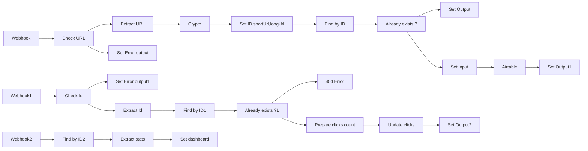

## Fluxo (.json) :

```json
{
  "nodes": [
    {
      "name": "Webhook",
      "type": "n8n-nodes-base.webhook",
      "position": [
        350,
        70
      ],
      "webhookId": "727b4887-e7f9-405f-bf94-7889c82a8f0b",
      "parameters": {
        "path": "sh",
        "options": {},
        "responseMode": "lastNode"
      },
      "typeVersion": 1
    },
    {
      "name": "Extract URL",
      "type": "n8n-nodes-base.set",
      "position": [
        650,
        -80
      ],
      "parameters": {
        "values": {
          "string": [
            {
              "name": "url",
              "value": "={{$node[\"Webhook\"].json[\"query\"][\"url\"]}}"
            }
          ]
        },
        "options": {},
        "keepOnlySet": true
      },
      "typeVersion": 1
    },
    {
      "name": "Check URL",
      "type": "n8n-nodes-base.if",
      "position": [
        500,
        70
      ],
      "parameters": {
        "conditions": {
          "boolean": [
            {
              "value1": "={{Object($node[\"Webhook\"].json[\"query\"]).hasOwnProperty(\"url\")}}",
              "value2": true
            }
          ]
        }
      },
      "typeVersion": 1
    },
    {
      "name": "Crypto",
      "type": "n8n-nodes-base.crypto",
      "position": [
        800,
        -80
      ],
      "parameters": {
        "type": "SHA256",
        "value": "={{$node[\"Extract URL\"].json[\"url\"]}}"
      },
      "typeVersion": 1
    },
    {
      "name": "Airtable",
      "type": "n8n-nodes-base.airtable",
      "position": [
        1550,
        -30
      ],
      "parameters": {
        "table": "YOUR TABLE NAME",
        "options": {},
        "operation": "append",
        "application": "YOUR BASE ID"
      },
      "credentials": {
        "airtableApi": "Personal Airtable API creds"
      },
      "typeVersion": 1
    },
    {
      "name": "Set ID,shortUrl,longUrl",
      "type": "n8n-nodes-base.set",
      "position": [
        950,
        -80
      ],
      "parameters": {
        "values": {
          "string": [
            {
              "name": "id",
              "value": "={{$node[\"Crypto\"].json[\"data\"].substr(0,6)}}"
            },
            {
              "name": "longUrl",
              "value": "={{$node[\"Extract URL\"].json[\"url\"]}}"
            },
            {
              "name": "shortUrl",
              "value": "=http://n8n.ly/w/go?id={{$node[\"Crypto\"].json[\"data\"].substr(0,6)}}"
            }
          ]
        },
        "options": {},
        "keepOnlySet": true
      },
      "typeVersion": 1
    },
    {
      "name": "Find by ID",
      "type": "n8n-nodes-base.airtable",
      "position": [
        1100,
        -80
      ],
      "parameters": {
        "limit": 1,
        "table": "YOUR TABLE NAME",
        "operation": "list",
        "returnAll": false,
        "application": "YOUR BASE ID",
        "additionalOptions": {
          "filterByFormula": "=id=\"{{$node[\"Set ID,shortUrl,longUrl\"].json[\"id\"]}}\""
        }
      },
      "credentials": {
        "airtableApi": "Personal Airtable API creds"
      },
      "typeVersion": 1,
      "alwaysOutputData": true
    },
    {
      "name": "Already exists ?",
      "type": "n8n-nodes-base.if",
      "position": [
        1250,
        -80
      ],
      "parameters": {
        "conditions": {
          "boolean": [
            {
              "value1": "={{$node[\"Find by ID\"].json[\"id\"] != \"\" && $node[\"Find by ID\"].json[\"id\"] != null && $node[\"Find by ID\"].json[\"id\"] != undefined}}",
              "value2": true
            }
          ]
        }
      },
      "typeVersion": 1
    },
    {
      "name": "Set Output",
      "type": "n8n-nodes-base.set",
      "position": [
        1400,
        -180
      ],
      "parameters": {
        "values": {
          "string": [
            {
              "name": "shortUrl",
              "value": "={{$node[\"Set ID,shortUrl,longUrl\"].json[\"shortUrl\"]}}"
            }
          ]
        },
        "options": {},
        "keepOnlySet": true
      },
      "typeVersion": 1
    },
    {
      "name": "Set Error output",
      "type": "n8n-nodes-base.set",
      "position": [
        650,
        170
      ],
      "parameters": {
        "values": {
          "string": [
            {
              "name": "error",
              "value": "url parameter missing"
            }
          ]
        },
        "options": {},
        "keepOnlySet": true
      },
      "typeVersion": 1
    },
    {
      "name": "Set Output1",
      "type": "n8n-nodes-base.set",
      "position": [
        1700,
        -30
      ],
      "parameters": {
        "values": {
          "string": [
            {
              "name": "shortUrl",
              "value": "={{$node[\"Set ID,shortUrl,longUrl\"].json[\"shortUrl\"]}}"
            }
          ]
        },
        "options": {},
        "keepOnlySet": true
      },
      "typeVersion": 1
    },
    {
      "name": "Set input",
      "type": "n8n-nodes-base.set",
      "position": [
        1400,
        -30
      ],
      "parameters": {
        "values": {
          "number": [
            {
              "name": "clicks"
            }
          ],
          "string": [
            {
              "name": "id",
              "value": "={{$node[\"Crypto\"].json[\"data\"].substr(0,6)}}"
            },
            {
              "name": "longUrl",
              "value": "={{$node[\"Extract URL\"].json[\"url\"]}}"
            },
            {
              "name": "shortUrl",
              "value": "=http://n8n.ly/w/go?id={{$node[\"Crypto\"].json[\"data\"].substr(0,6)}}"
            },
            {
              "name": "host",
              "value": "={{(new URL($node[\"Extract URL\"].json[\"url\"])).host}}"
            }
          ]
        },
        "options": {},
        "keepOnlySet": true
      },
      "typeVersion": 1
    },
    {
      "name": "Webhook1",
      "type": "n8n-nodes-base.webhook",
      "position": [
        350,
        430
      ],
      "webhookId": "727b4887-e7f9-405f-bf94-7889c82a8f0b",
      "parameters": {
        "path": "/go",
        "options": {
          "responseHeaders": {
            "entries": [
              {
                "name": "Content-Type",
                "value": "text/html"
              }
            ]
          },
          "responsePropertyName": "result"
        },
        "responseMode": "lastNode"
      },
      "typeVersion": 1
    },
    {
      "name": "Set Error output1",
      "type": "n8n-nodes-base.set",
      "position": [
        640,
        530
      ],
      "parameters": {
        "values": {
          "string": [
            {
              "name": "result",
              "value": "id parameter missing."
            }
          ]
        },
        "options": {},
        "keepOnlySet": true
      },
      "typeVersion": 1
    },
    {
      "name": "Check Id",
      "type": "n8n-nodes-base.if",
      "position": [
        500,
        430
      ],
      "parameters": {
        "conditions": {
          "boolean": [
            {
              "value1": "={{Object($node[\"Webhook1\"].json[\"query\"]).hasOwnProperty(\"id\")}}",
              "value2": true
            }
          ]
        }
      },
      "typeVersion": 1
    },
    {
      "name": "Find by ID1",
      "type": "n8n-nodes-base.airtable",
      "position": [
        800,
        330
      ],
      "parameters": {
        "limit": 1,
        "table": "YOUR TABLE NAME",
        "operation": "list",
        "returnAll": false,
        "application": "YOUR BASE ID",
        "additionalOptions": {
          "filterByFormula": "=id=\"{{$node[\"Extract Id\"].json[\"id\"]}}\""
        }
      },
      "credentials": {
        "airtableApi": "Personal Airtable API creds"
      },
      "typeVersion": 1,
      "alwaysOutputData": true
    },
    {
      "name": "Already exists ?1",
      "type": "n8n-nodes-base.if",
      "position": [
        950,
        330
      ],
      "parameters": {
        "conditions": {
          "boolean": [
            {
              "value1": "={{$node[\"Find by ID1\"].json[\"id\"] != \"\" && $node[\"Find by ID1\"].json[\"id\"] != null && $node[\"Find by ID1\"].json[\"id\"] != undefined}}",
              "value2": true
            }
          ]
        }
      },
      "typeVersion": 1
    },
    {
      "name": "Set Output2",
      "type": "n8n-nodes-base.set",
      "position": [
        1400,
        230
      ],
      "parameters": {
        "values": {
          "string": [
            {
              "name": "result",
              "value": "=<!DOCTYPE html>\n<html lang=\"en\">\n<head>\n <meta charset=\"UTF-8\">\n <meta http-equiv=\"X-UA-Compatible\" content=\"IE=edge\">\n <meta name=\"viewport\" content=\"width=device-width, initial-scale=1.0\">\n <title>Redirection</title>\n</head>\n<body>\n \n</body>\n<script>\n const load = function (){\n window.location.replace('{{$node[\"Find by ID1\"].json.fields[\"longUrl\"]}}');\n };\n window.onload = load;\n</script>\n</html>"
            }
          ]
        },
        "options": {},
        "keepOnlySet": true
      },
      "typeVersion": 1
    },
    {
      "name": "Extract Id",
      "type": "n8n-nodes-base.set",
      "position": [
        650,
        330
      ],
      "parameters": {
        "values": {
          "string": [
            {
              "name": "id",
              "value": "={{$node[\"Webhook1\"].json[\"query\"][\"id\"]}}"
            }
          ]
        },
        "options": {},
        "keepOnlySet": true
      },
      "typeVersion": 1
    },
    {
      "name": "404 Error",
      "type": "n8n-nodes-base.set",
      "position": [
        1100,
        430
      ],
      "parameters": {
        "values": {
          "string": [
            {
              "name": "result",
              "value": "=Short URL not found"
            }
          ]
        },
        "options": {},
        "keepOnlySet": true
      },
      "typeVersion": 1
    },
    {
      "name": "Update clicks",
      "type": "n8n-nodes-base.airtable",
      "position": [
        1250,
        230
      ],
      "parameters": {
        "id": "={{$node[\"Find by ID1\"].json[\"id\"]}}",
        "table": "YOUR TABLE NAME",
        "fields": [
          "clicks"
        ],
        "options": {},
        "operation": "update",
        "application": "YOUR BASE ID",
        "updateAllFields": false
      },
      "credentials": {
        "airtableApi": "Personal Airtable API creds"
      },
      "typeVersion": 1,
      "alwaysOutputData": true
    },
    {
      "name": "Prepare clicks count",
      "type": "n8n-nodes-base.set",
      "position": [
        1100,
        230
      ],
      "parameters": {
        "values": {
          "string": [
            {
              "name": "clicks",
              "value": "={{$node[\"Find by ID1\"].json[\"fields\"][\"clicks\"]+1}}"
            }
          ]
        },
        "options": {}
      },
      "typeVersion": 1
    },
    {
      "name": "Webhook2",
      "type": "n8n-nodes-base.webhook",
      "position": [
        350,
        680
      ],
      "webhookId": "8ac18eb4-bcc5-4817-b76d-d93094755ed2",
      "parameters": {
        "path": "/dashboard",
        "options": {
          "responseHeaders": {
            "entries": [
              {
                "name": "Content-Type",
                "value": "text/html"
              }
            ]
          },
          "responsePropertyName": "dashboard"
        },
        "responseMode": "lastNode"
      },
      "typeVersion": 1
    },
    {
      "name": "Find by ID2",
      "type": "n8n-nodes-base.airtable",
      "position": [
        550,
        680
      ],
      "parameters": {
        "table": "YOUR TABLE NAME",
        "operation": "list",
        "application": "YOUR BASE ID",
        "additionalOptions": {}
      },
      "credentials": {
        "airtableApi": "Personal Airtable API creds"
      },
      "typeVersion": 1,
      "alwaysOutputData": true
    },
    {
      "name": "Extract stats",
      "type": "n8n-nodes-base.function",
      "position": [
        750,
        680
      ],
      "parameters": {
        "functionCode": "\nitems = items.filter(item=> Object.keys(item.json).length !==0).map(item => item.json.fields);\nif(items.length === 0){\nreturn [{\n    json:{\n        totalLinks:0,\n        totalClick:0,\n        totalHosts:0\n    }\n}];\n}\nconst totalLinks = items.length;\nconst totalClick = items.map(item => item.clicks).reduce((acc,val) => acc+=val);\nconst hostsMap = new Map();\nconst hosts = items.map(item => item.host);\nhosts.forEach(host => { \n    hostsMap.set(host,hostsMap.get(host)!==undefined?hostsMap.get(host)+1:1)\n});\n\nconst totalHosts = [...hostsMap.keys()].length;\n\nreturn [{\n    json:{\n        totalLinks,\n        totalClick,\n        totalHosts\n    }\n}];"
      },
      "typeVersion": 1
    },
    {
      "name": "Set dashboard",
      "type": "n8n-nodes-base.set",
      "position": [
        950,
        680
      ],
      "parameters": {
        "values": {
          "string": [
            {
              "name": "dashboard",
              "value": "=<!DOCTYPE html>\n<html lang=\"en\">\n<head>\n <meta charset=\"UTF-8\">\n <meta http-equiv=\"X-UA-Compatible\" content=\"IE=edge\">\n <meta name=\"viewport\" content=\"width=device-width, initial-scale=1.0\">\n <title>Dashboard</title>\n</head>\n<style>\n *{\n padding: 0;\n margin: 0;\n border: none;\n box-sizing: border-box;\n }\n body{\n font-family: Roboto;\n font-style: normal;\n }\n .main{\n padding: 3rem 15rem;\n width: 70vw;\n min-height: 100vh;\n display: flex;\n flex-direction: column;\n margin: 0 auto; \n }\n .header{\n display: flex;\n flex-direction: row;\n justify-content: space-between;\n align-items: center;\n padding: 1rem 0.5rem;\n\n }\n .dashboard{\n display: grid;\n grid-template-rows: repeat(2, 1fr);\n grid-template-columns: repeat(2, 1fr);\n column-gap: 50px;\n row-gap: 50px;\n min-height: 70vh;\n min-width: calc(100vw-5rem);\n }\n .primary-text{\n color: #FF6D5A;\n font-family: Roboto;\n font-style: initial;\n font-weight: 500;\n font-size: 18px;\n line-height: 28px;\n /* center */\n display: flex;\n align-items: center;\n justify-content: center;\n }\n .main-box{\n min-height: 100%;\n min-width: 100%;\n background-color: #FF6D5A;\n grid-column: 1 / span 2;\n /* center */\n display: flex;\n flex-direction: rows;\n align-items: center;\n justify-content: center;\n /* font style */\n font-weight: bold;\n font-size: 96px;\n line-height: 169px;\n color: #F5F5F5;\n\n }\n .secondary-box{\n min-height: 100%;\n min-width: 100%;\n background-color: #384D5B;\n /* center */\n display: flex;\n flex-direction: row;\n align-items: center;\n justify-content: center;\n /* font style */\n font-weight: bold;\n font-size: 72px;\n line-height: 112px;\n color: #F5F5F5;\n }\n .info-text{\n position: absolute;\n align-self: flex-start;\n margin-top: 0.51rem;\n font-weight: 400;\n font-size: 16px;\n line-height: 21px;\n color: #F5F5F5;\n \n }\n</style>\n\n<body>\n \n <main class=\"main\">\n <header class=\"header\">\n <a href=\"https://n8n.io\">\n <svg width=\"124px\" height=\"28px\" viewBox=\"0 0 124 28\" version=\"1.1\" xmlns=\"http://www.w3.org/2000/svg\" xmlns:xlink=\"http://www.w3.org/1999/xlink\"><title>n8</title> <g id=\"nav-menu-(V1)\" stroke=\"none\" stroke-width=\"1\" fill=\"none\" fill-rule=\"evenodd\"><g id=\"nav-menu-(v1)\" transform=\"translate(-120.000000, -116.000000)\" fill-rule=\"nonzero\"><g id=\"n8\" transform=\"translate(120.000000, 116.000000)\"><path d=\"M48.7384906,0.190188679 C46.1577358,0.190188679 43.9864151,1.96792453 43.3735849,4.36113208 L35.6524528,4.36113208 C32.6226415,4.36113208 30.1581132,6.82566038 30.1581132,9.8554717 C30.1581132,11.3690566 28.9271698,12.6026415 27.4109434,12.6026415 L26.309434,12.6026415 C25.6966038,10.209434 23.5279245,8.43169811 20.9445283,8.43169811 C18.3637736,8.43169811 16.1924528,10.209434 15.5796226,12.6026415 L11.1683019,12.6026415 C10.5554717,10.209434 8.38679245,8.43169811 5.80339623,8.43169811 C2.74716981,8.43169811 0.258867925,10.9173585 0.258867925,13.9762264 C0.258867925,17.0324528 2.7445283,19.5207547 5.80339623,19.5207547 C8.38415094,19.5207547 10.5554717,17.7430189 11.1683019,15.3498113 L15.5849057,15.3498113 C16.1977358,17.7430189 18.3664151,19.5207547 20.9498113,19.5207547 C23.514717,19.5207547 25.6701887,17.769434 26.3015094,15.4 L27.4135849,15.4 C28.9271698,15.4 30.1607547,16.6309434 30.1607547,18.1471698 C30.1607547,21.1769811 32.625283,23.6415094 35.6550943,23.6415094 L37.4539623,23.6415094 C38.0667925,26.034717 40.2354717,27.8124528 42.8188679,27.8124528 C45.8750943,27.8124528 48.3633962,25.3267925 48.3633962,22.2679245 C48.3633962,19.2116981 45.8777358,16.7233962 42.8188679,16.7233962 C40.2381132,16.7233962 38.0667925,18.5011321 37.4539623,20.8943396 L35.6550943,20.8943396 C34.1415094,20.8943396 32.9079245,19.6633962 32.9079245,18.1471698 C32.9079245,16.4935849 32.1683019,15.0090566 31.0086792,14.0026415 C32.1709434,12.9935849 32.9079245,11.5116981 32.9079245,9.85811321 C32.9079245,8.3445283 34.1388679,7.1109434 35.6550943,7.1109434 L43.3762264,7.1109434 C43.9890566,9.50415094 46.1577358,11.2818868 48.7411321,11.2818868 C51.7973585,11.2818868 54.2856604,8.79622642 54.2856604,5.73735849 C54.2830189,2.67849057 51.794717,0.190188679 48.7384906,0.190188679 Z M5.80867925,16.7709434 C4.26603774,16.7709434 3.01132075,15.5162264 3.01132075,13.9735849 C3.01132075,12.4309434 4.26603774,11.1762264 5.80867925,11.1762264 C7.35132075,11.1762264 8.60603774,12.4309434 8.60603774,13.9735849 C8.60603774,15.5162264 7.35132075,16.7709434 5.80867925,16.7709434 Z M20.9498113,16.7709434 C19.4071698,16.7709434 18.1524528,15.5162264 18.1524528,13.9735849 C18.1524528,12.4309434 19.4071698,11.1762264 20.9498113,11.1762264 C22.4924528,11.1762264 23.7471698,12.4309434 23.7471698,13.9735849 C23.7471698,15.5162264 22.4924528,16.7709434 20.9498113,16.7709434 Z M42.8162264,19.4679245 C44.3588679,19.4679245 45.6135849,20.7226415 45.6135849,22.265283 C45.6135849,23.8079245 44.3588679,25.0626415 42.8162264,25.0626415 C41.2735849,25.0626415 40.0188679,23.8079245 40.0188679,22.265283 C40.0215094,20.7226415 41.2762264,19.4679245 42.8162264,19.4679245 Z M48.7384906,8.53207547 C47.1958491,8.53207547 45.9411321,7.27735849 45.9411321,5.73471698 C45.9411321,4.19207547 47.1958491,2.93735849 48.7384906,2.93735849 C50.2811321,2.93735849 51.5358491,4.19207547 51.5358491,5.73471698 C51.5358491,7.27735849 50.2811321,8.53207547 48.7384906,8.53207547 Z\" id=\"Shape\" fill=\"#FF6D5A\"></path> <g id=\"Group\" transform=\"translate(56.528302, 5.547170)\" fill=\"#384D5B\"><path d=\"M1.57962264,7.09773585 C1.57962264,6.76490566 1.40264151,6.6090566 1.0909434,6.6090566 L0.179622642,6.6090566 L0.179622642,4.76528302 L2.24792453,4.76528302 C3.20415094,4.76528302 3.67169811,5.18792453 3.67169811,6.00943396 L3.67169811,6.43207547 C3.67169811,6.78867925 3.62679245,7.07660377 3.62679245,7.07660377 L3.67169811,7.07660377 C4.1154717,6.09924528 5.44943396,4.49849057 7.8954717,4.49849057 C10.5633962,4.49849057 11.7626415,5.94339623 11.7626415,8.80943396 L11.7626415,13.6777358 C11.7626415,14.010566 11.9396226,14.1664151 12.2513208,14.1664151 L13.1626415,14.1664151 L13.1626415,16.0101887 L11.0283019,16.0101887 C10.0271698,16.0101887 9.6045283,15.5875472 9.6045283,14.5864151 L9.6045283,9.29811321 C9.6045283,7.71849057 9.29283019,6.47433962 7.49396226,6.47433962 C5.76113208,6.47433962 4.38226415,7.60754717 3.93849057,9.23207547 C3.78264151,9.67584906 3.73773585,10.1883019 3.73773585,10.7430189 L3.73773585,16.0101887 L1.58226415,16.0101887 L1.58226415,7.09773585 L1.57962264,7.09773585 Z\" id=\"Path\"></path> <path d=\"M17.6690566,7.49660377 L17.6690566,7.45169811 C17.6690566,7.45169811 15.7354717,6.42943396 15.7354717,4.25018868 C15.7354717,2.0709434 17.4683019,0.0501886792 20.6249057,0.0501886792 C23.6256604,0.0501886792 25.5381132,1.85169811 25.5381132,4.29509434 C25.5381132,6.60641509 23.649434,8.03018868 23.649434,8.03018868 L23.649434,8.07509434 C25.0732075,8.89660377 25.9845283,9.98754717 25.9845283,11.6754717 C25.9845283,14.1215094 23.7630189,16.2769811 20.5615094,16.2769811 C17.6056604,16.2769811 15.0935829,14.4332075 15.0935829,11.5196226 C15.0909434,8.94150943 17.6690566,7.49660377 17.6690566,7.49660377 Z M20.5588679,14.2535849 C22.2045283,14.2535849 23.7366038,13.165283 23.7366038,11.609434 C23.7366038,10.230566 22.5584906,9.6309434 21.0924528,9.03132075 C20.4928302,8.78566038 19.6475472,8.45283019 19.470566,8.45283019 C18.9158491,8.45283019 17.3362264,9.74188679 17.3362264,11.4086792 C17.3362264,13.165283 18.8471698,14.2535849 20.5588679,14.2535849 Z M21.7158491,7.14 C22.249434,7.14 23.3826415,5.82716981 23.3826415,4.42716981 C23.3826415,2.98226415 22.2256604,2.0709434 20.6275472,2.0709434 C18.9158491,2.0709434 17.914717,3.04830189 17.914717,4.29245283 C17.914717,5.67132075 19.0928302,6.20490566 20.4928302,6.75962264 C20.8045283,6.89698113 21.4490566,7.14 21.7158491,7.14 Z\" id=\"Shape\"></path> <path d=\"M29.405283,7.09773585 C29.405283,6.76490566 29.2283019,6.6090566 28.9166038,6.6090566 L28.005283,6.6090566 L28.005283,4.76528302 L30.0735849,4.76528302 C31.0298113,4.76528302 31.4973585,5.18792453 31.4973585,6.00943396 L31.4973585,6.43207547 C31.4973585,6.78867925 31.4524528,7.07660377 31.4524528,7.07660377 L31.4973585,7.07660377 C31.9411321,6.09924528 33.2750943,4.49849057 35.7211321,4.49849057 C38.3890566,4.49849057 39.5883019,5.94339623 39.5883019,8.80943396 L39.5883019,13.6777358 C39.5883019,14.010566 39.765283,14.1664151 40.0769811,14.1664151 L40.9883019,14.1664151 L40.9883019,16.0101887 L38.8539623,16.0101887 C37.8528302,16.0101887 37.4301887,15.5875472 37.4301887,14.5864151 L37.4301887,9.29811321 C37.4301887,7.71849057 37.1184906,6.47433962 35.3196226,6.47433962 C33.5867925,6.47433962 32.2079245,7.60754717 31.7641509,9.23207547 C31.6083019,9.67584906 31.5633962,10.1883019 31.5633962,10.7430189 L31.5633962,16.0101887 L29.4079245,16.0101887 L29.4079245,7.09773585 L29.405283,7.09773585 Z\" id=\"Path\"></path> <polygon id=\"Path\" points=\"43.54 13.72 45.7403774 13.72 45.7403774 16.0101887 43.54 16.0101887\"></polygon> <path d=\"M48.7173585,7.09773585 C48.7173585,6.76490566 48.5403774,6.6090566 48.2286792,6.6090566 L47.3173585,6.6090566 L47.3173585,4.76528302 L49.4279245,4.76528302 C50.4290566,4.76528302 50.8516981,5.18792453 50.8516981,6.1890566 L50.8516981,13.6803774 C50.8516981,14.0132075 51.0286792,14.1690566 51.3403774,14.1690566 L52.2516981,14.1690566 L52.2516981,16.0128302 L50.1411321,16.0128302 C49.14,16.0128302 48.7173585,15.5901887 48.7173585,14.5890566 L48.7173585,7.09773585 Z\" id=\"Path\"></path> <path d=\"M60.2316981,4.49584906 C63.5890566,4.49584906 66.2992453,6.96301887 66.2992453,10.365283 C66.2992453,13.7886792 63.5864151,16.2769811 60.2316981,16.2769811 C56.8743396,16.2769811 54.185283,13.7860377 54.185283,10.365283 C54.185283,6.96301887 56.8743396,4.49584906 60.2316981,4.49584906 Z M60.2316981,14.409434 C62.3660377,14.409434 64.0988679,12.7188679 64.0988679,10.3626415 C64.0988679,8.02754717 62.3660377,6.36075472 60.2316981,6.36075472 C58.1211321,6.36075472 56.3856604,8.02754717 56.3856604,10.3626415 C56.3856604,12.7215094 58.1184906,14.409434 60.2316981,14.409434 Z\" id=\"Shape\"></path></g> <path d=\"M106.230943,9.63886792 C105.124151,9.63886792 104.223396,8.73811321 104.223396,7.63132075 C104.223396,6.5245283 105.124151,5.62377358 106.230943,5.62377358 C107.337736,5.62377358 108.238491,6.5245283 108.238491,7.63132075 C108.238491,8.73811321 107.337736,9.63886792 106.230943,9.63886792 Z M106.230943,6.58792453 C105.657736,6.58792453 105.190189,7.0554717 105.190189,7.62867925 C105.190189,8.20188679 105.657736,8.66943396 106.230943,8.66943396 C106.804151,8.66943396 107.271698,8.20188679 107.271698,7.62867925 C107.271698,7.0554717 106.804151,6.58792453 106.230943,6.58792453 Z\" id=\"Shape\" fill=\"#FF6D5A\"></path></g></g></g></svg>\n </a>\n <h4 class=\"primary-text\">Dashboard</h4>\n </header>\n <section class=\"dashboard\">\n <div class=\"main-box\">\n <h5 class=\"info-text\">Total Clicks</h5>\n{{$node[\"Extract stats\"].json[\"totalClick\"]}}\n </div>\n <div class=\"secondary-box\">\n <h5 class=\"info-text\">Total Links</h5>\n{{$node[\"Extract stats\"].json[\"totalLinks\"]}}\n </div>\n <div class=\"secondary-box\">\n <h5 class=\"info-text\">Total Hosts</h5>\n{{$node[\"Extract stats\"].json[\"totalHosts\"]}}\n </div>\n </section>\n </main> \n</body>\n</html>"
            }
          ]
        },
        "options": {},
        "keepOnlySet": true
      },
      "typeVersion": 1
    }
  ],
  "connections": {
    "Crypto": {
      "main": [
        [
          {
            "node": "Set ID,shortUrl,longUrl",
            "type": "main",
            "index": 0
          }
        ]
      ]
    },
    "Webhook": {
      "main": [
        [
          {
            "node": "Check URL",
            "type": "main",
            "index": 0
          }
        ]
      ]
    },
    "Airtable": {
      "main": [
        [
          {
            "node": "Set Output1",
            "type": "main",
            "index": 0
          }
        ]
      ]
    },
    "Check Id": {
      "main": [
        [
          {
            "node": "Extract Id",
            "type": "main",
            "index": 0
          }
        ],
        [
          {
            "node": "Set Error output1",
            "type": "main",
            "index": 0
          }
        ]
      ]
    },
    "Webhook1": {
      "main": [
        [
          {
            "node": "Check Id",
            "type": "main",
            "index": 0
          }
        ]
      ]
    },
    "Webhook2": {
      "main": [
        [
          {
            "node": "Find by ID2",
            "type": "main",
            "index": 0
          }
        ]
      ]
    },
    "Check URL": {
      "main": [
        [
          {
            "node": "Extract URL",
            "type": "main",
            "index": 0
          }
        ],
        [
          {
            "node": "Set Error output",
            "type": "main",
            "index": 0
          }
        ]
      ]
    },
    "Set input": {
      "main": [
        [
          {
            "node": "Airtable",
            "type": "main",
            "index": 0
          }
        ]
      ]
    },
    "Extract Id": {
      "main": [
        [
          {
            "node": "Find by ID1",
            "type": "main",
            "index": 0
          }
        ]
      ]
    },
    "Find by ID": {
      "main": [
        [
          {
            "node": "Already exists ?",
            "type": "main",
            "index": 0
          }
        ]
      ]
    },
    "Extract URL": {
      "main": [
        [
          {
            "node": "Crypto",
            "type": "main",
            "index": 0
          }
        ]
      ]
    },
    "Find by ID1": {
      "main": [
        [
          {
            "node": "Already exists ?1",
            "type": "main",
            "index": 0
          }
        ]
      ]
    },
    "Find by ID2": {
      "main": [
        [
          {
            "node": "Extract stats",
            "type": "main",
            "index": 0
          }
        ]
      ]
    },
    "Extract stats": {
      "main": [
        [
          {
            "node": "Set dashboard",
            "type": "main",
            "index": 0
          }
        ]
      ]
    },
    "Update clicks": {
      "main": [
        [
          {
            "node": "Set Output2",
            "type": "main",
            "index": 0
          }
        ]
      ]
    },
    "Already exists ?": {
      "main": [
        [
          {
            "node": "Set Output",
            "type": "main",
            "index": 0
          }
        ],
        [
          {
            "node": "Set input",
            "type": "main",
            "index": 0
          }
        ]
      ]
    },
    "Already exists ?1": {
      "main": [
        [
          {
            "node": "Prepare clicks count",
            "type": "main",
            "index": 0
          }
        ],
        [
          {
            "node": "404 Error",
            "type": "main",
            "index": 0
          }
        ]
      ]
    },
    "Prepare clicks count": {
      "main": [
        [
          {
            "node": "Update clicks",
            "type": "main",
            "index": 0
          }
        ]
      ]
    },
    "Set ID,shortUrl,longUrl": {
      "main": [
        [
          {
            "node": "Find by ID",
            "type": "main",
            "index": 0
          }
        ]
      ]
    }
  }
}
```

<a id="template-2182"></a>

## Template 2182 - Agente de chat com memória e pesquisa

- **Nome:** Agente de chat com memória e pesquisa
- **Descrição:** Fluxo que recebe mensagens de chat, mantém contexto em memória, consulta uma ferramenta de busca quando necessário e gera respostas usando um modelo de linguagem.
- **Funcionalidade:** • Recepção de mensagens de chat: Inicia o processamento ao receber uma mensagem de chat via webhook.
• Memória de contexto: Armazena e recupera as mensagens recentes para manter o contexto da conversa.
• Geração de respostas com LLM: Utiliza um modelo de linguagem para formular respostas coerentes e relevantes.
• Pesquisa na web sob demanda: Consulta uma API de busca para obter informações atualizadas quando o agente precisa de dados externos.
• Orquestração por agente: Coordena memória, modelo e ferramenta de busca para decidir ações e compor a resposta final.
- **Ferramentas:** • OpenAI: Modelo de linguagem usado para gerar as respostas (ex.: gpt-4o-mini).
• SerpAPI: Serviço de busca na web para obter informações atualizadas e resultados de pesquisa.

## Fluxo visual

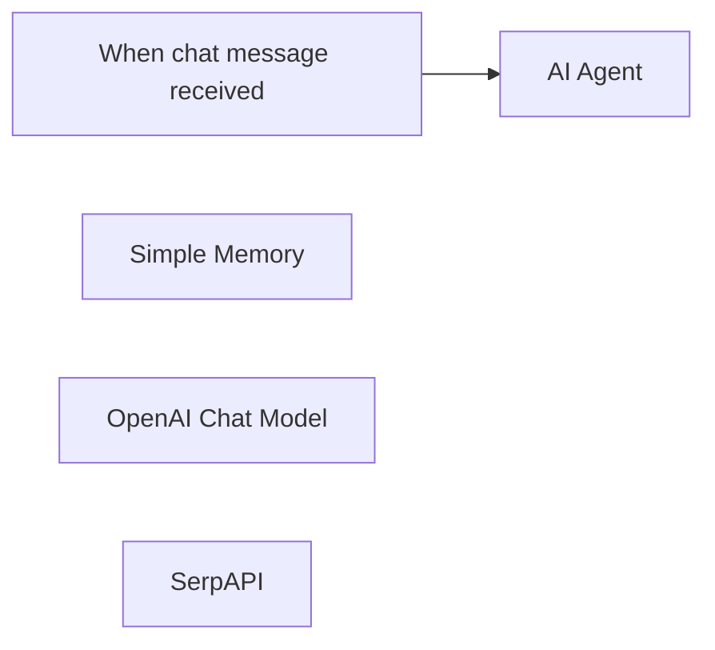

## Fluxo (.json) :

```json
{
  "meta": {
    "instanceId": "408f9fb9940c3cb18ffdef0e0150fe342d6e655c3a9fac21f0f644e8bedabcd9",
    "templateCredsSetupCompleted": true
  },
  "nodes": [
    {
      "id": "ef4c6982-f746-4d48-944b-449f8bdbb69f",
      "name": "When chat message received",
      "type": "@n8n/n8n-nodes-langchain.chatTrigger",
      "position": [
        -180,
        -380
      ],
      "webhookId": "53c136fe-3e77-4709-a143-fe82746dd8b6",
      "parameters": {
        "options": {}
      },
      "typeVersion": 1.1
    },
    {
      "id": "e6183978-5077-4252-9718-6b36b6a7cd74",
      "name": "Simple Memory",
      "type": "@n8n/n8n-nodes-langchain.memoryBufferWindow",
      "position": [
        160,
        -160
      ],
      "parameters": {},
      "typeVersion": 1.3
    },
    {
      "id": "1719e956-f9c8-48f5-9744-ee62345a9f7d",
      "name": "OpenAI Chat Model",
      "type": "@n8n/n8n-nodes-langchain.lmChatOpenAi",
      "position": [
        20,
        -160
      ],
      "parameters": {
        "model": {
          "__rl": true,
          "mode": "list",
          "value": "gpt-4o-mini"
        },
        "options": {}
      },
      "credentials": {
        "openAiApi": {
          "id": "8gccIjcuf3gvaoEr",
          "name": "OpenAi account"
        }
      },
      "typeVersion": 1.2
    },
    {
      "id": "f0815af7-da61-4863-9cfa-b35be836b59c",
      "name": "SerpAPI",
      "type": "@n8n/n8n-nodes-langchain.toolSerpApi",
      "position": [
        300,
        -160
      ],
      "parameters": {
        "options": {}
      },
      "credentials": {
        "serpApi": {
          "id": "aJCKjxx6U3K7ydDe",
          "name": "SerpAPI account"
        }
      },
      "typeVersion": 1
    },
    {
      "id": "2d3b4012-bd5f-46d5-be6d-af1ede6c155b",
      "name": "AI Agent",
      "type": "@n8n/n8n-nodes-langchain.agent",
      "position": [
        60,
        -380
      ],
      "parameters": {
        "options": {}
      },
      "typeVersion": 1.8
    }
  ],
  "pinData": {},
  "connections": {
    "SerpAPI": {
      "ai_tool": [
        [
          {
            "node": "AI Agent",
            "type": "ai_tool",
            "index": 0
          }
        ]
      ]
    },
    "Simple Memory": {
      "ai_memory": [
        [
          {
            "node": "AI Agent",
            "type": "ai_memory",
            "index": 0
          }
        ]
      ]
    },
    "OpenAI Chat Model": {
      "ai_languageModel": [
        [
          {
            "node": "AI Agent",
            "type": "ai_languageModel",
            "index": 0
          }
        ]
      ]
    },
    "When chat message received": {
      "main": [
        [
          {
            "node": "AI Agent",
            "type": "main",
            "index": 0
          }
        ]
      ]
    }
  }
}
```

<a id="template-2185"></a>

## Template 2185 - Consulta semanal Shodan e alerta TheHive

- **Nome:** Consulta semanal Shodan e alerta TheHive
- **Descrição:** Agenda uma verificação semanal dos IPs monitorados, consulta Shodan para identificar serviços/portas abertas e gera alertas em TheHive quando encontra portas inesperadas.
- **Funcionalidade:** • Agendamento semanal: dispara a operação toda segunda-feira em horário definido.
• Obtenção da lista de IPs e portas vigiadas: busca uma fonte que fornece IPs e as portas esperadas para cada IP.
• Processamento individual de IPs: itera pelos IPs um a um para limitar carga e respeitar limites de API.
• Consulta à base de Shodan: solicita ao serviço informações de host para cada IP (serviços, portas, banners, TLS, etc.).
• Extração e separação de serviços: transforma a resposta em uma lista de serviços/portas para análise individual.
• Filtragem de portas inesperadas: compara as portas encontradas com as portas monitoradas e mantém apenas as inesperadas.
• Montagem dos dados do achado: compila IP, hostnames, porta, descrição e dados brutos para relatório.
• Formatação do relatório: converte os achados em uma tabela HTML e depois para Markdown para legibilidade.
• Criação de alerta em plataforma de resposta: publica um alerta contendo o relatório em Markdown para investigação e acompanhamento.
- **Ferramentas:** • API interna de IPs/portas: fonte que disponibiliza a lista de IPs e as portas que devem ser monitoradas.
• Shodan: motor de busca de dispositivos conectados usado para consultar serviços, banners e portas abertas de um IP via API.
• TheHive: plataforma de resposta a incidentes onde são criados alertas contendo o relatório em Markdown.

## Fluxo visual

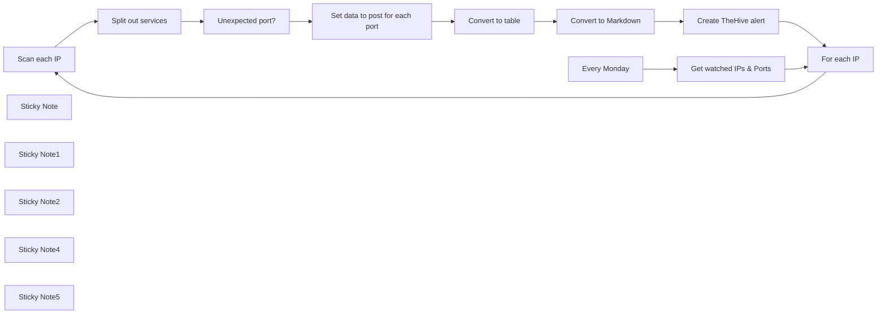

## Fluxo (.json) :

```json
{
  "id": "VoLT6Omw9KMQgPum",
  "meta": {
    "instanceId": "03e9d14e9196363fe7191ce21dc0bb17387a6e755dcc9acc4f5904752919dca8"
  },
  "name": "Weekly_Shodan_Query___Report_Accidents__no_function_node_",
  "tags": [
    {
      "id": "GCHVocImoXoEVnzP",
      "name": "🛠️ In progress",
      "createdAt": "2023-10-31T02:17:21.618Z",
      "updatedAt": "2023-10-31T02:17:21.618Z"
    },
    {
      "id": "QPJKatvLSxxtrE8U",
      "name": "Secops",
      "createdAt": "2023-10-31T02:15:11.396Z",
      "updatedAt": "2023-10-31T02:15:11.396Z"
    }
  ],
  "nodes": [
    {
      "id": "54b2b2bd-9101-402c-b7cb-3d5e1070fcd2",
      "name": "Scan each IP",
      "type": "n8n-nodes-base.httpRequest",
      "position": [
        2123,
        202
      ],
      "parameters": {
        "url": "=https://api.shodan.io/shodan/host/{{ $json.ip }}",
        "options": {},
        "authentication": "genericCredentialType",
        "genericAuthType": "httpQueryAuth"
      },
      "credentials": {
        "httpQueryAuth": {
          "id": "LyUxI7J9gK1haB4h",
          "name": "Shodan API Key"
        }
      },
      "typeVersion": 4.1
    },
    {
      "id": "f6b194a7-a38d-46b4-899f-a9cb71de247e",
      "name": "Get watched IPs & Ports",
      "type": "n8n-nodes-base.httpRequest",
      "position": [
        1448.635348143835,
        200
      ],
      "parameters": {
        "url": "https://internal.users.n8n.cloud/webhook/mock-shodan-ips",
        "options": {}
      },
      "typeVersion": 4.1
    },
    {
      "id": "a6754adf-610b-46f0-9019-7ea21ac22690",
      "name": "Split out services",
      "type": "n8n-nodes-base.itemLists",
      "position": [
        2323,
        202
      ],
      "parameters": {
        "options": {},
        "fieldToSplitOut": "data"
      },
      "typeVersion": 3
    },
    {
      "id": "fa9dd77c-32e9-48c5-a1bf-8b95720aad43",
      "name": "Unexpected port?",
      "type": "n8n-nodes-base.filter",
      "position": [
        2543,
        202
      ],
      "parameters": {
        "conditions": {
          "boolean": [
            {
              "value1": "={{ $('For each IP').item.json.ports.includes($json.port) }}"
            }
          ]
        }
      },
      "typeVersion": 1
    },
    {
      "id": "addfeaf8-0c5d-4e4a-924e-53b3e28a23de",
      "name": "Set data to post for each port",
      "type": "n8n-nodes-base.set",
      "position": [
        2763,
        202
      ],
      "parameters": {
        "values": {
          "string": [
            {
              "name": "ip",
              "value": "={{ $('Get watched IPs & Ports').item.json.ip }}"
            },
            {
              "name": "hostnames",
              "value": "={{ $json.hostnames.join(', ') }}"
            },
            {
              "name": "port",
              "value": "={{ $json.port }}"
            },
            {
              "name": "description",
              "value": "={{ $json.description }}"
            },
            {
              "name": "data",
              "value": "={{ $json.data }}"
            }
          ]
        },
        "options": {},
        "keepOnlySet": true
      },
      "typeVersion": 2
    },
    {
      "id": "aaef71c0-927c-4297-9fa1-331e7009bf7e",
      "name": "Convert to table",
      "type": "n8n-nodes-base.html",
      "position": [
        2983,
        202
      ],
      "parameters": {
        "options": {},
        "operation": "convertToHtmlTable"
      },
      "typeVersion": 1
    },
    {
      "id": "2f257556-cf1b-4a80-8f40-7989ea077f48",
      "name": "Convert to Markdown",
      "type": "n8n-nodes-base.markdown",
      "position": [
        3203,
        202
      ],
      "parameters": {
        "html": "={{ $json.table }}",
        "options": {},
        "destinationKey": "markdown"
      },
      "typeVersion": 1
    },
    {
      "id": "9fdd40ba-1ab4-43a2-9e9d-53af5fc32f9f",
      "name": "For each IP",
      "type": "n8n-nodes-base.splitInBatches",
      "position": [
        1740,
        200
      ],
      "parameters": {
        "options": {},
        "batchSize": 1
      },
      "typeVersion": 2
    },
    {
      "id": "01823f1f-9612-4e56-a8f2-62aa2a0d5d5e",
      "name": "Sticky Note",
      "type": "n8n-nodes-base.stickyNote",
      "position": [
        2722,
        -137.71236116790237
      ],
      "parameters": {
        "width": 607.8070576425011,
        "height": 564.6974012965735,
        "content": "\n## Format port service data as a Markdown table\nAfter identifying the open ports, the next step is to organize this information neatly. This node converts the data gathered from the previous steps into a `Markdown table format`. \n\nIt's crucial for readability and makes it easier to parse through the port and service information. This formatted data can then be seamlessly integrated into documentation or reports, ensuring that the information is accessible and understandable for further analysis or sharing with team members."
      },
      "typeVersion": 1
    },
    {
      "id": "7ef1232b-8386-4b47-8617-a65749357ede",
      "name": "Sticky Note1",
      "type": "n8n-nodes-base.stickyNote",
      "position": [
        2083.3970861885364,
        -134.67908072298724
      ],
      "parameters": {
        "width": 606.297701841459,
        "height": 562.5474916374191,
        "content": "\n## Query Shodan for unexpected open ports\nThis stage of the workflow leverages `Shodan`, a search engine for internet-connected devices, to identify running services on each IP port.\n\nOnce the services and ports are returned, the `split out services` node extracts all the services to be filtered at once. \n\nIf an unexpected port is found, it allows the service to pass the service through the filter node."
      },
      "typeVersion": 1
    },
    {
      "id": "afd6651a-bcf1-4d66-ae1c-0f5616d3f29a",
      "name": "Sticky Note2",
      "type": "n8n-nodes-base.stickyNote",
      "position": [
        928,
        -465
      ],
      "parameters": {
        "width": 650.8045775723033,
        "height": 890.9735108226744,
        "content": "\n# Workflow Overview\n\nThe n8n workflow initiates with a node that fetches a list of IP addresses and their specified ports from a security system, which is essential for ongoing surveillance of network integrity. \n\nThe data is expected to be in JSON format, detailing each IP with an array of associated ports to be monitored. While the example provided showcases a basic API call, in practice, this should be replaced with a call to the organization's own security system. \n\n`It's important to note that error handling is not included in this example and should be implemented according to the specific data formatting and error response protocols of the user's system.` The expectation for successful execution is that the incoming data conforms to the predefined JSON structure.\n\n## Get list of IPs from your IPS or database\n\nThis section retrieves a current list of IP addresses and their associated ports that require monitoring from your Intrusion Prevention System (IPS). It is essential to maintain an updated list to monitor for any unauthorized changes or traffic. The expected format for each entry is a JSON object containing the IP address and an array of ports.\n\nOur sample api call below can be replaced with api access to your IPS. To ensure it works, this workflow expects data to be in the following format:\n```\n[\n  {\n    \"ip\": \"116.202.106.35\",\n    \"ports\": [\n      5678,\n      80\n    ]\n  },\n  {\n    \"ip\": \"188.114.96.9\",\n    \"ports\": [\n      8080,\n      80\n    ]\n  }\n]\n```"
      },
      "typeVersion": 1
    },
    {
      "id": "14730a2f-42cc-4d96-b401-8a6a2c41aa27",
      "name": "Sticky Note4",
      "type": "n8n-nodes-base.stickyNote",
      "position": [
        3362,
        -167.68304244703404
      ],
      "parameters": {
        "width": 438.8550109331452,
        "height": 594.7981050471616,
        "content": "\n## Post to TheHive\nThe final step in the process involves posting the findings to TheHive - a scalable, open-source and free Security Incident Response Platform. \n\nIf the workflow has identified an unexpected open port, it creates an alert in TheHive. This integration ensures that any potential security issues are escalated appropriately, and the relevant teams can begin the incident response process immediately, leveraging TheHive's powerful case management capabilities."
      },
      "typeVersion": 1
    },
    {
      "id": "f8cd7e3f-b55e-400d-ba45-486d4c736a16",
      "name": "Every Monday",
      "type": "n8n-nodes-base.scheduleTrigger",
      "position": [
        1228.635348143835,
        200
      ],
      "parameters": {
        "rule": {
          "interval": [
            {
              "field": "weeks",
              "triggerAtDay": [
                1
              ],
              "triggerAtHour": 5
            }
          ]
        }
      },
      "typeVersion": 1.1
    },
    {
      "id": "804ef38c-3ecb-41b2-ab38-ef8c231b7425",
      "name": "Create TheHive alert",
      "type": "n8n-nodes-base.theHive",
      "position": [
        3423,
        202
      ],
      "parameters": {
        "date": "={{$now}}",
        "tags": "={{ $('For each IP').last().json.ip }}",
        "type": "Unexpected open port",
        "title": "=Unexpected ports for {{ $('For each IP').last().json.ip }}",
        "source": "n8n",
        "sourceRef": "={{ $('For each IP').last().json.ip }}:{{$now.toUnixInteger()}}",
        "description": "=Unexpected open ports:\n\n{{ $json.markdown }}",
        "additionalFields": {}
      },
      "credentials": {
        "theHiveApi": {
          "id": "Qm1GXxzVWvg1FiHg",
          "name": "The Hive account (David)"
        }
      },
      "typeVersion": 1
    },
    {
      "id": "5f09a27b-c6a4-4f74-a5ff-4c684e5e8917",
      "name": "Sticky Note5",
      "type": "n8n-nodes-base.stickyNote",
      "position": [
        1620,
        -261.14340884889145
      ],
      "parameters": {
        "width": 432.3140705656865,
        "height": 690.0398460499007,
        "content": "\n## Iterate Through IP addresses\nThe \"`Split In Batches`\" node is configured with a batch size of one, ensuring that the array of IP addresses received is processed one at a time. \n\nThis approach allows for a focused analysis of each detection, ensuring no detail is overlooked. \n\nFollowing this, the \"`Split out services`\" node further along dissects each service to extract and separately handle the array of behaviors associated with them. \n\nBy processing these elements one by one, we effectively manage the workflow's load, maintaining optimal performance and adherence to external APIs' rate limits, crucial for the seamless operation of our security protocols.\n\n"
      },
      "typeVersion": 1
    }
  ],
  "active": false,
  "pinData": {
    "Scan each IP": [
      {
        "json": {
          "ip": 3161612297,
          "os": null,
          "asn": "AS13335",
          "isp": "Cloudflare, Inc.",
          "org": "CloudFlare, Inc.",
          "city": "San Francisco",
          "data": [
            {
              "ip": 3161612297,
              "os": null,
              "asn": "AS13335",
              "isp": "Cloudflare, Inc.",
              "org": "CloudFlare, Inc.",
              "data": "HTTP/1.1 403 Forbidden\r\nDate: Sat, 02 Sep 2023 13:14:00 GMT\r\nContent-Type: text/html; charset=UTF-8\r\nContent-Length: 5892\r\nConnection: close\r\nX-Frame-Options: SAMEORIGIN\r\nReferrer-Policy: same-origin\r\nCache-Control: private, max-age=0, no-store, no-cache, must-revalidate, post-check=0, pre-check=0\r\nExpires: Thu, 01 Jan 1970 00:00:01 GMT\r\nVary: Accept-Encoding\r\nServer: cloudflare\r\nCF-RAY: 80060379ef7009ef-LAS\r\n\r\n",
              "hash": -135673925,
              "http": {
                "waf": "Cloudflare (Cloudflare Inc.)",
                "host": "188.114.96.9",
                "html": "<!DOCTYPE html>\n<!--[if lt IE 7]> <html class=\"no-js ie6 oldie\" lang=\"en-US\"> <![endif]-->\n<!--[if IE 7]>    <html class=\"no-js ie7 oldie\" lang=\"en-US\"> <![endif]-->\n<!--[if IE 8]>    <html class=\"no-js ie8 oldie\" lang=\"en-US\"> <![endif]-->\n<!--[if gt IE 8]><!--> <html class=\"no-js\" lang=\"en-US\"> <!--<![endif]-->\n<head>\n<title>Direct IP access not allowed | Cloudflare</title>\n<meta charset=\"UTF-8\" />\n<meta http-equiv=\"Content-Type\" content=\"text/html; charset=UTF-8\" />\n<meta http-equiv=\"X-UA-Compatible\" content=\"IE=Edge\" />\n<meta name=\"robots\" content=\"noindex, nofollow\" />\n<meta name=\"viewport\" content=\"width=device-width,initial-scale=1\" />\n<link rel=\"stylesheet\" id=\"cf_styles-css\" href=\"/cdn-cgi/styles/main.css\" />\n\n\n<script>\n(function(){if(document.addEventListener&&window.XMLHttpRequest&&JSON&&JSON.stringify){var e=function(a){var c=document.getElementById(\"error-feedback-survey\"),d=document.getElementById(\"error-feedback-success\"),b=new XMLHttpRequest;a={event:\"feedback clicked\",properties:{errorCode:1003,helpful:a,version:1}};b.open(\"POST\",\"https://sparrow.cloudflare.com/api/v1/event\");b.setRequestHeader(\"Content-Type\",\"application/json\");b.setRequestHeader(\"Sparrow-Source-Key\",\"c771f0e4b54944bebf4261d44bd79a1e\");\nb.send(JSON.stringify(a));c.classList.add(\"feedback-hidden\");d.classList.remove(\"feedback-hidden\")};document.addEventListener(\"DOMContentLoaded\",function(){var a=document.getElementById(\"error-feedback\"),c=document.getElementById(\"feedback-button-yes\"),d=document.getElementById(\"feedback-button-no\");\"classList\"in a&&(a.classList.remove(\"feedback-hidden\"),c.addEventListener(\"click\",function(){e(!0)}),d.addEventListener(\"click\",function(){e(!1)}))})}})();\n</script>\n\n<script defer src=\"https://performance.radar.cloudflare.com/beacon.js\"></script>\n</head>\n<body>\n  <div id=\"cf-wrapper\">\n    <div class=\"cf-alert cf-alert-error cf-cookie-error hidden\" id=\"cookie-alert\" data-translate=\"enable_cookies\">Please enable cookies.</div>\n    <div id=\"cf-error-details\" class=\"p-0\">\n      <header class=\"mx-auto pt-10 lg:pt-6 lg:px-8 w-240 lg:w-full mb-15 antialiased\">\n         <h1 class=\"inline-block md:block mr-2 md:mb-2 font-light text-60 md:text-3xl text-black-dark leading-tight\">\n           <span data-translate=\"error\">Error</span>\n           <span>1003</span>\n         </h1>\n         <span class=\"inline-block md:block heading-ray-id font-mono text-15 lg:text-sm lg:leading-relaxed\">Ray ID: 80060379ef7009ef &bull;</span>\n         <span class=\"inline-block md:block heading-ray-id font-mono text-15 lg:text-sm lg:leading-relaxed\">2023-09-02 13:14:00 UTC</span>\n        <h2 class=\"text-gray-600 leading-1.3 text-3xl lg:text-2xl font-light\">Direct IP access not allowed</h2>\n      </header>\n\n      <section class=\"w-240 lg:w-full mx-auto mb-8 lg:px-8\">\n          <div id=\"what-happened-section\" class=\"w-1/2 md:w-full\">\n            <h2 class=\"text-3xl leading-tight font-normal mb-4 text-black-dark antialiased\" data-translate=\"what_happened\">What happened?</h2>\n            <p>You've requested an IP address that is part of the <a href=\"https://www.cloudflare.com/5xx-error-landing/\" target=\"_blank\">Cloudflare</a> network. A valid Host header must be supplied to reach the desired website.</p>\n            \n          </div>\n\n          \n          <div id=\"resolution-copy-section\" class=\"w-1/2 mt-6 text-15 leading-normal\">\n            <h2 class=\"text-3xl leading-tight font-normal mb-4 text-black-dark antialiased\" data-translate=\"what_can_i_do\">What can I do?</h2>\n            <p>If you are interested in learning more about Cloudflare, please <a href=\"https://www.cloudflare.com/5xx-error-landing/\" target=\"_blank\">visit our website</a>.</p>\n          </div>\n          \n      </section>\n\n      <div class=\"feedback-hidden py-8 text-center\" id=\"error-feedback\">\n    <div id=\"error-feedback-survey\" class=\"footer-line-wrapper\">\n        Was this page helpful?\n        <button class=\"border border-solid bg-white cf-button cursor-pointer ml-4 px-4 py-2 rounded\" id=\"feedback-button-yes\" type=\"button\">Yes</button>\n        <button class=\"border border-solid bg-white cf-button cursor-pointer ml-4 px-4 py-2 rounded\" id=\"feedback-button-no\" type=\"button\">No</button>\n    </div>\n    <div class=\"feedback-success feedback-hidden\" id=\"error-feedback-success\">\n        Thank you for your feedback!\n    </div>\n</div>\n\n\n      <div class=\"cf-error-footer cf-wrapper w-240 lg:w-full py-10 sm:py-4 sm:px-8 mx-auto text-center sm:text-left border-solid border-0 border-t border-gray-300\">\n  <p class=\"text-13\">\n    <span class=\"cf-footer-item sm:block sm:mb-1\">Cloudflare Ray ID: <strong class=\"font-semibold\">80060379ef7009ef</strong></span>\n    <span class=\"cf-footer-separator sm:hidden\">&bull;</span>\n    <span id=\"cf-footer-item-ip\" class=\"cf-footer-item hidden sm:block sm:mb-1\">\n      Your IP:\n      <button type=\"button\" id=\"cf-footer-ip-reveal\" class=\"cf-footer-ip-reveal-btn\">Click to reveal</button>\n      <span class=\"hidden\" id=\"cf-footer-ip\">224.151.30.79</span>\n      <span class=\"cf-footer-separator sm:hidden\">&bull;</span>\n    </span>\n    <span class=\"cf-footer-item sm:block sm:mb-1\"><span>Performance &amp; security by</span> <a rel=\"noopener noreferrer\" href=\"https://www.cloudflare.com/5xx-error-landing\" id=\"brand_link\" target=\"_blank\">Cloudflare</a></span>\n    \n  </p>\n  <script>(function(){function d(){var b=a.getElementById(\"cf-footer-item-ip\"),c=a.getElementById(\"cf-footer-ip-reveal\");b&&\"classList\"in b&&(b.classList.remove(\"hidden\"),c.addEventListener(\"click\",function(){c.classList.add(\"hidden\");a.getElementById(\"cf-footer-ip\").classList.remove(\"hidden\")}))}var a=document;document.addEventListener&&a.addEventListener(\"DOMContentLoaded\",d)})();</script>\n</div><!-- /.error-footer -->\n\n\n    </div><!-- /#cf-error-details -->\n  </div><!-- /#cf-wrapper -->\n\n  <script>\n  window._cf_translation = {};\n  \n  \n</script>\n\n</body>\n</html>\n",
                "title": "Direct IP access not allowed | Cloudflare",
                "robots": null,
                "server": "cloudflare",
                "status": 403,
                "sitemap": null,
                "location": "/",
                "html_hash": -1841956297,
                "redirects": [],
                "components": {},
                "robots_hash": null,
                "securitytxt": null,
                "headers_hash": 144737606,
                "sitemap_hash": null,
                "securitytxt_hash": null
              },
              "opts": {},
              "port": 80,
              "tags": [
                "cdn"
              ],
              "ip_str": "188.114.96.9",
              "_shodan": {
                "id": "5447d0c1-4151-4f22-a542-17adadb88fd5",
                "ptr": true,
                "module": "http",
                "region": "na",
                "crawler": "49217c0cdcbcebaf23c2979ae16d4eba64180b1f",
                "options": {}
              },
              "domains": [],
              "product": "CloudFlare",
              "location": {
                "city": "San Francisco",
                "latitude": 37.7621,
                "area_code": null,
                "longitude": -122.3971,
                "region_code": "CA",
                "country_code": "US",
                "country_name": "United States"
              },
              "hostnames": [],
              "timestamp": "2023-09-02T13:14:00.635115",
              "transport": "tcp"
            },
            {
              "ip": 3161612297,
              "os": null,
              "asn": "AS13335",
              "isp": "Cloudflare, Inc.",
              "org": "CloudFlare, Inc.",
              "ssl": {
                "alpn": [],
                "cert": {
                  "issued": "20230703000000Z",
                  "issuer": {
                    "C": "US",
                    "O": "Cloudflare, Inc.",
                    "CN": "Cloudflare Inc ECC CA-3"
                  },
                  "pubkey": {
                    "bits": 256,
                    "type": "dsa"
                  },
                  "serial": 2.0515453915550058e+37,
                  "expired": false,
                  "expires": "20240702235959Z",
                  "sig_alg": "ecdsa-with-SHA256",
                  "subject": {
                    "C": "US",
                    "L": "San Francisco",
                    "O": "Cloudflare, Inc.",
                    "CN": "sni.cloudflaressl.com",
                    "ST": "California"
                  },
                  "version": 2,
                  "extensions": [
                    {
                      "data": "0\\x16\\x80\\x14\\xa5\\xce7\\xea\\xeb\\xb0u\\x0e\\x94g\\x88\\xb4E\\xfa\\xd9$\\x10\\x87\\x96\\x1f",
                      "name": "authorityKeyIdentifier"
                    },
                    {
                      "data": "\\x04\\x14nS\\x87\\x04\\' \\x03\\x07\\x1d\\tIp\\xf3\\x1f(\\xb0C*\\xc6\\x1d",
                      "name": "subjectKeyIdentifier"
                    },
                    {
                      "data": "0E\\x82\\x16*.cdnjs.cloudflare.com\\x82\\x14cdnjs.cloudflare.com\\x82\\x15sni.cloudflaressl.com",
                      "name": "subjectAltName"
                    },
                    {
                      "data": "\\x03\\x02\\x07\\x80",
                      "name": "keyUsage",
                      "critical": true
                    },
                    {
                      "data": "0\\x14\\x06\\x08+\\x06\\x01\\x05\\x05\\x07\\x03\\x01\\x06\\x08+\\x06\\x01\\x05\\x05\\x07\\x03\\x02",
                      "name": "extendedKeyUsage"
                    },
                    {
                      "data": "0r07\\xa05\\xa03\\x861http://crl3.digicert.com/CloudflareIncECCCA-3.crl07\\xa05\\xa03\\x861http://crl4.digicert.com/CloudflareIncECCCA-3.crl",
                      "name": "crlDistributionPoints"
                    },
                    {
                      "data": "0503\\x06\\x06g\\x81\\x0c\\x01\\x02\\x020)0\\'\\x06\\x08+\\x06\\x01\\x05\\x05\\x07\\x02\\x01\\x16\\x1bhttp://www.digicert.com/CPS",
                      "name": "certificatePolicies"
                    },
                    {
                      "data": "0h0$\\x06\\x08+\\x06\\x01\\x05\\x05\\x070\\x01\\x86\\x18http://ocsp.digicert.com0@\\x06\\x08+\\x06\\x01\\x05\\x05\\x070\\x02\\x864http://cacerts.digicert.com/CloudflareIncECCCA-3.crt",
                      "name": "authorityInfoAccess"
                    },
                    {
                      "data": "0\\x00",
                      "name": "basicConstraints",
                      "critical": true
                    },
                    {
                      "data": "\\x04\\x82\\x01j\\x01h\\x00u\\x00v\\xff\\x88?\\n\\xb6\\xfb\\x95Q\\xc2a\\xcc\\xf5\\x87\\xba4\\xb4\\xa4\\xcd\\xbb)\\xdchB\\n\\x9f\\xe6gLZ:t\\x00\\x00\\x01\\x89\\x19\\x8cog\\x00\\x00\\x04\\x03\\x00F0D\\x02 \\x11\\xd8.\\xb2l\\xc9\\xc4\\xb3A\\xa7\\xbc\\x87!EP\\xe3{\\x01\\x86j\\x0cA\\x82V\\xc2\\x1b\\xa9M$\\x8c\\x84\\x02\\x02 k\\x8f\\xb7\\x10\\xae\\xa0#\\x97\\x8cY\\xb1\\x07k]e.M\\xb7\\xef\\x86L\\x98.\\xc6?\\xd4\\xf5`-TN\\x06\\x00v\\x00\\xda\\xb6\\xbfk?\\xb5\\xb6\"\\x9f\\x9b\\xc2\\xbb\\\\k\\xe8p\\x91ql\\xbbQ\\x84\\x854\\xbd\\xa4=0H\\xd7\\xfb\\xab\\x00\\x00\\x01\\x89\\x19\\x8co\\\\\\x00\\x00\\x04\\x03\\x00G0E\\x02!\\x00\\xf5+\\x0b\\t\\xf7\\xe7\\x88\\x96\\x1c\\x1a\\xe5\\x83\\xb3\\xb6\\xc1z\\\\^\\xa0\\xa4\\xe5Sj\\xd3\\xc6\\xcb\\xe7\\xfbR\\rbY\\x02 \\x13\\xaf\\xac\\x90\\x82\\x85\\x9ex\\xe2r\\x13\\x12o\\xb2\\xb9\\x18\\xf2E/\\x9eA\\xd8C\"\\xfd\\x8b\\xed\\x04c`\\xc4\\xc1\\x00w\\x00;Swu>-\\xb9\\x80N\\x8b0[\\x06\\xfe@;g\\xd8O\\xc3\\xf4\\xc7\\xbd\\x00\\r-ro\\xe1\\xfa\\xd4\\x17\\x00\\x00\\x01\\x89\\x19\\x8co\\x95\\x00\\x00\\x04\\x03\\x00H0F\\x02!\\x00\\x81\\xa0\\xc71ra\\xa8\\xb0\\x82\\xbf/\\x0e\\xaeL\\xfe\\xba\\x9b\\x80\\xea\\xd2S\\x80@;\\xe8\\x858\\x1f\\xed\\xd6\\xaa\\xc2\\x02!\\x00\\xe0\\xca\\x8aT\\x95\\xdf\\xb9\\xdc\\xf1\\nS~^\\xb1\\x02\"\\xc4\\xa5\\x95\\xa2\\x11\\xd4\\xf8J\\x00aAL<?3e",
                      "name": "ct_precert_scts"
                    }
                  ],
                  "fingerprint": {
                    "sha1": "7aeab90971706c87c9d382748a7bb460e5402d8d",
                    "sha256": "d99edad76f5ae08716f33ea0a8348b84b7b098302d18d853e63c090619480754"
                  }
                },
                "ja3s": "93546012d50bbfdd5a94bc6b31fcafea",
                "jarm": "00000000000000000000000000000000000000000000000000000000000000",
                "ocsp": {},
                "chain": [
                  "-----BEGIN CERTIFICATE-----\nMIIFRjCCBO2gAwIBAgIQD28h+L/cG2Vrzn8gtDPO8zAKBggqhkjOPQQDAjBKMQsw\nCQYDVQQGEwJVUzEZMBcGA1UEChMQQ2xvdWRmbGFyZSwgSW5jLjEgMB4GA1UEAxMX\nQ2xvdWRmbGFyZSBJbmMgRUNDIENBLTMwHhcNMjMwNzAzMDAwMDAwWhcNMjQwNzAy\nMjM1OTU5WjB1MQswCQYDVQQGEwJVUzETMBEGA1UECBMKQ2FsaWZvcm5pYTEWMBQG\nA1UEBxMNU2FuIEZyYW5jaXNjbzEZMBcGA1UEChMQQ2xvdWRmbGFyZSwgSW5jLjEe\nMBwGA1UEAxMVc25pLmNsb3VkZmxhcmVzc2wuY29tMFkwEwYHKoZIzj0CAQYIKoZI\nzj0DAQcDQgAEBdEtMsvu3smlxlhSNOhcWjJZGyJyyiT61Uy0Fs1d46606Hct4fe2\nD7Gb/zG3ToLdOeb50pGKk3cjCO4AjYXRXqOCA4gwggOEMB8GA1UdIwQYMBaAFKXO\nN+rrsHUOlGeItEX62SQQh5YfMB0GA1UdDgQWBBRuU4cEJyADBx0JSXDzHyiwQyrG\nHTBOBgNVHREERzBFghYqLmNkbmpzLmNsb3VkZmxhcmUuY29tghRjZG5qcy5jbG91\nZGZsYXJlLmNvbYIVc25pLmNsb3VkZmxhcmVzc2wuY29tMA4GA1UdDwEB/wQEAwIH\ngDAdBgNVHSUEFjAUBggrBgEFBQcDAQYIKwYBBQUHAwIwewYDVR0fBHQwcjA3oDWg\nM4YxaHR0cDovL2NybDMuZGlnaWNlcnQuY29tL0Nsb3VkZmxhcmVJbmNFQ0NDQS0z\nLmNybDA3oDWgM4YxaHR0cDovL2NybDQuZGlnaWNlcnQuY29tL0Nsb3VkZmxhcmVJ\nbmNFQ0NDQS0zLmNybDA+BgNVHSAENzA1MDMGBmeBDAECAjApMCcGCCsGAQUFBwIB\nFhtodHRwOi8vd3d3LmRpZ2ljZXJ0LmNvbS9DUFMwdgYIKwYBBQUHAQEEajBoMCQG\nCCsGAQUFBzABhhhodHRwOi8vb2NzcC5kaWdpY2VydC5jb20wQAYIKwYBBQUHMAKG\nNGh0dHA6Ly9jYWNlcnRzLmRpZ2ljZXJ0LmNvbS9DbG91ZGZsYXJlSW5jRUNDQ0Et\nMy5jcnQwDAYDVR0TAQH/BAIwADCCAX4GCisGAQQB1nkCBAIEggFuBIIBagFoAHUA\ndv+IPwq2+5VRwmHM9Ye6NLSkzbsp3GhCCp/mZ0xaOnQAAAGJGYxvZwAABAMARjBE\nAiAR2C6ybMnEs0GnvIchRVDjewGGagxBglbCG6lNJIyEAgIga4+3EK6gI5eMWbEH\na11lLk2374ZMmC7GP9T1YC1UTgYAdgDatr9rP7W2Ip+bwrtca+hwkXFsu1GEhTS9\npD0wSNf7qwAAAYkZjG9cAAAEAwBHMEUCIQD1KwsJ9+eIlhwa5YOztsF6XF6gpOVT\natPGy+f7Ug1iWQIgE6+skIKFnnjichMSb7K5GPJFL55B2EMi/YvtBGNgxMEAdwA7\nU3d1Pi25gE6LMFsG/kA7Z9hPw/THvQANLXJv4frUFwAAAYkZjG+VAAAEAwBIMEYC\nIQCBoMcxcmGosIK/Lw6uTP66m4Dq0lOAQDvohTgf7daqwgIhAODKilSV37nc8QpT\nfl6xAiLEpZWiEdT4SgBhQUw8PzNlMAoGCCqGSM49BAMCA0cAMEQCIE3N2bdqR//Q\nnY3dOoAd/qF27XPVoQTIFCHcoQohx8eYAiACzJD6zev3cygABsNQsyAMiwGsvg4e\nFBEgsK78YyZ8lg==\n-----END CERTIFICATE-----\n",
                  "-----BEGIN CERTIFICATE-----\nMIIDzTCCArWgAwIBAgIQCjeHZF5ftIwiTv0b7RQMPDANBgkqhkiG9w0BAQsFADBa\nMQswCQYDVQQGEwJJRTESMBAGA1UEChMJQmFsdGltb3JlMRMwEQYDVQQLEwpDeWJl\nclRydXN0MSIwIAYDVQQDExlCYWx0aW1vcmUgQ3liZXJUcnVzdCBSb290MB4XDTIw\nMDEyNzEyNDgwOFoXDTI0MTIzMTIzNTk1OVowSjELMAkGA1UEBhMCVVMxGTAXBgNV\nBAoTEENsb3VkZmxhcmUsIEluYy4xIDAeBgNVBAMTF0Nsb3VkZmxhcmUgSW5jIEVD\nQyBDQS0zMFkwEwYHKoZIzj0CAQYIKoZIzj0DAQcDQgAEua1NZpkUC0bsH4HRKlAe\nnQMVLzQSfS2WuIg4m4Vfj7+7Te9hRsTJc9QkT+DuHM5ss1FxL2ruTAUJd9NyYqSb\n16OCAWgwggFkMB0GA1UdDgQWBBSlzjfq67B1DpRniLRF+tkkEIeWHzAfBgNVHSME\nGDAWgBTlnVkwgkdYzKz6CFQ2hns6tQRN8DAOBgNVHQ8BAf8EBAMCAYYwHQYDVR0l\nBBYwFAYIKwYBBQUHAwEGCCsGAQUFBwMCMBIGA1UdEwEB/wQIMAYBAf8CAQAwNAYI\nKwYBBQUHAQEEKDAmMCQGCCsGAQUFBzABhhhodHRwOi8vb2NzcC5kaWdpY2VydC5j\nb20wOgYDVR0fBDMwMTAvoC2gK4YpaHR0cDovL2NybDMuZGlnaWNlcnQuY29tL09t\nbmlyb290MjAyNS5jcmwwbQYDVR0gBGYwZDA3BglghkgBhv1sAQEwKjAoBggrBgEF\nBQcCARYcaHR0cHM6Ly93d3cuZGlnaWNlcnQuY29tL0NQUzALBglghkgBhv1sAQIw\nCAYGZ4EMAQIBMAgGBmeBDAECAjAIBgZngQwBAgMwDQYJKoZIhvcNAQELBQADggEB\nAAUkHd0bsCrrmNaF4zlNXmtXnYJX/OvoMaJXkGUFvhZEOFp3ArnPEELG4ZKk40Un\n+ABHLGioVplTVI+tnkDB0A+21w0LOEhsUCxJkAZbZB2LzEgwLt4I4ptJIsCSDBFe\nlpKU1fwg3FZs5ZKTv3ocwDfjhUkV+ivhdDkYD7fa86JXWGBPzI6UAPxGezQxPk1H\ngoE6y/SJXQ7vTQ1unBuCJN0yJV0ReFEQPaA1IwQvZW+cwdFD19Ae8zFnWSfda9J1\nCZMRJCQUzym+5iPDuI9yP+kHyCREU3qzuWFloUwOxkgAyXVjBYdwRVKD05WdRerw\n6DEdfgkfCv4+3ao8XnTSrLE=\n-----END CERTIFICATE-----\n"
                ],
                "trust": {
                  "browser": null,
                  "revoked": false
                },
                "cipher": {
                  "bits": 256,
                  "name": "TLS_AES_256_GCM_SHA384",
                  "version": "TLSv1.3"
                },
                "tlsext": [],
                "dhparams": null,
                "versions": [
                  "-TLSv1",
                  "-SSLv2",
                  "-SSLv3",
                  "-TLSv1.1",
                  "-TLSv1.2",
                  "-TLSv1.3"
                ],
                "chain_sha256": [
                  "d99edad76f5ae08716f33ea0a8348b84b7b098302d18d853e63c090619480754",
                  "3abbe63daf756c5016b6b85f52015fd8e8acbe277c5087b127a60563a841ed8a"
                ],
                "acceptable_cas": [],
                "handshake_states": [
                  "before SSL initialization",
                  "SSLv3/TLS write client hello",
                  "SSLv3/TLS read server hello",
                  "TLSv1.3 read encrypted extensions",
                  "SSLv3/TLS read server certificate",
                  "TLSv1.3 read server certificate verify",
                  "SSLv3/TLS read finished",
                  "SSLv3/TLS write change cipher spec",
                  "SSLv3/TLS write finished",
                  "SSL negotiation finished successfully"
                ]
              },
              "data": "HTTP/1.1 403 Forbidden\r\nServer: cloudflare\r\nDate: Sat, 26 Aug 2023 19:21:35 GMT\r\nContent-Type: text/html\r\nContent-Length: 553\r\nConnection: keep-alive\r\nCF-RAY: 7fce704e3ffbb95a-AMS\r\n\r\n",
              "hash": -729257584,
              "http": {
                "waf": "Cloudflare (Cloudflare Inc.)",
                "host": "188.114.96.9",
                "html": "<html>\r\n<head><title>403 Forbidden</title></head>\r\n<body>\r\n<center><h1>403 Forbidden</h1></center>\r\n<hr><center>cloudflare</center>\r\n</body>\r\n</html>\r\n<!-- a padding to disable MSIE and Chrome friendly error page -->\r\n<!-- a padding to disable MSIE and Chrome friendly error page -->\r\n<!-- a padding to disable MSIE and Chrome friendly error page -->\r\n<!-- a padding to disable MSIE and Chrome friendly error page -->\r\n<!-- a padding to disable MSIE and Chrome friendly error page -->\r\n<!-- a padding to disable MSIE and Chrome friendly error page -->\r\n",
                "title": "403 Forbidden",
                "robots": null,
                "server": "cloudflare",
                "status": 403,
                "sitemap": null,
                "location": "/",
                "html_hash": 1471629837,
                "redirects": [],
                "components": {},
                "robots_hash": null,
                "securitytxt": null,
                "headers_hash": -2088197660,
                "sitemap_hash": null,
                "securitytxt_hash": null
              },
              "opts": {
                "vulns": [],
                "heartbleed": "2023/08/26 19:21:54 188.114.96.9:443 - SAFE\n"
              },
              "port": 443,
              "tags": [
                "cdn"
              ],
              "ip_str": "188.114.96.9",
              "_shodan": {
                "id": "69515b9b-4cbc-46a3-9d87-5b8f667a7c3a",
                "ptr": true,
                "module": "https",
                "region": "eu",
                "crawler": "f84746de6c89bcf60f34a5f0aee149448facfc91",
                "options": {}
              },
              "domains": [
                "cloudflare.com",
                "cloudflaressl.com"
              ],
              "product": "CloudFlare",
              "location": {
                "city": "San Francisco",
                "latitude": 37.7621,
                "area_code": null,
                "longitude": -122.3971,
                "region_code": "CA",
                "country_code": "US",
                "country_name": "United States"
              },
              "hostnames": [
                "cdnjs.cloudflare.com",
                "sni.cloudflaressl.com"
              ],
              "timestamp": "2023-08-26T19:21:35.776635",
              "transport": "tcp"
            },
            {
              "ip": 3161612297,
              "os": null,
              "asn": "AS13335",
              "isp": "Cloudflare, Inc.",
              "org": "CloudFlare, Inc.",
              "data": "HTTP/1.1 400 Bad Request\r\nServer: cloudflare\r\nDate: Thu, 17 Aug 2023 17:36:50 GMT\r\nContent-Type: text/html\r\nContent-Length: 655\r\nConnection: close\r\nCF-RAY: -\r\n\r\n",
              "hash": 1752897737,
              "http": {
                "waf": "Cloudflare (Cloudflare Inc.)",
                "host": "188.114.96.9",
                "html": "<html>\r\n<head><title>400 The plain HTTP request was sent to HTTPS port</title></head>\r\n<body>\r\n<center><h1>400 Bad Request</h1></center>\r\n<center>The plain HTTP request was sent to HTTPS port</center>\r\n<hr><center>cloudflare</center>\r\n</body>\r\n</html>\r\n<!-- a padding to disable MSIE and Chrome friendly error page -->\r\n<!-- a padding to disable MSIE and Chrome friendly error page -->\r\n<!-- a padding to disable MSIE and Chrome friendly error page -->\r\n<!-- a padding to disable MSIE and Chrome friendly error page -->\r\n<!-- a padding to disable MSIE and Chrome friendly error page -->\r\n<!-- a padding to disable MSIE and Chrome friendly error page -->\r\n",
                "title": "400 The plain HTTP request was sent to HTTPS port",
                "robots": null,
                "server": "cloudflare",
                "status": 400,
                "sitemap": null,
                "location": "/",
                "html_hash": 141477257,
                "redirects": [],
                "components": {},
                "robots_hash": null,
                "securitytxt": null,
                "headers_hash": 96733798,
                "sitemap_hash": null,
                "securitytxt_hash": null
              },
              "opts": {},
              "port": 2053,
              "tags": [
                "cdn"
              ],
              "ip_str": "188.114.96.9",
              "_shodan": {
                "id": "996f5c99-c660-4619-9c1d-7b6f26fc96f3",
                "module": "auto",
                "region": "na",
                "crawler": "8f9776facb65747441d1d26b112981f75def6d58",
                "options": {}
              },
              "domains": [],
              "location": {
                "city": "San Francisco",
                "latitude": 37.7621,
                "area_code": null,
                "longitude": -122.3971,
                "region_code": "CA",
                "country_code": "US",
                "country_name": "United States"
              },
              "hostnames": [],
              "timestamp": "2023-08-17T17:36:50.070056",
              "transport": "tcp"
            },
            {
              "ip": 3161612297,
              "os": null,
              "asn": "AS13335",
              "isp": "Cloudflare, Inc.",
              "org": "CloudFlare, Inc.",
              "data": "HTTP/1.1 403 Forbidden\r\nDate: Sat, 02 Sep 2023 17:29:11 GMT\r\nContent-Type: text/html; charset=UTF-8\r\nContent-Length: 5893\r\nConnection: close\r\nX-Frame-Options: SAMEORIGIN\r\nReferrer-Policy: same-origin\r\nCache-Control: private, max-age=0, no-store, no-cache, must-revalidate, post-check=0, pre-check=0\r\nExpires: Thu, 01 Jan 1970 00:00:01 GMT\r\nVary: Accept-Encoding\r\nServer: cloudflare\r\nCF-RAY: 800779496dff4636-DFW\r\n\r\n",
              "hash": 756359919,
              "http": {
                "waf": "Cloudflare (Cloudflare Inc.)",
                "host": "188.114.96.9",
                "html": "<!DOCTYPE html>\n<!--[if lt IE 7]> <html class=\"no-js ie6 oldie\" lang=\"en-US\"> <![endif]-->\n<!--[if IE 7]>    <html class=\"no-js ie7 oldie\" lang=\"en-US\"> <![endif]-->\n<!--[if IE 8]>    <html class=\"no-js ie8 oldie\" lang=\"en-US\"> <![endif]-->\n<!--[if gt IE 8]><!--> <html class=\"no-js\" lang=\"en-US\"> <!--<![endif]-->\n<head>\n<title>Direct IP access not allowed | Cloudflare</title>\n<meta charset=\"UTF-8\" />\n<meta http-equiv=\"Content-Type\" content=\"text/html; charset=UTF-8\" />\n<meta http-equiv=\"X-UA-Compatible\" content=\"IE=Edge\" />\n<meta name=\"robots\" content=\"noindex, nofollow\" />\n<meta name=\"viewport\" content=\"width=device-width,initial-scale=1\" />\n<link rel=\"stylesheet\" id=\"cf_styles-css\" href=\"/cdn-cgi/styles/main.css\" />\n\n\n<script>\n(function(){if(document.addEventListener&&window.XMLHttpRequest&&JSON&&JSON.stringify){var e=function(a){var c=document.getElementById(\"error-feedback-survey\"),d=document.getElementById(\"error-feedback-success\"),b=new XMLHttpRequest;a={event:\"feedback clicked\",properties:{errorCode:1003,helpful:a,version:1}};b.open(\"POST\",\"https://sparrow.cloudflare.com/api/v1/event\");b.setRequestHeader(\"Content-Type\",\"application/json\");b.setRequestHeader(\"Sparrow-Source-Key\",\"c771f0e4b54944bebf4261d44bd79a1e\");\nb.send(JSON.stringify(a));c.classList.add(\"feedback-hidden\");d.classList.remove(\"feedback-hidden\")};document.addEventListener(\"DOMContentLoaded\",function(){var a=document.getElementById(\"error-feedback\"),c=document.getElementById(\"feedback-button-yes\"),d=document.getElementById(\"feedback-button-no\");\"classList\"in a&&(a.classList.remove(\"feedback-hidden\"),c.addEventListener(\"click\",function(){e(!0)}),d.addEventListener(\"click\",function(){e(!1)}))})}})();\n</script>\n\n<script defer src=\"https://performance.radar.cloudflare.com/beacon.js\"></script>\n</head>\n<body>\n  <div id=\"cf-wrapper\">\n    <div class=\"cf-alert cf-alert-error cf-cookie-error hidden\" id=\"cookie-alert\" data-translate=\"enable_cookies\">Please enable cookies.</div>\n    <div id=\"cf-error-details\" class=\"p-0\">\n      <header class=\"mx-auto pt-10 lg:pt-6 lg:px-8 w-240 lg:w-full mb-15 antialiased\">\n         <h1 class=\"inline-block md:block mr-2 md:mb-2 font-light text-60 md:text-3xl text-black-dark leading-tight\">\n           <span data-translate=\"error\">Error</span>\n           <span>1003</span>\n         </h1>\n         <span class=\"inline-block md:block heading-ray-id font-mono text-15 lg:text-sm lg:leading-relaxed\">Ray ID: 800779496dff4636 &bull;</span>\n         <span class=\"inline-block md:block heading-ray-id font-mono text-15 lg:text-sm lg:leading-relaxed\">2023-09-02 17:29:11 UTC</span>\n        <h2 class=\"text-gray-600 leading-1.3 text-3xl lg:text-2xl font-light\">Direct IP access not allowed</h2>\n      </header>\n\n      <section class=\"w-240 lg:w-full mx-auto mb-8 lg:px-8\">\n          <div id=\"what-happened-section\" class=\"w-1/2 md:w-full\">\n            <h2 class=\"text-3xl leading-tight font-normal mb-4 text-black-dark antialiased\" data-translate=\"what_happened\">What happened?</h2>\n            <p>You've requested an IP address that is part of the <a href=\"https://www.cloudflare.com/5xx-error-landing/\" target=\"_blank\">Cloudflare</a> network. A valid Host header must be supplied to reach the desired website.</p>\n            \n          </div>\n\n          \n          <div id=\"resolution-copy-section\" class=\"w-1/2 mt-6 text-15 leading-normal\">\n            <h2 class=\"text-3xl leading-tight font-normal mb-4 text-black-dark antialiased\" data-translate=\"what_can_i_do\">What can I do?</h2>\n            <p>If you are interested in learning more about Cloudflare, please <a href=\"https://www.cloudflare.com/5xx-error-landing/\" target=\"_blank\">visit our website</a>.</p>\n          </div>\n          \n      </section>\n\n      <div class=\"feedback-hidden py-8 text-center\" id=\"error-feedback\">\n    <div id=\"error-feedback-survey\" class=\"footer-line-wrapper\">\n        Was this page helpful?\n        <button class=\"border border-solid bg-white cf-button cursor-pointer ml-4 px-4 py-2 rounded\" id=\"feedback-button-yes\" type=\"button\">Yes</button>\n        <button class=\"border border-solid bg-white cf-button cursor-pointer ml-4 px-4 py-2 rounded\" id=\"feedback-button-no\" type=\"button\">No</button>\n    </div>\n    <div class=\"feedback-success feedback-hidden\" id=\"error-feedback-success\">\n        Thank you for your feedback!\n    </div>\n</div>\n\n\n      <div class=\"cf-error-footer cf-wrapper w-240 lg:w-full py-10 sm:py-4 sm:px-8 mx-auto text-center sm:text-left border-solid border-0 border-t border-gray-300\">\n  <p class=\"text-13\">\n    <span class=\"cf-footer-item sm:block sm:mb-1\">Cloudflare Ray ID: <strong class=\"font-semibold\">800779496dff4636</strong></span>\n    <span class=\"cf-footer-separator sm:hidden\">&bull;</span>\n    <span id=\"cf-footer-item-ip\" class=\"cf-footer-item hidden sm:block sm:mb-1\">\n      Your IP:\n      <button type=\"button\" id=\"cf-footer-ip-reveal\" class=\"cf-footer-ip-reveal-btn\">Click to reveal</button>\n      <span class=\"hidden\" id=\"cf-footer-ip\">224.186.114.57</span>\n      <span class=\"cf-footer-separator sm:hidden\">&bull;</span>\n    </span>\n    <span class=\"cf-footer-item sm:block sm:mb-1\"><span>Performance &amp; security by</span> <a rel=\"noopener noreferrer\" href=\"https://www.cloudflare.com/5xx-error-landing\" id=\"brand_link\" target=\"_blank\">Cloudflare</a></span>\n    \n  </p>\n  <script>(function(){function d(){var b=a.getElementById(\"cf-footer-item-ip\"),c=a.getElementById(\"cf-footer-ip-reveal\");b&&\"classList\"in b&&(b.classList.remove(\"hidden\"),c.addEventListener(\"click\",function(){c.classList.add(\"hidden\");a.getElementById(\"cf-footer-ip\").classList.remove(\"hidden\")}))}var a=document;document.addEventListener&&a.addEventListener(\"DOMContentLoaded\",d)})();</script>\n</div><!-- /.error-footer -->\n\n\n    </div><!-- /#cf-error-details -->\n  </div><!-- /#cf-wrapper -->\n\n  <script>\n  window._cf_translation = {};\n  \n  \n</script>\n\n</body>\n</html>\n",
                "title": "Direct IP access not allowed | Cloudflare",
                "robots": null,
                "server": "cloudflare",
                "status": 403,
                "sitemap": null,
                "location": "/",
                "html_hash": 1101197795,
                "redirects": [],
                "components": {},
                "robots_hash": null,
                "securitytxt": null,
                "headers_hash": 144737606,
                "sitemap_hash": null,
                "securitytxt_hash": null
              },
              "opts": {},
              "port": 2082,
              "tags": [
                "cdn"
              ],
              "ip_str": "188.114.96.9",
              "_shodan": {
                "id": "34ae2e64-e3fd-4f17-9f24-6b74bdd63c2e",
                "module": "http-simple-new",
                "region": "na",
                "crawler": "85a2598833c03b2cff4b6d747001845f87a89147",
                "options": {}
              },
              "domains": [],
              "location": {
                "city": "San Francisco",
                "latitude": 37.7621,
                "area_code": null,
                "longitude": -122.3971,
                "region_code": "CA",
                "country_code": "US",
                "country_name": "United States"
              },
              "hostnames": [],
              "timestamp": "2023-09-02T17:29:11.928111",
              "transport": "tcp"
            },
            {
              "ip": 3161612297,
              "os": null,
              "asn": "AS13335",
              "isp": "Cloudflare, Inc.",
              "org": "CloudFlare, Inc.",
              "ssl": {
                "alpn": [],
                "cert": {
                  "issued": "20230703000000Z",
                  "issuer": {
                    "C": "US",
                    "O": "Cloudflare, Inc.",
                    "CN": "Cloudflare Inc ECC CA-3"
                  },
                  "pubkey": {
                    "bits": 256,
                    "type": "dsa"
                  },
                  "serial": 2.0515453915550058e+37,
                  "expired": false,
                  "expires": "20240702235959Z",
                  "sig_alg": "ecdsa-with-SHA256",
                  "subject": {
                    "C": "US",
                    "L": "San Francisco",
                    "O": "Cloudflare, Inc.",
                    "CN": "sni.cloudflaressl.com",
                    "ST": "California"
                  },
                  "version": 2,
                  "extensions": [
                    {
                      "data": "0\\x16\\x80\\x14\\xa5\\xce7\\xea\\xeb\\xb0u\\x0e\\x94g\\x88\\xb4E\\xfa\\xd9$\\x10\\x87\\x96\\x1f",
                      "name": "authorityKeyIdentifier"
                    },
                    {
                      "data": "\\x04\\x14nS\\x87\\x04\\' \\x03\\x07\\x1d\\tIp\\xf3\\x1f(\\xb0C*\\xc6\\x1d",
                      "name": "subjectKeyIdentifier"
                    },
                    {
                      "data": "0E\\x82\\x16*.cdnjs.cloudflare.com\\x82\\x14cdnjs.cloudflare.com\\x82\\x15sni.cloudflaressl.com",
                      "name": "subjectAltName"
                    },
                    {
                      "data": "\\x03\\x02\\x07\\x80",
                      "name": "keyUsage",
                      "critical": true
                    },
                    {
                      "data": "0\\x14\\x06\\x08+\\x06\\x01\\x05\\x05\\x07\\x03\\x01\\x06\\x08+\\x06\\x01\\x05\\x05\\x07\\x03\\x02",
                      "name": "extendedKeyUsage"
                    },
                    {
                      "data": "0r07\\xa05\\xa03\\x861http://crl3.digicert.com/CloudflareIncECCCA-3.crl07\\xa05\\xa03\\x861http://crl4.digicert.com/CloudflareIncECCCA-3.crl",
                      "name": "crlDistributionPoints"
                    },
                    {
                      "data": "0503\\x06\\x06g\\x81\\x0c\\x01\\x02\\x020)0\\'\\x06\\x08+\\x06\\x01\\x05\\x05\\x07\\x02\\x01\\x16\\x1bhttp://www.digicert.com/CPS",
                      "name": "certificatePolicies"
                    },
                    {
                      "data": "0h0$\\x06\\x08+\\x06\\x01\\x05\\x05\\x070\\x01\\x86\\x18http://ocsp.digicert.com0@\\x06\\x08+\\x06\\x01\\x05\\x05\\x070\\x02\\x864http://cacerts.digicert.com/CloudflareIncECCCA-3.crt",
                      "name": "authorityInfoAccess"
                    },
                    {
                      "data": "0\\x00",
                      "name": "basicConstraints",
                      "critical": true
                    },
                    {
                      "data": "\\x04\\x82\\x01j\\x01h\\x00u\\x00v\\xff\\x88?\\n\\xb6\\xfb\\x95Q\\xc2a\\xcc\\xf5\\x87\\xba4\\xb4\\xa4\\xcd\\xbb)\\xdchB\\n\\x9f\\xe6gLZ:t\\x00\\x00\\x01\\x89\\x19\\x8cog\\x00\\x00\\x04\\x03\\x00F0D\\x02 \\x11\\xd8.\\xb2l\\xc9\\xc4\\xb3A\\xa7\\xbc\\x87!EP\\xe3{\\x01\\x86j\\x0cA\\x82V\\xc2\\x1b\\xa9M$\\x8c\\x84\\x02\\x02 k\\x8f\\xb7\\x10\\xae\\xa0#\\x97\\x8cY\\xb1\\x07k]e.M\\xb7\\xef\\x86L\\x98.\\xc6?\\xd4\\xf5`-TN\\x06\\x00v\\x00\\xda\\xb6\\xbfk?\\xb5\\xb6\"\\x9f\\x9b\\xc2\\xbb\\\\k\\xe8p\\x91ql\\xbbQ\\x84\\x854\\xbd\\xa4=0H\\xd7\\xfb\\xab\\x00\\x00\\x01\\x89\\x19\\x8co\\\\\\x00\\x00\\x04\\x03\\x00G0E\\x02!\\x00\\xf5+\\x0b\\t\\xf7\\xe7\\x88\\x96\\x1c\\x1a\\xe5\\x83\\xb3\\xb6\\xc1z\\\\^\\xa0\\xa4\\xe5Sj\\xd3\\xc6\\xcb\\xe7\\xfbR\\rbY\\x02 \\x13\\xaf\\xac\\x90\\x82\\x85\\x9ex\\xe2r\\x13\\x12o\\xb2\\xb9\\x18\\xf2E/\\x9eA\\xd8C\"\\xfd\\x8b\\xed\\x04c`\\xc4\\xc1\\x00w\\x00;Swu>-\\xb9\\x80N\\x8b0[\\x06\\xfe@;g\\xd8O\\xc3\\xf4\\xc7\\xbd\\x00\\r-ro\\xe1\\xfa\\xd4\\x17\\x00\\x00\\x01\\x89\\x19\\x8co\\x95\\x00\\x00\\x04\\x03\\x00H0F\\x02!\\x00\\x81\\xa0\\xc71ra\\xa8\\xb0\\x82\\xbf/\\x0e\\xaeL\\xfe\\xba\\x9b\\x80\\xea\\xd2S\\x80@;\\xe8\\x858\\x1f\\xed\\xd6\\xaa\\xc2\\x02!\\x00\\xe0\\xca\\x8aT\\x95\\xdf\\xb9\\xdc\\xf1\\nS~^\\xb1\\x02\"\\xc4\\xa5\\x95\\xa2\\x11\\xd4\\xf8J\\x00aAL<?3e",
                      "name": "ct_precert_scts"
                    }
                  ],
                  "fingerprint": {
                    "sha1": "7aeab90971706c87c9d382748a7bb460e5402d8d",
                    "sha256": "d99edad76f5ae08716f33ea0a8348b84b7b098302d18d853e63c090619480754"
                  }
                },
                "ja3s": "93546012d50bbfdd5a94bc6b31fcafea",
                "jarm": "00000000000000000000000000000000000000000000000000000000000000",
                "ocsp": {},
                "chain": [
                  "-----BEGIN CERTIFICATE-----\nMIIFRjCCBO2gAwIBAgIQD28h+L/cG2Vrzn8gtDPO8zAKBggqhkjOPQQDAjBKMQsw\nCQYDVQQGEwJVUzEZMBcGA1UEChMQQ2xvdWRmbGFyZSwgSW5jLjEgMB4GA1UEAxMX\nQ2xvdWRmbGFyZSBJbmMgRUNDIENBLTMwHhcNMjMwNzAzMDAwMDAwWhcNMjQwNzAy\nMjM1OTU5WjB1MQswCQYDVQQGEwJVUzETMBEGA1UECBMKQ2FsaWZvcm5pYTEWMBQG\nA1UEBxMNU2FuIEZyYW5jaXNjbzEZMBcGA1UEChMQQ2xvdWRmbGFyZSwgSW5jLjEe\nMBwGA1UEAxMVc25pLmNsb3VkZmxhcmVzc2wuY29tMFkwEwYHKoZIzj0CAQYIKoZI\nzj0DAQcDQgAEBdEtMsvu3smlxlhSNOhcWjJZGyJyyiT61Uy0Fs1d46606Hct4fe2\nD7Gb/zG3ToLdOeb50pGKk3cjCO4AjYXRXqOCA4gwggOEMB8GA1UdIwQYMBaAFKXO\nN+rrsHUOlGeItEX62SQQh5YfMB0GA1UdDgQWBBRuU4cEJyADBx0JSXDzHyiwQyrG\nHTBOBgNVHREERzBFghYqLmNkbmpzLmNsb3VkZmxhcmUuY29tghRjZG5qcy5jbG91\nZGZsYXJlLmNvbYIVc25pLmNsb3VkZmxhcmVzc2wuY29tMA4GA1UdDwEB/wQEAwIH\ngDAdBgNVHSUEFjAUBggrBgEFBQcDAQYIKwYBBQUHAwIwewYDVR0fBHQwcjA3oDWg\nM4YxaHR0cDovL2NybDMuZGlnaWNlcnQuY29tL0Nsb3VkZmxhcmVJbmNFQ0NDQS0z\nLmNybDA3oDWgM4YxaHR0cDovL2NybDQuZGlnaWNlcnQuY29tL0Nsb3VkZmxhcmVJ\nbmNFQ0NDQS0zLmNybDA+BgNVHSAENzA1MDMGBmeBDAECAjApMCcGCCsGAQUFBwIB\nFhtodHRwOi8vd3d3LmRpZ2ljZXJ0LmNvbS9DUFMwdgYIKwYBBQUHAQEEajBoMCQG\nCCsGAQUFBzABhhhodHRwOi8vb2NzcC5kaWdpY2VydC5jb20wQAYIKwYBBQUHMAKG\nNGh0dHA6Ly9jYWNlcnRzLmRpZ2ljZXJ0LmNvbS9DbG91ZGZsYXJlSW5jRUNDQ0Et\nMy5jcnQwDAYDVR0TAQH/BAIwADCCAX4GCisGAQQB1nkCBAIEggFuBIIBagFoAHUA\ndv+IPwq2+5VRwmHM9Ye6NLSkzbsp3GhCCp/mZ0xaOnQAAAGJGYxvZwAABAMARjBE\nAiAR2C6ybMnEs0GnvIchRVDjewGGagxBglbCG6lNJIyEAgIga4+3EK6gI5eMWbEH\na11lLk2374ZMmC7GP9T1YC1UTgYAdgDatr9rP7W2Ip+bwrtca+hwkXFsu1GEhTS9\npD0wSNf7qwAAAYkZjG9cAAAEAwBHMEUCIQD1KwsJ9+eIlhwa5YOztsF6XF6gpOVT\natPGy+f7Ug1iWQIgE6+skIKFnnjichMSb7K5GPJFL55B2EMi/YvtBGNgxMEAdwA7\nU3d1Pi25gE6LMFsG/kA7Z9hPw/THvQANLXJv4frUFwAAAYkZjG+VAAAEAwBIMEYC\nIQCBoMcxcmGosIK/Lw6uTP66m4Dq0lOAQDvohTgf7daqwgIhAODKilSV37nc8QpT\nfl6xAiLEpZWiEdT4SgBhQUw8PzNlMAoGCCqGSM49BAMCA0cAMEQCIE3N2bdqR//Q\nnY3dOoAd/qF27XPVoQTIFCHcoQohx8eYAiACzJD6zev3cygABsNQsyAMiwGsvg4e\nFBEgsK78YyZ8lg==\n-----END CERTIFICATE-----\n",
                  "-----BEGIN CERTIFICATE-----\nMIIDzTCCArWgAwIBAgIQCjeHZF5ftIwiTv0b7RQMPDANBgkqhkiG9w0BAQsFADBa\nMQswCQYDVQQGEwJJRTESMBAGA1UEChMJQmFsdGltb3JlMRMwEQYDVQQLEwpDeWJl\nclRydXN0MSIwIAYDVQQDExlCYWx0aW1vcmUgQ3liZXJUcnVzdCBSb290MB4XDTIw\nMDEyNzEyNDgwOFoXDTI0MTIzMTIzNTk1OVowSjELMAkGA1UEBhMCVVMxGTAXBgNV\nBAoTEENsb3VkZmxhcmUsIEluYy4xIDAeBgNVBAMTF0Nsb3VkZmxhcmUgSW5jIEVD\nQyBDQS0zMFkwEwYHKoZIzj0CAQYIKoZIzj0DAQcDQgAEua1NZpkUC0bsH4HRKlAe\nnQMVLzQSfS2WuIg4m4Vfj7+7Te9hRsTJc9QkT+DuHM5ss1FxL2ruTAUJd9NyYqSb\n16OCAWgwggFkMB0GA1UdDgQWBBSlzjfq67B1DpRniLRF+tkkEIeWHzAfBgNVHSME\nGDAWgBTlnVkwgkdYzKz6CFQ2hns6tQRN8DAOBgNVHQ8BAf8EBAMCAYYwHQYDVR0l\nBBYwFAYIKwYBBQUHAwEGCCsGAQUFBwMCMBIGA1UdEwEB/wQIMAYBAf8CAQAwNAYI\nKwYBBQUHAQEEKDAmMCQGCCsGAQUFBzABhhhodHRwOi8vb2NzcC5kaWdpY2VydC5j\nb20wOgYDVR0fBDMwMTAvoC2gK4YpaHR0cDovL2NybDMuZGlnaWNlcnQuY29tL09t\nbmlyb290MjAyNS5jcmwwbQYDVR0gBGYwZDA3BglghkgBhv1sAQEwKjAoBggrBgEF\nBQcCARYcaHR0cHM6Ly93d3cuZGlnaWNlcnQuY29tL0NQUzALBglghkgBhv1sAQIw\nCAYGZ4EMAQIBMAgGBmeBDAECAjAIBgZngQwBAgMwDQYJKoZIhvcNAQELBQADggEB\nAAUkHd0bsCrrmNaF4zlNXmtXnYJX/OvoMaJXkGUFvhZEOFp3ArnPEELG4ZKk40Un\n+ABHLGioVplTVI+tnkDB0A+21w0LOEhsUCxJkAZbZB2LzEgwLt4I4ptJIsCSDBFe\nlpKU1fwg3FZs5ZKTv3ocwDfjhUkV+ivhdDkYD7fa86JXWGBPzI6UAPxGezQxPk1H\ngoE6y/SJXQ7vTQ1unBuCJN0yJV0ReFEQPaA1IwQvZW+cwdFD19Ae8zFnWSfda9J1\nCZMRJCQUzym+5iPDuI9yP+kHyCREU3qzuWFloUwOxkgAyXVjBYdwRVKD05WdRerw\n6DEdfgkfCv4+3ao8XnTSrLE=\n-----END CERTIFICATE-----\n"
                ],
                "trust": {
                  "browser": null,
                  "revoked": false
                },
                "cipher": {
                  "bits": 256,
                  "name": "TLS_AES_256_GCM_SHA384",
                  "version": "TLSv1.3"
                },
                "tlsext": [],
                "dhparams": null,
                "versions": [
                  "-TLSv1",
                  "-SSLv2",
                  "-SSLv3",
                  "-TLSv1.1",
                  "-TLSv1.2"
                ],
                "chain_sha256": [
                  "d99edad76f5ae08716f33ea0a8348b84b7b098302d18d853e63c090619480754",
                  "3abbe63daf756c5016b6b85f52015fd8e8acbe277c5087b127a60563a841ed8a"
                ],
                "acceptable_cas": [],
                "handshake_states": [
                  "before SSL initialization",
                  "SSLv3/TLS write client hello",
                  "SSLv3/TLS read server hello",
                  "TLSv1.3 read encrypted extensions",
                  "SSLv3/TLS read server certificate",
                  "TLSv1.3 read server certificate verify",
                  "SSLv3/TLS read finished",
                  "SSLv3/TLS write change cipher spec",
                  "SSLv3/TLS write finished",
                  "SSL negotiation finished successfully"
                ]
              },
              "data": "HTTP/1.1 403 Forbidden\r\nServer: cloudflare\r\nDate: Sun, 03 Sep 2023 13:42:38 GMT\r\nContent-Type: text/html\r\nContent-Length: 553\r\nConnection: keep-alive\r\nCF-RAY: 800e6ac8aaa40ad1-LAS\r\n\r\n",
              "hash": -1590544613,
              "http": {
                "waf": "Cloudflare (Cloudflare Inc.)",
                "host": "188.114.96.9",
                "html": "<html>\r\n<head><title>403 Forbidden</title></head>\r\n<body>\r\n<center><h1>403 Forbidden</h1></center>\r\n<hr><center>cloudflare</center>\r\n</body>\r\n</html>\r\n<!-- a padding to disable MSIE and Chrome friendly error page -->\r\n<!-- a padding to disable MSIE and Chrome friendly error page -->\r\n<!-- a padding to disable MSIE and Chrome friendly error page -->\r\n<!-- a padding to disable MSIE and Chrome friendly error page -->\r\n<!-- a padding to disable MSIE and Chrome friendly error page -->\r\n<!-- a padding to disable MSIE and Chrome friendly error page -->\r\n",
                "title": "403 Forbidden",
                "robots": null,
                "server": "cloudflare",
                "status": 403,
                "sitemap": null,
                "location": "/",
                "html_hash": 1471629837,
                "redirects": [],
                "components": {},
                "robots_hash": null,
                "securitytxt": null,
                "headers_hash": -2088197660,
                "sitemap_hash": null,
                "securitytxt_hash": null
              },
              "opts": {
                "vulns": [],
                "heartbleed": "2023/09/03 13:42:45 188.114.96.9:2083 - SAFE\n"
              },
              "port": 2083,
              "tags": [
                "cdn"
              ],
              "ip_str": "188.114.96.9",
              "_shodan": {
                "id": "a1305870-6744-4676-b869-2fc85a928da7",
                "ptr": true,
                "module": "https-simple-new",
                "region": "",
                "crawler": "91597136eb9b132d7cc954511e0d9cbe7ce2e377",
                "options": {}
              },
              "domains": [
                "cloudflare.com",
                "cloudflaressl.com"
              ],
              "location": {
                "city": "San Francisco",
                "latitude": 37.7621,
                "area_code": null,
                "longitude": -122.3971,
                "region_code": "CA",
                "country_code": "US",
                "country_name": "United States"
              },
              "hostnames": [
                "cdnjs.cloudflare.com",
                "sni.cloudflaressl.com"
              ],
              "timestamp": "2023-09-03T13:42:38.190340",
              "transport": "tcp"
            },
            {
              "ip": 3161612297,
              "os": null,
              "asn": "AS13335",
              "isp": "Cloudflare, Inc.",
              "org": "CloudFlare, Inc.",
              "data": "HTTP/1.1 403 Forbidden\r\nDate: Tue, 05 Sep 2023 23:03:21 GMT\r\nContent-Type: text/html; charset=UTF-8\r\nContent-Length: 5892\r\nConnection: close\r\nX-Frame-Options: SAMEORIGIN\r\nReferrer-Policy: same-origin\r\nCache-Control: private, max-age=0, no-store, no-cache, must-revalidate, post-check=0, pre-check=0\r\nExpires: Thu, 01 Jan 1970 00:00:01 GMT\r\nVary: Accept-Encoding\r\nServer: cloudflare\r\nCF-RAY: 80221ae499c509ed-LAS\r\n\r\n",
              "hash": -1311473370,
              "http": {
                "waf": "Cloudflare (Cloudflare Inc.)",
                "host": "188.114.96.9",
                "html": "<!DOCTYPE html>\n<!--[if lt IE 7]> <html class=\"no-js ie6 oldie\" lang=\"en-US\"> <![endif]-->\n<!--[if IE 7]>    <html class=\"no-js ie7 oldie\" lang=\"en-US\"> <![endif]-->\n<!--[if IE 8]>    <html class=\"no-js ie8 oldie\" lang=\"en-US\"> <![endif]-->\n<!--[if gt IE 8]><!--> <html class=\"no-js\" lang=\"en-US\"> <!--<![endif]-->\n<head>\n<title>Direct IP access not allowed | Cloudflare</title>\n<meta charset=\"UTF-8\" />\n<meta http-equiv=\"Content-Type\" content=\"text/html; charset=UTF-8\" />\n<meta http-equiv=\"X-UA-Compatible\" content=\"IE=Edge\" />\n<meta name=\"robots\" content=\"noindex, nofollow\" />\n<meta name=\"viewport\" content=\"width=device-width,initial-scale=1\" />\n<link rel=\"stylesheet\" id=\"cf_styles-css\" href=\"/cdn-cgi/styles/main.css\" />\n\n\n<script>\n(function(){if(document.addEventListener&&window.XMLHttpRequest&&JSON&&JSON.stringify){var e=function(a){var c=document.getElementById(\"error-feedback-survey\"),d=document.getElementById(\"error-feedback-success\"),b=new XMLHttpRequest;a={event:\"feedback clicked\",properties:{errorCode:1003,helpful:a,version:1}};b.open(\"POST\",\"https://sparrow.cloudflare.com/api/v1/event\");b.setRequestHeader(\"Content-Type\",\"application/json\");b.setRequestHeader(\"Sparrow-Source-Key\",\"c771f0e4b54944bebf4261d44bd79a1e\");\nb.send(JSON.stringify(a));c.classList.add(\"feedback-hidden\");d.classList.remove(\"feedback-hidden\")};document.addEventListener(\"DOMContentLoaded\",function(){var a=document.getElementById(\"error-feedback\"),c=document.getElementById(\"feedback-button-yes\"),d=document.getElementById(\"feedback-button-no\");\"classList\"in a&&(a.classList.remove(\"feedback-hidden\"),c.addEventListener(\"click\",function(){e(!0)}),d.addEventListener(\"click\",function(){e(!1)}))})}})();\n</script>\n\n<script defer src=\"https://performance.radar.cloudflare.com/beacon.js\"></script>\n</head>\n<body>\n  <div id=\"cf-wrapper\">\n    <div class=\"cf-alert cf-alert-error cf-cookie-error hidden\" id=\"cookie-alert\" data-translate=\"enable_cookies\">Please enable cookies.</div>\n    <div id=\"cf-error-details\" class=\"p-0\">\n      <header class=\"mx-auto pt-10 lg:pt-6 lg:px-8 w-240 lg:w-full mb-15 antialiased\">\n         <h1 class=\"inline-block md:block mr-2 md:mb-2 font-light text-60 md:text-3xl text-black-dark leading-tight\">\n           <span data-translate=\"error\">Error</span>\n           <span>1003</span>\n         </h1>\n         <span class=\"inline-block md:block heading-ray-id font-mono text-15 lg:text-sm lg:leading-relaxed\">Ray ID: 80221ae499c509ed &bull;</span>\n         <span class=\"inline-block md:block heading-ray-id font-mono text-15 lg:text-sm lg:leading-relaxed\">2023-09-05 23:03:21 UTC</span>\n        <h2 class=\"text-gray-600 leading-1.3 text-3xl lg:text-2xl font-light\">Direct IP access not allowed</h2>\n      </header>\n\n      <section class=\"w-240 lg:w-full mx-auto mb-8 lg:px-8\">\n          <div id=\"what-happened-section\" class=\"w-1/2 md:w-full\">\n            <h2 class=\"text-3xl leading-tight font-normal mb-4 text-black-dark antialiased\" data-translate=\"what_happened\">What happened?</h2>\n            <p>You've requested an IP address that is part of the <a href=\"https://www.cloudflare.com/5xx-error-landing/\" target=\"_blank\">Cloudflare</a> network. A valid Host header must be supplied to reach the desired website.</p>\n            \n          </div>\n\n          \n          <div id=\"resolution-copy-section\" class=\"w-1/2 mt-6 text-15 leading-normal\">\n            <h2 class=\"text-3xl leading-tight font-normal mb-4 text-black-dark antialiased\" data-translate=\"what_can_i_do\">What can I do?</h2>\n            <p>If you are interested in learning more about Cloudflare, please <a href=\"https://www.cloudflare.com/5xx-error-landing/\" target=\"_blank\">visit our website</a>.</p>\n          </div>\n          \n      </section>\n\n      <div class=\"feedback-hidden py-8 text-center\" id=\"error-feedback\">\n    <div id=\"error-feedback-survey\" class=\"footer-line-wrapper\">\n        Was this page helpful?\n        <button class=\"border border-solid bg-white cf-button cursor-pointer ml-4 px-4 py-2 rounded\" id=\"feedback-button-yes\" type=\"button\">Yes</button>\n        <button class=\"border border-solid bg-white cf-button cursor-pointer ml-4 px-4 py-2 rounded\" id=\"feedback-button-no\" type=\"button\">No</button>\n    </div>\n    <div class=\"feedback-success feedback-hidden\" id=\"error-feedback-success\">\n        Thank you for your feedback!\n    </div>\n</div>\n\n\n      <div class=\"cf-error-footer cf-wrapper w-240 lg:w-full py-10 sm:py-4 sm:px-8 mx-auto text-center sm:text-left border-solid border-0 border-t border-gray-300\">\n  <p class=\"text-13\">\n    <span class=\"cf-footer-item sm:block sm:mb-1\">Cloudflare Ray ID: <strong class=\"font-semibold\">80221ae499c509ed</strong></span>\n    <span class=\"cf-footer-separator sm:hidden\">&bull;</span>\n    <span id=\"cf-footer-item-ip\" class=\"cf-footer-item hidden sm:block sm:mb-1\">\n      Your IP:\n      <button type=\"button\" id=\"cf-footer-ip-reveal\" class=\"cf-footer-ip-reveal-btn\">Click to reveal</button>\n      <span class=\"hidden\" id=\"cf-footer-ip\">224.151.30.79</span>\n      <span class=\"cf-footer-separator sm:hidden\">&bull;</span>\n    </span>\n    <span class=\"cf-footer-item sm:block sm:mb-1\"><span>Performance &amp; security by</span> <a rel=\"noopener noreferrer\" href=\"https://www.cloudflare.com/5xx-error-landing\" id=\"brand_link\" target=\"_blank\">Cloudflare</a></span>\n    \n  </p>\n  <script>(function(){function d(){var b=a.getElementById(\"cf-footer-item-ip\"),c=a.getElementById(\"cf-footer-ip-reveal\");b&&\"classList\"in b&&(b.classList.remove(\"hidden\"),c.addEventListener(\"click\",function(){c.classList.add(\"hidden\");a.getElementById(\"cf-footer-ip\").classList.remove(\"hidden\")}))}var a=document;document.addEventListener&&a.addEventListener(\"DOMContentLoaded\",d)})();</script>\n</div><!-- /.error-footer -->\n\n\n    </div><!-- /#cf-error-details -->\n  </div><!-- /#cf-wrapper -->\n\n  <script>\n  window._cf_translation = {};\n  \n  \n</script>\n\n</body>\n</html>\n",
                "title": "Direct IP access not allowed | Cloudflare",
                "robots": null,
                "server": "cloudflare",
                "status": 403,
                "sitemap": null,
                "location": "/",
                "html_hash": 296273452,
                "redirects": [],
                "components": {},
                "robots_hash": null,
                "securitytxt": null,
                "headers_hash": 144737606,
                "sitemap_hash": null,
                "securitytxt_hash": null
              },
              "opts": {},
              "port": 2086,
              "tags": [
                "cdn"
              ],
              "ip_str": "188.114.96.9",
              "_shodan": {
                "id": "a82291f6-c50e-4486-847d-f8be8391c465",
                "ptr": true,
                "module": "http-simple-new",
                "region": "na",
                "crawler": "49217c0cdcbcebaf23c2979ae16d4eba64180b1f",
                "options": {}
              },
              "domains": [],
              "location": {
                "city": "San Francisco",
                "latitude": 37.7621,
                "area_code": null,
                "longitude": -122.3971,
                "region_code": "CA",
                "country_code": "US",
                "country_name": "United States"
              },
              "hostnames": [],
              "timestamp": "2023-09-05T23:03:21.067084",
              "transport": "tcp"
            },
            {
              "ip": 3161612297,
              "os": null,
              "asn": "AS13335",
              "isp": "Cloudflare, Inc.",
              "org": "CloudFlare, Inc.",
              "ssl": {
                "alpn": [],
                "cert": {
                  "issued": "20230703000000Z",
                  "issuer": {
                    "C": "US",
                    "O": "Cloudflare, Inc.",
                    "CN": "Cloudflare Inc ECC CA-3"
                  },
                  "pubkey": {
                    "bits": 256,
                    "type": "dsa"
                  },
                  "serial": 2.0515453915550058e+37,
                  "expired": false,
                  "expires": "20240702235959Z",
                  "sig_alg": "ecdsa-with-SHA256",
                  "subject": {
                    "C": "US",
                    "L": "San Francisco",
                    "O": "Cloudflare, Inc.",
                    "CN": "sni.cloudflaressl.com",
                    "ST": "California"
                  },
                  "version": 2,
                  "extensions": [
                    {
                      "data": "0\\x16\\x80\\x14\\xa5\\xce7\\xea\\xeb\\xb0u\\x0e\\x94g\\x88\\xb4E\\xfa\\xd9$\\x10\\x87\\x96\\x1f",
                      "name": "authorityKeyIdentifier"
                    },
                    {
                      "data": "\\x04\\x14nS\\x87\\x04\\' \\x03\\x07\\x1d\\tIp\\xf3\\x1f(\\xb0C*\\xc6\\x1d",
                      "name": "subjectKeyIdentifier"
                    },
                    {
                      "data": "0E\\x82\\x16*.cdnjs.cloudflare.com\\x82\\x14cdnjs.cloudflare.com\\x82\\x15sni.cloudflaressl.com",
                      "name": "subjectAltName"
                    },
                    {
                      "data": "\\x03\\x02\\x07\\x80",
                      "name": "keyUsage",
                      "critical": true
                    },
                    {
                      "data": "0\\x14\\x06\\x08+\\x06\\x01\\x05\\x05\\x07\\x03\\x01\\x06\\x08+\\x06\\x01\\x05\\x05\\x07\\x03\\x02",
                      "name": "extendedKeyUsage"
                    },
                    {
                      "data": "0r07\\xa05\\xa03\\x861http://crl3.digicert.com/CloudflareIncECCCA-3.crl07\\xa05\\xa03\\x861http://crl4.digicert.com/CloudflareIncECCCA-3.crl",
                      "name": "crlDistributionPoints"
                    },
                    {
                      "data": "0503\\x06\\x06g\\x81\\x0c\\x01\\x02\\x020)0\\'\\x06\\x08+\\x06\\x01\\x05\\x05\\x07\\x02\\x01\\x16\\x1bhttp://www.digicert.com/CPS",
                      "name": "certificatePolicies"
                    },
                    {
                      "data": "0h0$\\x06\\x08+\\x06\\x01\\x05\\x05\\x070\\x01\\x86\\x18http://ocsp.digicert.com0@\\x06\\x08+\\x06\\x01\\x05\\x05\\x070\\x02\\x864http://cacerts.digicert.com/CloudflareIncECCCA-3.crt",
                      "name": "authorityInfoAccess"
                    },
                    {
                      "data": "0\\x00",
                      "name": "basicConstraints",
                      "critical": true
                    },
                    {
                      "data": "\\x04\\x82\\x01j\\x01h\\x00u\\x00v\\xff\\x88?\\n\\xb6\\xfb\\x95Q\\xc2a\\xcc\\xf5\\x87\\xba4\\xb4\\xa4\\xcd\\xbb)\\xdchB\\n\\x9f\\xe6gLZ:t\\x00\\x00\\x01\\x89\\x19\\x8cog\\x00\\x00\\x04\\x03\\x00F0D\\x02 \\x11\\xd8.\\xb2l\\xc9\\xc4\\xb3A\\xa7\\xbc\\x87!EP\\xe3{\\x01\\x86j\\x0cA\\x82V\\xc2\\x1b\\xa9M$\\x8c\\x84\\x02\\x02 k\\x8f\\xb7\\x10\\xae\\xa0#\\x97\\x8cY\\xb1\\x07k]e.M\\xb7\\xef\\x86L\\x98.\\xc6?\\xd4\\xf5`-TN\\x06\\x00v\\x00\\xda\\xb6\\xbfk?\\xb5\\xb6\"\\x9f\\x9b\\xc2\\xbb\\\\k\\xe8p\\x91ql\\xbbQ\\x84\\x854\\xbd\\xa4=0H\\xd7\\xfb\\xab\\x00\\x00\\x01\\x89\\x19\\x8co\\\\\\x00\\x00\\x04\\x03\\x00G0E\\x02!\\x00\\xf5+\\x0b\\t\\xf7\\xe7\\x88\\x96\\x1c\\x1a\\xe5\\x83\\xb3\\xb6\\xc1z\\\\^\\xa0\\xa4\\xe5Sj\\xd3\\xc6\\xcb\\xe7\\xfbR\\rbY\\x02 \\x13\\xaf\\xac\\x90\\x82\\x85\\x9ex\\xe2r\\x13\\x12o\\xb2\\xb9\\x18\\xf2E/\\x9eA\\xd8C\"\\xfd\\x8b\\xed\\x04c`\\xc4\\xc1\\x00w\\x00;Swu>-\\xb9\\x80N\\x8b0[\\x06\\xfe@;g\\xd8O\\xc3\\xf4\\xc7\\xbd\\x00\\r-ro\\xe1\\xfa\\xd4\\x17\\x00\\x00\\x01\\x89\\x19\\x8co\\x95\\x00\\x00\\x04\\x03\\x00H0F\\x02!\\x00\\x81\\xa0\\xc71ra\\xa8\\xb0\\x82\\xbf/\\x0e\\xaeL\\xfe\\xba\\x9b\\x80\\xea\\xd2S\\x80@;\\xe8\\x858\\x1f\\xed\\xd6\\xaa\\xc2\\x02!\\x00\\xe0\\xca\\x8aT\\x95\\xdf\\xb9\\xdc\\xf1\\nS~^\\xb1\\x02\"\\xc4\\xa5\\x95\\xa2\\x11\\xd4\\xf8J\\x00aAL<?3e",
                      "name": "ct_precert_scts"
                    }
                  ],
                  "fingerprint": {
                    "sha1": "7aeab90971706c87c9d382748a7bb460e5402d8d",
                    "sha256": "d99edad76f5ae08716f33ea0a8348b84b7b098302d18d853e63c090619480754"
                  }
                },
                "ja3s": "93546012d50bbfdd5a94bc6b31fcafea",
                "jarm": "00000000000000000000000000000000000000000000000000000000000000",
                "ocsp": {},
                "chain": [
                  "-----BEGIN CERTIFICATE-----\nMIIFRjCCBO2gAwIBAgIQD28h+L/cG2Vrzn8gtDPO8zAKBggqhkjOPQQDAjBKMQsw\nCQYDVQQGEwJVUzEZMBcGA1UEChMQQ2xvdWRmbGFyZSwgSW5jLjEgMB4GA1UEAxMX\nQ2xvdWRmbGFyZSBJbmMgRUNDIENBLTMwHhcNMjMwNzAzMDAwMDAwWhcNMjQwNzAy\nMjM1OTU5WjB1MQswCQYDVQQGEwJVUzETMBEGA1UECBMKQ2FsaWZvcm5pYTEWMBQG\nA1UEBxMNU2FuIEZyYW5jaXNjbzEZMBcGA1UEChMQQ2xvdWRmbGFyZSwgSW5jLjEe\nMBwGA1UEAxMVc25pLmNsb3VkZmxhcmVzc2wuY29tMFkwEwYHKoZIzj0CAQYIKoZI\nzj0DAQcDQgAEBdEtMsvu3smlxlhSNOhcWjJZGyJyyiT61Uy0Fs1d46606Hct4fe2\nD7Gb/zG3ToLdOeb50pGKk3cjCO4AjYXRXqOCA4gwggOEMB8GA1UdIwQYMBaAFKXO\nN+rrsHUOlGeItEX62SQQh5YfMB0GA1UdDgQWBBRuU4cEJyADBx0JSXDzHyiwQyrG\nHTBOBgNVHREERzBFghYqLmNkbmpzLmNsb3VkZmxhcmUuY29tghRjZG5qcy5jbG91\nZGZsYXJlLmNvbYIVc25pLmNsb3VkZmxhcmVzc2wuY29tMA4GA1UdDwEB/wQEAwIH\ngDAdBgNVHSUEFjAUBggrBgEFBQcDAQYIKwYBBQUHAwIwewYDVR0fBHQwcjA3oDWg\nM4YxaHR0cDovL2NybDMuZGlnaWNlcnQuY29tL0Nsb3VkZmxhcmVJbmNFQ0NDQS0z\nLmNybDA3oDWgM4YxaHR0cDovL2NybDQuZGlnaWNlcnQuY29tL0Nsb3VkZmxhcmVJ\nbmNFQ0NDQS0zLmNybDA+BgNVHSAENzA1MDMGBmeBDAECAjApMCcGCCsGAQUFBwIB\nFhtodHRwOi8vd3d3LmRpZ2ljZXJ0LmNvbS9DUFMwdgYIKwYBBQUHAQEEajBoMCQG\nCCsGAQUFBzABhhhodHRwOi8vb2NzcC5kaWdpY2VydC5jb20wQAYIKwYBBQUHMAKG\nNGh0dHA6Ly9jYWNlcnRzLmRpZ2ljZXJ0LmNvbS9DbG91ZGZsYXJlSW5jRUNDQ0Et\nMy5jcnQwDAYDVR0TAQH/BAIwADCCAX4GCisGAQQB1nkCBAIEggFuBIIBagFoAHUA\ndv+IPwq2+5VRwmHM9Ye6NLSkzbsp3GhCCp/mZ0xaOnQAAAGJGYxvZwAABAMARjBE\nAiAR2C6ybMnEs0GnvIchRVDjewGGagxBglbCG6lNJIyEAgIga4+3EK6gI5eMWbEH\na11lLk2374ZMmC7GP9T1YC1UTgYAdgDatr9rP7W2Ip+bwrtca+hwkXFsu1GEhTS9\npD0wSNf7qwAAAYkZjG9cAAAEAwBHMEUCIQD1KwsJ9+eIlhwa5YOztsF6XF6gpOVT\natPGy+f7Ug1iWQIgE6+skIKFnnjichMSb7K5GPJFL55B2EMi/YvtBGNgxMEAdwA7\nU3d1Pi25gE6LMFsG/kA7Z9hPw/THvQANLXJv4frUFwAAAYkZjG+VAAAEAwBIMEYC\nIQCBoMcxcmGosIK/Lw6uTP66m4Dq0lOAQDvohTgf7daqwgIhAODKilSV37nc8QpT\nfl6xAiLEpZWiEdT4SgBhQUw8PzNlMAoGCCqGSM49BAMCA0cAMEQCIE3N2bdqR//Q\nnY3dOoAd/qF27XPVoQTIFCHcoQohx8eYAiACzJD6zev3cygABsNQsyAMiwGsvg4e\nFBEgsK78YyZ8lg==\n-----END CERTIFICATE-----\n",
                  "-----BEGIN CERTIFICATE-----\nMIIDzTCCArWgAwIBAgIQCjeHZF5ftIwiTv0b7RQMPDANBgkqhkiG9w0BAQsFADBa\nMQswCQYDVQQGEwJJRTESMBAGA1UEChMJQmFsdGltb3JlMRMwEQYDVQQLEwpDeWJl\nclRydXN0MSIwIAYDVQQDExlCYWx0aW1vcmUgQ3liZXJUcnVzdCBSb290MB4XDTIw\nMDEyNzEyNDgwOFoXDTI0MTIzMTIzNTk1OVowSjELMAkGA1UEBhMCVVMxGTAXBgNV\nBAoTEENsb3VkZmxhcmUsIEluYy4xIDAeBgNVBAMTF0Nsb3VkZmxhcmUgSW5jIEVD\nQyBDQS0zMFkwEwYHKoZIzj0CAQYIKoZIzj0DAQcDQgAEua1NZpkUC0bsH4HRKlAe\nnQMVLzQSfS2WuIg4m4Vfj7+7Te9hRsTJc9QkT+DuHM5ss1FxL2ruTAUJd9NyYqSb\n16OCAWgwggFkMB0GA1UdDgQWBBSlzjfq67B1DpRniLRF+tkkEIeWHzAfBgNVHSME\nGDAWgBTlnVkwgkdYzKz6CFQ2hns6tQRN8DAOBgNVHQ8BAf8EBAMCAYYwHQYDVR0l\nBBYwFAYIKwYBBQUHAwEGCCsGAQUFBwMCMBIGA1UdEwEB/wQIMAYBAf8CAQAwNAYI\nKwYBBQUHAQEEKDAmMCQGCCsGAQUFBzABhhhodHRwOi8vb2NzcC5kaWdpY2VydC5j\nb20wOgYDVR0fBDMwMTAvoC2gK4YpaHR0cDovL2NybDMuZGlnaWNlcnQuY29tL09t\nbmlyb290MjAyNS5jcmwwbQYDVR0gBGYwZDA3BglghkgBhv1sAQEwKjAoBggrBgEF\nBQcCARYcaHR0cHM6Ly93d3cuZGlnaWNlcnQuY29tL0NQUzALBglghkgBhv1sAQIw\nCAYGZ4EMAQIBMAgGBmeBDAECAjAIBgZngQwBAgMwDQYJKoZIhvcNAQELBQADggEB\nAAUkHd0bsCrrmNaF4zlNXmtXnYJX/OvoMaJXkGUFvhZEOFp3ArnPEELG4ZKk40Un\n+ABHLGioVplTVI+tnkDB0A+21w0LOEhsUCxJkAZbZB2LzEgwLt4I4ptJIsCSDBFe\nlpKU1fwg3FZs5ZKTv3ocwDfjhUkV+ivhdDkYD7fa86JXWGBPzI6UAPxGezQxPk1H\ngoE6y/SJXQ7vTQ1unBuCJN0yJV0ReFEQPaA1IwQvZW+cwdFD19Ae8zFnWSfda9J1\nCZMRJCQUzym+5iPDuI9yP+kHyCREU3qzuWFloUwOxkgAyXVjBYdwRVKD05WdRerw\n6DEdfgkfCv4+3ao8XnTSrLE=\n-----END CERTIFICATE-----\n"
                ],
                "trust": {
                  "browser": null,
                  "revoked": false
                },
                "cipher": {
                  "bits": 256,
                  "name": "TLS_AES_256_GCM_SHA384",
                  "version": "TLSv1.3"
                },
                "tlsext": [],
                "dhparams": null,
                "versions": [
                  "-TLSv1",
                  "-SSLv2",
                  "-SSLv3",
                  "-TLSv1.1",
                  "-TLSv1.2"
                ],
                "chain_sha256": [
                  "d99edad76f5ae08716f33ea0a8348b84b7b098302d18d853e63c090619480754",
                  "3abbe63daf756c5016b6b85f52015fd8e8acbe277c5087b127a60563a841ed8a"
                ],
                "acceptable_cas": [],
                "handshake_states": [
                  "before SSL initialization",
                  "SSLv3/TLS write client hello",
                  "SSLv3/TLS read server hello",
                  "TLSv1.3 read encrypted extensions",
                  "SSLv3/TLS read server certificate",
                  "TLSv1.3 read server certificate verify",
                  "SSLv3/TLS read finished",
                  "SSLv3/TLS write change cipher spec",
                  "SSLv3/TLS write finished",
                  "SSL negotiation finished successfully"
                ]
              },
              "data": "HTTP/1.1 403 Forbidden\r\nServer: cloudflare\r\nDate: Sun, 03 Sep 2023 04:37:15 GMT\r\nContent-Type: text/html\r\nContent-Length: 553\r\nConnection: keep-alive\r\nCF-RAY: 800b4be1eb0b1177-ORD\r\n\r\n",
              "hash": -1038337740,
              "http": {
                "waf": "Cloudflare (Cloudflare Inc.)",
                "host": "188.114.96.9",
                "html": "<html>\r\n<head><title>403 Forbidden</title></head>\r\n<body>\r\n<center><h1>403 Forbidden</h1></center>\r\n<hr><center>cloudflare</center>\r\n</body>\r\n</html>\r\n<!-- a padding to disable MSIE and Chrome friendly error page -->\r\n<!-- a padding to disable MSIE and Chrome friendly error page -->\r\n<!-- a padding to disable MSIE and Chrome friendly error page -->\r\n<!-- a padding to disable MSIE and Chrome friendly error page -->\r\n<!-- a padding to disable MSIE and Chrome friendly error page -->\r\n<!-- a padding to disable MSIE and Chrome friendly error page -->\r\n",
                "title": "403 Forbidden",
                "robots": null,
                "server": "cloudflare",
                "status": 403,
                "sitemap": null,
                "location": "/",
                "html_hash": 1471629837,
                "redirects": [],
                "components": {},
                "robots_hash": null,
                "securitytxt": null,
                "headers_hash": -2088197660,
                "sitemap_hash": null,
                "securitytxt_hash": null
              },
              "opts": {
                "vulns": [],
                "heartbleed": "2023/09/03 04:37:19 188.114.96.9:2087 - SAFE\n"
              },
              "port": 2087,
              "tags": [
                "cdn"
              ],
              "ip_str": "188.114.96.9",
              "_shodan": {
                "id": "f9fdaf1b-ec27-45bf-a5e2-a761a44a3398",
                "ptr": true,
                "module": "https-simple-new",
                "region": "eu",
                "crawler": "42f86247b760542c0192b61c60405edc5db01d55",
                "options": {}
              },
              "domains": [
                "cloudflare.com",
                "cloudflaressl.com"
              ],
              "location": {
                "city": "San Francisco",
                "latitude": 37.7621,
                "area_code": null,
                "longitude": -122.3971,
                "region_code": "CA",
                "country_code": "US",
                "country_name": "United States"
              },
              "hostnames": [
                "cdnjs.cloudflare.com",
                "sni.cloudflaressl.com"
              ],
              "timestamp": "2023-09-03T04:37:15.337068",
              "transport": "tcp"
            },
            {
              "ip": 3161612297,
              "os": null,
              "asn": "AS13335",
              "isp": "Cloudflare, Inc.",
              "org": "CloudFlare, Inc.",
              "ssl": {
                "alpn": [],
                "cert": {
                  "issued": "20230703000000Z",
                  "issuer": {
                    "C": "US",
                    "O": "Cloudflare, Inc.",
                    "CN": "Cloudflare Inc ECC CA-3"
                  },
                  "pubkey": {
                    "bits": 256,
                    "type": "dsa"
                  },
                  "serial": 2.0515453915550058e+37,
                  "expired": false,
                  "expires": "20240702235959Z",
                  "sig_alg": "ecdsa-with-SHA256",
                  "subject": {
                    "C": "US",
                    "L": "San Francisco",
                    "O": "Cloudflare, Inc.",
                    "CN": "sni.cloudflaressl.com",
                    "ST": "California"
                  },
                  "version": 2,
                  "extensions": [
                    {
                      "data": "0\\x16\\x80\\x14\\xa5\\xce7\\xea\\xeb\\xb0u\\x0e\\x94g\\x88\\xb4E\\xfa\\xd9$\\x10\\x87\\x96\\x1f",
                      "name": "authorityKeyIdentifier"
                    },
                    {
                      "data": "\\x04\\x14nS\\x87\\x04\\' \\x03\\x07\\x1d\\tIp\\xf3\\x1f(\\xb0C*\\xc6\\x1d",
                      "name": "subjectKeyIdentifier"
                    },
                    {
                      "data": "0E\\x82\\x16*.cdnjs.cloudflare.com\\x82\\x14cdnjs.cloudflare.com\\x82\\x15sni.cloudflaressl.com",
                      "name": "subjectAltName"
                    },
                    {
                      "data": "\\x03\\x02\\x07\\x80",
                      "name": "keyUsage",
                      "critical": true
                    },
                    {
                      "data": "0\\x14\\x06\\x08+\\x06\\x01\\x05\\x05\\x07\\x03\\x01\\x06\\x08+\\x06\\x01\\x05\\x05\\x07\\x03\\x02",
                      "name": "extendedKeyUsage"
                    },
                    {
                      "data": "0r07\\xa05\\xa03\\x861http://crl3.digicert.com/CloudflareIncECCCA-3.crl07\\xa05\\xa03\\x861http://crl4.digicert.com/CloudflareIncECCCA-3.crl",
                      "name": "crlDistributionPoints"
                    },
                    {
                      "data": "0503\\x06\\x06g\\x81\\x0c\\x01\\x02\\x020)0\\'\\x06\\x08+\\x06\\x01\\x05\\x05\\x07\\x02\\x01\\x16\\x1bhttp://www.digicert.com/CPS",
                      "name": "certificatePolicies"
                    },
                    {
                      "data": "0h0$\\x06\\x08+\\x06\\x01\\x05\\x05\\x070\\x01\\x86\\x18http://ocsp.digicert.com0@\\x06\\x08+\\x06\\x01\\x05\\x05\\x070\\x02\\x864http://cacerts.digicert.com/CloudflareIncECCCA-3.crt",
                      "name": "authorityInfoAccess"
                    },
                    {
                      "data": "0\\x00",
                      "name": "basicConstraints",
                      "critical": true
                    },
                    {
                      "data": "\\x04\\x82\\x01j\\x01h\\x00u\\x00v\\xff\\x88?\\n\\xb6\\xfb\\x95Q\\xc2a\\xcc\\xf5\\x87\\xba4\\xb4\\xa4\\xcd\\xbb)\\xdchB\\n\\x9f\\xe6gLZ:t\\x00\\x00\\x01\\x89\\x19\\x8cog\\x00\\x00\\x04\\x03\\x00F0D\\x02 \\x11\\xd8.\\xb2l\\xc9\\xc4\\xb3A\\xa7\\xbc\\x87!EP\\xe3{\\x01\\x86j\\x0cA\\x82V\\xc2\\x1b\\xa9M$\\x8c\\x84\\x02\\x02 k\\x8f\\xb7\\x10\\xae\\xa0#\\x97\\x8cY\\xb1\\x07k]e.M\\xb7\\xef\\x86L\\x98.\\xc6?\\xd4\\xf5`-TN\\x06\\x00v\\x00\\xda\\xb6\\xbfk?\\xb5\\xb6\"\\x9f\\x9b\\xc2\\xbb\\\\k\\xe8p\\x91ql\\xbbQ\\x84\\x854\\xbd\\xa4=0H\\xd7\\xfb\\xab\\x00\\x00\\x01\\x89\\x19\\x8co\\\\\\x00\\x00\\x04\\x03\\x00G0E\\x02!\\x00\\xf5+\\x0b\\t\\xf7\\xe7\\x88\\x96\\x1c\\x1a\\xe5\\x83\\xb3\\xb6\\xc1z\\\\^\\xa0\\xa4\\xe5Sj\\xd3\\xc6\\xcb\\xe7\\xfbR\\rbY\\x02 \\x13\\xaf\\xac\\x90\\x82\\x85\\x9ex\\xe2r\\x13\\x12o\\xb2\\xb9\\x18\\xf2E/\\x9eA\\xd8C\"\\xfd\\x8b\\xed\\x04c`\\xc4\\xc1\\x00w\\x00;Swu>-\\xb9\\x80N\\x8b0[\\x06\\xfe@;g\\xd8O\\xc3\\xf4\\xc7\\xbd\\x00\\r-ro\\xe1\\xfa\\xd4\\x17\\x00\\x00\\x01\\x89\\x19\\x8co\\x95\\x00\\x00\\x04\\x03\\x00H0F\\x02!\\x00\\x81\\xa0\\xc71ra\\xa8\\xb0\\x82\\xbf/\\x0e\\xaeL\\xfe\\xba\\x9b\\x80\\xea\\xd2S\\x80@;\\xe8\\x858\\x1f\\xed\\xd6\\xaa\\xc2\\x02!\\x00\\xe0\\xca\\x8aT\\x95\\xdf\\xb9\\xdc\\xf1\\nS~^\\xb1\\x02\"\\xc4\\xa5\\x95\\xa2\\x11\\xd4\\xf8J\\x00aAL<?3e",
                      "name": "ct_precert_scts"
                    }
                  ],
                  "fingerprint": {
                    "sha1": "7aeab90971706c87c9d382748a7bb460e5402d8d",
                    "sha256": "d99edad76f5ae08716f33ea0a8348b84b7b098302d18d853e63c090619480754"
                  }
                },
                "ja3s": "93546012d50bbfdd5a94bc6b31fcafea",
                "jarm": "00000000000000000000000000000000000000000000000000000000000000",
                "ocsp": {},
                "chain": [
                  "-----BEGIN CERTIFICATE-----\nMIIFRjCCBO2gAwIBAgIQD28h+L/cG2Vrzn8gtDPO8zAKBggqhkjOPQQDAjBKMQsw\nCQYDVQQGEwJVUzEZMBcGA1UEChMQQ2xvdWRmbGFyZSwgSW5jLjEgMB4GA1UEAxMX\nQ2xvdWRmbGFyZSBJbmMgRUNDIENBLTMwHhcNMjMwNzAzMDAwMDAwWhcNMjQwNzAy\nMjM1OTU5WjB1MQswCQYDVQQGEwJVUzETMBEGA1UECBMKQ2FsaWZvcm5pYTEWMBQG\nA1UEBxMNU2FuIEZyYW5jaXNjbzEZMBcGA1UEChMQQ2xvdWRmbGFyZSwgSW5jLjEe\nMBwGA1UEAxMVc25pLmNsb3VkZmxhcmVzc2wuY29tMFkwEwYHKoZIzj0CAQYIKoZI\nzj0DAQcDQgAEBdEtMsvu3smlxlhSNOhcWjJZGyJyyiT61Uy0Fs1d46606Hct4fe2\nD7Gb/zG3ToLdOeb50pGKk3cjCO4AjYXRXqOCA4gwggOEMB8GA1UdIwQYMBaAFKXO\nN+rrsHUOlGeItEX62SQQh5YfMB0GA1UdDgQWBBRuU4cEJyADBx0JSXDzHyiwQyrG\nHTBOBgNVHREERzBFghYqLmNkbmpzLmNsb3VkZmxhcmUuY29tghRjZG5qcy5jbG91\nZGZsYXJlLmNvbYIVc25pLmNsb3VkZmxhcmVzc2wuY29tMA4GA1UdDwEB/wQEAwIH\ngDAdBgNVHSUEFjAUBggrBgEFBQcDAQYIKwYBBQUHAwIwewYDVR0fBHQwcjA3oDWg\nM4YxaHR0cDovL2NybDMuZGlnaWNlcnQuY29tL0Nsb3VkZmxhcmVJbmNFQ0NDQS0z\nLmNybDA3oDWgM4YxaHR0cDovL2NybDQuZGlnaWNlcnQuY29tL0Nsb3VkZmxhcmVJ\nbmNFQ0NDQS0zLmNybDA+BgNVHSAENzA1MDMGBmeBDAECAjApMCcGCCsGAQUFBwIB\nFhtodHRwOi8vd3d3LmRpZ2ljZXJ0LmNvbS9DUFMwdgYIKwYBBQUHAQEEajBoMCQG\nCCsGAQUFBzABhhhodHRwOi8vb2NzcC5kaWdpY2VydC5jb20wQAYIKwYBBQUHMAKG\nNGh0dHA6Ly9jYWNlcnRzLmRpZ2ljZXJ0LmNvbS9DbG91ZGZsYXJlSW5jRUNDQ0Et\nMy5jcnQwDAYDVR0TAQH/BAIwADCCAX4GCisGAQQB1nkCBAIEggFuBIIBagFoAHUA\ndv+IPwq2+5VRwmHM9Ye6NLSkzbsp3GhCCp/mZ0xaOnQAAAGJGYxvZwAABAMARjBE\nAiAR2C6ybMnEs0GnvIchRVDjewGGagxBglbCG6lNJIyEAgIga4+3EK6gI5eMWbEH\na11lLk2374ZMmC7GP9T1YC1UTgYAdgDatr9rP7W2Ip+bwrtca+hwkXFsu1GEhTS9\npD0wSNf7qwAAAYkZjG9cAAAEAwBHMEUCIQD1KwsJ9+eIlhwa5YOztsF6XF6gpOVT\natPGy+f7Ug1iWQIgE6+skIKFnnjichMSb7K5GPJFL55B2EMi/YvtBGNgxMEAdwA7\nU3d1Pi25gE6LMFsG/kA7Z9hPw/THvQANLXJv4frUFwAAAYkZjG+VAAAEAwBIMEYC\nIQCBoMcxcmGosIK/Lw6uTP66m4Dq0lOAQDvohTgf7daqwgIhAODKilSV37nc8QpT\nfl6xAiLEpZWiEdT4SgBhQUw8PzNlMAoGCCqGSM49BAMCA0cAMEQCIE3N2bdqR//Q\nnY3dOoAd/qF27XPVoQTIFCHcoQohx8eYAiACzJD6zev3cygABsNQsyAMiwGsvg4e\nFBEgsK78YyZ8lg==\n-----END CERTIFICATE-----\n",
                  "-----BEGIN CERTIFICATE-----\nMIIDzTCCArWgAwIBAgIQCjeHZF5ftIwiTv0b7RQMPDANBgkqhkiG9w0BAQsFADBa\nMQswCQYDVQQGEwJJRTESMBAGA1UEChMJQmFsdGltb3JlMRMwEQYDVQQLEwpDeWJl\nclRydXN0MSIwIAYDVQQDExlCYWx0aW1vcmUgQ3liZXJUcnVzdCBSb290MB4XDTIw\nMDEyNzEyNDgwOFoXDTI0MTIzMTIzNTk1OVowSjELMAkGA1UEBhMCVVMxGTAXBgNV\nBAoTEENsb3VkZmxhcmUsIEluYy4xIDAeBgNVBAMTF0Nsb3VkZmxhcmUgSW5jIEVD\nQyBDQS0zMFkwEwYHKoZIzj0CAQYIKoZIzj0DAQcDQgAEua1NZpkUC0bsH4HRKlAe\nnQMVLzQSfS2WuIg4m4Vfj7+7Te9hRsTJc9QkT+DuHM5ss1FxL2ruTAUJd9NyYqSb\n16OCAWgwggFkMB0GA1UdDgQWBBSlzjfq67B1DpRniLRF+tkkEIeWHzAfBgNVHSME\nGDAWgBTlnVkwgkdYzKz6CFQ2hns6tQRN8DAOBgNVHQ8BAf8EBAMCAYYwHQYDVR0l\nBBYwFAYIKwYBBQUHAwEGCCsGAQUFBwMCMBIGA1UdEwEB/wQIMAYBAf8CAQAwNAYI\nKwYBBQUHAQEEKDAmMCQGCCsGAQUFBzABhhhodHRwOi8vb2NzcC5kaWdpY2VydC5j\nb20wOgYDVR0fBDMwMTAvoC2gK4YpaHR0cDovL2NybDMuZGlnaWNlcnQuY29tL09t\nbmlyb290MjAyNS5jcmwwbQYDVR0gBGYwZDA3BglghkgBhv1sAQEwKjAoBggrBgEF\nBQcCARYcaHR0cHM6Ly93d3cuZGlnaWNlcnQuY29tL0NQUzALBglghkgBhv1sAQIw\nCAYGZ4EMAQIBMAgGBmeBDAECAjAIBgZngQwBAgMwDQYJKoZIhvcNAQELBQADggEB\nAAUkHd0bsCrrmNaF4zlNXmtXnYJX/OvoMaJXkGUFvhZEOFp3ArnPEELG4ZKk40Un\n+ABHLGioVplTVI+tnkDB0A+21w0LOEhsUCxJkAZbZB2LzEgwLt4I4ptJIsCSDBFe\nlpKU1fwg3FZs5ZKTv3ocwDfjhUkV+ivhdDkYD7fa86JXWGBPzI6UAPxGezQxPk1H\ngoE6y/SJXQ7vTQ1unBuCJN0yJV0ReFEQPaA1IwQvZW+cwdFD19Ae8zFnWSfda9J1\nCZMRJCQUzym+5iPDuI9yP+kHyCREU3qzuWFloUwOxkgAyXVjBYdwRVKD05WdRerw\n6DEdfgkfCv4+3ao8XnTSrLE=\n-----END CERTIFICATE-----\n"
                ],
                "trust": {
                  "browser": null,
                  "revoked": false
                },
                "cipher": {
                  "bits": 256,
                  "name": "TLS_AES_256_GCM_SHA384",
                  "version": "TLSv1.3"
                },
                "tlsext": [],
                "dhparams": null,
                "versions": [
                  "-TLSv1",
                  "-SSLv2",
                  "-SSLv3",
                  "-TLSv1.1",
                  "-TLSv1.2"
                ],
                "chain_sha256": [
                  "d99edad76f5ae08716f33ea0a8348b84b7b098302d18d853e63c090619480754",
                  "3abbe63daf756c5016b6b85f52015fd8e8acbe277c5087b127a60563a841ed8a"
                ],
                "acceptable_cas": [],
                "handshake_states": [
                  "before SSL initialization",
                  "SSLv3/TLS write client hello",
                  "SSLv3/TLS read server hello",
                  "TLSv1.3 read encrypted extensions",
                  "SSLv3/TLS read server certificate",
                  "TLSv1.3 read server certificate verify",
                  "SSLv3/TLS read finished",
                  "SSLv3/TLS write change cipher spec",
                  "SSLv3/TLS write finished",
                  "SSL negotiation finished successfully"
                ]
              },
              "data": "HTTP/1.1 403 Forbidden\r\nServer: cloudflare\r\nDate: Sat, 12 Aug 2023 06:20:47 GMT\r\nContent-Type: text/html\r\nContent-Length: 553\r\nConnection: keep-alive\r\nCF-RAY: 7f569d4aeb340add-LAS\r\n\r\n",
              "hash": -685587276,
              "http": {
                "waf": "Cloudflare (Cloudflare Inc.)",
                "host": "188.114.96.9",
                "html": "<html>\r\n<head><title>403 Forbidden</title></head>\r\n<body>\r\n<center><h1>403 Forbidden</h1></center>\r\n<hr><center>cloudflare</center>\r\n</body>\r\n</html>\r\n<!-- a padding to disable MSIE and Chrome friendly error page -->\r\n<!-- a padding to disable MSIE and Chrome friendly error page -->\r\n<!-- a padding to disable MSIE and Chrome friendly error page -->\r\n<!-- a padding to disable MSIE and Chrome friendly error page -->\r\n<!-- a padding to disable MSIE and Chrome friendly error page -->\r\n<!-- a padding to disable MSIE and Chrome friendly error page -->\r\n",
                "title": "403 Forbidden",
                "robots": null,
                "server": "cloudflare",
                "status": 403,
                "sitemap": null,
                "location": "/",
                "html_hash": 1471629837,
                "redirects": [],
                "components": {},
                "robots_hash": null,
                "securitytxt": null,
                "headers_hash": -2088197660,
                "sitemap_hash": null,
                "securitytxt_hash": null
              },
              "opts": {
                "vulns": [],
                "heartbleed": "2023/08/12 06:20:53 188.114.96.9:8443 - SAFE\n"
              },
              "port": 8443,
              "tags": [
                "cdn"
              ],
              "ip_str": "188.114.96.9",
              "_shodan": {
                "id": "a20e3bda-719d-4586-a603-68af98b6bb67",
                "ptr": true,
                "module": "https",
                "region": "",
                "crawler": "91597136eb9b132d7cc954511e0d9cbe7ce2e377",
                "options": {}
              },
              "domains": [
                "cloudflare.com",
                "cloudflaressl.com"
              ],
              "product": "CloudFlare",
              "location": {
                "city": "San Francisco",
                "latitude": 37.7621,
                "area_code": null,
                "longitude": -122.3971,
                "region_code": "CA",
                "country_code": "US",
                "country_name": "United States"
              },
              "hostnames": [
                "cdnjs.cloudflare.com",
                "sni.cloudflaressl.com"
              ],
              "timestamp": "2023-08-12T06:20:47.191508",
              "transport": "tcp"
            },
            {
              "ip": 3161612297,
              "os": null,
              "asn": "AS13335",
              "isp": "Cloudflare, Inc.",
              "org": "CloudFlare, Inc.",
              "data": "HTTP/1.1 403 Forbidden\r\nDate: Thu, 31 Aug 2023 13:42:31 GMT\r\nContent-Type: text/plain; charset=UTF-8\r\nContent-Length: 16\r\nConnection: close\r\nX-Frame-Options: SAMEORIGIN\r\nReferrer-Policy: same-origin\r\nCache-Control: private, max-age=0, no-store, no-cache, must-revalidate, post-check=0, pre-check=0\r\nExpires: Thu, 01 Jan 1970 00:00:01 GMT\r\nServer: cloudflare\r\nCF-RAY: 7ff5b27d5f77316b-DFW\r\n\r\nerror code: 1003",
              "hash": -699700262,
              "opts": {},
              "port": 8880,
              "tags": [
                "cdn"
              ],
              "ip_str": "188.114.96.9",
              "_shodan": {
                "id": "b7a737bc-0e7f-427a-af61-243dba3f0889",
                "module": "https-simple-new",
                "region": "na",
                "crawler": "85a2598833c03b2cff4b6d747001845f87a89147",
                "options": {}
              },
              "domains": [],
              "location": {
                "city": "San Francisco",
                "latitude": 37.7621,
                "area_code": null,
                "longitude": -122.3971,
                "region_code": "CA",
                "country_code": "US",
                "country_name": "United States"
              },
              "hostnames": [],
              "timestamp": "2023-08-31T13:42:31.262345",
              "transport": "tcp"
            }
          ],
          "tags": [
            "cdn"
          ],
          "ports": [
            8880,
            2082,
            2083,
            2053,
            2086,
            2087,
            80,
            8443,
            443
          ],
          "ip_str": "188.114.96.9",
          "domains": [
            "cloudflaressl.com",
            "cloudflare.com"
          ],
          "latitude": 37.7621,
          "area_code": null,
          "hostnames": [
            "cdnjs.cloudflare.com",
            "sni.cloudflaressl.com"
          ],
          "longitude": -122.3971,
          "last_update": "2023-09-05T23:03:21.067084",
          "region_code": "CA",
          "country_code": "US",
          "country_name": "United States"
        },
        "pairedItem": {
          "item": 0
        }
      }
    ],
    "Get watched IPs & Ports": [
      {
        "json": {
          "ip": "116.202.106.35",
          "ports": [
            5678,
            80
          ]
        },
        "pairedItem": {
          "item": 0
        }
      },
      {
        "json": {
          "ip": "188.114.96.9",
          "ports": [
            8080,
            80
          ]
        },
        "pairedItem": {
          "item": 0
        }
      }
    ]
  },
  "settings": {
    "executionOrder": "v1"
  },
  "versionId": "28b191c5-e23c-42db-9815-6770a2b72260",
  "connections": {
    "For each IP": {
      "main": [
        [
          {
            "node": "Scan each IP",
            "type": "main",
            "index": 0
          }
        ]
      ]
    },
    "Every Monday": {
      "main": [
        [
          {
            "node": "Get watched IPs & Ports",
            "type": "main",
            "index": 0
          }
        ]
      ]
    },
    "Scan each IP": {
      "main": [
        [
          {
            "node": "Split out services",
            "type": "main",
            "index": 0
          }
        ]
      ]
    },
    "Convert to table": {
      "main": [
        [
          {
            "node": "Convert to Markdown",
            "type": "main",
            "index": 0
          }
        ]
      ]
    },
    "Unexpected port?": {
      "main": [
        [
          {
            "node": "Set data to post for each port",
            "type": "main",
            "index": 0
          }
        ]
      ]
    },
    "Split out services": {
      "main": [
        [
          {
            "node": "Unexpected port?",
            "type": "main",
            "index": 0
          }
        ]
      ]
    },
    "Convert to Markdown": {
      "main": [
        [
          {
            "node": "Create TheHive alert",
            "type": "main",
            "index": 0
          }
        ]
      ]
    },
    "Create TheHive alert": {
      "main": [
        [
          {
            "node": "For each IP",
            "type": "main",
            "index": 0
          }
        ]
      ]
    },
    "Get watched IPs & Ports": {
      "main": [
        [
          {
            "node": "For each IP",
            "type": "main",
            "index": 0
          }
        ]
      ]
    },
    "Set data to post for each port": {
      "main": [
        [
          {
            "node": "Convert to table",
            "type": "main",
            "index": 0
          }
        ]
      ]
    }
  }
}
```
