# PACK 1999 TEMPLATES PARTE 09 - Bloco 9

Templates neste bloco: 20

## Sumário

- [Template 2187 - Assistente de pesquisa via chat (MCP)](#template-2187)
- [Template 2189 - Triagem automática de CVs com IA](#template-2189)
- [Template 2191 - Responder CRC com HMAC-SHA256](#template-2191)
- [Template 2193 - Atualizar tags do Shopify a partir de eventos Onfleet](#template-2193)
- [Template 2195 - Resumo semanal de vendas Shopify](#template-2195)
- [Template 2196 - Atribuição automática de issues JIRA](#template-2196)
- [Template 2198 - Carregar prompt do GitHub e preencher variáveis automaticamente](#template-2198)
- [Template 2200 - Acionar e monitorar DAG no Airflow](#template-2200)
- [Template 2202 - RSS de lançamentos Baserow](#template-2202)
- [Template 2205 - Sincronizar pedido Shopify com contato e negócio no HubSpot](#template-2205)
- [Template 2207 - Assistente de reunião Zoom com IA](#template-2207)
- [Template 2209 - Assistente AI para reuniões Zoom](#template-2209)
- [Template 2211 - Relatório mensal de ausências](#template-2211)
- [Template 2213 - Sincronizar novos produtos do Shopify para Odoo](#template-2213)
- [Template 2215 - Sincronizar clientes Shopify para contatos Odoo](#template-2215)
- [Template 2217 - Captura, analisa e publica conteúdos positivos](#template-2217)
- [Template 2219 - Gerador de FAQ/Q&A por serviço com AI e upload para Drive](#template-2219)
- [Template 2221 - Sincronização automática do calendário para Notion](#template-2221)
- [Template 2223 - Sincronização de alertas entre Notion e SIGNL4](#template-2223)
- [Template 2225 - Chat com assistente OpenAI e ferramenta de capitais fictícias](#template-2225)

---

<a id="template-2187"></a>

## Template 2187 - Assistente de pesquisa via chat (MCP)

- **Nome:** Assistente de pesquisa via chat (MCP)
- **Descrição:** Este fluxo recebe mensagens de chat, consulta o catálogo de ferramentas e conteúdos do MCP, e retorna respostas personalizadas ao usuário usando um modelo de linguagem.
- **Funcionalidade:** • Recepção de mensagens de chat: Inicia o fluxo ao receber uma mensagem do usuário.
• Recuperação de ferramentas e conteúdos: Solicita ao MCP a lista de ferramentas e conteúdos relevantes para a consulta.
• Análise dos recursos disponíveis: Examina os dados retornados pelo MCP para entender as opções aplicáveis.
• Geração de resposta personalizada: Usa um modelo de linguagem para compor uma resposta clara e direcionada ao usuário.
• Execução de ferramenta selecionada: Quando apropriado, executa uma ferramenta específica do catálogo com parâmetros definidos dinamicamente pelo agente.
- **Ferramentas:** • Plataforma de chat / Canal de mensagens: Canal que envia as mensagens do usuário para acionar o fluxo.
• Multi-Channel Platform (MCP): Serviço que fornece o catálogo de ferramentas e conteúdos e permite a execução de ferramentas.
• OpenAI (modelo gpt-4o-mini): Serviço de modelo de linguagem usado para gerar respostas e instruções.

## Fluxo visual

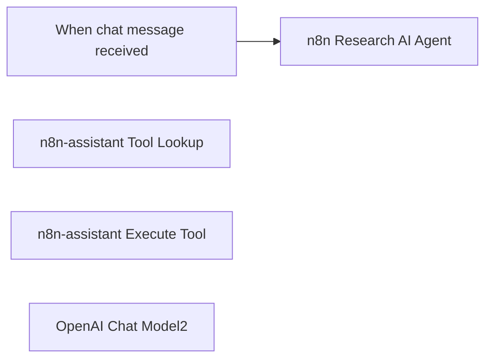

## Fluxo (.json) :

```json
{
  "meta": {
    "instanceId": "02e782574ebb30fbddb2c3fd832c946466d718819d25f6fe4b920124ff3fc2c1",
    "templateCredsSetupCompleted": true
  },
  "nodes": [
    {
      "id": "bc58bd73-921a-445c-a905-6f1bbbc0e9c3",
      "name": "When chat message received",
      "type": "@n8n/n8n-nodes-langchain.chatTrigger",
      "position": [
        1160,
        420
      ],
      "webhookId": "cf762550-98e7-42f0-a0f3-cd9594331c00",
      "parameters": {
        "options": {}
      },
      "typeVersion": 1.1
    },
    {
      "id": "308aea70-2831-4abd-90f6-d4cbf3901be4",
      "name": "n8n Research AI Agent",
      "type": "@n8n/n8n-nodes-langchain.agent",
      "position": [
        1440,
        420
      ],
      "parameters": {
        "options": {
          "systemMessage": "You are an assistant integrated with the n8n Multi-Channel Platform (MCP). Your primary role is to interact with the MCP to retrieve available tools and content based on user queries about n8n. When a user asks for information or assistance regarding n8n, first send a request to the MCP to fetch the relevant tools and content. Analyze the retrieved data to understand the available options, then create a tailored response that addresses their specific needs regarding n8n functionalities, documentation, forum posts, or example workflows. Ensure that your responses are clear, actionable, and directly related to the user's queries about n8n."
        }
      },
      "typeVersion": 1.8
    },
    {
      "id": "94cb78f5-3520-4432-b3c9-0524411113e9",
      "name": "n8n-assistant Tool Lookup",
      "type": "n8n-nodes-mcp.mcpClientTool",
      "position": [
        1500,
        640
      ],
      "parameters": {},
      "credentials": {
        "mcpClientApi": {
          "id": "w1ZOoPXYGz6W2g1T",
          "name": "n8n-assistant"
        }
      },
      "typeVersion": 1
    },
    {
      "id": "78a87949-afda-4c52-ae9f-f8d343fb6567",
      "name": "n8n-assistant Execute Tool",
      "type": "n8n-nodes-mcp.mcpClientTool",
      "position": [
        1700,
        640
      ],
      "parameters": {
        "toolName": "={{$fromAI(\"tool\",\"Set this specific tool name\")}}",
        "operation": "executeTool",
        "toolParameters": "={{ /*n8n-auto-generated-fromAI-override*/ $fromAI('Tool_Parameters', ``, 'json') }}"
      },
      "credentials": {
        "mcpClientApi": {
          "id": "w1ZOoPXYGz6W2g1T",
          "name": "n8n-assistant"
        }
      },
      "typeVersion": 1
    },
    {
      "id": "cc1619ec-6f49-45e6-8a7b-440da7ee5bc5",
      "name": "OpenAI Chat Model2",
      "type": "@n8n/n8n-nodes-langchain.lmChatOpenAi",
      "position": [
        1320,
        640
      ],
      "parameters": {
        "model": {
          "__rl": true,
          "mode": "list",
          "value": "gpt-4o-mini"
        },
        "options": {}
      },
      "credentials": {
        "openAiApi": {
          "id": "q2i0xAiFxUOYOlJ0",
          "name": "OpenAI_BCP"
        }
      },
      "typeVersion": 1.2
    }
  ],
  "pinData": {},
  "connections": {
    "OpenAI Chat Model2": {
      "ai_languageModel": [
        [
          {
            "node": "n8n Research AI Agent",
            "type": "ai_languageModel",
            "index": 0
          }
        ]
      ]
    },
    "n8n-assistant Tool Lookup": {
      "ai_tool": [
        [
          {
            "node": "n8n Research AI Agent",
            "type": "ai_tool",
            "index": 0
          }
        ]
      ]
    },
    "When chat message received": {
      "main": [
        [
          {
            "node": "n8n Research AI Agent",
            "type": "main",
            "index": 0
          }
        ]
      ]
    },
    "n8n-assistant Execute Tool": {
      "ai_tool": [
        [
          {
            "node": "n8n Research AI Agent",
            "type": "ai_tool",
            "index": 0
          }
        ]
      ]
    }
  }
}
```

<a id="template-2189"></a>

## Template 2189 - Triagem automática de CVs com IA

- **Nome:** Triagem automática de CVs com IA
- **Descrição:** Automatiza o recebimento de candidaturas para vaga de Software Engineer, analisa curricula com um modelo de IA, registra resultados e envia notificações ao candidato e à equipe de RH.
- **Funcionalidade:** • Recepção de candidaturas via formulário: Coleta nome, e‑mail, expectativa salarial, LinkedIn e upload do CV em PDF.
• Conversão de CV para texto: Extrai o conteúdo do PDF para permitir análise automática.
• Análise de compatibilidade com IA: Compara o currículo com a descrição da vaga (Software Engineer) e gera uma pontuação de compatibilidade (1–10) e recomendação de entrevista; saída limitada a 75 palavras e obrigatoriedade de idioma configurado.
• Registro centralizado: Insere dados do candidato e avaliação em uma planilha para rastreamento.
• Notificação interna ao RH: Envia e‑mail para a equipe de RH com detalhes do candidato e classificação da IA.
• Confirmação ao candidato: Envia e‑mail automático confirmando recebimento do CV.
- **Ferramentas:** • Formulário web de candidatura: Interface para os candidatos submeterem dados e o CV em PDF.
• API de IA (Google Gemini / PaLM): Realiza a análise semântica do currículo e produz a classificação e recomendação.
• Serviço de extração de PDF: Converte o arquivo PDF do currículo em texto estruturado para análise.
• Gmail: Envio de e‑mails automáticos ao candidato e à equipe de RH.
• Google Sheets: Armazenamento e organização das informações dos candidatos e das avaliações geradas pela IA.

## Fluxo visual

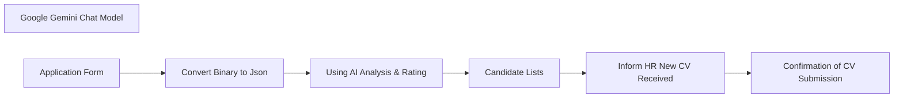

## Fluxo (.json) :

```json
{
  "id": "ES4TSw9HacxoNhLZ",
  "meta": {
    "instanceId": "5219bc76ea806909b58e13e2acac1c19192522e70dc3c90467e1800e94864105",
    "templateCredsSetupCompleted": true
  },
  "name": "AI CV Screening Workflow",
  "tags": [],
  "nodes": [
    {
      "id": "e77fbc32-5ee9-49b4-93d5-f2ffda134b08",
      "name": "Google Gemini Chat Model",
      "type": "@n8n/n8n-nodes-langchain.lmChatGoogleGemini",
      "position": [
        1230,
        530
      ],
      "parameters": {
        "options": {}
      },
      "credentials": {
        "googlePalmApi": {
          "id": "UcdfdADI6w9nkgg5",
          "name": "Google Gemini(PaLM) Api account"
        }
      },
      "typeVersion": 1
    },
    {
      "id": "9e24167f-cac6-4b98-95da-30065510d79a",
      "name": "Confirmation of CV Submission",
      "type": "n8n-nodes-base.gmail",
      "position": [
        1780,
        460
      ],
      "webhookId": "954756dc-2946-4b78-b208-06f3df612ab5",
      "parameters": {
        "sendTo": "={{ $('Application Form').item.json['E-mail'] }}",
        "message": "=Dear {{ $('Application Form').item.json['Full Name'] }}, \n\nThank you for submitting your CV. We have received it and will review it shortly.  \n\nBest regards,\nMediusware",
        "options": {},
        "subject": "We Have Received Your CV"
      },
      "credentials": {
        "gmailOAuth2": {
          "id": "taFlf0vD5S4QlOKM",
          "name": "Gmail account"
        }
      },
      "typeVersion": 2.1
    },
    {
      "id": "ff49d370-b4eb-4426-b396-763455e647e7",
      "name": "Inform HR New CV Received",
      "type": "n8n-nodes-base.gmail",
      "position": [
        1760,
        200
      ],
      "webhookId": "e969a9f5-631b-4719-a4f6-87e6063cef6a",
      "parameters": {
        "sendTo": "sarfaraz@mediusaware.com",
        "message": "=Hello HR,\n\nA new CV has been successfully received in our system. Please review the candidate's details at your earliest convenience.\n\nCandidate Name: {{ $('Application Form').item.json['Full Name'] }}\nCandidate E-mail: {{ $('Application Form').item.json['E-mail'] }}\nCandidate Linkedin: {{ $('Application Form').item.json.Linkedin }}\nCandidate Expectation: {{ $('Application Form').item.json.Expectation }}\nCandidate AI Rating: {{ $('Using AI Analysis & Rating').item.json.text }}\n\nThank you for your attention.\n\nBest regards,\nAutomated CV Screening",
        "options": {},
        "subject": "New Candidate CV Awaiting Review"
      },
      "credentials": {
        "gmailOAuth2": {
          "id": "taFlf0vD5S4QlOKM",
          "name": "Gmail account"
        }
      },
      "typeVersion": 2.1
    },
    {
      "id": "8479fa4c-10bc-4914-896d-f5b00d063fa8",
      "name": "Using AI Analysis & Rating",
      "type": "@n8n/n8n-nodes-langchain.chainLlm",
      "position": [
        1320,
        240
      ],
      "parameters": {
        "text": "={{ $json.text }}",
        "messages": {
          "messageValues": [
            {
              "message": "Rule 1 :  Do not exceed  maximum of 75 words. As an AI with advanced capabilities in talent acquisition and human resources, your task is to conduct a thorough and intricate analysis of a candidate's resume or CV against a specific job description. You will assist hiring professionals in discerning the alignment between the candidate's skills, experience, qualifications, and the requirements of the job. Your expert insights will equip employers with a lucid understanding of the candidate's suitability for the role. Very important for you to write output text in ${output_language} language. It's VERY IMPORTANT for me for text be in ${output_language} or I will be fired. Your analysis should follow this structured format: 1. **Compatibility Rating**: Propose an overall compatibility rating on a scale from 1 (not compatible) to 10 (perfect fit). Support your rating by elucidating the rationale behind it. 2. **Recommendation**: Informed by your analysis and compatibility rating, offer a recommendation on whether the employer should consider this candidate for an interview. Furnish a well-argued explanation for your recommendation. Remember, your analysis should be comprehensive, professional, and actionable. It should equip an employer with a vivid understanding of the candidate's suitability for the role. This isn't merely about ticking off boxes; it's about illustrating a comprehensive picture of how well the candidate might fit into the role and complement the existing team. Here is your task: Analyze the compatibility of the following candidate's resume with the provided job description. Endeavor to apply your deep understanding of talent evaluation to provide the most insightful analysis. Job description: \"Software Engineer\" Resume: ${resume}\nNo Markdown Please, only plain text. Please no double '**'"
            }
          ]
        },
        "promptType": "define"
      },
      "typeVersion": 1.5
    },
    {
      "id": "da0fd18b-2420-471e-b930-9aabc45bc2ca",
      "name": "Convert Binary to Json",
      "type": "n8n-nodes-base.extractFromFile",
      "position": [
        1080,
        220
      ],
      "parameters": {
        "options": {},
        "operation": "pdf",
        "binaryPropertyName": "Your_Resume_CV"
      },
      "retryOnFail": false,
      "typeVersion": 1
    },
    {
      "id": "bc5480c1-d9c2-414b-8cd4-0b3e49d4dde9",
      "name": "Application Form",
      "type": "n8n-nodes-base.formTrigger",
      "position": [
        820,
        380
      ],
      "webhookId": "0cd422d3-e69f-4ec0-92ab-05362808c4da",
      "parameters": {
        "options": {},
        "formTitle": "Application for Software Engineer Position",
        "formFields": {
          "values": [
            {
              "fieldLabel": "Full Name",
              "requiredField": true
            },
            {
              "fieldLabel": "E-mail",
              "requiredField": true
            },
            {
              "fieldLabel": "Expectation",
              "placeholder": "2000-3000$",
              "requiredField": true
            },
            {
              "fieldLabel": "Linkedin",
              "requiredField": true
            },
            {
              "fieldType": "file",
              "fieldLabel": "Your Resume/CV",
              "requiredField": true,
              "acceptFileTypes": ".pdf"
            }
          ]
        }
      },
      "typeVersion": 2.2
    },
    {
      "id": "d2dfbf1e-8d88-49e6-940d-e1717de97b30",
      "name": "Candidate Lists",
      "type": "n8n-nodes-base.googleSheets",
      "position": [
        1540,
        480
      ],
      "parameters": {
        "columns": {
          "value": {
            "CV": "={{ $('Application Form').item.json['Your Resume/CV'][0].filename }}",
            "E-mail": "={{ $('Application Form').item.json['E-mail'] }}",
            "Linkedin": "={{ $('Application Form').item.json.Linkedin }}",
            "AI Rating": "={{ $json.text }}",
            "Full Name": "={{ $('Application Form').item.json['Full Name'] }}",
            "Expectation": "={{ $('Application Form').item.json.Expectation }}"
          },
          "schema": [
            {
              "id": "CV",
              "type": "string",
              "display": true,
              "required": false,
              "displayName": "CV",
              "defaultMatch": false,
              "canBeUsedToMatch": true
            },
            {
              "id": "Full Name",
              "type": "string",
              "display": true,
              "required": false,
              "displayName": "Full Name",
              "defaultMatch": false,
              "canBeUsedToMatch": true
            },
            {
              "id": "E-mail",
              "type": "string",
              "display": true,
              "required": false,
              "displayName": "E-mail",
              "defaultMatch": false,
              "canBeUsedToMatch": true
            },
            {
              "id": "Expectation",
              "type": "string",
              "display": true,
              "required": false,
              "displayName": "Expectation",
              "defaultMatch": false,
              "canBeUsedToMatch": true
            },
            {
              "id": "Linkedin",
              "type": "string",
              "display": true,
              "required": false,
              "displayName": "Linkedin",
              "defaultMatch": false,
              "canBeUsedToMatch": true
            },
            {
              "id": "AI Rating",
              "type": "string",
              "display": true,
              "required": false,
              "displayName": "AI Rating",
              "defaultMatch": false,
              "canBeUsedToMatch": true
            }
          ],
          "mappingMode": "defineBelow",
          "matchingColumns": []
        },
        "options": {},
        "operation": "append",
        "sheetName": {
          "__rl": true,
          "mode": "list",
          "value": "gid=0",
          "cachedResultUrl": "https://docs.google.com/spreadsheets/d/1y4FFMXTuznSf2wWUraK57eBJnu4MVtgkxrGYRzRMwDQ/edit#gid=0",
          "cachedResultName": "পত্রক1"
        },
        "documentId": {
          "__rl": true,
          "mode": "list",
          "value": "1y4FFMXTuznSf2wWUraK57eBJnu4MVtgkxrGYRzRMwDQ",
          "cachedResultUrl": "https://docs.google.com/spreadsheets/d/1y4FFMXTuznSf2wWUraK57eBJnu4MVtgkxrGYRzRMwDQ/edit?usp=drivesdk",
          "cachedResultName": "CV of Software Engineers"
        }
      },
      "credentials": {
        "googleSheetsOAuth2Api": {
          "id": "YdlTTXiu8194dEFE",
          "name": "Google Sheets account"
        }
      },
      "typeVersion": 4.5
    }
  ],
  "active": true,
  "pinData": {},
  "settings": {
    "executionOrder": "v1"
  },
  "versionId": "2036fff4-ab9c-4981-a8b4-44be4654630d",
  "connections": {
    "Candidate Lists": {
      "main": [
        [
          {
            "node": "Inform HR New CV Received",
            "type": "main",
            "index": 0
          }
        ]
      ]
    },
    "Application Form": {
      "main": [
        [
          {
            "node": "Convert Binary to Json",
            "type": "main",
            "index": 0
          }
        ]
      ]
    },
    "Convert Binary to Json": {
      "main": [
        [
          {
            "node": "Using AI Analysis & Rating",
            "type": "main",
            "index": 0
          }
        ]
      ]
    },
    "Google Gemini Chat Model": {
      "ai_languageModel": [
        [
          {
            "node": "Using AI Analysis & Rating",
            "type": "ai_languageModel",
            "index": 0
          }
        ]
      ]
    },
    "Inform HR New CV Received": {
      "main": [
        [
          {
            "node": "Confirmation of CV Submission",
            "type": "main",
            "index": 0
          }
        ]
      ]
    },
    "Using AI Analysis & Rating": {
      "main": [
        [
          {
            "node": "Candidate Lists",
            "type": "main",
            "index": 0
          }
        ]
      ]
    }
  }
}
```

<a id="template-2191"></a>

## Template 2191 - Responder CRC com HMAC-SHA256

- **Nome:** Responder CRC com HMAC-SHA256
- **Descrição:** Recebe uma requisição webhook contendo um crc_token, calcula um HMAC SHA256 com um segredo e retorna um response_token formatado para validação do webhook.
- **Funcionalidade:** • Recepção de requisição webhook: recebe requisições externas que contêm o parâmetro crc_token.
• Cálculo de HMAC-SHA256: gera um hash HMAC usando o crc_token e um segredo de API, codificando o resultado em Base64.
• Formatação do token de resposta: monta o valor response_token no formato sha256=<hash_base64>.
• Resposta automática ao remetente: envia o response_token como resposta para completar a validação do webhook.
- **Ferramentas:** • Serviço remetente do webhook (por exemplo, Twitter): serviço externo que envia o crc_token para validar a posse do endpoint.
• Algoritmo HMAC-SHA256 com codificação Base64: mecanismo de criptografia usado para gerar o token de verificação a partir do crc_token e do segredo.

## Fluxo visual

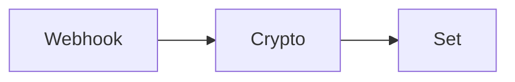

## Fluxo (.json) :

```json
{
  "nodes": [
    {
      "name": "Webhook",
      "type": "n8n-nodes-base.webhook",
      "position": [
        460,
        300
      ],
      "webhookId": "0db0a40c-e5d1-463f-8252-03599f1303e6",
      "parameters": {
        "path": "0db0a40c-e5d1-463f-8252-03599f1303e6",
        "options": {},
        "responseMode": "lastNode"
      },
      "typeVersion": 1
    },
    {
      "name": "Crypto",
      "type": "n8n-nodes-base.crypto",
      "position": [
        660,
        300
      ],
      "parameters": {
        "type": "SHA256",
        "value": "={{$json[\"query\"][\"crc_token\"]}}",
        "action": "hmac",
        "secret": "API KEY SECRET",
        "encoding": "base64"
      },
      "typeVersion": 1
    },
    {
      "name": "Set",
      "type": "n8n-nodes-base.set",
      "position": [
        840,
        300
      ],
      "parameters": {
        "values": {
          "string": [
            {
              "name": "response_token",
              "value": "=sha256={{$json[\"data\"]}}"
            }
          ]
        },
        "options": {},
        "keepOnlySet": true
      },
      "typeVersion": 1
    }
  ],
  "connections": {
    "Crypto": {
      "main": [
        [
          {
            "node": "Set",
            "type": "main",
            "index": 0
          }
        ]
      ]
    },
    "Webhook": {
      "main": [
        [
          {
            "node": "Crypto",
            "type": "main",
            "index": 0
          }
        ]
      ]
    }
  }
}
```

<a id="template-2193"></a>

## Template 2193 - Atualizar tags do Shopify a partir de eventos Onfleet

- **Nome:** Atualizar tags do Shopify a partir de eventos Onfleet
- **Descrição:** Este fluxo inicia quando uma tarefa é marcada como atrasada no Onfleet e atualiza as tags correspondentes em Shopify.
- **Funcionalidade:** • Detecção de evento de atraso: inicia o fluxo ao receber um evento de tarefa atrasada.
• Extração de dados do evento: captura informações relevantes do evento para identificar o recurso a ser atualizado.
• Atualização de tags no Shopify: modifica as tags de um registro no Shopify com base nos dados recebidos.
• Encaminhamento de dados entre serviços: transmite e transforma os dados do evento até a operação de atualização no Shopify.
- **Ferramentas:** • Onfleet: plataforma de gerenciamento de entregas que gera eventos sobre tarefas, incluindo notificações de atraso.
• Shopify: plataforma de comércio eletrônico usada para gerenciar dados de pedidos e tags, permitindo atualizações via API.

## Fluxo visual

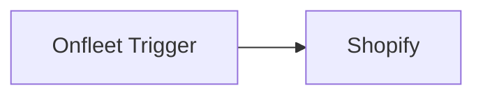

## Fluxo (.json) :

```json
{
  "name": "Updating Shopify tags on Onfleet events",
  "nodes": [
    {
      "name": "Onfleet Trigger",
      "type": "n8n-nodes-base.onfleetTrigger",
      "position": [
        460,
        300
      ],
      "webhookId": "6d6a2bee-f83e-4ebd-a1d5-8708c34393dc",
      "parameters": {
        "triggerOn": "taskDelayed",
        "additionalFields": {}
      },
      "typeVersion": 1
    },
    {
      "name": "Shopify",
      "type": "n8n-nodes-base.shopify",
      "position": [
        680,
        300
      ],
      "parameters": {
        "operation": "update",
        "updateFields": {
          "tags": ""
        }
      },
      "typeVersion": 1
    }
  ],
  "active": false,
  "settings": {},
  "connections": {
    "Onfleet Trigger": {
      "main": [
        [
          {
            "node": "Shopify",
            "type": "main",
            "index": 0
          }
        ]
      ]
    }
  }
}
```

<a id="template-2195"></a>

## Template 2195 - Resumo semanal de vendas Shopify

- **Nome:** Resumo semanal de vendas Shopify
- **Descrição:** Agenda uma verificação semanal dos pedidos do Shopify, calcula total de pedidos e soma dos valores, registra em planilha e notifica a equipa.
- **Funcionalidade:** • Agendamento semanal: Executa o fluxo automaticamente uma vez por semana em horário definido.
• Recuperação de pedidos do Shopify: Busca todos os pedidos disponíveis na loja para processamento.
• Conversão de data do pedido: Converte o campo de data do pedido para um formato utilizável nas condições.
• Filtragem por data específica: Verifica se a data do pedido corresponde a um timestamp específico antes de processar o pedido.
• Extração do preço do pedido: Seleciona o valor total do pedido para uso em agregações.
• Agregação de métricas: Calcula o número total de pedidos e a soma dos valores desses pedidos.
• Armazenamento e notificação: Anexa o resumo a uma planilha e envia uma mensagem para um canal da equipa.
- **Ferramentas:** • Shopify: Plataforma de comércio eletrónico usada para obter os pedidos da loja.
• Google Sheets: Planilha online usada para armazenar o relatório agregado.
• Slack: Ferramenta de comunicação usada para enviar uma notificação com o resumo semanal.

## Fluxo visual

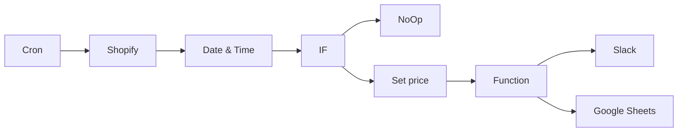

## Fluxo (.json) :

```json
{
  "nodes": [
    {
      "name": "Cron",
      "type": "n8n-nodes-base.cron",
      "position": [
        -700,
        1500
      ],
      "parameters": {
        "triggerTimes": {
          "item": [
            {
              "hour": 10,
              "mode": "everyWeek"
            }
          ]
        }
      },
      "typeVersion": 1
    },
    {
      "name": "Shopify",
      "type": "n8n-nodes-base.shopify",
      "position": [
        -500,
        1500
      ],
      "parameters": {
        "options": {},
        "operation": "getAll"
      },
      "credentials": {
        "shopifyApi": "shopify_nodeqa"
      },
      "typeVersion": 1
    },
    {
      "name": "Function",
      "type": "n8n-nodes-base.function",
      "position": [
        300,
        1400
      ],
      "parameters": {
        "functionCode": "let totalOrders = items.length;\nlet ordersSum = 0;\n\nfor(let i=0; i < items.length; i++) {\n  ordersSum = ordersSum + parseFloat(items[i].json.orderPrice);\n}\nreturn [{json:{totalOrders, ordersSum}}]"
      },
      "typeVersion": 1
    },
    {
      "name": "Google Sheets",
      "type": "n8n-nodes-base.googleSheets",
      "position": [
        500,
        1500
      ],
      "parameters": {
        "options": {},
        "sheetId": "1GVyV1yYwWZu510NTzVgi2RyesrsnuP3RxXmWbX1O7DQ",
        "operation": "append",
        "authentication": "oAuth2"
      },
      "credentials": {
        "googleSheetsOAuth2Api": "google_sheets_oauth"
      },
      "typeVersion": 1
    },
    {
      "name": "Slack",
      "type": "n8n-nodes-base.slack",
      "position": [
        500,
        1300
      ],
      "parameters": {
        "text": "=Hey team, this week we had {{$json[\"totalOrders\"]}} orders with a total value of € {{$json[\"ordersSum\"]}}.",
        "channel": "shopify",
        "attachments": [],
        "otherOptions": {}
      },
      "credentials": {
        "slackApi": "slack_nodeqa"
      },
      "typeVersion": 1
    },
    {
      "name": "Date & Time",
      "type": "n8n-nodes-base.dateTime",
      "position": [
        -300,
        1500
      ],
      "parameters": {
        "value": "={{$json[\"created_at\"]}}",
        "options": {},
        "dataPropertyName": "order_date"
      },
      "typeVersion": 1
    },
    {
      "name": "IF",
      "type": "n8n-nodes-base.if",
      "position": [
        -100,
        1500
      ],
      "parameters": {
        "conditions": {
          "dateTime": [
            {
              "value1": "={{$node[\"Date & Time\"].json[\"order_date\"]}}",
              "value2": "2021-08-17T15:00:53.223Z"
            }
          ]
        }
      },
      "typeVersion": 1
    },
    {
      "name": "NoOp",
      "type": "n8n-nodes-base.noOp",
      "position": [
        100,
        1600
      ],
      "parameters": {},
      "typeVersion": 1
    },
    {
      "name": "Set price",
      "type": "n8n-nodes-base.set",
      "position": [
        100,
        1400
      ],
      "parameters": {
        "values": {
          "number": [
            {
              "name": "orderPrice",
              "value": "={{$json[\"total_price\"]}}"
            }
          ]
        },
        "options": {},
        "keepOnlySet": true
      },
      "typeVersion": 1
    }
  ],
  "connections": {
    "IF": {
      "main": [
        [
          {
            "node": "Set price",
            "type": "main",
            "index": 0
          }
        ],
        [
          {
            "node": "NoOp",
            "type": "main",
            "index": 0
          }
        ]
      ]
    },
    "Cron": {
      "main": [
        [
          {
            "node": "Shopify",
            "type": "main",
            "index": 0
          }
        ]
      ]
    },
    "Shopify": {
      "main": [
        [
          {
            "node": "Date & Time",
            "type": "main",
            "index": 0
          }
        ]
      ]
    },
    "Function": {
      "main": [
        [
          {
            "node": "Slack",
            "type": "main",
            "index": 0
          },
          {
            "node": "Google Sheets",
            "type": "main",
            "index": 0
          }
        ]
      ]
    },
    "Set price": {
      "main": [
        [
          {
            "node": "Function",
            "type": "main",
            "index": 0
          }
        ]
      ]
    },
    "Date & Time": {
      "main": [
        [
          {
            "node": "IF",
            "type": "main",
            "index": 0
          }
        ]
      ]
    }
  }
}
```

<a id="template-2196"></a>

## Template 2196 - Atribuição automática de issues JIRA

- **Nome:** Atribuição automática de issues JIRA
- **Descrição:** Automatiza a identificação e atribuição de issues JIRA sem responsável há mais de 5 dias, usando busca semântica em um índice de issues resolvidas e verificação de capacidade dos membros da equipa.
- **Funcionalidade:** • Ingestão periódica de issues resolvidas: Busca issues resolvidas recentemente e prepara os dados para indexação.
• Remoção de duplicatas: Garante que cada issue seja adicionada ao índice apenas uma vez.
• Criação de embeddings e indexação: Gera vetores a partir do conteúdo das issues e armazena no banco vetorial com metadados relevantes (projeto, título, datas, responsável).
• Monitoramento de issues estagnadas: Verifica periodicamente por issues sem responsável há mais de 5 dias.
• Busca de issues similares por similaridade semântica: Consulta o índice vetorial para encontrar issues resolvidas semanticamente próximas ao problema atual.
• Extração estruturada de candidatos: Converte a saída do agente em uma lista estruturada de issues e responsáveis (issue_key, assignee_id, assignee_name).
• Avaliação de capacidade dos candidatos: Conta quantas tasks em progresso cada candidato possui para estimar disponibilidade.
• Seleção e atribuição do membro com mais capacidade: Ordena candidatos por carga de trabalho e atribui o ticket ao mais disponível.
• Comentário automático na issue: Registra um comentário informando que a issue foi auto-atribuída e o motivo.
• Fluxo de fallback: Se não forem encontrados issues similares, o fluxo pode pular a atribuição ou ser escalado manualmente.
- **Ferramentas:** • JIRA Software Cloud: Fonte de issues e destino para atualizar responsáveis e adicionar comentários nas issues.
• Supabase (PgVector): Banco de dados vetorial para armazenar embeddings e metadados das issues resolvidas, usado para buscas por similaridade.
• OpenAI: Geração de embeddings para indexação e uso de modelos de linguagem/agent para encontrar e estruturar issues similares.


## Fluxo visual

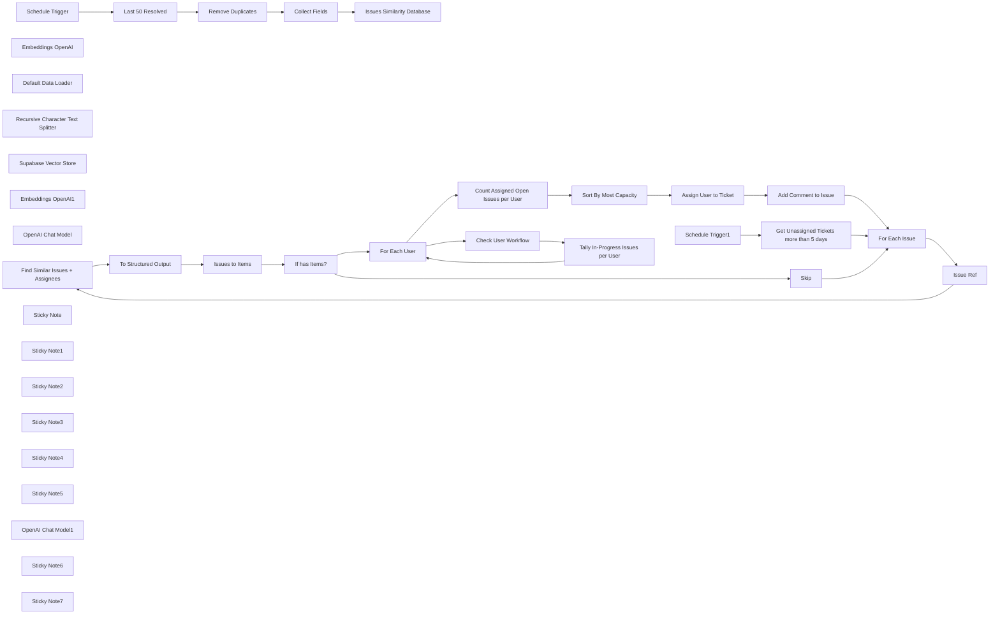

## Fluxo (.json) :

```json
{
  "meta": {
    "instanceId": "408f9fb9940c3cb18ffdef0e0150fe342d6e655c3a9fac21f0f644e8bedabcd9",
    "templateCredsSetupCompleted": true
  },
  "nodes": [
    {
      "id": "cce90ce3-5661-4c8b-9752-71bc0e643f01",
      "name": "Schedule Trigger",
      "type": "n8n-nodes-base.scheduleTrigger",
      "position": [
        -1880,
        -180
      ],
      "parameters": {
        "rule": {
          "interval": [
            {}
          ]
        }
      },
      "typeVersion": 1.2
    },
    {
      "id": "9f39b744-e3d5-4cb8-9631-d41ccb311e57",
      "name": "Embeddings OpenAI",
      "type": "@n8n/n8n-nodes-langchain.embeddingsOpenAi",
      "position": [
        -840,
        -260
      ],
      "parameters": {
        "options": {}
      },
      "credentials": {
        "openAiApi": {
          "id": "8gccIjcuf3gvaoEr",
          "name": "OpenAi account"
        }
      },
      "typeVersion": 1.2
    },
    {
      "id": "fd6f3243-3c94-4208-b200-511eef53f2f7",
      "name": "Default Data Loader",
      "type": "@n8n/n8n-nodes-langchain.documentDefaultDataLoader",
      "position": [
        -700,
        -260
      ],
      "parameters": {
        "options": {
          "metadata": {
            "metadataValues": [
              {
                "name": "project_key",
                "value": "={{ $json.project_key }}"
              },
              {
                "name": "issue_key",
                "value": "={{ $json.issue_key }}"
              },
              {
                "name": "issue_type",
                "value": "={{ $json.issue_type }}"
              },
              {
                "name": "created_at",
                "value": "={{ $json.created_date }}"
              },
              {
                "name": "resolved_at",
                "value": "={{ $json.resolution_date }}"
              },
              {
                "name": "assignee_id",
                "value": "={{ $json.assignee_id }}"
              },
              {
                "name": "assignee_name",
                "value": "={{ $json.assignee_name }}"
              },
              {
                "name": "issue_title",
                "value": "={{ $json.title }}"
              }
            ]
          }
        },
        "jsonData": "=# {{ $json.title }}\n- created {{ $json.created_date }}\n- resolved {{ $json.resolution_date }}\n\n## description\n{{ $json.description }}",
        "jsonMode": "expressionData"
      },
      "typeVersion": 1
    },
    {
      "id": "d577536e-bee5-45ea-929e-951f4a255462",
      "name": "Recursive Character Text Splitter",
      "type": "@n8n/n8n-nodes-langchain.textSplitterRecursiveCharacterTextSplitter",
      "position": [
        -600,
        -140
      ],
      "parameters": {
        "options": {}
      },
      "typeVersion": 1
    },
    {
      "id": "5fb95703-27aa-4ae3-b220-b2cca3596e0d",
      "name": "Issues Similarity Database",
      "type": "@n8n/n8n-nodes-langchain.vectorStoreSupabase",
      "position": [
        -840,
        -440
      ],
      "parameters": {
        "mode": "insert",
        "options": {},
        "tableName": {
          "__rl": true,
          "mode": "list",
          "value": "documents",
          "cachedResultName": "documents"
        }
      },
      "credentials": {
        "supabaseApi": {
          "id": "AkI6FZYwHrf8n5Zw",
          "name": "Supabase(jira-issues-similarity-database)"
        }
      },
      "typeVersion": 1
    },
    {
      "id": "94d53f32-7f01-487f-b1a3-0dc15f8dc673",
      "name": "Supabase Vector Store",
      "type": "@n8n/n8n-nodes-langchain.vectorStoreSupabase",
      "position": [
        -540,
        500
      ],
      "parameters": {
        "mode": "retrieve-as-tool",
        "topK": 20,
        "options": {},
        "toolName": "get_similar_issues",
        "tableName": {
          "__rl": true,
          "mode": "list",
          "value": "documents",
          "cachedResultName": "documents"
        },
        "toolDescription": "Call this tool to find similar issues but which are resolved and by whom."
      },
      "credentials": {
        "supabaseApi": {
          "id": "AkI6FZYwHrf8n5Zw",
          "name": "Supabase(jira-issues-similarity-database)"
        }
      },
      "typeVersion": 1
    },
    {
      "id": "d1c88dcd-62ef-4bb8-86d4-1ef294bb063d",
      "name": "Embeddings OpenAI1",
      "type": "@n8n/n8n-nodes-langchain.embeddingsOpenAi",
      "position": [
        -460,
        620
      ],
      "parameters": {
        "options": {}
      },
      "credentials": {
        "openAiApi": {
          "id": "8gccIjcuf3gvaoEr",
          "name": "OpenAi account"
        }
      },
      "typeVersion": 1.2
    },
    {
      "id": "a23442f6-c701-4b47-aea4-8764adab3d8d",
      "name": "OpenAI Chat Model",
      "type": "@n8n/n8n-nodes-langchain.lmChatOpenAi",
      "position": [
        -680,
        500
      ],
      "parameters": {
        "model": {
          "__rl": true,
          "mode": "list",
          "value": "gpt-4o-mini"
        },
        "options": {}
      },
      "credentials": {
        "openAiApi": {
          "id": "8gccIjcuf3gvaoEr",
          "name": "OpenAi account"
        }
      },
      "typeVersion": 1.2
    },
    {
      "id": "d07139dd-9df4-4e95-a0b0-4e28054b62c9",
      "name": "Find Similar Issues + Assignees",
      "type": "@n8n/n8n-nodes-langchain.agent",
      "position": [
        -660,
        300
      ],
      "parameters": {
        "text": "=# {{ $json.fields.summary }}\n\n## description\n{{ $json.fields.description }}",
        "options": {
          "systemMessage": "You are a project management assistant helping to assign stale JIRA issues to team members. To find out who best to assign the issue to, you must first find similar JIRA issues in terms of problem and context and attain the team members who resolved them. The logic is that these team members are likely to be best suited to take on the issue since they've tackled similar issues before.\n\nIn your response, for each matching issue, list the following:\n* issue_key\n* assignee_id\n* assignee_name"
        },
        "promptType": "define"
      },
      "typeVersion": 1.7
    },
    {
      "id": "c28e06eb-a8bd-4abc-821d-5efee7bbdf99",
      "name": "Check User Workflow",
      "type": "n8n-nodes-base.jira",
      "position": [
        880,
        580
      ],
      "parameters": {
        "options": {
          "jql": "=status = \"In Progress\"\nAND assignee = \"{{ $json.assignee_id }}\""
        },
        "operation": "getAll"
      },
      "credentials": {
        "jiraSoftwareCloudApi": {
          "id": "IH5V74q6PusewNjD",
          "name": "Jira SW Cloud account"
        }
      },
      "typeVersion": 1,
      "alwaysOutputData": true
    },
    {
      "id": "6bcad177-dc47-42f3-893d-5d64f28b8d75",
      "name": "For Each User",
      "type": "n8n-nodes-base.splitInBatches",
      "position": [
        680,
        380
      ],
      "parameters": {
        "options": {}
      },
      "typeVersion": 3
    },
    {
      "id": "5112d1da-464a-42e9-9d76-1e6064f1ebfc",
      "name": "Assign User to Ticket",
      "type": "n8n-nodes-base.jira",
      "position": [
        1520,
        620
      ],
      "parameters": {
        "issueKey": "={{ $('Issue Ref').item.json.key }}",
        "operation": "update",
        "updateFields": {
          "assignee": {
            "__rl": true,
            "mode": "id",
            "value": "={{ $json.assignee_id }}"
          }
        }
      },
      "credentials": {
        "jiraSoftwareCloudApi": {
          "id": "IH5V74q6PusewNjD",
          "name": "Jira SW Cloud account"
        }
      },
      "typeVersion": 1
    },
    {
      "id": "4063032d-5103-4b24-b04c-db3e1ba1002f",
      "name": "Schedule Trigger1",
      "type": "n8n-nodes-base.scheduleTrigger",
      "position": [
        -1520,
        300
      ],
      "parameters": {
        "rule": {
          "interval": [
            {}
          ]
        }
      },
      "typeVersion": 1.2
    },
    {
      "id": "44a07e61-6edd-4beb-b7e3-4c7474cb620f",
      "name": "Remove Duplicates",
      "type": "n8n-nodes-base.removeDuplicates",
      "position": [
        -1380,
        -220
      ],
      "parameters": {
        "options": {},
        "operation": "removeItemsSeenInPreviousExecutions",
        "dedupeValue": "={{ $json.key }}"
      },
      "typeVersion": 2
    },
    {
      "id": "1084ffd4-99a6-4a10-a209-1c6c83d0df02",
      "name": "Collect Fields",
      "type": "n8n-nodes-base.set",
      "position": [
        -1200,
        -220
      ],
      "parameters": {
        "options": {},
        "assignments": {
          "assignments": [
            {
              "id": "d68a1967-a68e-49cf-9a7c-bd2093dd953d",
              "name": "project_key",
              "type": "string",
              "value": "={{ $json.fields.project.key }}"
            },
            {
              "id": "16dcfcff-4dc9-4cca-bd65-6631533e6438",
              "name": "issue_key",
              "type": "string",
              "value": "={{ $json.key }}"
            },
            {
              "id": "645b7ba5-440d-45cc-9051-b58fac3cf8b6",
              "name": "issue_type",
              "type": "string",
              "value": "={{ $json.fields.issuetype.name }}"
            },
            {
              "id": "26863d50-042a-41bb-9579-5af24ed291cb",
              "name": "created_date",
              "type": "string",
              "value": "={{ $json.fields.created }}"
            },
            {
              "id": "231d153f-a189-4d16-a2c1-77a3de8bfba4",
              "name": "resolution_date",
              "type": "string",
              "value": "={{ $json.fields.resolutiondate }}"
            },
            {
              "id": "46c67aaf-6731-4890-800b-7a3361b1c7f0",
              "name": "assignee_id",
              "type": "string",
              "value": "={{ $json.fields.assignee.accountId }}"
            },
            {
              "id": "48103da0-3c14-442a-9b5b-711f720373c7",
              "name": "assignee_name",
              "type": "string",
              "value": "={{ $json.fields.assignee.displayName }}"
            },
            {
              "id": "1b3de52c-c558-4b76-87dd-2a6874789254",
              "name": "title",
              "type": "string",
              "value": "={{ $json.fields.summary }}"
            },
            {
              "id": "29091123-2d60-4345-8443-34e3a1d4dff0",
              "name": "description",
              "type": "string",
              "value": "={{ $json.fields.description }}"
            }
          ]
        }
      },
      "typeVersion": 3.4
    },
    {
      "id": "5109b7f5-61e1-4634-b29c-276c9c4fff23",
      "name": "Get Unassigned Tickets more than 5 days",
      "type": "n8n-nodes-base.jira",
      "position": [
        -1340,
        300
      ],
      "parameters": {
        "options": {
          "jql": "=project = \"My Kanban Project\"\nAND status = \"To Do\"\nAND assignee IS EMPTY\nAND assignee CHANGED BEFORE -5d"
        },
        "operation": "getAll"
      },
      "credentials": {
        "jiraSoftwareCloudApi": {
          "id": "IH5V74q6PusewNjD",
          "name": "Jira SW Cloud account"
        }
      },
      "typeVersion": 1
    },
    {
      "id": "7fcd1b7e-4bcd-4d09-b306-dd5b5de685e0",
      "name": "For Each Issue",
      "type": "n8n-nodes-base.splitInBatches",
      "position": [
        -1040,
        300
      ],
      "parameters": {
        "options": {}
      },
      "typeVersion": 3
    },
    {
      "id": "eed6d212-daae-49ee-81e9-0b550cb3a34c",
      "name": "Issue Ref",
      "type": "n8n-nodes-base.noOp",
      "position": [
        -840,
        300
      ],
      "parameters": {},
      "typeVersion": 1
    },
    {
      "id": "041949bc-ad09-45bb-acc0-915092cde6ad",
      "name": "Add Comment to Issue",
      "type": "n8n-nodes-base.jira",
      "position": [
        1700,
        620
      ],
      "parameters": {
        "comment": "=Auto-assigned to {{ $('Count Assigned Open Issues per User').item.json.assignee_name }} due to no assignee within past 5 days.",
        "options": {},
        "issueKey": "={{ $('Issue Ref').item.json.key }}",
        "resource": "issueComment"
      },
      "credentials": {
        "jiraSoftwareCloudApi": {
          "id": "IH5V74q6PusewNjD",
          "name": "Jira SW Cloud account"
        }
      },
      "typeVersion": 1
    },
    {
      "id": "ccb525d9-fc6e-47f3-ac2a-dde4c266962b",
      "name": "Sticky Note",
      "type": "n8n-nodes-base.stickyNote",
      "position": [
        -1620,
        -460
      ],
      "parameters": {
        "color": 7,
        "width": 580,
        "height": 460,
        "content": "## 1. Get Resolved Issues\n[Learn more about the JIRA node](https://docs.n8n.io/integrations/builtin/app-nodes/n8n-nodes-base.jira/)\n\nTo build our database of successfully resolved issues, we can pull them directly from JIRA with a JQL query. The remove duplicates node ensures we only add an issues into the database once."
      },
      "typeVersion": 1
    },
    {
      "id": "c4868156-e663-46b1-8979-b561dcb0620b",
      "name": "Last 50 Resolved",
      "type": "n8n-nodes-base.jira",
      "position": [
        -1560,
        -220
      ],
      "parameters": {
        "options": {
          "jql": "=project = \"My Kanban Project\"\nAND status = \"Done\"\nAND assignee IS NOT EMPTY\nAND created >= -1d"
        },
        "operation": "getAll"
      },
      "credentials": {
        "jiraSoftwareCloudApi": {
          "id": "IH5V74q6PusewNjD",
          "name": "Jira SW Cloud account"
        }
      },
      "typeVersion": 1
    },
    {
      "id": "bdf6c882-7a91-485a-9f75-4c27ba5b936c",
      "name": "Sticky Note1",
      "type": "n8n-nodes-base.stickyNote",
      "position": [
        -1000,
        -660
      ],
      "parameters": {
        "color": 7,
        "width": 660,
        "height": 660,
        "content": "## 2. Create Search Index In Vector Database\n[Learn more about the Supabase Vector Store](https://docs.n8n.io/integrations/builtin/cluster-nodes/root-nodes/n8n-nodes-langchain.vectorstoresupabase)\n\nSupabase is a third party database provider which serves traditional PostgreSQL but also supports Vector databases via the Pg-Vector extension. You will require some initial setup but easily done through Supabase's [Langchain quickstart method ](https://supabase.com/docs/guides/ai/langchain?database-method=sql)"
      },
      "typeVersion": 1
    },
    {
      "id": "806a7ac1-999b-49f7-94b4-386341a2a4e1",
      "name": "Sticky Note2",
      "type": "n8n-nodes-base.stickyNote",
      "position": [
        -1620,
        80
      ],
      "parameters": {
        "color": 7,
        "width": 500,
        "height": 460,
        "content": "## 3. Watch for Stale Unassigned Issues\n[Read more about the Scheduled Trigger](https://docs.n8n.io/integrations/builtin/core-nodes/n8n-nodes-base.scheduletrigger/)\n\nHere, we're using a scheduled trigger to watch for stale issues where stale means unassigned issues for more than 5 days. As to not let these fall through the cracks, let's see if we can auto-assign to a team member based on relevance."
      },
      "typeVersion": 1
    },
    {
      "id": "28c2f824-868d-4b0b-b362-7cfa31ad23d6",
      "name": "Sticky Note3",
      "type": "n8n-nodes-base.stickyNote",
      "position": [
        -860,
        80
      ],
      "parameters": {
        "color": 7,
        "width": 1380,
        "height": 700,
        "content": "## 4. Find Similar Issues which have been Resolved\n[Learn more about AI Agents](https://docs.n8n.io/integrations/builtin/cluster-nodes/root-nodes/n8n-nodes-langchain.agent/)\n\nOur first step is to find similar but resolved issues. The logic is that if we find these issues, the team member who resolved them will likely be the best person in terms of context and experience to address the current stale issue. Here, we tap back into our resolved issues vector store database for this purpose."
      },
      "typeVersion": 1
    },
    {
      "id": "91134c07-9df5-4a01-ab69-b9461698e260",
      "name": "Sticky Note4",
      "type": "n8n-nodes-base.stickyNote",
      "position": [
        540,
        120
      ],
      "parameters": {
        "color": 7,
        "width": 800,
        "height": 720,
        "content": "## 5. Work out which Knowledgeable Team Member has most Capacity\n[Learn more about the Summarize node](https://docs.n8n.io/integrations/builtin/core-nodes/n8n-nodes-base.summarize/)\n\nIf we've found similar resolved issues, we can then identify the last assignee of the issue as a possible candidate to assign the stale issue to. But before we do, we can do a quick check to see how many open issues the team member is currently assigned. We'll pick the team member with the least amount or in another way, the most capacity."
      },
      "typeVersion": 1
    },
    {
      "id": "3a7e0c75-148d-4bef-ab2a-ef2246c369d6",
      "name": "Sticky Note5",
      "type": "n8n-nodes-base.stickyNote",
      "position": [
        1380,
        360
      ],
      "parameters": {
        "color": 7,
        "width": 560,
        "height": 480,
        "content": "## 6. Auto-assign Stale Issue to Team Member\n[Learn more about the JIRA node](https://docs.n8n.io/integrations/builtin/app-nodes/n8n-nodes-base.jira/)\n\nFinally, we'll auto-assign the team member to the stale issue and leave a comment. This continues until all stale issues that can be assigned, are assigned."
      },
      "typeVersion": 1
    },
    {
      "id": "9af64316-0380-4a23-8935-a58a829e9064",
      "name": "OpenAI Chat Model1",
      "type": "@n8n/n8n-nodes-langchain.lmChatOpenAi",
      "position": [
        -200,
        440
      ],
      "parameters": {
        "model": {
          "__rl": true,
          "mode": "list",
          "value": "gpt-4o-mini"
        },
        "options": {}
      },
      "credentials": {
        "openAiApi": {
          "id": "8gccIjcuf3gvaoEr",
          "name": "OpenAi account"
        }
      },
      "typeVersion": 1.2
    },
    {
      "id": "f67f4290-b7f7-4034-9c78-3ff38cbb256f",
      "name": "Issues to Items",
      "type": "n8n-nodes-base.splitOut",
      "position": [
        20,
        300
      ],
      "parameters": {
        "options": {},
        "fieldToSplitOut": "output"
      },
      "typeVersion": 1,
      "alwaysOutputData": true
    },
    {
      "id": "20582918-7638-4b07-8aec-ad30412b2879",
      "name": "To Structured Output",
      "type": "@n8n/n8n-nodes-langchain.informationExtractor",
      "position": [
        -300,
        300
      ],
      "parameters": {
        "text": "={{ $json.output }}",
        "options": {},
        "schemaType": "manual",
        "inputSchema": "{\n    \"type\": \"array\",\n    \"items\": {\n        \"type\": \"object\",\n        \"required\": [\"issue_key\",\"assignee_id\",\"assignee_name\"],\n        \"properties\": {\n            \"issue_key\": { \"type\": \"string\" },\n            \"assignee_id\": { \"type\": \"string\" },\n            \"assignee_name\": { \"type\": \"string\" }\n        }\n    }\n}"
      },
      "typeVersion": 1
    },
    {
      "id": "bd950805-811f-49d0-9a32-a54cf647e819",
      "name": "Count Assigned Open Issues per User",
      "type": "n8n-nodes-base.summarize",
      "position": [
        880,
        380
      ],
      "parameters": {
        "options": {},
        "fieldsToSplitBy": "assignee_id",
        "fieldsToSummarize": {
          "values": [
            {
              "field": "in_progress"
            }
          ]
        }
      },
      "typeVersion": 1.1
    },
    {
      "id": "fddbc5de-21a2-434e-ab1c-c6b06d96d2c7",
      "name": "Tally In-Progress Issues per User",
      "type": "n8n-nodes-base.set",
      "position": [
        1080,
        580
      ],
      "parameters": {
        "options": {},
        "assignments": {
          "assignments": [
            {
              "id": "48221b51-ef3a-4e62-ba13-8a305e8787e9",
              "name": "assignee_id",
              "type": "string",
              "value": "={{ $('For Each User').item.json.assignee_id }}"
            },
            {
              "id": "60b212ff-8ad3-414b-8aac-e93dbeb1f359",
              "name": "in_progress",
              "type": "string",
              "value": "={{ $json.isNotEmpty() ? 1 : 2 }}"
            }
          ]
        }
      },
      "typeVersion": 3.4
    },
    {
      "id": "1bde2079-2c61-4024-889e-178afede1bf4",
      "name": "Sort By Most Capacity",
      "type": "n8n-nodes-base.sort",
      "position": [
        1080,
        380
      ],
      "parameters": {
        "options": {},
        "sortFieldsUi": {
          "sortField": [
            {
              "fieldName": "count_in_progress"
            }
          ]
        }
      },
      "typeVersion": 1
    },
    {
      "id": "22691a79-fa71-40b6-b4f8-bcd82864dce5",
      "name": "If has Items?",
      "type": "n8n-nodes-base.if",
      "position": [
        180,
        300
      ],
      "parameters": {
        "options": {},
        "conditions": {
          "options": {
            "version": 2,
            "leftValue": "",
            "caseSensitive": true,
            "typeValidation": "strict"
          },
          "combinator": "and",
          "conditions": [
            {
              "id": "5366f6f7-68e6-4bd8-ba8e-030abdbf34e3",
              "operator": {
                "type": "object",
                "operation": "notEmpty",
                "singleValue": true
              },
              "leftValue": "={{ $json }}",
              "rightValue": ""
            }
          ]
        }
      },
      "typeVersion": 2.2
    },
    {
      "id": "8030303e-97ce-4ab2-8f3f-ae44f82c6815",
      "name": "Skip",
      "type": "n8n-nodes-base.noOp",
      "position": [
        340,
        620
      ],
      "parameters": {},
      "typeVersion": 1
    },
    {
      "id": "6245bd37-15ce-4c3c-9430-8708e5be5b13",
      "name": "Sticky Note6",
      "type": "n8n-nodes-base.stickyNote",
      "position": [
        -60,
        620
      ],
      "parameters": {
        "color": 5,
        "width": 360,
        "height": 120,
        "content": "### What is no similar issues are found?\nThis is beyond the scope of this template so we'll skip the issue but in this situation, you may want to escalate to the project manager instead."
      },
      "typeVersion": 1
    },
    {
      "id": "8919a9c2-063e-4d69-977b-e0c3f1e28c50",
      "name": "Sticky Note7",
      "type": "n8n-nodes-base.stickyNote",
      "position": [
        -2140,
        -1080
      ],
      "parameters": {
        "width": 480,
        "height": 1080,
        "content": "## Try it out\n### This n8n template builds a simple automation to ensure no JIRA issues go unassigned for more than a week to prevent them falling through the cracks. It uses AI to perform searching tasks against a Supabase Vector Store.\nThis can be one way to help reduce the amount of manual work in managing the issue backlog for busy teams with little effort.\n\n### How it works\n* This template contains 2 separate flows which run continuously via schedule triggers.\n* The first populates our Supabase vector store with resolved issues within the last day. This helps keep our vector store up-to-date and relevant for the purpose of finding similar issues.\n* It does this by pulling the latest resolved issues from JIRA and populating the Supabase vectorstore with carefully chosen metadata. This will come in handy later.\n* The second flow watches for stale, unassigned issues for the purpose of aut-assigning to a relevant team member.\n* It does this by comparing the stale issue against our vector store of resolved issues with the goal of identifying which team member would have best context regarding the issue.\n* In a busy team, this may net a few team members as possible candidates to assign. Therefore, we can introduce additional logic to count each team member's assigned, in-progress issues. This is intended to not overload our busiest members.\n* The team member with the least assigned issues is pressumed to have the most capacity and therefore is assigned. A comennt is left in the issue to notify the team member that they've been auto-assigned due to age of issue.\n\n### How to use\n* Modify the project and interval parameters to match those of your use-case and team members.\n* Add additional criteria before assigning to a team member eg. department, as required.\n\n### Need Help?\nJoin the [Discord](https://discord.com/invite/XPKeKXeB7d) or ask in the [Forum](https://community.n8n.io/)!\n\nHappy Hacking!"
      },
      "typeVersion": 1
    }
  ],
  "pinData": {},
  "connections": {
    "Skip": {
      "main": [
        [
          {
            "node": "For Each Issue",
            "type": "main",
            "index": 0
          }
        ]
      ]
    },
    "Issue Ref": {
      "main": [
        [
          {
            "node": "Find Similar Issues + Assignees",
            "type": "main",
            "index": 0
          }
        ]
      ]
    },
    "For Each User": {
      "main": [
        [
          {
            "node": "Count Assigned Open Issues per User",
            "type": "main",
            "index": 0
          }
        ],
        [
          {
            "node": "Check User Workflow",
            "type": "main",
            "index": 0
          }
        ]
      ]
    },
    "If has Items?": {
      "main": [
        [
          {
            "node": "For Each User",
            "type": "main",
            "index": 0
          }
        ],
        [
          {
            "node": "Skip",
            "type": "main",
            "index": 0
          }
        ]
      ]
    },
    "Collect Fields": {
      "main": [
        [
          {
            "node": "Issues Similarity Database",
            "type": "main",
            "index": 0
          }
        ]
      ]
    },
    "For Each Issue": {
      "main": [
        [],
        [
          {
            "node": "Issue Ref",
            "type": "main",
            "index": 0
          }
        ]
      ]
    },
    "Issues to Items": {
      "main": [
        [
          {
            "node": "If has Items?",
            "type": "main",
            "index": 0
          }
        ]
      ]
    },
    "Last 50 Resolved": {
      "main": [
        [
          {
            "node": "Remove Duplicates",
            "type": "main",
            "index": 0
          }
        ]
      ]
    },
    "Schedule Trigger": {
      "main": [
        [
          {
            "node": "Last 50 Resolved",
            "type": "main",
            "index": 0
          }
        ]
      ]
    },
    "Embeddings OpenAI": {
      "ai_embedding": [
        [
          {
            "node": "Issues Similarity Database",
            "type": "ai_embedding",
            "index": 0
          }
        ]
      ]
    },
    "OpenAI Chat Model": {
      "ai_languageModel": [
        [
          {
            "node": "Find Similar Issues + Assignees",
            "type": "ai_languageModel",
            "index": 0
          }
        ]
      ]
    },
    "Remove Duplicates": {
      "main": [
        [
          {
            "node": "Collect Fields",
            "type": "main",
            "index": 0
          }
        ]
      ]
    },
    "Schedule Trigger1": {
      "main": [
        [
          {
            "node": "Get Unassigned Tickets more than 5 days",
            "type": "main",
            "index": 0
          }
        ]
      ]
    },
    "Embeddings OpenAI1": {
      "ai_embedding": [
        [
          {
            "node": "Supabase Vector Store",
            "type": "ai_embedding",
            "index": 0
          }
        ]
      ]
    },
    "OpenAI Chat Model1": {
      "ai_languageModel": [
        [
          {
            "node": "To Structured Output",
            "type": "ai_languageModel",
            "index": 0
          }
        ]
      ]
    },
    "Check User Workflow": {
      "main": [
        [
          {
            "node": "Tally In-Progress Issues per User",
            "type": "main",
            "index": 0
          }
        ]
      ]
    },
    "Default Data Loader": {
      "ai_document": [
        [
          {
            "node": "Issues Similarity Database",
            "type": "ai_document",
            "index": 0
          }
        ]
      ]
    },
    "Add Comment to Issue": {
      "main": [
        [
          {
            "node": "For Each Issue",
            "type": "main",
            "index": 0
          }
        ]
      ]
    },
    "To Structured Output": {
      "main": [
        [
          {
            "node": "Issues to Items",
            "type": "main",
            "index": 0
          }
        ]
      ]
    },
    "Assign User to Ticket": {
      "main": [
        [
          {
            "node": "Add Comment to Issue",
            "type": "main",
            "index": 0
          }
        ]
      ]
    },
    "Sort By Most Capacity": {
      "main": [
        [
          {
            "node": "Assign User to Ticket",
            "type": "main",
            "index": 0
          }
        ]
      ]
    },
    "Supabase Vector Store": {
      "ai_tool": [
        [
          {
            "node": "Find Similar Issues + Assignees",
            "type": "ai_tool",
            "index": 0
          }
        ]
      ]
    },
    "Find Similar Issues + Assignees": {
      "main": [
        [
          {
            "node": "To Structured Output",
            "type": "main",
            "index": 0
          }
        ]
      ]
    },
    "Recursive Character Text Splitter": {
      "ai_textSplitter": [
        [
          {
            "node": "Default Data Loader",
            "type": "ai_textSplitter",
            "index": 0
          }
        ]
      ]
    },
    "Tally In-Progress Issues per User": {
      "main": [
        [
          {
            "node": "For Each User",
            "type": "main",
            "index": 0
          }
        ]
      ]
    },
    "Count Assigned Open Issues per User": {
      "main": [
        [
          {
            "node": "Sort By Most Capacity",
            "type": "main",
            "index": 0
          }
        ]
      ]
    },
    "Get Unassigned Tickets more than 5 days": {
      "main": [
        [
          {
            "node": "For Each Issue",
            "type": "main",
            "index": 0
          }
        ]
      ]
    }
  }
}
```

<a id="template-2198"></a>

## Template 2198 - Carregar prompt do GitHub e preencher variáveis automaticamente

- **Nome:** Carregar prompt do GitHub e preencher variáveis automaticamente
- **Descrição:** Carrega um prompt armazenado em um repositório, valida e substitui variáveis definidas, e executa o prompt em um modelo de IA para obter a resposta.
- **Funcionalidade:** • Início manual para testes: permite disparar o fluxo manualmente para testar o processo.
• Leitura de arquivo de prompt do repositório: busca um arquivo de prompt em um repositório remoto usando proprietário, repositório e caminho.
• Extração do texto do arquivo: extrai o conteúdo do arquivo para uso como prompt.
• Detecção de variáveis no prompt: identifica dinamicamente placeholders no formato {{ ... }} e normaliza suas chaves.
• Verificação de variáveis obrigatórias: compara as variáveis detectadas com as variáveis configuradas e identifica as que estão faltando.
• Interrupção com erro: se houver variáveis ausentes, interrompe o fluxo e retorna uma mensagem com as chaves faltantes.
• Substituição de placeholders por valores: substitui os placeholders presentes no prompt pelos valores definidos nas variáveis, usando a parte final da chave quando necessário.
• Execução do prompt por um agente de IA: envia o prompt preenchido para um agente que utiliza um modelo de chat para gerar a resposta.
• Armazenamento da resposta do prompt: captura e salva a saída gerada pelo modelo para uso posterior.
- **Ferramentas:** • GitHub: serviço de hospedagem de código usado como armazenamento dos arquivos de prompt para leitura dinâmica.
• Ollama: modelo/serviço de linguagem (chat) utilizado para executar o prompt e gerar respostas em linguagem natural.
• LangChain: camada de agente que organiza e envia o prompt ao modelo de linguagem, gerenciando a execução do agente.

## Fluxo visual

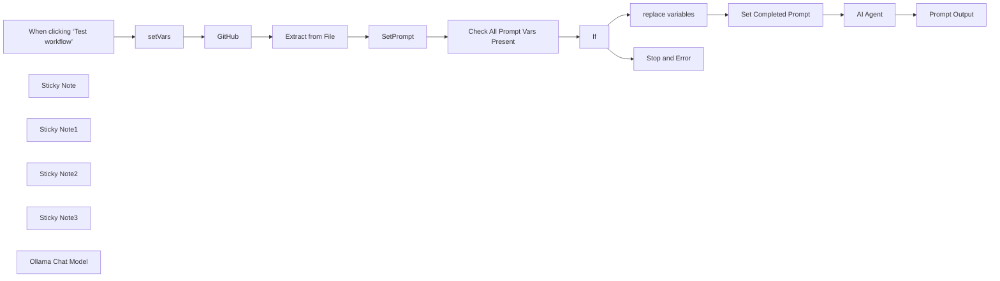

## Fluxo (.json) :

```json
{
  "id": "QyMyf3zraY0wxXDf",
  "meta": {
    "instanceId": "ba3fa76a571c35110ef5f67e5099c9a5c1768ef125c2f3b804ba20de75248c0b",
    "templateCredsSetupCompleted": true
  },
  "name": "Load Prompts from Github Repo and auto populate n8n expressions",
  "tags": [],
  "nodes": [
    {
      "id": "34781446-b06e-41eb-83b8-b96bda1a5595",
      "name": "When clicking ‘Test workflow’",
      "type": "n8n-nodes-base.manualTrigger",
      "position": [
        -80,
        0
      ],
      "parameters": {},
      "typeVersion": 1
    },
    {
      "id": "c53b7243-7c82-47e0-a5ee-bd82bc51c386",
      "name": "GitHub",
      "type": "n8n-nodes-base.github",
      "position": [
        600,
        0
      ],
      "parameters": {
        "owner": {
          "__rl": true,
          "mode": "name",
          "value": "={{ $json.Account }}"
        },
        "filePath": "={{ $json.path }}{{ $json.prompt }}",
        "resource": "file",
        "operation": "get",
        "repository": {
          "__rl": true,
          "mode": "name",
          "value": "={{ $json.repo }}"
        },
        "additionalParameters": {}
      },
      "credentials": {
        "githubApi": {
          "id": "ostHZNoe8GSsbaQM",
          "name": "The GitHub account"
        }
      },
      "typeVersion": 1
    },
    {
      "id": "9976b199-b744-47a7-9d75-4b831274c01b",
      "name": "Extract from File",
      "type": "n8n-nodes-base.extractFromFile",
      "position": [
        840,
        0
      ],
      "parameters": {
        "options": {},
        "operation": "text"
      },
      "typeVersion": 1
    },
    {
      "id": "26aa4e6a-c487-4cdf-91d5-df660cf826a6",
      "name": "setVars",
      "type": "n8n-nodes-base.set",
      "position": [
        180,
        0
      ],
      "parameters": {
        "options": {},
        "assignments": {
          "assignments": [
            {
              "id": "150618c5-09b1-4f8b-a7b4-984662bf3381",
              "name": "Account",
              "type": "string",
              "value": "TPGLLC-US"
            },
            {
              "id": "22e8a3b0-bd53-485c-b971-7f1dd0686f0e",
              "name": "repo",
              "type": "string",
              "value": "PeresPrompts"
            },
            {
              "id": "ab94d0a1-ef3a-4fe9-9076-6882c6fda0ac",
              "name": "path",
              "type": "string",
              "value": "SEO/"
            },
            {
              "id": "66f122eb-1cbd-4769-aac8-3f05cdb6c116",
              "name": "prompt",
              "type": "string",
              "value": "keyword_research.md"
            },
            {
              "id": "03fe26a3-04e6-439c-abcb-d438fc5203c0",
              "name": "company",
              "type": "string",
              "value": "South Nassau Physical Therapy"
            },
            {
              "id": "c133d216-a457-4872-a060-0ba4d94549af",
              "name": "product",
              "type": "string",
              "value": "Manual Therapy"
            },
            {
              "id": "584864dd-2518-45e2-b501-02828757fc3a",
              "name": "features",
              "type": "string",
              "value": "pain relief"
            },
            {
              "id": "0c4594cc-302a-4215-bdad-12cf54f57967",
              "name": "sector",
              "type": "string",
              "value": "physical therapy"
            }
          ]
        }
      },
      "typeVersion": 3.4
    },
    {
      "id": "9d92f581-8cd9-448c-aa1d-023a96c1ddda",
      "name": "replace variables",
      "type": "n8n-nodes-base.code",
      "position": [
        1900,
        -20
      ],
      "parameters": {
        "jsCode": "// Fetch the prompt text\nconst prompt = $('SetPrompt').first().json.data;  // Ensure the prompt contains placeholders like {{ some.node.value }}\n\n// Example variables object\nconst variables = {\n  company: $('setVars').first().json.company,\n  features: \"Awesome Software\",\n  keyword: \"2025-02-07\"\n};\n\n// Function to replace placeholders dynamically\nconst replaceVariables = (text, vars) => {\n  return text.replace(/{{(.*?)}}/g, (match, key) => {\n    const trimmedKey = key.trim();\n    \n    // Extract last part after the last dot\n    const finalKey = trimmedKey.split('.').pop();\n\n    // Replace if key exists, otherwise leave placeholder unchanged\n    return vars.hasOwnProperty(finalKey) ? vars[finalKey] : match;\n  });\n};\n\n// Replace and return result\nreturn [{\n  prompt: replaceVariables(prompt, variables)\n}];\n"
      },
      "typeVersion": 2
    },
    {
      "id": "6c6c4fde-6ee5-47a8-894d-44d1afcedc2a",
      "name": "If",
      "type": "n8n-nodes-base.if",
      "position": [
        1560,
        0
      ],
      "parameters": {
        "options": {},
        "conditions": {
          "options": {
            "version": 2,
            "leftValue": "",
            "caseSensitive": true,
            "typeValidation": "strict"
          },
          "combinator": "and",
          "conditions": [
            {
              "id": "2717a7e5-095a-42bf-8b5b-8050c3389ec5",
              "operator": {
                "type": "boolean",
                "operation": "true",
                "singleValue": true
              },
              "leftValue": "={{ $json.success }}",
              "rightValue": "={{ $('Check All Prompt Vars Present').item.json.keys()}}"
            }
          ]
        }
      },
      "typeVersion": 2.2
    },
    {
      "id": "3b7712b8-5152-4f60-9401-03c89c39e227",
      "name": "Check All Prompt Vars Present",
      "type": "n8n-nodes-base.code",
      "position": [
        1280,
        0
      ],
      "parameters": {
        "jsCode": "// Get prompt text\nconst prompt = $json.data;\n\n// Extract variables inside {{ }} dynamically\nconst matches = [...prompt.matchAll(/{{(.*?)}}/g)];\nconst uniqueVars = [...new Set(matches.map(match => match[1].trim().split('.').pop()))];\n\n// Get variables from the Set Node\nconst setNodeVariables = $node[\"setVars\"].json || {};\n\n// Log extracted variables and Set Node keys\nconsole.log(\"Extracted Variables:\", uniqueVars);\nconsole.log(\"Set Node Keys:\", Object.keys(setNodeVariables));\n\n// Check if all required variables are present in the Set Node\nconst missingKeys = uniqueVars.filter(varName => !setNodeVariables.hasOwnProperty(varName));\n\nconsole.log(\"Missing Keys:\", missingKeys);\n\n// Return false if any required variable is missing, otherwise return true\nreturn [{\n  success: missingKeys.length === 0,\n  missingKeys: missingKeys\n}];\n"
      },
      "typeVersion": 2
    },
    {
      "id": "32618e10-3285-4c16-9e78-058dde329337",
      "name": "SetPrompt",
      "type": "n8n-nodes-base.set",
      "position": [
        1060,
        0
      ],
      "parameters": {
        "options": {},
        "assignments": {
          "assignments": [
            {
              "id": "335b450d-542a-4714-83d8-ccc237188fc5",
              "name": "data",
              "type": "string",
              "value": "={{ $json.data }}"
            }
          ]
        }
      },
      "typeVersion": 3.4
    },
    {
      "id": "4d8b34ca-50dd-4f37-b4f7-542291461662",
      "name": "Stop and Error",
      "type": "n8n-nodes-base.stopAndError",
      "position": [
        1900,
        200
      ],
      "parameters": {
        "errorMessage": "=Missing Prompt Variables : {{ $('Check All Prompt Vars Present').item.json.missingKeys }}\n"
      },
      "typeVersion": 1
    },
    {
      "id": "a78c1e17-9152-4241-bcdf-c0d723da543b",
      "name": "Set Completed Prompt",
      "type": "n8n-nodes-base.set",
      "position": [
        2220,
        -20
      ],
      "parameters": {
        "options": {},
        "assignments": {
          "assignments": [
            {
              "id": "57a9625b-adea-4ee7-a72a-2be8db15f3d4",
              "name": "Prompt",
              "type": "string",
              "value": "={{ $json.prompt }}"
            }
          ]
        }
      },
      "typeVersion": 3.4
    },
    {
      "id": "51447c90-a222-4172-a49b-86ec43332559",
      "name": "AI Agent",
      "type": "@n8n/n8n-nodes-langchain.agent",
      "position": [
        2440,
        -20
      ],
      "parameters": {
        "text": "={{ $json.Prompt }}",
        "options": {},
        "promptType": "define"
      },
      "typeVersion": 1.7
    },
    {
      "id": "f15b6af1-7af2-4515-be8f-960211118dce",
      "name": "Sticky Note",
      "type": "n8n-nodes-base.stickyNote",
      "position": [
        60,
        -120
      ],
      "parameters": {
        "width": 340,
        "height": 260,
        "content": "# Set The variables in your prompt here"
      },
      "typeVersion": 1
    },
    {
      "id": "163db6cc-5b06-4ae6-ac97-5890b37cdb18",
      "name": "Sticky Note1",
      "type": "n8n-nodes-base.stickyNote",
      "position": [
        520,
        -120
      ],
      "parameters": {
        "color": 5,
        "content": "## The repo is currently public for you to test with"
      },
      "typeVersion": 1
    },
    {
      "id": "83ff6a86-a759-42a9-ace4-e20d57b906db",
      "name": "Sticky Note2",
      "type": "n8n-nodes-base.stickyNote",
      "position": [
        1780,
        -200
      ],
      "parameters": {
        "width": 360,
        "height": 260,
        "content": "## Replaces the values in the prompt with the variables in the \n# 'setVars' Node"
      },
      "typeVersion": 1
    },
    {
      "id": "7dd61153-84ac-4b59-b449-333825476c33",
      "name": "Sticky Note3",
      "type": "n8n-nodes-base.stickyNote",
      "position": [
        2000,
        180
      ],
      "parameters": {
        "color": 3,
        "content": "## If you're missing variables they will be listed here"
      },
      "typeVersion": 1
    },
    {
      "id": "1f070dc3-3d25-41d8-b534-912ba7c8b2b0",
      "name": "Prompt Output",
      "type": "n8n-nodes-base.set",
      "position": [
        2800,
        -20
      ],
      "parameters": {
        "options": {},
        "assignments": {
          "assignments": [
            {
              "id": "01a30683-c348-4712-a3b1-739fc4a17718",
              "name": "promptResponse",
              "type": "string",
              "value": "={{ $json.output }}"
            }
          ]
        }
      },
      "typeVersion": 3.4
    },
    {
      "id": "2d12a6e2-7976-41b0-8cb2-01466b28269d",
      "name": "Ollama Chat Model",
      "type": "@n8n/n8n-nodes-langchain.lmChatOllama",
      "position": [
        2480,
        200
      ],
      "parameters": {
        "options": {}
      },
      "credentials": {
        "ollamaApi": {
          "id": "ERfZ8mAfQ1b0aoxZ",
          "name": "Ollama account"
        }
      },
      "typeVersion": 1
    }
  ],
  "active": false,
  "pinData": {},
  "settings": {
    "executionOrder": "v1"
  },
  "versionId": "4327a337-59e7-4b5b-98e8-93c6be550972",
  "connections": {
    "If": {
      "main": [
        [
          {
            "node": "replace variables",
            "type": "main",
            "index": 0
          }
        ],
        [
          {
            "node": "Stop and Error",
            "type": "main",
            "index": 0
          }
        ]
      ]
    },
    "GitHub": {
      "main": [
        [
          {
            "node": "Extract from File",
            "type": "main",
            "index": 0
          }
        ]
      ]
    },
    "setVars": {
      "main": [
        [
          {
            "node": "GitHub",
            "type": "main",
            "index": 0
          }
        ]
      ]
    },
    "AI Agent": {
      "main": [
        [
          {
            "node": "Prompt Output",
            "type": "main",
            "index": 0
          }
        ]
      ]
    },
    "SetPrompt": {
      "main": [
        [
          {
            "node": "Check All Prompt Vars Present",
            "type": "main",
            "index": 0
          }
        ]
      ]
    },
    "Extract from File": {
      "main": [
        [
          {
            "node": "SetPrompt",
            "type": "main",
            "index": 0
          }
        ]
      ]
    },
    "Ollama Chat Model": {
      "ai_languageModel": [
        [
          {
            "node": "AI Agent",
            "type": "ai_languageModel",
            "index": 0
          }
        ]
      ]
    },
    "replace variables": {
      "main": [
        [
          {
            "node": "Set Completed Prompt",
            "type": "main",
            "index": 0
          }
        ]
      ]
    },
    "Set Completed Prompt": {
      "main": [
        [
          {
            "node": "AI Agent",
            "type": "main",
            "index": 0
          }
        ]
      ]
    },
    "Check All Prompt Vars Present": {
      "main": [
        [
          {
            "node": "If",
            "type": "main",
            "index": 0
          }
        ]
      ]
    },
    "When clicking ‘Test workflow’": {
      "main": [
        [
          {
            "node": "setVars",
            "type": "main",
            "index": 0
          }
        ]
      ]
    }
  }
}
```

<a id="template-2200"></a>

## Template 2200 - Acionar e monitorar DAG no Airflow

- **Nome:** Acionar e monitorar DAG no Airflow
- **Descrição:** Aciona um DAG no Airflow via API com uma configuração (conf), monitora o estado do dag run até sucesso ou falha, e recupera o resultado (XCom) do task especificado. Possui lógica de espera e timeout configuráveis.
- **Funcionalidade:** • Acionar DAG: Envia uma requisição POST para criar um dag run com a configuração (conf) fornecida.
• Monitoramento de estado: Consulta periodicamente o estado do dag run para identificar queued, running, success ou failed.
• Espera configurável: Quando o dag run está em queued ou durante reexecuções, aguarda um intervalo configurável antes de verificar novamente.
• Contador de tentativas e timeout: Incrementa um contador a cada verificação e interrompe com erro se ultrapassar o tempo máximo configurado (wait_time).
• Recuperação de resultado: Ao obter estado success, busca o valor retornado (XCom) do task especificado dentro do dag run.
• Tratamento de falhas: Interrompe e sinaliza erro se o dag run entrar em estado failed ou se o tempo de espera exceder o limite.
• Entradas configuráveis: Aceita dag_id, task_id, conf, intervalo de espera (wait) e tempo máximo de espera (wait_time) como parâmetros de entrada.
- **Ferramentas:** • Apache Airflow (API REST): Plataforma de orquestração de workflows acessada via API para criar dag runs, consultar estados e recuperar valores XCom.


## Fluxo visual

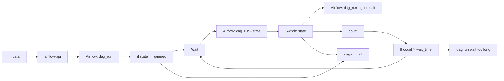

## Fluxo (.json) :

```json
{
  "id": "Y5URlIlbX4HDzWKA",
  "meta": {
    "instanceId": "6ae0aa8b6c9099f1f8ed1265281802eab47aaf5b2845f317791e4ac7ee5b7279",
    "templateCredsSetupCompleted": true
  },
  "name": "airflow dag_run",
  "tags": [
    {
      "id": "YSelDQ3zfWB0LeVn",
      "name": "airflow",
      "createdAt": "2025-02-25T04:17:21.943Z",
      "updatedAt": "2025-02-25T04:17:21.943Z"
    }
  ],
  "nodes": [
    {
      "id": "0d4457ef-7a88-4755-8bd2-b0e8148f86f4",
      "name": "Airflow: dag_run",
      "type": "n8n-nodes-base.httpRequest",
      "position": [
        380,
        -40
      ],
      "parameters": {
        "url": "={{ $('airflow-api').item.json.prefix }}/api/v1/dags/{{ $('in data').item.json.dag_id }}/dagRuns",
        "method": "POST",
        "options": {},
        "jsonBody": "={\n  \"conf\": {{ $('in data').item.json.conf }}\n}",
        "sendBody": true,
        "specifyBody": "json",
        "authentication": "genericCredentialType",
        "genericAuthType": "httpBasicAuth"
      },
      "credentials": {
        "httpBasicAuth": {
          "id": "vTR4WWA7czRn2ULn",
          "name": "Airflow"
        }
      },
      "typeVersion": 4.2
    },
    {
      "id": "acf477a0-aad5-402a-a5a0-543f3e277333",
      "name": "Airflow: dag_run - state",
      "type": "n8n-nodes-base.httpRequest",
      "position": [
        840,
        60
      ],
      "parameters": {
        "url": "={{ $('airflow-api').item.json.prefix }}/api/v1/dags/{{ $('in data').item.json.dag_id }}/dagRuns/{{ $('Airflow: dag_run').item.json.dag_run_id }}",
        "options": {},
        "authentication": "genericCredentialType",
        "genericAuthType": "httpBasicAuth"
      },
      "credentials": {
        "httpBasicAuth": {
          "id": "vTR4WWA7czRn2ULn",
          "name": "Airflow"
        }
      },
      "typeVersion": 4.2
    },
    {
      "id": "26982a6f-6281-4140-a05c-ea6f3f2c0cb2",
      "name": "count",
      "type": "n8n-nodes-base.code",
      "position": [
        1180,
        40
      ],
      "parameters": {
        "jsCode": "try {\n  $('count').first().json.count += 1\n  return {count:$('count').first().json.count};\n}\ncatch (error) {\n  return {count:1};\n}"
      },
      "typeVersion": 2
    },
    {
      "id": "613718f6-ba7e-415c-8e07-0123224e1ac6",
      "name": "dag run fail",
      "type": "n8n-nodes-base.stopAndError",
      "position": [
        1180,
        400
      ],
      "parameters": {
        "errorMessage": "dag run fail"
      },
      "typeVersion": 1
    },
    {
      "id": "66ba0e85-4608-418b-b27b-8cbc50f78319",
      "name": "if state == queued",
      "type": "n8n-nodes-base.if",
      "position": [
        520,
        60
      ],
      "parameters": {
        "options": {},
        "conditions": {
          "options": {
            "version": 2,
            "leftValue": "",
            "caseSensitive": true,
            "typeValidation": "strict"
          },
          "combinator": "and",
          "conditions": [
            {
              "id": "0ae67986-09c0-443d-9262-075bfe94ca2e",
              "operator": {
                "name": "filter.operator.equals",
                "type": "string",
                "operation": "equals"
              },
              "leftValue": "={{ $json.state }}",
              "rightValue": "queued"
            }
          ]
        }
      },
      "typeVersion": 2.2
    },
    {
      "id": "92176e9a-0ea7-48b0-9ca0-ea4ea8442cee",
      "name": "dag run wait too long",
      "type": "n8n-nodes-base.stopAndError",
      "position": [
        1500,
        40
      ],
      "parameters": {
        "errorMessage": "dag run wait too long"
      },
      "typeVersion": 1
    },
    {
      "id": "6a05471f-232e-44d6-9dbb-583400537507",
      "name": "Airflow: dag_run - get result",
      "type": "n8n-nodes-base.httpRequest",
      "position": [
        1180,
        -140
      ],
      "parameters": {
        "url": "={{ $('airflow-api').item.json.prefix }}/api/v1/dags/{{ $('in data').item.json.dag_id }}/dagRuns/{{ $('Airflow: dag_run').item.json.dag_run_id }}/taskInstances/{{ $('in data').item.json.task_id }}/xcomEntries/return_value",
        "options": {},
        "authentication": "genericCredentialType",
        "genericAuthType": "httpBasicAuth"
      },
      "credentials": {
        "httpBasicAuth": {
          "id": "vTR4WWA7czRn2ULn",
          "name": "Airflow"
        }
      },
      "typeVersion": 4.2
    },
    {
      "id": "fb2211d5-cef2-4be2-b281-de315aa07093",
      "name": "Switch: state",
      "type": "n8n-nodes-base.switch",
      "position": [
        980,
        -40
      ],
      "parameters": {
        "rules": {
          "values": [
            {
              "outputKey": "=success",
              "conditions": {
                "options": {
                  "version": 2,
                  "leftValue": "",
                  "caseSensitive": true,
                  "typeValidation": "strict"
                },
                "combinator": "and",
                "conditions": [
                  {
                    "id": "4d4ecf8a-c02b-4722-9528-1919cdf9b83e",
                    "operator": {
                      "name": "filter.operator.equals",
                      "type": "string",
                      "operation": "equals"
                    },
                    "leftValue": "={{ $json.state }}",
                    "rightValue": "success"
                  }
                ]
              },
              "renameOutput": true
            },
            {
              "outputKey": "queued",
              "conditions": {
                "options": {
                  "version": 2,
                  "leftValue": "",
                  "caseSensitive": true,
                  "typeValidation": "strict"
                },
                "combinator": "and",
                "conditions": [
                  {
                    "operator": {
                      "type": "string",
                      "operation": "equals"
                    },
                    "leftValue": "={{ $json.state }}",
                    "rightValue": "queued"
                  }
                ]
              },
              "renameOutput": true
            },
            {
              "outputKey": "running",
              "conditions": {
                "options": {
                  "version": 2,
                  "leftValue": "",
                  "caseSensitive": true,
                  "typeValidation": "strict"
                },
                "combinator": "and",
                "conditions": [
                  {
                    "id": "fa5d8524-334a-4ab1-b543-bba75cafd0ec",
                    "operator": {
                      "name": "filter.operator.equals",
                      "type": "string",
                      "operation": "equals"
                    },
                    "leftValue": "={{ $json.state }}",
                    "rightValue": "running"
                  }
                ]
              },
              "renameOutput": true
            },
            {
              "outputKey": "failed",
              "conditions": {
                "options": {
                  "version": 2,
                  "leftValue": "",
                  "caseSensitive": true,
                  "typeValidation": "strict"
                },
                "combinator": "and",
                "conditions": [
                  {
                    "id": "dd853677-c51c-4c06-8680-3c9d1829d6bd",
                    "operator": {
                      "name": "filter.operator.equals",
                      "type": "string",
                      "operation": "equals"
                    },
                    "leftValue": "={{ $json.state }}",
                    "rightValue": "failed"
                  }
                ]
              },
              "renameOutput": true
            }
          ]
        },
        "options": {
          "fallbackOutput": 3
        }
      },
      "typeVersion": 3.2
    },
    {
      "id": "5941496a-a64d-432c-9103-e7bcae4b8d67",
      "name": "in data",
      "type": "n8n-nodes-base.executeWorkflowTrigger",
      "position": [
        100,
        -40
      ],
      "parameters": {
        "workflowInputs": {
          "values": [
            {
              "name": "dag_id"
            },
            {
              "name": "task_id"
            },
            {
              "name": "conf"
            },
            {
              "name": "wait",
              "type": "number"
            },
            {
              "name": "wait_time",
              "type": "number"
            }
          ]
        }
      },
      "typeVersion": 1.1
    },
    {
      "id": "e77fed4a-b61a-4126-8be3-43ef8a832cfe",
      "name": "Wait",
      "type": "n8n-nodes-base.wait",
      "position": [
        700,
        -40
      ],
      "webhookId": "3d164954-2926-4174-afc1-261dfdfa9e46",
      "parameters": {
        "amount": "={{ $('in data').item.json.hasOwnProperty('wait') ? $('in data').item.json.wait : 10 }}"
      },
      "typeVersion": 1.1
    },
    {
      "id": "8ffae842-4400-4667-85bb-50644ef10fc0",
      "name": "If count > wait_time",
      "type": "n8n-nodes-base.if",
      "position": [
        1320,
        140
      ],
      "parameters": {
        "options": {},
        "conditions": {
          "options": {
            "version": 2,
            "leftValue": "",
            "caseSensitive": true,
            "typeValidation": "strict"
          },
          "combinator": "and",
          "conditions": [
            {
              "id": "1829d538-5633-4f5c-ad1b-285b084b35ee",
              "operator": {
                "type": "number",
                "operation": "gt"
              },
              "leftValue": "={{ $json.count }}",
              "rightValue": "={{ $('in data').item.json.hasOwnProperty('wait_time') ? $('in data').item.json.wait_time : 12 }}"
            }
          ]
        }
      },
      "typeVersion": 2.2
    },
    {
      "id": "c49d4a1b-6f25-471b-9c21-d3defb709dda",
      "name": "airflow-api",
      "type": "n8n-nodes-base.set",
      "position": [
        240,
        60
      ],
      "parameters": {
        "options": {},
        "assignments": {
          "assignments": [
            {
              "id": "40a5ab5b-dee1-44c4-910a-d6b85af75aed",
              "name": "prefix",
              "type": "string",
              "value": "https://airflow.example.com"
            }
          ]
        }
      },
      "typeVersion": 3.4
    }
  ],
  "active": false,
  "pinData": {
    "in data": [
      {
        "json": {
          "conf": "{\n  \"image\": \"nginx\",\n  \"tag\": \"latest\",\n  \"tag_requested\": 1000\n}",
          "wait": 10,
          "dag_id": "image_tag_related",
          "task_id": "image_tag_related",
          "wait_time": 18
        }
      }
    ]
  },
  "settings": {
    "executionOrder": "v1"
  },
  "versionId": "57fdbcfc-7950-4aff-9ac7-3c2a99a2c8c8",
  "connections": {
    "Wait": {
      "main": [
        [
          {
            "node": "Airflow: dag_run - state",
            "type": "main",
            "index": 0
          }
        ]
      ]
    },
    "count": {
      "main": [
        [
          {
            "node": "If count > wait_time",
            "type": "main",
            "index": 0
          }
        ]
      ]
    },
    "in data": {
      "main": [
        [
          {
            "node": "airflow-api",
            "type": "main",
            "index": 0
          }
        ]
      ]
    },
    "airflow-api": {
      "main": [
        [
          {
            "node": "Airflow: dag_run",
            "type": "main",
            "index": 0
          }
        ]
      ]
    },
    "Switch: state": {
      "main": [
        [
          {
            "node": "Airflow: dag_run - get result",
            "type": "main",
            "index": 0
          }
        ],
        [
          {
            "node": "count",
            "type": "main",
            "index": 0
          }
        ],
        [
          {
            "node": "count",
            "type": "main",
            "index": 0
          }
        ],
        [
          {
            "node": "dag run fail",
            "type": "main",
            "index": 0
          }
        ]
      ]
    },
    "Airflow: dag_run": {
      "main": [
        [
          {
            "node": "if state == queued",
            "type": "main",
            "index": 0
          }
        ]
      ]
    },
    "if state == queued": {
      "main": [
        [
          {
            "node": "Wait",
            "type": "main",
            "index": 0
          }
        ],
        [
          {
            "node": "dag run fail",
            "type": "main",
            "index": 0
          }
        ]
      ]
    },
    "If count > wait_time": {
      "main": [
        [
          {
            "node": "dag run wait too long",
            "type": "main",
            "index": 0
          }
        ],
        [
          {
            "node": "Wait",
            "type": "main",
            "index": 0
          }
        ]
      ]
    },
    "Airflow: dag_run - state": {
      "main": [
        [
          {
            "node": "Switch: state",
            "type": "main",
            "index": 0
          }
        ]
      ]
    },
    "Airflow: dag_run - get result": {
      "main": [
        []
      ]
    }
  }
}
```

<a id="template-2202"></a>

## Template 2202 - RSS de lançamentos Baserow

- **Nome:** RSS de lançamentos Baserow
- **Descrição:** Gera um feed RSS com os posts da categoria de lançamentos do blog do Baserow e o expõe via um endpoint HTTP.
- **Funcionalidade:** • Receber requisição via webhook: inicia o fluxo quando o endpoint é chamado.
• Definir domínio base: configura a URL base do site a ser consultado.
• Buscar página de lançamentos: faz uma requisição HTTP para a página da categoria de release do blog.
• Extrair lista de posts: identifica e separa cada bloco de post do HTML recebido.
• Extrair campos de cada post: captura data, título, link e descrição usando seletores CSS.
• Completar links relativos: transforma links relativos em URLs absolutas usando o domínio base.
• Normalizar data: formata a data dos posts para o padrão YYYY-MM-DD.
• Montar itens RSS: gera itens RSS individuais contendo título, link, descrição e data.
• Montar feed RSS e responder: agrega os itens em um feed RSS completo e retorna como XML na resposta HTTP.
- **Ferramentas:** • baserow.io: site de origem dos posts (categoria /blog/category/release) utilizado como fonte de conteúdo.
• Requisições HTTP: usada para obter o HTML da página e para expor o endpoint que retorna o feed.
• RSS (XML): formato do feed de saída usado para distribuir os lançamentos.

## Fluxo visual

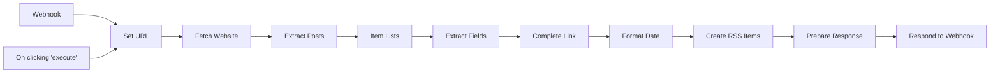

## Fluxo (.json) :

```json
{
  "nodes": [
    {
      "name": "On clicking 'execute'",
      "type": "n8n-nodes-base.manualTrigger",
      "position": [
        240,
        300
      ],
      "parameters": {},
      "typeVersion": 1
    },
    {
      "name": "Item Lists",
      "type": "n8n-nodes-base.itemLists",
      "position": [
        1120,
        300
      ],
      "parameters": {
        "options": {},
        "fieldToSplitOut": "post"
      },
      "typeVersion": 1
    },
    {
      "name": "Extract Posts",
      "type": "n8n-nodes-base.htmlExtract",
      "position": [
        900,
        300
      ],
      "parameters": {
        "options": {},
        "extractionValues": {
          "values": [
            {
              "key": "post",
              "cssSelector": ".blog-listing__post-content",
              "returnArray": true,
              "returnValue": "html"
            }
          ]
        }
      },
      "typeVersion": 1
    },
    {
      "name": "Fetch Website",
      "type": "n8n-nodes-base.httpRequest",
      "position": [
        680,
        300
      ],
      "parameters": {
        "url": "={{$json[\"base_domain\"]}}/blog/category/release",
        "options": {
          "timeout": 10000
        },
        "responseFormat": "string"
      },
      "typeVersion": 1
    },
    {
      "name": "Set URL",
      "type": "n8n-nodes-base.set",
      "position": [
        460,
        300
      ],
      "parameters": {
        "values": {
          "string": [
            {
              "name": "base_domain",
              "value": "https://baserow.io"
            }
          ]
        },
        "options": {}
      },
      "typeVersion": 1
    },
    {
      "name": "Complete Link",
      "type": "n8n-nodes-base.set",
      "position": [
        240,
        500
      ],
      "parameters": {
        "values": {
          "string": [
            {
              "name": "link",
              "value": "={{$item(0).$node[\"Set URL\"].json[\"base_domain\"]}}{{$json[\"link\"]}}"
            }
          ]
        },
        "options": {}
      },
      "typeVersion": 1
    },
    {
      "name": "Format Date",
      "type": "n8n-nodes-base.dateTime",
      "position": [
        460,
        500
      ],
      "parameters": {
        "value": "={{$json[\"date\"]}}",
        "options": {},
        "toFormat": "YYYY-MM-DD",
        "dataPropertyName": "date"
      },
      "typeVersion": 1
    },
    {
      "name": "Create RSS Items",
      "type": "n8n-nodes-base.functionItem",
      "position": [
        680,
        500
      ],
      "parameters": {
        "functionCode": "return {\n  rss_item: \n`<item>\n  <title>${item.title}</title>\n  <link>${item.link}</link>\n  <description>${item.description}</description>\n  <pubDate>${item.date}</pubDate>\n</item>`\n}"
      },
      "typeVersion": 1
    },
    {
      "name": "Webhook",
      "type": "n8n-nodes-base.webhook",
      "position": [
        240,
        100
      ],
      "webhookId": "27c1e4db-568f-4bf9-9474-0898ce1173f7",
      "parameters": {
        "path": "baserow-releases",
        "options": {},
        "responseMode": "responseNode"
      },
      "typeVersion": 1
    },
    {
      "name": "Respond to Webhook",
      "type": "n8n-nodes-base.respondToWebhook",
      "position": [
        1120,
        500
      ],
      "parameters": {
        "options": {
          "responseHeaders": {
            "entries": [
              {
                "name": "content-type",
                "value": "application/xml"
              }
            ]
          }
        },
        "respondWith": "text",
        "responseBody": "={{$json[\"feed\"]}}"
      },
      "typeVersion": 1
    },
    {
      "name": "Prepare Response",
      "type": "n8n-nodes-base.function",
      "position": [
        900,
        500
      ],
      "parameters": {
        "functionCode": "let feed =\n`<?xml version=\"1.0\" encoding=\"UTF-8\" ?>\n<rss version=\"2.0\">\n\n<channel>\n  <title>Baserow Releases</title>\n  <link>https://baserow.io/blog/category/release</link>\n  <description>Stay up to date with the latest changes and updates of Baserow</description>\n  ${items.map(e => e.json.rss_item).join('\\n')}\n</channel>\n\n</rss>`;\n\nreturn [{\n  json: {\n    feed: feed\n  }\n}];"
      },
      "typeVersion": 1
    },
    {
      "name": "Extract Fields",
      "type": "n8n-nodes-base.htmlExtract",
      "position": [
        1340,
        300
      ],
      "parameters": {
        "options": {},
        "dataPropertyName": "post",
        "extractionValues": {
          "values": [
            {
              "key": "date",
              "cssSelector": ".blog-listing__post-info > strong"
            },
            {
              "key": "title",
              "cssSelector": ".blog-listing__post-title"
            },
            {
              "key": "link",
              "attribute": "href",
              "cssSelector": ".blog-listing__post-title > a",
              "returnValue": "attribute"
            },
            {
              "key": "description",
              "cssSelector": ".blog-listing__post-description"
            }
          ]
        }
      },
      "typeVersion": 1
    }
  ],
  "connections": {
    "Set URL": {
      "main": [
        [
          {
            "node": "Fetch Website",
            "type": "main",
            "index": 0
          }
        ]
      ]
    },
    "Webhook": {
      "main": [
        [
          {
            "node": "Set URL",
            "type": "main",
            "index": 0
          }
        ]
      ]
    },
    "Item Lists": {
      "main": [
        [
          {
            "node": "Extract Fields",
            "type": "main",
            "index": 0
          }
        ]
      ]
    },
    "Format Date": {
      "main": [
        [
          {
            "node": "Create RSS Items",
            "type": "main",
            "index": 0
          }
        ]
      ]
    },
    "Complete Link": {
      "main": [
        [
          {
            "node": "Format Date",
            "type": "main",
            "index": 0
          }
        ]
      ]
    },
    "Extract Posts": {
      "main": [
        [
          {
            "node": "Item Lists",
            "type": "main",
            "index": 0
          }
        ]
      ]
    },
    "Fetch Website": {
      "main": [
        [
          {
            "node": "Extract Posts",
            "type": "main",
            "index": 0
          }
        ]
      ]
    },
    "Extract Fields": {
      "main": [
        [
          {
            "node": "Complete Link",
            "type": "main",
            "index": 0
          }
        ]
      ]
    },
    "Create RSS Items": {
      "main": [
        [
          {
            "node": "Prepare Response",
            "type": "main",
            "index": 0
          }
        ]
      ]
    },
    "Prepare Response": {
      "main": [
        [
          {
            "node": "Respond to Webhook",
            "type": "main",
            "index": 0
          }
        ]
      ]
    },
    "On clicking 'execute'": {
      "main": [
        [
          {
            "node": "Set URL",
            "type": "main",
            "index": 0
          }
        ]
      ]
    }
  }
}
```

<a id="template-2205"></a>

## Template 2205 - Sincronizar pedido Shopify com contato e negócio no HubSpot

- **Nome:** Sincronizar pedido Shopify com contato e negócio no HubSpot
- **Descrição:** Recebe atualizações de pedidos do Shopify, cria ou atualiza um contato no HubSpot e cria um negócio associado se ainda não existir.
- **Funcionalidade:** • Detecção de atualização de pedido: Inicia o fluxo quando um pedido é atualizado.
• Criação/atualização de contato: Usa o e-mail e os dados do endereço padrão do cliente (nome, sobrenome, cidade, país) para criar ou atualizar o contato no CRM.
• Extração do identificador do cliente: Mantém e propaga apenas o userId (vid) retornado para associar ao negócio.
• Mesclagem de dados do pedido com o userId: Anexa o identificador do HubSpot aos dados do pedido para uso posterior.
• Busca de negócio existente: Pesquisa no CRM por um negócio que corresponda ao nome do pedido para evitar duplicatas.
• Criação de negócio quando ausente: Se não houver negócio correspondente, cria um novo com valor, nome, data de fechamento e associa o contato.
• Ação nula quando já existe: Se for encontrado um negócio correspondente, não realiza nenhuma ação adicional.
- **Ferramentas:** • Shopify: Plataforma de e‑commerce que envia notificações de pedidos e fornece dados do cliente e do pedido.
• HubSpot: CRM usado para criar e atualizar contatos e para pesquisar e criar negócios (deals).


## Fluxo visual

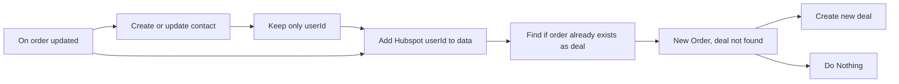

## Fluxo (.json) :

```json
{
  "meta": {
    "instanceId": "237600ca44303ce91fa31ee72babcdc8493f55ee2c0e8aa2b78b3b4ce6f70bd9"
  },
  "nodes": [
    {
      "id": "5cb9cd37-a73d-4f3f-b4dd-4b56e79f4056",
      "name": "On order updated",
      "type": "n8n-nodes-base.shopifyTrigger",
      "position": [
        380,
        200
      ],
      "webhookId": "0972ce92-d800-4049-ab60-7c71898ecbfa",
      "parameters": {
        "topic": "orders/updated"
      },
      "credentials": {
        "shopifyApi": {
          "id": "10",
          "name": "Shopify account"
        }
      },
      "typeVersion": 1
    },
    {
      "id": "720e35c7-387e-428a-8930-0dfb67536382",
      "name": "Keep only userId",
      "type": "n8n-nodes-base.set",
      "position": [
        860,
        280
      ],
      "parameters": {
        "values": {
          "number": [
            {
              "name": "userId",
              "value": "={{ $json[\"vid\"] }}"
            }
          ]
        },
        "options": {},
        "keepOnlySet": true
      },
      "typeVersion": 1
    },
    {
      "id": "3bb1f676-6733-4c1f-b3d0-4604f8baa0c8",
      "name": "New Order, deal not found",
      "type": "n8n-nodes-base.if",
      "position": [
        1560,
        220
      ],
      "parameters": {
        "conditions": {
          "string": [
            {
              "value1": "={{$json}}",
              "operation": "isEmpty"
            }
          ]
        }
      },
      "typeVersion": 1
    },
    {
      "id": "7f4b86a1-9ea7-4c5d-a336-eea2ec6dc341",
      "name": "Do Nothing",
      "type": "n8n-nodes-base.noOp",
      "position": [
        1800,
        320
      ],
      "parameters": {},
      "typeVersion": 1
    },
    {
      "id": "f60c88f1-8dab-498e-9f18-d7842dfa60c6",
      "name": "Create new deal",
      "type": "n8n-nodes-base.hubspot",
      "position": [
        1800,
        120
      ],
      "parameters": {
        "stage": "closedwon",
        "authentication": "oAuth2",
        "additionalFields": {
          "amount": "={{ $node[\"Add Hubspot userId to data\"].json[\"current_total_price\"] }}",
          "dealName": "={{ $node[\"Add Hubspot userId to data\"].json[\"name\"] }}",
          "closeDate": "={{ $node[\"Add Hubspot userId to data\"].json[\"created_at\"] }}",
          "associatedVids": "={{ $node[\"Add Hubspot userId to data\"].json[\"userId\"] }}"
        }
      },
      "credentials": {
        "hubspotOAuth2Api": {
          "id": "21",
          "name": "HubSpot account"
        }
      },
      "typeVersion": 1
    },
    {
      "id": "3d9de7e0-8cd4-4cea-a78c-8a862c32edeb",
      "name": "Find if order already exists as deal",
      "type": "n8n-nodes-base.hubspot",
      "position": [
        1340,
        220
      ],
      "parameters": {
        "operation": "search",
        "authentication": "oAuth2",
        "additionalFields": {
          "query": "={{ $json[\"name\"] }}"
        }
      },
      "credentials": {
        "hubspotOAuth2Api": {
          "id": "21",
          "name": "HubSpot account"
        }
      },
      "typeVersion": 1,
      "alwaysOutputData": true
    },
    {
      "id": "f85b698a-872a-477b-9466-e35622b381a2",
      "name": "Add Hubspot userId to data",
      "type": "n8n-nodes-base.merge",
      "position": [
        1140,
        220
      ],
      "parameters": {
        "mode": "mergeByIndex"
      },
      "typeVersion": 1
    },
    {
      "id": "11502ac7-1e57-4614-9dd5-31f5fc62c91c",
      "name": "Create or update contact",
      "type": "n8n-nodes-base.hubspot",
      "position": [
        640,
        280
      ],
      "parameters": {
        "email": "={{ $json[\"contact_email\"] }}",
        "resource": "contact",
        "authentication": "oAuth2",
        "additionalFields": {
          "city": "={{ $json[\"customer\"][\"default_address\"][\"city\"] }}",
          "country": "={{ $json[\"customer\"][\"default_address\"][\"country\"] }}",
          "lastName": "={{ $json[\"customer\"][\"default_address\"][\"last_name\"] }}",
          "firstName": "={{ $json[\"customer\"][\"default_address\"][\"first_name\"] }}"
        }
      },
      "credentials": {
        "hubspotOAuth2Api": {
          "id": "21",
          "name": "HubSpot account"
        }
      },
      "typeVersion": 1
    }
  ],
  "connections": {
    "Keep only userId": {
      "main": [
        [
          {
            "node": "Add Hubspot userId to data",
            "type": "main",
            "index": 1
          }
        ]
      ]
    },
    "On order updated": {
      "main": [
        [
          {
            "node": "Add Hubspot userId to data",
            "type": "main",
            "index": 0
          },
          {
            "node": "Create or update contact",
            "type": "main",
            "index": 0
          }
        ]
      ]
    },
    "Create or update contact": {
      "main": [
        [
          {
            "node": "Keep only userId",
            "type": "main",
            "index": 0
          }
        ]
      ]
    },
    "New Order, deal not found": {
      "main": [
        [
          {
            "node": "Create new deal",
            "type": "main",
            "index": 0
          }
        ],
        [
          {
            "node": "Do Nothing",
            "type": "main",
            "index": 0
          }
        ]
      ]
    },
    "Add Hubspot userId to data": {
      "main": [
        [
          {
            "node": "Find if order already exists as deal",
            "type": "main",
            "index": 0
          }
        ]
      ]
    },
    "Find if order already exists as deal": {
      "main": [
        [
          {
            "node": "New Order, deal not found",
            "type": "main",
            "index": 0
          }
        ]
      ]
    }
  }
}
```

<a id="template-2207"></a>

## Template 2207 - Assistente de reunião Zoom com IA

- **Nome:** Assistente de reunião Zoom com IA
- **Descrição:** Automatiza a extração de transcrições de reuniões Zoom, gera uma ata resumida com IA, envia por e-mail e cria tarefas/agendas de follow-up quando necessário.
- **Funcionalidade:** • Recuperar reunião mais recente: Localiza eventos agendados ocorridos nas últimas 24 horas.
• Buscar e filtrar transcrições: Obtém arquivos de gravação e seleciona o arquivo de transcrição disponível.
• Extrair texto da transcrição: Converte o arquivo de transcrição em texto bruto legível.
• Formatagem do texto: Limpa e organiza o texto da transcrição para processamento posterior.
• Identificar participantes: Coleta os dados dos participantes da reunião para inclusão nas atas e atribuições.
• Gerar ata/minutas com IA: Utiliza um modelo de linguagem para criar um documento formal de minutos da reunião incluindo resumo, tarefas e datas importantes.
• Formatar em HTML e enviar por e-mail: Converte a ata em HTML estilizado e envia para destinatários por e-mail.
• Identificar e criar tarefas: Detecta itens de ação na transcrição e cria tarefas com campos estruturados para integração com o sistema de gerenciamento de tarefas.
• Agendar follow-up: Quando discutido, cria um evento de follow-up com título, data/hora e participantes.
• Tratamento de ausência de transcrição: Interrompe e reporta erro quando não há arquivo de transcrição disponível.
- **Ferramentas:** • Zoom: Fonte das informações da reunião e dos arquivos de gravação/transcrição via API.
• OpenAI (modelo de linguagem): Geração do resumo da reunião, extração de tarefas e formatação do texto.
• ClickUp: Criação de tarefas/itens a partir dos itens de ação identificados.
• Microsoft Outlook (Calendário): Agendamento de reuniões de follow-up no calendário.
• Servidor SMTP / E-mail: Envio do resumo da reunião em formato HTML para os participantes.

## Fluxo visual

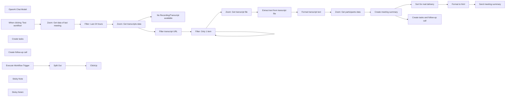

## Fluxo (.json) :

```json
{
  "id": "jhNsy4dPQYw9QDaa",
  "meta": {
    "instanceId": "1acdaec6c8e84424b4715cf41a9f7ec057947452db21cd2e22afbc454c8711cd",
    "templateId": "2683",
    "templateCredsSetupCompleted": true
  },
  "name": "Zoom AI Meeting Assistant",
  "tags": [],
  "nodes": [
    {
      "id": "9b4b21aa-c746-4b94-a4dd-12736a7d4098",
      "name": "OpenAI Chat Model",
      "type": "@n8n/n8n-nodes-langchain.lmChatOpenAi",
      "position": [
        2160,
        1040
      ],
      "parameters": {
        "model": "gpt-4o",
        "options": {}
      },
      "credentials": {
        "openAiApi": {
          "id": "EjchNb5GBqYh0Cqn",
          "name": "OpenAi account"
        }
      },
      "typeVersion": 1
    },
    {
      "id": "536e360c-d668-4f58-8670-4e78ef579dbe",
      "name": "When clicking ‘Test workflow’",
      "type": "n8n-nodes-base.manualTrigger",
      "position": [
        160,
        460
      ],
      "parameters": {},
      "typeVersion": 1
    },
    {
      "id": "eb2b6b98-ca3c-46a9-9d5f-9b5297441224",
      "name": "No Recording/Transcript available",
      "type": "n8n-nodes-base.stopAndError",
      "position": [
        880,
        660
      ],
      "parameters": {
        "errorMessage": "={{ $json.error.cause.message }}"
      },
      "typeVersion": 1
    },
    {
      "id": "33ee5d8b-a373-44a8-9777-9386cf8cf008",
      "name": "Zoom: Get data of last meeting",
      "type": "n8n-nodes-base.zoom",
      "position": [
        340,
        460
      ],
      "parameters": {
        "filters": {
          "type": "scheduled"
        },
        "operation": "getAll",
        "returnAll": true,
        "authentication": "oAuth2"
      },
      "credentials": {
        "zoomOAuth2Api": {
          "id": "MmccxSST1g202tG2",
          "name": "Zoom account"
        }
      },
      "typeVersion": 1
    },
    {
      "id": "d67d1fcb-78d1-47e5-bc0e-5735f0f48350",
      "name": "Filter transcript URL",
      "type": "n8n-nodes-base.set",
      "onError": "continueRegularOutput",
      "position": [
        880,
        460
      ],
      "parameters": {
        "options": {},
        "assignments": {
          "assignments": [
            {
              "id": "ef149af8-7f9d-4e5a-8ccf-4a5f1e09eecc",
              "name": "transcript_file",
              "type": "string",
              "value": "={{ $json.recording_files.find(f => f.file_type === 'TRANSCRIPT').download_url }}"
            }
          ]
        }
      },
      "typeVersion": 3.4
    },
    {
      "id": "41665b4e-4d3e-4da9-9b0d-c6f9f0b2cde4",
      "name": "Filter: Only 1 item",
      "type": "n8n-nodes-base.splitInBatches",
      "position": [
        1060,
        460
      ],
      "parameters": {
        "options": {}
      },
      "typeVersion": 3
    },
    {
      "id": "ea12b33a-ae01-403d-9f14-466dc8880874",
      "name": "Zoom: Get transcript file",
      "type": "n8n-nodes-base.httpRequest",
      "position": [
        1240,
        460
      ],
      "parameters": {
        "url": "={{ $json.transcript_file }}",
        "options": {},
        "authentication": "predefinedCredentialType",
        "nodeCredentialType": "zoomOAuth2Api"
      },
      "credentials": {
        "zoomOAuth2Api": {
          "id": "MmccxSST1g202tG2",
          "name": "Zoom account"
        }
      },
      "typeVersion": 4.2
    },
    {
      "id": "fb1c32c3-5161-499d-8cd6-7624fb78ed3e",
      "name": "Extract text from transcript file",
      "type": "n8n-nodes-base.extractFromFile",
      "position": [
        1420,
        460
      ],
      "parameters": {
        "options": {},
        "operation": "text"
      },
      "typeVersion": 1
    },
    {
      "id": "87986fd3-37f0-48cd-942a-73fd3b5bd70f",
      "name": "Format transcript text",
      "type": "n8n-nodes-base.set",
      "position": [
        1600,
        460
      ],
      "parameters": {
        "options": {},
        "assignments": {
          "assignments": [
            {
              "id": "70019192-02ef-4b0a-a747-3ca5f46aeeaa",
              "name": "transcript",
              "type": "string",
              "value": "={{ $json.data.split('\\r\\n\\r\\n').slice(1).map(block => {\n const lines = block.split('\\r\\n');\n return lines.slice(2).join(' ');\n}).join('\\n') }}"
            }
          ]
        }
      },
      "typeVersion": 3.4
    },
    {
      "id": "9af3559d-2fd0-481f-84d6-caefbcd8e4f2",
      "name": "Zoom: Get participants data",
      "type": "n8n-nodes-base.httpRequest",
      "position": [
        1760,
        460
      ],
      "parameters": {
        "url": "=https://api.zoom.us/v2/past_meetings/{{ $('Filter: Last 24 hours').item.json.id }}/participants",
        "options": {},
        "authentication": "predefinedCredentialType",
        "nodeCredentialType": "zoomOAuth2Api"
      },
      "credentials": {
        "zoomOAuth2Api": {
          "id": "MmccxSST1g202tG2",
          "name": "Zoom account"
        }
      },
      "typeVersion": 4.2
    },
    {
      "id": "03feecc5-e60d-45cb-bf29-6645afb86b4c",
      "name": "Create meeting summary",
      "type": "@n8n/n8n-nodes-langchain.openAi",
      "position": [
        1920,
        460
      ],
      "parameters": {
        "modelId": {
          "__rl": true,
          "mode": "list",
          "value": "gpt-4o",
          "cachedResultName": "GPT-4O"
        },
        "options": {},
        "messages": {
          "values": [
            {
              "content": "=Create a formal meeting minutes document from the following transcript and meeting details.\n\nMeeting Date: {{ $('Zoom: Get data of last meeting').item.json.start_time }} // This needs to be formatted from the meeting details\nParticipants: {{ $json.participants.map(p => p.name + ' (' + p.user_email + ')').join(', ') }}\n\nTranscript:\n{{ $('Format transcript text').item.json.transcript }}\n\nPlease create the minutes in the following format:\n\nMeeting on [Date]\n\nParticipants:\n[List of participants with email addresses]\n\nSummary of the Meeting:\n[Brief and concise summary of the topics discussed]\n\nTasks:\n- [Task] (Responsible: [Name])\n- ...\n\nImportant Dates:\n- [Date] ([Context])\n- ...\n"
            }
          ]
        }
      },
      "credentials": {
        "openAiApi": {
          "id": "EjchNb5GBqYh0Cqn",
          "name": "OpenAi account"
        }
      },
      "typeVersion": 1.8
    },
    {
      "id": "5edc73f7-aa1b-47ae-97f7-c6f897e914a6",
      "name": "Sort for mail delivery",
      "type": "n8n-nodes-base.set",
      "position": [
        2240,
        460
      ],
      "parameters": {
        "options": {},
        "assignments": {
          "assignments": [
            {
              "id": "cc51b7e4-d5c2-4cd4-9488-4d181eaaa02e",
              "name": "subject",
              "type": "string",
              "value": "=Meeting summary: {{ $('Zoom: Get data of last meeting').item.json.topic }} on {{ $('Zoom: Get data of last meeting').item.json.start_time }}"
            },
            {
              "id": "f3940ea2-9084-4c25-828e-5ddaa428ec83",
              "name": "=to",
              "type": "string",
              "value": "={{ $('Zoom: Get participants data').item.json.participants[0].user_email }}"
            },
            {
              "id": "1211af5b-2240-44ce-9df7-63d93f57806e",
              "name": "body",
              "type": "string",
              "value": "={{ $json.message.content }}"
            }
          ]
        }
      },
      "typeVersion": 3.4
    },
    {
      "id": "29ad24ba-016b-4e65-b8c8-908d8e2207c5",
      "name": "Format to html",
      "type": "n8n-nodes-base.code",
      "position": [
        2400,
        460
      ],
      "parameters": {
        "jsCode": "const items = [];\n\nfor (const item of $input.all()) {\n const body = item.json.body;\n if (!body) continue;\n\n // Simple split approach\n const sections = body.split('\\n\\n');\n const title = sections[0].replace(/\\*\\*/g, '');\n const participants = sections[1].split('\\n').slice(1).join('\\n');\n const summary = sections[2].split('\\n').slice(1).join('\\n');\n const tasks = sections[3].split('\\n').slice(1).join('\\n');\n const dates = sections[4].split('\\n').slice(1).join('\\n');\n\n const html = `<html>\n<body style=\"font-family: Arial, sans-serif; max-width: 800px; margin: 20px;\">\n<h1 style=\"color: #2c3e50; border-bottom: 2px solid #3498db; padding-bottom: 10px;\">${title}</h1>\n<h2 style=\"color: #2c3e50; margin-top: 20px;\">Participants:</h2>\n<ul style=\"list-style-type: none; padding-left: 20px;\">\n${participants.split('\\n').map(p => `<li>${p.replace('- ', '')}</li>`).join('\\n')}\n</ul>\n<h2 style=\"color: #2c3e50; margin-top: 20px;\">Meeting Summary:</h2>\n<p style=\"margin-left: 20px;\">${summary}</p>\n<h2 style=\"color: #2c3e50; margin-top: 20px;\">Tasks:</h2>\n<ul style=\"margin-left: 20px;\">\n${tasks.split('\\n').map(t => `<li>${t.replace('- ', '')}</li>`).join('\\n')}\n</ul>\n<h2 style=\"color: #2c3e50; margin-top: 20px;\">Important Dates:</h2>\n<ul style=\"margin-left: 20px;\">\n${dates.split('\\n').map(d => `<li>${d.replace('- ', '')}</li>`).join('\\n')}\n</ul>\n</body>\n</html>`;\n\n items.push({\n json: {\n html,\n to: item.json.to,\n subject: item.json.subject\n }\n });\n}\n\nreturn items;"
      },
      "typeVersion": 2
    },
    {
      "id": "60c9d778-d97a-4e17-858c-804f523590e5",
      "name": "Send meeting summary",
      "type": "n8n-nodes-base.emailSend",
      "position": [
        2560,
        460
      ],
      "parameters": {
        "html": "={{ $json.html }}",
        "options": {},
        "subject": "={{ $json.subject }}",
        "toEmail": "={{ $json.to }}",
        "fromEmail": "friedemann.schuetz@posteo.de"
      },
      "credentials": {
        "smtp": {
          "id": "OFGEnOq5l8U8Lb3U",
          "name": "SMTP account"
        }
      },
      "typeVersion": 2.1
    },
    {
      "id": "39d8bb49-d9e9-46e3-89b3-fcbf9345bad8",
      "name": "Create tasks",
      "type": "@n8n/n8n-nodes-langchain.toolWorkflow",
      "position": [
        2340,
        1040
      ],
      "parameters": {
        "name": "create_task",
        "schemaType": "manual",
        "workflowId": {
          "__rl": true,
          "mode": "list",
          "value": "zSKQLEObdU9RiThI",
          "cachedResultName": "create_task"
        },
        "description": "=Use this tool to create a task. \nFor task creation use only action items for me Friedemann, don't use action items for other participants.",
        "inputSchema": "{\n \"type\": \"object\",\n \"properties\": {\n \"items\": {\n \"type\": \"array\",\n \"description\": \"An array of tasks\",\n \"items\": {\n \"type\": \"object\",\n \"properties\": {\n \"name\": {\n \"type\": \"string\",\n \"description\": \"The name of the task\"\n },\n \"description\": {\n \"type\": \"string\",\n \"description\": \"A detailed description of the task\"\n },\n \"due_date\": {\n \"type\": \"string\",\n \"description\": \"Due Date\"\n },\n \"priority\": {\n \"type\": \"string\",\n \"description\": \"Priority. . Please capitalize first letter\"\n },\n \"project_name\": {\n \"type\": \"string\",\n \"description\": \"Name of the project. Word 'Project' shouldn't be included\"\n }\n },\n \"required\": [\n \"name\",\n \"description\",\n \"due_date\",\n \"priority\"\n ],\n \"additionalProperties\": false\n }\n }\n },\n \"required\": [\n \"items\"\n ],\n \"additionalProperties\": false\n}",
        "specifyInputSchema": true
      },
      "typeVersion": 1.3
    },
    {
      "id": "9fa8eb9e-d4fc-4a2a-9843-2f51055944e9",
      "name": "Create tasks and follow-up call",
      "type": "@n8n/n8n-nodes-langchain.agent",
      "position": [
        2240,
        720
      ],
      "parameters": {
        "text": "=<system_prompt>\n\nTODAY IS: {{ $now }}\n\nYOU ARE A MEETING ASSISTANT FOR AUTOMATION IN N8N. YOUR TASK IS TO EFFICIENTLY AND PRECISELY PROCESS INFORMATION FROM ZOOM MEETINGS TO GENERATE TO-DOS AND SCHEDULE FOLLOW-UP MEETINGS. YOU HAVE ACCESS TO THE FOLLOWING DATA:\n\n### INPUTS ###\n- **MEETING TITLE**: {{ $('Zoom: Get data of last meeting').item.json.topic }}\n- **PARTICIPANTS**: {{ $('Zoom: Get participants data').item.json.participants[0].name }}\n- **TRANSCRIPT**: {{ $('Format transcript text').item.json.transcript }}\n\n### YOUR TASKS ###\n1. **CREATE TO-DOS**:\n - IDENTIFY TASKS AND TO-DOS IN THE TRANSCRIPT.\n - FORMULATE CLEAR, CONCRETE TASKS.\n - PASS THESE TASKS TO THE TOOL \"Create tasks\" TO SAVE THEM IN CLICKUP. \n - DATA STRUCTURE:\n - **TASK DESCRIPTION**: Brief description of the task.\n - **ASSIGNED PERSON**: First name from the participant list.\n - **DUE DATE**: Use any date mentioned in the transcript; otherwise, set to \"Not specified.\"\n\n2. **CREATE MEETING**:\n - ANALYZE THE TRANSCRIPT TO IDENTIFY INFORMATION ABOUT THE NEXT MEETING (DATE, TIME, AND TOPIC).\n - PASS THIS INFORMATION TO THE TOOL \"Create follow-up call.\"\n - DATA STRUCTURE:\n - **MEETING TITLE**: \"Follow-up: [Meeting Title]\"\n - **DATE AND TIME**: Determined from the transcript or set to \"Next Tuesday at 10:00 AM\" if no information is provided.\n - **PARTICIPANTS**: Add all participants from the list.\n\n### CHAIN OF THOUGHTS ###\n1. **UNDERSTAND**: Read and analyze the provided inputs (title, participants, transcript).\n2. **IDENTIFY**: Extract relevant information for the to-dos and the next meeting.\n3. **DIVIDE**: Split the task into two separate processes: creating to-dos and creating the meeting.\n4. **STRUCTURE**: Format the results in the required structure for the respective tools.\n5. **TRANSMIT**: Pass the data to the designated tools in n8n.\n6. **VERIFY**: Ensure the data is correct and complete.\n\n### WHAT YOU SHOULD NOT DO ###\n- **NEVER**: Create unclear or vague to-dos.\n- **NEVER**: Ignore missing data – use default values where uncertain.\n- **NEVER**: Overlook information from the inputs or make incorrect connections.\n- **NEVER**: Transmit tasks or meetings without proper formatting.\n\n### OUTPUT EXAMPLES ###\n1. **TO-DO**:\n - **TASK DESCRIPTION**: \"Prepare presentation for the next meeting.\"\n - **ASSIGNED PERSON**: \"John Doe.\"\n - **DUE DATE**: \"2025-01-25.\"\n\n2. **MEETING**:\n - **MEETING TITLE**: \"Follow-up: Project Discussion.\"\n - **DATE AND TIME**: \"2025-01-28 at 10:00 AM.\"\n - **PARTICIPANTS**: \"John Doe, Jane Example.\"\n\n### NOTES ###\n- EXECUTE YOUR TASKS WITH THE HIGHEST PRECISION AND CONTEXT SENSITIVITY.\n- RELY ON THE PROVIDED DATA AND DEFAULT VALUES WHERE NECESSARY.\n</system_prompt>\n",
        "agent": "openAiFunctionsAgent",
        "options": {},
        "promptType": "define"
      },
      "typeVersion": 1.7
    },
    {
      "id": "05515784-c99d-4197-9d88-62350bacfb7b",
      "name": "Create follow-up call",
      "type": "n8n-nodes-base.microsoftOutlookTool",
      "position": [
        2500,
        1040
      ],
      "parameters": {
        "subject": "={{ $fromAI(\"meeting_name\",\"Meeting name\",\"string\") }}",
        "resource": "event",
        "operation": "create",
        "calendarId": {
          "__rl": true,
          "mode": "list",
          "value": "AQMkADAwATNiZmYAZC1jYjE5LWExMzQtMDACLTAwCgBGAAAD1gD8iHcpKEiYQc0w4fCLUgcA-79r8r8ac0aInYGVxRUqCwAAAgEGAAAA-79r8r8ac0aInYGVxRUqCwAAAkH-AAAA",
          "cachedResultName": "Calendar"
        },
        "endDateTime": "={{ $fromAI(\"end_date_time\",\"Date and time of meeting end\",\"string\") }}",
        "startDateTime": "={{ $fromAI(\"start_date_time\",\"Date and time of meeting start\",\"string\") }}",
        "descriptionType": "manual",
        "toolDescription": "=Use tool to create Outlook Calendar Event. Use this tool only when transcript contains information that call should be scheduled.",
        "additionalFields": {
          "timeZone": "Europe/Berlin"
        }
      },
      "credentials": {
        "microsoftOutlookOAuth2Api": {
          "id": "DNMkqql32uwVETij",
          "name": "Microsoft Outlook account"
        }
      },
      "typeVersion": 2
    },
    {
      "id": "2f00c2c6-2389-429c-8c9a-f8f1fbfb6524",
      "name": "Filter: Last 24 hours",
      "type": "n8n-nodes-base.filter",
      "position": [
        500,
        460
      ],
      "parameters": {
        "options": {},
        "conditions": {
          "options": {
            "version": 2,
            "leftValue": "",
            "caseSensitive": true,
            "typeValidation": "strict"
          },
          "combinator": "and",
          "conditions": [
            {
              "id": "de097a4f-1f3e-4dc0-9ab6-139311ff4676",
              "operator": {
                "type": "dateTime",
                "operation": "afterOrEquals"
              },
              "leftValue": "={{ $json.start_time }}",
              "rightValue": "={{$now.minus({ hours: 24 }).toISO()}}"
            }
          ]
        }
      },
      "typeVersion": 2.2
    },
    {
      "id": "fd353a51-eac3-4d04-ae06-dd8e90b82990",
      "name": "Execute Workflow Trigger",
      "type": "n8n-nodes-base.executeWorkflowTrigger",
      "disabled": true,
      "position": [
        1280,
        980
      ],
      "parameters": {},
      "typeVersion": 1
    },
    {
      "id": "40480f97-699b-4a49-867a-54950702af79",
      "name": "Split Out",
      "type": "n8n-nodes-base.splitOut",
      "position": [
        1500,
        980
      ],
      "parameters": {
        "options": {},
        "fieldToSplitOut": "query.items"
      },
      "typeVersion": 1
    },
    {
      "id": "22e6165f-d7c2-4b23-be63-00c76505cdd3",
      "name": "ClickUp",
      "type": "n8n-nodes-base.clickUp",
      "position": [
        1720,
        980
      ],
      "parameters": {
        "list": "901207046581",
        "name": "={{ $json.name }}",
        "team": "9012366821",
        "space": "90122025710",
        "folder": "90123813376",
        "authentication": "oAuth2",
        "additionalFields": {
          "content": "={{ $json.description }}",
          "dueDate": "={{ $json.due_date }}"
        }
      },
      "credentials": {
        "clickUpOAuth2Api": {
          "id": "KYxmoCCdfSkwWlXE",
          "name": "ClickUp account"
        }
      },
      "typeVersion": 1
    },
    {
      "id": "742a411e-05cb-4aa0-a541-7b67e613e2bb",
      "name": "Sticky Note",
      "type": "n8n-nodes-base.stickyNote",
      "position": [
        1060,
        900
      ],
      "parameters": {
        "width": 1000,
        "height": 280,
        "content": "## Sub workflow: Create Task in ClickUp"
      },
      "typeVersion": 1
    },
    {
      "id": "ebc5f1df-b417-4977-9700-b71b49a15cbb",
      "name": "Sticky Note1",
      "type": "n8n-nodes-base.stickyNote",
      "position": [
        140,
        660
      ],
      "parameters": {
        "width": 660,
        "height": 520,
        "content": "## Welcome to my Zoom AI Meeting Assistant Workflow!\n\n### This workflow has the following sequence:\n\n1. manual trigger (Can be replaced by a scheduled trigger or a webhook)\n2. retrieval of of Zoom meeting data\n3. filter the events of the last 24 hours\n4. retrieval of transcripts and extract of the text\n5. creating a meeting summary, format to html and send per mail\n6. create tasks and follow-up call (if discussed in the meeting) in ClickUp/Outlook (can be replaced by Gmail, Airtable, and so forth) via sub workflow\n\n### The following accesses are required for the workflow:\n- Zoom Workspace (via API and HTTP Request): [Documentation](https://docs.n8n.io/integrations/builtin/credentials/zoom/)\n- Microsoft Outlook: [Documentation](https://docs.n8n.io/integrations/builtin/credentials/microsoft/)\n- ClickUp: [Documentation](https://docs.n8n.io/integrations/builtin/credentials/clickup/)\n- AI API access (e.g. via OpenAI, Anthropic, Google or Ollama)\n- SMTP access data (for sending the mail)\n\nYou can contact me via LinkedIn, if you have any questions: https://www.linkedin.com/in/friedemann-schuetz"
      },
      "typeVersion": 1
    },
    {
      "id": "d9109d09-eb1f-4685-a78b-d17e3dd22438",
      "name": "Zoom: Get transcripts data",
      "type": "n8n-nodes-base.httpRequest",
      "onError": "continueErrorOutput",
      "position": [
        680,
        460
      ],
      "parameters": {
        "url": "=https://api.zoom.us/v2/meetings/{{ $json.id }}/recordings",
        "options": {},
        "authentication": "predefinedCredentialType",
        "nodeCredentialType": "zoomOAuth2Api"
      },
      "credentials": {
        "zoomOAuth2Api": {
          "id": "MmccxSST1g202tG2",
          "name": "Zoom account"
        }
      },
      "typeVersion": 4.2
    }
  ],
  "active": false,
  "pinData": {
    "Execute Workflow Trigger": [
      {
        "json": {
          "query": {
            "items": [
              {
                "name": "Partner abtelefonieren",
                "due_date": "2025-01-06",
                "priority": "High",
                "description": "Am 6. Januar alle Partner anrufen, um zu klären, ob Interesse an einer weiteren Kooperation besteht und wie diese dargestellt werden kann.",
                "project_name": "Partnerkooperationen"
              }
            ]
          }
        }
      }
    ]
  },
  "settings": {},
  "versionId": "7dd6e3c4-87d1-4d88-ab7c-10e041e64674",
  "connections": {
    "Split Out": {
      "main": [
        [
          {
            "node": "ClickUp",
            "type": "main",
            "index": 0
          }
        ]
      ]
    },
    "Create tasks": {
      "ai_tool": [
        [
          {
            "node": "Create tasks and follow-up call",
            "type": "ai_tool",
            "index": 0
          }
        ]
      ]
    },
    "Format to html": {
      "main": [
        [
          {
            "node": "Send meeting summary",
            "type": "main",
            "index": 0
          }
        ]
      ]
    },
    "OpenAI Chat Model": {
      "ai_languageModel": [
        [
          {
            "node": "Create tasks and follow-up call",
            "type": "ai_languageModel",
            "index": 0
          }
        ]
      ]
    },
    "Filter: Only 1 item": {
      "main": [
        [
          {
            "node": "Filter: Only 1 item",
            "type": "main",
            "index": 0
          }
        ],
        [
          {
            "node": "Zoom: Get transcript file",
            "type": "main",
            "index": 0
          }
        ]
      ]
    },
    "Send meeting summary": {
      "main": [
        []
      ]
    },
    "Create follow-up call": {
      "ai_tool": [
        [
          {
            "node": "Create tasks and follow-up call",
            "type": "ai_tool",
            "index": 0
          }
        ]
      ]
    },
    "Filter transcript URL": {
      "main": [
        [
          {
            "node": "Filter: Only 1 item",
            "type": "main",
            "index": 0
          }
        ]
      ]
    },
    "Filter: Last 24 hours": {
      "main": [
        [
          {
            "node": "Zoom: Get transcripts data",
            "type": "main",
            "index": 0
          }
        ]
      ]
    },
    "Create meeting summary": {
      "main": [
        [
          {
            "node": "Sort for mail delivery",
            "type": "main",
            "index": 0
          },
          {
            "node": "Create tasks and follow-up call",
            "type": "main",
            "index": 0
          }
        ]
      ]
    },
    "Format transcript text": {
      "main": [
        [
          {
            "node": "Zoom: Get participants data",
            "type": "main",
            "index": 0
          }
        ]
      ]
    },
    "Sort for mail delivery": {
      "main": [
        [
          {
            "node": "Format to html",
            "type": "main",
            "index": 0
          }
        ]
      ]
    },
    "Execute Workflow Trigger": {
      "main": [
        [
          {
            "node": "Split Out",
            "type": "main",
            "index": 0
          }
        ]
      ]
    },
    "Zoom: Get transcript file": {
      "main": [
        [
          {
            "node": "Extract text from transcript file",
            "type": "main",
            "index": 0
          }
        ]
      ]
    },
    "Zoom: Get transcripts data": {
      "main": [
        [
          {
            "node": "Filter transcript URL",
            "type": "main",
            "index": 0
          }
        ],
        [
          {
            "node": "No Recording/Transcript available",
            "type": "main",
            "index": 0
          }
        ]
      ]
    },
    "Zoom: Get participants data": {
      "main": [
        [
          {
            "node": "Create meeting summary",
            "type": "main",
            "index": 0
          }
        ]
      ]
    },
    "Zoom: Get data of last meeting": {
      "main": [
        [
          {
            "node": "Filter: Last 24 hours",
            "type": "main",
            "index": 0
          }
        ]
      ]
    },
    "Create tasks and follow-up call": {
      "main": [
        []
      ]
    },
    "Extract text from transcript file": {
      "main": [
        [
          {
            "node": "Format transcript text",
            "type": "main",
            "index": 0
          }
        ]
      ]
    },
    "When clicking ‘Test workflow’": {
      "main": [
        [
          {
            "node": "Zoom: Get data of last meeting",
            "type": "main",
            "index": 0
          }
        ]
      ]
    }
  }
}
```

<a id="template-2209"></a>

## Template 2209 - Assistente AI para reuniões Zoom

- **Nome:** Assistente AI para reuniões Zoom
- **Descrição:** Automatiza a extração de informações de reuniões Zoom, gera um resumo em HTML, envia por email e cria tarefas e agendamentos de follow-up quando aplicável.
- **Funcionalidade:** • Captura de última reunião: Busca a reunião agendada ocorrida nas últimas 24 horas.
• Recuperação de transcrição: Obtém o arquivo de transcrição/gravação da reunião via API quando disponível.
• Extração e formatação de texto: Converte a transcrição em texto limpo e organiza blocos relevantes para análise.
• Geração de minuta: Utiliza um modelo de linguagem para criar minutos formais com participantes, resumo, tarefas e datas importantes.
• Envio de resumo por email: Formata o resumo em HTML e envia para o(s) participante(s) designado(s) por email.
• Identificação e criação de tarefas: Extrai action items do transcript e cria tarefas no sistema de gestão com descrição, responsável e prazo.
• Agendamento de follow-up: Detecta ou define data/hora para uma reunião de acompanhamento e cria o evento no calendário.
• Tratamento de ausência de transcrição: Interrompe o processo com aviso quando não há gravação ou transcrição disponível.
- **Ferramentas:** • Zoom: Plataforma de videoconferência utilizada para obter metadados da reunião, gravações e transcrições via API.
• Anthropic (Claude): Modelo de linguagem usado para resumir o transcript, extrair tarefas e identificar informações de agendamento.
• ClickUp: Ferramenta de gestão de tarefas onde os action items são criados como tarefas com prazo e conteúdo.
• Microsoft Outlook Calendar: Serviço de calendário usado para criar eventos de follow-up com data, hora e participantes.
• Servidor SMTP (email): Serviço de envio de emails usado para distribuir o resumo da reunião em formato HTML.


## Fluxo visual

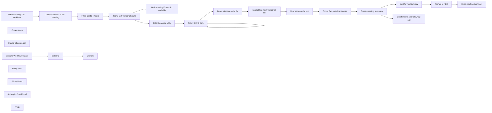

## Fluxo (.json) :

```json
{
  "id": "jhNsy4dPQYw9QDaa",
  "meta": {
    "instanceId": "1acdaec6c8e84424b4715cf41a9f7ec057947452db21cd2e22afbc454c8711cd",
    "templateId": "2683",
    "templateCredsSetupCompleted": true
  },
  "name": "Zoom AI Meeting Assistant",
  "tags": [],
  "nodes": [
    {
      "id": "536e360c-d668-4f58-8670-4e78ef579dbe",
      "name": "When clicking ‘Test workflow’",
      "type": "n8n-nodes-base.manualTrigger",
      "position": [
        160,
        460
      ],
      "parameters": {},
      "typeVersion": 1
    },
    {
      "id": "eb2b6b98-ca3c-46a9-9d5f-9b5297441224",
      "name": "No Recording/Transcript available",
      "type": "n8n-nodes-base.stopAndError",
      "position": [
        880,
        660
      ],
      "parameters": {
        "errorMessage": "={{ $json.error.cause.message }}"
      },
      "typeVersion": 1
    },
    {
      "id": "33ee5d8b-a373-44a8-9777-9386cf8cf008",
      "name": "Zoom: Get data of last meeting",
      "type": "n8n-nodes-base.zoom",
      "position": [
        340,
        460
      ],
      "parameters": {
        "filters": {
          "type": "scheduled"
        },
        "operation": "getAll",
        "returnAll": true,
        "authentication": "oAuth2"
      },
      "credentials": {
        "zoomOAuth2Api": {
          "id": "MmccxSST1g202tG2",
          "name": "Zoom account"
        }
      },
      "typeVersion": 1
    },
    {
      "id": "d67d1fcb-78d1-47e5-bc0e-5735f0f48350",
      "name": "Filter transcript URL",
      "type": "n8n-nodes-base.set",
      "onError": "continueRegularOutput",
      "position": [
        880,
        460
      ],
      "parameters": {
        "options": {},
        "assignments": {
          "assignments": [
            {
              "id": "ef149af8-7f9d-4e5a-8ccf-4a5f1e09eecc",
              "name": "transcript_file",
              "type": "string",
              "value": "={{ $json.recording_files.find(f => f.file_type === 'TRANSCRIPT').download_url }}"
            }
          ]
        }
      },
      "typeVersion": 3.4
    },
    {
      "id": "41665b4e-4d3e-4da9-9b0d-c6f9f0b2cde4",
      "name": "Filter: Only 1 item",
      "type": "n8n-nodes-base.splitInBatches",
      "position": [
        1060,
        460
      ],
      "parameters": {
        "options": {}
      },
      "typeVersion": 3
    },
    {
      "id": "ea12b33a-ae01-403d-9f14-466dc8880874",
      "name": "Zoom: Get transcript file",
      "type": "n8n-nodes-base.httpRequest",
      "position": [
        1240,
        460
      ],
      "parameters": {
        "url": "={{ $json.transcript_file }}",
        "options": {},
        "authentication": "predefinedCredentialType",
        "nodeCredentialType": "zoomOAuth2Api"
      },
      "credentials": {
        "zoomOAuth2Api": {
          "id": "MmccxSST1g202tG2",
          "name": "Zoom account"
        }
      },
      "typeVersion": 4.2
    },
    {
      "id": "fb1c32c3-5161-499d-8cd6-7624fb78ed3e",
      "name": "Extract text from transcript file",
      "type": "n8n-nodes-base.extractFromFile",
      "position": [
        1420,
        460
      ],
      "parameters": {
        "options": {},
        "operation": "text"
      },
      "typeVersion": 1
    },
    {
      "id": "87986fd3-37f0-48cd-942a-73fd3b5bd70f",
      "name": "Format transcript text",
      "type": "n8n-nodes-base.set",
      "position": [
        1600,
        460
      ],
      "parameters": {
        "options": {},
        "assignments": {
          "assignments": [
            {
              "id": "70019192-02ef-4b0a-a747-3ca5f46aeeaa",
              "name": "transcript",
              "type": "string",
              "value": "={{ $json.data.split('\\r\\n\\r\\n').slice(1).map(block => {\n    const lines = block.split('\\r\\n');\n    return lines.slice(2).join(' ');\n}).join('\\n') }}"
            }
          ]
        }
      },
      "typeVersion": 3.4
    },
    {
      "id": "9af3559d-2fd0-481f-84d6-caefbcd8e4f2",
      "name": "Zoom: Get participants data",
      "type": "n8n-nodes-base.httpRequest",
      "position": [
        1760,
        460
      ],
      "parameters": {
        "url": "=https://api.zoom.us/v2/past_meetings/{{ $('Filter: Last 24 hours').item.json.id }}/participants",
        "options": {},
        "authentication": "predefinedCredentialType",
        "nodeCredentialType": "zoomOAuth2Api"
      },
      "credentials": {
        "zoomOAuth2Api": {
          "id": "MmccxSST1g202tG2",
          "name": "Zoom account"
        }
      },
      "typeVersion": 4.2
    },
    {
      "id": "5edc73f7-aa1b-47ae-97f7-c6f897e914a6",
      "name": "Sort for mail delivery",
      "type": "n8n-nodes-base.set",
      "position": [
        2240,
        460
      ],
      "parameters": {
        "options": {},
        "assignments": {
          "assignments": [
            {
              "id": "cc51b7e4-d5c2-4cd4-9488-4d181eaaa02e",
              "name": "subject",
              "type": "string",
              "value": "=Meeting summary: {{ $('Zoom: Get data of last meeting').item.json.topic }} on {{ DateTime.fromISO($('Zoom: Get data of last meeting').item.json.start_time).toFormat('yyyy-MM-dd HH:mm') }}"
            },
            {
              "id": "f3940ea2-9084-4c25-828e-5ddaa428ec83",
              "name": "=to",
              "type": "string",
              "value": "={{ $('Zoom: Get participants data').item.json.participants[0].user_email }}"
            },
            {
              "id": "1211af5b-2240-44ce-9df7-63d93f57806e",
              "name": "body",
              "type": "string",
              "value": "={{ $json.output }}"
            }
          ]
        }
      },
      "typeVersion": 3.4
    },
    {
      "id": "29ad24ba-016b-4e65-b8c8-908d8e2207c5",
      "name": "Format to html",
      "type": "n8n-nodes-base.code",
      "position": [
        2400,
        460
      ],
      "parameters": {
        "jsCode": "const items = [];\n\nfor (const item of $input.all()) {\n  const body = item.json.body;\n  if (!body) continue;\n\n  // Simple split approach\n  const sections = body.split('\\n\\n');\n  const title = sections[0].replace(/\\*\\*/g, '');\n  const participants = sections[1].split('\\n').slice(1).join('\\n');\n  const summary = sections[2].split('\\n').slice(1).join('\\n');\n  const tasks = sections[3].split('\\n').slice(1).join('\\n');\n  const dates = sections[4].split('\\n').slice(1).join('\\n');\n\n  const html = `<html>\n<body style=\"font-family: Arial, sans-serif; max-width: 800px; margin: 20px;\">\n<h1 style=\"color: #2c3e50; border-bottom: 2px solid #3498db; padding-bottom: 10px;\">${title}</h1>\n<h2 style=\"color: #2c3e50; margin-top: 20px;\">Participants:</h2>\n<ul style=\"list-style-type: none; padding-left: 20px;\">\n${participants.split('\\n').map(p => `<li>${p.replace('- ', '')}</li>`).join('\\n')}\n</ul>\n<h2 style=\"color: #2c3e50; margin-top: 20px;\">Meeting Summary:</h2>\n<p style=\"margin-left: 20px;\">${summary}</p>\n<h2 style=\"color: #2c3e50; margin-top: 20px;\">Tasks:</h2>\n<ul style=\"margin-left: 20px;\">\n${tasks.split('\\n').map(t => `<li>${t.replace('- ', '')}</li>`).join('\\n')}\n</ul>\n<h2 style=\"color: #2c3e50; margin-top: 20px;\">Important Dates:</h2>\n<ul style=\"margin-left: 20px;\">\n${dates.split('\\n').map(d => `<li>${d.replace('- ', '')}</li>`).join('\\n')}\n</ul>\n</body>\n</html>`;\n\n  items.push({\n    json: {\n      html,\n      to: item.json.to,\n      subject: item.json.subject\n    }\n  });\n}\n\nreturn items;"
      },
      "typeVersion": 2
    },
    {
      "id": "60c9d778-d97a-4e17-858c-804f523590e5",
      "name": "Send meeting summary",
      "type": "n8n-nodes-base.emailSend",
      "position": [
        2560,
        460
      ],
      "webhookId": "81c4f081-f3d1-44c3-a344-3f735f1873b5",
      "parameters": {
        "html": "={{ $json.html }}",
        "options": {},
        "subject": "={{ $json.subject }}",
        "toEmail": "={{ $json.to }}",
        "fromEmail": "friedemann.schuetz@posteo.de"
      },
      "credentials": {
        "smtp": {
          "id": "OFGEnOq5l8U8Lb3U",
          "name": "SMTP account"
        }
      },
      "typeVersion": 2.1
    },
    {
      "id": "39d8bb49-d9e9-46e3-89b3-fcbf9345bad8",
      "name": "Create tasks",
      "type": "@n8n/n8n-nodes-langchain.toolWorkflow",
      "position": [
        2340,
        1040
      ],
      "parameters": {
        "name": "create_task",
        "schemaType": "manual",
        "workflowId": {
          "__rl": true,
          "mode": "list",
          "value": "zSKQLEObdU9RiThI",
          "cachedResultName": "create_task"
        },
        "description": "=Use this tool to create a task. \nFor task creation use only action items for me Friedemann, don't use action items for other participants.",
        "inputSchema": "{\n    \"type\": \"object\",\n    \"properties\": {\n      \"items\": {\n        \"type\": \"array\",\n        \"description\": \"An array of tasks\",\n        \"items\": {\n          \"type\": \"object\",\n          \"properties\": {\n            \"name\": {\n              \"type\": \"string\",\n              \"description\": \"The name of the task\"\n            },\n            \"description\": {\n              \"type\": \"string\",\n              \"description\": \"A detailed description of the task\"\n            },\n            \"due_date\": {\n              \"type\": \"string\",\n              \"description\": \"Due Date\"\n            },\n            \"priority\": {\n              \"type\": \"string\",\n              \"description\": \"Priority. . Please capitalize first letter\"\n            },\n            \"project_name\": {\n              \"type\": \"string\",\n              \"description\": \"Name of the project. Word 'Project' shouldn't be included\"\n            }\n          },\n          \"required\": [\n            \"name\",\n            \"description\",\n            \"due_date\",\n            \"priority\"\n          ],\n          \"additionalProperties\": false\n        }\n      }\n    },\n    \"required\": [\n      \"items\"\n    ],\n    \"additionalProperties\": false\n}",
        "specifyInputSchema": true
      },
      "typeVersion": 1.3
    },
    {
      "id": "9fa8eb9e-d4fc-4a2a-9843-2f51055944e9",
      "name": "Create tasks and follow-up call",
      "type": "@n8n/n8n-nodes-langchain.agent",
      "position": [
        2240,
        720
      ],
      "parameters": {
        "text": "=<system_prompt>\n\nTODAY IS: {{ $now }}\n\nYOU ARE A MEETING ASSISTANT FOR AUTOMATION IN N8N. YOUR TASK IS TO EFFICIENTLY AND PRECISELY PROCESS INFORMATION FROM ZOOM MEETINGS TO GENERATE TO-DOS AND SCHEDULE FOLLOW-UP MEETINGS. YOU HAVE ACCESS TO THE FOLLOWING DATA:\n\n### INPUTS ###\n- **MEETING TITLE**: {{ $('Zoom: Get data of last meeting').item.json.topic }}\n- **PARTICIPANTS**: {{ $('Zoom: Get participants data').item.json.participants[0].name }}\n- **TRANSCRIPT**: {{ $('Format transcript text').item.json.transcript }}\n\n### YOUR TASKS ###\n1. **CREATE TO-DOS**:\n   - IDENTIFY TASKS AND TO-DOS IN THE TRANSCRIPT.\n   - FORMULATE CLEAR, CONCRETE TASKS.\n   - PASS THESE TASKS TO THE TOOL \"Create tasks\" TO SAVE THEM IN CLICKUP. \n   - DATA STRUCTURE:\n     - **TASK DESCRIPTION**: Brief description of the task.\n     - **ASSIGNED PERSON**: First name from the participant list.\n     - **DUE DATE**: Use any date mentioned in the transcript; otherwise, set to \"Not specified.\"\n\n2. **CREATE MEETING**:\n   - ANALYZE THE TRANSCRIPT TO IDENTIFY INFORMATION ABOUT THE NEXT MEETING (DATE, TIME, AND TOPIC).\n   - PASS THIS INFORMATION TO THE TOOL \"Create follow-up call.\"\n   - DATA STRUCTURE:\n     - **MEETING TITLE**: \"Follow-up: [Meeting Title]\"\n     - **DATE AND TIME**: Determined from the transcript or set to \"Next Tuesday at 10:00 AM\" if no information is provided.\n     - **PARTICIPANTS**: Add all participants from the list.\n\n### CHAIN OF THOUGHTS ###\n1. **UNDERSTAND**: Read and analyze the provided inputs (title, participants, transcript).\n2. **IDENTIFY**: Extract relevant information for the to-dos and the next meeting.\n3. **DIVIDE**: Split the task into two separate processes: creating to-dos and creating the meeting.\n4. **STRUCTURE**: Format the results in the required structure for the respective tools.\n5. **TRANSMIT**: Pass the data to the designated tools in n8n.\n6. **VERIFY**: Ensure the data is correct and complete.\n\n### WHAT YOU SHOULD NOT DO ###\n- **NEVER**: Create unclear or vague to-dos.\n- **NEVER**: Ignore missing data – use default values where uncertain.\n- **NEVER**: Overlook information from the inputs or make incorrect connections.\n- **NEVER**: Transmit tasks or meetings without proper formatting.\n\n### OUTPUT EXAMPLES ###\n1. **TO-DO**:\n   - **TASK DESCRIPTION**: \"Prepare presentation for the next meeting.\"\n   - **ASSIGNED PERSON**: \"John Doe.\"\n   - **DUE DATE**: \"2025-01-25.\"\n\n2. **MEETING**:\n   - **MEETING TITLE**: \"Follow-up: Project Discussion.\"\n   - **DATE AND TIME**: \"2025-01-28 at 10:00 AM.\"\n   - **PARTICIPANTS**: \"John Doe, Jane Example.\"\n\n### NOTES ###\n- EXECUTE YOUR TASKS WITH THE HIGHEST PRECISION AND CONTEXT SENSITIVITY.\n- RELY ON THE PROVIDED DATA AND DEFAULT VALUES WHERE NECESSARY.\n</system_prompt>\n",
        "options": {},
        "promptType": "define"
      },
      "typeVersion": 1.7
    },
    {
      "id": "05515784-c99d-4197-9d88-62350bacfb7b",
      "name": "Create follow-up call",
      "type": "n8n-nodes-base.microsoftOutlookTool",
      "position": [
        2500,
        1040
      ],
      "webhookId": "04587796-f979-450d-b9ab-0103cdbf1861",
      "parameters": {
        "subject": "={{ $fromAI(\"meeting_name\",\"Meeting name\",\"string\") }}",
        "resource": "event",
        "operation": "create",
        "calendarId": {
          "__rl": true,
          "mode": "list",
          "value": "AQMkADAwATNiZmYAZC1jYjE5LWExMzQtMDACLTAwCgBGAAAD1gD8iHcpKEiYQc0w4fCLUgcA-79r8r8ac0aInYGVxRUqCwAAAgEGAAAA-79r8r8ac0aInYGVxRUqCwAAAkH-AAAA",
          "cachedResultName": "Calendar"
        },
        "endDateTime": "={{ $fromAI(\"end_date_time\",\"Date and time of meeting end\",\"string\") }}",
        "startDateTime": "={{ $fromAI(\"start_date_time\",\"Date and time of meeting start\",\"string\") }}",
        "descriptionType": "manual",
        "toolDescription": "=Use tool to create Outlook Calendar Event. Use this tool only when transcript contains information that call should be scheduled.",
        "additionalFields": {
          "timeZone": "Europe/Berlin"
        }
      },
      "credentials": {
        "microsoftOutlookOAuth2Api": {
          "id": "DNMkqql32uwVETij",
          "name": "Microsoft Outlook account"
        }
      },
      "typeVersion": 2
    },
    {
      "id": "2f00c2c6-2389-429c-8c9a-f8f1fbfb6524",
      "name": "Filter: Last 24 hours",
      "type": "n8n-nodes-base.filter",
      "position": [
        500,
        460
      ],
      "parameters": {
        "options": {},
        "conditions": {
          "options": {
            "version": 2,
            "leftValue": "",
            "caseSensitive": true,
            "typeValidation": "strict"
          },
          "combinator": "and",
          "conditions": [
            {
              "id": "de097a4f-1f3e-4dc0-9ab6-139311ff4676",
              "operator": {
                "type": "dateTime",
                "operation": "afterOrEquals"
              },
              "leftValue": "={{ $json.start_time }}",
              "rightValue": "={{$now.minus({ hours: 24 }).toISO()}}"
            },
            {
              "id": "b22e726e-b68a-433b-a19b-22bb0b008b9b",
              "operator": {
                "type": "dateTime",
                "operation": "beforeOrEquals"
              },
              "leftValue": "={{ $json.start_time }}",
              "rightValue": "={{ $now }}"
            }
          ]
        }
      },
      "typeVersion": 2.2
    },
    {
      "id": "fd353a51-eac3-4d04-ae06-dd8e90b82990",
      "name": "Execute Workflow Trigger",
      "type": "n8n-nodes-base.executeWorkflowTrigger",
      "disabled": true,
      "position": [
        1280,
        980
      ],
      "parameters": {},
      "typeVersion": 1
    },
    {
      "id": "40480f97-699b-4a49-867a-54950702af79",
      "name": "Split Out",
      "type": "n8n-nodes-base.splitOut",
      "position": [
        1500,
        980
      ],
      "parameters": {
        "options": {},
        "fieldToSplitOut": "query.items"
      },
      "typeVersion": 1
    },
    {
      "id": "22e6165f-d7c2-4b23-be63-00c76505cdd3",
      "name": "ClickUp",
      "type": "n8n-nodes-base.clickUp",
      "position": [
        1720,
        980
      ],
      "parameters": {
        "list": "901207046581",
        "name": "={{ $json.name }}",
        "team": "9012366821",
        "space": "90122025710",
        "folder": "90123813376",
        "authentication": "oAuth2",
        "additionalFields": {
          "content": "={{ $json.description }}",
          "dueDate": "={{ $json.due_date }}"
        }
      },
      "credentials": {
        "clickUpOAuth2Api": {
          "id": "KYxmoCCdfSkwWlXE",
          "name": "ClickUp account"
        }
      },
      "typeVersion": 1
    },
    {
      "id": "742a411e-05cb-4aa0-a541-7b67e613e2bb",
      "name": "Sticky Note",
      "type": "n8n-nodes-base.stickyNote",
      "position": [
        1060,
        900
      ],
      "parameters": {
        "width": 1000,
        "height": 280,
        "content": "## Sub workflow: Create Task in ClickUp"
      },
      "typeVersion": 1
    },
    {
      "id": "ebc5f1df-b417-4977-9700-b71b49a15cbb",
      "name": "Sticky Note1",
      "type": "n8n-nodes-base.stickyNote",
      "position": [
        140,
        660
      ],
      "parameters": {
        "width": 660,
        "height": 520,
        "content": "## Welcome to my Zoom AI Meeting Assistant Workflow!\n\n### This workflow has the following sequence:\n\n1. manual trigger (Can be replaced by a scheduled trigger or a webhook)\n2. retrieval of of Zoom meeting data\n3. filter the events of the last 24 hours\n4. retrieval of transcripts and extract of the text\n5. creating a meeting summary, format to html and send per mail\n6. create tasks and follow-up call (if discussed in the meeting) in ClickUp/Outlook (can be replaced by Gmail, Airtable, and so forth) via sub workflow\n\n### The following accesses are required for the workflow:\n- Zoom Workspace (via API and HTTP Request): [Documentation](https://docs.n8n.io/integrations/builtin/credentials/zoom/)\n- Microsoft Outlook: [Documentation](https://docs.n8n.io/integrations/builtin/credentials/microsoft/)\n- ClickUp: [Documentation](https://docs.n8n.io/integrations/builtin/credentials/clickup/)\n- AI API access (e.g. via OpenAI, Anthropic, Google or Ollama)\n- SMTP access data (for sending the mail)\n\nYou can contact me via LinkedIn, if you have any questions: https://www.linkedin.com/in/friedemann-schuetz"
      },
      "typeVersion": 1
    },
    {
      "id": "d9109d09-eb1f-4685-a78b-d17e3dd22438",
      "name": "Zoom: Get transcripts data",
      "type": "n8n-nodes-base.httpRequest",
      "onError": "continueErrorOutput",
      "position": [
        680,
        460
      ],
      "parameters": {
        "url": "=https://api.zoom.us/v2/meetings/{{ $json.id }}/recordings",
        "options": {},
        "authentication": "predefinedCredentialType",
        "nodeCredentialType": "zoomOAuth2Api"
      },
      "credentials": {
        "zoomOAuth2Api": {
          "id": "MmccxSST1g202tG2",
          "name": "Zoom account"
        }
      },
      "typeVersion": 4.2
    },
    {
      "id": "fa006183-8f8d-4999-a749-ded5c506b052",
      "name": "Anthropic Chat Model",
      "type": "@n8n/n8n-nodes-langchain.lmChatAnthropic",
      "position": [
        2080,
        920
      ],
      "parameters": {
        "model": {
          "__rl": true,
          "mode": "list",
          "value": "claude-3-7-sonnet-20250219",
          "cachedResultName": "Claude 3.7 Sonnet"
        },
        "options": {}
      },
      "credentials": {
        "anthropicApi": {
          "id": "sSOLnAcU9zQcL404",
          "name": "Anthropic account"
        }
      },
      "typeVersion": 1.3
    },
    {
      "id": "bc94960d-36a0-4a52-ba32-7755d19fc441",
      "name": "Think",
      "type": "@n8n/n8n-nodes-langchain.toolThink",
      "position": [
        2200,
        920
      ],
      "parameters": {},
      "typeVersion": 1
    },
    {
      "id": "04c96143-5a1b-4599-b5c1-af5990433fa1",
      "name": "Create meeting summary",
      "type": "@n8n/n8n-nodes-langchain.agent",
      "position": [
        1920,
        460
      ],
      "parameters": {
        "text": "=Create a formal meeting minutes document from the following transcript and meeting details.\n\nMeeting Date: {{ $('Zoom: Get data of last meeting').item.json.start_time }} // This needs to be formatted from the meeting details\nParticipants: {{ $json.participants.map(p => p.name + ' (' + p.user_email + ')').join(', ') }}\n\nTranscript:\n{{ $('Format transcript text').item.json.transcript }}\n\nPlease create the minutes in the following format:\n\nMeeting on [Date]\n\nParticipants:\n[List of participants with email addresses]\n\nSummary of the Meeting:\n[Brief and concise summary of the topics discussed]\n\nTasks:\n- [Task] (Responsible: [Name])\n- ...\n\nImportant Dates:\n- [Date] ([Context])\n- ...\n",
        "options": {},
        "promptType": "define"
      },
      "typeVersion": 1.9
    }
  ],
  "active": false,
  "pinData": {
    "Execute Workflow Trigger": [
      {
        "json": {
          "query": {
            "items": [
              {
                "name": "Partner abtelefonieren",
                "due_date": "2025-01-06",
                "priority": "High",
                "description": "Am 6. Januar alle Partner anrufen, um zu klären, ob Interesse an einer weiteren Kooperation besteht und wie diese dargestellt werden kann.",
                "project_name": "Partnerkooperationen"
              }
            ]
          }
        }
      }
    ]
  },
  "settings": {},
  "versionId": "56b41429-33c6-45ac-84a4-4dacec001e35",
  "connections": {
    "Think": {
      "ai_tool": [
        [
          {
            "node": "Create meeting summary",
            "type": "ai_tool",
            "index": 0
          },
          {
            "node": "Create tasks and follow-up call",
            "type": "ai_tool",
            "index": 0
          }
        ]
      ]
    },
    "Split Out": {
      "main": [
        [
          {
            "node": "ClickUp",
            "type": "main",
            "index": 0
          }
        ]
      ]
    },
    "Create tasks": {
      "ai_tool": [
        [
          {
            "node": "Create tasks and follow-up call",
            "type": "ai_tool",
            "index": 0
          }
        ]
      ]
    },
    "Format to html": {
      "main": [
        [
          {
            "node": "Send meeting summary",
            "type": "main",
            "index": 0
          }
        ]
      ]
    },
    "Filter: Only 1 item": {
      "main": [
        [
          {
            "node": "Filter: Only 1 item",
            "type": "main",
            "index": 0
          }
        ],
        [
          {
            "node": "Zoom: Get transcript file",
            "type": "main",
            "index": 0
          }
        ]
      ]
    },
    "Anthropic Chat Model": {
      "ai_languageModel": [
        [
          {
            "node": "Create meeting summary",
            "type": "ai_languageModel",
            "index": 0
          },
          {
            "node": "Create tasks and follow-up call",
            "type": "ai_languageModel",
            "index": 0
          }
        ]
      ]
    },
    "Send meeting summary": {
      "main": [
        []
      ]
    },
    "Create follow-up call": {
      "ai_tool": [
        [
          {
            "node": "Create tasks and follow-up call",
            "type": "ai_tool",
            "index": 0
          }
        ]
      ]
    },
    "Filter transcript URL": {
      "main": [
        [
          {
            "node": "Filter: Only 1 item",
            "type": "main",
            "index": 0
          }
        ]
      ]
    },
    "Filter: Last 24 hours": {
      "main": [
        [
          {
            "node": "Zoom: Get transcripts data",
            "type": "main",
            "index": 0
          }
        ]
      ]
    },
    "Create meeting summary": {
      "main": [
        [
          {
            "node": "Sort for mail delivery",
            "type": "main",
            "index": 0
          },
          {
            "node": "Create tasks and follow-up call",
            "type": "main",
            "index": 0
          }
        ]
      ]
    },
    "Format transcript text": {
      "main": [
        [
          {
            "node": "Zoom: Get participants data",
            "type": "main",
            "index": 0
          }
        ]
      ]
    },
    "Sort for mail delivery": {
      "main": [
        [
          {
            "node": "Format to html",
            "type": "main",
            "index": 0
          }
        ]
      ]
    },
    "Execute Workflow Trigger": {
      "main": [
        [
          {
            "node": "Split Out",
            "type": "main",
            "index": 0
          }
        ]
      ]
    },
    "Zoom: Get transcript file": {
      "main": [
        [
          {
            "node": "Extract text from transcript file",
            "type": "main",
            "index": 0
          }
        ]
      ]
    },
    "Zoom: Get transcripts data": {
      "main": [
        [
          {
            "node": "Filter transcript URL",
            "type": "main",
            "index": 0
          }
        ],
        [
          {
            "node": "No Recording/Transcript available",
            "type": "main",
            "index": 0
          }
        ]
      ]
    },
    "Zoom: Get participants data": {
      "main": [
        [
          {
            "node": "Create meeting summary",
            "type": "main",
            "index": 0
          }
        ]
      ]
    },
    "Zoom: Get data of last meeting": {
      "main": [
        [
          {
            "node": "Filter: Last 24 hours",
            "type": "main",
            "index": 0
          }
        ]
      ]
    },
    "Create tasks and follow-up call": {
      "main": [
        []
      ]
    },
    "Extract text from transcript file": {
      "main": [
        [
          {
            "node": "Format transcript text",
            "type": "main",
            "index": 0
          }
        ]
      ]
    },
    "When clicking ‘Test workflow’": {
      "main": [
        [
          {
            "node": "Zoom: Get data of last meeting",
            "type": "main",
            "index": 0
          }
        ]
      ]
    }
  }
}
```

<a id="template-2211"></a>

## Template 2211 - Relatório mensal de ausências

- **Nome:** Relatório mensal de ausências
- **Descrição:** Gera um relatório mensal de ausências (feriados e doenças) a partir de eventos do calendário do mês anterior e envia por e-mail para a equipa de folha de pagamento.
- **Funcionalidade:** • Agendamento mensal: Inicia o fluxo no dia 1 de cada mês às 8h.
• Cálculo do período anterior: Calcula a data de início correspondente ao mês anterior para consulta de eventos.
• Recuperação de eventos do calendário: Consulta todos os eventos do período calculado do calendário configurado.
• Filtragem por tipo de ausência: Verifica o resumo dos eventos para identificar se são "Holiday" ou "Illness".
• Extração de dados do evento: Extrai nome, datas de início e fim e calcula a duração em dias.
• Agrupamento e soma de dias: Agrega os dias por pessoa separadamente para férias e doenças, somando múltiplos eventos.
• Montagem da mensagem: Constrói uma mensagem legível com o detalhamento por pessoa e tipo de ausência.
• Envio de e-mail: Envia o relatório montado para o endereço da equipa de folha de pagamento.
- **Ferramentas:** • Google Calendar: Fonte dos eventos de ausência, usada para recuperar eventos do mês anterior.
• Servidor SMTP / Serviço de e-mail: Envia o relatório por e-mail para a equipa de folha de pagamento.

## Fluxo visual

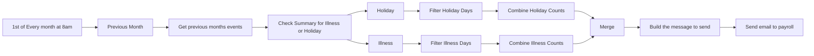

## Fluxo (.json) :

```json
{
  "meta": {
    "instanceId": "8c8c5237b8e37b006a7adce87f4369350c58e41f3ca9de16196d3197f69eabcd"
  },
  "nodes": [
    {
      "id": "6f869392-1501-49b9-be86-4b767f7ec597",
      "name": "Previous Month",
      "type": "n8n-nodes-base.dateTime",
      "position": [
        360,
        420
      ],
      "parameters": {
        "value": "={{Date()}}",
        "action": "calculate",
        "options": {},
        "duration": 1,
        "timeUnit": "months",
        "operation": "subtract"
      },
      "typeVersion": 1
    },
    {
      "id": "1446eb44-bd1e-4dad-9ecc-c2a1e8cb2ca6",
      "name": "1st of Every month at 8am",
      "type": "n8n-nodes-base.cron",
      "position": [
        180,
        420
      ],
      "parameters": {
        "triggerTimes": {
          "item": [
            {
              "hour": 8,
              "mode": "everyMonth"
            }
          ]
        }
      },
      "typeVersion": 1
    },
    {
      "id": "a044ac76-49d9-4046-b008-2b4adf6512b1",
      "name": "Check Summary for Illness or Holiday",
      "type": "n8n-nodes-base.switch",
      "position": [
        760,
        420
      ],
      "parameters": {
        "rules": {
          "rules": [
            {
              "value2": "Holiday",
              "operation": "contains"
            },
            {
              "output": 1,
              "value2": "Illness",
              "operation": "contains"
            }
          ]
        },
        "value1": "={{$json[\"summary\"]}}",
        "dataType": "string"
      },
      "typeVersion": 1
    },
    {
      "id": "6b40beab-7938-4aaa-a8a8-7a1e364dc2de",
      "name": "Holiday",
      "type": "n8n-nodes-base.noOp",
      "position": [
        980,
        220
      ],
      "parameters": {},
      "typeVersion": 1
    },
    {
      "id": "b069f3ce-66d1-4f64-946b-f9fda27db46b",
      "name": "Illness",
      "type": "n8n-nodes-base.noOp",
      "position": [
        980,
        400
      ],
      "parameters": {},
      "typeVersion": 1
    },
    {
      "id": "5725626b-2bfd-47a0-947e-efd28f0c29fe",
      "name": "Filter Holiday Days",
      "type": "n8n-nodes-base.set",
      "position": [
        1180,
        220
      ],
      "parameters": {
        "values": {
          "string": [
            {
              "name": "Name",
              "value": "={{$json[\"description\"].split(\",\")[0]}}"
            },
            {
              "name": "Days",
              "value": "={{(new Date($json[\"end\"][\"date\"]).getTime() - new Date($json[\"start\"][\"date\"]).getTime()) / (1000 * 3600 * 24)}}"
            },
            {
              "name": "Type",
              "value": "Holiday"
            }
          ]
        },
        "options": {},
        "keepOnlySet": true
      },
      "typeVersion": 1
    },
    {
      "id": "3114eb4f-a5be-452c-9729-b94d2904eb4b",
      "name": "Filter Illness Days",
      "type": "n8n-nodes-base.set",
      "position": [
        1180,
        400
      ],
      "parameters": {
        "values": {
          "string": [
            {
              "name": "Name",
              "value": "={{$json[\"description\"].split(\",\")[0]}}"
            },
            {
              "name": "Days",
              "value": "={{(new Date($json[\"end\"][\"date\"]).getTime() - new Date($json[\"start\"][\"date\"]).getTime()) / (1000 * 3600 * 24)}}"
            },
            {
              "name": "Type",
              "value": "Illness"
            }
          ]
        },
        "options": {},
        "keepOnlySet": true
      },
      "typeVersion": 1
    },
    {
      "id": "04617849-c162-4af5-9634-ab8ffd925625",
      "name": "Merge",
      "type": "n8n-nodes-base.merge",
      "position": [
        1620,
        320
      ],
      "parameters": {},
      "typeVersion": 1
    },
    {
      "id": "daf227d9-938d-4110-9a47-5bf8bb661586",
      "name": "Get previous months events",
      "type": "n8n-nodes-base.googleCalendar",
      "position": [
        560,
        420
      ],
      "parameters": {
        "options": {
          "timeMax": "={{new Date().toISOString()}}",
          "timeMin": "={{$json[\"data\"]}}"
        },
        "calendar": "[Select Cal]",
        "operation": "getAll",
        "returnAll": true
      },
      "credentials": {
        "googleCalendarOAuth2Api": {
          "id": "50",
          "name": "Google Calendar account"
        }
      },
      "typeVersion": 1
    },
    {
      "id": "19ec862a-e71a-49f9-b799-26f73a410553",
      "name": "Send email to payroll",
      "type": "n8n-nodes-base.emailSend",
      "position": [
        1980,
        320
      ],
      "parameters": {
        "text": "={{$json[\"message\"]}}",
        "options": {},
        "subject": "Absences from last month",
        "toEmail": "payroll-team@mydomain.tld",
        "fromEmail": "n8n@mydomain.tld"
      },
      "credentials": {
        "smtp": {
          "id": "16",
          "name": "mailtrap"
        }
      },
      "typeVersion": 1
    },
    {
      "id": "5805b2e1-e723-4803-a7e0-8df5fd4cf84d",
      "name": "Combine Holiday Counts",
      "type": "n8n-nodes-base.code",
      "position": [
        1380,
        220
      ],
      "parameters": {
        "jsCode": "let names = $input.all().map(e => e.json.Name);\nlet unique_names = [...new Set(names)];\nlet results = [];\n\nfor (thisName of unique_names) {\n  let result = {\n    \"Name\": thisName,\n    \"Days\": 0,\n    \"Type\": \"Holiday\"\n  }\n\n  for (matching_item of $input.all().filter(e => e.json.Name === thisName)) {\n    result.Days += parseInt(matching_item.json.Days);\n  }\n  \n  results.push(result);\n}\n\nreturn results.map(e => { return {json: e} });"
      },
      "typeVersion": 1
    },
    {
      "id": "c30345ae-1a19-4453-a67b-eda71cb7326e",
      "name": "Combine Illness Counts",
      "type": "n8n-nodes-base.code",
      "position": [
        1380,
        400
      ],
      "parameters": {
        "jsCode": "let names = $input.all().map(e => e.json.Name);\nlet unique_names = [...new Set(names)];\nlet results = [];\n\nfor (thisName of unique_names) {\n  let result = {\n    \"Name\": thisName,\n    \"Days\": 0,\n    \"Type\": \"Illness\"\n  }\n\n  for (matching_item of $input.all().filter(e => e.json.Name === thisName)) {\n    result.Days += parseInt(matching_item.json.Days);\n  }\n  \n  results.push(result);\n}\n\nreturn results.map(e => { return {json: e} });"
      },
      "typeVersion": 1
    },
    {
      "id": "7bac2604-ca55-4300-a7a5-38fc96830ba6",
      "name": "Build the message to send",
      "type": "n8n-nodes-base.code",
      "position": [
        1800,
        320
      ],
      "parameters": {
        "jsCode": "let illnessMessage = \"\";\nlet holidayMessage = \"\";\nlet message = \"Here is a breakdown of absences for the last month.\\n\\n\";\n\n// Loop the input items\nfor (item of $input.all()) {\n  if (item.json.Type == \"Holiday\") {\n    holidayMessage += item.json.Name + \" had \" + item.json.Days + \" days\\n\";\n  }\n  if (item.json.Type == \"Illness\") {\n    illnessMessage += item.json.Name + \" had \" + item.json.Days + \" days\\n\";\n  }\n}\n\nif (holidayMessage != \"\") {\n  message += \"Holiday Events\\n\";\n  message += holidayMessage + \"\\n\";\n} else {\n  message += \"No Holiday Events\\n\";\n}\n\nif (illnessMessage != \"\") {\n  message += \"Illness Events\\n\";\n  message += illnessMessage;\n} else {\n  message += \"No Illness Events\\n\";\n}\n\n// Return our message\nreturn [{json: {message}}];"
      },
      "typeVersion": 1
    }
  ],
  "connections": {
    "Merge": {
      "main": [
        [
          {
            "node": "Build the message to send",
            "type": "main",
            "index": 0
          }
        ]
      ]
    },
    "Holiday": {
      "main": [
        [
          {
            "node": "Filter Holiday Days",
            "type": "main",
            "index": 0
          }
        ]
      ]
    },
    "Illness": {
      "main": [
        [
          {
            "node": "Filter Illness Days",
            "type": "main",
            "index": 0
          }
        ]
      ]
    },
    "Previous Month": {
      "main": [
        [
          {
            "node": "Get previous months events",
            "type": "main",
            "index": 0
          }
        ]
      ]
    },
    "Filter Holiday Days": {
      "main": [
        [
          {
            "node": "Combine Holiday Counts",
            "type": "main",
            "index": 0
          }
        ]
      ]
    },
    "Filter Illness Days": {
      "main": [
        [
          {
            "node": "Combine Illness Counts",
            "type": "main",
            "index": 0
          }
        ]
      ]
    },
    "Combine Holiday Counts": {
      "main": [
        [
          {
            "node": "Merge",
            "type": "main",
            "index": 0
          }
        ]
      ]
    },
    "Combine Illness Counts": {
      "main": [
        [
          {
            "node": "Merge",
            "type": "main",
            "index": 1
          }
        ]
      ]
    },
    "1st of Every month at 8am": {
      "main": [
        [
          {
            "node": "Previous Month",
            "type": "main",
            "index": 0
          }
        ]
      ]
    },
    "Build the message to send": {
      "main": [
        [
          {
            "node": "Send email to payroll",
            "type": "main",
            "index": 0
          }
        ]
      ]
    },
    "Get previous months events": {
      "main": [
        [
          {
            "node": "Check Summary for Illness or Holiday",
            "type": "main",
            "index": 0
          }
        ]
      ]
    },
    "Check Summary for Illness or Holiday": {
      "main": [
        [
          {
            "node": "Holiday",
            "type": "main",
            "index": 0
          }
        ],
        [
          {
            "node": "Illness",
            "type": "main",
            "index": 0
          }
        ]
      ]
    }
  }
}
```

<a id="template-2213"></a>

## Template 2213 - Sincronizar novos produtos do Shopify para Odoo

- **Nome:** Sincronizar novos produtos do Shopify para Odoo
- **Descrição:** Quando um produto é criado no Shopify, o fluxo verifica se já existe no Odoo e cria um novo produto no Odoo quando não é encontrado.
- **Funcionalidade:** • Detecção de novos produtos: inicia o fluxo quando um produto é criado no Shopify.
• Verificação de existência no Odoo: pesquisa produtos no Odoo usando o product_id da variante como código (default_code) para evitar duplicatas.
• Preparação dos dados do produto: organiza título, descrição, código e preço recebidos do Shopify para envio ao sistema destino.
• Filtragem de duplicatas: determina se o produto deve ser criado com base na existência no Odoo.
• Criação de produto no Odoo: cria o registro de produto com nome, código, descrição e preço quando não existe previamente.
- **Ferramentas:** • Shopify: plataforma de e-commerce usada como fonte de produtos e que aciona o fluxo quando há criação de produto.
• Odoo: sistema ERP utilizado para consultar o catálogo existente e criar novos registros de produtos.

## Fluxo visual

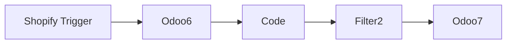

## Fluxo (.json) :

```json
{
  "id": "44PIIGwPzUe9dGfb",
  "meta": {
    "instanceId": "6b3e8c6c30cdfbf06283a3fa57016932c6b4ec959896c5c546ef5865ff697ff1"
  },
  "name": "Sync New Shopify Products to Odoo Product",
  "tags": [],
  "nodes": [
    {
      "id": "5ad7f941-4146-4897-ad30-dcdccab85e82",
      "name": "Odoo6",
      "type": "n8n-nodes-base.odoo",
      "position": [
        320,
        0
      ],
      "parameters": {
        "limit": 1,
        "options": {},
        "resource": "custom",
        "operation": "getAll",
        "filterRequest": {
          "filter": [
            {
              "value": "={{ $('Shopify Trigger').all()[0].json.variants[0].product_id }}",
              "fieldName": "default_code"
            }
          ]
        },
        "customResource": "product.product"
      },
      "credentials": {
        "odooApi": {
          "id": "0qIK4Cq1BwOSbxT8",
          "name": "Odoo 148.66.157.208:8069"
        }
      },
      "typeVersion": 1,
      "alwaysOutputData": true
    },
    {
      "id": "1b1a3753-e645-465c-8155-ad8c006f3e13",
      "name": "Filter2",
      "type": "n8n-nodes-base.filter",
      "position": [
        740,
        0
      ],
      "parameters": {
        "conditions": {
          "boolean": [
            {
              "value1": "={{ $json.existing }}"
            }
          ]
        }
      },
      "typeVersion": 1
    },
    {
      "id": "5b388afc-de9a-4246-85a8-0ef4ec8ac0bc",
      "name": "Odoo7",
      "type": "n8n-nodes-base.odoo",
      "position": [
        920,
        0
      ],
      "parameters": {
        "resource": "custom",
        "customResource": "product.product",
        "fieldsToCreateOrUpdate": {
          "fields": [
            {
              "fieldName": "name",
              "fieldValue": "={{ $json.product_detail.title }}"
            },
            {
              "fieldName": "default_code",
              "fieldValue": "={{ $json.product_detail.variants[0].product_id }}"
            },
            {
              "fieldName": "description",
              "fieldValue": "={{ $json.product_detail.body_html }}"
            },
            {
              "fieldName": "list_price",
              "fieldValue": "={{ $json.product_detail.variants[0].price }}"
            }
          ]
        }
      },
      "credentials": {
        "odooApi": {
          "id": "0qIK4Cq1BwOSbxT8",
          "name": "Odoo 148.66.157.208:8069"
        }
      },
      "typeVersion": 1,
      "alwaysOutputData": false
    },
    {
      "id": "765aeea5-bfe8-4d6c-96a4-ebbc192a9d60",
      "name": "Shopify Trigger",
      "type": "n8n-nodes-base.shopifyTrigger",
      "position": [
        80,
        0
      ],
      "webhookId": "30b89f06-e54c-4461-9e1e-9ef7f221e08b",
      "parameters": {
        "topic": "products/create",
        "authentication": "accessToken"
      },
      "credentials": {
        "shopifyAccessTokenApi": {
          "id": "zkXzZzc97XyALfN8",
          "name": "Evozard - Shopify"
        }
      },
      "typeVersion": 1
    },
    {
      "id": "e1b2f842-0b54-4f55-9c69-a4d40777fd0c",
      "name": "Code",
      "type": "n8n-nodes-base.code",
      "position": [
        560,
        0
      ],
      "parameters": {
        "mode": "runOnceForEachItem",
        "jsCode": "var product_detail = $('Shopify Trigger').first().json\nconsole.log('-------product_detail--------',product_detail)\nvar existing_product = $('Odoo6').item.json\nreturn {existing:existing_product.id ? true:false,product_detail:product_detail}\n"
      },
      "typeVersion": 2
    }
  ],
  "active": false,
  "pinData": {},
  "settings": {
    "executionOrder": "v1"
  },
  "versionId": "5dc6f917-daa8-4819-b8ff-1c46ab75b680",
  "connections": {
    "Code": {
      "main": [
        [
          {
            "node": "Filter2",
            "type": "main",
            "index": 0
          }
        ]
      ]
    },
    "Odoo6": {
      "main": [
        [
          {
            "node": "Code",
            "type": "main",
            "index": 0
          }
        ]
      ]
    },
    "Filter2": {
      "main": [
        [
          {
            "node": "Odoo7",
            "type": "main",
            "index": 0
          }
        ]
      ]
    },
    "Shopify Trigger": {
      "main": [
        [
          {
            "node": "Odoo6",
            "type": "main",
            "index": 0
          }
        ]
      ]
    }
  }
}
```

<a id="template-2215"></a>

## Template 2215 - Sincronizar clientes Shopify para contatos Odoo

- **Nome:** Sincronizar clientes Shopify para contatos Odoo
- **Descrição:** Detecta novos clientes criados no Shopify e sincroniza como contatos no Odoo, evitando duplicatas.
- **Funcionalidade:** • Detecção de novos clientes no Shopify: Inicia a automação ao receber o evento de criação de cliente.
• Busca de contato no Odoo por email: Pesquisa contatos existentes usando o email do cliente para evitar duplicação.
• Verificação de existência de contato: Executa lógica que determina se o contato já existe com base na resposta da busca.
• Criação de novo contato no Odoo: Quando não há contato existente, cria um res.partner preenchendo nome, email, endereço, CEP, cidade e telefone.
• Mapeamento de campos do cliente: Extrai dados do primeiro endereço do cliente (addresses[0]) para popular os campos do contato no Odoo.
- **Ferramentas:** • Shopify: Plataforma de comércio eletrônico que gera o evento de criação de cliente usado para iniciar a sincronização.
• Odoo: Sistema ERP/CRM usado para buscar e criar registros de contatos (res.partner) onde os clientes são armazenados.


## Fluxo visual

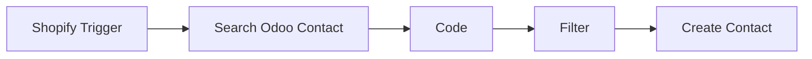

## Fluxo (.json) :

```json
{
  "id": "Zp0R3I1dUjZOIz2l",
  "meta": {
    "instanceId": "6b3e8c6c30cdfbf06283a3fa57016932c6b4ec959896c5c546ef5865ff697ff1",
    "templateCredsSetupCompleted": true
  },
  "name": "Sync New Shopify Customers to Odoo Contacts",
  "tags": [],
  "nodes": [
    {
      "id": "ae072919-4f88-4722-b139-2628e24b89ba",
      "name": "Filter",
      "type": "n8n-nodes-base.filter",
      "position": [
        -420,
        -40
      ],
      "parameters": {
        "conditions": {
          "boolean": [
            {
              "value1": "={{ $json.existing }}"
            }
          ]
        }
      },
      "typeVersion": 1
    },
    {
      "id": "a36747d5-3381-43b8-9def-e3dbc8942dbd",
      "name": "Search Odoo Contact",
      "type": "n8n-nodes-base.odoo",
      "position": [
        -800,
        -40
      ],
      "parameters": {
        "limit": 1,
        "options": {},
        "resource": "custom",
        "operation": "getAll",
        "filterRequest": {
          "filter": [
            {
              "value": "={{ $('Shopify Trigger').item.json.email }}",
              "fieldName": "email"
            }
          ]
        },
        "customResource": "res.partner"
      },
      "credentials": {
        "odooApi": {
          "id": "0qIK4Cq1BwOSbxT8",
          "name": "Odoo 148.66.157.208:8069"
        }
      },
      "typeVersion": 1,
      "alwaysOutputData": true
    },
    {
      "id": "a52d6acf-e8c2-48cd-b44c-903617c23e9e",
      "name": "Shopify Trigger",
      "type": "n8n-nodes-base.shopifyTrigger",
      "position": [
        -1060,
        -40
      ],
      "webhookId": "30b89f06-e54c-4461-9e1e-9ef7f221e08b",
      "parameters": {
        "topic": "customers/create",
        "authentication": "accessToken"
      },
      "credentials": {
        "shopifyAccessTokenApi": {
          "id": "zkXzZzc97XyALfN8",
          "name": "Evozard - Shopify"
        }
      },
      "typeVersion": 1
    },
    {
      "id": "f3023805-dc0b-4745-ab7b-77b2d81137e3",
      "name": "Create Contact",
      "type": "n8n-nodes-base.odoo",
      "position": [
        -240,
        -40
      ],
      "parameters": {
        "resource": "custom",
        "customResource": "res.partner",
        "fieldsToCreateOrUpdate": {
          "fields": [
            {
              "fieldName": "name",
              "fieldValue": "={{ $('Shopify Trigger').item.json.addresses[0].name }}"
            },
            {
              "fieldName": "email",
              "fieldValue": "={{ $('Shopify Trigger').item.json.email }}"
            },
            {
              "fieldName": "street",
              "fieldValue": "={{ $('Shopify Trigger').item.json.addresses[0].address1 }}"
            },
            {
              "fieldName": "street2",
              "fieldValue": "={{ $('Shopify Trigger').item.json.addresses[0].address2 }}"
            },
            {
              "fieldName": "city",
              "fieldValue": "={{ $('Shopify Trigger').item.json.addresses[0].city }}"
            },
            {
              "fieldName": "zip",
              "fieldValue": "={{ $('Shopify Trigger').item.json.addresses[0].zip }}"
            },
            {
              "fieldName": "phone",
              "fieldValue": "={{ $('Shopify Trigger').item.json.addresses[0].phone }}"
            }
          ]
        }
      },
      "credentials": {
        "odooApi": {
          "id": "0qIK4Cq1BwOSbxT8",
          "name": "Odoo 148.66.157.208:8069"
        }
      },
      "typeVersion": 1,
      "alwaysOutputData": false
    },
    {
      "id": "4cef59ef-0ba4-4eee-83b6-27254ffd5974",
      "name": "Code",
      "type": "n8n-nodes-base.code",
      "position": [
        -600,
        -40
      ],
      "parameters": {
        "mode": "runOnceForEachItem",
        "jsCode": "\n\nvar contact_detail = $('Shopify Trigger').item.json\nconsole.log('-------contact_detail--------',contact_detail)\nvar existing_contact = $('Search Odoo Contact').item.json\nconsole.log('-------existing_contact--------',existing_contact,existing_contact.valueOf)\nreturn {existing:existing_contact.id ? true:false,contact_detail:contact_detail}\n"
      },
      "typeVersion": 2
    }
  ],
  "active": false,
  "pinData": {},
  "settings": {
    "executionOrder": "v1"
  },
  "versionId": "4c04743a-c0c3-4900-9963-3ca05b65908c",
  "connections": {
    "Code": {
      "main": [
        [
          {
            "node": "Filter",
            "type": "main",
            "index": 0
          }
        ]
      ]
    },
    "Filter": {
      "main": [
        [
          {
            "node": "Create Contact",
            "type": "main",
            "index": 0
          }
        ]
      ]
    },
    "Shopify Trigger": {
      "main": [
        [
          {
            "node": "Search Odoo Contact",
            "type": "main",
            "index": 0
          }
        ]
      ]
    },
    "Search Odoo Contact": {
      "main": [
        [
          {
            "node": "Code",
            "type": "main",
            "index": 0
          }
        ]
      ]
    }
  }
}
```

<a id="template-2217"></a>

## Template 2217 - Captura, analisa e publica conteúdos positivos

- **Nome:** Captura, analisa e publica conteúdos positivos
- **Descrição:** O fluxo captura tweets e submissões via webhook, realiza análise de sentimento e publica conteúdos com sentimento positivo em um CMS Strapi.
- **Funcionalidade:** • Agendamento de busca por tweets: Pesquisa periodicamente por tweets que contenham termos específicos (ex.: "strapi" ou "n8n.io") a cada 30 minutos.
• Normalização de conteúdo: Remove URLs do texto do tweet e formata campos como conteúdo, autor, data e URL do tweet.
• Filtragem de tweets: Ignora retweets e tweets mais antigos que 30 minutos antes de prosseguir com a análise.
• Recebimento de formulários via webhook: Aceita submissões HTTP POST e extrai conteúdo, autor e data para análise.
• Análise de sentimento: Usa um serviço de linguagem para calcular o sentimento do texto (pontuação de sentimento do documento).
• Junção de dados: Mescla os resultados da análise de sentimento com os dados originais da fonte (tweet ou formulário).
• Verificação de limiar positivo: Publica entradas apenas quando a pontuação de sentimento excede limiares configurados (ex.: 0.3 para tweets, 0.4 para formulários).
• Armazenamento no CMS: Cria registros do tipo "posts" no Strapi com os campos Content, Author, Created e URL para conteúdos aprovados.
- **Ferramentas:** • Twitter API: Fonte de tweets pesquisados por termos e metadados do autor e da publicação.
• Servidor de webhook / serviço de formulários: Envia submissões via HTTP POST para serem processadas e analisadas.
• Google Cloud Natural Language: Serviço de análise de sentimento usado para avaliar o tom dos textos.
• Strapi CMS: Repositório onde os conteúdos aprovados são criados como entradas do tipo "posts".

## Fluxo visual

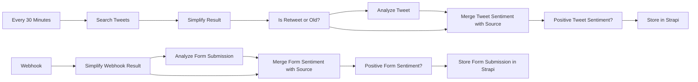

## Fluxo (.json) :

```json
{
  "nodes": [
    {
      "name": "Simplify Result",
      "type": "n8n-nodes-base.set",
      "position": [
        680,
        100
      ],
      "parameters": {
        "values": {
          "string": [
            {
              "name": "Content",
              "value": "={{$json[\"full_text\"].replace(/(?:https?|ftp)://[\\n\\S]+/g, '')}}"
            },
            {
              "name": "Author",
              "value": "={{$json[\"user\"][\"name\"]}} (@{{$json[\"user\"][\"screen_name\"]}})"
            },
            {
              "name": "Created",
              "value": "={{new Date($json[\"created_at\"]).toISOString()}}"
            },
            {
              "name": "URL",
              "value": "=https://twitter.com/{{$json[\"user\"][\"screen_name\"]}}/status/{{$json[\"id_str\"]}}"
            }
          ]
        },
        "options": {},
        "keepOnlySet": true
      },
      "typeVersion": 1
    },
    {
      "name": "Store in Strapi",
      "type": "n8n-nodes-base.strapi",
      "position": [
        1780,
        100
      ],
      "parameters": {
        "columns": "Content,Author,Created,URL",
        "operation": "create",
        "contentType": "posts"
      },
      "credentials": {
        "strapiApi": {
          "id": "136",
          "name": "Strapi Demo"
        }
      },
      "typeVersion": 1
    },
    {
      "name": "Every 30 Minutes",
      "type": "n8n-nodes-base.interval",
      "position": [
        240,
        100
      ],
      "parameters": {
        "unit": "minutes",
        "interval": 30
      },
      "typeVersion": 1
    },
    {
      "name": "Is Retweet or Old?",
      "type": "n8n-nodes-base.if",
      "position": [
        900,
        100
      ],
      "parameters": {
        "conditions": {
          "string": [
            {
              "value1": "={{$json[\"Content\"]}}",
              "value2": "RT @",
              "operation": "startsWith"
            }
          ],
          "dateTime": [
            {
              "value1": "={{$json[\"Created\"]}}",
              "value2": "={{new Date(new Date().getTime() - 30 * 60 * 1000)}}",
              "operation": "before"
            }
          ]
        },
        "combineOperation": "any"
      },
      "typeVersion": 1
    },
    {
      "name": "Search Tweets",
      "type": "n8n-nodes-base.twitter",
      "position": [
        460,
        100
      ],
      "parameters": {
        "operation": "search",
        "searchText": "(strapi OR n8n.io) AND lang:en",
        "additionalFields": {
          "tweetMode": "extended",
          "resultType": "recent"
        }
      },
      "credentials": {
        "twitterOAuth1Api": {
          "id": "15",
          "name": "@MutedJam"
        }
      },
      "typeVersion": 1
    },
    {
      "name": "Webhook",
      "type": "n8n-nodes-base.webhook",
      "position": [
        240,
        -120
      ],
      "webhookId": "6f833370-9068-44ef-8e56-4ceb563a851e",
      "parameters": {
        "path": "6f833370-9068-44ef-8e56-4ceb563a851e",
        "options": {},
        "httpMethod": "POST"
      },
      "typeVersion": 1
    },
    {
      "name": "Simplify Webhook Result",
      "type": "n8n-nodes-base.set",
      "position": [
        460,
        -120
      ],
      "parameters": {
        "values": {
          "string": [
            {
              "name": "Content",
              "value": "={{$json[\"body\"][\"data\"][\"fields\"][1][\"value\"]}}"
            },
            {
              "name": "Author",
              "value": "={{$json[\"body\"][\"data\"][\"fields\"][0][\"value\"]}}"
            },
            {
              "name": "Created",
              "value": "={{new Date().toISOString()}}"
            },
            {
              "name": "URL"
            }
          ]
        },
        "options": {},
        "keepOnlySet": true
      },
      "typeVersion": 1
    },
    {
      "name": "Analyze Form Submission",
      "type": "n8n-nodes-base.googleCloudNaturalLanguage",
      "position": [
        680,
        -220
      ],
      "parameters": {
        "content": "={{$json[\"Content\"]}}",
        "options": {}
      },
      "credentials": {
        "googleCloudNaturalLanguageOAuth2Api": {
          "id": "138",
          "name": "Google Cloud Natural Language account"
        }
      },
      "typeVersion": 1
    },
    {
      "name": "Analyze Tweet",
      "type": "n8n-nodes-base.googleCloudNaturalLanguage",
      "position": [
        1120,
        200
      ],
      "parameters": {
        "content": "={{$json[\"Content\"]}}",
        "options": {}
      },
      "credentials": {
        "googleCloudNaturalLanguageOAuth2Api": {
          "id": "138",
          "name": "Google Cloud Natural Language account"
        }
      },
      "typeVersion": 1
    },
    {
      "name": "Merge Form Sentiment with Source",
      "type": "n8n-nodes-base.merge",
      "position": [
        900,
        -120
      ],
      "parameters": {
        "mode": "mergeByIndex"
      },
      "typeVersion": 1
    },
    {
      "name": "Merge Tweet Sentiment with Source",
      "type": "n8n-nodes-base.merge",
      "position": [
        1340,
        100
      ],
      "parameters": {
        "mode": "mergeByIndex"
      },
      "typeVersion": 1
    },
    {
      "name": "Positive Form Sentiment?",
      "type": "n8n-nodes-base.if",
      "position": [
        1120,
        -120
      ],
      "parameters": {
        "conditions": {
          "number": [
            {
              "value1": "={{$json[\"documentSentiment\"][\"score\"]}}",
              "value2": 0.4,
              "operation": "larger"
            }
          ]
        }
      },
      "typeVersion": 1
    },
    {
      "name": "Store Form Submission in Strapi",
      "type": "n8n-nodes-base.strapi",
      "position": [
        1340,
        -120
      ],
      "parameters": {
        "columns": "Content,Author,Created,URL",
        "operation": "create",
        "contentType": "posts"
      },
      "credentials": {
        "strapiApi": {
          "id": "136",
          "name": "Strapi Demo"
        }
      },
      "typeVersion": 1
    },
    {
      "name": "Positive Tweet Sentiment?",
      "type": "n8n-nodes-base.if",
      "position": [
        1560,
        100
      ],
      "parameters": {
        "conditions": {
          "number": [
            {
              "value1": "={{$json[\"documentSentiment\"][\"score\"]}}",
              "value2": 0.3,
              "operation": "larger"
            }
          ]
        }
      },
      "typeVersion": 1
    }
  ],
  "connections": {
    "Webhook": {
      "main": [
        [
          {
            "node": "Simplify Webhook Result",
            "type": "main",
            "index": 0
          }
        ]
      ]
    },
    "Analyze Tweet": {
      "main": [
        [
          {
            "node": "Merge Tweet Sentiment with Source",
            "type": "main",
            "index": 1
          }
        ]
      ]
    },
    "Search Tweets": {
      "main": [
        [
          {
            "node": "Simplify Result",
            "type": "main",
            "index": 0
          }
        ]
      ]
    },
    "Simplify Result": {
      "main": [
        [
          {
            "node": "Is Retweet or Old?",
            "type": "main",
            "index": 0
          }
        ]
      ]
    },
    "Every 30 Minutes": {
      "main": [
        [
          {
            "node": "Search Tweets",
            "type": "main",
            "index": 0
          }
        ]
      ]
    },
    "Is Retweet or Old?": {
      "main": [
        null,
        [
          {
            "node": "Analyze Tweet",
            "type": "main",
            "index": 0
          },
          {
            "node": "Merge Tweet Sentiment with Source",
            "type": "main",
            "index": 0
          }
        ]
      ]
    },
    "Analyze Form Submission": {
      "main": [
        [
          {
            "node": "Merge Form Sentiment with Source",
            "type": "main",
            "index": 0
          }
        ]
      ]
    },
    "Simplify Webhook Result": {
      "main": [
        [
          {
            "node": "Analyze Form Submission",
            "type": "main",
            "index": 0
          },
          {
            "node": "Merge Form Sentiment with Source",
            "type": "main",
            "index": 1
          }
        ]
      ]
    },
    "Positive Form Sentiment?": {
      "main": [
        [
          {
            "node": "Store Form Submission in Strapi",
            "type": "main",
            "index": 0
          }
        ]
      ]
    },
    "Positive Tweet Sentiment?": {
      "main": [
        [
          {
            "node": "Store in Strapi",
            "type": "main",
            "index": 0
          }
        ]
      ]
    },
    "Merge Form Sentiment with Source": {
      "main": [
        [
          {
            "node": "Positive Form Sentiment?",
            "type": "main",
            "index": 0
          }
        ]
      ]
    },
    "Merge Tweet Sentiment with Source": {
      "main": [
        [
          {
            "node": "Positive Tweet Sentiment?",
            "type": "main",
            "index": 0
          }
        ]
      ]
    }
  }
}
```

<a id="template-2219"></a>

## Template 2219 - Gerador de FAQ/Q&A por serviço com AI e upload para Drive

- **Nome:** Gerador de FAQ/Q&A por serviço com AI e upload para Drive
- **Descrição:** Automatiza a leitura de serviços em uma planilha, gera e completa pares de pergunta-resposta (Q&A) usando IA quando necessário, salva os esquemas gerados no Google Drive e atualiza o status na planilha; inclui opção de envio para CMS.
- **Funcionalidade:** • Gatilho manual: inicia o processo manualmente para testar o fluxo.
• Leitura de planilhas: percorre várias abas/folhas configuradas para obter listas de serviços ou categorias.
• Preparação do job: monta metadados (nome, pasta de destino, dados do serviço) antes do processamento.
• Seleção de template por tipo: aplica templates distintos para integrações nativas, credenciais-only, não-nativas e categorias.
• Geração de Q&A padrão: cria um conjunto inicial de perguntas e respostas com campos que podem incluir complementos predefinidos.
• Decisão de completar com IA: verifica para cada Q&A se precisa de complemento por IA ou apenas formatação/concatenação de texto.
• Complemento por modelo de linguagem: envia prompts ao modelo de IA para completar respostas conforme orientação e formato desejado.
• Formatação e agregação: combina respostas originais, texto gerado pela IA e apêndices, normalizando capitalização e agregando em um objeto final.
• Criação de arquivo JSON: converte o objeto final em conteúdo textual e salva com nome padronizado incluindo data.
• Upload para destino: grava o arquivo JSON na pasta específica do Google Drive configurada para o tipo de integração.
• Atualização de status na planilha: marca a linha/processo como concluído (status = done) ao final do processamento.
• Integração opcional com CMS: envia os esquemas gerados para sistemas de gerenciamento via integrações ou chamadas HTTP.
- **Ferramentas:** • Google Sheets: fonte de dados principal com listas de serviços, campos de configuração e controle de status.
• Google Drive: armazenamento dos arquivos JSON gerados, organizados em pastas por tipo de integração.
• OpenAI (modelo GPT-4o-mini): modelo de linguagem usado para completar ou enriquecer respostas de Q&A conforme instruções e exemplos.
• WordPress: destino opcional para publicar ou importar os esquemas gerados em um site.
• Webflow: destino opcional para criar/atualizar conteúdo com os esquemas gerados.
• Strapi: destino opcional (CMS headless) para importar os JSONs como conteúdo estrutural.
• Chamadas HTTP/Endpoints personalizados: opção para enviar os arquivos ou dados para outros CMSs ou APIs que não tenham integração nativa.

## Fluxo visual

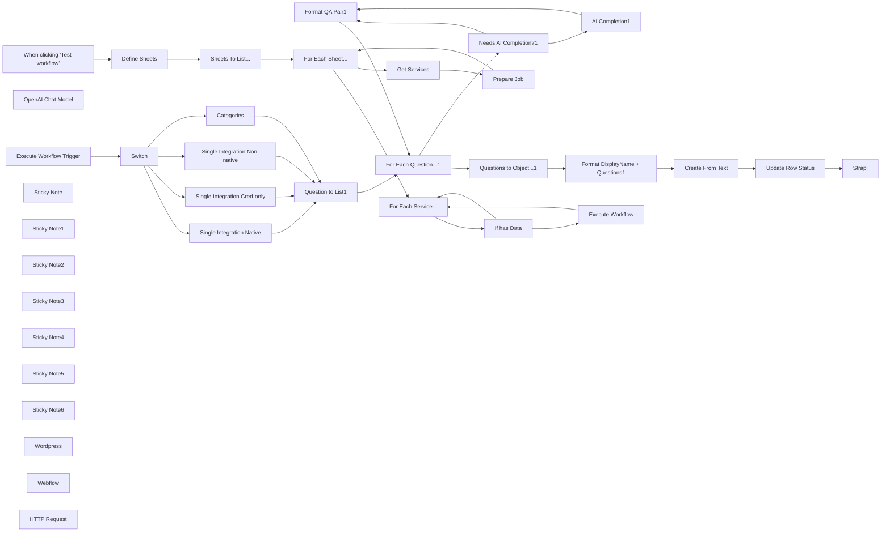

## Fluxo (.json) :

```json
{
  "meta": {
    "instanceId": "ff412ab2a6cd55af5dedbbab9b8e43f0f3a0cb16fb794fa8d3837f957b771ad2"
  },
  "nodes": [
    {
      "id": "9c3c06eb-8b48-4229-9b16-7fe7c4f886c3",
      "name": "When clicking ‘Test workflow’",
      "type": "n8n-nodes-base.manualTrigger",
      "position": [
        78.44447107090468,
        520
      ],
      "parameters": {},
      "typeVersion": 1
    },
    {
      "id": "2a8d8297-18de-4e1f-b44b-93842f7c1709",
      "name": "OpenAI Chat Model",
      "type": "@n8n/n8n-nodes-langchain.lmChatOpenAi",
      "position": [
        1678.4444710709047,
        2020
      ],
      "parameters": {
        "model": "gpt-4o-mini",
        "options": {}
      },
      "typeVersion": 1
    },
    {
      "id": "a6c24857-ad3b-4561-b40b-8520064e861b",
      "name": "Format QA Pair1",
      "type": "n8n-nodes-base.set",
      "position": [
        2018.4444710709047,
        1880
      ],
      "parameters": {
        "options": {},
        "assignments": {
          "assignments": [
            {
              "id": "2c1bd408-29f0-487b-9a33-7513d5bbfe23",
              "name": "question",
              "type": "string",
              "value": "={{ $('Needs AI Completion?1').item.json.question }}"
            },
            {
              "id": "02ffc3b7-3d77-4dfe-ba3f-2052f5cc9e83",
              "name": "answer",
              "type": "string",
              "value": "={{\n[\n $('Needs AI Completion?1').item.json.answer,\n $json.text\n ? $json.text[0].toLowerCase() + $json.text.substring(1, $json.text.length)\n : '',\n $('Needs AI Completion?1').item.json.append || '',\n].join(' ').trim()\n}}"
            }
          ]
        }
      },
      "typeVersion": 3.4
    },
    {
      "id": "2b4712cb-371c-45bc-a024-363ae951b0ac",
      "name": "For Each Question...1",
      "type": "n8n-nodes-base.splitInBatches",
      "position": [
        1238.4444710709047,
        1400
      ],
      "parameters": {
        "options": {}
      },
      "typeVersion": 3
    },
    {
      "id": "8f7cefc1-9fc0-474b-a81e-bf573068258b",
      "name": "Question to List1",
      "type": "n8n-nodes-base.splitOut",
      "position": [
        1038.4444710709047,
        1400
      ],
      "parameters": {
        "options": {},
        "fieldToSplitOut": "data"
      },
      "typeVersion": 1
    },
    {
      "id": "9aeb5858-d6d4-4541-8a0d-851740d948ae",
      "name": "Questions to Object...1",
      "type": "n8n-nodes-base.aggregate",
      "position": [
        1978.4444710709047,
        1380
      ],
      "parameters": {
        "options": {},
        "aggregate": "aggregateAllItemData"
      },
      "typeVersion": 1
    },
    {
      "id": "2c1d56c5-20f2-4691-ab89-87edf9902a5f",
      "name": "Format DisplayName + Questions1",
      "type": "n8n-nodes-base.set",
      "position": [
        2198.444471070905,
        1380
      ],
      "parameters": {
        "options": {},
        "assignments": {
          "assignments": [
            {
              "id": "66318f17-a3bd-4bcf-b326-50208b503143",
              "name": "name",
              "type": "string",
              "value": "={{ $('Execute Workflow Trigger').first().json.data.displayName || $('Execute Workflow Trigger').first().json.data['Category name'] }}"
            },
            {
              "id": "a83abac5-ddc6-4316-a916-7eab338f97cf",
              "name": "questions",
              "type": "array",
              "value": "={{ $json.data }}"
            }
          ]
        }
      },
      "typeVersion": 3.4
    },
    {
      "id": "5147d5ef-f56d-49b0-9be8-0af7ccb8cdae",
      "name": "Create From Text",
      "type": "n8n-nodes-base.googleDrive",
      "position": [
        2380,
        1380
      ],
      "parameters": {
        "name": "={{ $json.name + '-' + $now.format('yyyyMMdd') }}",
        "content": "={{ JSON.stringify($json, null, 4) }}",
        "driveId": {
          "__rl": true,
          "mode": "list",
          "value": ""
        },
        "options": {},
        "folderId": {
          "__rl": true,
          "mode": "id",
          "value": "={{ $('Execute Workflow Trigger').first().json.outdir }}"
        },
        "operation": "createFromText"
      },
      "typeVersion": 3
    },
    {
      "id": "9abc3871-8103-4659-9afa-93142dabec01",
      "name": "Define Sheets",
      "type": "n8n-nodes-base.set",
      "position": [
        518.4444710709047,
        520
      ],
      "parameters": {
        "mode": "raw",
        "options": {},
        "jsonOutput": "{\n \"data\": [\n \"Single Integration Native\",\n \"Single Integration Cred-only\",\n \"Single Integration Non-native\",\n \"Categories\"\n ]\n}\n"
      },
      "typeVersion": 3.4
    },
    {
      "id": "417b1c53-ec19-4f59-9580-b6080d3bc103",
      "name": "Sheets To List...",
      "type": "n8n-nodes-base.splitOut",
      "position": [
        698.4444710709047,
        520
      ],
      "parameters": {
        "options": {},
        "fieldToSplitOut": "data"
      },
      "typeVersion": 1
    },
    {
      "id": "d8495ac2-7f45-4dd5-8eb5-d95c9e572dd3",
      "name": "Get Services",
      "type": "n8n-nodes-base.googleSheets",
      "position": [
        1098.4444710709047,
        660
      ],
      "parameters": {
        "options": {
          "returnAllMatches": "returnAllMatches"
        },
        "filtersUI": {
          "values": [
            {
              "lookupColumn": "=status"
            }
          ]
        },
        "sheetName": {
          "__rl": true,
          "mode": "name",
          "value": "={{ $json.data }}"
        },
        "documentId": {
          "__rl": true,
          "mode": "list",
          "value": ""
        }
      },
      "typeVersion": 4.3,
      "alwaysOutputData": true
    },
    {
      "id": "e5b7ebe7-0e0f-4f61-8a14-afc51eb37270",
      "name": "Single Integration Cred-only",
      "type": "n8n-nodes-base.set",
      "position": [
        778.4444710709047,
        1400
      ],
      "parameters": {
        "mode": "raw",
        "options": {},
        "jsonOutput": "={\n \"data\": [\n {\n \"question\": \"How can I set up {{ $json.data.displayName }} integration in n8n?\",\n \"answer\": \"To use {{ $json.data.displayName }} integration in n8n, start by adding the HTTP Request node to your workflow canvas and authenticate it using a predefined credential type. This allows you to perform custom operations, without additional authentication setup. Once connected, you can make custom API calls to {{ $json.data.displayName }} to query the data you need using the URLs you provide, for example:\",\n \"ai_example\": \"Assume useris advanced in n8n integration and sending HTTP requests, focus instead on examples operations and/or use-cases such as creating records, updating records, or retrieving data.\",\n \"ai_completion\": {{ true }}\n },\n {\n \"question\": \"Do I need any special permissions or API keys to integrate {{ $json.data.displayName }} with n8n?\",\n \"answer\": \"Yes, you need an API key with the necessary permissions to integrate {{ $json.data.displayName }} with n8n. You will typically need to use the {{ $json.data.displayName }} API docs to construct your request via the HTTP Request node. Ensure the API key has the appropriate access rights for the data and actions you want to automate within your workflows.\",\n \"ai_completion\": {{ false }}\n },\n {\n \"question\": \"Can I combine {{ $json.data.displayName }} with other apps in n8n workflows?\",\n \"answer\": \"Definitely! n8n enables you to create workflows that combine {{ $json.data.displayName }} with other apps and services. For instance,\",\n \"ai_completion\": {{ true }}\n },\n {\n \"question\": \"What are some common use cases for {{ $json.data.displayName }} integrations with n8n?\",\n \"answer\": \"Common use cases for {{ $json.data.displayName }} automation include\",\n \"append\": \"With n8n, you can customize these workflows to fit your specific needs and extend them by adding other 400+ integrations or incorporating advanced AI logic.\",\n \"ai_completion\": {{ true }}\n },\n {\n \"question\": \"How does n8n’s pricing model benefit me when integrating {{ $json.data.displayName }}?\",\n \"answer\": \"n8n’s pricing model is designed to be both affordable and scalable, which is particularly beneficial when integrating with {{ $json.data.displayName }}. Unlike other platforms that charge per operation or task, n8n charges only for full workflow executions. This means you can create complex workflows with {{ $json.data.displayName }}, involving thousands of tasks or steps, without worrying about escalating costs. For example, if your {{ $json.data.displayName }} workflows perform around 100k tasks, you could be paying $500+/month on other platforms, but with n8n's pro plan, you start at around $50. This approach allows you to scale your {{ $json.data.displayName }} integrations efficiently while maintaining predictable costs.\",\n \"ai_completion\": {{ false }}\n }\n ]\n}"
      },
      "typeVersion": 3.4
    },
    {
      "id": "e2cc607b-8502-4beb-ace5-8670af845134",
      "name": "Single Integration Native",
      "type": "n8n-nodes-base.set",
      "position": [
        778.4444710709047,
        1240
      ],
      "parameters": {
        "mode": "raw",
        "options": {},
        "jsonOutput": "={\n \"data\": [\n {\n \"question\": \"How can I set up {{ $json.data.displayName }} integration in n8n?\",\n \"answer\": \"To use {{ $json.data.displayName }} integration in n8n, start by adding the {{ $json.data.displayName }} node to your workflow. You'll need to authenticate your {{ $json.data.displayName }} account using supported authentication methods. Once connected, you can choose from the list of supported actions or make custom API calls via the HTTP Request node, for example:\",\n \"ai_completion\": {{ true }}\n },\n {\n \"question\": \"Do I need any special permissions or API keys to integrate {{ $json.data.displayName }} with n8n?\",\n \"answer\": \"Yes, you will typically need an API key, token, or similar credentials to add {{ $json.data.displayName }} integration to n8n. These can usually be found in your account settings for the service. Ensure that your credentials have the necessary permissions to access and manage the data or actions you want to automate within your workflows.\",\n \"ai_completion\": {{ false }}\n },\n {\n \"question\": \"Can I combine {{ $json.data.displayName }} with other apps in n8n workflows?\",\n \"answer\": \"Definitely! n8n enables you to create workflows that combine {{ $json.data.displayName }} with other apps and services. For instance,\",\n \"ai_completion\": {{ true }}\n },\n {\n \"question\": \"What are some common use cases for {{ $json.data.displayName }} integrations with n8n?\",\n \"answer\": \"Common use cases for {{ $json.data.displayName }} automation include\",\n \"append\": \"With n8n, you can customize these workflows to fit your specific needs and extend them by adding other 400+ integrations or incorporating advanced AI logic.\",\n \"ai_completion\": {{ true }}\n },\n {\n \"question\": \"How does n8n’s pricing model benefit me when integrating {{ $json.data.displayName }}?\",\n \"answer\": \"n8n’s pricing model is designed to be both affordable and scalable, which is particularly beneficial when integrating with {{ $json.data.displayName }}. Unlike other platforms that charge per operation or task, n8n charges only for full workflow executions. This means you can create complex workflows with {{ $json.data.displayName }}, involving thousands of tasks or steps, without worrying about escalating costs. For example, if your {{ $json.data.displayName }} workflows perform around 100k tasks, you could be paying $500+/month on other platforms, but with n8n's pro plan, you start at around $50. This approach allows you to scale your {{ $json.data.displayName }} integrations efficiently while maintaining predictable costs.\",\n \"ai_completion\": {{ false }}\n }\n ]\n}"
      },
      "typeVersion": 3.4
    },
    {
      "id": "ce1905c2-f41a-4dea-bd03-a9ae1e893326",
      "name": "Categories",
      "type": "n8n-nodes-base.set",
      "position": [
        778.4444710709047,
        1760
      ],
      "parameters": {
        "mode": "raw",
        "options": {},
        "jsonOutput": "={{\n{\n \"data\": [\n {\n \"question\": `What types of ${$json.data['Category name']} tools can I integrate with n8n?`,\n \"answer\": `n8n offers integrations with a wide range of ${$json.data['Category name']} tools, including`,\n \"append\": `These integrations allow you to streamline your ${$json.data['Category name']} workflows, automate repetitive tasks, and improve collaboration across your team.`,\n \"ai_completion\": true\n },\n {\n \"question\": `Are there any specific requirements or limitations for using ${$json.data['Category name']} integrations?`,\n \"answer\": `Yes, each ${$json.data['Category name']} integration may have specific requirements. For example,`,\n \"append\": `n8n offers a significant number of pre-built ${$json.data['Category name']} integrations (called nodes). If n8n doesn't support the integration you need, use the HTTP Request node or custom code to connect to the service's API. Be sure to review the integration documentation for any app-specific prerequisites. Additionally, consider any API rate limits or usage constraints that might affect your workflows.`,\n \"ai_completion\": true\n },\n {\n \"question\": `What are some popular use cases for ${$json.data['Category name']} integrations in n8n?`,\n \"answer\": `${$json.data['Category name']} integrations with n8n offer a variety of practical use cases. For example:`,\n \"ai_completion\": true,\n \"ai_completion_format\": \"list\"\n },\n {\n \"question\": `How does n8n’s pricing model benefit ${$json.data['Category name']} workflows?`,\n \"answer\": `n8n's pricing model, which charges only for full workflow executions rather than individual tasks or steps, is particularly advantageous for ${$json.data['Category name']} workflows. This means you can build complex, multi-step workflows involving various ${$json.data['Category name']} tools without worrying about cost increases due to the number of operations. For example, if your ${$json.data['Category name']} workflows perform around 100k tasks, you could be paying $500+/month on other platforms, but with n8n's pro plan, you start at around $50. This approach allows you to scale your ${$json.data['Category name']} integrations efficiently while maintaining predictable costs.`,\n \"ai_completion\": false\n },\n {\n \"question\": `How can I leverage n8n's AI capabilities in my ${$json.data['Category name']} workflows?`,\n \"answer\": `n8n offers powerful AI capabilities that can enhance your ${$json.data['Category name']} workflows. For example, you can integrate AI tools like OpenAI with n8n to`,\n \"append\": `To add AI capabilities, navigate to the AI category in n8n's integrations directory and set up the integration with your chosen AI service. This combination of AI and ${$json.data['Category name']} integrations can significantly boost your development efficiency and innovation.`,\n \"ai_completion\": true\n }\n ]\n}\n}}"
      },
      "typeVersion": 3.4
    },
    {
      "id": "344c93e6-3ed9-4dd0-8a38-c2f853ef3cc1",
      "name": "For Each Sheet...",
      "type": "n8n-nodes-base.splitInBatches",
      "position": [
        918.4444710709047,
        520
      ],
      "parameters": {
        "options": {}
      },
      "typeVersion": 3
    },
    {
      "id": "e5776c79-51e4-4469-8cf7-dff009ee0ffd",
      "name": "Execute Workflow Trigger",
      "type": "n8n-nodes-base.executeWorkflowTrigger",
      "position": [
        298.4444710709047,
        1400
      ],
      "parameters": {},
      "typeVersion": 1
    },
    {
      "id": "76aca3a6-c3ff-41fa-9fdf-30839df85669",
      "name": "Execute Workflow",
      "type": "n8n-nodes-base.executeWorkflow",
      "position": [
        1898.4444710709047,
        660
      ],
      "parameters": {
        "mode": "each",
        "options": {},
        "workflowId": "={{ $workflow.id }}"
      },
      "typeVersion": 1,
      "alwaysOutputData": true
    },
    {
      "id": "663b1ce2-ccb5-43d1-8871-c5fa7412151c",
      "name": "Prepare Job",
      "type": "n8n-nodes-base.set",
      "position": [
        1278.4444710709047,
        660
      ],
      "parameters": {
        "options": {},
        "assignments": {
          "assignments": [
            {
              "id": "2755153b-d38c-4aba-be8f-f72c3bf91cf2",
              "name": "sheet",
              "type": "string",
              "value": "={{ $('For Each Sheet...').item.json.data }}"
            },
            {
              "id": "eed4a03a-451b-4b74-b591-ce970d84f990",
              "name": "data",
              "type": "object",
              "value": "={{ $json }}"
            },
            {
              "id": "ee73316c-0316-4389-aa13-4bb145637262",
              "name": "outdir",
              "type": "string",
              "value": "={{\n{\n \"Single Integration Native\": \"Insert the corresponding Google Drive folder ID here\",\n \"Single Integration Cred-only\": \"Insert the corresponding Google Drive folder ID here\",\n \"Single Integration Non-native\": \"Insert the corresponding Google Drive folder ID here\",\n \"Categories\": \"Insert the corresponding Google Drive folder ID here\",\n}[$('For Each Sheet...').item.json.data]\n}}"
            }
          ]
        }
      },
      "typeVersion": 3.4
    },
    {
      "id": "087249d0-d001-49c3-8695-e0e3f02b66e2",
      "name": "For Each Service...",
      "type": "n8n-nodes-base.splitInBatches",
      "position": [
        1498.4444710709047,
        520
      ],
      "parameters": {
        "options": {
          "reset": false
        }
      },
      "typeVersion": 3
    },
    {
      "id": "edd9e2c7-9477-4145-bb1f-1424ccb2080f",
      "name": "Update Row Status",
      "type": "n8n-nodes-base.googleSheets",
      "position": [
        2558.444471070905,
        1380
      ],
      "parameters": {
        "columns": {
          "value": {
            "status": "done",
            "row_number": "={{ $('Execute Workflow Trigger').first().json.data.row_number }}"
          },
          "schema": [
            {
              "id": "displayName",
              "type": "string",
              "display": true,
              "required": false,
              "displayName": "displayName",
              "defaultMatch": false,
              "canBeUsedToMatch": true
            },
            {
              "id": "status",
              "type": "string",
              "display": true,
              "required": false,
              "displayName": "status",
              "defaultMatch": false,
              "canBeUsedToMatch": true
            },
            {
              "id": "row_number",
              "type": "string",
              "display": true,
              "removed": false,
              "readOnly": true,
              "required": false,
              "displayName": "row_number",
              "defaultMatch": false,
              "canBeUsedToMatch": true
            }
          ],
          "mappingMode": "defineBelow",
          "matchingColumns": [
            "row_number"
          ]
        },
        "options": {},
        "operation": "update",
        "sheetName": {
          "__rl": true,
          "mode": "name",
          "value": "={{ $('Execute Workflow Trigger').first().json.sheet }}"
        },
        "documentId": {
          "__rl": true,
          "mode": "list",
          "value": ""
        }
      },
      "typeVersion": 4.4
    },
    {
      "id": "454ccacd-104c-4cad-b52e-72447a49fb04",
      "name": "Single Integration Non-native",
      "type": "n8n-nodes-base.set",
      "position": [
        778.4444710709047,
        1580
      ],
      "parameters": {
        "mode": "raw",
        "options": {},
        "jsonOutput": "={{\n{\n \"data\": [\n {\n \"question\": `How can I set up ${$json.data.displayName} integration in n8n?`,\n \"answer\": `To use ${$json.data.displayName} integration in n8n, start by adding the HTTP Request node to your workflow canvas and authenticate it using a generic authentication method. Once connected, you can make custom API calls to ${$json.data.displayName} to query the data you need using the URLs you provide, for example:`,\n \"ai_example\": \"Assume useris advanced in n8n integration and sending HTTP requests, focus instead on examples operations and/or use-cases such as creating records, updating records, or retrieving data.\",\n \"ai_completion\": true\n },\n{\n \"question\": `Do I need any special permissions or API keys to integrate ${$json.data.displayName} with n8n?`,\n \"answer\": `Yes, with generic authentication, you'll typically need to provide endpoint URLs, headers, parameters, and any other authentication details specific to **${$json.data.displayName}**: - Find the&nbsp;**${$json.data.displayName}** API documentation and see if the API supports HTTP requests; - Most APIs require some form of authentication and you can configure this in the HTTP Request mode (Basic Auth, Custom Auth, Digest Auth, Header Auth, OAuth1 API, OAuth2 API, Query Auth).`,\n \"ai_completion\": false\n },\n{\n \"question\": `Can I combine ${$json.data.displayName} with other apps in n8n workflows?`,\n \"answer\": `Definitely! n8n enables you to create workflows that combine ${$json.data.displayName} with other apps and services. For instance,`,\n \"ai_completion\": true\n },\n {\n \"question\": `What are some common use cases for ${$json.data.displayName} integrations with n8n?`,\n \"answer\": `Common use cases for ${$json.data.displayName} automation include`,\n \"append\": `With n8n, you can customize these workflows to fit your specific needs and extend them by adding other 400+ integrations or incorporating advanced AI logic.`,\n \"ai_completion\": true\n },\n {\n \"question\": `How does n8n’s pricing model benefit me when integrating ${$json.data.displayName}?`,\n \"answer\": `n8n's pricing model is designed to be both affordable and scalable, which is particularly beneficial when integrating with ${ $json.data.displayName}. Unlike other platforms that charge per operation or task, n8n charges only for full workflow executions. This means you can create complex workflows with ${ $json.data.displayName}, involving thousands of tasks or steps, without worrying about escalating costs. For example, if your ${ $json.data.displayName} workflows perform around 100k tasks, you could be paying $500+/month on other platforms, but with n8n's pro plan, you start at around $50. This approach allows you to scale your ${ $json.data.displayName} integrations efficiently while maintaining predictable costs.`,\n \"ai_completion\": false\n }\n ]\n}\n}}"
      },
      "typeVersion": 3.4
    },
    {
      "id": "660fda59-4222-489a-a19a-b3ae0ed7c66f",
      "name": "If has Data",
      "type": "n8n-nodes-base.if",
      "position": [
        1678.4444710709047,
        640
      ],
      "parameters": {
        "options": {},
        "conditions": {
          "options": {
            "leftValue": "",
            "caseSensitive": true,
            "typeValidation": "strict"
          },
          "combinator": "and",
          "conditions": [
            {
              "id": "aea0bac0-4d4a-4359-8df0-1309c3126376",
              "operator": {
                "type": "object",
                "operation": "notEmpty",
                "singleValue": true
              },
              "leftValue": "={{ $json.data }}",
              "rightValue": ""
            }
          ]
        }
      },
      "typeVersion": 2
    },
    {
      "id": "911aece8-1137-48d4-85f6-ee15ebfdc299",
      "name": "Sticky Note",
      "type": "n8n-nodes-base.stickyNote",
      "position": [
        1238.4444710709047,
        620
      ],
      "parameters": {
        "width": 193.4545454545455,
        "height": 317.09090909090907,
        "content": "\n\n\n\n\n\n\n\n\n\n\n\n\n\n\n\n\n\n### 🚨 Set Destination Folders Here"
      },
      "typeVersion": 1
    },
    {
      "id": "44d206a7-049c-4721-8934-2308a4b67821",
      "name": "Needs AI Completion?1",
      "type": "n8n-nodes-base.switch",
      "position": [
        1458.4444710709047,
        1780
      ],
      "parameters": {
        "rules": {
          "values": [
            {
              "outputKey": "TEXT_REPLACE",
              "conditions": {
                "options": {
                  "leftValue": "",
                  "caseSensitive": true,
                  "typeValidation": "strict"
                },
                "combinator": "and",
                "conditions": [
                  {
                    "operator": {
                      "type": "boolean",
                      "operation": "false",
                      "singleValue": true
                    },
                    "leftValue": "={{ $json.ai_completion }}",
                    "rightValue": ""
                  }
                ]
              },
              "renameOutput": true
            },
            {
              "outputKey": "AI_COMPLETE",
              "conditions": {
                "options": {
                  "leftValue": "",
                  "caseSensitive": true,
                  "typeValidation": "strict"
                },
                "combinator": "and",
                "conditions": [
                  {
                    "id": "f3fcd8ea-6cfa-4658-86c3-3ace9b81d3f2",
                    "operator": {
                      "type": "boolean",
                      "operation": "true",
                      "singleValue": true
                    },
                    "leftValue": "={{ $json.ai_completion }}",
                    "rightValue": ""
                  }
                ]
              },
              "renameOutput": true
            }
          ]
        },
        "options": {}
      },
      "typeVersion": 3
    },
    {
      "id": "14999c7a-2497-46db-b3b5-ede6a9c89dcb",
      "name": "Sticky Note1",
      "type": "n8n-nodes-base.stickyNote",
      "position": [
        -20,
        320
      ],
      "parameters": {
        "color": 7,
        "width": 322.9750655002858,
        "height": 374.7055783044638,
        "content": "## Trigger event\nThis could be changed to whatever trigger event you need: an app event, a schedule, a webhook call, another workflow or an AI chat. Sometimes, the HTTP Request node might already serve as your starting point."
      },
      "typeVersion": 1
    },
    {
      "id": "99a4ca3b-3ad0-48a7-84d7-eb83b61e938b",
      "name": "Switch",
      "type": "n8n-nodes-base.switch",
      "position": [
        538.4444710709047,
        1400
      ],
      "parameters": {
        "rules": {
          "values": [
            {
              "outputKey": "Single - Native",
              "conditions": {
                "options": {
                  "leftValue": "",
                  "caseSensitive": true,
                  "typeValidation": "strict"
                },
                "combinator": "and",
                "conditions": [
                  {
                    "operator": {
                      "type": "string",
                      "operation": "equals"
                    },
                    "leftValue": "={{ $json.sheet }}",
                    "rightValue": "Single Integration Native"
                  }
                ]
              },
              "renameOutput": true
            },
            {
              "outputKey": "Single - Cred Only",
              "conditions": {
                "options": {
                  "leftValue": "",
                  "caseSensitive": true,
                  "typeValidation": "strict"
                },
                "combinator": "and",
                "conditions": [
                  {
                    "id": "6dcb9e09-5eb6-4527-9c22-7eb8867643f4",
                    "operator": {
                      "name": "filter.operator.equals",
                      "type": "string",
                      "operation": "equals"
                    },
                    "leftValue": "={{ $json.sheet }}",
                    "rightValue": "Single Integration Cred-only"
                  }
                ]
              },
              "renameOutput": true
            },
            {
              "outputKey": "Single - Non Native",
              "conditions": {
                "options": {
                  "leftValue": "",
                  "caseSensitive": true,
                  "typeValidation": "strict"
                },
                "combinator": "and",
                "conditions": [
                  {
                    "id": "04ee4ccd-9efc-46a9-9521-fe50fb0c3087",
                    "operator": {
                      "name": "filter.operator.equals",
                      "type": "string",
                      "operation": "equals"
                    },
                    "leftValue": "={{ $json.sheet }}",
                    "rightValue": "Single Integration Non-native"
                  }
                ]
              },
              "renameOutput": true
            },
            {
              "outputKey": "Categories",
              "conditions": {
                "options": {
                  "leftValue": "",
                  "caseSensitive": true,
                  "typeValidation": "strict"
                },
                "combinator": "and",
                "conditions": [
                  {
                    "id": "21579253-15c5-4cb4-869b-5760322ae5b5",
                    "operator": {
                      "name": "filter.operator.equals",
                      "type": "string",
                      "operation": "equals"
                    },
                    "leftValue": "={{ $json.sheet }}",
                    "rightValue": "Categories"
                  }
                ]
              },
              "renameOutput": true
            }
          ]
        },
        "options": {}
      },
      "typeVersion": 3
    },
    {
      "id": "7fe047c7-716c-4ac3-8b7c-c07949c579a4",
      "name": "Sticky Note2",
      "type": "n8n-nodes-base.stickyNote",
      "position": [
        459.1561069271204,
        320
      ],
      "parameters": {
        "color": 7,
        "width": 1627.0681704544622,
        "height": 636.4009080766225,
        "content": "## Prepare data in Google Sheets\nThis part of the workflow prepares the data for reading from a Google Sheets document containing information about different services or categories. Here's an example of Google Sheet: https://docs.google.com/spreadsheets/d/1DCf-phfLWvuTwu02bumx-qykVQeFANnacTTAkRj5tZk/edit?usp=sharing"
      },
      "typeVersion": 1
    },
    {
      "id": "cb3dc532-40db-437d-97ec-f522e6087b7c",
      "name": "Sticky Note3",
      "type": "n8n-nodes-base.stickyNote",
      "position": [
        498.4444710709047,
        1080
      ],
      "parameters": {
        "color": 7,
        "width": 513.3200522929088,
        "height": 840.0651105548446,
        "content": "## Create your Q&A templates\nFor each service or category, this part of the workflow generates a set of standard questions and answers covering setup, permissions, integrations, use cases, and pricing benefits. You can modify here the input that you will feed to AI."
      },
      "typeVersion": 1
    },
    {
      "id": "b4095a1b-91aa-4abc-8ed5-d6ca7271ee6c",
      "name": "Sticky Note4",
      "type": "n8n-nodes-base.stickyNote",
      "position": [
        1238.4444710709047,
        1640
      ],
      "parameters": {
        "color": 7,
        "width": 989.1782467385665,
        "height": 523.7514972875132,
        "content": "## Complete your Q&A templates with AI\n* An AI model (OpenAI's GPT) is used to enhance or complete some of the answers, making the content more comprehensive and natural-sounding.\n* The workflow formats the Q&A pairs, combining AI-generated content with predefined answers where applicable."
      },
      "typeVersion": 1
    },
    {
      "id": "d944dfd9-4bfc-4fb0-8655-3269f6caa8ef",
      "name": "Sticky Note5",
      "type": "n8n-nodes-base.stickyNote",
      "position": [
        1858.4444710709047,
        1200
      ],
      "parameters": {
        "color": 7,
        "width": 907.1258470912726,
        "height": 396.4865508957922,
        "content": "## Generate JSON schemas and upload to Google Drive\n* The generated files are saved to specific folders in Google Drive, organized by the type of integration (native, credential-only, non-native) or category.\n* After processing each service or category, it updates the status in the original Google Sheets document to mark it as completed."
      },
      "typeVersion": 1
    },
    {
      "id": "e21d2a42-021f-4f8e-889d-68a851e9e688",
      "name": "Strapi",
      "type": "n8n-nodes-base.strapi",
      "position": [
        2978.444471070905,
        1380
      ],
      "parameters": {
        "operation": "create"
      },
      "typeVersion": 1
    },
    {
      "id": "92ba57a7-a37a-4d67-9db9-7fa2fe72eec5",
      "name": "Sticky Note6",
      "type": "n8n-nodes-base.stickyNote",
      "position": [
        2918.444471070905,
        1100
      ],
      "parameters": {
        "color": 7,
        "width": 437.8755022115163,
        "height": 1073.2774375197612,
        "content": "## Send the JSON schemas to your CMS\nThis step is up to you to finish: you can choose either pre-built n8n nodes to connect with your CMS or use the HTTP Request node if you CMS is not supported directly in n8n."
      },
      "typeVersion": 1
    },
    {
      "id": "a42de52f-292b-4b60-ba6d-ff1a672a9758",
      "name": "Wordpress",
      "type": "n8n-nodes-base.wordpress",
      "position": [
        2978.444471070905,
        1580
      ],
      "parameters": {
        "additionalFields": {}
      },
      "credentials": {
        "wordpressApi": {
          "id": "dk1CzqTOkihXrjym",
          "name": "Wordpress account"
        }
      },
      "typeVersion": 1
    },
    {
      "id": "abcad9f3-9f05-40e7-8925-32c59b1a6355",
      "name": "Webflow",
      "type": "n8n-nodes-base.webflow",
      "position": [
        2978.444471070905,
        1780
      ],
      "parameters": {
        "operation": "create"
      },
      "typeVersion": 2
    },
    {
      "id": "60942673-646f-43df-8c0c-c78975ea38c4",
      "name": "HTTP Request",
      "type": "n8n-nodes-base.httpRequest",
      "position": [
        2978.444471070905,
        1980
      ],
      "parameters": {
        "options": {}
      },
      "typeVersion": 4.2
    },
    {
      "id": "d0a97b0c-1271-48e7-8587-5aae565b9d95",
      "name": "AI Completion1",
      "type": "@n8n/n8n-nodes-langchain.chainLlm",
      "position": [
        1678.4444710709047,
        1880
      ],
      "parameters": {
        "text": "=### The question\n{{ $json.question }}\n### Prefered answer format\n{{ $json.ai_completion_format ? 'markdown bullet list' : 'markdown' }}\n### User's answer\n{{ $json.answer }}\n{{\n$json.ai_example\n ? `### Guidance\\nWhen giving answer, follow this blueprint: ${$json.ai_example}`\n : ''\n}}",
        "messages": {
          "messageValues": [
            {
              "message": "=You are assisting with writing a FAQ for the service, {{ $('Execute Workflow Trigger').first().json.data.displayName || $('Execute Workflow Trigger').first().json.data['Category name'] }}. Complete the user's answer in regards to the given question. Ensure the answer is consistent by assuming the tone and style of the user's answer. Give your answer as succinctly as you can with no more than 3 sentences. Do not mention the user or use markdown, return plain text only as this output will be directly appended."
            }
          ]
        },
        "promptType": "define"
      },
      "executeOnce": false,
      "typeVersion": 1.4
    }
  ],
  "pinData": {},
  "connections": {
    "Switch": {
      "main": [
        [
          {
            "node": "Single Integration Native",
            "type": "main",
            "index": 0
          }
        ],
        [
          {
            "node": "Single Integration Cred-only",
            "type": "main",
            "index": 0
          }
        ],
        [
          {
            "node": "Single Integration Non-native",
            "type": "main",
            "index": 0
          }
        ],
        [
          {
            "node": "Categories",
            "type": "main",
            "index": 0
          }
        ]
      ]
    },
    "Categories": {
      "main": [
        [
          {
            "node": "Question to List1",
            "type": "main",
            "index": 0
          }
        ]
      ]
    },
    "If has Data": {
      "main": [
        [
          {
            "node": "Execute Workflow",
            "type": "main",
            "index": 0
          }
        ],
        [
          {
            "node": "For Each Service...",
            "type": "main",
            "index": 0
          }
        ]
      ]
    },
    "Prepare Job": {
      "main": [
        [
          {
            "node": "For Each Sheet...",
            "type": "main",
            "index": 0
          }
        ]
      ]
    },
    "Get Services": {
      "main": [
        [
          {
            "node": "Prepare Job",
            "type": "main",
            "index": 0
          }
        ]
      ]
    },
    "Define Sheets": {
      "main": [
        [
          {
            "node": "Sheets To List...",
            "type": "main",
            "index": 0
          }
        ]
      ]
    },
    "AI Completion1": {
      "main": [
        [
          {
            "node": "Format QA Pair1",
            "type": "main",
            "index": 0
          }
        ]
      ]
    },
    "Format QA Pair1": {
      "main": [
        [
          {
            "node": "For Each Question...1",
            "type": "main",
            "index": 0
          }
        ]
      ]
    },
    "Create From Text": {
      "main": [
        [
          {
            "node": "Update Row Status",
            "type": "main",
            "index": 0
          }
        ]
      ]
    },
    "Execute Workflow": {
      "main": [
        [
          {
            "node": "For Each Service...",
            "type": "main",
            "index": 0
          }
        ]
      ]
    },
    "For Each Sheet...": {
      "main": [
        [
          {
            "node": "For Each Service...",
            "type": "main",
            "index": 0
          }
        ],
        [
          {
            "node": "Get Services",
            "type": "main",
            "index": 0
          }
        ]
      ]
    },
    "OpenAI Chat Model": {
      "ai_languageModel": [
        [
          {
            "node": "AI Completion1",
            "type": "ai_languageModel",
            "index": 0
          }
        ]
      ]
    },
    "Question to List1": {
      "main": [
        [
          {
            "node": "For Each Question...1",
            "type": "main",
            "index": 0
          }
        ]
      ]
    },
    "Sheets To List...": {
      "main": [
        [
          {
            "node": "For Each Sheet...",
            "type": "main",
            "index": 0
          }
        ]
      ]
    },
    "Update Row Status": {
      "main": [
        [
          {
            "node": "Strapi",
            "type": "main",
            "index": 0
          }
        ]
      ]
    },
    "For Each Service...": {
      "main": [
        null,
        [
          {
            "node": "If has Data",
            "type": "main",
            "index": 0
          }
        ]
      ]
    },
    "For Each Question...1": {
      "main": [
        [
          {
            "node": "Questions to Object...1",
            "type": "main",
            "index": 0
          }
        ],
        [
          {
            "node": "Needs AI Completion?1",
            "type": "main",
            "index": 0
          }
        ]
      ]
    },
    "Needs AI Completion?1": {
      "main": [
        [
          {
            "node": "Format QA Pair1",
            "type": "main",
            "index": 0
          }
        ],
        [
          {
            "node": "AI Completion1",
            "type": "main",
            "index": 0
          }
        ]
      ]
    },
    "Questions to Object...1": {
      "main": [
        [
          {
            "node": "Format DisplayName + Questions1",
            "type": "main",
            "index": 0
          }
        ]
      ]
    },
    "Execute Workflow Trigger": {
      "main": [
        [
          {
            "node": "Switch",
            "type": "main",
            "index": 0
          }
        ]
      ]
    },
    "Single Integration Native": {
      "main": [
        [
          {
            "node": "Question to List1",
            "type": "main",
            "index": 0
          }
        ]
      ]
    },
    "Single Integration Cred-only": {
      "main": [
        [
          {
            "node": "Question to List1",
            "type": "main",
            "index": 0
          }
        ]
      ]
    },
    "Single Integration Non-native": {
      "main": [
        [
          {
            "node": "Question to List1",
            "type": "main",
            "index": 0
          }
        ]
      ]
    },
    "Format DisplayName + Questions1": {
      "main": [
        [
          {
            "node": "Create From Text",
            "type": "main",
            "index": 0
          }
        ]
      ]
    },
    "When clicking ‘Test workflow’": {
      "main": [
        [
          {
            "node": "Define Sheets",
            "type": "main",
            "index": 0
          }
        ]
      ]
    }
  }
}
```

<a id="template-2221"></a>

## Template 2221 - Sincronização automática do calendário para Notion

- **Nome:** Sincronização automática do calendário para Notion
- **Descrição:** Busca eventos do calendário do Outlook em um intervalo futuro e cria ou atualiza páginas em um banco de dados do Notion para refletir os eventos.
- **Funcionalidade:** • Disparo periódico: Executa a rotina em intervalos regulares para verificar novos eventos.
• Cálculo de intervalo futuro: Calcula uma data final (ex.: 1 ano à frente) a partir do momento atual para definir o período de busca.
• Consulta de eventos do Outlook: Recupera os eventos do calendário dentro do intervalo definido usando a API do Outlook/Microsoft Graph.
• Iteração sobre eventos: Separa a lista de eventos para processar cada item individualmente.
• Verificação no banco do Notion: Procura uma página existente no banco de dados do Notion usando o ID do evento como critério.
• Criação de página no Notion: Se não existir página para o evento, cria uma nova com título, intervalo de data, link e ID do evento, além de definir ícone.
• Atualização de página no Notion: Se existir página correspondente, atualiza título, datas e link para manter os dados sincronizados.
- **Ferramentas:** • Microsoft Graph (Outlook Calendar): Fornece os eventos do calendário do usuário via API para consulta do intervalo solicitado.
• Notion: Banco de dados onde os eventos são criados ou atualizados como páginas, armazenando título, datas, link e identificador do evento.

## Fluxo visual

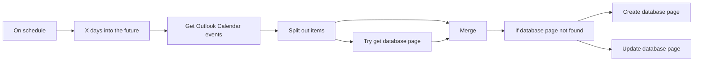

## Fluxo (.json) :

```json
{
  "meta": {
    "instanceId": "a2434c94d549548a685cca39cc4614698e94f527bcea84eefa363f1037ae14cd"
  },
  "nodes": [
    {
      "id": "713d2864-efd0-4938-871e-1d37a7c58b67",
      "name": "On schedule",
      "type": "n8n-nodes-base.scheduleTrigger",
      "position": [
        1280,
        840
      ],
      "parameters": {
        "rule": {
          "interval": [
            {
              "field": "minutes"
            }
          ]
        }
      },
      "typeVersion": 1.1
    },
    {
      "id": "0cedfde1-6ae1-485c-bd2c-b6114f6e4deb",
      "name": "Try get database page",
      "type": "n8n-nodes-base.notion",
      "position": [
        2160,
        900
      ],
      "parameters": {
        "filters": {
          "conditions": [
            {
              "key": "Event ID|rich_text",
              "condition": "equals",
              "richTextValue": "={{ $json.id }}"
            }
          ]
        },
        "options": {},
        "resource": "databasePage",
        "operation": "getAll",
        "returnAll": true,
        "databaseId": {
          "__rl": true,
          "mode": "list",
          "value": "6318457d-052d-4107-9c5b-8041f530fa03",
          "cachedResultUrl": "https://www.notion.so/6318457d052d41079c5b8041f530fa03",
          "cachedResultName": "Outlook Calendar"
        },
        "filterType": "manual"
      },
      "credentials": {
        "notionApi": {
          "id": "18",
          "name": "[UPDATE ME]"
        }
      },
      "typeVersion": 2,
      "alwaysOutputData": true
    },
    {
      "id": "92ebdd55-0950-471c-aa44-2fed31b17870",
      "name": "Merge",
      "type": "n8n-nodes-base.merge",
      "position": [
        2380,
        780
      ],
      "parameters": {
        "mode": "combine",
        "options": {},
        "joinMode": "enrichInput1",
        "mergeByFields": {
          "values": [
            {
              "field1": "id",
              "field2": "property_event_id"
            }
          ]
        }
      },
      "typeVersion": 2.1
    },
    {
      "id": "d38e4228-b3ab-443f-bfac-ffd0bc10fd08",
      "name": "If database page not found",
      "type": "n8n-nodes-base.if",
      "position": [
        2600,
        840
      ],
      "parameters": {
        "conditions": {
          "string": [
            {
              "value1": "={{ $json.property_event_id }}",
              "operation": "isEmpty"
            }
          ]
        }
      },
      "typeVersion": 1
    },
    {
      "id": "6ef0f18c-51fe-42e7-9e42-fd6ca8564e6e",
      "name": "Create database page",
      "type": "n8n-nodes-base.notion",
      "position": [
        2820,
        740
      ],
      "parameters": {
        "title": "={{ $json.subject }}",
        "options": {
          "icon": "https://avatars.githubusercontent.com/u/45487711?s=280&v=4",
          "iconType": "file"
        },
        "resource": "databasePage",
        "databaseId": {
          "__rl": true,
          "mode": "list",
          "value": "6318457d-052d-4107-9c5b-8041f530fa03",
          "cachedResultUrl": "https://www.notion.so/6318457d052d41079c5b8041f530fa03",
          "cachedResultName": "Outlook Calendar"
        },
        "propertiesUi": {
          "propertyValues": [
            {
              "key": "Date|date",
              "range": true,
              "dateEnd": "={{ $json.end.dateTime }}",
              "timezone": "={{ $json.start.timeZone }}",
              "dateStart": "={{ $json.start.dateTime }}"
            },
            {
              "key": "Event ID|rich_text",
              "textContent": "={{ $json.id }}"
            },
            {
              "key": "Link|url",
              "urlValue": "={{ $json.webLink }}"
            }
          ]
        }
      },
      "credentials": {
        "notionApi": {
          "id": "18",
          "name": "[UPDATE ME]"
        }
      },
      "typeVersion": 2
    },
    {
      "id": "2d324002-348b-4f23-bffe-57f685a8a761",
      "name": "Update database page",
      "type": "n8n-nodes-base.notion",
      "position": [
        2820,
        940
      ],
      "parameters": {
        "pageId": {
          "__rl": true,
          "mode": "id",
          "value": "={{ $json.id }}"
        },
        "resource": "databasePage",
        "operation": "update",
        "propertiesUi": {
          "propertyValues": [
            {
              "key": "Date|date",
              "range": true,
              "dateEnd": "={{ $json.end.dateTime }}",
              "timezone": "={{ $json.start.timeZone }}",
              "dateStart": "={{ $json.start.dateTime }}"
            },
            {
              "key": "Link|url",
              "urlValue": "={{ $json.webLink }}"
            },
            {
              "key": "Name|title",
              "title": "={{ $json.subject }}"
            }
          ]
        }
      },
      "credentials": {
        "notionApi": {
          "id": "18",
          "name": "[UPDATE ME]"
        }
      },
      "typeVersion": 2
    },
    {
      "id": "ee4792c4-d71c-4fd3-a8a3-babae5ff3479",
      "name": "X days into the future",
      "type": "n8n-nodes-base.dateTime",
      "position": [
        1500,
        840
      ],
      "parameters": {
        "duration": 365,
        "magnitude": "={{ $json.timestamp }}",
        "operation": "addToDate",
        "outputFieldName": "Future date"
      },
      "typeVersion": 2
    },
    {
      "id": "00b53a21-97c7-4293-a5eb-8321afddd4bc",
      "name": "Split out items",
      "type": "n8n-nodes-base.itemLists",
      "position": [
        1940,
        840
      ],
      "parameters": {
        "options": {},
        "fieldToSplitOut": "value"
      },
      "typeVersion": 2.2
    },
    {
      "id": "a7541bb9-0c0d-48b5-a39e-57e5681330da",
      "name": "Get Outlook Calendar events",
      "type": "n8n-nodes-base.httpRequest",
      "position": [
        1720,
        840
      ],
      "parameters": {
        "url": "https://graph.microsoft.com/v1.0/me/calendarview",
        "options": {},
        "sendQuery": true,
        "authentication": "genericCredentialType",
        "genericAuthType": "oAuth2Api",
        "queryParameters": {
          "parameters": [
            {
              "name": "startdatetime",
              "value": "={{ new Date($('On schedule').item.json.timestamp).toISOString() }}"
            },
            {
              "name": "enddatetime",
              "value": "={{ new Date($json['Future date']).toISOString() }}"
            }
          ]
        }
      },
      "credentials": {
        "oAuth2Api": {
          "id": "dxBfWhTrnERPMHGs",
          "name": "REPLACE ME"
        }
      },
      "typeVersion": 4.1
    }
  ],
  "connections": {
    "Merge": {
      "main": [
        [
          {
            "node": "If database page not found",
            "type": "main",
            "index": 0
          }
        ]
      ]
    },
    "On schedule": {
      "main": [
        [
          {
            "node": "X days into the future",
            "type": "main",
            "index": 0
          }
        ]
      ]
    },
    "Split out items": {
      "main": [
        [
          {
            "node": "Merge",
            "type": "main",
            "index": 0
          },
          {
            "node": "Try get database page",
            "type": "main",
            "index": 0
          }
        ]
      ]
    },
    "Try get database page": {
      "main": [
        [
          {
            "node": "Merge",
            "type": "main",
            "index": 1
          }
        ]
      ]
    },
    "X days into the future": {
      "main": [
        [
          {
            "node": "Get Outlook Calendar events",
            "type": "main",
            "index": 0
          }
        ]
      ]
    },
    "If database page not found": {
      "main": [
        [
          {
            "node": "Create database page",
            "type": "main",
            "index": 0
          }
        ],
        [
          {
            "node": "Update database page",
            "type": "main",
            "index": 0
          }
        ]
      ]
    },
    "Get Outlook Calendar events": {
      "main": [
        [
          {
            "node": "Split out items",
            "type": "main",
            "index": 0
          }
        ]
      ]
    }
  }
}
```

<a id="template-2223"></a>

## Template 2223 - Sincronização de alertas entre Notion e SIGNL4

- **Nome:** Sincronização de alertas entre Notion e SIGNL4
- **Descrição:** Fluxo que recebe eventos externos, atualiza páginas em uma base do Notion com o status do alerta e sincroniza criação, leitura e resolução de alertas com o serviço de notificações SIGNL4.
- **Funcionalidade:** • Recepção de eventos via webhook: recebe payloads externos e processa informações do alerta.
• Tradução de status do alerta: converte códigos de status em textos legíveis (ex.: New Alert, Acknowledged, Closed, Annotated, No one on duty) e registra usuário e anotações.
• Atualização imediata do Notion: escreve o status formatado na propriedade de descrição da página correspondente ao evento.
• Envio de novos alertas para SIGNL4: verifica periodicamente a base do Notion em busca de páginas novas e envia alertas com título, mensagem e id externo.
• Marcação de páginas como lidas: após envio do alerta, atualiza a checkbox de leitura na página do Notion.
• Resolução de alertas no SIGNL4: identifica páginas com sinalizadores de “Up” e “Read” e envia comandos de resolução ao serviço de alertas.
• Sincronização de estado final: atualiza propriedades das páginas no Notion após resolução para manter consistência entre os sistemas.
- **Ferramentas:** • Notion: base de dados para armazenar páginas de alerta, propriedades como descrição, Read e Up, e permitir leitura/atualização programática.
• SIGNL4: serviço de notificações/alertas que recebe criação e comandos de resolução de alertas, usando ids externos para correlação.

## Fluxo visual

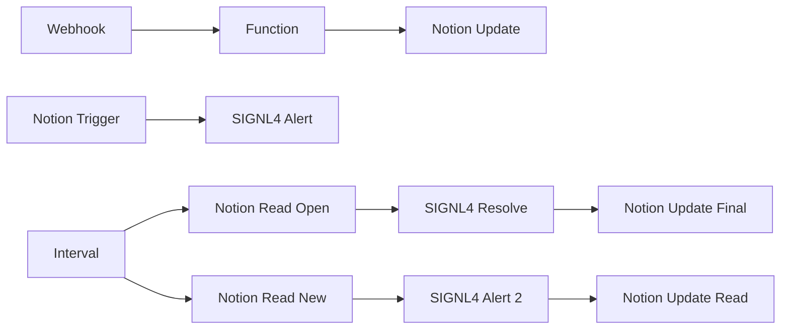

## Fluxo (.json) :

```json
{
  "nodes": [
    {
      "name": "Function",
      "type": "n8n-nodes-base.function",
      "position": [
        230,
        710
      ],
      "parameters": {
        "functionCode": "// Code here will run only once, no matter how many input items there are.\n// More info and help: https://docs.n8n.io/nodes/n8n-nodes-base.function\n\n// Loop over inputs and add a new field called 'myNewField' to the JSON of each one\nfor (item of items) {\n  \nvar type = \"Status\";\n// Acknowledged\nif ((item.json.body.alert.statusCode == 2)  && (item.json.body.eventType == 201)) {\n    type = \"Acknowledged\";\n}\n// Closed\nif ((item.json.body.alert.statusCode == 4) & (item.json.body.eventType == 201)) {\n    type = \"Closed\";\n}\n// New Alert\nif ((item.json.body.alert.statusCode == 1) & (item.json.body.eventType == 200)) {\n    type = \"New Alert\";\n}\n\n// No one on duty\nif ((item.json.body.alert.statusCode == 16) & (item.json.body.eventType == 201)) {\n    type = \"No one on duty\";\n}\n \n// Annotation\nvar annotation = \"\";\nif ((item.json.body.eventType == 203) & (item.json.body.annotation != undefined) ) {\n    type = \"Annotated\";\n    annotation = item.json.body.annotation.message;\n}\nif (annotation != \"\") {\n    annotation = \": \" + annotation;\n}\n \nvar username = \"System\";\nif (item.json.body.user != undefined) {\n    username = item.json.body.user.username;\n}\n \nvar data = type + \" by \" + username + annotation;\n \nitem.json.s4Status = data; //  + \": \" + JSON.stringify(item.json);\n\n\nitem.json.s4Up = false;\nif (type == \"Closed\") {\n  item.json.s4Up = true;\n}\n\n}\n\n// You can write logs to the browser console\nconsole.log('Done!');\n\nreturn items;\n\n\n"
      },
      "typeVersion": 1
    },
    {
      "name": "Notion Trigger",
      "type": "n8n-nodes-base.notionTrigger",
      "disabled": true,
      "position": [
        230,
        210
      ],
      "parameters": {
        "event": "pageAddedToDatabase",
        "pollTimes": {
          "item": [
            {
              "mode": "everyX",
              "unit": "minutes",
              "value": 1
            }
          ]
        },
        "databaseId": "0f26823d-f509-43bb-b0e9-e9bb4ab91217"
      },
      "credentials": {
        "notionApi": "Notion"
      },
      "typeVersion": 1
    },
    {
      "name": "Webhook",
      "type": "n8n-nodes-base.webhook",
      "position": [
        50,
        710
      ],
      "webhookId": "95fd62c7-fc8c-4f6f-8441-bbf85a2da81a",
      "parameters": {
        "path": "95fd62c7-fc8c-4f6f-8441-bbf85a2da81a",
        "options": {},
        "httpMethod": "POST"
      },
      "typeVersion": 1
    },
    {
      "name": "Function",
      "type": "n8n-nodes-base.function",
      "position": [
        230,
        710
      ],
      "parameters": {
        "functionCode": "// Code here will run only once, no matter how many input items there are.\n// More info and help: https://docs.n8n.io/nodes/n8n-nodes-base.function\n\n// Loop over inputs and add a new field called 'myNewField' to the JSON of each one\nfor (item of items) {\n  \nvar type = \"Status\";\n// Acknowledged\nif ((item.json.body.alert.statusCode == 2)  && (item.json.body.eventType == 201)) {\n    type = \"Acknowledged\";\n}\n// Closed\nif ((item.json.body.alert.statusCode == 4) & (item.json.body.eventType == 201)) {\n    type = \"Closed\";\n}\n// New Alert\nif ((item.json.body.alert.statusCode == 1) & (item.json.body.eventType == 200)) {\n    type = \"New Alert\";\n}\n\n// No one on duty\nif ((item.json.body.alert.statusCode == 16) & (item.json.body.eventType == 201)) {\n    type = \"No one on duty\";\n}\n \n// Annotation\nvar annotation = \"\";\nif ((item.json.body.eventType == 203) & (item.json.body.annotation != undefined) ) {\n    type = \"Annotated\";\n    annotation = item.json.body.annotation.message;\n}\nif (annotation != \"\") {\n    annotation = \": \" + annotation;\n}\n \nvar username = \"System\";\nif (item.json.body.user != undefined) {\n    username = item.json.body.user.username;\n}\n \nvar data = type + \" by \" + username + annotation;\n \nitem.json.s4Status = data; //  + \": \" + JSON.stringify(item.json);\n\n\nitem.json.s4Up = false;\nif (type == \"Closed\") {\n  item.json.s4Up = true;\n}\n\n}\n\n// You can write logs to the browser console\nconsole.log('Done!');\n\nreturn items;\n\n\n"
      },
      "typeVersion": 1
    },
    {
      "name": "Notion Update",
      "type": "n8n-nodes-base.notion",
      "position": [
        420,
        710
      ],
      "parameters": {
        "pageId": "={{$node[\"Webhook\"].json[\"body\"][\"alert\"][\"externalEventId\"]}}",
        "resource": "databasePage",
        "operation": "update",
        "propertiesUi": {
          "propertyValues": [
            {
              "key": "Description|rich_text",
              "peopleValue": [],
              "textContent": "={{$node[\"Function\"].json[\"s4Status\"]}}",
              "relationValue": [],
              "multiSelectValue": []
            }
          ]
        }
      },
      "credentials": {
        "notionApi": "Notion"
      },
      "typeVersion": 1
    },
    {
      "name": "Interval",
      "type": "n8n-nodes-base.interval",
      "position": [
        50,
        380
      ],
      "parameters": {
        "interval": 20
      },
      "typeVersion": 1
    },
    {
      "name": "SIGNL4 Resolve",
      "type": "n8n-nodes-base.signl4",
      "position": [
        420,
        540
      ],
      "parameters": {
        "operation": "resolve",
        "externalId": "={{$node[\"Notion Read Open\"].json[\"id\"]}}"
      },
      "credentials": {
        "signl4Api": "SIGNL4"
      },
      "typeVersion": 1
    },
    {
      "name": "SIGNL4 Alert",
      "type": "n8n-nodes-base.signl4",
      "position": [
        420,
        210
      ],
      "parameters": {
        "message": "=Machine Alert: {{$node[\"Notion Trigger\"].json[\"Name\"]}}",
        "additionalFields": {
          "title": "n8n Alert",
          "externalId": "={{$node[\"Notion Trigger\"].json[\"id\"]}}",
          "locationFieldsUi": {
            "locationFieldsValues": {
              "latitude": "52.3992137",
              "longitude": "13.0583823"
            }
          }
        }
      },
      "credentials": {
        "signl4Api": "SIGNL4"
      },
      "typeVersion": 1
    },
    {
      "name": "Notion Update Read",
      "type": "n8n-nodes-base.notion",
      "position": [
        570,
        380
      ],
      "parameters": {
        "pageId": "={{$node[\"Notion Read New\"].json[\"id\"]}}",
        "resource": "databasePage",
        "operation": "update",
        "propertiesUi": {
          "propertyValues": [
            {
              "key": "Read|checkbox",
              "peopleValue": [],
              "checkboxValue": true,
              "relationValue": [],
              "multiSelectValue": []
            }
          ]
        }
      },
      "credentials": {
        "notionApi": "Notion"
      },
      "typeVersion": 1
    },
    {
      "name": "Notion Read Open",
      "type": "n8n-nodes-base.notion",
      "position": [
        230,
        540
      ],
      "parameters": {
        "options": {
          "filter": {
            "multipleCondition": {
              "condition": {
                "and": [
                  {
                    "key": "Up|checkbox",
                    "condition": "equals",
                    "checkboxValue": true,
                    "multiSelectValue": []
                  },
                  {
                    "key": "Read|checkbox",
                    "condition": "equals",
                    "checkboxValue": true,
                    "multiSelectValue": []
                  }
                ]
              }
            }
          }
        },
        "resource": "databasePage",
        "operation": "getAll",
        "databaseId": "0f26823d-f509-43bb-b0e9-e9bb4ab91217"
      },
      "credentials": {
        "notionApi": "Notion"
      },
      "typeVersion": 1
    },
    {
      "name": "Notion Read New",
      "type": "n8n-nodes-base.notion",
      "position": [
        230,
        380
      ],
      "parameters": {
        "options": {
          "filter": {
            "multipleCondition": {
              "condition": {
                "and": [
                  {
                    "key": "Read|checkbox",
                    "condition": "equals",
                    "multiSelectValue": []
                  },
                  {
                    "key": "Up|checkbox",
                    "condition": "equals",
                    "multiSelectValue": []
                  }
                ]
              }
            }
          }
        },
        "resource": "databasePage",
        "operation": "getAll",
        "databaseId": "0f26823d-f509-43bb-b0e9-e9bb4ab91217"
      },
      "credentials": {
        "notionApi": "Notion"
      },
      "typeVersion": 1
    },
    {
      "name": "Notion Update Final",
      "type": "n8n-nodes-base.notion",
      "position": [
        570,
        540
      ],
      "parameters": {
        "pageId": "={{$node[\"Notion Read Open\"].json[\"id\"]}}",
        "resource": "databasePage",
        "operation": "update",
        "propertiesUi": {
          "propertyValues": [
            {
              "key": "Read|checkbox",
              "peopleValue": [],
              "relationValue": [],
              "multiSelectValue": []
            }
          ]
        }
      },
      "credentials": {
        "notionApi": "Notion"
      },
      "typeVersion": 1
    },
    {
      "name": "SIGNL4 Alert 2",
      "type": "n8n-nodes-base.signl4",
      "position": [
        420,
        380
      ],
      "parameters": {
        "message": "=Machine Alert: {{$node[\"Notion Read New\"].json[\"Name\"]}}",
        "additionalFields": {
          "title": "n8n Alert",
          "externalId": "={{$node[\"Notion Read New\"].json[\"id\"]}}",
          "locationFieldsUi": {
            "locationFieldsValues": {
              "latitude": "52.3992137",
              "longitude": "13.0583823"
            }
          }
        }
      },
      "credentials": {
        "signl4Api": "SIGNL4"
      },
      "typeVersion": 1
    }
  ],
  "connections": {
    "Webhook": {
      "main": [
        [
          {
            "node": "Function",
            "type": "main",
            "index": 0
          }
        ]
      ]
    },
    "Function": {
      "main": [
        [
          {
            "node": "Notion Update",
            "type": "main",
            "index": 0
          }
        ]
      ]
    },
    "Interval": {
      "main": [
        [
          {
            "node": "Notion Read Open",
            "type": "main",
            "index": 0
          },
          {
            "node": "Notion Read New",
            "type": "main",
            "index": 0
          }
        ]
      ]
    },
    "Notion Trigger": {
      "main": [
        [
          {
            "node": "SIGNL4 Alert",
            "type": "main",
            "index": 0
          }
        ]
      ]
    },
    "SIGNL4 Alert 2": {
      "main": [
        [
          {
            "node": "Notion Update Read",
            "type": "main",
            "index": 0
          }
        ]
      ]
    },
    "SIGNL4 Resolve": {
      "main": [
        [
          {
            "node": "Notion Update Final",
            "type": "main",
            "index": 0
          }
        ]
      ]
    },
    "Notion Read New": {
      "main": [
        [
          {
            "node": "SIGNL4 Alert 2",
            "type": "main",
            "index": 0
          }
        ]
      ]
    },
    "Notion Read Open": {
      "main": [
        [
          {
            "node": "SIGNL4 Resolve",
            "type": "main",
            "index": 0
          }
        ]
      ]
    }
  }
}
```

<a id="template-2225"></a>

## Template 2225 - Chat com assistente OpenAI e ferramenta de capitais fictícias

- **Nome:** Chat com assistente OpenAI e ferramenta de capitais fictícias
- **Descrição:** Fluxo que permite conversar com um assistente OpenAI que pode usar ferramentas para obter o timestamp atual e consultar capitais de países fictícios, retornando uma lista de países ou a capital específica conforme a entrada.
- **Funcionalidade:** • Início manual de chat: inicia a interação a partir de uma ação manual do usuário.
• Assistente de IA: encaminha a pergunta do usuário a um assistente OpenAI capaz de invocar ferramentas.
• Ferramenta de data/hora: fornece o timestamp atual em formato ISO quando solicitado.
• Ferramenta de capitais fictícias: opera em dois modos — 'list' para retornar a lista de países conhecidos (uma por linha) e nome de país exato para retornar a capital correspondente.
• Busca e correspondência: compara a consulta do usuário com um mapeamento interno de países fictícios e enriquece os dados para retornar o resultado apropriado.
• Resposta formatada: prepara e devolve ao usuário a resposta (lista de países ou capital encontrada), incluindo mensagem padrão quando nenhum resultado é encontrado.
- **Ferramentas:** • OpenAI: serviço de assistente de inteligência artificial utilizado para processar a conversa do usuário e chamar ferramentas auxiliares.


## Fluxo visual

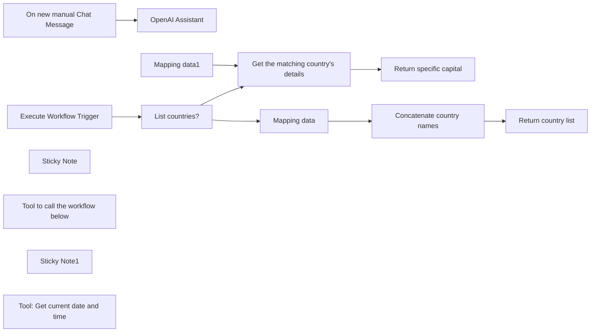

## Fluxo (.json) :

```json
{
  "id": "aVTi7K9mFjK5OjAV",
  "meta": {
    "instanceId": "b3a8efae31a34c2224655b66499bee098263a56d266da574e8820468780b7ddd"
  },
  "name": "OpenAI Assistant with custom n8n tools",
  "tags": [],
  "nodes": [
    {
      "id": "d15e7634-408b-43c5-a8d6-afcbc83479a9",
      "name": "On new manual Chat Message",
      "type": "@n8n/n8n-nodes-langchain.manualChatTrigger",
      "position": [
        600,
        300
      ],
      "parameters": {},
      "typeVersion": 1.1
    },
    {
      "id": "5d9ad043-adbe-4970-aa4e-b81dfcb9e255",
      "name": "OpenAI Assistant",
      "type": "@n8n/n8n-nodes-langchain.openAiAssistant",
      "position": [
        820,
        300
      ],
      "parameters": {
        "options": {},
        "assistantId": "asst_BWy0154vMGMdrX7MjCYaYv6a"
      },
      "credentials": {
        "openAiApi": {
          "id": "au6fQZN7it62DWlS",
          "name": "OpenAi account"
        }
      },
      "typeVersion": 1
    },
    {
      "id": "0c3aded2-886d-4c9f-8d6e-2729f12b6711",
      "name": "Execute Workflow Trigger",
      "type": "n8n-nodes-base.executeWorkflowTrigger",
      "position": [
        600,
        960
      ],
      "parameters": {},
      "typeVersion": 1
    },
    {
      "id": "c77010ac-82e6-40f2-92c4-c360d276b896",
      "name": "Mapping data",
      "type": "n8n-nodes-base.code",
      "position": [
        1080,
        820
      ],
      "parameters": {
        "jsCode": "return [\n {\n \"country\": \"Wakanda\",\n \"capital\": \"Birnin Zana\"\n },\n {\n \"country\": \"Narnia\",\n \"capital\": \"Cair Paravel\"\n },\n {\n \"country\": \"Gondor\",\n \"capital\": \"Minas Tirith\"\n },\n {\n \"country\": \"Oz\",\n \"capital\": \"The Emerald City\"\n },\n {\n \"country\": \"Westeros\",\n \"capital\": \"King's Landing\"\n },\n {\n \"country\": \"Panem\",\n \"capital\": \"The Capitol\"\n },\n {\n \"country\": \"Ruritania\",\n \"capital\": \"Strelsau\"\n },\n {\n \"country\": \"Mordor\",\n \"capital\": \"Barad-dûr\"\n },\n {\n \"country\": \"Latveria\",\n \"capital\": \"Doomstadt\"\n },\n {\n \"country\": \"Atlantis\",\n \"capital\": \"Poseidonis\"\n }\n]\n"
      },
      "typeVersion": 2
    },
    {
      "id": "3949d5d8-a8d6-4a21-8e34-fca558ee6a97",
      "name": "List countries?",
      "type": "n8n-nodes-base.if",
      "position": [
        840,
        960
      ],
      "parameters": {
        "conditions": {
          "string": [
            {
              "value1": "={{ $json.query }}",
              "value2": "list"
            }
          ]
        }
      },
      "executeOnce": false,
      "typeVersion": 1
    },
    {
      "id": "23bd1672-f736-4ac0-abf6-65f5f6aeabac",
      "name": "Mapping data1",
      "type": "n8n-nodes-base.code",
      "position": [
        840,
        1160
      ],
      "parameters": {
        "jsCode": "return [\n {\n \"country\": \"Wakanda\",\n \"capital\": \"Birnin Zana\"\n },\n {\n \"country\": \"Narnia\",\n \"capital\": \"Cair Paravel\"\n },\n {\n \"country\": \"Gondor\",\n \"capital\": \"Minas Tirith\"\n },\n {\n \"country\": \"Oz\",\n \"capital\": \"The Emerald City\"\n },\n {\n \"country\": \"Westeros\",\n \"capital\": \"King's Landing\"\n },\n {\n \"country\": \"Panem\",\n \"capital\": \"The Capitol\"\n },\n {\n \"country\": \"Ruritania\",\n \"capital\": \"Strelsau\"\n },\n {\n \"country\": \"Mordor\",\n \"capital\": \"Barad-dûr\"\n },\n {\n \"country\": \"Latveria\",\n \"capital\": \"Doomstadt\"\n },\n {\n \"country\": \"Atlantis\",\n \"capital\": \"Poseidonis\"\n }\n]\n"
      },
      "typeVersion": 2
    },
    {
      "id": "ec16de2b-7945-4133-a73d-11d4e42355c2",
      "name": "Sticky Note",
      "type": "n8n-nodes-base.stickyNote",
      "position": [
        540,
        741.6494845360827
      ],
      "parameters": {
        "width": 1174.6162657502882,
        "height": 578.9520146851776,
        "content": "## Sub-workflow: Return the capitals of fictional countries\nIt can either list the countries it knows about or return the capital of a specific country"
      },
      "typeVersion": 1
    },
    {
      "id": "65e659a0-6e1b-4642-b263-59ed2e284ee8",
      "name": "Return country list",
      "type": "n8n-nodes-base.set",
      "position": [
        1520,
        820
      ],
      "parameters": {
        "fields": {
          "values": [
            {
              "name": "response",
              "stringValue": "={{ $json.concatenated_country }}"
            }
          ]
        },
        "include": "none",
        "options": {}
      },
      "typeVersion": 3.2
    },
    {
      "id": "65fc898d-0361-461a-9055-9e29bf310336",
      "name": "Return specific capital",
      "type": "n8n-nodes-base.set",
      "position": [
        1520,
        1060
      ],
      "parameters": {
        "fields": {
          "values": [
            {
              "name": "response",
              "stringValue": "={{ $ifEmpty($json.capital, 'Capital not found') }}"
            }
          ]
        },
        "include": "none",
        "options": {}
      },
      "typeVersion": 3.2
    },
    {
      "id": "bdf7c927-deb4-4a73-a015-43797c6cf816",
      "name": "Tool to call the workflow below",
      "type": "@n8n/n8n-nodes-langchain.toolWorkflow",
      "position": [
        880,
        540
      ],
      "parameters": {
        "name": "country_capitals_tool",
        "workflowId": "={{ $workflow.id }}",
        "description": "This tool has two modes:\n1. Pass 'list' to the tool to get a list of countries that the tool has the capitals for (one per line). This is useful if you can't find a match, to see if the country being asked about might have been misspelled.\n2. Pass one of the country names in the list to the tool to get the capital of that country. Note that the country must be spelled exactly as it is in the list of countries returned in mode 1"
      },
      "typeVersion": 1
    },
    {
      "id": "4e93323f-d4be-4a49-be24-3f49db39907b",
      "name": "Concatenate country names",
      "type": "n8n-nodes-base.summarize",
      "position": [
        1300,
        820
      ],
      "parameters": {
        "options": {},
        "fieldsToSummarize": {
          "values": [
            {
              "field": "country",
              "separateBy": "\n",
              "aggregation": "concatenate"
            }
          ]
        }
      },
      "typeVersion": 1
    },
    {
      "id": "e2ec1eee-4bb2-4240-82cf-e109b87229eb",
      "name": "Get the matching country's details",
      "type": "n8n-nodes-base.merge",
      "position": [
        1080,
        1060
      ],
      "parameters": {
        "mode": "combine",
        "options": {},
        "joinMode": "enrichInput1",
        "mergeByFields": {
          "values": [
            {
              "field1": "query",
              "field2": "country"
            }
          ]
        }
      },
      "typeVersion": 2.1
    },
    {
      "id": "ed2997be-c709-4eca-bcad-c987bbc160fc",
      "name": "Sticky Note1",
      "type": "n8n-nodes-base.stickyNote",
      "position": [
        540,
        200
      ],
      "parameters": {
        "width": 1168.2339341502545,
        "height": 487.70693675217734,
        "content": "## Main workflow: Chat with OpenAI Assistant\nClick the 'Chat' button at the bottom of the screen to try"
      },
      "typeVersion": 1
    },
    {
      "id": "01ab30c3-3951-4652-b706-72af1cad4f22",
      "name": "Tool: Get current date and time",
      "type": "@n8n/n8n-nodes-langchain.toolCode",
      "position": [
        1080,
        540
      ],
      "parameters": {
        "name": "date_tool",
        "jsCode": "let now = DateTime.now()\nreturn now.toISO()",
        "description": "Call this tool to get the current timestamp (in ISO format). No parameters necessary"
      },
      "typeVersion": 1
    }
  ],
  "active": false,
  "pinData": {
    "Execute Workflow Trigger": [
      {
        "json": {
          "query": "list"
        }
      }
    ]
  },
  "settings": {
    "executionOrder": "v0"
  },
  "versionId": "c867ebb5-ceeb-45a7-ad29-7ee3f1102bed",
  "connections": {
    "Mapping data": {
      "main": [
        [
          {
            "node": "Concatenate country names",
            "type": "main",
            "index": 0
          }
        ]
      ]
    },
    "Mapping data1": {
      "main": [
        [
          {
            "node": "Get the matching country's details",
            "type": "main",
            "index": 1
          }
        ]
      ]
    },
    "List countries?": {
      "main": [
        [
          {
            "node": "Mapping data",
            "type": "main",
            "index": 0
          }
        ],
        [
          {
            "node": "Get the matching country's details",
            "type": "main",
            "index": 0
          }
        ]
      ]
    },
    "Execute Workflow Trigger": {
      "main": [
        [
          {
            "node": "List countries?",
            "type": "main",
            "index": 0
          }
        ]
      ]
    },
    "Concatenate country names": {
      "main": [
        [
          {
            "node": "Return country list",
            "type": "main",
            "index": 0
          }
        ]
      ]
    },
    "On new manual Chat Message": {
      "main": [
        [
          {
            "node": "OpenAI Assistant",
            "type": "main",
            "index": 0
          }
        ]
      ]
    },
    "Tool to call the workflow below": {
      "ai_tool": [
        [
          {
            "node": "OpenAI Assistant",
            "type": "ai_tool",
            "index": 0
          }
        ]
      ]
    },
    "Tool: Get current date and time": {
      "ai_tool": [
        [
          {
            "node": "OpenAI Assistant",
            "type": "ai_tool",
            "index": 0
          }
        ]
      ]
    },
    "Get the matching country's details": {
      "main": [
        [
          {
            "node": "Return specific capital",
            "type": "main",
            "index": 0
          }
        ]
      ]
    }
  }
}
```
