# PACK 1999 TEMPLATES PARTE 09 - Bloco 10

Templates neste bloco: 20

## Sumário

- [Template 2228 - Relatório de lições aprendidas ao finalizar Epic](#template-2228)
- [Template 2230 - Criar reunião Zoom a partir do Google Calendar](#template-2230)
- [Template 2231 - Atualizar negócio no HubSpot e notificar equipe ao pagar fatura](#template-2231)
- [Template 2233 - RAG adaptativo por tipo de consulta](#template-2233)
- [Template 2235 - Indexação e QA por similaridade](#template-2235)
- [Template 2237 - Gatilho de novas respostas do SurveyMonkey](#template-2237)
- [Template 2239 - Backup automático de workflows para Dropbox](#template-2239)
- [Template 2241 - Registrar e atualizar leads do Typeform](#template-2241)
- [Template 2243 - Assistente de calendário com IA](#template-2243)
- [Template 2245 - Receber atualizações de eventos do Taiga](#template-2245)
- [Template 2247 - Mover tarefas entre Inbox e Snoozed conforme data](#template-2247)
- [Template 2248 - Notificação de novo motorista no Slack](#template-2248)
- [Template 2251 - Importar workflow de arquivo ou instância remota](#template-2251)
- [Template 2253 - Relatórios AI de threads #damus por Gmail e Telegram](#template-2253)
- [Template 2254 - Notificações de incidentes ServiceNow](#template-2254)
- [Template 2256 - Qualificação automática de leads por email](#template-2256)
- [Template 2258 - Exportação semanal de livros para planilha](#template-2258)
- [Template 2261 - Limpeza mensal de pacotes antigos](#template-2261)
- [Template 2263 - Remoção avançada de fundo para imagens do Google Drive](#template-2263)
- [Template 2264 - Inserir resumo AI em posts WordPress](#template-2264)

---

<a id="template-2228"></a>

## Template 2228 - Relatório de lições aprendidas ao finalizar Epic

- **Nome:** Relatório de lições aprendidas ao finalizar Epic
- **Descrição:** Automatiza a coleta e análise de issues e comentários quando uma Epic é marcada como concluída, gerando um relatório de Lessons Learned e inserindo-o em um documento do Google Docs.
- **Funcionalidade:** • Detecção de atualização de Epic: inicia o processo quando o status da Epic muda para Done.
• Coleta de issues relacionados: busca todas as issues pertencentes à Epic concluída para análise.
• Extração de título e descrição: captura o título e a descrição de cada issue para contexto no relatório.
• Agregação de comentários: reúne comentários das issues e os concatena para sumarização.
• Sumarização de conteúdo: resume comentários e informações relevantes para destacar pontos-chave.
• Geração de relatório por IA: utiliza um modelo de linguagem para criar um relatório de Lessons Learned em Markdown seguindo um template estruturado.
• Manutenção de contexto de sessão: preserva memória simples da sessão para enriquecer análises subsequentes.
• Atualização de documento final: insere o relatório gerado em um documento do Google Docs pré-determinado.
- **Ferramentas:** • Jira Software Cloud: plataforma para monitorar eventos de issues, obter detalhes das issues e coletar comentários.
• OpenAI: modelo de linguagem usado para sumarizar conteúdo e gerar o relatório de Lessons Learned.
• Google Docs: destino final onde o relatório em Markdown é inserido/atualizado.


## Fluxo visual

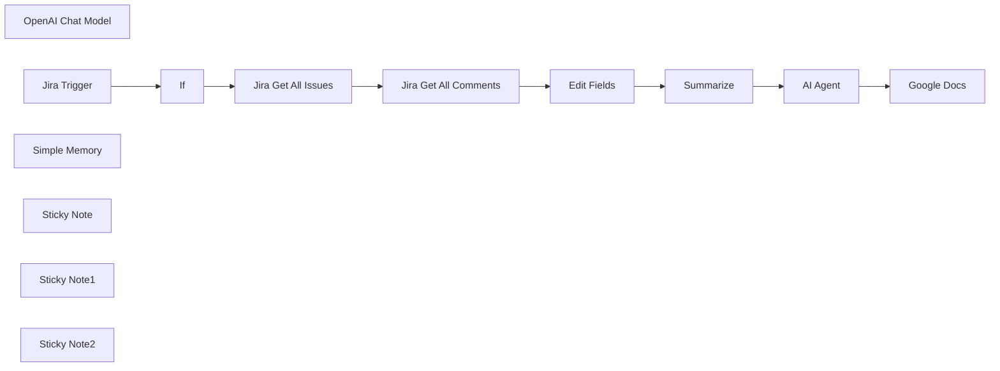

## Fluxo (.json) :

```json
{
  "id": "U1xUqDLvBYYSU6EU",
  "meta": {
    "instanceId": "8d54a4232b4618928ac9df0152e207cb858f5f9ffa6f3ba2d31d941bdcaec9d7",
    "templateCredsSetupCompleted": true
  },
  "name": "Jira Retrospective",
  "tags": [],
  "nodes": [
    {
      "id": "b91c4727-8c63-4bf3-8101-6282aa6f592c",
      "name": "Jira Get All Issues",
      "type": "n8n-nodes-base.jira",
      "position": [
        60,
        60
      ],
      "parameters": {
        "options": {},
        "operation": "getAll"
      },
      "credentials": {
        "jiraSoftwareCloudApi": {
          "id": "AqnrDWxoCa8luriP",
          "name": "Jira SW Cloud account"
        }
      },
      "typeVersion": 1
    },
    {
      "id": "4cf0689c-2a1f-4a90-81f4-d3483c63fc96",
      "name": "Jira Get All Comments",
      "type": "n8n-nodes-base.jira",
      "position": [
        280,
        60
      ],
      "parameters": {
        "options": {},
        "issueKey": "={{ $json.key }}",
        "resource": "issueComment",
        "operation": "getAll"
      },
      "credentials": {
        "jiraSoftwareCloudApi": {
          "id": "AqnrDWxoCa8luriP",
          "name": "Jira SW Cloud account"
        }
      },
      "typeVersion": 1
    },
    {
      "id": "26803742-1a94-4969-878b-2f757aced4f8",
      "name": "AI Agent",
      "type": "@n8n/n8n-nodes-langchain.agent",
      "position": [
        940,
        60
      ],
      "parameters": {
        "text": "=comments = {{ $json.concatenated_Comment }}\ndescription = {{ $json.Description }}\ntitle = {{ $json.Title }}\nstatus = {{ $json.EpicStatus }}\nepic_name = {{ $json.EpicName }}\n",
        "options": {
          "systemMessage": "=You are an AI assistant specialized in creating comprehensive Agile retrospective documents. Your task is to analyze the provided information about a completed task and generate an insightful **Lessons Learned** report formatted in **clean Markdown**, optimized for seamless conversion to Google Docs.\n\n---\n\n### 📥 Input Format\nYou will receive structured input containing:\n* `epic_name`: The broader initiative or project category\n* `title`: The specific task or user story name\n* `description`: A concise explanation of what the task involved\n\n---\n\n### 📤 Output Instructions\nGenerate a detailed **Lessons Learned** report using the following **Markdown** structure:\n\n# LESSONS LEARNED REPORT\n\n**Epic:** {epic_name} \n**Date:** {{$today.format('yyyy-MM-dd')}}}  \n**Task:** {title}  \n**Description:** {description}\n\n## Key Findings\n\n* Clear, specific insight about a technical challenge encountered\n* Process-related discovery that impacted delivery\n* Team dynamics observation or workflow improvement identified\n* {Add more if needed}\n\n## Comments & Observations\n\n{Write 2–3 paragraphs with:}\n\n* Specific examples from task execution\n* Feedback or quotes from team members (if available)\n* Comparisons to prior approaches\n* Unexpected challenges or positive surprises\n\n## Actionable Recommendations\n\n1. Specific, implementable action to address a finding\n2. Concrete suggestion for process improvement\n3. Recommendation for knowledge sharing or team development\n4. {Add more as needed}\n\n## Metrics & Impact\n\n{When possible, include:}\n\n* Time saved or efficiency gained\n* Quality improvements\n* User/customer feedback\n* Cost implications\n\n## Tags\n\n`#lessons-learned` `#{normalized_epic_name}` `#{relevant_technology}` `#{improvement_area}`\n\n---\n\n### 📝 Guidelines\n\n1. **Be specific** – use real details, not vague statements\n2. **Stay relevant** – stick to the task and its broader context\n3. **Focus on learning** – prioritize transferable insights\n4. **Balance** – include both wins and challenges\n5. **Actionability** – make every suggestion doable\n6. **Concise yet clear** – avoid fluff; write for impact\n7. **Formatting Guidelines for Google Docs compatibility:**\n   * Use only asterisks (*) for bullet points, never hyphens (-)\n   * Add two spaces after each line in lists for proper line breaks\n   * Always leave a blank line before and after headings\n   * Avoid using underscores (_) in text; use hyphens (-) instead\n   * For emphasis, use consistently **bold** for important points and *italics* for supplementary information\n   * When mentioning code or technical terms, use `single backticks`, never triple backticks\n   * Use a pipe-separated format for tables as shown in the template\n   * Keep paragraphs short (3-5 sentences) for better readability\n8. **Metadata Handling:** Include the epic name and task title exactly as provided in the input, without modification\n9. **Date Format:** Use YYYY-MM-DD format for the date for consistent sorting and display\n10. **Tags:** Keep tags lowercase, with hyphens instead of spaces, and relevant to the content\n\n---"
        },
        "promptType": "define"
      },
      "typeVersion": 1.9
    },
    {
      "id": "29e37c80-68a4-490a-8952-2dcf974ff8d3",
      "name": "OpenAI Chat Model",
      "type": "@n8n/n8n-nodes-langchain.lmChatOpenAi",
      "position": [
        920,
        280
      ],
      "parameters": {
        "model": {
          "__rl": true,
          "mode": "list",
          "value": "gpt-4o-mini"
        },
        "options": {}
      },
      "credentials": {
        "openAiApi": {
          "id": "f3KRKVUp9GyRxd6U",
          "name": "OpenAi account"
        }
      },
      "typeVersion": 1.2
    },
    {
      "id": "da5e365b-cc69-4bdd-bd58-e5b2ecb17387",
      "name": "Edit Fields",
      "type": "n8n-nodes-base.set",
      "position": [
        500,
        60
      ],
      "parameters": {
        "options": {},
        "assignments": {
          "assignments": [
            {
              "id": "84fcaf69-4234-46be-9fa7-15026c60fed4",
              "name": "EpicName",
              "type": "string",
              "value": "={{ $('Jira Get All Issues').item.json.fields.parent.fields.summary }}"
            },
            {
              "id": "a7890a6b-1d0d-4486-908e-d3db571b89af",
              "name": "EpicStatus",
              "type": "string",
              "value": "={{ $('Jira Get All Issues').item.json.fields.parent.fields.status.statusCategory.name }}"
            },
            {
              "id": "c2c58d73-17a8-47b5-beb6-8295905cd8c2",
              "name": "Title",
              "type": "string",
              "value": "={{ $('Jira Get All Issues').item.json.fields.summary }}"
            },
            {
              "id": "baa10a35-ab3e-490f-b9ed-e661a6e9f4aa",
              "name": "Description",
              "type": "string",
              "value": "={{ $('Jira Get All Issues').item.json.fields.description }}"
            },
            {
              "id": "5da4ae54-07e6-41b8-bd51-054fe56beb5f",
              "name": "Comment",
              "type": "string",
              "value": "={{ $json.body.content[0].content[0].text }}"
            }
          ]
        }
      },
      "typeVersion": 3.4
    },
    {
      "id": "9718b066-e28f-41ea-97c2-559cbd894764",
      "name": "Summarize",
      "type": "n8n-nodes-base.summarize",
      "position": [
        720,
        60
      ],
      "parameters": {
        "options": {},
        "fieldsToSplitBy": "EpicName, EpicStatus, Title, Description",
        "fieldsToSummarize": {
          "values": [
            {
              "field": "Comment",
              "separateBy": "\n",
              "aggregation": "concatenate"
            }
          ]
        }
      },
      "typeVersion": 1.1
    },
    {
      "id": "1d37efb7-09f1-43a7-a6c0-77d07b1f7a6b",
      "name": "Google Docs",
      "type": "n8n-nodes-base.googleDocs",
      "position": [
        1280,
        60
      ],
      "parameters": {
        "simple": false,
        "actionsUi": {
          "actionFields": [
            {
              "text": "={{ $json.output }}",
              "action": "insert"
            }
          ]
        },
        "operation": "update",
        "documentURL": "14X5gcowEprmL6ORyoo9tIrWWEB1HlhkixXUelesCLXs"
      },
      "credentials": {
        "googleDocsOAuth2Api": {
          "id": "Qe3TZG3K1euzTr3n",
          "name": "Google Docs account"
        }
      },
      "typeVersion": 2
    },
    {
      "id": "bfab4af8-1f26-45b0-952b-1bd5f411d5f4",
      "name": "Jira Trigger",
      "type": "n8n-nodes-base.jiraTrigger",
      "position": [
        -380,
        180
      ],
      "webhookId": "3eb46690-d7b1-4a69-9a99-8adf8f843ed9",
      "parameters": {
        "events": [
          "jira:issue_updated"
        ],
        "additionalFields": {
          "filter": ""
        }
      },
      "credentials": {
        "jiraSoftwareCloudApi": {
          "id": "AqnrDWxoCa8luriP",
          "name": "Jira SW Cloud account"
        }
      },
      "typeVersion": 1.1
    },
    {
      "id": "cc654cf3-c360-4704-a4b7-57447dbec8c6",
      "name": "If",
      "type": "n8n-nodes-base.if",
      "position": [
        -200,
        180
      ],
      "parameters": {
        "options": {},
        "conditions": {
          "options": {
            "version": 2,
            "leftValue": "",
            "caseSensitive": true,
            "typeValidation": "strict"
          },
          "combinator": "and",
          "conditions": [
            {
              "id": "a7028dd9-e262-4528-a20f-c80a26a28202",
              "operator": {
                "name": "filter.operator.equals",
                "type": "string",
                "operation": "equals"
              },
              "leftValue": "={{ $json.changelog.items[0].toString }}",
              "rightValue": "Done"
            }
          ]
        }
      },
      "typeVersion": 2.2
    },
    {
      "id": "b3ccd93e-a412-46f5-858d-ef8a2cd0efa9",
      "name": "Simple Memory",
      "type": "@n8n/n8n-nodes-langchain.memoryBufferWindow",
      "position": [
        1080,
        280
      ],
      "parameters": {
        "sessionKey": "47",
        "sessionIdType": "customKey"
      },
      "typeVersion": 1.3
    },
    {
      "id": "e8379684-93ca-4118-bab5-f52a444c50e1",
      "name": "Sticky Note",
      "type": "n8n-nodes-base.stickyNote",
      "position": [
        -420,
        -120
      ],
      "parameters": {
        "width": 380,
        "height": 580,
        "content": "## Epic Done?\nThis Node is Triggered on any issue change in Jira. However it only triggers the automation when the Epic status is changed to **Done**"
      },
      "typeVersion": 1
    },
    {
      "id": "cdddcd3f-f896-4dbf-89e2-09060111cbc6",
      "name": "Sticky Note1",
      "type": "n8n-nodes-base.stickyNote",
      "position": [
        20,
        -120
      ],
      "parameters": {
        "color": 5,
        "width": 820,
        "height": 580,
        "content": "## Fetch issue Description and Comments\nOnce the Epic is Done, these nodes fetch issues and comments that fall under the Epic. For further processing the output is bundled."
      },
      "typeVersion": 1
    },
    {
      "id": "c718a2e8-be7b-47b9-b7cc-9f4549a1060f",
      "name": "Sticky Note2",
      "type": "n8n-nodes-base.stickyNote",
      "position": [
        880,
        -120
      ],
      "parameters": {
        "color": 3,
        "width": 540,
        "height": 580,
        "content": "## Summarize and send to Google Docs\nThe LLM is summarizing the description / comments and generates a report with a layout defined in the System Message. Finally the output is send to Google Docs."
      },
      "typeVersion": 1
    }
  ],
  "active": false,
  "pinData": {},
  "settings": {
    "executionOrder": "v1"
  },
  "versionId": "793ad505-261f-44ae-a197-a7c0e496dd69",
  "connections": {
    "If": {
      "main": [
        [
          {
            "node": "Jira Get All Issues",
            "type": "main",
            "index": 0
          }
        ]
      ]
    },
    "AI Agent": {
      "main": [
        [
          {
            "node": "Google Docs",
            "type": "main",
            "index": 0
          }
        ]
      ]
    },
    "Summarize": {
      "main": [
        [
          {
            "node": "AI Agent",
            "type": "main",
            "index": 0
          }
        ]
      ]
    },
    "Edit Fields": {
      "main": [
        [
          {
            "node": "Summarize",
            "type": "main",
            "index": 0
          }
        ]
      ]
    },
    "Jira Trigger": {
      "main": [
        [
          {
            "node": "If",
            "type": "main",
            "index": 0
          }
        ]
      ]
    },
    "Simple Memory": {
      "ai_memory": [
        [
          {
            "node": "AI Agent",
            "type": "ai_memory",
            "index": 0
          }
        ]
      ]
    },
    "OpenAI Chat Model": {
      "ai_languageModel": [
        [
          {
            "node": "AI Agent",
            "type": "ai_languageModel",
            "index": 0
          }
        ]
      ]
    },
    "Jira Get All Issues": {
      "main": [
        [
          {
            "node": "Jira Get All Comments",
            "type": "main",
            "index": 0
          }
        ]
      ]
    },
    "Jira Get All Comments": {
      "main": [
        [
          {
            "node": "Edit Fields",
            "type": "main",
            "index": 0
          }
        ]
      ]
    }
  }
}
```

<a id="template-2230"></a>

## Template 2230 - Criar reunião Zoom a partir do Google Calendar

- **Nome:** Criar reunião Zoom a partir do Google Calendar
- **Descrição:** Automatiza a criação de reuniões Zoom para eventos do Google Calendar dentro de um intervalo de tempo definido, aplicando filtros para evitar eventos indesejados.
- **Funcionalidade:** • Gatilho diário e manual: Inicia a verificação automaticamente uma vez por dia ou manualmente quando necessário.
• Consulta de eventos futuros: Busca eventos do calendário dentro de um período futuro (ex.: próximas 12 horas).
• Filtragem de eventos: Exclui eventos cancelados, eventos com palavras-chave específicas (ex.: "signal", "minute meeting", "in person") e entradas marcadas como transparentes.
• Criação automática de reuniões Zoom: Cria uma reunião Zoom quando um evento válido é identificado.
• Mapeamento de dados do evento: Usa título, timezone, horário de início e duração calculada (a partir de início/fim) do evento para configurar a reunião Zoom.
- **Ferramentas:** • Google Calendar: Serviço de calendário usado para ler eventos e suas informações (título, horários, transparência, timezone).
• Zoom: Plataforma de videoconferência usada para criar reuniões com base nos dados dos eventos do calendário.

## Fluxo visual

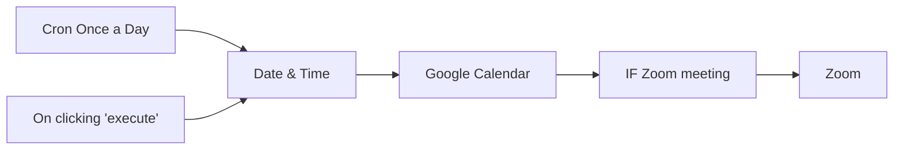

## Fluxo (.json) :

```json
{
  "id": 1,
  "name": "Google Cal to Zoom meeting",
  "nodes": [
    {
      "name": "On clicking 'execute'",
      "type": "n8n-nodes-base.manualTrigger",
      "position": [
        0,
        330
      ],
      "parameters": {},
      "typeVersion": 1
    },
    {
      "name": "Zoom",
      "type": "n8n-nodes-base.zoom",
      "position": [
        380,
        410
      ],
      "parameters": {
        "topic": "=Meeting with {{$node[\"IF Zoom meeting\"].json[\"summary\"]}}",
        "authentication": "oAuth2",
        "additionalFields": {
          "duration": "={{(Date.parse($node[\"IF Zoom meeting\"].json[\"end\"][\"dateTime\"])-Date.parse($node[\"IF Zoom meeting\"].json[\"start\"][\"dateTime\"]))/(60*1000)}}",
          "settings": {},
          "timeZone": "={{$node[\"IF Zoom meeting\"].json[\"start\"][\"timeZone\"]}}",
          "startTime": "={{$node[\"IF Zoom meeting\"].json[\"start\"][\"dateTime\"]}}"
        }
      },
      "credentials": {
        "zoomOAuth2Api": {
          "id": "3",
          "name": "Zoom account"
        }
      },
      "typeVersion": 1
    },
    {
      "name": "Date & Time",
      "type": "n8n-nodes-base.dateTime",
      "position": [
        200,
        230
      ],
      "parameters": {
        "value": "={{new Date().toISOString()}}",
        "action": "calculate",
        "options": {},
        "duration": 12,
        "timeUnit": "hours",
        "dataPropertyName": "later"
      },
      "typeVersion": 1
    },
    {
      "name": "Google Calendar",
      "type": "n8n-nodes-base.googleCalendar",
      "position": [
        350,
        230
      ],
      "parameters": {
        "options": {
          "timeMax": "={{$node[\"Date & Time\"].json[\"later\"]}}",
          "timeMin": "={{new Date(new Date().getTime() + (0 * 60 * 60 * 1000)).toISOString()}}",
          "singleEvents": true
        },
        "calendar": "REPLACE_WITH_CALENDAR_ID",
        "operation": "getAll"
      },
      "credentials": {
        "googleCalendarOAuth2Api": {
          "id": "1",
          "name": "Google Calendar account"
        }
      },
      "typeVersion": 1
    },
    {
      "name": "IF Zoom meeting",
      "type": "n8n-nodes-base.if",
      "notes": "filters out:\n- existing Zoom meetings made by Calendly\n- in person zoom meetings\n- signal meetings\n- canceled Calendly meetings (\"transparent\")",
      "position": [
        180,
        430
      ],
      "parameters": {
        "conditions": {
          "string": [
            {
              "value1": "={{$node[\"Google Calendar\"].json[\"transparency\"]}}",
              "value2": "transparent",
              "operation": "notContains"
            },
            {
              "value1": "={{$node[\"Google Calendar\"].json[\"summary\"]}}",
              "value2": "=signal",
              "operation": "notContains"
            },
            {
              "value1": "{{$node[\"Google Calendar\"].json[\"summary\"]}}",
              "value2": "minute meeting",
              "operation": "notContains"
            },
            {
              "value1": "={{$node[\"Google Calendar\"].json[\"summary\"]}}",
              "value2": "in person",
              "operation": "notContains"
            }
          ],
          "boolean": []
        }
      },
      "typeVersion": 1
    },
    {
      "name": "Cron Once a Day",
      "type": "n8n-nodes-base.cron",
      "position": [
        0,
        170
      ],
      "parameters": {
        "triggerTimes": {
          "item": [
            {
              "hour": 7
            }
          ]
        }
      },
      "typeVersion": 1
    }
  ],
  "active": true,
  "settings": {},
  "connections": {
    "Date & Time": {
      "main": [
        [
          {
            "node": "Google Calendar",
            "type": "main",
            "index": 0
          }
        ]
      ]
    },
    "Cron Once a Day": {
      "main": [
        [
          {
            "node": "Date & Time",
            "type": "main",
            "index": 0
          }
        ]
      ]
    },
    "Google Calendar": {
      "main": [
        [
          {
            "node": "IF Zoom meeting",
            "type": "main",
            "index": 0
          }
        ]
      ]
    },
    "IF Zoom meeting": {
      "main": [
        [
          {
            "node": "Zoom",
            "type": "main",
            "index": 0
          }
        ]
      ]
    },
    "On clicking 'execute'": {
      "main": [
        [
          {
            "node": "Date & Time",
            "type": "main",
            "index": 0
          }
        ]
      ]
    }
  }
}
```

<a id="template-2231"></a>

## Template 2231 - Atualizar negócio no HubSpot e notificar equipe ao pagar fatura

- **Nome:** Atualizar negócio no HubSpot e notificar equipe ao pagar fatura
- **Descrição:** Ao detectar um pagamento de fatura no Stripe, o fluxo verifica o número de PO, procura o negócio correspondente no HubSpot, marca-o como pago quando encontrado e notifica a equipe no Slack. Se faltar PO ou o negócio não for encontrado, envia alertas apropriados para a equipe.
- **Funcionalidade:** • Detecção de pagamento de fatura: Inicia a automação quando uma fatura é paga no Stripe.
• Verificação de PO: Confere se a fatura contém um número de PO nos campos personalizados.
• Notificação de ausência de PO: Envia mensagem ao canal da equipe quando não há PO na fatura.
• Busca de negócio por PO: Pesquisa no HubSpot um negócio cujo campo PO corresponda ao informado na fatura.
• Tratamento de negócio não encontrado: Notifica a equipe se nenhum negócio corresponder ao PO encontrado na fatura.
• Atualização do negócio para 'Pago': Marca o negócio no HubSpot como pago quando é encontrado.
• Notificação de pagamento realizado: Envia ao canal da equipe detalhes da fatura paga (valor, moeda, cliente, PO e ID da transação).
- **Ferramentas:** • Stripe: Plataforma de pagamento que fornece eventos de fatura paga e os dados da transação.
• HubSpot: CRM usado para buscar e atualizar o estado dos negócios com base no número de PO.
• Slack: Canal de comunicação para notificar a equipe sobre pagamentos, ausências de PO e negócios não encontrados.

## Fluxo visual

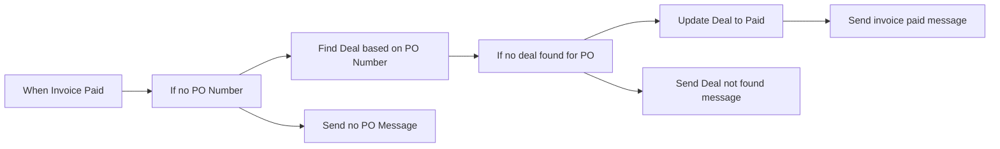

## Fluxo (.json) :

```json
{
  "id": 100,
  "name": "On new Stripe Invoice Payment update Hubspot and notify the team in Slack",
  "nodes": [
    {
      "name": "When Invoice Paid",
      "type": "n8n-nodes-base.stripeTrigger",
      "position": [
        400,
        460
      ],
      "webhookId": "47727266-5233-48e5-b7f7-e47252840a4e",
      "parameters": {
        "events": [
          "invoice.payment_succeeded"
        ]
      },
      "credentials": {
        "stripeApi": {
          "id": "39",
          "name": "Stripe account"
        }
      },
      "typeVersion": 1
    },
    {
      "name": "Update Deal to Paid",
      "type": "n8n-nodes-base.hubspot",
      "position": [
        1240,
        500
      ],
      "parameters": {
        "dealId": "={{$json[\"id\"]}}",
        "operation": "update",
        "updateFields": {
          "customPropertiesUi": {
            "customPropertiesValues": [
              {
                "value": "Yes",
                "property": "paid"
              }
            ]
          }
        },
        "authentication": "oAuth2"
      },
      "credentials": {
        "hubspotOAuth2Api": {
          "id": "60",
          "name": "Hubspot account 2"
        }
      },
      "typeVersion": 1
    },
    {
      "name": "Find Deal based on PO Number",
      "type": "n8n-nodes-base.hubspot",
      "position": [
        820,
        480
      ],
      "parameters": {
        "operation": "search",
        "filterGroupsUi": {
          "filterGroupsValues": [
            {
              "filtersUi": {
                "filterValues": [
                  {
                    "value": "={{$json[\"data\"][\"object\"][\"custom_fields\"][0][\"value\"]}}",
                    "propertyName": "po_number"
                  }
                ]
              }
            }
          ]
        },
        "additionalFields": {}
      },
      "credentials": {
        "hubspotApi": {
          "id": "57",
          "name": "Hubspot account"
        }
      },
      "typeVersion": 1,
      "alwaysOutputData": true
    },
    {
      "name": "If no PO Number",
      "type": "n8n-nodes-base.if",
      "position": [
        600,
        460
      ],
      "parameters": {
        "conditions": {
          "string": [
            {
              "value1": "={{$json[\"data\"][\"object\"][\"custom_fields\"]}}",
              "operation": "isEmpty"
            }
          ]
        }
      },
      "typeVersion": 1
    },
    {
      "name": "If no deal found for PO",
      "type": "n8n-nodes-base.if",
      "position": [
        1020,
        480
      ],
      "parameters": {
        "conditions": {
          "string": [
            {
              "value1": "={{$json[\"id\"]}}",
              "operation": "isEmpty"
            }
          ]
        }
      },
      "typeVersion": 1
    },
    {
      "name": "Send invoice paid message",
      "type": "n8n-nodes-base.slack",
      "position": [
        1420,
        500
      ],
      "parameters": {
        "text": ":sparkles: An invoice has been paid :sparkles:",
        "channel": "team-accounts",
        "blocksUi": {
          "blocksValues": []
        },
        "attachments": [
          {
            "color": "#00FF04",
            "fields": {
              "item": [
                {
                  "short": true,
                  "title": "Amount",
                  "value": "={{$node[\"When Invoice Paid\"].json[\"data\"][\"object\"][\"amount_paid\"]/100}}"
                },
                {
                  "short": true,
                  "title": "Currency",
                  "value": "={{$node[\"When Invoice Paid\"].json[\"data\"][\"object\"][\"currency\"]}}"
                },
                {
                  "short": false,
                  "title": "Customer Name",
                  "value": "={{$node[\"When Invoice Paid\"].json[\"data\"][\"object\"][\"customer_name\"]}}"
                },
                {
                  "short": false,
                  "title": "Customer Email",
                  "value": "={{$node[\"When Invoice Paid\"].json[\"data\"][\"object\"][\"customer_email\"]}}"
                },
                {
                  "short": true,
                  "title": "PO Number",
                  "value": "={{$node[\"When Invoice Paid\"].json[\"data\"][\"object\"][\"custom_fields\"][0][\"value\"]}}"
                },
                {
                  "short": true,
                  "title": "",
                  "value": "="
                }
              ]
            },
            "footer": "=*Transaction ID:* {{$node[\"When Invoice Paid\"].json[\"id\"]}}"
          }
        ],
        "otherOptions": {}
      },
      "credentials": {
        "slackApi": {
          "id": "53",
          "name": "Slack Access Token"
        }
      },
      "typeVersion": 1
    },
    {
      "name": "Send no PO Message",
      "type": "n8n-nodes-base.slack",
      "position": [
        800,
        240
      ],
      "parameters": {
        "text": ":x: Stripe Payment with no PO Number :x:",
        "channel": "team-accounts",
        "blocksUi": {
          "blocksValues": []
        },
        "attachments": [
          {
            "color": "#FF3C00",
            "fields": {
              "item": [
                {
                  "short": true,
                  "title": "Amount",
                  "value": "={{$json[\"data\"][\"object\"][\"amount_paid\"] / 100}}"
                },
                {
                  "short": true,
                  "title": "Currency",
                  "value": "={{$json[\"data\"][\"object\"][\"currency\"]}}"
                },
                {
                  "short": false,
                  "title": "Customer Name",
                  "value": "={{$json[\"data\"][\"object\"][\"customer_name\"]}}"
                },
                {
                  "short": false,
                  "title": "Customer Email",
                  "value": "={{$json[\"data\"][\"object\"][\"customer_email\"]}}"
                }
              ]
            },
            "footer": "=*Transaction ID:* {{$json[\"id\"]}}"
          }
        ],
        "otherOptions": {}
      },
      "credentials": {
        "slackApi": {
          "id": "53",
          "name": "Slack Access Token"
        }
      },
      "typeVersion": 1
    },
    {
      "name": "Send Deal not found message",
      "type": "n8n-nodes-base.slack",
      "position": [
        1180,
        240
      ],
      "parameters": {
        "text": ":x: Unable to find Deal for the below payment :x:",
        "channel": "team-accounts",
        "blocksUi": {
          "blocksValues": []
        },
        "attachments": [
          {
            "color": "#FF3C00",
            "fields": {
              "item": [
                {
                  "short": true,
                  "title": "Amount",
                  "value": "={{$node[\"When Invoice Paid\"].json[\"data\"][\"object\"][\"amount_paid\"]/100}}"
                },
                {
                  "short": true,
                  "title": "Currency",
                  "value": "={{$node[\"When Invoice Paid\"].json[\"data\"][\"object\"][\"currency\"]}}"
                },
                {
                  "short": false,
                  "title": "Customer Name",
                  "value": "={{$node[\"When Invoice Paid\"].json[\"data\"][\"object\"][\"customer_name\"]}}"
                },
                {
                  "short": false,
                  "title": "Customer Email",
                  "value": "={{$node[\"When Invoice Paid\"].json[\"data\"][\"object\"][\"customer_email\"]}}"
                },
                {
                  "short": true,
                  "title": "PO Number",
                  "value": "={{$node[\"When Invoice Paid\"].json[\"data\"][\"object\"][\"custom_fields\"][0][\"value\"]}}"
                }
              ]
            },
            "footer": "=*Transaction ID:* {{$node[\"When Invoice Paid\"].json[\"id\"]}}"
          }
        ],
        "otherOptions": {}
      },
      "credentials": {
        "slackApi": {
          "id": "53",
          "name": "Slack Access Token"
        }
      },
      "typeVersion": 1
    }
  ],
  "active": false,
  "settings": {},
  "connections": {
    "If no PO Number": {
      "main": [
        [
          {
            "node": "Send no PO Message",
            "type": "main",
            "index": 0
          }
        ],
        [
          {
            "node": "Find Deal based on PO Number",
            "type": "main",
            "index": 0
          }
        ]
      ]
    },
    "When Invoice Paid": {
      "main": [
        [
          {
            "node": "If no PO Number",
            "type": "main",
            "index": 0
          }
        ]
      ]
    },
    "Update Deal to Paid": {
      "main": [
        [
          {
            "node": "Send invoice paid message",
            "type": "main",
            "index": 0
          }
        ]
      ]
    },
    "If no deal found for PO": {
      "main": [
        [
          {
            "node": "Send Deal not found message",
            "type": "main",
            "index": 0
          }
        ],
        [
          {
            "node": "Update Deal to Paid",
            "type": "main",
            "index": 0
          }
        ]
      ]
    },
    "Find Deal based on PO Number": {
      "main": [
        [
          {
            "node": "If no deal found for PO",
            "type": "main",
            "index": 0
          }
        ]
      ]
    }
  }
}
```

<a id="template-2233"></a>

## Template 2233 - RAG adaptativo por tipo de consulta

- **Nome:** RAG adaptativo por tipo de consulta
- **Descrição:** Classifica consultas de usuários e adapta a estratégia de recuperação e geração de respostas para fornecer respostas mais relevantes e contextualizadas a partir de uma base de conhecimento vetorial.
- **Funcionalidade:** • Classificação de consultas: Identifica se a pergunta é Factual, Analytical, Opinion ou Contextual.
• Roteamento adaptativo: Seleciona automaticamente a estratégia de recuperação e preparação com base na classificação.
• Estratégia factual (foco em precisão): Reformula a consulta para torná-la mais precisa e específica para busca de fatos.
• Estratégia analítica (cobertura ampla): Gera sub-perguntas (exatamente 3) para explorar diferentes aspectos do tema.
• Estratégia de opinião (perspectivas diversas): Identifica 3 ângulos de visão distintos sobre o tema para recuperar pontos de vista variados.
• Estratégia contextual (integração de contexto): Infere contexto implícito do usuário para ajustar a recuperação e a resposta.
• Preparação de prompts personalizados: Cria instruções de sistema específicas por tipo de consulta para orientar a geração final.
• Recuperação vetorial adaptativa: Pesquisa documentos relevantes no banco vetorial usando a consulta adaptada ou sub-perguntas.
• Agregação de contexto: Concatena trechos recuperados em um bloco de contexto para a geração da resposta.
• Geração de resposta com histórico: Produz a resposta final considerando o contexto recuperado, o prompt personalizado e o histórico de conversa por sessão.
• Interface via webhook/chat: Recebe entradas de usuários e devolve respostas apropriadas via ponto de entrada HTTP.
- **Ferramentas:** • Google Gemini (PaLM): Modelo de linguagem usado para classificação, reformulação de consultas, geração de sub-perguntas/perspectivas e criação da resposta final, além de fornecer embeddings para vetorização.
• Qdrant: Banco de vetores utilizado para armazenar e recuperar trechos de documentos relevantes conforme a consulta adaptada.
• Endpoint Webhook/HTTP: Ponto de entrada para receber as solicitações dos usuários (chat) e retornar as respostas geradas.

## Fluxo visual

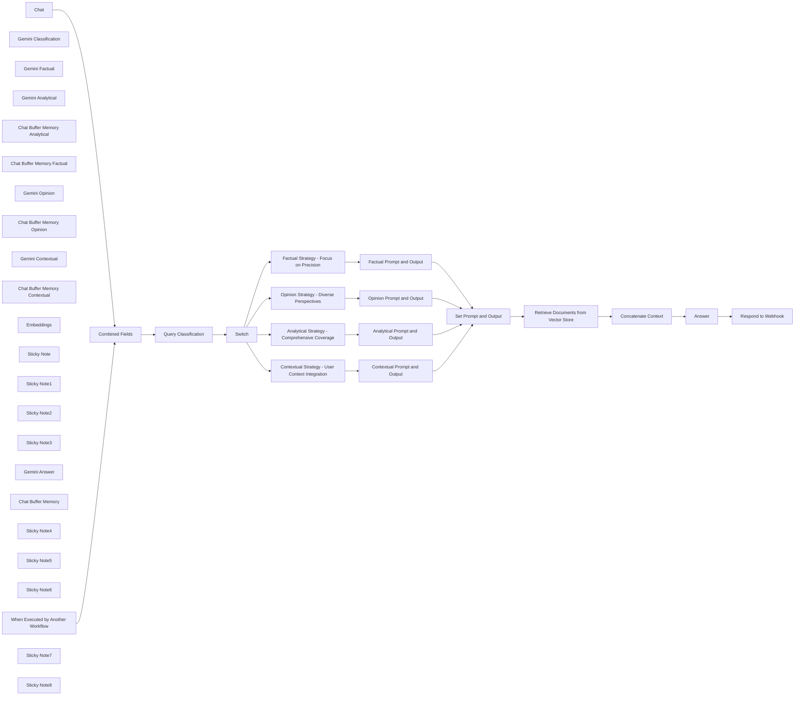

## Fluxo (.json) :

```json
{
  "id": "cpuFyJYHKmjHTncz",
  "meta": {
    "instanceId": "2cb7a61f866faf57392b91b31f47e08a2b3640258f0abd08dd71f087f3243a5a",
    "templateCredsSetupCompleted": true
  },
  "name": "Adaptive RAG",
  "tags": [],
  "nodes": [
    {
      "id": "856bd809-8f41-41af-8f72-a3828229c2a5",
      "name": "Query Classification",
      "type": "@n8n/n8n-nodes-langchain.agent",
      "notes": "Classify a query into one of four categories: Factual, Analytical, Opinion, or Contextual.\n        \nReturns:\nstr: Query category",
      "position": [
        380,
        -20
      ],
      "parameters": {
        "text": "=Classify this query: {{ $('Combined Fields').item.json.user_query }}",
        "options": {
          "systemMessage": "You are an expert at classifying questions. \n\nClassify the given query into exactly one of these categories:\n- Factual: Queries seeking specific, verifiable information.\n- Analytical: Queries requiring comprehensive analysis or explanation.\n- Opinion: Queries about subjective matters or seeking diverse viewpoints.\n- Contextual: Queries that depend on user-specific context.\n\nReturn ONLY the category name, without any explanation or additional text."
        },
        "promptType": "define"
      },
      "typeVersion": 1.8
    },
    {
      "id": "cc2106fc-f1a8-45ef-b37b-ab981ac13466",
      "name": "Switch",
      "type": "n8n-nodes-base.switch",
      "position": [
        740,
        -40
      ],
      "parameters": {
        "rules": {
          "values": [
            {
              "outputKey": "Factual",
              "conditions": {
                "options": {
                  "version": 2,
                  "leftValue": "",
                  "caseSensitive": true,
                  "typeValidation": "strict"
                },
                "combinator": "and",
                "conditions": [
                  {
                    "id": "87f3b50c-9f32-4260-ac76-19c05b28d0b4",
                    "operator": {
                      "type": "string",
                      "operation": "equals"
                    },
                    "leftValue": "={{ $json.output.trim() }}",
                    "rightValue": "Factual"
                  }
                ]
              },
              "renameOutput": true
            },
            {
              "outputKey": "Analytical",
              "conditions": {
                "options": {
                  "version": 2,
                  "leftValue": "",
                  "caseSensitive": true,
                  "typeValidation": "strict"
                },
                "combinator": "and",
                "conditions": [
                  {
                    "id": "f8651b36-79fa-4be4-91fb-0e6d7deea18f",
                    "operator": {
                      "name": "filter.operator.equals",
                      "type": "string",
                      "operation": "equals"
                    },
                    "leftValue": "={{ $json.output.trim() }}",
                    "rightValue": "Analytical"
                  }
                ]
              },
              "renameOutput": true
            },
            {
              "outputKey": "Opinion",
              "conditions": {
                "options": {
                  "version": 2,
                  "leftValue": "",
                  "caseSensitive": true,
                  "typeValidation": "strict"
                },
                "combinator": "and",
                "conditions": [
                  {
                    "id": "5dde06bc-5fe1-4dca-b6e2-6857c5e96d49",
                    "operator": {
                      "name": "filter.operator.equals",
                      "type": "string",
                      "operation": "equals"
                    },
                    "leftValue": "={{ $json.output.trim() }}",
                    "rightValue": "Opinion"
                  }
                ]
              },
              "renameOutput": true
            },
            {
              "outputKey": "Contextual",
              "conditions": {
                "options": {
                  "version": 2,
                  "leftValue": "",
                  "caseSensitive": true,
                  "typeValidation": "strict"
                },
                "combinator": "and",
                "conditions": [
                  {
                    "id": "bf97926d-7a0b-4e2f-aac0-a820f73344d8",
                    "operator": {
                      "name": "filter.operator.equals",
                      "type": "string",
                      "operation": "equals"
                    },
                    "leftValue": "={{ $json.output.trim() }}",
                    "rightValue": "Contextual"
                  }
                ]
              },
              "renameOutput": true
            }
          ]
        },
        "options": {
          "fallbackOutput": 0
        }
      },
      "typeVersion": 3.2
    },
    {
      "id": "63889cad-1283-4dbf-ba16-2b6cf575f24a",
      "name": "Factual Strategy - Focus on Precision",
      "type": "@n8n/n8n-nodes-langchain.agent",
      "notes": "Retrieval strategy for factual queries focusing on precision.",
      "position": [
        1140,
        -780
      ],
      "parameters": {
        "text": "=Enhance this factual query: {{ $('Combined Fields').item.json.user_query }}",
        "options": {
          "systemMessage": "=You are an expert at enhancing search queries.\n\nYour task is to reformulate the given factual query to make it more precise and specific for information retrieval. Focus on key entities and their relationships.\n\nProvide ONLY the enhanced query without any explanation."
        },
        "promptType": "define"
      },
      "typeVersion": 1.7
    },
    {
      "id": "020d2201-9590-400d-b496-48c65801271c",
      "name": "Analytical Strategy - Comprehensive Coverage",
      "type": "@n8n/n8n-nodes-langchain.agent",
      "notes": "Retrieval strategy for analytical queries focusing on comprehensive coverage.",
      "position": [
        1140,
        -240
      ],
      "parameters": {
        "text": "=Generate sub-questions for this analytical query: {{ $('Combined Fields').item.json.user_query }}",
        "options": {
          "systemMessage": "=You are an expert at breaking down complex questions.\n\nGenerate sub-questions that explore different aspects of the main analytical query.\nThese sub-questions should cover the breadth of the topic and help retrieve comprehensive information.\n\nReturn a list of exactly 3 sub-questions, one per line."
        },
        "promptType": "define"
      },
      "typeVersion": 1.7
    },
    {
      "id": "c35d1b95-68c8-4237-932d-4744f620760d",
      "name": "Opinion Strategy - Diverse Perspectives",
      "type": "@n8n/n8n-nodes-langchain.agent",
      "notes": "Retrieval strategy for opinion queries focusing on diverse perspectives.",
      "position": [
        1140,
        300
      ],
      "parameters": {
        "text": "=Identify different perspectives on: {{ $('Combined Fields').item.json.user_query }}",
        "options": {
          "systemMessage": "=You are an expert at identifying different perspectives on a topic.\n\nFor the given query about opinions or viewpoints, identify different perspectives that people might have on this topic.\n\nReturn a list of exactly 3 different viewpoint angles, one per line."
        },
        "promptType": "define"
      },
      "typeVersion": 1.7
    },
    {
      "id": "363a3fc3-112f-40df-891e-0a5aa3669245",
      "name": "Contextual Strategy - User Context Integration",
      "type": "@n8n/n8n-nodes-langchain.agent",
      "notes": "Retrieval strategy for contextual queries integrating user context.",
      "position": [
        1140,
        840
      ],
      "parameters": {
        "text": "=Infer the implied context in this query: {{ $('Combined Fields').item.json.user_query }}",
        "options": {
          "systemMessage": "=You are an expert at understanding implied context in questions.\n\nFor the given query, infer what contextual information might be relevant or implied but not explicitly stated. Focus on what background would help answering this query.\n\nReturn a brief description of the implied context."
        },
        "promptType": "define"
      },
      "typeVersion": 1.7
    },
    {
      "id": "45887701-5ea5-48b4-9b2b-40a80238ab0c",
      "name": "Chat",
      "type": "@n8n/n8n-nodes-langchain.chatTrigger",
      "position": [
        -280,
        120
      ],
      "webhookId": "56f626b5-339e-48af-857f-1d4198fc8a4d",
      "parameters": {
        "options": {}
      },
      "typeVersion": 1.1
    },
    {
      "id": "7f7df364-4829-4e29-be3d-d13a63f65b8f",
      "name": "Factual Prompt and Output",
      "type": "n8n-nodes-base.set",
      "position": [
        1540,
        -780
      ],
      "parameters": {
        "options": {},
        "assignments": {
          "assignments": [
            {
              "id": "a4a28ac2-4a56-46f6-8b86-f5d1a34b2ced",
              "name": "output",
              "type": "string",
              "value": "={{ $json.output }}"
            },
            {
              "id": "7aa6ce13-afbf-4871-b81c-6e9c722a53dc",
              "name": "prompt",
              "type": "string",
              "value": "You are a helpful assistant providing factual information. Answer the question based on the provided context. Focus on accuracy and precision. If the context doesn't contain the information needed, acknowledge the limitations."
            }
          ]
        }
      },
      "typeVersion": 3.4
    },
    {
      "id": "590d8667-69eb-4db2-b5be-714c602b319a",
      "name": "Contextual Prompt and Output",
      "type": "n8n-nodes-base.set",
      "position": [
        1540,
        840
      ],
      "parameters": {
        "options": {},
        "assignments": {
          "assignments": [
            {
              "id": "a4a28ac2-4a56-46f6-8b86-f5d1a34b2ced",
              "name": "output",
              "type": "string",
              "value": "={{ $json.output }}"
            },
            {
              "id": "7aa6ce13-afbf-4871-b81c-6e9c722a53dc",
              "name": "prompt",
              "type": "string",
              "value": "You are a helpful assistant providing contextually relevant information. Answer the question considering both the query and its context. Make connections between the query context and the information in the provided documents. If the context doesn't fully address the specific situation, acknowledge the limitations."
            }
          ]
        }
      },
      "typeVersion": 3.4
    },
    {
      "id": "fa3228ee-62d8-4c02-9dca-8a1ebc6afc74",
      "name": "Opinion Prompt and Output",
      "type": "n8n-nodes-base.set",
      "position": [
        1540,
        300
      ],
      "parameters": {
        "options": {},
        "assignments": {
          "assignments": [
            {
              "id": "a4a28ac2-4a56-46f6-8b86-f5d1a34b2ced",
              "name": "output",
              "type": "string",
              "value": "={{ $json.output }}"
            },
            {
              "id": "7aa6ce13-afbf-4871-b81c-6e9c722a53dc",
              "name": "prompt",
              "type": "string",
              "value": "You are a helpful assistant discussing topics with multiple viewpoints. Based on the provided context, present different perspectives on the topic. Ensure fair representation of diverse opinions without showing bias. Acknowledge where the context presents limited viewpoints."
            }
          ]
        }
      },
      "typeVersion": 3.4
    },
    {
      "id": "c769a76a-fb26-46a1-a00d-825b689d5f7a",
      "name": "Analytical Prompt and Output",
      "type": "n8n-nodes-base.set",
      "position": [
        1540,
        -240
      ],
      "parameters": {
        "options": {},
        "assignments": {
          "assignments": [
            {
              "id": "a4a28ac2-4a56-46f6-8b86-f5d1a34b2ced",
              "name": "output",
              "type": "string",
              "value": "={{ $json.output }}"
            },
            {
              "id": "7aa6ce13-afbf-4871-b81c-6e9c722a53dc",
              "name": "prompt",
              "type": "string",
              "value": "You are a helpful assistant providing analytical insights. Based on the provided context, offer a comprehensive analysis of the topic. Cover different aspects and perspectives in your explanation. If the context has gaps, acknowledge them while providing the best analysis possible."
            }
          ]
        }
      },
      "typeVersion": 3.4
    },
    {
      "id": "fcd29f6b-17e8-442c-93f9-b93fbad7cd10",
      "name": "Gemini Classification",
      "type": "@n8n/n8n-nodes-langchain.lmChatGoogleGemini",
      "position": [
        360,
        180
      ],
      "parameters": {
        "options": {},
        "modelName": "models/gemini-2.0-flash-lite"
      },
      "credentials": {
        "googlePalmApi": {
          "id": "2zwuT5znDglBrUCO",
          "name": "Google Gemini(PaLM) Api account"
        }
      },
      "typeVersion": 1
    },
    {
      "id": "c0828ee3-f184-41f5-9a25-0f1059b03711",
      "name": "Gemini Factual",
      "type": "@n8n/n8n-nodes-langchain.lmChatGoogleGemini",
      "position": [
        1120,
        -560
      ],
      "parameters": {
        "options": {},
        "modelName": "models/gemini-2.0-flash"
      },
      "credentials": {
        "googlePalmApi": {
          "id": "2zwuT5znDglBrUCO",
          "name": "Google Gemini(PaLM) Api account"
        }
      },
      "typeVersion": 1
    },
    {
      "id": "98f9981d-ea8e-45cb-b91d-3c8d1fe33e25",
      "name": "Gemini Analytical",
      "type": "@n8n/n8n-nodes-langchain.lmChatGoogleGemini",
      "position": [
        1120,
        -20
      ],
      "parameters": {
        "options": {},
        "modelName": "models/gemini-2.0-flash"
      },
      "credentials": {
        "googlePalmApi": {
          "id": "2zwuT5znDglBrUCO",
          "name": "Google Gemini(PaLM) Api account"
        }
      },
      "typeVersion": 1
    },
    {
      "id": "c85f270d-3224-4e60-9acf-91f173dfe377",
      "name": "Chat Buffer Memory Analytical",
      "type": "@n8n/n8n-nodes-langchain.memoryBufferWindow",
      "position": [
        1280,
        -20
      ],
      "parameters": {
        "sessionKey": "={{ $('Combined Fields').item.json.chat_memory_key }}",
        "sessionIdType": "customKey",
        "contextWindowLength": 10
      },
      "typeVersion": 1.3
    },
    {
      "id": "c39ba907-7388-4152-965a-e28e626bc9b2",
      "name": "Chat Buffer Memory Factual",
      "type": "@n8n/n8n-nodes-langchain.memoryBufferWindow",
      "position": [
        1280,
        -560
      ],
      "parameters": {
        "sessionKey": "={{ $('Combined Fields').item.json.chat_memory_key }}",
        "sessionIdType": "customKey",
        "contextWindowLength": 10
      },
      "typeVersion": 1.3
    },
    {
      "id": "52dcd9f0-e6b3-4d33-bc6f-621ef880178e",
      "name": "Gemini Opinion",
      "type": "@n8n/n8n-nodes-langchain.lmChatGoogleGemini",
      "position": [
        1120,
        520
      ],
      "parameters": {
        "options": {},
        "modelName": "models/gemini-2.0-flash"
      },
      "credentials": {
        "googlePalmApi": {
          "id": "2zwuT5znDglBrUCO",
          "name": "Google Gemini(PaLM) Api account"
        }
      },
      "typeVersion": 1
    },
    {
      "id": "147a709a-4b46-4835-82cf-7d6b633acd4c",
      "name": "Chat Buffer Memory Opinion",
      "type": "@n8n/n8n-nodes-langchain.memoryBufferWindow",
      "position": [
        1280,
        520
      ],
      "parameters": {
        "sessionKey": "={{ $('Combined Fields').item.json.chat_memory_key }}",
        "sessionIdType": "customKey",
        "contextWindowLength": 10
      },
      "typeVersion": 1.3
    },
    {
      "id": "3cb6bf32-5937-49b9-acf7-d7d01dc2ddd1",
      "name": "Gemini Contextual",
      "type": "@n8n/n8n-nodes-langchain.lmChatGoogleGemini",
      "position": [
        1120,
        1060
      ],
      "parameters": {
        "options": {},
        "modelName": "models/gemini-2.0-flash"
      },
      "credentials": {
        "googlePalmApi": {
          "id": "2zwuT5znDglBrUCO",
          "name": "Google Gemini(PaLM) Api account"
        }
      },
      "typeVersion": 1
    },
    {
      "id": "5916c4f1-4369-4d66-8553-2fff006b7e69",
      "name": "Chat Buffer Memory Contextual",
      "type": "@n8n/n8n-nodes-langchain.memoryBufferWindow",
      "position": [
        1280,
        1060
      ],
      "parameters": {
        "sessionKey": "={{ $('Combined Fields').item.json.chat_memory_key }}",
        "sessionIdType": "customKey",
        "contextWindowLength": 10
      },
      "typeVersion": 1.3
    },
    {
      "id": "d33377c2-6b98-4e4d-968f-f3085354ae50",
      "name": "Embeddings",
      "type": "@n8n/n8n-nodes-langchain.embeddingsGoogleGemini",
      "position": [
        2060,
        200
      ],
      "parameters": {
        "modelName": "models/text-embedding-004"
      },
      "credentials": {
        "googlePalmApi": {
          "id": "2zwuT5znDglBrUCO",
          "name": "Google Gemini(PaLM) Api account"
        }
      },
      "typeVersion": 1
    },
    {
      "id": "32d9a0c0-0889-4cb2-a088-8ee9cfecacd3",
      "name": "Sticky Note",
      "type": "n8n-nodes-base.stickyNote",
      "position": [
        1040,
        -900
      ],
      "parameters": {
        "color": 7,
        "width": 700,
        "height": 520,
        "content": "## Factual Strategy\n**Retrieve precise facts and figures.**"
      },
      "typeVersion": 1
    },
    {
      "id": "064a4729-717c-40c8-824a-508406610a13",
      "name": "Sticky Note1",
      "type": "n8n-nodes-base.stickyNote",
      "position": [
        1040,
        -360
      ],
      "parameters": {
        "color": 7,
        "width": 700,
        "height": 520,
        "content": "## Analytical Strategy\n**Provide comprehensive coverage of a topics and exploring different aspects.**"
      },
      "typeVersion": 1
    },
    {
      "id": "9fd52a28-44bc-4dfd-bdb7-90987cc2f4fb",
      "name": "Sticky Note2",
      "type": "n8n-nodes-base.stickyNote",
      "position": [
        1040,
        180
      ],
      "parameters": {
        "color": 7,
        "width": 700,
        "height": 520,
        "content": "## Opinion Strategy\n**Gather diverse viewpoints on a subjective issue.**"
      },
      "typeVersion": 1
    },
    {
      "id": "3797b21f-cc2a-4210-aa63-6d181d413c5e",
      "name": "Sticky Note3",
      "type": "n8n-nodes-base.stickyNote",
      "position": [
        1040,
        720
      ],
      "parameters": {
        "color": 7,
        "width": 700,
        "height": 520,
        "content": "## Contextual Strategy\n**Incorporate user-specific context to fine-tune the retrieval.**"
      },
      "typeVersion": 1
    },
    {
      "id": "16fa1531-9fb9-4b12-961c-be12e20b2134",
      "name": "Concatenate Context",
      "type": "n8n-nodes-base.summarize",
      "position": [
        2440,
        -20
      ],
      "parameters": {
        "options": {},
        "fieldsToSummarize": {
          "values": [
            {
              "field": "document.pageContent",
              "separateBy": "other",
              "aggregation": "concatenate",
              "customSeparator": "={{ \"\\n\\n---\\n\\n\" }}"
            }
          ]
        }
      },
      "typeVersion": 1.1
    },
    {
      "id": "4d6147d1-7a3d-42ab-b23f-cdafe8ea30b0",
      "name": "Retrieve Documents from Vector Store",
      "type": "@n8n/n8n-nodes-langchain.vectorStoreQdrant",
      "position": [
        2080,
        -20
      ],
      "parameters": {
        "mode": "load",
        "topK": 10,
        "prompt": "={{ $json.prompt }}\n\nUser query: \n{{ $json.output }}",
        "options": {},
        "qdrantCollection": {
          "__rl": true,
          "mode": "id",
          "value": "={{ $('Combined Fields').item.json.vector_store_id }}"
        }
      },
      "credentials": {
        "qdrantApi": {
          "id": "mb8rw8tmUeP6aPJm",
          "name": "QdrantApi account"
        }
      },
      "typeVersion": 1.1
    },
    {
      "id": "7e68f9cb-0a0d-4215-8083-3b9ef92cd237",
      "name": "Set Prompt and Output",
      "type": "n8n-nodes-base.set",
      "position": [
        1880,
        -20
      ],
      "parameters": {
        "options": {},
        "assignments": {
          "assignments": [
            {
              "id": "1d782243-0571-4845-b8fe-4c6c4b55379e",
              "name": "output",
              "type": "string",
              "value": "={{ $json.output }}"
            },
            {
              "id": "547091fb-367c-44d4-ac39-24d073da70e0",
              "name": "prompt",
              "type": "string",
              "value": "={{ $json.prompt }}"
            }
          ]
        }
      },
      "typeVersion": 3.4
    },
    {
      "id": "0c623ca1-da85-48a3-9d8b-90d97283a015",
      "name": "Gemini Answer",
      "type": "@n8n/n8n-nodes-langchain.lmChatGoogleGemini",
      "position": [
        2720,
        200
      ],
      "parameters": {
        "options": {},
        "modelName": "models/gemini-2.0-flash"
      },
      "credentials": {
        "googlePalmApi": {
          "id": "2zwuT5znDglBrUCO",
          "name": "Google Gemini(PaLM) Api account"
        }
      },
      "typeVersion": 1
    },
    {
      "id": "fab91e48-1c62-46a8-b9fc-39704f225274",
      "name": "Answer",
      "type": "@n8n/n8n-nodes-langchain.agent",
      "position": [
        2760,
        -20
      ],
      "parameters": {
        "text": "=User query: {{ $('Combined Fields').item.json.user_query }}",
        "options": {
          "systemMessage": "={{ $('Set Prompt and Output').item.json.prompt }}\n\nUse the following context (delimited by <ctx></ctx>) and the chat history to answer the user query.\n<ctx>\n{{ $json.concatenated_document_pageContent }}\n</ctx>"
        },
        "promptType": "define"
      },
      "typeVersion": 1.8
    },
    {
      "id": "d69f8d62-3064-40a8-b490-22772fbc38cd",
      "name": "Chat Buffer Memory",
      "type": "@n8n/n8n-nodes-langchain.memoryBufferWindow",
      "position": [
        2900,
        200
      ],
      "parameters": {
        "sessionKey": "={{ $('Combined Fields').item.json.chat_memory_key }}",
        "sessionIdType": "customKey",
        "contextWindowLength": 10
      },
      "typeVersion": 1.3
    },
    {
      "id": "a399f8e6-fafd-4f73-a2de-894f1e3c4bec",
      "name": "Sticky Note4",
      "type": "n8n-nodes-base.stickyNote",
      "position": [
        1800,
        -220
      ],
      "parameters": {
        "color": 7,
        "width": 820,
        "height": 580,
        "content": "## Perform adaptive retrieval\n**Find document considering both query and context.**"
      },
      "typeVersion": 1
    },
    {
      "id": "7f10fe70-1af8-47ad-a9b5-2850412c43f8",
      "name": "Sticky Note5",
      "type": "n8n-nodes-base.stickyNote",
      "position": [
        2640,
        -220
      ],
      "parameters": {
        "color": 7,
        "width": 740,
        "height": 580,
        "content": "## Reply to the user integrating retrieval context"
      },
      "typeVersion": 1
    },
    {
      "id": "5cd0dd02-65f4-4351-aeae-c70ecf5f1d66",
      "name": "Respond to Webhook",
      "type": "n8n-nodes-base.respondToWebhook",
      "position": [
        3120,
        -20
      ],
      "parameters": {
        "options": {}
      },
      "typeVersion": 1.1
    },
    {
      "id": "4c56ef8f-8fce-4525-bb87-15df37e91cc4",
      "name": "Sticky Note6",
      "type": "n8n-nodes-base.stickyNote",
      "position": [
        280,
        -220
      ],
      "parameters": {
        "color": 7,
        "width": 700,
        "height": 580,
        "content": "## User query classification\n**Classify the query into one of four categories: Factual, Analytical, Opinion, or Contextual.**"
      },
      "typeVersion": 1
    },
    {
      "id": "3ef73405-89de-4bed-9673-90e2c1f2e74b",
      "name": "When Executed by Another Workflow",
      "type": "n8n-nodes-base.executeWorkflowTrigger",
      "position": [
        -280,
        -140
      ],
      "parameters": {
        "workflowInputs": {
          "values": [
            {
              "name": "user_query"
            },
            {
              "name": "chat_memory_key"
            },
            {
              "name": "vector_store_id"
            }
          ]
        }
      },
      "typeVersion": 1.1
    },
    {
      "id": "0785714f-c45c-4eda-9937-c97e44c9a449",
      "name": "Combined Fields",
      "type": "n8n-nodes-base.set",
      "position": [
        40,
        -20
      ],
      "parameters": {
        "options": {},
        "assignments": {
          "assignments": [
            {
              "id": "90ab73a2-fe01-451a-b9df-bffe950b1599",
              "name": "user_query",
              "type": "string",
              "value": "={{ $json.user_query || $json.chatInput }}"
            },
            {
              "id": "36686ff5-09fc-40a4-8335-a5dd1576e941",
              "name": "chat_memory_key",
              "type": "string",
              "value": "={{ $json.chat_memory_key || $('Chat').item.json.sessionId }}"
            },
            {
              "id": "4230c8f3-644c-4985-b710-a4099ccee77c",
              "name": "vector_store_id",
              "type": "string",
              "value": "={{ $json.vector_store_id || \"<ID HERE>\" }}"
            }
          ]
        }
      },
      "typeVersion": 3.4
    },
    {
      "id": "57a93b72-4233-4ba2-b8c7-99d88f0ed572",
      "name": "Sticky Note7",
      "type": "n8n-nodes-base.stickyNote",
      "position": [
        -300,
        400
      ],
      "parameters": {
        "width": 1280,
        "height": 1300,
        "content": "# Adaptive RAG Workflow\n\nThis n8n workflow implements a version of the Adaptive Retrieval-Augmented Generation (RAG) approach. It classifies user queries and applies different retrieval and generation strategies based on the query type (Factual, Analytical, Opinion, or Contextual) to provide more relevant and tailored answers from a knowledge base stored in a Qdrant vector store.\n\n## How it Works\n\n1.  **Input Trigger:**\n    * The workflow can be initiated via the built-in Chat interface or triggered by another n8n workflow.\n    * It expects inputs: `user_query`, `chat_memory_key` (for conversation history), and `vector_store_id` (specifying the Qdrant collection).\n    * A `Set` node (`Combined Fields`) standardizes these inputs.\n\n2.  **Query Classification:**\n    * A Google Gemini agent (`Query Classification`) analyzes the `user_query`.\n    * It classifies the query into one of four categories:\n        * **Factual:** Seeking specific, verifiable information.\n        * **Analytical:** Requiring comprehensive analysis or explanation.\n        * **Opinion:** Asking about subjective matters or seeking diverse viewpoints.\n        * **Contextual:** Depending on user-specific or implied context.\n\n3.  **Adaptive Strategy Routing:**\n    * A `Switch` node routes the workflow based on the classification result from the previous step.\n\n4.  **Strategy Implementation (Query Adaptation):**\n    * Depending on the route, a specific Google Gemini agent adapts the query or approach:\n        * **Factual Strategy:** Rewrites the query for better precision, focusing on key entities (`Factual Strategy - Focus on Precision`).\n        * **Analytical Strategy:** Breaks down the main query into multiple sub-questions to ensure comprehensive coverage (`Analytical Strategy - Comprehensive Coverage`).\n        * **Opinion Strategy:** Identifies different potential perspectives or angles related to the query (`Opinion Strategy - Diverse Perspectives`).\n        * **Contextual Strategy:** Infers implied context needed to answer the query effectively (`Contextual Strategy - User Context Integration`).\n    * Each strategy path uses its own chat memory buffer for the adaptation step.\n\n5.  **Retrieval Prompt & Output Setup:**\n    * Based on the *original* query classification, a `Set` node (`Factual/Analytical/Opinion/Contextual Prompt and Output`, combined via connections to `Set Prompt and Output`) prepares:\n        * The output from the strategy step (e.g., rewritten query, sub-questions, perspectives).\n        * A tailored system prompt for the final answer generation agent, instructing it how to behave based on the query type (e.g., focus on precision for Factual, present diverse views for Opinion).\n\n6.  **Document Retrieval (RAG):**\n    * The `Retrieve Documents from Vector Store` node uses the adapted query/output from the strategy step to search the specified Qdrant collection (`vector_store_id`).\n    * It retrieves the top relevant document chunks using Google Gemini embeddings.\n\n7.  **Context Preparation:**\n    * The content from the retrieved document chunks is concatenated (`Concatenate Context`) to form a single context block for the final answer generation.\n\n8.  **Answer Generation:**\n    * The final `Answer` agent (powered by Google Gemini) generates the response.\n    * It uses:\n        * The tailored system prompt set in step 5.\n        * The concatenated context from retrieved documents (step 7).\n        * The original `user_query`.\n        * The shared chat history (`Chat Buffer Memory` using `chat_memory_key`).\n\n9.  **Response:**\n    * The generated answer is sent back to the user via the `Respond to Webhook` node."
      },
      "typeVersion": 1
    },
    {
      "id": "bec8070f-2ce9-4930-b71e-685a2b21d3f2",
      "name": "Sticky Note8",
      "type": "n8n-nodes-base.stickyNote",
      "position": [
        -60,
        -220
      ],
      "parameters": {
        "color": 7,
        "width": 320,
        "height": 580,
        "content": "## ⚠️  If using in Chat mode\n\nUpdate the `vector_store_id` variable to the corresponding Qdrant ID needed to perform the documents retrieval."
      },
      "typeVersion": 1
    }
  ],
  "active": false,
  "pinData": {},
  "settings": {
    "executionOrder": "v1"
  },
  "versionId": "7d56eea8-a262-4add-a4e8-45c2b0c7d1a9",
  "connections": {
    "Chat": {
      "main": [
        [
          {
            "node": "Combined Fields",
            "type": "main",
            "index": 0
          }
        ]
      ]
    },
    "Answer": {
      "main": [
        [
          {
            "node": "Respond to Webhook",
            "type": "main",
            "index": 0
          }
        ]
      ]
    },
    "Switch": {
      "main": [
        [
          {
            "node": "Factual Strategy - Focus on Precision",
            "type": "main",
            "index": 0
          }
        ],
        [
          {
            "node": "Analytical Strategy - Comprehensive Coverage",
            "type": "main",
            "index": 0
          }
        ],
        [
          {
            "node": "Opinion Strategy - Diverse Perspectives",
            "type": "main",
            "index": 0
          }
        ],
        [
          {
            "node": "Contextual Strategy - User Context Integration",
            "type": "main",
            "index": 0
          }
        ]
      ]
    },
    "Embeddings": {
      "ai_embedding": [
        [
          {
            "node": "Retrieve Documents from Vector Store",
            "type": "ai_embedding",
            "index": 0
          }
        ]
      ]
    },
    "Gemini Answer": {
      "ai_languageModel": [
        [
          {
            "node": "Answer",
            "type": "ai_languageModel",
            "index": 0
          }
        ]
      ]
    },
    "Gemini Factual": {
      "ai_languageModel": [
        [
          {
            "node": "Factual Strategy - Focus on Precision",
            "type": "ai_languageModel",
            "index": 0
          }
        ]
      ]
    },
    "Gemini Opinion": {
      "ai_languageModel": [
        [
          {
            "node": "Opinion Strategy - Diverse Perspectives",
            "type": "ai_languageModel",
            "index": 0
          }
        ]
      ]
    },
    "Combined Fields": {
      "main": [
        [
          {
            "node": "Query Classification",
            "type": "main",
            "index": 0
          }
        ]
      ]
    },
    "Gemini Analytical": {
      "ai_languageModel": [
        [
          {
            "node": "Analytical Strategy - Comprehensive Coverage",
            "type": "ai_languageModel",
            "index": 0
          }
        ]
      ]
    },
    "Gemini Contextual": {
      "ai_languageModel": [
        [
          {
            "node": "Contextual Strategy - User Context Integration",
            "type": "ai_languageModel",
            "index": 0
          }
        ]
      ]
    },
    "Chat Buffer Memory": {
      "ai_memory": [
        [
          {
            "node": "Answer",
            "type": "ai_memory",
            "index": 0
          }
        ]
      ]
    },
    "Concatenate Context": {
      "main": [
        [
          {
            "node": "Answer",
            "type": "main",
            "index": 0
          }
        ]
      ]
    },
    "Query Classification": {
      "main": [
        [
          {
            "node": "Switch",
            "type": "main",
            "index": 0
          }
        ]
      ]
    },
    "Gemini Classification": {
      "ai_languageModel": [
        [
          {
            "node": "Query Classification",
            "type": "ai_languageModel",
            "index": 0
          }
        ]
      ]
    },
    "Set Prompt and Output": {
      "main": [
        [
          {
            "node": "Retrieve Documents from Vector Store",
            "type": "main",
            "index": 0
          }
        ]
      ]
    },
    "Factual Prompt and Output": {
      "main": [
        [
          {
            "node": "Set Prompt and Output",
            "type": "main",
            "index": 0
          }
        ]
      ]
    },
    "Opinion Prompt and Output": {
      "main": [
        [
          {
            "node": "Set Prompt and Output",
            "type": "main",
            "index": 0
          }
        ]
      ]
    },
    "Chat Buffer Memory Factual": {
      "ai_memory": [
        [
          {
            "node": "Factual Strategy - Focus on Precision",
            "type": "ai_memory",
            "index": 0
          }
        ]
      ]
    },
    "Chat Buffer Memory Opinion": {
      "ai_memory": [
        [
          {
            "node": "Opinion Strategy - Diverse Perspectives",
            "type": "ai_memory",
            "index": 0
          }
        ]
      ]
    },
    "Analytical Prompt and Output": {
      "main": [
        [
          {
            "node": "Set Prompt and Output",
            "type": "main",
            "index": 0
          }
        ]
      ]
    },
    "Contextual Prompt and Output": {
      "main": [
        [
          {
            "node": "Set Prompt and Output",
            "type": "main",
            "index": 0
          }
        ]
      ]
    },
    "Chat Buffer Memory Analytical": {
      "ai_memory": [
        [
          {
            "node": "Analytical Strategy - Comprehensive Coverage",
            "type": "ai_memory",
            "index": 0
          }
        ]
      ]
    },
    "Chat Buffer Memory Contextual": {
      "ai_memory": [
        [
          {
            "node": "Contextual Strategy - User Context Integration",
            "type": "ai_memory",
            "index": 0
          }
        ]
      ]
    },
    "When Executed by Another Workflow": {
      "main": [
        [
          {
            "node": "Combined Fields",
            "type": "main",
            "index": 0
          }
        ]
      ]
    },
    "Retrieve Documents from Vector Store": {
      "main": [
        [
          {
            "node": "Concatenate Context",
            "type": "main",
            "index": 0
          }
        ]
      ]
    },
    "Factual Strategy - Focus on Precision": {
      "main": [
        [
          {
            "node": "Factual Prompt and Output",
            "type": "main",
            "index": 0
          }
        ]
      ]
    },
    "Opinion Strategy - Diverse Perspectives": {
      "main": [
        [
          {
            "node": "Opinion Prompt and Output",
            "type": "main",
            "index": 0
          }
        ]
      ]
    },
    "Analytical Strategy - Comprehensive Coverage": {
      "main": [
        [
          {
            "node": "Analytical Prompt and Output",
            "type": "main",
            "index": 0
          }
        ]
      ]
    },
    "Contextual Strategy - User Context Integration": {
      "main": [
        [
          {
            "node": "Contextual Prompt and Output",
            "type": "main",
            "index": 0
          }
        ]
      ]
    }
  }
}
```

<a id="template-2235"></a>

## Template 2235 - Indexação e QA por similaridade

- **Nome:** Indexação e QA por similaridade
- **Descrição:** Este fluxo baixa documentos, gera embeddings com OpenAI, insere/atualiza vetores numa tabela Supabase preparada com pgvector e responde perguntas usando recuperação por similaridade e um modelo de chat.
- **Funcionalidade:** • Download de arquivo: Baixa um arquivo (ex.: EPUB) a partir de um link do Google Drive.
• Carregamento de documento em binário: Converte o arquivo baixado para um formato de documento processável.
• Quebra de texto recursiva: Divide o conteúdo em trechos para melhor geração de embeddings e indexação.
• Geração de embeddings para inserção/atualização: Cria vetores de embeddings consistentes (mesmo modelo) para inserção ou atualização na base.
• Inserção de documentos na base vetorial: Insere conteúdo, metadata e embeddings na tabela do banco vetorial.
• Atualização (upsert) de documentos: Atualiza registros existentes com novos conteúdos e embeddings quando necessário.
• Recuperação por similaridade: Executa buscas por similaridade usando uma função customizada no banco (match_documents) para obter trechos relevantes.
• Encadeamento de QA com modelo de chat: Usa os trechos recuperados como contexto para um modelo de chat gerar respostas ao usuário.
• Gatilho de chat com mensagem inicial: Inicia interação com mensagem padrão e processa perguntas em tempo real.
• Personalização de resposta: Formata e retorna apenas o texto de resposta ao usuário.
• Deleção via API: Orientação para remoção de registros da tabela através de requisições HTTP autorizadas à API do serviço de banco.
- **Ferramentas:** • Google Drive: Armazenamento e fornecimento do arquivo de entrada (por URL).
• OpenAI: Geração de embeddings e uso de modelo de chat para responder perguntas (ex.: modelo de embeddings text-embedding-3-small).
• Supabase: Banco de dados que armazena embeddings (com extensão pgvector), metadata e conteúdo, e executa buscas por similaridade via função customizada (match_documents).

## Fluxo visual

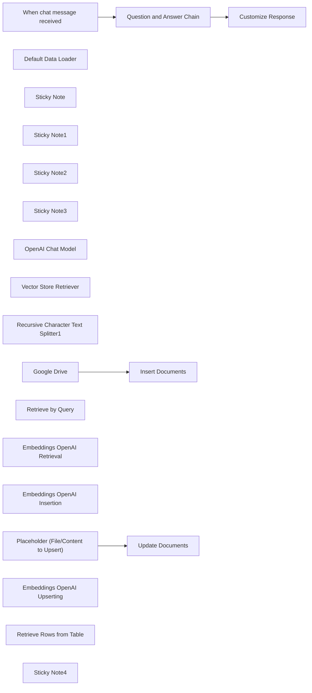

## Fluxo (.json) :

```json
{
  "meta": {
    "instanceId": "1a23006df50de49624f69e85993be557d137b6efe723a867a7d68a84e0b32704"
  },
  "nodes": [
    {
      "id": "54065cc9-047c-4741-95f6-cec3e352abd7",
      "name": "Google Drive",
      "type": "n8n-nodes-base.googleDrive",
      "position": [
        2700,
        -1840
      ],
      "parameters": {
        "fileId": {
          "__rl": true,
          "mode": "url",
          "value": "https://drive.google.com/file/d/xxxxxxxxxxxxxxx/view"
        },
        "options": {},
        "operation": "download"
      },
      "typeVersion": 3
    },
    {
      "id": "62af57f5-a001-4174-bece-260a1fc595e8",
      "name": "Default Data Loader",
      "type": "@n8n/n8n-nodes-langchain.documentDefaultDataLoader",
      "position": [
        3120,
        -1620
      ],
      "parameters": {
        "loader": "epubLoader",
        "options": {},
        "dataType": "binary"
      },
      "typeVersion": 1
    },
    {
      "id": "ce3d9c7c-6ce9-421a-b4d0-4235217cf8e6",
      "name": "Sticky Note",
      "type": "n8n-nodes-base.stickyNote",
      "position": [
        2620,
        -2000
      ],
      "parameters": {
        "width": 749.1276349295781,
        "height": 820.5109034066329,
        "content": "# INSERTING\n\n- it's important to use the same embedding model when for any interaction with your vector database (inserting, upserting and retrieval)"
      },
      "typeVersion": 1
    },
    {
      "id": "81cb3d3e-70af-46c8-bc18-3d076a222d0b",
      "name": "Sticky Note1",
      "type": "n8n-nodes-base.stickyNote",
      "position": [
        1720,
        -1160
      ],
      "parameters": {
        "color": 3,
        "width": 873.9739981925188,
        "height": 534.0012007720542,
        "content": "# UPSERTING\n"
      },
      "typeVersion": 1
    },
    {
      "id": "60ebdb71-c7e0-429b-9394-b680cc000951",
      "name": "Sticky Note2",
      "type": "n8n-nodes-base.stickyNote",
      "position": [
        1720,
        -2000
      ],
      "parameters": {
        "color": 4,
        "width": 876.5116990000852,
        "height": 821.787041589866,
        "content": "# PREPARATION (in Supabase)\n\n- your database needs the extension 'pgvector' enabled -> select Database > Extension > Search for 'vector'\n- make sure you have a table that has the following columns (if not, use the query below in the Supabase SQL Editor)\n\n```\nALTER TABLE \"YOUR TABLE NAME\"\nADD COLUMN embedding VECTOR(1536), // check which number of dimensions you need (depends on the embed model)\nADD COLUMN metadata JSONB,\nADD COLUMN content TEXT;\n```\n\n- make sure you have the right policies set -> select Authentication > Policies\n- make sure you have the custom function `match_documents` set up in Supabase -> This is needed for the Vector Store Node (as query name) \n(if not, use the query below in the Supabase SQL Editor to create that function)\n- make sure you check the size of the AI model as it should be the same vector size for the table \n(e.g. OpenAI's Text-Embedding-3-Small uses 1536)\n\n```\nCREATE OR REPLACE FUNCTION public.match_documents(\n  filter JSONB,\n  match_count INT,\n  query_embedding VECTOR(1536) // should match same dimensions as from insertion\n)\nRETURNS TABLE (\n  id BIGINT,\n  content TEXT,\n  metadata JSONB,\n  embedding VECTOR(1536), // should match same dimensions as from insertion\n  similarity FLOAT\n)\nLANGUAGE plpgsql AS $$\nBEGIN\n  RETURN QUERY\n  SELECT\n    v.id,\n    v.content,\n    v.metadata,\n    v.embedding,\n    1 - (v.embedding <=> match_documents.query_embedding) AS similarity\n  FROM \"YOUR TABLE NAME\" v\n  WHERE v.metadata @> filter\n  ORDER BY v.embedding <=> match_documents.query_embedding\n  LIMIT match_count;\nEND;\n$$\n;\n```\n"
      },
      "typeVersion": 1
    },
    {
      "id": "ae95b0c3-b8b3-44eb-8070-b1bc6cac5cd2",
      "name": "Sticky Note3",
      "type": "n8n-nodes-base.stickyNote",
      "position": [
        3400,
        -2000
      ],
      "parameters": {
        "color": 5,
        "width": 810.9488123113013,
        "height": 821.9537074055816,
        "content": "# RETRIEVAL"
      },
      "typeVersion": 1
    },
    {
      "id": "58168721-cbd7-498c-9d16-41b4d5c6a68f",
      "name": "Question and Answer Chain",
      "type": "@n8n/n8n-nodes-langchain.chainRetrievalQa",
      "position": [
        3680,
        -1860
      ],
      "parameters": {},
      "typeVersion": 1.3
    },
    {
      "id": "ddf1228f-f051-445b-8a42-54c2510a0b2e",
      "name": "OpenAI Chat Model",
      "type": "@n8n/n8n-nodes-langchain.lmChatOpenAi",
      "position": [
        3600,
        -1680
      ],
      "parameters": {
        "options": {}
      },
      "typeVersion": 1
    },
    {
      "id": "734a2c48-b445-4e62-99b7-dc1dcd921c52",
      "name": "Vector Store Retriever",
      "type": "@n8n/n8n-nodes-langchain.retrieverVectorStore",
      "position": [
        3760,
        -1680
      ],
      "parameters": {
        "topK": 10
      },
      "typeVersion": 1
    },
    {
      "id": "43f761b7-f4da-4b29-8099-9b2c15f79fe9",
      "name": "Recursive Character Text Splitter1",
      "type": "@n8n/n8n-nodes-langchain.textSplitterRecursiveCharacterTextSplitter",
      "position": [
        3120,
        -1460
      ],
      "parameters": {
        "options": {}
      },
      "typeVersion": 1
    },
    {
      "id": "de0d2666-88e4-4a4d-ba46-cf789b9cba85",
      "name": "Customize Response",
      "type": "n8n-nodes-base.set",
      "notes": "output || text",
      "position": [
        4020,
        -1860
      ],
      "parameters": {
        "options": {},
        "assignments": {
          "assignments": [
            {
              "id": "440fc115-ccae-4e30-85a5-501d0617b2cf",
              "name": "output",
              "type": "string",
              "value": "={{ $json.response.text }}"
            }
          ]
        }
      },
      "notesInFlow": true,
      "typeVersion": 3.4
    },
    {
      "id": "a396671f-a217-4f05-b969-cb64f10e4b01",
      "name": "When chat message received",
      "type": "@n8n/n8n-nodes-langchain.chatTrigger",
      "position": [
        3480,
        -1860
      ],
      "webhookId": "d7431c58-89aa-4d70-b5bd-044be981b3a9",
      "parameters": {
        "public": true,
        "options": {
          "responseMode": "lastNode"
        },
        "initialMessages": "=Hi there! 🙏\n\nYou can ask me anything about Venerable Geshe Kelsang Gyatso's Book - 'How To Transform Your Life'\n\nWhat would you like to know? "
      },
      "typeVersion": 1.1
    },
    {
      "id": "6312f6bc-c69c-4d4f-8838-8a9d0d22ed55",
      "name": "Retrieve by Query",
      "type": "@n8n/n8n-nodes-langchain.vectorStoreSupabase",
      "position": [
        3700,
        -1520
      ],
      "parameters": {
        "options": {
          "queryName": "match_documents"
        },
        "tableName": {
          "__rl": true,
          "mode": "list",
          "value": "Kadampa",
          "cachedResultName": "Kadampa"
        }
      },
      "typeVersion": 1
    },
    {
      "id": "ba6b87b9-e96d-47a3-83f8-169d7172325a",
      "name": "Embeddings OpenAI Retrieval",
      "type": "@n8n/n8n-nodes-langchain.embeddingsOpenAi",
      "position": [
        3700,
        -1360
      ],
      "parameters": {
        "options": {}
      },
      "typeVersion": 1
    },
    {
      "id": "bcd1b31f-c60b-4c40-b039-d47dadc86b23",
      "name": "Embeddings OpenAI Insertion",
      "type": "@n8n/n8n-nodes-langchain.embeddingsOpenAi",
      "position": [
        2920,
        -1620
      ],
      "parameters": {
        "model": "text-embedding-3-small",
        "options": {}
      },
      "typeVersion": 1
    },
    {
      "id": "dfd7f734-eb00-4af3-9179-724503422fe4",
      "name": "Placeholder (File/Content to Upsert)",
      "type": "n8n-nodes-base.set",
      "position": [
        1900,
        -1000
      ],
      "parameters": {
        "mode": "raw",
        "options": {},
        "jsonOutput": "={\n  \"Date\": \"{{ $now.format('dd MMM yyyy') }}\",\n  \"Time\": \"{{ $now.format('HH:mm ZZZZ z') }}\"\n}\n"
      },
      "typeVersion": 3.4
    },
    {
      "id": "c54c9458-9b8a-4ef1-a6db-5265729be19d",
      "name": "Embeddings OpenAI Upserting",
      "type": "@n8n/n8n-nodes-langchain.embeddingsOpenAi",
      "position": [
        2120,
        -840
      ],
      "parameters": {
        "model": "text-embedding-3-small",
        "options": {}
      },
      "typeVersion": 1
    },
    {
      "id": "30c18e9e-d047-40d3-8324-f5d0e7892db6",
      "name": "Insert Documents",
      "type": "@n8n/n8n-nodes-langchain.vectorStoreSupabase",
      "position": [
        2920,
        -1840
      ],
      "parameters": {
        "mode": "insert",
        "options": {},
        "tableName": {
          "__rl": true,
          "mode": "list",
          "value": "Kadampa",
          "cachedResultName": "Kadampa"
        }
      },
      "typeVersion": 1
    },
    {
      "id": "3c0ed0ee-9134-4b4e-bcfd-632dd67a57da",
      "name": "Retrieve Rows from Table",
      "type": "n8n-nodes-base.supabase",
      "position": [
        3960,
        -1380
      ],
      "parameters": {
        "tableId": "n8n",
        "operation": "getAll",
        "returnAll": true
      },
      "typeVersion": 1
    },
    {
      "id": "53aca1b4-31e8-4699-b158-673623bc9b95",
      "name": "Sticky Note4",
      "type": "n8n-nodes-base.stickyNote",
      "position": [
        2620,
        -1160
      ],
      "parameters": {
        "color": 6,
        "width": 1587.0771183771394,
        "height": 537.3056597675153,
        "content": "# DELETION\n\nAt the moment n8n does not have a built-in Supabase Node to delete records in a Vector Database. For this you would typically use the HTTP Request node to make an authorized API call to Supabase. \n\n## HTTP Request Node\n\nUse this node to send a DELETE request to your Supabase instance.\n\n- Supabase API Endpoint: Use the appropriate URL for your Supabase project. The endpoint will typically look like this: [https://<your-supabase-ref>.supabase.co/rest/v1/<your-vector-table>](https://supabase.com/docs/guides/api). Replace `<your-supabase-ref>` and `<your-vector-table>` with your details.\n### HEADERS:\n- apikey: Your Supabase API key.\n- Authorization: Bearer token with your Supabase JWT.\n- Query Parameters: Use query parameters to specify which record(s) to delete. For example, `?id=eq.<your-record-id>` where `<your-record-id>` is the specific record ID you want to delete \n(You can also reference back to the **Retrieve Rows From Table** Node to get the ID dynamically)\n\nEnsure you have the necessary permissions set up in Supabase to delete records through the API.\n\nPlease refer to the official n8n documentation for more detailed information on using the [HTTP Request Node](https://docs.n8n.io/integrations/builtin/core-nodes/n8n-nodes-base.httprequest/).\n\n_Note:_ Deleting records is a sensitive operation, so make sure that your permissions are correctly configured and that you are targeting the correct records to avoid unwanted data loss."
      },
      "typeVersion": 1
    },
    {
      "id": "4ffaccdb-9e0f-464d-9284-7771f6599fd8",
      "name": "Update Documents",
      "type": "@n8n/n8n-nodes-langchain.vectorStoreSupabase",
      "position": [
        2100,
        -1000
      ],
      "parameters": {
        "id": "1",
        "mode": "update",
        "options": {
          "queryName": "match_documents"
        },
        "tableName": {
          "__rl": true,
          "mode": "list",
          "value": "n8n",
          "cachedResultName": "n8n"
        }
      },
      "typeVersion": 1
    }
  ],
  "pinData": {},
  "connections": {
    "Google Drive": {
      "main": [
        [
          {
            "node": "Insert Documents",
            "type": "main",
            "index": 0
          }
        ]
      ]
    },
    "OpenAI Chat Model": {
      "ai_languageModel": [
        [
          {
            "node": "Question and Answer Chain",
            "type": "ai_languageModel",
            "index": 0
          }
        ]
      ]
    },
    "Retrieve by Query": {
      "ai_vectorStore": [
        [
          {
            "node": "Vector Store Retriever",
            "type": "ai_vectorStore",
            "index": 0
          }
        ]
      ]
    },
    "Default Data Loader": {
      "ai_document": [
        [
          {
            "node": "Insert Documents",
            "type": "ai_document",
            "index": 0
          }
        ]
      ]
    },
    "Vector Store Retriever": {
      "ai_retriever": [
        [
          {
            "node": "Question and Answer Chain",
            "type": "ai_retriever",
            "index": 0
          }
        ]
      ]
    },
    "Question and Answer Chain": {
      "main": [
        [
          {
            "node": "Customize Response",
            "type": "main",
            "index": 0
          }
        ]
      ]
    },
    "When chat message received": {
      "main": [
        [
          {
            "node": "Question and Answer Chain",
            "type": "main",
            "index": 0
          }
        ]
      ]
    },
    "Embeddings OpenAI Insertion": {
      "ai_embedding": [
        [
          {
            "node": "Insert Documents",
            "type": "ai_embedding",
            "index": 0
          }
        ]
      ]
    },
    "Embeddings OpenAI Retrieval": {
      "ai_embedding": [
        [
          {
            "node": "Retrieve by Query",
            "type": "ai_embedding",
            "index": 0
          }
        ]
      ]
    },
    "Embeddings OpenAI Upserting": {
      "ai_embedding": [
        [
          {
            "node": "Update Documents",
            "type": "ai_embedding",
            "index": 0
          }
        ]
      ]
    },
    "Recursive Character Text Splitter1": {
      "ai_textSplitter": [
        [
          {
            "node": "Default Data Loader",
            "type": "ai_textSplitter",
            "index": 0
          }
        ]
      ]
    },
    "Placeholder (File/Content to Upsert)": {
      "main": [
        [
          {
            "node": "Update Documents",
            "type": "main",
            "index": 0
          }
        ]
      ]
    }
  }
}
```

<a id="template-2237"></a>

## Template 2237 - Gatilho de novas respostas do SurveyMonkey

- **Nome:** Gatilho de novas respostas do SurveyMonkey
- **Descrição:** Este fluxo inicia quando uma nova resposta é criada em uma pesquisa específica do SurveyMonkey.
- **Funcionalidade:** • Detecção de resposta criada: Aciona o fluxo quando uma nova resposta é enviada.
• Filtragem por pesquisa específica: Apenas respostas da pesquisa com ID 288506979 disparam o gatilho.
• Escopo do objeto: Configurado para ouvir eventos do tipo 'survey' (pesquisa).
• Autenticação segura: Usa OAuth2 para autenticar acesso à conta do SurveyMonkey.
- **Ferramentas:** • SurveyMonkey: Plataforma de criação e coleta de respostas de pesquisas, fonte dos eventos de resposta.
• OAuth2: Protocolo de autenticação usado para autorizar e manter acesso seguro à conta do SurveyMonkey.


## Fluxo visual

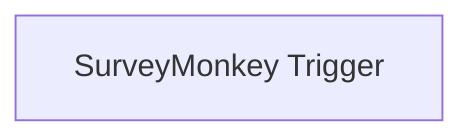

## Fluxo (.json) :

```json
{
  "nodes": [
    {
      "name": "SurveyMonkey Trigger",
      "type": "n8n-nodes-base.surveyMonkeyTrigger",
      "position": [
        880,
        390
      ],
      "webhookId": "52754661-725a-49e0-88fc-a8e5dbbea5a5",
      "parameters": {
        "event": "response_created",
        "surveyIds": [
          "288506979"
        ],
        "objectType": "survey",
        "authentication": "oAuth2"
      },
      "credentials": {
        "surveyMonkeyOAuth2Api": "surveymonkey_oauth"
      },
      "typeVersion": 1
    }
  ],
  "connections": {}
}
```

<a id="template-2239"></a>

## Template 2239 - Backup automático de workflows para Dropbox

- **Nome:** Backup automático de workflows para Dropbox
- **Descrição:** Realiza backups periódicos dos workflows atuais, armazena-os no Dropbox, organiza versões antigas em uma pasta 'old' com carimbo de data e remove backups com mais de 30 dias.
- **Funcionalidade:** • Agendamento: Inicia o processo de backup em intervalos regulares definidos.
• Definição de pasta de destino: Configura a pasta no armazenamento onde os backups serão guardados.
• Movimentação de backups atuais: Transfere backups existentes para uma subpasta 'old' e anexa um timestamp ao nome para versionamento.
• Exportação de workflows: Recupera todos os workflows da plataforma e converte cada um em arquivo JSON.
• Upload de arquivos: Envia os arquivos JSON gerados para a pasta de destino no armazenamento em nuvem.
• Purga de backups antigos: Lista os arquivos na pasta 'old' e exclui aqueles cuja data de modificação é anterior a 30 dias.
• Sincronização entre etapas: Aguarda a conclusão da movimentação de arquivos antes de iniciar o backup dos workflows para evitar conflitos.
- **Ferramentas:** • Dropbox: Serviço de armazenamento em nuvem utilizado para salvar os backups, mover versões antigas para uma pasta dedicada e excluir arquivos obsoletos.
• API da plataforma de workflows: Fonte dos workflows exportados como JSON para geração dos arquivos de backup.


## Fluxo visual

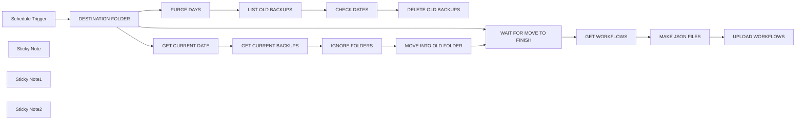

## Fluxo (.json) :

```json
{
  "meta": {
    "instanceId": "257476b1ef58bf3cb6a46e65fac7ee34a53a5e1a8492d5c6e4da5f87c9b82833",
    "templateId": "2075"
  },
  "nodes": [
    {
      "id": "e3df7c90-fd1e-4e56-b4b8-ee2095720077",
      "name": "Schedule Trigger",
      "type": "n8n-nodes-base.scheduleTrigger",
      "position": [
        380,
        240
      ],
      "parameters": {
        "rule": {
          "interval": [
            {}
          ]
        }
      },
      "typeVersion": 1.1
    },
    {
      "id": "fd37f3cc-b42c-43db-ba4c-8f760d620050",
      "name": "PURGE DAYS",
      "type": "n8n-nodes-base.dateTime",
      "position": [
        920,
        460
      ],
      "parameters": {
        "options": {},
        "duration": 30,
        "magnitude": "={{ $now }}",
        "operation": "subtractFromDate"
      },
      "typeVersion": 2
    },
    {
      "id": "88d38a16-3dad-466f-adab-5c5ac846a65e",
      "name": "DELETE OLD BACKUPS",
      "type": "n8n-nodes-base.dropbox",
      "position": [
        1520,
        460
      ],
      "parameters": {
        "path": "={{ $json.pathDisplay }}",
        "operation": "delete",
        "authentication": "oAuth2"
      },
      "credentials": {
        "dropboxOAuth2Api": {
          "id": "28",
          "name": "Dropbox account"
        }
      },
      "typeVersion": 1
    },
    {
      "id": "ff2b37de-8bc8-446a-8369-9bc52a54addd",
      "name": "Sticky Note",
      "type": "n8n-nodes-base.stickyNote",
      "position": [
        820,
        -20
      ],
      "parameters": {
        "width": 932.4394074276975,
        "height": 223.80675203725258,
        "content": "MOVE CURRENT BACKUPS TO OLD FOLDER"
      },
      "typeVersion": 1
    },
    {
      "id": "732eeb83-f552-4c4a-b0dc-e7e25e7a74cb",
      "name": "Sticky Note1",
      "type": "n8n-nodes-base.stickyNote",
      "position": [
        820,
        220
      ],
      "parameters": {
        "width": 931.4765002625034,
        "height": 185.32013969732247,
        "content": "BACKUP ALL CURRENT WORKFLOWS"
      },
      "typeVersion": 1
    },
    {
      "id": "fb8e941b-343a-47c0-9806-10f13a0e1c2d",
      "name": "Sticky Note2",
      "type": "n8n-nodes-base.stickyNote",
      "position": [
        817.111278504417,
        420
      ],
      "parameters": {
        "width": 932.4394074276973,
        "height": 203.55064027939466,
        "content": "PURGE BACKUPS OLDER THEN 30 DAYS\n"
      },
      "typeVersion": 1
    },
    {
      "id": "cbf0c9a8-f188-499f-ba9b-68ea6bfdb38b",
      "name": "GET WORKFLOWS",
      "type": "n8n-nodes-base.n8n",
      "position": [
        1100,
        260
      ],
      "parameters": {
        "filters": {}
      },
      "credentials": {
        "n8nApi": {
          "id": "9zn8iY4B9oVtPrcc",
          "name": "n8n account"
        }
      },
      "typeVersion": 1
    },
    {
      "id": "43436e4f-83e8-422c-8726-6257976dd9ab",
      "name": "MAKE JSON FILES",
      "type": "n8n-nodes-base.moveBinaryData",
      "position": [
        1300,
        260
      ],
      "parameters": {
        "mode": "jsonToBinary",
        "options": {
          "fileName": "={{ $json.name }}"
        }
      },
      "notesInFlow": true,
      "typeVersion": 1
    },
    {
      "id": "4a3df15e-3679-415a-bcfc-51b19961b08b",
      "name": "UPLOAD WORKFLOWS",
      "type": "n8n-nodes-base.dropbox",
      "position": [
        1520,
        260
      ],
      "parameters": {
        "path": "={{ $('DESTINATION FOLDER').last().json.folder }}{{ $('GET WORKFLOWS').item.json.name }}.json",
        "binaryData": true,
        "authentication": "oAuth2"
      },
      "credentials": {
        "dropboxOAuth2Api": {
          "id": "28",
          "name": "Dropbox account"
        }
      },
      "notesInFlow": true,
      "typeVersion": 1
    },
    {
      "id": "1350580e-a6b8-4d18-b2f3-322f3dbefd0b",
      "name": "DESTINATION FOLDER",
      "type": "n8n-nodes-base.set",
      "position": [
        580,
        240
      ],
      "parameters": {
        "fields": {
          "values": [
            {
              "name": "folder",
              "stringValue": "/n8n_backups/"
            }
          ]
        },
        "include": "none",
        "options": {}
      },
      "notesInFlow": true,
      "typeVersion": 3.2
    },
    {
      "id": "920c837e-f328-47bc-ac01-da4584640e01",
      "name": "WAIT FOR MOVE TO FINISH",
      "type": "n8n-nodes-base.merge",
      "position": [
        900,
        260
      ],
      "parameters": {
        "mode": "chooseBranch",
        "output": "input2"
      },
      "typeVersion": 2.1
    },
    {
      "id": "8798f472-5a7f-442b-880e-3bffe3597d0b",
      "name": "GET CURRENT BACKUPS",
      "type": "n8n-nodes-base.dropbox",
      "onError": "continueRegularOutput",
      "position": [
        1100,
        40
      ],
      "parameters": {
        "path": "={{ $('DESTINATION FOLDER').last().json.folder }}",
        "limit": 250,
        "filters": {},
        "resource": "folder",
        "operation": "list",
        "authentication": "oAuth2"
      },
      "credentials": {
        "dropboxOAuth2Api": {
          "id": "28",
          "name": "Dropbox account"
        }
      },
      "typeVersion": 1,
      "alwaysOutputData": true
    },
    {
      "id": "b524ac5f-08bf-4c87-9c53-8e9150068690",
      "name": "IGNORE FOLDERS",
      "type": "n8n-nodes-base.filter",
      "position": [
        1300,
        40
      ],
      "parameters": {
        "options": {},
        "conditions": {
          "options": {
            "leftValue": "",
            "caseSensitive": true,
            "typeValidation": "strict"
          },
          "combinator": "and",
          "conditions": [
            {
              "id": "a13e9fd6-ef31-4e23-bde6-955ffab5849b",
              "operator": {
                "type": "string",
                "operation": "notEquals"
              },
              "leftValue": "={{ $json.type }}",
              "rightValue": "folder"
            }
          ]
        }
      },
      "typeVersion": 2,
      "alwaysOutputData": true
    },
    {
      "id": "7ca4c3d3-93dc-4da0-a4d0-c9282d0e7689",
      "name": "MOVE INTO OLD FOLDER",
      "type": "n8n-nodes-base.dropbox",
      "onError": "continueRegularOutput",
      "position": [
        1520,
        40
      ],
      "parameters": {
        "path": "={{ $json.pathDisplay }}",
        "toPath": "={{ $('DESTINATION FOLDER').last().json.folder }}old/{{ $json.name }}_{{ $('GET CURRENT DATE').last().json.formattedDate }}.json",
        "operation": "move",
        "authentication": "oAuth2"
      },
      "credentials": {
        "dropboxOAuth2Api": {
          "id": "28",
          "name": "Dropbox account"
        }
      },
      "executeOnce": false,
      "notesInFlow": true,
      "retryOnFail": false,
      "typeVersion": 1,
      "alwaysOutputData": true
    },
    {
      "id": "60505840-821b-43e1-8aa0-6478955c5f3a",
      "name": "LIST OLD BACKUPS",
      "type": "n8n-nodes-base.dropbox",
      "onError": "continueRegularOutput",
      "position": [
        1100,
        460
      ],
      "parameters": {
        "path": "={{ $('DESTINATION FOLDER').last().json.folder }}old",
        "limit": 500,
        "filters": {},
        "resource": "folder",
        "operation": "list",
        "authentication": "oAuth2"
      },
      "credentials": {
        "dropboxOAuth2Api": {
          "id": "28",
          "name": "Dropbox account"
        }
      },
      "typeVersion": 1,
      "alwaysOutputData": true
    },
    {
      "id": "ffab6a02-a9f9-4a91-b4f1-dbc157d079e7",
      "name": "CHECK DATES",
      "type": "n8n-nodes-base.if",
      "position": [
        1300,
        460
      ],
      "parameters": {
        "options": {},
        "conditions": {
          "options": {
            "leftValue": "",
            "caseSensitive": true,
            "typeValidation": "strict"
          },
          "combinator": "and",
          "conditions": [
            {
              "id": "e0aa83a7-a65b-4008-9010-bf4f14c0c398",
              "operator": {
                "type": "dateTime",
                "operation": "before"
              },
              "leftValue": "={{ $json.lastModifiedServer }}",
              "rightValue": "={{ $('PURGE DAYS').item.json.newDate }}"
            }
          ]
        }
      },
      "typeVersion": 2
    },
    {
      "id": "6bb40592-b599-4511-9e29-fdb1d374053f",
      "name": "GET CURRENT DATE",
      "type": "n8n-nodes-base.dateTime",
      "position": [
        900,
        40
      ],
      "parameters": {
        "date": "={{ $now }}",
        "format": "=yyyy-MM-dd_HHmm",
        "options": {},
        "operation": "formatDate"
      },
      "typeVersion": 2
    }
  ],
  "pinData": {},
  "connections": {
    "PURGE DAYS": {
      "main": [
        [
          {
            "node": "LIST OLD BACKUPS",
            "type": "main",
            "index": 0
          }
        ]
      ]
    },
    "CHECK DATES": {
      "main": [
        [
          {
            "node": "DELETE OLD BACKUPS",
            "type": "main",
            "index": 0
          }
        ]
      ]
    },
    "GET WORKFLOWS": {
      "main": [
        [
          {
            "node": "MAKE JSON FILES",
            "type": "main",
            "index": 0
          }
        ]
      ]
    },
    "IGNORE FOLDERS": {
      "main": [
        [
          {
            "node": "MOVE INTO OLD FOLDER",
            "type": "main",
            "index": 0
          }
        ]
      ]
    },
    "MAKE JSON FILES": {
      "main": [
        [
          {
            "node": "UPLOAD WORKFLOWS",
            "type": "main",
            "index": 0
          }
        ]
      ]
    },
    "GET CURRENT DATE": {
      "main": [
        [
          {
            "node": "GET CURRENT BACKUPS",
            "type": "main",
            "index": 0
          }
        ]
      ]
    },
    "LIST OLD BACKUPS": {
      "main": [
        [
          {
            "node": "CHECK DATES",
            "type": "main",
            "index": 0
          }
        ]
      ]
    },
    "Schedule Trigger": {
      "main": [
        [
          {
            "node": "DESTINATION FOLDER",
            "type": "main",
            "index": 0
          }
        ]
      ]
    },
    "DESTINATION FOLDER": {
      "main": [
        [
          {
            "node": "GET CURRENT DATE",
            "type": "main",
            "index": 0
          },
          {
            "node": "WAIT FOR MOVE TO FINISH",
            "type": "main",
            "index": 1
          },
          {
            "node": "PURGE DAYS",
            "type": "main",
            "index": 0
          }
        ]
      ]
    },
    "GET CURRENT BACKUPS": {
      "main": [
        [
          {
            "node": "IGNORE FOLDERS",
            "type": "main",
            "index": 0
          }
        ]
      ]
    },
    "MOVE INTO OLD FOLDER": {
      "main": [
        [
          {
            "node": "WAIT FOR MOVE TO FINISH",
            "type": "main",
            "index": 0
          }
        ]
      ]
    },
    "WAIT FOR MOVE TO FINISH": {
      "main": [
        [
          {
            "node": "GET WORKFLOWS",
            "type": "main",
            "index": 0
          }
        ]
      ]
    }
  }
}
```

<a id="template-2241"></a>

## Template 2241 - Registrar e atualizar leads do Typeform

- **Nome:** Registrar e atualizar leads do Typeform
- **Descrição:** Recebe respostas de um formulário Typeform, enriquece os dados com Dropcontact, verifica se o contato existe no Airtable para atualizar ou criar um registro e envia notificações ao Slack sobre novos ou existentes leads.
- **Funcionalidade:** • Captura de respostas do formulário: Inicia o fluxo quando uma nova submissão do Typeform é recebida.
• Enriquecimento de dados: Consulta a base externa para completar informações do contato (nome, email, telefone, LinkedIn, empresa, endereço, etc.).
• Busca de contato existente: Procura no banco de contatos pelo nome completo para determinar se o lead já existe.
• Lógica condicional de existência: Decide se deve atualizar um registro existente ou criar um novo com base na presença do ID do contato.
• Mapeamento de campos: Prepara campos padronizados (nome, sobrenome, email, telefone, website, indústria, endereço, LinkedIn) para escrita na base de dados.
• Criação/atualização de registros: Insere um novo contato ou atualiza o contato existente na base de dados.
• Notificações: Envia mensagens ao Slack diferenciando novos leads e leads já existentes.
- **Ferramentas:** • Typeform: Serviço de criação e coleta de respostas de formulários online usado como gatilho das submissões.
• Dropcontact: Serviço de enriquecimento de contatos que completa e valida informações a partir de email/empresa.
• Airtable: Banco de dados/planilha relacional usado para armazenar e atualizar registros de contatos.
• Slack: Plataforma de comunicação utilizada para enviar notificações sobre novos e existentes leads.

## Fluxo visual

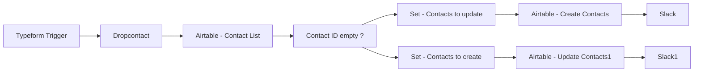

## Fluxo (.json) :

```json
{
  "nodes": [
    {
      "name": "Typeform Trigger",
      "type": "n8n-nodes-base.typeformTrigger",
      "position": [
        140,
        200
      ],
      "webhookId": "",
      "parameters": {
        "formId": ""
      },
      "credentials": {
        "typeformApi": {
          "id": "",
          "name": ""
        }
      },
      "typeVersion": 1
    },
    {
      "name": "Slack1",
      "type": "n8n-nodes-base.slack",
      "position": [
        1360,
        300
      ],
      "parameters": {
        "text": "🥳 An existing lead has just subscribed!",
        "channel": "",
        "attachments": [],
        "otherOptions": {}
      },
      "credentials": {
        "slackApi": {
          "id": "",
          "name": ""
        }
      },
      "typeVersion": 1
    },
    {
      "name": "Airtable - Contact List",
      "type": "n8n-nodes-base.airtable",
      "position": [
        540,
        200
      ],
      "parameters": {
        "table": "Contacts",
        "operation": "list",
        "returnAll": false,
        "application": "",
        "additionalOptions": {
          "fields": [],
          "filterByFormula": "=fullName=\"{{$json[\"full_name\"]}}\""
        }
      },
      "credentials": {
        "airtableApi": {
          "id": "",
          "name": ""
        }
      },
      "executeOnce": false,
      "typeVersion": 1,
      "alwaysOutputData": true
    },
    {
      "name": "Airtable - Update Contacts1",
      "type": "n8n-nodes-base.airtable",
      "position": [
        1150,
        300
      ],
      "parameters": {
        "id": "={{$node[\"Airtable - Contact List\"].json[\"id\"]}}",
        "table": "Contacts",
        "fields": [
          "firstName",
          "lastName",
          "linkedInProfile",
          "Email",
          "Phone",
          "website",
          "LinkedIn Company",
          "Industry",
          "Address"
        ],
        "options": {
          "typecast": true
        },
        "operation": "update",
        "application": "",
        "updateAllFields": false
      },
      "credentials": {
        "airtableApi": {
          "id": "",
          "name": ""
        }
      },
      "typeVersion": 1
    },
    {
      "name": "Slack",
      "type": "n8n-nodes-base.slack",
      "position": [
        1360,
        100
      ],
      "parameters": {
        "text": "=🎉 A new lead has just subscribed!",
        "channel": "",
        "attachments": [],
        "otherOptions": {}
      },
      "credentials": {
        "slackApi": {
          "id": "",
          "name": ""
        }
      },
      "typeVersion": 1
    },
    {
      "name": "Set - Contacts to update",
      "type": "n8n-nodes-base.set",
      "position": [
        940,
        100
      ],
      "parameters": {
        "values": {
          "string": [
            {
              "name": "firstName",
              "value": "={{$node[\"Dropcontact\"].json[\"first_name\"]}}"
            },
            {
              "name": "lastName",
              "value": "={{$node[\"Dropcontact\"].json[\"last_name\"]}}"
            },
            {
              "name": "linkedInProfile",
              "value": "={{$node[\"Dropcontact\"].json[\"linkedin\"]}}"
            },
            {
              "name": "Email",
              "value": "={{$node[\"Dropcontact\"].json[\"email\"][0][\"email\"]}}"
            },
            {
              "name": "Phone",
              "value": "={{$node[\"Dropcontact\"].json[\"phone\"]}}"
            },
            {
              "name": "website",
              "value": "={{$node[\"Dropcontact\"].json[\"website\"]}}"
            },
            {
              "name": "LinkedIn Company",
              "value": "={{$node[\"Dropcontact\"].json[\"company_linkedin\"]}}"
            },
            {
              "name": "Industry",
              "value": "={{$node[\"Dropcontact\"].json[\"naf5_des\"]}}"
            },
            {
              "name": "Address",
              "value": "={{$node[\"Dropcontact\"].json[\"siret_address\"]}}, {{$node[\"Dropcontact\"].json[\"siret_zip\"]}} {{$node[\"Dropcontact\"].json[\"siret_city\"]}}"
            }
          ]
        },
        "options": {
          "dotNotation": true
        }
      },
      "typeVersion": 1
    },
    {
      "name": "Dropcontact",
      "type": "n8n-nodes-base.dropcontact",
      "position": [
        340,
        200
      ],
      "parameters": {
        "email": "=",
        "options": {
          "siren": true,
          "language": "fr"
        },
        "additionalFields": {
          "company": "={{$json[\"and your company ?\"]}}",
          "website": "={{$node[\"Typeform Trigger\"].json[\"tell me more... What's your website ?\"]}}",
          "last_name": "={{$json[\"Hi [field:1c6436830dfffbf1], what's your last name ?\"]}}",
          "first_name": "={{$json[\"First, what's your name?\"]}}"
        }
      },
      "credentials": {
        "dropcontactApi": {
          "id": "",
          "name": ""
        }
      },
      "typeVersion": 1
    },
    {
      "name": "Contact ID empty ?",
      "type": "n8n-nodes-base.if",
      "position": [
        730,
        200
      ],
      "parameters": {
        "conditions": {
          "string": [
            {
              "value1": "={{$json[\"id\"]}}",
              "operation": "isEmpty"
            }
          ]
        }
      },
      "typeVersion": 1,
      "alwaysOutputData": true
    },
    {
      "name": "Airtable - Create Contacts",
      "type": "n8n-nodes-base.airtable",
      "position": [
        1150,
        100
      ],
      "parameters": {
        "table": "Contacts",
        "options": {
          "typecast": true
        },
        "operation": "append",
        "application": ""
      },
      "credentials": {
        "airtableApi": {
          "id": "",
          "name": ""
        }
      },
      "typeVersion": 1
    },
    {
      "name": "Set - Contacts to create",
      "type": "n8n-nodes-base.set",
      "position": [
        940,
        300
      ],
      "parameters": {
        "values": {
          "string": [
            {
              "name": "firstName",
              "value": "={{$node[\"Dropcontact\"].json[\"first_name\"]}}"
            },
            {
              "name": "lastName",
              "value": "={{$node[\"Dropcontact\"].json[\"last_name\"]}}"
            },
            {
              "name": "linkedInProfile",
              "value": "={{$node[\"Dropcontact\"].json[\"linkedin\"]}}"
            },
            {
              "name": "Email",
              "value": "={{$node[\"Dropcontact\"].json[\"email\"][0][\"email\"]}}"
            },
            {
              "name": "Phone",
              "value": "={{$node[\"Dropcontact\"].json[\"phone\"]}}"
            },
            {
              "name": "website",
              "value": "={{$node[\"Dropcontact\"].json[\"website\"]}}"
            },
            {
              "name": "LinkedIn Company",
              "value": "={{$node[\"Dropcontact\"].json[\"company_linkedin\"]}}"
            },
            {
              "name": "Industry",
              "value": "={{$node[\"Dropcontact\"].json[\"naf5_des\"]}}"
            },
            {
              "name": "Address",
              "value": "={{$node[\"Dropcontact\"].json[\"siret_address\"]}}, {{$node[\"Dropcontact\"].json[\"siret_zip\"]}} {{$node[\"Dropcontact\"].json[\"siret_city\"]}}"
            }
          ]
        },
        "options": {
          "dotNotation": true
        }
      },
      "typeVersion": 1
    }
  ],
  "connections": {
    "Dropcontact": {
      "main": [
        [
          {
            "node": "Airtable - Contact List",
            "type": "main",
            "index": 0
          }
        ]
      ]
    },
    "Typeform Trigger": {
      "main": [
        [
          {
            "node": "Dropcontact",
            "type": "main",
            "index": 0
          }
        ]
      ]
    },
    "Contact ID empty ?": {
      "main": [
        [
          {
            "node": "Set - Contacts to update",
            "type": "main",
            "index": 0
          }
        ],
        [
          {
            "node": "Set - Contacts to create",
            "type": "main",
            "index": 0
          }
        ]
      ]
    },
    "Airtable - Contact List": {
      "main": [
        [
          {
            "node": "Contact ID empty ?",
            "type": "main",
            "index": 0
          }
        ]
      ]
    },
    "Set - Contacts to create": {
      "main": [
        [
          {
            "node": "Airtable - Update Contacts1",
            "type": "main",
            "index": 0
          }
        ]
      ]
    },
    "Set - Contacts to update": {
      "main": [
        [
          {
            "node": "Airtable - Create Contacts",
            "type": "main",
            "index": 0
          }
        ]
      ]
    },
    "Airtable - Create Contacts": {
      "main": [
        [
          {
            "node": "Slack",
            "type": "main",
            "index": 0
          }
        ]
      ]
    },
    "Airtable - Update Contacts1": {
      "main": [
        [
          {
            "node": "Slack1",
            "type": "main",
            "index": 0
          }
        ]
      ]
    }
  }
}
```

<a id="template-2243"></a>

## Template 2243 - Assistente de calendário com IA

- **Nome:** Assistente de calendário com IA
- **Descrição:** Assistente conversacional que gerencia o Google Calendar: cria e recupera eventos a partir de mensagens de chat usando um modelo de linguagem para interpretar pedidos e solicitar esclarecimentos quando necessário.
- **Funcionalidade:** • Disparo por mensagem de chat: inicia o fluxo ao receber uma mensagem do usuário.
• Agente conversacional orientado por sistema: utiliza um prompt de sistema que inclui a data atual para guiar o comportamento do assistente.
• Uso de modelo de linguagem: processa intenções do usuário, gera perguntas de follow-up e prepara dados para ações.
• Memória de contexto em janela: mantém histórico recente de mensagens para manter coerência na conversa.
• Recuperação de eventos: solicita intervalo de datas ao usuário e busca eventos no calendário para o período especificado.
• Criação de eventos: coleta início, fim, título (sugerido em MAIÚSCULAS se não fornecido) e descrição, confirma com o usuário antes de criar.
• Validação e esclarecimento: faz perguntas para preencher dados faltantes (datas, horários, título, descrição) antes de executar ações definitivas.
• Formatação de datas padronizada: usa o formato YYYY-MM-DD HH:mm:ss para start_date e end_date.
• Preenchimento dinâmico de campos: popula os parâmetros das ações de calendário com variáveis extraídas da conversa.
• Sugestões proativas: propõe títulos e descrições quando o usuário não os fornece.
• Adequação de idioma: mantém as interações, títulos e descrições no idioma do usuário.
- **Ferramentas:** • OpenAI: modelo de linguagem (ex.: gpt-4o) usado para interpretar pedidos, gerar respostas e decidir quando chamar as ações de calendário.
• Google Calendar: API para consultar e criar eventos no calendário do usuário via conta autenticada.

## Fluxo visual

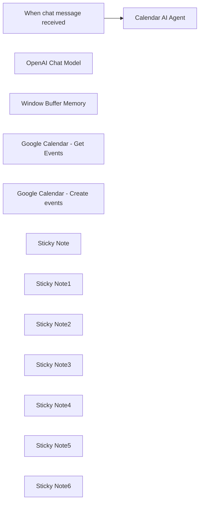

## Fluxo (.json) :

```json
{
  "id": "ITH6r6UYtlCyUcpj",
  "meta": {
    "instanceId": "b9faf72fe0d7c3be94b3ebff0778790b50b135c336412d28fd4fca2cbbf8d1f5"
  },
  "name": "AI Agent : Google calendar assistant using OpenAI",
  "tags": [],
  "nodes": [
    {
      "id": "2e670a54-f789-4c8b-abba-ae35c458f5ed",
      "name": "When chat message received",
      "type": "@n8n/n8n-nodes-langchain.chatTrigger",
      "position": [
        -280,
        0
      ],
      "webhookId": "5308edc9-738b-4aae-a789-214e2392579a",
      "parameters": {
        "options": {}
      },
      "typeVersion": 1.1
    },
    {
      "id": "96bf895f-a18c-4a4c-bc26-3ec5d2372de5",
      "name": "OpenAI Chat Model",
      "type": "@n8n/n8n-nodes-langchain.lmChatOpenAi",
      "position": [
        160,
        820
      ],
      "parameters": {
        "model": "gpt-4o",
        "options": {}
      },
      "credentials": {
        "openAiApi": {
          "id": "",
          "name": "OpenAi"
        }
      },
      "typeVersion": 1
    },
    {
      "id": "270176df-9c2d-4f1a-b017-9349cb249341",
      "name": "Window Buffer Memory",
      "type": "@n8n/n8n-nodes-langchain.memoryBufferWindow",
      "position": [
        580,
        820
      ],
      "parameters": {},
      "typeVersion": 1.3
    },
    {
      "id": "5cdece35-bd69-4c77-b240-963df8781d64",
      "name": "Google Calendar - Get Events",
      "type": "n8n-nodes-base.googleCalendarTool",
      "position": [
        960,
        800
      ],
      "parameters": {
        "options": {
          "timeMax": "={{ $fromAI('end_date') }}",
          "timeMin": "={{ $fromAI('start_date') }}"
        },
        "calendar": {
          "__rl": true,
          "mode": "list",
          "value": "",
          "cachedResultName": ""
        },
        "operation": "getAll",
        "descriptionType": "manual",
        "toolDescription": "Use this tool when you’re asked to retrieve events data."
      },
      "credentials": {
        "googleCalendarOAuth2Api": {
          "id": "",
          "name": "Google Calendar account"
        }
      },
      "typeVersion": 1.2
    },
    {
      "id": "634e6472-099c-4f0e-b9eb-67956c4881b8",
      "name": "Google Calendar - Create events",
      "type": "n8n-nodes-base.googleCalendarTool",
      "position": [
        1380,
        800
      ],
      "parameters": {
        "end": "={{ $fromAI('end_date') }} ",
        "start": "={{ $fromAI('start_date') }} ",
        "calendar": {
          "__rl": true,
          "mode": "list",
          "value": "",
          "cachedResultName": ""
        },
        "descriptionType": "manual",
        "toolDescription": "Use this Google Calendar tool when you are asked to create an event.",
        "additionalFields": {
          "summary": "={{ $fromAI('event_title') }} ",
          "attendees": [],
          "description": "={{ $fromAI('event_description') }} "
        },
        "useDefaultReminders": false
      },
      "credentials": {
        "googleCalendarOAuth2Api": {
          "id": "",
          "name": "Google Calendar account"
        }
      },
      "typeVersion": 1.2
    },
    {
      "id": "5c93e130-29d5-489b-84ea-3e31f5849b3a",
      "name": "Sticky Note",
      "type": "n8n-nodes-base.stickyNote",
      "position": [
        -380,
        -380
      ],
      "parameters": {
        "color": 7,
        "width": 320,
        "height": 560,
        "content": "## Chat trigger - When a message is received\n\nThis node is the **entry point of the workflow**. \nIt triggers the workflow whenever a message is sent to the **chat interface**.\n\nOptions with n8n:\n- **Embed the chat interface** anywhere you want.\n- Use a **webhook node** instead of this node to connect with interfaces like **[Streamlit](https://docs.streamlit.io/develop/tutorials/llms/build-conversational-apps)** or **[OpenWebUI](https://docs.openwebui.com/)**.\n- Use nodes for communication platforms (**Slack**, **Teams**, **Discord**, etc.) if you know how to configure them.\n"
      },
      "typeVersion": 1
    },
    {
      "id": "a1e850b4-d0fe-417c-8e1e-13fb4cdbb0a8",
      "name": "Sticky Note1",
      "type": "n8n-nodes-base.stickyNote",
      "position": [
        60,
        -380
      ],
      "parameters": {
        "color": 7,
        "width": 1520,
        "height": 560,
        "content": "## Tools Agent - Calendar AI Agent\n\nThis **node** configures the **AI agent** for interaction with Google Calendar. \nIt includes the following features:\n\n- A **prompt source**: This is the user message derived from the chat input of the preceding node (`When chat message is received`).\n- A **system message**: This defines the system prompt to guide the AI agent's behavior. It incorporates the variable `{{ DateTime.local().toFormat('cccc d LLLL yyyy') }`, allowing the AI agent to determine the current date and interact with Google Calendar accordingly. For example, the agent can understand a request like \"Create an event called 'n8n workflow review' for next Tuesday.\"\n\n\nn8n nodes come with built-in **guardrails**, ensuring that if the user requests tasks outside the AI agent's setup, it may not function as intended. (Feel free to test it!)\n"
      },
      "typeVersion": 1
    },
    {
      "id": "9b259245-5fd5-4798-973e-bc6aa15da20f",
      "name": "Calendar AI Agent",
      "type": "@n8n/n8n-nodes-langchain.agent",
      "position": [
        580,
        0
      ],
      "parameters": {
        "text": "={{ $json.chatInput }}",
        "options": {
          "systemMessage": "=You are a Google Calendar assistant.\nYour primary goal is to assist the user in managing their calendar effectively using two tools: Event Creation and Event Retrieval. Always base your responses on the current date: \n{{ DateTime.local().toFormat('cccc d LLLL yyyy') }}.\nGeneral Guidelines:\nIf the user's initial message is vague (e.g., \"hello\" or a generic greeting) or does not specify a request, explain your capabilities clearly:\nExample: \"Hello! I can help you manage your Google Calendar. You can ask me to create an event or retrieve event data. What would you like me to do?\"\nIf the user specifies a request in their first message, begin preparing to use the appropriate tool:\nFor event creation, gather necessary details like start date, end date, title, and description.\nFor event retrieval, ask for the date range or time period they want to query.\nTool: Event Creation\nWhen asked to create an event:\n\nRequest the start and end dates/times from the user.\nDate format: YYYY-MM-DD HH:mm:ss\nCollect the following information:\nstart_date: Exact start date and time of the event.\nend_date: Exact end date and time of the event.\nevent_title: Event title in uppercase. Suggest one if not provided.\nevent_description: Generate a brief description and present it for confirmation.\nTool: Event Retrieval\nWhen asked to retrieve events:\n\nAsk for the date range or period they are interested in. Examples:\nFor \"last week,\" retrieve events from Monday of the previous week to Friday of the same week.\nFor \"today,\" use the current date.\nFormat the date range:\nstart_date: Start date and time in YYYY-MM-DD HH:mm:ss.\nend_date: End date and time in YYYY-MM-DD HH:mm:ss.\nKey Behaviors:\nClarity: Provide a clear and helpful introduction when the user's request is unclear.\nValidation: Confirm details with the user before finalizing actions.\nAdaptation: Handle varying levels of detail in requests (e.g., \"Add a meeting for next Monday morning\" or \"Retrieve my events for this weekend\").\nProactivity: Offer suggestions to fill in missing details or clarify ambiguous inputs.\nLanguage Matching: Ensure all interactions, including event titles, descriptions, and messages, are in the user's language to provide a seamless experience."
        },
        "promptType": "define"
      },
      "typeVersion": 1.7
    },
    {
      "id": "b902a7d0-c2ca-4ab9-9f2a-047b9ccb1678",
      "name": "Sticky Note2",
      "type": "n8n-nodes-base.stickyNote",
      "position": [
        60,
        240
      ],
      "parameters": {
        "color": 5,
        "width": 320,
        "height": 720,
        "content": "## OpenAI chat model\n\nThis node specifies the chat model used by the agent. \nIn the template, the **default LLM is gpt-4o** for its high relevance.\n\nOther options:\n- You can **try gpt-4o-mini**, which is more cost-effective.\n- You can also choose **other LLM providers besides OpenAI**, but make sure the LLM you select **supports tool-calling**.\n"
      },
      "typeVersion": 1
    },
    {
      "id": "c67e1e1b-ef9a-4fec-a860-4ec6b7439df6",
      "name": "Sticky Note3",
      "type": "n8n-nodes-base.stickyNote",
      "position": [
        460,
        240
      ],
      "parameters": {
        "color": 5,
        "width": 320,
        "height": 720,
        "content": "## Window buffer memory\n\nThis node manages the **memory** of the agent, specifically the **context window length** for chat history. \nThe default is set to 5 messages.\n\nNote: \nThe **memory** is **temporary**. If you want to **store conversations with the agent**, you should use other nodes like **Postgres chat memory**. \nThis can be easily set up with services like **[Supabase](https://supabase.com/)**.\n"
      },
      "typeVersion": 1
    },
    {
      "id": "bf719d53-e21b-4bd5-9443-c24d008f732b",
      "name": "Sticky Note4",
      "type": "n8n-nodes-base.stickyNote",
      "position": [
        860,
        240
      ],
      "parameters": {
        "color": 5,
        "width": 320,
        "height": 720,
        "content": "## Google Calendar - Get Events\n\nThis sub-node is a tool used by the AI agent. \nIts purpose is to **retrieve events based on the user input**. \nFor example: *\"Can you give me the events from last week about internal process ?\"*\n\nThe AI agent is designed to **use this tool only** when it has a **date range**. \nIf the user hasn’t provided a date range, the **AI agent will ask the user** for it.\n\nThe **variables** `{{ $fromAI('start_date') }}` and `{{ $fromAI('end_date') }}` are **dynamically filled by the AI**.\n"
      },
      "typeVersion": 1
    },
    {
      "id": "e94eb1f8-df42-414b-9bec-9e6991a5a832",
      "name": "Sticky Note5",
      "type": "n8n-nodes-base.stickyNote",
      "position": [
        1260,
        240
      ],
      "parameters": {
        "color": 5,
        "width": 320,
        "height": 720,
        "content": "## Google Calendar - Create Events\n\nThis sub-node is a tool used by the AI agent. \nIts purpose is to **create events based on the user input**. \nFor example: \"Can you create an event 'Quarter revenue meeting' on [date] from [hour] to [hour] ?\"\n\nThe AI agent is designed to **use this tool only** when it has a **date range**. \nIf the user hasn’t provided a **date range**, the AI agent will **ask the user** for it. \nThe variables `{{ $fromAI('start_date') }}` and `{{ $fromAI('end_date') }}` are dynamically filled by the AI.\n\nBefore creating the event, the AI agent will **confirm with the user** if the **title** and **description** of the event are correct. \nThe variables used for this are:\n- `{{ $fromAI('event_title') }}`\n- `{{ $fromAI('event_description') }}`\n"
      },
      "typeVersion": 1
    },
    {
      "id": "707c011c-c822-4922-8ef7-c4368947d179",
      "name": "Sticky Note6",
      "type": "n8n-nodes-base.stickyNote",
      "position": [
        860,
        1000
      ],
      "parameters": {
        "color": 4,
        "width": 720,
        "height": 380,
        "content": "## Having fun with it ? Here’s how to level up this AI agent ! \n\nThis workflow demonstrates **how easily you can set up an AI agent to call tools** for you using **n8n**. \nThe tasks here are **useful but very basic**. \n\nIf you want to **enhance the tool-calling capabilities**, consider the following:\n\n- Explore the **\"options\"** in the Google Calendar nodes to see additional features you can use. \n For example, let the AI agent add attendees to events it creates.\n\n- Implement the AI agent with your **teammates and link it to each calendar**. \n Use a `{{ $fromAI('') }}` variable for the calendar field and refine the prompts to suit your needs.\n\n- Add **more actions** for the AI agent to perform with the **Google Calendar API**, expanding its functionality.\n"
      },
      "typeVersion": 1
    }
  ],
  "active": false,
  "pinData": {},
  "settings": {
    "timezone": "Europe/Paris",
    "executionOrder": "v1"
  },
  "versionId": "25b51038-e103-4be6-bcd1-64df4b90d4c6",
  "connections": {
    "Calendar AI Agent": {
      "main": [
        []
      ]
    },
    "OpenAI Chat Model": {
      "ai_languageModel": [
        [
          {
            "node": "Calendar AI Agent",
            "type": "ai_languageModel",
            "index": 0
          }
        ]
      ]
    },
    "Window Buffer Memory": {
      "ai_memory": [
        [
          {
            "node": "Calendar AI Agent",
            "type": "ai_memory",
            "index": 0
          }
        ]
      ]
    },
    "When chat message received": {
      "main": [
        [
          {
            "node": "Calendar AI Agent",
            "type": "main",
            "index": 0
          }
        ]
      ]
    },
    "Google Calendar - Get Events": {
      "ai_tool": [
        [
          {
            "node": "Calendar AI Agent",
            "type": "ai_tool",
            "index": 0
          }
        ]
      ]
    },
    "Google Calendar - Create events": {
      "ai_tool": [
        [
          {
            "node": "Calendar AI Agent",
            "type": "ai_tool",
            "index": 0
          }
        ]
      ]
    }
  }
}
```

<a id="template-2245"></a>

## Template 2245 - Receber atualizações de eventos do Taiga

- **Nome:** Receber atualizações de eventos do Taiga
- **Descrição:** Recebe notificações em tempo real quando ocorrem eventos em um projeto Taiga específico, permitindo iniciar automações com base nesses eventos.
- **Funcionalidade:** • Detecção de eventos no Taiga: Inicia o fluxo quando ocorre qualquer evento relacionado ao projeto configurado.
• Filtragem por projeto: Escuta eventos apenas para o projeto com ID 385605.
• Registro de webhook: Utiliza um webhook com ID 53939c3e-7dc6-4fdf-94d8-d29f92f8fa12 para receber atualizações em tempo real.
• Autenticação via API: Usa credenciais da Taiga Cloud API para validar a ligação e receber os eventos.
• Controle de estado do fluxo: Permite ativação/desativação do fluxo (no momento, está inativo).
- **Ferramentas:** • Taiga Cloud: Plataforma de gerenciamento de projetos ágeis que oferece API e webhooks para enviar eventos e atualizações de projetos.

## Fluxo visual

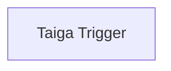

## Fluxo (.json) :

```json
{
  "id": "70",
  "name": "Receive updates when an event occurs in Taiga",
  "nodes": [
    {
      "name": "Taiga Trigger",
      "type": "n8n-nodes-base.taigaTrigger",
      "position": [
        690,
        260
      ],
      "webhookId": "53939c3e-7dc6-4fdf-94d8-d29f92f8fa12",
      "parameters": {
        "projectId": 385605
      },
      "credentials": {
        "taigaCloudApi": "taiga"
      },
      "typeVersion": 1
    }
  ],
  "active": false,
  "settings": {},
  "connections": {}
}
```

<a id="template-2247"></a>

## Template 2247 - Mover tarefas entre Inbox e Snoozed conforme data

- **Nome:** Mover tarefas entre Inbox e Snoozed conforme data
- **Descrição:** Automatiza o envio de tarefas entre um projeto 'Inbox' e um projeto 'Snoozed' no Todoist: tarefas são enviadas para snooze e retornadas automaticamente ao Inbox alguns dias antes do vencimento.
- **Funcionalidade:** • Agendamentos: executa verificações periódicas (a cada 5 minutos) e uma verificação diária (às 5h) para controlar snooze e unsnooze.
• Leitura de tarefas por projeto: busca todas as tarefas dos projetos configurados (Inbox e Snoozed).
• Filtragem de subtarefas: ignora tarefas que sejam subtarefas (quando possuem parent_id).
• Validação de data de vencimento: processa apenas tarefas que possuam data de vencimento.
• Cálculo da data de retorno (unsnooze): calcula a data de retorno subtraindo um número configurável de dias da data de vencimento da tarefa.
• Comparação com a data atual: verifica se a data calculada já passou para decidir o retorno ao Inbox.
• Movimentação em lote: agrupa comandos, gera UUIDs únicos e envia via API para mover tarefas entre projetos de forma atômica.
• Configuração de IDs: permite definir manualmente os IDs dos projetos Inbox e Snoozed e ajustar a janela (dias) para retorno.
- **Ferramentas:** • Todoist: serviço de gerenciamento de tarefas usado para armazenar, consultar e sincronizar tarefas entre projetos via API (incluindo envio de comandos de sincronização).

## Fluxo visual

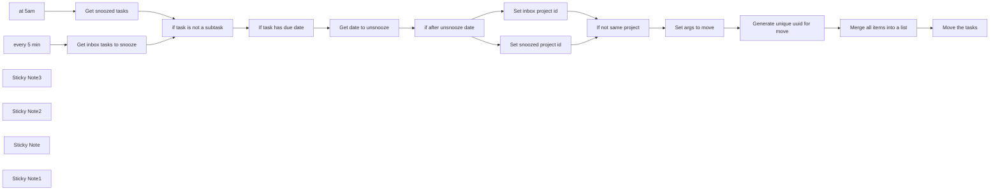

## Fluxo (.json) :

```json
{
  "nodes": [
    {
      "id": "a39274d0-6709-4e66-95a7-8c0fc4c0e8b1",
      "name": "if after unsnooze date",
      "type": "n8n-nodes-base.if",
      "position": [
        1840,
        500
      ],
      "parameters": {
        "conditions": {
          "dateTime": [
            {
              "value1": "={{ DateTime.now() }}",
              "value2": "={{ $json.unsnoozeDate }}"
            }
          ]
        }
      },
      "typeVersion": 1
    },
    {
      "id": "a4e2d915-4714-41ea-8995-76b7198df675",
      "name": "at 5am",
      "type": "n8n-nodes-base.scheduleTrigger",
      "position": [
        780,
        500
      ],
      "parameters": {
        "rule": {
          "interval": [
            {
              "triggerAtHour": 5
            }
          ]
        }
      },
      "typeVersion": 1.1
    },
    {
      "id": "7ad8e2f6-0499-4537-8325-9dffc2d7ea3c",
      "name": "every 5 min",
      "type": "n8n-nodes-base.scheduleTrigger",
      "position": [
        780,
        280
      ],
      "parameters": {
        "rule": {
          "interval": [
            {
              "field": "minutes"
            }
          ]
        }
      },
      "typeVersion": 1.1
    },
    {
      "id": "370f380a-923b-4e4f-b025-9e7723662083",
      "name": "Get snoozed tasks",
      "type": "n8n-nodes-base.todoist",
      "position": [
        980,
        500
      ],
      "parameters": {
        "filters": {
          "projectId": "2325216129"
        },
        "operation": "getAll",
        "returnAll": true
      },
      "credentials": {
        "todoistApi": {
          "id": "1",
          "name": "Todoist account"
        }
      },
      "retryOnFail": true,
      "typeVersion": 2,
      "waitBetweenTries": 5000
    },
    {
      "id": "f239a87d-0229-4964-bca0-75bbf371626b",
      "name": "if task is not a subtask",
      "type": "n8n-nodes-base.if",
      "position": [
        1200,
        500
      ],
      "parameters": {
        "conditions": {
          "number": [
            {
              "value1": "={{ $json.parent_id }}",
              "operation": "isEmpty"
            }
          ]
        }
      },
      "typeVersion": 1
    },
    {
      "id": "b9b29371-254f-45d1-846c-c2db7efae907",
      "name": "If task has due date",
      "type": "n8n-nodes-base.if",
      "position": [
        1420,
        500
      ],
      "parameters": {
        "conditions": {
          "boolean": [
            {
              "value1": "={{ !$json.due }}"
            }
          ]
        }
      },
      "typeVersion": 1
    },
    {
      "id": "1d1fe683-68b5-4a9c-af29-b20a01c2473b",
      "name": "Get date to unsnooze",
      "type": "n8n-nodes-base.dateTime",
      "position": [
        1640,
        500
      ],
      "parameters": {
        "options": {
          "includeInputFields": true
        },
        "duration": 3,
        "magnitude": "={{ $json.due.date }}",
        "operation": "subtractFromDate",
        "outputFieldName": "unsnoozeDate"
      },
      "typeVersion": 2
    },
    {
      "id": "9e0e3241-d2fd-4bc4-9273-aa5237cbeaa4",
      "name": "Get inbox tasks to snooze",
      "type": "n8n-nodes-base.todoist",
      "position": [
        980,
        280
      ],
      "parameters": {
        "filters": {
          "projectId": "938017196"
        },
        "operation": "getAll",
        "returnAll": true
      },
      "credentials": {
        "todoistApi": {
          "id": "1",
          "name": "Todoist account"
        }
      },
      "retryOnFail": true,
      "typeVersion": 2,
      "waitBetweenTries": 5000
    },
    {
      "id": "90e83f5f-dd9f-431d-92b5-cd52a792dee2",
      "name": "Sticky Note3",
      "type": "n8n-nodes-base.stickyNote",
      "position": [
        1220,
        220
      ],
      "parameters": {
        "color": 5,
        "width": 390.83694011071975,
        "height": 182.09360845495712,
        "content": "### 👨‍🎤 Setup\n1. Add your Todoist creds\n2. Create a Todoist project called `snoozed`\n3. Set the project ids in the relevant nodes\n4. Add due dates to your tasks in Inbox. Watch them disappear to `snoozed`. Set their date to tomorrow, watch it return to inbox."
      },
      "typeVersion": 1
    },
    {
      "id": "c7a6b401-f518-45ba-a185-c8bf0cd92394",
      "name": "Set inbox project id",
      "type": "n8n-nodes-base.set",
      "position": [
        2060,
        420
      ],
      "parameters": {
        "fields": {
          "values": [
            {
              "name": "target_project_id",
              "type": "numberValue",
              "numberValue": "2329427682"
            }
          ]
        },
        "options": {}
      },
      "typeVersion": 3.2
    },
    {
      "id": "22982318-5036-490a-ba3c-d40db8c3dc89",
      "name": "If not same project",
      "type": "n8n-nodes-base.filter",
      "position": [
        2280,
        500
      ],
      "parameters": {
        "conditions": {
          "number": [
            {
              "value1": "={{ parseInt($json.target_project_id) }}",
              "value2": "={{ parseInt($json.project_id) }}",
              "operation": "notEqual"
            }
          ]
        }
      },
      "typeVersion": 1
    },
    {
      "id": "62009b22-d0e3-40a0-b7f9-88dc2ec02284",
      "name": "Set args to move",
      "type": "n8n-nodes-base.set",
      "position": [
        2480,
        500
      ],
      "parameters": {
        "fields": {
          "values": [
            {
              "name": "args",
              "type": "objectValue",
              "objectValue": "={ id: {{ $json.id }}, project_id: {{ $json.target_project_id }} }"
            },
            {
              "name": "type",
              "stringValue": "item_move"
            }
          ]
        },
        "include": "none",
        "options": {}
      },
      "typeVersion": 3.2
    },
    {
      "id": "4d628334-12a3-451f-b49e-ce749241e411",
      "name": "Generate unique uuid for move",
      "type": "n8n-nodes-base.crypto",
      "position": [
        2680,
        500
      ],
      "parameters": {
        "action": "generate",
        "dataPropertyName": "uuid"
      },
      "typeVersion": 1
    },
    {
      "id": "8b6bf7ae-6d15-473d-8f00-5aaa4ea7d2f3",
      "name": "Merge all items into a list",
      "type": "n8n-nodes-base.itemLists",
      "position": [
        2880,
        500
      ],
      "parameters": {
        "options": {},
        "aggregate": "aggregateAllItemData",
        "operation": "concatenateItems",
        "destinationFieldName": "commands"
      },
      "typeVersion": 3.1
    },
    {
      "id": "7882c3c6-0d24-4fe2-99b6-3e878e4d0dea",
      "name": "Move the tasks",
      "type": "n8n-nodes-base.httpRequest",
      "position": [
        3080,
        500
      ],
      "parameters": {
        "url": "https://api.todoist.com/sync/v9/sync",
        "method": "POST",
        "options": {},
        "sendBody": true,
        "contentType": "form-urlencoded",
        "authentication": "predefinedCredentialType",
        "bodyParameters": {
          "parameters": [
            {
              "name": "commands",
              "value": "={{ JSON.stringify($json.commands) }}"
            }
          ]
        },
        "nodeCredentialType": "todoistApi"
      },
      "credentials": {
        "todoistApi": {
          "id": "1",
          "name": "Todoist account"
        }
      },
      "typeVersion": 4.1
    },
    {
      "id": "259c337b-38f6-4c2a-8e23-9fe5d154a2aa",
      "name": "Set snoozed project id",
      "type": "n8n-nodes-base.set",
      "position": [
        2060,
        600
      ],
      "parameters": {
        "fields": {
          "values": [
            {
              "name": "target_project_id",
              "type": "numberValue",
              "numberValue": "2329427688"
            }
          ]
        },
        "options": {}
      },
      "typeVersion": 3.2
    },
    {
      "id": "2795502f-cdeb-4b94-a6fe-ef3657bdc091",
      "name": "Sticky Note2",
      "type": "n8n-nodes-base.stickyNote",
      "position": [
        2080,
        780
      ],
      "parameters": {
        "color": 7,
        "width": 202,
        "height": 100,
        "content": "👆 Set `snoozed` project id here. You can find it in the URL. "
      },
      "typeVersion": 1
    },
    {
      "id": "ef6c23d5-386e-48c2-a2ed-eea67fe1f117",
      "name": "Sticky Note",
      "type": "n8n-nodes-base.stickyNote",
      "position": [
        2060,
        260
      ],
      "parameters": {
        "color": 7,
        "width": 202,
        "height": 100,
        "content": "👇🏽 Set `inbox` project id here. You can find it in the URL. "
      },
      "typeVersion": 1
    },
    {
      "id": "6727670f-b340-47cd-b86a-632ef29e2135",
      "name": "Sticky Note1",
      "type": "n8n-nodes-base.stickyNote",
      "position": [
        1660,
        660
      ],
      "parameters": {
        "color": 7,
        "width": 202,
        "height": 100,
        "content": "👆🏽 Adjust here the timeline to return tasks to Inbox (here set to 3 days before due date)"
      },
      "typeVersion": 1
    }
  ],
  "pinData": {},
  "connections": {
    "at 5am": {
      "main": [
        [
          {
            "node": "Get snoozed tasks",
            "type": "main",
            "index": 0
          }
        ]
      ]
    },
    "every 5 min": {
      "main": [
        [
          {
            "node": "Get inbox tasks to snooze",
            "type": "main",
            "index": 0
          }
        ]
      ]
    },
    "Set args to move": {
      "main": [
        [
          {
            "node": "Generate unique uuid for move",
            "type": "main",
            "index": 0
          }
        ]
      ]
    },
    "Get snoozed tasks": {
      "main": [
        [
          {
            "node": "if task is not a subtask",
            "type": "main",
            "index": 0
          }
        ]
      ]
    },
    "If not same project": {
      "main": [
        [
          {
            "node": "Set args to move",
            "type": "main",
            "index": 0
          }
        ]
      ]
    },
    "Get date to unsnooze": {
      "main": [
        [
          {
            "node": "if after unsnooze date",
            "type": "main",
            "index": 0
          }
        ]
      ]
    },
    "If task has due date": {
      "main": [
        [
          {
            "node": "Get date to unsnooze",
            "type": "main",
            "index": 0
          }
        ]
      ]
    },
    "Set inbox project id": {
      "main": [
        [
          {
            "node": "If not same project",
            "type": "main",
            "index": 0
          }
        ]
      ]
    },
    "Set snoozed project id": {
      "main": [
        [
          {
            "node": "If not same project",
            "type": "main",
            "index": 0
          }
        ]
      ]
    },
    "if after unsnooze date": {
      "main": [
        [
          {
            "node": "Set inbox project id",
            "type": "main",
            "index": 0
          }
        ],
        [
          {
            "node": "Set snoozed project id",
            "type": "main",
            "index": 0
          }
        ]
      ]
    },
    "if task is not a subtask": {
      "main": [
        [
          {
            "node": "If task has due date",
            "type": "main",
            "index": 0
          }
        ]
      ]
    },
    "Get inbox tasks to snooze": {
      "main": [
        [
          {
            "node": "if task is not a subtask",
            "type": "main",
            "index": 0
          }
        ]
      ]
    },
    "Merge all items into a list": {
      "main": [
        [
          {
            "node": "Move the tasks",
            "type": "main",
            "index": 0
          }
        ]
      ]
    },
    "Generate unique uuid for move": {
      "main": [
        [
          {
            "node": "Merge all items into a list",
            "type": "main",
            "index": 0
          }
        ]
      ]
    }
  }
}
```

<a id="template-2248"></a>

## Template 2248 - Notificação de novo motorista no Slack

- **Nome:** Notificação de novo motorista no Slack
- **Descrição:** Envia uma notificação ao canal do Slack sempre que um novo motorista se cadastrar no Onfleet.
- **Funcionalidade:** • Detecção de novo motorista: Monitora eventos de cadastro de motoristas no Onfleet.
• Envio de notificação: Publica uma mensagem no canal designado do Slack informando sobre o novo cadastro.
• Configuração de canal e mensagem: Permite definir o canal alvo e o texto da notificação.
- **Ferramentas:** • Onfleet: Plataforma de gerenciamento e roteirização de entregas, usada aqui para detectar cadastros de motoristas.
• Slack: Plataforma de comunicação em equipe, usada para enviar a notificação ao canal correspondente.

## Fluxo visual

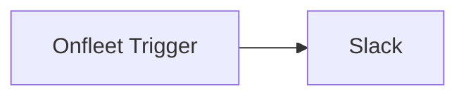

## Fluxo (.json) :

```json
{
  "id": 14,
  "name": "Onfleet Driver signup message in Slack",
  "nodes": [
    {
      "name": "Onfleet Trigger",
      "type": "n8n-nodes-base.onfleetTrigger",
      "position": [
        460,
        300
      ],
      "webhookId": "a005e163-13a2-4ea2-a127-6e00e30a82f4",
      "parameters": {
        "triggerOn": "workerCreated",
        "additionalFields": {}
      },
      "credentials": {
        "onfleetApi": {
          "id": "2",
          "name": "Onfleet API Key"
        }
      },
      "typeVersion": 1
    },
    {
      "name": "Slack",
      "type": "n8n-nodes-base.slack",
      "position": [
        680,
        300
      ],
      "parameters": {
        "text": "A new driver has signed up!",
        "channel": "#new-driver-signup",
        "attachments": [],
        "otherOptions": {}
      },
      "credentials": {
        "slackApi": {
          "id": "7",
          "name": "Slack account"
        }
      },
      "typeVersion": 1
    }
  ],
  "active": false,
  "settings": {},
  "connections": {
    "Onfleet Trigger": {
      "main": [
        [
          {
            "node": "Slack",
            "type": "main",
            "index": 0
          }
        ]
      ]
    }
  }
}
```

<a id="template-2251"></a>

## Template 2251 - Importar workflow de arquivo ou instância remota

- **Nome:** Importar workflow de arquivo ou instância remota
- **Descrição:** Importa um workflow a partir de um arquivo ou de outra instância remota, mapeando e criando credenciais conforme necessário e criando o workflow no ambiente de destino.
- **Funcionalidade:** • Importar a partir de arquivo: Permite enviar um arquivo JSON contendo um workflow e converte-o para o formato interno.
• Listar workflows de instância remota: Solicita a instância de origem e recupera a lista de workflows disponíveis via API.
• Selecionar workflow remoto: Permite ao usuário escolher qual workflow remoto deverá ser importado.
• Exportar e ler credenciais da origem: Exporta credenciais da instância de origem para um arquivo temporário e lê os dados para uso no mapeamento.
• Extrair credenciais do workflow: Analisa os nós do workflow e extrai a lista de credenciais referenciadas (por tipo e nome).
• Gerar opções de mapeamento: Prepara formulários com opções de credenciais existentes ou a opção de criar novas credenciais.
• Mapear credenciais: Permite ao usuário mapear cada credencial referenciada para uma credencial existente ou escolher criar uma nova.
• Criar credenciais vazias: Cria credenciais vazias no ambiente de destino quando o usuário opta por criar novas, preservando referência ao nome original.
• Substituir referências de credenciais no JSON: Atualiza nomes e ids das credenciais dentro do JSON do workflow conforme o mapeamento realizado.
• Criar workflow no destino: Envia o JSON atualizado para criar o workflow no ambiente de destino.
• Feedback ao usuário: Informa sucesso ou falha do processo e indica credenciais que precisam configuração manual.
- **Ferramentas:** • Formulário web: Interface usada para coletar entradas do usuário e fazer upload de arquivos.
• API HTTP de instâncias remotas: Utilizada para recuperar listas e detalhes de workflows e para operações de leitura/criação remota.
• Sistema de arquivos do servidor e utilitário de linha de comando: Usados para exportar credenciais da instância de origem para um arquivo temporário e depois ler esse arquivo.
• API do ambiente destino para gerenciamento: Usada para criar credenciais vazias e criar o workflow final no ambiente de destino.


## Fluxo visual

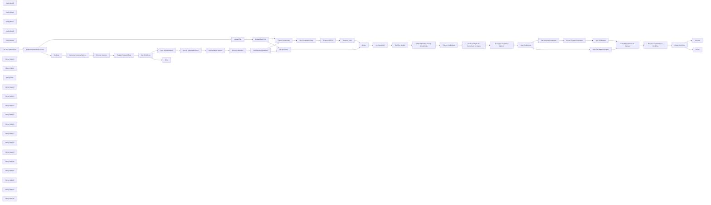

## Fluxo (.json) :

```json
{
  "id": "87FUCRVFV07sNlbM",
  "meta": {
    "instanceId": "505c2bdb4483cbbca32871c0acd4b60c83809f177e47e2864f71c1c1760a9b2a",
    "templateCredsSetupCompleted": true
  },
  "name": "Workflow Importer",
  "tags": [],
  "nodes": [
    {
      "id": "eb3d4912-09c3-4c17-8e2b-94dd15e145f4",
      "name": "Extract from File",
      "type": "n8n-nodes-base.extractFromFile",
      "position": [
        2960,
        440
      ],
      "parameters": {
        "options": {},
        "operation": "fromJson",
        "destinationKey": "workflowData",
        "binaryPropertyName": "Workflow_File"
      },
      "typeVersion": 1
    },
    {
      "id": "56b7a01f-47a0-4884-9200-5f5f695ab355",
      "name": "Export Credentials",
      "type": "n8n-nodes-base.executeCommand",
      "position": [
        3180,
        620
      ],
      "parameters": {
        "command": "n8n export:credentials --all --pretty --decrypted --output=/tmp/cred"
      },
      "typeVersion": 1
    },
    {
      "id": "85de1146-4d61-45bf-b225-956d3d16e84b",
      "name": "Get Credentials Data",
      "type": "n8n-nodes-base.readWriteFile",
      "position": [
        3400,
        620
      ],
      "parameters": {
        "options": {},
        "fileSelector": "/tmp/cred"
      },
      "typeVersion": 1
    },
    {
      "id": "187f1f50-472f-41ac-96e8-9c2f17fa3c00",
      "name": "Binary to JSON",
      "type": "n8n-nodes-base.extractFromFile",
      "position": [
        3620,
        620
      ],
      "parameters": {
        "options": {},
        "operation": "fromJson"
      },
      "typeVersion": 1
    },
    {
      "id": "85d79317-786a-49eb-ade4-f9d0949c5bf4",
      "name": "Merge",
      "type": "n8n-nodes-base.merge",
      "position": [
        4060,
        500
      ],
      "parameters": {
        "mode": "combine",
        "options": {
          "includeUnpaired": true
        },
        "combineBy": "combineByPosition"
      },
      "typeVersion": 3
    },
    {
      "id": "6976901c-a052-47fa-a754-217fd5d0f58e",
      "name": "Collect Credentials to Replace",
      "type": "n8n-nodes-base.merge",
      "position": [
        3040,
        1120
      ],
      "parameters": {},
      "typeVersion": 3
    },
    {
      "id": "c5b7ab56-c833-4405-913a-1a484094a6ff",
      "name": "Settings",
      "type": "n8n-nodes-base.set",
      "position": [
        980,
        620
      ],
      "parameters": {
        "options": {},
        "assignments": {
          "assignments": [
            {
              "id": "8a5d50fc-95dc-40b3-a3f2-293521bab29a",
              "name": "remoteInstances",
              "type": "array",
              "value": "="
            }
          ]
        }
      },
      "typeVersion": 3.4
    },
    {
      "id": "a9287c9a-ddf4-4023-b997-bb7b12e2d0ee",
      "name": "Prepare Request Data",
      "type": "n8n-nodes-base.code",
      "position": [
        1640,
        620
      ],
      "parameters": {
        "jsCode": "output = {};\n\nfor (const instance of $('Settings').first().json.remoteInstances) {\n  if (instance.name == $('Choose Instance').first().json.Source) {\n    output.instance = instance;\n  }\n}\n\nreturn output;"
      },
      "typeVersion": 2
    },
    {
      "id": "85ccc4bf-a465-49bf-ac17-9933f1b9d46d",
      "name": "Get Workflows",
      "type": "n8n-nodes-base.httpRequest",
      "onError": "continueErrorOutput",
      "position": [
        1860,
        620
      ],
      "parameters": {
        "url": "={{ $json.instance.baseUrl }}/workflows",
        "options": {},
        "sendBody": true,
        "sendHeaders": true,
        "bodyParameters": {
          "parameters": [
            {
              "name": "limit",
              "value": "250"
            }
          ]
        },
        "headerParameters": {
          "parameters": [
            {
              "name": "X-N8N-API-KEY",
              "value": "={{ $json.instance.apiKey }}"
            }
          ]
        }
      },
      "typeVersion": 4.2
    },
    {
      "id": "2d86c12d-f308-4cdc-96a4-ab4cbecd39ad",
      "name": "No Operation",
      "type": "n8n-nodes-base.noOp",
      "position": [
        3180,
        440
      ],
      "parameters": {},
      "typeVersion": 1
    },
    {
      "id": "8ef0f34d-2468-450e-8a3c-e3d9ad9e371b",
      "name": "Determine Workflow Source",
      "type": "n8n-nodes-base.if",
      "position": [
        760,
        500
      ],
      "parameters": {
        "options": {},
        "conditions": {
          "options": {
            "version": 2,
            "leftValue": "",
            "caseSensitive": true,
            "typeValidation": "strict"
          },
          "combinator": "and",
          "conditions": [
            {
              "id": "f1d93a30-01c9-4141-85b2-8ceb762b9e86",
              "operator": {
                "name": "filter.operator.equals",
                "type": "string",
                "operation": "equals"
              },
              "leftValue": "={{ $json.Source }}",
              "rightValue": "File Upload"
            }
          ]
        }
      },
      "typeVersion": 2.2
    },
    {
      "id": "3ff270a7-5837-40b5-85b4-da3b28ae6147",
      "name": "Sticky Note6",
      "type": "n8n-nodes-base.stickyNote",
      "position": [
        920,
        520
      ],
      "parameters": {
        "width": 216.47293010628914,
        "height": 255.86856541619233,
        "content": "## Setup instances\nEach instnce requires a name, apiKey and baseURL"
      },
      "typeVersion": 1
    },
    {
      "id": "4d0d4684-5ffc-4e12-8d05-55245339fd96",
      "name": "Sticky Note2",
      "type": "n8n-nodes-base.stickyNote",
      "position": [
        380,
        680
      ],
      "parameters": {
        "color": 5,
        "width": 535.6419634856759,
        "height": 223.19907940161124,
        "content": "## Instances config example\n```\n[\n  {\n    \"name\": \"n8n-test\",\n    \"apiKey\": \"XXXXXXXXXXXXXXXXXXXXXXXXXXXXXXX\",\n    \"baseUrl\": \"https://n8n-test.example.com/api/v1\"\n  },\n  {\n    ...\n  }\n]\n```"
      },
      "typeVersion": 1
    },
    {
      "id": "e76e291e-511b-4612-836f-ae6f7af1d3de",
      "name": "Sticky Note7",
      "type": "n8n-nodes-base.stickyNote",
      "position": [
        480,
        400
      ],
      "parameters": {
        "color": 7,
        "width": 216.47293010628914,
        "height": 255.86856541619233,
        "content": "A form which collects the source option.\n*Consider securing the form using Basic Auth.*"
      },
      "typeVersion": 1
    },
    {
      "id": "38ecbde8-9081-4509-9fa3-c5b2d568ebad",
      "name": "Sticky Note8",
      "type": "n8n-nodes-base.stickyNote",
      "position": [
        700,
        400
      ],
      "parameters": {
        "color": 7,
        "width": 216.47293010628914,
        "height": 255.86856541619233,
        "content": "Switch between the available options"
      },
      "typeVersion": 1
    },
    {
      "id": "efa893aa-fce5-45ff-a234-6e73235a33ea",
      "name": "Error1",
      "type": "n8n-nodes-base.form",
      "position": [
        3700,
        1220
      ],
      "webhookId": "5c7933f0-f09a-4bc6-9e68-cf73e8fb5813",
      "parameters": {
        "options": {},
        "operation": "completion",
        "completionTitle": "⚠️ Import failed",
        "completionMessage": "=Please check the workflow settings"
      },
      "typeVersion": 1
    },
    {
      "id": "e5edd30e-6396-407a-bd3b-a5e0f66c7e3a",
      "name": "Error",
      "type": "n8n-nodes-base.form",
      "position": [
        2080,
        700
      ],
      "webhookId": "5c7933f0-f09a-4bc6-9e68-cf73e8fb5813",
      "parameters": {
        "options": {},
        "operation": "completion",
        "completionTitle": "⚠️ Failed retrieving workflows",
        "completionMessage": "=Please check the workflow settings"
      },
      "typeVersion": 1
    },
    {
      "id": "c410045e-4adf-4304-910a-7cd5868892d3",
      "name": "Split Out Workflows",
      "type": "n8n-nodes-base.splitOut",
      "position": [
        2080,
        540
      ],
      "parameters": {
        "options": {},
        "fieldToSplitOut": "data"
      },
      "typeVersion": 1
    },
    {
      "id": "5fafa399-0c6b-4db0-9b01-319a02368eee",
      "name": "Get Workflow Names",
      "type": "n8n-nodes-base.code",
      "position": [
        2520,
        540
      ],
      "parameters": {
        "jsCode": "dropDownValues = [];\n\nfor (const workflow of $input.all()) {\n  dropDownValues.push({\"option\": workflow.json.name});\n}\n\nreturn { \"options\": JSON.stringify(dropDownValues) };"
      },
      "typeVersion": 2
    },
    {
      "id": "b7408a47-97ff-45da-b8e7-bb2380f61155",
      "name": "Sort by updatedAt DESC",
      "type": "n8n-nodes-base.sort",
      "position": [
        2300,
        540
      ],
      "parameters": {
        "options": {},
        "sortFieldsUi": {
          "sortField": [
            {
              "order": "descending",
              "fieldName": "updatedAt"
            }
          ]
        }
      },
      "typeVersion": 1
    },
    {
      "id": "74741a71-79b8-4479-9dac-826db7984620",
      "name": "No Operation1",
      "type": "n8n-nodes-base.noOp",
      "position": [
        4280,
        680
      ],
      "parameters": {},
      "typeVersion": 1
    },
    {
      "id": "89657c6f-a703-4145-b690-7234583bbe7a",
      "name": "Sticky Note9",
      "type": "n8n-nodes-base.stickyNote",
      "position": [
        1500,
        1240
      ],
      "parameters": {
        "color": 7,
        "width": 216.47293010628914,
        "height": 294.9905826938254,
        "content": "## Map Credentials\nBeing mapped by name since one workflow can have multiple credentials of the same type."
      },
      "typeVersion": 1
    },
    {
      "id": "a2d21bb5-5118-4ea2-920b-1c05570da610",
      "name": "Rename Keys",
      "type": "n8n-nodes-base.renameKeys",
      "position": [
        3840,
        620
      ],
      "parameters": {
        "keys": {
          "key": [
            {
              "newKey": "allCredentials",
              "currentKey": "data"
            }
          ]
        },
        "additionalOptions": {}
      },
      "typeVersion": 1
    },
    {
      "id": "d756edc6-cf0d-4a35-b29c-99e5ec41c4db",
      "name": "Create Workflow",
      "type": "n8n-nodes-base.n8n",
      "onError": "continueErrorOutput",
      "position": [
        3480,
        1120
      ],
      "parameters": {
        "operation": "create",
        "requestOptions": {},
        "workflowObject": "={{ $json.toJsonString() }}"
      },
      "credentials": {
        "n8nApi": {
          "id": "taiQiy4KxXUI20Af",
          "name": "n8n account"
        }
      },
      "typeVersion": 1
    },
    {
      "id": "4d75a5b1-5227-41a4-87cc-67a5a8074f37",
      "name": "Upload File",
      "type": "n8n-nodes-base.form",
      "position": [
        1420,
        440
      ],
      "webhookId": "b9850dfc-ecf9-45c8-ae68-39327c6a0143",
      "parameters": {
        "options": {
          "formTitle": "Upload File",
          "formDescription": "Choose an n8n workflow file"
        },
        "formFields": {
          "values": [
            {
              "fieldType": "file",
              "fieldLabel": "Workflow File",
              "requiredField": true,
              "acceptFileTypes": ".json"
            }
          ]
        }
      },
      "typeVersion": 1
    },
    {
      "id": "5e5e3ece-00b3-4790-89e0-35d3c8d03b7d",
      "name": "Choose Workflow",
      "type": "n8n-nodes-base.form",
      "position": [
        2740,
        540
      ],
      "webhookId": "100af69b-5203-48d3-8e90-1e846d0752d4",
      "parameters": {
        "options": {
          "formTitle": "Choose Workflow",
          "formDescription": "Choose the remote workflow which should be imported"
        },
        "defineForm": "json",
        "jsonOutput": "=[\n   {\n      \"fieldLabel\": \"Workflow\",\n      \"fieldType\": \"dropdown\",\n      \"requiredField\": true,\n      \"fieldOptions\": {\n        \"values\": {{ $json.options }}\n      }\n   }\n]"
      },
      "typeVersion": 1
    },
    {
      "id": "7fcc236c-dd97-4a1e-bf3d-d85aba520938",
      "name": "Success",
      "type": "n8n-nodes-base.form",
      "position": [
        3700,
        1020
      ],
      "webhookId": "5c7933f0-f09a-4bc6-9e68-cf73e8fb5813",
      "parameters": {
        "options": {},
        "operation": "completion",
        "completionTitle": "✅ Import completed",
        "completionMessage": "=The workflow has been created successfully. {{ $if($('Get Missing Credentials').all().length > 0, \"Please head over to your credentials and update all new entries with a trailing ⚠️ symbol.\", \"\") }} "
      },
      "typeVersion": 1
    },
    {
      "id": "27736a52-af15-47f8-8186-d486b2968256",
      "name": "Choose Instance",
      "type": "n8n-nodes-base.form",
      "position": [
        1420,
        620
      ],
      "webhookId": "2a40fe8d-7b6b-4695-845c-2d278f5bf93e",
      "parameters": {
        "options": {
          "formTitle": "Select Source Instance",
          "formDescription": "Choose the n8n instance where to retrieve workflows from"
        },
        "defineForm": "json",
        "jsonOutput": "=[\n   {\n      \"fieldLabel\": \"Source\",\n      \"fieldType\": \"dropdown\",\n      \"requiredField\": true,\n      \"fieldOptions\": {\n        \"values\": {{ $json.options }}\n      }\n   }\n]"
      },
      "typeVersion": 1
    },
    {
      "id": "9b83c34d-0b0b-47bc-b4a7-27eed0e796fb",
      "name": "On form submission",
      "type": "n8n-nodes-base.formTrigger",
      "position": [
        540,
        500
      ],
      "webhookId": "2c9b2fa1-3235-4b73-a6e0-73392dcb9ed0",
      "parameters": {
        "options": {
          "buttonLabel": "Continue",
          "appendAttribution": false
        },
        "formTitle": "Workflow Import",
        "formFields": {
          "values": [
            {
              "fieldType": "dropdown",
              "fieldLabel": "Source",
              "fieldOptions": {
                "values": [
                  {
                    "option": "File Upload"
                  },
                  {
                    "option": "Remote Instance"
                  }
                ]
              },
              "requiredField": true
            }
          ]
        },
        "formDescription": "This tool allows importing an n8n workflow from a file or another n8n instance\n\nKeep in mind that your destination n8n instance (this environment) should always run on an equal or newer version then compared to the source."
      },
      "typeVersion": 2.2
    },
    {
      "id": "f6d45cd9-a091-4c8b-8ef0-6815a1adb0f1",
      "name": "Generate Instance Options",
      "type": "n8n-nodes-base.code",
      "position": [
        1200,
        620
      ],
      "parameters": {
        "jsCode": "dropDownValues = [];\n\nfor (const instance of $input.first().json.remoteInstances) {\n  dropDownValues.push({\"option\": instance.name});\n}\n\nreturn { \"options\": JSON.stringify(dropDownValues) };"
      },
      "typeVersion": 2
    },
    {
      "id": "73717c97-4579-4e49-ac33-4aada3bcaf55",
      "name": "Sticky Note10",
      "type": "n8n-nodes-base.stickyNote",
      "position": [
        1140,
        520
      ],
      "parameters": {
        "color": 7,
        "width": 216.47293010628914,
        "height": 255.86856541619233,
        "content": "Prepare a list of options for the next form"
      },
      "typeVersion": 1
    },
    {
      "id": "0537d195-3885-4903-8a41-56915f7b64de",
      "name": "Sticky Note11",
      "type": "n8n-nodes-base.stickyNote",
      "position": [
        1360,
        360
      ],
      "parameters": {
        "color": 7,
        "width": 216.47293010628914,
        "height": 416.4415465717213,
        "content": "Request more input from the user"
      },
      "typeVersion": 1
    },
    {
      "id": "43ee5820-e236-49f9-b89b-e4c5d4dd4188",
      "name": "Sticky Note",
      "type": "n8n-nodes-base.stickyNote",
      "position": [
        1580,
        520
      ],
      "parameters": {
        "color": 7,
        "width": 435.59135570107514,
        "height": 255.86856541619233,
        "content": "Map Settings to selected instance and retrieve all workflows from it"
      },
      "typeVersion": 1
    },
    {
      "id": "53a42c23-af05-4e21-a936-14d2419b4530",
      "name": "Sticky Note12",
      "type": "n8n-nodes-base.stickyNote",
      "position": [
        2020,
        440
      ],
      "parameters": {
        "color": 7,
        "width": 656.1389569291234,
        "height": 255.86856541619233,
        "content": "Prepare a list of options for the next form"
      },
      "typeVersion": 1
    },
    {
      "id": "fd103846-04a6-4fb0-aba4-6230a85a7555",
      "name": "Sticky Note13",
      "type": "n8n-nodes-base.stickyNote",
      "position": [
        2680,
        440
      ],
      "parameters": {
        "color": 7,
        "width": 216.47293010628914,
        "height": 255.86856541619233,
        "content": "Let the user choose a workflow from a list"
      },
      "typeVersion": 1
    },
    {
      "id": "e58bdf1e-fcda-4b68-9798-24de0c7c6bd9",
      "name": "Sticky Note14",
      "type": "n8n-nodes-base.stickyNote",
      "position": [
        3120,
        560
      ],
      "parameters": {
        "color": 7,
        "width": 875.9451799951569,
        "height": 216.1478580797073,
        "content": "Retrieve all credentials from this instance and convert the data to the final JSON format"
      },
      "typeVersion": 1
    },
    {
      "id": "08855416-ca33-4344-b96b-4564d9841dfd",
      "name": "Get Selected Workflow",
      "type": "n8n-nodes-base.code",
      "position": [
        2960,
        620
      ],
      "parameters": {
        "jsCode": "for (const workflow of $('Get Workflows').first().json.data) {\n  if (workflow.name == $input.first().json.Workflow) {\n    \n    return { \"workflowData\": workflow };\n  }\n}\n\nreturn false;"
      },
      "typeVersion": 2
    },
    {
      "id": "9a09a6b5-2b8d-461e-b63f-91100c3e7974",
      "name": "Sticky Note15",
      "type": "n8n-nodes-base.stickyNote",
      "position": [
        2900,
        360
      ],
      "parameters": {
        "color": 7,
        "width": 216.47293010628914,
        "height": 416.4415465717213,
        "content": "Convert the retrieved workflow into the final JSON format"
      },
      "typeVersion": 1
    },
    {
      "id": "269c32c3-224b-42df-bd27-7718374cb343",
      "name": "Sticky Note16",
      "type": "n8n-nodes-base.stickyNote",
      "position": [
        4000,
        420
      ],
      "parameters": {
        "color": 7,
        "width": 216.47293010628914,
        "height": 255.86856541619233,
        "content": "Combine the workflow and credential data to one item"
      },
      "typeVersion": 1
    },
    {
      "id": "c9bbc713-3ac7-42d7-85c3-0c8aa22201d4",
      "name": "Split Out Nodes",
      "type": "n8n-nodes-base.splitOut",
      "position": [
        1060,
        1020
      ],
      "parameters": {
        "options": {},
        "fieldToSplitOut": "workflowData.nodes"
      },
      "typeVersion": 1
    },
    {
      "id": "e4c37af5-64de-4d40-9ff1-3a622ea40b86",
      "name": "Filter Out Nodes Having Credentials",
      "type": "n8n-nodes-base.filter",
      "position": [
        1280,
        1020
      ],
      "parameters": {
        "options": {},
        "conditions": {
          "options": {
            "version": 2,
            "leftValue": "",
            "caseSensitive": true,
            "typeValidation": "strict"
          },
          "combinator": "and",
          "conditions": [
            {
              "id": "b14ec02c-c52c-4907-8f55-ebb168a8b10e",
              "operator": {
                "type": "object",
                "operation": "exists",
                "singleValue": true
              },
              "leftValue": "={{ $json.credentials }}",
              "rightValue": ""
            }
          ]
        }
      },
      "typeVersion": 2.2
    },
    {
      "id": "bdb20dfd-1b47-4b50-a938-19f7790d180b",
      "name": "Extract Credentials",
      "type": "n8n-nodes-base.set",
      "position": [
        1500,
        1020
      ],
      "parameters": {
        "options": {},
        "assignments": {
          "assignments": [
            {
              "id": "b37508a3-188e-4e6e-b251-b6a34ac193be",
              "name": "type",
              "type": "string",
              "value": "={{ $json.credentials.keys()[0] }}"
            },
            {
              "id": "fc308784-91ec-4b6b-8bca-2c01472574a7",
              "name": "name",
              "type": "string",
              "value": "={{ $json.credentials[$json.credentials.keys()[0]].name }}"
            },
            {
              "id": "a3142dc0-021d-4191-815b-d5cf6d9fe6a8",
              "name": "id",
              "type": "string",
              "value": "={{ $json.credentials[$json.credentials.keys()[0]].id }}"
            }
          ]
        }
      },
      "typeVersion": 3.4
    },
    {
      "id": "554e0ee3-e722-4dcf-b82b-ea1ea59a037e",
      "name": "Remove Duplicate Credentials by Name",
      "type": "n8n-nodes-base.removeDuplicates",
      "position": [
        1720,
        1020
      ],
      "parameters": {
        "compare": "selectedFields",
        "options": {},
        "fieldsToCompare": "name"
      },
      "typeVersion": 2
    },
    {
      "id": "0da2c486-ea7a-465b-b3cd-88e09e63c06b",
      "name": "Map Credentials",
      "type": "n8n-nodes-base.form",
      "position": [
        2160,
        1020
      ],
      "webhookId": "5aca5fbe-cbff-4824-8586-cd59967dd154",
      "parameters": {
        "options": {
          "formTitle": "Map Credentials",
          "buttonLabel": "Import Workflow",
          "formDescription": "Each option is labeled with the name of the original credential. Select the according credential for each item.\n\nYou can also choose to create a new credential. It will then create an empty credential, using the name of the original one, which you can configure afterwards."
        },
        "defineForm": "json",
        "jsonOutput": "={{ $json.options }}"
      },
      "typeVersion": 1
    },
    {
      "id": "8b92114e-6aa6-4404-a7f1-6224a45acdae",
      "name": "Get Selected Credentials",
      "type": "n8n-nodes-base.code",
      "position": [
        2380,
        1220
      ],
      "parameters": {
        "jsCode": "function capitalizeFirstLetter(val) {\n    return String(val).charAt(0).toUpperCase() + String(val).slice(1);\n}\n\nlet missingCredentials = [];\nfor (const credential of $('Remove Duplicate Credentials by Name').all()) {\n  let type = credential.json.type;\n  let oldName = credential.json.name;\n  let name = $('Map Credentials').first().json[credential.json.name];\n  if (name != \"[create new]\") {\n    for (const credentialData of $('Merge').first().json.allCredentials) {\n      if (credentialData.name == name) {\n        id = credentialData.id;\n        continue;\n      }\n    }\n    missingCredentials.push({\n      \"oldName\": oldName,\n      \"name\": name,\n      \"type\": type,\n      \"id\": id\n    });\n  }\n}\n\nreturn missingCredentials;"
      },
      "typeVersion": 2
    },
    {
      "id": "bafcb91c-f441-40de-a1fd-7435206d991e",
      "name": "Add Old Names",
      "type": "n8n-nodes-base.set",
      "position": [
        2820,
        1020
      ],
      "parameters": {
        "options": {},
        "assignments": {
          "assignments": [
            {
              "id": "19847be5-420a-4dd7-8a45-fed1a1cbc0b8",
              "name": "oldName",
              "type": "string",
              "value": "={{ $json.name.replace(\" ⚠️\", \"\") }}"
            }
          ]
        },
        "includeOtherFields": true
      },
      "typeVersion": 3.4
    },
    {
      "id": "8da7f198-5e85-4d88-907e-1e35a55bdb96",
      "name": "Replace Credentials in Workflow",
      "type": "n8n-nodes-base.code",
      "position": [
        3260,
        1120
      ],
      "parameters": {
        "jsCode": "// Loop over input items and add a new field called 'myNewField' to the JSON of each one\nlet workflowData = $('Merge').first().json.workflowData;\nfor (const credential of $input.all()) {  \n  for (const nodes of workflowData.nodes) {\n    if (nodes.credentials \n        && nodes.credentials[credential.json.type] !== undefined \n        && nodes.credentials[credential.json.type].name == credential.json.oldName) {\n      nodes.credentials[credential.json.type].id = credential.json.id;\n      nodes.credentials[credential.json.type].name = credential.json.name;\n    }\n  }\n}\n\nreturn workflowData;\n\n"
      },
      "typeVersion": 2
    },
    {
      "id": "f370d4fb-229e-4604-a1b1-c7c0cab8a32d",
      "name": "Sticky Note17",
      "type": "n8n-nodes-base.stickyNote",
      "position": [
        1000,
        920
      ],
      "parameters": {
        "color": 7,
        "width": 875.6296366281999,
        "height": 257.0479807900252,
        "content": "Extract a list of all credentials from the workflow. The reference will be the old/existing name of the credential, since one workflow can contain multiple credentials of the same type."
      },
      "typeVersion": 1
    },
    {
      "id": "31c0d4b7-4682-4db1-a453-0f1d69c58665",
      "name": "Sticky Note18",
      "type": "n8n-nodes-base.stickyNote",
      "position": [
        2100,
        920
      ],
      "parameters": {
        "color": 7,
        "width": 216.47293010628914,
        "height": 255.86856541619233,
        "content": "Let the user map every credential or create new ones"
      },
      "typeVersion": 1
    },
    {
      "id": "d3c5edb1-74dc-4168-a987-84cdd54714cd",
      "name": "Generate Credential Options",
      "type": "n8n-nodes-base.code",
      "position": [
        1940,
        1020
      ],
      "parameters": {
        "jsCode": "function capitalizeFirstLetter(val) {\n    return String(val).charAt(0).toUpperCase() + String(val).slice(1);\n}\n\nformOptions = [];\nfor (const item of $input.all()) {\n  dropDownValues = [];\n  for (const credential of $('Merge').first().json.allCredentials) {\n    if (credential.type == item.json.type) {\n      dropDownValues.push({\"option\": credential.name});\n    }\n  }\n  dropDownValues.push({\"option\": \"[create new]\"});\n  formOptions.push({\n      \"fieldLabel\": item.json.name,\n      \"fieldType\": \"dropdown\",\n      \"requiredField\": true,\n      \"fieldOptions\": {\n        \"values\": dropDownValues\n      }\n  });\n}\n\nreturn { \"options\": JSON.stringify(formOptions) };"
      },
      "typeVersion": 2
    },
    {
      "id": "255ff6ab-d360-49dd-b63f-9f0d99278ae4",
      "name": "Sticky Note19",
      "type": "n8n-nodes-base.stickyNote",
      "position": [
        1880,
        920
      ],
      "parameters": {
        "color": 7,
        "width": 216.47293010628914,
        "height": 255.86856541619233,
        "content": "Prepare a list of options for the next form"
      },
      "typeVersion": 1
    },
    {
      "id": "ae074b5a-d76a-4529-ba59-0d201dbd4e9e",
      "name": "Sticky Note20",
      "type": "n8n-nodes-base.stickyNote",
      "position": [
        2320,
        920
      ],
      "parameters": {
        "color": 7,
        "width": 216.47293010628914,
        "height": 456.12289999575364,
        "content": "Split mapped credentials into two streams, depending on wether they exist or not"
      },
      "typeVersion": 1
    },
    {
      "id": "1b6d26af-9d6b-4865-bd81-8a5de49bc741",
      "name": "Sticky Note21",
      "type": "n8n-nodes-base.stickyNote",
      "position": [
        2540,
        919.7999999999997
      ],
      "parameters": {
        "color": 7,
        "width": 435.95830414662703,
        "height": 276.068565416192,
        "content": "Create empty credentials if the option \"[create credential]\" was selected. and add the name of the originally assigned credential for future reference"
      },
      "typeVersion": 1
    },
    {
      "id": "5ba8987a-7558-4fb8-94ef-ac2b81df5536",
      "name": "Create Empty Credentials",
      "type": "n8n-nodes-base.n8n",
      "position": [
        2600,
        1020
      ],
      "parameters": {
        "data": "={{ $json.data.toJsonString() }}",
        "name": "={{ $json.name }}",
        "resource": "credential",
        "requestOptions": {},
        "credentialTypeName": "={{ $json.type }}"
      },
      "credentials": {
        "n8nApi": {
          "id": "taiQiy4KxXUI20Af",
          "name": "n8n account"
        }
      },
      "typeVersion": 1
    },
    {
      "id": "7efa8f88-f5a0-47c8-8d12-2cb8c9b0e0c7",
      "name": "Get Missing Credentials",
      "type": "n8n-nodes-base.code",
      "position": [
        2380,
        1020
      ],
      "parameters": {
        "jsCode": "function capitalizeFirstLetter(val) {\n    return String(val).charAt(0).toUpperCase() + String(val).slice(1);\n}\n\nlet missingCredentials = [];\nfor (const credential of $('Remove Duplicate Credentials by Name').all()) {\n  let type = credential.json.type;\n  let name = $('Map Credentials').first().json[credential.json.name];\n  if (name == \"[create new]\") {\n    data = {};\n    if (type.includes(\"OAuth\")) {\n      data = { \"clientId\": \"\", \"clientSecret\": \"\" };\n    }\n    missingCredentials.push({\n      \"name\": credential.json.name + \" ⚠️\",\n      \"type\": type,\n      \"data\": data\n    });\n  }\n}\n\nreturn missingCredentials;"
      },
      "typeVersion": 2
    },
    {
      "id": "2394952f-c6db-4c6e-8f62-080c952734c9",
      "name": "Sticky Note22",
      "type": "n8n-nodes-base.stickyNote",
      "position": [
        2980,
        1020
      ],
      "parameters": {
        "color": 7,
        "width": 435.95830414662703,
        "height": 276.068565416192,
        "content": "Gather all new credential data and update the workflow accordingly. The oldName is being used as a reference during the search. "
      },
      "typeVersion": 1
    },
    {
      "id": "4ee2a621-29c9-4d23-b222-0b31ff1cc903",
      "name": "Sticky Note23",
      "type": "n8n-nodes-base.stickyNote",
      "position": [
        3420,
        1020
      ],
      "parameters": {
        "color": 7,
        "width": 216.47293010628914,
        "height": 275.841854198618,
        "content": "Create the updated workflow on this instance"
      },
      "typeVersion": 1
    },
    {
      "id": "e041c560-e847-472e-888e-0b6b3edb8998",
      "name": "Sticky Note24",
      "type": "n8n-nodes-base.stickyNote",
      "position": [
        3640,
        920
      ],
      "parameters": {
        "color": 7,
        "width": 216.47293010628914,
        "height": 456.12289999575364,
        "content": "Provide feedback to the user wether the process was successful or not"
      },
      "typeVersion": 1
    }
  ],
  "active": false,
  "pinData": {},
  "settings": {
    "executionOrder": "v1"
  },
  "versionId": "5ee2c284-b417-4ab6-b0bf-effa25225dbf",
  "connections": {
    "Merge": {
      "main": [
        [
          {
            "node": "No Operation1",
            "type": "main",
            "index": 0
          }
        ]
      ]
    },
    "Settings": {
      "main": [
        [
          {
            "node": "Generate Instance Options",
            "type": "main",
            "index": 0
          }
        ]
      ]
    },
    "Rename Keys": {
      "main": [
        [
          {
            "node": "Merge",
            "type": "main",
            "index": 1
          }
        ]
      ]
    },
    "Upload File": {
      "main": [
        [
          {
            "node": "Extract from File",
            "type": "main",
            "index": 0
          }
        ]
      ]
    },
    "No Operation": {
      "main": [
        [
          {
            "node": "Merge",
            "type": "main",
            "index": 0
          }
        ]
      ]
    },
    "Add Old Names": {
      "main": [
        [
          {
            "node": "Collect Credentials to Replace",
            "type": "main",
            "index": 0
          }
        ]
      ]
    },
    "Get Workflows": {
      "main": [
        [
          {
            "node": "Split Out Workflows",
            "type": "main",
            "index": 0
          }
        ],
        [
          {
            "node": "Error",
            "type": "main",
            "index": 0
          }
        ]
      ]
    },
    "No Operation1": {
      "main": [
        [
          {
            "node": "Split Out Nodes",
            "type": "main",
            "index": 0
          }
        ]
      ]
    },
    "Binary to JSON": {
      "main": [
        [
          {
            "node": "Rename Keys",
            "type": "main",
            "index": 0
          }
        ]
      ]
    },
    "Choose Instance": {
      "main": [
        [
          {
            "node": "Prepare Request Data",
            "type": "main",
            "index": 0
          }
        ]
      ]
    },
    "Choose Workflow": {
      "main": [
        [
          {
            "node": "Get Selected Workflow",
            "type": "main",
            "index": 0
          }
        ]
      ]
    },
    "Create Workflow": {
      "main": [
        [
          {
            "node": "Success",
            "type": "main",
            "index": 0
          }
        ],
        [
          {
            "node": "Error1",
            "type": "main",
            "index": 0
          }
        ]
      ]
    },
    "Map Credentials": {
      "main": [
        [
          {
            "node": "Get Missing Credentials",
            "type": "main",
            "index": 0
          },
          {
            "node": "Get Selected Credentials",
            "type": "main",
            "index": 0
          }
        ]
      ]
    },
    "Split Out Nodes": {
      "main": [
        [
          {
            "node": "Filter Out Nodes Having Credentials",
            "type": "main",
            "index": 0
          }
        ]
      ]
    },
    "Extract from File": {
      "main": [
        [
          {
            "node": "Export Credentials",
            "type": "main",
            "index": 0
          },
          {
            "node": "No Operation",
            "type": "main",
            "index": 0
          }
        ]
      ]
    },
    "Export Credentials": {
      "main": [
        [
          {
            "node": "Get Credentials Data",
            "type": "main",
            "index": 0
          }
        ]
      ]
    },
    "Get Workflow Names": {
      "main": [
        [
          {
            "node": "Choose Workflow",
            "type": "main",
            "index": 0
          }
        ]
      ]
    },
    "On form submission": {
      "main": [
        [
          {
            "node": "Determine Workflow Source",
            "type": "main",
            "index": 0
          }
        ]
      ]
    },
    "Extract Credentials": {
      "main": [
        [
          {
            "node": "Remove Duplicate Credentials by Name",
            "type": "main",
            "index": 0
          }
        ]
      ]
    },
    "Split Out Workflows": {
      "main": [
        [
          {
            "node": "Sort by updatedAt DESC",
            "type": "main",
            "index": 0
          }
        ]
      ]
    },
    "Get Credentials Data": {
      "main": [
        [
          {
            "node": "Binary to JSON",
            "type": "main",
            "index": 0
          }
        ]
      ]
    },
    "Prepare Request Data": {
      "main": [
        [
          {
            "node": "Get Workflows",
            "type": "main",
            "index": 0
          }
        ]
      ]
    },
    "Get Selected Workflow": {
      "main": [
        [
          {
            "node": "Export Credentials",
            "type": "main",
            "index": 0
          },
          {
            "node": "No Operation",
            "type": "main",
            "index": 0
          }
        ]
      ]
    },
    "Sort by updatedAt DESC": {
      "main": [
        [
          {
            "node": "Get Workflow Names",
            "type": "main",
            "index": 0
          }
        ]
      ]
    },
    "Get Missing Credentials": {
      "main": [
        [
          {
            "node": "Create Empty Credentials",
            "type": "main",
            "index": 0
          }
        ]
      ]
    },
    "Create Empty Credentials": {
      "main": [
        [
          {
            "node": "Add Old Names",
            "type": "main",
            "index": 0
          }
        ]
      ]
    },
    "Get Selected Credentials": {
      "main": [
        [
          {
            "node": "Collect Credentials to Replace",
            "type": "main",
            "index": 1
          }
        ]
      ]
    },
    "Determine Workflow Source": {
      "main": [
        [
          {
            "node": "Upload File",
            "type": "main",
            "index": 0
          }
        ],
        [
          {
            "node": "Settings",
            "type": "main",
            "index": 0
          }
        ]
      ]
    },
    "Generate Instance Options": {
      "main": [
        [
          {
            "node": "Choose Instance",
            "type": "main",
            "index": 0
          }
        ]
      ]
    },
    "Generate Credential Options": {
      "main": [
        [
          {
            "node": "Map Credentials",
            "type": "main",
            "index": 0
          }
        ]
      ]
    },
    "Collect Credentials to Replace": {
      "main": [
        [
          {
            "node": "Replace Credentials in Workflow",
            "type": "main",
            "index": 0
          }
        ]
      ]
    },
    "Replace Credentials in Workflow": {
      "main": [
        [
          {
            "node": "Create Workflow",
            "type": "main",
            "index": 0
          }
        ]
      ]
    },
    "Filter Out Nodes Having Credentials": {
      "main": [
        [
          {
            "node": "Extract Credentials",
            "type": "main",
            "index": 0
          }
        ]
      ]
    },
    "Remove Duplicate Credentials by Name": {
      "main": [
        [
          {
            "node": "Generate Credential Options",
            "type": "main",
            "index": 0
          }
        ]
      ]
    }
  }
}
```

<a id="template-2253"></a>

## Template 2253 - Relatórios AI de threads #damus por Gmail e Telegram

- **Nome:** Relatórios AI de threads #damus por Gmail e Telegram
- **Descrição:** Coleta threads do Nostr com a hashtag #damus, analisa temas com modelos de linguagem e envia relatórios por e-mail e Telegram.
- **Funcionalidade:** • Gatilhos agendado e manual: inicia a coleta e análise automaticamente ou via teste manual.
• Coleta de conteúdo #damus: lê e captura threads publicados com a hashtag #damus na rede Nostr.
• Agregação de conteúdo: consolida múltiplos posts em um único conjunto para análise.
• Extração de temas: usa modelos de linguagem para identificar e listar temas recorrentes.
• Análise temática aprofundada: gera relatório detalhado com resumo, tópicos comuns, exemplos e sugestões de melhoria.
• Conversão Markdown → HTML: transforma o conteúdo analisado em HTML para envio por e-mail.
• Mesclagem de dados e temas: combina a lista de temas com o conteúdo agregado para enriquecer o relatório final.
• Envio por e-mail: distribui o relatório via conta Gmail configurada.
• Publicação no Telegram: envia resumos/relatórios para um chat Telegram (com tratamento de limite de caracteres).
- **Ferramentas:** • Nostr: protocolo de rede social descentralizada usado para obter threads públicos.
• Damus: contexto/origem das threads, aplicativo cliente que utiliza a hashtag #damus.
• Google Gemini (PaLM) API: modelos de linguagem para extração de temas e geração de relatórios.
• Gmail (conta OAuth2): serviço de e-mail usado para enviar os relatórios.
• Telegram (Bot API / chat): canal de envio dos temas e relatórios para um grupo ou chat configurado.

## Fluxo visual

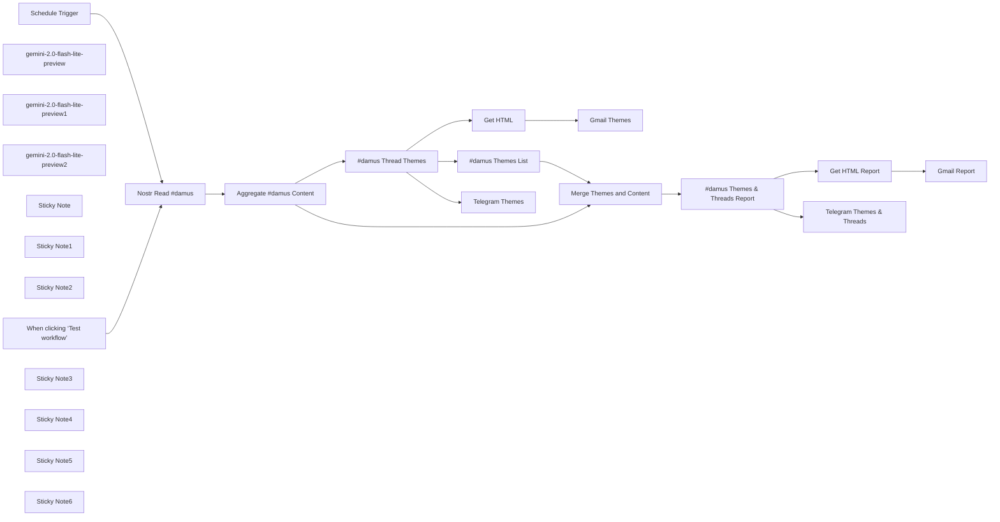

## Fluxo (.json) :

```json
{
  "id": "02GdRzvsuHmSSgBw",
  "meta": {
    "instanceId": "31e69f7f4a77bf465b805824e303232f0227212ae922d12133a0f96ffeab4fef",
    "templateCredsSetupCompleted": true
  },
  "name": "#️⃣Nostr #damus AI Powered Reporting + Gmail + Telegram",
  "tags": [],
  "nodes": [
    {
      "id": "e9c4c7bf-0cce-456e-9b95-726669e4b260",
      "name": "When clicking ‘Test workflow’",
      "type": "n8n-nodes-base.manualTrigger",
      "position": [
        -500,
        -60
      ],
      "parameters": {},
      "typeVersion": 1
    },
    {
      "id": "b8f57e15-8a6e-4a29-a6e8-745bebbd1f44",
      "name": "Get HTML",
      "type": "n8n-nodes-base.markdown",
      "position": [
        880,
        -840
      ],
      "parameters": {
        "mode": "markdownToHtml",
        "options": {},
        "markdown": "={{ $json.text }}"
      },
      "typeVersion": 1
    },
    {
      "id": "8b212119-9b69-449c-8a3b-4fdc5b085f30",
      "name": "Gmail Themes",
      "type": "n8n-nodes-base.gmail",
      "position": [
        1080,
        -840
      ],
      "webhookId": "e07f9378-bfa5-48ac-88fd-0ef88a725ede",
      "parameters": {
        "sendTo": "joe@example.com",
        "message": "={{ $json.data }}",
        "options": {
          "appendAttribution": false
        },
        "subject": "#damus"
      },
      "credentials": {
        "gmailOAuth2": {
          "id": "1xpVDEQ1yx8gV022",
          "name": "Gmail account"
        }
      },
      "typeVersion": 2.1
    },
    {
      "id": "b7fc214b-72cb-4caf-8563-7b2f13a1110d",
      "name": "Get HTML Report",
      "type": "n8n-nodes-base.markdown",
      "position": [
        880,
        80
      ],
      "parameters": {
        "mode": "markdownToHtml",
        "options": {},
        "markdown": "={{ $json.text }}"
      },
      "typeVersion": 1
    },
    {
      "id": "dd7580bc-f97c-4ad1-8556-2329f88bea75",
      "name": "#damus Themes List",
      "type": "@n8n/n8n-nodes-langchain.chainLlm",
      "position": [
        500,
        -400
      ],
      "parameters": {
        "text": "=Extract a list of themes from this: {{ $json.text }}\n\nDo not include any preamble or further explanation.",
        "promptType": "define"
      },
      "typeVersion": 1.5
    },
    {
      "id": "60a9d8fe-4ba0-4450-8073-4108b832981e",
      "name": "#damus Thread Themes",
      "type": "@n8n/n8n-nodes-langchain.chainLlm",
      "position": [
        500,
        -840
      ],
      "parameters": {
        "text": "=Tell me the theme and highlight some common threads associated with these Nostr threads that are all #damus.  Specifically mention the main reason #damus is hashtagged.  These are the threads: {{ $json.content.toJsonString() }}",
        "promptType": "define"
      },
      "typeVersion": 1.5
    },
    {
      "id": "72ab08a7-f729-46e3-8a4d-56005cabaf17",
      "name": "#damus Themes & Threads Report",
      "type": "@n8n/n8n-nodes-langchain.chainLlm",
      "position": [
        500,
        80
      ],
      "parameters": {
        "text": "=**Task:** Analyze the attached file containing Nostr threads using the hashtag #damus. Provide a detailed report with examples thread based on the following themes.  Got deep and seek out the underlying motivation of the users who posted the threads: \n\n## Themes\n{{ $json.text }}\n\n1. **Overall Theme:** Summarize the central topic(s) discussed across the threads.\n2. **Common Threads:** Identify recurring topics or ideas that unify the posts.\n3. **Key Highlights:** Extract specific examples or quotes that illustrate prominent themes.\n4. **Insights and Observations:** Offer insights on how the #damus community engages with the app and its ecosystem.\n5. **Suggestions for Improvement:** If applicable, suggest ways to enhance user experience or community engagement based on the analysis.\n\n**Requirements:**\n- Expand on each theme with comprehensive details and analysis.\n- Use bullet points or numbered lists for clarity.\n- Include relevant quotes or examples from the text to support your analysis.\n- Ensure your response is detailed, well-structured, and easy to read.\n\n**Context:** The analysis should focus on understanding how users interact with Damus, their appreciation for its features, challenges they face, and how it fits into the broader Nostr ecosystem.\n\n## Nostr thread with hashtag #damus: \n{{ $json.content.toJsonString() }}\n\n",
        "promptType": "define"
      },
      "typeVersion": 1.5
    },
    {
      "id": "55362e03-ca0b-4f5e-a7ff-02828522fc7d",
      "name": "gemini-2.0-flash-lite-preview",
      "type": "@n8n/n8n-nodes-langchain.lmChatGoogleGemini",
      "position": [
        600,
        -680
      ],
      "parameters": {
        "options": {
          "temperature": 0.4
        },
        "modelName": "=models/gemini-2.0-flash-lite-preview"
      },
      "credentials": {
        "googlePalmApi": {
          "id": "L9UNQHflYlyF9Ngd",
          "name": "Google Gemini(PaLM) Api account"
        }
      },
      "typeVersion": 1
    },
    {
      "id": "7f457b3f-d39b-4062-ada0-5e81f3768857",
      "name": "gemini-2.0-flash-lite-preview1",
      "type": "@n8n/n8n-nodes-langchain.lmChatGoogleGemini",
      "position": [
        600,
        -240
      ],
      "parameters": {
        "options": {
          "temperature": 0.4
        },
        "modelName": "models/gemini-2.0-flash-lite-preview"
      },
      "credentials": {
        "googlePalmApi": {
          "id": "L9UNQHflYlyF9Ngd",
          "name": "Google Gemini(PaLM) Api account"
        }
      },
      "typeVersion": 1
    },
    {
      "id": "bd68e36a-2fa7-4b78-96d8-9c4f97388249",
      "name": "gemini-2.0-flash-lite-preview2",
      "type": "@n8n/n8n-nodes-langchain.lmChatGoogleGemini",
      "position": [
        600,
        240
      ],
      "parameters": {
        "options": {
          "temperature": 0.4
        },
        "modelName": "models/gemini-2.0-flash-lite-preview"
      },
      "credentials": {
        "googlePalmApi": {
          "id": "L9UNQHflYlyF9Ngd",
          "name": "Google Gemini(PaLM) Api account"
        }
      },
      "typeVersion": 1
    },
    {
      "id": "24f378ca-8a10-441f-886d-136314fa30de",
      "name": "Gmail Report",
      "type": "n8n-nodes-base.gmail",
      "position": [
        1080,
        80
      ],
      "webhookId": "e07f9378-bfa5-48ac-88fd-0ef88a725ede",
      "parameters": {
        "sendTo": "joe@example.com",
        "message": "={{ $json.data }}",
        "options": {
          "appendAttribution": false
        },
        "subject": "#damus"
      },
      "credentials": {
        "gmailOAuth2": {
          "id": "1xpVDEQ1yx8gV022",
          "name": "Gmail account"
        }
      },
      "typeVersion": 2.1
    },
    {
      "id": "f4814872-577a-4243-ac1b-e152e147dca0",
      "name": "Aggregate #damus Content",
      "type": "n8n-nodes-base.aggregate",
      "position": [
        120,
        -140
      ],
      "parameters": {
        "options": {},
        "fieldsToAggregate": {
          "fieldToAggregate": [
            {
              "fieldToAggregate": "content"
            }
          ]
        }
      },
      "typeVersion": 1
    },
    {
      "id": "d2079c9e-b743-4353-bda9-e269168f5461",
      "name": "Sticky Note",
      "type": "n8n-nodes-base.stickyNote",
      "position": [
        360,
        -940
      ],
      "parameters": {
        "color": 6,
        "width": 960,
        "height": 420,
        "content": "## #damus Threads Themes"
      },
      "typeVersion": 1
    },
    {
      "id": "5f69afb5-6e3c-4f65-84bb-8c1f4544b2c5",
      "name": "Sticky Note1",
      "type": "n8n-nodes-base.stickyNote",
      "position": [
        360,
        -480
      ],
      "parameters": {
        "color": 5,
        "width": 520,
        "height": 420,
        "content": "## #damus Threads Themes"
      },
      "typeVersion": 1
    },
    {
      "id": "6de3d9d2-98be-4102-9ed5-cda48b37eee7",
      "name": "Sticky Note2",
      "type": "n8n-nodes-base.stickyNote",
      "position": [
        360,
        -20
      ],
      "parameters": {
        "color": 4,
        "width": 960,
        "height": 420,
        "content": "## #damus Threads & Threads Report"
      },
      "typeVersion": 1
    },
    {
      "id": "42f333ce-bdd7-4950-9ef1-ae797a671f5d",
      "name": "Merge Themes and Content",
      "type": "n8n-nodes-base.merge",
      "position": [
        1000,
        -160
      ],
      "parameters": {
        "mode": "combine",
        "options": {},
        "combineBy": "combineByPosition"
      },
      "typeVersion": 3
    },
    {
      "id": "7ff77e60-03ed-4937-b923-74a7f588fd2a",
      "name": "Schedule Trigger",
      "type": "n8n-nodes-base.scheduleTrigger",
      "position": [
        -500,
        -260
      ],
      "parameters": {
        "rule": {
          "interval": [
            {}
          ]
        }
      },
      "typeVersion": 1.2
    },
    {
      "id": "d1939a96-1e68-4d90-a456-55852c941e28",
      "name": "Sticky Note3",
      "type": "n8n-nodes-base.stickyNote",
      "position": [
        -280,
        -580
      ],
      "parameters": {
        "color": 6,
        "width": 340,
        "height": 700,
        "content": "## Get Nostr Threads with Hashtag #damus\n\nThe social network you control\nYour very own social network for your friends or business.\nAvailable Now on iOS, iPad and macOS (M1/M2)\n\nhttps://nostr.com/\nhttps://damus.io/\nhttps://damus.io/notedeck/\n\n### n8n Community Node https://github.com/ocknamo/n8n-nodes-nostrobots\n"
      },
      "typeVersion": 1
    },
    {
      "id": "89905442-bf8d-40d2-a9b1-fb3cf3a2ac44",
      "name": "Sticky Note4",
      "type": "n8n-nodes-base.stickyNote",
      "position": [
        940,
        -640
      ],
      "parameters": {
        "width": 320,
        "height": 280,
        "content": "## Telegram \n"
      },
      "typeVersion": 1
    },
    {
      "id": "aee0f3eb-7b0e-4df1-968d-5abe1c22e26a",
      "name": "Sticky Note5",
      "type": "n8n-nodes-base.stickyNote",
      "position": [
        940,
        280
      ],
      "parameters": {
        "width": 320,
        "height": 280,
        "content": "## Telegram \n"
      },
      "typeVersion": 1
    },
    {
      "id": "f6b00109-74ef-4522-b568-6426b054bea3",
      "name": "Telegram Themes",
      "type": "n8n-nodes-base.telegram",
      "position": [
        1040,
        -560
      ],
      "webhookId": "8406b3d2-5ac6-452d-847f-c0886c8cd058",
      "parameters": {
        "text": "={{ $json.text.slice(0, 4000) }}",
        "chatId": "={{ $env.TELEGRAM_CHAT_ID }}",
        "additionalFields": {
          "parse_mode": "HTML",
          "appendAttribution": false
        }
      },
      "credentials": {
        "telegramApi": {
          "id": "pAIFhguJlkO3c7aQ",
          "name": "Telegram account"
        }
      },
      "typeVersion": 1.2
    },
    {
      "id": "3e7e9c70-43c6-4074-be9a-2f5ed6c4fb0e",
      "name": "Telegram Themes & Threads",
      "type": "n8n-nodes-base.telegram",
      "position": [
        1040,
        360
      ],
      "webhookId": "8406b3d2-5ac6-452d-847f-c0886c8cd058",
      "parameters": {
        "text": "={{ $json.text.slice(0, 4000) }}",
        "chatId": "={{ $env.TELEGRAM_CHAT_ID }}",
        "additionalFields": {
          "parse_mode": "HTML",
          "appendAttribution": false
        }
      },
      "credentials": {
        "telegramApi": {
          "id": "pAIFhguJlkO3c7aQ",
          "name": "Telegram account"
        }
      },
      "typeVersion": 1.2
    },
    {
      "id": "5bc52456-7bbc-445a-8ffd-f47403a4b978",
      "name": "Sticky Note6",
      "type": "n8n-nodes-base.stickyNote",
      "position": [
        -580,
        -340
      ],
      "parameters": {
        "color": 4,
        "width": 260,
        "height": 460,
        "content": "## Try Me!"
      },
      "typeVersion": 1
    },
    {
      "id": "3b61555e-4e20-41d2-8fb7-490a2488f5f2",
      "name": "Nostr Read #damus",
      "type": "n8n-nodes-nostrobots.nostrobotsread",
      "position": [
        -160,
        -140
      ],
      "parameters": {
        "from": 180,
        "hashtag": "#damus",
        "strategy": "hashtag"
      },
      "typeVersion": 1
    }
  ],
  "active": true,
  "pinData": {},
  "settings": {
    "executionOrder": "v1"
  },
  "versionId": "06d6edc0-ed5c-48d1-abe6-22b04368d19b",
  "connections": {
    "Get HTML": {
      "main": [
        [
          {
            "node": "Gmail Themes",
            "type": "main",
            "index": 0
          }
        ]
      ]
    },
    "Get HTML Report": {
      "main": [
        [
          {
            "node": "Gmail Report",
            "type": "main",
            "index": 0
          }
        ]
      ]
    },
    "Schedule Trigger": {
      "main": [
        [
          {
            "node": "Nostr Read #damus",
            "type": "main",
            "index": 0
          }
        ]
      ]
    },
    "Nostr Read #damus": {
      "main": [
        [
          {
            "node": "Aggregate #damus Content",
            "type": "main",
            "index": 0
          }
        ]
      ]
    },
    "#damus Themes List": {
      "main": [
        [
          {
            "node": "Merge Themes and Content",
            "type": "main",
            "index": 0
          }
        ]
      ]
    },
    "#damus Thread Themes": {
      "main": [
        [
          {
            "node": "Get HTML",
            "type": "main",
            "index": 0
          },
          {
            "node": "#damus Themes List",
            "type": "main",
            "index": 0
          },
          {
            "node": "Telegram Themes",
            "type": "main",
            "index": 0
          }
        ]
      ]
    },
    "Aggregate #damus Content": {
      "main": [
        [
          {
            "node": "#damus Thread Themes",
            "type": "main",
            "index": 0
          },
          {
            "node": "Merge Themes and Content",
            "type": "main",
            "index": 1
          }
        ]
      ]
    },
    "Merge Themes and Content": {
      "main": [
        [
          {
            "node": "#damus Themes & Threads Report",
            "type": "main",
            "index": 0
          }
        ]
      ]
    },
    "gemini-2.0-flash-lite-preview": {
      "ai_languageModel": [
        [
          {
            "node": "#damus Thread Themes",
            "type": "ai_languageModel",
            "index": 0
          }
        ]
      ]
    },
    "#damus Themes & Threads Report": {
      "main": [
        [
          {
            "node": "Get HTML Report",
            "type": "main",
            "index": 0
          },
          {
            "node": "Telegram Themes & Threads",
            "type": "main",
            "index": 0
          }
        ]
      ]
    },
    "gemini-2.0-flash-lite-preview1": {
      "ai_languageModel": [
        [
          {
            "node": "#damus Themes List",
            "type": "ai_languageModel",
            "index": 0
          }
        ]
      ]
    },
    "gemini-2.0-flash-lite-preview2": {
      "ai_languageModel": [
        [
          {
            "node": "#damus Themes & Threads Report",
            "type": "ai_languageModel",
            "index": 0
          }
        ]
      ]
    },
    "When clicking ‘Test workflow’": {
      "main": [
        [
          {
            "node": "Nostr Read #damus",
            "type": "main",
            "index": 0
          }
        ]
      ]
    }
  }
}
```

<a id="template-2254"></a>

## Template 2254 - Notificações de incidentes ServiceNow

- **Nome:** Notificações de incidentes ServiceNow
- **Descrição:** Monitora incidentes criados recentemente no ServiceNow e envia detalhes formatados para um canal do Slack.
- **Funcionalidade:** • Agendamento periódico: Executa o processo automaticamente a cada 5 minutos.
• Gatilho manual de teste: Permite executar o fluxo manualmente para testes.
• Cálculo de timestamp: Gera um carimbo de data/hora correspondente a 5 minutos atrás para limitar a consulta.
• Consulta de novos incidentes: Recupera incidentes criados após o timestamp calculado no ServiceNow.
• Verificação de existência: Confirma se a consulta retornou novos incidentes antes de prosseguir.
• Ordenação de resultados: Ordena os incidentes por número em ordem ascendente para processamento consistente.
• Notificação formatada no Slack: Envia mensagem com blocos contendo ID, descrição, severidade, solicitante, prioridade, estado, categoria, data de abertura e botão para visualizar o incidente no ServiceNow.
• Tratamento de erros: Em caso de erro na conexão ou na consulta ao ServiceNow, envia uma mensagem de alerta ao canal do Slack para investigação.
• Rota inativa quando vazio: Quando não há incidentes novos, o fluxo termina sem ações adicionais.
- **Ferramentas:** • ServiceNow: Plataforma de ITSM usada para armazenar e consultar registros de incidentes.
• Slack: Plataforma de comunicação usada para enviar notificações em canal com mensagens formatadas e botões de ação.

## Fluxo visual

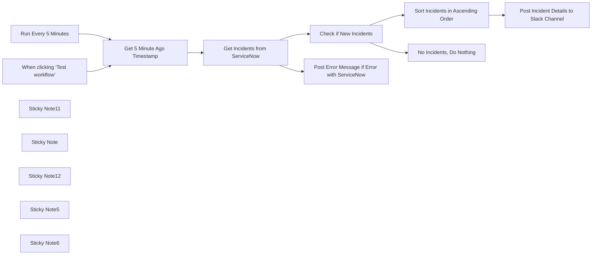

## Fluxo (.json) :

```json
{
  "meta": {
    "instanceId": "03e9d14e9196363fe7191ce21dc0bb17387a6e755dcc9acc4f5904752919dca8"
  },
  "nodes": [
    {
      "id": "93963e3d-bd30-4a0f-ba56-7896cd19d2ae",
      "name": "When clicking ‘Test workflow’",
      "type": "n8n-nodes-base.manualTrigger",
      "position": [
        -660,
        160
      ],
      "parameters": {},
      "typeVersion": 1
    },
    {
      "id": "c459e403-01b8-43dd-8065-1f8dcb77bcc0",
      "name": "Run Every 5 Minutes",
      "type": "n8n-nodes-base.scheduleTrigger",
      "position": [
        -660,
        -40
      ],
      "parameters": {
        "rule": {
          "interval": [
            {
              "field": "minutes"
            }
          ]
        }
      },
      "typeVersion": 1.2
    },
    {
      "id": "7cabd06a-7898-4789-9671-78f0b6fcac2a",
      "name": "Get 5 Minute Ago Timestamp",
      "type": "n8n-nodes-base.dateTime",
      "position": [
        -320,
        40
      ],
      "parameters": {
        "options": {},
        "duration": 5,
        "timeUnit": "minutes",
        "magnitude": "={{ $now.toUTC() }}",
        "operation": "subtractFromDate",
        "outputFieldName": "queryDate"
      },
      "typeVersion": 2
    },
    {
      "id": "5f21f279-3608-41bf-8986-47832aa0f1f2",
      "name": "Get Incidents from ServiceNow",
      "type": "n8n-nodes-base.serviceNow",
      "onError": "continueErrorOutput",
      "position": [
        -100,
        40
      ],
      "parameters": {
        "options": {
          "sysparm_query": "=sys_created_on>={{ $json.queryDate }}",
          "sysparm_display_value": "true"
        },
        "resource": "incident",
        "operation": "getAll",
        "authentication": "basicAuth"
      },
      "credentials": {
        "serviceNowBasicApi": {
          "id": "wjkWiUNQxo5PzTIb",
          "name": "ServiceNow Basic Auth account"
        }
      },
      "typeVersion": 1,
      "alwaysOutputData": true
    },
    {
      "id": "19fc7c77-e2b0-495d-bb7b-7bc7a7d87805",
      "name": "Check if New Incidents",
      "type": "n8n-nodes-base.if",
      "position": [
        160,
        -40
      ],
      "parameters": {
        "options": {},
        "conditions": {
          "options": {
            "version": 2,
            "leftValue": "",
            "caseSensitive": true,
            "typeValidation": "strict"
          },
          "combinator": "and",
          "conditions": [
            {
              "id": "09750510-4604-4372-9cdc-d8055adae12a",
              "operator": {
                "type": "string",
                "operation": "exists",
                "singleValue": true
              },
              "leftValue": "={{ $json.sys_id }}",
              "rightValue": ""
            }
          ]
        }
      },
      "typeVersion": 2.2
    },
    {
      "id": "53e120d8-3022-46c0-8524-2c14f30d2c1a",
      "name": "Post Error Message if Error with ServiceNow",
      "type": "n8n-nodes-base.slack",
      "position": [
        480,
        760
      ],
      "webhookId": "0fba7a73-b273-4d52-863f-9a1b3ff75266",
      "parameters": {
        "text": "🚨 Issue connecting to ServiceNow. Please investigate error in n8n. 🚨",
        "select": "channel",
        "channelId": {
          "__rl": true,
          "mode": "list",
          "value": "C086LRRQZQB",
          "cachedResultName": "incident-notifications"
        },
        "otherOptions": {
          "mrkdwn": true,
          "includeLinkToWorkflow": false
        }
      },
      "credentials": {
        "slackApi": {
          "id": "K04E2FxPZozHux9J",
          "name": "ServiceNow Bot"
        }
      },
      "typeVersion": 2.2
    },
    {
      "id": "0784e71c-208d-4442-b355-3f1f076d9846",
      "name": "Sort Incidents in Ascending Order",
      "type": "n8n-nodes-base.sort",
      "position": [
        511,
        -271
      ],
      "parameters": {
        "options": {},
        "sortFieldsUi": {
          "sortField": [
            {
              "fieldName": "number"
            }
          ]
        }
      },
      "typeVersion": 1
    },
    {
      "id": "8435a455-0ea3-4443-8370-ec2e4c392e2f",
      "name": "Post Incident Details to Slack Channel",
      "type": "n8n-nodes-base.slack",
      "position": [
        731,
        -271
      ],
      "webhookId": "245d019e-7762-4e4a-861e-6181f1dcc7f2",
      "parameters": {
        "select": "channel",
        "blocksUi": "={\n\t\"blocks\": [\n\t\t{\n\t\t\t\"type\": \"header\",\n\t\t\t\"text\": {\n\t\t\t\t\"type\": \"plain_text\",\n\t\t\t\t\"text\": \"ServiceNow Incident Notification\",\n\t\t\t\t\"emoji\": true\n\t\t\t}\n\t\t},\n\t\t{\n\t\t\t\"type\": \"section\",\n\t\t\t\"fields\": [\n\t\t\t\t{\n\t\t\t\t\t\"type\": \"mrkdwn\",\n\t\t\t\t\t\"text\": \"*Incident ID:*\\n{{ $('Get Incidents from ServiceNow').item.json.number }}\"\n\t\t\t\t},\n{\n\t\t\t\t\t\"type\": \"mrkdwn\",\n\t\t\t\t\t\"text\": \"*Description:*\\n{{ $('Get Incidents from ServiceNow').item.json.short_description }}\"\n\t\t\t\t},\n\t\t\t\t{\n\t\t\t\t\t\"type\": \"mrkdwn\",\n\t\t\t\t\t\"text\": \"*Severity:*\\n{{ $('Get Incidents from ServiceNow').item.json.severity }}\"\n\t\t\t\t},\n\t\t\t\t{\n\t\t\t\t\t\"type\": \"mrkdwn\",\n\t\t\t\t\t\"text\": \"*Caller:*\\n{{ $('Get Incidents from ServiceNow').item.json.caller_id.display_value }}\"\n\t\t\t\t},\n\t\t\t\t{\n\t\t\t\t\t\"type\": \"mrkdwn\",\n\t\t\t\t\t\"text\": \"*Priority:*\\n{{ $('Get Incidents from ServiceNow').item.json.priority }}\"\n\t\t\t\t},\n\t\t\t\t{\n\t\t\t\t\t\"type\": \"mrkdwn\",\n\t\t\t\t\t\"text\": \"*State:*\\n{{ $('Get Incidents from ServiceNow').item.json.incident_state }}\"\n\t\t\t\t},\n\t\t\t\t{\n\t\t\t\t\t\"type\": \"mrkdwn\",\n\t\t\t\t\t\"text\": \"*Category:*\\n{{ $('Get Incidents from ServiceNow').item.json.category }}\"\n\t\t\t\t},\n\t\t\t\t{\n\t\t\t\t\t\"type\": \"mrkdwn\",\n\t\t\t\t\t\"text\": \"*Date Opened:*\\n{{ $('Get Incidents from ServiceNow').item.json.opened_at }}\"\n\t\t\t\t}\n\t\t\t]\n\t\t},\n\t\t{\n\t\t\t\"type\": \"actions\",\n\t\t\t\"elements\": [\n\t\t\t\t{\n\t\t\t\t\t\"type\": \"button\",\n\t\t\t\t\t\"text\": {\n\t\t\t\t\t\t\"type\": \"plain_text\",\n\t\t\t\t\t\t\"text\": \"View Incident\",\n\t\t\t\t\t\t\"emoji\": true\n\t\t\t\t\t},\n\t\t\t\t\t\"url\": \"https://dev206761.service-now.com/nav_to.do?uri=incident.do?sys_id={{ $('Get Incidents from ServiceNow').item.json.sys_id }}\",\n\t\t\t\t\t\"action_id\": \"view_incident\"\n\t\t\t\t}\n\t\t\t]\n\t\t}\n\t]\n}",
        "channelId": {
          "__rl": true,
          "mode": "list",
          "value": "C086LRRQZQB",
          "cachedResultName": "incident-notifications"
        },
        "messageType": "block",
        "otherOptions": {
          "includeLinkToWorkflow": false
        }
      },
      "credentials": {
        "slackApi": {
          "id": "K04E2FxPZozHux9J",
          "name": "ServiceNow Bot"
        }
      },
      "typeVersion": 2.2
    },
    {
      "id": "aa526b18-d259-4304-9faa-4375bee83c50",
      "name": "No Incidents, Do Nothing",
      "type": "n8n-nodes-base.noOp",
      "position": [
        500,
        200
      ],
      "parameters": {},
      "typeVersion": 1
    },
    {
      "id": "2798711d-1788-4126-a576-cdef6c495bd7",
      "name": "Sticky Note11",
      "type": "n8n-nodes-base.stickyNote",
      "position": [
        400,
        -720
      ],
      "parameters": {
        "color": 7,
        "width": 543.0448479049971,
        "height": 635.2493225262418,
        "content": "\n## Sorting and Posting Incident Details to Slack\n\nThis section begins with the `Sort Incidents in Ascending Order` node, which organizes the retrieved ServiceNow incidents by their incident number in ascending order. This ensures that incidents are processed and displayed in a logical sequence. The sorted incidents are then passed to the `Post Incident Details to Slack Channel` node, which formats and sends a detailed message to a designated Slack channel. The message includes key information such as the incident ID, description, severity, caller, priority, state, category, and the date the incident was opened. A \"View Incident\" button is also provided, linking directly to the ServiceNow record for quick access. This section ensures clear, organized communication of incident details, enabling efficient team collaboration and resolution."
      },
      "typeVersion": 1
    },
    {
      "id": "499f5f1e-617b-429d-9760-dc264870e269",
      "name": "Sticky Note",
      "type": "n8n-nodes-base.stickyNote",
      "position": [
        -400,
        -416.5936589599954
      ],
      "parameters": {
        "color": 7,
        "width": 792.7994376824845,
        "height": 651.0105345024904,
        "content": "\n## Fetching and Checking New Incidents\n\nThis section begins with the `Get 5 Minute Ago Timestamp` node, which calculates a timestamp exactly 5 minutes prior to the current time. This timestamp is used as a reference point for querying incidents created within the last 5 minutes. The `Get Incidents from ServiceNow` node then fetches all incidents created after the calculated timestamp from the ServiceNow system, ensuring only the most recent incidents are retrieved. Finally, the `Check if New Incidents` node evaluates whether any incidents were returned by checking if the `sys_id` field exists in the response. This logic helps determine the next steps in the workflow, ensuring actions are taken only when new incidents are detected."
      },
      "typeVersion": 1
    },
    {
      "id": "c6f1dd80-ed5b-4e29-add1-a38a46338150",
      "name": "Sticky Note12",
      "type": "n8n-nodes-base.stickyNote",
      "position": [
        400,
        380
      ],
      "parameters": {
        "color": 7,
        "width": 540.6200460624971,
        "height": 560.0562505318285,
        "content": "\n## Error Notification to Slack\n\nThis section handles error reporting using the `Post Error Message if Error with ServiceNow` node. If the workflow encounters any issues connecting to ServiceNow, this node sends a predefined error message to a specified Slack channel. Usually this is triggered by expired credentials. The message alerts the team to investigate the issue in n8n, ensuring prompt attention and troubleshooting. By proactively notifying the team of connection errors, this section helps maintain the reliability of the workflow and minimizes disruptions in incident monitoring and reporting."
      },
      "typeVersion": 1
    },
    {
      "id": "1ea0684a-9d7e-4f47-a7b0-9cb22bb6b934",
      "name": "Sticky Note5",
      "type": "n8n-nodes-base.stickyNote",
      "position": [
        -800,
        -420
      ],
      "parameters": {
        "color": 7,
        "width": 382.98284329874696,
        "height": 746.70974187249,
        "content": "\n## Run Every 5 Minutes\n\nThe `Schedule Trigger` node is configured to automatically execute the workflow every 5 minutes. This setup ensures consistent and timely monitoring for new incidents in ServiceNow without requiring manual input. The selected interval strikes a balance between responsiveness and efficient resource usage, making it ideal for real-time incident management workflows."
      },
      "typeVersion": 1
    },
    {
      "id": "1a3e7b4c-60ce-449c-9f6a-2a1bc42b748d",
      "name": "Sticky Note6",
      "type": "n8n-nodes-base.stickyNote",
      "position": [
        400,
        -80
      ],
      "parameters": {
        "color": 7,
        "width": 540.5949630612389,
        "height": 442.9500589573929,
        "content": "\n## No New Incidents Found, Do Nothing\n\nIf a ServiceNow system ID is not found in the ServiceNow node output, it will route to this node which effectively ends the process without doing anything. "
      },
      "typeVersion": 1
    }
  ],
  "pinData": {},
  "connections": {
    "Run Every 5 Minutes": {
      "main": [
        [
          {
            "node": "Get 5 Minute Ago Timestamp",
            "type": "main",
            "index": 0
          }
        ]
      ]
    },
    "Check if New Incidents": {
      "main": [
        [
          {
            "node": "Sort Incidents in Ascending Order",
            "type": "main",
            "index": 0
          }
        ],
        [
          {
            "node": "No Incidents, Do Nothing",
            "type": "main",
            "index": 0
          }
        ]
      ]
    },
    "Get 5 Minute Ago Timestamp": {
      "main": [
        [
          {
            "node": "Get Incidents from ServiceNow",
            "type": "main",
            "index": 0
          }
        ]
      ]
    },
    "Get Incidents from ServiceNow": {
      "main": [
        [
          {
            "node": "Check if New Incidents",
            "type": "main",
            "index": 0
          }
        ],
        [
          {
            "node": "Post Error Message if Error with ServiceNow",
            "type": "main",
            "index": 0
          }
        ]
      ]
    },
    "Sort Incidents in Ascending Order": {
      "main": [
        [
          {
            "node": "Post Incident Details to Slack Channel",
            "type": "main",
            "index": 0
          }
        ]
      ]
    },
    "When clicking ‘Test workflow’": {
      "main": [
        [
          {
            "node": "Get 5 Minute Ago Timestamp",
            "type": "main",
            "index": 0
          }
        ]
      ]
    }
  }
}
```

<a id="template-2256"></a>

## Template 2256 - Qualificação automática de leads por email

- **Nome:** Qualificação automática de leads por email
- **Descrição:** Coleta emails via formulário, valida a validade do email, aplica pontuação de fit do cliente e notifica leads qualificados em um canal do Slack.
- **Funcionalidade:** • Coleta de leads via formulário: Recebe submissões do formulário "Contact us" como ponto de entrada.
• Verificação de email: Valida se o email fornecido é considerado válido antes de processar o lead.
• Pontuação de fit do cliente: Consulta um serviço de scoring para avaliar o potencial do lead.
• Filtragem por pontuação: Segrega leads e avança apenas os com score de customer_fit maior que 60.
• Notificação em canal: Envia uma mensagem formatada para um canal do Slack sobre leads considerados quentes.
• Tratamento de emails inválidos: Interrompe o fluxo para emails não válidos, evitando processamento desnecessário.
- **Ferramentas:** • Formulário (Contact us): Origem das submissões de leads via página/formulário de contato.
• Hunter: Serviço de verificação de emails para confirmar validade e entregabilidade.
• MadKudu: Plataforma de pontuação de leads para calcular o fit do cliente.
• Slack: Canal de comunicação utilizado para notificar a equipe sobre leads qualificados.

## Fluxo visual

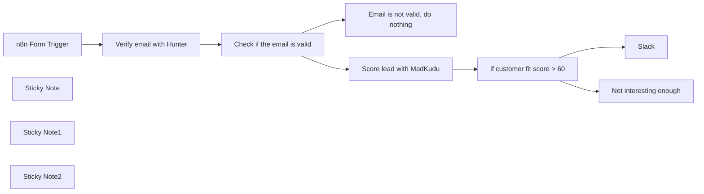

## Fluxo (.json) :

```json
{
  "nodes": [
    {
      "id": "1a461b8a-090e-4dc4-a3d7-bf976a49828e",
      "name": "Slack",
      "type": "n8n-nodes-base.slack",
      "position": [
        1660,
        200
      ],
      "parameters": {
        "text": "=⭐ Got a hot lead for you  {{ $json.properties.first_name }} {{ $json.properties.last_name }} from  {{ $json.company.properties.name }} ({{ $json.company.properties.domain }}) based out of {{ $json.company.properties.location.state }}, {{ $json.company.properties.location.country }}.\n\n\n{{ $('Score lead with MadKudu').item.json.properties.customer_fit.top_signals_formatted }}",
        "select": "channel",
        "channelId": {
          "__rl": true,
          "mode": "name",
          "value": "#interesting_leads"
        },
        "otherOptions": {}
      },
      "credentials": {
        "slackApi": {
          "id": "241",
          "name": "Nathan Slack Bot token"
        }
      },
      "typeVersion": 2.1
    },
    {
      "id": "bcd8e7dc-cb7f-4e2b-a0c6-2d154cb58938",
      "name": "n8n Form Trigger",
      "type": "n8n-nodes-base.formTrigger",
      "position": [
        380,
        420
      ],
      "webhookId": "0bf8840f-1cc4-46a9-86af-a3fa8da80608",
      "parameters": {
        "path": "0bf8840f-1cc4-46a9-86af-a3fa8da80608",
        "options": {},
        "formTitle": "Contact us",
        "formFields": {
          "values": [
            {
              "fieldLabel": "What's your business email?"
            }
          ]
        },
        "formDescription": "We'll get back to you soon"
      },
      "typeVersion": 2
    },
    {
      "id": "c20c626f-fd58-497f-942f-5d10f198f36d",
      "name": "Check if the email is valid",
      "type": "n8n-nodes-base.if",
      "position": [
        800,
        420
      ],
      "parameters": {
        "options": {},
        "conditions": {
          "options": {
            "leftValue": "",
            "caseSensitive": true,
            "typeValidation": "strict"
          },
          "combinator": "and",
          "conditions": [
            {
              "id": "54d84c8a-63ee-40ed-8fb2-301fff0194ba",
              "operator": {
                "name": "filter.operator.equals",
                "type": "string",
                "operation": "equals"
              },
              "leftValue": "={{ $json.status }}",
              "rightValue": "valid"
            }
          ]
        }
      },
      "typeVersion": 2
    },
    {
      "id": "9c55911c-06b7-4291-a91d-30c0cb87b7f2",
      "name": "Sticky Note",
      "type": "n8n-nodes-base.stickyNote",
      "position": [
        380,
        220
      ],
      "parameters": {
        "color": 5,
        "width": 547,
        "height": 158,
        "content": "### 👨‍🎤 Setup\n1. Add you **MadKudu**, **Hunter**, and **Slack** credentials \n2. Set the Slack channel\n3. Click the Test Workflow button, enter your email and check the Slack channel\n4. Activate the workflow and use the form trigger production URL to collect your leads in a smart way "
      },
      "typeVersion": 1
    },
    {
      "id": "c96096f2-6505-4955-bb1b-c4f903428b1d",
      "name": "Sticky Note1",
      "type": "n8n-nodes-base.stickyNote",
      "position": [
        380,
        560
      ],
      "parameters": {
        "color": 7,
        "width": 162,
        "height": 139,
        "content": "👆 You can exchange this with any form you like (*e.g. Typeform, Google forms, Survey Monkey...*)"
      },
      "typeVersion": 1
    },
    {
      "id": "751458aa-7b63-48ab-881e-d68df94a3390",
      "name": "Sticky Note2",
      "type": "n8n-nodes-base.stickyNote",
      "position": [
        1360,
        500
      ],
      "parameters": {
        "color": 7,
        "width": 162,
        "height": 84,
        "content": "👆 Adjust the fit as you see necessary"
      },
      "typeVersion": 1
    },
    {
      "id": "6416c2ee-59a0-4496-bd62-0a3af06986b7",
      "name": "Email is not valid, do nothing",
      "type": "n8n-nodes-base.noOp",
      "position": [
        1140,
        560
      ],
      "parameters": {},
      "typeVersion": 1
    },
    {
      "id": "b9ce2ee8-b816-497a-99af-faffdc99ee5f",
      "name": "Score lead with MadKudu",
      "type": "n8n-nodes-base.httpRequest",
      "position": [
        1140,
        320
      ],
      "parameters": {
        "url": "=https://api.madkudu.com/v1/persons?email={{ $json.email }}",
        "options": {},
        "authentication": "genericCredentialType",
        "genericAuthType": "httpHeaderAuth"
      },
      "credentials": {
        "httpHeaderAuth": {
          "id": "71W5Bt9g1G9GOhVL",
          "name": "MadKudu Lead score"
        }
      },
      "typeVersion": 4.1
    },
    {
      "id": "0720ab51-5222-46fe-8a1a-31e25b81920c",
      "name": "Verify email with Hunter",
      "type": "n8n-nodes-base.hunter",
      "position": [
        600,
        420
      ],
      "parameters": {
        "email": "={{ $json['What\\'s your business email?'] }}",
        "operation": "emailVerifier"
      },
      "credentials": {
        "hunterApi": {
          "id": "ecwmdHFSBU5GGnV1",
          "name": "Hunter account"
        }
      },
      "typeVersion": 1
    },
    {
      "id": "95ec00d2-d926-49ff-a604-1f2d0b291b6f",
      "name": "Not interesting enough",
      "type": "n8n-nodes-base.noOp",
      "position": [
        1660,
        460
      ],
      "parameters": {},
      "typeVersion": 1
    },
    {
      "id": "5dc270d5-29fd-4620-8ca4-84532cf49c34",
      "name": "if customer fit score > 60",
      "type": "n8n-nodes-base.if",
      "position": [
        1380,
        320
      ],
      "parameters": {
        "options": {},
        "conditions": {
          "options": {
            "leftValue": "",
            "caseSensitive": true,
            "typeValidation": "strict"
          },
          "combinator": "and",
          "conditions": [
            {
              "id": "c23d7b34-a4ae-421f-bd7a-6a3ebb05aafe",
              "operator": {
                "type": "number",
                "operation": "gt"
              },
              "leftValue": "={{ $json.properties.customer_fit.score }}",
              "rightValue": 60
            }
          ]
        }
      },
      "typeVersion": 2
    }
  ],
  "pinData": {
    "n8n Form Trigger": [
      {
        "formMode": "test",
        "submittedAt": "2024-02-22T13:59:54.709Z",
        "What's your business email?": "jan@n8n.io"
      }
    ]
  },
  "connections": {
    "n8n Form Trigger": {
      "main": [
        [
          {
            "node": "Verify email with Hunter",
            "type": "main",
            "index": 0
          }
        ]
      ]
    },
    "Score lead with MadKudu": {
      "main": [
        [
          {
            "node": "if customer fit score > 60",
            "type": "main",
            "index": 0
          }
        ]
      ]
    },
    "Verify email with Hunter": {
      "main": [
        [
          {
            "node": "Check if the email is valid",
            "type": "main",
            "index": 0
          }
        ]
      ]
    },
    "if customer fit score > 60": {
      "main": [
        [
          {
            "node": "Slack",
            "type": "main",
            "index": 0
          }
        ],
        [
          {
            "node": "Not interesting enough",
            "type": "main",
            "index": 0
          }
        ]
      ]
    },
    "Check if the email is valid": {
      "main": [
        [
          {
            "node": "Score lead with MadKudu",
            "type": "main",
            "index": 0
          }
        ],
        [
          {
            "node": "Email is not valid, do nothing",
            "type": "main",
            "index": 0
          }
        ]
      ]
    }
  }
}
```

<a id="template-2258"></a>

## Template 2258 - Exportação semanal de livros para planilha

- **Nome:** Exportação semanal de livros para planilha
- **Descrição:** Este fluxo exporta os registros da tabela 'books' do banco MySQL para uma planilha do Google Sheets automaticamente, uma vez por semana.
- **Funcionalidade:** • Agendamento semanal: Dispara o processo automaticamente toda semana às 05:00.
• Consulta à base de dados MySQL: Executa a consulta SELECT * FROM books; para recuperar todos os registros da tabela de livros.
• Anexar dados na planilha: Adiciona os registros recuperados como novas linhas na planilha do Google Sheets especificada.
• Autenticação segura: Usa autenticação OAuth2 para acessar a planilha do Google de forma segura.
- **Ferramentas:** • MySQL: Banco de dados relacional que armazena a tabela 'books' com os registros a serem exportados.
• Google Sheets: Serviço de planilhas online onde os registros são adicionados como novas linhas via API.

## Fluxo visual

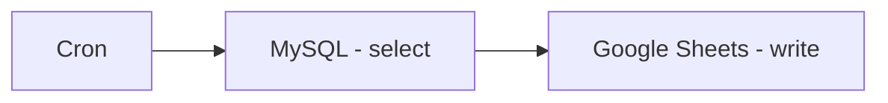

## Fluxo (.json) :

```json
{
  "nodes": [
    {
      "name": "Cron",
      "type": "n8n-nodes-base.cron",
      "position": [
        100,
        420
      ],
      "parameters": {
        "triggerTimes": {
          "item": [
            {
              "hour": 5,
              "mode": "everyWeek"
            }
          ]
        }
      },
      "typeVersion": 1
    },
    {
      "name": "MySQL - select",
      "type": "n8n-nodes-base.mySql",
      "position": [
        300,
        420
      ],
      "parameters": {
        "query": "SELECT * FROM books;",
        "operation": "executeQuery"
      },
      "credentials": {
        "mySql": {
          "id": "82",
          "name": "MySQL account"
        }
      },
      "typeVersion": 1
    },
    {
      "name": "Google Sheets - write",
      "type": "n8n-nodes-base.googleSheets",
      "position": [
        500,
        420
      ],
      "parameters": {
        "options": {},
        "sheetId": "qwertz",
        "operation": "append",
        "authentication": "oAuth2"
      },
      "credentials": {
        "googleSheetsOAuth2Api": {
          "id": "2",
          "name": "google_sheets_oauth"
        }
      },
      "typeVersion": 1
    }
  ],
  "connections": {
    "Cron": {
      "main": [
        [
          {
            "node": "MySQL - select",
            "type": "main",
            "index": 0
          }
        ]
      ]
    },
    "MySQL - select": {
      "main": [
        [
          {
            "node": "Google Sheets - write",
            "type": "main",
            "index": 0
          }
        ]
      ]
    }
  }
}
```

<a id="template-2261"></a>

## Template 2261 - Limpeza mensal de pacotes antigos

- **Nome:** Limpeza mensal de pacotes antigos
- **Descrição:** Marca como 'DELETE' pacotes com situação 'TRANSPORTE-RECEBIDO' com mais de 1 mês em duas bases e envia notificações por Telegram.
- **Funcionalidade:** • Agendamento: Executa automaticamente todo dia às 08:00 para iniciar o processo de limpeza.
• Disparo via webhook: Aceita execução por chamada HTTP no caminho 'limparPacotes' para iniciar a limpeza sob demanda.
• Execução manual: Permite iniciar a rotina manualmente ao clicar em executar.
• Limpeza na base PPM: Atualiza registros do módulo 'pacoteProduto' com situação 'TRANSPORTE-RECEBIDO' com mais de 1 mês, marcando-os como 'DELETE'.
• Limpeza na base OBJ: Realiza a mesma atualização na outra base de dados (OBJ) para os mesmos critérios.
• Notificações por Telegram: Envia mensagens indicando que a limpeza foi realizada para cada cliente (mensagens separadas para PONTO MIX e OBJETIVA).
- **Ferramentas:** • MySQL (PPM): Base de dados onde são executadas queries para marcar pacotes antigos como 'DELETE' (credencial PPM).
• MySQL (OBJ): Segunda base de dados onde a mesma operação de limpeza é executada (credencial OBJ).
• Telegram: Serviço usado para enviar notificações ao chat identificado pelo ID -657820242 informando sobre a limpeza.

## Fluxo visual

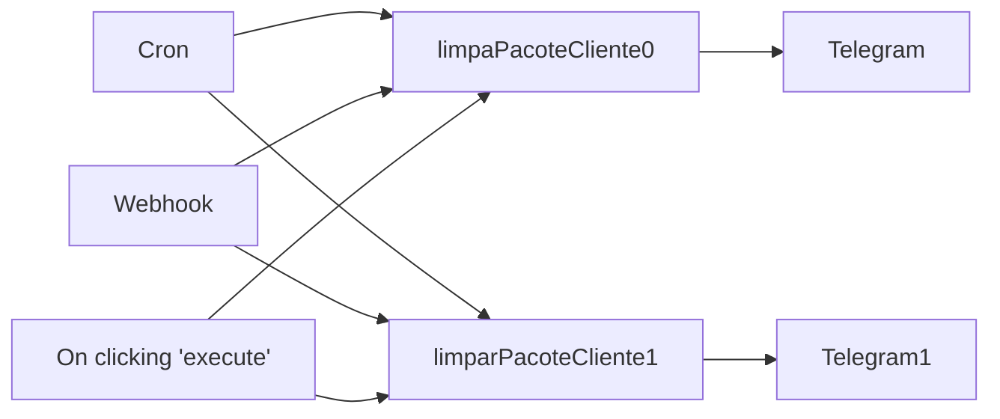

## Fluxo (.json) :

```json
{
  "nodes": [
    {
      "name": "On clicking 'execute'",
      "type": "n8n-nodes-base.manualTrigger",
      "disabled": true,
      "position": [
        70,
        140
      ],
      "parameters": {},
      "typeVersion": 1
    },
    {
      "name": "Cron",
      "type": "n8n-nodes-base.cron",
      "position": [
        70,
        320
      ],
      "parameters": {
        "triggerTimes": {
          "item": [
            {
              "hour": 8
            }
          ]
        }
      },
      "typeVersion": 1
    },
    {
      "name": "Telegram",
      "type": "n8n-nodes-base.telegram",
      "position": [
        620,
        210
      ],
      "parameters": {
        "text": "LIMPOU PACOTES TRANSPORTE-RECEBIDO PONTO MIX",
        "chatId": "-657820242",
        "additionalFields": {}
      },
      "credentials": {
        "telegramApi": {
          "id": "5",
          "name": "Telegram account"
        }
      },
      "typeVersion": 1
    },
    {
      "name": "Telegram1",
      "type": "n8n-nodes-base.telegram",
      "position": [
        620,
        460
      ],
      "parameters": {
        "text": "LIMPOU PACOTES TRANSPORTE-RECEBIDO OBJETIVA",
        "chatId": "-657820242",
        "additionalFields": {}
      },
      "credentials": {
        "telegramApi": {
          "id": "5",
          "name": "Telegram account"
        }
      },
      "typeVersion": 1
    },
    {
      "name": "Webhook",
      "type": "n8n-nodes-base.webhook",
      "position": [
        70,
        480
      ],
      "webhookId": "7ecb2d2f-5a09-44a5-a7bc-27f188c74e0b",
      "parameters": {
        "path": "limparPacotes",
        "options": {}
      },
      "typeVersion": 1
    },
    {
      "name": "limparPacoteCliente1",
      "type": "n8n-nodes-base.mySql",
      "position": [
        380,
        470
      ],
      "parameters": {
        "query": "-- LIMPAR ETIQUETAS ANTIGAS \nwith t as (\nselect token from i_objeto where modulo = 'pacoteProduto' and situacao = 'TRANSPORTE-RECEBIDO' and data <= DATE_SUB(CURDATE(), INTERVAL 1 MONTH)\n)\nupdate i_objeto \nset modulo = 'DELETE'\nwhere modulo = 'pacoteProduto' and token in (select token from t)",
        "operation": "executeQuery"
      },
      "credentials": {
        "mySql": {
          "id": "4",
          "name": "OBJ"
        }
      },
      "typeVersion": 1
    },
    {
      "name": "limpaPacoteCliente0",
      "type": "n8n-nodes-base.mySql",
      "position": [
        380,
        210
      ],
      "parameters": {
        "query": "-- LIMPAR ETIQUETAS ANTIGAS \nwith t as (\nselect token from i_objeto where modulo = 'pacoteProduto' and situacao = 'TRANSPORTE-RECEBIDO' and data <= DATE_SUB(CURDATE(), INTERVAL 1 MONTH)\n)\nupdate i_objeto \nset modulo = 'DELETE'\nwhere modulo = 'pacoteProduto' and token in (select token from t)",
        "operation": "executeQuery"
      },
      "credentials": {
        "mySql": {
          "id": "3",
          "name": "PPM"
        }
      },
      "typeVersion": 1
    }
  ],
  "connections": {
    "Cron": {
      "main": [
        [
          {
            "node": "limpaPacoteCliente0",
            "type": "main",
            "index": 0
          },
          {
            "node": "limparPacoteCliente1",
            "type": "main",
            "index": 0
          }
        ]
      ]
    },
    "Webhook": {
      "main": [
        [
          {
            "node": "limpaPacoteCliente0",
            "type": "main",
            "index": 0
          },
          {
            "node": "limparPacoteCliente1",
            "type": "main",
            "index": 0
          }
        ]
      ]
    },
    "limpaPacoteCliente0": {
      "main": [
        [
          {
            "node": "Telegram",
            "type": "main",
            "index": 0
          }
        ]
      ]
    },
    "limparPacoteCliente1": {
      "main": [
        [
          {
            "node": "Telegram1",
            "type": "main",
            "index": 0
          }
        ]
      ]
    },
    "On clicking 'execute'": {
      "main": [
        [
          {
            "node": "limpaPacoteCliente0",
            "type": "main",
            "index": 0
          },
          {
            "node": "limparPacoteCliente1",
            "type": "main",
            "index": 0
          }
        ]
      ]
    }
  }
}
```

<a id="template-2263"></a>

## Template 2263 - Remoção avançada de fundo para imagens do Google Drive

- **Nome:** Remoção avançada de fundo para imagens do Google Drive
- **Descrição:** Fluxo que detecta novas imagens em uma pasta do Google Drive, remove ou substitui o fundo (transparentes ou coloridos), aplica padding e salva a imagem processada de volta no Drive.
- **Funcionalidade:** • Monitoramento de pasta no Google Drive: Detecta automaticamente novos arquivos de imagem em uma pasta específica.
• Download automático da imagem: Baixa o arquivo para processamento posterior.
• Análise de dimensões da imagem: Lê informações de largura/altura para decidir o método de saída.
• Escolha entre tamanho original ou tamanho fixo: Permite manter o tamanho de entrada ou usar um tamanho de saída configurado (ex.: 1600x1600).
• Remoção e substituição de fundo: Remove o fundo do objeto e aplica fundo transparente ou uma cor sólida configurada.
• Adição de padding: Insere margem ao redor do objeto conforme valor percentual configurado (ex.: 5%).
• Processamento em lote: Percorre múltiplas imagens de forma sequencial/automatizada.
• Upload do resultado para uma pasta de saída no Drive: Salva a imagem final com nome padronizado (ex.: BG-Removed-<original>.png).
• Configuração por parâmetros: Permite ajustar cor de fundo, padding, método de dimensionamento, pasta de saída e chave de API.
- **Ferramentas:** • Google Drive: Fornece armazenamento, gatilho para novos arquivos, download das imagens de entrada e upload das imagens processadas.
• PhotoRoom Image API: Serviço externo usado para remover fundos, aplicar cor ou transparência, redimensionar e adicionar padding via requisições autenticadas com chave de API.


## Fluxo visual

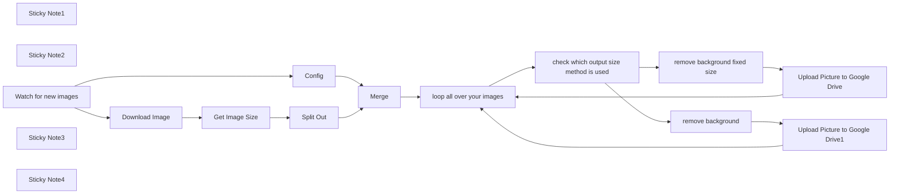

## Fluxo (.json) :

```json
{
  "id": "oNJCLq4egGByMeSl",
  "meta": {
    "instanceId": "1bc0f4fa5e7d17ac362404cbb49337e51e5061e019cfa24022a8667c1f1ce287",
    "templateCredsSetupCompleted": true
  },
  "name": "Remove Advanced Background from Google Drive Images",
  "tags": [],
  "nodes": [
    {
      "id": "99582f98-3707-4480-954a-f091e4e8133a",
      "name": "Config",
      "type": "n8n-nodes-base.set",
      "position": [
        820,
        620
      ],
      "parameters": {
        "options": {},
        "assignments": {
          "assignments": [
            {
              "id": "42b02a2f-a642-42db-a565-fd2a01a26fb9",
              "name": "bg_color",
              "type": "string",
              "value": "white"
            },
            {
              "id": "f68b2280-ec85-4400-8a98-10e644b56076",
              "name": "padding",
              "type": "string",
              "value": "5%"
            },
            {
              "id": "8bdee3a1-9107-4bf8-adea-332d299e43ae",
              "name": "keepInputSize",
              "type": "boolean",
              "value": true
            },
            {
              "id": "89d9e4fb-ed14-4ee2-b6f0-73035bafbc39",
              "name": "outputSize",
              "type": "string",
              "value": "1600x1600"
            },
            {
              "id": "ad53bf64-5493-4c4d-a52c-cd4d657cc9f9",
              "name": "inputFileName",
              "type": "string",
              "value": "={{ $json.originalFilename }}"
            },
            {
              "id": "9fc440c6-289b-4a6a-8391-479a6660836f",
              "name": "OutputDriveFolder",
              "type": "string",
              "value": "ENTER GOOGLE DRIVE FOLDER URL"
            },
            {
              "id": "f0f1767a-b659-48c4-bef6-8ee4111cb939",
              "name": "api-key",
              "type": "string",
              "value": "ENTER API KEY"
            }
          ]
        }
      },
      "typeVersion": 3.4
    },
    {
      "id": "7b5973d4-0d9f-4d17-8b71-e6c4f81d682e",
      "name": "remove background",
      "type": "n8n-nodes-base.httpRequest",
      "position": [
        2300,
        520
      ],
      "parameters": {
        "url": "https://image-api.photoroom.com/v2/edit",
        "method": "POST",
        "options": {
          "response": {
            "response": {}
          }
        },
        "sendBody": true,
        "contentType": "multipart-form-data",
        "sendHeaders": true,
        "bodyParameters": {
          "parameters": [
            {
              "name": "background.color",
              "value": "={{ $json.bg_color }}"
            },
            {
              "name": "imageFile",
              "parameterType": "formBinaryData",
              "inputDataFieldName": "data"
            },
            {
              "name": "padding",
              "value": "={{ $json.padding }}"
            },
            {
              "name": "outputSize",
              "value": "={{ $json.Geometry }}"
            }
          ]
        },
        "headerParameters": {
          "parameters": [
            {
              "name": "x-api-key",
              "value": "={{ $json['api-key'] }}"
            }
          ]
        }
      },
      "typeVersion": 4.1
    },
    {
      "id": "66d4f5c2-3d63-4e4a-8ea7-358c17061198",
      "name": "Split Out",
      "type": "n8n-nodes-base.splitOut",
      "position": [
        1260,
        420
      ],
      "parameters": {
        "options": {
          "includeBinary": true
        },
        "fieldToSplitOut": "Geometry"
      },
      "typeVersion": 1
    },
    {
      "id": "10f8a6cf-d1d0-4c5f-9983-5d574f98a7ba",
      "name": "Upload Picture to Google Drive",
      "type": "n8n-nodes-base.googleDrive",
      "position": [
        2520,
        320
      ],
      "parameters": {
        "name": "=BG-Removed-{{$json.inputFileName.split('.').slice(0, -1).join('.') }}.png",
        "driveId": {
          "__rl": true,
          "mode": "list",
          "value": "My Drive"
        },
        "options": {},
        "folderId": {
          "__rl": true,
          "mode": "url",
          "value": "={{ $json.OutputDriveFolder }}"
        }
      },
      "credentials": {
        "googleDriveOAuth2Api": {
          "id": "X2y13wEmbPaV3QGI",
          "name": "Google Drive account"
        }
      },
      "typeVersion": 3
    },
    {
      "id": "5e4e91ff-346e-414d-bbe2-0724469183b4",
      "name": "remove background fixed size",
      "type": "n8n-nodes-base.httpRequest",
      "position": [
        2300,
        320
      ],
      "parameters": {
        "url": "https://image-api.photoroom.com/v2/edit",
        "method": "POST",
        "options": {
          "response": {
            "response": {}
          }
        },
        "sendBody": true,
        "contentType": "multipart-form-data",
        "sendHeaders": true,
        "bodyParameters": {
          "parameters": [
            {
              "name": "background.color",
              "value": "={{ $json.bg_color }}"
            },
            {
              "name": "imageFile",
              "parameterType": "formBinaryData",
              "inputDataFieldName": "data"
            },
            {
              "name": "padding",
              "value": "={{ $json.padding }}"
            },
            {
              "name": "outputSize",
              "value": "={{ $json.outputSize }}"
            }
          ]
        },
        "headerParameters": {
          "parameters": [
            {
              "name": "x-api-key",
              "value": "={{ $json['api-key'] }}"
            }
          ]
        }
      },
      "typeVersion": 4.1
    },
    {
      "id": "16924a69-2711-4dc6-b7ab-c0e2001edfa4",
      "name": "Merge",
      "type": "n8n-nodes-base.merge",
      "position": [
        1600,
        460
      ],
      "parameters": {
        "mode": "combine",
        "options": {},
        "combineBy": "combineByPosition"
      },
      "typeVersion": 3
    },
    {
      "id": "39196096-ef45-4159-8286-00a1b21aaec4",
      "name": "Upload Picture to Google Drive1",
      "type": "n8n-nodes-base.googleDrive",
      "position": [
        2540,
        520
      ],
      "parameters": {
        "name": "=BG-Removed-{{$json.inputFileName.split('.').slice(0, -1).join('.') }}.png",
        "driveId": {
          "__rl": true,
          "mode": "list",
          "value": "My Drive"
        },
        "options": {},
        "folderId": {
          "__rl": true,
          "mode": "url",
          "value": "={{ $json.OutputDriveFolder }}"
        }
      },
      "credentials": {
        "googleDriveOAuth2Api": {
          "id": "X2y13wEmbPaV3QGI",
          "name": "Google Drive account"
        }
      },
      "typeVersion": 3
    },
    {
      "id": "a2f15d9a-5458-4d83-995a-e41491c997bd",
      "name": "Download Image",
      "type": "n8n-nodes-base.googleDrive",
      "position": [
        800,
        420
      ],
      "parameters": {
        "fileId": {
          "__rl": true,
          "mode": "id",
          "value": "={{ $json.id }}"
        },
        "options": {},
        "operation": "download"
      },
      "credentials": {
        "googleDriveOAuth2Api": {
          "id": "X2y13wEmbPaV3QGI",
          "name": "Google Drive account"
        }
      },
      "typeVersion": 3
    },
    {
      "id": "3e2bef4d-22f8-465d-8d11-f9fe25e67cd9",
      "name": "Get Image Size",
      "type": "n8n-nodes-base.editImage",
      "position": [
        1060,
        420
      ],
      "parameters": {
        "operation": "information"
      },
      "typeVersion": 1
    },
    {
      "id": "e497d10f-0727-4bb7-b016-42ffe2faf773",
      "name": "Sticky Note1",
      "type": "n8n-nodes-base.stickyNote",
      "position": [
        420,
        -280
      ],
      "parameters": {
        "color": 5,
        "width": 613.2529601722273,
        "height": 653.6921420882659,
        "content": "## About this worfklow \n\n## How it works\nThis workflow does watch out for new images uploaded within Google Drive. \nOnce there are new images it will download the image. And then run some logic, remove the background and add some padding to the output image. \n**By default Images are saved as .png**\nOnce done upload it to Google Drive again.\n## Features* Select Google Drive Credentials within the Google Drive Nodes\n### This workflow supports\n* Remove Background\n* Transparent Background\n* Coloured Background (1 Color)\n* Add Padding\n* Choose Output Size\n\n## Customize it!\n* Feel free to customize the workflow to your needs\n* Speed up the workflow: Using fixed output size\n### Examples \n* Send Final Images to another service\n* For Products: Let ChatGPT Analyze the Product Type\n* Add Text with the \"Edit Image\" Node\n\n### Photroom API Playground\n[Click me](https://www.photoroom.com/api/playground)"
      },
      "typeVersion": 1
    },
    {
      "id": "e892caf8-b9c7-4880-a096-f9d1c8c52c0c",
      "name": "Sticky Note2",
      "type": "n8n-nodes-base.stickyNote",
      "position": [
        1060,
        -20
      ],
      "parameters": {
        "color": 4,
        "width": 437.4768568353068,
        "height": 395.45317545748134,
        "content": "## Setup\n\n### Requirements\n* Photoroom API Key [Click me](https://docs.photoroom.com/getting-started/how-can-i-get-my-api-key)\n* Google Drive Credential Setup\n\n\n## Config\n* Select Google Drive Credentials within the Google Drive Nodes\n\n* **Please refer to the \"Config\" Node**\n\nFor the API Key you can also setup an Header Authentication"
      },
      "typeVersion": 1
    },
    {
      "id": "7f79d9e0-a7ac-422c-869f-76ada147917c",
      "name": "Watch for new images",
      "type": "n8n-nodes-base.googleDriveTrigger",
      "position": [
        440,
        520
      ],
      "parameters": {
        "event": "fileCreated",
        "options": {},
        "pollTimes": {
          "item": [
            {
              "mode": "everyMinute"
            }
          ]
        },
        "triggerOn": "specificFolder",
        "folderToWatch": {
          "__rl": true,
          "mode": "list",
          "value": ""
        }
      },
      "credentials": {
        "googleDriveOAuth2Api": {
          "id": "X2y13wEmbPaV3QGI",
          "name": "Google Drive account"
        }
      },
      "typeVersion": 1
    },
    {
      "id": "f67556bb-b463-4ba5-a472-577a8d5ab0ca",
      "name": "Sticky Note3",
      "type": "n8n-nodes-base.stickyNote",
      "position": [
        420,
        680
      ],
      "parameters": {
        "color": 3,
        "width": 160.79224973089333,
        "height": 80,
        "content": "Select Input Folder"
      },
      "typeVersion": 1
    },
    {
      "id": "04913b7f-1949-4e8e-b2c4-f9e3bacbc78c",
      "name": "Sticky Note4",
      "type": "n8n-nodes-base.stickyNote",
      "position": [
        780,
        780
      ],
      "parameters": {
        "color": 3,
        "width": 263.8708288482238,
        "height": 227.27233584499461,
        "content": "### Configuration\n* Provide Your API Key\n* Set Background Color\n-HEX or values like white, transparent...\n* Select if Output Size / or Original Size should be used \n* Output Drive Folder\n ->Copy URL\n* Padding (Default 5%)"
      },
      "typeVersion": 1
    },
    {
      "id": "e3b262d2-c367-4733-8cde-abd485c3d81b",
      "name": "check which output size method is used",
      "type": "n8n-nodes-base.if",
      "position": [
        2040,
        460
      ],
      "parameters": {
        "options": {},
        "conditions": {
          "options": {
            "version": 2,
            "leftValue": "",
            "caseSensitive": true,
            "typeValidation": "strict"
          },
          "combinator": "and",
          "conditions": [
            {
              "id": "d11ca8bb-0801-480f-b99a-249c5920b876",
              "operator": {
                "type": "boolean",
                "operation": "false",
                "singleValue": true
              },
              "leftValue": "={{ $json.keepInputSize }}",
              "rightValue": ""
            }
          ]
        }
      },
      "typeVersion": 2.2
    },
    {
      "id": "0cc4f416-7341-4bf7-8fb8-f3c746f8b9e4",
      "name": "loop all over your images",
      "type": "n8n-nodes-base.splitInBatches",
      "position": [
        1820,
        460
      ],
      "parameters": {
        "options": {}
      },
      "typeVersion": 3
    }
  ],
  "active": false,
  "pinData": {},
  "settings": {
    "executionOrder": "v1"
  },
  "versionId": "cff1146a-4dfd-4d87-a819-2420652e6c5e",
  "connections": {
    "Merge": {
      "main": [
        [
          {
            "node": "loop all over your images",
            "type": "main",
            "index": 0
          }
        ]
      ]
    },
    "Config": {
      "main": [
        [
          {
            "node": "Merge",
            "type": "main",
            "index": 1
          }
        ]
      ]
    },
    "Split Out": {
      "main": [
        [
          {
            "node": "Merge",
            "type": "main",
            "index": 0
          }
        ]
      ]
    },
    "Download Image": {
      "main": [
        [
          {
            "node": "Get Image Size",
            "type": "main",
            "index": 0
          }
        ]
      ]
    },
    "Get Image Size": {
      "main": [
        [
          {
            "node": "Split Out",
            "type": "main",
            "index": 0
          }
        ]
      ]
    },
    "remove background": {
      "main": [
        [
          {
            "node": "Upload Picture to Google Drive1",
            "type": "main",
            "index": 0
          }
        ]
      ]
    },
    "Watch for new images": {
      "main": [
        [
          {
            "node": "Download Image",
            "type": "main",
            "index": 0
          },
          {
            "node": "Config",
            "type": "main",
            "index": 0
          }
        ]
      ]
    },
    "loop all over your images": {
      "main": [
        [],
        [
          {
            "node": "check which output size method is used",
            "type": "main",
            "index": 0
          }
        ]
      ]
    },
    "remove background fixed size": {
      "main": [
        [
          {
            "node": "Upload Picture to Google Drive",
            "type": "main",
            "index": 0
          }
        ]
      ]
    },
    "Upload Picture to Google Drive": {
      "main": [
        [
          {
            "node": "loop all over your images",
            "type": "main",
            "index": 0
          }
        ]
      ]
    },
    "Upload Picture to Google Drive1": {
      "main": [
        [
          {
            "node": "loop all over your images",
            "type": "main",
            "index": 0
          }
        ]
      ]
    },
    "check which output size method is used": {
      "main": [
        [
          {
            "node": "remove background fixed size",
            "type": "main",
            "index": 0
          }
        ],
        [
          {
            "node": "remove background",
            "type": "main",
            "index": 0
          }
        ]
      ]
    }
  }
}
```

<a id="template-2264"></a>

## Template 2264 - Inserir resumo AI em posts WordPress

- **Nome:** Inserir resumo AI em posts WordPress
- **Descrição:** Automatiza a geração e inserção de um bloco de resumo gerado por IA no topo de posts do WordPress, registrando o resultado e notificando a equipe.
- **Funcionalidade:** • Múltiplos gatilhos: Suporta execução manual, agendada ou por webhook para iniciar o processo.
• Recuperação de posts: Obtém dados completos do post (contexto de edição) para processar o conteúdo.
• Conversão HTML→Markdown: Converte o conteúdo HTML do post para Markdown para melhor processamento pela IA.
• Classificação de texto: Detecta se o post já possui um resumo (evitando duplicação) antes de gerar novo resumo.
• Geração de resumo com IA: Envia o conteúdo formatado a um modelo de linguagem para criar um bloco HTML padronizado com bullet points e título '✨ AI Summary'.
• Atualização do post: Insere o bloco de resumo no topo do conteúdo e atualiza o excerpt conforme necessário.
• Registro em planilha: Adiciona uma linha na planilha do Google Sheets com informações do post e do resumo para histórico e deduplicação.
• Notificação em canal: Envia mensagem para um canal (Slack) informando que o post foi atualizado com o resumo AI.
- **Ferramentas:** • OpenAI: Serviço de geração de linguagem usado para criar o resumo em formato HTML.
• WordPress (REST API): Plataforma de origem dos posts e destino da atualização do conteúdo e excerpt.
• Google Sheets: Armazena registros dos posts processados (usando conta de serviço) para histórico e evitar reprocessamento.
• Slack: Canal de comunicação para notificar a equipe sobre posts atualizados com o resumo AI.

## Fluxo visual

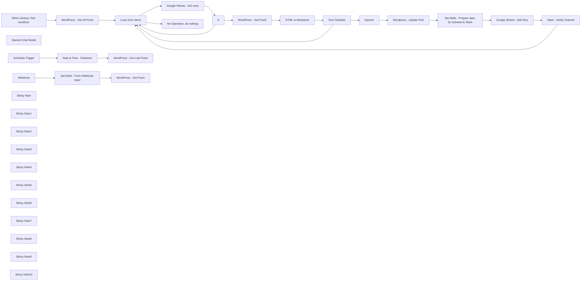

## Fluxo (.json) :

```json
{
  "id": "AhP1Fgv0eCrh9Jxs",
  "meta": {
    "instanceId": "b9faf72fe0d7c3be94b3ebff0778790b50b135c336412d28fd4fca2cbbf8d1f5",
    "templateCredsSetupCompleted": true
  },
  "name": "AI-Generated Summary Block for WordPress Posts - with OpenAI, WordPress, Google Sheets & Slack",
  "tags": [],
  "nodes": [
    {
      "id": "0733b902-6707-4548-9498-44993ed6a16c",
      "name": "When clicking ‘Test workflow’",
      "type": "n8n-nodes-base.manualTrigger",
      "position": [
        500,
        -780
      ],
      "parameters": {},
      "typeVersion": 1
    },
    {
      "id": "fa1fea27-c44d-4c8b-89ab-e7f84e91048f",
      "name": "Text Classifier",
      "type": "@n8n/n8n-nodes-langchain.textClassifier",
      "position": [
        5520,
        -800
      ],
      "parameters": {
        "options": {
          "systemPromptTemplate": "Analyze the provided text and classify it into one of the following categories: {categories}. \n- If the text contains an 'AI Summary', classify it as \"summarized\".\n- If the text does not contain an 'AI Summary', classify it as \"not_summarized\".\n\nFollow these instructions strictly:\n- Provide the result in JSON format.\n- Do not include any explanations, comments, or additional text.\n"
        },
        "inputText": "={{ $json.data }}",
        "categories": {
          "categories": [
            {
              "category": "not_summarized",
              "description": "Content that does not contain an 'AI Summary'."
            },
            {
              "category": "=summarized",
              "description": "Content that contains an 'AI Summary'."
            }
          ]
        }
      },
      "typeVersion": 1
    },
    {
      "id": "258d93f8-50db-4c95-8315-b7284100a426",
      "name": "OpenAI Chat Model",
      "type": "@n8n/n8n-nodes-langchain.lmChatOpenAi",
      "position": [
        5540,
        -600
      ],
      "parameters": {
        "options": {}
      },
      "credentials": {
        "openAiApi": {
          "id": "",
          "name": "OpenAi Connection"
        }
      },
      "typeVersion": 1.1
    },
    {
      "id": "7634cffa-0df8-4c11-84f4-c24cff652432",
      "name": "Loop Over Items",
      "type": "n8n-nodes-base.splitInBatches",
      "position": [
        2060,
        -780
      ],
      "parameters": {
        "options": {}
      },
      "typeVersion": 3
    },
    {
      "id": "1742dc9a-89b7-44f4-8ddb-5658fd34cadf",
      "name": "If",
      "type": "n8n-nodes-base.if",
      "position": [
        3660,
        -820
      ],
      "parameters": {
        "options": {},
        "conditions": {
          "options": {
            "version": 2,
            "leftValue": "",
            "caseSensitive": true,
            "typeValidation": "strict"
          },
          "combinator": "and",
          "conditions": [
            {
              "id": "44a27f03-4285-4771-a507-c55f029256e9",
              "operator": {
                "type": "number",
                "operation": "exists",
                "singleValue": true
              },
              "leftValue": "={{ $json.post_id }}",
              "rightValue": ""
            }
          ]
        }
      },
      "typeVersion": 2.2
    },
    {
      "id": "",
      "name": "Webhook",
      "type": "n8n-nodes-base.webhook",
      "disabled": true,
      "position": [
        500,
        -360
      ],
      "webhookId": "",
      "parameters": {
        "path": "4946fc26-bea4-4244-b37c-203c39537246",
        "options": {},
        "httpMethod": "POST",
        "authentication": "headerAuth"
      },
      "credentials": {
        "httpHeaderAuth": {
          "id": "",
          "name": "wp-webhook"
        }
      },
      "typeVersion": 2
    },
    {
      "id": "4c77eb08-e855-4a07-b76a-d5cea322fbca",
      "name": "Schedule Trigger",
      "type": "n8n-nodes-base.scheduleTrigger",
      "disabled": true,
      "position": [
        500,
        -600
      ],
      "parameters": {
        "rule": {
          "interval": [
            {
              "field": "seconds"
            }
          ]
        }
      },
      "typeVersion": 1.2
    },
    {
      "id": "cb1dce7c-6dfb-4435-aca8-013fdac58d43",
      "name": "Wordpress - Update Post",
      "type": "n8n-nodes-base.httpRequest",
      "position": [
        7920,
        -820
      ],
      "parameters": {
        "url": "=https://<your-domain.com>/wp-json/wp/v2/posts/{{ $('Loop Over Items').item.json.id }}",
        "method": "POST",
        "options": {},
        "sendBody": true,
        "authentication": "predefinedCredentialType",
        "bodyParameters": {
          "parameters": [
            {
              "name": "=content",
              "value": "={{ `${$json.message.content} ${$('Text Classifier').item.json.content.raw}` }}"
            },
            {
              "name": "excerpt",
              "value": "={{ $('Text Classifier').item.json.excerpt.rendered }}"
            }
          ]
        },
        "nodeCredentialType": "wordpressApi"
      },
      "credentials": {
        "wordpressApi": {
          "id": "",
          "name": ""
        }
      },
      "typeVersion": 4.2
    },
    {
      "id": "4aa026fd-29c3-4848-bfd1-98efba165b68",
      "name": "Google Sheets - Get rows",
      "type": "n8n-nodes-base.googleSheets",
      "position": [
        2920,
        -820
      ],
      "parameters": {
        "options": {},
        "filtersUI": {
          "values": [
            {
              "lookupValue": "={{ $json.id }}",
              "lookupColumn": "post_id"
            }
          ]
        },
        "sheetName": {
          "__rl": true,
          "mode": "list",
          "value": "gid=0",
          "cachedResultUrl": "https://docs.google.com/spreadsheets/d/1uO0zaNc5UrLhtdcvETFcZGln_qij-nqpYP06n9GxJUk/edit#gid=0",
          "cachedResultName": "AI-Summarized Posts"
        },
        "documentId": {
          "__rl": true,
          "mode": "list",
          "value": "1uO0zaNc5UrLhtdcvETFcZGln_qij-nqpYP06n9GxJUk",
          "cachedResultUrl": "https://docs.google.com/spreadsheets/d/1uO0zaNc5UrLhtdcvETFcZGln_qij-nqpYP06n9GxJUk/edit?usp=drivesdk",
          "cachedResultName": "Template - AI Summary WordPress Posts"
        },
        "authentication": "serviceAccount"
      },
      "credentials": {
        "googleApi": {
          "id": "",
          "name": "Google Sheets account"
        }
      },
      "typeVersion": 4.5,
      "alwaysOutputData": true
    },
    {
      "id": "0139af9a-5afc-4ac5-9631-4d217cdbc967",
      "name": "HTML to Markdown",
      "type": "n8n-nodes-base.markdown",
      "position": [
        4700,
        -800
      ],
      "parameters": {
        "html": "={{ $json.content.rendered }}",
        "options": {}
      },
      "typeVersion": 1
    },
    {
      "id": "3272ff54-9c8f-4003-bdf6-c16e8f4ba972",
      "name": "OpenAI",
      "type": "@n8n/n8n-nodes-langchain.openAi",
      "onError": "continueRegularOutput",
      "position": [
        7060,
        -820
      ],
      "parameters": {
        "modelId": {
          "__rl": true,
          "mode": "list",
          "value": "gpt-4o-mini",
          "cachedResultName": "GPT-4O-MINI"
        },
        "options": {},
        "messages": {
          "values": [
            {
              "content": "={{ $json.data }}"
            },
            {
              "role": "system",
              "content": "=You are an expert in content summarization and web-optimized writing. \nYour mission is to analyze the HTML content of an article from a website focused on electric vehicles and green mobility and extract the key information. \n\nGenerate only an HTML block containing a concise summary in bullet point format, strictly following this structure:\n\n\n<!-- wp:html -->\n<div class=\"wp-block-group has-background\" style=\"background-color:#f8faff; border-radius:4px; padding:10px;\">\n <p style=\"font-style:normal; font-weight:1000; font-size:1.1em; margin:0 0 10px 0;\">\n <strong>✨ AI Summary</strong> :\n </p>\n\n <li>[Key point 1]</li>\n <li>[Key point 2]</li>\n <li>[Key point 3]</li>\n <li>[Key point 4]</li>\n\n</div>\n<!-- /wp:html -->\n\n<!-- wp:separator -->\n<hr class=\"wp-block-separator has-alpha-channel-opacity\"/>\n<!-- /wp:separator -->\n\n## Important: Strict Guidelines to Follow\n\n- Ensure the summary is **clear, concise, and informative**, focusing only on key points. \n- **Avoid unnecessary introductions**, such as \"This article presents\" or similar phrases. \n- **Output only the required HTML block**, without any additional explanations or commentary. \n- The output must **start with** the `<!-- wp:html -->` tag and **end with** the closing separator tag. \n- The summary must be **in the user's language**, including the phrase `\"✨ AI Summary\"`, which should also be translated accordingly. \n- **Do not add** any extra text, comments, or formatting outside the specified HTML block. \n\n\n## Example of a GOOD output:\n\n<!-- wp:html -->\n<div class=\"wp-block-group has-background\" style=\"background-color:#f8faff; border-radius:4px; padding:10px;\">\n <p style=\"font-style:normal; font-weight:1000; font-size:1.1em; margin:0 0 10px 0;\">\n <strong>✨ AI Summary</strong> :\n </p>\n\n <li>In March 2022, France had 43,700 public charging points for electric vehicles.</li>\n <li>Half of the highway service areas are equipped with ultra-fast charging stations.</li>\n <li>France is among the most equipped European countries, with 20% of the charging points in Europe.</li>\n <li>The goal is to reach 100,000 charging stations to support future demand for electric vehicles.</li>\n\n</div>\n<!-- /wp:html -->\n\n<!-- wp:separator -->\n<hr class=\"wp-block-separator has-alpha-channel-opacity\"/>\n<!-- /wp:separator -->\n\n## Example of a BAD output:\n```html\n<!-- wp:html -->\n<div class=\"wp-block-group has-background\" style=\"background-color:#f8faff; border-radius:4px; padding:10px;\">\n <p style=\"font-style:normal; font-weight:1000; font-size:1.1em; margin:0 0 10px 0;\">\n <strong>✨ AI Summary</strong> :\n </p>\n\n <li>In March 2022, France had 43,700 public charging points for electric vehicles.</li>\n <li>Half of the highway service areas are equipped with ultra-fast charging stations.</li>\n <li>France is among the most equipped European countries, with 20% of the charging points in Europe.</li>\n <li>The goal is to reach 100,000 charging stations to support future demand for electric vehicles.</li>\n\n</div>\n<!-- /wp:html -->\n```"
            }
          ]
        }
      },
      "credentials": {
        "openAiApi": {
          "id": "",
          "name": "OpenAi Connection"
        }
      },
      "retryOnFail": true,
      "typeVersion": 1.8
    },
    {
      "id": "f35a0520-9b88-4840-bdff-970a15a8d691",
      "name": "Google Sheets - Add Row",
      "type": "n8n-nodes-base.googleSheets",
      "position": [
        9680,
        -820
      ],
      "parameters": {
        "columns": {
          "value": {
            "post_id": "={{ $json.id }}",
            "summary": "={{$json.ai_summary}}",
            "edit_link": "={{ $json.edit_link }}",
            "post_link": "={{ $json.link }}",
            "summarized_date": "={{$now}}"
          },
          "schema": [
            {
              "id": "post_id",
              "type": "string",
              "display": true,
              "removed": false,
              "required": false,
              "displayName": "post_id",
              "defaultMatch": false,
              "canBeUsedToMatch": true
            },
            {
              "id": "summary",
              "type": "string",
              "display": true,
              "removed": false,
              "required": false,
              "displayName": "summary",
              "defaultMatch": false,
              "canBeUsedToMatch": true
            },
            {
              "id": "post_link",
              "type": "string",
              "display": true,
              "removed": false,
              "required": false,
              "displayName": "post_link",
              "defaultMatch": false,
              "canBeUsedToMatch": true
            },
            {
              "id": "edit_link",
              "type": "string",
              "display": true,
              "removed": false,
              "required": false,
              "displayName": "edit_link",
              "defaultMatch": false,
              "canBeUsedToMatch": true
            },
            {
              "id": "summarized_date",
              "type": "string",
              "display": true,
              "removed": false,
              "required": false,
              "displayName": "summarized_date",
              "defaultMatch": false,
              "canBeUsedToMatch": true
            }
          ],
          "mappingMode": "autoMapInputData",
          "matchingColumns": [
            "post_id"
          ],
          "attemptToConvertTypes": false,
          "convertFieldsToString": false
        },
        "options": {},
        "operation": "append",
        "sheetName": {
          "__rl": true,
          "mode": "list",
          "value": "gid=0",
          "cachedResultUrl": "https://docs.google.com/spreadsheets/d/1uO0zaNc5UrLhtdcvETFcZGln_qij-nqpYP06n9GxJUk/edit#gid=0",
          "cachedResultName": "AI-Summarized Posts"
        },
        "documentId": {
          "__rl": true,
          "mode": "list",
          "value": "1uO0zaNc5UrLhtdcvETFcZGln_qij-nqpYP06n9GxJUk",
          "cachedResultUrl": "https://docs.google.com/spreadsheets/d/1uO0zaNc5UrLhtdcvETFcZGln_qij-nqpYP06n9GxJUk/edit?usp=drivesdk",
          "cachedResultName": "Template - AI Summary WordPress Posts"
        },
        "authentication": "serviceAccount"
      },
      "credentials": {
        "googleApi": {
          "id": "",
          "name": "Google Sheets account"
        }
      },
      "typeVersion": 4.5
    },
    {
      "id": "57fd5aaf-4a43-458b-8842-72e3289c7dca",
      "name": "Slack - Notify Channel",
      "type": "n8n-nodes-base.slack",
      "position": [
        9700,
        -540
      ],
      "webhookId": "ab3305f2-3cb8-44f4-b2e6-fb628baf1d6d",
      "parameters": {
        "text": "=📄🔔 *New WordPress Post Updated with AI Summary*\n\nThe post *{{ $('Set fields - Prepare data for Gsheets & Slack').item.json.title }}* has been updated with an AI-generated summary at the top of the article. \nYou can view it here: {{ $('Set fields - Prepare data for Gsheets & Slack').item.json.post_link }}\n\n• *Post ID*: {{ $('Set fields - Prepare data for Gsheets & Slack').item.json.post_id }}\n• *Edit Link*: {{ $('Set fields - Prepare data for Gsheets & Slack').item.json.edit_link }}\n",
        "select": "channel",
        "channelId": {
          "__rl": true,
          "mode": "list",
          "value": "C08AN5DJLCT",
          "cachedResultName": "wp-posts-ai"
        },
        "otherOptions": {
          "mrkdwn": true
        },
        "authentication": "oAuth2"
      },
      "credentials": {
        "slackOAuth2Api": {
          "id": "",
          "name": "slack-topic-monitoring-dtk"
        }
      },
      "typeVersion": 2.3
    },
    {
      "id": "29669a57-4104-4328-a834-0b07724fe245",
      "name": "Set fields - From Webhook input",
      "type": "n8n-nodes-base.set",
      "position": [
        700,
        -360
      ],
      "parameters": {
        "options": {},
        "assignments": {
          "assignments": [
            {
              "id": "eae4bb6e-0215-4338-9590-f4b6de6f57a4",
              "name": "post_id",
              "type": "string",
              "value": "={{ $json.body.post_id }}"
            }
          ]
        }
      },
      "typeVersion": 3.4
    },
    {
      "id": "937d0f8b-a71e-47f0-95de-cdbb9599c524",
      "name": "Sticky Note",
      "type": "n8n-nodes-base.stickyNote",
      "position": [
        400,
        -1720
      ],
      "parameters": {
        "color": 7,
        "width": 680,
        "height": 1560,
        "content": "## Trigger - Two Options\nTo use this workflow, you have two trigger options.\n\nThe default trigger is **\"When clicking 'Test workflow'\"**, allowing you to manually test the scenario.\n\nIf you want to use this workflow in production, you can choose one of the following triggers. You'll need to **select the one you prefer and enable it**.:\n\n### Schedule Trigger \nThis trigger checks at regular intervals (e.g., every 5 minutes) if a new post has been published on your WordPress blog and triggers the workflow accordingly. \n\n✅ **Easy to set up** \n✅ **Automates AI summaries without manual intervention** \n\n⚠️ If you run the workflow manually once, the AI-generated summaries will be added to Google Sheets and processed in later steps to prevent duplication. \n\n💡 **Recommended follow-up nodes:** If you choose this trigger, the following nodes are suggested in the template: \n- **`Date & Time - Subtract`**: Subtracts the scheduled interval from the current execution timestamp. For example, if the workflow runs every 5 minutes, it subtracts 5 minutes from the execution time. \n- **`WordPress - Get Posts`**: Uses the output of the `Date & Time - Subtract` node as a filter to retrieve only posts published after the last execution. \n\n### Webhook Trigger \nIf you're familiar with webhooks, you can set up a webhook that triggers when a new post is published. \n\n✅ **Faster than scheduled triggers** \n✅ **More event-driven** \n\nYou can implement this using either: \n- A **Webhook plugin** on WordPress (not recommended due to plugin dependency). \n- A **PHP function** that triggers the webhook with authentication for security. \n\n⚠️ **Be cautious** with how the webhook is triggered—you may not want it to fire on every post edit. \n\n💡 **Recommended follow-up nodes for this option:** \n- **`Set Fields - From Webhook Input`**: Configures the fields based on the data sent to the webhook. \n- **`WordPress - Get Post`**: Retrieves the post using the `post_id` received from the webhook, ensuring higher accuracy than the schedule trigger approach. \n"
      },
      "typeVersion": 1
    },
    {
      "id": "b42aa922-bf5d-4b09-8a05-ab88ec304dca",
      "name": "Date & Time - Substract",
      "type": "n8n-nodes-base.dateTime",
      "position": [
        720,
        -600
      ],
      "parameters": {
        "options": {},
        "duration": 30,
        "timeUnit": "seconds",
        "magnitude": "={{ $json.timestamp }}",
        "operation": "subtractFromDate",
        "outputFieldName": "last_execution_date"
      },
      "typeVersion": 2
    },
    {
      "id": "0f6ada76-9195-4d2e-95be-86ea1c4f368a",
      "name": "Sticky Note1",
      "type": "n8n-nodes-base.stickyNote",
      "position": [
        1220,
        -1240
      ],
      "parameters": {
        "color": 7,
        "width": 600,
        "height": 1080,
        "content": "## WordPress - Get All Posts \n\nThis node is used for the **initial/test run**. In production, you should use the WordPress node that follows the **Scheduled Trigger** or **Webhook Trigger** instead. \n\nIt retrieves all existing WordPress posts to generate an AI Summary. \n\n### 🔹 Considerations: \n- In this template, the query is **limited to 5 posts** to prevent accidental large-scale execution. This makes it easier to fix any issues. \n- You can **add filters** (category, tag, date, etc.) to target only the posts for which you want an AI Summary. \n- You can enable the **\"Get All Posts\"** option in the node if you want summaries for all posts—**but make sure this is intentional**. \n- The **more posts** you process, the **higher the cost** in OpenAI API usage. \n"
      },
      "typeVersion": 1
    },
    {
      "id": "e806547f-6bd5-4251-9dad-ffb36b435d15",
      "name": "Sticky Note2",
      "type": "n8n-nodes-base.stickyNote",
      "position": [
        1960,
        -1240
      ],
      "parameters": {
        "color": 7,
        "width": 620,
        "height": 1080,
        "content": "## Loop Over Items \n\nSince multiple posts may be retrieved from the previous step, a **\"Loop Over Items\"** node is used to process each post individually, optimizing the execution of subsequent nodes. \n\n### 🔹 In Production - Using the \"Schedule Trigger\" \nYou can continue using the **\"Loop Over Items\"** approach in production. Depending on your **publication frequency** and the **schedule interval** you've chosen, multiple posts could be retrieved in a single execution. This ensures each post is processed sequentially. \n\n### 🔹 In Production - Using the \"Webhook Trigger\" \nWith a **Webhook Trigger**, the workflow typically runs for **one post at a time**, meaning the **\"Loop Over Items\"** node is not strictly necessary. \n\n- **You can remove it** for a slightly more efficient workflow. \n- **However, keeping it won’t cause any issues**—it will simply loop over one item instead of multiple. \n"
      },
      "typeVersion": 1
    },
    {
      "id": "1370d44f-3aaa-4b8d-96d8-94269cb084b4",
      "name": "Sticky Note3",
      "type": "n8n-nodes-base.stickyNote",
      "position": [
        2660,
        -1240
      ],
      "parameters": {
        "color": 7,
        "width": 1240,
        "height": 1080,
        "content": "## Google Sheets - Get Rows & IF Nodes \n\nThis step is used to **check whether a post already has an AI Summary**. \n\nFor the Google Sheets node, you can **[make a copy of this Google Sheets template](https://docs.google.com/spreadsheets/d/1uO0zaNc5UrLhtdcvETFcZGln_qij-nqpYP06n9GxJUk/)** by going to **File → Make a copy**.\n\n\n### 🔹 How It Works: \n1. **On the first execution**, posts retrieved from WordPress and processed for AI summarization are added to a **Google Sheet**. \n2. **On subsequent executions**, when the workflow retrieves new posts, it checks if the `post_id` is already recorded in Google Sheets. \n\n### 🔹 IF Node Logic: \n- ✅ **If a row exists for the `post_id`** → The post already has an AI Summary. The workflow **skips processing** and moves to the `\"Loop Over Items\"` node. \n- ❌ **If no row exists for the `post_id`** → The post **does not have an AI Summary**, so the workflow continues along the execution path that leads to AI Summary generation. \n"
      },
      "typeVersion": 1
    },
    {
      "id": "b500e31d-7bd6-4c4d-ba54-60a034d218e3",
      "name": "Sticky Note4",
      "type": "n8n-nodes-base.stickyNote",
      "position": [
        4000,
        -1240
      ],
      "parameters": {
        "color": 7,
        "width": 1140,
        "height": 1080,
        "content": "## WordPress - Get Post & HTML to Markdown Nodes \n\nThis step retrieves the WordPress post data using the `post_id` and converts the HTML content to Markdown. This ensures that the text is formatted in a **clean and structured way** before being sent to the **Text Classifier** node (which works with AI). More details about this step are provided in the next sticky note. \n\n### 🔹 WordPress - Get Post \n- The **`context=edit`** option is enabled to retrieve the **raw** post data. \n- This is necessary because the post content will be **updated later in the workflow**. \n\n### 🔹 HTML to Markdown \n- Converts the retrieved HTML content into **Markdown** format. \n- This makes the text **easier to process** for the LLM (Large Language Model) in the next step. \n- Markdown ensures that the AI better understands the structure and formatting of the content. \n"
      },
      "typeVersion": 1
    },
    {
      "id": "249feb0b-6503-4eb1-88d8-c93764a77f33",
      "name": "Sticky Note5",
      "type": "n8n-nodes-base.stickyNote",
      "position": [
        5240,
        -1240
      ],
      "parameters": {
        "color": 7,
        "width": 1140,
        "height": 1080,
        "content": "## Text Classifier \n\nThis step **classifies posts into categories**: \n\n- **`not_summarized`** → If the post **does not** have a summary, the following nodes execute the AI summary generation. \n- **`summarized`** → If the post **already** has a summary, the workflow **skips processing**: \n - The workflow moves to `\"Loop Over Items\"`. \n - The `\"Done\"` branch goes to the `\"Do Nothing\"` node. \n\nThe LLM model used is **`gpt-4o-mini`**—it's efficient and cost-effective, but you can choose another model if needed. \n\n### 🔹 Why Use a Text Classifier? \nThe previous node already filters posts **based on Google Sheets**, but adding this classification step makes the workflow even **more robust**: \n\n- ✅ **Extra validation**: If a post already has an AI Summary but, for some reason, is **not listed in Google Sheets**, this step **prevents duplicate summaries**. \n- ✅ **Avoids redundancy**: If a post already contains a **manual or pre-existing summary** at the top (not necessarily AI-generated), this step prevents adding an AI Summary that would be redundant. \n"
      },
      "typeVersion": 1
    },
    {
      "id": "ba3ef8b6-5826-4b2b-9bfc-b8f7c9645192",
      "name": "Sticky Note6",
      "type": "n8n-nodes-base.stickyNote",
      "position": [
        6480,
        -1240
      ],
      "parameters": {
        "color": 7,
        "width": 1100,
        "height": 1080,
        "content": "## OpenAI - Message a Model \n\nThis step sends the **Markdown-formatted post** to **GPT-4o-mini**, using a **System Prompt** to instruct the LLM to generate an AI Summary. \nYou can review and modify the **System Prompt** directly within this node. \n\n### 🔹 Customization Required \nTo ensure optimal results, you should: \n- **Specify your website's theme** in the system prompt. The default example uses **electric mobility**, but you can replace it with a more relevant theme (e.g., **\"sustainable mobility\"**, \"urban transport,\" etc.). \n- **Modify the \"Good\" and \"Bad\" output examples**—since the template is pre-configured for electric mobility, make sure to adapt the examples to match your content. \n\n### 🔹 Output Format \nThe model is instructed to return the summary in **HTML format**, which will be used to update the WordPress post. \n\n💡 **Customization Tip**: \nYou may want to adjust the **HTML styling** to better match your WordPress theme. \nConsider modifying the following elements: \n- **Background color, text color, and font weight** \n- **Section title** (e.g., rename `\"AI Summary\"`) \n- **Padding, margins, and border styling** \n- **Removing or customizing the separator** \n\n\n\n\n\n\n\n\n\n\n### 🔹 Default Generated HTML \n\n***\n\n<!-- wp:html -->\n<div class=\"wp-block-group has-background\" style=\"background-color:#f8faff; border-radius:4px; padding:10px;\">\n <p style=\"font-style:normal; font-weight:1000; font-size:1.1em; margin:0 0 10px 0;\">\n <strong>✨ AI Summary</strong> :\n </p>\n\n <li>[Key point 1]</li>\n <li>[Key point 2]</li>\n <li>[Key point 3]</li>\n <li>[Key point 4]</li>\n\n</div>\n<!-- /wp:html -->\n\n<!-- wp:separator -->\n<hr class=\"wp-block-separator has-alpha-channel-opacity\"/>\n<!-- /wp:separator -->\n\n***"
      },
      "typeVersion": 1
    },
    {
      "id": "80f2ccc9-3142-4e0c-9a6c-49b78baedec5",
      "name": "Sticky Note7",
      "type": "n8n-nodes-base.stickyNote",
      "position": [
        7660,
        -1240
      ],
      "parameters": {
        "color": 7,
        "width": 640,
        "height": 1080,
        "content": "## WordPress - Update Post \n\nThis API call updates the **WordPress post** and its **excerpt**. \n\n**https://<your-domain.com>/wp-json/wp/v2/posts/{{ $('Loop Over Items').item.json.id }}**\n\n\n### 🔹 What It Does \n- **Adds the AI Summary** at the **top** of the post. \n- **Updates the post excerpt** using data retrieved from the `WordPress - Get Post2` node: \n- If a **manual excerpt** exists, it is **preserved**. \n- If the excerpt was simply the **beginning of the article**, it remains unchanged. \n- This prevents the **AI Summary from replacing the excerpt**, ensuring a **better user experience** on your blog’s article listing page. \n"
      },
      "typeVersion": 1
    },
    {
      "id": "45966c07-b20c-485e-96eb-5164165caf27",
      "name": "Sticky Note8",
      "type": "n8n-nodes-base.stickyNote",
      "position": [
        8400,
        -1240
      ],
      "parameters": {
        "color": 7,
        "width": 640,
        "height": 1080,
        "content": "## Set Fields - Prepare Data for Google Sheets & Slack \n\nThis node **sets fields** that will be used in **Google Sheets** and **Slack**. \nYou can **add or modify fields** as needed to fit your specific use case. \n### 🔹 Default Fields in This Template: \nThe following fields are pre-configured: \n- **`post_id`** → The WordPress post ID (`{{ $json.id }}`) \n- **`title`** → The rendered title of the post (`{{ $json.title.rendered }}`) \n- **`post_link`** → The direct URL to the post (`{{ $json.link }}`) \n- **`edit_link`** → A direct link to edit the post in WordPress (**https://<your-domain>/wp-admin/post.php?post=`{{ $json.id }}`&action=edit**) \n- **`summary`** → The AI-generated summary from the OpenAI node (`{{ $('OpenAI').item.json.message.content }}`) \n- **`summary_date`** → The date and time when the AI Summary was generated and added to the post.\n\n\n\n\n\n\n\n\n\n\n\n\n\n\n\n\n\n💡 **Customization Tip**: \n- You can **add additional fields** if you want to include more data (e.g., **post category, author name, publication date**). \n- This step ensures that the necessary information is properly structured before sending it to **Google Sheets** and **Slack**. \n"
      },
      "typeVersion": 1
    },
    {
      "id": "5e68e256-d089-4a1d-8967-99215b076a5b",
      "name": "Set fields - Prepare data for Gsheets & Slack",
      "type": "n8n-nodes-base.set",
      "position": [
        8680,
        -820
      ],
      "parameters": {
        "options": {},
        "assignments": {
          "assignments": [
            {
              "id": "d7104604-20f0-4a43-a9bb-6fca50e0cd04",
              "name": "post_id",
              "type": "string",
              "value": "={{ $json.id }}"
            },
            {
              "id": "4fd77b52-80b4-418b-af50-2af563799772",
              "name": "title",
              "type": "string",
              "value": "={{ $json.title.rendered }}"
            },
            {
              "id": "a7c0f1d4-3299-4fdc-8bc2-2ff5a76547d3",
              "name": "post_link",
              "type": "string",
              "value": "={{ $json.link }}"
            },
            {
              "id": "3c0d7efd-5db9-4e3b-8688-7c00f9691391",
              "name": "edit_link",
              "type": "string",
              "value": "=https://<your-domain.com>/wp-admin/post.php?post={{ $json.id }}&action=edit"
            },
            {
              "id": "aef982ed-b470-4690-b585-74d765a4b49f",
              "name": "summary",
              "type": "string",
              "value": "={{ $('OpenAI').item.json.message.content }}"
            },
            {
              "id": "38933eca-dad8-4949-a22b-0e35c9e5c99e",
              "name": "summary_date",
              "type": "string",
              "value": "={{ $now }}"
            }
          ]
        }
      },
      "typeVersion": 3.4
    },
    {
      "id": "7ca77ff2-9e21-4e32-8d23-de3a549b4a6d",
      "name": "Sticky Note9",
      "type": "n8n-nodes-base.stickyNote",
      "position": [
        9140,
        -1240
      ],
      "parameters": {
        "color": 7,
        "width": 600,
        "height": 1080,
        "content": "## Google Sheets - Add Row & Slack - Notify \n\nThis step **logs the post with an AI Summary** into **Google Sheets** and **sends a notification** to Slack. \n\nFor the Google Sheets node, you can **[make a copy of this Google Sheets template](https://docs.google.com/spreadsheets/d/1uO0zaNc5UrLhtdcvETFcZGln_qij-nqpYP06n9GxJUk/)** by going to **File → Make a copy**.\n\n\n---\n\n### 🔹 Google Sheets - Add Row \n\nThis node **automatically maps the columns** in Google Sheets, meaning you **don't need to manually define each field**. \n\n#### 🛠 **Configuration Details** \n- **Google Sheets Document** → `AI Summary WordPress` \n- **Sheet Name** → `AI Summarized Posts` \n- **Mapping Mode** → **Auto-map columns based on field names** \n- **Automatically added fields** (examples, based on your setup): \n - `post_id` \n - `summary` \n - `post_link` \n - `edit_link` \n - `summary_date` \n\n💡 **Since columns are mapped automatically, ensure the column names in Google Sheets match the field names in n8n.** \n\n---\n\n### 🔹 Slack - Notify \n\nThis node **sends a message to Slack** when a post has been updated with an **AI Summary**. \n\n#### 🛠 **Configuration Details** \n- **Channel** → `wp-posts-ai` (you can choose another channel) \n- **Message Format** → Simple Text Message \n- **Notification Text** -> *Configured inside the node* (check the \"Message Text\" field)\n\n\n💡 **Best Practices**: \n- 🔕 *On the first execution, consider **deactivating** this node if you have many posts to avoid excessive notifications.* \n- 📢 *Consider **creating a dedicated Slack channel** for this workflow to keep AI summary updates separate from other discussions.* \n\n"
      },
      "typeVersion": 1
    },
    {
      "id": "64199b71-a5b2-46f1-a761-22b053e95640",
      "name": "WordPress - Get Post2",
      "type": "n8n-nodes-base.wordpress",
      "position": [
        4160,
        -800
      ],
      "parameters": {
        "postId": "={{ $('Loop Over Items').item.json.id }}",
        "options": {
          "context": "edit"
        },
        "operation": "get"
      },
      "credentials": {
        "wordpressApi": {
          "id": "",
          "name": ""
        }
      },
      "typeVersion": 1
    },
    {
      "id": "81f22a4b-b016-463c-a4e3-8468cab007a9",
      "name": "No Operation, do nothing",
      "type": "n8n-nodes-base.noOp",
      "position": [
        2900,
        -1480
      ],
      "parameters": {},
      "typeVersion": 1
    },
    {
      "id": "ec397ed4-2ccb-4407-a227-46ad2383e618",
      "name": "Sticky Note10",
      "type": "n8n-nodes-base.stickyNote",
      "position": [
        -380,
        -1560
      ],
      "parameters": {
        "width": 660,
        "height": 1100,
        "content": "# 📝 AI-Generated Summary Block for WordPress Posts \n\n## 🚀 What is this workflow? \nThis **n8n template** automates the process of adding an **AI-generated summary** at the top of your WordPress posts. \nIt **retrieves, processes, and updates** your posts dynamically, ensuring efficiency and flexibility without relying on a heavy WordPress plugin. \n\n## Example of AI Summary Section\n\n \n\n## 🔄 How It Works \n1. **Triggers** → Runs on a **scheduled interval** or via a **webhook** when a new post is published. \n2. **Retrieves posts** → Fetches content from WordPress and converts HTML to Markdown for AI processing. \n3. **AI Summary Generation** → Uses OpenAI to create a concise summary. \n4. **Post Update** → Inserts the summary at the top of the post while keeping the original excerpt intact. \n5. **Data Logging & Notifications** → Saves processed posts to **Google Sheets** and notifies a **Slack channel**. \n\n## 🎯 Why use this workflow? \n✅ **No need for a WordPress plugin** → Keeps your site lightweight. \n✅ **Highly flexible** → Easily connect with **Google Sheets, Slack, or other services**. \n✅ **Customizable** → Adapt AI prompts, formatting, and integrations to your needs. \n✅ **Smart filtering** → Ensures posts are not reprocessed unnecessarily. \n\n💡 *Check the detailed sticky notes for setup instructions and customization options!* \n"
      },
      "typeVersion": 1
    },
    {
      "id": "9522e130-608c-4162-ac2e-3f67e216579e",
      "name": "WordPress - Get Last Posts",
      "type": "n8n-nodes-base.wordpress",
      "position": [
        960,
        -600
      ],
      "parameters": {
        "options": {
          "after": "={{ $json.last_execution_date }}",
          "context": "edit"
        },
        "operation": "getAll"
      },
      "credentials": {
        "wordpressApi": {
          "id": "",
          "name": ""
        }
      },
      "typeVersion": 1
    },
    {
      "id": "03e20423-7b5d-43ff-a241-bffa9b4c5172",
      "name": "WordPress - Get Post1",
      "type": "n8n-nodes-base.wordpress",
      "position": [
        960,
        -360
      ],
      "parameters": {
        "postId": "={{ $json.post_id }}",
        "options": {
          "context": "edit"
        },
        "operation": "get"
      },
      "credentials": {
        "wordpressApi": {
          "id": "",
          "name": ""
        }
      },
      "typeVersion": 1
    },
    {
      "id": "43963f56-ba75-4784-aebb-ebf72d075bfc",
      "name": "WordPress - Get All Posts",
      "type": "n8n-nodes-base.wordpress",
      "position": [
        1440,
        -780
      ],
      "parameters": {
        "options": {
          "order": "desc",
          "context": "edit",
          "orderBy": "date"
        },
        "operation": "getAll"
      },
      "credentials": {
        "wordpressApi": {
          "id": "",
          "name": ""
        }
      },
      "typeVersion": 1
    }
  ],
  "active": false,
  "pinData": {},
  "settings": {
    "executionOrder": "v1"
  },
  "versionId": "8db35c46-bc7e-4198-95d5-f99b6bbc70c3",
  "connections": {
    "If": {
      "main": [
        [
          {
            "node": "Loop Over Items",
            "type": "main",
            "index": 0
          }
        ],
        [
          {
            "node": "WordPress - Get Post2",
            "type": "main",
            "index": 0
          }
        ]
      ]
    },
    "OpenAI": {
      "main": [
        [
          {
            "node": "Wordpress - Update Post",
            "type": "main",
            "index": 0
          }
        ]
      ]
    },
    "Webhook": {
      "main": [
        [
          {
            "node": "Set fields - From Webhook input",
            "type": "main",
            "index": 0
          }
        ]
      ]
    },
    "Loop Over Items": {
      "main": [
        [
          {
            "node": "No Operation, do nothing",
            "type": "main",
            "index": 0
          }
        ],
        [
          {
            "node": "Google Sheets - Get rows",
            "type": "main",
            "index": 0
          }
        ]
      ]
    },
    "Text Classifier": {
      "main": [
        [
          {
            "node": "OpenAI",
            "type": "main",
            "index": 0
          }
        ],
        [
          {
            "node": "Loop Over Items",
            "type": "main",
            "index": 0
          }
        ]
      ]
    },
    "HTML to Markdown": {
      "main": [
        [
          {
            "node": "Text Classifier",
            "type": "main",
            "index": 0
          }
        ]
      ]
    },
    "Schedule Trigger": {
      "main": [
        [
          {
            "node": "Date & Time - Substract",
            "type": "main",
            "index": 0
          }
        ]
      ]
    },
    "OpenAI Chat Model": {
      "ai_languageModel": [
        [
          {
            "node": "Text Classifier",
            "type": "ai_languageModel",
            "index": 0
          }
        ]
      ]
    },
    "WordPress - Get Post1": {
      "main": [
        []
      ]
    },
    "WordPress - Get Post2": {
      "main": [
        [
          {
            "node": "HTML to Markdown",
            "type": "main",
            "index": 0
          }
        ]
      ]
    },
    "Slack - Notify Channel": {
      "main": [
        [
          {
            "node": "Loop Over Items",
            "type": "main",
            "index": 0
          }
        ]
      ]
    },
    "Date & Time - Substract": {
      "main": [
        [
          {
            "node": "WordPress - Get Last Posts",
            "type": "main",
            "index": 0
          }
        ]
      ]
    },
    "Google Sheets - Add Row": {
      "main": [
        [
          {
            "node": "Slack - Notify Channel",
            "type": "main",
            "index": 0
          }
        ]
      ]
    },
    "Wordpress - Update Post": {
      "main": [
        [
          {
            "node": "Set fields - Prepare data for Gsheets & Slack",
            "type": "main",
            "index": 0
          }
        ]
      ]
    },
    "Google Sheets - Get rows": {
      "main": [
        [
          {
            "node": "If",
            "type": "main",
            "index": 0
          }
        ]
      ]
    },
    "WordPress - Get All Posts": {
      "main": [
        [
          {
            "node": "Loop Over Items",
            "type": "main",
            "index": 0
          }
        ]
      ]
    },
    "WordPress - Get Last Posts": {
      "main": [
        []
      ]
    },
    "Set fields - From Webhook input": {
      "main": [
        [
          {
            "node": "WordPress - Get Post1",
            "type": "main",
            "index": 0
          }
        ]
      ]
    },
    "When clicking ‘Test workflow’": {
      "main": [
        [
          {
            "node": "WordPress - Get All Posts",
            "type": "main",
            "index": 0
          }
        ]
      ]
    },
    "Set fields - Prepare data for Gsheets & Slack": {
      "main": [
        [
          {
            "node": "Google Sheets - Add Row",
            "type": "main",
            "index": 0
          }
        ]
      ]
    }
  }
}
```
