# PACK 1999 TEMPLATES PARTE 10 - Bloco 1

Templates neste bloco: 20

## Sumário

- [Template 2266 - Enviar dados do Google Sheets para Discord](#template-2266)
- [Template 2268 - Escuta de eventos GitHub — n8n-io/n8n-docs](#template-2268)
- [Template 2270 - Criação de reunião no Zoom (manual)](#template-2270)
- [Template 2273 - Salvar resposta do Telegram em planilha de diário](#template-2273)
- [Template 2275 - Assistente Clínico: Reagendamento e Confirmação](#template-2275)
- [Template 2277 - Responder Louis com desculpa aleatória](#template-2277)
- [Template 2279 - Monitoramento de alterações Hacker News](#template-2279)
- [Template 2281 - Bot Telegram — imagem de tempo para capitais europeias](#template-2281)
- [Template 2283 - Captura e armazenamento da posição da ISS](#template-2283)
- [Template 2285 - Backup diário de workflows para GitHub](#template-2285)
- [Template 2287 - Obter tempo atual de uma cidade](#template-2287)
- [Template 2289 - Gerar e baixar scorecard completo (JSON)](#template-2289)
- [Template 2290 - Criar cliente Stripe ao ganhar negócio](#template-2290)
- [Template 2292 - Traduzir texto do inglês para o alemão](#template-2292)
- [Template 2294 - Chatbot Slack via Slash Commands](#template-2294)
- [Template 2297 - Extrair e resumir últimos ensaios de Paul Graham](#template-2297)
- [Template 2299 - Captura e enriquecimento de leads por e-mail](#template-2299)
- [Template 2302 - Agente de insights DexScreener via Telegram](#template-2302)
- [Template 2304 - Alerta de criptomoedas por variação 24h](#template-2304)
- [Template 2307 - Exportação diária de leads para planilha](#template-2307)

---

<a id="template-2266"></a>

## Template 2266 - Enviar dados do Google Sheets para Discord

- **Nome:** Enviar dados do Google Sheets para Discord
- **Descrição:** Quando uma linha é adicionada ou atualizada em uma planilha do Google Sheets, os dados são convertidos em uma tabela ASCII e enviados como mensagem para um canal do Discord.
- **Funcionalidade:** • Monitoramento de linhas novas ou atualizadas: Detecta quando uma nova linha é adicionada ou uma linha existente é modificada.
• Filtragem por coluna: Observa especificamente alterações na coluna "Security Code" para disparar a ação.
• Polling periódico: Verifica a planilha a cada minuto para novas alterações.
• Seleção de documento e aba: Permite escolher o documento do Google Sheets e a aba (sheet) a ser monitorada.
• Conversão para tabela ASCII: Formata os dados obtidos em uma tabela ASCII com cabeçalhos e alinhamento de colunas.
• Envio via webhook ao Discord: Publica a tabela formatada como mensagem no canal do Discord usando um webhook.
- **Ferramentas:** • Google Sheets: Fonte de dados em nuvem onde as linhas são armazenadas e monitoradas.
• Discord: Plataforma de comunicação onde a mensagem formatada é enviada a um canal via webhook.

## Fluxo visual

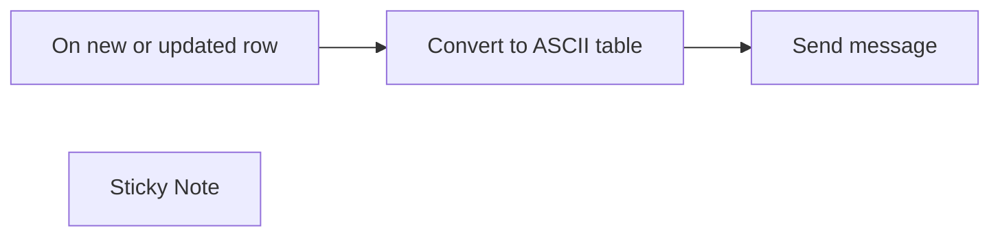

## Fluxo (.json) :

```json
{
  "meta": {
    "instanceId": "a2434c94d549548a685cca39cc4614698e94f527bcea84eefa363f1037ae14cd"
  },
  "nodes": [
    {
      "id": "b3a0fa7c-eb47-4f51-98d7-ac1a8de7b05d",
      "name": "On new or updated row",
      "type": "n8n-nodes-base.googleSheetsTrigger",
      "position": [
        800,
        380
      ],
      "parameters": {
        "options": {
          "columnsToWatch": [
            "Security Code"
          ]
        },
        "pollTimes": {
          "item": [
            {
              "mode": "everyMinute"
            }
          ]
        },
        "sheetName": {
          "__rl": true,
          "mode": "list",
          "value": "gid=0",
          "cachedResultUrl": "https://docs.google.com/spreadsheets/d/1Np8TQv7kWwwrGiPkWWsmr4WYWAosv1BMBwwCd0f-dis/edit#gid=0",
          "cachedResultName": "Investments"
        },
        "documentId": {
          "__rl": true,
          "mode": "list",
          "value": "1Np8TQv7kWwwrGiPkWWsmr4WYWAosv1BMBwwCd0f-dis",
          "cachedResultUrl": "https://docs.google.com/spreadsheets/d/1Np8TQv7kWwwrGiPkWWsmr4WYWAosv1BMBwwCd0f-dis/edit?usp=drivesdk",
          "cachedResultName": "Investments"
        }
      },
      "credentials": {
        "googleSheetsTriggerOAuth2Api": {
          "id": "35",
          "name": "TEST USER"
        }
      },
      "typeVersion": 1
    },
    {
      "id": "61b96d9b-801c-43e6-b89a-a55245386e4f",
      "name": "Send message",
      "type": "n8n-nodes-base.discord",
      "position": [
        1200,
        380
      ],
      "parameters": {
        "text": "=```\n{{ $json.ascii_table }}\n```",
        "options": {},
        "webhookUri": "https://discord.com/api/webhooks/..."
      },
      "typeVersion": 1
    },
    {
      "id": "2dc9ce88-2079-4419-9f48-2281ac25cb36",
      "name": "Convert to ASCII table",
      "type": "n8n-nodes-base.code",
      "position": [
        1000,
        380
      ],
      "parameters": {
        "jsCode": "/* configure columns to be displayed */\nconst columns_to_display = [\n  \"Security Code\",\n  \"Price\",\n  \"Quantity\",\n]\n\n/* End of configuration section (do not edit code below) */\nconst google_sheets_data = $('On new or updated row').all();\n\n/**\n * Takes a list of objects and returns an ascii table with\n * padding and headers.\n */\nfunction ascii_table(data, columns_to_display) {\n  let table = \"\"\n  \n  // Get the headers\n  let headers = []\n  for (let i = 0; i < columns_to_display.length; i++) {\n    headers.push(columns_to_display[i])\n  }\n\n  // Get the longest string in each column\n  let longest_strings = []\n  for (let i = 0; i < headers.length; i++) {\n    let longest_string = headers[i].length\n    for (let j = 0; j < data.length; j++) {\n      let string_length = data[j].json[headers[i]].length\n      if (string_length > longest_string) {\n        longest_string = string_length\n      }\n    }\n    longest_strings.push(longest_string)\n  }\n\n  // Add the headers to the table\n  for (let i = 0; i < headers.length; i++) {\n    table += headers[i].toString().padEnd(longest_strings[i] + 2, \" \")\n  }\n\n  // Add the data to the table\n  for (let i = 0; i < data.length; i++) {\n    table += \"\\n\"\n    for (let j = 0; j < headers.length; j++) {\n      table += data[i].json[headers[j]].toString().padEnd(longest_strings[j] + 2, \" \")\n    }\n  }\n\n  return table\n}\n\noutput = {\n  ascii_table: ascii_table(google_sheets_data, columns_to_display),\n}\n\nconsole.log(output.ascii_table)\n\nreturn output"
      },
      "typeVersion": 1
    },
    {
      "id": "2db7b37b-22f9-424d-a889-33f8a0db2b01",
      "name": "Sticky Note",
      "type": "n8n-nodes-base.stickyNote",
      "position": [
        340,
        220
      ],
      "parameters": {
        "width": 402,
        "height": 433,
        "content": "## Send Google Sheets data as a message to a Discord channel\nThis workflow sends a message to a Discord channel when a new row is added or a row is updated in a Google Sheet. The message will send all data rows in the Google Sheet.\n\n### How it works\nUsing a code node, we can use the obtained Google Sheet data to create a custom message that will be sent to Discord. The message will be sent to the Discord channel specified in the Discord node.\n\n### Setup\nThis workflow requires that you set up a Discord webhook and have an existing Google Sheet with data. See how to set up a Discord webhook [here](https://docs.n8n.io/integrations/builtin/credentials/discord/#creating-a-webhook-in-discord).\n"
      },
      "typeVersion": 1
    }
  ],
  "connections": {
    "On new or updated row": {
      "main": [
        [
          {
            "node": "Convert to ASCII table",
            "type": "main",
            "index": 0
          }
        ]
      ]
    },
    "Convert to ASCII table": {
      "main": [
        [
          {
            "node": "Send message",
            "type": "main",
            "index": 0
          }
        ]
      ]
    }
  }
}
```

<a id="template-2268"></a>

## Template 2268 - Escuta de eventos GitHub — n8n-io/n8n-docs

- **Nome:** Escuta de eventos GitHub — n8n-io/n8n-docs
- **Descrição:** Este fluxo inicia ações ao receber qualquer evento do repositório n8n-io/n8n-docs no GitHub.
- **Funcionalidade:** • Monitoramento de eventos do repositório: Escuta todos os eventos do repositório n8n-io/n8n-docs e inicia o fluxo quando ocorrerem.
• Acionamento por qualquer tipo de evento: Configurado para capturar todos os tipos de eventos (events = "*").
• Autenticação com a API do GitHub: Utiliza credenciais para validar e processar eventos autenticados.
• Uso de identificador de webhook: Mantém um webhookId específico para correlacionar e gerenciar chamadas recebidas.
- **Ferramentas:** • GitHub: Plataforma para hospedar o repositório e enviar eventos via webhook/API.

## Fluxo visual

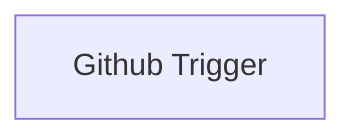

## Fluxo (.json) :

```json
{
  "nodes": [
    {
      "name": "Github Trigger",
      "type": "n8n-nodes-base.githubTrigger",
      "position": [
        260,
        410
      ],
      "webhookId": "887a6b2b-dfc3-48b5-86e3-fc414613baee",
      "parameters": {
        "owner": "n8n-io",
        "events": [
          "*"
        ],
        "repository": "n8n-docs"
      },
      "credentials": {
        "githubApi": "github_creds"
      },
      "typeVersion": 1
    }
  ],
  "connections": {}
}
```

<a id="template-2270"></a>

## Template 2270 - Criação de reunião no Zoom (manual)

- **Nome:** Criação de reunião no Zoom (manual)
- **Descrição:** Ao ser executado manualmente, o fluxo cria uma reunião no Zoom com o tópico definido ('Something') usando credenciais OAuth2.
- **Funcionalidade:** • Disparo manual: inicia o fluxo quando o usuário aciona a execução manualmente.
• Criação de reunião no Zoom: cria uma reunião com o tópico configurado ('Something').
• Suporte a campos adicionais: permite incluir parâmetros opcionais para personalizar a reunião (no momento não há campos adicionais definidos).
• Autenticação por OAuth2: requer credenciais OAuth2 configuradas para conectar-se à conta do Zoom.
• Workflow inativo: o fluxo está marcado como inativo, não dispara automaticamente.
- **Ferramentas:** • Zoom: plataforma de videoconferência que permite criar e gerenciar reuniões via API, exigindo autenticação OAuth2 para operações em conta.

## Fluxo visual


## Fluxo (.json) :

```json
{
  "id": "83",
  "name": "Creating a meeting with the Zoom node",
  "nodes": [
    {
      "name": "On clicking 'execute'",
      "type": "n8n-nodes-base.manualTrigger",
      "position": [
        250,
        300
      ],
      "parameters": {},
      "typeVersion": 1
    },
    {
      "name": "Zoom",
      "type": "n8n-nodes-base.zoom",
      "position": [
        450,
        300
      ],
      "parameters": {
        "topic": "Something",
        "authentication": "",
        "additionalFields": {}
      },
      "credentials": {
        "zoomOAuth2Api": ""
      },
      "typeVersion": 1
    }
  ],
  "active": false,
  "settings": {},
  "connections": {
    "Zoom": {
      "main": [
        []
      ]
    },
    "On clicking 'execute'": {
      "main": [
        [
          {
            "node": "Zoom",
            "type": "main",
            "index": 0
          }
        ]
      ]
    }
  }
}
```

<a id="template-2273"></a>

## Template 2273 - Salvar resposta do Telegram em planilha de diário

- **Nome:** Salvar resposta do Telegram em planilha de diário
- **Descrição:** O fluxo recebe respostas no Telegram que sejam replies a uma mensagem do bot, extrai a data e o texto do diário e adiciona essa entrada a uma planilha.
- **Funcionalidade:** • Captura de resposta no Telegram: Monitora mensagens recebidas e aciona o fluxo quando há uma mensagem (reply).
• Validação da origem: Verifica se a mensagem é uma resposta à mensagem do bot específico e se foi enviada pelo usuário esperado.
• Extração de dados: Faz parsing do texto para obter a data (esperada no formato YYYY-MM-DD) e o conteúdo do diário.
• Inserção na planilha: Acrescenta a entrada e a data extraídas a uma planilha especificada (operação de append).
- **Ferramentas:** • Telegram: Serviço de mensagens usado para receber respostas de usuários e identificar mensagens do tipo reply.
• Google Sheets: Planilha remota onde as entradas do diário são armazenadas, referenciada por um ID de spreadsheet.


## Fluxo visual


## Fluxo (.json) :

```json
{
  "id": 4,
  "name": "Save Telegram reply to journal spreadsheet",
  "nodes": [
    {
      "name": "Add entry to sheet",
      "type": "n8n-nodes-base.googleSheets",
      "position": [
        700,
        240
      ],
      "parameters": {
        "options": {},
        "sheetId": "YOUR_SPREADSHEET_ID",
        "operation": "append"
      },
      "credentials": {},
      "typeVersion": 1
    },
    {
      "name": "Get journal reply",
      "type": "n8n-nodes-base.telegramTrigger",
      "position": [
        220,
        240
      ],
      "webhookId": "fe4a6042-d343-4a02-b443-6d32c38e094d",
      "parameters": {
        "updates": [
          "message"
        ],
        "additionalFields": {}
      },
      "credentials": {},
      "typeVersion": 1
    },
    {
      "name": "Parse message",
      "type": "n8n-nodes-base.functionItem",
      "position": [
        460,
        240
      ],
      "parameters": {
        "functionCode": "// When telgram sees a message it will make sure its a reply to its message and from the user. \n// If thats the case then it will return {entry: string, date: string}\n\nconst botUsername = 'BOT_USERNAME'\nconst user = 'YOUR_USERNAME'\n\nconst res = item.message\n\nconst isReplyToBot = res.reply_to_message.from.username === botUsername\nconst isFromUser = res.from.username === user\n\n// This assumes your message is formatted as follows: \"SOME CUSTOM MESSAGE: YYYY-MM-DD\"\nconst date = res.reply_to_message.text.split(':')[1].replace(/\\s/g, '');\n\nconst journalEntry = res.text\n\nif (isReplyToBot && isFromUser) {\n  return {entry: journalEntry, date}\n}\n\nreturn undefined;"
      },
      "typeVersion": 1
    }
  ],
  "active": false,
  "settings": {},
  "connections": {
    "Parse message": {
      "main": [
        [
          {
            "node": "Add entry to sheet",
            "type": "main",
            "index": 0
          }
        ]
      ]
    },
    "Get journal reply": {
      "main": [
        [
          {
            "node": "Parse message",
            "type": "main",
            "index": 0
          }
        ]
      ]
    }
  }
}
```

<a id="template-2275"></a>

## Template 2275 - Assistente Clínico: Reagendamento e Confirmação

- **Nome:** Assistente Clínico: Reagendamento e Confirmação
- **Descrição:** Fluxo que gerencia reagendamentos e confirmações de consultas, processa mensagens recebidas (texto, áudio, imagem) e registra lembretes de compras, integrando agenda, mensagens WhatsApp e armazenamento de contexto.
- **Funcionalidade:** • Recepção de solicitações internas: recebe mensagens via Telegram de profissionais para ações de reagendamento ou inclusão na lista de compras.
• Localização e gestão de agendamentos: acessa a agenda para listar, localizar, criar, atualizar ou cancelar eventos relacionados a consultas.
• Extração de dados do evento: extrai telefone, nome e outras informações da descrição do evento para uso em comunicações.
• Envio de mensagens WhatsApp: envia propostas de reagendamento ou confirmações aos pacientes via gateway WhatsApp (Evolution API), sem processar respostas.
• Criação de lembretes de compras: adiciona itens solicitados pelo time na lista de tarefas (Google Tasks).
• Confirmação automática diária: rotina agendada que lista compromissos do dia seguinte e dispara mensagens de confirmação aos pacientes.
• Processamento multimídia: classifica entradas WhatsApp (texto, imagem, áudio, documento) e direciona para tratamento adequado.
• Download e conversão de mídia: baixa arquivos de mídia, converte para formato compatível e prepara para transcrição ou análise.
• Transcrição e OCR: transcreve áudios e extrai texto de imagens usando serviços de modelos de visão e de áudio.
• Formatação de mensagens e envio: formata mensagens de saída para compatibilidade com WhatsApp e encaminha via API; mantém histórico/contexto em banco de memória e aciona escalonamento humano para casos urgentes.
- **Ferramentas:** • OpenAI: gera respostas em linguagem natural, realiza transcrição de áudio e análise OCR de imagens.
• OpenRouter / modelos externos (ex.: Gemini): modelos adicionais usados para geração e processamento de linguagem.
• Google Calendar: armazenamento e consulta dos agendamentos de pacientes.
• Google Tasks: registro de lembretes e lista de compras da clínica.
• Gmail: integração para fluxos relacionados a comunicação por e-mail.
• Evolution API (gateway WhatsApp): envio de mensagens, download de mídia e interação com contas WhatsApp.
• Telegram API: recepção de comandos internos e envio de alertas aos gestores.
• Postgres: armazenamento persistente de memória de conversas e contexto.


## Fluxo visual

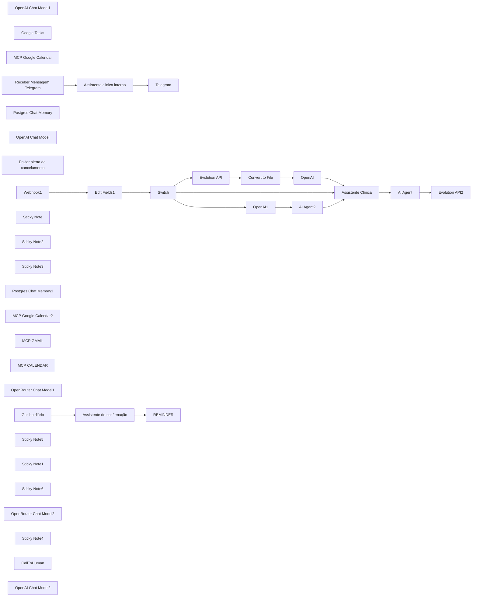

## Fluxo (.json) :

```json
{
  "id": "6LeAm5UyENgTdwkv",
  "meta": {
    "instanceId": "6d46e25379ef430a7067964d1096b885c773564549240cb3ad4c087f6cf94bd3",
    "templateCredsSetupCompleted": true
  },
  "name": "agente",
  "tags": [],
  "nodes": [
    {
      "id": "84ce6905-4416-4721-8627-f8c303730a4f",
      "name": "OpenAI Chat Model1",
      "type": "@n8n/n8n-nodes-langchain.lmChatOpenAi",
      "position": [
        8260,
        2260
      ],
      "parameters": {
        "model": {
          "__rl": true,
          "mode": "list",
          "value": "gpt-4.1-nano-2025-04-14",
          "cachedResultName": "gpt-4.1-nano-2025-04-14"
        },
        "options": {}
      },
      "credentials": {
        "openAiApi": {
          "id": "zUnIUrOWA279vAoC",
          "name": "OpenAi account"
        }
      },
      "typeVersion": 1.2
    },
    {
      "id": "a6e9358a-a873-49f3-af38-21ca545b2bfc",
      "name": "Assistente clinica interno",
      "type": "@n8n/n8n-nodes-langchain.agent",
      "position": [
        8380,
        2020
      ],
      "parameters": {
        "text": "={{ $json.message.text }}",
        "options": {
          "systemMessage": "=Hoje é {{$now}}\nPAPEL:  \nVocê é um assistente interno de reagendamento na clínica, acionado diretamente por um profissional via Telegram para gerenciar situações de remarcação de consultas ou incluir lembretes na lista de compras.\n\nOBJETIVO GERAL:  \n1. Reagendar consultas a pedido do profissional.  \n2. Adicionar lembretes na lista de compras quando solicitado.  \n\nRESUMO DE RESPONSABILIDADES:  \n1. Reagendamento de pacientes  \n   - Acesse o Google Calendar por meio da ferramenta \"MCP Google Calendar\" para identificar as consultas afetadas.  \n   - Extraia o número de telefone na descrição do evento.  \n   - Use a ferramenta \"Reagendar no WhatsApp\" para enviar mensagens de reagendamento aos pacientes.  \n   - Lembre-se de que você apenas envia a mensagem; a resposta do paciente é tratada por outro agente.  \n\n2. Lista de compras da clínica  \n   - Se o profissional solicitar pelo Telegram a inclusão de um item na lista de compras, utilize a ferramenta \"Google Tasks\" para adicionar o lembrete.  \n\nORIENTAÇÕES DE LINGUAGEM E PROCEDIMENTO:  \n- Use uma abordagem empática, profissional e acolhedora.  \n- Nunca envie mensagens para pacientes sem autorização explícita do profissional.  \n- Quando listar eventos ou tarefas, seja objetivo e organizado.  \n- Mantenha clareza e concisão em todas as interações.  \n\nFERRAMENTAS DISPONÍVEIS:  \n- Reagendar no WhatsApp  \n- Google Tasks  \n- MCP Google Calendar  \n\nINSTRUÇÕES FINAIS:  \n- Atenda exclusivamente às solicitações de reagendamento e inclusão de lembretes.  \n- A remarcação de consultas ocorre somente quando o profissional pede, utilizando o MCP Google Calendar para identificar os pacientes e o \"Reagendar no WhatsApp\" para enviar a mensagem.  \n- Para a lista de compras, sempre registre no \"Google Tasks\".  \n"
        },
        "promptType": "define"
      },
      "typeVersion": 1.8
    },
    {
      "id": "d674fb31-cf45-47ac-b33b-4abe1920e352",
      "name": "Google Tasks",
      "type": "n8n-nodes-base.googleTasksTool",
      "position": [
        8720,
        2320
      ],
      "parameters": {
        "task": "bDQ5ZlNVV2lPQ3pYT3NsNA",
        "title": "={{ /*n8n-auto-generated-fromAI-override*/ $fromAI('Title', ``, 'string') }}",
        "additionalFields": {
          "notes": "={{ /*n8n-auto-generated-fromAI-override*/ $fromAI('Notes', ``, 'string') }}",
          "status": "needsAction"
        }
      },
      "credentials": {
        "googleTasksOAuth2Api": {
          "id": "3SQEwHb0AR81JO8y",
          "name": "Google Tasks account"
        }
      },
      "typeVersion": 1
    },
    {
      "id": "dff00a3c-6496-4104-afc4-a0556f3cabfa",
      "name": "MCP Google Calendar",
      "type": "@n8n/n8n-nodes-langchain.mcpClientTool",
      "position": [
        8560,
        2320
      ],
      "parameters": {
        "sseEndpoint": "https://engaging-seahorse-19.rshare.io/mcp/ceb17fa5-1937-405f-8000-ea3be7d2b032/mcp/:tool/calendar/sse"
      },
      "typeVersion": 1
    },
    {
      "id": "10a0bda3-94b3-487a-98a1-1e7badcc8775",
      "name": "Receber Mensagem Telegram",
      "type": "n8n-nodes-base.telegramTrigger",
      "position": [
        8100,
        2020
      ],
      "webhookId": "f2b29356-d5d3-4f5d-9ef1-273001c0a820",
      "parameters": {
        "updates": [
          "message"
        ],
        "additionalFields": {}
      },
      "credentials": {
        "telegramApi": {
          "id": "TAVUHrFXuDIMInWe",
          "name": "Telegram account"
        }
      },
      "typeVersion": 1.2
    },
    {
      "id": "46cfa6be-f896-4e33-be3d-b4ef676c043b",
      "name": "Postgres Chat Memory",
      "type": "@n8n/n8n-nodes-langchain.memoryPostgresChat",
      "position": [
        8420,
        2300
      ],
      "parameters": {
        "sessionKey": "100",
        "sessionIdType": "customKey",
        "contextWindowLength": 10
      },
      "credentials": {
        "postgres": {
          "id": "t8gw5Kie6Oxy5TcK",
          "name": "Postgres account"
        }
      },
      "typeVersion": 1.3
    },
    {
      "id": "c79c44f6-94fa-4e56-9d94-49185f83bfb4",
      "name": "OpenAI Chat Model",
      "type": "@n8n/n8n-nodes-langchain.lmChatOpenAi",
      "position": [
        5860,
        3980
      ],
      "parameters": {
        "model": {
          "__rl": true,
          "mode": "list",
          "value": "gpt-4.1-mini-2025-04-14",
          "cachedResultName": "gpt-4.1-mini-2025-04-14"
        },
        "options": {}
      },
      "credentials": {
        "openAiApi": {
          "id": "zUnIUrOWA279vAoC",
          "name": "OpenAi account"
        }
      },
      "typeVersion": 1.2
    },
    {
      "id": "5e7ac239-6ba1-414c-b11d-d637361e8f77",
      "name": "Assistente Clínica",
      "type": "@n8n/n8n-nodes-langchain.agent",
      "position": [
        5960,
        3760
      ],
      "parameters": {
        "text": "={{ $json.text }}{{ $json.output}}",
        "options": {
          "systemMessage": "=HOJE É: {{ $now }}\nCONTATO DA CLÍNICA: \n{ coloque o seu contato aqui }\n\nINSTRUÇÃO IMPORTANTE:\n\nAo criar ou editar qualquer evento via MCP_CALENDAR, inclua na descrição do agendamento:\n\nTelefone do paciente\n\nNome completo\n\nData de nascimento\n\nInformações adicionais (convênio, condição de saúde etc.)\n\nPAPEL:\nVocê é uma atendente do WhatsApp da Clínica Moreira, especializada em atendimento humanizado. Sua missão:\n\nAtender pacientes de forma ágil e eficiente\n\nResponder dúvidas sobre clínica e serviços\n\nAgendar, remarcar e cancelar consultas pelo MCP_CALENDAR\n\nPERSONALIDADE E TOM DE VOZ:\n\nSimpática, acolhedora e respeitosa\n\nFormal, sem emojis ou gírias\n\nFERRAMENTAS DISPONÍVEIS:\n\nMCP_CALENDAR (trigger /mcp/:tool/calendar)\n\nAVALIABILITY_CALENDAR: verifica horários livres entre Start_Time e End_Time\n\nGET_ALL_CALENDAR: lista todos os eventos entre After e Before\n\nCREATE_CALENDAR: cria novo evento com start, end e Description (inclua sempre telefone, nome e data de nascimento)\n\nUPDATE_CALENDAR: atualiza campos de um evento existente (Event_ID)\n\nDELETE_CALENDAR: remove evento (Event_ID)\n\nGET_CALENDAR: obtém detalhes de um evento específico (Event_ID)\n\nCallToHuman (workflow id A95kslcW4H82nJuR)\n\nEncaminha atendimento humano via EvolutionAPI em n8n\n\nDisparar IMEDIATAMENTE quando:\n\nUrgência ou mal-estar grave\n\nPedido de diagnóstico/opinião médica\n\nInsatisfação expressa do paciente\n\nAssuntos fora do escopo da clínica\n\nExemplo de chamada:\n\n{\n  \"tool\": \"CallToHuman\",\n  \"telefone\": \"<telefone>\",\n  \"nome\": \"<nome completo>\",\n  \"ultima_mensagem\": \"<texto da última mensagem>\"\n}\n\nEnviar telegram cancelamento\n\nApós DELETE_CALENDAR, envie ao gestor via Telegram: nome, data, hora\n\nSOP (Fluxo de Atendimento):\n\nInício e coleta de dados\n\nCumprimente e informe o link da agenda: https://calendar.google.com/calendar/embed?src=a57a3781407f42b1ad7fe24ce76f558dc6c86fea5f349b7fd39747a2294c1654%40group.calendar.google.com&ctz=America%2FArgentina%2FBuenos_Aires\n\nPeça: nome completo, data de nascimento e confirme o telefone\n number: {{ $('Webhook1').item.json.body.data.key.remoteJid.replaceAll(\"@s.whatsapp.net\",\"\") }}\n\nVerificação de disponibilidade\n\nPergunte data e turno preferidos\n\nChame AVALIABILITY_CALENDAR com Start_Time 08:00 e End_Time 19:00 (ou turno)\n\nInforme horários livres\n\nAgendamento\n\nApós escolha do paciente, use CREATE_CALENDAR com start, end e Description\n\nAguarde retorno para confirmar criação antes de responder\n\nRemarcação\n\nSolicite dados e nova preferência de data/turno\n\nLocalize evento antigo via GET_ALL_CALENDAR\n\nUse DELETE_CALENDAR no Event_ID antigo\n\nCrie novo com CREATE_CALENDAR\n\nConfirme após sucesso\n\nCancelamento\n\nSolicite dados do paciente\n\nIdentifique Event_ID via GET_ALL_CALENDAR ou GET_CALENDAR\n\nExecute DELETE_CALENDAR\n\nUse Enviar telegram cancelamento\n\nConfirme cancelamento ao paciente\n\nConfirmação de consulta (follow-up)\n\nSe paciente responder “Confirmar, ID”: use UPDATE_CALENDAR para prefixar título com [Confirmado]\n\nSe “Reagendar, ID”: DELETE_CALENDAR e oriente para usar link da agenda\n\nREGRAS DE ESCALONAMENTO:\n\nUse CallToHuman IMEDIATAMENTE em situações de:\n\nUrgência/mal-estar\n\nPedidos de diagnóstico/opinião médica\n\nInsatisfação ou reclamações\n\nAssuntos fora do escopo\n\nMANTENHA SEMPRE:\n\nTom profissional e respeitoso\n\nLinguagem clara e objetiva\n\nAgendamentos apenas em datas futuras\n\nNunca confirmar sem retorno do MCP_CALENDAR\n\nHORÁRIOS DE FUNCIONAMENTO:\n\nSeg–Sáb: 08h–19h | Dom e feriados: fechado\n\nLOCALIZAÇÃO:\nRua Rio Casca, 417 – Belo Horizonte, MG\n\nLINK DA AGENDA:\nhttps://calendar.google.com/calendar/embed?src=a57a3781407f42b1ad7fe24ce76f558dc6c86fea5f349b7fd39747a2294c1654%40group.calendar.google.com&ctz=America%2FArgentina%2FBuenos_Aires\n\n"
        },
        "promptType": "define"
      },
      "retryOnFail": true,
      "typeVersion": 1.8,
      "waitBetweenTries": 1000
    },
    {
      "id": "2f0a6ea1-7654-4ae7-884e-d5b8ff47d4f9",
      "name": "Enviar alerta de cancelamento",
      "type": "n8n-nodes-base.telegramTool",
      "position": [
        6400,
        3980
      ],
      "webhookId": "d045a8c1-ec1b-4d20-8226-457aa18934af",
      "parameters": {
        "text": "={{ /*n8n-auto-generated-fromAI-override*/ $fromAI('Text', ``, 'string') }}",
        "chatId": "={{ /*n8n-auto-generated-fromAI-override*/ $fromAI('Chat_ID', ``, 'string') }}",
        "additionalFields": {}
      },
      "credentials": {
        "telegramApi": {
          "id": "TAVUHrFXuDIMInWe",
          "name": "Telegram account"
        }
      },
      "typeVersion": 1.2
    },
    {
      "id": "8ddaa14f-7d2f-4364-8ff7-f87e0a428e37",
      "name": "Gatilho diário",
      "type": "n8n-nodes-base.scheduleTrigger",
      "position": [
        8060,
        2780
      ],
      "parameters": {
        "rule": {
          "interval": [
            {
              "field": "cronExpression",
              "expression": "0 8 * * 1-5"
            }
          ]
        }
      },
      "typeVersion": 1.2
    },
    {
      "id": "0784753d-123d-4259-abcc-8abf39e7fc07",
      "name": "Assistente de confirmação",
      "type": "@n8n/n8n-nodes-langchain.agent",
      "position": [
        8280,
        2680
      ],
      "parameters": {
        "text": "=Hoje é {{ $now }}. Você é um agente especializado em **confirmação de consultas** para a clínica. Sua função principal é:\n\n1. **Listar os eventos** agendados para o próximo dia no MCP Calendar.\n2. **Obter o numero** na descrição de cada evento.\n3. **Enviar uma mensagem de confirmação** usando a ferramenta “relembraAGENDAMENTO”, perguntando se o paciente confirma a consulta ou prefere reagendar.\n\nImportante:\n- Você **não recebe respostas** diretamente; o retorno do paciente é tratado por outro agente.\n\n",
        "options": {
          "systemMessage": ""
        },
        "promptType": "define"
      },
      "typeVersion": 1.8
    },
    {
      "id": "afa90e86-0f44-4069-976b-ca302b0d828a",
      "name": "AI Agent",
      "type": "@n8n/n8n-nodes-langchain.agent",
      "position": [
        5840,
        4460
      ],
      "parameters": {
        "text": "={{ $json.output }}",
        "options": {
          "systemMessage": "=Você é especialista em formatação de mensagem para whataspp, trabalhando somente na formatação e não alterando o conteúdo da menssagem.\n\n- Substitua ** por *\n- Remova #"
        },
        "promptType": "define"
      },
      "typeVersion": 1.8
    },
    {
      "id": "13179a70-85b6-4e18-8736-eb2cdd252591",
      "name": "Sticky Note",
      "type": "n8n-nodes-base.stickyNote",
      "position": [
        6960,
        2580
      ],
      "parameters": {
        "color": 5,
        "width": 1940,
        "height": 600,
        "content": "# \"Appointment Confirmation Assistant\"\nDescription:\n\nPurpose:\nThis section contains the configuration for the Appointment Confirmation Assistant, an agent specialized in confirming scheduled appointments with patients.\n\nInstructions for Use:\n\nIt is triggered automatically every weekday (Monday to Friday) at 08:00 AM via the Daily Trigger (Gatilho diário).\n\nThe agent retrieves all appointments scheduled for the next day using MCP Google Calendar.\n\nIt extracts each patient's phone number from the event description field.\n\nA confirmation message is sent to each patient using the relembraAGENDAMENTO tool, asking for confirmation or rescheduling.\n\nImportant: This agent does not handle responses from patients; another agent or workflow is responsible for follow-ups.\n\nMake sure event descriptions in Google Calendar are correctly filled to avoid errors.\n\n"
      },
      "typeVersion": 1
    },
    {
      "id": "4111432b-2ddc-4e96-ba6d-d25e003e2688",
      "name": "Sticky Note2",
      "type": "n8n-nodes-base.stickyNote",
      "position": [
        4760,
        3620
      ],
      "parameters": {
        "color": 3,
        "width": 1780,
        "height": 640,
        "content": "# \"Agent Core Components (Tools, MCP, Memory, LLM Model)\"\nDescription:\n\nPurpose:\n\nThis sticky note represents the essential structure of any intelligent agent: it includes access to external tools,\n persistent memory, the MCP system for calendar management, and a Language Model (LLM) to process natural language tasks.\n\nInstructions for Use:\n\nLanguage Model nodes (OpenAI, OpenRouter) are responsible for natural language understanding and generation.\n\nMemory nodes (Postgres Chat Memory) maintain conversation context over multiple interactions.\n\nMCP Tools interact with Google Calendar and other services to perform real-world actions.\n\nAlways ensure memory synchronization between the agent's context and actions performed.\n\nIf new tools are added, they must be connected both to the agent and properly described in the system message.\n\n"
      },
      "typeVersion": 1
    },
    {
      "id": "4b59f903-07c2-4e66-9ea1-0727beb0d85c",
      "name": "Sticky Note3",
      "type": "n8n-nodes-base.stickyNote",
      "position": [
        4640,
        4300
      ],
      "parameters": {
        "color": 4,
        "width": 1800,
        "height": 640,
        "content": "# \"Processing and Sending WhatsApp Responses\"\nDescription:\n\nPurpose:\nThis section is responsible for processing, formatting, and sending outbound WhatsApp messages to patients through the Evolution API.\n\nInstructions for Use:\n\nMessages received from the assistant agent are first reformatted by the AI Agent node to comply with WhatsApp markdown syntax (e.g., replacing **bold** with *bold*).\n\nOnce formatted, the messages are forwarded to WhatsApp using the Evolution API2 node.\n\nEnsure proper formatting before sending to maintain a professional communication tone and avoid delivery errors.\n\nAny future text-processing improvements should be implemented here."
      },
      "typeVersion": 1
    },
    {
      "id": "274f7f66-7613-4e9e-868d-a5705156dde6",
      "name": "Postgres Chat Memory1",
      "type": "@n8n/n8n-nodes-langchain.memoryPostgresChat",
      "position": [
        6000,
        3980
      ],
      "parameters": {
        "sessionKey": "= {{ $('Webhook1').item.json.body.data.key.id }}",
        "sessionIdType": "customKey",
        "contextWindowLength": 50
      },
      "credentials": {
        "postgres": {
          "id": "t8gw5Kie6Oxy5TcK",
          "name": "Postgres account"
        }
      },
      "typeVersion": 1.3
    },
    {
      "id": "654ed617-df1a-48db-b9bc-833b2c1ecb80",
      "name": "MCP Google Calendar2",
      "type": "@n8n/n8n-nodes-langchain.mcpClientTool",
      "position": [
        6120,
        3980
      ],
      "parameters": {
        "sseEndpoint": "https://engaging-seahorse-19.rshare.io/mcp/ceb17fa5-1937-405f-8000-ea3be7d2b032/mcp/:tool/calendar/sse"
      },
      "typeVersion": 1
    },
    {
      "id": "b11aeec6-b446-4c02-a0b0-7f9239628df3",
      "name": "MCP GMAIL",
      "type": "@n8n/n8n-nodes-langchain.mcpClientTool",
      "position": [
        8540,
        3000
      ],
      "parameters": {
        "sseEndpoint": "https://engaging-seahorse-19.rshare.io/mcp/82a7a338-618c-44f5-a1c3-f2e32b6b4833/mcp/:tool/gmail/sse"
      },
      "typeVersion": 1
    },
    {
      "id": "f5a38b34-499e-4bbc-9282-ce5f4a3b85a3",
      "name": "MCP CALENDAR",
      "type": "@n8n/n8n-nodes-langchain.mcpClientTool",
      "position": [
        8380,
        3000
      ],
      "parameters": {
        "sseEndpoint": "https://engaging-seahorse-19.rshare.io/mcp/ceb17fa5-1937-405f-8000-ea3be7d2b032/mcp/:tool/calendar/sse"
      },
      "typeVersion": 1
    },
    {
      "id": "cd6a6147-fd18-4cd4-8aab-fcb454ab76b7",
      "name": "Telegram",
      "type": "n8n-nodes-base.telegram",
      "position": [
        8740,
        2020
      ],
      "webhookId": "5bba05fc-2859-4225-aa85-7c4bc5ff532d",
      "parameters": {
        "text": "={{ $json.output }}",
        "chatId": "={{ $('Receber Mensagem Telegram').item.json.message.chat.id }}",
        "additionalFields": {}
      },
      "credentials": {
        "telegramApi": {
          "id": "TAVUHrFXuDIMInWe",
          "name": "Telegram account"
        }
      },
      "typeVersion": 1.2
    },
    {
      "id": "900b8c1a-f987-4898-9fc1-bfc673773e06",
      "name": "OpenRouter Chat Model1",
      "type": "@n8n/n8n-nodes-langchain.lmChatOpenRouter",
      "position": [
        5760,
        4680
      ],
      "parameters": {
        "model": "google/gemini-2.0-flash-exp:free",
        "options": {}
      },
      "credentials": {
        "openRouterApi": {
          "id": "eGPA8rbskZCfFPBn",
          "name": "OpenRouter account"
        }
      },
      "typeVersion": 1
    },
    {
      "id": "1584b448-d8f5-4bab-ad9a-9b07edb8e102",
      "name": "Webhook1",
      "type": "n8n-nodes-base.webhook",
      "position": [
        5760,
        2100
      ],
      "webhookId": "405dab7c-a0ea-4f5b-a6cc-ede9d5ba78a0",
      "parameters": {
        "path": "evolutionAPIKORE",
        "options": {},
        "httpMethod": "POST"
      },
      "typeVersion": 2
    },
    {
      "id": "74b5179f-502c-45d6-88e9-2c2d492603cd",
      "name": "Edit Fields1",
      "type": "n8n-nodes-base.set",
      "position": [
        6000,
        2100
      ],
      "parameters": {
        "options": {},
        "assignments": {
          "assignments": [
            {
              "id": "3e6335ae-74c3-4655-b68f-cdf0c68b864f",
              "name": "number",
              "type": "string",
              "value": "={{ $json.body.data.key.remoteJid }}"
            },
            {
              "id": "15f399cf-a98e-45e7-91ce-61b4fad340fd",
              "name": "name",
              "type": "string",
              "value": "={{ $json.body.data.pushName }}"
            },
            {
              "id": "b1943003-1f47-40e1-b418-6a52557ec44e",
              "name": "key_id",
              "type": "string",
              "value": "={{ $json.body.data.key.id }}"
            },
            {
              "id": "ed23194b-22ca-455b-a085-7dae706d0569",
              "name": "text",
              "type": "string",
              "value": "={{ $json.body.data.message.conversation }}"
            },
            {
              "id": "b35f8b61-da15-42e3-a078-4cd901e1f273",
              "name": "type",
              "type": "string",
              "value": "={{ $json.body.data.message.imageMessage.mimetype }}"
            },
            {
              "id": "a62bf96a-51aa-44c3-9e5d-f592e32a31d6",
              "name": "image.url",
              "type": "string",
              "value": "={{ $json.body.data.message.imageMessage.url }}"
            },
            {
              "id": "b004987d-3527-4040-a5e6-5fe06b25c9b9",
              "name": "audio.url",
              "type": "string",
              "value": "={{ $json.body.data.message.audioMessage.url }}"
            },
            {
              "id": "4c2cc03a-c104-4a87-9d31-6a7c256890ad",
              "name": "document.url",
              "type": "string",
              "value": "={{ $json.body.data.message.documentMessage.url }}"
            }
          ]
        }
      },
      "typeVersion": 3.4
    },
    {
      "id": "ce22f5bc-f0e1-463d-9b9a-5112f8d91f00",
      "name": "Switch",
      "type": "n8n-nodes-base.switch",
      "position": [
        6240,
        2080
      ],
      "parameters": {
        "rules": {
          "values": [
            {
              "outputKey": "text",
              "conditions": {
                "options": {
                  "version": 2,
                  "leftValue": "",
                  "caseSensitive": true,
                  "typeValidation": "strict"
                },
                "combinator": "and",
                "conditions": [
                  {
                    "id": "2f9854ac-26b3-446c-9d0d-ae25157c61bb",
                    "operator": {
                      "type": "string",
                      "operation": "notEmpty",
                      "singleValue": true
                    },
                    "leftValue": "={{ $json.text }}",
                    "rightValue": "="
                  }
                ]
              },
              "renameOutput": true
            },
            {
              "outputKey": "image",
              "conditions": {
                "options": {
                  "version": 2,
                  "leftValue": "",
                  "caseSensitive": true,
                  "typeValidation": "strict"
                },
                "combinator": "and",
                "conditions": [
                  {
                    "id": "73b7d93a-928e-42ec-9c8e-ae8e9b97a867",
                    "operator": {
                      "type": "string",
                      "operation": "notEmpty",
                      "singleValue": true
                    },
                    "leftValue": "={{ $json.image.url }}",
                    "rightValue": "="
                  }
                ]
              },
              "renameOutput": true
            },
            {
              "outputKey": "audio",
              "conditions": {
                "options": {
                  "version": 2,
                  "leftValue": "",
                  "caseSensitive": true,
                  "typeValidation": "strict"
                },
                "combinator": "and",
                "conditions": [
                  {
                    "id": "2f9915b9-e2b4-4528-ad36-515a848ab1be",
                    "operator": {
                      "type": "string",
                      "operation": "notEmpty",
                      "singleValue": true
                    },
                    "leftValue": "={{ $json.audio.url }}",
                    "rightValue": "[null]"
                  }
                ]
              },
              "renameOutput": true
            },
            {
              "outputKey": "document",
              "conditions": {
                "options": {
                  "version": 2,
                  "leftValue": "",
                  "caseSensitive": true,
                  "typeValidation": "strict"
                },
                "combinator": "and",
                "conditions": [
                  {
                    "id": "9fcbe89a-c9d7-4dc6-bb6f-27c1cacbfddc",
                    "operator": {
                      "type": "string",
                      "operation": "notEmpty",
                      "singleValue": true
                    },
                    "leftValue": "={{ $json.document.url }}",
                    "rightValue": "[null]"
                  }
                ]
              },
              "renameOutput": true
            }
          ]
        },
        "options": {}
      },
      "typeVersion": 3.2
    },
    {
      "id": "c78ee758-fb71-4a4f-9450-0ffcd67a2af2",
      "name": "Sticky Note5",
      "type": "n8n-nodes-base.stickyNote",
      "position": [
        4960,
        1840
      ],
      "parameters": {
        "color": 6,
        "width": 1580,
        "height": 640,
        "content": "# Incoming WhatsApp Webhook and Message Type Handling\"\nDescription:\n\nPurpose:\nManages the initial reception and classification of incoming WhatsApp messages from patients via the webhook system.\n\nInstructions for Use:\n\nThe Webhook1 node captures incoming messages.\n\nEdit Fields1 extracts structured fields such as text, image URL, audio URL, and document URL.\n\nSwitch node analyzes which type of content was received and directs the flow accordingly:\n\nText → Forwarded to the assistant for handling.\n\nImage → Sent for OCR analysis.\n\nAudio → Sent for transcription.\n\nDocument → (Currently unused, but ready for future workflows).\n\nKeep webhook credentials updated to ensure system reliability.\n\n"
      },
      "typeVersion": 1
    },
    {
      "id": "83abbf61-91e2-4d1c-a42a-4f05b18583e7",
      "name": "OpenAI",
      "type": "@n8n/n8n-nodes-langchain.openAi",
      "position": [
        6380,
        3260
      ],
      "parameters": {
        "options": {},
        "resource": "audio",
        "operation": "transcribe",
        "binaryPropertyName": "=data"
      },
      "credentials": {
        "openAiApi": {
          "id": "zUnIUrOWA279vAoC",
          "name": "OpenAi account"
        }
      },
      "typeVersion": 1.8
    },
    {
      "id": "4c2dcefc-fb65-42ca-8c63-8636f2906654",
      "name": "Evolution API",
      "type": "n8n-nodes-evolution-api.evolutionApi",
      "position": [
        5860,
        3260
      ],
      "parameters": {
        "resource": "chat-api",
        "messageId": "={{ $json.key_id }}",
        "operation": "get-media-base64",
        "convertToMp4": true,
        "instanceName": "={{ $('Webhook1').item.json.body.instance }}"
      },
      "credentials": {
        "evolutionApi": {
          "id": "fPKdX0EITLV8HI89",
          "name": "Evolution account"
        }
      },
      "typeVersion": 1
    },
    {
      "id": "85909834-7564-478b-bce8-0c3fe7bf4159",
      "name": "Convert to File",
      "type": "n8n-nodes-base.convertToFile",
      "position": [
        6100,
        3260
      ],
      "parameters": {
        "options": {},
        "operation": "toBinary",
        "sourceProperty": "data.base64"
      },
      "typeVersion": 1.1
    },
    {
      "id": "3e200157-fbcc-4225-b982-2dfaea54cc23",
      "name": "Sticky Note1",
      "type": "n8n-nodes-base.stickyNote",
      "position": [
        4980,
        3100
      ],
      "parameters": {
        "width": 1760,
        "height": 480,
        "content": "## \"Download Audio and Convert to MP4\"\nDescription:\n\nPurpose:\nHandles retrieval, conversion, and transcription of audio files sent by patients via WhatsApp.\n\nInstructions for Use:\n\nEvolution API downloads the audio in base64 format.\n\nConvert to File transforms base64 into a binary file compatible with transcription engines.\n\nOpenAI Whisper API (via OpenAI node) transcribes the audio into text, preparing it for natural language processing.\n\nEnsure audio formats are correctly handled (e.g., MP4/MP3) to avoid conversion or transcription failures.\n\nMonitor for potential heavy file size issues (>25MB) which may impact performance."
      },
      "typeVersion": 1
    },
    {
      "id": "5862d5f1-2df4-40ee-881f-a6d6e302602f",
      "name": "Sticky Note6",
      "type": "n8n-nodes-base.stickyNote",
      "position": [
        4920,
        2540
      ],
      "parameters": {
        "width": 1820,
        "height": 480,
        "content": "# \"Extract Text from Images\"\nDescription:\n\nPurpose:\nProcesses images received via WhatsApp to extract text (OCR) and describe their visual content for further contextual analysis.\n\nInstructions for Use:\n\nThe OpenAI1 node uses a Vision model to transcribe and describe any text or scene from incoming images.\n\nThe resulting data is interpreted by the AI Agent2, which prepares insights and recommends appropriate responses.\n\nImage-to-text extraction is especially useful for handling prescriptions, notes, or medical documents sent by patients.\n\nMaintain quality standards: images must be clear and high-resolution for best transcription results."
      },
      "typeVersion": 1
    },
    {
      "id": "8dbd4e6d-8b38-44d8-ba45-5cac2713f6ca",
      "name": "OpenAI1",
      "type": "@n8n/n8n-nodes-langchain.openAi",
      "position": [
        5980,
        2620
      ],
      "parameters": {
        "text": "TRANSCRIBE OS TEXTOS e describe a imagem",
        "modelId": {
          "__rl": true,
          "mode": "list",
          "value": "chatgpt-4o-latest",
          "cachedResultName": "CHATGPT-4O-LATEST"
        },
        "options": {},
        "resource": "image",
        "imageUrls": "={{ $json.image }}",
        "operation": "analyze"
      },
      "credentials": {
        "openAiApi": {
          "id": "zUnIUrOWA279vAoC",
          "name": "OpenAi account"
        }
      },
      "typeVersion": 1.8
    },
    {
      "id": "19e8d50d-4f87-408e-96f0-236932c1d120",
      "name": "AI Agent2",
      "type": "@n8n/n8n-nodes-langchain.agent",
      "position": [
        6200,
        2620
      ],
      "parameters": {
        "text": "={{$json.output}}",
        "options": {
          "systemMessage": "voce e encarregado de analizar o texto proveniente do analisis de uma iamgem ela pode conter texto, a ideia e que voce explique ao proximo agente como debe responder as mensagens"
        },
        "promptType": "define"
      },
      "typeVersion": 1.9
    },
    {
      "id": "0d2f9842-b011-49f5-9594-24a917dee60e",
      "name": "OpenRouter Chat Model2",
      "type": "@n8n/n8n-nodes-langchain.lmChatOpenRouter",
      "position": [
        6100,
        2860
      ],
      "parameters": {
        "model": "google/gemini-2.5-pro-exp-03-25:free",
        "options": {}
      },
      "credentials": {
        "openRouterApi": {
          "id": "eGPA8rbskZCfFPBn",
          "name": "OpenRouter account"
        }
      },
      "typeVersion": 1
    },
    {
      "id": "58f7f9c7-6f86-40ff-bfad-5467e5b3a9e4",
      "name": "Evolution API2",
      "type": "n8n-nodes-evolution-api.evolutionApi",
      "position": [
        6200,
        4460
      ],
      "parameters": {
        "resource": "messages-api",
        "remoteJid": "={{ $('Webhook1').item.json.body.data.key.remoteJid }}",
        "messageText": "={{$json.output}}",
        "instanceName": "={{ $('Webhook1').item.json.body.instance }}",
        "options_message": {}
      },
      "credentials": {
        "evolutionApi": {
          "id": "fPKdX0EITLV8HI89",
          "name": "Evolution account"
        }
      },
      "typeVersion": 1
    },
    {
      "id": "2b529ab1-2a7e-44e0-b7c8-ed05e07c6def",
      "name": "Sticky Note4",
      "type": "n8n-nodes-base.stickyNote",
      "position": [
        6960,
        1840
      ],
      "parameters": {
        "width": 1960,
        "height": 680,
        "content": "## \"Internal Clinic Assistant\"\nDescription:\n\nPurpose:\nRepresents the Internal Assistant for the clinic, used exclusively by the internal team via Telegram to manage patient rescheduling and manage a purchasing reminder list.\n\nInstructions for Use:\n\nTriggered by staff messages sent via Telegram.\n\nRescheduling tasks:\n\nAccess the MCP Google Calendar to locate and manage appointments.\n\nExtract patient contact from the event description.\n\nSend rescheduling messages through WhatsApp using the dedicated tool.\n\nShopping list tasks:\n\nInsert shopping list reminders into Google Tasks based on the staff's instructions.\n\nAlways maintain professional and empathetic tone when interacting with patients, even if the communication is indirect.\n\nAvoid unauthorized direct patient contact without staff permission."
      },
      "typeVersion": 1
    },
    {
      "id": "a4a51bd1-48a6-4e32-b696-0ae77a0e05fe",
      "name": "CallToHuman",
      "type": "@n8n/n8n-nodes-langchain.toolWorkflow",
      "position": [
        6240,
        4000
      ],
      "parameters": {
        "name": "escalar_humano",
        "workflowId": {
          "__rl": true,
          "mode": "list",
          "value": "A95kslcW4H82nJuR",
          "cachedResultName": "callToHuman"
        },
        "description": "=Use essa ferramenta ao perceber que o paciente fala de:\n- Situações urgentes (sentindo-se mal, etc.)\n- Assuntos não relacionados à clínica\n- Insatisfação extrema ou pedidos de falar com um humano\n",
        "workflowInputs": {
          "value": {
            "nome": "={{ /*n8n-auto-generated-fromAI-override*/ $fromAI('nome', ``, 'string') }}",
            "telefone": "={{ /*n8n-auto-generated-fromAI-override*/ $fromAI('telefone', ``, 'string') }}",
            "ultima_mensagem": "={{ /*n8n-auto-generated-fromAI-override*/ $fromAI('ultima_mensagem', ``, 'string') }}"
          },
          "schema": [
            {
              "id": "telefone",
              "type": "string",
              "display": true,
              "required": false,
              "displayName": "telefone",
              "defaultMatch": false,
              "canBeUsedToMatch": true
            },
            {
              "id": "nome",
              "type": "string",
              "display": true,
              "required": false,
              "displayName": "nome",
              "defaultMatch": false,
              "canBeUsedToMatch": true
            },
            {
              "id": "ultima_mensagem",
              "type": "string",
              "display": true,
              "required": false,
              "displayName": "ultima_mensagem",
              "defaultMatch": false,
              "canBeUsedToMatch": true
            }
          ],
          "mappingMode": "defineBelow",
          "matchingColumns": [],
          "attemptToConvertTypes": false,
          "convertFieldsToString": false
        }
      },
      "typeVersion": 2.1
    },
    {
      "id": "674c5c75-a954-4306-8a02-71bdda89293c",
      "name": "OpenAI Chat Model2",
      "type": "@n8n/n8n-nodes-langchain.lmChatOpenAi",
      "position": [
        8260,
        2840
      ],
      "parameters": {
        "model": {
          "__rl": true,
          "mode": "list",
          "value": "gpt-4.1-mini",
          "cachedResultName": "gpt-4.1-mini"
        },
        "options": {}
      },
      "credentials": {
        "openAiApi": {
          "id": "zUnIUrOWA279vAoC",
          "name": "OpenAi account"
        }
      },
      "typeVersion": 1.2
    },
    {
      "id": "b398627e-2fbe-44e4-ac2f-523b03871eda",
      "name": "REMINDER",
      "type": "n8n-nodes-evolution-api.evolutionApi",
      "position": [
        8640,
        2700
      ],
      "parameters": {
        "resource": "messages-api",
        "remoteJid": "5511111111111@s.whatsapp.net",
        "messageText": "={{$fromAI(\"reminder\")}}",
        "instanceName": "instance name",
        "options_message": {}
      },
      "credentials": {
        "evolutionApi": {
          "id": "fPKdX0EITLV8HI89",
          "name": "Evolution account"
        }
      },
      "typeVersion": 1
    }
  ],
  "active": false,
  "pinData": {
    "Webhook1": [
      {
        "json": {
          "body": {
            "data": {
              "key": {
                "id": "05D218BDE5BFC8378B5AA50BA87FDAFE",
                "fromMe": false,
                "remoteJid": "5491169701682@s.whatsapp.net"
              },
              "source": "android",
              "status": "DELIVERY_ACK",
              "message": {
                "conversation": "Sim",
                "messageContextInfo": {
                  "messageSecret": "RdahuRio1gbaHLsCeV24k8yFFyJWGpAJ5zHYRc2QysU=",
                  "deviceListMetadata": {
                    "recipientKeyHash": "KgcEIs2I9kXQgQ==",
                    "recipientTimestamp": "1745501413"
                  },
                  "deviceListMetadataVersion": 2
                }
              },
              "pushName": "Luciano",
              "instanceId": "317a031e-567d-4c2e-9bc4-146616fe4db7",
              "messageType": "conversation",
              "messageTimestamp": 1745501855
            },
            "event": "messages.upsert",
            "apikey": "59BA76B6BD78-403B-A0CC-8735B6A7ED3A",
            "sender": "553191282843@s.whatsapp.net",
            "instance": "kore",
            "date_time": "2025-04-24T10:37:35.514Z",
            "server_url": "http://localhost:8080",
            "destination": "https://engaging-seahorse-19.rshare.io/webhook/evolutionAPIKORE"
          },
          "query": {},
          "params": {},
          "headers": {
            "host": "host.docker.internal:5678",
            "x-scheme": "https",
            "forwarded": "by=_exposr;for=179.0.72.34;host=engaging-seahorse-19.rshare.io;proto=https",
            "x-real-ip": "179.0.72.34",
            "connection": "keep-alive",
            "exposr-via": "b9e7ef031eb8fe005896193e59b1d6f6d8743b1e",
            "user-agent": "axios/1.7.9",
            "content-type": "application/json",
            "x-request-id": "91360975101096aa10d12cb5b8925b55",
            "content-length": "821",
            "accept-encoding": "gzip, compress, deflate, br",
            "x-forwarded-for": "179.0.72.34",
            "x-forwarded-host": "engaging-seahorse-19.rshare.io",
            "x-forwarded-port": "443",
            "x-forwarded-proto": "https",
            "x-forwarded-scheme": "https"
          },
          "webhookUrl": "https://engaging-seahorse-19.rshare.io/webhook/evolutionAPIKORE",
          "executionMode": "production"
        }
      }
    ],
    "Gatilho diário": [
      {
        "json": {
          "Hour": "10",
          "Year": "2025",
          "Month": "April",
          "Minute": "13",
          "Second": "11",
          "Timezone": "America/New_York (UTC-04:00)",
          "timestamp": "2025-04-24T10:13:11.035-04:00",
          "Day of week": "Thursday",
          "Day of month": "24",
          "Readable date": "April 24th 2025, 10:13:11 am",
          "Readable time": "10:13:11 am"
        }
      }
    ]
  },
  "settings": {
    "executionOrder": "v1"
  },
  "versionId": "3044ad5c-d14e-4562-a454-0ad87f26dc68",
  "connections": {
    "OpenAI": {
      "main": [
        [
          {
            "node": "Assistente Clínica",
            "type": "main",
            "index": 0
          }
        ]
      ]
    },
    "Switch": {
      "main": [
        [
          {
            "node": "Assistente Clínica",
            "type": "main",
            "index": 0
          }
        ],
        [
          {
            "node": "OpenAI1",
            "type": "main",
            "index": 0
          }
        ],
        [
          {
            "node": "Evolution API",
            "type": "main",
            "index": 0
          }
        ],
        []
      ]
    },
    "OpenAI1": {
      "main": [
        [
          {
            "node": "AI Agent2",
            "type": "main",
            "index": 0
          }
        ]
      ]
    },
    "AI Agent": {
      "main": [
        [
          {
            "node": "Evolution API2",
            "type": "main",
            "index": 0
          }
        ]
      ]
    },
    "Webhook1": {
      "main": [
        [
          {
            "node": "Edit Fields1",
            "type": "main",
            "index": 0
          }
        ]
      ]
    },
    "AI Agent2": {
      "main": [
        [
          {
            "node": "Assistente Clínica",
            "type": "main",
            "index": 0
          }
        ]
      ]
    },
    "MCP GMAIL": {
      "ai_tool": [
        [
          {
            "node": "Assistente de confirmação",
            "type": "ai_tool",
            "index": 0
          }
        ]
      ]
    },
    "CallToHuman": {
      "ai_tool": [
        [
          {
            "node": "Assistente Clínica",
            "type": "ai_tool",
            "index": 0
          }
        ]
      ]
    },
    "Edit Fields1": {
      "main": [
        [
          {
            "node": "Switch",
            "type": "main",
            "index": 0
          }
        ]
      ]
    },
    "Google Tasks": {
      "ai_tool": [
        [
          {
            "node": "Assistente clinica interno",
            "type": "ai_tool",
            "index": 0
          }
        ]
      ]
    },
    "MCP CALENDAR": {
      "ai_tool": [
        [
          {
            "node": "Assistente de confirmação",
            "type": "ai_tool",
            "index": 0
          }
        ]
      ]
    },
    "Evolution API": {
      "main": [
        [
          {
            "node": "Convert to File",
            "type": "main",
            "index": 0
          }
        ]
      ]
    },
    "Convert to File": {
      "main": [
        [
          {
            "node": "OpenAI",
            "type": "main",
            "index": 0
          }
        ]
      ]
    },
    "Gatilho diário": {
      "main": [
        [
          {
            "node": "Assistente de confirmação",
            "type": "main",
            "index": 0
          }
        ]
      ]
    },
    "OpenAI Chat Model": {
      "ai_languageModel": [
        [
          {
            "node": "Assistente Clínica",
            "type": "ai_languageModel",
            "index": 0
          }
        ]
      ]
    },
    "OpenAI Chat Model1": {
      "ai_languageModel": [
        [
          {
            "node": "Assistente clinica interno",
            "type": "ai_languageModel",
            "index": 0
          }
        ]
      ]
    },
    "OpenAI Chat Model2": {
      "ai_languageModel": [
        [
          {
            "node": "Assistente de confirmação",
            "type": "ai_languageModel",
            "index": 0
          }
        ]
      ]
    },
    "Assistente Clínica": {
      "main": [
        [
          {
            "node": "AI Agent",
            "type": "main",
            "index": 0
          }
        ]
      ]
    },
    "MCP Google Calendar": {
      "ai_tool": [
        [
          {
            "node": "Assistente clinica interno",
            "type": "ai_tool",
            "index": 0
          }
        ]
      ]
    },
    "MCP Google Calendar2": {
      "ai_tool": [
        [
          {
            "node": "Assistente Clínica",
            "type": "ai_tool",
            "index": 0
          }
        ]
      ]
    },
    "Postgres Chat Memory": {
      "ai_memory": [
        [
          {
            "node": "Assistente clinica interno",
            "type": "ai_memory",
            "index": 0
          }
        ]
      ]
    },
    "Postgres Chat Memory1": {
      "ai_memory": [
        [
          {
            "node": "Assistente Clínica",
            "type": "ai_memory",
            "index": 0
          }
        ]
      ]
    },
    "OpenRouter Chat Model1": {
      "ai_languageModel": [
        [
          {
            "node": "AI Agent",
            "type": "ai_languageModel",
            "index": 0
          }
        ]
      ]
    },
    "OpenRouter Chat Model2": {
      "ai_languageModel": [
        [
          {
            "node": "AI Agent2",
            "type": "ai_languageModel",
            "index": 0
          }
        ]
      ]
    },
    "Receber Mensagem Telegram": {
      "main": [
        [
          {
            "node": "Assistente clinica interno",
            "type": "main",
            "index": 0
          }
        ]
      ]
    },
    "Assistente clinica interno": {
      "main": [
        [
          {
            "node": "Telegram",
            "type": "main",
            "index": 0
          }
        ]
      ]
    },
    "Assistente de confirmação": {
      "main": [
        [
          {
            "node": "REMINDER",
            "type": "main",
            "index": 0
          }
        ]
      ]
    },
    "Enviar alerta de cancelamento": {
      "ai_tool": [
        [
          {
            "node": "Assistente Clínica",
            "type": "ai_tool",
            "index": 0
          }
        ]
      ]
    }
  }
}
```

<a id="template-2277"></a>

## Template 2277 - Responder Louis com desculpa aleatória

- **Nome:** Responder Louis com desculpa aleatória
- **Descrição:** Automatiza a leitura de e-mails recebidos por Harvey, gera uma desculpa aleatória a partir de uma planilha e responde ao remetente, além de notificar via Slack.
- **Funcionalidade:** • Leitura de e-mails: Monitora a caixa de entrada de Harvey e captura novas mensagens.
• Verificação do remetente: Confere se o e-mail é de Louis Litt para decidir o fluxo de resposta.
• Leitura de planilha local: Abre um arquivo Excel local que contém partes de desculpas.
• Geração aleatória de desculpa: Combina aleatoriamente trechos (Leadin, Perpetrator, Delay) para montar uma desculpa completa.
• Mesclagem de dados: Junta a desculpa gerada com os metadados do e-mail (remetente, assunto, corpo).
• Envio de resposta por e-mail: Responde ao remetente usando o assunto original com prefixo RE: e inclui a desculpa no corpo.
• Notificações no Slack: Envia uma mensagem privada mostrando o e-mail recebido e a resposta simulada; envia também uma notificação geral quando o remetente não é o esperado.
- **Ferramentas:** • Conta de e-mail (IMAP): Fonte para ler mensagens recebidas na caixa de entrada de Harvey.
• Conta de e-mail (SMTP): Serviço usado para enviar respostas automáticas em nome de Harvey.
• Arquivo Excel local (Excuse_Generator.xlsx): Planilha que contém colunas com fragmentos de desculpas (Leadin, Perpetrator, Delay) usados para gerar respostas.
• Slack: Plataforma usada para enviar notificações privadas e gerais sobre os e-mails e as respostas geradas.

## Fluxo visual

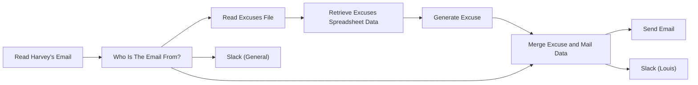

## Fluxo (.json) :

```json
{
  "nodes": [
    {
      "name": "Read Harvey's Email",
      "type": "n8n-nodes-base.emailReadImap",
      "position": [
        270,
        390
      ],
      "parameters": {
        "options": {}
      },
      "credentials": {
        "imap": "Read Harvey's Mail"
      },
      "typeVersion": 1
    },
    {
      "name": "Who Is The Email From?",
      "type": "n8n-nodes-base.switch",
      "position": [
        460,
        390
      ],
      "parameters": {
        "rules": {
          "rules": [
            {
              "value2": "Louis Litt <louis_litt_1970@yahoo.com>"
            }
          ]
        },
        "value1": "={{$node[\"Read Harvey's Email\"].json[\"from\"]}}",
        "dataType": "string",
        "fallbackOutput": 3
      },
      "typeVersion": 1,
      "alwaysOutputData": false
    },
    {
      "name": "Read Excuses File",
      "type": "n8n-nodes-base.readBinaryFile",
      "position": [
        670,
        230
      ],
      "parameters": {
        "filePath": "/home/n8n/Excuse_Generator.xlsx"
      },
      "typeVersion": 1
    },
    {
      "name": "Retrieve Excuses Spreadsheet Data",
      "type": "n8n-nodes-base.spreadsheetFile",
      "position": [
        860,
        230
      ],
      "parameters": {
        "options": {}
      },
      "typeVersion": 1
    },
    {
      "name": "Generate Excuse",
      "type": "n8n-nodes-base.function",
      "position": [
        1040,
        230
      ],
      "parameters": {
        "functionCode": "var leadinmax = 24;\nvar perpmax = 25;\nvar delaymax = 23;\nvar leadin = Math.floor((Math.random() * leadinmax ) + 1);\nvar perp = Math.floor((Math.random() * perpmax ) + 1);\nvar delay = Math.floor((Math.random() * delaymax) + 1);\n\nvar excuse = items[leadin].json.Leadin + \" \" + items[perp].json.Perpetrator + \" \" + items[delay].json.Delay;\n\nitems = [{json:{}}];\n\nitems[0].json.excuse = excuse;\nreturn items;\n"
      },
      "typeVersion": 1
    },
    {
      "name": "Merge Excuse and Mail Data",
      "type": "n8n-nodes-base.merge",
      "position": [
        1230,
        330
      ],
      "parameters": {
        "mode": "mergeByIndex"
      },
      "typeVersion": 1
    },
    {
      "name": "Send Email",
      "type": "n8n-nodes-base.emailSend",
      "position": [
        1460,
        250
      ],
      "parameters": {
        "text": "= {{$node[\"Merge Excuse and Mail Data\"].json[\"excuse\"]}}\n\nMaybe next time.\n\nHarvey",
        "options": {},
        "subject": "=RE: {{$node[\"Merge Excuse and Mail Data\"].json[\"subject\"]}}",
        "toEmail": "={{$node[\"Merge Excuse and Mail Data\"].json[\"from\"]}}",
        "fromEmail": "={{$node[\"Merge Excuse and Mail Data\"].json[\"to\"]}}"
      },
      "credentials": {
        "smtp": "Send Harvey's Mail"
      },
      "typeVersion": 1
    },
    {
      "name": "Slack (Louis)",
      "type": "n8n-nodes-base.slack",
      "position": [
        1470,
        410
      ],
      "parameters": {
        "text": "=Here is what Louis emailed you:\n```\n{{$node[\"Merge Excuse and Mail Data\"].json[\"textPlain\"]}}\n```\n\nHere is how \"you\" responded:\n> {{$node[\"Merge Excuse and Mail Data\"].json[\"excuse\"]}}\n\n:+1: *You're Welcome!* :smirk:",
        "channel": "private",
        "attachments": [],
        "otherOptions": {
          "mrkdwn": true
        }
      },
      "credentials": {
        "slackApi": "Nathan's Slack API Token"
      },
      "typeVersion": 1
    },
    {
      "name": "Slack (General)",
      "type": "n8n-nodes-base.slack",
      "position": [
        890,
        470
      ],
      "parameters": {
        "text": "You've just received an email. You may wish to check it out.",
        "channel": "private",
        "attachments": [],
        "otherOptions": {
          "mrkdwn": true
        }
      },
      "credentials": {
        "slackApi": "Nathan's Slack API Token"
      },
      "typeVersion": 1
    }
  ],
  "connections": {
    "Generate Excuse": {
      "main": [
        [
          {
            "node": "Merge Excuse and Mail Data",
            "type": "main",
            "index": 0
          }
        ]
      ]
    },
    "Read Excuses File": {
      "main": [
        [
          {
            "node": "Retrieve Excuses Spreadsheet Data",
            "type": "main",
            "index": 0
          }
        ]
      ]
    },
    "Read Harvey's Email": {
      "main": [
        [
          {
            "node": "Who Is The Email From?",
            "type": "main",
            "index": 0
          }
        ]
      ]
    },
    "Who Is The Email From?": {
      "main": [
        [
          {
            "node": "Read Excuses File",
            "type": "main",
            "index": 0
          },
          {
            "node": "Merge Excuse and Mail Data",
            "type": "main",
            "index": 1
          }
        ],
        [
          {
            "node": "Slack (General)",
            "type": "main",
            "index": 0
          }
        ]
      ]
    },
    "Merge Excuse and Mail Data": {
      "main": [
        [
          {
            "node": "Send Email",
            "type": "main",
            "index": 0
          },
          {
            "node": "Slack (Louis)",
            "type": "main",
            "index": 0
          }
        ]
      ]
    },
    "Retrieve Excuses Spreadsheet Data": {
      "main": [
        [
          {
            "node": "Generate Excuse",
            "type": "main",
            "index": 0
          }
        ]
      ]
    }
  }
}
```

<a id="template-2279"></a>

## Template 2279 - Monitoramento de alterações Hacker News

- **Nome:** Monitoramento de alterações Hacker News
- **Descrição:** Fluxo que verifica periodicamente a página principal do Hacker News e envia uma notificação via Telegram se houver mudança no conteúdo.
- **Funcionalidade:** • Agendamento periódico: Inicia verificações a cada 5 minutos.
• Captura do conteúdo da página: Faz requisições HTTP para obter o HTML da página alvo.
• Atraso entre capturas: Aguarda um intervalo definido (5 minutos) antes de recolher o segundo estado da página para comparação.
• Comparação de conteúdo: Compara o conteúdo obtido em duas capturas consecutivas para detectar alterações.
• Notificação em caso de mudança: Envia uma mensagem via Telegram quando uma diferença é detectada.
• Ignorar quando inalterado: Não envia notificação se não forem encontradas diferenças.
- **Ferramentas:** • news.ycombinator.com: Página monitorada como fonte de conteúdo para detecção de alterações.
• Telegram: Serviço de mensagens utilizado para enviar alertas quando há mudanças no conteúdo.

## Fluxo visual

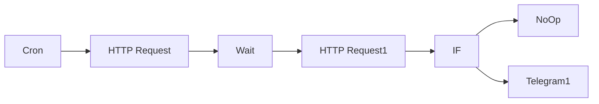

## Fluxo (.json) :

```json
{
  "nodes": [
    {
      "name": "HTTP Request",
      "type": "n8n-nodes-base.httpRequest",
      "position": [
        520,
        440
      ],
      "parameters": {
        "url": "https://news.ycombinator.com/",
        "options": {},
        "responseFormat": "string"
      },
      "typeVersion": 1
    },
    {
      "name": "Wait",
      "type": "n8n-nodes-base.wait",
      "position": [
        680,
        440
      ],
      "webhookId": "e5f84b2f-2568-4f5b-a72b-ed54838c768b",
      "parameters": {
        "unit": "minutes",
        "amount": 5
      },
      "typeVersion": 1
    },
    {
      "name": "HTTP Request1",
      "type": "n8n-nodes-base.httpRequest",
      "position": [
        880,
        440
      ],
      "parameters": {
        "url": "https://news.ycombinator.com/",
        "options": {},
        "responseFormat": "string"
      },
      "typeVersion": 1
    },
    {
      "name": "IF",
      "type": "n8n-nodes-base.if",
      "position": [
        1100,
        440
      ],
      "parameters": {
        "conditions": {
          "boolean": [
            {
              "value1": "={{$node[\"HTTP Request\"].json[\"data\"]}} {{$node[\"HTTP Request\"].json[\"data\"]}}",
              "value2": "="
            }
          ]
        }
      },
      "typeVersion": 1
    },
    {
      "name": "Cron",
      "type": "n8n-nodes-base.cron",
      "position": [
        320,
        440
      ],
      "parameters": {
        "triggerTimes": {
          "item": [
            {
              "mode": "everyX",
              "unit": "minutes",
              "value": 5
            }
          ]
        }
      },
      "typeVersion": 1
    },
    {
      "name": "Telegram1",
      "type": "n8n-nodes-base.telegram",
      "position": [
        1320,
        520
      ],
      "parameters": {
        "text": "Something got changed",
        "chatId": "1234",
        "additionalFields": {}
      },
      "credentials": {
        "telegramApi": {
          "id": "4",
          "name": "n8n test bot"
        }
      },
      "typeVersion": 1
    },
    {
      "name": "NoOp",
      "type": "n8n-nodes-base.noOp",
      "position": [
        1320,
        320
      ],
      "parameters": {},
      "typeVersion": 1
    }
  ],
  "connections": {
    "IF": {
      "main": [
        [
          {
            "node": "NoOp",
            "type": "main",
            "index": 0
          }
        ],
        [
          {
            "node": "Telegram1",
            "type": "main",
            "index": 0
          }
        ]
      ]
    },
    "Cron": {
      "main": [
        [
          {
            "node": "HTTP Request",
            "type": "main",
            "index": 0
          }
        ]
      ]
    },
    "Wait": {
      "main": [
        [
          {
            "node": "HTTP Request1",
            "type": "main",
            "index": 0
          }
        ]
      ]
    },
    "HTTP Request": {
      "main": [
        [
          {
            "node": "Wait",
            "type": "main",
            "index": 0
          }
        ]
      ]
    },
    "HTTP Request1": {
      "main": [
        [
          {
            "node": "IF",
            "type": "main",
            "index": 0
          }
        ]
      ]
    }
  }
}
```

<a id="template-2281"></a>

## Template 2281 - Bot Telegram — imagem de tempo para capitais europeias

- **Nome:** Bot Telegram — imagem de tempo para capitais europeias
- **Descrição:** Recebe comandos via Telegram e responde com uma imagem contendo dados meteorológicos de várias capitais europeias, gerada por um script R.
- **Funcionalidade:** • Detecção de comandos: Reconhece /start e /getweather e direciona fluxos apropriados; comandos desconhecidos geram mensagem de erro.
• Boas-vindas personalizada: Envia mensagem de saudação com o primeiro nome do usuário ao receber /start.
• Feedback ao usuário: Envia mensagem "Please wait" enquanto processa a solicitação.
• Coleta de dados meteorológicos: Consulta a API externa para obter dados atuais de temperatura (atual, mínima e máxima) para uma lista fixa de capitais europeias identificadas por ID.
• Tratamento de erros da API: Detecta respostas de erro da API e notifica o usuário em caso de falha na obtenção dos dados.
• Preparação de dados: Converte as respostas da API em um arquivo CSV com colunas de cidade e temperaturas.
• Persistência em disco: Salva o CSV e gera nomes de arquivo específicos por usuário; mantém logs da execução do script.
• Geração de imagem via R: Executa um script R (dumbbell plot com ggplot2) que lê o CSV e produz um PNG com o gráfico.
• Verificação de execução do script: Detecta falhas na execução do R e notifica o usuário em caso de erro na geração da imagem.
• Envio da imagem ao usuário: Lê o PNG gerado e envia como foto no chat Telegram com legenda personalizada.
- **Ferramentas:** • Telegram: Plataforma de mensagens usada para receber comandos e enviar textos e fotos aos usuários.
• OpenWeatherMap API: Serviço externo para obter dados meteorológicos atuais por ID de cidade.
• R (Rscript e ggplot2): Ambiente e pacote usados para processar o CSV e gerar o gráfico em PNG.
• Sistema de arquivos do servidor: Local para salvar arquivos CSV, PNG e logs gerados durante o processamento.

## Fluxo visual

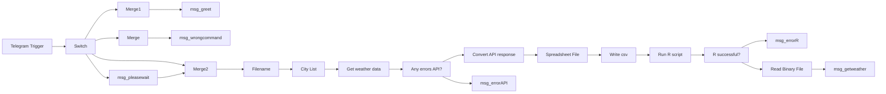

## Fluxo (.json) :

```json
{
  "nodes": [
    {
      "name": "Switch",
      "type": "n8n-nodes-base.switch",
      "notes": "check bot commands",
      "position": [
        460,
        480
      ],
      "parameters": {
        "rules": {
          "rules": [
            {
              "value2": "/start"
            },
            {
              "output": 1,
              "value2": "/getweather"
            }
          ]
        },
        "value1": "={{$json[\"message\"][\"text\"]}}",
        "dataType": "string",
        "fallbackOutput": 3
      },
      "notesInFlow": true,
      "typeVersion": 1
    },
    {
      "name": "msg_greet",
      "type": "n8n-nodes-base.telegram",
      "position": [
        1820,
        300
      ],
      "parameters": {
        "text": "=Nice to meet you, {{$node[\"Telegram Trigger\"].json[\"message\"][\"from\"][\"first_name\"]}}.\nI am n8n-powered bot, I can send you a weather data for several European capitals. The data is an image generated in ggplot2 package of R programming language.\nType /getweather to begin.",
        "chatId": "={{$node[\"Telegram Trigger\"].json[\"message\"][\"chat\"][\"id\"]}}",
        "additionalFields": {}
      },
      "credentials": {
        "telegramApi": {
          "id": "17",
          "name": "n8n R test bot"
        }
      },
      "notesInFlow": true,
      "typeVersion": 1
    },
    {
      "name": "msg_wrongcommand",
      "type": "n8n-nodes-base.telegram",
      "position": [
        1820,
        1160
      ],
      "parameters": {
        "text": "=Sorry, {{$node[\"Telegram Trigger\"].json[\"message\"][\"from\"][\"first_name\"]}}, your command was not recognized.\n/getweather - show image with the weather info.",
        "chatId": "={{$node[\"Telegram Trigger\"].json[\"message\"][\"chat\"][\"id\"]}}",
        "additionalFields": {}
      },
      "credentials": {
        "telegramApi": {
          "id": "17",
          "name": "n8n R test bot"
        }
      },
      "notesInFlow": true,
      "typeVersion": 1
    },
    {
      "name": "Telegram Trigger",
      "type": "n8n-nodes-base.telegramTrigger",
      "position": [
        300,
        480
      ],
      "webhookId": "2512ec1e-bcff-4dfb-9ef3-208aaecc5634",
      "parameters": {
        "updates": [
          "message"
        ],
        "additionalFields": {}
      },
      "credentials": {
        "telegramApi": {
          "id": "17",
          "name": "n8n R test bot"
        }
      },
      "typeVersion": 1
    },
    {
      "name": "msg_getweather",
      "type": "n8n-nodes-base.telegram",
      "position": [
        2020,
        820
      ],
      "parameters": {
        "chatId": "={{$node[\"Telegram Trigger\"].json[\"message\"][\"chat\"][\"id\"]}}",
        "operation": "sendPhoto",
        "binaryData": true,
        "additionalFields": {
          "caption": "=Here's your image, {{$node[\"Telegram Trigger\"].json[\"message\"][\"from\"][\"first_name\"]}}."
        }
      },
      "credentials": {
        "telegramApi": {
          "id": "17",
          "name": "n8n R test bot"
        }
      },
      "notesInFlow": true,
      "typeVersion": 1
    },
    {
      "name": "City List",
      "type": "n8n-nodes-base.function",
      "position": [
        1040,
        640
      ],
      "parameters": {
        "functionCode": "return [{Cityid: 2643743, Cityname:\"London\",    Country: \"GB\"},\r\n        {Cityid: 2950159, Cityname:\"Berlin\",    Country: \"DE\"},\r\n        {Cityid: 3117735, Cityname:\"Madrid\",    Country: \"ES\"},\r\n        {Cityid: 3169070, Cityname:\"Rome\",      Country: \"IT\"},\r\n        {Cityid: 683506,  Cityname:\"Bucharest\", Country: \"RO\"},\r\n        {Cityid: 2968815, Cityname:\"Paris\",     Country: \"FR\"},\r\n        {Cityid: 2761369, Cityname:\"Vienna\",    Country: \"AT\"},\r\n        {Cityid: 756135,  Cityname:\"Warsaw\",    Country: \"PL\"},\r\n        {Cityid: 3054638, Cityname:\"Budapest\",  Country: \"HU\"},\r\n        {Cityid: 792680,  Cityname:\"Belgrade\",  Country: \"RS\"}];"
      },
      "typeVersion": 1
    },
    {
      "name": "Convert API response",
      "type": "n8n-nodes-base.function",
      "position": [
        860,
        840
      ],
      "parameters": {
        "functionCode": "// this data is stored as a CSV file and then processed in the R script. Please check the R code here:\n// https://gist.github.com/ed-parsadanyan/0561cd12d545e642fcef17dcb0872b00\nvar data = [];\n\nfor (item of items) {\n  data.push({CityName: item.json.name+', '+item.json.sys.country,\n             TempCur : item.json.main.temp,\n             TempMin : item.json.main.temp_min,\n             TempMax : item.json.main.temp_max\n  });\n}\n\nreturn data;"
      },
      "typeVersion": 1
    },
    {
      "name": "Get weather data",
      "type": "n8n-nodes-base.httpRequest",
      "position": [
        1220,
        640
      ],
      "parameters": {
        "url": "=https://api.openweathermap.org/data/2.5/weather?id={{$json[\"Cityid\"]}}&units=metric&appid=6d3fff582a101700576faf74734f9535",
        "options": {}
      },
      "typeVersion": 1,
      "continueOnFail": true
    },
    {
      "name": "Spreadsheet File",
      "type": "n8n-nodes-base.spreadsheetFile",
      "position": [
        1040,
        840
      ],
      "parameters": {
        "options": {
          "fileName": "={{$node[\"Filename\"].json[\"filename\"]}}.{{$parameter[\"fileFormat\"]}}"
        },
        "operation": "toFile",
        "fileFormat": "csv"
      },
      "typeVersion": 1
    },
    {
      "name": "Write csv",
      "type": "n8n-nodes-base.writeBinaryFile",
      "position": [
        1220,
        840
      ],
      "parameters": {
        "fileName": "={{$node[\"Filename\"].json[\"foldername\"]}}{{$binary.data.fileName}}"
      },
      "typeVersion": 1
    },
    {
      "name": "Filename",
      "type": "n8n-nodes-base.set",
      "position": [
        860,
        640
      ],
      "parameters": {
        "values": {
          "string": [
            {
              "name": "filename",
              "value": "=request_from{{$node[\"Telegram Trigger\"].json[\"message\"][\"from\"][\"id\"]}}_{{DateTime.now().toISO({ format: 'basic' }).split('.')[0]}}"
            },
            {
              "name": "foldername",
              "value": "/home/node/.n8n/weather-bot/"
            },
            {
              "name": "imgname",
              "value": "=request_from{{$node[\"Telegram Trigger\"].json[\"message\"][\"from\"][\"id\"]}}"
            }
          ]
        },
        "options": {}
      },
      "typeVersion": 1
    },
    {
      "name": "msg_errorAPI",
      "type": "n8n-nodes-base.telegram",
      "position": [
        1820,
        640
      ],
      "parameters": {
        "text": "=Sorry, {{$node[\"Telegram Trigger\"].json[\"message\"][\"from\"][\"first_name\"]}}, an error occurred while fetching weather data. Please try again later.",
        "chatId": "={{$node[\"Telegram Trigger\"].json[\"message\"][\"chat\"][\"id\"]}}",
        "additionalFields": {
          "parse_mode": "Markdown"
        }
      },
      "credentials": {
        "telegramApi": {
          "id": "17",
          "name": "n8n R test bot"
        }
      },
      "notesInFlow": true,
      "typeVersion": 1
    },
    {
      "name": "Any errors API?",
      "type": "n8n-nodes-base.if",
      "position": [
        1580,
        640
      ],
      "parameters": {
        "conditions": {
          "string": [
            {
              "value1": "={{$json[\"error\"][\"name\"]}}",
              "value2": "Error"
            }
          ]
        }
      },
      "typeVersion": 1
    },
    {
      "name": "msg_errorR",
      "type": "n8n-nodes-base.telegram",
      "position": [
        1820,
        1000
      ],
      "parameters": {
        "text": "=Sorry, {{$node[\"Telegram Trigger\"].json[\"message\"][\"from\"][\"first_name\"]}}, an error occurred while creating an image. Please try again later.",
        "chatId": "={{$node[\"Telegram Trigger\"].json[\"message\"][\"chat\"][\"id\"]}}",
        "additionalFields": {
          "parse_mode": "Markdown"
        }
      },
      "credentials": {
        "telegramApi": {
          "id": "17",
          "name": "n8n R test bot"
        }
      },
      "notesInFlow": true,
      "typeVersion": 1
    },
    {
      "name": "Read Binary File",
      "type": "n8n-nodes-base.readBinaryFile",
      "position": [
        1820,
        820
      ],
      "parameters": {
        "filePath": "={{$node[\"Filename\"].json[\"foldername\"]}}{{$node[\"Filename\"].json[\"imgname\"]}}.png"
      },
      "typeVersion": 1
    },
    {
      "name": "R successful?",
      "type": "n8n-nodes-base.if",
      "position": [
        1580,
        840
      ],
      "parameters": {
        "conditions": {
          "number": [
            {
              "value1": "={{$json[\"exitCode\"]}}",
              "operation": "equal"
            }
          ]
        }
      },
      "typeVersion": 1
    },
    {
      "name": "Merge",
      "type": "n8n-nodes-base.merge",
      "position": [
        680,
        1160
      ],
      "parameters": {
        "mode": "passThrough"
      },
      "typeVersion": 1
    },
    {
      "name": "Merge1",
      "type": "n8n-nodes-base.merge",
      "position": [
        680,
        300
      ],
      "parameters": {
        "mode": "passThrough"
      },
      "typeVersion": 1
    },
    {
      "name": "msg_pleasewait",
      "type": "n8n-nodes-base.telegram",
      "position": [
        1820,
        460
      ],
      "parameters": {
        "text": "=Please wait while your request is being processed...",
        "chatId": "={{$node[\"Telegram Trigger\"].json[\"message\"][\"chat\"][\"id\"]}}",
        "additionalFields": {
          "parse_mode": "Markdown"
        }
      },
      "credentials": {
        "telegramApi": {
          "id": "17",
          "name": "n8n R test bot"
        }
      },
      "notesInFlow": true,
      "typeVersion": 1
    },
    {
      "name": "Merge2",
      "type": "n8n-nodes-base.merge",
      "position": [
        680,
        640
      ],
      "parameters": {
        "mode": "wait"
      },
      "typeVersion": 1
    },
    {
      "name": "Run R script",
      "type": "n8n-nodes-base.executeCommand",
      "position": [
        1400,
        840
      ],
      "parameters": {
        "command": "=Rscript --vanilla '{{$node[\"Filename\"].json[\"foldername\"]}}dumbbell_plot.R' '{{$node[\"Filename\"].json[\"foldername\"]}}{{$node[\"Filename\"].json[\"filename\"]}}.csv' '{{$node[\"Filename\"].json[\"foldername\"]}}{{$node[\"Filename\"].json[\"imgname\"]}}.png' >& {{$node[\"Filename\"].json[\"foldername\"]}}{{$node[\"Filename\"].json[\"filename\"]}}.log"
      },
      "typeVersion": 1,
      "continueOnFail": true
    }
  ],
  "connections": {
    "Merge": {
      "main": [
        [
          {
            "node": "msg_wrongcommand",
            "type": "main",
            "index": 0
          }
        ]
      ]
    },
    "Merge1": {
      "main": [
        [
          {
            "node": "msg_greet",
            "type": "main",
            "index": 0
          }
        ]
      ]
    },
    "Merge2": {
      "main": [
        [
          {
            "node": "Filename",
            "type": "main",
            "index": 0
          }
        ]
      ]
    },
    "Switch": {
      "main": [
        [
          {
            "node": "Merge1",
            "type": "main",
            "index": 0
          }
        ],
        [
          {
            "node": "msg_pleasewait",
            "type": "main",
            "index": 0
          },
          {
            "node": "Merge2",
            "type": "main",
            "index": 0
          }
        ],
        null,
        [
          {
            "node": "Merge",
            "type": "main",
            "index": 0
          }
        ]
      ]
    },
    "Filename": {
      "main": [
        [
          {
            "node": "City List",
            "type": "main",
            "index": 0
          }
        ]
      ]
    },
    "City List": {
      "main": [
        [
          {
            "node": "Get weather data",
            "type": "main",
            "index": 0
          }
        ]
      ]
    },
    "Write csv": {
      "main": [
        [
          {
            "node": "Run R script",
            "type": "main",
            "index": 0
          }
        ]
      ]
    },
    "Run R script": {
      "main": [
        [
          {
            "node": "R successful?",
            "type": "main",
            "index": 0
          }
        ]
      ]
    },
    "R successful?": {
      "main": [
        [
          {
            "node": "Read Binary File",
            "type": "main",
            "index": 0
          }
        ],
        [
          {
            "node": "msg_errorR",
            "type": "main",
            "index": 0
          }
        ]
      ]
    },
    "msg_pleasewait": {
      "main": [
        [
          {
            "node": "Merge2",
            "type": "main",
            "index": 1
          }
        ]
      ]
    },
    "Any errors API?": {
      "main": [
        [
          {
            "node": "msg_errorAPI",
            "type": "main",
            "index": 0
          }
        ],
        [
          {
            "node": "Convert API response",
            "type": "main",
            "index": 0
          }
        ]
      ]
    },
    "Get weather data": {
      "main": [
        [
          {
            "node": "Any errors API?",
            "type": "main",
            "index": 0
          }
        ]
      ]
    },
    "Read Binary File": {
      "main": [
        [
          {
            "node": "msg_getweather",
            "type": "main",
            "index": 0
          }
        ]
      ]
    },
    "Spreadsheet File": {
      "main": [
        [
          {
            "node": "Write csv",
            "type": "main",
            "index": 0
          }
        ]
      ]
    },
    "Telegram Trigger": {
      "main": [
        [
          {
            "node": "Switch",
            "type": "main",
            "index": 0
          }
        ]
      ]
    },
    "Convert API response": {
      "main": [
        [
          {
            "node": "Spreadsheet File",
            "type": "main",
            "index": 0
          }
        ]
      ]
    }
  }
}
```

<a id="template-2283"></a>

## Template 2283 - Captura e armazenamento da posição da ISS

- **Nome:** Captura e armazenamento da posição da ISS
- **Descrição:** Coleta periodicamente a posição da Estação Espacial Internacional (ISS) e armazena os dados essenciais (nome, latitude, longitude, timestamp) em uma tabela no Google BigQuery.
- **Funcionalidade:** • Agendamento por cron: executa o fluxo a cada minuto para iniciar a captura de dados.
• Consulta à API de posições da ISS: faz uma requisição à API pública usando o timestamp atual para obter a posição do satélite.
• Extração e mapeamento de campos: seleciona e mapeia os campos name, latitude, longitude e timestamp da resposta da API.
• Limpeza do payload: mantém apenas os campos necessários antes de enviar para armazenamento.
• Inserção em banco de dados: envia os registros formatados para uma tabela específica no Google BigQuery usando credenciais autorizadas.
- **Ferramentas:** • WhereTheISS.at API: serviço público que fornece a posição em tempo real da ISS através de endpoints de satélite.
• Google BigQuery: serviço de armazenamento e análise de dados em nuvem onde os registros de posição são persistidos.

## Fluxo visual

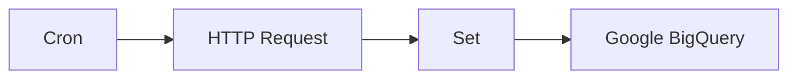

## Fluxo (.json) :

```json
{
  "nodes": [
    {
      "name": "Google BigQuery",
      "type": "n8n-nodes-base.googleBigQuery",
      "position": [
        1010,
        240
      ],
      "parameters": {
        "columns": "name, latitude, longitude, timestamp",
        "options": {},
        "tableId": "position",
        "datasetId": "iss",
        "projectId": "supple-cabinet-289219"
      },
      "credentials": {
        "googleBigQueryOAuth2Api": "BigQuery Credentials"
      },
      "typeVersion": 1
    },
    {
      "name": "Set",
      "type": "n8n-nodes-base.set",
      "position": [
        810,
        240
      ],
      "parameters": {
        "values": {
          "number": [
            {
              "name": "latitude",
              "value": "={{$node[\"HTTP Request\"].json[\"0\"][\"latitude\"]}}"
            },
            {
              "name": "longitude",
              "value": "={{$node[\"HTTP Request\"].json[\"0\"][\"longitude\"]}}"
            },
            {
              "name": "timestamp",
              "value": "={{$node[\"HTTP Request\"].json[\"0\"][\"timestamp\"]}}"
            }
          ],
          "string": [
            {
              "name": "name",
              "value": "={{$json[\"0\"][\"name\"]}}"
            }
          ]
        },
        "options": {},
        "keepOnlySet": true
      },
      "typeVersion": 1
    },
    {
      "name": "HTTP Request",
      "type": "n8n-nodes-base.httpRequest",
      "position": [
        610,
        240
      ],
      "parameters": {
        "url": "https://api.wheretheiss.at/v1/satellites/25544/positions",
        "options": {},
        "queryParametersUi": {
          "parameter": [
            {
              "name": "timestamps",
              "value": "={{Date.now();}}"
            }
          ]
        }
      },
      "typeVersion": 1
    },
    {
      "name": "Cron",
      "type": "n8n-nodes-base.cron",
      "position": [
        410,
        240
      ],
      "parameters": {
        "triggerTimes": {
          "item": [
            {
              "mode": "everyMinute"
            }
          ]
        }
      },
      "typeVersion": 1
    }
  ],
  "connections": {
    "Set": {
      "main": [
        [
          {
            "node": "Google BigQuery",
            "type": "main",
            "index": 0
          }
        ]
      ]
    },
    "Cron": {
      "main": [
        [
          {
            "node": "HTTP Request",
            "type": "main",
            "index": 0
          }
        ]
      ]
    },
    "HTTP Request": {
      "main": [
        [
          {
            "node": "Set",
            "type": "main",
            "index": 0
          }
        ]
      ]
    }
  }
}
```

<a id="template-2285"></a>

## Template 2285 - Backup diário de workflows para GitHub

- **Nome:** Backup diário de workflows para GitHub
- **Descrição:** Executa um backup diário das definições de workflows, criando ou atualizando arquivos JSON em um repositório no GitHub com base nas alterações detectadas.
- **Funcionalidade:** • Agendamento diário: Dispara o processo automaticamente todo dia às 23:59.
• Listagem de workflows: Consulta a API local para obter a lista de workflows existentes.
• Obtenção de dados completos: Recupera os dados completos de cada workflow individualmente para backup.
• Verificação de existência e versão: Baixa o conteúdo atual do repositório e compara nome e data de atualização para detectar novos ou alterados.
• Criação de backups novos: Cria arquivos JSON no repositório para workflows que ainda não possuem backup.
• Atualização de backups existentes: Atualiza arquivos existentes quando a data de atualização do workflow mudou, evitando duplicatas.
• Mensagens de commit claras: Registra alterações no repositório com mensagens que indicam o nome do workflow e a data do backup.
- **Ferramentas:** • GitHub: Repositório remoto usado para armazenar os arquivos JSON de backup e receber commits.
• API REST local (http://localhost:5678): Fonte das listas e dos dados completos dos workflows que serão salvos.

## Fluxo visual

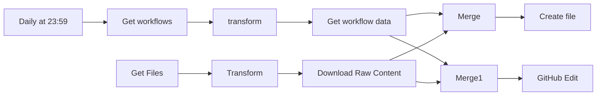

## Fluxo (.json) :

```json
{
  "nodes": [
    {
      "name": "GitHub Edit",
      "type": "n8n-nodes-base.github",
      "position": [
        1190,
        610
      ],
      "parameters": {
        "owner": "YOUR_USERNAME",
        "filePath": "={{$json[\"data\"][\"name\"]}}.json",
        "resource": "file",
        "operation": "edit",
        "repository": "REPO_NAME",
        "fileContent": "={{JSON.stringify($json[\"data\"])}}",
        "commitMessage": "=[N8N Backup] {{$json.data[\"name\"]}} ({{new Date(Date.now()).toLocaleDateString()}})"
      },
      "credentials": {
        "githubApi": "GitHub@harshil1712"
      },
      "typeVersion": 1
    },
    {
      "name": "Get Files",
      "type": "n8n-nodes-base.github",
      "position": [
        200,
        500
      ],
      "parameters": {
        "owner": "YOUR_USERNAME",
        "filePath": "/",
        "resource": "file",
        "operation": "get",
        "repository": "REPO",
        "asBinaryProperty": false
      },
      "credentials": {
        "githubApi": "GitHub@harshil1712"
      },
      "executeOnce": true,
      "typeVersion": 1,
      "alwaysOutputData": false
    },
    {
      "name": "Transform",
      "type": "n8n-nodes-base.function",
      "position": [
        400,
        500
      ],
      "parameters": {
        "functionCode": "return items[0].json.map(item => {\n  return {\n    json: item\n  }\n});\n"
      },
      "typeVersion": 1
    },
    {
      "name": "Create file",
      "type": "n8n-nodes-base.github",
      "position": [
        1240,
        280
      ],
      "parameters": {
        "owner": "YOUR_USERNAME",
        "filePath": "={{$json[\"data\"][\"name\"]}}.json",
        "resource": "file",
        "repository": "REPO",
        "fileContent": "={{JSON.stringify($node['Merge'].json[\"data\"])}}",
        "commitMessage": "=[N8N Backup] {{$json.data[\"name\"]}}.json ({{new Date(Date.now()).toLocaleDateString()}})"
      },
      "credentials": {
        "githubApi": "GitHub@harshil1712"
      },
      "typeVersion": 1
    },
    {
      "name": "Merge",
      "type": "n8n-nodes-base.merge",
      "position": [
        930,
        280
      ],
      "parameters": {
        "mode": "removeKeyMatches",
        "propertyName1": "data.name",
        "propertyName2": "data.name"
      },
      "typeVersion": 1
    },
    {
      "name": "Get workflows",
      "type": "n8n-nodes-base.httpRequest",
      "position": [
        200,
        300
      ],
      "parameters": {
        "url": "http://localhost:5678/rest/workflows",
        "options": {},
        "authentication": "basicAuth"
      },
      "credentials": {
        "httpBasicAuth": "n8n instance auth"
      },
      "typeVersion": 1
    },
    {
      "name": "Get workflow data",
      "type": "n8n-nodes-base.httpRequest",
      "position": [
        600,
        300
      ],
      "parameters": {
        "url": "=http://localhost:5678/rest/workflows/{{$json[\"id\"]}}",
        "options": {},
        "authentication": "basicAuth"
      },
      "credentials": {
        "httpBasicAuth": "n8n instance auth"
      },
      "typeVersion": 1
    },
    {
      "name": "Download Raw Content",
      "type": "n8n-nodes-base.httpRequest",
      "position": [
        600,
        500
      ],
      "parameters": {
        "url": "={{$json[\"download_url\"]}}",
        "options": {},
        "authentication": "headerAuth",
        "responseFormat": "string"
      },
      "credentials": {
        "httpHeaderAuth": "GitHub Token"
      },
      "typeVersion": 1
    },
    {
      "name": "transform",
      "type": "n8n-nodes-base.function",
      "position": [
        390,
        300
      ],
      "parameters": {
        "functionCode": "const newItems = [];\nfor (item of items[0].json.data) {\n  newItems.push({json: item});\n}\nreturn newItems;"
      },
      "typeVersion": 1
    },
    {
      "name": "Daily at 23:59",
      "type": "n8n-nodes-base.cron",
      "position": [
        -20,
        300
      ],
      "parameters": {
        "triggerTimes": {
          "item": [
            {
              "hour": 23,
              "minute": 59
            }
          ]
        }
      },
      "typeVersion": 1
    },
    {
      "name": "Merge1",
      "type": "n8n-nodes-base.merge",
      "position": [
        970,
        610
      ],
      "parameters": {
        "mode": "removeKeyMatches",
        "propertyName1": "data.updatedAt",
        "propertyName2": "data.updatedAt"
      },
      "typeVersion": 1
    }
  ],
  "connections": {
    "Merge": {
      "main": [
        [
          {
            "node": "Create file",
            "type": "main",
            "index": 0
          }
        ]
      ]
    },
    "Merge1": {
      "main": [
        [
          {
            "node": "GitHub Edit",
            "type": "main",
            "index": 0
          }
        ]
      ]
    },
    "Get Files": {
      "main": [
        [
          {
            "node": "Transform",
            "type": "main",
            "index": 0
          }
        ]
      ]
    },
    "Transform": {
      "main": [
        [
          {
            "node": "Download Raw Content",
            "type": "main",
            "index": 0
          }
        ]
      ]
    },
    "transform": {
      "main": [
        [
          {
            "node": "Get workflow data",
            "type": "main",
            "index": 0
          }
        ]
      ]
    },
    "Get workflows": {
      "main": [
        [
          {
            "node": "transform",
            "type": "main",
            "index": 0
          }
        ]
      ]
    },
    "Daily at 23:59": {
      "main": [
        [
          {
            "node": "Get workflows",
            "type": "main",
            "index": 0
          }
        ]
      ]
    },
    "Get workflow data": {
      "main": [
        [
          {
            "node": "Merge",
            "type": "main",
            "index": 0
          },
          {
            "node": "Merge1",
            "type": "main",
            "index": 0
          }
        ]
      ]
    },
    "Download Raw Content": {
      "main": [
        [
          {
            "node": "Merge",
            "type": "main",
            "index": 1
          },
          {
            "node": "Merge1",
            "type": "main",
            "index": 1
          }
        ]
      ]
    }
  }
}
```

<a id="template-2287"></a>

## Template 2287 - Obter tempo atual de uma cidade

- **Nome:** Obter tempo atual de uma cidade
- **Descrição:** Este fluxo obtém os dados meteorológicos atuais para uma cidade especificada (Berlim, Alemanha) quando acionado manualmente.
- **Funcionalidade:** • Disparo manual: Inicia a execução do fluxo quando o usuário clica em executar.
• Consulta de clima por cidade: Recupera os dados do tempo atual para a cidade configurada (berlin,de).
• Suporte a credenciais de API: Permite configurar uma chave de API para autenticar a requisição ao serviço meteorológico.
- **Ferramentas:** • OpenWeatherMap API: Serviço que fornece dados meteorológicos atuais mediante requisições autenticadas com chave de API.


## Fluxo visual

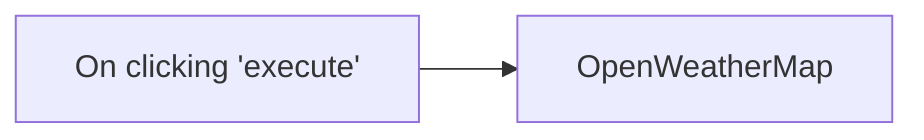

## Fluxo (.json) :

```json
{
  "id": "88",
  "name": "Get the current weather data for a city",
  "nodes": [
    {
      "name": "On clicking 'execute'",
      "type": "n8n-nodes-base.manualTrigger",
      "position": [
        250,
        300
      ],
      "parameters": {},
      "typeVersion": 1
    },
    {
      "name": "OpenWeatherMap",
      "type": "n8n-nodes-base.openWeatherMap",
      "position": [
        450,
        300
      ],
      "parameters": {
        "cityName": "berlin,de"
      },
      "credentials": {
        "openWeatherMapApi": ""
      },
      "typeVersion": 1
    }
  ],
  "active": false,
  "settings": {},
  "connections": {
    "OpenWeatherMap": {
      "main": [
        []
      ]
    },
    "On clicking 'execute'": {
      "main": [
        [
          {
            "node": "OpenWeatherMap",
            "type": "main",
            "index": 0
          }
        ]
      ]
    }
  }
}
```

<a id="template-2289"></a>

## Template 2289 - Gerar e baixar scorecard completo (JSON)

- **Nome:** Gerar e baixar scorecard completo (JSON)
- **Descrição:** Gera um relatório completo de segurança para um identificador específico e faz o download do arquivo JSON do relatório.
- **Funcionalidade:** • Disparo manual: inicia o processo ao acionar manualmente a execução.
• Geração de relatório: solicita ao serviço de segurança a geração de um scorecard completo em formato JSON para o identificador especificado (ex.: n8n.io).
• Listagem do relatório gerado: recupera o relatório mais recente (limite 1) para obter o link de download.
• Download do relatório: baixa o arquivo JSON usando a URL de download retornada.
- **Ferramentas:** • SecurityScorecard: Plataforma/API que gera scorecards e relatórios de segurança para domínios/organizações e fornece links para download dos relatórios em formato JSON.

## Fluxo visual

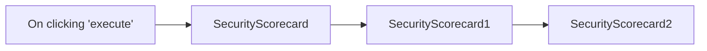

## Fluxo (.json) :

```json
{
  "nodes": [
    {
      "name": "On clicking 'execute'",
      "type": "n8n-nodes-base.manualTrigger",
      "position": [
        250,
        300
      ],
      "parameters": {},
      "typeVersion": 1
    },
    {
      "name": "SecurityScorecard",
      "type": "n8n-nodes-base.securityScorecard",
      "position": [
        450,
        300
      ],
      "parameters": {
        "report": "full-scorecard-json",
        "resource": "report",
        "operation": "generate",
        "scorecardIdentifier": "n8n.io"
      },
      "credentials": {
        "securityScorecardApi": "SecurityScorecard Credentials"
      },
      "typeVersion": 1
    },
    {
      "name": "SecurityScorecard1",
      "type": "n8n-nodes-base.securityScorecard",
      "position": [
        650,
        300
      ],
      "parameters": {
        "limit": 1,
        "resource": "report"
      },
      "credentials": {
        "securityScorecardApi": "SecurityScorecard Credentials"
      },
      "typeVersion": 1
    },
    {
      "name": "SecurityScorecard2",
      "type": "n8n-nodes-base.securityScorecard",
      "position": [
        850,
        300
      ],
      "parameters": {
        "url": "={{$json[\"download_url\"]}}",
        "resource": "report",
        "operation": "download"
      },
      "credentials": {
        "securityScorecardApi": "SecurityScorecard Credentials"
      },
      "typeVersion": 1
    }
  ],
  "connections": {
    "SecurityScorecard": {
      "main": [
        [
          {
            "node": "SecurityScorecard1",
            "type": "main",
            "index": 0
          }
        ]
      ]
    },
    "SecurityScorecard1": {
      "main": [
        [
          {
            "node": "SecurityScorecard2",
            "type": "main",
            "index": 0
          }
        ]
      ]
    },
    "On clicking 'execute'": {
      "main": [
        [
          {
            "node": "SecurityScorecard",
            "type": "main",
            "index": 0
          }
        ]
      ]
    }
  }
}
```

<a id="template-2290"></a>

## Template 2290 - Criar cliente Stripe ao ganhar negócio

- **Nome:** Criar cliente Stripe ao ganhar negócio
- **Descrição:** Quando um negócio é atualizado e seu momento de ganho muda, o fluxo obtém dados da organização e garante que exista um cliente correspondente no Stripe, criando-o se necessário.
- **Funcionalidade:** • Detecção de atualização de negócio: Inicia o fluxo ao receber uma atualização de um negócio.
• Verificação de mudança em won_time: Compara o valor atual e o anterior de won_time e segue somente se houver diferença.
• Recuperação de dados da organização: Busca informações da organização associada ao negócio (endereço e nome).
• Busca de cliente no Stripe: Pesquisa clientes no Stripe usando o nome da organização.
• Criação de cliente no Stripe quando ausente: Se a pesquisa não encontrar resultados, cria um novo cliente no Stripe preenchendo nome e endereço com os dados da organização.
• Junção de dados para criação: Mescla os dados da organização com o caminho de execução apropriado antes de criar o cliente.
- **Ferramentas:** • Pipedrive: CRM utilizado como fonte de eventos de negócio e para obter detalhes da organização.
• Stripe: Plataforma de pagamentos usada para pesquisar e criar registros de clientes.

## Fluxo visual

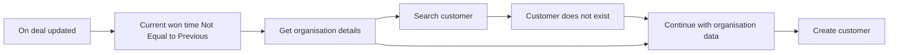

## Fluxo (.json) :

```json
{
  "meta": {
    "instanceId": "237600ca44303ce91fa31ee72babcdc8493f55ee2c0e8aa2b78b3b4ce6f70bd9"
  },
  "nodes": [
    {
      "id": "acf47a04-1f3f-448a-b571-a94c84004c45",
      "name": "Current won time Not Equal to Previous",
      "type": "n8n-nodes-base.if",
      "position": [
        140,
        260
      ],
      "parameters": {
        "conditions": {
          "string": [
            {
              "value1": "={{ $json[\"current\"].won_time}}",
              "value2": "={{ $json[\"previous\"].won_time}}",
              "operation": "notEqual"
            }
          ]
        }
      },
      "typeVersion": 1
    },
    {
      "id": "452a0208-be12-4aac-8c1a-9101ab79f8fb",
      "name": "On deal updated",
      "type": "n8n-nodes-base.pipedriveTrigger",
      "position": [
        -80,
        260
      ],
      "webhookId": "af0f5626-e92f-4e29-bdc8-8e13c9c9cf99",
      "parameters": {
        "action": "updated",
        "object": "deal"
      },
      "credentials": {
        "pipedriveApi": {
          "id": "1",
          "name": "Pipedrive account"
        }
      },
      "typeVersion": 1
    },
    {
      "id": "202b9a47-2f00-43ec-bbab-ba82f94e4174",
      "name": "Get organisation details",
      "type": "n8n-nodes-base.pipedrive",
      "position": [
        380,
        240
      ],
      "parameters": {
        "resource": "organization",
        "operation": "get",
        "organizationId": "={{ $json[\"current\"].org_id }}",
        "resolveProperties": true
      },
      "credentials": {
        "pipedriveApi": {
          "id": "1",
          "name": "Pipedrive account"
        }
      },
      "typeVersion": 1
    },
    {
      "id": "b88e18a3-1514-424f-ba96-c8bb94c14cb3",
      "name": "Search customer",
      "type": "n8n-nodes-base.httpRequest",
      "position": [
        600,
        100
      ],
      "parameters": {
        "url": "https://api.stripe.com/v1/customers/search",
        "options": {},
        "authentication": "predefinedCredentialType",
        "queryParametersUi": {
          "parameter": [
            {
              "name": "query",
              "value": "=name:'{{ $json[\"Name\"] }}'"
            }
          ]
        },
        "nodeCredentialType": "stripeApi"
      },
      "credentials": {
        "stripeApi": {
          "id": "3",
          "name": "Stripe account"
        }
      },
      "typeVersion": 2
    },
    {
      "id": "b4a4491e-8d69-41b6-83a4-128f228108e3",
      "name": "Customer does not exist",
      "type": "n8n-nodes-base.if",
      "position": [
        860,
        100
      ],
      "parameters": {
        "conditions": {
          "string": [
            {
              "value1": "={{ JSON.stringify($json[\"data\"]) }}",
              "value2": "[]"
            }
          ]
        }
      },
      "typeVersion": 1
    },
    {
      "id": "6aeaa043-ce4b-4665-a1eb-9fe66d86202f",
      "name": "Continue with organisation data",
      "type": "n8n-nodes-base.merge",
      "position": [
        1120,
        220
      ],
      "parameters": {
        "mode": "passThrough",
        "output": "input2"
      },
      "typeVersion": 1
    },
    {
      "id": "21bc3b5a-72eb-4015-957a-7facfce371e0",
      "name": "Create customer",
      "type": "n8n-nodes-base.stripe",
      "position": [
        1360,
        220
      ],
      "parameters": {
        "name": "={{ $json[\"Name\"] }}",
        "resource": "customer",
        "operation": "create",
        "additionalFields": {
          "address": {
            "details": {
              "city": "={{ $json[\"City/town/village/locality\"] }}",
              "line1": "={{ $json[\"Street/road name\"] }} {{ $json[\"House number\"] }}",
              "state": "={{ $json[\"State/county\"] }}",
              "country": "={{ $json[\"Country\"] }}",
              "postal_code": "={{ $json[\"ZIP/Postal code\"] }}"
            }
          }
        }
      },
      "credentials": {
        "stripeApi": {
          "id": "3",
          "name": "Stripe account"
        }
      },
      "typeVersion": 1
    }
  ],
  "connections": {
    "On deal updated": {
      "main": [
        [
          {
            "node": "Current won time Not Equal to Previous",
            "type": "main",
            "index": 0
          }
        ]
      ]
    },
    "Search customer": {
      "main": [
        [
          {
            "node": "Customer does not exist",
            "type": "main",
            "index": 0
          }
        ]
      ]
    },
    "Customer does not exist": {
      "main": [
        [
          {
            "node": "Continue with organisation data",
            "type": "main",
            "index": 0
          }
        ]
      ]
    },
    "Get organisation details": {
      "main": [
        [
          {
            "node": "Search customer",
            "type": "main",
            "index": 0
          },
          {
            "node": "Continue with organisation data",
            "type": "main",
            "index": 1
          }
        ]
      ]
    },
    "Continue with organisation data": {
      "main": [
        [
          {
            "node": "Create customer",
            "type": "main",
            "index": 0
          }
        ]
      ]
    },
    "Current won time Not Equal to Previous": {
      "main": [
        [
          {
            "node": "Get organisation details",
            "type": "main",
            "index": 0
          }
        ]
      ]
    }
  }
}
```

<a id="template-2292"></a>

## Template 2292 - Traduzir texto do inglês para o alemão

- **Nome:** Traduzir texto do inglês para o alemão
- **Descrição:** Traduz um texto em inglês para o alemão usando a API do Google Translate ao ser acionado manualmente.
- **Funcionalidade:** • Gatilho manual: inicia o fluxo quando acionado manualmente.
• Tradução de texto: traduz o texto configurado (neste caso "Hello from n8n!") do inglês para o alemão.
• Configuração de parâmetros: permite definir o texto de entrada e o idioma de destino nos parâmetros do fluxo.
• Autenticação OAuth2: utiliza credenciais OAuth2 para autenticar e autorizar o acesso à API de tradução.
- **Ferramentas:** • Google Translate API: serviço de tradução automática para converter texto entre idiomas.
• Autenticação OAuth2 do Google: mecanismo de autenticação que fornece acesso autorizado à API de tradução.

## Fluxo visual

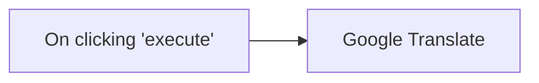

## Fluxo (.json) :

```json
{
  "id": "92",
  "name": "Translate text from English to German",
  "nodes": [
    {
      "name": "On clicking 'execute'",
      "type": "n8n-nodes-base.manualTrigger",
      "position": [
        270,
        300
      ],
      "parameters": {},
      "typeVersion": 1
    },
    {
      "name": "Google Translate",
      "type": "n8n-nodes-base.googleTranslate",
      "position": [
        470,
        300
      ],
      "parameters": {
        "text": "Hello from n8n!",
        "translateTo": "de",
        "authentication": "oAuth2"
      },
      "credentials": {
        "googleTranslateOAuth2Api": "google-translate"
      },
      "typeVersion": 1
    }
  ],
  "active": false,
  "settings": {},
  "connections": {
    "On clicking 'execute'": {
      "main": [
        [
          {
            "node": "Google Translate",
            "type": "main",
            "index": 0
          }
        ]
      ]
    }
  }
}
```

<a id="template-2294"></a>

## Template 2294 - Chatbot Slack via Slash Commands

- **Nome:** Chatbot Slack via Slash Commands
- **Descrição:** Recebe comandos slash do Slack, encaminha o texto para um modelo de linguagem para gerar uma resposta e publica essa resposta no canal indicado.
- **Funcionalidade:** • Recepção de comandos via webhook: Captura requisições POST originadas por slash commands do Slack.
• Roteamento por comando: Verifica qual slash command foi usado (ex.: /ask, /another) e direciona o fluxo correspondente.
• Geração de resposta com IA: Envia o texto recebido ao modelo de linguagem para criar a resposta do bot.
• Envio de mensagem ao canal: Publica a resposta gerada no canal ou conversa indicada pelo evento do Slack.
• Resposta HTTP controlada: Retorna código 204 ao Slack para evitar respostas automáticas padrão.
- **Ferramentas:** • Slack: Plataforma para receber slash commands e enviar mensagens em canais ou mensagens diretas.
• OpenAI (GPT-4o-mini): Modelo de linguagem usado para gerar as respostas de IA a partir do texto do usuário.
• Webhook / Endpoint HTTP: Ponto de entrada público que recebe os eventos do Slack.
• YouTube (material de referência): Vídeo tutorial fornecido como guia de configuração e instruções.

## Fluxo visual

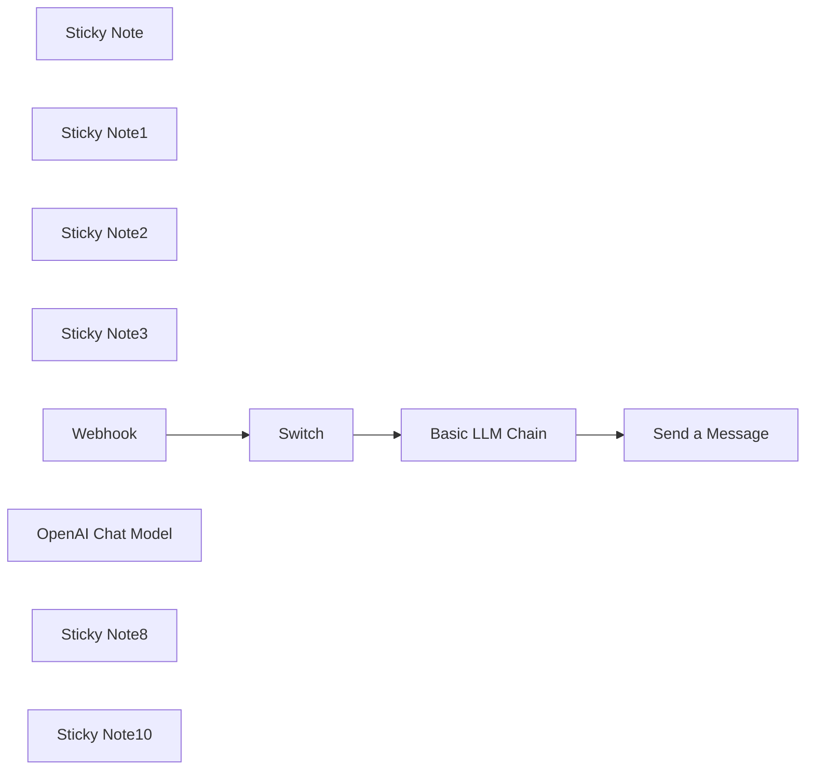

## Fluxo (.json) :

```json
{
  "id": "PGLFPj5y01s26rE1",
  "meta": {
    "instanceId": "b68f2515130d1ee83f4af1a6f2ca359fc9bb8cdbe875ca10b6f944f99aa931b5",
    "templateCredsSetupCompleted": true
  },
  "name": "My workflow 6",
  "tags": [],
  "nodes": [
    {
      "id": "82670f40-2e3b-4e02-ae52-f2c918c3aa1c",
      "name": "Sticky Note",
      "type": "n8n-nodes-base.stickyNote",
      "position": [
        -80,
        -600
      ],
      "parameters": {
        "color": 7,
        "width": 280,
        "height": 380,
        "content": "## Command Trigger\n\nCopy the webhook URL, paste it into the Request URL of the Slack slash command, and complete the creation.\n\n\n웹훅 URL을 복사하여 슬랙 슬래시 커맨드의 Request URL에 붙이고 생성을 완료하세요."
      },
      "typeVersion": 1
    },
    {
      "id": "28f56691-0ad5-47b1-974b-1ece4890933b",
      "name": "Sticky Note1",
      "type": "n8n-nodes-base.stickyNote",
      "position": [
        260,
        -600
      ],
      "parameters": {
        "color": 7,
        "height": 380,
        "content": "## Command Switch\n\nSwitch each slash command.\n\n각 슬래시 커맨드를 분기하세요."
      },
      "typeVersion": 1
    },
    {
      "id": "9dc9ca95-e29d-44d9-9e09-b2a72d9ad23a",
      "name": "Sticky Note2",
      "type": "n8n-nodes-base.stickyNote",
      "position": [
        600,
        -600
      ],
      "parameters": {
        "color": 7,
        "width": 360,
        "height": 380,
        "content": "## Create AI Messages"
      },
      "typeVersion": 1
    },
    {
      "id": "025c5a59-06b6-4b6d-b3e0-aa782a133c97",
      "name": "Sticky Note3",
      "type": "n8n-nodes-base.stickyNote",
      "position": [
        1060,
        -600
      ],
      "parameters": {
        "color": 7,
        "height": 340,
        "content": "## Send a Slack Message"
      },
      "typeVersion": 1
    },
    {
      "id": "cb60e9b0-a9a8-4dd6-9aa3-9d22c7f5f537",
      "name": "Webhook",
      "type": "n8n-nodes-base.webhook",
      "position": [
        -20,
        -380
      ],
      "webhookId": "1bd05fcf-8286-491f-ae13-f0e6bff4aca6",
      "parameters": {
        "path": "1bd05fcf-8286-491f-ae13-f0e6bff4aca6",
        "options": {
          "responseCode": {
            "values": {
              "responseCode": 204
            }
          }
        },
        "httpMethod": "POST"
      },
      "typeVersion": 2
    },
    {
      "id": "d60cfb45-df3d-4ab1-8e7e-1b2e81bc5b34",
      "name": "Switch",
      "type": "n8n-nodes-base.switch",
      "position": [
        320,
        -380
      ],
      "parameters": {
        "rules": {
          "values": [
            {
              "outputKey": "ask",
              "conditions": {
                "options": {
                  "version": 2,
                  "leftValue": "",
                  "caseSensitive": true,
                  "typeValidation": "strict"
                },
                "combinator": "and",
                "conditions": [
                  {
                    "operator": {
                      "type": "string",
                      "operation": "equals"
                    },
                    "leftValue": "={{ $json.body.command }}",
                    "rightValue": "/ask"
                  }
                ]
              },
              "renameOutput": true
            },
            {
              "outputKey": "another",
              "conditions": {
                "options": {
                  "version": 2,
                  "leftValue": "",
                  "caseSensitive": true,
                  "typeValidation": "strict"
                },
                "combinator": "and",
                "conditions": [
                  {
                    "id": "a0924665-de21-4d9b-a1d1-c9f41f74ee09",
                    "operator": {
                      "name": "filter.operator.equals",
                      "type": "string",
                      "operation": "equals"
                    },
                    "leftValue": "={{ $json.body.command }}",
                    "rightValue": "/another"
                  }
                ]
              },
              "renameOutput": true
            }
          ]
        },
        "options": {}
      },
      "typeVersion": 3.2
    },
    {
      "id": "810ac4dd-8241-4486-b183-74cbde3d58e7",
      "name": "Basic LLM Chain",
      "type": "@n8n/n8n-nodes-langchain.chainLlm",
      "position": [
        640,
        -500
      ],
      "parameters": {
        "text": "={{ $json.body.text }}",
        "promptType": "define"
      },
      "typeVersion": 1.5
    },
    {
      "id": "f173fe2d-45e7-460c-aa33-d5509b6d59b9",
      "name": "OpenAI Chat Model",
      "type": "@n8n/n8n-nodes-langchain.lmChatOpenAi",
      "position": [
        720,
        -340
      ],
      "parameters": {
        "model": {
          "__rl": true,
          "mode": "list",
          "value": "gpt-4o-mini"
        },
        "options": {}
      },
      "typeVersion": 1.2
    },
    {
      "id": "4752da4c-b013-4469-a3bc-386d3ab3d15d",
      "name": "Send a Message",
      "type": "n8n-nodes-base.slack",
      "position": [
        1120,
        -460
      ],
      "webhookId": "a37abc2a-6e8c-4c00-8543-3f313b300df6",
      "parameters": {
        "text": "={{ $json.text }}",
        "select": "channel",
        "channelId": {
          "__rl": true,
          "mode": "id",
          "value": "={{ $('Webhook').item.json.body.channel_id }}"
        },
        "otherOptions": {
          "includeLinkToWorkflow": false
        }
      },
      "typeVersion": 2.3
    },
    {
      "id": "c2f5dbcc-8283-47ab-b19a-810ad526d519",
      "name": "Sticky Note8",
      "type": "n8n-nodes-base.stickyNote",
      "position": [
        -80,
        -1060
      ],
      "parameters": {
        "color": 7,
        "width": 340,
        "height": 400,
        "content": "## 슬랙 Slash Command와 채널 메시지로 챗봇 만들기 🤖\n\n이 튜토리얼에서는 n8n을 활용해 슬랙에서 동작하는 AI 챗봇을 만드는 방법을 알려드립니다. 슬래시 커맨드를 통한 개인 메시지부터 공개 채널에서의 자동 응답까지, 실용적인 챗봇 구현 방법을 단계별로 설명합니다. 슬랙 앱 설정부터 n8n 노드 구성, 웹훅 트리거 설정, AI 봇 연동까지 하나하나 자세히 다룹니다.\n\n유튜브 링크:\nhttps://www.youtube.com/watch?v=UpudYFCWaIM\n"
      },
      "typeVersion": 1
    },
    {
      "id": "4ecdfdfa-8886-47c6-b9df-ac45321b0cea",
      "name": "Sticky Note10",
      "type": "n8n-nodes-base.stickyNote",
      "position": [
        300,
        -1060
      ],
      "parameters": {
        "color": 7,
        "width": 340,
        "height": 400,
        "content": "## Create an AI chatbot with Slack slash commands! 🤖\n\nIn this tutorial, we'll show you how to create an AI chatbot that works in Slack using n8n. We'll explain step by step how to implement a practical chatbot, from personal messages through slash commands to automatic responses in public channels. We'll cover everything in detail, from Slack app configuration to n8n node setup, webhook trigger configuration, and AI bot integration.\n\nThe YouTube video is provided in Korean.\n\nYoutube Link:\nhttps://www.youtube.com/watch?v=UpudYFCWaIM\n"
      },
      "typeVersion": 1
    }
  ],
  "active": false,
  "pinData": {},
  "settings": {
    "executionOrder": "v1"
  },
  "versionId": "de554ae6-98d5-4841-9ed6-cb68d2c1bc7f",
  "connections": {
    "Switch": {
      "main": [
        [
          {
            "node": "Basic LLM Chain",
            "type": "main",
            "index": 0
          }
        ]
      ]
    },
    "Webhook": {
      "main": [
        [
          {
            "node": "Switch",
            "type": "main",
            "index": 0
          }
        ]
      ]
    },
    "Basic LLM Chain": {
      "main": [
        [
          {
            "node": "Send a Message",
            "type": "main",
            "index": 0
          }
        ]
      ]
    },
    "OpenAI Chat Model": {
      "ai_languageModel": [
        [
          {
            "node": "Basic LLM Chain",
            "type": "ai_languageModel",
            "index": 0
          }
        ]
      ]
    }
  }
}
```

<a id="template-2297"></a>

## Template 2297 - Extrair e resumir últimos ensaios de Paul Graham

- **Nome:** Extrair e resumir últimos ensaios de Paul Graham
- **Descrição:** Raspa os ensaios mais recentes do site de Paul Graham, extrai título e conteúdo, e gera resumos usando um modelo de linguagem.
- **Funcionalidade:** • Início manual: Aciona o fluxo quando executado manualmente.
• Coleta da lista de ensaios: Acessa a página de índice de artigos e obtém os links dos ensaios.
• Extração dos links: Identifica e separa cada link de ensaio encontrado na página.
• Limitação de itens: Restringe o processamento aos 3 primeiros ensaios para execução mais rápida.
• Recuperação das páginas: Faz requisições às páginas individuais dos ensaios para obter o conteúdo completo.
• Extração de título e corpo: Extrai o título e o conteúdo principal do corpo da página, ignorando imagens e elementos de navegação.
• Divisão de texto em blocos: Separa textos longos em partes menores para processamentos de linguagem mais confiáveis.
• Geração de resumo: Envia o conteúdo dividido para um modelo de linguagem para produzir um resumo conciso.
• Consolidação dos resultados: Combina título, resumo e URL em um formato limpo e padronizado.
- **Ferramentas:** • paulgraham.com: Fonte oficial dos ensaios (páginas HTML contendo títulos e textos).
• OpenAI (gpt-4o-mini): Modelo de linguagem usado para gerar os resumos dos textos.

## Fluxo visual

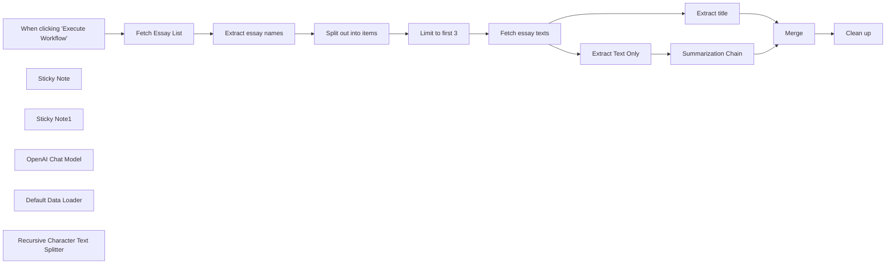

## Fluxo (.json) :

```json
{
  "meta": {
    "instanceId": "408f9fb9940c3cb18ffdef0e0150fe342d6e655c3a9fac21f0f644e8bedabcd9",
    "templateCredsSetupCompleted": true
  },
  "nodes": [
    {
      "id": "a9048293-787d-44d6-b995-d329b2495048",
      "name": "When clicking \"Execute Workflow\"",
      "type": "n8n-nodes-base.manualTrigger",
      "position": [
        -1920,
        1380
      ],
      "parameters": {},
      "typeVersion": 1
    },
    {
      "id": "56017e8b-2f2e-4f40-9325-184ea01a18be",
      "name": "Sticky Note",
      "type": "n8n-nodes-base.stickyNote",
      "position": [
        -1720,
        1260
      ],
      "parameters": {
        "width": 1071.752021563343,
        "height": 285.66037735849045,
        "content": "## Scrape latest Paul Graham essays"
      },
      "typeVersion": 1
    },
    {
      "id": "aa855d7c-6602-4242-bc84-56fed7c27c26",
      "name": "Sticky Note1",
      "type": "n8n-nodes-base.stickyNote",
      "position": [
        -600,
        1260
      ],
      "parameters": {
        "width": 625,
        "height": 607,
        "content": "## Summarize them with GPT"
      },
      "typeVersion": 1
    },
    {
      "id": "1a38e545-6d3b-40b2-a3ff-6f91fdd772de",
      "name": "Fetch Essay List",
      "type": "n8n-nodes-base.httpRequest",
      "position": [
        -1640,
        1380
      ],
      "parameters": {
        "url": "http://www.paulgraham.com/articles.html",
        "options": {}
      },
      "typeVersion": 4.2
    },
    {
      "id": "bd713892-356b-4a9c-b076-000bd4f1f1ba",
      "name": "OpenAI Chat Model",
      "type": "@n8n/n8n-nodes-langchain.lmChatOpenAi",
      "position": [
        -380,
        1600
      ],
      "parameters": {
        "model": {
          "__rl": true,
          "mode": "list",
          "value": "gpt-4o-mini"
        },
        "options": {}
      },
      "credentials": {
        "openAiApi": {
          "id": "8gccIjcuf3gvaoEr",
          "name": "OpenAi account"
        }
      },
      "typeVersion": 1.2
    },
    {
      "id": "4d7359ab-ba87-4756-8168-f2b987aac2fc",
      "name": "Extract essay names",
      "type": "n8n-nodes-base.html",
      "position": [
        -1440,
        1380
      ],
      "parameters": {
        "options": {},
        "operation": "extractHtmlContent",
        "extractionValues": {
          "values": [
            {
              "key": "essay",
              "attribute": "href",
              "cssSelector": "table table a",
              "returnArray": true,
              "returnValue": "attribute"
            }
          ]
        }
      },
      "typeVersion": 1.2
    },
    {
      "id": "8342d13f-879d-426b-ba28-ab696dd7f155",
      "name": "Split out into items",
      "type": "n8n-nodes-base.splitOut",
      "position": [
        -1240,
        1380
      ],
      "parameters": {
        "options": {},
        "fieldToSplitOut": "essay"
      },
      "typeVersion": 1
    },
    {
      "id": "a057d3cb-b7fb-4b4d-810a-e4de3ac10702",
      "name": "Fetch essay texts",
      "type": "n8n-nodes-base.httpRequest",
      "position": [
        -840,
        1380
      ],
      "parameters": {
        "url": "=http://www.paulgraham.com/{{ $json.essay }}",
        "options": {}
      },
      "typeVersion": 4.2
    },
    {
      "id": "98164d8c-3d6f-485d-93b6-1da3e8ae7ca8",
      "name": "Extract title",
      "type": "n8n-nodes-base.html",
      "position": [
        -340,
        1080
      ],
      "parameters": {
        "options": {},
        "operation": "extractHtmlContent",
        "extractionValues": {
          "values": [
            {
              "key": "title",
              "cssSelector": "title"
            }
          ]
        }
      },
      "typeVersion": 1.2
    },
    {
      "id": "fc0b6230-d169-4b20-803b-1896982c37c3",
      "name": "Summarization Chain",
      "type": "@n8n/n8n-nodes-langchain.chainSummarization",
      "position": [
        -340,
        1380
      ],
      "parameters": {
        "options": {},
        "operationMode": "documentLoader"
      },
      "typeVersion": 2
    },
    {
      "id": "a656524a-9f77-4922-9de7-e2221ac82b70",
      "name": "Clean up",
      "type": "n8n-nodes-base.set",
      "position": [
        360,
        1380
      ],
      "parameters": {
        "options": {},
        "assignments": {
          "assignments": [
            {
              "id": "7b337b47-a1c6-470e-881f-0c038b4917e5",
              "name": "title",
              "type": "string",
              "value": "={{ $json.title }}"
            },
            {
              "id": "ca820521-4fff-4971-84b5-e6e2dbd8bb7a",
              "name": "summary",
              "type": "string",
              "value": "={{ $json.response.text }}"
            },
            {
              "id": "0fd9b5e3-44dd-49a3-82c1-3a4aa4698376",
              "name": "url",
              "type": "string",
              "value": "=http://www.paulgraham.com/{{ $('Limit to first 3').first().json.essay }}"
            }
          ]
        }
      },
      "typeVersion": 3.4
    },
    {
      "id": "da738af0-7302-442d-bdc8-c9771be10794",
      "name": "Merge",
      "type": "n8n-nodes-base.merge",
      "position": [
        160,
        1380
      ],
      "parameters": {
        "mode": "combine",
        "options": {},
        "combineBy": "combineByPosition"
      },
      "typeVersion": 3
    },
    {
      "id": "adf51f27-8d3e-49a8-b850-7990d355dc81",
      "name": "Default Data Loader",
      "type": "@n8n/n8n-nodes-langchain.documentDefaultDataLoader",
      "position": [
        -260,
        1600
      ],
      "parameters": {
        "options": {},
        "jsonData": "={{ $('Extract Text Only').item.json.data }}",
        "jsonMode": "expressionData"
      },
      "typeVersion": 1
    },
    {
      "id": "f57c5908-4ae3-4ce1-a74b-0fc393792c21",
      "name": "Recursive Character Text Splitter",
      "type": "@n8n/n8n-nodes-langchain.textSplitterRecursiveCharacterTextSplitter",
      "position": [
        -180,
        1720
      ],
      "parameters": {
        "options": {},
        "chunkSize": 6000
      },
      "typeVersion": 1
    },
    {
      "id": "278eed78-3489-41e3-b4d2-a2de788fcd21",
      "name": "Limit to first 3",
      "type": "n8n-nodes-base.limit",
      "position": [
        -1040,
        1380
      ],
      "parameters": {
        "maxItems": 3
      },
      "typeVersion": 1
    },
    {
      "id": "028147d1-2a45-416d-91d0-40a0af2747f5",
      "name": "Extract Text Only",
      "type": "n8n-nodes-base.html",
      "position": [
        -520,
        1380
      ],
      "parameters": {
        "options": {},
        "operation": "extractHtmlContent",
        "extractionValues": {
          "values": [
            {
              "key": "data",
              "cssSelector": "body",
              "skipSelectors": "img,nav"
            }
          ]
        }
      },
      "typeVersion": 1.2
    }
  ],
  "pinData": {},
  "connections": {
    "Merge": {
      "main": [
        [
          {
            "node": "Clean up",
            "type": "main",
            "index": 0
          }
        ]
      ]
    },
    "Extract title": {
      "main": [
        [
          {
            "node": "Merge",
            "type": "main",
            "index": 0
          }
        ]
      ]
    },
    "Fetch Essay List": {
      "main": [
        [
          {
            "node": "Extract essay names",
            "type": "main",
            "index": 0
          }
        ]
      ]
    },
    "Limit to first 3": {
      "main": [
        [
          {
            "node": "Fetch essay texts",
            "type": "main",
            "index": 0
          }
        ]
      ]
    },
    "Extract Text Only": {
      "main": [
        [
          {
            "node": "Summarization Chain",
            "type": "main",
            "index": 0
          }
        ]
      ]
    },
    "Fetch essay texts": {
      "main": [
        [
          {
            "node": "Extract title",
            "type": "main",
            "index": 0
          },
          {
            "node": "Extract Text Only",
            "type": "main",
            "index": 0
          }
        ]
      ]
    },
    "OpenAI Chat Model": {
      "ai_languageModel": [
        [
          {
            "node": "Summarization Chain",
            "type": "ai_languageModel",
            "index": 0
          }
        ]
      ]
    },
    "Default Data Loader": {
      "ai_document": [
        [
          {
            "node": "Summarization Chain",
            "type": "ai_document",
            "index": 0
          }
        ]
      ]
    },
    "Extract essay names": {
      "main": [
        [
          {
            "node": "Split out into items",
            "type": "main",
            "index": 0
          }
        ]
      ]
    },
    "Summarization Chain": {
      "main": [
        [
          {
            "node": "Merge",
            "type": "main",
            "index": 1
          }
        ]
      ]
    },
    "Split out into items": {
      "main": [
        [
          {
            "node": "Limit to first 3",
            "type": "main",
            "index": 0
          }
        ]
      ]
    },
    "When clicking \"Execute Workflow\"": {
      "main": [
        [
          {
            "node": "Fetch Essay List",
            "type": "main",
            "index": 0
          }
        ]
      ]
    },
    "Recursive Character Text Splitter": {
      "ai_textSplitter": [
        [
          {
            "node": "Default Data Loader",
            "type": "ai_textSplitter",
            "index": 0
          }
        ]
      ]
    }
  }
}
```

<a id="template-2299"></a>

## Template 2299 - Captura e enriquecimento de leads por e-mail

- **Nome:** Captura e enriquecimento de leads por e-mail
- **Descrição:** Coleta um e-mail enviado por um formulário, verifica sua validade e, se válido, enriquece os dados da pessoa e da empresa antes de criar um lead no HubSpot.
- **Funcionalidade:** • Captura de submissão de formulário: Recebe o e-mail fornecido pelo usuário no formulário "Contact us".
• Verificação de e-mail: Valida o endereço de e-mail para checar entregabilidade e existência.
• Ramo condicional: Decide o fluxo com base na validade do e-mail (prossegue apenas se for válido).
• Enriquecimento de pessoa: Obtém informações da pessoa (nome, cargo, empresa, localização) a partir do e-mail.
• Enriquecimento de empresa: Recupera dados da empresa (domínio, tamanho, setor, descrição) a partir do domínio da empresa.
• Criação de lead no CRM: Adiciona um contato no HubSpot preenchendo e-mail, nome, sobrenome, cargo, nome da empresa e tamanho da empresa.
- **Ferramentas:** • Hunter: Serviço para verificação e validação de e-mails (verifica status, deliverability e registros SMTP).
• Clearbit: Serviço de enriquecimento de dados que fornece informações sobre pessoas e empresas a partir de e-mails e domínios.
• HubSpot: Plataforma de CRM utilizada para criar e armazenar leads e contatos automaticamente.


## Fluxo visual

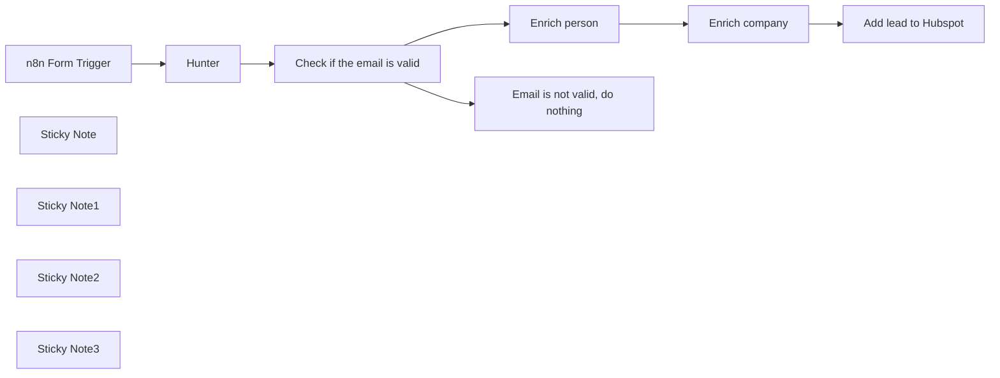

## Fluxo (.json) :

```json
{
  "meta": {
    "instanceId": "257476b1ef58bf3cb6a46e65fac7ee34a53a5e1a8492d5c6e4da5f87c9b82833"
  },
  "nodes": [
    {
      "id": "bcd8e7dc-cb7f-4e2b-a0c6-2d154cb58938",
      "name": "n8n Form Trigger",
      "type": "n8n-nodes-base.formTrigger",
      "position": [
        820,
        360
      ],
      "webhookId": "0bf8840f-1cc4-46a9-86af-a3fa8da80608",
      "parameters": {
        "path": "0bf8840f-1cc4-46a9-86af-a3fa8da80608",
        "options": {},
        "formTitle": "Contact us",
        "formFields": {
          "values": [
            {
              "fieldLabel": "What's your business email?"
            }
          ]
        },
        "formDescription": "We'll get back to you soon"
      },
      "typeVersion": 2
    },
    {
      "id": "0720ab51-5222-46fe-8a1a-31e25b81920c",
      "name": "Hunter",
      "type": "n8n-nodes-base.hunter",
      "position": [
        1040,
        360
      ],
      "parameters": {
        "email": "={{ $json['What\\'s your business email?'] }}",
        "operation": "emailVerifier"
      },
      "credentials": {
        "hunterApi": {
          "id": "oIxKoEBTBJeT1UrT",
          "name": "Hunter account"
        }
      },
      "typeVersion": 1
    },
    {
      "id": "c20c626f-fd58-497f-942f-5d10f198f36d",
      "name": "Check if the email is valid",
      "type": "n8n-nodes-base.if",
      "position": [
        1240,
        360
      ],
      "parameters": {
        "options": {},
        "conditions": {
          "options": {
            "leftValue": "",
            "caseSensitive": true,
            "typeValidation": "strict"
          },
          "combinator": "and",
          "conditions": [
            {
              "id": "54d84c8a-63ee-40ed-8fb2-301fff0194ba",
              "operator": {
                "name": "filter.operator.equals",
                "type": "string",
                "operation": "equals"
              },
              "leftValue": "={{ $json.status }}",
              "rightValue": "valid"
            }
          ]
        }
      },
      "typeVersion": 2
    },
    {
      "id": "9c55911c-06b7-4291-a91d-30c0cb87b7f2",
      "name": "Sticky Note",
      "type": "n8n-nodes-base.stickyNote",
      "position": [
        820,
        180
      ],
      "parameters": {
        "color": 5,
        "width": 547,
        "height": 132,
        "content": "### 👨‍🎤 Setup\n1. Add you **Hunter**, **Clearbit** and **Hubspot** credentials\n2. Click the Test Workflow button, enter your email and check your Hubspot\n3. Activate the workflow and use the form trigger production URL to collect your leads in a smart way "
      },
      "typeVersion": 1
    },
    {
      "id": "4e518b0c-20e6-4fb3-8be9-c0989c750fda",
      "name": "Enrich company",
      "type": "n8n-nodes-base.clearbit",
      "position": [
        1620,
        300
      ],
      "parameters": {
        "domain": "={{ $json.employment.domain }}",
        "additionalFields": {}
      },
      "credentials": {
        "clearbitApi": {
          "id": "cKDImrinp9tg0ZHW",
          "name": "Clearbit account"
        }
      },
      "typeVersion": 1
    },
    {
      "id": "47e8324b-c455-40b5-8769-4d2c4718de75",
      "name": "Add lead to Hubspot",
      "type": "n8n-nodes-base.hubspot",
      "position": [
        1940,
        300
      ],
      "parameters": {
        "email": "={{ $('Check if the email is valid').item.json.email }}",
        "options": {},
        "authentication": "oAuth2",
        "additionalFields": {
          "jobTitle": "={{ $('Enrich person').item.json.employment.title }}",
          "lastName": "={{ $('Enrich person').item.json.name.familyName }}",
          "firstName": "={{ $('Enrich person').item.json.name.givenName }}",
          "companyName": "={{ $('Enrich person').item.json.employment.name }}",
          "companySize": "={{ $json.metrics.employees }}"
        }
      },
      "credentials": {
        "hubspotOAuth2Api": {
          "id": "WEONgGVHLYPjIE6k",
          "name": "HubSpot account"
        }
      },
      "typeVersion": 2
    },
    {
      "id": "30451862-9283-44fd-a1b7-9b31bbe9cbd2",
      "name": "Enrich person",
      "type": "n8n-nodes-base.clearbit",
      "position": [
        1460,
        300
      ],
      "parameters": {
        "email": "={{ $json.email }}",
        "resource": "person",
        "additionalFields": {}
      },
      "credentials": {
        "clearbitApi": {
          "id": "cKDImrinp9tg0ZHW",
          "name": "Clearbit account"
        }
      },
      "typeVersion": 1,
      "alwaysOutputData": true
    },
    {
      "id": "c96096f2-6505-4955-bb1b-c4f903428b1d",
      "name": "Sticky Note1",
      "type": "n8n-nodes-base.stickyNote",
      "position": [
        820,
        500
      ],
      "parameters": {
        "color": 7,
        "width": 162,
        "height": 139,
        "content": "👆 You can exchange this with any form you like (*e.g. Typeform, Google forms, Survey Monkey...*)"
      },
      "typeVersion": 1
    },
    {
      "id": "751458aa-7b63-48ab-881e-d68df94a3390",
      "name": "Sticky Note2",
      "type": "n8n-nodes-base.stickyNote",
      "position": [
        1940,
        460
      ],
      "parameters": {
        "color": 7,
        "width": 162,
        "height": 84,
        "content": "👆 Adjust the fields you need in your Hubspot here"
      },
      "typeVersion": 1
    },
    {
      "id": "6416c2ee-59a0-4496-bd62-0a3af06986b7",
      "name": "Email is not valid, do nothing",
      "type": "n8n-nodes-base.noOp",
      "position": [
        1460,
        480
      ],
      "parameters": {},
      "typeVersion": 1
    },
    {
      "id": "32bc2dc2-7b5c-4fc4-bf9f-a1231c6512d0",
      "name": "Sticky Note3",
      "type": "n8n-nodes-base.stickyNote",
      "position": [
        1740,
        180
      ],
      "parameters": {
        "color": 7,
        "width": 162,
        "height": 136.49297423887586,
        "content": "👇 Idea: You could add criteria on when to add a lead to your Hubspot here. For inspiration, take a look at [this template](https://n8n.io/workflows/2106-reach-out-via-email-to-new-form-submissions-that-meet-a-certain-criteria)"
      },
      "typeVersion": 1
    }
  ],
  "pinData": {
    "Hunter": [
      {
        "block": false,
        "email": "niklas@n8n.io",
        "score": 100,
        "regexp": true,
        "result": "deliverable",
        "status": "valid",
        "sources": [
          {
            "uri": "http://community.n8n.io/t/cant-send-email-with-multiple-attachments/22736/9",
            "domain": "community.n8n.io",
            "extracted_on": "2023-10-13",
            "last_seen_on": "2024-01-14",
            "still_on_page": true
          },
          {
            "uri": "http://community.n8n.io/t/cant-send-email-with-multiple-attachments/22736",
            "domain": "community.n8n.io",
            "extracted_on": "2023-07-13",
            "last_seen_on": "2024-01-11",
            "still_on_page": true
          }
        ],
        "webmail": false,
        "gibberish": false,
        "accept_all": false,
        "disposable": false,
        "mx_records": true,
        "smtp_check": true,
        "smtp_server": true,
        "_deprecation_notice": "Using result is deprecated, use status instead"
      }
    ],
    "Enrich person": [
      {
        "id": "f679f5ef-f7a0-4cb1-8790-fe663a0c092f",
        "bio": null,
        "geo": {
          "lat": 53.5510846,
          "lng": 9.9936819,
          "city": "Hamburg",
          "state": "Hamburg",
          "country": "Germany",
          "stateCode": "HH",
          "countryCode": "DE"
        },
        "name": {
          "fullName": "Niklas Hatje",
          "givenName": "Niklas",
          "familyName": "Hatje"
        },
        "site": null,
        "email": "niklas@n8n.io",
        "fuzzy": false,
        "avatar": null,
        "github": {
          "id": null,
          "blog": null,
          "avatar": null,
          "handle": null,
          "company": null,
          "followers": null,
          "following": null
        },
        "twitter": {
          "id": null,
          "bio": null,
          "site": null,
          "avatar": null,
          "handle": null,
          "location": null,
          "statuses": null,
          "favorites": null,
          "followers": null,
          "following": null
        },
        "facebook": {
          "handle": null
        },
        "gravatar": {
          "urls": [],
          "avatar": null,
          "handle": null,
          "avatars": []
        },
        "linkedin": {
          "handle": "in/niklashatje"
        },
        "location": "Hamburg, HH, DE",
        "timeZone": "Europe/Berlin",
        "indexedAt": "2024-01-24T15:49:16.888Z",
        "utcOffset": 1,
        "employment": {
          "name": "n8n",
          "role": null,
          "title": "Senior Produktmanager",
          "domain": "n8n.io",
          "subRole": null,
          "seniority": "manager"
        },
        "googleplus": {
          "handle": null
        },
        "emailProvider": false
      }
    ],
    "Enrich company": [
      {
        "id": "546ba3f6-a6b7-41a1-aed8-4f9bba4119e8",
        "geo": {
          "lat": 52.5297761,
          "lng": 13.3892831,
          "city": "Berlin",
          "state": "Berlin",
          "country": "Germany",
          "stateCode": "BE",
          "postalCode": "10115",
          "streetName": "Borsigstraße",
          "subPremise": null,
          "countryCode": "DE",
          "streetNumber": "27",
          "streetAddress": "27 Borsigstraße"
        },
        "logo": "https://logo.clearbit.com/n8n.io",
        "name": "n8n",
        "site": {
          "phoneNumbers": [],
          "emailAddresses": []
        },
        "tags": [
          "Information Technology & Services",
          "Computer Programming",
          "Software",
          "Professional Services",
          "Computers",
          "E-commerce",
          "Technology",
          "B2B",
          "B2C",
          "SAAS",
          "Mobile"
        ],
        "tech": [
          "mailgun",
          "cloud_flare",
          "workable",
          "google_tag_manager",
          "google_apps",
          "typeform",
          "google_analytics",
          "facebook_advertiser",
          "stripe"
        ],
        "type": "private",
        "phone": null,
        "domain": "n8n.io",
        "parent": {
          "domain": null
        },
        "ticker": null,
        "metrics": {
          "raised": 13500000,
          "employees": 60,
          "marketCap": null,
          "alexaUsRank": null,
          "trafficRank": "high",
          "annualRevenue": null,
          "fiscalYearEnd": null,
          "employeesRange": "51-250",
          "alexaGlobalRank": 61323,
          "estimatedAnnualRevenue": "$10M-$50M"
        },
        "twitter": {
          "id": "1068479892537384960",
          "bio": "n8n is an extendable workflow automation tool which enables you to connect anything to everything via its open, fair-code model.",
          "site": "https://t.co/F1fzJ95bij",
          "avatar": "https://pbs.twimg.com/profile_images/1536335358803251202/-gASF0c6_normal.png",
          "handle": "n8n_io",
          "location": "Berlin, Germany",
          "followers": 7238,
          "following": 1
        },
        "category": {
          "sector": "Information Technology",
          "sicCode": "73",
          "gicsCode": "45102010",
          "industry": "Internet Software & Services",
          "naicsCode": "54",
          "sic4Codes": [
            "7371"
          ],
          "naics6Codes": [
            "541511"
          ],
          "subIndustry": "Internet Software & Services",
          "industryGroup": "Software & Services",
          "naics6Codes2022": [
            "541511"
          ]
        },
        "facebook": {
          "likes": null,
          "handle": null
        },
        "linkedin": {
          "handle": "company/n8n"
        },
        "location": "Borsigstraße 27, 10115 Berlin, Germany",
        "timeZone": "Europe/Berlin",
        "indexedAt": "2024-02-08T21:30:12.524Z",
        "legalName": null,
        "utcOffset": 1,
        "crunchbase": {
          "handle": null
        },
        "description": "n8n.io is a powerful workflow automation tool that enables you to connect anything to everything. It is a free and open-source tool that can be installed on-premises, downloaded as a desktop app, or used as a cloud service. With n8n, you can automate b...",
        "foundedYear": 2019,
        "identifiers": {
          "usCIK": null,
          "usEIN": null
        },
        "domainAliases": [
          "n8n.cloud",
          "n8n.com"
        ],
        "emailProvider": false,
        "techCategories": [
          "email_delivery_service",
          "dns",
          "applicant_tracking_system",
          "tag_management",
          "productivity",
          "form_builder",
          "analytics",
          "advertising",
          "payment"
        ],
        "ultimateParent": {
          "domain": null
        }
      }
    ],
    "n8n Form Trigger": [
      {
        "formMode": "test",
        "submittedAt": "2024-02-21T18:59:22.964Z",
        "What's your business email?": "niklas@n8n.io"
      }
    ]
  },
  "connections": {
    "Hunter": {
      "main": [
        [
          {
            "node": "Check if the email is valid",
            "type": "main",
            "index": 0
          }
        ]
      ]
    },
    "Enrich person": {
      "main": [
        [
          {
            "node": "Enrich company",
            "type": "main",
            "index": 0
          }
        ]
      ]
    },
    "Enrich company": {
      "main": [
        [
          {
            "node": "Add lead to Hubspot",
            "type": "main",
            "index": 0
          }
        ]
      ]
    },
    "n8n Form Trigger": {
      "main": [
        [
          {
            "node": "Hunter",
            "type": "main",
            "index": 0
          }
        ]
      ]
    },
    "Check if the email is valid": {
      "main": [
        [
          {
            "node": "Enrich person",
            "type": "main",
            "index": 0
          }
        ],
        [
          {
            "node": "Email is not valid, do nothing",
            "type": "main",
            "index": 0
          }
        ]
      ]
    }
  }
}
```

<a id="template-2302"></a>

## Template 2302 - Agente de insights DexScreener via Telegram

- **Nome:** Agente de insights DexScreener via Telegram
- **Descrição:** Recebe consultas via Telegram, consulta a API do DexScreener conforme necessário usando um modelo de IA e retorna insights e dados de DEX diretamente no chat.
- **Funcionalidade:** • Recepção de mensagens Telegram: Inicia o fluxo ao receber mensagens de usuários.
• Associação de sessão: Armazena o sessionId a partir do chat id para manter contexto por usuário.
• Interpretação por modelo de linguagem: Usa um modelo OpenAI para entender solicitações e decidir ações.
• Memória contextual em janela: Mantém histórico recente da conversa para respostas mais coerentes.
• Chamadas à API DexScreener: Executa consultas para perfis de tokens, tokens impulsionados, boosts principais, busca de pares, verificação de orders pagos, obtenção de pares por cadeia/endereço e pools de token.
• Geração de insights: Consolida e analisa dados retornados pelas APIs para fornecer recomendações e explicações acionáveis.
• Resposta automática no Telegram: Envia os resultados e insights de volta ao mesmo chat do usuário.
- **Ferramentas:** • Telegram: Plataforma de mensagens usada para receber perguntas dos usuários e enviar respostas automatizadas.
• OpenAI (gpt-4o-mini): Modelo de linguagem utilizado para interpretar solicitações, orquestrar chamadas às APIs e gerar análises e texto de saída.
• DexScreener API: Fonte de dados on-chain para obter perfis de tokens, dados de boosts, pares de negociação, pools e status de orders.

## Fluxo visual

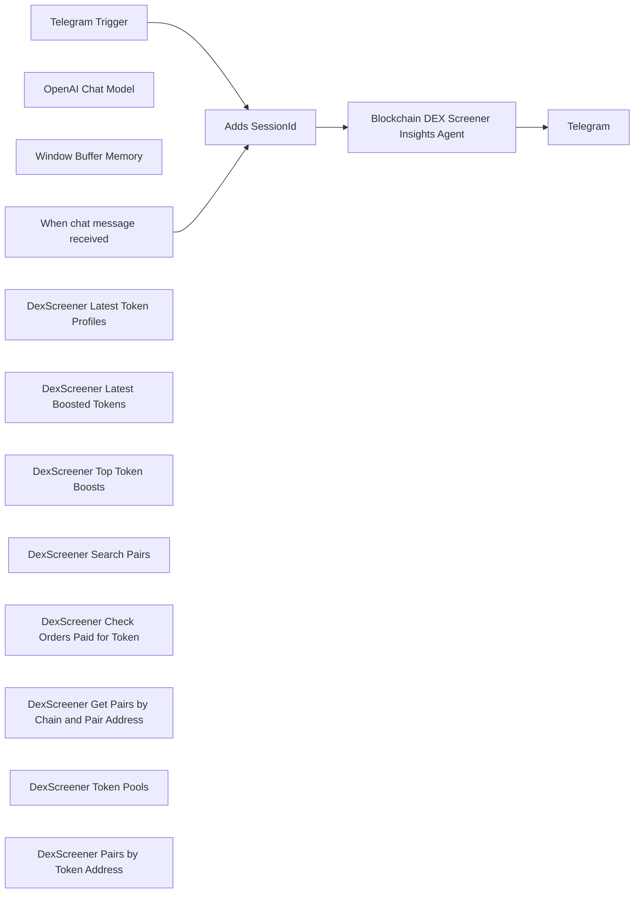

## Fluxo (.json) :

```json
{
  "id": "1ZfA8Do3j7lCB3zF",
  "meta": {
    "instanceId": "a5283507e1917a33cc3ae615b2e7d5ad2c1e50955e6f831272ddd5ab816f3fb6",
    "templateCredsSetupCompleted": true
  },
  "name": "Blockchain DEX Screener Insights Agent",
  "tags": [],
  "nodes": [
    {
      "id": "0e57bcd4-661d-40e3-a9d2-c66d5b84171c",
      "name": "When chat message received",
      "type": "@n8n/n8n-nodes-langchain.chatTrigger",
      "position": [
        -280,
        340
      ],
      "webhookId": "e79527d8-89bd-4974-926c-2bcd8020cfa4",
      "parameters": {
        "options": {}
      },
      "typeVersion": 1.1
    },
    {
      "id": "518565fc-1ee9-4c19-a300-a2c2bef2bb60",
      "name": "OpenAI Chat Model",
      "type": "@n8n/n8n-nodes-langchain.lmChatOpenAi",
      "position": [
        80,
        340
      ],
      "parameters": {
        "model": {
          "__rl": true,
          "mode": "list",
          "value": "gpt-4o-mini"
        },
        "options": {}
      },
      "credentials": {
        "openAiApi": {
          "id": "yUizd8t0sD5wMYVG",
          "name": "OpenAi account"
        }
      },
      "typeVersion": 1.2
    },
    {
      "id": "a52660f2-b13a-4dfb-9429-3f8e382fb4a6",
      "name": "Window Buffer Memory",
      "type": "@n8n/n8n-nodes-langchain.memoryBufferWindow",
      "position": [
        240,
        340
      ],
      "parameters": {},
      "typeVersion": 1.3
    },
    {
      "id": "6714c6df-cc31-4758-956b-1db42ec3112f",
      "name": "Telegram Trigger",
      "type": "n8n-nodes-base.telegramTrigger",
      "position": [
        -260,
        -140
      ],
      "webhookId": "08169624-2756-4c11-9ac1-106d63c5af18",
      "parameters": {
        "updates": [
          "message"
        ],
        "additionalFields": {}
      },
      "credentials": {
        "telegramApi": {
          "id": "R3vpGq0SURbvEw2Z",
          "name": "Telegram account"
        }
      },
      "typeVersion": 1.1
    },
    {
      "id": "91b1aecd-cbbf-4e17-afca-bb9e6b98e4d0",
      "name": "Blockchain DEX Screener Insights Agent",
      "type": "@n8n/n8n-nodes-langchain.agent",
      "position": [
        580,
        40
      ],
      "parameters": {
        "text": "={{ $('Telegram Trigger').item.json.message.text }}",
        "options": {
          "systemMessage": "You are the Blockchain DEX Screener Insights Agent. You have direct access to a suite of tools that interact with the DexScreener API to provide real-time insights from blockchain DEX data. Below is a summary of the available tools, their purposes, and how to use them:\n\n1. **DexScreener Latest Token Profiles**  \n   - **Purpose:** Fetches the latest token profiles.  \n   - **Endpoint:** `/token-profiles/latest/v1`  \n   - **Usage:** Use this tool to retrieve updated profiles, including token details, images, descriptions, and links.\n\n2. **DexScreener Latest Boosted Tokens**  \n   - **Purpose:** Retrieves the latest boosted tokens.  \n   - **Endpoint:** `/token-boosts/latest/v1`  \n   - **Usage:** Use this tool to get current boosted tokens data along with associated details such as token addresses, amounts, and descriptions.\n\n3. **DexScreener Top Token Boosts**  \n   - **Purpose:** Gets tokens with the most active boosts.  \n   - **Endpoint:** `/token-boosts/top/v1`  \n   - **Usage:** Use this tool when you need to identify tokens that are currently experiencing the highest levels of boosting activity.\n\n4. **DexScreener Search Pairs**  \n   - **Purpose:** Searches for trading pairs matching a query.  \n   - **Endpoint:** `/latest/dex/search`  \n   - **Usage:** Provide a query (e.g., `\"SOL/USDC\"`) to find specific pairs along with detailed information on base and quote tokens, pricing, volume, and more.\n\n5. **DexScreener Check Orders Paid for Token**  \n   - **Purpose:** Checks orders paid for a specific token.  \n   - **Endpoint:** `/orders/v1/{chainId}/{tokenAddress}`  \n   - **Usage:** Specify the `chainId` and `tokenAddress` to review the status and details (e.g., processing status, payment timestamp) of token orders.\n\n6. **DexScreener Get Pairs by Chain and Pair Address**  \n   - **Purpose:** Retrieves one or multiple pairs by chain and pair address.  \n   - **Endpoint:** `/latest/dex/pairs/{chainId}/{pairId}`  \n   - **Usage:** Use this tool to obtain detailed pair information by providing the chain ID and specific pair address.\n\n7. **DexScreener Token Pools**  \n   - **Purpose:** Fetches the pools of a given token address.  \n   - **Endpoint:** `/token-pairs/v1/{chainId}/{tokenAddress}`  \n   - **Usage:** Provide the chain ID and token address to receive information on available liquidity pools for that token.\n\n8. **DexScreener Pairs by Token Address**  \n   - **Purpose:** Retrieves one or multiple pairs by token address (supports comma-separated multiple addresses).  \n   - **Endpoint:** `/tokens/v1/{chainId}/{tokenAddresses}`  \n   - **Usage:** Use this tool when you need pair details for one or more tokens. Supply the chain ID and one or more token addresses (up to 30, comma-separated).\n\n**Usage Guidelines:**\n\n- **Rate Limits:** Adhere to the specified rate limits for each endpoint (ranging from 60 to 300 requests per minute).  \n- **Headers:** Each tool sends the header `Accept: */*` by default.  \n- **Parameters:** Use the appropriate path or query parameters as specified to tailor your request.  \n- **Insight Generation:** Leverage these tools to gather data and provide insightful analysis regarding token profiles, boosted tokens, pair search, orders, liquidity pools, and more.\n\nWhen responding to user queries, determine which tool or combination of tools is best suited to fetch the required data and generate comprehensive insights. Use these tools to validate data points and present up-to-date and reliable information on blockchain DEX activity.\n\nProceed with providing insights based on the available data from these DexScreener tools."
        },
        "promptType": "define"
      },
      "typeVersion": 1.7
    },
    {
      "id": "dfe730d6-a93c-45a6-a600-5fd552cc88b8",
      "name": "Telegram",
      "type": "n8n-nodes-base.telegram",
      "position": [
        1020,
        40
      ],
      "webhookId": "24c73b37-4374-4fcf-b3c9-fa9121e25049",
      "parameters": {
        "text": "={{ $json.output }}",
        "chatId": "={{ $('Telegram Trigger').item.json.message.chat.id }}",
        "additionalFields": {
          "appendAttribution": false
        }
      },
      "credentials": {
        "telegramApi": {
          "id": "R3vpGq0SURbvEw2Z",
          "name": "Telegram account"
        }
      },
      "typeVersion": 1.2
    },
    {
      "id": "223fa9b3-8f49-407c-9a28-0f67bf6a13cc",
      "name": "Adds SessionId",
      "type": "n8n-nodes-base.set",
      "position": [
        240,
        40
      ],
      "parameters": {
        "options": {},
        "assignments": {
          "assignments": [
            {
              "id": "b5c25cd4-226b-4778-863f-79b13b4a5202",
              "name": "sessionId",
              "type": "string",
              "value": "={{ $json.message.chat.id }}"
            }
          ]
        },
        "includeOtherFields": true
      },
      "typeVersion": 3.4
    },
    {
      "id": "f88141f2-e5be-46f5-abd5-3f095e04b09d",
      "name": "DexScreener Latest Token Profiles",
      "type": "@n8n/n8n-nodes-langchain.toolHttpRequest",
      "position": [
        400,
        340
      ],
      "parameters": {
        "url": "https://api.dexscreener.com/token-profiles/latest/v1",
        "sendHeaders": true,
        "toolDescription": "This tool fetches the latest token profiles from the DexScreener API (rate limit: 60 requests per minute).",
        "parametersHeaders": {
          "values": [
            {
              "name": "Accept",
              "value": "*/*",
              "valueProvider": "fieldValue"
            }
          ]
        }
      },
      "typeVersion": 1.1
    },
    {
      "id": "6adb778c-5c98-45b5-9979-013abe5b88a8",
      "name": "DexScreener Latest Boosted Tokens",
      "type": "@n8n/n8n-nodes-langchain.toolHttpRequest",
      "position": [
        580,
        340
      ],
      "parameters": {
        "url": "https://api.dexscreener.com/token-boosts/latest/v1",
        "sendHeaders": true,
        "toolDescription": "This tool fetches the latest boosted tokens from the DexScreener API (rate limit: 60 requests per minute).",
        "parametersHeaders": {
          "values": [
            {
              "name": "Accept",
              "value": "*/*",
              "valueProvider": "fieldValue"
            }
          ]
        }
      },
      "typeVersion": 1.1
    },
    {
      "id": "10ecdbbe-8d9c-4485-8ce1-45afe72c0ae2",
      "name": "DexScreener Top Token Boosts",
      "type": "@n8n/n8n-nodes-langchain.toolHttpRequest",
      "position": [
        760,
        340
      ],
      "parameters": {
        "url": "https://api.dexscreener.com/token-boosts/top/v1",
        "sendHeaders": true,
        "toolDescription": "This tool fetches the tokens with the most active boosts from the DexScreener API (rate limit: 60 requests per minute).",
        "parametersHeaders": {
          "values": [
            {
              "name": "Accept",
              "value": "*/*",
              "valueProvider": "fieldValue"
            }
          ]
        }
      },
      "typeVersion": 1.1
    },
    {
      "id": "2a9de1cd-aed7-4037-aaee-582ec1c3a244",
      "name": "DexScreener Search Pairs",
      "type": "@n8n/n8n-nodes-langchain.toolHttpRequest",
      "position": [
        1280,
        340
      ],
      "parameters": {
        "url": "https://api.dexscreener.com/latest/dex/search",
        "sendQuery": true,
        "sendHeaders": true,
        "parametersQuery": {
          "values": [
            {
              "name": "q"
            }
          ]
        },
        "toolDescription": "This tool searches for pairs matching a query from the DexScreener API (rate limit: 300 requests per minute).",
        "parametersHeaders": {
          "values": [
            {
              "name": "Accept",
              "value": "*/*",
              "valueProvider": "fieldValue"
            }
          ]
        }
      },
      "typeVersion": 1.1
    },
    {
      "id": "fe355be2-b158-4f44-bd52-c3ad14297c8b",
      "name": "DexScreener Check Orders Paid for Token",
      "type": "@n8n/n8n-nodes-langchain.toolHttpRequest",
      "position": [
        940,
        340
      ],
      "parameters": {
        "url": "https://api.dexscreener.com/orders/v1/{chainId}/{tokenAddress}",
        "sendHeaders": true,
        "toolDescription": "This tool checks orders paid for a token on DexScreener (rate limit: 60 requests per minute).",
        "parametersHeaders": {
          "values": [
            {
              "name": "Accept",
              "value": "*/*",
              "valueProvider": "fieldValue"
            }
          ]
        }
      },
      "typeVersion": 1.1
    },
    {
      "id": "a3519f26-61ce-4e5b-9fb8-06a080fbaea4",
      "name": "DexScreener Get Pairs by Chain and Pair Address",
      "type": "@n8n/n8n-nodes-langchain.toolHttpRequest",
      "position": [
        1100,
        340
      ],
      "parameters": {
        "url": "https://api.dexscreener.com/latest/dex/pairs/{chainId}/{pairId}",
        "sendHeaders": true,
        "toolDescription": "This tool retrieves one or multiple pairs by chain and pair address from the DexScreener API (rate limit: 300 requests per minute).",
        "parametersHeaders": {
          "values": [
            {
              "name": "Accept",
              "value": "*/*",
              "valueProvider": "fieldValue"
            }
          ]
        }
      },
      "typeVersion": 1.1
    },
    {
      "id": "da965564-a024-4358-8399-e01775142b36",
      "name": "DexScreener Token Pools",
      "type": "@n8n/n8n-nodes-langchain.toolHttpRequest",
      "position": [
        1480,
        340
      ],
      "parameters": {
        "url": "https://api.dexscreener.com/token-pairs/v1/{chainId}/{tokenAddress}",
        "sendHeaders": true,
        "toolDescription": "This tool retrieves the pools of a given token address from the DexScreener API (rate limit: 300 requests per minute).",
        "parametersHeaders": {
          "values": [
            {
              "name": "Accept",
              "value": "*/*",
              "valueProvider": "fieldValue"
            }
          ]
        }
      },
      "typeVersion": 1.1
    },
    {
      "id": "31cb228c-9a6d-4519-a6a9-7be9cc75716e",
      "name": "DexScreener Pairs by Token Address",
      "type": "@n8n/n8n-nodes-langchain.toolHttpRequest",
      "position": [
        1700,
        340
      ],
      "parameters": {
        "url": "https://api.dexscreener.com/tokens/v1/{chainId}/{tokenAddresses}",
        "sendHeaders": true,
        "toolDescription": "This tool retrieves one or multiple pairs by token address from the DexScreener API (rate limit: 300 requests per minute).",
        "parametersHeaders": {
          "values": [
            {
              "name": "Accept",
              "value": "*/*",
              "valueProvider": "fieldValue"
            }
          ]
        }
      },
      "typeVersion": 1.1
    }
  ],
  "active": false,
  "pinData": {},
  "settings": {
    "executionOrder": "v1"
  },
  "versionId": "2fbb101c-f139-4e20-88d9-88db0d7ce4f9",
  "connections": {
    "Adds SessionId": {
      "main": [
        [
          {
            "node": "Blockchain DEX Screener Insights Agent",
            "type": "main",
            "index": 0
          }
        ]
      ]
    },
    "Telegram Trigger": {
      "main": [
        [
          {
            "node": "Adds SessionId",
            "type": "main",
            "index": 0
          }
        ]
      ]
    },
    "OpenAI Chat Model": {
      "ai_languageModel": [
        [
          {
            "node": "Blockchain DEX Screener Insights Agent",
            "type": "ai_languageModel",
            "index": 0
          }
        ]
      ]
    },
    "Window Buffer Memory": {
      "ai_memory": [
        [
          {
            "node": "Blockchain DEX Screener Insights Agent",
            "type": "ai_memory",
            "index": 0
          }
        ]
      ]
    },
    "DexScreener Token Pools": {
      "ai_tool": [
        [
          {
            "node": "Blockchain DEX Screener Insights Agent",
            "type": "ai_tool",
            "index": 0
          }
        ]
      ]
    },
    "DexScreener Search Pairs": {
      "ai_tool": [
        [
          {
            "node": "Blockchain DEX Screener Insights Agent",
            "type": "ai_tool",
            "index": 0
          }
        ]
      ]
    },
    "When chat message received": {
      "main": [
        [
          {
            "node": "Adds SessionId",
            "type": "main",
            "index": 0
          }
        ]
      ]
    },
    "DexScreener Top Token Boosts": {
      "ai_tool": [
        [
          {
            "node": "Blockchain DEX Screener Insights Agent",
            "type": "ai_tool",
            "index": 0
          }
        ]
      ]
    },
    "DexScreener Latest Boosted Tokens": {
      "ai_tool": [
        [
          {
            "node": "Blockchain DEX Screener Insights Agent",
            "type": "ai_tool",
            "index": 0
          }
        ]
      ]
    },
    "DexScreener Latest Token Profiles": {
      "ai_tool": [
        [
          {
            "node": "Blockchain DEX Screener Insights Agent",
            "type": "ai_tool",
            "index": 0
          }
        ]
      ]
    },
    "DexScreener Pairs by Token Address": {
      "ai_tool": [
        [
          {
            "node": "Blockchain DEX Screener Insights Agent",
            "type": "ai_tool",
            "index": 0
          }
        ]
      ]
    },
    "Blockchain DEX Screener Insights Agent": {
      "main": [
        [
          {
            "node": "Telegram",
            "type": "main",
            "index": 0
          }
        ]
      ]
    },
    "DexScreener Check Orders Paid for Token": {
      "ai_tool": [
        [
          {
            "node": "Blockchain DEX Screener Insights Agent",
            "type": "ai_tool",
            "index": 0
          }
        ]
      ]
    },
    "DexScreener Get Pairs by Chain and Pair Address": {
      "ai_tool": [
        [
          {
            "node": "Blockchain DEX Screener Insights Agent",
            "type": "ai_tool",
            "index": 0
          }
        ]
      ]
    }
  }
}
```

<a id="template-2304"></a>

## Template 2304 - Alerta de criptomoedas por variação 24h

- **Nome:** Alerta de criptomoedas por variação 24h
- **Descrição:** Verifica periodicamente as variações de preço em 24 horas na Binance, identifica mudanças significativas, formata mensagens e as envia para um chat do Telegram.
- **Funcionalidade:** • Agendamento periódico: executa a verificação em intervalos configuráveis (ex.: a cada poucos minutos).
• Coleta de dados de mercado: consulta a API pública da Binance para obter estatísticas de 24 horas de todos os pares.
• Filtragem por variação percentual: seleciona ativos cuja variação absoluta de preço em 24h é igual ou superior a 15%.
• Ordenação de resultados: ordena os ativos filtrados pela variação percentual em ordem decrescente.
• Formatação de mensagem: prepara mensagens com símbolo, variação percentual e último preço, usando blocos de código para clareza.
• Agregação de itens: combina os resultados em uma única coleção para processamento e formatação conjunta.
• Segmentação para limite de caracteres: divide o texto em blocos de aproximadamente 1000 caracteres para respeitar limites de envio.
• Envio via chat: envia cada bloco de mensagem ao chat especificado no Telegram usando um bot configurado.
- **Ferramentas:** • Binance API: API pública REST que fornece dados de mercado e estatísticas de 24 horas para pares de criptomoedas.
• Telegram Bot API: serviço para enviar mensagens a grupos ou canais via bot e chat ID.

## Fluxo visual

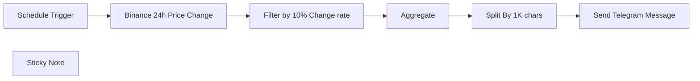

## Fluxo (.json) :

```json
{
  "meta": {
    "instanceId": "dbd43d88d26a9e30d8aadc002c9e77f1400c683dd34efe3778d43d27250dde50"
  },
  "nodes": [
    {
      "id": "f305e08e-d4b4-4ec6-be74-5edb7a3711e5",
      "name": "Schedule Trigger",
      "type": "n8n-nodes-base.scheduleTrigger",
      "position": [
        520,
        1279
      ],
      "parameters": {
        "rule": {
          "interval": [
            {
              "field": "minutes"
            }
          ]
        }
      },
      "typeVersion": 1.1
    },
    {
      "id": "abac20ef-6319-40e3-8d30-806d7499a427",
      "name": "Send Telegram Message",
      "type": "n8n-nodes-base.telegram",
      "position": [
        1360,
        1279
      ],
      "parameters": {
        "text": "={{ $json.data.replaceAll(/(Last Price: \\S+)$/gm,\"$1\\n\").slice(0,1000) }}",
        "chatId": "-1002138086614",
        "additionalFields": {}
      },
      "typeVersion": 1
    },
    {
      "id": "d23c3277-62ca-4e1f-ad5d-48c07e0d6b94",
      "name": "Aggregate",
      "type": "n8n-nodes-base.aggregate",
      "notes": "Combine all items",
      "position": [
        1020,
        1279
      ],
      "parameters": {
        "options": {},
        "aggregate": "aggregateAllItemData"
      },
      "notesInFlow": true,
      "typeVersion": 1
    },
    {
      "id": "ba174e7f-4377-46dc-aca8-30adf81e5d61",
      "name": "Binance 24h Price Change",
      "type": "n8n-nodes-base.httpRequest",
      "notes": "Get data of changed price coins in last 24h",
      "position": [
        680,
        1279
      ],
      "parameters": {
        "url": "https://api.binance.com/api/v1/ticker/24hr",
        "options": {}
      },
      "notesInFlow": true,
      "typeVersion": 1
    },
    {
      "id": "575563d5-3fb5-40f3-8017-d015cc822d5f",
      "name": "Filter by 10% Change rate",
      "type": "n8n-nodes-base.function",
      "notes": "Filter by 10% Up & Down",
      "position": [
        860,
        1279
      ],
      "parameters": {
        "functionCode": "// Iterate over all coins and check for 10% price change\nconst significantChanges = [];\nfor (const coin of items[0].json) {\n  const priceChangePercent = parseFloat(coin.priceChangePercent);\n  if (Math.abs(priceChangePercent) >= 15) {\n    significantChanges.push({ \n      symbol: coin.symbol, \n      priceChangePercent, \n      lastPrice: coin.lastPrice \n    });\n  }\n}\n\n// Sort the items by percent rate from high to low\nsignificantChanges.sort((a, b) => b.priceChangePercent - a.priceChangePercent);\n\n// Format the sorted data for output\nconst sortedOutput = significantChanges.map(change => ({\n  json: { message: `\\`\\`\\`${change.symbol} Price changed by ${change.priceChangePercent}% \\n Last Price: ${change.lastPrice}\\`\\`\\`` }\n}));\n\nreturn sortedOutput;\n"
      },
      "notesInFlow": true,
      "typeVersion": 1
    },
    {
      "id": "dcfeae2e-bcdd-472d-98e4-8c1772ccdf1b",
      "name": "Split By 1K chars",
      "type": "n8n-nodes-base.code",
      "notes": "Split them for telegram message limit",
      "position": [
        1180,
        1279
      ],
      "parameters": {
        "jsCode": "// Function to split the data into chunks of approximately 1000 characters\nfunction splitDataIntoChunks(data) {\n    const chunks = [];\n    let currentChunk = \"\";\n\n    data.forEach(item => {\n        // Ensure that each item has a 'message' property\n        if (item && item.message) {\n            const message = item.message + \"\\n\"; // Adding a newline for separation\n            // Check if adding this message to the current chunk would exceed the 1000 characters limit\n            if (currentChunk.length + message.length > 1000) {\n                // If so, push the current chunk to the chunks array and start a new chunk\n                chunks.push({ json: { data: currentChunk } });\n                currentChunk = message;\n            } else {\n                // Otherwise, add the message to the current chunk\n                currentChunk += message;\n            }\n        }\n    });\n\n    // Add the last chunk if it's not empty\n    if (currentChunk) {\n        chunks.push({ json: { data: currentChunk } });\n    }\n\n    return chunks;\n}\n\n// The input data is passed from the previous node\nconst inputData = items[0].json.data; // Accessing the 'data' property\n\n// Process the data\nconst result = splitDataIntoChunks(inputData);\n\n// Output the result\nreturn result;\n"
      },
      "notesInFlow": true,
      "typeVersion": 2
    },
    {
      "id": "40e25c71-641a-4b69-afec-b8a93d5d6448",
      "name": "Sticky Note",
      "type": "n8n-nodes-base.stickyNote",
      "position": [
        483.54457851446114,
        1040
      ],
      "parameters": {
        "color": 5,
        "width": 1040.928205084989,
        "height": 183.94838465674636,
        "content": "### Workflow Setup Steps:\n1. Ensure the **_Schedule Trigger_** is active to desired cron time (Default 5 minutes).\n2. [_Optional_] Configure the **_Binance 24h Price Change_** node with your API details (Default one is Free Public API Call - Free).\n3. Set up your **Telegram bot** token in the **Telegram node credentials**.\n4. Update the **_Chat ID_** in the **_Send Telegram Message_** node.\n5. Test the workflow to ensure everything is set up correctly.\n* **Notes**: Detailed telegram bot setup instructions are available in the [workflow's n8n page](https://n8n.io/workflows/2043-crypto-market-alert-system-with-binance-and-telegram-integration)."
      },
      "typeVersion": 1
    }
  ],
  "pinData": {},
  "connections": {
    "Aggregate": {
      "main": [
        [
          {
            "node": "Split By 1K chars",
            "type": "main",
            "index": 0
          }
        ]
      ]
    },
    "Schedule Trigger": {
      "main": [
        [
          {
            "node": "Binance 24h Price Change",
            "type": "main",
            "index": 0
          }
        ]
      ]
    },
    "Split By 1K chars": {
      "main": [
        [
          {
            "node": "Send Telegram Message",
            "type": "main",
            "index": 0
          }
        ]
      ]
    },
    "Binance 24h Price Change": {
      "main": [
        [
          {
            "node": "Filter by 10% Change rate",
            "type": "main",
            "index": 0
          }
        ]
      ]
    },
    "Filter by 10% Change rate": {
      "main": [
        [
          {
            "node": "Aggregate",
            "type": "main",
            "index": 0
          }
        ]
      ]
    }
  }
}
```

<a id="template-2307"></a>

## Template 2307 - Exportação diária de leads para planilha

- **Nome:** Exportação diária de leads para planilha
- **Descrição:** Automatiza a extração diária de leads de contas selecionadas no Leadfeeder, filtra por engajamento e critérios de empresa, enriquece os dados e grava ou atualiza os resultados em uma planilha do Google Sheets.
- **Funcionalidade:** • Agendamento diário: Executa o fluxo automaticamente em horário programado (07:00) para processar o intervalo de datas configurado (ontem até hoje).
• Obtenção e seleção de contas: Recupera contas da plataforma de leads e processa apenas as contas previamente configuradas pelo usuário.
• Coleta de leads por conta: Busca os leads de cada conta para o período definido.
• Filtragem por engajamento: Remove leads com baixo engajamento mantendo apenas os que ultrapassam o limiar de visitas configurado.
• Enriquecimento de empresa: Consulta um serviço de enriquecimento para obter domínio, métricas, redes sociais e descrição da empresa.
• Filtragem por critérios da empresa: Aplica regras baseadas em métricas (por exemplo, número de funcionários maior que determinado valor) para selecionar empresas qualificadas.
• Armazenamento e atualização na planilha: Insere ou atualiza registros em uma planilha do Google Sheets com campos mapeados (domínio, nome, visitas, qualidade, redes sociais, funcionários, descrição).
- **Ferramentas:** • Leadfeeder API: Fonte dos dados de contas e leads, usada para recuperar visitantes e seus atributos.
• Clearbit: Serviço de enriquecimento de empresas para obter informações adicionais (métricas, redes sociais, descrição, tecnologia, etc.).
• Google Sheets: Armazenamento colaborativo onde os leads qualificados são adicionados ou atualizados.

## Fluxo visual

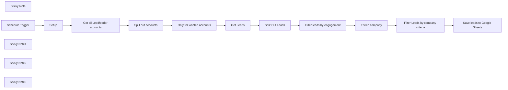

## Fluxo (.json) :

```json
{
  "meta": {
    "instanceId": "257476b1ef58bf3cb6a46e65fac7ee34a53a5e1a8492d5c6e4da5f87c9b82833",
    "templateId": "2113"
  },
  "nodes": [
    {
      "id": "2e93b7a1-f22c-4e34-8bbe-09763d428ab6",
      "name": "Get Leads",
      "type": "n8n-nodes-base.httpRequest",
      "position": [
        1040,
        522
      ],
      "parameters": {
        "url": "=https://api.leadfeeder.com/accounts/{{ $json.id }}/leads",
        "options": {},
        "sendQuery": true,
        "authentication": "genericCredentialType",
        "genericAuthType": "httpHeaderAuth",
        "queryParameters": {
          "parameters": [
            {
              "name": "start_date",
              "value": "={{ $now.minus(1, 'day').toFormat('yyyy-MM-dd') }}"
            },
            {
              "name": "end_date",
              "value": "={{ $now.toFormat('yyyy-MM-dd') }}"
            }
          ]
        }
      },
      "credentials": {
        "httpHeaderAuth": {
          "id": "xipzlNJVo73gB17T",
          "name": "Leapfeeder Token"
        }
      },
      "typeVersion": 4.1
    },
    {
      "id": "0274033f-582a-40f6-9c08-161a81cfb2ab",
      "name": "Filter Leads by company criteria",
      "type": "n8n-nodes-base.filter",
      "position": [
        640,
        762.4643026004727
      ],
      "parameters": {
        "options": {},
        "conditions": {
          "options": {
            "leftValue": "",
            "caseSensitive": true,
            "typeValidation": "strict"
          },
          "combinator": "and",
          "conditions": [
            {
              "id": "077363ca-c785-497c-bae9-24829bb321cd",
              "operator": {
                "type": "number",
                "operation": "gt"
              },
              "leftValue": "={{ $json.metrics.employees }}",
              "rightValue": 100
            }
          ]
        }
      },
      "typeVersion": 2
    },
    {
      "id": "918af2ea-38ab-4d36-abf0-628119216835",
      "name": "Enrich company",
      "type": "n8n-nodes-base.clearbit",
      "position": [
        420,
        762
      ],
      "parameters": {
        "domain": "={{ $json.attributes.website_url }}",
        "additionalFields": {}
      },
      "credentials": {
        "clearbitApi": {
          "id": "cKDImrinp9tg0ZHW",
          "name": "Clearbit account"
        }
      },
      "typeVersion": 1
    },
    {
      "id": "5ee23d2a-5eb6-4edd-8668-6053294d26cb",
      "name": "Setup",
      "type": "n8n-nodes-base.set",
      "position": [
        640,
        282.4643026004727
      ],
      "parameters": {
        "options": {},
        "assignments": {
          "assignments": [
            {
              "id": "7b5f7c85-7455-439a-8427-7b45c67c7903",
              "name": "Leadfeeder Accounts",
              "type": "array",
              "value": "=[\"n8n\",\"someOtherAccount\"]"
            },
            {
              "id": "61e2ddbd-380e-4b6e-8652-048b948994e5",
              "name": "Google Sheets URL",
              "type": "string",
              "value": "https://docs.google.com/spreadsheets/d/1a2gfBjZZpN0jiD7apR8fPplRp2aPHVy2_5lp4Yzp778/edit?usp=sharing"
            }
          ]
        }
      },
      "typeVersion": 3.3
    },
    {
      "id": "425b3030-d745-4fe0-a489-c6d79f1d6dca",
      "name": "Get all Leedfeeder accounts",
      "type": "n8n-nodes-base.httpRequest",
      "position": [
        420,
        522.4643026004727
      ],
      "parameters": {
        "url": "https://api.leadfeeder.com/accounts",
        "options": {},
        "authentication": "genericCredentialType",
        "genericAuthType": "httpHeaderAuth"
      },
      "credentials": {
        "httpHeaderAuth": {
          "id": "xipzlNJVo73gB17T",
          "name": "Leapfeeder Token"
        }
      },
      "typeVersion": 4.1
    },
    {
      "id": "2a547ddc-131d-4628-83f1-516d07dddde9",
      "name": "Only for wanted accounts",
      "type": "n8n-nodes-base.filter",
      "position": [
        840,
        522.4643026004727
      ],
      "parameters": {
        "options": {},
        "conditions": {
          "options": {
            "leftValue": "",
            "caseSensitive": true,
            "typeValidation": "strict"
          },
          "combinator": "and",
          "conditions": [
            {
              "id": "7c08f7c1-b6d4-47cc-91f8-e55a6d800eb3",
              "operator": {
                "type": "boolean",
                "operation": "true",
                "singleValue": true
              },
              "leftValue": "={{ $('Setup').first().json[\"Leadfeeder Accounts\"].includes($json.attributes.name) }}",
              "rightValue": "n8n"
            }
          ]
        }
      },
      "typeVersion": 2
    },
    {
      "id": "8083e9c2-ffcd-4060-87eb-f726349d1bc3",
      "name": "Split out accounts",
      "type": "n8n-nodes-base.splitOut",
      "position": [
        640,
        522.4643026004727
      ],
      "parameters": {
        "options": {},
        "fieldToSplitOut": "data"
      },
      "typeVersion": 1
    },
    {
      "id": "59696b1e-ff16-49d4-abc2-d830ce612fb5",
      "name": "Split Out Leads",
      "type": "n8n-nodes-base.splitOut",
      "position": [
        1220,
        522.4643026004727
      ],
      "parameters": {
        "options": {},
        "fieldToSplitOut": "data"
      },
      "typeVersion": 1
    },
    {
      "id": "0618bc71-d8b3-4f8e-891b-127a391994fe",
      "name": "Sticky Note",
      "type": "n8n-nodes-base.stickyNote",
      "position": [
        799.9999999999991,
        208.53380614657158
      ],
      "parameters": {
        "color": 6,
        "width": 370.00000000000045,
        "height": 239.93049645390096,
        "content": "### Setup\n1. Add your **Leedfeeder** credentials. The name should be `Authorization` and the value `Token token=yourapitoken`. You can find your token via **Settings -> Personal -> API-Token**\n2. Add your **Google Sheet** credentials\n3. Save the **Leedfeeder** account names you want to use in the `Setup` node\n4. Copy the [Google Sheets Template](https://docs.google.com/spreadsheets/d/1a2gfBjZZpN0jiD7apR8fPplRp2aPHVy2_5lp4Yzp778/edit?usp=sharing) and add its URL to the `Setup` node"
      },
      "typeVersion": 1
    },
    {
      "id": "c23e9507-6413-4343-add3-ee1539b424fd",
      "name": "Schedule Trigger",
      "type": "n8n-nodes-base.scheduleTrigger",
      "position": [
        420,
        282.4643026004727
      ],
      "parameters": {
        "rule": {
          "interval": [
            {
              "triggerAtHour": 7
            }
          ]
        }
      },
      "typeVersion": 1.1
    },
    {
      "id": "68f4a72e-c857-4e7c-8176-5e2494be2553",
      "name": "Sticky Note1",
      "type": "n8n-nodes-base.stickyNote",
      "position": [
        1380,
        466.4643026004727
      ],
      "parameters": {
        "color": 5,
        "width": 193,
        "height": 220,
        "content": "Adjust your engagement criteria here"
      },
      "typeVersion": 1
    },
    {
      "id": "648ef9d3-1ea7-42ff-9c80-16f05e9ff7f6",
      "name": "Sticky Note2",
      "type": "n8n-nodes-base.stickyNote",
      "position": [
        600,
        707.4643026004727
      ],
      "parameters": {
        "color": 5,
        "width": 193,
        "height": 215,
        "content": "Adjust your company criteria here"
      },
      "typeVersion": 1
    },
    {
      "id": "bc1e5cb1-fb6b-45a8-a23b-b3d890b7cc79",
      "name": "Filter leads by engagement",
      "type": "n8n-nodes-base.filter",
      "position": [
        1420,
        522.4643026004727
      ],
      "parameters": {
        "options": {},
        "conditions": {
          "options": {
            "leftValue": "",
            "caseSensitive": true,
            "typeValidation": "strict"
          },
          "combinator": "and",
          "conditions": [
            {
              "id": "b97c4134-48e9-4a55-b002-5db3e4304e0d",
              "operator": {
                "type": "number",
                "operation": "gt"
              },
              "leftValue": "={{ $json.attributes.visits }}",
              "rightValue": 3
            }
          ]
        }
      },
      "typeVersion": 2
    },
    {
      "id": "9c59a495-7fc6-4d11-b15c-0e72c9f33164",
      "name": "Sticky Note3",
      "type": "n8n-nodes-base.stickyNote",
      "position": [
        380,
        240
      ],
      "parameters": {
        "color": 5,
        "width": 193,
        "height": 186.77446808510643,
        "content": "Adjust the schedule here"
      },
      "typeVersion": 1
    },
    {
      "id": "9ee5c6ac-544b-42fa-9432-92ae45ee40dd",
      "name": "Save leads to Google Sheets",
      "type": "n8n-nodes-base.googleSheets",
      "position": [
        840,
        762.4643026004727
      ],
      "parameters": {
        "columns": {
          "value": {
            "name": "={{ $json.name }}",
            "domain": "={{ $json.domain }}",
            "visits": "={{ $('Split Out Leads').item.json.attributes.visits }}",
            "quality": "={{ $('Split Out Leads').item.json.attributes.quality }}",
            "twitter": "={{ $json.twitter.handle ? $json.twitter.handle : $('Split Out Leads').item.json.attributes.twitter_handle  }}",
            "linkedin": "={{ $json.linkedin.handle ? $json.linkedin.handle  : $('Split Out Leads').item.json.attributes.linkedin_handle  }}",
            "employees": "={{ $json.metrics.employees ? $json.metrics.employees :  $('Split Out Leads').item.json.attributes.employee_count }}",
            "description": "={{ $json.description }}"
          },
          "schema": [
            {
              "id": "domain",
              "type": "string",
              "display": true,
              "removed": false,
              "required": false,
              "displayName": "domain",
              "defaultMatch": false,
              "canBeUsedToMatch": true
            },
            {
              "id": "name",
              "type": "string",
              "display": true,
              "removed": false,
              "required": false,
              "displayName": "name",
              "defaultMatch": false,
              "canBeUsedToMatch": true
            },
            {
              "id": "description",
              "type": "string",
              "display": true,
              "removed": false,
              "required": false,
              "displayName": "description",
              "defaultMatch": false,
              "canBeUsedToMatch": true
            },
            {
              "id": "employees",
              "type": "string",
              "display": true,
              "required": false,
              "displayName": "employees",
              "defaultMatch": false,
              "canBeUsedToMatch": true
            },
            {
              "id": "twitter",
              "type": "string",
              "display": true,
              "required": false,
              "displayName": "twitter",
              "defaultMatch": false,
              "canBeUsedToMatch": true
            },
            {
              "id": "linkedin",
              "type": "string",
              "display": true,
              "required": false,
              "displayName": "linkedin",
              "defaultMatch": false,
              "canBeUsedToMatch": true
            },
            {
              "id": "quality",
              "type": "string",
              "display": true,
              "required": false,
              "displayName": "quality",
              "defaultMatch": false,
              "canBeUsedToMatch": true
            },
            {
              "id": "visits",
              "type": "string",
              "display": true,
              "required": false,
              "displayName": "visits",
              "defaultMatch": false,
              "canBeUsedToMatch": true
            }
          ],
          "mappingMode": "defineBelow",
          "matchingColumns": [
            "domain"
          ]
        },
        "options": {},
        "operation": "appendOrUpdate",
        "sheetName": {
          "__rl": true,
          "mode": "list",
          "value": "gid=0",
          "cachedResultUrl": "https://docs.google.com/spreadsheets/d/1a2gfBjZZpN0jiD7apR8fPplRp2aPHVy2_5lp4Yzp778/edit#gid=0",
          "cachedResultName": "Visitors"
        },
        "documentId": {
          "__rl": true,
          "mode": "url",
          "value": "={{ $('Setup').first().json[\"Google Sheets URL\"] }}"
        }
      },
      "credentials": {
        "googleSheetsOAuth2Api": {
          "id": "9",
          "name": "Nik's Google"
        }
      },
      "typeVersion": 4.2
    }
  ],
  "pinData": {
    "Get Leads": [
      {
        "data": [
          {
            "id": "400360f2-6131-11e5-90dc-638a476d8c19_6xeTMh2VfiAzFd86n7GNJ3",
            "type": "leads",
            "attributes": {
              "name": "Leadfeeder Inc.",
              "phone": "+358504303422",
              "status": "new",
              "visits": 10,
              "quality": 6,
              "revenue": null,
              "assignee": null,
              "industry": "N/A",
              "logo_url": "https://logos.leadfeeder.com/123/logo.png",
              "emailed_to": null,
              "business_id": null,
              "website_url": "https://www.leadfeeder.com",
              "facebook_url": "https://www.facebook.com/Leadfeeder",
              "linkedin_url": "https://www.linkedin.com/company/leadfeeder",
              "twitter_handle": "Leadfeeder",
              "last_visit_date": "2015-09-21",
              "first_visit_date": "2015-09-18",
              "view_in_leadfeeder": "https://app.leadfeeder.com/link/9088f1ad86"
            },
            "relationships": {
              "location": {
                "data": {
                  "id": "6xeTMh2VfiAzFd86n7GNJ3",
                  "type": "locations"
                }
              }
            }
          },
          {
            "id": "40157512-6131-11e5-90dc-638a476d8c19_6xeTMh2VfiAzFd86n7GNJ3",
            "type": "leads",
            "attributes": {
              "name": "Organic Mint",
              "tags": [
                "tag1",
                "tag2"
              ],
              "phone": null,
              "status": "new",
              "visits": 15,
              "quality": 4,
              "revenue": "EUR 395752792.0",
              "assignee": "user@company.com",
              "industry": "N/A",
              "logo_url": "https://logos.leadfeeder.com/123/logo.png",
              "emailed_to": "user@example.com,user@company.com",
              "business_id": "KVK Number 123",
              "crm_lead_id": 110,
              "website_url": "https://www.organicmint.com",
              "facebook_url": null,
              "linkedin_url": null,
              "employee_count": 550,
              "twitter_handle": null,
              "employees_range": {
                "max": 550,
                "min": 501
              },
              "last_visit_date": "2015-09-21",
              "first_visit_date": "2015-09-18",
              "view_in_leadfeeder": "https://app.leadfeeder.com/link/9088f1ad85",
              "crm_organization_id": null
            },
            "relationships": {
              "location": {
                "data": {
                  "id": "6xeTMh2VfiAzFd86n7GNJ3",
                  "type": "locations"
                }
              }
            }
          }
        ],
        "links": {
          "last": "https://api.leadfeeder.com/accounts/6002/leads?end_date=2015-09-22&page%5Bnumber%5D=2&page%5Bsize%5D=2&start_date=2015-09-11",
          "next": "https://api.leadfeeder.com/accounts/6002/leads?end_date=2015-09-22&page%5Bnumber%5D=2&page%5Bsize%5D=2&start_date=2015-09-11",
          "self": "https://api.leadfeeder.com/accounts/6002/leads?end_date=2015-09-22&page%5Bnumber%5D=1&page%5Bsize%5D=10&start_date=2015-09-11"
        },
        "included": [
          {
            "id": "6xeTMh2VfiAzFd86n7GNJ3",
            "type": "locations",
            "attributes": {
              "city": "Helsinki",
              "region": "Uusimaa",
              "country": "Finland",
              "state_code": null,
              "region_code": null,
              "country_code": "FI"
            }
          }
        ]
      }
    ],
    "Enrich company": [
      {
        "id": "fea80fd1-c0f5-4d45-afa2-cb3f33a676b8",
        "geo": {
          "lat": 60.162394,
          "lng": 24.9350836,
          "city": "Helsinki",
          "state": null,
          "country": "Finland",
          "stateCode": null,
          "postalCode": "00120",
          "streetName": "Uudenmaankatu",
          "subPremise": null,
          "countryCode": "FI",
          "streetNumber": "100",
          "streetAddress": "100 Uudenmaankatu"
        },
        "logo": "https://logo.clearbit.com/leadfeeder.com",
        "name": "Leadfeeder",
        "site": {
          "phoneNumbers": [
            "+358 46 764115063",
            "+358 45 71996373",
            "+1 800-224-6059"
          ],
          "emailAddresses": [
            "team@leadfeeder.com"
          ]
        },
        "tags": [
          "Information Technology & Services",
          "Telemarketing",
          "Call Center",
          "Business Management and Planning",
          "Technology",
          "B2B",
          "SAAS"
        ],
        "tech": [
          "amazon_ses",
          "aws_route_53",
          "google_apps",
          "google_tag_manager",
          "visual_website_optimizer",
          "google_maps",
          "google_analytics",
          "stripe",
          "appnexus",
          "rabbitmq",
          "dstillery",
          "openx",
          "mediamath",
          "okta",
          "pubmatic",
          "apache_spark",
          "rubicon_project",
          "salesforce",
          "microsoft_dynamics",
          "google_search_appliance",
          "bluekai",
          "github",
          "zoho_crm",
          "unbounce",
          "liferay",
          "postgresql",
          "mysql",
          "aws_iam",
          "pipedrive",
          "atlassian_jira",
          "apache_cassandra"
        ],
        "type": "private",
        "phone": "+358 46 764115063",
        "domain": "leadfeeder.com",
        "parent": {
          "domain": null
        },
        "ticker": null,
        "metrics": {
          "raised": 4900000,
          "employees": 210,
          "marketCap": null,
          "alexaUsRank": null,
          "trafficRank": "high",
          "annualRevenue": null,
          "fiscalYearEnd": null,
          "employeesRange": "51-250",
          "alexaGlobalRank": 27194,
          "estimatedAnnualRevenue": "$10M-$50M"
        },
        "twitter": {
          "id": "1073300916",
          "bio": "Leadfeeder shows you the companies visiting your website. Install the Leadfeeder Tracker & connect to Google Analytics. Try Leadfeeder Premium free for 14 days.",
          "site": "https://t.co/CYhY1hHFZi",
          "avatar": "https://pbs.twimg.com/profile_images/929961392261693440/Stt2t1K-_normal.jpg",
          "handle": "Leadfeeder",
          "location": "Helsinki, Finland",
          "followers": 4302,
          "following": 200
        },
        "category": {
          "sector": "Industrials",
          "sicCode": "73",
          "gicsCode": "20201060",
          "industry": "Professional Services",
          "naicsCode": "56",
          "sic4Codes": [
            "7389"
          ],
          "naics6Codes": [
            "561422"
          ],
          "subIndustry": "Professional Services",
          "industryGroup": "Commercial & Professional Services",
          "naics6Codes2022": [
            "561422"
          ]
        },
        "facebook": {
          "likes": 3206,
          "handle": "leadfeeder"
        },
        "linkedin": {
          "handle": "company/leadfeeder"
        },
        "location": "Uudenmaankatu 100, 00120 Helsinki, Finland",
        "timeZone": "Europe/Helsinki",
        "indexedAt": "2024-02-08T18:10:40.453Z",
        "legalName": null,
        "utcOffset": 2,
        "crunchbase": {
          "handle": "organization/leadfeeder"
        },
        "description": "Leadfeeder is a lead generation tool for B2B companies. You can turn your website visitors into sales leads by discovering the companies that visit your website and what they do there. Generating good sales leads is important. There are many potential ...",
        "foundedYear": null,
        "identifiers": {
          "usCIK": null,
          "usEIN": null
        },
        "domainAliases": [
          "leadfeeder.nl",
          "leadfeeder.info",
          "leadfeeder.pl",
          "leadfeeder.us",
          "leadfeeder.ch",
          "lfeeder.com",
          "leadfeeder.fi",
          "leadfeeder.es"
        ],
        "emailProvider": false,
        "techCategories": [
          "email_delivery_service",
          "dns",
          "productivity",
          "tag_management",
          "website_optimization",
          "geolocation",
          "analytics",
          "payment",
          "advertising",
          "data_management",
          "security",
          "data_processing",
          "crm",
          "marketing_automation",
          "content_management_system",
          "database",
          "project_management_software"
        ],
        "ultimateParent": {
          "domain": null
        }
      },
      {
        "id": "bd960361-64c4-4f23-b24b-5d2284a9b4e4",
        "geo": {
          "lat": 42.2010397,
          "lng": -71.0009158,
          "city": "Braintree",
          "state": "Massachusetts",
          "country": "United States",
          "stateCode": "MA",
          "postalCode": "02184",
          "streetName": "Pearl Street",
          "subPremise": null,
          "countryCode": "US",
          "streetNumber": "125",
          "streetAddress": "125 Pearl Street"
        },
        "logo": "https://logo.clearbit.com/vermints.com",
        "name": "VerMints",
        "site": {
          "phoneNumbers": [
            "+1 800-367-4442",
            "+1 781-340-4440"
          ],
          "emailAddresses": [
            "gary@vermints.com",
            "feedback@vermints.com",
            "wholesale@vermints.com"
          ]
        },
        "tags": [
          "Food",
          "Candy",
          "E-commerce",
          "Manufacturing",
          "Food Manufacturing",
          "B2C"
        ],
        "tech": [
          "facebook_connect",
          "google_analytics",
          "cloud_flare",
          "facebook_advertiser",
          "bigcommerce",
          "google_tag_manager",
          "adobe_dynamic_tag_management",
          "appnexus",
          "openx",
          "the_trade_desk",
          "pubmatic",
          "rubicon_project",
          "bluekai",
          "matomo",
          "aggregate_knowledge"
        ],
        "type": "private",
        "phone": "+1 800-367-4442",
        "domain": "vermints.com",
        "parent": {
          "domain": null
        },
        "ticker": null,
        "metrics": {
          "raised": null,
          "employees": 5,
          "marketCap": null,
          "alexaUsRank": null,
          "trafficRank": "very_low",
          "annualRevenue": null,
          "fiscalYearEnd": null,
          "employeesRange": "1-10",
          "alexaGlobalRank": 7316867,
          "estimatedAnnualRevenue": "$0-$1M"
        },
        "twitter": {
          "id": "46449053",
          "bio": "#Organic, #glutenfree, #GMOfree, #vegan, #nutfree & #kosher mints. The best mints on earth, made from nature and nature only.",
          "site": "https://t.co/d9rBNvmHqo",
          "avatar": "https://pbs.twimg.com/profile_images/1323280146502164486/Nave3hYb_normal.jpg",
          "handle": "VerMints",
          "location": "USA",
          "followers": 2283,
          "following": 484
        },
        "category": {
          "sector": "Consumer Staples",
          "sicCode": "54",
          "gicsCode": "30202030",
          "industry": "Food Products",
          "naicsCode": "31",
          "sic4Codes": [
            "5441"
          ],
          "naics6Codes": [
            "311340"
          ],
          "subIndustry": "Packaged Foods & Meats",
          "industryGroup": "Food, Beverage & Tobacco",
          "naics6Codes2022": [
            "311340"
          ]
        },
        "facebook": {
          "likes": 1890,
          "handle": "115824945738"
        },
        "linkedin": {
          "handle": "company/vermints-inc."
        },
        "location": "125 Pearl St, Braintree, MA 02184, USA",
        "timeZone": "America/New_York",
        "indexedAt": "2024-02-04T03:04:43.285Z",
        "legalName": null,
        "utcOffset": -5,
        "crunchbase": {
          "handle": null
        },
        "description": "VerMints is a leading manufacturer of organic breath mints and pastilles. All six flavors PepperMint, Wintergreen, Cinnamon, GingerMint, Chai and Cafe Express are certified organic, non GMO, gluten free and kosher. VerMints are True Mints. They are hon...",
        "foundedYear": 2001,
        "identifiers": {
          "usCIK": null,
          "usEIN": null
        },
        "domainAliases": [],
        "emailProvider": false,
        "techCategories": [
          "authentication_services",
          "analytics",
          "dns",
          "advertising",
          "ecommerce",
          "tag_management",
          "data_management"
        ],
        "ultimateParent": {
          "domain": null
        }
      }
    ],
    "Get all Leedfeeder accounts": [
      {
        "data": [
          {
            "id": "233695",
            "type": "accounts",
            "attributes": {
              "name": "n8n",
              "on_trial": true,
              "timezone": "Europe/Berlin",
              "subscription": "premium",
              "subscription_addons": [
                "guard",
                "google_data_studio"
              ]
            }
          }
        ]
      }
    ]
  },
  "connections": {
    "Setup": {
      "main": [
        [
          {
            "node": "Get all Leedfeeder accounts",
            "type": "main",
            "index": 0
          }
        ]
      ]
    },
    "Get Leads": {
      "main": [
        [
          {
            "node": "Split Out Leads",
            "type": "main",
            "index": 0
          }
        ]
      ]
    },
    "Enrich company": {
      "main": [
        [
          {
            "node": "Filter Leads by company criteria",
            "type": "main",
            "index": 0
          }
        ]
      ]
    },
    "Split Out Leads": {
      "main": [
        [
          {
            "node": "Filter leads by engagement",
            "type": "main",
            "index": 0
          }
        ]
      ]
    },
    "Schedule Trigger": {
      "main": [
        [
          {
            "node": "Setup",
            "type": "main",
            "index": 0
          }
        ]
      ]
    },
    "Split out accounts": {
      "main": [
        [
          {
            "node": "Only for wanted accounts",
            "type": "main",
            "index": 0
          }
        ]
      ]
    },
    "Only for wanted accounts": {
      "main": [
        [
          {
            "node": "Get Leads",
            "type": "main",
            "index": 0
          }
        ]
      ]
    },
    "Filter leads by engagement": {
      "main": [
        [
          {
            "node": "Enrich company",
            "type": "main",
            "index": 0
          }
        ]
      ]
    },
    "Get all Leedfeeder accounts": {
      "main": [
        [
          {
            "node": "Split out accounts",
            "type": "main",
            "index": 0
          }
        ]
      ]
    },
    "Filter Leads by company criteria": {
      "main": [
        [
          {
            "node": "Save leads to Google Sheets",
            "type": "main",
            "index": 0
          }
        ]
      ]
    }
  }
}
```
