# PACK 1999 TEMPLATES PARTE 10 - Bloco 2

Templates neste bloco: 20

## Sumário

- [Template 2309 - Notificações e ações automáticas para respostas do lemlist](#template-2309)
- [Template 2311 - Resumo social pré-reunião](#template-2311)
- [Template 2313 - Sistema de tickets Telegram (tópicos de fórum)](#template-2313)
- [Template 2315 - Endpoint de taxas de câmbio do Euro](#template-2315)
- [Template 2317 - Backup automático de workflows para Google Drive](#template-2317)
- [Template 2319 - Qualificação automática de leads por e-mail](#template-2319)
- [Template 2321 - Extrator de currículos para Telegram](#template-2321)
- [Template 2323 - Notificações por email de novos posts RSS](#template-2323)
- [Template 2325 - Emails promocionais → Áudio no Telegram](#template-2325)
- [Template 2327 - Mapear extensões Chrome rastreadas pelo LinkedIn](#template-2327)
- [Template 2329 - Notificação de mudança de horário de verão](#template-2329)
- [Template 2331 - Monitoramento de múltiplos repositórios GitHub via webhooks](#template-2331)
- [Template 2333 - Carregar contatos em planilha](#template-2333)
- [Template 2334 - Criação de cliente na Chargebee](#template-2334)
- [Template 2336 - Teste comparativo de LLMs locais](#template-2336)
- [Template 2338 - Resumo histórico das manchetes do Hacker News](#template-2338)
- [Template 2340 - Envio agendado de mensagens para Discord](#template-2340)
- [Template 2342 - Registrar venda Gumroad, adicionar a MailerLite e registrar no CRM](#template-2342)
- [Template 2344 - Agente AI para operar a API do Proxmox](#template-2344)
- [Template 2347 - Gerar seed keywords (SEO) com IA](#template-2347)

---

<a id="template-2309"></a>

## Template 2309 - Notificações e ações automáticas para respostas do lemlist

- **Nome:** Notificações e ações automáticas para respostas do lemlist
- **Descrição:** Envia notificações ao Slack quando há novas respostas nas campanhas do lemlist, classifica o conteúdo da resposta com um modelo de linguagem e executa ações automáticas conforme a categoria detectada.
- **Funcionalidade:** • Detecção de novas respostas: Monitora respostas recebidas nas campanhas de email e inicia o fluxo.
• Limpeza e formatação do texto: Formata o corpo da resposta para apresentação clara no Slack.
• Classificação automática da resposta: Usa um modelo de linguagem para categorizar a resposta em: Interested, Out of office, Unsubscribe, Not interested ou Other.
• Roteamento por categoria: Direciona a resposta para diferentes ramificações do fluxo com base na categoria identificada.
• Notificação estruturada no Slack: Envia uma mensagem com blocos contendo categoria, campanha, remetente, lead, LinkedIn e pré-visualização da resposta.
• Cancelamento automático (Unsubscribe): Remove automaticamente o lead da campanha quando a categoria for "Unsubscribe".
• Marcar como interessado: Marca leads como "interested" na plataforma quando a resposta for positiva/indicativa de interesse.
- **Ferramentas:** • lemlist: Plataforma de automação de campanhas de email usada como fonte das respostas e para executar ações sobre leads (unsubscribe, marcar interessado).
• OpenAI (modelo de linguagem): Utilizado para classificar o conteúdo das respostas em categorias pré-definidas.
• Slack: Canal de comunicação onde as notificações estruturadas sobre novas respostas são enviadas.

## Fluxo visual

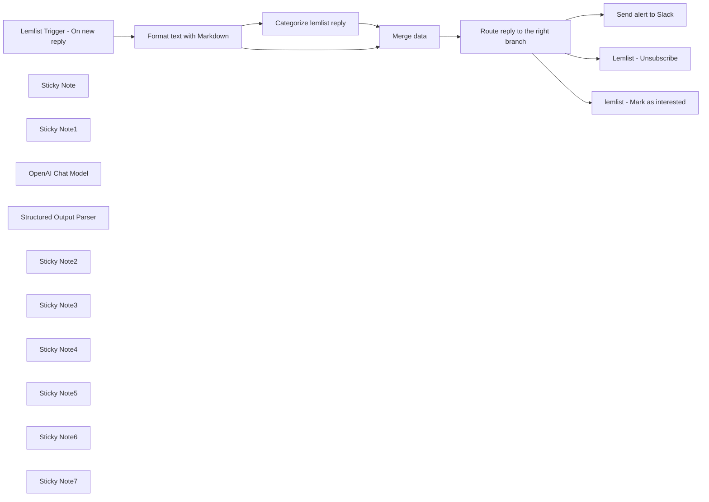

## Fluxo (.json) :

```json
{
  "meta": {
    "instanceId": "2b1cc1a8b0a2fb9caab11ab2d5eb3712f9973066051b2e898cf4041a1f2a7757",
    "templateCredsSetupCompleted": true
  },
  "nodes": [
    {
      "id": "7786165e-5e74-4614-b065-86db19482b72",
      "name": "Format text with Markdown",
      "type": "n8n-nodes-base.markdown",
      "position": [
        -1200,
        980
      ],
      "parameters": {
        "html": "={{ $json.text }}",
        "options": {},
        "destinationKey": "textClean"
      },
      "typeVersion": 1,
      "continueOnFail": true
    },
    {
      "id": "8f73d4d6-2473-4fdf-8797-c049d6df6967",
      "name": "Lemlist Trigger - On new reply",
      "type": "n8n-nodes-base.lemlistTrigger",
      "position": [
        -1600,
        980
      ],
      "webhookId": "039bb443-8d2a-4eb3-9c16-772943a46db7",
      "parameters": {
        "event": "emailsReplied",
        "options": {
          "isFirst": true
        }
      },
      "typeVersion": 1
    },
    {
      "id": "1f94d672-0a70-45ad-bf96-72c4aecabcd0",
      "name": "Sticky Note",
      "type": "n8n-nodes-base.stickyNote",
      "position": [
        -1700,
        680
      ],
      "parameters": {
        "width": 304.92548549441915,
        "height": 504.9663351162785,
        "content": "### Get your lemlist API key\n\n1. Go to your lemlist account or create one [HERE](https://app.lemlist.com/create-account)\n\n2. Go to Settings -> Integrations\n\n3. Generate your API Key and copy it\n\n4. On this node, click on create new credential and paste your API key"
      },
      "typeVersion": 1
    },
    {
      "id": "3032b04c-76a2-4f7c-a790-ede26b102254",
      "name": "Sticky Note1",
      "type": "n8n-nodes-base.stickyNote",
      "position": [
        -2040,
        680
      ],
      "parameters": {
        "width": 319.6621253622332,
        "height": 507.1074887209538,
        "content": "# Read me\n\nThis workflow send email replies of your lemlist campaigns to the Slack channel of your choice.\n\nThe OpenAI node will classify the reply status. \n\nThe Slack alert is structured in a way that make it easy to read for the user."
      },
      "typeVersion": 1
    },
    {
      "id": "df142fcb-f5ec-475d-8f90-c0bd064d390c",
      "name": "OpenAI Chat Model",
      "type": "@n8n/n8n-nodes-langchain.lmChatOpenAi",
      "position": [
        -760,
        1320
      ],
      "parameters": {
        "model": "gpt-4o",
        "options": {}
      },
      "typeVersion": 1
    },
    {
      "id": "1fa6d12c-2555-42c6-8f80-b24dc3608ed7",
      "name": "Structured Output Parser",
      "type": "@n8n/n8n-nodes-langchain.outputParserStructured",
      "position": [
        -600,
        1320
      ],
      "parameters": {
        "schemaType": "manual",
        "inputSchema": "{\n\t\"type\": \"object\",\n\t\"properties\": {\n\t\t\"category\": {\n\t\t\t\"type\": \"string\"\n }\n\t}\n}"
      },
      "typeVersion": 1.2
    },
    {
      "id": "734013f9-d058-4f08-9026-a41cd5877a3b",
      "name": "Send alert to Slack",
      "type": "n8n-nodes-base.slack",
      "position": [
        320,
        700
      ],
      "parameters": {
        "text": "=",
        "select": "channel",
        "blocksUi": "={\n\t\"blocks\": [\n\t\t{\n\t\t\t\"type\": \"section\",\n\t\t\t\"text\": {\n\t\t\t\t\"type\": \"mrkdwn\",\n\t\t\t\t\"text\": \":raised_hands: New reply in lemlist!\\n\"\n\t\t\t}\n\t\t},\n\t\t{\n\t\t\t\"type\": \"section\",\n\t\t\t\"fields\": [\n\t\t\t\t{\n\t\t\t\t\t\"type\": \"mrkdwn\",\n\t\t\t\t\t\"text\": \"*Categorized as:*\\n{{ $json[\"output\"][\"category\"] }}\"\n\t\t\t\t},\n\t\t\t\t{\n\t\t\t\t\t\"type\": \"mrkdwn\",\n\t\t\t\t\t\"text\": \"*Campaign:*\\n<https://app.lemlist.com/teams/{{ $json[\"teamId\"] }}/reports/campaigns/{{ $json[\"campaignId\"] }}|{{ $json[\"campaignName\"] }}>\"\n\t\t\t\t},\n\t\t\t\t{\n\t\t\t\t\t\"type\": \"mrkdwn\",\n\t\t\t\t\t\"text\": \"*Sender Email:*\\n{{ $json[\"sendUserEmail\"] }}\"\n\t\t\t\t},\n\t\t\t\t{\n\t\t\t\t\t\"type\": \"mrkdwn\",\n\t\t\t\t\t\"text\": \"*Lead Email:*\\n{{ $json[\"leadEmail\"] }}\"\n\t\t\t\t},\n\t\t\t\t{\n\t\t\t\t\t\"type\": \"mrkdwn\",\n\t\t\t\t\t\"text\": \"*Linkedin URL:*\\n{{ $json[\"linkedinUrl\"] }}\"\n\t\t\t\t}\n\t\t\t]\n\t\t},\n\t\t{\n\t\t\t\"type\": \"section\",\n\t\t\t\"text\": {\n\t\t\t\t\"type\": \"mrkdwn\",\n\t\t\t\t\"text\": \"*Reply preview*:\\n{{ JSON.stringify($json[\"textClean\"]).replace(/^\"(.+(?=\"$))\"$/, '$1').substring(0, 100) }}\"\n\t\t\t}\n\t\t}\n\t]\n}",
        "channelId": {
          "__rl": true,
          "mode": "name",
          "value": "automated_outbound_replies"
        },
        "messageType": "block",
        "otherOptions": {
          "botProfile": {
            "imageValues": {
              "icon_emoji": ":fire:",
              "profilePhotoType": "emoji"
            }
          },
          "unfurl_links": false,
          "includeLinkToWorkflow": false
        }
      },
      "typeVersion": 2.1
    },
    {
      "id": "0558c166-16d7-4c26-a09c-fb46c2b6b687",
      "name": "Lemlist - Unsubscribe",
      "type": "n8n-nodes-base.lemlist",
      "position": [
        300,
        1000
      ],
      "parameters": {
        "email": "={{ $json[\"leadEmail\"] }}",
        "resource": "lead",
        "operation": "unsubscribe",
        "campaignId": "={{$json[\"campaignId\"]}}"
      },
      "typeVersion": 1
    },
    {
      "id": "79d17d20-a60a-4b5a-a83c-821cac265b17",
      "name": "lemlist - Mark as interested",
      "type": "n8n-nodes-base.httpRequest",
      "position": [
        300,
        1260
      ],
      "parameters": {
        "url": "=https://api.lemlist.com/api/campaigns/{{$json[\"campaignId\"]}}/leads/{{$json[\"leadEmail\"]}}/interested",
        "options": {},
        "requestMethod": "POST",
        "authentication": "predefinedCredentialType",
        "nodeCredentialType": "lemlistApi"
      },
      "typeVersion": 2
    },
    {
      "id": "04f74337-903c-481a-95ca-a1d4a5985b9e",
      "name": "Categorize lemlist reply",
      "type": "@n8n/n8n-nodes-langchain.chainLlm",
      "position": [
        -780,
        1120
      ],
      "parameters": {
        "text": "=Classify the [email_content] in one only of the following categories: \n\nCategories=[\"Interested\", \"Out of office\", \"Unsubscribe\", \"Not interested\", \"Other\"] \n\n- Interested is when the reply is positive, and the person want more information or a meeting \n\nDon't output quotes like in the next example: \nemail_content_example:Hey I would like to know more \ncategory:Interested\n\nemail_content:\"{{ $json.textClean }}\" \n\nOnly answer with JSON in the following format:\n{\"replyStatus\":category}\n\nJSON:",
        "promptType": "define",
        "hasOutputParser": true
      },
      "typeVersion": 1.4
    },
    {
      "id": "c1d66785-e096-4fd7-90de-51c7b9117413",
      "name": "Merge data",
      "type": "n8n-nodes-base.merge",
      "position": [
        -280,
        1000
      ],
      "parameters": {
        "mode": "combine",
        "options": {},
        "combinationMode": "mergeByPosition"
      },
      "typeVersion": 2.1
    },
    {
      "id": "bf21f5b9-6978-4657-a0a2-847265cff31e",
      "name": "Sticky Note2",
      "type": "n8n-nodes-base.stickyNote",
      "position": [
        260,
        520
      ],
      "parameters": {
        "width": 480.38008828116847,
        "height": 341.5885389153657,
        "content": "### Create a Slack notification for each new replies\n\n1. Connect your Slack account by clicking to add Credentials\n\n2. Write the name of the channel where you want to send the Slack alert"
      },
      "typeVersion": 1
    },
    {
      "id": "024b4399-8e20-4974-986d-6c1ee4103fa0",
      "name": "Route reply to the right branch",
      "type": "n8n-nodes-base.switch",
      "position": [
        -100,
        1000
      ],
      "parameters": {
        "rules": {
          "values": [
            {
              "outputKey": "Send all replies to Slack",
              "conditions": {
                "options": {
                  "leftValue": "",
                  "caseSensitive": true,
                  "typeValidation": "strict"
                },
                "combinator": "and",
                "conditions": [
                  {
                    "operator": {
                      "type": "string",
                      "operation": "exists",
                      "singleValue": true
                    },
                    "leftValue": "={{ $json.output.category }}",
                    "rightValue": ""
                  }
                ]
              },
              "renameOutput": true
            },
            {
              "outputKey": "Unsubscribe",
              "conditions": {
                "options": {
                  "leftValue": "",
                  "caseSensitive": true,
                  "typeValidation": "strict"
                },
                "combinator": "and",
                "conditions": [
                  {
                    "id": "9ad6f5cd-8c50-4710-8eaf-085e8f11f202",
                    "operator": {
                      "name": "filter.operator.equals",
                      "type": "string",
                      "operation": "equals"
                    },
                    "leftValue": "={{ $json.output.category }}",
                    "rightValue": "Unsubscribe"
                  }
                ]
              },
              "renameOutput": true
            },
            {
              "outputKey": "Interested",
              "conditions": {
                "options": {
                  "leftValue": "",
                  "caseSensitive": true,
                  "typeValidation": "strict"
                },
                "combinator": "and",
                "conditions": [
                  {
                    "id": "cb410bcc-a70c-4430-aec1-b71f3f615c4d",
                    "operator": {
                      "name": "filter.operator.equals",
                      "type": "string",
                      "operation": "equals"
                    },
                    "leftValue": "={{ $json.output.category }}",
                    "rightValue": "Interested"
                  }
                ]
              },
              "renameOutput": true
            }
          ]
        },
        "options": {
          "allMatchingOutputs": true
        }
      },
      "typeVersion": 3
    },
    {
      "id": "f9f23daa-f7a9-49f9-8ffb-16798656af73",
      "name": "Sticky Note3",
      "type": "n8n-nodes-base.stickyNote",
      "position": [
        260,
        900
      ],
      "parameters": {
        "width": 480.38008828116847,
        "height": 256.5682017131378,
        "content": "### Save time by automatically unsubscribing leads that don't want to receive emails from you"
      },
      "typeVersion": 1
    },
    {
      "id": "63c536bd-e624-4118-b0c8-38c07f2d1955",
      "name": "Sticky Note4",
      "type": "n8n-nodes-base.stickyNote",
      "position": [
        260,
        1200
      ],
      "parameters": {
        "width": 480.38008828116847,
        "height": 256.5682017131378,
        "content": "### Mark interested leads as interested in lemlist"
      },
      "typeVersion": 1
    },
    {
      "id": "8ed8b714-8196-4593-87b8-18c6a7318fbe",
      "name": "Sticky Note5",
      "type": "n8n-nodes-base.stickyNote",
      "position": [
        -880,
        875.46282303881
      ],
      "parameters": {
        "width": 480.38008828116847,
        "height": 608.2279357257166,
        "content": "### Categorize the reply with OpenAI"
      },
      "typeVersion": 1
    },
    {
      "id": "6b1846df-0214-4383-87cf-55232093ae2a",
      "name": "Sticky Note6",
      "type": "n8n-nodes-base.stickyNote",
      "position": [
        -1320,
        880
      ],
      "parameters": {
        "width": 336.62085535637357,
        "height": 311.3046602455328,
        "content": "### This node will clean the text and make sure it looks pretty on Slack"
      },
      "typeVersion": 1
    },
    {
      "id": "f7378ecd-e8d2-4204-a883-3161be601ffc",
      "name": "Sticky Note7",
      "type": "n8n-nodes-base.stickyNote",
      "position": [
        -220,
        880
      ],
      "parameters": {
        "width": 336.62085535637357,
        "height": 311.3046602455328,
        "content": "### Trigger a different scenario according to the category of the reply"
      },
      "typeVersion": 1
    }
  ],
  "pinData": {},
  "connections": {
    "Merge data": {
      "main": [
        [
          {
            "node": "Route reply to the right branch",
            "type": "main",
            "index": 0
          }
        ]
      ]
    },
    "OpenAI Chat Model": {
      "ai_languageModel": [
        [
          {
            "node": "Categorize lemlist reply",
            "type": "ai_languageModel",
            "index": 0
          }
        ]
      ]
    },
    "Categorize lemlist reply": {
      "main": [
        [
          {
            "node": "Merge data",
            "type": "main",
            "index": 1
          }
        ]
      ]
    },
    "Structured Output Parser": {
      "ai_outputParser": [
        [
          {
            "node": "Categorize lemlist reply",
            "type": "ai_outputParser",
            "index": 0
          }
        ]
      ]
    },
    "Format text with Markdown": {
      "main": [
        [
          {
            "node": "Merge data",
            "type": "main",
            "index": 0
          },
          {
            "node": "Categorize lemlist reply",
            "type": "main",
            "index": 0
          }
        ]
      ]
    },
    "Lemlist Trigger - On new reply": {
      "main": [
        [
          {
            "node": "Format text with Markdown",
            "type": "main",
            "index": 0
          }
        ]
      ]
    },
    "Route reply to the right branch": {
      "main": [
        [
          {
            "node": "Send alert to Slack",
            "type": "main",
            "index": 0
          }
        ],
        [
          {
            "node": "Lemlist - Unsubscribe",
            "type": "main",
            "index": 0
          }
        ],
        [
          {
            "node": "lemlist - Mark as interested",
            "type": "main",
            "index": 0
          }
        ]
      ]
    }
  }
}
```

<a id="template-2311"></a>

## Template 2311 - Resumo social pré-reunião

- **Nome:** Resumo social pré-reunião
- **Descrição:** Gera e envia diariamente e-mails com um resumo das atividades em redes sociais das empresas presentes nas reuniões do calendário.
- **Funcionalidade:** • Agendamento diário: inicia o processo automaticamente todas as manhãs às 7h.
• Busca de reuniões: consulta o calendário para obter reuniões recentes e próximas.
• Extração de participantes: captura e normaliza os e-mails e domínios dos participantes das reuniões.
• Filtragem por domínio: mantém apenas participantes com domínio identificado para enriquecimento.
• Enriquecimento de empresa: obtém dados da empresa a partir do domínio do e-mail (perfil e handles sociais).
• Coleta de atividade social: busca posts recentes do LinkedIn e tweets públicos da empresa/usuário.
• Agrupamento por empresa: combina atividades de diferentes fontes para a mesma empresa.
• Resumo por IA: envia os dados coletados para um modelo de linguagem que gera um resumo orientado a vendas.
• Preparação de e-mail: monta um template HTML com horário da reunião e o resumo gerado.
• Envio de e-mail: envia o resumo para uma lista de destinatários configurada.
- **Ferramentas:** • Google Calendar: fonte das reuniões e participantes a partir do calendário do usuário.
• Fresh LinkedIn Profile Data (via RapidAPI): serviço que recupera posts recentes de perfis/empresas no LinkedIn.
• Twitter API (via RapidAPI): serviço que obtém tweets públicos de um usuário/empresa.
• Clearbit: serviço de enriquecimento de dados que retorna informações da empresa a partir do domínio de e-mail.
• OpenAI (GPT-4): modelo de linguagem usado para resumir as postagens em texto adequado para e-mail.
• Gmail: serviço utilizado para enviar os e-mails com o resumo formatado em HTML.


## Fluxo visual

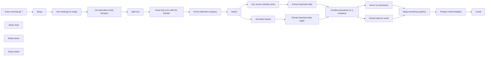

## Fluxo (.json) :

```json
{
  "meta": {
    "instanceId": "3c58c896c9089c8fb4d7f2b069bf3119193f239a1f538829758e2f4d6b5f5b24"
  },
  "nodes": [
    {
      "id": "ed18a0ab-ac62-469e-9490-d9fcf75b4606",
      "name": "Setup",
      "type": "n8n-nodes-base.set",
      "position": [
        -700,
        320
      ],
      "parameters": {
        "fields": {
          "values": [
            {
              "name": "linkedInAPIKey"
            },
            {
              "name": "twitterAPIKey"
            },
            {
              "name": "emails"
            }
          ]
        },
        "options": {}
      },
      "typeVersion": 3.2
    },
    {
      "id": "d6624796-3f59-4077-8d41-4418c869ad27",
      "name": "Every morning @ 7",
      "type": "n8n-nodes-base.scheduleTrigger",
      "position": [
        -940,
        320
      ],
      "parameters": {
        "rule": {
          "interval": [
            {
              "triggerAtHour": 7
            }
          ]
        }
      },
      "typeVersion": 1.1
    },
    {
      "id": "1cb46dc8-c2b5-487c-a382-a5714686be50",
      "name": "Get meetings for today",
      "type": "n8n-nodes-base.googleCalendar",
      "position": [
        -300,
        320
      ],
      "parameters": {
        "options": {
          "timeMax": "={{ $today.plus({ days: 1 }) }}",
          "timeMin": "={{ $today.minus({ days: 3 }) }}",
          "singleEvents": true
        },
        "calendar": {
          "__rl": true,
          "mode": "list",
          "value": "milorad.filipovic19@gmail.com",
          "cachedResultName": "milorad.filipovic19@gmail.com"
        },
        "operation": "getAll"
      },
      "credentials": {
        "googleCalendarOAuth2Api": {
          "id": "22",
          "name": "Google Calendar account"
        }
      },
      "typeVersion": 1
    },
    {
      "id": "22167c9c-6dc2-41a8-a8b8-218643b943e5",
      "name": "Get attendees email domains",
      "type": "n8n-nodes-base.set",
      "position": [
        -80,
        320
      ],
      "parameters": {
        "fields": {
          "values": [
            {
              "name": "domain",
              "type": "arrayValue",
              "arrayValue": "={{ $json.attendees.filter(a => !a.organizer).map(a => a.email.split('@').pop()) }}"
            },
            {
              "name": "attendeeEmails",
              "type": "arrayValue",
              "arrayValue": "={{ $json.attendees.filter(a => !a.organizer).map(a => a.email) }}"
            }
          ]
        },
        "options": {}
      },
      "typeVersion": 3.2
    },
    {
      "id": "271d0044-ceb1-4e3a-9a60-9c003cd4b198",
      "name": "Split Out",
      "type": "n8n-nodes-base.splitOut",
      "position": [
        140,
        320
      ],
      "parameters": {
        "include": "selectedOtherFields",
        "options": {},
        "fieldToSplitOut": "domain",
        "fieldsToInclude": "attendeeEmails, start"
      },
      "typeVersion": 1
    },
    {
      "id": "68041cd4-6dc3-4225-b39e-d227a3142e02",
      "name": "Get recent LinkedIn posts",
      "type": "n8n-nodes-base.httpRequest",
      "position": [
        -20,
        540
      ],
      "parameters": {
        "url": "https://fresh-linkedin-profile-data.p.rapidapi.com/get-company-posts",
        "options": {
          "batching": {
            "batch": {}
          }
        },
        "sendQuery": true,
        "sendHeaders": true,
        "queryParameters": {
          "parameters": [
            {
              "name": "linkedin_url",
              "value": "=https://www.linkedin.com/{{ $json.linkedin.handle }}"
            },
            {
              "name": "sort_by",
              "value": "recent"
            }
          ]
        },
        "headerParameters": {
          "parameters": [
            {
              "name": "X-RapidAPI-Key",
              "value": "={{ $('Setup').item.json.linkedInAPIKey }}"
            },
            {
              "name": "X-RapidAPI-Host",
              "value": "fresh-linkedin-profile-data.p.rapidapi.com"
            }
          ]
        }
      },
      "typeVersion": 4.1
    },
    {
      "id": "bcbc845c-dd69-491e-b18d-7e1cd73d94b4",
      "name": "Enrich attendee company",
      "type": "n8n-nodes-base.clearbit",
      "position": [
        580,
        320
      ],
      "parameters": {
        "domain": "={{ $json.domain }}",
        "additionalFields": {}
      },
      "credentials": {
        "clearbitApi": {
          "id": "tuwO0i7CavIt5j8X",
          "name": "Clearbit account"
        }
      },
      "typeVersion": 1
    },
    {
      "id": "a928a47a-c7be-4b08-ae78-05541963bf0e",
      "name": "Gmail",
      "type": "n8n-nodes-base.gmail",
      "position": [
        1360,
        640
      ],
      "parameters": {
        "sendTo": "={{ $('Setup').first().json.emails }}",
        "message": "={{ $json.html }}",
        "options": {},
        "subject": "=Latest social activity for: {{ $('Wrap everything together').item.json.name }}"
      },
      "credentials": {
        "gmailOAuth2": {
          "id": "10",
          "name": "mrdosija@gmail.com"
        }
      },
      "typeVersion": 2.1
    },
    {
      "id": "cc82d1ef-5601-4844-b2c1-91cb7d16c080",
      "name": "Combine all activity for a company",
      "type": "n8n-nodes-base.merge",
      "position": [
        460,
        620
      ],
      "parameters": {
        "mode": "combine",
        "options": {
          "clashHandling": {
            "values": {
              "resolveClash": "preferInput2"
            }
          }
        },
        "joinMode": "keepEverything",
        "mergeByFields": {
          "values": [
            {
              "field1": "name",
              "field2": "name"
            }
          ]
        }
      },
      "typeVersion": 2.1
    },
    {
      "id": "d0843f1d-173c-4c6a-8ef7-be122551ce03",
      "name": "Extract data for email",
      "type": "n8n-nodes-base.set",
      "position": [
        680,
        800
      ],
      "parameters": {
        "fields": {
          "values": [
            {
              "name": "attendeeEmail",
              "stringValue": "={{ $json.meeting.attendeeEmails.find(a => a.endsWith($json.meeting.domain)) }}"
            },
            {
              "name": "startHour",
              "type": "numberValue",
              "numberValue": "={{ DateTime.fromISO($json.meeting.start.dateTime).hour }}"
            },
            {
              "name": "startMinute",
              "type": "numberValue",
              "numberValue": "={{ DateTime.fromISO($json.meeting.start.dateTime).minute }}"
            }
          ]
        },
        "include": "selected",
        "options": {},
        "includeFields": "name, html_twitter, html_linkedin"
      },
      "typeVersion": 3.2
    },
    {
      "id": "7bbb4100-7529-4b33-8301-6e312e15d0c3",
      "name": "Prepare email template",
      "type": "n8n-nodes-base.html",
      "position": [
        1140,
        640
      ],
      "parameters": {
        "html": "<!DOCTYPE html>\n\n<html>\n<head>\n  <meta charset=\"UTF-8\" />\n\n</head>\n<body>\n  <div class=\"container\">\n     <h2 style=\"font-size: 1.2em\">\n      🗓️ Meeting with <span>{{ $json.attendeeEmail }}</span>\n       at {{ $json.startHour }}:{{ $json.startMinute < 10 ? `0${$json.startMinute}` : $json.startMinute }}h\n       <h3>Here's a quick summary of {{ $json.name }}'s recent social media activities</h3>\n       <p class=\"summary\">\n         {{ $json.message.content }}\n       </p>\n    </h2>\n\n  </div>\n</body>\n</html>\n\n<style>\n.container {\n  font-family: sans-serif;\n}\n\n.summary {\n  background-color: #f7f9fc; \n  font-family: sans-serif; \n  padding: 0.3em 1em\n}\n</style>"
      },
      "typeVersion": 1.1
    },
    {
      "id": "0ebfe036-0988-4775-bff4-1e52ba81fd12",
      "name": "Sticky Note",
      "type": "n8n-nodes-base.stickyNote",
      "position": [
        -773.5590877677955,
        50.38078783690389
      ],
      "parameters": {
        "color": 7,
        "width": 409.31582584657923,
        "height": 426.61520915049425,
        "content": "## Start here\n1️⃣ Register on [RapidAPI](https://rapidapi.com) and subscribe to these two APIs:\n- [Fresh LinkedIn Profile Data](https://rapidapi.com/freshdata-freshdata-default/api/fresh-linkedin-profile-data)\n- [Twitter](https://rapidapi.com/omarmhaimdat/api/twitter154)\n\n\n2️⃣ Set API keys for these two in `linkedInAPIKey` and `twitterAPIKey`fields of this node\n\n3️⃣ Set email addresses that should receive the list in the `emails` field of this node"
      },
      "typeVersion": 1
    },
    {
      "id": "3fcc1786-757f-49fd-842c-9f77c2a869a4",
      "name": "Sticky Note1",
      "type": "n8n-nodes-base.stickyNote",
      "position": [
        -474,
        620
      ],
      "parameters": {
        "color": 7,
        "width": 334.90628250854803,
        "height": 282.9114150520537,
        "content": "\n\n\n\n\n\n\n\n\n\n\n\n\n\nℹ️ If you need to get activities from more social media accounts found by ClearBit, they can be added here, just make sure to process them properly in separate switch node branches"
      },
      "typeVersion": 1
    },
    {
      "id": "0eb689e9-f347-482c-b6f3-de9913696eec",
      "name": "Keep only ones with the domain",
      "type": "n8n-nodes-base.filter",
      "position": [
        360,
        320
      ],
      "parameters": {
        "options": {},
        "conditions": {
          "options": {
            "leftValue": "",
            "caseSensitive": true,
            "typeValidation": "strict"
          },
          "combinator": "and",
          "conditions": [
            {
              "id": "881d891e-ea17-4879-a5cf-72d08b281f56",
              "operator": {
                "type": "string",
                "operation": "exists",
                "singleValue": true
              },
              "leftValue": "={{ $json.domain }}",
              "rightValue": ""
            }
          ]
        }
      },
      "typeVersion": 2
    },
    {
      "id": "9c479fe7-b0da-402a-bc4e-1c52b0bcb677",
      "name": "Extract important data",
      "type": "n8n-nodes-base.set",
      "position": [
        220,
        540
      ],
      "parameters": {
        "fields": {
          "values": [
            {
              "name": "linkedin_posts",
              "type": "arrayValue",
              "arrayValue": "={{ $input.item.json.data.slice(0, 10).map(d => { return { text: d.text, likes: d.num_likes, comments: d.num_comments, postedAt: d.posted } } ) }}"
            },
            {
              "name": "name",
              "stringValue": "={{ $('Switch').item.json.name }}"
            },
            {
              "name": "meeting",
              "type": "objectValue",
              "objectValue": "={{ $('Split Out').item.json }}"
            }
          ]
        },
        "include": "none",
        "options": {}
      },
      "typeVersion": 3.2
    },
    {
      "id": "4956210f-4797-4266-acb7-b80684f76052",
      "name": "Extract important data again",
      "type": "n8n-nodes-base.set",
      "position": [
        220,
        740
      ],
      "parameters": {
        "fields": {
          "values": [
            {
              "name": "twitter_posts",
              "type": "arrayValue",
              "arrayValue": "={{ $input.item.json.results.map(d => { return { text: d.text, favorites: d.favorite_count, retweets: d.retweet_count, replies: d.reply_count, postedAt: d.creationDate} }) }}"
            },
            {
              "name": "name",
              "stringValue": "={{ $('Switch').item.json.name }}"
            },
            {
              "name": "meeting",
              "type": "objectValue",
              "objectValue": "={{ $('Split Out').item.json }}"
            }
          ]
        },
        "include": "none",
        "options": {}
      },
      "typeVersion": 3.2
    },
    {
      "id": "fda56f50-ebc8-4259-9155-017f09a64f26",
      "name": "Ask AI to summerize",
      "type": "n8n-nodes-base.openAi",
      "position": [
        680,
        620
      ],
      "parameters": {
        "prompt": {
          "messages": [
            {
              "content": "=I am a sales representative in my company and I want to see social media activity for a company I am about to meet. I will give you a JSON object  containing company name, and lists of recent LinkedIn and X(Twitter) posts and your job is to give me a summary these posts. This summary needs to be in textual form suitable for email (just the content without the subject and should be impersonal) and should include details interested to a sales representative such as me. JSON data has the following properties: - 'name': Company name, - 'linkedin_posts': List of LinkedIn posts, - 'twitter_posts': List of Twitter posts, You can ignore all other properties in the JSON data. This is the data:\n{{ JSON.stringify($json) }}"
            }
          ]
        },
        "options": {},
        "resource": "chat",
        "chatModel": "gpt-4"
      },
      "credentials": {
        "openAiApi": {
          "id": "fN3KsfZMEf9qu6J6",
          "name": "OpenAi account 3"
        }
      },
      "typeVersion": 1.1
    },
    {
      "id": "0c082a02-72b3-47d8-9a62-ca5973eed8be",
      "name": "Switch",
      "type": "n8n-nodes-base.switch",
      "position": [
        -260,
        640
      ],
      "parameters": {
        "rules": {
          "values": [
            {
              "outputKey": "linkedin",
              "conditions": {
                "options": {
                  "leftValue": "",
                  "caseSensitive": true,
                  "typeValidation": "strict"
                },
                "combinator": "and",
                "conditions": [
                  {
                    "operator": {
                      "type": "boolean",
                      "operation": "true",
                      "singleValue": true
                    },
                    "leftValue": "={{ $json.linkedin.handle !== null }}",
                    "rightValue": ""
                  }
                ]
              },
              "renameOutput": true
            },
            {
              "outputKey": "twitter",
              "conditions": {
                "options": {
                  "leftValue": "",
                  "caseSensitive": true,
                  "typeValidation": "strict"
                },
                "combinator": "and",
                "conditions": [
                  {
                    "id": "bbb0310e-8b20-4bc6-a540-a4cd17470e28",
                    "operator": {
                      "type": "boolean",
                      "operation": "true",
                      "singleValue": true
                    },
                    "leftValue": "={{ $json.twitter.id !== null }}",
                    "rightValue": ""
                  }
                ]
              },
              "renameOutput": true
            }
          ]
        },
        "options": {
          "allMatchingOutputs": true,
          "looseTypeValidation": false
        }
      },
      "typeVersion": 3
    },
    {
      "id": "e1cf0a2e-834b-4259-91e4-47e13c07c321",
      "name": "Wrap everything together",
      "type": "n8n-nodes-base.merge",
      "position": [
        940,
        640
      ],
      "parameters": {
        "mode": "combine",
        "options": {},
        "combinationMode": "mergeByPosition"
      },
      "typeVersion": 2.1
    },
    {
      "id": "e45f33ec-6d67-4ae9-a450-5c300c8748b1",
      "name": "Sticky Note2",
      "type": "n8n-nodes-base.stickyNote",
      "position": [
        780,
        197.44186046511595
      ],
      "parameters": {
        "color": 5,
        "width": 738.9631933644362,
        "height": 399.8417061497098,
        "content": "### 📬 You will receive one email for every company in your calendar. These emails will look something like this:\n\n"
      },
      "typeVersion": 1
    },
    {
      "id": "31d22fdc-aacf-4228-ac78-b8f05621c0e0",
      "name": "Get latest tweets",
      "type": "n8n-nodes-base.httpRequest",
      "position": [
        -20,
        740
      ],
      "parameters": {
        "url": "https://twitter154.p.rapidapi.com/user/tweets",
        "options": {
          "batching": {
            "batch": {
              "batchSize": 1,
              "batchInterval": 2000
            }
          }
        },
        "sendQuery": true,
        "sendHeaders": true,
        "queryParameters": {
          "parameters": [
            {
              "name": "limit",
              "value": "10"
            },
            {
              "name": "user_id",
              "value": "={{ $json.twitter.id }}"
            },
            {
              "name": "include_replies",
              "value": "={{ false }}"
            },
            {
              "name": "include_pinned",
              "value": "={{ false }}"
            }
          ]
        },
        "headerParameters": {
          "parameters": [
            {
              "name": "X-RapidAPI-Host",
              "value": "twitter154.p.rapidapi.com"
            },
            {
              "name": "X-RapidAPI-Key",
              "value": "={{ $('Setup').first().json.twitterAPIKey }}"
            }
          ]
        }
      },
      "typeVersion": 4.1
    }
  ],
  "pinData": {},
  "connections": {
    "Setup": {
      "main": [
        [
          {
            "node": "Get meetings for today",
            "type": "main",
            "index": 0
          }
        ]
      ]
    },
    "Switch": {
      "main": [
        [
          {
            "node": "Get recent LinkedIn posts",
            "type": "main",
            "index": 0
          }
        ],
        [
          {
            "node": "Get latest tweets",
            "type": "main",
            "index": 0
          }
        ]
      ]
    },
    "Split Out": {
      "main": [
        [
          {
            "node": "Keep only ones with the domain",
            "type": "main",
            "index": 0
          }
        ]
      ]
    },
    "Every morning @ 7": {
      "main": [
        [
          {
            "node": "Setup",
            "type": "main",
            "index": 0
          }
        ]
      ]
    },
    "Get latest tweets": {
      "main": [
        [
          {
            "node": "Extract important data again",
            "type": "main",
            "index": 0
          }
        ]
      ]
    },
    "Ask AI to summerize": {
      "main": [
        [
          {
            "node": "Wrap everything together",
            "type": "main",
            "index": 0
          }
        ]
      ]
    },
    "Extract data for email": {
      "main": [
        [
          {
            "node": "Wrap everything together",
            "type": "main",
            "index": 1
          }
        ]
      ]
    },
    "Extract important data": {
      "main": [
        [
          {
            "node": "Combine all activity for a company",
            "type": "main",
            "index": 0
          }
        ]
      ]
    },
    "Get meetings for today": {
      "main": [
        [
          {
            "node": "Get attendees email domains",
            "type": "main",
            "index": 0
          }
        ]
      ]
    },
    "Prepare email template": {
      "main": [
        [
          {
            "node": "Gmail",
            "type": "main",
            "index": 0
          }
        ]
      ]
    },
    "Enrich attendee company": {
      "main": [
        [
          {
            "node": "Switch",
            "type": "main",
            "index": 0
          }
        ]
      ]
    },
    "Wrap everything together": {
      "main": [
        [
          {
            "node": "Prepare email template",
            "type": "main",
            "index": 0
          }
        ]
      ]
    },
    "Get recent LinkedIn posts": {
      "main": [
        [
          {
            "node": "Extract important data",
            "type": "main",
            "index": 0
          }
        ]
      ]
    },
    "Get attendees email domains": {
      "main": [
        [
          {
            "node": "Split Out",
            "type": "main",
            "index": 0
          }
        ]
      ]
    },
    "Extract important data again": {
      "main": [
        [
          {
            "node": "Combine all activity for a company",
            "type": "main",
            "index": 1
          }
        ]
      ]
    },
    "Keep only ones with the domain": {
      "main": [
        [
          {
            "node": "Enrich attendee company",
            "type": "main",
            "index": 0
          }
        ]
      ]
    },
    "Combine all activity for a company": {
      "main": [
        [
          {
            "node": "Ask AI to summerize",
            "type": "main",
            "index": 0
          },
          {
            "node": "Extract data for email",
            "type": "main",
            "index": 0
          }
        ]
      ]
    }
  }
}
```

<a id="template-2313"></a>

## Template 2313 - Sistema de tickets Telegram (tópicos de fórum)

- **Nome:** Sistema de tickets Telegram (tópicos de fórum)
- **Descrição:** Encaminha mensagens de usuários para um grupo de suporte criando tópicos como tickets, armazena e gerencia dados de usuários em Redis, reencaminha respostas da equipe para os usuários e permite broadcast de posts de canal para toda a base de usuários.
- **Funcionalidade:** • Configuração de bot: guarda token, ID do grupo de suporte e ID do canal de broadcast para uso pelas automações.
• Detecção e classificação de mensagens: identifica mensagens privadas, de supergrupos ou posts de canal e encaminha conforme o tipo.
• Armazenamento de dados do usuário: salva e atualiza informações do usuário em um banco Redis para rastrear tickets e status.
• Criação de ticket por tópico de fórum: gera um novo tópico no grupo de suporte para cada usuário (ticket dedicado) e salva o message_thread_id.
• Encaminhamento de mensagens do usuário: reencaminha mensagens do usuário para o tópico correspondente no grupo de suporte.
• Reconstrução de tópico: detecta quando o tópico não existe (ex.: foi deletado) e recria o tópico, atualizando o ID armazenado.
• Encaminhamento de respostas da equipe: identifica respostas no tópico e as encaminha de volta ao usuário correto.
• Notificação ao usuário: envia mensagem informando que um novo ticket foi criado e que aguarde atendimento.
• Broadcast de posts de canal: distribui posts do canal para todos os usuários armazenados em lotes, respeitando limites de taxa.
• Bloqueio de usuários: marca usuários como bloqueados para impedir futuros envios de broadcast a eles.
• Tolerância a erros em requisições: continua o fluxo em caso de falhas em chamadas externas, evitando paradas completas.
- **Ferramentas:** • Telegram Bot API: usado para criar tópicos de fórum, encaminhar e copiar mensagens, e enviar notificações como o bot.
• Redis: banco em memória para armazenar mapeamento usuário ↔ tópico (message_thread_id), status de bloqueio e dados do usuário.
• Coolify (opcional): sugestão para hospedar o Redis sem necessidade de gerenciamento de servidores.


## Fluxo visual

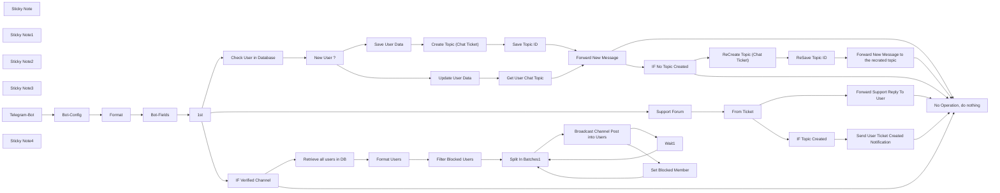

## Fluxo (.json) :

```json
{
  "meta": {
    "instanceId": "56d2f4e489ee5971b498fdc86622af934b4f6de5339e9825a61dbe25e604dccd"
  },
  "nodes": [
    {
      "id": "d2a02884-a082-4d77-8558-b819fdfd8e09",
      "name": "Sticky Note",
      "type": "n8n-nodes-base.stickyNote",
      "position": [
        -1305,
        -337
      ],
      "parameters": {
        "color": 7,
        "width": 629.040241216464,
        "height": 1416.261500302191,
        "content": "## Use **Config Bot** to setup your telegram details, like:\n1- Telegram Group ID (Don't forget add bot as admin)\n2- Telegram Channel ID (Don't forget add bot as admin)\n3- Your telegram Bot Token. (Generate through @BotFather)\n\n\n\n\n\n\n\n\n\n\n\n\n\n\n\n\n\n\n\n\n\n## Setup data & filter & route to the correct Side.\n0- None of them - Soon - Wait V2\n1- Chat Type (`Private`)\n2- Chat Type (`Supergroup`)\n3- Chat Type (`Channel`)\n\n\n\n\n\n\n\n\n\n\n\n\n\n\n\n\n\n\n\n\n\n\n\n\n\n\n\n\n\n\n\n## Remember:\n* Do not make your support group public. Every message sent in the group on various topics will be forwarded to the user's ticket.\n* There is no need to promote your broadcasting channel; the main reason for the channel is to organize and broadcast messages.\n* You can host a Redis database without any coding/server management skills through Coolify.io.\n* In the next version, I will add the **edit messages** feature, where the forwarded messages will be updated with the new edited one.\n\n## Why use this method?\n* If you deal with Telegram P2P, anyone can delete messages from both sides. If you run a business, then one of your clients may delete all messages, causing you to lose the history. This solution prevents people from deleting messages; every message forwarded into the support group will not be possible to delete by the sender.\n* Team collaboration: Why share one account when you can convert the whole group into a ticketing system? With this project, you can invite all your coworkers to reply and provide support to your clients through Telegram.\n* Integrate with third-party services? Using N8N will pave the way for integrating your Telegram users' data into a CRM. In V2, we will enable the option to force new users to share their leads before receiving support."
      },
      "typeVersion": 1
    },
    {
      "id": "c45c5efc-9c4d-4373-b267-bb13a01cb1de",
      "name": "New User ?",
      "type": "n8n-nodes-base.if",
      "position": [
        -400,
        -140
      ],
      "parameters": {
        "conditions": {
          "string": [
            {
              "value1": "={{ $json.isEmpty() }}",
              "value2": "true",
              "operation": "regex"
            }
          ]
        }
      },
      "typeVersion": 1
    },
    {
      "id": "ab015a1f-9ee3-48f6-88c2-02d43fa739bc",
      "name": "Format",
      "type": "n8n-nodes-base.code",
      "position": [
        -1260,
        260
      ],
      "parameters": {
        "jsCode": "function escapeRedisJsonSyntax(value) {\n  if (typeof value === 'string') {\n    return value.replace(/[\"\\/]/g, '\\\\$&');\n  }\n  return value;\n}\n\nconst outputItems = [];\n\nfor (let i = 0; i < items.length; i++) {\n  const item = items[i];\n  const escapedItem = { TG_USER_: {} };\n\n  for (const key in item) {\n    const value = item[key];\n    if (Array.isArray(value)) {\n      escapedItem.TG_USER_[key] = [escapeRedisJsonSyntax(value[0])];\n    } else if (typeof value === 'object') {\n      flattenObject(value, escapedItem.TG_USER_, key);\n    } else {\n      escapedItem.TG_USER_[key] = escapeRedisJsonSyntax(value);\n    }\n  }\n\n  outputItems.push(escapedItem);\n}\n\nfunction flattenObject(obj, result, prefix) {\n  for (const key in obj) {\n    const newKey = prefix ? `${prefix}_${key}` : key;\n    const value = obj[key];\n    if (typeof value === 'object') {\n      if (Array.isArray(value)) {\n        result[newKey] = [escapeRedisJsonSyntax(value[0])];\n      } else {\n        flattenObject(value, result, newKey);\n      }\n    } else {\n      result[newKey.replace('json_message_', '').replace('json_', '')] = escapeRedisJsonSyntax(value);\n    }\n  }\n}\n\nreturn outputItems;\n"
      },
      "typeVersion": 2
    },
    {
      "id": "18c5126d-6c3e-4b5f-989e-d6830cb73a90",
      "name": "Bot-Fields",
      "type": "n8n-nodes-base.set",
      "position": [
        -1120,
        260
      ],
      "parameters": {
        "mode": "raw",
        "include": "selected",
        "options": {},
        "jsonOutput": "={{ $json.TG_USER_.removeField('BotToken').removeField('pairedItem_item').removeField('Support_Group_ID') }}"
      },
      "typeVersion": 3.2
    },
    {
      "id": "0cc142e7-4fbc-4104-9529-1087a7bac68a",
      "name": "Create Topic (Chat Ticket)",
      "type": "n8n-nodes-base.httpRequest",
      "position": [
        80,
        -260
      ],
      "parameters": {
        "url": "=https://api.telegram.org/bot{{ $('Bot-Config').item.json.BotToken }}/createForumTopic?chat_id={{ $('Bot-Config').item.json[\"Support_Group_ID\"]}}&name={{ encodeURIComponent(('['+$('Bot-Fields').item.json.from_first_name +'] - [id:'+ $('Bot-Fields').item.json.chat_id +']'))}}&icon_color=9367192&icon_custom_emoji_id=5417915203100613993",
        "options": {}
      },
      "typeVersion": 4.1
    },
    {
      "id": "e983994f-7922-49c2-8c4e-73100a030898",
      "name": "Save Topic ID",
      "type": "n8n-nodes-base.redis",
      "position": [
        260,
        -260
      ],
      "parameters": {
        "key": "=TG-USER-{{ $('Bot-Fields').item.json.chat_id }}",
        "value": "={\"message_thread_id\":{{ $json.result.message_thread_id }}}",
        "keyType": "hash",
        "operation": "set"
      },
      "credentials": {
        "redis": {
          "id": "LNn51V8Wv8nlnOrK",
          "name": "Livegram Bot"
        }
      },
      "typeVersion": 1
    },
    {
      "id": "1f3afe0c-3ec4-431f-92b7-f06df5e1b39d",
      "name": "Get User Chat Topic",
      "type": "n8n-nodes-base.redis",
      "position": [
        200,
        -80
      ],
      "parameters": {
        "key": "=TG-USER-{{ $('Bot-Fields').item.json.chat_id }}",
        "keyType": "hash",
        "options": {},
        "operation": "get",
        "propertyName": "result"
      },
      "credentials": {
        "redis": {
          "id": "LNn51V8Wv8nlnOrK",
          "name": "Livegram Bot"
        }
      },
      "typeVersion": 1
    },
    {
      "id": "591e1768-58c9-428e-8a0d-69ba4cce7ccc",
      "name": "Forward New Message",
      "type": "n8n-nodes-base.httpRequest",
      "onError": "continueErrorOutput",
      "position": [
        560,
        -80
      ],
      "parameters": {
        "url": "=https://api.telegram.org/bot{{ $('Bot-Config').item.json.BotToken }}/forwardMessage?chat_id={{ $('Bot-Config').item.json[\"Support_Group_ID\"] }}&message_thread_id={{ $json[\"result\"][\"message_thread_id\"] }}&from_chat_id={{ $('Bot-Fields').item.json[\"chat_id\"] }}&message_id={{ $('Bot-Fields').item.json[\"message_id\"] }}",
        "method": "POST",
        "options": {}
      },
      "typeVersion": 4.1
    },
    {
      "id": "fd063a6d-0caa-4f81-921d-f8fa952d7b9b",
      "name": "IF No Topic Created",
      "type": "n8n-nodes-base.if",
      "position": [
        40,
        320
      ],
      "parameters": {
        "conditions": {
          "string": [
            {
              "value1": "={{ $json.error.message }}",
              "value2": "thread not found",
              "operation": "contains"
            }
          ]
        }
      },
      "typeVersion": 1
    },
    {
      "id": "ef044803-5e2e-4e54-a10b-21ad5feadb26",
      "name": "ReCreate Topic (Chat Ticket)",
      "type": "n8n-nodes-base.httpRequest",
      "position": [
        220,
        220
      ],
      "parameters": {
        "url": "=https://api.telegram.org/bot{{ $('Bot-Config').item.json.BotToken }}/createForumTopic?chat_id={{ $('Bot-Config').item.json[\"Support_Group_ID\"]}}&name={{ encodeURIComponent(('['+$('Bot-Fields').item.json.from_first_name +'] - [id:'+ $('Bot-Fields').item.json.chat_id +']'))}}&icon_color=9367192&icon_custom_emoji_id=5417915203100613993",
        "options": {}
      },
      "typeVersion": 4.1
    },
    {
      "id": "691398ab-b434-46d0-b3fe-046235d7cdf8",
      "name": "ReSave Topic ID",
      "type": "n8n-nodes-base.redis",
      "position": [
        380,
        220
      ],
      "parameters": {
        "key": "=TG-USER-{{ $('Bot-Fields').item.json.chat_id }}",
        "value": "={\"message_thread_id\":{{ $json.result.message_thread_id }}}",
        "keyType": "hash",
        "operation": "set"
      },
      "credentials": {
        "redis": {
          "id": "LNn51V8Wv8nlnOrK",
          "name": "Livegram Bot"
        }
      },
      "typeVersion": 1
    },
    {
      "id": "69fc3fe2-a339-4c99-a85b-6facf41526bf",
      "name": "Sticky Note1",
      "type": "n8n-nodes-base.stickyNote",
      "position": [
        20,
        120.47661481708235
      ],
      "parameters": {
        "color": 3,
        "width": 734.3067601294108,
        "height": 466.5190319644644,
        "content": "## Re Create New Topic\n**Sometimes** in support group may the team delete or close a ticket (topic) in case of that this steps will create topic again for the user, and store the new ticket id (topic/thread ID)."
      },
      "typeVersion": 1
    },
    {
      "id": "4cb855d4-a306-4bd4-b24d-ee5f6db518d4",
      "name": "Update User Data",
      "type": "n8n-nodes-base.redis",
      "position": [
        -140,
        -80
      ],
      "parameters": {
        "key": "=TG-USER-{{ $('Bot-Fields').item.json.chat_id }}",
        "value": "={{ $item(\"0\").$node[\"Bot-Fields\"].json }}",
        "keyType": "hash",
        "operation": "set"
      },
      "credentials": {
        "redis": {
          "id": "LNn51V8Wv8nlnOrK",
          "name": "Livegram Bot"
        }
      },
      "typeVersion": 1
    },
    {
      "id": "878f0dec-ad7b-4584-b20a-dd3db634d6dd",
      "name": "Save User Data",
      "type": "n8n-nodes-base.redis",
      "position": [
        -140,
        -260
      ],
      "parameters": {
        "key": "=TG-USER-{{ $('Bot-Fields').item.json.chat_id }}",
        "value": "={{ $item(\"0\").$node[\"Bot-Fields\"].json }}",
        "keyType": "hash",
        "operation": "set"
      },
      "credentials": {
        "redis": {
          "id": "LNn51V8Wv8nlnOrK",
          "name": "Livegram Bot"
        }
      },
      "typeVersion": 1
    },
    {
      "id": "e411b235-74bf-4f1b-9070-da1d0dc15815",
      "name": "Support Forum",
      "type": "n8n-nodes-base.if",
      "position": [
        -620,
        240
      ],
      "parameters": {
        "conditions": {
          "string": [
            {
              "value1": "={{ $('Bot-Config').item.json.message.chat.id }}",
              "value2": "={{ $('Bot-Config').item.json.Support_Group_ID }}",
              "operation": "regex"
            }
          ]
        }
      },
      "typeVersion": 1
    },
    {
      "id": "05c04455-1406-47aa-8a81-aa2ec914c502",
      "name": "From Ticket",
      "type": "n8n-nodes-base.if",
      "position": [
        -420,
        220
      ],
      "parameters": {
        "conditions": {
          "string": [
            {
              "value1": "={{ $('Bot-Fields').item.json.message_thread_id }}",
              "operation": "isNotEmpty"
            },
            {
              "value1": "={{ $('Bot-Fields').item.json.reply_to_message_is_topic_message }}",
              "value2": "true",
              "operation": "regex"
            },
            {
              "value1": "={{ $('Bot-Fields').item.json.is_topic_message }}",
              "value2": "true",
              "operation": "regex"
            }
          ]
        }
      },
      "typeVersion": 1
    },
    {
      "id": "71b55beb-7c93-40a1-a94b-f411d11eb713",
      "name": "Forward Support Reply To User",
      "type": "n8n-nodes-base.httpRequest",
      "position": [
        -200,
        200
      ],
      "parameters": {
        "url": "=https://api.telegram.org/bot{{ $('Bot-Config').item.json.BotToken }}/forwardMessage?chat_id={{ $json[\"reply_to_message_forward_from_id\"] || $('Bot-Fields').item.json.reply_to_message_forum_topic_created_name.match(/\\[id:(\\d+)\\]/)[1] }}&from_chat_id={{ $('Bot-Config').item.json[\"Support_Group_ID\"] }}&message_id={{ $('Bot-Fields').item.json[\"message_id\"] }}",
        "method": "POST",
        "options": {}
      },
      "typeVersion": 4.1
    },
    {
      "id": "aa70a9f6-ac3c-4ac4-a829-ef3e35720f2f",
      "name": "IF Topic Created",
      "type": "n8n-nodes-base.if",
      "position": [
        -420,
        440
      ],
      "parameters": {
        "conditions": {
          "string": [
            {
              "value1": "={{ $json.forum_topic_created_name.isNotEmpty() }}",
              "value2": "true",
              "operation": "regex"
            }
          ]
        }
      },
      "typeVersion": 1
    },
    {
      "id": "4b1ba81a-6986-48a9-b439-cd79cfe278b7",
      "name": "Forward New Message to the recrated topic",
      "type": "n8n-nodes-base.httpRequest",
      "position": [
        540,
        220
      ],
      "parameters": {
        "url": "=https://api.telegram.org/bot{{ $('Bot-Config').item.json.BotToken }}/forwardMessage?chat_id={{ $('Bot-Config').item.json[\"Support_Group_ID\"] }}&message_thread_id={{ $json[\"result\"][\"message_thread_id\"] }}&from_chat_id={{ $('Bot-Fields').item.json[\"chat_id\"] }}&message_id={{ $('Bot-Fields').item.json[\"message_id\"] }}",
        "method": "POST",
        "options": {}
      },
      "typeVersion": 4.1
    },
    {
      "id": "7eef7a26-8c59-4020-90f8-45f28e36c43f",
      "name": "No Operation, do nothing",
      "type": "n8n-nodes-base.noOp",
      "position": [
        540,
        420
      ],
      "parameters": {},
      "typeVersion": 1
    },
    {
      "id": "db77035a-1256-4210-a13d-8333778fb579",
      "name": "Check User in Database",
      "type": "n8n-nodes-base.redis",
      "notes": "Search Key",
      "position": [
        -580,
        -140
      ],
      "parameters": {
        "operation": "keys",
        "keyPattern": "=TG-USER-{{ $json.chat_id }}"
      },
      "credentials": {
        "redis": {
          "id": "LNn51V8Wv8nlnOrK",
          "name": "Livegram Bot"
        }
      },
      "notesInFlow": true,
      "typeVersion": 1
    },
    {
      "id": "c01200b7-8aa4-4d44-a9a9-a802179f3afc",
      "name": "Sticky Note2",
      "type": "n8n-nodes-base.stickyNote",
      "position": [
        -660,
        120
      ],
      "parameters": {
        "color": 5,
        "width": 656,
        "height": 473,
        "content": "## Support Side\n**This Part** is meant to forward replies that sent by support (members in the group)"
      },
      "typeVersion": 1
    },
    {
      "id": "a443f847-248a-4287-8aad-737c4891b344",
      "name": "Send User Ticket Created Notification",
      "type": "n8n-nodes-base.telegram",
      "position": [
        -220,
        420
      ],
      "parameters": {
        "text": "A new ticket has been created for you. Please wait while one of our support team members becomes available to reply.",
        "chatId": "={{ $json.forum_topic_created_name.match(/\\[id:(\\d+)\\]/)[1] }}",
        "additionalFields": {
          "appendAttribution": false
        }
      },
      "credentials": {
        "telegramApi": {
          "id": "dZzfZH7baUnF4hiH",
          "name": "The Live Chat Bot"
        }
      },
      "typeVersion": 1.1
    },
    {
      "id": "2746b480-91ed-4968-809d-9eca523d290a",
      "name": "Sticky Note3",
      "type": "n8n-nodes-base.stickyNote",
      "position": [
        -656.2527877074685,
        -340
      ],
      "parameters": {
        "color": 3,
        "width": 1409.9137494026593,
        "height": 422,
        "content": "## User Side\n**This Part** is meant to save user data on a RAM database which is fast, and in same time forward the message to support after creating a new ticket (Topic) dedciated for the user id in the support group."
      },
      "typeVersion": 1
    },
    {
      "id": "545d768f-a0b2-465a-a084-c43a6231d31a",
      "name": "Bot-Config",
      "type": "n8n-nodes-base.set",
      "position": [
        -880,
        -200
      ],
      "parameters": {
        "fields": {
          "values": [
            {
              "name": "BotToken",
              "stringValue": "Your Bot Token here (Also add credntinals in Telegram Node)"
            },
            {
              "name": "Support_Group_ID",
              "stringValue": "Your Telegram Group here (Don't forget to give BOT admin privileges)"
            },
            {
              "name": "Boradcast_Channel_ID",
              "stringValue": "Your Telegram Channel here (Don't forget to give BOT admin privileges)"
            }
          ]
        },
        "options": {}
      },
      "typeVersion": 3.2
    },
    {
      "id": "59145dcd-51e3-4392-ad79-85601c872931",
      "name": "Telegram-Bot",
      "type": "n8n-nodes-base.telegramTrigger",
      "position": [
        -1240,
        -200
      ],
      "webhookId": "d8b773ab-aee9-494b-8749-f0aa80032871",
      "parameters": {
        "updates": [
          "message",
          "channel_post"
        ],
        "additionalFields": {}
      },
      "credentials": {
        "telegramApi": {
          "id": "dZzfZH7baUnF4hiH",
          "name": "The Live Chat Bot"
        }
      },
      "typeVersion": 1
    },
    {
      "id": "14b0ac28-5be5-4878-ab57-f7361291cc8e",
      "name": "1st",
      "type": "n8n-nodes-base.switch",
      "position": [
        -980,
        260
      ],
      "parameters": {
        "rules": {
          "rules": [
            {
              "output": 1,
              "value2": "private",
              "operation": "regex"
            },
            {
              "output": 2,
              "value2": "supergroup",
              "operation": "regex"
            },
            {
              "output": 3,
              "value2": "channel",
              "operation": "regex"
            }
          ]
        },
        "value1": "={{ $json.chat_type || $json.channel_post_sender_chat_type }}",
        "dataType": "string",
        "fallbackOutput": 0
      },
      "typeVersion": 1
    },
    {
      "id": "d91e0fdf-7344-4968-beac-49c2331b5170",
      "name": "Split In Batches1",
      "type": "n8n-nodes-base.splitInBatches",
      "notes": "Telegram Limitation 29/sec",
      "position": [
        160,
        780
      ],
      "parameters": {
        "options": {},
        "batchSize": 29
      },
      "notesInFlow": true,
      "typeVersion": 2
    },
    {
      "id": "f6ce5dbb-8707-4243-9814-5bd57397e652",
      "name": "Wait1",
      "type": "n8n-nodes-base.wait",
      "position": [
        560,
        740
      ],
      "webhookId": "9f87deed-d502-46d3-8c85-ce99552a0441",
      "parameters": {
        "unit": "seconds",
        "amount": 3
      },
      "typeVersion": 1
    },
    {
      "id": "640e9ca9-de7d-4dae-a15a-d0232864c877",
      "name": "Format Users",
      "type": "n8n-nodes-base.code",
      "position": [
        -200,
        780
      ],
      "parameters": {
        "jsCode": "let response = items[0].json; // get the Redis response\nlet newItems = []; // to store the new items\n\nfor(let key in response) {\n    if(response.hasOwnProperty(key)) {\n        newItems.push({\n            json: {\n                user: response[key]\n            }\n        });\n    }\n}\n\nreturn newItems;\n"
      },
      "typeVersion": 1
    },
    {
      "id": "8c330aca-3720-439e-87c6-47d914f828c3",
      "name": "Broadcast Channel Post into Users",
      "type": "n8n-nodes-base.httpRequest",
      "onError": "continueErrorOutput",
      "position": [
        380,
        760
      ],
      "parameters": {
        "url": "=https://api.telegram.org/bot{{ $('Bot-Config').item.json.BotToken }}/copyMessage?chat_id={{ $('Split In Batches1').item.json[\"user\"][\"chat_id\"] }}&from_chat_id={{ $('Bot-Config').item.json[\"Boradcast_Channel_ID\"] }}&message_id={{ $('Bot-Config').item.json[\"channel_post\"][\"message_id\"] }}",
        "method": "POST",
        "options": {}
      },
      "typeVersion": 4.1
    },
    {
      "id": "3beb15dd-6e76-4350-97c3-22f39d768497",
      "name": "Set Blocked Member",
      "type": "n8n-nodes-base.redis",
      "position": [
        560,
        900
      ],
      "parameters": {
        "key": "=TG-USER-{{ $('Bot-Fields').item.json.chat_id || $('Split In Batches1').item.json.user.chat_id }}",
        "value": "={\"Blocked\":{{ '1' }}}",
        "keyType": "hash",
        "operation": "set"
      },
      "credentials": {
        "redis": {
          "id": "LNn51V8Wv8nlnOrK",
          "name": "Livegram Bot"
        }
      },
      "typeVersion": 1
    },
    {
      "id": "03d457f1-ca11-4134-b0f9-d4d029ce141a",
      "name": "IF Verified Channel",
      "type": "n8n-nodes-base.if",
      "position": [
        -558,
        800
      ],
      "parameters": {
        "conditions": {
          "string": [
            {
              "value1": "={{ $('Bot-Config').item.json.channel_post.sender_chat.id }}",
              "value2": "={{ $('Bot-Config').item.json.Boradcast_Channel_ID }}",
              "operation": "regex"
            }
          ]
        }
      },
      "typeVersion": 1
    },
    {
      "id": "6f38d2d0-5734-4829-ab97-8aca57827646",
      "name": "Filter Blocked Users",
      "type": "n8n-nodes-base.filter",
      "position": [
        -20,
        780
      ],
      "parameters": {
        "conditions": {
          "string": [
            {
              "value1": "={{ $json.user.Blocked }}",
              "value2": "1",
              "operation": "notRegex"
            }
          ]
        }
      },
      "typeVersion": 1
    },
    {
      "id": "37ffb301-0284-493e-abed-aaff293b4a92",
      "name": "Sticky Note4",
      "type": "n8n-nodes-base.stickyNote",
      "position": [
        -660,
        620
      ],
      "parameters": {
        "color": 6,
        "width": 1413.320293398532,
        "height": 460.58353708231465,
        "content": "## Channel Side (Broadcasting)\n**This Part** where the support of brand broadcasting message to all previous users who used this bot before."
      },
      "typeVersion": 1
    },
    {
      "id": "d34a0080-6db8-4d29-b6ff-b0b0bf3be8af",
      "name": "Retrieve all users in DB",
      "type": "n8n-nodes-base.redis",
      "notes": "Search Key",
      "position": [
        -378,
        780
      ],
      "parameters": {
        "operation": "keys",
        "keyPattern": "=TG-USER-*"
      },
      "credentials": {
        "redis": {
          "id": "LNn51V8Wv8nlnOrK",
          "name": "Livegram Bot"
        }
      },
      "notesInFlow": true,
      "typeVersion": 1
    }
  ],
  "pinData": {},
  "connections": {
    "1st": {
      "main": [
        null,
        [
          {
            "node": "Check User in Database",
            "type": "main",
            "index": 0
          }
        ],
        [
          {
            "node": "Support Forum",
            "type": "main",
            "index": 0
          }
        ],
        [
          {
            "node": "IF Verified Channel",
            "type": "main",
            "index": 0
          }
        ]
      ]
    },
    "Wait1": {
      "main": [
        [
          {
            "node": "Split In Batches1",
            "type": "main",
            "index": 0
          }
        ]
      ]
    },
    "Format": {
      "main": [
        [
          {
            "node": "Bot-Fields",
            "type": "main",
            "index": 0
          }
        ]
      ]
    },
    "Bot-Config": {
      "main": [
        [
          {
            "node": "Format",
            "type": "main",
            "index": 0
          }
        ]
      ]
    },
    "Bot-Fields": {
      "main": [
        [
          {
            "node": "1st",
            "type": "main",
            "index": 0
          }
        ]
      ]
    },
    "New User ?": {
      "main": [
        [
          {
            "node": "Save User Data",
            "type": "main",
            "index": 0
          }
        ],
        [
          {
            "node": "Update User Data",
            "type": "main",
            "index": 0
          }
        ]
      ]
    },
    "From Ticket": {
      "main": [
        [
          {
            "node": "Forward Support Reply To User",
            "type": "main",
            "index": 0
          }
        ],
        [
          {
            "node": "IF Topic Created",
            "type": "main",
            "index": 0
          }
        ]
      ]
    },
    "Format Users": {
      "main": [
        [
          {
            "node": "Filter Blocked Users",
            "type": "main",
            "index": 0
          }
        ]
      ]
    },
    "Telegram-Bot": {
      "main": [
        [
          {
            "node": "Bot-Config",
            "type": "main",
            "index": 0
          }
        ]
      ]
    },
    "Save Topic ID": {
      "main": [
        [
          {
            "node": "Forward New Message",
            "type": "main",
            "index": 0
          }
        ]
      ]
    },
    "Support Forum": {
      "main": [
        [
          {
            "node": "From Ticket",
            "type": "main",
            "index": 0
          }
        ]
      ]
    },
    "Save User Data": {
      "main": [
        [
          {
            "node": "Create Topic (Chat Ticket)",
            "type": "main",
            "index": 0
          }
        ]
      ]
    },
    "ReSave Topic ID": {
      "main": [
        [
          {
            "node": "Forward New Message to the recrated topic",
            "type": "main",
            "index": 0
          }
        ]
      ]
    },
    "IF Topic Created": {
      "main": [
        [
          {
            "node": "Send User Ticket Created Notification",
            "type": "main",
            "index": 0
          }
        ]
      ]
    },
    "Update User Data": {
      "main": [
        [
          {
            "node": "Get User Chat Topic",
            "type": "main",
            "index": 0
          }
        ]
      ]
    },
    "Split In Batches1": {
      "main": [
        [
          {
            "node": "Broadcast Channel Post into Users",
            "type": "main",
            "index": 0
          }
        ]
      ]
    },
    "Set Blocked Member": {
      "main": [
        [
          {
            "node": "Split In Batches1",
            "type": "main",
            "index": 0
          }
        ]
      ]
    },
    "Forward New Message": {
      "main": [
        [
          {
            "node": "No Operation, do nothing",
            "type": "main",
            "index": 0
          }
        ],
        [
          {
            "node": "IF No Topic Created",
            "type": "main",
            "index": 0
          }
        ]
      ]
    },
    "Get User Chat Topic": {
      "main": [
        [
          {
            "node": "Forward New Message",
            "type": "main",
            "index": 0
          }
        ]
      ]
    },
    "IF No Topic Created": {
      "main": [
        [
          {
            "node": "ReCreate Topic (Chat Ticket)",
            "type": "main",
            "index": 0
          }
        ],
        [
          {
            "node": "No Operation, do nothing",
            "type": "main",
            "index": 0
          }
        ]
      ]
    },
    "IF Verified Channel": {
      "main": [
        [
          {
            "node": "Retrieve all users in DB",
            "type": "main",
            "index": 0
          }
        ],
        [
          {
            "node": "No Operation, do nothing",
            "type": "main",
            "index": 0
          }
        ]
      ]
    },
    "Filter Blocked Users": {
      "main": [
        [
          {
            "node": "Split In Batches1",
            "type": "main",
            "index": 0
          }
        ]
      ]
    },
    "Check User in Database": {
      "main": [
        [
          {
            "node": "New User ?",
            "type": "main",
            "index": 0
          }
        ]
      ]
    },
    "Retrieve all users in DB": {
      "main": [
        [
          {
            "node": "Format Users",
            "type": "main",
            "index": 0
          }
        ]
      ]
    },
    "Create Topic (Chat Ticket)": {
      "main": [
        [
          {
            "node": "Save Topic ID",
            "type": "main",
            "index": 0
          }
        ]
      ]
    },
    "ReCreate Topic (Chat Ticket)": {
      "main": [
        [
          {
            "node": "ReSave Topic ID",
            "type": "main",
            "index": 0
          }
        ]
      ]
    },
    "Forward Support Reply To User": {
      "main": [
        [
          {
            "node": "No Operation, do nothing",
            "type": "main",
            "index": 0
          }
        ]
      ]
    },
    "Broadcast Channel Post into Users": {
      "main": [
        [
          {
            "node": "Wait1",
            "type": "main",
            "index": 0
          }
        ],
        [
          {
            "node": "Set Blocked Member",
            "type": "main",
            "index": 0
          }
        ]
      ]
    },
    "Send User Ticket Created Notification": {
      "main": [
        [
          {
            "node": "No Operation, do nothing",
            "type": "main",
            "index": 0
          }
        ]
      ]
    },
    "Forward New Message to the recrated topic": {
      "main": [
        [
          {
            "node": "No Operation, do nothing",
            "type": "main",
            "index": 0
          }
        ]
      ]
    }
  }
}
```

<a id="template-2315"></a>

## Template 2315 - Endpoint de taxas de câmbio do Euro

- **Nome:** Endpoint de taxas de câmbio do Euro
- **Descrição:** Expõe um endpoint HTTP que busca as taxas de câmbio diárias do Euro e responde com todas as taxas ou com a taxa de uma moeda específica conforme consulta recebida.
- **Funcionalidade:** • Recepção de requisições via webhook: Aceita requisições HTTP para iniciar o fluxo.
• Recuperação do feed do BCE: Faz uma requisição ao feed diário de taxas do Euro adicionando um parâmetro randômico para evitar cache.
• Conversão de XML para JSON: Converte os dados retornados em XML para formato JSON utilizável.
• Separação das entradas de câmbio: Separa cada taxa de câmbio em itens individuais para processamento.
• Detecção de parâmetro de consulta: Verifica se a requisição incluiu parâmetros de consulta para determinar a resposta desejada.
• Filtragem por símbolo de moeda: Se houver parâmetro, filtra e retorna apenas a taxa da moeda solicitada.
• Resposta condicional: Retorna ou a lista completa de taxas ou apenas o item solicitado dependendo da presença do parâmetro de consulta.
- **Ferramentas:** • European Central Bank (ECB) - feed eurofxref-daily.xml: Fonte oficial que fornece as taxas de câmbio diárias do Euro em formato XML.

## Fluxo visual

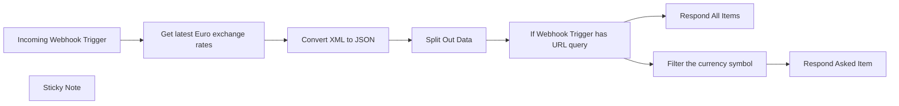

## Fluxo (.json) :

```json
{
  "meta": {
    "instanceId": "29aba5a622661908a48f94e4ff4983d5d88a33ca233b57cebe114886a24f3172"
  },
  "nodes": [
    {
      "id": "85c8481e-9bc8-49ca-bce1-1d2d915829bd",
      "name": "Respond All Items",
      "type": "n8n-nodes-base.respondToWebhook",
      "position": [
        2180,
        500
      ],
      "parameters": {
        "options": {},
        "respondWith": "allIncomingItems"
      },
      "typeVersion": 1
    },
    {
      "id": "194a1e37-ae2a-4142-a3f6-38161abbc20b",
      "name": "Respond Asked Item",
      "type": "n8n-nodes-base.respondToWebhook",
      "position": [
        2180,
        280
      ],
      "parameters": {
        "options": {}
      },
      "typeVersion": 1
    },
    {
      "id": "9bb8cb37-9723-4f85-8878-f3b0abe5763f",
      "name": "Incoming Webhook Trigger",
      "type": "n8n-nodes-base.webhook",
      "position": [
        700,
        300
      ],
      "webhookId": "309c36da-224c-4023-b989-8f991502b625",
      "parameters": {
        "path": "eu-exchange-rate",
        "options": {},
        "responseMode": "responseNode"
      },
      "typeVersion": 1.1
    },
    {
      "id": "f1fe517a-bd74-45e0-b9df-9d7167d50068",
      "name": "Get latest Euro exchange rates",
      "type": "n8n-nodes-base.httpRequest",
      "position": [
        920,
        300
      ],
      "parameters": {
        "url": "={{ \"https://www.ecb.europa.eu/stats/eurofxref/eurofxref-daily.xml?\" + Math.floor(Math.random() * (999999999 - 100000000 + 1)) + 100000000 }}",
        "options": {}
      },
      "typeVersion": 4.1
    },
    {
      "id": "92d6936f-2c6f-4069-89bd-fe044664bb8b",
      "name": "Convert XML to JSON",
      "type": "n8n-nodes-base.xml",
      "position": [
        1140,
        300
      ],
      "parameters": {
        "options": {}
      },
      "typeVersion": 1
    },
    {
      "id": "a923e692-5da1-4e87-99c1-c22372a99d96",
      "name": "Split Out Data",
      "type": "n8n-nodes-base.splitOut",
      "position": [
        1360,
        300
      ],
      "parameters": {
        "options": {},
        "fieldToSplitOut": "['gesmes:Envelope'].Cube.Cube.Cube"
      },
      "typeVersion": 1
    },
    {
      "id": "6a1de054-ef7a-41d9-886c-f31d4801b83e",
      "name": "If Webhook Trigger has URL query",
      "type": "n8n-nodes-base.if",
      "position": [
        1580,
        300
      ],
      "parameters": {
        "options": {},
        "conditions": {
          "options": {
            "leftValue": "",
            "caseSensitive": true,
            "typeValidation": "strict"
          },
          "combinator": "and",
          "conditions": [
            {
              "id": "c3c32528-8f02-4414-be79-0cb8e18a4cbf",
              "operator": {
                "type": "object",
                "operation": "notEmpty",
                "singleValue": true
              },
              "leftValue": "={{ $('Incoming Webhook Trigger').item.json.query }}",
              "rightValue": ""
            }
          ]
        }
      },
      "typeVersion": 2
    },
    {
      "id": "be62a49c-36db-48cf-819a-0c004fa37a0e",
      "name": "Filter the currency symbol",
      "type": "n8n-nodes-base.filter",
      "position": [
        1880,
        280
      ],
      "parameters": {
        "options": {},
        "conditions": {
          "options": {
            "leftValue": "",
            "caseSensitive": true,
            "typeValidation": "strict"
          },
          "combinator": "and",
          "conditions": [
            {
              "id": "b67b8d32-f164-473d-9822-78759b4ea827",
              "operator": {
                "name": "filter.operator.equals",
                "type": "string",
                "operation": "equals"
              },
              "leftValue": "={{ $json.currency }}",
              "rightValue": "={{ $('Incoming Webhook Trigger').item.json.query.foreign }}"
            }
          ]
        }
      },
      "typeVersion": 2
    },
    {
      "id": "99b449df-b350-4e35-ad9f-4555a7cacbc9",
      "name": "Sticky Note",
      "type": "n8n-nodes-base.stickyNote",
      "position": [
        860,
        100
      ],
      "parameters": {
        "width": 431.3108108108107,
        "height": 424.89189189189204,
        "content": "## Note\n* The HTTP request adds a randomized URL parameter to ensure getting the latest data by prevent caching.\n* The provided data is XML-formatted and therefore converted to JSON formatting.\n\nRead more about Euro foreign exchange reference rates [here](https://www.ecb.europa.eu/stats/policy_and_exchange_rates/euro_reference_exchange_rates/html/index.en.html)."
      },
      "typeVersion": 1
    }
  ],
  "pinData": {},
  "connections": {
    "Split Out Data": {
      "main": [
        [
          {
            "node": "If Webhook Trigger has URL query",
            "type": "main",
            "index": 0
          }
        ]
      ]
    },
    "Convert XML to JSON": {
      "main": [
        [
          {
            "node": "Split Out Data",
            "type": "main",
            "index": 0
          }
        ]
      ]
    },
    "Incoming Webhook Trigger": {
      "main": [
        [
          {
            "node": "Get latest Euro exchange rates",
            "type": "main",
            "index": 0
          }
        ]
      ]
    },
    "Filter the currency symbol": {
      "main": [
        [
          {
            "node": "Respond Asked Item",
            "type": "main",
            "index": 0
          }
        ]
      ]
    },
    "Get latest Euro exchange rates": {
      "main": [
        [
          {
            "node": "Convert XML to JSON",
            "type": "main",
            "index": 0
          }
        ]
      ]
    },
    "If Webhook Trigger has URL query": {
      "main": [
        [
          {
            "node": "Filter the currency symbol",
            "type": "main",
            "index": 0
          }
        ],
        [
          {
            "node": "Respond All Items",
            "type": "main",
            "index": 0
          }
        ]
      ]
    }
  }
}
```

<a id="template-2317"></a>

## Template 2317 - Backup automático de workflows para Google Drive

- **Nome:** Backup automático de workflows para Google Drive
- **Descrição:** Este fluxo faz backup automático dos workflows para uma pasta no Google Drive e envia notificações por e-mail e Discord sobre o resultado.
- **Funcionalidade:** • Agendamento automático: dispara o processo diariamente às 01:30.
• Listagem de workflows: obtém todos os workflows existentes para processamento.
• Iteração por workflow: percorre cada workflow e executa um sub-processo para obter seus dados.
• Verificação de existência no Drive: consulta a pasta do Google Drive para saber se já existe um arquivo de backup correspondente.
• Atualização ou criação de arquivo: atualiza o arquivo existente no Drive ou cria um novo arquivo JSON com os dados do workflow.
• Geração de arquivo JSON: converte os dados do workflow em um arquivo JSON binário pronto para upload.
• Notificações: envia mensagem de sucesso por e-mail e Discord; envia e-mail em caso de falha de upload.
• Acionamento externo: permite ser executado a partir de outro fluxo, reutilizando dados fornecidos.
• Resiliência a erros: continua a execução quando um upload falha e trata falhas enviando alertas.
- **Ferramentas:** • Google Drive: armazenamento em nuvem usado para guardar os arquivos JSON de backup dos workflows.
• Gmail: serviço de e-mail usado para enviar notificações de sucesso e alerta de falhas.
• Discord: plataforma de mensagens usada para enviar notificação de sucesso em canal específico.

## Fluxo visual

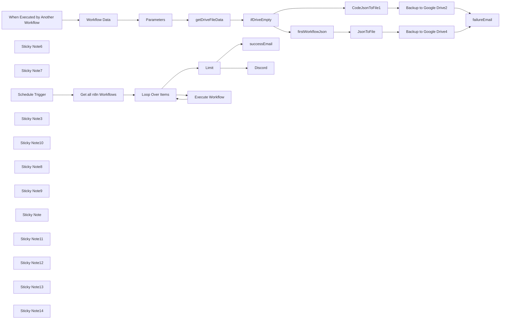

## Fluxo (.json) :

```json
{
  "meta": {
    "instanceId": "937602287d3b666a0823bdd18262071b517e6d94e73b786e71216e87cc17b79b",
    "templateCredsSetupCompleted": true
  },
  "nodes": [
    {
      "id": "d74c545f-17ab-47f7-bb2a-93c9e9673bab",
      "name": "Schedule Trigger",
      "type": "n8n-nodes-base.scheduleTrigger",
      "position": [
        460,
        -20
      ],
      "parameters": {
        "rule": {
          "interval": [
            {
              "triggerAtHour": 1,
              "triggerAtMinute": 30
            }
          ]
        }
      },
      "typeVersion": 1.2
    },
    {
      "id": "fc54b674-dc64-49ad-819d-66a4e416efc2",
      "name": "Get all n8n Workflows",
      "type": "n8n-nodes-base.n8n",
      "position": [
        680,
        -20
      ],
      "parameters": {
        "filters": {},
        "requestOptions": {}
      },
      "credentials": {
        "n8nApi": {
          "id": "WR8oA7tQqdurDv3Y",
          "name": "n8n account"
        }
      },
      "typeVersion": 1
    },
    {
      "id": "b23cd260-8e68-42e7-935c-a658ae35cccd",
      "name": "Backup to Google Drive2",
      "type": "n8n-nodes-base.googleDrive",
      "onError": "continueErrorOutput",
      "position": [
        1260,
        400
      ],
      "parameters": {
        "fileId": {
          "__rl": true,
          "mode": "id",
          "value": "={{ $json.id }}"
        },
        "options": {},
        "operation": "update",
        "changeFileContent": true,
        "newUpdatedFileName": "={{  $('Workflow Data').item.json.name + \"_\" + $('Workflow Data').item.json.id+ \".json\"}}"
      },
      "credentials": {
        "googleDriveOAuth2Api": {
          "id": "FsjSbb8sdqbZm9dM",
          "name": "Out"
        }
      },
      "retryOnFail": true,
      "typeVersion": 3
    },
    {
      "id": "29a69d92-f416-489d-9a96-3a22844556e0",
      "name": "Loop Over Items",
      "type": "n8n-nodes-base.splitInBatches",
      "position": [
        920,
        -20
      ],
      "parameters": {
        "options": {}
      },
      "typeVersion": 3
    },
    {
      "id": "ddee56fd-8610-4cae-9ae0-76e58e7fd111",
      "name": "Backup to Google Drive4",
      "type": "n8n-nodes-base.googleDrive",
      "onError": "continueErrorOutput",
      "position": [
        1380,
        720
      ],
      "parameters": {
        "name": "={{  $('Workflow Data').item.json.name + \"_\" + $('Workflow Data').item.json.id+ \".json\"}}",
        "driveId": {
          "__rl": true,
          "mode": "list",
          "value": "My Drive"
        },
        "options": {},
        "folderId": {
          "__rl": true,
          "mode": "list",
          "value": "13clPf8pnv_-GLeeNXLhuVzQiqnKo_7Ev",
          "cachedResultUrl": "https://drive.google.com/drive/folders/13clPf8pnv_-GLeeNXLhuVzQiqnKo_7Ev",
          "cachedResultName": "n8nWorkflows"
        }
      },
      "credentials": {
        "googleDriveOAuth2Api": {
          "id": "FsjSbb8sdqbZm9dM",
          "name": "Out"
        }
      },
      "retryOnFail": true,
      "typeVersion": 3
    },
    {
      "id": "8fdf83b1-5884-45a2-8710-e9012c07ccca",
      "name": "ifDriveEmpty",
      "type": "n8n-nodes-base.if",
      "position": [
        680,
        420
      ],
      "parameters": {
        "options": {},
        "conditions": {
          "options": {
            "version": 2,
            "leftValue": "",
            "caseSensitive": true,
            "typeValidation": "strict"
          },
          "combinator": "and",
          "conditions": [
            {
              "id": "5ec1b850-e0ce-4bd6-a8be-504e01825c00",
              "operator": {
                "type": "string",
                "operation": "exists",
                "singleValue": true
              },
              "leftValue": "={{$('getDriveFileData').item.json.name}}",
              "rightValue": ""
            }
          ]
        }
      },
      "typeVersion": 2.2
    },
    {
      "id": "01437168-bb55-4308-a83c-a26c0f9c1843",
      "name": "firstWorkflowJson",
      "type": "n8n-nodes-base.set",
      "position": [
        1000,
        720
      ],
      "parameters": {
        "mode": "raw",
        "options": {},
        "jsonOutput": "={{ $('Workflow Data').item.json.toJsonString() }}\n"
      },
      "typeVersion": 3.4
    },
    {
      "id": "7bcb95db-b13b-4bef-9a34-acd1194f6d96",
      "name": "JsonToFile",
      "type": "n8n-nodes-base.code",
      "position": [
        1180,
        720
      ],
      "parameters": {
        "jsCode": "return items.map(item => {\n  const jsonData = JSON.stringify(item.json);\n  const binaryData = Buffer.from(jsonData).toString('base64');\n  item.binary = {\n    data: {\n      data: binaryData,\n      mimeType: 'application/json',\n      fileName: 'data.json'\n    }\n  };\n  return item;\n});"
      },
      "typeVersion": 2
    },
    {
      "id": "efdb7ea6-f4bf-4553-993c-448cd7bb2039",
      "name": "CodeJsonToFile1",
      "type": "n8n-nodes-base.code",
      "position": [
        1080,
        400
      ],
      "parameters": {
        "jsCode": "return items.map(item => {\n  const jsonData = JSON.stringify( $('Workflow Data').item.json);\n  const binaryData = Buffer.from(jsonData).toString('base64');\n  item.binary = {\n    data: {\n      data: binaryData,\n      mimeType: 'application/json',\n      fileName: 'data.json'\n    }\n  };\n  return item;\n});"
      },
      "typeVersion": 2
    },
    {
      "id": "411b1585-4be1-4a92-a54b-64965f0d529d",
      "name": "Limit",
      "type": "n8n-nodes-base.limit",
      "position": [
        1100,
        -40
      ],
      "parameters": {},
      "typeVersion": 1
    },
    {
      "id": "dcd2e2ee-fc18-47bc-9210-b1b42c270961",
      "name": "Workflow Data",
      "type": "n8n-nodes-base.executionData",
      "position": [
        -140,
        420
      ],
      "parameters": {},
      "typeVersion": 1
    },
    {
      "id": "d243a474-9139-4af4-8134-df815a4af806",
      "name": "successEmail",
      "type": "n8n-nodes-base.gmail",
      "position": [
        1360,
        -40
      ],
      "webhookId": "b6cdbf4b-3abf-4eda-aa49-c19012e3133b",
      "parameters": {
        "sendTo": "your email address",
        "message": "={{ $now.format('yyyy-MM-dd HH:mm') }} workflow backup success.",
        "options": {},
        "subject": "google drive workflow backup success",
        "emailType": "text"
      },
      "credentials": {
        "gmailOAuth2": {
          "id": "3QEYg96F002cbPmf",
          "name": "out account"
        }
      },
      "typeVersion": 2.1
    },
    {
      "id": "306a1d38-27ef-4249-956a-cfec30d898b1",
      "name": "failureEmail",
      "type": "n8n-nodes-base.gmail",
      "position": [
        1620,
        420
      ],
      "webhookId": "f38fba13-3970-43a5-8afd-ea873289015b",
      "parameters": {
        "sendTo": "your email address",
        "message": "={{ $now }} {{ $('Workflow Data').item.json.name }} workflow backup .",
        "options": {},
        "subject": "google drive workflow backup error",
        "emailType": "text"
      },
      "credentials": {
        "gmailOAuth2": {
          "id": "3QEYg96F002cbPmf",
          "name": "out account"
        }
      },
      "typeVersion": 2.1
    },
    {
      "id": "544cb91c-4f96-4a84-8db2-9c88e758a1e3",
      "name": "Sticky Note6",
      "type": "n8n-nodes-base.stickyNote",
      "position": [
        600,
        -80
      ],
      "parameters": {
        "color": 5,
        "width": 260,
        "height": 220,
        "content": "## Set n8n API"
      },
      "typeVersion": 1
    },
    {
      "id": "84d6b3e9-9f01-40b8-980d-acd2f95d30fe",
      "name": "Sticky Note7",
      "type": "n8n-nodes-base.stickyNote",
      "position": [
        600,
        -180
      ],
      "parameters": {
        "color": 4,
        "width": 150,
        "height": 80,
        "content": "## Edit this node 👇"
      },
      "typeVersion": 1
    },
    {
      "id": "a3f1669b-41da-4256-af2c-e556738eabf1",
      "name": "getDriveFileData",
      "type": "n8n-nodes-base.googleDrive",
      "position": [
        300,
        420
      ],
      "parameters": {
        "filter": {
          "folderId": {
            "__rl": true,
            "mode": "url",
            "value": "={{ $('Parameters').item.json.directory }}"
          },
          "whatToSearch": "files"
        },
        "options": {},
        "resource": "fileFolder",
        "returnAll": true,
        "queryString": "={{  $('Workflow Data').item.json.name + \"_\" + $('Workflow Data').item.json.id+ \".json\"}}"
      },
      "credentials": {
        "googleDriveOAuth2Api": {
          "id": "FsjSbb8sdqbZm9dM",
          "name": "Out"
        }
      },
      "retryOnFail": true,
      "typeVersion": 3,
      "alwaysOutputData": true
    },
    {
      "id": "f1771f9e-4153-4595-bbd9-22abfef23c54",
      "name": "When Executed by Another Workflow",
      "type": "n8n-nodes-base.executeWorkflowTrigger",
      "position": [
        -300,
        420
      ],
      "parameters": {
        "inputSource": "passthrough"
      },
      "typeVersion": 1.1
    },
    {
      "id": "7110911a-c6c6-4ef6-888f-f640784d077b",
      "name": "Execute Workflow",
      "type": "n8n-nodes-base.executeWorkflow",
      "position": [
        1100,
        100
      ],
      "parameters": {
        "options": {},
        "workflowId": {
          "__rl": true,
          "mode": "id",
          "value": "DfMF9CmVw6FU4hYm"
        },
        "workflowInputs": {
          "value": {},
          "schema": [],
          "mappingMode": "defineBelow",
          "matchingColumns": [],
          "attemptToConvertTypes": false,
          "convertFieldsToString": true
        }
      },
      "typeVersion": 1.2
    },
    {
      "id": "cb5cc7fb-f24f-48be-a175-c24bf830dce2",
      "name": "Parameters",
      "type": "n8n-nodes-base.set",
      "position": [
        20,
        420
      ],
      "parameters": {
        "options": {},
        "assignments": {
          "assignments": [
            {
              "id": "1b65def6-4984-497d-a4bc-232af22927ad",
              "name": "directory",
              "type": "string",
              "value": "https://drive.google.com/drive/folders/13clPf8pnv_-GLeeNXLhuVzQiqnKo_7Ev?usp=share_link"
            },
            {
              "id": "c8c98f88-9f22-4574-88b8-1db99f6e4ec4",
              "name": "parentdrive",
              "type": "string",
              "value": "https://drive.google.com/drive/u/0/my-drive"
            }
          ]
        }
      },
      "typeVersion": 3.4
    },
    {
      "id": "0ab79967-aa4e-4914-abbd-8a60057b083d",
      "name": "Sticky Note3",
      "type": "n8n-nodes-base.stickyNote",
      "position": [
        -20,
        300
      ],
      "parameters": {
        "color": 4,
        "width": 150,
        "height": 80,
        "content": "## Edit this node 👇"
      },
      "typeVersion": 1
    },
    {
      "id": "948c9276-88a7-4d02-85dc-525c4e8b0c01",
      "name": "Sticky Note10",
      "type": "n8n-nodes-base.stickyNote",
      "position": [
        1240,
        -100
      ],
      "parameters": {
        "width": 340,
        "height": 220,
        "content": "## Send complete message"
      },
      "typeVersion": 1
    },
    {
      "id": "cabf9b91-5a2f-4c8f-ae07-318fca57b54f",
      "name": "Discord",
      "type": "n8n-nodes-base.discord",
      "position": [
        1360,
        80
      ],
      "webhookId": "65ce702c-8f03-4016-b192-a2503a7fbca7",
      "parameters": {
        "content": "={{ $now.format('yyyy-MM-dd HH:mm') }} Google Drive workflow backup success.",
        "guildId": {
          "__rl": true,
          "mode": "list",
          "value": ""
        },
        "options": {
          "tts": false
        },
        "resource": "message",
        "channelId": {
          "__rl": true,
          "mode": "list",
          "value": "1365663078880116756",
          "cachedResultUrl": "https://discord.com/channels/1365624783781494854/1365663078880116756",
          "cachedResultName": "backup-status"
        }
      },
      "credentials": {
        "discordBotApi": {
          "id": "hm4HwPUEF07pmkj0",
          "name": "Discord Bot account"
        }
      },
      "typeVersion": 2
    },
    {
      "id": "ea46a8fb-5a43-400e-85d6-602ef1c68c5e",
      "name": "Sticky Note8",
      "type": "n8n-nodes-base.stickyNote",
      "position": [
        20,
        -280
      ],
      "parameters": {
        "color": 7,
        "width": 370,
        "height": 480,
        "content": "## 重要！ 👇\n\n**啟動前： **\n\n### 作者資訊與資源\n作者：Hochien Chang\nYouTube 頻道：[HC AI說人話](https://www.youtube.com/channel/UCvGfUB-wBdG4i_TdDGBCwJg)\n說明影片連結： https://youtu.be/PA15H5qunC0\n\n1.  **更新認證：** 確認已設定「Google Drive OAuth2 API」認證。\n2.  **設定參數：** 編輯「參數」節點，設定所需的 Google Drive 資料夾 URL。\n3.  **設定電子郵件：** 使用您的收件者電子郵件地址更新「Gmail」節點。\n\n\n參考工作流：https://n8n.io/workflows/3112-backup-n8n-workflows-to-google-drive/"
      },
      "typeVersion": 1
    },
    {
      "id": "af7f9d0e-6ce4-4277-801d-92bf05a424d6",
      "name": "Sticky Note9",
      "type": "n8n-nodes-base.stickyNote",
      "position": [
        -380,
        -280
      ],
      "parameters": {
        "color": 7,
        "width": 390,
        "height": 480,
        "content": "### IMPORTANT! 👇\n\n**Before activating:**\n### Author Information and Resources\nCreator：Hochien Chang\nYouTube 頻道：[HC HumanizeAI](www.youtube.com/@HC-HumanizeAI)\nExplanation Video Link: https://youtu.be/PA15H5qunC0\n\n1.  **Update Credentials:** Ensure 'Google Drive OAuth2 API' credentials are set up.\n2.  **Configure Parameters:** Edit the 'Parameters' node to set your desired Google Drive folder URL.\n3.  **Set Email:** Update the 'Gmail' nodes with your recipient email address.\n\n\nBase on: https://n8n.io/workflows/3112-backup-n8n-workflows-to-google-drive/"
      },
      "typeVersion": 1
    },
    {
      "id": "f24c9b0c-1bf4-40dc-9492-8c452e5d9905",
      "name": "Sticky Note",
      "type": "n8n-nodes-base.stickyNote",
      "position": [
        920,
        600
      ],
      "parameters": {
        "color": 3,
        "width": 620,
        "height": 300,
        "content": "## 新工作流上傳\n## New Workflow upload👇"
      },
      "typeVersion": 1
    },
    {
      "id": "dac5bca9-9d7f-4131-a563-9115bf0528cc",
      "name": "Sticky Note11",
      "type": "n8n-nodes-base.stickyNote",
      "position": [
        920,
        300
      ],
      "parameters": {
        "color": 6,
        "width": 620,
        "height": 280,
        "content": "## 現有工作流更新\n## existing Workflow update👇"
      },
      "typeVersion": 1
    },
    {
      "id": "6d126534-8b9b-4935-bce7-471ecc931e83",
      "name": "Sticky Note12",
      "type": "n8n-nodes-base.stickyNote",
      "position": [
        140,
        300
      ],
      "parameters": {
        "width": 440,
        "height": 280,
        "content": "## 取得 Google Drive 現有的檔案資訊\n## Get Google Drive existing file info👇"
      },
      "typeVersion": 1
    },
    {
      "id": "2ed623f4-faca-40ea-9ace-ab6d0933f6ba",
      "name": "Sticky Note13",
      "type": "n8n-nodes-base.stickyNote",
      "position": [
        580,
        300
      ],
      "parameters": {
        "color": 4,
        "width": 320,
        "height": 280,
        "content": "## 確認是否為第一次備份\n## Only for initialing👇"
      },
      "typeVersion": 1
    },
    {
      "id": "46f0dbdc-4023-426c-b87b-3431817981c0",
      "name": "Sticky Note14",
      "type": "n8n-nodes-base.stickyNote",
      "disabled": true,
      "position": [
        -380,
        -380
      ],
      "parameters": {
        "color": 6,
        "width": 760,
        "height": 80,
        "content": "# HC AI 說人話"
      },
      "typeVersion": 1
    }
  ],
  "pinData": {},
  "connections": {
    "Limit": {
      "main": [
        [
          {
            "node": "successEmail",
            "type": "main",
            "index": 0
          },
          {
            "node": "Discord",
            "type": "main",
            "index": 0
          }
        ]
      ]
    },
    "JsonToFile": {
      "main": [
        [
          {
            "node": "Backup to Google Drive4",
            "type": "main",
            "index": 0
          }
        ]
      ]
    },
    "Parameters": {
      "main": [
        [
          {
            "node": "getDriveFileData",
            "type": "main",
            "index": 0
          }
        ]
      ]
    },
    "ifDriveEmpty": {
      "main": [
        [
          {
            "node": "CodeJsonToFile1",
            "type": "main",
            "index": 0
          }
        ],
        [
          {
            "node": "firstWorkflowJson",
            "type": "main",
            "index": 0
          }
        ]
      ]
    },
    "Workflow Data": {
      "main": [
        [
          {
            "node": "Parameters",
            "type": "main",
            "index": 0
          }
        ]
      ]
    },
    "CodeJsonToFile1": {
      "main": [
        [
          {
            "node": "Backup to Google Drive2",
            "type": "main",
            "index": 0
          }
        ]
      ]
    },
    "Loop Over Items": {
      "main": [
        [
          {
            "node": "Limit",
            "type": "main",
            "index": 0
          }
        ],
        [
          {
            "node": "Execute Workflow",
            "type": "main",
            "index": 0
          }
        ]
      ]
    },
    "Execute Workflow": {
      "main": [
        [
          {
            "node": "Loop Over Items",
            "type": "main",
            "index": 0
          }
        ]
      ]
    },
    "Schedule Trigger": {
      "main": [
        [
          {
            "node": "Get all n8n Workflows",
            "type": "main",
            "index": 0
          }
        ]
      ]
    },
    "getDriveFileData": {
      "main": [
        [
          {
            "node": "ifDriveEmpty",
            "type": "main",
            "index": 0
          }
        ]
      ]
    },
    "firstWorkflowJson": {
      "main": [
        [
          {
            "node": "JsonToFile",
            "type": "main",
            "index": 0
          }
        ]
      ]
    },
    "Get all n8n Workflows": {
      "main": [
        [
          {
            "node": "Loop Over Items",
            "type": "main",
            "index": 0
          }
        ]
      ]
    },
    "Backup to Google Drive2": {
      "main": [
        [],
        [
          {
            "node": "failureEmail",
            "type": "main",
            "index": 0
          }
        ]
      ]
    },
    "Backup to Google Drive4": {
      "main": [
        [],
        [
          {
            "node": "failureEmail",
            "type": "main",
            "index": 0
          }
        ]
      ]
    },
    "When Executed by Another Workflow": {
      "main": [
        [
          {
            "node": "Workflow Data",
            "type": "main",
            "index": 0
          }
        ]
      ]
    }
  }
}
```

<a id="template-2319"></a>

## Template 2319 - Qualificação automática de leads por e-mail

- **Nome:** Qualificação automática de leads por e-mail
- **Descrição:** Coleta e valida e-mails enviados por um formulário, pontua o lead com base em sinais de fit e notifica via Telegram quando o lead é considerado relevante.
- **Funcionalidade:** • Coleta de e-mail via formulário: recebe a submissão do formulário "Contact us" e extrai o e-mail do interessado.
• Verificação da validade do e-mail: valida se o endereço é entregável antes de prosseguir.
• Pontuação do lead: consulta um serviço de scoring para obter o customer_fit e sinais relevantes do lead.
• Filtragem por score: avalia se a pontuação de fit do cliente é maior que 60 para considerar o lead quente.
• Notificação de leads quentes: envia uma mensagem para um chat do Telegram com o e-mail e os principais sinais do lead.
• Tratamento de leads inválidos ou não relevantes: ignora entradas com e-mail inválido ou leads com pontuação baixa.
- **Ferramentas:** • Formulário (ex.: Typeform, Google Forms): coleta as informações do lead, como e-mail.
• Hunter: serviço de verificação de e-mails para checar entregabilidade e validade.
• MadKudu: serviço de scoring/qualificação de leads que fornece customer_fit, score e sinais relevantes.
• Telegram: plataforma de mensagens usada para enviar alertas em tempo real sobre leads qualificados.

## Fluxo visual

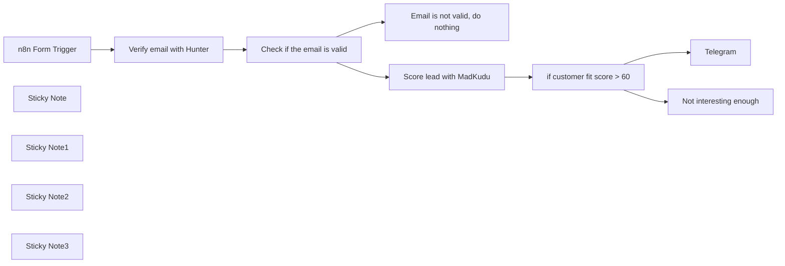

## Fluxo (.json) :

```json
{
  "nodes": [
    {
      "id": "d7ba34e4-5f98-4a32-abe7-1ed1a3d30410",
      "name": "n8n Form Trigger",
      "type": "n8n-nodes-base.formTrigger",
      "position": [
        -800,
        840
      ],
      "webhookId": "ee00f236-5dad-49db-8f29-71b7bce37894",
      "parameters": {
        "path": "0bf8840f-1cc4-46a9-86af-a3fa8da80608",
        "options": {},
        "formTitle": "Contact us",
        "formFields": {
          "values": [
            {
              "fieldLabel": "What's your business email?"
            }
          ]
        },
        "formDescription": "We'll get back to you soon"
      },
      "typeVersion": 2
    },
    {
      "id": "4e91bf1d-ff5b-4a5c-805e-08c930e8dbe9",
      "name": "Check if the email is valid",
      "type": "n8n-nodes-base.if",
      "position": [
        -380,
        840
      ],
      "parameters": {
        "options": {},
        "conditions": {
          "options": {
            "leftValue": "",
            "caseSensitive": true,
            "typeValidation": "strict"
          },
          "combinator": "and",
          "conditions": [
            {
              "id": "54d84c8a-63ee-40ed-8fb2-301fff0194ba",
              "operator": {
                "name": "filter.operator.equals",
                "type": "string",
                "operation": "equals"
              },
              "leftValue": "={{ $json.status }}",
              "rightValue": "valid"
            }
          ]
        }
      },
      "typeVersion": 2
    },
    {
      "id": "d27ef50a-a80d-4f27-bd94-0c354f71fad1",
      "name": "Sticky Note",
      "type": "n8n-nodes-base.stickyNote",
      "position": [
        -800,
        620
      ],
      "parameters": {
        "color": 5,
        "width": 545.9804141018467,
        "height": 183.48964745383324,
        "content": "### 👨‍🎤 Setup\n1. Add you **MadKudu**, **Hunter**, and **Telegram** credentials \n2. Set the chat id in Telegram\n3. Click the Test Workflow button, enter your email and check your Telegram chat\n4. Activate the workflow and use the form trigger production URL to collect your leads in a smart way "
      },
      "typeVersion": 1
    },
    {
      "id": "ba0f2f9f-c95f-43a2-9f79-1f6b15f3cd5f",
      "name": "Sticky Note1",
      "type": "n8n-nodes-base.stickyNote",
      "position": [
        -800,
        980
      ],
      "parameters": {
        "color": 7,
        "width": 162,
        "height": 139,
        "content": "👆 You can exchange this with any form you like (*e.g. Typeform, Google forms, Survey Monkey...*)"
      },
      "typeVersion": 1
    },
    {
      "id": "e74306a7-f430-4d00-80e1-3dd13ccd456a",
      "name": "Sticky Note2",
      "type": "n8n-nodes-base.stickyNote",
      "position": [
        180,
        900
      ],
      "parameters": {
        "color": 7,
        "width": 162,
        "height": 84,
        "content": "👆 Adjust the fit as you see necessary"
      },
      "typeVersion": 1
    },
    {
      "id": "a1c972d5-1455-48d8-9f6d-053147db5db2",
      "name": "Email is not valid, do nothing",
      "type": "n8n-nodes-base.noOp",
      "position": [
        -40,
        980
      ],
      "parameters": {},
      "typeVersion": 1
    },
    {
      "id": "84f0521d-38e8-4ef4-b590-5ef6d06ebfa2",
      "name": "Score lead with MadKudu",
      "type": "n8n-nodes-base.httpRequest",
      "position": [
        -40,
        740
      ],
      "parameters": {
        "url": "=https://api.madkudu.com/v1/persons?email={{ $json.email }}",
        "options": {},
        "authentication": "genericCredentialType",
        "genericAuthType": "httpHeaderAuth"
      },
      "typeVersion": 4.1
    },
    {
      "id": "f9553935-ca49-43d5-b3a5-d469edac5e83",
      "name": "Verify email with Hunter",
      "type": "n8n-nodes-base.hunter",
      "position": [
        -580,
        840
      ],
      "parameters": {
        "email": "={{ $json['What\\'s your business email?'] }}",
        "operation": "emailVerifier"
      },
      "typeVersion": 1
    },
    {
      "id": "4f3de033-8936-44f0-9a07-e21f98f6811b",
      "name": "Not interesting enough",
      "type": "n8n-nodes-base.noOp",
      "position": [
        520,
        880
      ],
      "parameters": {},
      "typeVersion": 1
    },
    {
      "id": "f6b6829a-7bc7-4145-8933-db1ce965c1c9",
      "name": "if customer fit score > 60",
      "type": "n8n-nodes-base.if",
      "position": [
        200,
        740
      ],
      "parameters": {
        "options": {},
        "conditions": {
          "options": {
            "leftValue": "",
            "caseSensitive": true,
            "typeValidation": "strict"
          },
          "combinator": "and",
          "conditions": [
            {
              "id": "c23d7b34-a4ae-421f-bd7a-6a3ebb05aafe",
              "operator": {
                "type": "number",
                "operation": "gt"
              },
              "leftValue": "={{ $json.properties.customer_fit.score }}",
              "rightValue": 60
            }
          ]
        }
      },
      "typeVersion": 2
    },
    {
      "id": "7e739bf6-1786-49b4-80d3-eeef406d7a6e",
      "name": "Sticky Note3",
      "type": "n8n-nodes-base.stickyNote",
      "position": [
        460,
        460
      ],
      "parameters": {
        "color": 7,
        "width": 162,
        "height": 84,
        "content": "👇🏽 Update the chat id to send to"
      },
      "typeVersion": 1
    },
    {
      "id": "fd0e1600-b1d9-4829-a86b-2cccc6a565f2",
      "name": "Telegram",
      "type": "n8n-nodes-base.telegram",
      "position": [
        500,
        560
      ],
      "parameters": {
        "text": "=⭐ New hot lead: {{ $json.email }}... \n\n{{ $json.properties.customer_fit.top_signals_formatted }}",
        "chatId": "1688282582",
        "additionalFields": {}
      },
      "credentials": {
        "telegramApi": {
          "id": "6",
          "name": "mymontsbot token"
        }
      },
      "typeVersion": 1.1
    }
  ],
  "pinData": {
    "n8n Form Trigger": [
      {
        "formMode": "test",
        "submittedAt": "2024-02-22T13:59:54.709Z",
        "What's your business email?": "jan@n8n.io"
      }
    ],
    "Score lead with MadKudu": [
      {
        "email": "jan@n8n.io",
        "company": {
          "properties": {
            "name": "n8n",
            "domain": "n8n.io",
            "industry": "Internet Software & Services",
            "location": {
              "tags": [
                "high_gdp_per_capita"
              ],
              "state": "Berlin",
              "country": "Germany",
              "state_code": "BE",
              "country_code": "DE"
            },
            "number_of_employees": 60
          }
        },
        "properties": {
          "domain": "n8n.io",
          "is_spam": false,
          "last_name": "Oberhauser",
          "first_name": "Jan",
          "is_student": false,
          "customer_fit": {
            "score": 81,
            "segment": "good",
            "top_signals": [
              {
                "name": "Company raised $",
                "type": "positive",
                "value": "13500000"
              },
              {
                "name": "Company is located in",
                "type": "positive",
                "value": "Germany"
              },
              {
                "name": "Website traffic is medium large",
                "type": "positive",
                "value": null
              },
              {
                "name": "Company industry is Software",
                "type": "positive",
                "value": null
              },
              {
                "name": "Company is a Google shop",
                "type": "positive",
                "value": null
              },
              {
                "name": "Company size",
                "type": "negative",
                "value": "60"
              }
            ],
            "top_signals_formatted": "✔ Company raised $ is 13,500,000\n✔ Company is located in is Germany\n✔ Website traffic is medium large\n✔ Company industry is Software\n✔ Company is a Google shop\n✘ Company size is 60"
          },
          "is_personal_email": false
        },
        "object_type": "person"
      }
    ],
    "Verify email with Hunter": [
      {
        "block": false,
        "email": "jan@n8n.io",
        "score": 91,
        "regexp": true,
        "result": "deliverable",
        "status": "valid",
        "sources": [],
        "webmail": false,
        "gibberish": false,
        "accept_all": false,
        "disposable": false,
        "mx_records": true,
        "smtp_check": true,
        "smtp_server": true,
        "_deprecation_notice": "Using result is deprecated, use status instead"
      }
    ]
  },
  "connections": {
    "n8n Form Trigger": {
      "main": [
        [
          {
            "node": "Verify email with Hunter",
            "type": "main",
            "index": 0
          }
        ]
      ]
    },
    "Score lead with MadKudu": {
      "main": [
        [
          {
            "node": "if customer fit score > 60",
            "type": "main",
            "index": 0
          }
        ]
      ]
    },
    "Verify email with Hunter": {
      "main": [
        [
          {
            "node": "Check if the email is valid",
            "type": "main",
            "index": 0
          }
        ]
      ]
    },
    "if customer fit score > 60": {
      "main": [
        [
          {
            "node": "Telegram",
            "type": "main",
            "index": 0
          }
        ],
        [
          {
            "node": "Not interesting enough",
            "type": "main",
            "index": 0
          }
        ]
      ]
    },
    "Check if the email is valid": {
      "main": [
        [
          {
            "node": "Score lead with MadKudu",
            "type": "main",
            "index": 0
          }
        ],
        [
          {
            "node": "Email is not valid, do nothing",
            "type": "main",
            "index": 0
          }
        ]
      ]
    }
  }
}
```

<a id="template-2321"></a>

## Template 2321 - Extrator de currículos para Telegram

- **Nome:** Extrator de currículos para Telegram
- **Descrição:** Recebe currículos enviados por usuários via Telegram, extrai e estrutura os dados, gera um PDF formatado e envia de volta ao usuário.
- **Funcionalidade:** • Recepção de arquivos via Telegram: Inicia o fluxo ao receber uma mensagem com documento do usuário.
• Autenticação por chat ID: Processamento condicionado a um ID de chat autorizado.
• Ignorar comando /start: Não processa mensagens iniciais de boas-vindas.
• Download do arquivo enviado: Recupera o arquivo baseado no file_id recebido.
• Extração de texto de PDF: Converte o conteúdo do PDF em texto legível para análise.
• Extração e estruturação com modelo de linguagem: Usa um modelo GPT-4 para identificar e organizar campos do currículo em JSON unificado (nome, histórico profissional, educação, projetos, tecnologias, voluntariado, etc.).
• Validação e correção do JSON de saída: Aplica validação com esquema e auto-correção para garantir formato consistente.
• Conversão de seções para HTML: Formata cada seção (informações pessoais, experiência, educação, projetos, voluntariado, tecnologias) em HTML legível.
• Mesclagem e geração de documento final: Junta as seções HTML em um único arquivo HTML e converte para PDF.
• Nomeação dinâmica do arquivo: Define o nome do PDF com base no nome do candidato extraído.
• Envio do PDF ao usuário: Entrega o PDF gerado de volta ao chat do usuário no Telegram.
- **Ferramentas:** • Telegram: Plataforma de mensagens usada para receber currículos dos usuários e enviar o PDF final.
• OpenAI (GPT-4): Modelo de linguagem utilizado para extrair, estruturar e interpretar os dados do currículo em formato JSON.
• Gotenberg: Serviço para converter o HTML gerado em documento PDF.

## Fluxo visual

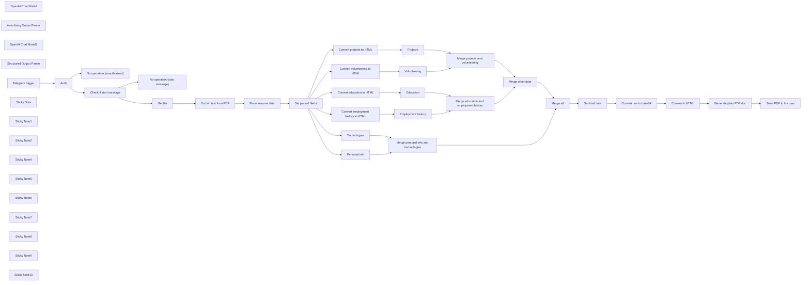

## Fluxo (.json) :

```json
{
  "nodes": [
    {
      "id": "79849bb5-00a4-42e6-92c4-b06c7a20eb3e",
      "name": "OpenAI Chat Model",
      "type": "@n8n/n8n-nodes-langchain.lmChatOpenAi",
      "position": [
        1580,
        340
      ],
      "parameters": {
        "model": "gpt-4-turbo-preview",
        "options": {
          "temperature": 0,
          "responseFormat": "json_object"
        }
      },
      "credentials": {
        "openAiApi": {
          "id": "jazew1WAaSRrjcHp",
          "name": "OpenAI (workfloows@gmail.com)"
        }
      },
      "typeVersion": 1
    },
    {
      "id": "85df0106-1f78-4412-8751-b84d417c8bf9",
      "name": "Convert education to HTML",
      "type": "n8n-nodes-base.code",
      "position": [
        2420,
        180
      ],
      "parameters": {
        "mode": "runOnceForEachItem",
        "jsCode": "function convertToHTML(list) {\n    let html = '';\n\n    list.forEach((education, index) => {\n        if (index > 0) {\n            html += '<br /><br />'; // Add a new line if it's not the first item\n        }\n        html += `<b>Institution:</b> ${education.institution}<br />\n<b>Start year:</b> ${education.start_year}<br />\n<b>Degree:</b> ${education.degree}`;\n    });\n\n    return html;\n}\n\n// Assuming payload is already defined\nconst payload = $input.item.json.education;\n\nconst htmlOutput = convertToHTML(payload);\nreturn {\n    htmlOutput\n};"
      },
      "typeVersion": 2
    },
    {
      "id": "da4fc45d-712f-4171-b72a-66b74b4d8e05",
      "name": "Auto-fixing Output Parser",
      "type": "@n8n/n8n-nodes-langchain.outputParserAutofixing",
      "position": [
        1820,
        340
      ],
      "parameters": {},
      "typeVersion": 1
    },
    {
      "id": "225a7513-6fd4-4672-9b40-b10b00f121a7",
      "name": "OpenAI Chat Model1",
      "type": "@n8n/n8n-nodes-langchain.lmChatOpenAi",
      "position": [
        1740,
        520
      ],
      "parameters": {
        "options": {
          "temperature": 0
        }
      },
      "credentials": {
        "openAiApi": {
          "id": "jazew1WAaSRrjcHp",
          "name": "OpenAI (workfloows@gmail.com)"
        }
      },
      "typeVersion": 1
    },
    {
      "id": "0606c99d-a080-4277-b071-1bc0c93bb2e3",
      "name": "Structured Output Parser",
      "type": "@n8n/n8n-nodes-langchain.outputParserStructured",
      "position": [
        1960,
        520
      ],
      "parameters": {
        "jsonSchema": "{\n  \"type\": \"object\",\n  \"properties\": {\n    \"personal_info\": {\n      \"type\": \"object\",\n      \"properties\": {\n        \"name\": { \"type\": \"string\" },\n        \"address\": { \"type\": \"string\" },\n        \"email\": { \"type\": \"string\", \"format\": \"email\" },\n        \"github\": { \"type\": \"string\"},\n        \"linkedin\": { \"type\": \"string\" }\n      }\n    },\n    \"employment_history\": {\n      \"type\": \"array\",\n      \"items\": {\n        \"type\": \"object\",\n        \"properties\": {\n          \"position\": { \"type\": \"string\" },\n          \"company\": { \"type\": \"string\" },\n          \"duration\": { \"type\": \"string\" },\n          \"responsibilities\": {\n            \"type\": \"array\",\n            \"items\": { \"type\": \"string\" }\n          }\n        }\n      }\n    },\n    \"education\": {\n      \"type\": \"array\",\n      \"items\": {\n        \"type\": \"object\",\n        \"properties\": {\n          \"institution\": { \"type\": \"string\" },\n          \"start_year\": { \"type\": \"integer\" },\n          \"degree\": { \"type\": \"string\" }\n        }\n      }\n    },\n    \"projects\": {\n      \"type\": \"array\",\n      \"items\": {\n        \"type\": \"object\",\n        \"properties\": {\n          \"name\": { \"type\": \"string\" },\n          \"year\": { \"type\": \"integer\" },\n          \"description\": { \"type\": \"string\" },\n          \"technologies\": {\n            \"type\": \"array\",\n            \"items\": { \"type\": \"string\" }\n          }\n        }\n      }\n    },\n    \"volunteering\": {\n      \"type\": \"array\",\n      \"items\": {\n        \"type\": \"object\",\n        \"properties\": {\n          \"activity\": { \"type\": \"string\" },\n          \"location\": { \"type\": \"string\" },\n          \"date\": { \"type\": \"string\" },\n          \"description\": { \"type\": \"string\" }\n        }\n      }\n    },\n    \"programming_languages\": {\n      \"type\": \"object\",\n      \"properties\": {\n        \"languages\": {\n          \"type\": \"array\",\n          \"items\": { \"type\": \"string\" }\n        },\n        \"tools\": {\n          \"type\": \"array\",\n          \"items\": { \"type\": \"string\" }\n        },\n        \"methodologies\": {\n          \"type\": \"array\",\n          \"items\": { \"type\": \"string\" }\n        }\n      }\n    },\n    \"foreign_languages\": {\n      \"type\": \"array\",\n      \"items\": {\n        \"type\": \"object\",\n        \"properties\": {\n          \"language\": { \"type\": \"string\" },\n          \"level\": { \"type\": \"string\" }\n        }\n      }\n    }\n  }\n}\n"
      },
      "typeVersion": 1
    },
    {
      "id": "027975cd-768a-4048-858d-9060f48ab622",
      "name": "Convert employment history to HTML",
      "type": "n8n-nodes-base.code",
      "position": [
        2420,
        -20
      ],
      "parameters": {
        "mode": "runOnceForEachItem",
        "jsCode": "function convertToHTML(list) {\n    let html = '';\n\n    list.forEach((item, index) => {\n        if (index > 0) {\n            html += '<br />'; // Add a new line if it's not the first item\n        }\n        html += `<b>Position:</b> ${item.position}\n<b>Company:</b> ${item.company}\n<br />\n<b>Duration:</b> ${item.duration}\n<br />\n<b>Responsibilities:</b>\n`;\n\n        item.responsibilities.forEach((responsibility, i) => {\n            html += `- ${responsibility}`;\n            if (i < item.responsibilities.length - 1 || index < list.length - 1) {\n                html += '<br />'; // Add new line if it's not the last responsibility in the last item\n            }\n        });\n    });\n\n    return html;\n}\n\n// Assuming payload is already defined\nconst payload = $input.item.json.employment_history;\n\nconst htmlOutput = convertToHTML(payload);\nreturn {\n    htmlOutput\n};"
      },
      "typeVersion": 2
    },
    {
      "id": "823a241d-1c68-40a9-8f2c-f1bdfaab7603",
      "name": "Convert projects to HTML",
      "type": "n8n-nodes-base.code",
      "position": [
        2420,
        380
      ],
      "parameters": {
        "mode": "runOnceForEachItem",
        "jsCode": "function convertToHTML(list) {\n    let html = '';\n\n    list.forEach((project, index) => {\n        if (index > 0) {\n            html += '<br />'; // Add a new line if it's not the first project\n        }\n        html += `<b>Name:</b> ${project.name}<br />\n<b>Year:</b> ${project.year}<br />\n<b>Description:</b> ${project.description}<br /><br />\n<b>Technologies:</b>\n<br />`;\n\n        project.technologies.forEach((technology, i) => {\n            html += `- ${technology}`;\n            if (i < project.technologies.length - 1 || index < list.length - 1) {\n                html += '<br />'; // Add new line if it's not the last technology in the last project\n            }\n        });\n    });\n\n    return html;\n}\n\n// Assuming payload is already defined\nconst payload = $input.item.json.projects;\n\nconst htmlOutput = convertToHTML(payload);\nreturn {\n    htmlOutput\n};\n"
      },
      "typeVersion": 2
    },
    {
      "id": "a12eb0e1-1cb9-4b83-a1ec-42dd8214f6bc",
      "name": "Convert volunteering to HTML",
      "type": "n8n-nodes-base.code",
      "position": [
        2420,
        580
      ],
      "parameters": {
        "mode": "runOnceForEachItem",
        "jsCode": "function convertToHTML(list) {\n    let html = '';\n\n    list.forEach((event, index) => {\n        if (index > 0) {\n            html += '<br />'; // Add a new line if it's not the first volunteering event\n        }\n        html += `<b>Activity:</b> ${event.activity}<br />\n<b>Location:</b> ${event.location}<br />\n<b>Date:</b> ${event.date}<br />\n<b>Description:</b> ${event.description}<br />`;\n    });\n\n    return html;\n}\n\n// Assuming payload is already defined\nconst payload = $input.item.json.volunteering;\n\nconst htmlOutput = convertToHTML(payload);\nreturn {\n    htmlOutput\n};\n"
      },
      "typeVersion": 2
    },
    {
      "id": "70b67b80-d22d-4eea-8c97-3d2cb2b9bbfc",
      "name": "Telegram trigger",
      "type": "n8n-nodes-base.telegramTrigger",
      "position": [
        360,
        340
      ],
      "webhookId": "d6829a55-a01b-44ac-bad3-2349324c8515",
      "parameters": {
        "updates": [
          "message"
        ],
        "additionalFields": {}
      },
      "credentials": {
        "telegramApi": {
          "id": "lStLV4zzcrQO9eAM",
          "name": "Telegram (Resume Extractor)"
        }
      },
      "typeVersion": 1.1
    },
    {
      "id": "21bead1d-0665-44d5-b623-b0403c9abd6c",
      "name": "Auth",
      "type": "n8n-nodes-base.if",
      "position": [
        600,
        340
      ],
      "parameters": {
        "options": {},
        "conditions": {
          "options": {
            "leftValue": "",
            "caseSensitive": true,
            "typeValidation": "strict"
          },
          "combinator": "and",
          "conditions": [
            {
              "id": "7ca4b4c3-e23b-4896-a823-efc85c419467",
              "operator": {
                "type": "number",
                "operation": "equals"
              },
              "leftValue": "={{ $json.message.chat.id }}",
              "rightValue": 0
            }
          ]
        }
      },
      "typeVersion": 2
    },
    {
      "id": "de76d6ec-3b0e-44e0-943d-55547aac2e46",
      "name": "No operation (unauthorized)",
      "type": "n8n-nodes-base.noOp",
      "position": [
        860,
        520
      ],
      "parameters": {},
      "typeVersion": 1
    },
    {
      "id": "439f5e2c-be7d-486b-a1f1-13b09f77c2c8",
      "name": "Check if start message",
      "type": "n8n-nodes-base.if",
      "position": [
        860,
        220
      ],
      "parameters": {
        "options": {},
        "conditions": {
          "options": {
            "leftValue": "",
            "caseSensitive": true,
            "typeValidation": "strict"
          },
          "combinator": "and",
          "conditions": [
            {
              "id": "1031f14f-9793-488d-bb6b-a021f943a399",
              "operator": {
                "type": "string",
                "operation": "notEquals"
              },
              "leftValue": "={{ $json.message.text }}",
              "rightValue": "/start"
            }
          ]
        }
      },
      "typeVersion": 2
    },
    {
      "id": "af5f5622-c338-40c0-af72-90e124ed7ce1",
      "name": "No operation (start message)",
      "type": "n8n-nodes-base.noOp",
      "position": [
        1120,
        360
      ],
      "parameters": {},
      "typeVersion": 1
    },
    {
      "id": "2efae11a-376b-44aa-ab91-9b3dea82ede0",
      "name": "Get file",
      "type": "n8n-nodes-base.telegram",
      "position": [
        1120,
        120
      ],
      "parameters": {
        "fileId": "={{ $json.message.document.file_id }}",
        "resource": "file"
      },
      "credentials": {
        "telegramApi": {
          "id": "lStLV4zzcrQO9eAM",
          "name": "Telegram (Resume Extractor)"
        }
      },
      "typeVersion": 1.1
    },
    {
      "id": "88fd1002-ad2c-445f-92d4-11b571db3788",
      "name": "Extract text from PDF",
      "type": "n8n-nodes-base.extractFromFile",
      "position": [
        1380,
        120
      ],
      "parameters": {
        "options": {},
        "operation": "pdf"
      },
      "typeVersion": 1
    },
    {
      "id": "9dfc204b-c567-418a-93a3-9b72cf534a8c",
      "name": "Set parsed fileds",
      "type": "n8n-nodes-base.set",
      "position": [
        2040,
        120
      ],
      "parameters": {
        "options": {}
      },
      "typeVersion": 3.2
    },
    {
      "id": "314c771a-5ff2-484f-823b-0eab88f43ea3",
      "name": "Personal info",
      "type": "n8n-nodes-base.set",
      "position": [
        2420,
        -380
      ],
      "parameters": {
        "fields": {
          "values": [
            {
              "name": "personal_info",
              "stringValue": "=<b><u>Personal info</u></b>\n<br /><br />\n<b>Name:</b> {{ $json.personal_info.name }}\n<br />\n<b>Address:</b> {{ $json.personal_info.address }}\n<br />\n<b>Email:</b> {{ $json.personal_info.email }}\n<br />\n<b>GitHub:</b> {{ $json.personal_info.github }}\n<br />"
            }
          ]
        },
        "include": "none",
        "options": {}
      },
      "typeVersion": 3.2
    },
    {
      "id": "be6b32e8-6000-4235-a723-0e22828ead45",
      "name": "Technologies",
      "type": "n8n-nodes-base.set",
      "position": [
        2420,
        -200
      ],
      "parameters": {
        "fields": {
          "values": [
            {
              "name": "technologies",
              "stringValue": "=<b><u>Technologies</u></b>\n<br /><br />\n<b>Programming languages:</b> {{ $json.programming_languages.languages.join(', ') }}\n<br />\n<b>Tools:</b> {{ $json.programming_languages.tools.join(', ') }}\n<br />\n<b>Methodologies:</b> {{ $json.programming_languages.methodologies.join(', ') }}\n<br />"
            }
          ]
        },
        "include": "none",
        "options": {}
      },
      "typeVersion": 3.2
    },
    {
      "id": "ab726d61-84b8-4af7-a195-33e1add89153",
      "name": "Employment history",
      "type": "n8n-nodes-base.set",
      "position": [
        2640,
        -20
      ],
      "parameters": {
        "fields": {
          "values": [
            {
              "name": "employment_history",
              "stringValue": "=<b><u>Employment history</u></b>\n<br /><br />\n{{ $json[\"htmlOutput\"] }}"
            }
          ]
        },
        "include": "none",
        "options": {}
      },
      "typeVersion": 3.2
    },
    {
      "id": "692f9555-6102-4d3c-b0a1-868e27e3c343",
      "name": "Education",
      "type": "n8n-nodes-base.set",
      "position": [
        2640,
        180
      ],
      "parameters": {
        "fields": {
          "values": [
            {
              "name": "education",
              "stringValue": "=<b><u>Education</u></b>\n<br /><br />\n{{ $json[\"htmlOutput\"] }}"
            }
          ]
        },
        "include": "none",
        "options": {}
      },
      "typeVersion": 3.2
    },
    {
      "id": "258728f2-1f03-4786-8197-feb9f1bc4dfe",
      "name": "Projects",
      "type": "n8n-nodes-base.set",
      "position": [
        2640,
        380
      ],
      "parameters": {
        "fields": {
          "values": [
            {
              "name": "projects",
              "stringValue": "=<b><u>Projects</u></b>\n<br /><br />\n{{ $json[\"htmlOutput\"] }}"
            }
          ]
        },
        "include": "none",
        "options": {}
      },
      "typeVersion": 3.2
    },
    {
      "id": "3c819ce4-235a-4b12-a396-d33dca9f80da",
      "name": "Volunteering",
      "type": "n8n-nodes-base.set",
      "position": [
        2640,
        580
      ],
      "parameters": {
        "fields": {
          "values": [
            {
              "name": "volunteering",
              "stringValue": "=<b><u>Volunteering</u></b>\n<br /><br />\n{{ $json[\"htmlOutput\"] }}"
            }
          ]
        },
        "include": "none",
        "options": {}
      },
      "typeVersion": 3.2
    },
    {
      "id": "41bd7506-7330-4c25-8b43-aa3c836736fc",
      "name": "Merge education and employment history",
      "type": "n8n-nodes-base.merge",
      "position": [
        2880,
        100
      ],
      "parameters": {
        "mode": "combine",
        "options": {},
        "combinationMode": "multiplex"
      },
      "typeVersion": 2.1
    },
    {
      "id": "d788da36-360b-4009-82ad-2f206fad8e53",
      "name": "Merge projects and volunteering",
      "type": "n8n-nodes-base.merge",
      "position": [
        2880,
        500
      ],
      "parameters": {
        "mode": "combine",
        "options": {},
        "combinationMode": "multiplex"
      },
      "typeVersion": 2.1
    },
    {
      "id": "57c20e19-3d84-41c0-a415-1d55cb031da1",
      "name": "Merge personal info and technologies",
      "type": "n8n-nodes-base.merge",
      "position": [
        3140,
        -160
      ],
      "parameters": {
        "mode": "combine",
        "options": {},
        "combinationMode": "multiplex"
      },
      "typeVersion": 2.1
    },
    {
      "id": "f12be010-8375-4ff7-ba8e-9c2c870f648b",
      "name": "Merge all",
      "type": "n8n-nodes-base.merge",
      "position": [
        3400,
        200
      ],
      "parameters": {
        "mode": "combine",
        "options": {},
        "combinationMode": "multiplex"
      },
      "typeVersion": 2.1
    },
    {
      "id": "d6428167-2c75-42a5-a905-7590ff1d6a25",
      "name": "Set final data",
      "type": "n8n-nodes-base.set",
      "position": [
        3620,
        200
      ],
      "parameters": {
        "fields": {
          "values": [
            {
              "name": "output",
              "stringValue": "={{ $json.personal_info }}\n<br /><br />\n{{ $json.employment_history }}\n<br /><br />\n{{ $json.education }}\n<br /><br />\n{{ $json.projects }}\n<br /><br />\n{{ $json.volunteering }}\n<br /><br />\n{{ $json.technologies }}"
            }
          ]
        },
        "include": "none",
        "options": {}
      },
      "typeVersion": 3.2
    },
    {
      "id": "9ea13c62-2e09-4b37-b889-66edaef1fcf1",
      "name": "Convert raw to base64",
      "type": "n8n-nodes-base.code",
      "position": [
        3840,
        200
      ],
      "parameters": {
        "mode": "runOnceForEachItem",
        "jsCode": "const encoded = Buffer.from($json.output).toString('base64');\n\nreturn { encoded };"
      },
      "typeVersion": 2
    },
    {
      "id": "c4474fa1-b1b5-432f-b30e-100201c9ec7c",
      "name": "Convert to HTML",
      "type": "n8n-nodes-base.convertToFile",
      "position": [
        4060,
        200
      ],
      "parameters": {
        "options": {
          "fileName": "index.html",
          "mimeType": "text/html"
        },
        "operation": "toBinary",
        "sourceProperty": "encoded"
      },
      "typeVersion": 1.1
    },
    {
      "id": "3c4d2010-1bdc-4f01-bb1a-bd0128017787",
      "name": "Generate plain PDF doc",
      "type": "n8n-nodes-base.httpRequest",
      "position": [
        4340,
        200
      ],
      "parameters": {
        "url": "http://gotenberg:3000/forms/chromium/convert/html",
        "method": "POST",
        "options": {
          "response": {
            "response": {
              "responseFormat": "file"
            }
          }
        },
        "sendBody": true,
        "contentType": "multipart-form-data",
        "bodyParameters": {
          "parameters": [
            {
              "name": "files",
              "parameterType": "formBinaryData",
              "inputDataFieldName": "data"
            }
          ]
        }
      },
      "typeVersion": 4.1
    },
    {
      "id": "2b3cd55f-21a3-4c14-905f-82b158aa3fd0",
      "name": "Send PDF to the user",
      "type": "n8n-nodes-base.telegram",
      "position": [
        4640,
        200
      ],
      "parameters": {
        "chatId": "={{ $('Telegram trigger').item.json[\"message\"][\"chat\"][\"id\"] }}",
        "operation": "sendDocument",
        "binaryData": true,
        "additionalFields": {
          "fileName": "={{ $('Set parsed fileds').item.json[\"personal_info\"][\"name\"].toLowerCase().replace(' ', '-') }}.pdf"
        }
      },
      "credentials": {
        "telegramApi": {
          "id": "lStLV4zzcrQO9eAM",
          "name": "Telegram (Resume Extractor)"
        }
      },
      "typeVersion": 1.1
    },
    {
      "id": "54fe1d2d-eb9d-4fe1-883f-1826e27ac873",
      "name": "Sticky Note",
      "type": "n8n-nodes-base.stickyNote",
      "position": [
        540,
        180
      ],
      "parameters": {
        "width": 226.21234567901217,
        "height": 312.917333333334,
        "content": "### Add chat ID\nRemember to set your actual ID to trigger automation from Telegram."
      },
      "typeVersion": 1
    },
    {
      "id": "b193a904-260b-4d45-8a66-e3cb46fc7ce4",
      "name": "Sticky Note1",
      "type": "n8n-nodes-base.stickyNote",
      "position": [
        800,
        83.43940740740783
      ],
      "parameters": {
        "width": 229.64938271604922,
        "height": 293.54824691358016,
        "content": "### Ignore start message\nWorkflow ignores initial`/start` message sent to the bot."
      },
      "typeVersion": 1
    },
    {
      "id": "d5c95d8f-b699-4a8e-9460-a4f5856b5e6f",
      "name": "Sticky Note2",
      "type": "n8n-nodes-base.stickyNote",
      "position": [
        1066,
        -20
      ],
      "parameters": {
        "width": 211.00246913580224,
        "height": 302.41975308642,
        "content": "### Download resume file\nBased on file ID, node performs downloading of the file uploaded by user."
      },
      "typeVersion": 1
    },
    {
      "id": "2de0751d-8e11-457e-8c38-a6dcca59190c",
      "name": "Sticky Note4",
      "type": "n8n-nodes-base.stickyNote",
      "position": [
        1320,
        -20
      ],
      "parameters": {
        "width": 217.87654320987633,
        "height": 302.41975308642,
        "content": "### Extract text from PDF\nNode extracts readable text form PDF."
      },
      "typeVersion": 1
    },
    {
      "id": "4b9ccab8-ff6c-408f-93fe-f148034860a0",
      "name": "Sticky Note5",
      "type": "n8n-nodes-base.stickyNote",
      "position": [
        1580,
        -20
      ],
      "parameters": {
        "width": 410.9479506172837,
        "height": 302.41975308642,
        "content": "### Parse resume data\nCreate structured data from text extracted from resume. Chain uses OpenAI `gpt-4-turbo-preview` model and JSON response mode. **Adjust JSON schema in output parser to your needs.**"
      },
      "typeVersion": 1
    },
    {
      "id": "bfb1d382-90fa-4bff-8c38-04e53bcf5f58",
      "name": "Parse resume data",
      "type": "@n8n/n8n-nodes-langchain.chainLlm",
      "position": [
        1660,
        120
      ],
      "parameters": {
        "prompt": "={{ $json.text }}",
        "messages": {
          "messageValues": [
            {
              "message": "Your task is to extract all necessary data such as first name, last name, experience, known technologies etc. from the provided resume text and return in well-unified JSON format. Do not make things up."
            }
          ]
        }
      },
      "typeVersion": 1.3
    },
    {
      "id": "7e8eb10a-f21c-4a9c-90b1-b71537b78356",
      "name": "Merge other data",
      "type": "n8n-nodes-base.merge",
      "position": [
        3140,
        340
      ],
      "parameters": {
        "mode": "combine",
        "options": {},
        "combinationMode": "multiplex"
      },
      "typeVersion": 2.1
    },
    {
      "id": "7c4398de-7b4d-4095-b38f-eaf099d2991b",
      "name": "Sticky Note6",
      "type": "n8n-nodes-base.stickyNote",
      "position": [
        2340,
        -491.4074074074074
      ],
      "parameters": {
        "width": 1196.8442469135782,
        "height": 1260.345679012346,
        "content": "### Format HTML\nFormat HTML for each resume section (employment history, projects etc.)."
      },
      "typeVersion": 1
    },
    {
      "id": "9de2f504-6ff0-4b00-8e0d-436c789b4e23",
      "name": "Sticky Note7",
      "type": "n8n-nodes-base.stickyNote",
      "position": [
        3580,
        40
      ],
      "parameters": {
        "width": 638.6516543209876,
        "height": 322.5837037037037,
        "content": "### Create HTML file\nFrom formatted output create `index.html` file in order to run PDF conversion."
      },
      "typeVersion": 1
    },
    {
      "id": "11abdff5-377e-490d-9136-15c24ff6a05e",
      "name": "Sticky Note8",
      "type": "n8n-nodes-base.stickyNote",
      "position": [
        4260,
        39.83604938271645
      ],
      "parameters": {
        "color": 3,
        "width": 262.0096790123454,
        "height": 322.5837037037035,
        "content": "### Convert file to PDF\nForm `index.html` create PDF using [Gotenberg](https://gotenberg.dev/). If you're not familiar with this software, feel free to check out [my tutorial on YouTube](https://youtu.be/bo15xdjXf1Y?si=hFZMTfjzfSOLOLPK)."
      },
      "typeVersion": 1
    },
    {
      "id": "73fb81d0-5218-4311-aaec-7fa259d8cbd3",
      "name": "Sticky Note9",
      "type": "n8n-nodes-base.stickyNote",
      "position": [
        4560,
        40
      ],
      "parameters": {
        "width": 262.0096790123454,
        "height": 322.5837037037035,
        "content": "### Send PDF file to user\nDeliver converted PDF to Telegram user (based on chat ID)."
      },
      "typeVersion": 1
    },
    {
      "id": "bb5fa375-4cc9-4559-a014-7b618d6c5f32",
      "name": "Sticky Note10",
      "type": "n8n-nodes-base.stickyNote",
      "position": [
        -280,
        128
      ],
      "parameters": {
        "width": 432.69769500990674,
        "height": 364.2150828344463,
        "content": "## ⚠️ Note\n\nThis is *resume extractor* workflow that I had a pleasure to present during [n8n community hangout](https://youtu.be/eZacuxrhCuo?si=KkJQrgQuvLxj-6FM&t=1701\n) on March 7, 2024.\n\n1. Remember to add your credentials and configure nodes.\n2. This node requires installed [Gotenberg](https://gotenberg.dev/) for PDF generation. If you're not familiar with this software, feel free to check out [my tutorial on YouTube](https://youtu.be/bo15xdjXf1Y?si=hFZMTfjzfSOLOLPK). If you don't want to self-host Gotenberg, you use other PDF generation provider (PDFMonkey, ApiTemplate or similar).\n3. If you like this workflow, please subscribe to [my YouTube channel](https://www.youtube.com/@workfloows) and/or [my newsletter](https://workfloows.com/).\n\n**Thank you for your support!**"
      },
      "typeVersion": 1
    }
  ],
  "connections": {
    "Auth": {
      "main": [
        [
          {
            "node": "Check if start message",
            "type": "main",
            "index": 0
          }
        ],
        [
          {
            "node": "No operation (unauthorized)",
            "type": "main",
            "index": 0
          }
        ]
      ]
    },
    "Get file": {
      "main": [
        [
          {
            "node": "Extract text from PDF",
            "type": "main",
            "index": 0
          }
        ]
      ]
    },
    "Projects": {
      "main": [
        [
          {
            "node": "Merge projects and volunteering",
            "type": "main",
            "index": 0
          }
        ]
      ]
    },
    "Education": {
      "main": [
        [
          {
            "node": "Merge education and employment history",
            "type": "main",
            "index": 1
          }
        ]
      ]
    },
    "Merge all": {
      "main": [
        [
          {
            "node": "Set final data",
            "type": "main",
            "index": 0
          }
        ]
      ]
    },
    "Technologies": {
      "main": [
        [
          {
            "node": "Merge personal info and technologies",
            "type": "main",
            "index": 1
          }
        ]
      ]
    },
    "Volunteering": {
      "main": [
        [
          {
            "node": "Merge projects and volunteering",
            "type": "main",
            "index": 1
          }
        ]
      ]
    },
    "Personal info": {
      "main": [
        [
          {
            "node": "Merge personal info and technologies",
            "type": "main",
            "index": 0
          }
        ]
      ]
    },
    "Set final data": {
      "main": [
        [
          {
            "node": "Convert raw to base64",
            "type": "main",
            "index": 0
          }
        ]
      ]
    },
    "Convert to HTML": {
      "main": [
        [
          {
            "node": "Generate plain PDF doc",
            "type": "main",
            "index": 0
          }
        ]
      ]
    },
    "Merge other data": {
      "main": [
        [
          {
            "node": "Merge all",
            "type": "main",
            "index": 1
          }
        ]
      ]
    },
    "Telegram trigger": {
      "main": [
        [
          {
            "node": "Auth",
            "type": "main",
            "index": 0
          }
        ]
      ]
    },
    "OpenAI Chat Model": {
      "ai_languageModel": [
        [
          {
            "node": "Parse resume data",
            "type": "ai_languageModel",
            "index": 0
          }
        ]
      ]
    },
    "Parse resume data": {
      "main": [
        [
          {
            "node": "Set parsed fileds",
            "type": "main",
            "index": 0
          }
        ]
      ]
    },
    "Set parsed fileds": {
      "main": [
        [
          {
            "node": "Convert employment history to HTML",
            "type": "main",
            "index": 0
          },
          {
            "node": "Convert education to HTML",
            "type": "main",
            "index": 0
          },
          {
            "node": "Convert projects to HTML",
            "type": "main",
            "index": 0
          },
          {
            "node": "Personal info",
            "type": "main",
            "index": 0
          },
          {
            "node": "Convert volunteering to HTML",
            "type": "main",
            "index": 0
          },
          {
            "node": "Technologies",
            "type": "main",
            "index": 0
          }
        ]
      ]
    },
    "Employment history": {
      "main": [
        [
          {
            "node": "Merge education and employment history",
            "type": "main",
            "index": 0
          }
        ]
      ]
    },
    "OpenAI Chat Model1": {
      "ai_languageModel": [
        [
          {
            "node": "Auto-fixing Output Parser",
            "type": "ai_languageModel",
            "index": 0
          }
        ]
      ]
    },
    "Convert raw to base64": {
      "main": [
        [
          {
            "node": "Convert to HTML",
            "type": "main",
            "index": 0
          }
        ]
      ]
    },
    "Extract text from PDF": {
      "main": [
        [
          {
            "node": "Parse resume data",
            "type": "main",
            "index": 0
          }
        ]
      ]
    },
    "Check if start message": {
      "main": [
        [
          {
            "node": "Get file",
            "type": "main",
            "index": 0
          }
        ],
        [
          {
            "node": "No operation (start message)",
            "type": "main",
            "index": 0
          }
        ]
      ]
    },
    "Generate plain PDF doc": {
      "main": [
        [
          {
            "node": "Send PDF to the user",
            "type": "main",
            "index": 0
          }
        ]
      ]
    },
    "Convert projects to HTML": {
      "main": [
        [
          {
            "node": "Projects",
            "type": "main",
            "index": 0
          }
        ]
      ]
    },
    "Structured Output Parser": {
      "ai_outputParser": [
        [
          {
            "node": "Auto-fixing Output Parser",
            "type": "ai_outputParser",
            "index": 0
          }
        ]
      ]
    },
    "Auto-fixing Output Parser": {
      "ai_outputParser": [
        [
          {
            "node": "Parse resume data",
            "type": "ai_outputParser",
            "index": 0
          }
        ]
      ]
    },
    "Convert education to HTML": {
      "main": [
        [
          {
            "node": "Education",
            "type": "main",
            "index": 0
          }
        ]
      ]
    },
    "Convert volunteering to HTML": {
      "main": [
        [
          {
            "node": "Volunteering",
            "type": "main",
            "index": 0
          }
        ]
      ]
    },
    "Merge projects and volunteering": {
      "main": [
        [
          {
            "node": "Merge other data",
            "type": "main",
            "index": 1
          }
        ]
      ]
    },
    "Convert employment history to HTML": {
      "main": [
        [
          {
            "node": "Employment history",
            "type": "main",
            "index": 0
          }
        ]
      ]
    },
    "Merge personal info and technologies": {
      "main": [
        [
          {
            "node": "Merge all",
            "type": "main",
            "index": 0
          }
        ]
      ]
    },
    "Merge education and employment history": {
      "main": [
        [
          {
            "node": "Merge other data",
            "type": "main",
            "index": 0
          }
        ]
      ]
    }
  }
}
```

<a id="template-2323"></a>

## Template 2323 - Notificações por email de novos posts RSS

- **Nome:** Notificações por email de novos posts RSS
- **Descrição:** Verifica uma lista de feeds RSS periodicamente e envia um email para cada postagem publicada na última hora.
- **Funcionalidade:** • Agendamento horário: Executa a verificação de feeds a cada hora.
• Lista de feeds configurável: Permite definir múltiplos URLs de feeds RSS para monitoramento.
• Processamento em lote: Itera sobre cada feed e cada item de forma controlada para evitar sobrecarga.
• Leitura de feeds RSS: Busca as entradas dos feeds configurados e extrai título, link, data e resumo.
• Filtragem por data: Seleciona apenas os posts publicados na última hora.
• Envio de email por post: Envia uma mensagem com título, link e trecho do conteúdo para o endereço definido.
• Tolerância a falhas e re-tentativa: Continua em caso de erro na leitura de um feed e tenta novamente quando aplicável.
- **Ferramentas:** • Feeds RSS: Fontes externas de conteúdo (URLs de feeds) que fornecem os posts a serem monitorados.
• Gmail: Serviço de email utilizado para enviar notificações sobre novos posts.


## Fluxo visual

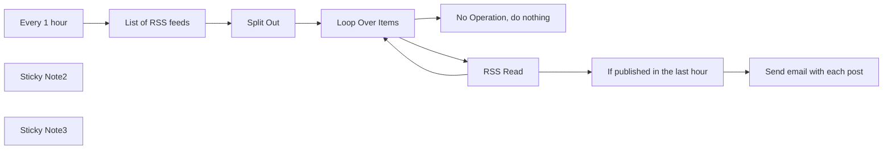

## Fluxo (.json) :

```json
{
  "nodes": [
    {
      "id": "48a0524d-db39-4046-bad1-18684064cbac",
      "name": "Every 1 hour",
      "type": "n8n-nodes-base.scheduleTrigger",
      "position": [
        40,
        600
      ],
      "parameters": {
        "rule": {
          "interval": [
            {
              "field": "hours",
              "triggerAtMinute": 30
            }
          ]
        }
      },
      "typeVersion": 1.1
    },
    {
      "id": "bf9e2480-e879-4ebc-829f-b61f29251d29",
      "name": "Loop Over Items",
      "type": "n8n-nodes-base.splitInBatches",
      "position": [
        680,
        600
      ],
      "parameters": {
        "options": {}
      },
      "typeVersion": 3
    },
    {
      "id": "f8e8a9a4-6104-4d4c-a400-5160e37f6c55",
      "name": "No Operation, do nothing",
      "type": "n8n-nodes-base.noOp",
      "position": [
        920,
        400
      ],
      "parameters": {},
      "typeVersion": 1
    },
    {
      "id": "980351bb-685b-4392-bb28-a10bec1608fe",
      "name": "RSS Read",
      "type": "n8n-nodes-base.rssFeedRead",
      "onError": "continueRegularOutput",
      "position": [
        920,
        620
      ],
      "parameters": {
        "url": "={{ $json.urls }}",
        "options": {}
      },
      "retryOnFail": true,
      "typeVersion": 1,
      "waitBetweenTries": 5000
    },
    {
      "id": "7281072f-f773-468f-8599-4efa5832f8e2",
      "name": "Sticky Note2",
      "type": "n8n-nodes-base.stickyNote",
      "position": [
        260,
        760
      ],
      "parameters": {
        "color": 7,
        "width": 162,
        "height": 84,
        "content": "👆 Add your RSS feeds urls here."
      },
      "typeVersion": 1
    },
    {
      "id": "c1aece31-d2d5-4cf2-864e-1911e34056f3",
      "name": "Sticky Note3",
      "type": "n8n-nodes-base.stickyNote",
      "position": [
        -80,
        466
      ],
      "parameters": {
        "color": 5,
        "width": 447,
        "height": 104.61602497398542,
        "content": "### 👨‍🎤 Setup\n1. Add your email and email creds\n2. Add the RSS feed URLs you want to follow"
      },
      "typeVersion": 1
    },
    {
      "id": "8a932df6-4550-4f01-86a0-45a2857645c0",
      "name": "If published in the last hour",
      "type": "n8n-nodes-base.if",
      "position": [
        1120,
        620
      ],
      "parameters": {
        "options": {},
        "conditions": {
          "options": {
            "leftValue": "",
            "caseSensitive": true,
            "typeValidation": "strict"
          },
          "combinator": "and",
          "conditions": [
            {
              "id": "97b4e257-2413-4c78-8b33-1f7523bfe0cd",
              "operator": {
                "type": "dateTime",
                "operation": "after"
              },
              "leftValue": "={{ DateTime.fromISO($json.isoDate) }}",
              "rightValue": "={{ DateTime.now().minus({hour: 1}) }}"
            },
            {
              "id": "b37ee746-6b2c-45ad-80db-fa2750ce9a58",
              "operator": {
                "type": "dateTime",
                "operation": "beforeOrEquals"
              },
              "leftValue": "={{ DateTime.fromISO($json.isoDate) }}",
              "rightValue": "={{ DateTime.now() }}"
            }
          ]
        }
      },
      "typeVersion": 2
    },
    {
      "id": "8bf89e60-5ea1-47b9-9249-bf2e258f9a2d",
      "name": "Send email with each post",
      "type": "n8n-nodes-base.gmail",
      "position": [
        1360,
        600
      ],
      "parameters": {
        "sendTo": "SET YOUR EMAIL HERE",
        "message": "=Check out this new post from {{ $json.link.extractDomain() }} at {{ $json.link }}\n\n----\n\n {{ $json.contentSnippet }}",
        "options": {
          "appendAttribution": true
        },
        "subject": "=New post from {{ $json.link.extractDomain() }}: {{ $json.title }} "
      },
      "credentials": {
        "gmailOAuth2": {
          "id": "7",
          "name": "Personal Gmail account"
        }
      },
      "typeVersion": 2.1
    },
    {
      "id": "8a344c1e-4f57-46b8-8736-d4d651188e57",
      "name": "Split Out",
      "type": "n8n-nodes-base.splitOut",
      "position": [
        480,
        600
      ],
      "parameters": {
        "options": {},
        "fieldToSplitOut": "urls"
      },
      "typeVersion": 1
    },
    {
      "id": "6b523a05-ba2e-4118-9061-7ef7fd152802",
      "name": "List of RSS feeds",
      "type": "n8n-nodes-base.set",
      "position": [
        260,
        600
      ],
      "parameters": {
        "options": {},
        "assignments": {
          "assignments": [
            {
              "id": "257d7e0a-1c6e-42ca-825c-347fec574914",
              "name": "urls",
              "type": "array",
              "value": "[\"https://www.anildash.com/feed.xml\", \"https://sive.rs/en.atom\"]"
            }
          ]
        }
      },
      "typeVersion": 3.3
    }
  ],
  "pinData": {},
  "connections": {
    "RSS Read": {
      "main": [
        [
          {
            "node": "Loop Over Items",
            "type": "main",
            "index": 0
          },
          {
            "node": "If published in the last hour",
            "type": "main",
            "index": 0
          }
        ]
      ]
    },
    "Split Out": {
      "main": [
        [
          {
            "node": "Loop Over Items",
            "type": "main",
            "index": 0
          }
        ]
      ]
    },
    "Every 1 hour": {
      "main": [
        [
          {
            "node": "List of RSS feeds",
            "type": "main",
            "index": 0
          }
        ]
      ]
    },
    "Loop Over Items": {
      "main": [
        [
          {
            "node": "No Operation, do nothing",
            "type": "main",
            "index": 0
          }
        ],
        [
          {
            "node": "RSS Read",
            "type": "main",
            "index": 0
          }
        ]
      ]
    },
    "List of RSS feeds": {
      "main": [
        [
          {
            "node": "Split Out",
            "type": "main",
            "index": 0
          }
        ]
      ]
    },
    "If published in the last hour": {
      "main": [
        [
          {
            "node": "Send email with each post",
            "type": "main",
            "index": 0
          }
        ]
      ]
    }
  }
}
```

<a id="template-2325"></a>

## Template 2325 - Emails promocionais → Áudio no Telegram

- **Nome:** Emails promocionais → Áudio no Telegram
- **Descrição:** Monitora emails da categoria Promoções, gera um resumo curto, converte o texto em fala e envia o áudio final para um chat do Telegram.
- **Funcionalidade:** • Monitoramento periódico de emails: Verifica a caixa de entrada a cada minuto buscando emails com o rótulo CATEGORY_PROMOTIONS.
• Recuperação do conteúdo da mensagem: Obtém o conteúdo completo do email para processamento posterior.
• Limpeza dos dados do email: Remove campos desnecessários do payload para reduzir ruído e tamanho dos dados.
• Resumo inteligente do conteúdo: Cria um newsletter curto (com emojis) e com menos de 247 caracteres para melhor legibilidade em TTS.
• Geração de áudio via TTS: Envia o resumo para uma API de text-to-speech e solicita uma voz específica para gerar o áudio.
• Conversão de resposta em arquivo: Converte o áudio retornado (base64) em um arquivo binário utilizável.
• Agrupamento de texto e áudio: Une metadados do texto com o arquivo de áudio para envio conjunto.
• Envio final ao canal: Envia o arquivo de áudio ao chat Telegram especificado com a legenda contendo o resumo.
- **Ferramentas:** • Gmail: Serviço de email usado para filtrar e recuperar mensagens com o rótulo CATEGORY_PROMOTIONS.
• OpenAI: Utilizado para realizar a sumarização e geração do texto resumido (modelo de linguagem).
• TikTok TTS API (tiktok-tts.weilnet.workers.dev / tiktokvoicegenerator.com): Serviço externo de text-to-speech que gera o áudio a partir do resumo.
• Telegram: Plataforma de mensagens usada para enviar o arquivo de áudio final ao chat destino.


## Fluxo visual

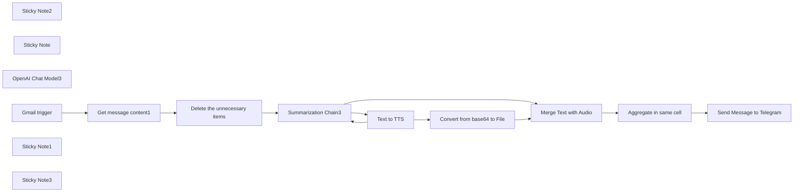

## Fluxo (.json) :

```json
{
  "meta": {
    "instanceId": "21754f977ce20b07e6fe64be3fbc663f6e6f730423d6e46c6cd2bf5b5e70a383"
  },
  "nodes": [
    {
      "id": "0c8b3a80-00e1-4d69-aac9-df41a464914a",
      "name": "Sticky Note2",
      "type": "n8n-nodes-base.stickyNote",
      "position": [
        -246.5549467302767,
        -396.60463598587717
      ],
      "parameters": {
        "width": 2260.4312974923314,
        "height": 1739.059401992624,
        "content": ""
      },
      "typeVersion": 1
    },
    {
      "id": "74ee38b2-2d8a-40bf-8dad-e20125f000f7",
      "name": "Sticky Note",
      "type": "n8n-nodes-base.stickyNote",
      "position": [
        -220,
        -340
      ],
      "parameters": {
        "color": 5,
        "width": 644.910132006371,
        "height": 655.8676264589326,
        "content": "### Project Benefit 🎧🌟\n\nThe goal of this awesome project is to turn those \"CATEGORY_PROMOTIONS\" emails into a super cool audio podcast! 🎙️ This way, users can kick back and enjoy the promotional content without having to squint at their screens. By listening instead of reading, users can soak in the info in a fun and easy way.\n\nThis project rocks a workflow using n8n to automate tasks like a boss. Each node in the workflow plays its part in a smooth operation. Check out the main players:\n\n1. **Gmail trigger1 Node**: Kicks off the action every minute for those \"CATEGORY_PROMOTIONS\" emails.\n   \n2. **Get message content1 Node**: Grabs the email content for some magic.\n      \n3. **Summarization Chain3 Node**: Whips up some sweet summaries using fancy chunking methods.\n   \n4. **Delete the unnecessary items Node**: Clears out the clutter from the email content.\n   \n5. **Text to Free TTS Node**: Turns the summary into speech using Free TTS magic.\n   \n6. **Convert from base64 to File Node**: Changes the audio into a file format.\n   \n7. **Merge Text with Audio Node**: Mixes the text and audio together for a cool combo.\n   \n8. **Aggregate in same cell Node**: Puts all the data together for more awesomeness.\n   \n10. **Send Message to Telegram Node**: Sends the final audio message with a caption to a special Telegram chat ID.\n\nThis workflow is like a well-oiled machine, with each step flowing seamlessly into the next. By automating these tasks, this project aims to make communication a breeze and bring joy to all involved! 🌈✨🚀\n"
      },
      "typeVersion": 1
    },
    {
      "id": "07a4dc07-0109-464e-a661-d5a4bb7b4a1c",
      "name": "Get message content1",
      "type": "n8n-nodes-base.gmail",
      "position": [
        640,
        460
      ],
      "parameters": {
        "simple": false,
        "options": {},
        "messageId": "={{ $json.id }}",
        "operation": "get"
      },
      "credentials": {
        "gmailOAuth2": {
          "id": "UJx4Tiq8WRtxWEIP",
          "name": "Gmail Omar"
        }
      },
      "typeVersion": 2.1
    },
    {
      "id": "283dcd8b-80a8-4e49-aba1-fabec333def3",
      "name": "OpenAI Chat Model3",
      "type": "@n8n/n8n-nodes-langchain.lmChatOpenAi",
      "position": [
        1120,
        640
      ],
      "parameters": {
        "options": {}
      },
      "credentials": {
        "openAiApi": {
          "id": "6u6TSayQDxci71Wb",
          "name": "OpenAi account"
        }
      },
      "typeVersion": 1
    },
    {
      "id": "71897790-5ee8-4f15-bc4e-26a987b79505",
      "name": "Delete the unnecessary items",
      "type": "n8n-nodes-base.code",
      "position": [
        880,
        460
      ],
      "parameters": {
        "jsCode": "// Loop over input items and add a new field called 'myNewField' to the JSON of each one\nfor (const item of $input.all()) {\n delete item.json.threadId;\n delete item.json.labelIds;\n delete item.json.sizeEstimate;\n delete item.json.headers;\n delete item.json.html;\n delete item.json.to;\n delete item.json.cc;\n delete item.json.replyTo;\n delete item.json.messageId;\n delete item.json.id;\n delete item.json.textAsHtml;\n delete item.json.date;\n\n}\n\nreturn $input.all();"
      },
      "typeVersion": 2
    },
    {
      "id": "187704ba-ddc1-447e-99f6-8335b039dca3",
      "name": "Aggregate in same cell",
      "type": "n8n-nodes-base.aggregate",
      "position": [
        1400,
        660
      ],
      "parameters": {
        "options": {
          "includeBinaries": true
        },
        "aggregate": "aggregateAllItemData"
      },
      "typeVersion": 1
    },
    {
      "id": "a8cba2a0-e751-4dc4-8cc1-9b91c587b1bc",
      "name": "Gmail trigger",
      "type": "n8n-nodes-base.gmailTrigger",
      "position": [
        440,
        460
      ],
      "parameters": {
        "simple": false,
        "filters": {
          "labelIds": [
            "CATEGORY_PROMOTIONS"
          ]
        },
        "options": {},
        "pollTimes": {
          "item": [
            {
              "mode": "everyMinute"
            }
          ]
        }
      },
      "credentials": {
        "gmailOAuth2": {
          "id": "UJx4Tiq8WRtxWEIP",
          "name": "Gmail Omar"
        }
      },
      "typeVersion": 1
    },
    {
      "id": "7d170a4c-601e-49da-a834-2a40f992feff",
      "name": "Sticky Note1",
      "type": "n8n-nodes-base.stickyNote",
      "position": [
        1380,
        -340
      ],
      "parameters": {
        "color": 5,
        "width": 478.42665735513924,
        "height": 651.7534899914576,
        "content": "### This API allows automatic text-to-speech generation.\nYou can utilize this API by sending a POST request to the specified link and including JSON data containing the text you want to convert to speech, along with selecting your preferred voice.\n\nWhen using this API, make sure to include the `Content-Type` header with the value `application/json` to ensure proper interpretation of the request data.\n\nThe API offers a user-friendly interface where you can simply submit the desired text and choose the appropriate voice, then receive an audio file containing the generated speech.\n\nUsing this API can be beneficial for quickly generating audio clips for texts in an efficient manner.\n\nYou can access this API at [https://tiktok-tts.weilnet.workers.dev/api/generation](https://tiktok-tts.weilnet.workers.dev/api/generation) or keep it as is without changing anything as provided on [https://tiktokvoicegenerator.com/](https://tiktokvoicegenerator.com/). \n"
      },
      "typeVersion": 1
    },
    {
      "id": "f0809138-4bde-4132-97b2-0810b920ed7a",
      "name": "Convert from base64 to File",
      "type": "n8n-nodes-base.convertToFile",
      "position": [
        1660,
        140
      ],
      "parameters": {
        "options": {},
        "operation": "toBinary",
        "sourceProperty": "data"
      },
      "typeVersion": 1.1
    },
    {
      "id": "2efdd685-57fe-4f5c-b295-183dddfeb0d6",
      "name": "Merge Text with Audio",
      "type": "n8n-nodes-base.merge",
      "position": [
        1720,
        440
      ],
      "parameters": {},
      "typeVersion": 2.1
    },
    {
      "id": "c59a00fd-c7c7-4dc5-91d1-492bd7715731",
      "name": "Send Message to Telegram",
      "type": "n8n-nodes-base.telegram",
      "position": [
        1720,
        660
      ],
      "parameters": {
        "chatId": "53739339",
        "operation": "sendAudio",
        "binaryData": true,
        "additionalFields": {
          "caption": "={{ $json.data[1].response.text }}",
          "fileName": "New Message on Gmail"
        },
        "binaryPropertyName": "=data"
      },
      "credentials": {
        "telegramApi": {
          "id": "inUwZEIEWHK1poKe",
          "name": "aqsati services"
        }
      },
      "typeVersion": 1.1
    },
    {
      "id": "3f3a1209-9787-41c3-af10-3f3e44a89c9b",
      "name": "Summarization Chain3",
      "type": "@n8n/n8n-nodes-langchain.chainSummarization",
      "position": [
        1120,
        460
      ],
      "parameters": {
        "options": {
          "summarizationMethodAndPrompts": {
            "values": {
              "prompt": "Craft a concise newsletter using the given content. Include emojis, avoid starting with the subject word, summarize linked articles briefly, and ensure it's under 247 characters for easy TTS readability, and after that chick if it's very short to pass it:\n\n\n\n\"{text}\"\n\n\n",
              "combineMapPrompt": "Craft a concise newsletter using the given content. Include emojis, avoid starting with the subject word, summarize linked articles briefly, and ensure it's under 247 characters for easy TTS readability, and after that chick if it's very short to pass it:\n\n\n\"{text}\"\n\n\n"
            }
          }
        },
        "chunkingMode": "advanced"
      },
      "typeVersion": 2
    },
    {
      "id": "f1e063a5-0e0e-4f8e-b8bc-e940db622843",
      "name": "Text to  TTS",
      "type": "n8n-nodes-base.httpRequest",
      "onError": "continueErrorOutput",
      "position": [
        1460,
        140
      ],
      "parameters": {
        "url": "https://tiktok-tts.weilnet.workers.dev/api/generation",
        "method": "POST",
        "options": {
          "allowUnauthorizedCerts": true
        },
        "sendBody": true,
        "bodyParameters": {
          "parameters": [
            {
              "name": "text",
              "value": "={{ $json.response.text }}"
            },
            {
              "name": "voice",
              "value": "en_us_001"
            }
          ]
        }
      },
      "retryOnFail": false,
      "typeVersion": 4.1,
      "alwaysOutputData": false
    },
    {
      "id": "c6f9e191-31a0-4ec7-aa11-8f615074b884",
      "name": "Sticky Note3",
      "type": "n8n-nodes-base.stickyNote",
      "position": [
        -220,
        340
      ],
      "parameters": {
        "color": 5,
        "width": 821.8034694793512,
        "height": 987.2767141363915,
        "content": "### The Gmail Trigger:\nThe Gmail Trigger node in your N8N workflow is set to poll for new emails every minute and is configured to filter emails with the label \"CATEGORY_PROMOTIONS\" before triggering the workflow.\n\n### Steps to Use Filters Inside the Gmail Trigger Node:\n1. **Add Gmail Trigger Node**:\n   - Drag and drop a Gmail Trigger node onto your workflow canvas.\n\n\\```javascript\n// Add Gmail Trigger node\n\\```\n\n2. **Configure Gmail Trigger Node**:\n   - In the node configuration:\n     - Set \"Poll Times\" to \"Every Minute\" to check for new emails at regular intervals.\n     - Enable the \"Simple\" toggle if you want to simplify the node interface.\n     - Under \"Filters\", specify the label IDs you want to filter by. In this case, it's set to \"CATEGORY_PROMOTIONS\".\n     - Adjust any additional options as needed.\n\n\\```javascript\n// Configure Gmail Trigger node\npollTimes: {\n  item: [\n    {\n      mode: \"everyMinute\"\n    }\n  ]\n},\nsimple: false,\nfilters: {\n  labelIds: [\n    \"CATEGORY_PROMOTIONS\"\n  ]\n},\noptions: {}\n\\```\n\n3. **Provide Credentials**:\n   - Ensure that you have set up the necessary Gmail credentials. In this case, it's using Gmail OAuth2 with the ID \"UJx4Tiq8WRtxWEIP\" and the name \"Gmail Omar\".\n\n4. **Save and Execute**:\n   - Save your workflow and execute it to start monitoring your Gmail account for new emails with the specified label filter.\n\nBy following these steps, your workflow will effectively trigger based on new emails that match the \"CATEGORY_PROMOTIONS\" label in your Gmail account.\n"
      },
      "typeVersion": 1
    }
  ],
  "pinData": {},
  "connections": {
    "Text to  TTS": {
      "main": [
        [
          {
            "node": "Convert from base64 to File",
            "type": "main",
            "index": 0
          }
        ],
        [
          {
            "node": "Summarization Chain3",
            "type": "main",
            "index": 0
          }
        ]
      ]
    },
    "Gmail trigger": {
      "main": [
        [
          {
            "node": "Get message content1",
            "type": "main",
            "index": 0
          }
        ]
      ]
    },
    "OpenAI Chat Model3": {
      "ai_languageModel": [
        [
          {
            "node": "Summarization Chain3",
            "type": "ai_languageModel",
            "index": 0
          }
        ]
      ]
    },
    "Get message content1": {
      "main": [
        [
          {
            "node": "Delete the unnecessary items",
            "type": "main",
            "index": 0
          }
        ]
      ]
    },
    "Summarization Chain3": {
      "main": [
        [
          {
            "node": "Merge Text with Audio",
            "type": "main",
            "index": 1
          },
          {
            "node": "Text to  TTS",
            "type": "main",
            "index": 0
          }
        ]
      ]
    },
    "Merge Text with Audio": {
      "main": [
        [
          {
            "node": "Aggregate in same cell",
            "type": "main",
            "index": 0
          }
        ]
      ]
    },
    "Aggregate in same cell": {
      "main": [
        [
          {
            "node": "Send Message to Telegram",
            "type": "main",
            "index": 0
          }
        ]
      ]
    },
    "Convert from base64 to File": {
      "main": [
        [
          {
            "node": "Merge Text with Audio",
            "type": "main",
            "index": 0
          }
        ]
      ]
    },
    "Delete the unnecessary items": {
      "main": [
        [
          {
            "node": "Summarization Chain3",
            "type": "main",
            "index": 0
          }
        ]
      ]
    }
  }
}
```

<a id="template-2327"></a>

## Template 2327 - Mapear extensões Chrome rastreadas pelo LinkedIn

- **Nome:** Mapear extensões Chrome rastreadas pelo LinkedIn
- **Descrição:** Converte uma lista de IDs de extensões (extraída de páginas do LinkedIn) em uma planilha com informações enriquecidas (nome, URL e snippet), evitando duplicados.
- **Funcionalidade:** • Início manual: permite executar o fluxo sob demanda.
• Carregamento de IDs embutidos: lê um grande JSON com pares id → recurso (arquivo) que representam extensões.
• Carregamento de itens já processados: recupera entradas existentes da planilha para identificar o que já foi tratado.
• Exclusão de processados: compara IDs e remove os itens que já constam na planilha para evitar reprocessamento.
• Limitação por execução: define um teto (200) de itens a serem processados por execução.
• Processamento em lotes: divide os itens não processados em pequenos lotes para controle de requisições.
• Consulta de busca por ID: pesquisa a web (site:chromewebstore.google.com + id) para cada extensão usando uma API de SERP.
• Extração do primeiro resultado: obtém URL, título e snippet do primeiro resultado retornado pela busca.
• Upsert na planilha: insere ou atualiza linhas na planilha com id, resource, name, url, snippet e timestamp de processamento.
- **Ferramentas:** • Google Sheets: armazenamento de itens já processados e destino final para inserir/atualizar os dados enriquecidos.
• Google SERP API (via RapidAPI / ScrapeNinja): realiza buscas na web por cada ID de extensão e retorna resultados (link, título, snippet) para enriquecimento dos registros.

## Fluxo visual

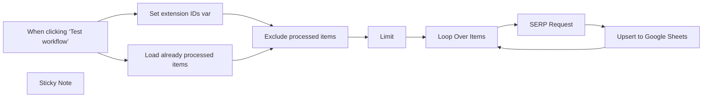

## Fluxo (.json) :

```json
{
  "id": "H9uAqvTaO7nTFdsH",
  "meta": {
    "instanceId": "5b860a91d7844b5237bb51cc58691ca8c3dc5b576f42d4d6bbedfb8d43d58ece",
    "templateCredsSetupCompleted": true
  },
  "name": "Linkedin Chrome Extensions",
  "tags": [],
  "nodes": [
    {
      "id": "b203fb9c-cc9a-4b29-848f-44ce7272167e",
      "name": "When clicking ‘Test workflow’",
      "type": "n8n-nodes-base.manualTrigger",
      "position": [
        600,
        400
      ],
      "parameters": {},
      "typeVersion": 1
    },
    {
      "id": "4e89a46b-d6c7-48e4-a432-fbb091e61f47",
      "name": "Loop Over Items",
      "type": "n8n-nodes-base.splitInBatches",
      "position": [
        1560,
        400
      ],
      "parameters": {
        "options": {},
        "batchSize": 2
      },
      "typeVersion": 3
    },
    {
      "id": "e803d8be-2748-4a74-9ef8-ccb3e0e2bf49",
      "name": "Limit",
      "type": "n8n-nodes-base.limit",
      "notes": "Only process 200 items per run",
      "position": [
        1340,
        400
      ],
      "parameters": {
        "maxItems": 200
      },
      "notesInFlow": true,
      "typeVersion": 1
    },
    {
      "id": "ac196ec9-d78a-441b-8d78-4a86830865a1",
      "name": "Set extension IDs var",
      "type": "n8n-nodes-base.code",
      "position": [
        820,
        400
      ],
      "parameters": {
        "jsCode": "let gg = [\n    {\n        \"id\": \"aaidboaeckiboobjhialkmehjganhbgk\",\n        \"file\": \"mmt-srcwl-dznlv-surdqixjeg/images/ios-arrow-down.svg\"\n    },\n    {\n        \"id\": \"aaiicdofoildjkenjdeoenfhdmajchlm\",\n        \"file\": \"css/popup.css\"\n    },\n    {\n        \"id\": \"aajeioaakaifilihejpjaohomikfinhj\",\n        \"file\": \"assets/icons/close.svg\"\n    },\n    {\n        \"id\": \"aaklholmlihjgaamiolhapadfdbbpoep\",\n        \"file\": \"assets/endpoints-648827be.js\"\n    },\n    {\n        \"id\": \"abdalefggkmddnicfhgngmdoggcbopai\",\n        \"file\": \"images/logo.png\"\n    },\n    {\n        \"id\": \"abekedpmkgndeflcidpkkddapnjnocjp\",\n        \"file\": \"logo.png\"\n    },\n    {\n        \"id\": \"abfehdblmlodmieppijjflnfbjhedcde\",\n        \"file\": \"static/twitter_lib.js\"\n    },\n    {\n        \"id\": \"ablfgphjibcgmjcflkflckpoeojilojg\",\n        \"file\": \"images/flowq-icon-white.png\"\n    },\n    {\n        \"id\": \"abmmhliaihcohbhbnonjdemkiinbplki\",\n        \"file\": \"icon64.plasmo.40ede470.png\"\n    },\n    {\n        \"id\": \"abnlpffeopccdjacjnjbpokhphbncfoo\",\n        \"file\": \"img/add_new_plus.svg\"\n    },\n    {\n        \"id\": \"acackkdpiddedeionboakefkpfflkcfc\",\n        \"file\": \"assets/bg-dots.svg\"\n    },\n    {\n        \"id\": \"acahdkapjdnbbljnfpgdmlgmlbihlffh\",\n        \"file\": \"css/main.css\"\n    },\n    {\n        \"id\": \"acajjofblcpdnfgofcmhgnpcbfhmfldc\",\n        \"file\": \"html/sandbox.html\"\n    },\n    {\n        \"id\": \"acgbggfkaphffpbcljiibhfipmmpboep\",\n        \"file\": \"icons/close_blue.png\"\n    },\n    {\n        \"id\": \"ackaoollelfpemlphemonchbdflegfan\",\n        \"file\": \"assets/logo-16.png\"\n    },\n    {\n        \"id\": \"aclgcfmciekojimhckimdcapkejceili\",\n        \"file\": \"index.html\"\n    },\n    {\n        \"id\": \"acmbfggokaabfndehodmoekhccfnphel\",\n        \"file\": \"dist/bundle-background.js\"\n    },\n    {\n        \"id\": \"acoghllfancelnlokfebfojbkoeblann\",\n        \"file\": \"options.html\"\n    },\n    {\n        \"id\": \"adgnjhngogijkkppficiiepmjebijinl\",\n        \"file\": \"page.js\"\n    },\n    {\n        \"id\": \"adkamkdaglbaejnfobbahegfiinjonme\",\n        \"file\": \"content-scripts/messageBox.html\"\n    },\n    {\n        \"id\": \"adknclagpadmdnjepbfddpplgmfginnb\",\n        \"file\": \"js/tinymce/models/dom/index.js\"\n    },\n    {\n        \"id\": \"adlljmlbangmeenndganepfkilcdihnm\",\n        \"file\": \"img/google_signin_disabled.png\"\n    },\n    {\n        \"id\": \"admhojmcphjknfpifjchkpbbhphnndgo\",\n        \"file\": \"green_circle_small.png\"\n    },\n    {\n        \"id\": \"aecjjmldidhgndpccgokjgbkmcipfdmj\",\n        \"file\": \"assets/inject.css\"\n    },\n    {\n        \"id\": \"aeeccphegbhmemmjncggcjlieanbkcmg\",\n        \"file\": \"sidebar.html\"\n    },\n    {\n        \"id\": \"aeidadjdhppdffggfgjpanbafaedankd\",\n        \"file\": \"inject.js\"\n    },\n    {\n        \"id\": \"afemibdfbljmhkcbdppaibiipnbkioom\",\n        \"file\": \"mmt-srcwl-yltllrrerbcpze-z/images/ios-arrow-down.svg\"\n    },\n    {\n        \"id\": \"afgjokfmplfblobgdmddbmoflaajljjf\",\n        \"file\": \"assets/png/logo.png\"\n    },\n    {\n        \"id\": \"afgkobjcdllpijcjchikjamjipbnjjgn\",\n        \"file\": \"contentStyle.css\"\n    },\n    {\n        \"id\": \"afiiebkndlkhnpbekkheibhfjfnbcnem\",\n        \"file\": \"content.css\"\n    },\n    {\n        \"id\": \"agbbbanmddhembghpamggfdjknafcbka\",\n        \"file\": \"popup.html\"\n    },\n    {\n        \"id\": \"agdddnmdjmljkjeglnidfpmpenbimmmn\",\n        \"file\": \"imgs/final.png\"\n    },\n    {\n        \"id\": \"agdiliklplmnemefmlglajpdaimembli\",\n        \"file\": \"src/popup.html\"\n    },\n    {\n        \"id\": \"agghbaheofcoecndkbflbnggdjcmiaml\",\n        \"file\": \"images/hide-button-icon.svg\"\n    },\n    {\n        \"id\": \"agiilkigodfhimkdcjgbjdlajpjdhaig\",\n        \"file\": \"assets/img/checked_2.png\"\n    },\n    {\n        \"id\": \"ahbaomfclkbgaadpmlcmlchhcgfibfld\",\n        \"file\": \"mmt-srcwl-convhk-x-ucwgi-s/images/ios-arrow-down.svg\"\n    },\n    {\n        \"id\": \"aheakoghjhpbianljiemepkpklndnogn\",\n        \"file\": \"white-bg.png\"\n    },\n    {\n        \"id\": \"ahfgeclknnjfgbefcblahelikidbgehh\",\n        \"file\": \"camera.min.css\"\n    },\n    {\n        \"id\": \"ahgjbbnglgnladgimapeecjmhlhmacgg\",\n        \"file\": \"pearmill.png\"\n    },\n    {\n        \"id\": \"ahkdkfejeplinhgmclegkhopdiiedeji\",\n        \"file\": \"icons/header-logo.png\"\n    },\n    {\n        \"id\": \"ahkmpgpdcneppdhhdgmmmcgicgfcfmka\",\n        \"file\": \"src/icons/arrow-down.svg\"\n    },\n    {\n        \"id\": \"ahlmkaafohhhbocahhjlcgofddbhcaef\",\n        \"file\": \"src/assets/icons/close.svg\"\n    },\n    {\n        \"id\": \"aicgfjkeikpppglfdhmdgncaiemeenon\",\n        \"file\": \"assets/button.png\"\n    },\n    {\n        \"id\": \"aicinfjgiebaoekhdgcgnjdkdhhmmkeb\",\n        \"file\": \"iconwhitelarge.png\"\n    },\n    {\n        \"id\": \"aielpkmgjjaddochapclgdhakecjloih\",\n        \"file\": \"assets/images/candidate-list/present_white.svg\"\n    },\n    {\n        \"id\": \"aihgkhchhecmambgbonicffgneidgclh\",\n        \"file\": \"icons/share.png\"\n    },\n    {\n        \"id\": \"aijkbfcgfacnbgaladlemlbonnddphdf\",\n        \"file\": \"utils/select-arrow.svg\"\n    },\n    {\n        \"id\": \"aijnakmdgcopgeldfcolbikeckpbhkcg\",\n        \"file\": \"icon16.plasmo.6c567d50.png\"\n    },\n    {\n        \"id\": \"ajceemkmbgjolpocnkfccjmplcbbppel\",\n        \"file\": \"index.html\"\n    },\n    {\n        \"id\": \"ajcfhmjfhpbeefcnfmbheidefdodhcfa\",\n        \"file\": \"img/caret-up.png\"\n    },\n    {\n        \"id\": \"ajddacgankfijplgnfdoknldbidfnaba\",\n        \"file\": \"icon.png\"\n    },\n    {\n        \"id\": \"ajmlcdlcagmkcfbomfchikkkkabomeda\",\n        \"file\": \"assets/inject\"\n    },\n    {\n        \"id\": \"ajoickdlofadbaooambnlnlbcpdnkkck\",\n        \"file\": \"assets/index-a7bce0dd.js\"\n    },\n    {\n        \"id\": \"akeepikolhaikilagiekmegfhefcbohd\",\n        \"file\": \"src/iframe.html\"\n    },\n    {\n        \"id\": \"akemecbhkcopeeicihindnjgfihkkgdi\",\n        \"file\": \"modules/webhook_response.json\"\n    },\n    {\n        \"id\": \"aklejaaicklpmejgidjjmjpecadhhojd\",\n        \"file\": \"app/immutable/chunks/misc-c76fc394.js\"\n    },\n    {\n        \"id\": \"alanhknkkgbmjcifaecnihemjmcofaid\",\n        \"file\": \"html/_modal.html\"\n    },\n    {\n        \"id\": \"albldfiohnhdonffjdbiohejiofaahpe\",\n        \"file\": \"frame.html\"\n    },\n    {\n        \"id\": \"aleoomdhnjddjlmfocibikjdpkdpadko\",\n        \"file\": \"content.styles.css\"\n    },\n    {\n        \"id\": \"alfpbpbopicnfllpimeniedbhdinhnla\",\n        \"file\": \"css/global.css\"\n    },\n    {\n        \"id\": \"algadbfmljcppohmcckpdemkjklapibd\",\n        \"file\": \"assets/tokenParser.js.2948d213.js\"\n    },\n    {\n        \"id\": \"alhgpfoeiimagjlnfekdhkjlkiomcapa\",\n        \"file\": \"loading.html\"\n    },\n    {\n        \"id\": \"alicgiickdepegihbonmofbeicfpleca\",\n        \"file\": \"3d1819e7-4594-4707-b887-7a184e4f4474.html\"\n    },\n    {\n        \"id\": \"amapllhcnbchdgmokdpepldjnahakkhp\",\n        \"file\": \"check.js\"\n    },\n    {\n        \"id\": \"amcdijdgmckgkkahhcobikllddfbfidi\",\n        \"file\": \"contentSrc/forLinkedin/XMLHttpWatcher.js\"\n    },\n    {\n        \"id\": \"amegdihgpgkempfnaijolncbklcabjno\",\n        \"file\": \"images/icon16.png\"\n    },\n    {\n        \"id\": \"amfgppaiaaledghabgegkikijjkckeea\",\n        \"file\": \"assets/toolbar.tsx-C7eF35Xm.js\"\n    },\n    {\n        \"id\": \"amfklcoihehamimgfemijdpmapoamlak\",\n        \"file\": \"fonts/GalanoGrotesqueMedium/GalanoGrotesque-Medium.woff2\"\n    },\n    {\n        \"id\": \"ancbpbjhhcnaaommbadhfnaplbokllnb\",\n        \"file\": \"popup.html\"\n    },\n    {\n        \"id\": \"anjlpdlcijnnddbiklpoadphfmckhhdf\",\n        \"file\": \"content.styles.css\"\n    },\n    {\n        \"id\": \"anmpfbhhckimckheaaahgholpjlopjbf\",\n        \"file\": \"app/index.html\"\n    },\n    {\n        \"id\": \"anpgmjakfkghpfejjkekfcjhbcganfkl\",\n        \"file\": \"doge.png\"\n    },\n    {\n        \"id\": \"aohjbibomoccognbgheakjcbabmiflfg\",\n        \"file\": \"assets/icon48.png\"\n    },\n    {\n        \"id\": \"aohkfefghmpadlbpodbhapfgcliiejch\",\n        \"file\": \"close.svg\"\n    },\n    {\n        \"id\": \"aoieokedbecedmpafmimaabhcpmefjdk\",\n        \"file\": \"js/content.js\"\n    },\n    {\n        \"id\": \"apamnnifigcfheiajekbkekajbchlbcc\",\n        \"file\": \"views/login.html\"\n    },\n    {\n        \"id\": \"apdlpieiebgmgkkhimlbkliccnkimgem\",\n        \"file\": \"images/elvatix-webapp-icon-256.png\"\n    },\n    {\n        \"id\": \"apmacgoajagifnflancoaenfcgmjnifc\",\n        \"file\": \"sentry.content.css\"\n    },\n    {\n        \"id\": \"apppjobnbahbomhgmcgolplkpigjlofl\",\n        \"file\": \"assets/button-logo.svg\"\n    },\n    {\n        \"id\": \"bacbphhfcjjgoeeabjnijgnmglooaigh\",\n        \"file\": \"content.js\"\n    },\n    {\n        \"id\": \"baecjmoceaobpnffgnlkloccenkoibbb\",\n        \"file\": \"logo.png\"\n    },\n    {\n        \"id\": \"baemjgbkbdldejgjceijnbkigkgkppoa\",\n        \"file\": \"assets/img/dropdown.svg\"\n    },\n    {\n        \"id\": \"bagapgnffhmfccajdbbjcgalkphdjccn\",\n        \"file\": \"images/pp_icon48.png\"\n    },\n    {\n        \"id\": \"bahdhdbpmfjgaibpbhecghjalioepncg\",\n        \"file\": \"assets/Images/plus.svg\"\n    },\n    {\n        \"id\": \"bahdmeamifckdmdpaclbpkijamkddnje\",\n        \"file\": \"src/assets/highlight.css\"\n    },\n    {\n        \"id\": \"bakndeimacanehmkddjhnjjmigngcjem\",\n        \"file\": \"images/dad.png\"\n    },\n    {\n        \"id\": \"bakpgcfeijiedgkdoppkjflmkhhipnec\",\n        \"file\": \"images/right-arrow.svg\"\n    },\n    {\n        \"id\": \"bakpglgljlidccopnnpcdnfbijaelbfc\",\n        \"file\": \"Image/arrowDown copy.svg\"\n    },\n    {\n        \"id\": \"bamhjalcljafbmifkcdjhlgellecndfb\",\n        \"file\": \"images/add.svg\"\n    },\n    {\n        \"id\": \"baocnjdknemddengejjojkbjdndlgdoj\",\n        \"file\": \"assets/javascript/main.js\"\n    },\n    {\n        \"id\": \"bapjpamdjkdcpklcaajfjeidcloikogc\",\n        \"file\": \"content.styles.css\"\n    },\n    {\n        \"id\": \"bbbooaofbdfeplnellpeddbodjfpajfn\",\n        \"file\": \"static/linkedin.js\"\n    },\n    {\n        \"id\": \"bbcflpielkpbkfnhadlgaanfkoakdeai\",\n        \"file\": \"popup.html\"\n    },\n    {\n        \"id\": \"bbgjmcbpenollnklpomhippmagincohb\",\n        \"file\": \"data/config.json\"\n    },\n    {\n        \"id\": \"bbioibipebcopenpbhfceogfjknmjbpl\",\n        \"file\": \"assets/images/icon-16x16.png\"\n    },\n    {\n        \"id\": \"bbjnendcjnnbojahdlnmombobcnfjmml\",\n        \"file\": \"images/6.jpg\"\n    },\n    {\n        \"id\": \"bbkgkhfmppahedmkbilnjkelfgbmhbjd\",\n        \"file\": \"index.html\"\n    },\n    {\n        \"id\": \"bbkonaekgbbmfkpemnecmnbkjlkmedpb\",\n        \"file\": \"images/arrow-back.svg\"\n    },\n    {\n        \"id\": \"bblennjdmmdfjdmpcbalaiabelnjfdfc\",\n        \"file\": \"assets/img/ghost_company.png\"\n    },\n    {\n        \"id\": \"bbmbepalejkomioianpcbgdppbmphjjc\",\n        \"file\": \"icons/16.png\"\n    },\n    {\n        \"id\": \"bboobhaeifmkebdnagpdjdhbdjacabag\",\n        \"file\": \"index.html\"\n    },\n    {\n        \"id\": \"bcaclmklbiocjohhooaaldkbelkaogod\",\n        \"file\": \"popup.js\"\n    },\n    {\n        \"id\": \"bcjfmlopjjfknkcdebfeacmfmpndjkad\",\n        \"file\": \"image/blank.png\"\n    },\n    {\n        \"id\": \"bdfgdkfdldpohakbalfbolkhacncaodn\",\n        \"file\": \"contentscript_style.css\"\n    },\n    {\n        \"id\": \"bdhnjcphicbeinfhflojlmichehflmhd\",\n        \"file\": \"src/css/connection.css\"\n    },\n    {\n        \"id\": \"bdiohckpogchppdldbckcdjlklanhkfc\",\n        \"file\": \"static/media/qr-code.181c8eeb065bb04f416d.png\"\n    },\n    {\n        \"id\": \"becfinhbfclcgokjlobojlnldbfillpf\",\n        \"file\": \"assets/images/arrow-forward.png\"\n    },\n    {\n        \"id\": \"beddhfglegaaiemmjbmhclhnbpoicicc\",\n        \"file\": \"contentScript.js\"\n    },\n    {\n        \"id\": \"beemdfkfplebccejjcmjfngjjnmhnkae\",\n        \"file\": \"scripts/style.css\"\n    },\n    {\n        \"id\": \"befngoippmpmobkkpkdoblkmofpjihnk\",\n        \"file\": \"prospector/images/prospector-widget-icon.svg\"\n    },\n    {\n        \"id\": \"beghjaadnlgdjblgimcnidhipangdlob\",\n        \"file\": \"requestPermissions.html\"\n    },\n    {\n        \"id\": \"begilfboibeiingmandhfeebipngobaa\",\n        \"file\": \"images/delfi-logo.png\"\n    },\n    {\n        \"id\": \"bekneflnoddpbfddnibalhcclcpeppim\",\n        \"file\": \"popup.html\"\n    },\n    {\n        \"id\": \"belhombhbdodpmoadjgljnndhhafbkkf\",\n        \"file\": \"assets/fontawesome/svgs/regular/face-grin-tongue-wink.svg\"\n    },\n    {\n        \"id\": \"bepabeobdmmefhhhkonppcppgodhjdno\",\n        \"file\": \"icon16.png\"\n    },\n    {\n        \"id\": \"bfanalaldfhlcadlkmjpbiaieophgpgn\",\n        \"file\": \"core/SideBar/SideBar.html\"\n    },\n    {\n        \"id\": \"bfflbfpjfhicaboicheecmgkjcgmngai\",\n        \"file\": \"dist/Snackbar.html\"\n    },\n    {\n        \"id\": \"bfgkgjjcgcfdjdcdcicnekhhldinkkhk\",\n        \"file\": \"dist/_locales/en/messages.json\"\n    },\n    {\n        \"id\": \"bfoibfacnnabealdgagkkmdbkinbjoem\",\n        \"file\": \"js/inject.js\"\n    },\n    {\n        \"id\": \"bgaiinkldeidiiphcbipeomcajmndomh\",\n        \"file\": \"nonews.html\"\n    },\n    {\n        \"id\": \"bgdjlbjaemhokfkkjiplclhjjbmlhlof\",\n        \"file\": \"dist/contentScripts/style.css\"\n    },\n    {\n        \"id\": \"bgkalnkemmojlglhakebbpjecigamgii\",\n        \"file\": \"images/logo.svg\"\n    },\n    {\n        \"id\": \"bgniimmgelhhbmnfoklafdfhdogadlhm\",\n        \"file\": \"gmailGlobals.js\"\n    },\n    {\n        \"id\": \"bgpdabnppijhmmgpnnooghpglmjkmnbl\",\n        \"file\": \"click.mp3\"\n    },\n    {\n        \"id\": \"bhbcbkonalnjkflmdkdodieehnmmeknp\",\n        \"file\": \"_locales/en/messages.json\"\n    },\n    {\n        \"id\": \"bheokphafjambacdhielfpiobmibjofi\",\n        \"file\": \"asset/lea.png\"\n    },\n    {\n        \"id\": \"bhhdblckjkgijhjajngmjdijpmhoeobp\",\n        \"file\": \"src/assets/bookmark.png\"\n    },\n    {\n        \"id\": \"bhnpbgfnodkiohanbolcdkibeibncobf\",\n        \"file\": \"styles.css\"\n    },\n    {\n        \"id\": \"biaoiacajmgmfnjdgpcclnebfbbfccll\",\n        \"file\": \"assets/icons/favicon-16.png\"\n    },\n    {\n        \"id\": \"bicnffockmobpljegbpbjllcdnlfeepn\",\n        \"file\": \"popup.html\"\n    },\n    {\n        \"id\": \"biejinfobcnfmjjgggmldodnbjppplod\",\n        \"file\": \"arrow-right.svg\"\n    },\n    {\n        \"id\": \"biicfpflnfpfdiahfekdanbgihkkibem\",\n        \"file\": \"images/logo.png\"\n    },\n    {\n        \"id\": \"biihmgacgicpcofihcijpffndeehmdga\",\n        \"file\": \"popup.html\"\n    },\n    {\n        \"id\": \"bijpaomiojnjdklgbomeoenfegpjljfk\",\n        \"file\": \"icon16.png\"\n    },\n    {\n        \"id\": \"bimgikcfhcjibdaaamjlogpndceajhii\",\n        \"file\": \"sidepanel.html\"\n    },\n    {\n        \"id\": \"bimmbgomanhpkfodmiomjgfakleojpia\",\n        \"file\": \"static/js/main.js\"\n    },\n    {\n        \"id\": \"binfkcmklghbjkbiaknecnheepdiagfl\",\n        \"file\": \"popup.html\"\n    },\n    {\n        \"id\": \"bjaegbkiponlhjibpdbjhdfjehijmdca\",\n        \"file\": \"static/css/main.e6c13ad2.css\"\n    },\n    {\n        \"id\": \"bjahjijchjnokbgbahdmfcjoblkicank\",\n        \"file\": \"content.js\"\n    },\n    {\n        \"id\": \"bjckcfdgnmppdohidoknphenoflgdapd\",\n        \"file\": \"favicon-16x16.png\"\n    },\n    {\n        \"id\": \"bjdlhnaghjcjihjiojhpnimlmfnehbga\",\n        \"file\": \"images/tag-remove-light.png\"\n    },\n    {\n        \"id\": \"bjflephcegdkcngbcakfgoeejcmkocep\",\n        \"file\": \"popup.html\"\n    },\n    {\n        \"id\": \"bjginahbhcpmjhjmfgebfpneegkdcobe\",\n        \"file\": \"injected.js\"\n    },\n    {\n        \"id\": \"bjibimlhliikdlklncdgkpdmgkpieplj\",\n        \"file\": \"static/media/divider.svg\"\n    },\n    {\n        \"id\": \"bkbipadjogdmmnajfplbllmglobaiapc\",\n        \"file\": \"fonts/GalanoGrotesqueMedium/GalanoGrotesque-Medium.woff2\"\n    },\n    {\n        \"id\": \"bkcibcjcbhgjoddeldfmgkbaipjkidpf\",\n        \"file\": \"assets/32x32.png\"\n    },\n    {\n        \"id\": \"bkkbcggnhapdmkeljlodobbkopceiche\",\n        \"file\": \"message.html\"\n    },\n    {\n        \"id\": \"bkljmpppcfepdfokbjlocdhipammabkm\",\n        \"file\": \"fonts/proxima-nova/proxima-nova.css\"\n    },\n    {\n        \"id\": \"bkomhhlgldmokcopilckjiggodoehkco\",\n        \"file\": \"prospect.png\"\n    },\n    {\n        \"id\": \"bkpkgidmenpdlkoklchjijhmkjfjpaae\",\n        \"file\": \"popup.js\"\n    },\n    {\n        \"id\": \"blbkhhmhnbnlmbnloahekpdngbondmog\",\n        \"file\": \"shortcuts.html\"\n    },\n    {\n        \"id\": \"blcckdeodojeihpjahngbabalhiiofjk\",\n        \"file\": \"images/icon-128.png\"\n    },\n    {\n        \"id\": \"blcddfbfkinmhmokhpjiiljjfafjpgom\",\n        \"file\": \"vendor/jquery/jquery-3.6.0.min.js.LICENSE.txt\"\n    },\n    {\n        \"id\": \"bleihlnmbokeimikncokphpgdobmkhfa\",\n        \"file\": \"img/warn.png\"\n    },\n    {\n        \"id\": \"blimjkpadkhcpmkeboeknjcmiaogbkph\",\n        \"file\": \"assets/icon-loader.svg\"\n    },\n    {\n        \"id\": \"bljigloeikaihodehchnpcnpgbhplcdp\",\n        \"file\": \"settings/js/foundation/foundation.js\"\n    },\n    {\n        \"id\": \"blndoopcfepmdfbbajpbldigolihligc\",\n        \"file\": \"cancel.html\"\n    },\n    {\n        \"id\": \"blngdibglkefnkigjmfhnfineimdhpdk\",\n        \"file\": \"assets/images/check_0.png\"\n    },\n    {\n        \"id\": \"bmaobmmbobbmddkdjilonehnhopdgbkj\",\n        \"file\": \"images/icon-16.png\"\n    },\n    {\n        \"id\": \"bmcooeoofkmnbmlbnkhlfiepoekipkcj\",\n        \"file\": \"content_scripts/inject_style.js\"\n    },\n    {\n        \"id\": \"bmdjphpepbkfmgaphblghfocmoiglagd\",\n        \"file\": \"images/icon-16.png\"\n    },\n    {\n        \"id\": \"bmfdbienklancpahjiadlnpnhedipnok\",\n        \"file\": \"assets/index.tsx-5OsqAtk0.js\"\n    },\n    {\n        \"id\": \"bmilkimafelnhekidknkamkhkbeciijg\",\n        \"file\": \"js/langs.json\"\n    },\n    {\n        \"id\": \"bmklepaoljnidmfnkomdfkmjoimcokbl\",\n        \"file\": \"index.html\"\n    },\n    {\n        \"id\": \"bmnfmbjhdcinpkebpajgenehkppfpgil\",\n        \"file\": \"bmnfmbjhdcinpkebpajgenehkppfpgil.crx\"\n    },\n    {\n        \"id\": \"bmogjfbodjidgljmfeoeiolcolagflfa\",\n        \"file\": \"assets/content_script.tsx-d0d91d06.js\"\n    },\n    {\n        \"id\": \"bmppbndbfpegajdcdngndbfpifpbeckd\",\n        \"file\": \"assets/img/minus-gray.svg\"\n    },\n    {\n        \"id\": \"bnaaeaknilbkdaaiagejncgoecddgcde\",\n        \"file\": \"options.js\"\n    },\n    {\n        \"id\": \"bneepngbmdnjodaceeffcodionfphgcb\",\n        \"file\": \"css/main.css\"\n    },\n    {\n        \"id\": \"bnlcobcpckcnloogpmkleoleffononil\",\n        \"file\": \"sweetalert2.css\"\n    },\n    {\n        \"id\": \"bnmojkbbkkonlmlfgejehefjldooiedp\",\n        \"file\": \"assets/img/svg-icons/display-settings-close.svg\"\n    },\n    {\n        \"id\": \"bnpppmcjamkdoideocdicgbjhdhcgcnk\",\n        \"file\": \"assets/css/Popup.chunk.css\"\n    },\n    {\n        \"id\": \"bodcackmmefldjpmeefapllhcpdlhfhp\",\n        \"file\": \"kanbox.css\"\n    },\n    {\n        \"id\": \"boknmfoahankiggkeobbdgjjcmgbflma\",\n        \"file\": \"src/js/pages/setup.js\"\n    },\n    {\n        \"id\": \"bomddfcanochfdhopndjibndlgpakdlg\",\n        \"file\": \"ext/index.html\"\n    },\n    {\n        \"id\": \"bpdglghjfejdbgpnimibgacmgadmdfoi\",\n        \"file\": \"icons/info.png\"\n    },\n    {\n        \"id\": \"bpepnldejpbbhooofgclkhghkgkjflpi\",\n        \"file\": \"shortcutView.html\"\n    },\n    {\n        \"id\": \"bplfjdcehflmipacbghiaknhadlnlpfj\",\n        \"file\": \"dist/contentScripts/style.css\"\n    },\n    {\n        \"id\": \"caadopicojbkljdpeafepckmnjikaolb\",\n        \"file\": \"images/button.png\"\n    },\n    {\n        \"id\": \"cabldpgmkejdhjbgmeooocablkljdbcg\",\n        \"file\": \"icon/16.png\"\n    },\n    {\n        \"id\": \"cabmegcjjbchdfajieeadighenaliocf\",\n        \"file\": \"fonts/Inter-Regular.ttf\"\n    },\n    {\n        \"id\": \"cadapjildilfaacohgaimaoibhhlognp\",\n        \"file\": \"index.html\"\n    },\n    {\n        \"id\": \"caiafpkbdcfbbdbmbhfkdhogmfjppfal\",\n        \"file\": \"m128.png\"\n    },\n    {\n        \"id\": \"cajimanapllloaihefjocmiadkpiongj\",\n        \"file\": \"assets/css/contentStyle1711016384296.chunk.css\"\n    },\n    {\n        \"id\": \"camppjleccjaphfdbohjdohecfnoikec\",\n        \"file\": \"assets/index-f2fde678.js\"\n    },\n    {\n        \"id\": \"canpneabbfipaelecfibpmmjbdkiaolf\",\n        \"file\": \"inject/js/location.js\"\n    },\n    {\n        \"id\": \"caoebkpcoieoneniagdligghacpekdgo\",\n        \"file\": \"icon-342.png\"\n    },\n    {\n        \"id\": \"cbabbnggammjejonbdjkckgejknmdhng\",\n        \"file\": \"content.styles.css\"\n    },\n    {\n        \"id\": \"cbeoaifhldmaldbakgpgbhdiekhjonfb\",\n        \"file\": \"src/embed/embed.html\"\n    },\n    {\n        \"id\": \"cbfchibhpgejkjjgbmibehnkimompmgc\",\n        \"file\": \"floater/images/1x1.png\"\n    },\n    {\n        \"id\": \"cbhilkcodigmigfbnphipnnmamjfkipp\",\n        \"file\": \"module_async_cleanup.js\"\n    },\n    {\n        \"id\": \"cbkmdhgnkppdjfklkekngofhedeollmh\",\n        \"file\": \"assets/logo.2cd9ed0d.svg\"\n    },\n    {\n        \"id\": \"cblepcoiecnbipofhldchjldhoipifja\",\n        \"file\": \"img/edit.svg\"\n    },\n    {\n        \"id\": \"cbphmmiacdapdjkdimoehkllfmgadgdj\",\n        \"file\": \"assets/css/contentStyle1725557821594.chunk.css\"\n    },\n    {\n        \"id\": \"ccabkgkocobdhpnlofbdonmdnpnnjaga\",\n        \"file\": \"myscript.js\"\n    },\n    {\n        \"id\": \"ccadakhkcohjjbnlicnknnhihifhcmoo\",\n        \"file\": \"assets/content-script.tsx-Uvhr6ByV.js\"\n    },\n    {\n        \"id\": \"ccdmhhbpdngohbollmgmplbbdjlphddb\",\n        \"file\": \"signup.html\"\n    },\n    {\n        \"id\": \"cckmicmjmlfdiomjjmalcejhnpcgojen\",\n        \"file\": \"static/css/content.css\"\n    },\n    {\n        \"id\": \"cclflaamhoakaigjmkdefabkcgjheogh\",\n        \"file\": \"img/icons/NewDesign/secondTab/line.svg\"\n    },\n    {\n        \"id\": \"ccpcojggodkhjbjahddhcaobkhlaaanl\",\n        \"file\": \"content-script.css\"\n    },\n    {\n        \"id\": \"cdbhbadfpeckodkjefohagjajdggmcpn\",\n        \"file\": \"dist/contentScripts/style.css\"\n    },\n    {\n        \"id\": \"cdfjbkbddpfnoplfhceolpopfoepleco\",\n        \"file\": \"icon_48.png\"\n    },\n    {\n        \"id\": \"cdjncbceanblcefebknhkmhgkhfoofmm\",\n        \"file\": \"icon.c766bb78.png\"\n    },\n    {\n        \"id\": \"cdlngbighhgakdhnikmfndhojnmcfebm\",\n        \"file\": \"content_scripts/shared.js\"\n    },\n    {\n        \"id\": \"cdmmpngppebpilcajoikplkjbelbimim\",\n        \"file\": \"javascripts/jquery-3.2.1.min.js.LICENSE.txt\"\n    },\n    {\n        \"id\": \"ceaieellonhoiaielfdbelnpblojpecd\",\n        \"file\": \"css/sidebar.css\"\n    },\n    {\n        \"id\": \"cebjkdeabhiafpmbhjlbnpkpclomjgko\",\n        \"file\": \"assets/icons/logout.svg\"\n    },\n    {\n        \"id\": \"cebmnlammjhancocbbnfcglifgdpfejc\",\n        \"file\": \"js/tbremap.js\"\n    },\n    {\n        \"id\": \"cedckdcmlfabmjkangihdbimghccobhp\",\n        \"file\": \"icons/button-icon.png\"\n    },\n    {\n        \"id\": \"ceflmhjepdngdfhboedephbaohnpglde\",\n        \"file\": \"ToggleBottomReachIQ.png\"\n    },\n    {\n        \"id\": \"ceflmpdagpfcipehlhmdeldlclnpakih\",\n        \"file\": \"dist/contentScripts/style.css\"\n    },\n    {\n        \"id\": \"cegiemofbmpkifgfoghelginojgldfce\",\n        \"file\": \"www/assets/LeadDialogPage.0248f1b3.css\"\n    },\n    {\n        \"id\": \"ceimaefhpalocpakiogbembdpjpdlabg\",\n        \"file\": \"images/icon-16.png\"\n    },\n    {\n        \"id\": \"cenlnghioejfjidkaigndnhaalfbofad\",\n        \"file\": \"assets/img/background.png\"\n    },\n    {\n        \"id\": \"ceplokfhfeekddamgoaojabdhkggafnk\",\n        \"file\": \"assets/bizbarframe.js\"\n    },\n    {\n        \"id\": \"cfeapkdondjeoahbecaapmbipkjagabj\",\n        \"file\": \"static/linkedin.js\"\n    },\n    {\n        \"id\": \"cfjdbjoghkckljhpmehahoingaokbdfk\",\n        \"file\": \"www/assets/MainLayout.b488c9a8.css\"\n    },\n    {\n        \"id\": \"cgficojlgbcfggfonjojmckiilgijeha\",\n        \"file\": \"assets/index.js.65857ac1.js\"\n    },\n    {\n        \"id\": \"cgfpdaekohadjagbpmolmjdbgdchodjd\",\n        \"file\": \"options.html\"\n    },\n    {\n        \"id\": \"cghdjcdmopohjlogglcbocjldjhjlddg\",\n        \"file\": \"assets/js/loadFonts.js\"\n    },\n    {\n        \"id\": \"cgikbmpjlipafepacaajlmgdjffgikig\",\n        \"file\": \"icon/icon.png\"\n    },\n    {\n        \"id\": \"cglplfcdmgmkfeolcpgondiihmhlfmpp\",\n        \"file\": \"assets/icons/Hintella-icon16.png\"\n    },\n    {\n        \"id\": \"cgmkehcjkfcnlkmaddhdkbmeepcjmigg\",\n        \"file\": \"img/ext-checker.gif\"\n    },\n    {\n        \"id\": \"chbphidecmndldfgbknkbkekbhojicem\",\n        \"file\": \"query-id.js\"\n    },\n    {\n        \"id\": \"chcaamkhmgmbmdkiddnchiolkfbonokf\",\n        \"file\": \"icons/24.png\"\n    },\n    {\n        \"id\": \"chhgomfjadniehakfodegblpbkfancgk\",\n        \"file\": \"dist/assets/32.png\"\n    },\n    {\n        \"id\": \"cidpfpmlbbgijnebifbmgangefjbhfed\",\n        \"file\": \"logos/128.svg\"\n    },\n    {\n        \"id\": \"ciiaaeopfhhhghglhdfbphciifbgcmeh\",\n        \"file\": \"css/village-paths.css\"\n    },\n    {\n        \"id\": \"cjafanjojiojlmedfjmdmkbgeekigmcc\",\n        \"file\": \"assets/img/link-bg.png\"\n    },\n    {\n        \"id\": \"cjhohccbpbkcealndpfanpclfgcekell\",\n        \"file\": \"fonts/SlatePro-MediumCondensed.woff2\"\n    },\n    {\n        \"id\": \"cjkcfphfjfplmlppnpdlcodnfikjldap\",\n        \"file\": \"js/ignore_jd_numbers.js\"\n    },\n    {\n        \"id\": \"ckdplebejgnoiilfmabhpjlhmhgmhgdg\",\n        \"file\": \"images/icon16.png\"\n    },\n    {\n        \"id\": \"ckgfapcnbapncgdjbhneanpbjcegigin\",\n        \"file\": \"settings.json\"\n    },\n    {\n        \"id\": \"ckgpicdidnjcheaacnadgefpbgmclgll\",\n        \"file\": \"popup/index.html\"\n    },\n    {\n        \"id\": \"ckheedjclgkpfccemlljhcepjjflfbfd\",\n        \"file\": \"countdown.html\"\n    },\n    {\n        \"id\": \"ckkfaobbhgehdldcbdnnidninlcelajf\",\n        \"file\": \"images/icon-16.png\"\n    },\n    {\n        \"id\": \"ckpjfjiebhabcggefamfdpiooknocdac\",\n        \"file\": \"static/js/main.js\"\n    },\n    {\n        \"id\": \"clbgjbelhimbljjcmndgbjbngbgclboa\",\n        \"file\": \"assets/browser-polyfill-f41d11e7.js\"\n    },\n    {\n        \"id\": \"clfeejjmcegnmnhoaaffboddkajhenep\",\n        \"file\": \"utils/annotated-canvas.js\"\n    },\n    {\n        \"id\": \"clgapelegemnbpnaomnfoniccfdnofgm\",\n        \"file\": \"app.html\"\n    },\n    {\n        \"id\": \"clgficggccelgifppbcaepjdkklfcefd\",\n        \"file\": \"assets/icons/icon16.png\"\n    },\n    {\n        \"id\": \"clhjalfedcigiomjfmmjhgadnlmegobb\",\n        \"file\": \"pages/help.html\"\n    },\n    {\n        \"id\": \"clhmnbpdboilpogpmojknkopklkfggpa\",\n        \"file\": \"components/modal.html\"\n    },\n    {\n        \"id\": \"cmapiaejeihjngekanombmnhbfggdali\",\n        \"file\": \"popup.html\"\n    },\n    {\n        \"id\": \"cmdcmljghmolhiphapkhgodlgebfgefb\",\n        \"file\": \"images/icon.png\"\n    },\n    {\n        \"id\": \"cmdlhjmdbnkfjepmmmcbapmgmpckdnkm\",\n        \"file\": \"images/icon-128.png\"\n    },\n    {\n        \"id\": \"cmlngncglcblbobiehdpjcgbpoemidho\",\n        \"file\": \"cmlngncglcblbobiehdpjcgbpoemidho.crx\"\n    },\n    {\n        \"id\": \"cmmmhbianacbeffhdimooggkpjkbfjoh\",\n        \"file\": \"icon.png\"\n    },\n    {\n        \"id\": \"cmmobbgebjbhjieiflhlcgfpibdfkgjn\",\n        \"file\": \"icons/share.png\"\n    },\n    {\n        \"id\": \"cnafldpjebmpkibjdogkhifhnljdifae\",\n        \"file\": \"content/inject.html\"\n    },\n    {\n        \"id\": \"cnjgocodmpidbhdgihjnfgbcbeikkkcn\",\n        \"file\": \"img/input_empty_icon.svg\"\n    },\n    {\n        \"id\": \"cnkodomhnmnbmiehakpmaabjjbjifhel\",\n        \"file\": \"script.js\"\n    },\n    {\n        \"id\": \"cnmmnokeenlffmhalcgpmoiagfjnohfa\",\n        \"file\": \"assets/coffeeIcon.svg\"\n    },\n    {\n        \"id\": \"cnnffgdlkepdhppahlfeojbpjlbbpgep\",\n        \"file\": \"style.css\"\n    },\n    {\n        \"id\": \"cnnnkpnblilikdolagdchcjjnkcijned\",\n        \"file\": \"css/reward-guard-overlay.css\"\n    },\n    {\n        \"id\": \"cnoopnlkkfpifcpakdifmpknciegdijj\",\n        \"file\": \"assets/images/menu.png\"\n    },\n    {\n        \"id\": \"cnpjdmbmbkhkmaclapgjckcoopoeeihb\",\n        \"file\": \"img/LinkedIn_icon.svg\"\n    },\n    {\n        \"id\": \"cofdbpoegempjloogbagkncekinflcnj\",\n        \"file\": \"images/arrow-down-black.svg\"\n    },\n    {\n        \"id\": \"cogiehadooncngdmjlceikcgfamojicd\",\n        \"file\": \"index.html\"\n    },\n    {\n        \"id\": \"cohagamiiclecdeenhdgiboilolflgln\",\n        \"file\": \"assets/bookmark.png\"\n    },\n    {\n        \"id\": \"cohfgmlnacehhpgjbcinepknihlenjbb\",\n        \"file\": \"fonts/glyphicons-halflings-regular.woff\"\n    },\n    {\n        \"id\": \"cokmophcenlaoacgnanhfjoihjcpkibm\",\n        \"file\": \"manifest.json\"\n    },\n    {\n        \"id\": \"colilcdakldcalhbfokfkimagmkfmpdb\",\n        \"file\": \"images/cc_logo_clearbg_16.png\"\n    },\n    {\n        \"id\": \"comhknhgkhbecfolehchaemllofaeppb\",\n        \"file\": \"dist/assets/webcam-B5FfdVe6.css\"\n    },\n    {\n        \"id\": \"comlhlhadkibegigjnfebklaalpbphni\",\n        \"file\": \"noBS.png\"\n    },\n    {\n        \"id\": \"coojeglmpbefodeopdopljhghbbjlbge\",\n        \"file\": \"refresh.png\"\n    },\n    {\n        \"id\": \"cpcjjojbnmjaioodineaagmbhabhcmfe\",\n        \"file\": \"img/close.png\"\n    },\n    {\n        \"id\": \"dacecibbecnjflfnpllalccamjojpbem\",\n        \"file\": \"popup/popup.html\"\n    },\n    {\n        \"id\": \"dadmbjbmlpngbppckmnjilkjnambjdpm\",\n        \"file\": \"embedded.html\"\n    },\n    {\n        \"id\": \"dafblbbedmdhonaikmhgilaadhcbhcdl\",\n        \"file\": \"contentStyle.css\"\n    },\n    {\n        \"id\": \"dalodhpgfikbnjnjngcmpnadommepfja\",\n        \"file\": \"popup.js\"\n    },\n    {\n        \"id\": \"dankmejnhbejpoogggdomhapckhpdjml\",\n        \"file\": \"popup.html\"\n    },\n    {\n        \"id\": \"dbbnklfnnlgpdepiepmbddippahnlofo\",\n        \"file\": \"html/audio/audio.css\"\n    },\n    {\n        \"id\": \"dbcllnegglfpapjcfhfndakmajhhbdfd\",\n        \"file\": \"icons/icon128.png\"\n    },\n    {\n        \"id\": \"dbepenphjfofmnjmlacfcdehikakmaap\",\n        \"file\": \"flyout.html\"\n    },\n    {\n        \"id\": \"dbhldcdbjidmagngffpohjobclekgjng\",\n        \"file\": \"assets/inject.css\"\n    },\n    {\n        \"id\": \"dbidcampmdmehcelnafncjnbcpobdajl\",\n        \"file\": \"assets/content.tsx.191558af.js\"\n    },\n    {\n        \"id\": \"dcdpkefhmpgpnogeddkpjjmioaeopche\",\n        \"file\": \"frame/frame.html\"\n    },\n    {\n        \"id\": \"dclggbdhjehnnlkpdnaoldlhpehpgjlc\",\n        \"file\": \"assets/contentdrips-logo-48.png\"\n    },\n    {\n        \"id\": \"dddpkdpmdfdphmjnbpmnjaajedhjddpf\",\n        \"file\": \"images/images/logo_32x32.png\"\n    },\n    {\n        \"id\": \"ddgjkhpdbpeiifciiijfbcfcodmiicfi\",\n        \"file\": \"pages/markup.html\"\n    },\n    {\n        \"id\": \"ddiljkpieefnblkkkehigdfjhjgbfnbf\",\n        \"file\": \"src/resources/popup_iframe_html.html\"\n    },\n    {\n        \"id\": \"ddndchbffgdgedjaehmipolebhoaacmk\",\n        \"file\": \"content-script.js\"\n    },\n    {\n        \"id\": \"decehdgnikepnangkendclmiomkcnpjh\",\n        \"file\": \"icon-logo-handle.svg\"\n    },\n    {\n        \"id\": \"dejnnmbpnbcblfhkomdkmldiajpfhngl\",\n        \"file\": \"js/jquery/jquery.min.js\"\n    },\n    {\n        \"id\": \"delakdmnpanaclafnplfomddhlhlcloe\",\n        \"file\": \"img/bg-home.svg\"\n    },\n    {\n        \"id\": \"denfchfjdgfekgapbjmpmkgaiapfjbep\",\n        \"file\": \"css/main.css\"\n    },\n    {\n        \"id\": \"deofojifdhnbpkhfpjpnjdplfallmnbf\",\n        \"file\": \"logo-progress-xs.png\"\n    },\n    {\n        \"id\": \"deoolbnamlbffcceodhghnljbncffpio\",\n        \"file\": \"public/grabber/grab_likes_count.js\"\n    },\n    {\n        \"id\": \"dfcfifdniniafdhnblehebkcnkoncdpj\",\n        \"file\": \"injected/define/define.css\"\n    },\n    {\n        \"id\": \"dfghcacipmajmklekdkbiihllpfdjnpl\",\n        \"file\": \"html/login.html\"\n    },\n    {\n        \"id\": \"dfkifgphcnihlpdndohichmfjpobmked\",\n        \"file\": \"img/ds-send.svg\"\n    },\n    {\n        \"id\": \"dflaihboigogikfpkgkoniicfoojcfbc\",\n        \"file\": \"client/build/index.html\"\n    },\n    {\n        \"id\": \"dflcdbibjghipieemcligeelbmackgco\",\n        \"file\": \"assets/client-109e060b.js\"\n    },\n    {\n        \"id\": \"dfokiabcgalihnedbbjbkdfhjeokdpne\",\n        \"file\": \"content.css\"\n    },\n    {\n        \"id\": \"dfpbcakpogbfaohnnjlgghdjkgaoiaik\",\n        \"file\": \"logo_taplio_500.png\"\n    },\n    {\n        \"id\": \"dgafcidlgmbcehokgdeghmfnbpbfhihh\",\n        \"file\": \"styles/styles.css\"\n    },\n    {\n        \"id\": \"dggmapjanngfjjakfgeoegfmgpmcamfh\",\n        \"file\": \"index.html\"\n    },\n    {\n        \"id\": \"dgjmddhfbnpglcapblagdlgnehjnmlpn\",\n        \"file\": \"assets/main.ts-DQ-BUf9Y.js\"\n    },\n    {\n        \"id\": \"dgllhmcgnfaiemgnjmbdgfeapohjnkop\",\n        \"file\": \"assets/opener-b78ae03f.svg\"\n    },\n    {\n        \"id\": \"dhdkiojkefbmghfckhklfnlajbmadkbh\",\n        \"file\": \"index.html\"\n    },\n    {\n        \"id\": \"dhhfgcgahkeogalndpamojpnelapegom\",\n        \"file\": \"assets/vendor/bootstrap/scss/utilities/_clearfix.scss\"\n    },\n    {\n        \"id\": \"dhhpghgfencmfkcmdjjjdinbaiapabbd\",\n        \"file\": \"assets/logos/next.png\"\n    },\n    {\n        \"id\": \"dhikhoidbejcgjohpbicofehjfkbhpan\",\n        \"file\": \"Zaplead-Logo.1c0ecd7b.png\"\n    },\n    {\n        \"id\": \"dhjljpenmfiobmpgihfdjgngigegggkf\",\n        \"file\": \"popup.html\"\n    },\n    {\n        \"id\": \"dhjmppadianhldlphobplaonacldgakp\",\n        \"file\": \"genius-ai-logo.png\"\n    },\n    {\n        \"id\": \"dhmeacbamnkenejkmdneghjndaihdhdc\",\n        \"file\": \"comment_button.svg\"\n    },\n    {\n        \"id\": \"dibfbemhegmnkjbpgdemgobiknmdhhpj\",\n        \"file\": \"css/search/content/bottom-block/bottom-block.scss\"\n    },\n    {\n        \"id\": \"difoiogjjojoaoomphldepapgpbgkhkb\",\n        \"file\": \"assets/dots-KMKI4LTE.png\"\n    },\n    {\n        \"id\": \"dijdeadaecngogndknpilicgekanioho\",\n        \"file\": \"env.json\"\n    },\n    {\n        \"id\": \"dijhcpbkalfgkcebgoncjmfpbamihgaf\",\n        \"file\": \"mixpanel.min.js\"\n    },\n    {\n        \"id\": \"dilehbkmjigbpdjlpaglemebmheoilnm\",\n        \"file\": \"popup.html\"\n    },\n    {\n        \"id\": \"dilncohfamcdmpindiekhibhdilfjnnb\",\n        \"file\": \"index.html\"\n    },\n    {\n        \"id\": \"dimfhhnadapnnbcgkdmbcdafndjblcfa\",\n        \"file\": \"scripts/credentials.js\"\n    },\n    {\n        \"id\": \"djpeecijcbigpoijldkimmkilekocdao\",\n        \"file\": \"js/word365PrintView.js\"\n    },\n    {\n        \"id\": \"dkfgebgfmdiljakjlliddfpoiaehceah\",\n        \"file\": \"dist/contentScripts/style.css\"\n    },\n    {\n        \"id\": \"dkfmadebibibgfogainfmieipbgffomp\",\n        \"file\": \"icons/stop.svg\"\n    },\n    {\n        \"id\": \"dkkmpkpjimkollpfgbbglcikcmgmdlhn\",\n        \"file\": \"js/guest_script.js\"\n    },\n    {\n        \"id\": \"dlcnbdemimiedcapkncdfmmnidobcpmi\",\n        \"file\": \"logo.png\"\n    },\n    {\n        \"id\": \"dldadkjlkldanpbaicclkikgkgpgpflj\",\n        \"file\": \"lib/trigger.js\"\n    },\n    {\n        \"id\": \"dliepjhilkeflchmcmkkjkcnjfedfjfe\",\n        \"file\": \"assets/js/loader.js\"\n    },\n    {\n        \"id\": \"dlimgbmckofibmpkodcebmojebgbmbkm\",\n        \"file\": \"content.styles.css\"\n    },\n    {\n        \"id\": \"dlpjlpfllppnmogmpfmhlekaoaipdoia\",\n        \"file\": \"background.js\"\n    },\n    {\n        \"id\": \"dmbccjgljjkfhmdcahcbgmkebhdbifjg\",\n        \"file\": \"src/content/sidebar.html\"\n    },\n    {\n        \"id\": \"dmclljmblkjlecmllmebaoidbkdnejbn\",\n        \"file\": \"options.html\"\n    },\n    {\n        \"id\": \"dmfjonjeonmaoehpjaonkjgfdjanapbe\",\n        \"file\": \"js/iframe/iframe.html\"\n    },\n    {\n        \"id\": \"dmgkiikdlhmpikkhpiplldicbnicmboc\",\n        \"file\": \"js/word365PrintView.js\"\n    },\n    {\n        \"id\": \"dmibboeahipddbmdipdhfegijemhbmek\",\n        \"file\": \"icons/light/icon32.png\"\n    },\n    {\n        \"id\": \"dmkcllnjhiiaoiemkmnipapekhlooghb\",\n        \"file\": \"js/someWindow.js\"\n    },\n    {\n        \"id\": \"dmnafimdebajmablkioikddakjpldfae\",\n        \"file\": \"assets-ui/media/javascript,__webpack_public_path__ = __webpack_base_uri__ = htmlWebpackPluginPublicPath;.1feff74f.bin\"\n    },\n    {\n        \"id\": \"dmonpchcmpmiehffgbkoimkmlfomgmbc\",\n        \"file\": \"libs/analytics.js\"\n    },\n    {\n        \"id\": \"dnaodjplhbebpfjdkbieelgfgpdcbcph\",\n        \"file\": \"content.styles.css\"\n    },\n    {\n        \"id\": \"dnaoffkkppkkjjfampbnnkhibjineenj\",\n        \"file\": \"comment.html\"\n    },\n    {\n        \"id\": \"dnfhnfpngcdclcofckaailggoaomcecl\",\n        \"file\": \"content.styles.css\"\n    },\n    {\n        \"id\": \"dngeeinjngdpdpbglhnpaiegnedijmda\",\n        \"file\": \"libs/load-typekit.js\"\n    },\n    {\n        \"id\": \"dngochbmnapgigpkokeeilhbigmghcgi\",\n        \"file\": \"images/logo.png\"\n    },\n    {\n        \"id\": \"dnlkpnnglcjooohhgpjhmbcfgahcjbap\",\n        \"file\": \"showpadJS.js\"\n    },\n    {\n        \"id\": \"dobielmofoebpnaijanlimppdhjbfpcp\",\n        \"file\": \"16x16.png\"\n    },\n    {\n        \"id\": \"dodghoacmcolcigjioiapehcmpdadgmi\",\n        \"file\": \"manifest.json\"\n    },\n    {\n        \"id\": \"domfkeoiogehhokjcniohjnegjonabcl\",\n        \"file\": \"assets/css/panel.chunk.css\"\n    },\n    {\n        \"id\": \"donepnmknbdokidbmjmigbjeoefnfjol\",\n        \"file\": \"giaothy.html\"\n    },\n    {\n        \"id\": \"donhgkmejidpmaaaegcncggmplnpfcob\",\n        \"file\": \"stats.png\"\n    },\n    {\n        \"id\": \"dpbbbjcogocehfjmeggcfncdmijbaimg\",\n        \"file\": \"icons/loading.gif\"\n    },\n    {\n        \"id\": \"dpbhcmkmgkcnifdjempfpbbjfiomifch\",\n        \"file\": \"linkedin-content.min.js\"\n    },\n    {\n        \"id\": \"dpoidadgglgelbbfhnpecpldbodmidpc\",\n        \"file\": \"projects.html\"\n    },\n    {\n        \"id\": \"eaancnanphggbfliooildilcnjocggjm\",\n        \"file\": \"src/assets/index.css\"\n    },\n    {\n        \"id\": \"eafadncoenbcmghdgbooflkolmoaejed\",\n        \"file\": \"image/blank.png\"\n    },\n    {\n        \"id\": \"eafohddoagcglckeddlgldchfmjlldkj\",\n        \"file\": \"static/css/main.2e267c87.css\"\n    },\n    {\n        \"id\": \"eahibbaaiofgelaphhnhhbcodmoffabb\",\n        \"file\": \"dist/contentScripts/style.css\"\n    },\n    {\n        \"id\": \"eaiaifikpnmoafjlljhgakelanadngnk\",\n        \"file\": \"public/images/shoden-export.svg\"\n    },\n    {\n        \"id\": \"eanggfilgoajaocelnaflolkadkeghjp\",\n        \"file\": \"img/commands/rate-f.svg\"\n    },\n    {\n        \"id\": \"eapcedpgnlmgkigiieacngkpdjikfgci\",\n        \"file\": \"src/css/inDoors-tippy.css\"\n    },\n    {\n        \"id\": \"ebaikcmadbhckgkehkfnpbagpfjnidml\",\n        \"file\": \"extension/images/icon16.png\"\n    },\n    {\n        \"id\": \"ebbmfdpjhighfdljkakcpbjpcekmfpeg\",\n        \"file\": \"index.html\"\n    },\n    {\n        \"id\": \"ebkhdmdkadbjecipaoocokoboianbpom\",\n        \"file\": \"icons/linkedin.png\"\n    },\n    {\n        \"id\": \"eccmikiogpenfpichmihomhjjgdfcank\",\n        \"file\": \"background.bundle.js\"\n    },\n    {\n        \"id\": \"ecdjnnnodhapkhgginpicggbmhmkjjbc\",\n        \"file\": \"popup.html\"\n    },\n    {\n        \"id\": \"ecjimoljgoibcphjbfheghdinifipbdh\",\n        \"file\": \"manifest.json\"\n    },\n    {\n        \"id\": \"eckgincbbakehpolnndoighkiaofjolp\",\n        \"file\": \"src/images/icon128.png\"\n    },\n    {\n        \"id\": \"eclnikmacpcandpbfjkjgnoicmlpkkdj\",\n        \"file\": \"images/quix-minus-icon.png\"\n    },\n    {\n        \"id\": \"ecnepininffodhhimnlocaehgpmcnnlk\",\n        \"file\": \"popup.js\"\n    },\n    {\n        \"id\": \"edfgdiieipdlhkmmanhakhibhomfdjip\",\n        \"file\": \"index.html\"\n    },\n    {\n        \"id\": \"edgmppgmaklmaggkamddmgpphellcmhf\",\n        \"file\": \"bg.png\"\n    },\n    {\n        \"id\": \"edkibgpollgbhnjalcdlpmbjmdgohjko\",\n        \"file\": \"css/content-injected.css\"\n    },\n    {\n        \"id\": \"edkjiliccpdememipbkcngdajfpcimij\",\n        \"file\": \"popup.html\"\n    },\n    {\n        \"id\": \"eeamleimapjehkomedbhminckkldpkke\",\n        \"file\": \"options/js/initInAppPayment.js\"\n    },\n    {\n        \"id\": \"eeaoemhlndempejchkcdapgdhfledkcn\",\n        \"file\": \"css/popup-post-preview.css\"\n    },\n    {\n        \"id\": \"eecahjoflaihdfdncmhelcapeelidecn\",\n        \"file\": \"csLauncher.html\"\n    },\n    {\n        \"id\": \"eedcaocobpadfgojoidhhnbaapljmpfm\",\n        \"file\": \"dist/contentScripts/style.css\"\n    },\n    {\n        \"id\": \"eeedhncneejmgokflckdfjagaidichbb\",\n        \"file\": \"assets/bookmark.png\"\n    },\n    {\n        \"id\": \"eeibpfgnekehoogipmbkaaibcobhdmkc\",\n        \"file\": \"tabs/oauth.html\"\n    },\n    {\n        \"id\": \"eekjlaadjflehfpomihbkhldphpnkbag\",\n        \"file\": \"index.html\"\n    },\n    {\n        \"id\": \"eelojdbiagbabehiijgghfmdgnggdfna\",\n        \"file\": \"contentScriptContainer.html\"\n    },\n    {\n        \"id\": \"efajnkcfjjkcodbhkhaigkffdleomnag\",\n        \"file\": \"addsiteframe.html\"\n    },\n    {\n        \"id\": \"efddnnnikgkbfilkoldcbgpaiknfbgol\",\n        \"file\": \"images/superagi_no_bg.png\"\n    },\n    {\n        \"id\": \"efinedpmbfjpmdkjnghhakkhhdipdbig\",\n        \"file\": \"popup.html\"\n    },\n    {\n        \"id\": \"efjkgaiaeenkkjpionegdpmieacopilg\",\n        \"file\": \"dist/contentScripts/style.css\"\n    },\n    {\n        \"id\": \"eflhgammlcofelhagioegonghdmhabmk\",\n        \"file\": \"assets/css/style.css\"\n    },\n    {\n        \"id\": \"efmnkiklpnaekhleodlncoembopfmjca\",\n        \"file\": \"content.css\"\n    },\n    {\n        \"id\": \"efppejgeolihmhmmjdiabeanjcpmocfc\",\n        \"file\": \"static/linkedin.js\"\n    },\n    {\n        \"id\": \"eghahgiddjgocmehngcmdghojooiaakl\",\n        \"file\": \"views/inject.html\"\n    },\n    {\n        \"id\": \"eghccglgncfngboeiieppackdmdllijj\",\n        \"file\": \"style.17960098.css\"\n    },\n    {\n        \"id\": \"ehalejlfkpgndmgibdmnclnleaeaiilf\",\n        \"file\": \"content.styles.css\"\n    },\n    {\n        \"id\": \"ehbpdfgafjfbfmgcienlepnaglkjngnc\",\n        \"file\": \"index.html\"\n    },\n    {\n        \"id\": \"ehcjpaappffeggdljdcbechgiaopiomh\",\n        \"file\": \"static/media/arrow_left_gray.7a4154b3.svg\"\n    },\n    {\n        \"id\": \"ehghldfhokocddhldnionfhmegfljlcm\",\n        \"file\": \"scripts/login-popup.js\"\n    },\n    {\n        \"id\": \"ehinojkdamkjmikpooempeibejdgalnk\",\n        \"file\": \"assets/icons/icon-16.png\"\n    },\n    {\n        \"id\": \"ehmpdpklpeligejpdglnhkceeccfhdkd\",\n        \"file\": \"sidebar.css\"\n    },\n    {\n        \"id\": \"ehonbahmapggcdiedkpkbmcaadlfgjpg\",\n        \"file\": \"assets/index.ts-0cc91e93.js\"\n    },\n    {\n        \"id\": \"eikefihipcgbhjbgmiinlipolgoehfci\",\n        \"file\": \"img/icon16.png\"\n    },\n    {\n        \"id\": \"einfacogeelpbhdlmiglhpbkicknhpla\",\n        \"file\": \"popup.html\"\n    },\n    {\n        \"id\": \"ejcibmoopiblhpjkjfpdopfdnlaoolfc\",\n        \"file\": \"icons/favicon_128.png\"\n    },\n    {\n        \"id\": \"ejdadbpkolbdgjifejidccmoaonegnlm\",\n        \"file\": \"src/common/fonts/icons.woff\"\n    },\n    {\n        \"id\": \"ejdjlomiegempegfmaliginicgaanabm\",\n        \"file\": \"frame.html\"\n    },\n    {\n        \"id\": \"ejleagldfkfleoeodaccdoglnhollcde\",\n        \"file\": \"assets/index.ts-Nkp5s7sy.js\"\n    },\n    {\n        \"id\": \"ekbmkecmfjahfomoafomalldaihhfjnh\",\n        \"file\": \"css/content.css\"\n    },\n    {\n        \"id\": \"ekcemckibekkdkdffjkhpdgkgjkbcfdf\",\n        \"file\": \"index.css\"\n    },\n    {\n        \"id\": \"ekhengbpbnchfnbollklngfhcjlhhcop\",\n        \"file\": \"assets/play.png\"\n    },\n    {\n        \"id\": \"ekolibgoaoffbjaggmgfkmbopmlmkfcp\",\n        \"file\": \"xhr.js\"\n    },\n    {\n        \"id\": \"elaobedgdmbhchnbjcfpkcgdjhfnemdk\",\n        \"file\": \"css/news.css\"\n    },\n    {\n        \"id\": \"elfpefdipgelefmoagdhgjcdfhfkljpb\",\n        \"file\": \"logo16.png\"\n    },\n    {\n        \"id\": \"elgfcjbemdchphggeegglnmjoagoeial\",\n        \"file\": \"content.js\"\n    },\n    {\n        \"id\": \"elhkfmcodhgaoodhemkeempcihlcbpia\",\n        \"file\": \"files/sidebar.html\"\n    },\n    {\n        \"id\": \"eljnihppgmkopnpbbcnbobbkjoomdaje\",\n        \"file\": \"icons/rplyailogo_purple.png\"\n    },\n    {\n        \"id\": \"emdgdppbafhfembkbpokbbedmjpcbime\",\n        \"file\": \"css/contentScript.css\"\n    },\n    {\n        \"id\": \"emjmhnkkiinkeccaefoalpakghddjncg\",\n        \"file\": \"index.html\"\n    },\n    {\n        \"id\": \"emjoanbpnfpodmcmjlchkogclpkkhodb\",\n        \"file\": \"contentStyle.css\"\n    },\n    {\n        \"id\": \"encdnggcljehecoihhkmcpogdhhllkjg\",\n        \"file\": \"scripts/leonarContentScript.js\"\n    },\n    {\n        \"id\": \"enliacdgianieomegijopbecafnapnha\",\n        \"file\": \"options.html\"\n    },\n    {\n        \"id\": \"enmddkghflcnpedhjjpfmidmdhlglncj\",\n        \"file\": \"braggingElement.html\"\n    },\n    {\n        \"id\": \"ennpkannelepddoomheofppcbnnlnoop\",\n        \"file\": \"img/up-arrow.png\"\n    },\n    {\n        \"id\": \"eoeepkbhiholnepbhbedcpacginafkec\",\n        \"file\": \"128.png\"\n    },\n    {\n        \"id\": \"eofhionhfmjbhjjhobdhaiimjedliggg\",\n        \"file\": \"inject.html\"\n    },\n    {\n        \"id\": \"eofoblinhpjfhkjlfckmeidagfogclib\",\n        \"file\": \"images/tick_one_seen_g.svg\"\n    },\n    {\n        \"id\": \"eomkpialejeibiedopjileijpaemembn\",\n        \"file\": \"assets/background-QwCPc6Ju.js\"\n    },\n    {\n        \"id\": \"eooepmafledkhdclppdiblbaldeakiii\",\n        \"file\": \"i/logo.png\"\n    },\n    {\n        \"id\": \"epjadbhicnoefbjaahkmeaookakkpgnh\",\n        \"file\": \"html/toast.html\"\n    },\n    {\n        \"id\": \"epoocblhpbnjpbdadcgcfbhbllepflnk\",\n        \"file\": \"contentStyle.css\"\n    },\n    {\n        \"id\": \"faaelikmijabbjanbeijlpflgadepdoa\",\n        \"file\": \"css/help.css\"\n    },\n    {\n        \"id\": \"fagakfichgmibajmbgbpgakliemjhljh\",\n        \"file\": \"img/icon_32.png\"\n    },\n    {\n        \"id\": \"faijbkbhlnconmeidaljhlmobmdgnfih\",\n        \"file\": \"public/icon128.png\"\n    },\n    {\n        \"id\": \"faikakhgnonckfnghfjhhcaamndofpao\",\n        \"file\": \"styles.css\"\n    },\n    {\n        \"id\": \"fbbjijdngocdplimineplmdllhjkaece\",\n        \"file\": \"_locales/he/messages.json\"\n    },\n    {\n        \"id\": \"fbccnclbchlcnpdlhdjfhbhdehoaafeg\",\n        \"file\": \"logo.png\"\n    },\n    {\n        \"id\": \"fbholmgghhfhbbigpcolkfmegpojfpei\",\n        \"file\": \"assets/icon16.png\"\n    },\n    {\n        \"id\": \"fbkoclehfhcogknaocejgijdhfidgklm\",\n        \"file\": \"assets/all.png\"\n    },\n    {\n        \"id\": \"fbnpmcpajifmidcabmlpimbkadodjeao\",\n        \"file\": \"assets/icons/favicon-16.png\"\n    },\n    {\n        \"id\": \"fbpkffmhbppefhogokhaglmkalfcmaai\",\n        \"file\": \"assets/_commonjsHelpers-725317a4.js\"\n    },\n    {\n        \"id\": \"fcbcmoamiepjicllddbajeadkidecbki\",\n        \"file\": \"images/scrape_logo.png\"\n    },\n    {\n        \"id\": \"fcbngbmghedmacgbbkjpkoedcneboofc\",\n        \"file\": \"src/extension/popup/index.tsx\"\n    },\n    {\n        \"id\": \"fceibemhbfdalddpenabjkcfdgheeaij\",\n        \"file\": \"images/iClickats.gif\"\n    },\n    {\n        \"id\": \"fcejegonkndhkfeblcbopohbpfhejikd\",\n        \"file\": \"images/icon.svg\"\n    },\n    {\n        \"id\": \"fcejihdhcioldopgcnbhjbmpmaigdpep\",\n        \"file\": \"contentStyle.css\"\n    },\n    {\n        \"id\": \"fcfbdnejkoelajenklbcndfokempkclk\",\n        \"file\": \"icons/16.png\"\n    },\n    {\n        \"id\": \"fcffekbnfcfdemeekijbbmgmkognnmkd\",\n        \"file\": \"content-scripts/reply.css\"\n    },\n    {\n        \"id\": \"fckcmalnpnopeccbdcmdnejdlfigamai\",\n        \"file\": \"icon-32.png\"\n    },\n    {\n        \"id\": \"fdjminldlpednddoeokglgpjiibncfpe\",\n        \"file\": \"images/icons/no_info_found.svg\"\n    },\n    {\n        \"id\": \"fdkhjbgdknepkmlpodfkalikgljnikkj\",\n        \"file\": \"assets/icons/icon48.png\"\n    },\n    {\n        \"id\": \"fdknpmcnhpadngcijjmcmlocagggkfia\",\n        \"file\": \"images/icon-staging-16.png\"\n    },\n    {\n        \"id\": \"fdnbifmpaokgocokppikcooakclbnchg\",\n        \"file\": \"icons/wizardBlack.svg\"\n    },\n    {\n        \"id\": \"fecgbkpogfcghjebjhpggnkmchofiolh\",\n        \"file\": \"settings.html\"\n    },\n    {\n        \"id\": \"fegckeofibpfccjdkolbondoogbdnici\",\n        \"file\": \"assets/content.jsx-8be313f5.js\"\n    },\n    {\n        \"id\": \"fehmkpmmadibhpdjhnhocpckcboanegd\",\n        \"file\": \"content/basket-shopping.svg\"\n    },\n    {\n        \"id\": \"femoeghdmbbiempmambjbfjaenaanklg\",\n        \"file\": \"index.html\"\n    },\n    {\n        \"id\": \"fenjfkfmoocofnlehendoahbndmdapkf\",\n        \"file\": \"popup.js\"\n    },\n    {\n        \"id\": \"ffaknejkadiiiaclocgfingceidgcbdh\",\n        \"file\": \"dist/contentScripts/style.css\"\n    },\n    {\n        \"id\": \"ffebfjkgjgbpmnoogjjdgfkmiobngdnf\",\n        \"file\": \"comment.html\"\n    },\n    {\n        \"id\": \"fffkjdapcgkdhlhbdbkgpcjbnhkmhmlf\",\n        \"file\": \"popup.html\"\n    },\n    {\n        \"id\": \"ffhabdnecmdlehnpnkdgcjkgohlhakjb\",\n        \"file\": \"assets/content.ts.cf01049f.js\"\n    },\n    {\n        \"id\": \"ffhobflhofhjlanffhndbgfjjhgnhhgp\",\n        \"file\": \"assets/reload-icon.png\"\n    },\n    {\n        \"id\": \"fflipfoephmnhbdoofakcpllommpijdn\",\n        \"file\": \"background.js\"\n    },\n    {\n        \"id\": \"ffmallpmnjkabhcdiphboclnmipgeemh\",\n        \"file\": \"assets/img/icon.png_Zone.Identifier\"\n    },\n    {\n        \"id\": \"fgeaeaohhhilmhmnnhiakoejocajcnnf\",\n        \"file\": \"images/logox16.png\"\n    },\n    {\n        \"id\": \"fgebgilnpibjfmjnfjfgcjoomdkecgob\",\n        \"file\": \"content/browserextension.config.json\"\n    },\n    {\n        \"id\": \"fghbfikeodjkbajmokiekipabfckcpgc\",\n        \"file\": \"popup.html\"\n    },\n    {\n        \"id\": \"fghidpcdlpnibijgebhbeconeclinjih\",\n        \"file\": \"content.styles.css\"\n    },\n    {\n        \"id\": \"fgkgomjogidilmegoonklmdkdehhjgjj\",\n        \"file\": \"img/nc_logo_talentswiper.png\"\n    },\n    {\n        \"id\": \"fgknakhoebmapgknmhmgnkfjckbdkcnm\",\n        \"file\": \"assets/icn-menu.png\"\n    },\n    {\n        \"id\": \"fglfichcambfnfmcjmppcnojneccedne\",\n        \"file\": \"assets/constants-5276826f.js\"\n    },\n    {\n        \"id\": \"fgmphmbpgdneljdhnojmohehhpeeghaj\",\n        \"file\": \"assets/icons/role.svg\"\n    },\n    {\n        \"id\": \"fgoeeopmikkmigjmiocgpjgihpfhbick\",\n        \"file\": \"images/logo.png\"\n    },\n    {\n        \"id\": \"fgphdfpojaigmmgmbomnnfbdlfogjjnd\",\n        \"file\": \"assets/background-QwCPc6Ju.js\"\n    },\n    {\n        \"id\": \"fhkgmddbaoefbcacbgmdcbfboefpbbdn\",\n        \"file\": \"icon128.png\"\n    },\n    {\n        \"id\": \"fhofneeegphbcpfdepceejjekejkhlki\",\n        \"file\": \"assets/state.dc686e6c.js\"\n    },\n    {\n        \"id\": \"fidkljmlkienooganebclbiaoghopdaj\",\n        \"file\": \"assets/content.js-943afc87.js\"\n    },\n    {\n        \"id\": \"fihfngnmmibcagplglhnfjioelcmheeh\",\n        \"file\": \"src/scripts/constants.js\"\n    },\n    {\n        \"id\": \"fijekigbmminoddgfpakkphelmnabdpa\",\n        \"file\": \"resources/favicon.png\"\n    },\n    {\n        \"id\": \"fikcpjkdkmmbmpahfkiodjnhnngfkghf\",\n        \"file\": \"potionDevicePermissionIframe.html\"\n    },\n    {\n        \"id\": \"finkajjgokfefcnpbpimedfidoopbdil\",\n        \"file\": \"sidePanel.html\"\n    },\n    {\n        \"id\": \"fjhkaepnddjhebachlonooioaiomfdel\",\n        \"file\": \"images/edit.png\"\n    },\n    {\n        \"id\": \"fjhnpnojmkagocpmdpjpdjfipfcljfib\",\n        \"file\": \"inline2.ee717fd5.css\"\n    },\n    {\n        \"id\": \"fkajbcdnmbhlgdgbhcbppkipbgepopcj\",\n        \"file\": \"image/blank.png\"\n    },\n    {\n        \"id\": \"fkdncooeaoioahpjinnoackjafhajpgf\",\n        \"file\": \"mmt-srcwl-sdglavgntstctuuc/images/ios-arrow-down.svg\"\n    },\n    {\n        \"id\": \"fkhmoaolabaoddphndcpnkcemgaeoldb\",\n        \"file\": \"assets/chunk-4117adb8.js\"\n    },\n    {\n        \"id\": \"fkkpeaipjpjcokkoencfnkkflemodgpl\",\n        \"file\": \"assets/stynch.png\"\n    },\n    {\n        \"id\": \"fklcomfaadeokmjojeoaejbhkgigklhg\",\n        \"file\": \"assets/globe.svg\"\n    },\n    {\n        \"id\": \"fklpnmgmbmbbclnkhamepifgoejghfhf\",\n        \"file\": \"icons/icon16.png\"\n    },\n    {\n        \"id\": \"fkmbgbgddogjgljfpiahdmhnchghlhhf\",\n        \"file\": \"content/browserextension.config.json\"\n    },\n    {\n        \"id\": \"fkpjpnkmnfiijljlfnokdcplllngoici\",\n        \"file\": \"assets/js/storeRefreshToken.65c1dc6d.js\"\n    },\n    {\n        \"id\": \"fldfmjmhihoapjoomlbgfpjbkhfipnhg\",\n        \"file\": \"background.js\"\n    },\n    {\n        \"id\": \"fleloaemgeopkjancpbiiflagoiihaak\",\n        \"file\": \"assets/favicon.png\"\n    },\n    {\n        \"id\": \"flhabflppadhfbfhhdldooihfkbkaaci\",\n        \"file\": \"background.js.LICENSE.txt\"\n    },\n    {\n        \"id\": \"fljeaddfbchajbkjcjfflngmdfhpedae\",\n        \"file\": \"index.html\"\n    },\n    {\n        \"id\": \"fljmbeoepcgelhoofclbcapdehejknik\",\n        \"file\": \"js/button.js\"\n    },\n    {\n        \"id\": \"floofkpjijhgipeklkmpocopjjimfebm\",\n        \"file\": \"css/common.css\"\n    },\n    {\n        \"id\": \"fmadgcnjmfffcfihalbnfjdokbepipen\",\n        \"file\": \"icon16.png\"\n    },\n    {\n        \"id\": \"fmanjoeogdemcgapfmadpgcmigkefkkc\",\n        \"file\": \"templates/int_addcontactModal.html\"\n    },\n    {\n        \"id\": \"fmcaajfefcndfcnlbecaiapijbjpjfge\",\n        \"file\": \"mistral.webp\"\n    },\n    {\n        \"id\": \"fmklchbkglfcamflgdhlclalanjkhpai\",\n        \"file\": \"css/textures/leather2.png\"\n    },\n    {\n        \"id\": \"fmmphlnbknhmphaghoajnoebhedaffec\",\n        \"file\": \"datenly_white.png\"\n    },\n    {\n        \"id\": \"fnbobniaggkdclhfekhoajnpnbdaldbf\",\n        \"file\": \"emailButton.js\"\n    },\n    {\n        \"id\": \"fndgllkjbjkfnkjfcpnajbmgaedokmdo\",\n        \"file\": \"action.html\"\n    },\n    {\n        \"id\": \"fndnhbhipldpbhpnjmnadkeengnckdik\",\n        \"file\": \"icons/512.png\"\n    },\n    {\n        \"id\": \"fnhpgocfaajkkmhpmkklgddldacjeklm\",\n        \"file\": \"index.html\"\n    },\n    {\n        \"id\": \"fniibmiigfdndeahlcpgalaobeoempgg\",\n        \"file\": \"index.html\"\n    },\n    {\n        \"id\": \"fnilfbonoiecjddikflnfncnboinphcm\",\n        \"file\": \"public/icons/icims-16.png\"\n    },\n    {\n        \"id\": \"fnljdefckdcbajlfkdlacckibdgfbaof\",\n        \"file\": \"icon.png\"\n    },\n    {\n        \"id\": \"fobgfljhelbfncehcgkdpnefdklhoipf\",\n        \"file\": \"assets/new-logo-16.png\"\n    },\n    {\n        \"id\": \"focmnenmjhckllnenffcchbjdfpkbpie\",\n        \"file\": \"gmail/gmail_injection.js\"\n    },\n    {\n        \"id\": \"fofjcndophjadilglgimelemjkjblgpf\",\n        \"file\": \"index.html\"\n    },\n    {\n        \"id\": \"foieeiacfgeomhhkpbjneilnnlmngcpg\",\n        \"file\": \"images/whatsapp_logo.png\"\n    },\n    {\n        \"id\": \"foldhjjbffagkddlpoepdjfclcokmcdi\",\n        \"file\": \"bulkupload.html\"\n    },\n    {\n        \"id\": \"fomgcolbgdjbmnabgijnbmmmoimhlidi\",\n        \"file\": \"styles/inject.css\"\n    },\n    {\n        \"id\": \"fpadpaifohjpgnmbefepobokdopjdbid\",\n        \"file\": \"icon-16.png\"\n    },\n    {\n        \"id\": \"fphmjhfemegbkklgbppokjckckngcmoc\",\n        \"file\": \"icon-34.png\"\n    },\n    {\n        \"id\": \"fpieanbcbflkkhljicblgbmndgblndgh\",\n        \"file\": \"assets/loading.gif\"\n    },\n    {\n        \"id\": \"fpjjdikjoldjlildbfifbbjbecedoopn\",\n        \"file\": \"content.css\"\n    },\n    {\n        \"id\": \"fpmfnhlniafpabplcacficlgmnnckggm\",\n        \"file\": \"dist/sidebar.html\"\n    },\n    {\n        \"id\": \"fpmhfgogalamnijkkcddamnobhdioedn\",\n        \"file\": \"images/pixel.png\"\n    },\n    {\n        \"id\": \"gaebambociaenblgbnljbimfeghelgjb\",\n        \"file\": \"icons/plus-solid.svg\"\n    },\n    {\n        \"id\": \"gaflhpfkjpfkkhefnddlpdceiibonehh\",\n        \"file\": \"_locales/de/messages.json\"\n    },\n    {\n        \"id\": \"gahcfmlnmednhnbkifdoffblfffpeljf\",\n        \"file\": \"components/form/ui/form.html\"\n    },\n    {\n        \"id\": \"gbaeeknnjahomglejofmnkanndihoccn\",\n        \"file\": \"icons/icon48.png\"\n    },\n    {\n        \"id\": \"gbcfdjgipmpinkahpiambcikjkijimhi\",\n        \"file\": \"generated/clipboard-bundle.js.LICENSE.txt\"\n    },\n    {\n        \"id\": \"gbeiphffnlkmgoclacceflphonplpigi\",\n        \"file\": \"contentStyle.css\"\n    },\n    {\n        \"id\": \"gbiokpgbipklfamljmahhmlldgdffikk\",\n        \"file\": \"content/index.js\"\n    },\n    {\n        \"id\": \"gbleadepbklogeaabdocokhgpfemkmdp\",\n        \"file\": \"content.styles.css\"\n    },\n    {\n        \"id\": \"gcecnlnmpidkanpnhpdcgfagpekjaihe\",\n        \"file\": \"lib/network.js\"\n    },\n    {\n        \"id\": \"gcjclcplhbhofcmchonaeajjkcieeieh\",\n        \"file\": \"U2TDTBMY.d4e452cd.js\"\n    },\n    {\n        \"id\": \"gcmemiedfkhgibnmdljhojmgnoimjpcd\",\n        \"file\": \"options/options.html\"\n    },\n    {\n        \"id\": \"gdedjkkdniodndkclfkfhedlphajldog\",\n        \"file\": \"dist/contentScripts/style.css\"\n    },\n    {\n        \"id\": \"gdhhcapaofinjmlambmbfhkicbpmidbn\",\n        \"file\": \"components/modal.html\"\n    },\n    {\n        \"id\": \"gdldfceehpabhcehoglbnfgkdpgnnelo\",\n        \"file\": \"assets/contentscript.ts-ByCi3VZj.js\"\n    },\n    {\n        \"id\": \"gdoalfpalhcakecmmgcbfkligndcleff\",\n        \"file\": \"assets/index.tsx-cf24d91b.js\"\n    },\n    {\n        \"id\": \"gdohjpeeeiofdkomgklhpiademkaaajk\",\n        \"file\": \"popup.html\"\n    },\n    {\n        \"id\": \"gdoloobnfachpmddhhkdhgiggknddhgo\",\n        \"file\": \"styles.css\"\n    },\n    {\n        \"id\": \"geibognnhplplidflnhpdbanjkekganc\",\n        \"file\": \"manifest.json\"\n    },\n    {\n        \"id\": \"geiifogbppillhakmonhkkihkghflodk\",\n        \"file\": \"stripeFrame.html\"\n    },\n    {\n        \"id\": \"gelgoaopfcabbigaimoeojnhbcijoalk\",\n        \"file\": \"content.css\"\n    },\n    {\n        \"id\": \"gemcgnkghpnfbmlfimdbdgfepcgenphf\",\n        \"file\": \"images/close-x.png\"\n    },\n    {\n        \"id\": \"gempcojpejfhobcccooiifdoddlmokgj\",\n        \"file\": \"icons/episopass-96.png\"\n    },\n    {\n        \"id\": \"gepanmdpmihmehobgpmjfipmglgnihkg\",\n        \"file\": \"content.styles.css\"\n    },\n    {\n        \"id\": \"gfcmbjmjadhcijjpbpoelmejbkhnbhia\",\n        \"file\": \"popup_error.html\"\n    },\n    {\n        \"id\": \"gfecljmddkaiphnmhgaeekgkadnooafb\",\n        \"file\": \"logo.png\"\n    },\n    {\n        \"id\": \"gffdjilagmdhamklghiabjiamneclhbp\",\n        \"file\": \"icon128.plasmo.3c1ed2d2.png\"\n    },\n    {\n        \"id\": \"gfiknpbgncejbppghbhmdhcgjdoojamb\",\n        \"file\": \"dist/contentScripts/style.css\"\n    },\n    {\n        \"id\": \"gfkjbjplehnonknlkbolekeijihfkoaf\",\n        \"file\": \"static/templates/cb_intel.html\"\n    },\n    {\n        \"id\": \"gfpkmnhcghpkddadjpomekllmdjcokjf\",\n        \"file\": \"popups.html\"\n    },\n    {\n        \"id\": \"ggikeajofoaammldobamdfmcmieipebc\",\n        \"file\": \"icon-16x16.png\"\n    },\n    {\n        \"id\": \"ggkmpcannjbcepigghgdkbpmnglnpfjp\",\n        \"file\": \"images/LoadingCowGif.gif\"\n    },\n    {\n        \"id\": \"ggnikicjfklimmffbkhknndafpdlabib\",\n        \"file\": \"css/social-image-preview.css\"\n    },\n    {\n        \"id\": \"ggpfkaknfckpihiphiilfhkpoocijgei\",\n        \"file\": \"images/cluster_white_1.png\"\n    },\n    {\n        \"id\": \"ghbgceefnblijahnocfoddbdphjnindp\",\n        \"file\": \"dist/contentScripts/style.css\"\n    },\n    {\n        \"id\": \"ghgckghfpoemagikajhodjiefcnbmmek\",\n        \"file\": \"dist/contentScripts/style.css\"\n    },\n    {\n        \"id\": \"gieodcfdokijnjhpajbeffgbpfjddnhm\",\n        \"file\": \"images/icon-16.png\"\n    },\n    {\n        \"id\": \"giidlnpcdhcldhfccdhkaicefhpokghc\",\n        \"file\": \"css/themes/dark-theme.css\"\n    },\n    {\n        \"id\": \"gijjkdcndbfldihmidochcfjpoalmifi\",\n        \"file\": \"pages/stripe_redirect/index.html\"\n    },\n    {\n        \"id\": \"gjfehlcidibkbachipbggopmmphholkg\",\n        \"file\": \"index.html\"\n    },\n    {\n        \"id\": \"gjpdbigebbbdciapaflndjkbhapgpkpa\",\n        \"file\": \"errorModal.html\"\n    },\n    {\n        \"id\": \"gkcdjgjhmpmjdikeokefahhecpbecldb\",\n        \"file\": \"manifest.json\"\n    },\n    {\n        \"id\": \"gkgjifhmaalomlfljikkncdkmhljajdg\",\n        \"file\": \"assets/css/panel.chunk.css\"\n    },\n    {\n        \"id\": \"gkhennmnjegbkbohlaehajpdmmjgbggb\",\n        \"file\": \"icon-32.png\"\n    },\n    {\n        \"id\": \"gkkfmgeekiipgbldjnbggmkhleeknnng\",\n        \"file\": \"static/js/linkedin_overlay_element.js\"\n    },\n    {\n        \"id\": \"gkkhkniggakfgioeeclbllpihmipkcmn\",\n        \"file\": \"assets/collapse-close.png\"\n    },\n    {\n        \"id\": \"gkmbefmceinncpamijjdheeiikaeehdn\",\n        \"file\": \"assets/logo-app.png\"\n    },\n    {\n        \"id\": \"gkmhbokfoedjgopeobgefpphfibepcjn\",\n        \"file\": \"assets/icon.png\"\n    },\n    {\n        \"id\": \"glcgkgjgcnflejnmkiilpemcojeclbej\",\n        \"file\": \"index.html\"\n    },\n    {\n        \"id\": \"gllbocgdcaigapeaedjinbkgjdjcghoj\",\n        \"file\": \"share-image.png\"\n    },\n    {\n        \"id\": \"glojmiionklojffhpdpeiadebepjbhoe\",\n        \"file\": \"mmt-srcwl-lbqhkocgcummvbmy/images/ios-arrow-down.svg\"\n    },\n    {\n        \"id\": \"gmahhmpnjfpmjchcgfecclakcmbbbjpg\",\n        \"file\": \"images/arrow.svg\"\n    },\n    {\n        \"id\": \"gmcehfailpfakmipokpdbibjceppjeej\",\n        \"file\": \"assets/favicon-16x16.png\"\n    },\n    {\n        \"id\": \"gmfcioclpgapkckehifnidmomfcmocdh\",\n        \"file\": \"index.html\"\n    },\n    {\n        \"id\": \"gmjpligloeoamkgodhblocnbkmalgmpj\",\n        \"file\": \"menu/menu.css\"\n    },\n    {\n        \"id\": \"gmkdbhgoamopaogpaocnehcomajbkmkj\",\n        \"file\": \"images/active/icon_48-on.png\"\n    },\n    {\n        \"id\": \"gmlafenklffcmegjhklbpdkmglelbobb\",\n        \"file\": \"settings.html\"\n    },\n    {\n        \"id\": \"gnbbnmpkcojpiapjfchcjepnjgfonhna\",\n        \"file\": \"assets/preact-DR0znHdf.js\"\n    },\n    {\n        \"id\": \"gncdeciaplnakdjjkcbmlbbbnlpochik\",\n        \"file\": \"hiresweet-for-linkedin.html\"\n    },\n    {\n        \"id\": \"gnfkfajglnnkaaiaaeheiinmcmniecni\",\n        \"file\": \"img/icon.png\"\n    },\n    {\n        \"id\": \"gnhoimmdfeclleccljjflgngepoicidi\",\n        \"file\": \"libs/load-typekit.js\"\n    },\n    {\n        \"id\": \"gnkbmaifcbniminbmbmiabamggncacag\",\n        \"file\": \"src/assets/logo_16x16.png\"\n    },\n    {\n        \"id\": \"gnnjegdgbplhcoadniflbacadnmlepoa\",\n        \"file\": \"content.css\"\n    },\n    {\n        \"id\": \"gnnnbgkmbljmjghbhjhbfiiffndpnjij\",\n        \"file\": \"index.html\"\n    },\n    {\n        \"id\": \"gobbhahdkkhjkboipabjjoaejakcdjhe\",\n        \"file\": \"img/icon16.png\"\n    },\n    {\n        \"id\": \"gocbijlcbkhboobblabponmcchjlhhfb\",\n        \"file\": \"js/linkedIn_logo.svg\"\n    },\n    {\n        \"id\": \"gocpnpahhmbhecolcgjjicdipopiglba\",\n        \"file\": \"assets/client-58ea80d7.js\"\n    },\n    {\n        \"id\": \"gojdbimennlpdoagkgongbdecafpccim\",\n        \"file\": \"images/icon.png\"\n    },\n    {\n        \"id\": \"gojmmkhaiojimnnjhhilmhjmhdbdagod\",\n        \"file\": \"script.js\"\n    },\n    {\n        \"id\": \"gokkgekggjoaehmegbcajkngkedmjjnm\",\n        \"file\": \"assets/_commonjsHelpers.f037b798.js\"\n    },\n    {\n        \"id\": \"gpaiobkfhnonedkhhfjpmhdalgeoebfa\",\n        \"file\": \"magicWindow.html\"\n    },\n    {\n        \"id\": \"gpaoonmjikbnoedbnnmihhichnjlojji\",\n        \"file\": \"drawer-iframe.html\"\n    },\n    {\n        \"id\": \"gpbhhjnhdfmdjephhladopnjpelhmplc\",\n        \"file\": \"fonts/FontAwesome.otf\"\n    },\n    {\n        \"id\": \"gpbocgnhdopagefbfgohcjpmdnceidkd\",\n        \"file\": \"oauth2/oauth2.html\"\n    },\n    {\n        \"id\": \"gpdbkojfnalodigchpdbhgokdcffghii\",\n        \"file\": \"gpdbkojfnalodigchpdbhgokdcffghii.crx\"\n    },\n    {\n        \"id\": \"gpdcibinjnbkbocdlgeidbgblecljmnp\",\n        \"file\": \"images/logo.png\"\n    },\n    {\n        \"id\": \"gpeeahfkpkinldndkiihnjgpegiccgcc\",\n        \"file\": \"content.styles.css\"\n    },\n    {\n        \"id\": \"gpiknbocmcgnemehpeoefgkmemjeogkp\",\n        \"file\": \"mmt-srcwl-yiubdoqepbvmmq-z/images/ios-arrow-down.svg\"\n    },\n    {\n        \"id\": \"gplimcomjkejccjoafekbjedgmlclpag\",\n        \"file\": \"icons/move.png\"\n    },\n    {\n        \"id\": \"gpmcahkaejaehjhalogpakgcnoholepc\",\n        \"file\": \"assets/add.svg\"\n    },\n    {\n        \"id\": \"gpmcdaocjaodfgpniloimojpldldihfn\",\n        \"file\": \"assets/icon.png\"\n    },\n    {\n        \"id\": \"gpnedmdihdgigkifnjmoemogmkcdegin\",\n        \"file\": \"privacy_policy.html\"\n    },\n    {\n        \"id\": \"habieibnkjbdpejgjgmcfmcllgkjggmd\",\n        \"file\": \"images/cross-icon.png\"\n    },\n    {\n        \"id\": \"hahkojdegblcccihngmgndhdfheheofe\",\n        \"file\": \"injectionDev.js\"\n    },\n    {\n        \"id\": \"haimnmmocillmcpbbdphhjnenigglknj\",\n        \"file\": \"img/logo-16.png\"\n    },\n    {\n        \"id\": \"haiofogejpjmphinemcanjidbaibkebc\",\n        \"file\": \"components/find-button.html\"\n    },\n    {\n        \"id\": \"halhjoedleecobiodolkdhfpjhoealhf\",\n        \"file\": \"js/comeback.js\"\n    },\n    {\n        \"id\": \"haofdhibainigklcpcpcfkaigklnialk\",\n        \"file\": \"src/html/track_limit_reached_modal.html\"\n    },\n    {\n        \"id\": \"hapeajalaadipmfmkhokdpalcafbnope\",\n        \"file\": \"icons/loading.svg\"\n    },\n    {\n        \"id\": \"hbcdhdfokpdbnhfggebeeiokjjlfnffk\",\n        \"file\": \"icons/icon16.png\"\n    },\n    {\n        \"id\": \"hbiilncfjnlmeconpkcdibjkjpjaibmk\",\n        \"file\": \"assets/content.js-2782ad37.js\"\n    },\n    {\n        \"id\": \"hbljfhndaonplbgjbcdinloomapidmod\",\n        \"file\": \"img/logo-16.png\"\n    },\n    {\n        \"id\": \"hbnechkcmnoeknlidkglipiggbdcnnbj\",\n        \"file\": \"content-scripts/content.css\"\n    },\n    {\n        \"id\": \"hcghganppfkplebfebpdnnihcjmjefep\",\n        \"file\": \"assets/add-group-white.svg\"\n    },\n    {\n        \"id\": \"hclhpnhohpmlbadmeieecaandnglfodm\",\n        \"file\": \"images/compare.svg\"\n    },\n    {\n        \"id\": \"hdappgahcgpifoabanfifjicfllpokgo\",\n        \"file\": \"assets/icon.png\"\n    },\n    {\n        \"id\": \"hdopabkhobppbaaajnanhadcamfopobc\",\n        \"file\": \"assets/common/languages/es.svg\"\n    },\n    {\n        \"id\": \"hecahlechbioioimcmbhmkdiefecmmdi\",\n        \"file\": \"scrapePage.js\"\n    },\n    {\n        \"id\": \"hefhjoddehdhdgfjhpnffhopoijdfnak\",\n        \"file\": \"full-screen-modal/index.html\"\n    },\n    {\n        \"id\": \"hegppmjkecopkbicfkecnlemdincdnfj\",\n        \"file\": \"images/card/info.svg\"\n    },\n    {\n        \"id\": \"hehebhmhfadjangoccifmegnfacnbeff\",\n        \"file\": \"lib/client/dist/robots.txt\"\n    },\n    {\n        \"id\": \"hehfhidehohapbgiflnbkkhpgjnaeepf\",\n        \"file\": \"assets/icons/48.png\"\n    },\n    {\n        \"id\": \"hfadalcgppcbffdnichplalnmhjbabbm\",\n        \"file\": \"images/icons/flu-finish-rc.png\"\n    },\n    {\n        \"id\": \"hfcbppmifjfaobchcpmoeinjdfdpgonh\",\n        \"file\": \"single.html\"\n    },\n    {\n        \"id\": \"hfdilejiecmablifdkololalnbbmdcdb\",\n        \"file\": \"js/in-page-script.js\"\n    },\n    {\n        \"id\": \"hfgoiloiogleeameljadaelidkcoieoh\",\n        \"file\": \"assets/New Tab.png\"\n    },\n    {\n        \"id\": \"hfidaegbdmikfkpckfbdhccgnohibhcm\",\n        \"file\": \"assets/logo.b1a88a03.png\"\n    },\n    {\n        \"id\": \"hfimfjackejkinihmjhfckgcgcjadhab\",\n        \"file\": \"html/innerframe.html\"\n    },\n    {\n        \"id\": \"hfjimamacnmcakocjkkabpmfkaomadja\",\n        \"file\": \"icons/episopass-48.png\"\n    },\n    {\n        \"id\": \"hfjnppljknigdnnpocjjgdcfmnodoafe\",\n        \"file\": \"assets/logo.svg\"\n    },\n    {\n        \"id\": \"hflhofhnkdimiinhhcdicdhdioddanha\",\n        \"file\": \"assets/chunk-B1wJ3bgU.js\"\n    },\n    {\n        \"id\": \"hfmfgjlnfcleegadbkpeeogklaabpcjp\",\n        \"file\": \"chrome/chrome-info.json\"\n    },\n    {\n        \"id\": \"hgfjaoeaeojnfgjiddombbmphaajdmga\",\n        \"file\": \"assets/svg/user-profile.svg\"\n    },\n    {\n        \"id\": \"hgilmfmphmkjcjckecpifkgichfjdccc\",\n        \"file\": \"img/logo-16.png\"\n    },\n    {\n        \"id\": \"hgjbjiajkmjmaekmoopfmmnphpdfejcb\",\n        \"file\": \"adImg.png\"\n    },\n    {\n        \"id\": \"hhbjgbogflofaoaniimemnlimmbdnlii\",\n        \"file\": \"OpenSans-SemiBold.ffd9dcc1.ttf\"\n    },\n    {\n        \"id\": \"hhbnckjhjihjangdepdebbnooibiphge\",\n        \"file\": \"styles.css\"\n    },\n    {\n        \"id\": \"hhddcmpnadjmcfokollldgfcmfemckof\",\n        \"file\": \"img/pay-secure.jpg\"\n    },\n    {\n        \"id\": \"hhdffcchnkhbhlppcnaomfonehjkaghm\",\n        \"file\": \"css/datatables.min.css\"\n    },\n    {\n        \"id\": \"hhkjmfiibaiefknhdilcjmhdhiphlpgc\",\n        \"file\": \"index.html\"\n    },\n    {\n        \"id\": \"hhnbfppcjpaacnjecideabahjbdgppaf\",\n        \"file\": \"audioPreview.html\"\n    },\n    {\n        \"id\": \"hhpkhdnchcdjiblbacngkiemjokmelcb\",\n        \"file\": \"assets/sentry-6d0a80de.js\"\n    },\n    {\n        \"id\": \"hiahhbhmchdkkbahlpfephhbekklgbog\",\n        \"file\": \"share-image.png\"\n    },\n    {\n        \"id\": \"hiplomkbpcjkecngbffdbgcikeajpied\",\n        \"file\": \"js/salesforce_aura.js\"\n    },\n    {\n        \"id\": \"hippmkmooedoignndhhkcbbonekbaade\",\n        \"file\": \"assets/index.ts-68158702.js\"\n    },\n    {\n        \"id\": \"hjebfjjlollikihnildcmomfkpiejoip\",\n        \"file\": \"css/sra_linkedin.css\"\n    },\n    {\n        \"id\": \"hjeklbboodibophfkibjeddlfolmhbkk\",\n        \"file\": \"img/workland_logo.png\"\n    },\n    {\n        \"id\": \"hjfjkioheffddeeeddgmpmbonkgibjia\",\n        \"file\": \"images/icons/icon.png\"\n    },\n    {\n        \"id\": \"hjhjemkilimffbdndgbbpgedehnncpbd\",\n        \"file\": \"index.html\"\n    },\n    {\n        \"id\": \"hjhpmemgiecpogjpmofnnaghdokkfcpp\",\n        \"file\": \"content.styles.css\"\n    },\n    {\n        \"id\": \"hjkhpfdoiikleoogpcjmbgajeeknfbed\",\n        \"file\": \"images/table_header_bg.png\"\n    },\n    {\n        \"id\": \"hkeoaocndggjfdeamhhjfcmdmcooifpf\",\n        \"file\": \"icon.png\"\n    },\n    {\n        \"id\": \"hkjalfipeofnkbogmfpkngpodcpjeebi\",\n        \"file\": \"mmt-srcwl--vecfoasbuh-hy-i/images/ios-arrow-down.svg\"\n    },\n    {\n        \"id\": \"hkjpcgmahjcboogncjlmdfhleccolghf\",\n        \"file\": \"images/icon16.png\"\n    },\n    {\n        \"id\": \"hlbfeoofdhffajlfcdnpohfbbelfeglm\",\n        \"file\": \"images/logo.png\"\n    },\n    {\n        \"id\": \"hlbjniodlfameclpjodmamnpppnppobk\",\n        \"file\": \"icons/mentions.svg\"\n    },\n    {\n        \"id\": \"hlkiignknimkfafapmgpbnbnmkajgljh\",\n        \"file\": \"injections/popup/robots.txt\"\n    },\n    {\n        \"id\": \"hmacaaocopciajocilmdjgalalafobho\",\n        \"file\": \"assets/tiktok.fetch.ts-aTgWkgHp.js\"\n    },\n    {\n        \"id\": \"hmepfjafgikbgfjofmeboldokjgiodgd\",\n        \"file\": \"popup.html\"\n    },\n    {\n        \"id\": \"hmfdjlcpjdkbebjlkpmammmcipfdgpjh\",\n        \"file\": \"simplytrends.js\"\n    },\n    {\n        \"id\": \"hmfkdmcfdpiebpjjeeenbhdoheakipkf\",\n        \"file\": \"read_page.html\"\n    },\n    {\n        \"id\": \"hmfnikambmjoifaflckidponfgheceim\",\n        \"file\": \"assets/fonts/dvfL0PQWcCvR-NKPSswI4A.woff2\"\n    },\n    {\n        \"id\": \"hmiikedpdefbcnfhodkopkmkhfkeonjo\",\n        \"file\": \"fonts/HeliosAntique-HeavyItalic.ttf\"\n    },\n    {\n        \"id\": \"hmpfdofadldbdljibacoicljekdmbpog\",\n        \"file\": \"ask-modal.html\"\n    },\n    {\n        \"id\": \"hnbhomedmmodadnpfgnckedgecedlalk\",\n        \"file\": \"edit.png\"\n    },\n    {\n        \"id\": \"hnbhooccgamdakoopojgkimmojcpdgco\",\n        \"file\": \"assets/logo-png-green128.png\"\n    },\n    {\n        \"id\": \"hnbnkioepackpgmdppegkkjkebdoaeil\",\n        \"file\": \"matomo.js\"\n    },\n    {\n        \"id\": \"hnfaoknidihlaefdeogopolookigppec\",\n        \"file\": \"results.html\"\n    },\n    {\n        \"id\": \"hnfijcggbbnhciandggikibemjjjpoaf\",\n        \"file\": \"engagio_frame.html\"\n    },\n    {\n        \"id\": \"hnmhchbaimjlmckjphofeilojekjihcc\",\n        \"file\": \"dimensions.js\"\n    },\n    {\n        \"id\": \"hnmhfechpdgoanciheneafjldopelbep\",\n        \"file\": \"script.js\"\n    },\n    {\n        \"id\": \"hnponmaomjmekojeloiidmepefopdhod\",\n        \"file\": \"content-script-instagram.js\"\n    },\n    {\n        \"id\": \"hobbmgchccnpegodldfeneblopefppig\",\n        \"file\": \"contentStyle.css\"\n    },\n    {\n        \"id\": \"hobhidjecjjgknjpnclnmfgkajdjlaml\",\n        \"file\": \"assets/js/library/Infos.js\"\n    },\n    {\n        \"id\": \"hobioajolocliaghmpcbkeenmeffilgl\",\n        \"file\": \"assets/images/green_circle.svg\"\n    },\n    {\n        \"id\": \"hohjiogaaddpcpakfaegfacbaggphald\",\n        \"file\": \"disabled.html\"\n    },\n    {\n        \"id\": \"hohnofgiopagfojkjalkjkgogpkjghpe\",\n        \"file\": \"smartreach.html\"\n    },\n    {\n        \"id\": \"hombkmjjoapdaclgaaioldnljmhhliai\",\n        \"file\": \"icons/SlikWhiteIcon.png\"\n    },\n    {\n        \"id\": \"honjbkobemifjkoagifihmdapbmpjifk\",\n        \"file\": \"public/modal.html\"\n    },\n    {\n        \"id\": \"hpdonlnaehfbmhaeajlppcfkngapiofj\",\n        \"file\": \"popover/popover.css\"\n    },\n    {\n        \"id\": \"hpemjeicfeimkpjnbldmenlcepjjibod\",\n        \"file\": \"src/html/menu.html\"\n    },\n    {\n        \"id\": \"hpfndbeelpjpdgeaoknoeggagglgelhp\",\n        \"file\": \"17r4m3.html\"\n    },\n    {\n        \"id\": \"hphemlkiblibajapikfnjnoebaepeckp\",\n        \"file\": \"views/assets/plus.svg\"\n    },\n    {\n        \"id\": \"hpjloodfjfnoeekpikfdedoaiklofcgl\",\n        \"file\": \"assets/css/Index.chunk.css\"\n    },\n    {\n        \"id\": \"hpmgffjoemfiioplaalgbipfigadkejf\",\n        \"file\": \"iframe.html\"\n    },\n    {\n        \"id\": \"hpmofmhcflopelbdkalanmdbaifbmaek\",\n        \"file\": \"icon.png\"\n    },\n    {\n        \"id\": \"hpncohefniamkphainmdcghaljbiaiol\",\n        \"file\": \"settings/settings.html\"\n    },\n    {\n        \"id\": \"hpnndmohekbioibaicainnncgjihieak\",\n        \"file\": \"content/html/progress.html\"\n    },\n    {\n        \"id\": \"iaanlollhchoikocdhpcbijkpeonghch\",\n        \"file\": \"assets/index.ts-36e04c6e.js\"\n    },\n    {\n        \"id\": \"iadokddofjgcgjpjlfhngclhpmaelnli\",\n        \"file\": \"src/assets/img/readydoc.svg\"\n    },\n    {\n        \"id\": \"iajelgmcdcajdfoidhgligdilfnemnho\",\n        \"file\": \"static/css/content.css\"\n    },\n    {\n        \"id\": \"iapadgeadolhadpkokpcdincllkgagmh\",\n        \"file\": \"pages/popup_google.html\"\n    },\n    {\n        \"id\": \"iappacfejcfelnlnjfafgcinkfgnhkdm\",\n        \"file\": \"assets/auth.tsx.js\"\n    },\n    {\n        \"id\": \"ibalopmjfifikmkhimcbicfngnbbcimg\",\n        \"file\": \"static/linkedin.js\"\n    },\n    {\n        \"id\": \"ibceigdphgnafpcfcdieboohlikfglag\",\n        \"file\": \"images/16.png\"\n    },\n    {\n        \"id\": \"ibdhnmogbcjdikcenihpmhkdgjejbcpf\",\n        \"file\": \"icon16.png\"\n    },\n    {\n        \"id\": \"ibjfdjcfhdgglpbdpegccaemlimpolef\",\n        \"file\": \"src/linkedin/style.css\"\n    },\n    {\n        \"id\": \"iblablhmfcdmlndolbcjdlkehfffpifi\",\n        \"file\": \"assets/css/Nurture-card-bg.chunk.css\"\n    },\n    {\n        \"id\": \"iblbbdgjelgbifffdijkboabbkoiokjn\",\n        \"file\": \"index.html\"\n    },\n    {\n        \"id\": \"ichmnigkjinmjedillldopaolidofben\",\n        \"file\": \"salesnav_inject.js\"\n    },\n    {\n        \"id\": \"icinilhaogflbakipichgacjjaknklfn\",\n        \"file\": \"contentScripts/content.js\"\n    },\n    {\n        \"id\": \"idcdkjpekpkllkjecfaiibaigfhgedpc\",\n        \"file\": \"content.html\"\n    },\n    {\n        \"id\": \"iddnbalhmdkipfcopclcnchagfbmcgjb\",\n        \"file\": \"html/sign-in.html\"\n    },\n    {\n        \"id\": \"idfblidcbbfkggckamnibfbngnbgjocf\",\n        \"file\": \"index.html\"\n    },\n    {\n        \"id\": \"idgadaccgipmpannjkmfddolnnhmeklj\",\n        \"file\": \"js/tbremap.js\"\n    },\n    {\n        \"id\": \"ieclmcodiiodchgppgmdponbgpbfnbkj\",\n        \"file\": \"xhr.js\"\n    },\n    {\n        \"id\": \"iejedmednmnhjcllbndohfhfaonmihfk\",\n        \"file\": \"assets/index.tsx-5cd51a22.js\"\n    },\n    {\n        \"id\": \"iemknghbobacfkoamadfpofkdjahadoh\",\n        \"file\": \"assets/logo.png\"\n    },\n    {\n        \"id\": \"ifhideekehejdbmjpcpobcbkfohmjejf\",\n        \"file\": \"content.js\"\n    },\n    {\n        \"id\": \"ifojdkmbcldnibhgomkbdfnflfchkekd\",\n        \"file\": \"popup.js\"\n    },\n    {\n        \"id\": \"igkkojjaikfmiibedalhgmfnjohlhmaj\",\n        \"file\": \"icons/dark/linkedin.png\"\n    },\n    {\n        \"id\": \"igkpcodhieompeloncfnbekccinhapdb\",\n        \"file\": \"html/tab/devtools.html\"\n    },\n    {\n        \"id\": \"igmlifilbgnlaijamohaakgoacoeoidk\",\n        \"file\": \"pages/button.html\"\n    },\n    {\n        \"id\": \"ihbejplhkeifejcpijadinaicidddbde\",\n        \"file\": \"css/hn.css\"\n    },\n    {\n        \"id\": \"ihclelbigemkpdnbjkenimnbgkepieka\",\n        \"file\": \"assets/logo.png\"\n    },\n    {\n        \"id\": \"ihengjjgcckialjckkdialogponljlpf\",\n        \"file\": \"index.html\"\n    },\n    {\n        \"id\": \"ihfgbbbkdkcnkkfcalfpigkbdeedmngo\",\n        \"file\": \"style.css\"\n    },\n    {\n        \"id\": \"ihhkmalpkhkoedlmcnilbbhhbhnicjga\",\n        \"file\": \"boot-prompt.html\"\n    },\n    {\n        \"id\": \"ihhnkmnppmbhfaekemlmpnkjdllbdcfo\",\n        \"file\": \"app.css\"\n    },\n    {\n        \"id\": \"ihigppbedaljfdbjhpfnaoboajgkkjnl\",\n        \"file\": \"content-import.js\"\n    },\n    {\n        \"id\": \"ihlbailjldnbpajldeoeefcclocfolpd\",\n        \"file\": \"common/img/co-16-gray.png\"\n    },\n    {\n        \"id\": \"ihmajbbgeaghifjhckfaopcpghfnjpjf\",\n        \"file\": \"js/font/iconfont.woff\"\n    },\n    {\n        \"id\": \"ihnkomcdpdadencefknaapmlakkiimll\",\n        \"file\": \"css/overlay.css\"\n    },\n    {\n        \"id\": \"iibninhmiggehlcdolcilmhacighjamp\",\n        \"file\": \"assets/all-icon.svg\"\n    },\n    {\n        \"id\": \"iicacnkipifonocigfaehlncdmjdgene\",\n        \"file\": \"assets/shared/facebook.css\"\n    },\n    {\n        \"id\": \"iidnbdjijdkbmajdffnidomddglmieko\",\n        \"file\": \"quillClassic.js\"\n    },\n    {\n        \"id\": \"iiekkcjhgfinlkigcpkhfbndnomegaif\",\n        \"file\": \"img/icon16.png\"\n    },\n    {\n        \"id\": \"iieomcnmomejdefhjfdljckabjldeenb\",\n        \"file\": \"script.js\"\n    },\n    {\n        \"id\": \"iifbccjddikdmllicogfkanmdgckjckl\",\n        \"file\": \"icon32.plasmo.22c33d5b.png\"\n    },\n    {\n        \"id\": \"iihamopomflffiecicbgelncanmfionp\",\n        \"file\": \"chat.html\"\n    },\n    {\n        \"id\": \"iipcmlhlgeijkbcnoeengjononohcajp\",\n        \"file\": \"content.styles.css\"\n    },\n    {\n        \"id\": \"ijfmjempkpegmlhcacclfckeimbfgabp\",\n        \"file\": \"listIcon.png\"\n    },\n    {\n        \"id\": \"ijjpcllafkdhjkfenmkgnkklbnphalpj\",\n        \"file\": \"assets/logo.png\"\n    },\n    {\n        \"id\": \"ikdbjappaaapdcncoollhmbjokbgdadd\",\n        \"file\": \"src/content-script/index.js\"\n    },\n    {\n        \"id\": \"ikedjelmhfkckjfigpkciefamibkniad\",\n        \"file\": \"mmt-srcwl-qidspy-pln-flz-p/images/ios-arrow-down.svg\"\n    },\n    {\n        \"id\": \"ikjkjpfklhgapiohochmacfoicpjkepc\",\n        \"file\": \"tabs/content-show-page.html\"\n    },\n    {\n        \"id\": \"iklikkgplppchknjhfkmkjnnopomaifc\",\n        \"file\": \"js/script_cs.js\"\n    },\n    {\n        \"id\": \"ikmnkdjcoonchmakgejlapfjgdehoefe\",\n        \"file\": \"assets/logo.3f0c4682.js\"\n    },\n    {\n        \"id\": \"ilcboogoodfapcpcmajffjlpadjgfppf\",\n        \"file\": \"images/icon.svg\"\n    },\n    {\n        \"id\": \"ilfckacnmnjlcboodahhojdnllfailhl\",\n        \"file\": \"assets/settings-fa859063.js\"\n    },\n    {\n        \"id\": \"ilocdbladnokjbbfnoigbjfboophlkda\",\n        \"file\": \"manifest.json\"\n    },\n    {\n        \"id\": \"ilojmippebcjlidjafibjflcpbcpffcb\",\n        \"file\": \"css/options.css\"\n    },\n    {\n        \"id\": \"ilpgiemienkecbgdhdbgdjkafodgfojl\",\n        \"file\": \"popup.html\"\n    },\n    {\n        \"id\": \"imafbmggflmbfhpehafcnekaoochndfp\",\n        \"file\": \"video/vaetas.video.html\"\n    },\n    {\n        \"id\": \"imckcambjembkbogkipmbeiaakdojbnc\",\n        \"file\": \"iframe_stripe.html\"\n    },\n    {\n        \"id\": \"imdnndbagihjbfkeockcmcgdnnhjofim\",\n        \"file\": \"dist/contentScripts/style.css\"\n    },\n    {\n        \"id\": \"imhapccmnelmiedljhnbncokemegngca\",\n        \"file\": \"main.css\"\n    },\n    {\n        \"id\": \"imhlnhlbiencamnbpigopiibddajimep\",\n        \"file\": \"Lexend-Regular.ttf\"\n    },\n    {\n        \"id\": \"imklnjmnoabnopdonkpakaghodoeolld\",\n        \"file\": \"images/star.svg\"\n    },\n    {\n        \"id\": \"imkmjfajnjfpfkdojdmabcphojonjjjf\",\n        \"file\": \"chevron_left.svg\"\n    },\n    {\n        \"id\": \"imljlajamkpjlmepmmpijpbnpeemeaol\",\n        \"file\": \"utils.js\"\n    },\n    {\n        \"id\": \"imlliljfgjlgeabjcnphopfmaakapabl\",\n        \"file\": \"content.css\"\n    },\n    {\n        \"id\": \"impnmifgolipeiojdbicjelaflggabhp\",\n        \"file\": \"scripts/jquery-3.6.0.min.js\"\n    },\n    {\n        \"id\": \"ingbobkdhjknekjbokcdilfjbkcgfedi\",\n        \"file\": \"html/sources.html\"\n    },\n    {\n        \"id\": \"inloipbahbmhelpokmejailbmcegccal\",\n        \"file\": \"new_icons/plus-icon.png\"\n    },\n    {\n        \"id\": \"inmobcjjmmgmgnifapocjnojamigfhml\",\n        \"file\": \"options.html\"\n    },\n    {\n        \"id\": \"inpefkfjedjpkakiaiphlbdhobebocbh\",\n        \"file\": \"images/success.gif\"\n    },\n    {\n        \"id\": \"iodbiefeiiififbdcdckdbigakehaemb\",\n        \"file\": \"images/template.png\"\n    },\n    {\n        \"id\": \"iogffmglhkiajlbnlkfmfobhdhlfadkj\",\n        \"file\": \"img/obj-16x16.png\"\n    },\n    {\n        \"id\": \"iogkpjdnnjflpadjjgglebpekelgflfd\",\n        \"file\": \"background.js\"\n    },\n    {\n        \"id\": \"ioidlpnjclohlmjkkgedffcokmdcngdd\",\n        \"file\": \"manifest.json\"\n    },\n    {\n        \"id\": \"ionnbdlogiaapopodiglgaakhiifihcl\",\n        \"file\": \"window-provider.js\"\n    },\n    {\n        \"id\": \"iopdafdcollfgaoffingmahpffckmjni\",\n        \"file\": \"logo-white.svg\"\n    },\n    {\n        \"id\": \"iphdmkpjdmpccppgdejahkidlnekmnad\",\n        \"file\": \"extension.css\"\n    },\n    {\n        \"id\": \"ipinhelbmkmbjfpnoakfjillakpjdipe\",\n        \"file\": \"gmail-loader.js\"\n    },\n    {\n        \"id\": \"jabnaledogdghdbckajlnbipcdicinom\",\n        \"file\": \"assets/icon-16.png\"\n    },\n    {\n        \"id\": \"jaenghlnkaecgifeahciboglnpkcedme\",\n        \"file\": \"svg/billingExpired.svg\"\n    },\n    {\n        \"id\": \"jaijncdnkdmebcpgihfdmpibhkffddgi\",\n        \"file\": \"src/icon32.png\"\n    },\n    {\n        \"id\": \"jakhcoeodnblkcpbeoikikibfclknnlc\",\n        \"file\": \"assets/fc-icon-48.png\"\n    },\n    {\n        \"id\": \"jaoijkafodppgfegfihfdcecbibnbkbo\",\n        \"file\": \"assets/plugin.js\"\n    },\n    {\n        \"id\": \"jbaikjecejohcgijmephbblimcijboak\",\n        \"file\": \"assets/mouse.png\"\n    },\n    {\n        \"id\": \"jbbanajdakjmholbhekdkcfekhibilhg\",\n        \"file\": \"iframe.html\"\n    },\n    {\n        \"id\": \"jblhimgmioplnklmlegfmkkodfncbdec\",\n        \"file\": \"content.js\"\n    },\n    {\n        \"id\": \"jbmgeokjjidieoppjegcdmmhpflmeijm\",\n        \"file\": \"assets/style/instagram.css\"\n    },\n    {\n        \"id\": \"jbpfennkobjhakiafpbohcchaocfgcho\",\n        \"file\": \"static/css/main.7c1dae30.chunk.css\"\n    },\n    {\n        \"id\": \"jbpknifdkdiiaehhlefnglkjimhjgbkm\",\n        \"file\": \"content.css\"\n    },\n    {\n        \"id\": \"jcgholhpbpcnglbilaflciokdnhjlfgl\",\n        \"file\": \"assets/bookmark.png\"\n    },\n    {\n        \"id\": \"jcjoaknghkciioldhohcibcgekimfphb\",\n        \"file\": \"extras/github-markdown-light.css\"\n    },\n    {\n        \"id\": \"jcnkojfhcdojpfffoddbnceadkngaond\",\n        \"file\": \"icon-34.png\"\n    },\n    {\n        \"id\": \"jcpkgjfbhhglonendnnmicgicebbemjd\",\n        \"file\": \"assets/images/share-icon.png\"\n    },\n    {\n        \"id\": \"jdanmmkadklcdnmmhodecjodjljkekja\",\n        \"file\": \"notes.txt\"\n    },\n    {\n        \"id\": \"jdbdgcibmddkccanncenaahimbfcgglj\",\n        \"file\": \"img/edit.svg\"\n    },\n    {\n        \"id\": \"jdedmecbcembcmlddbchlmmoglcldghe\",\n        \"file\": \"options.html\"\n    },\n    {\n        \"id\": \"jdemfbjhbcbhgpklhefanhhijiipioho\",\n        \"file\": \"jecho.png\"\n    },\n    {\n        \"id\": \"jdkdafpciaomelghgnhfpjjgjdnjljin\",\n        \"file\": \"assets/css/popup.css\"\n    },\n    {\n        \"id\": \"jdljloonnicomdafhnljcjblkghndpcp\",\n        \"file\": \"all-users-coffeee.html\"\n    },\n    {\n        \"id\": \"jdppdnnmobmmpegaoacpopfaoabeladn\",\n        \"file\": \"fonts/pxiByp8kv8JHgFVrLGT9Z1xlFQ.woff2\"\n    },\n    {\n        \"id\": \"jeablngoapekimaeoeclgcefdcpjhjcg\",\n        \"file\": \"iframe/index.html\"\n    },\n    {\n        \"id\": \"jecenghfiajbncbijdgehbannhamgplb\",\n        \"file\": \"assets/images/arrow.svg\"\n    },\n    {\n        \"id\": \"jefhkjnnfaiicaaonfjkibcipeabocck\",\n        \"file\": \"popup/index.html\"\n    },\n    {\n        \"id\": \"jeipohkkheolokppfejmcilickemnico\",\n        \"file\": \"options.html\"\n    },\n    {\n        \"id\": \"jejkgijkhbdnekbbdonkikkfdmlfmdol\",\n        \"file\": \"images/icons/icon_16_dark.png\"\n    },\n    {\n        \"id\": \"jfhnfgfgbnbhcdiohboonlmoajklmijh\",\n        \"file\": \"src/popup/index.html\"\n    },\n    {\n        \"id\": \"jfjbcckhglfamaagobaibpjmnibmooko\",\n        \"file\": \"webcomponents-bundle.js\"\n    },\n    {\n        \"id\": \"jfmakahmfclplndeekkpolafgllnnnkk\",\n        \"file\": \"images/icon16.png\"\n    },\n    {\n        \"id\": \"jfmfcimcjckbdhbbbbdemfaaphhgljgo\",\n        \"file\": \"js/fps-block.js\"\n    },\n    {\n        \"id\": \"jgbnbeibkdooefdklbkcnfooggcoeifk\",\n        \"file\": \"assets/icons/stopPlaying.svg\"\n    },\n    {\n        \"id\": \"jgcndlaikgkhpbcekabcmnfeiaelgaon\",\n        \"file\": \"content.styles.css\"\n    },\n    {\n        \"id\": \"jgiapobaigghdocinfndjifhkcnmbcan\",\n        \"file\": \"images/assets/ae-right-arrow.svg\"\n    },\n    {\n        \"id\": \"jgnajdgfiglbklecgloopjkdmhplnibg\",\n        \"file\": \"assets/like_icon.png\"\n    },\n    {\n        \"id\": \"jgodagonmjikmgkoppdlhnbmaajgaack\",\n        \"file\": \"popup.html\"\n    },\n    {\n        \"id\": \"jgoncjpgeegjhdecejnfnpjnfmhohgdf\",\n        \"file\": \"style.css\"\n    },\n    {\n        \"id\": \"jhdolbngdejbkjoneefkfhblechofbfo\",\n        \"file\": \"mmt-srcwl-jfgwawfqpbaxeens/images/ios-arrow-down.svg\"\n    },\n    {\n        \"id\": \"jhmlphenakpfjkieogpinommlgjdjnhb\",\n        \"file\": \"libs/analytics.js\"\n    },\n    {\n        \"id\": \"jhpfjalgbbceohoiaahegpbibdelpaga\",\n        \"file\": \"img/logo-16.png\"\n    },\n    {\n        \"id\": \"jiagbhjgocclknkbjnlpgbenpnfldoii\",\n        \"file\": \"images/icon16.png\"\n    },\n    {\n        \"id\": \"jialfdhnklplgcdbjccgijagijpbbjgb\",\n        \"file\": \"src/browser_action/browser_action.html\"\n    },\n    {\n        \"id\": \"jihallkndhjkkadalkipbhodlcencbpl\",\n        \"file\": \"proxy/proxyIframe.html\"\n    },\n    {\n        \"id\": \"jiihcciniecimeajcniapbngjjbonjan\",\n        \"file\": \"ckeInsertThumbnailLink.min.css\"\n    },\n    {\n        \"id\": \"jilkhjfakcninakdpdaphnljmkibpmki\",\n        \"file\": \"injectScript.js\"\n    },\n    {\n        \"id\": \"jjdlecgjgcejnobmljdmjolnadeplapb\",\n        \"file\": \"logo.png\"\n    },\n    {\n        \"id\": \"jjdobdnmjfjndlblfkcnbcjocdjihadf\",\n        \"file\": \"index.html\"\n    },\n    {\n        \"id\": \"jjghhkepijgakdammjldcbnjehfkfmha\",\n        \"file\": \"salesforce/onboarding.html\"\n    },\n    {\n        \"id\": \"jjhegjemibopoofknlmmffciolieodcj\",\n        \"file\": \"css/options.css\"\n    },\n    {\n        \"id\": \"jjmlbbndggneogioknejomjbdeebijmb\",\n        \"file\": \"index.html\"\n    },\n    {\n        \"id\": \"jjnbbklfpecnjcfehhebmfmibicklgdo\",\n        \"file\": \"sounds/License.txt\"\n    },\n    {\n        \"id\": \"jjngbiflnfmknkoafjahplcmcpjnheog\",\n        \"file\": \"options.html\"\n    },\n    {\n        \"id\": \"jjpokdpccbbilgekgdhooopbfheldbfh\",\n        \"file\": \"config.js\"\n    },\n    {\n        \"id\": \"jkefaopmikfappkiohamgddppldifkcn\",\n        \"file\": \"templates/prattl-dialog/article-contribution.html\"\n    },\n    {\n        \"id\": \"jkfgkknkapkccllbjfjmaehcnjochnjc\",\n        \"file\": \"icons/16.png\"\n    },\n    {\n        \"id\": \"jkhamojjpmilociepcdogfdiopjgefoe\",\n        \"file\": \"assets/images/full_logo.png\"\n    },\n    {\n        \"id\": \"jkhkdbfkjiipnhlpianbimoopafelden\",\n        \"file\": \"index.html\"\n    },\n    {\n        \"id\": \"jkidnillkgechnippedmmjdaifdindjk\",\n        \"file\": \"assets/ValidateCookieContentScript.js-5d6642a6.js\"\n    },\n    {\n        \"id\": \"jkijjdaepkmiankjeadanhphoceojkpa\",\n        \"file\": \"xhr.js\"\n    },\n    {\n        \"id\": \"jkoakdgjjpjjpcaeggokiklmafdihdck\",\n        \"file\": \"templates/int_addcontactModal.html\"\n    },\n    {\n        \"id\": \"jlbkfkcopgimfccacnelllnkohhpdpgo\",\n        \"file\": \"src/component/head.html\"\n    },\n    {\n        \"id\": \"jlbojkjeknlcidaafkcgnpepdehnccaj\",\n        \"file\": \"src/content-script/iframe/index.html\"\n    },\n    {\n        \"id\": \"jldbdlmljpigglecmeclifcdhgbjbakk\",\n        \"file\": \"assets/icons/icon-16.png\"\n    },\n    {\n        \"id\": \"jlicghpfihghaaaoljnknkdcanjipoio\",\n        \"file\": \"assets/proverb.svg\"\n    },\n    {\n        \"id\": \"jllhlcfbocidmmnflpokgemkgfefpmpi\",\n        \"file\": \"views/dashboard/settings/settings.html\"\n    },\n    {\n        \"id\": \"jlnbkamgambebndfodgebpgpbeibbdpi\",\n        \"file\": \"check.html\"\n    },\n    {\n        \"id\": \"jmapgdmcamlapgpedipfadnjbjofffle\",\n        \"file\": \"image/close.png\"\n    },\n    {\n        \"id\": \"jmbjdkpfkhmfnbcpmegmiacnlbjkgfoc\",\n        \"file\": \"_metadata/verified_contents.json\"\n    },\n    {\n        \"id\": \"jmblkkkabhcfmhmhineokhffaleggoak\",\n        \"file\": \"static/background/index.js\"\n    },\n    {\n        \"id\": \"jmenhpddemdjghllfmicohijdiamneci\",\n        \"file\": \"assets/interfaces-CpxkZXqS.js\"\n    },\n    {\n        \"id\": \"jmgaijifelabedfhfnpgnkcneakpgcho\",\n        \"file\": \"contentStyle.css\"\n    },\n    {\n        \"id\": \"jmonjogognihepodmecmokfioppehnmd\",\n        \"file\": \"content.css\"\n    },\n    {\n        \"id\": \"jmpabohainmlcggjgopefldkijaifngp\",\n        \"file\": \"assets/env-fa2a0308.js\"\n    },\n    {\n        \"id\": \"jnbmekkgllcampcfjkobpffkfglolekn\",\n        \"file\": \"dist/index.html\"\n    },\n    {\n        \"id\": \"jncipjngcbgolcmipohjjhepphdedigk\",\n        \"file\": \"images/logo.png\"\n    },\n    {\n        \"id\": \"jnffiijebiflabpekpfphicmifknpgep\",\n        \"file\": \"index.html\"\n    },\n    {\n        \"id\": \"jnkmbfdaiaaannjdfippgbkmdebkeojc\",\n        \"file\": \"assets/img/no_img.svg\"\n    },\n    {\n        \"id\": \"jnkmlfplkohhnccpjnlbaachnnbpldbg\",\n        \"file\": \"icons/48online.png\"\n    },\n    {\n        \"id\": \"joflojehbdajphljkcggpmajnoibdaio\",\n        \"file\": \"icons/check.svg\"\n    },\n    {\n        \"id\": \"jogfamcfmpjhgmcdefgbkgddfmbofmpe\",\n        \"file\": \"h1b_cap_exempt.json\"\n    },\n    {\n        \"id\": \"jonammnemacbodpkngolbinlhiicniog\",\n        \"file\": \"assets/images/arrow.svg\"\n    },\n    {\n        \"id\": \"joohnpcnnjbgbnlkidhkcjejbidapgkj\",\n        \"file\": \"js/jquery-2.0.3.min.js\"\n    },\n    {\n        \"id\": \"jpnappbebbldpfefhgfphjpjfcdkonac\",\n        \"file\": \"assets/logo16.png\"\n    },\n    {\n        \"id\": \"kadobjiobmpmfpdflhnijfcocoddehll\",\n        \"file\": \"img/up_arrow.svg\"\n    },\n    {\n        \"id\": \"kahoebmmfnjmjcbclecdkhiapmefpaed\",\n        \"file\": \"data/shared/images/jquery-ui/ui-bg_flat_75_ffffff_40x100.png\"\n    },\n    {\n        \"id\": \"kaojaomikpeddgjoggcmdcohhaphkpae\",\n        \"file\": \"companies.json\"\n    },\n    {\n        \"id\": \"kaoldoegfkjkihpfmnlijajofdpbeklp\",\n        \"file\": \"assets/css/Style.chunk.css\"\n    },\n    {\n        \"id\": \"kbbdibmbjngifdgbmlleelghocpeimhe\",\n        \"file\": \"pencil.svg\"\n    },\n    {\n        \"id\": \"kbdhmibgmfndcbpfgfoadpbnfbcccpgn\",\n        \"file\": \"forms/options.html\"\n    },\n    {\n        \"id\": \"kbfnbcaeplbcioakkpcpgfkobkghlhen\",\n        \"file\": \"src/css/gOS-sandbox.styles.css\"\n    },\n    {\n        \"id\": \"kbgdnekpkdbagiccakldjfmhmncdnphc\",\n        \"file\": \"src/embed/embed.html\"\n    },\n    {\n        \"id\": \"kbgfcgikcfofjfbfpndnlkgmecadhngd\",\n        \"file\": \"modal.js\"\n    },\n    {\n        \"id\": \"kbhgdbfkbgkokgkkdhnnlmkhnokjmfib\",\n        \"file\": \"icons/leftIcon.svg\"\n    },\n    {\n        \"id\": \"kbjmpkgkojbddhogjacidbibmomdengm\",\n        \"file\": \"assets/content.tsx-DT3pxXki.js\"\n    },\n    {\n        \"id\": \"kbnclglbilajgngicamjdmgmlpgfeiik\",\n        \"file\": \"assets/content.js.49413623.js\"\n    },\n    {\n        \"id\": \"kcgepaimjgkfioiepdjghaaieoihndkp\",\n        \"file\": \"prospectdaddy.html\"\n    },\n    {\n        \"id\": \"kchaponcodemjigejilffhfchecpgdpf\",\n        \"file\": \"css/content_wordpress.css\"\n    },\n    {\n        \"id\": \"kddodlkddhhhooabgkmjjhgfpemmcahi\",\n        \"file\": \"flag-assets/eye-open.svg\"\n    },\n    {\n        \"id\": \"kdfieneakcjfaiglcfcgkidlkmlijjnh\",\n        \"file\": \"content/popups/contentPopup/index.html\"\n    },\n    {\n        \"id\": \"kdgdohgdbempjoicceeaaglaioadgfhe\",\n        \"file\": \"html/chat.html\"\n    },\n    {\n        \"id\": \"kdmcdkanhnbdcmadgljmhdimdlfpgple\",\n        \"file\": \"build/views/link_account_button/root.html\"\n    },\n    {\n        \"id\": \"kdopjbndoijfnnfijfkfponmllfomibn\",\n        \"file\": \"dist/contentScripts/style.css\"\n    },\n    {\n        \"id\": \"kdpbamlhffmfbgglmaedhopenkpgkfdg\",\n        \"file\": \"css/script.css\"\n    },\n    {\n        \"id\": \"keageehkkajaaplkobeamcbnojeaippl\",\n        \"file\": \"content.styles.css\"\n    },\n    {\n        \"id\": \"kecadfolelkekbfmmfoifpfalfedeljo\",\n        \"file\": \"content.styles.css\"\n    },\n    {\n        \"id\": \"kejinlddafeicppcohfbjkpagoipapgg\",\n        \"file\": \"error-image.3f3cd679.svg\"\n    },\n    {\n        \"id\": \"kejpbbehabekboaiagdmljaclbiafdpi\",\n        \"file\": \"assets/electron-917d39d0.js\"\n    },\n    {\n        \"id\": \"kekchpijkaijdcppfehiplaghiokpcld\",\n        \"file\": \"contentScript.bundle.js\"\n    },\n    {\n        \"id\": \"kencjkgapindpgehbgolojoocgpcepfk\",\n        \"file\": \"icons/arrow.svg\"\n    },\n    {\n        \"id\": \"kfecdommldaijnlifjpcgadeolaimhob\",\n        \"file\": \"assets/icon/work.png\"\n    },\n    {\n        \"id\": \"kfenlfbjdpdgblnoabpdehlabodakbmp\",\n        \"file\": \"content/recorder_inject.js\"\n    },\n    {\n        \"id\": \"kfihpeckbnofhbnaeeoilcokaaphpcfa\",\n        \"file\": \"injected.js\"\n    },\n    {\n        \"id\": \"kflhgfodmnljbkknojojmgipcbnlkilm\",\n        \"file\": \"index.html\"\n    },\n    {\n        \"id\": \"kfpdickkjkkjpdjejlhhkjmjlhibclbd\",\n        \"file\": \"edit.29fb15ef.svg\"\n    },\n    {\n        \"id\": \"kgcafegfbpedfggfhjjajmkaefamdlnl\",\n        \"file\": \"layout/app.html\"\n    },\n    {\n        \"id\": \"kgnpbmdpjegcmoldomeongliiphbahak\",\n        \"file\": \"content_entry.js\"\n    },\n    {\n        \"id\": \"kgojhlllchdepinmopmlhihnipicpoah\",\n        \"file\": \"icons/关闭.svg\"\n    },\n    {\n        \"id\": \"kgpckhbdfdhbkfkepcoebpabkmnbhoke\",\n        \"file\": \"icons/icon128.png\"\n    },\n    {\n        \"id\": \"khgfclfejdekdjmmdbhhjjbdngipnkda\",\n        \"file\": \"btnLogo.png\"\n    },\n    {\n        \"id\": \"khggnjoomjjihbjjkpbhmpelgcdodjpj\",\n        \"file\": \"index.html\"\n    },\n    {\n        \"id\": \"khipicgpjplgcfnkcahnfkpbkoamigpc\",\n        \"file\": \"public/nerd48.png\"\n    },\n    {\n        \"id\": \"khnbclggeggefodgimdekejhipkeobnc\",\n        \"file\": \"src/app-iframe.html\"\n    },\n    {\n        \"id\": \"kialmgneflnabmjopnjadlildnlegklk\",\n        \"file\": \"templates/pexels-integration.css\"\n    },\n    {\n        \"id\": \"kifkfalljkcdikeobdhhbcfahaghpeci\",\n        \"file\": \"inject.html\"\n    },\n    {\n        \"id\": \"kifmbalmiephemignphdmcjdlhpbgpdi\",\n        \"file\": \"assets/css/style.css\"\n    },\n    {\n        \"id\": \"kigfnbfbpfpgphbocdkmeablbgdbpfke\",\n        \"file\": \"hider/hider-main.css\"\n    },\n    {\n        \"id\": \"kiiagbbnplfcigoanejmdfoahipnkfil\",\n        \"file\": \"img/logo-16.png\"\n    },\n    {\n        \"id\": \"kiidbbloiomikeedemgcgdelecalehkk\",\n        \"file\": \"icons/16.png\"\n    },\n    {\n        \"id\": \"kijengemjcefglfhbkjhfnilepigfcop\",\n        \"file\": \"css/collections.css\"\n    },\n    {\n        \"id\": \"kioojceaphgplblnmcfdcfmgbehanioj\",\n        \"file\": \"js/background.js\"\n    },\n    {\n        \"id\": \"kipfgkabgagcobpamjimklkonfepeejp\",\n        \"file\": \"assets/img/logo-wpp-16.png\"\n    },\n    {\n        \"id\": \"kiplfgepmbblkllmcgmldecccbgkdlnf\",\n        \"file\": \"b1e7b46cd32506038d4b48b8ab9e912f.svg\"\n    },\n    {\n        \"id\": \"kjkkiebajmbddjamjlbkfmdihiffpdca\",\n        \"file\": \"icons/aura_pink.json\"\n    },\n    {\n        \"id\": \"kjlhnflincmlpkgahnidgebbngieobod\",\n        \"file\": \"assets/chunk-034465bd.js\"\n    },\n    {\n        \"id\": \"kjnmikifjcnnelfdhejijdceggpocoea\",\n        \"file\": \"assets/blue_leadzen_bot.png\"\n    },\n    {\n        \"id\": \"kkdfahnaohddaenhpefgbmkgkpnakamo\",\n        \"file\": \"main.js\"\n    },\n    {\n        \"id\": \"kkdkgjedbiakpncijhjokcnojedlcnko\",\n        \"file\": \"shared/img/icon-logo-exact-16.png\"\n    },\n    {\n        \"id\": \"kkfgenjfpmoegefcckjklfjieepogfhg\",\n        \"file\": \"assets/images/arrow.svg\"\n    },\n    {\n        \"id\": \"klamogllemkjoeehnppgondkandnmlpc\",\n        \"file\": \"icons/green-check.svg\"\n    },\n    {\n        \"id\": \"klfcbkagebjjiafdcbjopncmhlhaopkn\",\n        \"file\": \"res/close.png\"\n    },\n    {\n        \"id\": \"kljjoeapehcmaphfcjkmbhkinoaopdnd\",\n        \"file\": \"content/gDocsAnnotatedCanvas.js\"\n    },\n    {\n        \"id\": \"kmchjegahcidgahijkjoaheobkjjgkfj\",\n        \"file\": \"icons/logo.png\"\n    },\n    {\n        \"id\": \"kmdcoegkocdjoahepejdopdijfgfpfem\",\n        \"file\": \"src/inject/loading/loading.html\"\n    },\n    {\n        \"id\": \"kmijndmdcmdfhajeagolfiepokkdoilg\",\n        \"file\": \"images/icons/left-arrow-icon-white.svg\"\n    },\n    {\n        \"id\": \"knihglciefjkodiaohdjldakgpnlphlf\",\n        \"file\": \"devtools/assets/index-DS18QoDU.js\"\n    },\n    {\n        \"id\": \"knlidfjjemelddmpbcapghcajlkemkcj\",\n        \"file\": \"icons/logo.png\"\n    },\n    {\n        \"id\": \"knnijejlhfdhdodhmannmgefocpcabem\",\n        \"file\": \"src/assets/leads-garden-icon-48.png\"\n    },\n    {\n        \"id\": \"koaldbonfcigkbdcbpmeepkddbiamhle\",\n        \"file\": \"js/settings.js\"\n    },\n    {\n        \"id\": \"kojagojdkgcgehdcdpkbidmhcedjdoio\",\n        \"file\": \"tick.svg\"\n    },\n    {\n        \"id\": \"kojhcdejfimplnokhhhekhiapceggamn\",\n        \"file\": \"assets/scripts/boot.js\"\n    },\n    {\n        \"id\": \"kojhnafkiednagnljfgakalcbfbklbdk\",\n        \"file\": \"iframe.html\"\n    },\n    {\n        \"id\": \"komgobpflpejlpikjbcppdaicdpjeapl\",\n        \"file\": \"assets/icons/chat_gpt_right_icon_light.svg\"\n    },\n    {\n        \"id\": \"kpejmmgnnhlaolplbbpdnmmpfbjgkmfp\",\n        \"file\": \"assets/bg-bottom.svg\"\n    },\n    {\n        \"id\": \"kpijffcodpolapmmlifhipnnnodbcgaj\",\n        \"file\": \"panel.html\"\n    },\n    {\n        \"id\": \"kpjflgccfgdakjfijakkeofkigkegiff\",\n        \"file\": \"images/cup16.png\"\n    },\n    {\n        \"id\": \"kpkbaddjcgagljebenbjccdgoicpmbbm\",\n        \"file\": \"content/contentScript.js\"\n    },\n    {\n        \"id\": \"kpkpmhddkhdnajjlkbkilakdobnfgopl\",\n        \"file\": \"assets/img/right-arrow.svg\"\n    },\n    {\n        \"id\": \"kpngepcadkhhakcbemdmmfminbjaphed\",\n        \"file\": \"assets/css/chosen-sprite.png\"\n    },\n    {\n        \"id\": \"labhbpdhoflhelijiihnjbjadlkgdfdo\",\n        \"file\": \"css/lib/tipsy.css\"\n    },\n    {\n        \"id\": \"lagclghgckajeoincabkhkajfdpnjnaa\",\n        \"file\": \"assets/logger-13790085.js\"\n    },\n    {\n        \"id\": \"lakceobapabjoojjkcmopfjdbcakooha\",\n        \"file\": \"assets/css/options.chunk.css\"\n    },\n    {\n        \"id\": \"lamfphejfohdnnkhfcmhholhkffkeblb\",\n        \"file\": \"dist/contentScripts/style.css\"\n    },\n    {\n        \"id\": \"lanlmmgcjjmlbfbooodedgblillmnafb\",\n        \"file\": \"assets/chunk-BEtwhr0H.js\"\n    },\n    {\n        \"id\": \"lbaabbehhkjeoepfaenkfoljidjdghoa\",\n        \"file\": \"img/logo-16.png\"\n    },\n    {\n        \"id\": \"lbbikclloekpgbllggfbechgolanelaj\",\n        \"file\": \"extension-logo.png\"\n    },\n    {\n        \"id\": \"lbdhaihbicbfdpklckolabhkhiiajjdd\",\n        \"file\": \"allyParent.css\"\n    },\n    {\n        \"id\": \"lbimaakgddhmngbndebgpfbjbjppebpg\",\n        \"file\": \"img/white-logo-128.png\"\n    },\n    {\n        \"id\": \"lboeblhlbmaefeiehpifgiceemiledcg\",\n        \"file\": \"content.styles.css\"\n    },\n    {\n        \"id\": \"ldaebepnkfockfedaloedoelkjlmpnnl\",\n        \"file\": \"toastify.css\"\n    },\n    {\n        \"id\": \"ldmmifpegigmeammaeckplhnjbbpccmm\",\n        \"file\": \"modal/modal.html\"\n    },\n    {\n        \"id\": \"ldmoiegjhmdnlkfempmgogekheocimdc\",\n        \"file\": \"copy.svg\"\n    },\n    {\n        \"id\": \"lecnmlkphcbfkeipbhjpkafndfpnkham\",\n        \"file\": \"icon.png\"\n    },\n    {\n        \"id\": \"legacbojjmajoedfolbjlekjjkepadph\",\n        \"file\": \"sidebar-harness-iframe.html\"\n    },\n    {\n        \"id\": \"lejhdnpgccgidknkedecghdkamgmempj\",\n        \"file\": \"img/chevron-left.svg\"\n    },\n    {\n        \"id\": \"lenklbgimijbdjlffdebkepcgmdokdla\",\n        \"file\": \"page/getCookie.html\"\n    },\n    {\n        \"id\": \"lfbajboiahaecepobmkcpadfeojchmmf\",\n        \"file\": \"dynamic/production.js\"\n    },\n    {\n        \"id\": \"lfepbhhhpfohfckldbjoohmplpebdmnd\",\n        \"file\": \"popup.html\"\n    },\n    {\n        \"id\": \"lfkfmfkndiknkfbggpldaijcifekgdgh\",\n        \"file\": \"icons/icon16.png\"\n    },\n    {\n        \"id\": \"lfliodmmpbihnbbjeibkgmnijcgoeojh\",\n        \"file\": \"assets/content-script.tsx-5591298b.js\"\n    },\n    {\n        \"id\": \"lfnidahlcpjiabeocjdiigbhbjfjodfb\",\n        \"file\": \"content.1f671790.svg\"\n    },\n    {\n        \"id\": \"lgaajoacmibdfdjklimiamkbjaafekhb\",\n        \"file\": \"popup.html\"\n    },\n    {\n        \"id\": \"lgblnfidahcdcjddiepkckcfdhpknnjh\",\n        \"file\": \"views/web_accessible/common/font.css\"\n    },\n    {\n        \"id\": \"lgengifdcccjpgepdkpbgndjminjbhfl\",\n        \"file\": \"app/main.html\"\n    },\n    {\n        \"id\": \"lgkipoadghdedmdaheacnjcfabmheeck\",\n        \"file\": \"index.html\"\n    },\n    {\n        \"id\": \"lhdjbkefigglffnjnkcjfecbmmaejgbn\",\n        \"file\": \"color.js\"\n    },\n    {\n        \"id\": \"lhdjjndpipjcmlbkglbaphamfpjiiipo\",\n        \"file\": \"loader.svg\"\n    },\n    {\n        \"id\": \"lheehdbcfgapcfcnhncidpmcmdodiidd\",\n        \"file\": \"assets/images/cross.png\"\n    },\n    {\n        \"id\": \"lhehchebjnjcaeklbpoanpogkggnhadk\",\n        \"file\": \"img/pause.svg\"\n    },\n    {\n        \"id\": \"lhlemfhphjlnmcaenofflkbpklpnpipd\",\n        \"file\": \"assets/JobPadIcon16.png\"\n    },\n    {\n        \"id\": \"liapnfcdldggdhjdabfeocgnkccmmidi\",\n        \"file\": \"scripts/model.css\"\n    },\n    {\n        \"id\": \"libdlpglppigfkjnodgalifaeadfimlj\",\n        \"file\": \"jobapply guide.txt\"\n    },\n    {\n        \"id\": \"licbmjoeghamnnfmijbmeigilklhkhkg\",\n        \"file\": \"assets/styles/tailwind-without-preflight.css\"\n    },\n    {\n        \"id\": \"liecbddmkiiihnedobmlmillhodjkdmb\",\n        \"file\": \"html/bubble.html\"\n    },\n    {\n        \"id\": \"liembfglbhoaacklkmapenocnhckgcdk\",\n        \"file\": \"content.styles.css\"\n    },\n    {\n        \"id\": \"liioapdljdpeoakcpblhdnbmhkkjoohg\",\n        \"file\": \"pages/unauth.html\"\n    },\n    {\n        \"id\": \"lijchjgefodlogdmbglgfgelnceipkpm\",\n        \"file\": \"index.html\"\n    },\n    {\n        \"id\": \"lijdbieejfmoifapddolljfclangkeld\",\n        \"file\": \"icons/arrow-right.png\"\n    },\n    {\n        \"id\": \"limlkpokapnpaonmhibkcafnklpcmnpi\",\n        \"file\": \"contentStyle.css\"\n    },\n    {\n        \"id\": \"ljbhjiphihljbohlafdlhpagknidhifj\",\n        \"file\": \"content.styles.css\"\n    },\n    {\n        \"id\": \"ljbnmcpgoakfbggfgmgidmimpdeolhaa\",\n        \"file\": \"content.styles.css\"\n    },\n    {\n        \"id\": \"ljdhjggpgnkjlfpbkodmafnomalmomnc\",\n        \"file\": \"static/css/content.css\"\n    },\n    {\n        \"id\": \"ljflkpelclefpamfbjlddphlmlnogdoe\",\n        \"file\": \"popup/index.html\"\n    },\n    {\n        \"id\": \"ljganmjpdpdhihlanmnioaldnbgpokep\",\n        \"file\": \"content.styles.css\"\n    },\n    {\n        \"id\": \"ljojfdakhenlgemojpcpicaklobeamhp\",\n        \"file\": \"svgs/close.svg\"\n    },\n    {\n        \"id\": \"lkcddhbpnghbonhlgcokbbdlmmcepjpk\",\n        \"file\": \"favicon-48x48.png\"\n    },\n    {\n        \"id\": \"lkjblpoingopdeaofcaapmeoojjjnhnc\",\n        \"file\": \"assets/popup.html\"\n    },\n    {\n        \"id\": \"lkkihbadfiiojeknaipapjkhkpnomngm\",\n        \"file\": \"dashboard.html\"\n    },\n    {\n        \"id\": \"lkpekgkhmldknbcgjicjkomphkhhdkjj\",\n        \"file\": \"images/logo.svg\"\n    },\n    {\n        \"id\": \"lleclccmikobeebblacfhlghpinaidlm\",\n        \"file\": \"enigma-icon-m.png\"\n    },\n    {\n        \"id\": \"llfjfaebjkmmieoglnnkaomicadfnhjm\",\n        \"file\": \"warning-image.607965dd.png\"\n    },\n    {\n        \"id\": \"llhckdebcemcafjmkegmdbnokaogcgmj\",\n        \"file\": \"content.styles.css\"\n    },\n    {\n        \"id\": \"lljahghapjhdpnbehgloiajmgmimglab\",\n        \"file\": \"icon.png\"\n    },\n    {\n        \"id\": \"lmcngpkjkplipamgflhioabnhnopeabf\",\n        \"file\": \"popup/popup.html\"\n    },\n    {\n        \"id\": \"lmgfdodldkopciffngpgckgefcjgpefp\",\n        \"file\": \"content.styles.css\"\n    },\n    {\n        \"id\": \"lmhaelcnmkkagpcaajhkgpikcdbemkia\",\n        \"file\": \"img/icon16.png\"\n    },\n    {\n        \"id\": \"lmhlnemdfjhahljbnmhjfobmdmanlfgd\",\n        \"file\": \"loader.gif\"\n    },\n    {\n        \"id\": \"lmihmgapjifakinphfpmhaaiidcfpjbh\",\n        \"file\": \"poppins-latin-100.d1e95974.woff2\"\n    },\n    {\n        \"id\": \"lmkfnhppofjfmjmiplljafpgapcpacdd\",\n        \"file\": \"assets/magicWand.ts.9a7ac5ca.js\"\n    },\n    {\n        \"id\": \"lmpkgnlloljdflfehhkckendfhpihjlj\",\n        \"file\": \"icon.png\"\n    },\n    {\n        \"id\": \"lnofijhaaengkjpkldihfkjjddconokd\",\n        \"file\": \"images/revu-logo-16.png\"\n    },\n    {\n        \"id\": \"lnpfjkleopcaojhabdaemndloghpbdnd\",\n        \"file\": \"icon.png\"\n    },\n    {\n        \"id\": \"lodchmjigmbiibplfmagekadbpomglad\",\n        \"file\": \"assets/_sentry-release-injection-file-2598993f.js\"\n    },\n    {\n        \"id\": \"lodmcaladcjfgbgnfgfpkfmmedgfcjpc\",\n        \"file\": \"salesloft_interop.js\"\n    },\n    {\n        \"id\": \"lofcfikpfibojaakadanpdhcfjjgdfde\",\n        \"file\": \"logo.png\"\n    },\n    {\n        \"id\": \"lohijenobpgmglgnpegoiaepjklnmfon\",\n        \"file\": \"payment.html\"\n    },\n    {\n        \"id\": \"loihebmobflffnlngaahcgplghhcheae\",\n        \"file\": \"drag.svg\"\n    },\n    {\n        \"id\": \"lojgckjlhpmcefkhdcdjlgmjflpaeeph\",\n        \"file\": \"assets/icons/icon48.png\"\n    },\n    {\n        \"id\": \"longjjhknfiahkcmoohjhlekcjplfpkg\",\n        \"file\": \"assets/summary.svg\"\n    },\n    {\n        \"id\": \"loojajlhdpckoegalihmfcfdigcdkjil\",\n        \"file\": \"logos/close.svg\"\n    },\n    {\n        \"id\": \"lpimmmaeigdcdjnficjondnknamdajli\",\n        \"file\": \"icon-34.png\"\n    },\n    {\n        \"id\": \"lpoeicnilddmbkbbfdjmldcgafnpgfhi\",\n        \"file\": \"icon-128.png\"\n    },\n    {\n        \"id\": \"maanaljajdhhnllllmhmiiboodmoffon\",\n        \"file\": \"icons/forbidden.svg\"\n    },\n    {\n        \"id\": \"macmkhpidamcjhclhdfaighfbikehipi\",\n        \"file\": \"content-script.css\"\n    },\n    {\n        \"id\": \"maeledjnimgpjecfhjchkdcecmboebjb\",\n        \"file\": \"mmt-srcwl-gshctckk-jvdmabp/images/ios-arrow-down.svg\"\n    },\n    {\n        \"id\": \"maggaiefhdildaklhjlgnahnfhbmjegk\",\n        \"file\": \"static/youtube_lib.js\"\n    },\n    {\n        \"id\": \"malloejfbmjgjahabjakgicekcgejhkg\",\n        \"file\": \"index.html\"\n    },\n    {\n        \"id\": \"mankdelieejldehcehkmnngbfnmialki\",\n        \"file\": \"html/popup.html\"\n    },\n    {\n        \"id\": \"mbclkgocofhagldefeogoionalbpckoo\",\n        \"file\": \"dashboard.html\"\n    },\n    {\n        \"id\": \"mbcpbomfebacllmjjefeifejbbibbope\",\n        \"file\": \"content.css\"\n    },\n    {\n        \"id\": \"mbdaegkegbiehfcmodfhcljbffahjphg\",\n        \"file\": \"src/content.html\"\n    },\n    {\n        \"id\": \"mbgojgblcihihojkcfhgoiidejgabmoa\",\n        \"file\": \"js/sdk/platform.js\"\n    },\n    {\n        \"id\": \"mbjfnhoogachkgekbbdpfphelgkhocif\",\n        \"file\": \"icon-34.png\"\n    },\n    {\n        \"id\": \"mbjgbabnndiapebkfoenicelmacgabep\",\n        \"file\": \"assets/content.js\"\n    },\n    {\n        \"id\": \"mbnjnemapiheibpchdcgjkmkbcckkikp\",\n        \"file\": \"assets/dog.gif\"\n    },\n    {\n        \"id\": \"mcebeofpilippmndlpcghpmghcljajna\",\n        \"file\": \"frame.html\"\n    },\n    {\n        \"id\": \"mchgknoejadalbehjfcjpbnliogcdeep\",\n        \"file\": \"src/pages/popup/index.html\"\n    },\n    {\n        \"id\": \"mcjbbpmgemoflclonjnmhjgnioaealop\",\n        \"file\": \"assets/common.css\"\n    },\n    {\n        \"id\": \"mcnjnnkpahkmohlocmkfmkndnlcakfio\",\n        \"file\": \"monday.css\"\n    },\n    {\n        \"id\": \"mcnljenmincmifienefinhkgkbiicccp\",\n        \"file\": \"modules/popup/html/loading.html\"\n    },\n    {\n        \"id\": \"mcodpkpaplhoejneodgclniibeaieged\",\n        \"file\": \"overlay-app.build.js\"\n    },\n    {\n        \"id\": \"mcplkbacfdjapifgiidjidmnfilipnep\",\n        \"file\": \"popup.html\"\n    },\n    {\n        \"id\": \"mdanidgdpmkimeiiojknlnekblgmpdll\",\n        \"file\": \"login_dialog.html\"\n    },\n    {\n        \"id\": \"mdcgloagodjhgjobkflggmokmhhodcjo\",\n        \"file\": \"images/collapse.png\"\n    },\n    {\n        \"id\": \"mddafpajdjojjdilglgnhhkiglcackcj\",\n        \"file\": \"main/dashboard.html\"\n    },\n    {\n        \"id\": \"mdekjlicnolboojigclnechdhndohpkf\",\n        \"file\": \"assets/ampfl-logo.png\"\n    },\n    {\n        \"id\": \"mdfjplgeknamfodpoghbmhhlcjoacnbp\",\n        \"file\": \"iframe-wrapper/iframe-wrapper.html\"\n    },\n    {\n        \"id\": \"mdhehldoibhbenfcnonmhfghbnfgbkpn\",\n        \"file\": \"jquery/redirect.html\"\n    },\n    {\n        \"id\": \"mdkealgdmlepifhemklmfmdniakiikgp\",\n        \"file\": \"js/contentscript/gmail/event_monitor.js\"\n    },\n    {\n        \"id\": \"mdklkilghglpihondfmedeefgfnpecbb\",\n        \"file\": \"content_script/interceptor.js\"\n    },\n    {\n        \"id\": \"mdkoiolofkfcojehlmcmaoophcbnjmec\",\n        \"file\": \"botsheart_script.js\"\n    },\n    {\n        \"id\": \"mdlnjfcpdiaclglfbdkbleiamdafilil\",\n        \"file\": \"assets/buster-icon-16.png\"\n    },\n    {\n        \"id\": \"mdmcdbgcbamafkggllhiflibdcmnniei\",\n        \"file\": \"images/contact_tab.gif\"\n    },\n    {\n        \"id\": \"mecefkgphoclbiadaannooafhgnmmmhl\",\n        \"file\": \"content.css\"\n    },\n    {\n        \"id\": \"mechmfoiihmkiokjejfhemjdhganaafm\",\n        \"file\": \"assets/content-script.tsx-73d2e242.js\"\n    },\n    {\n        \"id\": \"megjnkaghfnmcoogjleiahoemiklobob\",\n        \"file\": \"assets/content-D_H7Lc5v.js\"\n    },\n    {\n        \"id\": \"mejfakenbjgoehahlajmpclfpanjaegp\",\n        \"file\": \"fingerprint2.min.js\"\n    },\n    {\n        \"id\": \"mekpojdmdfchpokdinnplhlbbdbebiph\",\n        \"file\": \"dist/banner/index.html\"\n    },\n    {\n        \"id\": \"meobcmabdannfoehmaplpdjmimmjlcod\",\n        \"file\": \"assets/gpt.998e279b.js\"\n    },\n    {\n        \"id\": \"mfaebabjnmfecijlghbeojfmploihgkd\",\n        \"file\": \"warning-circle.ae7f7424.svg\"\n    },\n    {\n        \"id\": \"mfeckmgekfglinpgjmbbjmfgoofgehle\",\n        \"file\": \"assets/css/contentStyle1720131235462.chunk.css\"\n    },\n    {\n        \"id\": \"mffeajkkfkeflkefiicmmmlkmcefhkef\",\n        \"file\": \"logo.png\"\n    },\n    {\n        \"id\": \"mfkiheojdlkamhimblpljacaeoncjock\",\n        \"file\": \"dist/assets/icon48.png\"\n    },\n    {\n        \"id\": \"mfmcakkhgmcedieeoahcnomefgigcnhm\",\n        \"file\": \"public/circle_exclamation_solid.png\"\n    },\n    {\n        \"id\": \"mfnihmhpikbpioclaalnljadjbmbcppo\",\n        \"file\": \"embed.html\"\n    },\n    {\n        \"id\": \"mgahppggpiobaplkbcpejfdaghdcbpmm\",\n        \"file\": \"content.styles.css\"\n    },\n    {\n        \"id\": \"mgbfnndcklehejknkddjfjjhobkllinj\",\n        \"file\": \"assets/js/_commonjsHelpers.smMw3OHr.js\"\n    },\n    {\n        \"id\": \"mgbhppohcmkbaejamkpfcofjnechpjie\",\n        \"file\": \"css/main.css\"\n    },\n    {\n        \"id\": \"mgbijplmiommnaannjomlaiinkhhjblb\",\n        \"file\": \"drag-icon.6b439853.png\"\n    },\n    {\n        \"id\": \"mgcegdllfegmapbfgdhiadhcleoealma\",\n        \"file\": \"mmt-srcwl-yghhcocikmh-nuya/images/ios-arrow-down.svg\"\n    },\n    {\n        \"id\": \"mgdgfgmbkooegjdkbgnnplfcpgcekbjc\",\n        \"file\": \"offscreen.html\"\n    },\n    {\n        \"id\": \"mgfamkbdapacamnnmdnjpileonmgebpj\",\n        \"file\": \"content-script.css\"\n    },\n    {\n        \"id\": \"mgnkdppbhhknjlnielapfjamkmpoleoe\",\n        \"file\": \"sidepanel/sidepanel.js\"\n    },\n    {\n        \"id\": \"mgodnpglndjnfpddlamphecaheodnafc\",\n        \"file\": \"css/popup.css\"\n    },\n    {\n        \"id\": \"mgpbmhgfcphghdidhkamlbofnddbeflj\",\n        \"file\": \"icon16.png\"\n    },\n    {\n        \"id\": \"mhjgihnfhbkiplcbnoldjmjnfdemeaig\",\n        \"file\": \"svg/close.svg\"\n    },\n    {\n        \"id\": \"mhnlakgilnojmhinhkckjpncpbhabphi\",\n        \"file\": \"chunks/RSO45DR6.js\"\n    },\n    {\n        \"id\": \"mhohnenkbgmndjgdccjmelopdaceibfk\",\n        \"file\": \"icons/icon_128_v2.png\"\n    },\n    {\n        \"id\": \"migccpmhelllfhljmfkphehdemnemnld\",\n        \"file\": \"img/progress/progress-circle-lg-master-static.svg\"\n    },\n    {\n        \"id\": \"mihdfbecejheednfigjpdacgeilhlmnf\",\n        \"file\": \"assets/huntr-logo-purple.png\"\n    },\n    {\n        \"id\": \"miigaongkchcjnfjghahegbmcjlmmddp\",\n        \"file\": \"styles.css\"\n    },\n    {\n        \"id\": \"miiifofoponphccppehalcmeogfemibf\",\n        \"file\": \"scripts/xhr.js\"\n    },\n    {\n        \"id\": \"miionnbpcoinccnhekjjjloiknalhhfh\",\n        \"file\": \"content-scripts/gmailJsLoader.js\"\n    },\n    {\n        \"id\": \"mikcekmbahpbehdpakenaknkkedeonhf\",\n        \"file\": \"settings.html\"\n    },\n    {\n        \"id\": \"miocikcbamfpmapkdpahkabbihfdhicc\",\n        \"file\": \"assets/_commonjsHelpers-725317a4.js\"\n    },\n    {\n        \"id\": \"mjbjdgajnigneaoankmolkojdbbnmjpm\",\n        \"file\": \"js/suggest.js\"\n    },\n    {\n        \"id\": \"mjcffemmfdpcjekgonelgmphacdhhbod\",\n        \"file\": \"inline-scripts/sandbox.js\"\n    },\n    {\n        \"id\": \"mjlfhbaadonmaeodaigiopkkdgdjemdn\",\n        \"file\": \"chevron-input-down.07b5a378.svg\"\n    },\n    {\n        \"id\": \"mjllncbijgeccmolnikpkbkpbjggcgij\",\n        \"file\": \"img/logo-128.png\"\n    },\n    {\n        \"id\": \"mjomlehmecgaojkpfaoihgikbkgjjcgj\",\n        \"file\": \"empty-avatar.png\"\n    },\n    {\n        \"id\": \"mkbdcbbpjljildicdmkmabknfbopghbg\",\n        \"file\": \"icon-34.png\"\n    },\n    {\n        \"id\": \"mkbffgipobpkmhbhappjodngcbopopmm\",\n        \"file\": \"js/content.js\"\n    },\n    {\n        \"id\": \"mkbiijndlaclmmaniflgfcogjhdgdjkc\",\n        \"file\": \"chrome/css/style.css\"\n    },\n    {\n        \"id\": \"mkckaghkaoiefkkldfkclbiknkiloiip\",\n        \"file\": \"views/html/button.html\"\n    },\n    {\n        \"id\": \"mkglodjadhkjjedlbeaiigfpokmimffb\",\n        \"file\": \"static/media/Triangle_with_Ratings.74d58197.svg\"\n    },\n    {\n        \"id\": \"mkjedhephckpdnpadogmilejdbgbbdfm\",\n        \"file\": \"indeedInjectContentScript.bundle.js\"\n    },\n    {\n        \"id\": \"mkkicnlinnjfgjkegiomemdeleniiojl\",\n        \"file\": \"src/assets/app.css\"\n    },\n    {\n        \"id\": \"mkpacpaiefefpcpipahlhlpoiibdjbjm\",\n        \"file\": \"mmt-srcwl-iripvunicxxnvfbf/images/ios-arrow-down.svg\"\n    },\n    {\n        \"id\": \"mkpoonlmiaknmcdcmdhbnehhglndcolf\",\n        \"file\": \"index.html\"\n    },\n    {\n        \"id\": \"mlabmppebjmfidgamhmnfjlglcobldha\",\n        \"file\": \"mmicon.a7316dfe.png\"\n    },\n    {\n        \"id\": \"mleienhkidcnflbldphiddoejcchhbng\",\n        \"file\": \"src/assets/extension-icons/logo-32.png\"\n    },\n    {\n        \"id\": \"mlholfadgbpidekmhdibonbjhdmpmafd\",\n        \"file\": \"index.html\"\n    },\n    {\n        \"id\": \"mliipdijmfmbnemagicfibpffnejhcki\",\n        \"file\": \"icons/icon128.png\"\n    },\n    {\n        \"id\": \"mlknnmdepgmefemphhdombdflfgceejg\",\n        \"file\": \"popup.html\"\n    },\n    {\n        \"id\": \"mlmcojnhampgmekphakabmbfopchagng\",\n        \"file\": \"images/bullets.svg\"\n    },\n    {\n        \"id\": \"mmengphjalefkdbbgfdeleaiibihhieo\",\n        \"file\": \"index.html\"\n    },\n    {\n        \"id\": \"mmfhhfjhpadoefoaahomoakamjcfcoil\",\n        \"file\": \"contentLoaded.js\"\n    },\n    {\n        \"id\": \"mmgldgoceeafijaaibadmifjpjpckile\",\n        \"file\": \"pages/tab/tab.js\"\n    },\n    {\n        \"id\": \"mmipjajlmpalgjnacggkghcplgbimkop\",\n        \"file\": \"images/icon16.png\"\n    },\n    {\n        \"id\": \"mmkkjaifffjaokhmblafanmejemochlk\",\n        \"file\": \"images/icon.svg\"\n    },\n    {\n        \"id\": \"mmlgiokimjomfllggomcondfhimncoma\",\n        \"file\": \"icon-16.png\"\n    },\n    {\n        \"id\": \"mmpcifjgjjphpmpcjghechdegidedhbj\",\n        \"file\": \"extension-assets/button.html\"\n    },\n    {\n        \"id\": \"mndkmbnkepbhdlkhlofdfcmgflbjggnl\",\n        \"file\": \"icon/128yun.png\"\n    },\n    {\n        \"id\": \"mnefanhigbjeejlkhhmmnmbngimlmphc\",\n        \"file\": \"extension-assets/button.html\"\n    },\n    {\n        \"id\": \"mnfkepfkbemjhmpijcepabfhkldegbga\",\n        \"file\": \"pageWorld.js\"\n    },\n    {\n        \"id\": \"mnkimbjlnjcggcdbhkfpadghelibbfkj\",\n        \"file\": \"public/modal.html\"\n    },\n    {\n        \"id\": \"mnkpjcgdlhenamhcbempiogjamdkbbgi\",\n        \"file\": \"inpage.js\"\n    },\n    {\n        \"id\": \"mnnkpffndmickbiakofclnpoiajlegmg\",\n        \"file\": \"inject.js\"\n    },\n    {\n        \"id\": \"mnnmkkjnpnmbfohnpbddndcmiioicpjl\",\n        \"file\": \"offscreen.html\"\n    },\n    {\n        \"id\": \"mnpfmcfgdahpdcdbaebpjlnhkanbphlk\",\n        \"file\": \"popups.html\"\n    },\n    {\n        \"id\": \"moeceekkkimhielmmomohdlllmjmjhda\",\n        \"file\": \"assets/css/panel.chunk.css\"\n    },\n    {\n        \"id\": \"mokjljgbijcpmckbjcnkkpcjcifbgbpi\",\n        \"file\": \"ClearMashChromeClient.txt\"\n    },\n    {\n        \"id\": \"monkpojpfmfgoiannfbafooajiobbkfk\",\n        \"file\": \"assets/css/Index.chunk.css\"\n    },\n    {\n        \"id\": \"mooiecoaeebopkiknkokhhcifbnbhihk\",\n        \"file\": \"images/star.svg\"\n    },\n    {\n        \"id\": \"mpapjhbenpenekbmlddecaibekmfdeji\",\n        \"file\": \"images/close.png\"\n    },\n    {\n        \"id\": \"mpcaainmfjjigeicjnlkdfajbioopjko\",\n        \"file\": \"icons/app_icon_normal_16.png\"\n    },\n    {\n        \"id\": \"mpdjhieodgnmhmhdemdccnamgjllogdj\",\n        \"file\": \"src/widget.html\"\n    },\n    {\n        \"id\": \"mpgifldcehdaecljlhiifnljeeganpmg\",\n        \"file\": \"pages/sidebar.html\"\n    },\n    {\n        \"id\": \"mphkinhcenmlkpfddjojkoncjjpdjeal\",\n        \"file\": \"config.js\"\n    },\n    {\n        \"id\": \"mpiajcmbcnfbcaogpjbiopmfgpehpefh\",\n        \"file\": \"Netpaylogo2.png\"\n    },\n    {\n        \"id\": \"mpkfgkeapfgoamnbdopmdlgilhjhiini\",\n        \"file\": \"styles/snappify.css\"\n    },\n    {\n        \"id\": \"nacafojhpmfdnibnabiklmjocdgpgjin\",\n        \"file\": \"content-script.js\"\n    },\n    {\n        \"id\": \"nacdkgbbdlamaoipkejkefpijgnadbcc\",\n        \"file\": \"images/logo-16.png\"\n    },\n    {\n        \"id\": \"nacfleabhfnfojpopdidcdhdmmcioana\",\n        \"file\": \"css/no-coupon-overlay.css\"\n    },\n    {\n        \"id\": \"nadpkddijmhcefhebcccjemfbakjaela\",\n        \"file\": \"assets/content.js.1a64522f.js\"\n    },\n    {\n        \"id\": \"nafbodbndkefmeklhkefodebhpgllegd\",\n        \"file\": \"assets/css/panelIndex.chunk.css\"\n    },\n    {\n        \"id\": \"nafkdopjabijmpmfnogbnccgipnocljm\",\n        \"file\": \"content-style.css\"\n    },\n    {\n        \"id\": \"nahbifboflgafobhlnhndkigfgfjpijl\",\n        \"file\": \"assets/css/optionsIndex.chunk.css\"\n    },\n    {\n        \"id\": \"namibaeakmnknolcnomfdhklhkabkchl\",\n        \"file\": \"scripts/query-pdf.js\"\n    },\n    {\n        \"id\": \"naooopefdfeangnkgmjpklgblnfmbaea\",\n        \"file\": \"images/green-logo.png\"\n    },\n    {\n        \"id\": \"napoalfjgkpknedmcopcelgcpgkbohcm\",\n        \"file\": \"template.html\"\n    },\n    {\n        \"id\": \"nbbpignfbfknigiafgacjnlbddfhlcjn\",\n        \"file\": \"assets/MaterialThemeProvider.js\"\n    },\n    {\n        \"id\": \"nbliocdcjjlidgpcndenjiljnlbapbkc\",\n        \"file\": \"assets/icons/chatterworks/icon-16.png\"\n    },\n    {\n        \"id\": \"ncginfbmpejkfgoeckngpgkneggakpjo\",\n        \"file\": \"content.styles.css\"\n    },\n    {\n        \"id\": \"nchcdmfgfphdghdalbhfamjohnijaknj\",\n        \"file\": \"images/icon48.png\"\n    },\n    {\n        \"id\": \"nchhjipgdakdcojcobokafdolipjkmph\",\n        \"file\": \"assets/communication-pPad_h5w.js\"\n    },\n    {\n        \"id\": \"nchnjpdedckhhfkoafckloolnfliocnd\",\n        \"file\": \"pageWorld.js\"\n    },\n    {\n        \"id\": \"nclkjindalbbkeipandkioglmcppdfmp\",\n        \"file\": \"src/app/app.html\"\n    },\n    {\n        \"id\": \"ncmegehmmipjannnmleaojhmhmfelkje\",\n        \"file\": \"embedded-app/assets/blank-company-logo.svg\"\n    },\n    {\n        \"id\": \"ncmkhdipigpgfnponnnghhelehbfdggb\",\n        \"file\": \"src/counter.html\"\n    },\n    {\n        \"id\": \"ncommjceghfmmcioaofnflklomgpcfmb\",\n        \"file\": \"src/res/main.css\"\n    },\n    {\n        \"id\": \"ncpcffpojlbfedkgcbdgbhlecjmanfkg\",\n        \"file\": \"content.styles.css\"\n    },\n    {\n        \"id\": \"ndbhchkcdkjgofifkjgnloefgedhihmf\",\n        \"file\": \"style.css\"\n    },\n    {\n        \"id\": \"ndfbfegjcohejllfjococichokofhigi\",\n        \"file\": \"mmt-srcwl-mm-jgwyhjlzhjnzo/images/ios-arrow-down.svg\"\n    },\n    {\n        \"id\": \"neabdmkliomokekhgnogbeonopbjmajc\",\n        \"file\": \"recording-panel/vendor.js\"\n    },\n    {\n        \"id\": \"neamplaeghaioimdanffppbikdfcimko\",\n        \"file\": \"app.html\"\n    },\n    {\n        \"id\": \"nedaclhgmnpefbdepagkknapbgdalcej\",\n        \"file\": \"src/overlay.html\"\n    },\n    {\n        \"id\": \"nedkfhhobnkefoonolhpdhagagkilkbi\",\n        \"file\": \"icons/icon16.png\"\n    },\n    {\n        \"id\": \"negbhahodnbcdefabngfhdegbemmffhe\",\n        \"file\": \"sidebar.html\"\n    },\n    {\n        \"id\": \"nejdeohbihmiaamplfbgdoeaoikcanjm\",\n        \"file\": \"images/logo.png\"\n    },\n    {\n        \"id\": \"nelhhkchoapcbpcgpmmiahfkcdhgecaf\",\n        \"file\": \"icons/engage.svg\"\n    },\n    {\n        \"id\": \"neneipdmalejnpalhnmmkcbipgojmoop\",\n        \"file\": \"assets/icons/Hintella-icon16.png\"\n    },\n    {\n        \"id\": \"nenjfdjpmgeoollancmilgebdhbibine\",\n        \"file\": \"modules/globalVars.js\"\n    },\n    {\n        \"id\": \"nenpfcppjapnadplgpeldoafnfccbjoh\",\n        \"file\": \"src/utils/dom.ts\"\n    },\n    {\n        \"id\": \"nfcldgholonecfckicgfmekkecmnopbi\",\n        \"file\": \"agent.js\"\n    },\n    {\n        \"id\": \"nfeambcgnidfipbkbiceclegdedccgeo\",\n        \"file\": \"assets/arrow_logo_v1_16.png\"\n    },\n    {\n        \"id\": \"nffnpjfoalbhkebcmcckghhkcafjbaml\",\n        \"file\": \"assets/images/logo-32x32.png\"\n    },\n    {\n        \"id\": \"nfjbjlpkfimhobegkcoekpkdlokjkcfj\",\n        \"file\": \"assets/RepositoryIcons/close_modal_icon.svg\"\n    },\n    {\n        \"id\": \"nfjemjifleiijedpmipbgbpefcopdkci\",\n        \"file\": \"content.styles.css\"\n    },\n    {\n        \"id\": \"nfjkfohjlfahjbejllcldpfokjclhcdn\",\n        \"file\": \"content.css\"\n    },\n    {\n        \"id\": \"nfjphoomdjjhflagjccnfejpgnjeiild\",\n        \"file\": \"images/logo.png\"\n    },\n    {\n        \"id\": \"nfkbblgbfkmbidomjccaejkaohlppbhp\",\n        \"file\": \"icons/logo.png\"\n    },\n    {\n        \"id\": \"nfknefikdcbhbadofgdhpplchhmfgmcd\",\n        \"file\": \"static/google_lib.js\"\n    },\n    {\n        \"id\": \"ngaoohdgcaeojdngpdhaafnccgcbhlgl\",\n        \"file\": \"cai128.png\"\n    },\n    {\n        \"id\": \"ngdjlkacliphopkcgcffflancnlbebnc\",\n        \"file\": \"assets/images/sidebar-logo.png\"\n    },\n    {\n        \"id\": \"ngeodglgpmplepchhghijjncnikifaed\",\n        \"file\": \"popup/index.html\"\n    },\n    {\n        \"id\": \"nggfafecghkamhbcpcnoblcildgkjlnj\",\n        \"file\": \"js/sc_main.js\"\n    },\n    {\n        \"id\": \"ngincgodgniloepaokdljdadbanjjdab\",\n        \"file\": \"images/icon-38.png\"\n    },\n    {\n        \"id\": \"ngkfcpjmjfppkhefdbbmephnohgnnfgf\",\n        \"file\": \"images/readme.txt\"\n    },\n    {\n        \"id\": \"ngkkfkfmnclhjlaofbhifgepiogfkkll\",\n        \"file\": \"shared/constants.js\"\n    },\n    {\n        \"id\": \"ngndiifcikgmoddfknfcbpjbemffdpdo\",\n        \"file\": \"content.styles.css\"\n    },\n    {\n        \"id\": \"nhbolkcdnoldbgolafnkejmcdmdcnahg\",\n        \"file\": \"assets/layout/styles/theme/theme-base/components/misc/_blockui.scss\"\n    },\n    {\n        \"id\": \"nhekipmihkpmekdnhnchchjancdjkcnk\",\n        \"file\": \"content.styles.css\"\n    },\n    {\n        \"id\": \"nhfededlooagdmcpamafanjolhkekbbl\",\n        \"file\": \"assets/icon.png\"\n    },\n    {\n        \"id\": \"nhhldecdfagpbfggphklkaeiocfnaafm\",\n        \"file\": \"selectAccountFrame.html\"\n    },\n    {\n        \"id\": \"nhipgdfgjapmnokceglaldeoiibjhemi\",\n        \"file\": \"config.json\"\n    },\n    {\n        \"id\": \"nhnedpphfpflcmhopnhfhhfhecchponh\",\n        \"file\": \"devices.html\"\n    },\n    {\n        \"id\": \"nildpglegcnkchcbkodanhihkgikaldi\",\n        \"file\": \"static/css/content.css\"\n    },\n    {\n        \"id\": \"niokdclgdbnokoiobbidcolokmelokig\",\n        \"file\": \"injectFeed.bundle.js\"\n    },\n    {\n        \"id\": \"nipdnkliplgkhjhplcklniaejcgcniej\",\n        \"file\": \"assets/close-icon.svg\"\n    },\n    {\n        \"id\": \"njigdneanllhkcpilcggkhoojldfolcn\",\n        \"file\": \"linkD.svg\"\n    },\n    {\n        \"id\": \"njlbkibahkompkmkkibinagceioogold\",\n        \"file\": \"assets/other/img/icon-16.png\"\n    },\n    {\n        \"id\": \"njlfglfdlifbodojfooeajdlfldggihb\",\n        \"file\": \"content-scripts/main.js\"\n    },\n    {\n        \"id\": \"nkckdjgcgphemcnhenhgengdphfbjabm\",\n        \"file\": \"frame/index.js\"\n    },\n    {\n        \"id\": \"nkedbgifgajhhicbmabjgkkjifecajla\",\n        \"file\": \"css/all.css\"\n    },\n    {\n        \"id\": \"nkipnpoebmbpljbmiijjnmkolichinpi\",\n        \"file\": \"app.html\"\n    },\n    {\n        \"id\": \"nkkchjgbhhgbmochpphoohfebbcifehj\",\n        \"file\": \"css/Metro/slider-v.gif\"\n    },\n    {\n        \"id\": \"nkmbdmlbfpmfabdhlbbiknhiojondakp\",\n        \"file\": \"images/log.png\"\n    },\n    {\n        \"id\": \"nkogfdnicckljpapaknjjngonddcihoc\",\n        \"file\": \"css/loader.css\"\n    },\n    {\n        \"id\": \"nlbbjnjgfohngcocnalkalokolihbnck\",\n        \"file\": \"dist/contentScripts/style.css\"\n    },\n    {\n        \"id\": \"nlembdickpbdnnipdfohchongdbnpodi\",\n        \"file\": \"public/prd/icon128x128.png\"\n    },\n    {\n        \"id\": \"nljnogdbefgdiejolejlajbghojopcpb\",\n        \"file\": \"assets/js/_extractor.js\"\n    },\n    {\n        \"id\": \"nlkajmkjhmohoabjjjjelfipdgbdnnpf\",\n        \"file\": \"contentscripts/ractivecomponents/picker-form.ractive\"\n    },\n    {\n        \"id\": \"nlkdjiiffalhmoaconegckknmebklpfa\",\n        \"file\": \"content-script.css\"\n    },\n    {\n        \"id\": \"nloekplnngjkjohmbfhmhjegijlnjfjk\",\n        \"file\": \"assets/jv-outlook.js-BWL0LLyG.js\"\n    },\n    {\n        \"id\": \"nlofjaolgiolnmpiekakhhdoflmijphj\",\n        \"file\": \"js/background.js\"\n    },\n    {\n        \"id\": \"nmaonghoefpmlfgaknnboiekjhfpmajh\",\n        \"file\": \"sidebar.html\"\n    },\n    {\n        \"id\": \"nmcepmjolcpckhpjgbmlaekpohfepnlk\",\n        \"file\": \"icons/icon16.png\"\n    },\n    {\n        \"id\": \"nmdenlkgkkgncmibclhckkhclilpfjap\",\n        \"file\": \"beameryExtensionWrapper.html\"\n    },\n    {\n        \"id\": \"nmfngggbgdplnjfaofmfpkcehjnmokep\",\n        \"file\": \"mmt-srcwl-connpctcvyoaucvl/images/ios-arrow-down.svg\"\n    },\n    {\n        \"id\": \"nmijjdncbjddjjnebaanchfnjmhcfinj\",\n        \"file\": \"icons/postie-16.png\"\n    },\n    {\n        \"id\": \"nmlbdaeboelgpgcibkcpmijidglijfdd\",\n        \"file\": \"assets/config.51403d18.js\"\n    },\n    {\n        \"id\": \"nnbjdempfaipgaaipadfgfpnjnnflakl\",\n        \"file\": \"popup.html\"\n    },\n    {\n        \"id\": \"nndbennabmfpkofomdhobjbcfdagcmfc\",\n        \"file\": \"index.html\"\n    },\n    {\n        \"id\": \"nnhmgfbldlcfbokbppkhcopffpjlhnfe\",\n        \"file\": \"assets/storage-d089f752.js\"\n    },\n    {\n        \"id\": \"nofnjjmmplhlanoilgimbmlggpmcbhnd\",\n        \"file\": \"images/icon-128.png\"\n    },\n    {\n        \"id\": \"nogdppkjhdnlpkbbdbgpmekmbfpkkogb\",\n        \"file\": \"images/icon16.png\"\n    },\n    {\n        \"id\": \"noglbipnalamijcpdffjihmepadieajn\",\n        \"file\": \"assets/css/tabs-BV9302hA.css\"\n    },\n    {\n        \"id\": \"npcfccjbkefemjkfogefnhojohpdjflg\",\n        \"file\": \"Views/elements/emptyTableDiv.js\"\n    },\n    {\n        \"id\": \"npekhmlmillbfcbohangleomoblkckih\",\n        \"file\": \"manifest.json\"\n    },\n    {\n        \"id\": \"npofkafeajldomiogiiglkfebpnnaagn\",\n        \"file\": \"images/icon-extension.png\"\n    },\n    {\n        \"id\": \"oaanfnfogfibghojgandbkaemplgolhg\",\n        \"file\": \"js/simplicantIframe.js\"\n    },\n    {\n        \"id\": \"oacmmmjedhheaijfjidilonpngccnhdl\",\n        \"file\": \"icons/rec-pause.svg\"\n    },\n    {\n        \"id\": \"oahjfinghkkolgfkbfanpmhpiafmnepn\",\n        \"file\": \"frame.html\"\n    },\n    {\n        \"id\": \"oaohpcolgdghlibnhcodikejaebniamh\",\n        \"file\": \"img/logo-48.png\"\n    },\n    {\n        \"id\": \"oapcfehdepgmglmilpeebdlkmnomikif\",\n        \"file\": \"mmt-srcwl-nyvhsrsnpqtxqmv-/images/ios-arrow-down.svg\"\n    },\n    {\n        \"id\": \"oapemmgkpemiijidhjngkhglcogfafna\",\n        \"file\": \"assets/chunk-5aaaebcf.js\"\n    },\n    {\n        \"id\": \"obcjlbhpiidmfcohobdeemabmkchjbib\",\n        \"file\": \"config.json\"\n    },\n    {\n        \"id\": \"obkjfcijfdhcnjhbomcfgaloojcphlla\",\n        \"file\": \"app.js\"\n    },\n    {\n        \"id\": \"obmkdnnpbekmdbcbmkchhpfiphoglnoe\",\n        \"file\": \"tc_popup.html\"\n    },\n    {\n        \"id\": \"obolfpifkeiojdaeogeikmojgpkhikji\",\n        \"file\": \"content.styles.css\"\n    },\n    {\n        \"id\": \"obpcenkclppghkfpielmefegceegofeh\",\n        \"file\": \"assets/app-icon@16.png\"\n    },\n    {\n        \"id\": \"ocbnemplbdhaiamccedkmbgdlpjnlebk\",\n        \"file\": \"assets/js/modulepreload-polyfill.0c213636.js\"\n    },\n    {\n        \"id\": \"occmhhljphpdnjhpllcdamgcamnlbhoe\",\n        \"file\": \"assets/ContactContentScript.jsx-099ea6fd.js\"\n    },\n    {\n        \"id\": \"ocfbdigfloenanlhapodlbeappedipog\",\n        \"file\": \"assets/bookmark.png\"\n    },\n    {\n        \"id\": \"ocgihmepobcgbfibaopggddieigbopja\",\n        \"file\": \"images/tick.svg\"\n    },\n    {\n        \"id\": \"ochleehcckobncbecepoccjhpjfgepae\",\n        \"file\": \"assets/arkose/index.html\"\n    },\n    {\n        \"id\": \"ocjimmpclopkeggnbpjhehmdphfcibfe\",\n        \"file\": \"views/main.html\"\n    },\n    {\n        \"id\": \"ocopgnklkdgjomofiklloofpognlhgic\",\n        \"file\": \"dashboard.html\"\n    },\n    {\n        \"id\": \"ocpljaamllnldhepankaeljmeeeghnid\",\n        \"file\": \"loadable/5.2.0/styles-non-gmail-inbox.js\"\n    },\n    {\n        \"id\": \"odfhegllgcagejmjbanonlofmllejfea\",\n        \"file\": \"templates/container.html\"\n    },\n    {\n        \"id\": \"odfkeponbonopbfofpgcpijpkfkoobce\",\n        \"file\": \"css/no-coupon-overlay.css\"\n    },\n    {\n        \"id\": \"odnlhpgfojmkjbpbhgbmkohlbeincomi\",\n        \"file\": \"images/icon-16.png\"\n    },\n    {\n        \"id\": \"oeagafnbbddniopccnkgpojniljnpmmm\",\n        \"file\": \"popup.html\"\n    },\n    {\n        \"id\": \"oebdenheihiadgjalfijeclhjgoglpeh\",\n        \"file\": \"assets/icons/copy-icon.svg\"\n    },\n    {\n        \"id\": \"oedechpcnjolalnpghbibmadgfjgaopm\",\n        \"file\": \"images/check.svg\"\n    },\n    {\n        \"id\": \"oegciijckkacggdneooebokjflglhbap\",\n        \"file\": \"icons/logo128_1.png\"\n    },\n    {\n        \"id\": \"oeggnnpjdldnlcblnadgbbojicofmdfh\",\n        \"file\": \"icon32.plasmo.76b92899.png\"\n    },\n    {\n        \"id\": \"oenahigafdpmlmaenjgiedobgooekkmp\",\n        \"file\": \"css/lib/ng-sortable.style.min.css\"\n    },\n    {\n        \"id\": \"oenbcmincgcghjccfmamdfaliakeofnj\",\n        \"file\": \"rocket.css\"\n    },\n    {\n        \"id\": \"ofeanjpmjdifbpdcjakglfiphhdibokg\",\n        \"file\": \"static/content/addon.js\"\n    },\n    {\n        \"id\": \"ofhkmogndcokchjnplcffgaibhlckomd\",\n        \"file\": \"assets/MainConsole.tsx.0b521ac4.js\"\n    },\n    {\n        \"id\": \"ofhlminijomemliahkjjbgcbfoimjiaj\",\n        \"file\": \"src/offscreen.html\"\n    },\n    {\n        \"id\": \"ofjpapfmglfjdhmadpegoeifocomaeje\",\n        \"file\": \"content.styles.css\"\n    },\n    {\n        \"id\": \"oflolfahklajghjkoidbgejfppemoglg\",\n        \"file\": \"fix.css\"\n    },\n    {\n        \"id\": \"ogaoafnkmioibffoejjhojlgdbnbhbkn\",\n        \"file\": \"src/popup/popup.html\"\n    },\n    {\n        \"id\": \"ogkjbhnliddbciinokocmhaknnjijeph\",\n        \"file\": \"icons/dp-ext-rectangle.svg\"\n    },\n    {\n        \"id\": \"ogooomoloidibgaefnkejnhamdcckcaj\",\n        \"file\": \"js/widget.js\"\n    },\n    {\n        \"id\": \"ohafhojmjifocnichgidgmijbfkdpfce\",\n        \"file\": \"assets/browser-a04f2a00.js\"\n    },\n    {\n        \"id\": \"ohhlfnhiilpcplkhdgbennkobodabcad\",\n        \"file\": \"indeedInjectContentScript.bundle.js\"\n    },\n    {\n        \"id\": \"ohimkaeljphdbphhpdigkmgmnihoipfo\",\n        \"file\": \"sidebar/sidebar.js.LICENSE.txt\"\n    },\n    {\n        \"id\": \"ohjcpfgehefbhieohfmllokpklckplie\",\n        \"file\": \"_locales/en/messages.json\"\n    },\n    {\n        \"id\": \"ohjgcieckcgnjpbbmfojepagllbomnoa\",\n        \"file\": \"assets/loading.gif\"\n    },\n    {\n        \"id\": \"ohjlfnhjabflkiocjhchhogighnpbelg\",\n        \"file\": \"src/assets/icons/caret-right.png\"\n    },\n    {\n        \"id\": \"ohmpcdmgbjhkhnljkaeeahndchboiici\",\n        \"file\": \"images/logo16.png\"\n    },\n    {\n        \"id\": \"ohogbolcbnnmagamkjffiadkagfoghph\",\n        \"file\": \"_metadata/verified_contents.json\"\n    },\n    {\n        \"id\": \"oiecklaabeielolbliiddlbokpfnmhba\",\n        \"file\": \"assets/images/tab-icons/user-with-tie.svg\"\n    },\n    {\n        \"id\": \"oifhlabcikkagomckldggmbfignkpnhn\",\n        \"file\": \"content.styles.css\"\n    },\n    {\n        \"id\": \"oifhpkdmngmgaemkbjalbbgnminihhai\",\n        \"file\": \"tooltip.html\"\n    },\n    {\n        \"id\": \"oinggjlocmfgmpfcbilglbadminjogbj\",\n        \"file\": \"scripts/content.js\"\n    },\n    {\n        \"id\": \"ojcgkfpcbmikankjidlcmepjjjeecpfo\",\n        \"file\": \"dist/contentScripts/style.css\"\n    },\n    {\n        \"id\": \"ojcpemkflmgdghcdgccdhljokgnoghko\",\n        \"file\": \"icon-128.png\"\n    },\n    {\n        \"id\": \"ojencakindbmjhaehghemlfblglmajbi\",\n        \"file\": \"assets/flags/de.svg\"\n    },\n    {\n        \"id\": \"ojfkenmmieminleikclgocedgpggeecp\",\n        \"file\": \"hider/favicon-no-messages.png\"\n    },\n    {\n        \"id\": \"ojlbhpadmdgmnlbcjadbnaikogeegnce\",\n        \"file\": \"src/assets/extension-icons/logo-32.png\"\n    },\n    {\n        \"id\": \"ojnikmlgjpfiogeijjkpeakbedjhjcch\",\n        \"file\": \"permission.html\"\n    },\n    {\n        \"id\": \"okccjjhicmmkpllipkjbgdkbnpcamoob\",\n        \"file\": \"_locales/en/messages.json\"\n    },\n    {\n        \"id\": \"okdocmoamfmoeiifjhmgklgndmhaeaio\",\n        \"file\": \"ui/copy-to-clipboard-layer.html\"\n    },\n    {\n        \"id\": \"okfkdaglfjjjfefdcppliegebpoegaii\",\n        \"file\": \"assets/selectors-047c4a08.js\"\n    },\n    {\n        \"id\": \"okljidbiljmlhmlpmaefgaegnobfjgib\",\n        \"file\": \"assets/fonts/fa-brands-400.eot\"\n    },\n    {\n        \"id\": \"olcmcenphilegegccbbcjmjjbinbdkac\",\n        \"file\": \"media/linkedIn-buddy-icon-16.png\"\n    },\n    {\n        \"id\": \"oldceeleldhonbafppcapldpdifcinji\",\n        \"file\": \"content/languagetool/injector.js\"\n    },\n    {\n        \"id\": \"olddfhipinhhfbhhfodcnaalbcgmbida\",\n        \"file\": \"iframe.html\"\n    },\n    {\n        \"id\": \"olfdaaodhngodpnnoahamgfnndipjopi\",\n        \"file\": \"iframe/screen-camera.html\"\n    },\n    {\n        \"id\": \"olhmojhjiffmkbjagbcamdpjpbfhedjl\",\n        \"file\": \"content/unsafe.js\"\n    },\n    {\n        \"id\": \"olikhkphnfenjcgliidepgflkfdmondi\",\n        \"file\": \"content-scripts/gdocs-early.js\"\n    },\n    {\n        \"id\": \"omabkfajllnmllnmkiiamfomifpcgdfn\",\n        \"file\": \"index.html\"\n    },\n    {\n        \"id\": \"omehanmapldmkfhkcpiigghpikigegol\",\n        \"file\": \"js/bootstrap.js\"\n    },\n    {\n        \"id\": \"omgcnaaimcjjnaiipgffdhgpdhbfhdjm\",\n        \"file\": \"about.html\"\n    },\n    {\n        \"id\": \"ongdflobmedlkdbngbdfgeidpgllonce\",\n        \"file\": \"js/logic.js\"\n    },\n    {\n        \"id\": \"onilmncigdmmmanicghdoppnbgdoajkm\",\n        \"file\": \"js/backgroundPage.js.LICENSE.txt\"\n    },\n    {\n        \"id\": \"onipnmhgeammkmdpbbfpelcbdmdlpdeh\",\n        \"file\": \"tab/index.html\"\n    },\n    {\n        \"id\": \"onjifbpemkphnaibpiibbdcginjaeokn\",\n        \"file\": \"icons/icon128.png\"\n    },\n    {\n        \"id\": \"ooinebijdjljcgdkjpamogohcjpneodk\",\n        \"file\": \"img/logo-16.png\"\n    },\n    {\n        \"id\": \"oojabgademjndedjpcnagfgiglcpolgd\",\n        \"file\": \"content/web/images/toolbarButton-zoomOut.png\"\n    },\n    {\n        \"id\": \"oolmdenpaebkcokkccakmlmhcpnogalc\",\n        \"file\": \"img/l.svg\"\n    },\n    {\n        \"id\": \"oomalehpnncbpaehdmiminkckiibcdpn\",\n        \"file\": \"lib/jquery.ui.shake.min.js\"\n    },\n    {\n        \"id\": \"opafjjlpbiaicbbgifbejoochmmeikep\",\n        \"file\": \"images/menu.svg\"\n    },\n    {\n        \"id\": \"opcgffjclpcoeiajgachmeecapgldmcl\",\n        \"file\": \"images/assets/le-eclipse-tick.svg\"\n    },\n    {\n        \"id\": \"opdeoodggbccmpenpleeenkbhckopmpk\",\n        \"file\": \"img/icons/system-user.svg\"\n    },\n    {\n        \"id\": \"opeiecdnpgdmonckglnlkgelmicjohei\",\n        \"file\": \"amz-review-to-order-matching-enterprise-account-management.html\"\n    },\n    {\n        \"id\": \"opkeighmgcdkekpjdmcidgcpobhdopcc\",\n        \"file\": \"content.styles.css\"\n    },\n    {\n        \"id\": \"oplolbghaddhfckbgbnjeadnflmbahca\",\n        \"file\": \"images/d1f7a63448e3df.png\"\n    },\n    {\n        \"id\": \"opnkjppfhfgeigncclcfphoodaildlcd\",\n        \"file\": \"img/logo-16.png\"\n    },\n    {\n        \"id\": \"pacifckpofegbiddjcinckfidgankbel\",\n        \"file\": \"Asset 1.png\"\n    },\n    {\n        \"id\": \"paeleikfhjllfcdmkgnjmmkikchonnih\",\n        \"file\": \"img/loading.gif\"\n    },\n    {\n        \"id\": \"paihdpncghiaifanpfaddgaphjdaijbo\",\n        \"file\": \"assets/images/namira.png\"\n    },\n    {\n        \"id\": \"papnacbieidncdfbpabfchnlfcbdigjo\",\n        \"file\": \"resources/won-icon.svg\"\n    },\n    {\n        \"id\": \"pcambcbbejngpalfbdnlkgeaickjankc\",\n        \"file\": \"content_scripts/salesnav.js\"\n    },\n    {\n        \"id\": \"pcbmdiggonmiolmlnmnldclfnninaaci\",\n        \"file\": \"images/icon-16-gray.png\"\n    },\n    {\n        \"id\": \"pceedigolbgaoblpnekfeodfcpohhamn\",\n        \"file\": \"css/content.css\"\n    },\n    {\n        \"id\": \"pcobbcdoanadagdelmmjklpbjlgbgnna\",\n        \"file\": \"popup/index.html\"\n    },\n    {\n        \"id\": \"pcpopepajoicgemeoopcgkdafmcjkeid\",\n        \"file\": \"images/bootstrap-icons/circle-fill.svg\"\n    },\n    {\n        \"id\": \"pdciaimcnfkdbboodbpfpmhimkdlbaja\",\n        \"file\": \"assets/scripts/ember/sales_nav/current_company.js\"\n    },\n    {\n        \"id\": \"pdjlmgoncbmhinkijcklgdbjhfalddpl\",\n        \"file\": \"dist/contentScripts/style.css\"\n    },\n    {\n        \"id\": \"pdlcomibcikhgmoeemalafpdddlicapn\",\n        \"file\": \"assets/app-f9e06a4c.js\"\n    },\n    {\n        \"id\": \"pdlkpphleaimjjpnfgbhmjfbnpghknjl\",\n        \"file\": \"icons/delete.png\"\n    },\n    {\n        \"id\": \"peeecebkcdlibcfllbpmmkhggflcppem\",\n        \"file\": \"Content Script/Replacement Buttons/Facebook.svg\"\n    },\n    {\n        \"id\": \"pegifokgkfjelfkojpbonhnaobpljfci\",\n        \"file\": \"index.html\"\n    },\n    {\n        \"id\": \"peimgkadcinffebndofhpegopgdfgjda\",\n        \"file\": \"91fd0799c769cbfe451d.png\"\n    },\n    {\n        \"id\": \"pelpaakgpkphmafchifeaigefamllpam\",\n        \"file\": \"popup/index.html\"\n    },\n    {\n        \"id\": \"peoleidjbfidmgbhgjkfemaeonckankp\",\n        \"file\": \"images/star.svg\"\n    },\n    {\n        \"id\": \"pfgcpffbebicalfmjajbmacnfopgobom\",\n        \"file\": \"content.styles.css\"\n    },\n    {\n        \"id\": \"pfgdmbcgjhcnhegdbpnfcambagenamea\",\n        \"file\": \"styles.css\"\n    },\n    {\n        \"id\": \"pfjldacceamjoodnidfognkfnpdkfenb\",\n        \"file\": \"datakudo-icon.png\"\n    },\n    {\n        \"id\": \"pfmbhdbhllglinbdgfckkajcfcabeknl\",\n        \"file\": \"content.styles.css\"\n    },\n    {\n        \"id\": \"pgbnlealelcfkcefjdndafdhkilnkndo\",\n        \"file\": \"dist/contentScripts/style.css\"\n    },\n    {\n        \"id\": \"pgeifkcfahapopbfclaljmnfmohhpgmd\",\n        \"file\": \"entry.js\"\n    },\n    {\n        \"id\": \"pgenicongmjoccdhkdclfoimdnecpikb\",\n        \"file\": \"libs/analytics.js\"\n    },\n    {\n        \"id\": \"pgijefijihpjioibahpfadkabebenoel\",\n        \"file\": \"icons/logo.png\"\n    },\n    {\n        \"id\": \"pgkbilhblcclmglgocjmoahimlhfgadh\",\n        \"file\": \"js/details-contentscripts-injected-script.js\"\n    },\n    {\n        \"id\": \"pglgkbbnncfddpclbgomegdnjihljkdp\",\n        \"file\": \"src/options/index.html\"\n    },\n    {\n        \"id\": \"pgnfaifdbfoiehcndkoeemaifhhbgkmm\",\n        \"file\": \"images/panda1.png\"\n    },\n    {\n        \"id\": \"pgpighnkcmaoidkmnagniaaoomfcjdib\",\n        \"file\": \"panel/panel.html\"\n    },\n    {\n        \"id\": \"phealodnoblgkcfbhpdebpihdbfmggpi\",\n        \"file\": \"js/js.js\"\n    },\n    {\n        \"id\": \"phnpbbhhpgcinodkajklaiedjdppdakj\",\n        \"file\": \"fonts/Poppins-Black.ttf\"\n    },\n    {\n        \"id\": \"phoialdjmhokaphaijlaaghdafbbgadk\",\n        \"file\": \"js/scripts.js\"\n    },\n    {\n        \"id\": \"phpabngjffcmjlceoeefjnmjllnbfake\",\n        \"file\": \"scrape-xing.344cd8a2.js\"\n    },\n    {\n        \"id\": \"pieampkohkblkihmpejkmibaadambknj\",\n        \"file\": \"dist/contentScripts/style.css\"\n    },\n    {\n        \"id\": \"pijpdgfelkpobngnjholleebdlbkiood\",\n        \"file\": \"fonts/Graphik-Regular-Web.woff2\"\n    },\n    {\n        \"id\": \"pikicdbgibedakbonekcjbidijgkibkf\",\n        \"file\": \"cleanslate.css\"\n    },\n    {\n        \"id\": \"pikoeaffphpgbiffmfdofgkcjjlhgagb\",\n        \"file\": \"content.styles.css\"\n    },\n    {\n        \"id\": \"pjbogjhlgnmeihajjkmbgcfileaapdld\",\n        \"file\": \"interceptor.js\"\n    },\n    {\n        \"id\": \"pjjkjaoojgmglgafnmkkckggbnabdpko\",\n        \"file\": \"content.styles.css\"\n    },\n    {\n        \"id\": \"pjkkoggjblglckljjmofcdeanebdaimd\",\n        \"file\": \"assets/chunk-0f48469d.js\"\n    },\n    {\n        \"id\": \"pjlnajjbbpjgimaidaoinoeebehkcboj\",\n        \"file\": \"icon-34.png\"\n    },\n    {\n        \"id\": \"pjmlkdacmaejhkdcflncbpcpidkggoio\",\n        \"file\": \"assets/utils-245545a5.js\"\n    },\n    {\n        \"id\": \"pjojbbffkpdnffdbdficagjnpmjflifk\",\n        \"file\": \"manifest.json\"\n    },\n    {\n        \"id\": \"pkbmlamidkenakbhhialhdmmkijkhdee\",\n        \"file\": \"assets/css/custom.css\"\n    },\n    {\n        \"id\": \"pkhpccaeagckbkkenngbgijkkhcaejaa\",\n        \"file\": \"handlebars/gmail/inline/not-identified-icon.html\"\n    },\n    {\n        \"id\": \"pkioaceoacodhihonfjckpcldkgkdljb\",\n        \"file\": \"content.styles.css\"\n    },\n    {\n        \"id\": \"pkjjphhiebkbcalbmkjnhjbkkpenehoj\",\n        \"file\": \"content.js\"\n    },\n    {\n        \"id\": \"pkndhoamcmnpoeglhmfidkaffldmndmn\",\n        \"file\": \"static/media/icons.9b505585f6375fb99c33.woff2\"\n    },\n    {\n        \"id\": \"plbflflgpmbjkkjpecbblpdeiaobmklk\",\n        \"file\": \"contentStyle.css\"\n    },\n    {\n        \"id\": \"plcbjgieaambgedikohlhidpodkhkfnj\",\n        \"file\": \"images/icon_leaf_off.png\"\n    },\n    {\n        \"id\": \"pljfammmafemfgaobofijockjpkcfnfo\",\n        \"file\": \"feedbird_logo_48.png\"\n    },\n    {\n        \"id\": \"plkpaiigajjlegbjfllgenlglejfclfi\",\n        \"file\": \"leadzen-logo.png\"\n    },\n    {\n        \"id\": \"plmgcpmncieehlchnoknloacckpdoncc\",\n        \"file\": \"read_data.js\"\n    },\n    {\n        \"id\": \"plmojkojombikkdglcdbeffhpengbclg\",\n        \"file\": \"assets/src/contentScripts/linkedin-3e1b6cd2.js\"\n    },\n    {\n        \"id\": \"pmabdmjdbmhckdfbogjjlldcnpnlldbo\",\n        \"file\": \"lib/background.js\"\n    },\n    {\n        \"id\": \"pmbamgffllefnbjbaajelkbgbbkkomgj\",\n        \"file\": \"handle.html\"\n    },\n    {\n        \"id\": \"pmilieofkcmpfkjfcghfjblbhdmncgba\",\n        \"file\": \"img/logo_80.png\"\n    },\n    {\n        \"id\": \"pmjdahplhbdapepangpblklhcbicdlja\",\n        \"file\": \"dist/runtime.js\"\n    },\n    {\n        \"id\": \"pmnhcgfcafcnkbengdcanjablaabjplo\",\n        \"file\": \"sidebar.html\"\n    },\n    {\n        \"id\": \"pnbffadghcgnggdmpefiodonaiolfjgm\",\n        \"file\": \"images/briefcase128.png\"\n    },\n    {\n        \"id\": \"pndgalpgljgnechbmgcjjbkahijedgej\",\n        \"file\": \"Images/boss-logo.png\"\n    },\n    {\n        \"id\": \"pndokjccmhcdjopecnefdnhddhjpomif\",\n        \"file\": \"browser.b9f68bc3.js\"\n    },\n    {\n        \"id\": \"pnelhjpkcdoajkfnpfdijbjofjejmicc\",\n        \"file\": \"assets/logo.png\"\n    },\n    {\n        \"id\": \"pnndeikagpndnokododcjjmmaahmjlhb\",\n        \"file\": \"icons/16.png\"\n    },\n    {\n        \"id\": \"pnnlfndlmiholegbmmjigofdljaonhaj\",\n        \"file\": \"icons/logo/icon16.png\"\n    },\n    {\n        \"id\": \"pnpoodnmjibopedllgnageimndedamdd\",\n        \"file\": \"profile.html\"\n    },\n    {\n        \"id\": \"pobknfocgoijjmokmhimkfhemcnigdji\",\n        \"file\": \"src/pages/popup/index.html\"\n    },\n    {\n        \"id\": \"poehgcejkhpjjlppjnlbjbgckjfdpkpp\",\n        \"file\": \"img/logo-16.png\"\n    },\n    {\n        \"id\": \"pohgkjpkocbkjieefnicmbkjdhmololp\",\n        \"file\": \"audio/complete.mp3\"\n    },\n    {\n        \"id\": \"poijglaeepekpmfdjohmodmjobpmonke\",\n        \"file\": \"assets/_sentry-release-injection-file-CeLTwx_z.js.map\"\n    },\n    {\n        \"id\": \"ponhlabgdkidkhpgoljakmdmimjeiigc\",\n        \"file\": \"next/static/cAP7VHrqFGTva7KT0Wknh/_ssgManifest.js\"\n    },\n    {\n        \"id\": \"ppbfhhgcdehhbjigifndnfmcihegokbb\",\n        \"file\": \"dist/static/popupV2.html\"\n    },\n    {\n        \"id\": \"ppbjfmdejofomgglmammnchkaabnklfe\",\n        \"file\": \"image/blank.png\"\n    },\n    {\n        \"id\": \"ppdakpfeaodfophjplfdedpcodkdkbal\",\n        \"file\": \"fetchforwarder.js\"\n    },\n    {\n        \"id\": \"ppgndohgacfggdpbcdlgibdkdknimfmn\",\n        \"file\": \"assets/16x16.png\"\n    },\n    {\n        \"id\": \"ppikcbhmbpfjahnbkkhahngadfaianbn\",\n        \"file\": \"assets/other/img/icon-16.png\"\n    },\n    {\n        \"id\": \"ppjnhpngeejgohhilojfilpindffcgdc\",\n        \"file\": \"src/assets/right.png\"\n    },\n    {\n        \"id\": \"pplkiigdcpbacikbalacopmaklichaod\",\n        \"file\": \"logo16.png\"\n    }\n];\n\n// Initialize an array to hold the converted items\nconst items = [];\n\n// Loop over input items and add a new field called 'myNewField' to the JSON of each one\nfor (const item of gg) {\n  items.push({ json: item });\n}\n\nreturn items;"
      },
      "typeVersion": 2
    },
    {
      "id": "fbff87ee-80fd-483e-910f-68b0a6689bc8",
      "name": "Load already processed items",
      "type": "n8n-nodes-base.googleSheets",
      "position": [
        820,
        600
      ],
      "parameters": {
        "options": {},
        "sheetName": {
          "__rl": true,
          "mode": "list",
          "value": "gid=0",
          "cachedResultUrl": "https://docs.google.com/spreadsheets/d/1De6KoNfeGjEDY0FOwLIVIIUG_q55OSIrviGKWzflhrw/edit#gid=0",
          "cachedResultName": "Sheet1"
        },
        "documentId": {
          "__rl": true,
          "mode": "list",
          "value": "1De6KoNfeGjEDY0FOwLIVIIUG_q55OSIrviGKWzflhrw",
          "cachedResultUrl": "https://docs.google.com/spreadsheets/d/1De6KoNfeGjEDY0FOwLIVIIUG_q55OSIrviGKWzflhrw/edit?usp=drivesdk",
          "cachedResultName": "chrome_ext"
        }
      },
      "credentials": {
        "googleSheetsOAuth2Api": {
          "id": "vowsrhMIxy2PRDbH",
          "name": "Google Sheets account"
        }
      },
      "typeVersion": 4.4
    },
    {
      "id": "73d4f2b2-759e-4d0d-832f-acae6ecdc29d",
      "name": "Exclude processed items",
      "type": "n8n-nodes-base.merge",
      "position": [
        1100,
        400
      ],
      "parameters": {
        "mode": "combine",
        "options": {},
        "joinMode": "keepNonMatches",
        "outputDataFrom": "input1",
        "fieldsToMatchString": "id"
      },
      "typeVersion": 3
    },
    {
      "id": "0e171042-181b-4ef2-b62c-f1696c82f11a",
      "name": "SERP Request",
      "type": "n8n-nodes-base.httpRequest",
      "onError": "continueRegularOutput",
      "maxTries": 2,
      "position": [
        1860,
        400
      ],
      "parameters": {
        "url": "=https://serp-api1.p.rapidapi.com/search?q={{ encodeURI(\"site:chromewebstore.google.com \" + $json.id) }}",
        "options": {},
        "authentication": "genericCredentialType",
        "genericAuthType": "httpHeaderAuth"
      },
      "credentials": {
        "httpHeaderAuth": {
          "id": "REKoulS8g286TBGw",
          "name": "ScrapeNinja RapidAPI"
        }
      },
      "retryOnFail": true,
      "typeVersion": 4.2
    },
    {
      "id": "908376d3-251d-42be-b756-f5382fc385ef",
      "name": "Upsert to Google Sheets",
      "type": "n8n-nodes-base.googleSheets",
      "position": [
        2140,
        400
      ],
      "parameters": {
        "columns": {
          "value": {
            "id": "={{ $('Set extension IDs var').item.json.id }}",
            "url": "={{ $json.results[0].link }}",
            "name": "={{ $json.results[0].title }}",
            "snippet": "={{ $json.results[0].snippet }}",
            "resource": "={{ $('Set extension IDs var').item.json.file }}",
            "processed_at": "={{  $now.toUTC() }}"
          },
          "schema": [
            {
              "id": "id",
              "type": "string",
              "display": true,
              "removed": false,
              "required": false,
              "displayName": "id",
              "defaultMatch": true,
              "canBeUsedToMatch": true
            },
            {
              "id": "resource",
              "type": "string",
              "display": true,
              "removed": false,
              "required": false,
              "displayName": "resource",
              "defaultMatch": false,
              "canBeUsedToMatch": true
            },
            {
              "id": "name",
              "type": "string",
              "display": true,
              "removed": false,
              "required": false,
              "displayName": "name",
              "defaultMatch": false,
              "canBeUsedToMatch": true
            },
            {
              "id": "url",
              "type": "string",
              "display": true,
              "removed": false,
              "required": false,
              "displayName": "url",
              "defaultMatch": false,
              "canBeUsedToMatch": true
            },
            {
              "id": "snippet",
              "type": "string",
              "display": true,
              "removed": false,
              "required": false,
              "displayName": "snippet",
              "defaultMatch": false,
              "canBeUsedToMatch": true
            },
            {
              "id": "processed_at",
              "type": "string",
              "display": true,
              "removed": false,
              "required": false,
              "displayName": "processed_at",
              "defaultMatch": false,
              "canBeUsedToMatch": true
            }
          ],
          "mappingMode": "defineBelow",
          "matchingColumns": [
            "id"
          ]
        },
        "options": {},
        "operation": "appendOrUpdate",
        "sheetName": {
          "__rl": true,
          "mode": "list",
          "value": "gid=0",
          "cachedResultUrl": "https://docs.google.com/spreadsheets/d/1De6KoNfeGjEDY0FOwLIVIIUG_q55OSIrviGKWzflhrw/edit#gid=0",
          "cachedResultName": "Sheet1"
        },
        "documentId": {
          "__rl": true,
          "mode": "list",
          "value": "1De6KoNfeGjEDY0FOwLIVIIUG_q55OSIrviGKWzflhrw",
          "cachedResultUrl": "https://docs.google.com/spreadsheets/d/1De6KoNfeGjEDY0FOwLIVIIUG_q55OSIrviGKWzflhrw/edit?usp=drivesdk",
          "cachedResultName": "chrome_ext"
        }
      },
      "credentials": {
        "googleSheetsOAuth2Api": {
          "id": "vowsrhMIxy2PRDbH",
          "name": "Google Sheets account"
        }
      },
      "typeVersion": 4.4
    },
    {
      "id": "ecebde7f-1342-45a1-a438-5ca2afe678d3",
      "name": "Sticky Note",
      "type": "n8n-nodes-base.stickyNote",
      "position": [
        920,
        -60
      ],
      "parameters": {
        "width": 743.6780104712059,
        "height": 420.4319371727753,
        "content": "## Resolve Chrome Extensions which are tracked by Linkedin\n\n**Linkedin tracks which Chrome extensions are installed in your browser.**  This workflow uses a huge JSON of chrome extension ids, extracted from Linkedin pages, and builds a pretty Google Sheet with the list of these extensions - with extension names. This workflow web scrapes Google to search for chrome extension id - and extracts the first search result.\n\n1. Clone this Google Sheet template: https://docs.google.com/spreadsheets/d/1nVtoqx-wxRl6ckP9rBHSL3xiCURZ8pbyywvEor0VwOY/edit?gid=0#gid=0\n\n2. Get API key for Google SERP API access here: https://rapidapi.com/restyler/api/serp-api1\n\n3. Create n8n header auth for Google SERP API\n\n\nSome context: https://www.linkedin.com/feed/update/urn:li:activity:7244984812497702912/\n\nFollow the author: https://www.linkedin.com/in/anthony-sidashin/\n"
      },
      "typeVersion": 1
    }
  ],
  "active": false,
  "pinData": {},
  "settings": {
    "executionOrder": "v1"
  },
  "versionId": "aa566c5a-e0f4-44a4-b391-a4f19e464c0e",
  "connections": {
    "Limit": {
      "main": [
        [
          {
            "node": "Loop Over Items",
            "type": "main",
            "index": 0
          }
        ]
      ]
    },
    "SERP Request": {
      "main": [
        [
          {
            "node": "Upsert to Google Sheets",
            "type": "main",
            "index": 0
          }
        ]
      ]
    },
    "Loop Over Items": {
      "main": [
        [],
        [
          {
            "node": "SERP Request",
            "type": "main",
            "index": 0
          }
        ]
      ]
    },
    "Set extension IDs var": {
      "main": [
        [
          {
            "node": "Exclude processed items",
            "type": "main",
            "index": 0
          }
        ]
      ]
    },
    "Exclude processed items": {
      "main": [
        [
          {
            "node": "Limit",
            "type": "main",
            "index": 0
          }
        ]
      ]
    },
    "Upsert to Google Sheets": {
      "main": [
        [
          {
            "node": "Loop Over Items",
            "type": "main",
            "index": 0
          }
        ]
      ]
    },
    "Load already processed items": {
      "main": [
        [
          {
            "node": "Exclude processed items",
            "type": "main",
            "index": 1
          }
        ]
      ]
    },
    "When clicking ‘Test workflow’": {
      "main": [
        [
          {
            "node": "Set extension IDs var",
            "type": "main",
            "index": 0
          },
          {
            "node": "Load already processed items",
            "type": "main",
            "index": 0
          }
        ]
      ]
    }
  }
}
```

<a id="template-2329"></a>

## Template 2329 - Notificação de mudança de horário de verão

- **Nome:** Notificação de mudança de horário de verão
- **Descrição:** Verifica uma lista de fusos horários para identificar se haverá mudança de horário de verão no dia seguinte e envia notificações por Slack e email quando houver alteração.
- **Funcionalidade:** • Verificação agendada: Executa checagens periodicamente para avaliar mudanças de horário.
• Execução manual para testes: Permite iniciar a verificação manualmente para validação.
• Lista de fusos horários configurável: Mantém uma lista de fusos a serem monitorados.
• Cálculo de data e hora local por fuso: Converte o tempo atual para cada fuso configurado.
• Cálculo da data de amanhã no mesmo fuso: Determina o instante correspondente no dia seguinte para comparação.
• Detecção de mudança de DST: Compara o estado de horário de verão hoje e amanhã para identificar transições.
• Notificações automáticas: Envia mensagem por Slack e email quando uma mudança de DST ocorrer no dia seguinte.
• Mensagens com contexto: Inclui o fuso horário nas notificações para facilitar ajustes de reuniões.
- **Ferramentas:** • Slack: Envio de mensagens de notificação para canais ou usuários.
• Email (SMTP): Envio de notificações por email para destinatários configurados.
• IANA Time Zone Database: Uso de identificadores de fusos (por exemplo, America/New_York) e regras de DST para calcular mudanças.

## Fluxo visual

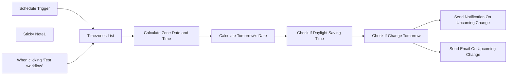

## Fluxo (.json) :

```json
{
  "id": "JIegnKLVXTkkTzfO",
  "meta": {
    "instanceId": "bdce9ec27bbe2b742054f01d034b8b468d2e7758edd716403ad5bd4583a8f649",
    "templateCredsSetupCompleted": true
  },
  "name": "Daylight Saving Time Notification",
  "tags": [],
  "nodes": [
    {
      "id": "87b11535-a9ae-49d4-a33f-b895274643e5",
      "name": "When clicking ‘Test workflow’",
      "type": "n8n-nodes-base.manualTrigger",
      "position": [
        0,
        0
      ],
      "parameters": {},
      "typeVersion": 1
    },
    {
      "id": "d1cd9157-9948-43fd-a725-2a82a21a82c6",
      "name": "Sticky Note1",
      "type": "n8n-nodes-base.stickyNote",
      "position": [
        340,
        -300
      ],
      "parameters": {
        "width": 394,
        "height": 264,
        "content": "## How it works\n- check list of timezones\n- check if any timezone switches from/to Daylight Saving Time\n- notify on Slack\n\n## Remember to set up\n- Add timezones to \"Timezones List\"\n- Slack notification channel\n"
      },
      "typeVersion": 1
    },
    {
      "id": "0f4369fc-80b6-4fd6-8533-4aacbf4c9c65",
      "name": "Timezones List",
      "type": "n8n-nodes-base.code",
      "position": [
        220,
        0
      ],
      "parameters": {
        "jsCode": "return [\n\t{\n      timezone : \"America/New_York\"\n\t},\n\t{\n      timezone : \"Europe/Warsaw\"\n\t},\n];"
      },
      "typeVersion": 2
    },
    {
      "id": "3c1e6cd7-3812-4670-a53f-7270e29574f9",
      "name": "Calculate Zone Date and Time",
      "type": "n8n-nodes-base.set",
      "position": [
        440,
        0
      ],
      "parameters": {
        "options": {},
        "assignments": {
          "assignments": [
            {
              "id": "4e9f973f-a11f-474b-89ce-dac4a77a7c68",
              "name": "datetime_zone",
              "type": "string",
              "value": "={{ $now.setZone( $json.timezone ) }}"
            }
          ]
        },
        "includeOtherFields": true
      },
      "typeVersion": 3.4
    },
    {
      "id": "7f49ac42-afcb-4552-84da-180bc65b84b0",
      "name": "Check If Daylight Saving Time",
      "type": "n8n-nodes-base.set",
      "position": [
        40,
        280
      ],
      "parameters": {
        "options": {},
        "assignments": {
          "assignments": [
            {
              "id": "4e9f973f-a11f-474b-89ce-dac4a77a7c68",
              "name": "datetime_zone_dst",
              "type": "string",
              "value": "={{ $json.datetime_zone.toDateTime().setZone($json.timezone).isInDST }}"
            },
            {
              "id": "ff13ee6d-c146-4dcb-98c4-6cb9b2474b1d",
              "name": "datetime_zone_tomorrow_dst",
              "type": "string",
              "value": "={{ $json.datetime_zone_tomorrow.toDateTime().setZone($json.timezone).isInDST }}"
            }
          ]
        },
        "includeOtherFields": true
      },
      "typeVersion": 3.4
    },
    {
      "id": "f3596b52-03af-4a07-be04-a7300fc7b239",
      "name": "Check If Change Tomorrow",
      "type": "n8n-nodes-base.if",
      "position": [
        240,
        280
      ],
      "parameters": {
        "options": {},
        "conditions": {
          "options": {
            "version": 2,
            "leftValue": "",
            "caseSensitive": true,
            "typeValidation": "loose"
          },
          "combinator": "and",
          "conditions": [
            {
              "id": "1f49e05d-d36e-4652-8ad3-b2266d750d94",
              "operator": {
                "type": "boolean",
                "operation": "notEquals"
              },
              "leftValue": "={{ $json.datetime_zone_dst }}",
              "rightValue": "={{ $json.datetime_zone_tomorrow_dst }}"
            }
          ]
        },
        "looseTypeValidation": true
      },
      "typeVersion": 2.2
    },
    {
      "id": "612e2e06-0283-4acd-8d85-cba16acb7126",
      "name": "Send Notification On Upcoming Change",
      "type": "n8n-nodes-base.slack",
      "position": [
        660,
        240
      ],
      "webhookId": "871515be-56fc-4de7-835b-119d394fea47",
      "parameters": {
        "text": "=Tomorrow is Daylight Saving Time change in zone {{ $json.timezone }} - remember to adjust meeting times!",
        "select": "channel",
        "channelId": {
          "__rl": true,
          "mode": "list",
          "value": ""
        },
        "otherOptions": {},
        "authentication": "oAuth2"
      },
      "credentials": {
        "slackOAuth2Api": {
          "id": "B0jUtT53pVAEPaQM",
          "name": "Slack Oauth"
        }
      },
      "typeVersion": 2.3
    },
    {
      "id": "d5e47ff8-d530-47ee-a98d-3a50a7054cb0",
      "name": "Calculate Tomorrow's Date",
      "type": "n8n-nodes-base.dateTime",
      "position": [
        660,
        0
      ],
      "parameters": {
        "options": {
          "includeInputFields": true
        },
        "duration": 1,
        "magnitude": "={{ $json.datetime_zone }}",
        "operation": "addToDate",
        "outputFieldName": "datetime_zone_tomorrow"
      },
      "typeVersion": 2
    },
    {
      "id": "5ae0aa75-515d-4025-901e-82693f697436",
      "name": "Schedule Trigger",
      "type": "n8n-nodes-base.scheduleTrigger",
      "position": [
        0,
        -160
      ],
      "parameters": {
        "rule": {
          "interval": [
            {}
          ]
        }
      },
      "typeVersion": 1.2
    },
    {
      "id": "e233c67c-a79b-4c96-a172-0465021d3911",
      "name": "Send Email On Upcoming Change",
      "type": "n8n-nodes-base.emailSend",
      "position": [
        660,
        420
      ],
      "webhookId": "40cc0fc1-c135-44fc-b3cb-dfec6fc1ce75",
      "parameters": {
        "text": "=Tomorrow is Daylight Saving Time change in zone {{ $json.timezone }} - remember to adjust meeting times!",
        "options": {},
        "subject": "DST change tomorrow in {{ $json.timezone }}",
        "emailFormat": "text"
      },
      "credentials": {
        "smtp": {
          "id": "tkdzDgcUAt04af3B",
          "name": "SMTP account"
        }
      },
      "typeVersion": 2.1
    }
  ],
  "active": false,
  "pinData": {},
  "settings": {
    "executionOrder": "v1"
  },
  "versionId": "7605726a-1a09-4564-b60f-aee3ac0b8c70",
  "connections": {
    "Timezones List": {
      "main": [
        [
          {
            "node": "Calculate Zone Date and Time",
            "type": "main",
            "index": 0
          }
        ]
      ]
    },
    "Schedule Trigger": {
      "main": [
        [
          {
            "node": "Timezones List",
            "type": "main",
            "index": 0
          }
        ]
      ]
    },
    "Check If Change Tomorrow": {
      "main": [
        [
          {
            "node": "Send Notification On Upcoming Change",
            "type": "main",
            "index": 0
          },
          {
            "node": "Send Email On Upcoming Change",
            "type": "main",
            "index": 0
          }
        ],
        []
      ]
    },
    "Calculate Tomorrow's Date": {
      "main": [
        [
          {
            "node": "Check If Daylight Saving Time",
            "type": "main",
            "index": 0
          }
        ]
      ]
    },
    "Calculate Zone Date and Time": {
      "main": [
        [
          {
            "node": "Calculate Tomorrow's Date",
            "type": "main",
            "index": 0
          }
        ]
      ]
    },
    "Check If Daylight Saving Time": {
      "main": [
        [
          {
            "node": "Check If Change Tomorrow",
            "type": "main",
            "index": 0
          }
        ]
      ]
    },
    "When clicking ‘Test workflow’": {
      "main": [
        [
          {
            "node": "Timezones List",
            "type": "main",
            "index": 0
          }
        ]
      ]
    }
  }
}
```

<a id="template-2331"></a>

## Template 2331 - Monitoramento de múltiplos repositórios GitHub via webhooks

- **Nome:** Monitoramento de múltiplos repositórios GitHub via webhooks
- **Descrição:** Fluxo que monitora vários repositórios GitHub simultaneamente usando webhooks, permitindo registrar e remover webhooks programaticamente e enviar notificações quando ocorrerem eventos como commits ou pull requests.
- **Funcionalidade:** • Monitoramento sem polling: Recebe eventos do GitHub por meio de webhooks em vez de usar requisições periódicas.
• Registro programático de webhooks: Registra um webhook em cada repositório configurado na lista.
• Remoção de webhooks: Busca e deleta webhooks existentes dos repositórios listados.
• Consulta de webhooks existentes: Recupera informações dos webhooks configurados em um repositório.
• Processamento de eventos GitHub: Extrai dados relevantes de eventos (repositório, autor, data, arquivos modificados, mensagem e URL do commit).
• Notificações: Envia mensagens de notificação com os detalhes do evento para serviços externos (ex.: Telegram, Slack).
• Lista de repositórios configurável: Permite adicionar/remover repositórios a serem monitorados através de uma lista editável.
• Modo de teste manual: Permite executar o fluxo manualmente para registrar webhooks em modo de teste antes de ativar o recebimento de eventos.
- **Ferramentas:** • GitHub: Plataforma usada para hospedar repositórios, gerenciar webhooks via API e enviar eventos (push, pull_request).
• Telegram: Serviço usado para envio de notificações de eventos por meio de um bot.
• Slack: Exemplo de serviço de notificação opcional para envio de mensagens formatadas.
• webhook.site: Endpoint de teste opcional usado como URL provisória para validar o recebimento de webhooks.

## Fluxo visual

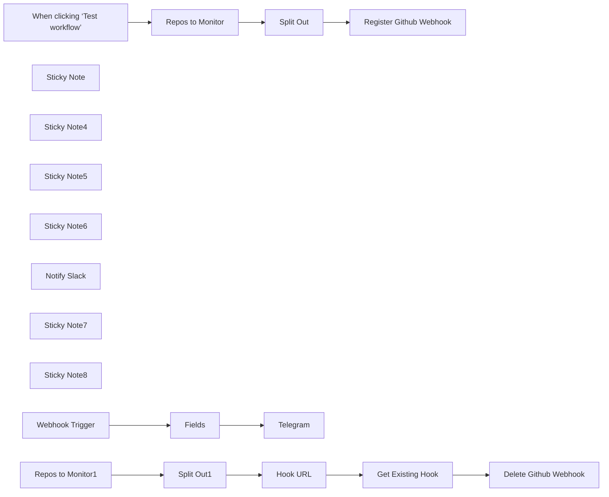

## Fluxo (.json) :

```json
{
  "meta": {
    "instanceId": "bb6a1286a4ce98dce786d6c2748b867c1252d53458c87d87fbf6824b862d4c9c"
  },
  "nodes": [
    {
      "id": "95252956-51fb-49ee-924e-df01ea27b98d",
      "name": "When clicking ‘Test workflow’",
      "type": "n8n-nodes-base.manualTrigger",
      "position": [
        60,
        340
      ],
      "parameters": {},
      "typeVersion": 1
    },
    {
      "id": "bfaaee00-7545-404b-9526-fb77726e833e",
      "name": "Sticky Note",
      "type": "n8n-nodes-base.stickyNote",
      "position": [
        -940,
        120
      ],
      "parameters": {
        "color": 5,
        "width": 819.6790739248162,
        "height": 212.7465225154412,
        "content": "# Monitor Multiple Github Repos\nThis workflow allows you to monitor multiple Github repos simultaneously without polling due to use of Webhooks. It programmatically allows for adding and deleting of repos to your watchlist to make management convenient.\n\n"
      },
      "typeVersion": 1
    },
    {
      "id": "d1075f59-356e-47c4-9f85-c9067127d70f",
      "name": "Split Out",
      "type": "n8n-nodes-base.splitOut",
      "position": [
        380,
        340
      ],
      "parameters": {
        "options": {},
        "fieldToSplitOut": "repos"
      },
      "typeVersion": 1
    },
    {
      "id": "7d2a3226-e3b1-4cab-91e2-01f60c1184cb",
      "name": "Register Github Webhook",
      "type": "n8n-nodes-base.httpRequest",
      "position": [
        540,
        340
      ],
      "parameters": {
        "url": "={{$json.repos.replace('https://github.com','https://api.github.com/repos')}}/hooks",
        "method": "POST",
        "options": {},
        "jsonBody": "{\"name\":\"web\",\"active\":true,\"events\":[\"push\",\"pull_request\"],\"config\":{\"url\":\"https://webhook.site/d53d7bb9-72f5-4743-af4d-15c86f811492\",\"content_type\":\"json\",\"insecure_ssl\":\"0\"}}",
        "sendBody": true,
        "sendHeaders": true,
        "specifyBody": "json",
        "authentication": "genericCredentialType",
        "genericAuthType": "httpHeaderAuth",
        "headerParameters": {
          "parameters": [
            {
              "name": "Accept",
              "value": "application/vnd.github+json"
            },
            {
              "name": "X-GitHub-Api-Version",
              "value": "2022-11-28"
            }
          ]
        }
      },
      "credentials": {
        "httpHeaderAuth": {
          "id": "A8NIXOiG7JTWqrUI",
          "name": "Header Auth account"
        }
      },
      "typeVersion": 4.2
    },
    {
      "id": "c1b8a02b-38fd-43d1-b14b-18de6d84b729",
      "name": "Split Out1",
      "type": "n8n-nodes-base.splitOut",
      "position": [
        400,
        760
      ],
      "parameters": {
        "options": {},
        "fieldToSplitOut": "repos"
      },
      "typeVersion": 1
    },
    {
      "id": "35c3e7e0-50c8-4660-8e89-46849da751a9",
      "name": "Delete Github Webhook",
      "type": "n8n-nodes-base.httpRequest",
      "position": [
        900,
        760
      ],
      "parameters": {
        "url": "={{ $json.url }}",
        "method": "DELETE",
        "options": {},
        "sendHeaders": true,
        "authentication": "genericCredentialType",
        "genericAuthType": "httpHeaderAuth",
        "headerParameters": {
          "parameters": [
            {
              "name": "Accept",
              "value": "application/vnd.github+json"
            },
            {
              "name": "X-GitHub-Api-Version",
              "value": "2022-11-28"
            }
          ]
        }
      },
      "credentials": {
        "httpHeaderAuth": {
          "id": "A8NIXOiG7JTWqrUI",
          "name": "Header Auth account"
        }
      },
      "typeVersion": 4.2
    },
    {
      "id": "8eeb818d-9ac3-48bb-9a85-7099216bb243",
      "name": "Sticky Note4",
      "type": "n8n-nodes-base.stickyNote",
      "position": [
        160,
        680
      ],
      "parameters": {
        "width": 858.0344141951173,
        "height": 279.85434264975174,
        "content": "## Delete All Webhooks"
      },
      "typeVersion": 1
    },
    {
      "id": "eb1a649a-8408-4e2f-a0a4-b9761ba8565b",
      "name": "Sticky Note5",
      "type": "n8n-nodes-base.stickyNote",
      "position": [
        167.0254479998971,
        260
      ],
      "parameters": {
        "width": 848.6550531504272,
        "height": 283.2561904154995,
        "content": "## Register Webhooks"
      },
      "typeVersion": 1
    },
    {
      "id": "3053ad9f-2756-4518-b17e-56a4ba8a287f",
      "name": "Sticky Note6",
      "type": "n8n-nodes-base.stickyNote",
      "position": [
        160,
        1060
      ],
      "parameters": {
        "width": 858.0344141951173,
        "height": 279.85434264975174,
        "content": "## Handle Github Event"
      },
      "typeVersion": 1
    },
    {
      "id": "6aca0ef9-a8d7-4e8a-a875-a0f46c624cc7",
      "name": "Fields",
      "type": "n8n-nodes-base.set",
      "position": [
        280,
        1180
      ],
      "parameters": {
        "options": {},
        "assignments": {
          "assignments": [
            {
              "id": "8dc55086-d1f5-4074-ba38-3ae6b477773c",
              "name": "repo",
              "type": "string",
              "value": "={{ $json.body.repository.full_name}}"
            },
            {
              "id": "384fc78d-0125-4cbc-83f0-a4d67194beee",
              "name": "repo_avatar",
              "type": "string",
              "value": "={{ $json.body.repository.owner.avatar_url }}"
            },
            {
              "id": "537313d4-074c-454e-b57f-0f952b1a590c",
              "name": "date",
              "type": "string",
              "value": "={{ $json.body.commits[0].timestamp }}"
            },
            {
              "id": "34bcccc2-cad4-4306-ad54-b3685d7bc896",
              "name": "author",
              "type": "string",
              "value": "={{ $json.body.commits[0].author.name }} ({{ $json.body.commits[0].author.username }})"
            },
            {
              "id": "c22e9ca3-9dbc-4f01-96e2-f914bd4230a1",
              "name": "modified_files",
              "type": "string",
              "value": "={{ $json.body.commits[0].modified.join(', ') }}"
            },
            {
              "id": "c17f33cf-0d27-4813-8f35-7cd276245a8b",
              "name": "url",
              "type": "string",
              "value": "={{ $json.body.commits[0].url }}"
            },
            {
              "id": "4b23a64e-2acc-476c-a36b-936c32360e67",
              "name": "description",
              "type": "string",
              "value": "={{ $json.body.commits[0].message }}"
            }
          ]
        }
      },
      "typeVersion": 3.4
    },
    {
      "id": "72f1ac3f-4277-481d-bbc7-c5137e7ef431",
      "name": "Notify Slack",
      "type": "n8n-nodes-base.slack",
      "disabled": true,
      "position": [
        640,
        1060
      ],
      "parameters": {
        "text": "=[Github Event] {{ $json.date }}: {{ $json.author }} committed to {{ $json.repo }}!\n\nDescription:\n```{{ $json.description }}```\n\nModified Files:\n```{{ $json.modified_files }}```\n{{ $json.url }}",
        "select": "channel",
        "channelId": {
          "__rl": true,
          "mode": "id",
          "value": "="
        },
        "otherOptions": {
          "mrkdwn": true,
          "sendAsUser": "Github Bot",
          "includeLinkToWorkflow": false
        }
      },
      "typeVersion": 2.1
    },
    {
      "id": "85ec09d2-fccb-4669-80d1-ba3bb7ce3544",
      "name": "Telegram",
      "type": "n8n-nodes-base.telegram",
      "position": [
        640,
        1260
      ],
      "parameters": {
        "text": "=*[Github Event] @* `{{ $json.date }}`: \n`{{ $json.author }}` committed to `{{ $json.repo }}`!\n\nDescription:\n```{{ $json.description }}```\n\nModified Files:\n```{{ $json.modified_files }}```\n{{ $json.url }}",
        "replyMarkup": "inlineKeyboard",
        "additionalFields": {}
      },
      "credentials": {
        "telegramApi": {
          "id": "lulhyqZvExuxci8F",
          "name": "Telegram account"
        }
      },
      "typeVersion": 1.2
    },
    {
      "id": "1f57a9cb-7061-4679-97ce-081746acfd55",
      "name": "Repos to Monitor",
      "type": "n8n-nodes-base.set",
      "position": [
        220,
        340
      ],
      "parameters": {
        "mode": "raw",
        "options": {},
        "jsonOutput": "{\n  \"repos\":[\n    \"https://github.com/arose26/testrepo2\",\n    \"https://github.com/arose26/testrepo3\"\n    \n  ]\n}\n"
      },
      "typeVersion": 3.4
    },
    {
      "id": "6a83a757-673b-4ffc-9f91-54e5a24b8437",
      "name": "Sticky Note7",
      "type": "n8n-nodes-base.stickyNote",
      "position": [
        -640,
        1180
      ],
      "parameters": {
        "color": 4,
        "width": 520.7636244130189,
        "height": 381.80326328628485,
        "content": "## Test\n## 1. Register Webhooks\n- In `Repos to Monitor`, add any repo you want to monitor changes for. \n- Disable `Webhook Trigger`, Click `Test Workflow` and if your Github credentials were set correctly, it will automatically register the webhooks. - You can test this by running the single node `Get Existing Webhook` and confirming it outputs the repo addresses.\n## 2. Handle Github Events\n- Now that you have registered the webhooks, reenable `Webhook Trigger` and activate the workflow.\n- Make a commit to any of the registered repos.\n- Confirm that the notification went through.\n*That's it!*\n"
      },
      "typeVersion": 1
    },
    {
      "id": "cb204806-1f7d-494a-9e0f-340b56d2dcd5",
      "name": "Sticky Note8",
      "type": "n8n-nodes-base.stickyNote",
      "position": [
        -940,
        440
      ],
      "parameters": {
        "color": 4,
        "width": 821.1807025349485,
        "height": 693.4508863847356,
        "content": "## Setup\n## 1. Creating Credentials on Github\n#### Generate a personal access token on github by following these esteps;\n- Right hand side of page -> Settings -> scroll to bottom -> Developer Settings > Personal Access Token > Tokens (classic) > Generate New Token\n- Give scopes:\n   *admin:repo_hook*\n   *repo* (if you want to use it for your own private repo)\n\nif you need more help, see here:\nhttps://docs.github.com/en/authentication/keeping-your-account-and-data-secure/managing-your-personal-access-tokens\n\n## 2. Setting Credentials in n8n\nIn `Register Github Webhook`\n*Authenticaion > Generic Credential Type*\n*Generic Auth Type > Header Auth*\n*Header Auth > Create New Credential* with Name set to *'Authorization'* and Value set to *'Bearer <YOUR GITHUB TOKEN HERE>'*.\n(You can reuse this for `Delete Github Webhook` and `Get Existing Webhooks`).\nNow in `Register Github Webhook`, scroll down to Send Body > JSON and inside the JSON, change the value of *\"url\"* to the webhook address given as Production URL in the node `Webhook Trigger`.\n\n\n## 3. Notification settings\nIn the third row, link up the Webhook Trigger to any API of your choice. Slack and Telegram are given as examples.\nYou can also format the notification message as you wish.\n\n"
      },
      "typeVersion": 1
    },
    {
      "id": "28bd218b-7dfb-460e-a2a8-012af08835cd",
      "name": "Webhook Trigger",
      "type": "n8n-nodes-base.webhook",
      "position": [
        40,
        1180
      ],
      "webhookId": "e90c3560-2c95-4e7e-9df3-2d084d7e8fde",
      "parameters": {
        "path": "e90c3560-2c95-4e7e-9df3-2d084d7e8fde",
        "options": {},
        "httpMethod": "POST"
      },
      "typeVersion": 2
    },
    {
      "id": "b68dff7d-f7ee-47dc-b360-08d9ea2d7f42",
      "name": "Repos to Monitor1",
      "type": "n8n-nodes-base.set",
      "position": [
        240,
        760
      ],
      "parameters": {
        "mode": "raw",
        "options": {},
        "jsonOutput": "{\n  \"repos\":[\n     \"https://github.com/arose26/testrepo\",\n    \"https://github.com/arose26/testrepo2\",\n    \"https://github.com/arose26/testrepo3\"\n    \n  ]\n}\n"
      },
      "typeVersion": 3.4
    },
    {
      "id": "39dd7062-bb85-4f95-90f7-47fe27a257c8",
      "name": "Get Existing Hook",
      "type": "n8n-nodes-base.httpRequest",
      "position": [
        740,
        760
      ],
      "parameters": {
        "url": "={{ $json.url }}",
        "options": {},
        "sendHeaders": true,
        "authentication": "genericCredentialType",
        "genericAuthType": "httpHeaderAuth",
        "headerParameters": {
          "parameters": [
            {
              "name": "Accept",
              "value": "application/vnd.github+json"
            },
            {
              "name": "X-GitHub-Api-Version",
              "value": "2022-11-28"
            }
          ]
        }
      },
      "credentials": {
        "httpHeaderAuth": {
          "id": "A8NIXOiG7JTWqrUI",
          "name": "Header Auth account"
        }
      },
      "typeVersion": 4.2,
      "alwaysOutputData": false
    },
    {
      "id": "6d092a2f-ba48-4b0f-a772-4f55ba761d64",
      "name": "Hook URL",
      "type": "n8n-nodes-base.set",
      "position": [
        560,
        760
      ],
      "parameters": {
        "options": {},
        "assignments": {
          "assignments": [
            {
              "id": "b90c27f3-b81a-4098-9cd8-7934880d78a7",
              "name": "url",
              "type": "string",
              "value": "=https://api.github.com/repos/{{ $json.repos.replace('https://github.com/','')}}/hooks"
            }
          ]
        }
      },
      "typeVersion": 3.4
    }
  ],
  "pinData": {},
  "connections": {
    "Fields": {
      "main": [
        [
          {
            "node": "Telegram",
            "type": "main",
            "index": 0
          }
        ]
      ]
    },
    "Hook URL": {
      "main": [
        [
          {
            "node": "Get Existing Hook",
            "type": "main",
            "index": 0
          }
        ]
      ]
    },
    "Split Out": {
      "main": [
        [
          {
            "node": "Register Github Webhook",
            "type": "main",
            "index": 0
          }
        ]
      ]
    },
    "Split Out1": {
      "main": [
        [
          {
            "node": "Hook URL",
            "type": "main",
            "index": 0
          }
        ]
      ]
    },
    "Webhook Trigger": {
      "main": [
        [
          {
            "node": "Fields",
            "type": "main",
            "index": 0
          }
        ]
      ]
    },
    "Repos to Monitor": {
      "main": [
        [
          {
            "node": "Split Out",
            "type": "main",
            "index": 0
          }
        ]
      ]
    },
    "Get Existing Hook": {
      "main": [
        [
          {
            "node": "Delete Github Webhook",
            "type": "main",
            "index": 0
          }
        ]
      ]
    },
    "Repos to Monitor1": {
      "main": [
        [
          {
            "node": "Split Out1",
            "type": "main",
            "index": 0
          }
        ]
      ]
    },
    "When clicking ‘Test workflow’": {
      "main": [
        [
          {
            "node": "Repos to Monitor",
            "type": "main",
            "index": 0
          }
        ]
      ]
    }
  }
}
```

<a id="template-2333"></a>

## Template 2333 - Carregar contatos em planilha

- **Nome:** Carregar contatos em planilha
- **Descrição:** Extrai contatos de um CRM de exemplo, formata nome e email e adiciona as linhas em uma planilha ou base de dados.
- **Funcionalidade:** • Execução manual: Inicia o fluxo mediante acionamento manual para carregar dados sob demanda.
• Simulação/obtenção de contatos: Recupera registros de contatos (dados de exemplo do CRM) com propriedades como firstname, lastname e identity-profiles.
• Transformação de dados: Concatena firstname e lastname em um campo "Name" e extrai o email primário em um campo "Email", mantendo apenas os campos definidos para exportação.
• Inserção em destino: Prepara os registros transformados para serem acrescentados como novas linhas em uma planilha ou base externa (operação de append).
- **Ferramentas:** • HubSpot CRM: Fonte dos dados de contato de onde são obtidas propriedades como nome e email (exemplo de dados usados).
• Planilha / Airtable / Banco de Dados: Destino onde os registros transformados são adicionados como novas linhas (operação de anexar/append).

## Fluxo visual

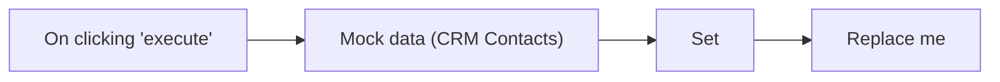

## Fluxo (.json) :

```json
{
  "id": "1028",
  "name": "Loading data into a spreadsheet",
  "nodes": [
    {
      "name": "On clicking 'execute'",
      "type": "n8n-nodes-base.manualTrigger",
      "position": [
        160,
        300
      ],
      "parameters": {},
      "typeVersion": 1
    },
    {
      "name": "Set",
      "type": "n8n-nodes-base.set",
      "position": [
        650,
        300
      ],
      "parameters": {
        "values": {
          "string": [
            {
              "name": "Name",
              "value": "={{$json[\"properties\"][\"firstname\"][\"value\"]}} {{$json[\"properties\"][\"lastname\"][\"value\"]}}"
            },
            {
              "name": "Email",
              "value": "={{$json[\"identity-profiles\"][0][\"identities\"][0][\"value\"]}}"
            }
          ]
        },
        "options": {},
        "keepOnlySet": true
      },
      "typeVersion": 1
    },
    {
      "name": "Mock data (CRM Contacts)",
      "type": "n8n-nodes-base.function",
      "notes": "\"Get contacts\" data from Hubspot node. ",
      "position": [
        400,
        300
      ],
      "parameters": {
        "functionCode": "var newItems = [];\nnewItems.push({json:{\n    \"addedAt\": 1606827045601,\n    \"vid\": 1,\n    \"canonical-vid\": 1,\n    \"merged-vids\": [],\n    \"portal-id\": 8924380,\n    \"is-contact\": true,\n    \"profile-token\": \"AO_T-mMZqmgHPI5CLLlw2qE24AlgWOJUL0LdMb2CegxeMzQK1LXyh7iZAgjNd-00ZdPAfnFU9Lv_7nq6qlrKvfAh8hr_cw-VBH1RCCMgHHYQ06DOXoIGAlViWmMKY-0lF9dv7lBVOMf5\",\n    \"profile-url\": \"https://app.hubspot.com/contacts/8924380/contact/1\",\n    \"properties\": {\n      \"firstname\": {\n        \"value\": \"Maria\"\n      },\n      \"lastmodifieddate\": {\n        \"value\": \"1606827057310\"\n      },\n      \"company\": {\n        \"value\": \"HubSpot\"\n      },\n      \"lastname\": {\n        \"value\": \"Johnson (Sample Contact)\"\n      }\n    },\n    \"form-submissions\": [],\n    \"identity-profiles\": [\n      {\n        \"vid\": 1,\n        \"saved-at-timestamp\": 1606827045478,\n        \"deleted-changed-timestamp\": 0,\n        \"identities\": [\n          {\n            \"type\": \"EMAIL\",\n            \"value\": \"emailmaria@hubspot.com\",\n            \"timestamp\": 1606827045444,\n            \"is-primary\": true\n          },\n          {\n            \"type\": \"LEAD_GUID\",\n            \"value\": \"cfa8b21f-164e-4c9a-aab1-1235c81a7d26\",\n            \"timestamp\": 1606827045475\n          }\n        ]\n      }\n    ],\n    \"merge-audits\": []\n  }});\nnewItems.push({json:{\n    \"addedAt\": 1606827045834,\n    \"vid\": 51,\n    \"canonical-vid\": 51,\n    \"merged-vids\": [],\n    \"portal-id\": 8924380,\n    \"is-contact\": true,\n    \"profile-token\": \"AO_T-mMX1jbZjaachMJ8t1F2yRdvyAvsir5RMvooW7XjbPZTdAv8hc24U0Rnc_PDF1gp1qmc8Tg2hDytOaRXRiWVyg-Eg8rbPFEiXNdU6jfMneow46tsSiQH1yyRf03mMi5ALZXMVfyA\",\n    \"profile-url\": \"https://app.hubspot.com/contacts/8924380/contact/51\",\n    \"properties\": {\n      \"firstname\": {\n        \"value\": \"Brian\"\n      },\n      \"lastmodifieddate\": {\n        \"value\": \"1606827060106\"\n      },\n      \"company\": {\n        \"value\": \"HubSpot\"\n      },\n      \"lastname\": {\n        \"value\": \"Halligan (Sample Contact)\"\n      }\n    },\n    \"form-submissions\": [],\n    \"identity-profiles\": [\n      {\n        \"vid\": 51,\n        \"saved-at-timestamp\": 1606827045720,\n        \"deleted-changed-timestamp\": 0,\n        \"identities\": [\n          {\n            \"type\": \"EMAIL\",\n            \"value\": \"bh@hubspot.com\",\n            \"timestamp\": 1606827045444,\n            \"is-primary\": true\n          },\n          {\n            \"type\": \"LEAD_GUID\",\n            \"value\": \"d3749acc-06e1-4511-84fd-7b0d847f6eff\",\n            \"timestamp\": 1606827045717\n          }\n        ]\n      }\n    ],\n    \"merge-audits\": []\n  } });\nreturn newItems;"
      },
      "notesInFlow": true,
      "typeVersion": 1
    },
    {
      "name": "Replace me",
      "type": "n8n-nodes-base.noOp",
      "notes": "Google Sheet/ Airtable/ Database with an \"append\" or \"Add row\" operation",
      "position": [
        910,
        300
      ],
      "parameters": {},
      "notesInFlow": true,
      "typeVersion": 1
    }
  ],
  "active": false,
  "settings": {},
  "connections": {
    "Set": {
      "main": [
        [
          {
            "node": "Replace me",
            "type": "main",
            "index": 0
          }
        ]
      ]
    },
    "On clicking 'execute'": {
      "main": [
        [
          {
            "node": "Mock data (CRM Contacts)",
            "type": "main",
            "index": 0
          }
        ]
      ]
    },
    "Mock data (CRM Contacts)": {
      "main": [
        [
          {
            "node": "Set",
            "type": "main",
            "index": 0
          }
        ]
      ]
    }
  }
}
```

<a id="template-2334"></a>

## Template 2334 - Criação de cliente na Chargebee

- **Nome:** Criação de cliente na Chargebee
- **Descrição:** Fluxo que cria um novo cliente na Chargebee a partir de um acionamento manual.
- **Funcionalidade:** • Gatilho manual: inicia o fluxo quando o usuário clica em executar.
• Criação de cliente: envia informações (primeiro nome e sobrenome) para criar um novo registro de cliente.
• Autenticação de API: utiliza credenciais configuradas para autenticar a requisição à plataforma.
- **Ferramentas:** • Chargebee: Plataforma de gestão de assinaturas e faturamento para criação e gerenciamento de clientes via API.

## Fluxo visual


## Fluxo (.json) :

```json
{
  "id": "103",
  "name": "Create a new customer in Chargebee",
  "nodes": [
    {
      "name": "On clicking 'execute'",
      "type": "n8n-nodes-base.manualTrigger",
      "position": [
        250,
        300
      ],
      "parameters": {},
      "typeVersion": 1
    },
    {
      "name": "Chargebee",
      "type": "n8n-nodes-base.chargebee",
      "position": [
        460,
        300
      ],
      "parameters": {
        "resource": "customer",
        "properties": {
          "last_name": "",
          "first_name": ""
        }
      },
      "credentials": {
        "chargebeeApi": ""
      },
      "typeVersion": 1
    }
  ],
  "active": false,
  "settings": {},
  "connections": {
    "On clicking 'execute'": {
      "main": [
        [
          {
            "node": "Chargebee",
            "type": "main",
            "index": 0
          }
        ]
      ]
    }
  }
}
```

<a id="template-2336"></a>

## Template 2336 - Teste comparativo de LLMs locais

- **Nome:** Teste comparativo de LLMs locais
- **Descrição:** Fluxo que recebe prompts via chat, executa múltiplos modelos locais hospedados no LM Studio, analisa métricas de resposta (legibilidade, contagens e tempos) e registra os resultados para comparação.
- **Funcionalidade:** • Recepção de mensagem de chat: inicia o processo a partir de um input do usuário.
• Consulta de modelos carregados: obtém a lista de modelos ativos no servidor local de LLMs.
• Extração e execução por modelo: separa os IDs dos modelos e executa cada modelo com entradas dinâmicas.
• Inserção de system prompt: adiciona um prompt de sistema para orientar concisão e nível de leitura das respostas.
• Captura de tempos: registra o tempo de início e fim de cada execução e calcula a diferença.
• Análise de respostas textuais: calcula contagem de palavras, contagem de sentenças, comprimento médio de palavras, comprimento médio de sentenças e pontuação de legibilidade (Flesch-Kincaid aproximada).
• Preparação de dados: organiza e mapeia os campos (prompt, modelo, tempos, métricas) para saída.
• Armazenamento dos resultados: grava as análises e metadados em uma planilha para posterior revisão.
• Configuração de parâmetros de geração: permite ajustar temperatura, top_p e presence penalty para controlar o comportamento dos modelos.
- **Ferramentas:** • LM Studio (servidor local de modelos): hospeda e serve múltiplos LLMs via API compatível para listar modelos e gerar respostas.
• Google Sheets: utilizado para registrar prompts, respostas, métricas de análise e tempos de execução para acompanhamento e comparação.


## Fluxo visual

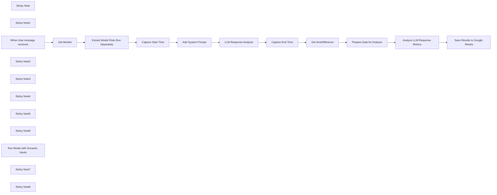

## Fluxo (.json) :

```json
{
  "id": "WulUYgcXvako9hBy",
  "meta": {
    "instanceId": "d6b86682c7e02b79169c1a61ad0484dcda5bc8b0ea70f1a95dac239c2abfd057",
    "templateCredsSetupCompleted": true
  },
  "name": "Testing Mulitple Local LLM with LM Studio",
  "tags": [
    {
      "id": "RkTiZTdbLvr6uzSg",
      "name": "Training",
      "createdAt": "2024-06-18T16:09:35.806Z",
      "updatedAt": "2024-06-18T16:09:35.806Z"
    },
    {
      "id": "W3xdiSeIujD7XgBA",
      "name": "Template",
      "createdAt": "2024-06-18T22:15:34.874Z",
      "updatedAt": "2024-06-18T22:15:34.874Z"
    }
  ],
  "nodes": [
    {
      "id": "08c457ef-5c1f-46d8-a53e-f492b11c83f9",
      "name": "Sticky Note",
      "type": "n8n-nodes-base.stickyNote",
      "position": [
        1600,
        420
      ],
      "parameters": {
        "color": 6,
        "width": 478.38709677419376,
        "height": 347.82258064516134,
        "content": "## 🧠Text Analysis\n### Readability Score Ranges:\nWhen testing model responses, readability scores can range across different levels. Here’s a breakdown:\n\n- **90–100**: Very easy to read (5th grade or below)\n- **80–89**: Easy to read (6th grade)\n- **70–79**: Fairly easy to read (7th grade)\n- **60–69**: Standard (8th to 9th grade)\n- **50–59**: Fairly difficult (10th to 12th grade)\n- **30–49**: Difficult (College)\n- **0–29**: Very difficult (College graduate)\n- **Below 0**: Extremely difficult (Post-graduate level)\n"
      },
      "typeVersion": 1
    },
    {
      "id": "7801734c-5eb9-4abd-b234-e406462931f7",
      "name": "Get Models",
      "type": "n8n-nodes-base.httpRequest",
      "onError": "continueErrorOutput",
      "position": [
        20,
        180
      ],
      "parameters": {
        "url": "http://192.168.1.179:1234/v1/models",
        "options": {
          "timeout": 10000,
          "allowUnauthorizedCerts": false
        }
      },
      "typeVersion": 4.2
    },
    {
      "id": "5ee93d9a-ad2e-4ea9-838e-2c12a168eae6",
      "name": "Sticky Note1",
      "type": "n8n-nodes-base.stickyNote",
      "position": [
        -140,
        -100
      ],
      "parameters": {
        "width": 377.6129032258063,
        "height": 264.22580645161304,
        "content": "## ⚙️ 2. Update Local IP\nUpdate the **'Base URL'** `http://192.168.1.1:1234/v1/models` in the workflow to match the IP of your LM Studio server. (Running LM Server)[https://lmstudio.ai/docs/basics/server]\n\nThis node will query the LM Studio server to retrieve a list of all loaded model IDs at the time of the query. If you change or add models to LM Studio, you’ll need to rerun this node to get an updated list of active LLMs.\n"
      },
      "typeVersion": 1
    },
    {
      "id": "f2b6a6ed-0ef1-4f2c-8350-9abd59d08e61",
      "name": "When chat message received",
      "type": "@n8n/n8n-nodes-langchain.chatTrigger",
      "position": [
        -300,
        180
      ],
      "webhookId": "39c3c6d5-ea06-4faa-b0e3-4e77a05b0297",
      "parameters": {
        "options": {}
      },
      "typeVersion": 1.1
    },
    {
      "id": "dbaf0ad1-9027-4317-a996-33a3fcc9e258",
      "name": "Sticky Note2",
      "type": "n8n-nodes-base.stickyNote",
      "position": [
        -740,
        200
      ],
      "parameters": {
        "width": 378.75806451612857,
        "height": 216.12903225806457,
        "content": "## 🛠️1. Setup - LM Studio\nFirst, download and install [LM Studio](https://lmstudio.ai/). Identify which LLM models you want to use for testing.\n\nNext, the selected models are loaded into the server capabilities to prepare them for testing. For a detailed guide on how to set up multiple models, refer to the [LM Studio Basics](https://lmstudio.ai/docs/basics) documentation.\n"
      },
      "typeVersion": 1
    },
    {
      "id": "36770fd1-7863-4c42-a68d-8d240ae3683b",
      "name": "Sticky Note3",
      "type": "n8n-nodes-base.stickyNote",
      "position": [
        360,
        400
      ],
      "parameters": {
        "width": 570.0000000000002,
        "height": 326.0645161290325,
        "content": "## 3. 💡Update the LM Settings\n\nFrom here, you can modify the following\n parameters to fine-tune model behavior:\n\n- **Temperature**: Controls randomness. Higher values (e.g., 1.0) produce more diverse results, while lower values (e.g., 0.2) make responses more focused and deterministic.\n- **Top P**: Adjusts nucleus sampling, where the model considers only a subset of probable tokens. A lower value (e.g., 0.5) narrows the response range.\n- **Presence Penalty**: Penalizes new tokens based on their presence in the input, encouraging the model to generate more varied responses.\n"
      },
      "typeVersion": 1
    },
    {
      "id": "6b36f094-a3bf-4ff7-9385-4f7a2c80d54f",
      "name": "Get timeDifference",
      "type": "n8n-nodes-base.dateTime",
      "position": [
        1600,
        160
      ],
      "parameters": {
        "endDate": "={{ $json.endDateTime }}",
        "options": {},
        "operation": "getTimeBetweenDates",
        "startDate": "={{ $('Capture Start Time').item.json.startDateTime }}"
      },
      "typeVersion": 2
    },
    {
      "id": "a0b8f29d-2f2f-4fcf-a54a-dff071e321e5",
      "name": "Sticky Note4",
      "type": "n8n-nodes-base.stickyNote",
      "position": [
        1900,
        -260
      ],
      "parameters": {
        "width": 304.3225806451618,
        "height": 599.7580645161281,
        "content": "## 📊4. Create Google Sheet (Optional)\n1. First, create a Google Sheet with the following headers:\n - Prompt\n - Time Sent\n - Time Received\n - Total Time Spent\n - Model\n - Response\n - Readability Score\n - Average Word Length\n - Word Count\n - Sentence Count\n - Average Sentence Length\n2. After creating the sheet, update the corresponding Google Sheets node in the workflow to map the data fields correctly.\n"
      },
      "typeVersion": 1
    },
    {
      "id": "d376a5fb-4e07-42a3-aa0c-8ccc1b9feeb7",
      "name": "Sticky Note5",
      "type": "n8n-nodes-base.stickyNote",
      "position": [
        -760,
        -200
      ],
      "parameters": {
        "color": 5,
        "width": 359.2903225806448,
        "height": 316.9032258064518,
        "content": "## 🏗️Setup Steps\n1. **Download and Install LM Studio**: Ensure LM Studio is correctly installed on your machine.\n2. **Update the Base URL**: Replace the base URL with the IP address of your LLM instance. Ensure the connection is established.\n3. **Configure LLM Settings**: Verify that your LLM models are properly set up and configured in LM Studio.\n4. **Create a Google Sheet**: Set up a Google Sheet with the necessary headers (Prompt, Time Sent, Time Received, etc.) to track your testing results.\n"
      },
      "typeVersion": 1
    },
    {
      "id": "b21cad30-573e-4adf-a1d0-f34cf9628819",
      "name": "Sticky Note6",
      "type": "n8n-nodes-base.stickyNote",
      "position": [
        560,
        -160
      ],
      "parameters": {
        "width": 615.8064516129025,
        "height": 272.241935483871,
        "content": "## 📖Prompting Multiple LLMs\n\nWhen testing for specific outcomes (such as conciseness or readability), you can add a **System Prompt** in the LLM Chain to guide the models' responses.\n\n**System Prompt Suggestion**:\n- Focus on ensuring that responses are concise, clear, and easily understandable by a 5th-grade reading level. \n- This prompt will help you compare models based on how well they meet readability standards and stay on point.\n \nAdjust the prompt to fit your desired testing criteria.\n"
      },
      "typeVersion": 1
    },
    {
      "id": "dd5f7e7b-bc69-4b67-90e6-2077b6b93148",
      "name": "Run Model with Dunamic Inputs",
      "type": "@n8n/n8n-nodes-langchain.lmChatOpenAi",
      "position": [
        1020,
        400
      ],
      "parameters": {
        "model": "={{ $node['Extract Model IDsto Run Separately'].json.id }}",
        "options": {
          "topP": 1,
          "baseURL": "http://192.168.1.179:1234/v1",
          "timeout": 250000,
          "temperature": 1,
          "presencePenalty": 0
        }
      },
      "credentials": {
        "openAiApi": {
          "id": "LBE5CXY4yeWrZCsy",
          "name": "OpenAi account"
        }
      },
      "typeVersion": 1
    },
    {
      "id": "a0ee6c9a-cf76-4633-9c43-a7dc10a1f73e",
      "name": "Analyze LLM Response Metrics",
      "type": "n8n-nodes-base.code",
      "position": [
        2000,
        160
      ],
      "parameters": {
        "jsCode": "// Get the input data from n8n\nconst inputData = items.map(item => item.json);\n\n// Function to count words in a string\nfunction countWords(text) {\n return text.trim().split(/\\s+/).length;\n}\n\n// Function to count sentences in a string\nfunction countSentences(text) {\n const sentences = text.match(/[^.!?]+[.!?]+/g) || [];\n return sentences.length;\n}\n\n// Function to calculate average sentence length\nfunction averageSentenceLength(text) {\n const sentences = text.match(/[^.!?]+[.!?]+/g) || [];\n const sentenceLengths = sentences.map(sentence => sentence.trim().split(/\\s+/).length);\n const totalWords = sentenceLengths.reduce((acc, val) => acc + val, 0);\n return sentenceLengths.length ? (totalWords / sentenceLengths.length) : 0;\n}\n\n// Function to calculate average word length\nfunction averageWordLength(text) {\n const words = text.trim().split(/\\s+/);\n const totalCharacters = words.reduce((acc, word) => acc + word.length, 0);\n return words.length ? (totalCharacters / words.length) : 0;\n}\n\n// Function to calculate Flesch-Kincaid Readability Score\nfunction fleschKincaidReadability(text) {\n // Split text into sentences (approximate)\n const sentences = text.match(/[^.!?]+[.!?]*[\\n]*/g) || [];\n // Split text into words\n const words = text.trim().split(/\\s+/);\n // Estimate syllable count by matching vowel groups\n const syllableCount = (text.toLowerCase().match(/[aeiouy]{1,2}/g) || []).length;\n\n const sentenceCount = sentences.length;\n const wordCount = words.length;\n\n // Avoid division by zero\n if (wordCount === 0 || sentenceCount === 0) return 0;\n\n const averageWordsPerSentence = wordCount / sentenceCount;\n const averageSyllablesPerWord = syllableCount / wordCount;\n\n // Flesch-Kincaid formula\n return 206.835 - (1.015 * averageWordsPerSentence) - (84.6 * averageSyllablesPerWord);\n}\n\n\n// Prepare the result array for n8n output\nconst resultArray = [];\n\n// Loop through the input data and analyze each LLM response\ninputData.forEach(item => {\n const llmResponse = item.llm_response;\n\n // Perform the analyses\n const wordCount = countWords(llmResponse);\n const sentenceCount = countSentences(llmResponse);\n const avgSentenceLength = averageSentenceLength(llmResponse);\n const readabilityScore = fleschKincaidReadability(llmResponse);\n const avgWordLength = averageWordLength(llmResponse);\n\n // Structure the output to include original input and new calculated values\n resultArray.push({\n json: {\n llm_response: item.llm_response,\n prompt: item.prompt,\n model: item.model,\n start_time: item.start_time,\n end_time: item.end_time,\n time_diff: item.time_diff,\n word_count: wordCount,\n sentence_count: sentenceCount,\n average_sent_length: avgSentenceLength,\n readability_score: readabilityScore,\n average_word_length: avgWordLength\n }\n });\n});\n\n// Return the result array to n8n\nreturn resultArray;\n"
      },
      "typeVersion": 2
    },
    {
      "id": "adef5d92-cb7e-417e-acbb-1a5d6c26426a",
      "name": "Save Results to Google Sheets",
      "type": "n8n-nodes-base.googleSheets",
      "position": [
        2180,
        160
      ],
      "parameters": {
        "columns": {
          "value": {
            "Model": "={{ $('Extract Model IDsto Run Separately').item.json.id }}",
            "Prompt": "={{ $json.prompt }}",
            "Response ": "={{ $('LLM Response Analysis').item.json.text }}",
            "TIme Sent": "={{ $json.start_time }}",
            "Word_count": "={{ $json.word_count }}",
            "Sentence_count": "={{ $json.sentence_count }}",
            "Time Recieved ": "={{ $json.end_time }}",
            "Total TIme spent ": "={{ $json.time_diff }}",
            "readability_score": "={{ $json.readability_score }}",
            "Average_sent_length": "={{ $json.average_sent_length }}",
            "average_word_length": "={{ $json.average_word_length }}"
          },
          "schema": [
            {
              "id": "Prompt",
              "type": "string",
              "display": true,
              "required": false,
              "displayName": "Prompt",
              "defaultMatch": false,
              "canBeUsedToMatch": true
            },
            {
              "id": "TIme Sent",
              "type": "string",
              "display": true,
              "required": false,
              "displayName": "TIme Sent",
              "defaultMatch": false,
              "canBeUsedToMatch": true
            },
            {
              "id": "Time Recieved ",
              "type": "string",
              "display": true,
              "required": false,
              "displayName": "Time Recieved ",
              "defaultMatch": false,
              "canBeUsedToMatch": true
            },
            {
              "id": "Total TIme spent ",
              "type": "string",
              "display": true,
              "required": false,
              "displayName": "Total TIme spent ",
              "defaultMatch": false,
              "canBeUsedToMatch": true
            },
            {
              "id": "Model",
              "type": "string",
              "display": true,
              "required": false,
              "displayName": "Model",
              "defaultMatch": false,
              "canBeUsedToMatch": true
            },
            {
              "id": "Response ",
              "type": "string",
              "display": true,
              "required": false,
              "displayName": "Response ",
              "defaultMatch": false,
              "canBeUsedToMatch": true
            },
            {
              "id": "readability_score",
              "type": "string",
              "display": true,
              "removed": false,
              "required": false,
              "displayName": "readability_score",
              "defaultMatch": false,
              "canBeUsedToMatch": true
            },
            {
              "id": "average_word_length",
              "type": "string",
              "display": true,
              "removed": false,
              "required": false,
              "displayName": "average_word_length",
              "defaultMatch": false,
              "canBeUsedToMatch": true
            },
            {
              "id": "Word_count",
              "type": "string",
              "display": true,
              "removed": false,
              "required": false,
              "displayName": "Word_count",
              "defaultMatch": false,
              "canBeUsedToMatch": true
            },
            {
              "id": "Sentence_count",
              "type": "string",
              "display": true,
              "removed": false,
              "required": false,
              "displayName": "Sentence_count",
              "defaultMatch": false,
              "canBeUsedToMatch": true
            },
            {
              "id": "Average_sent_length",
              "type": "string",
              "display": true,
              "removed": false,
              "required": false,
              "displayName": "Average_sent_length",
              "defaultMatch": false,
              "canBeUsedToMatch": true
            }
          ],
          "mappingMode": "defineBelow",
          "matchingColumns": []
        },
        "options": {},
        "operation": "append",
        "sheetName": {
          "__rl": true,
          "mode": "list",
          "value": "gid=0",
          "cachedResultUrl": "https://docs.google.com/spreadsheets/d/1GdoTjKOrhWOqSZb-AoLNlXgRGBdXKSbXpy-EsZaPGvg/edit#gid=0",
          "cachedResultName": "Sheet1"
        },
        "documentId": {
          "__rl": true,
          "mode": "list",
          "value": "1GdoTjKOrhWOqSZb-AoLNlXgRGBdXKSbXpy-EsZaPGvg",
          "cachedResultUrl": "https://docs.google.com/spreadsheets/d/1GdoTjKOrhWOqSZb-AoLNlXgRGBdXKSbXpy-EsZaPGvg/edit?usp=drivesdk",
          "cachedResultName": "Teacking LLM Success"
        }
      },
      "credentials": {
        "googleSheetsOAuth2Api": {
          "id": "DMnEU30APvssJZwc",
          "name": "Google Sheets account"
        }
      },
      "typeVersion": 4.5
    },
    {
      "id": "2e147670-67af-4dde-8ba8-90b685238599",
      "name": "Capture End Time",
      "type": "n8n-nodes-base.dateTime",
      "position": [
        1380,
        160
      ],
      "parameters": {
        "options": {},
        "outputFieldName": "endDateTime"
      },
      "typeVersion": 2
    },
    {
      "id": "5a8d3334-b7f8-4f14-8026-055db795bb1f",
      "name": "Capture Start Time",
      "type": "n8n-nodes-base.dateTime",
      "position": [
        520,
        160
      ],
      "parameters": {
        "options": {},
        "outputFieldName": "startDateTime"
      },
      "typeVersion": 2
    },
    {
      "id": "c42d1748-a10d-4792-8526-5ea1c542eeec",
      "name": "Prepare Data for Analysis",
      "type": "n8n-nodes-base.set",
      "position": [
        1800,
        160
      ],
      "parameters": {
        "options": {},
        "assignments": {
          "assignments": [
            {
              "id": "920ffdcc-2ae1-4ccb-bc54-049d9d84bd42",
              "name": "llm_response",
              "type": "string",
              "value": "={{ $('LLM Response Analysis').item.json.text }}"
            },
            {
              "id": "c3e70e1b-055c-4a91-aeb0-3d00d41af86d",
              "name": "prompt",
              "type": "string",
              "value": "={{ $('When chat message received').item.json.chatInput }}"
            },
            {
              "id": "cfa45a85-7e60-4a09-b1ed-f9ad51161254",
              "name": "model",
              "type": "string",
              "value": "={{ $('Extract Model IDsto Run Separately').item.json.id }}"
            },
            {
              "id": "a49758c8-4828-41d9-b1d8-4e64dc06920b",
              "name": "start_time",
              "type": "string",
              "value": "={{ $('Capture Start Time').item.json.startDateTime }}"
            },
            {
              "id": "6206be8f-f088-4c4d-8a84-96295937afe2",
              "name": "end_time",
              "type": "string",
              "value": "={{ $('Capture End Time').item.json.endDateTime }}"
            },
            {
              "id": "421b52f9-6184-4bfa-b36a-571e1ea40ce4",
              "name": "time_diff",
              "type": "string",
              "value": "={{ $json.timeDifference.days }}"
            }
          ]
        }
      },
      "typeVersion": 3.4
    },
    {
      "id": "04679ba8-f13c-4453-99ac-970095bffc20",
      "name": "Extract Model IDsto Run Separately",
      "type": "n8n-nodes-base.splitOut",
      "position": [
        300,
        160
      ],
      "parameters": {
        "options": {},
        "fieldToSplitOut": "data"
      },
      "typeVersion": 1
    },
    {
      "id": "97cdd050-5538-47e1-a67a-ea6e90e89b19",
      "name": "Sticky Note7",
      "type": "n8n-nodes-base.stickyNote",
      "position": [
        2240,
        -160
      ],
      "parameters": {
        "width": 330.4677419354838,
        "height": 182.9032258064516,
        "content": "### Optional\nYou can just delete the google sheet node, and review the results by hand. \n\nUtilizing the google sheet, allows you to provide mulitple prompts and review the analysis against all of those runs."
      },
      "typeVersion": 1
    },
    {
      "id": "5a1558ec-54e8-4860-b3db-edcb47c52413",
      "name": "Add System Prompt",
      "type": "n8n-nodes-base.set",
      "position": [
        740,
        160
      ],
      "parameters": {
        "options": {},
        "assignments": {
          "assignments": [
            {
              "id": "fd48436f-8242-4c01-a7c3-246d28a8639f",
              "name": "system_prompt",
              "type": "string",
              "value": "Ensure that messages are concise and to the point readable by a 5th grader."
            }
          ]
        },
        "includeOtherFields": true
      },
      "typeVersion": 3.4
    },
    {
      "id": "74df223b-17ab-4189-a171-78224522e1c7",
      "name": "LLM Response Analysis",
      "type": "@n8n/n8n-nodes-langchain.chainLlm",
      "position": [
        1000,
        160
      ],
      "parameters": {
        "text": "={{ $('When chat message received').item.json.chatInput }}",
        "messages": {
          "messageValues": [
            {
              "message": "={{ $json.system_prompt }}"
            }
          ]
        },
        "promptType": "define"
      },
      "typeVersion": 1.4
    },
    {
      "id": "65d8b0d3-7285-4c64-8ca5-4346e68ec075",
      "name": "Sticky Note8",
      "type": "n8n-nodes-base.stickyNote",
      "position": [
        380,
        780
      ],
      "parameters": {
        "color": 3,
        "width": 570.0000000000002,
        "height": 182.91935483870984,
        "content": "## 🚀Pro Tip \n\nIf you are getting strange results, ensure that you are Deleting the previous chat (next to the Chat Button) to ensure you aren't bleeding responses into the next chat. "
      },
      "typeVersion": 1
    }
  ],
  "active": false,
  "pinData": {},
  "settings": {
    "timezone": "America/Denver",
    "executionOrder": "v1"
  },
  "versionId": "a80bee71-8e21-40ff-8803-42d38f316bfb",
  "connections": {
    "Get Models": {
      "main": [
        [
          {
            "node": "Extract Model IDsto Run Separately",
            "type": "main",
            "index": 0
          }
        ]
      ]
    },
    "Capture End Time": {
      "main": [
        [
          {
            "node": "Get timeDifference",
            "type": "main",
            "index": 0
          }
        ]
      ]
    },
    "Add System Prompt": {
      "main": [
        [
          {
            "node": "LLM Response Analysis",
            "type": "main",
            "index": 0
          }
        ]
      ]
    },
    "Capture Start Time": {
      "main": [
        [
          {
            "node": "Add System Prompt",
            "type": "main",
            "index": 0
          }
        ]
      ]
    },
    "Get timeDifference": {
      "main": [
        [
          {
            "node": "Prepare Data for Analysis",
            "type": "main",
            "index": 0
          }
        ]
      ]
    },
    "LLM Response Analysis": {
      "main": [
        [
          {
            "node": "Capture End Time",
            "type": "main",
            "index": 0
          }
        ]
      ]
    },
    "Prepare Data for Analysis": {
      "main": [
        [
          {
            "node": "Analyze LLM Response Metrics",
            "type": "main",
            "index": 0
          }
        ]
      ]
    },
    "When chat message received": {
      "main": [
        [
          {
            "node": "Get Models",
            "type": "main",
            "index": 0
          }
        ]
      ]
    },
    "Analyze LLM Response Metrics": {
      "main": [
        [
          {
            "node": "Save Results to Google Sheets",
            "type": "main",
            "index": 0
          }
        ]
      ]
    },
    "Run Model with Dunamic Inputs": {
      "ai_languageModel": [
        [
          {
            "node": "LLM Response Analysis",
            "type": "ai_languageModel",
            "index": 0
          }
        ]
      ]
    },
    "Extract Model IDsto Run Separately": {
      "main": [
        [
          {
            "node": "Capture Start Time",
            "type": "main",
            "index": 0
          }
        ]
      ]
    }
  }
}
```

<a id="template-2338"></a>

## Template 2338 - Resumo histórico das manchetes do Hacker News

- **Nome:** Resumo histórico das manchetes do Hacker News
- **Descrição:** Agenda a coleta das páginas principais do Hacker News para a mesma data em anos diferentes, extrai e agrega as manchetes, pede a um modelo de linguagem para gerar um resumo categorizado em Markdown e envia o resultado para um canal no Telegram.
- **Funcionalidade:** • Agendamento diário: Executa a rotina em um horário fixo para atualizar o relatório.
• Geração da lista de anos: Calcula as datas correspondentes à mesma combinação mês/dia para anos passados (com tratamento especial para 2007).
• Requisições paginadas ao site: Busca a página principal do Hacker News para cada data gerada, respeitando intervalos entre requisições.
• Extração de conteúdo HTML: Captura títulos das postagens e a indicação de data da página retornada.
• Normalização e agregação: Agrupa todas as manchetes e metadados em um único JSON consolidado.
• Enriquecimento por modelo de linguagem: Envia os dados ao modelo para identificar temas, selecionar os 10–15 itens mais relevantes e formatar a saída em Markdown com links.
• Distribuição: Publica o texto gerado em um canal do Telegram para divulgação automática.
- **Ferramentas:** • Hacker News (news.ycombinator.com): Fonte das páginas front-page históricas e das manchetes a serem analisadas.
• Google Gemini / PaLM API: Modelo de linguagem usado para categorizar, selecionar e formatar as manchetes em Markdown.
• Telegram: Canal de distribuição onde o resumo em Markdown é publicado automaticamente.

## Fluxo visual

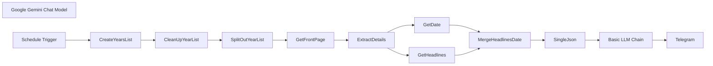

## Fluxo (.json) :

```json
{
  "nodes": [
    {
      "id": "6ea4e702-1af8-407b-b653-964a519db1c2",
      "name": "Basic LLM Chain",
      "type": "@n8n/n8n-nodes-langchain.chainLlm",
      "position": [
        1560,
        -360
      ],
      "parameters": {
        "text": "=You are a highly skilled news categorizer, specializing in indentifying interesting stuff from Hacker News front-page headlines.\n\nYou are provided with JSON data containing a list of dates and their corresponding top headlines from the Hacker News front page. Each headline will also include a URL linking to the original article or discussion. Importantly, the dates provided will be the SAME DAY across MULTIPLE YEARS (e.g., January 1st, 2023, January 1st, 2022, January 1st, 2021, etc.). You need to indentify key headlines and also analyze how the tech landscape has evolved over the years, as reflected in the headlines for this specific day.\n\nYour task is to indentify top 10-15 headlines from across the years from the given json data and return in Markdown formatted bullet points categorizing into themes and adding markdown hyperlinks to the source URL with Prefixing Year before the headline. Follow the Output Foramt Mentioned.\n\n**Input Format:**\n\n```json\n[\n  {\n    \"headlines\": [\n      \"Headline 1 Title [URL1]\",\n      \"Headline 2 Title [URL2]\",\n      \"Headline 3 Title [URL3]\",\n      ...\n    ]\n    \"date\": \"YYYY-MM-DD\",\n  },\n  {\n    \"headlines\": [\n      \"Headline 1 Title [URL1]\",\n      \"Headline 2 Title [URL2]\",\n      ...\n    ]\n    \"date\": \"YYYY-MM-DD\",\n  },\n  ...\n]\n```\n\n**Output Format In Markdown**\n\n```\n# HN Lookback <FullMonthName-DD> | <start YYYY> to <end YYYY> \n\n## [Theme 1]\n- YYYY [Headline 1](URL1)\n- YYYY [Headline 2](URL2)\n...\n\n## [Theme 2]\n- YYYY [Headline 1](URL1)\n- YYYY [Headline 2](URL2)\n...\n\n... \n\n## <this is optional>\n<if any interesing ternds emerge mention them in oneline>\n```\n\n**Here is the Json data for Hackernews Headlines across the years**\n\n```\n{{ JSON.stringify($json.data) }}\n```",
        "promptType": "define"
      },
      "typeVersion": 1.5
    },
    {
      "id": "b5a97c2a-0c3b-4ebe-aec5-7bca6b55ad4c",
      "name": "Google Gemini Chat Model",
      "type": "@n8n/n8n-nodes-langchain.lmChatGoogleGemini",
      "position": [
        1740,
        -200
      ],
      "parameters": {
        "options": {},
        "modelName": "models/gemini-1.5-pro"
      },
      "credentials": {
        "googlePalmApi": {
          "id": "Hx1fn2jrUvojSKye",
          "name": "Google Gemini(PaLM) Api account"
        }
      },
      "typeVersion": 1
    },
    {
      "id": "18cba750-aef5-451d-880f-2c12d8540d78",
      "name": "Schedule Trigger",
      "type": "n8n-nodes-base.scheduleTrigger",
      "position": [
        -380,
        -360
      ],
      "parameters": {
        "rule": {
          "interval": [
            {
              "triggerAtHour": 21
            }
          ]
        }
      },
      "typeVersion": 1.2
    },
    {
      "id": "341da616-8670-4cd9-b47a-ee25e2ae9862",
      "name": "CreateYearsList",
      "type": "n8n-nodes-base.code",
      "position": [
        -200,
        -360
      ],
      "parameters": {
        "jsCode": "for (const item of $input.all()) {\n  const currentDateStr = item.json.timestamp.split('T')[0];\n  const currentDate = new Date(currentDateStr);\n  const currentYear = currentDate.getFullYear();\n  const currentMonth = currentDate.getMonth(); // 0 for January, 1 for February, etc.\n  const currentDay = currentDate.getDate();\n\n  const datesToFetch = [];\n  for (let year = currentYear; year >= 2007; year--) {\n    let targetDate;\n    if (year === 2007) {\n      // Special handling for 2007 to start from Feb 19\n      if (currentMonth > 1 || (currentMonth === 1 && currentDay >= 19))\n      {\n        targetDate = new Date(2007, 1, 19); // Feb 19, 2007\n      } else {\n        continue; // Skip 2007 if currentDate is before Feb 19\n      }\n    } else {\n      targetDate = new Date(year, currentMonth, currentDay);\n    }\n    \n    // Format the date as YYYY-MM-DD\n    const formattedDate = targetDate.toISOString().split('T')[0];\n    datesToFetch.push(formattedDate);\n  }\n  item.json.datesToFetch = datesToFetch;\n}\n\nreturn $input.all();"
      },
      "typeVersion": 2
    },
    {
      "id": "42e24547-be24-4f29-8ce8-c0df7d47a6ff",
      "name": "CleanUpYearList",
      "type": "n8n-nodes-base.set",
      "position": [
        0,
        -360
      ],
      "parameters": {
        "options": {},
        "assignments": {
          "assignments": [
            {
              "id": "b269dc0d-21e1-4124-8f3a-2c7bfa4add5c",
              "name": "datesToFetch",
              "type": "array",
              "value": "={{ $json.datesToFetch }}"
            }
          ]
        }
      },
      "typeVersion": 3.4
    },
    {
      "id": "6e51ad05-0f3d-4bfb-8c8d-5b71e7355344",
      "name": "SplitOutYearList",
      "type": "n8n-nodes-base.splitOut",
      "position": [
        200,
        -360
      ],
      "parameters": {
        "options": {},
        "fieldToSplitOut": "datesToFetch"
      },
      "typeVersion": 1
    },
    {
      "id": "6f827071-718f-4e27-9f7a-cc50296f7bc4",
      "name": "GetFrontPage",
      "type": "n8n-nodes-base.httpRequest",
      "position": [
        420,
        -360
      ],
      "parameters": {
        "url": "=https://news.ycombinator.com/front",
        "options": {
          "batching": {
            "batch": {
              "batchSize": 1,
              "batchInterval": 3000
            }
          }
        },
        "sendQuery": true,
        "queryParameters": {
          "parameters": [
            {
              "name": "day",
              "value": "={{ $json.datesToFetch }}"
            }
          ]
        }
      },
      "typeVersion": 4.2
    },
    {
      "id": "7287e6b1-337f-4634-ac23-5ceaa87b0db3",
      "name": "ExtractDetails",
      "type": "n8n-nodes-base.html",
      "position": [
        640,
        -360
      ],
      "parameters": {
        "options": {},
        "operation": "extractHtmlContent",
        "extractionValues": {
          "values": [
            {
              "key": "=headlines",
              "cssSelector": ".titleline",
              "returnArray": true,
              "skipSelectors": "span"
            },
            {
              "key": "date",
              "cssSelector": ".pagetop > font"
            }
          ]
        }
      },
      "typeVersion": 1.2
    },
    {
      "id": "fceff31e-4dcd-4199-89c5-8eb75cd479bf",
      "name": "GetHeadlines",
      "type": "n8n-nodes-base.set",
      "position": [
        920,
        -460
      ],
      "parameters": {
        "options": {},
        "assignments": {
          "assignments": [
            {
              "id": "e1ce33e9-e4f8-4215-bbdb-156a955a0a97",
              "name": "headlines",
              "type": "array",
              "value": "={{ $json.headlines }}"
            }
          ]
        }
      },
      "typeVersion": 3.4
    },
    {
      "id": "f7683614-7225-4f05-ba12-86b326fdb4a1",
      "name": "GetDate",
      "type": "n8n-nodes-base.set",
      "position": [
        920,
        -280
      ],
      "parameters": {
        "options": {},
        "assignments": {
          "assignments": [
            {
              "id": "fc1d15f6-a999-4d6b-a7bc-3ffa9427679e",
              "name": "date",
              "type": "string",
              "value": "={{ $json.date }}"
            }
          ]
        }
      },
      "typeVersion": 3.4
    },
    {
      "id": "7e09ce85-ece1-46a0-aa59-8e3da66413b2",
      "name": "MergeHeadlinesDate",
      "type": "n8n-nodes-base.merge",
      "position": [
        1180,
        -360
      ],
      "parameters": {
        "mode": "combine",
        "options": {},
        "combineBy": "combineByPosition"
      },
      "typeVersion": 3
    },
    {
      "id": "db3bf408-8179-4ca4-a5b4-8a390b68f994",
      "name": "SingleJson",
      "type": "n8n-nodes-base.aggregate",
      "position": [
        1380,
        -360
      ],
      "parameters": {
        "options": {},
        "aggregate": "aggregateAllItemData"
      },
      "typeVersion": 1
    },
    {
      "id": "2abbc0e9-ed1e-4ba0-9d2f-7c3cd314a0fe",
      "name": "Telegram",
      "type": "n8n-nodes-base.telegram",
      "position": [
        2020,
        -360
      ],
      "parameters": {
        "text": "={{ $json.text }}",
        "chatId": "@OnThisDayHN",
        "additionalFields": {
          "parse_mode": "Markdown",
          "appendAttribution": false
        }
      },
      "credentials": {
        "telegramApi": {
          "id": "6nIwfhIWcwJFTPTg",
          "name": "OnThisDayHNBot"
        }
      },
      "typeVersion": 1.2
    }
  ],
  "pinData": {},
  "connections": {
    "GetDate": {
      "main": [
        [
          {
            "node": "MergeHeadlinesDate",
            "type": "main",
            "index": 1
          }
        ]
      ]
    },
    "SingleJson": {
      "main": [
        [
          {
            "node": "Basic LLM Chain",
            "type": "main",
            "index": 0
          }
        ]
      ]
    },
    "GetFrontPage": {
      "main": [
        [
          {
            "node": "ExtractDetails",
            "type": "main",
            "index": 0
          }
        ]
      ]
    },
    "GetHeadlines": {
      "main": [
        [
          {
            "node": "MergeHeadlinesDate",
            "type": "main",
            "index": 0
          }
        ]
      ]
    },
    "ExtractDetails": {
      "main": [
        [
          {
            "node": "GetHeadlines",
            "type": "main",
            "index": 0
          },
          {
            "node": "GetDate",
            "type": "main",
            "index": 0
          }
        ]
      ]
    },
    "Basic LLM Chain": {
      "main": [
        [
          {
            "node": "Telegram",
            "type": "main",
            "index": 0
          }
        ]
      ]
    },
    "CleanUpYearList": {
      "main": [
        [
          {
            "node": "SplitOutYearList",
            "type": "main",
            "index": 0
          }
        ]
      ]
    },
    "CreateYearsList": {
      "main": [
        [
          {
            "node": "CleanUpYearList",
            "type": "main",
            "index": 0
          }
        ]
      ]
    },
    "Schedule Trigger": {
      "main": [
        [
          {
            "node": "CreateYearsList",
            "type": "main",
            "index": 0
          }
        ]
      ]
    },
    "SplitOutYearList": {
      "main": [
        [
          {
            "node": "GetFrontPage",
            "type": "main",
            "index": 0
          }
        ]
      ]
    },
    "MergeHeadlinesDate": {
      "main": [
        [
          {
            "node": "SingleJson",
            "type": "main",
            "index": 0
          }
        ]
      ]
    },
    "Google Gemini Chat Model": {
      "ai_languageModel": [
        [
          {
            "node": "Basic LLM Chain",
            "type": "ai_languageModel",
            "index": 0
          }
        ]
      ]
    }
  }
}
```

<a id="template-2340"></a>

## Template 2340 - Envio agendado de mensagens para Discord

- **Nome:** Envio agendado de mensagens para Discord
- **Descrição:** Este fluxo envia mensagens automáticas a um canal do Discord em horários e frequências agendados.
- **Funcionalidade:** • Envio semanal - Quarta: Dispara uma mensagem temática "It's Wednesday, my dudes!" com imagem às 09:00 em um dia semanal definido.
• Envio semanal - Sexta: Dispara uma mensagem temática "It's Friday, Friday" com link para GIF às 09:00 em outro dia semanal definido.
• Envio repetido a cada 30 minutos: Publica uma mensagem de despedida com imagem a cada 30 minutos.
• Uso de webhook único: Todas as mensagens são enviadas para o mesmo webhook do canal, centralizando as notificações.
- **Ferramentas:** • Discord: Plataforma de mensagens utilizada via webhook para publicar as mensagens agendadas.

## Fluxo visual

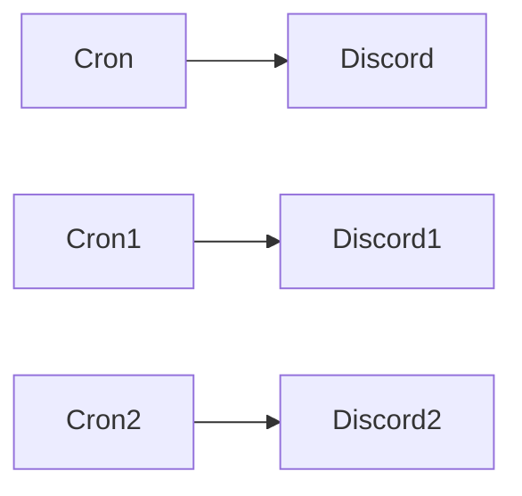

## Fluxo (.json) :

```json
{
  "id": "1",
  "name": "cheems",
  "nodes": [
    {
      "name": "Cron",
      "type": "n8n-nodes-base.cron",
      "position": [
        450,
        300
      ],
      "parameters": {
        "triggerTimes": {
          "item": [
            {
              "hour": 9,
              "mode": "everyWeek",
              "weekday": "6"
            }
          ]
        }
      },
      "typeVersion": 1
    },
    {
      "name": "Discord",
      "type": "n8n-nodes-base.discord",
      "position": [
        650,
        300
      ],
      "parameters": {
        "text": "It's Wednesday, my dudes!\nhttps://i.kym-cdn.com/entries/icons/original/000/020/016/wednesdaymydudeswide.jpg",
        "webhookUri": "https://discordapp.com/api/webhooks/756967134353162281/wEzyl5MrY2FqHdp5mb8npM5qhp0MVAe9X8SiIA-UMUPpv52FwaOeZGWTtlfQSs-MV3eB"
      },
      "typeVersion": 1
    },
    {
      "name": "Cron1",
      "type": "n8n-nodes-base.cron",
      "position": [
        450,
        140
      ],
      "parameters": {
        "triggerTimes": {
          "item": [
            {
              "hour": 9,
              "mode": "everyWeek",
              "weekday": "5"
            }
          ]
        }
      },
      "typeVersion": 1
    },
    {
      "name": "Discord1",
      "type": "n8n-nodes-base.discord",
      "position": [
        650,
        140
      ],
      "parameters": {
        "text": "It's Friday, Friday\nGotta get down on Friday!\nhttps://tenor.com/view/rebecca-black-friday-tgif-gif-4051598",
        "webhookUri": "https://discordapp.com/api/webhooks/756967134353162281/wEzyl5MrY2FqHdp5mb8npM5qhp0MVAe9X8SiIA-UMUPpv52FwaOeZGWTtlfQSs-MV3eB"
      },
      "typeVersion": 1
    },
    {
      "name": "Cron2",
      "type": "n8n-nodes-base.cron",
      "position": [
        820,
        300
      ],
      "parameters": {
        "triggerTimes": {
          "item": [
            {
              "mode": "everyX",
              "unit": "minutes",
              "value": 30
            }
          ]
        }
      },
      "typeVersion": 1
    },
    {
      "name": "Discord2",
      "type": "n8n-nodes-base.discord",
      "position": [
        1020,
        300
      ],
      "parameters": {
        "text": "And with this, I sleep. Good night Pogger friends :)\nhttps://cdn.discordapp.com/attachments/756602216621539409/757054027518443600/93109046_836460460092895_6176715527851028509_n.jpg",
        "webhookUri": "https://discordapp.com/api/webhooks/756967134353162281/wEzyl5MrY2FqHdp5mb8npM5qhp0MVAe9X8SiIA-UMUPpv52FwaOeZGWTtlfQSs-MV3eB"
      },
      "typeVersion": 1
    }
  ],
  "active": false,
  "settings": {},
  "connections": {
    "Cron": {
      "main": [
        [
          {
            "node": "Discord",
            "type": "main",
            "index": 0
          }
        ]
      ]
    },
    "Cron1": {
      "main": [
        [
          {
            "node": "Discord1",
            "type": "main",
            "index": 0
          }
        ]
      ]
    },
    "Cron2": {
      "main": [
        [
          {
            "node": "Discord2",
            "type": "main",
            "index": 0
          }
        ]
      ]
    }
  }
}
```

<a id="template-2342"></a>

## Template 2342 - Registrar venda Gumroad, adicionar a MailerLite e registrar no CRM

- **Nome:** Registrar venda Gumroad, adicionar a MailerLite e registrar no CRM
- **Descrição:** Dispara quando há uma nova venda no Gumroad, adiciona o comprador à lista/newsletter, atribui a um grupo específico e registra os dados da venda em uma planilha CRM.
- **Funcionalidade:** • Disparo por nova venda: Inicia a automação ao detectar uma nova venda no Gumroad.
• Criação de assinante: Cria ou atualiza um assinante usando o e-mail do comprador e campos personalizados (ex.: país).
• Atribuição a grupo: Associa o assinante a um grupo específico para acionar automações de e-mail posteriores.
• Registro no CRM: Adiciona uma linha em uma planilha com data, e-mail, país e nome do produto vendido para controle e análise.
- **Ferramentas:** • Gumroad: Plataforma de vendas utilizada como fonte do evento de venda.
• MailerLite: Serviço de e-mail marketing usado para criar assinantes, armazenar campos personalizados e organizar em grupos para automações.
• Google Sheets: Planilha online usada como CRM para armazenar registros das vendas.

## Fluxo visual

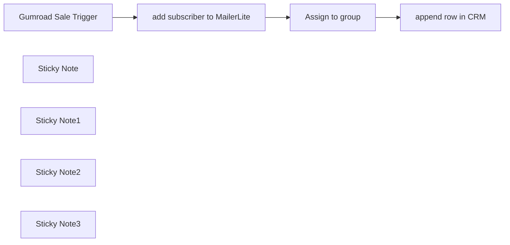

## Fluxo (.json) :

```json
{
  "id": "06v55r6E13Wfvo66",
  "meta": {
    "instanceId": "dfec462482c1b16c8ef1928d51584c7f0ae64b3bfaa72e08675b15754b903bd2",
    "templateCredsSetupCompleted": true
  },
  "name": "Gumroad sale trigger",
  "tags": [],
  "nodes": [
    {
      "id": "789f1dec-d2d2-4e09-9530-719d354d259c",
      "name": "Assign to group",
      "type": "n8n-nodes-base.httpRequest",
      "position": [
        140,
        -280
      ],
      "parameters": {
        "url": "=https://connect.mailerlite.com/api/subscribers/{{ $json.id }}/groups/152489030254069581",
        "method": "POST",
        "options": {},
        "authentication": "predefinedCredentialType",
        "nodeCredentialType": "mailerLiteApi"
      },
      "credentials": {
        "mailerLiteApi": {
          "id": "i9V49FSxbwJhAGfI",
          "name": "Mailer Lite account"
        }
      },
      "typeVersion": 4.2
    },
    {
      "id": "53c0df02-5571-485c-91ce-6be2f62fd6d6",
      "name": "Gumroad Sale Trigger",
      "type": "n8n-nodes-base.gumroadTrigger",
      "position": [
        -520,
        -280
      ],
      "webhookId": "06a01b99-cbf1-4694-8502-94ac51670ba4",
      "parameters": {
        "resource": "sale"
      },
      "credentials": {
        "gumroadApi": {
          "id": "wgjGSvLjsRBJImsQ",
          "name": "Gumroad account"
        }
      },
      "typeVersion": 1
    },
    {
      "id": "ee782134-e2d4-4f8b-a9d9-a09a919577ab",
      "name": "append row in CRM",
      "type": "n8n-nodes-base.googleSheets",
      "position": [
        480,
        -280
      ],
      "parameters": {
        "columns": {
          "value": {
            "date": "={{ $('Gumroad Sale Trigger').item.json.sale_timestamp }}",
            "email": "={{ $('Gumroad Sale Trigger').item.json.email }}",
            "country": "={{ $('Gumroad Sale Trigger').item.json.ip_country }}",
            "product name": "={{ $('Gumroad Sale Trigger').item.json.product_name }}"
          },
          "schema": [
            {
              "id": "date",
              "type": "string",
              "display": true,
              "removed": false,
              "required": false,
              "displayName": "date",
              "defaultMatch": false,
              "canBeUsedToMatch": true
            },
            {
              "id": "product name",
              "type": "string",
              "display": true,
              "removed": false,
              "required": false,
              "displayName": "product name",
              "defaultMatch": false,
              "canBeUsedToMatch": true
            },
            {
              "id": "email",
              "type": "string",
              "display": true,
              "removed": false,
              "required": false,
              "displayName": "email",
              "defaultMatch": false,
              "canBeUsedToMatch": true
            },
            {
              "id": "country",
              "type": "string",
              "display": true,
              "removed": false,
              "required": false,
              "displayName": "country",
              "defaultMatch": false,
              "canBeUsedToMatch": true
            }
          ],
          "mappingMode": "defineBelow",
          "matchingColumns": [],
          "attemptToConvertTypes": false,
          "convertFieldsToString": false
        },
        "options": {},
        "operation": "append",
        "sheetName": {
          "__rl": true,
          "mode": "list",
          "value": "gid=0",
          "cachedResultUrl": "https://docs.google.com/spreadsheets/d/1XYMstoZ4j3O5T-UYz21ky7P5bkUtzYXQGYCQTRVWCI4/edit#gid=0",
          "cachedResultName": "Sheet1"
        },
        "documentId": {
          "__rl": true,
          "mode": "list",
          "value": "1XYMstoZ4j3O5T-UYz21ky7P5bkUtzYXQGYCQTRVWCI4",
          "cachedResultUrl": "https://docs.google.com/spreadsheets/d/1XYMstoZ4j3O5T-UYz21ky7P5bkUtzYXQGYCQTRVWCI4/edit?usp=drivesdk",
          "cachedResultName": "Gumroad sales CRM"
        }
      },
      "credentials": {
        "googleSheetsOAuth2Api": {
          "id": "Ou2SgvNZctBeYWT5",
          "name": "Google Sheets account"
        }
      },
      "typeVersion": 4.5
    },
    {
      "id": "98ff519b-3065-4c6b-bdeb-2d9095e3f52a",
      "name": "Sticky Note",
      "type": "n8n-nodes-base.stickyNote",
      "position": [
        -680,
        -540
      ],
      "parameters": {
        "width": 460,
        "height": 460,
        "content": "## Trigger on a new Gumroad sale\n### Requirements\n- A [Gumroad]() account\n- A product listed. We used ours [here](https://1node.gumroad.com/l/topaitools)\n- Head to Settings > Advanced, and create a new application\n\n### Set up\n- Paste your access token on this Gumroad sale trigger"
      },
      "typeVersion": 1
    },
    {
      "id": "f5ccfe9f-c56c-4394-bebf-1f7438a0dcdf",
      "name": "Sticky Note1",
      "type": "n8n-nodes-base.stickyNote",
      "position": [
        -140,
        -660
      ],
      "parameters": {
        "color": 4,
        "width": 480,
        "height": 580,
        "content": "## Connection to [MailerLite](https://www.mailerlite.com/a/Kr9Yplim6ZhV) newsletter \n### Requirements\n- A [Mailerlite](https://www.mailerlite.com/a/Kr9Yplim6ZhV) account\n- A subscriber group created\n- Generate a new API from the Integrations menu\n\n### Set up\n- You will first need to create the subscriber with a simple Mailer lite node\n- In the second node call the endpoint to [assign that same subscriber to the group](https://developers.mailerlite.com/docs/groups.html#assign-subscriber-to-a-group) you created manually on Mailerlite. For example, we named the group \"Gumroad\"\n- To get the group id, we ran a node that calls the [\"list groups\" endpoint](https://developers.mailerlite.com/docs/groups.html#list-all-groups) and we appended it to the url.\n"
      },
      "typeVersion": 1
    },
    {
      "id": "e4cea86a-494f-4c3c-9743-3e8eca461a04",
      "name": "Sticky Note2",
      "type": "n8n-nodes-base.stickyNote",
      "position": [
        420,
        -460
      ],
      "parameters": {
        "color": 4,
        "width": 480,
        "height": 380,
        "content": "## Load into CRM\n### Requirements\n- Set up your api and credentials for Google Sheets. You can find the n8n docs [here](https://docs.n8n.io/integrations/builtin/app-nodes/n8n-nodes-base.googlesheets/?utm_source=n8n_app&utm_medium=node_settings_modal-credential_link&utm_campaign=n8n-nodes-base.googleSheets)\n- Append the row to your table with your desired data collected previously"
      },
      "typeVersion": 1
    },
    {
      "id": "e81b7ae0-510e-454e-82ff-6d42bde9e81a",
      "name": "add subscriber to MailerLite",
      "type": "n8n-nodes-base.mailerLite",
      "position": [
        -60,
        -280
      ],
      "parameters": {
        "email": "={{ $json.email }}",
        "additionalFields": {
          "customFieldsUi": {
            "customFieldsValues": [
              {
                "value": "={{ $json.ip_country }}",
                "fieldId": "country"
              }
            ]
          }
        }
      },
      "credentials": {
        "mailerLiteApi": {
          "id": "i9V49FSxbwJhAGfI",
          "name": "Mailer Lite account"
        }
      },
      "typeVersion": 2
    },
    {
      "id": "9cc00d13-81d9-4584-9066-4b00b2ff7a47",
      "name": "Sticky Note3",
      "type": "n8n-nodes-base.stickyNote",
      "position": [
        -160,
        -60
      ],
      "parameters": {
        "color": 5,
        "width": 520,
        "height": 180,
        "content": "## Why assign the subscriber to a group? \nIn [MailerLite](https://www.mailerlite.com/a/Kr9Yplim6ZhV) you can set up an automation that when a new subscriber is added into a group, a new email sequence begins, which allows you to send multiple emails to this user at a specific frequency.\n\nThis is a very powerful feature to funnel users to engage with your products or services."
      },
      "typeVersion": 1
    }
  ],
  "active": true,
  "pinData": {},
  "settings": {
    "executionOrder": "v1"
  },
  "versionId": "3b94b27b-05cc-4996-9f1f-33ba7c3632ae",
  "connections": {
    "Assign to group": {
      "main": [
        [
          {
            "node": "append row in CRM",
            "type": "main",
            "index": 0
          }
        ]
      ]
    },
    "Gumroad Sale Trigger": {
      "main": [
        [
          {
            "node": "add subscriber to MailerLite",
            "type": "main",
            "index": 0
          }
        ]
      ]
    },
    "add subscriber to MailerLite": {
      "main": [
        [
          {
            "node": "Assign to group",
            "type": "main",
            "index": 0
          }
        ]
      ]
    }
  }
}
```

<a id="template-2344"></a>

## Template 2344 - Agente AI para operar a API do Proxmox

- **Nome:** Agente AI para operar a API do Proxmox
- **Descrição:** Fluxo que recebe comandos de usuários, usa um modelo de linguagem para gerar chamadas à API do Proxmox, executa as requisições e retorna respostas formatadas, com validação e mascaramento de dados sensíveis.
- **Funcionalidade:** • Gatilhos múltiplos: Inicia a automação por entradas via chat, Telegram, Gmail ou webhook.
• Interpretação de linguagem natural: Um agente AI (modelo Gemini) converte pedidos do usuário em comandos da API do Proxmox.
• Consulta de documentação: O agente consulta a documentação e wiki do Proxmox para gerar comandos compatíveis com a API.
• Validação e geração de parâmetros: Valida parâmetros obrigatórios, informa campos faltantes e aplica comportamentos padrão (ex.: node padrão psb1, geração automática de vmid consultando o cluster).
• Saída estruturada e padronizada: Gera sempre JSON com response_type, url e details seguindo esquema predefinido.
• Roteamento por método HTTP: Encaminha a execução para GET, POST, PUT ou DELETE conforme o response_type retornado pelo agente.
• Execução de chamadas à API do Proxmox: Faz requisições autenticadas (header API token) aos nós Proxmox para criar, atualizar, consultar ou deletar recursos.
• Parser e autocorreção de saída: Usa parser estruturado e mecanismo de auto-fix para garantir conformidade do JSON antes de executar chamadas.
• Formatação de respostas: Extrai e formata informações de tarefas (UPID, node, operação, timestamp) e mascara dados sensíveis no retorno ao usuário.
• Consolidação e resumo: Mescla respostas e utiliza um agente adicional para gerar resumos humanos claros sobre as ações realizadas.
- **Ferramentas:** • Proxmox VE API: Endpoint REST para gerenciar cluster, VMs, tarefas e recursos do Proxmox.
• Proxmox Wiki / API Viewer: Documentação oficial usada como referência para construir chamadas e parâmetros válidos.
• Google Gemini (PaLM): Modelo de linguagem utilizado para interpretar pedidos do usuário e gerar comandos API estruturados.
• Telegram API: Canal de entrada que permite iniciar fluxos a partir de mensagens Telegram.
• Gmail API: Canal de entrada que permite iniciar fluxos a partir de emails.
• Webhooks / HTTP endpoints: Mecanismo para receber solicitações externas e executar requisições HTTP autenticadas contra os servidores Proxmox.

## Fluxo visual

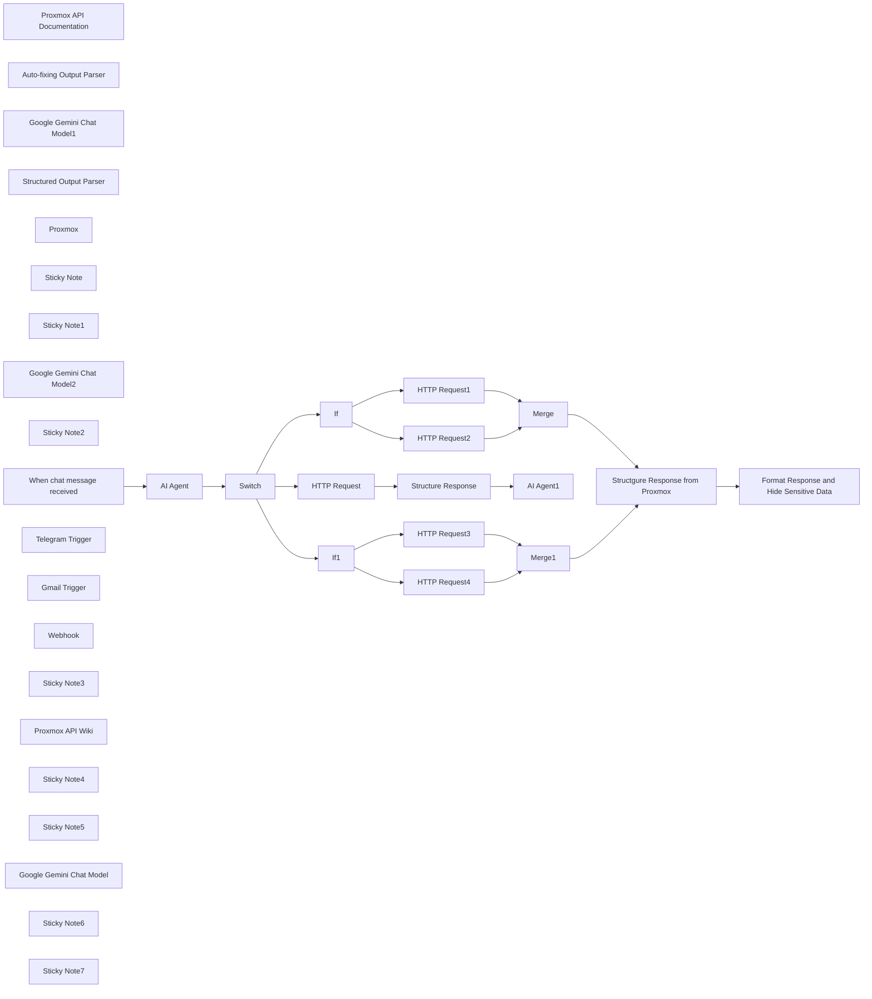

## Fluxo (.json) :

```json
{
  "meta": {
    "instanceId": "n8n.syncbricks.com"
  },
  "nodes": [
    {
      "id": "e6d85380-7cfa-4c6e-9b0f-d390ad0cbc67",
      "name": "HTTP Request1",
      "type": "n8n-nodes-base.httpRequest",
      "position": [
        1400,
        -180
      ],
      "parameters": {
        "url": "=https://proxmox.syncbricks.com/api2/json{{ $json.output.url }}",
        "method": "=POST",
        "options": {
          "allowUnauthorizedCerts": true
        },
        "jsonBody": "={{ $json.output.details }}",
        "sendBody": true,
        "specifyBody": "json",
        "authentication": "genericCredentialType",
        "genericAuthType": "httpHeaderAuth"
      },
      "credentials": {
        "httpHeaderAuth": {
          "id": "pJcVQegRQ5mpraoQ",
          "name": "Proxmox"
        }
      },
      "typeVersion": 4.2
    },
    {
      "id": "9b497de8-0f01-40b1-8f8e-28fad1f758c4",
      "name": "Proxmox API Documentation",
      "type": "@n8n/n8n-nodes-langchain.toolHttpRequest",
      "position": [
        -300,
        40
      ],
      "parameters": {
        "url": "https://pve.proxmox.com/pve-docs/api-viewer/index.html",
        "toolDescription": "This is Proxmox API Documentation ensure to read the details from here"
      },
      "typeVersion": 1.1
    },
    {
      "id": "e7ac54a9-37be-44b5-b58e-8b631892367e",
      "name": "Auto-fixing Output Parser",
      "type": "@n8n/n8n-nodes-langchain.outputParserAutofixing",
      "position": [
        40,
        60
      ],
      "parameters": {
        "options": {
          "prompt": "Instructions:\n--------------\n{instructions}\n--------------\nCompletion:\n--------------\n{completion}\n--------------\n\nAbove, the Completion did not satisfy the constraints given in the Instructions.\nError:\n--------------\n{error}\n--------------\n\nPlease try again. Please only respond with an answer that satisfies the constraints laid out in the Instructions:"
        }
      },
      "typeVersion": 1
    },
    {
      "id": "5d8c8c6d-d5de-4c87-9950-46f1f5757314",
      "name": "Google Gemini Chat Model1",
      "type": "@n8n/n8n-nodes-langchain.lmChatGoogleGemini",
      "position": [
        -40,
        360
      ],
      "parameters": {
        "options": {},
        "modelName": "models/gemini-2.0-flash-exp"
      },
      "credentials": {
        "googlePalmApi": {
          "id": "pKFvSpPWSRFpnBoB",
          "name": "Google Gemini(PaLM) Api account"
        }
      },
      "typeVersion": 1
    },
    {
      "id": "8565ac2f-0cdd-4e7f-a1e9-6f273869e068",
      "name": "Structured Output Parser",
      "type": "@n8n/n8n-nodes-langchain.outputParserStructured",
      "position": [
        180,
        360
      ],
      "parameters": {
        "jsonSchemaExample": "{\n  \"response_type\": \"POST\",\n  \"url\": \"/nodes/psb1/qemu\",\n  \"details\": {\n    \"vmid\": 105,\n    \"cores\": 4,\n    \"memory\": 8192,\n    \"net0\": \"virtio,bridge=vmbr0\",\n    \"disk0\": \"local:10,format=qcow2\",\n    \"sockets\": 1,\n    \"ostype\": \"l26\"\n  },\n  \"message\": \"The VM with ID 105 has been successfully configured to be created on node psb1.\"\n}"
      },
      "typeVersion": 1.2
    },
    {
      "id": "80b1ef4d-b4c7-40b4-969f-f53d0068cac7",
      "name": "Proxmox",
      "type": "@n8n/n8n-nodes-langchain.toolHttpRequest",
      "position": [
        -80,
        40
      ],
      "parameters": {
        "url": "https://10.11.12.101:8006/api2/json/cluster/status",
        "authentication": "genericCredentialType",
        "genericAuthType": "httpHeaderAuth",
        "toolDescription": "=This is Proxmox which will help you to get the details of existing Proxmox installations, ensure to append to existing url : https://10.11.12.101:8006/api2/ to get response from existing proxmox \n\nMy prommox nodes are named as psb1, psb2 and psb3\npsb1 : https://10.11.12.101:8006/api2/\npsb2 : https://10.11.12.102:8006/api2/\npsb3 : https://10.11.12.102:8006/api2/"
      },
      "credentials": {
        "httpHeaderAuth": {
          "id": "pJcVQegRQ5mpraoQ",
          "name": "Proxmox"
        }
      },
      "typeVersion": 1.1
    },
    {
      "id": "09444fa1-3b5e-4411-b70c-cf777db971bb",
      "name": "HTTP Request",
      "type": "n8n-nodes-base.httpRequest",
      "position": [
        1080,
        -320
      ],
      "parameters": {
        "url": "=https://10.11.12.101:8006/api2/json{{ $json.output.properties.url.pattern }}",
        "method": "=GET",
        "options": {
          "allowUnauthorizedCerts": true
        },
        "authentication": "genericCredentialType",
        "genericAuthType": "httpHeaderAuth"
      },
      "credentials": {
        "httpHeaderAuth": {
          "id": "pJcVQegRQ5mpraoQ",
          "name": "Proxmox"
        }
      },
      "typeVersion": 4.2
    },
    {
      "id": "d148b395-01e9-48a6-b98c-cb515fa3446d",
      "name": "Sticky Note",
      "type": "n8n-nodes-base.stickyNote",
      "position": [
        900,
        -660
      ],
      "parameters": {
        "width": 736.2768017274677,
        "height": 1221.0199187779397,
        "content": "## API Key for Proxmox\n** Create Credentails *** ensure to create credentials in Proxmox Data Center as API Key and then create credentails. \n** Add Credentials to n8n ** Click on Credentails, add new Credentails and Chose Header Auth\n** In Header Auth Below will be used \nName : Authorization\nValue : PVEAPIToken=<user>@<realm>!<token-id>=<token-value>\n\nSuppose my token id is n8n and key is 1234 so value will be as below\n\nValue : PVEAPIToken=root@pam!n8n=1234\n"
      },
      "typeVersion": 1
    },
    {
      "id": "d356bb83-c567-44b6-ba23-3e330abf835e",
      "name": "Sticky Note1",
      "type": "n8n-nodes-base.stickyNote",
      "position": [
        -1240,
        -120
      ],
      "parameters": {
        "color": 6,
        "width": 492.990678850593,
        "height": 702.0895748933872,
        "content": "## Trigger\nYou can use any trigger as input, a chat, telegram, email etc"
      },
      "typeVersion": 1
    },
    {
      "id": "d2829180-9c14-4437-9ae1-1bb822d8d925",
      "name": "Google Gemini Chat Model2",
      "type": "@n8n/n8n-nodes-langchain.lmChatGoogleGemini",
      "position": [
        1880,
        -320
      ],
      "parameters": {
        "options": {},
        "modelName": "models/gemini-2.0-flash-exp"
      },
      "credentials": {
        "googlePalmApi": {
          "id": "pKFvSpPWSRFpnBoB",
          "name": "Google Gemini(PaLM) Api account"
        }
      },
      "typeVersion": 1
    },
    {
      "id": "0e8a617b-8b95-4bed-8bff-876266fc4151",
      "name": "Sticky Note2",
      "type": "n8n-nodes-base.stickyNote",
      "position": [
        -440,
        -690
      ],
      "parameters": {
        "color": 5,
        "width": 789.7678716732242,
        "height": 1260.380358008782,
        "content": "## Porxmox Custom AI Agent \nIt uses the intelligence provided to it including the Proxmox API Wiki, Proxmox Cluster Linked and Proxmox API Documentation.\n\nThe AI Model connected with this is Gemini, you can connect any AI Model by Ollama, OpenAI, Claude etc.\n\nOutput Parser is used to ensure the fixed output structure that can be used for API URL"
      },
      "typeVersion": 1
    },
    {
      "id": "4cbf39ae-7b81-44b1-858c-10c21af9d558",
      "name": "When chat message received",
      "type": "@n8n/n8n-nodes-langchain.chatTrigger",
      "position": [
        -680,
        -300
      ],
      "webhookId": "63de8c82-04fc-4126-8bbf-b0eb62794d74",
      "parameters": {
        "options": {}
      },
      "typeVersion": 1.1
    },
    {
      "id": "f91a1d2d-ce33-4469-b4da-e9ef1dd070e0",
      "name": "Telegram Trigger",
      "type": "n8n-nodes-base.telegramTrigger",
      "position": [
        -1080,
        320
      ],
      "webhookId": "c86fa48b-ae66-46f2-b438-f156225a5c74",
      "parameters": {
        "updates": [
          "message"
        ],
        "additionalFields": {}
      },
      "credentials": {
        "telegramApi": {
          "id": "uwpC7pPg6WJYh8Ad",
          "name": "Telegram account"
        }
      },
      "typeVersion": 1.1
    },
    {
      "id": "aec3c1f4-058e-4321-99dd-772dcc04e206",
      "name": "Gmail Trigger",
      "type": "n8n-nodes-base.gmailTrigger",
      "position": [
        -1080,
        -20
      ],
      "parameters": {
        "filters": {},
        "pollTimes": {
          "item": [
            {
              "mode": "everyMinute"
            }
          ]
        }
      },
      "credentials": {
        "gmailOAuth2": {
          "id": "pccYQxL0liStKP66",
          "name": "Gmail account INFO"
        }
      },
      "typeVersion": 1.2
    },
    {
      "id": "1afea4f3-adea-42ac-bc48-fa863b26e5a0",
      "name": "Webhook",
      "type": "n8n-nodes-base.webhook",
      "position": [
        -1080,
        160
      ],
      "webhookId": "459d848d-72ed-490f-bc48-e5dc60242896",
      "parameters": {
        "path": "459d848d-72ed-490f-bc48-e5dc60242896",
        "options": {},
        "authentication": "headerAuth"
      },
      "credentials": {
        "httpHeaderAuth": {
          "id": "pJcVQegRQ5mpraoQ",
          "name": "Proxmox"
        }
      },
      "typeVersion": 2
    },
    {
      "id": "de4af096-7b23-41ba-b390-8c52f58b09c6",
      "name": "Sticky Note3",
      "type": "n8n-nodes-base.stickyNote",
      "position": [
        380,
        -680
      ],
      "parameters": {
        "color": 3,
        "width": 486.2369951168387,
        "height": 1245.2937736920358,
        "content": "## HTTP methods\nGET\tRetrieve resources\tFetch VM status, list nodes, get logs.\n\nPOST\tCreate or trigger actions\tStart/stop VMs, create backups.\n\nPUT\tUpdate/replace entire resource configuration\tModify VM configurations.\n\nDELETE\tDelete resources\tRemove VMs, delete users, remove files.\n\nOPTIONS\tFetch supported methods for an endpoint\tCheck available operations for an API.\n\nPATCH\tApply partial updates\tUpdate specific fields in VM settings."
      },
      "typeVersion": 1
    },
    {
      "id": "2c4ef73b-281f-4a24-81a2-cae72e446955",
      "name": "Proxmox API Wiki",
      "type": "@n8n/n8n-nodes-langchain.toolHttpRequest",
      "position": [
        -180,
        40
      ],
      "parameters": {
        "url": "https://pve.proxmox.com/wiki/Proxmox_VE_API",
        "toolDescription": "Get the proxmox API details from Proxmox Wiki"
      },
      "typeVersion": 1.1
    },
    {
      "id": "f11ac59e-6031-4435-a417-200cdd559bd2",
      "name": "Structure Response",
      "type": "n8n-nodes-base.code",
      "position": [
        1480,
        -520
      ],
      "parameters": {
        "jsCode": "// Access all items from the incoming node\nconst items = $input.all();\n\n// Combine all fields of each item into a single string\nconst combinedData = items.map(item => {\n    const inputData = item.json; // Access the JSON data of the current item\n    \n    // Combine all fields into a single string\n    const combinedField = Object.entries(inputData)\n        .map(([key, value]) => {\n            // Handle objects or arrays by converting them to JSON strings\n            const formattedValue = typeof value === 'object' ? JSON.stringify(value) : value;\n            return `${key}: ${formattedValue}`;\n        })\n        .join(' | '); // Combine key-value pairs as a single string with a delimiter\n\n    // Return the new structure\n    return {\n        json: {\n            combinedField // Only keep the combined field for table representation\n        },\n    };\n});\n\n// Output the combined data\nreturn combinedData;\n"
      },
      "typeVersion": 2
    },
    {
      "id": "7752281b-226b-4c19-bcd4-33804ea2abe7",
      "name": "Sticky Note4",
      "type": "n8n-nodes-base.stickyNote",
      "position": [
        1680,
        -660
      ],
      "parameters": {
        "color": 5,
        "width": 895.2529822972874,
        "height": 517.5348441931358,
        "content": "## Porxmox Custom AI Agent (Get)\nThis agent will convert the response from proxmox to meaningful explanation"
      },
      "typeVersion": 1
    },
    {
      "id": "fd65db23-0d36-42b1-a012-2ddcdd2ca914",
      "name": "Sticky Note5",
      "type": "n8n-nodes-base.stickyNote",
      "position": [
        1680,
        -122.8638048233953
      ],
      "parameters": {
        "color": 5,
        "width": 900.3261837471116,
        "height": 712.4591709572671,
        "content": "##  Created or triggered an action on the server.\nResponse will come back here"
      },
      "typeVersion": 1
    },
    {
      "id": "60234199-d28c-4fb8-8ad7-1d24693599ed",
      "name": "Structgure Response from Proxmox",
      "type": "n8n-nodes-base.code",
      "position": [
        2120,
        140
      ],
      "parameters": {
        "jsCode": "// Access the 'data' field from the input\nlet rawData = $json[\"data\"];\n\n// Split the string by colon (:) to extract parts\nlet parts = rawData.split(\":\");\n\n// Create an object with the extracted parts\nreturn {\n  upid: parts[0],       // UPID\n  node: parts[1],       // Node (e.g., psb1)\n  processID: parts[2],  // Process ID\n  taskID: parts[3],     // Task ID\n  timestamp: parts[4],  // Timestamp\n  operation: parts[5],  // Operation (e.g., aptupdate)\n  user: parts[7]        // User (e.g., root@pam!n8n)\n};\n"
      },
      "typeVersion": 2
    },
    {
      "id": "57ab92f3-6f65-459d-8f41-8a391108457b",
      "name": "Format Response and Hide Sensitive Data",
      "type": "n8n-nodes-base.code",
      "position": [
        2380,
        140
      ],
      "parameters": {
        "jsCode": "// Extract required fields from the input\nlet node = $json[\"node\"] || \"unknown node\";\nlet operation = $json[\"operation\"] || \"unknown operation\";\nlet user = $json[\"user\"] || \"unknown user\";\nlet rawTimestamp = $json[\"timestamp\"] || \"unknown timestamp\";\n\n// Convert timestamp to a readable format\nlet readableTimestamp = \"Invalid timestamp\";\ntry {\n  let timestamp = parseInt(rawTimestamp, 16) * 1000; // Convert hex to milliseconds\n  readableTimestamp = new Date(timestamp).toLocaleString();\n} catch (error) {\n  readableTimestamp = \"Unable to parse timestamp\";\n}\n\n// Construct the simple message\nlet message = `The operation '${operation}' was executed successfully on node '${node}' by user '${user}' at '${readableTimestamp}'.`;\n\nreturn {\n  message: message\n};\n"
      },
      "typeVersion": 2
    },
    {
      "id": "aca671cb-4bb7-4f9e-847a-34d89151d2e2",
      "name": "If",
      "type": "n8n-nodes-base.if",
      "position": [
        1060,
        -80
      ],
      "parameters": {
        "options": {},
        "conditions": {
          "options": {
            "version": 2,
            "leftValue": "",
            "caseSensitive": true,
            "typeValidation": "loose"
          },
          "combinator": "or",
          "conditions": [
            {
              "id": "da8ce97e-70bf-42a4-981c-e2133bcee24a",
              "operator": {
                "type": "string",
                "operation": "notEmpty",
                "singleValue": true
              },
              "leftValue": "={{ $json.output.details }}",
              "rightValue": ""
            },
            {
              "id": "d7052c40-9a43-452e-901c-6c8fd0122e5f",
              "operator": {
                "type": "string",
                "operation": "exists",
                "singleValue": true
              },
              "leftValue": "={{ $json.output.details }}",
              "rightValue": ""
            }
          ]
        },
        "looseTypeValidation": true
      },
      "typeVersion": 2.2
    },
    {
      "id": "15562980-019c-4d91-8f80-f85420efc8b0",
      "name": "HTTP Request2",
      "type": "n8n-nodes-base.httpRequest",
      "position": [
        1400,
        20
      ],
      "parameters": {
        "url": "=https://10.11.12.101:8006/api2/json{{ $json.output.url }}",
        "method": "=POST",
        "options": {
          "allowUnauthorizedCerts": true
        },
        "authentication": "genericCredentialType",
        "genericAuthType": "httpHeaderAuth"
      },
      "credentials": {
        "httpHeaderAuth": {
          "id": "pJcVQegRQ5mpraoQ",
          "name": "Proxmox"
        }
      },
      "typeVersion": 4.2
    },
    {
      "id": "fd974862-4e06-4874-8477-c2c3b559669a",
      "name": "Merge",
      "type": "n8n-nodes-base.merge",
      "position": [
        1820,
        -20
      ],
      "parameters": {},
      "typeVersion": 3
    },
    {
      "id": "5c0d9814-3c9e-4ef4-8f12-9495785c1c06",
      "name": "HTTP Request3",
      "type": "n8n-nodes-base.httpRequest",
      "position": [
        1400,
        200
      ],
      "parameters": {
        "url": "=https://10.11.12.101:8006/api2/json{{ $json.output.url }}",
        "method": "DELETE",
        "options": {
          "allowUnauthorizedCerts": true
        },
        "authentication": "genericCredentialType",
        "genericAuthType": "httpHeaderAuth"
      },
      "credentials": {
        "httpHeaderAuth": {
          "id": "pJcVQegRQ5mpraoQ",
          "name": "Proxmox"
        }
      },
      "typeVersion": 4.2
    },
    {
      "id": "097c10ac-577e-44ce-8aa2-446137973b18",
      "name": "Google Gemini Chat Model",
      "type": "@n8n/n8n-nodes-langchain.lmChatGoogleGemini",
      "position": [
        -420,
        40
      ],
      "parameters": {
        "options": {},
        "modelName": "models/gemini-2.0-flash-exp"
      },
      "credentials": {
        "googlePalmApi": {
          "id": "pKFvSpPWSRFpnBoB",
          "name": "Google Gemini(PaLM) Api account"
        }
      },
      "typeVersion": 1
    },
    {
      "id": "b26ce08e-9eeb-4fbe-8283-7197d2595021",
      "name": "AI Agent1",
      "type": "@n8n/n8n-nodes-langchain.agent",
      "position": [
        1860,
        -520
      ],
      "parameters": {
        "text": "=You are a are a Proxmox Information Output Expert who will provide the summary of the information generated about proxmox. Here is the information about proxmox : from url{{ $('AI Agent').item.json.output.properties.url.pattern }} {{ $json.combinedField }}",
        "agent": "conversationalAgent",
        "options": {},
        "promptType": "define"
      },
      "typeVersion": 1.7
    },
    {
      "id": "942305fd-38b9-4636-8713-35a43fb5879f",
      "name": "If1",
      "type": "n8n-nodes-base.if",
      "position": [
        1080,
        120
      ],
      "parameters": {
        "options": {},
        "conditions": {
          "options": {
            "version": 2,
            "leftValue": "",
            "caseSensitive": true,
            "typeValidation": "loose"
          },
          "combinator": "or",
          "conditions": [
            {
              "id": "da8ce97e-70bf-42a4-981c-e2133bcee24a",
              "operator": {
                "type": "string",
                "operation": "empty",
                "singleValue": true
              },
              "leftValue": "={{ $json.output.details }}",
              "rightValue": ""
            },
            {
              "id": "d7052c40-9a43-452e-901c-6c8fd0122e5f",
              "operator": {
                "type": "string",
                "operation": "notExists",
                "singleValue": true
              },
              "leftValue": "={{ $json.output.details }}",
              "rightValue": ""
            }
          ]
        },
        "looseTypeValidation": true
      },
      "typeVersion": 2.2
    },
    {
      "id": "09bfbbf3-72aa-472f-8e91-2552798263a2",
      "name": "HTTP Request4",
      "type": "n8n-nodes-base.httpRequest",
      "position": [
        1400,
        380
      ],
      "parameters": {
        "url": "=https://10.11.12.101:8006/api2/json{{ $json.output.url }}",
        "method": "DELETE",
        "options": {
          "allowUnauthorizedCerts": true
        },
        "authentication": "genericCredentialType",
        "genericAuthType": "httpHeaderAuth"
      },
      "credentials": {
        "httpHeaderAuth": {
          "id": "pJcVQegRQ5mpraoQ",
          "name": "Proxmox"
        }
      },
      "typeVersion": 4.2
    },
    {
      "id": "18e68174-872a-4bd9-b54f-b7ab97db1b0b",
      "name": "Merge1",
      "type": "n8n-nodes-base.merge",
      "position": [
        1860,
        260
      ],
      "parameters": {},
      "typeVersion": 3
    },
    {
      "id": "1492e53e-66b5-485b-b7e5-a42b76ebccb6",
      "name": "AI Agent",
      "type": "@n8n/n8n-nodes-langchain.agent",
      "position": [
        -260,
        -300
      ],
      "parameters": {
        "text": "=You are a Proxmox AI Agent expert designed to generate API commands based on user input. \nThis is Proxmox which will help you to get the details of existing Proxmox installations, ensure to append to existing url : https://10.11.12.101:8006/api2/ to get response from existing proxmox \n\nMy prommox nodes are named as psb1, psb2 and psb3\npsb1 : https://10.11.12.101:8006/api2/\npsb2 : https://10.11.12.102:8006/api2/\npsb3 : https://10.11.12.102:8006/api2/\n\nYour objectives are:\n\n### **1. Understand User Intent**\n- Parse user requests related to Proxmox operations.\n- Accurately interpret intent to generate valid Proxmox API commands.\n\n### **2. Refer to tools**\n- **Proxmox API Documentation**\n= ** Proxmox API Wiki**\n- **Proxmox**\n- Ensure every generated command meets the API's specifications, including required fields.\n\n### **3. Structure Responses**\nEvery response must include:\n- `response_type`: The HTTP method (e.g., POST, GET, DELETE).\n- `url`: The API endpoint, complete with placeholders (e.g., `/nodes/{node}/qemu/{vmid}`).\n- `details`: The payload for the request. Exclude optional fields if not explicitly defined by the user to allow default handling by Proxmox.\n\n### **4. Validate Inputs**\n- **Mandatory Fields**:\n  - Validate user input for required parameters.\n  - If missing fields are detected, respond with:\n    {\n      \"message\": \"Missing required parameters: [list of missing parameters].\"\n    }\n\n- **Optional Fields**:\n  - Omit fields not provided by the user to leverage Proxmox's defaults.\n\n### **5. Default Behavior**\n- If the user omits the `node`, default to `psb1`.\n- Automatically generate the next available VM ID (`vmid`) by querying Proxmox for the highest existing ID.\n\n### **6. Rules for Outputs**\n- Always respond in strict JSON format:\n  - Start with `{` and end with `}`.\n  - Avoid additional information or comments.\n  - Do not include sensitive data such as passwords, fingerprints, or keys.\n- If input is unrelated to Proxmox, respond with:\n\n  {\n    \"response_type\": \"Invalid\"\n  }\n\n### **7. Examples**\n\n1. Create a VM\nInput: \"Create a VM with ID 201, 2 cores, 4GB RAM, and 32GB disk on node1 using virtio network and SCSI storage.\"\nOutput:\n{\n  \"response_type\": \"POST\",\n  \"url\": \"/nodes/node1/qemu\",\n  \"details\": {\n    \"vmid\": 201,\n    \"cores\": 2,\n    \"memory\": 1024,\n    \"sockets\": 1\"\n  }\n}\n\n2. Delete a VM\nInput: \"Delete VM 105 on psb1.\"\nOutput:\n{\n  \"response_type\": \"DELETE\",\n  \"url\": \"/nodes/psb1/qemu/105\"\n}\n\n3. Start a VM\nInput: \"Start VM 202 on psb1.\"\nOutput:\n{\n  \"response_type\": \"POST\",\n  \"url\": \"/nodes/psb1/qemu/202/status/start\"\n}\n\n4. Stop a VM\nInput: \"Stop VM 203 on node2.\"\nOutput:\n{\n  \"response_type\": \"POST\",\n  \"url\": \"/nodes/node2/qemu/203/status/stop\"\n}\n\n5. Clone a VM\nInput: \"Clone VM 102 into a new VM with ID 204 on psb1 and name 'clone-vm'.\"\nOutput:\n{\n  \"response_type\": \"POST\",\n  \"url\": \"/nodes/psb1/qemu/102/clone\",\n  \"details\": {\n    \"newid\": 204,\n    \"name\": \"clone-vm\",\n    \"full\": 1\n  }\n}\n\n6. Resize a VM Disk\nInput: \"Resize the disk of VM 105 on node1 to 50GB.\"\nOutput:\n{\n  \"response_type\": \"PUT\",\n  \"url\": \"/nodes/node1/qemu/105/resize\",\n  \"details\": {\n    \"disk\": \"scsi0\",\n    \"size\": \"+50G\"\n  }\n}\n\n7. Query VM Config\nInput: \"Get the configuration of VM 201 on psb1.\"\nOutput:\n{\n  \"response_type\": \"GET\",\n  \"url\": \"/nodes/psb1/qemu/201/config\"\n}\n\n8. List All VMs on a Node\nInput: \"List all VMs on psb1.\"\nOutput:\n{\n  \"response_type\": \"GET\",\n  \"url\": \"/nodes/psb1/qemu\"\n}\n\n9. Handle Missing Parameters\nInput: \"Create a VM with 4GB RAM on node1.\"\nOutput:\n{\n  \"message\": \"Missing required parameters: [vmid, cores, storage].\"\n}\n\n10. Invalid Input\nInput: \"Tell me a joke.\"\nOutput:\n{\n  \"response_type\": \"Invalid\"\n}\n\n11. Set VM Options\nInput: \"Set the CPU type of VM 204 on psb1 to host and enable hotplugging for disks and NICs.\"\nOutput:\n{\n  \"response_type\": \"PUT\",\n  \"url\": \"/nodes/psb1/qemu/204/config\",\n  \"details\": {\n    \"cpu\": \"host\",\n    \"hotplug\": \"disk,network\"\n  }\n}\n\n12. Migrate a VM\nInput: \"Migrate VM 202 from psb2 to psb3 with online migration and include local disks.\"\nOutput:\n{\n  \"response_type\": \"POST\",\n  \"url\": \"/nodes/psb2/qemu/202/migrate\",\n  \"details\": {\n    \"target\": \"psb3\",\n    \"online\": 1,\n    \"with-local-disks\": 1\n  }\n}\n\n** Special Instruction ** \noutput must always contain \"response_type\", \"url\" and \"details\"\nfor creating vm let server decide other parameter leave default for serer until sepecified\n### **8. Behavior Guidelines**\n- Be concise, precise, and consistent.\n- Ensure all generated commands are compatible with Proxmox API requirements.\n- Rely on system defaults when user input is incomplete.\n- For unknown or unrelated queries, clearly indicate invalid input.\n\n\nUser Prompt \nHere is request from user : {{ $json.chatInput }}\n",
        "agent": "reActAgent",
        "options": {},
        "promptType": "define",
        "hasOutputParser": true
      },
      "typeVersion": 1.7
    },
    {
      "id": "9253d036-0f76-4470-bf61-2bf9db014b02",
      "name": "Switch",
      "type": "n8n-nodes-base.switch",
      "position": [
        540,
        -300
      ],
      "parameters": {
        "rules": {
          "values": [
            {
              "outputKey": "GET",
              "conditions": {
                "options": {
                  "version": 2,
                  "leftValue": "",
                  "caseSensitive": true,
                  "typeValidation": "strict"
                },
                "combinator": "and",
                "conditions": [
                  {
                    "operator": {
                      "type": "string",
                      "operation": "equals"
                    },
                    "leftValue": "={{ $json.output.response_type }}",
                    "rightValue": "GET"
                  }
                ]
              },
              "renameOutput": true
            },
            {
              "outputKey": "POST",
              "conditions": {
                "options": {
                  "version": 2,
                  "leftValue": "",
                  "caseSensitive": true,
                  "typeValidation": "strict"
                },
                "combinator": "and",
                "conditions": [
                  {
                    "id": "e3edd683-b884-4c88-b1ea-d3640141b054",
                    "operator": {
                      "name": "filter.operator.equals",
                      "type": "string",
                      "operation": "equals"
                    },
                    "leftValue": "={{ $json.output.response_type }}",
                    "rightValue": "POST"
                  }
                ]
              },
              "renameOutput": true
            },
            {
              "outputKey": "Update",
              "conditions": {
                "options": {
                  "version": 2,
                  "leftValue": "",
                  "caseSensitive": true,
                  "typeValidation": "strict"
                },
                "combinator": "and",
                "conditions": [
                  {
                    "id": "a9c59c0d-001c-4d95-992e-bff2af54eb4a",
                    "operator": {
                      "name": "filter.operator.equals",
                      "type": "string",
                      "operation": "equals"
                    },
                    "leftValue": "={{ $json.output.response_type }}",
                    "rightValue": "PUT"
                  }
                ]
              },
              "renameOutput": true
            },
            {
              "outputKey": "OPTIONS",
              "conditions": {
                "options": {
                  "version": 2,
                  "leftValue": "",
                  "caseSensitive": true,
                  "typeValidation": "strict"
                },
                "combinator": "and",
                "conditions": [
                  {
                    "id": "70bf8cc2-0a43-431c-97c7-a8b4eadb5bd9",
                    "operator": {
                      "name": "filter.operator.equals",
                      "type": "string",
                      "operation": "equals"
                    },
                    "leftValue": "={{ $json.output.response_type }}",
                    "rightValue": "OPTIONS"
                  }
                ]
              },
              "renameOutput": true
            },
            {
              "outputKey": "DELETE",
              "conditions": {
                "options": {
                  "version": 2,
                  "leftValue": "",
                  "caseSensitive": true,
                  "typeValidation": "strict"
                },
                "combinator": "and",
                "conditions": [
                  {
                    "id": "0e43b05b-7f45-40a3-b8aa-180dd8155b08",
                    "operator": {
                      "name": "filter.operator.equals",
                      "type": "string",
                      "operation": "equals"
                    },
                    "leftValue": "={{ $json.output.response_type }}",
                    "rightValue": "DELETE"
                  }
                ]
              },
              "renameOutput": true
            },
            {
              "outputKey": "INVALID",
              "conditions": {
                "options": {
                  "version": 2,
                  "leftValue": "",
                  "caseSensitive": true,
                  "typeValidation": "strict"
                },
                "combinator": "and",
                "conditions": [
                  {
                    "id": "bd03a24c-a233-4302-a576-1bfe0060c367",
                    "operator": {
                      "name": "filter.operator.equals",
                      "type": "string",
                      "operation": "equals"
                    },
                    "leftValue": "={{ $json.output.response_type }}",
                    "rightValue": "Invalid"
                  }
                ]
              },
              "renameOutput": true
            }
          ]
        },
        "options": {}
      },
      "typeVersion": 3.2
    },
    {
      "id": "c410a832-dafc-479a-93d6-b96ae4f6d3fb",
      "name": "Sticky Note6",
      "type": "n8n-nodes-base.stickyNote",
      "position": [
        -720,
        -680
      ],
      "parameters": {
        "color": 7,
        "width": 261.5261328042567,
        "height": 1262.1316376259997,
        "content": "## Trigger\nYou can use any trigger as input, a chat, telegram, email etc\n\nYou can think of any input, even it could be from your cloud platform, your own Web Applicaiton, etc. \n\nPossibilities are limitless.\n\nChat is shown just as example."
      },
      "typeVersion": 1
    },
    {
      "id": "a4962963-ce33-4398-ad9d-75df3a85c64f",
      "name": "Sticky Note7",
      "type": "n8n-nodes-base.stickyNote",
      "position": [
        -1240,
        -680
      ],
      "parameters": {
        "color": 4,
        "width": 475.27306699862953,
        "height": 515.4734551650874,
        "content": "## Developed by Amjid Ali\n\nThank you for using this workflow template. It has taken me countless hours of hard work, research, and dedication to develop, and I sincerely hope it adds value to your work.\n\nIf you find this template helpful, I kindly ask you to consider supporting my efforts. Your support will help me continue improving and creating more valuable resources.\n\nYou can contribute via PayPal here:\n\nhttp://paypal.me/pmptraining\n\nAdditionally, when sharing this template, I would greatly appreciate it if you include my original information to ensure proper credit is given.\n\nThank you for your generosity and support!\nEmail : amjid@amjidali.com\nhttps://linkedin.com/in/amjidali\nhttps://syncbricks.com\nhttps://youtube.com/@syncbricks"
      },
      "typeVersion": 1
    }
  ],
  "pinData": {},
  "connections": {
    "If": {
      "main": [
        [
          {
            "node": "HTTP Request1",
            "type": "main",
            "index": 0
          }
        ],
        [
          {
            "node": "HTTP Request2",
            "type": "main",
            "index": 0
          }
        ]
      ]
    },
    "If1": {
      "main": [
        [
          {
            "node": "HTTP Request3",
            "type": "main",
            "index": 0
          }
        ],
        [
          {
            "node": "HTTP Request4",
            "type": "main",
            "index": 0
          }
        ]
      ]
    },
    "Merge": {
      "main": [
        [
          {
            "node": "Structgure Response from Proxmox",
            "type": "main",
            "index": 0
          }
        ]
      ]
    },
    "Merge1": {
      "main": [
        [
          {
            "node": "Structgure Response from Proxmox",
            "type": "main",
            "index": 0
          }
        ]
      ]
    },
    "Switch": {
      "main": [
        [
          {
            "node": "HTTP Request",
            "type": "main",
            "index": 0
          }
        ],
        [
          {
            "node": "If",
            "type": "main",
            "index": 0
          }
        ],
        null,
        null,
        [
          {
            "node": "If1",
            "type": "main",
            "index": 0
          }
        ]
      ]
    },
    "Proxmox": {
      "ai_tool": [
        [
          {
            "node": "AI Agent",
            "type": "ai_tool",
            "index": 0
          }
        ]
      ]
    },
    "AI Agent": {
      "main": [
        [
          {
            "node": "Switch",
            "type": "main",
            "index": 0
          }
        ]
      ]
    },
    "HTTP Request": {
      "main": [
        [
          {
            "node": "Structure Response",
            "type": "main",
            "index": 0
          }
        ]
      ]
    },
    "HTTP Request1": {
      "main": [
        [
          {
            "node": "Merge",
            "type": "main",
            "index": 0
          }
        ]
      ]
    },
    "HTTP Request2": {
      "main": [
        [
          {
            "node": "Merge",
            "type": "main",
            "index": 1
          }
        ]
      ]
    },
    "HTTP Request3": {
      "main": [
        [
          {
            "node": "Merge1",
            "type": "main",
            "index": 0
          }
        ]
      ]
    },
    "HTTP Request4": {
      "main": [
        [
          {
            "node": "Merge1",
            "type": "main",
            "index": 1
          }
        ]
      ]
    },
    "Proxmox API Wiki": {
      "ai_tool": [
        [
          {
            "node": "AI Agent",
            "type": "ai_tool",
            "index": 0
          }
        ]
      ]
    },
    "Structure Response": {
      "main": [
        [
          {
            "node": "AI Agent1",
            "type": "main",
            "index": 0
          }
        ]
      ]
    },
    "Google Gemini Chat Model": {
      "ai_languageModel": [
        [
          {
            "node": "AI Agent",
            "type": "ai_languageModel",
            "index": 0
          }
        ]
      ]
    },
    "Structured Output Parser": {
      "ai_outputParser": [
        [
          {
            "node": "Auto-fixing Output Parser",
            "type": "ai_outputParser",
            "index": 0
          }
        ]
      ]
    },
    "Auto-fixing Output Parser": {
      "ai_outputParser": [
        [
          {
            "node": "AI Agent",
            "type": "ai_outputParser",
            "index": 0
          }
        ]
      ]
    },
    "Google Gemini Chat Model1": {
      "ai_languageModel": [
        [
          {
            "node": "Auto-fixing Output Parser",
            "type": "ai_languageModel",
            "index": 0
          }
        ]
      ]
    },
    "Google Gemini Chat Model2": {
      "ai_languageModel": [
        [
          {
            "node": "AI Agent1",
            "type": "ai_languageModel",
            "index": 0
          }
        ]
      ]
    },
    "Proxmox API Documentation": {
      "ai_tool": [
        [
          {
            "node": "AI Agent",
            "type": "ai_tool",
            "index": 0
          }
        ]
      ]
    },
    "When chat message received": {
      "main": [
        [
          {
            "node": "AI Agent",
            "type": "main",
            "index": 0
          }
        ]
      ]
    },
    "Structgure Response from Proxmox": {
      "main": [
        [
          {
            "node": "Format Response and Hide Sensitive Data",
            "type": "main",
            "index": 0
          }
        ]
      ]
    }
  }
}
```

<a id="template-2347"></a>

## Template 2347 - Gerar seed keywords (SEO) com IA

- **Nome:** Gerar seed keywords (SEO) com IA
- **Descrição:** Gera uma lista de 15-20 palavras-chave seed relevantes para orientar uma estratégia de SEO com base no Perfil de Cliente Ideal (ICP), utilizando uma API de IA.
- **Funcionalidade:** • Disparo manual: Inicia o fluxo manualmente para testar a geração de keywords.
• Definição do ICP: Permite inserir campos do Perfil de Cliente Ideal (produto, dores, objetivos, soluções atuais, nível de expertise).
• Agregação dos dados do ICP: Consolida as informações do ICP para envio ao modelo de IA.
• Geração via agente de IA: Envia instruções detalhadas e regras para um modelo de linguagem que cria de 15 a 20 seed keywords alinhadas ao ICP.
• Formatação e validação: Instrui o modelo a devolver keywords em formato de array, todas em lowercase, sem pontuação e sem espaços desnecessários.
• Separação da saída: Divide e prepara a resposta do modelo para exportação.
• Saída para armazenamento: Prepara os dados para serem gravados em uma base de dados, planilha ou serviço externo.
• Requisitos e avisos: Exige a conexão com uma API de IA e com um destino de armazenamento; inclui nota de custo estimado por execução.
- **Ferramentas:** • APIs de IA (por exemplo OpenAI, Anthropic / Claude Sonnet): Geram as sugestões de palavras-chave a partir do ICP e das instruções fornecidas.
• Base de dados / Google Sheets / Airtable: Armazenam a lista de seed keywords gerada para uso posterior na estratégia de SEO.


## Fluxo visual

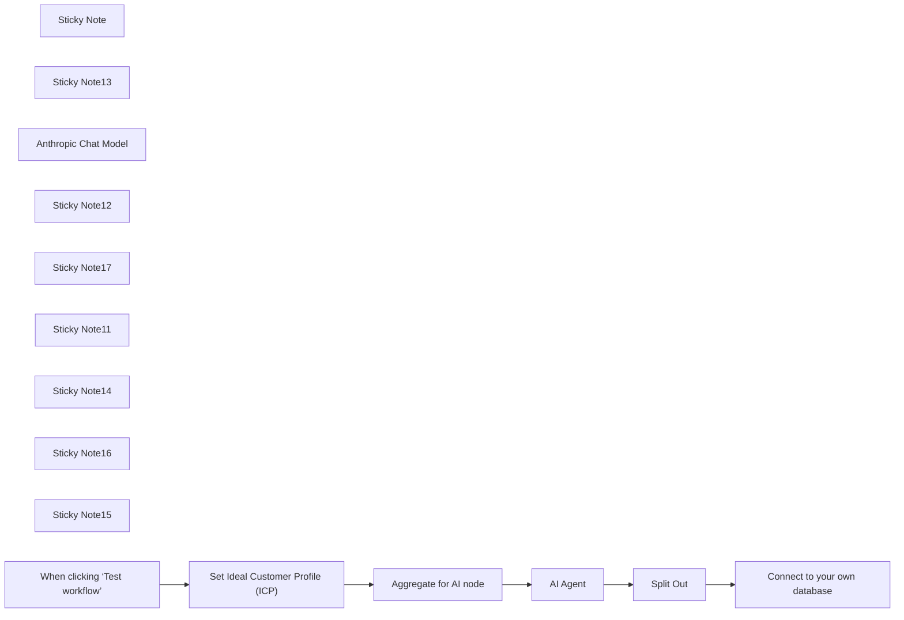

## Fluxo (.json) :

```json
{
  "meta": {
    "instanceId": "257476b1ef58bf3cb6a46e65fac7ee34a53a5e1a8492d5c6e4da5f87c9b82833",
    "templateId": "2473"
  },
  "nodes": [
    {
      "id": "1205b121-8aaa-4e41-874b-4e81aad6374e",
      "name": "Sticky Note",
      "type": "n8n-nodes-base.stickyNote",
      "position": [
        120,
        600
      ],
      "parameters": {
        "color": 4,
        "width": 462.4041757955455,
        "height": 315.6388466176832,
        "content": "## Generate SEO Seed Keywords Using AI\n\nThis flow uses an AI node to generate Seed Keywords to focus SEO efforts on based on your ideal customer profile\n\n**Outputs:** \n- List of 20 Seed Keywords\n\n\n**Pre-requisites / Dependencies:**\n- You know your ideal customer profile (ICP)\n- An AI API account (either OpenAI or Anthropic recommended)"
      },
      "typeVersion": 1
    },
    {
      "id": "d2654d75-2b64-4ec3-b583-57d2b6b7b195",
      "name": "Sticky Note13",
      "type": "n8n-nodes-base.stickyNote",
      "disabled": true,
      "position": [
        640,
        920
      ],
      "parameters": {
        "color": 7,
        "width": 287.0816455493243,
        "height": 330.47923074942287,
        "content": "**Generate draft seed KW based on ICP**\n\n"
      },
      "typeVersion": 1
    },
    {
      "id": "d248a58e-3705-4b6f-99cb-e9187e56781c",
      "name": "Anthropic Chat Model",
      "type": "@n8n/n8n-nodes-langchain.lmChatAnthropic",
      "position": [
        680,
        1120
      ],
      "parameters": {
        "options": {}
      },
      "typeVersion": 1.2
    },
    {
      "id": "71517d83-59f5-441a-8a75-c35f4e06a8a2",
      "name": "Split Out",
      "type": "n8n-nodes-base.splitOut",
      "position": [
        980,
        980
      ],
      "parameters": {
        "options": {},
        "fieldToSplitOut": "output.answer"
      },
      "typeVersion": 1
    },
    {
      "id": "1c68eff5-6478-4eba-9abe-3ccea2a17a5c",
      "name": "Sticky Note12",
      "type": "n8n-nodes-base.stickyNote",
      "disabled": true,
      "position": [
        120,
        920
      ],
      "parameters": {
        "color": 7,
        "width": 492.16246201447336,
        "height": 213.62075341687063,
        "content": "**Get data from airtable and format** "
      },
      "typeVersion": 1
    },
    {
      "id": "53dcc524-ef3d-40b8-b79d-976517dce4e7",
      "name": "Sticky Note17",
      "type": "n8n-nodes-base.stickyNote",
      "disabled": true,
      "position": [
        960,
        920
      ],
      "parameters": {
        "color": 7,
        "width": 348.42891651921957,
        "height": 213.62075341687063,
        "content": "**Add data to database**"
      },
      "typeVersion": 1
    },
    {
      "id": "570495fe-3f1d-44ae-bea0-9fa4b2ce15ef",
      "name": "Sticky Note11",
      "type": "n8n-nodes-base.stickyNote",
      "position": [
        640,
        820
      ],
      "parameters": {
        "color": 6,
        "width": 393.46745700785266,
        "height": 80,
        "content": "**Costs to run**\nApprox. $0.02-0.05 for a run using Claude Sonnet 3.5"
      },
      "typeVersion": 1
    },
    {
      "id": "6e5e84c5-409f-4f37-931a-21a44aff7c5e",
      "name": "Set Ideal Customer Profile (ICP)",
      "type": "n8n-nodes-base.set",
      "position": [
        160,
        980
      ],
      "parameters": {
        "options": {},
        "assignments": {
          "assignments": [
            {
              "id": "973e949e-1afd-4378-8482-d2168532eff6",
              "name": "product",
              "type": "string",
              "value": "=**Replace this with a string detailing your intended product (if you have one)**"
            },
            {
              "id": "ce9c0a8f-6157-4b46-8b77-133545dc71bd",
              "name": "pain points",
              "type": "string",
              "value": "=**Replace this with a string list of customer pain points**"
            },
            {
              "id": "5abc858a-c412-4acf-acb9-488e4d992d2f",
              "name": "goals",
              "type": "string",
              "value": "=**Replace this with a string list of your customers key goals/objectives**"
            },
            {
              "id": "fbdd1ef7-c1b9-48eb-b73e-a383f12b5ba1",
              "name": "current solutions",
              "type": "string",
              "value": "=**Replace this with a string detailing how your ideal customer currently solves their pain ppoints**"
            },
            {
              "id": "2e5c8f48-266e-486c-956f-51f1449f6288",
              "name": "expertise level",
              "type": "string",
              "value": "=**Replace this with a string detailing customer level of expertise**"
            }
          ]
        }
      },
      "notesInFlow": true,
      "typeVersion": 3.4
    },
    {
      "id": "bd5781f4-6f35-45d3-8182-12ea6712eddf",
      "name": "Aggregate for AI node",
      "type": "n8n-nodes-base.aggregate",
      "position": [
        380,
        980
      ],
      "parameters": {
        "options": {},
        "aggregate": "aggregateAllItemData"
      },
      "notesInFlow": true,
      "typeVersion": 1
    },
    {
      "id": "244943bf-e4dd-40fc-9a43-7a5cd0da1c5b",
      "name": "Sticky Note14",
      "type": "n8n-nodes-base.stickyNote",
      "position": [
        640,
        1260
      ],
      "parameters": {
        "color": 3,
        "width": 284.87764467541297,
        "height": 80,
        "content": "**REQUIRED**\nConnect to your own AI API above"
      },
      "typeVersion": 1
    },
    {
      "id": "73c8f47a-4fdb-40c8-9062-890ef1265ab0",
      "name": "Sticky Note16",
      "type": "n8n-nodes-base.stickyNote",
      "position": [
        120,
        1140
      ],
      "parameters": {
        "color": 3,
        "width": 284.87764467541297,
        "height": 80,
        "content": "**REQUIRED**\nSet your Ideal Customer Profile before proceeding"
      },
      "typeVersion": 1
    },
    {
      "id": "a5b93e6d-44ab-4b6f-b86a-25dc621b52b0",
      "name": "AI Agent",
      "type": "@n8n/n8n-nodes-langchain.agent",
      "position": [
        660,
        980
      ],
      "parameters": {
        "text": "=User:\nHere are some important rules for you to follow:\n<rules>\n1. Analyze the ICP information carefully.\n2. Generate 15-20 seed keywords that are relevant to the ICP's needs, challenges, goals, and search behavior.\n3. Ensure the keywords are broad enough to be considered \"\"head\"\" terms, but specific enough to target the ICP effectively.\n4. Consider various aspects of the ICP's journey, including awareness, consideration, and decision stages.\n5. Include a mix of product-related, problem-related, and solution-related terms.\n6. Think beyond just the product itself - consider industry trends, related technologies, and broader business concepts that would interest the ICP.\n7. Avoid overly generic terms that might attract irrelevant traffic.\n8. Aim for a mix of keyword difficulties, including both competitive and less competitive terms.\n9. Include keywords that cover different search intents: informational, navigational, commercial, and transactional.\n10. Consider related tools or platforms that the ICP might use, and include relevant integration-related keywords.\n11. If applicable, include some location-specific keywords based on the ICP's geographic information.\n12. Incorporate industry-specific terminology or jargon that the ICP would likely use in their searches.\n13. Consider emerging trends or pain points in the ICP's industry that they might be searching for solutions to.\n13. Format the keywords in lowercase, without punctuation. Trim any leading or trailing white space.\n</rules>\n\nYour output should be an array of strings, each representing a seed keyword:\n<example>\n['b2b lead generation', 'startup marketing strategies', 'saas sales funnel', ...]\n</example>\n\nHere is the Ideal Customer Profile (ICP) information:\n<input>\n{{ $json.data[0].product }}\n</input>\n\nNow:\nBased on the provided ICP, generate an array of 15-20 seed keywords that will form the foundation of a comprehensive SEO strategy for this B2B SaaS company. These keywords should reflect a deep understanding of the ICP's needs, challenges, and search behavior, while also considering broader industry trends and related concepts.\n\nFirst, write out your ideas in {thoughts: } JSON as part of your analysis, then answer inside the {answer: } key in the JSON. ",
        "agent": "conversationalAgent",
        "options": {
          "systemMessage": "=System: You are an expert SEO strategist tasked with generating 15-20 key head search terms (seed keywords) for a B2B SaaS company. Your goal is to create a comprehensive list of keywords that will attract and engage the ideal customer profile (ICP) described."
        },
        "promptType": "define"
      },
      "typeVersion": 1.6
    },
    {
      "id": "ca3c0bd5-7ef0-4e2b-9b5e-071773c32c85",
      "name": "Connect to your own database",
      "type": "n8n-nodes-base.noOp",
      "position": [
        1140,
        980
      ],
      "parameters": {},
      "typeVersion": 1
    },
    {
      "id": "94639a81-5e46-482a-851a-5443bfe9863c",
      "name": "Sticky Note15",
      "type": "n8n-nodes-base.stickyNote",
      "position": [
        1120,
        1140
      ],
      "parameters": {
        "color": 3,
        "width": 284.87764467541297,
        "height": 80,
        "content": "**REQUIRED**\nConnect to your own database / GSheet / Airtable base to output these"
      },
      "typeVersion": 1
    },
    {
      "id": "16498e92-c0d5-44f4-b993-c9c8930955bc",
      "name": "When clicking ‘Test workflow’",
      "type": "n8n-nodes-base.manualTrigger",
      "position": [
        -60,
        980
      ],
      "parameters": {},
      "typeVersion": 1
    }
  ],
  "pinData": {},
  "connections": {
    "AI Agent": {
      "main": [
        [
          {
            "node": "Split Out",
            "type": "main",
            "index": 0
          }
        ]
      ]
    },
    "Split Out": {
      "main": [
        [
          {
            "node": "Connect to your own database",
            "type": "main",
            "index": 0
          }
        ]
      ]
    },
    "Anthropic Chat Model": {
      "ai_languageModel": [
        [
          {
            "node": "AI Agent",
            "type": "ai_languageModel",
            "index": 0
          }
        ]
      ]
    },
    "Aggregate for AI node": {
      "main": [
        [
          {
            "node": "AI Agent",
            "type": "main",
            "index": 0
          }
        ]
      ]
    },
    "Set Ideal Customer Profile (ICP)": {
      "main": [
        [
          {
            "node": "Aggregate for AI node",
            "type": "main",
            "index": 0
          }
        ]
      ]
    },
    "When clicking ‘Test workflow’": {
      "main": [
        [
          {
            "node": "Set Ideal Customer Profile (ICP)",
            "type": "main",
            "index": 0
          }
        ]
      ]
    }
  }
}
```
