# PACK 1999 TEMPLATES PARTE 10 - Bloco 6

Templates neste bloco: 20

## Sumário

- [Template 2467 - Enviar mensagem ao Telegram via webhook](#template-2467)
- [Template 2471 - Sincronização de timers Clockify para Syncro](#template-2471)
- [Template 2472 - Poema diário no Telegram](#template-2472)
- [Template 2473 - Publicação automática em Dev.to e Medium via webhook](#template-2473)
- [Template 2475 - Relatório automático de top criadores e workflows](#template-2475)
- [Template 2478 - Agente Telegram para texto, áudio e imagens](#template-2478)
- [Template 2480 - Responder no Telegram com imagem de coquetel aleatório](#template-2480)
- [Template 2482 - Atualizar dashboard de métricas](#template-2482)
- [Template 2483 - Chatbot RAG integrado a Google Drive e Qdrant](#template-2483)
- [Template 2485 - Gerador de vídeos sociais AI com publicação automática](#template-2485)
- [Template 2487 - Detector de anomalias em imagens de culturas](#template-2487)
- [Template 2490 - Quick Start DeepSeek Chat V3 e R1](#template-2490)
- [Template 2492 - Criador de conteúdo WordPress com IA](#template-2492)
- [Template 2493 - Análise automática de imagens via Telegram](#template-2493)
- [Template 2495 - Transcrição automática de vídeos do YouTube](#template-2495)
- [Template 2497 - Captura diária automática de dados meteorológicos](#template-2497)
- [Template 2499 - Geração automática de relatórios de pesquisa em PDF](#template-2499)
- [Template 2501 - Busca e extração web com Tavily + sumarização](#template-2501)
- [Template 2503 - Verificador de blacklist de carteiras TRON via Telegram](#template-2503)
- [Template 2504 - Enviar múltiplos arquivos para repositório GitHub](#template-2504)

---

<a id="template-2467"></a>

## Template 2467 - Enviar mensagem ao Telegram via webhook

- **Nome:** Enviar mensagem ao Telegram via webhook
- **Descrição:** Recebe uma requisição HTTP e envia o texto recebido para um chat do Telegram, retornando um resumo da ação.
- **Funcionalidade:** • Receber requisições HTTP: expõe um endpoint webhook que aceita um parâmetro de consulta chamado "parameter" contendo o texto a ser enviado.
• Enviar mensagem ao Telegram: utiliza credenciais de bot para enviar o texto recebido ao chat com ID fixo 123456789.
• Construir resposta de confirmação: monta uma mensagem de confirmação no formato 'Sent message to <first_name>: "<texto>"' usando o nome do destinatário retornado pelo Telegram.
• Retornar confirmação ao solicitante: devolve a mensagem de confirmação como resposta HTTP ao remetente do webhook.
- **Ferramentas:** • Telegram: API do Telegram Bot para envio de mensagens a um chat específico.
• Endpoint HTTP público (webhook): ponto de entrada que recebe requisições externas contendo o texto a ser enviado.

## Fluxo visual


## Fluxo (.json) :

```json
{
  "id": "5",
  "name": "bash-dash telegram",
  "nodes": [
    {
      "name": "Webhook",
      "type": "n8n-nodes-base.webhook",
      "position": [
        450,
        450
      ],
      "webhookId": "b43ae7e2-a058-4738-8d49-ac76db6e8166",
      "parameters": {
        "path": "telegram",
        "options": {
          "responsePropertyName": "response"
        },
        "responseMode": "lastNode"
      },
      "typeVersion": 1
    },
    {
      "name": "Set",
      "type": "n8n-nodes-base.set",
      "position": [
        850,
        450
      ],
      "parameters": {
        "values": {
          "string": [
            {
              "name": "response",
              "value": "=Sent message to {{$node[\"Telegram\"].json[\"result\"][\"chat\"][\"first_name\"]}}: \"{{$node[\"Telegram\"].parameter[\"text\"]}}\""
            }
          ]
        },
        "options": {}
      },
      "typeVersion": 1
    },
    {
      "name": "Telegram",
      "type": "n8n-nodes-base.telegram",
      "position": [
        650,
        450
      ],
      "parameters": {
        "text": "={{$node[\"Webhook\"].json[\"query\"][\"parameter\"]}}",
        "chatId": "123456789",
        "additionalFields": {}
      },
      "credentials": {
        "telegramApi": "telegram_bot"
      },
      "typeVersion": 1
    }
  ],
  "active": true,
  "settings": {},
  "connections": {
    "Set": {
      "main": [
        []
      ]
    },
    "Webhook": {
      "main": [
        [
          {
            "node": "Telegram",
            "type": "main",
            "index": 0
          }
        ]
      ]
    },
    "Telegram": {
      "main": [
        [
          {
            "node": "Set",
            "type": "main",
            "index": 0
          }
        ]
      ]
    }
  }
}
```

<a id="template-2471"></a>

## Template 2471 - Sincronização de timers Clockify para Syncro

- **Nome:** Sincronização de timers Clockify para Syncro
- **Descrição:** Sincroniza entradas de tempo recebidas via webhook do Clockify com tickets no Syncro, criando ou atualizando timers e registrando correspondências em uma planilha.
- **Funcionalidade:** • Recepção de webhooks (Clockify): Recebe eventos de entrada de tempo do Clockify para iniciar a automação.
• Filtragem por projeto Ticket: Ignora entradas cujo nome de projeto não contenha a palavra "Ticket".
• Extração de ID do ticket: Extrai o ID do ticket do nome do projeto usando uma expressão regular que busca o padrão [número].
• Mapeamento de técnico: Converte o nome do usuário do Clockify para o ID do técnico do sistema de tickets usando um mapeamento pré-definido.
• Busca de correspondência em planilha: Procura na planilha se já existe uma associação entre o ID do Clockify e um timer do Syncro.
• Atualização ou criação de timer no Syncro: Se existir correspondência, atualiza o timer existente; se não, cria um novo timer no ticket do Syncro com início, fim, notas e user_id.
• Registro da associação no Google Sheets: Após criar um novo timer, grava a relação entre o ID do Syncro e o ID do Clockify na planilha para futuras correspondências.
• Uso de variável para base URL do Syncro: Permite configurar a URL base da API do Syncro via variável para facilitar reutilização e manutenção.
- **Ferramentas:** • Clockify: Origem dos webhooks de entradas de tempo, fornece dados como usuário, projeto, intervalo de tempo e descrição.
• Syncro MSP: API de tickets usada para criar e atualizar entradas de tempo (timer entries) nos tickets.
• Google Sheets: Planilha usada como repositório/lookup para mapear e persistir a relação entre IDs do Clockify e timers do Syncro.


## Fluxo visual

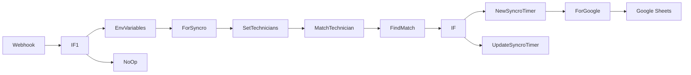

## Fluxo (.json) :

```json
{
  "id": "3",
  "name": "Clockify to Syncro",
  "nodes": [
    {
      "name": "Webhook",
      "type": "n8n-nodes-base.webhook",
      "position": [
        280,
        350
      ],
      "webhookId": "82b654d7-aeb2-4cc1-97a8-0ebd1a729202",
      "parameters": {
        "path": "82b654d7-aeb2-4cc1-97a8-0ebd1a729202",
        "options": {},
        "httpMethod": "POST",
        "responseData": "allEntries",
        "responseMode": "lastNode"
      },
      "typeVersion": 1
    },
    {
      "name": "Google Sheets",
      "type": "n8n-nodes-base.googleSheets",
      "position": [
        1830,
        350
      ],
      "parameters": {
        "range": "A:B",
        "options": {
          "valueInputMode": "USER_ENTERED"
        },
        "sheetId": "xxx",
        "operation": "append"
      },
      "credentials": {
        "googleApi": "Google"
      },
      "typeVersion": 1
    },
    {
      "name": "ForGoogle",
      "type": "n8n-nodes-base.set",
      "position": [
        1650,
        350
      ],
      "parameters": {
        "values": {
          "string": [
            {
              "name": "Syncro",
              "value": "={{$json[\"id\"]}}"
            },
            {
              "name": "Clockify",
              "value": "={{$node[\"Webhook\"].json[\"body\"][\"id\"]}}"
            }
          ]
        },
        "options": {},
        "keepOnlySet": true
      },
      "typeVersion": 1
    },
    {
      "name": "ForSyncro",
      "type": "n8n-nodes-base.set",
      "position": [
        730,
        350
      ],
      "parameters": {
        "values": {
          "string": [
            {
              "name": "id",
              "value": "={{ $json[\"body\"][\"project\"][\"name\"].match(/\\[(\\d+)]/)[1] }}"
            }
          ]
        },
        "options": {},
        "keepOnlySet": true
      },
      "typeVersion": 1
    },
    {
      "name": "FindMatch",
      "type": "n8n-nodes-base.googleSheets",
      "position": [
        1130,
        350
      ],
      "parameters": {
        "range": "A:B",
        "options": {
          "valueRenderMode": "UNFORMATTED_VALUE",
          "returnAllMatches": true
        },
        "sheetId": "xxx",
        "operation": "lookup",
        "lookupValue": "={{$node[\"Webhook\"].json[\"body\"][\"id\"]}}",
        "lookupColumn": "=Clockify"
      },
      "credentials": {
        "googleApi": "Google"
      },
      "typeVersion": 1,
      "alwaysOutputData": true
    },
    {
      "name": "IF",
      "type": "n8n-nodes-base.if",
      "position": [
        1300,
        350
      ],
      "parameters": {
        "conditions": {
          "string": [],
          "boolean": [
            {
              "value1": "={{!!Object.keys($node[\"FindMatch\"].data).length}}",
              "value2": true
            }
          ]
        }
      },
      "typeVersion": 1,
      "alwaysOutputData": false
    },
    {
      "name": "NewSyncroTimer",
      "type": "n8n-nodes-base.httpRequest",
      "position": [
        1490,
        350
      ],
      "parameters": {
        "url": "={{$node[\"EnvVariables\"].json[\"syncro_baseurl\"]}}/api/v1/tickets/{{$node[\"ForSyncro\"].json[\"id\"]}}/timer_entry",
        "options": {},
        "requestMethod": "POST",
        "authentication": "headerAuth",
        "bodyParametersUi": {
          "parameter": [
            {
              "name": "start_at",
              "value": "={{$node[\"Webhook\"].json[\"body\"][\"timeInterval\"][\"start\"]}}"
            },
            {
              "name": "end_at",
              "value": "={{$node[\"Webhook\"].json[\"body\"][\"timeInterval\"][\"end\"]}}"
            },
            {
              "name": "notes",
              "value": "={{$node[\"Webhook\"].json[\"body\"][\"description\"]}}"
            },
            {
              "name": "user_id",
              "value": "={{$node[\"MatchTechnician\"].json[\"id\"]}}"
            }
          ]
        }
      },
      "credentials": {
        "httpHeaderAuth": "Syncro"
      },
      "typeVersion": 1
    },
    {
      "name": "UpdateSyncroTimer",
      "type": "n8n-nodes-base.httpRequest",
      "position": [
        1490,
        580
      ],
      "parameters": {
        "url": "={{$node[\"EnvVariables\"].json[\"syncro_baseurl\"]}}/api/v1/tickets/{{$node[\"ForSyncro\"].json[\"id\"]}}/update_timer_entry",
        "options": {
          "followRedirect": true
        },
        "requestMethod": "PUT",
        "authentication": "headerAuth",
        "bodyParametersUi": {
          "parameter": [
            {
              "name": "timer_entry_id",
              "value": "={{$node[\"IF\"].json[\"Syncro\"]}}"
            },
            {
              "name": "start_time",
              "value": "={{$node[\"Webhook\"].json[\"body\"][\"timeInterval\"][\"start\"]}}"
            },
            {
              "name": "end_time",
              "value": "={{$node[\"Webhook\"].json[\"body\"][\"timeInterval\"][\"end\"]}}"
            },
            {
              "name": "notes",
              "value": "={{$node[\"Webhook\"].json[\"body\"][\"description\"]}}"
            },
            {
              "name": "user_id",
              "value": "={{$node[\"MatchTechnician\"].json[\"id\"]}}"
            }
          ]
        }
      },
      "credentials": {
        "httpHeaderAuth": "Syncro"
      },
      "typeVersion": 1
    },
    {
      "name": "EnvVariables",
      "type": "n8n-nodes-base.set",
      "position": [
        580,
        350
      ],
      "parameters": {
        "values": {
          "string": [
            {
              "name": "syncro_baseurl",
              "value": "https://subdomain.syncromsp.com"
            }
          ]
        },
        "options": {}
      },
      "typeVersion": 1
    },
    {
      "name": "SetTechnicians",
      "type": "n8n-nodes-base.set",
      "position": [
        870,
        350
      ],
      "parameters": {
        "values": {
          "string": [
            {
              "name": "Tech 1",
              "value": "1234"
            },
            {
              "name": "Tech 2",
              "value": "5678"
            }
          ]
        },
        "options": {},
        "keepOnlySet": true
      },
      "typeVersion": 1
    },
    {
      "name": "MatchTechnician",
      "type": "n8n-nodes-base.function",
      "position": [
        1000,
        350
      ],
      "parameters": {
        "functionCode": "\nconst results = [];\n\nconst user = $node[\"Webhook\"].json[\"body\"][\"user\"];\n\nconst persons = items[0].json\n\nfor (key of Object.keys(persons)) {\n  if (key === user.name) {\n    results.push({ json: { id: persons[key], name: key } })\n  }\n}\n\nreturn results;"
      },
      "typeVersion": 1
    },
    {
      "name": "IF1",
      "type": "n8n-nodes-base.if",
      "position": [
        420,
        350
      ],
      "parameters": {
        "conditions": {
          "string": [
            {
              "value1": "={{$json[\"body\"][\"project\"][\"name\"]}}",
              "value2": "Ticket",
              "operation": "contains"
            }
          ]
        }
      },
      "typeVersion": 1
    },
    {
      "name": "NoOp",
      "type": "n8n-nodes-base.noOp",
      "position": [
        480,
        520
      ],
      "parameters": {},
      "typeVersion": 1
    }
  ],
  "active": true,
  "settings": {},
  "connections": {
    "IF": {
      "main": [
        [
          {
            "node": "UpdateSyncroTimer",
            "type": "main",
            "index": 0
          }
        ],
        [
          {
            "node": "NewSyncroTimer",
            "type": "main",
            "index": 0
          }
        ]
      ]
    },
    "IF1": {
      "main": [
        [
          {
            "node": "EnvVariables",
            "type": "main",
            "index": 0
          }
        ],
        [
          {
            "node": "NoOp",
            "type": "main",
            "index": 0
          }
        ]
      ]
    },
    "Webhook": {
      "main": [
        [
          {
            "node": "IF1",
            "type": "main",
            "index": 0
          }
        ]
      ]
    },
    "FindMatch": {
      "main": [
        [
          {
            "node": "IF",
            "type": "main",
            "index": 0
          }
        ]
      ]
    },
    "ForGoogle": {
      "main": [
        [
          {
            "node": "Google Sheets",
            "type": "main",
            "index": 0
          }
        ]
      ]
    },
    "ForSyncro": {
      "main": [
        [
          {
            "node": "SetTechnicians",
            "type": "main",
            "index": 0
          }
        ]
      ]
    },
    "EnvVariables": {
      "main": [
        [
          {
            "node": "ForSyncro",
            "type": "main",
            "index": 0
          }
        ]
      ]
    },
    "NewSyncroTimer": {
      "main": [
        [
          {
            "node": "ForGoogle",
            "type": "main",
            "index": 0
          }
        ]
      ]
    },
    "SetTechnicians": {
      "main": [
        [
          {
            "node": "MatchTechnician",
            "type": "main",
            "index": 0
          }
        ]
      ]
    },
    "MatchTechnician": {
      "main": [
        [
          {
            "node": "FindMatch",
            "type": "main",
            "index": 0
          }
        ]
      ]
    }
  }
}
```

<a id="template-2472"></a>

## Template 2472 - Poema diário no Telegram

- **Nome:** Poema diário no Telegram
- **Descrição:** Busca um poema aleatório diariamente, traduz o conteúdo para inglês e envia uma mensagem formatada para um chat do Telegram.
- **Funcionalidade:** • Agendamento diário: Executa o fluxo automaticamente todos os dias às 10h.
• Busca de poemas aleatórios: Recupera poemas de uma fonte pública de poemas.
• Tradução do conteúdo: Tradução automática do texto do poema para inglês (variante en_GB).
• Envio formatado ao Telegram: Monta e envia uma mensagem com título, autor e conteúdo do poema para um chat específico.
- **Ferramentas:** • Poemist API: Fonte pública que fornece poemas aleatórios em formato JSON.
• LingvaNex: Serviço de tradução automática utilizado para traduzir o conteúdo do poema para inglês.
• Telegram Bot API: Serviço para enviar mensagens ao chat do usuário por meio de um bot.


## Fluxo visual

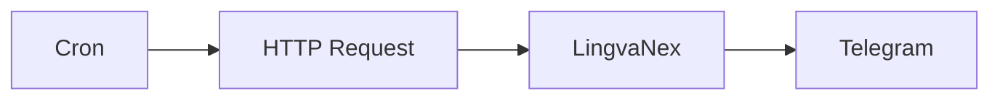

## Fluxo (.json) :

```json
{
  "id": "3",
  "name": "Daily poems in Telegram",
  "nodes": [
    {
      "name": "Cron",
      "type": "n8n-nodes-base.cron",
      "position": [
        -250,
        400
      ],
      "parameters": {
        "triggerTimes": {
          "item": [
            {
              "hour": 10
            }
          ]
        }
      },
      "typeVersion": 1
    },
    {
      "name": "Telegram",
      "type": "n8n-nodes-base.telegram",
      "position": [
        350,
        400
      ],
      "parameters": {
        "text": "=✒️ Poem of the day:\n{{$node[\"HTTP Request\"].json[\"0\"][\"title\"]}} by {{$node[\"HTTP Request\"].json[\"0\"][\"poet\"][\"name\"]}}\n\n{{$node[\"HTTP Request\"].json[\"0\"][\"content\"]}}\n☁️",
        "chatId": "123456789",
        "additionalFields": {}
      },
      "credentials": {
        "telegramApi": "telegram_bot"
      },
      "typeVersion": 1
    },
    {
      "name": "HTTP Request",
      "type": "n8n-nodes-base.httpRequest",
      "position": [
        -50,
        400
      ],
      "parameters": {
        "url": "https://www.poemist.com/api/v1/randompoems",
        "options": {}
      },
      "typeVersion": 1
    },
    {
      "name": "LingvaNex",
      "type": "n8n-nodes-base.lingvaNex",
      "position": [
        150,
        400
      ],
      "parameters": {
        "text": "={{$node[\"HTTP Request\"].json[\"0\"][\"content\"]}}",
        "options": {},
        "translateTo": "en_GB"
      },
      "credentials": {
        "lingvaNexApi": "lingvanex_API"
      },
      "typeVersion": 1
    }
  ],
  "active": false,
  "settings": {},
  "connections": {
    "Cron": {
      "main": [
        [
          {
            "node": "HTTP Request",
            "type": "main",
            "index": 0
          }
        ]
      ]
    },
    "LingvaNex": {
      "main": [
        [
          {
            "node": "Telegram",
            "type": "main",
            "index": 0
          }
        ]
      ]
    },
    "HTTP Request": {
      "main": [
        [
          {
            "node": "LingvaNex",
            "type": "main",
            "index": 0
          }
        ]
      ]
    }
  }
}
```

<a id="template-2473"></a>

## Template 2473 - Publicação automática em Dev.to e Medium via webhook

- **Nome:** Publicação automática em Dev.to e Medium via webhook
- **Descrição:** Recebe conteúdo através de um webhook autenticado e publica automaticamente o mesmo conteúdo no Dev.to e no Medium.
- **Funcionalidade:** • Recepção de conteúdo via webhook autenticado: recebe POSTs com título, conteúdo e tags e valida via autenticação por cabeçalho.
• Extração de campos do payload: extrai Title, PostContent e Tag do corpo do webhook para uso nas publicações.
• Publicação no Dev.to: cria um artigo via API do Dev.to, enviando título, corpo em Markdown, tags e marcando como publicado.
• Publicação no Medium: cria uma publicação no Medium usando o título e o conteúdo em formato Markdown.
• Publicação simultânea em múltiplas plataformas: aciona as publicações no Dev.to e no Medium a partir do mesmo evento recebido.
- **Ferramentas:** • Strapi: sistema que envia o webhook com os dados do post (título, conteúdo, tags).
• Dev.to: plataforma de publicação usada via API para criar artigos em Markdown com tags e marcar como publicados.
• Medium: plataforma de publicação usada via API para criar posts com conteúdo em Markdown.

## Fluxo visual

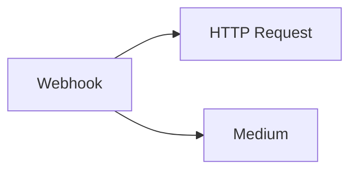

## Fluxo (.json) :

```json
{
  "nodes": [
    {
      "name": "Medium",
      "type": "n8n-nodes-base.medium",
      "position": [
        650,
        450
      ],
      "parameters": {
        "title": "={{$json[\"body\"][\"entry\"][\"Title\"]}}",
        "content": "={{$json[\"body\"][\"entry\"][\"PostContent\"]}}",
        "contentFormat": "markdown",
        "additionalFields": {}
      },
      "credentials": {
        "mediumApi": "Medium Credentials"
      },
      "typeVersion": 1
    },
    {
      "name": "Webhook",
      "type": "n8n-nodes-base.webhook",
      "position": [
        450,
        300
      ],
      "webhookId": "",
      "parameters": {
        "path": "",
        "options": {},
        "httpMethod": "POST",
        "authentication": "headerAuth"
      },
      "credentials": {
        "httpHeaderAuth": "Strapi Webhook Credentials"
      },
      "typeVersion": 1
    },
    {
      "name": "HTTP Request",
      "type": "n8n-nodes-base.httpRequest",
      "position": [
        650,
        200
      ],
      "parameters": {
        "url": "https://dev.to/api/articles",
        "options": {},
        "requestMethod": "POST",
        "authentication": "headerAuth",
        "jsonParameters": true,
        "bodyParametersJson": "={\n\t\"article\": {\n\t\t\"title\": \"{{$json[\"body\"][\"entry\"][\"Title\"]}}\",\n\t\t\"published\": true,\n\t\t\"body_markdown\": \"{{$json[\"body\"][\"entry\"][\"PostContent\"]}}\",\n\t\t\"tags\":[\"{{$json[\"body\"][\"entry\"][\"Tag\"]}}\"]\n\t}\n}",
        "headerParametersJson": "{\"Content-Type\": \"application/json\"}"
      },
      "credentials": {
        "httpHeaderAuth": "Dev.to Credentials"
      },
      "typeVersion": 1
    }
  ],
  "connections": {
    "Webhook": {
      "main": [
        [
          {
            "node": "HTTP Request",
            "type": "main",
            "index": 0
          },
          {
            "node": "Medium",
            "type": "main",
            "index": 0
          }
        ]
      ]
    }
  }
}
```

<a id="template-2475"></a>

## Template 2475 - Relatório automático de top criadores e workflows

- **Nome:** Relatório automático de top criadores e workflows
- **Descrição:** Gera diariamente um relatório em Markdown com estatísticas e insights dos principais criadores e workflows a partir de dados públicos, enriquecendo o conteúdo com um agente de IA e distribuindo os resultados por múltiplos destinos.
- **Funcionalidade:** • Agendamento diário: Executa o fluxo automaticamente em horários definidos.
• Coleta de dados: Baixa arquivos de estatísticas a partir de um repositório público.
• Parse e agregação: Extrai, normaliza e agrega dados de criadores e workflows.
• Ordenação e filtragem: Ordena por inserções/visitantes e seleciona os top N criadores e workflows.
• Junção de dados: Combina informações de criadores com seus workflows relacionados.
• Geração de relatório com IA: Usa um agente de linguagem para criar um relatório em Markdown com resumo, tabela e análise comunitária.
• Criação de lista Top 10: Produz uma lista separada com hyperlinks dos 10 workflows mais inseridos semanalmente.
• Conversão Markdown → HTML: Converte o relatório e a lista para HTML para envio por e-mail ou mensagens.
• Distribuição: Salva relatório no Google Drive, envia por Gmail e publica uma mensagem no Telegram.
• Salvamento local opcional: Grava o relatório como arquivo Markdown no sistema local para arquivamento.
• Tratamento de erros e dados ausentes: Indica quando dados estão incompletos e permite continuidade em canais que toleram falhas.
- **Ferramentas:** • GitHub (repositório público): Fonte dos arquivos de estatísticas usados como entrada.
• OpenAI (gpt-4o-mini): Geração de texto para compor relatórios detalhados em Markdown.
• Google Gemini (PaLM): Modelo alternativo de linguagem utilizado para criar a lista Top 10.
• Google Drive: Armazenamento e criação de arquivos de relatório em nuvem.
• Gmail: Envio dos relatórios por e-mail aos destinatários configurados.
• Telegram: Publicação da lista Top 10 em um chat configurado.
• Sistema de arquivos local: Opção para salvar cópias dos relatórios em disco local.

## Fluxo visual

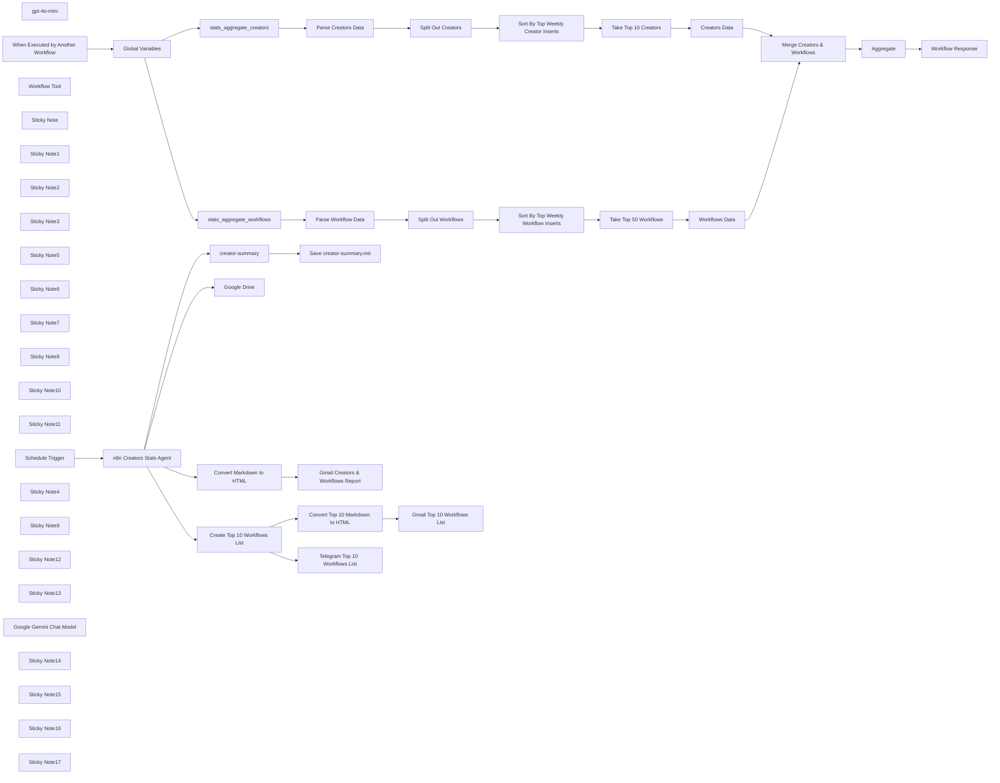

## Fluxo (.json) :

```json
{
  "id": "6zSE618gr9fDtAfF",
  "meta": {
    "instanceId": "31e69f7f4a77bf465b805824e303232f0227212ae922d12133a0f96ffeab4fef",
    "templateCredsSetupCompleted": true
  },
  "name": "🤖🧑‍💻 AI Agent  for Top n8n Creators Leaderboard Reporting",
  "tags": [],
  "nodes": [
    {
      "id": "5b9537db-41d3-4d8a-bf41-f875e4044224",
      "name": "stats_aggregate_creators",
      "type": "n8n-nodes-base.httpRequest",
      "position": [
        -1240,
        1300
      ],
      "parameters": {
        "url": "={{ $json.path }}{{ $json['creators-filename'] }}.json",
        "options": {}
      },
      "typeVersion": 4.2
    },
    {
      "id": "feb2328b-57b0-4280-98d8-6b946db0c947",
      "name": "stats_aggregate_workflows",
      "type": "n8n-nodes-base.httpRequest",
      "position": [
        -1240,
        1500
      ],
      "parameters": {
        "url": "={{ $json.path }}{{ $json['workflows-filename'] }}.json",
        "options": {}
      },
      "typeVersion": 4.2
    },
    {
      "id": "53f8b825-b030-4541-b12b-6df6702f7d1b",
      "name": "Global Variables",
      "type": "n8n-nodes-base.set",
      "position": [
        -1660,
        1460
      ],
      "parameters": {
        "options": {},
        "assignments": {
          "assignments": [
            {
              "id": "4bcb91c6-d250-4cb4-8ee1-022df13550e1",
              "name": "path",
              "type": "string",
              "value": "https://raw.githubusercontent.com/teds-tech-talks/n8n-community-leaderboard/refs/heads/main/"
            },
            {
              "id": "a910a798-0bfe-41b1-a4f1-41390c7f6997",
              "name": "workflows-filename",
              "type": "string",
              "value": "=stats_aggregate_workflows"
            },
            {
              "id": "e977e816-dc1e-43ce-9393-d6488e6832ca",
              "name": "creators-filename",
              "type": "string",
              "value": "=stats_aggregate_creators"
            },
            {
              "id": "14233ab4-3fa4-4e26-8032-6ffe26cb601e",
              "name": "datetime",
              "type": "string",
              "value": "={{ $now.format('yyyy-MM-dd') }}"
            }
          ]
        }
      },
      "typeVersion": 3.4
    },
    {
      "id": "202026ea-054f-45ae-84f6-59ec58794f1c",
      "name": "Parse Workflow Data",
      "type": "n8n-nodes-base.set",
      "position": [
        -880,
        1540
      ],
      "parameters": {
        "options": {},
        "assignments": {
          "assignments": [
            {
              "id": "76f4b20e-519e-4d46-aeac-c6c3f98a69fd",
              "name": "data",
              "type": "array",
              "value": "={{ $json.data }}"
            }
          ]
        }
      },
      "typeVersion": 3.4
    },
    {
      "id": "54ecfc96-0f5e-4275-a53b-f87850926d7f",
      "name": "Parse Creators Data",
      "type": "n8n-nodes-base.set",
      "position": [
        -880,
        1200
      ],
      "parameters": {
        "options": {},
        "assignments": {
          "assignments": [
            {
              "id": "76f4b20e-519e-4d46-aeac-c6c3f98a69fd",
              "name": "data",
              "type": "array",
              "value": "={{ $json.data }}"
            }
          ]
        }
      },
      "typeVersion": 3.4
    },
    {
      "id": "e590677e-a8ff-4b76-8527-e5bdc0076610",
      "name": "Aggregate",
      "type": "n8n-nodes-base.aggregate",
      "position": [
        -680,
        1820
      ],
      "parameters": {
        "options": {},
        "aggregate": "aggregateAllItemData"
      },
      "typeVersion": 1
    },
    {
      "id": "7d7ef0f2-dbca-4b24-b2e5-c1236c4beb81",
      "name": "gpt-4o-mini",
      "type": "@n8n/n8n-nodes-langchain.lmChatOpenAi",
      "position": [
        -1880,
        780
      ],
      "parameters": {
        "model": {
          "__rl": true,
          "mode": "list",
          "value": "gpt-4o-mini"
        },
        "options": {
          "temperature": 0.1
        }
      },
      "credentials": {
        "openAiApi": {
          "id": "jEMSvKmtYfzAkhe6",
          "name": "OpenAi account"
        }
      },
      "typeVersion": 1.2
    },
    {
      "id": "59e7066f-da3b-4461-9a52-0f8754b696ae",
      "name": "When Executed by Another Workflow",
      "type": "n8n-nodes-base.executeWorkflowTrigger",
      "position": [
        -1980,
        1460
      ],
      "parameters": {
        "inputSource": "jsonExample",
        "jsonExample": "{\n  \"query\": \n    {\n      \"username\": \n      \"joe\"\n    }\n}"
      },
      "typeVersion": 1.1
    },
    {
      "id": "18734480-3520-4e37-af19-977ec3bfb260",
      "name": "Workflow Tool",
      "type": "@n8n/n8n-nodes-langchain.toolWorkflow",
      "position": [
        -1540,
        780
      ],
      "parameters": {
        "name": "n8n_creator_stats",
        "workflowId": "={{ $workflow.id }}",
        "description": "Call this tool to get n8n Creator Stats.",
        "jsonSchemaExample": "{\n  \"username\": \"n8n creator username\"\n}",
        "specifyInputSchema": true
      },
      "typeVersion": 1
    },
    {
      "id": "4b2195bd-d506-4cd5-bb9d-37cf84c8cebf",
      "name": "creator-summary",
      "type": "n8n-nodes-base.convertToFile",
      "position": [
        -1140,
        60
      ],
      "parameters": {
        "options": {
          "fileName": "=creators-report"
        },
        "operation": "toText",
        "sourceProperty": "output"
      },
      "typeVersion": 1.1
    },
    {
      "id": "ca25473a-0e19-45e0-8de5-00601c95fdf9",
      "name": "Workflow Response",
      "type": "n8n-nodes-base.set",
      "position": [
        -480,
        1820
      ],
      "parameters": {
        "options": {},
        "assignments": {
          "assignments": [
            {
              "id": "eeff1310-2e1c-4ea4-9107-a14b1979f74f",
              "name": "response",
              "type": "string",
              "value": "={{ $json.data }}"
            }
          ]
        }
      },
      "typeVersion": 3.4
    },
    {
      "id": "c45c9bc8-e0d9-496a-bf8d-71c806c330de",
      "name": "Save creator-summary.md",
      "type": "n8n-nodes-base.readWriteFile",
      "position": [
        -940,
        60
      ],
      "parameters": {
        "options": {
          "append": true
        },
        "fileName": "=C:\\\\Users\\\\joe\\Downloads\\\\{{ $binary.data.fileName }}-{{ $now.format('yyyy-MM-dd-hh-mm-ss') }}.md",
        "operation": "write"
      },
      "typeVersion": 1
    },
    {
      "id": "0cddb18b-7924-41f6-b429-a00e4c904b47",
      "name": "Sticky Note",
      "type": "n8n-nodes-base.stickyNote",
      "position": [
        -2060,
        240
      ],
      "parameters": {
        "color": 5,
        "width": 780,
        "height": 740,
        "content": "## AI Agent for n8n Creator Leaderboard Stats\nhttps://github.com/teds-tech-talks/n8n-community-leaderboard"
      },
      "typeVersion": 1
    },
    {
      "id": "6e1a7ffe-bac6-43d8-b7e8-866eb5fcb9f7",
      "name": "Sticky Note1",
      "type": "n8n-nodes-base.stickyNote",
      "position": [
        -1640,
        620
      ],
      "parameters": {
        "width": 280,
        "height": 300,
        "content": "## Tool Call for n8n Creators Stats\nhttps://docs.n8n.io/integrations/builtin/cluster-nodes/sub-nodes/n8n-nodes-langchain.toolworkflow/"
      },
      "typeVersion": 1
    },
    {
      "id": "892ac156-a276-4697-9b25-768301991996",
      "name": "Sticky Note2",
      "type": "n8n-nodes-base.stickyNote",
      "position": [
        -1980,
        620
      ],
      "parameters": {
        "color": 7,
        "width": 300,
        "height": 300,
        "content": "## OpenAI LLM\nhttps://platform.openai.com/api-keys"
      },
      "typeVersion": 1
    },
    {
      "id": "1e3cdf04-b33f-4a64-83c8-f24c424380b2",
      "name": "Sticky Note3",
      "type": "n8n-nodes-base.stickyNote",
      "position": [
        -1240,
        -60
      ],
      "parameters": {
        "width": 540,
        "height": 320,
        "content": "## Save n8n Creators & Workflows Report Locally\n(optional for local install)"
      },
      "typeVersion": 1
    },
    {
      "id": "a01adc65-9425-460b-85ed-fac4c82f1e78",
      "name": "Sticky Note5",
      "type": "n8n-nodes-base.stickyNote",
      "position": [
        -1760,
        1340
      ],
      "parameters": {
        "width": 300,
        "height": 320,
        "content": "## Global Workflow Variables\n\n"
      },
      "typeVersion": 1
    },
    {
      "id": "f7523185-7d36-4839-bfd3-d101fc1164fa",
      "name": "Sticky Note6",
      "type": "n8n-nodes-base.stickyNote",
      "position": [
        -1800,
        1100
      ],
      "parameters": {
        "color": 3,
        "width": 780,
        "height": 640,
        "content": "## Daily n8n Leaderboard Stats\nhttps://github.com/teds-tech-talks/n8n-community-leaderboard\n\n### n8n Leaderboard\nhttps://teds-tech-talks.github.io/n8n-community-leaderboard/"
      },
      "typeVersion": 1
    },
    {
      "id": "79381486-6caf-4629-94ac-d7cfef44c437",
      "name": "Sticky Note7",
      "type": "n8n-nodes-base.stickyNote",
      "position": [
        -980,
        1100
      ],
      "parameters": {
        "color": 6,
        "width": 1120,
        "height": 300,
        "content": "## n8n Creators Stats"
      },
      "typeVersion": 1
    },
    {
      "id": "6099f718-37d2-45a6-806c-2196dbf6736b",
      "name": "Sticky Note8",
      "type": "n8n-nodes-base.stickyNote",
      "position": [
        -980,
        1440
      ],
      "parameters": {
        "color": 4,
        "width": 1120,
        "height": 300,
        "content": "## n8n Workflow Stats"
      },
      "typeVersion": 1
    },
    {
      "id": "1270338c-1a9f-4a90-a5f1-7efd7547de4e",
      "name": "Creators Data",
      "type": "n8n-nodes-base.set",
      "position": [
        -60,
        1200
      ],
      "parameters": {
        "options": {},
        "assignments": {
          "assignments": [
            {
              "id": "02b02023-c5a2-4e22-bcf9-2284c434f5d3",
              "name": "name",
              "type": "string",
              "value": "={{ $json.user.name }}"
            },
            {
              "id": "4582435b-3c76-45e7-a251-12055efa890a",
              "name": "username",
              "type": "string",
              "value": "={{ $json.user.username }}"
            },
            {
              "id": "b713a971-ce29-43cf-8f42-c426a38c6582",
              "name": "bio",
              "type": "string",
              "value": "={{ $json.user.bio }}"
            },
            {
              "id": "19a06510-802e-4bd5-9552-7afa7355ff92",
              "name": "sum_unique_weekly_inserters",
              "type": "number",
              "value": "={{ $json.sum_unique_weekly_inserters }}"
            },
            {
              "id": "e436533a-5170-47c2-809b-7d79502eb009",
              "name": "sum_unique_monthly_inserters",
              "type": "number",
              "value": "={{ $json.sum_unique_monthly_inserters }}"
            },
            {
              "id": "198fef5d-86b8-4009-b187-6d3e6566d137",
              "name": "sum_unique_inserters",
              "type": "number",
              "value": "={{ $json.sum_unique_inserters }}"
            }
          ]
        }
      },
      "typeVersion": 3.4
    },
    {
      "id": "3fd50542-2067-4dd4-a3ae-006aa4f9b030",
      "name": "Workflows Data",
      "type": "n8n-nodes-base.set",
      "position": [
        -60,
        1540
      ],
      "parameters": {
        "options": {},
        "assignments": {
          "assignments": [
            {
              "id": "3bc3cd11-904d-4315-974d-262c0bd5fea7",
              "name": "template_url",
              "type": "string",
              "value": "={{ $json.template_url }}"
            },
            {
              "id": "c846c523-f077-40cd-b548-32460124ffb9",
              "name": "wf_detais.name",
              "type": "string",
              "value": "={{ $json.wf_detais.name }}"
            },
            {
              "id": "f330de47-56fb-4657-8a30-5f5e5cfa76d7",
              "name": "wf_detais.createdAt",
              "type": "string",
              "value": "={{ $json.wf_detais.createdAt }}"
            },
            {
              "id": "f7ed7e51-a7cf-4f2e-8819-f33115c5ad51",
              "name": "wf_detais.description",
              "type": "string",
              "value": "={{ $json.wf_detais.description }}"
            },
            {
              "id": "02b02023-c5a2-4e22-bcf9-2284c434f5d3",
              "name": "name",
              "type": "string",
              "value": "={{ $json.user.name }}"
            },
            {
              "id": "4582435b-3c76-45e7-a251-12055efa890a",
              "name": "username",
              "type": "string",
              "value": "={{ $json.user.username }}"
            },
            {
              "id": "f952cad3-7e62-46b7-aeb7-a5cbf4d46c0d",
              "name": "unique_weekly_inserters",
              "type": "number",
              "value": "={{ $json.unique_weekly_inserters }}"
            },
            {
              "id": "6123302b-5bda-48f4-9ef2-71ff52a5f3ba",
              "name": "unique_monthly_inserters",
              "type": "number",
              "value": "={{ $json.unique_monthly_inserters }}"
            },
            {
              "id": "92dca169-e03f-42ad-8790-ebb55c1a7272",
              "name": "unique_weekly_visitors",
              "type": "number",
              "value": "={{ $json.unique_weekly_visitors }}"
            },
            {
              "id": "ee640389-d396-4d65-8110-836372a51fb0",
              "name": "unique_monthly_visitors",
              "type": "number",
              "value": "={{ $json.unique_monthly_visitors }}"
            },
            {
              "id": "9f1c5599-3672-4f4e-9742-d7cc564f6714",
              "name": "user.avatar",
              "type": "string",
              "value": "={{ $json.user.avatar }}"
            }
          ]
        }
      },
      "typeVersion": 3.4
    },
    {
      "id": "6ad04027-1df9-402d-b98c-de7ec7e62cae",
      "name": "Merge Creators & Workflows",
      "type": "n8n-nodes-base.merge",
      "position": [
        240,
        1540
      ],
      "parameters": {
        "mode": "combine",
        "options": {},
        "joinMode": "enrichInput1",
        "fieldsToMatchString": "username"
      },
      "typeVersion": 3
    },
    {
      "id": "fdf56c84-804a-46e2-8058-8a4374ba21b7",
      "name": "Split Out Creators",
      "type": "n8n-nodes-base.splitOut",
      "position": [
        -680,
        1200
      ],
      "parameters": {
        "options": {},
        "fieldToSplitOut": "data"
      },
      "typeVersion": 1
    },
    {
      "id": "cac2e121-f0a9-4142-86c7-5549b8b3631d",
      "name": "Split Out Workflows",
      "type": "n8n-nodes-base.splitOut",
      "position": [
        -680,
        1540
      ],
      "parameters": {
        "options": {},
        "fieldToSplitOut": "data"
      },
      "typeVersion": 1
    },
    {
      "id": "4a32eb8c-07d2-4a71-bb60-9e2c2eeda7f6",
      "name": "Sort By Top Weekly Creator Inserts",
      "type": "n8n-nodes-base.sort",
      "position": [
        -480,
        1200
      ],
      "parameters": {
        "options": {},
        "sortFieldsUi": {
          "sortField": [
            {
              "order": "descending",
              "fieldName": "sum_unique_weekly_inserters"
            }
          ]
        }
      },
      "typeVersion": 1
    },
    {
      "id": "f39b2e87-cc3a-4e90-84dc-18ae663608d6",
      "name": "Sort By Top Weekly Workflow Inserts",
      "type": "n8n-nodes-base.sort",
      "position": [
        -480,
        1540
      ],
      "parameters": {
        "options": {},
        "sortFieldsUi": {
          "sortField": [
            {
              "order": "descending",
              "fieldName": "unique_weekly_inserters"
            }
          ]
        }
      },
      "typeVersion": 1
    },
    {
      "id": "85ae9c6b-50bd-40df-bebd-e7522df61f3c",
      "name": "Sticky Note10",
      "type": "n8n-nodes-base.stickyNote",
      "position": [
        -2060,
        1020
      ],
      "parameters": {
        "color": 7,
        "width": 2510,
        "height": 1000,
        "content": "## Workflow for n8n Creators Stats"
      },
      "typeVersion": 1
    },
    {
      "id": "7aaf6f1b-a42b-49e6-a9bd-27c8ee2b6e83",
      "name": "Sticky Note11",
      "type": "n8n-nodes-base.stickyNote",
      "position": [
        -1340,
        1140
      ],
      "parameters": {
        "color": 7,
        "width": 280,
        "height": 560,
        "content": "## GET n8n Stats from GitHub repo\nhttps://docs.n8n.io/integrations/builtin/core-nodes/n8n-nodes-base.httprequest/"
      },
      "typeVersion": 1
    },
    {
      "id": "5aa6990b-c764-4d5a-ab68-c6f12b3d3b70",
      "name": "Schedule Trigger",
      "type": "n8n-nodes-base.scheduleTrigger",
      "position": [
        -2260,
        380
      ],
      "parameters": {
        "rule": {
          "interval": [
            {
              "triggerAtHour": 22
            }
          ]
        }
      },
      "typeVersion": 1.2
    },
    {
      "id": "160fa10e-9697-4c84-ba13-d701baaee782",
      "name": "Take Top 10 Creators",
      "type": "n8n-nodes-base.limit",
      "position": [
        -260,
        1200
      ],
      "parameters": {
        "maxItems": 10
      },
      "typeVersion": 1
    },
    {
      "id": "09d8cc25-7ea7-4793-a891-90f8b577df81",
      "name": "Take Top 50 Workflows",
      "type": "n8n-nodes-base.limit",
      "position": [
        -260,
        1540
      ],
      "parameters": {
        "maxItems": 50
      },
      "typeVersion": 1
    },
    {
      "id": "c3ebbc08-151e-4f18-848f-ddec2a720edc",
      "name": "Google Drive",
      "type": "n8n-nodes-base.googleDrive",
      "position": [
        -1040,
        460
      ],
      "parameters": {
        "name": "=n8n Creator Stats Report - {{ $now.format('yyyy-MM-dd:hh:mm:ss') }}",
        "content": "={{ $json.output }}",
        "driveId": {
          "__rl": true,
          "mode": "list",
          "value": "My Drive"
        },
        "options": {},
        "folderId": {
          "__rl": true,
          "mode": "list",
          "value": "root",
          "cachedResultName": "/ (Root folder)"
        },
        "operation": "createFromText"
      },
      "credentials": {
        "googleDriveOAuth2Api": {
          "id": "UhdXGYLTAJbsa0xX",
          "name": "Google Drive account"
        }
      },
      "typeVersion": 3
    },
    {
      "id": "0a2ff2ea-6120-49e2-adda-547830b4f9f8",
      "name": "Sticky Note4",
      "type": "n8n-nodes-base.stickyNote",
      "position": [
        -320,
        1060
      ],
      "parameters": {
        "width": 220,
        "height": 720,
        "content": "## Settings\nChange these settings to suit your needs"
      },
      "typeVersion": 1
    },
    {
      "id": "f5db76e5-8058-4771-8a3b-0116f0abb6a3",
      "name": "Sticky Note9",
      "type": "n8n-nodes-base.stickyNote",
      "position": [
        -1240,
        300
      ],
      "parameters": {
        "color": 6,
        "width": 540,
        "height": 340,
        "content": "## Save n8n Creator & Workflows Report to Google Drive\nhttps://docs.n8n.io/integrations/builtin/app-nodes/n8n-nodes-base.googledrive/"
      },
      "typeVersion": 1
    },
    {
      "id": "4594d952-8d21-40ac-8654-4a050c96a686",
      "name": "Sticky Note12",
      "type": "n8n-nodes-base.stickyNote",
      "position": [
        -1240,
        680
      ],
      "parameters": {
        "color": 4,
        "width": 540,
        "height": 300,
        "content": "## Email n8n Creators & Workflows Report\nhttps://docs.n8n.io/integrations/builtin/app-nodes/n8n-nodes-base.gmail/"
      },
      "typeVersion": 1
    },
    {
      "id": "784b5047-9fdf-40db-ab07-436c12d749d0",
      "name": "Convert Markdown to HTML",
      "type": "n8n-nodes-base.markdown",
      "position": [
        -1140,
        780
      ],
      "parameters": {
        "mode": "markdownToHtml",
        "options": {},
        "markdown": "={{ $json.output }}"
      },
      "typeVersion": 1
    },
    {
      "id": "cab1978f-9aa0-4cd8-901c-f6ad615936c6",
      "name": "n8n Creators Stats Agent",
      "type": "@n8n/n8n-nodes-langchain.agent",
      "position": [
        -1800,
        380
      ],
      "parameters": {
        "text": "=Prepare a report about the n8n creators",
        "options": {
          "systemMessage": "=You are tasked with generating a **comprehensive Markdown report** about n8n community workflows and contributors using the provided tools. Your report should include meaningful insights about the contributors positive impact on the n8n community. Follow the structure below:\n\n## Detailed Summary\n- Provide a thorough summary of ALL contributor's workflows.\n- Highlight unique features, key use cases, and notable technical components for each workflow.\n- Include hyperlinks for each workflow.\n\n## Workflows\nCreate a well-formatted markdown table with these columns:\n- **Workflow Name**: The name of the workflow.  Keep the emojies of they exist.  Include hyperlinks for each workflow.\n- **Description**: A brief overview of its purpose and functionality.\n- **Unique Weekly Visitors**: The number of unique users who visited this workflow weekly.\n- **Unique Monthly Visitors**: The number of unique users who visited this workflow monthly.\n- **Unique Weekly Inserters**: The number of unique users who inserted this workflow weekly.\n- **Unique Monthly Inserters**: The number of unique users who inserted this workflow monthly.\n- **Why It’s Popular**: Explain what makes this workflow stand out (e.g., innovative features, ease of use, specific use cases).\n\n## Community Analysis\n- Analyze why these workflows are popular and valued by the n8n community.\n- Discuss any trends, patterns, or feedback that highlight their significance.\n\n## Additional Insights\n- If available, provide extra information about the contributor's overall impact, such as their engagement in community forums or other notable contributions.\n\n## Formatting Guidelines\n- Use Markdown formatting exclusively (headers, lists, and tables) for clarity and organization.\n- Ensure your response is concise yet comprehensive, structured for easy navigation.\n\n## Error Handling\n- If data is unavailable or incomplete, clearly state this in your response and suggest possible reasons or next steps.\n\n## TOOLS\n\n### n8n_creator_stats  \n- Use this tool to retrieve detailed statistics about the n8n creators.\n\n\n \n"
        },
        "promptType": "define"
      },
      "typeVersion": 1.7
    },
    {
      "id": "f94de0ba-4d27-4b00-8f6c-b15ea2f37af7",
      "name": "Sticky Note13",
      "type": "n8n-nodes-base.stickyNote",
      "position": [
        -80,
        280
      ],
      "parameters": {
        "width": 320,
        "height": 340,
        "content": "## Telegram \n(Optional)\nhttps://docs.n8n.io/integrations/builtin/app-nodes/n8n-nodes-base.telegram/"
      },
      "typeVersion": 1
    },
    {
      "id": "f50913c0-6615-4a5d-a4d4-2522280bc978",
      "name": "Google Gemini Chat Model",
      "type": "@n8n/n8n-nodes-langchain.lmChatGoogleGemini",
      "position": [
        -440,
        720
      ],
      "parameters": {
        "options": {
          "temperature": 0.2
        },
        "modelName": "models/gemini-2.0-flash-exp"
      },
      "credentials": {
        "googlePalmApi": {
          "id": "L9UNQHflYlyF9Ngd",
          "name": "Google Gemini(PaLM) Api account"
        }
      },
      "typeVersion": 1
    },
    {
      "id": "137b191e-9dae-4396-a536-dd77126ef176",
      "name": "Create Top 10 Workflows List",
      "type": "@n8n/n8n-nodes-langchain.chainLlm",
      "position": [
        -520,
        380
      ],
      "parameters": {
        "text": "=Create a list with hyperlinks of the top 10 workflows by weekly instertions from this report: {{ $json.output }}\n\nDo not include any preamble or further explanation.  ",
        "promptType": "define"
      },
      "typeVersion": 1.5
    },
    {
      "id": "6249b1e5-2f47-469a-8bcc-16f41ee1da12",
      "name": "Sticky Note14",
      "type": "n8n-nodes-base.stickyNote",
      "position": [
        -660,
        280
      ],
      "parameters": {
        "color": 5,
        "width": 540,
        "height": 700,
        "content": "## Create Top 10 Workflows List\n"
      },
      "typeVersion": 1
    },
    {
      "id": "9564db34-8b19-474e-812c-8a9d2cd028cb",
      "name": "Sticky Note15",
      "type": "n8n-nodes-base.stickyNote",
      "position": [
        -540,
        600
      ],
      "parameters": {
        "color": 7,
        "width": 300,
        "height": 280,
        "content": "## Google Gemini LLM\nhttps://aistudio.google.com/apikey"
      },
      "typeVersion": 1
    },
    {
      "id": "065624e9-7f45-4607-94e9-2bf5a4f983ef",
      "name": "Sticky Note16",
      "type": "n8n-nodes-base.stickyNote",
      "position": [
        -80,
        680
      ],
      "parameters": {
        "color": 4,
        "width": 520,
        "height": 300,
        "content": "## Email Top 10 Workflows List\nhttps://docs.n8n.io/integrations/builtin/app-nodes/n8n-nodes-base.gmail/"
      },
      "typeVersion": 1
    },
    {
      "id": "532c071f-3ae0-4afd-9569-2ecc2ccebb02",
      "name": "Convert Top 10 Markdown to HTML",
      "type": "n8n-nodes-base.markdown",
      "position": [
        20,
        780
      ],
      "parameters": {
        "mode": "markdownToHtml",
        "options": {},
        "markdown": "={{ $json.text }}"
      },
      "typeVersion": 1
    },
    {
      "id": "f3aa0206-4449-41b1-aa4e-1fec6c948250",
      "name": "Gmail Creators & Workflows Report",
      "type": "n8n-nodes-base.gmail",
      "position": [
        -940,
        780
      ],
      "webhookId": "2bad33f7-38f8-40ca-9bcd-2f51179c8db5",
      "parameters": {
        "sendTo": "joe@example.com",
        "message": "={{ $json.data }}",
        "options": {},
        "subject": "n8n Creator Stats"
      },
      "credentials": {
        "gmailOAuth2": {
          "id": "1xpVDEQ1yx8gV022",
          "name": "Gmail account"
        }
      },
      "typeVersion": 2.1
    },
    {
      "id": "2521435a-ad6e-4724-a07c-7762860b3f55",
      "name": "Telegram Top 10  Workflows List",
      "type": "n8n-nodes-base.telegram",
      "onError": "continueRegularOutput",
      "position": [
        20,
        420
      ],
      "webhookId": "8406b3d2-5ac6-452d-847f-c0886c8cd058",
      "parameters": {
        "text": "=n8n Creators Report - Top 10 Workflows\n{{ $now }}\n----------------------------------------------------\n{{ $json.text }}",
        "chatId": "={{ $env.TELEGRAM_CHAT_ID }}",
        "additionalFields": {
          "parse_mode": "HTML",
          "appendAttribution": false
        }
      },
      "credentials": {
        "telegramApi": {
          "id": "pAIFhguJlkO3c7aQ",
          "name": "Telegram account"
        }
      },
      "typeVersion": 1.2
    },
    {
      "id": "f234a3c1-18ba-488e-a88d-4a05be9eb9f4",
      "name": "Gmail Top 10 Workflows List",
      "type": "n8n-nodes-base.gmail",
      "position": [
        220,
        780
      ],
      "webhookId": "2bad33f7-38f8-40ca-9bcd-2f51179c8db5",
      "parameters": {
        "sendTo": "joe@example.com",
        "message": "={{ $json.data }}",
        "options": {},
        "subject": "n8n Top 10 Workflows"
      },
      "credentials": {
        "gmailOAuth2": {
          "id": "1xpVDEQ1yx8gV022",
          "name": "Gmail account"
        }
      },
      "typeVersion": 2.1
    },
    {
      "id": "1267b550-5c8a-4fa3-8f0a-4d18f16a57c4",
      "name": "Sticky Note17",
      "type": "n8n-nodes-base.stickyNote",
      "position": [
        -2640,
        580
      ],
      "parameters": {
        "width": 540,
        "height": 900,
        "content": "# n8n Top Creators Leaderboard Reporting Workflow\n\n## Why This Workflow is Important\nThis workflow is a powerful tool for reporting on the n8n community's creators and workflows. It provides valuable insights into the most popular workflows, top contributors, and community trends. By automating data aggregation, processing, and report generation, it saves time and effort while fostering collaboration and inspiration within the n8n ecosystem.\n\n### Key Benefits:\n- **Discover Trends**: Identify top workflows based on unique visitors and inserters.\n- **Recognize Contributors**: Highlight impactful creators driving community engagement.\n- **Save Time**: Automates the entire reporting process, from data retrieval to report creation.\n\n## How to Use It\n1. **Set Up Prerequisites**: Ensure your n8n instance is running, GitHub data files are accessible, Google Gmail/Drive and OpenAI credentials are configured and Google Gemini credentials are configured.\n\n2. **Trigger the Workflow**:\n   - Schedule the workflow to run daily or as needed.\n\n3. **Review Reports**:\n   - The workflow generates a detailed Markdown report with summaries, tables, and insights.\n   - Reports are saved locally or shared via email, Google Drive, or Telegram.\n\n\nThis workflow is ideal for creators, community managers, and new users looking to explore or optimize workflows within the n8n platform.\n"
      },
      "typeVersion": 1
    }
  ],
  "active": true,
  "pinData": {},
  "settings": {
    "timezone": "America/Vancouver",
    "executionOrder": "v1"
  },
  "versionId": "619db74b-3f91-4d3b-b85d-e7e6bb972aca",
  "connections": {
    "Aggregate": {
      "main": [
        [
          {
            "node": "Workflow Response",
            "type": "main",
            "index": 0
          }
        ]
      ]
    },
    "gpt-4o-mini": {
      "ai_languageModel": [
        [
          {
            "node": "n8n Creators Stats Agent",
            "type": "ai_languageModel",
            "index": 0
          }
        ]
      ]
    },
    "Creators Data": {
      "main": [
        [
          {
            "node": "Merge Creators & Workflows",
            "type": "main",
            "index": 0
          }
        ]
      ]
    },
    "Workflow Tool": {
      "ai_tool": [
        [
          {
            "node": "n8n Creators Stats Agent",
            "type": "ai_tool",
            "index": 0
          }
        ]
      ]
    },
    "Workflows Data": {
      "main": [
        [
          {
            "node": "Merge Creators & Workflows",
            "type": "main",
            "index": 1
          }
        ]
      ]
    },
    "creator-summary": {
      "main": [
        [
          {
            "node": "Save creator-summary.md",
            "type": "main",
            "index": 0
          }
        ]
      ]
    },
    "Global Variables": {
      "main": [
        [
          {
            "node": "stats_aggregate_creators",
            "type": "main",
            "index": 0
          },
          {
            "node": "stats_aggregate_workflows",
            "type": "main",
            "index": 0
          }
        ]
      ]
    },
    "Schedule Trigger": {
      "main": [
        [
          {
            "node": "n8n Creators Stats Agent",
            "type": "main",
            "index": 0
          }
        ]
      ]
    },
    "Split Out Creators": {
      "main": [
        [
          {
            "node": "Sort By Top Weekly Creator Inserts",
            "type": "main",
            "index": 0
          }
        ]
      ]
    },
    "Parse Creators Data": {
      "main": [
        [
          {
            "node": "Split Out Creators",
            "type": "main",
            "index": 0
          }
        ]
      ]
    },
    "Parse Workflow Data": {
      "main": [
        [
          {
            "node": "Split Out Workflows",
            "type": "main",
            "index": 0
          }
        ]
      ]
    },
    "Split Out Workflows": {
      "main": [
        [
          {
            "node": "Sort By Top Weekly Workflow Inserts",
            "type": "main",
            "index": 0
          }
        ]
      ]
    },
    "Take Top 10 Creators": {
      "main": [
        [
          {
            "node": "Creators Data",
            "type": "main",
            "index": 0
          }
        ]
      ]
    },
    "Take Top 50 Workflows": {
      "main": [
        [
          {
            "node": "Workflows Data",
            "type": "main",
            "index": 0
          }
        ]
      ]
    },
    "Convert Markdown to HTML": {
      "main": [
        [
          {
            "node": "Gmail Creators & Workflows Report",
            "type": "main",
            "index": 0
          }
        ]
      ]
    },
    "Google Gemini Chat Model": {
      "ai_languageModel": [
        [
          {
            "node": "Create Top 10 Workflows List",
            "type": "ai_languageModel",
            "index": 0
          }
        ]
      ]
    },
    "n8n Creators Stats Agent": {
      "main": [
        [
          {
            "node": "creator-summary",
            "type": "main",
            "index": 0
          },
          {
            "node": "Google Drive",
            "type": "main",
            "index": 0
          },
          {
            "node": "Convert Markdown to HTML",
            "type": "main",
            "index": 0
          },
          {
            "node": "Create Top 10 Workflows List",
            "type": "main",
            "index": 0
          }
        ]
      ]
    },
    "stats_aggregate_creators": {
      "main": [
        [
          {
            "node": "Parse Creators Data",
            "type": "main",
            "index": 0
          }
        ]
      ]
    },
    "stats_aggregate_workflows": {
      "main": [
        [
          {
            "node": "Parse Workflow Data",
            "type": "main",
            "index": 0
          }
        ]
      ]
    },
    "Merge Creators & Workflows": {
      "main": [
        [
          {
            "node": "Aggregate",
            "type": "main",
            "index": 0
          }
        ]
      ]
    },
    "Create Top 10 Workflows List": {
      "main": [
        [
          {
            "node": "Convert Top 10 Markdown to HTML",
            "type": "main",
            "index": 0
          },
          {
            "node": "Telegram Top 10  Workflows List",
            "type": "main",
            "index": 0
          }
        ]
      ]
    },
    "Convert Top 10 Markdown to HTML": {
      "main": [
        [
          {
            "node": "Gmail Top 10 Workflows List",
            "type": "main",
            "index": 0
          }
        ]
      ]
    },
    "When Executed by Another Workflow": {
      "main": [
        [
          {
            "node": "Global Variables",
            "type": "main",
            "index": 0
          }
        ]
      ]
    },
    "Sort By Top Weekly Creator Inserts": {
      "main": [
        [
          {
            "node": "Take Top 10 Creators",
            "type": "main",
            "index": 0
          }
        ]
      ]
    },
    "Sort By Top Weekly Workflow Inserts": {
      "main": [
        [
          {
            "node": "Take Top 50 Workflows",
            "type": "main",
            "index": 0
          }
        ]
      ]
    }
  }
}
```

<a id="template-2478"></a>

## Template 2478 - Agente Telegram para texto, áudio e imagens

- **Nome:** Agente Telegram para texto, áudio e imagens
- **Descrição:** Fluxo que recebe mensagens do Telegram via webhook, valida o remetente, processa texto, áudio e imagens com IA e responde conforme a classificação.
- **Funcionalidade:** • Recepção via WebHook: escuta atualizações enviadas pelo Telegram para um endpoint HTTPS.
• Validação de usuário: verifica first_name, last_name e id do remetente antes de processar a mensagem.
• Roteamento por tipo de mensagem: identifica e separa mensagens de áudio (voice), texto e imagens, com fallback para erro.
• Processamento de áudio: baixa o arquivo de voz do Telegram e realiza transcrição usando IA.
• Classificação de conteúdo: classifica textos (inclusive transcrições) em 'task' ou 'other'.
• Respostas condicionais: envia mensagens específicas ao chat conforme a classificação (mensagem de tarefa ou outra).
• Processamento de imagens: obtém file_id e legenda, baixa o arquivo, converte para base64 e realiza análise com IA, retornando o resultado ao usuário.
• Gerenciamento de WebHook: permite configurar endpoints de teste e produção e consultar o status do webhook.
• Mensagem de erro padrão: envia notificação ao usuário quando não é possível processar a mensagem ou em caso de validação falha.
- **Ferramentas:** • Telegram API: envio e recebimento de mensagens, download de arquivos (voice/photo), e configuração/consulta de webhooks.
• OpenAI: transcrição de áudio, classificação de texto e análise de imagens usando modelos de linguagem e visão (por exemplo modelos do tipo gpt-4o-mini).

## Fluxo visual

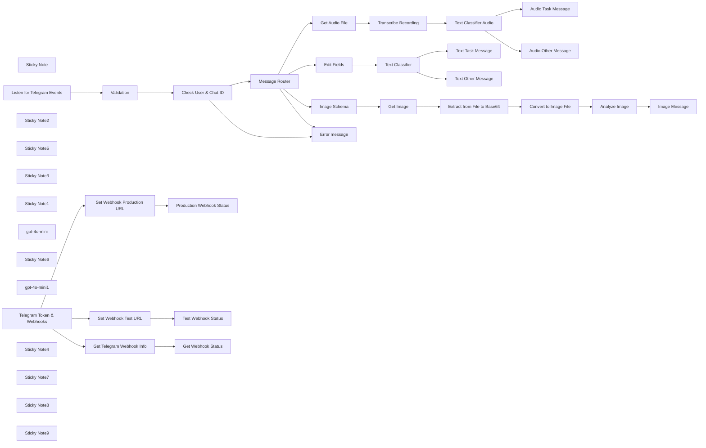

## Fluxo (.json) :

```json
{
  "id": "8jDt77Y4FaV6ARYG",
  "meta": {
    "instanceId": "31e69f7f4a77bf465b805824e303232f0227212ae922d12133a0f96ffeab4fef"
  },
  "name": "🤖 Telegram Messaging Agent for Text/Audio/Images",
  "tags": [],
  "nodes": [
    {
      "id": "1656be7a-7a27-47f3-b511-3634a65a97a2",
      "name": "Check User & Chat ID",
      "type": "n8n-nodes-base.if",
      "position": [
        100,
        160
      ],
      "parameters": {
        "options": {},
        "conditions": {
          "options": {
            "version": 2,
            "leftValue": "",
            "caseSensitive": true,
            "typeValidation": "strict"
          },
          "combinator": "and",
          "conditions": [
            {
              "id": "5fe3c0d8-bd61-4943-b152-9e6315134520",
              "operator": {
                "name": "filter.operator.equals",
                "type": "string",
                "operation": "equals"
              },
              "leftValue": "={{ $('Listen for Telegram Events').item.json.body.message.from.first_name }}",
              "rightValue": "={{ $json.first_name }}"
            },
            {
              "id": "98a0ea91-0567-459c-bbce-06abc14a49ce",
              "operator": {
                "name": "filter.operator.equals",
                "type": "string",
                "operation": "equals"
              },
              "leftValue": "={{ $('Listen for Telegram Events').item.json.body.message.from.last_name }}",
              "rightValue": "={{ $json.last_name }}"
            },
            {
              "id": "18a96c1f-f2a0-4a2a-b789-606763df4423",
              "operator": {
                "type": "number",
                "operation": "equals"
              },
              "leftValue": "={{ $('Listen for Telegram Events').item.json.body.message.from.id }}",
              "rightValue": "={{ $json.id }}"
            }
          ]
        },
        "looseTypeValidation": "="
      },
      "typeVersion": 2.2
    },
    {
      "id": "73b0fedb-eb82-4464-a08f-397a3fe69480",
      "name": "Error message",
      "type": "n8n-nodes-base.telegram",
      "position": [
        320,
        440
      ],
      "parameters": {
        "text": "=Unable to process your message.",
        "chatId": "={{ $json.body.message.chat.id }}",
        "additionalFields": {
          "appendAttribution": false
        }
      },
      "credentials": {
        "telegramApi": {
          "id": "pAIFhguJlkO3c7aQ",
          "name": "Telegram account"
        }
      },
      "typeVersion": 1.2
    },
    {
      "id": "a3dc143b-cf3c-4416-bf43-0ca75cbde6c9",
      "name": "Sticky Note",
      "type": "n8n-nodes-base.stickyNote",
      "position": [
        -380,
        -20
      ],
      "parameters": {
        "width": 929,
        "height": 652,
        "content": "# Receive Telegram Message with Webhook"
      },
      "typeVersion": 1
    },
    {
      "id": "c80dae1e-dd20-4632-a00c-9c6290540f22",
      "name": "Listen for Telegram Events",
      "type": "n8n-nodes-base.webhook",
      "position": [
        -320,
        160
      ],
      "webhookId": "b4ed4c80-a655-4ff2-87d6-febd5280d343",
      "parameters": {
        "path": "your-endpoint",
        "options": {
          "binaryPropertyName": "data"
        },
        "httpMethod": "POST"
      },
      "typeVersion": 2
    },
    {
      "id": "6010dacf-1ed6-413c-adf9-146397e16b09",
      "name": "Set Webhook Test URL",
      "type": "n8n-nodes-base.httpRequest",
      "position": [
        260,
        -260
      ],
      "parameters": {
        "url": "=https://api.telegram.org/{{ $json.token }}/setWebhook",
        "options": {},
        "sendQuery": true,
        "queryParameters": {
          "parameters": [
            {
              "name": "url",
              "value": "={{ $json.test_url }}"
            }
          ]
        }
      },
      "typeVersion": 4.2
    },
    {
      "id": "65f8d945-12bb-4ae3-bd83-3b892a36afb9",
      "name": "Sticky Note2",
      "type": "n8n-nodes-base.stickyNote",
      "position": [
        -380,
        -580
      ],
      "parameters": {
        "color": 3,
        "width": 1638,
        "height": 532,
        "content": "# Telegram Webhook Tools\n\n## Setting your Telegram Bot WebHook the Easy Way\n"
      },
      "typeVersion": 1
    },
    {
      "id": "8e3268e9-dc7c-4edd-b5e8-716de5d2ffb3",
      "name": "Get Telegram Webhook Info",
      "type": "n8n-nodes-base.httpRequest",
      "position": [
        -240,
        -260
      ],
      "parameters": {
        "url": "=https://api.telegram.org/{{ $json.token }}/getWebhookInfo",
        "options": {}
      },
      "typeVersion": 4.2
    },
    {
      "id": "e31e176f-2ebd-4cd1-a160-2cc5f254ca6d",
      "name": "Sticky Note5",
      "type": "n8n-nodes-base.stickyNote",
      "position": [
        580,
        -20
      ],
      "parameters": {
        "color": 4,
        "width": 1113,
        "height": 429,
        "content": "# Process Audio"
      },
      "typeVersion": 1
    },
    {
      "id": "b8b10cd9-7a41-4b21-853c-b2123918ab8d",
      "name": "Image Schema",
      "type": "n8n-nodes-base.set",
      "position": [
        660,
        1060
      ],
      "parameters": {
        "options": {},
        "assignments": {
          "assignments": [
            {
              "id": "17989eb0-feca-4631-b5c8-34b1d4a6c72b",
              "name": "image_file_id",
              "type": "string",
              "value": "={{ $json.body.message.photo.last().file_id }}"
            },
            {
              "id": "9317d7ae-dffd-4b1f-9a9c-b3cc4f1e0dd3",
              "name": "caption",
              "type": "string",
              "value": "={{ $json.body.message.caption }}"
            }
          ]
        }
      },
      "typeVersion": 3.4
    },
    {
      "id": "9a7b9e4c-7a81-451a-887a-b7b3f658ae6e",
      "name": "Sticky Note3",
      "type": "n8n-nodes-base.stickyNote",
      "position": [
        580,
        900
      ],
      "parameters": {
        "color": 6,
        "width": 1289,
        "height": 432,
        "content": "# Process Image"
      },
      "typeVersion": 1
    },
    {
      "id": "800da6c7-8d03-4932-a081-f35ce01c8dd7",
      "name": "Sticky Note1",
      "type": "n8n-nodes-base.stickyNote",
      "position": [
        -1200,
        -580
      ],
      "parameters": {
        "color": 7,
        "width": 800,
        "height": 860,
        "content": "# How to set up a Telegram Bot WebHook\n\n## WebHook Setup Process\n\n**Basic Concept**\nA WebHook allows your Telegram bot to automatically receive updates instead of manually polling the Bot API.\n\n**Setup Method**\nTo set a WebHook, make a GET request using this URL format:\n```\nhttps://api.telegram.org/bot{my_bot_token}/setWebhook?url={url_to_send_updates_to}\n```\nWhere:\n- `my_bot_token`: Your bot token from BotFather\n- `url_to_send_updates_to`: Your HTTPS endpoint that handles bot updates\n\n\n**Verification**\nTo verify the WebHook setup, use:\n```\nhttps://api.telegram.org/bot{my_bot_token}/getWebhookInfo\n```\n\nA successful response looks like:\n```json\n{\n \"ok\": true,\n \"result\": {\n   \"url\": \"https://www.example.com/my-telegram-bot/\",\n   \"has_custom_certificate\": false,\n   \"pending_update_count\": 0,\n   \"max_connections\": 40\n }\n}\n```\n\n\nThis method provides a simple and efficient way to handle Telegram bot updates automatically through webhooks rather than manual polling."
      },
      "typeVersion": 1
    },
    {
      "id": "cd09daf9-ac74-4e86-9d74-875d78f466f0",
      "name": "gpt-4o-mini",
      "type": "@n8n/n8n-nodes-langchain.lmChatOpenAi",
      "position": [
        1080,
        260
      ],
      "parameters": {
        "options": {}
      },
      "credentials": {
        "openAiApi": {
          "id": "jEMSvKmtYfzAkhe6",
          "name": "OpenAi account"
        }
      },
      "typeVersion": 1
    },
    {
      "id": "4c69533c-e4e7-4667-baf8-7ca1ed36b150",
      "name": "Get Audio File",
      "type": "n8n-nodes-base.telegram",
      "position": [
        660,
        100
      ],
      "parameters": {
        "fileId": "={{ $json.body.message.voice.file_id }}",
        "resource": "file"
      },
      "credentials": {
        "telegramApi": {
          "id": "pAIFhguJlkO3c7aQ",
          "name": "Telegram account"
        }
      },
      "typeVersion": 1.2
    },
    {
      "id": "0b15b158-88ec-45ba-ae70-fd55a9a72ea3",
      "name": "Get Image",
      "type": "n8n-nodes-base.telegram",
      "position": [
        860,
        1060
      ],
      "parameters": {
        "fileId": "={{ $json.image_file_id }}",
        "resource": "file"
      },
      "credentials": {
        "telegramApi": {
          "id": "pAIFhguJlkO3c7aQ",
          "name": "Telegram account"
        }
      },
      "typeVersion": 1.2
    },
    {
      "id": "081ec871-6cac-4945-9c1b-97bb87489688",
      "name": "Analyze Image",
      "type": "@n8n/n8n-nodes-langchain.openAi",
      "position": [
        1460,
        1060
      ],
      "parameters": {
        "modelId": {
          "__rl": true,
          "mode": "list",
          "value": "gpt-4o-mini",
          "cachedResultName": "GPT-4O-MINI"
        },
        "options": {},
        "resource": "image",
        "inputType": "base64",
        "operation": "analyze"
      },
      "credentials": {
        "openAiApi": {
          "id": "jEMSvKmtYfzAkhe6",
          "name": "OpenAi account"
        }
      },
      "typeVersion": 1.6
    },
    {
      "id": "072c21fc-d125-4078-b151-9c2fd5a4802c",
      "name": "Transcribe Recording",
      "type": "@n8n/n8n-nodes-langchain.openAi",
      "position": [
        860,
        100
      ],
      "parameters": {
        "options": {},
        "resource": "audio",
        "operation": "transcribe",
        "binaryPropertyName": "=data"
      },
      "credentials": {
        "openAiApi": {
          "id": "jEMSvKmtYfzAkhe6",
          "name": "OpenAi account"
        }
      },
      "typeVersion": 1.6
    },
    {
      "id": "b74e2181-8bf2-43a5-b4d4-d24112989b81",
      "name": "Sticky Note6",
      "type": "n8n-nodes-base.stickyNote",
      "position": [
        580,
        440
      ],
      "parameters": {
        "color": 5,
        "width": 1113,
        "height": 429,
        "content": "# Process Text"
      },
      "typeVersion": 1
    },
    {
      "id": "8f44b159-07ff-4805-82ad-d8aeed1f9f68",
      "name": "gpt-4o-mini1",
      "type": "@n8n/n8n-nodes-langchain.lmChatOpenAi",
      "position": [
        1080,
        720
      ],
      "parameters": {
        "options": {}
      },
      "credentials": {
        "openAiApi": {
          "id": "jEMSvKmtYfzAkhe6",
          "name": "OpenAi account"
        }
      },
      "typeVersion": 1
    },
    {
      "id": "666ed1b9-475e-44bf-a884-1ddf58c6c6af",
      "name": "Test Webhook Status",
      "type": "n8n-nodes-base.telegram",
      "position": [
        460,
        -260
      ],
      "parameters": {
        "text": "={{ $json.description }} for Testing",
        "chatId": "=1234567891",
        "additionalFields": {}
      },
      "credentials": {
        "telegramApi": {
          "id": "pAIFhguJlkO3c7aQ",
          "name": "Telegram account"
        }
      },
      "typeVersion": 1.2
    },
    {
      "id": "2a1174a2-2eae-4cf5-ba48-a58a479956bf",
      "name": "Production Webhook Status",
      "type": "n8n-nodes-base.telegram",
      "position": [
        980,
        -260
      ],
      "parameters": {
        "text": "={{ $json.description }} for Production",
        "chatId": "=1234567891",
        "additionalFields": {}
      },
      "credentials": {
        "telegramApi": {
          "id": "pAIFhguJlkO3c7aQ",
          "name": "Telegram account"
        }
      },
      "typeVersion": 1.2
    },
    {
      "id": "210b6df9-e799-409f-b78f-953bffbb37db",
      "name": "Set Webhook Production URL",
      "type": "n8n-nodes-base.httpRequest",
      "position": [
        780,
        -260
      ],
      "parameters": {
        "url": "=https://api.telegram.org/{{ $json.token }}/setWebhook",
        "options": {},
        "sendQuery": true,
        "queryParameters": {
          "parameters": [
            {
              "name": "url",
              "value": "={{ $json.production_url }}"
            }
          ]
        }
      },
      "typeVersion": 4.2
    },
    {
      "id": "5dc6642c-3557-47bb-b012-b353a0d10ca0",
      "name": "Edit Fields",
      "type": "n8n-nodes-base.set",
      "position": [
        860,
        560
      ],
      "parameters": {
        "options": {},
        "assignments": {
          "assignments": [
            {
              "id": "b37b48ba-8fef-4e6c-bbca-73e6c2e1e0a8",
              "name": "text",
              "type": "string",
              "value": "={{ $json.body.message.text }}"
            }
          ]
        }
      },
      "typeVersion": 3.4
    },
    {
      "id": "cd715b79-765e-4605-84d6-963d9889c922",
      "name": "Audio Task Message",
      "type": "n8n-nodes-base.telegram",
      "position": [
        1460,
        40
      ],
      "parameters": {
        "text": "=Task message: <i>{{ $json.text }}</i>",
        "chatId": "={{ $('Listen for Telegram Events').item.json.body.message.chat.id }}",
        "additionalFields": {
          "parse_mode": "HTML",
          "appendAttribution": false
        }
      },
      "credentials": {
        "telegramApi": {
          "id": "pAIFhguJlkO3c7aQ",
          "name": "Telegram account"
        }
      },
      "typeVersion": 1.2
    },
    {
      "id": "9845b3e6-8c0f-4194-8442-5648147f905e",
      "name": "Audio Other Message",
      "type": "n8n-nodes-base.telegram",
      "position": [
        1460,
        220
      ],
      "parameters": {
        "text": "=Other message: <i>{{ $json.text }}</i>",
        "chatId": "={{ $('Listen for Telegram Events').item.json.body.message.chat.id }}",
        "additionalFields": {
          "parse_mode": "HTML",
          "appendAttribution": false
        }
      },
      "credentials": {
        "telegramApi": {
          "id": "pAIFhguJlkO3c7aQ",
          "name": "Telegram account"
        }
      },
      "typeVersion": 1.2
    },
    {
      "id": "0184b872-27a1-48dd-8e37-4fdaae7241cd",
      "name": "Text Task Message",
      "type": "n8n-nodes-base.telegram",
      "position": [
        1460,
        500
      ],
      "parameters": {
        "text": "=Task message: <i>{{ $json.text }}</i>",
        "chatId": "={{ $('Listen for Telegram Events').item.json.body.message.chat.id }}",
        "additionalFields": {
          "parse_mode": "HTML",
          "appendAttribution": false
        }
      },
      "credentials": {
        "telegramApi": {
          "id": "pAIFhguJlkO3c7aQ",
          "name": "Telegram account"
        }
      },
      "typeVersion": 1.2
    },
    {
      "id": "7d90fb9b-b2b5-48eb-a6f2-7f953fe6ee52",
      "name": "Text Other Message",
      "type": "n8n-nodes-base.telegram",
      "position": [
        1460,
        680
      ],
      "parameters": {
        "text": "=Other message: <i>{{ $json.text }}</i>",
        "chatId": "={{ $('Listen for Telegram Events').item.json.body.message.chat.id }}",
        "additionalFields": {
          "parse_mode": "HTML",
          "appendAttribution": false
        }
      },
      "credentials": {
        "telegramApi": {
          "id": "pAIFhguJlkO3c7aQ",
          "name": "Telegram account"
        }
      },
      "typeVersion": 1.2
    },
    {
      "id": "c9b9f6d2-c4c4-44b9-a929-9bc0552e8e45",
      "name": "Image Message",
      "type": "n8n-nodes-base.telegram",
      "position": [
        1660,
        1060
      ],
      "parameters": {
        "text": "={{ $json.content }}",
        "chatId": "={{ $('Listen for Telegram Events').item.json.body.message.chat.id }}",
        "additionalFields": {
          "appendAttribution": false
        }
      },
      "credentials": {
        "telegramApi": {
          "id": "pAIFhguJlkO3c7aQ",
          "name": "Telegram account"
        }
      },
      "typeVersion": 1.2
    },
    {
      "id": "bfc69b30-4bab-459d-bbe1-42e540275582",
      "name": "Convert to Image File",
      "type": "n8n-nodes-base.convertToFile",
      "position": [
        1260,
        1060
      ],
      "parameters": {
        "options": {
          "fileName": "={{ $json.result.file_path }}"
        },
        "operation": "toBinary",
        "sourceProperty": "data"
      },
      "typeVersion": 1.1
    },
    {
      "id": "f78d54c3-aa00-4e82-bfb1-f3131182940c",
      "name": "Extract from File to Base64",
      "type": "n8n-nodes-base.extractFromFile",
      "position": [
        1060,
        1060
      ],
      "parameters": {
        "options": {},
        "operation": "binaryToPropery"
      },
      "typeVersion": 1
    },
    {
      "id": "735bb735-6b24-4bbd-8d3f-aec6cd383383",
      "name": "Text Classifier Audio",
      "type": "@n8n/n8n-nodes-langchain.textClassifier",
      "position": [
        1060,
        100
      ],
      "parameters": {
        "options": {},
        "inputText": "={{ $json.text }}",
        "categories": {
          "categories": [
            {
              "category": "task",
              "description": "If the message is about about creating a task/todo"
            },
            {
              "category": "other",
              "description": "If the message is not about creating a task/todo "
            }
          ]
        }
      },
      "typeVersion": 1
    },
    {
      "id": "be7f49da-f88e-4803-95ef-fb7e2ff2d2ed",
      "name": "Text Classifier",
      "type": "@n8n/n8n-nodes-langchain.textClassifier",
      "position": [
        1060,
        560
      ],
      "parameters": {
        "options": {},
        "inputText": "={{ $json.text }}",
        "categories": {
          "categories": [
            {
              "category": "task",
              "description": "If the message is about about creating a task/todo"
            },
            {
              "category": "other",
              "description": "If the message is not about creating a task/todo "
            }
          ]
        }
      },
      "typeVersion": 1
    },
    {
      "id": "33eab7d8-5b90-4533-8799-fb4ae32fc6c5",
      "name": "Telegram Token & Webhooks",
      "type": "n8n-nodes-base.set",
      "position": [
        380,
        -540
      ],
      "parameters": {
        "options": {},
        "assignments": {
          "assignments": [
            {
              "id": "87811892-85f5-4578-a149-3edd94d3815a",
              "name": "token",
              "type": "string",
              "value": "bot[your-telegram-bot-token]"
            },
            {
              "id": "d2b9ab83-44ad-4741-aac9-1feed974c015",
              "name": "test_url",
              "type": "string",
              "value": "https://[your-url]/webhook-test/[your-endpoint]"
            },
            {
              "id": "0c671fbf-aa2c-42ef-9e8b-398ac38358d0",
              "name": "production_url",
              "type": "string",
              "value": "https://[your-url]/webhook/[your-endpoint]"
            }
          ]
        }
      },
      "typeVersion": 3.4
    },
    {
      "id": "65d9568e-0504-4c7d-ac05-0b7b4c52a6b2",
      "name": "Get Webhook Status",
      "type": "n8n-nodes-base.telegram",
      "position": [
        -40,
        -260
      ],
      "parameters": {
        "text": "={{ JSON.stringify($json.result, null, 2)  }}",
        "chatId": "=1234567891",
        "additionalFields": {}
      },
      "credentials": {
        "telegramApi": {
          "id": "pAIFhguJlkO3c7aQ",
          "name": "Telegram account"
        }
      },
      "typeVersion": 1.2
    },
    {
      "id": "04669db1-3a74-4404-9b5f-9b8554b1059e",
      "name": "Validation",
      "type": "n8n-nodes-base.set",
      "position": [
        -100,
        160
      ],
      "parameters": {
        "options": {},
        "assignments": {
          "assignments": [
            {
              "id": "0cea6da1-652a-4c1e-94c3-30608ced90f8",
              "name": "first_name",
              "type": "string",
              "value": "First Name"
            },
            {
              "id": "b90280c6-3e36-49ca-9e7e-e15c42d256cc",
              "name": "last_name",
              "type": "string",
              "value": "Last Name"
            },
            {
              "id": "f6d86283-16ca-447e-8427-7d3d190babc0",
              "name": "id",
              "type": "number",
              "value": 12345678999
            }
          ]
        }
      },
      "typeVersion": 3.4
    },
    {
      "id": "7f9935cb-4ca6-40cf-99c5-96c5a1f4ca91",
      "name": "Sticky Note4",
      "type": "n8n-nodes-base.stickyNote",
      "position": [
        -160,
        100
      ],
      "parameters": {
        "color": 7,
        "width": 420,
        "height": 260,
        "content": "## Validate Telegram User\n"
      },
      "typeVersion": 1
    },
    {
      "id": "fa6c87eb-5f96-4e26-a1bb-60dae902186c",
      "name": "Sticky Note7",
      "type": "n8n-nodes-base.stickyNote",
      "position": [
        -320,
        -320
      ],
      "parameters": {
        "color": 7,
        "width": 460,
        "height": 240,
        "content": "## Webhook Status"
      },
      "typeVersion": 1
    },
    {
      "id": "96536ad2-e607-448e-a368-e4e8c7578b57",
      "name": "Sticky Note8",
      "type": "n8n-nodes-base.stickyNote",
      "position": [
        200,
        -320
      ],
      "parameters": {
        "color": 7,
        "width": 460,
        "height": 240,
        "content": "## Set Webhook for Testing"
      },
      "typeVersion": 1
    },
    {
      "id": "a58c16d5-0c08-4ee6-a3fe-b9fdbd62eb8b",
      "name": "Sticky Note9",
      "type": "n8n-nodes-base.stickyNote",
      "position": [
        720,
        -320
      ],
      "parameters": {
        "color": 7,
        "width": 480,
        "height": 240,
        "content": "## Set Webhook for Production"
      },
      "typeVersion": 1
    },
    {
      "id": "158bf4d2-aac9-4a1a-b319-1a4766cdeaca",
      "name": "Message Router",
      "type": "n8n-nodes-base.switch",
      "position": [
        320,
        160
      ],
      "parameters": {
        "rules": {
          "values": [
            {
              "outputKey": "audio",
              "conditions": {
                "options": {
                  "version": 2,
                  "leftValue": "",
                  "caseSensitive": true,
                  "typeValidation": "strict"
                },
                "combinator": "and",
                "conditions": [
                  {
                    "operator": {
                      "type": "object",
                      "operation": "exists",
                      "singleValue": true
                    },
                    "leftValue": "={{ $json.body.message.voice }}",
                    "rightValue": ""
                  }
                ]
              },
              "renameOutput": true
            },
            {
              "outputKey": "text",
              "conditions": {
                "options": {
                  "version": 2,
                  "leftValue": "",
                  "caseSensitive": true,
                  "typeValidation": "strict"
                },
                "combinator": "and",
                "conditions": [
                  {
                    "id": "342f0883-d959-44a2-b80d-379e39c76218",
                    "operator": {
                      "type": "string",
                      "operation": "exists",
                      "singleValue": true
                    },
                    "leftValue": "={{ $json.body.message.text }}",
                    "rightValue": ""
                  }
                ]
              },
              "renameOutput": true
            },
            {
              "outputKey": "image",
              "conditions": {
                "options": {
                  "version": 2,
                  "leftValue": "",
                  "caseSensitive": true,
                  "typeValidation": "strict"
                },
                "combinator": "and",
                "conditions": [
                  {
                    "id": "ded3a600-f861-413a-8892-3fc5ea935ecb",
                    "operator": {
                      "type": "array",
                      "operation": "exists",
                      "singleValue": true
                    },
                    "leftValue": "={{ $json.body.message.photo }}",
                    "rightValue": ""
                  }
                ]
              },
              "renameOutput": true
            }
          ]
        },
        "options": {
          "fallbackOutput": "extra"
        }
      },
      "typeVersion": 3.2
    }
  ],
  "active": true,
  "pinData": {},
  "settings": {
    "executionOrder": "v1"
  },
  "versionId": "91b5de12-0ada-4125-b5ce-3ffb4dc9fa9b",
  "connections": {
    "Get Image": {
      "main": [
        [
          {
            "node": "Extract from File to Base64",
            "type": "main",
            "index": 0
          }
        ]
      ]
    },
    "Validation": {
      "main": [
        [
          {
            "node": "Check User & Chat ID",
            "type": "main",
            "index": 0
          }
        ]
      ]
    },
    "Edit Fields": {
      "main": [
        [
          {
            "node": "Text Classifier",
            "type": "main",
            "index": 0
          }
        ]
      ]
    },
    "gpt-4o-mini": {
      "ai_languageModel": [
        [
          {
            "node": "Text Classifier Audio",
            "type": "ai_languageModel",
            "index": 0
          }
        ]
      ]
    },
    "Image Schema": {
      "main": [
        [
          {
            "node": "Get Image",
            "type": "main",
            "index": 0
          }
        ]
      ]
    },
    "gpt-4o-mini1": {
      "ai_languageModel": [
        [
          {
            "node": "Text Classifier",
            "type": "ai_languageModel",
            "index": 0
          }
        ]
      ]
    },
    "Analyze Image": {
      "main": [
        [
          {
            "node": "Image Message",
            "type": "main",
            "index": 0
          }
        ]
      ]
    },
    "Image Message": {
      "main": [
        []
      ]
    },
    "Get Audio File": {
      "main": [
        [
          {
            "node": "Transcribe Recording",
            "type": "main",
            "index": 0
          }
        ]
      ]
    },
    "Message Router": {
      "main": [
        [
          {
            "node": "Get Audio File",
            "type": "main",
            "index": 0
          }
        ],
        [
          {
            "node": "Edit Fields",
            "type": "main",
            "index": 0
          }
        ],
        [
          {
            "node": "Image Schema",
            "type": "main",
            "index": 0
          }
        ],
        [
          {
            "node": "Error message",
            "type": "main",
            "index": 0
          }
        ]
      ]
    },
    "Text Classifier": {
      "main": [
        [
          {
            "node": "Text Task Message",
            "type": "main",
            "index": 0
          }
        ],
        [
          {
            "node": "Text Other Message",
            "type": "main",
            "index": 0
          }
        ]
      ]
    },
    "Check User & Chat ID": {
      "main": [
        [
          {
            "node": "Message Router",
            "type": "main",
            "index": 0
          }
        ],
        [
          {
            "node": "Error message",
            "type": "main",
            "index": 0
          }
        ]
      ]
    },
    "Set Webhook Test URL": {
      "main": [
        [
          {
            "node": "Test Webhook Status",
            "type": "main",
            "index": 0
          }
        ]
      ]
    },
    "Transcribe Recording": {
      "main": [
        [
          {
            "node": "Text Classifier Audio",
            "type": "main",
            "index": 0
          }
        ]
      ]
    },
    "Convert to Image File": {
      "main": [
        [
          {
            "node": "Analyze Image",
            "type": "main",
            "index": 0
          }
        ]
      ]
    },
    "Text Classifier Audio": {
      "main": [
        [
          {
            "node": "Audio Task Message",
            "type": "main",
            "index": 0
          }
        ],
        [
          {
            "node": "Audio Other Message",
            "type": "main",
            "index": 0
          }
        ]
      ]
    },
    "Get Telegram Webhook Info": {
      "main": [
        [
          {
            "node": "Get Webhook Status",
            "type": "main",
            "index": 0
          }
        ]
      ]
    },
    "Telegram Token & Webhooks": {
      "main": [
        [
          {
            "node": "Set Webhook Production URL",
            "type": "main",
            "index": 0
          },
          {
            "node": "Set Webhook Test URL",
            "type": "main",
            "index": 0
          },
          {
            "node": "Get Telegram Webhook Info",
            "type": "main",
            "index": 0
          }
        ]
      ]
    },
    "Listen for Telegram Events": {
      "main": [
        [
          {
            "node": "Validation",
            "type": "main",
            "index": 0
          }
        ]
      ]
    },
    "Set Webhook Production URL": {
      "main": [
        [
          {
            "node": "Production Webhook Status",
            "type": "main",
            "index": 0
          }
        ]
      ]
    },
    "Extract from File to Base64": {
      "main": [
        [
          {
            "node": "Convert to Image File",
            "type": "main",
            "index": 0
          }
        ]
      ]
    }
  }
}
```

<a id="template-2480"></a>

## Template 2480 - Responder no Telegram com imagem de coquetel aleatório

- **Nome:** Responder no Telegram com imagem de coquetel aleatório
- **Descrição:** Ao receber uma mensagem no Telegram, o fluxo obtém um coquetel aleatório e envia a imagem com o nome como legenda, respondendo à mensagem original.
- **Funcionalidade:** • Recepção de mensagens do Telegram: Observa atualizações de mensagens vindas de um chat.
• Solicitação de coquetel aleatório: Busca dados de um coquetel aleatório em uma API externa.
• Envio de imagem ao chat: Envia a imagem do coquetel recebido para o mesmo chat.
• Legenda com o nome do coquetel: Adiciona o nome do coquetel como legenda da foto.
• Resposta direta à mensagem: Envia a foto como resposta à mensagem que acionou o fluxo.
- **Ferramentas:** • Telegram: Plataforma de mensagens usada para receber atualizações e enviar fotos ao usuário.
• TheCocktailDB API: Serviço externo que fornece dados de coquetéis, incluindo nome e URL da imagem.

## Fluxo visual


## Fluxo (.json) :

```json
{
  "id": "58",
  "name": "Receive updates from Telegram and send an image of a cocktail",
  "nodes": [
    {
      "name": "Telegram Trigger",
      "type": "n8n-nodes-base.telegramTrigger",
      "position": [
        570,
        260
      ],
      "webhookId": "806cc2c6-c687-4022-a82e-658e4a684e73",
      "parameters": {
        "updates": [
          "message"
        ],
        "additionalFields": {}
      },
      "credentials": {
        "telegramApi": "telegram-bot"
      },
      "typeVersion": 1
    },
    {
      "name": "HTTP Request",
      "type": "n8n-nodes-base.httpRequest",
      "position": [
        770,
        260
      ],
      "parameters": {
        "url": "https://www.thecocktaildb.com/api/json/v1/1/random.php",
        "options": {}
      },
      "typeVersion": 1
    },
    {
      "name": "Telegram",
      "type": "n8n-nodes-base.telegram",
      "position": [
        970,
        260
      ],
      "parameters": {
        "file": "={{$node[\"HTTP Request\"].json[\"drinks\"][0][\"strDrinkThumb\"]}}",
        "chatId": "={{$node[\"Telegram Trigger\"].json[\"message\"][\"chat\"][\"id\"]}}",
        "operation": "sendPhoto",
        "additionalFields": {
          "caption": "={{$node[\"HTTP Request\"].json[\"drinks\"][0][\"strDrink\"]}}",
          "reply_to_message_id": "={{$node[\"Telegram Trigger\"].json[\"message\"][\"message_id\"]}}"
        }
      },
      "credentials": {
        "telegramApi": "telegram-bot"
      },
      "typeVersion": 1
    }
  ],
  "active": false,
  "settings": {},
  "connections": {
    "HTTP Request": {
      "main": [
        [
          {
            "node": "Telegram",
            "type": "main",
            "index": 0
          }
        ]
      ]
    },
    "Telegram Trigger": {
      "main": [
        [
          {
            "node": "HTTP Request",
            "type": "main",
            "index": 0
          }
        ]
      ]
    }
  }
}
```

<a id="template-2482"></a>

## Template 2482 - Atualizar dashboard de métricas

- **Nome:** Atualizar dashboard de métricas
- **Descrição:** Coleta periodicamente métricas de Docker Hub, npm, GitHub e Product Hunt, formata os dados e envia para endpoints de um dashboard centralizado.
- **Funcionalidade:** • Agendamento periódico: Executa o fluxo a cada minuto para manter as métricas atualizadas.
• Carregamento de configuração do projeto: Armazena host do dashboard, token de autenticação e identificadores de repositórios/pacotes.
• Coleta de dados do Docker Hub: Recupera contagens de pulls e estrelas do repositório Docker configurado.
• Tratamento de dados Docker: Formata números (inserção de separadores de milhares) antes do envio.
• Envio de métricas Docker ao dashboard: Publica pulls e stars nos respectivos endpoints do dashboard.
• Coleta de dados do npm (npms.io): Recupera pontuação final e detalhes (manutenção, popularidade, qualidade) do pacote configurado.
• Tratamento de dados npm: Arredonda e formata as métricas numéricas para duas casas decimais.
• Envio de métricas npm ao dashboard: Publica valores de manutenção, popularidade, qualidade e pontuação final.
• Coleta de dados do GitHub: Obtém informações do repositório (estrelas, observadores, forks, issues abertas).
• Tratamento de dados GitHub: Formata números para legibilidade.
• Envio de métricas GitHub ao dashboard: Publica estrelas, watchers, forks e issues abertas.
• Coleta de dados do Product Hunt via GraphQL: Recupera votos, comentários, avaliações e número de reviews do post especificado.
• Tratamento de dados Product Hunt: Formata contagens com separadores de milhares.
• Envio de métricas Product Hunt ao dashboard: Publica votos, comentários, reviews e avaliação geral.
- **Ferramentas:** • Docker Hub: Fonte das métricas de pulls e estrelas do repositório Docker.
• npms.io: Serviço que fornece pontuação e detalhes de qualidade/popularidade/manutenção do pacote npm.
• GitHub API: Fonte das métricas do repositório (stargazers, subscribers, forks, issues).
• Product Hunt API (GraphQL): Fonte das métricas do post (votes, comments, reviews, rating).
• Dashboard HTTP API (host configurável): Endpoint destino que recebe e exibe as métricas coletadas.


## Fluxo visual

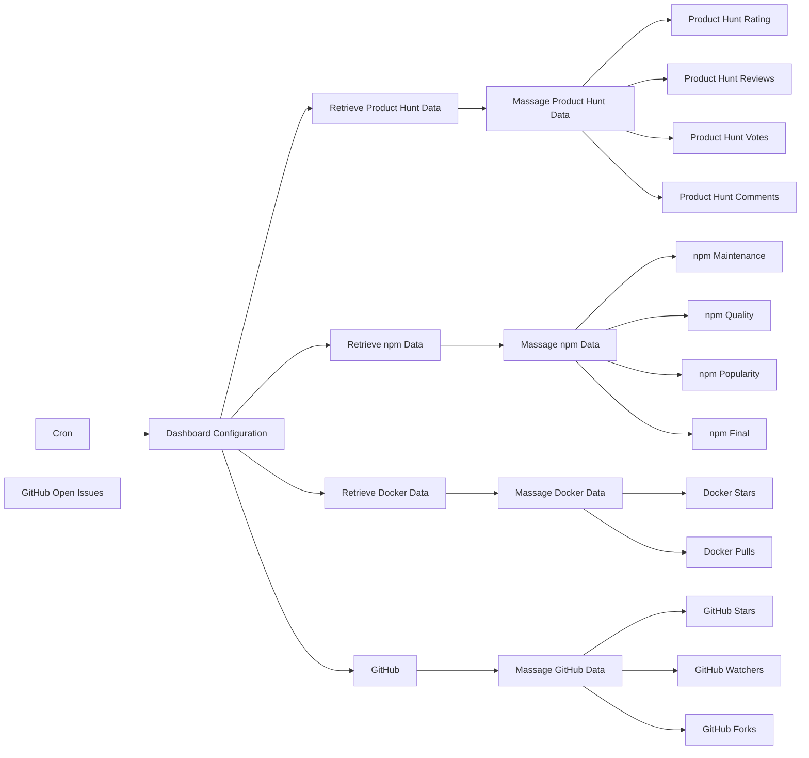

## Fluxo (.json) :

```json
{
  "id": "6",
  "name": "Dashboard",
  "nodes": [
    {
      "name": "Cron",
      "type": "n8n-nodes-base.cron",
      "position": [
        -290,
        180
      ],
      "parameters": {
        "triggerTimes": {
          "item": [
            {
              "mode": "everyMinute"
            }
          ]
        }
      },
      "typeVersion": 1
    },
    {
      "name": "Dashboard Configuration",
      "type": "n8n-nodes-base.set",
      "color": "#FF0000",
      "notes": "Update project settings",
      "position": [
        -10,
        180
      ],
      "parameters": {
        "values": {
          "string": [
            {
              "name": "dashboardHostname",
              "value": "http://192.168.0.14:8080"
            },
            {
              "name": "dashboardAuthToken",
              "value": "n8n-rocks!"
            },
            {
              "name": "product_hunt_post_id",
              "value": "170391"
            },
            {
              "name": "npm_package",
              "value": "n8n"
            },
            {
              "name": "docker_name",
              "value": "n8nio"
            },
            {
              "name": "docker_repository",
              "value": "n8n"
            },
            {
              "name": "github_owner",
              "value": "n8n-io"
            },
            {
              "name": "github_repo",
              "value": "n8n"
            }
          ]
        },
        "options": {}
      },
      "notesInFlow": true,
      "typeVersion": 1
    },
    {
      "name": "Retrieve Docker Data",
      "type": "n8n-nodes-base.httpRequest",
      "position": [
        260,
        300
      ],
      "parameters": {
        "url": "=https://hub.docker.com/v2/repositories/{{$node[\"Dashboard Configuration\"].json[\"docker_name\"]}}/{{$node[\"Dashboard Configuration\"].json[\"docker_repository\"]}}",
        "options": {},
        "queryParametersUi": {
          "parameter": []
        },
        "headerParametersUi": {
          "parameter": [
            {
              "name": "User-Agent",
              "value": "n8n"
            }
          ]
        }
      },
      "typeVersion": 1
    },
    {
      "name": "Docker Pulls",
      "type": "n8n-nodes-base.httpRequest",
      "position": [
        630,
        220
      ],
      "parameters": {
        "url": "={{$node[\"Dashboard Configuration\"].json[\"dashboardHostname\"]}}/widgets/docker_pulls",
        "options": {},
        "requestMethod": "POST",
        "bodyParametersUi": {
          "parameter": [
            {
              "name": "auth_token",
              "value": "={{$node[\"Dashboard Configuration\"].json[\"dashboardAuthToken\"]}}"
            },
            {
              "name": "current",
              "value": "={{$node[\"Massage Docker Data\"].json[\"pull_count\"]}}"
            }
          ]
        }
      },
      "typeVersion": 1,
      "alwaysOutputData": true
    },
    {
      "name": "Docker Stars",
      "type": "n8n-nodes-base.httpRequest",
      "position": [
        630,
        400
      ],
      "parameters": {
        "url": "={{$node[\"Dashboard Configuration\"].json[\"dashboardHostname\"]}}/widgets/docker_stars",
        "options": {},
        "requestMethod": "POST",
        "bodyParametersUi": {
          "parameter": [
            {
              "name": "auth_token",
              "value": "={{$node[\"Dashboard Configuration\"].json[\"dashboardAuthToken\"]}}"
            },
            {
              "name": "current",
              "value": "={{$node[\"Massage Docker Data\"].json[\"star_count\"]}}"
            }
          ]
        }
      },
      "typeVersion": 1,
      "alwaysOutputData": true
    },
    {
      "name": "Retrieve npm Data",
      "type": "n8n-nodes-base.httpRequest",
      "position": [
        250,
        50
      ],
      "parameters": {
        "url": "=https://api.npms.io/v2/package/{{$node[\"Dashboard Configuration\"].json[\"npm_package\"]}}",
        "options": {},
        "headerParametersUi": {
          "parameter": [
            {
              "name": "User-Agent",
              "value": "n8n"
            }
          ]
        }
      },
      "typeVersion": 1
    },
    {
      "name": "GitHub Watchers",
      "type": "n8n-nodes-base.httpRequest",
      "position": [
        820,
        640
      ],
      "parameters": {
        "url": "={{$node[\"Dashboard Configuration\"].json[\"dashboardHostname\"]}}/widgets/github_watchers",
        "options": {},
        "requestMethod": "POST",
        "bodyParametersUi": {
          "parameter": [
            {
              "name": "auth_token",
              "value": "={{$node[\"Dashboard Configuration\"].json[\"dashboardAuthToken\"]}}"
            },
            {
              "name": "current",
              "value": "={{$node[\"Massage GitHub Data\"].json[\"subscribers_count\"]}}"
            }
          ]
        }
      },
      "typeVersion": 1,
      "alwaysOutputData": true
    },
    {
      "name": "GitHub Forks",
      "type": "n8n-nodes-base.httpRequest",
      "position": [
        820,
        800
      ],
      "parameters": {
        "url": "={{$node[\"Dashboard Configuration\"].json[\"dashboardHostname\"]}}/widgets/github_forks",
        "options": {},
        "requestMethod": "POST",
        "bodyParametersUi": {
          "parameter": [
            {
              "name": "auth_token",
              "value": "={{$node[\"Dashboard Configuration\"].json[\"dashboardAuthToken\"]}}"
            },
            {
              "name": "current",
              "value": "={{$node[\"Massage GitHub Data\"].json[\"forks_count\"]}}"
            }
          ]
        }
      },
      "typeVersion": 1,
      "alwaysOutputData": true
    },
    {
      "name": "GitHub Open Issues ",
      "type": "n8n-nodes-base.httpRequest",
      "position": [
        620,
        860
      ],
      "parameters": {
        "url": "={{$node[\"Dashboard Configuration\"].json[\"dashboardHostname\"]}}/widgets/github_open_issues",
        "options": {},
        "requestMethod": "POST",
        "bodyParametersUi": {
          "parameter": [
            {
              "name": "auth_token",
              "value": "={{$node[\"Dashboard Configuration\"].json[\"dashboardAuthToken\"]}}"
            },
            {
              "name": "current",
              "value": "={{$node[\"Massage GitHub Data\"].json[\"open_issues_count\"]}}"
            }
          ]
        }
      },
      "typeVersion": 1,
      "alwaysOutputData": true
    },
    {
      "name": "GitHub Stars",
      "type": "n8n-nodes-base.httpRequest",
      "position": [
        620,
        560
      ],
      "parameters": {
        "url": "={{$node[\"Dashboard Configuration\"].json[\"dashboardHostname\"]}}/widgets/github_stars",
        "options": {},
        "requestMethod": "POST",
        "bodyParametersUi": {
          "parameter": [
            {
              "name": "auth_token",
              "value": "={{$node[\"Dashboard Configuration\"].json[\"dashboardAuthToken\"]}}"
            },
            {
              "name": "current",
              "value": "={{$node[\"Massage GitHub Data\"].json[\"stargazers_count\"]}}"
            }
          ]
        }
      },
      "typeVersion": 1,
      "alwaysOutputData": true
    },
    {
      "name": "npm Maintenance",
      "type": "n8n-nodes-base.httpRequest",
      "position": [
        830,
        -90
      ],
      "parameters": {
        "url": "={{$node[\"Dashboard Configuration\"].json[\"dashboardHostname\"]}}/widgets/npm_maintenance",
        "options": {},
        "requestMethod": "POST",
        "bodyParametersUi": {
          "parameter": [
            {
              "name": "auth_token",
              "value": "={{$node[\"Dashboard Configuration\"].json[\"dashboardAuthToken\"]}}"
            },
            {
              "name": "value",
              "value": "={{$node[\"Massage npm Data\"].json[\"score\"][\"detail\"][\"maintenance\"]}}"
            }
          ]
        }
      },
      "typeVersion": 1,
      "alwaysOutputData": true
    },
    {
      "name": "npm Popularity",
      "type": "n8n-nodes-base.httpRequest",
      "position": [
        1030,
        0
      ],
      "parameters": {
        "url": "={{$node[\"Dashboard Configuration\"].json[\"dashboardHostname\"]}}/widgets/npm_popularity",
        "options": {},
        "requestMethod": "POST",
        "bodyParametersUi": {
          "parameter": [
            {
              "name": "auth_token",
              "value": "={{$node[\"Dashboard Configuration\"].json[\"dashboardAuthToken\"]}}"
            },
            {
              "name": "value",
              "value": "={{$node[\"Massage npm Data\"].json[\"score\"][\"detail\"][\"popularity\"]}}"
            }
          ]
        }
      },
      "typeVersion": 1,
      "alwaysOutputData": true
    },
    {
      "name": "npm Quality",
      "type": "n8n-nodes-base.httpRequest",
      "position": [
        1030,
        150
      ],
      "parameters": {
        "url": "={{$node[\"Dashboard Configuration\"].json[\"dashboardHostname\"]}}/widgets/npm_quality",
        "options": {},
        "requestMethod": "POST",
        "bodyParametersUi": {
          "parameter": [
            {
              "name": "auth_token",
              "value": "={{$node[\"Dashboard Configuration\"].json[\"dashboardAuthToken\"]}}"
            },
            {
              "name": "value",
              "value": "={{$node[\"Massage npm Data\"].json[\"score\"][\"detail\"][\"quality\"]}}"
            }
          ]
        }
      },
      "typeVersion": 1,
      "alwaysOutputData": true
    },
    {
      "name": "npm Final",
      "type": "n8n-nodes-base.httpRequest",
      "position": [
        830,
        190
      ],
      "parameters": {
        "url": "={{$node[\"Dashboard Configuration\"].json[\"dashboardHostname\"]}}/widgets/npm_final",
        "options": {},
        "requestMethod": "POST",
        "bodyParametersUi": {
          "parameter": [
            {
              "name": "auth_token",
              "value": "={{$node[\"Dashboard Configuration\"].json[\"dashboardAuthToken\"]}}"
            },
            {
              "name": "value",
              "value": "={{$node[\"Massage npm Data\"].json[\"score\"][\"final\"]}}"
            }
          ]
        }
      },
      "typeVersion": 1,
      "alwaysOutputData": true
    },
    {
      "name": "Product Hunt Rating",
      "type": "n8n-nodes-base.httpRequest",
      "position": [
        630,
        -510
      ],
      "parameters": {
        "url": "={{$node[\"Dashboard Configuration\"].json[\"dashboardHostname\"]}}/widgets/prod_hunt_rating",
        "options": {},
        "requestMethod": "POST",
        "bodyParametersUi": {
          "parameter": [
            {
              "name": "auth_token",
              "value": "={{$node[\"Dashboard Configuration\"].json[\"dashboardAuthToken\"]}}"
            },
            {
              "name": "value",
              "value": "={{$node[\"Retrieve Product Hunt Data\"].json[\"data\"][\"post\"][\"reviewsRating\"]}}"
            }
          ]
        }
      },
      "typeVersion": 1,
      "alwaysOutputData": true
    },
    {
      "name": "Product Hunt Reviews",
      "type": "n8n-nodes-base.httpRequest",
      "position": [
        830,
        -410
      ],
      "parameters": {
        "url": "={{$node[\"Dashboard Configuration\"].json[\"dashboardHostname\"]}}/widgets/prod_hunt_reviews",
        "options": {},
        "requestMethod": "POST",
        "bodyParametersUi": {
          "parameter": [
            {
              "name": "auth_token",
              "value": "={{$node[\"Dashboard Configuration\"].json[\"dashboardAuthToken\"]}}"
            },
            {
              "name": "current",
              "value": "={{$node[\"Massage Product Hunt Data\"].json[\"data\"][\"post\"][\"reviewsCount\"]}}"
            }
          ]
        }
      },
      "typeVersion": 1,
      "alwaysOutputData": true
    },
    {
      "name": "Product Hunt Votes",
      "type": "n8n-nodes-base.httpRequest",
      "position": [
        830,
        -260
      ],
      "parameters": {
        "url": "={{$node[\"Dashboard Configuration\"].json[\"dashboardHostname\"]}}/widgets/prod_hunt_votes",
        "options": {},
        "requestMethod": "POST",
        "bodyParametersUi": {
          "parameter": [
            {
              "name": "auth_token",
              "value": "={{$node[\"Dashboard Configuration\"].json[\"dashboardAuthToken\"]}}"
            },
            {
              "name": "current",
              "value": "={{$node[\"Massage Product Hunt Data\"].json[\"data\"][\"post\"][\"votesCount\"]}}"
            }
          ]
        }
      },
      "typeVersion": 1,
      "alwaysOutputData": true
    },
    {
      "name": "Product Hunt Comments",
      "type": "n8n-nodes-base.httpRequest",
      "position": [
        630,
        -210
      ],
      "parameters": {
        "url": "={{$node[\"Dashboard Configuration\"].json[\"dashboardHostname\"]}}/widgets/prod_hunt_comments",
        "options": {},
        "requestMethod": "POST",
        "bodyParametersUi": {
          "parameter": [
            {
              "name": "auth_token",
              "value": "={{$node[\"Dashboard Configuration\"].json[\"dashboardAuthToken\"]}}"
            },
            {
              "name": "current",
              "value": "={{$node[\"Massage Product Hunt Data\"].json[\"data\"][\"post\"][\"commentsCount\"]}}"
            }
          ]
        }
      },
      "typeVersion": 1,
      "alwaysOutputData": true
    },
    {
      "name": "GitHub",
      "type": "n8n-nodes-base.github",
      "color": "#FF0000",
      "position": [
        250,
        710
      ],
      "parameters": {
        "owner": "={{$node[\"Dashboard Configuration\"].json[\"github_owner\"]}}",
        "resource": "repository",
        "operation": "get",
        "repository": "={{$node[\"Dashboard Configuration\"].json[\"github_repo\"]}}"
      },
      "credentials": {
        "githubApi": ""
      },
      "typeVersion": 1
    },
    {
      "name": "Retrieve Product Hunt Data",
      "type": "n8n-nodes-base.httpRequest",
      "color": "#FF0000",
      "notes": "Update authorization token",
      "position": [
        250,
        -360
      ],
      "parameters": {
        "url": "https://api.producthunt.com/v2/api/graphql",
        "options": {},
        "requestMethod": "POST",
        "queryParametersUi": {
          "parameter": [
            {
              "name": "query",
              "value": "={\n  post(id: {{$node[\"Dashboard Configuration\"].json[\"product_hunt_post_id\"]}}) {\n    commentsCount\n    votesCount\n    reviewsCount\n    reviewsRating\n    name\n  }\n}"
            }
          ]
        },
        "headerParametersUi": {
          "parameter": [
            {
              "name": "User-Agent",
              "value": "n8n"
            },
            {
              "name": "authorization",
              "value": "Bearer <Enter Product Hunt token here>"
            }
          ]
        }
      },
      "notesInFlow": true,
      "typeVersion": 1
    },
    {
      "name": "Massage npm Data",
      "type": "n8n-nodes-base.function",
      "position": [
        440,
        50
      ],
      "parameters": {
        "functionCode": "items[0].json.score.detail.maintenance = parseFloat(items[0].json.score.detail.maintenance.toFixed(2));\nitems[0].json.score.detail.popularity= parseFloat(items[0].json.score.detail.popularity.toFixed(2));\nitems[0].json.score.detail.quality= parseFloat(items[0].json.score.detail.quality.toFixed(2));\nitems[0].json.score.final= parseFloat(items[0].json.score.final.toFixed(2));\n\nreturn items;"
      },
      "typeVersion": 1
    },
    {
      "name": "Massage Product Hunt Data",
      "type": "n8n-nodes-base.function",
      "position": [
        440,
        -360
      ],
      "parameters": {
        "functionCode": "items[0].json.data.post.commentsCount = items[0].json.data.post.commentsCount.toString().replace(/\\B(?=(\\d{3})+(?!\\d))/g, \",\");\nitems[0].json.data.post.votesCount= items[0].json.data.post.votesCount.toString().replace(/\\B(?=(\\d{3})+(?!\\d))/g, \",\");\nitems[0].json.data.post.reviewsCount= items[0].json.data.post.reviewsCount.toString().replace(/\\B(?=(\\d{3})+(?!\\d))/g, \",\");\n\nreturn items;\n"
      },
      "typeVersion": 1
    },
    {
      "name": "Massage Docker Data",
      "type": "n8n-nodes-base.function",
      "position": [
        460,
        300
      ],
      "parameters": {
        "functionCode": "items[0].json.star_count = items[0].json.star_count.toString().replace(/\\B(?=(\\d{3})+(?!\\d))/g, \",\");\nitems[0].json.pull_count = items[0].json.pull_count.toString().replace(/\\B(?=(\\d{3})+(?!\\d))/g, \",\");\n\nreturn items;\n"
      },
      "typeVersion": 1
    },
    {
      "name": "Massage GitHub Data",
      "type": "n8n-nodes-base.function",
      "position": [
        450,
        710
      ],
      "parameters": {
        "functionCode": "items[0].json.stargazers_count = items[0].json.stargazers_count.toString().replace(/\\B(?=(\\d{3})+(?!\\d))/g, \",\");\nitems[0].json.subscribers_count = items[0].json.subscribers_count.toString().replace(/\\B(?=(\\d{3})+(?!\\d))/g, \",\");\nitems[0].json.forks_count = items[0].json.forks_count.toString().replace(/\\B(?=(\\d{3})+(?!\\d))/g, \",\");\nitems[0].json.open_issues_count = items[0].json.open_issues_count.toString().replace(/\\B(?=(\\d{3})+(?!\\d))/g, \",\");\n\nreturn items;"
      },
      "typeVersion": 1
    }
  ],
  "active": true,
  "settings": {},
  "connections": {
    "Cron": {
      "main": [
        [
          {
            "node": "Dashboard Configuration",
            "type": "main",
            "index": 0
          }
        ]
      ]
    },
    "GitHub": {
      "main": [
        [
          {
            "node": "Massage GitHub Data",
            "type": "main",
            "index": 0
          }
        ]
      ]
    },
    "Massage npm Data": {
      "main": [
        [
          {
            "node": "npm Maintenance",
            "type": "main",
            "index": 0
          },
          {
            "node": "npm Quality",
            "type": "main",
            "index": 0
          },
          {
            "node": "npm Popularity",
            "type": "main",
            "index": 0
          },
          {
            "node": "npm Final",
            "type": "main",
            "index": 0
          }
        ]
      ]
    },
    "Retrieve npm Data": {
      "main": [
        [
          {
            "node": "Massage npm Data",
            "type": "main",
            "index": 0
          }
        ]
      ]
    },
    "Massage Docker Data": {
      "main": [
        [
          {
            "node": "Docker Stars",
            "type": "main",
            "index": 0
          },
          {
            "node": "Docker Pulls",
            "type": "main",
            "index": 0
          }
        ]
      ]
    },
    "Massage GitHub Data": {
      "main": [
        [
          {
            "node": "GitHub Stars",
            "type": "main",
            "index": 0
          },
          {
            "node": "GitHub Watchers",
            "type": "main",
            "index": 0
          },
          {
            "node": "GitHub Forks",
            "type": "main",
            "index": 0
          },
          {
            "node": "GitHub Open Issues ",
            "type": "main",
            "index": 0
          }
        ]
      ]
    },
    "Retrieve Docker Data": {
      "main": [
        [
          {
            "node": "Massage Docker Data",
            "type": "main",
            "index": 0
          }
        ]
      ]
    },
    "Dashboard Configuration": {
      "main": [
        [
          {
            "node": "Retrieve Product Hunt Data",
            "type": "main",
            "index": 0
          },
          {
            "node": "Retrieve npm Data",
            "type": "main",
            "index": 0
          },
          {
            "node": "Retrieve Docker Data",
            "type": "main",
            "index": 0
          },
          {
            "node": "GitHub",
            "type": "main",
            "index": 0
          }
        ]
      ]
    },
    "Massage Product Hunt Data": {
      "main": [
        [
          {
            "node": "Product Hunt Rating",
            "type": "main",
            "index": 0
          },
          {
            "node": "Product Hunt Reviews",
            "type": "main",
            "index": 0
          },
          {
            "node": "Product Hunt Votes",
            "type": "main",
            "index": 0
          },
          {
            "node": "Product Hunt Comments",
            "type": "main",
            "index": 0
          }
        ]
      ]
    },
    "Retrieve Product Hunt Data": {
      "main": [
        [
          {
            "node": "Massage Product Hunt Data",
            "type": "main",
            "index": 0
          }
        ]
      ]
    }
  }
}
```

<a id="template-2483"></a>

## Template 2483 - Chatbot RAG integrado a Google Drive e Qdrant

- **Nome:** Chatbot RAG integrado a Google Drive e Qdrant
- **Descrição:** Fluxo que ingere documentos do Google Drive, extrai conteúdo e metadados com IA, armazena vetores em Qdrant e permite consultas conversacionais RAG com histórico salvo.
- **Funcionalidade:** • Ingestão de documentos: Busca e baixa arquivos de uma pasta específica no Google Drive para processamento.
• Extração de metadados: Usa um modelo de IA para extrair tema, tópicos recorrentes, pontos de dor, insights analíticos, conclusão e palavras-chave dos documentos.
• Quebra de texto em chunks: Divide o conteúdo em pedaços gerenciáveis para indexação e busca sem perda de contexto.
• Geração de embeddings: Converte os chunks em vetores semânticos para armazenamento e busca vetorial.
• Armazenamento vetorial em Qdrant: Insere vetores com metadados associados em uma coleção para recuperação eficiente.
• Busca e ferramenta de recuperação: Expõe a coleção como ferramenta para agentes IA fazerem buscas semânticas (RAG) e obter contexto relevante.
• Interface conversacional com memória: Agente de chat que utiliza memória em janela para manter contexto das conversas e responder usando as informações recuperadas.
• Registro de histórico de chat: Salva as interações e respostas em um documento para auditoria e referência futura.
• Notificações e confirmação humana: Envia avisos via Telegram e exige aprovação humana (dupla) antes de operações destrutivas como exclusão de pontos.
• Exclusão segura de pontos: Permite apagar vetores por file_id da coleção Qdrant via rotina controlada e auditada.
• Processamento em lote e controle de fluxo: Suporta iteração em lotes de arquivos e sincronização das operações com espera e notificações.
- **Ferramentas:** • Google Drive: Armazenamento e fonte dos documentos que serão indexados.
• Google Docs: Local onde o histórico de conversas é salvo e atualizado.
• Google Gemini (PaLM): Modelo de linguagem utilizado para extração de metadados e geração de respostas conversacionais.
• OpenAI (Embeddings / Modelos): Geração de embeddings semânticos (text-embedding-3-large) e modelos de linguagem auxiliares.
• Qdrant: Banco de vetores para armazenar e recuperar embeddings com metadados para buscas semânticas (RAG).
• Telegram: Canal de notificações e mecanismo de aprovação humana para operações críticas.


## Fluxo visual

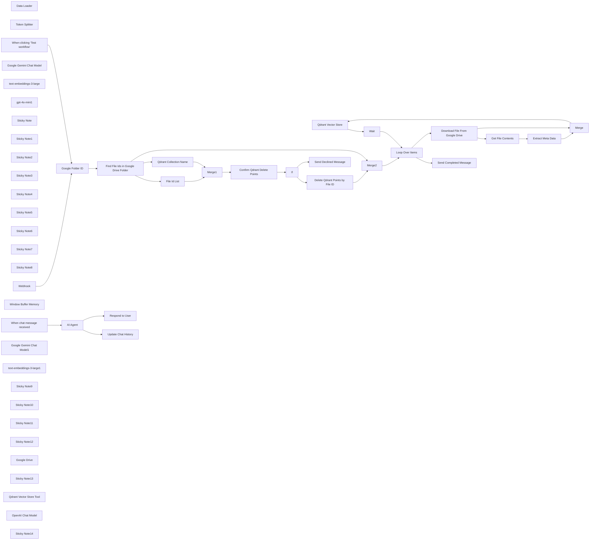

## Fluxo (.json) :

```json
{
  "id": "8tusZTTtcyaiznEG",
  "meta": {
    "instanceId": "31e69f7f4a77bf465b805824e303232f0227212ae922d12133a0f96ffeab4fef",
    "templateCredsSetupCompleted": true
  },
  "name": "🤖 AI Powered RAG Chatbot for Your Docs + Google Drive + Gemini + Qdrant",
  "tags": [],
  "nodes": [
    {
      "id": "7ad5796b-d1a0-4cc1-bed6-105ff499beeb",
      "name": "Data Loader",
      "type": "@n8n/n8n-nodes-langchain.documentDefaultDataLoader",
      "position": [
        620,
        720
      ],
      "parameters": {
        "options": {
          "metadata": {
            "metadataValues": [
              {
                "name": "file_id",
                "value": "={{ $json.id }}"
              },
              {
                "name": "pubkey",
                "value": "={{ $json.name }}"
              },
              {
                "name": "=overarching_theme",
                "value": "={{ $('Extract Meta Data').item.json.output.overarching_theme }}"
              },
              {
                "name": "recurring_topics",
                "value": "={{ $('Extract Meta Data').item.json.output.recurring_topics }}"
              },
              {
                "name": "pain_points",
                "value": "={{ $('Extract Meta Data').item.json.output.pain_points }}"
              },
              {
                "name": "analytical_insights",
                "value": "={{ $('Extract Meta Data').item.json.output.analytical_insights }}"
              },
              {
                "name": "conclusion",
                "value": "={{ $('Extract Meta Data').item.json.output.conclusion }}"
              },
              {
                "name": "keywords",
                "value": "={{ $('Extract Meta Data').item.json.output.keywords }}"
              }
            ]
          }
        },
        "dataType": "binary",
        "binaryMode": "specificField"
      },
      "typeVersion": 1
    },
    {
      "id": "84986ee2-4d79-49e8-8778-b8a955cf2174",
      "name": "Token Splitter",
      "type": "@n8n/n8n-nodes-langchain.textSplitterTokenSplitter",
      "position": [
        720,
        860
      ],
      "parameters": {
        "chunkSize": 3000
      },
      "typeVersion": 1
    },
    {
      "id": "82aa7016-f3af-4de8-a410-b1c802041213",
      "name": "Qdrant Vector Store",
      "type": "@n8n/n8n-nodes-langchain.vectorStoreQdrant",
      "onError": "continueRegularOutput",
      "position": [
        540,
        520
      ],
      "parameters": {
        "mode": "insert",
        "options": {},
        "qdrantCollection": {
          "__rl": true,
          "mode": "id",
          "value": "=nostr-damus-user-profiles"
        }
      },
      "credentials": {
        "qdrantApi": {
          "id": "DJQ4hVAVdWZytjr2",
          "name": "QdrantApi account"
        }
      },
      "executeOnce": false,
      "retryOnFail": true,
      "typeVersion": 1
    },
    {
      "id": "07f4d14a-1864-406b-946b-09c776e3038b",
      "name": "Loop Over Items",
      "type": "n8n-nodes-base.splitInBatches",
      "onError": "continueRegularOutput",
      "position": [
        180,
        -140
      ],
      "parameters": {
        "options": {}
      },
      "typeVersion": 3
    },
    {
      "id": "b0f9b066-62de-41bc-afce-dcb4d20d100c",
      "name": "Wait",
      "type": "n8n-nodes-base.wait",
      "position": [
        1020,
        840
      ],
      "webhookId": "237d7f8a-aead-479a-b813-f407d1f37fa5",
      "parameters": {},
      "typeVersion": 1.1
    },
    {
      "id": "2a883003-f5ec-409e-97e4-809360ca11ed",
      "name": "When clicking ‘Test workflow’",
      "type": "n8n-nodes-base.manualTrigger",
      "position": [
        -1160,
        -280
      ],
      "parameters": {},
      "typeVersion": 1
    },
    {
      "id": "cfbb6b77-142f-4689-b051-436f40ababe6",
      "name": "Google Gemini Chat Model",
      "type": "@n8n/n8n-nodes-langchain.lmChatGoogleGemini",
      "position": [
        1120,
        -20
      ],
      "parameters": {
        "options": {
          "temperature": 0.4
        },
        "modelName": "models/gemini-2.0-flash-exp"
      },
      "credentials": {
        "googlePalmApi": {
          "id": "L9UNQHflYlyF9Ngd",
          "name": "Google Gemini(PaLM) Api account"
        }
      },
      "typeVersion": 1
    },
    {
      "id": "c9c50387-64a3-473f-9ea7-509a301836a3",
      "name": "Merge",
      "type": "n8n-nodes-base.merge",
      "position": [
        820,
        200
      ],
      "parameters": {
        "mode": "combine",
        "options": {},
        "combineBy": "combineAll"
      },
      "typeVersion": 3
    },
    {
      "id": "ea143b9f-9bd8-4f3f-8979-5a0fd2691e9d",
      "name": "Extract Meta Data",
      "type": "@n8n/n8n-nodes-langchain.informationExtractor",
      "position": [
        1020,
        -180
      ],
      "parameters": {
        "text": "={{ $json.data }}",
        "options": {
          "systemPromptTemplate": "You are an expert extraction algorithm.\nOnly extract relevant information from the text.\nIf you do not know the value of an attribute asked to extract, you may omit the attribute's value."
        },
        "attributes": {
          "attributes": [
            {
              "name": "overarching_theme",
              "description": "Summarize the main theme(s) discussed in the \"Overarching Theme\" section."
            },
            {
              "name": "recurring_topics",
              "description": "List the recurring topics mentioned in the \"Common Threads\" section as an array of strings."
            },
            {
              "name": "pain_points",
              "description": "Summarize the user's frustrations or challenges mentioned in the \"Pain Points\" section as an array of strings."
            },
            {
              "name": "analytical_insights",
              "description": "Extract a list of key analytical observations from the \"Analytical Insights\" section, including shifts in tone or behavior."
            },
            {
              "name": "conclusion",
              "description": "Summarize the conclusions drawn about the user’s threads and their overall focus."
            },
            {
              "name": "keywords",
              "description": "Generate a list of 10 keywords that capture the essence of the document (e.g., \"askNostr,\" \"decentralization,\" \"spam filtering\")."
            }
          ]
        }
      },
      "typeVersion": 1
    },
    {
      "id": "2ddd778f-6676-4a4b-b592-536401831bc8",
      "name": "Get File Contents",
      "type": "n8n-nodes-base.extractFromFile",
      "position": [
        820,
        -180
      ],
      "parameters": {
        "options": {},
        "operation": "text"
      },
      "typeVersion": 1
    },
    {
      "id": "cdbb8bbc-967c-4f01-b844-4d31328153df",
      "name": "Download File From Google Drive",
      "type": "n8n-nodes-base.googleDrive",
      "position": [
        500,
        -180
      ],
      "parameters": {
        "fileId": {
          "__rl": true,
          "mode": "id",
          "value": "={{ $json.id }}"
        },
        "options": {},
        "operation": "download"
      },
      "credentials": {
        "googleDriveOAuth2Api": {
          "id": "UhdXGYLTAJbsa0xX",
          "name": "Google Drive account"
        }
      },
      "typeVersion": 3
    },
    {
      "id": "399e196c-76ec-4077-aacc-f669173b0229",
      "name": "Find File Ids in Google Drive Folder",
      "type": "n8n-nodes-base.googleDrive",
      "position": [
        -620,
        -160
      ],
      "parameters": {
        "filter": {
          "driveId": {
            "mode": "list",
            "value": "My Drive"
          },
          "folderId": {
            "__rl": true,
            "mode": "id",
            "value": "={{ $json.folder_id }}"
          }
        },
        "options": {},
        "resource": "fileFolder",
        "returnAll": true
      },
      "credentials": {
        "googleDriveOAuth2Api": {
          "id": "UhdXGYLTAJbsa0xX",
          "name": "Google Drive account"
        }
      },
      "typeVersion": 3
    },
    {
      "id": "3bc4f005-c6c8-4f73-816a-1573d6dfb62f",
      "name": "text-embeddings-3-large",
      "type": "@n8n/n8n-nodes-langchain.embeddingsOpenAi",
      "position": [
        480,
        720
      ],
      "parameters": {
        "model": "text-embedding-3-large",
        "options": {}
      },
      "credentials": {
        "openAiApi": {
          "id": "jEMSvKmtYfzAkhe6",
          "name": "OpenAi account"
        }
      },
      "typeVersion": 1
    },
    {
      "id": "5d42b34a-7156-4163-a2c4-a9cb3c984c96",
      "name": "Google Folder ID",
      "type": "n8n-nodes-base.set",
      "position": [
        -820,
        -160
      ],
      "parameters": {
        "options": {},
        "assignments": {
          "assignments": [
            {
              "id": "e6f6188f-c895-4c8c-b39a-0ef55b490fd6",
              "name": "folder_id",
              "type": "string",
              "value": "[Your-Google-Folder-ID]"
            }
          ]
        }
      },
      "typeVersion": 3.4
    },
    {
      "id": "7be310c2-d30f-42a2-8f57-33c7b184e429",
      "name": "gpt-4o-mini1",
      "type": "@n8n/n8n-nodes-langchain.lmChatOpenAi",
      "position": [
        -400,
        940
      ],
      "parameters": {
        "options": {}
      },
      "credentials": {
        "openAiApi": {
          "id": "jEMSvKmtYfzAkhe6",
          "name": "OpenAi account"
        }
      },
      "typeVersion": 1
    },
    {
      "id": "18aacfd9-3f6e-4fba-9f68-d8cc95bc667b",
      "name": "Delete Qdrant Points by File ID",
      "type": "@n8n/n8n-nodes-langchain.code",
      "position": [
        -500,
        800
      ],
      "parameters": {
        "code": {
          "execute": {
            "code": "const { QdrantVectorStore } = require(\"@langchain/qdrant\");\nconst { OpenAIEmbeddings } = require(\"@langchain/openai\");\n\n// Qdrant connection details\nconst url = \"http://localhost:6333/\";\nconst apiKey = \"\";\n\n// OpenAI API configuration\nconst openAIApiKey = \"[Your-OpenAI-API-Key]\";\n\n// Get input data\nconst items = this.getInputData()[0];\n// console.log(items)\n\nconst collectionName =  items.json.qdrant_collection_name;\n// console.log(collectionName)\n\nasync function deleteDocumentsFromQdrant() {\n  try {\n    // Initialize OpenAI embeddings\n    const embeddings = new OpenAIEmbeddings({\n      model: \"text-embedding-3-large\",\n      openAIApiKey: openAIApiKey\n    });\n\n    // Connect to existing Qdrant collection\n    const vectorStore = await QdrantVectorStore.fromExistingCollection(embeddings, {\n      url: url,\n      apiKey: apiKey,\n      collectionName: collectionName,\n    });\n\n    const fileIds = items.json.appended_id.map(item => item);\n\n    console.log(fileIds)\n\n    // Delete points by fileId\n    const deletionResults = await Promise.all(fileIds.map(async (file_id) => {\n      const filter = {\n        must: [\n          {\n            key: \"metadata.file_id\",\n            match: { value: file_id }\n          }\n        ]\n      };\n\n      try {\n        // Access the underlying Qdrant client to perform the deletion\n        await vectorStore.client.delete(collectionName, { filter });\n        return { file_id, status: \"deleted\" };\n      } catch (error) {\n        console.error(`Error deleting documents for fileId ${file_id}:`, error);\n        return { file_id, status: \"error\", message: error.message };\n      }\n    }));\n\n    return deletionResults;\n  } catch (error) {\n    console.error(\"An error occurred during the deletion process:\", error);\n    return error.message;\n  }\n}\n\n// Execute the deletion process\ntry {\n  const result = await deleteDocumentsFromQdrant();\n  console.log(\"Deletion process completed:\", result);\n  return [];\n} catch (error) {\n  console.error(\"Failed to execute deletion process:\", error);\n  return [{ json: { error } }];\n}\n\n"
          }
        },
        "inputs": {
          "input": [
            {
              "type": "main",
              "required": true,
              "maxConnections": 1
            },
            {
              "type": "ai_languageModel",
              "required": true,
              "maxConnections": 1
            }
          ]
        },
        "outputs": {
          "output": [
            {
              "type": "main"
            }
          ]
        }
      },
      "typeVersion": 1
    },
    {
      "id": "329cec97-aac1-4714-97ce-add5915b1078",
      "name": "Qdrant Collection Name",
      "type": "n8n-nodes-base.set",
      "position": [
        -700,
        100
      ],
      "parameters": {
        "options": {},
        "assignments": {
          "assignments": [
            {
              "id": "11fa71e9-6cbc-4183-9439-e3379b2b970e",
              "name": "qdrant_collection_name",
              "type": "string",
              "value": "nostr-damus-user-profiles"
            }
          ]
        }
      },
      "typeVersion": 3.4
    },
    {
      "id": "82e98da8-530d-4a3c-97e6-5e91ad644a46",
      "name": "File Id List",
      "type": "n8n-nodes-base.summarize",
      "position": [
        -700,
        280
      ],
      "parameters": {
        "options": {},
        "fieldsToSummarize": {
          "values": [
            {
              "field": "id",
              "aggregation": "append"
            }
          ]
        }
      },
      "typeVersion": 1.1
    },
    {
      "id": "f3def614-2709-4847-831d-d6a80c86ec1c",
      "name": "Merge1",
      "type": "n8n-nodes-base.merge",
      "position": [
        -340,
        340
      ],
      "parameters": {
        "mode": "combine",
        "options": {},
        "combineBy": "combineByPosition"
      },
      "typeVersion": 3
    },
    {
      "id": "cfe399fb-8560-4ac4-98f7-4f539ae6a52c",
      "name": "Merge2",
      "type": "n8n-nodes-base.merge",
      "position": [
        -80,
        -140
      ],
      "parameters": {},
      "typeVersion": 3
    },
    {
      "id": "1059da47-2abd-4884-b9c2-6b7d1623e31d",
      "name": "Sticky Note",
      "type": "n8n-nodes-base.stickyNote",
      "position": [
        -1280,
        560
      ],
      "parameters": {
        "color": 3,
        "width": 1180,
        "height": 760,
        "content": "## Prepare Qdrant Vector Store"
      },
      "typeVersion": 1
    },
    {
      "id": "2616e08f-070e-45b5-906f-40e832519aa2",
      "name": "Confirm Qdrant Delete Points",
      "type": "n8n-nodes-base.telegram",
      "position": [
        -1060,
        760
      ],
      "webhookId": "29aac1ac-9345-4e44-babf-ebcfae701d88",
      "parameters": {
        "chatId": "={{ $env.TELEGRAM_CHAT_ID }}",
        "message": "=WARNING - {{ $json.appended_id.length }} Records in the Qdrant vector store collection \"{{ $json.qdrant_collection_name }}\" will be deleted.  Are you sure you want to continue?  This action cannot be undone!",
        "options": {
          "limitWaitTime": {
            "values": {
              "resumeUnit": "minutes",
              "resumeAmount": 15
            }
          }
        },
        "operation": "sendAndWait",
        "approvalOptions": {
          "values": {
            "approvalType": "double"
          }
        }
      },
      "credentials": {
        "telegramApi": {
          "id": "pAIFhguJlkO3c7aQ",
          "name": "Telegram account"
        }
      },
      "typeVersion": 1.2
    },
    {
      "id": "9d167192-e87b-41be-87f2-d7ddf866bb8d",
      "name": "If",
      "type": "n8n-nodes-base.if",
      "position": [
        -1060,
        1000
      ],
      "parameters": {
        "options": {},
        "conditions": {
          "options": {
            "version": 2,
            "leftValue": "",
            "caseSensitive": true,
            "typeValidation": "strict"
          },
          "combinator": "and",
          "conditions": [
            {
              "id": "20f530d6-fd55-420d-b8a9-70e5303f688e",
              "operator": {
                "type": "boolean",
                "operation": "true",
                "singleValue": true
              },
              "leftValue": "={{ $json.data.approved }}",
              "rightValue": ""
            }
          ]
        }
      },
      "typeVersion": 2.2
    },
    {
      "id": "1178f8cf-ece0-4b11-942d-18dd025da366",
      "name": "Sticky Note1",
      "type": "n8n-nodes-base.stickyNote",
      "position": [
        320,
        420
      ],
      "parameters": {
        "color": 7,
        "width": 920,
        "height": 640,
        "content": "## Perform Qdrant Vector Store Operations"
      },
      "typeVersion": 1
    },
    {
      "id": "cbf17a08-2f4c-4605-8418-5bf93ade7cf4",
      "name": "Send Declined Message",
      "type": "n8n-nodes-base.telegram",
      "position": [
        -740,
        1120
      ],
      "webhookId": "382a3b43-b83f-47b1-a276-67c6b98a441a",
      "parameters": {
        "text": "Qdrant vector store upsert declined",
        "chatId": "={{ $env.TELEGRAM_CHAT_ID }}",
        "additionalFields": {
          "appendAttribution": false
        }
      },
      "credentials": {
        "telegramApi": {
          "id": "pAIFhguJlkO3c7aQ",
          "name": "Telegram account"
        }
      },
      "typeVersion": 1.2
    },
    {
      "id": "890f478a-e000-418d-8582-4fef946e44d8",
      "name": "Sticky Note2",
      "type": "n8n-nodes-base.stickyNote",
      "position": [
        -900,
        -380
      ],
      "parameters": {
        "width": 480,
        "height": 840,
        "content": "## 🌟Workflow Config\n\n- Google Drive Folder Id\n- Qdrant Collection Name\n- List of Google Drive File Id's"
      },
      "typeVersion": 1
    },
    {
      "id": "d2bc2fed-c134-4e54-bd9d-69996be966a3",
      "name": "Sticky Note3",
      "type": "n8n-nodes-base.stickyNote",
      "position": [
        740,
        -280
      ],
      "parameters": {
        "color": 6,
        "width": 640,
        "height": 420,
        "content": "## Extract Metadata for Qdrant Hybrid Search"
      },
      "typeVersion": 1
    },
    {
      "id": "61f3c21e-bc2a-47bc-8ab1-678b1f425ee3",
      "name": "Sticky Note4",
      "type": "n8n-nodes-base.stickyNote",
      "position": [
        400,
        -280
      ],
      "parameters": {
        "color": 2,
        "width": 300,
        "height": 320,
        "content": "## Google Drive"
      },
      "typeVersion": 1
    },
    {
      "id": "61e608e4-ac6a-4131-9ca8-c46a5134bff9",
      "name": "Sticky Note5",
      "type": "n8n-nodes-base.stickyNote",
      "position": [
        80,
        -360
      ],
      "parameters": {
        "color": 5,
        "width": 1360,
        "height": 1480,
        "content": "## ✨ Save Documents to Qdrant Vector Store"
      },
      "typeVersion": 1
    },
    {
      "id": "410681cb-e757-42c0-89de-902edbe998e3",
      "name": "Sticky Note6",
      "type": "n8n-nodes-base.stickyNote",
      "position": [
        -580,
        680
      ],
      "parameters": {
        "color": 5,
        "width": 420,
        "height": 400,
        "content": "## Delete From Qdrant Vector Store\nThis operation can not be undone!!!"
      },
      "typeVersion": 1
    },
    {
      "id": "238469ce-3710-4681-b1b2-200c1b699d5e",
      "name": "Sticky Note7",
      "type": "n8n-nodes-base.stickyNote",
      "position": [
        -1200,
        640
      ],
      "parameters": {
        "color": 4,
        "width": 380,
        "height": 520,
        "content": "## Human In The Loop\nUser must verify deletion of points from Qdrant vector store"
      },
      "typeVersion": 1
    },
    {
      "id": "0b2f6ff4-dd02-4f0e-b2eb-60b1ce736cf5",
      "name": "Sticky Note8",
      "type": "n8n-nodes-base.stickyNote",
      "position": [
        -1280,
        -380
      ],
      "parameters": {
        "color": 4,
        "width": 340,
        "height": 460,
        "content": "## 👍Start Here!"
      },
      "typeVersion": 1
    },
    {
      "id": "abde545b-1a23-4b3e-8046-335b9d0fa445",
      "name": "Webhook",
      "type": "n8n-nodes-base.webhook",
      "disabled": true,
      "position": [
        -1160,
        -100
      ],
      "webhookId": "3a30557f-9264-4bc8-a253-a9356677c791",
      "parameters": {
        "path": "upsert",
        "options": {}
      },
      "typeVersion": 2
    },
    {
      "id": "897d29af-719d-4fe7-93a9-44c693cc6547",
      "name": "AI Agent",
      "type": "@n8n/n8n-nodes-langchain.agent",
      "position": [
        -600,
        -1200
      ],
      "parameters": {
        "text": "={{ $json.chatInput }}",
        "options": {
          "systemMessage": "=You are an intelligent assistant specialized in answering user questions using Nostr user profiles. Your primary goal is to provide precise, contextually relevant, and concise answers based on the tools and resources available.\n\n### TOOL\nUse the \"nostr_damus_user_profiles\" tool to:\n- perform semantic similarity searches and retrieve information from Nostr user profiles relevant to the user's query.\n- access detailed information about Nostr and/or Damus users when additional context or specifics are required.\n\n### Key Instructions\n1. **Response Guidelines**:\n   - Clearly explain how the retrieved information addresses the user's query, if applicable.\n   - If no relevant information is found, respond with: \"I cannot find the answer in the available resources.\"\n\n2. **Focus and Relevance**:\n   - Ensure all responses are directly aligned with the user's question.\n   - Avoid including extraneous details or relying solely on internal knowledge.\n"
        },
        "promptType": "define"
      },
      "typeVersion": 1.7
    },
    {
      "id": "316b0d8d-bbc7-4c40-b6d0-d0c762554fca",
      "name": "Window Buffer Memory",
      "type": "@n8n/n8n-nodes-langchain.memoryBufferWindow",
      "position": [
        -580,
        -1000
      ],
      "parameters": {
        "contextWindowLength": 40
      },
      "typeVersion": 1.3
    },
    {
      "id": "f1e342a8-d50e-48a8-9d7a-850f8be93cff",
      "name": "When chat message received",
      "type": "@n8n/n8n-nodes-langchain.chatTrigger",
      "position": [
        -1160,
        -1200
      ],
      "webhookId": "5f1c0c82-0ff9-40c7-9e2e-b1a96ffe24cd",
      "parameters": {
        "options": {}
      },
      "typeVersion": 1.1
    },
    {
      "id": "12902fa9-5bcb-4e8b-ac13-7f4cb6e7e1d0",
      "name": "Google Gemini Chat Model1",
      "type": "@n8n/n8n-nodes-langchain.lmChatGoogleGemini",
      "position": [
        -760,
        -1000
      ],
      "parameters": {
        "options": {
          "maxOutputTokens": 8192
        },
        "modelName": "models/gemini-2.0-flash-exp"
      },
      "credentials": {
        "googlePalmApi": {
          "id": "L9UNQHflYlyF9Ngd",
          "name": "Google Gemini(PaLM) Api account"
        }
      },
      "typeVersion": 1
    },
    {
      "id": "1c5818d4-6251-4d14-8b4f-d1f3ddfbed38",
      "name": "text-embeddings-3-large1",
      "type": "@n8n/n8n-nodes-langchain.embeddingsOpenAi",
      "position": [
        -320,
        -840
      ],
      "parameters": {
        "model": "text-embedding-3-large",
        "options": {}
      },
      "credentials": {
        "openAiApi": {
          "id": "jEMSvKmtYfzAkhe6",
          "name": "OpenAi account"
        }
      },
      "typeVersion": 1
    },
    {
      "id": "80056067-5d2b-4ac7-8e69-e75bd66a1ad4",
      "name": "Sticky Note9",
      "type": "n8n-nodes-base.stickyNote",
      "position": [
        -900,
        -1300
      ],
      "parameters": {
        "color": 5,
        "width": 860,
        "height": 680,
        "content": "## 🤖Retrieve Content from Qdrant Vector Store"
      },
      "typeVersion": 1
    },
    {
      "id": "b45b18e4-7773-4eec-837b-f43fc0eeb90c",
      "name": "Sticky Note10",
      "type": "n8n-nodes-base.stickyNote",
      "position": [
        -1280,
        -1300
      ],
      "parameters": {
        "color": 4,
        "width": 340,
        "height": 320,
        "content": "## 🗣️ Chat with Your Documents"
      },
      "typeVersion": 1
    },
    {
      "id": "8fe891dd-dee6-4abb-bc09-d90e6d7bf3cb",
      "name": "Sticky Note11",
      "type": "n8n-nodes-base.stickyNote",
      "position": [
        -1360,
        -480
      ],
      "parameters": {
        "color": 7,
        "width": 2880,
        "height": 1880,
        "content": "# Step 1 - Save Documents to Qdrant Vector Store"
      },
      "typeVersion": 1
    },
    {
      "id": "4a9bf716-3fc3-4ccc-b831-19a1afdb4588",
      "name": "Sticky Note12",
      "type": "n8n-nodes-base.stickyNote",
      "position": [
        -1360,
        -1420
      ],
      "parameters": {
        "color": 7,
        "width": 1780,
        "height": 880,
        "content": "# Step 2 - Chat with Your Documents from Qdrant Vector Store"
      },
      "typeVersion": 1
    },
    {
      "id": "fccedfde-c5aa-4237-9d1c-feb9ebabf4f3",
      "name": "Google Drive",
      "type": "n8n-nodes-base.googleDrive",
      "disabled": true,
      "position": [
        120,
        -780
      ],
      "parameters": {
        "name": "=Nostr Chatbot - Avatar - {{ $now }}",
        "content": "={{ $json.output }}",
        "driveId": {
          "__rl": true,
          "mode": "list",
          "value": "My Drive"
        },
        "options": {},
        "folderId": {
          "__rl": true,
          "mode": "list",
          "value": "root",
          "cachedResultName": "/ (Root folder)"
        },
        "operation": "createFromText"
      },
      "credentials": {
        "googleDriveOAuth2Api": {
          "id": "UhdXGYLTAJbsa0xX",
          "name": "Google Drive account"
        }
      },
      "typeVersion": 3
    },
    {
      "id": "6d6813f6-4f2e-499a-9e5c-fe15624a91ef",
      "name": "Respond to User",
      "type": "n8n-nodes-base.set",
      "position": [
        120,
        -960
      ],
      "parameters": {
        "options": {},
        "assignments": {
          "assignments": [
            {
              "id": "cd8f88e1-19c0-4b9e-914d-e2e7ba21d9fa",
              "name": "output",
              "type": "string",
              "value": "={{ $json.output }}"
            }
          ]
        }
      },
      "typeVersion": 3.4
    },
    {
      "id": "1c73bae9-2bdd-4383-a6f8-3cf43d3c15be",
      "name": "Sticky Note13",
      "type": "n8n-nodes-base.stickyNote",
      "position": [
        0,
        -1300
      ],
      "parameters": {
        "color": 4,
        "width": 340,
        "height": 300,
        "content": "## Save Chat History"
      },
      "typeVersion": 1
    },
    {
      "id": "db3dcc69-d1d0-48a1-b949-37f2de802b4a",
      "name": "Update Chat History",
      "type": "n8n-nodes-base.googleDocs",
      "position": [
        120,
        -1200
      ],
      "parameters": {
        "actionsUi": {
          "actionFields": [
            {
              "text": "=\n-------------------------------\n\n{{ $now }}\n\n{{ $('When chat message received').item.json.chatInput  }}\n\n{{ $json.output }}",
              "action": "insert"
            }
          ]
        },
        "operation": "update",
        "documentURL": "1ej_qLolUFp1h4eZkrb99T3DWQ3JOwXVEMS3VUjWyVf0"
      },
      "credentials": {
        "googleDocsOAuth2Api": {
          "id": "YWEHuG28zOt532MQ",
          "name": "Google Docs account"
        }
      },
      "typeVersion": 2
    },
    {
      "id": "2dd28eed-b71b-44fb-bb78-8cb50b0d0c93",
      "name": "Qdrant Vector Store Tool",
      "type": "@n8n/n8n-nodes-langchain.vectorStoreQdrant",
      "position": [
        -420,
        -1000
      ],
      "parameters": {
        "mode": "retrieve-as-tool",
        "topK": 20,
        "options": {},
        "toolName": "nostr_damus_user_profiles",
        "toolDescription": "Retrieve information about Nostr or Damus users",
        "qdrantCollection": {
          "__rl": true,
          "mode": "list",
          "value": "nostr-damus-user-profiles",
          "cachedResultName": "nostr-damus-user-profiles"
        }
      },
      "credentials": {
        "qdrantApi": {
          "id": "DJQ4hVAVdWZytjr2",
          "name": "QdrantApi account"
        }
      },
      "typeVersion": 1
    },
    {
      "id": "3b130cf8-ab8e-4001-a3d0-a129194aee98",
      "name": "OpenAI Chat Model",
      "type": "@n8n/n8n-nodes-langchain.lmChatOpenAi",
      "disabled": true,
      "position": [
        -760,
        -820
      ],
      "parameters": {
        "model": {
          "__rl": true,
          "mode": "list",
          "value": "gpt-4o-mini"
        },
        "options": {}
      },
      "credentials": {
        "openAiApi": {
          "id": "jEMSvKmtYfzAkhe6",
          "name": "OpenAi account"
        }
      },
      "typeVersion": 1.2
    },
    {
      "id": "ccc64645-ad14-4b6b-a507-0b5fb0ac945f",
      "name": "Send Completed Message",
      "type": "n8n-nodes-base.telegram",
      "position": [
        500,
        200
      ],
      "webhookId": "382a3b43-b83f-47b1-a276-67c6b98a441a",
      "parameters": {
        "text": "Qdrant vector store upsert completed",
        "chatId": "={{ $env.TELEGRAM_CHAT_ID }}",
        "additionalFields": {
          "appendAttribution": false
        }
      },
      "credentials": {
        "telegramApi": {
          "id": "pAIFhguJlkO3c7aQ",
          "name": "Telegram account"
        }
      },
      "typeVersion": 1.2
    },
    {
      "id": "885fef53-2246-45b1-a122-ab5b82374585",
      "name": "Sticky Note14",
      "type": "n8n-nodes-base.stickyNote",
      "position": [
        -2120,
        -480
      ],
      "parameters": {
        "width": 700,
        "height": 1240,
        "content": "# 🤖 AI-Powered RAG Chatbot with Google Drive Integration\n\nThis workflow creates a powerful RAG (Retrieval-Augmented Generation) chatbot that can process, store, and interact with documents from Google Drive using Qdrant vector storage and Google's Gemini AI.\n\n## How It Works\n\n### Document Processing & Storage 📚\n- Retrieves documents from a specified Google Drive folder\n- Processes and splits documents into manageable chunks\n- Extracts metadata using AI for enhanced search capabilities\n- Stores document vectors in Qdrant for efficient retrieval\n\n### Intelligent Chat Interface 💬\n- Provides a conversational interface powered by Google Gemini\n- Uses RAG to retrieve relevant context from stored documents\n- Maintains chat history in Google Docs for reference\n- Delivers accurate, context-aware responses\n\n### Vector Store Management 🗄️\n- Features secure delete operations with human verification\n- Includes Telegram notifications for important operations\n- Maintains data integrity with proper version control\n- Supports batch processing of documents\n\n## Setup Steps\n\n1. Configure API Credentials:\n   - Set up Google Drive & Docs access\n   - Configure Gemini AI API\n   - Set up Qdrant vector store connection\n   - Add Telegram bot for notifications\n\n2. Configure Document Sources:\n   - Set Google Drive folder ID\n   - Define Qdrant collection name\n   - Set up document processing parameters\n\n3. Test and Deploy:\n   - Verify document processing\n   - Test chat functionality\n   - Confirm vector store operations\n   - Check notification system\n\n\nThis workflow is ideal for organizations needing to create intelligent chatbots that can access and understand large document repositories while maintaining context and providing accurate responses through RAG technology.\n"
      },
      "typeVersion": 1
    }
  ],
  "active": false,
  "pinData": {},
  "settings": {
    "timezone": "America/Vancouver",
    "executionOrder": "v1"
  },
  "versionId": "0c0d90e5-02f9-4169-b477-fd90c52ce44e",
  "connections": {
    "If": {
      "main": [
        [
          {
            "node": "Delete Qdrant Points by File ID",
            "type": "main",
            "index": 0
          }
        ],
        [
          {
            "node": "Send Declined Message",
            "type": "main",
            "index": 0
          }
        ]
      ]
    },
    "Wait": {
      "main": [
        [
          {
            "node": "Loop Over Items",
            "type": "main",
            "index": 0
          }
        ]
      ]
    },
    "Merge": {
      "main": [
        [
          {
            "node": "Qdrant Vector Store",
            "type": "main",
            "index": 0
          }
        ]
      ]
    },
    "Merge1": {
      "main": [
        [
          {
            "node": "Confirm Qdrant Delete Points",
            "type": "main",
            "index": 0
          }
        ]
      ]
    },
    "Merge2": {
      "main": [
        [
          {
            "node": "Loop Over Items",
            "type": "main",
            "index": 0
          }
        ]
      ]
    },
    "Webhook": {
      "main": [
        [
          {
            "node": "Google Folder ID",
            "type": "main",
            "index": 0
          }
        ]
      ]
    },
    "AI Agent": {
      "main": [
        [
          {
            "node": "Update Chat History",
            "type": "main",
            "index": 0
          },
          {
            "node": "Respond to User",
            "type": "main",
            "index": 0
          }
        ]
      ]
    },
    "Data Loader": {
      "ai_document": [
        [
          {
            "node": "Qdrant Vector Store",
            "type": "ai_document",
            "index": 0
          }
        ]
      ]
    },
    "File Id List": {
      "main": [
        [
          {
            "node": "Merge1",
            "type": "main",
            "index": 1
          }
        ]
      ]
    },
    "gpt-4o-mini1": {
      "ai_languageModel": [
        [
          {
            "node": "Delete Qdrant Points by File ID",
            "type": "ai_languageModel",
            "index": 0
          }
        ]
      ]
    },
    "Token Splitter": {
      "ai_textSplitter": [
        [
          {
            "node": "Data Loader",
            "type": "ai_textSplitter",
            "index": 0
          }
        ]
      ]
    },
    "Loop Over Items": {
      "main": [
        [
          {
            "node": "Send Completed Message",
            "type": "main",
            "index": 0
          }
        ],
        [
          {
            "node": "Download File From Google Drive",
            "type": "main",
            "index": 0
          }
        ]
      ]
    },
    "Respond to User": {
      "main": [
        []
      ]
    },
    "Google Folder ID": {
      "main": [
        [
          {
            "node": "Find File Ids in Google Drive Folder",
            "type": "main",
            "index": 0
          }
        ]
      ]
    },
    "Extract Meta Data": {
      "main": [
        [
          {
            "node": "Merge",
            "type": "main",
            "index": 0
          }
        ]
      ]
    },
    "Get File Contents": {
      "main": [
        [
          {
            "node": "Extract Meta Data",
            "type": "main",
            "index": 0
          }
        ]
      ]
    },
    "OpenAI Chat Model": {
      "ai_languageModel": [
        []
      ]
    },
    "Qdrant Vector Store": {
      "main": [
        [
          {
            "node": "Wait",
            "type": "main",
            "index": 0
          }
        ]
      ]
    },
    "Update Chat History": {
      "main": [
        []
      ]
    },
    "Window Buffer Memory": {
      "ai_memory": [
        [
          {
            "node": "AI Agent",
            "type": "ai_memory",
            "index": 0
          }
        ]
      ]
    },
    "Qdrant Collection Name": {
      "main": [
        [
          {
            "node": "Merge1",
            "type": "main",
            "index": 0
          }
        ]
      ]
    },
    "text-embeddings-3-large": {
      "ai_embedding": [
        [
          {
            "node": "Qdrant Vector Store",
            "type": "ai_embedding",
            "index": 0
          }
        ]
      ]
    },
    "Google Gemini Chat Model": {
      "ai_languageModel": [
        [
          {
            "node": "Extract Meta Data",
            "type": "ai_languageModel",
            "index": 0
          }
        ]
      ]
    },
    "Qdrant Vector Store Tool": {
      "ai_tool": [
        [
          {
            "node": "AI Agent",
            "type": "ai_tool",
            "index": 0
          }
        ]
      ],
      "ai_vectorStore": [
        []
      ]
    },
    "text-embeddings-3-large1": {
      "ai_embedding": [
        [
          {
            "node": "Qdrant Vector Store Tool",
            "type": "ai_embedding",
            "index": 0
          }
        ]
      ]
    },
    "Google Gemini Chat Model1": {
      "ai_languageModel": [
        [
          {
            "node": "AI Agent",
            "type": "ai_languageModel",
            "index": 0
          }
        ]
      ]
    },
    "When chat message received": {
      "main": [
        [
          {
            "node": "AI Agent",
            "type": "main",
            "index": 0
          }
        ]
      ]
    },
    "Confirm Qdrant Delete Points": {
      "main": [
        [
          {
            "node": "If",
            "type": "main",
            "index": 0
          }
        ]
      ]
    },
    "Delete Qdrant Points by File ID": {
      "main": [
        [
          {
            "node": "Merge2",
            "type": "main",
            "index": 1
          }
        ]
      ]
    },
    "Download File From Google Drive": {
      "main": [
        [
          {
            "node": "Get File Contents",
            "type": "main",
            "index": 0
          },
          {
            "node": "Merge",
            "type": "main",
            "index": 1
          }
        ]
      ]
    },
    "When clicking ‘Test workflow’": {
      "main": [
        [
          {
            "node": "Google Folder ID",
            "type": "main",
            "index": 0
          }
        ]
      ]
    },
    "Find File Ids in Google Drive Folder": {
      "main": [
        [
          {
            "node": "File Id List",
            "type": "main",
            "index": 0
          },
          {
            "node": "Qdrant Collection Name",
            "type": "main",
            "index": 0
          },
          {
            "node": "Merge2",
            "type": "main",
            "index": 0
          }
        ]
      ]
    }
  }
}
```

<a id="template-2485"></a>

## Template 2485 - Gerador de vídeos sociais AI com publicação automática

- **Nome:** Gerador de vídeos sociais AI com publicação automática
- **Descrição:** Automatiza a criação de vídeos verticais a partir de prompts de texto, adiciona locução e legendas, salva metadados e publica automaticamente em múltiplas redes sociais.
- **Funcionalidade:** • Recepção de prompt via Telegram: Inicia o fluxo ao receber uma mensagem do usuário.
• Extração de prompt e ideia de legenda: Separa o texto em prompt de vídeo e sugestão de legenda.
• Otimização do prompt para vídeo cinematográfico: Expande e transforma o prompt curto em uma descrição rica e visual usando um modelo GPT.
• Geração de vídeo AI: Envia o prompt otimizado a um serviço de geração de vídeo para criar um clipe 9:16.
• Geração de script para voice-over: Cria um texto de narração curto e ajustado à duração do vídeo.
• Conversão de texto para áudio (TTS): Transforma o script em arquivo de áudio narrado.
• Upload de áudio para armazenamento em nuvem: Hospeda o arquivo de áudio para integração posterior.
• Mescla de áudio e vídeo: Combina o vídeo gerado com a locução em um único arquivo final.
• Adição de legendas/legendagem estilizada: Sobrepõe subtítulos profissionais ao vídeo para acessibilidade e engajamento.
• Criação de título e legenda social: Gera um título estilo YouTube e uma legenda curta otimizada para redes sociais.
• Registro de metadados: Salva título, prompt, URL do vídeo e descrição em uma planilha para controle.
• Envio para validação via Telegram: Entrega o vídeo final e a legenda ao chat do usuário.
• Upload e publicação multi-plataforma: Envia o vídeo para um serviço de distribuição que publica automaticamente em várias redes sociais (Instagram, YouTube, TikTok, Facebook, LinkedIn, Threads, X, Bluesky, Pinterest).
- **Ferramentas:** • Telegram: Canal de entrada e entrega para prompts e vídeos ao usuário.
• OpenAI (GPT-4 / GPT-4o): Geração e otimização de prompts, criação de scripts de voice-over e produção de legendas/títulos.
• Kling (via API piapi.ai): Serviço de geração de vídeo a partir de prompt textuais.
• JSON2Video (json2video.com): Serviço para mesclar mídia e renderizar vídeo final com áudio e elementos.
• Cloudinary: Armazenamento e hospedagem do arquivo de áudio gerado.
• Google Sheets: Banco de dados simples para salvar metadados e acompanhar vídeos publicados.
• Blotato: Plataforma de mídia para upload e publicação automática em múltiplas redes sociais.

## Fluxo visual

```mermaid
flowchart LR
    N1["Sticky Note"]
    N2["Sticky Note1"]
    N3["Sticky Note3"]
    N4["Sticky Note4"]
    N5["Sticky Note2"]
    N6["Trigger: Telegram Prompt"]
    N7["Extract Prompt & Caption"]
    N8["Transform Prompt for Kling (GPT-4)"]
    N9["OpenAI Model Bridge"]
    N10["Generate Video via Kling API"]
    N11["Wait for Video Generation"]
    N12["Get Generated Video URL"]
    N13["Generate Voice-Over Script"]
    N14["Convert Script to Audio (TTS)"]
    N15["Upload Audio to Cloudinary"]
    N16["Merge Audio + Video"]
    N17["Wait for Audio/Video Fusion"]
    N18["Get Video URL with Audio"]
    N19["Wait Before Captioning"]
    N20["Add Captions/Subtitles to Video"]
    N21["Wait for Caption Render"]
    N22["Get Final Video URL (Audio + Captions)"]
    N23["Generate Social Caption from Voiceover"]
    N24["Generate YouTube-Style Title"]
    N25["Save Video Metadata to Google Sheets"]
    N26["Send Final Video to Telegram"]
    N27["Send Caption Link via Telegram"]
    N28["Assign Social Media IDs"]
    N29["Upload Video to Blotato"]
    N30["Post to Instagram"]
    N31["Post to YouTube"]
    N32["Post to TikTok"]
    N33["Post to Facebook Page"]
    N34["Post to Threads"]
    N35["Post to Twitter (X)"]
    N36["Post to LinkedIn"]
    N37["Post to Bluesky"]
    N38["Post to Pinterest"]

    N16 --> N17
    N19 --> N20
    N28 --> N29
    N12 --> N13
    N29 --> N30
    N29 --> N31
    N29 --> N32
    N29 --> N33
    N29 --> N34
    N29 --> N35
    N29 --> N36
    N29 --> N37
    N29 --> N38
    N21 --> N22
    N7 --> N8
    N18 --> N19
    N6 --> N7
    N11 --> N12
    N13 --> N14
    N15 --> N16
    N17 --> N18
    N10 --> N11
    N24 --> N25
    N26 --> N27
    N14 --> N15
    N27 --> N28
    N20 --> N21
    N8 --> N10
    N25 --> N26
    N23 --> N24
    N22 --> N23
```

## Fluxo (.json) :

```json
{
  "id": "SvZQB2gsI57KlfvO",
  "meta": {
    "instanceId": "a2b23892dd6989fda7c1209b381f5850373a7d2b85609624d7c2b7a092671d44",
    "templateCredsSetupCompleted": true
  },
  "name": "💥AI Social Video Generator with GPT-4, Kling & Blotato —Auto-Post to Instagram, Facebook,, TikTok, Twitter & Pinterest - vide",
  "tags": [],
  "nodes": [
    {
      "id": "c8cbe0d7-50d5-44a8-9552-ef2531f324d2",
      "name": "Sticky Note",
      "type": "n8n-nodes-base.stickyNote",
      "position": [
        -880,
        -280
      ],
      "parameters": {
        "width": 2640,
        "height": 420,
        "content": "# 🟫 STEP 1 — Create Video Using AI\n## This step handles the full video creation pipeline using AI.\n### It starts from a Telegram message containing a prompt, \n### refines the prompt with GPT-4 to suit Kling’s video engine, \n### and generates a cinematic video based entirely on text input.\n"
      },
      "typeVersion": 1
    },
    {
      "id": "127b9d89-c7ef-4dfc-8431-3da68ce098a8",
      "name": "Sticky Note1",
      "type": "n8n-nodes-base.stickyNote",
      "position": [
        -880,
        180
      ],
      "parameters": {
        "width": 2640,
        "height": 260,
        "content": "# 🟫 STEP 2 — Add Voice-Over to Video\n## Here, a short-form voice-over script is generated using GPT-4 based on the topic.\n### The script is converted to speech, uploaded, and merged with the AI-generated video — resulting in a fully narrated visual asset.\n"
      },
      "typeVersion": 1
    },
    {
      "id": "f2406554-ea6c-4664-aa2a-562dc2bc5b39",
      "name": "Sticky Note3",
      "type": "n8n-nodes-base.stickyNote",
      "position": [
        -880,
        1080
      ],
      "parameters": {
        "color": 3,
        "width": 2640,
        "height": 540,
        "content": "# 🟥 STEP 5 — Auto-Publish to 9 Social Platforms\n## The final step automates distribution using Blotato’s API.\n## The video is auto-published to Instagram, YouTube, TikTok, Facebook, \n## LinkedIn, Threads, Twitter (X), Bluesky, and Pinterest \n## — all in one go, with no manual work required.\n"
      },
      "typeVersion": 1
    },
    {
      "id": "ceb59771-dd83-40f8-bbda-872ca5d81000",
      "name": "Sticky Note4",
      "type": "n8n-nodes-base.stickyNote",
      "position": [
        -880,
        780
      ],
      "parameters": {
        "width": 2640,
        "height": 260,
        "content": "# 🟫 STEP 4 — Save Video & Notify via Telegram\n## This step generates a title and caption for the video, \n## saves the content metadata to a Google Sheet for future tracking, \n### And sends both the final video and its description to a Telegram chat for validation or reuse.\n### The script is converted to speech, uploaded, and merged with the AI-generated video — resulting in a fully narrated visual asset.\n"
      },
      "typeVersion": 1
    },
    {
      "id": "f837f9d4-e072-44e2-813a-16c18e05ecb8",
      "name": "Sticky Note2",
      "type": "n8n-nodes-base.stickyNote",
      "position": [
        -880,
        480
      ],
      "parameters": {
        "width": 2640,
        "height": 260,
        "content": "# 🟫 STEP 3 — Add Captions to Enhance Engagement\n## To increase accessibility and boost social engagement, \n## this step overlays professional-looking subtitles on the video using a styling template.\n### This results in a final video that includes visuals, voice-over, and captions.\n"
      },
      "typeVersion": 1
    },
    {
      "id": "5f13f1cd-b16b-4427-965e-91e2343213d0",
      "name": "Trigger: Telegram Prompt",
      "type": "n8n-nodes-base.telegramTrigger",
      "position": [
        -180,
        -160
      ],
      "webhookId": "3f5195e9-9837-4ad1-a502-aed61a8931ad",
      "parameters": {
        "updates": [
          "message"
        ],
        "additionalFields": {}
      },
      "credentials": {
        "telegramApi": {
          "id": "PJcx2VBF9ubQIy3y",
          "name": "Telegram account 2"
        }
      },
      "typeVersion": 1.1
    },
    {
      "id": "64b2ff19-595e-434f-a71d-70be7c1a9a1d",
      "name": "Extract Prompt & Caption",
      "type": "n8n-nodes-base.code",
      "position": [
        140,
        -160
      ],
      "parameters": {
        "jsCode": "\n  inputText=$input.first().json.message.text;\n  // Remove \"generate video\" prefix (case-insensitive) and trim whitespace\n  const cleaned = inputText.replace(/^generate video/i, '').trim();\n\n  // Split at the first comma only\n  const [videoPrompt, captionIdea] = cleaned.split(/,(.+)/).map(s => s.trim());\n\n  // Return as a JSON object\n  return {\n    videoPrompt,\n    captionIdea\n  };\n"
      },
      "typeVersion": 2
    },
    {
      "id": "d52f9138-df37-477b-b86b-7a1dd1cb2e7e",
      "name": "Transform Prompt for Kling (GPT-4)",
      "type": "@n8n/n8n-nodes-langchain.agent",
      "position": [
        480,
        -160
      ],
      "parameters": {
        "text": "={{ $json.videoPrompt }}",
        "options": {
          "systemMessage": "=⚙️ System Instructions – AI Agent:\nYou are a prompt optimization assistant for Kling AI, a cutting-edge text-to-video generation platform.\n\n🎯 Mission:\nTransform brief user inputs into cinematic, high-quality video prompts rich in sensory details, spatial context, and dynamic motion—perfectly tuned for Kling AI.\n\n✍️ Instructions:\nExpand short ideas into visually immersive scenes.\n\nUse concrete visual elements: colors, textures, lighting, motion, atmosphere, camera angles.\n\nKeep descriptions concise but vivid, like a scene from a movie script.\n\nOutput only the final prompt—no explanations, no formatting tips.\n\n🌟 Examples:\nUser Input: “Rainy street at night”\nFinal Prompt:\nNeon signs reflect in puddles on a dimly lit city street. Raindrops ripple across a parked motorcycle's chrome. A figure in a trench coat walks past flickering lights as steam rises from a nearby sewer grate. The camera tracks from ground level, capturing water splashing underfoot.\n\nUser Input: “Mountain hike”\nFinal Prompt:\nA hiker climbs a rugged mountain trail at sunrise, golden light hitting snow-capped peaks in the distance. Wind rustles through pine trees as birds soar overhead. The camera pans slowly from behind, revealing a vast valley below bathed in morning mist.\n\nUser Input: “Cozy library”\nFinal Prompt:\nA warm library room with wooden shelves lined with old books. Dust floats in the sunbeams streaming through tall windows. A cat naps on a leather armchair while a hand flips through a weathered novel. The camera gently rotates around the room, revealing small glowing lamps."
        },
        "promptType": "define"
      },
      "typeVersion": 1.8
    },
    {
      "id": "afac6532-4683-4515-9464-faf44bbfc470",
      "name": "OpenAI Model Bridge",
      "type": "@n8n/n8n-nodes-langchain.lmChatOpenAi",
      "position": [
        500,
        0
      ],
      "parameters": {
        "model": {
          "__rl": true,
          "mode": "list",
          "value": "gpt-4o-mini"
        },
        "options": {}
      },
      "credentials": {
        "openAiApi": {
          "id": "6h3DfVhNPw9I25nO",
          "name": "OpenAi account"
        }
      },
      "typeVersion": 1.2
    },
    {
      "id": "388c97e3-6c00-4a35-9ee9-85b7db71d221",
      "name": "Generate Video via Kling API",
      "type": "n8n-nodes-base.httpRequest",
      "position": [
        940,
        -160
      ],
      "parameters": {
        "url": "https://api.piapi.ai/api/v1/task",
        "method": "POST",
        "options": {},
        "jsonBody": "={\n\"model\": \"kling\",\n\"task_type\": \"video_generation\",\n\"input\": {\n\"prompt\": \"{{ $('Transform Prompt for Kling (GPT-4)').item.json.output }}\",\n\"negative_prompt\": \"\",\n\"cfg_scale\": 0.5,\n\"duration\": 10,\n\"aspect_ratio\": \"9:16\",\n\"version\": \"1.6\",\n\"camera_control\": {\n\"type\": \"simple\",\n\"config\": {\n\"horizontal\": 0,\n\"vertical\": 0,\n\"pan\": -10,\n\"tilt\": 0,\n\"roll\": 0,\n\"zoom\": 0\n}\n},\n\"mode\": \"std\"\n},\n\"config\": {\n\"service_mode\": \"\",\n\"webhook_config\": {\n\"endpoint\": \"\",\n\"secret\": \"\"\n}\n}\n}",
        "sendBody": true,
        "specifyBody": "json",
        "authentication": "genericCredentialType",
        "genericAuthType": "httpHeaderAuth"
      },
      "credentials": {
        "httpHeaderAuth": {
          "id": "DB99xYLrmwZl7Sqf",
          "name": "Header Auth account"
        }
      },
      "typeVersion": 4.2
    },
    {
      "id": "a6a6c4bf-a382-4a53-bec9-8291f09c9679",
      "name": "Wait for Video Generation",
      "type": "n8n-nodes-base.wait",
      "position": [
        1240,
        -160
      ],
      "webhookId": "1b0f9389-5af5-40de-8522-170c8fcc76ae",
      "parameters": {
        "unit": "minutes",
        "amount": 7
      },
      "typeVersion": 1.1
    },
    {
      "id": "07c6e882-131d-4547-9bf7-51b6df8b5527",
      "name": "Get Generated Video URL",
      "type": "n8n-nodes-base.httpRequest",
      "position": [
        1520,
        -160
      ],
      "parameters": {
        "url": "=https://api.piapi.ai/api/v1/task/{{ $json.data.task_id }}",
        "options": {
          "response": {
            "response": {
              "responseFormat": "json"
            }
          }
        },
        "authentication": "genericCredentialType",
        "genericAuthType": "httpHeaderAuth"
      },
      "credentials": {
        "httpHeaderAuth": {
          "id": "DB99xYLrmwZl7Sqf",
          "name": "Header Auth account"
        }
      },
      "typeVersion": 4.2
    },
    {
      "id": "53c76bb9-eadc-4e9e-886a-acb3f14e9b50",
      "name": "Generate Voice-Over Script",
      "type": "@n8n/n8n-nodes-langchain.openAi",
      "position": [
        140,
        200
      ],
      "parameters": {
        "modelId": {
          "__rl": true,
          "mode": "list",
          "value": "gpt-4o",
          "cachedResultName": "GPT-4O"
        },
        "options": {},
        "messages": {
          "values": [
            {
              "content": "=Task:\nCraft a short-form voice-over script that perfectly fits a 7-second video duration. The script should align with the following topic:\n\n{{ $('Extract Prompt & Caption').item.json.captionIdea }}\n\nRequirements:\n\nMatch the average spoken word count for a 7-second voice-over (approximately 18–22 words, depending on pacing).\n\nThe script must be tight, impactful, and written in a natural spoken tone suitable for narration.\n\nNo intro text or labels — return only the plain voice-over script with no headers or commentary.\n\n✅ Example (For Context Only):\nTopic: \"Why cold showers boost productivity\"\nGenerated Output:\nCold showers shock your system awake, boost focus, and kickstart circulation—training your brain to embrace discomfort."
            }
          ]
        }
      },
      "credentials": {
        "openAiApi": {
          "id": "6h3DfVhNPw9I25nO",
          "name": "OpenAi account"
        }
      },
      "typeVersion": 1.8
    },
    {
      "id": "8993c2b5-bf34-4ce3-80e0-9a0b1bdc8569",
      "name": "Convert Script to Audio (TTS)",
      "type": "@n8n/n8n-nodes-langchain.openAi",
      "position": [
        500,
        200
      ],
      "parameters": {
        "input": "={{ $json.message.content }}",
        "options": {},
        "resource": "audio"
      },
      "credentials": {
        "openAiApi": {
          "id": "6h3DfVhNPw9I25nO",
          "name": "OpenAi account"
        }
      },
      "typeVersion": 1.8
    },
    {
      "id": "e17a25fd-704a-4c1e-9a43-e3fe84ec2d73",
      "name": "Upload Audio to Cloudinary",
      "type": "n8n-nodes-base.httpRequest",
      "position": [
        700,
        200
      ],
      "parameters": {
        "url": "https://api.cloudinary.com/v1_1/dc5wapno3/auto/upload",
        "options": {},
        "sendBody": true,
        "contentType": "multipart-form-data",
        "authentication": "genericCredentialType",
        "bodyParameters": {
          "parameters": [
            {
              "name": "file",
              "parameterType": "formBinaryData",
              "inputDataFieldName": "data"
            },
            {
              "name": "upload_preset",
              "value": "n8n_video"
            }
          ]
        },
        "genericAuthType": "httpBasicAuth"
      },
      "credentials": {
        "httpBasicAuth": {
          "id": "K1UGehJnDI8N25UA",
          "name": "Unnamed credential"
        }
      },
      "typeVersion": 4.2
    },
    {
      "id": "12c785d5-fab8-41cb-9387-3d5f698448b8",
      "name": "Merge Audio + Video",
      "type": "n8n-nodes-base.httpRequest",
      "position": [
        940,
        200
      ],
      "parameters": {
        "url": "https://api.json2video.com/v2/movies",
        "method": "POST",
        "options": {},
        "jsonBody": "={\n\"resolution\": \"custom\",\n\"width\": 720,\n\"height\": 1280,\n\"scenes\": [\n{\n\"elements\": [\n{\n\"type\": \"video\",\n\"src\": \"{{ $('Get Generated Video URL').item.json.data.output.video_url }}\",\n\"resize\": \"cover\"\n},\n{\n\"type\": \"audio\",\n\"src\": \"{{ $json.url }}\"\n}\n]\n}\n]\n}",
        "sendBody": true,
        "specifyBody": "json",
        "authentication": "genericCredentialType",
        "genericAuthType": "httpHeaderAuth"
      },
      "credentials": {
        "httpBasicAuth": {
          "id": "K1UGehJnDI8N25UA",
          "name": "Unnamed credential"
        },
        "httpHeaderAuth": {
          "id": "S8rqcKkBDLZ3xAso",
          "name": "Header Auth account 2"
        }
      },
      "typeVersion": 4.2
    },
    {
      "id": "7fdfd093-3cb4-47cf-a333-c17ebd896295",
      "name": "Wait for Audio/Video Fusion",
      "type": "n8n-nodes-base.wait",
      "position": [
        1240,
        200
      ],
      "webhookId": "36dbee1e-d027-43ab-9ae8-7b3b6d233746",
      "parameters": {
        "unit": "minutes",
        "amount": 1
      },
      "typeVersion": 1.1
    },
    {
      "id": "bacce3e0-547e-45e5-ae4b-127f1e8c3c0d",
      "name": "Get Video URL with Audio",
      "type": "n8n-nodes-base.httpRequest",
      "position": [
        1520,
        200
      ],
      "parameters": {
        "url": "=https://api.json2video.com/v2/movies?id={{ $json.project }}",
        "options": {},
        "authentication": "genericCredentialType",
        "genericAuthType": "httpHeaderAuth"
      },
      "credentials": {
        "httpHeaderAuth": {
          "id": "S8rqcKkBDLZ3xAso",
          "name": "Header Auth account 2"
        }
      },
      "typeVersion": 4.2
    },
    {
      "id": "1bcfd35d-f746-40b6-9caf-0bd86c47b57e",
      "name": "Wait Before Captioning",
      "type": "n8n-nodes-base.wait",
      "position": [
        700,
        500
      ],
      "webhookId": "6ab51bf7-67da-468f-af3d-3270cf0e7c77",
      "parameters": {
        "amount": 30
      },
      "typeVersion": 1.1
    },
    {
      "id": "7fb36e35-5d96-4fce-9a7d-e3dc5801b838",
      "name": "Add Captions/Subtitles to Video",
      "type": "n8n-nodes-base.httpRequest",
      "position": [
        940,
        500
      ],
      "parameters": {
        "url": "https://api.json2video.com/v2/movies",
        "method": "POST",
        "options": {},
        "jsonBody": "={\n\"id\": \"qbaasr7s\",\n\"resolution\": \"custom\",\n\"quality\": \"high\",\n\"scenes\": [\n{\n\"id\": \"qyjh9lwj\",\n\"comment\": \"Scene 1\",\n\"elements\": []\n}\n],\n\"elements\": [\n{\n\"id\": \"q6dznzcv\",\n\"type\": \"video\",\n\"src\": \"{{ $json.movie.url }}\"\n},\n{\n\"id\": \"q41n9kxp\",\n\"type\": \"subtitles\",\n\"settings\": {\n\"style\": \"classic-progressive\",\n\"position\": \"center-center\",\n\"font-family\": \"Oswald\",\n\"font-size\": 140,\n\"word-color\": \"#ffd700\",\n\"shadow-color\": \"#260B1B\",\n\"line-color\": \"#F1E7F4\",\n\"shadow-offset\": 0,\n\"box-color\": \"#260B1B\",\n\"outline-color\": \"#000000\",\n\"outline-width\": 8\n},\n\"language\": \"en\"\n}\n],\n\"width\": 720,\n\"height\": 1280\n}",
        "sendBody": true,
        "specifyBody": "json",
        "authentication": "genericCredentialType",
        "genericAuthType": "httpHeaderAuth"
      },
      "credentials": {
        "httpHeaderAuth": {
          "id": "S8rqcKkBDLZ3xAso",
          "name": "Header Auth account 2"
        }
      },
      "typeVersion": 4.2
    },
    {
      "id": "116ec15c-c611-4fba-ab61-5090d777827e",
      "name": "Wait for Caption Render",
      "type": "n8n-nodes-base.wait",
      "position": [
        1240,
        500
      ],
      "webhookId": "1b1b1f4e-c08b-4b92-adf5-9f8e5f65ce66",
      "parameters": {
        "unit": "minutes",
        "amount": 1
      },
      "typeVersion": 1.1
    },
    {
      "id": "05ea1d12-50d3-48cf-8b2a-416bcb3dd7a7",
      "name": "Get Final Video URL (Audio + Captions)",
      "type": "n8n-nodes-base.httpRequest",
      "position": [
        1520,
        500
      ],
      "parameters": {
        "url": "=https://api.json2video.com/v2/movies?id={{ $json.project }}",
        "options": {},
        "authentication": "genericCredentialType",
        "genericAuthType": "httpHeaderAuth"
      },
      "credentials": {
        "httpHeaderAuth": {
          "id": "S8rqcKkBDLZ3xAso",
          "name": "Header Auth account 2"
        }
      },
      "typeVersion": 4.2
    },
    {
      "id": "466e2c7c-f50b-4fd8-a862-d2cecb255579",
      "name": "Generate Social Caption from Voiceover",
      "type": "@n8n/n8n-nodes-langchain.openAi",
      "position": [
        160,
        840
      ],
      "parameters": {
        "modelId": {
          "__rl": true,
          "mode": "list",
          "value": "gpt-4o",
          "cachedResultName": "GPT-4O"
        },
        "options": {},
        "messages": {
          "values": [
            {
              "content": "=📲 Prompt: Caption Generator for Voiceover-Based Social Posts\nYour Role:\nCreate a concise and engaging social media caption that builds directly on the voiceover script below:\n{{ $('Generate Voice-Over Script').item.json.message.content }}\n\n🧠 Caption Guidelines:\nKeep it short, compelling, and value-driven.\n\nAvoid generic motivational fluff — focus on real, actionable insight or highlight a problem/solution pattern.\n\n\nStructure:\n\nOne sentence per line.\n\nNote: Do not use this character: \" in the result.\nReturn a single short paragraph with no line breaks and no special characters.\nNote: Do not use this character: \" in the result.\n"
            }
          ]
        }
      },
      "credentials": {
        "openAiApi": {
          "id": "6h3DfVhNPw9I25nO",
          "name": "OpenAi account"
        }
      },
      "typeVersion": 1.8
    },
    {
      "id": "6591e8e3-db92-4725-ab78-24cbfaf8bebd",
      "name": "Generate YouTube-Style Title",
      "type": "@n8n/n8n-nodes-langchain.openAi",
      "position": [
        560,
        840
      ],
      "parameters": {
        "modelId": {
          "__rl": true,
          "mode": "list",
          "value": "gpt-4o",
          "cachedResultName": "GPT-4O"
        },
        "options": {},
        "messages": {
          "values": [
            {
              "content": "=Act as a YouTube Title Expert.\nBased on the following video description:\n{{ $('Generate Voice-Over Script').item.json.message.content }}\nGenerate a short, punchy, and curiosity-driven YouTube video title that makes people want to click.\nMake it feel urgent, valuable, or surprising — and avoid generic or boring phrases.\nKeep it under 70 characters. Return only the title, no explanations.\nNote: The title must be free of special characters and the character \". Return only a plain text title.\n\n"
            }
          ]
        }
      },
      "credentials": {
        "openAiApi": {
          "id": "6h3DfVhNPw9I25nO",
          "name": "OpenAi account"
        }
      },
      "typeVersion": 1.8
    },
    {
      "id": "6b32d227-6d63-409f-ad17-0d24ea5dd2e1",
      "name": "Save Video Metadata to Google Sheets",
      "type": "n8n-nodes-base.googleSheets",
      "position": [
        940,
        840
      ],
      "parameters": {
        "columns": {
          "value": {
            "Titre": "={{ $json.message.content }}",
            "PROMPT": "={{ $('Trigger: Telegram Prompt').item.json.message.text }}",
            "URL VIDEO": "={{ $('Get Final Video URL (Audio + Captions)').item.json.movie.url }}",
            "DESCRIPTION": "={{ $('Generate Social Caption from Voiceover').item.json.message.content }}"
          },
          "schema": [
            {
              "id": "PROMPT",
              "type": "string",
              "display": true,
              "required": false,
              "displayName": "PROMPT",
              "defaultMatch": false,
              "canBeUsedToMatch": true
            },
            {
              "id": "DESCRIPTION",
              "type": "string",
              "display": true,
              "required": false,
              "displayName": "DESCRIPTION",
              "defaultMatch": false,
              "canBeUsedToMatch": true
            },
            {
              "id": "URL VIDEO",
              "type": "string",
              "display": true,
              "required": false,
              "displayName": "URL VIDEO",
              "defaultMatch": false,
              "canBeUsedToMatch": true
            },
            {
              "id": "Titre",
              "type": "string",
              "display": true,
              "removed": false,
              "required": false,
              "displayName": "Titre",
              "defaultMatch": false,
              "canBeUsedToMatch": true
            }
          ],
          "mappingMode": "defineBelow",
          "matchingColumns": [],
          "attemptToConvertTypes": false,
          "convertFieldsToString": false
        },
        "options": {},
        "operation": "append",
        "sheetName": {
          "__rl": true,
          "mode": "id",
          "value": "="
        },
        "documentId": {
          "__rl": true,
          "mode": "id",
          "value": "="
        }
      },
      "credentials": {
        "googleSheetsOAuth2Api": {
          "id": "51us92xkOlrvArhV",
          "name": "Google Sheets account"
        }
      },
      "typeVersion": 4.5
    },
    {
      "id": "6ff5ebe5-b95d-4977-947e-5fce267dd73d",
      "name": "Send Final Video to Telegram",
      "type": "n8n-nodes-base.telegram",
      "position": [
        1240,
        840
      ],
      "webhookId": "c70c5281-99b5-4eaa-a597-c110fc3e6fab",
      "parameters": {
        "file": "={{ $json['URL VIDEO'] }}",
        "chatId": "={{ $('Trigger: Telegram Prompt').item.json.message.chat.id }}",
        "operation": "sendVideo",
        "additionalFields": {}
      },
      "credentials": {
        "telegramApi": {
          "id": "PJcx2VBF9ubQIy3y",
          "name": "Telegram account 2"
        }
      },
      "typeVersion": 1.2
    },
    {
      "id": "1886cd48-2486-4507-882e-0b0eb602a78e",
      "name": "Send Caption Link via Telegram",
      "type": "n8n-nodes-base.telegram",
      "position": [
        1520,
        840
      ],
      "webhookId": "d9e210ef-c704-4478-b78c-21662156b700",
      "parameters": {
        "text": "={{ $('Save Video Metadata to Google Sheets').item.json.DESCRIPTION }}\n\nLink here : {{ $('Save Video Metadata to Google Sheets').item.json['URL VIDEO'] }}",
        "chatId": "={{ $json.result.chat.id }}",
        "additionalFields": {}
      },
      "credentials": {
        "telegramApi": {
          "id": "PJcx2VBF9ubQIy3y",
          "name": "Telegram account 2"
        }
      },
      "typeVersion": 1.2
    },
    {
      "id": "570303c5-190c-450c-8fb7-1a33f3bfaa7a",
      "name": "Assign Social Media IDs",
      "type": "n8n-nodes-base.set",
      "position": [
        160,
        1300
      ],
      "parameters": {
        "mode": "raw",
        "options": {},
        "jsonOutput": "{\n  \"instagram_id\": \"1687\",\n  \"youtube_id\": \"873\",\n  \"threads_id\": \"507\",\n  \"tiktok_id\": \"2079\",\n  \"facebook_id\": \"1759\",\n  \"facebook_page_id\": \"101603614680195\",\n  \"twitter_id\": \"1289\",\n  \"linkedin_id\": \"1446\",\n  \"pinterest_id\": \"363\",\n  \"pinterest_board_id\": \"1146658823815436667\",\n  \"bluesky_id\": \"932\"\n}\n"
      },
      "typeVersion": 3.4
    },
    {
      "id": "5ee6edcf-936d-42ba-bb28-7c02ea28b7ee",
      "name": "Upload Video to Blotato",
      "type": "n8n-nodes-base.httpRequest",
      "position": [
        380,
        1300
      ],
      "parameters": {
        "url": "https://backend.blotato.com/v2/media",
        "method": "POST",
        "options": {},
        "sendBody": true,
        "sendHeaders": true,
        "bodyParameters": {
          "parameters": [
            {
              "name": "url",
              "value": "={{ $('Save Video Metadata to Google Sheets').item.json['URL VIDEO'] }}"
            }
          ]
        },
        "headerParameters": {
          "parameters": [
            {
              "name": "blotato-api-key"
            }
          ]
        }
      },
      "typeVersion": 4.2
    },
    {
      "id": "b9eb6f28-d2d3-40f7-98aa-e00db4ede869",
      "name": "Post to Instagram",
      "type": "n8n-nodes-base.httpRequest",
      "position": [
        940,
        1120
      ],
      "parameters": {
        "url": "https://backend.blotato.com/v2/posts",
        "method": "POST",
        "options": {},
        "jsonBody": "={\n  \"post\": {\n    \"accountId\": \"{{ $('Assign Social Media IDs').item.json.instagram_id }}\",\n    \"target\": {\n      \"targetType\": \"instagram\"\n    },\n    \"content\": {\n      \"text\": \"{{ $('Save Video Metadata to Google Sheets').item.json.DESCRIPTION }}\",\n      \"platform\": \"instagram\",\n      \"mediaUrls\": [\n        \"{{ $json.url }}\"\n      ]\n    }\n  }\n}\n",
        "sendBody": true,
        "sendHeaders": true,
        "specifyBody": "json",
        "headerParameters": {
          "parameters": [
            {
              "name": "blotato-api-key"
            }
          ]
        }
      },
      "typeVersion": 4.2
    },
    {
      "id": "b379365c-832a-422c-b42d-6a6ed5dc90d5",
      "name": "Post to YouTube",
      "type": "n8n-nodes-base.httpRequest",
      "position": [
        1240,
        1120
      ],
      "parameters": {
        "url": "https://backend.blotato.com/v2/posts",
        "method": "POST",
        "options": {},
        "jsonBody": "={\n  \"post\": {\n    \"accountId\": \"{{ $('Assign Social Media IDs').item.json.youtube_id }}\",\n    \"target\": {\n      \"targetType\": \"youtube\",\n      \"title\": \"{{ $('Save Video Metadata to Google Sheets').item.json.Titre }}\",\n      \"privacyStatus\": \"unlisted\",\n      \"shouldNotifySubscribers\": \"false\"\n    },\n    \"content\": {\n      \"text\": \"{{ $('Save Video Metadata to Google Sheets').item.json.DESCRIPTION }}\",\n      \"platform\": \"youtube\",\n      \"mediaUrls\": [\n        \"{{ $json.url }}\"\n      ]\n    }\n  }\n}",
        "sendBody": true,
        "sendHeaders": true,
        "specifyBody": "json",
        "headerParameters": {
          "parameters": [
            {
              "name": "blotato-api-key"
            }
          ]
        }
      },
      "typeVersion": 4.2
    },
    {
      "id": "859b0b81-2b92-47b7-8858-e748b92f1091",
      "name": "Post to TikTok",
      "type": "n8n-nodes-base.httpRequest",
      "position": [
        1520,
        1120
      ],
      "parameters": {
        "url": "https://backend.blotato.com/v2/posts",
        "method": "POST",
        "options": {},
        "jsonBody": "={\n  \"post\": {\n    \"accountId\": \"{{ $('Assign Social Media IDs').item.json.tiktok_id }}\",\n    \"target\": {\n      \"targetType\": \"tiktok\",\n      \"isYourBrand\": \"false\", \n      \"disabledDuet\": \"false\",\n      \"privacyLevel\": \"PUBLIC_TO_EVERYONE\",\n      \"isAiGenerated\": \"true\",\n      \"disabledStitch\": \"false\",\n      \"disabledComments\": \"false\",\n      \"isBrandedContent\": \"false\"\n      \n    },\n    \"content\": {\n      \"text\": \"{{ $('Save Video Metadata to Google Sheets').item.json.DESCRIPTION }}\",\n      \"platform\": \"tiktok\",\n      \"mediaUrls\": [\n        \"{{ $json.url }}\"\n      ]\n    }\n  }\n}\n",
        "sendBody": true,
        "sendHeaders": true,
        "specifyBody": "json",
        "headerParameters": {
          "parameters": [
            {
              "name": "blotato-api-key"
            }
          ]
        }
      },
      "typeVersion": 4.2
    },
    {
      "id": "bd94c7cb-a9f9-44e2-94e0-e717e8dd2534",
      "name": "Post to Facebook Page",
      "type": "n8n-nodes-base.httpRequest",
      "position": [
        940,
        1300
      ],
      "parameters": {
        "url": "https://backend.blotato.com/v2/posts",
        "method": "POST",
        "options": {},
        "jsonBody": "={\n  \"post\": {\n    \"accountId\": \"{{ $('Assign Social Media IDs').item.json.facebook_id }}\",\n    \"target\": {\n      \"targetType\": \"facebook\",\n      \"pageId\": \"{{ $('Assign Social Media IDs').item.json.facebook_page_id }}\"\n\n      \n    },\n    \"content\": {\n      \"text\": \"{{ $('Save Video Metadata to Google Sheets').item.json.DESCRIPTION }}\",\n      \"platform\": \"facebook\",\n      \"mediaUrls\": [\n        \"{{ $json.url }}\"\n      ]\n    }\n  }\n}",
        "sendBody": true,
        "sendHeaders": true,
        "specifyBody": "json",
        "headerParameters": {
          "parameters": [
            {
              "name": "blotato-api-key"
            }
          ]
        }
      },
      "typeVersion": 4.2
    },
    {
      "id": "b13a95eb-998e-445a-a27c-0a474d95bf2b",
      "name": "Post to Threads",
      "type": "n8n-nodes-base.httpRequest",
      "position": [
        1240,
        1300
      ],
      "parameters": {
        "url": "https://backend.blotato.com/v2/posts",
        "method": "POST",
        "options": {},
        "jsonBody": "={\n  \"post\": {\n    \"accountId\": \"{{ $('Assign Social Media IDs').item.json.threads_id }}\",\n    \"target\": {\n      \"targetType\": \"threads\"\n      \n    },\n    \"content\": {\n      \"text\": \"{{ $('Save Video Metadata to Google Sheets').item.json.DESCRIPTION }}\",\n      \"platform\": \"threads\",\n      \"mediaUrls\": [\n        \"{{ $json.url }}\"\n      ]\n    }\n  }\n}",
        "sendBody": true,
        "sendHeaders": true,
        "specifyBody": "json",
        "headerParameters": {
          "parameters": [
            {
              "name": "blotato-api-key"
            }
          ]
        }
      },
      "typeVersion": 4.2
    },
    {
      "id": "d8a0f1a1-3938-493e-8178-e86829571502",
      "name": "Post to Twitter (X)",
      "type": "n8n-nodes-base.httpRequest",
      "position": [
        1520,
        1300
      ],
      "parameters": {
        "url": "https://backend.blotato.com/v2/posts",
        "method": "POST",
        "options": {},
        "jsonBody": "={\n  \"post\": {\n    \"accountId\": \"{{ $('Assign Social Media IDs').item.json.twitter_id }}\",\n    \"target\": {\n      \"targetType\": \"twitter\"\n      \n    },\n    \"content\": {\n      \"text\": \"{{ $('Save Video Metadata to Google Sheets').item.json.DESCRIPTION }}\",\n      \"platform\": \"twitter\",\n      \"mediaUrls\": [\n        \"{{ $json.url }}\"\n      ]\n    }\n  }\n}\n",
        "sendBody": true,
        "sendHeaders": true,
        "specifyBody": "json",
        "headerParameters": {
          "parameters": [
            {
              "name": "blotato-api-key"
            }
          ]
        }
      },
      "typeVersion": 4.2
    },
    {
      "id": "dd0e8c1d-b4dc-4f11-ac75-580ff7aa8fec",
      "name": "Post to LinkedIn",
      "type": "n8n-nodes-base.httpRequest",
      "position": [
        940,
        1460
      ],
      "parameters": {
        "url": "https://backend.blotato.com/v2/posts",
        "method": "POST",
        "options": {},
        "jsonBody": "={\n  \"post\": {\n    \"accountId\": \"{{ $('Assign Social Media IDs').item.json.linkedin_id }}\",\n    \"target\": {\n      \"targetType\": \"linkedin\"\n      \n    },\n    \"content\": {\n      \"text\": \"{{ $('Save Video Metadata to Google Sheets').item.json.DESCRIPTION }}\",\n      \"platform\": \"linkedin\",\n      \"mediaUrls\": [\n        \"{{ $json.url }}\"\n      ]\n    }\n  }\n}\n",
        "sendBody": true,
        "sendHeaders": true,
        "specifyBody": "json",
        "headerParameters": {
          "parameters": [
            {
              "name": "blotato-api-key"
            }
          ]
        }
      },
      "typeVersion": 4.2
    },
    {
      "id": "a404095d-47b7-464b-82b1-cbc732e6a0a5",
      "name": "Post to Bluesky",
      "type": "n8n-nodes-base.httpRequest",
      "position": [
        1240,
        1460
      ],
      "parameters": {
        "url": "https://backend.blotato.com/v2/posts",
        "method": "POST",
        "options": {},
        "jsonBody": "={\n  \"post\": {\n    \"accountId\": \"{{ $('Assign Social Media IDs').item.json.bluesky_id }}\",\n    \"target\": {\n      \"targetType\": \"bluesky\"\n      \n    },\n    \"content\": {\n      \"text\": \"{{ $('Save Video Metadata to Google Sheets').item.json.DESCRIPTION }}\",\n      \"platform\": \"bluesky\",\n      \"mediaUrls\": [\n        \"https://pbs.twimg.com/media/GE8MgIiWEAAfsK3.jpg\"\n      ]\n    }\n  }\n}\n",
        "sendBody": true,
        "sendHeaders": true,
        "specifyBody": "json",
        "headerParameters": {
          "parameters": [
            {
              "name": "blotato-api-key"
            }
          ]
        }
      },
      "typeVersion": 4.2
    },
    {
      "id": "a23845dc-e81d-4eab-817d-d1d8b480e386",
      "name": "Post to Pinterest",
      "type": "n8n-nodes-base.httpRequest",
      "position": [
        1520,
        1460
      ],
      "parameters": {
        "url": "https://backend.blotato.com/v2/posts",
        "method": "POST",
        "options": {},
        "jsonBody": "={\n  \"post\": {\n    \"accountId\": \"{{ $('Assign Social Media IDs').item.json.pinterest_id }}\",\n    \"target\": {\n      \"targetType\": \"pinterest\",\n      \"boardId\": \"{{ $('Assign Social Media IDs').item.json.pinterest_board_id }}\"      \n    },\n    \"content\": {\n      \"text\": \"{{ $('Save Video Metadata to Google Sheets').item.json.DESCRIPTION }}\",\n      \"platform\": \"pinterest\",\n      \"mediaUrls\": [\n        \"https://pbs.twimg.com/media/GE8MgIiWEAAfsK3.jpg\"\n      ]\n    }\n  }\n}\n",
        "sendBody": true,
        "sendHeaders": true,
        "specifyBody": "json",
        "headerParameters": {
          "parameters": [
            {
              "name": "blotato-api-key"
            }
          ]
        }
      },
      "typeVersion": 4.2
    }
  ],
  "active": false,
  "pinData": {},
  "settings": {
    "executionOrder": "v1"
  },
  "versionId": "ba0fabe4-69f5-4c38-984b-d1df6ec572b8",
  "connections": {
    "Post to Bluesky": {
      "main": [
        []
      ]
    },
    "Post to Threads": {
      "main": [
        []
      ]
    },
    "Post to YouTube": {
      "main": [
        []
      ]
    },
    "Post to LinkedIn": {
      "main": [
        []
      ]
    },
    "Post to Instagram": {
      "main": [
        []
      ]
    },
    "Merge Audio + Video": {
      "main": [
        [
          {
            "node": "Wait for Audio/Video Fusion",
            "type": "main",
            "index": 0
          }
        ]
      ]
    },
    "OpenAI Model Bridge": {
      "ai_languageModel": [
        [
          {
            "node": "Transform Prompt for Kling (GPT-4)",
            "type": "ai_languageModel",
            "index": 0
          }
        ]
      ]
    },
    "Post to Facebook Page": {
      "main": [
        []
      ]
    },
    "Wait Before Captioning": {
      "main": [
        [
          {
            "node": "Add Captions/Subtitles to Video",
            "type": "main",
            "index": 0
          }
        ]
      ]
    },
    "Assign Social Media IDs": {
      "main": [
        [
          {
            "node": "Upload Video to Blotato",
            "type": "main",
            "index": 0
          }
        ]
      ]
    },
    "Get Generated Video URL": {
      "main": [
        [
          {
            "node": "Generate Voice-Over Script",
            "type": "main",
            "index": 0
          }
        ]
      ]
    },
    "Upload Video to Blotato": {
      "main": [
        [
          {
            "node": "Post to Instagram",
            "type": "main",
            "index": 0
          },
          {
            "node": "Post to YouTube",
            "type": "main",
            "index": 0
          },
          {
            "node": "Post to TikTok",
            "type": "main",
            "index": 0
          },
          {
            "node": "Post to Facebook Page",
            "type": "main",
            "index": 0
          },
          {
            "node": "Post to Threads",
            "type": "main",
            "index": 0
          },
          {
            "node": "Post to Twitter (X)",
            "type": "main",
            "index": 0
          },
          {
            "node": "Post to LinkedIn",
            "type": "main",
            "index": 0
          },
          {
            "node": "Post to Bluesky",
            "type": "main",
            "index": 0
          },
          {
            "node": "Post to Pinterest",
            "type": "main",
            "index": 0
          }
        ]
      ]
    },
    "Wait for Caption Render": {
      "main": [
        [
          {
            "node": "Get Final Video URL (Audio + Captions)",
            "type": "main",
            "index": 0
          }
        ]
      ]
    },
    "Extract Prompt & Caption": {
      "main": [
        [
          {
            "node": "Transform Prompt for Kling (GPT-4)",
            "type": "main",
            "index": 0
          }
        ]
      ]
    },
    "Get Video URL with Audio": {
      "main": [
        [
          {
            "node": "Wait Before Captioning",
            "type": "main",
            "index": 0
          }
        ]
      ]
    },
    "Trigger: Telegram Prompt": {
      "main": [
        [
          {
            "node": "Extract Prompt & Caption",
            "type": "main",
            "index": 0
          }
        ]
      ]
    },
    "Wait for Video Generation": {
      "main": [
        [
          {
            "node": "Get Generated Video URL",
            "type": "main",
            "index": 0
          }
        ]
      ]
    },
    "Generate Voice-Over Script": {
      "main": [
        [
          {
            "node": "Convert Script to Audio (TTS)",
            "type": "main",
            "index": 0
          }
        ]
      ]
    },
    "Upload Audio to Cloudinary": {
      "main": [
        [
          {
            "node": "Merge Audio + Video",
            "type": "main",
            "index": 0
          }
        ]
      ]
    },
    "Wait for Audio/Video Fusion": {
      "main": [
        [
          {
            "node": "Get Video URL with Audio",
            "type": "main",
            "index": 0
          }
        ]
      ]
    },
    "Generate Video via Kling API": {
      "main": [
        [
          {
            "node": "Wait for Video Generation",
            "type": "main",
            "index": 0
          }
        ]
      ]
    },
    "Generate YouTube-Style Title": {
      "main": [
        [
          {
            "node": "Save Video Metadata to Google Sheets",
            "type": "main",
            "index": 0
          }
        ]
      ]
    },
    "Send Final Video to Telegram": {
      "main": [
        [
          {
            "node": "Send Caption Link via Telegram",
            "type": "main",
            "index": 0
          }
        ]
      ]
    },
    "Convert Script to Audio (TTS)": {
      "main": [
        [
          {
            "node": "Upload Audio to Cloudinary",
            "type": "main",
            "index": 0
          }
        ]
      ]
    },
    "Send Caption Link via Telegram": {
      "main": [
        [
          {
            "node": "Assign Social Media IDs",
            "type": "main",
            "index": 0
          }
        ]
      ]
    },
    "Add Captions/Subtitles to Video": {
      "main": [
        [
          {
            "node": "Wait for Caption Render",
            "type": "main",
            "index": 0
          }
        ]
      ]
    },
    "Transform Prompt for Kling (GPT-4)": {
      "main": [
        [
          {
            "node": "Generate Video via Kling API",
            "type": "main",
            "index": 0
          }
        ]
      ]
    },
    "Save Video Metadata to Google Sheets": {
      "main": [
        [
          {
            "node": "Send Final Video to Telegram",
            "type": "main",
            "index": 0
          }
        ]
      ]
    },
    "Generate Social Caption from Voiceover": {
      "main": [
        [
          {
            "node": "Generate YouTube-Style Title",
            "type": "main",
            "index": 0
          }
        ]
      ]
    },
    "Get Final Video URL (Audio + Captions)": {
      "main": [
        [
          {
            "node": "Generate Social Caption from Voiceover",
            "type": "main",
            "index": 0
          }
        ]
      ]
    }
  }
}
```

<a id="template-2487"></a>

## Template 2487 - Detector de anomalias em imagens de culturas

- **Nome:** Detector de anomalias em imagens de culturas
- **Descrição:** Recebe a URL de uma imagem, compara-a com vetores centrais de classes de culturas armazenados e retorna uma mensagem indicando se a imagem pertence a uma cultura conhecida ou é uma possível anomalia.
- **Funcionalidade:** • Recepção de URL de imagem: aceita um URL de imagem como entrada para análise.
• Geração de embedding multimodal: converte a imagem em vetor usando um modelo de embeddings.
• Contagem e identificação de classes: obtém o número de classes (culturas) presentes na coleção para ajustar a busca.
• Consulta de similaridade contra centros de cluster: pesquisa os medoids (centros de classe) na coleção de vetores para calcular similaridades.
• Comparação com thresholds armazenados: compara as pontuações de similaridade com thresholds salvos em cada centro para decidir pertencimento.
• Saída em texto com resultado: retorna mensagem indicando a cultura mais semelhante ou alerta de nova cultura/anomalia.
• Suporte a diferentes tipos de centro: permite usar flags configuráveis de medoid e respectivos thresholds (ex.: is_medoid / is_medoid_cluster_threshold).
- **Ferramentas:** • Voyage.ai Embeddings API: gera embeddings multimodais da imagem para comparação vetorial.
• Qdrant Cloud: base de dados vetorial que armazena vetores das imagens, centros de cluster (medoids) e thresholds nos metadados, usada para busca de similaridade.
• Google Cloud Storage: armazenamento das imagens do dataset acessadas via URLs públicos.
• Kaggle (Agricultural Crops dataset): fonte dos dados de imagens das culturas usados para povoar a coleção e treinar/configurar os centros de cluster.

## Fluxo visual

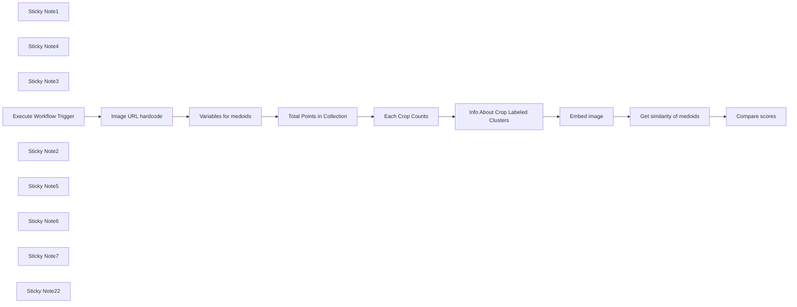

## Fluxo (.json) :

```json
{
  "id": "G8jRDBvwsMkkMiLN",
  "meta": {
    "instanceId": "205b3bc06c96f2dc835b4f00e1cbf9a937a74eeb3b47c99d0c30b0586dbf85aa"
  },
  "name": "[3/3] Anomaly detection tool (crops dataset)",
  "tags": [
    {
      "id": "spMntyrlE9ydvWFA",
      "name": "anomaly-detection",
      "createdAt": "2024-12-08T22:05:15.945Z",
      "updatedAt": "2024-12-09T12:50:19.287Z"
    }
  ],
  "nodes": [
    {
      "id": "e01bafec-eb24-44c7-b3c4-a60f91666350",
      "name": "Sticky Note1",
      "type": "n8n-nodes-base.stickyNote",
      "position": [
        -1200,
        180
      ],
      "parameters": {
        "color": 6,
        "width": 400,
        "height": 740,
        "content": "We are working here with crops dataset: \nExisting (so not anomalies) crops images in dataset are:\n- 'pearl_millet(bajra)',\n- 'tobacco-plant',\n- 'cherry',\n- 'cotton',\n- 'banana',\n- 'cucumber',\n- 'maize',\n- 'wheat',\n- 'clove',\n- 'jowar',\n- 'olive-tree',\n- 'soyabean',\n- 'coffee-plant',\n- 'rice',\n- 'lemon',\n- 'mustard-oil',\n- 'vigna-radiati(mung)',\n- 'coconut',\n- 'gram',\n- 'pineapple',\n- 'sugarcane',\n- 'sunflower',\n- 'chilli',\n- 'fox_nut(makhana)',\n- 'jute',\n- 'papaya',\n- 'tea',\n- 'cardamom',\n- 'almond'\n"
      },
      "typeVersion": 1
    },
    {
      "id": "b9943781-de1f-4129-9b81-ed836e9ebb11",
      "name": "Embed image",
      "type": "n8n-nodes-base.httpRequest",
      "position": [
        680,
        60
      ],
      "parameters": {
        "url": "https://api.voyageai.com/v1/multimodalembeddings",
        "method": "POST",
        "options": {},
        "jsonBody": "={{\n{\n  \"inputs\": [\n    {\n      \"content\": [\n        {\n          \"type\": \"image_url\",\n          \"image_url\": $('Image URL hardcode').first().json.imageURL\n        }\n      ]\n    }\n  ],\n  \"model\": \"voyage-multimodal-3\",\n  \"input_type\": \"document\"\n}\n}}",
        "sendBody": true,
        "specifyBody": "json",
        "authentication": "genericCredentialType",
        "genericAuthType": "httpHeaderAuth"
      },
      "credentials": {
        "httpHeaderAuth": {
          "id": "Vb0RNVDnIHmgnZOP",
          "name": "Voyage API"
        }
      },
      "typeVersion": 4.2
    },
    {
      "id": "47b72bc2-4817-48c6-b517-c1328e402468",
      "name": "Get similarity of medoids",
      "type": "n8n-nodes-base.httpRequest",
      "position": [
        940,
        60
      ],
      "parameters": {
        "url": "={{ $('Variables for medoids').first().json.qdrantCloudURL }}/collections/{{ $('Variables for medoids').first().json.collectionName }}/points/query",
        "method": "POST",
        "options": {},
        "jsonBody": "={{\n{\n  \"query\": $json.data[0].embedding,\n  \"using\": \"voyage\",\n  \"limit\": $('Info About Crop Labeled Clusters').first().json.cropsNumber,\n  \"with_payload\": true,\n  \"filter\": {\n      \"must\": [\n          {      \n          \"key\": $('Variables for medoids').first().json.clusterCenterType,\n          \"match\": {\n              \"value\": true\n              }\n          }\n      ]\n  }\n}\n}}",
        "sendBody": true,
        "specifyBody": "json",
        "authentication": "predefinedCredentialType",
        "nodeCredentialType": "qdrantApi"
      },
      "credentials": {
        "qdrantApi": {
          "id": "it3j3hP9FICqhgX6",
          "name": "QdrantApi account"
        }
      },
      "typeVersion": 4.2
    },
    {
      "id": "42d7eb27-ec38-4406-b5c4-27eb45358e93",
      "name": "Compare scores",
      "type": "n8n-nodes-base.code",
      "position": [
        1140,
        60
      ],
      "parameters": {
        "language": "python",
        "pythonCode": "points = _input.first()['json']['result']['points']\nthreshold_type = _('Variables for medoids').first()['json']['clusterThresholdCenterType']\n\nmax_score = -1\ncrop_with_max_score = None\nundefined = True\n\nfor center in points:\n    if center['score'] >= center['payload'][threshold_type]:\n        undefined = False\n        if center['score'] > max_score:\n            max_score = center['score']\n            crop_with_max_score = center['payload']['crop_name']\n\nif undefined:\n    result_message = \"ALERT, we might have a new undefined crop!\"\nelse:\n    result_message = f\"Looks similar to {crop_with_max_score}\"\n\nreturn [{\n    \"json\": {\n        \"result\": result_message\n    }\n}]\n"
      },
      "typeVersion": 2
    },
    {
      "id": "23aa604a-ff0b-4948-bcd5-af39300198c0",
      "name": "Sticky Note4",
      "type": "n8n-nodes-base.stickyNote",
      "position": [
        -1200,
        -220
      ],
      "parameters": {
        "width": 400,
        "height": 380,
        "content": "## Crop Anomaly Detection Tool\n### This is the tool that can be used directly for anomalous crops detection. \nIt takes as input (any) **image URL** and returns a **text message** telling if whatever this image depicts is anomalous to the crop dataset stored in Qdrant. \n\n* An Image URL is received via the Execute Workflow Trigger which is used to generate embedding vectors via the Voyage.ai Embeddings API.\n* The returned vectors are used to query the Qdrant collection to determine if the given crop is known by comparing it to **threshold scores** of each image class (crop type).\n* If the image scores lower than all thresholds, then the image is considered an anomaly for the dataset."
      },
      "typeVersion": 1
    },
    {
      "id": "3a79eca2-44f9-4aee-8a0d-9c7ca2f9149d",
      "name": "Variables for medoids",
      "type": "n8n-nodes-base.set",
      "position": [
        -200,
        60
      ],
      "parameters": {
        "options": {},
        "assignments": {
          "assignments": [
            {
              "id": "dbbc1e7b-c63e-4ff1-9524-8ef3e9f6cd48",
              "name": "clusterCenterType",
              "type": "string",
              "value": "is_medoid"
            },
            {
              "id": "a994ce37-2530-4030-acfb-ec777a7ddb05",
              "name": "qdrantCloudURL",
              "type": "string",
              "value": "https://152bc6e2-832a-415c-a1aa-fb529f8baf8d.eu-central-1-0.aws.cloud.qdrant.io"
            },
            {
              "id": "12f0a9e6-686d-416e-a61b-72d034ec21ba",
              "name": "collectionName",
              "type": "string",
              "value": "=agricultural-crops"
            },
            {
              "id": "4c88a617-d44f-4776-b457-8a1dffb1d03c",
              "name": "clusterThresholdCenterType",
              "type": "string",
              "value": "is_medoid_cluster_threshold"
            }
          ]
        }
      },
      "typeVersion": 3.4
    },
    {
      "id": "13b25434-bd66-4293-93f1-26c67b9ec7dd",
      "name": "Sticky Note3",
      "type": "n8n-nodes-base.stickyNote",
      "position": [
        -340,
        260
      ],
      "parameters": {
        "color": 6,
        "width": 360,
        "height": 200,
        "content": "**clusterCenterType** - either\n* \"is_text_anchor_medoid\" or\n* \"is_medoid\"\n\n\n**clusterThresholdCenterType** - either\n* \"is_text_anchor_medoid_cluster_threshold\" or\n* \"is_medoid_cluster_threshold\""
      },
      "typeVersion": 1
    },
    {
      "id": "869b0962-6cae-487d-8230-539a0cc4c14c",
      "name": "Info About Crop Labeled Clusters",
      "type": "n8n-nodes-base.set",
      "position": [
        440,
        60
      ],
      "parameters": {
        "options": {},
        "assignments": {
          "assignments": [
            {
              "id": "5327b254-b703-4a34-a398-f82edb1d6d6b",
              "name": "=cropsNumber",
              "type": "number",
              "value": "={{ $json.result.hits.length }}"
            }
          ]
        }
      },
      "typeVersion": 3.4
    },
    {
      "id": "5d3956f8-f43b-439e-b176-a594a21d8011",
      "name": "Total Points in Collection",
      "type": "n8n-nodes-base.httpRequest",
      "position": [
        40,
        60
      ],
      "parameters": {
        "url": "={{ $json.qdrantCloudURL }}/collections/{{ $json.collectionName }}/points/count",
        "method": "POST",
        "options": {},
        "jsonBody": "={\n  \"exact\": true\n}",
        "sendBody": true,
        "specifyBody": "json",
        "authentication": "predefinedCredentialType",
        "nodeCredentialType": "qdrantApi"
      },
      "credentials": {
        "qdrantApi": {
          "id": "it3j3hP9FICqhgX6",
          "name": "QdrantApi account"
        }
      },
      "typeVersion": 4.2
    },
    {
      "id": "14ba3db9-3965-4b20-b333-145616d45c3a",
      "name": "Each Crop Counts",
      "type": "n8n-nodes-base.httpRequest",
      "position": [
        240,
        60
      ],
      "parameters": {
        "url": "={{ $('Variables for medoids').first().json.qdrantCloudURL }}/collections/{{ $('Variables for medoids').first().json.collectionName }}/facet",
        "method": "POST",
        "options": {},
        "jsonBody": "={{\n{\n  \"key\": \"crop_name\",\n  \"limit\": $json.result.count,\n  \"exact\": true\n}\n}}",
        "sendBody": true,
        "specifyBody": "json",
        "authentication": "predefinedCredentialType",
        "nodeCredentialType": "qdrantApi"
      },
      "credentials": {
        "qdrantApi": {
          "id": "it3j3hP9FICqhgX6",
          "name": "QdrantApi account"
        }
      },
      "typeVersion": 4.2
    },
    {
      "id": "e37c6758-0556-4a56-ab14-d4df663cb53a",
      "name": "Image URL hardcode",
      "type": "n8n-nodes-base.set",
      "position": [
        -480,
        60
      ],
      "parameters": {
        "options": {},
        "assignments": {
          "assignments": [
            {
              "id": "46ceba40-fb25-450c-8550-d43d8b8aa94c",
              "name": "imageURL",
              "type": "string",
              "value": "={{ $json.query.imageURL }}"
            }
          ]
        }
      },
      "typeVersion": 3.4
    },
    {
      "id": "b24ad1a7-0cf8-4acc-9c18-6fe9d58b10f2",
      "name": "Execute Workflow Trigger",
      "type": "n8n-nodes-base.executeWorkflowTrigger",
      "position": [
        -720,
        60
      ],
      "parameters": {},
      "typeVersion": 1
    },
    {
      "id": "50424f2b-6831-41bf-8de4-81f69d901ce1",
      "name": "Sticky Note2",
      "type": "n8n-nodes-base.stickyNote",
      "position": [
        -240,
        -80
      ],
      "parameters": {
        "width": 180,
        "height": 120,
        "content": "Variables to access Qdrant's collection we uploaded & prepared for  anomaly detection in 2 previous pipelines\n"
      },
      "typeVersion": 1
    },
    {
      "id": "2e8ed3ca-1bba-4214-b34b-376a237842ff",
      "name": "Sticky Note5",
      "type": "n8n-nodes-base.stickyNote",
      "position": [
        40,
        -120
      ],
      "parameters": {
        "width": 560,
        "height": 140,
        "content": "These three nodes are needed just to figure out how many different classes (crops) we have in our Qdrant collection: **cropsNumber** (needed in *\"Get similarity of medoids\"* node. \n[Note] *\"Total Points in Collection\"* -> *\"Each Crop Counts\"* were used&explained already in *\"[2/4] Set up medoids (2 types) for anomaly detection (crops dataset)\"* pipeline.\n"
      },
      "typeVersion": 1
    },
    {
      "id": "e2fa5763-6e97-4ff5-8919-1cb85a3c6968",
      "name": "Sticky Note6",
      "type": "n8n-nodes-base.stickyNote",
      "position": [
        620,
        240
      ],
      "parameters": {
        "height": 120,
        "content": "Here, we're embedding the image passed to this workflow tool with the Voyage embedding model to compare the image to all crop images in the database."
      },
      "typeVersion": 1
    },
    {
      "id": "cdb6b8d3-f7f4-4d66-850f-ce16c8ed98b9",
      "name": "Sticky Note7",
      "type": "n8n-nodes-base.stickyNote",
      "position": [
        920,
        220
      ],
      "parameters": {
        "width": 400,
        "height": 180,
        "content": "Checking how similar the image is to all the centres of clusters (crops).\nIf it's more similar to the thresholds we set up and stored in centres in the previous workflow, the image probably belongs to this crop class; otherwise, it's anomalous to the class. \nIf image is anomalous to all the classes, it's an anomaly."
      },
      "typeVersion": 1
    },
    {
      "id": "03b4699f-ba43-4f5f-ad69-6f81deea2641",
      "name": "Sticky Note22",
      "type": "n8n-nodes-base.stickyNote",
      "position": [
        -620,
        580
      ],
      "parameters": {
        "color": 4,
        "width": 540,
        "height": 300,
        "content": "### For anomaly detection\n1. The first pipeline is uploading (crops) dataset to Qdrant's collection.\n2. The second pipeline sets up cluster (class) centres in this Qdrant collection & cluster (class) threshold scores.\n3. **This is the anomaly detection tool, which takes any image as input and uses all preparatory work done with Qdrant (crops) collection.**\n\n### To recreate it\nYou'll have to upload [crops](https://www.kaggle.com/datasets/mdwaquarazam/agricultural-crops-image-classification) dataset from Kaggle to your own Google Storage bucket, and re-create APIs/connections to [Qdrant Cloud](https://qdrant.tech/documentation/quickstart-cloud/) (you can use **Free Tier** cluster), Voyage AI API & Google Cloud Storage\n\n**In general, pipelines are adaptable to any dataset of images**\n"
      },
      "typeVersion": 1
    }
  ],
  "active": false,
  "pinData": {
    "Execute Workflow Trigger": [
      {
        "json": {
          "query": {
            "imageURL": "https://storage.googleapis.com/n8n-qdrant-demo/agricultural-crops%2Fcotton%2Fimage%20(36).jpg"
          }
        }
      }
    ]
  },
  "settings": {
    "executionOrder": "v1"
  },
  "versionId": "f67b764b-9e1a-4db0-b9f2-490077a62f74",
  "connections": {
    "Embed image": {
      "main": [
        [
          {
            "node": "Get similarity of medoids",
            "type": "main",
            "index": 0
          }
        ]
      ]
    },
    "Each Crop Counts": {
      "main": [
        [
          {
            "node": "Info About Crop Labeled Clusters",
            "type": "main",
            "index": 0
          }
        ]
      ]
    },
    "Image URL hardcode": {
      "main": [
        [
          {
            "node": "Variables for medoids",
            "type": "main",
            "index": 0
          }
        ]
      ]
    },
    "Variables for medoids": {
      "main": [
        [
          {
            "node": "Total Points in Collection",
            "type": "main",
            "index": 0
          }
        ]
      ]
    },
    "Execute Workflow Trigger": {
      "main": [
        [
          {
            "node": "Image URL hardcode",
            "type": "main",
            "index": 0
          }
        ]
      ]
    },
    "Get similarity of medoids": {
      "main": [
        [
          {
            "node": "Compare scores",
            "type": "main",
            "index": 0
          }
        ]
      ]
    },
    "Total Points in Collection": {
      "main": [
        [
          {
            "node": "Each Crop Counts",
            "type": "main",
            "index": 0
          }
        ]
      ]
    },
    "Info About Crop Labeled Clusters": {
      "main": [
        [
          {
            "node": "Embed image",
            "type": "main",
            "index": 0
          }
        ]
      ]
    }
  }
}
```

<a id="template-2490"></a>

## Template 2490 - Quick Start DeepSeek Chat V3 e R1

- **Nome:** Quick Start DeepSeek Chat V3 e R1
- **Descrição:** Fluxo que recebe mensagens de chat e encaminha para modelos DeepSeek (chat e reasoner), oferecendo alternativas de chamada via API HTTP ou modelo local, com memória de contexto.
- **Funcionalidade:** • Gatilho de mensagem de chat: Inicia o fluxo ao receber uma entrada de chat.
• Agente conversacional: Processa a conversa usando um agente com mensagem de sistema personalizada.
• Integração com DeepSeek (via credencial): Chama modelos DeepSeek como deepseek-chat e deepseek-reasoner para gerar respostas.
• Suporte a chamadas HTTP ao endpoint DeepSeek: Exemplos de requisições JSON e corpo raw para invocar a API DeepSeek diretamente.
• Suporte a modelo local via Ollama: Permite executar o modelo deepseek-r1 localmente através do Ollama.
• Memória de janela: Mantém contexto de conversas recentes para continuidade.
• Cadeias LLM básicas e anotações: Componentes auxiliares e notas explicativas incluídas para documentação e testes.
- **Ferramentas:** • DeepSeek API: Serviço de modelos de linguagem na nuvem que fornece modelos como deepseek-chat (DeepSeek-V3) e deepseek-reasoner (DeepSeek-R1), compatível com formato OpenAI.
• Ollama: Plataforma para hospedar e executar modelos localmente (ex.: deepseek-r1) com configuração de contexto e temperatura.
• Clientes HTTP / SDKs compatíveis OpenAI: Meio de integrar e chamar a API DeepSeek usando requisições HTTP ou bibliotecas compatíveis com o formato OpenAI.

## Fluxo visual

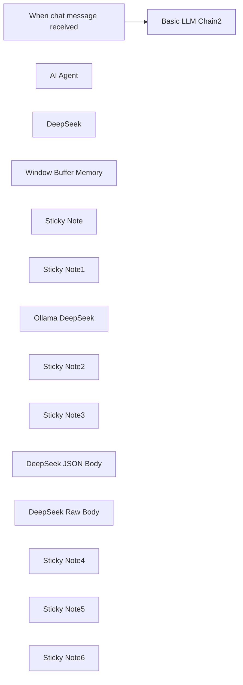

## Fluxo (.json) :

```json
{
  "id": "IyhH1KHtXidKNSIA",
  "meta": {
    "instanceId": "31e69f7f4a77bf465b805824e303232f0227212ae922d12133a0f96ffeab4fef"
  },
  "name": "🐋DeepSeek V3 Chat & R1 Reasoning Quick Start",
  "tags": [],
  "nodes": [
    {
      "id": "54c59cae-fbd0-4f0d-b633-6304e6c66d89",
      "name": "When chat message received",
      "type": "@n8n/n8n-nodes-langchain.chatTrigger",
      "position": [
        -840,
        -740
      ],
      "webhookId": "b740bd14-1b9e-4b1b-abd2-1ecf1184d53a",
      "parameters": {
        "options": {}
      },
      "typeVersion": 1.1
    },
    {
      "id": "ef85680e-569f-4e74-a1b4-aae9923a0dcb",
      "name": "AI Agent",
      "type": "@n8n/n8n-nodes-langchain.agent",
      "onError": "continueErrorOutput",
      "position": [
        -320,
        40
      ],
      "parameters": {
        "agent": "conversationalAgent",
        "options": {
          "systemMessage": "You are a helpful assistant."
        }
      },
      "retryOnFail": true,
      "typeVersion": 1.7,
      "alwaysOutputData": true
    },
    {
      "id": "07a8c74c-768e-4b38-854f-251f2fe5b7bf",
      "name": "DeepSeek",
      "type": "@n8n/n8n-nodes-langchain.lmChatOpenAi",
      "position": [
        -360,
        220
      ],
      "parameters": {
        "model": "=deepseek-reasoner",
        "options": {}
      },
      "credentials": {
        "openAiApi": {
          "id": "MSl7SdcvZe0SqCYI",
          "name": "deepseek"
        }
      },
      "typeVersion": 1.1
    },
    {
      "id": "a6d58a8c-2d16-4c91-adde-acac98868150",
      "name": "Window Buffer Memory",
      "type": "@n8n/n8n-nodes-langchain.memoryBufferWindow",
      "position": [
        -220,
        220
      ],
      "parameters": {},
      "typeVersion": 1.3
    },
    {
      "id": "401a5932-9f3e-4b17-a531-3a19a6a7788a",
      "name": "Basic LLM Chain2",
      "type": "@n8n/n8n-nodes-langchain.chainLlm",
      "position": [
        -320,
        -800
      ],
      "parameters": {
        "messages": {
          "messageValues": [
            {
              "message": "You are a helpful assistant."
            }
          ]
        }
      },
      "typeVersion": 1.5
    },
    {
      "id": "215dda87-faf7-4206-bbc3-b6a6b1eb98de",
      "name": "Sticky Note",
      "type": "n8n-nodes-base.stickyNote",
      "position": [
        -440,
        -460
      ],
      "parameters": {
        "color": 5,
        "width": 420,
        "height": 340,
        "content": "## DeepSeek using HTTP Request\n### DeepSeek Reasoner R1\nhttps://api-docs.deepseek.com/\nRaw Body"
      },
      "typeVersion": 1
    },
    {
      "id": "6457c0f7-ad02-4ad3-a4a0-9a7a6e8f0f7f",
      "name": "Sticky Note1",
      "type": "n8n-nodes-base.stickyNote",
      "position": [
        -440,
        -900
      ],
      "parameters": {
        "color": 4,
        "width": 580,
        "height": 400,
        "content": "## DeepSeek with Ollama Local Model"
      },
      "typeVersion": 1
    },
    {
      "id": "2ac8b41f-b27d-4074-abcc-430a8f5928e8",
      "name": "Ollama DeepSeek",
      "type": "@n8n/n8n-nodes-langchain.lmChatOllama",
      "position": [
        -320,
        -640
      ],
      "parameters": {
        "model": "deepseek-r1:14b",
        "options": {
          "format": "default",
          "numCtx": 16384,
          "temperature": 0.6
        }
      },
      "credentials": {
        "ollamaApi": {
          "id": "7aPaLgwpfdMWFYm9",
          "name": "Ollama account 127.0.0.1"
        }
      },
      "typeVersion": 1
    },
    {
      "id": "37a94fc0-eff3-4226-8633-fb170e5dcff2",
      "name": "Sticky Note2",
      "type": "n8n-nodes-base.stickyNote",
      "position": [
        -440,
        -80
      ],
      "parameters": {
        "color": 3,
        "width": 600,
        "height": 460,
        "content": "## DeepSeek Conversational Agent w/Memory\n"
      },
      "typeVersion": 1
    },
    {
      "id": "52b484bb-1693-4188-ba55-643c40f10dfc",
      "name": "Sticky Note3",
      "type": "n8n-nodes-base.stickyNote",
      "position": [
        20,
        -460
      ],
      "parameters": {
        "color": 6,
        "width": 420,
        "height": 340,
        "content": "## DeepSeek using HTTP Request\n### DeepSeek Chat V3\nhttps://api-docs.deepseek.com/\nJSON Body"
      },
      "typeVersion": 1
    },
    {
      "id": "ec46acef-60f6-4d34-b636-3654125f5897",
      "name": "DeepSeek JSON Body",
      "type": "n8n-nodes-base.httpRequest",
      "position": [
        160,
        -320
      ],
      "parameters": {
        "url": "https://api.deepseek.com/chat/completions",
        "method": "POST",
        "options": {},
        "jsonBody": "={\n  \"model\": \"deepseek-chat\",\n  \"messages\": [\n    {\n      \"role\": \"system\",\n      \"content\": \"{{ $json.chatInput }}\"\n    },\n    {\n      \"role\": \"user\",\n      \"content\": \"Hello!\"\n    }\n  ],\n  \"stream\": false\n}",
        "sendBody": true,
        "specifyBody": "json",
        "authentication": "genericCredentialType",
        "genericAuthType": "httpHeaderAuth"
      },
      "credentials": {
        "httpHeaderAuth": {
          "id": "9CsntxjSlce6yWbN",
          "name": "deepseek"
        }
      },
      "typeVersion": 4.2
    },
    {
      "id": "e5295120-57f9-4e02-8b73-f00e4d6baa48",
      "name": "DeepSeek Raw Body",
      "type": "n8n-nodes-base.httpRequest",
      "position": [
        -300,
        -320
      ],
      "parameters": {
        "url": "https://api.deepseek.com/chat/completions",
        "body": "={\n        \"model\": \"deepseek-reasoner\",\n        \"messages\": [\n          {\"role\": \"user\", \"content\": \"{{ $json.chatInput.trim() }}\"}\n        ],\n        \"stream\": false\n      }",
        "method": "POST",
        "options": {},
        "sendBody": true,
        "contentType": "raw",
        "authentication": "genericCredentialType",
        "rawContentType": "application/json",
        "genericAuthType": "httpHeaderAuth"
      },
      "credentials": {
        "httpHeaderAuth": {
          "id": "9CsntxjSlce6yWbN",
          "name": "deepseek"
        }
      },
      "typeVersion": 4.2
    },
    {
      "id": "571dc713-ce54-4330-8bdd-94e057ecd223",
      "name": "Sticky Note4",
      "type": "n8n-nodes-base.stickyNote",
      "position": [
        -1060,
        -460
      ],
      "parameters": {
        "color": 7,
        "width": 580,
        "height": 840,
        "content": "# Your First DeepSeek API Call\n\nThe DeepSeek API uses an API format compatible with OpenAI. By modifying the configuration, you can use the OpenAI SDK or softwares compatible with the OpenAI API to access the DeepSeek API.\n\nhttps://api-docs.deepseek.com/\n\n## Configuration Parameters\n\n| Parameter | Value |\n|-----------|--------|\n| base_url | https://api.deepseek.com |\n| api_key | https://platform.deepseek.com/api_keys |\n\n\n\n## Important Notes\n\n- To be compatible with OpenAI, you can also use `https://api.deepseek.com/v1` as the base_url. Note that the v1 here has NO relationship with the model's version.\n\n- The deepseek-chat model has been upgraded to DeepSeek-V3. The API remains unchanged. You can invoke DeepSeek-V3 by specifying `model='deepseek-chat'`.\n\n- deepseek-reasoner is the latest reasoning model, DeepSeek-R1, released by DeepSeek. You can invoke DeepSeek-R1 by specifying `model='deepseek-reasoner'`."
      },
      "typeVersion": 1
    },
    {
      "id": "f0ac3f32-218e-4488-b67f-7b7f7e8be130",
      "name": "Sticky Note5",
      "type": "n8n-nodes-base.stickyNote",
      "position": [
        -1060,
        -900
      ],
      "parameters": {
        "color": 2,
        "width": 580,
        "height": 400,
        "content": "## Four Examples for Connecting to DeepSeek\nhttps://api-docs.deepseek.com/\nhttps://platform.deepseek.com/api_keys"
      },
      "typeVersion": 1
    },
    {
      "id": "91642d68-ab5d-4f61-abaf-8cb7cb991c29",
      "name": "Sticky Note6",
      "type": "n8n-nodes-base.stickyNote",
      "position": [
        -180,
        -640
      ],
      "parameters": {
        "color": 7,
        "width": 300,
        "height": 120,
        "content": "### Ollama Local\nhttps://ollama.com/\nhttps://ollama.com/library/deepseek-r1"
      },
      "typeVersion": 1
    }
  ],
  "active": false,
  "pinData": {
    "When chat message received": [
      {
        "json": {
          "action": "sendMessage",
          "chatInput": "provide 10 sentences that end in the word apple.",
          "sessionId": "68cb82d504c14f5eb80bdf2478bd39bb"
        }
      }
    ]
  },
  "settings": {
    "executionOrder": "v1"
  },
  "versionId": "e354040e-7898-4ff9-91a2-b6d36030dac8",
  "connections": {
    "AI Agent": {
      "main": [
        []
      ]
    },
    "DeepSeek": {
      "ai_languageModel": [
        [
          {
            "node": "AI Agent",
            "type": "ai_languageModel",
            "index": 0
          }
        ]
      ]
    },
    "Ollama DeepSeek": {
      "ai_languageModel": [
        [
          {
            "node": "Basic LLM Chain2",
            "type": "ai_languageModel",
            "index": 0
          }
        ]
      ]
    },
    "Window Buffer Memory": {
      "ai_memory": [
        [
          {
            "node": "AI Agent",
            "type": "ai_memory",
            "index": 0
          }
        ]
      ]
    },
    "When chat message received": {
      "main": [
        [
          {
            "node": "Basic LLM Chain2",
            "type": "main",
            "index": 0
          }
        ]
      ]
    }
  }
}
```

<a id="template-2492"></a>

## Template 2492 - Criador de conteúdo WordPress com IA

- **Nome:** Criador de conteúdo WordPress com IA
- **Descrição:** Automatiza a geração, reescrita por níveis de leitura, salvamento e publicação de posts para WordPress usando IA e serviços de imagem e notificação.
- **Funcionalidade:** • Geração de post estruturado por IA: Cria título SEO-friendly e conteúdo formatado em HTML a partir de um tópico.
• Interpretação de resposta AI em JSON: Converte a saída do modelo em um objeto com campos de título e conteúdo.
• Separação e validação de título e conteúdo: Separa título e corpo, remove headings indesejados e checa se ambos existem, abortando em caso de erro.
• Conversão HTML para Markdown: Transforma o conteúdo HTML em markdown quando necessário.
• Salvamento de rascunho no Google Drive: Faz backup do conteúdo gerado como arquivo de texto.
• Reescrita para múltiplos níveis de leitura: Gera versões do mesmo artigo em níveis (Grade 9, Grade 5, Grade 2) mantendo o conteúdo original.
• Criação de rascunho no WordPress: Publica o conteúdo como rascunho no site WordPress configurado.
• Geração de imagem destacada: Solicita uma imagem baseada no título para servir como capa do post.
• Upload e definição de imagem destacada no WordPress: Envia a imagem ao site e define-a como mídia destacada do post.
• Notificações via Telegram: Envia mensagens de sucesso ou erro para um chat configurado.
• Tratamento de erros e validações: Encaminha alertas e interrompe processos se dados obrigatórios estiverem ausentes.
- **Ferramentas:** • OpenAI: Gera o conteúdo do artigo e reescritas em diferentes níveis de leitura.
• Google Drive: Armazena backups do conteúdo gerado como rascunho.
• WordPress: Recebe o rascunho do post e hospeda o conteúdo e a imagem destacada.
• Pollinations.ai: Gera imagens baseadas no título/descrição para usar como capa do post.
• Telegram: Envia notificações de sucesso e mensagens de erro para o responsável.


## Fluxo visual

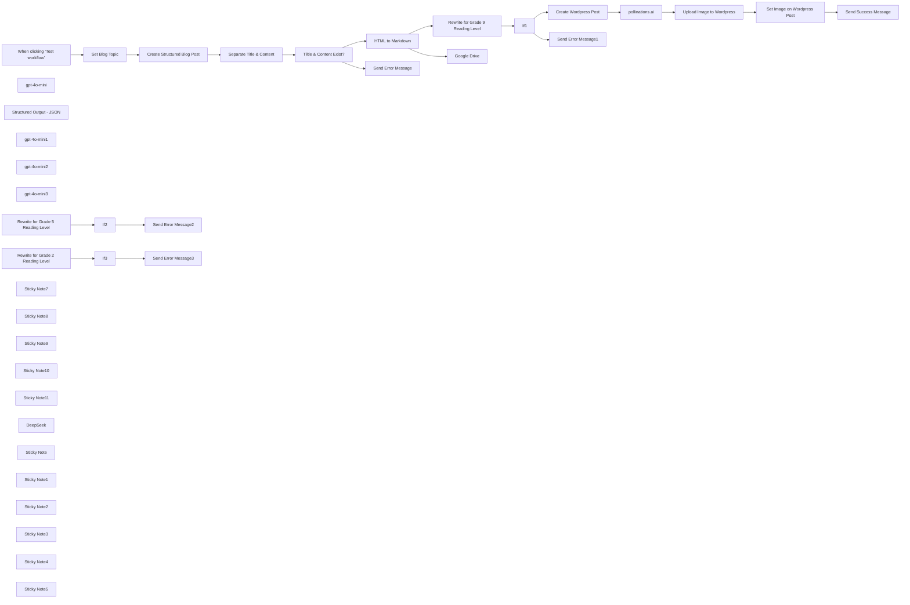

## Fluxo (.json) :

```json
{
  "id": "ALg2eFzN4AsHIf3R",
  "meta": {
    "instanceId": "31e69f7f4a77bf465b805824e303232f0227212ae922d12133a0f96ffeab4fef",
    "templateCredsSetupCompleted": true
  },
  "name": "✍️🌄 Your First Wordpress Content Creator - Quick Start",
  "tags": [],
  "nodes": [
    {
      "id": "19673371-10cb-419f-b86b-63155aeb4a55",
      "name": "When clicking ‘Test workflow’",
      "type": "n8n-nodes-base.manualTrigger",
      "position": [
        180,
        -240
      ],
      "parameters": {},
      "typeVersion": 1
    },
    {
      "id": "9df33245-102c-45e3-a99b-86be656d12e4",
      "name": "gpt-4o-mini",
      "type": "@n8n/n8n-nodes-langchain.lmChatOpenAi",
      "position": [
        820,
        -40
      ],
      "parameters": {
        "options": {
          "responseFormat": "json_object"
        }
      },
      "credentials": {
        "openAiApi": {
          "id": "jEMSvKmtYfzAkhe6",
          "name": "OpenAi account"
        }
      },
      "typeVersion": 1
    },
    {
      "id": "5c0cacb0-82de-42b0-903d-0b3718085ad8",
      "name": "Structured Output - JSON",
      "type": "@n8n/n8n-nodes-langchain.outputParserStructured",
      "position": [
        1040,
        -40
      ],
      "parameters": {
        "jsonSchemaExample": "{\n    \"title\": \"title\",\n    \"content\": \"content\"\n}"
      },
      "typeVersion": 1.2
    },
    {
      "id": "1ec2e58e-c775-47ab-9544-7c21521741a1",
      "name": "Separate Title & Content",
      "type": "n8n-nodes-base.code",
      "position": [
        1300,
        -340
      ],
      "parameters": {
        "jsCode": "try {\n  // Check if input exists and has the expected structure\n  const input = $input.all();\n  if (!input || !input.length) {\n    throw new Error('No input data received');\n  }\n\n  const firstItem = input[0];\n  if (!firstItem || !firstItem.json || !firstItem.json.output || !firstItem.json.output.output) {\n    throw new Error('Invalid input structure: missing required properties');\n  }\n\n  const output = firstItem.json.output.output;\n  \n  // Validate title exists\n  if (!output.title) {\n    throw new Error('Missing title in output');\n  }\n\n  // Validate content exists\n  if (!output.content) {\n    throw new Error('Missing content in output');\n  }\n\n  const title = output.title;\n  const content = output.content.replace(/<h1>.*?</h1>/s, '').trim();\n\n  // Validate final content is not empty after processing\n  if (!content) {\n    throw new Error('Content is empty after processing');\n  }\n\n  // console.log('Successfully processed content');\n\n  // console.log(title)\n  // console.log(content)\n  \n  return { title, content };\n\n} catch (error) {\n  // Log the error for debugging\n  console.error('Error processing content:', error.message);\n  \n  // Return a graceful failure object\n  return {\n    error: true,\n    message: error.message,\n    title: '',\n    content: '',\n    timestamp: new Date().toISOString()\n  };\n}"
      },
      "typeVersion": 2
    },
    {
      "id": "40f0ef7d-3c63-45ed-bbfb-8ed04772d214",
      "name": "gpt-4o-mini1",
      "type": "@n8n/n8n-nodes-langchain.lmChatOpenAi",
      "position": [
        1760,
        260
      ],
      "parameters": {
        "model": "gpt-4o-mini-2024-07-18",
        "options": {
          "responseFormat": "json_object"
        }
      },
      "credentials": {
        "openAiApi": {
          "id": "jEMSvKmtYfzAkhe6",
          "name": "OpenAi account"
        }
      },
      "typeVersion": 1
    },
    {
      "id": "6b7326f8-7b88-4c4a-b5fc-29f68ca1d384",
      "name": "If1",
      "type": "n8n-nodes-base.if",
      "position": [
        2120,
        60
      ],
      "parameters": {
        "options": {},
        "conditions": {
          "options": {
            "version": 2,
            "leftValue": "",
            "caseSensitive": true,
            "typeValidation": "strict"
          },
          "combinator": "and",
          "conditions": [
            {
              "id": "aaf83c73-65f3-4a88-87f3-25b1acaf93ef",
              "operator": {
                "type": "string",
                "operation": "notEmpty",
                "singleValue": true
              },
              "leftValue": "={{ $('Separate Title & Content').item.json.title }}",
              "rightValue": ""
            },
            {
              "id": "d9af5bce-f0fb-4c20-8b6a-b01a3bf3e1d1",
              "operator": {
                "type": "string",
                "operation": "notEmpty",
                "singleValue": true
              },
              "leftValue": "={{ $json.output }}",
              "rightValue": ""
            }
          ]
        }
      },
      "typeVersion": 2.2
    },
    {
      "id": "4674ff83-1076-4c0f-ad6c-1f0c9474520e",
      "name": "gpt-4o-mini2",
      "type": "@n8n/n8n-nodes-langchain.lmChatOpenAi",
      "position": [
        920,
        700
      ],
      "parameters": {
        "options": {
          "responseFormat": "json_object"
        }
      },
      "credentials": {
        "openAiApi": {
          "id": "jEMSvKmtYfzAkhe6",
          "name": "OpenAi account"
        }
      },
      "typeVersion": 1
    },
    {
      "id": "3f869ae8-2638-445d-aec3-8c89c407badd",
      "name": "If2",
      "type": "n8n-nodes-base.if",
      "position": [
        1280,
        500
      ],
      "parameters": {
        "options": {},
        "conditions": {
          "options": {
            "version": 2,
            "leftValue": "",
            "caseSensitive": true,
            "typeValidation": "strict"
          },
          "combinator": "and",
          "conditions": [
            {
              "id": "aaf83c73-65f3-4a88-87f3-25b1acaf93ef",
              "operator": {
                "type": "string",
                "operation": "notEmpty",
                "singleValue": true
              },
              "leftValue": "={{ $json.title }}",
              "rightValue": ""
            },
            {
              "id": "d9af5bce-f0fb-4c20-8b6a-b01a3bf3e1d1",
              "operator": {
                "type": "string",
                "operation": "notEmpty",
                "singleValue": true
              },
              "leftValue": "={{ $json.content }}",
              "rightValue": ""
            }
          ]
        }
      },
      "typeVersion": 2.2
    },
    {
      "id": "3f8a1f7f-c6fc-40f5-beb3-807adc71f797",
      "name": "gpt-4o-mini3",
      "type": "@n8n/n8n-nodes-langchain.lmChatOpenAi",
      "position": [
        920,
        1200
      ],
      "parameters": {
        "options": {
          "responseFormat": "json_object"
        }
      },
      "credentials": {
        "openAiApi": {
          "id": "jEMSvKmtYfzAkhe6",
          "name": "OpenAi account"
        }
      },
      "typeVersion": 1
    },
    {
      "id": "0f72c53e-160d-4027-8b9c-5efa119f6039",
      "name": "If3",
      "type": "n8n-nodes-base.if",
      "position": [
        1280,
        1000
      ],
      "parameters": {
        "options": {},
        "conditions": {
          "options": {
            "version": 2,
            "leftValue": "",
            "caseSensitive": true,
            "typeValidation": "strict"
          },
          "combinator": "and",
          "conditions": [
            {
              "id": "aaf83c73-65f3-4a88-87f3-25b1acaf93ef",
              "operator": {
                "type": "string",
                "operation": "notEmpty",
                "singleValue": true
              },
              "leftValue": "={{ $json.title }}",
              "rightValue": ""
            },
            {
              "id": "d9af5bce-f0fb-4c20-8b6a-b01a3bf3e1d1",
              "operator": {
                "type": "string",
                "operation": "notEmpty",
                "singleValue": true
              },
              "leftValue": "={{ $json.content }}",
              "rightValue": ""
            }
          ]
        }
      },
      "typeVersion": 2.2
    },
    {
      "id": "307ed55f-5602-46a5-b24d-39e9100ce038",
      "name": "Rewrite for Grade 5 Reading Level",
      "type": "@n8n/n8n-nodes-langchain.agent",
      "position": [
        920,
        500
      ],
      "parameters": {
        "text": "=Rewrite this article at a grade 5 reading level. Include some light humour and metaphorical examples that are age appropriate.  Ensure you retain all original content and only use the provided original content for the rewriting.  Provide final response in html format following these guidelines:\n\n## Formatting Guidelines\n- Use proper HTML tags throughout\n- Limit yourself to bold, italics, paragraphs and lists\n- Structure with <p> tags for paragraphs\n- Include appropriate spacing\n- Use <blockquote> for direct quotes\n- Maintain consistent formatting\n- Write in clear, professional tone\n- Break up long paragraphs\n- Use engaging subheadings\n- Include transitional phrases\n\n\n## Original content:  {{ $json.data }}",
        "agent": "conversationalAgent",
        "options": {},
        "promptType": "define"
      },
      "typeVersion": 1.6
    },
    {
      "id": "6083344c-4497-43fe-b24b-5bef2b5cf90a",
      "name": "Rewrite for Grade 2 Reading Level",
      "type": "@n8n/n8n-nodes-langchain.agent",
      "position": [
        920,
        1000
      ],
      "parameters": {
        "text": "=Rewrite this article at a grade 2 reading level. Include some light humour and metaphorical examples that are age appropriate.  Ensure you retain all original content and only use the provided original content for the rewriting.  Provide final response in html format following these guidelines:\n\n## Formatting Guidelines\n- Use proper HTML tags throughout\n- Limit yourself to bold, italics, paragraphs and lists\n- Structure with <p> tags for paragraphs\n- Include appropriate spacing\n- Use <blockquote> for direct quotes\n- Maintain consistent formatting\n- Write in clear, professional tone\n- Break up long paragraphs\n- Use engaging subheadings\n- Include transitional phrases\n\n\n## Original content:  {{ $json.data }}",
        "agent": "conversationalAgent",
        "options": {},
        "promptType": "define"
      },
      "typeVersion": 1.6
    },
    {
      "id": "58b109b0-270e-4a66-bb55-87a5427609d8",
      "name": "Rewrite for Grade 9 Reading Level",
      "type": "@n8n/n8n-nodes-langchain.agent",
      "position": [
        1760,
        60
      ],
      "parameters": {
        "text": "=Rewrite this article at a grade 9 reading level using appropriate metaphors.  Ensure you retain all original content and only use the provided original content for the rewriting.  Do not create a Title.\n\nProvide final response in html format following these guidelines:\n\n## Formatting Guidelines\n- Use proper HTML tags throughout\n- Limit yourself to bold, italics, paragraphs and lists\n- Structure with <p> tags for paragraphs\n- Include appropriate spacing\n- Use <blockquote> for direct quotes\n- Maintain consistent formatting\n- Write in clear, professional tone\n- Break up long paragraphs\n- Use engaging subheadings\n- Include transitional phrases\n\n\n## Original content:  {{ $json.data }}",
        "agent": "conversationalAgent",
        "options": {},
        "promptType": "define"
      },
      "typeVersion": 1.6
    },
    {
      "id": "aa2eacae-0409-4e18-987e-37605dd2bd89",
      "name": "Create Structured Blog Post",
      "type": "@n8n/n8n-nodes-langchain.agent",
      "position": [
        840,
        -240
      ],
      "parameters": {
        "text": "={{ $json.topic }}",
        "agent": "conversationalAgent",
        "options": {
          "systemMessage": "=Analyze the provided PDF article and create a compelling blog post that will be returned in JSON format with two fields: \"title\" and \"content\". Follow these specifications:\n\n## Title Requirements\n- Create an engaging, SEO-friendly title under 10 words\n- Must not contain a colon\n- Should capture the article's essence\n- Will be formatted as an H1 in the content\n\n## Content Structure\n- Introduction (150-200 words)\n  * Compelling hook\n  * Topic context and importance\n  * Preview of main points\n\n- Main Content (6-8 chapters)\n  * Each chapter requires:\n    - Relevant H2 heading\n    - 300-400 words of unique content\n    - Specific topic focus\n    - Source material quotes/data\n    - Smooth transitions\n\n- Conclusion (200-250 words)\n  * Key takeaways\n  * Final thoughts/implications\n\n## Formatting Guidelines\n- Use proper HTML tags throughout\n- Limit yourself to bold, italics, paragraphs and lists\n- Structure with <p> tags for paragraphs\n- Include appropriate spacing\n- Use <blockquote> for direct quotes\n- Maintain consistent formatting\n- Write in clear, professional tone\n- Break up long paragraphs\n- Use engaging subheadings\n- Include transitional phrases\n\nThe content should be original, avoid direct copying, and maintain a consistent voice throughout. The final JSON response should contain only the title and content fields, with the content including all HTML formatting."
        },
        "promptType": "define",
        "hasOutputParser": true
      },
      "retryOnFail": true,
      "typeVersion": 1.6
    },
    {
      "id": "69ebcaf7-6e1e-46c6-99f2-16e6b3c72a8e",
      "name": "Sticky Note7",
      "type": "n8n-nodes-base.stickyNote",
      "position": [
        740,
        -380
      ],
      "parameters": {
        "color": 4,
        "width": 469,
        "height": 652,
        "content": "## Create Blog Post\nRefer to this workflow for help getting setup with DeepSeek\nhttps://n8n.io/workflows/2777-deepseek-v3-chat-and-r1-reasoning-quick-start/"
      },
      "typeVersion": 1
    },
    {
      "id": "e1a86c40-bcec-4891-bf74-4c3bdba0d07e",
      "name": "Sticky Note8",
      "type": "n8n-nodes-base.stickyNote",
      "position": [
        1660,
        -380
      ],
      "parameters": {
        "color": 6,
        "width": 334,
        "height": 311,
        "content": "## Save Draft Blog Post to Google Drive"
      },
      "typeVersion": 1
    },
    {
      "id": "17b2a15a-f7e0-407f-ab55-9113ee7a9718",
      "name": "Sticky Note9",
      "type": "n8n-nodes-base.stickyNote",
      "position": [
        1660,
        -40
      ],
      "parameters": {
        "color": 5,
        "width": 886,
        "height": 461,
        "content": "## Rewrite for Grade 9 Reading Level \nUpdate Agent prompt as required"
      },
      "typeVersion": 1
    },
    {
      "id": "d479bbe1-42cf-4592-820f-92803fc16f90",
      "name": "Sticky Note10",
      "type": "n8n-nodes-base.stickyNote",
      "position": [
        820,
        400
      ],
      "parameters": {
        "color": 3,
        "width": 726,
        "height": 461,
        "content": "## Rewrite for Grade 5 Reading Level \nUpdate Agent prompt as required"
      },
      "typeVersion": 1
    },
    {
      "id": "fa7dd661-f0ce-45e8-9a13-9967a5536ba3",
      "name": "Sticky Note11",
      "type": "n8n-nodes-base.stickyNote",
      "position": [
        820,
        900
      ],
      "parameters": {
        "width": 726,
        "height": 461,
        "content": "## Rewrite for Grade 2 Reading Level \nUpdate Agent prompt as required"
      },
      "typeVersion": 1
    },
    {
      "id": "b2638528-b0e0-46db-b921-b175ae54c3da",
      "name": "DeepSeek",
      "type": "@n8n/n8n-nodes-langchain.lmChatOpenAi",
      "disabled": true,
      "position": [
        820,
        120
      ],
      "parameters": {
        "model": "=deepseek-reasoner",
        "options": {}
      },
      "credentials": {
        "openAiApi": {
          "id": "MSl7SdcvZe0SqCYI",
          "name": "deepseek"
        }
      },
      "typeVersion": 1.1
    },
    {
      "id": "c588d522-6a21-4aea-a872-f32bea6b1d94",
      "name": "Google Drive",
      "type": "n8n-nodes-base.googleDrive",
      "position": [
        1760,
        -260
      ],
      "parameters": {
        "name": "={{$('Separate Title & Content').item.json.title }}",
        "content": "={{ $json.data }}",
        "driveId": {
          "__rl": true,
          "mode": "list",
          "value": "My Drive"
        },
        "options": {},
        "folderId": {
          "__rl": true,
          "mode": "list",
          "value": "root",
          "cachedResultName": "/ (Root folder)"
        },
        "operation": "createFromText"
      },
      "credentials": {
        "googleDriveOAuth2Api": {
          "id": "UhdXGYLTAJbsa0xX",
          "name": "Google Drive account"
        }
      },
      "typeVersion": 3
    },
    {
      "id": "f2c2a8e3-68d1-482b-b3a9-d62edfd8b327",
      "name": "Set Blog Topic",
      "type": "n8n-nodes-base.set",
      "position": [
        500,
        -240
      ],
      "parameters": {
        "options": {},
        "assignments": {
          "assignments": [
            {
              "id": "3e8d2523-66aa-46fe-adcc-39dc78b9161e",
              "name": "topic",
              "type": "string",
              "value": "=Why Nostr is the and coming decentralized network."
            }
          ]
        }
      },
      "typeVersion": 3.4
    },
    {
      "id": "2b2718f6-2ca8-4c50-9d0e-2705329ccdcc",
      "name": "pollinations.ai",
      "type": "n8n-nodes-base.httpRequest",
      "position": [
        2040,
        700
      ],
      "parameters": {
        "url": "=https://image.pollinations.ai/prompt/{{ $('Separate Title & Content').item.json.title }} and Avoid adding text and keep the image vibrant.",
        "options": {}
      },
      "typeVersion": 4.2
    },
    {
      "id": "62145d3b-1994-406e-9b3f-8c8f93b41153",
      "name": "Create Wordpress Post",
      "type": "n8n-nodes-base.wordpress",
      "position": [
        1760,
        700
      ],
      "parameters": {
        "title": "={{ $('Separate Title & Content').item.json.title }}",
        "additionalFields": {
          "status": "draft",
          "content": "={{ $json.output }}"
        }
      },
      "credentials": {
        "wordpressApi": {
          "id": "cOkzd5eeOiHaOXI2",
          "name": "Wordpress account"
        }
      },
      "typeVersion": 1
    },
    {
      "id": "61243361-dd22-4237-910d-726717306f2b",
      "name": "Upload Image to Wordpress",
      "type": "n8n-nodes-base.httpRequest",
      "position": [
        2320,
        700
      ],
      "parameters": {
        "url": "https://[YOUR-WORDPRESS-SITE.com]/wp-json/wp/v2/media",
        "method": "POST",
        "options": {},
        "sendBody": true,
        "contentType": "binaryData",
        "sendHeaders": true,
        "authentication": "predefinedCredentialType",
        "headerParameters": {
          "parameters": [
            {
              "name": "Content-Disposition",
              "value": "=attachment; filename=\"cover-image-{{ $('Create Wordpress Post').item.json.id }}.jpeg\""
            }
          ]
        },
        "inputDataFieldName": "data",
        "nodeCredentialType": "wordpressApi"
      },
      "credentials": {
        "wordpressApi": {
          "id": "cOkzd5eeOiHaOXI2",
          "name": "Wordpress account"
        }
      },
      "typeVersion": 4.2
    },
    {
      "id": "9576157b-3687-4490-b435-6207f4fbf0de",
      "name": "Set Image on Wordpress Post",
      "type": "n8n-nodes-base.httpRequest",
      "position": [
        2520,
        700
      ],
      "parameters": {
        "url": "=https:/[YOUR-WORDPRESS-SITE.com]/wp-json/wp/v2/posts/{{ $('Create Wordpress Post').item.json.id }}",
        "method": "POST",
        "options": {},
        "sendQuery": true,
        "authentication": "predefinedCredentialType",
        "queryParameters": {
          "parameters": [
            {
              "name": "featured_media",
              "value": "={{ $json.id }}"
            }
          ]
        },
        "nodeCredentialType": "wordpressApi"
      },
      "credentials": {
        "wordpressApi": {
          "id": "cOkzd5eeOiHaOXI2",
          "name": "Wordpress account"
        }
      },
      "typeVersion": 4.2
    },
    {
      "id": "b84be0bc-af0a-409c-941e-a1c4381eaf59",
      "name": "Sticky Note",
      "type": "n8n-nodes-base.stickyNote",
      "position": [
        1660,
        460
      ],
      "parameters": {
        "color": 4,
        "width": 1066,
        "height": 701,
        "content": "## Create Wordpress Post and Add New Image\nhttps://docs.n8n.io/integrations/builtin/credentials/wordpress/"
      },
      "typeVersion": 1
    },
    {
      "id": "7450c5c4-df04-4ad2-8d1b-0a5f59814ddd",
      "name": "Sticky Note1",
      "type": "n8n-nodes-base.stickyNote",
      "position": [
        1940,
        560
      ],
      "parameters": {
        "width": 300,
        "height": 340,
        "content": "## Create Post Image\nhttps://pollinations.ai/\nhttps://image.pollinations.ai/prompt/[your image description]"
      },
      "typeVersion": 1
    },
    {
      "id": "6595fbdc-6ef9-4fca-a06c-d89f244532eb",
      "name": "Sticky Note2",
      "type": "n8n-nodes-base.stickyNote",
      "position": [
        740,
        320
      ],
      "parameters": {
        "color": 7,
        "width": 880,
        "height": 1100,
        "content": "## Alternative Workflows for Various Reading Levels"
      },
      "typeVersion": 1
    },
    {
      "id": "49546a1d-5e94-4b39-bc21-058ef3e11c85",
      "name": "Sticky Note3",
      "type": "n8n-nodes-base.stickyNote",
      "position": [
        400,
        -380
      ],
      "parameters": {
        "color": 5,
        "width": 300,
        "height": 360,
        "content": "## 🌟 Set Blog Topic"
      },
      "typeVersion": 1
    },
    {
      "id": "8523d441-a67f-4e34-a5c5-8781400c939e",
      "name": "HTML to Markdown",
      "type": "n8n-nodes-base.markdown",
      "position": [
        1500,
        -140
      ],
      "parameters": {
        "html": "={{ $json.content }}",
        "options": {}
      },
      "typeVersion": 1
    },
    {
      "id": "eb0a1f38-8c6a-4b40-9d5e-13ce1fcd645f",
      "name": "Tiltle & Content Exist?",
      "type": "n8n-nodes-base.if",
      "position": [
        1300,
        -140
      ],
      "parameters": {
        "options": {},
        "conditions": {
          "options": {
            "version": 2,
            "leftValue": "",
            "caseSensitive": true,
            "typeValidation": "strict"
          },
          "combinator": "and",
          "conditions": [
            {
              "id": "aaf83c73-65f3-4a88-87f3-25b1acaf93ef",
              "operator": {
                "type": "string",
                "operation": "notEmpty",
                "singleValue": true
              },
              "leftValue": "={{ $('Separate Title & Content').item.json.title }}",
              "rightValue": ""
            },
            {
              "id": "d9af5bce-f0fb-4c20-8b6a-b01a3bf3e1d1",
              "operator": {
                "type": "string",
                "operation": "notEmpty",
                "singleValue": true
              },
              "leftValue": "={{ $('Separate Title & Content').item.json.content }}",
              "rightValue": ""
            }
          ]
        }
      },
      "typeVersion": 2.2
    },
    {
      "id": "ada832e8-4699-4c4a-bbd6-80b0f9de4202",
      "name": "Send Error Message",
      "type": "n8n-nodes-base.telegram",
      "position": [
        1300,
        100
      ],
      "webhookId": "382a3b43-b83f-47b1-a276-67c6b98a441a",
      "parameters": {
        "text": "=Error!  Title or Content Missing.  Workflow aborted at {{ $now }}",
        "chatId": "={{ $env.TELEGRAM_CHAT_ID }}",
        "additionalFields": {
          "appendAttribution": false
        }
      },
      "credentials": {
        "telegramApi": {
          "id": "pAIFhguJlkO3c7aQ",
          "name": "Telegram account"
        }
      },
      "typeVersion": 1.2
    },
    {
      "id": "6c5f55b9-9fa5-4d86-b5a2-69966a0d5cdb",
      "name": "Send Error Message1",
      "type": "n8n-nodes-base.telegram",
      "position": [
        2320,
        60
      ],
      "webhookId": "382a3b43-b83f-47b1-a276-67c6b98a441a",
      "parameters": {
        "text": "=Error!  Title or Content Missing.  Workflow aborted at {{ $now }}",
        "chatId": "={{ $env.TELEGRAM_CHAT_ID }}",
        "additionalFields": {
          "appendAttribution": false
        }
      },
      "credentials": {
        "telegramApi": {
          "id": "pAIFhguJlkO3c7aQ",
          "name": "Telegram account"
        }
      },
      "typeVersion": 1.2
    },
    {
      "id": "d0b2a677-fbd9-43f6-81c3-fcb7ea320d1d",
      "name": "Send Error Message2",
      "type": "n8n-nodes-base.telegram",
      "position": [
        1280,
        680
      ],
      "webhookId": "382a3b43-b83f-47b1-a276-67c6b98a441a",
      "parameters": {
        "text": "=Error!  Title or Content Missing.  Workflow aborted at {{ $now }}",
        "chatId": "={{ $env.TELEGRAM_CHAT_ID }}",
        "additionalFields": {
          "appendAttribution": false
        }
      },
      "credentials": {
        "telegramApi": {
          "id": "pAIFhguJlkO3c7aQ",
          "name": "Telegram account"
        }
      },
      "typeVersion": 1.2
    },
    {
      "id": "60104733-0366-4fbe-b486-0b248b5b5ec0",
      "name": "Send Error Message3",
      "type": "n8n-nodes-base.telegram",
      "position": [
        1280,
        1180
      ],
      "webhookId": "382a3b43-b83f-47b1-a276-67c6b98a441a",
      "parameters": {
        "text": "=Error!  Title or Content Missing.  Workflow aborted at {{ $now }}",
        "chatId": "={{ $env.TELEGRAM_CHAT_ID }}",
        "additionalFields": {
          "appendAttribution": false
        }
      },
      "credentials": {
        "telegramApi": {
          "id": "pAIFhguJlkO3c7aQ",
          "name": "Telegram account"
        }
      },
      "typeVersion": 1.2
    },
    {
      "id": "f7633c8b-b592-4566-90df-e7f475662b0c",
      "name": "Sticky Note4",
      "type": "n8n-nodes-base.stickyNote",
      "position": [
        100,
        -380
      ],
      "parameters": {
        "color": 4,
        "width": 260,
        "height": 360,
        "content": "## 👍 Start Here"
      },
      "typeVersion": 1
    },
    {
      "id": "a622ecc7-4c7d-42d5-b00c-eff0f8b42916",
      "name": "Send Success Message",
      "type": "n8n-nodes-base.telegram",
      "position": [
        2520,
        940
      ],
      "webhookId": "382a3b43-b83f-47b1-a276-67c6b98a441a",
      "parameters": {
        "text": "=Success! Your blog post was created at {{ $now }}",
        "chatId": "={{ $env.TELEGRAM_CHAT_ID }}",
        "additionalFields": {
          "appendAttribution": false
        }
      },
      "credentials": {
        "telegramApi": {
          "id": "pAIFhguJlkO3c7aQ",
          "name": "Telegram account"
        }
      },
      "typeVersion": 1.2
    },
    {
      "id": "58ee5b12-1b66-4aa3-8937-46e17f589f49",
      "name": "Sticky Note5",
      "type": "n8n-nodes-base.stickyNote",
      "position": [
        100,
        20
      ],
      "parameters": {
        "width": 600,
        "height": 1400,
        "content": "# ✍️🌄 WordPress + AI Content Creator\n\nThis workflow automates the creation and publishing of multi-reading-level content for WordPress blogs. It leverages AI to generate optimized articles, automatically creates featured images, and provides versions of the content at different reading levels (Grade 2, 5, and 9).\n\n## How It Works\n\n### Content Generation & Processing 🎯\n- Starts with a manual trigger and a user-defined blog topic\n- Uses AI to create a structured blog post with proper HTML formatting\n- Separates and validates the title and content components\n- Saves a draft version to Google Drive for backup\n\n### Multi-Reading Level Versions 📚\nAutomatically rewrites the content for different reading levels:\n- Grade 9: Sophisticated language with appropriate metaphors\n- Grade 5: Simplified with light humor and age-appropriate examples\n- Grade 2: Basic language with simple metaphors and child-friendly explanations\n\n### WordPress Integration 🌐\n- Creates a draft post in WordPress with the Grade 9 version\n- Generates a relevant featured image using Pollinations.ai\n- Automatically uploads and sets the featured image\n- Sends success/error notifications via Telegram\n\n## Setup Steps\n\n### Configure API Credentials 🔑\n- Set up WordPress API connection\n- Configure OpenAI API access\n- Set up Google Drive integration\n- Add Telegram bot credentials for notifications\n\n### Customize Content Parameters ⚙️\n- Adjust reading level prompts as needed\n- Modify image generation settings\n- Set WordPress post parameters\n\n### Test and Deploy 🚀\n- Run a test with a sample topic\n- Verify all reading level versions\n- Check WordPress draft creation\n- Confirm notification system\n\n\nThis workflow is perfect for content creators who need to maintain a consistent blog presence while catering to different audience reading levels. It's especially useful for educational content, news sites, or any platform that needs to communicate complex topics to diverse audiences."
      },
      "typeVersion": 1
    }
  ],
  "active": false,
  "pinData": {},
  "settings": {
    "timezone": "America/Vancouver",
    "executionOrder": "v1"
  },
  "versionId": "c03642b2-86f5-47ee-98b2-68cf891e8a58",
  "connections": {
    "If1": {
      "main": [
        [
          {
            "node": "Create Wordpress Post",
            "type": "main",
            "index": 0
          }
        ],
        [
          {
            "node": "Send Error Message1",
            "type": "main",
            "index": 0
          }
        ]
      ]
    },
    "If2": {
      "main": [
        [],
        [
          {
            "node": "Send Error Message2",
            "type": "main",
            "index": 0
          }
        ]
      ]
    },
    "If3": {
      "main": [
        [],
        [
          {
            "node": "Send Error Message3",
            "type": "main",
            "index": 0
          }
        ]
      ]
    },
    "gpt-4o-mini": {
      "ai_languageModel": [
        [
          {
            "node": "Create Structured Blog Post",
            "type": "ai_languageModel",
            "index": 0
          }
        ]
      ]
    },
    "gpt-4o-mini1": {
      "ai_languageModel": [
        [
          {
            "node": "Rewrite for Grade 9 Reading Level",
            "type": "ai_languageModel",
            "index": 0
          }
        ]
      ]
    },
    "gpt-4o-mini2": {
      "ai_languageModel": [
        [
          {
            "node": "Rewrite for Grade 5 Reading Level",
            "type": "ai_languageModel",
            "index": 0
          }
        ]
      ]
    },
    "gpt-4o-mini3": {
      "ai_languageModel": [
        [
          {
            "node": "Rewrite for Grade 2 Reading Level",
            "type": "ai_languageModel",
            "index": 0
          }
        ]
      ]
    },
    "Set Blog Topic": {
      "main": [
        [
          {
            "node": "Create Structured Blog Post",
            "type": "main",
            "index": 0
          }
        ]
      ]
    },
    "pollinations.ai": {
      "main": [
        [
          {
            "node": "Upload Image to Wordpress",
            "type": "main",
            "index": 0
          }
        ]
      ]
    },
    "HTML to Markdown": {
      "main": [
        [
          {
            "node": "Rewrite for Grade 9 Reading Level",
            "type": "main",
            "index": 0
          },
          {
            "node": "Google Drive",
            "type": "main",
            "index": 0
          }
        ]
      ]
    },
    "Create Wordpress Post": {
      "main": [
        [
          {
            "node": "pollinations.ai",
            "type": "main",
            "index": 0
          }
        ]
      ]
    },
    "Tiltle & Content Exist?": {
      "main": [
        [
          {
            "node": "HTML to Markdown",
            "type": "main",
            "index": 0
          }
        ],
        [
          {
            "node": "Send Error Message",
            "type": "main",
            "index": 0
          }
        ]
      ]
    },
    "Separate Title & Content": {
      "main": [
        [
          {
            "node": "Tiltle & Content Exist?",
            "type": "main",
            "index": 0
          }
        ]
      ]
    },
    "Structured Output - JSON": {
      "ai_outputParser": [
        [
          {
            "node": "Create Structured Blog Post",
            "type": "ai_outputParser",
            "index": 0
          }
        ]
      ]
    },
    "Upload Image to Wordpress": {
      "main": [
        [
          {
            "node": "Set Image on Wordpress Post",
            "type": "main",
            "index": 0
          }
        ]
      ]
    },
    "Create Structured Blog Post": {
      "main": [
        [
          {
            "node": "Separate Title & Content",
            "type": "main",
            "index": 0
          }
        ]
      ]
    },
    "Set Image on Wordpress Post": {
      "main": [
        [
          {
            "node": "Send Success Message",
            "type": "main",
            "index": 0
          }
        ]
      ]
    },
    "Rewrite for Grade 2 Reading Level": {
      "main": [
        [
          {
            "node": "If3",
            "type": "main",
            "index": 0
          }
        ]
      ]
    },
    "Rewrite for Grade 5 Reading Level": {
      "main": [
        [
          {
            "node": "If2",
            "type": "main",
            "index": 0
          }
        ]
      ]
    },
    "Rewrite for Grade 9 Reading Level": {
      "main": [
        [
          {
            "node": "If1",
            "type": "main",
            "index": 0
          }
        ]
      ]
    },
    "When clicking ‘Test workflow’": {
      "main": [
        [
          {
            "node": "Set Blog Topic",
            "type": "main",
            "index": 0
          }
        ]
      ]
    }
  }
}
```

<a id="template-2493"></a>

## Template 2493 - Análise automática de imagens via Telegram

- **Nome:** Análise automática de imagens via Telegram
- **Descrição:** Recebe imagens enviadas por Telegram, analisa o conteúdo da imagem usando um serviço de IA e responde na conversa com o resultado. Se a mensagem não contiver imagem, envia uma orientação de erro.
- **Funcionalidade:** • Recepção de imagens: Aciona o fluxo ao receber uma mensagem com imagem e realiza o download do arquivo.
• Detecção de presença de imagem: Verifica se a mensagem contém imagem e direciona o fluxo conforme a existência ou ausência da imagem.
• Análise de imagem por IA: Envia a imagem em formato base64 para um serviço de inteligência artificial e obtém uma análise descritiva do conteúdo.
• Envio do resultado ao usuário: Retorna o conteúdo analisado como mensagem ao mesmo chat do Telegram.
• Mensagem de erro quando não há imagem: Aguarda um curto período e notifica o usuário para enviar uma imagem caso não tenha sido anexada.
- **Ferramentas:** • Telegram: Plataforma de mensagens usada para receber imagens dos usuários e enviar respostas na conversa.
• OpenAI: Serviço de inteligência artificial utilizado para realizar a análise das imagens enviadas.

## Fluxo visual

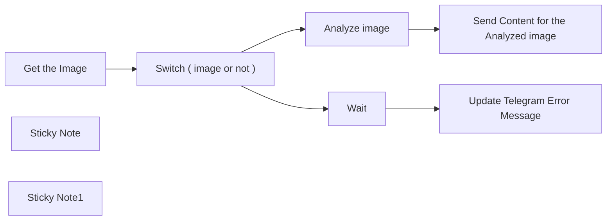

## Fluxo (.json) :

```json
{
  "meta": {
    "instanceId": "84ba6d895254e080ac2b4916d987aa66b000f88d4d919a6b9c76848f9b8a7616"
  },
  "nodes": [
    {
      "id": "ecb4bbc8-939a-4c6c-80b6-6f053d1d7745",
      "name": "Get the Image",
      "type": "n8n-nodes-base.telegramTrigger",
      "position": [
        1640,
        880
      ],
      "webhookId": "8404b32c-14bd-428e-88a6-560755f0f7ba",
      "parameters": {
        "updates": [
          "message"
        ],
        "additionalFields": {
          "download": true
        }
      },
      "credentials": {
        "telegramApi": {
          "id": "k3RE6o9brmFRFE9p",
          "name": "Telegram account"
        }
      },
      "typeVersion": 1.1
    },
    {
      "id": "2fd523b7-5f89-4e53-9445-4336b51cad51",
      "name": "Send Content for the Analyzed image",
      "type": "n8n-nodes-base.telegram",
      "position": [
        2380,
        760
      ],
      "parameters": {
        "text": "={{ $json.content }}",
        "chatId": "={{ $('Get the Image').item.json.message.chat.id }}",
        "additionalFields": {
          "appendAttribution": false
        }
      },
      "credentials": {
        "telegramApi": {
          "id": "k3RE6o9brmFRFE9p",
          "name": "Telegram account"
        }
      },
      "typeVersion": 1.1
    },
    {
      "id": "b77fe84f-7651-42aa-aa40-f903b10c8fb1",
      "name": "Sticky Note",
      "type": "n8n-nodes-base.stickyNote",
      "position": [
        380,
        360
      ],
      "parameters": {
        "width": 1235.4238259410247,
        "height": 1361.9843517631348,
        "content": "# Automated Image Analysis and Response via Telegram\n\n## Example: @SubAlertMe_Bot\n\n## Summary:\nThe automated image analysis and response workflow using n8n is a sophisticated solution designed to streamline the process of analyzing images sent via Telegram and delivering insightful responses based on the analysis outcomes. This cutting-edge workflow employs a series of meticulously orchestrated nodes to ensure seamless automation and efficiency in image processing tasks.\n\n## Use Cases:\nThis advanced workflow caters to a myriad of scenarios where real-time image analysis and response mechanisms are paramount. The use cases include:\n- Providing immediate feedback on images shared within Telegram groups.\n- Enabling automated content moderation based on the analysis of image content.\n- Facilitating rapid categorization and tagging of images based on the results of the analysis.\n\n## Detailed Workflow Setup:\nTo effectively implement this workflow, users must adhere to a meticulous setup process, which includes:\n- Access to the versatile n8n platform, ensuring seamless workflow orchestration.\n- Integration of a Telegram account to facilitate image reception and communication.\n- Utilization of an OpenAI account for sophisticated image analysis capabilities.\n- Configuration of Telegram and OpenAI credentials within the n8n environment for seamless integration.\n- Proficiency in creating and interconnecting nodes within the n8n workflow for optimal functionality.\n\n## Detailed Node Description:\n1. **Get the Image (Telegram Trigger):**\n - Actively triggers upon receipt of an image via Telegram, ensuring prompt processing.\n - Extracts essential information from the received image message to initiate further actions.\n\n2. **Merge all fields To get data from trigger:**\n - Seamlessly amalgamates all relevant data fields extracted from the trigger node for comprehensive data consolidation.\n\n3. **Analyze Image (OpenAI):**\n - Harnesses the powerful capabilities of OpenAI services to conduct in-depth analysis of the received image.\n - Processes the image data in base64 format to derive meaningful insights from the visual content.\n\n4. **Aggregate all fields:**\n - Compiles and consolidates all data items for subsequent processing and analysis, ensuring comprehensive data aggregation.\n\n5. **Send Content for the Analyzed Image (Telegram):**\n - Transmits the analyzed content back to the Telegram chat interface for seamless communication.\n - Delivers the analyzed information in textual format, enhancing user understanding and interaction.\n\n6. **Switch Node:**\n - The Switch node is pivotal for decision-making based on predefined conditions within the workflow.\n - It evaluates incoming data to determine the existence or absence of specific elements, such as images in this context.\n - Utilizes a set of rules to assess the presence of image data in the message payload and distinguishes between cases where images are detected and when they are not.\n - This crucial node plays a pivotal role in directing the flow of the workflow based on the outcomes of its evaluations.\n\n\n\n## Conclusion:\nThe automation of image analysis processes through this sophisticated workflow not only enhances operational efficiency but also revolutionizes communication dynamics within Telegram interactions. By incorporating this advanced workflow solution, users can optimize their image analysis workflows, bolster communication efficacy, and unlock new levels of automation in image processing tasks.\n"
      },
      "typeVersion": 1
    },
    {
      "id": "7a588ccb-7a97-4776-82fd-c4f42640e8f7",
      "name": "Update Telegram Error Message",
      "type": "n8n-nodes-base.telegram",
      "position": [
        2380,
        1000
      ],
      "parameters": {
        "text": "Please Upload an Image ....",
        "chatId": "={{ $json.message.chat.id }}",
        "additionalFields": {
          "appendAttribution": false
        }
      },
      "credentials": {
        "telegramApi": {
          "id": "k3RE6o9brmFRFE9p",
          "name": "Telegram account"
        }
      },
      "typeVersion": 1.1
    },
    {
      "id": "0cd83b82-0a20-4bf6-82bc-24827a368b89",
      "name": "Wait",
      "type": "n8n-nodes-base.wait",
      "position": [
        2180,
        1000
      ],
      "webhookId": "d4d6fc13-d8ad-42b6-b4dd-e922b5534282",
      "parameters": {
        "amount": 3
      },
      "typeVersion": 1.1
    },
    {
      "id": "a6d52335-72e7-4ce4-92e9-861b2806e9ae",
      "name": "Sticky Note1",
      "type": "n8n-nodes-base.stickyNote",
      "position": [
        1620,
        360
      ],
      "parameters": {
        "color": 4,
        "width": 1139.7707284714515,
        "height": 1359.6943046286056,
        "content": ""
      },
      "typeVersion": 1
    },
    {
      "id": "0222b4f6-a7c1-4183-8df8-b47b9e0cd685",
      "name": "Analyze image",
      "type": "@n8n/n8n-nodes-langchain.openAi",
      "position": [
        2180,
        760
      ],
      "parameters": {
        "options": {},
        "resource": "image",
        "inputType": "base64",
        "operation": "analyze"
      },
      "credentials": {
        "openAiApi": {
          "id": "kDo5LhPmHS2WQE0b",
          "name": "OpenAi account"
        }
      },
      "typeVersion": 1.3
    },
    {
      "id": "f83c7dc2-a986-40e7-831c-b7968866ef4e",
      "name": "Switch ( image or not )",
      "type": "n8n-nodes-base.switch",
      "position": [
        1820,
        880
      ],
      "parameters": {
        "rules": {
          "values": [
            {
              "outputKey": "Image",
              "conditions": {
                "options": {
                  "leftValue": "",
                  "caseSensitive": true,
                  "typeValidation": "strict"
                },
                "combinator": "and",
                "conditions": [
                  {
                    "operator": {
                      "type": "array",
                      "operation": "exists",
                      "singleValue": true
                    },
                    "leftValue": "={{ $json.message.photo }}",
                    "rightValue": ""
                  }
                ]
              },
              "renameOutput": true
            },
            {
              "outputKey": "Empty",
              "conditions": {
                "options": {
                  "leftValue": "",
                  "caseSensitive": true,
                  "typeValidation": "strict"
                },
                "combinator": "and",
                "conditions": [
                  {
                    "id": "3fe3a96d-6ee9-4f12-a32c-f5f5b729e257",
                    "operator": {
                      "type": "array",
                      "operation": "notExists",
                      "singleValue": true
                    },
                    "leftValue": "={{ $json.message.photo }}",
                    "rightValue": ""
                  }
                ]
              },
              "renameOutput": true
            }
          ]
        },
        "options": {}
      },
      "typeVersion": 3
    }
  ],
  "pinData": {},
  "connections": {
    "Wait": {
      "main": [
        [
          {
            "node": "Update Telegram Error Message",
            "type": "main",
            "index": 0
          }
        ]
      ]
    },
    "Analyze image": {
      "main": [
        [
          {
            "node": "Send Content for the Analyzed image",
            "type": "main",
            "index": 0
          }
        ]
      ]
    },
    "Get the Image": {
      "main": [
        [
          {
            "node": "Switch ( image or not )",
            "type": "main",
            "index": 0
          }
        ]
      ]
    },
    "Switch ( image or not )": {
      "main": [
        [
          {
            "node": "Analyze image",
            "type": "main",
            "index": 0
          }
        ],
        [
          {
            "node": "Wait",
            "type": "main",
            "index": 0
          }
        ]
      ]
    }
  }
}
```

<a id="template-2495"></a>

## Template 2495 - Transcrição automática de vídeos do YouTube

- **Nome:** Transcrição automática de vídeos do YouTube
- **Descrição:** Recebe um URL de vídeo do YouTube, valida o link, obtém a transcrição em português e retorna o texto organizado e com pontuação correta.
- **Funcionalidade:** • Recepção de URL via chat: Inicia o processo a partir de uma mensagem com o link do vídeo.
• Validação de URL: Verifica formato e extrai o ID do vídeo para garantir que o link é um vídeo do YouTube válido.
• Extração de transcrição: Consulta uma API externa para obter a transcrição completa do vídeo em texto (configurada para português).
• Tratamento de erros: Gera respostas claras quando ocorrem falhas na validação ou na obtenção dos dados.
• Correção e organização textual: Utiliza modelo de linguagem para ajustar pontuação e estruturar o conteúdo em títulos, subtítulos e listas, mantendo as palavras originais e garantindo leitura natural em português.
• Resposta ao usuário: Envia de volta ao solicitante o texto transcrito e formatado, ou mensagens de erro quando necessário.
- **Ferramentas:** • YouTube: Fonte de vídeos e identificador para extrair transcrições.
• Supadata (API): Serviço que converte URLs de YouTube em transcrições textuais e fornece o texto no idioma indicado.
• OpenAI (modelo de linguagem): Ferramenta usada para corrigir pontuação e organizar o texto em formato legível e estruturado.

## Fluxo visual

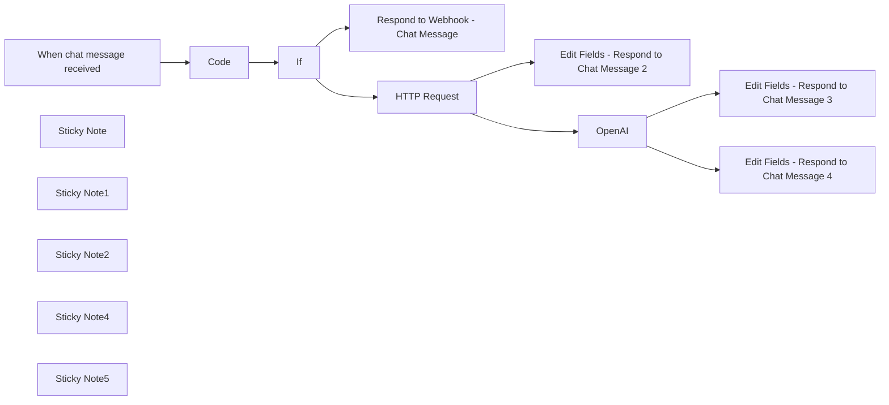

## Fluxo (.json) :

```json
{
  "id": "Iz8TMdlc6JhaKkd9",
  "meta": {
    "instanceId": "dacfda6d2e1dbefe99a005845405509e9929b16710017f4bd5d2bf758941295c",
    "templateCredsSetupCompleted": true
  },
  "name": "YouTube Video Transcriber",
  "tags": [],
  "nodes": [
    {
      "id": "a4e2f554-ebae-41df-912a-0d1081fa1736",
      "name": "When chat message received",
      "type": "@n8n/n8n-nodes-langchain.chatTrigger",
      "position": [
        -100,
        -60
      ],
      "webhookId": "70129cbe-1a05-495f-bd92-18d36c1bc260",
      "parameters": {
        "public": true,
        "options": {
          "title": "Youtube Video Transcriber 🚀",
          "subtitle": "Have a great transcription!  📖",
          "inputPlaceholder": "Insert a URL of a YouTube video.  💻"
        },
        "initialMessages": "Give me a URL of a video from YouTube to start! 👍"
      },
      "typeVersion": 1.1
    },
    {
      "id": "34b2b12e-0eb5-4f59-bd30-e7b595d06b8c",
      "name": "Code",
      "type": "n8n-nodes-base.code",
      "position": [
        280,
        -60
      ],
      "parameters": {
        "language": "python",
        "pythonCode": "import re\n\ndef youtube_video_url_validatior(video_url) -> str:\n  try:\n    if not video_url:\n      return {\"text\": 'URL from the video is required.', \"is_valid\": False}\n    \n    video_url: str = re.sub(r\"\\s{2,}\", \" \", video_url.strip())\n    \n    if not video_url:\n      return {\"text\": 'URL from the video is required.', \"is_valid\": False}\n    \n    if len(video_url) < 25:\n      return {\"text\": 'URL is too short to be a valid YouTube URL.', \"is_valid\": False}\n    \n    # if not re.match(r'^[A-Za-z0-9:/._?&=-]+$', video_url):\n    #   return {\"text\": 'URL contains invalid characters.', \"is_valid\": False}\n    \n    is_valid: bool = False\n    \n    for pattern in [\n        r'^https?://(?:www\\.)?youtube\\.com/watch\\?v=[\\w-]{11}',\n        r'^https?://youtu\\.be/[\\w-]{11}',\n        r'^https?://(?:www\\.)?youtube\\.com/embed/[\\w-]{11}',\n        r'^https?://(?:www\\.)?youtube\\.com/v/[\\w-]{11}',\n    ]:\n        if re.match(pattern, video_url):\n          is_valid = True\n          \n          break\n    \n    if not is_valid:\n      return {\"text\": 'Invalid YouTube URL format.', \"is_valid\": False}\n      \n    video_url_id: str | None = re.search(r'(?:v=|youtu\\.be/|embed/|v/)([\\w-]{11})', video_url).group(1)\n    \n    if not video_url_id or not re.match(r'^[\\w-]{11}$', video_url_id):\n      return {\"text\": 'Invalid YouTube video ID.', \"is_valid\": False}\n    \n    return {\"text\": video_url, \"is_valid\": True}\n  except Exception as ex:\n    raise ex\n\nreturn youtube_video_url_validatior(_input.first().json.chatInput)"
      },
      "typeVersion": 2
    },
    {
      "id": "712cbf28-df12-44fc-b54a-bc21e13e55e7",
      "name": "If",
      "type": "n8n-nodes-base.if",
      "position": [
        600,
        -240
      ],
      "parameters": {
        "options": {},
        "conditions": {
          "options": {
            "version": 2,
            "leftValue": "",
            "caseSensitive": true,
            "typeValidation": "loose"
          },
          "combinator": "and",
          "conditions": [
            {
              "id": "b8927a53-2755-4364-84b1-5340c5c31af5",
              "operator": {
                "type": "boolean",
                "operation": "true",
                "singleValue": true
              },
              "leftValue": "={{ $json.is_valid }}",
              "rightValue": ""
            }
          ]
        },
        "looseTypeValidation": true
      },
      "typeVersion": 2.2
    },
    {
      "id": "be9e1903-25bc-4f1b-8793-5e657205dd5d",
      "name": "Respond to Webhook - Chat Message",
      "type": "n8n-nodes-base.respondToWebhook",
      "position": [
        600,
        60
      ],
      "parameters": {
        "options": {},
        "respondWith": "text",
        "responseBody": "={{ $json.text }}"
      },
      "retryOnFail": true,
      "typeVersion": 1.1
    },
    {
      "id": "98bc7747-e688-4683-8686-ca44023f8648",
      "name": "Sticky Note",
      "type": "n8n-nodes-base.stickyNote",
      "position": [
        -200,
        -240
      ],
      "parameters": {
        "color": 5,
        "width": 300,
        "height": 420,
        "content": "## Entry Point\n\nThe workflow entry point is the  node chat message."
      },
      "typeVersion": 1
    },
    {
      "id": "7ca94ab6-7306-4b04-8b34-eb9e0937d681",
      "name": "Sticky Note1",
      "type": "n8n-nodes-base.stickyNote",
      "position": [
        180,
        -240
      ],
      "parameters": {
        "color": 3,
        "width": 300,
        "height": 420,
        "content": "## Validation - URL\n\nThis node ensures that only a valid youtube video url goes forward."
      },
      "typeVersion": 1
    },
    {
      "id": "c719c022-b55b-42b3-ab5f-36c0e1d62512",
      "name": "Sticky Note2",
      "type": "n8n-nodes-base.stickyNote",
      "position": [
        1360,
        -320
      ],
      "parameters": {
        "color": 4,
        "width": 460,
        "height": 560,
        "content": "## Data Structuring\n\nHere is the core of the workflow, where structuring is done to get the right format to answer.\n\n**NOTE:**\n\n1. Users implementing this template must modify the language in the OpenAI prompt to suit their desired output.\n\n2. An OpenAI API key is essential and must be properly configured to support data structuring and processing.  "
      },
      "typeVersion": 1
    },
    {
      "id": "7e1fa50f-7bd3-4bed-8537-969baa4c61de",
      "name": "Sticky Note4",
      "type": "n8n-nodes-base.stickyNote",
      "position": [
        820,
        -480
      ],
      "parameters": {
        "color": 7,
        "width": 460,
        "height": 900,
        "content": "## Supadata\n\nSupadata is a powerful tool that converts YouTube video URLs into structured data via a simple API. It efficiently extracts transcriptions, making it ideal for AI training, data analysis, or text-based applications.\n\n**NOTE:**\n\n1. Users implementing this template must change the language in the query parameter to suit their needs. \n\n2. An API key is required and must be configured for the workflow to function properly."
      },
      "typeVersion": 1
    },
    {
      "id": "35bf3191-4113-4a92-85a8-b22d3b2a4134",
      "name": "Sticky Note5",
      "type": "n8n-nodes-base.stickyNote",
      "position": [
        -920,
        -180
      ],
      "parameters": {
        "width": 640,
        "height": 300,
        "content": "## Description\n\nThis workflow simplifies access to YouTube video content converting into clear and concise transcriptions, ideal for users seeking practicality. It transcribes YouTube videos directly and returns the text, eliminating the need to watch the full video. \n\nThe need for this workflow arose from the demands of studying, where, amidst the fast-paced routine of daily life, reading transcribed content proved faster and more efficient for creating summaries than watching entire videos. Often, time constraints make it difficult to watch videos in full, and written text allows for quicker absorption of information. This solution provides a seamless way to access and review content from any YouTube video, regardless of the topic."
      },
      "typeVersion": 1
    },
    {
      "id": "2ea0b992-231b-4f6d-9f6f-9f488d266cfb",
      "name": "Edit Fields - Respond to Chat Message 2",
      "type": "n8n-nodes-base.set",
      "position": [
        1000,
        180
      ],
      "parameters": {
        "options": {},
        "assignments": {
          "assignments": [
            {
              "id": "66270798-60eb-4ab8-8572-ab957474e260",
              "name": "text",
              "type": "string",
              "value": "={{ $json.error }} - {{ $json.message }}"
            }
          ]
        }
      },
      "typeVersion": 3.4
    },
    {
      "id": "9846e903-015a-4111-b582-572d473fe4d3",
      "name": "Edit Fields - Respond to Chat Message 3",
      "type": "n8n-nodes-base.set",
      "position": [
        1900,
        -320
      ],
      "parameters": {
        "options": {},
        "assignments": {
          "assignments": [
            {
              "id": "97e0c175-8060-43da-9761-5c25d660c7ed",
              "name": "text",
              "type": "string",
              "value": "={{ $json.message.content }}"
            }
          ]
        }
      },
      "typeVersion": 3.4
    },
    {
      "id": "775e067c-3518-4c64-a939-5f9b9b435b3c",
      "name": "Edit Fields - Respond to Chat Message 4",
      "type": "n8n-nodes-base.set",
      "position": [
        1900,
        100
      ],
      "parameters": {
        "options": {},
        "assignments": {
          "assignments": [
            {
              "id": "66270798-60eb-4ab8-8572-ab957474e260",
              "name": "text",
              "type": "string",
              "value": "=Something went wrong with the data structuring."
            }
          ]
        }
      },
      "typeVersion": 3.4
    },
    {
      "id": "91e22fcc-79b8-48d2-ba6e-bfb699ed9a07",
      "name": "HTTP Request",
      "type": "n8n-nodes-base.httpRequest",
      "onError": "continueErrorOutput",
      "position": [
        1000,
        -100
      ],
      "parameters": {
        "url": "=https://api.supadata.ai/v1/youtube/transcript?url={{ $json.text }}&text=true&lang=pt",
        "options": {
          "timeout": 300000
        },
        "sendHeaders": true,
        "headerParameters": {
          "parameters": [
            {
              "name": "x-api-key",
              "value": "SUPADATA_API_KEY"
            }
          ]
        }
      },
      "executeOnce": false,
      "notesInFlow": false,
      "retryOnFail": false,
      "typeVersion": 4.2,
      "alwaysOutputData": false
    },
    {
      "id": "3fce199e-2e95-40a8-a78e-20a25c3f4300",
      "name": "OpenAI",
      "type": "@n8n/n8n-nodes-langchain.openAi",
      "onError": "continueErrorOutput",
      "position": [
        1460,
        20
      ],
      "parameters": {
        "modelId": {
          "__rl": true,
          "mode": "list",
          "value": "gpt-4o-mini-2024-07-18",
          "cachedResultName": "GPT-4O-MINI-2024-07-18"
        },
        "options": {},
        "messages": {
          "values": [
            {
              "role": "system",
              "content": "You are an expert in grammar corrections and textual structuring.\n\nCorrect the classification of the provided text, adding commas, periods, question marks and other symbols necessary for natural and consistent reading. Do not change any words, just adjust the punctuation according to the grammatical rules and context.\n\nOrganize your content using markdown, structuring it with titles, subtitles, lists or other protected elements to clearly highlight the topics and information captured. Leave it in Portuguese and remember to always maintain the original formatting.\n\nTextual organization should always be a priority according to the content of the text, as well as the appropriate title, which must make sense."
            },
            {
              "content": "={{ $json.content }}"
            }
          ]
        }
      },
      "credentials": {
        "openAiApi": {
          "id": "GpAe9wonPZjokqpc",
          "name": "OpenAi account"
        }
      },
      "retryOnFail": true,
      "typeVersion": 1.8
    }
  ],
  "active": true,
  "pinData": {},
  "settings": {
    "executionOrder": "v1"
  },
  "versionId": "d2f6a7fb-f3e1-462f-8627-7f67cc7bfa5b",
  "connections": {
    "If": {
      "main": [
        [
          {
            "node": "HTTP Request",
            "type": "main",
            "index": 0
          }
        ],
        [
          {
            "node": "Respond to Webhook - Chat Message",
            "type": "main",
            "index": 0
          }
        ]
      ]
    },
    "Code": {
      "main": [
        [
          {
            "node": "If",
            "type": "main",
            "index": 0
          }
        ]
      ]
    },
    "OpenAI": {
      "main": [
        [
          {
            "node": "Edit Fields - Respond to Chat Message 3",
            "type": "main",
            "index": 0
          }
        ],
        [
          {
            "node": "Edit Fields - Respond to Chat Message 4",
            "type": "main",
            "index": 0
          }
        ]
      ]
    },
    "HTTP Request": {
      "main": [
        [
          {
            "node": "OpenAI",
            "type": "main",
            "index": 0
          }
        ],
        [
          {
            "node": "Edit Fields - Respond to Chat Message 2",
            "type": "main",
            "index": 0
          }
        ]
      ]
    },
    "When chat message received": {
      "main": [
        [
          {
            "node": "Code",
            "type": "main",
            "index": 0
          }
        ]
      ]
    }
  }
}
```

<a id="template-2497"></a>

## Template 2497 - Captura diária automática de dados meteorológicos

- **Nome:** Captura diária automática de dados meteorológicos
- **Descrição:** Este fluxo busca diariamente dados meteorológicos e armazena-os em uma base para registro histórico.
- **Funcionalidade:** • Agendamento diário: Executa a captura de dados em horário programado (diariamente às 10h).
• Requisição de dados meteorológicos: Consulta uma API externa para obter temperatura, umidade, velocidade do vento, localização e fuso horário.
• Armazenamento dos dados: Salva os valores retornados em uma tabela para criar um histórico.
• Mapeamento de campos: Extrai e mapeia campos específicos (Temp, Humidity, Wind Speed, Location, Timezone) antes do armazenamento.
• Gerenciamento de credenciais: Utiliza credenciais para autenticar requisições à API e acesso à base de dados.
- **Ferramentas:** • OpenWeatherMap: API pública para obter dados meteorológicos atuais por coordenadas.
• Airtable: Serviço de banco de dados/tabela online usado para armazenar e organizar os registros de clima.

## Fluxo visual

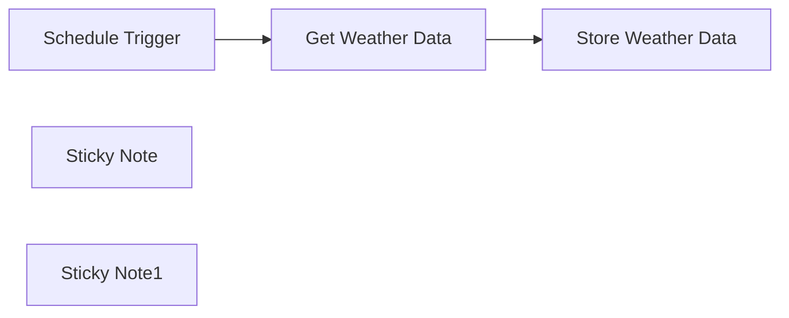

## Fluxo (.json) :

```json
{
  "id": "PHp3gKoyYfSztbTB",
  "meta": {
    "instanceId": "14e4c77104722ab186539dfea5182e419aecc83d85963fe13f6de862c875ebfa",
    "templateCredsSetupCompleted": true
  },
  "name": "Automated Daily Weather Data Fetcher and Storage",
  "tags": [
    {
      "id": "uScnF9NzR3PLIyvU",
      "name": "Published",
      "createdAt": "2025-03-21T07:22:28.491Z",
      "updatedAt": "2025-03-21T07:22:28.491Z"
    }
  ],
  "nodes": [
    {
      "id": "871fd9fd-de44-4c9f-aef4-0c731c5685f1",
      "name": "Schedule Trigger",
      "type": "n8n-nodes-base.scheduleTrigger",
      "position": [
        40,
        100
      ],
      "parameters": {
        "rule": {
          "interval": [
            {
              "triggerAtHour": 10
            }
          ]
        }
      },
      "typeVersion": 1.2
    },
    {
      "id": "0b721c2a-6301-4a08-9602-990598d0f7a3",
      "name": "Store Weather Data",
      "type": "n8n-nodes-base.airtable",
      "notes": "Store weather data in table\n",
      "position": [
        480,
        100
      ],
      "parameters": {
        "base": {
          "__rl": true,
          "mode": "list",
          "value": "appKtypfMptBIKStp",
          "cachedResultUrl": "",
          "cachedResultName": "WeatherData"
        },
        "table": {
          "__rl": true,
          "mode": "list",
          "value": "tblfb3sJ84eQUlYJd",
          "cachedResultUrl": "",
          "cachedResultName": "Data"
        },
        "columns": {
          "value": {
            "Temp": "={{ $json.main.temp }}",
            "Humidity": "={{ $json.main.humidity }}",
            "Location": "={{ $json.name }}",
            "Timezone": "={{ $json.timezone }}",
            "Wind Speed": "={{ $json.wind.speed }}"
          },
          "schema": [
            {
              "id": "Location",
              "type": "string",
              "display": true,
              "removed": false,
              "readOnly": false,
              "required": false,
              "displayName": "Location",
              "defaultMatch": false,
              "canBeUsedToMatch": true
            },
            {
              "id": "Timezone",
              "type": "number",
              "display": true,
              "removed": false,
              "readOnly": false,
              "required": false,
              "displayName": "Timezone",
              "defaultMatch": false,
              "canBeUsedToMatch": true
            },
            {
              "id": "Temp",
              "type": "number",
              "display": true,
              "removed": false,
              "readOnly": false,
              "required": false,
              "displayName": "Temp",
              "defaultMatch": false,
              "canBeUsedToMatch": true
            },
            {
              "id": "Wind Speed",
              "type": "number",
              "display": true,
              "removed": false,
              "readOnly": false,
              "required": false,
              "displayName": "Wind Speed",
              "defaultMatch": false,
              "canBeUsedToMatch": true
            },
            {
              "id": "Humidity",
              "type": "number",
              "display": true,
              "removed": false,
              "readOnly": false,
              "required": false,
              "displayName": "Humidity",
              "defaultMatch": false,
              "canBeUsedToMatch": true
            }
          ],
          "mappingMode": "defineBelow",
          "matchingColumns": []
        },
        "options": {},
        "operation": "create"
      },
      "credentials": {
        "airtableTokenApi": {
          "id": "",
          "name": ""
        }
      },
      "notesInFlow": true,
      "typeVersion": 2.1
    },
    {
      "id": "052a47c1-d167-432c-93f2-117a1c129c51",
      "name": "Get Weather Data",
      "type": "n8n-nodes-base.httpRequest",
      "notes": "Fetching the weather data",
      "position": [
        260,
        100
      ],
      "parameters": {
        "url": "https://api.openweathermap.org/data/2.5/weather?lat=23.0059&lon=72.5547",
        "options": {},
        "sendQuery": true,
        "authentication": "genericCredentialType",
        "genericAuthType": "httpQueryAuth",
        "queryParameters": {
          "parameters": [
            {
              "name": "units",
              "value": "metric"
            }
          ]
        }
      },
      "credentials": {
        "httpBasicAuth": {
          "id": "zowZrB19NtOy4lxp",
          "name": "OpenWeatherAPi"
        },
        "httpQueryAuth": {
          "id": "OVXHUjaqzUxECHEG",
          "name": "OpenWeatherMap Query Auth"
        },
        "httpHeaderAuth": {
          "id": "glJ33a6G5lqhm1CW",
          "name": "Shopify GraphQL Cred"
        }
      },
      "notesInFlow": true,
      "typeVersion": 4.2
    },
    {
      "id": "525f3e92-c620-47f2-b97e-53cb98d63406",
      "name": "Sticky Note",
      "type": "n8n-nodes-base.stickyNote",
      "position": [
        0,
        0
      ],
      "parameters": {
        "color": 6,
        "width": 680,
        "height": 320,
        "content": "Automated Daily Weather Data Fetcher and Storage\n\n"
      },
      "typeVersion": 1
    },
    {
      "id": "cff8dbb0-3639-45a6-a06d-9ab63b2dfce8",
      "name": "Sticky Note1",
      "type": "n8n-nodes-base.stickyNote",
      "position": [
        0,
        340
      ],
      "parameters": {
        "color": 6,
        "width": 680,
        "height": 120,
        "content": "This workflow fetches weather data daily using the OpenWeatherMap API and stores the weather information in Airtable. The data can include current temperature, humidity, wind speed, and other relevant weather details. This automation ensures that the weather data is updated every day and stored for future reference, providing an easy-to-access historical record of the weather patterns."
      },
      "typeVersion": 1
    }
  ],
  "active": false,
  "pinData": {},
  "settings": {
    "executionOrder": "v1"
  },
  "versionId": "ef874403-4189-4b92-a963-a02fc585cb77",
  "connections": {
    "Get Weather Data": {
      "main": [
        [
          {
            "node": "Store Weather Data",
            "type": "main",
            "index": 0
          }
        ]
      ]
    },
    "Schedule Trigger": {
      "main": [
        [
          {
            "node": "Get Weather Data",
            "type": "main",
            "index": 0
          }
        ]
      ]
    }
  }
}
```

<a id="template-2499"></a>

## Template 2499 - Geração automática de relatórios de pesquisa em PDF

- **Nome:** Geração automática de relatórios de pesquisa em PDF
- **Descrição:** Gera relatórios de pesquisa estruturados em PDF sobre um tópico fornecido, agregando informações de múltiplas fontes (notícias, Wikipedia, web e artigos acadêmicos) e distribuindo o resultado por e-mail e Telegram.
- **Funcionalidade:** • Validação de entrada: Verifica e limpa a consulta do usuário antes de iniciar o processo.
• Refinamento de consulta: Reformula o tópico e gera consultas de pesquisa relacionadas para ampliar o escopo da investigação.
• Memória de sessão: Armazena contexto/queries para manter consistência entre execuções relacionadas.
• Coleta multi-fonte: Executa buscas em notícias, Wikipedia, web e repositórios acadêmicos para reunir informações recentes e fundamentadas.
• Agente de pesquisa: Agrega, sumariza e formata os achados em um objeto JSON estruturado com introdução, resumo, principais conclusões, destaques de notícias, insights acadêmicos, resumo da Wikipedia e fontes.
• Parsing e mesclagem: Analisa a saída do agente, divide em seções e reúne itens em uma única estrutura organizada.
• Geração de HTML do relatório: Converte os dados agregados em um template HTML profissional e com estilo para o relatório.
• Conversão para PDF: Envia o HTML para um serviço de conversão e obtém o PDF final.
• Download e envio: Faz download do PDF gerado e envia como anexo por e-mail e como documento via Telegram.
• Registro de metadados: Armazena informações do relatório (tópico, fontes, consultas, timestamp) em uma planilha para histórico e rastreabilidade.
• Verificação de armazenamento: Pesquisa e valida pastas no serviço de armazenamento para organizar relatórios gerados.
- **Ferramentas:** • OpenAI (modelo GPT-4o-mini): Geração e refinamento de linguagem para criar consultas, sumarizações e estruturação de conteúdo.
• News API: Busca de artigos de notícias recentes para identificar desenvolvimentos e destaques na temática.
• Wikipedia API: Consulta de conteúdo enciclopédico para fornecer contexto e histórico do tópico.
• Google Custom Search: Busca web geral para encontrar artigos, posts e recursos relevantes.
• SerpAPI (Google Scholar): Pesquisa de literatura acadêmica e artigos científicos para insights e referências.
• PDFShift (serviço de conversão): Conversão de HTML para PDF para geração do documento final.
• Gmail: Envio do relatório em PDF por e-mail como anexo/HTML.
• Telegram: Envio do PDF como documento para chats/usuários via bot.
• Google Sheets: Armazenamento de metadados do relatório para registro e consulta posterior.
• Google Drive: Localização/organização de pastas para salvar relatórios.


## Fluxo visual

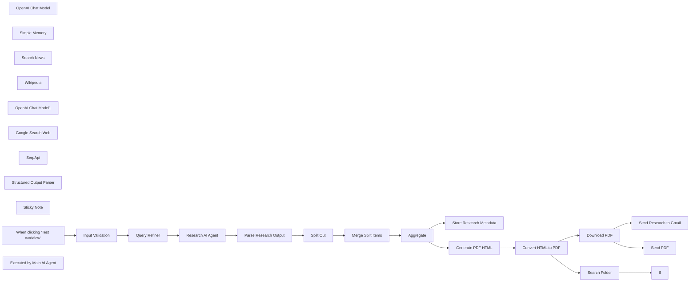

## Fluxo (.json) :

```json
{
  "id": "EOJfPcM9PPWI1Rmp",
  "meta": {
    "instanceId": "3aaeb6eaba3494bbdbe57e25fa3d02783cfbc460b1e823f7b741cf26edc7ca3d",
    "templateCredsSetupCompleted": true
  },
  "name": "Automated Research Report Generation with OpenAI, Wikipedia, Google Search, and Gmail/Telegram",
  "tags": [],
  "nodes": [
    {
      "id": "46c09535-cd6b-481c-b520-67ecb4aad812",
      "name": "OpenAI Chat Model",
      "type": "@n8n/n8n-nodes-langchain.lmChatOpenAi",
      "position": [
        776,
        -100
      ],
      "parameters": {
        "model": {
          "__rl": true,
          "mode": "list",
          "value": "gpt-4o-mini"
        },
        "options": {}
      },
      "credentials": {
        "openAiApi": {
          "id": "WLM64KJjQFXGWGWi",
          "name": "OpenAi account N8N"
        }
      },
      "typeVersion": 1.2
    },
    {
      "id": "574ec863-e557-4196-b1b9-5c275a7de73a",
      "name": "Simple Memory",
      "type": "@n8n/n8n-nodes-langchain.memoryBufferWindow",
      "position": [
        896,
        -100
      ],
      "parameters": {
        "sessionKey": "={{ $json.output.searchQueries }}",
        "sessionIdType": "customKey"
      },
      "typeVersion": 1.3
    },
    {
      "id": "661349c2-7bb1-4c95-af8f-3a108a619c84",
      "name": "Search News",
      "type": "@n8n/n8n-nodes-langchain.toolHttpRequest",
      "position": [
        1016,
        -100
      ],
      "parameters": {
        "url": "=https://newsapi.org/v2/everything?q={{ encodeURIComponent($input.cleanedQuery) }}&apiKey=\"YOURAPIKEY\"",
        "sendQuery": true,
        "parametersQuery": {
          "values": [
            {
              "name": "q"
            },
            {
              "name": "pageSize",
              "value": "3",
              "valueProvider": "fieldValue"
            },
            {
              "name": "sortBy",
              "value": "publishedAt",
              "valueProvider": "fieldValue"
            },
            {
              "name": "language",
              "value": "en",
              "valueProvider": "fieldValue"
            }
          ]
        },
        "toolDescription": "Fetches recent news articles",
        "optimizeResponse": true
      },
      "typeVersion": 1.1
    },
    {
      "id": "6d43251f-db88-45fa-be65-de368d4db408",
      "name": "Wikipedia",
      "type": "@n8n/n8n-nodes-langchain.toolHttpRequest",
      "position": [
        1136,
        -100
      ],
      "parameters": {
        "url": "=https://en.wikipedia.org/w/api.php?action=query&format=json&prop=extracts&exintro&explaintext&titles={{ $input.query ? encodeURIComponent($input.query) : encodeURIComponent($json.refined_query) }}\n\n",
        "sendQuery": true,
        "parametersQuery": {
          "values": [
            {
              "name": "action",
              "valueProvider": "modelOptional"
            },
            {
              "name": "prop",
              "value": "extracts",
              "valueProvider": "fieldValue"
            }
          ]
        },
        "toolDescription": "Fetches structured data from Wikipedia",
        "optimizeResponse": true
      },
      "typeVersion": 1.1
    },
    {
      "id": "c94b1446-82bf-47c8-8f5d-c5da9a43a7e7",
      "name": "OpenAI Chat Model1",
      "type": "@n8n/n8n-nodes-langchain.lmChatOpenAi",
      "position": [
        380,
        -80
      ],
      "parameters": {
        "model": {
          "__rl": true,
          "mode": "list",
          "value": "gpt-4o-mini"
        },
        "options": {}
      },
      "credentials": {
        "openAiApi": {
          "id": "WLM64KJjQFXGWGWi",
          "name": "OpenAi account N8N"
        }
      },
      "typeVersion": 1.2
    },
    {
      "id": "834efc04-b05f-4ddc-a8d9-b93d9c4e099a",
      "name": "Query Refiner",
      "type": "@n8n/n8n-nodes-langchain.agent",
      "position": [
        400,
        -320
      ],
      "parameters": {
        "text": "=You are a query generation expert. Based on the refined query provided, generate exactly 5 related search queries that can help broaden the research scope. Each query should focus on a different aspect of the topic (e.g., applications, challenges, recent developments, specific domains, case studies). The output must match the following JSON schema:\n{\n  \"topic\": \"The refined query\",\n  \"searchQueries\": [\"query1\", \"query2\", \"query3\", \"query4\", \"query5\"]\n}\n\nRefined Query: {{ $json.cleanedQuery}}\nExamples:\n- Refined Query: \"current trends in artificial intelligence 2025\"\n  Output: {\n    \"topic\": \"current trends in artificial intelligence 2025\",\n    \"searchQueries\": [\n      \"AI applications in healthcare 2025\",\n      \"ethical challenges of artificial intelligence 2025\",\n      \"recent developments in generative AI 2025\",\n      \"AI trends in education 2025\",\n      \"AI startup funding trends 2025\"\n    ]\n  }\n- Refined Query: \"artificial intelligence applications in healthcare diagnostics and treatment\"\n  Output: {\n    \"topic\": \"artificial intelligence applications in healthcare diagnostics and treatment\",\n    \"searchQueries\": [\n      \"AI in medical diagnostics 2025\",\n      \"artificial intelligence for personalized treatment plans\",\n      \"challenges of AI in healthcare diagnostics\",\n      \"recent studies on AI in healthcare\",\n      \"AI healthcare diagnostics case studies\"\n    ]\n  }",
        "options": {},
        "promptType": "define",
        "hasOutputParser": true
      },
      "typeVersion": 1.8
    },
    {
      "id": "1f83e2d8-23ee-46e2-998a-b644ea0fff3c",
      "name": "Research AI Agent",
      "type": "@n8n/n8n-nodes-langchain.agent",
      "position": [
        900,
        -320
      ],
      "parameters": {
        "text": "=Perform research on the topic \n\"{{ $json.output.topic }}\"\"\n\n\nusing the following search queries: {{ $json.output.searchQueries.join(\",\") }}\n\n",
        "options": {
          "systemMessage": "=You are a research assistant named \"ResearchBot\". Your role is to perform thorough and comprehensive research based on the topic and search queries provided. Follow these steps to gather data:\n- Search the web for general information using the provided topic and queries, focusing on recent trends, developments, and applications (2024-2025).\n- Search Wikipedia for foundational knowledge about the topic to provide context.\n- Search for recent news articles (from 2024-2025) to identify current developments, announcements, and trends.\n- Search Google Scholar for academic papers (from 2020-2025) to gather scholarly insights and research findings.\n- Summarize and aggregate all findings into a structured JSON format.\n- Ensure all data is directly relevant to the topic:  {{ $json.output.topic }}.\nReturn the research findings as a raw JSON object with the following structure:\n{\n  \"introduction\": \"A detailed 4-6 sentence introduction to the topic, providing context, significance, and a brief overview of current trends.\",\n  \"summary\": \"A comprehensive 6-8 sentence summary of the key findings, covering trends, challenges, opportunities, and notable applications.\",\n  \"key_findings\": [\"A list of 8-12 specific key points or trends, each as a concise sentence. This must always be an array with at least 8 items.\"],\n  \"news_highlights\": [\"A list of 4-6 recent news headlines with sources (from 2024-2025), each in the format 'Headline - Source, Year'. This must always be an array with at least 4 items.\"],\n  \"scholarly_insights\": [\"A list of 4-6 insights from academic papers with sources (from 2020-2025), each in the format 'Insight (Author et al., Year, Journal)'. This must always be an array with at least 4 items.\"],\n  \"wikipedia_summary\": \"A detailed 4-6 sentence summary of foundational knowledge from Wikipedia, providing background and historical context on the topic.\",\n  \"sources\": [\"A list of all source URLs (at least 8-12 unique, relevant sources, including web articles, news, and academic papers). This must always be an array with at least 8 items.\"]\n}\nIf insufficient data is found for any field, perform additional searches using variations of the topic and queries to meet the minimum requirements. For example:\n- For news, search for terms like \"[topic] 2025 news\", \"[topic] recent developments\", or \"[topic] industry trends\".\n- For scholarly insights, search for \"[topic] machine learning 2020-2025\", \"[topic] applications research\", or \"[topic] ethical concerns\".\n- For sources, ensure a mix of web articles, news, and academic papers.\nDo NOT include irrelevant information or sources. Do NOT wrap the JSON in a string, an \"output\" field, or any Markdown formatting (e.g., ```json). Return only the raw JSON object.\n\n\nTopic: {{ $json.output.topic }}\nSearch Queries: {{ $json.output.searchQueries }}"
        },
        "promptType": "define"
      },
      "typeVersion": 1.8
    },
    {
      "id": "a53cfaac-425a-4558-a661-1042cb63599d",
      "name": "Google Search Web",
      "type": "@n8n/n8n-nodes-langchain.toolHttpRequest",
      "position": [
        1256,
        -100
      ],
      "parameters": {
        "url": "=https://www.googleapis.com/customsearch/v1?key=\"YOURAPIKEY\"={{ encodeURIComponent($input.query) }}",
        "sendQuery": true,
        "parametersQuery": {
          "values": [
            {
              "name": "num",
              "value": "5",
              "valueProvider": "fieldValue"
            }
          ]
        },
        "toolDescription": "Searches the web for a given query using Google Custom Search API",
        "optimizeResponse": true
      },
      "typeVersion": 1.1
    },
    {
      "id": "27548bf6-7f86-4e38-befb-3ad55c4d6c46",
      "name": "SerpApi",
      "type": "@n8n/n8n-nodes-langchain.toolHttpRequest",
      "position": [
        1376,
        -100
      ],
      "parameters": {
        "url": "=https://serpapi.com/search?engine=google_scholar&q={{ encodeURIComponent( $json.refined_query ) }}&api_key=\"YOURAPIKEY\"",
        "sendQuery": true,
        "authentication": "predefinedCredentialType",
        "parametersQuery": {
          "values": [
            {
              "name": "num",
              "value": "3",
              "valueProvider": "fieldValue"
            }
          ]
        },
        "toolDescription": "Searches Google Scholar for academic papers",
        "optimizeResponse": true,
        "nodeCredentialType": "serpApi"
      },
      "credentials": {
        "serpApi": {
          "id": "9LoJ3XtPiLBGUI5W",
          "name": "SerpAPI account"
        }
      },
      "typeVersion": 1.1
    },
    {
      "id": "51c1b9be-a3e1-4a93-bb5c-bbde5919de0c",
      "name": "Structured Output Parser",
      "type": "@n8n/n8n-nodes-langchain.outputParserStructured",
      "position": [
        580,
        -80
      ],
      "parameters": {
        "jsonSchemaExample": "{\n  \"output\": {\n    \"topic\": \"the best ai models 2025\",\n    \"searchQueries\": [\n      \"best AI models 2025 natural language processing\",\n      \"top AI models 2025 computer vision\",\n      \"best AI models 2025 generative AI\",\n      \"recent advancements in AI models 2025 news\",\n      \"scholarly research on AI models 2020-2025\",\n      \"ethical concerns in AI models 2025\",\n      \"AI models 2025 applications in healthcare\",\n      \"AI models 2025 trends in automation\"\n    ]\n  }\n}"
      },
      "typeVersion": 1.2
    },
    {
      "id": "2d30f75e-baa0-4dd3-a0f9-cb74d7272d08",
      "name": "Split Out",
      "type": "n8n-nodes-base.splitOut",
      "position": [
        1500,
        -320
      ],
      "parameters": {
        "options": {},
        "fieldToSplitOut": " introduction, summary, key_findings, news_highlights, scholarly_insights, wikipedia_summary, sources"
      },
      "typeVersion": 1
    },
    {
      "id": "b89d5c35-64c4-4e8c-b432-c2219aba8acc",
      "name": "Input Validation",
      "type": "n8n-nodes-base.code",
      "position": [
        180,
        -320
      ],
      "parameters": {
        "jsCode": "// Validate input and prepare for processing\nconst query = $input.all()[0].json.query;\n\nif (!query || query.trim().length < 3) {\n  throw new Error('Research query must be at least 3 characters long');\n}\n\nreturn {\n  json: {\n    originalQuery: query,\n    cleanedQuery: query.trim().toLowerCase(),\n    timestamp: new Date().toISOString()\n  }\n};"
      },
      "typeVersion": 2
    },
    {
      "id": "e34f9b0e-a9ca-4011-bfee-c7845c68942b",
      "name": "Parse Research Output",
      "type": "n8n-nodes-base.code",
      "position": [
        1300,
        -320
      ],
      "parameters": {
        "jsCode": "// Get the output string from the Research AI Agent\nconst outputString = $input.first().json.output;\n\n// Parse the string into a JSON object\nconst parsedOutput = JSON.parse(outputString);\n\n// Return the parsed JSON as a single item\nreturn [{\n  json: parsedOutput\n}];"
      },
      "typeVersion": 2
    },
    {
      "id": "f4e6e449-1c56-4500-9701-623620360c83",
      "name": "Merge Split Items",
      "type": "n8n-nodes-base.code",
      "position": [
        1700,
        -320
      ],
      "parameters": {
        "jsCode": "const mergedItem = {\n  key_findings: [],\n  news_highlights: [],\n  scholarly_insights: [],\n  sources: []\n};\n\n$input.all().forEach(item => {\n  const data = item.json;\n\n  if (data.introduction) mergedItem.introduction = data.introduction;\n  if (data.summary) mergedItem.summary = data.summary;\n  if (data.wikipedia_summary) mergedItem.wikipedia_summary = data.wikipedia_summary;\n\n  if (data.key_findings) {\n    const findingsToAdd = Array.isArray(data.key_findings) ? data.key_findings : [data.key_findings];\n    mergedItem.key_findings = mergedItem.key_findings.concat(findingsToAdd);\n  }\n  if (data.news_highlights) {\n    const highlightsToAdd = Array.isArray(data.news_highlights) ? data.news_highlights : [data.news_highlights];\n    mergedItem.news_highlights = mergedItem.news_highlights.concat(highlightsToAdd);\n  }\n  if (data.scholarly_insights) {\n    const insightsToAdd = Array.isArray(data.scholarly_insights) ? data.scholarly_insights : [data.scholarly_insights];\n    mergedItem.scholarly_insights = mergedItem.scholarly_insights.concat(insightsToAdd);\n  }\n  if (data.sources) {\n    const sourcesToAdd = Array.isArray(data.sources) ? data.sources : [data.sources];\n    mergedItem.sources = mergedItem.sources.concat(sourcesToAdd);\n  }\n});\n\nreturn [{ json: mergedItem }];"
      },
      "typeVersion": 2
    },
    {
      "id": "e63a3f5d-dba7-4fc4-afa0-150e63aedbac",
      "name": "Store Research Metadata",
      "type": "n8n-nodes-base.googleSheets",
      "position": [
        2100,
        -720
      ],
      "parameters": {
        "columns": {
          "value": {
            "Topic": "={{ $json.topic }}",
            "Sources": "={{ $json.sources }}",
            "Timestamp": "={{ $json.timestamp }}",
            "Search Queries": "={{ $json.searchQueries }}"
          },
          "schema": [
            {
              "id": "Topic",
              "type": "string",
              "display": true,
              "required": false,
              "displayName": "Topic",
              "defaultMatch": false,
              "canBeUsedToMatch": true
            },
            {
              "id": "Search Queries",
              "type": "string",
              "display": true,
              "required": false,
              "displayName": "Search Queries",
              "defaultMatch": false,
              "canBeUsedToMatch": true
            },
            {
              "id": "Sources",
              "type": "string",
              "display": true,
              "required": false,
              "displayName": "Sources",
              "defaultMatch": false,
              "canBeUsedToMatch": true
            },
            {
              "id": "Timestamp",
              "type": "string",
              "display": true,
              "required": false,
              "displayName": "Timestamp",
              "defaultMatch": false,
              "canBeUsedToMatch": true
            }
          ],
          "mappingMode": "defineBelow",
          "matchingColumns": [],
          "attemptToConvertTypes": false,
          "convertFieldsToString": false
        },
        "options": {},
        "operation": "append",
        "sheetName": {
          "__rl": true,
          "mode": "list",
          "value": "gid=0",
          "cachedResultUrl": "https://docs.google.com/spreadsheets/d/196eJesF2ke3AQjoWvave51m6FltAyBFj5pvVW7wIsUA/edit#gid=0",
          "cachedResultName": "Sheet1"
        },
        "documentId": {
          "__rl": true,
          "mode": "list",
          "value": "196eJesF2ke3AQjoWvave51m6FltAyBFj5pvVW7wIsUA",
          "cachedResultUrl": "https://docs.google.com/spreadsheets/d/196eJesF2ke3AQjoWvave51m6FltAyBFj5pvVW7wIsUA/edit?usp=drivesdk",
          "cachedResultName": "Research AI Agent Records"
        }
      },
      "credentials": {
        "googleSheetsOAuth2Api": {
          "id": "PRTItuUGXlUOvF9a",
          "name": "Google Sheets account"
        }
      },
      "typeVersion": 4.5
    },
    {
      "id": "2501bc98-a1b4-473b-b4ac-7fd78efcb6be",
      "name": "Sticky Note",
      "type": "n8n-nodes-base.stickyNote",
      "position": [
        -1080,
        -1200
      ],
      "parameters": {
        "color": 6,
        "width": 2900,
        "height": 1600,
        "content": "# 📋 Research Report Workflow 🧠💻\n\nThis workflow generates a professional PDF research report on a given topic, sends it via Telegram, and emails🚀\n\n\n---\n\n## 🔍 **Query Refiner**\n- **What it does**: Refines the input topic for better readability. 🧹\n- **Input**: Topic from the HTTP Request (e.g., \"the best ai models 2025\").\n- **Output**: Formatted topic (e.g., \"The Best AI Models 2025\").\n- **✨ Detail**: Capitalizes words and ensures \"AI\" is uppercase.\n\n---\n\n## 📊 **Aggregate Research Data**\n- **What it does**: Collects research data for the topic. 📚\n- **Input**: Refined topic.\n- **Output**: Research data (introduction, summary, key findings, etc.) with a timestamp.\n- **⏰ Note**: The timestamp is used to date the report.\n\n---\n\n## 🔗 **Merge Split Items**\n- **What it does**: Combines and organizes research data into sections. 🗂️\n- **Input**: Data from Aggregate Research Data.\n- **Output**: Structured JSON with sections like `introduction`, `key_findings`, `sources`.\n- **📑 Purpose**: Prepares data for the PDF report.\n\n---\n\n## 📝 **Generate PDF HTML**\n- **What it does**: Creates an HTML template for the PDF report. 🖥️\n- **Input**: Refined topic and research data.\n- **Output**: HTML content, file name (e.g., `research-report-the-best-ai-models-2025-2025-04-09.pdf`), and formatted date.\n- **🎨 Features**:\n  - Professional styling (Helvetica, Georgia fonts, deep blue accents).\n  - Sections: Cover page, introduction, summary, key findings, etc.\n  - Escapes special characters to prevent HTML errors.\n- **⏳ Timestamp Fix**: Stores `rawTimestamp` and `formattedDate` (e.g., \"April 9, 2025\").\n\n---\n\n## 📄 **Convert HTML to PDF (PDFShift)**\n- **What it does**: Converts the HTML to a PDF using the PDFShift API. 🖨️\n- **Input**: HTML content from the previous node.\n- **Output**: JSON response with a URL to the generated PDF.\n- **🔑 Requirement**: Needs a valid PDFShift API key.\n- **⚠️ Note**: Outputs a URL, not the PDF binary data.\n\n---\n\n## ⬇️ **Download PDF**\n- **What it does**: Downloads the PDF from the URL provided by PDFShift. 📥\n- **Input**: PDF URL from the Convert HTML to PDF node.\n- **Output**: Binary PDF data (MIME type: `application/pdf`, ~98 KB).\n- **📛 File Name**: Uses the file name from the previous node (e.g., `research-report-the-best-ai-models-2025-2025-04-09.pdf`).\n\n---\n\n## 📱 **Gmail/Telegram**\n- **What it does**: Sends the PDF to a Gmail/Telegram chat. 💬\n- **Input**: PDF binary data and metadata (topic, formatted date).\n- **Output**: Sends the PDF as a document to the specified chat.\n- **📝 Caption**:"
      },
      "typeVersion": 1
    },
    {
      "id": "b2219fba-c5e5-4c0e-abf2-04a8ef60b795",
      "name": "Generate PDF HTML",
      "type": "n8n-nodes-base.code",
      "position": [
        2120,
        -320
      ],
      "parameters": {
        "jsCode": "// Function to escape HTML special characters\nfunction escapeHtml(unsafe) {\n  if (typeof unsafe !== 'string') return unsafe;\n  return unsafe\n    .replace(/&/g, \"&amp;\")\n    .replace(/</g, \"&lt;\")\n    .replace(/>/g, \"&gt;\")\n    .replace(/\"/g, \"&quot;\")\n    .replace(/'/g, \"&#039;\");\n}\n\n// Get topic from Query Refiner\nconst queryRefinerData = $('Query Refiner').first().json;\nconsole.log('Debugging queryRefinerData:', JSON.stringify(queryRefinerData, null, 2));\nconst topicRaw = queryRefinerData.output?.topic || 'Untitled';\nconst topic = topicRaw.split(' ').map(word => {\n  if (word.toLowerCase() === 'ai') return 'AI';\n  return word.charAt(0).toUpperCase() + word.slice(1).toLowerCase();\n}).join(' ');\n\n// Get timestamp from Aggregate Research Data\nconst aggregateData = $input.first().json;\nconsole.log('Debugging aggregateData:', JSON.stringify(aggregateData, null, 2));\n\n// Validate and parse the timestamp\nlet rawTimestamp = aggregateData.timestamp;\nif (!rawTimestamp || isNaN(new Date(rawTimestamp))) {\n  rawTimestamp = new Date().toISOString(); // Fallback to current date if invalid\n}\nconst formattedDate = new Date(rawTimestamp).toLocaleDateString('en-US', {\n  year: 'numeric',\n  month: 'long',\n  day: 'numeric'\n});\nconsole.log('Raw timestamp:', rawTimestamp);\nconsole.log('Formatted date:', formattedDate);\n\n// Get the aggregated research data from Merge Split Items\nconst mergeSplitItems = $('Merge Split Items').first().json;\nconsole.log('Data from Merge Split Items:', JSON.stringify(mergeSplitItems, null, 2));\n\n// Use data from Merge Split Items\nconst data = {\n  topic: topic,\n  rawTimestamp: rawTimestamp, // Store the raw timestamp\n  formattedDate: formattedDate, // Store the formatted date\n  introduction: mergeSplitItems.introduction,\n  summary: mergeSplitItems.summary,\n  key_findings: mergeSplitItems.key_findings,\n  news_highlights: mergeSplitItems.news_highlights,\n  scholarly_insights: mergeSplitItems.scholarly_insights,\n  wikipedia_summary: mergeSplitItems.wikipedia_summary,\n  sources: mergeSplitItems.sources\n};\n\n// Ensure array fields are arrays, default to empty array if not\nconst keyFindings = Array.isArray(data.key_findings) ? data.key_findings : [];\nconst newsHighlights = Array.isArray(data.news_highlights) ? data.news_highlights : [];\nconst scholarlyInsights = Array.isArray(data.scholarly_insights) ? data.scholarly_insights : [];\nconst sources = Array.isArray(data.sources) ? data.sources : [];\n\n// Define the file name based on the topic\nconst fileName = `research-report-${(data.topic || 'untitled').replace(/\\s+/g, '-').toLowerCase()}-${new Date().toISOString().split('T')[0]}.pdf`;\n\n// Create an HTML template for the PDF with enhanced styling\nconst htmlContent = `\n<!DOCTYPE html>\n<html lang=\"en\">\n<head>\n  <meta charset=\"UTF-8\">\n  <title>Research Report: ${escapeHtml(data.topic)}</title>\n  <style>\n    @page {\n      size: A4;\n      margin: 0;\n      @top-center {\n        content: \"Research Report: ${escapeHtml(data.topic)}\";\n        font-family: 'Helvetica', sans-serif;\n        font-size: 10pt;\n        color: #666;\n      }\n      @bottom-right {\n        content: counter(page);\n        font-family: 'Helvetica', sans-serif;\n        font-size: 10pt;\n        color: #666;\n      }\n    }\n    body {\n      font-family: 'Helvetica', 'Arial', sans-serif;\n      margin: 0;\n      padding: 0;\n      color: #333;\n      line-height: 1.6;\n      font-size: 12pt;\n    }\n    .page-break {\n      page-break-before: always;\n    }\n    .container {\n      width: 90%;\n      max-width: 800px;\n      margin: 0 auto;\n      padding: 40px 30px;\n      background-color: #fff;\n    }\n    /* Cover Page */\n    .cover-page {\n      text-align: center;\n      padding: 100px 30px;\n      background: linear-gradient(135deg, #f5f7fa 0%, #c3cfe2 100%);\n      height: 100vh;\n      display: flex;\n      flex-direction: column;\n      justify-content: center;\n      box-sizing: border-box;\n    }\n    .cover-page h1 {\n      font-family: 'Georgia', serif;\n      font-size: 40pt;\n      font-weight: bold;\n      color: #1a3c5e;\n      margin: 0;\n      text-transform: uppercase;\n      letter-spacing: 2px;\n    }\n    .cover-page p {\n      font-size: 14pt;\n      color: #555;\n      margin: 20px 0;\n      font-style: italic;\n    }\n    /* Header */\n    .header {\n      border-bottom: 2px solid #1a3c5e;\n      padding: 15px 0;\n      text-align: center;\n      margin-bottom: 30px;\n    }\n    .header h1 {\n      font-family: 'Georgia', serif;\n      font-size: 24pt;\n      font-weight: bold;\n      color: #1a3c5e;\n      margin: 0;\n      text-transform: uppercase;\n    }\n    .header p {\n      font-size: 10pt;\n      color: #666;\n      margin: 5px 0 0;\n      font-style: italic;\n    }\n    /* Sections */\n    .section {\n      margin: 40px 0;\n      padding-bottom: 20px;\n      border-bottom: 1px solid #e0e0e0;\n    }\n    .section:last-child {\n      border-bottom: none;\n    }\n    .section h2 {\n      font-family: 'Georgia', serif;\n      font-size: 18pt;\n      font-weight: bold;\n      color: #1a3c5e;\n      margin-bottom: 15px;\n      position: relative;\n    }\n    .section h2::after {\n      content: '';\n      position: absolute;\n      left: 0;\n      bottom: -5px;\n      width: 50px;\n      height: 2px;\n      background-color: #1a3c5e;\n    }\n    .section p {\n      font-size: 12pt;\n      margin: 0 0 15px;\n      color: #444;\n    }\n    .section ul {\n      margin: 0;\n      padding-left: 20px;\n    }\n    .section li {\n      font-size: 12pt;\n      margin: 10px 0;\n      color: #444;\n    }\n    /* Highlighted Key Findings */\n    .key-finding-highlight {\n      background-color: #f0f5fa;\n      padding: 15px;\n      border-left: 4px solid #1a3c5e;\n      margin: 10px 0;\n      box-shadow: 0 2px 4px rgba(0, 0, 0, 0.05);\n      border-radius: 4px;\n    }\n    .key-finding-highlight span {\n      font-weight: bold;\n      color: #1a3c5e;\n    }\n    /* Sources */\n    .sources ol {\n      margin: 0;\n      padding-left: 20px;\n    }\n    .sources li {\n      font-size: 11pt;\n      margin: 8px 0;\n      word-break: break-all;\n    }\n    .sources a {\n      color: #1a73e8;\n      text-decoration: none;\n    }\n    .sources a:hover {\n      text-decoration: underline;\n    }\n    /* Footer */\n    .footer {\n      text-align: center;\n      font-size: 10pt;\n      color: #666;\n      padding: 20px 0;\n      border-top: 1px solid #e0e0e0;\n      margin-top: 40px;\n      font-style: italic;\n    }\n  </style>\n</head>\n<body>\n  <!-- Cover Page -->\n  <div class=\"cover-page\">\n    <h1>Research Report: ${escapeHtml(data.topic)}</h1>\n    <p>Generated on: ${escapeHtml(data.formattedDate)}</p>\n  </div>\n\n  <!-- Main Content -->\n  <div class=\"page-break\"></div>\n  <div class=\"container\">\n    <div class=\"header\">\n      <h1>Research Report: ${escapeHtml(data.topic)}</h1>\n      <p>Generated on: ${escapeHtml(data.formattedDate)}</p>\n    </div>\n\n    <div class=\"section\" id=\"introduction\">\n      <h2>Introduction</h2>\n      <p>${escapeHtml(data.introduction) || 'No introduction available.'}</p>\n    </div>\n\n    <div class=\"section\" id=\"summary\">\n      <h2>Summary</h2>\n      <p>${escapeHtml(data.summary) || 'No summary available.'}</p>\n    </div>\n\n    <div class=\"section\" id=\"key-findings\">\n      <h2>Key Findings</h2>\n      <ul>\n        ${keyFindings.length > 0 ? keyFindings.map((finding, index) => {\n          if (index < 3) {\n            return `<li class=\"key-finding-highlight\"><span>${escapeHtml(finding)}</span></li>`;\n          }\n          return `<li>${escapeHtml(finding)}</li>`;\n        }).join('') : '<li>No key findings available.</li>'}\n      </ul>\n    </div>\n\n    <div class=\"section\" id=\"news-highlights\">\n      <h2>News Highlights</h2>\n      <ul>\n        ${newsHighlights.length > 0 ? newsHighlights.map(highlight => `<li>${escapeHtml(highlight)}</li>`).join('') : '<li>No news highlights available.</li>'}\n      </ul>\n    </div>\n\n    <div class=\"section\" id=\"scholarly-insights\">\n      <h2>Scholarly Insights</h2>\n      <ul>\n        ${scholarlyInsights.length > 0 ? scholarlyInsights.map(insight => `<li>${escapeHtml(insight)}</li>`).join('') : '<li>No scholarly insights available.</li>'}\n      </ul>\n    </div>\n\n    <div class=\"section\" id=\"wikipedia-summary\">\n      <h2>Wikipedia Summary</h2>\n      <p>${escapeHtml(data.wikipedia_summary) || 'No Wikipedia summary available.'}</p>\n    </div>\n\n    <div class=\"section sources\" id=\"sources\">\n      <h2>Sources</h2>\n      <ol>\n        ${sources.length > 0 ? sources.map(source => `<li><a href=\"${escapeHtml(source)}\" target=\"_blank\">${escapeHtml(source)}</a></li>`).join('') : '<li>No sources available.</li>'}\n      </ol>\n    </div>\n\n    <div class=\"footer\">\n      <p>Generated by ResearchBot | © 2025</p>\n    </div>\n  </div>\n</body>\n</html>\n`;\n\n// Return the HTML content and file name\nreturn [{\n  json: {\n    htmlContent: htmlContent,\n    fileName: fileName,\n    topic: data.topic,\n    rawTimestamp: data.rawTimestamp,\n    formattedDate: data.formattedDate\n  }\n}];"
      },
      "typeVersion": 2
    },
    {
      "id": "e43bd216-af6a-43a4-9432-c092e34b83ba",
      "name": "Convert HTML to PDF",
      "type": "n8n-nodes-base.httpRequest",
      "position": [
        2300,
        -320
      ],
      "parameters": {
        "url": "https://api.pdfshift.io/v3/convert/pdf",
        "method": "POST",
        "options": {
          "response": {
            "response": {}
          }
        },
        "sendBody": true,
        "sendHeaders": true,
        "bodyParameters": {
          "parameters": [
            {
              "name": "=source",
              "value": "={{ $json.htmlContent }}"
            },
            {
              "name": "landscape",
              "value": "false"
            },
            {
              "name": "use_print",
              "value": "false"
            },
            {
              "name": "filename",
              "value": "={{ $json.fileName }}"
            }
          ]
        },
        "headerParameters": {
          "parameters": [
            {
              "name": "authorization",
              "value": "Basic YXBpOnNrX2VhNDVmY2YxN2E1NjMxY2I1ZmQxZGVmNjJmZTY3Y2JiYjM3MjQ2N2M="
            }
          ]
        }
      },
      "typeVersion": 4.2
    },
    {
      "id": "fef45c7d-578b-4202-b804-db4de8a3ab5f",
      "name": "Aggregate",
      "type": "n8n-nodes-base.aggregate",
      "position": [
        1900,
        -320
      ],
      "parameters": {
        "options": {},
        "aggregate": "aggregateAllItemData"
      },
      "typeVersion": 1
    },
    {
      "id": "3d942072-ad3f-4d9a-a5f4-48df2d1644b4",
      "name": "Download PDF",
      "type": "n8n-nodes-base.httpRequest",
      "position": [
        2500,
        -320
      ],
      "parameters": {
        "url": "={{ $json.url }}",
        "options": {
          "response": {
            "response": {}
          }
        }
      },
      "typeVersion": 4.2
    },
    {
      "id": "5763bd13-f98a-4983-b61d-72efad31f488",
      "name": "Send Research to Gmail",
      "type": "n8n-nodes-base.gmail",
      "position": [
        2820,
        0
      ],
      "webhookId": "ef2f7336-e7d4-4476-a65e-951d92138f0b",
      "parameters": {
        "sendTo": "example@gmail.com",
        "message": "=<!DOCTYPE html>\n<html lang=\"en\">\n<head>\n  <meta charset=\"UTF-8\">\n  <meta name=\"viewport\" content=\"width=device-width, initial-scale=1.0\">\n  <title>Research Report: {{ $('Generate PDF HTML').item.json.topic }}</title>\n  <style>\n    body {\n      font-family: 'Arial', sans-serif;\n      color: #333;\n      line-height: 1.6;\n      background-color: #f4f4f4;\n      margin: 0;\n      padding: 0;\n    }\n    .container {\n      max-width: 600px;\n      margin: 20px auto;\n      background-color: #ffffff;\n      padding: 30px;\n      border-radius: 8px;\n      box-shadow: 0 2px 4px rgba(0, 0, 0, 0.1);\n    }\n    .header {\n      text-align: center;\n      border-bottom: 2px solid #1a3c5e;\n      padding-bottom: 15px;\n      margin-bottom: 20px;\n    }\n    .header h1 {\n      font-size: 24px;\n      color: #1a3c5e;\n      margin: 0;\n    }\n    .content p {\n      font-size: 16px;\n      margin: 0 0 15px;\n    }\n    .content p strong {\n      color: #1a3c5e;\n    }\n    .content a {\n      color: #1a73e8;\n      text-decoration: none;\n    }\n    .content a:hover {\n      text-decoration: underline;\n    }\n    .signature {\n      margin-top: 20px;\n      font-size: 14px;\n      color: #666;\n      border-top: 1px solid #e0e0e0;\n      padding-top: 15px;\n    }\n    .signature p {\n      margin: 5px 0;\n    }\n    .footer {\n      text-align: center;\n      font-size: 12px;\n      color: #999;\n      margin-top: 20px;\n    }\n  </style>\n</head>\n<body>\n  <div class=\"container\">\n    <div class=\"header\">\n      <h1>Research Report: {{ $('Generate PDF HTML').item.json.topic }}</h1>\n    </div>\n    <div class=\"content\">\n      <p>Dear Immanuel,</p>\n      <p>I hope this email finds you well. I am pleased to share with you a comprehensive research report on \"<strong>\n{{ $('Generate PDF HTML').item.json.topic }}</strong>\", generated on <strong>{{ $('Generate PDF HTML').item.json.formattedDate }}</strong>.</p>\n      <p>This report provides an in-depth analysis, including a detailed introduction, summary, key findings, news highlights, scholarly insights, and a Wikipedia summary, all supported by credible sources. It is designed to offer valuable insights and actionable information to support your research, decision-making, or project needs.</p>\n      <p>Please find the report attached as a PDF for your review. Should you have any questions, require further details, or wish to discuss the findings, feel free to reach out—I’d be happy to assist.</p>\n      <p>Thank you for your interest, and I look forward to your feedback.</p>\n    </div>\n    <div class=\"signature\">\n      <p>Best regards,</p>\n      <p>Immanuel</p>\n    \n    </div>\n    <div class=\"footer\">\n      <p>Generated by Em | © 2025</p>\n    </div>\n  </div>\n</body>\n</html>\n\n\n\n\n\n\n\n\n\n",
        "options": {
          "attachmentsUi": {
            "attachmentsBinary": [
              {}
            ]
          },
          "appendAttribution": false
        },
        "subject": "=Research Report: {{ $('Query Refiner').first().json.output.topic.split(' ').map(word => word.charAt(0).toUpperCase() + word.slice(1).toLowerCase()).join(' ') }}"
      },
      "credentials": {
        "gmailOAuth2": {
          "id": "EGZrlZO8SHs37XwL",
          "name": "Gmail Email "
        }
      },
      "typeVersion": 2.1
    },
    {
      "id": "438acbf5-5609-4c89-8448-c248e5d9bcaf",
      "name": "When clicking ‘Test workflow’",
      "type": "n8n-nodes-base.manualTrigger",
      "position": [
        -40,
        -220
      ],
      "parameters": {},
      "typeVersion": 1
    },
    {
      "id": "9545380e-e0aa-405c-9230-eb89354b6775",
      "name": "Send PDF",
      "type": "n8n-nodes-base.telegram",
      "position": [
        2800,
        -340
      ],
      "webhookId": "1b2f4bf7-8838-48db-ae75-e50c2a18b815",
      "parameters": {
        "chatId": "1274041539",
        "operation": "sendDocument",
        "binaryData": true,
        "additionalFields": {}
      },
      "credentials": {
        "telegramApi": {
          "id": "0BctZPpJYxRsKfET",
          "name": "Telegram Airbnb A"
        }
      },
      "typeVersion": 1.2
    },
    {
      "id": "0c0e336e-12f7-4fa2-b375-c3fcc6630f7e",
      "name": "Executed by Main AI Agent",
      "type": "n8n-nodes-base.executeWorkflowTrigger",
      "position": [
        -40,
        -420
      ],
      "parameters": {
        "inputSource": "passthrough"
      },
      "typeVersion": 1.1
    },
    {
      "id": "c12851da-98dd-4785-8dc2-844bedfd5f1e",
      "name": "Search Folder",
      "type": "n8n-nodes-base.googleDrive",
      "position": [
        2500,
        -720
      ],
      "parameters": {
        "filter": {},
        "options": {},
        "resource": "fileFolder",
        "queryString": "=name='Research Reports'"
      },
      "credentials": {
        "googleDriveOAuth2Api": {
          "id": "9wskupj06ArN8KFy",
          "name": "Google Drive account"
        }
      },
      "typeVersion": 3
    },
    {
      "id": "c8f7d2db-f5b2-4e6d-8c43-2d37e5a9306a",
      "name": "If",
      "type": "n8n-nodes-base.if",
      "position": [
        2700,
        -720
      ],
      "parameters": {
        "options": {},
        "conditions": {
          "options": {
            "version": 2,
            "leftValue": "",
            "caseSensitive": true,
            "typeValidation": "strict"
          },
          "combinator": "and",
          "conditions": [
            {
              "id": "14231a0f-aae8-4e31-af03-b7a1da1cbc3d",
              "operator": {
                "name": "filter.operator.equals",
                "type": "string",
                "operation": "equals"
              },
              "leftValue": "={{ $node[\"Google Drive\"].json.length > 0 }}",
              "rightValue": ""
            }
          ]
        }
      },
      "typeVersion": 2.2
    }
  ],
  "active": false,
  "pinData": {
    "When clicking ‘Test workflow’": [
      {
        "json": {
          "query": "Facts about Thailand"
        }
      }
    ]
  },
  "settings": {
    "executionOrder": "v1"
  },
  "versionId": "e51160d8-0107-48ec-ad91-54843134df2c",
  "connections": {
    "SerpApi": {
      "ai_tool": [
        [
          {
            "node": "Research AI Agent",
            "type": "ai_tool",
            "index": 0
          }
        ]
      ]
    },
    "Aggregate": {
      "main": [
        [
          {
            "node": "Store Research Metadata",
            "type": "main",
            "index": 0
          },
          {
            "node": "Generate PDF HTML",
            "type": "main",
            "index": 0
          }
        ]
      ]
    },
    "Split Out": {
      "main": [
        [
          {
            "node": "Merge Split Items",
            "type": "main",
            "index": 0
          }
        ]
      ]
    },
    "Wikipedia": {
      "ai_tool": [
        [
          {
            "node": "Research AI Agent",
            "type": "ai_tool",
            "index": 0
          }
        ]
      ]
    },
    "Search News": {
      "ai_tool": [
        [
          {
            "node": "Research AI Agent",
            "type": "ai_tool",
            "index": 0
          }
        ]
      ]
    },
    "Download PDF": {
      "main": [
        [
          {
            "node": "Send Research to Gmail",
            "type": "main",
            "index": 0
          },
          {
            "node": "Send PDF",
            "type": "main",
            "index": 0
          }
        ]
      ]
    },
    "Query Refiner": {
      "main": [
        [
          {
            "node": "Research AI Agent",
            "type": "main",
            "index": 0
          }
        ]
      ]
    },
    "Search Folder": {
      "main": [
        [
          {
            "node": "If",
            "type": "main",
            "index": 0
          }
        ]
      ]
    },
    "Simple Memory": {
      "ai_memory": [
        [
          {
            "node": "Research AI Agent",
            "type": "ai_memory",
            "index": 0
          }
        ]
      ]
    },
    "Input Validation": {
      "main": [
        [
          {
            "node": "Query Refiner",
            "type": "main",
            "index": 0
          }
        ]
      ]
    },
    "Generate PDF HTML": {
      "main": [
        [
          {
            "node": "Convert HTML to PDF",
            "type": "main",
            "index": 0
          }
        ]
      ]
    },
    "Google Search Web": {
      "ai_tool": [
        [
          {
            "node": "Research AI Agent",
            "type": "ai_tool",
            "index": 0
          }
        ]
      ]
    },
    "Merge Split Items": {
      "main": [
        [
          {
            "node": "Aggregate",
            "type": "main",
            "index": 0
          }
        ]
      ]
    },
    "OpenAI Chat Model": {
      "ai_languageModel": [
        [
          {
            "node": "Research AI Agent",
            "type": "ai_languageModel",
            "index": 0
          }
        ]
      ]
    },
    "Research AI Agent": {
      "main": [
        [
          {
            "node": "Parse Research Output",
            "type": "main",
            "index": 0
          }
        ]
      ]
    },
    "OpenAI Chat Model1": {
      "ai_languageModel": [
        [
          {
            "node": "Query Refiner",
            "type": "ai_languageModel",
            "index": 0
          }
        ]
      ]
    },
    "Convert HTML to PDF": {
      "main": [
        [
          {
            "node": "Download PDF",
            "type": "main",
            "index": 0
          },
          {
            "node": "Search Folder",
            "type": "main",
            "index": 0
          }
        ]
      ]
    },
    "Parse Research Output": {
      "main": [
        [
          {
            "node": "Split Out",
            "type": "main",
            "index": 0
          }
        ]
      ]
    },
    "Send Research to Gmail": {
      "main": [
        []
      ]
    },
    "Structured Output Parser": {
      "ai_outputParser": [
        [
          {
            "node": "Query Refiner",
            "type": "ai_outputParser",
            "index": 0
          }
        ]
      ]
    },
    "Executed by Main AI Agent": {
      "main": [
        []
      ]
    },
    "When clicking ‘Test workflow’": {
      "main": [
        [
          {
            "node": "Input Validation",
            "type": "main",
            "index": 0
          }
        ]
      ]
    }
  }
}
```

<a id="template-2501"></a>

## Template 2501 - Busca e extração web com Tavily + sumarização

- **Nome:** Busca e extração web com Tavily + sumarização
- **Descrição:** Fluxo que realiza uma busca web usando Tavily, extrai o conteúdo da página mais relevante e gera um resumo em Markdown com um modelo de linguagem.
- **Funcionalidade:** • Receber tópico de pesquisa via chat: inicia a pesquisa a partir de um input de usuário.
• Gerenciar chave da API: injeta a chave da Tavily para chamadas autenticadas.
• Realizar busca com filtros: pesquisa com parâmetros como profundidade, inclusão de imagens e limite de resultados.
• Filtrar resultados por relevância: filtra resultados com score superior a 80%.
• Selecionar melhor resultado: identifica o top result para extração.
• Extrair conteúdo da página: obtém conteúdo bruto e imagens do URL selecionado usando o endpoint de extração.
• Sumarizar conteúdo com modelo de linguagem: gera um resumo em Markdown do conteúdo extraído.
- **Ferramentas:** • Tavily API: serviço de busca e extração de conteúdo web (endpoints /search e /extract) otimizado para integração com modelos de linguagem.
• OpenAI: modelo de linguagem utilizado para gerar o resumo em Markdown a partir do conteúdo extraído.


## Fluxo visual

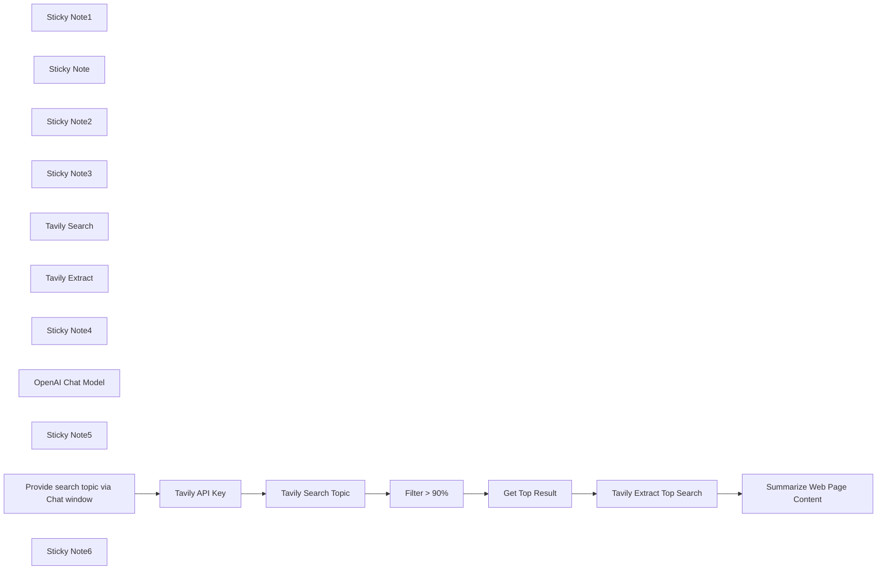

## Fluxo (.json) :

```json
{
  "id": "QqbYH25we4JDZrZD",
  "meta": {
    "instanceId": "31e69f7f4a77bf465b805824e303232f0227212ae922d12133a0f96ffeab4fef"
  },
  "name": "🔍🛠️ Tavily Search & Extract - Template",
  "tags": [],
  "nodes": [
    {
      "id": "e029204b-2e05-4262-b464-7c1b3a995f91",
      "name": "Sticky Note1",
      "type": "n8n-nodes-base.stickyNote",
      "position": [
        -780,
        -940
      ],
      "parameters": {
        "color": 4,
        "width": 520,
        "height": 940,
        "content": "## Tavily API Search Endpoint\n\n**Base URL**: `https://api.tavily.com/search`\n**Method**: POST\n\n### Required Parameters\n- `query`: The search query string\n- `api_key`: Your Tavily API key\n\n### Optional Parameters\n- `search_depth`: \"basic\" or \"advanced\" (default: \"basic\")\n- `topic`: \"general\" or \"news\" (default: \"general\") \n- `max_results`: Maximum number of results to return (default: 5)\n- `include_images`: Include query-related images (default: false)\n- `include_answer`: Include AI-generated answer (default: false)\n- `include_raw_content`: Include parsed HTML content (default: false)\n- `include_domains`: List of domains to include\n- `exclude_domains`: List of domains to exclude\n- `time_range`: Filter by time range (\"day\", \"week\", \"month\", \"year\")\n- `days`: Number of days back for news results (default: 3)\n\n### Example Request\n```json\n{\n    \"api_key\": \"tvly-YOUR_API_KEY\",\n    \"query\": \"Who is Leo Messi?\",\n    \"search_depth\": \"basic\",\n    \"include_answer\": false,\n    \"include_images\": true,\n    \"max_results\": 5\n}\n```\n"
      },
      "typeVersion": 1
    },
    {
      "id": "6c47edec-6c6e-460d-b098-f9a26caa5f8e",
      "name": "Sticky Note",
      "type": "n8n-nodes-base.stickyNote",
      "position": [
        -220,
        -940
      ],
      "parameters": {
        "color": 6,
        "width": 640,
        "height": 720,
        "content": "## Tavily API Extract Endpoint \n\n**Base URL**: `https://api.tavily.com/extract`\n**Method**: POST\n\n### Required Parameters\n- `urls`: Single URL string or array of URLs\n- `api_key`: Your Tavily API key\n\n### Optional Parameters\n- `include_images`: Include extracted images (default: false)\n\n### Example Request\n```json\n{\n    \"api_key\": \"tvly-YOUR_API_KEY\", \n    \"urls\": [\n        \"https://en.wikipedia.org/wiki/Artificial_intelligence\",\n        \"https://en.wikipedia.org/wiki/Machine_learning\"\n    ]\n}\n```"
      },
      "typeVersion": 1
    },
    {
      "id": "cacae1d1-c9ec-4c2f-ba5d-f782257697cc",
      "name": "Sticky Note2",
      "type": "n8n-nodes-base.stickyNote",
      "position": [
        -1240,
        -940
      ],
      "parameters": {
        "color": 3,
        "width": 420,
        "height": 540,
        "content": "## Tavily API Documentation\n\nThe Tavily REST API provides seamless access to Tavily Search, a powerful search engine for LLM agents, and Tavily Extract, an advanced web scraping solution optimized for LLMs.\n\nhttps://docs.tavily.com/docs/rest-api/examples\n\nhttps://docs.tavily.com/docs/rest-api/api-reference#parameters\n\nThe Tavily API provides two main endpoints for search and data extraction.\n\nThe API returns JSON responses containing:\n\n- Search results with titles, URLs, and content\n- Extracted raw content from specified URLs\n- Response time metrics\n- Any error messages for failed requests\n\n\n**Note**: Error handling should check for failed results in the response before processing.\n"
      },
      "typeVersion": 1
    },
    {
      "id": "16e977f4-e72d-474c-a04b-3f3ad51cc322",
      "name": "Sticky Note3",
      "type": "n8n-nodes-base.stickyNote",
      "position": [
        -1240,
        -360
      ],
      "parameters": {
        "width": 420,
        "height": 360,
        "content": "## Tavily Use Cases\n\n📜 Why Use Tavily API for Data Enrichment?\n\nhttps://docs.tavily.com/docs/use-cases/data-enrichment\n\n💡 Why Use Tavily API for Company Research?\n\nhttps://docs.tavily.com/docs/use-cases/company-research\n\n🔍 GPT Researcher\n\nhttps://docs.tavily.com/docs/gpt-researcher/introduction"
      },
      "typeVersion": 1
    },
    {
      "id": "7e4d0b3c-761d-42b9-bbbe-6ceb366fdc6f",
      "name": "Tavily Search",
      "type": "n8n-nodes-base.httpRequest",
      "position": [
        -580,
        -180
      ],
      "parameters": {
        "url": "https://api.tavily.com/search",
        "body": "={\n    \"api_key\": \"tvly-YOUR_API_KEY\",\n    \"query\": \"What is n8n?\",\n    \"search_depth\": \"basic\",\n    \"include_answer\": false,\n    \"include_images\": true,\n    \"include_image_descriptions\": true,\n    \"include_raw_content\": false,\n    \"max_results\": 5,\n    \"include_domains\": [],\n    \"exclude_domains\": []\n}",
        "method": "POST",
        "options": {},
        "sendBody": true,
        "contentType": "raw",
        "rawContentType": "application/json"
      },
      "typeVersion": 4.2
    },
    {
      "id": "47c0bfcf-a187-4b15-b208-2458c934d5f7",
      "name": "Tavily Extract",
      "type": "n8n-nodes-base.httpRequest",
      "position": [
        40,
        -400
      ],
      "parameters": {
        "url": "https://api.tavily.com/extract",
        "body": "={\n    \"api_key\": \"tvly-YOUR_API_KEY\",\n    \"urls\": [\n        \"https://en.wikipedia.org/wiki/Artificial_intelligence\"\n    ]\n}",
        "method": "POST",
        "options": {},
        "sendBody": true,
        "contentType": "raw",
        "rawContentType": "application/json"
      },
      "typeVersion": 4.2
    },
    {
      "id": "47791d39-087b-4104-aa0d-ef98deee945c",
      "name": "Sticky Note4",
      "type": "n8n-nodes-base.stickyNote",
      "position": [
        -1940,
        -1020
      ],
      "parameters": {
        "color": 7,
        "width": 660,
        "height": 1020,
        "content": "## Tavily API Overview\nhttps://docs.tavily.com/docs/welcome\n\nThe Tavily API provides a specialized search engine built specifically for AI agents and LLM applications, offering two main endpoints:\n\n## Search Endpoint\n\nThe search endpoint enables intelligent web searching with:\n\n**Key Features**\n- Query-based search with customizable depth (\"basic\" or \"advanced\")\n- Topic filtering for general or news content\n- Control over result quantity and content type\n- Domain inclusion/exclusion capabilities\n- Time range filtering and news date restrictions\n\n## Extract Endpoint\n\nThe extract endpoint focuses on content retrieval:\n\n**Key Features**\n- Single or batch URL processing\n- Raw content extraction\n- Optional image extraction\n- Structured response format\n\n## Implementation Benefits\n\n**For AI Integration**\n- Optimized for RAG (Retrieval Augmented Generation)\n- Single API call handles searching, scraping and filtering\n- Customizable response formats\n- Built-in content relevance scoring\n\n**Technical Advantages**\n- JSON response format\n- Error handling for failed requests\n- Response time metrics\n- Flexible content filtering options\n\n\nThis API is designed to simplify the integration of real-time web data into AI applications while ensuring high-quality, relevant results through intelligent processing and filtering."
      },
      "typeVersion": 1
    },
    {
      "id": "76b291bc-8c34-44f1-b366-09c9f51089e2",
      "name": "Get Top Result",
      "type": "n8n-nodes-base.set",
      "position": [
        -700,
        140
      ],
      "parameters": {
        "options": {},
        "assignments": {
          "assignments": [
            {
              "id": "a73e848c-f7e7-4b3a-ae99-930c577b47be",
              "name": "results",
              "type": "object",
              "value": "={{ $json.results.first() }}"
            }
          ]
        }
      },
      "typeVersion": 3.4
    },
    {
      "id": "4b098e57-eff2-4e70-9429-23b5c3d936c2",
      "name": "Tavily Extract Top Search",
      "type": "n8n-nodes-base.httpRequest",
      "position": [
        -480,
        140
      ],
      "parameters": {
        "url": "https://api.tavily.com/extract",
        "body": "={\n    \"api_key\": \"{{ $('Tavily API Key').item.json.api_key }}\",\n    \"urls\": [\n        \"{{ $json.results.url }}\"\n    ]\n}",
        "method": "POST",
        "options": {},
        "sendBody": true,
        "contentType": "raw",
        "rawContentType": "application/json"
      },
      "typeVersion": 4.2
    },
    {
      "id": "f593e164-1c9d-46e6-a619-39fe621c829f",
      "name": "Filter > 90%",
      "type": "n8n-nodes-base.set",
      "position": [
        -920,
        140
      ],
      "parameters": {
        "options": {},
        "assignments": {
          "assignments": [
            {
              "id": "8fd0cfc4-7adc-45f9-a278-d217e362ebfb",
              "name": "results",
              "type": "array",
              "value": "={{ $json.results.filter(item => item.score > 0.80) }}"
            }
          ]
        },
        "includeOtherFields": true
      },
      "typeVersion": 3.4
    },
    {
      "id": "fadd100c-0335-42c2-9c3d-48e6d17eb2f9",
      "name": "Tavily Search Topic",
      "type": "n8n-nodes-base.httpRequest",
      "position": [
        -1140,
        140
      ],
      "parameters": {
        "url": "https://api.tavily.com/search",
        "body": "={\n    \"api_key\": \"{{ $json.api_key }}\",\n    \"query\": \"{{ $('Provide search topic via Chat window').item.json.chatInput }}\",\n    \"search_depth\": \"basic\",\n    \"include_answer\": false,\n    \"include_images\": true,\n    \"include_image_descriptions\": true,\n    \"include_raw_content\": false,\n    \"max_results\": 5,\n    \"include_domains\": [],\n    \"exclude_domains\": []\n}",
        "method": "POST",
        "options": {},
        "sendBody": true,
        "contentType": "raw",
        "rawContentType": "application/json"
      },
      "typeVersion": 4.2
    },
    {
      "id": "1bc5a21f-0f96-4951-9c88-0bec00b9c586",
      "name": "OpenAI Chat Model",
      "type": "@n8n/n8n-nodes-langchain.lmChatOpenAi",
      "position": [
        -240,
        300
      ],
      "parameters": {
        "options": {}
      },
      "credentials": {
        "openAiApi": {
          "id": "jEMSvKmtYfzAkhe6",
          "name": "OpenAi account"
        }
      },
      "typeVersion": 1.1
    },
    {
      "id": "994bb3ee-598b-4d3f-bcfc-16c9cca36657",
      "name": "Summarize Web Page Content",
      "type": "@n8n/n8n-nodes-langchain.chainLlm",
      "position": [
        -260,
        140
      ],
      "parameters": {
        "text": "=Summarize this web content and provide in Markdown format:  {{ $json.results[0].raw_content }}",
        "promptType": "define"
      },
      "typeVersion": 1.5
    },
    {
      "id": "d5520da7-f6bc-470e-ab96-e04097041f08",
      "name": "Sticky Note5",
      "type": "n8n-nodes-base.stickyNote",
      "position": [
        -1680,
        40
      ],
      "parameters": {
        "color": 5,
        "width": 1800,
        "height": 400,
        "content": "## Tavily Search and Extract with AI Summarization Example"
      },
      "typeVersion": 1
    },
    {
      "id": "9bd6c18e-aabf-4719-b9c4-ac91b36891a1",
      "name": "Tavily API Key",
      "type": "n8n-nodes-base.set",
      "position": [
        -1360,
        140
      ],
      "parameters": {
        "options": {},
        "assignments": {
          "assignments": [
            {
              "id": "035660a9-bb58-4ecb-bad3-7f4d017fa69f",
              "name": "api_key",
              "type": "string",
              "value": "tvly-YOUR_API_KEY"
            }
          ]
        }
      },
      "typeVersion": 3.4
    },
    {
      "id": "41f36ad7-7a2b-4732-89ec-fe6500768631",
      "name": "Provide search topic via Chat window",
      "type": "@n8n/n8n-nodes-langchain.chatTrigger",
      "position": [
        -1580,
        140
      ],
      "webhookId": "6b8f316b-776e-429a-8699-55f230c3a168",
      "parameters": {
        "options": {}
      },
      "typeVersion": 1.1
    },
    {
      "id": "0213756a-35c4-46a8-9b79-2e8a81852177",
      "name": "Sticky Note6",
      "type": "n8n-nodes-base.stickyNote",
      "position": [
        -1420,
        320
      ],
      "parameters": {
        "color": 7,
        "height": 80,
        "content": "### Tavily API Key\nhttps://app.tavily.com/home"
      },
      "typeVersion": 1
    }
  ],
  "active": false,
  "pinData": {},
  "settings": {
    "executionOrder": "v1"
  },
  "versionId": "e1f22fbb-9663-405c-b7b1-7e8b2d54ad0f",
  "connections": {
    "Filter > 90%": {
      "main": [
        [
          {
            "node": "Get Top Result",
            "type": "main",
            "index": 0
          }
        ]
      ]
    },
    "Get Top Result": {
      "main": [
        [
          {
            "node": "Tavily Extract Top Search",
            "type": "main",
            "index": 0
          }
        ]
      ]
    },
    "Tavily API Key": {
      "main": [
        [
          {
            "node": "Tavily Search Topic",
            "type": "main",
            "index": 0
          }
        ]
      ]
    },
    "OpenAI Chat Model": {
      "ai_languageModel": [
        [
          {
            "node": "Summarize Web Page Content",
            "type": "ai_languageModel",
            "index": 0
          }
        ]
      ]
    },
    "Tavily Search Topic": {
      "main": [
        [
          {
            "node": "Filter > 90%",
            "type": "main",
            "index": 0
          }
        ]
      ]
    },
    "Tavily Extract Top Search": {
      "main": [
        [
          {
            "node": "Summarize Web Page Content",
            "type": "main",
            "index": 0
          }
        ]
      ]
    },
    "Provide search topic via Chat window": {
      "main": [
        [
          {
            "node": "Tavily API Key",
            "type": "main",
            "index": 0
          }
        ]
      ]
    }
  }
}
```

<a id="template-2503"></a>

## Template 2503 - Verificador de blacklist de carteiras TRON via Telegram

- **Nome:** Verificador de blacklist de carteiras TRON via Telegram
- **Descrição:** Permite que usuários verifiquem, via mensagem no Telegram, se uma carteira TRON (USDT) está na lista negra consultando uma API pública.
- **Funcionalidade:** • Receber mensagens pelo Telegram: Inicia a verificação ao receber uma mensagem do usuário.
• Validação do formato da carteira: Verifica se o texto enviado corresponde ao padrão de endereço TRON (começa com 'T' e tem 34 caracteres).
• Consulta à API de blacklist: Envia a carteira para a API pública de blacklist de stablecoins na rede TRON.
• Análise da resposta da API: Interpreta o retorno para determinar se a carteira está ou não listada.
• Envio de resposta ao usuário: Retorna ao usuário uma mensagem informando se a carteira é blacklisted ou não.
• Mensagem de erro para formato inválido: Informa o usuário quando o endereço enviado não está no formato correto.
- **Ferramentas:** • Telegram: Plataforma de mensagens usada para receber solicitações dos usuários e enviar resultados.
• Tronscan API (apilist.tronscanapi.com): Serviço público que fornece informação sobre blacklist de stablecoins na rede TRON.

## Fluxo visual

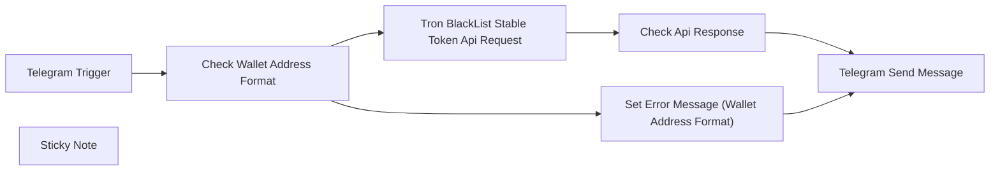

## Fluxo (.json) :

```json
{
  "id": "RMxcTgpFGpE3RdLZ",
  "meta": {
    "instanceId": "1a1a56e303d37d31a273d2dd1d2c6ab5d45185370759d2a4763eabe48f3be2df",
    "templateCredsSetupCompleted": true
  },
  "name": "Telegram Tron Wallet Blacklist Checker",
  "tags": [],
  "nodes": [
    {
      "id": "fbd55c61-91ad-43e7-aa89-c30d14fc3b92",
      "name": "Telegram Trigger",
      "type": "n8n-nodes-base.telegramTrigger",
      "position": [
        -240,
        -40
      ],
      "webhookId": "b384e76e-5f33-452c-b4eb-13a8d5fc377e",
      "parameters": {
        "updates": [
          "message"
        ],
        "additionalFields": {}
      },
      "credentials": {
        "telegramApi": {
          "id": "utGUX9B8SmbwjN5s",
          "name": "Telegram account"
        }
      },
      "typeVersion": 1
    },
    {
      "id": "f7b2d70e-9a5c-4a31-b445-68e9a37cfdb3",
      "name": "Telegram Send Message",
      "type": "n8n-nodes-base.telegram",
      "position": [
        1160,
        -60
      ],
      "webhookId": "4148b55e-c227-491c-8a3a-f9579c604cc3",
      "parameters": {
        "text": "={{ $json.text }}",
        "chatId": "={{ $('Telegram Trigger').item.json.message.from.id }}",
        "additionalFields": {
          "reply_to_message_id": "={{ $('Telegram Trigger').item.json.message.message_id }}"
        }
      },
      "credentials": {
        "telegramApi": {
          "id": "utGUX9B8SmbwjN5s",
          "name": "Telegram account"
        }
      },
      "typeVersion": 1
    },
    {
      "id": "2ed30255-373c-485b-bffe-ab3682ddb3b8",
      "name": "Check Wallet Address Format",
      "type": "n8n-nodes-base.if",
      "position": [
        60,
        -40
      ],
      "parameters": {
        "options": {},
        "conditions": {
          "options": {
            "version": 2,
            "leftValue": "",
            "caseSensitive": true,
            "typeValidation": "strict"
          },
          "combinator": "and",
          "conditions": [
            {
              "id": "bc914e89-d74c-479e-9246-f028a9efe2bc",
              "operator": {
                "type": "string",
                "operation": "regex"
              },
              "leftValue": "={{ $json.message.text }}",
              "rightValue": "T[A-Za-z1-9]{33}"
            }
          ]
        }
      },
      "typeVersion": 2.2
    },
    {
      "id": "8a05f33e-71bd-4053-b182-baf721a3a650",
      "name": "Tron BlackList Stable Token Api Request",
      "type": "n8n-nodes-base.httpRequest",
      "position": [
        380,
        -60
      ],
      "parameters": {
        "url": "=https://apilist.tronscanapi.com/api/stableCoin/blackList?blackAddress={{ $json.message.text }}",
        "options": {}
      },
      "typeVersion": 1
    },
    {
      "id": "f4e89604-4721-45b9-a7e6-57d0d1e77a10",
      "name": "Check Api Response",
      "type": "n8n-nodes-base.code",
      "position": [
        760,
        -60
      ],
      "parameters": {
        "jsCode": "const response = items[0].json;\nlet message;\n\nif (response.total && response.total > 0) {\n  message = `🚨🛑 **This Wallet is Blacklisted!** 🛑🚨: ${response.data[0].blackAddress}`;\n} else {\n  message = `✅💚 **This Wallet is NOT Blacklisted!** 💚✅.`;\n}\n\nreturn [\n  {\n    json: {\n      text: message,\n    },\n  },\n];"
      },
      "typeVersion": 2
    },
    {
      "id": "71e16929-f5f8-4d71-8fa0-d5230e4e7b5a",
      "name": "Set Error Message (Wallet Address Format)",
      "type": "n8n-nodes-base.code",
      "position": [
        600,
        320
      ],
      "parameters": {
        "jsCode": "return [\n  {\n    json: {\n      text: 'Please enter your wallet address correctly and completely.',\n    },\n  },\n];"
      },
      "typeVersion": 2
    },
    {
      "id": "34835c57-19bf-49c2-935c-74deb0c5c3f0",
      "name": "Sticky Note",
      "type": "n8n-nodes-base.stickyNote",
      "position": [
        -340,
        -200
      ],
      "parameters": {
        "color": 4,
        "width": 1760,
        "height": 700,
        "content": "## TRON USDT Blacklist Checker\n**This template checks USDT wallets on the TRON blockchain and queries whether they have been blacklisted.**"
      },
      "typeVersion": 1
    }
  ],
  "active": true,
  "pinData": {},
  "settings": {
    "executionOrder": "v1"
  },
  "versionId": "0595cea0-5444-42aa-a988-5169f29b85b2",
  "connections": {
    "Telegram Trigger": {
      "main": [
        [
          {
            "node": "Check Wallet Address Format",
            "type": "main",
            "index": 0
          }
        ]
      ]
    },
    "Check Api Response": {
      "main": [
        [
          {
            "node": "Telegram Send Message",
            "type": "main",
            "index": 0
          }
        ]
      ]
    },
    "Check Wallet Address Format": {
      "main": [
        [
          {
            "node": "Tron BlackList Stable Token Api Request",
            "type": "main",
            "index": 0
          }
        ],
        [
          {
            "node": "Set Error Message (Wallet Address Format)",
            "type": "main",
            "index": 0
          }
        ]
      ]
    },
    "Tron BlackList Stable Token Api Request": {
      "main": [
        [
          {
            "node": "Check Api Response",
            "type": "main",
            "index": 0
          }
        ]
      ]
    },
    "Set Error Message (Wallet Address Format)": {
      "main": [
        [
          {
            "node": "Telegram Send Message",
            "type": "main",
            "index": 0
          }
        ]
      ]
    }
  },
  "description": "This n8n workflow template allows users to check if a Tron wallet address is blacklisted on the USDT contract via a Telegram bot. When a user sends the command {walletAddress} through the Telegram bot, the workflow queries the Tronscan API to determine if the provided wallet address is blacklisted. The result is then sent back to the user via the Telegram bot."
}
```

<a id="template-2504"></a>

## Template 2504 - Enviar múltiplos arquivos para repositório GitHub

- **Nome:** Enviar múltiplos arquivos para repositório GitHub
- **Descrição:** Automatiza o envio de vários arquivos para um repositório GitHub criando uma nova árvore, gerando um commit e atualizando o branch alvo.
- **Funcionalidade:** • Obter SHA do commit mais recente: recupera a referência do branch para identificar o commit atual.
• Obter SHA da árvore base: busca o commit identificado para extrair a SHA da árvore base utilizada como ponto de partida.
• Criar nova árvore com múltiplos arquivos: constrói uma árvore contendo vários arquivos definidos (caminho, modo, tipo e conteúdo) em uma única operação.
• Criar commit: gera um commit que aponta para a nova árvore, usando uma mensagem configurável e referenciando os pais apropriados.
• Atualizar branch: atualiza a referência do branch para apontar para o novo commit, aplicando a alteração ao repositório.
• Autenticação via token: utiliza um token de acesso pessoal para autorizar chamadas à API e permitir operações de leitura e escrita.
• Parametrização de entradas: permite configurar nome do repositório, branch, mensagem de commit e conteúdos dos arquivos de forma dinâmica.
- **Ferramentas:** • GitHub: plataforma de hospedagem de código e controle de versão onde os arquivos são publicados.
• GitHub REST API: interface para manipular refs, commits e árvores no repositório.
• Personal Access Token (PAT): método de autenticação para permitir operações autenticadas de leitura/escrita no repositório.

## Fluxo visual

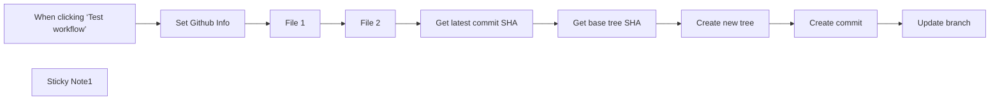

## Fluxo (.json) :

```json
{
  "id": "RtTHLr1SAwIpntKr",
  "meta": {
    "instanceId": "ddfdf733df99a65c801a91865dba5b7c087c95cc22a459ff3647e6deddf2aee6"
  },
  "name": "Push Multiple Files to Github Repo via Github REST API",
  "tags": [],
  "nodes": [
    {
      "id": "f9de827d-6aea-47f9-ac01-bf41e9a41642",
      "name": "Get latest commit SHA",
      "type": "n8n-nodes-base.httpRequest",
      "position": [
        -300,
        180
      ],
      "parameters": {
        "url": "=https://api.github.com/repos/{{ $('Set Github Info').item.json['Github Username'] }}/{{ $('Set Github Info').item.json['Github Repo'] }}/git/refs/heads/{{ $('Set Github Info').item.json['Github Branch'] }}",
        "options": {},
        "sendHeaders": true,
        "headerParameters": {
          "parameters": [
            {
              "name": "Authorization",
              "value": "=Bearer {{ $('Set Github Info').item.json['Github Token'] }}"
            }
          ]
        }
      },
      "typeVersion": 4.2
    },
    {
      "id": "28576f1f-2e41-46fe-9bb3-9e4678bb3f45",
      "name": "Get base tree SHA",
      "type": "n8n-nodes-base.httpRequest",
      "position": [
        -120,
        180
      ],
      "parameters": {
        "url": "=https://api.github.com/repos/{{ $('Set Github Info').item.json['Github Username'] }}/{{ $('Set Github Info').item.json['Github Repo'] }}/git/commits/{{ $json.object.sha }}",
        "options": {},
        "sendHeaders": true,
        "headerParameters": {
          "parameters": [
            {
              "name": "Authorization",
              "value": "=Bearer {{ $('Set Github Info').item.json['Github Token'] }}"
            }
          ]
        }
      },
      "typeVersion": 4.2
    },
    {
      "id": "eb3c7f72-a2bd-4ef2-ae9d-e548746a1260",
      "name": "Create new tree",
      "type": "n8n-nodes-base.httpRequest",
      "position": [
        60,
        180
      ],
      "parameters": {
        "url": "=https://api.github.com/repos/{{ $('Set Github Info').item.json['Github Username'] }}/{{ $('Set Github Info').item.json['Github Repo'] }}/git/trees",
        "method": "POST",
        "options": {},
        "sendBody": true,
        "sendHeaders": true,
        "bodyParameters": {
          "parameters": [
            {
              "name": "base_tree",
              "value": "={{ $json[\"tree\"][\"sha\"] }}"
            },
            {
              "name": "tree[0].path",
              "value": "public/file1.txt"
            },
            {
              "name": "tree[0].mode",
              "value": "100644"
            },
            {
              "name": "tree[0].type",
              "value": "blob"
            },
            {
              "name": "tree[0].content",
              "value": "={{ $('File 1').item.json.content }}"
            },
            {
              "name": "tree[1].path",
              "value": "public/file2.txt"
            },
            {
              "name": "tree[1].mode",
              "value": "100644"
            },
            {
              "name": "tree[1].type",
              "value": "blob"
            },
            {
              "name": "tree[1].content",
              "value": "={{ $('File 2').item.json.content }}"
            }
          ]
        },
        "headerParameters": {
          "parameters": [
            {
              "name": "Authorization",
              "value": "=Bearer {{ $('Set Github Info').item.json['Github Token'] }}"
            },
            {
              "name": "Content-Type",
              "value": "application/json"
            }
          ]
        }
      },
      "typeVersion": 4.2
    },
    {
      "id": "ba76ddd3-844a-4aa1-8a5a-efaa2f228044",
      "name": "Create commit",
      "type": "n8n-nodes-base.httpRequest",
      "position": [
        240,
        180
      ],
      "parameters": {
        "url": "=https://api.github.com/repos/{{ $('Set Github Info').item.json['Github Username'] }}/{{ $('Set Github Info').item.json['Github Repo'] }}/git/commits",
        "method": "POST",
        "options": {},
        "jsonBody": "={\n  \"message\": \"{{ $('Set Github Info').item.json['Github Commit Update Message'] }}\",\n  \"tree\": \"{{ $json.sha }}\",\n  \"parents\": [\"{{ $('Get latest commit SHA').item.json.object.sha }}\"]\n}",
        "sendBody": true,
        "sendHeaders": true,
        "specifyBody": "json",
        "headerParameters": {
          "parameters": [
            {
              "name": "Authorization",
              "value": "=Bearer {{ $('Set Github Info').item.json['Github Token'] }}"
            },
            {
              "name": "Content-Type",
              "value": "application/json"
            }
          ]
        }
      },
      "typeVersion": 4.2
    },
    {
      "id": "3a29539c-dd3f-4092-9d36-84fe9d65c2bf",
      "name": "Update branch",
      "type": "n8n-nodes-base.httpRequest",
      "position": [
        420,
        180
      ],
      "parameters": {
        "url": "=https://api.github.com/repos/{{ $('Set Github Info').item.json['Github Username'] }}/{{ $('Set Github Info').item.json['Github Repo'] }}/git/refs/heads/{{ $('Set Github Info').item.json['Github Branch'] }}",
        "method": "PATCH",
        "options": {},
        "jsonBody": "={\n  \"sha\": \"{{ $json.sha }}\",\n  \"force\": false\n}",
        "sendBody": true,
        "sendHeaders": true,
        "specifyBody": "json",
        "headerParameters": {
          "parameters": [
            {
              "name": "Authorization",
              "value": "=Bearer {{ $('Set Github Info').item.json['Github Token'] }}"
            },
            {
              "name": "Content-Type",
              "value": "application/json"
            }
          ]
        }
      },
      "typeVersion": 4.2
    },
    {
      "id": "891f7a36-a17d-4c32-bd62-e68c8a0ae0a7",
      "name": "When clicking ‘Test workflow’",
      "type": "n8n-nodes-base.manualTrigger",
      "position": [
        -300,
        -60
      ],
      "parameters": {},
      "typeVersion": 1
    },
    {
      "id": "ea97d057-fc19-49cc-a5fb-1ab0adbceacb",
      "name": "Set Github Info",
      "type": "n8n-nodes-base.set",
      "position": [
        -120,
        -60
      ],
      "parameters": {
        "options": {},
        "assignments": {
          "assignments": [
            {
              "id": "c1ba4494-05cf-4c4f-8ec1-283083fbcaa4",
              "name": "Github Token",
              "type": "string",
              "value": "YOUR_GITHUB_PAT_TOKEN"
            },
            {
              "id": "3e65c520-9fcd-442a-adf3-2a0f273b149b",
              "name": "Github Repo",
              "type": "string",
              "value": "YOUR_GITHUB_REPO_NAME"
            },
            {
              "id": "49bf7a21-6fc2-4c8c-a229-1b2f41a4de71",
              "name": "Github Username",
              "type": "string",
              "value": "YOUR_GITHUB_USERNAME"
            },
            {
              "id": "c8cf6bad-5c28-4536-ac16-1442a4fdbd18",
              "name": "Github Branch",
              "type": "string",
              "value": "main"
            },
            {
              "id": "3fea08bc-032e-4194-9fd6-9e4de79e2fcf",
              "name": "Github Commit Update Message",
              "type": "string",
              "value": "Updating file1.txt and file2.txt"
            }
          ]
        }
      },
      "typeVersion": 3.4
    },
    {
      "id": "afd1d74c-7d06-4e49-a906-a9d637ce8600",
      "name": "Sticky Note1",
      "type": "n8n-nodes-base.stickyNote",
      "position": [
        -960,
        -80
      ],
      "parameters": {
        "width": 580,
        "height": 380,
        "content": "## Push Multiple Files to GitHub Repo  \nA streamlined workflow for uploading multiple files to a GitHub repository via the GitHub REST API. This solution addresses a significant limitation of the native GitHub n8n node, which supports only single-file uploads.\n\nThis approach enables batch file operations, making it particularly valuable for automation scenarios that require simultaneous uploads of multiple files to your GitHub repositories.\n\n### Setup Instructions:\n1. Create a new GitHub Personal Access Token [here](https://github.com/settings/personal-access-tokens). In the \"Repository access\" section, select your repository and grant \"Read and write\" permissions under the \"Contents\" category.  \n2. Configure your GitHub information in the \"Set GitHub Info\" node.  \n3. Update the \"Create New Tree\" node with your filenames and content. You can add as many tree entries (files) as needed."
      },
      "typeVersion": 1
    },
    {
      "id": "d282fec1-0fd9-4956-95b4-0437ed67ff03",
      "name": "File 1",
      "type": "n8n-nodes-base.set",
      "position": [
        60,
        -60
      ],
      "parameters": {
        "options": {},
        "assignments": {
          "assignments": [
            {
              "id": "0ddbab7f-7073-4568-9ca5-2b3799d4a87e",
              "name": "content",
              "type": "string",
              "value": "This is the content of your file #1."
            }
          ]
        }
      },
      "typeVersion": 3.4
    },
    {
      "id": "426b3d80-c5af-4029-a4e7-b56b0af7601a",
      "name": "File 2",
      "type": "n8n-nodes-base.set",
      "position": [
        240,
        -60
      ],
      "parameters": {
        "options": {},
        "assignments": {
          "assignments": [
            {
              "id": "0ddbab7f-7073-4568-9ca5-2b3799d4a87e",
              "name": "content",
              "type": "string",
              "value": "This is the content of your file #2."
            }
          ]
        }
      },
      "typeVersion": 3.4
    }
  ],
  "active": false,
  "pinData": {},
  "settings": {
    "executionOrder": "v1"
  },
  "versionId": "2920d785-d42a-4901-b5d9-6929ac62c132",
  "connections": {
    "File 1": {
      "main": [
        [
          {
            "node": "File 2",
            "type": "main",
            "index": 0
          }
        ]
      ]
    },
    "File 2": {
      "main": [
        [
          {
            "node": "Get latest commit SHA",
            "type": "main",
            "index": 0
          }
        ]
      ]
    },
    "Create commit": {
      "main": [
        [
          {
            "node": "Update branch",
            "type": "main",
            "index": 0
          }
        ]
      ]
    },
    "Create new tree": {
      "main": [
        [
          {
            "node": "Create commit",
            "type": "main",
            "index": 0
          }
        ]
      ]
    },
    "Set Github Info": {
      "main": [
        [
          {
            "node": "File 1",
            "type": "main",
            "index": 0
          }
        ]
      ]
    },
    "Get base tree SHA": {
      "main": [
        [
          {
            "node": "Create new tree",
            "type": "main",
            "index": 0
          }
        ]
      ]
    },
    "Get latest commit SHA": {
      "main": [
        [
          {
            "node": "Get base tree SHA",
            "type": "main",
            "index": 0
          }
        ]
      ]
    },
    "When clicking ‘Test workflow’": {
      "main": [
        [
          {
            "node": "Set Github Info",
            "type": "main",
            "index": 0
          }
        ]
      ]
    }
  }
}
```
