# PACK 1999 TEMPLATES PARTE 10 - Bloco 7

Templates neste bloco: 20

## Sumário

- [Template 2510 - Sincronizar músicas curtidas para Downloads](#template-2510)
- [Template 2511 - Transcrição e resumo automático de áudio](#template-2511)
- [Template 2512 - Transformar imagem para estilo LEGO isométrico](#template-2512)
- [Template 2513 - Responder mensagens do Telegram com OpenAI](#template-2513)
- [Template 2514 - Fluxo de pesquisa autônoma com IA](#template-2514)
- [Template 2515 - Responder e enviar mensagens via LINE](#template-2515)
- [Template 2516 - Descrição de imagens via GROQ LLaVA](#template-2516)
- [Template 2517 - Assistente de agenda via Telegram](#template-2517)
- [Template 2518 - Relatório semanal Google Analytics](#template-2518)
- [Template 2519 - Sincronizar contatos Airtable com telli para agendamento de chamadas AI](#template-2519)
- [Template 2520 - Classificador KNN de uso do solo](#template-2520)
- [Template 2521 - Buffer de mensagens do Telegram](#template-2521)
- [Template 2522 - Importar contatos do Pipedrive para HubSpot sem duplicatas](#template-2522)
- [Template 2523 - Onboarding automático de clientes](#template-2523)
- [Template 2524 - Gerador periódico de telemetria de máquina](#template-2524)
- [Template 2525 - Criar posts WordPress a partir de PDF com aprovação humana](#template-2525)
- [Template 2526 - Agente AI para relatório de criadores e workflows](#template-2526)
- [Template 2527 - RAG para base de conhecimento Notion](#template-2527)
- [Template 2528 - Raspagem e análise de reviews do Trustpilot](#template-2528)
- [Template 2529 - Extrator de currículos via Telegram](#template-2529)

---

<a id="template-2510"></a>

## Template 2510 - Sincronizar músicas curtidas para Downloads

- **Nome:** Sincronizar músicas curtidas para Downloads
- **Descrição:** Mantém uma playlist chamada "Downloads" contendo as músicas mais recentes curtidas pelo usuário, adicionando as novas curtidas e removendo as mais antigas para ficar dentro de um limite definido.
- **Funcionalidade:** • Agendamento de atualização: Executa o fluxo periodicamente para manter a playlist atualizada.
• Definição de limite de faixas: Permite configurar quantas músicas a playlist "Downloads" deve conter (limite máximo suportado no setup: 50).
• Busca e verificação da playlist: Procura pela playlist chamada "Downloads" e cria-a automaticamente se não existir.
• Coleta de músicas curtidas mais recentes: Recupera as últimas faixas curtidas pelo usuário até o limite configurado.
• Filtragem de faixas novas: Compara as músicas curtidas com o conteúdo atual da playlist e identifica somente as novas para adicionar.
• Adição de novas faixas no topo: Insere as faixas novas no início da playlist para que as mais recentes fiquem em primeiro lugar.
• Remoção de faixas antigas: Remove as faixas mais antigas da playlist quando a quantidade excede o limite configurado.
• Processamento em lotes: Opera sobre itens em lotes para adicionar e remover faixas de forma controlada.
- **Ferramentas:** • Spotify: Plataforma de streaming utilizada para recuperar as faixas curtidas do usuário, gerenciar playlists (criar, obter, adicionar e remover faixas) via API.


## Fluxo visual

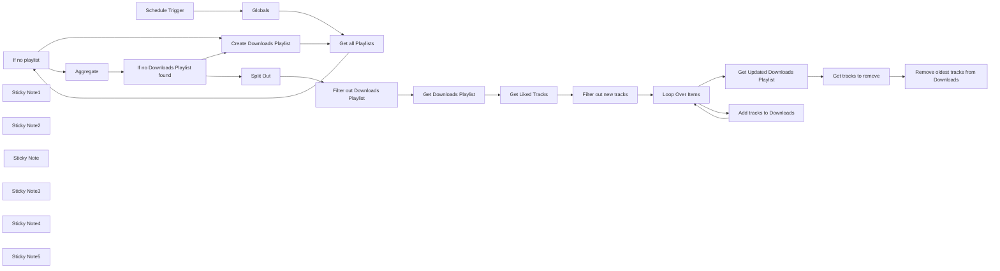

## Fluxo (.json) :

```json
{
  "meta": {
    "instanceId": "84ba6d895254e080ac2b4916d987aa66b000f88d4d919a6b9c76848f9b8a7616",
    "templateId": "2285",
    "templateCredsSetupCompleted": true
  },
  "nodes": [
    {
      "id": "96c1dcb2-1fbe-4be5-b8e3-b5d2626bb5e8",
      "name": "If no playlist",
      "type": "n8n-nodes-base.if",
      "position": [
        1180,
        635.2020978272825
      ],
      "parameters": {
        "options": {},
        "conditions": {
          "options": {
            "leftValue": "",
            "caseSensitive": true,
            "typeValidation": "strict"
          },
          "combinator": "and",
          "conditions": [
            {
              "id": "4cd09fd5-f5bf-4f82-94f4-938e6d6fc1db",
              "operator": {
                "type": "boolean",
                "operation": "true",
                "singleValue": true
              },
              "leftValue": "={{ $json.isEmpty() }}",
              "rightValue": ""
            }
          ]
        }
      },
      "typeVersion": 2
    },
    {
      "id": "d17fdd6c-b998-4d41-9e44-34133577067b",
      "name": "Create Downloads Playlist",
      "type": "n8n-nodes-base.spotify",
      "position": [
        1840,
        435.2020978272825
      ],
      "parameters": {
        "name": "Downloads",
        "resource": "playlist",
        "operation": "create",
        "additionalFields": {}
      },
      "credentials": {
        "spotifyOAuth2Api": {
          "id": "MXfVMBGiR5OTHLNn",
          "name": "Spotify account"
        }
      },
      "typeVersion": 1
    },
    {
      "id": "2250ac0d-5a7c-460c-a9b2-d3b1bcb44ac7",
      "name": "Get Liked Tracks",
      "type": "n8n-nodes-base.spotify",
      "position": [
        2500,
        735.2020978272825
      ],
      "parameters": {
        "limit": "={{ $('Globals').item.json.download_limit }}",
        "resource": "library"
      },
      "credentials": {
        "spotifyOAuth2Api": {
          "id": "MXfVMBGiR5OTHLNn",
          "name": "Spotify account"
        }
      },
      "typeVersion": 1
    },
    {
      "id": "ce3eed87-3d8a-4c37-84b7-7f08dd8d91bb",
      "name": "Loop Over Items",
      "type": "n8n-nodes-base.splitInBatches",
      "position": [
        2960,
        735.2020978272825
      ],
      "parameters": {
        "options": {}
      },
      "typeVersion": 3
    },
    {
      "id": "0d5b326e-7bfa-48b6-a618-083e8e374632",
      "name": "Aggregate",
      "type": "n8n-nodes-base.aggregate",
      "position": [
        1400,
        735.2020978272825
      ],
      "parameters": {
        "options": {},
        "fieldsToAggregate": {
          "fieldToAggregate": [
            {
              "fieldToAggregate": "name"
            },
            {
              "fieldToAggregate": "uri"
            }
          ]
        }
      },
      "typeVersion": 1
    },
    {
      "id": "113305f3-8003-4771-a260-2136d62d45ca",
      "name": "Split Out",
      "type": "n8n-nodes-base.splitOut",
      "position": [
        1840,
        735.2020978272825
      ],
      "parameters": {
        "options": {},
        "fieldToSplitOut": "name, uri"
      },
      "typeVersion": 1
    },
    {
      "id": "8684eaf3-104e-40b6-91b3-738b15f2b361",
      "name": "Add tracks to Downloads",
      "type": "n8n-nodes-base.spotify",
      "position": [
        3220,
        835.2020978272825
      ],
      "parameters": {
        "id": "={{ $('Filter out Downloads Playlist').item.json.uri }}",
        "trackID": "={{ $('Get Liked Tracks').item.json.track.uri }}",
        "resource": "playlist",
        "additionalFields": {
          "position": 0
        }
      },
      "credentials": {
        "spotifyOAuth2Api": {
          "id": "MXfVMBGiR5OTHLNn",
          "name": "Spotify account"
        }
      },
      "typeVersion": 1
    },
    {
      "id": "a9f44907-b324-4a89-b81c-7b514b0a52cb",
      "name": "Get Downloads Playlist",
      "type": "n8n-nodes-base.spotify",
      "position": [
        2280,
        735.2020978272825
      ],
      "parameters": {
        "id": "={{ $json.uri }}",
        "resource": "playlist",
        "operation": "get"
      },
      "credentials": {
        "spotifyOAuth2Api": {
          "id": "MXfVMBGiR5OTHLNn",
          "name": "Spotify account"
        }
      },
      "typeVersion": 1
    },
    {
      "id": "75f69264-9653-46de-a571-f080238d0df1",
      "name": "Filter out new tracks",
      "type": "n8n-nodes-base.code",
      "position": [
        2720,
        735.2020978272825
      ],
      "parameters": {
        "jsCode": "var downloades_uris = [];\nfor (const download of $('Get Downloads Playlist').first().json.tracks.items) {\n  downloades_uris.push(download.track.uri);\n}\n\nvar result = [];\nfor (const item of $input.all()) {\n  if (!downloades_uris.includes(item.json.track.uri)) {\n    result.push(item);\n  }\n}\n\nreturn result.reverse();"
      },
      "typeVersion": 2
    },
    {
      "id": "54fa426a-f37c-4e9a-a817-f31a9e820d76",
      "name": "Get tracks to remove",
      "type": "n8n-nodes-base.code",
      "position": [
        3440,
        640
      ],
      "parameters": {
        "jsCode": "var liked_uris = [];\nfor (const liked of $('Get Liked Tracks').all()) {\n  liked_uris.push(liked.json.track.uri);\n}\n\nvar result = [];\nfor (const item of $input.first().json.tracks.items) {\n  if (!liked_uris.includes(item.track.uri)) {\n    result.push(item);\n  }\n}\n\nreturn result;"
      },
      "executeOnce": true,
      "typeVersion": 2
    },
    {
      "id": "3368ac49-64bc-4c51-8796-0fb5843ad899",
      "name": "Remove oldest tracks from Downloads",
      "type": "n8n-nodes-base.spotify",
      "position": [
        3660,
        635.2020978272825
      ],
      "parameters": {
        "id": "={{ $('Get Downloads Playlist').item.json.uri }}",
        "trackID": "={{ $json.track.uri }}",
        "resource": "playlist",
        "operation": "delete"
      },
      "credentials": {
        "spotifyOAuth2Api": {
          "id": "MXfVMBGiR5OTHLNn",
          "name": "Spotify account"
        }
      },
      "typeVersion": 1
    },
    {
      "id": "6ba744e0-f925-4901-8a01-b6da9c6b9e61",
      "name": "Filter out Downloads Playlist",
      "type": "n8n-nodes-base.filter",
      "position": [
        2060,
        735.2020978272825
      ],
      "parameters": {
        "options": {},
        "conditions": {
          "options": {
            "leftValue": "",
            "caseSensitive": true,
            "typeValidation": "strict"
          },
          "combinator": "and",
          "conditions": [
            {
              "id": "04fec444-230c-4b55-a887-d4dd290c99ee",
              "operator": {
                "name": "filter.operator.equals",
                "type": "string",
                "operation": "equals"
              },
              "leftValue": "={{ $json.name }}",
              "rightValue": "Downloads"
            }
          ]
        }
      },
      "typeVersion": 2
    },
    {
      "id": "d1a583cb-1c60-44f3-9111-755805e81bf1",
      "name": "Get Updated Downloads Playlist",
      "type": "n8n-nodes-base.spotify",
      "position": [
        3220,
        635.2020978272825
      ],
      "parameters": {
        "id": "={{ $('Filter out Downloads Playlist').item.json.uri }}",
        "resource": "playlist",
        "operation": "get"
      },
      "credentials": {
        "spotifyOAuth2Api": {
          "id": "MXfVMBGiR5OTHLNn",
          "name": "Spotify account"
        }
      },
      "executeOnce": true,
      "typeVersion": 1
    },
    {
      "id": "1f976308-b9db-4c59-8321-582a84c45374",
      "name": "Get all Playlists",
      "type": "n8n-nodes-base.spotify",
      "position": [
        960,
        635.2020978272825
      ],
      "parameters": {
        "resource": "playlist",
        "operation": "getUserPlaylists",
        "returnAll": true
      },
      "credentials": {
        "spotifyOAuth2Api": {
          "id": "MXfVMBGiR5OTHLNn",
          "name": "Spotify account"
        }
      },
      "typeVersion": 1,
      "alwaysOutputData": true
    },
    {
      "id": "c715d18a-981f-4cfa-b3ca-3ee9753ef7ca",
      "name": "Schedule Trigger",
      "type": "n8n-nodes-base.scheduleTrigger",
      "position": [
        460,
        635.2020978272825
      ],
      "parameters": {
        "rule": {
          "interval": [
            {}
          ]
        }
      },
      "typeVersion": 1.2
    },
    {
      "id": "b3afc8a7-39dc-429a-b440-8d2394ab528e",
      "name": "Sticky Note1",
      "type": "n8n-nodes-base.stickyNote",
      "position": [
        640,
        475.2020978272825
      ],
      "parameters": {
        "width": 251.77358490566033,
        "height": 334.6415094339622,
        "content": "## Set Globals\nDefine the `download_limit` of how many songs should be kept in the Downloads playlist.\n*This setup currently supports a maximum of 50.*"
      },
      "typeVersion": 1
    },
    {
      "id": "1867b7d6-771c-4915-b8ef-227b3ad21c09",
      "name": "Sticky Note2",
      "type": "n8n-nodes-base.stickyNote",
      "position": [
        380,
        475.2020978272825
      ],
      "parameters": {
        "width": 251.77358490566033,
        "height": 334.6415094339622,
        "content": "## Setup Trigger\nDefine the update interval. By default the playlist gets updated ones a day."
      },
      "typeVersion": 1
    },
    {
      "id": "3f48a599-e41f-42ec-94c3-03315039612b",
      "name": "Sticky Note",
      "type": "n8n-nodes-base.stickyNote",
      "position": [
        380,
        240
      ],
      "parameters": {
        "color": 5,
        "width": 511.919459860262,
        "height": 227.98938005910577,
        "content": "## Information\nThis workflow automatically creates a playlist in Spotify named \"Downloads\". It keeps a list of a defined amount of the latest liked songs up to date.\n\nThis enables only the Downloads playlist to set for automatic downloading and thus free up space on the device.\n\n**Beware that it can take several minutes until a newly created Spotify developer app is fully functioning.**"
      },
      "typeVersion": 1
    },
    {
      "id": "6b101255-c9ef-407c-9cf4-d9afde6d8613",
      "name": "Sticky Note3",
      "type": "n8n-nodes-base.stickyNote",
      "position": [
        900,
        395.2020978272825
      ],
      "parameters": {
        "color": 7,
        "width": 1535.0943396226407,
        "height": 509.28301886792553,
        "content": "Get the \"Downloads\" playlist by name. Create it, if it does not exist."
      },
      "typeVersion": 1
    },
    {
      "id": "ae08fb14-34e5-454f-95f7-5de3a17dc6f7",
      "name": "Sticky Note4",
      "type": "n8n-nodes-base.stickyNote",
      "position": [
        2440,
        655.2020978272825
      ],
      "parameters": {
        "color": 7,
        "width": 435.1879320261786,
        "height": 247.95572576973242,
        "content": "Get all latest liked songs and check whether they already exist in the Downloads playlist."
      },
      "typeVersion": 1
    },
    {
      "id": "5603cad0-6b4d-479c-89e4-af0c950a95c3",
      "name": "Sticky Note5",
      "type": "n8n-nodes-base.stickyNote",
      "position": [
        2880,
        575.2020978272825
      ],
      "parameters": {
        "color": 7,
        "width": 955.93368580286,
        "height": 452.51466620839244,
        "content": "Add new tracks to the Downloads playlist. Remove tracks if they exceed the defined limit."
      },
      "typeVersion": 1
    },
    {
      "id": "6c40ce51-3361-4baf-b81e-b6e9b94a0a1c",
      "name": "If no Downloads Playlist found",
      "type": "n8n-nodes-base.if",
      "position": [
        1620,
        735.2020978272825
      ],
      "parameters": {
        "options": {},
        "conditions": {
          "options": {
            "leftValue": "",
            "caseSensitive": true,
            "typeValidation": "strict"
          },
          "combinator": "and",
          "conditions": [
            {
              "id": "faf80ff7-8870-4f2e-94c0-998535caeac4",
              "operator": {
                "type": "array",
                "operation": "notContains",
                "rightType": "any"
              },
              "leftValue": "={{ $json.name }}",
              "rightValue": "Downloads"
            }
          ]
        }
      },
      "typeVersion": 2
    },
    {
      "id": "637e0927-387f-46f9-8402-f87300f1fb6d",
      "name": "Globals",
      "type": "n8n-nodes-base.set",
      "position": [
        720,
        640
      ],
      "parameters": {
        "options": {},
        "assignments": {
          "assignments": [
            {
              "id": "077181f9-80b9-40c2-81db-69d49376da7d",
              "name": "download_limit",
              "type": "number",
              "value": 50
            }
          ]
        }
      },
      "typeVersion": 3.3
    }
  ],
  "pinData": {},
  "connections": {
    "Globals": {
      "main": [
        [
          {
            "node": "Get all Playlists",
            "type": "main",
            "index": 0
          }
        ]
      ]
    },
    "Aggregate": {
      "main": [
        [
          {
            "node": "If no Downloads Playlist found",
            "type": "main",
            "index": 0
          }
        ]
      ]
    },
    "Split Out": {
      "main": [
        [
          {
            "node": "Filter out Downloads Playlist",
            "type": "main",
            "index": 0
          }
        ]
      ]
    },
    "If no playlist": {
      "main": [
        [
          {
            "node": "Create Downloads Playlist",
            "type": "main",
            "index": 0
          }
        ],
        [
          {
            "node": "Aggregate",
            "type": "main",
            "index": 0
          }
        ]
      ]
    },
    "Loop Over Items": {
      "main": [
        [
          {
            "node": "Get Updated Downloads Playlist",
            "type": "main",
            "index": 0
          }
        ],
        [
          {
            "node": "Add tracks to Downloads",
            "type": "main",
            "index": 0
          }
        ]
      ]
    },
    "Get Liked Tracks": {
      "main": [
        [
          {
            "node": "Filter out new tracks",
            "type": "main",
            "index": 0
          }
        ]
      ]
    },
    "Schedule Trigger": {
      "main": [
        [
          {
            "node": "Globals",
            "type": "main",
            "index": 0
          }
        ]
      ]
    },
    "Get all Playlists": {
      "main": [
        [
          {
            "node": "If no playlist",
            "type": "main",
            "index": 0
          }
        ]
      ]
    },
    "Get tracks to remove": {
      "main": [
        [
          {
            "node": "Remove oldest tracks from Downloads",
            "type": "main",
            "index": 0
          }
        ]
      ]
    },
    "Filter out new tracks": {
      "main": [
        [
          {
            "node": "Loop Over Items",
            "type": "main",
            "index": 0
          }
        ]
      ]
    },
    "Get Downloads Playlist": {
      "main": [
        [
          {
            "node": "Get Liked Tracks",
            "type": "main",
            "index": 0
          }
        ]
      ]
    },
    "Add tracks to Downloads": {
      "main": [
        [
          {
            "node": "Loop Over Items",
            "type": "main",
            "index": 0
          }
        ]
      ]
    },
    "Create Downloads Playlist": {
      "main": [
        [
          {
            "node": "Get all Playlists",
            "type": "main",
            "index": 0
          }
        ]
      ]
    },
    "Filter out Downloads Playlist": {
      "main": [
        [
          {
            "node": "Get Downloads Playlist",
            "type": "main",
            "index": 0
          }
        ]
      ]
    },
    "Get Updated Downloads Playlist": {
      "main": [
        [
          {
            "node": "Get tracks to remove",
            "type": "main",
            "index": 0
          }
        ]
      ]
    },
    "If no Downloads Playlist found": {
      "main": [
        [
          {
            "node": "Create Downloads Playlist",
            "type": "main",
            "index": 0
          }
        ],
        [
          {
            "node": "Split Out",
            "type": "main",
            "index": 0
          }
        ]
      ]
    }
  }
}
```

<a id="template-2511"></a>

## Template 2511 - Transcrição e resumo automático de áudio

- **Nome:** Transcrição e resumo automático de áudio
- **Descrição:** Fluxo que detecta arquivos de áudio, transcreve com IA, gera resumos estruturados e salva os resultados no Google Drive, além de notificar usuários.
- **Funcionalidade:** • Detecção de novos áudios: Observa uma pasta específica e inicia o processo quando há novos arquivos.
• Aprovação humana opcional: Envia um e-mail para solicitação de aprovação antes de prosseguir com a transcrição.
• Busca e download de arquivo: Localiza arquivos na pasta de gravações e baixa o áudio para processamento.
• Filtragem por extensão: Filtra arquivos por tipo (.m4a) e limita para o arquivo mais recente.
• Transcrição com IA: Envia o áudio para um serviço de IA para obter a transcrição textual.
• Geração de sumário estruturado: Cria um relatório em JSON com resumo, principais pontos, ações e outras seções analíticas.
• Conversão para Markdown: Transforma o resumo/JSON em um documento Markdown legível.
• Salvamento de arquivos: Salva o JSON estruturado, o Markdown gerado e a transcrição bruta no Google Drive com nomes contendo metadados e timestamp.
• Recuperação de metadados: Obtém links de visualização e metadados dos arquivos criados para compartilhamento.
• Preparação e envio de notificações: Junta os caminhos/resultados e envia mensagens por e-mail (HTML) e Telegram para informar o usuário.
- **Ferramentas:** • Google Drive: Armazenamento e gerenciamento dos arquivos de áudio, transcrições e relatórios.
• OpenAI (modelos de IA): Transcrição de áudio e geração de resumos estruturados e conversão para Markdown/HTML.
• Gmail: Envio de solicitações de aprovação e notificações por e-mail em HTML.
• Telegram: Envio de notificações rápidas com links para os relatórios gerados.

## Fluxo visual

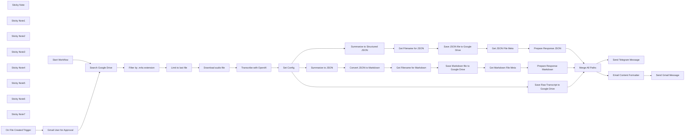

## Fluxo (.json) :

```json
{
  "id": "CNOMivCLJRGfZnUM",
  "meta": {
    "instanceId": "31e69f7f4a77bf465b805824e303232f0227212ae922d12133a0f96ffeab4fef",
    "templateCredsSetupCompleted": true
  },
  "name": "🦜✨Use OpenAI to Transcribe Audio + Summarize with AI + Save to Google Drive",
  "tags": [],
  "nodes": [
    {
      "id": "3918995a-a587-40c1-828c-97e75b988a9f",
      "name": "Gmail User for Approval",
      "type": "n8n-nodes-base.gmail",
      "disabled": true,
      "position": [
        360,
        -20
      ],
      "webhookId": "c46cf421-ddb6-45a8-b83b-80b381666f0e",
      "parameters": {
        "sendTo": "={{ $env.EMAIL_ADDRESS_JOE }} ",
        "message": "=A new was just created in the Audio Recordings folder on Google Drive.  Would you like to continue the workflow and Transcribe the audio file and generate reports.",
        "options": {
          "limitWaitTime": {
            "values": {
              "resumeUnit": "minutes",
              "resumeAmount": 45
            }
          }
        },
        "subject": "=💡New Audio File Created - Approve Transcription Service",
        "operation": "sendAndWait",
        "approvalOptions": {
          "values": {
            "approvalType": "double"
          }
        }
      },
      "credentials": {
        "gmailOAuth2": {
          "id": "1xpVDEQ1yx8gV022",
          "name": "Gmail account"
        }
      },
      "typeVersion": 2.1
    },
    {
      "id": "44aa6e99-9b4a-4af4-93e3-4b1a50fc7628",
      "name": "Sticky Note",
      "type": "n8n-nodes-base.stickyNote",
      "position": [
        -320,
        680
      ],
      "parameters": {
        "color": 3,
        "width": 260,
        "height": 280,
        "content": "## 3️⃣ Transcribe Audio"
      },
      "typeVersion": 1
    },
    {
      "id": "cbf765b5-b888-4e22-b4a2-1d430b557109",
      "name": "Set Config",
      "type": "n8n-nodes-base.set",
      "position": [
        0,
        780
      ],
      "parameters": {
        "options": {},
        "assignments": {
          "assignments": [
            {
              "id": "2f5cef95-a26b-46ff-ab9a-501187ce4211",
              "name": "text",
              "type": "string",
              "value": "={{ $json.text }}"
            },
            {
              "id": "ac623698-1263-4b83-8c59-159863d950b9",
              "name": "datetime",
              "type": "string",
              "value": "={{ $now }}"
            }
          ]
        }
      },
      "typeVersion": 3.4
    },
    {
      "id": "bd9cd4aa-6afc-4875-a487-df4f0d3a4a29",
      "name": "Transcribe with OpenAI",
      "type": "@n8n/n8n-nodes-langchain.openAi",
      "position": [
        -240,
        780
      ],
      "parameters": {
        "options": {},
        "resource": "audio",
        "operation": "transcribe"
      },
      "credentials": {
        "openAiApi": {
          "id": "jEMSvKmtYfzAkhe6",
          "name": "OpenAi account"
        }
      },
      "typeVersion": 1
    },
    {
      "id": "4d91f6f7-a89e-44d9-9433-4d9a1df368a2",
      "name": "Sticky Note1",
      "type": "n8n-nodes-base.stickyNote",
      "position": [
        180,
        580
      ],
      "parameters": {
        "color": 5,
        "width": 1560,
        "height": 280,
        "content": "## 4️⃣ Process Transcript and Generate Structured JSON Report"
      },
      "typeVersion": 1
    },
    {
      "id": "64421d13-0aff-46f8-bf3e-5fac89ec9c46",
      "name": "Sticky Note2",
      "type": "n8n-nodes-base.stickyNote",
      "position": [
        180,
        900
      ],
      "parameters": {
        "color": 6,
        "width": 1560,
        "height": 280,
        "content": "## 5️⃣ Process Transcript and Generate Structured JSON -> Markdown Report"
      },
      "typeVersion": 1
    },
    {
      "id": "769ca5a4-2a54-4ed8-85af-4359b97755bc",
      "name": "Sticky Note3",
      "type": "n8n-nodes-base.stickyNote",
      "position": [
        1000,
        1220
      ],
      "parameters": {
        "color": 2,
        "width": 460,
        "height": 280,
        "content": "## 6️⃣ Save Raw Transcript to Google Drive"
      },
      "typeVersion": 1
    },
    {
      "id": "aa612f37-f7cd-4cf7-919c-87564f03eef1",
      "name": "Sticky Note4",
      "type": "n8n-nodes-base.stickyNote",
      "position": [
        -100,
        240
      ],
      "parameters": {
        "color": 4,
        "width": 300,
        "height": 300,
        "content": "## 1️⃣ Start Transcription Service"
      },
      "typeVersion": 1
    },
    {
      "id": "1e520267-6275-4d07-bba8-9ebaf0afbc68",
      "name": "Sticky Note5",
      "type": "n8n-nodes-base.stickyNote",
      "position": [
        -100,
        -140
      ],
      "parameters": {
        "width": 700,
        "height": 340,
        "content": "## Wait for Google Drive Trigger and Send for User Approval to Proceed (Human in the Loop)\n(optional)"
      },
      "typeVersion": 1
    },
    {
      "id": "1f07fa9c-ecfc-4534-a0b2-569eca1a3092",
      "name": "Sticky Note6",
      "type": "n8n-nodes-base.stickyNote",
      "position": [
        680,
        240
      ],
      "parameters": {
        "color": 2,
        "width": 880,
        "height": 300,
        "content": "## 2️⃣ Search and Download Audio File from Google Drive\n💡Note:  Adjust Filter and Limit settings for your needs"
      },
      "typeVersion": 1
    },
    {
      "id": "b769d523-6b1f-45f2-98b1-4d0f8eb2d7f4",
      "name": "Filter by .m4a extension",
      "type": "n8n-nodes-base.filter",
      "position": [
        980,
        340
      ],
      "parameters": {
        "options": {
          "ignoreCase": true
        },
        "conditions": {
          "options": {
            "version": 2,
            "leftValue": "",
            "caseSensitive": false,
            "typeValidation": "loose"
          },
          "combinator": "and",
          "conditions": [
            {
              "id": "420e1a9c-2145-4845-b4b0-31a82855a78c",
              "operator": {
                "type": "string",
                "operation": "endsWith"
              },
              "leftValue": "={{ $json.name }}",
              "rightValue": ".m4a"
            }
          ]
        },
        "looseTypeValidation": true
      },
      "typeVersion": 2.2
    },
    {
      "id": "5a67182e-4f13-4b6f-a3e2-863e18af31b0",
      "name": "Limit to last file",
      "type": "n8n-nodes-base.limit",
      "position": [
        1180,
        340
      ],
      "parameters": {
        "keep": "lastItems"
      },
      "typeVersion": 1
    },
    {
      "id": "f42b4efc-6e04-49a1-8bd8-252ebd3dbf42",
      "name": "Download audio file",
      "type": "n8n-nodes-base.googleDrive",
      "position": [
        1380,
        340
      ],
      "parameters": {
        "fileId": {
          "__rl": true,
          "mode": "id",
          "value": "={{ $json.id }}"
        },
        "options": {},
        "operation": "download"
      },
      "credentials": {
        "googleDriveOAuth2Api": {
          "id": "UhdXGYLTAJbsa0xX",
          "name": "Google Drive account"
        }
      },
      "typeVersion": 3
    },
    {
      "id": "4313e19f-ca7a-4982-b3b4-1680c674e696",
      "name": "Search Google Drive",
      "type": "n8n-nodes-base.googleDrive",
      "position": [
        780,
        340
      ],
      "parameters": {
        "filter": {
          "folderId": {
            "__rl": true,
            "mode": "list",
            "value": "1Wqd4zEEb847gFYKoDBbNnXsWEc-kCAm2",
            "cachedResultUrl": "https://drive.google.com/drive/folders/1Wqd4zEEb847gFYKoDBbNnXsWEc-kCAm2",
            "cachedResultName": "Audio Recordings"
          },
          "whatToSearch": "files"
        },
        "options": {},
        "resource": "fileFolder"
      },
      "credentials": {
        "googleDriveOAuth2Api": {
          "id": "UhdXGYLTAJbsa0xX",
          "name": "Google Drive account"
        }
      },
      "typeVersion": 3
    },
    {
      "id": "e25655b0-9d30-40d4-9051-bffe38fb41e0",
      "name": "Sticky Note7",
      "type": "n8n-nodes-base.stickyNote",
      "position": [
        2020,
        700
      ],
      "parameters": {
        "width": 660,
        "height": 480,
        "content": "## 7️⃣ Send Transcription Report Links to User"
      },
      "typeVersion": 1
    },
    {
      "id": "38ff9906-41af-430a-9de9-0500577826a5",
      "name": "Send Telegram Message",
      "type": "n8n-nodes-base.telegram",
      "position": [
        2460,
        980
      ],
      "webhookId": "bb40ede7-03cf-493d-b051-196b96725925",
      "parameters": {
        "text": "=Audio Transcribed and Reports Generated\n{{ $json.id_json.webViewLink }}\n{{ $json.id_markdown.webViewLink }}",
        "chatId": "={{ $env.TELEGRAM_CHAT_ID }}",
        "additionalFields": {
          "parse_mode": "HTML",
          "appendAttribution": false
        }
      },
      "credentials": {
        "telegramApi": {
          "id": "pAIFhguJlkO3c7aQ",
          "name": "Telegram account"
        }
      },
      "typeVersion": 1.2
    },
    {
      "id": "5b6aedaa-897f-4b76-84d8-3ca18d06cc5c",
      "name": "Send Gmail Message",
      "type": "n8n-nodes-base.gmail",
      "position": [
        2460,
        800
      ],
      "webhookId": "0a81b95a-cd82-465d-8450-cf38518a4cbb",
      "parameters": {
        "sendTo": "={{ $env.EMAIL_ADDRESS_JOE }} ",
        "message": "={{ $json.message.content }}",
        "options": {
          "appendAttribution": false
        },
        "subject": "Audio Transcribed and Reports Generated"
      },
      "credentials": {
        "gmailOAuth2": {
          "id": "1xpVDEQ1yx8gV022",
          "name": "Gmail account"
        }
      },
      "typeVersion": 2.1
    },
    {
      "id": "4500efdb-7a70-40da-97b6-e4668af21a19",
      "name": "Email Content Formatter",
      "type": "@n8n/n8n-nodes-langchain.openAi",
      "position": [
        2100,
        800
      ],
      "parameters": {
        "modelId": {
          "__rl": true,
          "mode": "list",
          "value": "gpt-4o-mini",
          "cachedResultName": "GPT-4O-MINI"
        },
        "options": {},
        "messages": {
          "values": [
            {
              "content": "=Prapare this HTML template using the following: \n{{ $json.id_json.toJsonString() }}\n{{ $json.id_markdown.toJsonString() }}\n\nEnsure that the 'webViewLink' is always provided.\n\nRespond only with HTML and avoid any preamble or further explanation.  Remove all ``` or ```html from final response.\n\n<style type=\"text/css\">\n    /* Reset styles */\n    body { margin: 0; padding: 0; font-family: -apple-system, BlinkMacSystemFont, 'Segoe UI', Roboto, sans-serif; }\n    .wrapper { max-width: 600px; margin: 0 auto; }\n    .content { padding: 30px; line-height: 1.6; color: #333333; }\n    .divider { border-top: 1px solid #eeeeee; margin: 25px 0; }\n    .button { display: inline-block; padding: 12px 24px; background-color: #2563eb; color: white; text-decoration: none; border-radius: 6px; }\n</style>\n</head>\n<body>\n    <div class=\"wrapper\">\n        <div class=\"content\">\n            <h2 style=\"color: #1f2937; margin-bottom: 20px;\">Your Documents</h2>\n            \n            <div style=\"margin-bottom: 30px;\">\n                <h3 style=\"color: #374151; margin-bottom: 12px;\">[name]</h3>\n                <a href=\"[webViewLink]\" class=\"button\" style=\"color: white;\">View Document</a>\n            </div>\n\n            <div class=\"divider\"></div>\n\n            [continue the pattern ...]\n\n        </div>\n    </div>\n</body>"
            },
            {
              "role": "system"
            }
          ]
        }
      },
      "credentials": {
        "openAiApi": {
          "id": "jEMSvKmtYfzAkhe6",
          "name": "OpenAi account"
        }
      },
      "typeVersion": 1
    },
    {
      "id": "287fcc26-69be-43d8-a855-c57658e92ac4",
      "name": "Summarize to Structured JSON",
      "type": "@n8n/n8n-nodes-langchain.openAi",
      "position": [
        240,
        660
      ],
      "parameters": {
        "modelId": {
          "__rl": true,
          "mode": "list",
          "value": "gpt-4o-mini",
          "cachedResultName": "GPT-4O-MINI"
        },
        "options": {},
        "messages": {
          "values": [
            {
              "content": "=\"Today is \" {{ $now }}  \"Transcript: \" {{  $json.text }}"
            },
            {
              "role": "system",
              "content": "## ROLE\nYou are an expert at summarizing long transcripts.\n\n## TASK\nSummarize the provided transcript into a structured JSON format.\n\n## RULES\nReturn only valid JSON in this example format:\n\"transcript_report\": {\n\"title\": \"Notion Buttons\",\n\"summary\": \"A collection of buttons for Notion\",\n\"main_points\": [\"item 1\", \"item 2\", \"item 3\"],\n\"action_items\": [\"item 1\", \"item 2\", \"item 3\"],\n\"follow_up\": [\"item 1\", \"item 2\", \"item 3\"],\n\"stories\": [\"item 1\", \"item 2\", \"item 3\"],\n\"references\": [\"item 1\", \"item 2\", \"item 3\"],\n\"arguments\": [\"item 1\", \"item 2\", \"item 3\"],\n\"related_topics\": [\"item 1\", \"item 2\", \"item 3\"],\n\"sentiment\": \"positive\"\n}"
            }
          ]
        },
        "jsonOutput": true
      },
      "credentials": {
        "openAiApi": {
          "id": "jEMSvKmtYfzAkhe6",
          "name": "OpenAi account"
        }
      },
      "typeVersion": 1
    },
    {
      "id": "7b5b751f-a7fa-4983-a0e4-1a79e5c4286c",
      "name": "Summarize to JSON",
      "type": "@n8n/n8n-nodes-langchain.openAi",
      "position": [
        240,
        980
      ],
      "parameters": {
        "modelId": {
          "__rl": true,
          "mode": "list",
          "value": "gpt-4o-mini",
          "cachedResultName": "GPT-4O-MINI"
        },
        "options": {},
        "messages": {
          "values": [
            {
              "content": "=Transcript: {{  $json.text }}"
            },
            {
              "role": "system",
              "content": "=## ROLE: Expert Transcript Analyst\n**Current Date:** {{ $now }}\n**Specialization:** Technical documentation, executive reporting, and information architecture\n\n\n## TASK: Create Structured Transcript Summary\nTransform verbose transcripts into well-organized technical documents using this 3-step process:\n1. Extract key information\n2. Identify natural thematic groupings\n3. Structure for optimal scannability\n\n\n## FORMAT REQUIREMENTS\n[Document Title] - {{ $now }}\n\nExecutive Summary (3-5 sentences)\n- Core purpose of discussion\n- Key decision points\n- Actionable outcomes\n\nDetailed Analysis\n[Topic 1: Clear Section Name]\n- Key statements\n- Supporting data points\n- Action items\n\n[Topic 2: Specific Category]\n-Decision rationale\n-Contradictions/agreements\n-Follow-up requirements\n\n(...continue pattern...)\n\nAdditional Observations\n- Unresolved questions\n- Technical terminology glossary\n- Participant sentiment trends\n\n\n## RULES\n1. **Content Fidelity**\n   - Never add external knowledge\n   - Preserve quantitative data exactly\n   - Maintain speaker intent through paraphrasing\n\n2. **Structural Requirements**\n   - Use H2/H3 headers only\n   - Apply consistent tense (prefer present)\n   - Include timestamps for critical points [00:00]\n\n3. **Style Guidelines**\n   - Technical > conversational tone\n   - Active voice required\n   - Bullet points for lists\n   - **Bold** key decisions\n\n4. **Validation**\n   - Self-check for topic overlap\n   - Verify chronological accuracy\n   - Confirm all action items are highlighted"
            }
          ]
        },
        "jsonOutput": true
      },
      "credentials": {
        "openAiApi": {
          "id": "jEMSvKmtYfzAkhe6",
          "name": "OpenAi account"
        }
      },
      "typeVersion": 1
    },
    {
      "id": "e92d8de3-8287-4ecd-9ca6-6f8d18b8942e",
      "name": "Convert JSON to Markdown",
      "type": "@n8n/n8n-nodes-langchain.openAi",
      "position": [
        620,
        980
      ],
      "parameters": {
        "modelId": {
          "__rl": true,
          "mode": "list",
          "value": "gpt-4o-mini",
          "cachedResultName": "GPT-4O-MINI"
        },
        "options": {},
        "messages": {
          "values": [
            {
              "content": "=Today is: {{ $now }}\nTranscript: {{ $json.message.content.toJsonString() }}"
            },
            {
              "role": "system",
              "content": "Convert this transcript summary to a markdown document.  Only respond with text and remove all ``` or ```markdown."
            }
          ]
        }
      },
      "credentials": {
        "openAiApi": {
          "id": "jEMSvKmtYfzAkhe6",
          "name": "OpenAi account"
        }
      },
      "typeVersion": 1
    },
    {
      "id": "419e050f-3a9b-4fc0-99f2-2e478f080e06",
      "name": "Get Filename for JSON",
      "type": "n8n-nodes-base.set",
      "position": [
        980,
        660
      ],
      "parameters": {
        "options": {},
        "assignments": {
          "assignments": [
            {
              "id": "a0c31c80-87c9-41e5-ae07-8639bf52870c",
              "name": "filename",
              "type": "string",
              "value": "={{ $('Download audio file').item.json.id }}-{{ $('Download audio file').item.json.name }}-{{ $('Set Config').item.json.datetime }}.json"
            }
          ]
        }
      },
      "typeVersion": 3.4
    },
    {
      "id": "1307431e-80ea-404c-925f-d3ad5bdaa27c",
      "name": "Get Filename for Markdown",
      "type": "n8n-nodes-base.set",
      "position": [
        980,
        980
      ],
      "parameters": {
        "options": {},
        "assignments": {
          "assignments": [
            {
              "id": "a0c31c80-87c9-41e5-ae07-8639bf52870c",
              "name": "filename",
              "type": "string",
              "value": "={{ $('Download audio file').item.json.id }} - {{ $('Download audio file').item.json.name }}- {{ $('Set Config').item.json.datetime }}.md"
            }
          ]
        }
      },
      "typeVersion": 3.4
    },
    {
      "id": "c87a9dcb-3edb-47ba-a059-6e7a6c63c287",
      "name": "Save JSON file to Google Drive",
      "type": "n8n-nodes-base.googleDrive",
      "position": [
        1180,
        660
      ],
      "parameters": {
        "name": "={{ $json.filename }}",
        "content": "={{ $('Summarize to Structured JSON').item.json.message.content.toJsonString() }}",
        "driveId": {
          "__rl": true,
          "mode": "list",
          "value": "My Drive"
        },
        "options": {},
        "folderId": {
          "__rl": true,
          "mode": "list",
          "value": "1Wqd4zEEb847gFYKoDBbNnXsWEc-kCAm2",
          "cachedResultUrl": "https://drive.google.com/drive/folders/1Wqd4zEEb847gFYKoDBbNnXsWEc-kCAm2",
          "cachedResultName": "Audio Recordings"
        },
        "operation": "createFromText"
      },
      "credentials": {
        "googleDriveOAuth2Api": {
          "id": "UhdXGYLTAJbsa0xX",
          "name": "Google Drive account"
        }
      },
      "typeVersion": 3
    },
    {
      "id": "2f0c30b5-1c99-4c06-9c1b-8a18033e6921",
      "name": "Save Markdown file to Google Drive",
      "type": "n8n-nodes-base.googleDrive",
      "position": [
        1180,
        980
      ],
      "parameters": {
        "name": "={{ $json.filename }}",
        "content": "={{ $('Convert JSON to Markdown').item.json.message.content }}",
        "driveId": {
          "__rl": true,
          "mode": "list",
          "value": "My Drive"
        },
        "options": {},
        "folderId": {
          "__rl": true,
          "mode": "list",
          "value": "1Wqd4zEEb847gFYKoDBbNnXsWEc-kCAm2",
          "cachedResultUrl": "https://drive.google.com/drive/folders/1Wqd4zEEb847gFYKoDBbNnXsWEc-kCAm2",
          "cachedResultName": "Audio Recordings"
        },
        "operation": "createFromText"
      },
      "credentials": {
        "googleDriveOAuth2Api": {
          "id": "UhdXGYLTAJbsa0xX",
          "name": "Google Drive account"
        }
      },
      "typeVersion": 3
    },
    {
      "id": "abc070ee-c276-410b-a3cf-a8504bf992a1",
      "name": "Get JSON File Meta",
      "type": "n8n-nodes-base.googleDrive",
      "position": [
        1380,
        660
      ],
      "parameters": {
        "filter": {
          "whatToSearch": "files"
        },
        "options": {
          "fields": [
            "id",
            "webViewLink",
            "name"
          ]
        },
        "resource": "fileFolder",
        "queryString": "={{ $('Get Filename for JSON').item.json.filename }}"
      },
      "credentials": {
        "googleDriveOAuth2Api": {
          "id": "UhdXGYLTAJbsa0xX",
          "name": "Google Drive account"
        }
      },
      "typeVersion": 3
    },
    {
      "id": "0961424a-f3a3-4469-962b-6b2a7affd66d",
      "name": "Get Markdown File Meta",
      "type": "n8n-nodes-base.googleDrive",
      "position": [
        1380,
        980
      ],
      "parameters": {
        "filter": {
          "whatToSearch": "files"
        },
        "options": {
          "fields": [
            "id",
            "webViewLink",
            "name"
          ]
        },
        "resource": "fileFolder",
        "queryString": "={{ $('Get Filename for Markdown').item.json.filename }}"
      },
      "credentials": {
        "googleDriveOAuth2Api": {
          "id": "UhdXGYLTAJbsa0xX",
          "name": "Google Drive account"
        }
      },
      "typeVersion": 3
    },
    {
      "id": "bddd4298-7570-48df-a16b-5352909f6530",
      "name": "Prepare Response JSON",
      "type": "n8n-nodes-base.set",
      "position": [
        1580,
        660
      ],
      "parameters": {
        "options": {},
        "assignments": {
          "assignments": [
            {
              "id": "c89d0613-9b1e-4906-a4d2-ecc5fe585f5b",
              "name": "id_json",
              "type": "object",
              "value": "={{ $json }}"
            }
          ]
        }
      },
      "typeVersion": 3.4
    },
    {
      "id": "d3a77222-96ac-4d2e-a98c-b185524bebe0",
      "name": "Prepare Response Markdown",
      "type": "n8n-nodes-base.set",
      "position": [
        1580,
        980
      ],
      "parameters": {
        "options": {},
        "assignments": {
          "assignments": [
            {
              "id": "9e23ce26-bdf5-46c8-9099-02179cd29fc5",
              "name": "id_markdown",
              "type": "object",
              "value": "={{ $json }}"
            }
          ]
        }
      },
      "typeVersion": 3.4
    },
    {
      "id": "41e6a279-426e-4fcd-ad6d-182fbc111d28",
      "name": "Merge All Paths",
      "type": "n8n-nodes-base.merge",
      "position": [
        1840,
        980
      ],
      "parameters": {
        "mode": "combine",
        "options": {},
        "combineBy": "combineByPosition",
        "numberInputs": 3
      },
      "typeVersion": 3
    },
    {
      "id": "e2bb4ed5-f9cd-4807-950c-8f9a4bef1a24",
      "name": "Save Raw Transcript to Google Drive",
      "type": "n8n-nodes-base.googleDrive",
      "position": [
        1180,
        1300
      ],
      "parameters": {
        "name": "={{ $('Download audio file').item.json.id }} - {{ $('Download audio file').item.json.name }}- {{ $('Set Config').item.json.datetime }}.txt",
        "content": "={{  $('Transcribe with OpenAI').item.json.text }}",
        "driveId": {
          "__rl": true,
          "mode": "list",
          "value": "My Drive"
        },
        "options": {},
        "folderId": {
          "__rl": true,
          "mode": "list",
          "value": "1Wqd4zEEb847gFYKoDBbNnXsWEc-kCAm2",
          "cachedResultUrl": "https://drive.google.com/drive/folders/1Wqd4zEEb847gFYKoDBbNnXsWEc-kCAm2",
          "cachedResultName": "Audio Recordings"
        },
        "operation": "createFromText"
      },
      "credentials": {
        "googleDriveOAuth2Api": {
          "id": "UhdXGYLTAJbsa0xX",
          "name": "Google Drive account"
        }
      },
      "typeVersion": 3
    },
    {
      "id": "fb2cced9-8c42-43de-b4a3-5dd66ddd24b3",
      "name": "Start Workflow",
      "type": "n8n-nodes-base.manualTrigger",
      "position": [
        0,
        340
      ],
      "parameters": {},
      "typeVersion": 1
    },
    {
      "id": "c2ef200f-4e45-42ba-a5f2-f7eb47df8f2f",
      "name": "On File Created Trigger",
      "type": "n8n-nodes-base.googleDriveTrigger",
      "disabled": true,
      "position": [
        0,
        -20
      ],
      "parameters": {
        "event": "fileCreated",
        "options": {
          "fileType": "application/vnd.google-apps.audio"
        },
        "pollTimes": {
          "item": [
            {
              "mode": "everyMinute"
            }
          ]
        },
        "triggerOn": "specificFolder",
        "folderToWatch": {
          "__rl": true,
          "mode": "list",
          "value": "1Wqd4zEEb847gFYKoDBbNnXsWEc-kCAm2",
          "cachedResultUrl": "https://drive.google.com/drive/folders/1Wqd4zEEb847gFYKoDBbNnXsWEc-kCAm2",
          "cachedResultName": "Audio Recordings"
        }
      },
      "credentials": {
        "googleDriveOAuth2Api": {
          "id": "UhdXGYLTAJbsa0xX",
          "name": "Google Drive account"
        }
      },
      "typeVersion": 1
    }
  ],
  "active": false,
  "pinData": {},
  "settings": {
    "executionOrder": "v1"
  },
  "versionId": "a477e29e-d516-439c-ac41-16281dcca559",
  "connections": {
    "Set Config": {
      "main": [
        [
          {
            "node": "Summarize to JSON",
            "type": "main",
            "index": 0
          },
          {
            "node": "Summarize to Structured JSON",
            "type": "main",
            "index": 0
          },
          {
            "node": "Save Raw Transcript to Google Drive",
            "type": "main",
            "index": 0
          }
        ]
      ]
    },
    "Start Workflow": {
      "main": [
        [
          {
            "node": "Search Google Drive",
            "type": "main",
            "index": 0
          }
        ]
      ]
    },
    "Merge All Paths": {
      "main": [
        [
          {
            "node": "Send Telegram Message",
            "type": "main",
            "index": 0
          },
          {
            "node": "Email Content Formatter",
            "type": "main",
            "index": 0
          }
        ]
      ]
    },
    "Summarize to JSON": {
      "main": [
        [
          {
            "node": "Convert JSON to Markdown",
            "type": "main",
            "index": 0
          }
        ]
      ]
    },
    "Get JSON File Meta": {
      "main": [
        [
          {
            "node": "Prepare Response JSON",
            "type": "main",
            "index": 0
          }
        ]
      ]
    },
    "Limit to last file": {
      "main": [
        [
          {
            "node": "Download audio file",
            "type": "main",
            "index": 0
          }
        ]
      ]
    },
    "Download audio file": {
      "main": [
        [
          {
            "node": "Transcribe with OpenAI",
            "type": "main",
            "index": 0
          }
        ]
      ]
    },
    "Search Google Drive": {
      "main": [
        [
          {
            "node": "Filter by .m4a extension",
            "type": "main",
            "index": 0
          }
        ]
      ]
    },
    "Get Filename for JSON": {
      "main": [
        [
          {
            "node": "Save JSON file to Google Drive",
            "type": "main",
            "index": 0
          }
        ]
      ]
    },
    "Prepare Response JSON": {
      "main": [
        [
          {
            "node": "Merge All Paths",
            "type": "main",
            "index": 0
          }
        ]
      ]
    },
    "Get Markdown File Meta": {
      "main": [
        [
          {
            "node": "Prepare Response Markdown",
            "type": "main",
            "index": 0
          }
        ]
      ]
    },
    "Transcribe with OpenAI": {
      "main": [
        [
          {
            "node": "Set Config",
            "type": "main",
            "index": 0
          }
        ]
      ]
    },
    "Email Content Formatter": {
      "main": [
        [
          {
            "node": "Send Gmail Message",
            "type": "main",
            "index": 0
          }
        ]
      ]
    },
    "Gmail User for Approval": {
      "main": [
        [
          {
            "node": "Search Google Drive",
            "type": "main",
            "index": 0
          }
        ]
      ]
    },
    "On File Created Trigger": {
      "main": [
        [
          {
            "node": "Gmail User for Approval",
            "type": "main",
            "index": 0
          }
        ]
      ]
    },
    "Convert JSON to Markdown": {
      "main": [
        [
          {
            "node": "Get Filename for Markdown",
            "type": "main",
            "index": 0
          }
        ]
      ]
    },
    "Filter by .m4a extension": {
      "main": [
        [
          {
            "node": "Limit to last file",
            "type": "main",
            "index": 0
          }
        ]
      ]
    },
    "Get Filename for Markdown": {
      "main": [
        [
          {
            "node": "Save Markdown file to Google Drive",
            "type": "main",
            "index": 0
          }
        ]
      ]
    },
    "Prepare Response Markdown": {
      "main": [
        [
          {
            "node": "Merge All Paths",
            "type": "main",
            "index": 1
          }
        ]
      ]
    },
    "Summarize to Structured JSON": {
      "main": [
        [
          {
            "node": "Get Filename for JSON",
            "type": "main",
            "index": 0
          }
        ]
      ]
    },
    "Save JSON file to Google Drive": {
      "main": [
        [
          {
            "node": "Get JSON File Meta",
            "type": "main",
            "index": 0
          }
        ]
      ]
    },
    "Save Markdown file to Google Drive": {
      "main": [
        [
          {
            "node": "Get Markdown File Meta",
            "type": "main",
            "index": 0
          }
        ]
      ]
    },
    "Save Raw Transcript to Google Drive": {
      "main": [
        [
          {
            "node": "Merge All Paths",
            "type": "main",
            "index": 2
          }
        ]
      ]
    }
  }
}
```

<a id="template-2512"></a>

## Template 2512 - Transformar imagem para estilo LEGO isométrico

- **Nome:** Transformar imagem para estilo LEGO isométrico
- **Descrição:** Recebe imagens enviadas pelo usuário via LINE, gera um prompt para converter a imagem em estilo LEGO isométrico, cria a imagem com DALL·E e envia o resultado de volta ao usuário.
- **Funcionalidade:** • Recepção de mensagens via webhook: recebe eventos de mensagem enviados pelo LINE por meio de um endpoint HTTP.
• Download do conteúdo da imagem: obtém o conteúdo da imagem a partir do ID da mensagem fornecido pelo LINE.
• Geração de prompt para DALL·E: utiliza um modelo de linguagem para criar um prompt detalhado que descreva a transformação para estilo LEGO isométrico.
• Criação da imagem com DALL·E: envia o prompt ao gerador de imagens e recebe a URL da imagem gerada.
• Envio da imagem ao usuário: responde ao usuário no LINE usando o replyToken, incluindo a URL da imagem gerada como original e preview.
- **Ferramentas:** • LINE Messaging API: plataforma de mensagens usada para receber eventos, recuperar conteúdo da mensagem e responder aos usuários via reply API.
• OpenAI (modelo de linguagem, ex.: GPT-4o-mini): gera o prompt descritivo para transformar a imagem no estilo desejado.
• OpenAI DALL·E 3: serviço de geração de imagens que cria a versão em estilo LEGO isométrico a partir do prompt.

## Fluxo visual

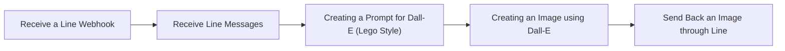

## Fluxo (.json) :

```json
{
  "meta": {
    "instanceId": "c59c4acfed171bdc864e7c432be610946898c3ee271693e0303565c953d88c1d",
    "templateCredsSetupCompleted": true
  },
  "name": "Transform Image to Lego Style Using Line and Dall-E",
  "tags": [],
  "nodes": [
    {
      "id": "82b62d4e-a263-4232-9bae-4c581db2269c",
      "name": "Receive a Line Webhook",
      "type": "n8n-nodes-base.webhook",
      "position": [
        0,
        0
      ],
      "webhookId": "2a27c148-3977-485f-b197-567c96671023",
      "parameters": {
        "path": "lineimage",
        "options": {},
        "httpMethod": "POST"
      },
      "typeVersion": 2
    },
    {
      "id": "f861c4eb-3d4f-4253-810f-8032602f079b",
      "name": "Receive Line Messages",
      "type": "n8n-nodes-base.httpRequest",
      "position": [
        220,
        0
      ],
      "parameters": {
        "url": "=https://api-data.line.me/v2/bot/message/{{ $json.body.events[0].message.id }}/content",
        "options": {},
        "jsonHeaders": "={\n\"Authorization\": \"Bearer YOUR_LINE_BOT_TOKEN\",\n\"Content-Type\": \"application/json\"\n}",
        "sendHeaders": true,
        "specifyHeaders": "json"
      },
      "typeVersion": 4.2
    },
    {
      "id": "da3a9188-028d-4c75-b23f-5f1f4e50784c",
      "name": "Creating an Image using Dall-E",
      "type": "@n8n/n8n-nodes-langchain.openAi",
      "position": [
        860,
        0
      ],
      "parameters": {
        "prompt": "={{ $json.content }}",
        "options": {
          "returnImageUrls": true
        },
        "resource": "image"
      },
      "credentials": {
        "openAiApi": {
          "id": "YOUR_OPENAI_CREDENTIAL_ID",
          "name": "OpenAi account"
        }
      },
      "typeVersion": 1.7
    },
    {
      "id": "36c826e5-eacd-43ad-b663-4d788005e61a",
      "name": "Creating a Prompt for Dall-E (Lego Style)",
      "type": "@n8n/n8n-nodes-langchain.openAi",
      "position": [
        540,
        0
      ],
      "parameters": {
        "text": "Creating the DALL·E 3 prompt to transform this kind of image into a isometric LEGO image (Only provide me with a prompt).",
        "modelId": {
          "__rl": true,
          "mode": "list",
          "value": "gpt-4o-mini",
          "cachedResultName": "GPT-4O-MINI"
        },
        "options": {},
        "resource": "image",
        "inputType": "base64",
        "operation": "analyze",
        "binaryPropertyName": "=data"
      },
      "credentials": {
        "openAiApi": {
          "id": "YOUR_OPENAI_CREDENTIAL_ID",
          "name": "OpenAi account"
        }
      },
      "typeVersion": 1.7
    },
    {
      "id": "3c19f931-9ca0-4bd7-b4eb-1628d89bbba1",
      "name": "Send Back an Image through Line",
      "type": "n8n-nodes-base.httpRequest",
      "position": [
        1160,
        0
      ],
      "parameters": {
        "url": "https://api.line.me/v2/bot/message/reply",
        "method": "POST",
        "options": {},
        "jsonBody": "={\n \"replyToken\": \"{{ $('Receive a Line Webhook').item.json.body.events[0].replyToken }}\",\n \"messages\": [\n {\n \"type\": \"image\",\n \"originalContentUrl\": \"{{ $json.url }}\",\n \"previewImageUrl\": \"{{ $json.url }}\"\n }\n ]\n}",
        "sendBody": true,
        "jsonHeaders": "{\n\"Authorization\": \"Bearer YOUR_LINE_BOT_TOKEN\",\n\"Content-Type\": \"application/json\"\n}",
        "sendHeaders": true,
        "specifyBody": "json",
        "specifyHeaders": "json"
      },
      "typeVersion": 4.2
    }
  ],
  "active": false,
  "pinData": {},
  "settings": {
    "executionOrder": "v1"
  },
  "versionId": "",
  "connections": {
    "Receive Line Messages": {
      "main": [
        [
          {
            "node": "Creating a Prompt for Dall-E (Lego Style)",
            "type": "main",
            "index": 0
          }
        ]
      ]
    },
    "Receive a Line Webhook": {
      "main": [
        [
          {
            "node": "Receive Line Messages",
            "type": "main",
            "index": 0
          }
        ]
      ]
    },
    "Creating an Image using Dall-E": {
      "main": [
        [
          {
            "node": "Send Back an Image through Line",
            "type": "main",
            "index": 0
          }
        ]
      ]
    },
    "Creating a Prompt for Dall-E (Lego Style)": {
      "main": [
        [
          {
            "node": "Creating an Image using Dall-E",
            "type": "main",
            "index": 0
          }
        ]
      ]
    }
  }
}
```

<a id="template-2513"></a>

## Template 2513 - Responder mensagens do Telegram com OpenAI

- **Nome:** Responder mensagens do Telegram com OpenAI
- **Descrição:** Este fluxo recebe mensagens do Telegram, gera respostas usando um agente de IA instruído a ser útil e com emojis, e envia a resposta de volta ao chat.
- **Funcionalidade:** • Captura de mensagens recebidas: detecta mensagens novas enviadas por usuários no Telegram.
• Construção de prompt personalizado: monta um texto que instrui o agente a responder de forma prestativa e com emojis usando o conteúdo da mensagem.
• Geração de resposta por IA: utiliza um agente de inteligência artificial para criar a resposta baseada no prompt.
• Encaminhamento ao modelo de linguagem: utiliza um modelo externo para processar o prompt e obter a saída de texto.
• Envio da resposta ao usuário: publica a resposta gerada de volta no mesmo chat do Telegram, mantendo o contexto via chatId.
- **Ferramentas:** • Telegram: Plataforma de mensagens usada para receber entradas dos usuários e enviar respostas.
• OpenAI: Serviço de modelo de linguagem utilizado para gerar as respostas do agente de IA.

## Fluxo visual

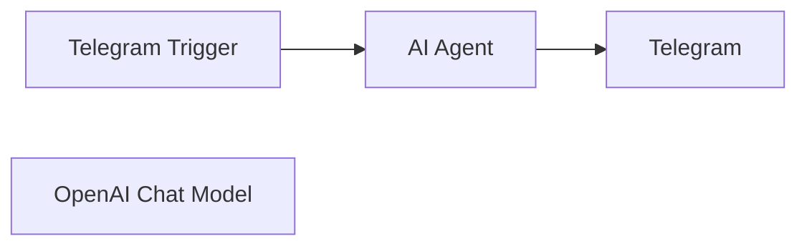

## Fluxo (.json) :

```json
{
  "meta": {
    "instanceId": "014363851c6b81282e1489df62d7f66bb7c99af5dcb6c1032b3a83a1d72baee4"
  },
  "nodes": [
    {
      "id": "0b4eb8e4-e98b-4f67-b134-914a5aa46b4d",
      "name": "Telegram Trigger",
      "type": "n8n-nodes-base.telegramTrigger",
      "position": [
        960,
        400
      ],
      "webhookId": "9c8b833c-7aa7-430d-8fc0-47936f695ddf",
      "parameters": {
        "updates": [
          "message"
        ],
        "additionalFields": {}
      },
      "credentials": {
        "telegramApi": {
          "id": "4lzd2F9cNrnR7j0j",
          "name": "Telegram account"
        }
      },
      "typeVersion": 1.1
    },
    {
      "id": "339246f2-76cb-44c4-8828-da0cb5d3ad5e",
      "name": "OpenAI Chat Model",
      "type": "@n8n/n8n-nodes-langchain.lmChatOpenAi",
      "position": [
        1100,
        600
      ],
      "parameters": {
        "options": {}
      },
      "credentials": {
        "openAiApi": {
          "id": "m3YyjGXFLLWwcnk7",
          "name": "OpenAi account"
        }
      },
      "typeVersion": 1
    },
    {
      "id": "70a981e2-7833-473b-a27a-fedf860901cb",
      "name": "AI Agent",
      "type": "@n8n/n8n-nodes-langchain.agent",
      "position": [
        1200,
        400
      ],
      "parameters": {
        "text": "=Respond to this as a helpful assistant with emojis: {{ $json.message.text }}",
        "options": {}
      },
      "typeVersion": 1.2
    },
    {
      "id": "fb6ff65b-56b4-44c4-978a-b9a5c3d535d6",
      "name": "Telegram",
      "type": "n8n-nodes-base.telegram",
      "position": [
        1560,
        400
      ],
      "parameters": {
        "text": "={{ $json.output }}",
        "chatId": "={{ $('Telegram Trigger').item.json.message.chat.id }}",
        "additionalFields": {
          "appendAttribution": false
        }
      },
      "credentials": {
        "telegramApi": {
          "id": "4lzd2F9cNrnR7j0j",
          "name": "Telegram account"
        }
      },
      "typeVersion": 1.1
    }
  ],
  "pinData": {},
  "connections": {
    "AI Agent": {
      "main": [
        [
          {
            "node": "Telegram",
            "type": "main",
            "index": 0
          }
        ]
      ]
    },
    "Telegram Trigger": {
      "main": [
        [
          {
            "node": "AI Agent",
            "type": "main",
            "index": 0
          }
        ]
      ]
    },
    "OpenAI Chat Model": {
      "ai_languageModel": [
        [
          {
            "node": "AI Agent",
            "type": "ai_languageModel",
            "index": 0
          }
        ]
      ]
    }
  }
}
```

<a id="template-2514"></a>

## Template 2514 - Fluxo de pesquisa autônoma com IA

- **Nome:** Fluxo de pesquisa autônoma com IA
- **Descrição:** Automatiza a geração de consultas, busca na web, extração de contexto e compilação de um relatório de pesquisa abrangente usando modelos de linguagem e ferramentas de análise.
- **Funcionalidade:** • Disparo por mensagem do usuário: Inicia o fluxo quando o usuário envia uma consulta.
• Geração de consultas de busca com LLM: Cria até quatro consultas de busca distintas e precisas a partir da consulta do usuário.
• Parsing e chunking de JSON: Converte respostas em JSON e divide o conteúdo em partes para processamento em lote.
• Busca na web em lote: Executa requisições de pesquisa em lote para obter resultados orgânicos relevantes.
• Formatação de resultados de busca: Normaliza títulos, URLs e fontes dos resultados obtidos.
• Análise de páginas via serviço externo: Recupera e processa conteúdo de páginas para extração de informação.
• Extração de contexto relevante com LLM: Extrai trechos úteis das páginas para responder à consulta original.
• Geração de relatório de pesquisa em Markdown: Compila os contextos extraídos e produz um relatório estruturado com achados e análise.
• Processamento em lotes (batching): Divide o trabalho para consultas e análises em múltiplos lotes paralelos.
• Memória de contexto: Mantém janelas de memória para reuso do contexto de entrada e do relatório durante a execução.
• Integração de consulta enciclopédica: Faz buscas em conhecimento enciclopédico (ex.: Wikipédia) para complementar as fontes.
- **Ferramentas:** • OpenRouter (modelo Gemini 2.0): Fornece modelos de linguagem para gerar consultas, extrair contexto e escrever relatórios.
• SerpAPI: Executa pesquisas web e retorna resultados orgânicos de mecanismos de busca.
• Jina AI (r.jina.ai): Serviço para recuperar e resumir o conteúdo de páginas web a partir de URLs.
• Wikipédia: Fonte enciclopédica usada para complementar informações e contexto factual.

## Fluxo visual

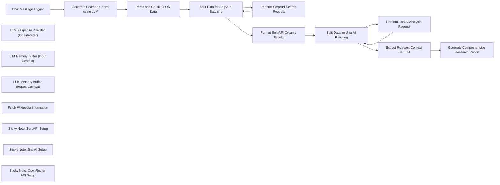

## Fluxo (.json) :

```json
{
  "id": "WLSqXECfQF7rOj2A",
  "meta": {
    "instanceId": "cba4a4a2eb5d7683330e2944837278938831ed3c042e20da6f5049c07ad14798"
  },
  "name": "Open Deep Research - AI-Powered Autonomous Research Workflow",
  "tags": [],
  "nodes": [
    {
      "id": "b7b70ba1-0267-4d2b-91f4-5cc4fd22fd03",
      "name": "Chat Message Trigger",
      "type": "@n8n/n8n-nodes-langchain.chatTrigger",
      "position": [
        -1940,
        160
      ],
      "webhookId": "cb0b9dbe-1f35-441a-b062-29624b0ebc6a",
      "parameters": {
        "options": {}
      },
      "typeVersion": 1.1
    },
    {
      "id": "55a8a512-f2d4-4aed-93e5-dd9bfa2dcaad",
      "name": "Generate Search Queries using LLM",
      "type": "@n8n/n8n-nodes-langchain.chainLlm",
      "position": [
        -1760,
        160
      ],
      "parameters": {
        "text": "=User Query: {{ $('Chat Message Trigger').item.json.chatInput }}",
        "messages": {
          "messageValues": [
            {
              "message": "=You are an expert research assistant. Given a user's query, generate up to four distinct, precise search queries that would help gather comprehensive information on the topic. Return only a JSON list of strings, for example: ['query1', 'query2', 'query3']."
            }
          ]
        },
        "promptType": "define"
      },
      "typeVersion": 1.5
    },
    {
      "id": "5f92361a-b490-479d-8360-c87a100b470e",
      "name": "LLM Response Provider (OpenRouter)",
      "type": "@n8n/n8n-nodes-langchain.lmChatOpenRouter",
      "position": [
        -1760,
        700
      ],
      "parameters": {
        "model": "google/gemini-2.0-flash-001",
        "options": {}
      },
      "credentials": {
        "openRouterApi": {
          "id": "WZWYWCfluxuKxZzV",
          "name": "OpenRouter account"
        }
      },
      "typeVersion": 1
    },
    {
      "id": "4ab360eb-858f-48b8-a00d-71867d4f0c93",
      "name": "Parse and Chunk JSON Data",
      "type": "n8n-nodes-base.code",
      "position": [
        -1420,
        160
      ],
      "parameters": {
        "jsCode": "// Parse the input JSON string and split it into four chunks\nconst rawText = $json.text;\n\n// Remove Markdown JSON code blocks if present\nconst cleanedText = rawText.replace(/```json|```/g, '').trim();\n\ntry {\n    const jsonArray = JSON.parse(cleanedText);\n    if (!Array.isArray(jsonArray)) {\n        throw new Error('The JSON is not an array.');\n    }\n    const chunkSize = Math.ceil(jsonArray.length / 4);\n    const chunks = [];\n    for (let i = 0; i < jsonArray.length; i += chunkSize) {\n        chunks.push(jsonArray.slice(i, i + chunkSize));\n    }\n    return chunks.map(chunk => ({ json: { chunk } }));\n} catch (error) {\n    return [{ json: { error: error.message } }];\n}\n"
      },
      "typeVersion": 2
    },
    {
      "id": "5a3ac393-8355-449f-93cb-b98e8bee9b80",
      "name": "Perform SerpAPI Search Request",
      "type": "n8n-nodes-base.httpRequest",
      "position": [
        -780,
        180
      ],
      "parameters": {
        "url": "https://serpapi.com/search",
        "options": {},
        "sendQuery": true,
        "queryParameters": {
          "parameters": [
            {
              "name": "q",
              "value": "={{ $('Parse and Chunk JSON Data').item.json.chunk }}"
            },
            {
              "name": "api_key",
              "value": "={{ $credentials.SerpAPI.key }}"
            },
            {
              "name": "engine",
              "value": "google"
            }
          ]
        }
      },
      "typeVersion": 4.2
    },
    {
      "id": "dad82469-830d-40fb-9f6b-b9fefef41267",
      "name": "Perform Jina AI Analysis Request",
      "type": "n8n-nodes-base.httpRequest",
      "position": [
        80,
        160
      ],
      "parameters": {
        "url": "=https://r.jina.ai/{{ $json.url }}",
        "options": {},
        "authentication": "genericCredentialType",
        "genericAuthType": "httpHeaderAuth"
      },
      "credentials": {
        "httpHeaderAuth": {
          "id": "iseKF5sPsvwtJhgT",
          "name": "Jina AI"
        }
      },
      "typeVersion": 4.2
    },
    {
      "id": "e21bbdf6-a903-491e-920c-ef7576f9ce80",
      "name": "Format SerpAPI Organic Results",
      "type": "n8n-nodes-base.code",
      "position": [
        -460,
        140
      ],
      "parameters": {
        "jsCode": "// Format the organic search results from SerpAPI\nconst results = $input.first().json.organic_results;\nif (results.length === 0) {\n  return [{ json: { error: 'No search results found.' } }];\n}\nconst formattedResults = results.map(result => ({\n  title: result.title || 'No title available',\n  url: result.link || 'No link available',\n  source: result.source || result.displayed_link || 'Unknown source'\n}));\nreturn formattedResults.map(result => ({ json: result }));\n"
      },
      "typeVersion": 2
    },
    {
      "id": "a856c8e8-5c3c-4a2f-9086-66deee1afd06",
      "name": "Extract Relevant Context via LLM",
      "type": "@n8n/n8n-nodes-langchain.agent",
      "position": [
        -1280,
        520
      ],
      "parameters": {
        "text": "=User Queries: {{ $('Parse and Chunk JSON Data').all().map(item => item.json.chunk[0]).join(', ') }}\nWebpage Contents: \n\"\"\"\n{{ $json.data }}\n\"\"\"",
        "options": {
          "systemMessage": "=You are an expert information extractor. Given the user's query, the search query that led to this page, and the webpage content, extract all relevant pieces of information that are useful to answer the query. Return only the relevant context as plain text without any additional commentary."
        },
        "promptType": "define"
      },
      "typeVersion": 1.7
    },
    {
      "id": "6d5c6698-0b4f-438c-91b9-3597f5d3e904",
      "name": "Generate Comprehensive Research Report",
      "type": "@n8n/n8n-nodes-langchain.agent",
      "position": [
        -740,
        520
      ],
      "parameters": {
        "text": "=Extracted Contexts (Merged):\n\"\"\"\n{{ $json.output }}\n\"\"\"",
        "options": {
          "systemMessage": "You are an expert researcher and report writer. Based on the gathered contexts and the original user query, generate a comprehensive, well-structured report. Include all relevant insights and conclusions without unnecessary commentary.\n\nFormat the report in Markdown with clear headings. For example:\n\n# Research Report: [User Query]\n\n## Key Findings\n- Point 1\n- Point 2\n\n## Detailed Analysis\n### Aspect 1\nSummary of findings.\n_Source:_ [Source Name](URL)\n\n### Aspect 2\nSummary of findings.\n_Source:_ [Another Source](URL)\n\nNow, generate the complete report."
        },
        "promptType": "define"
      },
      "typeVersion": 1.7
    },
    {
      "id": "05fea6a1-791e-4980-8f2a-2960455066d7",
      "name": "Split Data for SerpAPI Batching",
      "type": "n8n-nodes-base.splitInBatches",
      "position": [
        -1100,
        160
      ],
      "parameters": {
        "options": {}
      },
      "typeVersion": 3
    },
    {
      "id": "df00e7e8-99b8-484a-8047-869474fefee9",
      "name": "Split Data for Jina AI Batching",
      "type": "n8n-nodes-base.splitInBatches",
      "position": [
        -220,
        140
      ],
      "parameters": {
        "options": {}
      },
      "typeVersion": 3
    },
    {
      "id": "2edc683b-65f7-40c3-a22d-7fbf5b67de0a",
      "name": "LLM Memory Buffer (Input Context)",
      "type": "@n8n/n8n-nodes-langchain.memoryBufferWindow",
      "position": [
        -1160,
        740
      ],
      "parameters": {
        "sessionKey": "my_test_session",
        "sessionIdType": "customKey",
        "contextWindowLength": 20
      },
      "typeVersion": 1.3
    },
    {
      "id": "23017ae7-72a7-45c7-8edf-d0ba72220675",
      "name": "LLM Memory Buffer (Report Context)",
      "type": "@n8n/n8n-nodes-langchain.memoryBufferWindow",
      "position": [
        -620,
        760
      ],
      "parameters": {
        "sessionKey": "my_test_session",
        "sessionIdType": "customKey",
        "contextWindowLength": 20
      },
      "typeVersion": 1.3
    },
    {
      "id": "6bc9533b-e265-47b3-b93a-3a4f86ba0541",
      "name": "Fetch Wikipedia Information",
      "type": "@n8n/n8n-nodes-langchain.toolWikipedia",
      "position": [
        -580,
        920
      ],
      "parameters": {},
      "typeVersion": 1
    },
    {
      "id": "b25c148e-047d-40a7-8818-94c3504828dd",
      "name": "Sticky Note: SerpAPI Setup",
      "type": "n8n-nodes-base.stickyNote",
      "position": [
        -940,
        -20
      ],
      "parameters": {
        "color": 7,
        "width": 420,
        "height": 140,
        "content": "## SerpAPI Setup Instructions\n1. Obtain your API key from https://serpapi.com/manage-api-key.\n2. Save your API key securely in n8n credentials (do not use plain text)."
      },
      "typeVersion": 1
    },
    {
      "id": "e69c9a85-31e4-42b9-a09a-683ec5bb97d1",
      "name": "Sticky Note: Jina AI Setup",
      "type": "n8n-nodes-base.stickyNote",
      "position": [
        -60,
        -40
      ],
      "parameters": {
        "color": 7,
        "width": 420,
        "height": 140,
        "content": "## Jina AI Setup Instructions\n1. Obtain your API key from https://jina.ai/api-dashboard/key-manager.\n2. Configure your Jina AI credential in n8n to ensure secure API access."
      },
      "typeVersion": 1
    },
    {
      "id": "dbd204e0-da8e-41d8-814b-f409a23e9573",
      "name": "Sticky Note: OpenRouter API Setup",
      "type": "n8n-nodes-base.stickyNote",
      "position": [
        -1680,
        460
      ],
      "parameters": {
        "color": 7,
        "width": 300,
        "height": 180,
        "content": "## OpenRouter API Setup Instructions\n1. Obtain your API key from https://openrouter.ai/settings/keys.\n2. Set up your OpenRouter credential in n8n for secure integration."
      },
      "typeVersion": 1
    }
  ],
  "active": false,
  "pinData": {},
  "settings": {
    "executionOrder": "v1"
  },
  "versionId": "aa857bb3-84c1-4fe6-9464-90fc09163960",
  "connections": {
    "Chat Message Trigger": {
      "main": [
        [
          {
            "node": "Generate Search Queries using LLM",
            "type": "main",
            "index": 0
          }
        ]
      ]
    },
    "Parse and Chunk JSON Data": {
      "main": [
        [
          {
            "node": "Split Data for SerpAPI Batching",
            "type": "main",
            "index": 0
          }
        ]
      ]
    },
    "Fetch Wikipedia Information": {
      "ai_tool": [
        [
          {
            "node": "Generate Comprehensive Research Report",
            "type": "ai_tool",
            "index": 0
          }
        ]
      ]
    },
    "Format SerpAPI Organic Results": {
      "main": [
        [
          {
            "node": "Split Data for Jina AI Batching",
            "type": "main",
            "index": 0
          }
        ]
      ]
    },
    "Perform SerpAPI Search Request": {
      "main": [
        [
          {
            "node": "Split Data for SerpAPI Batching",
            "type": "main",
            "index": 0
          }
        ]
      ]
    },
    "Split Data for Jina AI Batching": {
      "main": [
        [
          {
            "node": "Extract Relevant Context via LLM",
            "type": "main",
            "index": 0
          }
        ],
        [
          {
            "node": "Perform Jina AI Analysis Request",
            "type": "main",
            "index": 0
          }
        ]
      ]
    },
    "Split Data for SerpAPI Batching": {
      "main": [
        [
          {
            "node": "Format SerpAPI Organic Results",
            "type": "main",
            "index": 0
          }
        ],
        [
          {
            "node": "Perform SerpAPI Search Request",
            "type": "main",
            "index": 0
          }
        ]
      ]
    },
    "Extract Relevant Context via LLM": {
      "main": [
        [
          {
            "node": "Generate Comprehensive Research Report",
            "type": "main",
            "index": 0
          }
        ]
      ]
    },
    "Perform Jina AI Analysis Request": {
      "main": [
        [
          {
            "node": "Split Data for Jina AI Batching",
            "type": "main",
            "index": 0
          }
        ]
      ]
    },
    "Generate Search Queries using LLM": {
      "main": [
        [
          {
            "node": "Parse and Chunk JSON Data",
            "type": "main",
            "index": 0
          }
        ]
      ]
    },
    "LLM Memory Buffer (Input Context)": {
      "ai_memory": [
        [
          {
            "node": "Extract Relevant Context via LLM",
            "type": "ai_memory",
            "index": 0
          }
        ]
      ]
    },
    "LLM Memory Buffer (Report Context)": {
      "ai_memory": [
        [
          {
            "node": "Generate Comprehensive Research Report",
            "type": "ai_memory",
            "index": 0
          }
        ]
      ]
    },
    "LLM Response Provider (OpenRouter)": {
      "ai_languageModel": [
        [
          {
            "node": "Generate Search Queries using LLM",
            "type": "ai_languageModel",
            "index": 0
          },
          {
            "node": "Extract Relevant Context via LLM",
            "type": "ai_languageModel",
            "index": 0
          },
          {
            "node": "Generate Comprehensive Research Report",
            "type": "ai_languageModel",
            "index": 0
          }
        ]
      ]
    }
  }
}
```

<a id="template-2515"></a>

## Template 2515 - Responder e enviar mensagens via LINE

- **Nome:** Responder e enviar mensagens via LINE
- **Descrição:** Recebe eventos do LINE, responde automaticamente a mensagens usando o reply token e permite envio manual de mensagens (push) para um usuário específico.
- **Funcionalidade:** • Receber webhook de LINE: Recebe eventos POST enviados pela plataforma LINE quando o usuário interage.
• Filtrar eventos do tipo mensagem: Verifica se o evento recebido é do tipo "message" antes de processar.
• Responder usando reply token: Envia uma resposta ao remetente utilizando o replyToken, refletindo o texto recebido.
• Enviar push manual para usuário: Permite enviar uma mensagem push para um Line UID definido manualmente via acionamento de teste.
- **Ferramentas:** • LINE Messaging API: Plataforma de mensagens que fornece webhook para receber eventos e endpoints para responder (reply) e enviar mensagens (push).

## Fluxo visual

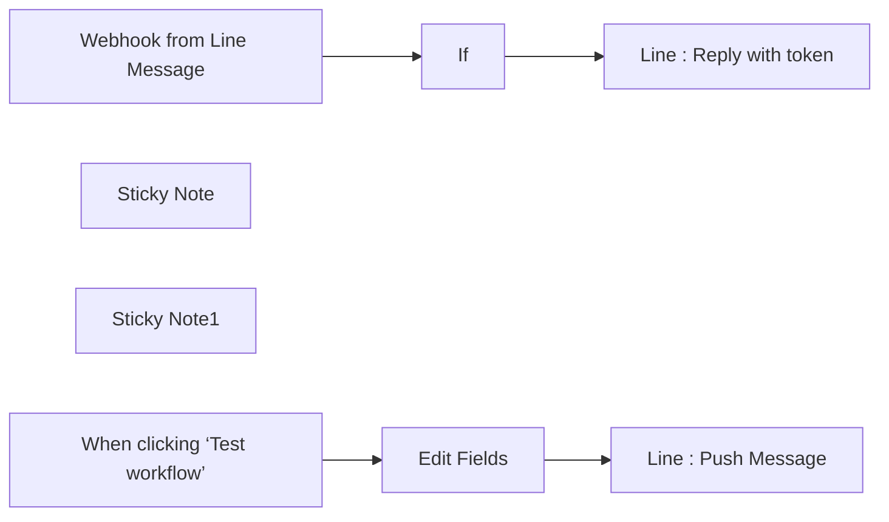

## Fluxo (.json) :

```json
{
  "id": "a5tCsfMzJPd8WDUj",
  "meta": {
    "instanceId": "fddb3e91967f1012c95dd02bf5ad21f279fc44715f47a7a96a33433621caa253",
    "templateCredsSetupCompleted": true
  },
  "name": "line message api demo",
  "tags": [],
  "nodes": [
    {
      "id": "2bc1cc31-136c-46a4-a789-476e33c76f3d",
      "name": "Line : Reply with token",
      "type": "n8n-nodes-base.httpRequest",
      "position": [
        -540,
        -460
      ],
      "parameters": {
        "url": "https://api.line.me/v2/bot/message/reply",
        "method": "POST",
        "options": {},
        "jsonBody": "={\n  \"replyToken\": \"{{ $('Webhook from Line Message').item.json.body.events[0].replyToken }}\",\n  \"messages\": [\n    {\n      \"type\": \"text\",\n      \"text\": \"收到您的訊息 : {{ $('Webhook from Line Message').item.json.body.events[0].message.text }}\"\n    }\n  ]\n}",
        "sendBody": true,
        "specifyBody": "json",
        "authentication": "genericCredentialType",
        "genericAuthType": "httpHeaderAuth"
      },
      "credentials": {
        "httpHeaderAuth": {
          "id": "xB2Ip7YKSIDq7BoI",
          "name": "Line n8n demo auth"
        }
      },
      "typeVersion": 4.2
    },
    {
      "id": "a1d9c986-4712-4d40-955d-40d1b19d74db",
      "name": "Webhook from Line Message",
      "type": "n8n-nodes-base.webhook",
      "position": [
        -1020,
        -440
      ],
      "webhookId": "638c118e-1c98-4491-b6ff-14e2e75380b6",
      "parameters": {
        "path": "638c118e-1c98-4491-b6ff-14e2e75380b6",
        "options": {},
        "httpMethod": "POST"
      },
      "typeVersion": 2
    },
    {
      "id": "a0c94852-290f-48b9-8e11-b498ada90c8f",
      "name": "Sticky Note",
      "type": "n8n-nodes-base.stickyNote",
      "position": [
        -1100,
        -620
      ],
      "parameters": {
        "width": 720,
        "height": 340,
        "content": "## Line Message API Reply\n\nReceived Message from user and reply with same text by using reply token  \n\nThere are many event types. So we need to determine if the type is message."
      },
      "typeVersion": 1
    },
    {
      "id": "278aff13-c081-47f0-a1f6-67920642e991",
      "name": "If",
      "type": "n8n-nodes-base.if",
      "position": [
        -800,
        -440
      ],
      "parameters": {
        "options": {},
        "conditions": {
          "options": {
            "version": 2,
            "leftValue": "",
            "caseSensitive": true,
            "typeValidation": "strict"
          },
          "combinator": "and",
          "conditions": [
            {
              "id": "b63773bb-f010-4018-8142-240c9aaa4570",
              "operator": {
                "name": "filter.operator.equals",
                "type": "string",
                "operation": "equals"
              },
              "leftValue": "={{ $json.body.events[0].type }}",
              "rightValue": "message"
            }
          ]
        }
      },
      "typeVersion": 2.2
    },
    {
      "id": "cff2f1d3-b7a4-4940-a1d1-1e5a80d6ea28",
      "name": "Sticky Note1",
      "type": "n8n-nodes-base.stickyNote",
      "position": [
        -1100,
        -200
      ],
      "parameters": {
        "width": 720,
        "height": 340,
        "content": "## Line Message API Send Message\n\nYou need to get the Line UID first.\nEvery user is differnt.\n\nIf you have the Line UID. Then you can push the message to the User."
      },
      "typeVersion": 1
    },
    {
      "id": "9348fc83-0aeb-4591-85b6-48f556512478",
      "name": "When clicking ‘Test workflow’",
      "type": "n8n-nodes-base.manualTrigger",
      "position": [
        -1020,
        -20
      ],
      "parameters": {},
      "typeVersion": 1
    },
    {
      "id": "74db3e1b-9a22-4033-bf04-a8ff485a5d3b",
      "name": "Edit Fields",
      "type": "n8n-nodes-base.set",
      "position": [
        -800,
        -20
      ],
      "parameters": {
        "options": {},
        "assignments": {
          "assignments": [
            {
              "id": "6278f340-6287-4e89-b774-f6c584954d5b",
              "name": "line_uid",
              "type": "string",
              "value": "Uxxxxxxxxxxxx"
            }
          ]
        }
      },
      "typeVersion": 3.4
    },
    {
      "id": "c593bd58-8f6a-4689-bb12-e71256ccf6e6",
      "name": "Line : Push Message",
      "type": "n8n-nodes-base.httpRequest",
      "position": [
        -560,
        -20
      ],
      "parameters": {
        "url": "https://api.line.me/v2/bot/message/push",
        "method": "POST",
        "options": {},
        "jsonBody": "={\n  \"to\": \"{{ $json.line_uid }}\",\n  \"messages\": [\n    {\n      \"type\": \"text\",\n      \"text\": \"推播測試\"\n    }\n  ]\n}",
        "sendBody": true,
        "specifyBody": "json",
        "authentication": "genericCredentialType",
        "genericAuthType": "httpHeaderAuth"
      },
      "credentials": {
        "httpHeaderAuth": {
          "id": "xB2Ip7YKSIDq7BoI",
          "name": "Line n8n demo auth"
        }
      },
      "typeVersion": 4.2
    }
  ],
  "active": true,
  "pinData": {},
  "settings": {
    "executionOrder": "v1"
  },
  "versionId": "240dc848-8803-4776-b01d-5f10c765f72b",
  "connections": {
    "If": {
      "main": [
        [
          {
            "node": "Line : Reply with token",
            "type": "main",
            "index": 0
          }
        ]
      ]
    },
    "Edit Fields": {
      "main": [
        [
          {
            "node": "Line : Push Message",
            "type": "main",
            "index": 0
          }
        ]
      ]
    },
    "Webhook from Line Message": {
      "main": [
        [
          {
            "node": "If",
            "type": "main",
            "index": 0
          }
        ]
      ]
    },
    "When clicking ‘Test workflow’": {
      "main": [
        [
          {
            "node": "Edit Fields",
            "type": "main",
            "index": 0
          }
        ]
      ]
    }
  }
}
```

<a id="template-2516"></a>

## Template 2516 - Descrição de imagens via GROQ LLaVA

- **Nome:** Descrição de imagens via GROQ LLaVA
- **Descrição:** Recebe imagens enviadas por usuários no Telegram, converte para base64, envia para a API GROQ usando o modelo LLaVA para gerar uma descrição detalhada e devolve o texto ao chat.
- **Funcionalidade:** • Gatilho por mensagens do Telegram: inicia o fluxo ao receber atualizações do usuário.
• Recebimento e download de imagem: captura o identificador do arquivo da foto enviada e obtém o arquivo correspondente.
• Conversão de imagem para Base64: transforma o arquivo de imagem em uma string base64 no formato esperado pela API.
• Envio à API GROQ com modelo LLaVA: faz uma requisição POST contendo uma instrução de texto e a imagem em base64 para gerar uma descrição detalhada.
• Extração e envio da resposta ao usuário: obtém o texto gerado pela API e envia a resposta de volta ao chat do Telegram.
• Orientação para configuração do bot: inclui instruções básicas para criar o bot no Telegram (via BotFather) e inserir o token de acesso.
- **Ferramentas:** • Telegram (API de Bots): recebe imagens dos usuários, fornece file_id para download do arquivo e permite enviar mensagens de resposta.
• GROQ API (modelo llava-v1.5-7b-4096-preview): serviço de visão e geração de texto que recebe imagem em base64 e retorna descrições detalhadas.

## Fluxo visual

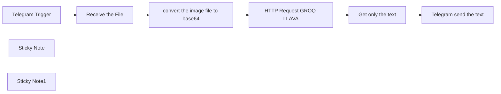

## Fluxo (.json) :

```json
{
  "id": "aDPpPIaeM7zfUCdJ",
  "meta": {
    "instanceId": "e5595d8cd58f3a24b5a8cf05dd852846c05423873db868a2b7d01a778210c45a",
    "templateCredsSetupCompleted": true
  },
  "name": "GROQ LLAVA V1.5 7B",
  "tags": [],
  "nodes": [
    {
      "id": "d831f75e-0385-482c-b2d5-e8da58216f4c",
      "name": "Telegram Trigger",
      "type": "n8n-nodes-base.telegramTrigger",
      "position": [
        540,
        280
      ],
      "webhookId": "6021108f-f0e8-4d7a-918b-f49baa28ba85",
      "parameters": {
        "updates": [
          "*"
        ],
        "additionalFields": {}
      },
      "credentials": {
        "telegramApi": {
          "id": "JLNFgAyYUUyvLhcv",
          "name": "Bot 2"
        }
      },
      "typeVersion": 1.1
    },
    {
      "id": "0fd97c36-3e3d-45a3-929d-975d17baf1fb",
      "name": "Telegram send the text",
      "type": "n8n-nodes-base.telegram",
      "position": [
        1640,
        280
      ],
      "parameters": {
        "text": "={{ $json.choices[0].message.content }}",
        "chatId": "={{ $('Telegram Trigger').item.json.message.chat.id }}",
        "additionalFields": {
          "appendAttribution": false
        }
      },
      "credentials": {
        "telegramApi": {
          "id": "",
          "name": ""
        }
      },
      "typeVersion": 1.2
    },
    {
      "id": "bd39b29f-e128-4891-bc6a-3eb75de29182",
      "name": "Get only the text",
      "type": "n8n-nodes-base.set",
      "position": [
        1420,
        280
      ],
      "parameters": {
        "options": {},
        "assignments": {
          "assignments": [
            {
              "id": "52a2f0d9-3137-4f6e-a2c1-8285694f6159",
              "name": "choices[0].message.content",
              "type": "string",
              "value": "={{ $json.choices[0].message.content }}"
            }
          ]
        }
      },
      "typeVersion": 3.4
    },
    {
      "id": "f1a96061-6d81-4d21-adac-dab475a00eb1",
      "name": "HTTP Request GROQ LLAVA",
      "type": "n8n-nodes-base.httpRequest",
      "position": [
        1200,
        280
      ],
      "parameters": {
        "url": "https://api.groq.com/openai/v1/chat/completions",
        "method": "POST",
        "options": {},
        "jsonBody": "={\n  \"messages\": [\n    {\n      \"role\": \"user\",\n      \"content\": [\n        {\n          \"type\": \"text\",\n          \"text\": \"Describe this image in great detail\"\n        },\n        {\n          \"type\": \"image_url\",\n          \"image_url\": {\n            \"url\": \"data:image/jpeg;base64,{{ $json.data }}\"\n          }\n        }\n      ]\n    }\n  ],\n  \"model\": \"llava-v1.5-7b-4096-preview\"\n}",
        "sendBody": true,
        "sendHeaders": true,
        "specifyBody": "json",
        "headerParameters": {
          "parameters": [
            {
              "name": "Authorization",
              "value": "Bearer YOUR_API_TOKEN"
            },
            {
              "name": "Content-Type",
              "value": "application/json"
            }
          ]
        }
      },
      "typeVersion": 4.2
    },
    {
      "id": "ab6be84f-06df-4f6f-b7fc-e328bc854116",
      "name": "convert the image file to base64",
      "type": "n8n-nodes-base.extractFromFile",
      "position": [
        980,
        280
      ],
      "parameters": {
        "options": {},
        "operation": "binaryToPropery"
      },
      "typeVersion": 1
    },
    {
      "id": "888397d6-4fd1-4e9b-852e-1731159df4f5",
      "name": "Receive the File",
      "type": "n8n-nodes-base.telegram",
      "position": [
        760,
        280
      ],
      "parameters": {
        "fileId": "={{ $json.message.photo[0].file_id }}",
        "resource": "file"
      },
      "credentials": {
        "telegramApi": {
          "id": "",
          "name": ""
        }
      },
      "typeVersion": 1.2
    },
    {
      "id": "7d117dd2-bd9f-4930-a727-8bff38cb5b72",
      "name": "Sticky Note",
      "type": "n8n-nodes-base.stickyNote",
      "position": [
        440,
        -16.000000000000057
      ],
      "parameters": {
        "color": 4,
        "width": 691.428571428571,
        "height": 521.142857142858,
        "content": "## Set Up\n\nOpen the Telegram app and search for the BotFather user (@BotFather)\nStart a chat with the BotFather\nType /newbot to create a new bot\nFollow the prompts to name your bot and get a unique API token\nSave your access token and username\n## Start Using\nOnce you set the Bot, you can send the image. \nThe second node get the image and send to the next node to be convert in base64, that is required by Groq in the documentation.\n\n [Groq docs](https://console.groq.com/docs/vision)"
      },
      "typeVersion": 1
    },
    {
      "id": "a935a3a6-85cd-43c6-aa0a-a37f6c40372a",
      "name": "Sticky Note1",
      "type": "n8n-nodes-base.stickyNote",
      "position": [
        1160,
        -20
      ],
      "parameters": {
        "width": 650.2857142857147,
        "height": 524.571428571429,
        "content": "## Using GROQ API\n\nNow we send the image in base64 to the API and get the description of the image."
      },
      "typeVersion": 1
    }
  ],
  "active": true,
  "pinData": {},
  "settings": {
    "executionOrder": "v1"
  },
  "versionId": "9253a6c2-d5d0-444a-9035-8fd562d54628",
  "connections": {
    "Receive the File": {
      "main": [
        [
          {
            "node": "convert the image file to base64",
            "type": "main",
            "index": 0
          }
        ]
      ]
    },
    "Telegram Trigger": {
      "main": [
        [
          {
            "node": "Receive the File",
            "type": "main",
            "index": 0
          }
        ]
      ]
    },
    "Get only the text": {
      "main": [
        [
          {
            "node": "Telegram send the text",
            "type": "main",
            "index": 0
          }
        ]
      ]
    },
    "HTTP Request GROQ LLAVA": {
      "main": [
        [
          {
            "node": "Get only the text",
            "type": "main",
            "index": 0
          }
        ]
      ]
    },
    "convert the image file to base64": {
      "main": [
        [
          {
            "node": "HTTP Request GROQ LLAVA",
            "type": "main",
            "index": 0
          }
        ]
      ]
    }
  }
}
```

<a id="template-2517"></a>

## Template 2517 - Assistente de agenda via Telegram

- **Nome:** Assistente de agenda via Telegram
- **Descrição:** Fluxo que recebe mensagens de chat, consulta uma planilha de horários e gera respostas contextuais com um modelo de linguagem, entregando-as de volta ao usuário ou ao chat interno.
- **Funcionalidade:** • Recepção de mensagens: captura entradas vindas do Telegram e de um gatilho de chat interno.
• Indicador de digitação: envia ação de "digitando" para o usuário no Telegram ao iniciar o processamento.
• Normalização do input: extrai e padroniza texto, chatId e modo de operação a partir da mensagem recebida.
• Recuperação da agenda: acessa uma planilha via URL para obter os dados atualizados da agenda/cronograma.
• Conversão para Markdown: transforma os dados da planilha em uma tabela Markdown para uso como contexto.
• Geração de resposta com IA: inclui a tabela no prompt de sistema e usa um modelo de linguagem para criar a resposta apropriada.
• Memória de sessão: preserva contexto por chat para manter continuidade na conversa.
• Roteamento da resposta: decide se a resposta será enviada ao Telegram ou tratada internamente e executa o envio correspondente.
- **Ferramentas:** • Telegram: plataforma de mensagens usada para receber entradas dos usuários e enviar respostas/interações.
• Google Sheets: armazenamento e fonte dos dados de agenda, acessada via URL para leitura da tabela de horários.
• OpenRouter API (modelo de linguagem): serviço de LLM usado para gerar respostas baseadas no contexto fornecido.


## Fluxo visual

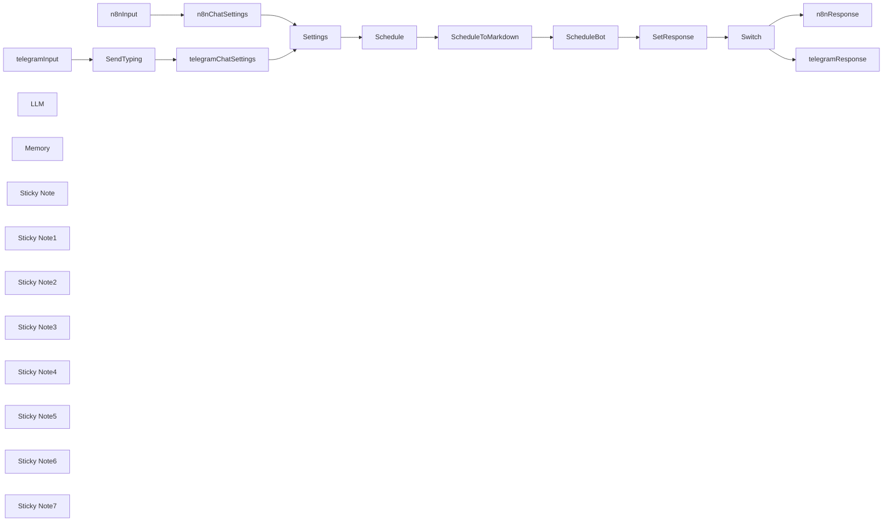

## Fluxo (.json) :

```json
{
  "id": "bV0JTA5NtRZxiD1q",
  "meta": {
    "instanceId": "98bf0d6aef1dd8b7a752798121440fb171bf7686b95727fd617f43452393daa3",
    "templateCredsSetupCompleted": true
  },
  "name": "Telegram-bot AI Da Nang",
  "tags": [],
  "nodes": [
    {
      "id": "ae5f9ca6-6bba-4fe8-b955-6c615d8a522f",
      "name": "SendTyping",
      "type": "n8n-nodes-base.telegram",
      "position": [
        -1780,
        -260
      ],
      "webhookId": "26ea953e-93d9-463e-ad90-95ea8ccb449f",
      "parameters": {
        "chatId": "={{ $('telegramInput').item.json.message.chat.id }}",
        "operation": "sendChatAction"
      },
      "credentials": {
        "telegramApi": {
          "id": "V3EtQBeqEvnOtl9p",
          "name": "Telegram account"
        }
      },
      "typeVersion": 1.2
    },
    {
      "id": "244e7be3-2caa-46f7-8628-d063a3b84c12",
      "name": "SetResponse",
      "type": "n8n-nodes-base.set",
      "notes": "Assemble response etc.",
      "position": [
        40,
        -420
      ],
      "parameters": {
        "options": {},
        "assignments": {
          "assignments": [
            {
              "id": "fba8dc48-1484-4aae-8922-06fcae398f05",
              "name": "responseMessage",
              "type": "string",
              "value": "={{ $json.output }}"
            },
            {
              "id": "df8243e6-6a24-4bad-8807-63d75c828150",
              "name": "",
              "type": "string",
              "value": ""
            }
          ]
        },
        "includeOtherFields": true
      },
      "notesInFlow": true,
      "typeVersion": 3.4
    },
    {
      "id": "192aa194-f131-4ba3-8842-7c88da1a6129",
      "name": "Settings",
      "type": "n8n-nodes-base.set",
      "position": [
        -1260,
        -420
      ],
      "parameters": {
        "options": {},
        "assignments": {
          "assignments": [
            {
              "id": "6714203d-04b3-4a3c-9183-09cddcffdfe8",
              "name": "scheduleURL",
              "type": "string",
              "value": "https://docs.google.com/spreadsheets/d/1BJFS9feEy94_WgIgzWZttBwzjp09siOw1xuUgq4yuI4"
            }
          ]
        },
        "includeOtherFields": true
      },
      "typeVersion": 3.4
    },
    {
      "id": "1c52cdf5-da32-4c76-a294-5ec2109dbf39",
      "name": "Schedule",
      "type": "n8n-nodes-base.googleSheets",
      "position": [
        -980,
        -420
      ],
      "parameters": {
        "options": {},
        "sheetName": {
          "__rl": true,
          "mode": "list",
          "value": "gid=0",
          "cachedResultUrl": "https://docs.google.com/spreadsheets/d/1BJFS9feEy94_WgIgzWZttBwzjp09siOw1xuUgq4yuI4/edit#gid=0",
          "cachedResultName": "Schedule"
        },
        "documentId": {
          "__rl": true,
          "mode": "url",
          "value": "={{ $json.scheduleURL }}"
        }
      },
      "credentials": {
        "googleSheetsOAuth2Api": {
          "id": "XeXufn5uZvHp3lcX",
          "name": "Google Sheets account 2"
        }
      },
      "typeVersion": 4.5
    },
    {
      "id": "eff88417-4ce6-4809-8693-dc63e00fff20",
      "name": "ScheduleToMarkdown",
      "type": "n8n-nodes-base.code",
      "position": [
        -800,
        -420
      ],
      "parameters": {
        "jsCode": "// Get all rows from the input (each item has a \"json\" property)\nconst rows = items.map(item => item.json);\n\n// If no data, return an appropriate message\nif (rows.length === 0) {\n return [{ json: { markdown: \"No data available.\" } }];\n}\n\n// Use the keys from the first row as the header columns\nconst headers = Object.keys(rows[0]);\n\n// Build the markdown table string\nlet markdown = \"\";\n\n// Create the header row\nmarkdown += `| ${headers.join(\" | \")} |\\n`;\n\n// Create the separator row (using dashes for markdown)\nmarkdown += `| ${headers.map(() => '---').join(\" | \")} |\\n`;\n\n// Add each data row to the table\nrows.forEach(row => {\n // Ensure we output something for missing values\n const rowValues = headers.map(header => row[header] !== undefined ? row[header] : '');\n markdown += `| ${rowValues.join(\" | \")} |\\n`;\n});\n\nconst result = { 'binary': {}, 'json': {} };\n\n// Convert the markdown string to a binary buffer\nconst binaryData = Buffer.from(markdown, 'utf8');\n/*\n// Attach the binary data to the first item under a binary property named 'data'\nresult.binary = {\n data: {\n data: binaryData,\n mimeType: 'text/markdown',\n }\n};\n*/\n// Optionally, also return the markdown string in the json property if needed\nresult.json.markdown = markdown;\n\nreturn result;"
      },
      "typeVersion": 2
    },
    {
      "id": "04fab70c-493a-4c5d-adfb-0d9e8a5b7382",
      "name": "ScheduleBot",
      "type": "@n8n/n8n-nodes-langchain.agent",
      "position": [
        -480,
        -420
      ],
      "parameters": {
        "text": "={{ $('Settings').first().json.inputMessage }}",
        "options": {
          "systemMessage": "=You are a helpful assistant that helps members of a meetup group with scheduling their meetups and answering questions about them.\n\nThe current version of the schedule in tabular format is the following:\n\n {{ $json.markdown }}\n\n"
        },
        "promptType": "define"
      },
      "typeVersion": 1.7
    },
    {
      "id": "be29d3ec-8211-4f23-82f2-83a1aa3aad5b",
      "name": "n8nChatSettings",
      "type": "n8n-nodes-base.set",
      "position": [
        -1580,
        -520
      ],
      "parameters": {
        "options": {},
        "assignments": {
          "assignments": [
            {
              "id": "1ecb3515-c1a2-4d69-adec-5b4d74e32056",
              "name": "inputMessage",
              "type": "string",
              "value": "={{ $json.chatInput }}"
            },
            {
              "id": "424b9697-94cb-4c38-953c-992436832684",
              "name": "chatId",
              "type": "string",
              "value": "={{ $json.sessionId }}"
            },
            {
              "id": "e23988e2-7c3d-4e38-9d5d-0c4b0c94d127",
              "name": "mode",
              "type": "string",
              "value": "n8n"
            }
          ]
        }
      },
      "typeVersion": 3.4
    },
    {
      "id": "b7078c59-b6e6-4002-831f-96e56278ab61",
      "name": "telegramChatSettings",
      "type": "n8n-nodes-base.set",
      "position": [
        -1580,
        -260
      ],
      "parameters": {
        "options": {},
        "assignments": {
          "assignments": [
            {
              "id": "1ecb3515-c1a2-4d69-adec-5b4d74e32056",
              "name": "inputMessage",
              "type": "string",
              "value": "={{ $('telegramInput').item.json.message.text }}"
            },
            {
              "id": "424b9697-94cb-4c38-953c-992436832684",
              "name": "chatId",
              "type": "string",
              "value": "={{ $('telegramInput').item.json.message.chat.id }}"
            },
            {
              "id": "e23988e2-7c3d-4e38-9d5d-0c4b0c94d127",
              "name": "mode",
              "type": "string",
              "value": "telegram"
            }
          ]
        }
      },
      "typeVersion": 3.4
    },
    {
      "id": "1ba6ad37-f1e5-440d-bf10-569038c27bce",
      "name": "telegramInput",
      "type": "n8n-nodes-base.telegramTrigger",
      "position": [
        -1960,
        -260
      ],
      "webhookId": "f56e8e22-975e-4f9a-a6f9-253ebc63668d",
      "parameters": {
        "updates": [
          "message"
        ],
        "additionalFields": {}
      },
      "credentials": {
        "telegramApi": {
          "id": "V3EtQBeqEvnOtl9p",
          "name": "Telegram account"
        }
      },
      "typeVersion": 1.1
    },
    {
      "id": "56a52e8a-714f-4e7a-8a13-e915e9dc29c4",
      "name": "n8nInput",
      "type": "@n8n/n8n-nodes-langchain.chatTrigger",
      "position": [
        -1960,
        -520
      ],
      "webhookId": "f4ab7d4a-5cdd-425a-bbbb-e3bb94719266",
      "parameters": {
        "options": {}
      },
      "typeVersion": 1.1
    },
    {
      "id": "961f67f0-bd44-4e7f-9f2f-c2f02f3176ce",
      "name": "Switch",
      "type": "n8n-nodes-base.switch",
      "position": [
        220,
        -420
      ],
      "parameters": {
        "rules": {
          "values": [
            {
              "outputKey": "n8n mode",
              "conditions": {
                "options": {
                  "version": 2,
                  "leftValue": "",
                  "caseSensitive": true,
                  "typeValidation": "strict"
                },
                "combinator": "and",
                "conditions": [
                  {
                    "operator": {
                      "type": "string",
                      "operation": "equals"
                    },
                    "leftValue": "={{ $('Settings').first().json.mode }}",
                    "rightValue": "n8n"
                  }
                ]
              },
              "renameOutput": true
            },
            {
              "outputKey": "telegram mode",
              "conditions": {
                "options": {
                  "version": 2,
                  "leftValue": "",
                  "caseSensitive": true,
                  "typeValidation": "strict"
                },
                "combinator": "and",
                "conditions": [
                  {
                    "id": "e7d6a994-48e3-44bb-b662-862d9bf9c53b",
                    "operator": {
                      "name": "filter.operator.equals",
                      "type": "string",
                      "operation": "equals"
                    },
                    "leftValue": "={{ $('Settings').first().json.mode }}",
                    "rightValue": "telegram"
                  }
                ]
              },
              "renameOutput": true
            }
          ]
        },
        "options": {}
      },
      "typeVersion": 3.2
    },
    {
      "id": "57056425-37ba-417d-9a2d-977a81d378ab",
      "name": "telegramResponse",
      "type": "n8n-nodes-base.telegram",
      "position": [
        500,
        -280
      ],
      "webhookId": "ff71ba7e-affa-4952-90a5-6bb7f37a5598",
      "parameters": {
        "text": "={{ $json.responseMessage }}",
        "chatId": "={{ $('Settings').first().json.chatId }}",
        "additionalFields": {}
      },
      "credentials": {
        "telegramApi": {
          "id": "V3EtQBeqEvnOtl9p",
          "name": "Telegram account"
        }
      },
      "typeVersion": 1.2
    },
    {
      "id": "2962a77f-5727-43be-93fb-b0751b63c6ac",
      "name": "n8nResponse",
      "type": "n8n-nodes-base.noOp",
      "position": [
        500,
        -520
      ],
      "parameters": {},
      "typeVersion": 1
    },
    {
      "id": "0932484f-707b-412b-b9cb-431a8ae64447",
      "name": "LLM",
      "type": "@n8n/n8n-nodes-langchain.lmChatOpenRouter",
      "position": [
        -600,
        -220
      ],
      "parameters": {
        "options": {}
      },
      "credentials": {
        "openRouterApi": {
          "id": "bs7tPtvgDTJNGAFJ",
          "name": "OpenRouter account"
        }
      },
      "typeVersion": 1
    },
    {
      "id": "65948d2c-71b2-4df0-97db-ed216ed7c691",
      "name": "Memory",
      "type": "@n8n/n8n-nodes-langchain.memoryBufferWindow",
      "position": [
        -500,
        -220
      ],
      "parameters": {
        "sessionKey": "={{ $('Settings').first().json.chatId }}",
        "sessionIdType": "customKey"
      },
      "typeVersion": 1.3
    },
    {
      "id": "50566274-cf7c-496f-a166-b45eb3114da3",
      "name": "Sticky Note",
      "type": "n8n-nodes-base.stickyNote",
      "position": [
        -2000,
        -600
      ],
      "parameters": {
        "color": 2,
        "width": 620,
        "height": 240,
        "content": "## Chat input triggered inside n8n\nUsed for testing and debugging"
      },
      "typeVersion": 1
    },
    {
      "id": "9dc636fb-cc86-4236-8eb9-952a4ab0ef68",
      "name": "Sticky Note1",
      "type": "n8n-nodes-base.stickyNote",
      "position": [
        -2000,
        -340
      ],
      "parameters": {
        "color": 2,
        "width": 620,
        "height": 240,
        "content": "## Chat input triggered by Telegram\nUsed for live chat within Telegram"
      },
      "typeVersion": 1
    },
    {
      "id": "0429d589-3e80-4b26-96a0-01554899a3e7",
      "name": "Sticky Note2",
      "type": "n8n-nodes-base.stickyNote",
      "position": [
        420,
        -340
      ],
      "parameters": {
        "color": 5,
        "width": 360,
        "height": 240,
        "content": "## Chat response to Telegram"
      },
      "typeVersion": 1
    },
    {
      "id": "9eeccee0-c6a0-40c6-9b7d-1f672bf0fdb9",
      "name": "Sticky Note3",
      "type": "n8n-nodes-base.stickyNote",
      "position": [
        420,
        -600
      ],
      "parameters": {
        "color": 5,
        "width": 360,
        "height": 240,
        "content": "## Chat response inside n8n"
      },
      "typeVersion": 1
    },
    {
      "id": "acb8e550-be94-41b7-904a-641b3b87e928",
      "name": "Sticky Note4",
      "type": "n8n-nodes-base.stickyNote",
      "position": [
        -40,
        -600
      ],
      "parameters": {
        "color": 7,
        "width": 440,
        "height": 500,
        "content": "## Prepare response\nDecide to which chat the response will go."
      },
      "typeVersion": 1
    },
    {
      "id": "42ce6eac-165b-463d-822e-355aff030525",
      "name": "Sticky Note5",
      "type": "n8n-nodes-base.stickyNote",
      "position": [
        -620,
        -600
      ],
      "parameters": {
        "color": 3,
        "width": 560,
        "height": 500,
        "content": "## AI Processing\nChat input → Chat output"
      },
      "typeVersion": 1
    },
    {
      "id": "33c45fcc-3aa5-4cd3-b393-e1723560dfeb",
      "name": "Sticky Note6",
      "type": "n8n-nodes-base.stickyNote",
      "position": [
        -1040,
        -600
      ],
      "parameters": {
        "color": 4,
        "width": 400,
        "height": 500,
        "content": "## Retrieve Data\nGet schedule from Google Spreadsheet and convert it to a Markdown-Table as context for the LLM"
      },
      "typeVersion": 1
    },
    {
      "id": "6e1017e3-bf9d-4056-a64f-c94476bd1f43",
      "name": "Sticky Note7",
      "type": "n8n-nodes-base.stickyNote",
      "position": [
        -1360,
        -600
      ],
      "parameters": {
        "color": 7,
        "width": 300,
        "height": 500,
        "content": "## Normalize input\nTransfer the chat data into a unified set of variables"
      },
      "typeVersion": 1
    }
  ],
  "active": true,
  "pinData": {},
  "settings": {
    "executionOrder": "v1"
  },
  "versionId": "9078c996-e932-40c0-882e-1eb261ca1535",
  "connections": {
    "LLM": {
      "ai_languageModel": [
        [
          {
            "node": "ScheduleBot",
            "type": "ai_languageModel",
            "index": 0
          }
        ]
      ]
    },
    "Memory": {
      "ai_memory": [
        [
          {
            "node": "ScheduleBot",
            "type": "ai_memory",
            "index": 0
          }
        ]
      ]
    },
    "Switch": {
      "main": [
        [
          {
            "node": "n8nResponse",
            "type": "main",
            "index": 0
          }
        ],
        [
          {
            "node": "telegramResponse",
            "type": "main",
            "index": 0
          }
        ]
      ]
    },
    "Schedule": {
      "main": [
        [
          {
            "node": "ScheduleToMarkdown",
            "type": "main",
            "index": 0
          }
        ]
      ]
    },
    "Settings": {
      "main": [
        [
          {
            "node": "Schedule",
            "type": "main",
            "index": 0
          }
        ]
      ]
    },
    "n8nInput": {
      "main": [
        [
          {
            "node": "n8nChatSettings",
            "type": "main",
            "index": 0
          }
        ]
      ]
    },
    "SendTyping": {
      "main": [
        [
          {
            "node": "telegramChatSettings",
            "type": "main",
            "index": 0
          }
        ]
      ]
    },
    "ScheduleBot": {
      "main": [
        [
          {
            "node": "SetResponse",
            "type": "main",
            "index": 0
          }
        ]
      ]
    },
    "SetResponse": {
      "main": [
        [
          {
            "node": "Switch",
            "type": "main",
            "index": 0
          }
        ]
      ]
    },
    "telegramInput": {
      "main": [
        [
          {
            "node": "SendTyping",
            "type": "main",
            "index": 0
          }
        ]
      ]
    },
    "n8nChatSettings": {
      "main": [
        [
          {
            "node": "Settings",
            "type": "main",
            "index": 0
          }
        ]
      ]
    },
    "telegramResponse": {
      "main": [
        []
      ]
    },
    "ScheduleToMarkdown": {
      "main": [
        [
          {
            "node": "ScheduleBot",
            "type": "main",
            "index": 0
          }
        ]
      ]
    },
    "telegramChatSettings": {
      "main": [
        [
          {
            "node": "Settings",
            "type": "main",
            "index": 0
          }
        ]
      ]
    }
  }
}
```

<a id="template-2518"></a>

## Template 2518 - Relatório semanal Google Analytics

- **Nome:** Relatório semanal Google Analytics
- **Descrição:** Gera automaticamente um relatório semanal com métricas do site, compara com o mesmo período do ano anterior e envia os resultados por e-mail e opcionalmente por Telegram.
- **Funcionalidade:** • Agendamento semanal: Dispara o fluxo automaticamente em dia e hora definidos (ex.: segunda-feira às 7h).
• Coleta de métricas atuais: Recupera métricas dos últimos 7 dias do Google Analytics.
• Cálculo do período do ano anterior: Determina automaticamente o intervalo correspondente do ano anterior para comparação.
• Coleta de métricas históricas: Recupera as mesmas métricas para o mesmo período do ano anterior.
• Normalização e resumo de dados: Mapeia campos relevantes, sumariza e agrega métricas (somas e médias).
• Conversões e formatações: Converte duração média de sessão para minutos, formata números e valores monetários em €.
• Análise e geração de relatório em HTML por IA: Cria uma análise breve e uma tabela formatada para envio por e-mail.
• Geração de versão curta para Telegram por IA: Converte o conteúdo HTML em texto curto e legível para mensagem instantânea.
• Envio de notificações: Envia o relatório completo por e-mail e, se configurado, envia versão resumida por Telegram.
- **Ferramentas:** • Google Analytics: Fonte de dados para recuperar métricas e dimensões do site.
• OpenAI (API de IA): Gera análise, transforma HTML em texto simples e formata o relatório em HTML e versão curta.
• Servidor SMTP / provedor de e-mail: Envia o relatório em formato HTML por e-mail.
• Telegram: Envia versão resumida do relatório como mensagem para chat configurado.

## Fluxo visual

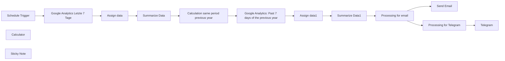

## Fluxo (.json) :

```json
{
  "id": "AAjX1BuwhyXpo8xP",
  "meta": {
    "instanceId": "558d88703fb65b2d0e44613bc35916258b0f0bf983c5d4730c00c424b77ca36a"
  },
  "name": "Google Analytics: Weekly Report",
  "tags": [],
  "nodes": [
    {
      "id": "91ba5982-e226-4f0b-af0d-8c9a44b08279",
      "name": "Schedule Trigger",
      "type": "n8n-nodes-base.scheduleTrigger",
      "position": [
        -1740,
        300
      ],
      "parameters": {
        "rule": {
          "interval": [
            {
              "field": "weeks",
              "triggerAtDay": [
                1
              ],
              "triggerAtHour": 7
            }
          ]
        }
      },
      "typeVersion": 1.2
    },
    {
      "id": "62c38eaf-2222-4d22-8589-677f36bce10d",
      "name": "Google Analytics Letzte 7 Tage",
      "type": "n8n-nodes-base.googleAnalytics",
      "position": [
        -1540,
        300
      ],
      "parameters": {
        "metricsGA4": {
          "metricValues": [
            {
              "listName": "screenPageViews"
            },
            {},
            {
              "listName": "sessions"
            },
            {
              "listName": "sessionsPerUser"
            },
            {
              "name": "averageSessionDuration",
              "listName": "other"
            },
            {
              "name": "ecommercePurchases",
              "listName": "other"
            },
            {
              "name": "averagePurchaseRevenue",
              "listName": "other"
            },
            {
              "name": "purchaseRevenue",
              "listName": "other"
            }
          ]
        },
        "propertyId": {
          "__rl": true,
          "mode": "list",
          "value": "345060083",
          "cachedResultUrl": "https://analytics.google.com/analytics/web/#/p345060083/",
          "cachedResultName": "https://www.ep-reisen.de  – GA4"
        },
        "dimensionsGA4": {
          "dimensionValues": [
            {}
          ]
        },
        "additionalFields": {}
      },
      "credentials": {
        "googleAnalyticsOAuth2": {
          "id": "onRKXREI8izfGzv0",
          "name": "Google Analytics account"
        }
      },
      "typeVersion": 2
    },
    {
      "id": "0a51c2f3-a487-4226-884f-63d4cb2bf4e4",
      "name": "Send Email",
      "type": "n8n-nodes-base.emailSend",
      "position": [
        420,
        80
      ],
      "parameters": {
        "html": "={{ $json.message.content }}",
        "options": {},
        "subject": "Weekly Report: Google Analytics: Last 7 days",
        "toEmail": "friedemann.schuetz@ep-reisen.de",
        "fromEmail": "friedemann.schuetz@posteo.de"
      },
      "credentials": {
        "smtp": {
          "id": "A71x7hx6lKj7nxp1",
          "name": "SMTP account"
        }
      },
      "typeVersion": 2.1
    },
    {
      "id": "04963783-f455-4983-afea-e94b316d8532",
      "name": "Telegram",
      "type": "n8n-nodes-base.telegram",
      "position": [
        420,
        420
      ],
      "parameters": {
        "text": "={{ $json.message.content }}",
        "chatId": "1810565648",
        "additionalFields": {}
      },
      "credentials": {
        "telegramApi": {
          "id": "0hnyvxyUMN77sBmU",
          "name": "Telegram account"
        }
      },
      "typeVersion": 1.2
    },
    {
      "id": "3b6b4902-15b3-4bbc-8427-c35471a7431b",
      "name": "Processing for Telegram",
      "type": "@n8n/n8n-nodes-langchain.openAi",
      "position": [
        60,
        420
      ],
      "parameters": {
        "modelId": {
          "__rl": true,
          "mode": "list",
          "value": "gpt-4o-mini",
          "cachedResultName": "GPT-4O-MINI"
        },
        "options": {},
        "messages": {
          "values": [
            {
              "content": "=Convert the following text from HTML to normal text:\n\n{{ $json.message.content }}\n\nPlease format the table so that each metric is a separate paragraph!\n\nExample:\n\nTotal views: xx.xxx\nTotal views previous year: xx,xxx\nDifference: x.xx %\n\nTotal users: xx,xxx\nTotal users previous year: xx,xxx\nDifference: -x.xx %"
            }
          ]
        }
      },
      "credentials": {
        "openAiApi": {
          "id": "niikB3HA4fT5WAqt",
          "name": "OpenAi account"
        }
      },
      "typeVersion": 1.7
    },
    {
      "id": "d761980c-0327-4d4e-92aa-d0342b2e249e",
      "name": "Calculator",
      "type": "@n8n/n8n-nodes-langchain.toolCalculator",
      "position": [
        140,
        300
      ],
      "parameters": {},
      "typeVersion": 1
    },
    {
      "id": "ce7ba356-80bb-4b17-9445-fb535267cdf0",
      "name": "Google Analytics: Past 7 days of the previous year",
      "type": "n8n-nodes-base.googleAnalytics",
      "position": [
        -600,
        300
      ],
      "parameters": {
        "endDate": "={{ $json.endDate }}",
        "dateRange": "custom",
        "startDate": "={{ $json.startDate }}",
        "metricsGA4": {
          "metricValues": [
            {
              "listName": "screenPageViews"
            },
            {},
            {
              "listName": "sessions"
            },
            {
              "listName": "sessionsPerUser"
            },
            {
              "name": "averageSessionDuration",
              "listName": "other"
            },
            {
              "name": "ecommercePurchases",
              "listName": "other"
            },
            {
              "name": "averagePurchaseRevenue",
              "listName": "other"
            },
            {
              "name": "purchaseRevenue",
              "listName": "other"
            }
          ]
        },
        "propertyId": {
          "__rl": true,
          "mode": "list",
          "value": "345060083",
          "cachedResultUrl": "https://analytics.google.com/analytics/web/#/p345060083/",
          "cachedResultName": "https://www.ep-reisen.de  – GA4"
        },
        "dimensionsGA4": {
          "dimensionValues": [
            {}
          ]
        },
        "additionalFields": {}
      },
      "credentials": {
        "googleAnalyticsOAuth2": {
          "id": "onRKXREI8izfGzv0",
          "name": "Google Analytics account"
        }
      },
      "typeVersion": 2
    },
    {
      "id": "d2062aaa-e41b-4405-8470-9e7b4cd77245",
      "name": "Summarize Data",
      "type": "n8n-nodes-base.summarize",
      "position": [
        -1080,
        300
      ],
      "parameters": {
        "options": {},
        "fieldsToSummarize": {
          "values": [
            {
              "field": "Aufrufe",
              "aggregation": "sum"
            },
            {
              "field": "Nutzer",
              "aggregation": "sum"
            },
            {
              "field": "Sitzungen",
              "aggregation": "sum"
            },
            {
              "field": "Sitzungen pro Nutzer",
              "aggregation": "average"
            },
            {
              "field": "Sitzungsdauer",
              "aggregation": "average"
            },
            {
              "field": "Käufe",
              "aggregation": "sum"
            },
            {
              "field": "Revenue pro Kauf",
              "aggregation": "average"
            },
            {
              "field": "Revenue",
              "aggregation": "sum"
            },
            {
              "field": "date"
            }
          ]
        }
      },
      "typeVersion": 1
    },
    {
      "id": "d1f48d36-9f27-4cda-af53-e6d430d1a8db",
      "name": "Summarize Data1",
      "type": "n8n-nodes-base.summarize",
      "position": [
        -220,
        300
      ],
      "parameters": {
        "options": {},
        "fieldsToSummarize": {
          "values": [
            {
              "field": "Aufrufe",
              "aggregation": "sum"
            },
            {
              "field": "Nutzer",
              "aggregation": "sum"
            },
            {
              "field": "Sitzungen",
              "aggregation": "sum"
            },
            {
              "field": "Sitzungen pro Nutzer",
              "aggregation": "average"
            },
            {
              "field": "Sitzungsdauer",
              "aggregation": "average"
            },
            {
              "field": "Käufe",
              "aggregation": "sum"
            },
            {
              "field": "Revenue pro Kauf",
              "aggregation": "average"
            },
            {
              "field": "Revenue",
              "aggregation": "sum"
            },
            {
              "field": "date"
            }
          ]
        }
      },
      "typeVersion": 1
    },
    {
      "id": "5b6a0644-3839-4a62-8ff3-bf866aa4568c",
      "name": "Calculation same period previous year",
      "type": "n8n-nodes-base.code",
      "position": [
        -840,
        300
      ],
      "parameters": {
        "jsCode": "return {\n // Berechnung des Startdatums: Vorjahr, gleiche Woche, 7 Tage zurück\n startDate: (() => {\n const date = new Date();\n date.setFullYear(date.getFullYear() - 1); // Zurück ins Vorjahr\n date.setDate(date.getDate() - 7); // 7 Tage zurück\n return date.toISOString().split('T')[0];\n })(),\n \n // Berechnung des Enddatums: Vorjahr, heutiges Datum\n endDate: (() => {\n const date = new Date();\n date.setFullYear(date.getFullYear() - 1); // Zurück ins Vorjahr\n return date.toISOString().split('T')[0];\n })(),\n};\n"
      },
      "typeVersion": 2
    },
    {
      "id": "ab813532-cbe6-4c41-b20b-7efaa1ae4389",
      "name": "Assign data",
      "type": "n8n-nodes-base.set",
      "position": [
        -1300,
        300
      ],
      "parameters": {
        "options": {},
        "assignments": {
          "assignments": [
            {
              "id": "9c2f8b9a-e964-49a0-8837-efb0dfd7bcae",
              "name": "Aufrufe",
              "type": "number",
              "value": "={{ $json.screenPageViews }}"
            },
            {
              "id": "8b524518-1268-4971-b5c9-ae7da09d94f9",
              "name": "Nutzer",
              "type": "number",
              "value": "={{ $json.totalUsers }}"
            },
            {
              "id": "ca7279b9-c643-425f-aa99-cb17146e9994",
              "name": "Sitzungen",
              "type": "number",
              "value": "={{ $json.sessions }}"
            },
            {
              "id": "591288f7-e8cf-445e-872a-5b83f997b825",
              "name": "Sitzungen pro Nutzer",
              "type": "number",
              "value": "={{ $json.sessionsPerUser }}"
            },
            {
              "id": "dc1a43da-3f3a-4dca-bbde-904222d7f693",
              "name": "Sitzungsdauer",
              "type": "number",
              "value": "={{ $json.averageSessionDuration }}"
            },
            {
              "id": "eac0b53e-c452-40b8-92bc-8af8ea349984",
              "name": "=Käufe",
              "type": "number",
              "value": "={{ $json.ecommercePurchases }}"
            },
            {
              "id": "b96439be-189d-4ebe-b49e-d5c31fefe9f0",
              "name": "Revenue pro Kauf",
              "type": "number",
              "value": "={{ $json.averagePurchaseRevenue }}"
            },
            {
              "id": "94835d43-2fc8-49c0-97f0-6f0f8699337a",
              "name": "Revenue",
              "type": "number",
              "value": "={{ $json.purchaseRevenue }}"
            },
            {
              "id": "d70f8138-3b84-4b88-a98f-eb929e1cc29a",
              "name": "date",
              "type": "string",
              "value": "={{ $json.date }}"
            }
          ]
        }
      },
      "typeVersion": 3.4
    },
    {
      "id": "2454fe8a-005d-46dc-ae22-1044c1b793b7",
      "name": "Assign data1",
      "type": "n8n-nodes-base.set",
      "position": [
        -400,
        300
      ],
      "parameters": {
        "options": {},
        "assignments": {
          "assignments": [
            {
              "id": "9c2f8b9a-e964-49a0-8837-efb0dfd7bcae",
              "name": "Aufrufe",
              "type": "number",
              "value": "={{ $json.screenPageViews }}"
            },
            {
              "id": "8b524518-1268-4971-b5c9-ae7da09d94f9",
              "name": "Nutzer",
              "type": "number",
              "value": "={{ $json.totalUsers }}"
            },
            {
              "id": "ca7279b9-c643-425f-aa99-cb17146e9994",
              "name": "Sitzungen",
              "type": "number",
              "value": "={{ $json.sessions }}"
            },
            {
              "id": "591288f7-e8cf-445e-872a-5b83f997b825",
              "name": "Sitzungen pro Nutzer",
              "type": "number",
              "value": "={{ $json.sessionsPerUser }}"
            },
            {
              "id": "dc1a43da-3f3a-4dca-bbde-904222d7f693",
              "name": "Sitzungsdauer",
              "type": "number",
              "value": "={{ $json.averageSessionDuration }}"
            },
            {
              "id": "eac0b53e-c452-40b8-92bc-8af8ea349984",
              "name": "=Käufe",
              "type": "number",
              "value": "={{ $json.ecommercePurchases }}"
            },
            {
              "id": "b96439be-189d-4ebe-b49e-d5c31fefe9f0",
              "name": "Revenue pro Kauf",
              "type": "number",
              "value": "={{ $json.averagePurchaseRevenue }}"
            },
            {
              "id": "94835d43-2fc8-49c0-97f0-6f0f8699337a",
              "name": "Revenue",
              "type": "number",
              "value": "={{ $json.purchaseRevenue }}"
            },
            {
              "id": "dd8255c6-65b1-41ce-b596-70c09108d6e2",
              "name": "=date",
              "type": "string",
              "value": "={{ $json.date }}"
            }
          ]
        }
      },
      "typeVersion": 3.4
    },
    {
      "id": "0a48cbb0-3d4c-4ac8-8dba-08213f7fc430",
      "name": "Sticky Note",
      "type": "n8n-nodes-base.stickyNote",
      "position": [
        -2220,
        80
      ],
      "parameters": {
        "width": 440,
        "height": 560,
        "content": "Welcome to my Google Analytics Weekly Report Workflow!\n\nThis workflow has the following sequence:\n\n1. time trigger (e.g. every Monday at 7 a.m.)\n2. retrieval of Google Analytics data from the last 7 days\n3. assignment and summary of the data\n4. retrieval of Google Analytics data from the last 7 days of the previous year\n5. allocation and summary of the data\n6. preparation in tabular form and brief analysis by AI.\n7. sending the report as an email\n8. preparation in short form by AI for Telegram (optional)\n9. sending as Telegram message.\n\nThe following accesses are required for the workflow:\n- Google Analytics (via Google Analytics API): https://docs.n8n.io/integrations/builtin/credentials/google/\n- AI API access (e.g. via OpenAI, Anthropic, Google or Ollama)\n- SMTP access data (for sending the mail)\n- Telegram access data (optional for sending as Telegram message): https://docs.n8n.io/integrations/builtin/credentials/telegram/\n\nYou can contact me via LinkedIn, if you have any questions: https://www.linkedin.com/in/friedemann-schuetz"
      },
      "typeVersion": 1
    },
    {
      "id": "c87bc648-8fe8-4cec-84d4-2742060f9c53",
      "name": "Processing for email",
      "type": "@n8n/n8n-nodes-langchain.openAi",
      "position": [
        60,
        80
      ],
      "parameters": {
        "modelId": {
          "__rl": true,
          "mode": "list",
          "value": "gpt-4o",
          "cachedResultName": "GPT-4O"
        },
        "options": {},
        "messages": {
          "values": [
            {
              "content": "=Please analyze the following data and output the results in tabular form:\n\n| Metrics | Last 7 days | Previous year | Percentage change |\n|-------------------------------|---------------|---------|\n| Total page views | {{ $('Summarize Data').item.json.sum_Aufrufe }} | {{ $('Summarize Data1').item.json.sum_Aufrufe }} | Percentage change |\n| total users | {{ $('Summarize Data').item.json.sum_Nutzer }} | {{ $('Summarize Data1').item.json.sum_Nutzer }} | Percentage change |\n| Total sessions | {{ $('Summarize Data').item.json.sum_Sitzungen }} | {{ $('Summarize Data1').item.json.sum_Sitzungen }} | Percentage change |\n| Average sessions/user | {{ $('Summarize Data').item.json.average_Sitzungen_pro_Nutzer }} | {{ $('Summarize Data1').item.json.average_Sitzungen_pro_Nutzer }} | Percentage change |\n| Average session duration | {{ $('Summarize Data').item.json.average_Sitzungsdauer }} | {{ $('Summarize Data1').item.json.average_Sitzungsdauer }} | Percentage change |\n| Total purchases | {{ $('Summarize Data').item.json['sum_Käufe'] }} | {{ $('Summarize Data1').item.json['sum_Käufe'] }} | Percentage change |\n| Average revenue/purchase | {{ $('Summarize Data').item.json.average_Revenue_pro_Kauf }} | {{ $('Summarize Data1').item.json.average_Revenue_pro_Kauf }} | Percentage change |\n| Total revenue | {{ $('Summarize Data').item.json.sum_Revenue }} | {{ $('Summarize Data1').item.json.sum_Revenue }} | Percentage change |\n\nFormat for numbers:\n- Dot (.) for numbers in thousands (e.g. 4,000)\n- Comma (,) for decimal numbers (e.g. 3.4)\n- Conversion of average session duration in minutes instead of seconds\n- Average turnover/purchase and total turnover in €\n\nPlease write a short summary of the analyzed data above the table (in a maximum of 3 sentences!)\n\nPlease format to a sleek and modern HTML format so that the result can be sent as HTML mail!\n\nStructure of the e-mail:\n\n“Hello! Here is the Weekly Report: Google Analytics of the last 7 days!\n[Summary]\n[Table]”"
            }
          ]
        }
      },
      "credentials": {
        "openAiApi": {
          "id": "niikB3HA4fT5WAqt",
          "name": "OpenAi account"
        }
      },
      "typeVersion": 1.7
    }
  ],
  "active": false,
  "pinData": {},
  "settings": {
    "executionOrder": "v1"
  },
  "versionId": "556c3292-0d40-4c75-8037-90bacf1b2ccb",
  "connections": {
    "Telegram": {
      "main": [
        []
      ]
    },
    "Calculator": {
      "ai_tool": [
        [
          {
            "node": "Processing for email",
            "type": "ai_tool",
            "index": 0
          }
        ]
      ]
    },
    "Assign data": {
      "main": [
        [
          {
            "node": "Summarize Data",
            "type": "main",
            "index": 0
          }
        ]
      ]
    },
    "Assign data1": {
      "main": [
        [
          {
            "node": "Summarize Data1",
            "type": "main",
            "index": 0
          }
        ]
      ]
    },
    "Summarize Data": {
      "main": [
        [
          {
            "node": "Calculation same period previous year",
            "type": "main",
            "index": 0
          }
        ]
      ]
    },
    "Summarize Data1": {
      "main": [
        [
          {
            "node": "Processing for email",
            "type": "main",
            "index": 0
          }
        ]
      ]
    },
    "Schedule Trigger": {
      "main": [
        [
          {
            "node": "Google Analytics Letzte 7 Tage",
            "type": "main",
            "index": 0
          }
        ]
      ]
    },
    "Processing for email": {
      "main": [
        [
          {
            "node": "Send Email",
            "type": "main",
            "index": 0
          },
          {
            "node": "Processing for Telegram",
            "type": "main",
            "index": 0
          }
        ]
      ]
    },
    "Processing for Telegram": {
      "main": [
        [
          {
            "node": "Telegram",
            "type": "main",
            "index": 0
          }
        ]
      ]
    },
    "Google Analytics Letzte 7 Tage": {
      "main": [
        [
          {
            "node": "Assign data",
            "type": "main",
            "index": 0
          }
        ]
      ]
    },
    "Calculation same period previous year": {
      "main": [
        [
          {
            "node": "Google Analytics: Past 7 days of the previous year",
            "type": "main",
            "index": 0
          }
        ]
      ]
    },
    "Google Analytics: Past 7 days of the previous year": {
      "main": [
        [
          {
            "node": "Assign data1",
            "type": "main",
            "index": 0
          }
        ]
      ]
    }
  }
}
```

<a id="template-2519"></a>

## Template 2519 - Sincronizar contatos Airtable com telli para agendamento de chamadas AI

- **Nome:** Sincronizar contatos Airtable com telli para agendamento de chamadas AI
- **Descrição:** Sincroniza novos contatos do Airtable com a plataforma telli e agenda chamadas automatizadas usando agentes de voz AI.
- **Funcionalidade:** • Monitoramento de novos contatos: detecta novos registros na base do Airtable usando o campo de criação e inicia o fluxo.
• Criação de contato na telli: envia os dados do contato para o endpoint de adição de contatos da telli via API.
• Agendamento de chamada automática: após adicionar o contato, realiza uma requisição para o endpoint de agendamento de chamadas da telli.
• Mapeamento de dados do CRM: transfere campos do Airtable (nome, telefone, e-mail, etc.) para o payload das requisições à API.
• Suporte a operações em lote: possibilita processar múltiplos contatos sequencialmente ou usar endpoints batch para envio em massa.
• Autenticação por API Key: utiliza cabeçalho Authorization para autenticar as requisições à API da telli.
- **Ferramentas:** • Airtable: armazena e fornece os contatos que disparam a automação.
• telli: plataforma de agentes de voz AI que recebe contatos e agenda chamadas através de sua API.


## Fluxo visual

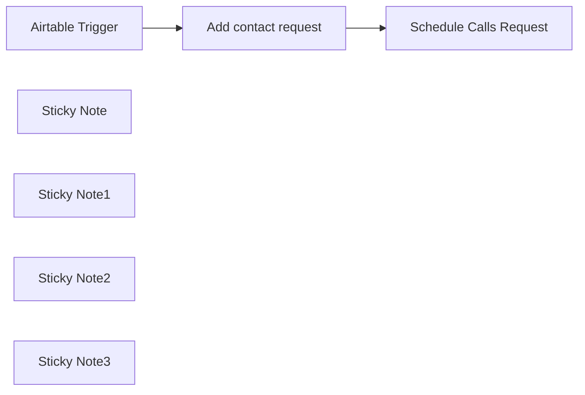

## Fluxo (.json) :

```json
{
  "id": "f3BtfIEQ7lWiXBWQ",
  "meta": {
    "instanceId": "331d930239825586dfac8c04af3e03a7e86c895a3d1fbfa4ffab201148dc835e",
    "templateCredsSetupCompleted": true
  },
  "name": "Connect Airtable Contacts to telli for Automated AI Voice Call Scheduling",
  "tags": [],
  "nodes": [
    {
      "id": "9562ed92-f04e-44b8-b2f1-3c9032788826",
      "name": "Airtable Trigger",
      "type": "n8n-nodes-base.airtableTrigger",
      "position": [
        -20,
        0
      ],
      "parameters": {
        "baseId": {
          "__rl": true,
          "mode": "id",
          "value": "appjsUaPrbH6ph7cB"
        },
        "tableId": {
          "__rl": true,
          "mode": "id",
          "value": "tblVXEWTj7dErmNsa"
        },
        "pollTimes": {
          "item": [
            {
              "mode": "everyMinute"
            }
          ]
        },
        "triggerField": "=Created Time",
        "authentication": "airtableTokenApi",
        "additionalFields": {}
      },
      "credentials": {
        "airtableTokenApi": {
          "id": "fcsJcjY4luV2FD5O",
          "name": "Airtable account"
        }
      },
      "typeVersion": 1
    },
    {
      "id": "d40f78ab-f96f-44eb-a2ac-1b16a66f94cb",
      "name": "Schedule Calls Request",
      "type": "n8n-nodes-base.httpRequest",
      "position": [
        500,
        0
      ],
      "parameters": {
        "url": "https://api.telli.com/v1/schedule-call",
        "method": "POST",
        "options": {},
        "sendBody": true,
        "sendHeaders": true,
        "bodyParameters": {
          "parameters": [
            {
              "name": "=contact_id",
              "value": "={{ $json.contact_id }}"
            }
          ]
        },
        "headerParameters": {
          "parameters": [
            {
              "name": "Authorization",
              "value": "<YOUR-API-KEY>"
            }
          ]
        }
      },
      "typeVersion": 4.2
    },
    {
      "id": "b5d4b415-9363-4d2a-8689-4c789177d9c3",
      "name": "Add contact request",
      "type": "n8n-nodes-base.httpRequest",
      "position": [
        240,
        0
      ],
      "parameters": {
        "url": "https://api.telli.com/v1/add-contact",
        "method": "POST",
        "options": {},
        "sendBody": true,
        "contentType": "=json",
        "sendHeaders": true,
        "bodyParameters": {
          "parameters": [
            {}
          ]
        },
        "headerParameters": {
          "parameters": [
            {
              "name": "Authorization",
              "value": "<YOUR-API-KEY>"
            }
          ]
        }
      },
      "typeVersion": 4.2
    },
    {
      "id": "22680635-838a-48db-a300-1a280d45b0f9",
      "name": "Sticky Note",
      "type": "n8n-nodes-base.stickyNote",
      "position": [
        -1620,
        -680
      ],
      "parameters": {
        "color": 4,
        "width": 1420,
        "height": 2640,
        "content": "# Upload your CRM contacts to telli and schedule AI voice-agent calls\n\n## Introduction to telli and AI Voice-Agent Calls\n\ntelli is an innovative platform that provides AI-powered voice agents capable of making calls and performing tasks tailored to specific customer use cases. These AI voice-agents can handle a wide range of communication tasks, from appointment scheduling to customer support, with remarkable efficiency and natural conversation flow.\n\nThis template is designed for businesses and organizations looking to automate their outbound calling processes using telli's AI voice-agents in conjunction with Airtable as their CRM. It solves the problem of manual call scheduling and data transfer between your CRM and calling system, saving time and reducing human error.\n\n### Prerequisites\n\n- telli account\n- Airtable base with contact information\n- n8n instance\n\n### Step-by-Step Setup Guide\n\n1. **n8n Setup**:\n   - Create a new workflow in n8n.\n   - Add the Airtable node to connect to your CRM table.\n\n2. **telli API Configuration**:\n   - Log in to your telli dashboard.\n   - Locate and copy your API key under telli - Settings - API/Webhooks.\n\n3. **Workflow Configuration**:\n   - Add two HTTP Request nodes to your n8n workflow.\n   - Set the \"Authorization\" header in both POST requests, replacing the value with your telli API key.\n   - Configure the first request to use the `/add-contact` endpoint.\n   - Set up the second request to use the `/schedule-call` endpoint.\n\n4. **Data Mapping**:\n   - Map the relevant fields from your Airtable node to the telli API requests.\n\n5. **Testing and Activation**:\n   - Run a test execution of your workflow.\n   - Once satisfied with the results, activate the workflow.\n\n### API Endpoint Details\n\n#### Add Contact Endpoint\n\n- **URL**: `https://api.telli.com/v1/add-contact`\n- **Method**: POST\n- **Headers**:\n  - `Authorization: YOUR-API-KEY`\n  - `Content-Type: application/json`\n- **Payload**:\n```json\n{\n  \"external_contact_id\": \"string\",\n  \"salutation\": \"string\",\n  \"first_name\": \"string\",\n  \"last_name\": \"string\",\n  \"phone_number\": \"string\",\n  \"email\": \"jsmith@example.com\",\n  \"contact_details\": {},\n  \"timezone\": \"string\"\n}\n```\n\n#### Schedule Call Endpoint\n\n- **URL**: `https://api.telli.com/v1/schedule-call`\n- **Method**: POST\n- **Headers**:\n  - `Authorization: YOUR-API-KEY`\n  - `Content-Type: application/json`\n- **Payload**:\n```json\n{\n  \"contact_id\": TELLI-CONTACT-ID,\n  \"agent_id\": \"string\",\n  \"max_retry_days\": 123,\n  \"call_details\": {\n    \"message\": \"Hello, this is your friendly reminder!\",\n    \"questions\": [\n      {\n        \"fieldName\": \"email\",\n        \"neededInformation\": \"email of the customer\",\n        \"exampleQuestion\": \"What is your email address?\",\n        \"responseFormat\": \"email string\"\n      }\n    ]\n  },\n  \"override_from_number\": \"string\"\n}\n```\n\n### Use Cases\n\nThis template is versatile and can be applied to various scenarios, including:\n\n***- Lead Qualification***: Automatically schedule calls to new leads entered in your CRM.\n\n***- Appointment Reminders***: Set up calls to remind clients of upcoming appointments.\n\n***- Customer Feedback***: Schedule follow-up calls after product deliveries or service completions.\n\n\n### Uploading Multiple Contacts\n\nFor bulk operations, you have two options:\n\n1. **Loop Node**: Include a Loop node in your n8n workflow to process multiple contacts sequentially.\n\n2. **Batch Endpoints**: Instead of `/add-contact` and `/schedule-call`, use telli's batch endpoints:\n   - `/add-contacts-batch`: Add multiple contacts within an array.\n   - `/schedule-calls-batch`: Schedule multiple calls at once.\n\nExample of batch endpoint usage:\n```json\n{\n  \"contacts\": [\n    {\"name\": \"John Doe\", \"phone\": \"+1234567890\"},\n    {\"name\": \"Jane Smith\", \"phone\": \"+1987654321\"}\n  ]\n}\n```\n\nBy leveraging this template, you can seamlessly integrate your Airtable CRM with telli's powerful AI voice-agents, automating your outbound calling process and enhancing your customer communication strategy.\n"
      },
      "typeVersion": 1
    },
    {
      "id": "7c31d739-c1a6-4b2b-a99d-2ab69a82b944",
      "name": "Sticky Note1",
      "type": "n8n-nodes-base.stickyNote",
      "position": [
        -80,
        160
      ],
      "parameters": {
        "content": "## CRM node\n\nConnect it to the table where you store information about your leads or contacts in general."
      },
      "typeVersion": 1
    },
    {
      "id": "4cc74508-7323-4dce-b487-79404d9959bb",
      "name": "Sticky Note2",
      "type": "n8n-nodes-base.stickyNote",
      "position": [
        180,
        -240
      ],
      "parameters": {
        "height": 220,
        "content": "## Add contacts to telli\n\nHere you perform a POST request to telli's API to bring your CRM contacts into the telli system."
      },
      "typeVersion": 1
    },
    {
      "id": "ef541141-1aa7-4f45-96a3-2169d609ff6d",
      "name": "Sticky Note3",
      "type": "n8n-nodes-base.stickyNote",
      "position": [
        480,
        180
      ],
      "parameters": {
        "height": 220,
        "content": "## Schedule calls for your new contacts\n\nRight after the contacts have been added, we perform another POST request to the telli API to schedule calls based on our smart calling strategy."
      },
      "typeVersion": 1
    }
  ],
  "active": true,
  "pinData": {},
  "settings": {
    "executionOrder": "v1"
  },
  "versionId": "7f4ed4a1-240c-45da-bc8c-940826d1a51a",
  "connections": {
    "Airtable Trigger": {
      "main": [
        [
          {
            "node": "Add contact request",
            "type": "main",
            "index": 0
          }
        ]
      ]
    },
    "Add contact request": {
      "main": [
        [
          {
            "node": "Schedule Calls Request",
            "type": "main",
            "index": 0
          }
        ]
      ]
    }
  }
}
```

<a id="template-2520"></a>

## Template 2520 - Classificador KNN de uso do solo

- **Nome:** Classificador KNN de uso do solo
- **Descrição:** Classifica imagens (satélite/land-use) consultando uma coleção vetorial de imagens pré-rotuladas e determinando a classe por voto majoritário entre os vizinhos mais próximos.
- **Funcionalidade:** • Recepção de URL de imagem: recebe um link de imagem como entrada para classificação.
• Geração de embedding multimodal: converte a imagem em um vetor de embedding usando um modelo multimodal.
• Consulta vetorial: busca os k vizinhos mais próximos na coleção vetorial com base no embedding.
• Extração de rótulos: lê as classes armazenadas nos payloads dos vizinhos retornados.
• Votação majoritária: calcula os rótulos mais frequentes entre os vizinhos para decidir a classe.
• Resolução de empates por loop: se houver empate entre os dois rótulos mais comuns, aumenta o número de vizinhos (incremento de 5) e repete até resolver ou atingir 100 vizinhos.
• Retorno da classe final: devolve o rótulo decidido como resultado da classificação.
- **Ferramentas:** • Voyage AI Multimodal Embeddings API: serviço que gera embeddings multimodais (vetores) a partir de imagens.
• Qdrant Cloud: banco de dados vetorial usado para armazenar embeddings e payloads rotulados e realizar buscas por similaridade.
• Google Cloud Storage: armazenamento de imagens do dataset (origem dos ficheiros de imagem usados no exemplo).
• Kaggle (dataset): fonte do conjunto de dados 'landuse-scene-classification' utilizado como referência para popular a coleção de imagens rotuladas.

## Fluxo visual

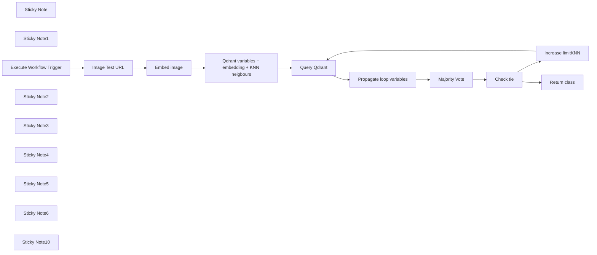

## Fluxo (.json) :

```json
{
  "id": "itzURpN5wbUNOXOw",
  "meta": {
    "instanceId": "205b3bc06c96f2dc835b4f00e1cbf9a937a74eeb3b47c99d0c30b0586dbf85aa"
  },
  "name": "[2/2] KNN classifier (lands dataset)",
  "tags": [
    {
      "id": "QN7etptCmdcGIpkS",
      "name": "classifier",
      "createdAt": "2024-12-08T22:08:15.968Z",
      "updatedAt": "2024-12-09T19:25:04.113Z"
    }
  ],
  "nodes": [
    {
      "id": "33373ccb-164e-431c-8a9a-d68668fc70be",
      "name": "Embed image",
      "type": "n8n-nodes-base.httpRequest",
      "position": [
        -140,
        -240
      ],
      "parameters": {
        "url": "https://api.voyageai.com/v1/multimodalembeddings",
        "method": "POST",
        "options": {},
        "jsonBody": "={{\n{\n  \"inputs\": [\n    {\n      \"content\": [\n        {\n          \"type\": \"image_url\",\n          \"image_url\": $json.imageURL\n        }\n      ]\n    }\n  ],\n  \"model\": \"voyage-multimodal-3\",\n  \"input_type\": \"document\"\n}\n}}",
        "sendBody": true,
        "specifyBody": "json",
        "authentication": "genericCredentialType",
        "genericAuthType": "httpHeaderAuth"
      },
      "credentials": {
        "httpHeaderAuth": {
          "id": "Vb0RNVDnIHmgnZOP",
          "name": "Voyage API"
        }
      },
      "typeVersion": 4.2
    },
    {
      "id": "58adecfa-45c7-4928-b850-053ea6f3b1c5",
      "name": "Query Qdrant",
      "type": "n8n-nodes-base.httpRequest",
      "position": [
        440,
        -240
      ],
      "parameters": {
        "url": "={{ $json.qdrantCloudURL }}/collections/{{ $json.collectionName }}/points/query",
        "method": "POST",
        "options": {},
        "jsonBody": "={{\n{\n  \"query\": $json.ImageEmbedding,\n  \"using\": \"voyage\",\n  \"limit\": $json.limitKNN,\n  \"with_payload\": true\n}\n}}",
        "sendBody": true,
        "specifyBody": "json",
        "authentication": "predefinedCredentialType",
        "nodeCredentialType": "qdrantApi"
      },
      "credentials": {
        "qdrantApi": {
          "id": "it3j3hP9FICqhgX6",
          "name": "QdrantApi account"
        }
      },
      "typeVersion": 4.2
    },
    {
      "id": "258026b7-2dda-4165-bfe1-c4163b9caf78",
      "name": "Majority Vote",
      "type": "n8n-nodes-base.code",
      "position": [
        840,
        -240
      ],
      "parameters": {
        "language": "python",
        "pythonCode": "from collections import Counter\n\ninput_json = _input.all()[0]\npoints = input_json['json']['result']['points']\nmajority_vote_two_most_common = Counter([point[\"payload\"][\"landscape_name\"] for point in points]).most_common(2)\n\nreturn [{\n    \"json\": {\n        \"result\": majority_vote_two_most_common    \n    }\n}]\n"
      },
      "typeVersion": 2
    },
    {
      "id": "e83e7a0c-cb36-46d0-8908-86ee1bddf638",
      "name": "Increase limitKNN",
      "type": "n8n-nodes-base.set",
      "position": [
        1240,
        -240
      ],
      "parameters": {
        "options": {},
        "assignments": {
          "assignments": [
            {
              "id": "0b5d257b-1b27-48bc-bec2-78649bc844cc",
              "name": "limitKNN",
              "type": "number",
              "value": "={{ $('Propagate loop variables').item.json.limitKNN + 5}}"
            },
            {
              "id": "afee4bb3-f78b-4355-945d-3776e33337a4",
              "name": "ImageEmbedding",
              "type": "array",
              "value": "={{ $('Qdrant variables + embedding + KNN neigbours').first().json.ImageEmbedding }}"
            },
            {
              "id": "701ed7ba-d112-4699-a611-c0c134757a6c",
              "name": "qdrantCloudURL",
              "type": "string",
              "value": "={{ $('Qdrant variables + embedding + KNN neigbours').first().json.qdrantCloudURL }}"
            },
            {
              "id": "f5612f78-e7d8-4124-9c3a-27bd5870c9bf",
              "name": "collectionName",
              "type": "string",
              "value": "={{ $('Qdrant variables + embedding + KNN neigbours').first().json.collectionName }}"
            }
          ]
        }
      },
      "typeVersion": 3.4
    },
    {
      "id": "8edbff53-cba6-4491-9d5e-bac7ad6db418",
      "name": "Propagate loop variables",
      "type": "n8n-nodes-base.set",
      "position": [
        640,
        -240
      ],
      "parameters": {
        "options": {},
        "assignments": {
          "assignments": [
            {
              "id": "880838bf-2be2-4f5f-9417-974b3cbee163",
              "name": "=limitKNN",
              "type": "number",
              "value": "={{ $json.result.points.length}}"
            },
            {
              "id": "5fff2bea-f644-4fd9-ad04-afbecd19a5bc",
              "name": "result",
              "type": "object",
              "value": "={{ $json.result }}"
            }
          ]
        }
      },
      "typeVersion": 3.4
    },
    {
      "id": "6fad4cc0-f02c-429d-aa4e-0d69ebab9d65",
      "name": "Image Test URL",
      "type": "n8n-nodes-base.set",
      "position": [
        -320,
        -240
      ],
      "parameters": {
        "options": {},
        "assignments": {
          "assignments": [
            {
              "id": "46ceba40-fb25-450c-8550-d43d8b8aa94c",
              "name": "imageURL",
              "type": "string",
              "value": "={{ $json.query.imageURL }}"
            }
          ]
        }
      },
      "typeVersion": 3.4
    },
    {
      "id": "f02e79e2-32c8-4af0-8bf9-281119b23cc0",
      "name": "Return class",
      "type": "n8n-nodes-base.set",
      "position": [
        1240,
        0
      ],
      "parameters": {
        "options": {},
        "assignments": {
          "assignments": [
            {
              "id": "bd8ca541-8758-4551-b667-1de373231364",
              "name": "class",
              "type": "string",
              "value": "={{ $json.result[0][0] }}"
            }
          ]
        }
      },
      "typeVersion": 3.4
    },
    {
      "id": "83ca90fb-d5d5-45f4-8957-4363a4baf8ed",
      "name": "Check tie",
      "type": "n8n-nodes-base.if",
      "position": [
        1040,
        -240
      ],
      "parameters": {
        "options": {},
        "conditions": {
          "options": {
            "version": 2,
            "leftValue": "",
            "caseSensitive": true,
            "typeValidation": "strict"
          },
          "combinator": "and",
          "conditions": [
            {
              "id": "980663f6-9d7d-4e88-87b9-02030882472c",
              "operator": {
                "type": "number",
                "operation": "gt"
              },
              "leftValue": "={{ $json.result.length }}",
              "rightValue": 1
            },
            {
              "id": "9f46fdeb-0f89-4010-99af-624c1c429d6a",
              "operator": {
                "type": "number",
                "operation": "equals"
              },
              "leftValue": "={{ $json.result[0][1] }}",
              "rightValue": "={{ $json.result[1][1] }}"
            },
            {
              "id": "c59bc4fe-6821-4639-8595-fdaf4194c1e1",
              "operator": {
                "type": "number",
                "operation": "lte"
              },
              "leftValue": "={{ $('Propagate loop variables').item.json.limitKNN }}",
              "rightValue": 100
            }
          ]
        }
      },
      "typeVersion": 2.2
    },
    {
      "id": "847ced21-4cfd-45d8-98fa-b578adc054d6",
      "name": "Qdrant variables + embedding + KNN neigbours",
      "type": "n8n-nodes-base.set",
      "position": [
        120,
        -240
      ],
      "parameters": {
        "options": {},
        "assignments": {
          "assignments": [
            {
              "id": "de66070d-5e74-414e-8af7-d094cbc26f62",
              "name": "ImageEmbedding",
              "type": "array",
              "value": "={{ $json.data[0].embedding }}"
            },
            {
              "id": "58b7384d-fd0c-44aa-9f8e-0306a99be431",
              "name": "qdrantCloudURL",
              "type": "string",
              "value": "=https://152bc6e2-832a-415c-a1aa-fb529f8baf8d.eu-central-1-0.aws.cloud.qdrant.io"
            },
            {
              "id": "e34c4d88-b102-43cc-a09e-e0553f2da23a",
              "name": "collectionName",
              "type": "string",
              "value": "=land-use"
            },
            {
              "id": "db37e18d-340b-4624-84f6-df993af866d6",
              "name": "limitKNN",
              "type": "number",
              "value": "=10"
            }
          ]
        }
      },
      "typeVersion": 3.4
    },
    {
      "id": "d1bc4edc-37d2-43ac-8d8b-560453e68d1f",
      "name": "Sticky Note",
      "type": "n8n-nodes-base.stickyNote",
      "position": [
        -940,
        -120
      ],
      "parameters": {
        "color": 6,
        "width": 320,
        "height": 540,
        "content": "Here we're classifying existing types of satellite imagery of land types:\n- 'agricultural',\n- 'airplane',\n- 'baseballdiamond',\n- 'beach',\n- 'buildings',\n- 'chaparral',\n- 'denseresidential',\n- 'forest',\n- 'freeway',\n- 'golfcourse',\n- 'harbor',\n- 'intersection',\n- 'mediumresidential',\n- 'mobilehomepark',\n- 'overpass',\n- 'parkinglot',\n- 'river',\n- 'runway',\n- 'sparseresidential',\n- 'storagetanks',\n- 'tenniscourt'\n"
      },
      "typeVersion": 1
    },
    {
      "id": "13560a31-3c72-43b8-9635-3f9ca11f23c9",
      "name": "Sticky Note1",
      "type": "n8n-nodes-base.stickyNote",
      "position": [
        -520,
        -460
      ],
      "parameters": {
        "color": 6,
        "content": "I tested this KNN classifier on a whole `test` set of a dataset (it's not a part of the collection, only `validation` + `train` parts). Accuracy of classification on `test` is **93.24%**, no fine-tuning, no metric learning."
      },
      "typeVersion": 1
    },
    {
      "id": "8c9dcbcb-a1ad-430f-b7dd-e19b5645b0f6",
      "name": "Execute Workflow Trigger",
      "type": "n8n-nodes-base.executeWorkflowTrigger",
      "position": [
        -520,
        -240
      ],
      "parameters": {},
      "typeVersion": 1
    },
    {
      "id": "b36fb270-2101-45e9-bb5c-06c4e07b769c",
      "name": "Sticky Note2",
      "type": "n8n-nodes-base.stickyNote",
      "position": [
        -1080,
        -520
      ],
      "parameters": {
        "width": 460,
        "height": 380,
        "content": "## KNN classification workflow-tool\n### This n8n template takes an image URL (as anomaly detection tool does), and as output, it returns a class of the object on the image (out of land types list)\n\n* An image URL is received via the Execute Workflow Trigger, which is then sent to the Voyage.ai Multimodal Embeddings API to fetch its embedding.\n* The image's embedding vector is then used to query Qdrant, returning a set of X similar images with pre-labeled classes.\n* Majority voting is done for classes of neighbouring images.\n* A loop is used to resolve scenarios where there is a tie in Majority Voting (for example, we have 5 \"forest\" and 5 \"beach\"), and we increase the number of neighbours to retrieve.\n* When the loop finally resolves, the identified class is returned to the calling workflow."
      },
      "typeVersion": 1
    },
    {
      "id": "51ece7fc-fd85-4d20-ae26-4df2d3893251",
      "name": "Sticky Note3",
      "type": "n8n-nodes-base.stickyNote",
      "position": [
        120,
        -40
      ],
      "parameters": {
        "height": 200,
        "content": "Variables define another Qdrant's collection with landscapes (uploaded similarly as the crops collection, don't forget to switch it with your data) + amount of neighbours **limitKNN** in the database we'll use for an input image classification."
      },
      "typeVersion": 1
    },
    {
      "id": "7aad5904-eb0b-4389-9d47-cc91780737ba",
      "name": "Sticky Note4",
      "type": "n8n-nodes-base.stickyNote",
      "position": [
        -180,
        -60
      ],
      "parameters": {
        "height": 80,
        "content": "Similarly to anomaly detection tool, we're embedding input image with the Voyage model"
      },
      "typeVersion": 1
    },
    {
      "id": "d3702707-ee4a-481f-82ca-d9386f5b7c8a",
      "name": "Sticky Note5",
      "type": "n8n-nodes-base.stickyNote",
      "position": [
        440,
        -500
      ],
      "parameters": {
        "width": 740,
        "height": 200,
        "content": "## Tie loop\nHere we're [querying](https://api.qdrant.tech/api-reference/search/query-points) Qdrant, getting  **limitKNN** nearest neighbours to our image <*Query Qdrant node*>, parsing their classes from payloads (images were pre-labeled & uploaded with their labels to Qdrant) & calculating the most frequent class name <*Majority Vote node*>. If there is a tie <*check tie node*> in 2 most common classes, for example, we have 5 \"forest\" and 5 \"harbor\", we repeat the procedure with the number of neighbours increased by 5 <*propagate loop variables node* and *increase limitKNN node*>.\nIf there is no tie, or we have already checked 100 neighbours, we exit the loop <*check tie node*> and return the class-answer."
      },
      "typeVersion": 1
    },
    {
      "id": "d26911bb-0442-4adc-8511-7cec2d232393",
      "name": "Sticky Note6",
      "type": "n8n-nodes-base.stickyNote",
      "position": [
        1240,
        160
      ],
      "parameters": {
        "height": 80,
        "content": "Here, we extract the name of the input image class decided by the Majority Vote\n"
      },
      "typeVersion": 1
    },
    {
      "id": "84ffc859-1d5c-4063-9051-3587f30a0017",
      "name": "Sticky Note10",
      "type": "n8n-nodes-base.stickyNote",
      "position": [
        -520,
        80
      ],
      "parameters": {
        "color": 4,
        "width": 540,
        "height": 260,
        "content": "### KNN (k nearest neighbours) classification\n1. The first pipeline is uploading (lands) dataset to Qdrant's collection.\n2. **This is the KNN classifier tool, which takes any image as input and classifies it based on queries to the Qdrant (lands) collection.**\n\n### To recreate it\nYou'll have to upload [lands](https://www.kaggle.com/datasets/apollo2506/landuse-scene-classification) dataset from Kaggle to your own Google Storage bucket, and re-create APIs/connections to [Qdrant Cloud](https://qdrant.tech/documentation/quickstart-cloud/) (you can use **Free Tier** cluster), Voyage AI API & Google Cloud Storage\n\n**In general, pipelines are adaptable to any dataset of images**\n"
      },
      "typeVersion": 1
    }
  ],
  "active": false,
  "pinData": {
    "Execute Workflow Trigger": [
      {
        "json": {
          "query": {
            "imageURL": "https://storage.googleapis.com/n8n-qdrant-demo/land-use/images_train_test_val/test/buildings/buildings_000323.png"
          }
        }
      }
    ]
  },
  "settings": {
    "executionOrder": "v1"
  },
  "versionId": "c8cfe732-fd78-4985-9540-ed8cb2de7ef3",
  "connections": {
    "Check tie": {
      "main": [
        [
          {
            "node": "Increase limitKNN",
            "type": "main",
            "index": 0
          }
        ],
        [
          {
            "node": "Return class",
            "type": "main",
            "index": 0
          }
        ]
      ]
    },
    "Embed image": {
      "main": [
        [
          {
            "node": "Qdrant variables + embedding + KNN neigbours",
            "type": "main",
            "index": 0
          }
        ]
      ]
    },
    "Query Qdrant": {
      "main": [
        [
          {
            "node": "Propagate loop variables",
            "type": "main",
            "index": 0
          }
        ]
      ]
    },
    "Majority Vote": {
      "main": [
        [
          {
            "node": "Check tie",
            "type": "main",
            "index": 0
          }
        ]
      ]
    },
    "Image Test URL": {
      "main": [
        [
          {
            "node": "Embed image",
            "type": "main",
            "index": 0
          }
        ]
      ]
    },
    "Increase limitKNN": {
      "main": [
        [
          {
            "node": "Query Qdrant",
            "type": "main",
            "index": 0
          }
        ]
      ]
    },
    "Execute Workflow Trigger": {
      "main": [
        [
          {
            "node": "Image Test URL",
            "type": "main",
            "index": 0
          }
        ]
      ]
    },
    "Propagate loop variables": {
      "main": [
        [
          {
            "node": "Majority Vote",
            "type": "main",
            "index": 0
          }
        ]
      ]
    },
    "Qdrant variables + embedding + KNN neigbours": {
      "main": [
        [
          {
            "node": "Query Qdrant",
            "type": "main",
            "index": 0
          }
        ]
      ]
    }
  }
}
```

<a id="template-2521"></a>

## Template 2521 - Buffer de mensagens do Telegram

- **Nome:** Buffer de mensagens do Telegram
- **Descrição:** Permite que usuários enviem várias mensagens curtas ao bot do Telegram e receba uma única resposta unificada após um curto período de espera.
- **Funcionalidade:** • Recepção de mensagens: Recebe mensagens enviadas ao bot do Telegram e captura dados do chat.
• Armazenamento em fila: Salva cada mensagem na tabela message_queue para processamento posterior.
• Janela de buffer: Aguarda um período configurável (ex.: 10 segundos) para coletar mensagens adicionais do mesmo usuário.
• Ordenação e verificação: Ordena mensagens por message_id e verifica se a última recebida é a mais recente antes de processar.
• Agregação de mensagens: Combina todas as mensagens enfileiradas em um único texto para envio ao modelo de linguagem.
• Processamento pela IA: Envia o texto agregado a um modelo de linguagem para gerar uma resposta coerente e unificada.
• Memória de conversa: Utiliza armazenamento de sessão para manter histórico e contexto da conversa por usuário.
• Limpeza da fila: Remove mensagens processadas da fila após gerar a resposta.
• Envio de resposta: Envia a resposta unificada de volta ao usuário no Telegram.
- **Ferramentas:** • Telegram: Plataforma de mensageria usada para receber e enviar mensagens com os usuários.
• Supabase (Postgres): Banco de dados utilizado para enfileirar mensagens (tabela message_queue) e persistir dados.
• OpenAI (gpt-4o-mini): Serviço de modelo de linguagem usado para gerar a resposta unificada com base nas mensagens agregadas.
• PostgreSQL: Banco de dados de memória de sessão usado para armazenar histórico e contexto da conversa por usuário.

## Fluxo visual

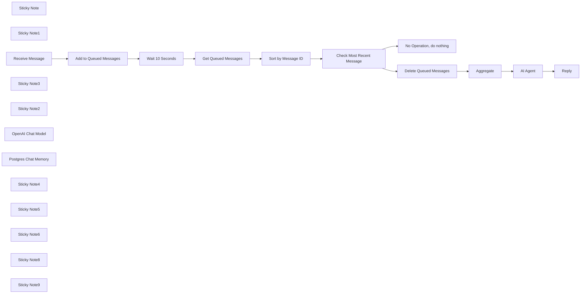

## Fluxo (.json) :

```json
{
  "id": "DnHvQ3KL8v8r5L5Z",
  "meta": {
    "instanceId": "ac63467607103d9c95dd644384984672b90b1cb03e07edbaf18fe72b2a6c45bb",
    "templateCredsSetupCompleted": true
  },
  "name": "Telegram Chat with Buffering",
  "tags": [],
  "nodes": [
    {
      "id": "a3cc74e9-c696-48de-a04e-d48555641897",
      "name": "Sticky Note",
      "type": "n8n-nodes-base.stickyNote",
      "position": [
        -1640,
        -800
      ],
      "parameters": {
        "color": 7,
        "width": 220,
        "height": 280,
        "content": "## 1. Receive Message\n\n"
      },
      "typeVersion": 1
    },
    {
      "id": "ff18667d-0a31-4768-acf8-ed0d53b2f382",
      "name": "Sticky Note1",
      "type": "n8n-nodes-base.stickyNote",
      "position": [
        160,
        -840
      ],
      "parameters": {
        "color": 7,
        "width": 600,
        "height": 520,
        "content": "## 3. AI Assistant\n"
      },
      "typeVersion": 1
    },
    {
      "id": "ce90f954-19b6-4224-ae88-b20c4da639e6",
      "name": "Reply",
      "type": "n8n-nodes-base.telegram",
      "position": [
        920,
        -700
      ],
      "webhookId": "e3313c88-0d56-4d06-81cf-b48870dfe2fe",
      "parameters": {
        "text": "={{ $json.output }}",
        "chatId": "={{ $('Receive Message').item.json.message.chat.id }}",
        "additionalFields": {
          "appendAttribution": false
        }
      },
      "credentials": {
        "telegramApi": {
          "id": "lvrGkOs0ywXp5agp",
          "name": "Telegram bsde.ai"
        }
      },
      "typeVersion": 1.2
    },
    {
      "id": "6f46d89b-034c-47ea-a217-8d007bec1531",
      "name": "Receive Message",
      "type": "n8n-nodes-base.telegramTrigger",
      "position": [
        -1580,
        -680
      ],
      "webhookId": "5047a673-ca1d-4e87-b51b-893108de0a59",
      "parameters": {
        "updates": [
          "message"
        ],
        "additionalFields": {}
      },
      "credentials": {
        "telegramApi": {
          "id": "lvrGkOs0ywXp5agp",
          "name": "Telegram bsde.ai"
        }
      },
      "typeVersion": 1.1
    },
    {
      "id": "0f391daa-0e74-4058-8923-52f3c050c9ad",
      "name": "Wait 10 Seconds",
      "type": "n8n-nodes-base.wait",
      "position": [
        -1000,
        -580
      ],
      "webhookId": "87994c9a-fd20-48b6-8dbe-9af36dc40b2f",
      "parameters": {
        "amount": 10
      },
      "typeVersion": 1.1
    },
    {
      "id": "8e6495d8-db6e-4692-ade5-45239049de34",
      "name": "Sticky Note3",
      "type": "n8n-nodes-base.stickyNote",
      "position": [
        -1320,
        -760
      ],
      "parameters": {
        "color": 7,
        "width": 1400,
        "height": 440,
        "content": "## 2. Buffer Incoming Messages"
      },
      "typeVersion": 1
    },
    {
      "id": "d4876fd2-2e0b-4f82-9dc3-553f926310bd",
      "name": "Add to Queued Messages",
      "type": "n8n-nodes-base.supabase",
      "position": [
        -1240,
        -680
      ],
      "parameters": {
        "tableId": "message_queue",
        "fieldsUi": {
          "fieldValues": [
            {
              "fieldId": "user_id",
              "fieldValue": "={{ $json.message.chat.id }}"
            },
            {
              "fieldId": "message",
              "fieldValue": "={{ $json.message.text }}"
            },
            {
              "fieldId": "message_id",
              "fieldValue": "={{ $json.message.message_id }}"
            }
          ]
        }
      },
      "credentials": {
        "supabaseApi": {
          "id": "1iEg1EzFrF29iqp2",
          "name": "Supabase (bsde.ai)"
        }
      },
      "typeVersion": 1
    },
    {
      "id": "a2eeb77f-2d74-44ac-9812-c3659d2e2803",
      "name": "No Operation, do nothing",
      "type": "n8n-nodes-base.noOp",
      "position": [
        -340,
        -460
      ],
      "parameters": {},
      "typeVersion": 1
    },
    {
      "id": "638fc82e-aba1-4deb-b506-33dcf4746896",
      "name": "Aggregate",
      "type": "n8n-nodes-base.aggregate",
      "position": [
        220,
        -700
      ],
      "parameters": {
        "options": {},
        "fieldsToAggregate": {
          "fieldToAggregate": [
            {
              "fieldToAggregate": "message"
            }
          ]
        }
      },
      "typeVersion": 1
    },
    {
      "id": "772f60e5-e52f-4779-aa03-e4d532ee4b5c",
      "name": "Delete Queued Messages",
      "type": "n8n-nodes-base.supabase",
      "position": [
        -100,
        -700
      ],
      "parameters": {
        "filters": {
          "conditions": [
            {
              "keyName": "user_id",
              "keyValue": "={{ $json.user_id }}",
              "condition": "eq"
            }
          ]
        },
        "tableId": "message_queue",
        "operation": "delete"
      },
      "credentials": {
        "supabaseApi": {
          "id": "1iEg1EzFrF29iqp2",
          "name": "Supabase (bsde.ai)"
        }
      },
      "typeVersion": 1
    },
    {
      "id": "16b46a70-85a0-4c8c-94ba-172ebe9aafa4",
      "name": "Sticky Note2",
      "type": "n8n-nodes-base.stickyNote",
      "position": [
        860,
        -780
      ],
      "parameters": {
        "color": 7,
        "width": 280,
        "height": 260,
        "content": "## 4. Send Reply\n\n\n"
      },
      "typeVersion": 1
    },
    {
      "id": "9162f110-465f-4cd6-9f03-17751d7e43a4",
      "name": "OpenAI Chat Model",
      "type": "@n8n/n8n-nodes-langchain.lmChatOpenAi",
      "position": [
        380,
        -460
      ],
      "parameters": {
        "model": {
          "__rl": true,
          "mode": "list",
          "value": "gpt-4o-mini"
        },
        "options": {}
      },
      "credentials": {
        "openAiApi": {
          "id": "1OMpAMAKR9l3eUDI",
          "name": "OpenAi account"
        }
      },
      "typeVersion": 1.2
    },
    {
      "id": "b47ef0c9-725b-4837-b9e9-96a4ff2b3636",
      "name": "Sort by Message ID",
      "type": "n8n-nodes-base.sort",
      "position": [
        -580,
        -680
      ],
      "parameters": {
        "options": {},
        "sortFieldsUi": {
          "sortField": [
            {
              "fieldName": "message_id"
            }
          ]
        }
      },
      "typeVersion": 1
    },
    {
      "id": "1aa80c99-eec8-4174-bcf3-c6873354ed0f",
      "name": "Get Queued Messages",
      "type": "n8n-nodes-base.supabase",
      "position": [
        -780,
        -680
      ],
      "parameters": {
        "filters": {
          "conditions": [
            {
              "keyName": "user_id",
              "keyValue": "={{ $('Receive Message').item.json.message.from.id }}",
              "condition": "eq"
            }
          ]
        },
        "tableId": "message_queue",
        "operation": "getAll",
        "returnAll": true
      },
      "credentials": {
        "supabaseApi": {
          "id": "1iEg1EzFrF29iqp2",
          "name": "Supabase (bsde.ai)"
        }
      },
      "typeVersion": 1
    },
    {
      "id": "85050328-b5aa-47fe-802c-7d9f31f225cb",
      "name": "Check Most Recent Message",
      "type": "n8n-nodes-base.if",
      "position": [
        -360,
        -680
      ],
      "parameters": {
        "options": {},
        "conditions": {
          "options": {
            "version": 2,
            "leftValue": "",
            "caseSensitive": true,
            "typeValidation": "loose"
          },
          "combinator": "and",
          "conditions": [
            {
              "id": "8852bab7-230e-442a-a4a2-994e979c8f9f",
              "operator": {
                "type": "number",
                "operation": "equals"
              },
              "leftValue": "={{ $input.last().json.message_id }}\n",
              "rightValue": "={{ $('Receive Message').item.json.message.message_id }}"
            }
          ]
        },
        "looseTypeValidation": true
      },
      "typeVersion": 2.2
    },
    {
      "id": "bed86d81-bb57-42ce-aaa7-4bdc21e1651c",
      "name": "AI Agent",
      "type": "@n8n/n8n-nodes-langchain.agent",
      "position": [
        420,
        -700
      ],
      "parameters": {
        "text": "={{ $json.message.join(String.fromCharCode(10)) }}",
        "options": {},
        "promptType": "define"
      },
      "typeVersion": 1.7
    },
    {
      "id": "4f468a14-fbea-44ec-a2b8-e4b3785c0362",
      "name": "Postgres Chat Memory",
      "type": "@n8n/n8n-nodes-langchain.memoryPostgresChat",
      "position": [
        560,
        -460
      ],
      "parameters": {
        "sessionKey": "={{ $('Receive Message').item.json.message.chat.id }}",
        "sessionIdType": "customKey"
      },
      "credentials": {
        "postgres": {
          "id": "tzLXHvhykxvYghPC",
          "name": "bsde.ai Supabase (Session Pooler)"
        }
      },
      "typeVersion": 1.3
    },
    {
      "id": "610516e8-d4ad-448e-ac97-17aad1a31862",
      "name": "Sticky Note4",
      "type": "n8n-nodes-base.stickyNote",
      "position": [
        -2420,
        -820
      ],
      "parameters": {
        "width": 700,
        "height": 420,
        "content": "## Allow Users to Send a Sequence of Messages to an AI Agent in Telegram with Supabase\n### Use Case\nWhen creating chatbots that interface through applications such as **Telegram** and **WhatsApp**, users can often sends multiple shorter messages in quick succession, in place of a single, longer message. This workflow accounts for this behaviour.\n### What it Does\nThis workflow allows users to send several messages in quick succession, treating them as one coherent conversation instead of separate messages requiring individual responses. \n### How it Works\n1. When messages arrive, they are stored in a **Supabase PostgreSQL** table\n2. The system waits briefly to see if additional messages arrive\n3. If no new messages arrive within the waiting period, all queued messages are:\n   - Combined and processed as a single conversation\n   - Responded to with one unified reply\n   - Deleted from the queue"
      },
      "typeVersion": 1
    },
    {
      "id": "c8bd8777-fb0f-4941-8674-f5bb7c264506",
      "name": "Sticky Note5",
      "type": "n8n-nodes-base.stickyNote",
      "position": [
        -1640,
        -1060
      ],
      "parameters": {
        "width": 520,
        "height": 220,
        "content": "### Setup\n1. Create a table in Supabase called **message_queue**. It needs to have the following columns: **user_id** (`uint8`), **message** (`text`), and **message_id** (`uint8`)\n2. Add your **Telegram**, **Supabase**, **OpenAI**, and **PostgreSQL** credentials\n3. Activate the workflow and test by sending multiple messages the Telegram bot in one go\n4. Wait ten seconds after which you will receive a single reply to all of your messages"
      },
      "typeVersion": 1
    },
    {
      "id": "24604fc7-7957-4e20-8303-b31f2ce1e257",
      "name": "Sticky Note6",
      "type": "n8n-nodes-base.stickyNote",
      "position": [
        -1060,
        -700
      ],
      "parameters": {
        "color": 5,
        "width": 220,
        "height": 280,
        "content": "### Modification\nChange the value of *Wait Amount* to vary the buffering window"
      },
      "typeVersion": 1
    },
    {
      "id": "24f388f3-5655-4bd4-9c30-978efb2dc400",
      "name": "Sticky Note8",
      "type": "n8n-nodes-base.stickyNote",
      "position": [
        180,
        -480
      ],
      "parameters": {
        "color": 5,
        "width": 340,
        "height": 140,
        "content": "### Modification\nReplace this sub-node \nto use a different language\n model"
      },
      "typeVersion": 1
    },
    {
      "id": "3db12526-6b97-4e3a-b53d-987f5d20c46e",
      "name": "Sticky Note9",
      "type": "n8n-nodes-base.stickyNote",
      "position": [
        380,
        -800
      ],
      "parameters": {
        "color": 5,
        "width": 340,
        "height": 240,
        "content": "### Modification\nAdd a **System Message** to tailor the chatbot to your use case"
      },
      "typeVersion": 1
    }
  ],
  "active": true,
  "pinData": {},
  "settings": {
    "executionOrder": "v1"
  },
  "versionId": "e415eb18-1bb9-426b-b759-0ba269db1f8f",
  "connections": {
    "AI Agent": {
      "main": [
        [
          {
            "node": "Reply",
            "type": "main",
            "index": 0
          }
        ]
      ]
    },
    "Aggregate": {
      "main": [
        [
          {
            "node": "AI Agent",
            "type": "main",
            "index": 0
          }
        ]
      ]
    },
    "Receive Message": {
      "main": [
        [
          {
            "node": "Add to Queued Messages",
            "type": "main",
            "index": 0
          }
        ]
      ]
    },
    "Wait 10 Seconds": {
      "main": [
        [
          {
            "node": "Get Queued Messages",
            "type": "main",
            "index": 0
          }
        ]
      ]
    },
    "OpenAI Chat Model": {
      "ai_languageModel": [
        [
          {
            "node": "AI Agent",
            "type": "ai_languageModel",
            "index": 0
          }
        ]
      ]
    },
    "Sort by Message ID": {
      "main": [
        [
          {
            "node": "Check Most Recent Message",
            "type": "main",
            "index": 0
          }
        ]
      ]
    },
    "Get Queued Messages": {
      "main": [
        [
          {
            "node": "Sort by Message ID",
            "type": "main",
            "index": 0
          }
        ]
      ]
    },
    "Postgres Chat Memory": {
      "ai_memory": [
        [
          {
            "node": "AI Agent",
            "type": "ai_memory",
            "index": 0
          }
        ]
      ]
    },
    "Add to Queued Messages": {
      "main": [
        [
          {
            "node": "Wait 10 Seconds",
            "type": "main",
            "index": 0
          }
        ]
      ]
    },
    "Delete Queued Messages": {
      "main": [
        [
          {
            "node": "Aggregate",
            "type": "main",
            "index": 0
          }
        ]
      ]
    },
    "Check Most Recent Message": {
      "main": [
        [
          {
            "node": "Delete Queued Messages",
            "type": "main",
            "index": 0
          }
        ],
        [
          {
            "node": "No Operation, do nothing",
            "type": "main",
            "index": 0
          }
        ]
      ]
    }
  }
}
```

<a id="template-2522"></a>

## Template 2522 - Importar contatos do Pipedrive para HubSpot sem duplicatas

- **Nome:** Importar contatos do Pipedrive para HubSpot sem duplicatas
- **Descrição:** Fluxo agendado que sincroniza pessoas do Pipedrive com contatos do HubSpot, criando contatos ausentes com base no email e primeiro nome.
- **Funcionalidade:** • Agendamento periódico: Executa a verificação a cada minuto para identificar novas pessoas no Pipedrive.
• Busca de contatos: Recupera todas as pessoas do Pipedrive e todos os contatos existentes no HubSpot.
• Comparação por email: Compara os emails entre as duas bases e remove correspondências para identificar registros ausentes.
• Criação de contatos: Para pessoas do Pipedrive sem equivalente no HubSpot, cria novos contatos no HubSpot usando email e primeiro nome.
- **Ferramentas:** • Pipedrive: CRM fonte de dados onde as pessoas/contatos são lidos para sincronização.
• HubSpot: Plataforma CRM destino onde o fluxo verifica contatos existentes e cria novos contatos quando necessários.

## Fluxo visual

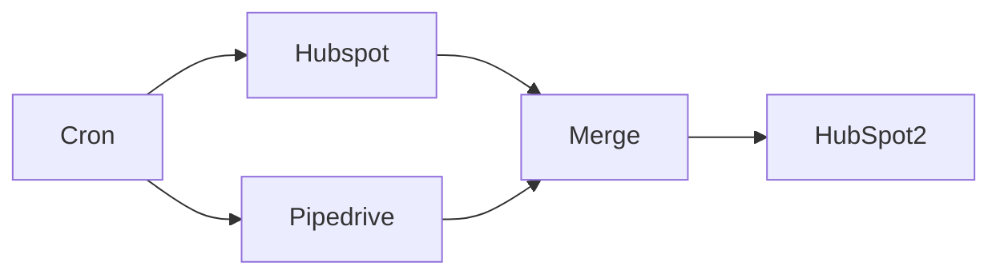

## Fluxo (.json) :

```json
{
  "nodes": [
    {
      "name": "Hubspot",
      "type": "n8n-nodes-base.hubspot",
      "position": [
        750,
        900
      ],
      "parameters": {
        "resource": "contact",
        "operation": "getAll",
        "returnAll": true,
        "additionalFields": {}
      },
      "credentials": {
        "hubspotApi": {
          "id": "21",
          "name": "hubspot_nodeqa"
        }
      },
      "typeVersion": 1
    },
    {
      "name": "Pipedrive",
      "type": "n8n-nodes-base.pipedrive",
      "position": [
        750,
        710
      ],
      "parameters": {
        "resource": "person",
        "operation": "getAll",
        "returnAll": true,
        "additionalFields": {}
      },
      "credentials": {
        "pipedriveApi": {
          "id": "15",
          "name": "asasas"
        }
      },
      "typeVersion": 1
    },
    {
      "name": "Merge",
      "type": "n8n-nodes-base.merge",
      "position": [
        950,
        800
      ],
      "parameters": {
        "mode": "removeKeyMatches",
        "propertyName1": "email[0].value",
        "propertyName2": "identity-profiles[0].identities[0].value"
      },
      "typeVersion": 1
    },
    {
      "name": "HubSpot2",
      "type": "n8n-nodes-base.hubspot",
      "position": [
        1150,
        800
      ],
      "parameters": {
        "email": "={{$json[\"email\"][0][\"value\"]}}",
        "resource": "contact",
        "additionalFields": {
          "firstName": "={{$json[\"first_name\"]}}"
        }
      },
      "credentials": {
        "hubspotApi": {
          "id": "21",
          "name": "hubspot_nodeqa"
        }
      },
      "typeVersion": 1
    },
    {
      "name": "Cron",
      "type": "n8n-nodes-base.cron",
      "position": [
        550,
        800
      ],
      "parameters": {
        "triggerTimes": {
          "item": [
            {
              "mode": "everyMinute"
            }
          ]
        }
      },
      "typeVersion": 1
    }
  ],
  "connections": {
    "Cron": {
      "main": [
        [
          {
            "node": "Pipedrive",
            "type": "main",
            "index": 0
          },
          {
            "node": "Hubspot",
            "type": "main",
            "index": 0
          }
        ]
      ]
    },
    "Merge": {
      "main": [
        [
          {
            "node": "HubSpot2",
            "type": "main",
            "index": 0
          }
        ]
      ]
    },
    "Hubspot": {
      "main": [
        [
          {
            "node": "Merge",
            "type": "main",
            "index": 1
          }
        ]
      ]
    },
    "Pipedrive": {
      "main": [
        [
          {
            "node": "Merge",
            "type": "main",
            "index": 0
          }
        ]
      ]
    }
  }
}
```

<a id="template-2523"></a>

## Template 2523 - Onboarding automático de clientes

- **Nome:** Onboarding automático de clientes
- **Descrição:** Fluxo que detecta a criação de um novo contato no CRM ou via webhook, gera um e-mail de boas-vindas personalizado com ajuda de IA, agenda automaticamente uma reunião no calendário do remetente e atribui um responsável pelo contato.
- **Funcionalidade:** • Detecção de entrada: inicia a automação a partir de um webhook ou de um evento no CRM (contato criado).
• Recuperação de dados do contato: busca informações completas do novo contato para personalização.
• Seleção e atribuição de proprietário: obtém a lista de proprietários e define o owner adequado para o contato no CRM.
• Geração de e-mail personalizado por IA: cria assunto e corpo do e-mail adaptados ao cliente, incluindo instrução para agendar reunião.
• Agendamento automático de reunião: encontra um horário livre e cria um evento no calendário do remetente, inserindo o cliente como participante.
• Conversão de conteúdo para envio: transforma o corpo gerado em formato HTML pronto para envio.
• Envio de e-mail: envia o e-mail de boas-vindas ao cliente (com opção de BCC) e registra ações subsequentes.
• Tratamento de falhas e confirmação: respostas distintas para sucesso ou necessidade de tentar novamente em ações de calendário.
- **Ferramentas:** • HubSpot: fonte de eventos de contato, busca de dados do contato e atualização/atribuição de proprietário.
• Google Calendar: gerenciamento de agenda (buscar horários, criar, atualizar e deletar eventos).
• Gmail: envio do e-mail de boas-vindas ao cliente.
• OpenAI: geração do conteúdo do e-mail e instruções estruturadas para automação do agendamento.

## Fluxo visual

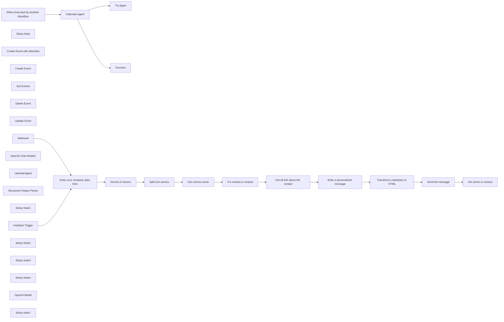

## Fluxo (.json) :

```json
{
  "nodes": [
    {
      "id": "b9256d00-9dff-432a-a678-e71a4074b26c",
      "name": "Webhook",
      "type": "n8n-nodes-base.webhook",
      "position": [
        -20,
        -160
      ],
      "webhookId": "06d29616-8fa9-42cf-8b5f-abe856083c75",
      "parameters": {
        "path": "06d29616-8fa9-42cf-8b5f-abe856083c75",
        "options": {},
        "httpMethod": "POST"
      },
      "typeVersion": 2
    },
    {
      "id": "2726dd28-5366-4c0e-ad16-bae6dc2cbc0b",
      "name": "Sticky Note",
      "type": "n8n-nodes-base.stickyNote",
      "position": [
        -880,
        -200
      ],
      "parameters": {
        "color": 4,
        "width": 320,
        "height": 440,
        "content": "## What does it do?\nObjective:\n\nStreamline the onboarding process for new customers, ensuring they receive all necessary resources and support.\nTrigger: Set a webhook trigger or a CRM trigger (like HubSpot or Salesforce) for when a new customer is added.\n\nSend Welcome Email: Use the Gmail or SMTP node to send a personalized welcome email to the customer.\n\nSchedule a Welcome Call: Use the Calendar node (Google Calendar) to automatically create a calendar event for a welcome call.\n\nAssign a CSM: Use the CRM node (like HubSpot) to assign the new customer to a dedicated CSM."
      },
      "typeVersion": 1
    },
    {
      "id": "680bdd4e-f382-4d20-8197-a7d65454ce36",
      "name": "Try Again",
      "type": "n8n-nodes-base.set",
      "position": [
        1000,
        500
      ],
      "parameters": {
        "options": {},
        "assignments": {
          "assignments": [
            {
              "id": "7ab380a2-a8d3-421c-ab4e-748ea8fb7904",
              "name": "response",
              "type": "string",
              "value": "Unable to perform task. Please try again."
            }
          ]
        }
      },
      "typeVersion": 3.4
    },
    {
      "id": "1ab48997-7533-4572-86d5-980af557d09d",
      "name": "Success",
      "type": "n8n-nodes-base.set",
      "position": [
        1000,
        300
      ],
      "parameters": {
        "options": {},
        "assignments": {
          "assignments": [
            {
              "id": "39c2f302-03be-4464-a17a-d7cc481d6d44",
              "name": "=response",
              "type": "string",
              "value": "={{$json.output}}"
            }
          ]
        }
      },
      "typeVersion": 3.4
    },
    {
      "id": "4cb493a1-1eff-42ca-9c51-8f070fe3e9ba",
      "name": "Calendar Agent",
      "type": "@n8n/n8n-nodes-langchain.agent",
      "onError": "continueErrorOutput",
      "position": [
        412,
        400
      ],
      "parameters": {
        "text": "={{ $json.query }}",
        "options": {
          "systemMessage": "=# Overview\nYou are a calendar assistant. Your responsibilities include creating, getting, and deleting events in the user's calendar.\nIf no date is proposed, find the next available slot using \"Get Events\" and create an event using \"Create Event with Attendee\"\n\n**Calendar Management Tools**  \n   - Use \"Create Event with Attendee\" when an event includes a participant.     \n   - Use \"Get Events\" to fetch calendar schedules when requested.\n   - Use \"Delete Event\" to delete an event. You must use \"Get Events\" first to get the ID of the event to delete.\n   - Use \"Update Event\" to update an event. You must use \"Get Events\" first to get the ID of the event to update.\n\n## Final Notes\nHere is the current date/time: {{ $now }}\nIf a duration for an event isn't specified, assume it will be one hour."
        },
        "promptType": "define"
      },
      "typeVersion": 1.6
    },
    {
      "id": "8c088b37-1005-4bc4-bdf5-0558ccb0c873",
      "name": "Create Event with Attendee",
      "type": "n8n-nodes-base.googleCalendarTool",
      "position": [
        320,
        620
      ],
      "parameters": {
        "end": "={{ $fromAI(\"eventEnd\") }}",
        "start": "={{ $fromAI(\"eventStart\") }}",
        "calendar": {
          "__rl": true,
          "mode": "id",
          "value": "={{ /*n8n-auto-generated-fromAI-override*/ $fromAI('Calendar', ``, 'string') }}",
          "__regex": "(^[a-zA-Z0-9.!#$%&’*+/=?^_`{|}~-]+@[a-zA-Z0-9-]+(?:\\.[a-zA-Z0-9-]+)*)"
        },
        "additionalFields": {
          "summary": "={{ $fromAI(\"eventTitle\") }}",
          "attendees": [
            "={{ $fromAI(\"eventAttendeeEmail\") }}"
          ]
        }
      },
      "credentials": {
        "googleCalendarOAuth2Api": {
          "id": "90bjjmYqtg3hnvFM",
          "name": "Google Calendar account"
        }
      },
      "typeVersion": 1.3
    },
    {
      "id": "91a0e49a-888f-4511-94e7-e0166ce7dd58",
      "name": "Create Event",
      "type": "n8n-nodes-base.googleCalendarTool",
      "position": [
        440,
        620
      ],
      "parameters": {
        "end": "={{ $fromAI(\"eventEnd\") }}",
        "start": "={{ $fromAI(\"eventStart\") }}",
        "calendar": {
          "__rl": true,
          "mode": "id",
          "value": "={{ /*n8n-auto-generated-fromAI-override*/ $fromAI('Calendar', ``, 'string') }}",
          "__regex": "(^[a-zA-Z0-9.!#$%&’*+/=?^_`{|}~-]+@[a-zA-Z0-9-]+(?:\\.[a-zA-Z0-9-]+)*)"
        },
        "additionalFields": {
          "summary": "={{ $fromAI(\"eventTitle\") }}",
          "attendees": []
        }
      },
      "credentials": {
        "googleCalendarOAuth2Api": {
          "id": "90bjjmYqtg3hnvFM",
          "name": "Google Calendar account"
        }
      },
      "typeVersion": 1.3
    },
    {
      "id": "8cfb90e5-6108-4003-b048-271650d4bc6c",
      "name": "Get Events",
      "type": "n8n-nodes-base.googleCalendarTool",
      "position": [
        560,
        620
      ],
      "parameters": {
        "options": {},
        "timeMax": "={{ $fromAI(\"dayBefore\",\"today plus 7 days\") }}",
        "timeMin": "={{ $fromAI(\"dayAfter\",\"today\") }}",
        "calendar": {
          "__rl": true,
          "mode": "id",
          "value": "={{ $fromAI('Calendar', `sender's email`, 'string') }}"
        },
        "operation": "getAll"
      },
      "credentials": {
        "googleCalendarOAuth2Api": {
          "id": "90bjjmYqtg3hnvFM",
          "name": "Google Calendar account"
        }
      },
      "typeVersion": 1.3
    },
    {
      "id": "c5cc3550-7d9a-43c9-8434-e1ab78f7f596",
      "name": "Delete Event",
      "type": "n8n-nodes-base.googleCalendarTool",
      "position": [
        680,
        620
      ],
      "parameters": {
        "eventId": "={{ $fromAI(\"eventID\") }}",
        "options": {},
        "calendar": {
          "__rl": true,
          "mode": "id",
          "value": "={{ /*n8n-auto-generated-fromAI-override*/ $fromAI('Calendar', ``, 'string') }}",
          "__regex": "(^[a-zA-Z0-9.!#$%&’*+/=?^_`{|}~-]+@[a-zA-Z0-9-]+(?:\\.[a-zA-Z0-9-]+)*)"
        },
        "operation": "delete"
      },
      "credentials": {
        "googleCalendarOAuth2Api": {
          "id": "90bjjmYqtg3hnvFM",
          "name": "Google Calendar account"
        }
      },
      "typeVersion": 1.3
    },
    {
      "id": "7ce45da8-dc24-4634-9f48-3864165885cd",
      "name": "Update Event",
      "type": "n8n-nodes-base.googleCalendarTool",
      "position": [
        800,
        620
      ],
      "parameters": {
        "eventId": "={{ $fromAI(\"eventID\") }}",
        "calendar": {
          "__rl": true,
          "mode": "id",
          "value": "={{ /*n8n-auto-generated-fromAI-override*/ $fromAI('Calendar', ``, 'string') }}",
          "__regex": "(^[a-zA-Z0-9.!#$%&’*+/=?^_`{|}~-]+@[a-zA-Z0-9-]+(?:\\.[a-zA-Z0-9-]+)*)"
        },
        "operation": "update",
        "updateFields": {
          "end": "={{ $fromAI(\"endTime\") }}",
          "start": "={{ $fromAI(\"startTime\") }}"
        }
      },
      "credentials": {
        "googleCalendarOAuth2Api": {
          "id": "90bjjmYqtg3hnvFM",
          "name": "Google Calendar account"
        }
      },
      "typeVersion": 1.3
    },
    {
      "id": "b46f24a4-719c-414e-94d9-ecfb1e7dfe39",
      "name": "When Executed by Another Workflow",
      "type": "n8n-nodes-base.executeWorkflowTrigger",
      "position": [
        200,
        400
      ],
      "parameters": {
        "inputSource": "passthrough"
      },
      "typeVersion": 1.1
    },
    {
      "id": "aedbe138-ed51-4300-881b-6b58928f5bb4",
      "name": "OpenAI Chat Model2",
      "type": "@n8n/n8n-nodes-langchain.lmChatOpenAi",
      "position": [
        1520,
        160
      ],
      "parameters": {
        "model": {
          "__rl": true,
          "mode": "list",
          "value": "gpt-4o-mini"
        },
        "options": {}
      },
      "credentials": {
        "openAiApi": {
          "id": "1IOLtYX7aTspCAN8",
          "name": "OpenAI Pollup"
        }
      },
      "typeVersion": 1.2
    },
    {
      "id": "a540ae6b-e1ee-4d91-988e-e60bae743377",
      "name": "calendarAgent",
      "type": "@n8n/n8n-nodes-langchain.toolWorkflow",
      "position": [
        1640,
        160
      ],
      "parameters": {
        "workflowId": {
          "__rl": true,
          "mode": "id",
          "value": "={{ $workflow.id}}",
          "cachedResultName": "={{ $workflow.id}}"
        },
        "description": "Call this tool for any calendar action.",
        "workflowInputs": {
          "value": {},
          "schema": [],
          "mappingMode": "defineBelow",
          "matchingColumns": [],
          "attemptToConvertTypes": false,
          "convertFieldsToString": false
        }
      },
      "typeVersion": 2.2
    },
    {
      "id": "64979b9f-a29a-4c53-b87a-cec84e7ba1fe",
      "name": "Structured Output Parser",
      "type": "@n8n/n8n-nodes-langchain.outputParserStructured",
      "position": [
        1760,
        160
      ],
      "parameters": {
        "jsonSchemaExample": "{\n\t\"subject\": \"\",\n\t\"body\": \"\"\n}"
      },
      "typeVersion": 1.2
    },
    {
      "id": "359d7296-a8e9-494c-b519-cca62c0805df",
      "name": "Get list of owners",
      "type": "n8n-nodes-base.httpRequest",
      "position": [
        420,
        -60
      ],
      "parameters": {
        "url": "https://api.hubapi.com/crm/v3/owners",
        "options": {},
        "authentication": "predefinedCredentialType",
        "nodeCredentialType": "hubspotOAuth2Api"
      },
      "credentials": {
        "hubspotOAuth2Api": {
          "id": "qubiIFrowxvUdpu6",
          "name": "HubSpot account for node"
        }
      },
      "typeVersion": 4.2
    },
    {
      "id": "e8aab719-a5d9-4168-9c68-eea32c7d3ef4",
      "name": "Split Out owners",
      "type": "n8n-nodes-base.splitOut",
      "position": [
        640,
        -60
      ],
      "parameters": {
        "options": {},
        "fieldToSplitOut": "results"
      },
      "typeVersion": 1
    },
    {
      "id": "5e44ea67-e2f9-4cea-a030-c452b8bb482f",
      "name": "Get current owner",
      "type": "n8n-nodes-base.filter",
      "position": [
        860,
        -60
      ],
      "parameters": {
        "options": {},
        "conditions": {
          "options": {
            "version": 2,
            "leftValue": "",
            "caseSensitive": true,
            "typeValidation": "strict"
          },
          "combinator": "and",
          "conditions": [
            {
              "id": "7c6aec6e-66a9-4739-8a59-28f2ab1c4a26",
              "operator": {
                "type": "string",
                "operation": "equals"
              },
              "leftValue": "={{ $json.email }}",
              "rightValue": "={{ $('Enter your company data here').item.json.sender_email }}"
            }
          ]
        }
      },
      "typeVersion": 2.2
    },
    {
      "id": "c03bd58c-7a42-4966-96e8-45928f745475",
      "name": "Sticky Note1",
      "type": "n8n-nodes-base.stickyNote",
      "position": [
        -540,
        -200
      ],
      "parameters": {
        "color": 5,
        "width": 680,
        "height": 1340,
        "content": "## How to Set a Webhook in n8n and HubSpot\n\n## 1. Set Up a Webhook in n8n\n\n### Step 1: Create a New Workflow\n- Go to your **n8n dashboard**.\n- Click on **\"New Workflow.\"**\n\n### Step 2: Add the Webhook Node\n- Click on the **“+”** icon to add a new node.\n- Search for **“Webhook”** and select it.\n- Set the **Webhook Method** (usually POST).\n- Define the **Webhook URL path**, for example, `/hubspot-webhook`.\n- Set the **\"Response Mode\"** (e.g., \"On Received\").\n- Save the workflow.\n\n### Step 3: Set Webhook URL\n- Copy the **Webhook URL** generated by n8n. It should look something like:https://your-n8n-domain/webhook/hubspot-webhook\n\n- Ensure the workflow is **active**.\n\n---\n\n## 2. Set Up a Webhook in HubSpot\n\n### Step 1: Log in to HubSpot\n- Go to **HubSpot Developer Account** (required for webhook setup).\n- Navigate to **\"Settings\" > \"Integrations\" > \"Webhooks.\"**\n\n### Step 2: Create a New Webhook Subscription\n- Click **“Create Webhook”** or **“Add Webhook”** if this is your first one.\n- Select the **events** you want to track (e.g., contact creation, form submission).\n- Set the **Webhook URL** as the n8n Webhook URL you copied earlier.\n- Choose **“POST”** as the request method.\n- Set the **Authentication** if needed (you can set a secret or use OAuth).\n\n### Step 3: Test the Webhook\n- Use the **“Test Webhook”** feature in HubSpot to send a test request.\n- Switch to n8n and ensure the webhook is triggering properly.\n\n---\n\n## 3. Process the Data in n8n\n- After the webhook is triggered in n8n, you will see the data sent by HubSpot.\n- You can now add additional nodes to **process the data** (e.g., save to database, send email, perform actions in another app).\n\n---\n\n## 4. Make the Workflow Active\n- Once you are done configuring, make sure the workflow is **set to “Active.”**\n- This will allow it to receive live data from HubSpot."
      },
      "typeVersion": 1
    },
    {
      "id": "3861fa49-909d-4591-a1b8-d7bdd20e6560",
      "name": "HubSpot Trigger",
      "type": "n8n-nodes-base.hubspotTrigger",
      "position": [
        -20,
        40
      ],
      "webhookId": "632f3fc8-b921-4697-ba12-037d5c7f8971",
      "parameters": {
        "eventsUi": {
          "eventValues": [
            {}
          ]
        },
        "additionalFields": {}
      },
      "credentials": {
        "hubspotDeveloperApi": {
          "id": "DVrqcbIPANwtlVSg",
          "name": "HubSpot Developer account for trigger"
        }
      },
      "typeVersion": 1
    },
    {
      "id": "9051cc3d-06be-4238-998e-7cb938313d24",
      "name": "Enter your company data here",
      "type": "n8n-nodes-base.set",
      "position": [
        200,
        -60
      ],
      "parameters": {
        "options": {},
        "assignments": {
          "assignments": [
            {
              "id": "11a8b9e9-a7ed-454a-9aef-a9137c0e17ea",
              "name": "company_name",
              "type": "string",
              "value": "Pollup Data Services"
            },
            {
              "id": "f2dcfe2e-3145-4a30-9731-0a8d02c7aa9a",
              "name": "sender_name",
              "type": "string",
              "value": "Thomas Vié"
            },
            {
              "id": "18b5c0bd-4e75-4b98-92fc-5fca90a8b680",
              "name": "sender_email",
              "type": "string",
              "value": "zeerobug@gmail.com"
            },
            {
              "id": "2c8de3ed-57dc-455b-bfa5-87a0d8d046d2",
              "name": "company_activity",
              "type": "string",
              "value": "Whether it’s automating recurring tasks, analysing data faster, or personalising customer interactions, we build bespoke AI agents to help your workforce work smarter."
            }
          ]
        }
      },
      "notesInFlow": true,
      "typeVersion": 3.4
    },
    {
      "id": "5260ec73-0733-47d1-af03-66ead128820e",
      "name": "Sticky Note2",
      "type": "n8n-nodes-base.stickyNote",
      "position": [
        160,
        -200
      ],
      "parameters": {
        "color": 4,
        "width": 400,
        "height": 320,
        "content": "## Set your data and your company's \nThe sender_email you set here has to be the same as the one you use in hubspot "
      },
      "typeVersion": 1
    },
    {
      "id": "78e301c7-3146-4bd9-9546-9f8c5b46cac7",
      "name": "If a contact is created",
      "type": "n8n-nodes-base.if",
      "position": [
        1080,
        -60
      ],
      "parameters": {
        "options": {},
        "conditions": {
          "options": {
            "version": 2,
            "leftValue": "",
            "caseSensitive": true,
            "typeValidation": "strict"
          },
          "combinator": "and",
          "conditions": [
            {
              "id": "b70f4699-008f-4924-8e69-af4fa69422a5",
              "operator": {
                "name": "filter.operator.equals",
                "type": "string",
                "operation": "equals"
              },
              "leftValue": "={{ $('Webhook').item.json.body[0].subscriptionType }}",
              "rightValue": "contact.creation"
            }
          ]
        }
      },
      "typeVersion": 2.2
    },
    {
      "id": "b575fed7-da03-412d-aa00-fcf0edc85ae2",
      "name": "Get all info about the contact",
      "type": "n8n-nodes-base.hubspot",
      "position": [
        1300,
        -60
      ],
      "parameters": {
        "contactId": {
          "__rl": true,
          "mode": "id",
          "value": "={{ $('Webhook').item.json.body[0].objectId }}"
        },
        "operation": "get",
        "authentication": "oAuth2",
        "additionalFields": {}
      },
      "credentials": {
        "hubspotOAuth2Api": {
          "id": "qubiIFrowxvUdpu6",
          "name": "HubSpot account for node"
        }
      },
      "typeVersion": 2.1
    },
    {
      "id": "956a02eb-970b-49bd-b1a5-3eebf7acb852",
      "name": "Write a personalized message",
      "type": "@n8n/n8n-nodes-langchain.agent",
      "position": [
        1552,
        -60
      ],
      "parameters": {
        "text": "=Your task is to write a personalized Welcome email to a recipient.\nWrite also to indicate him that he will receive shortly an invitation for a meeting to resolve his doubts. Use for that the calendarAgent.\nUse the \"Sender's calendar ID\" as the Calendar. And the \"Recipient email\" as an attendee\n\n## Tools\n- calendarAgent: Use this tool to take action in calendar. Send it a query like \"Schedule a meeting with attendee 'Recipient email' on 'Sender's calendar ID' calendar.\"\n\n## Rules\n- Some actions require you to look up contact information first. For the following actions, you must get contact information and send that to the agent who needs it:\n- creating calendar event with attendee, create it as son as there is some free slot\n\nreturn the message as a json like this one:{\"subject\":\"Subject of the message\",\"body\":\"Body of the message\"}\n\n## Use the variables below\nSender's name:  {{ $('Enter your company data here').item.json.sender_name }}\nSender's email: {{ $('Enter your company data here').item.json.sender_email }}\nSender's company name: {{ $('Enter your company data here').item.json.company_name }}\nSender's company activity: {{ $('Enter your company data here').item.json.company_activity }}\nSender's calendar ID: zeerobug@gmail.com\nRecipient first name: {{ $json.properties.firstname.value }}\nRecipient last name: {{ $json.properties.lastname }}\nRecipient email: {{ $json.properties.email.value }}",
        "options": {
          "systemMessage": "=# Overview\nYou are a professional Customer Success Manager.\n"
        },
        "promptType": "define",
        "hasOutputParser": true
      },
      "typeVersion": 1.9
    },
    {
      "id": "6d392f67-5940-43ed-ac8d-d27f8dab91ed",
      "name": "Send the message",
      "type": "n8n-nodes-base.gmail",
      "position": [
        2180,
        -60
      ],
      "webhookId": "d1d18d77-71ad-4eab-91c6-08b6a9f5d736",
      "parameters": {
        "sendTo": "={{ $('Get all info about the contact').item.json.properties.email.value }}",
        "message": "={{ $json.data }}",
        "options": {
          "bccList": "thomas@pollup.net"
        },
        "subject": "={{ $json.output.subject }}"
      },
      "credentials": {
        "gmailOAuth2": {
          "id": "DLjspol9TLgpGaXa",
          "name": "Gmail account 2"
        }
      },
      "typeVersion": 2.1
    },
    {
      "id": "1928e760-4ca1-443c-9de0-211b3c3c88b8",
      "name": "Set owner to contact",
      "type": "n8n-nodes-base.hubspot",
      "position": [
        2400,
        -60
      ],
      "parameters": {
        "email": "={{ $('Get all info about the contact').item.json.properties.email.value }}",
        "options": {},
        "authentication": "oAuth2",
        "additionalFields": {
          "contactOwner": "={{ $('Get current owner').item.json.id }}"
        }
      },
      "credentials": {
        "hubspotOAuth2Api": {
          "id": "qubiIFrowxvUdpu6",
          "name": "HubSpot account for node"
        }
      },
      "typeVersion": 2.1
    },
    {
      "id": "727e52cc-ba62-4f1e-b7b3-c8cd17ef1f42",
      "name": "Sticky Note3",
      "type": "n8n-nodes-base.stickyNote",
      "position": [
        160,
        220
      ],
      "parameters": {
        "color": 4,
        "width": 1080,
        "height": 560,
        "content": "## Calendar tool\nThis part has been borrowed from the excellent [Nate Herk](https://www.youtube.com/@nateherk) youtube channel"
      },
      "typeVersion": 1
    },
    {
      "id": "e605ec3f-ecbe-47c7-a46b-d20ded665c55",
      "name": "Transforms markdown to HTML",
      "type": "n8n-nodes-base.markdown",
      "position": [
        1960,
        -60
      ],
      "parameters": {
        "mode": "markdownToHtml",
        "options": {},
        "markdown": "={{ $json.output.body }}"
      },
      "typeVersion": 1
    },
    {
      "id": "ac43422a-3642-424c-a95a-902652705dbc",
      "name": "Sticky Note4",
      "type": "n8n-nodes-base.stickyNote",
      "position": [
        1460,
        -220
      ],
      "parameters": {
        "color": 4,
        "width": 440,
        "height": 540,
        "content": "## Email writer\n- This agent writes a personalized Email\n- Uses the calendar Agent tool to create an appointmenton an empty slot.\nFeel free to personalize the prompt"
      },
      "typeVersion": 1
    },
    {
      "id": "c0e5511a-a84f-4603-9c23-3d5266f761c1",
      "name": "OpenAI Model",
      "type": "@n8n/n8n-nodes-langchain.lmChatOpenAi",
      "position": [
        200,
        620
      ],
      "parameters": {
        "model": "gpt-4o",
        "options": {}
      },
      "credentials": {
        "openAiApi": {
          "id": "1IOLtYX7aTspCAN8",
          "name": "OpenAI Pollup"
        }
      },
      "typeVersion": 1
    },
    {
      "id": "c195ad96-7b04-4b01-a3a5-cb0df3c5cb26",
      "name": "Sticky Note7",
      "type": "n8n-nodes-base.stickyNote",
      "position": [
        -880,
        260
      ],
      "parameters": {
        "width": 320,
        "height": 260,
        "content": "## Contact me\n- If you need any modification to this workflow\n- if you need some help with this workflow\n- Or if you need any workflow in n8n, Make, or Langchain / Langgraph\n\nWrite to me: [thomas@pollup.net](mailto:thomas@pollup.net)\n\n**Take a look at my others workflows [here](https://n8n.io/creators/zeerobug/)**\n\n"
      },
      "typeVersion": 1
    }
  ],
  "connections": {
    "Webhook": {
      "main": [
        [
          {
            "node": "Enter your company data here",
            "type": "main",
            "index": 0
          }
        ]
      ]
    },
    "Get Events": {
      "ai_tool": [
        [
          {
            "node": "Calendar Agent",
            "type": "ai_tool",
            "index": 0
          }
        ]
      ]
    },
    "Create Event": {
      "ai_tool": [
        [
          {
            "node": "Calendar Agent",
            "type": "ai_tool",
            "index": 0
          }
        ]
      ]
    },
    "Delete Event": {
      "ai_tool": [
        [
          {
            "node": "Calendar Agent",
            "type": "ai_tool",
            "index": 0
          }
        ]
      ]
    },
    "OpenAI Model": {
      "ai_languageModel": [
        [
          {
            "node": "Calendar Agent",
            "type": "ai_languageModel",
            "index": 0
          }
        ]
      ]
    },
    "Update Event": {
      "ai_tool": [
        [
          {
            "node": "Calendar Agent",
            "type": "ai_tool",
            "index": 0
          }
        ]
      ]
    },
    "calendarAgent": {
      "ai_tool": [
        [
          {
            "node": "Write a personalized message",
            "type": "ai_tool",
            "index": 0
          }
        ]
      ]
    },
    "Calendar Agent": {
      "main": [
        [
          {
            "node": "Success",
            "type": "main",
            "index": 0
          }
        ],
        [
          {
            "node": "Try Again",
            "type": "main",
            "index": 0
          }
        ]
      ]
    },
    "HubSpot Trigger": {
      "main": [
        [
          {
            "node": "Enter your company data here",
            "type": "main",
            "index": 0
          }
        ]
      ]
    },
    "Send the message": {
      "main": [
        [
          {
            "node": "Set owner to contact",
            "type": "main",
            "index": 0
          }
        ]
      ]
    },
    "Split Out owners": {
      "main": [
        [
          {
            "node": "Get current owner",
            "type": "main",
            "index": 0
          }
        ]
      ]
    },
    "Get current owner": {
      "main": [
        [
          {
            "node": "If a contact is created",
            "type": "main",
            "index": 0
          }
        ]
      ]
    },
    "Get list of owners": {
      "main": [
        [
          {
            "node": "Split Out owners",
            "type": "main",
            "index": 0
          }
        ]
      ]
    },
    "OpenAI Chat Model2": {
      "ai_languageModel": [
        [
          {
            "node": "Write a personalized message",
            "type": "ai_languageModel",
            "index": 0
          }
        ]
      ]
    },
    "If a contact is created": {
      "main": [
        [
          {
            "node": "Get all info about the contact",
            "type": "main",
            "index": 0
          }
        ]
      ]
    },
    "Structured Output Parser": {
      "ai_outputParser": [
        [
          {
            "node": "Write a personalized message",
            "type": "ai_outputParser",
            "index": 0
          }
        ]
      ]
    },
    "Create Event with Attendee": {
      "ai_tool": [
        [
          {
            "node": "Calendar Agent",
            "type": "ai_tool",
            "index": 0
          }
        ]
      ]
    },
    "Transforms markdown to HTML": {
      "main": [
        [
          {
            "node": "Send the message",
            "type": "main",
            "index": 0
          }
        ]
      ]
    },
    "Enter your company data here": {
      "main": [
        [
          {
            "node": "Get list of owners",
            "type": "main",
            "index": 0
          }
        ]
      ]
    },
    "Write a personalized message": {
      "main": [
        [
          {
            "node": "Transforms markdown to HTML",
            "type": "main",
            "index": 0
          }
        ]
      ]
    },
    "Get all info about the contact": {
      "main": [
        [
          {
            "node": "Write a personalized message",
            "type": "main",
            "index": 0
          }
        ]
      ]
    },
    "When Executed by Another Workflow": {
      "main": [
        [
          {
            "node": "Calendar Agent",
            "type": "main",
            "index": 0
          }
        ]
      ]
    }
  }
}
```

<a id="template-2524"></a>

## Template 2524 - Gerador periódico de telemetria de máquina

- **Nome:** Gerador periódico de telemetria de máquina
- **Descrição:** Fluxo que gera periodicamente dados simulados de uma máquina industrial e os envia como mensagem para um broker AMQP.
- **Funcionalidade:** • Gatilho periódico: inicia o processo em intervalos regulares para geração contínua de dados.
• Geração de dados simulados: cria valores aleatórios para temperatura (em Celsius) e tempo de atividade (uptime), além de incluir um identificador de máquina fixo.
• Inclusão de carimbo de tempo: adiciona um timestamp (milissegundos desde o epoch) a cada mensagem gerada.
• Montagem de mensagem como objeto: organiza os campos gerados em um único objeto de telemetria.
• Envio para sistema de mensageria: encaminha cada objeto de telemetria para o destino configurado para processamento ou ingestão downstream.
- **Ferramentas:** • Broker AMQP (fila de mensagens): destino configurado chamado "berlin_factory_01" para recepção das mensagens de telemetria (ex.: RabbitMQ ou outro broker compatível com AMQP).

## Fluxo visual


## Fluxo (.json) :

```json
{
  "id": "167",
  "name": "Smart Factory Data Generator",
  "nodes": [
    {
      "name": "Set",
      "type": "n8n-nodes-base.set",
      "position": [
        650,
        300
      ],
      "parameters": {
        "values": {
          "number": [],
          "string": [
            {
              "name": "machine_id.name",
              "value": "n8n_cr8"
            },
            {
              "name": "temperature_celsius",
              "value": "={{Math.floor(Math.random() * 100);}}"
            },
            {
              "name": "machine_id.uptime",
              "value": "={{Math.floor(Math.random() * 100);}}"
            },
            {
              "name": "time_stamp",
              "value": "={{Date.now();}}"
            }
          ],
          "boolean": []
        },
        "options": {}
      },
      "typeVersion": 1
    },
    {
      "name": "Interval",
      "type": "n8n-nodes-base.interval",
      "position": [
        450,
        300
      ],
      "parameters": {},
      "typeVersion": 1
    },
    {
      "name": "AMQP Sender",
      "type": "n8n-nodes-base.amqp",
      "position": [
        850,
        300
      ],
      "parameters": {
        "sink": "berlin_factory_01",
        "options": {
          "dataAsObject": true
        }
      },
      "credentials": {
        "amqp": ""
      },
      "typeVersion": 1
    }
  ],
  "active": false,
  "settings": {},
  "connections": {
    "Set": {
      "main": [
        [
          {
            "node": "AMQP Sender",
            "type": "main",
            "index": 0
          }
        ]
      ]
    },
    "Interval": {
      "main": [
        [
          {
            "node": "Set",
            "type": "main",
            "index": 0
          }
        ]
      ]
    }
  }
}
```

<a id="template-2525"></a>

## Template 2525 - Criar posts WordPress a partir de PDF com aprovação humana

- **Nome:** Criar posts WordPress a partir de PDF com aprovação humana
- **Descrição:** Automatiza a transformação de documentos PDF em posts para WordPress, integrando geração de conteúdo por IA, criação de imagem, revisão humana por e-mail e publicação como rascunho.
- **Funcionalidade:** • Upload de PDF: Aceita envio de arquivo PDF via formulário para iniciar o processo.
• Extração de texto: Converte o conteúdo do PDF em texto ou HTML para análise posterior.
• Geração de post por IA: Cria título SEO-friendly e conteúdo formatado em HTML a partir do texto extraído.
• Validação de título e conteúdo: Verifica se o post gerado contém título e corpo antes de prosseguir.
• Aprovação humana por Gmail: Envia o rascunho por e-mail para revisão e aguarda confirmação do revisor antes de publicar.
• Geração automática de imagem: Cria uma imagem de capa baseada no título/conteúdo do post.
• Upload e definição de imagem destacada: Faz o upload da imagem para o site e a define como featured image do post.
• Criação de rascunho no WordPress: Publica o conteúdo como rascunho no site para revisão posterior.
• Notificações e fallback: Envia notificações via Telegram e e-mail; trata erros enviando alertas apropriados.
• Opção de salvar imagem externa: Converte e envia a imagem para serviço de hospedagem de imagens como backup/opção alternativa.
- **Ferramentas:** • OpenAI (GPT): Gera título e conteúdo do blog a partir do texto extraído do PDF.
• Pollinations.ai: Gera imagens ilustrativas vibrantes para uso como capa do post.
• WordPress (REST API): Recebe o conteúdo e mídia para criar rascunhos e definir imagem destacada no site.
• imgbb: Hospeda imagens geradas como alternativa/backup de mídia.
• Gmail: Envia e aguarda aprovações humanas via e-mail para permitir publicação.
• Telegram: Envia notificações e alertas de erro para stakeholders.

## Fluxo visual

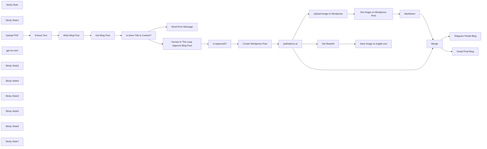

## Fluxo (.json) :

```json
{
  "id": "fSG22q8TeUtsGUGD",
  "meta": {
    "instanceId": "31e69f7f4a77bf465b805824e303232f0227212ae922d12133a0f96ffeab4fef",
    "templateCredsSetupCompleted": true
  },
  "name": "📄✨ Easy Wordpress Content Creation from PDF Document + Human In The Loop with Gmail Approval",
  "tags": [],
  "nodes": [
    {
      "id": "77d8c73c-1cdd-4795-841c-29c3b85040e0",
      "name": "Sticky Note",
      "type": "n8n-nodes-base.stickyNote",
      "position": [
        1140,
        -860
      ],
      "parameters": {
        "color": 4,
        "width": 461,
        "height": 319,
        "content": "## Upload PDF and Extract Text"
      },
      "typeVersion": 1
    },
    {
      "id": "62dc4474-1803-4b6e-8fe5-530e9baf80f7",
      "name": "Sticky Note1",
      "type": "n8n-nodes-base.stickyNote",
      "position": [
        1640,
        -860
      ],
      "parameters": {
        "color": 5,
        "width": 649,
        "height": 452,
        "content": "## Create Blog Post"
      },
      "typeVersion": 1
    },
    {
      "id": "b8da4206-f1b5-4a8f-b056-70c7558c825d",
      "name": "Upload PDF",
      "type": "n8n-nodes-base.formTrigger",
      "position": [
        1220,
        -760
      ],
      "webhookId": "6c4a4180-7206-469f-a645-f41824ccbf42",
      "parameters": {
        "path": "pdf",
        "options": {},
        "formTitle": "PDF2Blog",
        "formFields": {
          "values": [
            {
              "fieldType": "file",
              "fieldLabel": "Upload PDF File",
              "multipleFiles": false,
              "requiredField": true,
              "acceptFileTypes": ".pdf"
            }
          ]
        },
        "formDescription": "Transform PDFs into captivating blog posts"
      },
      "typeVersion": 2.1
    },
    {
      "id": "ef70bbe2-d66c-4c91-96cf-2d0500522e70",
      "name": "Extract Text",
      "type": "n8n-nodes-base.extractFromFile",
      "position": [
        1420,
        -760
      ],
      "parameters": {
        "options": {},
        "operation": "pdf",
        "binaryPropertyName": "Upload_PDF_File"
      },
      "typeVersion": 1
    },
    {
      "id": "5de90f20-e0b3-4098-b5ae-c3bf5d724fcc",
      "name": "gpt-4o-mini",
      "type": "@n8n/n8n-nodes-langchain.lmChatOpenAi",
      "position": [
        1840,
        -600
      ],
      "parameters": {
        "options": {
          "responseFormat": "text"
        }
      },
      "credentials": {
        "openAiApi": {
          "id": "jEMSvKmtYfzAkhe6",
          "name": "OpenAi account"
        }
      },
      "typeVersion": 1
    },
    {
      "id": "b6e33883-a13f-4bc8-bedc-18d93294ae75",
      "name": "pollinations.ai",
      "type": "n8n-nodes-base.httpRequest",
      "position": [
        1520,
        300
      ],
      "parameters": {
        "url": "=https://image.pollinations.ai/prompt/{{ $('Get Blog Post').item.json.title }} and avoid adding text and keep the image vibrant.",
        "options": {}
      },
      "typeVersion": 4.2
    },
    {
      "id": "d928d841-8098-406e-ad66-cf7ca653a2c4",
      "name": "Create Wordpress Post",
      "type": "n8n-nodes-base.wordpress",
      "onError": "continueRegularOutput",
      "position": [
        1220,
        300
      ],
      "parameters": {
        "title": "={{ $('Get Blog Post').item.json.title }}",
        "additionalFields": {
          "status": "draft",
          "content": "={{ $('Get Blog Post').item.json.content }}"
        }
      },
      "credentials": {
        "wordpressApi": {
          "id": "cOkzd5eeOiHaOXI2",
          "name": "Wordpress account"
        }
      },
      "typeVersion": 1,
      "alwaysOutputData": true
    },
    {
      "id": "350cf732-037b-4e60-820e-4e38aecf7e57",
      "name": "Upload Image to Wordpress",
      "type": "n8n-nodes-base.httpRequest",
      "onError": "continueRegularOutput",
      "position": [
        1880,
        120
      ],
      "parameters": {
        "url": "https://[YOUR-WORDPRESS-SITE.com]/wp-json/wp/v2/media",
        "method": "POST",
        "options": {},
        "sendBody": true,
        "contentType": "binaryData",
        "sendHeaders": true,
        "authentication": "predefinedCredentialType",
        "headerParameters": {
          "parameters": [
            {
              "name": "Content-Disposition",
              "value": "=attachment; filename=\"cover-image-{{ $('Create Wordpress Post').item.json.id }}.jpeg\""
            }
          ]
        },
        "inputDataFieldName": "data",
        "nodeCredentialType": "wordpressApi"
      },
      "credentials": {
        "wordpressApi": {
          "id": "cOkzd5eeOiHaOXI2",
          "name": "Wordpress account"
        }
      },
      "typeVersion": 4.2,
      "alwaysOutputData": true
    },
    {
      "id": "0f85ff07-13fb-40d5-8eee-7946f7064874",
      "name": "Set Image on Wordpress Post",
      "type": "n8n-nodes-base.httpRequest",
      "onError": "continueRegularOutput",
      "position": [
        2100,
        120
      ],
      "parameters": {
        "url": "=https:/[YOUR-WORDPRESS-SITE.com]/wp-json/wp/v2/posts/{{ $('Create Wordpress Post').item.json.id }}",
        "method": "POST",
        "options": {},
        "sendQuery": true,
        "authentication": "predefinedCredentialType",
        "queryParameters": {
          "parameters": [
            {
              "name": "featured_media",
              "value": "={{ $json.id }}"
            }
          ]
        },
        "nodeCredentialType": "wordpressApi"
      },
      "credentials": {
        "wordpressApi": {
          "id": "cOkzd5eeOiHaOXI2",
          "name": "Wordpress account"
        }
      },
      "typeVersion": 4.2,
      "alwaysOutputData": true
    },
    {
      "id": "3bdc1e66-251f-4904-bbc2-dd4e667a4b40",
      "name": "Sticky Note2",
      "type": "n8n-nodes-base.stickyNote",
      "position": [
        1140,
        40
      ],
      "parameters": {
        "color": 6,
        "width": 1146,
        "height": 521,
        "content": "## Create Wordpress Post and Add New Image\nhttps://docs.n8n.io/integrations/builtin/credentials/wordpress/"
      },
      "typeVersion": 1
    },
    {
      "id": "9d54b59e-5bf3-429b-856a-c3c1dcb25885",
      "name": "Sticky Note4",
      "type": "n8n-nodes-base.stickyNote",
      "position": [
        1420,
        140
      ],
      "parameters": {
        "color": 7,
        "width": 300,
        "height": 340,
        "content": "## Create Post Image\nhttps://pollinations.ai/\nhttps://image.pollinations.ai/prompt/[your image description]"
      },
      "typeVersion": 1
    },
    {
      "id": "957b63d2-68af-4c44-b145-3460ed9ea0fc",
      "name": "Send Error Message",
      "type": "n8n-nodes-base.telegram",
      "position": [
        1420,
        -240
      ],
      "webhookId": "382a3b43-b83f-47b1-a276-67c6b98a441a",
      "parameters": {
        "text": "=Error Creating Blog Post",
        "chatId": "={{ $env.TELEGRAM_CHAT_ID }}",
        "additionalFields": {
          "appendAttribution": false
        }
      },
      "credentials": {
        "telegramApi": {
          "id": "pAIFhguJlkO3c7aQ",
          "name": "Telegram account"
        }
      },
      "typeVersion": 1.2
    },
    {
      "id": "ef768593-053c-4a65-8eb9-b489cb115d2b",
      "name": "Is there Title & Content?",
      "type": "n8n-nodes-base.if",
      "position": [
        1220,
        -400
      ],
      "parameters": {
        "options": {},
        "conditions": {
          "options": {
            "version": 2,
            "leftValue": "",
            "caseSensitive": true,
            "typeValidation": "strict"
          },
          "combinator": "and",
          "conditions": [
            {
              "id": "aaf83c73-65f3-4a88-87f3-25b1acaf93ef",
              "operator": {
                "type": "string",
                "operation": "notEmpty",
                "singleValue": true
              },
              "leftValue": "={{ $json.title }}",
              "rightValue": ""
            },
            {
              "id": "d9af5bce-f0fb-4c20-8b6a-b01a3bf3e1d1",
              "operator": {
                "type": "string",
                "operation": "notEmpty",
                "singleValue": true
              },
              "leftValue": "={{ $json.content }}",
              "rightValue": ""
            }
          ]
        }
      },
      "typeVersion": 2.2
    },
    {
      "id": "a6c70ec0-2809-4c38-a2dd-a16e0b44f23e",
      "name": "Merge",
      "type": "n8n-nodes-base.merge",
      "position": [
        2380,
        280
      ],
      "parameters": {
        "mode": "combine",
        "options": {},
        "combineBy": "combineByPosition"
      },
      "typeVersion": 3
    },
    {
      "id": "2562ab36-2fba-424e-8128-387591d2077e",
      "name": "Markdown",
      "type": "n8n-nodes-base.markdown",
      "position": [
        2380,
        80
      ],
      "parameters": {
        "html": "={{ $('Get Blog Post').item.json.content }}",
        "options": {},
        "destinationKey": "markdown"
      },
      "typeVersion": 1
    },
    {
      "id": "1739fe6e-4c0e-45b0-b368-6aab5dd79db9",
      "name": "Human In The Loop Approve Blog Post",
      "type": "n8n-nodes-base.gmail",
      "position": [
        1780,
        -240
      ],
      "webhookId": "48f44283-5f68-4d7a-a2d2-a42209d35032",
      "parameters": {
        "sendTo": "joe@example.com",
        "message": "={{ $json.content }}",
        "options": {
          "limitWaitTime": {
            "values": {
              "resumeUnit": "minutes",
              "resumeAmount": 45
            }
          }
        },
        "subject": "=Approval Required for \"{{ $json.title }}\"",
        "operation": "sendAndWait",
        "approvalOptions": {
          "values": {
            "approvalType": "double"
          }
        }
      },
      "credentials": {
        "gmailOAuth2": {
          "id": "1xpVDEQ1yx8gV022",
          "name": "Gmail account"
        }
      },
      "typeVersion": 2.1
    },
    {
      "id": "ae015937-dffb-4445-a013-b22442850de7",
      "name": "Sticky Note3",
      "type": "n8n-nodes-base.stickyNote",
      "position": [
        1640,
        -360
      ],
      "parameters": {
        "color": 4,
        "width": 400,
        "height": 340,
        "content": "## 💫🤩 New - Human In The Loop"
      },
      "typeVersion": 1
    },
    {
      "id": "aafee6b1-0273-429a-9002-e0406be6c281",
      "name": "Is Approved?",
      "type": "n8n-nodes-base.if",
      "position": [
        2080,
        -240
      ],
      "parameters": {
        "options": {},
        "conditions": {
          "options": {
            "version": 2,
            "leftValue": "",
            "caseSensitive": true,
            "typeValidation": "strict"
          },
          "combinator": "and",
          "conditions": [
            {
              "id": "316594d7-7ff6-4e39-bea3-45a11b9e750f",
              "operator": {
                "type": "boolean",
                "operation": "true",
                "singleValue": true
              },
              "leftValue": "={{ $json.data.approved }}",
              "rightValue": ""
            }
          ]
        }
      },
      "typeVersion": 2.2
    },
    {
      "id": "d7aa4ec8-e936-4e05-b94a-da42f6852591",
      "name": "Gmail Final Blog",
      "type": "n8n-nodes-base.gmail",
      "position": [
        2640,
        280
      ],
      "webhookId": "07692f3b-4e21-42d3-92dd-3dce5df3112f",
      "parameters": {
        "sendTo": "joe@example.com",
        "message": "={{ $('Get Blog Post').item.json.content }}",
        "options": {},
        "subject": "={{ $('Get Blog Post').item.json.title }}"
      },
      "credentials": {
        "gmailOAuth2": {
          "id": "1xpVDEQ1yx8gV022",
          "name": "Gmail account"
        }
      },
      "typeVersion": 2.1
    },
    {
      "id": "cefad6b9-b061-4363-8221-34e15e262d00",
      "name": "Telegram Partial Blog",
      "type": "n8n-nodes-base.telegram",
      "position": [
        2640,
        80
      ],
      "webhookId": "77e3b2c9-79b7-4aa1-aa62-24da144c5f45",
      "parameters": {
        "chatId": "={{ $env.TELEGRAM_CHAT_ID }}",
        "operation": "sendPhoto",
        "binaryData": true,
        "additionalFields": {
          "caption": "={{ $json.markdown.slice(0,400) }} ..."
        }
      },
      "credentials": {
        "telegramApi": {
          "id": "pAIFhguJlkO3c7aQ",
          "name": "Telegram account"
        }
      },
      "typeVersion": 1.2
    },
    {
      "id": "503ab66d-6924-4be4-8275-3bfa3b3bf69f",
      "name": "Sticky Note5",
      "type": "n8n-nodes-base.stickyNote",
      "position": [
        420,
        -860
      ],
      "parameters": {
        "color": 7,
        "width": 680,
        "height": 1420,
        "content": "## 🎯 Description\n\nThis n8n workflow automates the process of transforming PDF documents into engaging, SEO-friendly WordPress blog posts. It incorporates AI-powered text analysis, automatic image generation, and a human review step to ensure quality before publishing.\n\n## 🚀 How It Works\n\n### 🗂️ PDF Upload & Text Extraction  \n- Users upload a PDF document through a form trigger.  \n- The workflow extracts text from the uploaded file, ensuring compatibility with supported formats.\n\n### 🤖 AI-Powered Blog Post Generation  \n- The extracted text is analyzed by an AI model (GPT-based) to create a structured blog post.  \n- The AI generates:  \n  - A captivating SEO-friendly title.  \n  - Well-formatted HTML content, including an introduction, chapters with subheadings, and a conclusion.\n\n### 🎨 Image Creation & Integration  \n- An image is generated using **Pollinations.ai** based on the blog post title.  \n- The vibrant image is uploaded to WordPress and set as the featured image for the post.\n\n### 📝 WordPress Draft Creation  \n- A draft blog post is created on WordPress with the AI-generated title, content, and featured image.  \n\n### ✅ Human-in-the-Loop Approval  \n- The draft content is sent via Gmail to a reviewer for manual approval.  \n- If approved, the post is published on WordPress. If not, an error message is sent for troubleshooting.\n\n### 📢 Multi-Channel Notifications  \n- Once published, notifications are sent via Gmail and Telegram to relevant stakeholders.  \n\n## 🔧 Setup Steps\n\n### 🔑 Configure API Credentials  \n1. Set up API connections for:  \n   - OpenAI (for AI content generation).  \n   - WordPress (for post creation and media uploads).  \n   - Gmail (for sending approval emails).  \n   - Telegram (for notifications).  \n\n### ⚙️ Customize Workflow Parameters  \n2. Adjust the AI prompt to match your desired blog structure and tone.  \n3. Modify the image generation parameters to align with your branding needs.\n\n### 🧪 Test & Deploy  \n3. Test the workflow with sample PDFs to ensure:  \n   - Accurate text extraction.  \n   - Proper formatting of generated content.  \n   - Seamless approval and publishing processes.  \n\n\nThis workflow streamlines content creation while maintaining quality control through human oversight, making it an ideal solution for efficient blog management! 🎉\n"
      },
      "typeVersion": 1
    },
    {
      "id": "8ea57c7f-256b-4a89-b62f-3a6390fec719",
      "name": "Sticky Note6",
      "type": "n8n-nodes-base.stickyNote",
      "position": [
        360,
        -960
      ],
      "parameters": {
        "width": 2520,
        "height": 1700,
        "content": "# 📄✨ Easy WordPress Content Creation from PDF Document + Human in the Loop with Gmail Approval"
      },
      "typeVersion": 1
    },
    {
      "id": "8cf6bd65-b025-45df-b556-a5fac970aa9b",
      "name": "Get Blog Post",
      "type": "n8n-nodes-base.code",
      "position": [
        2080,
        -760
      ],
      "parameters": {
        "jsCode": "// Get the HTML content from the previous node\nconst htmlContent = $input.first().json.text;\n\n// Use regex to extract the text between the first h1 tags\nconst titleRegex = /<h1>(.*?)</h1>/s;\nconst match = htmlContent.match(titleRegex);\n\n// Extract the title or set to empty string if not found\nconst title = match ? match[1] : '';\n\n// Return the extracted title\nreturn [{\n  json: {\n    title: title,\n    content: htmlContent\n  }\n}];"
      },
      "typeVersion": 2
    },
    {
      "id": "5e221628-d3b1-4242-bfa4-6a40599fa87b",
      "name": "Write Blog Post",
      "type": "@n8n/n8n-nodes-langchain.chainLlm",
      "position": [
        1740,
        -760
      ],
      "parameters": {
        "text": "={{ $json.text }}",
        "messages": {
          "messageValues": [
            {
              "message": "=Analyze the provided PDF article and create a compelling blog post. Follow these specifications:  \n\n## Title Requirements \n- Create an engaging, SEO-friendly title under 10 words \n- Must not contain a colon \n- Should capture the article's essence \n- Will be formatted as an H1 in the content  \n\n## Content Structure \n- Introduction (150-200 words)   \n  * Compelling hook   \n  * Topic context and importance   \n  * Preview of main points  \n- Main Content (6-8 chapters)   \n  * Each chapter requires:     \n    - Relevant H2 heading     \n    - 300-400 words of unique content     \n    - Specific topic focus     \n    - Source material quotes/data     \n    - Smooth transitions  \n    - Conclusion (200-250 words)   \n  * Key takeaways   \n  * Final thoughts/implications  \n\n## Formatting Guidelines \n- Use proper HTML tags throughout \n- Structure with <p> tags for paragraphs \n- Include appropriate spacing \n- Use <blockquote> for direct quotes \n- Maintain consistent formatting \n- Write in clear, professional tone \n- Break up long paragraphs \n- Use engaging subheadings \n- Include transitional phrases  \n\nThe content should be original, avoid direct copying, and maintain a consistent voice throughout. \nOnly return the bolg post and avoid any preamble or further explanation."
            }
          ]
        },
        "promptType": "define"
      },
      "typeVersion": 1.5
    },
    {
      "id": "58ff967f-e327-4719-8a95-bfe9df02d185",
      "name": "Get Base64",
      "type": "n8n-nodes-base.extractFromFile",
      "position": [
        1880,
        500
      ],
      "parameters": {
        "options": {},
        "operation": "binaryToPropery"
      },
      "typeVersion": 1
    },
    {
      "id": "a09a8b8b-ca30-4bbe-b3c9-a989e95d0fca",
      "name": "Save Image to imgbb.com",
      "type": "n8n-nodes-base.httpRequest",
      "position": [
        2100,
        500
      ],
      "parameters": {
        "url": "https://api.imgbb.com/1/upload",
        "method": "POST",
        "options": {
          "redirect": {
            "redirect": {}
          }
        },
        "sendBody": true,
        "sendQuery": true,
        "contentType": "multipart-form-data",
        "bodyParameters": {
          "parameters": [
            {
              "name": "image",
              "value": "={{ $json.data }}"
            },
            {
              "name": "name",
              "value": "="
            }
          ]
        },
        "queryParameters": {
          "parameters": [
            {
              "name": "expiration",
              "value": "600"
            },
            {
              "name": "key",
              "value": "[your-imbgg-api-key-here]"
            }
          ]
        }
      },
      "typeVersion": 4.2
    },
    {
      "id": "116a8bee-77b5-44c8-a9fd-df3776ddccd1",
      "name": "Sticky Note7",
      "type": "n8n-nodes-base.stickyNote",
      "position": [
        1780,
        400
      ],
      "parameters": {
        "color": 7,
        "width": 560,
        "height": 300,
        "content": "## Save Image to imgbb\nhttps://api.imgbb.com/"
      },
      "typeVersion": 1
    }
  ],
  "active": false,
  "pinData": {},
  "settings": {
    "executionOrder": "v1"
  },
  "versionId": "2d20cb21-b376-49c8-8dc8-cbdec4ddf543",
  "connections": {
    "Merge": {
      "main": [
        [
          {
            "node": "Telegram Partial Blog",
            "type": "main",
            "index": 0
          },
          {
            "node": "Gmail Final Blog",
            "type": "main",
            "index": 0
          }
        ]
      ]
    },
    "Markdown": {
      "main": [
        [
          {
            "node": "Merge",
            "type": "main",
            "index": 0
          }
        ]
      ]
    },
    "Get Base64": {
      "main": [
        [
          {
            "node": "Save Image to imgbb.com",
            "type": "main",
            "index": 0
          }
        ]
      ]
    },
    "Upload PDF": {
      "main": [
        [
          {
            "node": "Extract Text",
            "type": "main",
            "index": 0
          }
        ]
      ]
    },
    "gpt-4o-mini": {
      "ai_languageModel": [
        [
          {
            "node": "Write Blog Post",
            "type": "ai_languageModel",
            "index": 0
          }
        ]
      ]
    },
    "Extract Text": {
      "main": [
        [
          {
            "node": "Write Blog Post",
            "type": "main",
            "index": 0
          }
        ]
      ]
    },
    "Is Approved?": {
      "main": [
        [
          {
            "node": "Create Wordpress Post",
            "type": "main",
            "index": 0
          }
        ]
      ]
    },
    "Get Blog Post": {
      "main": [
        [
          {
            "node": "Is there Title & Content?",
            "type": "main",
            "index": 0
          }
        ]
      ]
    },
    "Write Blog Post": {
      "main": [
        [
          {
            "node": "Get Blog Post",
            "type": "main",
            "index": 0
          }
        ]
      ]
    },
    "pollinations.ai": {
      "main": [
        [
          {
            "node": "Upload Image to Wordpress",
            "type": "main",
            "index": 0
          },
          {
            "node": "Merge",
            "type": "main",
            "index": 1
          },
          {
            "node": "Get Base64",
            "type": "main",
            "index": 0
          }
        ]
      ]
    },
    "Create Wordpress Post": {
      "main": [
        [
          {
            "node": "pollinations.ai",
            "type": "main",
            "index": 0
          }
        ]
      ]
    },
    "Telegram Partial Blog": {
      "main": [
        []
      ]
    },
    "Is there Title & Content?": {
      "main": [
        [
          {
            "node": "Human In The Loop Approve Blog Post",
            "type": "main",
            "index": 0
          }
        ],
        [
          {
            "node": "Send Error Message",
            "type": "main",
            "index": 0
          }
        ]
      ]
    },
    "Upload Image to Wordpress": {
      "main": [
        [
          {
            "node": "Set Image on Wordpress Post",
            "type": "main",
            "index": 0
          }
        ]
      ]
    },
    "Set Image on Wordpress Post": {
      "main": [
        [
          {
            "node": "Markdown",
            "type": "main",
            "index": 0
          }
        ]
      ]
    },
    "Human In The Loop Approve Blog Post": {
      "main": [
        [
          {
            "node": "Is Approved?",
            "type": "main",
            "index": 0
          }
        ]
      ]
    }
  }
}
```

<a id="template-2526"></a>

## Template 2526 - Agente AI para relatório de criadores e workflows

- **Nome:** Agente AI para relatório de criadores e workflows
- **Descrição:** Gera um relatório Markdown detalhado sobre um criador de workflows usando estatísticas agregadas hospedadas em um repositório; aceita solicitações via chat ou chamada programática, analisa e salva o resultado localmente.
- **Funcionalidade:** • Receber solicitação via chat ou chamada programática: aceita username como entrada para gerar relatório.
• Buscar dados estatísticos do repositório: obtém arquivos JSON com métricas agregadas de criadores e workflows.
• Parsear e dividir dados: extrai arrays de criadores e workflows para processamento individual.
• Ordenar e limitar listas: seleciona os principais criadores e workflows (ex.: Top 25 creators, Top 300 workflows).
• Mesclar dados por username: enriquece registros combinando informações do criador com seus workflows.
• Filtrar por username: isola os dados do criador solicitado para análise detalhada.
• Agregar métricas: consolida métricas relevantes (visitantes e inserções semanais/mensais) para cada workflow.
• Gerar relatório Markdown abrangente: cria resumo detalhado, tabela de workflows com métricas e análise comunitária.
• Salvar relatório localmente com timestamp: converte texto em arquivo e grava com nome contendo data/hora.
• Manter contexto de conversa: utiliza buffer de memória de chat para preservar histórico entre interações.
- **Ferramentas:** • GitHub (raw content): repositório que hospeda os arquivos JSON de estatísticas usados como fonte de dados.
• OpenAI (modelo gpt-4o-mini): modelo de linguagem usado para gerar o relatório Markdown e as análises textuais.
• Sistema de arquivos local: destino para salvar o arquivo Markdown gerado com timestamp.

## Fluxo visual

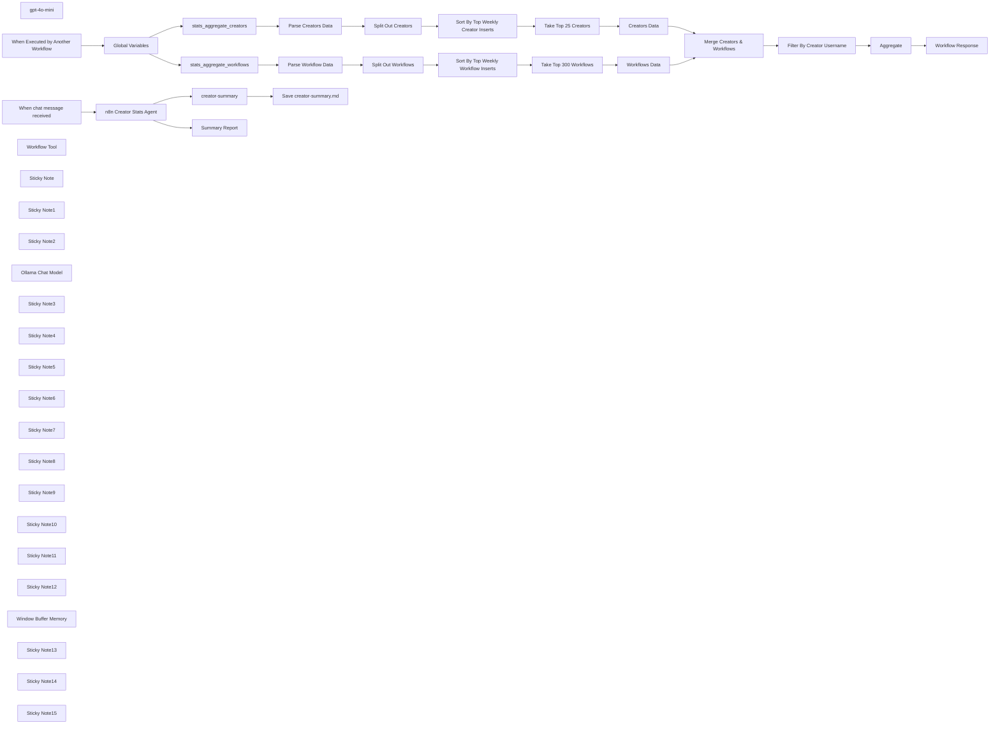

## Fluxo (.json) :

```json
{
  "id": "b8a4IwiwD9SlgF42",
  "meta": {
    "instanceId": "31e69f7f4a77bf465b805824e303232f0227212ae922d12133a0f96ffeab4fef",
    "templateCredsSetupCompleted": true
  },
  "name": "🔥📈🤖 AI Agent  for n8n Creators Leaderboard - Find Popular Workflows",
  "tags": [],
  "nodes": [
    {
      "id": "fcda047d-b609-4791-b3ae-f359d0c6a071",
      "name": "stats_aggregate_creators",
      "type": "n8n-nodes-base.httpRequest",
      "position": [
        -1240,
        1280
      ],
      "parameters": {
        "url": "={{ $json.path }}{{ $json['creators-filename'] }}.json",
        "options": {}
      },
      "typeVersion": 4.2
    },
    {
      "id": "fa1f51fd-6019-4d47-b17e-8c5621e6ab4c",
      "name": "stats_aggregate_workflows",
      "type": "n8n-nodes-base.httpRequest",
      "position": [
        -1240,
        1500
      ],
      "parameters": {
        "url": "={{ $json.path }}{{ $json['workflows-filename'] }}.json",
        "options": {}
      },
      "typeVersion": 4.2
    },
    {
      "id": "34c2d0d3-0474-4a69-b1a5-14c9021865cd",
      "name": "Global Variables",
      "type": "n8n-nodes-base.set",
      "position": [
        -1660,
        1480
      ],
      "parameters": {
        "options": {},
        "assignments": {
          "assignments": [
            {
              "id": "4bcb91c6-d250-4cb4-8ee1-022df13550e1",
              "name": "path",
              "type": "string",
              "value": "https://raw.githubusercontent.com/teds-tech-talks/n8n-community-leaderboard/refs/heads/main/"
            },
            {
              "id": "a910a798-0bfe-41b1-a4f1-41390c7f6997",
              "name": "workflows-filename",
              "type": "string",
              "value": "=stats_aggregate_workflows"
            },
            {
              "id": "e977e816-dc1e-43ce-9393-d6488e6832ca",
              "name": "creators-filename",
              "type": "string",
              "value": "=stats_aggregate_creators"
            },
            {
              "id": "20efae68-948e-445c-ab89-7dd23149dd50",
              "name": "chart-filename",
              "type": "string",
              "value": "=stats_aggregate_chart"
            },
            {
              "id": "14233ab4-3fa4-4e26-8032-6ffe26cb601e",
              "name": "datetime",
              "type": "string",
              "value": "={{ $now.format('yyyy-MM-dd') }}"
            },
            {
              "id": "f63dc683-a430-43ec-9c25-53fa5c0a3ced",
              "name": "username",
              "type": "string",
              "value": "={{ $json.query.username }}"
            }
          ]
        }
      },
      "typeVersion": 3.4
    },
    {
      "id": "7e830263-746f-4909-87aa-5e602d39fc3a",
      "name": "Parse Workflow Data",
      "type": "n8n-nodes-base.set",
      "position": [
        -880,
        1560
      ],
      "parameters": {
        "options": {},
        "assignments": {
          "assignments": [
            {
              "id": "76f4b20e-519e-4d46-aeac-c6c3f98a69fd",
              "name": "data",
              "type": "array",
              "value": "={{ $json.data }}"
            }
          ]
        }
      },
      "typeVersion": 3.4
    },
    {
      "id": "b112dde6-9194-451f-9c5e-b3f648d215da",
      "name": "Parse Creators Data",
      "type": "n8n-nodes-base.set",
      "position": [
        -880,
        1220
      ],
      "parameters": {
        "options": {},
        "assignments": {
          "assignments": [
            {
              "id": "76f4b20e-519e-4d46-aeac-c6c3f98a69fd",
              "name": "data",
              "type": "array",
              "value": "={{ $json.data }}"
            }
          ]
        }
      },
      "typeVersion": 3.4
    },
    {
      "id": "877e1988-c85c-49a8-8d56-d3954327c6f6",
      "name": "Take Top 25 Creators",
      "type": "n8n-nodes-base.limit",
      "position": [
        -260,
        1220
      ],
      "parameters": {
        "maxItems": 25
      },
      "typeVersion": 1
    },
    {
      "id": "f05db70e-4362-40a4-bc50-6d0c30ea0cc4",
      "name": "Aggregate",
      "type": "n8n-nodes-base.aggregate",
      "position": [
        -680,
        1920
      ],
      "parameters": {
        "options": {},
        "aggregate": "aggregateAllItemData"
      },
      "typeVersion": 1
    },
    {
      "id": "1d223053-d895-4545-a9b2-6eeab6200568",
      "name": "Filter By Creator Username",
      "type": "n8n-nodes-base.filter",
      "position": [
        -880,
        1920
      ],
      "parameters": {
        "options": {},
        "conditions": {
          "options": {
            "version": 2,
            "leftValue": "",
            "caseSensitive": true,
            "typeValidation": "strict"
          },
          "combinator": "and",
          "conditions": [
            {
              "id": "21b17fb0-1809-4dc0-b775-cf43a570aa3a",
              "operator": {
                "name": "filter.operator.equals",
                "type": "string",
                "operation": "equals"
              },
              "leftValue": "={{ $json.username }}",
              "rightValue": "={{ $('Global Variables').item.json.username }}"
            }
          ]
        }
      },
      "typeVersion": 2.2
    },
    {
      "id": "c25ff9ea-1905-4bf0-ac71-5d81c25466b7",
      "name": "gpt-4o-mini",
      "type": "@n8n/n8n-nodes-langchain.lmChatOpenAi",
      "position": [
        -1960,
        600
      ],
      "parameters": {
        "model": {
          "__rl": true,
          "mode": "list",
          "value": "gpt-4o-mini"
        },
        "options": {
          "temperature": 0.1
        }
      },
      "credentials": {
        "openAiApi": {
          "id": "jEMSvKmtYfzAkhe6",
          "name": "OpenAi account"
        }
      },
      "typeVersion": 1.2
    },
    {
      "id": "b21c51fa-c9b3-4c88-ba7b-fe8a97a951c9",
      "name": "When Executed by Another Workflow",
      "type": "n8n-nodes-base.executeWorkflowTrigger",
      "position": [
        -1980,
        1480
      ],
      "parameters": {
        "inputSource": "jsonExample",
        "jsonExample": "{\n  \"query\": \n    {\n      \"username\": \n      \"joe\"\n    }\n}"
      },
      "typeVersion": 1.1
    },
    {
      "id": "d26278f5-08d8-4640-82a6-1c3615b6f06b",
      "name": "When chat message received",
      "type": "@n8n/n8n-nodes-langchain.chatTrigger",
      "position": [
        -1980,
        240
      ],
      "webhookId": "c118849f-57c9-40cf-bde6-dddefb9adcf4",
      "parameters": {
        "options": {}
      },
      "typeVersion": 1.1
    },
    {
      "id": "00aac33e-20c1-4b99-b2f1-07311f73e1da",
      "name": "Workflow Tool",
      "type": "@n8n/n8n-nodes-langchain.toolWorkflow",
      "position": [
        -1360,
        600
      ],
      "parameters": {
        "name": "n8n_creator_stats",
        "workflowId": "={{ $workflow.id }}",
        "description": "Call this tool to get n8n Creator Stats.",
        "jsonSchemaExample": "{\n  \"username\": \"n8n creator username\"\n}",
        "specifyInputSchema": true
      },
      "typeVersion": 1
    },
    {
      "id": "0a00599a-928d-4399-b17e-336201a67480",
      "name": "creator-summary",
      "type": "n8n-nodes-base.convertToFile",
      "position": [
        -1020,
        240
      ],
      "parameters": {
        "options": {
          "fileName": "=creator-summary"
        },
        "operation": "toText",
        "sourceProperty": "output"
      },
      "typeVersion": 1.1
    },
    {
      "id": "8e4ae379-749d-44ad-80f8-efc836f2ff55",
      "name": "Workflow Response",
      "type": "n8n-nodes-base.set",
      "position": [
        -420,
        1920
      ],
      "parameters": {
        "options": {},
        "assignments": {
          "assignments": [
            {
              "id": "eeff1310-2e1c-4ea4-9107-a14b1979f74f",
              "name": "response",
              "type": "string",
              "value": "={{ $json.data }}"
            }
          ]
        }
      },
      "typeVersion": 3.4
    },
    {
      "id": "bc8ea963-a57d-44f1-bcd4-36a1dcb34f0a",
      "name": "n8n Creator Stats Agent",
      "type": "@n8n/n8n-nodes-langchain.agent",
      "position": [
        -1620,
        240
      ],
      "parameters": {
        "text": "={{ $json.chatInput }}",
        "options": {
          "systemMessage": "=You are tasked with generating a **comprehensive Markdown report** about a specific n8n community workflow contributor using the provided tools. Your report should not only address the user's query but also provide meaningful insights into the contributor's impact on the n8n community. Follow the structure below:\n\n## Detailed Summary\n- Provide a thorough summary of the contributor's workflows.\n- Highlight unique features, key use cases, and notable technical components for each workflow.\n\n## Workflows\nCreate a well-formatted markdown table with these columns:\n- **Workflow Name**: The name of the workflow.  Keep the emojies of they exist.\n- **Description**: A brief overview of its purpose and functionality.\n- **Unique Weekly Visitors**: The number of unique users who visited this workflow weekly.\n- **Unique Monthly Visitors**: The number of unique users who visited this workflow monthly.\n- **Unique Weekly Inserters**: The number of unique users who inserted this workflow weekly.\n- **Unique Monthly Inserters**: The number of unique users who inserted this workflow monthly.\n- **Why It’s Popular**: Explain what makes this workflow stand out (e.g., innovative features, ease of use, specific use cases).\n\n## Community Analysis\n- Analyze why these workflows are popular and valued by the n8n community.\n- Discuss any trends, patterns, or feedback that highlight their significance.\n\n## Additional Insights\n- If available, provide extra information about the contributor's overall impact, such as their engagement in community forums or other notable contributions.\n\n## Formatting Guidelines\n- Use Markdown formatting exclusively (headers, lists, and tables) for clarity and organization.\n- Ensure your response is concise yet comprehensive, structured for easy navigation.\n\n## Error Handling\n- If data is unavailable or incomplete, clearly state this in your response and suggest possible reasons or next steps.\n\n## TOOLS\n\n### n8n_creator_stats  \n- Use this tool to retrieve detailed statistics about the n8n creator.\n\n\n \n"
        },
        "promptType": "define"
      },
      "typeVersion": 1.7
    },
    {
      "id": "0e2507bf-4509-4423-ad23-bee9de2be68e",
      "name": "Save creator-summary.md",
      "type": "n8n-nodes-base.readWriteFile",
      "position": [
        -820,
        240
      ],
      "parameters": {
        "options": {
          "append": true
        },
        "fileName": "=C:\\\\Users\\\\joe\\Downloads\\\\{{ $binary.data.fileName }}-{{ $now.format('yyyy-MM-dd-hh-mm-ss') }}.md",
        "operation": "write"
      },
      "typeVersion": 1
    },
    {
      "id": "d3d39dad-d743-4c44-ad46-c6edbad4c82b",
      "name": "Summary Report",
      "type": "n8n-nodes-base.set",
      "position": [
        -1020,
        620
      ],
      "parameters": {
        "options": {},
        "assignments": {
          "assignments": [
            {
              "id": "c44ee9a7-e640-4f5e-acbe-ec559868b74c",
              "name": "output",
              "type": "string",
              "value": "={{ $json.output }}"
            }
          ]
        }
      },
      "typeVersion": 3.4
    },
    {
      "id": "6c07ee44-408f-4d4a-bade-e051d780d022",
      "name": "Sticky Note",
      "type": "n8n-nodes-base.stickyNote",
      "position": [
        -1800,
        120
      ],
      "parameters": {
        "color": 6,
        "width": 620,
        "height": 320,
        "content": "## AI Agent for n8n Creator Leaderboard Stats\nhttps://github.com/teds-tech-talks/n8n-community-leaderboard"
      },
      "typeVersion": 1
    },
    {
      "id": "a04eb80b-3cb3-44ad-aef2-c622ea2e33eb",
      "name": "Sticky Note1",
      "type": "n8n-nodes-base.stickyNote",
      "position": [
        -1440,
        480
      ],
      "parameters": {
        "width": 260,
        "height": 280,
        "content": "## Tool Call for n8n Creators Stats"
      },
      "typeVersion": 1
    },
    {
      "id": "9b44f6e7-666b-4341-8e04-4cf41a5f986e",
      "name": "Sticky Note2",
      "type": "n8n-nodes-base.stickyNote",
      "position": [
        -2060,
        480
      ],
      "parameters": {
        "color": 5,
        "width": 300,
        "height": 460,
        "content": "## Local or Cloud LLM"
      },
      "typeVersion": 1
    },
    {
      "id": "68fcc9de-f6d5-461c-ae64-8d8cf6892f7a",
      "name": "Ollama Chat Model",
      "type": "@n8n/n8n-nodes-langchain.lmChatOllama",
      "disabled": true,
      "position": [
        -1960,
        780
      ],
      "parameters": {
        "options": {}
      },
      "credentials": {
        "ollamaApi": {
          "id": "IsSBWGtcJbjRiKqD",
          "name": "Ollama account localhost"
        }
      },
      "typeVersion": 1
    },
    {
      "id": "584dd58a-d97d-45c5-974d-95468a55e359",
      "name": "Sticky Note3",
      "type": "n8n-nodes-base.stickyNote",
      "position": [
        -1140,
        120
      ],
      "parameters": {
        "color": 7,
        "width": 540,
        "height": 320,
        "content": "## Save n8n Creator Report Locally\n(optional for local install)"
      },
      "typeVersion": 1
    },
    {
      "id": "4ea35ccb-a4f4-481c-9122-6fc980be48d5",
      "name": "Sticky Note4",
      "type": "n8n-nodes-base.stickyNote",
      "position": [
        -1140,
        480
      ],
      "parameters": {
        "color": 4,
        "width": 320,
        "height": 340,
        "content": "## Summary Report Response"
      },
      "typeVersion": 1
    },
    {
      "id": "d48a28e9-041c-4e25-ac38-0f0519566db5",
      "name": "Sticky Note5",
      "type": "n8n-nodes-base.stickyNote",
      "position": [
        -1760,
        1360
      ],
      "parameters": {
        "width": 300,
        "height": 320,
        "content": "## Global Workflow Variables\n\n"
      },
      "typeVersion": 1
    },
    {
      "id": "cb9b62f1-cdc3-4c2a-ba4b-8dc3baecf7e4",
      "name": "Sticky Note6",
      "type": "n8n-nodes-base.stickyNote",
      "position": [
        -1800,
        1120
      ],
      "parameters": {
        "color": 3,
        "width": 780,
        "height": 640,
        "content": "## Daily n8n Leaderboard Stats\nhttps://github.com/teds-tech-talks/n8n-community-leaderboard\n\n### n8n Leaderboard\nhttps://teds-tech-talks.github.io/n8n-community-leaderboard/"
      },
      "typeVersion": 1
    },
    {
      "id": "0f12bc26-875e-4cf0-9b87-7459fdfc73e9",
      "name": "Sticky Note7",
      "type": "n8n-nodes-base.stickyNote",
      "position": [
        -980,
        1120
      ],
      "parameters": {
        "color": 6,
        "width": 1120,
        "height": 300,
        "content": "## n8n Creators Stats"
      },
      "typeVersion": 1
    },
    {
      "id": "23abdb9b-3aa3-48a8-987d-c0e0bdcec99f",
      "name": "Sticky Note8",
      "type": "n8n-nodes-base.stickyNote",
      "position": [
        -980,
        1460
      ],
      "parameters": {
        "color": 4,
        "width": 1120,
        "height": 300,
        "content": "## n8n Workflow Stats"
      },
      "typeVersion": 1
    },
    {
      "id": "7b7f14b4-cde2-46b1-a37f-4fd136c57a44",
      "name": "Creators Data",
      "type": "n8n-nodes-base.set",
      "position": [
        -60,
        1220
      ],
      "parameters": {
        "options": {},
        "assignments": {
          "assignments": [
            {
              "id": "02b02023-c5a2-4e22-bcf9-2284c434f5d3",
              "name": "name",
              "type": "string",
              "value": "={{ $json.user.name }}"
            },
            {
              "id": "4582435b-3c76-45e7-a251-12055efa890a",
              "name": "username",
              "type": "string",
              "value": "={{ $json.user.username }}"
            },
            {
              "id": "b713a971-ce29-43cf-8f42-c426a38c6582",
              "name": "bio",
              "type": "string",
              "value": "={{ $json.user.bio }}"
            },
            {
              "id": "19a06510-802e-4bd5-9552-7afa7355ff92",
              "name": "sum_unique_weekly_inserters",
              "type": "number",
              "value": "={{ $json.sum_unique_weekly_inserters }}"
            },
            {
              "id": "e436533a-5170-47c2-809b-7d79502eb009",
              "name": "sum_unique_monthly_inserters",
              "type": "number",
              "value": "={{ $json.sum_unique_monthly_inserters }}"
            },
            {
              "id": "198fef5d-86b8-4009-b187-6d3e6566d137",
              "name": "sum_unique_inserters",
              "type": "number",
              "value": "={{ $json.sum_unique_inserters }}"
            }
          ]
        }
      },
      "typeVersion": 3.4
    },
    {
      "id": "f3363202-01ac-4ea1-a015-7c16ac1078af",
      "name": "Workflows Data",
      "type": "n8n-nodes-base.set",
      "position": [
        -60,
        1560
      ],
      "parameters": {
        "options": {},
        "assignments": {
          "assignments": [
            {
              "id": "3bc3cd11-904d-4315-974d-262c0bd5fea7",
              "name": "template_url",
              "type": "string",
              "value": "={{ $json.template_url }}"
            },
            {
              "id": "c846c523-f077-40cd-b548-32460124ffb9",
              "name": "wf_detais.name",
              "type": "string",
              "value": "={{ $json.wf_detais.name }}"
            },
            {
              "id": "f330de47-56fb-4657-8a30-5f5e5cfa76d7",
              "name": "wf_detais.createdAt",
              "type": "string",
              "value": "={{ $json.wf_detais.createdAt }}"
            },
            {
              "id": "f7ed7e51-a7cf-4f2e-8819-f33115c5ad51",
              "name": "wf_detais.description",
              "type": "string",
              "value": "={{ $json.wf_detais.description }}"
            },
            {
              "id": "02b02023-c5a2-4e22-bcf9-2284c434f5d3",
              "name": "name",
              "type": "string",
              "value": "={{ $json.user.name }}"
            },
            {
              "id": "4582435b-3c76-45e7-a251-12055efa890a",
              "name": "username",
              "type": "string",
              "value": "={{ $json.user.username }}"
            },
            {
              "id": "f952cad3-7e62-46b7-aeb7-a5cbf4d46c0d",
              "name": "unique_weekly_inserters",
              "type": "number",
              "value": "={{ $json.unique_weekly_inserters }}"
            },
            {
              "id": "6123302b-5bda-48f4-9ef2-71ff52a5f3ba",
              "name": "unique_monthly_inserters",
              "type": "number",
              "value": "={{ $json.unique_monthly_inserters }}"
            },
            {
              "id": "92dca169-e03f-42ad-8790-ebb55c1a7272",
              "name": "unique_weekly_visitors",
              "type": "number",
              "value": "={{ $json.unique_weekly_visitors }}"
            },
            {
              "id": "ee640389-d396-4d65-8110-836372a51fb0",
              "name": "unique_monthly_visitors",
              "type": "number",
              "value": "={{ $json.unique_monthly_visitors }}"
            },
            {
              "id": "9f1c5599-3672-4f4e-9742-d7cc564f6714",
              "name": "user.avatar",
              "type": "string",
              "value": "={{ $json.user.avatar }}"
            }
          ]
        }
      },
      "typeVersion": 3.4
    },
    {
      "id": "3ce82825-f85c-4fd3-9273-5c5540a40dbe",
      "name": "Merge Creators & Workflows",
      "type": "n8n-nodes-base.merge",
      "position": [
        240,
        1560
      ],
      "parameters": {
        "mode": "combine",
        "options": {},
        "joinMode": "enrichInput1",
        "fieldsToMatchString": "username"
      },
      "typeVersion": 3
    },
    {
      "id": "16c383db-c130-484a-8a6b-b927d4c248e9",
      "name": "Sticky Note9",
      "type": "n8n-nodes-base.stickyNote",
      "position": [
        -980,
        1800
      ],
      "parameters": {
        "width": 480,
        "height": 320,
        "content": "## Filter by n8n Creator Username"
      },
      "typeVersion": 1
    },
    {
      "id": "7451dc33-8944-47c5-92c3-e70d4ce5d107",
      "name": "Split Out Creators",
      "type": "n8n-nodes-base.splitOut",
      "position": [
        -680,
        1220
      ],
      "parameters": {
        "options": {},
        "fieldToSplitOut": "data"
      },
      "typeVersion": 1
    },
    {
      "id": "6fa965e1-1474-4154-b4a2-cabdbbb8e90b",
      "name": "Split Out Workflows",
      "type": "n8n-nodes-base.splitOut",
      "position": [
        -680,
        1560
      ],
      "parameters": {
        "options": {},
        "fieldToSplitOut": "data"
      },
      "typeVersion": 1
    },
    {
      "id": "7805fa8b-6287-442d-ba2c-11ddb81ba54f",
      "name": "Sort By Top Weekly Creator Inserts",
      "type": "n8n-nodes-base.sort",
      "position": [
        -480,
        1220
      ],
      "parameters": {
        "options": {},
        "sortFieldsUi": {
          "sortField": [
            {
              "order": "descending",
              "fieldName": "sum_unique_weekly_inserters"
            }
          ]
        }
      },
      "typeVersion": 1
    },
    {
      "id": "d1651e0d-04c6-4c09-884e-3fd51e885f3d",
      "name": "Sort By Top Weekly Workflow Inserts",
      "type": "n8n-nodes-base.sort",
      "position": [
        -480,
        1560
      ],
      "parameters": {
        "options": {},
        "sortFieldsUi": {
          "sortField": [
            {
              "order": "descending",
              "fieldName": "unique_weekly_inserters"
            }
          ]
        }
      },
      "typeVersion": 1
    },
    {
      "id": "3bcf5f34-80fd-40ec-b88c-8b79b3f1677b",
      "name": "Take Top 300 Workflows",
      "type": "n8n-nodes-base.limit",
      "position": [
        -260,
        1560
      ],
      "parameters": {
        "maxItems": 300
      },
      "typeVersion": 1
    },
    {
      "id": "dc7cf074-17a6-411d-8d59-1cfbd23b7bd2",
      "name": "Sticky Note10",
      "type": "n8n-nodes-base.stickyNote",
      "position": [
        -2060,
        1040
      ],
      "parameters": {
        "color": 7,
        "width": 2510,
        "height": 1120,
        "content": "## Workflow for n8n Creators Stats"
      },
      "typeVersion": 1
    },
    {
      "id": "dacb7e61-7853-47f2-b6fd-3ad611701278",
      "name": "Sticky Note11",
      "type": "n8n-nodes-base.stickyNote",
      "position": [
        -1340,
        1160
      ],
      "parameters": {
        "color": 7,
        "width": 280,
        "height": 560,
        "content": "## GET n8n Stats from GitHub repo"
      },
      "typeVersion": 1
    },
    {
      "id": "a2373c55-9e87-4824-adc8-4d4bbf966544",
      "name": "Sticky Note12",
      "type": "n8n-nodes-base.stickyNote",
      "position": [
        -560,
        0
      ],
      "parameters": {
        "color": 2,
        "width": 1000,
        "height": 1000,
        "content": "# n8n Creators Leaderboard Stats Workflow\n\n## Overview\nThis workflow aggregates and processes data from the n8n community to generate detailed statistics about creators and their workflows. It fetches information from JSON files stored on GitHub, merges creator and workflow data, filters the results based on a specified username, and uses an AI agent to output a comprehensive Markdown report.\n\n## Data Retrieval\n- **Creators Data**:  \n  -  An HTTP Request node (\"stats_aggregate_creators\") retrieves a JSON file containing aggregated statistics for workflow creators.  \n- **Workflows Data**:  \n  -  A separate HTTP Request node (\"stats_aggregate_workflows\") pulls a JSON file with detailed workflow metrics such as visitor counts and inserter statistics.  \n- **Global Variables**:  \n  -  A global variable is set with the GitHub repository base URL housing these JSON files, ensuring that the correct data source is used.\n\n## Data Processing and Merging\n- **Parsing the Data**:  \n  -  The \"Parse Creators Data\" and \"Parse Workflow Data\" nodes extract JSON arrays from the retrieved files for further processing.  \n- **Limiting and Sorting**:  \n  -  Nodes like \"Take Top 25 Creators\" and \"Take Top 300 Workflows\" limit the result sets, while nodes such as \"Sort By Top Weekly Creator Inserts\" and \"Sort By Top Weekly Workflow Inserts\" sort the data based on performance metrics.  \n- **Merging Records**:  \n  -  Data from creators and workflows is merged by matching the username, enriching the dataset with combined statistics for each creator.\n\n## Filtering and Report Generation\n- **Username Filtering**:  \n  -  A filter node (\"Filter By Creator Username\") allows the workflow to focus on a single creator based on the input username (e.g., \"joe\").  \n- **Generating the Markdown Report**:  \n  -  An AI agent node (\"gpt-4o-mini\") processes the filtered data using a predefined prompt. This prompt instructs the agent to produce a detailed Markdown report that includes:  \n    - An overall summary of the creator’s workflows  \n    - A Markdown table listing each workflow along with key metrics (unique weekly/monthly visitors and inserters) and a brief explanation of its popularity  \n    - Insights into trends or community feedback related to the workflows  \n- **Output Conversion and Saving**:  \n  -  The resulting text is converted into a file (using the \"creator-summary\" node) and then saved locally with a filename that includes a timestamp, ensuring easy tracking and retrieval\n"
      },
      "typeVersion": 1
    },
    {
      "id": "99078ba8-612d-494a-976a-15f2065754ed",
      "name": "Window Buffer Memory",
      "type": "@n8n/n8n-nodes-langchain.memoryBufferWindow",
      "position": [
        -1640,
        600
      ],
      "parameters": {},
      "typeVersion": 1.3
    },
    {
      "id": "79c67fdc-f56c-4abc-908d-cac11e66790b",
      "name": "Sticky Note13",
      "type": "n8n-nodes-base.stickyNote",
      "position": [
        -1740,
        480
      ],
      "parameters": {
        "color": 3,
        "width": 280,
        "height": 280,
        "content": "## Chat History Memory"
      },
      "typeVersion": 1
    },
    {
      "id": "4be97085-519e-4776-88a1-6d95f97c4aa1",
      "name": "Sticky Note14",
      "type": "n8n-nodes-base.stickyNote",
      "position": [
        -2580,
        20
      ],
      "parameters": {
        "width": 480,
        "height": 980,
        "content": "# Quick Start Guide for the n8n Creators Leaderboard Workflow\n\n## Prerequisites\n- Ensure your n8n instance is running.\n- Verify that the GitHub base URL and file variables (for creators and workflows) are correctly set in the Global Variables node.\n- Confirm that your OpenAI credentials are configured for the AI Agent node.\n\n## How to Start the Workflow\n- **Activate the Workflow:**  \n  Ensure the workflow is active in your n8n environment.\n\n- **Trigger via Chat:**  \n  The workflow is initiated by the Chat Trigger node. Send a chat message such as:  \n  `show me stats for username [desired_username]`  \n  This input provides the required username for filtering.\n\n- **Processing & Report Generation:**  \n  Once triggered, the workflow fetches aggregated creator and workflow data from GitHub, processes and merges the information, and then uses the AI Agent to generate a Markdown report.\n\n- **Output:**  \n  The final Markdown report is saved locally as a file (with a timestamp), which you can review to see detailed leaderboard statistics and insights for the specified creator.\n\n## Summary\nBy sending a chat message with the appropriate username command, you can quickly trigger this workflow, which will then fetch, process, and generate dynamic statistics about n8n community creators. Enjoy exploring your community’s leaderboard data!\n"
      },
      "typeVersion": 1
    },
    {
      "id": "db011ff6-359d-4b4a-b5b2-29c15b961f68",
      "name": "Sticky Note15",
      "type": "n8n-nodes-base.stickyNote",
      "position": [
        -2580,
        1040
      ],
      "parameters": {
        "width": 480,
        "height": 940,
        "content": "# Why Use the n8n Creators Leaderboard Workflow?\n\n## Benefits\nThis workflow provides valuable insights into the n8n community by analyzing and presenting detailed statistics about workflow creators and their contributions. It helps users to:\n\n- **Discover Popular Workflows**: Identify the most widely used workflows based on unique visitors and inserters, both weekly and monthly.\n- **Understand Community Trends**: Gain insights into what types of workflows are resonating with the community, enabling better decision-making for creating or improving workflows.\n- **Recognize Top Contributors**: Highlight the most active and impactful creators, fostering collaboration and inspiration within the community.\n- **Save Time with Automation**: Automates data retrieval, processing, and report generation, eliminating manual effort.\n\n## Key Features\n- **Data Aggregation**: Fetches creator and workflow statistics from GitHub repositories.\n- **Custom Filtering**: Allows filtering by specific usernames to focus on individual contributors.\n- **AI-Powered Reports**: Generates comprehensive Markdown reports with detailed summaries, tables, and community analysis.\n- **Output Flexibility**: Saves reports locally for easy access and future reference.\n\n## Use Cases\n- **For Workflow Creators**: Monitor performance metrics of your workflows to understand their impact and optimize them for better engagement.\n- **For Community Managers**: Recognize top contributors and trends to encourage participation and improve community resources.\n- **For New Users**: Explore popular workflows as a starting point for building your own automations.\n\n"
      },
      "typeVersion": 1
    }
  ],
  "active": false,
  "pinData": {
    "When chat message received": [
      {
        "json": {
          "action": "sendMessage",
          "chatInput": "\tshow me stats for username joe",
          "sessionId": "61fd98239a894d969c0b33060f3f9c44"
        }
      }
    ],
    "When Executed by Another Workflow": [
      {
        "json": {
          "query": {
            "username": "joe"
          }
        }
      }
    ]
  },
  "settings": {
    "executionOrder": "v1"
  },
  "versionId": "574ed096-a76c-4cfe-b026-20627f454ddc",
  "connections": {
    "Aggregate": {
      "main": [
        [
          {
            "node": "Workflow Response",
            "type": "main",
            "index": 0
          }
        ]
      ]
    },
    "gpt-4o-mini": {
      "ai_languageModel": [
        [
          {
            "node": "n8n Creator Stats Agent",
            "type": "ai_languageModel",
            "index": 0
          }
        ]
      ]
    },
    "Creators Data": {
      "main": [
        [
          {
            "node": "Merge Creators & Workflows",
            "type": "main",
            "index": 0
          }
        ]
      ]
    },
    "Workflow Tool": {
      "ai_tool": [
        [
          {
            "node": "n8n Creator Stats Agent",
            "type": "ai_tool",
            "index": 0
          }
        ]
      ]
    },
    "Workflows Data": {
      "main": [
        [
          {
            "node": "Merge Creators & Workflows",
            "type": "main",
            "index": 1
          }
        ]
      ]
    },
    "creator-summary": {
      "main": [
        [
          {
            "node": "Save creator-summary.md",
            "type": "main",
            "index": 0
          }
        ]
      ]
    },
    "Global Variables": {
      "main": [
        [
          {
            "node": "stats_aggregate_creators",
            "type": "main",
            "index": 0
          },
          {
            "node": "stats_aggregate_workflows",
            "type": "main",
            "index": 0
          }
        ]
      ]
    },
    "Ollama Chat Model": {
      "ai_languageModel": [
        []
      ]
    },
    "Split Out Creators": {
      "main": [
        [
          {
            "node": "Sort By Top Weekly Creator Inserts",
            "type": "main",
            "index": 0
          }
        ]
      ]
    },
    "Parse Creators Data": {
      "main": [
        [
          {
            "node": "Split Out Creators",
            "type": "main",
            "index": 0
          }
        ]
      ]
    },
    "Parse Workflow Data": {
      "main": [
        [
          {
            "node": "Split Out Workflows",
            "type": "main",
            "index": 0
          }
        ]
      ]
    },
    "Split Out Workflows": {
      "main": [
        [
          {
            "node": "Sort By Top Weekly Workflow Inserts",
            "type": "main",
            "index": 0
          }
        ]
      ]
    },
    "Take Top 25 Creators": {
      "main": [
        [
          {
            "node": "Creators Data",
            "type": "main",
            "index": 0
          }
        ]
      ]
    },
    "Window Buffer Memory": {
      "ai_memory": [
        [
          {
            "node": "n8n Creator Stats Agent",
            "type": "ai_memory",
            "index": 0
          }
        ]
      ]
    },
    "Take Top 300 Workflows": {
      "main": [
        [
          {
            "node": "Workflows Data",
            "type": "main",
            "index": 0
          }
        ]
      ]
    },
    "n8n Creator Stats Agent": {
      "main": [
        [
          {
            "node": "Summary Report",
            "type": "main",
            "index": 0
          },
          {
            "node": "creator-summary",
            "type": "main",
            "index": 0
          }
        ]
      ]
    },
    "stats_aggregate_creators": {
      "main": [
        [
          {
            "node": "Parse Creators Data",
            "type": "main",
            "index": 0
          }
        ]
      ]
    },
    "stats_aggregate_workflows": {
      "main": [
        [
          {
            "node": "Parse Workflow Data",
            "type": "main",
            "index": 0
          }
        ]
      ]
    },
    "Filter By Creator Username": {
      "main": [
        [
          {
            "node": "Aggregate",
            "type": "main",
            "index": 0
          }
        ]
      ]
    },
    "Merge Creators & Workflows": {
      "main": [
        [
          {
            "node": "Filter By Creator Username",
            "type": "main",
            "index": 0
          }
        ]
      ]
    },
    "When chat message received": {
      "main": [
        [
          {
            "node": "n8n Creator Stats Agent",
            "type": "main",
            "index": 0
          }
        ]
      ]
    },
    "When Executed by Another Workflow": {
      "main": [
        [
          {
            "node": "Global Variables",
            "type": "main",
            "index": 0
          }
        ]
      ]
    },
    "Sort By Top Weekly Creator Inserts": {
      "main": [
        [
          {
            "node": "Take Top 25 Creators",
            "type": "main",
            "index": 0
          }
        ]
      ]
    },
    "Sort By Top Weekly Workflow Inserts": {
      "main": [
        [
          {
            "node": "Take Top 300 Workflows",
            "type": "main",
            "index": 0
          }
        ]
      ]
    }
  }
}
```

<a id="template-2527"></a>

## Template 2527 - RAG para base de conhecimento Notion

- **Nome:** RAG para base de conhecimento Notion
- **Descrição:** Fluxo que ingere páginas do Notion, gera e atualiza embeddings, armazena-os em uma base vetorial e responde perguntas usando recuperação semântica com contexto atualizado.
- **Funcionalidade:** • Monitoramento de páginas do Notion: identifica páginas atualizadas e recupera todos os blocos do conteúdo.
• Consolidação de conteúdo: combina blocos em uma única string para processamento e geração de embeddings.
• Exclusão de embeddings antigos: remove entradas anteriores relacionadas ao mesmo documento para evitar duplicação e manter dados consistentes.
• Geração de embeddings: cria vetores de representação do texto usando um modelo de embeddings.
• Armazenamento na base vetorial: insere embeddings e metadados (ex.: id e nome da página) na base de dados vetorial.
• Recuperação semântica e cadeia de QA: ao receber uma mensagem de chat, busca documentos relevantes na base vetorial e gera respostas contextualizadas com um modelo de linguagem.
• Controle de fluxo e processamento em lote: processa cada página separadamente, limita itens simultâneos e previne reprocessamento duplicado.
• Agendamento opcional: permite verificar atualizações periodicamente para manter os dados atualizados.
- **Ferramentas:** • Notion: fonte da base de conhecimento; armazena páginas e blocos que são ingeridos.
• OpenAI: gera embeddings e fornece o modelo de linguagem usado para responder perguntas.
• Supabase: base de dados vetorial usada para armazenar embeddings e metadados, possibilitando buscas semânticas.

## Fluxo visual

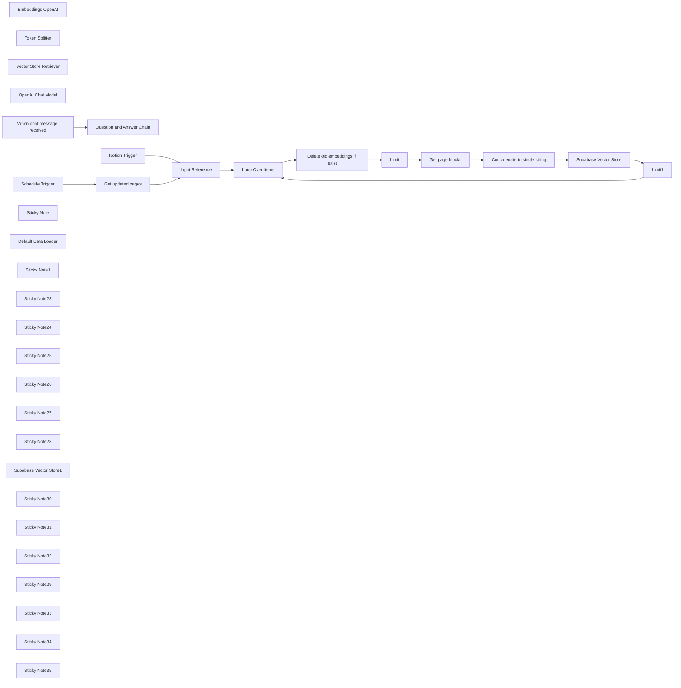

## Fluxo (.json) :

```json
{
  "id": "JxFP8FJ2W7e4Kmqn",
  "meta": {
    "instanceId": "fb8bc2e315f7f03c97140b30aa454a27bc7883a19000fa1da6e6b571bf56ad6d",
    "templateCredsSetupCompleted": true
  },
  "name": "RAG on living data",
  "tags": [],
  "nodes": [
    {
      "id": "49086cdf-a38c-4cb8-9be9-d3e6ea5bdde5",
      "name": "Embeddings OpenAI",
      "type": "@n8n/n8n-nodes-langchain.embeddingsOpenAi",
      "position": [
        1740,
        1040
      ],
      "parameters": {
        "options": {}
      },
      "credentials": {
        "openAiApi": {
          "id": "X7Jf0zECd3IkQdSw",
          "name": "OpenAi (octionicsolutions)"
        }
      },
      "typeVersion": 1
    },
    {
      "id": "f0670721-92f4-422a-99c9-f9c2aa6fe21f",
      "name": "Token Splitter",
      "type": "@n8n/n8n-nodes-langchain.textSplitterTokenSplitter",
      "position": [
        2380,
        540
      ],
      "parameters": {
        "chunkSize": 500
      },
      "typeVersion": 1
    },
    {
      "id": "fe80ecac-4f79-4b07-ad8e-60ab5f980cba",
      "name": "Loop Over Items",
      "type": "n8n-nodes-base.splitInBatches",
      "position": [
        1180,
        -200
      ],
      "parameters": {
        "options": {}
      },
      "typeVersion": 3
    },
    {
      "id": "81b79248-08e8-4214-872b-1796e51ad0a4",
      "name": "Question and Answer Chain",
      "type": "@n8n/n8n-nodes-langchain.chainRetrievalQa",
      "position": [
        744,
        495
      ],
      "parameters": {
        "options": {}
      },
      "typeVersion": 1.3
    },
    {
      "id": "e78f7b63-baef-4834-8f1b-aecfa9102d6c",
      "name": "Vector Store Retriever",
      "type": "@n8n/n8n-nodes-langchain.retrieverVectorStore",
      "position": [
        844,
        715
      ],
      "parameters": {},
      "typeVersion": 1
    },
    {
      "id": "1d5ffbd0-b2cf-4660-a291-581d18608ecd",
      "name": "OpenAI Chat Model",
      "type": "@n8n/n8n-nodes-langchain.lmChatOpenAi",
      "position": [
        704,
        715
      ],
      "parameters": {
        "model": "gpt-4o",
        "options": {}
      },
      "credentials": {
        "openAiApi": {
          "id": "X7Jf0zECd3IkQdSw",
          "name": "OpenAi (octionicsolutions)"
        }
      },
      "typeVersion": 1
    },
    {
      "id": "37a3063f-aa21-4347-a72f-6dd316c58366",
      "name": "When chat message received",
      "type": "@n8n/n8n-nodes-langchain.chatTrigger",
      "position": [
        524,
        495
      ],
      "webhookId": "74479a54-418f-4de2-b70d-cfb3e3fdd5a7",
      "parameters": {
        "public": true,
        "options": {}
      },
      "typeVersion": 1.1
    },
    {
      "id": "5924bc01-1694-4b5c-8a06-7c46ee4c6425",
      "name": "Schedule Trigger",
      "type": "n8n-nodes-base.scheduleTrigger",
      "position": [
        520,
        -200
      ],
      "parameters": {
        "rule": {
          "interval": [
            {
              "field": "minutes",
              "minutesInterval": 1
            }
          ]
        }
      },
      "typeVersion": 1.2
    },
    {
      "id": "5067eda6-8bbe-407a-a6af-93e81be53661",
      "name": "Sticky Note",
      "type": "n8n-nodes-base.stickyNote",
      "position": [
        620,
        0
      ],
      "parameters": {
        "width": 329.16412916774584,
        "height": 312.52803480051045,
        "content": "## Switch trigger (optional)\nIf you are on the cloud plan, consider switching to the Notion Trigger Node instead, to save on executions."
      },
      "typeVersion": 1
    },
    {
      "id": "33458828-484d-426b-a3d1-974a81c6162e",
      "name": "Limit",
      "type": "n8n-nodes-base.limit",
      "position": [
        1620,
        -60
      ],
      "parameters": {},
      "typeVersion": 1
    },
    {
      "id": "4d39503a-378e-4942-a5d4-8c62785aac44",
      "name": "Limit1",
      "type": "n8n-nodes-base.limit",
      "position": [
        2660,
        -60
      ],
      "parameters": {},
      "typeVersion": 1
    },
    {
      "id": "0e0b1391-3fe5-4d80-a2eb-a2483b79d9a6",
      "name": "Delete old embeddings if exist",
      "type": "n8n-nodes-base.supabase",
      "position": [
        1400,
        -60
      ],
      "parameters": {
        "tableId": "documents",
        "operation": "delete",
        "filterType": "string",
        "filterString": "=metadata->>id=eq.{{ $('Input Reference').item.json.id }}"
      },
      "credentials": {
        "supabaseApi": {
          "id": "DjIb4HMTYXhTU8Uc",
          "name": "Supabase (VectorStore)"
        }
      },
      "typeVersion": 1,
      "alwaysOutputData": true
    },
    {
      "id": "4a8614e4-0a53-4731-bc68-57505d7d0a09",
      "name": "Get page blocks",
      "type": "n8n-nodes-base.notion",
      "position": [
        1840,
        -60
      ],
      "parameters": {
        "blockId": {
          "__rl": true,
          "mode": "id",
          "value": "={{ $('Input Reference').item.json.id }}"
        },
        "resource": "block",
        "operation": "getAll",
        "returnAll": true,
        "fetchNestedBlocks": true
      },
      "credentials": {
        "notionApi": {
          "id": "ObmaBA0dJss3JJPv",
          "name": "Notion (octionicsolutions / Test)"
        }
      },
      "executeOnce": true,
      "typeVersion": 2.2
    },
    {
      "id": "8c922895-49d6-4778-8356-6f6cf49e5420",
      "name": "Default Data Loader",
      "type": "@n8n/n8n-nodes-langchain.documentDefaultDataLoader",
      "position": [
        2300,
        260
      ],
      "parameters": {
        "options": {
          "metadata": {
            "metadataValues": [
              {
                "name": "id",
                "value": "={{ $('Input Reference').item.json.id }}"
              },
              {
                "name": "name",
                "value": "={{ $('Input Reference').item.json.name }}"
              }
            ]
          }
        }
      },
      "typeVersion": 1
    },
    {
      "id": "8ad7ff2e-4bc2-4821-ae03-bab2dc11d947",
      "name": "Sticky Note1",
      "type": "n8n-nodes-base.stickyNote",
      "position": [
        2220,
        400
      ],
      "parameters": {
        "width": 376.2098538932132,
        "height": 264.37628764336097,
        "content": "## Adjust chunk size and overlap\nFor more accurate search results, increase the overlap. For the *text-embedding-ada-002* model the chunk size plus overlap must not exceed 8191"
      },
      "typeVersion": 1
    },
    {
      "id": "8078d59a-f45f-4e96-a8ec-6c2f1c328e84",
      "name": "Input Reference",
      "type": "n8n-nodes-base.noOp",
      "position": [
        960,
        -200
      ],
      "parameters": {},
      "typeVersion": 1
    },
    {
      "id": "aae6c517-a316-40e3-aee9-1cc4b448689f",
      "name": "Notion Trigger",
      "type": "n8n-nodes-base.notionTrigger",
      "disabled": true,
      "position": [
        740,
        120
      ],
      "parameters": {
        "event": "pagedUpdatedInDatabase",
        "pollTimes": {
          "item": [
            {
              "mode": "everyMinute"
            }
          ]
        },
        "databaseId": {
          "__rl": true,
          "mode": "list",
          "value": "ec6dc7b4-9ce0-47f7-8025-ef09295999fd",
          "cachedResultUrl": "https://www.notion.so/ec6dc7b49ce047f78025ef09295999fd",
          "cachedResultName": "Knowledge Base"
        }
      },
      "credentials": {
        "notionApi": {
          "id": "ObmaBA0dJss3JJPv",
          "name": "Notion (octionicsolutions / Test)"
        }
      },
      "typeVersion": 1
    },
    {
      "id": "3a43d66d-d4e3-4ca1-aee9-85ac65160e45",
      "name": "Get updated pages",
      "type": "n8n-nodes-base.notion",
      "position": [
        740,
        -200
      ],
      "parameters": {
        "filters": {
          "conditions": [
            {
              "key": "Last edited time|last_edited_time",
              "condition": "equals",
              "lastEditedTime": "={{ $now.minus(1, 'minutes').toISO() }}"
            }
          ]
        },
        "options": {},
        "resource": "databasePage",
        "operation": "getAll",
        "databaseId": {
          "__rl": true,
          "mode": "list",
          "value": "ec6dc7b4-9ce0-47f7-8025-ef09295999fd",
          "cachedResultUrl": "https://www.notion.so/ec6dc7b49ce047f78025ef09295999fd",
          "cachedResultName": "Knowledge Base"
        },
        "filterType": "manual"
      },
      "credentials": {
        "notionApi": {
          "id": "ObmaBA0dJss3JJPv",
          "name": "Notion (octionicsolutions / Test)"
        }
      },
      "typeVersion": 2.2
    },
    {
      "id": "bbf1296f-4e2b-4a38-bdf3-ae2b63cc7774",
      "name": "Sticky Note23",
      "type": "n8n-nodes-base.stickyNote",
      "position": [
        900,
        -300
      ],
      "parameters": {
        "color": 7,
        "width": 216.47293010628914,
        "height": 275.841854198618,
        "content": "This placeholder serves as a reference point so it is easier to swap the data source with a different service"
      },
      "typeVersion": 1
    },
    {
      "id": "631e1e10-0b52-4a17-89a4-769ac563321f",
      "name": "Sticky Note24",
      "type": "n8n-nodes-base.stickyNote",
      "position": [
        1340,
        -160
      ],
      "parameters": {
        "color": 7,
        "width": 216.47293010628914,
        "height": 275.841854198618,
        "content": "All chunks of a previous version of the document are being deleted by filtering the meta data by the given ID"
      },
      "typeVersion": 1
    },
    {
      "id": "6c830c83-4b70-4719-8e2a-26846e60085c",
      "name": "Sticky Note25",
      "type": "n8n-nodes-base.stickyNote",
      "position": [
        1560,
        -160
      ],
      "parameters": {
        "color": 7,
        "width": 216.47293010628914,
        "height": 275.841854198618,
        "content": "Reduce the active streams/items to just 1 to prevent the following nodes from double-processing"
      },
      "typeVersion": 1
    },
    {
      "id": "46c8e4e4-0a5e-4ede-947b-5773710d4e55",
      "name": "Sticky Note26",
      "type": "n8n-nodes-base.stickyNote",
      "position": [
        1780,
        -160
      ],
      "parameters": {
        "color": 7,
        "width": 216.47293010628914,
        "height": 275.841854198618,
        "content": "Retrieve all page contents/blocks"
      },
      "typeVersion": 1
    },
    {
      "id": "0369e610-d074-4812-9d04-8615b42965a5",
      "name": "Sticky Note27",
      "type": "n8n-nodes-base.stickyNote",
      "position": [
        2600,
        -160
      ],
      "parameters": {
        "color": 7,
        "width": 216.47293010628914,
        "height": 275.841854198618,
        "content": "Reduce the active streams/items to just 1 to prevent the following nodes from double-processing"
      },
      "typeVersion": 1
    },
    {
      "id": "4f3bce54-1650-45fa-abb0-c881358c7e8d",
      "name": "Sticky Note28",
      "type": "n8n-nodes-base.stickyNote",
      "position": [
        2220,
        -160
      ],
      "parameters": {
        "color": 7,
        "width": 375.9283286479995,
        "height": 275.841854198618,
        "content": "Embed item and store in Vector Store. Depending on the length the content is being split up into multiple chunks/embeds"
      },
      "typeVersion": 1
    },
    {
      "id": "44125921-e068-4a5d-a56b-b0e63c103556",
      "name": "Supabase Vector Store1",
      "type": "@n8n/n8n-nodes-langchain.vectorStoreSupabase",
      "position": [
        924,
        935
      ],
      "parameters": {
        "options": {},
        "tableName": {
          "__rl": true,
          "mode": "list",
          "value": "documents",
          "cachedResultName": "documents"
        }
      },
      "credentials": {
        "supabaseApi": {
          "id": "DjIb4HMTYXhTU8Uc",
          "name": "Supabase (VectorStore)"
        }
      },
      "typeVersion": 1
    },
    {
      "id": "467322a9-949d-4569-aac6-92196da46ba5",
      "name": "Sticky Note30",
      "type": "n8n-nodes-base.stickyNote",
      "position": [
        460,
        400
      ],
      "parameters": {
        "color": 7,
        "width": 730.7522093855692,
        "height": 668.724737081502,
        "content": "Simple chat bot to ask specific questions while having access to the context of the Notion Knowledge Base which was stored in the Vector Store"
      },
      "typeVersion": 1
    },
    {
      "id": "27f078cf-b309-4dd1-a8ce-b4fc504d6e29",
      "name": "Sticky Note31",
      "type": "n8n-nodes-base.stickyNote",
      "position": [
        1660,
        900
      ],
      "parameters": {
        "color": 7,
        "width": 219.31927574471658,
        "height": 275.841854198618,
        "content": "Model used for both creating and reading embeddings"
      },
      "typeVersion": 1
    },
    {
      "id": "2f59cba1-4318-47e7-bf0b-b908d4186b86",
      "name": "Supabase Vector Store",
      "type": "@n8n/n8n-nodes-langchain.vectorStoreSupabase",
      "position": [
        2280,
        -60
      ],
      "parameters": {
        "mode": "insert",
        "options": {},
        "tableName": {
          "__rl": true,
          "mode": "list",
          "value": "documents",
          "cachedResultName": "documents"
        }
      },
      "credentials": {
        "supabaseApi": {
          "id": "DjIb4HMTYXhTU8Uc",
          "name": "Supabase (VectorStore)"
        }
      },
      "typeVersion": 1
    },
    {
      "id": "729849e7-0eff-40c2-ae00-ae660c1eec69",
      "name": "Sticky Note32",
      "type": "n8n-nodes-base.stickyNote",
      "position": [
        1120,
        -300
      ],
      "parameters": {
        "color": 7,
        "width": 216.47293010628914,
        "height": 275.841854198618,
        "content": "Process each page/document separately."
      },
      "typeVersion": 1
    },
    {
      "id": "3f632a24-ca0a-45c4-801d-041aa3f887a7",
      "name": "Sticky Note29",
      "type": "n8n-nodes-base.stickyNote",
      "position": [
        2220,
        120
      ],
      "parameters": {
        "color": 7,
        "width": 376.0759088111347,
        "height": 275.841854198618,
        "content": "Store additional meta data with each embed, especially the Notion ID, which can be later used to find all belonging entries of one page, even if they got split into multiple embeds."
      },
      "typeVersion": 1
    },
    {
      "id": "ffaf3861-5287-4f57-8372-09216a18cb4d",
      "name": "Sticky Note33",
      "type": "n8n-nodes-base.stickyNote",
      "position": [
        460,
        -300
      ],
      "parameters": {
        "color": 7,
        "width": 216.47293010628914,
        "height": 275.841854198618,
        "content": "Using a manual approach for polling data from Notion for more accuracy."
      },
      "typeVersion": 1
    },
    {
      "id": "cbbedfc0-4d64-42a6-8f55-21e04887305f",
      "name": "Sticky Note34",
      "type": "n8n-nodes-base.stickyNote",
      "position": [
        680,
        -300
      ],
      "parameters": {
        "width": 216.47293010628914,
        "height": 275.841854198618,
        "content": "## Select Database\nChoose the database which represents your Knowledge Base"
      },
      "typeVersion": 1
    },
    {
      "id": "8b6767f2-1bc9-42fb-b319-f39f6734b9f2",
      "name": "Sticky Note35",
      "type": "n8n-nodes-base.stickyNote",
      "position": [
        2000,
        -160
      ],
      "parameters": {
        "color": 7,
        "width": 216.47293010628914,
        "height": 275.841854198618,
        "content": "Combine all contents to a single text formatted into one line which can be easily stored as an embed"
      },
      "typeVersion": 1
    },
    {
      "id": "cdff1756-77d7-421e-8672-25c9862840b0",
      "name": "Concatenate to single string",
      "type": "n8n-nodes-base.summarize",
      "position": [
        2060,
        -60
      ],
      "parameters": {
        "options": {},
        "fieldsToSummarize": {
          "values": [
            {
              "field": "content",
              "separateBy": "\n",
              "aggregation": "concatenate"
            }
          ]
        }
      },
      "typeVersion": 1
    }
  ],
  "active": false,
  "pinData": {},
  "settings": {
    "executionOrder": "v1"
  },
  "versionId": "51075175-868a-4a3a-9580-5ad55e25ac71",
  "connections": {
    "Limit": {
      "main": [
        [
          {
            "node": "Get page blocks",
            "type": "main",
            "index": 0
          }
        ]
      ]
    },
    "Limit1": {
      "main": [
        [
          {
            "node": "Loop Over Items",
            "type": "main",
            "index": 0
          }
        ]
      ]
    },
    "Notion Trigger": {
      "main": [
        [
          {
            "node": "Input Reference",
            "type": "main",
            "index": 0
          }
        ]
      ]
    },
    "Token Splitter": {
      "ai_textSplitter": [
        [
          {
            "node": "Default Data Loader",
            "type": "ai_textSplitter",
            "index": 0
          }
        ]
      ]
    },
    "Get page blocks": {
      "main": [
        [
          {
            "node": "Concatenate to single string",
            "type": "main",
            "index": 0
          }
        ]
      ]
    },
    "Input Reference": {
      "main": [
        [
          {
            "node": "Loop Over Items",
            "type": "main",
            "index": 0
          }
        ]
      ]
    },
    "Loop Over Items": {
      "main": [
        [],
        [
          {
            "node": "Delete old embeddings if exist",
            "type": "main",
            "index": 0
          }
        ]
      ]
    },
    "Schedule Trigger": {
      "main": [
        [
          {
            "node": "Get updated pages",
            "type": "main",
            "index": 0
          }
        ]
      ]
    },
    "Embeddings OpenAI": {
      "ai_embedding": [
        [
          {
            "node": "Supabase Vector Store",
            "type": "ai_embedding",
            "index": 0
          },
          {
            "node": "Supabase Vector Store1",
            "type": "ai_embedding",
            "index": 0
          }
        ]
      ]
    },
    "Get updated pages": {
      "main": [
        [
          {
            "node": "Input Reference",
            "type": "main",
            "index": 0
          }
        ]
      ]
    },
    "OpenAI Chat Model": {
      "ai_languageModel": [
        [
          {
            "node": "Question and Answer Chain",
            "type": "ai_languageModel",
            "index": 0
          }
        ]
      ]
    },
    "Default Data Loader": {
      "ai_document": [
        [
          {
            "node": "Supabase Vector Store",
            "type": "ai_document",
            "index": 0
          }
        ]
      ]
    },
    "Supabase Vector Store": {
      "main": [
        [
          {
            "node": "Limit1",
            "type": "main",
            "index": 0
          }
        ]
      ]
    },
    "Supabase Vector Store1": {
      "ai_vectorStore": [
        [
          {
            "node": "Vector Store Retriever",
            "type": "ai_vectorStore",
            "index": 0
          }
        ]
      ]
    },
    "Vector Store Retriever": {
      "ai_retriever": [
        [
          {
            "node": "Question and Answer Chain",
            "type": "ai_retriever",
            "index": 0
          }
        ]
      ]
    },
    "When chat message received": {
      "main": [
        [
          {
            "node": "Question and Answer Chain",
            "type": "main",
            "index": 0
          }
        ]
      ]
    },
    "Concatenate to single string": {
      "main": [
        [
          {
            "node": "Supabase Vector Store",
            "type": "main",
            "index": 0
          }
        ]
      ]
    },
    "Delete old embeddings if exist": {
      "main": [
        [
          {
            "node": "Limit",
            "type": "main",
            "index": 0
          }
        ]
      ]
    }
  }
}
```

<a id="template-2528"></a>

## Template 2528 - Raspagem e análise de reviews do Trustpilot

- **Nome:** Raspagem e análise de reviews do Trustpilot
- **Descrição:** Fluxo que coleta reviews de uma empresa no Trustpilot, extrai informações estruturadas, analisa o sentimento do texto e armazena os resultados em uma planilha.
- **Funcionalidade:** • Configurar parâmetros de busca: Define o identificador da empresa e o número máximo de páginas a raspar.
• Raspagem paginada de reviews: Faz requisições ao site do Trustpilot e percorre páginas de reviews até o limite definido.
• Extração de links de reviews: Identifica e separa cada link de review encontrado nas páginas listadas.
• Limitação do número de itens processados: Aplica um limite para controlar quantas reviews serão processadas por execução.
• Verificação de duplicados: Consulta a planilha para evitar reprocessar reviews já salvos.
• Download da página da review individual: Recupera o HTML completo de cada review novo para análise detalhada.
• Extração estruturada com modelo LLM: Usa um modelo para extrair autor, data, título, texto, avaliação, número de reviews e país a partir do HTML.
• Análise de sentimento: Classifica o texto da review em positivo, neutro ou negativo usando um modelo de linguagem.
• Atualização/insersão na planilha: Adiciona ou atualiza linhas na planilha com os dados extraídos, avaliação, URL e resultado do sentimento.
- **Ferramentas:** • Trustpilot: Fonte pública das avaliações de clientes a serem raspadas.
• DeepSeek (API/Modelo): Modelo especializado usado para extrair informações estruturadas a partir do HTML da review.
• OpenAI: Modelo de linguagem usado para realizar a análise de sentimento do texto da review.
• Google Sheets: Armazenamento e controle de duplicados das reviews processadas.

## Fluxo visual

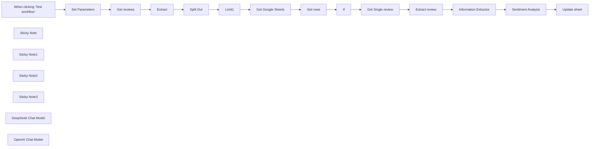

## Fluxo (.json) :

```json
{
  "id": "w434EiZ2z7klQAyp",
  "meta": {
    "instanceId": "a4bfc93e975ca233ac45ed7c9227d84cf5a2329310525917adaf3312e10d5462",
    "templateCredsSetupCompleted": true
  },
  "name": "Scrape Trustpilot Reviews with DeepSeek, Analyze Sentiment with OpenAI",
  "tags": [
    {
      "id": "2VG6RbmUdJ2VZbrj",
      "name": "Google Drive",
      "createdAt": "2024-12-04T16:50:56.177Z",
      "updatedAt": "2024-12-04T16:50:56.177Z"
    },
    {
      "id": "paTcf5QZDJsC2vKY",
      "name": "OpenAI",
      "createdAt": "2024-12-04T16:52:10.768Z",
      "updatedAt": "2024-12-04T16:52:10.768Z"
    }
  ],
  "nodes": [
    {
      "id": "095a8e10-1630-4a1a-b6c9-7950ae1ed803",
      "name": "Split Out",
      "type": "n8n-nodes-base.splitOut",
      "position": [
        320,
        -380
      ],
      "parameters": {
        "options": {},
        "fieldToSplitOut": "recensioni"
      },
      "typeVersion": 1
    },
    {
      "id": "6ff4dd9d-eedd-4d84-b13a-b3c0db717409",
      "name": "Information Extractor",
      "type": "@n8n/n8n-nodes-langchain.informationExtractor",
      "position": [
        -440,
        140
      ],
      "parameters": {
        "text": "=You need to extract the review from the following HTML:  {{ $json.recensione }}",
        "options": {
          "systemPromptTemplate": "You are a review expert. You need to extract only the required information and report it without changing anything.\nAll the required information is in the text."
        },
        "attributes": {
          "attributes": [
            {
              "name": "autore",
              "required": true,
              "description": "Extract the name of the review author"
            },
            {
              "name": "valutazione",
              "type": "number",
              "required": true,
              "description": "Extract the rating given to the review (from 1 to 5)"
            },
            {
              "name": "data",
              "required": true,
              "description": "Extract review date in YYYY-MM-DD format"
            },
            {
              "name": "titolo",
              "required": true,
              "description": "Extract the review title"
            },
            {
              "name": "testo",
              "required": true,
              "description": "Extract the review text"
            },
            {
              "name": "n_recensioni",
              "type": "number",
              "required": true,
              "description": "Extract the total number of reviews made by the user"
            },
            {
              "name": "nazione",
              "required": true,
              "description": "Extract the country of the user who wrote the review. Must be two characters"
            }
          ]
        }
      },
      "typeVersion": 1
    },
    {
      "id": "0036f3b1-4832-4a35-8694-0893475a4119",
      "name": "If",
      "type": "n8n-nodes-base.if",
      "position": [
        60,
        -100
      ],
      "parameters": {
        "options": {},
        "conditions": {
          "options": {
            "version": 2,
            "leftValue": "",
            "caseSensitive": true,
            "typeValidation": "loose"
          },
          "combinator": "and",
          "conditions": [
            {
              "id": "ab666549-4eec-40e2-a702-0575c094a2d4",
              "operator": {
                "type": "string",
                "operation": "empty",
                "singleValue": true
              },
              "leftValue": "={{ $json.Valutazione }}",
              "rightValue": "={{ $('Split Out').item.json.recensioni.replace('/reviews/','') }}"
            }
          ]
        },
        "looseTypeValidation": true
      },
      "executeOnce": false,
      "typeVersion": 2.2
    },
    {
      "id": "5423b55d-eb6c-41c6-9b26-410e3c92b85d",
      "name": "When clicking ‘Test workflow’",
      "type": "n8n-nodes-base.manualTrigger",
      "position": [
        -700,
        -380
      ],
      "parameters": {},
      "typeVersion": 1
    },
    {
      "id": "506cdaa1-e0ba-4f29-b137-69d321b13c94",
      "name": "Limit1",
      "type": "n8n-nodes-base.limit",
      "position": [
        540,
        -380
      ],
      "parameters": {
        "maxItems": 3
      },
      "typeVersion": 1
    },
    {
      "id": "40f1e30d-8aed-4995-b4e4-2239248bd6e7",
      "name": "Sticky Note",
      "type": "n8n-nodes-base.stickyNote",
      "position": [
        -460,
        -480
      ],
      "parameters": {
        "width": 212.25249169435213,
        "height": 245.55481727574733,
        "content": "Change to the name of the company registered on Trustpilot and the maximum number of pages to scrape"
      },
      "typeVersion": 1
    },
    {
      "id": "e6d2fec1-7255-4270-86b4-6d6f39f44ccb",
      "name": "Sticky Note1",
      "type": "n8n-nodes-base.stickyNote",
      "position": [
        -460,
        80
      ],
      "parameters": {
        "width": 381,
        "height": 177,
        "content": "Extract all information with DeepSeek (remember to change base_url with https://api.deepseek.com/v1)"
      },
      "typeVersion": 1
    },
    {
      "id": "af5e962c-4faf-41cc-a8b8-2fbb145b7af6",
      "name": "Sticky Note2",
      "type": "n8n-nodes-base.stickyNote",
      "position": [
        -240,
        -160
      ],
      "parameters": {
        "width": 501.28903654485043,
        "height": 195.84053156146172,
        "content": "Check if the review has already been saved to Google Drive"
      },
      "typeVersion": 1
    },
    {
      "id": "400dff0c-8b2e-4fe2-933e-1f4d14624ca1",
      "name": "Sticky Note3",
      "type": "n8n-nodes-base.stickyNote",
      "position": [
        40,
        80
      ],
      "parameters": {
        "width": 301.27574750830576,
        "height": 177.34219269102988,
        "content": "Analyze review sentiment"
      },
      "typeVersion": 1
    },
    {
      "id": "52757ade-4206-40f9-bf4f-c3aefb004d2e",
      "name": "Set Parameters",
      "type": "n8n-nodes-base.set",
      "position": [
        -440,
        -380
      ],
      "parameters": {
        "options": {},
        "assignments": {
          "assignments": [
            {
              "id": "556e201d-242a-4c0e-bc13-787c2b60f800",
              "name": "company_id",
              "type": "string",
              "value": "COMPANY"
            },
            {
              "id": "a1f239df-df08-41d8-8b78-d6502266a581",
              "name": "max_page",
              "type": "number",
              "value": 2
            }
          ]
        }
      },
      "typeVersion": 3.4
    },
    {
      "id": "cd7e9d36-7ecd-4d9c-b552-8f46b0cfcc03",
      "name": "Get reviews",
      "type": "n8n-nodes-base.httpRequest",
      "position": [
        -200,
        -380
      ],
      "parameters": {
        "url": "=https://it.trustpilot.com/review/{{ $json.company_id }}",
        "options": {
          "pagination": {
            "pagination": {
              "parameters": {
                "parameters": [
                  {
                    "name": "page",
                    "value": "={{ $pageCount + 1 }}"
                  }
                ]
              },
              "maxRequests": "={{ $json.max_page }}",
              "requestInterval": 5000,
              "limitPagesFetched": true
            }
          }
        },
        "sendQuery": true,
        "queryParameters": {
          "parameters": [
            {
              "name": "sort",
              "value": "recency"
            }
          ]
        }
      },
      "typeVersion": 4.2
    },
    {
      "id": "476ff7b6-ab30-4674-a7fe-b032128ee51a",
      "name": "Extract",
      "type": "n8n-nodes-base.html",
      "position": [
        60,
        -380
      ],
      "parameters": {
        "options": {},
        "operation": "extractHtmlContent",
        "extractionValues": {
          "values": [
            {
              "key": "recensioni",
              "attribute": "href",
              "cssSelector": "article section a",
              "returnArray": true,
              "returnValue": "attribute"
            }
          ]
        }
      },
      "typeVersion": 1.2
    },
    {
      "id": "a2a35455-7d3e-4c4c-aa66-6cbbd48d867a",
      "name": "Get rows",
      "type": "n8n-nodes-base.googleSheets",
      "position": [
        -200,
        -100
      ],
      "parameters": {
        "options": {},
        "filtersUI": {
          "values": [
            {
              "lookupValue": "={{ $('Split Out').item.json.recensioni.replace('/reviews/','') }}",
              "lookupColumn": "Id"
            }
          ]
        },
        "sheetName": {
          "__rl": true,
          "mode": "list",
          "value": "gid=0",
          "cachedResultUrl": "",
          "cachedResultName": "Foglio1"
        },
        "documentId": {
          "__rl": true,
          "mode": "list",
          "value": "1QZhQqg79-HVBQh8Y2ihMq67UIYIRrJFKLQalcFvtDaY",
          "cachedResultUrl": "",
          "cachedResultName": "Trustpilot Review"
        }
      },
      "credentials": {
        "googleSheetsOAuth2Api": {
          "id": "JYR6a64Qecd6t8Hb",
          "name": "Google Sheets account"
        }
      },
      "typeVersion": 4.5
    },
    {
      "id": "2d507fe6-a4fc-42ff-97ff-dfd552c651ab",
      "name": "Get Google Sheets",
      "type": "n8n-nodes-base.googleSheets",
      "position": [
        -440,
        -100
      ],
      "parameters": {
        "columns": {
          "value": {
            "Id": "={{ $('Split Out').item.json.recensioni.replace('/reviews/','') }}"
          },
          "schema": [
            {
              "id": "Id",
              "type": "string",
              "display": true,
              "removed": false,
              "required": false,
              "displayName": "Id",
              "defaultMatch": false,
              "canBeUsedToMatch": true
            },
            {
              "id": "Data",
              "type": "string",
              "display": true,
              "required": false,
              "displayName": "Data",
              "defaultMatch": false,
              "canBeUsedToMatch": true
            },
            {
              "id": "Nome",
              "type": "string",
              "display": true,
              "required": false,
              "displayName": "Nome",
              "defaultMatch": false,
              "canBeUsedToMatch": true
            },
            {
              "id": "Titolo",
              "type": "string",
              "display": true,
              "required": false,
              "displayName": "Titolo",
              "defaultMatch": false,
              "canBeUsedToMatch": true
            },
            {
              "id": "Testo",
              "type": "string",
              "display": true,
              "required": false,
              "displayName": "Testo",
              "defaultMatch": false,
              "canBeUsedToMatch": true
            },
            {
              "id": "Località",
              "type": "string",
              "display": true,
              "required": false,
              "displayName": "Località",
              "defaultMatch": false,
              "canBeUsedToMatch": true
            },
            {
              "id": "N. Recensioni",
              "type": "string",
              "display": true,
              "required": false,
              "displayName": "N. Recensioni",
              "defaultMatch": false,
              "canBeUsedToMatch": true
            },
            {
              "id": "URL",
              "type": "string",
              "display": true,
              "required": false,
              "displayName": "URL",
              "defaultMatch": false,
              "canBeUsedToMatch": true
            },
            {
              "id": "Valutazione",
              "type": "string",
              "display": true,
              "required": false,
              "displayName": "Valutazione",
              "defaultMatch": false,
              "canBeUsedToMatch": true
            },
            {
              "id": "Sentiment",
              "type": "string",
              "display": true,
              "removed": false,
              "required": false,
              "displayName": "Sentiment",
              "defaultMatch": false,
              "canBeUsedToMatch": true
            }
          ],
          "mappingMode": "defineBelow",
          "matchingColumns": [
            "Id"
          ],
          "attemptToConvertTypes": false,
          "convertFieldsToString": false
        },
        "options": {},
        "operation": "appendOrUpdate",
        "sheetName": {
          "__rl": true,
          "mode": "list",
          "value": "gid=0",
          "cachedResultUrl": "",
          "cachedResultName": "Foglio1"
        },
        "documentId": {
          "__rl": true,
          "mode": "list",
          "value": "1QZhQqg79-HVBQh8Y2ihMq67UIYIRrJFKLQalcFvtDaY",
          "cachedResultUrl": "",
          "cachedResultName": "Trustpilot Reviews"
        }
      },
      "credentials": {
        "googleSheetsOAuth2Api": {
          "id": "JYR6a64Qecd6t8Hb",
          "name": "Google Sheets account"
        }
      },
      "executeOnce": false,
      "typeVersion": 4.5
    },
    {
      "id": "0a1fab6e-96b7-403b-884e-f67be6e23fa5",
      "name": "Get Single review",
      "type": "n8n-nodes-base.httpRequest",
      "position": [
        320,
        -120
      ],
      "parameters": {
        "url": "=https://it.trustpilot.com{{ $('Split Out').item.json.recensioni }}",
        "options": {}
      },
      "typeVersion": 4.2,
      "alwaysOutputData": false
    },
    {
      "id": "7d322d76-1032-405a-9d46-2958761a184d",
      "name": "Extract review",
      "type": "n8n-nodes-base.html",
      "position": [
        540,
        -120
      ],
      "parameters": {
        "options": {},
        "operation": "extractHtmlContent",
        "extractionValues": {
          "values": [
            {
              "key": "recensione",
              "cssSelector": "article",
              "returnArray": true
            }
          ]
        }
      },
      "typeVersion": 1.2
    },
    {
      "id": "952484e5-8e87-4eb3-99a6-5bf26c701ba8",
      "name": "Update sheet",
      "type": "n8n-nodes-base.googleSheets",
      "position": [
        520,
        120
      ],
      "parameters": {
        "columns": {
          "value": {
            "Id": "={{ $('Split Out').item.json.recensioni.replace('/reviews/','') }}",
            "URL": "=https://it.trustpilot.com{{ $('Split Out').item.json.recensioni }}",
            "Data": "={{ $('Information Extractor').item.json.output.data }}",
            "Nome": "={{ $json.output.autore }}",
            "Testo": "={{ $('Information Extractor').item.json.output.testo }}",
            "Titolo": "={{ $('Information Extractor').item.json.output.titolo }}",
            "Località": "={{ $('Information Extractor').item.json.output.nazione }}",
            "Sentiment": "={{ $json.sentimentAnalysis.category }}",
            "Valutazione": "={{ $('Information Extractor').item.json.output.valutazione }}",
            "N. Recensioni": "={{ $('Information Extractor').item.json.output.n_recensioni }}"
          },
          "schema": [
            {
              "id": "Id",
              "type": "string",
              "display": true,
              "removed": false,
              "required": false,
              "displayName": "Id",
              "defaultMatch": false,
              "canBeUsedToMatch": true
            },
            {
              "id": "Data",
              "type": "string",
              "display": true,
              "required": false,
              "displayName": "Data",
              "defaultMatch": false,
              "canBeUsedToMatch": true
            },
            {
              "id": "Nome",
              "type": "string",
              "display": true,
              "required": false,
              "displayName": "Nome",
              "defaultMatch": false,
              "canBeUsedToMatch": true
            },
            {
              "id": "Titolo",
              "type": "string",
              "display": true,
              "required": false,
              "displayName": "Titolo",
              "defaultMatch": false,
              "canBeUsedToMatch": true
            },
            {
              "id": "Testo",
              "type": "string",
              "display": true,
              "required": false,
              "displayName": "Testo",
              "defaultMatch": false,
              "canBeUsedToMatch": true
            },
            {
              "id": "Località",
              "type": "string",
              "display": true,
              "required": false,
              "displayName": "Località",
              "defaultMatch": false,
              "canBeUsedToMatch": true
            },
            {
              "id": "N. Recensioni",
              "type": "string",
              "display": true,
              "required": false,
              "displayName": "N. Recensioni",
              "defaultMatch": false,
              "canBeUsedToMatch": true
            },
            {
              "id": "URL",
              "type": "string",
              "display": true,
              "required": false,
              "displayName": "URL",
              "defaultMatch": false,
              "canBeUsedToMatch": true
            },
            {
              "id": "Valutazione",
              "type": "string",
              "display": true,
              "required": false,
              "displayName": "Valutazione",
              "defaultMatch": false,
              "canBeUsedToMatch": true
            },
            {
              "id": "Sentiment",
              "type": "string",
              "display": true,
              "removed": false,
              "required": false,
              "displayName": "Sentiment",
              "defaultMatch": false,
              "canBeUsedToMatch": true
            }
          ],
          "mappingMode": "defineBelow",
          "matchingColumns": [
            "Id"
          ],
          "attemptToConvertTypes": false,
          "convertFieldsToString": false
        },
        "options": {},
        "operation": "appendOrUpdate",
        "sheetName": {
          "__rl": true,
          "mode": "list",
          "value": "gid=0",
          "cachedResultUrl": "",
          "cachedResultName": "Foglio1"
        },
        "documentId": {
          "__rl": true,
          "mode": "list",
          "value": "1QZhQqg79-HVBQh8Y2ihMq67UIYIRrJFKLQalcFvtDaY",
          "cachedResultUrl": "",
          "cachedResultName": "Trustpilot Reviews"
        }
      },
      "credentials": {
        "googleSheetsOAuth2Api": {
          "id": "JYR6a64Qecd6t8Hb",
          "name": "Google Sheets account"
        }
      },
      "typeVersion": 4.5
    },
    {
      "id": "eb853885-816d-4df7-b5ac-900fa89d3df9",
      "name": "Sentiment Analysis",
      "type": "@n8n/n8n-nodes-langchain.sentimentAnalysis",
      "position": [
        60,
        140
      ],
      "parameters": {
        "options": {
          "categories": "Positive, Neutral, Negative",
          "systemPromptTemplate": "You are highly intelligent and accurate sentiment analyzer. Analyze the sentiment of the provided text. Categorize it into one of the following: {categories}. Use the provided formatting instructions. Only output the JSON."
        },
        "inputText": "={{ $json.output.testo }}"
      },
      "typeVersion": 1
    },
    {
      "id": "79f1b9ea-6297-4735-9c0f-9f28dd65efa0",
      "name": "DeepSeek Chat Model",
      "type": "@n8n/n8n-nodes-langchain.lmChatOpenAi",
      "position": [
        -460,
        320
      ],
      "parameters": {
        "model": "deepseek-reasoner",
        "options": {
          "baseURL": "https://api.deepseek.com/v1"
        }
      },
      "credentials": {
        "openAiApi": {
          "id": "97Cz4cqyiy1RdcQL",
          "name": "DeepSeek"
        }
      },
      "typeVersion": 1
    },
    {
      "id": "159cc88e-1dd3-4bba-a3c8-59a9aad14c88",
      "name": "OpenAI Chat Model",
      "type": "@n8n/n8n-nodes-langchain.lmChatOpenAi",
      "position": [
        40,
        320
      ],
      "parameters": {
        "options": {}
      },
      "credentials": {
        "openAiApi": {
          "id": "CDX6QM4gLYanh0P4",
          "name": "OpenAi account"
        }
      },
      "typeVersion": 1.1
    }
  ],
  "active": false,
  "pinData": {},
  "settings": {
    "executionOrder": "v1"
  },
  "versionId": "43c8ee74-159c-4217-9cb4-554c63a3b183",
  "connections": {
    "If": {
      "main": [
        [
          {
            "node": "Get Single review",
            "type": "main",
            "index": 0
          }
        ]
      ]
    },
    "Limit1": {
      "main": [
        [
          {
            "node": "Get Google Sheets",
            "type": "main",
            "index": 0
          }
        ]
      ]
    },
    "Extract": {
      "main": [
        [
          {
            "node": "Split Out",
            "type": "main",
            "index": 0
          }
        ]
      ]
    },
    "Get rows": {
      "main": [
        [
          {
            "node": "If",
            "type": "main",
            "index": 0
          }
        ]
      ]
    },
    "Split Out": {
      "main": [
        [
          {
            "node": "Limit1",
            "type": "main",
            "index": 0
          }
        ]
      ]
    },
    "Get reviews": {
      "main": [
        [
          {
            "node": "Extract",
            "type": "main",
            "index": 0
          }
        ]
      ]
    },
    "Extract review": {
      "main": [
        [
          {
            "node": "Information Extractor",
            "type": "main",
            "index": 0
          }
        ]
      ]
    },
    "Set Parameters": {
      "main": [
        [
          {
            "node": "Get reviews",
            "type": "main",
            "index": 0
          }
        ]
      ]
    },
    "Get Google Sheets": {
      "main": [
        [
          {
            "node": "Get rows",
            "type": "main",
            "index": 0
          }
        ]
      ]
    },
    "Get Single review": {
      "main": [
        [
          {
            "node": "Extract review",
            "type": "main",
            "index": 0
          }
        ]
      ]
    },
    "OpenAI Chat Model": {
      "ai_languageModel": [
        [
          {
            "node": "Sentiment Analysis",
            "type": "ai_languageModel",
            "index": 0
          }
        ]
      ]
    },
    "Sentiment Analysis": {
      "main": [
        [
          {
            "node": "Update sheet",
            "type": "main",
            "index": 0
          }
        ],
        [
          {
            "node": "Update sheet",
            "type": "main",
            "index": 0
          }
        ],
        [
          {
            "node": "Update sheet",
            "type": "main",
            "index": 0
          }
        ]
      ]
    },
    "DeepSeek Chat Model": {
      "ai_languageModel": [
        [
          {
            "node": "Information Extractor",
            "type": "ai_languageModel",
            "index": 0
          }
        ]
      ]
    },
    "Information Extractor": {
      "main": [
        [
          {
            "node": "Sentiment Analysis",
            "type": "main",
            "index": 0
          }
        ]
      ]
    },
    "When clicking ‘Test workflow’": {
      "main": [
        [
          {
            "node": "Set Parameters",
            "type": "main",
            "index": 0
          }
        ]
      ]
    }
  }
}
```

<a id="template-2529"></a>

## Template 2529 - Extrator de currículos via Telegram

- **Nome:** Extrator de currículos via Telegram
- **Descrição:** Recebe currículos enviados por Telegram, extrai o texto, usa IA para estruturar os dados, monta um documento formatado e devolve um PDF ao usuário.
- **Funcionalidade:** • Recepção de arquivos via Telegram: Recebe mensagens e documentos enviados pelos usuários e inicia o processamento.
• Autenticação por chat ID: Valida se o remetente está autorizado a acionar a automação.
• Ignorar mensagem de início: Filtra comandos iniciais (/start) para não disparar o fluxo.
• Download do arquivo enviado: Faz o download do documento anexado pelo usuário.
• Extração de texto de PDFs: Converte o conteúdo do PDF em texto legível para processamento.
• Extração e estruturação de dados com IA: Envia o texto para um modelo de linguagem que extrai e retorna dados do currículo em JSON padronizado; inclui tentativa de correção/validação do output.
• Mapeamento e formatação em HTML: Transforma campos estruturados (informações pessoais, histórico profissional, educação, projetos, voluntariado, tecnologias) em HTML organizado.
• Conversão para base64 e criação de arquivo: Codifica o HTML para criar o arquivo binário que será convertido.
• Geração de PDF a partir do HTML: Converte o HTML gerado em um PDF pronto para entrega.
• Entrega do documento ao usuário: Envia o PDF final de volta ao chat do remetente com nome de arquivo baseado no nome do candidato.
- **Ferramentas:** • Telegram: Plataforma de mensagens usada para receber os currículos dos usuários e enviar o PDF final.
• OpenAI (gpt-4-turbo-preview): Serviço de IA utilizado para analisar o texto extraído do currículo e gerar dados estruturados em JSON.
• Gotenberg: Serviço de conversão que transforma o HTML gerado em PDF para distribuição.

## Fluxo visual

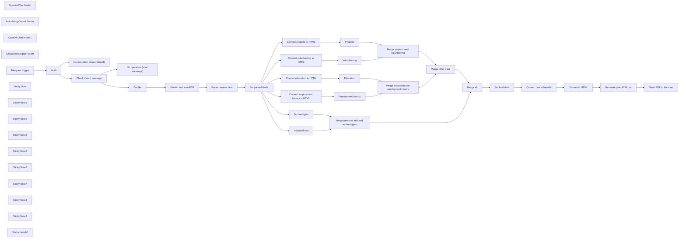

## Fluxo (.json) :

```json
{
  "nodes": [
    {
      "id": "79849bb5-00a4-42e6-92c4-b06c7a20eb3e",
      "name": "OpenAI Chat Model",
      "type": "@n8n/n8n-nodes-langchain.lmChatOpenAi",
      "position": [
        1580,
        340
      ],
      "parameters": {
        "model": "gpt-4-turbo-preview",
        "options": {
          "temperature": 0,
          "responseFormat": "json_object"
        }
      },
      "credentials": {
        "openAiApi": {
          "id": "jazew1WAaSRrjcHp",
          "name": "OpenAI (workfloows@gmail.com)"
        }
      },
      "typeVersion": 1
    },
    {
      "id": "85df0106-1f78-4412-8751-b84d417c8bf9",
      "name": "Convert education to HTML",
      "type": "n8n-nodes-base.code",
      "position": [
        2420,
        180
      ],
      "parameters": {
        "mode": "runOnceForEachItem",
        "jsCode": "function convertToHTML(list) {\n let html = '';\n\n list.forEach((education, index) => {\n if (index > 0) {\n html += '<br /><br />'; // Add a new line if it's not the first item\n }\n html += `<b>Institution:</b> ${education.institution}<br />\n<b>Start year:</b> ${education.start_year}<br />\n<b>Degree:</b> ${education.degree}`;\n });\n\n return html;\n}\n\n// Assuming payload is already defined\nconst payload = $input.item.json.education;\n\nconst htmlOutput = convertToHTML(payload);\nreturn {\n htmlOutput\n};"
      },
      "typeVersion": 2
    },
    {
      "id": "da4fc45d-712f-4171-b72a-66b74b4d8e05",
      "name": "Auto-fixing Output Parser",
      "type": "@n8n/n8n-nodes-langchain.outputParserAutofixing",
      "position": [
        1820,
        340
      ],
      "parameters": {},
      "typeVersion": 1
    },
    {
      "id": "225a7513-6fd4-4672-9b40-b10b00f121a7",
      "name": "OpenAI Chat Model1",
      "type": "@n8n/n8n-nodes-langchain.lmChatOpenAi",
      "position": [
        1740,
        520
      ],
      "parameters": {
        "options": {
          "temperature": 0
        }
      },
      "credentials": {
        "openAiApi": {
          "id": "jazew1WAaSRrjcHp",
          "name": "OpenAI (workfloows@gmail.com)"
        }
      },
      "typeVersion": 1
    },
    {
      "id": "0606c99d-a080-4277-b071-1bc0c93bb2e3",
      "name": "Structured Output Parser",
      "type": "@n8n/n8n-nodes-langchain.outputParserStructured",
      "position": [
        1960,
        520
      ],
      "parameters": {
        "jsonSchema": "{\n \"type\": \"object\",\n \"properties\": {\n \"personal_info\": {\n \"type\": \"object\",\n \"properties\": {\n \"name\": { \"type\": \"string\" },\n \"address\": { \"type\": \"string\" },\n \"email\": { \"type\": \"string\", \"format\": \"email\" },\n \"github\": { \"type\": \"string\"},\n \"linkedin\": { \"type\": \"string\" }\n }\n },\n \"employment_history\": {\n \"type\": \"array\",\n \"items\": {\n \"type\": \"object\",\n \"properties\": {\n \"position\": { \"type\": \"string\" },\n \"company\": { \"type\": \"string\" },\n \"duration\": { \"type\": \"string\" },\n \"responsibilities\": {\n \"type\": \"array\",\n \"items\": { \"type\": \"string\" }\n }\n }\n }\n },\n \"education\": {\n \"type\": \"array\",\n \"items\": {\n \"type\": \"object\",\n \"properties\": {\n \"institution\": { \"type\": \"string\" },\n \"start_year\": { \"type\": \"integer\" },\n \"degree\": { \"type\": \"string\" }\n }\n }\n },\n \"projects\": {\n \"type\": \"array\",\n \"items\": {\n \"type\": \"object\",\n \"properties\": {\n \"name\": { \"type\": \"string\" },\n \"year\": { \"type\": \"integer\" },\n \"description\": { \"type\": \"string\" },\n \"technologies\": {\n \"type\": \"array\",\n \"items\": { \"type\": \"string\" }\n }\n }\n }\n },\n \"volunteering\": {\n \"type\": \"array\",\n \"items\": {\n \"type\": \"object\",\n \"properties\": {\n \"activity\": { \"type\": \"string\" },\n \"location\": { \"type\": \"string\" },\n \"date\": { \"type\": \"string\" },\n \"description\": { \"type\": \"string\" }\n }\n }\n },\n \"programming_languages\": {\n \"type\": \"object\",\n \"properties\": {\n \"languages\": {\n \"type\": \"array\",\n \"items\": { \"type\": \"string\" }\n },\n \"tools\": {\n \"type\": \"array\",\n \"items\": { \"type\": \"string\" }\n },\n \"methodologies\": {\n \"type\": \"array\",\n \"items\": { \"type\": \"string\" }\n }\n }\n },\n \"foreign_languages\": {\n \"type\": \"array\",\n \"items\": {\n \"type\": \"object\",\n \"properties\": {\n \"language\": { \"type\": \"string\" },\n \"level\": { \"type\": \"string\" }\n }\n }\n }\n }\n}\n"
      },
      "typeVersion": 1
    },
    {
      "id": "027975cd-768a-4048-858d-9060f48ab622",
      "name": "Convert employment history to HTML",
      "type": "n8n-nodes-base.code",
      "position": [
        2420,
        -20
      ],
      "parameters": {
        "mode": "runOnceForEachItem",
        "jsCode": "function convertToHTML(list) {\n let html = '';\n\n list.forEach((item, index) => {\n if (index > 0) {\n html += '<br />'; // Add a new line if it's not the first item\n }\n html += `<b>Position:</b> ${item.position}\n<b>Company:</b> ${item.company}\n<br />\n<b>Duration:</b> ${item.duration}\n<br />\n<b>Responsibilities:</b>\n`;\n\n item.responsibilities.forEach((responsibility, i) => {\n html += `- ${responsibility}`;\n if (i < item.responsibilities.length - 1 || index < list.length - 1) {\n html += '<br />'; // Add new line if it's not the last responsibility in the last item\n }\n });\n });\n\n return html;\n}\n\n// Assuming payload is already defined\nconst payload = $input.item.json.employment_history;\n\nconst htmlOutput = convertToHTML(payload);\nreturn {\n htmlOutput\n};"
      },
      "typeVersion": 2
    },
    {
      "id": "823a241d-1c68-40a9-8f2c-f1bdfaab7603",
      "name": "Convert projects to HTML",
      "type": "n8n-nodes-base.code",
      "position": [
        2420,
        380
      ],
      "parameters": {
        "mode": "runOnceForEachItem",
        "jsCode": "function convertToHTML(list) {\n let html = '';\n\n list.forEach((project, index) => {\n if (index > 0) {\n html += '<br />'; // Add a new line if it's not the first project\n }\n html += `<b>Name:</b> ${project.name}<br />\n<b>Year:</b> ${project.year}<br />\n<b>Description:</b> ${project.description}<br /><br />\n<b>Technologies:</b>\n<br />`;\n\n project.technologies.forEach((technology, i) => {\n html += `- ${technology}`;\n if (i < project.technologies.length - 1 || index < list.length - 1) {\n html += '<br />'; // Add new line if it's not the last technology in the last project\n }\n });\n });\n\n return html;\n}\n\n// Assuming payload is already defined\nconst payload = $input.item.json.projects;\n\nconst htmlOutput = convertToHTML(payload);\nreturn {\n htmlOutput\n};\n"
      },
      "typeVersion": 2
    },
    {
      "id": "a12eb0e1-1cb9-4b83-a1ec-42dd8214f6bc",
      "name": "Convert volunteering to HTML",
      "type": "n8n-nodes-base.code",
      "position": [
        2420,
        580
      ],
      "parameters": {
        "mode": "runOnceForEachItem",
        "jsCode": "function convertToHTML(list) {\n let html = '';\n\n list.forEach((event, index) => {\n if (index > 0) {\n html += '<br />'; // Add a new line if it's not the first volunteering event\n }\n html += `<b>Activity:</b> ${event.activity}<br />\n<b>Location:</b> ${event.location}<br />\n<b>Date:</b> ${event.date}<br />\n<b>Description:</b> ${event.description}<br />`;\n });\n\n return html;\n}\n\n// Assuming payload is already defined\nconst payload = $input.item.json.volunteering;\n\nconst htmlOutput = convertToHTML(payload);\nreturn {\n htmlOutput\n};\n"
      },
      "typeVersion": 2
    },
    {
      "id": "70b67b80-d22d-4eea-8c97-3d2cb2b9bbfc",
      "name": "Telegram trigger",
      "type": "n8n-nodes-base.telegramTrigger",
      "position": [
        360,
        340
      ],
      "webhookId": "d6829a55-a01b-44ac-bad3-2349324c8515",
      "parameters": {
        "updates": [
          "message"
        ],
        "additionalFields": {}
      },
      "credentials": {
        "telegramApi": {
          "id": "lStLV4zzcrQO9eAM",
          "name": "Telegram (Resume Extractor)"
        }
      },
      "typeVersion": 1.1
    },
    {
      "id": "21bead1d-0665-44d5-b623-b0403c9abd6c",
      "name": "Auth",
      "type": "n8n-nodes-base.if",
      "position": [
        600,
        340
      ],
      "parameters": {
        "options": {},
        "conditions": {
          "options": {
            "leftValue": "",
            "caseSensitive": true,
            "typeValidation": "strict"
          },
          "combinator": "and",
          "conditions": [
            {
              "id": "7ca4b4c3-e23b-4896-a823-efc85c419467",
              "operator": {
                "type": "number",
                "operation": "equals"
              },
              "leftValue": "={{ $json.message.chat.id }}",
              "rightValue": 0
            }
          ]
        }
      },
      "typeVersion": 2
    },
    {
      "id": "de76d6ec-3b0e-44e0-943d-55547aac2e46",
      "name": "No operation (unauthorized)",
      "type": "n8n-nodes-base.noOp",
      "position": [
        860,
        520
      ],
      "parameters": {},
      "typeVersion": 1
    },
    {
      "id": "439f5e2c-be7d-486b-a1f1-13b09f77c2c8",
      "name": "Check if start message",
      "type": "n8n-nodes-base.if",
      "position": [
        860,
        220
      ],
      "parameters": {
        "options": {},
        "conditions": {
          "options": {
            "leftValue": "",
            "caseSensitive": true,
            "typeValidation": "strict"
          },
          "combinator": "and",
          "conditions": [
            {
              "id": "1031f14f-9793-488d-bb6b-a021f943a399",
              "operator": {
                "type": "string",
                "operation": "notEquals"
              },
              "leftValue": "={{ $json.message.text }}",
              "rightValue": "/start"
            }
          ]
        }
      },
      "typeVersion": 2
    },
    {
      "id": "af5f5622-c338-40c0-af72-90e124ed7ce1",
      "name": "No operation (start message)",
      "type": "n8n-nodes-base.noOp",
      "position": [
        1120,
        360
      ],
      "parameters": {},
      "typeVersion": 1
    },
    {
      "id": "2efae11a-376b-44aa-ab91-9b3dea82ede0",
      "name": "Get file",
      "type": "n8n-nodes-base.telegram",
      "position": [
        1120,
        120
      ],
      "parameters": {
        "fileId": "={{ $json.message.document.file_id }}",
        "resource": "file"
      },
      "credentials": {
        "telegramApi": {
          "id": "lStLV4zzcrQO9eAM",
          "name": "Telegram (Resume Extractor)"
        }
      },
      "typeVersion": 1.1
    },
    {
      "id": "88fd1002-ad2c-445f-92d4-11b571db3788",
      "name": "Extract text from PDF",
      "type": "n8n-nodes-base.extractFromFile",
      "position": [
        1380,
        120
      ],
      "parameters": {
        "options": {},
        "operation": "pdf"
      },
      "typeVersion": 1
    },
    {
      "id": "9dfc204b-c567-418a-93a3-9b72cf534a8c",
      "name": "Set parsed fileds",
      "type": "n8n-nodes-base.set",
      "position": [
        2040,
        120
      ],
      "parameters": {
        "options": {}
      },
      "typeVersion": 3.2
    },
    {
      "id": "314c771a-5ff2-484f-823b-0eab88f43ea3",
      "name": "Personal info",
      "type": "n8n-nodes-base.set",
      "position": [
        2420,
        -380
      ],
      "parameters": {
        "fields": {
          "values": [
            {
              "name": "personal_info",
              "stringValue": "=<b><u>Personal info</u></b>\n<br /><br />\n<b>Name:</b> {{ $json.personal_info.name }}\n<br />\n<b>Address:</b> {{ $json.personal_info.address }}\n<br />\n<b>Email:</b> {{ $json.personal_info.email }}\n<br />\n<b>GitHub:</b> {{ $json.personal_info.github }}\n<br />"
            }
          ]
        },
        "include": "none",
        "options": {}
      },
      "typeVersion": 3.2
    },
    {
      "id": "be6b32e8-6000-4235-a723-0e22828ead45",
      "name": "Technologies",
      "type": "n8n-nodes-base.set",
      "position": [
        2420,
        -200
      ],
      "parameters": {
        "fields": {
          "values": [
            {
              "name": "technologies",
              "stringValue": "=<b><u>Technologies</u></b>\n<br /><br />\n<b>Programming languages:</b> {{ $json.programming_languages.languages.join(', ') }}\n<br />\n<b>Tools:</b> {{ $json.programming_languages.tools.join(', ') }}\n<br />\n<b>Methodologies:</b> {{ $json.programming_languages.methodologies.join(', ') }}\n<br />"
            }
          ]
        },
        "include": "none",
        "options": {}
      },
      "typeVersion": 3.2
    },
    {
      "id": "ab726d61-84b8-4af7-a195-33e1add89153",
      "name": "Employment history",
      "type": "n8n-nodes-base.set",
      "position": [
        2640,
        -20
      ],
      "parameters": {
        "fields": {
          "values": [
            {
              "name": "employment_history",
              "stringValue": "=<b><u>Employment history</u></b>\n<br /><br />\n{{ $json[\"htmlOutput\"] }}"
            }
          ]
        },
        "include": "none",
        "options": {}
      },
      "typeVersion": 3.2
    },
    {
      "id": "692f9555-6102-4d3c-b0a1-868e27e3c343",
      "name": "Education",
      "type": "n8n-nodes-base.set",
      "position": [
        2640,
        180
      ],
      "parameters": {
        "fields": {
          "values": [
            {
              "name": "education",
              "stringValue": "=<b><u>Education</u></b>\n<br /><br />\n{{ $json[\"htmlOutput\"] }}"
            }
          ]
        },
        "include": "none",
        "options": {}
      },
      "typeVersion": 3.2
    },
    {
      "id": "258728f2-1f03-4786-8197-feb9f1bc4dfe",
      "name": "Projects",
      "type": "n8n-nodes-base.set",
      "position": [
        2640,
        380
      ],
      "parameters": {
        "fields": {
          "values": [
            {
              "name": "projects",
              "stringValue": "=<b><u>Projects</u></b>\n<br /><br />\n{{ $json[\"htmlOutput\"] }}"
            }
          ]
        },
        "include": "none",
        "options": {}
      },
      "typeVersion": 3.2
    },
    {
      "id": "3c819ce4-235a-4b12-a396-d33dca9f80da",
      "name": "Volunteering",
      "type": "n8n-nodes-base.set",
      "position": [
        2640,
        580
      ],
      "parameters": {
        "fields": {
          "values": [
            {
              "name": "volunteering",
              "stringValue": "=<b><u>Volunteering</u></b>\n<br /><br />\n{{ $json[\"htmlOutput\"] }}"
            }
          ]
        },
        "include": "none",
        "options": {}
      },
      "typeVersion": 3.2
    },
    {
      "id": "41bd7506-7330-4c25-8b43-aa3c836736fc",
      "name": "Merge education and employment history",
      "type": "n8n-nodes-base.merge",
      "position": [
        2880,
        100
      ],
      "parameters": {
        "mode": "combine",
        "options": {},
        "combinationMode": "multiplex"
      },
      "typeVersion": 2.1
    },
    {
      "id": "d788da36-360b-4009-82ad-2f206fad8e53",
      "name": "Merge projects and volunteering",
      "type": "n8n-nodes-base.merge",
      "position": [
        2880,
        500
      ],
      "parameters": {
        "mode": "combine",
        "options": {},
        "combinationMode": "multiplex"
      },
      "typeVersion": 2.1
    },
    {
      "id": "57c20e19-3d84-41c0-a415-1d55cb031da1",
      "name": "Merge personal info and technologies",
      "type": "n8n-nodes-base.merge",
      "position": [
        3140,
        -160
      ],
      "parameters": {
        "mode": "combine",
        "options": {},
        "combinationMode": "multiplex"
      },
      "typeVersion": 2.1
    },
    {
      "id": "f12be010-8375-4ff7-ba8e-9c2c870f648b",
      "name": "Merge all",
      "type": "n8n-nodes-base.merge",
      "position": [
        3400,
        200
      ],
      "parameters": {
        "mode": "combine",
        "options": {},
        "combinationMode": "multiplex"
      },
      "typeVersion": 2.1
    },
    {
      "id": "d6428167-2c75-42a5-a905-7590ff1d6a25",
      "name": "Set final data",
      "type": "n8n-nodes-base.set",
      "position": [
        3620,
        200
      ],
      "parameters": {
        "fields": {
          "values": [
            {
              "name": "output",
              "stringValue": "={{ $json.personal_info }}\n<br /><br />\n{{ $json.employment_history }}\n<br /><br />\n{{ $json.education }}\n<br /><br />\n{{ $json.projects }}\n<br /><br />\n{{ $json.volunteering }}\n<br /><br />\n{{ $json.technologies }}"
            }
          ]
        },
        "include": "none",
        "options": {}
      },
      "typeVersion": 3.2
    },
    {
      "id": "9ea13c62-2e09-4b37-b889-66edaef1fcf1",
      "name": "Convert raw to base64",
      "type": "n8n-nodes-base.code",
      "position": [
        3840,
        200
      ],
      "parameters": {
        "mode": "runOnceForEachItem",
        "jsCode": "const encoded = Buffer.from($json.output).toString('base64');\n\nreturn { encoded };"
      },
      "typeVersion": 2
    },
    {
      "id": "c4474fa1-b1b5-432f-b30e-100201c9ec7c",
      "name": "Convert to HTML",
      "type": "n8n-nodes-base.convertToFile",
      "position": [
        4060,
        200
      ],
      "parameters": {
        "options": {
          "fileName": "index.html",
          "mimeType": "text/html"
        },
        "operation": "toBinary",
        "sourceProperty": "encoded"
      },
      "typeVersion": 1.1
    },
    {
      "id": "3c4d2010-1bdc-4f01-bb1a-bd0128017787",
      "name": "Generate plain PDF doc",
      "type": "n8n-nodes-base.httpRequest",
      "position": [
        4340,
        200
      ],
      "parameters": {
        "url": "http://gotenberg:3000/forms/chromium/convert/html",
        "method": "POST",
        "options": {
          "response": {
            "response": {
              "responseFormat": "file"
            }
          }
        },
        "sendBody": true,
        "contentType": "multipart-form-data",
        "bodyParameters": {
          "parameters": [
            {
              "name": "files",
              "parameterType": "formBinaryData",
              "inputDataFieldName": "data"
            }
          ]
        }
      },
      "typeVersion": 4.1
    },
    {
      "id": "2b3cd55f-21a3-4c14-905f-82b158aa3fd0",
      "name": "Send PDF to the user",
      "type": "n8n-nodes-base.telegram",
      "position": [
        4640,
        200
      ],
      "parameters": {
        "chatId": "={{ $('Telegram trigger').item.json[\"message\"][\"chat\"][\"id\"] }}",
        "operation": "sendDocument",
        "binaryData": true,
        "additionalFields": {
          "fileName": "={{ $('Set parsed fileds').item.json[\"personal_info\"][\"name\"].toLowerCase().replace(' ', '-') }}.pdf"
        }
      },
      "credentials": {
        "telegramApi": {
          "id": "lStLV4zzcrQO9eAM",
          "name": "Telegram (Resume Extractor)"
        }
      },
      "typeVersion": 1.1
    },
    {
      "id": "54fe1d2d-eb9d-4fe1-883f-1826e27ac873",
      "name": "Sticky Note",
      "type": "n8n-nodes-base.stickyNote",
      "position": [
        540,
        180
      ],
      "parameters": {
        "width": 226.21234567901217,
        "height": 312.917333333334,
        "content": "### Add chat ID\nRemember to set your actual ID to trigger automation from Telegram."
      },
      "typeVersion": 1
    },
    {
      "id": "b193a904-260b-4d45-8a66-e3cb46fc7ce4",
      "name": "Sticky Note1",
      "type": "n8n-nodes-base.stickyNote",
      "position": [
        800,
        83.43940740740783
      ],
      "parameters": {
        "width": 229.64938271604922,
        "height": 293.54824691358016,
        "content": "### Ignore start message\nWorkflow ignores initial`/start` message sent to the bot."
      },
      "typeVersion": 1
    },
    {
      "id": "d5c95d8f-b699-4a8e-9460-a4f5856b5e6f",
      "name": "Sticky Note2",
      "type": "n8n-nodes-base.stickyNote",
      "position": [
        1066,
        -20
      ],
      "parameters": {
        "width": 211.00246913580224,
        "height": 302.41975308642,
        "content": "### Download resume file\nBased on file ID, node performs downloading of the file uploaded by user."
      },
      "typeVersion": 1
    },
    {
      "id": "2de0751d-8e11-457e-8c38-a6dcca59190c",
      "name": "Sticky Note4",
      "type": "n8n-nodes-base.stickyNote",
      "position": [
        1320,
        -20
      ],
      "parameters": {
        "width": 217.87654320987633,
        "height": 302.41975308642,
        "content": "### Extract text from PDF\nNode extracts readable text form PDF."
      },
      "typeVersion": 1
    },
    {
      "id": "4b9ccab8-ff6c-408f-93fe-f148034860a0",
      "name": "Sticky Note5",
      "type": "n8n-nodes-base.stickyNote",
      "position": [
        1580,
        -20
      ],
      "parameters": {
        "width": 410.9479506172837,
        "height": 302.41975308642,
        "content": "### Parse resume data\nCreate structured data from text extracted from resume. Chain uses OpenAI `gpt-4-turbo-preview` model and JSON response mode. **Adjust JSON schema in output parser to your needs.**"
      },
      "typeVersion": 1
    },
    {
      "id": "bfb1d382-90fa-4bff-8c38-04e53bcf5f58",
      "name": "Parse resume data",
      "type": "@n8n/n8n-nodes-langchain.chainLlm",
      "position": [
        1660,
        120
      ],
      "parameters": {
        "prompt": "={{ $json.text }}",
        "messages": {
          "messageValues": [
            {
              "message": "Your task is to extract all necessary data such as first name, last name, experience, known technologies etc. from the provided resume text and return in well-unified JSON format. Do not make things up."
            }
          ]
        }
      },
      "typeVersion": 1.3
    },
    {
      "id": "7e8eb10a-f21c-4a9c-90b1-b71537b78356",
      "name": "Merge other data",
      "type": "n8n-nodes-base.merge",
      "position": [
        3140,
        340
      ],
      "parameters": {
        "mode": "combine",
        "options": {},
        "combinationMode": "multiplex"
      },
      "typeVersion": 2.1
    },
    {
      "id": "7c4398de-7b4d-4095-b38f-eaf099d2991b",
      "name": "Sticky Note6",
      "type": "n8n-nodes-base.stickyNote",
      "position": [
        2340,
        -491.4074074074074
      ],
      "parameters": {
        "width": 1196.8442469135782,
        "height": 1260.345679012346,
        "content": "### Format HTML\nFormat HTML for each resume section (employment history, projects etc.)."
      },
      "typeVersion": 1
    },
    {
      "id": "9de2f504-6ff0-4b00-8e0d-436c789b4e23",
      "name": "Sticky Note7",
      "type": "n8n-nodes-base.stickyNote",
      "position": [
        3580,
        40
      ],
      "parameters": {
        "width": 638.6516543209876,
        "height": 322.5837037037037,
        "content": "### Create HTML file\nFrom formatted output create `index.html` file in order to run PDF conversion."
      },
      "typeVersion": 1
    },
    {
      "id": "11abdff5-377e-490d-9136-15c24ff6a05e",
      "name": "Sticky Note8",
      "type": "n8n-nodes-base.stickyNote",
      "position": [
        4260,
        39.83604938271645
      ],
      "parameters": {
        "color": 3,
        "width": 262.0096790123454,
        "height": 322.5837037037035,
        "content": "### Convert file to PDF\nForm `index.html` create PDF using [Gotenberg](https://gotenberg.dev/). If you're not familiar with this software, feel free to check out [my tutorial on YouTube](https://youtu.be/bo15xdjXf1Y?si=hFZMTfjzfSOLOLPK)."
      },
      "typeVersion": 1
    },
    {
      "id": "73fb81d0-5218-4311-aaec-7fa259d8cbd3",
      "name": "Sticky Note9",
      "type": "n8n-nodes-base.stickyNote",
      "position": [
        4560,
        40
      ],
      "parameters": {
        "width": 262.0096790123454,
        "height": 322.5837037037035,
        "content": "### Send PDF file to user\nDeliver converted PDF to Telegram user (based on chat ID)."
      },
      "typeVersion": 1
    },
    {
      "id": "bb5fa375-4cc9-4559-a014-7b618d6c5f32",
      "name": "Sticky Note10",
      "type": "n8n-nodes-base.stickyNote",
      "position": [
        -280,
        128
      ],
      "parameters": {
        "width": 432.69769500990674,
        "height": 364.2150828344463,
        "content": "## ⚠️ Note\n\nThis is *resume extractor* workflow that I had a pleasure to present during [n8n community hangout](https://youtu.be/eZacuxrhCuo?si=KkJQrgQuvLxj-6FM&t=1701\n) on March 7, 2024.\n\n1. Remember to add your credentials and configure nodes.\n2. This node requires installed [Gotenberg](https://gotenberg.dev/) for PDF generation. If you're not familiar with this software, feel free to check out [my tutorial on YouTube](https://youtu.be/bo15xdjXf1Y?si=hFZMTfjzfSOLOLPK). If you don't want to self-host Gotenberg, you use other PDF generation provider (PDFMonkey, ApiTemplate or similar).\n3. If you like this workflow, please subscribe to [my YouTube channel](https://www.youtube.com/@workfloows) and/or [my newsletter](https://workfloows.com/).\n\n**Thank you for your support!**"
      },
      "typeVersion": 1
    }
  ],
  "connections": {
    "Auth": {
      "main": [
        [
          {
            "node": "Check if start message",
            "type": "main",
            "index": 0
          }
        ],
        [
          {
            "node": "No operation (unauthorized)",
            "type": "main",
            "index": 0
          }
        ]
      ]
    },
    "Get file": {
      "main": [
        [
          {
            "node": "Extract text from PDF",
            "type": "main",
            "index": 0
          }
        ]
      ]
    },
    "Projects": {
      "main": [
        [
          {
            "node": "Merge projects and volunteering",
            "type": "main",
            "index": 0
          }
        ]
      ]
    },
    "Education": {
      "main": [
        [
          {
            "node": "Merge education and employment history",
            "type": "main",
            "index": 1
          }
        ]
      ]
    },
    "Merge all": {
      "main": [
        [
          {
            "node": "Set final data",
            "type": "main",
            "index": 0
          }
        ]
      ]
    },
    "Technologies": {
      "main": [
        [
          {
            "node": "Merge personal info and technologies",
            "type": "main",
            "index": 1
          }
        ]
      ]
    },
    "Volunteering": {
      "main": [
        [
          {
            "node": "Merge projects and volunteering",
            "type": "main",
            "index": 1
          }
        ]
      ]
    },
    "Personal info": {
      "main": [
        [
          {
            "node": "Merge personal info and technologies",
            "type": "main",
            "index": 0
          }
        ]
      ]
    },
    "Set final data": {
      "main": [
        [
          {
            "node": "Convert raw to base64",
            "type": "main",
            "index": 0
          }
        ]
      ]
    },
    "Convert to HTML": {
      "main": [
        [
          {
            "node": "Generate plain PDF doc",
            "type": "main",
            "index": 0
          }
        ]
      ]
    },
    "Merge other data": {
      "main": [
        [
          {
            "node": "Merge all",
            "type": "main",
            "index": 1
          }
        ]
      ]
    },
    "Telegram trigger": {
      "main": [
        [
          {
            "node": "Auth",
            "type": "main",
            "index": 0
          }
        ]
      ]
    },
    "OpenAI Chat Model": {
      "ai_languageModel": [
        [
          {
            "node": "Parse resume data",
            "type": "ai_languageModel",
            "index": 0
          }
        ]
      ]
    },
    "Parse resume data": {
      "main": [
        [
          {
            "node": "Set parsed fileds",
            "type": "main",
            "index": 0
          }
        ]
      ]
    },
    "Set parsed fileds": {
      "main": [
        [
          {
            "node": "Convert employment history to HTML",
            "type": "main",
            "index": 0
          },
          {
            "node": "Convert education to HTML",
            "type": "main",
            "index": 0
          },
          {
            "node": "Convert projects to HTML",
            "type": "main",
            "index": 0
          },
          {
            "node": "Personal info",
            "type": "main",
            "index": 0
          },
          {
            "node": "Convert volunteering to HTML",
            "type": "main",
            "index": 0
          },
          {
            "node": "Technologies",
            "type": "main",
            "index": 0
          }
        ]
      ]
    },
    "Employment history": {
      "main": [
        [
          {
            "node": "Merge education and employment history",
            "type": "main",
            "index": 0
          }
        ]
      ]
    },
    "OpenAI Chat Model1": {
      "ai_languageModel": [
        [
          {
            "node": "Auto-fixing Output Parser",
            "type": "ai_languageModel",
            "index": 0
          }
        ]
      ]
    },
    "Convert raw to base64": {
      "main": [
        [
          {
            "node": "Convert to HTML",
            "type": "main",
            "index": 0
          }
        ]
      ]
    },
    "Extract text from PDF": {
      "main": [
        [
          {
            "node": "Parse resume data",
            "type": "main",
            "index": 0
          }
        ]
      ]
    },
    "Check if start message": {
      "main": [
        [
          {
            "node": "Get file",
            "type": "main",
            "index": 0
          }
        ],
        [
          {
            "node": "No operation (start message)",
            "type": "main",
            "index": 0
          }
        ]
      ]
    },
    "Generate plain PDF doc": {
      "main": [
        [
          {
            "node": "Send PDF to the user",
            "type": "main",
            "index": 0
          }
        ]
      ]
    },
    "Convert projects to HTML": {
      "main": [
        [
          {
            "node": "Projects",
            "type": "main",
            "index": 0
          }
        ]
      ]
    },
    "Structured Output Parser": {
      "ai_outputParser": [
        [
          {
            "node": "Auto-fixing Output Parser",
            "type": "ai_outputParser",
            "index": 0
          }
        ]
      ]
    },
    "Auto-fixing Output Parser": {
      "ai_outputParser": [
        [
          {
            "node": "Parse resume data",
            "type": "ai_outputParser",
            "index": 0
          }
        ]
      ]
    },
    "Convert education to HTML": {
      "main": [
        [
          {
            "node": "Education",
            "type": "main",
            "index": 0
          }
        ]
      ]
    },
    "Convert volunteering to HTML": {
      "main": [
        [
          {
            "node": "Volunteering",
            "type": "main",
            "index": 0
          }
        ]
      ]
    },
    "Merge projects and volunteering": {
      "main": [
        [
          {
            "node": "Merge other data",
            "type": "main",
            "index": 1
          }
        ]
      ]
    },
    "Convert employment history to HTML": {
      "main": [
        [
          {
            "node": "Employment history",
            "type": "main",
            "index": 0
          }
        ]
      ]
    },
    "Merge personal info and technologies": {
      "main": [
        [
          {
            "node": "Merge all",
            "type": "main",
            "index": 0
          }
        ]
      ]
    },
    "Merge education and employment history": {
      "main": [
        [
          {
            "node": "Merge other data",
            "type": "main",
            "index": 0
          }
        ]
      ]
    }
  }
}
```
