# PACK 1999 TEMPLATES PARTE 10 - Bloco 8

Templates neste bloco: 20

## Sumário

- [Template 2530 - Controlar Spotify via Telegram](#template-2530)
- [Template 2531 - Análise de cabeçalhos de e-mail](#template-2531)
- [Template 2532 - Busca de incidentes ServiceNow pelo Slack](#template-2532)
- [Template 2533 - Resumo de reuniões e agendamento automático](#template-2533)
- [Template 2534 - Chat de voz com transcrição, contexto e síntese de áudio](#template-2534)
- [Template 2535 - Chat de voz com contexto e TTS](#template-2535)
- [Template 2536 - Chatbot Telegram multimodal com IA](#template-2536)
- [Template 2537 - Indexação de objetos de imagens para busca](#template-2537)
- [Template 2538 - Insights de pesquisa por agrupamento de respostas](#template-2538)
- [Template 2539 - Salvar faturas Paddle automaticamente](#template-2539)
- [Template 2540 - Tradutor de áudio do Telegram](#template-2540)
- [Template 2541 - Backup e indexação de workflows](#template-2541)
- [Template 2542 - Sincronizar Productboard para Snowflake](#template-2542)
- [Template 2543 - Sincronizar status e prazo do Linear para Productboard](#template-2543)
- [Template 2544 - Agente AI com scraping e chamadas a APIs](#template-2544)
- [Template 2545 - Geração automática de rascunhos de blog on‑brand](#template-2545)
- [Template 2546 - Processador IA de chamadas Gong](#template-2546)
- [Template 2547 - Análise multimodal de imagens e PDFs com Gemini](#template-2547)
- [Template 2548 - Sincronização de templates Dartagnan → Braze](#template-2548)
- [Template 2549 - Exportar clientes Shopify para planilha e CSV](#template-2549)

---

<a id="template-2530"></a>

## Template 2530 - Controlar Spotify via Telegram

- **Nome:** Controlar Spotify via Telegram
- **Descrição:** Permite adicionar músicas à fila do Spotify e controlar a reprodução a partir de mensagens no Telegram, usando IA para identificar faixas descritas em texto.
- **Funcionalidade:** • Recepção de mensagens do Telegram: Inicia o fluxo ao receber mensagens dos usuários.
• Identificação de faixa via IA: Analisa o texto enviado e extrai o nome da música e do artista.
• Busca de faixa no catálogo: Procura a faixa identificada na biblioteca do serviço de streaming.
• Validação de resultado: Verifica se a busca retornou uma faixa e gera uma mensagem de erro se não encontrada.
• Adição à fila de reprodução: Adiciona a faixa encontrada à fila do usuário no serviço de streaming.
• Pular e retomar reprodução: Avança para a próxima faixa e retoma a reprodução quando aplicável.
• Recuperação da faixa em reprodução: Obtém a faixa atualmente em reprodução e formata a mensagem para o usuário.
• Envio de retorno ao usuário: Consolida mensagens e envia respostas ao chat do Telegram.
• Tratamento de erros: Continua execuções mesmo se operações de reprodução lançarem erros (por exemplo, quando já está tocando).
- **Ferramentas:** • Telegram: Plataforma de mensagens usada para receber comandos do usuário e enviar respostas.
• OpenAI (modelo GPT-4o-mini): Serviço de IA que interpreta descrições de músicas e extrai artista e título.
• Spotify: Serviço de streaming usado para buscar faixas, adicionar à fila e controlar a reprodução do usuário.

## Fluxo visual

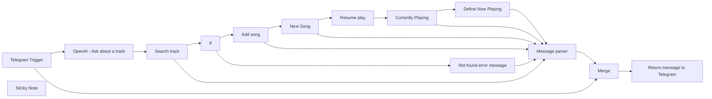

## Fluxo (.json) :

```json
{
  "id": "F7CfIF10XjXhqbGb",
  "meta": {
    "instanceId": "ba8f1362d8ed4c2ce84171d2f481098de4ee775241bdc1660d1dce80434ec7d4",
    "templateCredsSetupCompleted": true
  },
  "name": "Play with Spotify from Telegram",
  "tags": [],
  "nodes": [
    {
      "id": "0395b3e4-94ef-49ea-9b4c-8f908e62f8c6",
      "name": "Telegram Trigger",
      "type": "n8n-nodes-base.telegramTrigger",
      "position": [
        -60,
        20
      ],
      "webhookId": "e7aa284b-5eef-4ac1-94bf-8e4d307a3b14",
      "parameters": {
        "updates": [
          "message"
        ],
        "additionalFields": {}
      },
      "credentials": {
        "telegramApi": {
          "id": "gblW5oACGEPuccja",
          "name": "Telegram account"
        }
      },
      "typeVersion": 1.1
    },
    {
      "id": "263edf45-58a0-45e8-91f8-601bc62c7d6f",
      "name": "OpenAI - Ask about a track",
      "type": "@n8n/n8n-nodes-langchain.openAi",
      "position": [
        120,
        -120
      ],
      "parameters": {
        "modelId": {
          "__rl": true,
          "mode": "list",
          "value": "gpt-4o-mini",
          "cachedResultName": "GPT-4O-MINI"
        },
        "options": {},
        "messages": {
          "values": [
            {
              "content": "=get artist and song name from '{{ $json.message.text }}'. Reply only eg. 'track:song name artist:artist name'"
            }
          ]
        }
      },
      "credentials": {
        "openAiApi": {
          "id": "vDcge3EgslxfX3EC",
          "name": "OpenAi account"
        }
      },
      "typeVersion": 1.6
    },
    {
      "id": "086aef8b-533a-4c33-9952-29d5adb152c8",
      "name": "Search track",
      "type": "n8n-nodes-base.spotify",
      "onError": "continueErrorOutput",
      "position": [
        540,
        -200
      ],
      "parameters": {
        "limit": 1,
        "query": "={{ $json.message.content }}",
        "filters": {},
        "resource": "track",
        "operation": "search"
      },
      "credentials": {
        "spotifyOAuth2Api": {
          "id": "wylKghFNQa8IKy1U",
          "name": "Spotify account"
        }
      },
      "typeVersion": 1,
      "alwaysOutputData": true
    },
    {
      "id": "08af6055-ba52-4cb2-a561-ea04ac55279f",
      "name": "Add song",
      "type": "n8n-nodes-base.spotify",
      "onError": "continueErrorOutput",
      "position": [
        780,
        -240
      ],
      "parameters": {
        "id": "=spotify:track:{{ $json.id }}"
      },
      "credentials": {
        "spotifyOAuth2Api": {
          "id": "wylKghFNQa8IKy1U",
          "name": "Spotify account"
        }
      },
      "typeVersion": 1
    },
    {
      "id": "2dbdafa4-3b6f-4a14-813c-4e10da10abad",
      "name": "Next Song",
      "type": "n8n-nodes-base.spotify",
      "onError": "continueErrorOutput",
      "position": [
        980,
        -280
      ],
      "parameters": {
        "operation": "nextSong"
      },
      "credentials": {
        "spotifyOAuth2Api": {
          "id": "wylKghFNQa8IKy1U",
          "name": "Spotify account"
        }
      },
      "typeVersion": 1
    },
    {
      "id": "cb8d42aa-0c7e-45a5-90b5-b91e483dd13a",
      "name": "Resume play",
      "type": "n8n-nodes-base.spotify",
      "notes": "We don't have to stop here on error. An error is thrown from Spotify if the player is already playing.",
      "onError": "continueRegularOutput",
      "position": [
        1240,
        -380
      ],
      "parameters": {
        "operation": "resume"
      },
      "credentials": {
        "spotifyOAuth2Api": {
          "id": "wylKghFNQa8IKy1U",
          "name": "Spotify account"
        }
      },
      "typeVersion": 1
    },
    {
      "id": "089e1070-b013-454c-9f6c-55b909e06c1d",
      "name": "Currently Playing",
      "type": "n8n-nodes-base.spotify",
      "onError": "continueErrorOutput",
      "position": [
        1420,
        -300
      ],
      "parameters": {
        "operation": "currentlyPlaying"
      },
      "credentials": {
        "spotifyOAuth2Api": {
          "id": "wylKghFNQa8IKy1U",
          "name": "Spotify account"
        }
      },
      "typeVersion": 1
    },
    {
      "id": "e9df0dcf-b166-45a3-910b-787b3718bbcf",
      "name": "Sticky Note",
      "type": "n8n-nodes-base.stickyNote",
      "position": [
        120,
        -300
      ],
      "parameters": {
        "color": 5,
        "width": 254.05813953488382,
        "content": "## Telegram to Spotify \nAsk AI about a track with artist and song name or if you can't remember describe it and AI does it's thing.\n"
      },
      "typeVersion": 1
    },
    {
      "id": "77bae9be-2d92-4028-ae78-7887b6a2d394",
      "name": "Merge",
      "type": "n8n-nodes-base.merge",
      "position": [
        440,
        220
      ],
      "parameters": {
        "mode": "combine",
        "options": {},
        "combineBy": "combineAll"
      },
      "typeVersion": 3
    },
    {
      "id": "0d95000d-7efd-402a-9a34-47ababb2f53e",
      "name": "If",
      "type": "n8n-nodes-base.if",
      "position": [
        620,
        -440
      ],
      "parameters": {
        "options": {},
        "conditions": {
          "options": {
            "version": 2,
            "leftValue": "",
            "caseSensitive": true,
            "typeValidation": "strict"
          },
          "combinator": "and",
          "conditions": [
            {
              "id": "02af5387-07d2-4a16-bd83-e1359d091165",
              "operator": {
                "type": "string",
                "operation": "notEmpty",
                "singleValue": true
              },
              "leftValue": "={{ $json?.id }}",
              "rightValue": ""
            }
          ]
        }
      },
      "typeVersion": 2.2
    },
    {
      "id": "363f89ad-34d0-4445-8ff3-693d991dad09",
      "name": "Message parser",
      "type": "n8n-nodes-base.set",
      "position": [
        1280,
        -40
      ],
      "parameters": {
        "options": {},
        "assignments": {
          "assignments": [
            {
              "id": "93cd2545-c6e9-4717-96b7-d49eb056ac70",
              "name": "message",
              "type": "string",
              "value": "={{ $json.error }}"
            }
          ]
        }
      },
      "typeVersion": 3.4
    },
    {
      "id": "8b80f80d-8c8e-44de-9838-6d05199bb734",
      "name": "Not found error message",
      "type": "n8n-nodes-base.set",
      "position": [
        880,
        -460
      ],
      "parameters": {
        "mode": "raw",
        "options": {},
        "jsonOutput": "{\n  \"error\": \"Song not found\"\n}\n"
      },
      "typeVersion": 3.4
    },
    {
      "id": "f1785140-8e97-43e1-9d84-aedc8b8d5e06",
      "name": "Return message to Telegram",
      "type": "n8n-nodes-base.telegram",
      "position": [
        760,
        220
      ],
      "parameters": {
        "text": "={{ $('Message parser').item.json.message }}",
        "chatId": "={{ $json.message.chat.id }}",
        "additionalFields": {}
      },
      "credentials": {
        "telegramApi": {
          "id": "gblW5oACGEPuccja",
          "name": "Telegram account"
        }
      },
      "typeVersion": 1.2
    },
    {
      "id": "e3e16535-094b-41bf-88c6-166bb6805d53",
      "name": "Define Now Playing",
      "type": "n8n-nodes-base.set",
      "notes": "We use the object \"error\" as a returned bject so we can re-use the Message Parser node.",
      "position": [
        1660,
        -240
      ],
      "parameters": {
        "mode": "raw",
        "options": {},
        "jsonOutput": "={\n  \"error\": \"Now playing {{ $json.item.name }} - {{ $json.item.artists[0].name }} - {{ $json.item.album.name }}\"\n}\n"
      },
      "typeVersion": 3.4
    }
  ],
  "active": true,
  "pinData": {},
  "settings": {
    "executionOrder": "v1"
  },
  "versionId": "6f219c9e-f17a-45b1-ab8d-09d991fd8e34",
  "connections": {
    "If": {
      "main": [
        [
          {
            "node": "Add song",
            "type": "main",
            "index": 0
          }
        ],
        [
          {
            "node": "Not found error message",
            "type": "main",
            "index": 0
          }
        ]
      ]
    },
    "Merge": {
      "main": [
        [
          {
            "node": "Return message to Telegram",
            "type": "main",
            "index": 0
          }
        ]
      ]
    },
    "Add song": {
      "main": [
        [
          {
            "node": "Next Song",
            "type": "main",
            "index": 0
          }
        ],
        [
          {
            "node": "Message parser",
            "type": "main",
            "index": 0
          }
        ]
      ]
    },
    "Next Song": {
      "main": [
        [
          {
            "node": "Resume play",
            "type": "main",
            "index": 0
          }
        ],
        [
          {
            "node": "Message parser",
            "type": "main",
            "index": 0
          }
        ]
      ]
    },
    "Resume play": {
      "main": [
        [
          {
            "node": "Currently Playing",
            "type": "main",
            "index": 0
          }
        ],
        []
      ]
    },
    "Search track": {
      "main": [
        [
          {
            "node": "If",
            "type": "main",
            "index": 0
          }
        ],
        [
          {
            "node": "Message parser",
            "type": "main",
            "index": 0
          }
        ]
      ]
    },
    "Message parser": {
      "main": [
        [
          {
            "node": "Merge",
            "type": "main",
            "index": 0
          }
        ]
      ]
    },
    "Telegram Trigger": {
      "main": [
        [
          {
            "node": "OpenAI - Ask about a track",
            "type": "main",
            "index": 0
          },
          {
            "node": "Merge",
            "type": "main",
            "index": 1
          }
        ]
      ]
    },
    "Currently Playing": {
      "main": [
        [
          {
            "node": "Define Now Playing",
            "type": "main",
            "index": 0
          }
        ],
        [
          {
            "node": "Message parser",
            "type": "main",
            "index": 0
          }
        ]
      ]
    },
    "Define Now Playing": {
      "main": [
        [
          {
            "node": "Message parser",
            "type": "main",
            "index": 0
          }
        ]
      ]
    },
    "Not found error message": {
      "main": [
        [
          {
            "node": "Message parser",
            "type": "main",
            "index": 0
          }
        ]
      ]
    },
    "OpenAI - Ask about a track": {
      "main": [
        [
          {
            "node": "Search track",
            "type": "main",
            "index": 0
          }
        ]
      ]
    }
  }
}
```

<a id="template-2531"></a>

## Template 2531 - Análise de cabeçalhos de e-mail

- **Nome:** Análise de cabeçalhos de e-mail
- **Descrição:** Analisa cabeçalhos de e-mail para identificar o IP de origem, verificar reputação do IP e avaliar resultados de autenticação (SPF, DKIM, DMARC), retornando um resumo estruturado.
- **Funcionalidade:** • Recepção de entradas por Gmail ou webhook: aceita e-mails diretamente da conta ou payloads de terceiros via webhook.
• Extração e normalização de cabeçalhos: captura o objeto de headers do payload e prepara para análise.
• Isolamento de cabeçalhos Received: filtra e mantém o Received mais relevante (último) para buscar o IP de origem.
• Extração de IP de origem removendo IPs privados: aplica expressão regular para extrair IPv4/IPv6 públicos e excluir ranges privados.
• Consulta de reputação do IP: chama API externa para obter pontuação de fraude e classificar reputação (Bad/Poor/Suspicious/OK/Good) e atividade de spam recente.
• Enriquecimento geográfico e organizacional: consulta serviço externo para obter país, cidade e organização do IP.
• Verificação de autenticação (Authentication-Results, Received-SPF, DKIM-Signature, DMARC): identifica e interpreta resultados, padronizando valores como pass, fail, neutral, error ou unknown.
• Tratamento de ausência de cabeçalhos: define valores padrão quando SPF, DKIM ou DMARC não são encontrados.
• Agregação e formatação de saída: mescla os resultados de IP, reputação, geolocalização e autenticações em um JSON final estruturado.
• Resposta via webhook: devolve o resultado consolidado ao solicitante para integração com sistemas externos.
- **Ferramentas:** • Gmail: fonte de e-mails e headers para análise, usada tanto para testes quanto para ingestão direta.
• IPQualityScore: serviço de reputação de IP que fornece pontuação de fraude e sinais de atividade maliciosa.
• IP-API: serviço de geolocalização e informações organizacionais do endereço IP.

## Fluxo visual

```mermaid
flowchart LR
    N1["Gmail Trigger"]
    N2["Gmail - Extract Received Headers"]
    N3["Gmail - Extract Original From IP"]
    N4["Gmail - Original IP Found?"]
    N5["Gmail - Query IP Quality Score API"]
    N6["Gmail - Query IP API"]
    N7["Gmail - Authentication-Results Header?"]
    N8["Gmail - Received-SPF Header?"]
    N9["Gmail - Extract Authentication-Results Header"]
    N10["Gmail - Extract Received-SPF Header"]
    N11["Gmail - Determine Auth Values"]
    N12["Gmail - Set SPF Value"]
    N13["Gmail - No SPF Found"]
    N14["Gmail - Format Output"]
    N15["Gmail - DKIM Signature Found"]
    N16["Gmail - DKIM-Signature Header?"]
    N17["Gmail - No DKIM Signature Found"]
    N18["Gmail - Set DMARC Value"]
    N19["Gmail - Extract DMARC Header"]
    N20["Gmail - DMARC Header?"]
    N21["Gmail - No DMARC Header"]
    N22["Set Gmail Headers Here"]
    N23["Format Individual Auth Outputs1"]
    N24["Format Combined Auth Output1"]
    N25["Gmail - Webhook"]
    N26["Gmail - Remove Extra Received Headers"]
    N27["Gmail - Merge"]
    N28["Gmail - Aggregate"]
    N29["Gmail - Set Headers"]
    N30["Gmail - Respond to Webhook"]
    N31["Aggregate Received-SPF Headers1"]
    N32["Set Gmail Webhook Headers Here"]
    N33["Sticky Note"]
    N34["Sticky Note2"]
    N35["Sticky Note3"]
    N36["Sticky Note4"]
    N37["Sticky Note5"]
    N38["Sticky Note6"]
    N39["Sticky Note1"]
    N40["Skip IP Check"]

    N27 --> N28
    N1 --> N22
    N40 --> N7
    N25 --> N32
    N28 --> N23
    N29 --> N2
    N13 --> N27
    N6 --> N7
    N20 --> N19
    N20 --> N21
    N14 --> N30
    N12 --> N27
    N22 --> N29
    N21 --> N27
    N18 --> N27
    N4 --> N5
    N4 --> N40
    N24 --> N14
    N15 --> N27
    N19 --> N18
    N8 --> N10
    N8 --> N13
    N11 --> N24
    N16 --> N15
    N16 --> N17
    N32 --> N29
    N31 --> N12
    N23 --> N14
    N17 --> N27
    N3 --> N4
    N2 --> N26
    N5 --> N6
    N10 --> N31
    N26 --> N3
    N7 --> N9
    N7 --> N8
    N7 --> N16
    N7 --> N20
    N9 --> N11
```

## Fluxo (.json) :

```json
{
  "meta": {
    "instanceId": "03e9d14e9196363fe7191ce21dc0bb17387a6e755dcc9acc4f5904752919dca8"
  },
  "nodes": [
    {
      "id": "05096721-e15a-4d2a-83b3-3b31d6435c59",
      "name": "Gmail Trigger",
      "type": "n8n-nodes-base.gmailTrigger",
      "disabled": true,
      "position": [
        -680,
        -140
      ],
      "parameters": {
        "simple": false,
        "filters": {},
        "options": {},
        "pollTimes": {
          "item": [
            {
              "mode": "everyMinute"
            }
          ]
        }
      },
      "credentials": {
        "gmailOAuth2": {
          "id": "kkhNhqKpZt6IUZd0",
          "name": "Gmail"
        }
      },
      "typeVersion": 1.2
    },
    {
      "id": "9eb59c41-fa15-45ee-b343-cf30ac058600",
      "name": "Gmail - Extract Received Headers",
      "type": "n8n-nodes-base.code",
      "position": [
        200,
        -80
      ],
      "parameters": {
        "jsCode": "// Extract the headers object from the JSON\nconst headers = $('Gmail - Set Headers').item.json.headers;\n\n// Find all keys that start with \"received\" (case-insensitive)\nconst receivedHeaders = Object.entries(headers)\n    .filter(([key, value]) => key.toLowerCase() === 'received')\n    .map(([key, value]) => ({ key, value }));\n\n// Return each header as an object\nreturn receivedHeaders.map(header => ({ json: header }));\n"
      },
      "executeOnce": false,
      "typeVersion": 2
    },
    {
      "id": "05ba1e0a-1f47-492b-b57c-c82b2b8af99d",
      "name": "Gmail - Extract Original From IP",
      "type": "n8n-nodes-base.set",
      "position": [
        620,
        -80
      ],
      "parameters": {
        "options": {},
        "assignments": {
          "assignments": [
            {
              "id": "5f740d1f-de62-4fe0-aa20-625063344c07",
              "name": "extractedfromip",
              "type": "string",
              "value": "={{ $json.value.replace(/\\b(127\\.(?:\\d{1,3}\\.){2}\\d{1,3})|(10\\.(?:\\d{1,3}\\.){2}\\d{1,3})|(172\\.(?:1[6-9]|2[0-9]|3[0-1])\\.\\d{1,3}\\.\\d{1,3})|(192\\.168\\.\\d{1,3}\\.\\d{1,3})\\b/g, \"\").match(/(\\s*((([0-9A-Fa-f]{1,4}:){7}([0-9A-Fa-f]{1,4}|:))|(([0-9A-Fa-f]{1,4}:){6}(:[0-9A-Fa-f]{1,4}|((25[0-5]|2[0-4][0-9]|1[0-9][0-9]|[1-9]?[0-9])(\\.(25[0-5]|2[0-4][0-9]|1[0-9][0-9]|[1-9]?[0-9])){3})|:))|(([0-9A-Fa-f]{1,4}:){5}(((:[0-9A-Fa-f]{1,4}){1,2})|:((25[0-5]|2[0-4][0-9]|1[0-9][0-9]|[1-9]?[0-9])(\\.(25[0-5]|2[0-4][0-9]|1[0-9][0-9]|[1-9]?[0-9])){3})|:))|(([0-9A-Fa-f]{1,4}:){4}(((:[0-9A-Fa-f]{1,4}){1,3})|((:[0-9A-Fa-f]{1,4})?:((25[0-5]|2[0-4][0-9]|1[0-9][0-9]|[1-9]?[0-9])(\\.(25[0-5]|2[0-4][0-9]|1[0-9][0-9]|[1-9]?[0-9])){3}))|:))|(([0-9A-Fa-f]{1,4}:){3}(((:[0-9A-Fa-f]{1,4}){1,4})|((:[0-9A-Fa-f]{1,4}){0,2}:((25[0-5]|2[0-4][0-9]|1[0-9][0-9]|[1-9]?[0-9])(\\.(25[0-5]|2[0-4][0-9]|1[0-9][0-9]|[1-9]?[0-9])){3}))|:))|(([0-9A-Fa-f]{1,4}:){2}(((:[0-9A-Fa-f]{1,4}){1,5})|((:[0-9A-Fa-f]{1,4}){0,3}:((25[0-5]|2[0-4][0-9]|1[0-9][0-9]|[1-9]?[0-9])(\\.(25[0-5]|2[0-4][0-9]|1[0-9][0-9]|[1-9]?[0-9])){3}))|:))|(([0-9A-Fa-f]{1,4}:){1}(((:[0-9A-Fa-f]{1,4}){1,6})|((:[0-9A-Fa-f]{1,4}){0,4}:((25[0-5]|2[0-4][0-9]|1[0-9][0-9]|[1-9]?[0-9])(\\.(25[0-5]|2[0-4][0-9]|1[0-9][0-9]|[1-9]?[0-9])){3}))|:))|(:(((:[0-9A-Fa-f]{1,4}){1,7})|((:[0-9A-Fa-f]{1,4}){0,5}:((25[0-5]|2[0-4][0-9]|1[0-9][0-9]|[1-9]?[0-9])(\\.(25[0-5]|2[0-4][0-9]|1[0-9][0-9]|[1-9]?[0-9])){3}))|:)))(%.+)?\\s*)|(\\b(?:(?:25[0-5]|2[0-4][0-9]|[01]?[0-9][0-9]?)[.]){3}(?:25[0-5]|2[0-4][0-9]|[01]?[0-9][0-9]?)\\b)/)[0] }}"
            }
          ]
        }
      },
      "typeVersion": 3.4
    },
    {
      "id": "86bdebd4-fa96-4622-bc9d-67cea96486a4",
      "name": "Gmail - Original IP Found?",
      "type": "n8n-nodes-base.if",
      "position": [
        840,
        -20
      ],
      "parameters": {
        "options": {},
        "conditions": {
          "options": {
            "version": 2,
            "leftValue": "",
            "caseSensitive": true,
            "typeValidation": "strict"
          },
          "combinator": "and",
          "conditions": [
            {
              "id": "1c27e7ba-d243-4673-b1cc-608c35951168",
              "operator": {
                "type": "boolean",
                "operation": "notEmpty",
                "singleValue": true
              },
              "leftValue": "={{ $json.extractedfromip?.toBoolean() }}",
              "rightValue": ""
            }
          ]
        }
      },
      "typeVersion": 2.2
    },
    {
      "id": "18c23866-58fc-4cdb-9bea-961da75dbac5",
      "name": "Gmail - Query IP Quality Score API",
      "type": "n8n-nodes-base.httpRequest",
      "position": [
        1080,
        -160
      ],
      "parameters": {
        "url": "=https://ipqualityscore.com/api/json/ip/Mlg6aZdzI1mVehUD3Z5Ak5Vl4yNN7P8v/{{ $('Gmail - Extract Original From IP').item.json.extractedfromip }}?strictness=1&allow_public_access_points=true&lighter_penalties=true",
        "options": {}
      },
      "typeVersion": 4.2
    },
    {
      "id": "9b35ce2c-d382-41b2-8e31-3238cc7c83bc",
      "name": "Gmail - Query IP API",
      "type": "n8n-nodes-base.httpRequest",
      "position": [
        1280,
        -160
      ],
      "parameters": {
        "url": "=http://ip-api.com/json/{{ $('Gmail - Extract Original From IP').item.json.extractedfromip }}",
        "options": {}
      },
      "typeVersion": 4.2
    },
    {
      "id": "dbd95b55-f54a-477e-bdfe-4fd564b71154",
      "name": "Gmail - Authentication-Results Header?",
      "type": "n8n-nodes-base.if",
      "position": [
        1480,
        -20
      ],
      "parameters": {
        "options": {},
        "conditions": {
          "options": {
            "version": 2,
            "leftValue": "",
            "caseSensitive": true,
            "typeValidation": "strict"
          },
          "combinator": "and",
          "conditions": [
            {
              "id": "ead2b640-ad80-4189-a692-ae454723fd85",
              "operator": {
                "type": "array",
                "operation": "notEmpty",
                "singleValue": true
              },
              "leftValue": "={{ Object.entries($('Gmail - Set Headers').item.json.headers)\n    .filter(([key, value]) => key.toLowerCase() === 'authentication-results')\n    .map(([key, value]) => ({ key, value })) }}",
              "rightValue": "true"
            }
          ]
        }
      },
      "typeVersion": 2.2
    },
    {
      "id": "972aee72-e5fd-4215-91d5-ea099b0ce379",
      "name": "Gmail - Received-SPF Header?",
      "type": "n8n-nodes-base.if",
      "position": [
        1820,
        620
      ],
      "parameters": {
        "options": {},
        "conditions": {
          "options": {
            "version": 2,
            "leftValue": "",
            "caseSensitive": true,
            "typeValidation": "strict"
          },
          "combinator": "and",
          "conditions": [
            {
              "id": "a38ebc9b-f896-4432-81fb-4f3db98f3409",
              "operator": {
                "type": "array",
                "operation": "notEmpty",
                "singleValue": true
              },
              "leftValue": "={{ Object.entries($('Gmail - Set Headers').item.json.headers)\n    .filter(([key, value]) => key.toLowerCase() === 'received-spf')\n    .map(([key, value]) => ({ key, value })) }}",
              "rightValue": ""
            }
          ]
        }
      },
      "typeVersion": 2.2
    },
    {
      "id": "814810d9-46d4-4c4b-8b48-09504b39bab9",
      "name": "Gmail - Extract Authentication-Results Header",
      "type": "n8n-nodes-base.code",
      "position": [
        1840,
        -180
      ],
      "parameters": {
        "jsCode": "// Extract the headers object from the JSON\nconst headers = $('Gmail - Set Headers').item.json.headers;\n\n// Find all keys that start with \"received\" (case-insensitive)\nconst receivedHeaders = Object.entries(headers)\n    .filter(([key, value]) => key.toLowerCase() === 'authentication-results')\n    .map(([key, value]) => ({ key, value }));\n\n// Return each header as an object\nreturn receivedHeaders.map(header => ({ json: header }));\n"
      },
      "executeOnce": false,
      "typeVersion": 2
    },
    {
      "id": "98fd0bec-db8c-41bf-b5da-b485872366a5",
      "name": "Gmail - Extract Received-SPF Header",
      "type": "n8n-nodes-base.code",
      "position": [
        2160,
        460
      ],
      "parameters": {
        "jsCode": "// Extract the headers object from the JSON\nconst headers = $('Gmail - Set Headers').item.json.headers;\n\n// Find all keys that start with \"received\" (case-insensitive)\nconst receivedHeaders = Object.entries(headers)\n    .filter(([key, value]) => key.toLowerCase() === 'received-spf')\n    .map(([key, value]) => ({ key, value }));\n\n// Return each header as an object\nreturn receivedHeaders.map(header => ({ json: header }));\n"
      },
      "executeOnce": false,
      "typeVersion": 2
    },
    {
      "id": "6c893235-19dd-40fb-860d-368de317907b",
      "name": "Gmail - Determine Auth Values",
      "type": "n8n-nodes-base.set",
      "position": [
        2560,
        -180
      ],
      "parameters": {
        "options": {},
        "assignments": {
          "assignments": [
            {
              "id": "cd0b3f49-fe38-4686-a1f5-bc03a145adef",
              "name": "spfvalue",
              "type": "string",
              "value": "={{ $json.value.toLowerCase().includes('spf=pass') ? \"pass\" : $json.value.toLowerCase().includes('spf=fail') ? \"fail\" : $json.value.toLowerCase().includes('spf=neutral') ? \"neutral\" : \"unknown\" }}"
            },
            {
              "id": "6aa90f4d-773e-475f-8cbc-fe5c4fe93653",
              "name": "dkimvalue",
              "type": "string",
              "value": "={{ $json.value.toLowerCase().includes('dkim=pass') ? \"pass\" : $json.value.toLowerCase().includes('dkim=fail') ? \"fail\" : $json.value.toLowerCase().includes('dkim=temperror') ? \"error\" : \"unknown\" }}"
            },
            {
              "id": "d3b7b0c1-0680-4cb9-b376-d365e5602a29",
              "name": "dmarcvalue",
              "type": "string",
              "value": "={{ $json.value.toLowerCase().includes('dmarc=pass') ? \"pass\" : $json.value.toLowerCase().includes('dmarc=fail') ? \"fail\" : \"unknown\" }}"
            }
          ]
        }
      },
      "typeVersion": 3.4
    },
    {
      "id": "66203758-da3b-499a-a95e-2e04f196fc30",
      "name": "Gmail - Set SPF Value",
      "type": "n8n-nodes-base.set",
      "position": [
        2600,
        460
      ],
      "parameters": {
        "options": {},
        "assignments": {
          "assignments": [
            {
              "id": "179c48eb-97e5-48ab-82b8-ef4269f11366",
              "name": "spfvalue",
              "type": "string",
              "value": "={{ $json.data.last().value.toLowerCase().includes('fail') ? \"fail\" : $json.data.last().value.toLowerCase().includes('pass') ? \"pass\" : \"unknown\"}}"
            }
          ]
        }
      },
      "typeVersion": 3.4
    },
    {
      "id": "8393c205-673a-46d7-977e-9a60720b1c39",
      "name": "Gmail - No SPF Found",
      "type": "n8n-nodes-base.set",
      "position": [
        2600,
        640
      ],
      "parameters": {
        "options": {},
        "assignments": {
          "assignments": [
            {
              "id": "ae3158bf-3d91-4a61-a58c-c151362e52d7",
              "name": "spfvalue",
              "type": "string",
              "value": "not found"
            }
          ]
        }
      },
      "typeVersion": 3.4
    },
    {
      "id": "2d7c752a-32cf-4c2c-9e59-e703b0b22ee9",
      "name": "Gmail - Format Output",
      "type": "n8n-nodes-base.set",
      "position": [
        3520,
        100
      ],
      "parameters": {
        "options": {},
        "assignments": {
          "assignments": []
        },
        "includeOtherFields": true
      },
      "typeVersion": 3.4
    },
    {
      "id": "08b8b071-a94e-43d6-b7a0-85c101630a5c",
      "name": "Gmail - DKIM Signature Found",
      "type": "n8n-nodes-base.set",
      "position": [
        2600,
        820
      ],
      "parameters": {
        "options": {},
        "assignments": {
          "assignments": [
            {
              "id": "ae3158bf-3d91-4a61-a58c-c151362e52d7",
              "name": "dkimvalue",
              "type": "string",
              "value": "=found"
            }
          ]
        }
      },
      "typeVersion": 3.4
    },
    {
      "id": "e90d4a39-7bd7-4475-a5fa-1a31077004d9",
      "name": "Gmail - DKIM-Signature Header?",
      "type": "n8n-nodes-base.if",
      "position": [
        1820,
        900
      ],
      "parameters": {
        "options": {},
        "conditions": {
          "options": {
            "version": 2,
            "leftValue": "",
            "caseSensitive": true,
            "typeValidation": "strict"
          },
          "combinator": "and",
          "conditions": [
            {
              "id": "a38ebc9b-f896-4432-81fb-4f3db98f3409",
              "operator": {
                "type": "array",
                "operation": "notEmpty",
                "singleValue": true
              },
              "leftValue": "={{ Object.entries($('Gmail - Set Headers').item.json.headers)\n    .filter(([key, value]) => key.toLowerCase() === 'dkim-signature')\n    .map(([key, value]) => ({ key, value })) }}",
              "rightValue": ""
            }
          ]
        }
      },
      "typeVersion": 2.2
    },
    {
      "id": "c8136c1a-7fcd-4301-a36d-d27fb535c868",
      "name": "Gmail - No DKIM Signature Found",
      "type": "n8n-nodes-base.set",
      "position": [
        2600,
        1020
      ],
      "parameters": {
        "options": {},
        "assignments": {
          "assignments": [
            {
              "id": "ae3158bf-3d91-4a61-a58c-c151362e52d7",
              "name": "dkimvalue",
              "type": "string",
              "value": "not found"
            }
          ]
        }
      },
      "typeVersion": 3.4
    },
    {
      "id": "84f3ddb5-9a52-45ed-bb98-c88145b69d9a",
      "name": "Gmail - Set DMARC Value",
      "type": "n8n-nodes-base.set",
      "position": [
        2600,
        1240
      ],
      "parameters": {
        "options": {},
        "assignments": {
          "assignments": [
            {
              "id": "179c48eb-97e5-48ab-82b8-ef4269f11366",
              "name": "spfvalue",
              "type": "string",
              "value": "={{ $json.value.toLowerCase().includes('pass') ? \"pass\" : $json.value.toLowerCase().includes('fail') ? \"fail\" : \"unknown\"}}"
            }
          ]
        }
      },
      "typeVersion": 3.4
    },
    {
      "id": "4ac86848-09db-47a0-afed-20aa92e86ff8",
      "name": "Gmail - Extract DMARC Header",
      "type": "n8n-nodes-base.code",
      "position": [
        2260,
        1240
      ],
      "parameters": {
        "jsCode": "// Extract the headers object from the JSON\nconst headers = $('Gmail - Set Headers').item.json.headers;\n\n// Find all keys that start with \"received\" (case-insensitive)\nconst receivedHeaders = Object.entries(headers)\n    .filter(([key, value]) => key.toLowerCase() === 'dmarc')\n    .map(([key, value]) => ({ key, value }));\n\n// Return each header as an object\nreturn receivedHeaders.map(header => ({ json: header }));\n"
      },
      "executeOnce": false,
      "typeVersion": 2
    },
    {
      "id": "9e80bfaf-c3f4-4ba9-acfd-c467ecf4563a",
      "name": "Gmail - DMARC Header?",
      "type": "n8n-nodes-base.if",
      "position": [
        1820,
        1340
      ],
      "parameters": {
        "options": {},
        "conditions": {
          "options": {
            "version": 2,
            "leftValue": "",
            "caseSensitive": true,
            "typeValidation": "strict"
          },
          "combinator": "and",
          "conditions": [
            {
              "id": "a38ebc9b-f896-4432-81fb-4f3db98f3409",
              "operator": {
                "type": "array",
                "operation": "notEmpty",
                "singleValue": true
              },
              "leftValue": "={{ Object.entries($('Gmail - Set Headers').item.json.headers)\n    .filter(([key, value]) => key.toLowerCase() === 'dmarc')\n    .map(([key, value]) => ({ key, value })) }}",
              "rightValue": ""
            }
          ]
        }
      },
      "typeVersion": 2.2
    },
    {
      "id": "448095c0-5d26-4ab6-aae4-3a3ff568de62",
      "name": "Gmail - No DMARC Header",
      "type": "n8n-nodes-base.set",
      "position": [
        2600,
        1440
      ],
      "parameters": {
        "options": {},
        "assignments": {
          "assignments": [
            {
              "id": "ae3158bf-3d91-4a61-a58c-c151362e52d7",
              "name": "dmarcvalue",
              "type": "string",
              "value": "=not found"
            }
          ]
        }
      },
      "typeVersion": 3.4
    },
    {
      "id": "a972ebae-67e6-4216-ae24-9db64906c523",
      "name": "Set Gmail Headers Here",
      "type": "n8n-nodes-base.set",
      "position": [
        -320,
        -140
      ],
      "parameters": {
        "options": {},
        "assignments": {
          "assignments": [
            {
              "id": "851a621a-509a-4a10-818c-a885a053cbf6",
              "name": "headers",
              "type": "object",
              "value": "={{ $json.headers }}"
            }
          ]
        }
      },
      "typeVersion": 3.4
    },
    {
      "id": "46b1e8fe-c564-49a7-b38b-22b267fb6fc5",
      "name": "Format Individual Auth Outputs1",
      "type": "n8n-nodes-base.set",
      "position": [
        3280,
        100
      ],
      "parameters": {
        "options": {},
        "assignments": {
          "assignments": [
            {
              "id": "1f466a9d-e8a1-4095-918c-89fd8e3dae57",
              "name": "spf",
              "type": "string",
              "value": "={{ $json.data[0].spfvalue }}"
            },
            {
              "id": "797b0e35-9a2e-4261-8741-a8d636e0d1ae",
              "name": "dkim",
              "type": "string",
              "value": "={{ $json.data[1].dkimvalue }}"
            },
            {
              "id": "8b6f9dda-081d-45b6-98a9-04a96642800b",
              "name": "dmarc",
              "type": "string",
              "value": "={{ $json.data[2].dmarcvalue }}"
            },
            {
              "id": "6d24a794-0d06-4f12-8bfb-cc3c71720a1b",
              "name": "initialIP",
              "type": "string",
              "value": "={{ $('Gmail - Extract Original From IP').item.json.extractedfromip || 'Originating IP Not Found'}}"
            },
            {
              "id": "e9ec6f54-0ef7-451b-bbeb-8bb9291e4bcd",
              "name": "organization",
              "type": "string",
              "value": "={{ $('Gmail - Query IP API').item.json.org || \"No Organization Found\" }}"
            },
            {
              "id": "719b8414-72e1-4916-855b-00abdfc8e776",
              "name": "country",
              "type": "string",
              "value": "={{ $('Gmail - Query IP API').item.json.country || \"No Country Found\" }}"
            },
            {
              "id": "ab0dc08c-ba54-4e2c-b4df-9f23d36cb350",
              "name": "city",
              "type": "string",
              "value": "={{ $('Gmail - Query IP API').item.json.city || \"No City Found\" }}"
            },
            {
              "id": "f8214eea-dfb6-4fe1-8e45-e0b8d3d44ee3",
              "name": "recentSpamActivity",
              "type": "string",
              "value": "={{ $('Gmail - Query IP Quality Score API').item.json.fraud_score>=85 ? \"Identified spam in the last 48 hours\" : $('Gmail - Query IP Quality Score API').item.json.fraud_score>=75 ? \"Identified spam in the last month\" : \"Not associated with recent spam\" }}"
            },
            {
              "id": "fe3488b2-ad00-45ad-b947-ca2dc4242363",
              "name": "ipSenderReputation",
              "type": "string",
              "value": "={{ $('Gmail - Query IP Quality Score API').item.json.fraud_score>=85 ? \"Bad\" : $('Gmail - Query IP Quality Score API').item.json.fraud_score>=75 ? \"Poor\" : $('Gmail - Query IP Quality Score API').item.json.fraud_score>=50 ? \"Suspicious\" : $('Gmail - Query IP Quality Score API').item.json.fraud_score>=11 ? \"OK\" : $('Gmail - Query IP Quality Score API').item.json.fraud_score<11 ? \"Good\" : \"Unknown\"}}"
            }
          ]
        }
      },
      "typeVersion": 3.4
    },
    {
      "id": "8532b9d6-a4e2-4185-a624-26559a6449f4",
      "name": "Format Combined Auth Output1",
      "type": "n8n-nodes-base.set",
      "position": [
        3100,
        -80
      ],
      "parameters": {
        "options": {},
        "assignments": {
          "assignments": [
            {
              "id": "1f466a9d-e8a1-4095-918c-89fd8e3dae57",
              "name": "spf",
              "type": "string",
              "value": "={{ $json.spfvalue }}"
            },
            {
              "id": "797b0e35-9a2e-4261-8741-a8d636e0d1ae",
              "name": "dkim",
              "type": "string",
              "value": "={{ $json.dkimvalue }}"
            },
            {
              "id": "8b6f9dda-081d-45b6-98a9-04a96642800b",
              "name": "dmarc",
              "type": "string",
              "value": "={{ $json.dmarcvalue }}"
            },
            {
              "id": "6d24a794-0d06-4f12-8bfb-cc3c71720a1b",
              "name": "initialIP",
              "type": "string",
              "value": "={{ $('Gmail - Extract Original From IP').item.json.extractedfromip || 'Originating IP Not Found'}}"
            },
            {
              "id": "e9ec6f54-0ef7-451b-bbeb-8bb9291e4bcd",
              "name": "organization",
              "type": "string",
              "value": "={{ $('Gmail - Query IP API').item.json.org || \"No Organization Found\" }}"
            },
            {
              "id": "ba720521-9c2d-4906-8567-714e411f1663",
              "name": "country",
              "type": "string",
              "value": "={{ $('Gmail - Query IP API').item.json.country || \"No Country Found\" }}"
            },
            {
              "id": "2d53a2b1-2600-4fe3-8273-8a54db4e5b87",
              "name": "city",
              "type": "string",
              "value": "={{ $('Gmail - Query IP API').item.json.city || \"No City Found\" }}"
            },
            {
              "id": "84158095-89e2-48f6-9f78-2f9e0f71fcc9",
              "name": "recentSpamActivity",
              "type": "string",
              "value": "={{ $('Gmail - Query IP Quality Score API').item.json.fraud_score>=85 ? \"Identified spam in the last 48 hours\" : $('Gmail - Query IP Quality Score API').item.json.fraud_score>=75 ? \"Identified spam in the last month\" : \"Not associated with recent spam\" }}"
            },
            {
              "id": "9907705d-5f70-4cc7-bac0-0411f4b4ea37",
              "name": "ipSenderReputation",
              "type": "string",
              "value": "={{ $('Gmail - Query IP Quality Score API').item.json.fraud_score>=85 ? \"Bad\" : $('Gmail - Query IP Quality Score API').item.json.fraud_score>=75 ? \"Poor\" : $('Gmail - Query IP Quality Score API').item.json.fraud_score>=50 ? \"Suspicious\" : $('Gmail - Query IP Quality Score API').item.json.fraud_score>=11 ? \"OK\" : $('Gmail - Query IP Quality Score API').item.json.fraud_score<11 ? \"Good\" : \"Unknown\"}}"
            }
          ]
        }
      },
      "typeVersion": 3.4
    },
    {
      "id": "3e1323d4-a963-4a13-bbca-b6bb8ee5a9ce",
      "name": "Gmail - Webhook",
      "type": "n8n-nodes-base.webhook",
      "position": [
        -673,
        541
      ],
      "webhookId": "fb37cff7-b543-45f0-922d-4e0edcae5e43",
      "parameters": {
        "path": "fb37cff7-b543-45f0-922d-4e0edcae5e43",
        "options": {},
        "httpMethod": "POST",
        "responseMode": "responseNode"
      },
      "typeVersion": 2
    },
    {
      "id": "8938765f-c569-4935-91d7-15c555e9fb99",
      "name": "Gmail - Remove Extra Received Headers",
      "type": "n8n-nodes-base.limit",
      "position": [
        420,
        -80
      ],
      "parameters": {
        "keep": "lastItems"
      },
      "typeVersion": 1
    },
    {
      "id": "755b1716-5f63-4f5c-bc76-4bcaa7ffbb03",
      "name": "Gmail - Merge",
      "type": "n8n-nodes-base.merge",
      "position": [
        2880,
        100
      ],
      "parameters": {
        "numberInputs": 3
      },
      "typeVersion": 3
    },
    {
      "id": "19bbc6ce-feb3-49f8-b8d6-a99538810555",
      "name": "Gmail - Aggregate",
      "type": "n8n-nodes-base.aggregate",
      "position": [
        3100,
        100
      ],
      "parameters": {
        "options": {},
        "aggregate": "aggregateAllItemData"
      },
      "typeVersion": 1
    },
    {
      "id": "33625d80-1bb7-474c-935b-0878d9185a41",
      "name": "Gmail - Set Headers",
      "type": "n8n-nodes-base.set",
      "position": [
        0,
        -80
      ],
      "parameters": {
        "options": {},
        "includeOtherFields": true
      },
      "typeVersion": 3.4
    },
    {
      "id": "db297206-5433-413b-8e78-dcf5f10dc41e",
      "name": "Gmail - Respond to Webhook",
      "type": "n8n-nodes-base.respondToWebhook",
      "position": [
        3800,
        100
      ],
      "parameters": {
        "options": {}
      },
      "typeVersion": 1.1
    },
    {
      "id": "cd401445-2b7a-42c9-9bf9-b17cc12a817b",
      "name": "Aggregate Received-SPF Headers1",
      "type": "n8n-nodes-base.aggregate",
      "position": [
        2380,
        460
      ],
      "parameters": {
        "options": {},
        "aggregate": "aggregateAllItemData"
      },
      "typeVersion": 1
    },
    {
      "id": "6863e527-bc58-438c-8c3c-87f43994ac61",
      "name": "Set Gmail Webhook Headers Here",
      "type": "n8n-nodes-base.set",
      "position": [
        -233,
        541
      ],
      "parameters": {
        "options": {},
        "assignments": {
          "assignments": [
            {
              "id": "851a621a-509a-4a10-818c-a885a053cbf6",
              "name": "headers",
              "type": "object",
              "value": "={{ $json.body.headers }}"
            }
          ]
        }
      },
      "typeVersion": 3.4
    },
    {
      "id": "8af99afc-538f-4e5b-9d69-e3c41ee3d300",
      "name": "Sticky Note",
      "type": "n8n-nodes-base.stickyNote",
      "position": [
        -722.5965764931168,
        -597.9994506078199
      ],
      "parameters": {
        "color": 7,
        "width": 630.8094744668451,
        "height": 645.5004204663932,
        "content": "  \n## **Testing Email Header Analysis Workflow**\n\nThis section of the workflow is designed for testing purposes to ensure that the setup functions correctly with your Gmail email client before deploying it as an API for third-party platforms. The process begins with the `Gmail Trigger` node, which monitors your Gmail inbox and triggers the workflow whenever a new email arrives.\n\nOnce an email is detected, the `Set Gmail Headers Here` node extracts the email headers from the detected email and organizes them into a standardized format as an object called `headers`. This prepares the email data for further processing in subsequent sections of the workflow. By validating these steps, you can confirm the workflow is functioning correctly before integrating it into broader use cases."
      },
      "typeVersion": 1
    },
    {
      "id": "eeca8b68-8536-4131-a370-02822a8a13df",
      "name": "Sticky Note2",
      "type": "n8n-nodes-base.stickyNote",
      "position": [
        -82,
        -524.2941123664101
      ],
      "parameters": {
        "color": 7,
        "width": 869.3564073187465,
        "height": 611.2507800793627,
        "content": "  \n## **Extract and Process Email Headers**\n\nThis section processes the headers from incoming email data to extract critical information, particularly focusing on the originating IP address. The workflow begins with the `Gmail - Set Headers` node, which prepares the headers for analysis.\n\nThe `Gmail - Extract Received Headers` node filters through the headers and isolates those labeled as \"Received.\" These headers document the servers through which the email has passed, providing a traceable path of its journey. Next, the `Gmail - Remove Extra Received Headers` node narrows the focus to the most recent \"Received\" header, typically containing the originating IP address of the email sender.\n\nUsing the `Gmail - Extract Original From IP` node, the workflow applies a regular expression to extract the IP address from the retained header, removing internal or private IP addresses. This ensures that only the relevant external IP address is identified."
      },
      "typeVersion": 1
    },
    {
      "id": "bdabc308-6f17-413d-beb6-fde80d54140a",
      "name": "Sticky Note3",
      "type": "n8n-nodes-base.stickyNote",
      "position": [
        800,
        -599.6286292747894
      ],
      "parameters": {
        "color": 7,
        "width": 922.1859426288208,
        "height": 824.9161858198846,
        "content": "  \n## **Analyze IP Address and Check Authentication Results**\n\nThis section analyzes the originating IP address and verifies the presence of essential email authentication headers. The `Gmail - Original IP Found?` node determines whether the extracted IP address is valid and non-empty. If valid, the workflow proceeds; otherwise, it triggers the `Skip IP Check` node to move on to the next steps.\n\nThe `Gmail - Query IP Quality Score API` node evaluates the IP’s reputation, identifying associations with spam, fraud, or other malicious activities. The `Gmail - Query IP API` node enriches the analysis by providing additional details such as geographic location and organizational affiliation of the IP. \n\nFinally, the `Gmail - Authentication-Results Header?` node checks for the presence of the \"Authentication-Results\" header, which indicates SPF, DKIM, and DMARC checks performed by the receiving email server. If present, the header is further analyzed in subsequent sections."
      },
      "typeVersion": 1
    },
    {
      "id": "164c6c86-582f-44a8-b866-8865c6d4c2e5",
      "name": "Sticky Note4",
      "type": "n8n-nodes-base.stickyNote",
      "position": [
        1735,
        -551.4521798091497
      ],
      "parameters": {
        "color": 7,
        "width": 1016.1357697283069,
        "height": 541.7962991053803,
        "content": "  \n## **Extract and Evaluate Authentication Results**\n\nThe workflow continues with the `Gmail - Extract Authentication-Results Header` node, which isolates and parses the authentication results header. The `Gmail - Determine Auth Values` node processes the extracted data, categorizing the SPF, DKIM, and DMARC results as `pass`, `fail`, `neutral`, `error`, or `unknown`.\n\nThe `Gmail - Format Combined Auth Output` node consolidates the authentication results with metadata from previous nodes, including the originating IP, geographic details, organization, IP reputation, and spam activity. This structured output provides a comprehensive overview of the email's legitimacy, ready for external integration or reporting."
      },
      "typeVersion": 1
    },
    {
      "id": "8019b817-c8f7-425a-b372-5ba3109f5b64",
      "name": "Sticky Note5",
      "type": "n8n-nodes-base.stickyNote",
      "position": [
        2773,
        -500.1753788350808
      ],
      "parameters": {
        "color": 7,
        "width": 1285.8545784346588,
        "height": 759.649504764657,
        "content": "\n## **Combine Results and Respond to Webhook**\n\nThe final section consolidates results from previous nodes into a cohesive output for the webhook response. The `Gmail - Merge` node combines data streams from SPF, DKIM, and DMARC evaluations. The `Gmail - Aggregate` node structures the data into a unified format.\n\nThe `Gmail - Format Individual Auth Outputs1` and `Gmail - Format Combined Auth Output1` nodes prepare the data as a structured JSON object, including all authentication results and metadata such as IP reputation and geographic information. The `Gmail - Format Output` node finalizes the response structure, and the `Gmail - Respond to Webhook` node sends the response to the requesting system.\n\nThis ensures seamless integration and delivers actionable insights to external platforms, completing the email analysis pipeline."
      },
      "typeVersion": 1
    },
    {
      "id": "4d7e8d8f-bd8e-4152-b375-8561b6f2d3fb",
      "name": "Sticky Note6",
      "type": "n8n-nodes-base.stickyNote",
      "position": [
        1733,
        -1
      ],
      "parameters": {
        "color": 7,
        "width": 1016.1357697283069,
        "height": 1666.528211982754,
        "content": "\n## **Evaluate SPF, DKIM, and DMARC Compliance**\n\nThis section performs detailed analysis of SPF, DKIM, and DMARC headers. The `Gmail - Received-SPF Header?` node identifies the presence of the \"Received-SPF\" header, while the `Gmail - Extract Received-SPF Header` and `Aggregate Received-SPF Headers1` nodes extract and analyze SPF validation results. The `Gmail - Set SPF Value` node records the SPF status, and the `Gmail - No SPF Found` node handles cases where the header is absent.\n\nSimilarly, the `Gmail - DKIM-Signature Header?` node checks for a DKIM signature. If found, the `Gmail - DKIM Signature Found` node records its presence; otherwise, the `Gmail - No DKIM Signature Found` node handles its absence. \n\nThe `Gmail - DMARC Header?` node evaluates the DMARC policy header, with results extracted by `Gmail - Extract DMARC Header` or noted as absent by the `Gmail - No DMARC Header` node."
      },
      "typeVersion": 1
    },
    {
      "id": "544764a9-35f1-4a42-a9c7-b97f6c09314e",
      "name": "Sticky Note1",
      "type": "n8n-nodes-base.stickyNote",
      "position": [
        -721.3492584351117,
        60
      ],
      "parameters": {
        "color": 7,
        "width": 625.8275790033185,
        "height": 660.0846008994936,
        "content": "\n## **Webhook Integration for Production**\n\nThis section transitions the workflow into production, enabling it to function as an API for analyzing email headers received from third-party platforms. To utilize this webhook functionality, it is essential to **activate the workflow**, as the webhook will only respond when the workflow is live.\n\nThe `Gmail - Webhook` node listens for incoming HTTP POST requests at the specified path. When the webhook is triggered, it receives and processes the payload containing email data, including headers sent by the third-party platform. The `Set Gmail Webhook Headers Here` node extracts the `headers` array from the payload's body, ensuring the incoming data is formatted correctly and ready for further processing in subsequent steps.\n\nBy activating the workflow and integrating it with external systems, users can automate the analysis of email headers seamlessly in a production environment."
      },
      "typeVersion": 1
    },
    {
      "id": "fe9bb5cc-8bbd-4929-9bbe-8a78adce5434",
      "name": "Skip IP Check",
      "type": "n8n-nodes-base.noOp",
      "position": [
        1160,
        80
      ],
      "parameters": {},
      "typeVersion": 1
    }
  ],
  "pinData": {},
  "connections": {
    "Gmail - Merge": {
      "main": [
        [
          {
            "node": "Gmail - Aggregate",
            "type": "main",
            "index": 0
          }
        ]
      ]
    },
    "Gmail Trigger": {
      "main": [
        [
          {
            "node": "Set Gmail Headers Here",
            "type": "main",
            "index": 0
          }
        ]
      ]
    },
    "Skip IP Check": {
      "main": [
        [
          {
            "node": "Gmail - Authentication-Results Header?",
            "type": "main",
            "index": 0
          }
        ]
      ]
    },
    "Gmail - Webhook": {
      "main": [
        [
          {
            "node": "Set Gmail Webhook Headers Here",
            "type": "main",
            "index": 0
          }
        ]
      ]
    },
    "Gmail - Aggregate": {
      "main": [
        [
          {
            "node": "Format Individual Auth Outputs1",
            "type": "main",
            "index": 0
          }
        ]
      ]
    },
    "Gmail - Set Headers": {
      "main": [
        [
          {
            "node": "Gmail - Extract Received Headers",
            "type": "main",
            "index": 0
          }
        ]
      ]
    },
    "Gmail - No SPF Found": {
      "main": [
        [
          {
            "node": "Gmail - Merge",
            "type": "main",
            "index": 0
          }
        ]
      ]
    },
    "Gmail - Query IP API": {
      "main": [
        [
          {
            "node": "Gmail - Authentication-Results Header?",
            "type": "main",
            "index": 0
          }
        ]
      ]
    },
    "Gmail - DMARC Header?": {
      "main": [
        [
          {
            "node": "Gmail - Extract DMARC Header",
            "type": "main",
            "index": 0
          }
        ],
        [
          {
            "node": "Gmail - No DMARC Header",
            "type": "main",
            "index": 0
          }
        ]
      ]
    },
    "Gmail - Format Output": {
      "main": [
        [
          {
            "node": "Gmail - Respond to Webhook",
            "type": "main",
            "index": 0
          }
        ]
      ]
    },
    "Gmail - Set SPF Value": {
      "main": [
        [
          {
            "node": "Gmail - Merge",
            "type": "main",
            "index": 0
          }
        ]
      ]
    },
    "Set Gmail Headers Here": {
      "main": [
        [
          {
            "node": "Gmail - Set Headers",
            "type": "main",
            "index": 0
          }
        ]
      ]
    },
    "Gmail - No DMARC Header": {
      "main": [
        [
          {
            "node": "Gmail - Merge",
            "type": "main",
            "index": 2
          }
        ]
      ]
    },
    "Gmail - Set DMARC Value": {
      "main": [
        [
          {
            "node": "Gmail - Merge",
            "type": "main",
            "index": 2
          }
        ]
      ]
    },
    "Gmail - Original IP Found?": {
      "main": [
        [
          {
            "node": "Gmail - Query IP Quality Score API",
            "type": "main",
            "index": 0
          }
        ],
        [
          {
            "node": "Skip IP Check",
            "type": "main",
            "index": 0
          }
        ]
      ]
    },
    "Format Combined Auth Output1": {
      "main": [
        [
          {
            "node": "Gmail - Format Output",
            "type": "main",
            "index": 0
          }
        ]
      ]
    },
    "Gmail - DKIM Signature Found": {
      "main": [
        [
          {
            "node": "Gmail - Merge",
            "type": "main",
            "index": 1
          }
        ]
      ]
    },
    "Gmail - Extract DMARC Header": {
      "main": [
        [
          {
            "node": "Gmail - Set DMARC Value",
            "type": "main",
            "index": 0
          }
        ]
      ]
    },
    "Gmail - Received-SPF Header?": {
      "main": [
        [
          {
            "node": "Gmail - Extract Received-SPF Header",
            "type": "main",
            "index": 0
          }
        ],
        [
          {
            "node": "Gmail - No SPF Found",
            "type": "main",
            "index": 0
          }
        ]
      ]
    },
    "Gmail - Determine Auth Values": {
      "main": [
        [
          {
            "node": "Format Combined Auth Output1",
            "type": "main",
            "index": 0
          }
        ]
      ]
    },
    "Gmail - DKIM-Signature Header?": {
      "main": [
        [
          {
            "node": "Gmail - DKIM Signature Found",
            "type": "main",
            "index": 0
          }
        ],
        [
          {
            "node": "Gmail - No DKIM Signature Found",
            "type": "main",
            "index": 0
          }
        ]
      ]
    },
    "Set Gmail Webhook Headers Here": {
      "main": [
        [
          {
            "node": "Gmail - Set Headers",
            "type": "main",
            "index": 0
          }
        ]
      ]
    },
    "Aggregate Received-SPF Headers1": {
      "main": [
        [
          {
            "node": "Gmail - Set SPF Value",
            "type": "main",
            "index": 0
          }
        ]
      ]
    },
    "Format Individual Auth Outputs1": {
      "main": [
        [
          {
            "node": "Gmail - Format Output",
            "type": "main",
            "index": 0
          }
        ]
      ]
    },
    "Gmail - No DKIM Signature Found": {
      "main": [
        [
          {
            "node": "Gmail - Merge",
            "type": "main",
            "index": 1
          }
        ]
      ]
    },
    "Gmail - Extract Original From IP": {
      "main": [
        [
          {
            "node": "Gmail - Original IP Found?",
            "type": "main",
            "index": 0
          }
        ]
      ]
    },
    "Gmail - Extract Received Headers": {
      "main": [
        [
          {
            "node": "Gmail - Remove Extra Received Headers",
            "type": "main",
            "index": 0
          }
        ]
      ]
    },
    "Gmail - Query IP Quality Score API": {
      "main": [
        [
          {
            "node": "Gmail - Query IP API",
            "type": "main",
            "index": 0
          }
        ]
      ]
    },
    "Gmail - Extract Received-SPF Header": {
      "main": [
        [
          {
            "node": "Aggregate Received-SPF Headers1",
            "type": "main",
            "index": 0
          }
        ]
      ]
    },
    "Gmail - Remove Extra Received Headers": {
      "main": [
        [
          {
            "node": "Gmail - Extract Original From IP",
            "type": "main",
            "index": 0
          }
        ]
      ]
    },
    "Gmail - Authentication-Results Header?": {
      "main": [
        [
          {
            "node": "Gmail - Extract Authentication-Results Header",
            "type": "main",
            "index": 0
          }
        ],
        [
          {
            "node": "Gmail - Received-SPF Header?",
            "type": "main",
            "index": 0
          },
          {
            "node": "Gmail - DKIM-Signature Header?",
            "type": "main",
            "index": 0
          },
          {
            "node": "Gmail - DMARC Header?",
            "type": "main",
            "index": 0
          }
        ]
      ]
    },
    "Gmail - Extract Authentication-Results Header": {
      "main": [
        [
          {
            "node": "Gmail - Determine Auth Values",
            "type": "main",
            "index": 0
          }
        ]
      ]
    }
  }
}
```

<a id="template-2532"></a>

## Template 2532 - Busca de incidentes ServiceNow pelo Slack

- **Nome:** Busca de incidentes ServiceNow pelo Slack
- **Descrição:** Fluxo que permite usuários no Slack pesquisarem incidentes do ServiceNow por prioridade e estado, retornando os resultados no Slack (canal escolhido ou DM).
- **Funcionalidade:** • Receber eventos do Slack: Captura interações vindas do Slack via webhook e extrai os dados relevantes.
• Abrir modal no Slack: Envia um modal ao usuário para coletar prioridade, estado e canal destino.
• Confirmar recebimento da interação: Retorna respostas de confirmação ao Slack para evitar erros na interface.
• Consultar ServiceNow: Realiza uma busca de incidentes em ServiceNow usando os parâmetros selecionados (estado e prioridade).
• Verificar existência de resultados: Avalia se a busca retornou incidentes e escolhe o caminho apropriado.
• Ordenar e limitar resultados: Organiza os incidentes do mais recente para o mais antigo e retém os 5 mais recentes.
• Formatar resultados para Slack: Constrói uma mensagem em Block Kit com sumário dos incidentes e links para o ServiceNow.
• Entregar resultados dinamicamente: Envia a mensagem formatada para o canal selecionado ou envia por DM ao usuário quando nenhum canal é informado.
• Notificar quando não há correspondências: Envia mensagem informando que nenhuma ocorrência foi encontrada, tanto em canal quanto por DM.
• Responder a interações de botão: Envia resposta HTTP 200 para ações de botão, garantindo estabilidade na interface do Slack.
- **Ferramentas:** • Slack: Interface para coletar parâmetros via modal, receber interações e entregar mensagens formatadas aos usuários ou canais.
• ServiceNow: Sistema de gerenciamento de incidentes consultado para obter dados reais dos tickets conforme os critérios informados.

## Fluxo visual

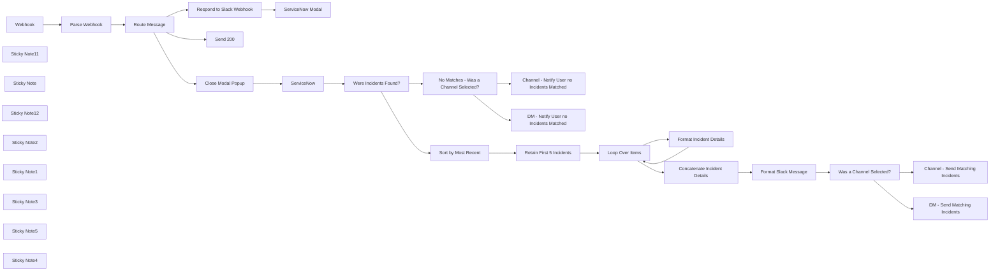

## Fluxo (.json) :

```json
{
  "meta": {
    "instanceId": "03e9d14e9196363fe7191ce21dc0bb17387a6e755dcc9acc4f5904752919dca8"
  },
  "nodes": [
    {
      "id": "a9a92b8a-05cf-4d9e-ae01-be3b17346893",
      "name": "Parse Webhook",
      "type": "n8n-nodes-base.set",
      "position": [
        -560,
        660
      ],
      "parameters": {
        "options": {},
        "assignments": {
          "assignments": [
            {
              "id": "e63f9299-a19d-4ba1-93b0-59f458769fb2",
              "name": "response",
              "type": "object",
              "value": "={{ $json.body.payload }}"
            }
          ]
        }
      },
      "typeVersion": 3.3
    },
    {
      "id": "f999011b-e54d-4514-94ec-4d544af4d145",
      "name": "Close Modal Popup",
      "type": "n8n-nodes-base.respondToWebhook",
      "position": [
        -160,
        1120
      ],
      "parameters": {
        "options": {},
        "respondWith": "noData"
      },
      "typeVersion": 1.1
    },
    {
      "id": "a16d64a0-fe07-4cae-b458-a91937e57a4e",
      "name": "Route Message",
      "type": "n8n-nodes-base.switch",
      "position": [
        -380,
        660
      ],
      "parameters": {
        "rules": {
          "values": [
            {
              "outputKey": "Request Modal",
              "conditions": {
                "options": {
                  "version": 1,
                  "leftValue": "",
                  "caseSensitive": true,
                  "typeValidation": "strict"
                },
                "combinator": "and",
                "conditions": [
                  {
                    "operator": {
                      "type": "string",
                      "operation": "equals"
                    },
                    "leftValue": "={{ $json.response.callback_id }}",
                    "rightValue": "search_recent_incidents"
                  }
                ]
              },
              "renameOutput": true
            },
            {
              "outputKey": "Submit Data",
              "conditions": {
                "options": {
                  "version": 1,
                  "leftValue": "",
                  "caseSensitive": true,
                  "typeValidation": "strict"
                },
                "combinator": "and",
                "conditions": [
                  {
                    "id": "65daa75f-2e17-4ba0-8fd8-2ac2159399e3",
                    "operator": {
                      "name": "filter.operator.equals",
                      "type": "string",
                      "operation": "equals"
                    },
                    "leftValue": "={{ $json.response.type }}",
                    "rightValue": "view_submission"
                  }
                ]
              },
              "renameOutput": true
            },
            {
              "outputKey": "Block Actions",
              "conditions": {
                "options": {
                  "version": 1,
                  "leftValue": "",
                  "caseSensitive": true,
                  "typeValidation": "strict"
                },
                "combinator": "and",
                "conditions": [
                  {
                    "id": "c242cee2-7274-4e02-bfbe-d0e999d30ea7",
                    "operator": {
                      "name": "filter.operator.equals",
                      "type": "string",
                      "operation": "equals"
                    },
                    "leftValue": "={{ $json.response.type }}",
                    "rightValue": "block_actions"
                  }
                ]
              },
              "renameOutput": true
            }
          ]
        },
        "options": {
          "fallbackOutput": "none"
        }
      },
      "typeVersion": 3
    },
    {
      "id": "54fa31d5-7259-4c19-8891-8b559af87959",
      "name": "ServiceNow Modal",
      "type": "n8n-nodes-base.httpRequest",
      "position": [
        260,
        560
      ],
      "parameters": {
        "url": "https://slack.com/api/views.open",
        "method": "POST",
        "options": {},
        "jsonBody": "=  {\n    \"trigger_id\": \"{{ $('Parse Webhook').item.json['response']['trigger_id'] }}\",\n    \"external_id\": \"Search SNOW Incidents\",\n    \"view\": {\n\t\"title\": {\n\t\t\"type\": \"plain_text\",\n\t\t\"text\": \"Search SNOW Incidents\",\n\t\t\"emoji\": true\n\t},\n\t\"submit\": {\n\t\t\"type\": \"plain_text\",\n\t\t\"text\": \"Search\",\n\t\t\"emoji\": true\n\t},\n\t\"type\": \"modal\",\n\t\"external_id\": \"search_snow_incidents\",\n\t\"close\": {\n\t\t\"type\": \"plain_text\",\n\t\t\"text\": \"Cancel\",\n\t\t\"emoji\": true\n\t},\n\t\"blocks\": [\n\t\t{\n\t\t\t\"type\": \"section\",\n\t\t\t\"block_id\": \"greeting_section\",\n\t\t\t\"text\": {\n\t\t\t\t\"type\": \"plain_text\",\n\t\t\t\t\"text\": \":wave: Hey there!\\n\\nUse this form to search ServiceNow for incidents based on their priority and state. Both of these properties are required to search incidents properly.\",\n\t\t\t\t\"emoji\": true\n\t\t\t}\n\t\t},\n\t\t{\n\t\t\t\"type\": \"divider\",\n\t\t\t\"block_id\": \"divider_1\"\n\t\t},\n\t\t{\n\t\t\t\"type\": \"input\",\n\t\t\t\"block_id\": \"priority_selector\",\n\t\t\t\"element\": {\n\t\t\t\t\"type\": \"external_select\",\n\t\t\t\t\"placeholder\": {\n\t\t\t\t\t\"type\": \"plain_text\",\n\t\t\t\t\t\"text\": \"Priority of Incidents to Search\",\n\t\t\t\t\t\"emoji\": true\n\t\t\t\t},\n\t\t\t\t\"action_id\": \"priority_select\",\n\t\t\t\t\"min_query_length\": 0\n\t\t\t},\n\t\t\t\"label\": {\n\t\t\t\t\"type\": \"plain_text\",\n\t\t\t\t\"text\": \"Priority Selector\",\n\t\t\t\t\"emoji\": true\n\t\t\t}\n\t\t},\n\t\t{\n\t\t\t\"type\": \"input\",\n\t\t\t\"block_id\": \"state_selector\",\n\t\t\t\"element\": {\n\t\t\t\t\"type\": \"external_select\",\n\t\t\t\t\"placeholder\": {\n\t\t\t\t\t\"type\": \"plain_text\",\n\t\t\t\t\t\"text\": \"State of Incidents to Search\",\n\t\t\t\t\t\"emoji\": true\n\t\t\t\t},\n\t\t\t\t\"action_id\": \"state_select\",\n\t\t\t\t\"min_query_length\": 0\n\t\t\t},\n\t\t\t\"label\": {\n\t\t\t\t\"type\": \"plain_text\",\n\t\t\t\t\"text\": \"State Selector\",\n\t\t\t\t\"emoji\": true\n\t\t\t}\n\t\t},\n\t\t{\n\t\t\t\"type\": \"section\",\n\t\t\t\"text\": {\n\t\t\t\t\"type\": \"mrkdwn\",\n\t\t\t\t\"text\": \"Please select a channel where the results will be posted.\"\n\t\t\t}\n\t\t},\n\t\t{\n\t\t\t\"type\": \"actions\",\n\t\t\t\"elements\": [\n\t\t\t\t{\n\t\t\t\t\t\"type\": \"channels_select\",\n\t\t\t\t\t\"placeholder\": {\n\t\t\t\t\t\t\"type\": \"plain_text\",\n\t\t\t\t\t\t\"text\": \"Select a channel\",\n\t\t\t\t\t\t\"emoji\": true\n\t\t\t\t\t},\n\t\t\t\t\t\"action_id\": \"actionId-1\"\n\t\t\t\t}\n\t\t\t]\n\t\t}\n\t]\n}\n}",
        "sendBody": true,
        "sendHeaders": true,
        "specifyBody": "json",
        "authentication": "predefinedCredentialType",
        "headerParameters": {
          "parameters": [
            {
              "name": "Content-Type",
              "value": "application/json"
            }
          ]
        },
        "nodeCredentialType": "slackApi"
      },
      "credentials": {
        "slackApi": {
          "id": "K04E2FxPZozHux9J",
          "name": "ServiceNow Bot"
        }
      },
      "typeVersion": 4.2
    },
    {
      "id": "d16de218-b99b-4d13-9655-8fe1a329e01f",
      "name": "Webhook",
      "type": "n8n-nodes-base.webhook",
      "position": [
        -760,
        660
      ],
      "webhookId": "e03c7d39-1dce-4ac5-8db8-2b4511a85a07",
      "parameters": {
        "path": "e03c7d39-1dce-4ac5-8db8-2b4511a85a07",
        "options": {},
        "httpMethod": "POST",
        "responseMode": "responseNode"
      },
      "typeVersion": 2
    },
    {
      "id": "57ee358a-d409-42e7-8200-4475c4c59263",
      "name": "Send 200",
      "type": "n8n-nodes-base.respondToWebhook",
      "position": [
        -160,
        1660
      ],
      "parameters": {
        "options": {
          "responseCode": 200
        }
      },
      "typeVersion": 1.1
    },
    {
      "id": "86b0fd85-b3d5-456c-8f59-0f29f283969f",
      "name": "ServiceNow",
      "type": "n8n-nodes-base.serviceNow",
      "position": [
        100,
        1120
      ],
      "parameters": {
        "options": {
          "sysparm_query": "=incident_state={{ $json.response.view.state.values.state_selector.state_select.selected_option.value }}^priority={{ $json.response.view.state.values.priority_selector.priority_select.selected_option.value }}",
          "sysparm_display_value": "all"
        },
        "resource": "incident",
        "operation": "getAll",
        "returnAll": true,
        "authentication": "basicAuth"
      },
      "credentials": {
        "serviceNowBasicApi": {
          "id": "wjkWiUNQxo5PzTIb",
          "name": "ServiceNow Basic Auth account"
        }
      },
      "typeVersion": 1,
      "alwaysOutputData": true
    },
    {
      "id": "95fcd7f1-ac3a-4128-8b4a-84b636487d9e",
      "name": "Channel - Notify User no Incidents Matched",
      "type": "n8n-nodes-base.slack",
      "position": [
        960,
        1360
      ],
      "webhookId": "5d1ecba8-d03b-47cc-9d30-fd631e7816c1",
      "parameters": {
        "text": "=No incidents were found with a state of {{ $('Parse Webhook').item.json.response.view.state.values.state_selector.state_select.selected_option.text.text }} and priority of {{ $('Parse Webhook').item.json.response.view.state.values.priority_selector.priority_select.selected_option.text.text }}.",
        "select": "channel",
        "channelId": {
          "__rl": true,
          "mode": "id",
          "value": "={{ $('Parse Webhook').item.json.response.view.state.values.pWqkN['actionId-1'].selected_channel }}"
        },
        "otherOptions": {
          "includeLinkToWorkflow": false
        }
      },
      "credentials": {
        "slackApi": {
          "id": "K04E2FxPZozHux9J",
          "name": "ServiceNow Bot"
        }
      },
      "typeVersion": 2.2
    },
    {
      "id": "7f638817-6f97-42a9-9027-dd0d5fb6f560",
      "name": "DM - Notify User no Incidents Matched",
      "type": "n8n-nodes-base.slack",
      "position": [
        960,
        1600
      ],
      "webhookId": "5d1ecba8-d03b-47cc-9d30-fd631e7816c1",
      "parameters": {
        "text": "=No incidents were found with a state of {{ $('Parse Webhook').item.json.response.view.state.values.state_selector.state_select.selected_option.text.text }} and priority of {{ $('Parse Webhook').item.json.response.view.state.values.priority_selector.priority_select.selected_option.text.text }}.",
        "user": {
          "__rl": true,
          "mode": "id",
          "value": "={{ $('Parse Webhook').item.json.response.user.id }}"
        },
        "select": "user",
        "otherOptions": {
          "includeLinkToWorkflow": false
        }
      },
      "credentials": {
        "slackApi": {
          "id": "K04E2FxPZozHux9J",
          "name": "ServiceNow Bot"
        }
      },
      "typeVersion": 2.2
    },
    {
      "id": "f3a21223-9e74-4066-af9f-6b94f69cb01f",
      "name": "Were Incidents Found?",
      "type": "n8n-nodes-base.if",
      "position": [
        360,
        1120
      ],
      "parameters": {
        "options": {},
        "conditions": {
          "options": {
            "version": 2,
            "leftValue": "",
            "caseSensitive": true,
            "typeValidation": "strict"
          },
          "combinator": "and",
          "conditions": [
            {
              "id": "fcdf9a8e-6359-4a3e-bf4e-e1834945727b",
              "operator": {
                "type": "string",
                "operation": "exists",
                "singleValue": true
              },
              "leftValue": "={{ $('ServiceNow').item.json.number.value }}",
              "rightValue": ""
            }
          ]
        }
      },
      "typeVersion": 2.2
    },
    {
      "id": "e27438cb-ba24-4a3b-8fe8-52b7d39cb1e0",
      "name": "No Matches - Was a Channel Selected?",
      "type": "n8n-nodes-base.if",
      "position": [
        580,
        1480
      ],
      "parameters": {
        "options": {},
        "conditions": {
          "options": {
            "version": 2,
            "leftValue": "",
            "caseSensitive": true,
            "typeValidation": "strict"
          },
          "combinator": "and",
          "conditions": [
            {
              "id": "a0b79298-b93f-4ed3-b53b-5c28dfdb2699",
              "operator": {
                "type": "string",
                "operation": "exists",
                "singleValue": true
              },
              "leftValue": "={{ $('Parse Webhook').item.json.response.view.state.values.pWqkN['actionId-1'].selected_channel }}",
              "rightValue": ""
            }
          ]
        }
      },
      "typeVersion": 2.2
    },
    {
      "id": "de7d3155-1c6d-43a1-9cc0-4900d176fd3e",
      "name": "Sort by Most Recent",
      "type": "n8n-nodes-base.sort",
      "position": [
        580,
        580
      ],
      "parameters": {
        "options": {},
        "sortFieldsUi": {
          "sortField": [
            {
              "order": "descending",
              "fieldName": "number.value"
            }
          ]
        }
      },
      "typeVersion": 1
    },
    {
      "id": "19f529c7-bfe6-4713-8ed3-d80ecc0078de",
      "name": "Retain First 5 Incidents",
      "type": "n8n-nodes-base.limit",
      "position": [
        740,
        580
      ],
      "parameters": {
        "maxItems": 5
      },
      "typeVersion": 1
    },
    {
      "id": "9b095ad5-dedc-43e6-9ab3-947b90e7145d",
      "name": "Loop Over Items",
      "type": "n8n-nodes-base.splitInBatches",
      "position": [
        920,
        580
      ],
      "parameters": {
        "options": {
          "reset": false
        }
      },
      "typeVersion": 3
    },
    {
      "id": "9a236a69-3ea5-46f5-8f2d-f7421bff638a",
      "name": "Format Incident Details",
      "type": "n8n-nodes-base.set",
      "position": [
        1240,
        680
      ],
      "parameters": {
        "options": {},
        "assignments": {
          "assignments": [
            {
              "id": "62388dab-28d4-40fa-a9f9-90d68c5dc491",
              "name": "incident_details",
              "type": "string",
              "value": "={\n\t\t\t\"type\": \"section\",\n\t\t\t\"text\": {\n\t\t\t\t\"type\": \"mrkdwn\",\n\t\t\t\t\"text\": \"<https://dev206761.service-now.com/nav_to.do?uri=incident.do?sys_id={{ $json.sys_id.value }}|*{{ $json.task_effective_number.value }}*>\\n{{ $json.short_description.display_value }}\\n*Opened by:* {{ $json.caller_id.display_value }}\\n*Date Opened:* {{ $json.opened_at.display_value }}\\n*Severity:* {{ $json.severity.display_value }}\\n*Priority:* {{ $json.priority.display_value }}\\n*State:* {{ $json.incident_state.display_value }}\\n*Category:* {{ $json.category.display_value }}\"\n\t\t\t}\n\t\t},\n\t\t{\n\t\t\t\"type\": \"divider\"\n\t\t}"
            }
          ]
        }
      },
      "typeVersion": 3.4
    },
    {
      "id": "6e15b991-d9d5-4244-a3db-dbd37c248303",
      "name": "Format Slack Message",
      "type": "n8n-nodes-base.set",
      "position": [
        1320,
        500
      ],
      "parameters": {
        "options": {},
        "assignments": {
          "assignments": [
            {
              "id": "90720996-88cc-4e47-b5bb-d5570c15f95c",
              "name": "slack_output",
              "type": "string",
              "value": "={\n\t\"blocks\": [\n\t\t{\n\t\t\t\"type\": \"section\",\n\t\t\t\"block_id\": \"greeting_section\",\n\t\t\t\"text\": {\n\t\t\t\t\"type\": \"mrkdwn\",\n\t\t\t\t\"text\": \":wave: Hey there!\\n\\nHere are the incident summaries you requested with a state of {{ $('Parse Webhook').item.json.response.view.state.values.state_selector.state_select.selected_option.text.text }} and priority of {{ $('Parse Webhook').item.json.response.view.state.values.priority_selector.priority_select.selected_option.text.text }}.\\nA total of {{ $('ServiceNow').all().length }} incident(s) were found. If more than 5 were found only the 5 most recent will be listed. You can <https://dev206761.service-now.com/now/nav/ui/classic/params/target/incident_list.do%3Fsysparm_query%3Dincident_state%253D{{ $('Parse Webhook').item.json.response.view.state.values.state_selector.state_select.selected_option.value }}%255Epriority%253D{{ $('Parse Webhook').item.json.response.view.state.values.priority_selector.priority_select.selected_option.value }}%26sysparm_first_row%3D1%26sysparm_view%3Dess|click here> to view all of the matching incidents in ServiceNow.\"\n\t\t\t}\n\t\t},\n\t\t{\n\t\t\t\"type\": \"divider\"\n\t\t},\n\t\t{{ $('Concatenate Incident Details').item.json.concatenated_incident_details }}\n\t]\n}"
            }
          ]
        }
      },
      "typeVersion": 3.4
    },
    {
      "id": "08182589-800d-4ce6-8654-fc53d2ee56c3",
      "name": "Concatenate Incident Details",
      "type": "n8n-nodes-base.summarize",
      "position": [
        1140,
        500
      ],
      "parameters": {
        "options": {},
        "fieldsToSummarize": {
          "values": [
            {
              "field": "incident_details",
              "aggregation": "concatenate"
            }
          ]
        }
      },
      "typeVersion": 1
    },
    {
      "id": "86b698d2-2854-4393-8ee8-76f8e7b01586",
      "name": "DM - Send Matching Incidents",
      "type": "n8n-nodes-base.slack",
      "position": [
        1880,
        720
      ],
      "webhookId": "5d1ecba8-d03b-47cc-9d30-fd631e7816c1",
      "parameters": {
        "text": "=",
        "user": {
          "__rl": true,
          "mode": "id",
          "value": "={{ $('Parse Webhook').item.json.response.user.id }}"
        },
        "select": "user",
        "blocksUi": "={{ $('Format Slack Message').item.json.slack_output }}",
        "messageType": "block",
        "otherOptions": {
          "includeLinkToWorkflow": false
        }
      },
      "credentials": {
        "slackApi": {
          "id": "K04E2FxPZozHux9J",
          "name": "ServiceNow Bot"
        }
      },
      "typeVersion": 2.2
    },
    {
      "id": "cbd8fbc3-d589-4625-99b5-a98e6a41d4bb",
      "name": "Channel - Send Matching Incidents",
      "type": "n8n-nodes-base.slack",
      "position": [
        1880,
        520
      ],
      "webhookId": "5d1ecba8-d03b-47cc-9d30-fd631e7816c1",
      "parameters": {
        "text": "=",
        "select": "channel",
        "blocksUi": "={{ $('Format Slack Message').item.json.slack_output }}",
        "channelId": {
          "__rl": true,
          "mode": "id",
          "value": "={{ $('Parse Webhook').item.json.response.view.state.values.pWqkN['actionId-1'].selected_channel }}"
        },
        "messageType": "block",
        "otherOptions": {
          "includeLinkToWorkflow": false
        }
      },
      "credentials": {
        "slackApi": {
          "id": "K04E2FxPZozHux9J",
          "name": "ServiceNow Bot"
        }
      },
      "typeVersion": 2.2
    },
    {
      "id": "c3ed618f-b65e-4df2-80c0-90b2e2be3783",
      "name": "Sticky Note11",
      "type": "n8n-nodes-base.stickyNote",
      "position": [
        -200,
        -709.4873251551015
      ],
      "parameters": {
        "color": 7,
        "width": 709.3965558024038,
        "height": 887.8719128264411,
        "content": "\n## Slack Modal Interface\n\nWhen triggered, Slack will display this interface to allow Slack users to search ServiceNow for tickets based on priority and state, and then allow you to choose which channel to output the results. If no channel is found, the response will be sent to the Slack user via DM. "
      },
      "typeVersion": 1
    },
    {
      "id": "69f47cb7-84c6-4037-b3ba-8364ec572fde",
      "name": "Sticky Note",
      "type": "n8n-nodes-base.stickyNote",
      "position": [
        -798.751282964615,
        190.55356752462308
      ],
      "parameters": {
        "color": 7,
        "width": 579.6865154062818,
        "height": 647.0013506366993,
        "content": "\n## Receive and Parse Slack Event via Webhook\n\nThis section begins with the `Webhook` node, which captures events from Slack, such as modal submissions or button presses. The payload from Slack is then processed by the `Parse Webhook` node to extract relevant details like callback IDs, user inputs (e.g., priority and state), and additional metadata. Once the data is parsed, it is passed to the `Route Message` node, which evaluates the callback ID or action type using a `Switch` node. Depending on the conditions, the workflow routes the data to specific paths: handling modal requests, processing data submissions, or responding to button actions. This setup ensures seamless handling of different Slack interactions and prepares the data for subsequent steps."
      },
      "typeVersion": 1
    },
    {
      "id": "622f63e4-fd03-4a76-bb2d-04a2daea9a46",
      "name": "Sticky Note12",
      "type": "n8n-nodes-base.stickyNote",
      "position": [
        -200,
        188.05676141451897
      ],
      "parameters": {
        "color": 7,
        "width": 710.3172669178614,
        "height": 563.0861092667175,
        "content": "\n## Respond to Modal request\n\nThis section starts with the `Respond to Slack Webhook`, which sends an acknowledgment to Slack after a modal interaction is triggered. This ensures the Slack interface remains error-free and provides a smooth user experience. Following this, the `ServiceNow Modal` node is used to open a Slack modal via the Slack API. The modal allows users to input search parameters for ServiceNow incidents, such as priority and state. Additionally, users can select the Slack channel where the results will be posted. This integration ensures a seamless connection between Slack and ServiceNow, enabling users to perform detailed searches directly from Slack.\n"
      },
      "typeVersion": 1
    },
    {
      "id": "16d7f224-7792-4e9f-ae5c-1c0b6a39e703",
      "name": "Sticky Note2",
      "type": "n8n-nodes-base.stickyNote",
      "position": [
        -200,
        760
      ],
      "parameters": {
        "color": 7,
        "width": 709.0896745965773,
        "height": 550.5825149622945,
        "content": "\n## Close Modal and Search Service Now\n\nThis section starts with the `Close Modal Popup` node, which sends a response to Slack to close the modal after user input has been captured. Once the modal is closed, the workflow moves to the `ServiceNow` node. This node performs an API query to retrieve incidents from ServiceNow that match the specified state and priority provided by the user in the modal form. The query results are then evaluated by the `Were Incidents Found`? node, an If node that checks if any incidents were returned by the query. This section ensures a smooth transition from user input in Slack to backend data retrieval in ServiceNow, facilitating the identification of relevant incidents."
      },
      "typeVersion": 1
    },
    {
      "id": "3f52816d-db59-4574-b82e-8a9ca854e049",
      "name": "Sticky Note1",
      "type": "n8n-nodes-base.stickyNote",
      "position": [
        526.5720643091352,
        908.7025500703817
      ],
      "parameters": {
        "color": 7,
        "width": 714.3631681325317,
        "height": 911.8420872184945,
        "content": "\n## No Incidents found, respond to Slack\n\nThis section begins with the `No Matches - Was a Channel Selected?` node, which evaluates whether the user selected a specific Slack channel for receiving notifications. If a channel was selected, the workflow proceeds to the `Channel - Notify User no Incidents Matched` node, which sends a message to the designated channel informing users that no incidents were found matching the specified criteria of state and priority.\n\nIf no channel was selected, the workflow uses the `DM - Notify User no Incidents Matched` node to send a direct message to the user who initiated the query. This message includes details about the search parameters, ensuring the user is informed of the results regardless of the outcome. This step ensures transparent and efficient communication, whether via a public channel or a private direct message."
      },
      "typeVersion": 1
    },
    {
      "id": "22943cc9-c79c-4465-ac9e-040d5f49a879",
      "name": "Sticky Note3",
      "type": "n8n-nodes-base.stickyNote",
      "position": [
        -200,
        1328.507039277291
      ],
      "parameters": {
        "color": 7,
        "width": 709.4188646504804,
        "height": 492.8100521251637,
        "content": "\n## Respond to Slack Button Press with 200 Response\n\nThis section uses the `Send 200` node to send a 200 HTTP response back to Slack whenever a button press event is triggered in a Slack message. This response is crucial for preventing Slack from showing errors in its Block Kit user interface, ensuring a seamless and professional interaction for the user. By handling these button press events gracefully, this step maintains a positive user experience and avoids unnecessary confusion or interruptions."
      },
      "typeVersion": 1
    },
    {
      "id": "95d4d5e1-5f6b-4107-a55d-51e70c25c055",
      "name": "Sticky Note5",
      "type": "n8n-nodes-base.stickyNote",
      "position": [
        528.3624557345836,
        26.66938195987973
      ],
      "parameters": {
        "color": 7,
        "width": 956.6393374313541,
        "height": 870.8771447693905,
        "content": "\n## Sort and format Results for block kit\n\nThis section begins by organizing the incident data retrieved from ServiceNow. The `Sort by Most Recent` node arranges the incidents in descending order, ensuring that the latest ones are processed first. Next, the `Retain First 5 Incidents` node limits the output to the five most recent incidents for clarity and focus.\n\nThe `Loop Over Items` node iterates through each incident, allowing the workflow to process them individually. During each loop, the `Format Incident Details` node structures the details of each incident into a format compatible with Slack’s Block Kit, ensuring readability and a professional appearance.\n\nOnce all incidents are formatted, the `Concatenate Incident Details` node aggregates the results into a single, cohesive message. Finally, the `Format Slack Message` node prepares the Slack message with a friendly greeting, summary details, and links to view the full incidents in ServiceNow. This section ensures that incident information is not only organized but also presented in a visually appealing and actionable manner within Slack."
      },
      "typeVersion": 1
    },
    {
      "id": "2d55c76a-f7ba-46ec-acc1-13f54b22b2ee",
      "name": "Was a Channel Selected?",
      "type": "n8n-nodes-base.if",
      "position": [
        1580,
        580
      ],
      "parameters": {
        "options": {},
        "conditions": {
          "options": {
            "version": 2,
            "leftValue": "",
            "caseSensitive": true,
            "typeValidation": "strict"
          },
          "combinator": "and",
          "conditions": [
            {
              "id": "a0b79298-b93f-4ed3-b53b-5c28dfdb2699",
              "operator": {
                "type": "string",
                "operation": "exists",
                "singleValue": true
              },
              "leftValue": "={{ $('Parse Webhook').item.json.response.view.state.values.pWqkN['actionId-1'].selected_channel }}",
              "rightValue": ""
            }
          ]
        }
      },
      "typeVersion": 2.2
    },
    {
      "id": "70792926-097f-4f2b-b3b4-afc7bad60ea6",
      "name": "Sticky Note4",
      "type": "n8n-nodes-base.stickyNote",
      "position": [
        1500,
        27.218710650838375
      ],
      "parameters": {
        "color": 7,
        "width": 657.1120966423081,
        "height": 870.9953951550463,
        "content": "\n## Check if Slack channel selected and send Incident results in block kit format\n\nThis section begins with the `Was a Channel Selected?` node, which checks whether the user specified a Slack channel to receive the output. If a channel is selected, the workflow proceeds to the `Channel - Send Matching Incidents` node, which sends the formatted incident details to the chosen Slack channel using Block Kit. The message includes key information such as incident summaries, priorities, and state details, ensuring effective communication to the target audience.\n\nIf no channel was selected, the workflow uses the `DM - Send Matching Incidents` node to deliver the same information directly to the user via a Slack direct message. By dynamically adjusting the delivery method based on the user's input, this step ensures the incident results are communicated efficiently, whether to a broader audience or privately to the user."
      },
      "typeVersion": 1
    },
    {
      "id": "0ae7f5bf-7a78-42f6-95aa-c0f685e63c40",
      "name": "Respond to Slack Webhook",
      "type": "n8n-nodes-base.respondToWebhook",
      "position": [
        -100,
        560
      ],
      "parameters": {
        "options": {},
        "respondWith": "noData"
      },
      "typeVersion": 1.1
    }
  ],
  "pinData": {},
  "connections": {
    "Webhook": {
      "main": [
        [
          {
            "node": "Parse Webhook",
            "type": "main",
            "index": 0
          }
        ]
      ]
    },
    "ServiceNow": {
      "main": [
        [
          {
            "node": "Were Incidents Found?",
            "type": "main",
            "index": 0
          }
        ]
      ]
    },
    "Parse Webhook": {
      "main": [
        [
          {
            "node": "Route Message",
            "type": "main",
            "index": 0
          }
        ]
      ]
    },
    "Route Message": {
      "main": [
        [
          {
            "node": "Respond to Slack Webhook",
            "type": "main",
            "index": 0
          }
        ],
        [
          {
            "node": "Close Modal Popup",
            "type": "main",
            "index": 0
          }
        ],
        [
          {
            "node": "Send 200",
            "type": "main",
            "index": 0
          }
        ]
      ]
    },
    "Loop Over Items": {
      "main": [
        [
          {
            "node": "Concatenate Incident Details",
            "type": "main",
            "index": 0
          }
        ],
        [
          {
            "node": "Format Incident Details",
            "type": "main",
            "index": 0
          }
        ]
      ]
    },
    "Close Modal Popup": {
      "main": [
        [
          {
            "node": "ServiceNow",
            "type": "main",
            "index": 0
          }
        ]
      ]
    },
    "Sort by Most Recent": {
      "main": [
        [
          {
            "node": "Retain First 5 Incidents",
            "type": "main",
            "index": 0
          }
        ]
      ]
    },
    "Format Slack Message": {
      "main": [
        [
          {
            "node": "Was a Channel Selected?",
            "type": "main",
            "index": 0
          }
        ]
      ]
    },
    "Were Incidents Found?": {
      "main": [
        [
          {
            "node": "Sort by Most Recent",
            "type": "main",
            "index": 0
          }
        ],
        [
          {
            "node": "No Matches - Was a Channel Selected?",
            "type": "main",
            "index": 0
          }
        ]
      ]
    },
    "Format Incident Details": {
      "main": [
        [
          {
            "node": "Loop Over Items",
            "type": "main",
            "index": 0
          }
        ]
      ]
    },
    "Was a Channel Selected?": {
      "main": [
        [
          {
            "node": "Channel - Send Matching Incidents",
            "type": "main",
            "index": 0
          }
        ],
        [
          {
            "node": "DM - Send Matching Incidents",
            "type": "main",
            "index": 0
          }
        ]
      ]
    },
    "Respond to Slack Webhook": {
      "main": [
        [
          {
            "node": "ServiceNow Modal",
            "type": "main",
            "index": 0
          }
        ]
      ]
    },
    "Retain First 5 Incidents": {
      "main": [
        [
          {
            "node": "Loop Over Items",
            "type": "main",
            "index": 0
          }
        ]
      ]
    },
    "Concatenate Incident Details": {
      "main": [
        [
          {
            "node": "Format Slack Message",
            "type": "main",
            "index": 0
          }
        ]
      ]
    },
    "No Matches - Was a Channel Selected?": {
      "main": [
        [
          {
            "node": "Channel - Notify User no Incidents Matched",
            "type": "main",
            "index": 0
          }
        ],
        [
          {
            "node": "DM - Notify User no Incidents Matched",
            "type": "main",
            "index": 0
          }
        ]
      ]
    }
  }
}
```

<a id="template-2533"></a>

## Template 2533 - Resumo de reuniões e agendamento automático

- **Nome:** Resumo de reuniões e agendamento automático
- **Descrição:** Processa transcrições de reuniões, gera resumos e identifica/realiza ações de follow-up, como criar eventos de calendário e adicionar participantes.
- **Funcionalidade:** • Recuperar evento de calendário: obtém os detalhes do evento, como criador, participantes e horário.
• Localizar transcrição do Meet: consulta os registros da reunião para encontrar a transcrição associada.
• Baixar transcrição do Drive: baixa o arquivo de transcrição e converte/extrai o conteúdo em texto.
• Extrair texto do PDF: transforma a transcrição em texto legível para análise.
• Agente de IA para resumo e análise: resume a reunião, destaca pontos por participante e identifica próximos passos.
• Tomada de ações automatizadas: quando indicado, cria eventos de acompanhamento com título, descrição, data/hora e lista de convidados.
• Adicionar convidados ao evento: insere os participantes sugeridos como convidados no evento criado.
• Roteamento e fallback: direciona solicitações para a ferramenta adequada e retorna uma resposta de erro quando a ação não está disponível.
• Saída estruturada: produz um JSON com resumo, destaques, próximos passos e informações sobre reuniões criadas.
- **Ferramentas:** • Google Calendar: gerencia e cria eventos de calendário, obtém detalhes do evento e permite atualização de convidados.
• Google Meet API: localiza registros de conferência e metadados para acessar transcrições.
• Google Drive: armazena e fornece os arquivos de transcrição da reunião.
• OpenAI (modelo de linguagem): analisa a transcrição, gera resumos, extrai pontos-chave e decide/aciona follow-ups.

## Fluxo visual

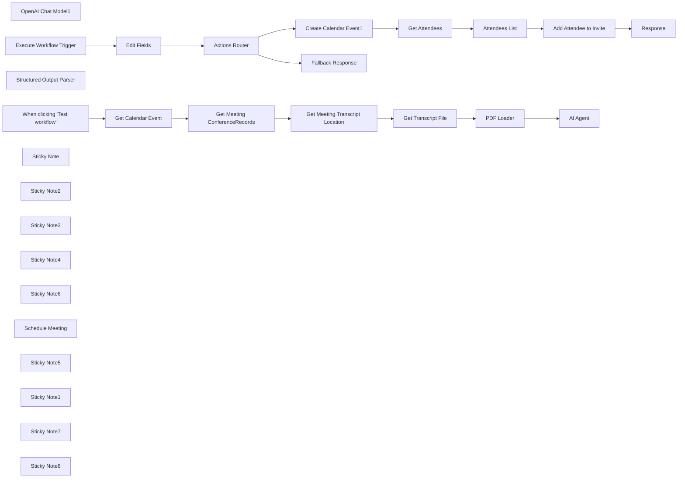

## Fluxo (.json) :

```json
{
  "meta": {
    "instanceId": "26ba763460b97c249b82942b23b6384876dfeb9327513332e743c5f6219c2b8e"
  },
  "nodes": [
    {
      "id": "bec5c6c1-52d4-4665-b814-56a6bb82ea6b",
      "name": "OpenAI Chat Model1",
      "type": "@n8n/n8n-nodes-langchain.lmChatOpenAi",
      "position": [
        800,
        660
      ],
      "parameters": {
        "options": {
          "temperature": 0
        }
      },
      "credentials": {
        "openAiApi": {
          "id": "8gccIjcuf3gvaoEr",
          "name": "OpenAi account"
        }
      },
      "typeVersion": 1
    },
    {
      "id": "d3e057d1-df44-4ac3-ac46-fc2b04e3de78",
      "name": "Get Meeting ConferenceRecords",
      "type": "n8n-nodes-base.httpRequest",
      "position": [
        20,
        580
      ],
      "parameters": {
        "url": "https://meet.googleapis.com/v2/conferenceRecords",
        "options": {},
        "sendQuery": true,
        "authentication": "predefinedCredentialType",
        "queryParameters": {
          "parameters": [
            {
              "name": "filter",
              "value": "=space.meeting_code={{ $json.conferenceData.conferenceId }}"
            }
          ]
        },
        "nodeCredentialType": "googleOAuth2Api"
      },
      "credentials": {
        "googleOAuth2Api": {
          "id": "kgVOfvlBIWTWXthG",
          "name": "Google Meets Oauth2 API"
        }
      },
      "typeVersion": 4.2
    },
    {
      "id": "831668fd-04ab-4144-bec0-c733902f2a13",
      "name": "Get Meeting Transcript Location",
      "type": "n8n-nodes-base.httpRequest",
      "position": [
        200,
        580
      ],
      "parameters": {
        "url": "=https://meet.googleapis.com/v2/{{ $json.conferenceRecords[0].name }}/transcripts",
        "options": {},
        "authentication": "predefinedCredentialType",
        "nodeCredentialType": "googleOAuth2Api"
      },
      "credentials": {
        "googleOAuth2Api": {
          "id": "kgVOfvlBIWTWXthG",
          "name": "Google Meets Oauth2 API"
        }
      },
      "typeVersion": 4.2
    },
    {
      "id": "0a1c3386-1456-4abd-a67c-4f2084efb1f1",
      "name": "Get Transcript File",
      "type": "n8n-nodes-base.googleDrive",
      "position": [
        380,
        580
      ],
      "parameters": {
        "fileId": {
          "__rl": true,
          "mode": "url",
          "value": "={{ $json.docsDestination.document }}"
        },
        "options": {
          "googleFileConversion": {
            "conversion": {
              "docsToFormat": "application/pdf"
            }
          }
        },
        "operation": "download"
      },
      "credentials": {
        "googleDriveOAuth2Api": {
          "id": "yOwz41gMQclOadgu",
          "name": "Google Drive account"
        }
      },
      "typeVersion": 3
    },
    {
      "id": "40d1e969-3a04-4fb0-98c3-59865f317e07",
      "name": "When clicking \"Test workflow\"",
      "type": "n8n-nodes-base.manualTrigger",
      "position": [
        -480,
        540
      ],
      "parameters": {},
      "typeVersion": 1
    },
    {
      "id": "1d277cc0-9f51-43a2-9d17-17d535b4dd53",
      "name": "PDF Loader",
      "type": "n8n-nodes-base.extractFromFile",
      "position": [
        660,
        520
      ],
      "parameters": {
        "options": {},
        "operation": "pdf"
      },
      "typeVersion": 1
    },
    {
      "id": "08b2d0ce-0f59-45d8-b010-53910a1bc746",
      "name": "Get Calendar Event",
      "type": "n8n-nodes-base.googleCalendar",
      "position": [
        -280,
        540
      ],
      "parameters": {
        "eventId": "abc123",
        "options": {},
        "calendar": {
          "__rl": true,
          "mode": "list",
          "value": "c_5792bdf04bc395cbcbc6f7b754268245a33779d36640cc80a357711aa2f09a0a@group.calendar.google.com",
          "cachedResultName": "n8n-events"
        },
        "operation": "get"
      },
      "credentials": {
        "googleCalendarOAuth2Api": {
          "id": "kWMxmDbMDDJoYFVK",
          "name": "Google Calendar account"
        }
      },
      "typeVersion": 1.1
    },
    {
      "id": "35a68444-15da-4b6e-a3c8-d296971b0fc0",
      "name": "Structured Output Parser",
      "type": "@n8n/n8n-nodes-langchain.outputParserStructured",
      "position": [
        1040,
        660
      ],
      "parameters": {
        "jsonSchema": "{\n  \"type\": \"object\",\n  \"properties\": {\n    \"summary\": { \"type\": \"string\" },\n    \"highlights\": {\n      \"type\": \"array\",\n      \"items\": {\n        \"type\": \"object\",\n        \"properties\": {\n          \"attendee\": { \"type\": \"string\" },\n          \"message\": { \"type\": \"string\" }\n        }\n      }\n    },\n   \"next_steps\": {\n      \"type\": \"array\",\n      \"items:\": {\n        \"type\": \"string\"\n      }\n   },\n   \"meetings_created\": {\n      \"type\": \"array\",\n      \"items\": {\n        \"type\": \"object\",\n        \"properties\": {\n          \"event_title\": { \"type\": \"string\" },\n           \"event_invite_url\": { \"type\" : \"string\" }\n        }\n      }\n   }\n  }\n}"
      },
      "typeVersion": 1.1
    },
    {
      "id": "e73ab051-1763-4130-bf44-f1461886e5f4",
      "name": "Execute Workflow Trigger",
      "type": "n8n-nodes-base.executeWorkflowTrigger",
      "position": [
        640,
        1200
      ],
      "parameters": {},
      "typeVersion": 1
    },
    {
      "id": "c940c9e1-8236-45b8-bdb2-39a326004680",
      "name": "Response",
      "type": "n8n-nodes-base.set",
      "position": [
        1780,
        1080
      ],
      "parameters": {
        "options": {},
        "assignments": {
          "assignments": [
            {
              "id": "3c12dc11-0ff3-4c6a-9d67-1454d7b0d16d",
              "name": "response",
              "type": "string",
              "value": "={{ JSON.stringify($('Create Calendar Event1').item.json) }}"
            }
          ]
        }
      },
      "typeVersion": 3.3
    },
    {
      "id": "daa3e96f-bcc1-4f99-a050-c09189041ce5",
      "name": "Edit Fields",
      "type": "n8n-nodes-base.set",
      "position": [
        800,
        1200
      ],
      "parameters": {
        "options": {},
        "assignments": {
          "assignments": [
            {
              "id": "7263764b-8409-4cea-8db3-3278dd7ef9d8",
              "name": "=route",
              "type": "string",
              "value": "={{ $json.route }}"
            },
            {
              "id": "55c3b207-2e98-4137-8413-f72cbff17986",
              "name": "query",
              "type": "object",
              "value": "={{ $json.query.parseJson() }}"
            }
          ]
        }
      },
      "typeVersion": 3.3
    },
    {
      "id": "4e492c9f-6be3-4b7c-a8f7-e18dd94cd158",
      "name": "Fallback Response",
      "type": "n8n-nodes-base.set",
      "position": [
        960,
        1340
      ],
      "parameters": {
        "mode": "raw",
        "options": {},
        "jsonOutput": "{\n  \"response\": {\n    \"ok\": false,\n    \"error\": \"The requested tool was not found or the service may be unavailable. Do not retry.\"\n  }\n}\n"
      },
      "typeVersion": 3.3
    },
    {
      "id": "7af68b6d-75ef-4332-8193-eb810179ec90",
      "name": "Actions Router",
      "type": "n8n-nodes-base.switch",
      "position": [
        960,
        1200
      ],
      "parameters": {
        "rules": {
          "values": [
            {
              "outputKey": "meetings.create",
              "conditions": {
                "options": {
                  "leftValue": "",
                  "caseSensitive": true,
                  "typeValidation": "strict"
                },
                "combinator": "and",
                "conditions": [
                  {
                    "operator": {
                      "type": "string",
                      "operation": "equals"
                    },
                    "leftValue": "={{ $json.route }}",
                    "rightValue": "meetings.create"
                  }
                ]
              },
              "renameOutput": true
            }
          ]
        },
        "options": {
          "fallbackOutput": "extra"
        }
      },
      "typeVersion": 3
    },
    {
      "id": "8cc6b737-2867-4fca-93d1-8973f14a9f00",
      "name": "Get Attendees",
      "type": "n8n-nodes-base.set",
      "position": [
        1440,
        1080
      ],
      "parameters": {
        "options": {},
        "assignments": {
          "assignments": [
            {
              "id": "521823f4-cee1-4f69-82e7-cea9be0dbc41",
              "name": "attendees",
              "type": "array",
              "value": "={{ $('Actions Router').item.json.query.attendees }}"
            }
          ]
        }
      },
      "typeVersion": 3.3
    },
    {
      "id": "1b3bb8f7-3775-48be-8b73-5c9f0db37ebf",
      "name": "Attendees List",
      "type": "n8n-nodes-base.splitOut",
      "position": [
        1444,
        1212
      ],
      "parameters": {
        "options": {},
        "fieldToSplitOut": "attendees"
      },
      "typeVersion": 1
    },
    {
      "id": "c285a0fa-4b0b-4775-83bb-5acb597dd9a8",
      "name": "Add Attendee to Invite",
      "type": "n8n-nodes-base.googleCalendar",
      "position": [
        1620,
        1080
      ],
      "parameters": {
        "eventId": "={{ $('Create Calendar Event1').item.json.id }}",
        "calendar": {
          "__rl": true,
          "mode": "list",
          "value": "c_5792bdf04bc395cbcbc6f7b754268245a33779d36640cc80a357711aa2f09a0a@group.calendar.google.com",
          "cachedResultName": "n8n-events"
        },
        "operation": "update",
        "updateFields": {
          "attendees": [
            "={{ $json.name }} <{{ $json.email }}>"
          ]
        }
      },
      "credentials": {
        "googleCalendarOAuth2Api": {
          "id": "kWMxmDbMDDJoYFVK",
          "name": "Google Calendar account"
        }
      },
      "typeVersion": 1.1
    },
    {
      "id": "006c2b05-4526-4e7d-b303-0cd72b36b9e8",
      "name": "Sticky Note",
      "type": "n8n-nodes-base.stickyNote",
      "position": [
        1180,
        940
      ],
      "parameters": {
        "color": 7,
        "width": 756.2929032891963,
        "height": 445.79624302689535,
        "content": "## 4. This Tool Creates Calendar Events\nThis tool, given event details and a list of attendees, will create a new Google calendar event and add the attendees to it."
      },
      "typeVersion": 1
    },
    {
      "id": "512dfd7d-ba06-48e5-b97f-3dfbbfb0023f",
      "name": "Sticky Note2",
      "type": "n8n-nodes-base.stickyNote",
      "position": [
        -56.39068896608171,
        391.01655789481134
      ],
      "parameters": {
        "color": 7,
        "width": 586.8663941671947,
        "height": 405.6964113279832,
        "content": "## 1. Retrieve Meeting Transcript\n[Read more about working with HTTP node](https://docs.n8n.io/integrations/builtin/core-nodes/n8n-nodes-base.httprequest)\n\nThere's no built-in support for Google Meets transcript API however, we can solve this problem with the HTTP node. Note you may also need to setup a separate Google OAuth API Credential to obtain the required scopes."
      },
      "typeVersion": 1
    },
    {
      "id": "91c5b898-b491-4359-90b4-2b7458cc03c8",
      "name": "Sticky Note3",
      "type": "n8n-nodes-base.stickyNote",
      "position": [
        560,
        323.25204909069373
      ],
      "parameters": {
        "color": 7,
        "width": 681.4281346810014,
        "height": 588.2833041602365,
        "content": "## 2. Let AI Agent Carry Out Follow-Up Actions\n[Read more about working with AI Agents](https://docs.n8n.io/integrations/builtin/cluster-nodes/root-nodes/n8n-nodes-langchain.agent)\n\nThe big difference between Basic LLM chains and AI Agents is that AI agents are given the automony to perform actions. Provided the right tool exists, AI Agents can send emails, book flights and even order pizza! Here we're leaving it up to our agent to book any follow-up meetings after the call and invite all interested parties."
      },
      "typeVersion": 1
    },
    {
      "id": "7df4412d-b82b-4623-8ff5-89f3bd9356d8",
      "name": "Sticky Note4",
      "type": "n8n-nodes-base.stickyNote",
      "position": [
        560,
        940
      ],
      "parameters": {
        "color": 7,
        "width": 591.4907024073684,
        "height": 579.2725119898125,
        "content": "## 3: Using the Custom Workflow Tool\n[Read more about Workflow Triggers](https://docs.n8n.io/integrations/builtin/core-nodes/n8n-nodes-base.executeworkflowtrigger)\n\nOne common implementation of tool use is to set them up as workflows which are intended triggered via other workflows. With this, we can either build a tool per workflow or for efficiency, take an API approach where multiple tools can exist behind a router (in this case our \"switch\" node).\n\nOur AI agent will therefore only passing through the parameters of the request and won't have to learn/know how to intereact directly with the tools and services."
      },
      "typeVersion": 1
    },
    {
      "id": "06b0b3ae-344a-4150-9fa1-bdbcfe80b000",
      "name": "Create Calendar Event1",
      "type": "n8n-nodes-base.googleCalendar",
      "position": [
        1240,
        1080
      ],
      "parameters": {
        "end": "={{ $json.query.end_date }} {{ $json.query.end_time }}",
        "start": "={{ $json.query.start_date }} {{ $json.query.start_time }}",
        "calendar": {
          "__rl": true,
          "mode": "list",
          "value": "c_5792bdf04bc395cbcbc6f7b754268245a33779d36640cc80a357711aa2f09a0a@group.calendar.google.com",
          "cachedResultName": "n8n-events"
        },
        "additionalFields": {
          "summary": "={{ $json.query.title }}",
          "attendees": [],
          "description": "={{ $json.query.description }}"
        }
      },
      "credentials": {
        "googleCalendarOAuth2Api": {
          "id": "kWMxmDbMDDJoYFVK",
          "name": "Google Calendar account"
        }
      },
      "typeVersion": 1.1
    },
    {
      "id": "2e2eec66-a737-48b9-b1ab-264182163dae",
      "name": "Sticky Note6",
      "type": "n8n-nodes-base.stickyNote",
      "position": [
        -940,
        320
      ],
      "parameters": {
        "width": 359.6648027457353,
        "height": 385.336571355038,
        "content": "## Try It Out!\n### This workflow does the following:\n* Retrieves a meeting transcript\n* Sends transcript to an AI Agent to parse and carry out follow up actions if necessary.\n* If transcript mentions a follow up meeting is required, the AI Agent will call a tool to create the meeting.\n* Additionally if able, the AI Agent will also assign attendees it thinks should attend the meeting. \n\n### Need Help?\nJoin the [Discord](https://discord.com/invite/XPKeKXeB7d) or ask in the [Forum](https://community.n8n.io/)!\n\nHappy Hacking!"
      },
      "typeVersion": 1
    },
    {
      "id": "3833bb1c-1145-4abd-a371-bce4c0543fb6",
      "name": "Schedule Meeting",
      "type": "@n8n/n8n-nodes-langchain.toolWorkflow",
      "position": [
        920,
        740
      ],
      "parameters": {
        "name": "create_calendar_event",
        "fields": {
          "values": [
            {
              "name": "route",
              "stringValue": "meetings.create"
            }
          ]
        },
        "workflowId": "={{ $workflow.id }}",
        "description": "Call this tool to create an calendar event. This tool requires the following object request body.\n```\n{\n  \"type\": \"object\",\n  \"properties\": {\n    \"title\": { \"type\": \"string\" },\n    \"description\": { \"type\": \"string\" },\n    \"start_date\": { \"type\": \"string\" },\n    \"start_time\": { \"type\": \"string\" },\n    \"end_date\": { \"type\": \"string\" },\n    \"end_time\": { \"type\": \"string\" },\n    \"attendees\": {\n      \"type\": \"array\",\n      \"items\": {\n        \"type\": \"object\",\n        \"properties\": {\n          \"name\": { \"type\": \"string\" },\n          \"email\": { \"type\": \"string\" }\n        }\n      }\n    }\n  }\n}\n```\nNote that dates are in the format yyyy-MM-dd and times are in the format HH:mm:ss."
      },
      "typeVersion": 1.1
    },
    {
      "id": "ac955f91-9aa1-4ce8-9a5a-740c4d48dd18",
      "name": "AI Agent",
      "type": "@n8n/n8n-nodes-langchain.agent",
      "position": [
        820,
        520
      ],
      "parameters": {
        "text": "=system: your role is to help people get the most out of their meetings. You achieve this by helpfully summarising the meeting transcript to pull out useful information and key points of interest and delivery this in note form. You also help carry out any follow-up actions on behalf of the meeting attendees.\n1. Summarise the meeting and highlight any key goals of the meeting.\n2. Identify and list important points mentioned by each attendee. If non-applicable for an attendee, skip and proceed to the next attendee.\n3. Identify and list all next steps agreed by the attendees. If there are none, make a maximum of 3 suggestions based on the transcript instead. Please list the steps even if they've already been actioned.\n4. identify and perform follow-up actions based on a transcript of a meeting. These actions which are allowed are: creating follow-up calendar events if suggested by the attendees.\n\nThe meeting details were as follows:\n* The creator of the meeting was {{ $('Get Calendar Event').item.json[\"creator\"][\"displayName\"] }} <{{ $('Get Calendar Event').item.json[\"creator\"][\"email\"]}}>\n* The attendees were {{ $('Get Calendar Event').item.json[\"attendees\"].map(attendee => `${attendee.display_name} <${attendee.email}>`).join(', ') }}\n* The meeting was scheduled for {{ $('Get Calendar Event').item.json[\"start\"][\"dateTime\"] }}\n\nThe meeting transcript as follows:\n```\n{{ $json[\"text\"] }}\n```",
        "agent": "openAiFunctionsAgent",
        "options": {},
        "promptType": "define",
        "hasOutputParser": true
      },
      "typeVersion": 1.5
    },
    {
      "id": "b6d24f80-9f47-4c54-b84e-23d5de76f027",
      "name": "Sticky Note5",
      "type": "n8n-nodes-base.stickyNote",
      "position": [
        -560,
        303.2560786071914
      ],
      "parameters": {
        "color": 7,
        "width": 464.50696860436165,
        "height": 446.9122178333584,
        "content": "## 1. Get Calendar Event\n[Read more about working with Google Calendar](https://docs.n8n.io/integrations/builtin/app-nodes/n8n-nodes-base.googlecalendar)\n\nIn this demo, we've decided to go with google meet as transcripts are stored in the user google drive. First, we'll need to get the calendar event of which the google meet was attached.\nIf the meet was not arranged through Google calendar, you may need to skip this step and just reference the transcripts in google drive directly."
      },
      "typeVersion": 1
    },
    {
      "id": "b28e2c8f-7a4e-4ae8-b298-9a78747b81e5",
      "name": "Sticky Note1",
      "type": "n8n-nodes-base.stickyNote",
      "position": [
        -320,
        520
      ],
      "parameters": {
        "width": 184.0677386144551,
        "height": 299.3566512487305,
        "content": "\n\n\n\n\n\n\n\n\n\n\n\n\n\n\n\n🚨**Required**\n* Set your calendar event ID here."
      },
      "typeVersion": 1
    },
    {
      "id": "5ffb49d4-6bfd-420e-9c0f-ed73a955bd46",
      "name": "Sticky Note7",
      "type": "n8n-nodes-base.stickyNote",
      "position": [
        180,
        820
      ],
      "parameters": {
        "color": 5,
        "width": 349.91944442094535,
        "height": 80,
        "content": "### 💡 Can't find your transcript?\nOnly meetings which own and were recorded and had transcription enabled will be available.\n"
      },
      "typeVersion": 1
    },
    {
      "id": "241ccec3-d8a0-4ca6-9267-31fe6f27aed6",
      "name": "Sticky Note8",
      "type": "n8n-nodes-base.stickyNote",
      "position": [
        1200,
        1060
      ],
      "parameters": {
        "width": 184.0677386144551,
        "height": 299.3566512487305,
        "content": "\n\n\n\n\n\n\n\n\n\n\n\n\n\n\n\n🚨**Required**\n* Set your calendar ID here."
      },
      "typeVersion": 1
    }
  ],
  "pinData": {},
  "connections": {
    "PDF Loader": {
      "main": [
        [
          {
            "node": "AI Agent",
            "type": "main",
            "index": 0
          }
        ]
      ]
    },
    "Edit Fields": {
      "main": [
        [
          {
            "node": "Actions Router",
            "type": "main",
            "index": 0
          }
        ]
      ]
    },
    "Get Attendees": {
      "main": [
        [
          {
            "node": "Attendees List",
            "type": "main",
            "index": 0
          }
        ]
      ]
    },
    "Actions Router": {
      "main": [
        [
          {
            "node": "Create Calendar Event1",
            "type": "main",
            "index": 0
          }
        ],
        [
          {
            "node": "Fallback Response",
            "type": "main",
            "index": 0
          }
        ]
      ]
    },
    "Attendees List": {
      "main": [
        [
          {
            "node": "Add Attendee to Invite",
            "type": "main",
            "index": 0
          }
        ]
      ]
    },
    "Schedule Meeting": {
      "ai_tool": [
        [
          {
            "node": "AI Agent",
            "type": "ai_tool",
            "index": 0
          }
        ]
      ]
    },
    "Get Calendar Event": {
      "main": [
        [
          {
            "node": "Get Meeting ConferenceRecords",
            "type": "main",
            "index": 0
          }
        ]
      ]
    },
    "OpenAI Chat Model1": {
      "ai_languageModel": [
        [
          {
            "node": "AI Agent",
            "type": "ai_languageModel",
            "index": 0
          }
        ]
      ]
    },
    "Get Transcript File": {
      "main": [
        [
          {
            "node": "PDF Loader",
            "type": "main",
            "index": 0
          }
        ]
      ]
    },
    "Add Attendee to Invite": {
      "main": [
        [
          {
            "node": "Response",
            "type": "main",
            "index": 0
          }
        ]
      ]
    },
    "Create Calendar Event1": {
      "main": [
        [
          {
            "node": "Get Attendees",
            "type": "main",
            "index": 0
          }
        ]
      ]
    },
    "Execute Workflow Trigger": {
      "main": [
        [
          {
            "node": "Edit Fields",
            "type": "main",
            "index": 0
          }
        ]
      ]
    },
    "Structured Output Parser": {
      "ai_outputParser": [
        [
          {
            "node": "AI Agent",
            "type": "ai_outputParser",
            "index": 0
          }
        ]
      ]
    },
    "Get Meeting ConferenceRecords": {
      "main": [
        [
          {
            "node": "Get Meeting Transcript Location",
            "type": "main",
            "index": 0
          }
        ]
      ]
    },
    "When clicking \"Test workflow\"": {
      "main": [
        [
          {
            "node": "Get Calendar Event",
            "type": "main",
            "index": 0
          }
        ]
      ]
    },
    "Get Meeting Transcript Location": {
      "main": [
        [
          {
            "node": "Get Transcript File",
            "type": "main",
            "index": 0
          }
        ]
      ]
    }
  }
}
```

<a id="template-2534"></a>

## Template 2534 - Chat de voz com transcrição, contexto e síntese de áudio

- **Nome:** Chat de voz com transcrição, contexto e síntese de áudio
- **Descrição:** Recebe mensagens de voz via webhook, transcreve o áudio, consulta o histórico de conversa para contexto, gera uma resposta com um modelo de linguagem e devolve a resposta em áudio sintetizado.
- **Funcionalidade:** • Recepção de áudio via webhook: Aceita uploads de mensagens de voz por requisição HTTP.
• Transcrição de áudio: Converte o áudio recebido em texto para processamento.
• Recuperação de contexto conversacional: Obtém o histórico recente da conversa para manter continuidade.
• Agregação de contexto: Consolida mensagens anteriores em um único contexto usado pelo modelo de linguagem.
• Geração de resposta com modelo de linguagem: Produz a resposta textual considerando o contexto anterior.
• Armazenamento do diálogo: Salva a interação (pergunta do usuário e resposta gerada) no gerenciador de memória para consultas futuras.
• Síntese de voz: Converte a resposta textual em áudio para retorno ao usuário.
• Resposta ao cliente: Envia o áudio gerado de volta ao solicitante como resposta binária HTTP.
- **Ferramentas:** • OpenAI (Speech-to-Text): Serviço de transcrição de áudio para texto usado para interpretar mensagens de voz.
• Google Gemini (PaLM): Modelo de linguagem utilizado para gerar respostas contextuais a partir do histórico de conversa.
• ElevenLabs: Serviço de síntese de voz usado para transformar a resposta textual em áudio reproduzível.

## Fluxo visual

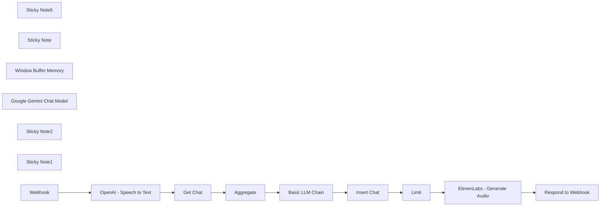

## Fluxo (.json) :

```json
{
  "id": "TtoDcjgthgA4NTkU",
  "meta": {
    "instanceId": "fb261afc5089eae952e09babdadd9983000b3d863639802f6ded8c5be2e40067",
    "templateCredsSetupCompleted": true
  },
  "name": "AI Voice Chat using Webhook, Memory Manager, OpenAI, Google Gemini & ElevenLabs",
  "tags": [
    {
      "id": "mqOrNvCDgQLzPA2x",
      "name": "Workflows",
      "createdAt": "2024-08-07T14:18:53.614Z",
      "updatedAt": "2024-08-07T14:18:53.614Z"
    }
  ],
  "nodes": [
    {
      "id": "86cbf150-df4f-42f7-b7b3-e03c32e6f23c",
      "name": "Get Chat",
      "type": "@n8n/n8n-nodes-langchain.memoryManager",
      "position": [
        1700,
        -400
      ],
      "parameters": {
        "options": {}
      },
      "typeVersion": 1,
      "alwaysOutputData": true
    },
    {
      "id": "a9153a24-e902-4f29-9b83-447317ce3119",
      "name": "Insert Chat",
      "type": "@n8n/n8n-nodes-langchain.memoryManager",
      "position": [
        2540,
        -400
      ],
      "parameters": {
        "mode": "insert",
        "messages": {
          "messageValues": [
            {
              "type": "user",
              "message": "={{ $('OpenAI - Speech to Text').item.json[\"text\"] }}"
            },
            {
              "type": "ai",
              "message": "={{ $json.text }}"
            }
          ]
        }
      },
      "typeVersion": 1,
      "alwaysOutputData": true
    },
    {
      "id": "f5c272d4-248b-45a5-87b5-eb659a865d05",
      "name": "Sticky Note5",
      "type": "n8n-nodes-base.stickyNote",
      "position": [
        1664,
        -491
      ],
      "parameters": {
        "color": 6,
        "width": 486.4746124819703,
        "height": 238.4911357933579,
        "content": "## Get Context"
      },
      "typeVersion": 1
    },
    {
      "id": "32ad17ca-0045-487d-9387-71c2e73629d4",
      "name": "Sticky Note",
      "type": "n8n-nodes-base.stickyNote",
      "position": [
        2510,
        -489
      ],
      "parameters": {
        "color": 6,
        "width": 321.2536584847704,
        "height": 231.05945912581728,
        "content": "## Save Context"
      },
      "typeVersion": 1
    },
    {
      "id": "17ae4f1a-6192-4c52-8157-3cb47b37e0fb",
      "name": "Aggregate",
      "type": "n8n-nodes-base.aggregate",
      "position": [
        2020,
        -400
      ],
      "parameters": {
        "options": {},
        "aggregate": "aggregateAllItemData",
        "destinationFieldName": "context"
      },
      "typeVersion": 1,
      "alwaysOutputData": true
    },
    {
      "id": "00b3081e-fbcd-489b-b45a-4e847c346594",
      "name": "Window Buffer Memory",
      "type": "@n8n/n8n-nodes-langchain.memoryBufferWindow",
      "position": [
        2080,
        -100
      ],
      "parameters": {
        "sessionKey": "test-0dacb3b5-4bcd-47dd-8456-dcfd8c258204",
        "sessionIdType": "customKey"
      },
      "typeVersion": 1.2
    },
    {
      "id": "55ca2790-e905-414a-a9f6-7d88a9e5807d",
      "name": "Google Gemini Chat Model",
      "type": "@n8n/n8n-nodes-langchain.lmChatGoogleGemini",
      "position": [
        2220,
        -100
      ],
      "parameters": {
        "options": {},
        "modelName": "models/gemini-1.5-flash"
      },
      "credentials": {
        "googlePalmApi": {
          "id": "2bUF1ZI9hoMIM5XN",
          "name": "Google Gemini(PaLM) Api account"
        }
      },
      "typeVersion": 1
    },
    {
      "id": "e8b3433f-b205-404c-9f05-504556d6b6dd",
      "name": "Respond to Webhook",
      "type": "n8n-nodes-base.respondToWebhook",
      "position": [
        3560,
        -400
      ],
      "parameters": {
        "options": {},
        "respondWith": "binary"
      },
      "typeVersion": 1.1
    },
    {
      "id": "de296743-5ac7-454b-bf3a-d020cc024511",
      "name": "ElevenLabs - Generate Audio",
      "type": "n8n-nodes-base.httpRequest",
      "position": [
        3240,
        -400
      ],
      "parameters": {
        "url": "=https://api.elevenlabs.io/v1/text-to-speech/{{voice id}}",
        "method": "POST",
        "options": {},
        "sendBody": true,
        "sendHeaders": true,
        "authentication": "genericCredentialType",
        "bodyParameters": {
          "parameters": [
            {
              "name": "text",
              "value": "={{ $('Basic LLM Chain').item.json.text }}"
            }
          ]
        },
        "genericAuthType": "httpCustomAuth",
        "headerParameters": {
          "parameters": [
            {
              "name": "Content-Type",
              "value": "application/json"
            }
          ]
        }
      },
      "credentials": {
        "httpCustomAuth": {
          "id": "lnGfV4BlxSE6Xc4X",
          "name": "Eleven Labs"
        }
      },
      "typeVersion": 4.2
    },
    {
      "id": "214e15f2-8a16-4598-b4ac-9fc2ec6545e6",
      "name": "Sticky Note2",
      "type": "n8n-nodes-base.stickyNote",
      "position": [
        3040,
        -560
      ],
      "parameters": {
        "width": 468.73250812192407,
        "height": 843.7602354099661,
        "content": "* ### For the Text-to-Speech part, we'll use ElevenLabs.io, which is free and offers a variety of voices to choose from. However, you can also use the OpenAI `\"Generate audio\"` node instead.\n\n\n\n\n\n\n\n\n\n\n\n\n\n\n\n\n\n* ### Since there is no pre-built node for `\"ElevenLabs\"` in n8n, we'll connect to it through its API using the \"HTTP Request\" node.\n\n## Prerequisites:\n* ### `\"ElevenLabs API Key\"` (you can obtain it from their website).\n* ### `\"Voice ID\"` (you can also get it from ElevenLabs' \"Voice Library\").\n## Setup\n* ### In the URL parameter, replace \"{{voice id}}\" at the end of the URL with the Voice ID you obtained from ElevenLabs.io.\n* ### To set up your API Key, add custom authentication and include the following `JSON` with your acual ElevenLabs API Key:\n```json\n{\n \"headers\": {\n \"xi-api-key\": \"put-your-API-Key-here\"\n }\n}\n```"
      },
      "typeVersion": 1
    },
    {
      "id": "94ad934c-4a13-47b1-83a5-76fab43b3a47",
      "name": "Sticky Note1",
      "type": "n8n-nodes-base.stickyNote",
      "position": [
        1663,
        -598
      ],
      "parameters": {
        "color": 6,
        "width": 487.4293487597613,
        "height": 91.01435855269375,
        "content": "### The \"Get Chat,\" \"Insert Chat,\" and \"Window Buffer Memory\" nodes will help the LLM model maintain context throughout the conversation."
      },
      "typeVersion": 1
    },
    {
      "id": "0a96f48d-0d8b-4240-9eab-a681bfd4c8b5",
      "name": "Limit",
      "type": "n8n-nodes-base.limit",
      "position": [
        2900,
        -400
      ],
      "parameters": {},
      "typeVersion": 1
    },
    {
      "id": "9a5d4ddb-6403-4758-858e-9fbe10c421a9",
      "name": "Basic LLM Chain",
      "type": "@n8n/n8n-nodes-langchain.chainLlm",
      "position": [
        2200,
        -400
      ],
      "parameters": {
        "text": "={{ $('OpenAI - Speech to Text').item.json[\"text\"] }}",
        "messages": {
          "messageValues": [
            {
              "type": "AIMessagePromptTemplate",
              "message": "=To maintain context and fully understand the user's question, always review the previous conversation between you and him before providing an answer.\nThis is the previous conversation:\n{{ $('Aggregate').item.json[\"context\"].map(m => `\nHuman: ${m.human || 'undefined'}\nAI Assistant: ${m.ai || 'undefined'}\n`).join('') }}"
            }
          ]
        },
        "promptType": "define"
      },
      "typeVersion": 1.4
    },
    {
      "id": "f2f99895-9678-41b8-ad28-db40e1e23dc0",
      "name": "Webhook",
      "type": "n8n-nodes-base.webhook",
      "position": [
        1320,
        -400
      ],
      "webhookId": "e9f611eb-a8dd-4520-8d24-9f36deaca528",
      "parameters": {
        "path": "voice_message",
        "options": {},
        "httpMethod": "POST",
        "responseMode": "responseNode"
      },
      "typeVersion": 2
    },
    {
      "id": "d9a5fb04-4c02-4da4-b690-7b0ecd0ae052",
      "name": "OpenAI - Speech to Text",
      "type": "@n8n/n8n-nodes-langchain.openAi",
      "position": [
        1500,
        -400
      ],
      "parameters": {
        "options": {},
        "resource": "audio",
        "operation": "transcribe",
        "binaryPropertyName": "voice_message"
      },
      "credentials": {
        "openAiApi": {
          "id": "2Cije3KX7OIVwn9B",
          "name": "n8n OpenAI"
        }
      },
      "typeVersion": 1.3
    }
  ],
  "active": true,
  "pinData": {},
  "settings": {
    "executionOrder": "v1"
  },
  "versionId": "fe5792ca-03d7-4cdd-96db-20f4cd479c7e",
  "connections": {
    "Limit": {
      "main": [
        [
          {
            "node": "ElevenLabs - Generate Audio",
            "type": "main",
            "index": 0
          }
        ]
      ]
    },
    "Webhook": {
      "main": [
        [
          {
            "node": "OpenAI - Speech to Text",
            "type": "main",
            "index": 0
          }
        ]
      ]
    },
    "Get Chat": {
      "main": [
        [
          {
            "node": "Aggregate",
            "type": "main",
            "index": 0
          }
        ]
      ]
    },
    "Aggregate": {
      "main": [
        [
          {
            "node": "Basic LLM Chain",
            "type": "main",
            "index": 0
          }
        ]
      ]
    },
    "Insert Chat": {
      "main": [
        [
          {
            "node": "Limit",
            "type": "main",
            "index": 0
          }
        ]
      ]
    },
    "Basic LLM Chain": {
      "main": [
        [
          {
            "node": "Insert Chat",
            "type": "main",
            "index": 0
          }
        ]
      ]
    },
    "Window Buffer Memory": {
      "ai_memory": [
        [
          {
            "node": "Insert Chat",
            "type": "ai_memory",
            "index": 0
          },
          {
            "node": "Get Chat",
            "type": "ai_memory",
            "index": 0
          }
        ]
      ]
    },
    "OpenAI - Speech to Text": {
      "main": [
        [
          {
            "node": "Get Chat",
            "type": "main",
            "index": 0
          }
        ]
      ]
    },
    "Google Gemini Chat Model": {
      "ai_languageModel": [
        [
          {
            "node": "Basic LLM Chain",
            "type": "ai_languageModel",
            "index": 0
          }
        ]
      ]
    },
    "ElevenLabs - Generate Audio": {
      "main": [
        [
          {
            "node": "Respond to Webhook",
            "type": "main",
            "index": 0
          }
        ]
      ]
    }
  }
}
```

<a id="template-2535"></a>

## Template 2535 - Chat de voz com contexto e TTS

- **Nome:** Chat de voz com contexto e TTS
- **Descrição:** Fluxo que recebe mensagens de voz, transcreve para texto, usa histórico de conversa para gerar respostas com um modelo de linguagem e devolve áudio sintetizado ao remetente.
- **Funcionalidade:** • Receber mensagem de voz via webhook: aceita áudio enviado por POST como ponto de entrada.
• Transcrever áudio para texto: converte o conteúdo de voz em texto usando serviço de transcrição.
• Recuperar contexto da conversa: consulta o histórico de interações da sessão para manter contexto contínuo.
• Agregar contexto para o modelo: consolida mensagens anteriores em um único contexto a ser enviado ao LLM.
• Gerar resposta com LLM: produz a resposta textual baseada na entrada atual e no contexto histórico.
• Salvar nova interação na memória: armazena o par usuário/IA para atualizações futuras do histórico.
• Converter texto em fala (TTS): gera áudio a partir da resposta textual usando um serviço de síntese.
• Responder ao remetente com áudio binário: devolve o arquivo de áudio gerado como resposta ao pedido inicial.
- **Ferramentas:** • OpenAI: serviço de transcrição de fala para texto (Speech-to-Text).
• Google Gemini (PaLM): modelo de linguagem usado para gerar respostas contextualizadas.
• ElevenLabs: serviço de text-to-speech para gerar áudio a partir do texto da resposta.
• Endpoint Webhook HTTP: ponto de entrada/saída que recebe o áudio do usuário e retorna o áudio gerado.

## Fluxo visual


## Fluxo (.json) :

```json
{
  "id": "TtoDcjgthgA4NTkU",
  "meta": {
    "instanceId": "fb261afc5089eae952e09babdadd9983000b3d863639802f6ded8c5be2e40067",
    "templateCredsSetupCompleted": true
  },
  "name": "AI Voice Chat using Webhook, Memory Manager, OpenAI, Google Gemini & ElevenLabs",
  "tags": [
    {
      "id": "mqOrNvCDgQLzPA2x",
      "name": "Workflows",
      "createdAt": "2024-08-07T14:18:53.614Z",
      "updatedAt": "2024-08-07T14:18:53.614Z"
    }
  ],
  "nodes": [
    {
      "id": "86cbf150-df4f-42f7-b7b3-e03c32e6f23c",
      "name": "Get Chat",
      "type": "@n8n/n8n-nodes-langchain.memoryManager",
      "position": [
        1700,
        -400
      ],
      "parameters": {
        "options": {}
      },
      "typeVersion": 1,
      "alwaysOutputData": true
    },
    {
      "id": "a9153a24-e902-4f29-9b83-447317ce3119",
      "name": "Insert Chat",
      "type": "@n8n/n8n-nodes-langchain.memoryManager",
      "position": [
        2540,
        -400
      ],
      "parameters": {
        "mode": "insert",
        "messages": {
          "messageValues": [
            {
              "type": "user",
              "message": "={{ $('OpenAI - Speech to Text').item.json[\"text\"] }}"
            },
            {
              "type": "ai",
              "message": "={{ $json.text }}"
            }
          ]
        }
      },
      "typeVersion": 1,
      "alwaysOutputData": true
    },
    {
      "id": "f5c272d4-248b-45a5-87b5-eb659a865d05",
      "name": "Sticky Note5",
      "type": "n8n-nodes-base.stickyNote",
      "position": [
        1664,
        -491
      ],
      "parameters": {
        "color": 6,
        "width": 486.4746124819703,
        "height": 238.4911357933579,
        "content": "## Get Context"
      },
      "typeVersion": 1
    },
    {
      "id": "32ad17ca-0045-487d-9387-71c2e73629d4",
      "name": "Sticky Note",
      "type": "n8n-nodes-base.stickyNote",
      "position": [
        2510,
        -489
      ],
      "parameters": {
        "color": 6,
        "width": 321.2536584847704,
        "height": 231.05945912581728,
        "content": "## Save Context"
      },
      "typeVersion": 1
    },
    {
      "id": "17ae4f1a-6192-4c52-8157-3cb47b37e0fb",
      "name": "Aggregate",
      "type": "n8n-nodes-base.aggregate",
      "position": [
        2020,
        -400
      ],
      "parameters": {
        "options": {},
        "aggregate": "aggregateAllItemData",
        "destinationFieldName": "context"
      },
      "typeVersion": 1,
      "alwaysOutputData": true
    },
    {
      "id": "00b3081e-fbcd-489b-b45a-4e847c346594",
      "name": "Window Buffer Memory",
      "type": "@n8n/n8n-nodes-langchain.memoryBufferWindow",
      "position": [
        2080,
        -100
      ],
      "parameters": {
        "sessionKey": "test-0dacb3b5-4bcd-47dd-8456-dcfd8c258204",
        "sessionIdType": "customKey"
      },
      "typeVersion": 1.2
    },
    {
      "id": "55ca2790-e905-414a-a9f6-7d88a9e5807d",
      "name": "Google Gemini Chat Model",
      "type": "@n8n/n8n-nodes-langchain.lmChatGoogleGemini",
      "position": [
        2220,
        -100
      ],
      "parameters": {
        "options": {},
        "modelName": "models/gemini-1.5-flash"
      },
      "credentials": {
        "googlePalmApi": {
          "id": "2bUF1ZI9hoMIM5XN",
          "name": "Google Gemini(PaLM) Api account"
        }
      },
      "typeVersion": 1
    },
    {
      "id": "e8b3433f-b205-404c-9f05-504556d6b6dd",
      "name": "Respond to Webhook",
      "type": "n8n-nodes-base.respondToWebhook",
      "position": [
        3560,
        -400
      ],
      "parameters": {
        "options": {},
        "respondWith": "binary"
      },
      "typeVersion": 1.1
    },
    {
      "id": "de296743-5ac7-454b-bf3a-d020cc024511",
      "name": "ElevenLabs - Generate Audio",
      "type": "n8n-nodes-base.httpRequest",
      "position": [
        3240,
        -400
      ],
      "parameters": {
        "url": "=https://api.elevenlabs.io/v1/text-to-speech/{{voice id}}",
        "method": "POST",
        "options": {},
        "sendBody": true,
        "sendHeaders": true,
        "authentication": "genericCredentialType",
        "bodyParameters": {
          "parameters": [
            {
              "name": "text",
              "value": "={{ $('Basic LLM Chain').item.json.text }}"
            }
          ]
        },
        "genericAuthType": "httpCustomAuth",
        "headerParameters": {
          "parameters": [
            {
              "name": "Content-Type",
              "value": "application/json"
            }
          ]
        }
      },
      "credentials": {
        "httpCustomAuth": {
          "id": "lnGfV4BlxSE6Xc4X",
          "name": "Eleven Labs"
        }
      },
      "typeVersion": 4.2
    },
    {
      "id": "214e15f2-8a16-4598-b4ac-9fc2ec6545e6",
      "name": "Sticky Note2",
      "type": "n8n-nodes-base.stickyNote",
      "position": [
        3040,
        -560
      ],
      "parameters": {
        "width": 468.73250812192407,
        "height": 843.7602354099661,
        "content": "* ### For the Text-to-Speech part, we'll use ElevenLabs.io, which is free and offers a variety of voices to choose from. However, you can also use the OpenAI `\"Generate audio\"` node instead.\n\n\n\n\n\n\n\n\n\n\n\n\n\n\n\n\n\n* ### Since there is no pre-built node for `\"ElevenLabs\"` in n8n, we'll connect to it through its API using the \"HTTP Request\" node.\n\n## Prerequisites:\n* ### `\"ElevenLabs API Key\"` (you can obtain it from their website).\n* ### `\"Voice ID\"` (you can also get it from ElevenLabs' \"Voice Library\").\n## Setup\n* ### In the URL parameter, replace \"{{voice id}}\" at the end of the URL with the Voice ID you obtained from ElevenLabs.io.\n* ### To set up your API Key, add custom authentication and include the following `JSON` with your acual ElevenLabs API Key:\n```json\n{\n  \"headers\": {\n    \"xi-api-key\": \"put-your-API-Key-here\"\n  }\n}\n```"
      },
      "typeVersion": 1
    },
    {
      "id": "94ad934c-4a13-47b1-83a5-76fab43b3a47",
      "name": "Sticky Note1",
      "type": "n8n-nodes-base.stickyNote",
      "position": [
        1663,
        -598
      ],
      "parameters": {
        "color": 6,
        "width": 487.4293487597613,
        "height": 91.01435855269375,
        "content": "### The \"Get Chat,\" \"Insert Chat,\" and \"Window Buffer Memory\" nodes will help the LLM model maintain context throughout the conversation."
      },
      "typeVersion": 1
    },
    {
      "id": "0a96f48d-0d8b-4240-9eab-a681bfd4c8b5",
      "name": "Limit",
      "type": "n8n-nodes-base.limit",
      "position": [
        2900,
        -400
      ],
      "parameters": {},
      "typeVersion": 1
    },
    {
      "id": "9a5d4ddb-6403-4758-858e-9fbe10c421a9",
      "name": "Basic LLM Chain",
      "type": "@n8n/n8n-nodes-langchain.chainLlm",
      "position": [
        2200,
        -400
      ],
      "parameters": {
        "text": "={{ $('OpenAI - Speech to Text').item.json[\"text\"] }}",
        "messages": {
          "messageValues": [
            {
              "type": "AIMessagePromptTemplate",
              "message": "=To maintain context and fully understand the user's question, always review the previous conversation between you and him before providing an answer.\nThis is the previous conversation:\n{{ $('Aggregate').item.json[\"context\"].map(m => `\nHuman: ${m.human || 'undefined'}\nAI Assistant: ${m.ai || 'undefined'}\n`).join('') }}"
            }
          ]
        },
        "promptType": "define"
      },
      "typeVersion": 1.4
    },
    {
      "id": "f2f99895-9678-41b8-ad28-db40e1e23dc0",
      "name": "Webhook",
      "type": "n8n-nodes-base.webhook",
      "position": [
        1320,
        -400
      ],
      "webhookId": "e9f611eb-a8dd-4520-8d24-9f36deaca528",
      "parameters": {
        "path": "voice_message",
        "options": {},
        "httpMethod": "POST",
        "responseMode": "responseNode"
      },
      "typeVersion": 2
    },
    {
      "id": "d9a5fb04-4c02-4da4-b690-7b0ecd0ae052",
      "name": "OpenAI - Speech to Text",
      "type": "@n8n/n8n-nodes-langchain.openAi",
      "position": [
        1500,
        -400
      ],
      "parameters": {
        "options": {},
        "resource": "audio",
        "operation": "transcribe",
        "binaryPropertyName": "voice_message"
      },
      "credentials": {
        "openAiApi": {
          "id": "2Cije3KX7OIVwn9B",
          "name": "n8n OpenAI"
        }
      },
      "typeVersion": 1.3
    }
  ],
  "active": true,
  "pinData": {},
  "settings": {
    "executionOrder": "v1"
  },
  "versionId": "fe5792ca-03d7-4cdd-96db-20f4cd479c7e",
  "connections": {
    "Limit": {
      "main": [
        [
          {
            "node": "ElevenLabs - Generate Audio",
            "type": "main",
            "index": 0
          }
        ]
      ]
    },
    "Webhook": {
      "main": [
        [
          {
            "node": "OpenAI - Speech to Text",
            "type": "main",
            "index": 0
          }
        ]
      ]
    },
    "Get Chat": {
      "main": [
        [
          {
            "node": "Aggregate",
            "type": "main",
            "index": 0
          }
        ]
      ]
    },
    "Aggregate": {
      "main": [
        [
          {
            "node": "Basic LLM Chain",
            "type": "main",
            "index": 0
          }
        ]
      ]
    },
    "Insert Chat": {
      "main": [
        [
          {
            "node": "Limit",
            "type": "main",
            "index": 0
          }
        ]
      ]
    },
    "Basic LLM Chain": {
      "main": [
        [
          {
            "node": "Insert Chat",
            "type": "main",
            "index": 0
          }
        ]
      ]
    },
    "Window Buffer Memory": {
      "ai_memory": [
        [
          {
            "node": "Insert Chat",
            "type": "ai_memory",
            "index": 0
          },
          {
            "node": "Get Chat",
            "type": "ai_memory",
            "index": 0
          }
        ]
      ]
    },
    "OpenAI - Speech to Text": {
      "main": [
        [
          {
            "node": "Get Chat",
            "type": "main",
            "index": 0
          }
        ]
      ]
    },
    "Google Gemini Chat Model": {
      "ai_languageModel": [
        [
          {
            "node": "Basic LLM Chain",
            "type": "ai_languageModel",
            "index": 0
          }
        ]
      ]
    },
    "ElevenLabs - Generate Audio": {
      "main": [
        [
          {
            "node": "Respond to Webhook",
            "type": "main",
            "index": 0
          }
        ]
      ]
    }
  }
}
```

<a id="template-2536"></a>

## Template 2536 - Chatbot Telegram multimodal com IA

- **Nome:** Chatbot Telegram multimodal com IA
- **Descrição:** Um chatbot para Telegram que processa mensagens de texto e voz, usa um modelo de IA para gerar respostas formatadas em HTML e envia as respostas ao usuário, mantendo contexto curto da conversa.
- **Funcionalidade:** • Receber atualizações do Telegram: Inicia o fluxo ao receber mensagens ou arquivos do usuário.
• Determinar tipo de conteúdo: Identifica se a entrada é texto, mensagem de voz ou formato não suportado e roteia o processamento.
• Enviar ação de digitação: Mostra ao usuário que o bot está processando a solicitação (ação "digitando").
• Baixar e transcrever áudio: Faz o download do arquivo de voz enviado e converte áudio em texto usando transcrição automática.
• Preparar mensagem combinada: Consolida o texto recebido (ou transcrito) e define propriedades como tipo de mensagem e se foi encaminhada.
• Memória de contexto em janela: Mantém um histórico recente (janela de 10 entradas) por sessão para preservar contexto na conversa.
• Gerar resposta com modelo de linguagem: Envia o conteúdo ao modelo de IA (configurado com instruções do sistema que incluem nome do usuário, data e regras de formatação HTML) e recebe a resposta.
• Enviar resposta formatada em HTML: Entrega a resposta ao usuário com formatação HTML suportada pelo Telegram e adiciona uma nota de agradecimento indicando tipo e origem da mensagem.
• Tratamento de erro ao enviar HTML: Se ocorrer erro ao enviar a resposta formatada, faz uma versão com caracteres escapados e reenvia.
• Mensagem para formatos não suportados: Informa o usuário quando o tipo de mensagem não é reconhecido (apenas texto e voz são suportados).
- **Ferramentas:** • Telegram: Plataforma de mensagens usada para receber eventos, enviar e receber mensagens, baixar arquivos de voz e mostrar ações de chat.
• OpenAI: Serviço utilizado tanto para geração de linguagem (modelo de chat, ex.: gpt-4o) quanto para transcrição de áudio em texto.


## Fluxo visual

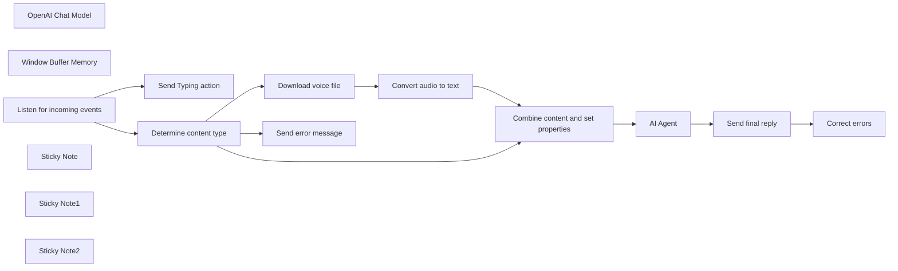

## Fluxo (.json) :

```json
{
  "id": "HJwTWtzlhK8Q5SOv",
  "meta": {
    "instanceId": "fb924c73af8f703905bc09c9ee8076f48c17b596ed05b18c0ff86915ef8a7c4a",
    "templateCredsSetupCompleted": true
  },
  "name": "Telegram AI multi-format chatbot",
  "tags": [],
  "nodes": [
    {
      "id": "65196267-0d57-4af4-9081-962701478146",
      "name": "OpenAI Chat Model",
      "type": "@n8n/n8n-nodes-langchain.lmChatOpenAi",
      "position": [
        660,
        640
      ],
      "parameters": {
        "model": "gpt-4o",
        "options": {
          "temperature": 0.7,
          "frequencyPenalty": 0.2
        }
      },
      "credentials": {
        "openAiApi": {
          "id": "rveqdSfp7pCRON1T",
          "name": "Ted's Tech Talks OpenAi"
        }
      },
      "typeVersion": 1
    },
    {
      "id": "fc446ef0-2f15-42e7-a993-7960d76d8876",
      "name": "Window Buffer Memory",
      "type": "@n8n/n8n-nodes-langchain.memoryBufferWindow",
      "position": [
        800,
        640
      ],
      "parameters": {
        "sessionKey": "=chat_with_{{ $('Listen for incoming events').first().json.message.chat.id }}",
        "contextWindowLength": 10
      },
      "typeVersion": 1
    },
    {
      "id": "51c3cddd-fc21-4fff-b615-ea7080c47947",
      "name": "Correct errors",
      "type": "n8n-nodes-base.telegram",
      "position": [
        1220,
        580
      ],
      "parameters": {
        "text": "={{ $('AI Agent').item.json.output.replace(/&/g, \"&amp;\").replace(/>/g, \"&gt;\").replace(/</g, \"&lt;\").replace(/\"/g, \"&quot;\") }}",
        "chatId": "={{ $('Listen for incoming events').first().json.message.from.id }}",
        "additionalFields": {
          "parse_mode": "HTML",
          "appendAttribution": false
        }
      },
      "credentials": {
        "telegramApi": {
          "id": "9dexJXnlVPA6wt8K",
          "name": "Chat & Sound"
        }
      },
      "typeVersion": 1.1
    },
    {
      "id": "d931b7e1-bc17-431e-ae67-967b6ef79236",
      "name": "Listen for incoming events",
      "type": "n8n-nodes-base.telegramTrigger",
      "position": [
        -440,
        480
      ],
      "webhookId": "322dce18-f93e-4f86-b9b1-3305519b7834",
      "parameters": {
        "updates": [
          "*"
        ],
        "additionalFields": {}
      },
      "credentials": {
        "telegramApi": {
          "id": "9dexJXnlVPA6wt8K",
          "name": "Chat & Sound"
        }
      },
      "typeVersion": 1
    },
    {
      "id": "b33335ff-5dea-4fff-8f63-fea2b11b8241",
      "name": "Download voice file",
      "type": "n8n-nodes-base.telegram",
      "position": [
        60,
        600
      ],
      "parameters": {
        "fileId": "={{$json.message.voice.file_id}}",
        "resource": "file"
      },
      "credentials": {
        "telegramApi": {
          "id": "9dexJXnlVPA6wt8K",
          "name": "Chat & Sound"
        }
      },
      "typeVersion": 1.2
    },
    {
      "id": "2954ced6-ab98-42e6-bf64-237146a433e0",
      "name": "Combine content and set properties",
      "type": "n8n-nodes-base.set",
      "position": [
        440,
        460
      ],
      "parameters": {
        "options": {},
        "assignments": {
          "assignments": [
            {
              "id": "bccbce0a-7786-49c9-979a-7a285cb69f78",
              "name": "CombinedMessage",
              "type": "string",
              "value": "={{ $json.message && $json.message.text ? $json.message.text : ($json.text ? $json.text : '') }}"
            },
            {
              "id": "5b1fc9f5-1408-4099-88cc-a23725c9eddb",
              "name": "Message Type ",
              "type": "string",
              "value": "={{ $json?.message?.text && !$json?.text ? \"text query\" : (!$json?.message?.text && $json?.text ? \"voice message\" : \"unknown type message\") }}"
            },
            {
              "id": "1e9a17fa-ec5d-49dc-9ff6-1f28b57fb02e",
              "name": "Source Type",
              "type": "string",
              "value": "={{ $('Listen for incoming events').item.json.message.forward_origin ? \" forwarded\" : \"\" }}"
            }
          ]
        }
      },
      "typeVersion": 3.4
    },
    {
      "id": "e18de374-941f-4c2e-ab6c-6c6f68f2ce12",
      "name": "Send final reply",
      "type": "n8n-nodes-base.telegram",
      "onError": "continueErrorOutput",
      "position": [
        1040,
        460
      ],
      "parameters": {
        "text": "={{ $json.output }} \n\nThank you for your{{ $('Combine content and set properties').item.json['Source Type'] }} {{ $('Combine content and set properties').item.json['Message Type '] }} 🤗",
        "chatId": "={{ $('Listen for incoming events').first().json.message.from.id }}",
        "additionalFields": {
          "parse_mode": "HTML",
          "appendAttribution": false
        }
      },
      "credentials": {
        "telegramApi": {
          "id": "9dexJXnlVPA6wt8K",
          "name": "Chat & Sound"
        }
      },
      "typeVersion": 1.1
    },
    {
      "id": "b47a9583-ce5c-464f-a9e6-153fb42e685f",
      "name": "Send error message",
      "type": "n8n-nodes-base.telegram",
      "position": [
        60,
        300
      ],
      "parameters": {
        "text": "=Sorry, {{ $('Listen for incoming events').first().json.message.from.first_name }}! This command is not supported yet. Please send text or voice messages.",
        "chatId": "={{ $('Listen for incoming events').first().json.message.from.id }}",
        "additionalFields": {
          "parse_mode": "Markdown",
          "appendAttribution": false
        }
      },
      "credentials": {
        "telegramApi": {
          "id": "9dexJXnlVPA6wt8K",
          "name": "Chat & Sound"
        }
      },
      "typeVersion": 1.2
    },
    {
      "id": "0196b49e-90a1-4f2f-8b94-492fced37dbf",
      "name": "Convert audio to text",
      "type": "@n8n/n8n-nodes-langchain.openAi",
      "position": [
        240,
        600
      ],
      "parameters": {
        "options": {
          "language": "",
          "temperature": 0.7
        },
        "resource": "audio",
        "operation": "transcribe"
      },
      "credentials": {
        "openAiApi": {
          "id": "rveqdSfp7pCRON1T",
          "name": "Ted's Tech Talks OpenAi"
        }
      },
      "typeVersion": 1.5
    },
    {
      "id": "66505b83-e0c3-4d9d-8e1a-9b54030e29e7",
      "name": "Sticky Note",
      "type": "n8n-nodes-base.stickyNote",
      "position": [
        -466.12784869794086,
        220
      ],
      "parameters": {
        "width": 1035.4478381373049,
        "height": 547.5630890194532,
        "content": "## Receive and pre-process messages \n"
      },
      "typeVersion": 1
    },
    {
      "id": "44087d3f-86c8-407c-8791-645d167165cb",
      "name": "Sticky Note1",
      "type": "n8n-nodes-base.stickyNote",
      "position": [
        620,
        220
      ],
      "parameters": {
        "color": 2,
        "width": 861.262180151035,
        "height": 550.5748478134515,
        "content": "## 1. Send incoming message to the AI Agent\n## 2. Deliver agent reply to the user \n"
      },
      "typeVersion": 1
    },
    {
      "id": "d7e58831-de97-483f-8b8a-583f85397245",
      "name": "Sticky Note2",
      "type": "n8n-nodes-base.stickyNote",
      "position": [
        20,
        553.0639243489702
      ],
      "parameters": {
        "color": 6,
        "width": 367.73614918993235,
        "height": 194.83713159725437,
        "content": "## Transcribe audio"
      },
      "typeVersion": 1
    },
    {
      "id": "89515d80-6efc-40a8-95ce-343d4ff4dbee",
      "name": "Send Typing action",
      "type": "n8n-nodes-base.telegram",
      "position": [
        -180,
        300
      ],
      "parameters": {
        "chatId": "={{ $('Listen for incoming events').first().json.message.from.id }}",
        "operation": "sendChatAction"
      },
      "credentials": {
        "telegramApi": {
          "id": "9dexJXnlVPA6wt8K",
          "name": "Chat & Sound"
        }
      },
      "typeVersion": 1.2
    },
    {
      "id": "c925d059-f843-473c-bfd4-3c563d80ca0f",
      "name": "AI Agent",
      "type": "@n8n/n8n-nodes-langchain.agent",
      "position": [
        680,
        460
      ],
      "parameters": {
        "text": "={{ $json.CombinedMessage }}",
        "options": {
          "humanMessage": "TOOLS\n------\nAssistant can ask the user to use tools to look up information that may be helpful in answering the users original question. The tools the human can use are:\n\n{tools}\n\n{format_instructions}\n\nUSER'S INPUT\n--------------------\nHere is the user's input (remember to respond with a markdown code snippet of a json blob with a single action, and NOTHING else):\n\n{{input}}",
          "systemMessage": "=You are a helpful AI assistant. You are chatting with the user named `{{ $('Determine content type').item.json.message.from.first_name }}`. You need to address the user by their name. Today is {{ DateTime.fromISO($now).toLocaleString(DateTime.DATETIME_FULL) }}\n\nIn your reply, always send a message in Telegram-supported HTML format. Here are the formatting instructions:\n1. The following tags are currently supported:\n<b>bold</b>, <strong>bold</strong>\n<i>italic</i>, <em>italic</em>\n<u>underline</u>, <ins>underline</ins>\n<s>strikethrough</s>, <strike>strikethrough</strike>, <del>strikethrough</del>\n<span class=\"tg-spoiler\">spoiler</span>, <tg-spoiler>spoiler</tg-spoiler>\n<b>bold <i>italic bold <s>italic bold strikethrough <span class=\"tg-spoiler\">italic bold strikethrough spoiler</span></s> <u>underline italic bold</u></i> bold</b>\n<a href=\"http://www.example.com/\">inline URL</a>\n<code>inline fixed-width code</code>\n<pre>pre-formatted fixed-width code block</pre>\n2. Any code that you send should be wrapped in these tags: <pre><code class=\"language-python\">pre-formatted fixed-width code block written in the Python programming language</code></pre>\nOther programming languages are supported as well.\n3. All <, > and & symbols that are not a part of a tag or an HTML entity must be replaced with the corresponding HTML entities (< with &lt;, > with &gt; and & with &amp;)\n4. If the user sends you a message starting with / sign, it means this is a Telegram bot command. For example, all users send /start command as their first message. Try to figure out what these commands mean and reply accodringly\n"
        }
      },
      "typeVersion": 1.1
    },
    {
      "id": "2c56536d-1a86-4a49-b495-3e877adb308a",
      "name": "Determine content type",
      "type": "n8n-nodes-base.switch",
      "position": [
        -180,
        480
      ],
      "parameters": {
        "rules": {
          "values": [
            {
              "outputKey": "Text",
              "conditions": {
                "options": {
                  "version": 2,
                  "leftValue": "",
                  "caseSensitive": true,
                  "typeValidation": "strict"
                },
                "combinator": "and",
                "conditions": [
                  {
                    "operator": {
                      "type": "string",
                      "operation": "notEmpty",
                      "singleValue": true
                    },
                    "leftValue": "={{ $json.message.text }}",
                    "rightValue": "/"
                  }
                ]
              },
              "renameOutput": true
            },
            {
              "outputKey": "Voice",
              "conditions": {
                "options": {
                  "version": 2,
                  "leftValue": "",
                  "caseSensitive": true,
                  "typeValidation": "strict"
                },
                "combinator": "and",
                "conditions": [
                  {
                    "id": "dd41bbf0-bee0-450b-9160-b769821a4abc",
                    "operator": {
                      "type": "object",
                      "operation": "exists",
                      "singleValue": true
                    },
                    "leftValue": "={{ $json.message.voice}}",
                    "rightValue": ""
                  }
                ]
              },
              "renameOutput": true
            }
          ]
        },
        "options": {
          "fallbackOutput": "extra"
        }
      },
      "typeVersion": 3.2
    }
  ],
  "active": false,
  "pinData": {},
  "settings": {
    "executionOrder": "v1"
  },
  "versionId": "15ae799b-6868-4519-b579-3f202e4de5b2",
  "connections": {
    "AI Agent": {
      "main": [
        [
          {
            "node": "Send final reply",
            "type": "main",
            "index": 0
          }
        ]
      ]
    },
    "Send final reply": {
      "main": [
        [],
        [
          {
            "node": "Correct errors",
            "type": "main",
            "index": 0
          }
        ]
      ]
    },
    "OpenAI Chat Model": {
      "ai_languageModel": [
        [
          {
            "node": "AI Agent",
            "type": "ai_languageModel",
            "index": 0
          }
        ]
      ]
    },
    "Download voice file": {
      "main": [
        [
          {
            "node": "Convert audio to text",
            "type": "main",
            "index": 0
          }
        ]
      ]
    },
    "Window Buffer Memory": {
      "ai_memory": [
        [
          {
            "node": "AI Agent",
            "type": "ai_memory",
            "index": 0
          }
        ]
      ]
    },
    "Convert audio to text": {
      "main": [
        [
          {
            "node": "Combine content and set properties",
            "type": "main",
            "index": 0
          }
        ]
      ]
    },
    "Determine content type": {
      "main": [
        [
          {
            "node": "Combine content and set properties",
            "type": "main",
            "index": 0
          }
        ],
        [
          {
            "node": "Download voice file",
            "type": "main",
            "index": 0
          }
        ],
        [
          {
            "node": "Send error message",
            "type": "main",
            "index": 0
          }
        ]
      ]
    },
    "Listen for incoming events": {
      "main": [
        [
          {
            "node": "Determine content type",
            "type": "main",
            "index": 0
          },
          {
            "node": "Send Typing action",
            "type": "main",
            "index": 0
          }
        ]
      ]
    },
    "Combine content and set properties": {
      "main": [
        [
          {
            "node": "AI Agent",
            "type": "main",
            "index": 0
          }
        ]
      ]
    }
  }
}
```

<a id="template-2537"></a>

## Template 2537 - Indexação de objetos de imagens para busca

- **Nome:** Indexação de objetos de imagens para busca
- **Descrição:** Extrai objetos detectados numa imagem usando um modelo de visão, armazena as imagens recortadas e indexa metadados para habilitar busca por objetos.
- **Funcionalidade:** • Definição de variáveis: configura modelo, URL da imagem fonte, índice do Elasticsearch e credenciais de conta.
• Download da imagem fonte: obtém a imagem a partir de uma URL fornecida.
• Detecção de objetos com modelo Detr-Resnet-50: envia a imagem a um serviço de IA para identificar objetos e suas caixas delimitadoras.
• Separação e iteração de resultados: divide a resposta do modelo em resultados individuais para processamento por objeto.
• Filtragem por confiança: mantém apenas objetos com score maior ou igual a 0.9.
• Recarregamento da imagem fonte para recorte: baixa novamente a imagem para garantir dados binários para o corte.
• Recorte de objetos: recorta cada objeto da imagem original usando as coordenadas da caixa delimitadora e gera arquivos JPEG nomeados.
• Upload das imagens recortadas: envia as imagens resultantes para armazenamento externo com preset de upload.
• Indexação em Elasticsearch: cria documentos contendo URL da imagem hospedada, URL da imagem fonte, rótulo do objeto e metadata adicional para permitir buscas por objeto.
- **Ferramentas:** • Cloudflare Workers AI: serviço de IA que executa o modelo de visão Detr-Resnet-50 para detectar objetos e retornar caixas delimitadoras e scores.
• Cloudinary: serviço de hospedagem/armazenamento de imagens usado para receber e servir as imagens recortadas.
• Elasticsearch: motor de busca/documentos usado para indexar metadados das imagens recortadas e possibilitar consultas de busca por objeto.

## Fluxo visual

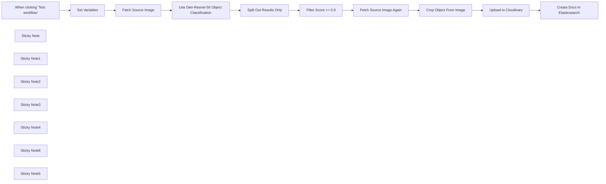

## Fluxo (.json) :

```json
{
  "meta": {
    "instanceId": "26ba763460b97c249b82942b23b6384876dfeb9327513332e743c5f6219c2b8e"
  },
  "nodes": [
    {
      "id": "6359f725-1ede-4b05-bc19-05a7e85c0865",
      "name": "When clicking \"Test workflow\"",
      "type": "n8n-nodes-base.manualTrigger",
      "position": [
        680,
        292
      ],
      "parameters": {},
      "typeVersion": 1
    },
    {
      "id": "9e1e61c7-f5fd-4e8a-99a6-ccc5a24f5528",
      "name": "Fetch Source Image",
      "type": "n8n-nodes-base.httpRequest",
      "position": [
        1000,
        292
      ],
      "parameters": {
        "url": "={{ $json.source_image }}",
        "options": {}
      },
      "typeVersion": 4.2
    },
    {
      "id": "9b1b94cf-3a7d-4c43-ab6c-8df9824b5667",
      "name": "Split Out Results Only",
      "type": "n8n-nodes-base.splitOut",
      "position": [
        1428,
        323
      ],
      "parameters": {
        "options": {},
        "fieldToSplitOut": "result"
      },
      "typeVersion": 1
    },
    {
      "id": "fcbaf6c3-2aee-4ea1-9c5e-2833dd7a9f50",
      "name": "Filter Score >= 0.9",
      "type": "n8n-nodes-base.filter",
      "position": [
        1608,
        323
      ],
      "parameters": {
        "options": {},
        "conditions": {
          "options": {
            "leftValue": "",
            "caseSensitive": true,
            "typeValidation": "strict"
          },
          "combinator": "and",
          "conditions": [
            {
              "id": "367d83ef-8ecf-41fe-858c-9bfd78b0ae9f",
              "operator": {
                "type": "number",
                "operation": "gte"
              },
              "leftValue": "={{ $json.score }}",
              "rightValue": 0.9
            }
          ]
        }
      },
      "typeVersion": 2
    },
    {
      "id": "954ce7b0-ef82-4203-8706-17cfa5e5e3ff",
      "name": "Crop Object From Image",
      "type": "n8n-nodes-base.editImage",
      "position": [
        2080,
        432
      ],
      "parameters": {
        "width": "={{ $json.box.xmax - $json.box.xmin }}",
        "height": "={{ $json.box.ymax - $json.box.ymin }}",
        "options": {
          "format": "jpeg",
          "fileName": "={{ $binary.data.fileName.split('.')[0].urlEncode()+'-'+$json.label.urlEncode() + '-' + $itemIndex }}.jpg"
        },
        "operation": "crop",
        "positionX": "={{ $json.box.xmin }}",
        "positionY": "={{ $json.box.ymin }}"
      },
      "typeVersion": 1
    },
    {
      "id": "40027456-4bf9-4eea-8d71-aa28e69b29e5",
      "name": "Set Variables",
      "type": "n8n-nodes-base.set",
      "position": [
        840,
        292
      ],
      "parameters": {
        "options": {},
        "assignments": {
          "assignments": [
            {
              "id": "9e95d951-8530-4a80-bd00-6bb55623a71f",
              "name": "CLOUDFLARE_ACCOUNT_ID",
              "type": "string",
              "value": ""
            },
            {
              "id": "66807a90-63a1-4d4e-886e-e8abf3019a34",
              "name": "model",
              "type": "string",
              "value": "@cf/facebook/detr-resnet-50"
            },
            {
              "id": "a13ccde6-e6e3-46f4-afa3-2134af7bc765",
              "name": "source_image",
              "type": "string",
              "value": "https://images.pexels.com/photos/2293367/pexels-photo-2293367.jpeg?auto=compress&cs=tinysrgb&w=600"
            },
            {
              "id": "0734fc55-b414-47f7-8b3e-5c880243f3ed",
              "name": "elasticsearch_index",
              "type": "string",
              "value": "n8n-image-search"
            }
          ]
        }
      },
      "typeVersion": 3.3
    },
    {
      "id": "c3d8c5e3-546e-472c-9e6e-091cf5cee3c3",
      "name": "Use Detr-Resnet-50 Object Classification",
      "type": "n8n-nodes-base.httpRequest",
      "position": [
        1248,
        324
      ],
      "parameters": {
        "url": "=https://api.cloudflare.com/client/v4/accounts/{{ $('Set Variables').item.json.CLOUDFLARE_ACCOUNT_ID }}/ai/run/{{ $('Set Variables').item.json.model }}",
        "method": "POST",
        "options": {},
        "sendBody": true,
        "contentType": "binaryData",
        "authentication": "predefinedCredentialType",
        "inputDataFieldName": "data",
        "nodeCredentialType": "cloudflareApi"
      },
      "credentials": {
        "cloudflareApi": {
          "id": "qOynkQdBH48ofOSS",
          "name": "Cloudflare account"
        }
      },
      "typeVersion": 4.2
    },
    {
      "id": "3c7aa2fc-9ca1-41ba-a10d-aa5930d45f18",
      "name": "Upload to Cloudinary",
      "type": "n8n-nodes-base.httpRequest",
      "position": [
        2380,
        380
      ],
      "parameters": {
        "url": "https://api.cloudinary.com/v1_1/daglih2g8/image/upload",
        "method": "POST",
        "options": {},
        "sendBody": true,
        "sendQuery": true,
        "contentType": "multipart-form-data",
        "authentication": "genericCredentialType",
        "bodyParameters": {
          "parameters": [
            {
              "name": "file",
              "parameterType": "formBinaryData",
              "inputDataFieldName": "data"
            }
          ]
        },
        "genericAuthType": "httpQueryAuth",
        "queryParameters": {
          "parameters": [
            {
              "name": "upload_preset",
              "value": "n8n-workflows-preset"
            }
          ]
        }
      },
      "credentials": {
        "httpQueryAuth": {
          "id": "sT9jeKzZiLJ3bVPz",
          "name": "Cloudinary API"
        }
      },
      "typeVersion": 4.2
    },
    {
      "id": "3c4e1f04-a0ba-4cce-b82a-aa3eadc4e7e1",
      "name": "Create Docs In Elasticsearch",
      "type": "n8n-nodes-base.elasticsearch",
      "position": [
        2580,
        380
      ],
      "parameters": {
        "indexId": "={{ $('Set Variables').item.json.elasticsearch_index }}",
        "options": {},
        "fieldsUi": {
          "fieldValues": [
            {
              "fieldId": "image_url",
              "fieldValue": "={{ $json.secure_url.replace('upload','upload/f_auto,q_auto') }}"
            },
            {
              "fieldId": "source_image_url",
              "fieldValue": "={{ $('Set Variables').item.json.source_image }}"
            },
            {
              "fieldId": "label",
              "fieldValue": "={{ $('Crop Object From Image').item.json.label }}"
            },
            {
              "fieldId": "metadata",
              "fieldValue": "={{ JSON.stringify(Object.assign($('Crop Object From Image').item.json, { filename: $json.original_filename })) }}"
            }
          ]
        },
        "operation": "create",
        "additionalFields": {}
      },
      "credentials": {
        "elasticsearchApi": {
          "id": "dRuuhAgS7AF0mw0S",
          "name": "Elasticsearch account"
        }
      },
      "typeVersion": 1
    },
    {
      "id": "292c9821-c123-44fa-9ba1-c37bf84079bc",
      "name": "Sticky Note",
      "type": "n8n-nodes-base.stickyNote",
      "position": [
        620,
        120
      ],
      "parameters": {
        "color": 7,
        "width": 541.1455500767354,
        "height": 381.6388867600897,
        "content": "## 1. Get Source Image\n[Read more about setting variables for your workflow](https://docs.n8n.io/integrations/builtin/core-nodes/n8n-nodes-base.set)\n\nFor this demo, we'll manually define an image to process. In production however, this image can come from a variety of sources such as drives, webhooks and more."
      },
      "typeVersion": 1
    },
    {
      "id": "863271dc-fb9d-4211-972d-6b57336073b4",
      "name": "Sticky Note1",
      "type": "n8n-nodes-base.stickyNote",
      "position": [
        1180,
        80
      ],
      "parameters": {
        "color": 7,
        "width": 579.7748008857744,
        "height": 437.4680103498263,
        "content": "## 2. Use Detr-Resnet-50 Object Classification\n[Learn more about Cloudflare Workers AI](https://developers.cloudflare.com/workers-ai/)\n\nNot all AI workflows need an LLM! As in this example, we're using a non-LLM vision model to parse the source image and return what objects are contained within. The image search feature we're building will be based on the objects in the image making for a much more granular search via object association.\n\nWe'll use the Cloudflare Workers AI service which conveniently provides this model via API use."
      },
      "typeVersion": 1
    },
    {
      "id": "b73b45da-0436-4099-b538-c6b3b84822f2",
      "name": "Sticky Note2",
      "type": "n8n-nodes-base.stickyNote",
      "position": [
        1800,
        260
      ],
      "parameters": {
        "color": 7,
        "width": 466.35460775498495,
        "height": 371.9272151757119,
        "content": "## 3. Crop Objects Out of Source Image\n[Read more about Editing Images in n8n](https://docs.n8n.io/integrations/builtin/core-nodes/n8n-nodes-base.editimage)\n\nWith our objects identified by their bounding boxes, we can \"cut\" them out of the source image as separate images."
      },
      "typeVersion": 1
    },
    {
      "id": "465bd842-8a35-49d8-a9ff-c30d164620db",
      "name": "Sticky Note3",
      "type": "n8n-nodes-base.stickyNote",
      "position": [
        2300,
        180
      ],
      "parameters": {
        "color": 7,
        "width": 478.20345439832454,
        "height": 386.06196032653685,
        "content": "## 4. Index Object Images In ElasticSearch\n[Read more about using ElasticSearch](https://docs.n8n.io/integrations/builtin/app-nodes/n8n-nodes-base.elasticsearch)\n\nBy storing the newly created object images externally and indexing them in Elasticsearch, we now have a foundation for our Image Search service which queries by object association."
      },
      "typeVersion": 1
    },
    {
      "id": "6a04b4b5-7830-410d-9b5b-79acb0b1c78b",
      "name": "Sticky Note4",
      "type": "n8n-nodes-base.stickyNote",
      "position": [
        1800,
        -220
      ],
      "parameters": {
        "color": 7,
        "width": 328.419768654291,
        "height": 462.65463700396174,
        "content": "Fig 1. Result of Classification\n"
      },
      "typeVersion": 1
    },
    {
      "id": "8f607951-ba41-4362-8323-e8b4b96ad122",
      "name": "Fetch Source Image Again",
      "type": "n8n-nodes-base.httpRequest",
      "position": [
        1880,
        432
      ],
      "parameters": {
        "url": "={{ $('Set Variables').item.json.source_image }}",
        "options": {}
      },
      "typeVersion": 4.2
    },
    {
      "id": "6933f67d-276b-4908-8602-654aa352a68b",
      "name": "Sticky Note8",
      "type": "n8n-nodes-base.stickyNote",
      "position": [
        220,
        120
      ],
      "parameters": {
        "width": 359.6648027457353,
        "height": 352.41026669883723,
        "content": "## Try It Out!\n### This workflow does the following:\n* Downloads an image\n* Uses an object classification AI model to identify objects in the image.\n* Crops the objects out from the original image into new image files.\n* Indexes the image's object in an Elasticsearch Database to enable image search.\n\n### Need Help?\nJoin the [Discord](https://discord.com/invite/XPKeKXeB7d) or ask in the [Forum](https://community.n8n.io/)!\n\nHappy Hacking!"
      },
      "typeVersion": 1
    },
    {
      "id": "35615ed5-43e8-43f0-95fe-1f95a1177d69",
      "name": "Sticky Note5",
      "type": "n8n-nodes-base.stickyNote",
      "position": [
        800,
        280
      ],
      "parameters": {
        "width": 172.9365918827757,
        "height": 291.6881468483679,
        "content": "\n\n\n\n\n\n\n\n\n\n\n\n\n\n\n\n🚨**Required**\n* Set your variables here first!"
      },
      "typeVersion": 1
    }
  ],
  "pinData": {},
  "connections": {
    "Set Variables": {
      "main": [
        [
          {
            "node": "Fetch Source Image",
            "type": "main",
            "index": 0
          }
        ]
      ]
    },
    "Fetch Source Image": {
      "main": [
        [
          {
            "node": "Use Detr-Resnet-50 Object Classification",
            "type": "main",
            "index": 0
          }
        ]
      ]
    },
    "Filter Score >= 0.9": {
      "main": [
        [
          {
            "node": "Fetch Source Image Again",
            "type": "main",
            "index": 0
          }
        ]
      ]
    },
    "Upload to Cloudinary": {
      "main": [
        [
          {
            "node": "Create Docs In Elasticsearch",
            "type": "main",
            "index": 0
          }
        ]
      ]
    },
    "Crop Object From Image": {
      "main": [
        [
          {
            "node": "Upload to Cloudinary",
            "type": "main",
            "index": 0
          }
        ]
      ]
    },
    "Split Out Results Only": {
      "main": [
        [
          {
            "node": "Filter Score >= 0.9",
            "type": "main",
            "index": 0
          }
        ]
      ]
    },
    "Fetch Source Image Again": {
      "main": [
        [
          {
            "node": "Crop Object From Image",
            "type": "main",
            "index": 0
          }
        ]
      ]
    },
    "When clicking \"Test workflow\"": {
      "main": [
        [
          {
            "node": "Set Variables",
            "type": "main",
            "index": 0
          }
        ]
      ]
    },
    "Use Detr-Resnet-50 Object Classification": {
      "main": [
        [
          {
            "node": "Split Out Results Only",
            "type": "main",
            "index": 0
          }
        ]
      ]
    }
  }
}
```

<a id="template-2538"></a>

## Template 2538 - Insights de pesquisa por agrupamento de respostas

- **Nome:** Insights de pesquisa por agrupamento de respostas
- **Descrição:** Processa respostas de uma pesquisa, transforma cada resposta em vetor, identifica grupos de respostas semelhantes, resume cada grupo com um modelo de linguagem e exporta os insights para uma nova planilha.
- **Funcionalidade:** • Importar respostas da pesquisa: lê todas as respostas de uma planilha do Google Sheets.
• Converter respostas em pares pergunta-resposta: estrutura os dados para processamento por pergunta.
• Gerar embeddings de texto: transforma cada resposta em vetores de embedding para análise semântica.
• Armazenar vetores em um banco vetorial: insere embeddings e metadados em um armazenamento vetorial para buscas eficientes.
• Processar pergunta a pergunta: itera sobre cada questão da pesquisa para análise isolada.
• Encontrar respostas similares: realiza buscas no armazenamento vetorial por respostas relacionadas a cada pergunta.
• Aplicar clustering K-means: agrupa vetores similares para identificar padrões e grupos populares de respostas.
• Filtrar clusters relevantes: mantém apenas clusters com número mínimo de respostas (ex.: 3+) para evitar ruído.
• Recuperar payloads dos pontos do cluster: obtém o conteúdo bruto e metadados dos itens de cada cluster.
• Resumir e analisar com LLM: envia as respostas agrupadas a um modelo de linguagem para gerar um resumo, insight e classificação de sentimento.
• Criar e preencher planilha de insights: cria uma nova aba única na planilha da pesquisa e grava os insights gerados.
- **Ferramentas:** • Google Sheets API: armazena e fornece as respostas da pesquisa e recebe a aba de insights criada.
• OpenAI (modelos de embeddings e chat): gera embeddings (text-embedding-3-small) e realiza sumarização/análise com um modelo de linguagem (ex.: gpt-4o-mini).
• Qdrant: banco de dados vetorial usado para armazenar embeddings e realizar buscas por similaridade.
• Python com scikit-learn (KMeans): executa o algoritmo de clustering K-means para agrupar vetores semelhantes.

## Fluxo visual

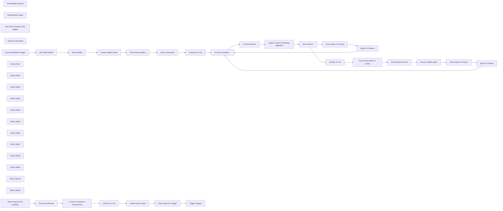

## Fluxo (.json) :

```json
{
  "meta": {
    "instanceId": "408f9fb9940c3cb18ffdef0e0150fe342d6e655c3a9fac21f0f644e8bedabcd9"
  },
  "nodes": [
    {
      "id": "0404384b-10b6-4666-84a4-8870db30c607",
      "name": "Embeddings OpenAI",
      "type": "@n8n/n8n-nodes-langchain.embeddingsOpenAi",
      "position": [
        1220,
        280
      ],
      "parameters": {
        "model": "text-embedding-3-small",
        "options": {}
      },
      "credentials": {
        "openAiApi": {
          "id": "8gccIjcuf3gvaoEr",
          "name": "OpenAi account"
        }
      },
      "typeVersion": 1
    },
    {
      "id": "a6741f04-5a5b-47a9-ac08-eb562f9f6052",
      "name": "Default Data Loader",
      "type": "@n8n/n8n-nodes-langchain.documentDefaultDataLoader",
      "position": [
        1340,
        280
      ],
      "parameters": {
        "options": {
          "metadata": {
            "metadataValues": [
              {
                "name": "question",
                "value": "={{ $json.question }}"
              },
              {
                "name": "participant",
                "value": "={{ $json.participant }}"
              },
              {
                "name": "survey",
                "value": "={{ $('Get Survey Results').params.documentId.cachedResultName }}"
              }
            ]
          }
        },
        "jsonData": "={{ $json.answer }}",
        "jsonMode": "expressionData"
      },
      "typeVersion": 1
    },
    {
      "id": "7663c3dd-f713-4034-bef6-0c000285f54f",
      "name": "Convert to Question Answer Pairs",
      "type": "n8n-nodes-base.set",
      "position": [
        720,
        160
      ],
      "parameters": {
        "options": {},
        "assignments": {
          "assignments": [
            {
              "id": "6b593ffb-ffbd-4cf5-a508-cd4f2a6d1004",
              "name": "data",
              "type": "array",
              "value": "={{\n  Object.keys($json)\n    .filter(key => !['row_number', 'Participant'].includes(key))\n  .map(key => ({ question: key, answer: $json[key], participant: $json.Participant }))\n}}"
            }
          ]
        }
      },
      "typeVersion": 3.4
    },
    {
      "id": "84873f0c-81ce-442f-a33c-d7c6c2efa11b",
      "name": "Recursive Character Text Splitter",
      "type": "@n8n/n8n-nodes-langchain.textSplitterRecursiveCharacterTextSplitter",
      "position": [
        1340,
        420
      ],
      "parameters": {
        "options": {}
      },
      "typeVersion": 1
    },
    {
      "id": "da9a8ee8-5e3f-49db-8d1f-26a61ca82344",
      "name": "Get Survey Results",
      "type": "n8n-nodes-base.googleSheets",
      "position": [
        540,
        160
      ],
      "parameters": {
        "options": {},
        "sheetName": {
          "__rl": true,
          "mode": "list",
          "value": "gid=0",
          "cachedResultUrl": "https://docs.google.com/spreadsheets/d/1-168Vm-1kCeHkqGLAs6odha4DhPE93njfHlYIviKE50/edit#gid=0",
          "cachedResultName": "Sheet1"
        },
        "documentId": {
          "__rl": true,
          "mode": "list",
          "value": "1-168Vm-1kCeHkqGLAs6odha4DhPE93njfHlYIviKE50",
          "cachedResultUrl": "https://docs.google.com/spreadsheets/d/1-168Vm-1kCeHkqGLAs6odha4DhPE93njfHlYIviKE50/edit?usp=drivesdk",
          "cachedResultName": "Remote Working Survey Responses"
        }
      },
      "credentials": {
        "googleSheetsOAuth2Api": {
          "id": "XHvC7jIRR8A2TlUl",
          "name": "Google Sheets account"
        }
      },
      "typeVersion": 4.4
    },
    {
      "id": "4bad90b2-eefe-49c8-8caa-41cd4cb5e60f",
      "name": "Get Survey Headers",
      "type": "n8n-nodes-base.googleSheets",
      "position": [
        740,
        940
      ],
      "parameters": {
        "options": {
          "dataLocationOnSheet": {
            "values": {
              "range": "A1:Z2",
              "rangeDefinition": "specifyRangeA1"
            }
          }
        },
        "sheetName": {
          "__rl": true,
          "mode": "id",
          "value": "={{ $('Execute Workflow Trigger').first().json.sheetName }}"
        },
        "documentId": {
          "__rl": true,
          "mode": "id",
          "value": "={{ $('Execute Workflow Trigger').first().json.sheetID }}"
        }
      },
      "credentials": {
        "googleSheetsOAuth2Api": {
          "id": "XHvC7jIRR8A2TlUl",
          "name": "Google Sheets account"
        }
      },
      "typeVersion": 4.4
    },
    {
      "id": "47c64994-9d1f-42ca-a849-3eeab5335b66",
      "name": "Extract Questions",
      "type": "n8n-nodes-base.set",
      "position": [
        940,
        940
      ],
      "parameters": {
        "options": {},
        "assignments": {
          "assignments": [
            {
              "id": "d655b165-dfa2-46cb-bc27-140399bc4227",
              "name": "question",
              "type": "array",
              "value": "={{\n  Object.keys($('Get Survey Headers').item.json)\n    .filter(key => key.includes('?'))\n}}"
            }
          ]
        }
      },
      "typeVersion": 3.4
    },
    {
      "id": "c237d523-b290-41ca-b323-4cc7c7f6ff37",
      "name": "Questions to List",
      "type": "n8n-nodes-base.splitOut",
      "position": [
        940,
        1120
      ],
      "parameters": {
        "options": {},
        "fieldToSplitOut": "question"
      },
      "typeVersion": 1
    },
    {
      "id": "7f44a770-4c5d-4404-ae95-d9dee8348380",
      "name": "Find All Answers",
      "type": "n8n-nodes-base.httpRequest",
      "position": [
        1460,
        1120
      ],
      "parameters": {
        "url": "=http://qdrant:6333/collections/{{ $('Set Variables').item.json.collectionName }}/points/scroll",
        "method": "POST",
        "options": {},
        "jsonBody": "={\n  \"limit\": 500,\n  \"filter\":{\n    \"must\": [\n      {\n        \"key\": \"metadata.question\",\n        \"match\": { \"value\": \"{{ $('For Each Question...').item.json.question }}\" }\n      },\n      {\n        \"key\": \"metadata.survey\",\n        \"match\": { \"value\": \"{{ $('Set Variables').item.json.surveyName }}\" }\n      }\n    ]\n  },\n  \"with_vector\":true\n}",
        "sendBody": true,
        "specifyBody": "json",
        "authentication": "predefinedCredentialType",
        "nodeCredentialType": "qdrantApi"
      },
      "credentials": {
        "qdrantApi": {
          "id": "NyinAS3Pgfik66w5",
          "name": "QdrantApi account"
        }
      },
      "typeVersion": 4.2
    },
    {
      "id": "2b6dc317-f8f3-4201-a9e1-d35ee578e79e",
      "name": "Get Payload of Points",
      "type": "n8n-nodes-base.httpRequest",
      "position": [
        2380,
        800
      ],
      "parameters": {
        "url": "=http://qdrant:6333/collections/{{ $('Set Variables').first().json.collectionName }}/points",
        "method": "POST",
        "options": {},
        "jsonBody": "={{\n  {\n    \"ids\": $json.points,\n    \"with_payload\": true\n  }\n}}",
        "sendBody": true,
        "specifyBody": "json",
        "authentication": "predefinedCredentialType",
        "nodeCredentialType": "qdrantApi"
      },
      "credentials": {
        "qdrantApi": {
          "id": "NyinAS3Pgfik66w5",
          "name": "QdrantApi account"
        }
      },
      "typeVersion": 4.2
    },
    {
      "id": "d4a37d97-975a-4243-a7ea-81b3e30558a5",
      "name": "Clusters To List",
      "type": "n8n-nodes-base.splitOut",
      "position": [
        2180,
        800
      ],
      "parameters": {
        "options": {},
        "fieldToSplitOut": "output"
      },
      "typeVersion": 1
    },
    {
      "id": "c78f1bf6-8390-48ee-88f4-7d1a893a8ade",
      "name": "Set Variables",
      "type": "n8n-nodes-base.set",
      "position": [
        200,
        1060
      ],
      "parameters": {
        "options": {},
        "assignments": {
          "assignments": [
            {
              "id": "b77c94a0-d865-4bd6-b078-a09b2ddb2a99",
              "name": "collectionName",
              "type": "string",
              "value": "ux_survey_insights"
            },
            {
              "id": "7b0a4d14-b5f9-4597-84c0-8cfdb363c3d3",
              "name": "surveyName",
              "type": "string",
              "value": "={{ $json.properties.title }}"
            },
            {
              "id": "45434b3b-3b74-4262-82e0-7ed02155caad",
              "name": "insightsSheetName",
              "type": "string",
              "value": "=Insights-{{ $now.format('yyyyMMdd') }}"
            }
          ]
        }
      },
      "typeVersion": 3.4
    },
    {
      "id": "fbb1f3c3-06ad-44b5-b020-6fc3c8eda7c4",
      "name": "OpenAI Chat Model",
      "type": "@n8n/n8n-nodes-langchain.lmChatOpenAi",
      "position": [
        2560,
        980
      ],
      "parameters": {
        "model": "gpt-4o-mini",
        "options": {}
      },
      "credentials": {
        "openAiApi": {
          "id": "8gccIjcuf3gvaoEr",
          "name": "OpenAi account"
        }
      },
      "typeVersion": 1
    },
    {
      "id": "83d3b413-a661-4c4c-9b8d-6ee395a15348",
      "name": "Prep Output For Export",
      "type": "n8n-nodes-base.set",
      "position": [
        3160,
        1300
      ],
      "parameters": {
        "mode": "raw",
        "options": {},
        "jsonOutput": "={{ {\n  ...$json.output,\n  \"Number of Response\": $('Get Payload of Points').item.json.result.length,\n  \"Participant IDs\": $('Get Payload of Points').item.json.result.map(item =>\n    item.payload.metadata.participant\n  ).join(','),\n  \"Raw Responses\": $('Get Payload of Points').item.json.result.map(item =>\n    `Participant ${item.payload.metadata.participant},${item.payload.content.replaceAll('\"', '\\\"')}`\n   ).join('\\n')\n} }}\n"
      },
      "typeVersion": 3.4
    },
    {
      "id": "14784dff-a8ea-4b6b-8379-b0c9051a8f98",
      "name": "Export To Sheets",
      "type": "n8n-nodes-base.googleSheets",
      "position": [
        3360,
        1300
      ],
      "parameters": {
        "columns": {
          "value": {},
          "schema": [
            {
              "id": "What is your name?",
              "type": "string",
              "display": true,
              "removed": false,
              "required": false,
              "displayName": "What is your name?",
              "defaultMatch": false,
              "canBeUsedToMatch": true
            },
            {
              "id": "The responses indicate that two participants have the same name, 'Kwame Nkosi', which suggests a commonality in names or cultural naming traditions among the respondents. This could highlight the importance of understanding cultural context in survey responses.",
              "type": "string",
              "display": true,
              "removed": false,
              "required": false,
              "displayName": "The responses indicate that two participants have the same name, 'Kwame Nkosi', which suggests a commonality in names or cultural naming traditions among the respondents. This could highlight the importance of understanding cultural context in survey responses.",
              "defaultMatch": false,
              "canBeUsedToMatch": true
            },
            {
              "id": "neutral",
              "type": "string",
              "display": true,
              "removed": false,
              "required": false,
              "displayName": "neutral",
              "defaultMatch": false,
              "canBeUsedToMatch": true
            },
            {
              "id": "3",
              "type": "string",
              "display": true,
              "removed": false,
              "required": false,
              "displayName": "3",
              "defaultMatch": false,
              "canBeUsedToMatch": true
            },
            {
              "id": "77,17,54",
              "type": "string",
              "display": true,
              "removed": false,
              "required": false,
              "displayName": "77,17,54",
              "defaultMatch": false,
              "canBeUsedToMatch": true
            },
            {
              "id": "Participant 77,Kwame Nkosi\nParticipant 17,Kwame Nkosi\nParticipant 54,Kwame Nkansah",
              "type": "string",
              "display": true,
              "removed": false,
              "required": false,
              "displayName": "Participant 77,Kwame Nkosi\nParticipant 17,Kwame Nkosi\nParticipant 54,Kwame Nkansah",
              "defaultMatch": false,
              "canBeUsedToMatch": true
            }
          ],
          "mappingMode": "autoMapInputData",
          "matchingColumns": []
        },
        "options": {},
        "operation": "append",
        "sheetName": {
          "__rl": true,
          "mode": "name",
          "value": "={{ $('Set Variables').first().json.insightsSheetName }}"
        },
        "documentId": {
          "__rl": true,
          "mode": "id",
          "value": "={{ $('Execute Workflow Trigger').first().json.sheetID }}"
        }
      },
      "credentials": {
        "googleSheetsOAuth2Api": {
          "id": "XHvC7jIRR8A2TlUl",
          "name": "Google Sheets account"
        }
      },
      "typeVersion": 4.4
    },
    {
      "id": "779b9411-db3e-44f3-ad2a-c9d40a70580d",
      "name": "Export To Sheets1",
      "type": "n8n-nodes-base.googleSheets",
      "position": [
        2360,
        1300
      ],
      "parameters": {
        "columns": {
          "value": {},
          "schema": [],
          "mappingMode": "autoMapInputData",
          "matchingColumns": []
        },
        "options": {},
        "operation": "append",
        "sheetName": {
          "__rl": true,
          "mode": "name",
          "value": "={{ $('Set Variables').first().json.insightsSheetName }}"
        },
        "documentId": {
          "__rl": true,
          "mode": "id",
          "value": "={{ $('Execute Workflow Trigger').first().json.sheetID }}"
        }
      },
      "credentials": {
        "googleSheetsOAuth2Api": {
          "id": "XHvC7jIRR8A2TlUl",
          "name": "Google Sheets account"
        }
      },
      "typeVersion": 4.4
    },
    {
      "id": "a31ab677-f57c-4b78-a290-d4a913ed4f8e",
      "name": "For Each Question...",
      "type": "n8n-nodes-base.splitInBatches",
      "position": [
        1280,
        940
      ],
      "parameters": {
        "options": {}
      },
      "typeVersion": 3
    },
    {
      "id": "dcfaf927-6ecd-4ebe-aee0-5fb3367b2725",
      "name": "Trigger Insights",
      "type": "n8n-nodes-base.executeWorkflow",
      "position": [
        1980,
        160
      ],
      "parameters": {
        "options": {},
        "workflowId": "={{ $workflow.id }}"
      },
      "typeVersion": 1
    },
    {
      "id": "2579adf0-9c00-4b87-b53e-740044577ab0",
      "name": "Prep Values For Trigger",
      "type": "n8n-nodes-base.set",
      "position": [
        1800,
        160
      ],
      "parameters": {
        "options": {},
        "assignments": {
          "assignments": [
            {
              "id": "24dd90ad-390f-444e-ba6c-8c06a41e836e",
              "name": "sheetID",
              "type": "string",
              "value": "={{ $('Get Survey Results').params.documentId.value }}"
            },
            {
              "id": "90199bbb-3938-411c-a7a8-faa7ccba6059",
              "name": "sheetName",
              "type": "string",
              "value": "={{ $('Get Survey Results').params.sheetName.value }}"
            }
          ]
        }
      },
      "executeOnce": true,
      "typeVersion": 3.4
    },
    {
      "id": "9b29e850-b9d0-4358-af62-92c20ab3b088",
      "name": "Execute Workflow Trigger",
      "type": "n8n-nodes-base.executeWorkflowTrigger",
      "position": [
        20,
        900
      ],
      "parameters": {},
      "typeVersion": 1
    },
    {
      "id": "70a0dcec-9f74-4af2-bd64-0ab762a77e51",
      "name": "Create Insights Sheet",
      "type": "n8n-nodes-base.googleSheets",
      "position": [
        420,
        900
      ],
      "parameters": {
        "title": "={{ $('Set Variables').first().json.insightsSheetName }}",
        "options": {},
        "operation": "create",
        "documentId": {
          "__rl": true,
          "mode": "id",
          "value": "={{ $('Execute Workflow Trigger').first().json.sheetID }}"
        }
      },
      "credentials": {
        "googleSheetsOAuth2Api": {
          "id": "XHvC7jIRR8A2TlUl",
          "name": "Google Sheets account"
        }
      },
      "typeVersion": 4.4,
      "alwaysOutputData": true
    },
    {
      "id": "f31400fb-dd7a-4c62-90ec-e9d78bbaa5e8",
      "name": "Prep Values For Export",
      "type": "n8n-nodes-base.set",
      "position": [
        2180,
        1300
      ],
      "parameters": {
        "mode": "raw",
        "options": {},
        "jsonOutput": "={\n  \"Question\": \"{{ $('For Each Question...').item.json.question }}\",\n  \"Insight\": \"No Insight Found\"\n}\n"
      },
      "typeVersion": 3.4
    },
    {
      "id": "506c20df-5109-422c-8c9e-0eb50fbd3ff9",
      "name": "Sticky Note",
      "type": "n8n-nodes-base.stickyNote",
      "position": [
        459.27570452141345,
        -42.168106366729035
      ],
      "parameters": {
        "color": 7,
        "width": 617.2130261221611,
        "height": 420.7389587470384,
        "content": "## Step 1. Import Survey Responses\n[Read more about Google Sheets](https://docs.n8n.io/integrations/builtin/app-nodes/n8n-nodes-base.googlesheets)\n\nOur approach requires to import all participant responses as vectors with metadata linking them to the questions being answered. To do this, we'll generate questiona and answer pairs from the survey."
      },
      "typeVersion": 1
    },
    {
      "id": "bddcafa8-6f54-4829-93c9-37bbb9e7edf3",
      "name": "QA Pairs to List",
      "type": "n8n-nodes-base.splitOut",
      "position": [
        900,
        160
      ],
      "parameters": {
        "options": {},
        "fieldToSplitOut": "data"
      },
      "typeVersion": 1
    },
    {
      "id": "8d6e6bf6-c94c-43cb-a29e-5d10207cb8bd",
      "name": "Sticky Note1",
      "type": "n8n-nodes-base.stickyNote",
      "position": [
        1100,
        -102.05898437632061
      ],
      "parameters": {
        "color": 7,
        "width": 563.8350682199533,
        "height": 678.1641960508446,
        "content": "## Step 2. Vectorize Each Response Into Qdrant\n[Read more about using Qdrant](https://docs.n8n.io/integrations/builtin/cluster-nodes/root-nodes/n8n-nodes-langchain.vectorstoreqdrant)\n\nSpecial attention is given to how metadata is captured as it becomes key to this workflow is being able to retrieve subsets of the data for analysis."
      },
      "typeVersion": 1
    },
    {
      "id": "613d4a32-a87a-423e-a1d1-ee23db0de6d1",
      "name": "Sticky Note2",
      "type": "n8n-nodes-base.stickyNote",
      "position": [
        1680,
        -30.440883940004255
      ],
      "parameters": {
        "color": 7,
        "width": 519.6419932444072,
        "height": 429.11782776909047,
        "content": "## Step 3. Trigger Insights SubWorkflow\n[Learn more about Workflow Triggers](https://docs.n8n.io/integrations/builtin/core-nodes/n8n-nodes-base.executeworkflow)\n\nA subworkflow is used to trigger the analysis for the survey. This separation is optional but used here to better demonstrate the two part process."
      },
      "typeVersion": 1
    },
    {
      "id": "1e858e4a-b91b-4411-8e2a-6eb76647b796",
      "name": "Sticky Note3",
      "type": "n8n-nodes-base.stickyNote",
      "position": [
        -57.47778952966382,
        710.393394209128
      ],
      "parameters": {
        "color": 7,
        "width": 668.3083616841852,
        "height": 528.2386658883073,
        "content": "## Step 4. Create Insights Sheet\n[Learn more about Workflow Triggers](https://docs.n8n.io/integrations/builtin/core-nodes/n8n-nodes-base.executeworkflowtrigger)\n\nTo capture the generated insights, we'll create a new unique sheet within the survey spreadsheet. This is optional and you may want to capture in other datastores depending on your needs."
      },
      "typeVersion": 1
    },
    {
      "id": "9170c566-07d3-49dc-aafb-2dbe79940d2c",
      "name": "Sticky Note4",
      "type": "n8n-nodes-base.stickyNote",
      "position": [
        640,
        683.5153164275844
      ],
      "parameters": {
        "color": 7,
        "width": 536.9288458983389,
        "height": 622.1362463986454,
        "content": "## Step 5. Get List Of Questions From Survey\n[Read more about using Google Sheets](https://docs.n8n.io/integrations/builtin/app-nodes/n8n-nodes-base.googlesheets)\n\nNext we'll fetch the survey for metadata and questions, splitting them into separate workflow items. Our intention is to process each question end-to-end before moving to the next. This approach is a little \"safer\" in the scenario where an interruption occurs we won't lose all our work."
      },
      "typeVersion": 1
    },
    {
      "id": "8488df77-055d-41cc-94f1-92ac5d54ef10",
      "name": "Sticky Note5",
      "type": "n8n-nodes-base.stickyNote",
      "position": [
        1200,
        673.291535602609
      ],
      "parameters": {
        "color": 7,
        "width": 823.147012265536,
        "height": 868.2579789328703,
        "content": "## Step 6. Find Groups of Similar Answers For Each Question\n[Learn more about using the Code Node](https://docs.n8n.io/integrations/builtin/core-nodes/n8n-nodes-base.code/)\n\nGiving all the responses to an LLM to analyse is the common but naive approach; the summarisation is usually too high level for real insights and loses a lot of detail such as the number and identity of respondants. What we want to do instead is find and group popular answers for each question to ensure all perspectives are considered.\n\nOur approach does this by mapping our answer vectors to a 2D grid and then identifying where the vector points are \"clustered\"; where a group of points are within close proximity to each other."
      },
      "typeVersion": 1
    },
    {
      "id": "f4748b6d-5bd8-48cf-942f-3a0dc681078d",
      "name": "Sticky Note6",
      "type": "n8n-nodes-base.stickyNote",
      "position": [
        2060,
        1180
      ],
      "parameters": {
        "color": 7,
        "width": 536.9288458983389,
        "height": 359.90385684071794,
        "content": "## Step 7b. Skip If No Clusters Found\nWhere no clusters were found, it means the answers were unique enough to not show any pattern. eg. \"What's you name?\""
      },
      "typeVersion": 1
    },
    {
      "id": "d55d6a47-da8c-46ae-bd10-0eb671dcd121",
      "name": "Sticky Note7",
      "type": "n8n-nodes-base.stickyNote",
      "position": [
        2060,
        611.6915003841909
      ],
      "parameters": {
        "color": 7,
        "width": 871.451300407926,
        "height": 541.1135860445843,
        "content": "## Step 7a. Summarise the Top Groups of Similar Answers\n[Read more about using the Information Extractor Node](https://docs.n8n.io/integrations/builtin/cluster-nodes/root-nodes/n8n-nodes-langchain.information-extractor)\n\nEach discovered cluster will return a reference vector which is used to fetch all related answers in the group.\nThe group is then sent to the LLM to summarise as well as assign a sentiment score."
      },
      "typeVersion": 1
    },
    {
      "id": "e5d5f88f-5832-43fc-a5b9-f747d08e7e77",
      "name": "Sticky Note8",
      "type": "n8n-nodes-base.stickyNote",
      "position": [
        2620,
        1180
      ],
      "parameters": {
        "color": 7,
        "width": 924.2798021207429,
        "height": 363.07347551845976,
        "content": "## Step 8. Write To Insights Sheet\nFinally, our completed insights to appended to\nthe Insights Sheet we created earlier in the workflow."
      },
      "typeVersion": 1
    },
    {
      "id": "49ac1504-7b43-4fa1-b4ce-15c7a53c9018",
      "name": "Sticky Note9",
      "type": "n8n-nodes-base.stickyNote",
      "position": [
        460,
        400
      ],
      "parameters": {
        "color": 5,
        "width": 323.2987132716669,
        "height": 80,
        "content": "### Run this once! \nIf for any reason you need to run more than once, be sure to clear the existing data first."
      },
      "typeVersion": 1
    },
    {
      "id": "450f89c5-ef0f-4bf8-8db9-6347247c7f4d",
      "name": "Has Clusters?",
      "type": "n8n-nodes-base.if",
      "position": [
        1820,
        1120
      ],
      "parameters": {
        "options": {},
        "conditions": {
          "options": {
            "leftValue": "",
            "caseSensitive": true,
            "typeValidation": "strict"
          },
          "combinator": "and",
          "conditions": [
            {
              "id": "40b6bb62-a2d6-4422-8fbb-7ae49898bad9",
              "operator": {
                "type": "array",
                "operation": "notEmpty",
                "singleValue": true
              },
              "leftValue": "={{ $json.output }}",
              "rightValue": ""
            }
          ]
        }
      },
      "typeVersion": 2
    },
    {
      "id": "1652a108-8fb8-4229-a76d-abf9fbcff626",
      "name": "Sticky Note10",
      "type": "n8n-nodes-base.stickyNote",
      "position": [
        20,
        -400
      ],
      "parameters": {
        "width": 400.381109509268,
        "height": 679.5610243514676,
        "content": "## Try It Out!\n\n### This workflow generates highly-detailed insights from survey responses. Works best when dealing with a large number of participants.\n\n* Import survey responses and vectorise in Qdrant vectorstore.\n* Identify clusters of popular responses to questions using K-means clustering algorithm. \n* Each valid cluster is analysed and summarised by LLM.\n* Export LLM response and cluster results back into sheet.\n\nCheck out the reference google sheet here: https://docs.google.com/spreadsheets/d/e/2PACX-1vT6m8XH8JWJTUAfwojc68NAUGC7q0lO7iV738J7aO5fuVjiVzdTRRPkMmT1C4N8TwejaiT0XrmF1Q48/pubhtml\n\n### Need Help?\nJoin the [Discord](https://discord.com/invite/XPKeKXeB7d) or ask in the [Forum](https://community.n8n.io/)!\n\nHappy Hacking!"
      },
      "typeVersion": 1
    },
    {
      "id": "6eef981e-b2ce-433c-b71f-78be64812a56",
      "name": "Sticky Note11",
      "type": "n8n-nodes-base.stickyNote",
      "position": [
        1260,
        1340
      ],
      "parameters": {
        "color": 5,
        "width": 323.2987132716669,
        "height": 110.05160146874424,
        "content": "### First Time Running?\nThere is a slight delay on first run because the code node has to download the required packages."
      },
      "typeVersion": 1
    },
    {
      "id": "fa0c14be-03f4-4ed2-bd60-e93817382ded",
      "name": "When clicking ‘Test workflow’",
      "type": "n8n-nodes-base.manualTrigger",
      "position": [
        240,
        100
      ],
      "parameters": {},
      "typeVersion": 1
    },
    {
      "id": "30323019-59ba-4a19-a46e-196d469f097d",
      "name": "Get Sheet Details",
      "type": "n8n-nodes-base.httpRequest",
      "position": [
        200,
        900
      ],
      "parameters": {
        "url": "=https://sheets.googleapis.com/v4/spreadsheets/{{ $json.sheetID }}",
        "options": {},
        "authentication": "predefinedCredentialType",
        "nodeCredentialType": "googleSheetsOAuth2Api"
      },
      "credentials": {
        "googleSheetsOAuth2Api": {
          "id": "XHvC7jIRR8A2TlUl",
          "name": "Google Sheets account"
        }
      },
      "typeVersion": 4.2
    },
    {
      "id": "6ced8012-1dd3-4da3-8c27-e4f4dfc959f6",
      "name": "Only Clusters With 3+ points",
      "type": "n8n-nodes-base.filter",
      "position": [
        2180,
        960
      ],
      "parameters": {
        "options": {},
        "conditions": {
          "options": {
            "leftValue": "",
            "caseSensitive": true,
            "typeValidation": "strict"
          },
          "combinator": "and",
          "conditions": [
            {
              "id": "328f806c-0792-4d90-9bee-a1e10049e78f",
              "operator": {
                "type": "array",
                "operation": "lengthGt",
                "rightType": "number"
              },
              "leftValue": "={{ $json.points }}",
              "rightValue": 2
            }
          ]
        }
      },
      "typeVersion": 2
    },
    {
      "id": "8ae81a55-75e2-40a3-bef6-0935ff08128f",
      "name": "Apply K-means Clustering Algorithm",
      "type": "n8n-nodes-base.code",
      "position": [
        1640,
        1120
      ],
      "parameters": {
        "language": "python",
        "pythonCode": "import numpy as np\nfrom sklearn.cluster import KMeans\n\n# get vectors for all answers\npoint_ids = [item.id for item in _input.first().json.result.points]\nvectors = [item.vector.to_py() for item in _input.first().json.result.points]\nvectors_array = np.array(vectors)\n\n# apply k-means clustering where n_clusters = 10\n# this is a max and we'll discard some of these clusters later\nkmeans = KMeans(n_clusters=min(len(vectors), 10), random_state=42).fit(vectors_array)\nlabels = kmeans.labels_\nunique_labels = set(labels)\n\n# Extract and print points in each cluster\nclusters = {}\nfor label in set(labels):\n    clusters[label] = vectors_array[labels == label]\n\n# return Qdrant point ids for each cluster\n# we'll use these ids to fetch the payloads from the vector store.\noutput = []\nfor cluster_id, cluster_points in clusters.items():\n    points = [point_ids[i] for i in range(len(labels)) if labels[i] == cluster_id]\n    output.append({\n        \"id\": f\"Cluster {cluster_id}\",\n        \"total\": len(cluster_points),\n        \"points\": points\n    })\n\nreturn {\"json\": {\"output\": output } }"
      },
      "typeVersion": 2
    },
    {
      "id": "cbb42384-d46b-471f-a7d8-27e3de042492",
      "name": "Qdrant Vector Store",
      "type": "@n8n/n8n-nodes-langchain.vectorStoreQdrant",
      "position": [
        1220,
        100
      ],
      "parameters": {
        "mode": "insert",
        "options": {},
        "qdrantCollection": {
          "__rl": true,
          "mode": "list",
          "value": "ux_survey_insights",
          "cachedResultName": "ux_survey_insights"
        }
      },
      "credentials": {
        "qdrantApi": {
          "id": "NyinAS3Pgfik66w5",
          "name": "QdrantApi account"
        }
      },
      "typeVersion": 1
    },
    {
      "id": "17584901-15d6-421f-ad69-3ba872276055",
      "name": "Survey Insights Agent",
      "type": "@n8n/n8n-nodes-langchain.informationExtractor",
      "position": [
        2580,
        800
      ],
      "parameters": {
        "text": "=The {{ $json.result.length }} participant responses were:\n{{\n$json.result.map(item =>\n`* Participant ${item.payload.metadata.participant}: \"${item.payload.content.replaceAll('\"', '\\\"')}\"`\n).join('\\n')\n}}",
        "options": {
          "systemPromptTemplate": "=You help summarise a selection of participant responses to a specific question for a survey called \"{{ $json.result[0].payload.metadata.survey }}\".\nThe question asked was \"{{ $json.result[0].payload.metadata.question }}\".\nThe {{ $json.result.length }} participant responses were selected because their answers were similar in context.\n\nYour task is to: \n* summarise the given participant responses into a short paragraph. Provide an insight from this summary and what we could learn from the answers.\n* determine if the overall sentiment of all the listed responses to be either negative, mildy negative, neutral, mildy positive or positive."
        },
        "schemaType": "fromJson",
        "jsonSchemaExample": "{\n\t\"Question\": \"What do you enjoy most about working remotely, and why?\",\n\t\"Insight\": \"\",\n    \"Sentiment\": \"Positive\"\n}"
      },
      "typeVersion": 1
    }
  ],
  "pinData": {},
  "connections": {
    "Has Clusters?": {
      "main": [
        [
          {
            "node": "Clusters To List",
            "type": "main",
            "index": 0
          }
        ],
        [
          {
            "node": "Prep Values For Export",
            "type": "main",
            "index": 0
          }
        ]
      ]
    },
    "Set Variables": {
      "main": [
        [
          {
            "node": "Create Insights Sheet",
            "type": "main",
            "index": 0
          }
        ]
      ]
    },
    "Clusters To List": {
      "main": [
        [
          {
            "node": "Only Clusters With 3+ points",
            "type": "main",
            "index": 0
          }
        ]
      ]
    },
    "Export To Sheets": {
      "main": [
        [
          {
            "node": "For Each Question...",
            "type": "main",
            "index": 0
          }
        ]
      ]
    },
    "Find All Answers": {
      "main": [
        [
          {
            "node": "Apply K-means Clustering Algorithm",
            "type": "main",
            "index": 0
          }
        ]
      ]
    },
    "QA Pairs to List": {
      "main": [
        [
          {
            "node": "Qdrant Vector Store",
            "type": "main",
            "index": 0
          }
        ]
      ]
    },
    "Embeddings OpenAI": {
      "ai_embedding": [
        [
          {
            "node": "Qdrant Vector Store",
            "type": "ai_embedding",
            "index": 0
          }
        ]
      ]
    },
    "Export To Sheets1": {
      "main": [
        [
          {
            "node": "For Each Question...",
            "type": "main",
            "index": 0
          }
        ]
      ]
    },
    "Extract Questions": {
      "main": [
        [
          {
            "node": "Questions to List",
            "type": "main",
            "index": 0
          }
        ]
      ]
    },
    "Get Sheet Details": {
      "main": [
        [
          {
            "node": "Set Variables",
            "type": "main",
            "index": 0
          }
        ]
      ]
    },
    "OpenAI Chat Model": {
      "ai_languageModel": [
        [
          {
            "node": "Survey Insights Agent",
            "type": "ai_languageModel",
            "index": 0
          }
        ]
      ]
    },
    "Questions to List": {
      "main": [
        [
          {
            "node": "For Each Question...",
            "type": "main",
            "index": 0
          }
        ]
      ]
    },
    "Get Survey Headers": {
      "main": [
        [
          {
            "node": "Extract Questions",
            "type": "main",
            "index": 0
          }
        ]
      ]
    },
    "Get Survey Results": {
      "main": [
        [
          {
            "node": "Convert to Question Answer Pairs",
            "type": "main",
            "index": 0
          }
        ]
      ]
    },
    "Default Data Loader": {
      "ai_document": [
        [
          {
            "node": "Qdrant Vector Store",
            "type": "ai_document",
            "index": 0
          }
        ]
      ]
    },
    "Qdrant Vector Store": {
      "main": [
        [
          {
            "node": "Prep Values For Trigger",
            "type": "main",
            "index": 0
          }
        ]
      ]
    },
    "For Each Question...": {
      "main": [
        null,
        [
          {
            "node": "Find All Answers",
            "type": "main",
            "index": 0
          }
        ]
      ]
    },
    "Create Insights Sheet": {
      "main": [
        [
          {
            "node": "Get Survey Headers",
            "type": "main",
            "index": 0
          }
        ]
      ]
    },
    "Get Payload of Points": {
      "main": [
        [
          {
            "node": "Survey Insights Agent",
            "type": "main",
            "index": 0
          }
        ]
      ]
    },
    "Survey Insights Agent": {
      "main": [
        [
          {
            "node": "Prep Output For Export",
            "type": "main",
            "index": 0
          }
        ]
      ]
    },
    "Prep Output For Export": {
      "main": [
        [
          {
            "node": "Export To Sheets",
            "type": "main",
            "index": 0
          }
        ]
      ]
    },
    "Prep Values For Export": {
      "main": [
        [
          {
            "node": "Export To Sheets1",
            "type": "main",
            "index": 0
          }
        ]
      ]
    },
    "Prep Values For Trigger": {
      "main": [
        [
          {
            "node": "Trigger Insights",
            "type": "main",
            "index": 0
          }
        ]
      ]
    },
    "Execute Workflow Trigger": {
      "main": [
        [
          {
            "node": "Get Sheet Details",
            "type": "main",
            "index": 0
          }
        ]
      ]
    },
    "Only Clusters With 3+ points": {
      "main": [
        [
          {
            "node": "Get Payload of Points",
            "type": "main",
            "index": 0
          }
        ]
      ]
    },
    "Convert to Question Answer Pairs": {
      "main": [
        [
          {
            "node": "QA Pairs to List",
            "type": "main",
            "index": 0
          }
        ]
      ]
    },
    "Recursive Character Text Splitter": {
      "ai_textSplitter": [
        [
          {
            "node": "Default Data Loader",
            "type": "ai_textSplitter",
            "index": 0
          }
        ]
      ]
    },
    "When clicking ‘Test workflow’": {
      "main": [
        [
          {
            "node": "Get Survey Results",
            "type": "main",
            "index": 0
          }
        ]
      ]
    },
    "Apply K-means Clustering Algorithm": {
      "main": [
        [
          {
            "node": "Has Clusters?",
            "type": "main",
            "index": 0
          }
        ]
      ]
    }
  }
}
```

<a id="template-2539"></a>

## Template 2539 - Salvar faturas Paddle automaticamente

- **Nome:** Salvar faturas Paddle automaticamente
- **Descrição:** Automação que detecta e processa e-mails de fatura enviados pelo Paddle, converte o link da fatura em PDF e armazena o arquivo em uma pasta específica no Google Drive.
- **Funcionalidade:** • Monitoramento de e-mail: Verifica continuamente a caixa de entrada para novas mensagens.
• Filtragem de remetente e assunto: Processa somente e-mails vindos de help@paddle.com com assunto contendo "Your invoice".
• Extração de links: Extrai todos os links (a-tags) presentes no conteúdo HTML do e-mail.
• Seleção do link de recibo: Filtra os links para manter apenas aqueles que contenham "/receipt/" no caminho.
• Conversão em PDF via API: Envia o link da fatura para um serviço de conversão (pdflayer) para gerar o PDF da fatura usando uma chave de API configurada.
• Upload do PDF: Faz upload do PDF gerado para o Google Drive como arquivo binário.
• Renomear e mover arquivo: Atualiza o nome do arquivo com data e o move para a pasta de destino especificada pelo usuário.
• Tratamento de e-mails não relevantes: Não realiza ações adicionais para e-mails que não correspondam aos critérios de fatura.
- **Ferramentas:** • Gmail: Fonte dos e-mails de fatura e gatilho inicial para o fluxo.
• Paddle: Serviço/emissor das faturas (contém os links para os recibos).
• pdflayer (api.pdflayer.com): Serviço de conversão de URL HTML para PDF usado para gerar o arquivo da fatura.
• Google Drive: Armazenamento final dos PDFs; arquivos são enviados, renomeados e movidos para a pasta desejada.

## Fluxo visual

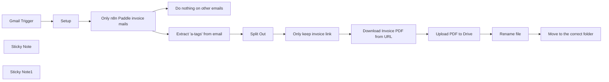

## Fluxo (.json) :

```json
{
  "meta": {
    "instanceId": "cb484ba7b742928a2048bf8829668bed5b5ad9787579adea888f05980292a4a7"
  },
  "nodes": [
    {
      "id": "3102dc76-7123-4e87-b30f-e15c240e77da",
      "name": "Gmail Trigger",
      "type": "n8n-nodes-base.gmailTrigger",
      "position": [
        0,
        0
      ],
      "parameters": {
        "simple": false,
        "filters": {},
        "options": {},
        "pollTimes": {
          "item": [
            {
              "mode": "everyMinute"
            }
          ]
        }
      },
      "credentials": {
        "gmailOAuth2": {
          "id": "H4Vkp5Iwb0wrQOR6",
          "name": "Nik's gmail"
        }
      },
      "typeVersion": 1.1
    },
    {
      "id": "1e4a55e5-289e-4d67-a161-9109bd430e75",
      "name": "Only n8n Paddle invoice mails",
      "type": "n8n-nodes-base.if",
      "position": [
        420,
        0
      ],
      "parameters": {
        "options": {},
        "conditions": {
          "options": {
            "leftValue": "",
            "caseSensitive": true,
            "typeValidation": "strict"
          },
          "combinator": "and",
          "conditions": [
            {
              "id": "229200d1-ec13-4970-ae0e-2c8e17da0bdf",
              "operator": {
                "type": "string",
                "operation": "equals"
              },
              "leftValue": "={{ $json.from.value[0].address }}",
              "rightValue": "help@paddle.com"
            },
            {
              "id": "1830d49a-5ee0-472c-bb9d-0090c0e1f5a4",
              "operator": {
                "type": "string",
                "operation": "contains"
              },
              "leftValue": "={{ $json.subject }}",
              "rightValue": "Your invoice"
            }
          ]
        }
      },
      "typeVersion": 2.1
    },
    {
      "id": "a87ed337-a582-44ed-9185-ea0dd9486245",
      "name": "Split Out",
      "type": "n8n-nodes-base.splitOut",
      "position": [
        820,
        -120
      ],
      "parameters": {
        "options": {},
        "fieldToSplitOut": "link"
      },
      "typeVersion": 1
    },
    {
      "id": "3a4dd56b-3177-4364-ac48-ce9e475b773f",
      "name": "Only keep invoice link",
      "type": "n8n-nodes-base.filter",
      "position": [
        1000,
        -120
      ],
      "parameters": {
        "options": {},
        "conditions": {
          "options": {
            "leftValue": "",
            "caseSensitive": true,
            "typeValidation": "strict"
          },
          "combinator": "and",
          "conditions": [
            {
              "id": "d8a78835-46bd-40c0-b9ef-c1a631ab0a00",
              "operator": {
                "type": "string",
                "operation": "contains"
              },
              "leftValue": "={{ $json.link }}",
              "rightValue": "/receipt/"
            }
          ]
        }
      },
      "typeVersion": 2.1
    },
    {
      "id": "2da9e7c0-8954-442a-a33c-a942cd634b27",
      "name": "Do nothing on other emails",
      "type": "n8n-nodes-base.noOp",
      "position": [
        640,
        80
      ],
      "parameters": {},
      "typeVersion": 1
    },
    {
      "id": "dd837661-97af-4abc-8b44-a10931cda54c",
      "name": "Sticky Note",
      "type": "n8n-nodes-base.stickyNote",
      "position": [
        160,
        -280
      ],
      "parameters": {
        "height": 440,
        "content": "## Setup\n1. Setup your **Gmail** and **Google Drive** credentials\n1. Create a free account at https://pdflayer.com/\n2. Insert your **pdflayer** API key into the `Setup` node\n3. Insert the URL to the wanted drive folder into the setup node (make sure to remove everything after the `?`)"
      },
      "typeVersion": 1
    },
    {
      "id": "8de9b630-0a5f-4d2c-ac7f-e3264314a97c",
      "name": "Setup",
      "type": "n8n-nodes-base.set",
      "position": [
        220,
        0
      ],
      "parameters": {
        "options": {},
        "assignments": {
          "assignments": [
            {
              "id": "86a22cf3-262a-4089-88ab-fafc01307bb4",
              "name": "api_key",
              "type": "string",
              "value": "{{ your_key_here }}"
            },
            {
              "id": "4cca07a2-6a70-4011-a025-65246e652fb9",
              "name": "url_to_drive_folder",
              "type": "string",
              "value": "{{ folder_URL }}"
            }
          ]
        },
        "includeOtherFields": true
      },
      "typeVersion": 3.4
    },
    {
      "id": "b06860a4-3895-4a28-9365-71c31f220d10",
      "name": "Download Invoice PDF from URL",
      "type": "n8n-nodes-base.httpRequest",
      "position": [
        1200,
        -120
      ],
      "parameters": {
        "url": "http://api.pdflayer.com/api/convert",
        "options": {},
        "sendQuery": true,
        "queryParameters": {
          "parameters": [
            {
              "name": "access_key",
              "value": "={{ $('Setup').first().json.api_key }}"
            },
            {
              "name": "document_url",
              "value": "={{ $json.link }}"
            },
            {
              "name": "page_size",
              "value": "A4"
            }
          ]
        }
      },
      "typeVersion": 4.2,
      "alwaysOutputData": true
    },
    {
      "id": "c2be351e-76ce-4bfa-8965-e41d59a6c49a",
      "name": "Rename file",
      "type": "n8n-nodes-base.googleDrive",
      "position": [
        1580,
        -120
      ],
      "parameters": {
        "fileId": {
          "__rl": true,
          "mode": "id",
          "value": "={{ $json.id }}"
        },
        "options": {},
        "operation": "update",
        "newUpdatedFileName": "=n8n_cloud_invoice_{{ $now.format('yyyy-MM-dd') }}.pdf"
      },
      "credentials": {
        "googleDriveOAuth2Api": {
          "id": "jMxk7HGWZs6ucm5P",
          "name": "Nik's Google Drive"
        }
      },
      "typeVersion": 3
    },
    {
      "id": "20b90e38-dd17-462c-8007-e83dcc2dc8df",
      "name": "Move to the correct folder",
      "type": "n8n-nodes-base.googleDrive",
      "position": [
        1760,
        -120
      ],
      "parameters": {
        "fileId": {
          "__rl": true,
          "mode": "id",
          "value": "={{ $json.id }}"
        },
        "driveId": {
          "__rl": true,
          "mode": "list",
          "value": "My Drive"
        },
        "folderId": {
          "__rl": true,
          "mode": "url",
          "value": "={{ $('Setup').item.json.url_to_drive_folder }}"
        },
        "operation": "move"
      },
      "credentials": {
        "googleDriveOAuth2Api": {
          "id": "jMxk7HGWZs6ucm5P",
          "name": "Nik's Google Drive"
        }
      },
      "typeVersion": 3
    },
    {
      "id": "5c2930eb-90f8-4f4f-ae6a-638a01faccd3",
      "name": "Upload PDF to Drive",
      "type": "n8n-nodes-base.httpRequest",
      "position": [
        1400,
        -120
      ],
      "parameters": {
        "url": "https://www.googleapis.com/upload/drive/v3/files",
        "method": "POST",
        "options": {},
        "sendBody": true,
        "sendQuery": true,
        "contentType": "binaryData",
        "authentication": "predefinedCredentialType",
        "queryParameters": {
          "parameters": [
            {
              "name": "uploadType",
              "value": "media"
            }
          ]
        },
        "inputDataFieldName": "data",
        "nodeCredentialType": "googleDriveOAuth2Api"
      },
      "credentials": {
        "googleDriveOAuth2Api": {
          "id": "jMxk7HGWZs6ucm5P",
          "name": "Nik's Google Drive"
        }
      },
      "typeVersion": 4.2
    },
    {
      "id": "1806abe4-d80e-4ab8-8303-6b92d569aac5",
      "name": "Sticky Note1",
      "type": "n8n-nodes-base.stickyNote",
      "position": [
        1353.6776457357505,
        -255.65646735405625
      ],
      "parameters": {
        "color": 7,
        "width": 608.5129596994967,
        "height": 306.2353014680544,
        "content": "## Adjust me\nYou can adjust this part and save the file wherever you want. E.g. you could save it in your local file system by using the `Read/Write Files from Disk` node or save it in Dropbox by using the `Dropbox` node. You could even email the PDF to the right person instead."
      },
      "typeVersion": 1
    },
    {
      "id": "efa55724-3b42-4abd-a30a-ad7e9836ede5",
      "name": "Extract \"a-tags\" from email",
      "type": "n8n-nodes-base.html",
      "position": [
        640,
        -120
      ],
      "parameters": {
        "options": {},
        "operation": "extractHtmlContent",
        "dataPropertyName": "html",
        "extractionValues": {
          "values": [
            {
              "key": "link",
              "attribute": "href",
              "cssSelector": "a",
              "returnArray": true,
              "returnValue": "attribute"
            }
          ]
        }
      },
      "typeVersion": 1.2
    }
  ],
  "pinData": {
    "Gmail Trigger": [
      {
        "id": "19198ee012d8f882",
        "to": {
          "html": "<span class=\"mp_address_group\"><span class=\"mp_address_name\">Niklas Hatje</span> &lt;<a href=\"mailto:niklas@n8n.io\" class=\"mp_address_email\">niklas@n8n.io</a>&gt;</span>",
          "text": "\"Niklas Hatje\" <niklas@n8n.io>",
          "value": [
            {
              "name": "Niklas Hatje",
              "address": "niklas@n8n.io"
            }
          ]
        },
        "date": "2024-08-28T12:20:20.000Z",
        "from": {
          "html": "<span class=\"mp_address_group\"><span class=\"mp_address_name\">Niklas Hatje</span> &lt;<a href=\"mailto:niklas@n8n.io\" class=\"mp_address_email\">niklas@n8n.io</a>&gt;</span>",
          "text": "\"Niklas Hatje\" <niklas@n8n.io>",
          "value": [
            {
              "name": "Niklas Hatje",
              "address": "help@paddle.com"
            }
          ]
        },
        "html": "<div dir=\"ltr\"><br><br><div class=\"gmail_quote\"><div dir=\"ltr\" class=\"gmail_attr\">---------- Forwarded message ---------<br>From: <strong class=\"gmail_sendername\" dir=\"auto\">n8n Sandbox (via Paddle.com)</strong> <span dir=\"auto\">&lt;<a href=\"mailto:help@paddle.com\">help@paddle.com</a>&gt;</span><br>Date: Thu, Oct 12, 2023 at 3:30 AM<br>Subject: Your invoice<br>To:  &lt;<a href=\"mailto:niklas%2B12may2023@n8n.io\">niklas+12may2023@n8n.io</a>&gt;<br></div><br><br><div class=\"msg940821289515909318\">\n        \n        \n  \n        \n        \n        \n        \n      \n      \n      \n      <div style=\"letter-spacing:0;background-color:#f5f5f8;margin:0;padding:0;font-family:Lato,Helvetica,Roboto,sans-serif\"><center style=\"margin:0\">\n    <table cellspacing=\"0\" cellpadding=\"0\" width=\"100%\" style=\"max-width:600px;font-family:&#39;Lato&#39;,&#39;Helvetica&#39;,&#39;Roboto&#39;,sans-serif\">\n        <tbody><tr>\n            <td height=\"100%\" width=\"100%\" style=\"padding:0\">\n                <table cellpadding=\"0\" cellspacing=\"0\" width=\"100%\" style=\"margin-top:0\">\n                    <tbody><tr>\n                        <td height=\"30\" class=\"m_940821289515909318mJJIf\" style=\"height:30px\"></td>\n                    </tr>\n                </tbody></table>\n                <center style=\"margin:0\">\n                    <table cellspacing=\"0\" cellpadding=\"0\" width=\"100%\" style=\"max-width:600px;font-family:&#39;Lato&#39;,&#39;Helvetica&#39;,&#39;Roboto&#39;,sans-serif\">\n                        <tbody><tr>\n                            <td height=\"100%\" width=\"100%\" style=\"padding:0\">\n                                <table cellpadding=\"0\" cellspacing=\"0\" width=\"100%\" style=\"margin:0;border-top:0;border-radius:0;background-color:#ffffff\" bgcolor=\"#FFFFFF\">\n                                    <tbody><tr>\n                                        <td align=\"center\" valign=\"top\">\n                                            <table cellspacing=\"0\" cellpadding=\"0\" width=\"100%\" style=\"font-family:&#39;Lato&#39;,&#39;Helvetica&#39;,&#39;Roboto&#39;,sans-serif\">\n                                                <tbody><tr>\n                                                    <td style=\"padding:50px\" class=\"m_940821289515909318dsRHJY\">\n                                                        <table style=\"max-width:none;font-family:&#39;Lato&#39;,&#39;Helvetica&#39;,&#39;Roboto&#39;,sans-serif\" cellspacing=\"0\" cellpadding=\"0\" width=\"100%\">\n                                                            <tbody><tr>\n                                                                <td align=\"center\" style=\"text-align:left\">\n                                                                    <div>\n                                                                        \n                                                                    </div>\n                                                                    <h3 style=\"font-weight:900;font-size:24px;line-height:32px;margin-bottom:12px;text-align:center;color:#45567c;font-family:Lato,Helvetica,Roboto,sans-serif\">Beleg für Ihr Cloud Pro-1-Abonnement</h3>\n                                                                    <p style=\"font-size:14px;font-weight:500;line-height:24px;margin-bottom:24px;text-align:center;margin-top:0;margin-right:0;margin-left:0;color:#73809c;font-family:Lato,Helvetica,Roboto,sans-serif\">Beleg Nr. 624743-6710887</p>\n                                                                    <table cellspacing=\"0\" cellpadding=\"0\" width=\"100%\" style=\"font-family:&#39;Lato&#39;,&#39;Helvetica&#39;,&#39;Roboto&#39;,sans-serif\">\n                                                                        <tbody><tr style=\"font-family:&#39;Lato&#39;,&#39;Helvetica&#39;,&#39;Roboto&#39;,sans-serif\">\n                                                                            <td class=\"m_940821289515909318ecARAV\" style=\"vertical-align:top;font-family:&#39;Lato&#39;,&#39;Helvetica&#39;,&#39;Roboto&#39;,sans-serif\" valign=\"top\">\n                                                                                <p style=\"font-size:12px;font-weight:500;line-height:24px;margin-bottom:0;margin-top:0;margin-right:0;margin-left:0;color:#45567c;font-family:Lato,Helvetica,Roboto,sans-serif\">Betrag</p>\n                                                                                <p style=\"font-size:14px;font-weight:900;line-height:24px;margin-bottom:4px;margin-top:0;margin-right:0;margin-left:0;color:#45567c;font-family:Lato,Helvetica,Roboto,sans-serif\">50,00 $</p>\n                                                                            </td>\n                                                                            <td class=\"m_940821289515909318dnuTcc\" style=\"vertical-align:top;font-family:&#39;Lato&#39;,&#39;Helvetica&#39;,&#39;Roboto&#39;,sans-serif\" valign=\"top\">\n                                                                                <p style=\"font-size:12px;font-weight:500;line-height:24px;margin-bottom:0;margin-top:0;margin-right:0;margin-left:0;color:#45567c;font-family:Lato,Helvetica,Roboto,sans-serif\">Beleg Datum</p>\n                                                                                <p style=\"font-size:14px;font-weight:900;line-height:24px;margin-bottom:4px;margin-top:0;margin-right:0;margin-left:0;color:#45567c;font-family:Lato,Helvetica,Roboto,sans-serif\">12. Oktober 2023</p>\n                                                                            </td>\n                                                                            <td class=\"m_940821289515909318dnuTcc\" style=\"vertical-align:top;font-family:&#39;Lato&#39;,&#39;Helvetica&#39;,&#39;Roboto&#39;,sans-serif\" valign=\"top\">\n                                                                                <p style=\"font-size:12px;font-weight:500;line-height:24px;margin-bottom:0;margin-top:0;margin-right:0;margin-left:0;color:#45567c;font-family:Lato,Helvetica,Roboto,sans-serif\">Bezahlmethode</p>\n                                                                                <table role=\"presentation\" style=\"min-width:150px\">\n                                                                                    <tbody>\n                                                                                        <tr>\n                                                                                            <td style=\"vertical-align:middle;margin-right:4px\"></td>\n                                                                                            <td style=\"vertical-align:middle\"></td>\n                                                                                            <td style=\"vertical-align:middle\"></td>\n                                                                                                <td style=\"vertical-align:middle\">\n                                                                                                    <p style=\"font-size:14px;font-weight:900;line-height:24px;margin-bottom:4px;margin-top:0;margin-right:0;margin-left:0;color:#45567c;font-family:Lato,Helvetica,Roboto,sans-serif\">mit Endziffern 4242</p>\n                                                                                                </td>\n                                                                                        </tr>\n                                                                                    </tbody>\n                                                                                </table>\n                                                                            </td>\n                                                                        </tr>\n                                                                    </tbody></table>\n                                                                    <table cellpadding=\"0\" cellspacing=\"0\" width=\"100%\" style=\"margin-top:0\">\n                                                                        <tbody><tr>\n                                                                            <td height=\"26\" class=\"m_940821289515909318bibbXQ\" style=\"height:26px\"></td>\n                                                                        </tr>\n                                                                    </tbody></table>                                                                    <table cellspacing=\"0\" cellpadding=\"0\" width=\"100%\" class=\"m_940821289515909318dNxHHs\" style=\"border:1px solid #d2d4de;border-top-right-radius:4px;border-top-left-radius:4px;border-bottom-right-radius:0;border-bottom-left-radius:0;border-collapse:separate;font-family:&#39;Lato&#39;,&#39;Helvetica&#39;,&#39;Roboto&#39;,sans-serif\">\n                                                                        <tbody style=\"font-family:&#39;Lato&#39;,&#39;Helvetica&#39;,&#39;Roboto&#39;,sans-serif\">\n                                                                                <tr style=\"font-family:&#39;Lato&#39;,&#39;Helvetica&#39;,&#39;Roboto&#39;,sans-serif\">\n                                                                                    <td class=\"m_940821289515909318idljME\" style=\"color:#45567c;line-height:20px;padding:20px 28px 16px 28px;text-align:left;font-weight:900;font-size:14px;border-top:0;font-family:&#39;Lato&#39;,&#39;Helvetica&#39;,&#39;Roboto&#39;,sans-serif\" align=\"left\">\n                                                                                        <p style=\"margin-top:0;margin-bottom:0;font-size:14px;font-weight:500;line-height:20px;margin-right:0;margin-left:0;color:#45567c;font-family:Lato,Helvetica,Roboto,sans-serif\">Cloud Pro-1 </p>\n                                                                                    </td>\n                                                                                    <td class=\"m_940821289515909318cwzaMf\" style=\"color:#45567c;line-height:20px;padding:20px 28px 16px 28px;text-align:right;font-weight:900;font-size:14px;border-top:0;font-family:&#39;Lato&#39;,&#39;Helvetica&#39;,&#39;Roboto&#39;,sans-serif\" align=\"right\">\n                                                                                        <p style=\"margin-top:0;margin-bottom:0;font-size:14px;font-weight:500;line-height:20px;margin-right:0;margin-left:0;color:#45567c;font-family:Lato,Helvetica,Roboto,sans-serif\">42,02 $</p>\n                                                                                    </td>\n                                                                                </tr>                                                                                \n                                                                                                                                                            \n                                                                            <tr style=\"font-family:&#39;Lato&#39;,&#39;Helvetica&#39;,&#39;Roboto&#39;,sans-serif\">\n                                                                                <td class=\"m_940821289515909318joqGUf\" style=\"color:#45567c;line-height:20px;padding:20px 28px 0 28px;text-align:left;font-weight:200;font-size:11px;border-top:1px solid #d2d4de;font-family:&#39;Lato&#39;,&#39;Helvetica&#39;,&#39;Roboto&#39;,sans-serif\" align=\"left\"></td>\n                                                                                <td class=\"m_940821289515909318joqGUf\" style=\"color:#45567c;line-height:20px;padding:20px 28px 0 28px;text-align:left;font-weight:200;font-size:11px;border-top:1px solid #d2d4de;font-family:&#39;Lato&#39;,&#39;Helvetica&#39;,&#39;Roboto&#39;,sans-serif\" align=\"left\"></td>\n                                                                            </tr>\n                                                                                <tr style=\"font-family:&#39;Lato&#39;,&#39;Helvetica&#39;,&#39;Roboto&#39;,sans-serif\">\n                                                                                    <td class=\"m_940821289515909318kTjnKY\" style=\"color:#45567c;line-height:20px;padding:0 28px 12px 28px;text-align:left;font-weight:500;font-size:14px;border-top:0;font-family:&#39;Lato&#39;,&#39;Helvetica&#39;,&#39;Roboto&#39;,sans-serif\" align=\"left\">\n                                                                                        <p style=\"margin-top:0;margin-bottom:0;font-size:14px;font-weight:500;line-height:20px;margin-right:0;margin-left:0;color:#45567c;font-family:Lato,Helvetica,Roboto,sans-serif\">MwSt. (19%)</p>\n                                                                                    </td>\n                                                                                    <td class=\"m_940821289515909318cGUKLL\" style=\"color:#45567c;line-height:20px;padding:0 28px 12px 28px;text-align:right;font-weight:500;font-size:14px;border-top:0;font-family:&#39;Lato&#39;,&#39;Helvetica&#39;,&#39;Roboto&#39;,sans-serif\" align=\"right\">\n                                                                                        <p style=\"margin-top:0;margin-bottom:0;font-size:14px;font-weight:500;line-height:20px;margin-right:0;margin-left:0;color:#45567c;font-family:Lato,Helvetica,Roboto,sans-serif\">7,98 $</p>\n                                                                                    </td>\n                                                                                </tr>\n                                                                            <tr style=\"font-family:&#39;Lato&#39;,&#39;Helvetica&#39;,&#39;Roboto&#39;,sans-serif\">\n                                                                                <td class=\"m_940821289515909318fVuKma\" style=\"color:#45567c;line-height:20px;padding:0 28px 20px 28px;text-align:left;font-weight:500;font-size:14px;border-top:0;font-family:&#39;Lato&#39;,&#39;Helvetica&#39;,&#39;Roboto&#39;,sans-serif\" align=\"left\">\n                                                                                    <p style=\"margin-top:0;margin-bottom:0;font-size:14px;font-weight:900;line-height:20px;margin-right:0;margin-left:0;color:#45567c;font-family:Lato,Helvetica,Roboto,sans-serif\">Betrag</p>\n                                                                                </td>\n                                                                                <td class=\"m_940821289515909318bWUSjt\" style=\"color:#45567c;line-height:20px;padding:0 28px 20px 28px;text-align:right;font-weight:900;font-size:14px;border-top:0;font-family:&#39;Lato&#39;,&#39;Helvetica&#39;,&#39;Roboto&#39;,sans-serif\" align=\"right\">\n                                                                                    <p style=\"margin-top:0;margin-bottom:0;font-size:14px;font-weight:900;line-height:20px;margin-right:0;margin-left:0;color:#45567c;font-family:Lato,Helvetica,Roboto,sans-serif\">50,00 $</p>\n                                                                                </td>\n                                                                            </tr>\n                                                                        </tbody>\n                                                                    </table>\n                                                                    <table style=\"border:1px solid #d2d4de;border-top-right-radius:0;border-top-left-radius:0;border-bottom-right-radius:4px;border-bottom-left-radius:4px;border-collapse:separate;margin-bottom:40px;border-top:0;font-family:&#39;Lato&#39;,&#39;Helvetica&#39;,&#39;Roboto&#39;,sans-serif\" cellspacing=\"0\" cellpadding=\"0\" width=\"100%\" class=\"m_940821289515909318kpydUo\">\n                                                                        <tbody style=\"font-family:&#39;Lato&#39;,&#39;Helvetica&#39;,&#39;Roboto&#39;,sans-serif\">\n                                                                            <tr style=\"font-family:&#39;Lato&#39;,&#39;Helvetica&#39;,&#39;Roboto&#39;,sans-serif\">\n                                                                                <td class=\"m_940821289515909318bORRIC\" style=\"color:#45567c;line-height:20px;padding:15px;text-align:center;font-weight:200;font-size:11px;border-top:0;font-family:&#39;Lato&#39;,&#39;Helvetica&#39;,&#39;Roboto&#39;,sans-serif\" align=\"center\">\n                                                                                    <table role=\"presentation\" cellspacing=\"0\" cellpadding=\"0\" style=\"text-align:center;width:100%\" width=\"100%\" align=\"center\">\n                                                                                        <tbody><tr>\n                                                                                            <td style=\"border-radius:&#39;50px&#39;;text-align:&#39;center&#39;\" align=\"&#39;center&#39;\">\n                                                                                                <div>\n                                                                                                    <div>\n                                                                                                        \n                                                                                                    </div><a href=\"http://sandbox-my.paddle.com/receipt/624743-6710887/1448886-chre844ceca16cc-47fea87994\" width=\"216px\" class=\"m_940821289515909318icPhtA\" style=\"background-color:#0096ff;border:2px solid none;border-radius:4px;color:#ffffff;display:inline-block;font-size:16px;font-weight:900;line-height:44px;padding-top:0;padding-right:0;padding-left:0;padding-bottom:0;margin-bottom:0;text-align:center;text-decoration:none;width:216px;font-family:&#39;Lato&#39;,&#39;Helvetica&#39;,&#39;Roboto&#39;,sans-serif\" target=\"_blank\"><span style=\"color:#ffffff\">Beleg ansehen</span></a>\n                                                                                                </div>\n                                                                                            </td>\n                                                                                        </tr>\n                                                                                    </tbody></table>\n                                                                                        <p style=\"font-size:12px;font-weight:500;line-height:20px;margin-top:0;margin-right:0;margin-bottom:10px;margin-left:0;color:#73809c;margin:12px 13px 5px 13px;font-family:Lato,Helvetica,Roboto,sans-serif\">Die 50,00 $-Zahlung wird auf Ihrem Kontoauszug/Ihrer Kreditkartenabrechnung wie folgt angezeigt: <br><b style=\"font-weight:700\"><a href=\"http://PADDLE.NET\" target=\"_blank\">PADDLE.NET</a>* N8N STAGE</b></p>\n                                                                                </td>\n                                                                            </tr><tr style=\"font-family:&#39;Lato&#39;,&#39;Helvetica&#39;,&#39;Roboto&#39;,sans-serif\">\n                                                                                <td class=\"m_940821289515909318iXHUu\" style=\"color:#45567c;line-height:20px;padding:0px;text-align:left;font-weight:200;font-size:11px;border-top:0;font-family:&#39;Lato&#39;,&#39;Helvetica&#39;,&#39;Roboto&#39;,sans-serif\" align=\"left\"></td>\n                                                                            </tr>\n                                                            </tbody></table></td></tr>\n                                                            \n                                                        </tbody></table>                                                        <hr style=\"margin:40px 0;border:none;border-bottom:1px solid #a2abbd;margin-top:0;margin-bottom:10px;border-bottom-color:#d2d4de\">\n                                                        <p style=\"font-size:14px;font-weight:500;line-height:24px;margin-top:0;margin-right:0;margin-bottom:10px;margin-left:0;color:#45567c;font-family:Lato,Helvetica,Roboto,sans-serif\">Falls Sie Hilfe mit Ihrem Cloud Pro-1-Abonnement benötigen, kontaktieren Sie uns bitte unter <a href=\"https://paddle.net?h=5ff337a9e53874c895f99e498a540988a2ce498555eb6029bc33f138f3042d3950d915ee7d8146ceaef5\" style=\"text-decoration:none;color:#3fb0ff\" target=\"_blank\">paddle.net</a> oder antworten Sie auf diese <a href=\"mailto:help@paddle.com?subject=Re:+Your++invoice\" style=\"text-decoration:none;color:#3fb0ff\" target=\"_blank\">E-Mail</a>.</p>\n                                                        <hr style=\"margin:40px 0;border:none;border-bottom:1px solid #a2abbd;margin-top:2px;margin-bottom:28px;border-bottom-color:#d2d4de\">                                                        <p style=\"font-size:14px;font-weight:500;line-height:24px;margin-bottom:0;margin-top:0;margin-right:0;margin-left:0;color:#45567c;font-family:Lato,Helvetica,Roboto,sans-serif\">Mit freundlichen Grüßen,</p>\n                                                        <p style=\"font-size:14px;font-weight:500;line-height:24px;margin-bottom:0;margin-top:0;margin-right:0;margin-left:0;color:#45567c;font-family:Lato,Helvetica,Roboto,sans-serif\">n8n Sandbox</p>\n                                                    </td>\n                                                </tr>\n                                            </tbody></table>\n                                        </td>\n                                    </tr>\n                                </tbody></table>\n                            </td>\n                        </tr>\n                    </tbody></table>\n            </center></td>\n        </tr>\n    </tbody></table>\n</center>\n<table class=\"m_940821289515909318footerContainer\" cellpadding=\"0\" cellspacing=\"0\" width=\"100%\" style=\"margin:0;border-top:0;border-radius:0;background-color:#f5f5f8\" bgcolor=\"#F5F5F8\">\n    <tbody><tr>\n        <td align=\"center\" valign=\"top\">\n            <table cellspacing=\"0\" cellpadding=\"0\" width=\"100%\" style=\"font-family:&#39;Lato&#39;,&#39;Helvetica&#39;,&#39;Roboto&#39;,sans-serif\">\n                <tbody><tr>\n                    <td style=\"padding:35px\" class=\"m_940821289515909318dsRHJY\">\n                        <table style=\"max-width:none;font-family:&#39;Lato&#39;,&#39;Helvetica&#39;,&#39;Roboto&#39;,sans-serif\" cellspacing=\"0\" cellpadding=\"0\" width=\"100%\">\n                            <tbody><tr>\n                                <td align=\"center\">\n                                    <div style=\"display:none\"></div>\n                                    <div style=\"display:none\"></div>\n                                    <div class=\"m_940821289515909318jKMVET\" style=\"display:none\">\n                                        <p style=\"margin-bottom:0;font-weight:500;font-size:12px;line-height:20px;margin-top:0;margin-right:0;margin-left:0;color:#a2abbd;font-family:Lato,Helvetica,Roboto,sans-serif\">Paddle.com Market Ltd, Judd House, 18-29 Mora Street, London EC1V 8BT. © 2023 Paddle. All rights reserved.</p>\n                                    </div>\n                                    <div class=\"m_940821289515909318hNHNzH\" style=\"display:block\">\n                                        <p style=\"margin-bottom:0;font-weight:500;font-size:12px;line-height:20px;margin-top:0;margin-right:0;margin-left:0;color:#a2abbd;font-family:Lato,Helvetica,Roboto,sans-serif\">Paddle.com Market Ltd, Judd House, 18-29 Mora Street, London EC1V 8BT </p>\n                                        <p style=\"margin-bottom:0;font-weight:500;font-size:12px;line-height:20px;margin-top:0;margin-right:0;margin-left:0;color:#a2abbd;font-family:Lato,Helvetica,Roboto,sans-serif\">© 2023 Paddle. All rights reserved.</p>\n                                    </div>\n                                        <table cellpadding=\"0\" cellspacing=\"0\" width=\"100%\" style=\"margin-top:0\">\n                                            <tbody><tr>\n                                                <td height=\"10\" class=\"m_940821289515909318hSDLeU\" style=\"height:10px\"></td>\n                                            </tr>\n                                        </tbody></table>\n                                        <p id=\"m_940821289515909318order-id\" style=\"margin-bottom:0;font-weight:500;font-size:12px;line-height:20px;margin-top:0;margin-right:0;margin-left:0;color:#a2abbd;font-family:Lato,Helvetica,Roboto,sans-serif\">624743-6710887</p>\n                                    <div style=\"display:none\">\n                                        <u></u>Your invoice<u></u>\n                                        <div id=\"m_940821289515909318paddle-lang\">de</div>\n                                        <div id=\"m_940821289515909318paddle-type\">subscription-receipt</div>\n                                        <div id=\"m_940821289515909318paddle-sub-type\">recurring</div>\n                                        <div id=\"m_940821289515909318paddle-hash\">5ff337a9e53874c895f99e498a540988a2ce498555eb6029bc33f138f3042d3950d915ee7d8146ceaef5</div>\n                                    </div>\n                                </td>\n                            </tr>\n                        </tbody></table>\n                    </td>\n                </tr>\n            </tbody></table>\n        </td>\n    </tr>\n</tbody></table>\n\n\n\n</div></div></div></div>\n",
        "text": "---------- Forwarded message ---------\nFrom: n8n Sandbox (via Paddle.com) <help@paddle.com>\nDate: Thu, Oct 12, 2023 at 3:30 AM\nSubject: Your invoice\nTo: <niklas+12may2023@n8n.io>\n\n\nBeleg für Ihr Cloud Pro-1-Abonnement\n\nBeleg Nr. 624743-6710887\n\nBetrag\n\n50,00 $\n\nBeleg Datum\n\n12. Oktober 2023\n\nBezahlmethode\n[image: visa] [image: visa] [image: visa]\n\nmit Endziffern 4242\n\nCloud Pro-1\n\n42,02 $\n\nMwSt. (19%)\n\n7,98 $\n\nBetrag\n\n50,00 $\nBeleg ansehen\n<http://sandbox-my.paddle.com/receipt/624743-6710887/1448886-chre844ceca16cc-47fea87994>\n\nDie 50,00 $-Zahlung wird auf Ihrem Kontoauszug/Ihrer Kreditkartenabrechnung\nwie folgt angezeigt:\n*PADDLE.NET <http://PADDLE.NET>* N8N STAGE*\n------------------------------\n\nFalls Sie Hilfe mit Ihrem Cloud Pro-1-Abonnement benötigen, kontaktieren\nSie uns bitte unter paddle.net\n<https://paddle.net?h=5ff337a9e53874c895f99e498a540988a2ce498555eb6029bc33f138f3042d3950d915ee7d8146ceaef5>\noder antworten Sie auf diese E-Mail\n<help@paddle.com?subject=Re:+Your++invoice>.\n------------------------------\n\nMit freundlichen Grüßen,\n\nn8n Sandbox\n[image: logo]\n[image: logo]\n[image: logo]\n\nPaddle.com Market Ltd, Judd House, 18-29 Mora Street, London EC1V 8BT. ©\n2023 Paddle. All rights reserved.\n\nPaddle.com Market Ltd, Judd House, 18-29 Mora Street, London EC1V 8BT\n\n© 2023 Paddle. All rights reserved.\n\n624743-6710887\nYour invoice\nde\nsubscription-receipt\nrecurring\n5ff337a9e53874c895f99e498a540988a2ce498555eb6029bc33f138f3042d3950d915ee7d8146ceaef5\n",
        "headers": {
          "to": "To: Niklas Hatje <niklas@n8n.io>",
          "date": "Date: Wed, 28 Aug 2024 14:20:20 +0200",
          "from": "From: Niklas Hatje <niklas@n8n.io>",
          "subject": "Subject: Fwd: Your invoice",
          "message-id": "Message-ID: <CAMmGHAVOEo4znp5x=XdDHsaqsPC+Kvg70f6YqiO9DsuAS_d4Jg@mail.gmail.com>",
          "references": "References: <2a560e95-b888-44fd-99f6-3b2ef12e8d95@mtasv.net>",
          "in-reply-to": "In-Reply-To: <2a560e95-b888-44fd-99f6-3b2ef12e8d95@mtasv.net>",
          "content-type": "Content-Type: multipart/alternative; boundary=\"000000000000b159ff0620bd6127\"",
          "mime-version": "MIME-Version: 1.0"
        },
        "subject": "Fwd: Your invoice",
        "labelIds": [
          "UNREAD",
          "IMPORTANT",
          "SENT",
          "INBOX"
        ],
        "threadId": "18b21819526d9ccc",
        "inReplyTo": "<2a560e95-b888-44fd-99f6-3b2ef12e8d95@mtasv.net>",
        "messageId": "<CAMmGHAVOEo4znp5x=XdDHsaqsPC+Kvg70f6YqiO9DsuAS_d4Jg@mail.gmail.com>",
        "references": "<2a560e95-b888-44fd-99f6-3b2ef12e8d95@mtasv.net>",
        "textAsHtml": "<p>---------- Forwarded message ---------<br/>From: n8n Sandbox (via <a href=\"http://Paddle.com\">Paddle.com</a>) &lt;<a href=\"mailto:help@paddle.com\">help@paddle.com</a>&gt;<br/>Date: Thu, Oct 12, 2023 at 3:30&#x202F;AM<br/>Subject: Your invoice<br/>To: &lt;<a href=\"mailto:niklas+12may2023@n8n.io\">niklas+12may2023@n8n.io</a>&gt;</p><p>Beleg f&uuml;r Ihr Cloud Pro-1-Abonnement</p><p>Beleg Nr. 624743-6710887</p><p>Betrag</p><p>50,00 $</p><p>Beleg Datum</p><p>12. Oktober 2023</p><p>Bezahlmethode<br/>[image: visa] [image: visa] [image: visa]</p><p>mit Endziffern 4242</p><p>Cloud Pro-1</p><p>42,02 $</p><p>MwSt. (19%)</p><p>7,98 $</p><p>Betrag</p><p>50,00 $<br/>Beleg ansehen<br/>&lt;<a href=\"http://sandbox-my.paddle.com/receipt/624743-6710887/1448886-chre844ceca16cc-47fea87994\">http://sandbox-my.paddle.com/receipt/624743-6710887/1448886-chre844ceca16cc-47fea87994</a>&gt;</p><p>Die 50,00 $-Zahlung wird auf Ihrem Kontoauszug/Ihrer Kreditkartenabrechnung<br/>wie folgt angezeigt:<br/>*<a href=\"http://PADDLE.NET\">PADDLE.NET</a> &lt;<a href=\"http://PADDLE.NET\">http://PADDLE.NET</a>&gt;* N8N STAGE*<br/>------------------------------</p><p>Falls Sie Hilfe mit Ihrem Cloud Pro-1-Abonnement ben&ouml;tigen, kontaktieren<br/>Sie uns bitte unter <a href=\"http://paddle.net\">paddle.net</a><br/>&lt;<a href=\"https://paddle.net?h=5ff337a9e53874c895f99e498a540988a2ce498555eb6029bc33f138f3042d3950d915ee7d8146ceaef5\">https://paddle.net?h=5ff337a9e53874c895f99e498a540988a2ce498555eb6029bc33f138f3042d3950d915ee7d8146ceaef5</a>&gt;<br/>oder antworten Sie auf diese E-Mail<br/>&lt;<a href=\"mailto:help@paddle.com\">help@paddle.com</a>?subject=Re:+Your++invoice&gt;.<br/>------------------------------</p><p>Mit freundlichen Gr&uuml;&szlig;en,</p><p>n8n Sandbox<br/>[image: logo]<br/>[image: logo]<br/>[image: logo]</p><p><a href=\"http://Paddle.com\">Paddle.com</a> Market Ltd, Judd House, 18-29 Mora Street, London EC1V 8BT. &copy;<br/>2023 Paddle. All rights reserved.</p><p><a href=\"http://Paddle.com\">Paddle.com</a> Market Ltd, Judd House, 18-29 Mora Street, London EC1V 8BT</p><p>&copy; 2023 Paddle. All rights reserved.</p><p>624743-6710887<br/>Your invoice<br/>de<br/>subscription-receipt<br/>recurring<br/>5ff337a9e53874c895f99e498a540988a2ce498555eb6029bc33f138f3042d3950d915ee7d8146ceaef5</p>",
        "sizeEstimate": 30783
      }
    ]
  },
  "connections": {
    "Setup": {
      "main": [
        [
          {
            "node": "Only n8n Paddle invoice mails",
            "type": "main",
            "index": 0
          }
        ]
      ]
    },
    "Split Out": {
      "main": [
        [
          {
            "node": "Only keep invoice link",
            "type": "main",
            "index": 0
          }
        ]
      ]
    },
    "Rename file": {
      "main": [
        [
          {
            "node": "Move to the correct folder",
            "type": "main",
            "index": 0
          }
        ]
      ]
    },
    "Gmail Trigger": {
      "main": [
        [
          {
            "node": "Setup",
            "type": "main",
            "index": 0
          }
        ]
      ]
    },
    "Upload PDF to Drive": {
      "main": [
        [
          {
            "node": "Rename file",
            "type": "main",
            "index": 0
          }
        ]
      ]
    },
    "Only keep invoice link": {
      "main": [
        [
          {
            "node": "Download Invoice PDF from URL",
            "type": "main",
            "index": 0
          }
        ]
      ]
    },
    "Extract \"a-tags\" from email": {
      "main": [
        [
          {
            "node": "Split Out",
            "type": "main",
            "index": 0
          }
        ]
      ]
    },
    "Download Invoice PDF from URL": {
      "main": [
        [
          {
            "node": "Upload PDF to Drive",
            "type": "main",
            "index": 0
          }
        ]
      ]
    },
    "Only n8n Paddle invoice mails": {
      "main": [
        [
          {
            "node": "Extract \"a-tags\" from email",
            "type": "main",
            "index": 0
          }
        ],
        [
          {
            "node": "Do nothing on other emails",
            "type": "main",
            "index": 0
          }
        ]
      ]
    }
  }
}
```

<a id="template-2540"></a>

## Template 2540 - Tradutor de áudio do Telegram

- **Nome:** Tradutor de áudio do Telegram
- **Descrição:** Fluxo que recebe mensagens de voz no Telegram, converte fala em texto, detecta e traduz automaticamente entre dois idiomas configuráveis e responde com texto e áudio traduzidos.
- **Funcionalidade:** • Detecção de mensagens do Telegram: inicia o fluxo ao receber novas mensagens no chat.
• Tratamento de erros de entrada: verifica e normaliza campos de mensagem para evitar falhas quando não há texto direto.
• Download de mensagem de voz: obtém o arquivo de áudio enviado pelo usuário.
• Transcrição de áudio para texto: converte o áudio em texto, suportando dezenas de idiomas.
• Detecção automática de idioma e tradução bidirecional: identifica se o texto está no idioma nativo ou no idioma traduzido e realiza a tradução para o outro conforme as configurações.
• Envio da tradução em texto: responde no chat com a tradução em formato de texto (compatível com Markdown).
• Síntese de fala e envio de áudio: gera áudio a partir do texto traduzido e envia como mensagem de áudio no Telegram.
• Configurações de idioma ajustáveis: permite definir o idioma nativo e o idioma de tradução através de parâmetros do fluxo.
- **Ferramentas:** • Telegram: plataforma de mensagens usada para receber mensagens de voz e enviar respostas em texto e áudio (Telegram Bot API).
• OpenAI: fornece transcrição de áudio (speech-to-text), modelos para detecção e tradução de idioma, e geração de áudio a partir de texto (text-to-speech).


## Fluxo visual

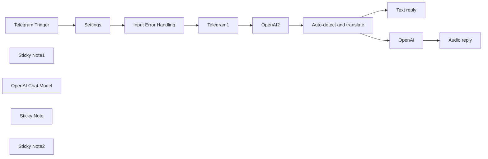

## Fluxo (.json) :

```json
{
  "id": "IvgAFAUOSI3biT4L",
  "meta": {
    "instanceId": "2723a3a635131edfcb16103f3d4dbaadf3658e386b4762989cbf49528dccbdbd"
  },
  "name": "Translate Telegram audio messages with AI (55 supported languages) v1",
  "tags": [],
  "nodes": [
    {
      "id": "f91fa0cf-ea01-4fc0-9ef2-754da399b7fb",
      "name": "Telegram Trigger",
      "type": "n8n-nodes-base.telegramTrigger",
      "position": [
        440,
        220
      ],
      "webhookId": "c537cfcc-6c4a-436a-8871-d32f8ce016cb",
      "parameters": {
        "updates": [
          "*"
        ],
        "additionalFields": {}
      },
      "credentials": {
        "telegramApi": {
          "id": "Ov00cT0t4h4AFtZ0",
          "name": "Telegram account"
        }
      },
      "typeVersion": 1
    },
    {
      "id": "057ae05f-2c7d-48c5-a057-a6917a88971c",
      "name": "Sticky Note1",
      "type": "n8n-nodes-base.stickyNote",
      "position": [
        1240,
        0
      ],
      "parameters": {
        "width": 556.5162909529794,
        "height": 586.6978417266175,
        "content": "## Translation\n\n- Converts from speech to text.\n\n- Translates the language from the native language to translated language (as specified in settings node)\n\n"
      },
      "typeVersion": 1
    },
    {
      "id": "c6947668-118e-4e23-bc55-1cdbce554a20",
      "name": "Text reply",
      "type": "n8n-nodes-base.telegram",
      "position": [
        2240,
        220
      ],
      "parameters": {
        "text": "={{ $json.text }}",
        "chatId": "={{ $('Telegram Trigger').item.json.message.chat.id }}",
        "additionalFields": {
          "parse_mode": "Markdown"
        }
      },
      "credentials": {
        "telegramApi": {
          "id": "Ov00cT0t4h4AFtZ0",
          "name": "Telegram account"
        }
      },
      "typeVersion": 1
    },
    {
      "id": "93551aea-0213-420d-bf82-7669ab291dae",
      "name": "Telegram1",
      "type": "n8n-nodes-base.telegram",
      "position": [
        1060,
        220
      ],
      "parameters": {
        "fileId": "={{ $('Telegram Trigger').item.json.message.voice.file_id }}",
        "resource": "file"
      },
      "credentials": {
        "telegramApi": {
          "id": "Ov00cT0t4h4AFtZ0",
          "name": "Telegram account"
        }
      },
      "typeVersion": 1.1
    },
    {
      "id": "972177e4-b0a4-424f-9ca6-6555ff3271d7",
      "name": "OpenAI Chat Model",
      "type": "@n8n/n8n-nodes-langchain.lmChatOpenAi",
      "position": [
        1520,
        400
      ],
      "parameters": {
        "options": {}
      },
      "credentials": {
        "openAiApi": {
          "id": "fOF5kro9BJ6KMQ7n",
          "name": "OpenAi account"
        }
      },
      "typeVersion": 1
    },
    {
      "id": "0e8f610f-03a7-4943-bd19-b3fb10c89519",
      "name": "Input Error Handling",
      "type": "n8n-nodes-base.set",
      "position": [
        860,
        220
      ],
      "parameters": {
        "fields": {
          "values": [
            {
              "name": "message.text",
              "stringValue": "={{ $json?.message?.text || \"\" }}"
            }
          ]
        },
        "options": {}
      },
      "typeVersion": 3.2
    },
    {
      "id": "c8ab9e01-c9b5-4647-8008-9157ed97c4c3",
      "name": "Sticky Note",
      "type": "n8n-nodes-base.stickyNote",
      "position": [
        1920,
        0
      ],
      "parameters": {
        "width": 585.8688089385912,
        "height": 583.7625899280566,
        "content": "## Telegram output\n\n- Provide the output in both text as well as speech. \n\n- Many languages are supported including English,French, German, Spanish, Chinese, Japanese.\n\nFull list here:\nhttps://platform.openai.com/docs/guides/speech-to-text/supported-languages\n"
      },
      "typeVersion": 1
    },
    {
      "id": "0898dc4d-c3ad-43df-871f-1896f673f631",
      "name": "Sticky Note2",
      "type": "n8n-nodes-base.stickyNote",
      "position": [
        -140,
        0
      ],
      "parameters": {
        "color": 4,
        "width": 489.00549958607303,
        "height": 573.4892086330929,
        "content": "## Multi-lingual AI Powered Universal Translator with Speech ⭐\n\n### Key capabilities\nThis flow enables a Telegram bot that can \n- accept speech in one of 55 languages \n- translates to another language and returns result in speech\n\n### Use case:\n- Learning a new language\n- Communicate with others while traveling to another country\n\n### Setup\n- Open the Settings node and specify the languages you would like to work with"
      },
      "typeVersion": 1
    },
    {
      "id": "ae0595d2-7e40-4c1e-a643-4b232220d19a",
      "name": "Settings",
      "type": "n8n-nodes-base.set",
      "position": [
        660,
        220
      ],
      "parameters": {
        "options": {},
        "assignments": {
          "assignments": [
            {
              "id": "501ac5cc-73e8-4e9c-bf91-df312aa9ff88",
              "name": "language_native",
              "type": "string",
              "value": "english"
            },
            {
              "id": "efb9a7b2-5baa-44cc-b94d-c8030f17e890",
              "name": "language_translate",
              "type": "string",
              "value": "french"
            }
          ]
        }
      },
      "typeVersion": 3.3
    },
    {
      "id": "2d3654cf-a182-4916-a50c-a501828c2f6e",
      "name": "Auto-detect and translate",
      "type": "@n8n/n8n-nodes-langchain.chainLlm",
      "position": [
        1500,
        220
      ],
      "parameters": {
        "text": "=Detect the language of the text that follows.  \n- If it is  {{ $('Settings').item.json.language_native }} translate to {{ $('Settings').item.json.language_translate }}.  \n- If it is in  {{ $('Settings').item.json.language_translate }} translate to {{ $('Settings').item.json.language_native }} .  \n- In the output just provide the translation and do not explain it.  Just provide the translation without anything else.\n\nText:\n {{ $json.text }}\n",
        "promptType": "define"
      },
      "typeVersion": 1.4
    },
    {
      "id": "a6e63516-4967-4e81-ba5b-58ad0ab21ee3",
      "name": "Audio reply",
      "type": "n8n-nodes-base.telegram",
      "position": [
        2240,
        400
      ],
      "parameters": {
        "chatId": "={{ $('Telegram Trigger').item.json.message.chat.id }}",
        "operation": "sendAudio",
        "binaryData": true,
        "additionalFields": {}
      },
      "credentials": {
        "telegramApi": {
          "id": "Ov00cT0t4h4AFtZ0",
          "name": "Telegram account"
        }
      },
      "typeVersion": 1.1
    },
    {
      "id": "e4782117-03de-41d2-9208-390edc87fc08",
      "name": "OpenAI2",
      "type": "@n8n/n8n-nodes-langchain.openAi",
      "position": [
        1300,
        220
      ],
      "parameters": {
        "options": {},
        "resource": "audio",
        "operation": "transcribe"
      },
      "credentials": {
        "openAiApi": {
          "id": "fOF5kro9BJ6KMQ7n",
          "name": "OpenAi account"
        }
      },
      "typeVersion": 1.3
    },
    {
      "id": "b29355f5-122c-4557-8215-28fdb523d221",
      "name": "OpenAI",
      "type": "@n8n/n8n-nodes-langchain.openAi",
      "position": [
        2020,
        400
      ],
      "parameters": {
        "input": "={{ $json.text }}",
        "options": {},
        "resource": "audio"
      },
      "credentials": {
        "openAiApi": {
          "id": "fOF5kro9BJ6KMQ7n",
          "name": "OpenAi account"
        }
      },
      "typeVersion": 1.3
    }
  ],
  "active": true,
  "pinData": {},
  "settings": {
    "executionOrder": "v1"
  },
  "versionId": "ac9c6f40-10c8-4b60-9215-8d4e253bf318",
  "connections": {
    "OpenAI": {
      "main": [
        [
          {
            "node": "Audio reply",
            "type": "main",
            "index": 0
          }
        ]
      ]
    },
    "OpenAI2": {
      "main": [
        [
          {
            "node": "Auto-detect and translate",
            "type": "main",
            "index": 0
          }
        ]
      ]
    },
    "Settings": {
      "main": [
        [
          {
            "node": "Input Error Handling",
            "type": "main",
            "index": 0
          }
        ]
      ]
    },
    "Telegram1": {
      "main": [
        [
          {
            "node": "OpenAI2",
            "type": "main",
            "index": 0
          }
        ]
      ]
    },
    "Telegram Trigger": {
      "main": [
        [
          {
            "node": "Settings",
            "type": "main",
            "index": 0
          }
        ]
      ]
    },
    "OpenAI Chat Model": {
      "ai_languageModel": [
        [
          {
            "node": "Auto-detect and translate",
            "type": "ai_languageModel",
            "index": 0
          }
        ]
      ]
    },
    "Input Error Handling": {
      "main": [
        [
          {
            "node": "Telegram1",
            "type": "main",
            "index": 0
          }
        ]
      ]
    },
    "Auto-detect and translate": {
      "main": [
        [
          {
            "node": "Text reply",
            "type": "main",
            "index": 0
          },
          {
            "node": "OpenAI",
            "type": "main",
            "index": 0
          }
        ]
      ]
    }
  }
}
```

<a id="template-2541"></a>

## Template 2541 - Backup e indexação de workflows

- **Nome:** Backup e indexação de workflows
- **Descrição:** Automatiza a exportação de workflows, armazena os backups em nuvem e registra ou atualiza metadados em uma base externa.
- **Funcionalidade:** • Gatilhos manuais e agendados: Inicia o processo manualmente ou por cron configurado.
• Recuperação de lista de workflows: Consulta uma API local para obter todos os workflows disponíveis.
• Processamento em lotes: Itera sobre cada workflow individualmente para evitar sobrecarga.
• Obtenção de detalhes do workflow: Consulta a API para baixar os dados completos de cada workflow.
• Conversão e upload do arquivo JSON: Converte os dados em binário e envia para armazenamento em nuvem com caminho que inclui ID e timestamp.
• Geração de link temporário: Solicita um link temporário do arquivo armazenado para referência externa.
• Análise do conteúdo do workflow: Detecta se o workflow contém cron jobs ou triggers e extrai detalhes relevantes.
• Preparação de metadados: Monta campos como isCRON, CRON_details, isTrigger, nodes e referência ao arquivo rawData.
• Verificação e sincronização com base externa: Checa se já existe registro e atualiza ou cria um registro com os metadados.
• Controle de fluxo final: Identifica quando não há mais itens a processar para encerrar a execução.
- **Ferramentas:** • API REST local (serviço de workflows): Fonte dos dados dos workflows para backup e análise (ex.: http://localhost:5678).
• Dropbox: Armazenamento em nuvem dos arquivos JSON gerados e geração de links temporários para acesso aos backups.
• Airtable: Base externa para registrar e atualizar metadados dos workflows, permitindo busca e filtragem por workflowId.

## Fluxo visual

```mermaid
flowchart LR
    N1["On clicking 'execute'"]
    N2["Function"]
    N3["SplitInBatches"]
    N4["IF"]
    N5["NoOp"]
    N6["Airtable"]
    N7["Airtable1"]
    N8["Airtable2"]
    N9["Set"]
    N10["Set1"]
    N11["Get All Workflows"]
    N12["Prepare data"]
    N13["Prepare data1"]
    N14["Cron"]
    N15["Move Binary Data"]
    N16["Dropbox"]
    N17["Get Workflow Details"]
    N18["Get file link"]
    N19["IF Airtable record exists?"]

    N4 --> N5
    N4 --> N3
    N9 --> N7
    N14 --> N11
    N10 --> N8
    N16 --> N18
    N6 --> N19
    N2 --> N3
    N7 --> N4
    N8 --> N4
    N12 --> N9
    N18 --> N6
    N13 --> N10
    N3 --> N17
    N15 --> N16
    N11 --> N2
    N17 --> N15
    N1 --> N11
    N19 --> N12
    N19 --> N13
```

## Fluxo (.json) :

```json
{
  "id": "48",
  "name": "Workflow management",
  "nodes": [
    {
      "name": "On clicking 'execute'",
      "type": "n8n-nodes-base.manualTrigger",
      "position": [
        240,
        300
      ],
      "parameters": {},
      "typeVersion": 1
    },
    {
      "name": "Function",
      "type": "n8n-nodes-base.function",
      "position": [
        570,
        300
      ],
      "parameters": {
        "functionCode": "//console.log(items[0].json.data);\nlet data = items[0].json.data;\nitems = data.map(i => {\n//  console.log({json:i});\n  return {json:i};\n});\n//console.log(items);\nreturn items;"
      },
      "typeVersion": 1
    },
    {
      "name": "SplitInBatches",
      "type": "n8n-nodes-base.splitInBatches",
      "position": [
        760,
        300
      ],
      "parameters": {
        "options": {},
        "batchSize": 1
      },
      "typeVersion": 1
    },
    {
      "name": "IF",
      "type": "n8n-nodes-base.if",
      "position": [
        2090,
        570
      ],
      "parameters": {
        "conditions": {
          "boolean": [
            {
              "value1": "={{$node[\"SplitInBatches\"].context[\"noItemsLeft\"]}}",
              "value2": true
            }
          ]
        }
      },
      "typeVersion": 1
    },
    {
      "name": "NoOp",
      "type": "n8n-nodes-base.noOp",
      "position": [
        2270,
        550
      ],
      "parameters": {},
      "typeVersion": 1
    },
    {
      "name": "Airtable",
      "type": "n8n-nodes-base.airtable",
      "position": [
        1100,
        200
      ],
      "parameters": {
        "table": "Workflows",
        "operation": "list",
        "application": "<YOUR_APP_ID>",
        "additionalOptions": {
          "fields": [],
          "filterByFormula": "=workflowId={{$node[\"Get Workflow Details\"].json[\"data\"][\"id\"]}}"
        }
      },
      "credentials": {
        "airtableApi": "n8n management demo"
      },
      "typeVersion": 1,
      "alwaysOutputData": true
    },
    {
      "name": "Airtable1",
      "type": "n8n-nodes-base.airtable",
      "position": [
        1750,
        130
      ],
      "parameters": {
        "id": "={{$node[\"Airtable\"].json[\"id\"]}}",
        "table": "Workflows",
        "options": {
          "typecast": true
        },
        "operation": "update",
        "application": "<YOUR_APP_ID>"
      },
      "credentials": {
        "airtableApi": "n8n management demo"
      },
      "typeVersion": 1
    },
    {
      "name": "Airtable2",
      "type": "n8n-nodes-base.airtable",
      "position": [
        1750,
        320
      ],
      "parameters": {
        "table": "Workflows",
        "options": {
          "typecast": true
        },
        "operation": "append",
        "application": "<YOUR_APP_ID>"
      },
      "credentials": {
        "airtableApi": "n8n management demo"
      },
      "typeVersion": 1
    },
    {
      "name": "Set",
      "type": "n8n-nodes-base.set",
      "position": [
        1590,
        130
      ],
      "parameters": {
        "values": {
          "string": [
            {
              "name": "workflowId",
              "value": "={{$node[\"Get Workflow Details\"].json[\"data\"][\"id\"]}}"
            },
            {
              "name": "name",
              "value": "={{$node[\"Get Workflow Details\"].json[\"data\"][\"name\"]}}"
            },
            {
              "name": "errorWorkflowId",
              "value": "={{$node[\"Get Workflow Details\"].json[\"data\"][\"settings\"][\"errorWorkflow\"]}}"
            },
            {
              "name": "createdAt",
              "value": "={{$node[\"Get Workflow Details\"].json[\"data\"][\"createdAt\"]}}"
            },
            {
              "name": "updatedAt",
              "value": "={{$node[\"Get Workflow Details\"].json[\"data\"][\"updatedAt\"]}}"
            },
            {
              "name": "nodes",
              "value": "={{$node[\"Prepare data\"].json[\"fields\"][\"nodes\"]}}"
            },
            {
              "name": "timezone",
              "value": "={{$node[\"Get Workflow Details\"].json[\"data\"][\"settings\"][\"timezone\"]}}"
            },
            {
              "name": "CRON_details",
              "value": "={{$node[\"Prepare data\"].json[\"fields\"][\"CRON_details\"]}}"
            },
            {
              "name": "rawData",
              "value": "={{$node[\"Prepare data\"].json[\"fields\"][\"rawData\"]}}"
            }
          ],
          "boolean": [
            {
              "name": "isActive",
              "value": "={{$node[\"Get Workflow Details\"].json[\"data\"][\"active\"]}}"
            },
            {
              "name": "isCRON",
              "value": "={{$node[\"Prepare data\"].json[\"fields\"][\"isCRON\"]}}"
            },
            {
              "name": "saveManualExecutions",
              "value": "={{$node[\"Get Workflow Details\"].json[\"data\"][\"settings\"][\"saveManualExecutions\"]}}"
            },
            {
              "name": "isTrigger",
              "value": "={{$node[\"Prepare data\"].json[\"fields\"][\"isTrigger\"]}}"
            }
          ]
        },
        "options": {},
        "keepOnlySet": true
      },
      "typeVersion": 1
    },
    {
      "name": "Set1",
      "type": "n8n-nodes-base.set",
      "position": [
        1590,
        320
      ],
      "parameters": {
        "values": {
          "string": [
            {
              "name": "workflowId",
              "value": "={{$node[\"Get Workflow Details\"].json[\"data\"][\"id\"]}}"
            },
            {
              "name": "name",
              "value": "={{$node[\"Get Workflow Details\"].json[\"data\"][\"name\"]}}"
            },
            {
              "name": "errorWorkflowId",
              "value": "={{$node[\"Get Workflow Details\"].json[\"data\"][\"settings\"][\"errorWorkflow\"]}}"
            },
            {
              "name": "createdAt",
              "value": "={{$node[\"Get Workflow Details\"].json[\"data\"][\"createdAt\"]}}"
            },
            {
              "name": "updatedAt",
              "value": "={{$node[\"Get Workflow Details\"].json[\"data\"][\"updatedAt\"]}}"
            },
            {
              "name": "nodes",
              "value": "={{$node[\"Prepare data1\"].json[\"fields\"][\"nodes\"]}}"
            },
            {
              "name": "timezone",
              "value": "={{$node[\"Get Workflow Details\"].json[\"data\"][\"settings\"][\"timezone\"]}}"
            },
            {
              "name": "CRON_details",
              "value": "={{$node[\"Prepare data1\"].json[\"fields\"][\"CRON_details\"]}}"
            },
            {
              "name": "rawData",
              "value": "={{$node[\"Prepare data1\"].json[\"fields\"][\"rawData\"]}}"
            }
          ],
          "boolean": [
            {
              "name": "isActive",
              "value": "={{$node[\"Get Workflow Details\"].json[\"data\"][\"active\"]}}"
            },
            {
              "name": "isCRON",
              "value": "={{$node[\"Prepare data1\"].json[\"fields\"][\"isCRON\"]}}"
            },
            {
              "name": "saveManualExecutions",
              "value": "={{$node[\"Get Workflow Details\"].json[\"data\"][\"settings\"][\"saveManualExecutions\"]}}"
            },
            {
              "name": "isTrigger",
              "value": "={{$node[\"Prepare data1\"].json[\"fields\"][\"isTrigger\"]}}"
            }
          ]
        },
        "options": {},
        "keepOnlySet": true
      },
      "typeVersion": 1
    },
    {
      "name": "Get All Workflows",
      "type": "n8n-nodes-base.httpRequest",
      "position": [
        410,
        300
      ],
      "parameters": {
        "url": "http://localhost:5678/rest/workflows",
        "options": {
          "fullResponse": false
        },
        "headerParametersUi": {
          "parameter": [
            {
              "name": "Authorization",
              "value": "<TOKEN>"
            }
          ]
        },
        "allowUnauthorizedCerts": true
      },
      "typeVersion": 1
    },
    {
      "name": "Prepare data",
      "type": "n8n-nodes-base.function",
      "position": [
        1430,
        130
      ],
      "parameters": {
        "functionCode": "let data = $node[\"Get Workflow Details\"].json[\"data\"];\nlet file = $node[\"Get file link\"].json[\"link\"];\nlet nodes = new Set(data[\"nodes\"].map(i => i.type));\nlet nodes2 = [...nodes];\n//console.log(...nodes);\nlet data2 = data[\"nodes\"].map(i => i.name);\nif(nodes2.includes('n8n-nodes-base.cron')){\n  console.log('Cron found!');\n//  console.log(data);\n  let cron_node = data[\"nodes\"].filter(i => i.type == 'n8n-nodes-base.cron');\n  //console.log(cron_node[0].parameters.triggerTimes.item);\n  items[0].json[\"fields\"][\"isCRON\"]=true;\n  items[0].json[\"fields\"][\"nodes\"]=[...nodes];\n  items[0].json[\"fields\"][\"CRON_details\"]=cron_node[0].parameters.triggerTimes.item;\n  items[0].json[\"fields\"][\"rawData\"]=[{url:file ,filename: 'workflow_'+data[\"id\"]+'__'+data[\"updatedAt\"]+'.json'}];\n} else {  \n  //console.log('Cron not found!');\n  items[0].json[\"fields\"][\"isCRON\"]=false;\n  items[0].json[\"fields\"][\"nodes\"]=[...nodes];\n  items[0].json[\"fields\"][\"rawData\"]=[{url:file ,filename: 'workflow_'+data[\"id\"]+'__'+data[\"updatedAt\"]+'.json'}];\n}\nif(nodes2.some(i => {\n  let regExp = new RegExp(/n8n-nodes-base\\.[\\w]+Trigger/);\n  if(i=='n8n-nodes-base.webhook'){\n    return true;\n  }\n  if(regExp.test(i)){\n    return true;\n  }\n  return false;\n})){\n  items[0].json[\"fields\"][\"isTrigger\"]=true;  \n} else {\n  items[0].json[\"fields\"][\"isTrigger\"]=false;\n}\n  \n//console.log(items);\nreturn items;\n"
      },
      "typeVersion": 1
    },
    {
      "name": "Prepare data1",
      "type": "n8n-nodes-base.function",
      "position": [
        1430,
        320
      ],
      "parameters": {
        "functionCode": "let data = $node[\"Get Workflow Details\"].json[\"data\"];\nlet file = $node[\"Get file link\"].json[\"link\"];\nlet nodes = new Set(data[\"nodes\"].map(i => i.type));\nlet nodes2 = [...nodes];\n//console.log(data);\nlet data2 = data[\"nodes\"].map(i => i.name);\nif(nodes2.includes('n8n-nodes-base.cron')){\n  //console.log('Cron found!');\n  let cron_node = data[\"nodes\"].filter(i => i.type == 'n8n-nodes-base.cron');\n  items[0].json={\n    fields:{\n      isCRON:true,\n      nodes:[...nodes],\n      CRON_details:cron_node[0].parameters.triggerTimes.item,\n      rawData:[{url:file ,filename: 'workflow_'+data[\"id\"]+'__'+data[\"updatedAt\"]+'.json'}]\n    }\n  };\n} else {  \n  //console.log('Cron not found!');\n  items[0].json={\n    fields:{\n      isCRON:false,\n      nodes:[...nodes],\n      rawData:[{url:file ,filename: 'workflow_'+data[\"id\"]+'__'+data[\"updatedAt\"]+'.json'}]\n    }\n  };\n}\nif(nodes2.some(i => {\n  let regExp = new RegExp(/n8n-nodes-base\\.[\\w]+Trigger/);\n  if(i=='n8n-nodes-base.webhook'){\n    return true;\n  }\n  if(regExp.test(i)){\n    return true;\n  }\n  return false;\n})){\n  items[0].json[\"fields\"][\"isTrigger\"]=true;  \n} else {\n  items[0].json[\"fields\"][\"isTrigger\"]=false;\n}\n//console.log(items);\nreturn items;\n\n"
      },
      "typeVersion": 1
    },
    {
      "name": "Cron",
      "type": "n8n-nodes-base.cron",
      "position": [
        250,
        510
      ],
      "parameters": {
        "triggerTimes": {
          "item": [
            {
              "mode": "everyHour",
              "minute": 15
            },
            {
              "mode": "everyHour",
              "minute": 45
            }
          ]
        }
      },
      "typeVersion": 1
    },
    {
      "name": "Move Binary Data",
      "type": "n8n-nodes-base.moveBinaryData",
      "position": [
        1000,
        -10
      ],
      "parameters": {
        "mode": "jsonToBinary",
        "options": {
          "keepSource": true
        }
      },
      "typeVersion": 1
    },
    {
      "name": "Dropbox",
      "type": "n8n-nodes-base.dropbox",
      "position": [
        1140,
        -10
      ],
      "parameters": {
        "path": "=/workflows/workflow_{{$node[\"Get Workflow Details\"].json[\"data\"][\"id\"]}}/workflow_{{$node[\"Get Workflow Details\"].json[\"data\"][\"id\"]}}__{{$node[\"Get Workflow Details\"].json[\"data\"][\"updatedAt\"]}}.json",
        "binaryData": true
      },
      "credentials": {
        "dropboxApi": "My n8n backups"
      },
      "typeVersion": 1
    },
    {
      "name": "Get Workflow Details",
      "type": "n8n-nodes-base.httpRequest",
      "position": [
        840,
        -10
      ],
      "parameters": {
        "url": "=http://localhost:5678/rest/workflows/{{$node[\"SplitInBatches\"].json[\"id\"]}}",
        "options": {},
        "headerParametersUi": {
          "parameter": [
            {
              "name": "Authorization",
              "value": "<TOKEN>"
            }
          ]
        },
        "allowUnauthorizedCerts": true
      },
      "typeVersion": 1
    },
    {
      "name": "Get file link",
      "type": "n8n-nodes-base.httpRequest",
      "position": [
        1290,
        -10
      ],
      "parameters": {
        "url": "https://api.dropboxapi.com/2/files/get_temporary_link",
        "options": {},
        "requestMethod": "POST",
        "bodyParametersUi": {
          "parameter": [
            {
              "name": "path",
              "value": "={{$node[\"Dropbox\"].json[\"path_lower\"]}}"
            }
          ]
        },
        "headerParametersUi": {
          "parameter": [
            {
              "name": "Authorization",
              "value": "<TOKEN>"
            }
          ]
        }
      },
      "typeVersion": 1,
      "continueOnFail": true,
      "alwaysOutputData": true
    },
    {
      "name": "IF Airtable record exists?",
      "type": "n8n-nodes-base.if",
      "position": [
        1270,
        200
      ],
      "parameters": {
        "conditions": {
          "boolean": [
            {
              "value1": "={{$node[\"Airtable\"].json[\"id\"] != \"\" && $node[\"Airtable\"].json[\"id\"] != null && $node[\"Airtable\"].json[\"id\"] != undefined}}",
              "value2": true
            }
          ]
        }
      },
      "typeVersion": 1
    }
  ],
  "active": true,
  "settings": {},
  "connections": {
    "IF": {
      "main": [
        [
          {
            "node": "NoOp",
            "type": "main",
            "index": 0
          }
        ],
        [
          {
            "node": "SplitInBatches",
            "type": "main",
            "index": 0
          }
        ]
      ]
    },
    "Set": {
      "main": [
        [
          {
            "node": "Airtable1",
            "type": "main",
            "index": 0
          }
        ]
      ]
    },
    "Cron": {
      "main": [
        [
          {
            "node": "Get All Workflows",
            "type": "main",
            "index": 0
          }
        ]
      ]
    },
    "Set1": {
      "main": [
        [
          {
            "node": "Airtable2",
            "type": "main",
            "index": 0
          }
        ]
      ]
    },
    "Dropbox": {
      "main": [
        [
          {
            "node": "Get file link",
            "type": "main",
            "index": 0
          }
        ]
      ]
    },
    "Airtable": {
      "main": [
        [
          {
            "node": "IF Airtable record exists?",
            "type": "main",
            "index": 0
          }
        ]
      ]
    },
    "Function": {
      "main": [
        [
          {
            "node": "SplitInBatches",
            "type": "main",
            "index": 0
          }
        ]
      ]
    },
    "Airtable1": {
      "main": [
        [
          {
            "node": "IF",
            "type": "main",
            "index": 0
          }
        ]
      ]
    },
    "Airtable2": {
      "main": [
        [
          {
            "node": "IF",
            "type": "main",
            "index": 0
          }
        ]
      ]
    },
    "Prepare data": {
      "main": [
        [
          {
            "node": "Set",
            "type": "main",
            "index": 0
          }
        ]
      ]
    },
    "Get file link": {
      "main": [
        [
          {
            "node": "Airtable",
            "type": "main",
            "index": 0
          }
        ]
      ]
    },
    "Prepare data1": {
      "main": [
        [
          {
            "node": "Set1",
            "type": "main",
            "index": 0
          }
        ]
      ]
    },
    "SplitInBatches": {
      "main": [
        [
          {
            "node": "Get Workflow Details",
            "type": "main",
            "index": 0
          }
        ]
      ]
    },
    "Move Binary Data": {
      "main": [
        [
          {
            "node": "Dropbox",
            "type": "main",
            "index": 0
          }
        ]
      ]
    },
    "Get All Workflows": {
      "main": [
        [
          {
            "node": "Function",
            "type": "main",
            "index": 0
          }
        ]
      ]
    },
    "Get Workflow Details": {
      "main": [
        [
          {
            "node": "Move Binary Data",
            "type": "main",
            "index": 0
          }
        ]
      ]
    },
    "On clicking 'execute'": {
      "main": [
        [
          {
            "node": "Get All Workflows",
            "type": "main",
            "index": 0
          }
        ]
      ]
    },
    "IF Airtable record exists?": {
      "main": [
        [
          {
            "node": "Prepare data",
            "type": "main",
            "index": 0
          }
        ],
        [
          {
            "node": "Prepare data1",
            "type": "main",
            "index": 0
          }
        ]
      ]
    }
  }
}
```

<a id="template-2542"></a>

## Template 2542 - Sincronizar Productboard para Snowflake

- **Nome:** Sincronizar Productboard para Snowflake
- **Descrição:** Fluxo que extrai notas, empresas e funcionalidades do Productboard, transforma e carrega os dados em tabelas no Snowflake, e envia um resumo semanal por Slack.
- **Funcionalidade:** • Criação/atualização de tabelas: Garante que as tabelas para notas, empresas, funcionalidades e relacionamento nota–feature existam no destino.
• Limpeza de tabelas antes da carga: Trunca tabelas alvo para carga completa controlada.
• Extração com paginação: Busca empresas, funcionalidades e notas do Productboard usando paginação para recuperar todos os itens.
• Mapeamento de campos: Converte a estrutura da API do Productboard para o esquema das tabelas no destino.
• Processamento em lotes: Usa processamento em batches para lidar com grandes volumes de itens de forma controlada.
• Associação nota–feature: Extrai e grava relações entre notas e features em tabela separada.
• Carga para data warehouse: Insere os dados transformados nas tabelas do Snowflake.
• Cálculo de métricas e notificação: Conta notas dos últimos 7 dias e notas não processadas e publica um resumo semanal no Slack com link para dashboard.
- **Ferramentas:** • Productboard API: Fonte dos dados de notas, empresas e funcionalidades.
• Snowflake: Data warehouse onde as tabelas são criadas, truncadas e carregadas.
• Slack: Canal para enviar o resumo semanal e notificação com link para o dashboard.
• Metabase: Dashboard referenciado no resumo para visualização dos dados.


## Fluxo visual

```mermaid
flowchart LR
    N1["Sticky Note1"]
    N2["Manual mapping feature"]
    N3["get productboard companies"]
    N4["Manual mapping companies"]
    N5["get productboard notes"]
    N6["Manual mapping notes"]
    N7["Split features"]
    N8["Split companies"]
    N9["Split notes"]
    N10["Split features in notes"]
    N11["Combine Feature ID + Note ID"]
    N12["get productboard features"]
    N13["Update Productboard Notes"]
    N14["Empty Table Productboard Notes"]
    N15["(CREATE) PRODUCTBOARD_NOTES"]
    N16["(CREATE) PRODUCTBOARD_COMPANIES"]
    N17["Update Productboard Companies"]
    N18["Manual mapping companies db"]
    N19["Manual mapping notes db"]
    N20["Empty Table Productboard Companies"]
    N21["(CREATE) PRODUCTBOARD_NOTES_FEATURES"]
    N22["Manual mapping feature note IDs db"]
    N23["Update Productboard Note and Feature IDs"]
    N24["Empty Table Productboard Note and Feature IDs"]
    N25["Loop Over Items notes"]
    N26["Loop Over Items features notes"]
    N27["(CREATE) PRODUCTBOARD_FEATURES"]
    N28["Empty Table Productboard Features"]
    N29["Loop Over Items features"]
    N30["Manual mapping features db"]
    N31["Update Productboard Features"]
    N32["Schedule Trigger"]
    N33["Slack"]
    N34["Count Notes Last 7 days and Unprocessed"]
    N35["Sticky Note2"]

    N9 --> N6
    N9 --> N10
    N9 --> N34
    N7 --> N2
    N8 --> N4
    N32 --> N28
    N6 --> N25
    N25 --> N19
    N2 --> N29
    N5 --> N9
    N19 --> N13
    N10 --> N11
    N29 --> N20
    N29 --> N30
    N4 --> N18
    N13 --> N25
    N12 --> N7
    N30 --> N31
    N3 --> N8
    N18 --> N17
    N11 --> N26
    N31 --> N29
    N17 --> N24
    N14 --> N5
    N26 --> N22
    N28 --> N12
    N20 --> N3
    N22 --> N23
    N34 --> N33
    N23 --> N26
    N24 --> N14
```

## Fluxo (.json) :

```json
{
  "meta": {
    "instanceId": "21b41c2deb1c9e3f543253a0aa6a6e2c7bd7ef6bab90ffd478aa947c17d3b352",
    "templateCredsSetupCompleted": true
  },
  "name": "Import Productboard Notes, Companies and Features into Snowflake",
  "tags": [
    {
      "id": "6Ek7V8f4xbM9vWLj",
      "name": "linear",
      "createdAt": "2024-11-08T12:12:15.330Z",
      "updatedAt": "2024-11-08T12:12:15.330Z"
    },
    {
      "id": "XpcIJ8IHNenz3bWz",
      "name": "productboard",
      "createdAt": "2024-11-08T12:12:17.249Z",
      "updatedAt": "2024-11-08T12:12:17.249Z"
    },
    {
      "id": "17",
      "name": "snowflake",
      "createdAt": "2023-09-18T17:05:02.756Z",
      "updatedAt": "2023-09-18T17:05:02.756Z"
    }
  ],
  "nodes": [
    {
      "id": "adcb71e4-880b-4c19-acbb-0708ae4af95f",
      "name": "Sticky Note1",
      "type": "n8n-nodes-base.stickyNote",
      "position": [
        5620,
        1440
      ],
      "parameters": {
        "color": 5,
        "width": 442.66083354762577,
        "height": 155.09952210536395,
        "content": "## Preview Slack Message\n:productboard: Weekly Update in :snowflake_logo: Completed\n27 new insights added in the last 7 days.\n88 insights remain unprocessed.\nYou can view the updated :metabase: dashboard below:\n<link metabase>\n"
      },
      "typeVersion": 1
    },
    {
      "id": "8a590e59-cbcd-43f3-a0de-7c1391661fcf",
      "name": "Manual mapping feature",
      "type": "n8n-nodes-base.set",
      "position": [
        4380,
        -180
      ],
      "parameters": {
        "fields": {
          "values": [
            {
              "name": "feature_id",
              "stringValue": "={{ $json.id }}"
            },
            {
              "name": "feature_name",
              "stringValue": "={{ $json.name }}"
            },
            {
              "name": "feature_status",
              "stringValue": "={{ $json.status.name }}"
            },
            {
              "name": "feature_start_date",
              "stringValue": "={{ $json.timeframe.startDate }}"
            },
            {
              "name": "feature_end_date",
              "stringValue": "={{ $json.timeframe.endDate }}"
            },
            {
              "name": "feature_owner",
              "stringValue": "={{ $json.owner.email }}"
            },
            {
              "name": "feature_created_at",
              "stringValue": "={{ $json.createdAt }}"
            }
          ]
        },
        "include": "none",
        "options": {}
      },
      "typeVersion": 3.2
    },
    {
      "id": "ca339c8f-71c0-432f-88ef-595b9bc24b98",
      "name": "get productboard companies",
      "type": "n8n-nodes-base.httpRequest",
      "position": [
        4060,
        220
      ],
      "parameters": {
        "url": "https://api.productboard.com/companies",
        "options": {
          "pagination": {
            "pagination": {
              "nextURL": "={{ $response.body[\"links\"][\"next\"] }}",
              "paginationMode": "responseContainsNextURL",
              "requestInterval": 2000,
              "completeExpression": "={{ $response.body[\"links\"][\"next\"] === null }}",
              "paginationCompleteWhen": "other"
            }
          }
        },
        "sendHeaders": true,
        "authentication": "genericCredentialType",
        "genericAuthType": "httpHeaderAuth",
        "headerParameters": {
          "parameters": [
            {
              "name": "Content-Type",
              "value": "application/json"
            },
            {
              "name": "X-Version",
              "value": "1"
            }
          ]
        }
      },
      "credentials": {
        "httpHeaderAuth": {
          "id": "Z0ptr85smbBZBIYx",
          "name": "Productboard"
        }
      },
      "typeVersion": 4.1,
      "alwaysOutputData": true
    },
    {
      "id": "ba15244b-4311-4045-8087-47f05bea427e",
      "name": "Manual mapping companies",
      "type": "n8n-nodes-base.set",
      "position": [
        4760,
        220
      ],
      "parameters": {
        "fields": {
          "values": [
            {
              "name": "company_id",
              "stringValue": "={{ $json.id }}"
            },
            {
              "name": "company_name",
              "stringValue": "={{ $json.name }}"
            },
            {
              "name": "company_domain",
              "stringValue": "={{ $json.domain }}"
            }
          ]
        },
        "include": "none",
        "options": {}
      },
      "typeVersion": 3.2
    },
    {
      "id": "d7c491cf-6545-40e1-9ee5-429e4f6b8cb4",
      "name": "get productboard notes",
      "type": "n8n-nodes-base.httpRequest",
      "position": [
        4500,
        640
      ],
      "parameters": {
        "url": " https://api.productboard.com/notes",
        "options": {
          "pagination": {
            "pagination": {
              "parameters": {
                "parameters": [
                  {
                    "name": "pageCursor",
                    "value": "={{ $response.body.pageCursor }}"
                  }
                ]
              },
              "requestInterval": 2000,
              "completeExpression": "={{ $response.body.pageCursor === null }}",
              "paginationCompleteWhen": "other"
            }
          }
        },
        "sendHeaders": true,
        "authentication": "genericCredentialType",
        "genericAuthType": "httpHeaderAuth",
        "headerParameters": {
          "parameters": [
            {
              "name": "Content-Type",
              "value": "application/json"
            },
            {
              "name": "X-Version",
              "value": "1"
            }
          ]
        }
      },
      "credentials": {
        "httpHeaderAuth": {
          "id": "Z0ptr85smbBZBIYx",
          "name": "Productboard"
        }
      },
      "typeVersion": 4.1
    },
    {
      "id": "beeb2cfc-c017-4691-b92f-ee10b943b08d",
      "name": "Manual mapping notes",
      "type": "n8n-nodes-base.set",
      "position": [
        5200,
        640
      ],
      "parameters": {
        "fields": {
          "values": [
            {
              "name": "note_id",
              "stringValue": "={{ $json.id }}"
            },
            {
              "name": "note_title",
              "stringValue": "={{ $json.title }}"
            },
            {
              "name": "note_state",
              "stringValue": "={{ $json.state }}"
            },
            {
              "name": "note_company_id",
              "stringValue": "={{ $json.company.id }}"
            },
            {
              "name": "note_source",
              "stringValue": "={{ $json.source.origin }}"
            },
            {
              "name": "note_content",
              "stringValue": "={{ $json.content }}"
            },
            {
              "name": "note_created_at",
              "stringValue": "={{ $json.createdAt }}"
            },
            {
              "name": "note_created_by",
              "stringValue": "={{ $json.createdBy.name }}"
            },
            {
              "name": "note_owner",
              "stringValue": "={{ $json.owner.name }}"
            },
            {
              "name": "note_url",
              "stringValue": "={{ $json.displayUrl }}"
            }
          ]
        },
        "include": "none",
        "options": {}
      },
      "typeVersion": 3.2
    },
    {
      "id": "770df012-b5a0-49f9-9614-8988c2436c34",
      "name": "Split features",
      "type": "n8n-nodes-base.splitOut",
      "position": [
        3920,
        -180
      ],
      "parameters": {
        "options": {},
        "fieldToSplitOut": "data"
      },
      "typeVersion": 1
    },
    {
      "id": "910e27f0-b910-415e-a171-5c6cfce07dc4",
      "name": "Split companies",
      "type": "n8n-nodes-base.splitOut",
      "position": [
        4300,
        220
      ],
      "parameters": {
        "options": {},
        "fieldToSplitOut": "data"
      },
      "typeVersion": 1
    },
    {
      "id": "f57f3865-8970-4771-aee6-2e656215b13e",
      "name": "Split notes",
      "type": "n8n-nodes-base.splitOut",
      "position": [
        4740,
        640
      ],
      "parameters": {
        "options": {},
        "fieldToSplitOut": "data"
      },
      "typeVersion": 1
    },
    {
      "id": "d3939c15-9523-49c1-93ba-7942d37a0ec0",
      "name": "Split features in notes",
      "type": "n8n-nodes-base.splitOut",
      "position": [
        5400,
        900
      ],
      "parameters": {
        "include": "selectedOtherFields",
        "options": {},
        "fieldToSplitOut": "features",
        "fieldsToInclude": "id"
      },
      "typeVersion": 1
    },
    {
      "id": "bde6dc0c-6104-4b84-8c09-33dbe0cfe69f",
      "name": "Combine Feature ID + Note ID",
      "type": "n8n-nodes-base.set",
      "position": [
        5640,
        900
      ],
      "parameters": {
        "fields": {
          "values": [
            {
              "name": "note_id",
              "stringValue": "={{ $json.id }}"
            },
            {
              "name": "feature_id",
              "stringValue": "={{ $json.features.id }}"
            }
          ]
        },
        "include": "none",
        "options": {}
      },
      "typeVersion": 3.2
    },
    {
      "id": "b47db956-ec4f-4342-b973-aa3277e397f2",
      "name": "get productboard features",
      "type": "n8n-nodes-base.httpRequest",
      "position": [
        3680,
        -180
      ],
      "parameters": {
        "url": "https://api.productboard.com/features",
        "options": {
          "pagination": {
            "pagination": {
              "nextURL": "={{ $response.body[\"links\"][\"next\"] }}",
              "paginationMode": "responseContainsNextURL",
              "requestInterval": 3000,
              "completeExpression": "={{ $response.body[\"links\"][\"next\"] === null }}",
              "paginationCompleteWhen": "other"
            }
          }
        },
        "sendHeaders": true,
        "authentication": "genericCredentialType",
        "genericAuthType": "httpHeaderAuth",
        "headerParameters": {
          "parameters": [
            {
              "name": "Content-Type",
              "value": "application/json"
            },
            {
              "name": "X-Version",
              "value": "1"
            }
          ]
        }
      },
      "credentials": {
        "httpHeaderAuth": {
          "id": "Z0ptr85smbBZBIYx",
          "name": "Productboard"
        }
      },
      "typeVersion": 4.1
    },
    {
      "id": "ef3cd766-3887-4d6b-981b-d8e72a06a655",
      "name": "Update Productboard Notes",
      "type": "n8n-nodes-base.snowflake",
      "position": [
        5940,
        660
      ],
      "parameters": {
        "table": "PRODUCTBOARD_NOTES",
        "columns": "NOTE_ID,NOTE_TITLE,NOTE_STATE,NOTE_COMPANY_ID,NOTE_SOURCE,NOTE_CONTENT,NOTE_CREATED_BY,NOTE_OWNER,NOTE_CREATED_AT,NOTE_URL"
      },
      "credentials": {
        "snowflake": {
          "id": "81",
          "name": "Snowflake"
        }
      },
      "typeVersion": 1
    },
    {
      "id": "8dc03797-1ac9-47a8-8e4c-e85e9539b091",
      "name": "Empty Table Productboard Notes",
      "type": "n8n-nodes-base.snowflake",
      "position": [
        4260,
        640
      ],
      "parameters": {
        "query": "TRUNCATE TABLE PRODUCTBOARD_NOTES;",
        "operation": "executeQuery"
      },
      "credentials": {
        "snowflake": {
          "id": "81",
          "name": "Snowflake"
        }
      },
      "executeOnce": true,
      "typeVersion": 1
    },
    {
      "id": "9d5a6d6f-a672-48b0-baf8-67b608690d28",
      "name": "[CREATE] PRODUCTBOARD_NOTES",
      "type": "n8n-nodes-base.snowflake",
      "position": [
        3280,
        1140
      ],
      "parameters": {
        "query": "CREATE OR REPLACE TABLE PRODUCTBOARD_NOTES (\n    note_id STRING NOT NULL,\n    note_title STRING,\n    note_state STRING,\n    note_company_id STRING,\n    note_source STRING,\n    note_content STRING,\n    note_created_by STRING,\n    note_owner STRING,\n    note_url STRING,\n    note_created_at TIMESTAMP_NTZ\n);",
        "operation": "executeQuery"
      },
      "credentials": {
        "snowflake": {
          "id": "81",
          "name": "Snowflake"
        }
      },
      "typeVersion": 1
    },
    {
      "id": "ea27f38b-3199-46aa-959f-9c1502898696",
      "name": "[CREATE] PRODUCTBOARD_COMPANIES",
      "type": "n8n-nodes-base.snowflake",
      "position": [
        3520,
        1140
      ],
      "parameters": {
        "query": "CREATE OR REPLACE TABLE PRODUCTBOARD_COMPANIES (\n    company_id STRING NOT NULL,\n    company_name STRING,\n    company_domain STRING\n);",
        "operation": "executeQuery"
      },
      "credentials": {
        "snowflake": {
          "id": "81",
          "name": "Snowflake"
        }
      },
      "typeVersion": 1
    },
    {
      "id": "7bb94678-d106-4b77-8a96-4c598b057d09",
      "name": "Update Productboard Companies",
      "type": "n8n-nodes-base.snowflake",
      "position": [
        5280,
        220
      ],
      "parameters": {
        "table": "PRODUCTBOARD_COMPANIES",
        "columns": "COMPANY_ID,COMPANY_NAME,COMPANY_DOMAIN"
      },
      "credentials": {
        "snowflake": {
          "id": "81",
          "name": "Snowflake"
        }
      },
      "typeVersion": 1
    },
    {
      "id": "86128f9b-8b16-4dc0-bdf5-1bab946716e2",
      "name": "Manual mapping companies db",
      "type": "n8n-nodes-base.set",
      "position": [
        5020,
        220
      ],
      "parameters": {
        "fields": {
          "values": [
            {
              "name": "COMPANY_ID",
              "stringValue": "={{ $json.company_id }}"
            },
            {
              "name": "COMPANY_NAME",
              "stringValue": "={{ $json.company_name }}"
            },
            {
              "name": "COMPANY_DOMAIN",
              "stringValue": "={{ $json.company_domain }}"
            }
          ]
        },
        "include": "none",
        "options": {}
      },
      "typeVersion": 3.2
    },
    {
      "id": "dd2a3264-4171-43af-9409-ad2e79091bfb",
      "name": "Manual mapping notes db",
      "type": "n8n-nodes-base.set",
      "position": [
        5720,
        660
      ],
      "parameters": {
        "fields": {
          "values": [
            {
              "name": "NOTE_ID",
              "stringValue": "={{ $json.note_id }}"
            },
            {
              "name": "NOTE_TITLE",
              "stringValue": "={{ $json.note_title }}"
            },
            {
              "name": "NOTE_STATE",
              "stringValue": "={{ $json.note_state }}"
            },
            {
              "name": "NOTE_COMPANY_ID",
              "stringValue": "={{ $json.note_company_id }}"
            },
            {
              "name": "NOTE_CONTENT",
              "stringValue": "={{ $json.note_content }}"
            },
            {
              "name": "NOTE_CREATED_BY",
              "stringValue": "={{ $json.note_created_by }}"
            },
            {
              "name": "NOTE_CREATED_AT",
              "stringValue": "={{ $json.note_created_at }}"
            },
            {
              "name": "NOTE_SOURCE",
              "stringValue": "={{ $json.note_source }}"
            },
            {
              "name": "NOTE_OWNER",
              "stringValue": "={{ $json.note_owner }}"
            },
            {
              "name": "NOTE_URL",
              "stringValue": "={{ $json.note_url }}"
            }
          ]
        },
        "include": "none",
        "options": {}
      },
      "typeVersion": 3.2
    },
    {
      "id": "d163879a-6020-4ace-b3ea-36c3d7b3675a",
      "name": "Empty Table Productboard Companies",
      "type": "n8n-nodes-base.snowflake",
      "position": [
        3820,
        220
      ],
      "parameters": {
        "query": "TRUNCATE TABLE PRODUCTBOARD_COMPANIES;",
        "operation": "executeQuery"
      },
      "credentials": {
        "snowflake": {
          "id": "81",
          "name": "Snowflake"
        }
      },
      "executeOnce": true,
      "typeVersion": 1
    },
    {
      "id": "0dbf1a3c-ae8b-4e7b-afb5-d1363d3d7634",
      "name": "[CREATE] PRODUCTBOARD_NOTES_FEATURES",
      "type": "n8n-nodes-base.snowflake",
      "position": [
        3760,
        1140
      ],
      "parameters": {
        "query": "CREATE OR REPLACE TABLE PRODUCTBOARD_NOTES_FEATURES (\n    note_id STRING NOT NULL,\n    feature_id STRING\n)",
        "operation": "executeQuery"
      },
      "credentials": {
        "snowflake": {
          "id": "81",
          "name": "Snowflake"
        }
      },
      "typeVersion": 1
    },
    {
      "id": "fa9e8744-c348-481c-a6f9-083689ee8ea9",
      "name": "Manual mapping feature note IDs db",
      "type": "n8n-nodes-base.set",
      "position": [
        6160,
        920
      ],
      "parameters": {
        "fields": {
          "values": [
            {
              "name": "NOTE_ID",
              "stringValue": "={{ $json.note_id }}"
            },
            {
              "name": "FEATURE_ID",
              "stringValue": "={{ $json.feature_id }}"
            }
          ]
        },
        "include": "none",
        "options": {}
      },
      "typeVersion": 3.2
    },
    {
      "id": "718f041a-dd02-4331-a704-fd1aa809212b",
      "name": "Update Productboard Note and Feature IDs",
      "type": "n8n-nodes-base.snowflake",
      "position": [
        6380,
        920
      ],
      "parameters": {
        "table": "PRODUCTBOARD_NOTES_FEATURES",
        "columns": "NOTE_ID,FEATURE_ID"
      },
      "credentials": {
        "snowflake": {
          "id": "81",
          "name": "Snowflake"
        }
      },
      "typeVersion": 1
    },
    {
      "id": "51430e95-1eb9-4c47-a0cf-e05708e6d41b",
      "name": "Empty Table Productboard Note and Feature IDs",
      "type": "n8n-nodes-base.snowflake",
      "position": [
        4040,
        640
      ],
      "parameters": {
        "query": "TRUNCATE TABLE PRODUCTBOARD_NOTES_FEATURES;",
        "operation": "executeQuery"
      },
      "credentials": {
        "snowflake": {
          "id": "81",
          "name": "Snowflake"
        }
      },
      "executeOnce": true,
      "typeVersion": 1
    },
    {
      "id": "8c03178f-baf1-4ed8-94d8-91e90ef5cd26",
      "name": "Loop Over Items notes",
      "type": "n8n-nodes-base.splitInBatches",
      "position": [
        5460,
        640
      ],
      "parameters": {
        "options": {},
        "batchSize": 100
      },
      "typeVersion": 3
    },
    {
      "id": "0c6a787f-48da-479c-b45a-8122b8fada3f",
      "name": "Loop Over Items features notes",
      "type": "n8n-nodes-base.splitInBatches",
      "position": [
        5900,
        900
      ],
      "parameters": {
        "options": {},
        "batchSize": 100
      },
      "typeVersion": 3
    },
    {
      "id": "1adb9ff0-be18-4ceb-aae0-62186e75668f",
      "name": "[CREATE] PRODUCTBOARD_FEATURES",
      "type": "n8n-nodes-base.snowflake",
      "position": [
        3040,
        1140
      ],
      "parameters": {
        "query": "CREATE OR REPLACE TABLE PRODUCTBOARD_FEATURES (\n    feature_id STRING NOT NULL,\n    feature_name STRING,\n    feature_status STRING,\n    feature_start_date STRING,\n    feature_end_date STRING,\n    feature_owner STRING,\n    feature_created_at STRING\n);",
        "operation": "executeQuery"
      },
      "credentials": {
        "snowflake": {
          "id": "81",
          "name": "Snowflake"
        }
      },
      "typeVersion": 1
    },
    {
      "id": "0357ba46-4934-4c3f-8f0a-676496a6eee6",
      "name": "Empty Table Productboard Features",
      "type": "n8n-nodes-base.snowflake",
      "position": [
        3440,
        -180
      ],
      "parameters": {
        "query": "TRUNCATE TABLE PRODUCTBOARD_FEATURES;",
        "operation": "executeQuery"
      },
      "credentials": {
        "snowflake": {
          "id": "81",
          "name": "Snowflake"
        }
      },
      "executeOnce": true,
      "typeVersion": 1
    },
    {
      "id": "df076304-ce27-4801-8e0f-c268b313ef4e",
      "name": "Loop Over Items features",
      "type": "n8n-nodes-base.splitInBatches",
      "position": [
        4640,
        -180
      ],
      "parameters": {
        "options": {},
        "batchSize": 100
      },
      "typeVersion": 3
    },
    {
      "id": "40732e40-5ff2-4b1f-b300-b6b734e31637",
      "name": "Manual mapping features db",
      "type": "n8n-nodes-base.set",
      "position": [
        4900,
        -160
      ],
      "parameters": {
        "fields": {
          "values": [
            {
              "name": "FEATURE_ID",
              "stringValue": "={{ $json.feature_id }}"
            },
            {
              "name": "FEATURE_NAME",
              "stringValue": "={{ $json.feature_name }}"
            },
            {
              "name": "FEATURE_STATUS",
              "stringValue": "={{ $json.feature_status }}"
            },
            {
              "name": "FEATURE_START_DATE",
              "stringValue": "={{ $json.feature_start_date }}"
            },
            {
              "name": "FEATURE_END_DATE",
              "stringValue": "={{ $json.feature_end_date }}"
            },
            {
              "name": "FEATURE_OWNER",
              "stringValue": "={{ $json.feature_owner }}"
            },
            {
              "name": "FEATURE_CREATED_AT",
              "stringValue": "={{ $json.feature_created_at }}"
            }
          ]
        },
        "include": "none",
        "options": {}
      },
      "typeVersion": 3.2
    },
    {
      "id": "59a838c4-fef0-4902-b6d6-418934ac986f",
      "name": "Update Productboard Features",
      "type": "n8n-nodes-base.snowflake",
      "position": [
        5140,
        -160
      ],
      "parameters": {
        "table": "PRODUCTBOARD_FEATURES",
        "columns": "FEATURE_ID,FEATURE_NAME,FEATURE_STATUS,FEATURE_START_DATE,FEATURE_END_DATE,FEATURE_OWNER,FEATURE_CREATED_AT"
      },
      "credentials": {
        "snowflake": {
          "id": "81",
          "name": "Snowflake"
        }
      },
      "typeVersion": 1
    },
    {
      "id": "110ebd3a-50ac-4e9f-9297-f64759dfdd18",
      "name": "Schedule Trigger",
      "type": "n8n-nodes-base.scheduleTrigger",
      "position": [
        2980,
        -180
      ],
      "parameters": {
        "rule": {
          "interval": [
            {
              "field": "weeks",
              "triggerAtDay": [
                1
              ],
              "triggerAtHour": 8
            }
          ]
        }
      },
      "typeVersion": 1.1
    },
    {
      "id": "3eb88f88-8fad-4aaf-b6f9-6f7d87e30018",
      "name": "Slack",
      "type": "n8n-nodes-base.slack",
      "onError": "continueRegularOutput",
      "position": [
        5900,
        1220
      ],
      "parameters": {
        "text": "=",
        "select": "channel",
        "blocksUi": "={\n  \"blocks\": [\n    {\n      \"type\": \"section\",\n      \"text\": {\n        \"type\": \"mrkdwn\",\n        \"text\": \":productboard: Weekly Update in :snowflake_logo: Completed\\n\\n*{{ $json.NOTES_7_DAYS }}* new insights added in the last 7 days.\\n\\n*{{ $json.NOTES_UNPROCESSED }}* insights remain unprocessed.\\n\\nYou can view the updated :metabase: dashboard below:\"\n      }\n    },\n    {\n      \"type\": \"actions\",\n      \"elements\": [\n        {\n          \"type\": \"button\",\n          \"text\": {\n            \"type\": \"plain_text\",\n            \"text\": \"Open Dashboard\",\n            \"emoji\": true\n          },\n          \"url\": \"https://metabase.com\"\n        }\n      ]\n    }\n  ]\n}",
        "channelId": {
          "__rl": true,
          "mode": "name",
          "value": "#product-notifications"
        },
        "messageType": "block",
        "otherOptions": {}
      },
      "credentials": {
        "slackApi": {
          "id": "SG3oDwwLGpxwoJSO",
          "name": "Gardien Slack bot"
        }
      },
      "executeOnce": true,
      "retryOnFail": false,
      "typeVersion": 2.1
    },
    {
      "id": "3a16d947-a218-4ec2-8081-19b676bb51c3",
      "name": "Count Notes Last 7 days and Unprocessed",
      "type": "n8n-nodes-base.snowflake",
      "position": [
        5660,
        1220
      ],
      "parameters": {
        "query": "SELECT\n    COUNT(DISTINCT CASE \n        WHEN DATEDIFF(DAY, NOTE_CREATED_AT, CURRENT_DATE()) <= 7 THEN note_id \n    END) AS notes_7_days,\n    COUNT(DISTINCT CASE \n        WHEN NOTE_STATE = 'unprocessed' THEN note_id \n    END) AS notes_unprocessed\nFROM PRODUCTBOARD_NOTES;\n",
        "operation": "executeQuery"
      },
      "credentials": {
        "snowflake": {
          "id": "81",
          "name": "Snowflake"
        }
      },
      "executeOnce": true,
      "typeVersion": 1
    },
    {
      "id": "2bdfb96c-1c38-444d-9507-ab74f3572129",
      "name": "Sticky Note2",
      "type": "n8n-nodes-base.stickyNote",
      "position": [
        2980,
        1060
      ],
      "parameters": {
        "color": 5,
        "width": 983.4896175671602,
        "height": 314.88047081122676,
        "content": "## Setup snowflake tables"
      },
      "typeVersion": 1
    }
  ],
  "active": false,
  "pinData": {},
  "settings": {
    "executionOrder": "v1"
  },
  "versionId": "",
  "connections": {
    "Split notes": {
      "main": [
        [
          {
            "node": "Manual mapping notes",
            "type": "main",
            "index": 0
          },
          {
            "node": "Split features in notes",
            "type": "main",
            "index": 0
          },
          {
            "node": "Count Notes Last 7 days and Unprocessed",
            "type": "main",
            "index": 0
          }
        ]
      ]
    },
    "Split features": {
      "main": [
        [
          {
            "node": "Manual mapping feature",
            "type": "main",
            "index": 0
          }
        ]
      ]
    },
    "Split companies": {
      "main": [
        [
          {
            "node": "Manual mapping companies",
            "type": "main",
            "index": 0
          }
        ]
      ]
    },
    "Schedule Trigger": {
      "main": [
        [
          {
            "node": "Empty Table Productboard Features",
            "type": "main",
            "index": 0
          }
        ]
      ]
    },
    "Manual mapping notes": {
      "main": [
        [
          {
            "node": "Loop Over Items notes",
            "type": "main",
            "index": 0
          }
        ]
      ]
    },
    "Loop Over Items notes": {
      "main": [
        [],
        [
          {
            "node": "Manual mapping notes db",
            "type": "main",
            "index": 0
          }
        ]
      ]
    },
    "Manual mapping feature": {
      "main": [
        [
          {
            "node": "Loop Over Items features",
            "type": "main",
            "index": 0
          }
        ]
      ]
    },
    "get productboard notes": {
      "main": [
        [
          {
            "node": "Split notes",
            "type": "main",
            "index": 0
          }
        ]
      ]
    },
    "Manual mapping notes db": {
      "main": [
        [
          {
            "node": "Update Productboard Notes",
            "type": "main",
            "index": 0
          }
        ]
      ]
    },
    "Split features in notes": {
      "main": [
        [
          {
            "node": "Combine Feature ID + Note ID",
            "type": "main",
            "index": 0
          }
        ]
      ]
    },
    "Loop Over Items features": {
      "main": [
        [
          {
            "node": "Empty Table Productboard Companies",
            "type": "main",
            "index": 0
          }
        ],
        [
          {
            "node": "Manual mapping features db",
            "type": "main",
            "index": 0
          }
        ]
      ]
    },
    "Manual mapping companies": {
      "main": [
        [
          {
            "node": "Manual mapping companies db",
            "type": "main",
            "index": 0
          }
        ]
      ]
    },
    "Update Productboard Notes": {
      "main": [
        [
          {
            "node": "Loop Over Items notes",
            "type": "main",
            "index": 0
          }
        ]
      ]
    },
    "get productboard features": {
      "main": [
        [
          {
            "node": "Split features",
            "type": "main",
            "index": 0
          }
        ]
      ]
    },
    "Manual mapping features db": {
      "main": [
        [
          {
            "node": "Update Productboard Features",
            "type": "main",
            "index": 0
          }
        ]
      ]
    },
    "get productboard companies": {
      "main": [
        [
          {
            "node": "Split companies",
            "type": "main",
            "index": 0
          }
        ]
      ]
    },
    "Manual mapping companies db": {
      "main": [
        [
          {
            "node": "Update Productboard Companies",
            "type": "main",
            "index": 0
          }
        ]
      ]
    },
    "Combine Feature ID + Note ID": {
      "main": [
        [
          {
            "node": "Loop Over Items features notes",
            "type": "main",
            "index": 0
          }
        ]
      ]
    },
    "Update Productboard Features": {
      "main": [
        [
          {
            "node": "Loop Over Items features",
            "type": "main",
            "index": 0
          }
        ]
      ]
    },
    "Update Productboard Companies": {
      "main": [
        [
          {
            "node": "Empty Table Productboard Note and Feature IDs",
            "type": "main",
            "index": 0
          }
        ]
      ]
    },
    "Empty Table Productboard Notes": {
      "main": [
        [
          {
            "node": "get productboard notes",
            "type": "main",
            "index": 0
          }
        ]
      ]
    },
    "Loop Over Items features notes": {
      "main": [
        [],
        [
          {
            "node": "Manual mapping feature note IDs db",
            "type": "main",
            "index": 0
          }
        ]
      ]
    },
    "Empty Table Productboard Features": {
      "main": [
        [
          {
            "node": "get productboard features",
            "type": "main",
            "index": 0
          }
        ]
      ]
    },
    "Empty Table Productboard Companies": {
      "main": [
        [
          {
            "node": "get productboard companies",
            "type": "main",
            "index": 0
          }
        ]
      ]
    },
    "Manual mapping feature note IDs db": {
      "main": [
        [
          {
            "node": "Update Productboard Note and Feature IDs",
            "type": "main",
            "index": 0
          }
        ]
      ]
    },
    "Count Notes Last 7 days and Unprocessed": {
      "main": [
        [
          {
            "node": "Slack",
            "type": "main",
            "index": 0
          }
        ]
      ]
    },
    "Update Productboard Note and Feature IDs": {
      "main": [
        [
          {
            "node": "Loop Over Items features notes",
            "type": "main",
            "index": 0
          }
        ]
      ]
    },
    "Empty Table Productboard Note and Feature IDs": {
      "main": [
        [
          {
            "node": "Empty Table Productboard Notes",
            "type": "main",
            "index": 0
          }
        ]
      ]
    }
  }
}
```

<a id="template-2543"></a>

## Template 2543 - Sincronizar status e prazo do Linear para Productboard

- **Nome:** Sincronizar status e prazo do Linear para Productboard
- **Descrição:** Sincroniza status e data final de projetos do Linear com funcionalidades correspondentes no Productboard e envia notificação no Slack quando há alterações.
- **Funcionalidade:** • Detecção de eventos do Linear: inicia o fluxo ao receber alterações em projetos do Linear.
• Extração de dados do projeto Linear: obtém URL, ID, status, data de início e data alvo do projeto.
• Localização da feature no Productboard: busca a feature correspondente usando um valor de campo personalizado que contém a URL do projeto.
• Mapeamento de status: converte os status do Linear para os nomes de status usados no Productboard (ex.: Backlog → Candidate, In Progress → In progress, Completed → Released).
• Cálculo e formatação do timeframe: transforma a targetDate em um timeframe mensal (startDate = primeiro dia do mês, endDate = último dia do mês) ou marca como none se não houver data.
• Comparação condicional antes da atualização: compara status e data final atuais no Productboard e só procede à atualização se houver diferenças.
• Atualização da feature no Productboard: envia atualização via API para ajustar status e timeframe da feature correspondente.
• Notificação em Slack: publica uma mensagem com resumo, status, data e link para a feature após a atualização.
• Suporte a múltiplas correspondências: processa respostas que retornam várias entradas e combina informações do Linear e Productboard antes de atuar.
- **Ferramentas:** • Linear: fonte de eventos e dados dos projetos (status, startDate, targetDate, URL).
• Productboard: repositório de features que recebe atualizações de status e timeframe via API.
• Slack: canal de comunicação usado para notificar as equipes sobre atualizações aplicadas.

## Fluxo visual

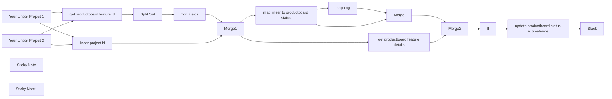

## Fluxo (.json) :

```json
{
  "meta": {
    "instanceId": "21b41c2deb1c9e3f543253a0aa6a6e2c7bd7ef6bab90ffd478aa947c17d3b352",
    "templateCredsSetupCompleted": true
  },
  "name": "Linear Project Status and End Date to Productboard feature Sync",
  "tags": [
    {
      "id": "6Ek7V8f4xbM9vWLj",
      "name": "linear",
      "createdAt": "2024-11-08T12:12:15.330Z",
      "updatedAt": "2024-11-08T12:12:15.330Z"
    },
    {
      "id": "XpcIJ8IHNenz3bWz",
      "name": "productboard",
      "createdAt": "2024-11-08T12:12:17.249Z",
      "updatedAt": "2024-11-08T12:12:17.249Z"
    }
  ],
  "nodes": [
    {
      "id": "5cf79e5e-6a69-49b5-865f-6ca8009dbf75",
      "name": "linear project id",
      "type": "n8n-nodes-base.set",
      "position": [
        3180,
        220
      ],
      "parameters": {
        "fields": {
          "values": [
            {
              "name": "linear_project_url",
              "stringValue": "={{ $json.url }}"
            },
            {
              "name": "linear_project_id",
              "stringValue": "={{ $json.url.split('https://linear.app/<your company>/project/')[1] }}"
            },
            {
              "name": "linear_project_status",
              "stringValue": "={{ $json.data.status.name }}"
            },
            {
              "name": "startDate",
              "stringValue": "={{ $json.data.startDate }}"
            },
            {
              "name": "targetDate",
              "stringValue": "={{ $json.data.targetDate }}"
            }
          ]
        },
        "include": "none",
        "options": {}
      },
      "typeVersion": 3.2
    },
    {
      "id": "642e73fc-8904-4631-9e97-1ccff6dbb559",
      "name": "get productboard feature id",
      "type": "n8n-nodes-base.httpRequest",
      "position": [
        3180,
        400
      ],
      "parameters": {
        "url": "https://api.productboard.com/hierarchy-entities/custom-fields-values",
        "options": {},
        "sendQuery": true,
        "sendHeaders": true,
        "authentication": "genericCredentialType",
        "genericAuthType": "httpHeaderAuth",
        "queryParameters": {
          "parameters": [
            {
              "name": "customField.id",
              "value": "<productboard_customfield_uuid>"
            }
          ]
        },
        "headerParameters": {
          "parameters": [
            {
              "name": "Content-Type",
              "value": "application/json"
            },
            {
              "name": "X-Version",
              "value": "1"
            }
          ]
        }
      },
      "stickyNote": "Fetches the Productboard feature ID using a custom field value.",
      "credentials": {
        "httpHeaderAuth": {
          "id": "Z0ptr85smbBZBIYx",
          "name": "Product Board"
        }
      },
      "notesInFlow": false,
      "typeVersion": 4.1
    },
    {
      "id": "3c328300-ff68-4958-8ac3-5b8fca122bbd",
      "name": "update productboard status & timeframe",
      "type": "n8n-nodes-base.httpRequest",
      "position": [
        5560,
        380
      ],
      "parameters": {
        "url": "=https://api.productboard.com/features/{{ $json.feature_id }}",
        "method": "PATCH",
        "options": {
          "batching": {
            "batch": {
              "batchSize": 1,
              "batchInterval": 2000
            }
          }
        },
        "jsonBody": "={\n  \"data\": {\n    \"status\": {\n      \"name\": \"{{ $json[\"productboard_status\"] }}\"\n    },\n    \"timeframe\": {\n      {{ $json[\"targetDate\"] ? '\"granularity\": \"month\",': '\"granularity\": \"none\",'}}\n      {{ $json[\"targetDate\"] ? '\"startDate\": \"' + $json['targetDate'].substring(0, 7) + '-01' +'\",': '\"startDate\": \"none\",'}}\n      {{ $json[\"targetDate\"] \n        ? (() => {\n            const date = new Date($json['targetDate']);\n            const year = date.getFullYear();\n            const month = date.getMonth() + 1;\n            const lastDay = new Date(year, month, 0).getDate();\n            return `\"endDate\": \"${year}-${month.toString().padStart(2, '0')}-${lastDay}\"`;\n          })() \n        : '\"endDate\": \"none\"'}}\n    }\n  }\n}",
        "sendBody": true,
        "sendHeaders": true,
        "specifyBody": "json",
        "authentication": "genericCredentialType",
        "genericAuthType": "httpHeaderAuth",
        "headerParameters": {
          "parameters": [
            {
              "name": "X-Version",
              "value": "1"
            },
            {
              "name": "accept",
              "value": "application/json"
            }
          ]
        }
      },
      "credentials": {
        "httpHeaderAuth": {
          "id": "Z0ptr85smbBZBIYx",
          "name": "Product Board"
        }
      },
      "typeVersion": 4.1
    },
    {
      "id": "ec57bdeb-413b-4f71-b8c4-82b966fd4caf",
      "name": "map linear to productboard status",
      "type": "n8n-nodes-base.set",
      "position": [
        4300,
        280
      ],
      "parameters": {
        "fields": {
          "values": [
            {
              "name": "linear_status",
              "stringValue": "={{ $json.linear_project_status }}"
            }
          ]
        },
        "options": {}
      },
      "typeVersion": 3.2
    },
    {
      "id": "052dcbb4-c113-4e1a-8469-e460a9bfefaf",
      "name": "mapping",
      "type": "n8n-nodes-base.code",
      "position": [
        4560,
        280
      ],
      "parameters": {
        "mode": "runOnceForEachItem",
        "jsCode": "const linearStatus = $json.linear_status;\nlet productboardStatus;\n\nswitch(linearStatus) {\n  case 'Backlog':\n    productboardStatus = 'Candidate';\n    break;\n  case 'Planned':\n    productboardStatus = 'Planned';\n    break;\n  case 'Paused':\n    productboardStatus = 'Planned';\n    break;\n  case 'In Progress':\n    productboardStatus = 'In progress';\n    break;\n  case 'Completed':\n    productboardStatus = 'Released';\n    break;\n  case 'Canceled':\n    productboardStatus = 'Won\\'t do';\n    break;\n  default:\n    productboardStatus = 'Candidate'; // Default or handle unknown status\n}\n\nreturn { productboard_status: productboardStatus };\n"
      },
      "typeVersion": 2
    },
    {
      "id": "4fee2a41-4e20-4642-badd-164c6d0b1232",
      "name": "Merge",
      "type": "n8n-nodes-base.merge",
      "position": [
        4780,
        300
      ],
      "parameters": {
        "mode": "combine",
        "options": {},
        "combinationMode": "mergeByPosition"
      },
      "typeVersion": 2.1
    },
    {
      "id": "49289417-ca21-4b03-b558-61a04b6eb7dd",
      "name": "Split Out",
      "type": "n8n-nodes-base.splitOut",
      "position": [
        3400,
        400
      ],
      "parameters": {
        "options": {},
        "fieldToSplitOut": "data"
      },
      "typeVersion": 1
    },
    {
      "id": "b89135b5-3c72-44a9-9d8e-b0190385cf65",
      "name": "Merge1",
      "type": "n8n-nodes-base.merge",
      "position": [
        3920,
        280
      ],
      "parameters": {
        "mode": "combine",
        "options": {},
        "mergeByFields": {
          "values": [
            {
              "field1": "linear_project_url",
              "field2": "linear_url_productboard"
            }
          ]
        }
      },
      "typeVersion": 2.1
    },
    {
      "id": "cf533225-7507-471e-9d45-4a490b30a01d",
      "name": "Edit Fields",
      "type": "n8n-nodes-base.set",
      "position": [
        3740,
        400
      ],
      "parameters": {
        "fields": {
          "values": [
            {
              "name": "linear_url_productboard",
              "stringValue": "={{ $json['value'].match('^(https://linear\\.app/[^/]+/project/[^/]+)')[0] }}"
            },
            {
              "name": "feature_id",
              "stringValue": "={{ $json['hierarchyEntity'].id }}"
            }
          ]
        },
        "include": "none",
        "options": {}
      },
      "typeVersion": 3.2
    },
    {
      "id": "ee7f8ef5-f5a9-4a39-9621-ccf908036eeb",
      "name": "Slack",
      "type": "n8n-nodes-base.slack",
      "position": [
        5820,
        380
      ],
      "parameters": {
        "text": "=:linear: {{ $json.data.name }} with status {{ $json.data.status.name }} and dates {{ $json.data.timeframe.startDate }} - {{ $json.data.timeframe.endDate }} updated :productboard: {{ $json.data.links.html }}.",
        "select": "channel",
        "blocksUi": "={\n  \"blocks\": [\n    {\n      \"type\": \"section\",\n      \"text\": {\n        \"type\": \"mrkdwn\",\n        \"text\": \":linear: to :productboard: update\\n\\n*{{ $json.data.name }}*\\n\\n*Status:* {{ $json.data.status.name }}\\n*:dart: date:* {{ $json[\"data\"][\"timeframe\"][\"endDate\"] && $json[\"data\"][\"timeframe\"][\"endDate\"] !== \"none\" ? new Date($json[\"data\"][\"timeframe\"][\"endDate\"]).toLocaleDateString(\"en-US\", { month: \"long\", year: \"numeric\" }) : \"none\" }}\"\n      }\n    },\n    {\n      \"type\": \"divider\"\n    },\n    {\n      \"type\": \"section\",\n      \"text\": {\n        \"type\": \"mrkdwn\",\n        \"text\": \"You can view the update in Productboard using the link below:\"\n      },\n      \"accessory\": {\n        \"type\": \"button\",\n        \"text\": {\n          \"type\": \"plain_text\",\n          \"text\": \"Open Productboard\"\n        },\n        \"url\": \"{{ $json.data.links.html }}\"\n      }\n    }\n  ]\n}\n",
        "channelId": {
          "__rl": true,
          "mode": "name",
          "value": "#product-notifications"
        },
        "messageType": "block",
        "otherOptions": {}
      },
      "credentials": {
        "slackApi": {
          "id": "SG3oDwwLGpxwoJSO",
          "name": "Slack"
        }
      },
      "typeVersion": 2.1
    },
    {
      "id": "4ab5c298-5947-47d1-ac10-db502a0b4b60",
      "name": "If",
      "type": "n8n-nodes-base.if",
      "position": [
        5280,
        400
      ],
      "parameters": {
        "options": {
          "looseTypeValidation": true
        },
        "conditions": {
          "options": {
            "leftValue": "",
            "caseSensitive": true,
            "typeValidation": "loose"
          },
          "combinator": "or",
          "conditions": [
            {
              "id": "f53c6eb9-61cc-4cf9-bbb6-03cc9f78b6b1",
              "operator": {
                "type": "string",
                "operation": "notEquals"
              },
              "leftValue": "={{ $json.productboard_status }}",
              "rightValue": "={{ $json.data.status.name }}"
            },
            {
              "id": "a61b4bca-47b0-48bb-b93f-ba9a419740d0",
              "operator": {
                "type": "string",
                "operation": "notEquals"
              },
              "leftValue": "={{ $json[\"targetDate\"] \n        ? (() => {\n            const date = new Date($json['targetDate']);\n            const year = date.getFullYear();\n            const month = date.getMonth() + 1;\n            const lastDay = new Date(year, month, 0).getDate();\n            return `${year}-${month.toString().padStart(2, '0')}-${lastDay}`;\n          })() \n        : '\"endDate\": \"none\"'}}",
              "rightValue": "={{ $json.data.timeframe.endDate }}"
            }
          ]
        }
      },
      "typeVersion": 2
    },
    {
      "id": "3efe9d27-7983-419d-8ac1-9efde3751952",
      "name": "get productboard feature details",
      "type": "n8n-nodes-base.httpRequest",
      "position": [
        4300,
        540
      ],
      "parameters": {
        "url": "=https://api.productboard.com/features/{{ $json.feature_id }}",
        "options": {},
        "sendHeaders": true,
        "authentication": "genericCredentialType",
        "genericAuthType": "httpHeaderAuth",
        "headerParameters": {
          "parameters": [
            {
              "name": "Content-Type",
              "value": "application/json"
            },
            {
              "name": "X-Version",
              "value": "1"
            }
          ]
        }
      },
      "credentials": {
        "httpHeaderAuth": {
          "id": "Z0ptr85smbBZBIYx",
          "name": "Product Board"
        }
      },
      "typeVersion": 4.1
    },
    {
      "id": "265b3359-c63d-4188-ad1b-a33ce5e081f5",
      "name": "Merge2",
      "type": "n8n-nodes-base.merge",
      "position": [
        5040,
        400
      ],
      "parameters": {
        "mode": "combine",
        "options": {},
        "joinMode": "keepEverything",
        "mergeByFields": {
          "values": [
            {
              "field1": "feature_id",
              "field2": "data.id"
            }
          ]
        }
      },
      "typeVersion": 2.1
    },
    {
      "id": "5dc1c2f5-a92d-49f4-acb9-8084bf878b05",
      "name": "Your Linear Project 2",
      "type": "n8n-nodes-base.linearTrigger",
      "position": [
        2840,
        260
      ],
      "webhookId": "180ebe54-3ab2-439f-b44b-40be97a62b87",
      "parameters": {
        "teamId": "8434c5f8-1ce0-4733-949d-ef6a095c27fd",
        "resources": [
          "project"
        ]
      },
      "credentials": {
        "linearApi": {
          "id": "hhmsOxH2jUEvGbvN",
          "name": "Linear"
        }
      },
      "typeVersion": 1
    },
    {
      "id": "6f70d103-cf98-4ab8-9550-a5749a40f7e3",
      "name": "Your Linear Project 1",
      "type": "n8n-nodes-base.linearTrigger",
      "position": [
        2840,
        60
      ],
      "webhookId": "5b10cdb4-85a6-41de-a0de-ce50c75dcc6f",
      "parameters": {
        "teamId": "e7c75e79-fbcf-45cc-95bd-110efb6cb555",
        "resources": [
          "project"
        ]
      },
      "credentials": {
        "linearApi": {
          "id": "hhmsOxH2jUEvGbvN",
          "name": "Linear"
        }
      },
      "typeVersion": 1
    },
    {
      "id": "65abdb10-dba2-4535-a155-957106ae6cdd",
      "name": "Sticky Note",
      "type": "n8n-nodes-base.stickyNote",
      "position": [
        2960,
        680
      ],
      "parameters": {
        "width": 487.89456119016046,
        "height": 156.00544089827184,
        "content": "## Tips\n- Avoid copying and pasting the Linear node; instead, add a new one from the menu.\n- Remember to configure the custom Productboard field in the \"Get Productboard Feature ID\" node."
      },
      "typeVersion": 1
    },
    {
      "id": "adcb71e4-880b-4c19-acbb-0708ae4af95f",
      "name": "Sticky Note1",
      "type": "n8n-nodes-base.stickyNote",
      "position": [
        5500,
        620
      ],
      "parameters": {
        "color": 5,
        "width": 492.6340257353018,
        "height": 182.8624066540728,
        "content": "## Preview Slack Message\n:linear: to :productboard: update\nMy awesome feature name\nStatus: Candidate\n:dart: date: Decembre 2024\nYou can view the update in Productboard using the link below:\n<link productboard feature>"
      },
      "typeVersion": 1
    }
  ],
  "active": false,
  "pinData": {},
  "settings": {
    "executionOrder": "v1"
  },
  "versionId": "",
  "connections": {
    "If": {
      "main": [
        [
          {
            "node": "update productboard status & timeframe",
            "type": "main",
            "index": 0
          }
        ]
      ]
    },
    "Merge": {
      "main": [
        [
          {
            "node": "Merge2",
            "type": "main",
            "index": 0
          }
        ]
      ]
    },
    "Merge1": {
      "main": [
        [
          {
            "node": "map linear to productboard status",
            "type": "main",
            "index": 0
          },
          {
            "node": "get productboard feature details",
            "type": "main",
            "index": 0
          }
        ]
      ]
    },
    "Merge2": {
      "main": [
        [
          {
            "node": "If",
            "type": "main",
            "index": 0
          }
        ]
      ]
    },
    "mapping": {
      "main": [
        [
          {
            "node": "Merge",
            "type": "main",
            "index": 0
          }
        ]
      ]
    },
    "Split Out": {
      "main": [
        [
          {
            "node": "Edit Fields",
            "type": "main",
            "index": 0
          }
        ]
      ]
    },
    "Edit Fields": {
      "main": [
        [
          {
            "node": "Merge1",
            "type": "main",
            "index": 1
          }
        ]
      ]
    },
    "linear project id": {
      "main": [
        [
          {
            "node": "Merge1",
            "type": "main",
            "index": 0
          }
        ]
      ]
    },
    "Your Linear Project 1": {
      "main": [
        [
          {
            "node": "get productboard feature id",
            "type": "main",
            "index": 0
          },
          {
            "node": "linear project id",
            "type": "main",
            "index": 0
          }
        ]
      ]
    },
    "Your Linear Project 2": {
      "main": [
        [
          {
            "node": "linear project id",
            "type": "main",
            "index": 0
          },
          {
            "node": "get productboard feature id",
            "type": "main",
            "index": 0
          }
        ]
      ]
    },
    "get productboard feature id": {
      "main": [
        [
          {
            "node": "Split Out",
            "type": "main",
            "index": 0
          }
        ]
      ]
    },
    "get productboard feature details": {
      "main": [
        [
          {
            "node": "Merge2",
            "type": "main",
            "index": 1
          }
        ]
      ]
    },
    "map linear to productboard status": {
      "main": [
        [
          {
            "node": "mapping",
            "type": "main",
            "index": 0
          },
          {
            "node": "Merge",
            "type": "main",
            "index": 1
          }
        ]
      ]
    },
    "update productboard status & timeframe": {
      "main": [
        [
          {
            "node": "Slack",
            "type": "main",
            "index": 0
          }
        ]
      ]
    }
  }
}
```

<a id="template-2544"></a>

## Template 2544 - Agente AI com scraping e chamadas a APIs

- **Nome:** Agente AI com scraping e chamadas a APIs
- **Descrição:** Fluxo que permite a um agente de IA receber entradas do usuário, consultar APIs externas (incluindo raspagem de páginas) e retornar respostas baseadas no conteúdo obtido.
- **Funcionalidade:** • Gatilho manual: inicia o processo para testar o agente com diferentes entradas.
• Entrada de chat: recebe a pergunta ou instrução do usuário que o agente deve resolver.
• Interpretação pelo modelo de linguagem: utiliza um modelo para entender a intenção e decidir quais ferramentas chamar.
• Raspagem de páginas web: chama um serviço de scraping para obter o conteúdo de uma URL em formato Markdown, com opções para limpar e ajustar o conteúdo retornado.
• Chamada a API de atividades: consulta um endpoint público que sugere atividades filtrando por tipo e número de participantes.
• Ferramentas HTTP integradas: permite que o agente execute requisições HTTP parametrizadas e receba respostas otimizadas para uso pelo modelo.
• Resposta orientada por ferramentas: o agente combina as respostas das ferramentas com a geração do modelo para fornecer uma resposta final coerente.
- **Ferramentas:** • OpenAI: modelo de linguagem usado para interpretar comandos do usuário, decidir ações e gerar respostas.
• Firecrawl (api.firecrawl.dev): serviço de raspagem de páginas que retorna conteúdo em Markdown com opções para extrair o conteúdo principal e limpar elementos.
• Bored API (bored-api.appbrewery.com): API pública que sugere atividades com filtros como tipo de atividade e número de participantes.


## Fluxo visual

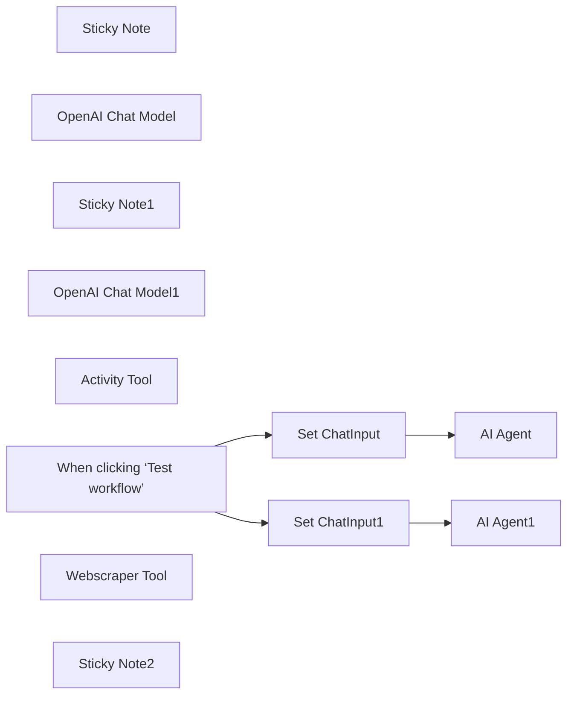

## Fluxo (.json) :

```json
{
  "meta": {
    "instanceId": "26ba763460b97c249b82942b23b6384876dfeb9327513332e743c5f6219c2b8e"
  },
  "nodes": [
    {
      "id": "abccacce-bbdc-428e-94e0-19996c5bfe02",
      "name": "Sticky Note",
      "type": "n8n-nodes-base.stickyNote",
      "position": [
        1720,
        160
      ],
      "parameters": {
        "color": 7,
        "width": 319.5392879244982,
        "height": 218.88813194060202,
        "content": "### AI agent that can scrape webpages\nRemake of https://n8n.io/workflows/2006-ai-agent-that-can-scrape-webpages/\n\n**Changes**:\n* Replaces Execute Workflow Tool and Subworkflow\n* Replaces Response Formatting"
      },
      "typeVersion": 1
    },
    {
      "id": "9fc05c79-5a2d-4ac4-a4f5-32b9c1b385e1",
      "name": "OpenAI Chat Model",
      "type": "@n8n/n8n-nodes-langchain.lmChatOpenAi",
      "position": [
        1340,
        340
      ],
      "parameters": {
        "options": {}
      },
      "credentials": {
        "openAiApi": {
          "id": "8gccIjcuf3gvaoEr",
          "name": "OpenAi account"
        }
      },
      "typeVersion": 1
    },
    {
      "id": "45c9bdaf-d51e-4026-8911-4b04c5473b06",
      "name": "Sticky Note1",
      "type": "n8n-nodes-base.stickyNote",
      "position": [
        1720,
        560
      ],
      "parameters": {
        "color": 7,
        "width": 365.9021913627245,
        "height": 245.35379866205295,
        "content": "### Allow your AI to call an API to fetch data\nRemake of https://n8n.io/workflows/2094-allow-your-ai-to-call-an-api-to-fetch-data/\n\n**Changes**:\n* Replaces Execute Workflow Tool and Subworkflow\n* Replaces Manual Query Params Definitions\n* Replaces Response Formatting"
      },
      "typeVersion": 1
    },
    {
      "id": "bc1754e6-01f4-4561-8814-c08feb45acec",
      "name": "OpenAI Chat Model1",
      "type": "@n8n/n8n-nodes-langchain.lmChatOpenAi",
      "position": [
        1340,
        740
      ],
      "parameters": {
        "options": {}
      },
      "credentials": {
        "openAiApi": {
          "id": "8gccIjcuf3gvaoEr",
          "name": "OpenAi account"
        }
      },
      "typeVersion": 1
    },
    {
      "id": "a40230ae-6050-4bb8-b275-3a893dc3ad98",
      "name": "Activity Tool",
      "type": "@n8n/n8n-nodes-langchain.toolHttpRequest",
      "position": [
        1560,
        740
      ],
      "parameters": {
        "url": "https://bored-api.appbrewery.com/filter",
        "sendQuery": true,
        "parametersQuery": {
          "values": [
            {
              "name": "type"
            },
            {
              "name": "participants"
            }
          ]
        },
        "toolDescription": "Call this tool to suggest an activity where:\n* the parameter \"type\" is one of \"education\", \"recreational\",\"social\",\"diy\",\"charity\",\"cooking\",\"relaxation\",\"music\",\"busywork\"\n* the parameter \"participants\" is the number of participants for the activity"
      },
      "typeVersion": 1
    },
    {
      "id": "297377e0-e149-4786-b521-82670ac390a7",
      "name": "Set ChatInput1",
      "type": "n8n-nodes-base.set",
      "position": [
        1180,
        560
      ],
      "parameters": {
        "options": {},
        "assignments": {
          "assignments": [
            {
              "id": "e976bf5f-8803-4129-9136-115b3d15755c",
              "name": "chatInput",
              "type": "string",
              "value": "Hi! Please suggest something to do. I feel like learning something new!"
            }
          ]
        }
      },
      "typeVersion": 3.4
    },
    {
      "id": "a9128da1-4486-4a17-b9b3-64ebc402348d",
      "name": "AI Agent1",
      "type": "@n8n/n8n-nodes-langchain.agent",
      "position": [
        1360,
        560
      ],
      "parameters": {
        "text": "={{ $json.chatInput }}",
        "options": {},
        "promptType": "define"
      },
      "typeVersion": 1.6
    },
    {
      "id": "28a5e75e-e32d-4c94-bea2-7347923e6bb9",
      "name": "Set ChatInput",
      "type": "n8n-nodes-base.set",
      "position": [
        1160,
        160
      ],
      "parameters": {
        "options": {},
        "assignments": {
          "assignments": [
            {
              "id": "9695c156-c882-4e43-8a4e-70fbdc1a63de",
              "name": "chatInput",
              "type": "string",
              "value": "Can get the latest 10 issues from https://github.com/n8n-io/n8n/issues?"
            }
          ]
        }
      },
      "typeVersion": 3.4
    },
    {
      "id": "d29b30fb-7edb-4665-bc6b-a511caf9db9f",
      "name": "When clicking ‘Test workflow’",
      "type": "n8n-nodes-base.manualTrigger",
      "position": [
        900,
        400
      ],
      "parameters": {},
      "typeVersion": 1
    },
    {
      "id": "066f9cdd-4bd3-48a1-bf9b-32eda3e28945",
      "name": "AI Agent",
      "type": "@n8n/n8n-nodes-langchain.agent",
      "position": [
        1360,
        160
      ],
      "parameters": {
        "text": "={{ $json.chatInput }}",
        "options": {},
        "promptType": "define"
      },
      "typeVersion": 1.6
    },
    {
      "id": "fb4abae8-7e38-47b7-9595-403e523f7125",
      "name": "Webscraper Tool",
      "type": "@n8n/n8n-nodes-langchain.toolHttpRequest",
      "position": [
        1560,
        340
      ],
      "parameters": {
        "url": "https://api.firecrawl.dev/v0/scrape",
        "fields": "markdown",
        "method": "POST",
        "sendBody": true,
        "dataField": "data",
        "authentication": "genericCredentialType",
        "parametersBody": {
          "values": [
            {
              "name": "url"
            },
            {
              "name": "pageOptions",
              "value": "={{ {\n onlyMainContent: true,\n replaceAllPathsWithAbsolutePaths: true,\n removeTags: 'img,svg,video,audio'\n} }}",
              "valueProvider": "fieldValue"
            }
          ]
        },
        "fieldsToInclude": "selected",
        "genericAuthType": "httpHeaderAuth",
        "toolDescription": "Call this tool to fetch a webpage content.",
        "optimizeResponse": true
      },
      "credentials": {
        "httpHeaderAuth": {
          "id": "OUOnyTkL9vHZNorB",
          "name": "Firecrawl API"
        }
      },
      "typeVersion": 1
    },
    {
      "id": "73d3213c-1ecb-4007-b882-1cc756a6f6e0",
      "name": "Sticky Note2",
      "type": "n8n-nodes-base.stickyNote",
      "position": [
        420,
        120
      ],
      "parameters": {
        "width": 413.82332632615135,
        "height": 435.92895157500243,
        "content": "## Try It Out!\n\n### The HTTP tool is drastically simplifies API-enabled AI agents cutting down the number of workflow nodes by as much as 10!\n\n* Available since v1.47.0\n* Recommended for single purpose APIs which don't require much post-fetch formatting.\n* If you require a chain of API calls, you may need to implement a subworkflow instead.\n\n### Need Help?\nJoin the [Discord](https://discord.com/invite/XPKeKXeB7d) or ask in the [Forum](https://community.n8n.io/)!\n\nHappy Hacking!"
      },
      "typeVersion": 1
    }
  ],
  "pinData": {},
  "connections": {
    "Activity Tool": {
      "ai_tool": [
        [
          {
            "node": "AI Agent1",
            "type": "ai_tool",
            "index": 0
          }
        ]
      ]
    },
    "Set ChatInput": {
      "main": [
        [
          {
            "node": "AI Agent",
            "type": "main",
            "index": 0
          }
        ]
      ]
    },
    "Set ChatInput1": {
      "main": [
        [
          {
            "node": "AI Agent1",
            "type": "main",
            "index": 0
          }
        ]
      ]
    },
    "Webscraper Tool": {
      "ai_tool": [
        [
          {
            "node": "AI Agent",
            "type": "ai_tool",
            "index": 0
          }
        ]
      ]
    },
    "OpenAI Chat Model": {
      "ai_languageModel": [
        [
          {
            "node": "AI Agent",
            "type": "ai_languageModel",
            "index": 0
          }
        ]
      ]
    },
    "OpenAI Chat Model1": {
      "ai_languageModel": [
        [
          {
            "node": "AI Agent1",
            "type": "ai_languageModel",
            "index": 0
          }
        ]
      ]
    },
    "When clicking ‘Test workflow’": {
      "main": [
        [
          {
            "node": "Set ChatInput",
            "type": "main",
            "index": 0
          },
          {
            "node": "Set ChatInput1",
            "type": "main",
            "index": 0
          }
        ]
      ]
    }
  }
}
```

<a id="template-2545"></a>

## Template 2545 - Geração automática de rascunhos de blog on‑brand

- **Nome:** Geração automática de rascunhos de blog on‑brand
- **Descrição:** Extrai artigos de um blog, analisa estrutura e voz da marca usando modelos de linguagem e gera rascunhos de artigos coerentes com o estilo identificado.
- **Funcionalidade:** • Gatilho manual: permite iniciar o processo manualmente para testes e execuções controladas.
• Importar artigos recentes: busca a página do blog para obter as publicações mais recentes.
• Extrair URLs de artigos: identifica e coleta links individuais de artigos a partir do HTML da página.
• Baixar conteúdo dos artigos: faz requisições às páginas dos artigos e extrai o conteúdo principal em HTML.
• Converter HTML para Markdown: transforma o conteúdo extraído em Markdown para reduzir tokens e preservar estrutura.
• Limitar número de artigos: seleciona um número máximo de artigos (ex.: 5) para análise.
• Agregar conteúdo: combina os artigos selecionados em um único corpus para análise consolidada.
• Analisar estrutura e estilo com LLM: descreve o melhor modo de replicar estrutura, layout e linguagem comuns entre os artigos.
• Extrair características de voz da marca: identifica tom, traços e exemplos da voz da marca e retorna em formato estruturado.
• Gerar novo artigo on-brand: usa diretrizes de estilo e voz para criar título, resumo e corpo do artigo em Markdown com instrução do usuário.
• Salvar rascunho no WordPress: grava o artigo gerado como rascunho, definindo título, slug e conteúdo para revisão humana.
- **Ferramentas:** • Website fonte (blog.n8n.io): site usado como origem dos artigos de exemplo para análise.
• OpenAI API: serviço de modelos de linguagem utilizado para analisar texto, extrair características de voz e gerar novo conteúdo.
• WordPress: plataforma onde o rascunho do artigo gerado é salvo para revisão e publicação.

## Fluxo visual

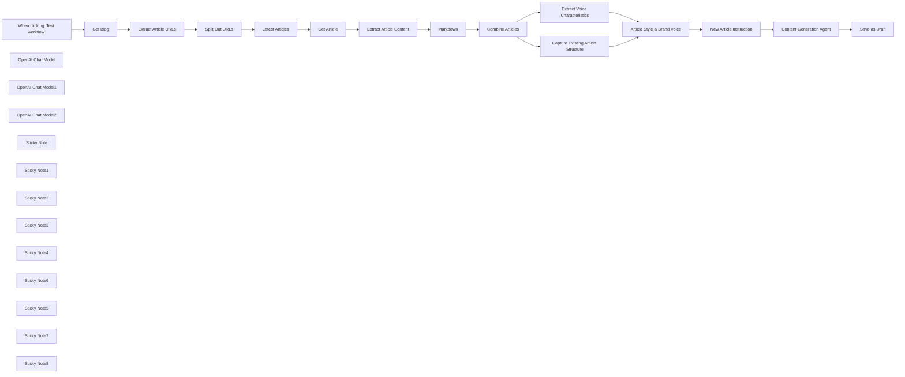

## Fluxo (.json) :

```json
{
  "nodes": [
    {
      "id": "d3159589-dbb7-4cca-91f5-09e8b2e4cba8",
      "name": "When clicking ‘Test workflow’",
      "type": "n8n-nodes-base.manualTrigger",
      "position": [
        240,
        500
      ],
      "parameters": {},
      "typeVersion": 1
    },
    {
      "id": "b4b42b3f-ef30-4fc8-829d-59f8974c4168",
      "name": "OpenAI Chat Model",
      "type": "@n8n/n8n-nodes-langchain.lmChatOpenAi",
      "position": [
        2180,
        700
      ],
      "parameters": {
        "options": {}
      },
      "credentials": {
        "openAiApi": {
          "id": "8gccIjcuf3gvaoEr",
          "name": "OpenAi account"
        }
      },
      "typeVersion": 1
    },
    {
      "id": "032c3012-ed8d-44eb-94f0-35790f4b616f",
      "name": "OpenAI Chat Model1",
      "type": "@n8n/n8n-nodes-langchain.lmChatOpenAi",
      "position": [
        2980,
        460
      ],
      "parameters": {
        "options": {}
      },
      "credentials": {
        "openAiApi": {
          "id": "8gccIjcuf3gvaoEr",
          "name": "OpenAi account"
        }
      },
      "typeVersion": 1
    },
    {
      "id": "bf922785-7e8f-4f93-bfff-813c16d93278",
      "name": "OpenAI Chat Model2",
      "type": "@n8n/n8n-nodes-langchain.lmChatOpenAi",
      "position": [
        2020,
        520
      ],
      "parameters": {
        "options": {}
      },
      "credentials": {
        "openAiApi": {
          "id": "8gccIjcuf3gvaoEr",
          "name": "OpenAi account"
        }
      },
      "typeVersion": 1
    },
    {
      "id": "d8d4b26f-270f-4b39-a4cd-a6e4361da591",
      "name": "Extract Voice Characteristics",
      "type": "@n8n/n8n-nodes-langchain.informationExtractor",
      "position": [
        2160,
        540
      ],
      "parameters": {
        "text": "=### Analyse the given content\n\n{{ $json.data.map(item => item.replace(/\\n/g, '')).join('\\n---\\n') }}",
        "options": {
          "systemPromptTemplate": "You help identify and define a company or individual's \"brand voice\". Using the given content belonging to the company or individual, extract all voice characteristics from it along with description and examples demonstrating it."
        },
        "schemaType": "manual",
        "inputSchema": "{\n\t\"type\": \"array\",\n    \"items\": {\n      \"type\": \"object\",\n    \t\"properties\": {\n          \"characteristic\": { \"type\": \"string\" },\n          \"description\": { \"type\": \"string\" },\n          \"examples\": { \"type\": \"array\", \"items\": { \"type\": \"string\" } }\n        }\n\t}\n}"
      },
      "typeVersion": 1
    },
    {
      "id": "8cca272c-b912-40f1-ba08-aa7c5ff7599c",
      "name": "Get Blog",
      "type": "n8n-nodes-base.httpRequest",
      "position": [
        480,
        500
      ],
      "parameters": {
        "url": "https://blog.n8n.io",
        "options": {}
      },
      "typeVersion": 4.2
    },
    {
      "id": "aa1e2a02-2e2b-4e8d-aef8-f5f7a54d9562",
      "name": "Get Article",
      "type": "n8n-nodes-base.httpRequest",
      "position": [
        1120,
        500
      ],
      "parameters": {
        "url": "=https://blog.n8n.io{{ $json.article }}",
        "options": {}
      },
      "typeVersion": 4.2
    },
    {
      "id": "78ae3dfc-5afd-452f-a2b6-bdb9dbd728bd",
      "name": "Extract Article URLs",
      "type": "n8n-nodes-base.html",
      "position": [
        640,
        500
      ],
      "parameters": {
        "options": {},
        "operation": "extractHtmlContent",
        "extractionValues": {
          "values": [
            {
              "key": "article",
              "attribute": "href",
              "cssSelector": ".item.post a.global-link",
              "returnArray": true,
              "returnValue": "attribute"
            }
          ]
        }
      },
      "typeVersion": 1.2
    },
    {
      "id": "3b2b6fea-ed2f-43ba-b6d1-e0666b88c65b",
      "name": "Split Out URLs",
      "type": "n8n-nodes-base.splitOut",
      "position": [
        800,
        500
      ],
      "parameters": {
        "options": {},
        "fieldToSplitOut": "article"
      },
      "typeVersion": 1
    },
    {
      "id": "68bb20b1-2177-4c0f-9ada-d1de69bdc2a0",
      "name": "Latest Articles",
      "type": "n8n-nodes-base.limit",
      "position": [
        960,
        500
      ],
      "parameters": {
        "maxItems": 5
      },
      "typeVersion": 1
    },
    {
      "id": "f20d7393-24c9-4a51-872e-0dce391f661c",
      "name": "Extract Article Content",
      "type": "n8n-nodes-base.html",
      "position": [
        1280,
        500
      ],
      "parameters": {
        "options": {},
        "operation": "extractHtmlContent",
        "extractionValues": {
          "values": [
            {
              "key": "data",
              "cssSelector": ".post-section",
              "returnValue": "html"
            }
          ]
        }
      },
      "typeVersion": 1.2
    },
    {
      "id": "299a04be-fe9b-47d9-b2c6-e2e4628f77e0",
      "name": "Combine Articles",
      "type": "n8n-nodes-base.aggregate",
      "position": [
        1780,
        540
      ],
      "parameters": {
        "options": {
          "mergeLists": true
        },
        "fieldsToAggregate": {
          "fieldToAggregate": [
            {
              "fieldToAggregate": "data"
            }
          ]
        }
      },
      "typeVersion": 1
    },
    {
      "id": "8480ece7-0dc1-4682-ba9e-ded2c138d8b8",
      "name": "Article Style & Brand Voice",
      "type": "n8n-nodes-base.merge",
      "position": [
        2560,
        320
      ],
      "parameters": {
        "mode": "combine",
        "options": {},
        "combineBy": "combineByPosition"
      },
      "typeVersion": 3
    },
    {
      "id": "024efee2-5a2f-455c-a150-4b9bdce650b2",
      "name": "Save as Draft",
      "type": "n8n-nodes-base.wordpress",
      "position": [
        3460,
        320
      ],
      "parameters": {
        "title": "={{ $json.output.title }}",
        "additionalFields": {
          "slug": "={{ $json.output.title.toSnakeCase() }}",
          "format": "standard",
          "status": "draft",
          "content": "={{ $json.output.body }}"
        }
      },
      "credentials": {
        "wordpressApi": {
          "id": "YMW8mGrekjfxKJUe",
          "name": "Wordpress account"
        }
      },
      "typeVersion": 1
    },
    {
      "id": "71f4ab1e-ef61-48f3-92e8-70691f7d0750",
      "name": "Sticky Note",
      "type": "n8n-nodes-base.stickyNote",
      "position": [
        480,
        180
      ],
      "parameters": {
        "color": 7,
        "width": 606,
        "height": 264,
        "content": "## 1. Import Existing Content\n[Read more about the HTML node](https://docs.n8n.io/integrations/builtin/core-nodes/n8n-nodes-base.html/)\n\nFirst, we'll need to gather existing content for the brand voice we want to replicate. This content can be blogs, social media posts or internal documents - the idea is to use this content to \"train\" our AI to produce content from the provided examples. One call out is that the quality and consistency of the content is important to get the desired results.\n\nIn this demonstration, we'll grab the latest blog posts off a corporate blog to use as an example. Since, the blog articles are likely consistent because of the source and narrower focus of the medium, it'll serve well to showcase this workflow."
      },
      "typeVersion": 1
    },
    {
      "id": "3d3a55a5-4b4a-4ea2-a39c-82b366fb81e6",
      "name": "Sticky Note1",
      "type": "n8n-nodes-base.stickyNote",
      "position": [
        1440,
        240
      ],
      "parameters": {
        "color": 7,
        "width": 434,
        "height": 230,
        "content": "## 2. Convert HTML to Markdown\n[Learn more about the Markdown node](https://docs.n8n.io/integrations/builtin/core-nodes/n8n-nodes-base.markdown)\n\nMarkdown is a great way to optimise the article data we're sending to the LLM because it reduces the amount of tokens required but keeps all relevant writing structure information.\n\nAlso useful to get Markdown output as a response because typically it's the format authors will write in."
      },
      "typeVersion": 1
    },
    {
      "id": "08c0b683-ec06-47ce-871c-66265195ca29",
      "name": "Sticky Note2",
      "type": "n8n-nodes-base.stickyNote",
      "position": [
        1980,
        80
      ],
      "parameters": {
        "color": 7,
        "width": 446,
        "height": 233,
        "content": "## 3. Using AI to Analyse Article Structure and Writing Styles\n[Read more about the Basic LLM Chain node](https://docs.n8n.io/integrations/builtin/cluster-nodes/root-nodes/n8n-nodes-langchain.chainllm)\n\nOur approach is to first perform a high-level analysis of all available articles in order to replicate their content layout and writing styles. This will act as a guideline to help the AI to structure our future articles."
      },
      "typeVersion": 1
    },
    {
      "id": "515fe69f-061e-4dfc-94ed-4cf2fbe10b7b",
      "name": "Capture Existing Article Structure",
      "type": "@n8n/n8n-nodes-langchain.chainLlm",
      "position": [
        2020,
        380
      ],
      "parameters": {
        "text": "={{ $json.data.join('\\n---\\n') }}",
        "messages": {
          "messageValues": [
            {
              "message": "=Given the following one or more articles (which are separated by ---), describe how best one could replicate the common structure, layout, language and writing styles of all as aggregate."
            }
          ]
        },
        "promptType": "define"
      },
      "typeVersion": 1.4
    },
    {
      "id": "ba4e68fb-eccc-4efa-84be-c42a695dccdb",
      "name": "Markdown",
      "type": "n8n-nodes-base.markdown",
      "position": [
        1600,
        540
      ],
      "parameters": {
        "html": "={{ $json.data }}",
        "options": {}
      },
      "typeVersion": 1
    },
    {
      "id": "d459ff5b-0375-4458-a49f-59700bb57e12",
      "name": "Sticky Note3",
      "type": "n8n-nodes-base.stickyNote",
      "position": [
        2340,
        740
      ],
      "parameters": {
        "color": 7,
        "width": 446,
        "height": 253,
        "content": "## 4. Using AI to Extract Voice Characteristics and Traits\n[Read more about the Information Extractor node](https://docs.n8n.io/integrations/builtin/cluster-nodes/root-nodes/n8n-nodes-langchain.information-extractor/)\n\nSecond, we'll use AI to analysis the brand voice characteristics of the previous articles. This picks out the tone, style and choice of language used and identifies them into categories. These categories will be used as guidelines for the AI to keep the future article consistent in tone and voice. "
      },
      "typeVersion": 1
    },
    {
      "id": "71fe32a9-1b8a-446c-a4ff-fb98c6a68e1b",
      "name": "Sticky Note4",
      "type": "n8n-nodes-base.stickyNote",
      "position": [
        2720,
        0
      ],
      "parameters": {
        "color": 7,
        "width": 626,
        "height": 633,
        "content": "## 5. Automate On-Brand Articles Using AI\n[Read more about the Information Extractor node](https://docs.n8n.io/integrations/builtin/cluster-nodes/root-nodes/n8n-nodes-langchain.information-extractor)\n\nFinally with this approach, we can feed both content and voice guidelines into our final LLM - our content generation agent - to produce any number of on-brand articles, social media posts etc.\n\nWhen it comes to assessing the output, note the AI does a pretty good job at simulating format and reusing common phrases and wording for the target article. However, this could become repetitive very quickly! Whilst AI can help speed up the process, a human touch may still be required to add a some variety."
      },
      "typeVersion": 1
    },
    {
      "id": "4e6fbe4e-869e-4bef-99ba-7b18740caecf",
      "name": "Content Generation Agent",
      "type": "@n8n/n8n-nodes-langchain.informationExtractor",
      "position": [
        3000,
        320
      ],
      "parameters": {
        "text": "={{ $json.instruction }}",
        "options": {
          "systemPromptTemplate": "=You are a blog content writer who writes using the following article guidelines. Write a content piece as requested by the user. Output the body as Markdown. Do not include the date of the article because the publishing date is not determined yet.\n\n## Brand Article Style\n{{ $('Article Style & Brand Voice').item.json.text }}\n\n##n Brand Voice Characteristics\n\nHere are the brand voice characteristic and examples you must adopt in your piece. Pick only the characteristic which make sense for the user's request. Try to keep it as similar as possible but don't copy word for word.\n\n|characteristic|description|examples|\n|-|-|-|\n{{\n$('Article Style & Brand Voice').item.json.output.map(item => (\n`|${item.characteristic}|${item.description}|${item.examples.map(ex => `\"${ex}\"`).join(', ')}|`\n)).join('\\n')\n}}"
        },
        "attributes": {
          "attributes": [
            {
              "name": "title",
              "required": true,
              "description": "title of article"
            },
            {
              "name": "summary",
              "required": true,
              "description": "summary of article"
            },
            {
              "name": "body",
              "required": true,
              "description": "body of article"
            },
            {
              "name": "characteristics",
              "required": true,
              "description": "comma delimited string of characteristics chosen"
            }
          ]
        }
      },
      "typeVersion": 1
    },
    {
      "id": "022de44c-c06c-41ac-bd50-38173dae9b37",
      "name": "Sticky Note6",
      "type": "n8n-nodes-base.stickyNote",
      "position": [
        3460,
        480
      ],
      "parameters": {
        "color": 7,
        "width": 406,
        "height": 173,
        "content": "## 6. Save Draft to Wordpress\n[Learn more about the Wordpress node](https://docs.n8n.io/integrations/builtin/app-nodes/n8n-nodes-base.wordpress/)\n\nTo close out the template, we'll simple save our generated article as a draft which could allow human team members to review and validate the article before publishing."
      },
      "typeVersion": 1
    },
    {
      "id": "fe54c40e-6ddd-45d6-a938-f467e4af3f57",
      "name": "Sticky Note5",
      "type": "n8n-nodes-base.stickyNote",
      "position": [
        2900,
        660
      ],
      "parameters": {
        "color": 5,
        "width": 440,
        "height": 120,
        "content": "### Q. Do I need to analyse Brand Voice for every article?\nA. No! I would recommend storing the results of the AI's analysis and re-use for a list of planned articles rather than generate anew every time."
      },
      "typeVersion": 1
    },
    {
      "id": "1832131e-21e8-44fc-9370-907f7b5a6eda",
      "name": "Sticky Note7",
      "type": "n8n-nodes-base.stickyNote",
      "position": [
        1000,
        680
      ],
      "parameters": {
        "color": 5,
        "width": 380,
        "height": 120,
        "content": "### Q. Can I use other media than blog articles?\nA. Yes! This approach can use other source materials such as PDFs, as long as they can be produces in a text format to give to the LLM."
      },
      "typeVersion": 1
    },
    {
      "id": "8e8706a3-122d-436b-9206-de7a6b2f3c39",
      "name": "Sticky Note8",
      "type": "n8n-nodes-base.stickyNote",
      "position": [
        -220,
        -120
      ],
      "parameters": {
        "width": 400,
        "height": 800,
        "content": "## Try It Out!\n### This n8n template demonstrates how to use AI to generate new on-brand written content by analysing previously published content.\n\nWith such an approach, it's possible to generate a steady stream of blog article drafts quickly with high consistency with your brand and existing content.\n\n### How it works\n* In this demonstration, the n8n.io blog is used as the source of existing published content and 5 of the latest articles are imported via the HTTP node.\n* The HTML node is extract the article  bodies which are then converted to markdown for our LLMs.\n* We use LLM nodes to (1) understand the article structure and writing style and (2) identify the brand voice characteristics used in the posts.\n* These are then used as guidelines in our final LLM node when generating new articles.\n* Finally, a draft is saved to Wordpress for human editors to review or use as starting point for their own articles.\n\n### How to use\n* Update Step 1 to fetch data from your desired blog or change to fetch existing content in a different way.\n* Update Step 5 to provide your new article instruction. For optimal output, theme topics relevant to your brand.\n\n\n### Need Help?\nJoin the [Discord](https://discord.com/invite/XPKeKXeB7d) or ask in the [Forum](https://community.n8n.io/)!\n\nHappy Hacking!"
      },
      "typeVersion": 1
    },
    {
      "id": "1510782d-0f88-40ca-99a8-44f984022c8e",
      "name": "New Article Instruction",
      "type": "n8n-nodes-base.set",
      "position": [
        2820,
        320
      ],
      "parameters": {
        "options": {},
        "assignments": {
          "assignments": [
            {
              "id": "2c7e2a28-30f9-4533-a394-a5e967ebf4ec",
              "name": "instruction",
              "type": "string",
              "value": "=Write a comprehensive guide on using AI for document classification and document extraction. Explain the benefits of using vision models over traditional OCR. Close out with a recommendation of using n8n as the preferred way to get started with this AI use-case."
            }
          ]
        }
      },
      "typeVersion": 3.4
    }
  ],
  "pinData": {},
  "connections": {
    "Get Blog": {
      "main": [
        [
          {
            "node": "Extract Article URLs",
            "type": "main",
            "index": 0
          }
        ]
      ]
    },
    "Markdown": {
      "main": [
        [
          {
            "node": "Combine Articles",
            "type": "main",
            "index": 0
          }
        ]
      ]
    },
    "Get Article": {
      "main": [
        [
          {
            "node": "Extract Article Content",
            "type": "main",
            "index": 0
          }
        ]
      ]
    },
    "Split Out URLs": {
      "main": [
        [
          {
            "node": "Latest Articles",
            "type": "main",
            "index": 0
          }
        ]
      ]
    },
    "Latest Articles": {
      "main": [
        [
          {
            "node": "Get Article",
            "type": "main",
            "index": 0
          }
        ]
      ]
    },
    "Combine Articles": {
      "main": [
        [
          {
            "node": "Capture Existing Article Structure",
            "type": "main",
            "index": 0
          },
          {
            "node": "Extract Voice Characteristics",
            "type": "main",
            "index": 0
          }
        ]
      ]
    },
    "OpenAI Chat Model": {
      "ai_languageModel": [
        [
          {
            "node": "Extract Voice Characteristics",
            "type": "ai_languageModel",
            "index": 0
          }
        ]
      ]
    },
    "OpenAI Chat Model1": {
      "ai_languageModel": [
        [
          {
            "node": "Content Generation Agent",
            "type": "ai_languageModel",
            "index": 0
          }
        ]
      ]
    },
    "OpenAI Chat Model2": {
      "ai_languageModel": [
        [
          {
            "node": "Capture Existing Article Structure",
            "type": "ai_languageModel",
            "index": 0
          }
        ]
      ]
    },
    "Extract Article URLs": {
      "main": [
        [
          {
            "node": "Split Out URLs",
            "type": "main",
            "index": 0
          }
        ]
      ]
    },
    "Extract Article Content": {
      "main": [
        [
          {
            "node": "Markdown",
            "type": "main",
            "index": 0
          }
        ]
      ]
    },
    "New Article Instruction": {
      "main": [
        [
          {
            "node": "Content Generation Agent",
            "type": "main",
            "index": 0
          }
        ]
      ]
    },
    "Content Generation Agent": {
      "main": [
        [
          {
            "node": "Save as Draft",
            "type": "main",
            "index": 0
          }
        ]
      ]
    },
    "Article Style & Brand Voice": {
      "main": [
        [
          {
            "node": "New Article Instruction",
            "type": "main",
            "index": 0
          }
        ]
      ]
    },
    "Extract Voice Characteristics": {
      "main": [
        [
          {
            "node": "Article Style & Brand Voice",
            "type": "main",
            "index": 1
          }
        ]
      ]
    },
    "When clicking ‘Test workflow’": {
      "main": [
        [
          {
            "node": "Get Blog",
            "type": "main",
            "index": 0
          }
        ]
      ]
    },
    "Capture Existing Article Structure": {
      "main": [
        [
          {
            "node": "Article Style & Brand Voice",
            "type": "main",
            "index": 0
          }
        ]
      ]
    }
  }
}
```

<a id="template-2546"></a>

## Template 2546 - Processador IA de chamadas Gong

- **Nome:** Processador IA de chamadas Gong
- **Descrição:** Automatiza a extração, enriquecimento e processamento de chamadas do Gong: coleta chamadas, busca dados de integrações e concorrentes, remove duplicatas, gera transcrições limpas e encaminha cada chamada para um processador que retorna JSON estruturado.
- **Funcionalidade:** • Coleta de chamadas do Gong: Busca chamadas dentro de um intervalo de tempo definido.
• Enriquecimento com integrações: Recupera dados de integrações (ex.: planilhas) para complementar o contexto das chamadas.
• Obtenção de concorrentes: Puxa uma lista de concorrentes para uso no contexto e verificação de transcrição.
• Agregação de dados: Junta resultados de várias fontes em objetos consolidados para processamento conjunto.
• Remoção de duplicatas: Compara chamadas com registros anteriores e filtra apenas chamadas novas para evitar processamentos repetidos.
• Redução a um único objeto: Constrói um único objeto contendo todos os dados necessários para o processamento posterior.
• Processamento em lote e em loop: Divide a fila em lotes ou itera por chamada para processar individualmente.
• Geração de transcrições limpas: Produz transcrições otimizadas para reduzir necessidade de prompting posterior.
• Encaminhamento para processador de chamadas: Envia cada transcrição para um workflow/processo que retorna saída em JSON estruturado.
- **Ferramentas:** • Gong: Plataforma de gravação e análise de chamadas usada para obter as gravações e metadados das conversas.
• Google Sheets: Fonte de dados de integração usada para enriquecer o contexto das chamadas.
• Notion: Base de dados usada para recuperar listas de concorrentes e registros de chamadas já processadas.
• OpenAI: Serviço de IA utilizado para limpar, processar e estruturar transcrições das chamadas em JSON.

## Fluxo visual

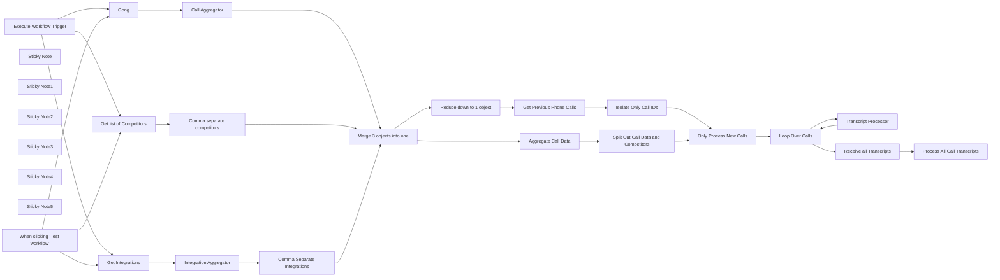

## Fluxo (.json) :

```json
{
  "meta": {
    "instanceId": "cb484ba7b742928a2048bf8829668bed5b5ad9787579adea888f05980292a4a7",
    "templateCredsSetupCompleted": true
  },
  "nodes": [
    {
      "id": "25fb4302-853a-421d-8e4f-4a18d723c4a0",
      "name": "When clicking ‘Test workflow’",
      "type": "n8n-nodes-base.manualTrigger",
      "disabled": true,
      "position": [
        -860,
        380
      ],
      "parameters": {},
      "typeVersion": 1
    },
    {
      "id": "acb8e29a-75b8-4ccb-aca8-20d5a7053334",
      "name": "Gong",
      "type": "n8n-nodes-base.gong",
      "disabled": true,
      "position": [
        -440,
        120
      ],
      "parameters": {
        "filters": {
          "toDateTime": "={{ $now.toISO() }}",
          "fromDateTime": "={{ $now.minus({ days: 2 }).toISO() }}"
        },
        "options": {},
        "returnAll": true,
        "requestOptions": {}
      },
      "credentials": {
        "gongApi": {
          "id": "EchfvOC4rjw8MUkr",
          "name": "Liam Gong Cred"
        }
      },
      "typeVersion": 1
    },
    {
      "id": "930a7fc9-64a1-4966-be0d-c58132b735e5",
      "name": "Sticky Note",
      "type": "n8n-nodes-base.stickyNote",
      "position": [
        -700,
        -60
      ],
      "parameters": {
        "color": 7,
        "width": 1080,
        "height": 920,
        "content": "## Get Gong Calls and Supporting Data\nBesides the phone calls, integration and competitor data is extracted to supplement the AI prompt with accurate data to compare against mispronunciations. "
      },
      "typeVersion": 1
    },
    {
      "id": "f21ae8cc-eed1-4d31-8b1f-cc731e3dc642",
      "name": "Sticky Note1",
      "type": "n8n-nodes-base.stickyNote",
      "position": [
        400,
        -60
      ],
      "parameters": {
        "color": 7,
        "width": 880,
        "height": 920,
        "content": "## Remove Duplicates from Queue\nChecks notion for already processed calls and removes them from the processing queue ensuring data is not duplicated. "
      },
      "typeVersion": 1
    },
    {
      "id": "d796312a-2a7f-429f-8550-d4af6d81a26d",
      "name": "Transcript Processor",
      "type": "n8n-nodes-base.executeWorkflow",
      "position": [
        2200,
        640
      ],
      "parameters": {
        "options": {},
        "workflowId": {
          "__rl": true,
          "mode": "list",
          "value": "7BAQDjnHQVYO1SWG",
          "cachedResultName": "Transcript Processor Demo"
        }
      },
      "typeVersion": 1.1
    },
    {
      "id": "b381f944-d865-450e-a24d-31d394a01b36",
      "name": "Sticky Note2",
      "type": "n8n-nodes-base.stickyNote",
      "position": [
        1820,
        420
      ],
      "parameters": {
        "color": 7,
        "width": 700,
        "height": 440,
        "content": "## Generate Clean Transcript \nAllows for reduced prompting in the OpenAI node. "
      },
      "typeVersion": 1
    },
    {
      "id": "7a87e6a0-0009-4776-bf2e-bea68702c808",
      "name": "Sticky Note3",
      "type": "n8n-nodes-base.stickyNote",
      "position": [
        1820,
        -40
      ],
      "parameters": {
        "color": 7,
        "width": 700,
        "height": 440,
        "content": "## Pass Call Transcripts to Call Processor\nThe OpenAI node handles this process and outputs in structured JSON."
      },
      "typeVersion": 1
    },
    {
      "id": "4c3b5280-c5e1-49d1-9651-e3fdd45978f7",
      "name": "Sticky Note4",
      "type": "n8n-nodes-base.stickyNote",
      "position": [
        1300,
        -60
      ],
      "parameters": {
        "color": 7,
        "width": 500,
        "height": 920,
        "content": "## Loop through all calls to get enrichment\nAllows for easier processing due to complexity "
      },
      "typeVersion": 1
    },
    {
      "id": "ce942178-c93e-490a-9b4e-0798f8c5c742",
      "name": "Sticky Note5",
      "type": "n8n-nodes-base.stickyNote",
      "position": [
        -1080,
        -340
      ],
      "parameters": {
        "color": 5,
        "width": 360,
        "height": 1200,
        "content": "\n## CallForge - The AI Gong Sales Call Processor\nCallForge allows you to extract important information for different departments from your Sales Gong Calls. \n\n### Call PreProcessor\nThis workflow preps the calls to pass into the call processor. It also pulls data from the product in order to enrich the AI Prompt to catch typos in the Gong call transcript. It then cleans up the transcript into a single string and then sends it to the call processor."
      },
      "typeVersion": 1
    },
    {
      "id": "41f3d049-e25b-453a-bf98-501af7f177d0",
      "name": "Execute Workflow Trigger",
      "type": "n8n-nodes-base.executeWorkflowTrigger",
      "position": [
        -860,
        580
      ],
      "parameters": {},
      "typeVersion": 1
    },
    {
      "id": "02265963-ab06-4bf5-8b0b-5299cd3330c9",
      "name": "Call Aggregator",
      "type": "n8n-nodes-base.aggregate",
      "position": [
        -100,
        120
      ],
      "parameters": {
        "options": {},
        "aggregate": "aggregateAllItemData",
        "destinationFieldName": "calls"
      },
      "typeVersion": 1
    },
    {
      "id": "044e1b65-059c-4084-b85a-e10e6149be34",
      "name": "Integration Aggregator",
      "type": "n8n-nodes-base.aggregate",
      "position": [
        -240,
        380
      ],
      "parameters": {
        "options": {},
        "fieldsToAggregate": {
          "fieldToAggregate": [
            {
              "fieldToAggregate": "Google Sheets"
            }
          ]
        }
      },
      "typeVersion": 1
    },
    {
      "id": "31df099f-45ec-4dff-b968-a90e7eaa67b5",
      "name": "Get Integrations",
      "type": "n8n-nodes-base.googleSheets",
      "position": [
        -460,
        380
      ],
      "parameters": {
        "options": {},
        "sheetName": {
          "__rl": true,
          "mode": "list",
          "value": 1859794756,
          "cachedResultUrl": "https://docs.google.com/spreadsheets/d/1DKrLntdoNScMey5Bb4ggSpS8NFHlYN3kuTJQbrbJU7I/edit#gid=1859794756",
          "cachedResultName": "Sheet1"
        },
        "documentId": {
          "__rl": true,
          "mode": "list",
          "value": "1DKrLntdoNScMey5Bb4ggSpS8NFHlYN3kuTJQbrbJU7I",
          "cachedResultUrl": "https://docs.google.com/spreadsheets/d/1DKrLntdoNScMey5Bb4ggSpS8NFHlYN3kuTJQbrbJU7I/edit?usp=drivesdk",
          "cachedResultName": "Most Popular Node Combos"
        }
      },
      "credentials": {
        "googleSheetsOAuth2Api": {
          "id": "4ZBfVX71VUd6pRy3",
          "name": "Google Sheets Angel Access"
        }
      },
      "executeOnce": true,
      "typeVersion": 4.5
    },
    {
      "id": "42a8299e-d2e4-48a9-bba9-1c5e419d8c0c",
      "name": "Comma Separate Integrations",
      "type": "n8n-nodes-base.set",
      "position": [
        -20,
        380
      ],
      "parameters": {
        "options": {},
        "assignments": {
          "assignments": [
            {
              "id": "39dfde65-e5e0-46d8-8596-af7ea31fcd3b",
              "name": "integrations",
              "type": "string",
              "value": "={{ $json[\"Google Sheets\"].join() }}"
            }
          ]
        }
      },
      "typeVersion": 3.4
    },
    {
      "id": "4226f79a-8b28-46d7-8b3b-972ef41d9535",
      "name": "Comma separate competitors",
      "type": "n8n-nodes-base.set",
      "position": [
        -20,
        580
      ],
      "parameters": {
        "options": {},
        "assignments": {
          "assignments": [
            {
              "id": "c419af9b-f161-4aac-863f-3a450aaf759f",
              "name": "competitors",
              "type": "string",
              "value": "={{ $jmespath($json.properties['Competitor vs.'].select.options, '[].name').join() }}"
            }
          ]
        }
      },
      "typeVersion": 3.4
    },
    {
      "id": "cce3fab9-63fb-49de-8e3f-4fb7956d0b80",
      "name": "Get list of Competitors",
      "type": "n8n-nodes-base.notion",
      "position": [
        -460,
        580
      ],
      "parameters": {
        "simple": false,
        "resource": "database",
        "databaseId": {
          "__rl": true,
          "mode": "list",
          "value": "2cb8596f-2029-4d15-bf56-7001652f6fcf",
          "cachedResultUrl": "https://www.notion.so/2cb8596f20294d15bf567001652f6fcf",
          "cachedResultName": "n8n vs."
        }
      },
      "credentials": {
        "notionApi": {
          "id": "80",
          "name": "Notion david-internal"
        }
      },
      "retryOnFail": true,
      "typeVersion": 2.2,
      "waitBetweenTries": 3000
    },
    {
      "id": "05e82483-ed91-4733-a8a7-621d8cf6f3f1",
      "name": "Merge 3 objects into one",
      "type": "n8n-nodes-base.merge",
      "position": [
        260,
        380
      ],
      "parameters": {
        "numberInputs": 3
      },
      "typeVersion": 3
    },
    {
      "id": "f01f839a-b0b5-4368-8cd3-3466f3cd44a4",
      "name": "Aggregate Call Data",
      "type": "n8n-nodes-base.aggregate",
      "position": [
        560,
        240
      ],
      "parameters": {
        "options": {},
        "aggregate": "aggregateAllItemData",
        "destinationFieldName": "calldata"
      },
      "typeVersion": 1
    },
    {
      "id": "c89b9deb-7f52-4d0d-8cdf-ce1b2a1771d2",
      "name": "Split Out Call Data and Competitors",
      "type": "n8n-nodes-base.splitOut",
      "position": [
        760,
        240
      ],
      "parameters": {
        "include": "selectedOtherFields",
        "options": {},
        "fieldToSplitOut": "calldata[0].calls",
        "fieldsToInclude": "calldata[1].integrations, , calldata[2].competitors"
      },
      "typeVersion": 1
    },
    {
      "id": "c5c90fd2-03f4-425c-9a49-b26887705c6c",
      "name": "Reduce down to 1 object",
      "type": "n8n-nodes-base.aggregate",
      "position": [
        480,
        580
      ],
      "parameters": {
        "options": {},
        "aggregate": "aggregateAllItemData"
      },
      "typeVersion": 1
    },
    {
      "id": "3835aeb8-589c-49b5-995a-2bf0bc0698a8",
      "name": "Get Previous Phone Calls",
      "type": "n8n-nodes-base.notion",
      "position": [
        700,
        580
      ],
      "parameters": {
        "options": {},
        "resource": "databasePage",
        "operation": "getAll",
        "returnAll": true,
        "databaseId": {
          "__rl": true,
          "mode": "list",
          "value": "1a85b6e0-c94f-81a3-aa21-e3ccf8296d72",
          "cachedResultUrl": "https://www.notion.so/1a85b6e0c94f81a3aa21e3ccf8296d72",
          "cachedResultName": "Sales Call Summaries Demo"
        }
      },
      "credentials": {
        "notionApi": {
          "id": "2B3YIiD4FMsF9Rjn",
          "name": "Angelbot Notion"
        }
      },
      "retryOnFail": true,
      "typeVersion": 2.2,
      "waitBetweenTries": 3000
    },
    {
      "id": "9b7d60bd-d08a-4529-aefb-c89f277fcd8f",
      "name": "Isolate Only Call IDs",
      "type": "n8n-nodes-base.set",
      "position": [
        900,
        580
      ],
      "parameters": {
        "options": {},
        "assignments": {
          "assignments": [
            {
              "id": "328e6ac8-88f3-4c2f-b8e8-d4a0756efd24",
              "name": "Call ID",
              "type": "string",
              "value": "={{ $json.property_gong_call_id ? $json.property_gong_call_id : \"none\" }}"
            }
          ]
        }
      },
      "typeVersion": 3.4
    },
    {
      "id": "3eb7613c-2eaa-430a-9f67-5fc486b84ff0",
      "name": "Only Process New Calls",
      "type": "n8n-nodes-base.compareDatasets",
      "position": [
        1120,
        420
      ],
      "parameters": {
        "options": {},
        "resolve": "preferInput1",
        "mergeByFields": {
          "values": [
            {
              "field1": "['calldata[0].calls'].id",
              "field2": "Call ID"
            }
          ]
        }
      },
      "typeVersion": 2.3
    },
    {
      "id": "5e69b2a1-eb6a-4bb4-a126-0605f60ff95b",
      "name": "Loop Over Calls",
      "type": "n8n-nodes-base.splitInBatches",
      "position": [
        1500,
        400
      ],
      "parameters": {
        "options": {}
      },
      "typeVersion": 3
    },
    {
      "id": "6b170ccb-d492-4e7e-9aeb-13c769d36040",
      "name": "Process All Call Transcripts",
      "type": "n8n-nodes-base.executeWorkflow",
      "position": [
        2200,
        140
      ],
      "parameters": {
        "options": {},
        "workflowId": {
          "__rl": true,
          "mode": "list",
          "value": "cg4Eo7yZlhWkqHCB",
          "cachedResultName": "Call Processor Demo"
        }
      },
      "typeVersion": 1.1
    },
    {
      "id": "3107c6d8-0c8c-4dad-bcbc-c897b0be45b9",
      "name": "Receive all Transcripts",
      "type": "n8n-nodes-base.noOp",
      "position": [
        1920,
        140
      ],
      "parameters": {},
      "typeVersion": 1
    }
  ],
  "pinData": {},
  "connections": {
    "Gong": {
      "main": [
        [
          {
            "node": "Call Aggregator",
            "type": "main",
            "index": 0
          }
        ]
      ]
    },
    "Call Aggregator": {
      "main": [
        [
          {
            "node": "Merge 3 objects into one",
            "type": "main",
            "index": 0
          }
        ]
      ]
    },
    "Loop Over Calls": {
      "main": [
        [
          {
            "node": "Receive all Transcripts",
            "type": "main",
            "index": 0
          }
        ],
        [
          {
            "node": "Transcript Processor",
            "type": "main",
            "index": 0
          }
        ]
      ]
    },
    "Get Integrations": {
      "main": [
        [
          {
            "node": "Integration Aggregator",
            "type": "main",
            "index": 0
          }
        ]
      ]
    },
    "Aggregate Call Data": {
      "main": [
        [
          {
            "node": "Split Out Call Data and Competitors",
            "type": "main",
            "index": 0
          }
        ]
      ]
    },
    "Transcript Processor": {
      "main": [
        [
          {
            "node": "Loop Over Calls",
            "type": "main",
            "index": 0
          }
        ]
      ]
    },
    "Isolate Only Call IDs": {
      "main": [
        [
          {
            "node": "Only Process New Calls",
            "type": "main",
            "index": 1
          }
        ]
      ]
    },
    "Integration Aggregator": {
      "main": [
        [
          {
            "node": "Comma Separate Integrations",
            "type": "main",
            "index": 0
          }
        ]
      ]
    },
    "Only Process New Calls": {
      "main": [
        [
          {
            "node": "Loop Over Calls",
            "type": "main",
            "index": 0
          }
        ]
      ]
    },
    "Get list of Competitors": {
      "main": [
        [
          {
            "node": "Comma separate competitors",
            "type": "main",
            "index": 0
          }
        ]
      ]
    },
    "Receive all Transcripts": {
      "main": [
        [
          {
            "node": "Process All Call Transcripts",
            "type": "main",
            "index": 0
          }
        ]
      ]
    },
    "Reduce down to 1 object": {
      "main": [
        [
          {
            "node": "Get Previous Phone Calls",
            "type": "main",
            "index": 0
          }
        ]
      ]
    },
    "Execute Workflow Trigger": {
      "main": [
        [
          {
            "node": "Gong",
            "type": "main",
            "index": 0
          },
          {
            "node": "Get list of Competitors",
            "type": "main",
            "index": 0
          },
          {
            "node": "Get Integrations",
            "type": "main",
            "index": 0
          }
        ]
      ]
    },
    "Get Previous Phone Calls": {
      "main": [
        [
          {
            "node": "Isolate Only Call IDs",
            "type": "main",
            "index": 0
          }
        ]
      ]
    },
    "Merge 3 objects into one": {
      "main": [
        [
          {
            "node": "Aggregate Call Data",
            "type": "main",
            "index": 0
          },
          {
            "node": "Reduce down to 1 object",
            "type": "main",
            "index": 0
          }
        ]
      ]
    },
    "Comma separate competitors": {
      "main": [
        [
          {
            "node": "Merge 3 objects into one",
            "type": "main",
            "index": 2
          }
        ]
      ]
    },
    "Comma Separate Integrations": {
      "main": [
        [
          {
            "node": "Merge 3 objects into one",
            "type": "main",
            "index": 1
          }
        ]
      ]
    },
    "When clicking ‘Test workflow’": {
      "main": [
        [
          {
            "node": "Gong",
            "type": "main",
            "index": 0
          },
          {
            "node": "Get Integrations",
            "type": "main",
            "index": 0
          },
          {
            "node": "Get list of Competitors",
            "type": "main",
            "index": 0
          }
        ]
      ]
    },
    "Split Out Call Data and Competitors": {
      "main": [
        [
          {
            "node": "Only Process New Calls",
            "type": "main",
            "index": 0
          }
        ]
      ]
    }
  }
}
```

<a id="template-2547"></a>

## Template 2547 - Análise multimodal de imagens e PDFs com Gemini

- **Nome:** Análise multimodal de imagens e PDFs com Gemini
- **Descrição:** Fluxo demonstrativo que mostra cinco abordagens para analisar imagens e PDFs usando o modelo Google Gemini (PaLM), oferecendo desde envio direto de binários até chamadas HTTP diretas com conversão para base64 e prompts personalizados.
- **Funcionalidade:** • Análise multimodal com Gemini: Envia imagens e PDFs ao modelo para obter descrições, cores predominantes, resumos e outros insights.
• Passagem automática de binários para agente AI: Permite enviar imagens diretamente ao agente sem transformação quando configurado para passthrough, simplificando a análise de uma única imagem.
• Prompts personalizados por imagem: Associa instruções específicas a cada URL para obter respostas diferentes conforme o objetivo desejado por item.
• Filtragem condicional de itens: Processa somente os itens marcados como 'process' para evitar análise desnecessária.
• Processamento em lote e iteração: Divide arrays de URLs em itens individuais e itera sobre eles, incluindo processamento em lotes quando necessário.
• Conversão de arquivos para base64: Converte conteúdos binários (imagens e PDFs) para base64 para envio inline nas chamadas à API.
• Chamadas diretas à API de linguagem generativa: Realiza requisições HTTP personalizadas ao endpoint Generative Language/Gemini para maior controle do payload e autenticação.
• Suporte a múltiplos métodos de integração: Demonstra trade-offs entre implementação rápida (passthrough) e controle avançado (transformação e chamadas diretas).
- **Ferramentas:** • Google Gemini (PaLM) / Generative Language API: Modelo de linguagem multimodal usado para gerar respostas e análises a partir de imagens e PDFs.
• Unsplash / plus.unsplash.com: Fonte de imagens públicas utilizadas como exemplos de entrada.
• Hospedagem pública de PDFs (w3.org): URL de exemplo para obter PDFs de teste usados no fluxo.


## Fluxo visual

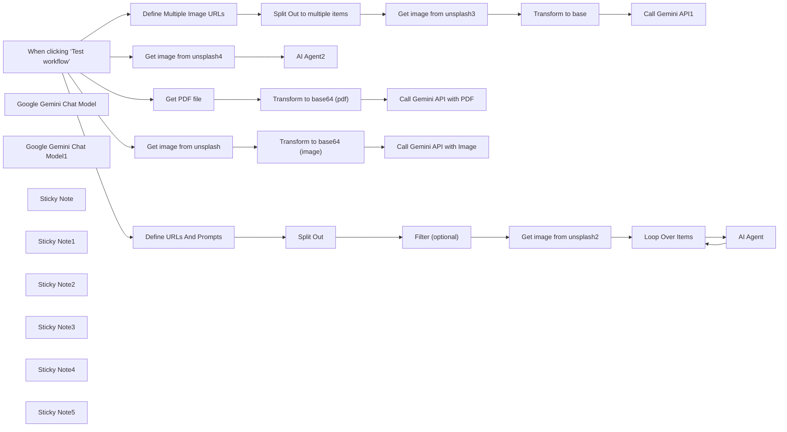

## Fluxo (.json) :

```json
{
  "meta": {
    "instanceId": "d4d7965840e96e50a3e02959a8487c692901dfa8d5cc294134442c67ce1622d3",
    "templateCredsSetupCompleted": true
  },
  "nodes": [
    {
      "id": "eec7d9b8-d1e3-4a43-9e0d-f6d750e736b5",
      "name": "When clicking ‘Test workflow’",
      "type": "n8n-nodes-base.manualTrigger",
      "position": [
        -640,
        -400
      ],
      "parameters": {},
      "typeVersion": 1
    },
    {
      "id": "5276a2cf-3d42-409a-800d-9080aa5e1a09",
      "name": "Google Gemini Chat Model",
      "type": "@n8n/n8n-nodes-langchain.lmChatGoogleGemini",
      "position": [
        1820,
        -60
      ],
      "parameters": {
        "options": {},
        "modelName": "models/gemini-2.0-flash"
      },
      "credentials": {
        "googlePalmApi": {
          "id": "BB5B0v4OaFQeEt3C",
          "name": "Google Gemini(PaLM) Api account"
        }
      },
      "typeVersion": 1
    },
    {
      "id": "1b89dca9-1137-4e0f-b3ff-1b354152c128",
      "name": "AI Agent",
      "type": "@n8n/n8n-nodes-langchain.agent",
      "position": [
        1880,
        -260
      ],
      "parameters": {
        "text": "={{ $('Loop Over Items').all() }}",
        "options": {
          "passthroughBinaryImages": true
        },
        "promptType": "define"
      },
      "typeVersion": 1.7
    },
    {
      "id": "00348203-882f-48da-8127-e57cf30c5b20",
      "name": "Get image from unsplash2",
      "type": "n8n-nodes-base.httpRequest",
      "position": [
        1160,
        -280
      ],
      "parameters": {
        "url": "={{ $json.url }}",
        "options": {}
      },
      "typeVersion": 4.2
    },
    {
      "id": "1b07777f-954b-4471-ab4b-070c902c0bc1",
      "name": "Split Out",
      "type": "n8n-nodes-base.splitOut",
      "position": [
        500,
        -280
      ],
      "parameters": {
        "options": {},
        "fieldToSplitOut": "urls"
      },
      "typeVersion": 1
    },
    {
      "id": "3646a695-d63b-4e25-93b4-a208592e6eac",
      "name": "Get image from unsplash3",
      "type": "n8n-nodes-base.httpRequest",
      "position": [
        720,
        0
      ],
      "parameters": {
        "url": "={{ $json.urls }}",
        "options": {}
      },
      "typeVersion": 4.2
    },
    {
      "id": "34ef745b-23c6-422d-9367-de79eeb54e77",
      "name": "Transform to base",
      "type": "n8n-nodes-base.extractFromFile",
      "position": [
        940,
        0
      ],
      "parameters": {
        "options": {},
        "operation": "binaryToPropery"
      },
      "typeVersion": 1
    },
    {
      "id": "762507d2-2093-4ac8-a4d4-2972c53fa839",
      "name": "Call Gemini API1",
      "type": "n8n-nodes-base.httpRequest",
      "position": [
        1160,
        0
      ],
      "parameters": {
        "url": "=https://generativelanguage.googleapis.com/v1beta/models/gemini-2.0-flash:generateContent",
        "method": "POST",
        "options": {},
        "jsonBody": "={\n  \"contents\": [{\n    \"parts\":[\n      {\"text\": \"Whats on this image?\"},\n      {\n        \"inline_data\": {\n          \"mime_type\": \"image/jpeg\",\n          \"data\": \"{{ $json.data }}\"\n        }\n      }\n    ]\n  }]\n}\n",
        "sendBody": true,
        "specifyBody": "json",
        "authentication": "genericCredentialType",
        "genericAuthType": "httpQueryAuth"
      },
      "credentials": {
        "httpQueryAuth": {
          "id": "Eh1GI1UjOtJk4CDZ",
          "name": "Query Gemini Auth account"
        }
      },
      "typeVersion": 4.2
    },
    {
      "id": "0dfa7ae9-1eda-49ca-8067-c467346c27cb",
      "name": "Loop Over Items",
      "type": "n8n-nodes-base.splitInBatches",
      "position": [
        1560,
        -280
      ],
      "parameters": {
        "options": {}
      },
      "typeVersion": 3
    },
    {
      "id": "c5562d6b-0b56-4f15-bbd0-441359f89d86",
      "name": "AI Agent2",
      "type": "@n8n/n8n-nodes-langchain.agent",
      "position": [
        1560,
        -700
      ],
      "parameters": {
        "text": "whats on the image",
        "options": {
          "passthroughBinaryImages": true
        },
        "promptType": "define"
      },
      "typeVersion": 1.7
    },
    {
      "id": "277c44ec-109b-4dfa-bc04-defec26e6581",
      "name": "Google Gemini Chat Model1",
      "type": "@n8n/n8n-nodes-langchain.lmChatGoogleGemini",
      "position": [
        1500,
        -540
      ],
      "parameters": {
        "options": {},
        "modelName": "models/gemini-2.0-flash"
      },
      "credentials": {
        "googlePalmApi": {
          "id": "BB5B0v4OaFQeEt3C",
          "name": "Google Gemini(PaLM) Api account"
        }
      },
      "typeVersion": 1
    },
    {
      "id": "c303ab4e-155f-4c36-bf07-4825d0d1fd93",
      "name": "Get image from unsplash4",
      "type": "n8n-nodes-base.httpRequest",
      "position": [
        1160,
        -700
      ],
      "parameters": {
        "url": "=https://plus.unsplash.com/premium_photo-1740023685108-a12c27170d51?q=80&w=2340&auto=format&fit=crop&ixlib=rb-4.0.3&ixid=M3wxMjA3fDB8MHxwaG90by1wYWdlfHx8fGVufDB8fHx8fA%3D%3D",
        "options": {}
      },
      "typeVersion": 4.2
    },
    {
      "id": "b786ac03-75d0-4830-849f-ee9ed8e108fa",
      "name": "Get PDF file",
      "type": "n8n-nodes-base.httpRequest",
      "position": [
        260,
        360
      ],
      "parameters": {
        "url": "https://www.w3.org/WAI/ER/tests/xhtml/testfiles/resources/pdf/dummy.pdf",
        "options": {}
      },
      "typeVersion": 4.2
    },
    {
      "id": "bb7ba59e-050a-4259-8238-dc25f458e3c4",
      "name": "Get image from unsplash",
      "type": "n8n-nodes-base.httpRequest",
      "position": [
        260,
        660
      ],
      "parameters": {
        "url": "=https://plus.unsplash.com/premium_photo-1740023685108-a12c27170d51?q=80&w=2340&auto=format&fit=crop&ixlib=rb-4.0.3&ixid=M3wxMjA3fDB8MHxwaG90by1wYWdlfHx8fGVufDB8fHx8fA%3D%3D",
        "options": {}
      },
      "typeVersion": 4.2
    },
    {
      "id": "65a4cb42-632b-4fbd-8e28-10e36e9f1e00",
      "name": "Call Gemini API with PDF",
      "type": "n8n-nodes-base.httpRequest",
      "position": [
        720,
        360
      ],
      "parameters": {
        "url": "=https://generativelanguage.googleapis.com/v1beta/models/gemini-2.0-flash:generateContent",
        "method": "POST",
        "options": {},
        "jsonBody": "={\n  \"contents\": [{\n    \"parts\":[\n      {\"text\": \"Whats on this pdf?\"},\n      {\n        \"inline_data\": {\n          \"mime_type\": \"application/pdf\",\n          \"data\": \"{{ $json.data }}\"\n        }\n      }\n    ]\n  }]\n}\n",
        "sendBody": true,
        "specifyBody": "json",
        "authentication": "genericCredentialType",
        "genericAuthType": "httpQueryAuth"
      },
      "credentials": {
        "httpQueryAuth": {
          "id": "Eh1GI1UjOtJk4CDZ",
          "name": "Query Gemini Auth account"
        }
      },
      "typeVersion": 4.2
    },
    {
      "id": "75a13a82-c051-449a-bf52-837256c18f22",
      "name": "Call Gemini API with Image",
      "type": "n8n-nodes-base.httpRequest",
      "position": [
        720,
        660
      ],
      "parameters": {
        "url": "=https://generativelanguage.googleapis.com/v1beta/models/gemini-2.0-flash:generateContent",
        "method": "POST",
        "options": {},
        "jsonBody": "={\n  \"contents\": [{\n    \"parts\":[\n      {\"text\": \"Whats on this image?\"},\n      {\n        \"inline_data\": {\n          \"mime_type\": \"image/jpeg\",\n          \"data\": \"{{ $json.data }}\"\n        }\n      }\n    ]\n  }]\n}\n",
        "sendBody": true,
        "specifyBody": "json",
        "authentication": "genericCredentialType",
        "genericAuthType": "httpQueryAuth"
      },
      "credentials": {
        "httpQueryAuth": {
          "id": "Eh1GI1UjOtJk4CDZ",
          "name": "Query Gemini Auth account"
        }
      },
      "typeVersion": 4.2
    },
    {
      "id": "55964e8d-ce0a-4157-b536-41862da946ab",
      "name": "Transform to base64 (image)",
      "type": "n8n-nodes-base.extractFromFile",
      "position": [
        500,
        660
      ],
      "parameters": {
        "options": {},
        "operation": "binaryToPropery"
      },
      "typeVersion": 1
    },
    {
      "id": "57fc92ee-2a74-4d49-ae7a-6c499a1f380e",
      "name": "Transform to base64 (pdf)",
      "type": "n8n-nodes-base.extractFromFile",
      "position": [
        500,
        360
      ],
      "parameters": {
        "options": {},
        "operation": "binaryToPropery"
      },
      "typeVersion": 1
    },
    {
      "id": "dc0a5515-1a51-4a11-9b39-ac8b30bcb0ba",
      "name": "Define Multiple Image URLs",
      "type": "n8n-nodes-base.set",
      "position": [
        260,
        0
      ],
      "parameters": {
        "options": {},
        "assignments": {
          "assignments": [
            {
              "id": "95f15b6e-f66a-450a-be19-75d4c339f943",
              "name": "urls",
              "type": "array",
              "value": "=[\n  \"https://plus.unsplash.com/premium_photo-1740023685108-a12c27170d51?q=80&w=2340&auto=format&fit=crop&ixlib=rb-4.0.3&ixid=M3wxMjA3fDB8MHxwaG90by1wYWdlfHx8fGVufDB8fHx8fA%3D%3D\",\n  \"https://images.unsplash.com/photo-1739609579483-00b49437cc45?q=80&w=2342&auto=format&fit=crop&ixlib=rb-4.0.3&ixid=M3wxMjA3fDB8MHxwaG90by1wYWdlfHx8fGVufDB8fHx8fA%3D%3D\"\n]\n"
            }
          ]
        }
      },
      "typeVersion": 3.4
    },
    {
      "id": "4f9037a3-adc5-4ada-b977-6ecdf6f58705",
      "name": "Split Out to multiple items",
      "type": "n8n-nodes-base.splitOut",
      "position": [
        500,
        0
      ],
      "parameters": {
        "options": {},
        "fieldToSplitOut": "urls"
      },
      "typeVersion": 1
    },
    {
      "id": "0e0bbf58-4c83-4769-9616-c120296ce5e0",
      "name": "Sticky Note",
      "type": "n8n-nodes-base.stickyNote",
      "position": [
        -760,
        -780
      ],
      "parameters": {
        "color": 5,
        "width": 440,
        "height": 340,
        "content": "## When clicking \"Test workflow\"\n\nThis trigger demonstrates five different approaches to analyze media with AI:\n1. Top branch: Single image with automatic binary passthrough\n2. Second branch: Multiple images with custom prompts\n3. Third branch: Standard n8n item processing with direct API\n4. Fourth branch: PDF analysis via direct API\n5. Fifth branch: Image analysis via direct API\n\nEach approach has advantages depending on your use case.\n\n"
      },
      "typeVersion": 1
    },
    {
      "id": "2a6236b2-c5a3-4feb-883a-b3654ce78278",
      "name": "Define URLs And Prompts",
      "type": "n8n-nodes-base.set",
      "position": [
        260,
        -280
      ],
      "parameters": {
        "options": {},
        "assignments": {
          "assignments": [
            {
              "id": "95f15b6e-f66a-450a-be19-75d4c339f943",
              "name": "urls",
              "type": "array",
              "value": "={{ \n[\n  {\n    url: \"https://plus.unsplash.com/premium_photo-1740023685108-a12c27170d51?q=80&w=2340&auto=format&fit=crop&ixlib=rb-4.0.3&ixid=M3wxMjA3fDB8MHxwaG90by1wYWdlfHx8fGVufDB8fHx8fA%3D%3D\",\n    prompt: \"what is special about this image?\",\n    process: true\n  },\n  {\n    url: \"https://images.unsplash.com/photo-1739609579483-00b49437cc45?q=80&w=2342&auto=format&fit=crop&ixlib=rb-4.0.3&ixid=M3wxMjA3fDB8MHxwaG90by1wYWdlfHx8fGVufDB8fHx8fA%3D%3D\",\n    prompt: \"what is the main color?\",\n    process: true\n  },\n  {\n    url: \"https://plus.unsplash.com/premium_photo-1740023685108-a12c27170d51?q=80&w=2340&auto=format&fit=crop&ixlib=rb-4.0.3&ixid=M3wxMjA3fDB8MHxwaG90by1wYWdlfHx8fGVufDB8fHx8fA%3D%3D\",\n    prompt: \"test\", \n    process: false\n  }\n]\n}}"
            }
          ]
        }
      },
      "typeVersion": 3.4
    },
    {
      "id": "91dd2eec-3179-4c14-857e-bb65499723be",
      "name": "Sticky Note1",
      "type": "n8n-nodes-base.stickyNote",
      "position": [
        1920,
        -700
      ],
      "parameters": {
        "color": 4,
        "width": 440,
        "height": 300,
        "content": "## METHOD 1: Single image with automatic binary passthrough\n\nThis branch demonstrates the easiest way to analyze a single image with AI:\n1. Fetch an image from Unsplash\n2. Send directly to the AI Agent with \"Automatically Passthrough Binary Images\" enabled\n3. Get AI analysis without any data transformation\n\nBEST FOR: Quick implementation with minimal configuration for single image analysis.\n\n"
      },
      "typeVersion": 1
    },
    {
      "id": "2b48f2d0-8c55-40da-acf5-0d9267691817",
      "name": "Filter (optional)",
      "type": "n8n-nodes-base.filter",
      "position": [
        720,
        -280
      ],
      "parameters": {
        "options": {},
        "conditions": {
          "options": {
            "version": 2,
            "leftValue": "",
            "caseSensitive": true,
            "typeValidation": "strict"
          },
          "combinator": "and",
          "conditions": [
            {
              "id": "51b55272-94af-4761-a42e-5c91f3b8e39e",
              "operator": {
                "type": "boolean",
                "operation": "true",
                "singleValue": true
              },
              "leftValue": "={{ $json.process }}",
              "rightValue": ""
            }
          ]
        }
      },
      "typeVersion": 2.2
    },
    {
      "id": "f9f98d03-99c6-4424-b7cc-fd2ef836173b",
      "name": "Sticky Note2",
      "type": "n8n-nodes-base.stickyNote",
      "position": [
        2220,
        -260
      ],
      "parameters": {
        "color": 3,
        "width": 460,
        "height": 360,
        "content": "## METHOD 2: Multiple images with custom prompts\n\nThis branch shows how to analyze different images with custom instructions:\n1. Prepare data structure with image URLs and their corresponding prompts\n2. Split into individual items and filter if needed\n3. Fetch each image from Unsplash\n4. Process sequentially through the Loop node\n5. Analyze each with its specific prompt using the AI Agent\n\nBEST FOR: When you need different analysis goals for each image (e.g., one for object detection, another for scene description).\n"
      },
      "typeVersion": 1
    },
    {
      "id": "057ecbfa-3079-451f-9376-eefcdf4ab96a",
      "name": "Sticky Note3",
      "type": "n8n-nodes-base.stickyNote",
      "position": [
        1360,
        0
      ],
      "parameters": {
        "color": 7,
        "width": 360,
        "height": 380,
        "content": "## METHOD 3: Standard n8n item processing with direct API\n\nThis branch demonstrates n8n's standard approach to handling multiple items:\n1. Define multiple image URLs in a single node\n2. Split into individual items for processing\n3. Fetch each image individually\n4. Transform each to base64 format\n5. Make direct API calls to Gemini for each item\n\nBEST FOR: Processing multiple images using n8n's standard item-by-item approach with direct API control.\n\n"
      },
      "typeVersion": 1
    },
    {
      "id": "3dfbde27-7141-4558-a958-00b2891274ec",
      "name": "Sticky Note4",
      "type": "n8n-nodes-base.stickyNote",
      "position": [
        920,
        360
      ],
      "parameters": {
        "width": 340,
        "height": 280,
        "content": "## METHOD 4: PDF analysis via direct API\n\nThis branch shows how to analyze PDF documents:\n1. Fetch a PDF file\n2. Transform to base64 format\n3. Send directly to Gemini API for analysis\n\nBEST FOR: Document analysis, text extraction, summarization of PDFs.\n"
      },
      "typeVersion": 1
    },
    {
      "id": "f50dae19-77e4-4450-a516-7f0e676d161a",
      "name": "Sticky Note5",
      "type": "n8n-nodes-base.stickyNote",
      "position": [
        920,
        660
      ],
      "parameters": {
        "width": 340,
        "height": 300,
        "content": "## METHOD 5: Image analysis via direct API\n\nThis branch demonstrates direct API control for image analysis:\n1. Fetch an image\n2. Transform to base64 format\n3. Make a customized API call to Gemini\n\nBEST FOR: Advanced users who need precise control over API parameters and response handling.\n"
      },
      "typeVersion": 1
    }
  ],
  "pinData": {},
  "connections": {
    "AI Agent": {
      "main": [
        [
          {
            "node": "Loop Over Items",
            "type": "main",
            "index": 0
          }
        ]
      ]
    },
    "Split Out": {
      "main": [
        [
          {
            "node": "Filter (optional)",
            "type": "main",
            "index": 0
          }
        ]
      ]
    },
    "Get PDF file": {
      "main": [
        [
          {
            "node": "Transform to base64 (pdf)",
            "type": "main",
            "index": 0
          }
        ]
      ]
    },
    "Loop Over Items": {
      "main": [
        [],
        [
          {
            "node": "AI Agent",
            "type": "main",
            "index": 0
          }
        ]
      ]
    },
    "Call Gemini API1": {
      "main": [
        []
      ]
    },
    "Filter (optional)": {
      "main": [
        [
          {
            "node": "Get image from unsplash2",
            "type": "main",
            "index": 0
          }
        ]
      ]
    },
    "Transform to base": {
      "main": [
        [
          {
            "node": "Call Gemini API1",
            "type": "main",
            "index": 0
          }
        ]
      ]
    },
    "Define URLs And Prompts": {
      "main": [
        [
          {
            "node": "Split Out",
            "type": "main",
            "index": 0
          }
        ]
      ]
    },
    "Get image from unsplash": {
      "main": [
        [
          {
            "node": "Transform to base64 (image)",
            "type": "main",
            "index": 0
          }
        ]
      ]
    },
    "Get image from unsplash2": {
      "main": [
        [
          {
            "node": "Loop Over Items",
            "type": "main",
            "index": 0
          }
        ]
      ]
    },
    "Get image from unsplash3": {
      "main": [
        [
          {
            "node": "Transform to base",
            "type": "main",
            "index": 0
          }
        ]
      ]
    },
    "Get image from unsplash4": {
      "main": [
        [
          {
            "node": "AI Agent2",
            "type": "main",
            "index": 0
          }
        ]
      ]
    },
    "Google Gemini Chat Model": {
      "ai_languageModel": [
        [
          {
            "node": "AI Agent",
            "type": "ai_languageModel",
            "index": 0
          }
        ]
      ]
    },
    "Google Gemini Chat Model1": {
      "ai_languageModel": [
        [
          {
            "node": "AI Agent2",
            "type": "ai_languageModel",
            "index": 0
          }
        ]
      ]
    },
    "Transform to base64 (pdf)": {
      "main": [
        [
          {
            "node": "Call Gemini API with PDF",
            "type": "main",
            "index": 0
          }
        ]
      ]
    },
    "Define Multiple Image URLs": {
      "main": [
        [
          {
            "node": "Split Out to multiple items",
            "type": "main",
            "index": 0
          }
        ]
      ]
    },
    "Split Out to multiple items": {
      "main": [
        [
          {
            "node": "Get image from unsplash3",
            "type": "main",
            "index": 0
          }
        ]
      ]
    },
    "Transform to base64 (image)": {
      "main": [
        [
          {
            "node": "Call Gemini API with Image",
            "type": "main",
            "index": 0
          }
        ]
      ]
    },
    "When clicking ‘Test workflow’": {
      "main": [
        [
          {
            "node": "Define URLs And Prompts",
            "type": "main",
            "index": 0
          },
          {
            "node": "Define Multiple Image URLs",
            "type": "main",
            "index": 0
          },
          {
            "node": "Get PDF file",
            "type": "main",
            "index": 0
          },
          {
            "node": "Get image from unsplash",
            "type": "main",
            "index": 0
          },
          {
            "node": "Get image from unsplash4",
            "type": "main",
            "index": 0
          }
        ]
      ]
    }
  }
}
```

<a id="template-2548"></a>

## Template 2548 - Sincronização de templates Dartagnan → Braze

- **Nome:** Sincronização de templates Dartagnan → Braze
- **Descrição:** Sincroniza templates de e-mail entre Dartagnan e Braze, detectando campanhas novas ou atualizadas, processando conteúdo (HTML, texto e imagens) e criando/atualizando templates no Braze.
- **Funcionalidade:** • Agendamento periódico: Executa a sincronização em intervalo agendado (ex.: a cada 5 minutos).
• Configuração de credenciais: Permite inserir client_id, client_secret, instance_url e api_key para as integrações.
• Autenticação Dartagnan: Obtém token OAuth via client_credentials (válido por 60 minutos) para chamadas à API do Dartagnan.
• Descoberta de templates Braze: Lista templates de e-mail existentes na instância Braze configurada.
• Descoberta de projetos e campanhas Dartagnan: Recupera projetos e detalhes de campanhas/templates a partir da API do Dartagnan.
• Comparação de templates: Compara nomes unificados (nome + id) entre Dartagnan e Braze para identificar templates existentes e ausentes.
• Filtragem de atualizações: Verifica datas de atualização para determinar campanhas modificadas recentemente e elegíveis para atualização no Braze.
• Extração e processamento de conteúdo: Extrai HTML, texto e mapeamento de mídias; substitui referências de imagens por URLs diretos para compatibilidade com o Braze.
• Codificação do conteúdo: Serializa/encoda o HTML e o plaintext para inclusão segura nas chamadas JSON à API do Braze.
• Criação de templates: Cria novos templates de e-mail no Braze para campanhas que não existem na plataforma.
• Atualização de templates: Atualiza templates existentes no Braze quando houve modificações nas campanhas originárias.
• Mesclagem e roteamento de dados: Mescla listas e roteia itens entre os ramos de criação e atualização conforme resultado da comparação.
- **Ferramentas:** • Dartagnan: Plataforma de gestão de projetos e campanhas que fornece API pública para listar projetos, obter campanhas, HTML, mídias e autenticação via OAuth.
• Braze: Plataforma de marketing por e-mail que disponibiliza API REST para listar, criar e atualizar templates de e-mail.


## Fluxo visual

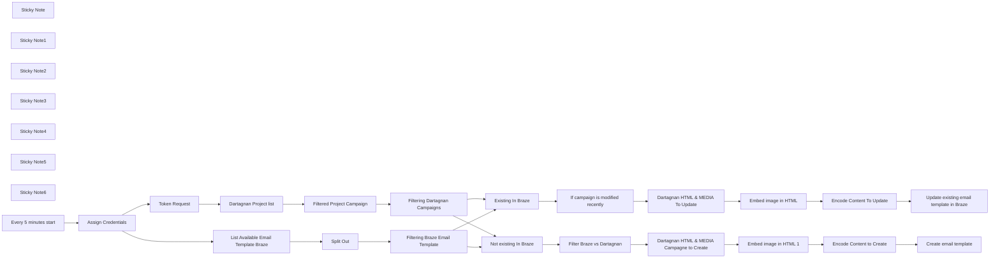

## Fluxo (.json) :

```json
{
  "meta": {
    "instanceId": "4bcdfa475d937e8c2fc1d40936bca36ec49bdb2525076e1bd53cc12fc6c8756d"
  },
  "name": "My workflow 2",
  "tags": [],
  "nodes": [
    {
      "id": "1562791c-33a9-425c-a774-32e328bd4715",
      "name": "Token Request",
      "type": "n8n-nodes-base.httpRequest",
      "notes": "Get the token from Dartagnan that expires after 60 minutes",
      "position": [
        60,
        200
      ],
      "parameters": {
        "url": "https://app.dartagnan.io/oauth/v2/token",
        "method": "POST",
        "options": {
          "redirect": {
            "redirect": {}
          }
        },
        "sendBody": true,
        "bodyParameters": {
          "parameters": [
            {
              "name": "client_id",
              "value": "={{ $('Assign Credentials').item.json.client_id }}"
            },
            {
              "name": "client_secret",
              "value": "={{ $('Assign Credentials').item.json.client_secret }}"
            },
            {
              "name": "grant_type",
              "value": "client_credentials"
            }
          ]
        }
      },
      "typeVersion": 4.2
    },
    {
      "id": "2d81394c-9898-419a-a832-339e66d56a29",
      "name": "Assign Credentials",
      "type": "n8n-nodes-base.set",
      "position": [
        -400,
        300
      ],
      "parameters": {
        "options": {},
        "assignments": {
          "assignments": [
            {
              "id": "debe5309-40f6-411d-8c4d-3b282cf1bba9",
              "name": "client_id",
              "type": "string",
              "value": "Enter your Dartagnan client_id"
            },
            {
              "id": "6028c0c0-a701-449e-952e-46895280e4ef",
              "name": "client_secret",
              "type": "string",
              "value": "Enter your Dartagnan client_secret"
            },
            {
              "id": "7e82aa01-18ff-4b76-802b-cc8cae987614",
              "name": "instance_url",
              "type": "string",
              "value": "Enter your Braze instance_url like https://rest.fra-02.braze.eu for example"
            },
            {
              "id": "a3c641d7-fdbd-4e96-a845-e2c5aad93398",
              "name": "api_key",
              "type": "string",
              "value": "Enter your Braze API key"
            }
          ]
        }
      },
      "typeVersion": 3.4
    },
    {
      "id": "b80a8eda-bbf6-4560-8665-5128a97db217",
      "name": "Dartagnan Project list",
      "type": "n8n-nodes-base.httpRequest",
      "position": [
        360,
        200
      ],
      "parameters": {
        "url": "https://app.dartagnan.io/api/public/projects",
        "options": {
          "redirect": {
            "redirect": {}
          }
        },
        "sendHeaders": true,
        "headerParameters": {
          "parameters": [
            {
              "name": "Authorization",
              "value": "=Bearer {{ $json.access_token }}"
            }
          ]
        }
      },
      "typeVersion": 4.2
    },
    {
      "id": "909eb4f9-d67e-4f5e-bdb6-67ef2da813a4",
      "name": "Create email template",
      "type": "n8n-nodes-base.httpRequest",
      "position": [
        2420,
        400
      ],
      "parameters": {
        "url": "=https://{{ $item(\"0\").$node[\"Assign Credentials\"].json[\"instance_url\"] }}/templates/email/create",
        "method": "POST",
        "options": {
          "redirect": {
            "redirect": {}
          }
        },
        "jsonBody": "={\n  \"template_name\": \"{{ $('Filter Braze vs Dartagnan').item.json.unified_name }}\",\n  \"subject\": \"Subject Line\",\n  \"body\": {{ $json.encoded_html }},\n  \"plaintext_body\":{{ $json.encoded_plaintext_body }}\n}",
        "sendBody": true,
        "sendHeaders": true,
        "specifyBody": "json",
        "headerParameters": {
          "parameters": [
            {
              "name": "Authorization",
              "value": "=Bearer {{ $item(\"0\").$node[\"Assign Credentials\"].json[\"api_key\"] }}"
            },
            {
              "name": "Content-Type",
              "value": "application/json"
            }
          ]
        }
      },
      "typeVersion": 4.2
    },
    {
      "id": "0820220a-5ea6-42eb-bfd2-f697dcf37a8a",
      "name": "List Available Email Template Braze",
      "type": "n8n-nodes-base.httpRequest",
      "position": [
        60,
        420
      ],
      "parameters": {
        "url": "=https://{{ $('Assign Credentials').item.json.instance_url }}/templates/email/list ",
        "options": {
          "redirect": {
            "redirect": {}
          }
        },
        "sendQuery": true,
        "sendHeaders": true,
        "queryParameters": {
          "parameters": [
            {}
          ]
        },
        "headerParameters": {
          "parameters": [
            {
              "name": "Authorization",
              "value": "=Bearer {{ $('Assign Credentials').item.json.api_key }}"
            }
          ]
        }
      },
      "executeOnce": false,
      "typeVersion": 4.2
    },
    {
      "id": "dcfec31d-c42c-4545-91a0-3b2e3350d375",
      "name": "Filtered Project Campaign",
      "type": "n8n-nodes-base.httpRequest",
      "notes": "POC Avec la derniere valeur avant iteration sur une boucle for dans la v2",
      "position": [
        640,
        200
      ],
      "parameters": {
        "url": "=https://app.dartagnan.io/api/public/projects/{{ $json.id }}",
        "options": {
          "redirect": {
            "redirect": {}
          }
        },
        "sendHeaders": true,
        "headerParameters": {
          "parameters": [
            {
              "name": "Authorization",
              "value": "=Bearer  {{ $('Token Request').item.json.access_token }}"
            }
          ]
        }
      },
      "typeVersion": 4.2
    },
    {
      "id": "1aba6e4c-d3b0-49f8-8bcb-bece8cce4b4d",
      "name": "Filtering Dartagnan Campaigns",
      "type": "n8n-nodes-base.set",
      "position": [
        840,
        200
      ],
      "parameters": {
        "options": {},
        "assignments": {
          "assignments": [
            {
              "id": "e82823f9-e094-48e6-9d10-8d10c126ffa8",
              "name": "id",
              "type": "string",
              "value": "={{ $json.campaigns[0].id }}"
            },
            {
              "id": "31ddce2b-7366-448c-a68f-bfea4dcb057b",
              "name": "campaign_name",
              "type": "string",
              "value": "={{ $json.campaigns[0].name }}"
            },
            {
              "id": "0eb93a91-fbd5-45f9-b47c-89340f716909",
              "name": "=unified_name",
              "type": "string",
              "value": "={{ $json.campaigns[0].name }}-{{ $json.campaigns[0].id }}"
            },
            {
              "id": "e784ad19-301f-45f7-b90b-27bcce06b6dc",
              "name": "creation_date",
              "type": "string",
              "value": "={{ $json.campaigns[0].created }}"
            },
            {
              "id": "8e99802a-1342-4482-afc7-fbe22df6cffc",
              "name": "update_date",
              "type": "string",
              "value": "={{ $json.campaigns[0].updated }}"
            },
            {
              "id": "f5814048-5cb6-465f-a95a-c56913c9ed2d",
              "name": "created_by",
              "type": "string",
              "value": "={{ $json.campaigns[0].createdBy.firstname }} {{ $json.campaigns[0].createdBy.lastname }}"
            },
            {
              "id": "19442a15-bf61-47e1-987f-709de70f8f08",
              "name": "modified_by",
              "type": "string",
              "value": "={{ $json.campaigns[0].updatedBy.firstname }} {{ $json.campaigns[0].updatedBy.lastname }}"
            },
            {
              "id": "b75db148-0006-4327-a418-49347da5b970",
              "name": "access_token",
              "type": "string",
              "value": "={{ $('Token Request').item.json.access_token }}"
            }
          ]
        }
      },
      "typeVersion": 3.4
    },
    {
      "id": "ee26ca98-2c42-4e69-ab34-cc2d737c22f8",
      "name": "Split Out",
      "type": "n8n-nodes-base.splitOut",
      "position": [
        360,
        420
      ],
      "parameters": {
        "options": {},
        "fieldToSplitOut": "templates"
      },
      "typeVersion": 1
    },
    {
      "id": "08d8372f-38cb-4722-95aa-c89bfcc36dff",
      "name": "Filtering Braze Email Template",
      "type": "n8n-nodes-base.set",
      "position": [
        800,
        420
      ],
      "parameters": {
        "options": {},
        "assignments": {
          "assignments": [
            {
              "id": "920fd95b-bf48-494d-9d55-d5d961fd459f",
              "name": "braze_template_name",
              "type": "string",
              "value": "={{ $json.template_name }}"
            },
            {
              "id": "8425c3c2-07c3-4c3d-a58e-e8d1460fea9c",
              "name": "email_template_id",
              "type": "string",
              "value": "={{ $json.email_template_id }}"
            },
            {
              "id": "1944b20a-147b-4b4d-9558-f2927de9b2f2",
              "name": "created_at",
              "type": "string",
              "value": "={{ $json.created_at }}"
            },
            {
              "id": "850a4a0a-d27b-43cb-a8a3-2d810a5fdc13",
              "name": "updated_at",
              "type": "string",
              "value": "={{ $json.updated_at }}"
            }
          ]
        }
      },
      "typeVersion": 3.4
    },
    {
      "id": "3e07fa37-8afd-4d88-85a3-53a4f000f898",
      "name": "Not existing In Braze",
      "type": "n8n-nodes-base.merge",
      "position": [
        1160,
        420
      ],
      "parameters": {
        "mode": "combine",
        "options": {},
        "advanced": true,
        "joinMode": "keepNonMatches",
        "mergeByFields": {
          "values": [
            {
              "field1": "unified_name",
              "field2": "braze_template_name"
            }
          ]
        }
      },
      "typeVersion": 3
    },
    {
      "id": "210a9d44-f58f-4788-89bd-934dfc0fca41",
      "name": "Existing In Braze",
      "type": "n8n-nodes-base.merge",
      "position": [
        1140,
        200
      ],
      "parameters": {
        "mode": "combine",
        "options": {},
        "advanced": true,
        "mergeByFields": {
          "values": [
            {
              "field1": "unified_name",
              "field2": "braze_template_name"
            }
          ]
        }
      },
      "typeVersion": 3
    },
    {
      "id": "59f8270b-b988-452b-aaf0-0e7b35490449",
      "name": "Dartagnan HTML & MEDIA To Update",
      "type": "n8n-nodes-base.httpRequest",
      "position": [
        1740,
        180
      ],
      "parameters": {
        "url": "=https://app.dartagnan.io/api/public/campaigns/{{ $json.id }}",
        "options": {
          "redirect": {
            "redirect": {}
          }
        },
        "sendQuery": true,
        "sendHeaders": true,
        "queryParameters": {
          "parameters": [
            {}
          ]
        },
        "headerParameters": {
          "parameters": [
            {
              "name": "Authorization",
              "value": "=Bearer  {{ $('Token Request').item.json.access_token }}"
            }
          ]
        }
      },
      "typeVersion": 4.2
    },
    {
      "id": "04b26314-cb00-4a90-a7fe-019936a5ba2a",
      "name": "Encode Content To Update",
      "type": "n8n-nodes-base.set",
      "position": [
        2180,
        180
      ],
      "parameters": {
        "options": {},
        "assignments": {
          "assignments": [
            {
              "id": "fb308822-842f-4559-b5c9-96853c79e00e",
              "name": "encoded_html",
              "type": "string",
              "value": "={{JSON.stringify( $json.html  )}} "
            },
            {
              "id": "390b747b-967d-45f4-9faf-3aaed605d769",
              "name": "encoded_plaintext_body",
              "type": "string",
              "value": "={{JSON.stringify($json.text)}} "
            }
          ]
        }
      },
      "typeVersion": 3.4
    },
    {
      "id": "1455fd2e-85ee-4844-8c4b-755870dc9cee",
      "name": "Dartagnan HTML & MEDIA Campagne to Create",
      "type": "n8n-nodes-base.httpRequest",
      "position": [
        1760,
        400
      ],
      "parameters": {
        "url": "=https://app.dartagnan.io/api/public/campaigns/{{ $json.id }}",
        "options": {
          "redirect": {
            "redirect": {}
          }
        },
        "sendQuery": true,
        "sendHeaders": true,
        "queryParameters": {
          "parameters": [
            {}
          ]
        },
        "headerParameters": {
          "parameters": [
            {
              "name": "Authorization",
              "value": "=Bearer  {{ $('Token Request').item.json.access_token }}"
            }
          ]
        }
      },
      "typeVersion": 4.2
    },
    {
      "id": "214d8b4b-c512-4d1f-8115-8491f6fc9272",
      "name": "Encode Content to Create",
      "type": "n8n-nodes-base.set",
      "position": [
        2200,
        400
      ],
      "parameters": {
        "options": {},
        "assignments": {
          "assignments": [
            {
              "id": "fb308822-842f-4559-b5c9-96853c79e00e",
              "name": "encoded_html",
              "type": "string",
              "value": "={{JSON.stringify( $json.html  )}} "
            },
            {
              "id": "390b747b-967d-45f4-9faf-3aaed605d769",
              "name": "encoded_plaintext_body",
              "type": "string",
              "value": "={{JSON.stringify($json.text)}} "
            }
          ]
        }
      },
      "typeVersion": 3.4
    },
    {
      "id": "90158667-eeda-4d44-b45c-c6e7fa02e664",
      "name": "If campaign is modified recently",
      "type": "n8n-nodes-base.if",
      "position": [
        1420,
        200
      ],
      "parameters": {
        "options": {},
        "conditions": {
          "options": {
            "version": 2,
            "leftValue": "",
            "caseSensitive": true,
            "typeValidation": "strict"
          },
          "combinator": "and",
          "conditions": [
            {
              "id": "7e9c9fd3-2ef9-47ce-bccb-9b3320472d36",
              "operator": {
                "type": "dateTime",
                "operation": "after"
              },
              "leftValue": "={{ $json.update_date }}",
              "rightValue": "={{ $json.updated_at }}"
            }
          ]
        }
      },
      "typeVersion": 2.2
    },
    {
      "id": "55aecc9b-d5a6-4a6b-a986-3ddfae200b94",
      "name": "Filter Braze vs Dartagnan",
      "type": "n8n-nodes-base.if",
      "position": [
        1440,
        420
      ],
      "parameters": {
        "options": {},
        "conditions": {
          "options": {
            "version": 2,
            "leftValue": "",
            "caseSensitive": true,
            "typeValidation": "strict"
          },
          "combinator": "and",
          "conditions": [
            {
              "id": "7e9c9fd3-2ef9-47ce-bccb-9b3320472d36",
              "operator": {
                "type": "string",
                "operation": "exists",
                "singleValue": true
              },
              "leftValue": "={{ $json.unified_name }}",
              "rightValue": "="
            }
          ]
        }
      },
      "typeVersion": 2.2
    },
    {
      "id": "ff2a47df-983f-42f5-9c96-431fccbdb8ef",
      "name": "Embed image in HTML",
      "type": "n8n-nodes-base.code",
      "position": [
        1960,
        180
      ],
      "parameters": {
        "jsCode": "// n8n Code Node: HTML Image URL Replacer\n// This script replaces all image references in HTML with their direct URLs\n// It's designed to work with the data structure you provided\n\n/**\n * Main function to process the incoming data in n8n\n * Expects an item with html and medias properties\n */\nfunction processData(item) {\n  // Extract the HTML and media mappings from the item\n  const { html, medias } = item.json;\n\n  // Process the HTML and replace all image references\n  const processedHtml = replaceImageReferences(html, medias);\n\n  // Return the processed data\n  return {\n    json: {\n      ...item.json,\n      html: processedHtml\n    }\n  };\n}\n\n/**\n * Replace all image references in HTML with direct URLs\n * @param {string} html - The HTML content to process\n * @param {Object} medias - Key-value pairs mapping image paths to direct URLs\n * @returns {string} - Processed HTML with direct URLs\n */\nfunction replaceImageReferences(html, medias) {\n  if (!html || !medias) {\n    throw new Error('Missing required parameters: html or medias');\n  }\n  \n  let updatedHtml = html;\n  \n  // Process each media URL\n  Object.entries(medias).forEach(([imagePath, directUrl]) => {\n    // For safety, escape special regex characters in the image path\n    const escapedPath = imagePath.replace(/[.*+?^${}()|[\\]\\\\]/g, '\\\\$&');\n    \n    // 1. Replace in img src attributes\n    updatedHtml = updatedHtml.replace(\n      new RegExp(`src=[\"']${escapedPath}[\"']`, 'g'), \n      match => match.replace(imagePath, directUrl)\n    );\n    \n    // 2. Replace in background attributes\n    updatedHtml = updatedHtml.replace(\n      new RegExp(`background=[\"']${escapedPath}[\"']`, 'g'), \n      match => match.replace(imagePath, directUrl)\n    );\n    \n    // 3. Replace in v:fill src attributes (for Outlook)\n    updatedHtml = updatedHtml.replace(\n      new RegExp(`<v:fill[^>]*src=[\"']${escapedPath}[\"'][^>]*>`, 'g'), \n      match => match.replace(imagePath, directUrl)\n    );\n    \n    // 4. Replace in CSS background and background-image styles\n    // Handle various quote styles and syntax patterns\n    const backgroundPatterns = [\n      `background-image:\\\\s*url\\\\(['\"]?${escapedPath}['\"]?\\\\)`,\n      `background:\\\\s*url\\\\(['\"]?${escapedPath}['\"]?\\\\)`,\n      `background:\\\\s*[^;]*url\\\\(['\"]?${escapedPath}['\"]?\\\\)`,\n    ];\n    \n    backgroundPatterns.forEach(pattern => {\n      updatedHtml = updatedHtml.replace(\n        new RegExp(pattern, 'g'),\n        match => match.replace(imagePath, directUrl)\n      );\n    });\n    \n    // 5. Replace in CSS class references\n    // This is more complex and depends on your HTML structure\n    // Extract file name for matching class names\n    const fileNameMatch = imagePath.match(//([^/]+)\\.([^\\.]+)$/);\n    if (fileNameMatch) {\n      const fileName = fileNameMatch[1];\n      const fileExt = fileNameMatch[2];\n      \n      // Handle class names like \"bgiurlimagesdiv2dpng\"\n      const classPatterns = [\n        `bgiurlimagesdiv${fileName}d${fileExt}`,\n        `bgurlimagesdiv${fileName}d${fileExt}`\n      ];\n      \n      classPatterns.forEach(pattern => {\n        // Replace the class name and also update the associated styles if needed\n        updatedHtml = updatedHtml.replace(\n          new RegExp(`class=[\"'][^\"']*${pattern}[^\"']*[\"']`, 'g'),\n          match => match.replace(pattern, `direct-url-${Date.now()}`)\n        );\n      });\n    }\n  });\n  \n  return updatedHtml;\n}\n\n// This is the main execution for n8n\n// It processes each item in the incoming array and returns the results\nreturn items.map(processData);"
      },
      "typeVersion": 2
    },
    {
      "id": "0fbdb7d6-64a3-40ae-8187-8afcb76451e8",
      "name": "Embed image in HTML 1",
      "type": "n8n-nodes-base.code",
      "position": [
        1960,
        400
      ],
      "parameters": {
        "jsCode": "// n8n Code Node: HTML Image URL Replacer\n// This script replaces all image references in HTML with their direct URLs\n// It's designed to work with the data structure you provided\n\n/**\n * Main function to process the incoming data in n8n\n * Expects an item with html and medias properties\n */\nfunction processData(item) {\n  // Extract the HTML and media mappings from the item\n  const { html, medias } = item.json;\n\n  // Process the HTML and replace all image references\n  const processedHtml = replaceImageReferences(html, medias);\n\n  // Return the processed data\n  return {\n    json: {\n      ...item.json,\n      html: processedHtml\n    }\n  };\n}\n\n/**\n * Replace all image references in HTML with direct URLs\n * @param {string} html - The HTML content to process\n * @param {Object} medias - Key-value pairs mapping image paths to direct URLs\n * @returns {string} - Processed HTML with direct URLs\n */\nfunction replaceImageReferences(html, medias) {\n  if (!html || !medias) {\n    throw new Error('Missing required parameters: html or medias');\n  }\n  \n  let updatedHtml = html;\n  \n  // Process each media URL\n  Object.entries(medias).forEach(([imagePath, directUrl]) => {\n    // For safety, escape special regex characters in the image path\n    const escapedPath = imagePath.replace(/[.*+?^${}()|[\\]\\\\]/g, '\\\\$&');\n    \n    // 1. Replace in img src attributes\n    updatedHtml = updatedHtml.replace(\n      new RegExp(`src=[\"']${escapedPath}[\"']`, 'g'), \n      match => match.replace(imagePath, directUrl)\n    );\n    \n    // 2. Replace in background attributes\n    updatedHtml = updatedHtml.replace(\n      new RegExp(`background=[\"']${escapedPath}[\"']`, 'g'), \n      match => match.replace(imagePath, directUrl)\n    );\n    \n    // 3. Replace in v:fill src attributes (for Outlook)\n    updatedHtml = updatedHtml.replace(\n      new RegExp(`<v:fill[^>]*src=[\"']${escapedPath}[\"'][^>]*>`, 'g'), \n      match => match.replace(imagePath, directUrl)\n    );\n    \n    // 4. Replace in CSS background and background-image styles\n    // Handle various quote styles and syntax patterns\n    const backgroundPatterns = [\n      `background-image:\\\\s*url\\\\(['\"]?${escapedPath}['\"]?\\\\)`,\n      `background:\\\\s*url\\\\(['\"]?${escapedPath}['\"]?\\\\)`,\n      `background:\\\\s*[^;]*url\\\\(['\"]?${escapedPath}['\"]?\\\\)`,\n    ];\n    \n    backgroundPatterns.forEach(pattern => {\n      updatedHtml = updatedHtml.replace(\n        new RegExp(pattern, 'g'),\n        match => match.replace(imagePath, directUrl)\n      );\n    });\n    \n    // 5. Replace in CSS class references\n    // This is more complex and depends on your HTML structure\n    // Extract file name for matching class names\n    const fileNameMatch = imagePath.match(//([^/]+)\\.([^\\.]+)$/);\n    if (fileNameMatch) {\n      const fileName = fileNameMatch[1];\n      const fileExt = fileNameMatch[2];\n      \n      // Handle class names like \"bgiurlimagesdiv2dpng\"\n      const classPatterns = [\n        `bgiurlimagesdiv${fileName}d${fileExt}`,\n        `bgurlimagesdiv${fileName}d${fileExt}`\n      ];\n      \n      classPatterns.forEach(pattern => {\n        // Replace the class name and also update the associated styles if needed\n        updatedHtml = updatedHtml.replace(\n          new RegExp(`class=[\"'][^\"']*${pattern}[^\"']*[\"']`, 'g'),\n          match => match.replace(pattern, `direct-url-${Date.now()}`)\n        );\n      });\n    }\n  });\n  \n  return updatedHtml;\n}\n\n// This is the main execution for n8n\n// It processes each item in the incoming array and returns the results\nreturn items.map(processData);"
      },
      "typeVersion": 2
    },
    {
      "id": "89acf2f3-940b-47e9-81e3-2d458d3018ee",
      "name": "Sticky Note",
      "type": "n8n-nodes-base.stickyNote",
      "position": [
        -460,
        80
      ],
      "parameters": {
        "height": 400,
        "content": "## Authentication Set Up\n\nObtain an access token from Dartagnan\nPrepare credentials for both Dartagnan and Braze"
      },
      "typeVersion": 1
    },
    {
      "id": "317cd699-6686-42a0-ba6d-8f6405338356",
      "name": "Sticky Note1",
      "type": "n8n-nodes-base.stickyNote",
      "position": [
        60,
        480
      ],
      "parameters": {
        "color": 5,
        "width": 960,
        "height": 380,
        "content": "\n\n\n\n\n\n\n\n\n\n\n\n\n\n## Template Discovery\n\n\nList all existing email templates in Braze"
      },
      "typeVersion": 1
    },
    {
      "id": "d59b0dac-439e-4160-8879-b306ccd18773",
      "name": "Sticky Note2",
      "type": "n8n-nodes-base.stickyNote",
      "position": [
        0,
        0
      ],
      "parameters": {
        "width": 260,
        "height": 380,
        "content": "## Authentication Token\n\nObtain an access token from Dartagnan"
      },
      "typeVersion": 1
    },
    {
      "id": "dc38ec97-ca50-4944-89f1-535f23420cfc",
      "name": "Sticky Note3",
      "type": "n8n-nodes-base.stickyNote",
      "position": [
        300,
        0
      ],
      "parameters": {
        "color": 5,
        "width": 460,
        "height": 380,
        "content": "## Template Discovery\n\nRetrieve project and campaign details from Dartagnan\n"
      },
      "typeVersion": 1
    },
    {
      "id": "5fd7d7dc-f314-411a-ba0a-4af14874f96b",
      "name": "Sticky Note4",
      "type": "n8n-nodes-base.stickyNote",
      "position": [
        1040,
        0
      ],
      "parameters": {
        "color": 5,
        "width": 600,
        "height": 680,
        "content": "## Comparison and Sync\n\nCompare Dartagnan templates with existing Braze templates\nIdentify templates to update (top Branch) or create ( Lower Branch)"
      },
      "typeVersion": 1
    },
    {
      "id": "e198dca0-0278-4b67-9807-90796ff2d644",
      "name": "Sticky Note5",
      "type": "n8n-nodes-base.stickyNote",
      "position": [
        1660,
        0
      ],
      "parameters": {
        "color": 5,
        "width": 980,
        "height": 680,
        "content": "## Template Processing\n\nExtract HTML and media from Dartagnan templates\nReplace image references with direct URLs\nPrepare templates for Braze\nUpdate existing templates in Braze ( upper branch ) \nCreate new templates in Braze as needed ( lower branch ) "
      },
      "typeVersion": 1
    },
    {
      "id": "321eb50a-66a2-4951-b61b-e0869a91b6a0",
      "name": "Sticky Note6",
      "type": "n8n-nodes-base.stickyNote",
      "position": [
        -980,
        80
      ],
      "parameters": {
        "color": 4,
        "width": 460,
        "height": 380,
        "content": "## Trigger\n\nTrigger is scheduled to run every 5 minutes, you can change this, but bear in mind to stay in the API rate limits of each vendor\n"
      },
      "typeVersion": 1
    },
    {
      "id": "8e0984c5-ec70-4ca5-97fe-0bdd24acd95c",
      "name": "Every 5 minutes start",
      "type": "n8n-nodes-base.scheduleTrigger",
      "notes": "This node is a scheduled trigger that will synchronize ever",
      "position": [
        -660,
        300
      ],
      "parameters": {
        "rule": {
          "interval": [
            {
              "field": "minutes"
            }
          ]
        }
      },
      "typeVersion": 1.2
    },
    {
      "id": "adb2c227-d27e-44fc-8f6e-0b3d02952ef9",
      "name": "Update existing email template in Braze",
      "type": "n8n-nodes-base.httpRequest",
      "position": [
        2400,
        180
      ],
      "parameters": {
        "url": "=https://{{ $('Assign Credentials').item.json.instance_url }}/templates/email/update ",
        "method": "POST",
        "options": {},
        "jsonBody": "={\n  \"email_template_id\": {{ $('If campaign is modified recently').item.json.campaign_name }},\n  \"template_name\": \"{{ $('If campaign is modified recently').item.json.unified_name }}\",\n  \"subject\": \"Subject Line\",\n  \"body\":{{ $json.encoded_html }} ,\n  \"plaintext_body\": {{ $json.encoded_plaintext_body }}\n} ",
        "sendBody": true,
        "sendHeaders": true,
        "specifyBody": "json",
        "headerParameters": {
          "parameters": [
            {
              "name": "Content-Type",
              "value": "application/json"
            },
            {
              "name": "Authorization",
              "value": "=Bearer  {{ $('Assign Credentials').item.json.api_key }}"
            }
          ]
        }
      },
      "typeVersion": 4.2
    }
  ],
  "active": false,
  "pinData": {},
  "settings": {
    "executionOrder": "v1"
  },
  "versionId": "",
  "connections": {
    "Split Out": {
      "main": [
        [
          {
            "node": "Filtering Braze Email Template",
            "type": "main",
            "index": 0
          }
        ]
      ]
    },
    "Token Request": {
      "main": [
        [
          {
            "node": "Dartagnan Project list",
            "type": "main",
            "index": 0
          }
        ]
      ]
    },
    "Existing In Braze": {
      "main": [
        [
          {
            "node": "If campaign is modified recently",
            "type": "main",
            "index": 0
          }
        ]
      ]
    },
    "Assign Credentials": {
      "main": [
        [
          {
            "node": "List Available Email Template Braze",
            "type": "main",
            "index": 0
          },
          {
            "node": "Token Request",
            "type": "main",
            "index": 0
          }
        ]
      ]
    },
    "Embed image in HTML": {
      "main": [
        [
          {
            "node": "Encode Content To Update",
            "type": "main",
            "index": 0
          }
        ]
      ]
    },
    "Embed image in HTML 1": {
      "main": [
        [
          {
            "node": "Encode Content to Create",
            "type": "main",
            "index": 0
          }
        ]
      ]
    },
    "Every 5 minutes start": {
      "main": [
        [
          {
            "node": "Assign Credentials",
            "type": "main",
            "index": 0
          }
        ]
      ]
    },
    "Not existing In Braze": {
      "main": [
        [
          {
            "node": "Filter Braze vs Dartagnan",
            "type": "main",
            "index": 0
          }
        ]
      ]
    },
    "Dartagnan Project list": {
      "main": [
        [
          {
            "node": "Filtered Project Campaign",
            "type": "main",
            "index": 0
          }
        ]
      ]
    },
    "Encode Content To Update": {
      "main": [
        [
          {
            "node": "Update existing email template in Braze",
            "type": "main",
            "index": 0
          }
        ]
      ]
    },
    "Encode Content to Create": {
      "main": [
        [
          {
            "node": "Create email template",
            "type": "main",
            "index": 0
          }
        ]
      ]
    },
    "Filter Braze vs Dartagnan": {
      "main": [
        [
          {
            "node": "Dartagnan HTML & MEDIA Campagne to Create",
            "type": "main",
            "index": 0
          }
        ]
      ]
    },
    "Filtered Project Campaign": {
      "main": [
        [
          {
            "node": "Filtering Dartagnan Campaigns",
            "type": "main",
            "index": 0
          }
        ]
      ]
    },
    "Filtering Dartagnan Campaigns": {
      "main": [
        [
          {
            "node": "Existing In Braze",
            "type": "main",
            "index": 0
          },
          {
            "node": "Not existing In Braze",
            "type": "main",
            "index": 0
          }
        ]
      ]
    },
    "Filtering Braze Email Template": {
      "main": [
        [
          {
            "node": "Existing In Braze",
            "type": "main",
            "index": 1
          },
          {
            "node": "Not existing In Braze",
            "type": "main",
            "index": 1
          }
        ]
      ]
    },
    "Dartagnan HTML & MEDIA To Update": {
      "main": [
        [
          {
            "node": "Embed image in HTML",
            "type": "main",
            "index": 0
          }
        ]
      ]
    },
    "If campaign is modified recently": {
      "main": [
        [
          {
            "node": "Dartagnan HTML & MEDIA To Update",
            "type": "main",
            "index": 0
          }
        ]
      ]
    },
    "List Available Email Template Braze": {
      "main": [
        [
          {
            "node": "Split Out",
            "type": "main",
            "index": 0
          }
        ]
      ]
    },
    "Dartagnan HTML & MEDIA Campagne to Create": {
      "main": [
        [
          {
            "node": "Embed image in HTML 1",
            "type": "main",
            "index": 0
          }
        ]
      ]
    }
  }
}
```

<a id="template-2549"></a>

## Template 2549 - Exportar clientes Shopify para planilha e CSV

- **Nome:** Exportar clientes Shopify para planilha e CSV
- **Descrição:** Exporta clientes da loja Shopify para uma planilha do Google e gera um arquivo CSV compatível com importação de contatos do Squarespace.
- **Funcionalidade:** • Disparo manual e agendado: permite iniciar a extração de forma manual ou em intervalos programados.
• Leitura da API do Shopify: consulta a lista de clientes usando parâmetros de limite e campos específicos.
• Suporte a paginação via header Link/page_info: detecta o link 'next' no cabeçalho, extrai o parâmetro page_info e solicita as páginas seguintes.
• Combinação de itens paginados: agrega os resultados de todas as páginas em um único conjunto de registros.
• Gravação e atualização em planilha: insere ou atualiza os registros em uma planilha do Google, usando o ID do cliente para correspondência.
• Mapeamento e formatação de campos: seleciona e organiza Email, Primeiro nome e Último nome para exportação.
• Geração de CSV compatível com Squarespace: converte os registros extraídos em um arquivo CSV no formato esperado para importação de contatos.
- **Ferramentas:** • Shopify: API da loja usada para recuperar a lista de clientes e suportar paginação com page_info.
• Google Sheets: armazena os contatos extraídos, permitindo append ou atualização por ID do cliente.
• Squarespace: destino final esperado; o fluxo gera um CSV formatado para importação de contatos na plataforma.

## Fluxo visual

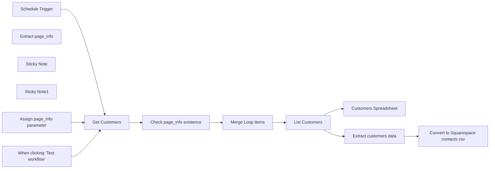

## Fluxo (.json) :

```json
{
  "meta": {
    "instanceId": "e634e668fe1fc93a75c4f2a7fc0dad807ca318b79654157eadb9578496acbc76",
    "templateCredsSetupCompleted": true
  },
  "nodes": [
    {
      "id": "ff5634c3-349b-4181-a03a-97b310e5232b",
      "name": "When clicking ‘Test workflow’",
      "type": "n8n-nodes-base.manualTrigger",
      "position": [
        120,
        60
      ],
      "parameters": {},
      "typeVersion": 1
    },
    {
      "id": "66e204fb-3e00-45e0-b1b2-341836476b95",
      "name": "Extract page_info ",
      "type": "n8n-nodes-base.code",
      "position": [
        900,
        120
      ],
      "parameters": {
        "jsCode": "function parseNextParams(headerValue) {\n    // Match the URL inside <>\n    const urlMatch = headerValue.match(/<([^>]+)>;\\s*rel=\"next\"/);\n    if (!urlMatch) return null;\n\n    const url = urlMatch[1]; // Extracted URL\n    const paramsString = url.split(\"?\")[1]; // Get query string\n\n    if (!paramsString) return {}; // No params found\n\n    // Convert query string to object\n    return paramsString.split(\"&\").reduce((acc, param) => {\n        const [key, value] = param.split(\"=\");\n        acc[decodeURIComponent(key)] = decodeURIComponent(value);\n        return acc;\n    }, {});\n}\n\n/* Example usage\n`<https://59b774-3.myshopify.com/admin/api/2025-01/orders.json?limit=250&fields=id%2Cnote%2Cemail%2Cprocessed_at%2Ccustomer&page_info=eyJzdGF0dXMiOiJhbnkiLCJsYXN0X2lkIjo2MzQ5MjI3MDAwMDk0LCJsYXN0X3ZhbHVlIjoiMjAyNC0xMi0zMSAwOToxMzowMi42MTcxNjYiLCJkaXJlY3Rpb24iOiJuZXh0In0>; rel=\"next\"`\n*/\nconst headerValue = $input.first().json.headers.link;\nconst params = parseNextParams(headerValue);\nreturn params;"
      },
      "typeVersion": 2
    },
    {
      "id": "5b0086ce-f09b-4d55-86b6-9a14574506ab",
      "name": "Merge Loop items",
      "type": "n8n-nodes-base.code",
      "position": [
        1120,
        -100
      ],
      "parameters": {
        "jsCode": "let results = [],\n  i = 0;\n\ndo {\n  try {\n    results = results.concat($(\"Get Customers\").all(0, i));\n  } catch (error) {\n    return results;\n  }\n  i++;\n} while (true);"
      },
      "typeVersion": 2
    },
    {
      "id": "2302257c-51c0-42d7-8745-ecc0b4fc9faf",
      "name": "Sticky Note",
      "type": "n8n-nodes-base.stickyNote",
      "position": [
        440,
        -160
      ],
      "parameters": {
        "width": 232,
        "height": 346,
        "content": "## Edit this node 👇\n\nGet your store URL and replace in the GET url: https://{your-store}.myshopify.com/admin/api/2025-01/customers.json\n"
      },
      "typeVersion": 1
    },
    {
      "id": "d857962a-6599-44b2-acb0-3eb8165e93ce",
      "name": "Sticky Note1",
      "type": "n8n-nodes-base.stickyNote",
      "position": [
        1560,
        -440
      ],
      "parameters": {
        "width": 272,
        "height": 506,
        "content": "## Clone this spreadsheet\n\nhttps://docs.google.com/spreadsheets/d/1E8i98hwiFW7XG9HuxIZrOWfuLxGFaDm3EOAGQBZjhfk/edit?usp=sharing\n\nYour spreadsheet can have up to three columns, and need to be arranged in this order (no header):\n\nEmail address\nFirst name (optional)\nLast name (optional)\nShopify Customer ID (will be ignored)"
      },
      "typeVersion": 1
    },
    {
      "id": "be7cf143-893a-44f8-ace9-8ad581bddb68",
      "name": "Schedule Trigger",
      "type": "n8n-nodes-base.scheduleTrigger",
      "position": [
        120,
        -120
      ],
      "parameters": {
        "rule": {
          "interval": [
            {}
          ]
        }
      },
      "typeVersion": 1.2
    },
    {
      "id": "58097363-29ec-4067-a439-717d355df91f",
      "name": "Assign page_info parameter",
      "type": "n8n-nodes-base.set",
      "position": [
        1120,
        120
      ],
      "parameters": {
        "options": {},
        "assignments": {
          "assignments": [
            {
              "id": "57e59bb7-ac20-4a1b-b54a-3468fc0519d3",
              "name": "page_info",
              "type": "string",
              "value": "={{ $json.page_info }}"
            }
          ]
        }
      },
      "typeVersion": 3.4
    },
    {
      "id": "0676abce-4405-42a1-87d3-ba75355fe264",
      "name": "Check page_info existence",
      "type": "n8n-nodes-base.if",
      "position": [
        720,
        0
      ],
      "parameters": {
        "options": {},
        "conditions": {
          "options": {
            "version": 2,
            "leftValue": "",
            "caseSensitive": true,
            "typeValidation": "strict"
          },
          "combinator": "and",
          "conditions": [
            {
              "id": "30d965c3-cbba-430e-81c2-ef8b543665e7",
              "operator": {
                "type": "string",
                "operation": "notContains"
              },
              "leftValue": "={{ $json.headers.link }}",
              "rightValue": "rel=\"next\""
            }
          ]
        }
      },
      "typeVersion": 2.2
    },
    {
      "id": "1cc63979-b2f8-4678-b40b-f3f0ad63d377",
      "name": "Get Customers",
      "type": "n8n-nodes-base.httpRequest",
      "position": [
        500,
        0
      ],
      "parameters": {
        "url": "https://{your-store}.myshopify.com/admin/api/2025-01/customers.json",
        "options": {
          "response": {
            "response": {
              "fullResponse": true
            }
          }
        },
        "sendQuery": true,
        "authentication": "predefinedCredentialType",
        "queryParameters": {
          "parameters": [
            {
              "name": "limit",
              "value": "250"
            },
            {
              "name": "fields",
              "value": "id,email,first_name,last_name"
            },
            {
              "name": "={{ $json.page_info ? \"page_info\" : \"status\" }}",
              "value": "={{ $json.page_info ? $json.page_info : 'any' }}"
            }
          ]
        },
        "nodeCredentialType": "shopifyAccessTokenApi"
      },
      "credentials": {
        "shopifyAccessTokenApi": {
          "id": "vtyKGPLLdjc7MLea",
          "name": "Shopify Access Token account"
        }
      },
      "typeVersion": 4.2
    },
    {
      "id": "ce91af42-1634-4773-944a-2b24dcaf812b",
      "name": "List Customers",
      "type": "n8n-nodes-base.splitOut",
      "position": [
        1380,
        -100
      ],
      "parameters": {
        "options": {},
        "fieldToSplitOut": "body.customers"
      },
      "typeVersion": 1
    },
    {
      "id": "19a0f6a7-b86a-43bd-8504-62e3bd37af89",
      "name": "Customers Spreadsheet",
      "type": "n8n-nodes-base.googleSheets",
      "position": [
        1620,
        -100
      ],
      "parameters": {
        "columns": {
          "value": {
            "Last name": "={{ $json.last_name }}",
            "First name": "={{ $json.first_name }}",
            "Email address": "={{ $json.email }}",
            "Shopify Customer ID": "={{ $json.id }}"
          },
          "schema": [
            {
              "id": "Email address",
              "type": "string",
              "display": true,
              "removed": false,
              "required": false,
              "displayName": "Email address",
              "defaultMatch": false,
              "canBeUsedToMatch": true
            },
            {
              "id": "First name",
              "type": "string",
              "display": true,
              "removed": false,
              "required": false,
              "displayName": "First name",
              "defaultMatch": false,
              "canBeUsedToMatch": true
            },
            {
              "id": "Last name",
              "type": "string",
              "display": true,
              "removed": false,
              "required": false,
              "displayName": "Last name",
              "defaultMatch": false,
              "canBeUsedToMatch": true
            },
            {
              "id": "Shopify Customer ID",
              "type": "string",
              "display": true,
              "removed": false,
              "required": false,
              "displayName": "Shopify Customer ID",
              "defaultMatch": false,
              "canBeUsedToMatch": true
            }
          ],
          "mappingMode": "defineBelow",
          "matchingColumns": [
            "Shopify Customer ID"
          ],
          "attemptToConvertTypes": false,
          "convertFieldsToString": false
        },
        "options": {},
        "operation": "appendOrUpdate",
        "sheetName": {
          "__rl": true,
          "mode": "list",
          "value": 1358690917,
          "cachedResultUrl": "https://docs.google.com/spreadsheets/d/1yf_RYZGFHpMyOvD3RKGSvIFY2vumvI4474Qm_1t4-jM/edit#gid=1358690917",
          "cachedResultName": "sqs_contacts"
        },
        "documentId": {
          "__rl": true,
          "mode": "list",
          "value": "1yf_RYZGFHpMyOvD3RKGSvIFY2vumvI4474Qm_1t4-jM",
          "cachedResultUrl": "https://docs.google.com/spreadsheets/d/1yf_RYZGFHpMyOvD3RKGSvIFY2vumvI4474Qm_1t4-jM/edit?usp=drivesdk",
          "cachedResultName": "Squarespace automation"
        }
      },
      "credentials": {
        "googleSheetsOAuth2Api": {
          "id": "JgI9maibw5DnBXRP",
          "name": "Google Sheets account"
        }
      },
      "typeVersion": 4.5
    },
    {
      "id": "48ec5e3b-9bb5-451c-9495-b03080c9211e",
      "name": "Convert to Squarespace contacts csv",
      "type": "n8n-nodes-base.convertToFile",
      "position": [
        1920,
        160
      ],
      "parameters": {
        "options": {
          "headerRow": false
        }
      },
      "typeVersion": 1.1
    },
    {
      "id": "8de9174a-af87-4602-a9aa-a5c35a3f0ed4",
      "name": "Extract customers data",
      "type": "n8n-nodes-base.set",
      "position": [
        1620,
        160
      ],
      "parameters": {
        "options": {},
        "assignments": {
          "assignments": [
            {
              "id": "27c42d50-df07-46b4-b67a-13a1b64b5145",
              "name": "Email address",
              "type": "string",
              "value": "={{ $json['Email address'] }}"
            },
            {
              "id": "9fd2c3fd-9b03-4562-ad78-9ce30da7bb26",
              "name": "First name",
              "type": "string",
              "value": "={{ $json['First name'] }}"
            },
            {
              "id": "f51b7da6-0065-41ea-b04c-420058ce3b9c",
              "name": "Last name",
              "type": "string",
              "value": "={{ $json['Last name'] }}"
            }
          ]
        }
      },
      "typeVersion": 3.4
    }
  ],
  "pinData": {},
  "connections": {
    "Get Customers": {
      "main": [
        [
          {
            "node": "Check page_info existence",
            "type": "main",
            "index": 0
          }
        ]
      ]
    },
    "List Customers": {
      "main": [
        [
          {
            "node": "Customers Spreadsheet",
            "type": "main",
            "index": 0
          },
          {
            "node": "Extract customers data",
            "type": "main",
            "index": 0
          }
        ]
      ]
    },
    "Merge Loop items": {
      "main": [
        [
          {
            "node": "List Customers",
            "type": "main",
            "index": 0
          }
        ]
      ]
    },
    "Schedule Trigger": {
      "main": [
        [
          {
            "node": "Get Customers",
            "type": "main",
            "index": 0
          }
        ]
      ]
    },
    "Extract page_info ": {
      "main": [
        [
          {
            "node": "Assign page_info parameter",
            "type": "main",
            "index": 0
          }
        ]
      ]
    },
    "Customers Spreadsheet": {
      "main": [
        []
      ]
    },
    "Extract customers data": {
      "main": [
        [
          {
            "node": "Convert to Squarespace contacts csv",
            "type": "main",
            "index": 0
          }
        ]
      ]
    },
    "Check page_info existence": {
      "main": [
        [
          {
            "node": "Merge Loop items",
            "type": "main",
            "index": 0
          }
        ],
        [
          {
            "node": "Extract page_info ",
            "type": "main",
            "index": 0
          }
        ]
      ]
    },
    "Assign page_info parameter": {
      "main": [
        [
          {
            "node": "Get Customers",
            "type": "main",
            "index": 0
          }
        ]
      ]
    },
    "When clicking ‘Test workflow’": {
      "main": [
        [
          {
            "node": "Get Customers",
            "type": "main",
            "index": 0
          }
        ]
      ]
    },
    "Convert to Squarespace contacts csv": {
      "main": [
        []
      ]
    }
  }
}
```
