# PACK 1999 TEMPLATES PARTE 10 - Bloco 9

Templates neste bloco: 20

## Sumário

- [Template 2550 - Automação de fulfillment de pedidos Squarespace](#template-2550)
- [Template 2551 - Triagem automática de currículos por visão AI](#template-2551)
- [Template 2552 - Varredura única de domínio via Icypeas](#template-2552)
- [Template 2553 - Auditoria diária de permissões do Google Drive](#template-2553)
- [Template 2554 - Resumo diário de notícias selecionadas por IA](#template-2554)
- [Template 2555 - Servidor MCP Qdrant para análises de clientes](#template-2555)
- [Template 2556 - Atualizar propriedades do HubSpot por objeto](#template-2556)
- [Template 2557 - Scraper de produtos para Google Sheets](#template-2557)
- [Template 2558 - Análise de currículo por VLM](#template-2558)
- [Template 2559 - Preenchimento automático de tabela Baserow via prompts e PDF](#template-2559)
- [Template 2560 - Extrair preços de livros para planilha](#template-2560)
- [Template 2561 - Upload automático de vídeos para TikTok e Instagram](#template-2561)
- [Template 2562 - Notificação de erro via Line](#template-2562)
- [Template 2563 - Notificações por email em caso de erro](#template-2563)
- [Template 2564 - Mesclar PDFs da web](#template-2564)
- [Template 2565 - Importador automático de produtos WooCommerce com SEO](#template-2565)
- [Template 2566 - Salvar arquivos do Telegram no Google Drive](#template-2566)
- [Template 2567 - Bot Telegram para consultas de agenda](#template-2567)
- [Template 2568 - Otimização de prompts por IA](#template-2568)
- [Template 2569 - Agente AI DeepSeek com Telegram e memória de longo prazo](#template-2569)

---

<a id="template-2550"></a>

## Template 2550 - Automação de fulfillment de pedidos Squarespace

- **Nome:** Automação de fulfillment de pedidos Squarespace
- **Descrição:** Automatiza a consulta de pedidos pendentes no Squarespace e marca-os como cumpridos programaticamente.
- **Funcionalidade:** • Início manual e agendado: Permite executar a automação manualmente ou por agendamento.
• Configuração de variáveis globais: Define versão da API, filtros de data (modifiedAfter/modifiedBefore), cursor de paginação, status de fulfillment e limite de páginas (maxPage).
• Consulta paginada de pedidos: Recupera pedidos do Squarespace usando filtros e paginação automática até completar a busca.
• Divisão de resultados em pedidos individuais: Separa a resposta de múltiplos pedidos em itens individuais para processamento.
• Filtragem de pedidos por idade: Seleciona apenas pedidos com mais de 24 horas desde a criação antes de prosseguir.
• Processamento em lotes: Itera sobre pedidos em lotes para controlar o ritmo das requisições.
• Criação de fulfillments: Envia chamadas à API para marcar pedidos como cumpridos e opcionalmente notificar clientes (shouldSendNotification).
• Suporte a autenticação múltipla: Suporta autenticação via OAuth 2.0 e chave de API conforme configuração.
- **Ferramentas:** • Squarespace Commerce API: API da plataforma para consultar pedidos e criar fulfillments.
• OAuth 2.0: Protocolo de autenticação suportado para acesso seguro à API.
• Chave de API (HTTP Header): Método alternativo de autenticação via cabeçalho HTTP.

## Fluxo visual

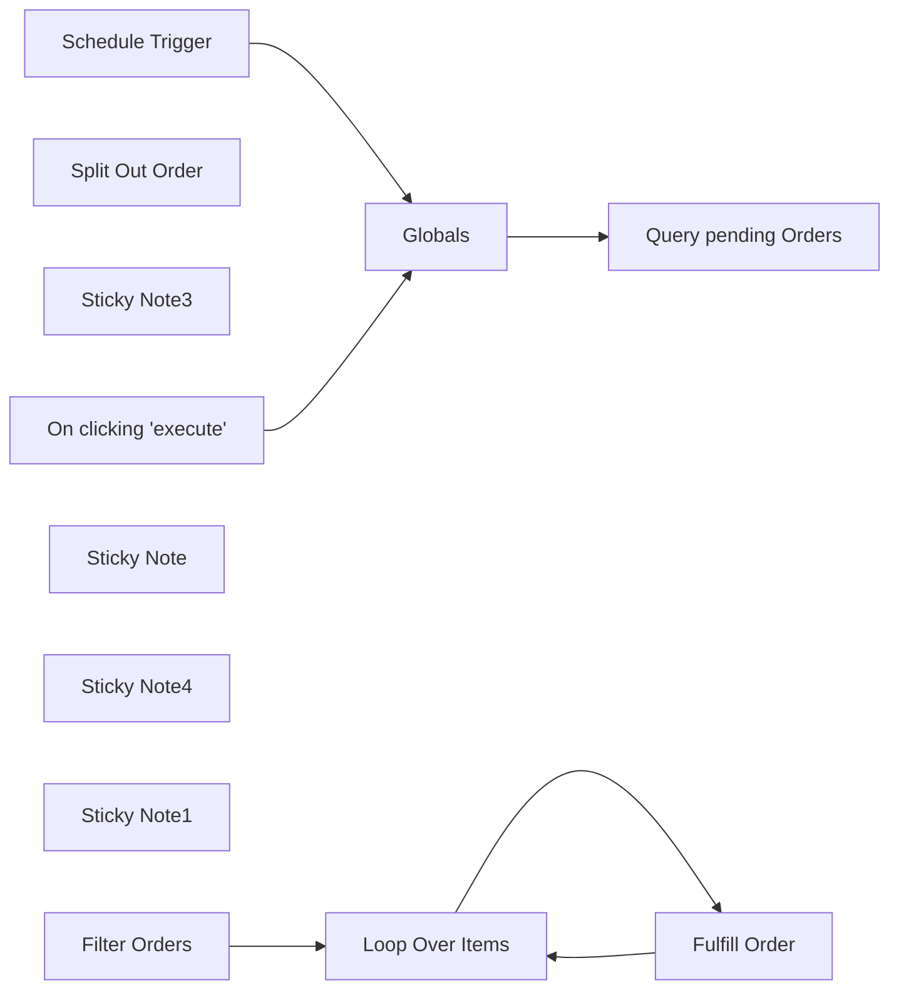

## Fluxo (.json) :

```json
{
  "meta": {
    "instanceId": "e634e668fe1fc93a75c4f2a7fc0dad807ca318b79654157eadb9578496acbc76"
  },
  "nodes": [
    {
      "id": "754006f5-1a7e-4e29-9850-e38b1d0c0d09",
      "name": "On clicking 'execute'",
      "type": "n8n-nodes-base.manualTrigger",
      "position": [
        360,
        80
      ],
      "parameters": {},
      "typeVersion": 1
    },
    {
      "id": "6b7b0d05-38cc-4c2d-8a71-874ff5ad29d9",
      "name": "Split Out Order ",
      "type": "n8n-nodes-base.splitOut",
      "position": [
        1080,
        200
      ],
      "parameters": {
        "options": {},
        "fieldToSplitOut": "result"
      },
      "typeVersion": 1
    },
    {
      "id": "1494f1ff-f377-4d56-8da7-274f0c182588",
      "name": "Globals",
      "type": "n8n-nodes-base.set",
      "position": [
        600,
        200
      ],
      "parameters": {
        "options": {},
        "assignments": {
          "assignments": [
            {
              "id": "7411b768-9861-414c-aeaa-2743b3d61a3b",
              "name": "api-version",
              "type": "string",
              "value": "1.0"
            },
            {
              "id": "6cf546c5-5737-4dbd-851b-17d68e0a3780",
              "name": "modifiedAfter",
              "type": "string",
              "value": ""
            },
            {
              "id": "452efa28-2dc6-4ea3-a7a2-c35d100d0382",
              "name": "modifiedBefore",
              "type": "string",
              "value": ""
            },
            {
              "id": "81c4dc54-86bf-4432-a23f-22c7ea831e74",
              "name": "cursor",
              "type": "string",
              "value": ""
            },
            {
              "id": "fa31a552-0d2d-4eb3-8476-44024e1fdc81",
              "name": "fulfillmentStatus",
              "type": "string",
              "value": "PENDING"
            },
            {
              "id": "489ff3e6-7bc3-4940-9312-e4ace8e1db9f",
              "name": "maxPage",
              "type": "number",
              "value": -1
            }
          ]
        }
      },
      "notesInFlow": true,
      "typeVersion": 3.4
    },
    {
      "id": "01557e82-9f89-4030-af0f-6663ea945191",
      "name": "Sticky Note3",
      "type": "n8n-nodes-base.stickyNote",
      "position": [
        540,
        80
      ],
      "parameters": {
        "color": 4,
        "width": 150,
        "height": 80,
        "content": "## Edit this node 👇"
      },
      "typeVersion": 1
    },
    {
      "id": "9d9d361a-dd12-4c57-9f76-7c4738b5af1e",
      "name": "Schedule Trigger",
      "type": "n8n-nodes-base.scheduleTrigger",
      "position": [
        360,
        340
      ],
      "parameters": {
        "rule": {
          "interval": [
            {}
          ]
        }
      },
      "typeVersion": 1.2
    },
    {
      "id": "a3e41614-ca4e-4730-a4ab-1e9933ef71d5",
      "name": "Sticky Note",
      "type": "n8n-nodes-base.stickyNote",
      "position": [
        0,
        0
      ],
      "parameters": {
        "width": 320,
        "height": 660,
        "content": "## Squarespace Fulfillment Automation with n8n\nRetrieves all Squarespace Orders and mark them as fulfilled automatically Squarespace Commerce API\n\n### Setup\nOpen `Globals` node and update the values below 👇\n\n- **api-version** (string, required) – The current API version (see Squarespace Orders API documentation).\n- **modifiedAfter**={a-datetime} (string, conditional) – Fetch orders modified after a specific date (ISO 8601 format).\n- **modifiedBefore**={b-datetime} (string, conditional) – Fetch orders modified before a specific date (ISO 8601 format).\n- **cursor**={c} (string, conditional) – Used for pagination, cannot be combined with other filters.\n- **fulfillmentStatus**: PENDING, FULFILLED, or CANCELED.\n- **maxPage** – Set -1 to enables infinite pagination to fetch all available orders.\n\n"
      },
      "typeVersion": 1
    },
    {
      "id": "bc78dac5-3fa9-4b65-a5c3-2196ed53a81c",
      "name": "Query pending Orders",
      "type": "n8n-nodes-base.httpRequest",
      "position": [
        840,
        200
      ],
      "parameters": {
        "url": "=https://api.squarespace.com/{{ $json[\"api-version\"] }}/commerce/orders",
        "options": {
          "pagination": {
            "pagination": {
              "parameters": {
                "parameters": [
                  {
                    "name": "cursor",
                    "value": "={{ $response.body.pagination.nextPageCursor }}"
                  }
                ]
              },
              "maxRequests": "={{ $json.maxPage === -1 ? Infinity : $json.maxPage }}",
              "limitPagesFetched": true,
              "completeExpression": "={{ !$response.body.pagination.nextPageCursor }}",
              "paginationCompleteWhen": "other"
            }
          }
        },
        "sendQuery": true,
        "authentication": "genericCredentialType",
        "genericAuthType": "httpHeaderAuth",
        "queryParameters": {
          "parameters": [
            {
              "name": "modifiedAfter",
              "value": "={{ $json.modifiedAfter }}"
            },
            {
              "name": "=modifiedBefore",
              "value": "={{ $json.modifiedBefore }}"
            },
            {
              "name": "cursor",
              "value": "={{ $json.cursor }}"
            },
            {
              "name": "=fulfillmentStatus",
              "value": "={{ $json.fulfillmentStatus }}"
            }
          ]
        }
      },
      "credentials": {
        "oAuth2Api": {
          "id": "5eAFOixVzslPr99y",
          "name": "Squarespace OAuth 2.0"
        },
        "httpHeaderAuth": {
          "id": "iiLmD473RYjGLbCA",
          "name": "Squarespace API key - Apps script"
        }
      },
      "typeVersion": 4.2
    },
    {
      "id": "a5723a03-41d1-49a9-9baa-c7482fdf82a3",
      "name": "Loop Over Items",
      "type": "n8n-nodes-base.splitInBatches",
      "position": [
        1640,
        200
      ],
      "parameters": {
        "options": {}
      },
      "typeVersion": 3
    },
    {
      "id": "7e656389-ca9c-4ff4-9db1-68f84a13e605",
      "name": "Fulfill Order",
      "type": "n8n-nodes-base.httpRequest",
      "position": [
        1940,
        200
      ],
      "parameters": {
        "url": "=https://api.squarespace.com/{{ $('Globals').item.json[\"api-version\"] }}/commerce/orders/{{ $('Filter Orders').item.json.id }}/fulfillments",
        "method": "POST",
        "options": {},
        "jsonBody": "{\n  \"shouldSendNotification\": true\n}",
        "sendBody": true,
        "specifyBody": "json",
        "authentication": "genericCredentialType",
        "genericAuthType": "oAuth2Api"
      },
      "credentials": {
        "oAuth2Api": {
          "id": "5eAFOixVzslPr99y",
          "name": "Squarespace OAuth 2.0"
        },
        "httpHeaderAuth": {
          "id": "iiLmD473RYjGLbCA",
          "name": "Squarespace API key - Apps script"
        }
      },
      "typeVersion": 4.2
    },
    {
      "id": "b14b6db8-a027-41c2-a030-aa09b0003d73",
      "name": "Sticky Note4",
      "type": "n8n-nodes-base.stickyNote",
      "position": [
        1880,
        0
      ],
      "parameters": {
        "width": 232,
        "height": 346,
        "content": "## Create fulfillment  👇\n\n[Fulfill an order](https://developers.squarespace.com/commerce-apis/fulfill-order)\n- `shouldSendNotification` to send notifications to customer"
      },
      "typeVersion": 1
    },
    {
      "id": "effd0876-0003-4e3f-ad61-cfe3d4391e67",
      "name": "Sticky Note1",
      "type": "n8n-nodes-base.stickyNote",
      "position": [
        1280,
        -80
      ],
      "parameters": {
        "height": 440,
        "content": "## Filtering orders for fulfillment 👇\nFilter the valid orders for programatically fulfillments\n\n- you exclusively sell digital downloads or digital gift cards\n- you use fulfillment services for all your products\n"
      },
      "typeVersion": 1
    },
    {
      "id": "ac8538f5-b93b-43c5-9100-33fe3f6cd70b",
      "name": "Filter Orders",
      "type": "n8n-nodes-base.filter",
      "position": [
        1340,
        200
      ],
      "parameters": {
        "options": {},
        "conditions": {
          "options": {
            "version": 2,
            "leftValue": "",
            "caseSensitive": true,
            "typeValidation": "strict"
          },
          "combinator": "and",
          "conditions": [
            {
              "id": "298103c1-a5b4-407e-aba6-bee37463422f",
              "operator": {
                "type": "number",
                "operation": "gt"
              },
              "leftValue": "={{ (new Date().getTime() - new Date($json.createdOn).getTime()) / (1000 * 60 * 60) }}",
              "rightValue": 24
            }
          ]
        }
      },
      "typeVersion": 2.2
    }
  ],
  "pinData": {},
  "connections": {
    "Globals": {
      "main": [
        [
          {
            "node": "Query pending Orders",
            "type": "main",
            "index": 0
          }
        ]
      ]
    },
    "Filter Orders": {
      "main": [
        [
          {
            "node": "Loop Over Items",
            "type": "main",
            "index": 0
          }
        ]
      ]
    },
    "Fulfill Order": {
      "main": [
        [
          {
            "node": "Loop Over Items",
            "type": "main",
            "index": 0
          }
        ]
      ]
    },
    "Loop Over Items": {
      "main": [
        [],
        [
          {
            "node": "Fulfill Order",
            "type": "main",
            "index": 0
          }
        ]
      ]
    },
    "Schedule Trigger": {
      "main": [
        [
          {
            "node": "Globals",
            "type": "main",
            "index": 0
          }
        ]
      ]
    },
    "Split Out Order ": {
      "main": [
        [
          {
            "node": "Filter Orders",
            "type": "main",
            "index": 0
          }
        ]
      ]
    },
    "Query pending Orders": {
      "main": [
        [
          {
            "node": "Split Out Order ",
            "type": "main",
            "index": 0
          }
        ]
      ]
    },
    "On clicking 'execute'": {
      "main": [
        [
          {
            "node": "Globals",
            "type": "main",
            "index": 0
          }
        ]
      ]
    }
  }
}
```

<a id="template-2551"></a>

## Template 2551 - Triagem automática de currículos por visão AI

- **Nome:** Triagem automática de currículos por visão AI
- **Descrição:** Fluxo que baixa um currículo em PDF, converte-o para imagem e usa um modelo multimodal de linguagem para avaliar se o candidato é qualificado para a vaga.
- **Funcionalidade:** • Disparo manual: inicia o fluxo manualmente para teste ou execução sob demanda.
• Download do currículo: obtém o arquivo PDF do currículo armazenado no Google Drive.
• Conversão de PDF para imagem: envia o PDF para uma API de conversão para gerar uma imagem do documento.
• Redução de resolução: redimensiona a imagem gerada para reduzir tempo e custo de processamento do modelo.
• Análise multimodal: submete a imagem a um modelo de linguagem multimodal que 'lê' o currículo como uma pessoa e avalia a compatibilidade com a vaga (ex.: Plumber).
• Parser de saída estruturada: formata a resposta do modelo em um esquema estruturado (por exemplo, is_qualified e reason).
• Decisão condicional: verifica o resultado estruturado e determina se o candidato deve prosseguir para a próxima etapa do processo.
• Aviso de privacidade: alerta sobre o uso de uma instância pública da ferramenta de conversão e recomenda uso de instância privada em produção.
- **Ferramentas:** • Google Drive: armazenamento e fornecimento do arquivo PDF do currículo.
• Stirling PDF (API de conversão): serviço que converte PDFs em imagens (usado para transformar o currículo em imagem legível pelo modelo de visão).
• Google Gemini (PaLM): modelo de linguagem multimodal usado para analisar a imagem do currículo e avaliar a adequação do candidato.

## Fluxo visual

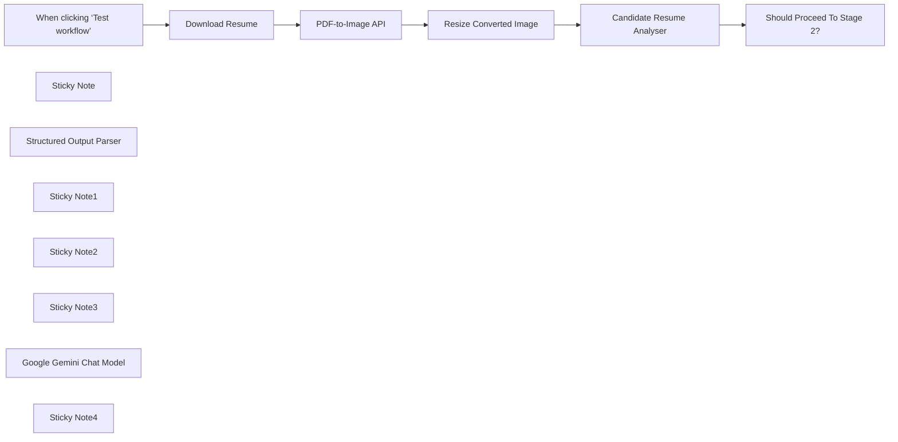

## Fluxo (.json) :

```json
{
  "meta": {
    "instanceId": "408f9fb9940c3cb18ffdef0e0150fe342d6e655c3a9fac21f0f644e8bedabcd9"
  },
  "nodes": [
    {
      "id": "38da57b7-2161-415d-8473-783ccdc7b975",
      "name": "When clicking ‘Test workflow’",
      "type": "n8n-nodes-base.manualTrigger",
      "position": [
        -260,
        840
      ],
      "parameters": {},
      "typeVersion": 1
    },
    {
      "id": "2cd46d91-105d-4b5e-be43-3343a9da815d",
      "name": "Sticky Note",
      "type": "n8n-nodes-base.stickyNote",
      "position": [
        -780,
        540
      ],
      "parameters": {
        "width": 365.05232558139534,
        "height": 401.24529475392126,
        "content": "## Try me out!\n\n### This workflow converts a Candidate Resume PDF to an image which is then \"read\" by a Vision Language Model (VLM). The VLM assesses if the candidate's CV is a fit for the desired role.\n\nThis approach can be employed to combat \"hidden prompts\" planted in resumes to bypass and/or manipulate automated ATS systems using AI.\n\n\n### Need Help?\nJoin the [Discord](https://discord.com/invite/XPKeKXeB7d) or ask in the [Forum](https://community.n8n.io/)!\n"
      },
      "typeVersion": 1
    },
    {
      "id": "40bab53a-fcbc-4acc-8d59-c20b3e1b2697",
      "name": "Structured Output Parser",
      "type": "@n8n/n8n-nodes-langchain.outputParserStructured",
      "position": [
        1200,
        980
      ],
      "parameters": {
        "jsonSchemaExample": "{\n\t\"is_qualified\": true,\n\t\"reason\": \"\"\n}"
      },
      "typeVersion": 1.2
    },
    {
      "id": "d75fb7ab-cfbc-419d-b803-deb9e99114ba",
      "name": "Should Proceed To Stage 2?",
      "type": "n8n-nodes-base.if",
      "position": [
        1360,
        820
      ],
      "parameters": {
        "options": {},
        "conditions": {
          "options": {
            "leftValue": "",
            "caseSensitive": true,
            "typeValidation": "strict"
          },
          "combinator": "and",
          "conditions": [
            {
              "id": "4dd69ba3-bf07-43b3-86b7-d94b07e9eea6",
              "operator": {
                "type": "boolean",
                "operation": "true",
                "singleValue": true
              },
              "leftValue": "={{ $json.output.is_qualified }}",
              "rightValue": ""
            }
          ]
        }
      },
      "typeVersion": 2
    },
    {
      "id": "a0f56270-67c2-4fab-b521-aa6f06b0b0fd",
      "name": "Sticky Note1",
      "type": "n8n-nodes-base.stickyNote",
      "position": [
        -380,
        540
      ],
      "parameters": {
        "color": 7,
        "width": 543.5706868577606,
        "height": 563.6162790697684,
        "content": "## 1. Download Candidate Resume\n[Read more about using Google Drive](https://docs.n8n.io/integrations/builtin/app-nodes/n8n-nodes-base.googledrive)\n\nFor this demonstration, we'll pull the candidate's resume PDF from Google Drive but you can just as easily recieve this resume from email or your ATS.\n\nIt should be noted that our PDF is a special test case which has been deliberately injected with an AI bypass; the bypass is a hidden prompt which aims to override AI instructions and auto-qualify the candidate... sneaky!\n\nDownload a copy of this resume here: https://drive.google.com/file/d/1MORAdeev6cMcTJBV2EYALAwll8gCDRav/view?usp=sharing"
      },
      "typeVersion": 1
    },
    {
      "id": "d21fe4dd-0879-4e5a-a70d-10f09b25eee2",
      "name": "Download Resume",
      "type": "n8n-nodes-base.googleDrive",
      "position": [
        -80,
        840
      ],
      "parameters": {
        "fileId": {
          "__rl": true,
          "mode": "id",
          "value": "1MORAdeev6cMcTJBV2EYALAwll8gCDRav"
        },
        "options": {},
        "operation": "download"
      },
      "credentials": {
        "googleDriveOAuth2Api": {
          "id": "yOwz41gMQclOadgu",
          "name": "Google Drive account"
        }
      },
      "typeVersion": 3
    },
    {
      "id": "ea904365-d9d2-4f15-b7c3-7abfeb4c8c50",
      "name": "Sticky Note2",
      "type": "n8n-nodes-base.stickyNote",
      "position": [
        200,
        540
      ],
      "parameters": {
        "color": 7,
        "width": 605.0267171444024,
        "height": 595.3148729042731,
        "content": "## 2. Convert PDF to Image(s)\n[Read more about using Stirling PDF](https://github.com/Stirling-Tools/Stirling-PDF)\n\nAI vision models can only accept images (and sometimes videos!) as non-text inputs but not PDFs at time of writing. We'll have to convert our PDF to an image in order to use it.\n\nHere, we'll use a tool called **Stirling PDF** which can provide this functionality and can be accessed via a HTTP API. Feel free to use an alternative solution if available, otherwise follow the instructions on the Stirling PDF website to set up your own instance.\n\nAdditionally, we'll reduce the resolution of our converted image to speed up the processing done by the LLM. I find that about 75% of an A4 (30x40cm) is a good balance."
      },
      "typeVersion": 1
    },
    {
      "id": "cd00a47f-1ab9-46bf-8ea1-46ac899095e7",
      "name": "Sticky Note3",
      "type": "n8n-nodes-base.stickyNote",
      "position": [
        840,
        540
      ],
      "parameters": {
        "color": 7,
        "width": 747.8139534883712,
        "height": 603.1395348837208,
        "content": "## 3. Parse Resume with Multimodal LLM\n[Read more about using Basic LLM Chain](https://docs.n8n.io/integrations/builtin/cluster-nodes/root-nodes/n8n-nodes-langchain.chainllm/)\n\nMultimodal LLMs are LLMs which can accept binary inputs such as images, audio and/or video files. Most newer LLMs are by default multimodal and we'll use Google's Gemini here as an example. By processing each candidate's resume as an image, we avoid scenarios where text extraction fails due to layout issues or by picking up \"hidden\" or malicious prompts planted to subvert AI automated processing.\n\nThis vision model ensures the resume is read and understood as a human would. The hidden bypass is therefore rendered mute since the AI also cannot \"see\" the special prompt embedded in the document."
      },
      "typeVersion": 1
    },
    {
      "id": "d60214c6-c67e-4433-9121-4d54f782b19d",
      "name": "PDF-to-Image API",
      "type": "n8n-nodes-base.httpRequest",
      "position": [
        340,
        880
      ],
      "parameters": {
        "url": "https://stirlingpdf.io/api/v1/convert/pdf/img",
        "method": "POST",
        "options": {},
        "sendBody": true,
        "contentType": "multipart-form-data",
        "bodyParameters": {
          "parameters": [
            {
              "name": "fileInput",
              "parameterType": "formBinaryData",
              "inputDataFieldName": "data"
            },
            {
              "name": "imageFormat",
              "value": "jpg"
            },
            {
              "name": "singleOrMultiple",
              "value": "single"
            },
            {
              "name": "dpi",
              "value": "300"
            }
          ]
        }
      },
      "typeVersion": 4.2
    },
    {
      "id": "847de537-ad8f-47f5-a1c1-d207c3fc15ef",
      "name": "Resize Converted Image",
      "type": "n8n-nodes-base.editImage",
      "position": [
        530,
        880
      ],
      "parameters": {
        "width": 75,
        "height": 75,
        "options": {},
        "operation": "resize",
        "resizeOption": "percent"
      },
      "typeVersion": 1
    },
    {
      "id": "5fb6ac7e-b910-4dce-bba7-19b638fd817a",
      "name": "Google Gemini Chat Model",
      "type": "@n8n/n8n-nodes-langchain.lmChatGoogleGemini",
      "position": [
        1000,
        980
      ],
      "parameters": {
        "options": {},
        "modelName": "models/gemini-1.5-pro-latest"
      },
      "credentials": {
        "googlePalmApi": {
          "id": "dSxo6ns5wn658r8N",
          "name": "Google Gemini(PaLM) Api account"
        }
      },
      "typeVersion": 1
    },
    {
      "id": "2580b583-544a-47ee-b248-9cca528c9866",
      "name": "Candidate Resume Analyser",
      "type": "@n8n/n8n-nodes-langchain.chainLlm",
      "position": [
        1000,
        820
      ],
      "parameters": {
        "text": "=Evaluate the candidate's resume.",
        "messages": {
          "messageValues": [
            {
              "message": "=Assess the given Candiate Resume for the role of Plumber.\nDetermine if the candidate's skills match the role and if they qualify for an in-person interview."
            },
            {
              "type": "HumanMessagePromptTemplate",
              "messageType": "imageBinary"
            }
          ]
        },
        "promptType": "define",
        "hasOutputParser": true
      },
      "typeVersion": 1.4
    },
    {
      "id": "694669c2-9cf5-43ec-8846-c0ecbc5a77ee",
      "name": "Sticky Note4",
      "type": "n8n-nodes-base.stickyNote",
      "position": [
        280,
        840
      ],
      "parameters": {
        "width": 225.51725256895617,
        "height": 418.95152406706313,
        "content": "\n\n\n\n\n\n\n\n\n\n\n\n\n\n\n\n\n\n\n### Data Privacy Warning!\nFor demo purposes, we're using the public online version of Stirling PDF. It is recommended to setup your own private instance of Stirling PDF before using this workflow in production."
      },
      "typeVersion": 1
    }
  ],
  "pinData": {},
  "connections": {
    "Download Resume": {
      "main": [
        [
          {
            "node": "PDF-to-Image API",
            "type": "main",
            "index": 0
          }
        ]
      ]
    },
    "PDF-to-Image API": {
      "main": [
        [
          {
            "node": "Resize Converted Image",
            "type": "main",
            "index": 0
          }
        ]
      ]
    },
    "Resize Converted Image": {
      "main": [
        [
          {
            "node": "Candidate Resume Analyser",
            "type": "main",
            "index": 0
          }
        ]
      ]
    },
    "Google Gemini Chat Model": {
      "ai_languageModel": [
        [
          {
            "node": "Candidate Resume Analyser",
            "type": "ai_languageModel",
            "index": 0
          }
        ]
      ]
    },
    "Structured Output Parser": {
      "ai_outputParser": [
        [
          {
            "node": "Candidate Resume Analyser",
            "type": "ai_outputParser",
            "index": 0
          }
        ]
      ]
    },
    "Candidate Resume Analyser": {
      "main": [
        [
          {
            "node": "Should Proceed To Stage 2?",
            "type": "main",
            "index": 0
          }
        ]
      ]
    },
    "When clicking ‘Test workflow’": {
      "main": [
        [
          {
            "node": "Download Resume",
            "type": "main",
            "index": 0
          }
        ]
      ]
    }
  }
}
```

<a id="template-2552"></a>

## Template 2552 - Varredura única de domínio via Icypeas

- **Nome:** Varredura única de domínio via Icypeas
- **Descrição:** Autentica em uma conta Icypeas e executa uma busca (scan) para um domínio ou empresa, enviando os dados e recebendo o resultado do scan.
- **Funcionalidade:** • Autenticação com credenciais: Utiliza API Key, API Secret e User ID para identificar a conta no serviço.
• Geração de assinatura HMAC: Cria uma assinatura (HMAC-SHA1) baseada no método, caminho e timestamp para validar a requisição.
• Criação de cabeçalhos de requisição: Prepara cabeçalhos necessários, incluindo timestamp (X-ROCK-TIMESTAMP) e Authorization no formato key:signature.
• Envio de solicitação de varredura: Realiza uma requisição POST ao endpoint de domain/company scan com o parâmetro domainOrCompany para iniciar a análise.
• Direcionamento dos resultados: Resultados do scan ficam disponíveis no painel da conta Icypeas para visualização posterior.
- **Ferramentas:** • Icypeas: Plataforma de análise e investigação de domínios/empresas que disponibiliza uma API para executar buscas e visualizar resultados.


## Fluxo visual

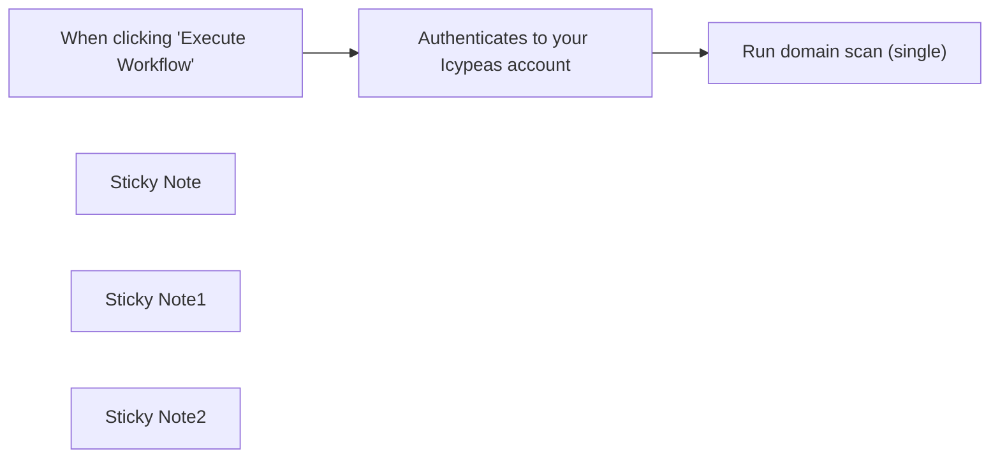

## Fluxo (.json) :

```json
{
  "id": "IwOOVikQC7cn9VTv",
  "meta": {
    "instanceId": "a897062ac3223eacd9c7736276b653c446bc776a63cde2a42a2949ad984f7092"
  },
  "name": "Perform a domain search (single) with Icypeas",
  "tags": [],
  "nodes": [
    {
      "id": "a8be94cc-c695-4a24-b045-d6716fe6f043",
      "name": "When clicking \"Execute Workflow\"",
      "type": "n8n-nodes-base.manualTrigger",
      "position": [
        4360,
        1720
      ],
      "parameters": {},
      "typeVersion": 1
    },
    {
      "id": "c636d4ed-6310-4f2a-876e-c24d54dc9349",
      "name": "Sticky Note",
      "type": "n8n-nodes-base.stickyNote",
      "position": [
        4200,
        1460
      ],
      "parameters": {
        "height": 243.6494382022472,
        "content": "## Perform a domain search (single) with Icypeas\n\nThis workflow demonstrates how to perform a domain scan using Icypeas. Visit https://icypeas.com to create your account.\n\n\n"
      },
      "typeVersion": 1
    },
    {
      "id": "a6f4dbe2-478d-426c-b544-60cd97c84901",
      "name": "Sticky Note1",
      "type": "n8n-nodes-base.stickyNote",
      "position": [
        4507,
        1536
      ],
      "parameters": {
        "width": 506,
        "height": 1041.5303370786517,
        "content": "## Authenticates to your Icypeas account\n\nThis code node utilizes your API key, API secret, and User ID to establish a connection with your Icypeas account.\n\n\n\n\n\n\n\n\n\n\n\n\n\n\n\n\n\nOpen this node and insert your API Key, API secret, and User ID within the quotation marks. You can locate these credentials on your Icypeas profile at https://app.icypeas.com/bo/profile. Here is the extract of what you have to change :\n\nconst API_KEY = \"**PUT_API_KEY_HERE**\";\nconst API_SECRET = \"**PUT_API_SECRET_HERE**\";\nconst USER_ID = \"**PUT_USER_ID_HERE**\";\n\nDo not change any other line of the code.\n\nIf you are a self-hosted user, follow these steps to activate the crypto module :\n\n1.Access your n8n instance:\nLog in to your n8n instance using your web browser by navigating to the URL of your instance, for example: http://your-n8n-instance.com.\n\n2.Go to Settings:\nIn the top-right corner, click on your username, then select \"Settings.\"\n\n3.Select General Settings:\nIn the left menu, click on \"General.\"\n\n4.Enable the Crypto module:\nScroll down to the \"Additional Node Packages\" section. You will see an option called \"crypto\" with a checkbox next to it. Check this box to enable the Crypto module.\n\n5.Save the changes:\nAt the bottom of the page, click \"Save\" to apply the changes.\n\nOnce you've followed these steps, the Crypto module should be activated for your self-hosted n8n instance. Make sure to save your changes and optionally restart your n8n instance for the changes to take effect.\n\n\n\n\n\n\n\n\n\n\n\n"
      },
      "typeVersion": 1
    },
    {
      "id": "c42e5f50-93dd-48c6-8cfc-c37aefc609a5",
      "name": "Sticky Note2",
      "type": "n8n-nodes-base.stickyNote",
      "position": [
        5013,
        1540
      ],
      "parameters": {
        "width": 492,
        "height": 748,
        "content": "## Performs a domain/company scan on your Icypeas account\n\n\nThis node executes an HTTP request (POST) to scan the domain/company you have provided in the body section, using Icypeas.\n\n\n\n\n\n\n\n\n\n\n\n\n\n### You need to create credentials in the HTTP Request node :\n\n➔ In the Credential for Header Auth, click on - Create new Credential -.\n➔ In the Name section, write “Authorization”\n➔ In the Value section, select expression (located just above the field on the right when you hover on top of it) and write {{ $json.api.key + ':' + $json.api.signature }} .\n➔ Then click on “Save” to save the changes.\n\n### To scan the domain/company :\n\n➔ go to the Body Parameters section,\n➔ create a new parameter,\n➔ enter \"domainOrCompany\" in the Name field.\n➔ put the domain/company you want to scan in the Value field.\n\nYou will find the result here : https://app.icypeas.com/bo/singlesearch?task=domain-search\n"
      },
      "typeVersion": 1
    },
    {
      "id": "cdee270f-b6c0-4f60-ba41-f2ee9e091eaa",
      "name": "Run domain scan (single)",
      "type": "n8n-nodes-base.httpRequest",
      "position": [
        5080,
        1720
      ],
      "parameters": {
        "url": "={{ $json.api.url }}",
        "method": "POST",
        "options": {},
        "sendBody": true,
        "sendHeaders": true,
        "authentication": "genericCredentialType",
        "bodyParameters": {
          "parameters": [
            {
              "name": "domainOrCompany",
              "value": "=google"
            }
          ]
        },
        "genericAuthType": "httpHeaderAuth",
        "headerParameters": {
          "parameters": [
            {
              "name": "X-ROCK-TIMESTAMP",
              "value": "={{ $json.api.timestamp }}"
            }
          ]
        }
      },
      "credentials": {
        "httpHeaderAuth": {
          "id": "KGXtUrqC6lNLwW2w",
          "name": "Header Auth account"
        }
      },
      "typeVersion": 4.1
    },
    {
      "id": "b066f965-a3a7-45cb-96c2-ca3bdf2bb231",
      "name": "Authenticates to your Icypeas account",
      "type": "n8n-nodes-base.code",
      "position": [
        4700,
        1720
      ],
      "parameters": {
        "jsCode": "const BASE_URL = \"https://app.icypeas.com\";\nconst PATH = \"/api/domain-search\";\nconst METHOD = \"POST\";\n\n// Change here\nconst API_KEY = \"PUT_API_KEY_HERE\";\nconst API_SECRET = \"PUT_API_SECRET_HERE\";\nconst USER_ID = \"PUT_USER_ID_HERE\";\n////////////////\n\nconst genSignature = (\n    path,\n    method,\n    secret,\n    timestamp = new Date().toISOString()\n) => {\n    const Crypto = require('crypto');\n    const payload = `${method}${path}${timestamp}`.toLowerCase();\n    const sign = Crypto.createHmac(\"sha1\", secret).update(payload).digest(\"hex\");\n\n    return sign;\n};\n\nconst fullPath = `${BASE_URL}${PATH}`;\n$input.first().json.api = {\n  timestamp: new Date().toISOString(),\n  secret: API_SECRET,\n  key: API_KEY,\n  userId: USER_ID,\n  url: fullPath,\n};\n$input.first().json.api.signature = genSignature(PATH, METHOD, API_SECRET, $input.first().json.api.timestamp);\nreturn $input.first();"
      },
      "typeVersion": 1
    }
  ],
  "active": false,
  "pinData": {},
  "settings": {
    "executionOrder": "v1"
  },
  "versionId": "499f7092-5891-46cb-9756-0a11f75242f4",
  "connections": {
    "When clicking \"Execute Workflow\"": {
      "main": [
        [
          {
            "node": "Authenticates to your Icypeas account",
            "type": "main",
            "index": 0
          }
        ]
      ]
    },
    "Authenticates to your Icypeas account": {
      "main": [
        [
          {
            "node": "Run domain scan (single)",
            "type": "main",
            "index": 0
          }
        ]
      ]
    }
  }
}
```

<a id="template-2553"></a>

## Template 2553 - Auditoria diária de permissões do Google Drive

- **Nome:** Auditoria diária de permissões do Google Drive
- **Descrição:** Executa uma auditoria diária dos documentos recentes no Google Drive para identificar arquivos compartilhados publicamente ou com usuários externos, registrar os resultados em uma planilha e enviar um relatório por e-mail.
- **Funcionalidade:** • Agendamento diário: Executa a auditoria automaticamente em um horário programado a cada dia.
• Criação de planilha de auditoria: Gera uma nova aba/planilha para cada execução para armazenar os resultados do dia.
• Busca de documentos recentes: Pesquisa arquivos editados recentemente (documentos, planilhas, apresentações) que não estejam na lixeira.
• Detecção de compartilhamento público: Identifica arquivos com permissão do tipo "anyone" (qualquer pessoa com o link).
• Detecção de compartilhamento externo: Identifica arquivos compartilhados com usuários fora do domínio (endereços de e-mail externos).
• Expansão e normalização de permissões: Converte a estrutura de permissões em linhas normalizadas com campos padronizados (id do arquivo, nome, tipo, id do usuário, e-mail, papel).
• Filtragem do proprietário: Remove das linhas os registros correspondentes ao proprietário do documento para evitar falsos positivos.
• Agregação e gravação: Agrupa os resultados e adiciona as linhas na planilha de auditoria criada.
• Envio de relatório por e-mail: Envia um resumo por e-mail com links para os arquivos identificados e para a planilha de auditoria.
- **Ferramentas:** • Google Drive: Fonte dos documentos e metadados de permissões para análise.
• Google Sheets: Repositório para armazenar os resultados da auditoria e facilitar a visualização.
• Gmail: Envio do relatório de auditoria diário para revisão e ação.

## Fluxo visual

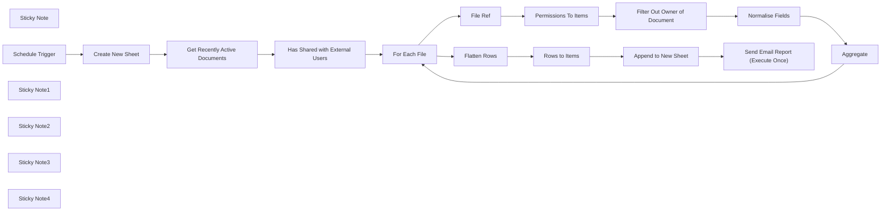

## Fluxo (.json) :

```json
{
  "meta": {
    "instanceId": "408f9fb9940c3cb18ffdef0e0150fe342d6e655c3a9fac21f0f644e8bedabcd9",
    "templateCredsSetupCompleted": true
  },
  "nodes": [
    {
      "id": "f8f5a571-c4de-469e-a182-faa60060d06b",
      "name": "Has Shared with External Users",
      "type": "n8n-nodes-base.filter",
      "position": [
        40,
        -220
      ],
      "parameters": {
        "options": {},
        "conditions": {
          "options": {
            "version": 2,
            "leftValue": "",
            "caseSensitive": true,
            "typeValidation": "strict"
          },
          "combinator": "or",
          "conditions": [
            {
              "id": "c72e9718-b50a-4c5f-8a26-7b3fda89e202",
              "operator": {
                "type": "boolean",
                "operation": "true",
                "singleValue": true
              },
              "leftValue": "={{ $json.shared && $json.permissions.some(item => item.emailAddress ? !item.emailAddress.endsWith('example.com') : false)  }}",
              "rightValue": ""
            },
            {
              "id": "0479b4ae-fc0c-49c4-8813-6978ea55265a",
              "operator": {
                "type": "object",
                "operation": "exists",
                "singleValue": true
              },
              "leftValue": "={{ $json.permissions.find(item => item.type === 'anyone') }}",
              "rightValue": ""
            }
          ]
        }
      },
      "typeVersion": 2.2
    },
    {
      "id": "14b6d453-0403-476a-8537-cdeeace70115",
      "name": "Create New Sheet",
      "type": "n8n-nodes-base.googleSheets",
      "position": [
        -620,
        -220
      ],
      "parameters": {
        "title": "=audit-{{ $now.format('yyyyMMdd') }}",
        "options": {},
        "operation": "create",
        "documentId": {
          "__rl": true,
          "mode": "list",
          "value": "1V2aiLhp3_nH7EBniMn7D0kFHg7-A5NjpDZXMhb4F5UI",
          "cachedResultUrl": "https://docs.google.com/spreadsheets/d/1V2aiLhp3_nH7EBniMn7D0kFHg7-A5NjpDZXMhb4F5UI/edit?usp=drivesdk",
          "cachedResultName": "94. Gdrive Permissions Audit - Personal"
        }
      },
      "credentials": {
        "googleSheetsOAuth2Api": {
          "id": "XHvC7jIRR8A2TlUl",
          "name": "Google Sheets account"
        }
      },
      "typeVersion": 4.5,
      "alwaysOutputData": true
    },
    {
      "id": "394b91b3-0c70-40d5-8d48-4df6109780e7",
      "name": "Normalise Fields",
      "type": "n8n-nodes-base.set",
      "position": [
        1140,
        -140
      ],
      "parameters": {
        "options": {},
        "assignments": {
          "assignments": [
            {
              "id": "1d2f091f-7740-47d1-9bf4-91cb620ffb1f",
              "name": "file_id",
              "type": "string",
              "value": "={{ $('File Ref').item.json.id }}"
            },
            {
              "id": "b7836ed5-7b14-436f-aa5b-be8a6c7f2957",
              "name": "file_name",
              "type": "string",
              "value": "={{ $('File Ref').item.json.name }}"
            },
            {
              "id": "b1d59c01-17d9-4d0b-b0f4-1593e47f968f",
              "name": "type",
              "type": "string",
              "value": "={{ $json.type }}"
            },
            {
              "id": "37f50a02-c780-49b3-ad8a-0d934566c770",
              "name": "user_id",
              "type": "string",
              "value": "={{ $json.id }}"
            },
            {
              "id": "e16c385f-2ad2-484b-99a4-9021f77b6875",
              "name": "user",
              "type": "string",
              "value": "={{ $json.emailAddress || 'n/a' }}"
            },
            {
              "id": "3c825d9e-494c-4500-b04d-d9577c0d5f44",
              "name": "role",
              "type": "string",
              "value": "={{ $json.role }}"
            }
          ]
        }
      },
      "typeVersion": 3.4
    },
    {
      "id": "74a7ca8b-3ad4-470e-8c4d-b2e3cb721c27",
      "name": "For Each File",
      "type": "n8n-nodes-base.splitInBatches",
      "position": [
        440,
        -140
      ],
      "parameters": {
        "options": {}
      },
      "typeVersion": 3
    },
    {
      "id": "da0e4e55-9ffa-4939-acf3-a743ade6b3eb",
      "name": "File Ref",
      "type": "n8n-nodes-base.noOp",
      "position": [
        620,
        -140
      ],
      "parameters": {},
      "typeVersion": 1
    },
    {
      "id": "26e0f66a-88d7-46df-94e5-127158c47191",
      "name": "Permissions To Items",
      "type": "n8n-nodes-base.splitOut",
      "position": [
        780,
        -140
      ],
      "parameters": {
        "options": {},
        "fieldToSplitOut": "permissions"
      },
      "typeVersion": 1
    },
    {
      "id": "5ed23aa6-1d9f-486c-ab56-4cb1144cdba9",
      "name": "Aggregate",
      "type": "n8n-nodes-base.aggregate",
      "position": [
        1320,
        -60
      ],
      "parameters": {
        "options": {},
        "aggregate": "aggregateAllItemData"
      },
      "typeVersion": 1
    },
    {
      "id": "b7308c98-b50a-42ee-80ae-5a4beea0a654",
      "name": "Flatten Rows",
      "type": "n8n-nodes-base.set",
      "position": [
        1600,
        -280
      ],
      "parameters": {
        "options": {},
        "assignments": {
          "assignments": [
            {
              "id": "c23193c9-b348-493a-9a7b-fd737cfb656f",
              "name": "=rows",
              "type": "array",
              "value": "={{\n$input.all().flatMap(item => item.json.data)\n}}"
            }
          ]
        }
      },
      "executeOnce": true,
      "typeVersion": 3.4
    },
    {
      "id": "d18606d0-501e-4f2b-9456-a60497dd5574",
      "name": "Rows to Items",
      "type": "n8n-nodes-base.splitOut",
      "position": [
        1800,
        -280
      ],
      "parameters": {
        "options": {},
        "fieldToSplitOut": "rows"
      },
      "typeVersion": 1
    },
    {
      "id": "66daa856-b047-4396-8b64-29346bdb08a0",
      "name": "Send Email Report (Execute Once)",
      "type": "n8n-nodes-base.gmail",
      "position": [
        2200,
        -280
      ],
      "webhookId": "39eabb13-1a20-412f-bf61-d3c40d875f76",
      "parameters": {
        "sendTo": "jim@example.com",
        "message": "=Hello,\nHere is the current Google Drive Permissions Audit for {{ $now.format('yyyy-MM-dd') }}.\n\nSee the full report here - [Audit Gsheet](https://docs.google.com/spreadsheets/d/{{ $('Create New Sheet').first().json.spreadsheetId}}/edit?gid={{ $('Create New Sheet').first().json.sheetId}})\n\n## Shared with Anyone (Public Link)\n{{\n$input.all().map(item => item.json)\n  .filter(row => row.type === 'anyone')\n  .map(row => `* ${row.file_name} ([link](https://docs.google.com/spreadsheets/d/${row.file_id}/edit?usp=sharing))`)\n  .join('\\n')\n}}\n\n## Shared with External Users (By Invite)\n{{\n$input.all().map(item => item.json)\n  .filter(row => row.type == 'user')\n  .map(row => `* ${row.file_name} ([link](https://docs.google.com/spreadsheets/d/${row.file_id}/edit?usp=sharing))`)\n  .join('\\n')\n}}\n\nPlease review if permissions for these documents need to be updated.\n\nBest regards,\nN8N Gdrive Permissions Audit Workflow",
        "options": {
          "appendAttribution": true
        },
        "subject": "=GDrive Audit for {{ $now.format('yyyy-MM-dd') }}",
        "emailType": "text"
      },
      "credentials": {
        "gmailOAuth2": {
          "id": "Sf5Gfl9NiFTNXFWb",
          "name": "Gmail account"
        }
      },
      "executeOnce": true,
      "typeVersion": 2.1
    },
    {
      "id": "41c2e73e-17cf-4d31-99fe-9c8c3b3d1a97",
      "name": "Get Recently Active Documents",
      "type": "n8n-nodes-base.googleDrive",
      "position": [
        -200,
        -220
      ],
      "parameters": {
        "filter": {
          "driveId": {
            "mode": "list",
            "value": "My Drive"
          },
          "fileTypes": [
            "application/vnd.google-apps.document",
            "application/vnd.google-apps.spreadsheet",
            "application/vnd.google-apps.presentation"
          ],
          "whatToSearch": "all"
        },
        "options": {
          "fields": [
            "permissions",
            "shared",
            "name",
            "id",
            "kind",
            "mimeType"
          ]
        },
        "resource": "fileFolder",
        "queryString": "=modifiedTime > '{{ $now.minus({ 'days': 1 })}}' and trashed = false",
        "searchMethod": "query"
      },
      "credentials": {
        "googleDriveOAuth2Api": {
          "id": "yOwz41gMQclOadgu",
          "name": "Google Drive account"
        }
      },
      "typeVersion": 3
    },
    {
      "id": "68d83b74-be18-4b2e-8422-2fc9ec6a4b90",
      "name": "Sticky Note",
      "type": "n8n-nodes-base.stickyNote",
      "position": [
        -980,
        -500
      ],
      "parameters": {
        "color": 7,
        "width": 600,
        "height": 520,
        "content": "## 1. Scheduled Trigger to Audit Everyday\n[Read more about the Scheduled Trigger node](https://docs.n8n.io/integrations/builtin/core-nodes/n8n-nodes-base.scheduletrigger)\n\nThe Scheduled Trigger is used to automate this workflow at a frequency which meets your data access auditing requirements. Here we've set it to run everyday and for each run a new Google Sheet is created to capture the results of the audit.\n\nCheck out the example Sheet here: https://docs.google.com/spreadsheets/d/1V2aiLhp3_nH7EBniMn7D0kFHg7-A5NjpDZXMhb4F5UI/edit?gid=503992967"
      },
      "typeVersion": 1
    },
    {
      "id": "c5416a4f-4fae-405d-ac41-35193349d16f",
      "name": "Schedule Trigger",
      "type": "n8n-nodes-base.scheduleTrigger",
      "position": [
        -860,
        -220
      ],
      "parameters": {
        "rule": {
          "interval": [
            {
              "triggerAtHour": 6
            }
          ]
        }
      },
      "typeVersion": 1.2
    },
    {
      "id": "d3009d45-9a5d-445f-ad99-745f28b9f705",
      "name": "Sticky Note1",
      "type": "n8n-nodes-base.stickyNote",
      "position": [
        -360,
        -500
      ],
      "parameters": {
        "color": 7,
        "width": 680,
        "height": 520,
        "content": "## 2. Identify Documents with Possible Access Control Risks\n[Learn more about Gdrive node](https://docs.n8n.io/integrations/builtin/app-nodes/n8n-nodes-base.googledrive)\n\nFile Sharing is powerful in Google Drive but we may grant excess permissions or visibility out of habit or to overcome access challenges. Though sometimes justified, often we forget to go back and reduce the permission scopes once the access has served its purpose.\n\nThis workflow fetches recently modified documents and takes note of the current permissions assigned to them. Those which are set to allow for anyone with a link or shared with external users can be flagged for review."
      },
      "typeVersion": 1
    },
    {
      "id": "dff3abeb-7ae1-4038-8a05-75bf7630b63e",
      "name": "Sticky Note2",
      "type": "n8n-nodes-base.stickyNote",
      "position": [
        340,
        -320
      ],
      "parameters": {
        "color": 7,
        "width": 1160,
        "height": 500,
        "content": "## 3. Aggregate Results into Rows\n[Read more about the Split Out node](https://docs.n8n.io/integrations/builtin/core-nodes/n8n-nodes-base.splitout)\n\nWith our list, we just need to convert them to rows which we can add to our audit sheet.\nWe can use a few of n8n's data transformation nodes to complete this task."
      },
      "typeVersion": 1
    },
    {
      "id": "c88f5d67-9712-4f08-bd2f-7ea9056b8640",
      "name": "Sticky Note3",
      "type": "n8n-nodes-base.stickyNote",
      "position": [
        1520,
        -480
      ],
      "parameters": {
        "color": 7,
        "width": 880,
        "height": 460,
        "content": "## 4. Logs Results and Send Audit Report via Email\n[Read more about the Gmail node](https://docs.n8n.io/integrations/builtin/app-nodes/n8n-nodes-base.gmail/)\n\nFinally, we'll log the identified documents to our google sheet and send a report via email.\nAlternatively, you may send to other security observability software or your security team."
      },
      "typeVersion": 1
    },
    {
      "id": "c9ef29d8-d126-4aff-96a9-26c79483bc16",
      "name": "Filter Out Owner of Document",
      "type": "n8n-nodes-base.filter",
      "position": [
        960,
        -140
      ],
      "parameters": {
        "options": {},
        "conditions": {
          "options": {
            "version": 2,
            "leftValue": "",
            "caseSensitive": true,
            "typeValidation": "strict"
          },
          "combinator": "and",
          "conditions": [
            {
              "id": "310d287a-cab3-4a94-8aa5-615a1fcb970a",
              "operator": {
                "type": "string",
                "operation": "notEquals"
              },
              "leftValue": "={{ $json.role }}",
              "rightValue": "owner"
            }
          ]
        }
      },
      "typeVersion": 2.2,
      "alwaysOutputData": false
    },
    {
      "id": "1185fbd0-7632-4ea9-8648-7fcba63d1565",
      "name": "Append to New Sheet",
      "type": "n8n-nodes-base.googleSheets",
      "position": [
        2000,
        -280
      ],
      "parameters": {
        "columns": {
          "value": {},
          "schema": [
            {
              "id": "file_id",
              "type": "string",
              "display": true,
              "removed": false,
              "required": false,
              "displayName": "file_id",
              "defaultMatch": false,
              "canBeUsedToMatch": true
            },
            {
              "id": "file_name",
              "type": "string",
              "display": true,
              "removed": false,
              "required": false,
              "displayName": "file_name",
              "defaultMatch": false,
              "canBeUsedToMatch": true
            },
            {
              "id": "type",
              "type": "string",
              "display": true,
              "removed": false,
              "required": false,
              "displayName": "type",
              "defaultMatch": false,
              "canBeUsedToMatch": true
            },
            {
              "id": "user_id",
              "type": "string",
              "display": true,
              "removed": false,
              "required": false,
              "displayName": "user_id",
              "defaultMatch": false,
              "canBeUsedToMatch": true
            },
            {
              "id": "user",
              "type": "string",
              "display": true,
              "removed": false,
              "required": false,
              "displayName": "user",
              "defaultMatch": false,
              "canBeUsedToMatch": true
            },
            {
              "id": "role",
              "type": "string",
              "display": true,
              "removed": false,
              "required": false,
              "displayName": "role",
              "defaultMatch": false,
              "canBeUsedToMatch": true
            }
          ],
          "mappingMode": "autoMapInputData",
          "matchingColumns": [],
          "attemptToConvertTypes": false,
          "convertFieldsToString": false
        },
        "options": {},
        "operation": "append",
        "sheetName": {
          "__rl": true,
          "mode": "id",
          "value": "={{ $('Create New Sheet').first().json.sheetId }}"
        },
        "documentId": {
          "__rl": true,
          "mode": "id",
          "value": "={{ $('Create New Sheet').first().json.spreadsheetId }}"
        }
      },
      "credentials": {
        "googleSheetsOAuth2Api": {
          "id": "XHvC7jIRR8A2TlUl",
          "name": "Google Sheets account"
        }
      },
      "typeVersion": 4.5
    },
    {
      "id": "5755749e-16c1-43b0-ba14-76e593cd3404",
      "name": "Sticky Note4",
      "type": "n8n-nodes-base.stickyNote",
      "position": [
        -1480,
        -1060
      ],
      "parameters": {
        "width": 440,
        "height": 1260,
        "content": "## Try It Out!\n### This n8n template reviews and audits recently active Google Drive files and reports on files with excessively open permissions. This shows how you can automate simple SecOp tasks for access control management.\n\nFile Sharing Permissions are routinely abused when access needs and scopes expand to many colleagues, clients and users. Often, granting excessively open permissions means you can get back to work rather than deal with numerous access request notifications. Whilst sometimes justified, the problem is that the permissions are rarely reverted to a safer setting at a later date when it is no longer needed.\n\nThis template serves to improve your security posture by giving frequent reminders of these open files so that they can be actioned and not forgotten about.\n\nSee example Audit Report here: [https://docs.google.com/spreadsheets/d/1V2aiLhp3_nH7EBniMn7D0kFHg7-A5NjpDZXMhb4F5UI/edit?gid=503992967](https://docs.google.com/spreadsheets/d/1V2aiLhp3_nH7EBniMn7D0kFHg7-A5NjpDZXMhb4F5UI/edit?gid=503992967)\n\n### How it works\n* A scheduled trigger runs everyday to generate a new audit report. A new sheet is created in a designated Google Sheets document to store the day's results.\n* The Google Drive node is used with Advanced Search params to fetch recently modified files for the user with each file result containing the current permission settings.\n* The results are filtered for those with publicly accessible \"anyone with link\" and sharing with external users via domain.\n* The results are then manipulated into rows so that we can append them to the Sheet we created earlier.\n* The audit Google Sheet is updated with the results and an audit report is sent to the user to action.\n\n### How to use\n* Set the scheduled trigger to a more appropriate interval which works for you or your organisation.\n* Consider using allowlists for organisations you frequently share with to reduce the number of false positives.\n* The results can be forwarded to other security or analytical products as required.\n\n### Requirements\n* Google Drive for Document Management\n* Google Sheet for Reports and Data Collection\n* Gmail to Email Reports\n\n### Customising the workflow\n* Not using Google? Apply the same approach using Microsoft Sharepoint or Dropbox.\n\n\n### Need Help?\nJoin the [Discord](https://discord.com/invite/XPKeKXeB7d) or ask in the [Forum](https://community.n8n.io/)!\n\nHappy Hacking!"
      },
      "typeVersion": 1
    }
  ],
  "pinData": {},
  "connections": {
    "File Ref": {
      "main": [
        [
          {
            "node": "Permissions To Items",
            "type": "main",
            "index": 0
          }
        ]
      ]
    },
    "Aggregate": {
      "main": [
        [
          {
            "node": "For Each File",
            "type": "main",
            "index": 0
          }
        ]
      ]
    },
    "Flatten Rows": {
      "main": [
        [
          {
            "node": "Rows to Items",
            "type": "main",
            "index": 0
          }
        ]
      ]
    },
    "For Each File": {
      "main": [
        [
          {
            "node": "Flatten Rows",
            "type": "main",
            "index": 0
          }
        ],
        [
          {
            "node": "File Ref",
            "type": "main",
            "index": 0
          }
        ]
      ]
    },
    "Rows to Items": {
      "main": [
        [
          {
            "node": "Append to New Sheet",
            "type": "main",
            "index": 0
          }
        ]
      ]
    },
    "Create New Sheet": {
      "main": [
        [
          {
            "node": "Get Recently Active Documents",
            "type": "main",
            "index": 0
          }
        ]
      ]
    },
    "Normalise Fields": {
      "main": [
        [
          {
            "node": "Aggregate",
            "type": "main",
            "index": 0
          }
        ]
      ]
    },
    "Schedule Trigger": {
      "main": [
        [
          {
            "node": "Create New Sheet",
            "type": "main",
            "index": 0
          }
        ]
      ]
    },
    "Append to New Sheet": {
      "main": [
        [
          {
            "node": "Send Email Report (Execute Once)",
            "type": "main",
            "index": 0
          }
        ]
      ]
    },
    "Permissions To Items": {
      "main": [
        [
          {
            "node": "Filter Out Owner of Document",
            "type": "main",
            "index": 0
          }
        ]
      ]
    },
    "Filter Out Owner of Document": {
      "main": [
        [
          {
            "node": "Normalise Fields",
            "type": "main",
            "index": 0
          }
        ]
      ]
    },
    "Get Recently Active Documents": {
      "main": [
        [
          {
            "node": "Has Shared with External Users",
            "type": "main",
            "index": 0
          }
        ]
      ]
    },
    "Has Shared with External Users": {
      "main": [
        [
          {
            "node": "For Each File",
            "type": "main",
            "index": 0
          }
        ]
      ]
    }
  }
}
```

<a id="template-2554"></a>

## Template 2554 - Resumo diário de notícias selecionadas por IA

- **Nome:** Resumo diário de notícias selecionadas por IA
- **Descrição:** Gera e envia um resumo diário em hebraico com cinco artigos selecionados automaticamente de fontes israelenses, direcionado a um executivo sênior.
- **Funcionalidade:** • Agendamento diário: Dispara o fluxo diariamente no horário configurado (20:00 Israel).
• Coleta de notícias: Busca artigos via RSS de Calcalist e Mako.
• Normalização e limpeza: Ajusta títulos, links e converte datas para timestamps, removendo duplicados e entradas inválidas.
• Ordenação e filtragem: Ordena artigos por data de publicação e mantém os mais recentes.
• Resumo de lista: Formata uma lista legível dos artigos mais recentes (até 50) para análise pela IA.
• Seleção por IA: Usa GPT-4o para escolher os 5 artigos mais relevantes para um CEO, exigindo pelo menos um sobre atualidades/segurança.
• Extração de conteúdo: Faz requisições às páginas selecionadas e extrai trechos ou subtítulo para compor resumos.
• Montagem de e‑mail HTML: Gera um template em hebraico (direção RTL) com títulos, resumos e links, incluindo a data formatada para o fuso de Israel.
• Envio por e‑mail: Envia o digest final em HTML para o destinatário configurado via conta SMTP.
- **Ferramentas:** • Calcalist RSS: Fonte de notícias israelense usada para obter artigos recentes.
• Mako RSS: Outra fonte de notícias israelense usada para ampliar a cobertura.
• OpenAI (GPT-4o): Modelo de linguagem que seleciona os cinco artigos mais relevantes e orienta a priorização para um executivo sênior.
• Servidor SMTP (conta de e‑mail): Serviço usado para entregar o e‑mail diário ao destinatário.

## Fluxo visual

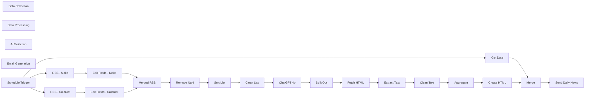

## Fluxo (.json) :

```json
{
  "meta": {
    "instanceId": "6c3d8936583f8a98fa8ebe06f510117c0e8fff2df771e73deba4126a853eb55e",
    "templateCredsSetupCompleted": true
  },
  "nodes": [
    {
      "id": "6d0b95c8-db4f-4bc1-b51b-87da0b1cbca9",
      "name": "Data Collection",
      "type": "n8n-nodes-base.stickyNote",
      "position": [
        820,
        3860
      ],
      "parameters": {
        "width": 380,
        "height": 620,
        "content": "# Data Collection\nFetches latest news articles from two RSS sources: Calcalist and Mako"
      },
      "typeVersion": 1
    },
    {
      "id": "62a73f4d-229f-44fa-891d-c36dc50bad99",
      "name": "Data Processing",
      "type": "n8n-nodes-base.stickyNote",
      "position": [
        1260,
        3860
      ],
      "parameters": {
        "width": 740,
        "height": 360,
        "content": "# Data Processing\nFilters, sorts and prepares news articles for AI selection"
      },
      "typeVersion": 1
    },
    {
      "id": "13092778-b6a3-4436-b69d-f67245999ffe",
      "name": "AI Selection",
      "type": "n8n-nodes-base.stickyNote",
      "position": [
        2020,
        3860
      ],
      "parameters": {
        "width": 400,
        "height": 360,
        "content": "# AI Selection\nUses GPT-4o to select the top 5 most relevant articles for a senior executive"
      },
      "typeVersion": 1
    },
    {
      "id": "b1b25c3b-976e-41eb-a82d-e0571ba9b2f2",
      "name": "Email Generation",
      "type": "n8n-nodes-base.stickyNote",
      "position": [
        1260,
        4260
      ],
      "parameters": {
        "width": 1160,
        "height": 520,
        "content": "# Email Generation\nCreates and sends formatted HTML digest email with selected articles"
      },
      "typeVersion": 1
    },
    {
      "id": "d846f068-37c2-48d2-96cb-991a42ecadf4",
      "name": "Send Daily News",
      "type": "n8n-nodes-base.emailSend",
      "position": [
        2220,
        4620
      ],
      "webhookId": "0de4d8cd-3519-4a4a-a05b-a9c973b64141",
      "parameters": {
        "html": "={{ $json.html }}",
        "options": {},
        "subject": "=סקירה ה-AI היומית שלך: {{ $json.date_today }}",
        "toEmail": "Elay Guez <elay96@gmail.com>",
        "fromEmail": "Elay's AI Assistant <elayguez@gmail.com>"
      },
      "credentials": {
        "smtp": {
          "id": "583PMpoYf46gbncd",
          "name": "SMTP account"
        }
      },
      "executeOnce": false,
      "typeVersion": 2.1
    },
    {
      "id": "1c4ae1dd-bf0e-4726-b106-6b1b868aae2e",
      "name": "Get Date",
      "type": "n8n-nodes-base.function",
      "position": [
        1300,
        4640
      ],
      "parameters": {
        "functionCode": "const now = new Date();\nconst options = {\n  timeZone: 'Asia/Jerusalem',\n  day: '2-digit',\n  month: '2-digit',\n  year: 'numeric'\n};\n\n// Format date according to Israeli format\nconst dateToday = new Intl.DateTimeFormat('en-GB', options).format(now);\n\n// Keep the item\nitems[0].json.date_today = dateToday; // 12/04/2025\n\nreturn items;"
      },
      "typeVersion": 1
    },
    {
      "id": "162bce34-bf3f-4f05-a9eb-dd2c3f6068de",
      "name": "Merge",
      "type": "n8n-nodes-base.merge",
      "position": [
        1480,
        4620
      ],
      "parameters": {
        "mode": "combine",
        "options": {},
        "combineBy": "combineByPosition"
      },
      "executeOnce": true,
      "typeVersion": 3.1
    },
    {
      "id": "6444d6ad-efc1-4fec-be03-f9822624b5a6",
      "name": "Create HTML",
      "type": "n8n-nodes-base.html",
      "position": [
        2220,
        4360
      ],
      "parameters": {
        "html": "<!DOCTYPE html>\n\n<html dir=\"rtl\">\n<head>\n  <meta charset=\"UTF-8\" />\n</head>\n<body style=\"margin: 0; padding: 20px; background-color: #f4f6fa; font-family: 'Heebo', 'Assistant', sans-serif; color: #2c3e50; direction: rtl; text-align: right;\">\n  <div style=\"max-width: 750px; margin: auto; background-color: #ffffff; padding: 30px; border-radius: 14px; box-shadow: 0 6px 20px rgba(0,0,0,0.05); border: 1px solid #e0e6ed;\">\n\n    <h2 style=\"color: #0a3d62; font-size: 26px; font-weight: 700; margin-top: 0; margin-bottom: 24px;\">\n      סקירה ה-AI היומית שלך \"אל תבזבז זמן – תתמקד רק במה שחשוב באמת\"\n    </h2>\n\n    <p style=\"font-size: 16.5px; line-height: 1.8; margin-bottom: 36px; color: #3a3a3a;\">\nלהלן חמשת המאמרים המרכזיים שהתפרסמו ביממה האחרונה, המלווים בתקציר מקצועי שיסייע לך להתעדכן בהתפתחויות הבולטות ביותר בתחומי הכלכלה, הטכנולוגיה והאסטרטגיה.\n    </p>\n\n    <!-- Article 1 -->\n    <div style=\"margin-bottom: 35px;\">\n      <h3 style=\"color: #1e5f74; font-size: 19px; margin-bottom: 12px; font-weight: 600;\">\n        1. <span style=\"font-weight: 700;\">{{ $json.data[0].title }}</span>\n      </h3>\n      <p style=\"font-size: 16px; line-height: 1.7; margin-bottom: 10px; color: #444;\">{{ $json.data[0].summary }}</p>\n      <div style=\"text-align: left;\">\n        <a href=\"{{ $json.data[0].url }}\" style=\"display: inline-block; margin-top: 10px; padding: 10px 20px; background-color: #1e5f74; color: white; text-decoration: none; border-radius: 8px; font-size: 14px;\">לקריאה המלאה</a>\n      </div>\n    </div>\n\n    <!-- Article 2 -->\n    <div style=\"margin-bottom: 35px;\">\n      <h3 style=\"color: #1e5f74; font-size: 19px; margin-bottom: 12px; font-weight: 600;\">\n        2. <span style=\"font-weight: 700;\">{{ $json.data[1].title }}</span>\n      </h3>\n      <p style=\"font-size: 16px; line-height: 1.7; margin-bottom: 10px; color: #444;\">{{ $json.data[1].summary }}</p>\n      <div style=\"text-align: left;\">\n        <a href=\"{{ $json.data[1].url }}\" style=\"display: inline-block; margin-top: 10px; padding: 10px 20px; background-color: #1e5f74; color: white; text-decoration: none; border-radius: 8px; font-size: 14px;\">לקריאה המלאה</a>\n      </div>\n    </div>\n\n    <!-- Article 3 -->\n    <div style=\"margin-bottom: 35px;\">\n      <h3 style=\"color: #1e5f74; font-size: 19px; margin-bottom: 12px; font-weight: 600;\">\n        3. <span style=\"font-weight: 700;\">{{ $json.data[2].title }}</span>\n      </h3>\n      <p style=\"font-size: 16px; line-height: 1.7; margin-bottom: 10px; color: #444;\">{{ $json.data[2].summary }}</p>\n      <div style=\"text-align: left;\">\n        <a href=\"{{ $json.data[2].url }}\" style=\"display: inline-block; margin-top: 10px; padding: 10px 20px; background-color: #1e5f74; color: white; text-decoration: none; border-radius: 8px; font-size: 14px;\">לקריאה המלאה</a>\n      </div>\n    </div>\n\n\n    <!-- Article 4 -->\n    <div style=\"margin-bottom: 35px;\">\n      <h3 style=\"color: #1e5f74; font-size: 19px; margin-bottom: 12px; font-weight: 600;\">\n        4. <span style=\"font-weight: 700;\">{{ $json.data[3].title }}</span>\n      </h3>\n      <p style=\"font-size: 16px; line-height: 1.7; margin-bottom: 10px; color: #444;\">{{ $json.data[3].summary }}</p>\n      <div style=\"text-align: left;\">\n        <a href=\"{{ $json.data[3].url }}\" style=\"display: inline-block; margin-top: 10px; padding: 10px 20px; background-color: #1e5f74; color: white; text-decoration: none; border-radius: 8px; font-size: 14px;\">לקריאה המלאה</a>\n      </div>\n    </div>\n\n    <!-- Article 5 -->\n    <div style=\"margin-bottom: 35px;\">\n      <h3 style=\"color: #1e5f74; font-size: 19px; margin-bottom: 12px; font-weight: 600;\">\n        5. <span style=\"font-weight: 700;\">{{ $json.data[4].title }}</span>\n      </h3>\n      <p style=\"font-size: 16px; line-height: 1.7; margin-bottom: 10px; color: #444;\">{{ $json.data[4].summary }}</p>\n      <div style=\"text-align: left;\">\n        <a href=\"{{ $json.data[4].url }}\" style=\"display: inline-block; margin-top: 10px; padding: 10px 20px; background-color: #1e5f74; color: white; text-decoration: none; border-radius: 8px; font-size: 14px;\">לקריאה המלאה</a>\n      </div>\n    </div>\n\n\n    <!-- Footer -->\n    <div style=\"margin-top: 50px; font-size: 14px; color: #7f8c8d; border-top: 1px solid #e0e6ed; padding-top: 20px; direction: lrt; text-align: left;\">\n      ✨ This daily Israeli economic newsletter was automatically built for you by <b>n8n AI Agent</b> – because technology can work for you\n    </div>\n\n  </div>\n</body>\n</html>"
      },
      "typeVersion": 1.2
    },
    {
      "id": "cfac2998-11ba-4665-9457-1a0669bf42b0",
      "name": "Aggregate",
      "type": "n8n-nodes-base.aggregate",
      "position": [
        2040,
        4360
      ],
      "parameters": {
        "options": {},
        "aggregate": "aggregateAllItemData"
      },
      "typeVersion": 1
    },
    {
      "id": "dd36ab14-61dc-4b85-af3b-796be18a3169",
      "name": "Clean Text",
      "type": "n8n-nodes-base.set",
      "position": [
        1860,
        4360
      ],
      "parameters": {
        "options": {},
        "assignments": {
          "assignments": [
            {
              "id": "7b337b47-a1c6-470e-881f-0c038b4917e5",
              "name": "title",
              "type": "string",
              "value": "={{ $('Split Out').item.json.article }}"
            },
            {
              "id": "ca820521-4fff-4971-84b5-e6e2dbd8bb7a",
              "name": "summary",
              "type": "string",
              "value": "={{ $json['data-calcalist'] }} {{ $json['data-mako'] }}"
            },
            {
              "id": "0fd9b5e3-44dd-49a3-82c1-3a4aa4698376",
              "name": "url",
              "type": "string",
              "value": "={{ $('Split Out').item.json.link }}"
            }
          ]
        }
      },
      "typeVersion": 3.4
    },
    {
      "id": "ce8a5da1-9ad0-4eca-8fcc-ea744738ac4e",
      "name": "Extract Text",
      "type": "n8n-nodes-base.html",
      "position": [
        1680,
        4360
      ],
      "parameters": {
        "options": {},
        "operation": "extractHtmlContent",
        "extractionValues": {
          "values": [
            {
              "key": "data-calcalist",
              "cssSelector": ".calcalistArticleHeader .subTitle"
            },
            {
              "key": "data-mako",
              "cssSelector": ".article-header header h2"
            }
          ]
        }
      },
      "typeVersion": 1.2
    },
    {
      "id": "c8f061f1-57ad-4594-8ff1-baa7f0ef1427",
      "name": "Fetch HTML",
      "type": "n8n-nodes-base.httpRequest",
      "position": [
        1480,
        4360
      ],
      "parameters": {
        "url": "={{ $json.link }}",
        "options": {}
      },
      "typeVersion": 4.2
    },
    {
      "id": "95b33857-9f20-4ba4-aae0-67a3899c222a",
      "name": "Split Out",
      "type": "n8n-nodes-base.splitOut",
      "position": [
        1300,
        4360
      ],
      "parameters": {
        "options": {},
        "fieldToSplitOut": "message.content.articles"
      },
      "typeVersion": 1
    },
    {
      "id": "7433ab1d-e162-469e-951d-af241c714e34",
      "name": "ChatGPT 4o",
      "type": "@n8n/n8n-nodes-langchain.openAi",
      "position": [
        2060,
        4060
      ],
      "parameters": {
        "modelId": {
          "__rl": true,
          "mode": "list",
          "value": "gpt-4o",
          "cachedResultName": "GPT-4O"
        },
        "options": {},
        "messages": {
          "values": [
            {
              "role": "system",
              "content": "\nYou've received a list of headlines and links to 50 recently published articles.  \nSelect the five most important and relevant articles for a senior CEO of a large company who updates daily on economic, technological and strategic topics.\n\nUse article titles to understand the content of the articles.\n\nAt least one article must be about current affairs and security (not economic topics).\n\nYour output should be in JSON format:\n{\n\"article\": \"\",\n\"link\": \"\"\n}"
            },
            {
              "role": "system",
              "content": "=Article list:\n\n{{ $json.chatgpt_input }}"
            }
          ]
        },
        "jsonOutput": true
      },
      "credentials": {
        "openAiApi": {
          "id": "2m1HH5crgPAhTJlv",
          "name": "OpenAi account"
        }
      },
      "typeVersion": 1.8
    },
    {
      "id": "28daaadd-426b-485a-b128-4660491ed6a9",
      "name": "Clean List",
      "type": "n8n-nodes-base.code",
      "position": [
        1860,
        4060
      ],
      "parameters": {
        "jsCode": "// Input: items[] - each one is an article\n\n// Step 1: Remove duplicates by link\nconst uniqueMap = new Map();\nfor (const item of items) {\n  const link = item.json.link;\n  if (!uniqueMap.has(link)) {\n    uniqueMap.set(link, item.json);\n  }\n}\n\n// Step 2: Sort by publication date from newest to oldest\nconst uniqueArticles = Array.from(uniqueMap.values());\nuniqueArticles.sort((a, b) => b.pubDate - a.pubDate);\n\n// Step 3: Take the top 50 most recent articles\nconst top20 = uniqueArticles.slice(0, 50);\n\n// Step 4: Build clean, readable, efficient text\nconst formatted = top20.map((article, index) => {\n  const title = article.title?.replace(/\\(\\)$/, '').trim() || 'No Title';\n  const link = article.link || '';\n  return `${index + 1}. ${title}\\n${link}`;\n});\n\nreturn [\n  {\n    json: {\n      chatgpt_input: formatted.join('\\n\\n') // Paragraphs separated by newlines\n    }\n  }\n];"
      },
      "typeVersion": 2
    },
    {
      "id": "9e041ef2-b440-447e-b3f3-fc3e846cf669",
      "name": "Sort List",
      "type": "n8n-nodes-base.sort",
      "position": [
        1680,
        4060
      ],
      "parameters": {
        "options": {},
        "sortFieldsUi": {
          "sortField": [
            {
              "order": "descending",
              "fieldName": "pubDate"
            }
          ]
        }
      },
      "typeVersion": 1
    },
    {
      "id": "781cc3bd-b78b-4a17-8886-e0fbb82c378a",
      "name": "Remove NaN",
      "type": "n8n-nodes-base.filter",
      "position": [
        1480,
        4060
      ],
      "parameters": {
        "options": {
          "ignoreCase": true
        },
        "conditions": {
          "options": {
            "version": 2,
            "leftValue": "",
            "caseSensitive": false,
            "typeValidation": "strict"
          },
          "combinator": "or",
          "conditions": [
            {
              "id": "046f5bde-6d2c-4dfd-b29b-17be6c34cc1b",
              "operator": {
                "type": "string",
                "operation": "notContains"
              },
              "leftValue": "={{ $json.pubDate }}\n\n",
              "rightValue": "=NaN"
            }
          ]
        }
      },
      "typeVersion": 2.2
    },
    {
      "id": "d0084e60-4c9d-4f3e-944c-a81e7dabae9c",
      "name": "Merged RSS",
      "type": "n8n-nodes-base.merge",
      "position": [
        1300,
        4060
      ],
      "parameters": {},
      "typeVersion": 3
    },
    {
      "id": "8178972f-e0c7-462a-8d66-853118756545",
      "name": "Edit Fields - Mako",
      "type": "n8n-nodes-base.set",
      "position": [
        1060,
        4040
      ],
      "parameters": {
        "options": {},
        "assignments": {
          "assignments": [
            {
              "id": "11b653ae-6a43-4e6d-86b8-066384eaa7d6",
              "name": "title",
              "type": "string",
              "value": "={{ $json.title.replace(/\\[PACK\\].*/, \"\").replace(/\\[.*?\\]/g, \"\").trim() }}"
            },
            {
              "id": "e300ad1b-6b93-45f7-a964-294abbebfd95",
              "name": "link",
              "type": "string",
              "value": "={{ $json.link.replace(//torrent/download/(\\d+)\\..*/, \"/torrents/$1\") }}"
            },
            {
              "id": "bd548580-e879-4671-ad4e-603d2496362e",
              "name": "pubDate",
              "type": "string",
              "value": "={{ new Date($json.pubDate).getTime() }}"
            }
          ]
        }
      },
      "typeVersion": 3.4
    },
    {
      "id": "2c8f4766-5338-4319-98f9-1ab9b460b4e5",
      "name": "Edit Fields - Calcalist",
      "type": "n8n-nodes-base.set",
      "position": [
        1060,
        4320
      ],
      "parameters": {
        "options": {},
        "assignments": {
          "assignments": [
            {
              "id": "d0002dd0-3a5a-4f1a-ba6e-d359549f5a1e",
              "name": "title",
              "type": "string",
              "value": "={{$json.title.replace(/^\\[PACK\\] /, \"\").replace(/1080p .*/, \"\")}} ({{$json.content.match(/<strong>Size</strong>:\\s([\\d.]+\\s[KMGT]iB)/)[1]}})"
            },
            {
              "id": "cd7b2be1-a52e-430b-98a1-2fb30b5cb8c7",
              "name": "link",
              "type": "string",
              "value": "={{ $json.link.replace(//torrent/download/(\\d+)\\..*/, \"/torrents/$1\") }}"
            },
            {
              "id": "3b9d50a8-0d46-4a8f-94e9-454bc5153280",
              "name": "pubDate",
              "type": "string",
              "value": "={{ new Date($json.pubDate).getTime() }}"
            }
          ]
        }
      },
      "typeVersion": 3.4
    },
    {
      "id": "cd6173fc-2bb7-40b2-950b-8f09b0be442f",
      "name": "RSS - Calcalist",
      "type": "n8n-nodes-base.rssFeedRead",
      "onError": "continueRegularOutput",
      "position": [
        840,
        4320
      ],
      "parameters": {
        "url": "https://www.calcalist.co.il/GeneralRSS/0,16335,L-8,00.xml",
        "options": {
          "ignoreSSL": false
        }
      },
      "executeOnce": false,
      "typeVersion": 1.1
    },
    {
      "id": "06c96a26-485b-4ca8-ab9e-d45da69f9d3d",
      "name": "RSS - Mako",
      "type": "n8n-nodes-base.rssFeedRead",
      "onError": "continueRegularOutput",
      "position": [
        840,
        4040
      ],
      "parameters": {
        "url": "https://storage.googleapis.com/mako-sitemaps/rss-hp.xml",
        "options": {
          "ignoreSSL": false
        }
      },
      "executeOnce": false,
      "typeVersion": 1.1
    },
    {
      "id": "a3fef1a0-8e27-4d55-865b-daea95fe2b71",
      "name": "Schedule Trigger",
      "type": "n8n-nodes-base.scheduleTrigger",
      "position": [
        500,
        4320
      ],
      "parameters": {
        "rule": {
          "interval": [
            {
              "triggerAtHour": 20,
              "triggerAtMinute": null
            }
          ]
        }
      },
      "typeVersion": 1.2
    }
  ],
  "pinData": {},
  "connections": {
    "Merge": {
      "main": [
        [
          {
            "node": "Send Daily News",
            "type": "main",
            "index": 0
          }
        ]
      ]
    },
    "Get Date": {
      "main": [
        [
          {
            "node": "Merge",
            "type": "main",
            "index": 1
          }
        ]
      ]
    },
    "Aggregate": {
      "main": [
        [
          {
            "node": "Create HTML",
            "type": "main",
            "index": 0
          }
        ]
      ]
    },
    "Sort List": {
      "main": [
        [
          {
            "node": "Clean List",
            "type": "main",
            "index": 0
          }
        ]
      ]
    },
    "Split Out": {
      "main": [
        [
          {
            "node": "Fetch HTML",
            "type": "main",
            "index": 0
          }
        ]
      ]
    },
    "ChatGPT 4o": {
      "main": [
        [
          {
            "node": "Split Out",
            "type": "main",
            "index": 0
          }
        ]
      ]
    },
    "Clean List": {
      "main": [
        [
          {
            "node": "ChatGPT 4o",
            "type": "main",
            "index": 0
          }
        ]
      ]
    },
    "Clean Text": {
      "main": [
        [
          {
            "node": "Aggregate",
            "type": "main",
            "index": 0
          }
        ]
      ]
    },
    "Fetch HTML": {
      "main": [
        [
          {
            "node": "Extract Text",
            "type": "main",
            "index": 0
          }
        ]
      ]
    },
    "Merged RSS": {
      "main": [
        [
          {
            "node": "Remove NaN",
            "type": "main",
            "index": 0
          }
        ]
      ]
    },
    "RSS - Mako": {
      "main": [
        [
          {
            "node": "Edit Fields - Mako",
            "type": "main",
            "index": 0
          }
        ]
      ]
    },
    "Remove NaN": {
      "main": [
        [
          {
            "node": "Sort List",
            "type": "main",
            "index": 0
          }
        ]
      ]
    },
    "Create HTML": {
      "main": [
        [
          {
            "node": "Merge",
            "type": "main",
            "index": 0
          }
        ]
      ]
    },
    "Extract Text": {
      "main": [
        [
          {
            "node": "Clean Text",
            "type": "main",
            "index": 0
          }
        ]
      ]
    },
    "RSS - Calcalist": {
      "main": [
        [
          {
            "node": "Edit Fields - Calcalist",
            "type": "main",
            "index": 0
          }
        ]
      ]
    },
    "Schedule Trigger": {
      "main": [
        [
          {
            "node": "RSS - Mako",
            "type": "main",
            "index": 0
          },
          {
            "node": "Get Date",
            "type": "main",
            "index": 0
          },
          {
            "node": "RSS - Calcalist",
            "type": "main",
            "index": 0
          }
        ]
      ]
    },
    "Edit Fields - Mako": {
      "main": [
        [
          {
            "node": "Merged RSS",
            "type": "main",
            "index": 0
          }
        ]
      ]
    },
    "Edit Fields - Calcalist": {
      "main": [
        [
          {
            "node": "Merged RSS",
            "type": "main",
            "index": 1
          }
        ]
      ]
    }
  }
}
```

<a id="template-2555"></a>

## Template 2555 - Servidor MCP Qdrant para análises de clientes

- **Nome:** Servidor MCP Qdrant para análises de clientes
- **Descrição:** Servidor MCP que expõe operações para gerenciar e consultar uma coleção de avaliações de clientes armazenada em Qdrant, oferecendo inserção, pesquisa, comparação e recomendações baseadas em embeddings.
- **Funcionalidade:** • Gatilho MCP: recebe solicitações de um cliente/agent compatível via protocolo MCP.
• Inserir avaliação: insere texto de avaliação na coleção com metadados (ex.: company_id) e gera embeddings.
• Listar empresas disponíveis: retorna valores de facet para o campo company_id, permitindo listar empresas indexadas.
• Pesquisa de similaridade: busca avaliações semelhantes usando embeddings, com opção de filtrar por um ou mais company_id.
• Pesquisa agrupada: realiza buscas agrupadas por company_id para obter top resultados por empresa.
• Comparar entre empresas: agrega e compara resultados de busca entre duas ou mais empresas.
• Recomendações: gera recomendações usando vetores positivos e negativos (API de recomendação do Qdrant) para sugerir avaliações relevantes.
• Criação de coleção e índice: endpoints para criar a coleção de vetores e um índice de facet para company_id.
• Uso de embeddings externos: converte texto em embeddings via serviço de embeddings para suportar buscas, agrupamentos e recomendações.
• Formatação de resposta: agrega e transforma respostas para devolver um formato simples ao cliente MCP.
- **Ferramentas:** • Qdrant: banco de dados vetorial usado para armazenar pontos (avaliações), realizar buscas de similaridade, pesquisas agrupadas (group search), faceting e recomendações.
• OpenAI Embeddings: serviço de geração de embeddings (modelo text-embedding-3-small) usado para transformar texto das avaliações e preferências em vetores.
• Cliente MCP (ex.: Claude Desktop): agentes ou clientes compatíveis com MCP que conectam ao servidor para executar operações (listar empresas, buscar, inserir, comparar, recomendar).

## Fluxo visual

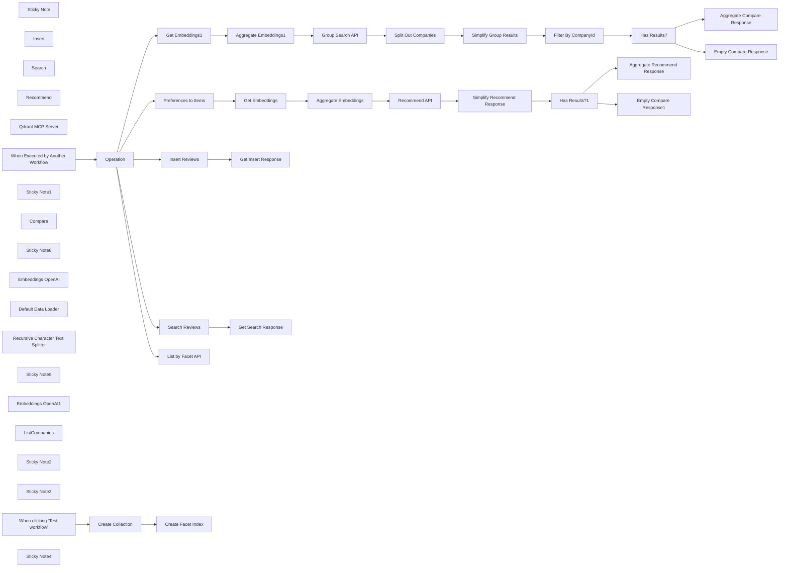

## Fluxo (.json) :

```json
{
  "meta": {
    "instanceId": "408f9fb9940c3cb18ffdef0e0150fe342d6e655c3a9fac21f0f644e8bedabcd9",
    "templateCredsSetupCompleted": true
  },
  "nodes": [
    {
      "id": "49620d3a-d4ec-4017-ade1-ff2ef5473c11",
      "name": "Sticky Note",
      "type": "n8n-nodes-base.stickyNote",
      "position": [
        -220,
        -80
      ],
      "parameters": {
        "color": 7,
        "width": 680,
        "height": 660,
        "content": "## 1. Set up an MCP Server Trigger\n[Read more about the MCP Server Trigger](https://docs.n8n.io/integrations/builtin/core-nodes/n8n-nodes-langchain.mcptrigger)"
      },
      "typeVersion": 1
    },
    {
      "id": "f0646a81-d328-4f07-a744-60f576b5a51e",
      "name": "Insert",
      "type": "@n8n/n8n-nodes-langchain.toolWorkflow",
      "position": [
        -40,
        380
      ],
      "parameters": {
        "name": "insert_review",
        "workflowId": {
          "__rl": true,
          "mode": "id",
          "value": "={{ $workflow.id }}"
        },
        "description": "=Call this tool to insert a customer's review into our review database.",
        "workflowInputs": {
          "value": {
            "text": "={{ /*n8n-auto-generated-fromAI-override*/ $fromAI('text', `The contents of the review`, 'string') }}",
            "text2": "null",
            "operation": "insert",
            "companyIds": "={{ /*n8n-auto-generated-fromAI-override*/ $fromAI('companyIds', `The company ID is their url address.`, 'string') }}"
          },
          "schema": [
            {
              "id": "operation",
              "type": "string",
              "display": true,
              "removed": false,
              "required": false,
              "displayName": "operation",
              "defaultMatch": false,
              "canBeUsedToMatch": true
            },
            {
              "id": "text",
              "type": "string",
              "display": true,
              "removed": false,
              "required": false,
              "displayName": "text",
              "defaultMatch": false,
              "canBeUsedToMatch": true
            },
            {
              "id": "text2",
              "type": "string",
              "display": true,
              "removed": false,
              "required": false,
              "displayName": "text2",
              "defaultMatch": false,
              "canBeUsedToMatch": true
            },
            {
              "id": "companyIds",
              "type": "string",
              "display": true,
              "removed": false,
              "required": false,
              "displayName": "companyIds",
              "defaultMatch": false,
              "canBeUsedToMatch": true
            }
          ],
          "mappingMode": "defineBelow",
          "matchingColumns": [],
          "attemptToConvertTypes": false,
          "convertFieldsToString": false
        }
      },
      "typeVersion": 2.1
    },
    {
      "id": "21e8beac-dbd5-44d7-8472-4edff3f63308",
      "name": "Search",
      "type": "@n8n/n8n-nodes-langchain.toolWorkflow",
      "position": [
        80,
        440
      ],
      "parameters": {
        "name": "search_reviews",
        "workflowId": {
          "__rl": true,
          "mode": "id",
          "value": "={{ $workflow.id }}",
          "cachedResultName": "={{ $workflow.id }}"
        },
        "description": "Call this tool to search our reviews database.",
        "workflowInputs": {
          "value": {
            "text": "={{ /*n8n-auto-generated-fromAI-override*/ $fromAI('text', `the query or search terms to use`, 'string') }}",
            "text2": "null",
            "operation": "search",
            "companyIds": "={{ /*n8n-auto-generated-fromAI-override*/ $fromAI('companyIds', `Optional, leave blank to search over all companies otherwise one or more company IDs comma-delimited. The company ID is their url address.`, 'string') }}"
          },
          "schema": [
            {
              "id": "operation",
              "type": "string",
              "display": true,
              "required": false,
              "displayName": "operation",
              "defaultMatch": false,
              "canBeUsedToMatch": true
            },
            {
              "id": "text",
              "type": "string",
              "display": true,
              "removed": false,
              "required": false,
              "displayName": "text",
              "defaultMatch": false,
              "canBeUsedToMatch": true
            },
            {
              "id": "text2",
              "type": "string",
              "display": true,
              "removed": false,
              "required": false,
              "displayName": "text2",
              "defaultMatch": false,
              "canBeUsedToMatch": true
            },
            {
              "id": "companyIds",
              "type": "string",
              "display": true,
              "removed": false,
              "required": false,
              "displayName": "companyIds",
              "defaultMatch": false,
              "canBeUsedToMatch": true
            }
          ],
          "mappingMode": "defineBelow",
          "matchingColumns": [],
          "attemptToConvertTypes": false,
          "convertFieldsToString": false
        }
      },
      "typeVersion": 2.1
    },
    {
      "id": "ffb100a4-9108-4ccd-a897-e5cd9e752232",
      "name": "Recommend",
      "type": "@n8n/n8n-nodes-langchain.toolWorkflow",
      "position": [
        280,
        240
      ],
      "parameters": {
        "name": "recommend_reviews",
        "workflowId": {
          "__rl": true,
          "mode": "id",
          "value": "={{ $workflow.id }}"
        },
        "description": "Call this tool to generate a recommendation for a review based on positive and/or negative preferences.",
        "workflowInputs": {
          "value": {
            "text": "={{ /*n8n-auto-generated-fromAI-override*/ $fromAI('text', `preferences to include.`, 'string') }}",
            "text2": "={{ /*n8n-auto-generated-fromAI-override*/ $fromAI('text2', `preference to avoid.`, 'string') }}",
            "operation": "recommend",
            "companyIds": "={{ /*n8n-auto-generated-fromAI-override*/ $fromAI('companyIds', `Optional, leave blank to search across all reviews otherwise one or more company IDs, comma-delimited. The company ID is their url address.`, 'string') }}"
          },
          "schema": [
            {
              "id": "operation",
              "type": "string",
              "display": true,
              "required": false,
              "displayName": "operation",
              "defaultMatch": false,
              "canBeUsedToMatch": true
            },
            {
              "id": "text",
              "type": "string",
              "display": true,
              "removed": false,
              "required": false,
              "displayName": "text",
              "defaultMatch": false,
              "canBeUsedToMatch": true
            },
            {
              "id": "text2",
              "type": "string",
              "display": true,
              "removed": false,
              "required": false,
              "displayName": "text2",
              "defaultMatch": false,
              "canBeUsedToMatch": true
            },
            {
              "id": "companyIds",
              "type": "string",
              "display": true,
              "removed": false,
              "required": false,
              "displayName": "companyIds",
              "defaultMatch": false,
              "canBeUsedToMatch": true
            }
          ],
          "mappingMode": "defineBelow",
          "matchingColumns": [],
          "attemptToConvertTypes": false,
          "convertFieldsToString": false
        }
      },
      "typeVersion": 2.1
    },
    {
      "id": "d1d53cbc-0a22-409d-9336-d8c98eeaa170",
      "name": "Qdrant MCP Server",
      "type": "@n8n/n8n-nodes-langchain.mcpTrigger",
      "position": [
        -40,
        60
      ],
      "webhookId": "a1aff1b5-e5c7-4ca2-91eb-017c1fe32dab",
      "parameters": {
        "path": "a1aff1b5-e5c7-4ca2-91eb-017c1fe32dab"
      },
      "typeVersion": 1
    },
    {
      "id": "82d747a5-ff5f-44ff-9f68-cc1aa01ba1de",
      "name": "When Executed by Another Workflow",
      "type": "n8n-nodes-base.executeWorkflowTrigger",
      "position": [
        540,
        280
      ],
      "parameters": {
        "workflowInputs": {
          "values": [
            {
              "name": "operation"
            },
            {
              "name": "text"
            },
            {
              "name": "text2"
            },
            {
              "name": "companyIds"
            }
          ]
        }
      },
      "typeVersion": 1.1
    },
    {
      "id": "c7a2e948-5cd5-4545-a633-c1157e63edec",
      "name": "Operation",
      "type": "n8n-nodes-base.switch",
      "position": [
        760,
        240
      ],
      "parameters": {
        "rules": {
          "values": [
            {
              "outputKey": "listCompanies",
              "conditions": {
                "options": {
                  "version": 2,
                  "leftValue": "",
                  "caseSensitive": true,
                  "typeValidation": "strict"
                },
                "combinator": "and",
                "conditions": [
                  {
                    "id": "fe782b0f-f501-4985-a9d2-f63f4019177f",
                    "operator": {
                      "name": "filter.operator.equals",
                      "type": "string",
                      "operation": "equals"
                    },
                    "leftValue": "={{ $json.operation }}",
                    "rightValue": "listCompanies"
                  }
                ]
              },
              "renameOutput": true
            },
            {
              "outputKey": "insert",
              "conditions": {
                "options": {
                  "version": 2,
                  "leftValue": "",
                  "caseSensitive": true,
                  "typeValidation": "strict"
                },
                "combinator": "and",
                "conditions": [
                  {
                    "id": "81b134bc-d671-4493-b3ad-8df9be3f49a6",
                    "operator": {
                      "type": "string",
                      "operation": "equals"
                    },
                    "leftValue": "={{ $json.operation }}",
                    "rightValue": "insert"
                  }
                ]
              },
              "renameOutput": true
            },
            {
              "outputKey": "search",
              "conditions": {
                "options": {
                  "version": 2,
                  "leftValue": "",
                  "caseSensitive": true,
                  "typeValidation": "strict"
                },
                "combinator": "and",
                "conditions": [
                  {
                    "id": "8d57914f-6587-4fb3-88e0-aa1de6ba56c1",
                    "operator": {
                      "name": "filter.operator.equals",
                      "type": "string",
                      "operation": "equals"
                    },
                    "leftValue": "={{ $json.operation }}",
                    "rightValue": "search"
                  }
                ]
              },
              "renameOutput": true
            },
            {
              "outputKey": "compare",
              "conditions": {
                "options": {
                  "version": 2,
                  "leftValue": "",
                  "caseSensitive": true,
                  "typeValidation": "strict"
                },
                "combinator": "and",
                "conditions": [
                  {
                    "id": "7c38f238-213a-46ec-aefe-22e0bcb8dffc",
                    "operator": {
                      "name": "filter.operator.equals",
                      "type": "string",
                      "operation": "equals"
                    },
                    "leftValue": "={{ $json.operation }}",
                    "rightValue": "compare"
                  }
                ]
              },
              "renameOutput": true
            },
            {
              "outputKey": "recommend",
              "conditions": {
                "options": {
                  "version": 2,
                  "leftValue": "",
                  "caseSensitive": true,
                  "typeValidation": "strict"
                },
                "combinator": "and",
                "conditions": [
                  {
                    "id": "2c691501-786a-433f-a185-3a6e0d08d336",
                    "operator": {
                      "name": "filter.operator.equals",
                      "type": "string",
                      "operation": "equals"
                    },
                    "leftValue": "={{ $json.operation }}",
                    "rightValue": "recommend"
                  }
                ]
              },
              "renameOutput": true
            }
          ]
        },
        "options": {}
      },
      "typeVersion": 3.2
    },
    {
      "id": "18d805db-376c-4583-963a-db1e5d09aa50",
      "name": "Sticky Note1",
      "type": "n8n-nodes-base.stickyNote",
      "position": [
        480,
        -140
      ],
      "parameters": {
        "color": 7,
        "width": 580,
        "height": 320,
        "content": "## 2. Expand Functionality Beyond Vendor Implementation\n[Read more about the Qdrant Node](https://docs.n8n.io/integrations/builtin/cluster-nodes/root-nodes/n8n-nodes-langchain.vectorstoreqdrant)\n\nOfficially supported MCP servers are cool but may not always have the features you want. N8N MCP servers give you the freedom to expand and customise to fit your business or product needs and requirements.\n\nFor our Qdrant MCP server, we've added 2 additional capabilities from the Qdrant API; The Group Search and Recommendation API. With these, we can explore many more use-cases for our users.\n"
      },
      "typeVersion": 1
    },
    {
      "id": "ab8aeea3-0564-4c96-a67c-ff319df3297b",
      "name": "Compare",
      "type": "@n8n/n8n-nodes-langchain.toolWorkflow",
      "position": [
        220,
        380
      ],
      "parameters": {
        "name": "compare_reviews",
        "workflowId": {
          "__rl": true,
          "mode": "id",
          "value": "={{ $workflow.id }}",
          "cachedResultName": "={{ $workflow.id }}"
        },
        "description": "Call this tool to compare search results across 2 or more companies.",
        "workflowInputs": {
          "value": {
            "text": "={{ /*n8n-auto-generated-fromAI-override*/ $fromAI('text', `the query or search terms to use`, 'string') }}",
            "text2": "null",
            "operation": "compare",
            "companyIds": "={{ /*n8n-auto-generated-fromAI-override*/ $fromAI('companyIds', `Two or more company IDs, comma-delimited. The company ID is their url address.`, 'string') }}"
          },
          "schema": [
            {
              "id": "operation",
              "type": "string",
              "display": true,
              "required": false,
              "displayName": "operation",
              "defaultMatch": false,
              "canBeUsedToMatch": true
            },
            {
              "id": "text",
              "type": "string",
              "display": true,
              "removed": false,
              "required": false,
              "displayName": "text",
              "defaultMatch": false,
              "canBeUsedToMatch": true
            },
            {
              "id": "text2",
              "type": "string",
              "display": true,
              "removed": false,
              "required": false,
              "displayName": "text2",
              "defaultMatch": false,
              "canBeUsedToMatch": true
            },
            {
              "id": "companyIds",
              "type": "string",
              "display": true,
              "removed": false,
              "required": false,
              "displayName": "companyIds",
              "defaultMatch": false,
              "canBeUsedToMatch": true
            }
          ],
          "mappingMode": "defineBelow",
          "matchingColumns": [],
          "attemptToConvertTypes": false,
          "convertFieldsToString": false
        }
      },
      "typeVersion": 2.1
    },
    {
      "id": "4f0876cb-dc07-486e-937b-334fa2cb754f",
      "name": "Sticky Note8",
      "type": "n8n-nodes-base.stickyNote",
      "position": [
        1920,
        860
      ],
      "parameters": {
        "width": 213.30551928619226,
        "height": 332.38559808882246,
        "content": "\n\n\n\n\n\n\n\n\n\n\n\n\n\n\n\n### 🚨Configure Your Qdrant Connection\n* Be sure to enter your endpoint address"
      },
      "typeVersion": 1
    },
    {
      "id": "02031bac-016f-4715-8413-6255cf73e103",
      "name": "Recommend API",
      "type": "n8n-nodes-base.httpRequest",
      "position": [
        1980,
        900
      ],
      "parameters": {
        "url": "=http://qdrant:6333/collections/trustpilot_reviews/points/recommend",
        "method": "POST",
        "options": {},
        "sendBody": true,
        "authentication": "predefinedCredentialType",
        "bodyParameters": {
          "parameters": [
            {
              "name": "strategy",
              "value": "average_vector"
            },
            {
              "name": "limit",
              "value": "={{ 3 }}"
            },
            {
              "name": "positive",
              "value": "={{ [$json.embeddings[0]] }}"
            },
            {
              "name": "negative",
              "value": "={{ [$json.embeddings[1]] }}"
            },
            {
              "name": "filter",
              "value": "={{\n$('Operation').first().json.companyIds\n  ? {\n    \"must\": {\n      \"key\": \"metadata.company_id\",\n      \"match\": {\n        \"any\": $('Operation').first().json.companyIds.split(',')\n      }\n    }\n  }\n  : {}\n}}"
            },
            {
              "name": "with_payload",
              "value": "={{ true }}"
            }
          ]
        },
        "nodeCredentialType": "qdrantApi"
      },
      "credentials": {
        "qdrantApi": {
          "id": "NyinAS3Pgfik66w5",
          "name": "QdrantApi account"
        }
      },
      "typeVersion": 4.2
    },
    {
      "id": "9d058dae-2f24-4e34-bdb6-ba5649a3b431",
      "name": "Get Embeddings",
      "type": "n8n-nodes-base.httpRequest",
      "position": [
        1580,
        900
      ],
      "parameters": {
        "url": "https://api.openai.com/v1/embeddings",
        "method": "POST",
        "options": {},
        "sendBody": true,
        "authentication": "predefinedCredentialType",
        "bodyParameters": {
          "parameters": [
            {
              "name": "input",
              "value": "={{ $json.text }}"
            },
            {
              "name": "model",
              "value": "text-embedding-3-small"
            }
          ]
        },
        "nodeCredentialType": "openAiApi"
      },
      "credentials": {
        "openAiApi": {
          "id": "8gccIjcuf3gvaoEr",
          "name": "OpenAi account"
        }
      },
      "typeVersion": 4.2
    },
    {
      "id": "dfbb9a02-91dd-4dc4-8738-0aff41db2156",
      "name": "Preferences to Items",
      "type": "n8n-nodes-base.code",
      "position": [
        1380,
        900
      ],
      "parameters": {
        "jsCode": "return [\n  { text: $input.first().json.text },\n  { text: $input.first().json.text2 }\n]"
      },
      "typeVersion": 2
    },
    {
      "id": "7d6bda64-4f98-43d1-b181-343238f678bb",
      "name": "Aggregate Embeddings",
      "type": "n8n-nodes-base.aggregate",
      "position": [
        1780,
        900
      ],
      "parameters": {
        "options": {},
        "fieldsToAggregate": {
          "fieldToAggregate": [
            {
              "renameField": true,
              "outputFieldName": "embeddings",
              "fieldToAggregate": "data[0].embedding"
            }
          ]
        }
      },
      "typeVersion": 1
    },
    {
      "id": "8eacac44-9cfd-4aa0-be7d-534ae630a2d4",
      "name": "Get Embeddings1",
      "type": "n8n-nodes-base.httpRequest",
      "position": [
        1380,
        560
      ],
      "parameters": {
        "url": "https://api.openai.com/v1/embeddings",
        "method": "POST",
        "options": {},
        "sendBody": true,
        "authentication": "predefinedCredentialType",
        "bodyParameters": {
          "parameters": [
            {
              "name": "input",
              "value": "={{ $json.text }}"
            },
            {
              "name": "model",
              "value": "text-embedding-3-small"
            }
          ]
        },
        "nodeCredentialType": "openAiApi"
      },
      "credentials": {
        "openAiApi": {
          "id": "8gccIjcuf3gvaoEr",
          "name": "OpenAi account"
        }
      },
      "typeVersion": 4.2
    },
    {
      "id": "5b23221c-aeb8-4a4f-b33b-75d46ba7a4fd",
      "name": "Aggregate Embeddings1",
      "type": "n8n-nodes-base.aggregate",
      "position": [
        1580,
        560
      ],
      "parameters": {
        "options": {},
        "fieldsToAggregate": {
          "fieldToAggregate": [
            {
              "renameField": true,
              "outputFieldName": "embeddings",
              "fieldToAggregate": "data[0].embedding"
            }
          ]
        }
      },
      "typeVersion": 1
    },
    {
      "id": "bbbfaf2f-8294-401f-9f01-efeb58e99f15",
      "name": "Group Search API",
      "type": "n8n-nodes-base.httpRequest",
      "position": [
        1780,
        560
      ],
      "parameters": {
        "url": "http://qdrant:6333/collections/trustpilot_reviews/points/search/groups",
        "method": "POST",
        "options": {},
        "jsonBody": "={{\n{\n  \"vector\": $json.embeddings[0],\n  \"group_by\": \"metadata.company_id\",\n  \"limit\": 10,\n  \"group_size\": 3,\n  \"with_payload\": true\n}\n}}",
        "sendBody": true,
        "specifyBody": "json",
        "authentication": "predefinedCredentialType",
        "nodeCredentialType": "qdrantApi"
      },
      "credentials": {
        "qdrantApi": {
          "id": "NyinAS3Pgfik66w5",
          "name": "QdrantApi account"
        }
      },
      "typeVersion": 4.2
    },
    {
      "id": "bbed1c97-eebb-47f1-9486-73bade35d290",
      "name": "Has Results?",
      "type": "n8n-nodes-base.if",
      "position": [
        2600,
        560
      ],
      "parameters": {
        "options": {},
        "conditions": {
          "options": {
            "version": 2,
            "leftValue": "",
            "caseSensitive": true,
            "typeValidation": "strict"
          },
          "combinator": "and",
          "conditions": [
            {
              "id": "a83c0c10-74a7-4a52-b6c4-26dc8313023b",
              "operator": {
                "type": "object",
                "operation": "notEmpty",
                "singleValue": true
              },
              "leftValue": "={{ $json }}",
              "rightValue": ""
            }
          ]
        }
      },
      "typeVersion": 2.2
    },
    {
      "id": "e995b27a-f331-434c-a828-bc02f978b43c",
      "name": "Simplify Group Results",
      "type": "n8n-nodes-base.set",
      "position": [
        2180,
        560
      ],
      "parameters": {
        "options": {},
        "assignments": {
          "assignments": [
            {
              "id": "caf5bf23-087a-496f-8d20-56ab70e303a8",
              "name": "category",
              "type": "string",
              "value": "={{ $json.id }}"
            },
            {
              "id": "db3c2c92-b951-4365-9c19-d5d0f8654a42",
              "name": "results",
              "type": "array",
              "value": "={{\n$json.hits?.map(hit => ({\n  content: hit.payload.content,\n  metadata: hit.payload.metadata\n}))\n}}"
            }
          ]
        }
      },
      "typeVersion": 3.4
    },
    {
      "id": "e0c327a5-ab2e-46ad-9d4b-0fe8cdd1605c",
      "name": "Empty Compare Response",
      "type": "n8n-nodes-base.set",
      "position": [
        2820,
        660
      ],
      "parameters": {
        "options": {},
        "assignments": {
          "assignments": [
            {
              "id": "24ab771e-0e19-4bfe-bfee-2fed3a34f7fe",
              "name": "response",
              "type": "string",
              "value": "no results."
            }
          ]
        }
      },
      "typeVersion": 3.4
    },
    {
      "id": "52890718-81b4-4880-9a12-b8456e96ad98",
      "name": "Aggregate Compare Response",
      "type": "n8n-nodes-base.aggregate",
      "position": [
        2820,
        440
      ],
      "parameters": {
        "options": {},
        "aggregate": "aggregateAllItemData",
        "destinationFieldName": "response"
      },
      "typeVersion": 1
    },
    {
      "id": "bb87afe4-6910-4c79-9371-d49e77134ac3",
      "name": "Embeddings OpenAI",
      "type": "@n8n/n8n-nodes-langchain.embeddingsOpenAi",
      "position": [
        1340,
        -40
      ],
      "parameters": {
        "options": {}
      },
      "credentials": {
        "openAiApi": {
          "id": "8gccIjcuf3gvaoEr",
          "name": "OpenAi account"
        }
      },
      "typeVersion": 1.2
    },
    {
      "id": "ba6e426b-9629-445f-b96c-b8b51fcafe3d",
      "name": "Default Data Loader",
      "type": "@n8n/n8n-nodes-langchain.documentDefaultDataLoader",
      "position": [
        1460,
        -40
      ],
      "parameters": {
        "options": {
          "metadata": {
            "metadataValues": [
              {
                "name": "company_id",
                "value": "={{ $json.companyIds ?? 'unspecified' }}"
              }
            ]
          }
        },
        "jsonData": "={{ $json.text }}",
        "jsonMode": "expressionData"
      },
      "typeVersion": 1
    },
    {
      "id": "de9e7ffa-49e8-40de-acef-fd92216ec10c",
      "name": "Recursive Character Text Splitter",
      "type": "@n8n/n8n-nodes-langchain.textSplitterRecursiveCharacterTextSplitter",
      "position": [
        1560,
        80
      ],
      "parameters": {
        "options": {},
        "chunkSize": 3000
      },
      "typeVersion": 1
    },
    {
      "id": "9d639f7f-5c3e-478f-ba6f-70b2e06394de",
      "name": "Simplify Recommend Response",
      "type": "n8n-nodes-base.set",
      "position": [
        2180,
        900
      ],
      "parameters": {
        "options": {},
        "assignments": {
          "assignments": [
            {
              "id": "56f12f89-75dc-4143-ae32-45f1561da19d",
              "name": "content",
              "type": "string",
              "value": "={{ $json.result[0].payload.content }}"
            },
            {
              "id": "57afc394-3793-4605-a751-8c0d446857e7",
              "name": "metadata",
              "type": "object",
              "value": "={{ $json.result[0].payload.metadata }}"
            }
          ]
        }
      },
      "typeVersion": 3.4,
      "alwaysOutputData": true
    },
    {
      "id": "736d02f1-8658-4d84-bdc6-3f43ad712a76",
      "name": "Get Insert Response",
      "type": "n8n-nodes-base.set",
      "position": [
        1780,
        -200
      ],
      "parameters": {
        "options": {},
        "assignments": {
          "assignments": [
            {
              "id": "cb612470-0d50-4179-a9af-144e592369a8",
              "name": "response",
              "type": "string",
              "value": "ok"
            }
          ]
        }
      },
      "executeOnce": true,
      "typeVersion": 3.4
    },
    {
      "id": "2a557659-8668-4dba-b3a7-2bc18981ca10",
      "name": "Get Search Response",
      "type": "n8n-nodes-base.aggregate",
      "position": [
        1780,
        240
      ],
      "parameters": {
        "options": {},
        "aggregate": "aggregateAllItemData",
        "destinationFieldName": "response"
      },
      "typeVersion": 1
    },
    {
      "id": "017f0628-f08f-4d7c-b3da-83ada24bcfad",
      "name": "Sticky Note9",
      "type": "n8n-nodes-base.stickyNote",
      "position": [
        1720,
        500
      ],
      "parameters": {
        "width": 213.30551928619226,
        "height": 332.38559808882246,
        "content": "\n\n\n\n\n\n\n\n\n\n\n\n\n\n\n\n### 🚨Configure Your Qdrant Connection\n* Be sure to enter your endpoint address"
      },
      "typeVersion": 1
    },
    {
      "id": "cbbc7999-e2c4-4d84-9c21-7ce47a70ef2d",
      "name": "Insert Reviews",
      "type": "@n8n/n8n-nodes-langchain.vectorStoreQdrant",
      "position": [
        1380,
        -200
      ],
      "parameters": {
        "mode": "insert",
        "options": {},
        "qdrantCollection": {
          "__rl": true,
          "mode": "list",
          "value": "trustpilot_reviews",
          "cachedResultName": "trustpilot_reviews"
        }
      },
      "credentials": {
        "qdrantApi": {
          "id": "NyinAS3Pgfik66w5",
          "name": "QdrantApi account"
        }
      },
      "typeVersion": 1.1
    },
    {
      "id": "268dd3b8-631e-498c-8c50-33e61244ef7a",
      "name": "Search Reviews",
      "type": "@n8n/n8n-nodes-langchain.vectorStoreQdrant",
      "position": [
        1380,
        240
      ],
      "parameters": {
        "mode": "load",
        "topK": 10,
        "prompt": "={{ $json.text }}",
        "options": {
          "searchFilterJson": "={{\n$json.companyIds\n  ? {\n    \"must\": [\n      {\n        \"key\": \"metadata.company_id\",\n        \"match\": {\n          \"any\": $json.companyIds.split(',')\n        }\n      }\n    ]\n  }\n  : {}\n}}"
        },
        "qdrantCollection": {
          "__rl": true,
          "mode": "list",
          "value": "trustpilot_reviews",
          "cachedResultName": "trustpilot_reviews"
        }
      },
      "credentials": {
        "qdrantApi": {
          "id": "NyinAS3Pgfik66w5",
          "name": "QdrantApi account"
        }
      },
      "typeVersion": 1.1
    },
    {
      "id": "45ff74b6-0e9e-4698-98b9-e778f1605df2",
      "name": "Split Out Companies",
      "type": "n8n-nodes-base.splitOut",
      "position": [
        1980,
        560
      ],
      "parameters": {
        "options": {},
        "fieldToSplitOut": "result.groups"
      },
      "typeVersion": 1,
      "alwaysOutputData": true
    },
    {
      "id": "1856fa8e-f184-4cef-b66f-6254e3f323ac",
      "name": "Filter By CompanyId",
      "type": "n8n-nodes-base.filter",
      "position": [
        2380,
        560
      ],
      "parameters": {
        "options": {},
        "conditions": {
          "options": {
            "version": 2,
            "leftValue": "",
            "caseSensitive": true,
            "typeValidation": "strict"
          },
          "combinator": "and",
          "conditions": [
            {
              "id": "6b6fac92-c001-4070-b8ed-0c63ef54d293",
              "operator": {
                "type": "boolean",
                "operation": "true",
                "singleValue": true
              },
              "leftValue": "={{\n$('Operation').item.json.companyIds\n  ? $('Operation').item.json.companyIds.split(',').includes($json.id)\n  : true\n}}",
              "rightValue": "={{ $json.id }}"
            }
          ]
        }
      },
      "typeVersion": 2.2,
      "alwaysOutputData": true
    },
    {
      "id": "3c468d41-9462-4ee0-b9c8-97e8213c0f32",
      "name": "Aggregate Recommend Response",
      "type": "n8n-nodes-base.aggregate",
      "position": [
        2600,
        780
      ],
      "parameters": {
        "options": {},
        "aggregate": "aggregateAllItemData",
        "destinationFieldName": "response"
      },
      "typeVersion": 1
    },
    {
      "id": "825ee679-b0bd-4b7a-8684-4a1f7959926e",
      "name": "Has Results?1",
      "type": "n8n-nodes-base.if",
      "position": [
        2380,
        900
      ],
      "parameters": {
        "options": {},
        "conditions": {
          "options": {
            "version": 2,
            "leftValue": "",
            "caseSensitive": true,
            "typeValidation": "strict"
          },
          "combinator": "and",
          "conditions": [
            {
              "id": "a83c0c10-74a7-4a52-b6c4-26dc8313023b",
              "operator": {
                "type": "object",
                "operation": "notEmpty",
                "singleValue": true
              },
              "leftValue": "={{ $json }}",
              "rightValue": ""
            }
          ]
        }
      },
      "typeVersion": 2.2
    },
    {
      "id": "bfa17c34-7f84-40e2-8c9b-f92c0475fa05",
      "name": "Empty Compare Response1",
      "type": "n8n-nodes-base.set",
      "position": [
        2600,
        1000
      ],
      "parameters": {
        "options": {},
        "assignments": {
          "assignments": [
            {
              "id": "24ab771e-0e19-4bfe-bfee-2fed3a34f7fe",
              "name": "response",
              "type": "string",
              "value": "no results."
            }
          ]
        }
      },
      "typeVersion": 3.4
    },
    {
      "id": "93860126-eb7a-40b1-8a4e-1824d0aebe01",
      "name": "Embeddings OpenAI1",
      "type": "@n8n/n8n-nodes-langchain.embeddingsOpenAi",
      "position": [
        1480,
        400
      ],
      "parameters": {
        "options": {}
      },
      "credentials": {
        "openAiApi": {
          "id": "8gccIjcuf3gvaoEr",
          "name": "OpenAi account"
        }
      },
      "typeVersion": 1.2
    },
    {
      "id": "c3d89756-9073-4640-88ba-eb2c5cf370a1",
      "name": "ListCompanies",
      "type": "@n8n/n8n-nodes-langchain.toolWorkflow",
      "position": [
        -120,
        240
      ],
      "parameters": {
        "name": "listAvailableCompanies",
        "workflowId": {
          "__rl": true,
          "mode": "id",
          "value": "={{ $workflow.id }}"
        },
        "description": "Call this tool to list all available companies in the reviews database.",
        "workflowInputs": {
          "value": {
            "text": "null",
            "text2": "null",
            "operation": "listCompanies",
            "companyIds": "null"
          },
          "schema": [
            {
              "id": "operation",
              "type": "string",
              "display": true,
              "removed": false,
              "required": false,
              "displayName": "operation",
              "defaultMatch": false,
              "canBeUsedToMatch": true
            },
            {
              "id": "text",
              "type": "string",
              "display": true,
              "removed": false,
              "required": false,
              "displayName": "text",
              "defaultMatch": false,
              "canBeUsedToMatch": true
            },
            {
              "id": "text2",
              "type": "string",
              "display": true,
              "removed": false,
              "required": false,
              "displayName": "text2",
              "defaultMatch": false,
              "canBeUsedToMatch": true
            },
            {
              "id": "companyIds",
              "type": "string",
              "display": true,
              "removed": false,
              "required": false,
              "displayName": "companyIds",
              "defaultMatch": false,
              "canBeUsedToMatch": true
            }
          ],
          "mappingMode": "defineBelow",
          "matchingColumns": [],
          "attemptToConvertTypes": false,
          "convertFieldsToString": false
        }
      },
      "typeVersion": 2.1
    },
    {
      "id": "d9a02360-f9aa-4aea-b26f-f3482f55fc18",
      "name": "List by Facet API",
      "type": "n8n-nodes-base.httpRequest",
      "position": [
        1380,
        -440
      ],
      "parameters": {
        "url": "http://qdrant:6333/collections/trustpilot_reviews/facet",
        "method": "POST",
        "options": {},
        "jsonBody": "{\n  \"key\": \"metadata.company_id\"\n}",
        "sendBody": true,
        "specifyBody": "json",
        "authentication": "predefinedCredentialType",
        "nodeCredentialType": "qdrantApi"
      },
      "credentials": {
        "qdrantApi": {
          "id": "NyinAS3Pgfik66w5",
          "name": "QdrantApi account"
        }
      },
      "typeVersion": 4.2
    },
    {
      "id": "6822aee2-7dfe-43ea-8238-ea0a3c8f0188",
      "name": "Sticky Note2",
      "type": "n8n-nodes-base.stickyNote",
      "position": [
        -720,
        -740
      ],
      "parameters": {
        "width": 440,
        "height": 1320,
        "content": "## Try It Out!\n### This n8n demonstrates how to build your own Qdrant MCP server to extend its functionality beyond that of the official implementation.\n\nThis n8n implementation exposes other cool API features from Qdrant such as facet search, grouped search and recommendations APIs. With this, we can build an easily customisable and maintainable Qdrant MCP server for business intelligence.\n\nThis MCP example is based off an official MCP reference implementation which can be found here -https://github.com/qdrant/mcp-server-qdrant/\n\n### How it works\n* A MCP server trigger is used and connected to 5 custom workflow tools. We're using custom workflow tools as there is quite a few nodes required for each task.\n* We use a mix of n8n supported Qdrant nodes for simple operations such as insert documents and similarity search, and HTTP node to hit the Qdrant API directly for Facet search, group search and recommendations.\n* We use \"Edit Field\" and \"Aggregate\" nodes to return suitable responses to the MCP client.\n\n### How to use\n* This Qdrant MCP server allows any compatible MCP client to manage a Qdrant Collection by supporting select and create operations. You will need to have a collection available before you can use this server. Use the Prerequisite manual steps to get started!\n* Connect your MCP client by following the n8n guidelines here - https://docs.n8n.io/integrations/builtin/core-nodes/n8n-nodes-langchain.mcptrigger/#integrating-with-claude-desktop\n* Try the following queries in your MCP client:\n  * \"Can you help me list the available companies in the collection?\"\n  * \"What do customers say about product deliveries from company X?\"\n  * \"What do customers of company X and company Y say about product ease of use?\"\n\n### Requirements\n* Qdrant for vector store. This can be an a cloud-hosted instance or one you can self-host internally.\n* MCP Client or Agent for usage such as Claude Desktop - https://claude.ai/download\n\n### Customising this workflow\n* Depending on what queries you'll receive, adjust the tool inputs to make it easier for the agent to set the right parameters.\n* Not interested in Reviews? The techniques shared in this template can be used for other types of collections.\n* Remember to set the MCP server to require credentials before going to production and sharing this MCP server with others!"
      },
      "typeVersion": 1
    },
    {
      "id": "f0b1f04f-b3bd-4ad0-b128-17a96cf52b81",
      "name": "Create Facet Index",
      "type": "n8n-nodes-base.httpRequest",
      "position": [
        260,
        -580
      ],
      "parameters": {
        "url": "http://qdrant:6333/collections/trustpilot_reviews/index",
        "method": "PUT",
        "options": {},
        "jsonBody": "{\n  \"field_name\": \"metadata.company_id\",\n  \"field_schema\": \"keyword\"\n}",
        "sendBody": true,
        "specifyBody": "json"
      },
      "typeVersion": 4.2
    },
    {
      "id": "481c298b-c9e7-412e-aaa0-2e1565fabda8",
      "name": "Create Collection",
      "type": "n8n-nodes-base.httpRequest",
      "position": [
        60,
        -580
      ],
      "parameters": {
        "url": "http://qdrant:6333/collections/trustpilot_reviews",
        "method": "PUT",
        "options": {},
        "jsonBody": "{\n  \"vectors\": {\n    \"distance\": \"Cosine\",\n    \"size\": 1536\n  }\n}",
        "sendBody": true,
        "specifyBody": "json"
      },
      "typeVersion": 4.2
    },
    {
      "id": "07e1f0f3-6f24-4a67-9b07-75667f496a9a",
      "name": "Sticky Note3",
      "type": "n8n-nodes-base.stickyNote",
      "position": [
        -220,
        -740
      ],
      "parameters": {
        "color": 4,
        "width": 700,
        "height": 360,
        "content": "## Prerequisite: Setup Qdrant Collection\nIf you don't have an existing Qdrant Collection, you can use this manual flow to get started.\n1. Creates a collection called \"trustpilot_reviews\"\n2. Creates an index to allow for facet search ie. list of values of a the \"company_id\" metadata key."
      },
      "typeVersion": 1
    },
    {
      "id": "df0dacdb-4238-475b-9d98-ae7ce9e3142d",
      "name": "When clicking ‘Test workflow’",
      "type": "n8n-nodes-base.manualTrigger",
      "position": [
        -140,
        -580
      ],
      "parameters": {},
      "typeVersion": 1
    },
    {
      "id": "8c0f0e65-82d2-427e-8c6d-2f89bd225f46",
      "name": "Sticky Note4",
      "type": "n8n-nodes-base.stickyNote",
      "position": [
        -220,
        -200
      ],
      "parameters": {
        "color": 5,
        "width": 380,
        "height": 100,
        "content": "### Always Authenticate Your Server!\nBefore going to production, it's always advised to enable authentication on your MCP server trigger."
      },
      "typeVersion": 1
    }
  ],
  "pinData": {},
  "connections": {
    "Insert": {
      "ai_tool": [
        [
          {
            "node": "Qdrant MCP Server",
            "type": "ai_tool",
            "index": 0
          }
        ]
      ]
    },
    "Search": {
      "ai_tool": [
        [
          {
            "node": "Qdrant MCP Server",
            "type": "ai_tool",
            "index": 0
          }
        ]
      ]
    },
    "Compare": {
      "ai_tool": [
        [
          {
            "node": "Qdrant MCP Server",
            "type": "ai_tool",
            "index": 0
          }
        ]
      ]
    },
    "Operation": {
      "main": [
        [
          {
            "node": "List by Facet API",
            "type": "main",
            "index": 0
          }
        ],
        [
          {
            "node": "Insert Reviews",
            "type": "main",
            "index": 0
          }
        ],
        [
          {
            "node": "Search Reviews",
            "type": "main",
            "index": 0
          }
        ],
        [
          {
            "node": "Get Embeddings1",
            "type": "main",
            "index": 0
          }
        ],
        [
          {
            "node": "Preferences to Items",
            "type": "main",
            "index": 0
          }
        ]
      ]
    },
    "Recommend": {
      "ai_tool": [
        [
          {
            "node": "Qdrant MCP Server",
            "type": "ai_tool",
            "index": 0
          }
        ]
      ]
    },
    "Has Results?": {
      "main": [
        [
          {
            "node": "Aggregate Compare Response",
            "type": "main",
            "index": 0
          }
        ],
        [
          {
            "node": "Empty Compare Response",
            "type": "main",
            "index": 0
          }
        ]
      ]
    },
    "Has Results?1": {
      "main": [
        [
          {
            "node": "Aggregate Recommend Response",
            "type": "main",
            "index": 0
          }
        ],
        [
          {
            "node": "Empty Compare Response1",
            "type": "main",
            "index": 0
          }
        ]
      ]
    },
    "ListCompanies": {
      "ai_tool": [
        [
          {
            "node": "Qdrant MCP Server",
            "type": "ai_tool",
            "index": 0
          }
        ]
      ]
    },
    "Recommend API": {
      "main": [
        [
          {
            "node": "Simplify Recommend Response",
            "type": "main",
            "index": 0
          }
        ]
      ]
    },
    "Get Embeddings": {
      "main": [
        [
          {
            "node": "Aggregate Embeddings",
            "type": "main",
            "index": 0
          }
        ]
      ]
    },
    "Insert Reviews": {
      "main": [
        [
          {
            "node": "Get Insert Response",
            "type": "main",
            "index": 0
          }
        ]
      ]
    },
    "Search Reviews": {
      "main": [
        [
          {
            "node": "Get Search Response",
            "type": "main",
            "index": 0
          }
        ]
      ]
    },
    "Get Embeddings1": {
      "main": [
        [
          {
            "node": "Aggregate Embeddings1",
            "type": "main",
            "index": 0
          }
        ]
      ]
    },
    "Group Search API": {
      "main": [
        [
          {
            "node": "Split Out Companies",
            "type": "main",
            "index": 0
          }
        ]
      ]
    },
    "Create Collection": {
      "main": [
        [
          {
            "node": "Create Facet Index",
            "type": "main",
            "index": 0
          }
        ]
      ]
    },
    "Embeddings OpenAI": {
      "ai_embedding": [
        [
          {
            "node": "Insert Reviews",
            "type": "ai_embedding",
            "index": 0
          }
        ]
      ]
    },
    "Embeddings OpenAI1": {
      "ai_embedding": [
        [
          {
            "node": "Search Reviews",
            "type": "ai_embedding",
            "index": 0
          }
        ]
      ]
    },
    "Default Data Loader": {
      "ai_document": [
        [
          {
            "node": "Insert Reviews",
            "type": "ai_document",
            "index": 0
          }
        ]
      ]
    },
    "Filter By CompanyId": {
      "main": [
        [
          {
            "node": "Has Results?",
            "type": "main",
            "index": 0
          }
        ]
      ]
    },
    "Split Out Companies": {
      "main": [
        [
          {
            "node": "Simplify Group Results",
            "type": "main",
            "index": 0
          }
        ]
      ]
    },
    "Aggregate Embeddings": {
      "main": [
        [
          {
            "node": "Recommend API",
            "type": "main",
            "index": 0
          }
        ]
      ]
    },
    "Preferences to Items": {
      "main": [
        [
          {
            "node": "Get Embeddings",
            "type": "main",
            "index": 0
          }
        ]
      ]
    },
    "Aggregate Embeddings1": {
      "main": [
        [
          {
            "node": "Group Search API",
            "type": "main",
            "index": 0
          }
        ]
      ]
    },
    "Simplify Group Results": {
      "main": [
        [
          {
            "node": "Filter By CompanyId",
            "type": "main",
            "index": 0
          }
        ]
      ]
    },
    "Simplify Recommend Response": {
      "main": [
        [
          {
            "node": "Has Results?1",
            "type": "main",
            "index": 0
          }
        ]
      ]
    },
    "Recursive Character Text Splitter": {
      "ai_textSplitter": [
        [
          {
            "node": "Default Data Loader",
            "type": "ai_textSplitter",
            "index": 0
          }
        ]
      ]
    },
    "When Executed by Another Workflow": {
      "main": [
        [
          {
            "node": "Operation",
            "type": "main",
            "index": 0
          }
        ]
      ]
    },
    "When clicking ‘Test workflow’": {
      "main": [
        [
          {
            "node": "Create Collection",
            "type": "main",
            "index": 0
          }
        ]
      ]
    }
  }
}
```

<a id="template-2556"></a>

## Template 2556 - Atualizar propriedades do HubSpot por objeto

- **Nome:** Atualizar propriedades do HubSpot por objeto
- **Descrição:** Fluxo para sincronizar propriedades do HubSpot por tipo de objeto com uma planilha, validar e mapear campos de um CSV enviado pelo usuário e importar registros ao HubSpot.
- **Funcionalidade:** • Atualizar planilha de propriedades: limpa e popula uma Google Sheet com as propriedades dos objetos definidos (companies, contacts, deals, leads, tickets).
• Recuperar propriedades do HubSpot: consulta a API do HubSpot para obter metadados das propriedades por objeto.
• Filtrar propriedades: elimina propriedades ocultas e aquelas cujo nome começa com "hs_".
• Salvar propriedades em planilha: grava os campos filtrados na planilha para referência e mapeamento posterior.
• Upload e extração de CSV: recebe arquivo CSV via formulário, extrai o cabeçalho e o conteúdo para processamento.
• Verificação de campos: compara os campos do CSV com a lista de propriedades disponíveis e detecta inconsistências.
• Formulário de correspondência: gera um formulário dinâmico para o usuário mapear campos do CSV que não correspondem diretamente às propriedades.
• Preparar e mapear dados: aplica o mapeamento definido pelo usuário e organiza os valores conforme as propriedades esperadas.
• Importar registros ao HubSpot: envia os registros mapeados à API do HubSpot para criação de objetos.
• Feedback ao usuário: apresenta uma confirmação ao final da importação informando sucesso.
- **Ferramentas:** • HubSpot: API CRM utilizada para obter metadados das propriedades e criar objetos (companies, contacts, deals, leads, tickets).
• Google Sheets: planilha usada para armazenar e gerenciar a lista de propriedades e servir como referência de mapeamento.
• Formulário web de upload e mapeamento: interface para o envio do arquivo CSV pelo usuário, definição de correspondência de campos e exibição de confirmação.

## Fluxo visual

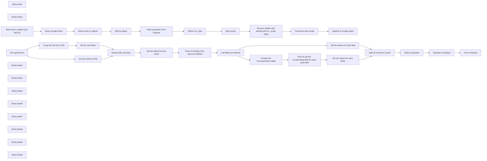

## Fluxo (.json) :

```json
{
  "nodes": [
    {
      "id": "18813eed-27a8-4338-8e71-abb270d43082",
      "name": "Split by object",
      "type": "n8n-nodes-base.splitOut",
      "position": [
        -260,
        540
      ],
      "parameters": {
        "options": {},
        "fieldToSplitOut": "object"
      },
      "typeVersion": 1
    },
    {
      "id": "ee610ddd-5bd7-4d97-82a9-b688c71616d8",
      "name": "Fetch properties from Hubspot",
      "type": "n8n-nodes-base.httpRequest",
      "position": [
        -40,
        540
      ],
      "parameters": {
        "url": "=https://api.hubapi.com/crm/v3/properties/{{ $json.object }}",
        "options": {},
        "authentication": "predefinedCredentialType",
        "nodeCredentialType": "hubspotOAuth2Api"
      },
      "credentials": {
        "hubspotOAuth2Api": {
          "id": "JxzF93M0SJ00jDD9",
          "name": "HubSpot account"
        },
        "hubspotDeveloperApi": {
          "id": "EN6KsMdrxSVNfhyz",
          "name": "HubSpot Developer account"
        }
      },
      "typeVersion": 4.2
    },
    {
      "id": "22662720-97ae-4e59-a70e-3b858e8e632d",
      "name": "Define crm_type",
      "type": "n8n-nodes-base.code",
      "position": [
        180,
        540
      ],
      "parameters": {
        "mode": "runOnceForEachItem",
        "jsCode": "// Loop over input items and add a new field called 'myNewField' to the JSON of each one\n\nfor (let result of $json.results) {\n  result.crm_type = $('Split by object').item.json.object;\n  delete result.options\n}\nreturn {results: $json.results};\n\n"
      },
      "typeVersion": 2
    },
    {
      "id": "abfdd971-1112-4dd4-9513-13f12f3e92f2",
      "name": "Split results",
      "type": "n8n-nodes-base.splitOut",
      "position": [
        400,
        540
      ],
      "parameters": {
        "include": "allOtherFields",
        "options": {},
        "fieldToSplitOut": "results"
      },
      "typeVersion": 1
    },
    {
      "id": "94c2b864-e88d-4da8-9ca3-a34d1ca8b15b",
      "name": "Transforms the results",
      "type": "n8n-nodes-base.code",
      "position": [
        840,
        540
      ],
      "parameters": {
        "mode": "runOnceForEachItem",
        "jsCode": "// Loop over input items and add a new field called 'myNewField' to the JSON of each one\nlet test = []\nlet entry = $input.item.json.results\nreturn {json: entry}\n"
      },
      "typeVersion": 2
    },
    {
      "id": "ddebf521-ed07-446b-ac2a-e21be46ee2c5",
      "name": "Append to Google sheet",
      "type": "n8n-nodes-base.googleSheets",
      "position": [
        1060,
        540
      ],
      "parameters": {
        "columns": {
          "value": {},
          "schema": [
            {
              "id": "updatedAt",
              "type": "string",
              "display": true,
              "removed": false,
              "required": false,
              "displayName": "updatedAt",
              "defaultMatch": false,
              "canBeUsedToMatch": true
            },
            {
              "id": "createdAt",
              "type": "string",
              "display": true,
              "removed": false,
              "required": false,
              "displayName": "createdAt",
              "defaultMatch": false,
              "canBeUsedToMatch": true
            },
            {
              "id": "name",
              "type": "string",
              "display": true,
              "removed": false,
              "required": false,
              "displayName": "name",
              "defaultMatch": false,
              "canBeUsedToMatch": true
            },
            {
              "id": "label",
              "type": "string",
              "display": true,
              "removed": false,
              "required": false,
              "displayName": "label",
              "defaultMatch": false,
              "canBeUsedToMatch": true
            },
            {
              "id": "type",
              "type": "string",
              "display": true,
              "removed": false,
              "required": false,
              "displayName": "type",
              "defaultMatch": false,
              "canBeUsedToMatch": true
            },
            {
              "id": "fieldType",
              "type": "string",
              "display": true,
              "removed": false,
              "required": false,
              "displayName": "fieldType",
              "defaultMatch": false,
              "canBeUsedToMatch": true
            },
            {
              "id": "description",
              "type": "string",
              "display": true,
              "removed": false,
              "required": false,
              "displayName": "description",
              "defaultMatch": false,
              "canBeUsedToMatch": true
            },
            {
              "id": "groupName",
              "type": "string",
              "display": true,
              "removed": false,
              "required": false,
              "displayName": "groupName",
              "defaultMatch": false,
              "canBeUsedToMatch": true
            },
            {
              "id": "displayOrder",
              "type": "string",
              "display": true,
              "removed": false,
              "required": false,
              "displayName": "displayOrder",
              "defaultMatch": false,
              "canBeUsedToMatch": true
            },
            {
              "id": "calculated",
              "type": "string",
              "display": true,
              "removed": false,
              "required": false,
              "displayName": "calculated",
              "defaultMatch": false,
              "canBeUsedToMatch": true
            },
            {
              "id": "externalOptions",
              "type": "string",
              "display": true,
              "removed": false,
              "required": false,
              "displayName": "externalOptions",
              "defaultMatch": false,
              "canBeUsedToMatch": true
            },
            {
              "id": "hasUniqueValue",
              "type": "string",
              "display": true,
              "removed": false,
              "required": false,
              "displayName": "hasUniqueValue",
              "defaultMatch": false,
              "canBeUsedToMatch": true
            },
            {
              "id": "hidden",
              "type": "string",
              "display": true,
              "removed": false,
              "required": false,
              "displayName": "hidden",
              "defaultMatch": false,
              "canBeUsedToMatch": true
            },
            {
              "id": "hubspotDefined",
              "type": "string",
              "display": true,
              "removed": false,
              "required": false,
              "displayName": "hubspotDefined",
              "defaultMatch": false,
              "canBeUsedToMatch": true
            },
            {
              "id": "formField",
              "type": "string",
              "display": true,
              "removed": false,
              "required": false,
              "displayName": "formField",
              "defaultMatch": false,
              "canBeUsedToMatch": true
            },
            {
              "id": "dataSensitivity",
              "type": "string",
              "display": true,
              "removed": false,
              "required": false,
              "displayName": "dataSensitivity",
              "defaultMatch": false,
              "canBeUsedToMatch": true
            },
            {
              "id": "crm_type",
              "type": "string",
              "display": true,
              "removed": false,
              "required": false,
              "displayName": "crm_type",
              "defaultMatch": false,
              "canBeUsedToMatch": true
            },
            {
              "id": "showCurrencySymbol",
              "type": "string",
              "display": true,
              "removed": false,
              "required": false,
              "displayName": "showCurrencySymbol",
              "defaultMatch": false,
              "canBeUsedToMatch": true
            },
            {
              "id": "calculationFormula",
              "type": "string",
              "display": true,
              "removed": false,
              "required": false,
              "displayName": "calculationFormula",
              "defaultMatch": false,
              "canBeUsedToMatch": true
            },
            {
              "id": "referencedObjectType",
              "type": "string",
              "display": true,
              "removed": false,
              "required": false,
              "displayName": "referencedObjectType",
              "defaultMatch": false,
              "canBeUsedToMatch": true
            },
            {
              "id": "createdUserId",
              "type": "string",
              "display": true,
              "removed": false,
              "required": false,
              "displayName": "createdUserId",
              "defaultMatch": false,
              "canBeUsedToMatch": true
            },
            {
              "id": "updatedUserId",
              "type": "string",
              "display": true,
              "removed": false,
              "required": false,
              "displayName": "updatedUserId",
              "defaultMatch": false,
              "canBeUsedToMatch": true
            },
            {
              "id": "archived",
              "type": "string",
              "display": true,
              "removed": false,
              "required": false,
              "displayName": "archived",
              "defaultMatch": false,
              "canBeUsedToMatch": true
            },
            {
              "id": "dateDisplayHint",
              "type": "string",
              "display": true,
              "removed": false,
              "required": false,
              "displayName": "dateDisplayHint",
              "defaultMatch": false,
              "canBeUsedToMatch": true
            },
            {
              "id": "options",
              "type": "string",
              "display": true,
              "removed": false,
              "required": false,
              "displayName": "options",
              "defaultMatch": false,
              "canBeUsedToMatch": true
            },
            {
              "id": "modificationMetadata",
              "type": "string",
              "display": true,
              "removed": false,
              "required": false,
              "displayName": "modificationMetadata",
              "defaultMatch": false,
              "canBeUsedToMatch": true
            }
          ],
          "mappingMode": "autoMapInputData",
          "matchingColumns": [],
          "attemptToConvertTypes": false,
          "convertFieldsToString": false
        },
        "options": {
          "useAppend": false
        },
        "operation": "append",
        "sheetName": {
          "__rl": true,
          "mode": "list",
          "value": "gid=0",
          "cachedResultUrl": "https://docs.google.com/spreadsheets/d/1NdvtXADHaSBleSkvVxf6Y6yo3VmHmilLEBuWbrik32w/edit#gid=0",
          "cachedResultName": "Sheet1"
        },
        "documentId": {
          "__rl": true,
          "mode": "list",
          "value": "1NdvtXADHaSBleSkvVxf6Y6yo3VmHmilLEBuWbrik32w",
          "cachedResultUrl": "https://docs.google.com/spreadsheets/d/1NdvtXADHaSBleSkvVxf6Y6yo3VmHmilLEBuWbrik32w/edit?usp=drivesdk",
          "cachedResultName": "Properties for Hubspot"
        }
      },
      "credentials": {
        "googleSheetsOAuth2Api": {
          "id": "gdLmm513ROUyH6oU",
          "name": "Google Sheets account"
        }
      },
      "typeVersion": 4.5
    },
    {
      "id": "dfd3d16b-b7d6-49ba-a38b-076960a8a184",
      "name": "Erase Google sheet",
      "type": "n8n-nodes-base.googleSheets",
      "position": [
        -700,
        540
      ],
      "parameters": {
        "operation": "clear",
        "sheetName": {
          "__rl": true,
          "mode": "list",
          "value": "gid=0",
          "cachedResultUrl": "https://docs.google.com/spreadsheets/d/1NdvtXADHaSBleSkvVxf6Y6yo3VmHmilLEBuWbrik32w/edit#gid=0",
          "cachedResultName": "Sheet1"
        },
        "documentId": {
          "__rl": true,
          "mode": "list",
          "value": "1NdvtXADHaSBleSkvVxf6Y6yo3VmHmilLEBuWbrik32w",
          "cachedResultUrl": "https://docs.google.com/spreadsheets/d/1NdvtXADHaSBleSkvVxf6Y6yo3VmHmilLEBuWbrik32w/edit?usp=drivesdk",
          "cachedResultName": "Properties for Hubspot"
        }
      },
      "credentials": {
        "googleSheetsOAuth2Api": {
          "id": "gdLmm513ROUyH6oU",
          "name": "Google Sheets account"
        }
      },
      "typeVersion": 4.5
    },
    {
      "id": "d39acf68-f809-4a4b-bb5e-5f80a7fddfbc",
      "name": "Sticky Note",
      "type": "n8n-nodes-base.stickyNote",
      "position": [
        -1000,
        460
      ],
      "parameters": {
        "color": 7,
        "width": 2280,
        "height": 460,
        "content": "## Update the properties by object Workflow\n"
      },
      "typeVersion": 1
    },
    {
      "id": "99ce38cb-937c-44f4-8e21-cceb8c5fa000",
      "name": "Sticky Note1",
      "type": "n8n-nodes-base.stickyNote",
      "position": [
        -1000,
        -300
      ],
      "parameters": {
        "color": 7,
        "width": 3200,
        "height": 700,
        "content": "## Import workflow\n"
      },
      "typeVersion": 1
    },
    {
      "id": "3b231f69-ca9b-40a4-b894-24cece123855",
      "name": "Define array of objects",
      "type": "n8n-nodes-base.set",
      "position": [
        -480,
        540
      ],
      "parameters": {
        "options": {},
        "assignments": {
          "assignments": [
            {
              "id": "d6c05100-fc13-4969-90e5-bcc398a79006",
              "name": "object",
              "type": "array",
              "value": "[\"companies\",\"contacts\", \"deals\", \"leads\", \"tickets\"]"
            }
          ]
        }
      },
      "typeVersion": 3.4
    },
    {
      "id": "d3eff9e3-1fae-4228-bcd9-525854f3f440",
      "name": "Start here to update your field list",
      "type": "n8n-nodes-base.manualTrigger",
      "position": [
        -920,
        540
      ],
      "parameters": {},
      "typeVersion": 1
    },
    {
      "id": "b1a4d238-9d55-4bff-a1b4-3942dbe37fdb",
      "name": "File upload form",
      "type": "n8n-nodes-base.formTrigger",
      "position": [
        -920,
        20
      ],
      "webhookId": "fc3523af-1d0f-4dfb-8869-b29cfdde1a06",
      "parameters": {
        "options": {},
        "formTitle": "title",
        "formFields": {
          "values": [
            {
              "fieldType": "file",
              "fieldLabel": "data",
              "multipleFiles": false,
              "requiredField": true,
              "acceptFileTypes": ".csv"
            },
            {
              "fieldType": "dropdown",
              "fieldLabel": "Type of import",
              "fieldOptions": {
                "values": [
                  {
                    "option": "Companies"
                  },
                  {
                    "option": "Contacts"
                  },
                  {
                    "option": "Leads"
                  },
                  {
                    "option": "Deals"
                  },
                  {
                    "option": "Tickets"
                  }
                ]
              }
            }
          ]
        },
        "formDescription": "provide me a file"
      },
      "typeVersion": 2.2
    },
    {
      "id": "44f4ffe7-ff9f-4716-82ef-fc3c44dc48ca",
      "name": "To get the first line of file",
      "type": "n8n-nodes-base.extractFromFile",
      "position": [
        -700,
        120
      ],
      "parameters": {
        "options": {},
        "operation": "text"
      },
      "typeVersion": 1
    },
    {
      "id": "351604db-d9e9-4994-8c1c-f543c13aead9",
      "name": "Set the real fields",
      "type": "n8n-nodes-base.set",
      "position": [
        -480,
        120
      ],
      "parameters": {
        "options": {},
        "assignments": {
          "assignments": [
            {
              "id": "69a042d8-9543-4a81-bbf8-07e9d7ae2c0d",
              "name": "real_fields",
              "type": "array",
              "value": "={{ $json.data.split(\"\\n\")[0].split(\";\") }}"
            }
          ]
        }
      },
      "typeVersion": 3.4
    },
    {
      "id": "a61d6de1-005e-41ad-a71e-3eafde83afc7",
      "name": "Get the fields from the sheet",
      "type": "n8n-nodes-base.googleSheets",
      "position": [
        -40,
        20
      ],
      "parameters": {
        "options": {},
        "filtersUI": {
          "values": [
            {
              "lookupValue": "={{ $('File upload form').first().json['Type of import'].toLowerCase() }}",
              "lookupColumn": "crm_type"
            }
          ]
        },
        "sheetName": {
          "__rl": true,
          "mode": "list",
          "value": "gid=0",
          "cachedResultUrl": "https://docs.google.com/spreadsheets/d/1NdvtXADHaSBleSkvVxf6Y6yo3VmHmilLEBuWbrik32w/edit#gid=0",
          "cachedResultName": "Sheet1"
        },
        "documentId": {
          "__rl": true,
          "mode": "list",
          "value": "1NdvtXADHaSBleSkvVxf6Y6yo3VmHmilLEBuWbrik32w",
          "cachedResultUrl": "https://docs.google.com/spreadsheets/d/1NdvtXADHaSBleSkvVxf6Y6yo3VmHmilLEBuWbrik32w/edit?usp=drivesdk",
          "cachedResultName": "Properties for Hubspot"
        }
      },
      "credentials": {
        "googleSheetsOAuth2Api": {
          "id": "gdLmm513ROUyH6oU",
          "name": "Google Sheets account"
        }
      },
      "typeVersion": 4.5
    },
    {
      "id": "617d572a-53a9-4fe8-9f73-06689c706006",
      "name": "Merge fields and data",
      "type": "n8n-nodes-base.merge",
      "position": [
        -260,
        20
      ],
      "parameters": {},
      "typeVersion": 3.1
    },
    {
      "id": "f2be6bfb-ac32-43d0-924c-d8f20a401b2f",
      "name": "Check if all fields from input are defined",
      "type": "n8n-nodes-base.code",
      "position": [
        180,
        20
      ],
      "parameters": {
        "jsCode": "// \nlet type = $('File upload form').first().json['Type of import']\n// Get first line of json\nlet first_line = $('Set the real fields').first().json.real_fields\nlet keys = Object.values(first_line)\nlet props = []\n\nfor (let realField of $input.all()) {\n  props.push(realField.json.name)\n}\nlet response = true\nfor (let key of keys) {\n if(!props.includes(key.trim())) {\n    console.log(props, key)\n    response = false\n }\n}\n\nreturn {response, keys, props}"
      },
      "typeVersion": 2
    },
    {
      "id": "8a2e23a3-c044-48ac-b66c-7205e34ad3bd",
      "name": "If all fields are defined",
      "type": "n8n-nodes-base.if",
      "position": [
        400,
        20
      ],
      "parameters": {
        "options": {},
        "conditions": {
          "options": {
            "version": 2,
            "leftValue": "",
            "caseSensitive": true,
            "typeValidation": "strict"
          },
          "combinator": "and",
          "conditions": [
            {
              "id": "3bb457eb-aef5-43f6-b268-1baaad0698e3",
              "operator": {
                "type": "boolean",
                "operation": "true",
                "singleValue": true
              },
              "leftValue": "={{ $json.response }}",
              "rightValue": ""
            }
          ]
        }
      },
      "typeVersion": 2.2
    },
    {
      "id": "123f6190-600a-410a-b943-a6e67d4f0a86",
      "name": "Creates the correspondance table",
      "type": "n8n-nodes-base.code",
      "position": [
        620,
        120
      ],
      "parameters": {
        "jsCode": "\nlet ret = []\nlet fields = {}\nfor (let key of $input.first().json.keys) {\n  if (!$input.first().json.props.includes(key)) {\n    let fieldName = `Set the correct field for '${key}'`\n    fields[fieldName] = key\n    // console.log(key)\n    ret.push(\n      {\n      \"fieldLabel\":key,\n     \"fieldType\": \"dropdown\",\n     \"fieldOptions\": {\n      \"values\": $input.first().json.props.map(x => {return {\"option\": x}})\n\t\t},\n      \"requiredField\":false\n   }\n    )\n  }\n}\n\nreturn {ret, fields}"
      },
      "typeVersion": 2
    },
    {
      "id": "c7348c9a-e4c3-4af2-9224-5338799ed7aa",
      "name": "Form to set the correponding field for each input field",
      "type": "n8n-nodes-base.form",
      "position": [
        840,
        120
      ],
      "webhookId": "8bdb6e07-1112-4923-a1a3-a0fbb83c806e",
      "parameters": {
        "options": {
          "formTitle": "=Correspondance for fields",
          "formDescription": "=Set the correct equivalent for each field.\nYou don't have to do it for all fields."
        },
        "defineForm": "json",
        "jsonOutput": "={{$json.ret}}"
      },
      "executeOnce": true,
      "typeVersion": 1
    },
    {
      "id": "2ba6be51-2508-4d34-b447-2f326fb692b5",
      "name": "Get the content of file",
      "type": "n8n-nodes-base.extractFromFile",
      "onError": "continueRegularOutput",
      "position": [
        -480,
        -80
      ],
      "parameters": {
        "options": {
          "encoding": "utf-8",
          "delimiter": ";",
          "headerRow": true
        }
      },
      "typeVersion": 1
    },
    {
      "id": "3bae9532-81d5-4694-b2cd-40c2b8207b22",
      "name": "Sticky Note2",
      "type": "n8n-nodes-base.stickyNote",
      "position": [
        -960,
        -220
      ],
      "parameters": {
        "color": 4,
        "width": 840,
        "height": 500,
        "content": "## Form uploader\n- Choose  file to import. The CSV file has \",\" as delimiters, is encoded in UTF8 and has the name of the fields as header. You can change all that in \"Get content of the file\"\n- Set the type of object you want to import"
      },
      "typeVersion": 1
    },
    {
      "id": "2836df7d-4307-485c-857e-30b0bb4cf59b",
      "name": "Split all records to import",
      "type": "n8n-nodes-base.splitOut",
      "position": [
        1280,
        20
      ],
      "parameters": {
        "include": "allOtherFields",
        "options": {},
        "fieldToSplitOut": "out"
      },
      "typeVersion": 1
    },
    {
      "id": "5d4481f4-0157-42d4-8223-1259f45a1846",
      "name": "Define properties",
      "type": "n8n-nodes-base.set",
      "position": [
        1500,
        20
      ],
      "parameters": {
        "options": {},
        "assignments": {
          "assignments": [
            {
              "id": "bc1ad698-c75a-49e5-843c-03c1c64a21b1",
              "name": "def.properties",
              "type": "object",
              "value": "={{ $json.out }}"
            }
          ]
        }
      },
      "typeVersion": 3.4
    },
    {
      "id": "b765d44e-6b13-4031-b188-e827578b9bee",
      "name": "Uploads to Hubspot",
      "type": "n8n-nodes-base.httpRequest",
      "position": [
        1720,
        20
      ],
      "parameters": {
        "url": "https://api.hubapi.com/crm/v3/objects/companies",
        "method": "POST",
        "options": {},
        "jsonBody": "={{ $json.def }}",
        "sendBody": true,
        "specifyBody": "json",
        "authentication": "predefinedCredentialType",
        "nodeCredentialType": "hubspotOAuth2Api"
      },
      "credentials": {
        "hubspotOAuth2Api": {
          "id": "JxzF93M0SJ00jDD9",
          "name": "HubSpot account"
        },
        "hubspotDeveloperApi": {
          "id": "EN6KsMdrxSVNfhyz",
          "name": "HubSpot Developer account"
        }
      },
      "typeVersion": 4.2
    },
    {
      "id": "f95862b2-555b-44a7-b318-cb3316d33594",
      "name": "Form response",
      "type": "n8n-nodes-base.form",
      "position": [
        1940,
        20
      ],
      "webhookId": "980c195f-9ea2-4f38-a869-6ac946b9552d",
      "parameters": {
        "options": {
          "formTitle": ""
        },
        "operation": "completion",
        "completionTitle": "Your Data has been imported successfully"
      },
      "typeVersion": 1
    },
    {
      "id": "75275b15-24e3-4fee-9d71-b4e7a2479c11",
      "name": "Remove hidden and starting with hs_ props fields",
      "type": "n8n-nodes-base.filter",
      "position": [
        620,
        540
      ],
      "parameters": {
        "options": {},
        "conditions": {
          "options": {
            "version": 2,
            "leftValue": "",
            "caseSensitive": true,
            "typeValidation": "strict"
          },
          "combinator": "and",
          "conditions": [
            {
              "id": "14ed0cde-e546-4b13-9405-16834831a7b4",
              "operator": {
                "type": "string",
                "operation": "notStartsWith"
              },
              "leftValue": "={{ $json.results.name }}",
              "rightValue": "hs_"
            },
            {
              "id": "60337002-8aba-404c-b6e0-99fcd60e1d84",
              "operator": {
                "type": "boolean",
                "operation": "false",
                "singleValue": true
              },
              "leftValue": "={{ $json.results.hidden }}",
              "rightValue": ""
            }
          ]
        }
      },
      "typeVersion": 2.2
    },
    {
      "id": "3b131ff9-ff8c-4b4c-8f48-7603e2f4e29c",
      "name": "Sticky Note3",
      "type": "n8n-nodes-base.stickyNote",
      "position": [
        -100,
        -220
      ],
      "parameters": {
        "color": 4,
        "width": 660,
        "height": 500,
        "content": "## Properties procesor\n- Get the list of properties defined by \"Update the properties by object\" for the choosen object in \"Form uploader\"\n- Check if all fields fro the file have their name in this list\n- If not, go to the correspondance form\n- if yes goes on to processing"
      },
      "typeVersion": 1
    },
    {
      "id": "75d465db-f0df-489b-a596-ed9e5a6b97ea",
      "name": "Sticky Note4",
      "type": "n8n-nodes-base.stickyNote",
      "position": [
        580,
        -220
      ],
      "parameters": {
        "color": 4,
        "width": 640,
        "height": 500,
        "content": "## Set the values for each property\n"
      },
      "typeVersion": 1
    },
    {
      "id": "16869a28-c6c1-4f88-ae7a-6ca74ad97a31",
      "name": "Set the values for each field",
      "type": "n8n-nodes-base.code",
      "position": [
        1060,
        -80
      ],
      "parameters": {
        "jsCode": "\nfunction findKeyByValue(obj, value) {\n  return Object.keys(obj).find(key => obj[key] === value);\n}\n\nlet out = []\nconst data = $('Get the content of file').all().map(x => x.json)\nconsole.log(data)\n\nfor (const item of data) {\n  console.log(item)\n  let elt = {}\n  \n  for (const prop of $('Check if all fields from input are defined').first().json.props) {\n      elt[prop] = item[prop]\n  }\n\n  out.push(elt)\n}\n\nreturn {out}"
      },
      "typeVersion": 2
    },
    {
      "id": "c7f51291-91df-497e-8466-031ac031384a",
      "name": "Set the values for each field1",
      "type": "n8n-nodes-base.code",
      "position": [
        1060,
        120
      ],
      "parameters": {
        "jsCode": "\nfunction findKeyByValue(obj, value) {\n  return Object.keys(obj).find(key => obj[key] === value);\n}\n\nlet out = []\nconst data = $('Get the content of file').all().map(x => x.json)\n// console.log(form_fields)\n\nfor (const item of data) {\n  let elt = {}\n  for (const prop of $('Check if all fields from input are defined').first().json.props) {\n    let equival = findKeyByValue($input.all()[0].json, prop)\n    if(equival) {\n      elt[prop] = item[equival]\n    } else {\n      elt[prop] = item[prop]\n    }\n  }\n  \n  out.push(elt)\n}\n\nreturn {out}"
      },
      "typeVersion": 2
    },
    {
      "id": "6aafe2ff-e4c7-4e07-8a39-d5bed120fdf7",
      "name": "Sticky Note5",
      "type": "n8n-nodes-base.stickyNote",
      "position": [
        1240,
        -220
      ],
      "parameters": {
        "color": 4,
        "width": 640,
        "height": 500,
        "content": "## Import the values in Hubspot\n"
      },
      "typeVersion": 1
    },
    {
      "id": "0b2e7364-4da7-4c4b-b1a2-3fda8e0a20be",
      "name": "Sticky Note7",
      "type": "n8n-nodes-base.stickyNote",
      "position": [
        -1000,
        -520
      ],
      "parameters": {
        "width": 460,
        "height": 200,
        "content": "## Contact me\n- If you need any modification to this workflow\n- if you need some help with this workflow\n- Or if you need any workflow in n8n, Make, or Langchain / Langgraph\n\nWrite to me: [thomas@pollup.net](mailto:thomas@pollup.net)\nCheck out my other templates [here](https://n8n.io/creators/zeerobug/)"
      },
      "typeVersion": 1
    },
    {
      "id": "5cf4f276-54e4-4e31-af1c-c2808802afda",
      "name": "Sticky Note6",
      "type": "n8n-nodes-base.stickyNote",
      "position": [
        -540,
        520
      ],
      "parameters": {
        "color": 4,
        "height": 380,
        "content": "\n\n\n\n\n\n\n\n\n\n\n\n\n\n\n\n## List of objects\nDefine Here the list of the objects you would like to import in Hubspot"
      },
      "typeVersion": 1
    },
    {
      "id": "bd0953b5-769f-40b2-9e71-b4e38f5aea7c",
      "name": "Sticky Note8",
      "type": "n8n-nodes-base.stickyNote",
      "position": [
        560,
        520
      ],
      "parameters": {
        "color": 4,
        "height": 380,
        "content": "\n\n\n\n\n\n\n\n\n\n\n\n\n\n\n\n## Filter the list of properties here"
      },
      "typeVersion": 1
    },
    {
      "id": "ae9d2dee-1c07-40eb-b8aa-020cde8534df",
      "name": "Sticky Note9",
      "type": "n8n-nodes-base.stickyNote",
      "position": [
        -760,
        520
      ],
      "parameters": {
        "color": 4,
        "width": 200,
        "height": 380,
        "content": "\n\n\n\n\n\n\n\n\n\n\n\n\n\n## Create an empty Google Sheet\nIf you run this part, and set it here and in the last node"
      },
      "typeVersion": 1
    }
  ],
  "connections": {
    "Split results": {
      "main": [
        [
          {
            "node": "Remove hidden and starting with hs_ props fields",
            "type": "main",
            "index": 0
          }
        ]
      ]
    },
    "Define crm_type": {
      "main": [
        [
          {
            "node": "Split results",
            "type": "main",
            "index": 0
          }
        ]
      ]
    },
    "Split by object": {
      "main": [
        [
          {
            "node": "Fetch properties from Hubspot",
            "type": "main",
            "index": 0
          }
        ]
      ]
    },
    "File upload form": {
      "main": [
        [
          {
            "node": "To get the first line of file",
            "type": "main",
            "index": 0
          },
          {
            "node": "Get the content of file",
            "type": "main",
            "index": 0
          }
        ]
      ]
    },
    "Define properties": {
      "main": [
        [
          {
            "node": "Uploads to Hubspot",
            "type": "main",
            "index": 0
          }
        ]
      ]
    },
    "Erase Google sheet": {
      "main": [
        [
          {
            "node": "Define array of objects",
            "type": "main",
            "index": 0
          }
        ]
      ]
    },
    "Uploads to Hubspot": {
      "main": [
        [
          {
            "node": "Form response",
            "type": "main",
            "index": 0
          }
        ]
      ]
    },
    "Set the real fields": {
      "main": [
        [
          {
            "node": "Merge fields and data",
            "type": "main",
            "index": 1
          }
        ]
      ]
    },
    "Merge fields and data": {
      "main": [
        [
          {
            "node": "Get the fields from the sheet",
            "type": "main",
            "index": 0
          }
        ]
      ]
    },
    "Append to Google sheet": {
      "main": [
        []
      ]
    },
    "Transforms the results": {
      "main": [
        [
          {
            "node": "Append to Google sheet",
            "type": "main",
            "index": 0
          }
        ]
      ]
    },
    "Define array of objects": {
      "main": [
        [
          {
            "node": "Split by object",
            "type": "main",
            "index": 0
          }
        ]
      ]
    },
    "Get the content of file": {
      "main": [
        [
          {
            "node": "Merge fields and data",
            "type": "main",
            "index": 0
          }
        ]
      ]
    },
    "If all fields are defined": {
      "main": [
        [
          {
            "node": "Set the values for each field",
            "type": "main",
            "index": 0
          }
        ],
        [
          {
            "node": "Creates the correspondance table",
            "type": "main",
            "index": 0
          }
        ]
      ]
    },
    "Split all records to import": {
      "main": [
        [
          {
            "node": "Define properties",
            "type": "main",
            "index": 0
          }
        ]
      ]
    },
    "Fetch properties from Hubspot": {
      "main": [
        [
          {
            "node": "Define crm_type",
            "type": "main",
            "index": 0
          }
        ]
      ]
    },
    "Get the fields from the sheet": {
      "main": [
        [
          {
            "node": "Check if all fields from input are defined",
            "type": "main",
            "index": 0
          }
        ]
      ]
    },
    "Set the values for each field": {
      "main": [
        [
          {
            "node": "Split all records to import",
            "type": "main",
            "index": 0
          }
        ]
      ]
    },
    "To get the first line of file": {
      "main": [
        [
          {
            "node": "Set the real fields",
            "type": "main",
            "index": 0
          }
        ]
      ]
    },
    "Set the values for each field1": {
      "main": [
        [
          {
            "node": "Split all records to import",
            "type": "main",
            "index": 0
          }
        ]
      ]
    },
    "Creates the correspondance table": {
      "main": [
        [
          {
            "node": "Form to set the correponding field for each input field",
            "type": "main",
            "index": 0
          }
        ]
      ]
    },
    "Start here to update your field list": {
      "main": [
        [
          {
            "node": "Erase Google sheet",
            "type": "main",
            "index": 0
          }
        ]
      ]
    },
    "Check if all fields from input are defined": {
      "main": [
        [
          {
            "node": "If all fields are defined",
            "type": "main",
            "index": 0
          }
        ]
      ]
    },
    "Remove hidden and starting with hs_ props fields": {
      "main": [
        [
          {
            "node": "Transforms the results",
            "type": "main",
            "index": 0
          }
        ]
      ]
    },
    "Form to set the correponding field for each input field": {
      "main": [
        [
          {
            "node": "Set the values for each field1",
            "type": "main",
            "index": 0
          }
        ]
      ]
    }
  }
}
```

<a id="template-2557"></a>

## Template 2557 - Scraper de produtos para Google Sheets

- **Nome:** Scraper de produtos para Google Sheets
- **Descrição:** Lê URLs de uma planilha, recupera o HTML das páginas, extrai informações de produto com ajuda de um modelo de linguagem e grava os resultados em outra planilha.
- **Funcionalidade:** • Leitura de URLs: Obtém a lista de URLs de origem a partir de uma planilha do Google Sheets.
• Processamento em lotes: Divide a lista de URLs para processar item a item ou em batches.
• Recuperação de HTML: Consulta uma API de web scraping para obter o HTML bruto das páginas alvo.
• Limpeza de HTML: Remove tags e conteúdos indesejados (scripts, styles, head, comentários) e mantém apenas tags relevantes.
• Extração com IA: Usa um modelo de linguagem para identificar e estruturar informações de produto (nome, descrição, avaliação, número de avaliações e preço).
• Parser estruturado: Converte a resposta do modelo em um formato JSON validado segundo um esquema definido.
• Persistência dos resultados: Apende os dados extraídos em uma planilha de resultados no Google Sheets.
• Acionamento manual: Permite executar o fluxo manualmente para testes e execuções pontuais.
- **Ferramentas:** • BrightData (Web Scraper API): Serviço para acessar páginas web e retornar o HTML bruto mesmo em sites protegidos.
• Google Sheets: Armazenamento das URLs de entrada e gravação dos resultados extraídos.
• Modelo de linguagem (GPT-4.1 via OpenRouter): Extrai e estrutura as informações de produto a partir do HTML limpo.


## Fluxo visual

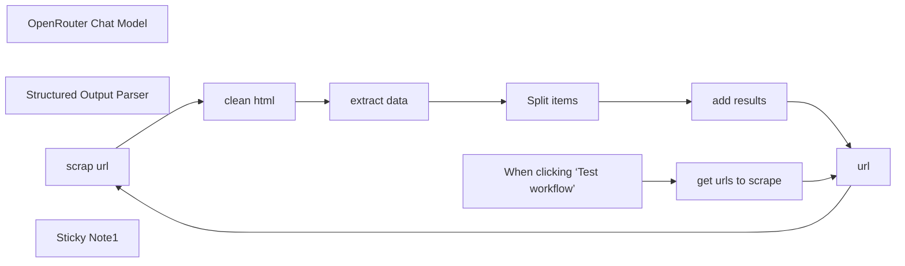

## Fluxo (.json) :

```json
{
  "meta": {
    "instanceId": "4a11afdb3c52fd098e3eae9fad4b39fdf1bbcde142f596adda46c795e366b326"
  },
  "nodes": [
    {
      "id": "f1b36f4b-6558-4e83-a999-e6f2d24e196c",
      "name": "OpenRouter Chat Model",
      "type": "@n8n/n8n-nodes-langchain.lmChatOpenRouter",
      "position": [
        620,
        240
      ],
      "parameters": {
        "model": "openai/gpt-4.1",
        "options": {}
      },
      "typeVersion": 1
    },
    {
      "id": "89ca0a07-286f-4e68-9e85-0327a4859cc0",
      "name": "Structured Output Parser",
      "type": "@n8n/n8n-nodes-langchain.outputParserStructured",
      "position": [
        900,
        240
      ],
      "parameters": {
        "schemaType": "manual",
        "inputSchema": "{\n  \"type\": \"array\",\n  \"items\": {\n    \"type\": \"object\",\n    \"properties\": {\n      \"name\": { \"type\": \"string\" },\n      \"description\": { \"type\": \"string\" },\n      \"rating\": { \"type\": \"number\" },\n      \"reviews\": { \"type\": \"integer\" },\n      \"price\": { \"type\": \"string\" }\n    },\n    \"required\": [\"name\", \"description\", \"rating\", \"reviews\", \"price\"]\n  }\n}"
      },
      "typeVersion": 1.2
    },
    {
      "id": "e4800c1d-c0d8-4093-81ec-fc19ad0034cd",
      "name": "scrap url",
      "type": "n8n-nodes-base.httpRequest",
      "position": [
        240,
        60
      ],
      "parameters": {
        "url": "https://api.brightdata.com/request",
        "method": "POST",
        "options": {},
        "sendBody": true,
        "sendHeaders": true,
        "bodyParameters": {
          "parameters": [
            {
              "name": "zone",
              "value": "web_unlocker1"
            },
            {
              "name": "url",
              "value": "={{ $json.url }}"
            },
            {
              "name": "format",
              "value": "raw"
            }
          ]
        },
        "headerParameters": {
          "parameters": [
            {
              "name": "Authorization",
              "value": "{{BRIGHTDATA_TOKEN}}"
            }
          ]
        }
      },
      "typeVersion": 4.2
    },
    {
      "id": "1a1f768f-615d-4035-81b0-63b860f8e6ac",
      "name": "Sticky Note1",
      "type": "n8n-nodes-base.stickyNote",
      "position": [
        160,
        -140
      ],
      "parameters": {
        "content": "## Web Scraper API\n\n[Inscription - Free Trial](https://get.brightdata.com/website-scraper)"
      },
      "typeVersion": 1
    },
    {
      "id": "2f260d96-4fff-4a4f-af29-1e43f465d54c",
      "name": "When clicking ‘Test workflow’",
      "type": "n8n-nodes-base.manualTrigger",
      "position": [
        -440,
        200
      ],
      "parameters": {},
      "typeVersion": 1
    },
    {
      "id": "4be9033f-0b9f-466d-916e-88fbb2a80417",
      "name": "url",
      "type": "n8n-nodes-base.splitInBatches",
      "position": [
        20,
        200
      ],
      "parameters": {
        "options": {}
      },
      "typeVersion": 3
    },
    {
      "id": "21b6d21c-b977-4175-9068-e0e2e19fa472",
      "name": "get urls to scrape",
      "type": "n8n-nodes-base.googleSheets",
      "position": [
        -200,
        200
      ],
      "parameters": {
        "options": {},
        "sheetName": "{{TRACK_SHEET_GID}}",
        "documentId": "{{WEB_SHEET_ID}}"
      },
      "credentials": {
        "googleSheetsOAuth2Api": {
          "id": "KsXWRZTrfCUFrrHD",
          "name": "Google Sheets"
        }
      },
      "typeVersion": 4.5
    },
    {
      "id": "25ef76ec-cf0d-422e-b060-68c49192a008",
      "name": "clean html",
      "type": "n8n-nodes-base.code",
      "position": [
        460,
        60
      ],
      "parameters": {
        "jsCode": "// CleanHtmlFunction.js\n// Purpose: n8n Function node to clean HTML: remove doctype, scripts, styles, head, comments, classes, extra blank lines, and non-whitelisted tags\n\nreturn items.map(item => {\n  const rawHtml = item.json.data;\n\n  // 1) remove doctype, scripts, styles, comments and head section, and strip class attributes\n  let cleaned = rawHtml\n    .replace(/<!doctype html>/gi, '')\n    .replace(/<script[\\s\\S]*?</script>/gi, '')\n    .replace(/<style[\\s\\S]*?</style>/gi, '')\n    .replace(/<!--[\\s\\S]*?-->/g, '')\n    .replace(/<head[\\s\\S]*?</head>/gi, '')\n    .replace(/\\sclass=\"[^\"]*\"/gi, '');\n\n  // 2) define whitelist of tags to keep\n  const allowedTags = [\n    'h1','h2','h3','h4','h5','h6',\n    'p','ul','ol','li',\n    'strong','em','a','blockquote',\n    'code','pre'\n  ];\n\n  // 3) strip out all tags not in the whitelist, reconstruct allowed tags cleanly\n  cleaned = cleaned.replace(\n    /</?([a-z][a-z0-9]*)\\b[^>]*>/gi,\n    (match, tagName) => {\n      const name = tagName.toLowerCase();\n      if (allowedTags.includes(name)) {\n        return match.startsWith('</') ? `</${name}>` : `<${name}>`;\n      }\n      return '';\n    }\n  );\n\n  // 4) collapse multiple blank or whitespace-only lines into a single newline\n  cleaned = cleaned.replace(/(\\s*\\r?\\n\\s*){2,}/g, '\\n');\n\n  // 5) trim leading/trailing whitespace\n  cleaned = cleaned.trim();\n\n  return {\n    json: { cleanedHtml: cleaned }\n  };\n});"
      },
      "typeVersion": 2
    },
    {
      "id": "f72660d5-8427-4655-acbe-10365273c27b",
      "name": "extract data",
      "type": "@n8n/n8n-nodes-langchain.chainLlm",
      "position": [
        680,
        60
      ],
      "parameters": {
        "text": "={{ $json.cleanedHtml }}",
        "messages": {
          "messageValues": [
            {
              "message": "=You are an expert in web page scraping. Provide a structured response in JSON format. Only the response, without commentary.\n\nExtract the product information for {{ $(‘url’).item.json.url.split(’/s?k=’)[1].split(’&’)[0] }} present on the page.\n\nname\ndescription\nrating\nreviews\nprice"
            }
          ]
        },
        "promptType": "define",
        "hasOutputParser": true
      },
      "typeVersion": 1.6
    },
    {
      "id": "8b4af1bb-d7f8-456e-b630-ecd9b6e4bcdc",
      "name": "add results",
      "type": "n8n-nodes-base.googleSheets",
      "position": [
        1280,
        200
      ],
      "parameters": {
        "columns": {
          "value": {
            "name": "={{ $json.output.name }}",
            "price": "={{ $json.output.price }}",
            "rating": "={{ $json.output.rating }}",
            "reviews": "={{ $json.output.reviews }}",
            "description": "={{ $json.output.description }}"
          },
          "schema": [
            {
              "id": "name",
              "type": "string"
            },
            {
              "id": "description",
              "type": "string"
            },
            {
              "id": "rating",
              "type": "string"
            },
            {
              "id": "reviews",
              "type": "string"
            },
            {
              "id": "price",
              "type": "string"
            }
          ],
          "mappingMode": "defineBelow"
        },
        "options": {},
        "operation": "append",
        "sheetName": "{{RESULTS_SHEET_GID}}",
        "documentId": "{{WEB_SHEET_ID}}"
      },
      "credentials": {
        "googleSheetsOAuth2Api": {
          "id": "KsXWRZTrfCUFrrHD",
          "name": "Google Sheets"
        }
      },
      "typeVersion": 4.5
    },
    {
      "id": "7a5ba438-2ede-4d6c-b8fa-9a958ba1ef3e",
      "name": "Split items",
      "type": "n8n-nodes-base.splitOut",
      "position": [
        1060,
        60
      ],
      "parameters": {
        "include": "allOtherFields",
        "options": {},
        "fieldToSplitOut": "output"
      },
      "typeVersion": 1
    }
  ],
  "pinData": {},
  "connections": {
    "url": {
      "main": [
        [],
        [
          {
            "node": "scrap url",
            "type": "main",
            "index": 0
          }
        ]
      ]
    },
    "scrap url": {
      "main": [
        [
          {
            "node": "clean html",
            "type": "main",
            "index": 0
          }
        ]
      ]
    },
    "clean html": {
      "main": [
        [
          {
            "node": "extract data",
            "type": "main",
            "index": 0
          }
        ]
      ]
    },
    "Split items": {
      "main": [
        [
          {
            "node": "add results",
            "type": "main",
            "index": 0
          }
        ]
      ]
    },
    "add results": {
      "main": [
        [
          {
            "node": "url",
            "type": "main",
            "index": 0
          }
        ]
      ]
    },
    "extract data": {
      "main": [
        [
          {
            "node": "Split items",
            "type": "main",
            "index": 0
          }
        ]
      ]
    },
    "get urls to scrape": {
      "main": [
        [
          {
            "node": "url",
            "type": "main",
            "index": 0
          }
        ]
      ]
    },
    "OpenRouter Chat Model": {
      "ai_languageModel": [
        [
          {
            "node": "extract data",
            "type": "ai_languageModel",
            "index": 0
          }
        ]
      ]
    },
    "Structured Output Parser": {
      "ai_outputParser": [
        [
          {
            "node": "extract data",
            "type": "ai_outputParser",
            "index": 0
          }
        ]
      ]
    },
    "When clicking ‘Test workflow’": {
      "main": [
        [
          {
            "node": "get urls to scrape",
            "type": "main",
            "index": 0
          }
        ]
      ]
    }
  }
}
```

<a id="template-2558"></a>

## Template 2558 - Análise de currículo por VLM

- **Nome:** Análise de currículo por VLM
- **Descrição:** Converte um PDF de currículo em imagem e utiliza um modelo multimodal de visão e linguagem para avaliar se o candidato é qualificado para a vaga e decidir o prosseguimento do processo.
- **Funcionalidade:** • Iniciação manual: Inicia o fluxo quando acionado manualmente para testar o processamento do currículo.
• Download do currículo: Recupera o arquivo PDF do currículo armazenado no Google Drive.
• Conversão de PDF para imagem: Envia o PDF a uma API externa que converte o documento em imagem (JPG) para análise visual.
• Redução de resolução da imagem: Reduz a resolução da imagem resultante para acelerar o processamento pelo modelo.
• Análise multimodal do currículo: Envia a imagem para um modelo de visão e linguagem que lê o currículo como uma pessoa e avalia compatibilidade com a vaga (ex.: Plumber).
• Extração de resposta estruturada: Interpreta a resposta do modelo em formato estruturado (por exemplo, is_qualified true/false e motivo).
• Decisão de fluxo: Avalia o resultado estruturado e direciona o candidato para a etapa 2 se qualificado.
• Aviso de privacidade: Inclui um aviso sobre uso de serviço público para conversão de PDF e recomenda implantação privada em produção.
- **Ferramentas:** • Google Drive: Armazenamento e fornecimento do arquivo PDF do currículo.
• Stirling PDF (stirlingpdf.io): Serviço/API utilizada para converter PDFs em imagens (JPG).
• Google Gemini (PaLM): Modelo multimodal de visão e linguagem usado para ler a imagem do currículo e avaliar a adequação do candidato.

## Fluxo visual


## Fluxo (.json) :

```json
{
  "meta": {
    "instanceId": "408f9fb9940c3cb18ffdef0e0150fe342d6e655c3a9fac21f0f644e8bedabcd9"
  },
  "nodes": [
    {
      "id": "38da57b7-2161-415d-8473-783ccdc7b975",
      "name": "When clicking ‘Test workflow’",
      "type": "n8n-nodes-base.manualTrigger",
      "position": [
        -260,
        840
      ],
      "parameters": {},
      "typeVersion": 1
    },
    {
      "id": "2cd46d91-105d-4b5e-be43-3343a9da815d",
      "name": "Sticky Note",
      "type": "n8n-nodes-base.stickyNote",
      "position": [
        -780,
        540
      ],
      "parameters": {
        "width": 365.05232558139534,
        "height": 401.24529475392126,
        "content": "## Try me out!\n\n### This workflow converts a Candidate Resume PDF to an image which is then \"read\" by a Vision Language Model (VLM). The VLM assesses if the candidate's CV is a fit for the desired role.\n\nThis approach can be employed to combat \"hidden prompts\" planted in resumes to bypass and/or manipulate automated ATS systems using AI.\n\n\n### Need Help?\nJoin the [Discord](https://discord.com/invite/XPKeKXeB7d) or ask in the [Forum](https://community.n8n.io/)!\n"
      },
      "typeVersion": 1
    },
    {
      "id": "40bab53a-fcbc-4acc-8d59-c20b3e1b2697",
      "name": "Structured Output Parser",
      "type": "@n8n/n8n-nodes-langchain.outputParserStructured",
      "position": [
        1200,
        980
      ],
      "parameters": {
        "jsonSchemaExample": "{\n\t\"is_qualified\": true,\n\t\"reason\": \"\"\n}"
      },
      "typeVersion": 1.2
    },
    {
      "id": "d75fb7ab-cfbc-419d-b803-deb9e99114ba",
      "name": "Should Proceed To Stage 2?",
      "type": "n8n-nodes-base.if",
      "position": [
        1360,
        820
      ],
      "parameters": {
        "options": {},
        "conditions": {
          "options": {
            "leftValue": "",
            "caseSensitive": true,
            "typeValidation": "strict"
          },
          "combinator": "and",
          "conditions": [
            {
              "id": "4dd69ba3-bf07-43b3-86b7-d94b07e9eea6",
              "operator": {
                "type": "boolean",
                "operation": "true",
                "singleValue": true
              },
              "leftValue": "={{ $json.output.is_qualified }}",
              "rightValue": ""
            }
          ]
        }
      },
      "typeVersion": 2
    },
    {
      "id": "a0f56270-67c2-4fab-b521-aa6f06b0b0fd",
      "name": "Sticky Note1",
      "type": "n8n-nodes-base.stickyNote",
      "position": [
        -380,
        540
      ],
      "parameters": {
        "color": 7,
        "width": 543.5706868577606,
        "height": 563.6162790697684,
        "content": "## 1. Download Candidate Resume\n[Read more about using Google Drive](https://docs.n8n.io/integrations/builtin/app-nodes/n8n-nodes-base.googledrive)\n\nFor this demonstration, we'll pull the candidate's resume PDF from Google Drive but you can just as easily recieve this resume from email or your ATS.\n\nIt should be noted that our PDF is a special test case which has been deliberately injected with an AI bypass; the bypass is a hidden prompt which aims to override AI instructions and auto-qualify the candidate... sneaky!\n\nDownload a copy of this resume here: https://drive.google.com/file/d/1MORAdeev6cMcTJBV2EYALAwll8gCDRav/view?usp=sharing"
      },
      "typeVersion": 1
    },
    {
      "id": "d21fe4dd-0879-4e5a-a70d-10f09b25eee2",
      "name": "Download Resume",
      "type": "n8n-nodes-base.googleDrive",
      "position": [
        -80,
        840
      ],
      "parameters": {
        "fileId": {
          "__rl": true,
          "mode": "id",
          "value": "1MORAdeev6cMcTJBV2EYALAwll8gCDRav"
        },
        "options": {},
        "operation": "download"
      },
      "credentials": {
        "googleDriveOAuth2Api": {
          "id": "yOwz41gMQclOadgu",
          "name": "Google Drive account"
        }
      },
      "typeVersion": 3
    },
    {
      "id": "ea904365-d9d2-4f15-b7c3-7abfeb4c8c50",
      "name": "Sticky Note2",
      "type": "n8n-nodes-base.stickyNote",
      "position": [
        200,
        540
      ],
      "parameters": {
        "color": 7,
        "width": 605.0267171444024,
        "height": 595.3148729042731,
        "content": "## 2. Convert PDF to Image(s)\n[Read more about using Stirling PDF](https://github.com/Stirling-Tools/Stirling-PDF)\n\nAI vision models can only accept images (and sometimes videos!) as non-text inputs but not PDFs at time of writing. We'll have to convert our PDF to an image in order to use it.\n\nHere, we'll use a tool called **Stirling PDF** which can provide this functionality and can be accessed via a HTTP API. Feel free to use an alternative solution if available, otherwise follow the instructions on the Stirling PDF website to set up your own instance.\n\nAdditionally, we'll reduce the resolution of our converted image to speed up the processing done by the LLM. I find that about 75% of an A4 (30x40cm) is a good balance."
      },
      "typeVersion": 1
    },
    {
      "id": "cd00a47f-1ab9-46bf-8ea1-46ac899095e7",
      "name": "Sticky Note3",
      "type": "n8n-nodes-base.stickyNote",
      "position": [
        840,
        540
      ],
      "parameters": {
        "color": 7,
        "width": 747.8139534883712,
        "height": 603.1395348837208,
        "content": "## 3. Parse Resume with Multimodal LLM\n[Read more about using Basic LLM Chain](https://docs.n8n.io/integrations/builtin/cluster-nodes/root-nodes/n8n-nodes-langchain.chainllm/)\n\nMultimodal LLMs are LLMs which can accept binary inputs such as images, audio and/or video files. Most newer LLMs are by default multimodal and we'll use Google's Gemini here as an example. By processing each candidate's resume as an image, we avoid scenarios where text extraction fails due to layout issues or by picking up \"hidden\" or malicious prompts planted to subvert AI automated processing.\n\nThis vision model ensures the resume is read and understood as a human would. The hidden bypass is therefore rendered mute since the AI also cannot \"see\" the special prompt embedded in the document."
      },
      "typeVersion": 1
    },
    {
      "id": "d60214c6-c67e-4433-9121-4d54f782b19d",
      "name": "PDF-to-Image API",
      "type": "n8n-nodes-base.httpRequest",
      "position": [
        340,
        880
      ],
      "parameters": {
        "url": "https://stirlingpdf.io/api/v1/convert/pdf/img",
        "method": "POST",
        "options": {},
        "sendBody": true,
        "contentType": "multipart-form-data",
        "bodyParameters": {
          "parameters": [
            {
              "name": "fileInput",
              "parameterType": "formBinaryData",
              "inputDataFieldName": "data"
            },
            {
              "name": "imageFormat",
              "value": "jpg"
            },
            {
              "name": "singleOrMultiple",
              "value": "single"
            },
            {
              "name": "dpi",
              "value": "300"
            }
          ]
        }
      },
      "typeVersion": 4.2
    },
    {
      "id": "847de537-ad8f-47f5-a1c1-d207c3fc15ef",
      "name": "Resize Converted Image",
      "type": "n8n-nodes-base.editImage",
      "position": [
        530,
        880
      ],
      "parameters": {
        "width": 75,
        "height": 75,
        "options": {},
        "operation": "resize",
        "resizeOption": "percent"
      },
      "typeVersion": 1
    },
    {
      "id": "5fb6ac7e-b910-4dce-bba7-19b638fd817a",
      "name": "Google Gemini Chat Model",
      "type": "@n8n/n8n-nodes-langchain.lmChatGoogleGemini",
      "position": [
        1000,
        980
      ],
      "parameters": {
        "options": {},
        "modelName": "models/gemini-1.5-pro-latest"
      },
      "credentials": {
        "googlePalmApi": {
          "id": "dSxo6ns5wn658r8N",
          "name": "Google Gemini(PaLM) Api account"
        }
      },
      "typeVersion": 1
    },
    {
      "id": "2580b583-544a-47ee-b248-9cca528c9866",
      "name": "Candidate Resume Analyser",
      "type": "@n8n/n8n-nodes-langchain.chainLlm",
      "position": [
        1000,
        820
      ],
      "parameters": {
        "text": "=Evaluate the candidate's resume.",
        "messages": {
          "messageValues": [
            {
              "message": "=Assess the given Candiate Resume for the role of Plumber.\nDetermine if the candidate's skills match the role and if they qualify for an in-person interview."
            },
            {
              "type": "HumanMessagePromptTemplate",
              "messageType": "imageBinary"
            }
          ]
        },
        "promptType": "define",
        "hasOutputParser": true
      },
      "typeVersion": 1.4
    },
    {
      "id": "694669c2-9cf5-43ec-8846-c0ecbc5a77ee",
      "name": "Sticky Note4",
      "type": "n8n-nodes-base.stickyNote",
      "position": [
        280,
        840
      ],
      "parameters": {
        "width": 225.51725256895617,
        "height": 418.95152406706313,
        "content": "\n\n\n\n\n\n\n\n\n\n\n\n\n\n\n\n\n\n\n### Data Privacy Warning!\nFor demo purposes, we're using the public online version of Stirling PDF. It is recommended to setup your own private instance of Stirling PDF before using this workflow in production."
      },
      "typeVersion": 1
    }
  ],
  "pinData": {},
  "connections": {
    "Download Resume": {
      "main": [
        [
          {
            "node": "PDF-to-Image API",
            "type": "main",
            "index": 0
          }
        ]
      ]
    },
    "PDF-to-Image API": {
      "main": [
        [
          {
            "node": "Resize Converted Image",
            "type": "main",
            "index": 0
          }
        ]
      ]
    },
    "Resize Converted Image": {
      "main": [
        [
          {
            "node": "Candidate Resume Analyser",
            "type": "main",
            "index": 0
          }
        ]
      ]
    },
    "Google Gemini Chat Model": {
      "ai_languageModel": [
        [
          {
            "node": "Candidate Resume Analyser",
            "type": "ai_languageModel",
            "index": 0
          }
        ]
      ]
    },
    "Structured Output Parser": {
      "ai_outputParser": [
        [
          {
            "node": "Candidate Resume Analyser",
            "type": "ai_outputParser",
            "index": 0
          }
        ]
      ]
    },
    "Candidate Resume Analyser": {
      "main": [
        [
          {
            "node": "Should Proceed To Stage 2?",
            "type": "main",
            "index": 0
          }
        ]
      ]
    },
    "When clicking ‘Test workflow’": {
      "main": [
        [
          {
            "node": "Download Resume",
            "type": "main",
            "index": 0
          }
        ]
      ]
    }
  }
}
```

<a id="template-2559"></a>

## Template 2559 - Preenchimento automático de tabela Baserow via prompts e PDF

- **Nome:** Preenchimento automático de tabela Baserow via prompts e PDF
- **Descrição:** Automatiza a extração de informações de PDFs usando prompts definidos pelos usuários (descrições de campos) para preencher colunas de uma tabela Baserow quando linhas ou campos são atualizados.
- **Funcionalidade:** • Receber eventos da tabela: Aciona o fluxo ao detectar eventos de linha atualizada ou campo criado/atualizado.
• Recuperar esquema da tabela: Busca metadados dos campos (incluindo descrições usadas como prompts) via API.
• Filtrar campos válidos: Seleciona somente campos que possuam descrição (prompt) para processamento.
• Processamento por linha: Para cada linha afetada, baixa o arquivo PDF associado e extrai o texto.
• Geração de valores via LLM: Envia o texto do PDF junto com o prompt dinâmico (descrição do campo) para um modelo de linguagem para obter o valor a ser preenchido.
• Atualização seletiva de células: Atualiza apenas os campos faltantes/impactados da linha para evitar trabalho redundante.
• Atualização em massa por campo: Ao criar/alterar um campo, itera sobre todas as linhas com arquivo válido e gera/atualiza o valor para esse campo.
• Paginação e lotes: Usa paginação e processamento em lotes para manejar grandes volumes de linhas sem sobrecarregar a API.
• Tratamento de falhas simples: Marca respostas não extraíveis como "n/a" e continua execução para evitar bloqueios.
- **Ferramentas:** • Baserow: Fonte e destino dos dados; provê webhooks e APIs para ler esquema, listar e atualizar linhas.
• OpenAI: Modelo de linguagem utilizado para extrair/gerar valores a partir do texto dos PDFs.

## Fluxo visual

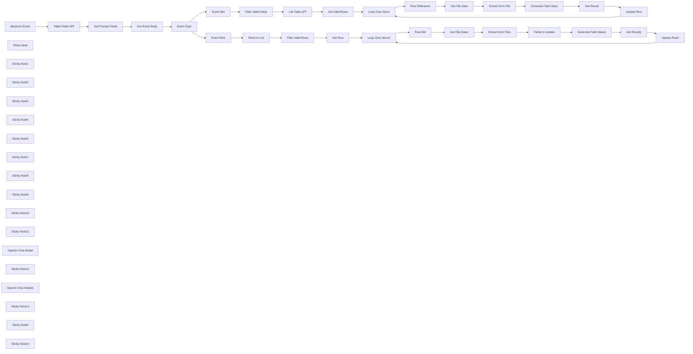

## Fluxo (.json) :

```json
{
  "nodes": [
    {
      "id": "065d7ec9-edc5-46f6-b8ac-d62ed0e5c8e3",
      "name": "Baserow Event",
      "type": "n8n-nodes-base.webhook",
      "position": [
        -1180,
        -140
      ],
      "webhookId": "267ea500-e2cd-4604-a31f-f0773f27317c",
      "parameters": {
        "path": "267ea500-e2cd-4604-a31f-f0773f27317c",
        "options": {},
        "httpMethod": "POST"
      },
      "typeVersion": 2
    },
    {
      "id": "ac1403b4-9d45-404d-9892-0bed39b9ec82",
      "name": "Event Type",
      "type": "n8n-nodes-base.switch",
      "position": [
        -220,
        -140
      ],
      "parameters": {
        "rules": {
          "values": [
            {
              "outputKey": "rows.updated",
              "conditions": {
                "options": {
                  "version": 2,
                  "leftValue": "",
                  "caseSensitive": true,
                  "typeValidation": "strict"
                },
                "combinator": "and",
                "conditions": [
                  {
                    "id": "2162daf8-d23d-4b8f-8257-bdfc5400a3a8",
                    "operator": {
                      "name": "filter.operator.equals",
                      "type": "string",
                      "operation": "equals"
                    },
                    "leftValue": "={{ $json.event_type }}",
                    "rightValue": "rows.updated"
                  }
                ]
              },
              "renameOutput": true
            },
            {
              "outputKey": "field.created",
              "conditions": {
                "options": {
                  "version": 2,
                  "leftValue": "",
                  "caseSensitive": true,
                  "typeValidation": "strict"
                },
                "combinator": "and",
                "conditions": [
                  {
                    "id": "48e112f6-afe8-40bf-b673-b37446934a62",
                    "operator": {
                      "name": "filter.operator.equals",
                      "type": "string",
                      "operation": "equals"
                    },
                    "leftValue": "={{ $json.event_type }}",
                    "rightValue": "field.created"
                  }
                ]
              },
              "renameOutput": true
            },
            {
              "outputKey": "field.updated",
              "conditions": {
                "options": {
                  "version": 2,
                  "leftValue": "",
                  "caseSensitive": true,
                  "typeValidation": "strict"
                },
                "combinator": "and",
                "conditions": [
                  {
                    "id": "5aa258cd-15c2-4156-a32d-afeed662a38e",
                    "operator": {
                      "name": "filter.operator.equals",
                      "type": "string",
                      "operation": "equals"
                    },
                    "leftValue": "={{ $json.event_type }}",
                    "rightValue": "field.updated"
                  }
                ]
              },
              "renameOutput": true
            }
          ]
        },
        "options": {}
      },
      "typeVersion": 3.2
    },
    {
      "id": "c501042d-f9e7-4c1a-b01d-b11392b1a804",
      "name": "Table Fields API",
      "type": "n8n-nodes-base.httpRequest",
      "position": [
        -900,
        -140
      ],
      "parameters": {
        "url": "=https://api.baserow.io/api/database/fields/table/{{ $json.body.table_id }}/",
        "options": {},
        "sendQuery": true,
        "authentication": "genericCredentialType",
        "genericAuthType": "httpHeaderAuth",
        "queryParameters": {
          "parameters": [
            {
              "name": "user_field_names",
              "value": "true"
            }
          ]
        }
      },
      "credentials": {
        "httpHeaderAuth": {
          "id": "F28aPWK5NooSHAg0",
          "name": "Baserow (n8n-local)"
        }
      },
      "typeVersion": 4.2
    },
    {
      "id": "af6c3b7f-bb8b-4037-8e3b-337d81ca5632",
      "name": "Get Prompt Fields",
      "type": "n8n-nodes-base.code",
      "position": [
        -720,
        -140
      ],
      "parameters": {
        "jsCode": "const fields = $input.all()\n .filter(item => item.json.description)\n .map(item => ({\n id: item.json.id,\n order: item.json.order,\n name: item.json.name,\n description: item.json.description,\n }));\n\nreturn { json: { fields } };"
      },
      "typeVersion": 2
    },
    {
      "id": "e1f8f740-c784-4f07-9265-76db518f3ebc",
      "name": "Get Event Body",
      "type": "n8n-nodes-base.set",
      "position": [
        -380,
        -140
      ],
      "parameters": {
        "mode": "raw",
        "options": {},
        "jsonOutput": "={{ $('Baserow Event').first().json.body }}"
      },
      "typeVersion": 3.4
    },
    {
      "id": "e303b7c3-639a-4136-8aa4-074eedeb273f",
      "name": "List Table API",
      "type": "n8n-nodes-base.httpRequest",
      "position": [
        480,
        220
      ],
      "parameters": {
        "url": "=https://api.baserow.io/api/database/rows/table/{{ $json.table_id }}/",
        "options": {
          "pagination": {
            "pagination": {
              "nextURL": "={{ $response.body.next || `https://api.baserow.io/api/database/rows/table/${$json.table_id}/?user_field_names=true&size=20&page=9999` }}",
              "maxRequests": 3,
              "paginationMode": "responseContainsNextURL",
              "requestInterval": 1000,
              "limitPagesFetched": true,
              "completeExpression": "={{ $response.body.isEmpty() || $response.statusCode >= 400 }}",
              "paginationCompleteWhen": "other"
            }
          }
        },
        "sendQuery": true,
        "authentication": "genericCredentialType",
        "genericAuthType": "httpHeaderAuth",
        "queryParameters": {
          "parameters": [
            {
              "name": "user_field_names",
              "value": "true"
            },
            {
              "name": "size",
              "value": "20"
            },
            {
              "name": "include",
              "value": "id,order,_id,name,created_at,last_modified_at"
            },
            {
              "name": "filters",
              "value": "{\"filter_type\":\"AND\",\"filters\":[{\"type\":\"not_empty\",\"field\":\"File\",\"value\":\"\"}],\"groups\":[]}"
            }
          ]
        }
      },
      "credentials": {
        "httpHeaderAuth": {
          "id": "F28aPWK5NooSHAg0",
          "name": "Baserow (n8n-local)"
        }
      },
      "typeVersion": 4.2
    },
    {
      "id": "9ad2e0c8-c92d-460d-be7a-237ce29b34c2",
      "name": "Get Valid Rows",
      "type": "n8n-nodes-base.code",
      "position": [
        640,
        220
      ],
      "parameters": {
        "jsCode": "return $input.all()\n .filter(item => item.json.results?.length)\n .flatMap(item => item.json.results);"
      },
      "typeVersion": 2
    },
    {
      "id": "72b137e9-2e87-4580-9282-0ab7c5147f68",
      "name": "Get File Data",
      "type": "n8n-nodes-base.httpRequest",
      "position": [
        1320,
        320
      ],
      "parameters": {
        "url": "={{ $json.File[0].url }}",
        "options": {}
      },
      "typeVersion": 4.2
    },
    {
      "id": "d479ee4e-4a87-4a0e-b9ca-4aa54afdc67a",
      "name": "Extract from File",
      "type": "n8n-nodes-base.extractFromFile",
      "position": [
        1480,
        320
      ],
      "parameters": {
        "options": {},
        "operation": "pdf"
      },
      "typeVersion": 1
    },
    {
      "id": "717e36f8-7dd7-44a6-bcef-9f20735853d2",
      "name": "Update Row",
      "type": "n8n-nodes-base.httpRequest",
      "notes": "Execute Once",
      "onError": "continueRegularOutput",
      "maxTries": 2,
      "position": [
        2280,
        380
      ],
      "parameters": {
        "url": "=https://api.baserow.io/api/database/rows/table/{{ $('Event Ref').first().json.table_id }}/{{ $('Row Reference').item.json.id }}/",
        "method": "PATCH",
        "options": {},
        "jsonBody": "={{\n{\n ...$input.all()\n .reduce((acc, item) => ({\n ...acc,\n [item.json.field]: item.json.value\n }), {})\n}\n}}",
        "sendBody": true,
        "sendQuery": true,
        "specifyBody": "json",
        "authentication": "genericCredentialType",
        "genericAuthType": "httpHeaderAuth",
        "queryParameters": {
          "parameters": [
            {
              "name": "user_field_names",
              "value": "true"
            }
          ]
        }
      },
      "credentials": {
        "httpHeaderAuth": {
          "id": "F28aPWK5NooSHAg0",
          "name": "Baserow (n8n-local)"
        }
      },
      "executeOnce": true,
      "notesInFlow": true,
      "retryOnFail": false,
      "typeVersion": 4.2,
      "waitBetweenTries": 3000
    },
    {
      "id": "b807a9c0-2334-491c-a259-1e0e266f89df",
      "name": "Get Result",
      "type": "n8n-nodes-base.set",
      "position": [
        2100,
        380
      ],
      "parameters": {
        "options": {},
        "assignments": {
          "assignments": [
            {
              "id": "3ad72567-1d17-4910-b916-4c34a43b1060",
              "name": "field",
              "type": "string",
              "value": "={{ $('Event Ref').first().json.field.name }}"
            },
            {
              "id": "e376ba60-8692-4962-9af7-466b6a3f44a2",
              "name": "value",
              "type": "string",
              "value": "={{ $json.text.trim() }}"
            }
          ]
        }
      },
      "typeVersion": 3.4
    },
    {
      "id": "d29a58db-f547-4a4b-bc20-10e14529e474",
      "name": "Loop Over Items",
      "type": "n8n-nodes-base.splitInBatches",
      "position": [
        900,
        220
      ],
      "parameters": {
        "options": {}
      },
      "typeVersion": 3
    },
    {
      "id": "233b2e96-7873-42f0-989f-c3df5a8e4542",
      "name": "Row Reference",
      "type": "n8n-nodes-base.noOp",
      "position": [
        1080,
        320
      ],
      "parameters": {},
      "typeVersion": 1
    },
    {
      "id": "396eb9c0-dcde-4735-9e15-bf6350def086",
      "name": "Generate Field Value",
      "type": "@n8n/n8n-nodes-langchain.chainLlm",
      "position": [
        1640,
        320
      ],
      "parameters": {
        "text": "=<file>\n{{ $json.text }}\n</file>\n\nData to extract: {{ $('Event Ref').first().json.field.description }}\noutput format is: {{ $('Event Ref').first().json.field.type }}",
        "messages": {
          "messageValues": [
            {
              "message": "=You assist the user in extracting the required data from the given file.\n* Keep you answer short.\n* If you cannot extract the requested data, give you response as \"n/a\"."
            }
          ]
        },
        "promptType": "define"
      },
      "typeVersion": 1.5
    },
    {
      "id": "4be0a9e5-e77e-4cea-9dd3-bc6e7de7a72b",
      "name": "Get Row",
      "type": "n8n-nodes-base.httpRequest",
      "position": [
        640,
        -420
      ],
      "parameters": {
        "url": "=https://api.baserow.io/api/database/rows/table/{{ $('Event Ref1').first().json.table_id }}/{{ $json.id }}/",
        "options": {},
        "sendQuery": true,
        "authentication": "genericCredentialType",
        "genericAuthType": "httpHeaderAuth",
        "queryParameters": {
          "parameters": [
            {
              "name": "user_field_names",
              "value": "true"
            }
          ]
        }
      },
      "credentials": {
        "httpHeaderAuth": {
          "id": "F28aPWK5NooSHAg0",
          "name": "Baserow (n8n-local)"
        }
      },
      "typeVersion": 4.2
    },
    {
      "id": "40fc77b8-a986-40ab-a78c-da05a3f171c2",
      "name": "Rows to List",
      "type": "n8n-nodes-base.splitOut",
      "position": [
        320,
        -420
      ],
      "parameters": {
        "options": {},
        "fieldToSplitOut": "items"
      },
      "typeVersion": 1
    },
    {
      "id": "4c5bc9c8-1bcb-48b1-82d0-5cf04535108c",
      "name": "Fields to Update",
      "type": "n8n-nodes-base.code",
      "position": [
        1640,
        -300
      ],
      "parameters": {
        "jsCode": "const row = $('Row Ref').first().json;\nconst fields = $('Get Prompt Fields').first().json.fields;\nconst missingFields = fields\n .filter(field => field.description && !row[field.name]);\n\nreturn missingFields;"
      },
      "typeVersion": 2
    },
    {
      "id": "85d5c817-e5f8-45ea-bf7f-efc7913f542c",
      "name": "Loop Over Items1",
      "type": "n8n-nodes-base.splitInBatches",
      "position": [
        900,
        -420
      ],
      "parameters": {
        "options": {}
      },
      "typeVersion": 3
    },
    {
      "id": "69005b35-9c66-4c14-80a9-ef8e945dab30",
      "name": "Row Ref",
      "type": "n8n-nodes-base.noOp",
      "position": [
        1080,
        -300
      ],
      "parameters": {},
      "typeVersion": 1
    },
    {
      "id": "1b0e14da-13a8-4023-9006-464578bf0ff5",
      "name": "Get File Data1",
      "type": "n8n-nodes-base.httpRequest",
      "position": [
        1320,
        -300
      ],
      "parameters": {
        "url": "={{ $('Row Ref').item.json.File[0].url }}",
        "options": {}
      },
      "typeVersion": 4.2
    },
    {
      "id": "47cf67bc-a3e2-4796-b5a7-4f6a6aef3e90",
      "name": "Extract from File1",
      "type": "n8n-nodes-base.extractFromFile",
      "position": [
        1480,
        -300
      ],
      "parameters": {
        "options": {},
        "operation": "pdf"
      },
      "typeVersion": 1
    },
    {
      "id": "3dc743cc-0dde-4349-975c-fa453d99dbaf",
      "name": "Update Row1",
      "type": "n8n-nodes-base.httpRequest",
      "notes": "Execute Once",
      "onError": "continueRegularOutput",
      "maxTries": 2,
      "position": [
        2440,
        -260
      ],
      "parameters": {
        "url": "=https://api.baserow.io/api/database/rows/table/{{ $('Event Ref1').first().json.table_id }}/{{ $('Row Ref').first().json.id }}/",
        "method": "PATCH",
        "options": {},
        "jsonBody": "={{\n{\n ...$input.all()\n .reduce((acc, item) => ({\n ...acc,\n [item.json.field]: item.json.value\n }), {})\n}\n}}",
        "sendBody": true,
        "sendQuery": true,
        "specifyBody": "json",
        "authentication": "genericCredentialType",
        "genericAuthType": "httpHeaderAuth",
        "queryParameters": {
          "parameters": [
            {
              "name": "user_field_names",
              "value": "true"
            }
          ]
        }
      },
      "credentials": {
        "httpHeaderAuth": {
          "id": "F28aPWK5NooSHAg0",
          "name": "Baserow (n8n-local)"
        }
      },
      "executeOnce": true,
      "notesInFlow": true,
      "retryOnFail": false,
      "typeVersion": 4.2,
      "waitBetweenTries": 3000
    },
    {
      "id": "49c53281-d323-4794-919a-d807d7ccc25e",
      "name": "Get Result1",
      "type": "n8n-nodes-base.set",
      "position": [
        2260,
        -260
      ],
      "parameters": {
        "options": {},
        "assignments": {
          "assignments": [
            {
              "id": "3ad72567-1d17-4910-b916-4c34a43b1060",
              "name": "field",
              "type": "string",
              "value": "={{ $('Fields to Update').item.json.name }}"
            },
            {
              "id": "e376ba60-8692-4962-9af7-466b6a3f44a2",
              "name": "value",
              "type": "string",
              "value": "={{ $json.text.trim() }}"
            }
          ]
        }
      },
      "typeVersion": 3.4
    },
    {
      "id": "bc23708a-b177-47db-8a30-4330198710e0",
      "name": "Generate Field Value1",
      "type": "@n8n/n8n-nodes-langchain.chainLlm",
      "position": [
        1800,
        -300
      ],
      "parameters": {
        "text": "=<file>\n{{ $('Extract from File1').first().json.text }}\n</file>\n\nData to extract: {{ $json.description }}\noutput format is: {{ $json.type }}",
        "messages": {
          "messageValues": [
            {
              "message": "=You assist the user in extracting the required data from the given file.\n* Keep you answer short.\n* If you cannot extract the requested data, give you response as \"n/a\" followed by \"(reason)\" where reason is replaced with reason why data could not be extracted."
            }
          ]
        },
        "promptType": "define"
      },
      "typeVersion": 1.5
    },
    {
      "id": "c0297c19-04b8-4d56-9ce0-320b399f73bd",
      "name": "Filter Valid Rows",
      "type": "n8n-nodes-base.filter",
      "position": [
        480,
        -420
      ],
      "parameters": {
        "options": {},
        "conditions": {
          "options": {
            "version": 2,
            "leftValue": "",
            "caseSensitive": true,
            "typeValidation": "strict"
          },
          "combinator": "and",
          "conditions": [
            {
              "id": "7ad58f0b-0354-49a9-ab2f-557652d7b416",
              "operator": {
                "type": "string",
                "operation": "notEmpty",
                "singleValue": true
              },
              "leftValue": "={{ $json.File[0].url }}",
              "rightValue": ""
            }
          ]
        }
      },
      "typeVersion": 2.2
    },
    {
      "id": "5aab6971-1d6f-4b82-a218-4e25c7b28052",
      "name": "Filter Valid Fields",
      "type": "n8n-nodes-base.filter",
      "position": [
        320,
        220
      ],
      "parameters": {
        "options": {},
        "conditions": {
          "options": {
            "version": 2,
            "leftValue": "",
            "caseSensitive": true,
            "typeValidation": "strict"
          },
          "combinator": "and",
          "conditions": [
            {
              "id": "5b4a7393-788c-42dc-ac1f-e76f833f8534",
              "operator": {
                "type": "string",
                "operation": "notEmpty",
                "singleValue": true
              },
              "leftValue": "={{ $json.field.description }}",
              "rightValue": ""
            }
          ]
        }
      },
      "typeVersion": 2.2
    },
    {
      "id": "bc144115-f3a2-4e99-a35c-4a780754d0fb",
      "name": "Event Ref",
      "type": "n8n-nodes-base.noOp",
      "position": [
        160,
        220
      ],
      "parameters": {},
      "typeVersion": 1
    },
    {
      "id": "13fd10c0-d4eb-463a-a8b6-5471380f3710",
      "name": "Event Ref1",
      "type": "n8n-nodes-base.noOp",
      "position": [
        160,
        -420
      ],
      "parameters": {},
      "typeVersion": 1
    },
    {
      "id": "e07053a4-a130-41b0-85d3-dfa3983b1547",
      "name": "Sticky Note",
      "type": "n8n-nodes-base.stickyNote",
      "position": [
        -1000,
        -340
      ],
      "parameters": {
        "color": 7,
        "width": 480,
        "height": 440,
        "content": "### 1. Get Table Schema\n[Learn more about the HTTP node](https://docs.n8n.io/integrations/builtin/core-nodes/n8n-nodes-base.httprequest)\n\nFor this operation, we'll have to use the Baserow API rather than the built-in node. However, this way does allow for more flexibility with query parameters.\n"
      },
      "typeVersion": 1
    },
    {
      "id": "675b9d6a-1ba6-49ce-b569-38cc0ba04dcb",
      "name": "Sticky Note1",
      "type": "n8n-nodes-base.stickyNote",
      "position": [
        -260,
        -440
      ],
      "parameters": {
        "color": 5,
        "width": 330,
        "height": 80,
        "content": "### 2a. Updates Minimal Number of Rows\nThis branch updates only the rows impacted."
      },
      "typeVersion": 1
    },
    {
      "id": "021d51f9-7a5b-4f93-baad-707144aeb7ba",
      "name": "Sticky Note2",
      "type": "n8n-nodes-base.stickyNote",
      "position": [
        -320,
        140
      ],
      "parameters": {
        "color": 5,
        "width": 390,
        "height": 120,
        "content": "### 2b. Update Every Row under the Field\nThis branch updates all applicable rows under field when the field/column is created or changed. Watch out - if you have 1000s of rows, this could take a while!"
      },
      "typeVersion": 1
    },
    {
      "id": "ae49cfb0-ac83-4501-bc01-d98be32798f0",
      "name": "Sticky Note3",
      "type": "n8n-nodes-base.stickyNote",
      "position": [
        -1780,
        -1060
      ],
      "parameters": {
        "width": 520,
        "height": 1160,
        "content": "## Try It Out!\n### This n8n template powers a \"dynamic\" or \"user-defined\" prompts with PDF workflow pattern for a [Baserow](https://baserow.io) table. Simply put, it allows users to populate a spreadsheet using prompts without touching the underlying template.\n\n**Check out the video demo I did for n8n Studio**: https://www.youtube.com/watch?v=_fNAD1u8BZw\n\nThis template is intended to be used as a webhook source for Baserow. **Looking for a Airtable version? [Click here](https://n8n.io/workflows/2771-ai-data-extraction-with-dynamic-prompts-and-airtable/)**\n\n## How it works\n* Each Baserow.io tables offers integration feature whereby changes to the table can be sent as events to any accessible webhook. This allows for a reactive trigger pattern which makes this type of workflow possible. For our usecase, we capture the vents of `row_updated`, `field_created` and `field_updated`.\n* Next, we'll need an \"input\" column in our Baserow.io table. This column will be where our context lives for evaluating the prompts against. In this example, our \"input\" column name is \"file\" and it's where we'll upload our PDFs. Note, this \"input\" field is human-controlled and never updated from this template.\n* Now for the columns (aka \"fields\" in Baserow). Each field allows us to define a name, type and description and together form the schema. The first 2 are self-explaintory but the \"description\" will be for users to provide their prompts ie. what data should the field to contain.\n* In this template, a webhook trigger waits for when a row or column is updated. The incoming event comes with lots of details such as the table, row and/or column Ids that were impacted.\n* We use this information to fetch the table's schema in order to get the column's descriptions (aka dynamic prompts).\n* For each triggered event, we download our input ie. the PDF and ready it for our AI/LLM. By iterating through the available columns and feeding the dynamic prompts, our LLM can run those prompts against the PDF and thus generating a value response for each cell.\n* These values are then collected and used to update the Baserow Table.\n\n## How to use\n* You'll need to publish this workflow and make it accessible to our Baserow instance. Good to note, you only really need to do this once and can reuse for many Baserow Tables.\n* Configure your Baserow Table to send `row_updated`, `field_created` and `field_updated` events to this n8n workflow.\n* This workflow should work with both cloud-hosted and self-hosted versions of Baserow.\n\n\n### Need Help?\nJoin the [Discord](https://discord.com/invite/XPKeKXeB7d) or ask in the [Forum](https://community.n8n.io/)!\n\nHappy Flowgramming!"
      },
      "typeVersion": 1
    },
    {
      "id": "23ea63f5-e1ad-4326-95a4-945bf98d03f4",
      "name": "Sticky Note4",
      "type": "n8n-nodes-base.stickyNote",
      "position": [
        -500,
        -340
      ],
      "parameters": {
        "color": 7,
        "width": 580,
        "height": 440,
        "content": "### 2. Event Router Pattern\n[Learn more about the Switch node](https://docs.n8n.io/integrations/builtin/core-nodes/n8n-nodes-base.switch/)\n\nA simple switch node can be used to determine which event to handle. The difference between our row and field events is that row event affect a single row whereas field events affect all rows. \n"
      },
      "typeVersion": 1
    },
    {
      "id": "179f9459-43d0-4342-ab94-e248730182a5",
      "name": "Sticky Note5",
      "type": "n8n-nodes-base.stickyNote",
      "position": [
        100,
        -620
      ],
      "parameters": {
        "color": 7,
        "width": 700,
        "height": 400,
        "content": "### 3. Filter Only Rows with Valid Input\n[Learn more about the Split Out node](https://docs.n8n.io/integrations/builtin/core-nodes/n8n-nodes-base.splitout/)\n\nThis step handles one or more updated rows where \"updated\" means the \"input\" column (ie. \"file\" in our example) for these rows were changed. For each affected row, we'll get the full row to figure out only the columns we need to update - this is an optimisation to avoid redundant work ie. generating values for columns which already have a value."
      },
      "typeVersion": 1
    },
    {
      "id": "7124a8c0-549e-4b82-8e1f-c6428d2bfb44",
      "name": "Sticky Note7",
      "type": "n8n-nodes-base.stickyNote",
      "position": [
        2140,
        -480
      ],
      "parameters": {
        "color": 7,
        "width": 520,
        "height": 440,
        "content": "### 6. Update the Baserow Table Row\n[Learn more about the Edit Fields node](https://docs.n8n.io/integrations/builtin/core-nodes/n8n-nodes-base.set/)\n\nFinally, we can collect the LLM responses and combine them to build an API request to update our Baserow Table row - the Id of which we got from initial webhook. After this is done, we can move onto the next row and repeat the process.\n"
      },
      "typeVersion": 1
    },
    {
      "id": "c55ce945-10ba-440b-a444-81cb4ed63539",
      "name": "Sticky Note8",
      "type": "n8n-nodes-base.stickyNote",
      "position": [
        1260,
        -580
      ],
      "parameters": {
        "color": 7,
        "width": 860,
        "height": 580,
        "content": "### 5. PDFs, LLMs and Dynamic Prompts? Oh My!\n[Learn more about the Basic LLM node](https://docs.n8n.io/integrations/builtin/cluster-nodes/root-nodes/n8n-nodes-langchain.chainllm/)\n\nThis step is where it all comes together! In short, we give our LLM the PDF contents as the context and loop through our dynamic prompts (from the schema we pulled earlier) for our row. At the end, our LLM should have produced a value for each column requested.\n\n**Note**: There's definitely a optimisation which could be done for caching PDFs but it beyond the scope of this demonstration.\n"
      },
      "typeVersion": 1
    },
    {
      "id": "1a0ff82e-64aa-479e-8dec-c29b512b0686",
      "name": "Sticky Note9",
      "type": "n8n-nodes-base.stickyNote",
      "position": [
        820,
        -580
      ],
      "parameters": {
        "color": 7,
        "width": 420,
        "height": 460,
        "content": "### 4. Using an Items Loop\n[Learn more about the Split in Batches node](https://docs.n8n.io/integrations/builtin/core-nodes/n8n-nodes-base.splitinbatches/)\n\nA split in batches node is used here to update a row at a time however, this is a preference for user experience - changes are seen in the Baserow quicker.\n"
      },
      "typeVersion": 1
    },
    {
      "id": "f4562d44-4fc0-4c59-ba90-8b65f1162aac",
      "name": "Sticky Note10",
      "type": "n8n-nodes-base.stickyNote",
      "position": [
        100,
        40
      ],
      "parameters": {
        "color": 7,
        "width": 680,
        "height": 360,
        "content": "### 7. Listing All Rows Under The Column\n[Learn more about the Code node](https://docs.n8n.io/integrations/builtin/core-nodes/n8n-nodes-base.code)\n\nWe can use Baserow's List API and the HTTP node's pagination feature to fetch all applicable rows under the affected field - the filter query on the API is helpful here.\n"
      },
      "typeVersion": 1
    },
    {
      "id": "979983e9-1002-444c-a018-50ce525ef02a",
      "name": "Sticky Note11",
      "type": "n8n-nodes-base.stickyNote",
      "position": [
        1260,
        140
      ],
      "parameters": {
        "color": 7,
        "width": 700,
        "height": 500,
        "content": "### 9. Generating Value using LLM\n[Learn more about the Extract From File node](https://docs.n8n.io/integrations/builtin/core-nodes/n8n-nodes-base.extractfromfile/)\n\nPretty much identical to Step 5 but instead of updating every field/column, we only need to generate a value for one. \n"
      },
      "typeVersion": 1
    },
    {
      "id": "f38aa7a3-479b-4876-87bf-769ada3089f2",
      "name": "OpenAI Chat Model",
      "type": "@n8n/n8n-nodes-langchain.lmChatOpenAi",
      "position": [
        1800,
        -140
      ],
      "parameters": {
        "options": {}
      },
      "credentials": {
        "openAiApi": {
          "id": "8gccIjcuf3gvaoEr",
          "name": "OpenAi account"
        }
      },
      "typeVersion": 1.1
    },
    {
      "id": "a5061210-2e6b-4b62-994f-594fc10a0ac6",
      "name": "Sticky Note12",
      "type": "n8n-nodes-base.stickyNote",
      "position": [
        820,
        40
      ],
      "parameters": {
        "color": 7,
        "width": 420,
        "height": 460,
        "content": "### 8. Using an Items Loop\n[Learn more about the Split in Batches node](https://docs.n8n.io/integrations/builtin/core-nodes/n8n-nodes-base.splitinbatches/)\n\nSimilar to Step 4, the Split in Batches node is a preference for user experience - changes are seen in the Baserow quicker.\n"
      },
      "typeVersion": 1
    },
    {
      "id": "e47e36d4-bf6d-48d3-9e52-d8bbac06c4b4",
      "name": "OpenAI Chat Model1",
      "type": "@n8n/n8n-nodes-langchain.lmChatOpenAi",
      "position": [
        1640,
        500
      ],
      "parameters": {
        "options": {}
      },
      "credentials": {
        "openAiApi": {
          "id": "8gccIjcuf3gvaoEr",
          "name": "OpenAi account"
        }
      },
      "typeVersion": 1.1
    },
    {
      "id": "52501eab-861e-4de9-837d-65879cd43e5b",
      "name": "Sticky Note13",
      "type": "n8n-nodes-base.stickyNote",
      "position": [
        1980,
        200
      ],
      "parameters": {
        "color": 7,
        "width": 500,
        "height": 380,
        "content": "### 10. Update the Baserow Table Row\n[Learn more about the Edit Fields node](https://docs.n8n.io/integrations/builtin/core-nodes/n8n-nodes-base.set/)\n\nAs with Step 6, the LLM response is used to update the row however only under the field that was created/changed. Once complete, the loop continues and the next row is processed.\n"
      },
      "typeVersion": 1
    },
    {
      "id": "6d9fb2e9-6aca-4276-b9b3-d409be24e40e",
      "name": "Sticky Note6",
      "type": "n8n-nodes-base.stickyNote",
      "position": [
        -1780,
        -1200
      ],
      "parameters": {
        "color": 7,
        "height": 120,
        "content": ""
      },
      "typeVersion": 1
    },
    {
      "id": "bccfc32b-fd18-4de7-88d5-0aeb02ab7954",
      "name": "Sticky Note14",
      "type": "n8n-nodes-base.stickyNote",
      "position": [
        -1200,
        -1280
      ],
      "parameters": {
        "color": 5,
        "width": 820,
        "height": 800,
        "content": "## ⭐️ Creating Baserow Webhooks\nBaserow webhooks are created via the UI and the option can be accessed by clicking on the 3 dots button in the toolbar.\n\n* Create a POST webhook for your n8n webhook URL found in this template.\n* Select the \"use fields names instead of IDs\" option.\n* Select \"let me choose individual events\"\n* The events to choose are \"row updated\", \"field created\" and \"field updated\".\n* For the \"row updated\" event, be sure to specify the input field - in this case, \"File\".\n\n"
      },
      "typeVersion": 1
    }
  ],
  "pinData": {},
  "connections": {
    "Get Row": {
      "main": [
        [
          {
            "node": "Loop Over Items1",
            "type": "main",
            "index": 0
          }
        ]
      ]
    },
    "Row Ref": {
      "main": [
        [
          {
            "node": "Get File Data1",
            "type": "main",
            "index": 0
          }
        ]
      ]
    },
    "Event Ref": {
      "main": [
        [
          {
            "node": "Filter Valid Fields",
            "type": "main",
            "index": 0
          }
        ]
      ]
    },
    "Event Ref1": {
      "main": [
        [
          {
            "node": "Rows to List",
            "type": "main",
            "index": 0
          }
        ]
      ]
    },
    "Event Type": {
      "main": [
        [
          {
            "node": "Event Ref1",
            "type": "main",
            "index": 0
          }
        ],
        [
          {
            "node": "Event Ref",
            "type": "main",
            "index": 0
          }
        ],
        [
          {
            "node": "Event Ref",
            "type": "main",
            "index": 0
          }
        ]
      ]
    },
    "Get Result": {
      "main": [
        [
          {
            "node": "Update Row",
            "type": "main",
            "index": 0
          }
        ]
      ]
    },
    "Update Row": {
      "main": [
        [
          {
            "node": "Loop Over Items",
            "type": "main",
            "index": 0
          }
        ]
      ]
    },
    "Get Result1": {
      "main": [
        [
          {
            "node": "Update Row1",
            "type": "main",
            "index": 0
          }
        ]
      ]
    },
    "Update Row1": {
      "main": [
        [
          {
            "node": "Loop Over Items1",
            "type": "main",
            "index": 0
          }
        ]
      ]
    },
    "Rows to List": {
      "main": [
        [
          {
            "node": "Filter Valid Rows",
            "type": "main",
            "index": 0
          }
        ]
      ]
    },
    "Baserow Event": {
      "main": [
        [
          {
            "node": "Table Fields API",
            "type": "main",
            "index": 0
          }
        ]
      ]
    },
    "Get File Data": {
      "main": [
        [
          {
            "node": "Extract from File",
            "type": "main",
            "index": 0
          }
        ]
      ]
    },
    "Row Reference": {
      "main": [
        [
          {
            "node": "Get File Data",
            "type": "main",
            "index": 0
          }
        ]
      ]
    },
    "Get Event Body": {
      "main": [
        [
          {
            "node": "Event Type",
            "type": "main",
            "index": 0
          }
        ]
      ]
    },
    "Get File Data1": {
      "main": [
        [
          {
            "node": "Extract from File1",
            "type": "main",
            "index": 0
          }
        ]
      ]
    },
    "Get Valid Rows": {
      "main": [
        [
          {
            "node": "Loop Over Items",
            "type": "main",
            "index": 0
          }
        ]
      ]
    },
    "List Table API": {
      "main": [
        [
          {
            "node": "Get Valid Rows",
            "type": "main",
            "index": 0
          }
        ]
      ]
    },
    "Loop Over Items": {
      "main": [
        [],
        [
          {
            "node": "Row Reference",
            "type": "main",
            "index": 0
          }
        ]
      ]
    },
    "Fields to Update": {
      "main": [
        [
          {
            "node": "Generate Field Value1",
            "type": "main",
            "index": 0
          }
        ]
      ]
    },
    "Loop Over Items1": {
      "main": [
        [],
        [
          {
            "node": "Row Ref",
            "type": "main",
            "index": 0
          }
        ]
      ]
    },
    "Table Fields API": {
      "main": [
        [
          {
            "node": "Get Prompt Fields",
            "type": "main",
            "index": 0
          }
        ]
      ]
    },
    "Extract from File": {
      "main": [
        [
          {
            "node": "Generate Field Value",
            "type": "main",
            "index": 0
          }
        ]
      ]
    },
    "Filter Valid Rows": {
      "main": [
        [
          {
            "node": "Get Row",
            "type": "main",
            "index": 0
          }
        ]
      ]
    },
    "Get Prompt Fields": {
      "main": [
        [
          {
            "node": "Get Event Body",
            "type": "main",
            "index": 0
          }
        ]
      ]
    },
    "OpenAI Chat Model": {
      "ai_languageModel": [
        [
          {
            "node": "Generate Field Value1",
            "type": "ai_languageModel",
            "index": 0
          }
        ]
      ]
    },
    "Extract from File1": {
      "main": [
        [
          {
            "node": "Fields to Update",
            "type": "main",
            "index": 0
          }
        ]
      ]
    },
    "OpenAI Chat Model1": {
      "ai_languageModel": [
        [
          {
            "node": "Generate Field Value",
            "type": "ai_languageModel",
            "index": 0
          }
        ]
      ]
    },
    "Filter Valid Fields": {
      "main": [
        [
          {
            "node": "List Table API",
            "type": "main",
            "index": 0
          }
        ]
      ]
    },
    "Generate Field Value": {
      "main": [
        [
          {
            "node": "Get Result",
            "type": "main",
            "index": 0
          }
        ]
      ]
    },
    "Generate Field Value1": {
      "main": [
        [
          {
            "node": "Get Result1",
            "type": "main",
            "index": 0
          }
        ]
      ]
    }
  }
}
```

<a id="template-2560"></a>

## Template 2560 - Extrair preços de livros para planilha

- **Nome:** Extrair preços de livros para planilha
- **Descrição:** Fluxo que busca uma página de categoria de livros, utiliza um modelo de linguagem para extrair e estruturar informações dos produtos e grava os resultados em uma planilha do Google Sheets.
- **Funcionalidade:** • Início manual: permite iniciar o processo sob demanda.
• Busca de página web: obtém o conteúdo HTML da página de categoria de livros definida.
• Extração baseada em modelo de linguagem: processa o texto da página com instruções para extrair atributos (título, preço, disponibilidade, URL do produto, URL da imagem) e gerar um JSON estruturado.
• Tolerância a dados faltantes: omite atributos quando o valor não está disponível, conforme instruções do extrator.
• Separação de resultados: divide a lista de itens extraídos para tratar cada livro individualmente.
• Gravação em planilha: adiciona cada registro extraído a uma aba específica do Google Sheets, mapeando colunas como nome, price, availability, image e link.
- **Ferramentas:** • Jina.ai (r.jina.ai): serviço usado para buscar o conteúdo da página web de forma simplificada a partir da URL.
• OpenAI (modelo de chat): modelo de linguagem responsável por extrair e estruturar as informações do texto em formato JSON.
• Google Sheets: destino onde os registros extraídos são inseridos e armazenados em uma planilha.
• books.toscrape.com: site de exemplo/fonte de dados onde estão listados os livros e preços que são extraídos.

## Fluxo visual

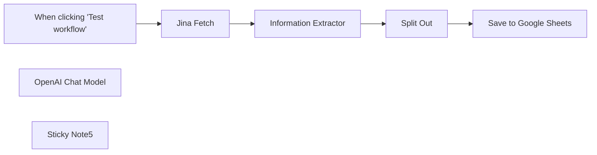

## Fluxo (.json) :

```json
{
  "nodes": [
    {
      "id": "c3ef40df-084e-435c-9a11-3aa0a2f94f36",
      "name": "When clicking \"Test workflow\"",
      "type": "n8n-nodes-base.manualTrigger",
      "position": [
        740,
        520
      ],
      "parameters": {},
      "typeVersion": 1
    },
    {
      "id": "e0583472-a450-4582-83bc-84a014bea543",
      "name": "Split Out",
      "type": "n8n-nodes-base.splitOut",
      "position": [
        1640,
        520
      ],
      "parameters": {
        "options": {},
        "fieldToSplitOut": "output.results"
      },
      "typeVersion": 1
    },
    {
      "id": "b8aa573d-5b63-4669-900f-bcc915b6ad41",
      "name": "Save to Google Sheets",
      "type": "n8n-nodes-base.googleSheets",
      "position": [
        1900,
        520
      ],
      "parameters": {
        "columns": {
          "value": {},
          "schema": [
            {
              "id": "name",
              "type": "string",
              "display": true,
              "removed": false,
              "required": false,
              "displayName": "name",
              "defaultMatch": false,
              "canBeUsedToMatch": true
            },
            {
              "id": "price",
              "type": "string",
              "display": true,
              "removed": false,
              "required": false,
              "displayName": "price",
              "defaultMatch": false,
              "canBeUsedToMatch": true
            },
            {
              "id": "availability",
              "type": "string",
              "display": true,
              "removed": false,
              "required": false,
              "displayName": "availability",
              "defaultMatch": false,
              "canBeUsedToMatch": true
            },
            {
              "id": "image",
              "type": "string",
              "display": true,
              "removed": false,
              "required": false,
              "displayName": "image",
              "defaultMatch": false,
              "canBeUsedToMatch": true
            },
            {
              "id": "link",
              "type": "string",
              "display": true,
              "removed": false,
              "required": false,
              "displayName": "link",
              "defaultMatch": false,
              "canBeUsedToMatch": true
            }
          ],
          "mappingMode": "autoMapInputData",
          "matchingColumns": [
            "Book prices"
          ]
        },
        "options": {},
        "operation": "append",
        "sheetName": {
          "__rl": true,
          "mode": "list",
          "value": 258629074,
          "cachedResultUrl": "https://docs.google.com/spreadsheets/d/1VDbfi2PpeheD2ZlO6feX3RdMeSsm0XukQlNVW8uVcuo/edit#gid=258629074",
          "cachedResultName": "Sheet2"
        },
        "documentId": {
          "__rl": true,
          "mode": "list",
          "value": "1VDbfi2PpeheD2ZlO6feX3RdMeSsm0XukQlNVW8uVcuo",
          "cachedResultUrl": "https://docs.google.com/spreadsheets/d/1VDbfi2PpeheD2ZlO6feX3RdMeSsm0XukQlNVW8uVcuo/edit?usp=drivesdk",
          "cachedResultName": "Book Prices"
        }
      },
      "credentials": {
        "googleSheetsOAuth2Api": {
          "id": "GHRceL2SKjXxz0Dx",
          "name": "Google Sheets account"
        }
      },
      "typeVersion": 4.2
    },
    {
      "id": "a63c3ab3-6aab-43b2-8af6-8b00e24e0ee6",
      "name": "OpenAI Chat Model",
      "type": "@n8n/n8n-nodes-langchain.lmChatOpenAi",
      "position": [
        1300,
        700
      ],
      "parameters": {
        "options": {}
      },
      "credentials": {
        "openAiApi": {
          "id": "5oYe8Cxj7liOPAKk",
          "name": "Derek T"
        }
      },
      "typeVersion": 1
    },
    {
      "id": "40326966-0c46-4df2-8d80-fa014e05b693",
      "name": "Information Extractor",
      "type": "@n8n/n8n-nodes-langchain.informationExtractor",
      "position": [
        1260,
        520
      ],
      "parameters": {
        "text": "={{ $json.data }}",
        "options": {
          "systemPromptTemplate": "You are an expert extraction algorithm.\nOnly extract relevant information from the text.\nIf you do not know the value of an attribute asked to extract, you may omit the attribute's value.\nAlways output the data in a json array called results. Each book should have a title, price, availability and product_url, image_url"
        },
        "schemaType": "manual",
        "inputSchema": "{\n \"results\": {\n \"type\": \"array\",\n \"items\": {\n \"type\": \"object\",\n \"properties\": {\n \"price\": {\n \"type\": \"string\"\n },\n \"title\": {\n \"type\": \"string\"\n },\n \"image_url\": {\n \"type\": \"string\"\n },\n \"product_url\": {\n \"type\": \"string\"\n },\n \"availability\": {\n \"type\": \"string\"\n } \n }\n }\n }\n}"
      },
      "typeVersion": 1
    },
    {
      "id": "8ddca560-8da7-4090-b865-0523f95ca463",
      "name": "Jina Fetch",
      "type": "n8n-nodes-base.httpRequest",
      "position": [
        1020,
        520
      ],
      "parameters": {
        "url": "https://r.jina.ai/http://books.toscrape.com/catalogue/category/books/historical-fiction_4/index.html",
        "options": {
          "allowUnauthorizedCerts": true
        },
        "authentication": "genericCredentialType",
        "genericAuthType": "httpHeaderAuth"
      },
      "credentials": {
        "httpHeaderAuth": {
          "id": "ALBmOXmADcPmyHr1",
          "name": "jina"
        }
      },
      "typeVersion": 4.1
    },
    {
      "id": "b1745cea-fdbe-4f14-b09c-884549beac7e",
      "name": "Sticky Note5",
      "type": "n8n-nodes-base.stickyNote",
      "position": [
        80,
        320
      ],
      "parameters": {
        "color": 5,
        "width": 587,
        "height": 570,
        "content": "## Start here: Step-by Step Youtube Tutorial :star:\n\n[](https://youtu.be/f3AJYXHirr8)\n\n[Google Sheet Example](https://docs.google.com/spreadsheets/d/1VDbfi2PpeheD2ZlO6feX3RdMeSsm0XukQlNVW8uVcuo/edit?usp=sharing)\n\n\n"
      },
      "typeVersion": 1
    }
  ],
  "pinData": {},
  "connections": {
    "Split Out": {
      "main": [
        [
          {
            "node": "Save to Google Sheets",
            "type": "main",
            "index": 0
          }
        ]
      ]
    },
    "Jina Fetch": {
      "main": [
        [
          {
            "node": "Information Extractor",
            "type": "main",
            "index": 0
          }
        ]
      ]
    },
    "OpenAI Chat Model": {
      "ai_languageModel": [
        [
          {
            "node": "Information Extractor",
            "type": "ai_languageModel",
            "index": 0
          }
        ]
      ]
    },
    "Information Extractor": {
      "main": [
        [
          {
            "node": "Split Out",
            "type": "main",
            "index": 0
          }
        ]
      ]
    },
    "When clicking \"Test workflow\"": {
      "main": [
        [
          {
            "node": "Jina Fetch",
            "type": "main",
            "index": 0
          }
        ]
      ]
    }
  }
}
```

<a id="template-2561"></a>

## Template 2561 - Upload automático de vídeos para TikTok e Instagram

- **Nome:** Upload automático de vídeos para TikTok e Instagram
- **Descrição:** Detecta vídeos adicionados a uma pasta do Google Drive, extrai o áudio, gera uma descrição com IA e publica o vídeo no TikTok e Instagram. Envia notificações de erro via Telegram quando aplicável.
- **Funcionalidade:** • Monitoramento de pasta no Google Drive: detecta automaticamente novos arquivos em uma pasta específica.
• Download e gravação do arquivo: baixa o vídeo e salva localmente para processamento.
• Extração e transcrição de áudio: converte o áudio do vídeo em texto para uso na geração de descrições.
• Geração de descrição com IA: cria títulos/descrições para as postagens com base na transcrição usando um modelo de linguagem.
• Upload para múltiplas plataformas: envia o mesmo vídeo e descrição para TikTok e Instagram via API externa.
• Notificações de erro condicionais: verifica o tipo de erro e envia alerta por Telegram exceto para erros DNS específicos.
• Tentativas automáticas em falhas: reitera operações configuradas para retry em caso de falha temporária.
- **Ferramentas:** • Google Drive: armazenamento e gatilho de novos arquivos na pasta configurada.
• OpenAI: serviço para transcrição de áudio e geração de texto/descriptions com modelos de linguagem.
• upload-post.com API: serviço de terceiros que recebe uploads multipart/form-data para publicar vídeos em TikTok e Instagram com autenticação por token.
• Telegram: canal para envio de notificações e alertas de erro para um chat específico.

## Fluxo visual

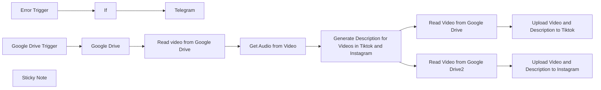

## Fluxo (.json) :

```json
{
  "id": "cZPEH5aMMZNy61xs",
  "meta": {
    "instanceId": "3378b0d68c3b7ebfc71b79896d94e1a044dec38e99a1160aed4e9c323910fbe2",
    "templateCredsSetupCompleted": true
  },
  "name": "template in store",
  "tags": [],
  "nodes": [
    {
      "id": "14f93cdb-72cb-419a-b8d7-a68ae9383290",
      "name": "Google Drive Trigger",
      "type": "n8n-nodes-base.googleDriveTrigger",
      "position": [
        440,
        320
      ],
      "parameters": {
        "event": "fileCreated",
        "options": {},
        "pollTimes": {
          "item": [
            {
              "mode": "everyMinute"
            }
          ]
        },
        "triggerOn": "specificFolder",
        "folderToWatch": {
          "__rl": true,
          "mode": "list",
          "value": "18m0i341QLQuyWuHv_FBdz8-r-QDtofYm",
          "cachedResultUrl": "https://drive.google.com/drive/folders/18m0i341QLQuyWuHv_FBdz8-r-QDtofYm",
          "cachedResultName": "Influencersde"
        }
      },
      "credentials": {
        "googleDriveOAuth2Api": {
          "id": "2TbhWtnbRfSloGxX",
          "name": "Google Drive account"
        }
      },
      "typeVersion": 1
    },
    {
      "id": "d4ab0d11-b110-46fa-9cd2-6091737c302e",
      "name": "Google Drive",
      "type": "n8n-nodes-base.googleDrive",
      "position": [
        620,
        320
      ],
      "parameters": {
        "fileId": {
          "__rl": true,
          "mode": "",
          "value": "={{ $json.id || $json.data[0].id }}"
        },
        "options": {},
        "operation": "download",
        "authentication": "oAuth2"
      },
      "credentials": {
        "googleDriveOAuth2Api": {
          "id": "2TbhWtnbRfSloGxX",
          "name": "Google Drive account"
        }
      },
      "retryOnFail": true,
      "typeVersion": 1,
      "waitBetweenTries": 5000
    },
    {
      "id": "fde9df88-3f9e-4732-bb1c-72eb33ce6826",
      "name": "Error Trigger",
      "type": "n8n-nodes-base.errorTrigger",
      "position": [
        840,
        660
      ],
      "parameters": {},
      "typeVersion": 1
    },
    {
      "id": "ecfe1ad1-6887-492b-a2f7-f9b6c43f9b91",
      "name": "Telegram",
      "type": "n8n-nodes-base.telegram",
      "position": [
        1180,
        640
      ],
      "webhookId": "f6729386-9905-45f1-800f-4fe01a06ac9c",
      "parameters": {
        "text": "=🔔 ERROR SUBIENDO VIDEOS",
        "chatId": "-4127128831",
        "additionalFields": {
          "appendAttribution": false
        }
      },
      "credentials": {
        "telegramApi": {
          "id": "vzA62UXRgiFICuPP",
          "name": "Telegram account"
        }
      },
      "retryOnFail": true,
      "typeVersion": 1.2,
      "waitBetweenTries": 5000
    },
    {
      "id": "6ed274c7-726f-40aa-92b0-70768dc053a5",
      "name": "If",
      "type": "n8n-nodes-base.if",
      "position": [
        980,
        660
      ],
      "parameters": {
        "options": {},
        "conditions": {
          "options": {
            "version": 1,
            "leftValue": "",
            "caseSensitive": true,
            "typeValidation": "strict"
          },
          "combinator": "and",
          "conditions": [
            {
              "id": "9fadb3fd-2547-42bd-8f40-f410a97dcf57",
              "operator": {
                "type": "string",
                "operation": "notContains"
              },
              "leftValue": "={{ $json.trigger.error.message }}",
              "rightValue": "The DNS server returned an error, perhaps the server is offline"
            }
          ]
        }
      },
      "typeVersion": 2.1
    },
    {
      "id": "dd4b2dfa-ccba-45d8-b388-755888343b4c",
      "name": "Sticky Note",
      "type": "n8n-nodes-base.stickyNote",
      "position": [
        0,
        0
      ],
      "parameters": {
        "width": 860,
        "height": 260,
        "content": "## Description\nThis automation allows you to upload a video to a configured Google Drive folder, and it will automatically create descriptions and upload it to Instagram and TikTok.\n\n## How to Use\n1. Generate an API token at upload-post.com and add to Upload to Tiktok and Upload to Instagram nodes\n2. Configure your Google Drive folder\n3. Customize the OpenAI prompt for your specific use case\n4. Optional: Configure Telegram for error notifications\n\n## Requirements\n- upload-post.com account\n- Google Drive account\n- OpenAI API key\n"
      },
      "typeVersion": 1
    },
    {
      "id": "299e3e95-dbcb-4798-b843-a4424ce3f3bf",
      "name": "Get Audio from Video",
      "type": "@n8n/n8n-nodes-langchain.openAi",
      "notes": "Extract the audio from video for generate the description",
      "position": [
        1080,
        320
      ],
      "parameters": {
        "options": {},
        "resource": "audio",
        "operation": "transcribe"
      },
      "credentials": {
        "openAiApi": {
          "id": "XJdxgMSXFgwReSsh",
          "name": "n8n key"
        }
      },
      "notesInFlow": true,
      "retryOnFail": true,
      "typeVersion": 1,
      "waitBetweenTries": 5000
    },
    {
      "id": "da9048ce-542e-44e0-ba67-ab853822c428",
      "name": "Read video from Google Drive",
      "type": "n8n-nodes-base.writeBinaryFile",
      "position": [
        800,
        320
      ],
      "parameters": {
        "options": {},
        "fileName": "={{ $json.originalFilename.replaceAll(\" \", \"_\") }}"
      },
      "typeVersion": 1
    },
    {
      "id": "5977baf1-d4a2-439f-aafe-14745201d3d8",
      "name": "Generate Description for Videos in Tiktok and Instagram",
      "type": "@n8n/n8n-nodes-langchain.openAi",
      "notes": "Request to OpenAi for generate description with the audio extracted from the video",
      "position": [
        1280,
        320
      ],
      "parameters": {
        "modelId": {
          "__rl": true,
          "mode": "list",
          "value": "gpt-4o",
          "cachedResultName": "GPT-4O"
        },
        "options": {},
        "messages": {
          "values": [
            {
              "role": "system",
              "content": "You are an expert assistant in creating engaging social media video titles."
            },
            {
              "content": "=I'm going to upload a video to social media. Here are some examples of descriptions that have worked well on Instagram:\n\nFollow and save for later. Discover InfluencersDe, the AI tool that automates TikTok creation and publishing to drive traffic to your website. Perfect for entrepreneurs and brands.\n#digitalmarketing #ugc #tiktok #ai #influencersde #contentcreation\n\nDiscover the video marketing revolution with InfluencersDe!\n.\n.\n.\n#socialmedia #videomarketing #ai #tiktok #influencersde #growthhacking\n\nDon't miss InfluencersDe, the tool that transforms your marketing strategy with just one click!\n.\n.\n.\n#ugc #ai #tiktok #digitalmarketing #influencersde #branding\n\nCan you create another title for the Instagram post based on this recognized audio from the video?\n\nAudio: {{ $('Get Audio from Video').item.json.text }}\n\nIMPORTANT: Reply only with the description, don't add anything else."
            }
          ]
        }
      },
      "credentials": {
        "openAiApi": {
          "id": "XJdxgMSXFgwReSsh",
          "name": "n8n key"
        }
      },
      "notesInFlow": true,
      "retryOnFail": true,
      "typeVersion": 1.4,
      "waitBetweenTries": 5000
    },
    {
      "id": "a139c8b0-b934-492b-8f85-e42c9c345af4",
      "name": "Read Video from Google Drive",
      "type": "n8n-nodes-base.readBinaryFile",
      "position": [
        1840,
        100
      ],
      "parameters": {
        "filePath": "={{ $('Read video from Google Drive').item.json.originalFilename.replaceAll(\" \", \"_\") }}",
        "dataPropertyName": "datavideo"
      },
      "typeVersion": 1
    },
    {
      "id": "63230edb-8346-4441-929f-1f6403507501",
      "name": "Read Video from Google Drive2",
      "type": "n8n-nodes-base.readBinaryFile",
      "position": [
        1840,
        460
      ],
      "parameters": {
        "filePath": "={{ $('Read video from Google Drive').item.json.originalFilename.replaceAll(\" \", \"_\") }}",
        "dataPropertyName": "datavideo"
      },
      "typeVersion": 1
    },
    {
      "id": "5d6e26ef-1bb4-43d6-a282-151c95856905",
      "name": "Upload Video and Description to Tiktok",
      "type": "n8n-nodes-base.httpRequest",
      "notes": "Generate in upload-post.com the token and add to the credentials in the header-> Authorization: Apikey (token here)",
      "position": [
        2100,
        100
      ],
      "parameters": {
        "url": "https://api.upload-post.com/api/upload",
        "method": "POST",
        "options": {},
        "sendBody": true,
        "contentType": "multipart-form-data",
        "authentication": "genericCredentialType",
        "bodyParameters": {
          "parameters": [
            {
              "name": "title",
              "value": "={{ $('Generate Description for Videos in Tiktok and Instagram').item.json.message.content.replaceAll(\"\\\"\", \"\") }}"
            },
            {
              "name": "platform[]",
              "value": "tiktok"
            },
            {
              "name": "video",
              "parameterType": "formBinaryData",
              "inputDataFieldName": "datavideo"
            },
            {
              "name": "user",
              "value": "Add user generated in upload-post"
            }
          ]
        },
        "genericAuthType": "httpHeaderAuth"
      },
      "credentials": {
        "httpHeaderAuth": {
          "id": "47dO31ED0WIaJkR6",
          "name": "Header Auth account"
        }
      },
      "notesInFlow": true,
      "typeVersion": 4.2
    },
    {
      "id": "ed785663-50e4-43cc-9dc0-a340d0360b38",
      "name": "Upload Video and Description to Instagram",
      "type": "n8n-nodes-base.httpRequest",
      "notes": "Generate in upload-post.com the token and add to the credentials in the header-> Authorization: Apikey (token here)",
      "position": [
        2100,
        460
      ],
      "parameters": {
        "url": "https://api.upload-post.com/api/upload",
        "method": "POST",
        "options": {},
        "sendBody": true,
        "contentType": "multipart-form-data",
        "authentication": "genericCredentialType",
        "bodyParameters": {
          "parameters": [
            {
              "name": "title",
              "value": "={{ $('Generate Description for Videos in Tiktok and Instagram').item.json.message.content.replaceAll(\"\\\"\", \"\") }}"
            },
            {
              "name": "platform[]",
              "value": "instagram"
            },
            {
              "name": "video",
              "parameterType": "formBinaryData",
              "inputDataFieldName": "datavideo"
            },
            {
              "name": "user",
              "value": "Add user generated in upload-post"
            }
          ]
        },
        "genericAuthType": "httpHeaderAuth"
      },
      "credentials": {
        "httpHeaderAuth": {
          "id": "47dO31ED0WIaJkR6",
          "name": "Header Auth account"
        }
      },
      "notesInFlow": true,
      "typeVersion": 4.2
    }
  ],
  "active": false,
  "pinData": {},
  "settings": {
    "executionOrder": "v1"
  },
  "versionId": "fdcd0643-0958-426c-ab1d-16fb061b4e38",
  "connections": {
    "If": {
      "main": [
        [
          {
            "node": "Telegram",
            "type": "main",
            "index": 0
          }
        ]
      ]
    },
    "Google Drive": {
      "main": [
        [
          {
            "node": "Read video from Google Drive",
            "type": "main",
            "index": 0
          }
        ]
      ]
    },
    "Error Trigger": {
      "main": [
        [
          {
            "node": "If",
            "type": "main",
            "index": 0
          }
        ]
      ]
    },
    "Get Audio from Video": {
      "main": [
        [
          {
            "node": "Generate Description for Videos in Tiktok and Instagram",
            "type": "main",
            "index": 0
          }
        ]
      ]
    },
    "Google Drive Trigger": {
      "main": [
        [
          {
            "node": "Google Drive",
            "type": "main",
            "index": 0
          }
        ]
      ]
    },
    "Read Video from Google Drive": {
      "main": [
        [
          {
            "node": "Upload Video and Description to Tiktok",
            "type": "main",
            "index": 0
          }
        ]
      ]
    },
    "Read video from Google Drive": {
      "main": [
        [
          {
            "node": "Get Audio from Video",
            "type": "main",
            "index": 0
          }
        ]
      ]
    },
    "Read Video from Google Drive2": {
      "main": [
        [
          {
            "node": "Upload Video and Description to Instagram",
            "type": "main",
            "index": 0
          }
        ]
      ]
    },
    "Generate Description for Videos in Tiktok and Instagram": {
      "main": [
        [
          {
            "node": "Read Video from Google Drive",
            "type": "main",
            "index": 0
          },
          {
            "node": "Read Video from Google Drive2",
            "type": "main",
            "index": 0
          }
        ]
      ]
    }
  }
}
```

<a id="template-2562"></a>

## Template 2562 - Notificação de erro via Line

- **Nome:** Notificação de erro via Line
- **Descrição:** Ao ocorrer um erro em um fluxo, este fluxo envia uma mensagem pelo Line para notificar um usuário com o nome do fluxo e a URL da execução.
- **Funcionalidade:** • Disparo por erro: Aciona automaticamente quando um erro acontece em outros fluxos, funcionando como fluxo de tratamento de erros.
• Montagem de mensagem: Gera mensagem de texto contendo emoji, nome do fluxo e URL da execução.
• Envio para usuário específico: Envia a mensagem para um UID do Line configurado no corpo da requisição.
• Autenticação via cabeçalho HTTP: Utiliza credenciais de cabeçalho (Channel Access Token) para autenticar a requisição à API do Line.
• Documentação embutida: Notas adesivas no fluxo explicam como configurar o fluxo de erro e substituir o UID.
- **Ferramentas:** • Line Messaging API: Serviço de mensagens que permite enviar notificações push para usuários por meio de requisições HTTPS autenticadas com token no cabeçalho.

## Fluxo visual

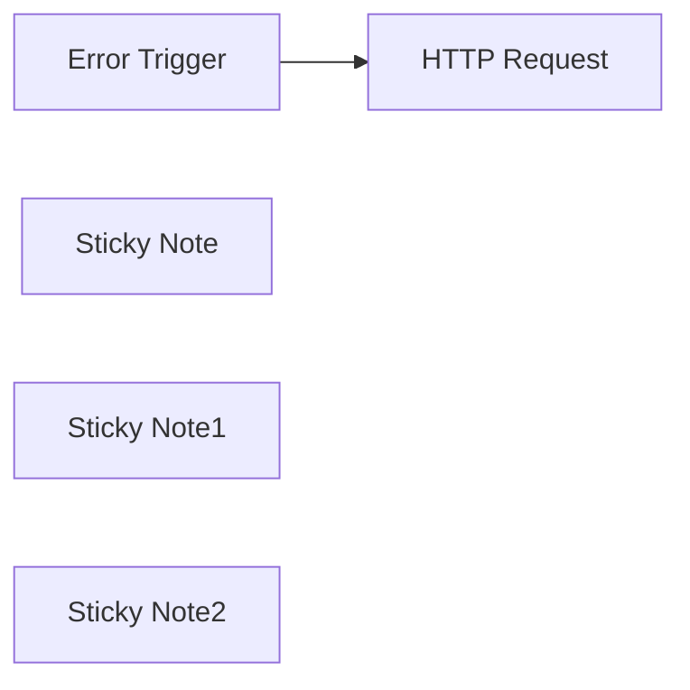

## Fluxo (.json) :

```json
{
  "id": "ePnGZtZ8zLcf1UZZ",
  "meta": {
    "instanceId": "558d88703fb65b2d0e44613bc35916258b0f0bf983c5d4730c00c424b77ca36a",
    "templateCredsSetupCompleted": true
  },
  "name": "n8n Error Report to Line",
  "tags": [
    {
      "id": "0xpEHcJjNRRRMtEj",
      "name": "lin",
      "createdAt": "2025-03-12T05:06:24.112Z",
      "updatedAt": "2025-03-12T05:06:24.112Z"
    },
    {
      "id": "U1ozjO3iXQZWUyfG",
      "name": "_Blueprint",
      "createdAt": "2025-03-12T06:24:40.268Z",
      "updatedAt": "2025-03-12T06:24:40.268Z"
    }
  ],
  "nodes": [
    {
      "id": "c45a01a5-289b-4927-8bba-4bb1029a7129",
      "name": "Error Trigger",
      "type": "n8n-nodes-base.errorTrigger",
      "position": [
        -240,
        -80
      ],
      "parameters": {},
      "typeVersion": 1
    },
    {
      "id": "1e3f7a7e-8be4-4fec-973f-befb477e6957",
      "name": "HTTP Request",
      "type": "n8n-nodes-base.httpRequest",
      "position": [
        40,
        -80
      ],
      "parameters": {
        "url": "https://api.line.me/v2/bot/message/push",
        "method": "POST",
        "options": {},
        "jsonBody": "={\n    \"to\": \"<UID HERE>\",\n    \"messages\":[\n        {\n            \"type\":\"text\",\n            \"text\":\"🚨Your n8n flow is dead.🚨\\n\\nName: {{ $json.workflow.name }} \\nURL: {{ $json.execution.url }}\"\n        }\n    ]\n}",
        "sendBody": true,
        "specifyBody": "json",
        "authentication": "genericCredentialType",
        "genericAuthType": "httpHeaderAuth"
      },
      "credentials": {
        "httpHeaderAuth": {
          "id": "lKd3b2nc8uNJ148Z",
          "name": "Line @271dudsw MiniBear"
        }
      },
      "typeVersion": 4.2
    },
    {
      "id": "5bcf04cc-2c3e-4e37-a134-fcc42326afc3",
      "name": "Sticky Note",
      "type": "n8n-nodes-base.stickyNote",
      "position": [
        -340,
        -400
      ],
      "parameters": {
        "width": 660,
        "content": "## Error Handling\n\nYou can set this workflow as error workflow\n\nhttps://docs.n8n.io/flow-logic/error-handling/#create-and-set-an-error-workflow"
      },
      "typeVersion": 1
    },
    {
      "id": "22b66275-e111-45c8-b7bc-b6c03b55fd02",
      "name": "Sticky Note1",
      "type": "n8n-nodes-base.stickyNote",
      "position": [
        -300,
        -220
      ],
      "parameters": {
        "color": 5,
        "height": 300,
        "content": "## Error Trigger\n\nThis flow will get trigger when the error occur. You can set only one error flow for all your flows.\n"
      },
      "typeVersion": 1
    },
    {
      "id": "5a2c1b3b-2546-47e6-bb9f-b9b8d7c63d65",
      "name": "Sticky Note2",
      "type": "n8n-nodes-base.stickyNote",
      "position": [
        -40,
        -220
      ],
      "parameters": {
        "color": 4,
        "width": 320,
        "height": 300,
        "content": "## Send Line Message\n\nTo send message to notify you via Line Account -- Please replace <UID HERE> with your own UID\n"
      },
      "typeVersion": 1
    }
  ],
  "active": false,
  "pinData": {},
  "settings": {
    "executionOrder": "v1"
  },
  "versionId": "4a774ee1-96b8-4a81-858d-6c5b0d24ba03",
  "connections": {
    "Error Trigger": {
      "main": [
        [
          {
            "node": "HTTP Request",
            "type": "main",
            "index": 0
          }
        ]
      ]
    }
  }
}
```

<a id="template-2563"></a>

## Template 2563 - Notificações por email em caso de erro

- **Nome:** Notificações por email em caso de erro
- **Descrição:** Este fluxo envia notificações por email quando ocorre um erro em outro fluxo, cobrindo tanto erros de execução quanto falhas no trigger, incluindo detalhes e dados legíveis e máquina-legíveis do erro.
- **Funcionalidade:** • Notificação de erros de workflow: Envia um email sempre que um fluxo principal apresentar erro de execução ou falha no trigger.
• Detecção do tipo de erro: Identifica se o erro é de execução ou de trigger e adapta o conteúdo enviado.
• Montagem de conteúdo HTML: Gera blocos HTML separados com detalhes do erro (mensagem, stack trace, id e link da execução ou contexto do trigger).
• Inclusão de metadados e links: Adiciona links para o workflow com erro e para o fluxo de tratamento de erro, além de metadados relevantes da execução.
• Assunto descritivo do email: Constrói o assunto com id e nome do workflow, origem do erro (execução ou trigger) e a mensagem de erro.
• Configuração centralizada: Permite definir URL base da aplicação, email destinatário e nome do remetente para personalização das notificações.
• Suporte a credenciais de envio: Utiliza credenciais de conta para autenticar o envio de emails.
• JSON máquina-legível: Anexa um JSON completo com dados enriquecidos do erro para facilitação de análise automática.
- **Ferramentas:** • Gmail: Serviço de email utilizado para enviar as notificações a partir da conta configurada (autenticação via credenciais).

## Fluxo visual

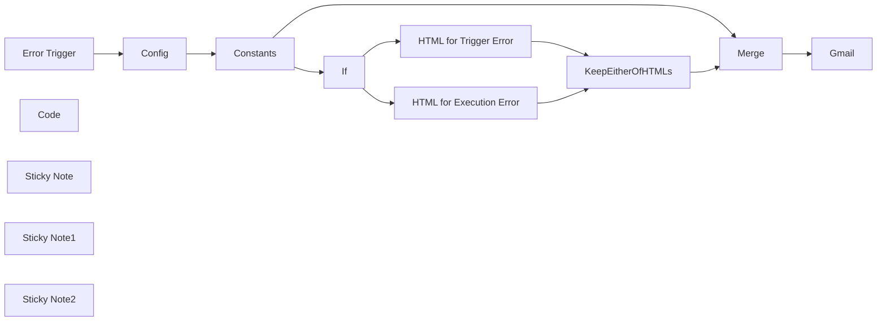

## Fluxo (.json) :

```json
{
  "id": "vnhhf9aNsw0kzdBV",
  "meta": {
    "instanceId": "8fccc85e4982eaaf920505127420cfb3a600b56930a56e499973488bb6dc5e3a",
    "templateCredsSetupCompleted": true
  },
  "name": "CV Evaluation - Error Handling",
  "tags": [
    {
      "id": "GLfSiUrpHvSix03S",
      "name": "Error Handling",
      "createdAt": "2025-03-03T17:54:29.858Z",
      "updatedAt": "2025-03-03T17:54:29.858Z"
    }
  ],
  "nodes": [
    {
      "id": "e2fd6e88-ae06-48ea-a73f-8e523b747a33",
      "name": "Error Trigger",
      "type": "n8n-nodes-base.errorTrigger",
      "position": [
        -40,
        180
      ],
      "parameters": {},
      "typeVersion": 1
    },
    {
      "id": "6b75ee9b-4540-4199-a393-c3e2583fd6bb",
      "name": "Gmail",
      "type": "n8n-nodes-base.gmail",
      "position": [
        1360,
        160
      ],
      "webhookId": "d9c9328c-5be7-4ebe-a20a-c025e52cdf46",
      "parameters": {
        "sendTo": "={{ $json.config.emailing.sendTo }}",
        "message": "=<p>Workflow <a href=\"{{ $json.workflow.url }}\">{{ $json.workflow.id }}</a> ({{ $json.workflow.name }})<br/>\nhas triggered the error handling workflow <a href=\"{{ $json.errorHandlingWorkflow.url }}\">{{ $json.errorHandlingWorkflow.id }}</a> ({{ $json.errorHandlingWorkflow.name }})<br/>\nwith the error details below.</p>\n{{ $json.html }}\n<h2>Error handling JSON (complete error handling data)</h2>\n<pre>\n{{ JSON.stringify({\n  execution: $json.execution,\n  trigger: $json.trigger,\n  workflow: $json.workflow,\n  errorHandlingWorkflow: $json.errorHandlingWorkflow,\n}, null, 2) }}\n</pre>",
        "options": {
          "senderName": "={{ $json.config.emailing.senderName }}"
        },
        "subject": "=Workflow {{ $json.workflow.id }} ({{ $json.workflow.name }}) {{ $json.workflow.isExecutionError ? \"execution error\" : \"trigger failure\" }}: {{ $json.execution.error.message || $json.trigger.error.message }}"
      },
      "credentials": {
        "gmailOAuth2": {
          "id": "DsQxovsVtYdErSwk",
          "name": "Gmail m42g@g"
        }
      },
      "typeVersion": 2.1
    },
    {
      "id": "2a3fd36f-a04b-4b43-bc5a-ac9d18adea82",
      "name": "Merge",
      "type": "n8n-nodes-base.merge",
      "position": [
        1160,
        160
      ],
      "parameters": {
        "mode": "combine",
        "options": {},
        "combineBy": "combineByPosition"
      },
      "typeVersion": 3
    },
    {
      "id": "b93cf843-42a2-4f64-873a-afdef2451934",
      "name": "Config",
      "type": "n8n-nodes-base.set",
      "position": [
        120,
        180
      ],
      "parameters": {
        "options": {
          "dotNotation": true
        },
        "assignments": {
          "assignments": [
            {
              "id": "53ac5417-db98-41e5-bc6d-acb6dd1fec42",
              "name": "config.appUrl",
              "type": "string",
              "value": "https://YourAccountName.app.n8n.cloud/"
            },
            {
              "id": "0f85c65a-80bb-4977-90b9-1b4e741b5f70",
              "name": "config.emailing.sendTo",
              "type": "string",
              "value": "recipient@gmail.com"
            },
            {
              "id": "138c091f-7cd4-453a-9c75-5d193b617a39",
              "name": "config.emailing.senderName",
              "type": "string",
              "value": "Marvin the Yeoman Warder"
            }
          ]
        },
        "includeOtherFields": true
      },
      "typeVersion": 3.4
    },
    {
      "id": "5da22c60-fa54-4ddf-add8-f2b26610ef92",
      "name": "Constants",
      "type": "n8n-nodes-base.set",
      "position": [
        280,
        180
      ],
      "parameters": {
        "options": {
          "dotNotation": true
        },
        "assignments": {
          "assignments": [
            {
              "id": "d69f8081-b58c-4283-a424-a2804c51258a",
              "name": "workflow.url",
              "type": "string",
              "value": "={{ $json.config.appUrl + \"workflow/\" + $json.workflow.id }}"
            },
            {
              "id": "735040f7-8f6e-4bda-a1be-e7784132ead8",
              "name": "workflow.isExecutionError",
              "type": "boolean",
              "value": "={{ Boolean($json.execution) }}"
            },
            {
              "id": "9206cdcc-4387-47e9-902e-f7d6b1f6893f",
              "name": "errorHandlingWorkflow.id",
              "type": "string",
              "value": "={{ $workflow.id }}"
            },
            {
              "id": "21de1fda-f4e4-4aef-afee-e3d7e6635f42",
              "name": "errorHandlingWorkflow.name",
              "type": "string",
              "value": "={{ $workflow.name }}"
            },
            {
              "id": "651ff8f3-be7b-4990-8248-38383f6d5f6a",
              "name": "errorHandlingWorkflow.url",
              "type": "string",
              "value": "={{ $json.config.appUrl + \"workflow/\" + $workflow.id }}"
            }
          ]
        },
        "includeOtherFields": true
      },
      "typeVersion": 3.4
    },
    {
      "id": "a3e45087-e799-4b1b-b420-8d106bdd6daf",
      "name": "If",
      "type": "n8n-nodes-base.if",
      "position": [
        460,
        40
      ],
      "parameters": {
        "options": {},
        "conditions": {
          "options": {
            "version": 2,
            "leftValue": "",
            "caseSensitive": true,
            "typeValidation": "strict"
          },
          "combinator": "and",
          "conditions": [
            {
              "id": "a757d78d-799b-401b-8c01-3103fddfe757",
              "operator": {
                "type": "boolean",
                "operation": "true",
                "singleValue": true
              },
              "leftValue": "={{ $json.workflow.isExecutionError }}",
              "rightValue": "={{ true }}"
            }
          ]
        }
      },
      "typeVersion": 2.2
    },
    {
      "id": "249a330d-1e9f-412c-a067-c96fbbcd1e6f",
      "name": "HTML for Execution Error",
      "type": "n8n-nodes-base.html",
      "position": [
        660,
        -140
      ],
      "parameters": {
        "html": "<h2>Execution details</h2>\n<p>See execution details at <a href=\"{{ $json.execution.url }}\">{{ $json.execution.url }}</a></p>\n<p>Execution id: {{ $json.execution.id }}</p>\n<p>retryOf: {{ $json.execution.retryOf }}</p>\n<p>lastNodeExecuted: {{ $json.execution.lastNodeExecuted }}</p>\n<p>mode: {{ $json.execution.mode }}</p>\n<p>Message: {{ $json.execution.error.message }}</p>\n<h3>Stack trace</h3>\n<pre>\n{{ $json.execution.error.stack }}\n</pre>"
      },
      "typeVersion": 1.2,
      "alwaysOutputData": true
    },
    {
      "id": "cc9e2e40-7858-4d86-bfda-65b4ad9f6ada",
      "name": "HTML for Trigger Error",
      "type": "n8n-nodes-base.html",
      "position": [
        660,
        40
      ],
      "parameters": {
        "html": "<h2>Trigger failure details</h2>\n<p>A trigger on main workflow has thrown an error.</p>\n<h3>Mode</h3>\n<p>{{ $json.trigger.mode }}</p>\n<h3>Error</h3>\n<p>Message: {{ $json.trigger.error.message }}</p>\n<p>DateTime: {{ DateTime.fromMillis($json.trigger.error.timestamp) }}</p>\n<p>Name: {{ $json.trigger.error.name }}</p>\n<p>Description: {{ $json.trigger.error.description }}</p>\n<p>Context:<br/>\n<pre>{{ JSON.stringify($json.trigger.error.context, null, 2) }}</pre></p>\n\n<h3>Cause</h3>\n<p>Message: {{ $json.trigger.error.cause.message }}</p>\n<p>Name: {{ $json.trigger.error.cause.name }}</p>\n<p>Code:{{ $json.trigger.error.cause.code }} </p>\n<p>Status: {{ $json.trigger.error.cause.status }}</p>\n<h3>Stack trace</h3>\n<pre>\n{{ $json.trigger.error.cause.stack }}\n</pre>"
      },
      "typeVersion": 1.2,
      "alwaysOutputData": true
    },
    {
      "id": "865dc047-69fc-4409-888b-701468746945",
      "name": "KeepEitherOfHTMLs",
      "type": "n8n-nodes-base.merge",
      "position": [
        900,
        -40
      ],
      "parameters": {
        "mode": "combine",
        "options": {
          "includeUnpaired": true
        },
        "combineBy": "combineByPosition"
      },
      "typeVersion": 3
    },
    {
      "id": "4d975de4-b458-43ac-9bfd-d6ab8205dc9a",
      "name": "Code",
      "type": "n8n-nodes-base.code",
      "position": [
        100,
        480
      ],
      "parameters": {},
      "typeVersion": 2
    },
    {
      "id": "e85a2fd7-eaff-4390-93ed-27c038aab890",
      "name": "Sticky Note",
      "type": "n8n-nodes-base.stickyNote",
      "position": [
        60,
        -40
      ],
      "parameters": {
        "color": 5,
        "width": 220,
        "height": 380,
        "content": "## Config\n\nDefine\n- your n8n app base url\n- notifications recipient email \n- sender name"
      },
      "typeVersion": 1
    },
    {
      "id": "efedfd1a-8e4f-44cb-aa0b-e10608f2328d",
      "name": "Sticky Note1",
      "type": "n8n-nodes-base.stickyNote",
      "position": [
        60,
        -1000
      ],
      "parameters": {
        "color": 4,
        "width": 1060,
        "height": 820,
        "content": "## Send email via Gmail on workflow error (execution and trigger-level errors)\n\nThis error handling workflow sends an email via Gmail on workflow errors with details.\n\nIt extends https://n8n.io/workflows/696-send-email-via-gmail-on-workflow-error/ by adding functionality covering also trigger-level errors.\n\n\n---\n\n### Features\n- Get notifications on both main workflow trigger and execution time errors.\n- Subject line will have the failed workflow id, name, error source (execution or trigger), error message.\n- Body will contain links to both failed and error handling workflows as well as execution or trigger error details.\n- Body will also contain a machine readable and enriched JSON from **`Error Trigger`** describing the error.\n\nUse this **error handling workflow** for as many workflows as you wish.\n\n\n---\n\n### Configiration\n- Copy this workflow to your workspace and, optionally, move it under the project that contains your main workflow\n- In this **error handling workflow** settings, set **This workflow can be called by** as appropriate\n- In **`Config`** node, define your app url, notifications recipient email, and sender name (useful to build filters in your inbox)\n- In **`Gmail`** node, create and select **credentials**\n- In your **main workflow** settings, pick this error handling workflow in the **Error Workflow** field ([How to...](https://docs.n8n.io/flow-logic/error-handling/#create-and-set-an-error-workflow))\n\n\n---\n\n### Related resources\n- [n8n Error Trigger](https://docs.n8n.io/integrations/builtin/core-nodes/n8n-nodes-base.errortrigger/) documentation.\n\n\n---\n\n### Author\n- Reach out [Olek](https://community.n8n.io/u/olek/summary) on community.n8n.io\n- [Olek](https://n8n.io/creators/olek/) on n8n creators hub"
      },
      "typeVersion": 1
    },
    {
      "id": "98d42327-3d06-4fc0-a31c-64114ae5cfc2",
      "name": "Sticky Note2",
      "type": "n8n-nodes-base.stickyNote",
      "position": [
        1300,
        -40
      ],
      "parameters": {
        "height": 380,
        "content": "## Gmail credentials\nSetup your Gmail account credentials here."
      },
      "typeVersion": 1
    }
  ],
  "active": false,
  "pinData": {},
  "settings": {
    "executionOrder": "v1"
  },
  "versionId": "aef68c1b-3efa-4f48-97ba-23c686cb7683",
  "connections": {
    "If": {
      "main": [
        [
          {
            "node": "HTML for Execution Error",
            "type": "main",
            "index": 0
          }
        ],
        [
          {
            "node": "HTML for Trigger Error",
            "type": "main",
            "index": 0
          }
        ]
      ]
    },
    "Merge": {
      "main": [
        [
          {
            "node": "Gmail",
            "type": "main",
            "index": 0
          }
        ]
      ]
    },
    "Config": {
      "main": [
        [
          {
            "node": "Constants",
            "type": "main",
            "index": 0
          }
        ]
      ]
    },
    "Constants": {
      "main": [
        [
          {
            "node": "Merge",
            "type": "main",
            "index": 1
          },
          {
            "node": "If",
            "type": "main",
            "index": 0
          }
        ]
      ]
    },
    "Error Trigger": {
      "main": [
        [
          {
            "node": "Config",
            "type": "main",
            "index": 0
          }
        ]
      ]
    },
    "KeepEitherOfHTMLs": {
      "main": [
        [
          {
            "node": "Merge",
            "type": "main",
            "index": 0
          }
        ]
      ]
    },
    "HTML for Trigger Error": {
      "main": [
        [
          {
            "node": "KeepEitherOfHTMLs",
            "type": "main",
            "index": 1
          }
        ]
      ]
    },
    "HTML for Execution Error": {
      "main": [
        [
          {
            "node": "KeepEitherOfHTMLs",
            "type": "main",
            "index": 0
          }
        ]
      ]
    }
  }
}
```

<a id="template-2564"></a>

## Template 2564 - Mesclar PDFs da web

- **Nome:** Mesclar PDFs da web
- **Descrição:** Este fluxo baixa dois PDFs da web, combina-os em um único arquivo e grava o resultado no disco.
- **Funcionalidade:** • Acionamento manual: Inicia o fluxo ao acionar o teste manualmente.
• Download de PDFs: Faz requisições HTTP para baixar dois arquivos PDF a partir de URLs públicas.
• Agrupamento de entradas: Reúne as respostas dos downloads para processá-las em conjunto.
• Mesclagem de PDFs: Une os PDFs baixados em um único documento usando uma biblioteca/serviço de mesclagem.
• Gravação em disco: Salva o PDF resultante como "test.pdf" no sistema de arquivos.
• Leitura posterior do arquivo: Abre ou seleciona o arquivo salvo para uso subsequente.
- **Ferramentas:** • Intewa (arquivo hospedado): Fonte do primeiro PDF utilizada no fluxo (URL pública que contém um PDF).
• W3.org (dummy PDF): Fonte do segundo PDF de teste utilizada no fluxo (URL pública com PDF de exemplo).
• Biblioteca/API de mesclagem de PDFs (CustomJS): Serviço ou biblioteca responsável por combinar múltiplos PDFs em um só.
• Sistema de arquivos local: Armazena e disponibiliza o arquivo final "test.pdf" para leitura posterior.

## Fluxo visual

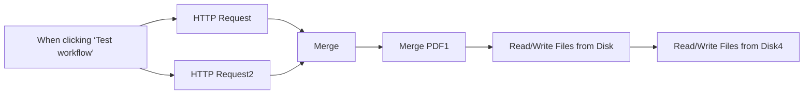

## Fluxo (.json) :

```json
{
  "id": "MVPlLz3CiQok6rXy",
  "meta": {
    "instanceId": "7599ed929ea25767a019b87ecbc83b90e16a268cb51892887b450656ac4518a2",
    "templateCredsSetupCompleted": true
  },
  "name": "Merge PDFs",
  "tags": [],
  "nodes": [
    {
      "id": "282b146b-ee58-4089-9ee6-94b153024bfa",
      "name": "When clicking ‘Test workflow’",
      "type": "n8n-nodes-base.manualTrigger",
      "position": [
        740,
        -40
      ],
      "parameters": {},
      "typeVersion": 1
    },
    {
      "id": "39a37abd-924f-474c-8dde-7536170797f2",
      "name": "HTTP Request",
      "type": "n8n-nodes-base.httpRequest",
      "position": [
        960,
        -140
      ],
      "parameters": {
        "url": "=https://www.intewa.com/fileadmin/documents/pdf-file.pdf",
        "options": {}
      },
      "typeVersion": 4.2
    },
    {
      "id": "b2359766-896f-4966-873e-b2dc0ee4f684",
      "name": "HTTP Request2",
      "type": "n8n-nodes-base.httpRequest",
      "position": [
        960,
        60
      ],
      "parameters": {
        "url": "=https://www.w3.org/WAI/ER/tests/xhtml/testfiles/resources/pdf/dummy.pdf",
        "options": {}
      },
      "typeVersion": 4.2
    },
    {
      "id": "7f70b25c-a171-4a7c-8067-141ce3275226",
      "name": "Merge",
      "type": "n8n-nodes-base.merge",
      "position": [
        1180,
        -40
      ],
      "parameters": {},
      "typeVersion": 3.1
    },
    {
      "id": "183b90b4-5f22-4ff8-b47f-96b7c4d522d7",
      "name": "Merge PDF1",
      "type": "@custom-js/n8n-nodes-pdf-toolkit.mergePdfs",
      "position": [
        1400,
        -40
      ],
      "parameters": {},
      "credentials": {
        "customJsApi": {
          "id": "h29wo2anYKdANAzm",
          "name": "CustomJS account"
        }
      },
      "typeVersion": 1
    },
    {
      "id": "131474f2-c6ca-4d1f-ba49-1f2f6d91394a",
      "name": "Read/Write Files from Disk",
      "type": "n8n-nodes-base.readWriteFile",
      "position": [
        1620,
        -40
      ],
      "parameters": {
        "options": {},
        "fileName": "test.pdf",
        "operation": "write"
      },
      "typeVersion": 1
    },
    {
      "id": "a86ddc41-60aa-482c-90f2-8eacc6bb0a9b",
      "name": "Read/Write Files from Disk4",
      "type": "n8n-nodes-base.readWriteFile",
      "position": [
        1840,
        -40
      ],
      "parameters": {
        "options": {},
        "fileSelector": "test.pdf"
      },
      "typeVersion": 1
    }
  ],
  "active": false,
  "pinData": {},
  "settings": {
    "executionOrder": "v1"
  },
  "versionId": "02f73022-a678-4660-ab1d-3531e4848cba",
  "connections": {
    "Merge": {
      "main": [
        [
          {
            "node": "Merge PDF1",
            "type": "main",
            "index": 0
          }
        ]
      ]
    },
    "Merge PDF1": {
      "main": [
        [
          {
            "node": "Read/Write Files from Disk",
            "type": "main",
            "index": 0
          }
        ]
      ]
    },
    "HTTP Request": {
      "main": [
        [
          {
            "node": "Merge",
            "type": "main",
            "index": 0
          }
        ]
      ]
    },
    "HTTP Request2": {
      "main": [
        [
          {
            "node": "Merge",
            "type": "main",
            "index": 1
          }
        ]
      ]
    },
    "Read/Write Files from Disk": {
      "main": [
        [
          {
            "node": "Read/Write Files from Disk4",
            "type": "main",
            "index": 0
          }
        ]
      ]
    },
    "When clicking ‘Test workflow’": {
      "main": [
        [
          {
            "node": "HTTP Request",
            "type": "main",
            "index": 0
          },
          {
            "node": "HTTP Request2",
            "type": "main",
            "index": 0
          }
        ]
      ]
    }
  }
}
```

<a id="template-2565"></a>

## Template 2565 - Importador automático de produtos WooCommerce com SEO

- **Nome:** Importador automático de produtos WooCommerce com SEO
- **Descrição:** Automatiza a criação de produtos em uma loja WooCommerce a partir de uma planilha, gera meta title e meta description otimizados por um modelo de linguagem e atualiza a planilha com o status e links.
- **Funcionalidade:** • Importação a partir de planilha: Lê linhas de um Google Sheet com detalhes dos produtos para processar automaticamente.
• Processamento em lotes: Divide a lista em lotes para processar vários produtos de forma controlada.
• Mapeamento de categorias: Converte IDs de categoria informados em formato compatível antes da criação do produto.
• Criação completa de produto: Cria produtos na loja com título, imagens, SKU, preço, estoque, descrições e visibilidade de catálogo.
• Geração de metadados SEO: Usa um modelo de linguagem para produzir metatitle e metadescription otimizados no idioma do produto.
• Aplicação de metadados ao produto: Atualiza campos de SEO do produto (ex.: campos do Yoast) via API para melhorar indexação.
• Atualização da planilha: Grava ID do produto, permalink e marca a linha como concluída na planilha original.
• Notificação: Envia mensagem via Telegram quando a criação de produtos é concluída.
• Parsing estruturado: Valida e extrai metatitle e metadescription em formato estruturado antes de aplicar aos produtos.
- **Ferramentas:** • Google Sheets: Armazena os dados de produtos a importar e recebe o status/IDs após a criação.
• WooCommerce / WordPress: Plataforma de e‑commerce onde os produtos são criados e atualizados via API.
• Serviço de linguagem (OpenRouter / Gemini): Gera títulos e descrições meta otimizados a partir do conteúdo do produto.
• Telegram: Canal usado para envio de notificações sobre a conclusão do processo.
• Yoast SEO Plugin: Plugin WordPress utilizado para armazenar e exibir os metadados SEO (metatitle e metadescription).

## Fluxo visual

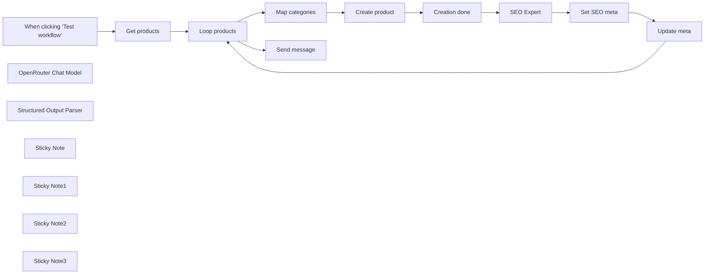

## Fluxo (.json) :

```json
{
  "id": "YkATyvsBXigxnMgo",
  "meta": {
    "instanceId": "a4bfc93e975ca233ac45ed7c9227d84cf5a2329310525917adaf3312e10d5462",
    "templateCredsSetupCompleted": true
  },
  "name": "AI-Driven WooCommerce Product Importer with SEO",
  "tags": [],
  "nodes": [
    {
      "id": "aa2d7a06-6e8d-4abc-ab5f-53e9698b1655",
      "name": "When clicking ‘Test workflow’",
      "type": "n8n-nodes-base.manualTrigger",
      "position": [
        -360,
        -340
      ],
      "parameters": {},
      "typeVersion": 1
    },
    {
      "id": "1f2465ab-90fa-44f1-8c06-58b1436dccd0",
      "name": "OpenRouter Chat Model",
      "type": "@n8n/n8n-nodes-langchain.lmChatOpenRouter",
      "position": [
        180,
        160
      ],
      "parameters": {
        "model": "google/gemini-2.0-flash-exp:free",
        "options": {}
      },
      "credentials": {
        "openRouterApi": {
          "id": "pb06rfB4xmxzVe3Q",
          "name": "OpenRouter"
        }
      },
      "typeVersion": 1
    },
    {
      "id": "29832953-a3e1-481d-a8bb-238bbf3c736c",
      "name": "SEO Expert",
      "type": "@n8n/n8n-nodes-langchain.chainLlm",
      "position": [
        200,
        -60
      ],
      "parameters": {
        "text": "=Create metatitle and metadescription in the language of the following product:\n\n- Title: {{ $('Create product').item.json.name }}\n- Category: {{ JSON.stringify($('Create product').item.json.categories) }}\n- Short Description: {{ $('Create product').item.json.short_description }}\n- Description: {{ $('Create product').item.json.description }}",
        "messages": {
          "messageValues": [
            {
              "message": "=You are a SEO expert specialized in creating optimized meta tags. Your task is to analyze the provided content and generate:\n\n1. A meta title of maximum 60 characters that:\n   - Includes the main keyword in a strategic position\n   - Is engaging and encourages clicks\n   - Accurately reflects the page content\n   - Uses clear and direct language\n   - Avoids keyword stuffing\n\n2. A meta description of maximum 160 characters that:\n   - Provides an engaging summary of the content\n   - Includes an appropriate call-to-action\n   - Contains the main keyword and relevant variations\n   - Is grammatically correct and flows well\n   - Maintains consistency with the meta title\n\nANALYSIS PROCESS:\n1. Carefully read the provided content\n2. Identify:\n   - Main topic\n   - Primary and related keywords\n   - Search intent\n   - Unique selling proposition\n   - Target audience\n\n3. Formulate meta tags that:\n   - Maximize CTR\n   - Respect character limits\n   - Are SEO optimized\n   - Reflect the content\n   - Don't insert placeholder\n\nREQUIRED OUTPUT:\nProvide meta tags in the required format\n\nVALIDATION CRITERIA:\n- Verify that the meta title doesn't exceed 60 characters\n- Verify that the meta description doesn't exceed 160 characters\n- Check that both contain the main keyword\n- Ensure the language is persuasive and action-oriented\n- Confirm that meta tags are consistent with the content\n\nIMPORTANT:\n- Don't use excessive punctuation\n- Avoid using special characters unless necessary\n- Don't duplicate information between title and description\n- Maintain a professional yet accessible tone\n- Ensure content is unique and not duplicated\n\nRemember: the goal is to create meta tags that effectively balance SEO optimization and user appeal, maximizing the potential click-through rate in search results."
            }
          ]
        },
        "promptType": "define",
        "hasOutputParser": true
      },
      "typeVersion": 1.5
    },
    {
      "id": "e61c4d07-e535-404d-a58e-1676e043d1cb",
      "name": "Get products",
      "type": "n8n-nodes-base.googleSheets",
      "position": [
        -120,
        -340
      ],
      "parameters": {
        "options": {
          "returnFirstMatch": false
        },
        "filtersUI": {
          "values": [
            {
              "lookupColumn": "DONE"
            }
          ]
        },
        "sheetName": {
          "__rl": true,
          "mode": "list",
          "value": "gid=0",
          "cachedResultUrl": "https://docs.google.com/spreadsheets/d/1vNkSgWHsgYDCusD-xKSrQg64hd7WvOjQmqdB2NdVFG4/edit#gid=0",
          "cachedResultName": "Foglio1"
        },
        "documentId": {
          "__rl": true,
          "mode": "list",
          "value": "1vNkSgWHsgYDCusD-xKSrQg64hd7WvOjQmqdB2NdVFG4",
          "cachedResultUrl": "https://docs.google.com/spreadsheets/d/1vNkSgWHsgYDCusD-xKSrQg64hd7WvOjQmqdB2NdVFG4/edit?usp=drivesdk",
          "cachedResultName": "Create WooCommerce products"
        }
      },
      "credentials": {
        "googleSheetsOAuth2Api": {
          "id": "JYR6a64Qecd6t8Hb",
          "name": "Google Sheets account"
        }
      },
      "typeVersion": 4.5
    },
    {
      "id": "a3ca44a3-a270-4339-aae0-5e7963a9d695",
      "name": "Map categories",
      "type": "n8n-nodes-base.code",
      "position": [
        400,
        -320
      ],
      "parameters": {
        "jsCode": "for (const item of $input.all()) {\n  if (item.json.CATEGORY && typeof item.json.CATEGORY === 'string') {\n    item.json.CATEGORY = item.json.CATEGORY\n      .split(',')\n      .map(id => parseInt(id))\n      .filter(id => !isNaN(id));\n  }\n}\n\nreturn $input.all();\n"
      },
      "typeVersion": 2
    },
    {
      "id": "fe36f50a-1197-4f8a-a02f-70687e5049c8",
      "name": "Create product",
      "type": "n8n-nodes-base.wooCommerce",
      "position": [
        680,
        -320
      ],
      "parameters": {
        "name": "={{ $json.TITLE }}",
        "imagesUi": {
          "imagesValues": [
            {
              "alt": "={{ $json.TITLE }}",
              "src": "={{ $json.IMAGE }}",
              "name": "={{ $json.TITLE }}"
            }
          ]
        },
        "resource": "product",
        "operation": "create",
        "metadataUi": {},
        "dimensionsUi": {},
        "additionalFields": {
          "sku": "={{ $json.SKU }}",
          "type": "simple",
          "salePrice": "={{ $json[\"SALE PRICE\"] }}",
          "taxStatus": "taxable",
          "categories": "={{ $json.CATEGORY }}",
          "description": "={{ $json.DESCRIPTION }}",
          "manageStock": true,
          "stockStatus": "instock",
          "regularPrice": "={{ $json[\"REGULAR PRICE\"] }}",
          "stockQuantity": "={{ $json[\"STOCK QTY\"] }}",
          "shortDescription": "={{ $json[\"SHORT DESCRIPTION\"] }}",
          "catalogVisibility": "visible"
        }
      },
      "credentials": {
        "wooCommerceApi": {
          "id": "vYYrjB5kgHQ0XByZ",
          "name": "WooCommerce (wp.test.7hype.com)"
        }
      },
      "typeVersion": 1
    },
    {
      "id": "5f70ca85-45c0-483e-ae01-364d5fedb9f8",
      "name": "Creation done",
      "type": "n8n-nodes-base.googleSheets",
      "position": [
        940,
        -320
      ],
      "parameters": {
        "columns": {
          "value": {
            "ID": "={{ $json.id }}",
            "DONE": "x",
            "PERMALINK": "={{ $json.permalink }}",
            "row_number": "={{ $('Map categories').item.json.row_number }}"
          },
          "schema": [
            {
              "id": "TITLE",
              "type": "string",
              "display": true,
              "required": false,
              "displayName": "TITLE",
              "defaultMatch": false,
              "canBeUsedToMatch": true
            },
            {
              "id": "CATEGORY",
              "type": "string",
              "display": true,
              "required": false,
              "displayName": "CATEGORY",
              "defaultMatch": false,
              "canBeUsedToMatch": true
            },
            {
              "id": "IMAGE",
              "type": "string",
              "display": true,
              "required": false,
              "displayName": "IMAGE",
              "defaultMatch": false,
              "canBeUsedToMatch": true
            },
            {
              "id": "SKU",
              "type": "string",
              "display": true,
              "removed": false,
              "required": false,
              "displayName": "SKU",
              "defaultMatch": false,
              "canBeUsedToMatch": true
            },
            {
              "id": "REGULAR PRICE",
              "type": "string",
              "display": true,
              "removed": false,
              "required": false,
              "displayName": "REGULAR PRICE",
              "defaultMatch": false,
              "canBeUsedToMatch": true
            },
            {
              "id": "SALE PRICE",
              "type": "string",
              "display": true,
              "removed": false,
              "required": false,
              "displayName": "SALE PRICE",
              "defaultMatch": false,
              "canBeUsedToMatch": true
            },
            {
              "id": "SHORT DESCRIPTION",
              "type": "string",
              "display": true,
              "removed": false,
              "required": false,
              "displayName": "SHORT DESCRIPTION",
              "defaultMatch": false,
              "canBeUsedToMatch": true
            },
            {
              "id": "DESCRIPTION",
              "type": "string",
              "display": true,
              "removed": false,
              "required": false,
              "displayName": "DESCRIPTION",
              "defaultMatch": false,
              "canBeUsedToMatch": true
            },
            {
              "id": "STOCK QTY",
              "type": "string",
              "display": true,
              "removed": false,
              "required": false,
              "displayName": "STOCK QTY",
              "defaultMatch": false,
              "canBeUsedToMatch": true
            },
            {
              "id": "DONE",
              "type": "string",
              "display": true,
              "required": false,
              "displayName": "DONE",
              "defaultMatch": false,
              "canBeUsedToMatch": true
            },
            {
              "id": "ID",
              "type": "string",
              "display": true,
              "removed": false,
              "required": false,
              "displayName": "ID",
              "defaultMatch": false,
              "canBeUsedToMatch": true
            },
            {
              "id": "PERMALINK",
              "type": "string",
              "display": true,
              "removed": false,
              "required": false,
              "displayName": "PERMALINK",
              "defaultMatch": false,
              "canBeUsedToMatch": true
            },
            {
              "id": "row_number",
              "type": "string",
              "display": true,
              "removed": false,
              "readOnly": true,
              "required": false,
              "displayName": "row_number",
              "defaultMatch": false,
              "canBeUsedToMatch": true
            }
          ],
          "mappingMode": "defineBelow",
          "matchingColumns": [
            "row_number"
          ],
          "attemptToConvertTypes": false,
          "convertFieldsToString": false
        },
        "options": {},
        "operation": "update",
        "sheetName": {
          "__rl": true,
          "mode": "list",
          "value": "gid=0",
          "cachedResultUrl": "https://docs.google.com/spreadsheets/d/10k_dyLEnoFqDcKMHDrr1LwRSnQGgOrXGZCZQmf76fRU/edit#gid=0",
          "cachedResultName": "Foglio1"
        },
        "documentId": {
          "__rl": true,
          "mode": "list",
          "value": "1vNkSgWHsgYDCusD-xKSrQg64hd7WvOjQmqdB2NdVFG4",
          "cachedResultUrl": "https://docs.google.com/spreadsheets/d/1vNkSgWHsgYDCusD-xKSrQg64hd7WvOjQmqdB2NdVFG4/edit?usp=drivesdk",
          "cachedResultName": "Create WooCommerce products"
        }
      },
      "credentials": {
        "googleSheetsOAuth2Api": {
          "id": "JYR6a64Qecd6t8Hb",
          "name": "Google Sheets account"
        }
      },
      "typeVersion": 4.5
    },
    {
      "id": "de6904d1-5697-4fee-8492-e47a694e86c9",
      "name": "Update meta",
      "type": "n8n-nodes-base.googleSheets",
      "position": [
        920,
        -60
      ],
      "parameters": {
        "columns": {
          "value": {
            "METATITLE": "={{ $('SEO Expert').item.json.output.metatitle }}",
            "row_number": "={{ $('Map categories').item.json.row_number }}",
            "METADESCRIPTION": "={{ $('SEO Expert').item.json.output.metadescription }}"
          },
          "schema": [
            {
              "id": "TITLE",
              "type": "string",
              "display": true,
              "required": false,
              "displayName": "TITLE",
              "defaultMatch": false,
              "canBeUsedToMatch": true
            },
            {
              "id": "CATEGORY",
              "type": "string",
              "display": true,
              "required": false,
              "displayName": "CATEGORY",
              "defaultMatch": false,
              "canBeUsedToMatch": true
            },
            {
              "id": "IMAGE",
              "type": "string",
              "display": true,
              "required": false,
              "displayName": "IMAGE",
              "defaultMatch": false,
              "canBeUsedToMatch": true
            },
            {
              "id": "SKU",
              "type": "string",
              "display": true,
              "required": false,
              "displayName": "SKU",
              "defaultMatch": false,
              "canBeUsedToMatch": true
            },
            {
              "id": "REGULAR PRICE",
              "type": "string",
              "display": true,
              "required": false,
              "displayName": "REGULAR PRICE",
              "defaultMatch": false,
              "canBeUsedToMatch": true
            },
            {
              "id": "SALE PRICE",
              "type": "string",
              "display": true,
              "required": false,
              "displayName": "SALE PRICE",
              "defaultMatch": false,
              "canBeUsedToMatch": true
            },
            {
              "id": "SHORT DESCRIPTION",
              "type": "string",
              "display": true,
              "required": false,
              "displayName": "SHORT DESCRIPTION",
              "defaultMatch": false,
              "canBeUsedToMatch": true
            },
            {
              "id": "DESCRIPTION",
              "type": "string",
              "display": true,
              "required": false,
              "displayName": "DESCRIPTION",
              "defaultMatch": false,
              "canBeUsedToMatch": true
            },
            {
              "id": "STOCK QTY",
              "type": "string",
              "display": true,
              "required": false,
              "displayName": "STOCK QTY",
              "defaultMatch": false,
              "canBeUsedToMatch": true
            },
            {
              "id": "DONE",
              "type": "string",
              "display": true,
              "required": false,
              "displayName": "DONE",
              "defaultMatch": false,
              "canBeUsedToMatch": true
            },
            {
              "id": "ID",
              "type": "string",
              "display": true,
              "required": false,
              "displayName": "ID",
              "defaultMatch": false,
              "canBeUsedToMatch": true
            },
            {
              "id": "PERMALINK",
              "type": "string",
              "display": true,
              "required": false,
              "displayName": "PERMALINK",
              "defaultMatch": false,
              "canBeUsedToMatch": true
            },
            {
              "id": "METATITLE",
              "type": "string",
              "display": true,
              "removed": false,
              "required": false,
              "displayName": "METATITLE",
              "defaultMatch": false,
              "canBeUsedToMatch": true
            },
            {
              "id": "METADESCRIPTION",
              "type": "string",
              "display": true,
              "removed": false,
              "required": false,
              "displayName": "METADESCRIPTION",
              "defaultMatch": false,
              "canBeUsedToMatch": true
            },
            {
              "id": "row_number",
              "type": "string",
              "display": true,
              "removed": false,
              "readOnly": true,
              "required": false,
              "displayName": "row_number",
              "defaultMatch": false,
              "canBeUsedToMatch": true
            }
          ],
          "mappingMode": "defineBelow",
          "matchingColumns": [
            "row_number"
          ],
          "attemptToConvertTypes": false,
          "convertFieldsToString": false
        },
        "options": {},
        "operation": "update",
        "sheetName": {
          "__rl": true,
          "mode": "list",
          "value": "gid=0",
          "cachedResultUrl": "https://docs.google.com/spreadsheets/d/1vNkSgWHsgYDCusD-xKSrQg64hd7WvOjQmqdB2NdVFG4/edit#gid=0",
          "cachedResultName": "Foglio1"
        },
        "documentId": {
          "__rl": true,
          "mode": "list",
          "value": "1vNkSgWHsgYDCusD-xKSrQg64hd7WvOjQmqdB2NdVFG4",
          "cachedResultUrl": "https://docs.google.com/spreadsheets/d/1vNkSgWHsgYDCusD-xKSrQg64hd7WvOjQmqdB2NdVFG4/edit?usp=drivesdk",
          "cachedResultName": "Create WooCommerce products"
        }
      },
      "credentials": {
        "googleSheetsOAuth2Api": {
          "id": "JYR6a64Qecd6t8Hb",
          "name": "Google Sheets account"
        }
      },
      "typeVersion": 4.5
    },
    {
      "id": "f9f0eb06-3d76-4675-af0a-8ec9b3811b79",
      "name": "Set SEO meta",
      "type": "n8n-nodes-base.wooCommerce",
      "position": [
        600,
        -60
      ],
      "parameters": {
        "imagesUi": {},
        "resource": "product",
        "operation": "update",
        "productId": "={{ $('Create product').item.json.id }}",
        "metadataUi": {
          "metadataValues": [
            {
              "key": "_yoast_wpseo_title",
              "value": "={{ $json.output.metatitle }}"
            },
            {
              "key": "_yoast_wpseo_metadesc",
              "value": "={{ $json.output.metadescription }}"
            }
          ]
        },
        "dimensionsUi": {},
        "updateFields": {}
      },
      "credentials": {
        "wooCommerceApi": {
          "id": "vYYrjB5kgHQ0XByZ",
          "name": "WooCommerce (wp.test.7hype.com)"
        }
      },
      "typeVersion": 1
    },
    {
      "id": "0ae1b508-9990-4f7b-bf64-e612ef5f0396",
      "name": "Loop products",
      "type": "n8n-nodes-base.splitInBatches",
      "position": [
        120,
        -340
      ],
      "parameters": {
        "options": {}
      },
      "typeVersion": 3
    },
    {
      "id": "e713e1cd-b0cc-465d-971a-54a8002e0c39",
      "name": "Send message",
      "type": "n8n-nodes-base.telegram",
      "position": [
        400,
        -500
      ],
      "webhookId": "9647e7ef-d449-40ff-a34d-9853e4404595",
      "parameters": {
        "text": "Product creation completed",
        "chatId": "CHAT_ID",
        "additionalFields": {}
      },
      "credentials": {
        "telegramApi": {
          "id": "rQ5q95W7uKesMDx4",
          "name": "Telegram account Fastewb"
        }
      },
      "typeVersion": 1.2
    },
    {
      "id": "06228035-8e02-4830-bf54-23096e6e1ca7",
      "name": "Structured Output Parser",
      "type": "@n8n/n8n-nodes-langchain.outputParserStructured",
      "position": [
        440,
        160
      ],
      "parameters": {
        "schemaType": "manual",
        "inputSchema": "{\n\t\"type\": \"object\",\n\t\"properties\": {\n\t\t\"metatitle\": {\n\t\t\t\"type\": \"string\"\n\t\t},\n\t\t\"metadescription\": {\n\t\t\t\"type\": \"string\"\n\t\t}\n\t}\n}"
      },
      "typeVersion": 1.2
    },
    {
      "id": "c46b05a5-a565-48fe-a8ad-fad34eab267c",
      "name": "Sticky Note",
      "type": "n8n-nodes-base.stickyNote",
      "position": [
        -460,
        -1060
      ],
      "parameters": {
        "width": 800,
        "height": 480,
        "content": "## STEP 1\n- Install Yoast SEO Plugin on Wordpress\n- Add this code in function.php file\n\n```\nfunction abilita_yoast_meta_api() {\n    $meta_keys = ['_yoast_wpseo_title', '_yoast_wpseo_metadesc'];\n\n    foreach ($meta_keys as $meta_key) {\n        register_post_meta('post', $meta_key, array(\n            'type' => 'string',\n            'description' => \"Meta Yoast $meta_key per i post\",\n            'single' => true,\n            'show_in_rest' => true, \n        ));\n\n        register_post_meta('page', $meta_key, array(\n            'type' => 'string',\n            'description' => \"Meta Yoast $meta_key per le pagine\",\n            'single' => true,\n            'show_in_rest' => true,\n        ));\n    }\n}\nadd_action('init', 'abilita_yoast_meta_api');\n```"
      },
      "typeVersion": 1
    },
    {
      "id": "5cde4743-f5ab-4670-b836-d0d32b54db98",
      "name": "Sticky Note1",
      "type": "n8n-nodes-base.stickyNote",
      "position": [
        380,
        -840
      ],
      "parameters": {
        "width": 800,
        "height": 260,
        "content": "## STEP 3\n- Copy [this sheet](https://docs.google.com/spreadsheets/d/1vNkSgWHsgYDCusD-xKSrQg64hd7WvOjQmqdB2NdVFG4/edit?usp=sharing) and add product details to be inserted in columns A to I\nIMPORTANT: \n- Columns B, E and F in \"text format\"\n- Column I in \"numeric format\"\n- Columns G and H accepts HTML\n- In Column C insert the URL of product image\n"
      },
      "typeVersion": 1
    },
    {
      "id": "cea0f8f9-2a98-465b-925c-48b9d3ea99a2",
      "name": "Sticky Note2",
      "type": "n8n-nodes-base.stickyNote",
      "position": [
        380,
        -1060
      ],
      "parameters": {
        "width": 800,
        "height": 180,
        "content": "## STEP 2\n- Enable WooCommerce API from Wordpress\n- Add CHAT_ID in Telegram trigger"
      },
      "typeVersion": 1
    },
    {
      "id": "e61ca71a-3960-49e2-a331-b8f3df8abcd7",
      "name": "Sticky Note3",
      "type": "n8n-nodes-base.stickyNote",
      "position": [
        -460,
        -1280
      ],
      "parameters": {
        "color": 3,
        "width": 1640,
        "height": 180,
        "content": "# AI-Driven WooCommerce Product Importer\nThis workflow streamlines your WooCommerce product creation process by integrating directly with Google Sheets. Simply input product details into your spreadsheet, and the workflow takes care of the rest—automatically creating new products on your WooCommerce store.\n\nBut it doesn’t stop there. A dedicated SEO expert chain analyzes each product’s content and generates optimized meta titles and meta descriptions, enhancing visibility and ranking potential on search engines."
      },
      "typeVersion": 1
    }
  ],
  "active": false,
  "pinData": {},
  "settings": {
    "executionOrder": "v1"
  },
  "versionId": "b9e5c366-9c92-4c7d-a5aa-ee2957c94f66",
  "connections": {
    "SEO Expert": {
      "main": [
        [
          {
            "node": "Set SEO meta",
            "type": "main",
            "index": 0
          }
        ]
      ]
    },
    "Update meta": {
      "main": [
        [
          {
            "node": "Loop products",
            "type": "main",
            "index": 0
          }
        ]
      ]
    },
    "Get products": {
      "main": [
        [
          {
            "node": "Loop products",
            "type": "main",
            "index": 0
          }
        ]
      ]
    },
    "Set SEO meta": {
      "main": [
        [
          {
            "node": "Update meta",
            "type": "main",
            "index": 0
          }
        ]
      ]
    },
    "Creation done": {
      "main": [
        [
          {
            "node": "SEO Expert",
            "type": "main",
            "index": 0
          }
        ]
      ]
    },
    "Loop products": {
      "main": [
        [
          {
            "node": "Send message",
            "type": "main",
            "index": 0
          }
        ],
        [
          {
            "node": "Map categories",
            "type": "main",
            "index": 0
          }
        ]
      ]
    },
    "Create product": {
      "main": [
        [
          {
            "node": "Creation done",
            "type": "main",
            "index": 0
          }
        ]
      ]
    },
    "Map categories": {
      "main": [
        [
          {
            "node": "Create product",
            "type": "main",
            "index": 0
          }
        ]
      ]
    },
    "OpenRouter Chat Model": {
      "ai_languageModel": [
        [
          {
            "node": "SEO Expert",
            "type": "ai_languageModel",
            "index": 0
          }
        ]
      ]
    },
    "Structured Output Parser": {
      "ai_outputParser": [
        [
          {
            "node": "SEO Expert",
            "type": "ai_outputParser",
            "index": 0
          }
        ]
      ]
    },
    "When clicking ‘Test workflow’": {
      "main": [
        [
          {
            "node": "Get products",
            "type": "main",
            "index": 0
          }
        ]
      ]
    }
  }
}
```

<a id="template-2566"></a>

## Template 2566 - Salvar arquivos do Telegram no Google Drive

- **Nome:** Salvar arquivos do Telegram no Google Drive
- **Descrição:** Automatiza o recebimento de arquivos enviados por um bot do Telegram e os armazena em uma pasta específica do Google Drive.
- **Funcionalidade:** • Receber mensagens do Telegram: Monitora mensagens recebidas por um bot e realiza o download dos anexos automaticamente.
• Detectar se a mensagem contém arquivo: Verifica a existência de um documento na mensagem antes de prosseguir com o upload.
• Enviar arquivos ao Google Drive: Faz upload do arquivo usando o nome original e salva em uma pasta específica do Drive.
• Salvar em pasta definida: Armazena os arquivos na pasta alvo indicada (ID e nome da pasta configurados).
- **Ferramentas:** • Telegram: Serviço de mensagens usado para receber mensagens e arquivos via um bot configurado.
• Google Drive: Serviço de armazenamento em nuvem onde os arquivos são enviados e organizados em uma pasta específica.


## Fluxo visual


## Fluxo (.json) :

```json
{
  "id": "a4GTp998ENMMfuqK",
  "meta": {
    "instanceId": "24bd2f3b51439b955590389bfa4dd9889fbd30343962de0b7daedce624cf4a71"
  },
  "name": "Save new Files received on Telegram to Google Drive",
  "tags": [],
  "nodes": [
    {
      "id": "0fcb072b-ea4b-43b2-ad7c-46ad62b1e2ad",
      "name": "On new Telegram Message",
      "type": "n8n-nodes-base.telegramTrigger",
      "position": [
        900,
        520
      ],
      "webhookId": "1e92584a-dd10-4fec-86a6-3b2691b85bba",
      "parameters": {
        "updates": [
          "message"
        ],
        "additionalFields": {
          "download": true
        }
      },
      "credentials": {
        "telegramApi": {
          "id": "EO2PA74ehePPYVFU",
          "name": "Telegram Notification Bot"
        }
      },
      "typeVersion": 1
    },
    {
      "id": "08e492f8-b969-4de2-b207-17fcd3cb8787",
      "name": "If Message contains a File",
      "type": "n8n-nodes-base.if",
      "position": [
        1160,
        520
      ],
      "parameters": {
        "options": {},
        "conditions": {
          "options": {
            "leftValue": "",
            "caseSensitive": true,
            "typeValidation": "strict"
          },
          "combinator": "and",
          "conditions": [
            {
              "id": "9b876834-1a86-48f1-9890-df60c739c91c",
              "operator": {
                "type": "object",
                "operation": "exists",
                "singleValue": true
              },
              "leftValue": "={{ $json.message.document }}",
              "rightValue": ""
            }
          ]
        }
      },
      "typeVersion": 2
    },
    {
      "id": "f155a855-0eac-44c0-a52a-93446b9b3455",
      "name": "Upload File to GDrive",
      "type": "n8n-nodes-base.googleDrive",
      "position": [
        1500,
        500
      ],
      "parameters": {
        "name": "={{ $json.message.document.file_name }}",
        "driveId": {
          "__rl": true,
          "mode": "list",
          "value": "My Drive"
        },
        "options": {},
        "folderId": {
          "__rl": true,
          "mode": "list",
          "value": "11gyG2TvG0sqCG202CN-w9rloGW-CzKBc",
          "cachedResultUrl": "https://drive.google.com/drive/folders/11gyG2TvG0sqCG202CN-w9rloGW-CzKBc",
          "cachedResultName": "Demos"
        }
      },
      "credentials": {
        "googleDriveOAuth2Api": {
          "id": "lFPZxFgMIaEnEtm9",
          "name": "Google Drive account (automate everything)"
        }
      },
      "typeVersion": 3
    }
  ],
  "active": true,
  "pinData": {},
  "settings": {
    "executionOrder": "v1"
  },
  "versionId": "f474f0f2-6d57-4bb8-bf1d-15ed35cf8ef2",
  "connections": {
    "On new Telegram Message": {
      "main": [
        [
          {
            "node": "If Message contains a File",
            "type": "main",
            "index": 0
          }
        ]
      ]
    },
    "If Message contains a File": {
      "main": [
        [
          {
            "node": "Upload File to GDrive",
            "type": "main",
            "index": 0
          }
        ]
      ]
    }
  }
}
```

<a id="template-2567"></a>

## Template 2567 - Bot Telegram para consultas de agenda

- **Nome:** Bot Telegram para consultas de agenda
- **Descrição:** Fluxo que recebe mensagens, consulta uma planilha de horários, usa um modelo de linguagem para gerar respostas contextuais e devolve a resposta ao usuário (via Telegram ou interface interna).
- **Funcionalidade:** • Recepção de mensagens: Escuta entradas de chat vindas do Telegram ou de uma interface interna para testes.
• Indicador de digitação: Envia ação de "digitando" ao usuário no início do atendimento.
• Normalização da entrada: Converte a mensagem recebida para um conjunto unificado de variáveis de processamento.
• Recuperação da agenda: Lê uma planilha pública (URL) com os dados de programação.
• Conversão para Markdown: Transforma as linhas da planilha em uma tabela Markdown para fornecer contexto estruturado.
• Consulta ao modelo de linguagem: Envia a mensagem do usuário e a tabela de agenda como contexto para um LLM com instruções do sistema.
• Memória de sessão: Mantém histórico de conversas por sessão para contexto contínuo.
• Montagem da resposta: Recebe a saída do LLM e prepara a mensagem final.
• Roteamento da resposta: Decide se a resposta vai para o chat interno ou volta ao usuário no Telegram e envia a mensagem apropriada.
- **Ferramentas:** • Telegram: Plataforma de mensagens usada para receber perguntas dos usuários e enviar respostas.
• Google Sheets: Armazena a agenda/planilha de horários que serve como fonte de dados para respostas.
• OpenRouter (serviço de LLM): Fornece o modelo de linguagem utilizado para interpretar perguntas e gerar respostas contextuais.

## Fluxo visual

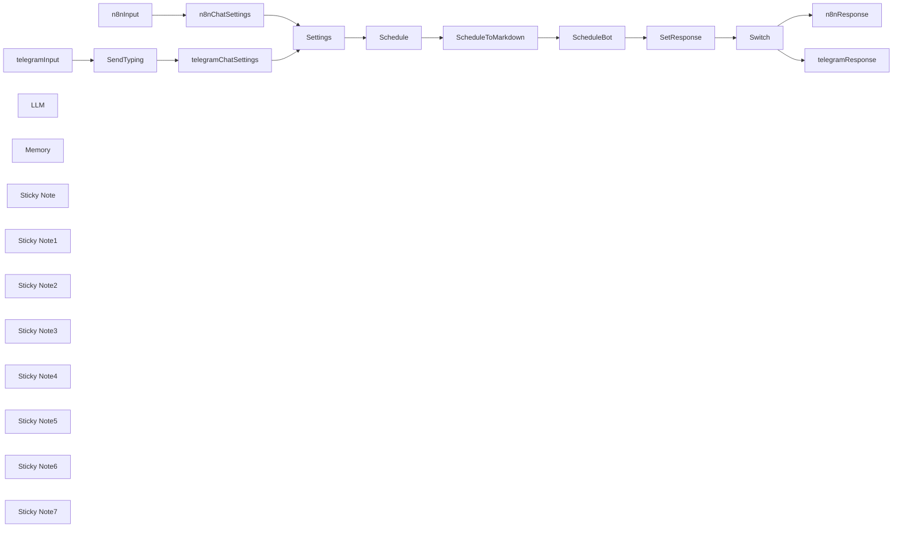

## Fluxo (.json) :

```json
{
  "id": "bV0JTA5NtRZxiD1q",
  "meta": {
    "instanceId": "98bf0d6aef1dd8b7a752798121440fb171bf7686b95727fd617f43452393daa3",
    "templateCredsSetupCompleted": true
  },
  "name": "Telegram-bot AI Da Nang",
  "tags": [],
  "nodes": [
    {
      "id": "ae5f9ca6-6bba-4fe8-b955-6c615d8a522f",
      "name": "SendTyping",
      "type": "n8n-nodes-base.telegram",
      "position": [
        -1780,
        -260
      ],
      "webhookId": "26ea953e-93d9-463e-ad90-95ea8ccb449f",
      "parameters": {
        "chatId": "={{ $('telegramInput').item.json.message.chat.id }}",
        "operation": "sendChatAction"
      },
      "credentials": {
        "telegramApi": {
          "id": "V3EtQBeqEvnOtl9p",
          "name": "Telegram account"
        }
      },
      "typeVersion": 1.2
    },
    {
      "id": "244e7be3-2caa-46f7-8628-d063a3b84c12",
      "name": "SetResponse",
      "type": "n8n-nodes-base.set",
      "notes": "Assemble response etc.",
      "position": [
        40,
        -420
      ],
      "parameters": {
        "options": {},
        "assignments": {
          "assignments": [
            {
              "id": "fba8dc48-1484-4aae-8922-06fcae398f05",
              "name": "responseMessage",
              "type": "string",
              "value": "={{ $json.output }}"
            },
            {
              "id": "df8243e6-6a24-4bad-8807-63d75c828150",
              "name": "",
              "type": "string",
              "value": ""
            }
          ]
        },
        "includeOtherFields": true
      },
      "notesInFlow": true,
      "typeVersion": 3.4
    },
    {
      "id": "192aa194-f131-4ba3-8842-7c88da1a6129",
      "name": "Settings",
      "type": "n8n-nodes-base.set",
      "position": [
        -1260,
        -420
      ],
      "parameters": {
        "options": {},
        "assignments": {
          "assignments": [
            {
              "id": "6714203d-04b3-4a3c-9183-09cddcffdfe8",
              "name": "scheduleURL",
              "type": "string",
              "value": "https://docs.google.com/spreadsheets/d/1BJFS9feEy94_WgIgzWZttBwzjp09siOw1xuUgq4yuI4"
            }
          ]
        },
        "includeOtherFields": true
      },
      "typeVersion": 3.4
    },
    {
      "id": "1c52cdf5-da32-4c76-a294-5ec2109dbf39",
      "name": "Schedule",
      "type": "n8n-nodes-base.googleSheets",
      "position": [
        -980,
        -420
      ],
      "parameters": {
        "options": {},
        "sheetName": {
          "__rl": true,
          "mode": "list",
          "value": "gid=0",
          "cachedResultUrl": "https://docs.google.com/spreadsheets/d/1BJFS9feEy94_WgIgzWZttBwzjp09siOw1xuUgq4yuI4/edit#gid=0",
          "cachedResultName": "Schedule"
        },
        "documentId": {
          "__rl": true,
          "mode": "url",
          "value": "={{ $json.scheduleURL }}"
        }
      },
      "credentials": {
        "googleSheetsOAuth2Api": {
          "id": "XeXufn5uZvHp3lcX",
          "name": "Google Sheets account 2"
        }
      },
      "typeVersion": 4.5
    },
    {
      "id": "eff88417-4ce6-4809-8693-dc63e00fff20",
      "name": "ScheduleToMarkdown",
      "type": "n8n-nodes-base.code",
      "position": [
        -800,
        -420
      ],
      "parameters": {
        "jsCode": "// Get all rows from the input (each item has a \"json\" property)\nconst rows = items.map(item => item.json);\n\n// If no data, return an appropriate message\nif (rows.length === 0) {\n  return [{ json: { markdown: \"No data available.\" } }];\n}\n\n// Use the keys from the first row as the header columns\nconst headers = Object.keys(rows[0]);\n\n// Build the markdown table string\nlet markdown = \"\";\n\n// Create the header row\nmarkdown += `| ${headers.join(\" | \")} |\\n`;\n\n// Create the separator row (using dashes for markdown)\nmarkdown += `| ${headers.map(() => '---').join(\" | \")} |\\n`;\n\n// Add each data row to the table\nrows.forEach(row => {\n  // Ensure we output something for missing values\n  const rowValues = headers.map(header => row[header] !== undefined ? row[header] : '');\n  markdown += `| ${rowValues.join(\" | \")} |\\n`;\n});\n\nconst result = { 'binary': {}, 'json': {} };\n\n// Convert the markdown string to a binary buffer\nconst binaryData = Buffer.from(markdown, 'utf8');\n/*\n// Attach the binary data to the first item under a binary property named 'data'\nresult.binary = {\n  data: {\n    data: binaryData,\n    mimeType: 'text/markdown',\n  }\n};\n*/\n// Optionally, also return the markdown string in the json property if needed\nresult.json.markdown = markdown;\n\nreturn result;"
      },
      "typeVersion": 2
    },
    {
      "id": "04fab70c-493a-4c5d-adfb-0d9e8a5b7382",
      "name": "ScheduleBot",
      "type": "@n8n/n8n-nodes-langchain.agent",
      "position": [
        -480,
        -420
      ],
      "parameters": {
        "text": "={{ $('Settings').first().json.inputMessage }}",
        "options": {
          "systemMessage": "=You are a helpful assistant that helps members of a meetup group with scheduling their meetups and answering questions about them.\n\nThe current version of the schedule in tabular format is the following:\n\n {{ $json.markdown }}\n\n"
        },
        "promptType": "define"
      },
      "typeVersion": 1.7
    },
    {
      "id": "be29d3ec-8211-4f23-82f2-83a1aa3aad5b",
      "name": "n8nChatSettings",
      "type": "n8n-nodes-base.set",
      "position": [
        -1580,
        -520
      ],
      "parameters": {
        "options": {},
        "assignments": {
          "assignments": [
            {
              "id": "1ecb3515-c1a2-4d69-adec-5b4d74e32056",
              "name": "inputMessage",
              "type": "string",
              "value": "={{ $json.chatInput }}"
            },
            {
              "id": "424b9697-94cb-4c38-953c-992436832684",
              "name": "chatId",
              "type": "string",
              "value": "={{ $json.sessionId }}"
            },
            {
              "id": "e23988e2-7c3d-4e38-9d5d-0c4b0c94d127",
              "name": "mode",
              "type": "string",
              "value": "n8n"
            }
          ]
        }
      },
      "typeVersion": 3.4
    },
    {
      "id": "b7078c59-b6e6-4002-831f-96e56278ab61",
      "name": "telegramChatSettings",
      "type": "n8n-nodes-base.set",
      "position": [
        -1580,
        -260
      ],
      "parameters": {
        "options": {},
        "assignments": {
          "assignments": [
            {
              "id": "1ecb3515-c1a2-4d69-adec-5b4d74e32056",
              "name": "inputMessage",
              "type": "string",
              "value": "={{ $('telegramInput').item.json.message.text }}"
            },
            {
              "id": "424b9697-94cb-4c38-953c-992436832684",
              "name": "chatId",
              "type": "string",
              "value": "={{ $('telegramInput').item.json.message.chat.id }}"
            },
            {
              "id": "e23988e2-7c3d-4e38-9d5d-0c4b0c94d127",
              "name": "mode",
              "type": "string",
              "value": "telegram"
            }
          ]
        }
      },
      "typeVersion": 3.4
    },
    {
      "id": "1ba6ad37-f1e5-440d-bf10-569038c27bce",
      "name": "telegramInput",
      "type": "n8n-nodes-base.telegramTrigger",
      "position": [
        -1960,
        -260
      ],
      "webhookId": "f56e8e22-975e-4f9a-a6f9-253ebc63668d",
      "parameters": {
        "updates": [
          "message"
        ],
        "additionalFields": {}
      },
      "credentials": {
        "telegramApi": {
          "id": "V3EtQBeqEvnOtl9p",
          "name": "Telegram account"
        }
      },
      "typeVersion": 1.1
    },
    {
      "id": "56a52e8a-714f-4e7a-8a13-e915e9dc29c4",
      "name": "n8nInput",
      "type": "@n8n/n8n-nodes-langchain.chatTrigger",
      "position": [
        -1960,
        -520
      ],
      "webhookId": "f4ab7d4a-5cdd-425a-bbbb-e3bb94719266",
      "parameters": {
        "options": {}
      },
      "typeVersion": 1.1
    },
    {
      "id": "961f67f0-bd44-4e7f-9f2f-c2f02f3176ce",
      "name": "Switch",
      "type": "n8n-nodes-base.switch",
      "position": [
        220,
        -420
      ],
      "parameters": {
        "rules": {
          "values": [
            {
              "outputKey": "n8n mode",
              "conditions": {
                "options": {
                  "version": 2,
                  "leftValue": "",
                  "caseSensitive": true,
                  "typeValidation": "strict"
                },
                "combinator": "and",
                "conditions": [
                  {
                    "operator": {
                      "type": "string",
                      "operation": "equals"
                    },
                    "leftValue": "={{ $('Settings').first().json.mode }}",
                    "rightValue": "n8n"
                  }
                ]
              },
              "renameOutput": true
            },
            {
              "outputKey": "telegram mode",
              "conditions": {
                "options": {
                  "version": 2,
                  "leftValue": "",
                  "caseSensitive": true,
                  "typeValidation": "strict"
                },
                "combinator": "and",
                "conditions": [
                  {
                    "id": "e7d6a994-48e3-44bb-b662-862d9bf9c53b",
                    "operator": {
                      "name": "filter.operator.equals",
                      "type": "string",
                      "operation": "equals"
                    },
                    "leftValue": "={{ $('Settings').first().json.mode }}",
                    "rightValue": "telegram"
                  }
                ]
              },
              "renameOutput": true
            }
          ]
        },
        "options": {}
      },
      "typeVersion": 3.2
    },
    {
      "id": "57056425-37ba-417d-9a2d-977a81d378ab",
      "name": "telegramResponse",
      "type": "n8n-nodes-base.telegram",
      "position": [
        500,
        -280
      ],
      "webhookId": "ff71ba7e-affa-4952-90a5-6bb7f37a5598",
      "parameters": {
        "text": "={{ $json.responseMessage }}",
        "chatId": "={{ $('Settings').first().json.chatId }}",
        "additionalFields": {}
      },
      "credentials": {
        "telegramApi": {
          "id": "V3EtQBeqEvnOtl9p",
          "name": "Telegram account"
        }
      },
      "typeVersion": 1.2
    },
    {
      "id": "2962a77f-5727-43be-93fb-b0751b63c6ac",
      "name": "n8nResponse",
      "type": "n8n-nodes-base.noOp",
      "position": [
        500,
        -520
      ],
      "parameters": {},
      "typeVersion": 1
    },
    {
      "id": "0932484f-707b-412b-b9cb-431a8ae64447",
      "name": "LLM",
      "type": "@n8n/n8n-nodes-langchain.lmChatOpenRouter",
      "position": [
        -600,
        -220
      ],
      "parameters": {
        "options": {}
      },
      "credentials": {
        "openRouterApi": {
          "id": "bs7tPtvgDTJNGAFJ",
          "name": "OpenRouter account"
        }
      },
      "typeVersion": 1
    },
    {
      "id": "65948d2c-71b2-4df0-97db-ed216ed7c691",
      "name": "Memory",
      "type": "@n8n/n8n-nodes-langchain.memoryBufferWindow",
      "position": [
        -500,
        -220
      ],
      "parameters": {
        "sessionKey": "={{ $('Settings').first().json.chatId }}",
        "sessionIdType": "customKey"
      },
      "typeVersion": 1.3
    },
    {
      "id": "50566274-cf7c-496f-a166-b45eb3114da3",
      "name": "Sticky Note",
      "type": "n8n-nodes-base.stickyNote",
      "position": [
        -2000,
        -600
      ],
      "parameters": {
        "color": 2,
        "width": 620,
        "height": 240,
        "content": "## Chat input triggered inside n8n\nUsed for testing and debugging"
      },
      "typeVersion": 1
    },
    {
      "id": "9dc636fb-cc86-4236-8eb9-952a4ab0ef68",
      "name": "Sticky Note1",
      "type": "n8n-nodes-base.stickyNote",
      "position": [
        -2000,
        -340
      ],
      "parameters": {
        "color": 2,
        "width": 620,
        "height": 240,
        "content": "## Chat input triggered by Telegram\nUsed for live chat within Telegram"
      },
      "typeVersion": 1
    },
    {
      "id": "0429d589-3e80-4b26-96a0-01554899a3e7",
      "name": "Sticky Note2",
      "type": "n8n-nodes-base.stickyNote",
      "position": [
        420,
        -340
      ],
      "parameters": {
        "color": 5,
        "width": 360,
        "height": 240,
        "content": "## Chat response to Telegram"
      },
      "typeVersion": 1
    },
    {
      "id": "9eeccee0-c6a0-40c6-9b7d-1f672bf0fdb9",
      "name": "Sticky Note3",
      "type": "n8n-nodes-base.stickyNote",
      "position": [
        420,
        -600
      ],
      "parameters": {
        "color": 5,
        "width": 360,
        "height": 240,
        "content": "## Chat response inside n8n"
      },
      "typeVersion": 1
    },
    {
      "id": "acb8e550-be94-41b7-904a-641b3b87e928",
      "name": "Sticky Note4",
      "type": "n8n-nodes-base.stickyNote",
      "position": [
        -40,
        -600
      ],
      "parameters": {
        "color": 7,
        "width": 440,
        "height": 500,
        "content": "## Prepare response\nDecide to which chat the response will go."
      },
      "typeVersion": 1
    },
    {
      "id": "42ce6eac-165b-463d-822e-355aff030525",
      "name": "Sticky Note5",
      "type": "n8n-nodes-base.stickyNote",
      "position": [
        -620,
        -600
      ],
      "parameters": {
        "color": 3,
        "width": 560,
        "height": 500,
        "content": "## AI Processing\nChat input → Chat output"
      },
      "typeVersion": 1
    },
    {
      "id": "33c45fcc-3aa5-4cd3-b393-e1723560dfeb",
      "name": "Sticky Note6",
      "type": "n8n-nodes-base.stickyNote",
      "position": [
        -1040,
        -600
      ],
      "parameters": {
        "color": 4,
        "width": 400,
        "height": 500,
        "content": "## Retrieve Data\nGet schedule from Google Spreadsheet and convert it to a Markdown-Table as context for the LLM"
      },
      "typeVersion": 1
    },
    {
      "id": "6e1017e3-bf9d-4056-a64f-c94476bd1f43",
      "name": "Sticky Note7",
      "type": "n8n-nodes-base.stickyNote",
      "position": [
        -1360,
        -600
      ],
      "parameters": {
        "color": 7,
        "width": 300,
        "height": 500,
        "content": "## Normalize input\nTransfer the chat data into a unified set of variables"
      },
      "typeVersion": 1
    }
  ],
  "active": true,
  "pinData": {},
  "settings": {
    "executionOrder": "v1"
  },
  "versionId": "9078c996-e932-40c0-882e-1eb261ca1535",
  "connections": {
    "LLM": {
      "ai_languageModel": [
        [
          {
            "node": "ScheduleBot",
            "type": "ai_languageModel",
            "index": 0
          }
        ]
      ]
    },
    "Memory": {
      "ai_memory": [
        [
          {
            "node": "ScheduleBot",
            "type": "ai_memory",
            "index": 0
          }
        ]
      ]
    },
    "Switch": {
      "main": [
        [
          {
            "node": "n8nResponse",
            "type": "main",
            "index": 0
          }
        ],
        [
          {
            "node": "telegramResponse",
            "type": "main",
            "index": 0
          }
        ]
      ]
    },
    "Schedule": {
      "main": [
        [
          {
            "node": "ScheduleToMarkdown",
            "type": "main",
            "index": 0
          }
        ]
      ]
    },
    "Settings": {
      "main": [
        [
          {
            "node": "Schedule",
            "type": "main",
            "index": 0
          }
        ]
      ]
    },
    "n8nInput": {
      "main": [
        [
          {
            "node": "n8nChatSettings",
            "type": "main",
            "index": 0
          }
        ]
      ]
    },
    "SendTyping": {
      "main": [
        [
          {
            "node": "telegramChatSettings",
            "type": "main",
            "index": 0
          }
        ]
      ]
    },
    "ScheduleBot": {
      "main": [
        [
          {
            "node": "SetResponse",
            "type": "main",
            "index": 0
          }
        ]
      ]
    },
    "SetResponse": {
      "main": [
        [
          {
            "node": "Switch",
            "type": "main",
            "index": 0
          }
        ]
      ]
    },
    "telegramInput": {
      "main": [
        [
          {
            "node": "SendTyping",
            "type": "main",
            "index": 0
          }
        ]
      ]
    },
    "n8nChatSettings": {
      "main": [
        [
          {
            "node": "Settings",
            "type": "main",
            "index": 0
          }
        ]
      ]
    },
    "telegramResponse": {
      "main": [
        []
      ]
    },
    "ScheduleToMarkdown": {
      "main": [
        [
          {
            "node": "ScheduleBot",
            "type": "main",
            "index": 0
          }
        ]
      ]
    },
    "telegramChatSettings": {
      "main": [
        [
          {
            "node": "Settings",
            "type": "main",
            "index": 0
          }
        ]
      ]
    }
  }
}
```

<a id="template-2568"></a>

## Template 2568 - Otimização de prompts por IA

- **Nome:** Otimização de prompts por IA
- **Descrição:** Recebe um prompt do usuário, aprimora sua clareza, especificidade e formato usando um modelo de linguagem e devolve a versão otimizada ao usuário.
- **Funcionalidade:** • Recepção por gatilho de outro fluxo: Inicia a execução quando chamado por outro processo, recebendo o prompt do usuário.
• Aprimoramento de prompt com instruções claras: Aplica um agente com instruções de sistema para expandir e detalhar o prompt (contexto, resultado desejado, formato, estilo e exemplos de saída).
• Uso de modelo de linguagem: Gera o texto otimizado utilizando um modelo de chat avançado (gpt-4o-mini).
• Memória de contexto simples: Mantém um buffer de contexto recente para melhorar a coerência entre otimizações consecutivas.
• Preservação da intenção original: Garante que a versão melhorada permaneça fiel à intenção inicial do usuário.
• Quebra e formatação para envio: Divide a saída em blocos respeitando limite de caracteres, evita dividir palavras, adiciona cabeçalho e formata em Markdown.
• Entrega ao usuário: Envia os blocos formatados de volta ao usuário via serviço de mensagens.
- **Ferramentas:** • Telegram: Serviço de mensagens usado para entregar o prompt otimizado ao usuário por meio de um bot/API.
• OpenAI (GPT-4o-mini): Plataforma de modelo de linguagem utilizada para analisar, refinar e gerar a versão otimizada do prompt.

## Fluxo visual

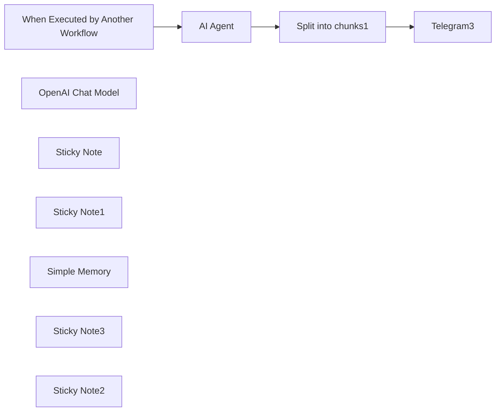

## Fluxo (.json) :

```json
{
  "id": "heyKyETy1uK0xoX4",
  "meta": {
    "instanceId": "d00caf92aa0876c596905aea78b35fa33a722cc8e479133822c17064d15c2c1d",
    "templateCredsSetupCompleted": true
  },
  "name": "Optimize Prompt",
  "tags": [],
  "nodes": [
    {
      "id": "a58be0f5-d11d-4bec-bd8c-0c3a7325b22b",
      "name": "When Executed by Another Workflow",
      "type": "n8n-nodes-base.executeWorkflowTrigger",
      "position": [
        -1880,
        820
      ],
      "parameters": {
        "inputSource": "passthrough"
      },
      "typeVersion": 1.1
    },
    {
      "id": "67fe408f-e889-4eeb-9e48-f60a579c69f0",
      "name": "AI Agent",
      "type": "@n8n/n8n-nodes-langchain.agent",
      "position": [
        -1600,
        720
      ],
      "parameters": {
        "text": "={{ $json.query }}",
        "options": {
          "systemMessage": "Given the user's initial prompt below, please enhance it. Start with a clear, precise instruction at the beginning. Include specific details about the desired context, outcome, length, format, and style. Provide examples of the desired output format, if applicable. Use appropriate leading words or phrases to guide the desired output, especially for code generation. Avoid any vague or imprecise language. Rather than only stating what not to do, provide guidance on what should be done instead. Ensure the revised prompt remains true to the user's original intent. Do not provide examples of desired prompt format, only describe it. Format your response in markdown."
        },
        "promptType": "define",
        "hasOutputParser": true
      },
      "typeVersion": 1.7
    },
    {
      "id": "8a041b31-1873-4559-96d0-35d313bffbbd",
      "name": "Telegram3",
      "type": "n8n-nodes-base.telegram",
      "onError": "continueErrorOutput",
      "position": [
        -1000,
        820
      ],
      "webhookId": "4f57022f-14cf-4c3e-b810-ae9395bf3d04",
      "parameters": {
        "text": "={{ $json.text }}",
        "chatId": "={{ $('When Executed by Another Workflow').item.json.chat_id }}",
        "additionalFields": {}
      },
      "credentials": {
        "telegramApi": {
          "id": "Vh36aBswWhClYxBM",
          "name": "Telegram account 2"
        }
      },
      "typeVersion": 1.1
    },
    {
      "id": "5161b177-0663-41c5-b778-ac14756f699c",
      "name": "OpenAI Chat Model",
      "type": "@n8n/n8n-nodes-langchain.lmChatOpenAi",
      "position": [
        -1680,
        860
      ],
      "parameters": {
        "model": {
          "__rl": true,
          "mode": "list",
          "value": "gpt-4o-mini"
        },
        "options": {}
      },
      "credentials": {
        "openAiApi": {
          "id": "vIXW5likFrTSZUgz",
          "name": "Litellm-account"
        }
      },
      "typeVersion": 1.2
    },
    {
      "id": "d5f36955-74a0-4a9a-b49d-0230d6ee35bf",
      "name": "Split into chunks1",
      "type": "n8n-nodes-base.code",
      "position": [
        -1180,
        820
      ],
      "parameters": {
        "jsCode": "// Get the entire output of the previous node\nlet text = $input.all() || '';\n\n// Convert the output to a string if it's not already\nif (typeof text !== 'string') {\n  text = JSON.stringify(text, null, 2); // Pretty-print JSON objects\n}\n\n// Replace multiple newlines (\\n\\n+) with a single newline (\\n)\ntext = text.replace(/\\n{2,}/g, '\\n');\n\nconst maxLength = 3072; // Telegram message character limit\nconst messages = [];\n\n// Add an optional header for the first chunk\nconst header = `# Optimized prompt\\n\\n`;\nlet currentText = header + text;\n\n// Split the output into chunks of maxLength without splitting words\nwhile (currentText.length > 0) {\n  let chunk = currentText.slice(0, maxLength);\n\n  // Ensure we don't split in the middle of a word\n  if (chunk.length === maxLength && currentText[maxLength] !== ' ') {\n    const lastSpaceIndex = chunk.lastIndexOf(' ');\n    if (lastSpaceIndex > -1) {\n      chunk = chunk.slice(0, lastSpaceIndex);\n    }\n  }\n\n  messages.push(chunk.trim()); // Trim extra whitespace for cleaner output\n  currentText = currentText.slice(chunk.length).trim(); // Remove the chunk from the remaining text\n}\n\n// Return the split messages in Markdown format\nreturn messages.map((chunk) => ({ json: { text: `\\`\\`\\`markdown\\n${chunk}\\n\\`\\`\\`` } }));\n"
      },
      "typeVersion": 2
    },
    {
      "id": "b22f3481-caeb-4506-8fe0-c7e2597772b9",
      "name": "Sticky Note",
      "type": "n8n-nodes-base.stickyNote",
      "disabled": true,
      "position": [
        -2120,
        600
      ],
      "parameters": {
        "color": 5,
        "width": 389,
        "height": 381,
        "content": "## Trigger\n\n- Trigger can be anything. For this example the trigger is a call from another workflow and a received Telegram message. \n\n- Note that this workflow can be integrated in the middle of another larger workflow."
      },
      "typeVersion": 1
    },
    {
      "id": "2bf7ebcc-2d34-4c56-b9de-c930ccb4f30f",
      "name": "Sticky Note1",
      "type": "n8n-nodes-base.stickyNote",
      "disabled": true,
      "position": [
        -1720,
        600
      ],
      "parameters": {
        "color": 6,
        "width": 489,
        "height": 381,
        "content": "# Inference / Optimization\n- Incoming trigger is processed by a LLM with a specific system prompt set aimed at improving the input prompt."
      },
      "typeVersion": 1
    },
    {
      "id": "ccc5f97e-6215-41fc-9633-f57857743282",
      "name": "Simple Memory",
      "type": "@n8n/n8n-nodes-langchain.memoryBufferWindow",
      "position": [
        -1340,
        860
      ],
      "parameters": {},
      "typeVersion": 1.3
    },
    {
      "id": "3bfb31b6-add3-4d5b-989e-df88d69e07e8",
      "name": "Sticky Note3",
      "type": "n8n-nodes-base.stickyNote",
      "disabled": true,
      "position": [
        -1220,
        600
      ],
      "parameters": {
        "width": 349,
        "height": 381,
        "content": "# Improved prompt:\n\n- Send as a response\n\n- Use as input for next nodes"
      },
      "typeVersion": 1
    },
    {
      "id": "a36fdc9d-d000-4120-99e8-53d49edec74a",
      "name": "Sticky Note2",
      "type": "n8n-nodes-base.stickyNote",
      "disabled": true,
      "position": [
        -2120,
        1000
      ],
      "parameters": {
        "color": 7,
        "width": 1249,
        "height": 541,
        "content": "# Workflow Documentation\n\n## Description:\nThis workflow is designed to optimize prompts by enhancing user inputs for clarity and specificity using AI. The workflow takes a user-provided prompt as input and uses a Natural Language Processing (NLP) model to refine and improve the prompt. The optimized prompt is then sent back to the user, ready for use in further workflows or processes.\n\n## Setup:\n1. This workflow is suitable for users who want to improve their prompts for better communication and understanding in their workflows.\n2. The workflow utilizes an AI Agent powered by an OpenAI Chat Model to enhance user prompts.\n3. A Telegram node is used to deliver the optimized prompt back to the user.\n4. Ensure you have the necessary credentials set up for Telegram and OpenAI accounts.\n5. Customize the workflow's settings, such as the AI model used for prompt optimization, to suit your requirements.\n6. Activate the workflow once all configurations are set to start optimizing prompts efficiently.\n\n## Expected Outcomes:\n- Users can provide vague or imprecise prompts as input to the workflow.\n- The AI Agent will refine and optimize the prompt, adding clarity and specific details.\n- The optimized prompt will be delivered back to the user via Telegram for further use in workflows or processes.\n\nFor more detailed instructions and guidelines on using this workflow, refer to the detailed setup guide above."
      },
      "typeVersion": 1
    }
  ],
  "active": false,
  "pinData": {},
  "settings": {
    "executionOrder": "v1"
  },
  "versionId": "05beb500-d266-45e7-8f5a-ad3a8c9a72e1",
  "connections": {
    "AI Agent": {
      "main": [
        [
          {
            "node": "Split into chunks1",
            "type": "main",
            "index": 0
          }
        ]
      ]
    },
    "Simple Memory": {
      "ai_memory": [
        [
          {
            "node": "AI Agent",
            "type": "ai_memory",
            "index": 0
          }
        ]
      ]
    },
    "OpenAI Chat Model": {
      "ai_languageModel": [
        [
          {
            "node": "AI Agent",
            "type": "ai_languageModel",
            "index": 0
          }
        ]
      ]
    },
    "Split into chunks1": {
      "main": [
        [
          {
            "node": "Telegram3",
            "type": "main",
            "index": 0
          }
        ]
      ]
    },
    "When Executed by Another Workflow": {
      "main": [
        [
          {
            "node": "AI Agent",
            "type": "main",
            "index": 0
          }
        ]
      ]
    }
  }
}
```

<a id="template-2569"></a>

## Template 2569 - Agente AI DeepSeek com Telegram e memória de longo prazo

- **Nome:** Agente AI DeepSeek com Telegram e memória de longo prazo
- **Descrição:** Fluxo que recebe mensagens do Telegram, valida o usuário, recupera memórias de longo prazo, processa a mensagem com um agente AI (usando modelos DeepSeek) e responde no chat, com opção de salvar novas memórias.
- **Funcionalidade:** • Receber mensagens via Webhook: Aceita atualizações do bot do Telegram através de um endpoint HTTPS.
• Validação de usuário: Confere identidade do remetente (nome e ID) antes de processar a mensagem.
• Roteamento de mensagens por tipo: Direciona mensagens de voz, texto, imagem ou outros fluxos de erro conforme o conteúdo.
• Recuperação de memórias de longo prazo: Lê um documento externo que armazena memórias recentes para contextualizar respostas.
• Agente AI com contexto: Usa um prompt de sistema que incorpora memórias e regras para gerar respostas personalizadas e decidir quando salvar memórias.
• Integração com modelos de raciocínio e conversa: Permite uso de modelos especializados para geração e raciocínio (DeepSeek-V3 e DeepSeek-R1).
• Salvamento de memórias: Quando apropriado, grava entradas resumidas de memória com data/hora no repositório de memórias.
• Resposta no Telegram: Envia a resposta gerada de volta ao chat do usuário no Telegram, com tratamento de erros explícito.
• Memória de sessão (buffer): Mantém um histórico recente da conversa para contexto imediato nas interações.
- **Ferramentas:** • Telegram: Plataforma de mensagens usada para receber eventos do bot e enviar respostas ao usuário.
• Google Docs: Repositório externo usado para armazenar e recuperar memórias de longo prazo em formato de documento.
• DeepSeek API (DeepSeek-V3 e DeepSeek-R1): Serviços de modelos de linguagem e raciocínio usados para gerar respostas e executar raciocínio avançado.

## Fluxo visual

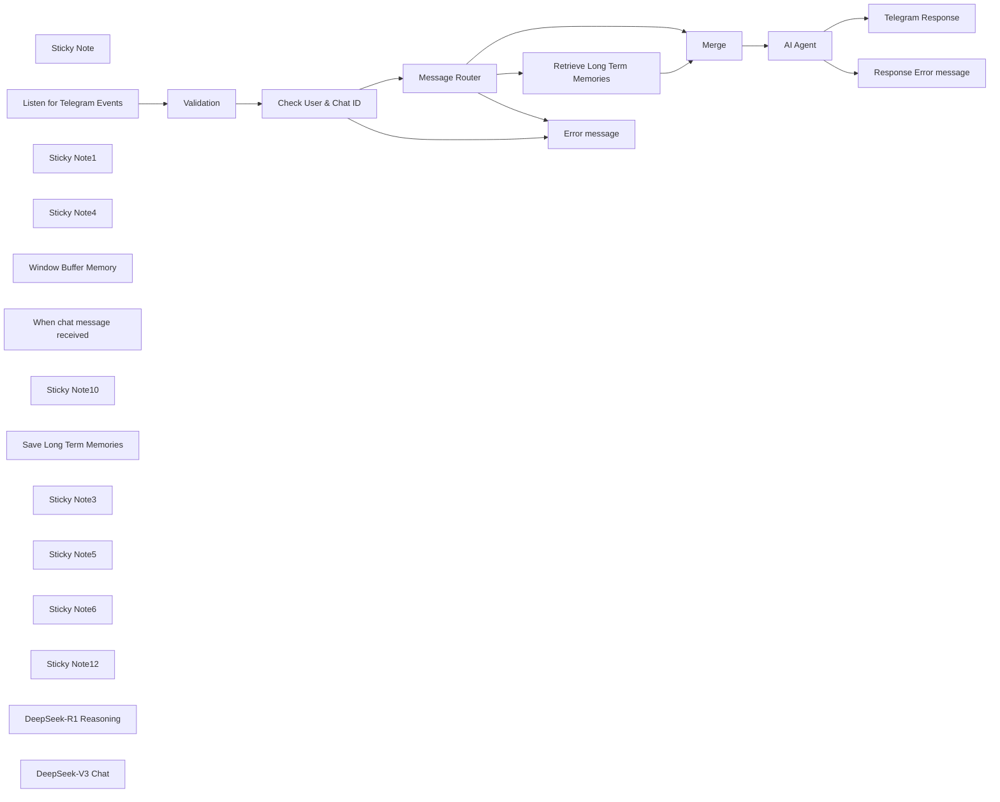

## Fluxo (.json) :

```json
{
  "id": "rtsvydad1MOCryia",
  "meta": {
    "instanceId": "31e69f7f4a77bf465b805824e303232f0227212ae922d12133a0f96ffeab4fef"
  },
  "name": "🐋🤖 DeepSeek AI Agent + Telegram + LONG TERM Memory 🧠",
  "tags": [],
  "nodes": [
    {
      "id": "23b50c07-39a8-4166-ab13-9683b3ee25e6",
      "name": "Check User & Chat ID",
      "type": "n8n-nodes-base.if",
      "position": [
        -80,
        160
      ],
      "parameters": {
        "options": {},
        "conditions": {
          "options": {
            "version": 2,
            "leftValue": "",
            "caseSensitive": true,
            "typeValidation": "strict"
          },
          "combinator": "and",
          "conditions": [
            {
              "id": "5fe3c0d8-bd61-4943-b152-9e6315134520",
              "operator": {
                "name": "filter.operator.equals",
                "type": "string",
                "operation": "equals"
              },
              "leftValue": "={{ $('Listen for Telegram Events').item.json.body.message.from.first_name }}",
              "rightValue": "={{ $json.first_name }}"
            },
            {
              "id": "98a0ea91-0567-459c-bbce-06abc14a49ce",
              "operator": {
                "name": "filter.operator.equals",
                "type": "string",
                "operation": "equals"
              },
              "leftValue": "={{ $('Listen for Telegram Events').item.json.body.message.from.last_name }}",
              "rightValue": "={{ $json.last_name }}"
            },
            {
              "id": "18a96c1f-f2a0-4a2a-b789-606763df4423",
              "operator": {
                "type": "number",
                "operation": "equals"
              },
              "leftValue": "={{ $('Listen for Telegram Events').item.json.body.message.from.id }}",
              "rightValue": "={{ $json.id }}"
            }
          ]
        },
        "looseTypeValidation": "="
      },
      "typeVersion": 2.2
    },
    {
      "id": "ecbc13fe-305d-4cdd-b35c-3e119e8e8b5d",
      "name": "Error message",
      "type": "n8n-nodes-base.telegram",
      "position": [
        160,
        440
      ],
      "parameters": {
        "text": "=Unable to process your message.",
        "chatId": "={{ $json.body.message.chat.id }}",
        "additionalFields": {
          "appendAttribution": false
        }
      },
      "credentials": {
        "telegramApi": {
          "id": "pAIFhguJlkO3c7aQ",
          "name": "Telegram account"
        }
      },
      "typeVersion": 1.2
    },
    {
      "id": "be722bc7-0b22-4892-967c-fdd398a7b129",
      "name": "Sticky Note",
      "type": "n8n-nodes-base.stickyNote",
      "position": [
        -540,
        -20
      ],
      "parameters": {
        "color": 6,
        "width": 949,
        "height": 652,
        "content": "# Receive Telegram Message with Webhook"
      },
      "typeVersion": 1
    },
    {
      "id": "a3866585-bfee-4025-a8f4-f06fde16171a",
      "name": "Listen for Telegram Events",
      "type": "n8n-nodes-base.webhook",
      "position": [
        -480,
        160
      ],
      "webhookId": "097f36f3-1574-44f9-815f-58387e3b20bf",
      "parameters": {
        "path": "wbot",
        "options": {
          "binaryPropertyName": "data"
        },
        "httpMethod": "POST"
      },
      "typeVersion": 2
    },
    {
      "id": "f70571d5-3680-4616-90fa-3358b0883368",
      "name": "Sticky Note1",
      "type": "n8n-nodes-base.stickyNote",
      "position": [
        -1380,
        -20
      ],
      "parameters": {
        "color": 7,
        "width": 800,
        "height": 860,
        "content": "# How to set up a Telegram Bot WebHook\n\n## WebHook Setup Process\n\n**Basic Concept**\nA WebHook allows your Telegram bot to automatically receive updates instead of manually polling the Bot API.\n\n**Setup Method**\nTo set a WebHook, make a GET request using this URL format:\n```\nhttps://api.telegram.org/bot{my_bot_token}/setWebhook?url={url_to_send_updates_to}\n```\nWhere:\n- `my_bot_token`: Your bot token from BotFather\n- `url_to_send_updates_to`: Your HTTPS endpoint that handles bot updates\n\n\n**Verification**\nTo verify the WebHook setup, use:\n```\nhttps://api.telegram.org/bot{my_bot_token}/getWebhookInfo\n```\n\nA successful response looks like:\n```json\n{\n \"ok\": true,\n \"result\": {\n   \"url\": \"https://www.example.com/my-telegram-bot/\",\n   \"has_custom_certificate\": false,\n   \"pending_update_count\": 0,\n   \"max_connections\": 40\n }\n}\n```\n\n\nThis method provides a simple and efficient way to handle Telegram bot updates automatically through webhooks rather than manual polling."
      },
      "typeVersion": 1
    },
    {
      "id": "2b6149d5-ffd6-46ef-9840-149508251a77",
      "name": "Validation",
      "type": "n8n-nodes-base.set",
      "position": [
        -260,
        160
      ],
      "parameters": {
        "options": {},
        "assignments": {
          "assignments": [
            {
              "id": "0cea6da1-652a-4c1e-94c3-30608ced90f8",
              "name": "first_name",
              "type": "string",
              "value": "FirstName"
            },
            {
              "id": "b90280c6-3e36-49ca-9e7e-e15c42d256cc",
              "name": "last_name",
              "type": "string",
              "value": "LastName"
            },
            {
              "id": "f6d86283-16ca-447e-8427-7d3d190babc0",
              "name": "id",
              "type": "number",
              "value": 12345667891
            }
          ]
        },
        "includeOtherFields": true
      },
      "typeVersion": 3.4
    },
    {
      "id": "41c965ea-b67d-4d6b-82e4-0e57f5fc13bb",
      "name": "Sticky Note4",
      "type": "n8n-nodes-base.stickyNote",
      "position": [
        -320,
        100
      ],
      "parameters": {
        "color": 7,
        "width": 420,
        "height": 260,
        "content": "## Validate Telegram User\n"
      },
      "typeVersion": 1
    },
    {
      "id": "164f5e91-1958-4dc5-b38c-db1cec0579d4",
      "name": "Message Router",
      "type": "n8n-nodes-base.switch",
      "position": [
        160,
        160
      ],
      "parameters": {
        "rules": {
          "values": [
            {
              "outputKey": "audio",
              "conditions": {
                "options": {
                  "version": 2,
                  "leftValue": "",
                  "caseSensitive": true,
                  "typeValidation": "strict"
                },
                "combinator": "and",
                "conditions": [
                  {
                    "operator": {
                      "type": "object",
                      "operation": "exists",
                      "singleValue": true
                    },
                    "leftValue": "={{ $json.body.message.voice }}",
                    "rightValue": ""
                  }
                ]
              },
              "renameOutput": true
            },
            {
              "outputKey": "text",
              "conditions": {
                "options": {
                  "version": 2,
                  "leftValue": "",
                  "caseSensitive": true,
                  "typeValidation": "strict"
                },
                "combinator": "and",
                "conditions": [
                  {
                    "id": "342f0883-d959-44a2-b80d-379e39c76218",
                    "operator": {
                      "type": "string",
                      "operation": "exists",
                      "singleValue": true
                    },
                    "leftValue": "={{ $json.body.message.text }}",
                    "rightValue": ""
                  }
                ]
              },
              "renameOutput": true
            },
            {
              "outputKey": "image",
              "conditions": {
                "options": {
                  "version": 2,
                  "leftValue": "",
                  "caseSensitive": true,
                  "typeValidation": "strict"
                },
                "combinator": "and",
                "conditions": [
                  {
                    "id": "ded3a600-f861-413a-8892-3fc5ea935ecb",
                    "operator": {
                      "type": "array",
                      "operation": "exists",
                      "singleValue": true
                    },
                    "leftValue": "={{ $json.body.message.photo }}",
                    "rightValue": ""
                  }
                ]
              },
              "renameOutput": true
            }
          ]
        },
        "options": {
          "fallbackOutput": "extra"
        }
      },
      "typeVersion": 3.2
    },
    {
      "id": "7947173d-39fa-4d4b-9b1e-60de809a9950",
      "name": "AI Agent",
      "type": "@n8n/n8n-nodes-langchain.agent",
      "onError": "continueErrorOutput",
      "position": [
        860,
        340
      ],
      "parameters": {
        "text": "={{ $('Message Router').item.json.body.message.text }}",
        "options": {
          "systemMessage": "=## ROLE  \nYou are a friendly, attentive, and helpful AI assistant. Your primary goal is to assist the user while maintaining a personalized and engaging interaction. The current user's first name is **{{ $json.body.message.from.first_name }}**.\n\n---\n\n## RULES  \n\n1. **Memory Management**:  \n   - When the user sends a new message, evaluate whether it contains noteworthy or personal information (e.g., preferences, habits, goals, or important events).  \n   - If such information is identified, use the **Save Memory** tool to store this data in memory.  \n   - Always send a meaningful response back to the user, even if your primary action was saving information. This response should not reveal that information was stored but should acknowledge or engage with the user’s input naturally.\n\n2. **Context Awareness**:  \n   - Use stored memories to provide contextually relevant and personalized responses.  \n   - Always consider the **date and time** when a memory was collected to ensure your responses are up-to-date and accurate.\n\n3. **User-Centric Responses**:  \n   - Tailor your responses based on the user's preferences and past interactions.  \n   - Be proactive in recalling relevant details from memory when appropriate but avoid overwhelming the user with unnecessary information.\n\n4. **Privacy and Sensitivity**:  \n   - Handle all user data with care and sensitivity. Avoid making assumptions or sharing stored information unless it directly enhances the conversation or task at hand.\n\n5. **Fallback Responses**:  \n   - **IMPORTANT** If no specific task or question arises from the user’s message (e.g., when only saving information), respond in a way that keeps the conversation flowing naturally. For example:\n     - Acknowledge their input: “Thanks for sharing that!” \n     - Provide a friendly follow-up: “Is there anything else I can help you with today?”\n   - DO NOT tell Jokes as a fall back response.\n\n---\n\n## TOOLS  \n\n### Save Memory  \n- Use this tool to store summarized, concise, and meaningful information about the user.  \n- Extract key details from user messages that could enhance future interactions (e.g., likes/dislikes, important dates, hobbies).  \n- Ensure that the summary is clear and devoid of unnecessary details.\n\n---\n\n## MEMORIES  \n\n### Recent Noteworthy Memories  \nHere are the most recent memories collected from the user, including their date and time of collection:  \n\n**{{ $('Retrieve Long Term Memories').item.json.content }}**\n\n### Guidelines for Using Memories:  \n- Prioritize recent memories but do not disregard older ones if they remain relevant.  \n- Cross-reference memories to maintain consistency in your responses. For example, if a user shares conflicting preferences over time, clarify or adapt accordingly.\n\n---\n\n## ADDITIONAL INSTRUCTIONS  \n\n- Think critically before responding to ensure your answers are thoughtful and accurate.  \n- Strive to build trust with the user by being consistent, reliable, and personable in your interactions.  \n- Avoid robotic or overly formal language; aim for a conversational tone that aligns with being \"friendly and helpful.\"  \n"
        },
        "promptType": "define"
      },
      "typeVersion": 1.7,
      "alwaysOutputData": true
    },
    {
      "id": "6111c771-d8af-4586-8829-213d86dc4f47",
      "name": "Merge",
      "type": "n8n-nodes-base.merge",
      "position": [
        860,
        100
      ],
      "parameters": {
        "mode": "combine",
        "options": {},
        "combineBy": "combineAll"
      },
      "typeVersion": 3
    },
    {
      "id": "94a01b4f-549d-4e49-88e0-143c90dd200e",
      "name": "Window Buffer Memory",
      "type": "@n8n/n8n-nodes-langchain.memoryBufferWindow",
      "position": [
        920,
        780
      ],
      "parameters": {
        "sessionKey": "={{ $json.id }}",
        "sessionIdType": "customKey",
        "contextWindowLength": 50
      },
      "typeVersion": 1.3
    },
    {
      "id": "d1182e11-025e-4885-abb1-b76a9b617b84",
      "name": "When chat message received",
      "type": "@n8n/n8n-nodes-langchain.chatTrigger",
      "disabled": true,
      "position": [
        -480,
        420
      ],
      "webhookId": "701ddc24-2637-466e-9789-5d47145333a8",
      "parameters": {
        "options": {}
      },
      "typeVersion": 1.1
    },
    {
      "id": "97d4cdcd-b016-44aa-882c-eb2ec38968eb",
      "name": "Sticky Note10",
      "type": "n8n-nodes-base.stickyNote",
      "position": [
        440,
        -20
      ],
      "parameters": {
        "color": 5,
        "width": 1033,
        "height": 1029,
        "content": "# Process Text Message"
      },
      "typeVersion": 1
    },
    {
      "id": "73156ecc-af5f-4e3d-82c6-4668db52b511",
      "name": "Telegram Response",
      "type": "n8n-nodes-base.telegram",
      "position": [
        1240,
        160
      ],
      "parameters": {
        "text": "={{ $json.output }}",
        "chatId": "={{ $('Listen for Telegram Events').item.json.body.message.chat.id }}",
        "additionalFields": {
          "parse_mode": "HTML",
          "appendAttribution": false
        }
      },
      "credentials": {
        "telegramApi": {
          "id": "pAIFhguJlkO3c7aQ",
          "name": "Telegram account"
        }
      },
      "typeVersion": 1.2
    },
    {
      "id": "5f342299-40fe-44cf-9b58-8a9d3bfac1df",
      "name": "Save Long Term Memories",
      "type": "n8n-nodes-base.googleDocsTool",
      "position": [
        1260,
        780
      ],
      "parameters": {
        "actionsUi": {
          "actionFields": [
            {
              "text": "= Memory: {{ $fromAI('memory') }} - Date: {{ $now }} ",
              "action": "insert"
            }
          ]
        },
        "operation": "update",
        "documentURL": "[Google Doc ID]",
        "descriptionType": "manual",
        "toolDescription": "Save memories"
      },
      "credentials": {
        "googleDocsOAuth2Api": {
          "id": "YWEHuG28zOt532MQ",
          "name": "Google Docs account"
        }
      },
      "typeVersion": 2
    },
    {
      "id": "aba001a8-68f9-4870-9cd0-60a4c59ecd5b",
      "name": "Sticky Note3",
      "type": "n8n-nodes-base.stickyNote",
      "position": [
        460,
        220
      ],
      "parameters": {
        "color": 4,
        "width": 300,
        "height": 340,
        "content": "## Retrieve Long Term Memories\nGoogle Docs"
      },
      "typeVersion": 1
    },
    {
      "id": "e5ec71ec-9527-4ccd-87c3-3aa2f09192e8",
      "name": "Retrieve Long Term Memories",
      "type": "n8n-nodes-base.googleDocs",
      "position": [
        560,
        360
      ],
      "parameters": {
        "operation": "get",
        "documentURL": "[Google Doc ID]"
      },
      "credentials": {
        "googleDocsOAuth2Api": {
          "id": "YWEHuG28zOt532MQ",
          "name": "Google Docs account"
        }
      },
      "typeVersion": 2,
      "alwaysOutputData": true
    },
    {
      "id": "4764383a-3c4b-4e64-b391-5dc9fb4b9de6",
      "name": "Sticky Note5",
      "type": "n8n-nodes-base.stickyNote",
      "position": [
        820,
        660
      ],
      "parameters": {
        "width": 280,
        "height": 320,
        "content": "## Save To Current Chat Memory (Optional)"
      },
      "typeVersion": 1
    },
    {
      "id": "e11995b8-e061-4b40-b4b6-9ec03c7e5a06",
      "name": "Sticky Note6",
      "type": "n8n-nodes-base.stickyNote",
      "position": [
        1160,
        660
      ],
      "parameters": {
        "color": 4,
        "width": 280,
        "height": 320,
        "content": "## Save Long Term Memories\nGoogle Docs"
      },
      "typeVersion": 1
    },
    {
      "id": "1b53aef2-ca99-409b-bd10-3fc1fd87f540",
      "name": "Response Error message",
      "type": "n8n-nodes-base.telegram",
      "position": [
        1240,
        360
      ],
      "parameters": {
        "text": "=Unable to process your message.",
        "chatId": "={{ $('Listen for Telegram Events').item.json.body.message.chat.id }}",
        "additionalFields": {
          "appendAttribution": false
        }
      },
      "credentials": {
        "telegramApi": {
          "id": "pAIFhguJlkO3c7aQ",
          "name": "Telegram account"
        }
      },
      "typeVersion": 1.2
    },
    {
      "id": "e5d79084-d7f1-44fd-a1db-73cc76a148ec",
      "name": "Sticky Note12",
      "type": "n8n-nodes-base.stickyNote",
      "position": [
        -60,
        660
      ],
      "parameters": {
        "color": 7,
        "width": 820,
        "height": 600,
        "content": "# DeepSeek API Call\n\nThe DeepSeek API uses an API format compatible with OpenAI. By modifying the configuration, you can use the OpenAI SDK or softwares compatible with the OpenAI API to access the DeepSeek API.\n\nhttps://api-docs.deepseek.com/\n\n## Configuration Parameters\n\n| Parameter | Value |\n|-----------|--------|\n| base_url | https://api.deepseek.com |\n| api_key | https://platform.deepseek.com/api_keys |\n\n\n\n## Important Notes\n\n- To be compatible with OpenAI, you can also use `https://api.deepseek.com/v1` as the base_url. Note that the v1 here has NO relationship with the model's version.\n\n- The deepseek-chat model has been upgraded to DeepSeek-V3. The API remains unchanged. You can invoke DeepSeek-V3 by specifying `model='deepseek-chat'`.\n\n- deepseek-reasoner is the latest reasoning model, DeepSeek-R1, released by DeepSeek. You can invoke DeepSeek-R1 by specifying `model='deepseek-reasoner'`."
      },
      "typeVersion": 1
    },
    {
      "id": "af14e803-44a5-4b0e-a675-b1e860bf6d29",
      "name": "DeepSeek-R1 Reasoning",
      "type": "@n8n/n8n-nodes-langchain.lmChatOpenAi",
      "position": [
        440,
        880
      ],
      "parameters": {
        "model": "=deepseek-reasoner",
        "options": {}
      },
      "credentials": {
        "openAiApi": {
          "id": "MSl7SdcvZe0SqCYI",
          "name": "deepseek"
        }
      },
      "typeVersion": 1.1
    },
    {
      "id": "e8be6a32-ba4c-4895-b34b-c5e7d0ded5e8",
      "name": "DeepSeek-V3   Chat",
      "type": "@n8n/n8n-nodes-langchain.lmChatOpenAi",
      "position": [
        600,
        880
      ],
      "parameters": {
        "model": "=deepseek-chat",
        "options": {}
      },
      "credentials": {
        "openAiApi": {
          "id": "MSl7SdcvZe0SqCYI",
          "name": "deepseek"
        }
      },
      "typeVersion": 1.1
    }
  ],
  "active": false,
  "pinData": {},
  "settings": {
    "timezone": "America/Vancouver",
    "executionOrder": "v1"
  },
  "versionId": "2e669c98-e6ad-42f0-a642-de05e372937e",
  "connections": {
    "Merge": {
      "main": [
        [
          {
            "node": "AI Agent",
            "type": "main",
            "index": 0
          }
        ]
      ]
    },
    "AI Agent": {
      "main": [
        [
          {
            "node": "Telegram Response",
            "type": "main",
            "index": 0
          }
        ],
        [
          {
            "node": "Response Error message",
            "type": "main",
            "index": 0
          }
        ]
      ]
    },
    "Validation": {
      "main": [
        [
          {
            "node": "Check User & Chat ID",
            "type": "main",
            "index": 0
          }
        ]
      ]
    },
    "Message Router": {
      "main": [
        [],
        [
          {
            "node": "Merge",
            "type": "main",
            "index": 0
          },
          {
            "node": "Retrieve Long Term Memories",
            "type": "main",
            "index": 0
          }
        ],
        [],
        [
          {
            "node": "Error message",
            "type": "main",
            "index": 0
          }
        ]
      ]
    },
    "DeepSeek-V3   Chat": {
      "ai_languageModel": [
        [
          {
            "node": "AI Agent",
            "type": "ai_languageModel",
            "index": 0
          }
        ]
      ]
    },
    "Check User & Chat ID": {
      "main": [
        [
          {
            "node": "Message Router",
            "type": "main",
            "index": 0
          }
        ],
        [
          {
            "node": "Error message",
            "type": "main",
            "index": 0
          }
        ]
      ]
    },
    "Window Buffer Memory": {
      "ai_memory": [
        []
      ]
    },
    "Save Long Term Memories": {
      "ai_tool": [
        [
          {
            "node": "AI Agent",
            "type": "ai_tool",
            "index": 0
          }
        ]
      ]
    },
    "Listen for Telegram Events": {
      "main": [
        [
          {
            "node": "Validation",
            "type": "main",
            "index": 0
          }
        ]
      ]
    },
    "When chat message received": {
      "main": [
        []
      ]
    },
    "Retrieve Long Term Memories": {
      "main": [
        [
          {
            "node": "Merge",
            "type": "main",
            "index": 1
          }
        ]
      ]
    }
  }
}
```
