# PACK 1999 TEMPLATES PARTE 10 - Bloco 10

Templates neste bloco: 19

## Sumário

- [Template 2570 - Insights OpenSea via Telegram](#template-2570)
- [Template 2571 - Assistente interno de RH e TI com transcrição](#template-2571)
- [Template 2572 - Agente AI DeepSeek via Telegram com memória de longo prazo](#template-2572)
- [Template 2573 - Agente Telegram para texto, áudio e imagens](#template-2573)
- [Template 2574 - Agregador de notícias RSS para Trello](#template-2574)
- [Template 2575 - Enviar leads do Typeform por WhatsApp](#template-2575)
- [Template 2576 - Monitoramento de sensores com alerta por SMS](#template-2576)
- [Template 2577 - Tweetar novas atividades do Strava](#template-2577)
- [Template 2578 - Registro automático no Demio via Typeform](#template-2578)
- [Template 2579 - Gerenciamento de monitor UptimeRobot](#template-2579)
- [Template 2580 - Processamento em lote para Airtable](#template-2580)
- [Template 2581 - Envio em lote de pessoas via POST com espera](#template-2581)
- [Template 2582 - Extração de faturas PDF para Google Sheets](#template-2582)
- [Template 2583 - Agrupar mensagens SMS e responder com um único agente IA](#template-2583)
- [Template 2584 - Backup diário de workflows para Bitbucket](#template-2584)
- [Template 2585 - Resumo diário de podcasts](#template-2585)
- [Template 2586 - Salvar Relatórios Qualys no TheHive](#template-2586)
- [Template 2587 - Iniciar subfluxos em paralelo com callback](#template-2587)
- [Template 2588 - Mensagem de boas-vindas a novos seguidores BlueSky](#template-2588)

---

<a id="template-2570"></a>

## Template 2570 - Insights OpenSea via Telegram

- **Nome:** Insights OpenSea via Telegram
- **Descrição:** Fluxo que recebe consultas via Telegram, usa um agente IA supervisor para orquestrar ferramentas especializadas que consultam dados do OpenSea e devolve respostas analíticas e formatadas ao usuário.
- **Funcionalidade:** • Recepção de mensagens pelo chat: Captura mensagens de usuários via Telegram e inicia o processamento.
• Gerenciamento de sessão: Atribui e propaga um sessionId para manter o contexto entre interações e subagentes.
• Processamento por IA Supervisor: Utiliza um modelo de linguagem para interpretar a intenção do usuário e definir estratégia de ação.
• Memória contextual: Mantém um buffer de memória para lembrar contexto recente da conversa e melhorar continuidade.
• Encadeamento de ferramentas/agentes especializados: Dispara subagentes especializados em análises, marketplace e dados de NFT para consultas específicas ao OpenSea.
• Agregação e síntese de resultados: Combina e estrutura dados retornados pelos subagentes em respostas legíveis e acionáveis.
• Envio de resposta ao usuário: Retorna a resposta final formatada ao usuário pelo Telegram.
- **Ferramentas:** • Telegram: Plataforma de mensagens usada para receber consultas dos usuários e enviar respostas.
• OpenAI (modelo GPT-4o-mini): Modelo de linguagem utilizado como supervisor para interpretar intenções, roteirizar ações e formatar respostas.
• OpenSea API: Fonte de dados para obter estatísticas de coleções, eventos de mercado, listagens, ofertas, metadados de NFTs e informações de propriedade.

## Fluxo visual

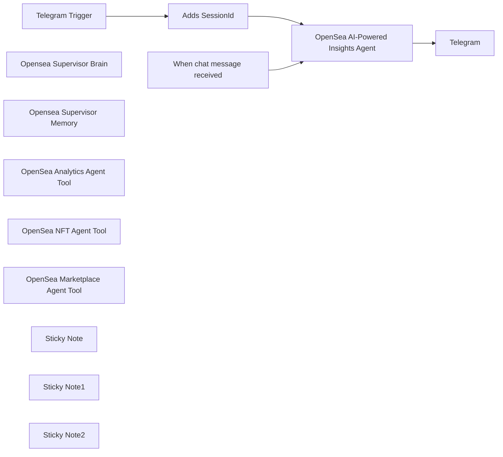

## Fluxo (.json) :

```json
{
  "id": "wi2ZWKN9XPR0jkvn",
  "meta": {
    "instanceId": "a5283507e1917a33cc3ae615b2e7d5ad2c1e50955e6f831272ddd5ab816f3fb6",
    "templateCredsSetupCompleted": true
  },
  "name": "OpenSea AI-Powered Insights via Telegram",
  "tags": [],
  "nodes": [
    {
      "id": "0b6ec133-7023-4c6a-ae53-78168211545c",
      "name": "When chat message received",
      "type": "@n8n/n8n-nodes-langchain.chatTrigger",
      "position": [
        840,
        140
      ],
      "webhookId": "befa3e52-7b57-4832-9f88-b2c430244595",
      "parameters": {
        "options": {}
      },
      "typeVersion": 1.1
    },
    {
      "id": "787a9e8d-e67d-4947-90d1-8e3284de7b39",
      "name": "Telegram Trigger",
      "type": "n8n-nodes-base.telegramTrigger",
      "position": [
        840,
        -160
      ],
      "webhookId": "f9267d32-3860-4f02-99b3-493c4cac36ed",
      "parameters": {
        "updates": [
          "message"
        ],
        "additionalFields": {}
      },
      "credentials": {
        "telegramApi": {
          "id": "R3vpGq0SURbvEw2Z",
          "name": "Telegram account"
        }
      },
      "typeVersion": 1.1
    },
    {
      "id": "2e10802a-48d7-4b82-afe0-b9e5f93498bf",
      "name": "Adds SessionId",
      "type": "n8n-nodes-base.set",
      "position": [
        1160,
        -160
      ],
      "parameters": {
        "options": {},
        "assignments": {
          "assignments": [
            {
              "id": "b5c25cd4-226b-4778-863f-79b13b4a5202",
              "name": "sessionId",
              "type": "string",
              "value": "={{ $json.message.chat.id }}"
            }
          ]
        },
        "includeOtherFields": true
      },
      "typeVersion": 3.4
    },
    {
      "id": "8dd2dcdd-7cd5-4381-b1a5-66a2b6a69111",
      "name": "Opensea Supervisor Brain",
      "type": "@n8n/n8n-nodes-langchain.lmChatOpenAi",
      "position": [
        1380,
        160
      ],
      "parameters": {
        "model": {
          "__rl": true,
          "mode": "list",
          "value": "gpt-4o-mini"
        },
        "options": {}
      },
      "credentials": {
        "openAiApi": {
          "id": "yUizd8t0sD5wMYVG",
          "name": "OpenAi account"
        }
      },
      "typeVersion": 1.2
    },
    {
      "id": "b2b59481-afbb-4cb6-98b7-c26bf51ead76",
      "name": "Opensea Supervisor Memory",
      "type": "@n8n/n8n-nodes-langchain.memoryBufferWindow",
      "position": [
        1580,
        160
      ],
      "parameters": {},
      "typeVersion": 1.3
    },
    {
      "id": "52dde53b-cb42-4ae2-b573-d9356d7ec3f3",
      "name": "OpenSea Analytics Agent Tool",
      "type": "@n8n/n8n-nodes-langchain.toolWorkflow",
      "position": [
        1760,
        160
      ],
      "parameters": {
        "name": "OpenSea_Analytics_Agent_Tool",
        "workflowId": {
          "__rl": true,
          "mode": "list",
          "value": "yRMCUm6oJEMknhbw",
          "cachedResultName": "JayaFamily Assistant — OpenSea Analytics Agent Tool"
        },
        "workflowInputs": {
          "value": {
            "message": "={{ $fromAI(\"message\",\"Populate this with a relevant message to this subagent\")}}",
            "sessionId": "={{ $json.sessionId }}"
          },
          "schema": [
            {
              "id": "message",
              "type": "string",
              "display": true,
              "removed": false,
              "required": false,
              "displayName": "message",
              "defaultMatch": false,
              "canBeUsedToMatch": true
            },
            {
              "id": "sessionId",
              "type": "string",
              "display": true,
              "removed": false,
              "required": false,
              "displayName": "sessionId",
              "defaultMatch": false,
              "canBeUsedToMatch": true
            }
          ],
          "mappingMode": "defineBelow",
          "matchingColumns": [],
          "attemptToConvertTypes": false,
          "convertFieldsToString": false
        }
      },
      "typeVersion": 2
    },
    {
      "id": "596517b1-4f1e-4285-b8ee-cdf8108c4138",
      "name": "OpenSea NFT Agent Tool",
      "type": "@n8n/n8n-nodes-langchain.toolWorkflow",
      "position": [
        1940,
        160
      ],
      "parameters": {
        "name": "OpenSea_NFT_Agent_Tool",
        "workflowId": {
          "__rl": true,
          "mode": "list",
          "value": "ZBH1ExE58wsoodkZ",
          "cachedResultName": "JayaFamily Assistant — OpenSea NFT Agent Tool"
        },
        "workflowInputs": {
          "value": {
            "message": "={{ $fromAI(\"message\",\"Populate this with a relevant message to this subagent\")}}",
            "sessionId": "={{ $json.sessionId }}"
          },
          "schema": [
            {
              "id": "message",
              "type": "string",
              "display": true,
              "removed": false,
              "required": false,
              "displayName": "message",
              "defaultMatch": false,
              "canBeUsedToMatch": true
            },
            {
              "id": "sessionId",
              "type": "string",
              "display": true,
              "removed": false,
              "required": false,
              "displayName": "sessionId",
              "defaultMatch": false,
              "canBeUsedToMatch": true
            }
          ],
          "mappingMode": "defineBelow",
          "matchingColumns": [],
          "attemptToConvertTypes": false,
          "convertFieldsToString": false
        }
      },
      "typeVersion": 2
    },
    {
      "id": "643c5c81-ba21-4afa-9c78-70cd6cde08f7",
      "name": "OpenSea Marketplace Agent Tool",
      "type": "@n8n/n8n-nodes-langchain.toolWorkflow",
      "position": [
        2120,
        160
      ],
      "parameters": {
        "name": "OpenSea_Marketplace_Agent_Tool",
        "workflowId": {
          "__rl": true,
          "mode": "list",
          "value": "brRSLvIkYp3mLq0K",
          "cachedResultName": "JayaFamily Assistant — OpenSea Marketplace Agent Tool"
        },
        "workflowInputs": {
          "value": {
            "message": "={{ $fromAI(\"message\",\"Populate this with a relevant message to this subagent\")}}",
            "sessionId": "={{ $json.sessionId }}"
          },
          "schema": [
            {
              "id": "message",
              "type": "string",
              "display": true,
              "removed": false,
              "required": false,
              "displayName": "message",
              "defaultMatch": false,
              "canBeUsedToMatch": true
            },
            {
              "id": "sessionId",
              "type": "string",
              "display": true,
              "removed": false,
              "required": false,
              "displayName": "sessionId",
              "defaultMatch": false,
              "canBeUsedToMatch": true
            }
          ],
          "mappingMode": "defineBelow",
          "matchingColumns": [],
          "attemptToConvertTypes": false,
          "convertFieldsToString": false
        }
      },
      "typeVersion": 2
    },
    {
      "id": "069cb9bc-96a4-4539-b7c5-b06d29968ec6",
      "name": "Telegram",
      "type": "n8n-nodes-base.telegram",
      "position": [
        2080,
        -120
      ],
      "webhookId": "9841771a-821a-4a40-a9e8-fb8a29eaa9f3",
      "parameters": {
        "text": "={{ $json.output }}",
        "chatId": "={{ $('Telegram Trigger').item.json.message.chat.id }}",
        "additionalFields": {
          "appendAttribution": false
        }
      },
      "credentials": {
        "telegramApi": {
          "id": "R3vpGq0SURbvEw2Z",
          "name": "Telegram account"
        }
      },
      "typeVersion": 1.2
    },
    {
      "id": "cc852b55-0214-4276-9c2f-755d9cb3fc28",
      "name": "OpenSea AI-Powered Insights Agent",
      "type": "@n8n/n8n-nodes-langchain.agent",
      "position": [
        1600,
        -120
      ],
      "parameters": {
        "text": "={{ $json.message.text }}",
        "options": {
          "systemMessage": "**🌍 Role & Capabilities**  \nThe **OpenSea AI-Powered Insights Agent** is an advanced **AI data analyst** with **full access to OpenSea’s API**, capable of executing **multi-step queries, data aggregation, and deep research** into NFT market trends, asset tracking, and real-time trading insights.  \n\nIt leverages **three powerful agent tools** to provide **actionable insights and decision-making intelligence**:  \n1. **Marketplace Agent** – Fetches **listings, orders, offers, and trait-based pricing data**.  \n2. **Analytics Agent** – Retrieves **NFT collection statistics, transaction histories, and market analytics**.  \n3. **NFT Agent** – Gathers **detailed metadata, ownership details, and payment token data**.  \n\n🧠 **This AI system can process multiple tools together, conduct research between datasets, and synthesize powerful responses to user queries.**  \n\n---\n\n## **🛠 Actionable Insights & Multi-Step Queries**\nThe agent can **combine** multiple tools, process collected data, and execute deep research for **smarter responses**.  \n\n🔹 **How this works**:\n- 🏛 **Compare multiple collections** _(e.g., floor price, sales volume)_  \n- 🎯 **Track NFT flipping trends** _(e.g., which wallets buy/sell the most)_  \n- 🔥 **Identify undervalued NFTs** _(e.g., listings below average trait value)_  \n- 📊 **Aggregate sales data over time** _(e.g., 7-day vs. 30-day collection trends)_  \n- 👥 **Analyze whale movements** _(e.g., track large NFT purchases)_  \n- 💡 **Predict market shifts** _(e.g., sudden spikes in buy offers)_  \n\n📢 **Example Action Queries:**  \n- _“Find me the top 5 most undervalued Azuki NFTs based on recent sales.”_  \n- _“Compare the last 3 months of trading volume between Moonbirds and CloneX.”_  \n- _“Track all wallets that recently sold a Bored Ape Yacht Club NFT.”_  \n- _“List the top 10 wallets making the most NFT purchases this week.”_  \n\n---\n\n## **🚀 Available Tools & Proper Usage**  \n\n### **1️⃣ Marketplace Agent Tools (Orders, Listings, and Offers)**\nProvides **real-time marketplace data** for **NFTs, collections, and traits**.  \n\n🔹 **How to use these tools correctly**:\n- Always input **a valid OpenSea collection slug** (found in OpenSea URLs).  \n- Ensure **blockchain names** match OpenSea’s supported chains.  \n- Use **pagination (`next` cursor)** for large datasets.  \n\n| **Tool**                        | **Description** |\n|----------------------------------|----------------|\n| 🛒 **Get All Listings (by Collection)**  | Fetches all active listings for a collection. |\n| 💰 **Get All Offers (by Collection)**  | Retrieves all valid offers for a collection. |\n| 🔎 **Get Best Listing (by NFT)**  | Finds the **cheapest** active listing for a specific NFT. |\n| 🏆 **Get Best Listings (by Collection)** | Retrieves the **cheapest** active listings for an entire collection. |\n| 💲 **Get Best Offer (by NFT)** | Finds the **highest** offer for a specific NFT. |\n| 🏷 **Get Collection Offers** | Retrieves all active **collection-wide** offers. |\n| 🎯 **Get Item Offers** | Fetches **individual** offers, excluding criteria-based offers. |\n| 📋 **Get Listings (by Chain & Protocol)** | Lists all active orders filtered by blockchain and protocol. |\n| 🔗 **Get Order (by Hash)** | Retrieves details for a **specific order** using its hash. |\n| 🎨 **Get Trait Offers** | Retrieves **all trait-based offers** in a collection. |\n\n✅ **Critical Notes for Marketplace Queries**:\n1. **Only use OpenSea’s supported chains** _(see the full list below)_.  \n2. `\"polygon\"` is **not allowed** – use `\"matic\"` instead.  \n3. **Seaport is the only supported protocol** for order-related queries.  \n4. **Fixed protocol address** for Get Order:  \n   - `0x0000000000000068f116a894984e2db1123eb395`  \n5. **Pagination**: Use `next` parameter for large datasets.  \n\n---\n\n### **2️⃣ Analytics Agent Tools (Market Insights & Transactions)**\nDelivers **historical and real-time analysis** on NFT collections, user transactions, and blockchain events.  \n\n🔹 **How to use these tools correctly**:\n- Always specify **a valid collection slug** or **wallet address**.  \n- Filter transactions by **blockchain, event type, and timeframe**.  \n- Use **pagination** when fetching large datasets.  \n\n| **Tool**                          | **Description** |\n|------------------------------------|----------------|\n| 📊 **Get Collection Stats** | Fetches **market cap, floor price, total volume, and sales** of an NFT collection. |\n| 🏷 **Get Events (All Market Activity)** | Retrieves **all NFT events** including sales, transfers, listings, bids, and redemptions. |\n| 👤 **Get Events (by Account)** | Lists **all NFT-related transactions** for a specific **wallet address**. |\n| 🏛 **Get Events (by Collection)** | Fetches all transactions for **an entire NFT collection**. |\n| 🎟 **Get Events (by NFT)** | Retrieves the **full transaction history** of a single NFT. |\n\n✅ **Critical Notes for Analytics Queries**:\n1. Use **valid blockchain names** _(see list below)_ to filter results.  \n2. Set **event types**: _sale, transfer, listing, bid, redemption_.  \n3. Use `before` and `after` timestamps _(Unix format)_ to filter historical data.  \n4. **Pagination**: Use `next` for large datasets.  \n\n---\n\n### **3️⃣ NFT Agent Tools (Metadata, Ownership, and Smart Contracts)**\nProvides **in-depth details** about individual NFTs, collections, and payment tokens.  \n\n🔹 **How to use these tools correctly**:\n- Ensure **wallet addresses and contract addresses** are **valid**.  \n- For **NFT metadata**, provide **blockchain name + contract address + token ID**.  \n\n| **Tool**                        | **Description** |\n|----------------------------------|----------------|\n| 🔍 **Get Account** | Fetches **profile details** of an OpenSea user. |\n| 🏛 **Get Collection** | Retrieves **metadata, fees, and social links** of an NFT collection. |\n| 📜 **Get Collections** | Lists **all NFT collections** with optional filters (creator, blockchain, etc.). |\n| 🏗 **Get Contract** | Retrieves **smart contract details** for an NFT collection. |\n| 🎭 **Get NFT** | Fetches **metadata, traits, rarity, and ownership** of a single NFT. |\n| 👥 **Get NFTs (by Account)** | Lists **all NFTs owned** by a given wallet address. |\n| 📦 **Get NFTs (by Collection)** | Retrieves **multiple NFTs** from a specific collection. |\n| 🔗 **Get NFTs (by Contract)** | Lists all NFTs for a **given smart contract**. |\n| 💵 **Get Payment Token** | Retrieves **details about an ERC-20 payment token**. |\n| 🎨 **Get Traits** | Lists **all available traits** in a collection. |\n\n✅ **Critical Notes for NFT Queries**:\n1. **Use correct blockchain names** _(see full list below)_.  \n2. **Contract addresses** must be **valid** and exist on OpenSea.  \n3. **NFT Token ID is required** for fetching metadata.  \n4. **For payment tokens, ensure the correct blockchain name is used.**  \n\n---\n\n## **🚀 Supported Blockchains**\nTo avoid errors, **only use the following blockchain names**:\n\n✅ **Valid Chains for OpenSea Queries**:\n- `amoy`\n- `ape_chain`\n- `ape_curtis`\n- `arbitrum`\n- `arbitrum_nova`\n- `arbitrum_sepolia`\n- `avalanche`\n- `avalanche_fuji`\n- `b3`\n- `b3_sepolia`\n- `baobab`\n- `base`\n- `base_sepolia`\n- `bera_chain`\n- `blast`\n- `blast_sepolia`\n- `ethereum`\n- `flow`\n- `flow_testnet`\n- `klaytn`\n- `matic` _(use instead of \"polygon\")_\n- `monad_testnet`\n- `mumbai`\n- `optimism`\n- `optimism_sepolia`\n- `sei_testnet`\n- `sepolia`\n- `shape`\n- `solana`\n- `soldev`\n- `soneium`\n- `soneium_minato`\n- `unichain`\n- `zora`\n- `zora_sepolia`\n\n❌ **Do NOT use unsupported chain names!**  \n\n---\n\n## **🛠 How the AI Agent Works**\n1. **Understands your query** and determines the correct API tool.  \n2. **Executes the API request** with valid parameters.  \n3. **Processes and structures results** into **readable insights**.  \n4. **Combines multiple data sources** for research-driven responses.  \n5. **Allows follow-up questions** for deeper market insights.  \n\n🎯 **Use this AI for market intelligence, trend analysis, and NFT investment strategies!** 🚀"
        },
        "promptType": "define"
      },
      "typeVersion": 1.8
    },
    {
      "id": "087fad83-0a96-42f6-92b1-06685bfc13f4",
      "name": "Sticky Note",
      "type": "n8n-nodes-base.stickyNote",
      "position": [
        -940,
        -1380
      ],
      "parameters": {
        "color": 2,
        "width": 1320,
        "height": 1780,
        "content": "# OpenSea AI-Powered Insights System (n8n) - Full Integration Guide\n\n## 🚀 System Overview\nThe **OpenSea AI-Powered Insights System** is a fully automated n8n workflow that connects multiple agent tools to deliver **real-time NFT market insights via Telegram**. This system consists of **four interconnected workflows**:\n\n1. **OpenSea AI-Powered Insights via Telegram** (Main Supervisor)  \n2. **OpenSea Analytics Agent Tool** (Market Trends & Collection Stats)  \n3. **OpenSea Marketplace Agent Tool** (Live Listings, Offers, and Orders)  \n4. **OpenSea NFT Agent Tool** (Metadata, Ownership & Payment Tokens)\n\nThese agents work **in sync** under the **Supervisor AI**, which determines the appropriate agent(s) to use based on user queries. Responses are structured and sent back via **Telegram** for real-time insights.\n\n---\n\n## 🔗 **System Architecture**\n\n### **🔹 Core Workflow: OpenSea AI-Powered Insights via Telegram**\n- Acts as the **brain and command center**.\n- Receives queries from **Telegram Chat**.\n- Determines which **agent(s)** should process the request.\n- Aggregates and formats results.\n- Sends structured responses back to the Telegram user.\n\n### **🔹 Supporting Agent Tools**\nEach **agent tool** is a separate n8n workflow with a specific function:\n\n1️⃣ **OpenSea Analytics Agent** → Retrieves **market trends, sales history, transaction data**.  \n2️⃣ **OpenSea Marketplace Agent** → Fetches **NFT listings, offers, best prices, and order details**.  \n3️⃣ **OpenSea NFT Agent** → Retrieves **NFT metadata, ownership records, traits, and payment token data**.\n\nThe **Supervisor AI (Telegram Workflow)** calls these agent workflows as needed.\n\n---\n\n## 🛠 **Setup Instructions**\n\n### **1️⃣ Setting Up the Main Supervisor (Telegram Workflow)**\n1. **Create a Telegram Bot** using [BotFather](https://t.me/botfather).\n2. **Copy the API Key** and connect it to n8n’s **Telegram Trigger Node**.\n3. Set up the **Chat Message Received Node** to capture user queries.\n4. Configure the **Session ID Node** to track conversation history.\n5. Link the **AI Supervisor Brain (GPT-4o Mini)** to process messages.\n6. Connect it to the **three agent tools** using **Tool Workflow Nodes**.\n7. Send output back to Telegram using the **Telegram Node**.\n\n✅ **This setup enables Telegram interaction with all OpenSea agents.**\n\n### **2️⃣ Configuring the OpenSea Agent Tools**\nEach agent tool must be linked to the main workflow:\n\n**A. OpenSea Analytics Agent**\n- Retrieves NFT market trends & transaction history.\n- Requires **collection slug, wallet address, or transaction filters**.\n\n**B. OpenSea Marketplace Agent**\n- Fetches NFT listings, offers, and orders.\n- Requires **collection slug, token ID, or order hash**.\n\n**C. OpenSea NFT Agent**\n- Retrieves NFT metadata, traits, and ownership data.\n- Requires **wallet address, contract address, or token ID**.\n\n### **3️⃣ Connecting the Agents to the Main Workflow**\nEach **Tool Workflow Node** inside the **Telegram Supervisor Workflow** must be configured to pass the query **to the correct agent tool**.\n\nExample:\n- User asks: **“Find the cheapest listing for Bored Ape #1234”** → **Marketplace Agent is activated**.\n- User asks: **“Retrieve all NFTs owned by 0xABC...”** → **NFT Agent is activated**.\n- User asks: **“Compare last 3 months’ sales volume of Azuki and Moonbirds”** → **Analytics Agent is activated**.\n\n---\n\n\n"
      },
      "typeVersion": 1
    },
    {
      "id": "c9dd93eb-44bc-4825-a092-8a8b8e3b07bb",
      "name": "Sticky Note1",
      "type": "n8n-nodes-base.stickyNote",
      "position": [
        660,
        -1380
      ],
      "parameters": {
        "color": 5,
        "width": 840,
        "height": 1060,
        "content": "## 🔄 **Data Flow & Execution Process**\n\n### **📩 Step 1: Receiving a Query**\n1. User sends a request via Telegram.\n2. The **Telegram Trigger** captures the message.\n3. The **Session ID Node** assigns a conversation ID.\n\n### **📊 Step 2: Processing the Query**\n4. The **AI Supervisor Brain** (GPT-4o Mini) interprets the request.\n5. It decides which **agent tool** should process the query.\n\n### **🔗 Step 3: Activating the Correct Agent Tool**\n6. The appropriate **Tool Workflow Node** is triggered (Analytics, Marketplace, or NFT Agent).\n7. The **selected agent processes the query** and fetches data from OpenSea’s API.\n\n### **📤 Step 4: Sending the Response**\n8. The response is structured by the AI Supervisor.\n9. The **Telegram Node** sends the formatted answer to the user.\n\n✅ **This ensures that all agents work together seamlessly.**\n\n---\n\n## 🔥 **Example Queries & Expected Outputs**\n\n### **🛒 OpenSea Marketplace Queries**\n| **User Query** | **Agent Used** | **Expected Response** |\n|--------------|--------------|----------------|\n| _“Show me the 5 cheapest listings for Azuki.”_ | Marketplace Agent | List of Azuki NFTs with prices & links. |\n| _“What’s the highest offer on Bored Ape #4567?”_ | Marketplace Agent | Highest active bid with buyer info. |\n| _“Fetch the details of order 0x123abc...”_ | Marketplace Agent | Order breakdown (price, seller, expiration). |\n\n### **📊 OpenSea Analytics Queries**\n| **User Query** | **Agent Used** | **Expected Response** |\n|--------------|--------------|----------------|\n| _“Compare 7-day sales volume of BAYC & MAYC.”_ | Analytics Agent | Chart showing sales data. |\n| _“List all transactions for CloneX in the last 24 hours.”_ | Analytics Agent | Table of sales & transfers. |\n| _“Track all wallets that sold a Doodle in the last week.”_ | Analytics Agent | List of wallets & sold NFTs. |\n\n### **🎭 OpenSea NFT Metadata Queries**\n| **User Query** | **Agent Used** | **Expected Response** |\n|--------------|--------------|----------------|\n| _“Retrieve metadata for Cool Cat #7890.”_ | NFT Agent | NFT description, image, and attributes. |\n| _“Which NFTs does 0x123... own on Ethereum?”_ | NFT Agent | List of NFTs held by the wallet. |\n| _“Show me all NFTs from contract 0xABC...”_ | NFT Agent | All tokens linked to the contract. |\n\n✅ **This demonstrates how each agent provides unique insights.**\n\n---\n\n"
      },
      "typeVersion": 1
    },
    {
      "id": "5f8504a0-283a-408e-9768-b4b90088e687",
      "name": "Sticky Note2",
      "type": "n8n-nodes-base.stickyNote",
      "position": [
        1800,
        -1380
      ],
      "parameters": {
        "color": 3,
        "width": 800,
        "height": 720,
        "content": "## ⚠️ **Critical Setup Notes & Troubleshooting**\n\n🔹 **1. Ensure Correct API Credentials**\n- Each agent must be connected to OpenSea’s API.\n- Use **HTTP Header Authentication** with an **API Key**.\n\n🔹 **2. Check for Invalid Chain Names**\n- ❌ `\"polygon\"` is **not valid** → Use `\"matic\"` instead.\n- ✅ **Only supported blockchains should be used**.\n\n🔹 **3. Maintain Session Tracking**\n- Ensure **sessionId** is passed correctly between workflows.\n- This prevents **context loss** in multi-step queries.\n\n🔹 **4. Use Pagination for Large Datasets**\n- For queries returning **100+ results**, use the `next` parameter.\n\n---\n\n## 🚀 **Final Thoughts**\nThe **OpenSea AI-Powered Insights System** is designed for **NFT investors, collectors, and analysts** seeking **real-time, structured market data** through Telegram. By integrating multiple agent tools, it provides a **powerful, automated way to analyze NFTs, transactions, and market trends**.\n\n**Need Help?**  \n🌐 Connect on LinkedIn:  \n🔗 [http://linkedin.com/in/donjayamahajr](http://linkedin.com/in/donjayamahajr)\n"
      },
      "typeVersion": 1
    }
  ],
  "active": false,
  "pinData": {},
  "settings": {
    "executionOrder": "v1"
  },
  "versionId": "184b0a31-6aee-4b9b-adc5-ef06e6a3f3f0",
  "connections": {
    "Adds SessionId": {
      "main": [
        [
          {
            "node": "OpenSea AI-Powered Insights Agent",
            "type": "main",
            "index": 0
          }
        ]
      ]
    },
    "Telegram Trigger": {
      "main": [
        [
          {
            "node": "Adds SessionId",
            "type": "main",
            "index": 0
          }
        ]
      ]
    },
    "OpenSea NFT Agent Tool": {
      "ai_tool": [
        [
          {
            "node": "OpenSea AI-Powered Insights Agent",
            "type": "ai_tool",
            "index": 0
          }
        ]
      ]
    },
    "Opensea Supervisor Brain": {
      "ai_languageModel": [
        [
          {
            "node": "OpenSea AI-Powered Insights Agent",
            "type": "ai_languageModel",
            "index": 0
          }
        ]
      ]
    },
    "Opensea Supervisor Memory": {
      "ai_memory": [
        [
          {
            "node": "OpenSea AI-Powered Insights Agent",
            "type": "ai_memory",
            "index": 0
          }
        ]
      ]
    },
    "When chat message received": {
      "main": [
        [
          {
            "node": "OpenSea AI-Powered Insights Agent",
            "type": "main",
            "index": 0
          }
        ]
      ]
    },
    "OpenSea Analytics Agent Tool": {
      "ai_tool": [
        [
          {
            "node": "OpenSea AI-Powered Insights Agent",
            "type": "ai_tool",
            "index": 0
          }
        ]
      ]
    },
    "OpenSea Marketplace Agent Tool": {
      "ai_tool": [
        [
          {
            "node": "OpenSea AI-Powered Insights Agent",
            "type": "ai_tool",
            "index": 0
          }
        ]
      ]
    },
    "OpenSea AI-Powered Insights Agent": {
      "main": [
        [
          {
            "node": "Telegram",
            "type": "main",
            "index": 0
          }
        ]
      ]
    }
  }
}
```

<a id="template-2571"></a>

## Template 2571 - Assistente interno de RH e TI com transcrição

- **Nome:** Assistente interno de RH e TI com transcrição
- **Descrição:** Fluxo que transforma documentos de políticas internas em uma base de conhecimento vetorial e atende dúvidas de funcionários via Telegram, aceitando texto e voz.
- **Funcionalidade:** • Importar e extrair PDFs: baixa documentos (por URL) e extrai o texto das políticas internas.
• Construir base vetorial: divide o texto em trechos, gera embeddings e armazena vetores com metadados.
• Recuperação e geração de respostas (RAG): busca trechos relevantes na base vetorial para criar respostas precisas e contextualizadas.
• Suporte a mensagens de texto e voz: detecta o tipo de mensagem e unifica o formato antes do processamento.
• Transcrição de áudio: converte mensagens de voz em texto para posterior consulta à base de conhecimento.
• Memória de conversa por usuário: mantém contexto de chat para interações contínuas e personalizadas.
• Resposta de fallback para tipos não suportados: envia mensagem padrão quando o tipo de entrada não é tratado.
• Etapa de setup/atualização: processo para rodar a ingestão e indexação quando os dados são atualizados.
- **Ferramentas:** • Telegram: plataforma de mensagens usada para receber perguntas dos funcionários e enviar respostas.
• OpenAI: provê modelos para geração de texto, criação de embeddings e transcrição de áudio.
• PostgreSQL (com suporte a vetores/PGVector): armazena os embeddings como vetor store e guarda a memória de conversa.
• Amazon S3 / hospedagem HTTP de arquivos: local onde os PDFs das políticas internas são hospedados e baixados para ingestão.

## Fluxo visual

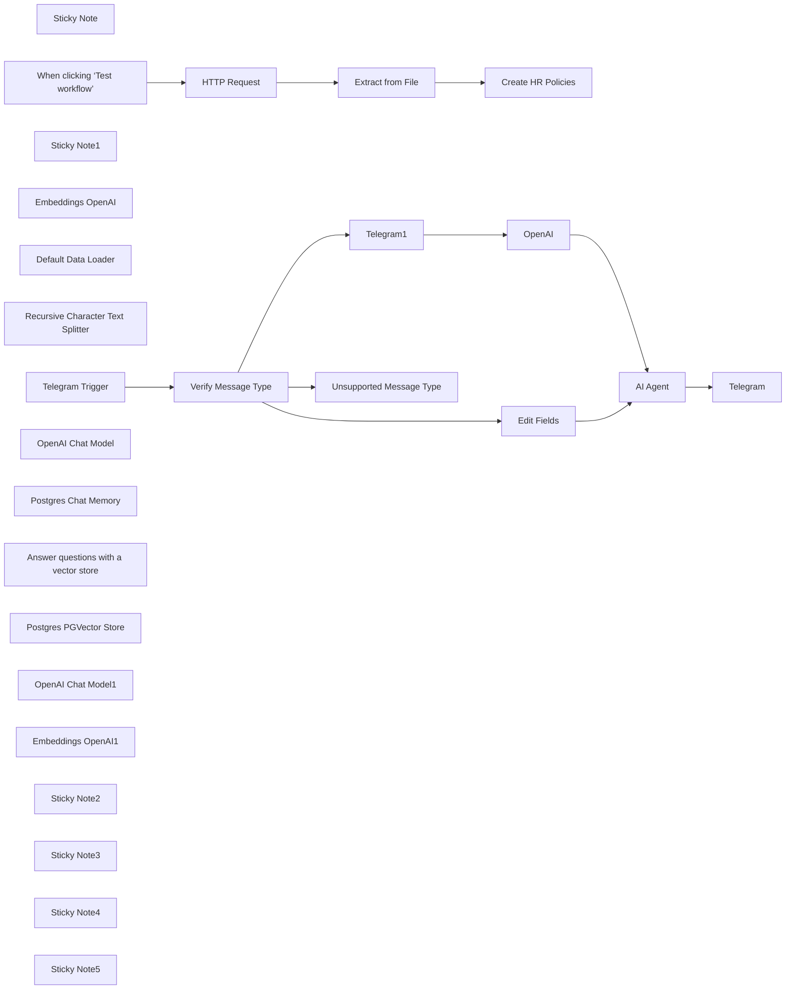

## Fluxo (.json) :

```json
{
  "id": "zmgSshZ5xESr3ozl",
  "meta": {
    "instanceId": "1fedaf0aa3a5d200ffa1bbc98554b56cac895dd5d001907cb6f1c7a3c0a78215",
    "templateCredsSetupCompleted": true
  },
  "name": "HR & IT Helpdesk Chatbot with Audio Transcription",
  "tags": [],
  "nodes": [
    {
      "id": "c6cb921e-97ac-48f6-9d79-133993dd6ef7",
      "name": "Sticky Note",
      "type": "n8n-nodes-base.stickyNote",
      "position": [
        -300,
        -280
      ],
      "parameters": {
        "color": 7,
        "width": 780,
        "height": 460,
        "content": "## 1. Download & Extract Internal Policy Documents\n[Read more about the HTTP Request Tool](https://docs.n8n.io/integrations/builtin/core-nodes/n8n-nodes-base.httprequest)\n\nBegin by importing the PDF documents that contain your internal policies and FAQs—these will become the knowledge base for your Internal Helpdesk Assistant. For example, you can store a company handbook or IT/HR policy PDFs on a shared drive or cloud storage and reference a direct download link here.\n\nIn this demonstration, we'll use the **HTTP Request node** to fetch the PDF file from a given URL and then parse its text contents using the **Extract from File node**. Once extracted, these text chunks will be used to build the vector store that underpins your helpdesk chatbot’s responses.\n\n[Example Employee Handbook with Policies](https://s3.amazonaws.com/scschoolfiles/656/employee_handbook_print_1.pdf)"
      },
      "typeVersion": 1
    },
    {
      "id": "450a254c-eec3-41ea-a11d-eb87b62ee4f4",
      "name": "When clicking ‘Test workflow’",
      "type": "n8n-nodes-base.manualTrigger",
      "position": [
        -80,
        20
      ],
      "parameters": {},
      "typeVersion": 1
    },
    {
      "id": "0972f31c-1f62-430c-8beb-bef8976cd0eb",
      "name": "HTTP Request",
      "type": "n8n-nodes-base.httpRequest",
      "position": [
        100,
        20
      ],
      "parameters": {
        "url": "https://s3.amazonaws.com/scschoolfiles/656/employee_handbook_print_1.pdf",
        "options": {}
      },
      "typeVersion": 4.2
    },
    {
      "id": "bf523255-39f5-410a-beb7-6331139c5f9b",
      "name": "Extract from File",
      "type": "n8n-nodes-base.extractFromFile",
      "position": [
        280,
        20
      ],
      "parameters": {
        "options": {},
        "operation": "pdf"
      },
      "typeVersion": 1
    },
    {
      "id": "88901c7c-e747-44c7-87d9-e14ac99a93db",
      "name": "Sticky Note1",
      "type": "n8n-nodes-base.stickyNote",
      "position": [
        540,
        -280
      ],
      "parameters": {
        "color": 7,
        "width": 780,
        "height": 1020,
        "content": "## 2. Create Internal Policy Vector Store\n[Read more about the In-Memory Vector Store](https://docs.n8n.io/integrations/builtin/cluster-nodes/root-nodes/n8n-nodes-langchain.vectorstoreinmemory/)\n\nVector stores power the retrieval process by matching a user's natural language questions to relevant chunks of text. We'll transform your extracted internal policy text into vector embeddings and store them in a database-like structure.\n\nWe will be using PostgreSQL which has production ready vector support.\n\n**How it works**  \n1. The text extracted in Step 1 is split into manageable segments (chunks).  \n2. An embedding model transforms these segments into numerical vectors.  \n3. These vectors, along with metadata, are stored in PostgreSQL.  \n4. When users ask a question, their query is embedded and matched to the most relevant vectors, improving the accuracy of the chatbot's response."
      },
      "typeVersion": 1
    },
    {
      "id": "8d6472ab-dcff-4d24-a320-109787bce52a",
      "name": "Create HR Policies",
      "type": "@n8n/n8n-nodes-langchain.vectorStorePGVector",
      "position": [
        620,
        100
      ],
      "parameters": {
        "mode": "insert",
        "options": {}
      },
      "credentials": {
        "postgres": {
          "id": "wQK6JXyS5y1icHw3",
          "name": "Postgres account"
        }
      },
      "typeVersion": 1
    },
    {
      "id": "e669b3fb-aaf1-4df8-855b-d3142215b308",
      "name": "Embeddings OpenAI",
      "type": "@n8n/n8n-nodes-langchain.embeddingsOpenAi",
      "position": [
        600,
        320
      ],
      "parameters": {
        "options": {}
      },
      "credentials": {
        "openAiApi": {
          "id": "J2D6m1evHLUJOMhO",
          "name": "OpenAi account"
        }
      },
      "typeVersion": 1.2
    },
    {
      "id": "e25418af-65bb-4628-9b26-ec59cae7b2b4",
      "name": "Default Data Loader",
      "type": "@n8n/n8n-nodes-langchain.documentDefaultDataLoader",
      "position": [
        760,
        340
      ],
      "parameters": {
        "options": {},
        "jsonData": "={{ $('Extract from File').item.json.text }}",
        "jsonMode": "expressionData"
      },
      "typeVersion": 1
    },
    {
      "id": "a4538deb-8406-4a5b-9b1e-4e2f859943c8",
      "name": "Recursive Character Text Splitter",
      "type": "@n8n/n8n-nodes-langchain.textSplitterRecursiveCharacterTextSplitter",
      "position": [
        860,
        560
      ],
      "parameters": {
        "options": {},
        "chunkSize": 2000
      },
      "typeVersion": 1
    },
    {
      "id": "7ee0e861-1576-4b0c-b2ef-3fc023371907",
      "name": "Telegram Trigger",
      "type": "n8n-nodes-base.telegramTrigger",
      "position": [
        1420,
        240
      ],
      "webhookId": "65f501de-3c14-4089-9b9d-8956676bebf3",
      "parameters": {
        "updates": [
          "message"
        ],
        "additionalFields": {}
      },
      "credentials": {
        "telegramApi": {
          "id": "jSdrxiRKb8yfG6Ty",
          "name": "Telegram account"
        }
      },
      "typeVersion": 1.1
    },
    {
      "id": "bcf1e82e-0e83-4783-a59f-857a6d1528b6",
      "name": "Verify Message Type",
      "type": "n8n-nodes-base.switch",
      "position": [
        1620,
        240
      ],
      "parameters": {
        "rules": {
          "values": [
            {
              "outputKey": "Text",
              "conditions": {
                "options": {
                  "version": 2,
                  "leftValue": "",
                  "caseSensitive": true,
                  "typeValidation": "strict"
                },
                "combinator": "and",
                "conditions": [
                  {
                    "operator": {
                      "type": "array",
                      "operation": "contains",
                      "rightType": "any"
                    },
                    "leftValue": "={{ $json.message.keys()}}",
                    "rightValue": "text"
                  }
                ]
              },
              "renameOutput": true
            },
            {
              "outputKey": "Audio",
              "conditions": {
                "options": {
                  "version": 2,
                  "leftValue": "",
                  "caseSensitive": true,
                  "typeValidation": "strict"
                },
                "combinator": "and",
                "conditions": [
                  {
                    "id": "d16eb899-cccb-41b6-921e-172c525ff92c",
                    "operator": {
                      "type": "array",
                      "operation": "contains",
                      "rightType": "any"
                    },
                    "leftValue": "={{ $json.message.keys()}}",
                    "rightValue": "voice"
                  }
                ]
              },
              "renameOutput": true
            }
          ]
        },
        "options": {
          "fallbackOutput": "extra"
        }
      },
      "typeVersion": 3.2,
      "alwaysOutputData": false
    },
    {
      "id": "d403f864-c781-48fc-a62b-de0c8bfedf06",
      "name": "OpenAI",
      "type": "@n8n/n8n-nodes-langchain.openAi",
      "position": [
        2340,
        380
      ],
      "parameters": {
        "options": {},
        "resource": "audio",
        "operation": "transcribe",
        "binaryPropertyName": "=data"
      },
      "credentials": {
        "openAiApi": {
          "id": "J2D6m1evHLUJOMhO",
          "name": "OpenAi account"
        }
      },
      "typeVersion": 1.8
    },
    {
      "id": "5b17c8f1-4bee-4f2a-abcb-74fe72d4cdfd",
      "name": "Telegram1",
      "type": "n8n-nodes-base.telegram",
      "position": [
        2120,
        380
      ],
      "parameters": {
        "fileId": "={{ $json.message.voice.file_id }}",
        "resource": "file"
      },
      "credentials": {
        "telegramApi": {
          "id": "jSdrxiRKb8yfG6Ty",
          "name": "Telegram account"
        }
      },
      "typeVersion": 1.2
    },
    {
      "id": "cc6862cb-acfc-465b-b142-dd5fdc12fb13",
      "name": "Unsupported Message Type",
      "type": "n8n-nodes-base.telegram",
      "position": [
        2200,
        560
      ],
      "parameters": {
        "text": "I'm not able to process this message type.",
        "chatId": "={{ $json.message.chat.id }}",
        "additionalFields": {}
      },
      "credentials": {
        "telegramApi": {
          "id": "jSdrxiRKb8yfG6Ty",
          "name": "Telegram account"
        }
      },
      "typeVersion": 1.2
    },
    {
      "id": "8b97aaa1-ea0d-4b11-89c9-9ac6376c0760",
      "name": "AI Agent",
      "type": "@n8n/n8n-nodes-langchain.agent",
      "position": [
        2860,
        400
      ],
      "parameters": {
        "text": "={{ $json.text }}",
        "options": {
          "systemMessage": "You are a helpful assistant for HR and employee policies"
        },
        "promptType": "define"
      },
      "typeVersion": 1.7
    },
    {
      "id": "e0d5416e-a799-46a2-83e3-fa6919ec0e36",
      "name": "OpenAI Chat Model",
      "type": "@n8n/n8n-nodes-langchain.lmChatOpenAi",
      "position": [
        2800,
        840
      ],
      "parameters": {
        "options": {}
      },
      "credentials": {
        "openAiApi": {
          "id": "J2D6m1evHLUJOMhO",
          "name": "OpenAi account"
        }
      },
      "typeVersion": 1.1
    },
    {
      "id": "9149f41d-692e-49bc-ad70-848492d2c345",
      "name": "Postgres Chat Memory",
      "type": "@n8n/n8n-nodes-langchain.memoryPostgresChat",
      "position": [
        3060,
        840
      ],
      "parameters": {
        "sessionKey": "={{ $('Telegram Trigger').item.json.message.chat.id }}",
        "sessionIdType": "customKey"
      },
      "credentials": {
        "postgres": {
          "id": "wQK6JXyS5y1icHw3",
          "name": "Postgres account"
        }
      },
      "typeVersion": 1.3
    },
    {
      "id": "a1f68887-da44-4bff-86fc-f607a5bd0ab6",
      "name": "Answer questions with a vector store",
      "type": "@n8n/n8n-nodes-langchain.toolVectorStore",
      "position": [
        3360,
        580
      ],
      "parameters": {
        "name": "hr_employee_policies",
        "description": "data for HR and employee policies"
      },
      "typeVersion": 1
    },
    {
      "id": "76220fe4-2448-4b32-92d8-68c564cc702d",
      "name": "Postgres PGVector Store",
      "type": "@n8n/n8n-nodes-langchain.vectorStorePGVector",
      "position": [
        3220,
        780
      ],
      "parameters": {
        "options": {}
      },
      "credentials": {
        "postgres": {
          "id": "wQK6JXyS5y1icHw3",
          "name": "Postgres account"
        }
      },
      "typeVersion": 1
    },
    {
      "id": "055fd294-7483-45ce-b58a-c90075199f5f",
      "name": "OpenAI Chat Model1",
      "type": "@n8n/n8n-nodes-langchain.lmChatOpenAi",
      "position": [
        3640,
        780
      ],
      "parameters": {
        "options": {}
      },
      "credentials": {
        "openAiApi": {
          "id": "J2D6m1evHLUJOMhO",
          "name": "OpenAi account"
        }
      },
      "typeVersion": 1.1
    },
    {
      "id": "cc13eac7-8163-45bf-8d8a-9cf72659e357",
      "name": "Embeddings OpenAI1",
      "type": "@n8n/n8n-nodes-langchain.embeddingsOpenAi",
      "position": [
        3300,
        920
      ],
      "parameters": {
        "options": {}
      },
      "credentials": {
        "openAiApi": {
          "id": "J2D6m1evHLUJOMhO",
          "name": "OpenAi account"
        }
      },
      "typeVersion": 1.2
    },
    {
      "id": "d46e415e-75ff-46b8-b382-cdcda216b1ed",
      "name": "Telegram",
      "type": "n8n-nodes-base.telegram",
      "position": [
        4200,
        420
      ],
      "parameters": {
        "text": "={{ $json.output }}",
        "chatId": "={{ $('Telegram Trigger').first().json.message.chat.id }}",
        "additionalFields": {}
      },
      "credentials": {
        "telegramApi": {
          "id": "jSdrxiRKb8yfG6Ty",
          "name": "Telegram account"
        }
      },
      "typeVersion": 1.2
    },
    {
      "id": "ddf623a1-0a5e-48c9-b897-6a339895a891",
      "name": "Edit Fields",
      "type": "n8n-nodes-base.set",
      "position": [
        2120,
        200
      ],
      "parameters": {
        "options": {},
        "assignments": {
          "assignments": [
            {
              "id": "403b336f-87ce-4bef-a5f2-1640425f8198",
              "name": "text",
              "type": "string",
              "value": "={{ $json.message.text }}"
            }
          ]
        },
        "includeOtherFields": true
      },
      "typeVersion": 3.4
    },
    {
      "id": "4ae84e17-cfc1-425c-930d-949da7308b78",
      "name": "Sticky Note2",
      "type": "n8n-nodes-base.stickyNote",
      "position": [
        1340,
        -280
      ],
      "parameters": {
        "color": 4,
        "width": 1300,
        "height": 1020,
        "content": "## 3. Handling Messages with Fallback Support\n\nThis workflow processes Telegram messages to handle **text** and **voice** inputs, with a fallback for unsupported message types. Here’s how it works:\n\n1. **Trigger Node**:\n   - The workflow starts with a Telegram trigger that listens for incoming messages.\n\n2. **Message Type Check**:\n   - The workflow verifies the type of message received:\n     - **Text Message**: If the message contains `$json.message.text`, it is sent directly to the agent.\n     - **Voice Message**: If the message contains `$json.message.voice`, the audio is transcribed into text using a transcription service, and the result is sent to the agent.\n\n3. **Fallback Path**:\n   - If the message is neither text nor voice, a fallback response is returned:\n     `\"Sorry, I couldn’t process your message. Please try again.\"`\n\n4. **Unified Output**:\n   - Both text messages and transcribed voice messages are converted into the same format before sending to the agent, ensuring consistency in handling.\n"
      },
      "typeVersion": 1
    },
    {
      "id": "86ad4e08-ef2d-405e-8861-bff38e1db651",
      "name": "Sticky Note3",
      "type": "n8n-nodes-base.stickyNote",
      "position": [
        220,
        220
      ],
      "parameters": {
        "width": 260,
        "height": 80,
        "content": "The setup needs to be run at the start or when data is changed"
      },
      "typeVersion": 1
    },
    {
      "id": "b05c4437-00fb-40f6-87fa-8dc564b16005",
      "name": "Sticky Note4",
      "type": "n8n-nodes-base.stickyNote",
      "position": [
        2680,
        -280
      ],
      "parameters": {
        "color": 4,
        "width": 1180,
        "height": 1420,
        "content": "## 4. HR & IT AI Agent Provides Helpdesk Support  \nn8n's AI agents allow you to create intelligent and interactive workflows that can access and retrieve data from internal knowledgebases. In this workflow, the AI agent is configured to provide answers for HR and IT queries by performing Retrieval-Augmented Generation (RAG) on internal documents.\n\n### How It Works:\n- **Internal Knowledgebase Access**: A **Vector store tool** is used to connect the agent to the HR & IT knowledgebase built earlier in the workflow. This enables the agent to fetch accurate and specific answers for employee queries.\n- **Chat Memory**: A **Chat memory subnode** tracks the conversation, allowing the agent to maintain context across multiple queries from the same user, creating a personalized and cohesive experience.\n- **Dynamic Query Responses**: Whether employees ask about policies, leave balances, or technical troubleshooting, the agent retrieves relevant data from the vector store and crafts a natural language response.\n\nBy integrating the AI agent with a vector store and chat memory, this workflow empowers your HR & IT helpdesk chatbot to provide quick, accurate, and conversational support to employees. \n\nPostgrSQL is used for all steps to simplify development in production."
      },
      "typeVersion": 1
    },
    {
      "id": "b266ca42-de62-4341-9aff-33ee0ac68045",
      "name": "Sticky Note5",
      "type": "n8n-nodes-base.stickyNote",
      "position": [
        3900,
        300
      ],
      "parameters": {
        "color": 4,
        "width": 540,
        "height": 280,
        "content": "## 5. Send Message\n\nThe simplest and most important part :)"
      },
      "typeVersion": 1
    }
  ],
  "active": false,
  "pinData": {},
  "settings": {
    "executionOrder": "v1"
  },
  "versionId": "7b1d11ca-9b56-4c5f-9189-26d536c24b76",
  "connections": {
    "OpenAI": {
      "main": [
        [
          {
            "node": "AI Agent",
            "type": "main",
            "index": 0
          }
        ]
      ]
    },
    "AI Agent": {
      "main": [
        [
          {
            "node": "Telegram",
            "type": "main",
            "index": 0
          }
        ]
      ]
    },
    "Telegram1": {
      "main": [
        [
          {
            "node": "OpenAI",
            "type": "main",
            "index": 0
          }
        ]
      ]
    },
    "Edit Fields": {
      "main": [
        [
          {
            "node": "AI Agent",
            "type": "main",
            "index": 0
          }
        ]
      ]
    },
    "HTTP Request": {
      "main": [
        [
          {
            "node": "Extract from File",
            "type": "main",
            "index": 0
          }
        ]
      ]
    },
    "Telegram Trigger": {
      "main": [
        [
          {
            "node": "Verify Message Type",
            "type": "main",
            "index": 0
          }
        ]
      ]
    },
    "Embeddings OpenAI": {
      "ai_embedding": [
        [
          {
            "node": "Create HR Policies",
            "type": "ai_embedding",
            "index": 0
          }
        ]
      ]
    },
    "Extract from File": {
      "main": [
        [
          {
            "node": "Create HR Policies",
            "type": "main",
            "index": 0
          }
        ]
      ]
    },
    "OpenAI Chat Model": {
      "ai_languageModel": [
        [
          {
            "node": "AI Agent",
            "type": "ai_languageModel",
            "index": 0
          }
        ]
      ]
    },
    "Embeddings OpenAI1": {
      "ai_embedding": [
        [
          {
            "node": "Postgres PGVector Store",
            "type": "ai_embedding",
            "index": 0
          }
        ]
      ]
    },
    "OpenAI Chat Model1": {
      "ai_languageModel": [
        [
          {
            "node": "Answer questions with a vector store",
            "type": "ai_languageModel",
            "index": 0
          }
        ]
      ]
    },
    "Default Data Loader": {
      "ai_document": [
        [
          {
            "node": "Create HR Policies",
            "type": "ai_document",
            "index": 0
          }
        ]
      ]
    },
    "Verify Message Type": {
      "main": [
        [
          {
            "node": "Edit Fields",
            "type": "main",
            "index": 0
          }
        ],
        [
          {
            "node": "Telegram1",
            "type": "main",
            "index": 0
          }
        ],
        [
          {
            "node": "Unsupported Message Type",
            "type": "main",
            "index": 0
          }
        ]
      ]
    },
    "Postgres Chat Memory": {
      "ai_memory": [
        [
          {
            "node": "AI Agent",
            "type": "ai_memory",
            "index": 0
          }
        ]
      ]
    },
    "Postgres PGVector Store": {
      "ai_vectorStore": [
        [
          {
            "node": "Answer questions with a vector store",
            "type": "ai_vectorStore",
            "index": 0
          }
        ]
      ]
    },
    "Recursive Character Text Splitter": {
      "ai_textSplitter": [
        [
          {
            "node": "Default Data Loader",
            "type": "ai_textSplitter",
            "index": 0
          }
        ]
      ]
    },
    "When clicking ‘Test workflow’": {
      "main": [
        [
          {
            "node": "HTTP Request",
            "type": "main",
            "index": 0
          }
        ]
      ]
    },
    "Answer questions with a vector store": {
      "ai_tool": [
        [
          {
            "node": "AI Agent",
            "type": "ai_tool",
            "index": 0
          }
        ]
      ]
    }
  }
}
```

<a id="template-2572"></a>

## Template 2572 - Agente AI DeepSeek via Telegram com memória de longo prazo

- **Nome:** Agente AI DeepSeek via Telegram com memória de longo prazo
- **Descrição:** Fluxo que recebe mensagens do Telegram, utiliza modelos DeepSeek para gerar respostas personalizadas e mantém memórias de longo prazo armazenadas em um documento para contexto futuro.
- **Funcionalidade:** • Receber mensagens via webhook: Aceita atualizações do bot Telegram através de um endpoint HTTPS.
• Validação de usuário e chat: Confere primeiro nome, sobrenome e ID do remetente antes de processar a mensagem.
• Roteamento por tipo de mensagem: Direciona mensagens de texto, voz e imagens para fluxos apropriados e trata casos não suportados.
• Recuperar memórias de longo prazo: Lê conteúdo de um documento para incluir memórias recentes no contexto do agente AI.
• Mesclar contexto e entrada: Combina a mensagem do usuário com memórias e contexto de sessão antes de enviar ao modelo.
• Agente AI com instruções de sistema: Usa um prompt de sistema que gerencia regras de memória, privacidade e tom da resposta para gerar saídas relevantes.
• Salvar memórias relevantes: Quando aplicável, grava memórias resumidas e datadas em um documento externo para uso futuro.
• Buffer de memória de sessão: Mantém um histórico recente de conversas para contexto local durante a sessão.
• Envio de resposta ao usuário: Retorna as respostas geradas ao chat do Telegram, com formatação adequada.
• Tratamento de erros e fallback: Envia mensagens de erro amigáveis quando não é possível processar a requisição.
- **Ferramentas:** • Telegram Bot API: Plataforma para receber e enviar mensagens do bot por webhook.
• Google Docs: Serviço usado para armazenar e recuperar memórias de longo prazo em um documento compartilhado.
• DeepSeek API (DeepSeek-V3 / DeepSeek-R1): Modelos de linguagem usados para chat e raciocínio para gerar respostas e extrair memórias relevantes.

## Fluxo visual

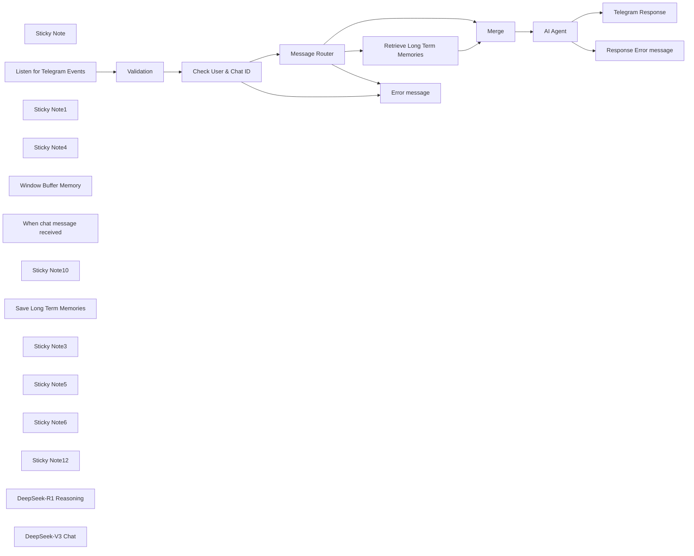

## Fluxo (.json) :

```json
{
  "id": "rtsvydad1MOCryia",
  "meta": {
    "instanceId": "31e69f7f4a77bf465b805824e303232f0227212ae922d12133a0f96ffeab4fef"
  },
  "name": "🐋🤖 DeepSeek AI Agent + Telegram + LONG TERM Memory 🧠",
  "tags": [],
  "nodes": [
    {
      "id": "23b50c07-39a8-4166-ab13-9683b3ee25e6",
      "name": "Check User & Chat ID",
      "type": "n8n-nodes-base.if",
      "position": [
        -80,
        160
      ],
      "parameters": {
        "options": {},
        "conditions": {
          "options": {
            "version": 2,
            "leftValue": "",
            "caseSensitive": true,
            "typeValidation": "strict"
          },
          "combinator": "and",
          "conditions": [
            {
              "id": "5fe3c0d8-bd61-4943-b152-9e6315134520",
              "operator": {
                "name": "filter.operator.equals",
                "type": "string",
                "operation": "equals"
              },
              "leftValue": "={{ $('Listen for Telegram Events').item.json.body.message.from.first_name }}",
              "rightValue": "={{ $json.first_name }}"
            },
            {
              "id": "98a0ea91-0567-459c-bbce-06abc14a49ce",
              "operator": {
                "name": "filter.operator.equals",
                "type": "string",
                "operation": "equals"
              },
              "leftValue": "={{ $('Listen for Telegram Events').item.json.body.message.from.last_name }}",
              "rightValue": "={{ $json.last_name }}"
            },
            {
              "id": "18a96c1f-f2a0-4a2a-b789-606763df4423",
              "operator": {
                "type": "number",
                "operation": "equals"
              },
              "leftValue": "={{ $('Listen for Telegram Events').item.json.body.message.from.id }}",
              "rightValue": "={{ $json.id }}"
            }
          ]
        },
        "looseTypeValidation": "="
      },
      "typeVersion": 2.2
    },
    {
      "id": "ecbc13fe-305d-4cdd-b35c-3e119e8e8b5d",
      "name": "Error message",
      "type": "n8n-nodes-base.telegram",
      "position": [
        160,
        440
      ],
      "parameters": {
        "text": "=Unable to process your message.",
        "chatId": "={{ $json.body.message.chat.id }}",
        "additionalFields": {
          "appendAttribution": false
        }
      },
      "credentials": {
        "telegramApi": {
          "id": "pAIFhguJlkO3c7aQ",
          "name": "Telegram account"
        }
      },
      "typeVersion": 1.2
    },
    {
      "id": "be722bc7-0b22-4892-967c-fdd398a7b129",
      "name": "Sticky Note",
      "type": "n8n-nodes-base.stickyNote",
      "position": [
        -540,
        -20
      ],
      "parameters": {
        "color": 6,
        "width": 949,
        "height": 652,
        "content": "# Receive Telegram Message with Webhook"
      },
      "typeVersion": 1
    },
    {
      "id": "a3866585-bfee-4025-a8f4-f06fde16171a",
      "name": "Listen for Telegram Events",
      "type": "n8n-nodes-base.webhook",
      "position": [
        -480,
        160
      ],
      "webhookId": "097f36f3-1574-44f9-815f-58387e3b20bf",
      "parameters": {
        "path": "wbot",
        "options": {
          "binaryPropertyName": "data"
        },
        "httpMethod": "POST"
      },
      "typeVersion": 2
    },
    {
      "id": "f70571d5-3680-4616-90fa-3358b0883368",
      "name": "Sticky Note1",
      "type": "n8n-nodes-base.stickyNote",
      "position": [
        -1380,
        -20
      ],
      "parameters": {
        "color": 7,
        "width": 800,
        "height": 860,
        "content": "# How to set up a Telegram Bot WebHook\n\n## WebHook Setup Process\n\n**Basic Concept**\nA WebHook allows your Telegram bot to automatically receive updates instead of manually polling the Bot API.\n\n**Setup Method**\nTo set a WebHook, make a GET request using this URL format:\n```\nhttps://api.telegram.org/bot{my_bot_token}/setWebhook?url={url_to_send_updates_to}\n```\nWhere:\n- `my_bot_token`: Your bot token from BotFather\n- `url_to_send_updates_to`: Your HTTPS endpoint that handles bot updates\n\n\n**Verification**\nTo verify the WebHook setup, use:\n```\nhttps://api.telegram.org/bot{my_bot_token}/getWebhookInfo\n```\n\nA successful response looks like:\n```json\n{\n \"ok\": true,\n \"result\": {\n \"url\": \"https://www.example.com/my-telegram-bot/\",\n \"has_custom_certificate\": false,\n \"pending_update_count\": 0,\n \"max_connections\": 40\n }\n}\n```\n\n\nThis method provides a simple and efficient way to handle Telegram bot updates automatically through webhooks rather than manual polling."
      },
      "typeVersion": 1
    },
    {
      "id": "2b6149d5-ffd6-46ef-9840-149508251a77",
      "name": "Validation",
      "type": "n8n-nodes-base.set",
      "position": [
        -260,
        160
      ],
      "parameters": {
        "options": {},
        "assignments": {
          "assignments": [
            {
              "id": "0cea6da1-652a-4c1e-94c3-30608ced90f8",
              "name": "first_name",
              "type": "string",
              "value": "FirstName"
            },
            {
              "id": "b90280c6-3e36-49ca-9e7e-e15c42d256cc",
              "name": "last_name",
              "type": "string",
              "value": "LastName"
            },
            {
              "id": "f6d86283-16ca-447e-8427-7d3d190babc0",
              "name": "id",
              "type": "number",
              "value": 12345667891
            }
          ]
        },
        "includeOtherFields": true
      },
      "typeVersion": 3.4
    },
    {
      "id": "41c965ea-b67d-4d6b-82e4-0e57f5fc13bb",
      "name": "Sticky Note4",
      "type": "n8n-nodes-base.stickyNote",
      "position": [
        -320,
        100
      ],
      "parameters": {
        "color": 7,
        "width": 420,
        "height": 260,
        "content": "## Validate Telegram User\n"
      },
      "typeVersion": 1
    },
    {
      "id": "164f5e91-1958-4dc5-b38c-db1cec0579d4",
      "name": "Message Router",
      "type": "n8n-nodes-base.switch",
      "position": [
        160,
        160
      ],
      "parameters": {
        "rules": {
          "values": [
            {
              "outputKey": "audio",
              "conditions": {
                "options": {
                  "version": 2,
                  "leftValue": "",
                  "caseSensitive": true,
                  "typeValidation": "strict"
                },
                "combinator": "and",
                "conditions": [
                  {
                    "operator": {
                      "type": "object",
                      "operation": "exists",
                      "singleValue": true
                    },
                    "leftValue": "={{ $json.body.message.voice }}",
                    "rightValue": ""
                  }
                ]
              },
              "renameOutput": true
            },
            {
              "outputKey": "text",
              "conditions": {
                "options": {
                  "version": 2,
                  "leftValue": "",
                  "caseSensitive": true,
                  "typeValidation": "strict"
                },
                "combinator": "and",
                "conditions": [
                  {
                    "id": "342f0883-d959-44a2-b80d-379e39c76218",
                    "operator": {
                      "type": "string",
                      "operation": "exists",
                      "singleValue": true
                    },
                    "leftValue": "={{ $json.body.message.text }}",
                    "rightValue": ""
                  }
                ]
              },
              "renameOutput": true
            },
            {
              "outputKey": "image",
              "conditions": {
                "options": {
                  "version": 2,
                  "leftValue": "",
                  "caseSensitive": true,
                  "typeValidation": "strict"
                },
                "combinator": "and",
                "conditions": [
                  {
                    "id": "ded3a600-f861-413a-8892-3fc5ea935ecb",
                    "operator": {
                      "type": "array",
                      "operation": "exists",
                      "singleValue": true
                    },
                    "leftValue": "={{ $json.body.message.photo }}",
                    "rightValue": ""
                  }
                ]
              },
              "renameOutput": true
            }
          ]
        },
        "options": {
          "fallbackOutput": "extra"
        }
      },
      "typeVersion": 3.2
    },
    {
      "id": "7947173d-39fa-4d4b-9b1e-60de809a9950",
      "name": "AI Agent",
      "type": "@n8n/n8n-nodes-langchain.agent",
      "onError": "continueErrorOutput",
      "position": [
        860,
        340
      ],
      "parameters": {
        "text": "={{ $('Message Router').item.json.body.message.text }}",
        "options": {
          "systemMessage": "=## ROLE \nYou are a friendly, attentive, and helpful AI assistant. Your primary goal is to assist the user while maintaining a personalized and engaging interaction. The current user's first name is **{{ $json.body.message.from.first_name }}**.\n\n---\n\n## RULES \n\n1. **Memory Management**: \n - When the user sends a new message, evaluate whether it contains noteworthy or personal information (e.g., preferences, habits, goals, or important events). \n - If such information is identified, use the **Save Memory** tool to store this data in memory. \n - Always send a meaningful response back to the user, even if your primary action was saving information. This response should not reveal that information was stored but should acknowledge or engage with the user’s input naturally.\n\n2. **Context Awareness**: \n - Use stored memories to provide contextually relevant and personalized responses. \n - Always consider the **date and time** when a memory was collected to ensure your responses are up-to-date and accurate.\n\n3. **User-Centric Responses**: \n - Tailor your responses based on the user's preferences and past interactions. \n - Be proactive in recalling relevant details from memory when appropriate but avoid overwhelming the user with unnecessary information.\n\n4. **Privacy and Sensitivity**: \n - Handle all user data with care and sensitivity. Avoid making assumptions or sharing stored information unless it directly enhances the conversation or task at hand.\n\n5. **Fallback Responses**: \n - **IMPORTANT** If no specific task or question arises from the user’s message (e.g., when only saving information), respond in a way that keeps the conversation flowing naturally. For example:\n - Acknowledge their input: “Thanks for sharing that!” \n - Provide a friendly follow-up: “Is there anything else I can help you with today?”\n - DO NOT tell Jokes as a fall back response.\n\n---\n\n## TOOLS \n\n### Save Memory \n- Use this tool to store summarized, concise, and meaningful information about the user. \n- Extract key details from user messages that could enhance future interactions (e.g., likes/dislikes, important dates, hobbies). \n- Ensure that the summary is clear and devoid of unnecessary details.\n\n---\n\n## MEMORIES \n\n### Recent Noteworthy Memories \nHere are the most recent memories collected from the user, including their date and time of collection: \n\n**{{ $('Retrieve Long Term Memories').item.json.content }}**\n\n### Guidelines for Using Memories: \n- Prioritize recent memories but do not disregard older ones if they remain relevant. \n- Cross-reference memories to maintain consistency in your responses. For example, if a user shares conflicting preferences over time, clarify or adapt accordingly.\n\n---\n\n## ADDITIONAL INSTRUCTIONS \n\n- Think critically before responding to ensure your answers are thoughtful and accurate. \n- Strive to build trust with the user by being consistent, reliable, and personable in your interactions. \n- Avoid robotic or overly formal language; aim for a conversational tone that aligns with being \"friendly and helpful.\" \n"
        },
        "promptType": "define"
      },
      "typeVersion": 1.7,
      "alwaysOutputData": true
    },
    {
      "id": "6111c771-d8af-4586-8829-213d86dc4f47",
      "name": "Merge",
      "type": "n8n-nodes-base.merge",
      "position": [
        860,
        100
      ],
      "parameters": {
        "mode": "combine",
        "options": {},
        "combineBy": "combineAll"
      },
      "typeVersion": 3
    },
    {
      "id": "94a01b4f-549d-4e49-88e0-143c90dd200e",
      "name": "Window Buffer Memory",
      "type": "@n8n/n8n-nodes-langchain.memoryBufferWindow",
      "position": [
        920,
        780
      ],
      "parameters": {
        "sessionKey": "={{ $json.id }}",
        "sessionIdType": "customKey",
        "contextWindowLength": 50
      },
      "typeVersion": 1.3
    },
    {
      "id": "d1182e11-025e-4885-abb1-b76a9b617b84",
      "name": "When chat message received",
      "type": "@n8n/n8n-nodes-langchain.chatTrigger",
      "disabled": true,
      "position": [
        -480,
        420
      ],
      "webhookId": "701ddc24-2637-466e-9789-5d47145333a8",
      "parameters": {
        "options": {}
      },
      "typeVersion": 1.1
    },
    {
      "id": "97d4cdcd-b016-44aa-882c-eb2ec38968eb",
      "name": "Sticky Note10",
      "type": "n8n-nodes-base.stickyNote",
      "position": [
        440,
        -20
      ],
      "parameters": {
        "color": 5,
        "width": 1033,
        "height": 1029,
        "content": "# Process Text Message"
      },
      "typeVersion": 1
    },
    {
      "id": "73156ecc-af5f-4e3d-82c6-4668db52b511",
      "name": "Telegram Response",
      "type": "n8n-nodes-base.telegram",
      "position": [
        1240,
        160
      ],
      "parameters": {
        "text": "={{ $json.output }}",
        "chatId": "={{ $('Listen for Telegram Events').item.json.body.message.chat.id }}",
        "additionalFields": {
          "parse_mode": "HTML",
          "appendAttribution": false
        }
      },
      "credentials": {
        "telegramApi": {
          "id": "pAIFhguJlkO3c7aQ",
          "name": "Telegram account"
        }
      },
      "typeVersion": 1.2
    },
    {
      "id": "5f342299-40fe-44cf-9b58-8a9d3bfac1df",
      "name": "Save Long Term Memories",
      "type": "n8n-nodes-base.googleDocsTool",
      "position": [
        1260,
        780
      ],
      "parameters": {
        "actionsUi": {
          "actionFields": [
            {
              "text": "= Memory: {{ $fromAI('memory') }} - Date: {{ $now }} ",
              "action": "insert"
            }
          ]
        },
        "operation": "update",
        "documentURL": "[Google Doc ID]",
        "descriptionType": "manual",
        "toolDescription": "Save memories"
      },
      "credentials": {
        "googleDocsOAuth2Api": {
          "id": "YWEHuG28zOt532MQ",
          "name": "Google Docs account"
        }
      },
      "typeVersion": 2
    },
    {
      "id": "aba001a8-68f9-4870-9cd0-60a4c59ecd5b",
      "name": "Sticky Note3",
      "type": "n8n-nodes-base.stickyNote",
      "position": [
        460,
        220
      ],
      "parameters": {
        "color": 4,
        "width": 300,
        "height": 340,
        "content": "## Retrieve Long Term Memories\nGoogle Docs"
      },
      "typeVersion": 1
    },
    {
      "id": "e5ec71ec-9527-4ccd-87c3-3aa2f09192e8",
      "name": "Retrieve Long Term Memories",
      "type": "n8n-nodes-base.googleDocs",
      "position": [
        560,
        360
      ],
      "parameters": {
        "operation": "get",
        "documentURL": "[Google Doc ID]"
      },
      "credentials": {
        "googleDocsOAuth2Api": {
          "id": "YWEHuG28zOt532MQ",
          "name": "Google Docs account"
        }
      },
      "typeVersion": 2,
      "alwaysOutputData": true
    },
    {
      "id": "4764383a-3c4b-4e64-b391-5dc9fb4b9de6",
      "name": "Sticky Note5",
      "type": "n8n-nodes-base.stickyNote",
      "position": [
        820,
        660
      ],
      "parameters": {
        "width": 280,
        "height": 320,
        "content": "## Save To Current Chat Memory (Optional)"
      },
      "typeVersion": 1
    },
    {
      "id": "e11995b8-e061-4b40-b4b6-9ec03c7e5a06",
      "name": "Sticky Note6",
      "type": "n8n-nodes-base.stickyNote",
      "position": [
        1160,
        660
      ],
      "parameters": {
        "color": 4,
        "width": 280,
        "height": 320,
        "content": "## Save Long Term Memories\nGoogle Docs"
      },
      "typeVersion": 1
    },
    {
      "id": "1b53aef2-ca99-409b-bd10-3fc1fd87f540",
      "name": "Response Error message",
      "type": "n8n-nodes-base.telegram",
      "position": [
        1240,
        360
      ],
      "parameters": {
        "text": "=Unable to process your message.",
        "chatId": "={{ $('Listen for Telegram Events').item.json.body.message.chat.id }}",
        "additionalFields": {
          "appendAttribution": false
        }
      },
      "credentials": {
        "telegramApi": {
          "id": "pAIFhguJlkO3c7aQ",
          "name": "Telegram account"
        }
      },
      "typeVersion": 1.2
    },
    {
      "id": "e5d79084-d7f1-44fd-a1db-73cc76a148ec",
      "name": "Sticky Note12",
      "type": "n8n-nodes-base.stickyNote",
      "position": [
        -60,
        660
      ],
      "parameters": {
        "color": 7,
        "width": 820,
        "height": 600,
        "content": "# DeepSeek API Call\n\nThe DeepSeek API uses an API format compatible with OpenAI. By modifying the configuration, you can use the OpenAI SDK or softwares compatible with the OpenAI API to access the DeepSeek API.\n\nhttps://api-docs.deepseek.com/\n\n## Configuration Parameters\n\n| Parameter | Value |\n|-----------|--------|\n| base_url | https://api.deepseek.com |\n| api_key | https://platform.deepseek.com/api_keys |\n\n\n\n## Important Notes\n\n- To be compatible with OpenAI, you can also use `https://api.deepseek.com/v1` as the base_url. Note that the v1 here has NO relationship with the model's version.\n\n- The deepseek-chat model has been upgraded to DeepSeek-V3. The API remains unchanged. You can invoke DeepSeek-V3 by specifying `model='deepseek-chat'`.\n\n- deepseek-reasoner is the latest reasoning model, DeepSeek-R1, released by DeepSeek. You can invoke DeepSeek-R1 by specifying `model='deepseek-reasoner'`."
      },
      "typeVersion": 1
    },
    {
      "id": "af14e803-44a5-4b0e-a675-b1e860bf6d29",
      "name": "DeepSeek-R1 Reasoning",
      "type": "@n8n/n8n-nodes-langchain.lmChatOpenAi",
      "position": [
        440,
        880
      ],
      "parameters": {
        "model": "=deepseek-reasoner",
        "options": {}
      },
      "credentials": {
        "openAiApi": {
          "id": "MSl7SdcvZe0SqCYI",
          "name": "deepseek"
        }
      },
      "typeVersion": 1.1
    },
    {
      "id": "e8be6a32-ba4c-4895-b34b-c5e7d0ded5e8",
      "name": "DeepSeek-V3 Chat",
      "type": "@n8n/n8n-nodes-langchain.lmChatOpenAi",
      "position": [
        600,
        880
      ],
      "parameters": {
        "model": "=deepseek-chat",
        "options": {}
      },
      "credentials": {
        "openAiApi": {
          "id": "MSl7SdcvZe0SqCYI",
          "name": "deepseek"
        }
      },
      "typeVersion": 1.1
    }
  ],
  "active": false,
  "pinData": {},
  "settings": {
    "timezone": "America/Vancouver",
    "executionOrder": "v1"
  },
  "versionId": "2e669c98-e6ad-42f0-a642-de05e372937e",
  "connections": {
    "Merge": {
      "main": [
        [
          {
            "node": "AI Agent",
            "type": "main",
            "index": 0
          }
        ]
      ]
    },
    "AI Agent": {
      "main": [
        [
          {
            "node": "Telegram Response",
            "type": "main",
            "index": 0
          }
        ],
        [
          {
            "node": "Response Error message",
            "type": "main",
            "index": 0
          }
        ]
      ]
    },
    "Validation": {
      "main": [
        [
          {
            "node": "Check User & Chat ID",
            "type": "main",
            "index": 0
          }
        ]
      ]
    },
    "Message Router": {
      "main": [
        [],
        [
          {
            "node": "Merge",
            "type": "main",
            "index": 0
          },
          {
            "node": "Retrieve Long Term Memories",
            "type": "main",
            "index": 0
          }
        ],
        [],
        [
          {
            "node": "Error message",
            "type": "main",
            "index": 0
          }
        ]
      ]
    },
    "DeepSeek-V3 Chat": {
      "ai_languageModel": [
        [
          {
            "node": "AI Agent",
            "type": "ai_languageModel",
            "index": 0
          }
        ]
      ]
    },
    "Check User & Chat ID": {
      "main": [
        [
          {
            "node": "Message Router",
            "type": "main",
            "index": 0
          }
        ],
        [
          {
            "node": "Error message",
            "type": "main",
            "index": 0
          }
        ]
      ]
    },
    "Window Buffer Memory": {
      "ai_memory": [
        []
      ]
    },
    "Save Long Term Memories": {
      "ai_tool": [
        [
          {
            "node": "AI Agent",
            "type": "ai_tool",
            "index": 0
          }
        ]
      ]
    },
    "Listen for Telegram Events": {
      "main": [
        [
          {
            "node": "Validation",
            "type": "main",
            "index": 0
          }
        ]
      ]
    },
    "When chat message received": {
      "main": [
        []
      ]
    },
    "Retrieve Long Term Memories": {
      "main": [
        [
          {
            "node": "Merge",
            "type": "main",
            "index": 1
          }
        ]
      ]
    }
  }
}
```

<a id="template-2573"></a>

## Template 2573 - Agente Telegram para texto, áudio e imagens

- **Nome:** Agente Telegram para texto, áudio e imagens
- **Descrição:** Fluxo que recebe atualizações de um bot Telegram via webhook, valida o remetente, classifica e processa mensagens de texto, áudio e imagens e responde conforme o tipo.
- **Funcionalidade:** • Recepção via Webhook: Recebe atualizações do bot Telegram em um endpoint HTTPS público.
• Validação do remetente: Verifica nome e id do usuário antes de processar a mensagem.
• Roteamento por tipo de mensagem: Direciona mensagens para processamento de áudio, texto, imagem ou fallback quando não suportadas.
• Processamento de áudio: Obtém o arquivo de voz, transcreve usando um serviço de IA e classifica o texto (task ou other).
• Processamento de texto: Extrai o texto recebido, classifica entre "task" e "other" e envia respostas apropriadas.
• Processamento de imagens: Extrai o maior arquivo de foto, baixa e converte para base64, analisa a imagem com um modelo de IA e envia o resultado.
• Mensagens de resposta condicionais: Envia mensagens específicas para categorias "task" e "other" tanto para áudio quanto para texto, incluindo formatação HTML simples.
• Gerenciamento de Webhook: Permite definir URLs de teste e produção para o webhook e consultar o status do webhook do bot.
• Tratamento de erro e fallback: Envia uma mensagem de erro quando a validação falha ou quando o tipo de mensagem não é reconhecido.
- **Ferramentas:** • Telegram Bot API: Plataforma para receber atualizações do bot, baixar arquivos (áudio/imagem) e enviar mensagens de resposta.
• OpenAI (modelos de linguagem e multimídia): Serviço de IA usado para transcrição de áudio, classificação de texto e análise de imagens.
• Endpoint HTTPS público (servidor/host com URL): URL pública segura necessária para receber chamadas de webhook do Telegram e permitir configuração de webhook.

## Fluxo visual

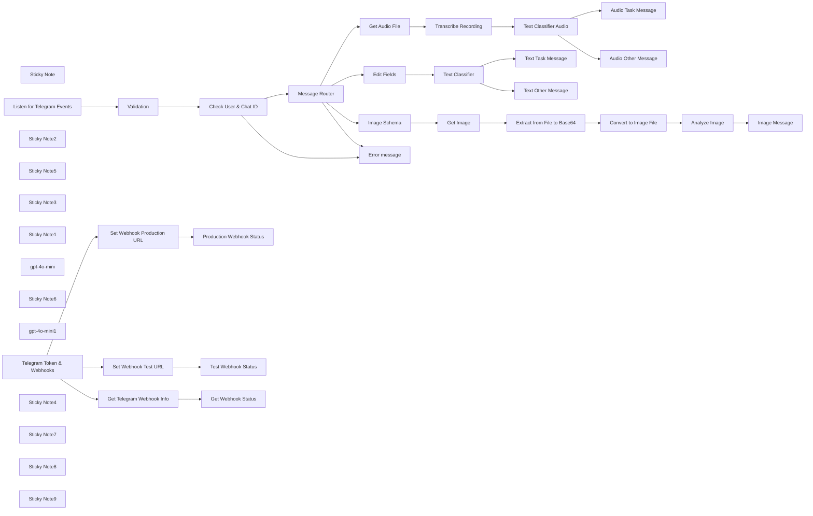

## Fluxo (.json) :

```json
{
  "id": "8jDt77Y4FaV6ARYG",
  "meta": {
    "instanceId": "31e69f7f4a77bf465b805824e303232f0227212ae922d12133a0f96ffeab4fef"
  },
  "name": "🤖 Telegram Messaging Agent for Text/Audio/Images",
  "tags": [],
  "nodes": [
    {
      "id": "1656be7a-7a27-47f3-b511-3634a65a97a2",
      "name": "Check User & Chat ID",
      "type": "n8n-nodes-base.if",
      "position": [
        100,
        160
      ],
      "parameters": {
        "options": {},
        "conditions": {
          "options": {
            "version": 2,
            "leftValue": "",
            "caseSensitive": true,
            "typeValidation": "strict"
          },
          "combinator": "and",
          "conditions": [
            {
              "id": "5fe3c0d8-bd61-4943-b152-9e6315134520",
              "operator": {
                "name": "filter.operator.equals",
                "type": "string",
                "operation": "equals"
              },
              "leftValue": "={{ $('Listen for Telegram Events').item.json.body.message.from.first_name }}",
              "rightValue": "={{ $json.first_name }}"
            },
            {
              "id": "98a0ea91-0567-459c-bbce-06abc14a49ce",
              "operator": {
                "name": "filter.operator.equals",
                "type": "string",
                "operation": "equals"
              },
              "leftValue": "={{ $('Listen for Telegram Events').item.json.body.message.from.last_name }}",
              "rightValue": "={{ $json.last_name }}"
            },
            {
              "id": "18a96c1f-f2a0-4a2a-b789-606763df4423",
              "operator": {
                "type": "number",
                "operation": "equals"
              },
              "leftValue": "={{ $('Listen for Telegram Events').item.json.body.message.from.id }}",
              "rightValue": "={{ $json.id }}"
            }
          ]
        },
        "looseTypeValidation": "="
      },
      "typeVersion": 2.2
    },
    {
      "id": "73b0fedb-eb82-4464-a08f-397a3fe69480",
      "name": "Error message",
      "type": "n8n-nodes-base.telegram",
      "position": [
        320,
        440
      ],
      "parameters": {
        "text": "=Unable to process your message.",
        "chatId": "={{ $json.body.message.chat.id }}",
        "additionalFields": {
          "appendAttribution": false
        }
      },
      "credentials": {
        "telegramApi": {
          "id": "pAIFhguJlkO3c7aQ",
          "name": "Telegram account"
        }
      },
      "typeVersion": 1.2
    },
    {
      "id": "a3dc143b-cf3c-4416-bf43-0ca75cbde6c9",
      "name": "Sticky Note",
      "type": "n8n-nodes-base.stickyNote",
      "position": [
        -380,
        -20
      ],
      "parameters": {
        "width": 929,
        "height": 652,
        "content": "# Receive Telegram Message with Webhook"
      },
      "typeVersion": 1
    },
    {
      "id": "c80dae1e-dd20-4632-a00c-9c6290540f22",
      "name": "Listen for Telegram Events",
      "type": "n8n-nodes-base.webhook",
      "position": [
        -320,
        160
      ],
      "webhookId": "b4ed4c80-a655-4ff2-87d6-febd5280d343",
      "parameters": {
        "path": "your-endpoint",
        "options": {
          "binaryPropertyName": "data"
        },
        "httpMethod": "POST"
      },
      "typeVersion": 2
    },
    {
      "id": "6010dacf-1ed6-413c-adf9-146397e16b09",
      "name": "Set Webhook Test URL",
      "type": "n8n-nodes-base.httpRequest",
      "position": [
        260,
        -260
      ],
      "parameters": {
        "url": "=https://api.telegram.org/{{ $json.token }}/setWebhook",
        "options": {},
        "sendQuery": true,
        "queryParameters": {
          "parameters": [
            {
              "name": "url",
              "value": "={{ $json.test_url }}"
            }
          ]
        }
      },
      "typeVersion": 4.2
    },
    {
      "id": "65f8d945-12bb-4ae3-bd83-3b892a36afb9",
      "name": "Sticky Note2",
      "type": "n8n-nodes-base.stickyNote",
      "position": [
        -380,
        -580
      ],
      "parameters": {
        "color": 3,
        "width": 1638,
        "height": 532,
        "content": "# Telegram Webhook Tools\n\n## Setting your Telegram Bot WebHook the Easy Way\n"
      },
      "typeVersion": 1
    },
    {
      "id": "8e3268e9-dc7c-4edd-b5e8-716de5d2ffb3",
      "name": "Get Telegram Webhook Info",
      "type": "n8n-nodes-base.httpRequest",
      "position": [
        -240,
        -260
      ],
      "parameters": {
        "url": "=https://api.telegram.org/{{ $json.token }}/getWebhookInfo",
        "options": {}
      },
      "typeVersion": 4.2
    },
    {
      "id": "e31e176f-2ebd-4cd1-a160-2cc5f254ca6d",
      "name": "Sticky Note5",
      "type": "n8n-nodes-base.stickyNote",
      "position": [
        580,
        -20
      ],
      "parameters": {
        "color": 4,
        "width": 1113,
        "height": 429,
        "content": "# Process Audio"
      },
      "typeVersion": 1
    },
    {
      "id": "b8b10cd9-7a41-4b21-853c-b2123918ab8d",
      "name": "Image Schema",
      "type": "n8n-nodes-base.set",
      "position": [
        660,
        1060
      ],
      "parameters": {
        "options": {},
        "assignments": {
          "assignments": [
            {
              "id": "17989eb0-feca-4631-b5c8-34b1d4a6c72b",
              "name": "image_file_id",
              "type": "string",
              "value": "={{ $json.body.message.photo.last().file_id }}"
            },
            {
              "id": "9317d7ae-dffd-4b1f-9a9c-b3cc4f1e0dd3",
              "name": "caption",
              "type": "string",
              "value": "={{ $json.body.message.caption }}"
            }
          ]
        }
      },
      "typeVersion": 3.4
    },
    {
      "id": "9a7b9e4c-7a81-451a-887a-b7b3f658ae6e",
      "name": "Sticky Note3",
      "type": "n8n-nodes-base.stickyNote",
      "position": [
        580,
        900
      ],
      "parameters": {
        "color": 6,
        "width": 1289,
        "height": 432,
        "content": "# Process Image"
      },
      "typeVersion": 1
    },
    {
      "id": "800da6c7-8d03-4932-a081-f35ce01c8dd7",
      "name": "Sticky Note1",
      "type": "n8n-nodes-base.stickyNote",
      "position": [
        -1200,
        -580
      ],
      "parameters": {
        "color": 7,
        "width": 800,
        "height": 860,
        "content": "# How to set up a Telegram Bot WebHook\n\n## WebHook Setup Process\n\n**Basic Concept**\nA WebHook allows your Telegram bot to automatically receive updates instead of manually polling the Bot API.\n\n**Setup Method**\nTo set a WebHook, make a GET request using this URL format:\n```\nhttps://api.telegram.org/bot{my_bot_token}/setWebhook?url={url_to_send_updates_to}\n```\nWhere:\n- `my_bot_token`: Your bot token from BotFather\n- `url_to_send_updates_to`: Your HTTPS endpoint that handles bot updates\n\n\n**Verification**\nTo verify the WebHook setup, use:\n```\nhttps://api.telegram.org/bot{my_bot_token}/getWebhookInfo\n```\n\nA successful response looks like:\n```json\n{\n \"ok\": true,\n \"result\": {\n \"url\": \"https://www.example.com/my-telegram-bot/\",\n \"has_custom_certificate\": false,\n \"pending_update_count\": 0,\n \"max_connections\": 40\n }\n}\n```\n\n\nThis method provides a simple and efficient way to handle Telegram bot updates automatically through webhooks rather than manual polling."
      },
      "typeVersion": 1
    },
    {
      "id": "cd09daf9-ac74-4e86-9d74-875d78f466f0",
      "name": "gpt-4o-mini",
      "type": "@n8n/n8n-nodes-langchain.lmChatOpenAi",
      "position": [
        1080,
        260
      ],
      "parameters": {
        "options": {}
      },
      "credentials": {
        "openAiApi": {
          "id": "jEMSvKmtYfzAkhe6",
          "name": "OpenAi account"
        }
      },
      "typeVersion": 1
    },
    {
      "id": "4c69533c-e4e7-4667-baf8-7ca1ed36b150",
      "name": "Get Audio File",
      "type": "n8n-nodes-base.telegram",
      "position": [
        660,
        100
      ],
      "parameters": {
        "fileId": "={{ $json.body.message.voice.file_id }}",
        "resource": "file"
      },
      "credentials": {
        "telegramApi": {
          "id": "pAIFhguJlkO3c7aQ",
          "name": "Telegram account"
        }
      },
      "typeVersion": 1.2
    },
    {
      "id": "0b15b158-88ec-45ba-ae70-fd55a9a72ea3",
      "name": "Get Image",
      "type": "n8n-nodes-base.telegram",
      "position": [
        860,
        1060
      ],
      "parameters": {
        "fileId": "={{ $json.image_file_id }}",
        "resource": "file"
      },
      "credentials": {
        "telegramApi": {
          "id": "pAIFhguJlkO3c7aQ",
          "name": "Telegram account"
        }
      },
      "typeVersion": 1.2
    },
    {
      "id": "081ec871-6cac-4945-9c1b-97bb87489688",
      "name": "Analyze Image",
      "type": "@n8n/n8n-nodes-langchain.openAi",
      "position": [
        1460,
        1060
      ],
      "parameters": {
        "modelId": {
          "__rl": true,
          "mode": "list",
          "value": "gpt-4o-mini",
          "cachedResultName": "GPT-4O-MINI"
        },
        "options": {},
        "resource": "image",
        "inputType": "base64",
        "operation": "analyze"
      },
      "credentials": {
        "openAiApi": {
          "id": "jEMSvKmtYfzAkhe6",
          "name": "OpenAi account"
        }
      },
      "typeVersion": 1.6
    },
    {
      "id": "072c21fc-d125-4078-b151-9c2fd5a4802c",
      "name": "Transcribe Recording",
      "type": "@n8n/n8n-nodes-langchain.openAi",
      "position": [
        860,
        100
      ],
      "parameters": {
        "options": {},
        "resource": "audio",
        "operation": "transcribe",
        "binaryPropertyName": "=data"
      },
      "credentials": {
        "openAiApi": {
          "id": "jEMSvKmtYfzAkhe6",
          "name": "OpenAi account"
        }
      },
      "typeVersion": 1.6
    },
    {
      "id": "b74e2181-8bf2-43a5-b4d4-d24112989b81",
      "name": "Sticky Note6",
      "type": "n8n-nodes-base.stickyNote",
      "position": [
        580,
        440
      ],
      "parameters": {
        "color": 5,
        "width": 1113,
        "height": 429,
        "content": "# Process Text"
      },
      "typeVersion": 1
    },
    {
      "id": "8f44b159-07ff-4805-82ad-d8aeed1f9f68",
      "name": "gpt-4o-mini1",
      "type": "@n8n/n8n-nodes-langchain.lmChatOpenAi",
      "position": [
        1080,
        720
      ],
      "parameters": {
        "options": {}
      },
      "credentials": {
        "openAiApi": {
          "id": "jEMSvKmtYfzAkhe6",
          "name": "OpenAi account"
        }
      },
      "typeVersion": 1
    },
    {
      "id": "666ed1b9-475e-44bf-a884-1ddf58c6c6af",
      "name": "Test Webhook Status",
      "type": "n8n-nodes-base.telegram",
      "position": [
        460,
        -260
      ],
      "parameters": {
        "text": "={{ $json.description }} for Testing",
        "chatId": "=1234567891",
        "additionalFields": {}
      },
      "credentials": {
        "telegramApi": {
          "id": "pAIFhguJlkO3c7aQ",
          "name": "Telegram account"
        }
      },
      "typeVersion": 1.2
    },
    {
      "id": "2a1174a2-2eae-4cf5-ba48-a58a479956bf",
      "name": "Production Webhook Status",
      "type": "n8n-nodes-base.telegram",
      "position": [
        980,
        -260
      ],
      "parameters": {
        "text": "={{ $json.description }} for Production",
        "chatId": "=1234567891",
        "additionalFields": {}
      },
      "credentials": {
        "telegramApi": {
          "id": "pAIFhguJlkO3c7aQ",
          "name": "Telegram account"
        }
      },
      "typeVersion": 1.2
    },
    {
      "id": "210b6df9-e799-409f-b78f-953bffbb37db",
      "name": "Set Webhook Production URL",
      "type": "n8n-nodes-base.httpRequest",
      "position": [
        780,
        -260
      ],
      "parameters": {
        "url": "=https://api.telegram.org/{{ $json.token }}/setWebhook",
        "options": {},
        "sendQuery": true,
        "queryParameters": {
          "parameters": [
            {
              "name": "url",
              "value": "={{ $json.production_url }}"
            }
          ]
        }
      },
      "typeVersion": 4.2
    },
    {
      "id": "5dc6642c-3557-47bb-b012-b353a0d10ca0",
      "name": "Edit Fields",
      "type": "n8n-nodes-base.set",
      "position": [
        860,
        560
      ],
      "parameters": {
        "options": {},
        "assignments": {
          "assignments": [
            {
              "id": "b37b48ba-8fef-4e6c-bbca-73e6c2e1e0a8",
              "name": "text",
              "type": "string",
              "value": "={{ $json.body.message.text }}"
            }
          ]
        }
      },
      "typeVersion": 3.4
    },
    {
      "id": "cd715b79-765e-4605-84d6-963d9889c922",
      "name": "Audio Task Message",
      "type": "n8n-nodes-base.telegram",
      "position": [
        1460,
        40
      ],
      "parameters": {
        "text": "=Task message: <i>{{ $json.text }}</i>",
        "chatId": "={{ $('Listen for Telegram Events').item.json.body.message.chat.id }}",
        "additionalFields": {
          "parse_mode": "HTML",
          "appendAttribution": false
        }
      },
      "credentials": {
        "telegramApi": {
          "id": "pAIFhguJlkO3c7aQ",
          "name": "Telegram account"
        }
      },
      "typeVersion": 1.2
    },
    {
      "id": "9845b3e6-8c0f-4194-8442-5648147f905e",
      "name": "Audio Other Message",
      "type": "n8n-nodes-base.telegram",
      "position": [
        1460,
        220
      ],
      "parameters": {
        "text": "=Other message: <i>{{ $json.text }}</i>",
        "chatId": "={{ $('Listen for Telegram Events').item.json.body.message.chat.id }}",
        "additionalFields": {
          "parse_mode": "HTML",
          "appendAttribution": false
        }
      },
      "credentials": {
        "telegramApi": {
          "id": "pAIFhguJlkO3c7aQ",
          "name": "Telegram account"
        }
      },
      "typeVersion": 1.2
    },
    {
      "id": "0184b872-27a1-48dd-8e37-4fdaae7241cd",
      "name": "Text Task Message",
      "type": "n8n-nodes-base.telegram",
      "position": [
        1460,
        500
      ],
      "parameters": {
        "text": "=Task message: <i>{{ $json.text }}</i>",
        "chatId": "={{ $('Listen for Telegram Events').item.json.body.message.chat.id }}",
        "additionalFields": {
          "parse_mode": "HTML",
          "appendAttribution": false
        }
      },
      "credentials": {
        "telegramApi": {
          "id": "pAIFhguJlkO3c7aQ",
          "name": "Telegram account"
        }
      },
      "typeVersion": 1.2
    },
    {
      "id": "7d90fb9b-b2b5-48eb-a6f2-7f953fe6ee52",
      "name": "Text Other Message",
      "type": "n8n-nodes-base.telegram",
      "position": [
        1460,
        680
      ],
      "parameters": {
        "text": "=Other message: <i>{{ $json.text }}</i>",
        "chatId": "={{ $('Listen for Telegram Events').item.json.body.message.chat.id }}",
        "additionalFields": {
          "parse_mode": "HTML",
          "appendAttribution": false
        }
      },
      "credentials": {
        "telegramApi": {
          "id": "pAIFhguJlkO3c7aQ",
          "name": "Telegram account"
        }
      },
      "typeVersion": 1.2
    },
    {
      "id": "c9b9f6d2-c4c4-44b9-a929-9bc0552e8e45",
      "name": "Image Message",
      "type": "n8n-nodes-base.telegram",
      "position": [
        1660,
        1060
      ],
      "parameters": {
        "text": "={{ $json.content }}",
        "chatId": "={{ $('Listen for Telegram Events').item.json.body.message.chat.id }}",
        "additionalFields": {
          "appendAttribution": false
        }
      },
      "credentials": {
        "telegramApi": {
          "id": "pAIFhguJlkO3c7aQ",
          "name": "Telegram account"
        }
      },
      "typeVersion": 1.2
    },
    {
      "id": "bfc69b30-4bab-459d-bbe1-42e540275582",
      "name": "Convert to Image File",
      "type": "n8n-nodes-base.convertToFile",
      "position": [
        1260,
        1060
      ],
      "parameters": {
        "options": {
          "fileName": "={{ $json.result.file_path }}"
        },
        "operation": "toBinary",
        "sourceProperty": "data"
      },
      "typeVersion": 1.1
    },
    {
      "id": "f78d54c3-aa00-4e82-bfb1-f3131182940c",
      "name": "Extract from File to Base64",
      "type": "n8n-nodes-base.extractFromFile",
      "position": [
        1060,
        1060
      ],
      "parameters": {
        "options": {},
        "operation": "binaryToPropery"
      },
      "typeVersion": 1
    },
    {
      "id": "735bb735-6b24-4bbd-8d3f-aec6cd383383",
      "name": "Text Classifier Audio",
      "type": "@n8n/n8n-nodes-langchain.textClassifier",
      "position": [
        1060,
        100
      ],
      "parameters": {
        "options": {},
        "inputText": "={{ $json.text }}",
        "categories": {
          "categories": [
            {
              "category": "task",
              "description": "If the message is about about creating a task/todo"
            },
            {
              "category": "other",
              "description": "If the message is not about creating a task/todo "
            }
          ]
        }
      },
      "typeVersion": 1
    },
    {
      "id": "be7f49da-f88e-4803-95ef-fb7e2ff2d2ed",
      "name": "Text Classifier",
      "type": "@n8n/n8n-nodes-langchain.textClassifier",
      "position": [
        1060,
        560
      ],
      "parameters": {
        "options": {},
        "inputText": "={{ $json.text }}",
        "categories": {
          "categories": [
            {
              "category": "task",
              "description": "If the message is about about creating a task/todo"
            },
            {
              "category": "other",
              "description": "If the message is not about creating a task/todo "
            }
          ]
        }
      },
      "typeVersion": 1
    },
    {
      "id": "33eab7d8-5b90-4533-8799-fb4ae32fc6c5",
      "name": "Telegram Token & Webhooks",
      "type": "n8n-nodes-base.set",
      "position": [
        380,
        -540
      ],
      "parameters": {
        "options": {},
        "assignments": {
          "assignments": [
            {
              "id": "87811892-85f5-4578-a149-3edd94d3815a",
              "name": "token",
              "type": "string",
              "value": "bot[your-telegram-bot-token]"
            },
            {
              "id": "d2b9ab83-44ad-4741-aac9-1feed974c015",
              "name": "test_url",
              "type": "string",
              "value": "https://[your-url]/webhook-test/[your-endpoint]"
            },
            {
              "id": "0c671fbf-aa2c-42ef-9e8b-398ac38358d0",
              "name": "production_url",
              "type": "string",
              "value": "https://[your-url]/webhook/[your-endpoint]"
            }
          ]
        }
      },
      "typeVersion": 3.4
    },
    {
      "id": "65d9568e-0504-4c7d-ac05-0b7b4c52a6b2",
      "name": "Get Webhook Status",
      "type": "n8n-nodes-base.telegram",
      "position": [
        -40,
        -260
      ],
      "parameters": {
        "text": "={{ JSON.stringify($json.result, null, 2) }}",
        "chatId": "=1234567891",
        "additionalFields": {}
      },
      "credentials": {
        "telegramApi": {
          "id": "pAIFhguJlkO3c7aQ",
          "name": "Telegram account"
        }
      },
      "typeVersion": 1.2
    },
    {
      "id": "04669db1-3a74-4404-9b5f-9b8554b1059e",
      "name": "Validation",
      "type": "n8n-nodes-base.set",
      "position": [
        -100,
        160
      ],
      "parameters": {
        "options": {},
        "assignments": {
          "assignments": [
            {
              "id": "0cea6da1-652a-4c1e-94c3-30608ced90f8",
              "name": "first_name",
              "type": "string",
              "value": "First Name"
            },
            {
              "id": "b90280c6-3e36-49ca-9e7e-e15c42d256cc",
              "name": "last_name",
              "type": "string",
              "value": "Last Name"
            },
            {
              "id": "f6d86283-16ca-447e-8427-7d3d190babc0",
              "name": "id",
              "type": "number",
              "value": 12345678999
            }
          ]
        }
      },
      "typeVersion": 3.4
    },
    {
      "id": "7f9935cb-4ca6-40cf-99c5-96c5a1f4ca91",
      "name": "Sticky Note4",
      "type": "n8n-nodes-base.stickyNote",
      "position": [
        -160,
        100
      ],
      "parameters": {
        "color": 7,
        "width": 420,
        "height": 260,
        "content": "## Validate Telegram User\n"
      },
      "typeVersion": 1
    },
    {
      "id": "fa6c87eb-5f96-4e26-a1bb-60dae902186c",
      "name": "Sticky Note7",
      "type": "n8n-nodes-base.stickyNote",
      "position": [
        -320,
        -320
      ],
      "parameters": {
        "color": 7,
        "width": 460,
        "height": 240,
        "content": "## Webhook Status"
      },
      "typeVersion": 1
    },
    {
      "id": "96536ad2-e607-448e-a368-e4e8c7578b57",
      "name": "Sticky Note8",
      "type": "n8n-nodes-base.stickyNote",
      "position": [
        200,
        -320
      ],
      "parameters": {
        "color": 7,
        "width": 460,
        "height": 240,
        "content": "## Set Webhook for Testing"
      },
      "typeVersion": 1
    },
    {
      "id": "a58c16d5-0c08-4ee6-a3fe-b9fdbd62eb8b",
      "name": "Sticky Note9",
      "type": "n8n-nodes-base.stickyNote",
      "position": [
        720,
        -320
      ],
      "parameters": {
        "color": 7,
        "width": 480,
        "height": 240,
        "content": "## Set Webhook for Production"
      },
      "typeVersion": 1
    },
    {
      "id": "158bf4d2-aac9-4a1a-b319-1a4766cdeaca",
      "name": "Message Router",
      "type": "n8n-nodes-base.switch",
      "position": [
        320,
        160
      ],
      "parameters": {
        "rules": {
          "values": [
            {
              "outputKey": "audio",
              "conditions": {
                "options": {
                  "version": 2,
                  "leftValue": "",
                  "caseSensitive": true,
                  "typeValidation": "strict"
                },
                "combinator": "and",
                "conditions": [
                  {
                    "operator": {
                      "type": "object",
                      "operation": "exists",
                      "singleValue": true
                    },
                    "leftValue": "={{ $json.body.message.voice }}",
                    "rightValue": ""
                  }
                ]
              },
              "renameOutput": true
            },
            {
              "outputKey": "text",
              "conditions": {
                "options": {
                  "version": 2,
                  "leftValue": "",
                  "caseSensitive": true,
                  "typeValidation": "strict"
                },
                "combinator": "and",
                "conditions": [
                  {
                    "id": "342f0883-d959-44a2-b80d-379e39c76218",
                    "operator": {
                      "type": "string",
                      "operation": "exists",
                      "singleValue": true
                    },
                    "leftValue": "={{ $json.body.message.text }}",
                    "rightValue": ""
                  }
                ]
              },
              "renameOutput": true
            },
            {
              "outputKey": "image",
              "conditions": {
                "options": {
                  "version": 2,
                  "leftValue": "",
                  "caseSensitive": true,
                  "typeValidation": "strict"
                },
                "combinator": "and",
                "conditions": [
                  {
                    "id": "ded3a600-f861-413a-8892-3fc5ea935ecb",
                    "operator": {
                      "type": "array",
                      "operation": "exists",
                      "singleValue": true
                    },
                    "leftValue": "={{ $json.body.message.photo }}",
                    "rightValue": ""
                  }
                ]
              },
              "renameOutput": true
            }
          ]
        },
        "options": {
          "fallbackOutput": "extra"
        }
      },
      "typeVersion": 3.2
    }
  ],
  "active": true,
  "pinData": {},
  "settings": {
    "executionOrder": "v1"
  },
  "versionId": "91b5de12-0ada-4125-b5ce-3ffb4dc9fa9b",
  "connections": {
    "Get Image": {
      "main": [
        [
          {
            "node": "Extract from File to Base64",
            "type": "main",
            "index": 0
          }
        ]
      ]
    },
    "Validation": {
      "main": [
        [
          {
            "node": "Check User & Chat ID",
            "type": "main",
            "index": 0
          }
        ]
      ]
    },
    "Edit Fields": {
      "main": [
        [
          {
            "node": "Text Classifier",
            "type": "main",
            "index": 0
          }
        ]
      ]
    },
    "gpt-4o-mini": {
      "ai_languageModel": [
        [
          {
            "node": "Text Classifier Audio",
            "type": "ai_languageModel",
            "index": 0
          }
        ]
      ]
    },
    "Image Schema": {
      "main": [
        [
          {
            "node": "Get Image",
            "type": "main",
            "index": 0
          }
        ]
      ]
    },
    "gpt-4o-mini1": {
      "ai_languageModel": [
        [
          {
            "node": "Text Classifier",
            "type": "ai_languageModel",
            "index": 0
          }
        ]
      ]
    },
    "Analyze Image": {
      "main": [
        [
          {
            "node": "Image Message",
            "type": "main",
            "index": 0
          }
        ]
      ]
    },
    "Image Message": {
      "main": [
        []
      ]
    },
    "Get Audio File": {
      "main": [
        [
          {
            "node": "Transcribe Recording",
            "type": "main",
            "index": 0
          }
        ]
      ]
    },
    "Message Router": {
      "main": [
        [
          {
            "node": "Get Audio File",
            "type": "main",
            "index": 0
          }
        ],
        [
          {
            "node": "Edit Fields",
            "type": "main",
            "index": 0
          }
        ],
        [
          {
            "node": "Image Schema",
            "type": "main",
            "index": 0
          }
        ],
        [
          {
            "node": "Error message",
            "type": "main",
            "index": 0
          }
        ]
      ]
    },
    "Text Classifier": {
      "main": [
        [
          {
            "node": "Text Task Message",
            "type": "main",
            "index": 0
          }
        ],
        [
          {
            "node": "Text Other Message",
            "type": "main",
            "index": 0
          }
        ]
      ]
    },
    "Check User & Chat ID": {
      "main": [
        [
          {
            "node": "Message Router",
            "type": "main",
            "index": 0
          }
        ],
        [
          {
            "node": "Error message",
            "type": "main",
            "index": 0
          }
        ]
      ]
    },
    "Set Webhook Test URL": {
      "main": [
        [
          {
            "node": "Test Webhook Status",
            "type": "main",
            "index": 0
          }
        ]
      ]
    },
    "Transcribe Recording": {
      "main": [
        [
          {
            "node": "Text Classifier Audio",
            "type": "main",
            "index": 0
          }
        ]
      ]
    },
    "Convert to Image File": {
      "main": [
        [
          {
            "node": "Analyze Image",
            "type": "main",
            "index": 0
          }
        ]
      ]
    },
    "Text Classifier Audio": {
      "main": [
        [
          {
            "node": "Audio Task Message",
            "type": "main",
            "index": 0
          }
        ],
        [
          {
            "node": "Audio Other Message",
            "type": "main",
            "index": 0
          }
        ]
      ]
    },
    "Get Telegram Webhook Info": {
      "main": [
        [
          {
            "node": "Get Webhook Status",
            "type": "main",
            "index": 0
          }
        ]
      ]
    },
    "Telegram Token & Webhooks": {
      "main": [
        [
          {
            "node": "Set Webhook Production URL",
            "type": "main",
            "index": 0
          },
          {
            "node": "Set Webhook Test URL",
            "type": "main",
            "index": 0
          },
          {
            "node": "Get Telegram Webhook Info",
            "type": "main",
            "index": 0
          }
        ]
      ]
    },
    "Listen for Telegram Events": {
      "main": [
        [
          {
            "node": "Validation",
            "type": "main",
            "index": 0
          }
        ]
      ]
    },
    "Set Webhook Production URL": {
      "main": [
        [
          {
            "node": "Production Webhook Status",
            "type": "main",
            "index": 0
          }
        ]
      ]
    },
    "Extract from File to Base64": {
      "main": [
        [
          {
            "node": "Convert to Image File",
            "type": "main",
            "index": 0
          }
        ]
      ]
    }
  }
}
```

<a id="template-2574"></a>

## Template 2574 - Agregador de notícias RSS para Trello

- **Nome:** Agregador de notícias RSS para Trello
- **Descrição:** Agrega vários feeds RSS, filtra e ordena notícias recentes, formata em Markdown e publica como comentário em um cartão do Trello, com notificação por e-mail.
- **Funcionalidade:** • Agregação de feeds RSS: Reúne conteúdo de múltiplas fontes configuráveis simultaneamente.
• Normalização de dados: Extrai título, resumo, link, categorias e converte a data para timestamp.
• Filtragem por idade: Remove itens mais antigos que um período configurável (padrão: últimos 7 dias).
• Ordenação por data: Ordena os itens filtrados por data em ordem decrescente.
• Limitação de itens: Limita a quantidade de notícias a publicar (padrão: 10 itens).
• Formatação em Markdown: Converte os itens selecionados para um bloco em Markdown legível.
• Publicação em quadro: Publica o resumo formatado como comentário em um cartão Trello específico.
• Notificação por e-mail: Envia um e-mail para um revisor/moderador informando que o comentário foi atualizado.
• Agendamento: Executa automaticamente conforme agendamento configurado (ex.: semanalmente, segunda às 07:00).
• Personalização: Permite ajustar número de feeds, janela de dias e limite de itens sem alterar a lógica principal.
- **Ferramentas:** • RSS (sites): Fontes públicas de RSS configuradas para obter notícias (ex.: testingcatalog, marktechpost, artificial-intelligence.blog).
• Trello: Plataforma onde o resumo é publicado como comentário em um cartão específico para acompanhamento da equipe.
• Gmail: Serviço de e-mail usado para notificar o revisor/moderador sobre a atualização publicada.

## Fluxo visual

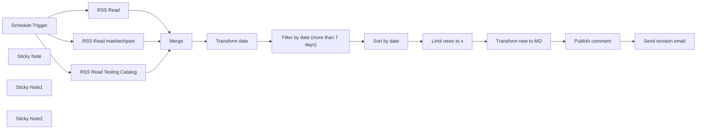

## Fluxo (.json) :

```json
{
  "id": "AjD7Xo4vjbBvBb93",
  "meta": {
    "instanceId": "172d50be57a0a76a25e8cdb8e29b27309a5342fa93c6c159fcaa693db9d4d218"
  },
  "tags": [
    {
      "id": "XrsuA1YXyGXhbMOC",
      "name": "Pollup Automation",
      "createdAt": "2024-12-26T13:41:03.811Z",
      "updatedAt": "2024-12-26T13:41:03.811Z"
    }
  ],
  "nodes": [
    {
      "id": "446b17f4-2e1f-4155-8b36-1c063f738176",
      "name": "Schedule Trigger",
      "type": "n8n-nodes-base.scheduleTrigger",
      "position": [
        -420,
        0
      ],
      "parameters": {
        "rule": {
          "interval": [
            {
              "field": "weeks",
              "triggerAtDay": [
                1
              ],
              "triggerAtHour": 7
            }
          ]
        }
      },
      "typeVersion": 1.2
    },
    {
      "id": "51cfb529-c09e-4afc-8279-67145317bfb7",
      "name": "RSS Read Testing Catalog",
      "type": "n8n-nodes-base.rssFeedRead",
      "position": [
        -100,
        160
      ],
      "parameters": {
        "url": "https://www.testingcatalog.com/rss/",
        "options": {
          "ignoreSSL": true
        }
      },
      "typeVersion": 1.1
    },
    {
      "id": "2b6dc055-6877-4070-9fb3-4547ecf5ca15",
      "name": "Transform date",
      "type": "n8n-nodes-base.set",
      "position": [
        400,
        0
      ],
      "parameters": {
        "options": {},
        "assignments": {
          "assignments": [
            {
              "id": "9aec0a09-4b6f-4fca-98e6-789abd5fdc51",
              "name": "title",
              "type": "string",
              "value": "={{ $json.title }}"
            },
            {
              "id": "56277e54-31a0-4804-ad23-c9ee6d244641",
              "name": "content",
              "type": "string",
              "value": "={{ $json.contentSnippet }}"
            },
            {
              "id": "a3586a80-588e-42d1-9780-370a956ddf6b",
              "name": "link",
              "type": "string",
              "value": "={{ $json.link }}"
            },
            {
              "id": "58f01618-8014-4685-9192-d15d596ffcd9",
              "name": "isoDate",
              "type": "number",
              "value": "={{ new Date($json.isoDate).getTime() }}"
            },
            {
              "id": "716bb078-8df3-4d96-8a1b-4aec4f8cf206",
              "name": "categories",
              "type": "array",
              "value": "={{ $json.categories }}"
            }
          ]
        }
      },
      "typeVersion": 3.4
    },
    {
      "id": "d66d19c6-96f1-4ae5-8295-de65809ba517",
      "name": "Filter by date (more than 7 days)",
      "type": "n8n-nodes-base.filter",
      "position": [
        620,
        0
      ],
      "parameters": {
        "options": {},
        "conditions": {
          "options": {
            "version": 2,
            "leftValue": "",
            "caseSensitive": true,
            "typeValidation": "strict"
          },
          "combinator": "and",
          "conditions": [
            {
              "id": "e7cf09fb-af35-495d-a840-341f8d0ddcd8",
              "operator": {
                "type": "number",
                "operation": "gt"
              },
              "leftValue": "={{ $json.isoDate }}",
              "rightValue": "={{ Date.now() - 7 * 24 * 60 * 60 * 1000 }}"
            }
          ]
        }
      },
      "typeVersion": 2.2
    },
    {
      "id": "a5d651b8-6c66-40c9-9d56-84b7265bdef8",
      "name": "Sort by date",
      "type": "n8n-nodes-base.sort",
      "position": [
        840,
        0
      ],
      "parameters": {
        "options": {},
        "sortFieldsUi": {
          "sortField": [
            {
              "order": "descending",
              "fieldName": "isoDate"
            }
          ]
        }
      },
      "typeVersion": 1
    },
    {
      "id": "ba15be96-5173-4ea5-9792-b52af467ba16",
      "name": "Limit news to x",
      "type": "n8n-nodes-base.limit",
      "position": [
        1060,
        0
      ],
      "parameters": {
        "maxItems": 10
      },
      "typeVersion": 1
    },
    {
      "id": "f290a6c6-7135-4eaf-83dc-03eab6073e93",
      "name": "Transform new to MD",
      "type": "n8n-nodes-base.code",
      "position": [
        1280,
        0
      ],
      "parameters": {
        "jsCode": "// Loop over input items and add a new field called 'myNewField' to the JSON of each one\nlet ret = \"\"\nfor (const item of $input.all()) {\n  ret = ret + '- [' + item.json.title + '](' + item.json.link + ' \"‌\"): \\n' + item.json.content + \"\\n\\n\"\n}\n\nreturn {data: ret}"
      },
      "typeVersion": 2
    },
    {
      "id": "4ecc9388-504b-450c-b79c-ca455dd38afb",
      "name": "Publish comment",
      "type": "n8n-nodes-base.trello",
      "position": [
        1480,
        0
      ],
      "parameters": {
        "text": "={{ $json.data }}",
        "cardId": {
          "__rl": true,
          "mode": "id",
          "value": "dFtYLRXv"
        },
        "resource": "cardComment"
      },
      "credentials": {
        "trelloApi": {
          "id": "44ijLUdXcqQSGDs3",
          "name": "Trello account"
        }
      },
      "typeVersion": 1
    },
    {
      "id": "96a42e03-0114-4098-9645-ce5bc29544e7",
      "name": "Send revision email",
      "type": "n8n-nodes-base.gmail",
      "position": [
        1700,
        0
      ],
      "webhookId": "8afe9499-f75c-4bd2-91cc-1d581133cc5a",
      "parameters": {
        "sendTo": "thomas@pollup.net",
        "message": "The Trello comment for https://trello.com/c/dFtYLRXv has been update. \nPlease check.",
        "options": {},
        "subject": "Update for Trello done",
        "emailType": "text"
      },
      "credentials": {
        "gmailOAuth2": {
          "id": "Q3VYwvyoywYrkHOI",
          "name": "Gmail account"
        }
      },
      "typeVersion": 2.1
    },
    {
      "id": "d2199794-61c9-4e62-9a7a-e71733ed01a8",
      "name": "Merge",
      "type": "n8n-nodes-base.merge",
      "position": [
        180,
        0
      ],
      "parameters": {
        "numberInputs": 3
      },
      "typeVersion": 3
    },
    {
      "id": "d8f1413b-6d29-4d11-a9cc-cf42ac1dca6d",
      "name": "RSS Read marktechpost",
      "type": "n8n-nodes-base.rssFeedRead",
      "position": [
        -100,
        0
      ],
      "parameters": {
        "url": "https://www.marktechpost.com/feed/",
        "options": {}
      },
      "typeVersion": 1.1
    },
    {
      "id": "9a165edb-6e92-41ff-8f8a-af1bfab92d86",
      "name": "Sticky Note",
      "type": "n8n-nodes-base.stickyNote",
      "position": [
        -180,
        -280
      ],
      "parameters": {
        "color": 4,
        "width": 500,
        "height": 620,
        "content": "## RSS sources \nHere you can add up to nine sources of RSS. To do so, modify the merge node for the number of RSS feeds you want, duplicate the RSS node and wire it to the trigger and the merge node\n"
      },
      "typeVersion": 1
    },
    {
      "id": "780c4737-1776-4340-b23d-bd2a52ee9f96",
      "name": "Sticky Note1",
      "type": "n8n-nodes-base.stickyNote",
      "position": [
        560,
        -160
      ],
      "parameters": {
        "color": 5,
        "width": 640,
        "height": 360,
        "content": "## Age and number of the news \nHere you can set the number of days behind by changing the 7 by any number in the filter by date node:\n```\nDate.now() - 7 * 24 * 60 * 60 * 1000\n```\nYou can also modify the number of news in the \"limit news to x\" node"
      },
      "typeVersion": 1
    },
    {
      "id": "36819879-d53e-4730-ae0e-bd0a105d54fb",
      "name": "RSS Read",
      "type": "n8n-nodes-base.rssFeedRead",
      "position": [
        -100,
        -160
      ],
      "parameters": {
        "url": "https://www.artificial-intelligence.blog/ai-news?format=rss",
        "options": {}
      },
      "typeVersion": 1.1
    },
    {
      "id": "2b089f64-5bbb-4357-86f7-21cea7cb8e60",
      "name": "Sticky Note2",
      "type": "n8n-nodes-base.stickyNote",
      "position": [
        -980,
        -780
      ],
      "parameters": {
        "color": 7,
        "width": 500,
        "height": 1120,
        "content": "## RSS Feed News Processing and Distribution Workflow\n\n### Who is this for?\n\nThis workflow is designed for professionals and teams who need to monitor multiple RSS feeds, filter the latest content, and distribute actionable updates as a Trello comment. Ideal for content managers, marketers, and team leads managing news or content pipelines.\n\n### What problem is this workflow solving?\n\nManually monitoring RSS feeds and keeping track of the latest content can be time-consuming. This workflow automates the aggregation, filtering, and distribution of news, ensuring that only relevant and timely updates are shared with your team or audience.\n\n### What this workflow does:\n1. Aggregates RSS Feeds: Pulls data from up to three RSS feeds simultaneously.\n2. Filters Content: Filters articles based on their publication date (default: last 7 days).\n3. Organizes and Sorts: Sorts filtered articles by date for clarity.\n4. Formats Updates: Transforms news items into Markdown format for better readability.\n5. Publishes and Notifies: Posts comments to Trello cards and sends an email to a moderator to check the comment.\n\n### Setup:\n1. Connect your RSS feeds by configuring the RSS Read nodes.\n2. Link your Trello and Gmail accounts for seamless integration.\n3. Adjust the schedule trigger to set how often the workflow should run (e.g., daily, weekly).\n4. Test the workflow to ensure all connections and configurations are correct.\n\n### How to customize this workflow to your needs:\n- Change the Number of RSS Feeds: Add or remove RSS Read nodes and update the merge configuration accordingly.\n- Adjust the Date Filter: Modify the date logic in the “Filter by date” node to include more or fewer days.\n- Limit the Number of Articles: Adjust the limit in the “Limit news to x” node.\n- Custom Formatting: Update the Transform node to format the news items differently.\n- Alternative Notifications: Replace Trello and Gmail with other integrations, such as Slack or Microsoft Teams.\n\nThis workflow ensures your team stays informed with minimal effort and delivers content updates in an organized and professional manner."
      },
      "typeVersion": 1
    }
  ],
  "active": true,
  "pinData": {},
  "settings": {
    "executionOrder": "v1"
  },
  "versionId": "14af0ee8-487d-426a-9674-b49d5b34512d",
  "connections": {
    "Merge": {
      "main": [
        [
          {
            "node": "Transform date",
            "type": "main",
            "index": 0
          }
        ]
      ]
    },
    "RSS Read": {
      "main": [
        [
          {
            "node": "Merge",
            "type": "main",
            "index": 0
          }
        ]
      ]
    },
    "Sort by date": {
      "main": [
        [
          {
            "node": "Limit news to x",
            "type": "main",
            "index": 0
          }
        ]
      ]
    },
    "Transform date": {
      "main": [
        [
          {
            "node": "Filter by date (more than 7 days)",
            "type": "main",
            "index": 0
          }
        ]
      ]
    },
    "Limit news to x": {
      "main": [
        [
          {
            "node": "Transform new to MD",
            "type": "main",
            "index": 0
          }
        ]
      ]
    },
    "Publish comment": {
      "main": [
        [
          {
            "node": "Send revision email",
            "type": "main",
            "index": 0
          }
        ]
      ]
    },
    "Schedule Trigger": {
      "main": [
        [
          {
            "node": "RSS Read Testing Catalog",
            "type": "main",
            "index": 0
          },
          {
            "node": "RSS Read marktechpost",
            "type": "main",
            "index": 0
          },
          {
            "node": "RSS Read",
            "type": "main",
            "index": 0
          }
        ]
      ]
    },
    "Send revision email": {
      "main": [
        []
      ]
    },
    "Transform new to MD": {
      "main": [
        [
          {
            "node": "Publish comment",
            "type": "main",
            "index": 0
          }
        ]
      ]
    },
    "RSS Read marktechpost": {
      "main": [
        [
          {
            "node": "Merge",
            "type": "main",
            "index": 1
          }
        ]
      ]
    },
    "RSS Read Testing Catalog": {
      "main": [
        [
          {
            "node": "Merge",
            "type": "main",
            "index": 2
          }
        ]
      ]
    },
    "Filter by date (more than 7 days)": {
      "main": [
        [
          {
            "node": "Sort by date",
            "type": "main",
            "index": 0
          }
        ]
      ]
    }
  }
}
```

<a id="template-2575"></a>

## Template 2575 - Enviar leads do Typeform por WhatsApp

- **Nome:** Enviar leads do Typeform por WhatsApp
- **Descrição:** Envia respostas de um formulário Typeform como mensagem para um número pré-definido via Twilio.
- **Funcionalidade:** • Recebimento de respostas: detecta novas submissões do formulário Typeform via webhook.
• Extração e formatação: coleta respostas específicas (sobrenome, nome, número de filhos, país, email, data de nascimento) e as organiza em um único bloco de texto.
• Montagem de mensagem: cria um campo consolidado com todas as informações do lead para envio.
• Envio via WhatsApp/SMS: envia a mensagem formatada para um número fixo usando o serviço de mensagens.
• Reexecução em caso de falha: tenta reexecutar ações quando ocorrerem erros para aumentar a confiabilidade.
- **Ferramentas:** • Typeform: plataforma de criação de formulários online que fornece submissões via webhook e autenticação OAuth2.
• Twilio: serviço de comunicação usado para enviar mensagens a números de telefone (incluindo canal WhatsApp).

## Fluxo visual

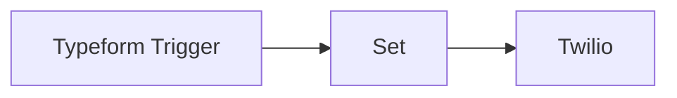

## Fluxo (.json) :

```json
{
  "id": 1,
  "name": "Send Typeforms leads via Whatsapp (Twilio)",
  "nodes": [
    {
      "name": "Typeform Trigger",
      "type": "n8n-nodes-base.typeformTrigger",
      "position": [
        460,
        300
      ],
      "webhookId": "a3c4dab3-6550-4e82-906f-db7f73ab35a5",
      "parameters": {
        "formId": "agRe2poK",
        "onlyAnswers": false,
        "authentication": "oAuth2"
      },
      "credentials": {
        "typeformOAuth2Api": {
          "id": "2",
          "name": "Typeform account"
        }
      },
      "retryOnFail": true,
      "typeVersion": 1
    },
    {
      "name": "Twilio",
      "type": "n8n-nodes-base.twilio",
      "position": [
        900,
        300
      ],
      "parameters": {
        "to": "+33659104857",
        "from": "+16065954936",
        "message": "=Hello, Here is a new customer who is looking for a Test : \n\n{{$json[\"Data\"]}}\n\nRegards, HelloSafe"
      },
      "credentials": {
        "twilioApi": {
          "id": "1",
          "name": "Twilio account"
        }
      },
      "retryOnFail": true,
      "typeVersion": 1
    },
    {
      "name": "Set",
      "type": "n8n-nodes-base.set",
      "position": [
        680,
        300
      ],
      "parameters": {
        "values": {
          "string": [
            {
              "name": "Data",
              "value": "=Last name : {{$node[\"Typeform Trigger\"].json[\"form_response\"][\"answers\"][\"And your *last name*?\"]}}\nFirst name :{{$node[\"Typeform Trigger\"].json[\"form_response\"][\"answers\"][\"Let's start with your* first name.*\"]}}\nNumber of child : {{$node[\"Typeform Trigger\"].json[\"form_response\"][\"answers\"][\"How many child do you have ?\"]}}\nCountry : {{$node[\"Typeform Trigger\"].json[\"form_response\"][\"answers\"][\"Lastly, [field:d566770d2197a78b], what country do you live in?\"]}}\nMail adress : {{$node[\"Typeform Trigger\"].json[\"form_response\"][\"answers\"][\"What *email address* can we reach you at? This is only to get in touch, not to send spam.\"]}}\nBirth date : {{$node[\"Typeform Trigger\"].json[\"form_response\"][\"answers\"][\"What is your birth date ?\"]}}"
            }
          ]
        },
        "options": {}
      },
      "typeVersion": 1
    }
  ],
  "active": true,
  "settings": {},
  "connections": {
    "Set": {
      "main": [
        [
          {
            "node": "Twilio",
            "type": "main",
            "index": 0
          }
        ]
      ]
    },
    "Twilio": {
      "main": [
        []
      ]
    },
    "Typeform Trigger": {
      "main": [
        [
          {
            "node": "Set",
            "type": "main",
            "index": 0
          }
        ]
      ]
    }
  }
}
```

<a id="template-2576"></a>

## Template 2576 - Monitoramento de sensores com alerta por SMS

- **Nome:** Monitoramento de sensores com alerta por SMS
- **Descrição:** Monitora leituras no banco de dados e envia alertas por SMS quando valores ultrapassam um limiar, marcando os registros para evitar alertas duplicados.
- **Funcionalidade:** • Agendamento periódico: Executa verificações em intervalos definidos para checar novas leituras.
• Consulta ao banco de dados: Seleciona registros com valor acima de 70 e que ainda não foram notificados.
• Envio de alerta SMS: Dispara uma mensagem com identificação do sensor e valor quando o limiar é excedido.
• Marcação como notificado: Atualiza o registro para indicar que a notificação foi enviada, prevenindo alertas repetidos.
- **Ferramentas:** • Postgres: Banco de dados relacional onde as leituras dos sensores e o status de notificação são armazenados.
• Twilio: Serviço de envio de SMS usado para entregar alertas aos destinatários configurados.

## Fluxo visual

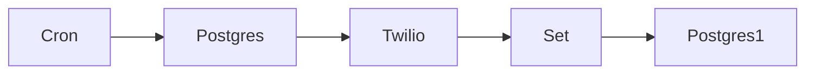

## Fluxo (.json) :

```json
{
  "id": "34",
  "name": "Monitoring and alerting",
  "nodes": [
    {
      "name": "Cron",
      "type": "n8n-nodes-base.cron",
      "position": [
        250,
        200
      ],
      "parameters": {},
      "typeVersion": 1
    },
    {
      "name": "Postgres",
      "type": "n8n-nodes-base.postgres",
      "position": [
        450,
        200
      ],
      "parameters": {
        "query": "SELECT * FROM n8n WHERE value > 70 AND notification = false;",
        "operation": "executeQuery"
      },
      "credentials": {
        "postgres": "Postgres"
      },
      "typeVersion": 1
    },
    {
      "name": "Twilio",
      "type": "n8n-nodes-base.twilio",
      "position": [
        650,
        200
      ],
      "parameters": {
        "to": "",
        "from": "",
        "message": "=🚨 The Sensor ({{$node[\"Postgres\"].json[\"sensor_id\"]}}) showed a reading of {{$node[\"Postgres\"].json[\"value\"]}}."
      },
      "credentials": {
        "twilioApi": "Twilio"
      },
      "typeVersion": 1
    },
    {
      "name": "Set",
      "type": "n8n-nodes-base.set",
      "position": [
        850,
        200
      ],
      "parameters": {
        "values": {
          "number": [
            {
              "name": "id",
              "value": "={{$node[\"Postgres\"].json[\"id\"]}}"
            }
          ],
          "boolean": [
            {
              "name": "notification",
              "value": true
            }
          ]
        },
        "options": {},
        "keepOnlySet": true
      },
      "typeVersion": 1
    },
    {
      "name": "Postgres1",
      "type": "n8n-nodes-base.postgres",
      "position": [
        1050,
        200
      ],
      "parameters": {
        "table": "n8n",
        "columns": "notification",
        "operation": "update"
      },
      "credentials": {
        "postgres": "Postgres"
      },
      "typeVersion": 1
    }
  ],
  "active": false,
  "settings": {},
  "connections": {
    "Set": {
      "main": [
        [
          {
            "node": "Postgres1",
            "type": "main",
            "index": 0
          }
        ]
      ]
    },
    "Cron": {
      "main": [
        [
          {
            "node": "Postgres",
            "type": "main",
            "index": 0
          }
        ]
      ]
    },
    "Twilio": {
      "main": [
        [
          {
            "node": "Set",
            "type": "main",
            "index": 0
          }
        ]
      ]
    },
    "Postgres": {
      "main": [
        [
          {
            "node": "Twilio",
            "type": "main",
            "index": 0
          }
        ]
      ]
    }
  }
}
```

<a id="template-2577"></a>

## Template 2577 - Tweetar novas atividades do Strava

- **Nome:** Tweetar novas atividades do Strava
- **Descrição:** Ao receber a criação de uma nova atividade no Strava, o fluxo publica automaticamente um tweet com a distância e o nome da atividade.
- **Funcionalidade:** • Detecção de novas atividades: escuta eventos de criação de atividades e inicia o fluxo automaticamente.
• Extração de dados da atividade: obtém detalhes como distância e nome da atividade a partir do evento.
• Composição de mensagem: monta o texto do tweet incluindo distância e nome da atividade.
• Publicação no Twitter: publica automaticamente o tweet usando credenciais autorizadas.
• Autenticação segura: utiliza autenticação OAuth para acessar as contas do usuário.
- **Ferramentas:** • Strava: serviço de rastreamento de atividades físicas que fornece eventos e dados das atividades.
• Twitter: plataforma de microblogging usada para publicar automaticamente atualizações sobre as atividades.

## Fluxo visual

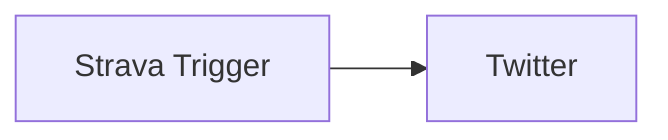

## Fluxo (.json) :

```json
{
  "id": "95",
  "name": "Receive updates when a new activity gets created and tweet about it",
  "nodes": [
    {
      "name": "Strava Trigger",
      "type": "n8n-nodes-base.stravaTrigger",
      "position": [
        710,
        220
      ],
      "webhookId": "5ad7a644-4005-4118-a27e-7112bd0035a5",
      "parameters": {
        "event": "create",
        "object": "activity",
        "options": {}
      },
      "credentials": {
        "stravaOAuth2Api": "strava"
      },
      "typeVersion": 1
    },
    {
      "name": "Twitter",
      "type": "n8n-nodes-base.twitter",
      "position": [
        910,
        220
      ],
      "parameters": {
        "text": "=I ran {{$node[\"Strava Trigger\"].json[\"object_data\"][\"distance\"]}} meters and completed my {{$node[\"Strava Trigger\"].json[\"object_data\"][\"name\"]}}!",
        "additionalFields": {}
      },
      "credentials": {
        "twitterOAuth1Api": "twitter-Harshil"
      },
      "typeVersion": 1
    }
  ],
  "active": false,
  "settings": {},
  "connections": {
    "Strava Trigger": {
      "main": [
        [
          {
            "node": "Twitter",
            "type": "main",
            "index": 0
          }
        ]
      ]
    }
  }
}
```

<a id="template-2578"></a>

## Template 2578 - Registro automático no Demio via Typeform

- **Nome:** Registro automático no Demio via Typeform
- **Descrição:** Quando um formulário Typeform é preenchido, o fluxo captura os dados do respondente e registra automaticamente a pessoa em um evento específico no Demio.
- **Funcionalidade:** • Escuta de envios de formulário: Detecta novos envios do formulário e inicia o processo automaticamente.
• Extração de campos do formulário: Captura o e-mail e o nome do respondente a partir das perguntas do Typeform.
• Registro no evento: Envia os dados extraídos para registrar o participante no evento Demio especificado (ID do evento configurado).
• Autenticação com credenciais: Usa credenciais configuradas para autenticar a integração com os serviços externos.
- **Ferramentas:** • Typeform: Plataforma de criação de formulários online usada para coletar o nome e o e-mail dos participantes.
• Demio: Plataforma de webinars/eventos utilizada para registrar automaticamente os participantes em um evento com base nos dados do formulário.

## Fluxo visual

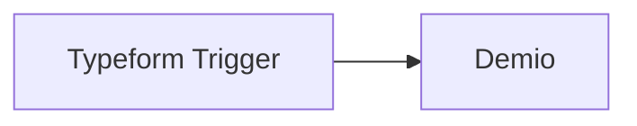

## Fluxo (.json) :

```json
{
  "nodes": [
    {
      "name": "Typeform Trigger",
      "type": "n8n-nodes-base.typeformTrigger",
      "position": [
        510,
        260
      ],
      "webhookId": "1cbca674-78fb-402e-b225-2aa6f92b5338",
      "parameters": {
        "formId": ""
      },
      "credentials": {
        "typeformApi": "Typeform Burner Account"
      },
      "typeVersion": 1
    },
    {
      "name": "Demio",
      "type": "n8n-nodes-base.demio",
      "position": [
        710,
        260
      ],
      "parameters": {
        "email": "={{$json[\"What's your email address?\"]}}",
        "eventId": 357191,
        "firstName": "={{$json[\"Let's start with your name.\"]}}",
        "operation": "register",
        "additionalFields": {}
      },
      "credentials": {
        "demioApi": "Demio API Credentials"
      },
      "typeVersion": 1
    }
  ],
  "connections": {
    "Typeform Trigger": {
      "main": [
        [
          {
            "node": "Demio",
            "type": "main",
            "index": 0
          }
        ]
      ]
    }
  }
}
```

<a id="template-2579"></a>

## Template 2579 - Gerenciamento de monitor UptimeRobot

- **Nome:** Gerenciamento de monitor UptimeRobot
- **Descrição:** Cria um monitor no UptimeRobot, atualiza o nome amigável do monitor e, em seguida, recupera os detalhes atualizados do monitor.
- **Funcionalidade:** • Criação de monitor: Cria um novo monitor com URL e tipo especificados.
• Atualização do nome amigável: Atualiza o campo de nome amigável do monitor recém-criado para um valor mais descritivo.
• Recuperação de detalhes do monitor: Obtém os detalhes completos do monitor usando o ID para confirmar as alterações.
• Encadeamento por ID: Utiliza o ID retornado na criação para garantir que a atualização e a recuperação sejam aplicadas ao mesmo monitor.
- **Ferramentas:** • UptimeRobot: Serviço de monitoramento de disponibilidade de sites e APIs, utilizado para criar, atualizar e consultar monitores.

## Fluxo visual

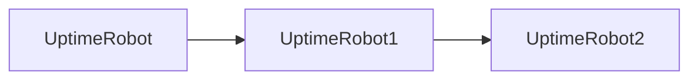

## Fluxo (.json) :

```json
{
  "nodes": [
    {
      "name": "UptimeRobot2",
      "type": "n8n-nodes-base.uptimeRobot",
      "position": [
        890,
        320
      ],
      "parameters": {
        "id": "={{$json[\"id\"]}}",
        "resource": "monitor",
        "operation": "get"
      },
      "credentials": {
        "uptimeRobotApi": "UptimeRobot API Credentials"
      },
      "typeVersion": 1
    },
    {
      "name": "UptimeRobot",
      "type": "n8n-nodes-base.uptimeRobot",
      "position": [
        490,
        320
      ],
      "parameters": {
        "url": "https://n8n.io",
        "type": 1,
        "resource": "monitor",
        "operation": "create",
        "friendlyName": "n8n"
      },
      "credentials": {
        "uptimeRobotApi": "UptimeRobot API Credentials"
      },
      "typeVersion": 1
    },
    {
      "name": "UptimeRobot1",
      "type": "n8n-nodes-base.uptimeRobot",
      "position": [
        690,
        320
      ],
      "parameters": {
        "id": "={{$json[\"id\"]}}",
        "resource": "monitor",
        "operation": "update",
        "updateFields": {
          "friendly_name": "n8n website"
        }
      },
      "credentials": {
        "uptimeRobotApi": "UptimeRobot API Credentials"
      },
      "typeVersion": 1
    }
  ],
  "connections": {
    "UptimeRobot": {
      "main": [
        [
          {
            "node": "UptimeRobot1",
            "type": "main",
            "index": 0
          }
        ]
      ]
    },
    "UptimeRobot1": {
      "main": [
        [
          {
            "node": "UptimeRobot2",
            "type": "main",
            "index": 0
          }
        ]
      ]
    }
  }
}
```

<a id="template-2580"></a>

## Template 2580 - Processamento em lote para Airtable

- **Nome:** Processamento em lote para Airtable
- **Descrição:** Fluxo para enviar conjuntos de registros ao Airtable em lotes, suportando inserção, atualização e upsert, com tratamento de limites de taxa e consolidação de resultados.
- **Funcionalidade:** • Processamento em lote de registros: divide os registros em lotes de 10 para envio eficiente.
• Modos de operação configuráveis: suporta 'upsert' (atualiza se existir ou cria), 'insert' (cria sempre) e 'update' (atualiza registros existentes; exige campo id).
• Upsert por campos externos: permite especificar até três campos para combinar registros e criar novos caso não haja correspondência.
• Controle de limites de taxa e retry: detecta respostas de limite de taxa (429) e aplica esperas (ex.: 0,2s para espaçar chamadas e 5s para retry) antes de reenviar.
• Agregação e retorno consolidado: reúne respostas de todos os lotes e retorna listas de registros processados, atualizados e criados.
• Entrada parametrizável: aceita baseId, tableIdOrName, modo, campos para merge e lista de registros como entrada.
• Testes com dados de exemplo: inclui geração de dados de teste para validar o funcionamento do fluxo.
- **Ferramentas:** • Airtable API: API REST usada para inserir, atualizar e realizar upserts em massa nos registros de uma base, sujeita a limites de taxa.

## Fluxo visual

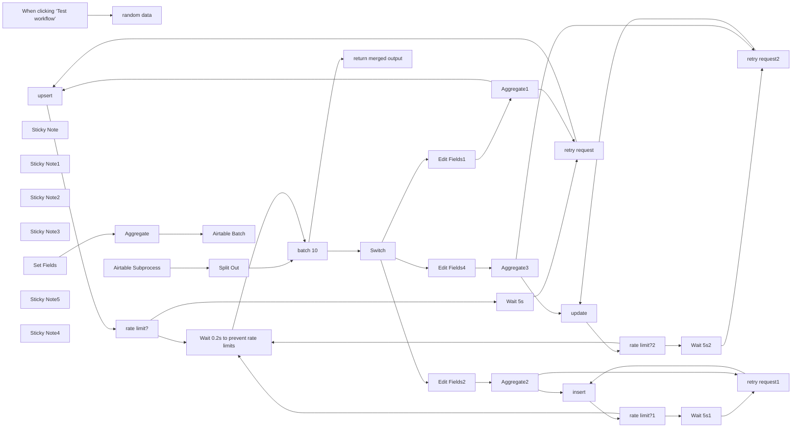

## Fluxo (.json) :

```json
{
  "id": "121pu6oiTjzkJ8OT",
  "meta": {
    "instanceId": "d160e539d2f1a627c61dec8128071eca3529ebaa5ae124b8b92c197acd24da57"
  },
  "name": "↔️ Airtable Batch Processing",
  "tags": [
    {
      "id": "Lt9iCvabUby2qWDA",
      "name": "subprocess",
      "createdAt": "2025-03-31T18:34:58.629Z",
      "updatedAt": "2025-03-31T18:34:58.629Z"
    }
  ],
  "nodes": [
    {
      "id": "35a541ff-867e-4578-bfff-d955c6cce6c9",
      "name": "upsert",
      "type": "n8n-nodes-base.httpRequest",
      "maxTries": 5,
      "position": [
        760,
        -200
      ],
      "parameters": {
        "url": "=https://api.airtable.com/v0/{{ $('Airtable Subprocess').first().json.baseId }}/{{ $('Airtable Subprocess').first().json.tableIdOrName }}",
        "method": "PATCH",
        "options": {
          "response": {
            "response": {
              "fullResponse": true
            }
          }
        },
        "jsonBody": "={\n  \"performUpsert\": {\n    \"fieldsToMergeOn\": {{ $('Airtable Subprocess').first().json.fieldsToMergeOn.toJsonString() }}\n  },\n  \"records\": {{ $json.records.toJsonString() }}\n}",
        "sendBody": true,
        "specifyBody": "json",
        "authentication": "predefinedCredentialType",
        "nodeCredentialType": "airtableTokenApi"
      },
      "credentials": {
        "airtableTokenApi": {
          "id": "c3XcXntDvRoTITuL",
          "name": "Airtable s.mayerhofer"
        }
      },
      "retryOnFail": true,
      "typeVersion": 4.2,
      "waitBetweenTries": 5000
    },
    {
      "id": "c422716d-c0c6-4998-ac99-d62a4d298aae",
      "name": "random data",
      "type": "n8n-nodes-base.debugHelper",
      "position": [
        -240,
        -720
      ],
      "parameters": {
        "category": "randomData",
        "randomDataType": "address"
      },
      "typeVersion": 1
    },
    {
      "id": "e0a01b39-a431-40cd-bfa3-1764fd2af4cf",
      "name": "When clicking ‘Test workflow’",
      "type": "n8n-nodes-base.manualTrigger",
      "position": [
        -460,
        -720
      ],
      "parameters": {},
      "typeVersion": 1
    },
    {
      "id": "6082ce07-b4c0-42ac-92ea-302bd943ddad",
      "name": "Split Out",
      "type": "n8n-nodes-base.splitOut",
      "position": [
        -280,
        -260
      ],
      "parameters": {
        "include": "allOtherFields",
        "options": {
          "destinationFieldName": "fields"
        },
        "fieldToSplitOut": "records"
      },
      "typeVersion": 1
    },
    {
      "id": "b9cd2614-4a7b-4d68-aa4f-4cc44b27e6de",
      "name": "batch 10",
      "type": "n8n-nodes-base.splitInBatches",
      "position": [
        -40,
        -260
      ],
      "parameters": {
        "options": {},
        "batchSize": 10
      },
      "typeVersion": 3
    },
    {
      "id": "bcc2b8b5-b8cf-4e0b-89dd-584c16baefa1",
      "name": "Airtable Subprocess",
      "type": "n8n-nodes-base.executeWorkflowTrigger",
      "position": [
        -480,
        -260
      ],
      "parameters": {
        "workflowInputs": {
          "values": [
            {
              "name": "baseId"
            },
            {
              "name": "tableIdOrName"
            },
            {
              "name": "mode"
            },
            {
              "name": "fieldsToMergeOn",
              "type": "array"
            },
            {
              "name": "records",
              "type": "array"
            }
          ]
        }
      },
      "typeVersion": 1.1
    },
    {
      "id": "9cb16c31-6d7b-4e49-9d24-92047a52d5e7",
      "name": "Switch",
      "type": "n8n-nodes-base.switch",
      "position": [
        180,
        -260
      ],
      "parameters": {
        "rules": {
          "values": [
            {
              "outputKey": "update",
              "conditions": {
                "options": {
                  "version": 2,
                  "leftValue": "",
                  "caseSensitive": true,
                  "typeValidation": "strict"
                },
                "combinator": "and",
                "conditions": [
                  {
                    "id": "1062f23a-900f-4d7e-b16d-f3c20675a435",
                    "operator": {
                      "name": "filter.operator.equals",
                      "type": "string",
                      "operation": "equals"
                    },
                    "leftValue": "={{ $json.mode }}",
                    "rightValue": "update"
                  }
                ]
              },
              "renameOutput": true
            },
            {
              "outputKey": "upsert",
              "conditions": {
                "options": {
                  "version": 2,
                  "leftValue": "",
                  "caseSensitive": true,
                  "typeValidation": "strict"
                },
                "combinator": "and",
                "conditions": [
                  {
                    "id": "9abb6abc-f7dc-4c6a-a32a-b7e05cf8da4b",
                    "operator": {
                      "type": "string",
                      "operation": "equals"
                    },
                    "leftValue": "={{ $json.mode }}",
                    "rightValue": "upsert"
                  }
                ]
              },
              "renameOutput": true
            },
            {
              "outputKey": "insert",
              "conditions": {
                "options": {
                  "version": 2,
                  "leftValue": "",
                  "caseSensitive": true,
                  "typeValidation": "strict"
                },
                "combinator": "and",
                "conditions": [
                  {
                    "id": "00e1d8d7-19bd-434d-afd2-29c9aee3f3b8",
                    "operator": {
                      "name": "filter.operator.equals",
                      "type": "string",
                      "operation": "equals"
                    },
                    "leftValue": "={{ $json.mode }}",
                    "rightValue": "insert"
                  }
                ]
              },
              "renameOutput": true
            }
          ]
        },
        "options": {}
      },
      "typeVersion": 3.2
    },
    {
      "id": "7dede519-a841-45a2-b85c-6f2cd4868ddb",
      "name": "insert",
      "type": "n8n-nodes-base.httpRequest",
      "maxTries": 5,
      "position": [
        760,
        40
      ],
      "parameters": {
        "url": "=https://api.airtable.com/v0/{{ $('Airtable Subprocess').first().json.baseId }}/{{ $('Airtable Subprocess').first().json.tableIdOrName }}",
        "method": "POST",
        "options": {
          "response": {
            "response": {
              "fullResponse": true
            }
          }
        },
        "jsonBody": "={\n  \"records\": {{ $json.records.toJsonString() }}\n}",
        "sendBody": true,
        "specifyBody": "json",
        "authentication": "predefinedCredentialType",
        "nodeCredentialType": "airtableTokenApi"
      },
      "credentials": {
        "airtableTokenApi": {
          "id": "c3XcXntDvRoTITuL",
          "name": "Airtable s.mayerhofer"
        }
      },
      "retryOnFail": true,
      "typeVersion": 4.2,
      "waitBetweenTries": 5000
    },
    {
      "id": "f05b5c6b-38c9-455b-966b-c3e62c5856a0",
      "name": "rate limit?",
      "type": "n8n-nodes-base.if",
      "position": [
        940,
        -200
      ],
      "parameters": {
        "options": {},
        "conditions": {
          "options": {
            "version": 2,
            "leftValue": "",
            "caseSensitive": true,
            "typeValidation": "strict"
          },
          "combinator": "and",
          "conditions": [
            {
              "id": "432e1be3-b3f3-4be3-bf0d-6b3f1b724fe7",
              "operator": {
                "type": "number",
                "operation": "equals"
              },
              "leftValue": "={{ $json.statusCode }}",
              "rightValue": 429
            }
          ]
        }
      },
      "typeVersion": 2.2
    },
    {
      "id": "41fe368a-0fdb-4cec-b51e-a725c376f136",
      "name": "Wait 0.2s to prevent rate limits",
      "type": "n8n-nodes-base.wait",
      "position": [
        1140,
        300
      ],
      "webhookId": "918cd011-855e-4702-bec0-6b066b4d9765",
      "parameters": {
        "amount": 0.2
      },
      "typeVersion": 1.1
    },
    {
      "id": "15936739-2967-4d15-87ed-9320467a6d73",
      "name": "retry request",
      "type": "n8n-nodes-base.merge",
      "position": [
        1340,
        -220
      ],
      "parameters": {
        "mode": "chooseBranch"
      },
      "typeVersion": 3
    },
    {
      "id": "697de0ae-7122-42a3-beb7-db6ddba3783b",
      "name": "rate limit?1",
      "type": "n8n-nodes-base.if",
      "position": [
        940,
        40
      ],
      "parameters": {
        "options": {},
        "conditions": {
          "options": {
            "version": 2,
            "leftValue": "",
            "caseSensitive": true,
            "typeValidation": "strict"
          },
          "combinator": "and",
          "conditions": [
            {
              "id": "432e1be3-b3f3-4be3-bf0d-6b3f1b724fe7",
              "operator": {
                "type": "number",
                "operation": "equals"
              },
              "leftValue": "={{ $json.statusCode }}",
              "rightValue": 429
            }
          ]
        }
      },
      "typeVersion": 2.2
    },
    {
      "id": "51929ff9-e297-454d-b1ae-54df37534b2f",
      "name": "retry request1",
      "type": "n8n-nodes-base.merge",
      "position": [
        1340,
        20
      ],
      "parameters": {
        "mode": "chooseBranch"
      },
      "typeVersion": 3
    },
    {
      "id": "57015189-8a53-4de9-bcf3-370161ddc6a6",
      "name": "Sticky Note",
      "type": "n8n-nodes-base.stickyNote",
      "position": [
        1020,
        220
      ],
      "parameters": {
        "width": 360,
        "height": 260,
        "content": "### Adjust if your monthly call limit exceeded\nOn the Team plan this means 2 requests per second [Source](https://support.airtable.com/docs/managing-api-call-limits-in-airtable#monthly-call-limits-for-free-and-team-plans) -> 0.5 second wait"
      },
      "typeVersion": 1
    },
    {
      "id": "2ceae0cb-48e2-4833-89d6-6dd3565237e5",
      "name": "Sticky Note1",
      "type": "n8n-nodes-base.stickyNote",
      "position": [
        -520,
        -480
      ],
      "parameters": {
        "color": 5,
        "width": 2080,
        "height": 1000,
        "content": "# Subprocess\n[[API Docs](https://airtable.com/developers/web/api/update-multiple-records)]"
      },
      "typeVersion": 1
    },
    {
      "id": "bb2fcf9b-da31-4827-b8d5-23c500431557",
      "name": "Sticky Note2",
      "type": "n8n-nodes-base.stickyNote",
      "position": [
        -520,
        -820
      ],
      "parameters": {
        "width": 440,
        "height": 260,
        "content": "## Run with test data\nConnect to Set Fields"
      },
      "typeVersion": 1
    },
    {
      "id": "7be6bdf3-a320-4005-8ccb-0ef7ac63c0cd",
      "name": "Sticky Note3",
      "type": "n8n-nodes-base.stickyNote",
      "position": [
        0,
        -880
      ],
      "parameters": {
        "color": 3,
        "width": 340,
        "height": 320,
        "content": "## Set Fields\nEnter your row data you want to send to Airtable. The key needs to correspond to the exact column name\n⚠️  Only use fields which exist in the table  ⚠️"
      },
      "typeVersion": 1
    },
    {
      "id": "9fa08e5a-2657-44b1-8403-cb70c3d15940",
      "name": "rate limit?2",
      "type": "n8n-nodes-base.if",
      "position": [
        940,
        -440
      ],
      "parameters": {
        "options": {},
        "conditions": {
          "options": {
            "version": 2,
            "leftValue": "",
            "caseSensitive": true,
            "typeValidation": "strict"
          },
          "combinator": "and",
          "conditions": [
            {
              "id": "432e1be3-b3f3-4be3-bf0d-6b3f1b724fe7",
              "operator": {
                "type": "number",
                "operation": "equals"
              },
              "leftValue": "={{ $json.statusCode }}",
              "rightValue": 429
            }
          ]
        }
      },
      "typeVersion": 2.2
    },
    {
      "id": "47867b7b-a7d3-484e-b320-1377159f1b58",
      "name": "retry request2",
      "type": "n8n-nodes-base.merge",
      "position": [
        1340,
        -460
      ],
      "parameters": {
        "mode": "chooseBranch"
      },
      "typeVersion": 3
    },
    {
      "id": "c96df332-3338-4d05-82db-4a3de9f767b3",
      "name": "Aggregate3",
      "type": "n8n-nodes-base.aggregate",
      "position": [
        560,
        -440
      ],
      "parameters": {
        "options": {},
        "fieldsToAggregate": {
          "fieldToAggregate": [
            {
              "fieldToAggregate": "records"
            }
          ]
        }
      },
      "typeVersion": 1
    },
    {
      "id": "70298130-8fe6-46e6-985c-32093a04ae49",
      "name": "Edit Fields4",
      "type": "n8n-nodes-base.set",
      "position": [
        380,
        -440
      ],
      "parameters": {
        "include": "except",
        "options": {},
        "assignments": {
          "assignments": [
            {
              "id": "99890d82-1a4f-432d-b7f0-e1b6492d1154",
              "name": "records.fields",
              "type": "object",
              "value": "={{ Object.fromEntries(Object.entries($json.fields).filter(([key]) => key !== 'id')) }}"
            },
            {
              "id": "82479869-a473-4540-84a5-d5ff8ebadcd0",
              "name": "records.id",
              "type": "string",
              "value": "={{ $json.fields.id }}"
            }
          ]
        },
        "excludeFields": "fields",
        "includeOtherFields": true
      },
      "typeVersion": 3.4
    },
    {
      "id": "e9c5789c-2fc9-4107-8d07-6ad164ad7a69",
      "name": "Aggregate2",
      "type": "n8n-nodes-base.aggregate",
      "position": [
        560,
        40
      ],
      "parameters": {
        "options": {},
        "fieldsToAggregate": {
          "fieldToAggregate": [
            {
              "fieldToAggregate": "records"
            }
          ]
        }
      },
      "typeVersion": 1
    },
    {
      "id": "955e1311-7ff6-460c-bf0a-65b3f4968cbf",
      "name": "Edit Fields2",
      "type": "n8n-nodes-base.set",
      "position": [
        380,
        40
      ],
      "parameters": {
        "include": "except",
        "options": {},
        "assignments": {
          "assignments": [
            {
              "id": "99890d82-1a4f-432d-b7f0-e1b6492d1154",
              "name": "records.fields",
              "type": "object",
              "value": "={{ $json.fields }}"
            }
          ]
        },
        "excludeFields": "fields",
        "includeOtherFields": true
      },
      "typeVersion": 3.4
    },
    {
      "id": "602c0a94-643e-4e13-b534-3df4d0044428",
      "name": "Aggregate1",
      "type": "n8n-nodes-base.aggregate",
      "position": [
        560,
        -200
      ],
      "parameters": {
        "options": {},
        "fieldsToAggregate": {
          "fieldToAggregate": [
            {
              "fieldToAggregate": "records"
            }
          ]
        }
      },
      "typeVersion": 1
    },
    {
      "id": "0f52badd-a85b-43b1-840f-dc4931a647e1",
      "name": "Edit Fields1",
      "type": "n8n-nodes-base.set",
      "position": [
        380,
        -200
      ],
      "parameters": {
        "include": "except",
        "options": {},
        "assignments": {
          "assignments": [
            {
              "id": "99890d82-1a4f-432d-b7f0-e1b6492d1154",
              "name": "records.fields",
              "type": "object",
              "value": "={{ $json.fields }}"
            }
          ]
        },
        "excludeFields": "fields",
        "includeOtherFields": true
      },
      "typeVersion": 3.4
    },
    {
      "id": "a6ba6292-9883-48e6-b341-a67121c42968",
      "name": "update",
      "type": "n8n-nodes-base.httpRequest",
      "maxTries": 5,
      "position": [
        760,
        -440
      ],
      "parameters": {
        "url": "=https://api.airtable.com/v0/{{ $('Airtable Subprocess').first().json.baseId }}/{{ $('Airtable Subprocess').first().json.tableIdOrName }}/",
        "method": "PATCH",
        "options": {
          "response": {
            "response": {
              "fullResponse": true
            }
          }
        },
        "jsonBody": "={\n  \"records\": {{ $json.records.toJsonString() }}\n}",
        "sendBody": true,
        "specifyBody": "json",
        "authentication": "predefinedCredentialType",
        "nodeCredentialType": "airtableTokenApi"
      },
      "credentials": {
        "airtableTokenApi": {
          "id": "c3XcXntDvRoTITuL",
          "name": "Airtable s.mayerhofer"
        }
      },
      "retryOnFail": true,
      "typeVersion": 4.2,
      "waitBetweenTries": 5000
    },
    {
      "id": "da6761a1-ffa2-43f3-a53d-cbd7d09af474",
      "name": "Airtable Batch",
      "type": "n8n-nodes-base.executeWorkflow",
      "position": [
        440,
        -720
      ],
      "parameters": {
        "options": {},
        "workflowId": {
          "__rl": true,
          "mode": "list",
          "value": "121pu6oiTjzkJ8OT",
          "cachedResultName": "↔️ Airtable Batch Processing"
        },
        "workflowInputs": {
          "value": {
            "mode": "upsert",
            "baseId": "appXXXXXXXXXXXXX",
            "records": "={{ $json.records }}",
            "tableIdOrName": "tblXXXXXXXXXXXXX",
            "fieldsToMergeOn": "={{[\"field1\", \"field2\"]}}"
          },
          "schema": [
            {
              "id": "baseId",
              "type": "string",
              "display": true,
              "removed": false,
              "required": false,
              "displayName": "baseId",
              "defaultMatch": false,
              "canBeUsedToMatch": true
            },
            {
              "id": "tableIdOrName",
              "type": "string",
              "display": true,
              "removed": false,
              "required": false,
              "displayName": "tableIdOrName",
              "defaultMatch": false,
              "canBeUsedToMatch": true
            },
            {
              "id": "mode",
              "type": "string",
              "display": true,
              "removed": false,
              "required": false,
              "displayName": "mode",
              "defaultMatch": false,
              "canBeUsedToMatch": true
            },
            {
              "id": "fieldsToMergeOn",
              "type": "array",
              "display": true,
              "removed": false,
              "required": false,
              "displayName": "fieldsToMergeOn",
              "defaultMatch": false,
              "canBeUsedToMatch": true
            },
            {
              "id": "records",
              "type": "array",
              "display": true,
              "removed": false,
              "required": false,
              "displayName": "records",
              "defaultMatch": false,
              "canBeUsedToMatch": true
            }
          ],
          "mappingMode": "defineBelow",
          "matchingColumns": [],
          "attemptToConvertTypes": false,
          "convertFieldsToString": true
        }
      },
      "typeVersion": 1.2
    },
    {
      "id": "1c309f68-345c-459a-b8a4-dfe716f5badf",
      "name": "Set Fields",
      "type": "n8n-nodes-base.set",
      "position": [
        40,
        -720
      ],
      "parameters": {
        "options": {},
        "assignments": {
          "assignments": []
        }
      },
      "typeVersion": 3.4
    },
    {
      "id": "9be3eba5-fb5d-4fda-83c4-1295e5ed31a5",
      "name": "Aggregate",
      "type": "n8n-nodes-base.aggregate",
      "position": [
        240,
        -720
      ],
      "parameters": {
        "options": {},
        "aggregate": "aggregateAllItemData",
        "destinationFieldName": "records"
      },
      "typeVersion": 1
    },
    {
      "id": "cb0960ff-61e1-4930-881c-a370bb6aaf4d",
      "name": "Sticky Note5",
      "type": "n8n-nodes-base.stickyNote",
      "position": [
        680,
        -1140
      ],
      "parameters": {
        "color": 3,
        "width": 420,
        "height": 580,
        "content": "## Airtable Batch\n### mode\npossible values: `upsert|insert|update`\n`upsert`: update if exists or insert new\n`insert`: always insert new\n`update`: update existing record. A field with the name `id` **must** be provided.\n### fieldsToMergeOn\nWill be used as an external ID to match records for updates. For records where no match is found, a new Airtable record will be created.\npossible values: `array of strings`. Example: `{{[\"field1\", \"field2\"]}}`\nAn array with at least one and at most three field names or IDs. IDs must uniquely identify a single record. These cannot be computed fields (formulas, lookups, rollups), and must be one of the following types: number, text, long text, single select, multiple select, date.\n### baseId\nThe part with `app...` in the URL:\nairtable\\.com / **app8pqOLekaICglwg** / tblnXZOdy8VtkAAJD/...\n### tableIdOrName \nThe part with `tbl...` in the URL:\nairtable\\.com / app8pqOLekaICglwg / **tblXXZOdy8VtkAAJD** /..."
      },
      "typeVersion": 1
    },
    {
      "id": "907fe5d6-9562-4ea9-a819-71ff4b34a9bb",
      "name": "Sticky Note4",
      "type": "n8n-nodes-base.stickyNote",
      "position": [
        0,
        -980
      ],
      "parameters": {
        "color": 3,
        "width": 620,
        "height": 420,
        "content": "# Copy to your workflow"
      },
      "typeVersion": 1
    },
    {
      "id": "27f94e0c-c3bd-40f3-b509-e7301339111d",
      "name": "Wait 5s2",
      "type": "n8n-nodes-base.wait",
      "position": [
        1120,
        -460
      ],
      "webhookId": "918cd011-855e-4702-bec0-6b066b4d9765",
      "parameters": {},
      "typeVersion": 1.1
    },
    {
      "id": "0378ae4c-9c77-4d7d-8211-f0aa3a29ab51",
      "name": "Wait 5s",
      "type": "n8n-nodes-base.wait",
      "position": [
        1120,
        -220
      ],
      "webhookId": "918cd011-855e-4702-bec0-6b066b4d9765",
      "parameters": {},
      "typeVersion": 1.1
    },
    {
      "id": "0098737b-9482-42fe-afbe-c28f1f9569d1",
      "name": "Wait 5s1",
      "type": "n8n-nodes-base.wait",
      "position": [
        1140,
        20
      ],
      "webhookId": "918cd011-855e-4702-bec0-6b066b4d9765",
      "parameters": {},
      "typeVersion": 1.1
    },
    {
      "id": "2ec31fa9-6ea3-4a20-b6ed-e1d47b80e187",
      "name": "return merged output",
      "type": "n8n-nodes-base.code",
      "position": [
        140,
        -440
      ],
      "parameters": {
        "jsCode": "const output = {\n  records: [],\n  updatedRecords: [],\n  createdRecords: []\n};\n\nfor (const item of $input.all()) {\n  output.records = output.records.concat(item.json.body.records ?? [])\n  output.updatedRecords = output.updatedRecords.concat(item.json.body.updatedRecords ?? [])\n  output.createdRecords = output.createdRecords.concat(item.json.body.createdRecords ?? [])\n}\n\nreturn output;"
      },
      "typeVersion": 2
    }
  ],
  "active": false,
  "pinData": {},
  "settings": {
    "executionOrder": "v1"
  },
  "versionId": "333e3b43-c098-4a97-8c47-df93df2672ed",
  "connections": {
    "Switch": {
      "main": [
        [
          {
            "node": "Edit Fields4",
            "type": "main",
            "index": 0
          }
        ],
        [
          {
            "node": "Edit Fields1",
            "type": "main",
            "index": 0
          }
        ],
        [
          {
            "node": "Edit Fields2",
            "type": "main",
            "index": 0
          }
        ]
      ]
    },
    "insert": {
      "main": [
        [
          {
            "node": "rate limit?1",
            "type": "main",
            "index": 0
          }
        ]
      ]
    },
    "update": {
      "main": [
        [
          {
            "node": "rate limit?2",
            "type": "main",
            "index": 0
          }
        ]
      ]
    },
    "upsert": {
      "main": [
        [
          {
            "node": "rate limit?",
            "type": "main",
            "index": 0
          }
        ]
      ]
    },
    "Wait 5s": {
      "main": [
        [
          {
            "node": "retry request",
            "type": "main",
            "index": 1
          }
        ]
      ]
    },
    "Wait 5s1": {
      "main": [
        [
          {
            "node": "retry request1",
            "type": "main",
            "index": 1
          }
        ]
      ]
    },
    "Wait 5s2": {
      "main": [
        [
          {
            "node": "retry request2",
            "type": "main",
            "index": 1
          }
        ]
      ]
    },
    "batch 10": {
      "main": [
        [
          {
            "node": "return merged output",
            "type": "main",
            "index": 0
          }
        ],
        [
          {
            "node": "Switch",
            "type": "main",
            "index": 0
          }
        ]
      ]
    },
    "Aggregate": {
      "main": [
        [
          {
            "node": "Airtable Batch",
            "type": "main",
            "index": 0
          }
        ]
      ]
    },
    "Split Out": {
      "main": [
        [
          {
            "node": "batch 10",
            "type": "main",
            "index": 0
          }
        ]
      ]
    },
    "Aggregate1": {
      "main": [
        [
          {
            "node": "upsert",
            "type": "main",
            "index": 0
          },
          {
            "node": "retry request",
            "type": "main",
            "index": 0
          }
        ]
      ]
    },
    "Aggregate2": {
      "main": [
        [
          {
            "node": "insert",
            "type": "main",
            "index": 0
          },
          {
            "node": "retry request1",
            "type": "main",
            "index": 0
          }
        ]
      ]
    },
    "Aggregate3": {
      "main": [
        [
          {
            "node": "update",
            "type": "main",
            "index": 0
          },
          {
            "node": "retry request2",
            "type": "main",
            "index": 0
          }
        ]
      ]
    },
    "Set Fields": {
      "main": [
        [
          {
            "node": "Aggregate",
            "type": "main",
            "index": 0
          }
        ]
      ]
    },
    "random data": {
      "main": [
        []
      ]
    },
    "rate limit?": {
      "main": [
        [
          {
            "node": "Wait 5s",
            "type": "main",
            "index": 0
          }
        ],
        [
          {
            "node": "Wait 0.2s to prevent rate limits",
            "type": "main",
            "index": 0
          }
        ]
      ]
    },
    "Edit Fields1": {
      "main": [
        [
          {
            "node": "Aggregate1",
            "type": "main",
            "index": 0
          }
        ]
      ]
    },
    "Edit Fields2": {
      "main": [
        [
          {
            "node": "Aggregate2",
            "type": "main",
            "index": 0
          }
        ]
      ]
    },
    "Edit Fields4": {
      "main": [
        [
          {
            "node": "Aggregate3",
            "type": "main",
            "index": 0
          }
        ]
      ]
    },
    "rate limit?1": {
      "main": [
        [
          {
            "node": "Wait 5s1",
            "type": "main",
            "index": 0
          }
        ],
        [
          {
            "node": "Wait 0.2s to prevent rate limits",
            "type": "main",
            "index": 0
          }
        ]
      ]
    },
    "rate limit?2": {
      "main": [
        [
          {
            "node": "Wait 5s2",
            "type": "main",
            "index": 0
          }
        ],
        [
          {
            "node": "Wait 0.2s to prevent rate limits",
            "type": "main",
            "index": 0
          }
        ]
      ]
    },
    "retry request": {
      "main": [
        [
          {
            "node": "upsert",
            "type": "main",
            "index": 0
          }
        ]
      ]
    },
    "Airtable Batch": {
      "main": [
        []
      ]
    },
    "retry request1": {
      "main": [
        [
          {
            "node": "insert",
            "type": "main",
            "index": 0
          }
        ]
      ]
    },
    "retry request2": {
      "main": [
        [
          {
            "node": "update",
            "type": "main",
            "index": 0
          }
        ]
      ]
    },
    "Airtable Subprocess": {
      "main": [
        [
          {
            "node": "Split Out",
            "type": "main",
            "index": 0
          }
        ]
      ]
    },
    "Wait 0.2s to prevent rate limits": {
      "main": [
        [
          {
            "node": "batch 10",
            "type": "main",
            "index": 0
          }
        ]
      ]
    },
    "When clicking ‘Test workflow’": {
      "main": [
        [
          {
            "node": "random data",
            "type": "main",
            "index": 0
          }
        ]
      ]
    }
  }
}
```

<a id="template-2581"></a>

## Template 2581 - Envio em lote de pessoas via POST com espera

- **Nome:** Envio em lote de pessoas via POST com espera
- **Descrição:** Busca todos os registros de pessoas de um datastore e envia cada registro como uma requisição POST para um endpoint externo, aplicando uma espera entre cada envio.
- **Funcionalidade:** • Execução manual: Inicia o fluxo ao clicar em executar.
• Leitura de clientes: Recupera todos os registros de pessoas do datastore.
• Processamento em lotes individuais: Divide os registros para enviar um por vez (tamanho do lote = 1).
• Envio HTTP POST: Envia os campos id e name de cada pessoa para um endpoint externo.
• Atraso entre envios: Aguarda 4 segundos entre cada requisição para controlar o ritmo de envio.
• Ponto de saída neutro: Registra ou encaminha a resposta sem transformação adicional (placeholder).
- **Ferramentas:** • JSONPlaceholder (https://jsonplaceholder.typicode.com): serviço público de API para testes que recebe requisições POST e retorna respostas simuladas.


## Fluxo visual

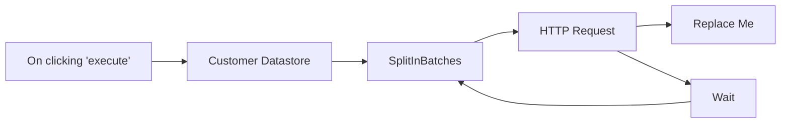

## Fluxo (.json) :

```json
{
  "nodes": [
    {
      "name": "On clicking 'execute'",
      "type": "n8n-nodes-base.manualTrigger",
      "position": [
        250,
        300
      ],
      "parameters": {},
      "typeVersion": 1
    },
    {
      "name": "Customer Datastore",
      "type": "n8n-nodes-base.n8nTrainingCustomerDatastore",
      "position": [
        450,
        300
      ],
      "parameters": {
        "operation": "getAllPeople",
        "returnAll": true
      },
      "typeVersion": 1
    },
    {
      "name": "SplitInBatches",
      "type": "n8n-nodes-base.splitInBatches",
      "position": [
        650,
        300
      ],
      "parameters": {
        "options": {},
        "batchSize": 1
      },
      "typeVersion": 1
    },
    {
      "name": "HTTP Request",
      "type": "n8n-nodes-base.httpRequest",
      "position": [
        850,
        300
      ],
      "parameters": {
        "url": "https://jsonplaceholder.typicode.com/posts",
        "options": {},
        "requestMethod": "POST",
        "bodyParametersUi": {
          "parameter": [
            {
              "name": "id",
              "value": "={{$json[\"id\"]}}"
            },
            {
              "name": "name",
              "value": "={{$json[\"name\"]}}"
            }
          ]
        }
      },
      "typeVersion": 1
    },
    {
      "name": "Wait",
      "type": "n8n-nodes-base.wait",
      "position": [
        950,
        100
      ],
      "webhookId": "b809abfb-8e02-4b31-90b9-0005be656312",
      "parameters": {
        "unit": "seconds",
        "amount": 4
      },
      "typeVersion": 1
    },
    {
      "name": "Replace Me",
      "type": "n8n-nodes-base.noOp",
      "position": [
        1050,
        300
      ],
      "parameters": {},
      "typeVersion": 1
    }
  ],
  "connections": {
    "Wait": {
      "main": [
        [
          {
            "node": "SplitInBatches",
            "type": "main",
            "index": 0
          }
        ]
      ]
    },
    "HTTP Request": {
      "main": [
        [
          {
            "node": "Replace Me",
            "type": "main",
            "index": 0
          },
          {
            "node": "Wait",
            "type": "main",
            "index": 0
          }
        ]
      ]
    },
    "SplitInBatches": {
      "main": [
        [
          {
            "node": "HTTP Request",
            "type": "main",
            "index": 0
          }
        ]
      ]
    },
    "Customer Datastore": {
      "main": [
        [
          {
            "node": "SplitInBatches",
            "type": "main",
            "index": 0
          }
        ]
      ]
    },
    "On clicking 'execute'": {
      "main": [
        [
          {
            "node": "Customer Datastore",
            "type": "main",
            "index": 0
          }
        ]
      ]
    }
  }
}
```

<a id="template-2582"></a>

## Template 2582 - Extração de faturas PDF para Google Sheets

- **Nome:** Extração de faturas PDF para Google Sheets
- **Descrição:** Automatiza a extração de dados de faturas em PDF recebidas por e-mail, convertendo os PDFs para um formato legível, extraindo campos relevantes com um modelo de linguagem e registrando os resultados em uma planilha.
- **Funcionalidade:** • Monitoramento de e-mails: Observa uma caixa de entrada específica e filtra mensagens com anexos de fornecedores predeterminados.
• Download de anexos: Baixa automaticamente os PDFs anexados às mensagens qualificadas.
• Verificação de rótulos para evitar duplicação: Checa rótulos do e-mail e evita reprocessar mensagens já marcadas.
• Envio para serviço de parsing: Faz upload do PDF para um serviço de parsing externo que converte documentos complexos (tabelas, figuras) em markdown.
• Polling de status de processamento: Verifica periodicamente o estado do trabalho de parsing até a conclusão, com espera para respeitar limites de serviço.
• Extração com LLM e parser estruturado: Usa um modelo de linguagem para extrair campos padronizados (datas, números de fatura, endereços, itens, valores) e valida a saída com um parser estruturado.
• Mapeamento e exportação: Formata os dados extraídos e os adiciona como nova linha em uma planilha de reconciliação.
• Marcação do e-mail processado: Adiciona um rótulo ao e-mail original para indicar que a fatura já foi sincronizada.
- **Ferramentas:** • Gmail: Serviço de e-mail usado para receber faturas e providenciar anexos para processamento.
• LlamaParse (LlamaIndex / LlamaCloud): Serviço de parsing na nuvem que converte PDFs complexos em markdown ou formatos processáveis.
• OpenAI (GPT-3.5): Modelo de linguagem utilizado para extrair e estruturar os campos relevantes do conteúdo convertido.
• Google Sheets: Planilha utilizada como destino final para armazenar e reconciliar os dados extraídos das faturas.


## Fluxo visual

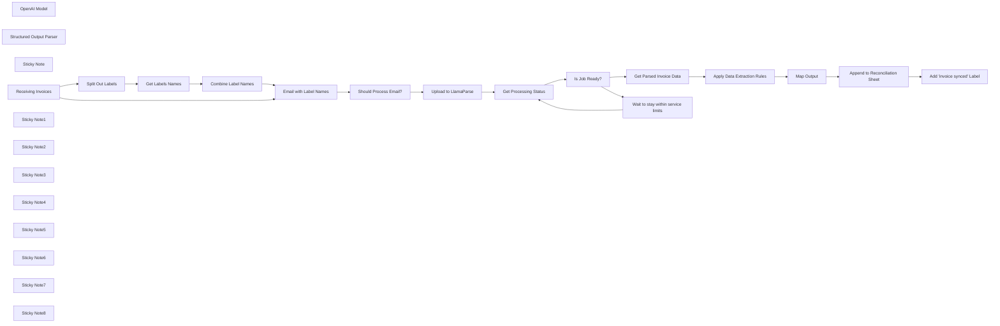

## Fluxo (.json) :

```json
{
  "meta": {
    "instanceId": "26ba763460b97c249b82942b23b6384876dfeb9327513332e743c5f6219c2b8e"
  },
  "nodes": [
    {
      "id": "7076854e-c7e8-45b5-9e5e-16678bffa254",
      "name": "OpenAI Model",
      "type": "@n8n/n8n-nodes-langchain.lmOpenAi",
      "position": [
        2420,
        480
      ],
      "parameters": {
        "model": {
          "__rl": true,
          "mode": "list",
          "value": "gpt-3.5-turbo-1106",
          "cachedResultName": "gpt-3.5-turbo-1106"
        },
        "options": {
          "temperature": 0
        }
      },
      "credentials": {
        "openAiApi": {
          "id": "8gccIjcuf3gvaoEr",
          "name": "OpenAi account"
        }
      },
      "typeVersion": 1
    },
    {
      "id": "00819f1c-2c60-4b7c-b395-445ec05fd898",
      "name": "Structured Output Parser",
      "type": "@n8n/n8n-nodes-langchain.outputParserStructured",
      "position": [
        2600,
        480
      ],
      "parameters": {
        "jsonSchema": "{\n  \"Invoice date\": { \"type\": \"date\" },\n  \"invoice number\": { \"type\": \"string\" },\n  \"Purchase order number\": { \"type\": \"string\" },\n  \"Supplier name\": { \"type\": \"string\" },\n  \"Supplier address\": {\n    \"type\": \"object\",\n    \"properties\": {\n      \"address 1\": { \"type\": \"string\" },\n      \"address 2\": { \"type\": \"string\" },\n      \"city\": { \"type\": \"string\" },\n      \"postcode\": { \"type\": \"string\" }\n    }\n  },\n  \"Supplier VAT identification number\": { \"type\": \"string\" },\n  \"Customer name\": { \"type\": \"string\" },\n  \"Customer address\": {\n    \"type\": \"object\",\n    \"properties\": {\n      \"address 1\": { \"type\": \"string\" },\n      \"address 2\": { \"type\": \"string\" },\n      \"city\": { \"type\": \"string\" },\n      \"postcode\": { \"type\": \"string\" }\n    }\n  },\n  \"Customer VAT identification number\": { \"type\": \"string\" }, \n  \"Shipping addresses\": {\n    \"type\": \"array\",\n    \"items\": {\n      \"type\": \"object\",\n      \"properties\": {\n        \"address 1\": { \"type\": \"string\" },\n        \"address 2\": { \"type\": \"string\" },\n        \"city\": { \"type\": \"string\" },\n        \"postcode\": { \"type\": \"string\" }\n      }\n    }\n  },\n  \"Line items\": {\n    \"type\": \"array\",\n    \"items\": {\n      \"name\": \"string\",\n      \"description\": \"string\",\n      \"price\": \"number\",\n      \"discount\": \"number\"\n    }\n  },\n  \"Subtotal without VAT\": { \"type\": \"number\" },\n  \"Subtotal with VAT\": { \"type\": \"number\" },\n  \"Total price\": { \"type\": \"number\" }\n}"
      },
      "typeVersion": 1.1
    },
    {
      "id": "3b40d506-aabc-4105-853a-a318375cea73",
      "name": "Upload to LlamaParse",
      "type": "n8n-nodes-base.httpRequest",
      "position": [
        1620,
        420
      ],
      "parameters": {
        "url": "https://api.cloud.llamaindex.ai/api/parsing/upload",
        "method": "POST",
        "options": {},
        "sendBody": true,
        "contentType": "multipart-form-data",
        "sendHeaders": true,
        "authentication": "genericCredentialType",
        "bodyParameters": {
          "parameters": [
            {
              "name": "file",
              "parameterType": "formBinaryData",
              "inputDataFieldName": "=attachment_0"
            }
          ]
        },
        "genericAuthType": "httpHeaderAuth",
        "headerParameters": {
          "parameters": [
            {
              "name": "accept",
              "value": "application/json"
            }
          ]
        }
      },
      "credentials": {
        "httpHeaderAuth": {
          "id": "pZ4YmwFIkyGnbUC7",
          "name": "LlamaIndex API"
        }
      },
      "typeVersion": 4.2
    },
    {
      "id": "57a5d331-8838-4d44-8fac-a44dba35fcc4",
      "name": "Sticky Note",
      "type": "n8n-nodes-base.stickyNote",
      "position": [
        1540,
        140
      ],
      "parameters": {
        "color": 7,
        "width": 785.9525375246163,
        "height": 623.4951418211454,
        "content": "## 2. Advanced PDF Processing with LlamaParse\n[Read more about using HTTP Requests](https://docs.n8n.io/integrations/builtin/core-nodes/n8n-nodes-base.httprequest/)\n\nLlamaIndex's LlamaCloud is a cloud-based service that allows you to upload,\nparse, and index document. LlamaParse is a tool offered by LlamaCloud\nto parse for complex PDFs with embedded objects ie PDF Tables and figures.\n\nAt time of writing, you can parse 1000 pdfs/day with LlamaCloud's free plan\nby signing up at [https://cloud.llamaindex.ai/](https://cloud.llamaindex.ai/?ref=n8n.io)."
      },
      "typeVersion": 1
    },
    {
      "id": "a4504d83-da3b-41bc-891f-f8f9314a6af5",
      "name": "Receiving Invoices",
      "type": "n8n-nodes-base.gmailTrigger",
      "position": [
        780,
        400
      ],
      "parameters": {
        "simple": false,
        "filters": {
          "q": "has:attachment",
          "sender": "invoices@paypal.com"
        },
        "options": {
          "downloadAttachments": true
        },
        "pollTimes": {
          "item": [
            {
              "mode": "everyMinute"
            }
          ]
        }
      },
      "credentials": {
        "gmailOAuth2": {
          "id": "Sf5Gfl9NiFTNXFWb",
          "name": "Gmail account"
        }
      },
      "typeVersion": 1
    },
    {
      "id": "02bd4636-f35b-4a3a-8a5f-9ae7aeed2bf4",
      "name": "Append to Reconciliation Sheet",
      "type": "n8n-nodes-base.googleSheets",
      "position": [
        2960,
        320
      ],
      "parameters": {
        "columns": {
          "value": {},
          "schema": [
            {
              "id": "Invoice date",
              "type": "string",
              "display": true,
              "removed": false,
              "required": false,
              "displayName": "Invoice date",
              "defaultMatch": false,
              "canBeUsedToMatch": true
            },
            {
              "id": "invoice number",
              "type": "string",
              "display": true,
              "removed": false,
              "required": false,
              "displayName": "invoice number",
              "defaultMatch": false,
              "canBeUsedToMatch": true
            },
            {
              "id": "Purchase order number",
              "type": "string",
              "display": true,
              "removed": false,
              "required": false,
              "displayName": "Purchase order number",
              "defaultMatch": false,
              "canBeUsedToMatch": true
            },
            {
              "id": "Supplier name",
              "type": "string",
              "display": true,
              "removed": false,
              "required": false,
              "displayName": "Supplier name",
              "defaultMatch": false,
              "canBeUsedToMatch": true
            },
            {
              "id": "Supplier address",
              "type": "string",
              "display": true,
              "removed": false,
              "required": false,
              "displayName": "Supplier address",
              "defaultMatch": false,
              "canBeUsedToMatch": true
            },
            {
              "id": "Supplier VAT identification number",
              "type": "string",
              "display": true,
              "removed": false,
              "required": false,
              "displayName": "Supplier VAT identification number",
              "defaultMatch": false,
              "canBeUsedToMatch": true
            },
            {
              "id": "Customer name",
              "type": "string",
              "display": true,
              "removed": false,
              "required": false,
              "displayName": "Customer name",
              "defaultMatch": false,
              "canBeUsedToMatch": true
            },
            {
              "id": "Customer address",
              "type": "string",
              "display": true,
              "removed": false,
              "required": false,
              "displayName": "Customer address",
              "defaultMatch": false,
              "canBeUsedToMatch": true
            },
            {
              "id": "Customer VAT identification number",
              "type": "string",
              "display": true,
              "removed": false,
              "required": false,
              "displayName": "Customer VAT identification number",
              "defaultMatch": false,
              "canBeUsedToMatch": true
            },
            {
              "id": "Shipping addresses",
              "type": "string",
              "display": true,
              "removed": false,
              "required": false,
              "displayName": "Shipping addresses",
              "defaultMatch": false,
              "canBeUsedToMatch": true
            },
            {
              "id": "Line items",
              "type": "string",
              "display": true,
              "removed": false,
              "required": false,
              "displayName": "Line items",
              "defaultMatch": false,
              "canBeUsedToMatch": true
            },
            {
              "id": "Subtotal without VAT",
              "type": "string",
              "display": true,
              "removed": false,
              "required": false,
              "displayName": "Subtotal without VAT",
              "defaultMatch": false,
              "canBeUsedToMatch": true
            },
            {
              "id": "Subtotal with VAT",
              "type": "string",
              "display": true,
              "removed": false,
              "required": false,
              "displayName": "Subtotal with VAT",
              "defaultMatch": false,
              "canBeUsedToMatch": true
            },
            {
              "id": "Total price",
              "type": "string",
              "display": true,
              "removed": false,
              "required": false,
              "displayName": "Total price",
              "defaultMatch": false,
              "canBeUsedToMatch": true
            }
          ],
          "mappingMode": "autoMapInputData",
          "matchingColumns": [
            "output"
          ]
        },
        "options": {},
        "operation": "append",
        "sheetName": {
          "__rl": true,
          "mode": "id",
          "value": "gid=0"
        },
        "documentId": {
          "__rl": true,
          "mode": "list",
          "value": "1omHDl1jpjHyrtga2ZHBddUkbkdatEr1ga9vHc4fQ1pI",
          "cachedResultUrl": "https://docs.google.com/spreadsheets/d/1omHDl1jpjHyrtga2ZHBddUkbkdatEr1ga9vHc4fQ1pI/edit?usp=drivesdk",
          "cachedResultName": "Invoice Reconciliation"
        }
      },
      "credentials": {
        "googleSheetsOAuth2Api": {
          "id": "XHvC7jIRR8A2TlUl",
          "name": "Google Sheets account"
        }
      },
      "typeVersion": 4.3
    },
    {
      "id": "cdb0a7ee-068d-465a-b4ae-d5221d5e7400",
      "name": "Get Processing Status",
      "type": "n8n-nodes-base.httpRequest",
      "position": [
        1800,
        420
      ],
      "parameters": {
        "url": "=https://api.cloud.llamaindex.ai/api/parsing/job/{{ $json.id }}",
        "options": {},
        "sendHeaders": true,
        "authentication": "genericCredentialType",
        "genericAuthType": "httpHeaderAuth",
        "headerParameters": {
          "parameters": [
            {
              "name": "accept",
              "value": "application/json"
            }
          ]
        }
      },
      "credentials": {
        "httpHeaderAuth": {
          "id": "pZ4YmwFIkyGnbUC7",
          "name": "LlamaIndex API"
        }
      },
      "typeVersion": 4.2
    },
    {
      "id": "b68a01ab-d8e6-42f4-ab1d-81e746695eef",
      "name": "Wait to stay within service limits",
      "type": "n8n-nodes-base.wait",
      "position": [
        2120,
        560
      ],
      "webhookId": "17a96ed6-b5ff-47bb-a8a2-39c1eb40185a",
      "parameters": {
        "amount": 1
      },
      "typeVersion": 1.1
    },
    {
      "id": "41bd28d2-665a-4f71-a456-98eeb26b6655",
      "name": "Is Job Ready?",
      "type": "n8n-nodes-base.switch",
      "position": [
        1960,
        420
      ],
      "parameters": {
        "rules": {
          "values": [
            {
              "outputKey": "SUCCESS",
              "conditions": {
                "options": {
                  "leftValue": "",
                  "caseSensitive": true,
                  "typeValidation": "strict"
                },
                "combinator": "and",
                "conditions": [
                  {
                    "id": "300fce8c-b19a-4d0c-86e8-f62853c70ce2",
                    "operator": {
                      "name": "filter.operator.equals",
                      "type": "string",
                      "operation": "equals"
                    },
                    "leftValue": "={{ $json.status }}",
                    "rightValue": "SUCCESS"
                  }
                ]
              },
              "renameOutput": true
            },
            {
              "outputKey": "ERROR",
              "conditions": {
                "options": {
                  "leftValue": "",
                  "caseSensitive": true,
                  "typeValidation": "strict"
                },
                "combinator": "and",
                "conditions": [
                  {
                    "id": "e6058aa0-a3e2-4ce3-9bed-6ff41a5be052",
                    "operator": {
                      "name": "filter.operator.equals",
                      "type": "string",
                      "operation": "equals"
                    },
                    "leftValue": "={{ $json.status }}",
                    "rightValue": "ERROR"
                  }
                ]
              },
              "renameOutput": true
            },
            {
              "outputKey": "CANCELED",
              "conditions": {
                "options": {
                  "leftValue": "",
                  "caseSensitive": true,
                  "typeValidation": "strict"
                },
                "combinator": "and",
                "conditions": [
                  {
                    "id": "ceb6338f-4261-40ac-be11-91f61c7302ba",
                    "operator": {
                      "name": "filter.operator.equals",
                      "type": "string",
                      "operation": "equals"
                    },
                    "leftValue": "={{ $json.status }}",
                    "rightValue": "CANCELED"
                  }
                ]
              },
              "renameOutput": true
            },
            {
              "outputKey": "PENDING",
              "conditions": {
                "options": {
                  "leftValue": "",
                  "caseSensitive": true,
                  "typeValidation": "strict"
                },
                "combinator": "and",
                "conditions": [
                  {
                    "id": "0fa97d86-432a-409a-917e-5f1a002b1ab9",
                    "operator": {
                      "name": "filter.operator.equals",
                      "type": "string",
                      "operation": "equals"
                    },
                    "leftValue": "={{ $json.status }}",
                    "rightValue": "PENDING"
                  }
                ]
              },
              "renameOutput": true
            }
          ]
        },
        "options": {
          "allMatchingOutputs": true
        }
      },
      "typeVersion": 3
    },
    {
      "id": "f7157abe-b1ee-46b3-adb2-1be056d9d75d",
      "name": "Sticky Note1",
      "type": "n8n-nodes-base.stickyNote",
      "position": [
        694.0259411218055,
        139.97202236910687
      ],
      "parameters": {
        "color": 7,
        "width": 808.8727491350096,
        "height": 709.5781339256318,
        "content": "## 1. Watch for Invoice Emails\n[Read more about Gmail Triggers](https://docs.n8n.io/integrations/builtin/trigger-nodes/n8n-nodes-base.gmailtrigger)\n\nThe Gmail node can watch for all incoming messages and filter based on a condition. We'll set our Gmail node to wait for:\n* a message from particular email address.\n* having an attachment which should be the invoice PDF\n* not having a label \"invoice synced\", which is what we use to avoid duplicate processing."
      },
      "typeVersion": 1
    },
    {
      "id": "ff7cb6e4-5a60-4f12-b15e-74e7a4a302ce",
      "name": "Sticky Note2",
      "type": "n8n-nodes-base.stickyNote",
      "position": [
        2360,
        70.48792658995046
      ],
      "parameters": {
        "color": 7,
        "width": 805.0578351924228,
        "height": 656.5014186128178,
        "content": "## 3. Use LLMs to Extract Values from Data\n[Read more about Basic LLM Chain](https://docs.n8n.io/integrations/builtin/cluster-nodes/root-nodes/n8n-nodes-langchain.chainllm/)\n\nLarge language models are perfect for data extraction tasks as they can work across a range of document layouts without human intervention. The extracted data can then be sent to a variety of datastores such as spreadsheets, accounting systems and/or CRMs.\n\n**Tip:** The \"Structured Output Parser\" ensures the AI output can be\ninserted to our spreadsheet without additional clean up and/or formatting. "
      },
      "typeVersion": 1
    },
    {
      "id": "0d510631-440b-41f5-b1aa-9b7279e9c8e3",
      "name": "Sticky Note3",
      "type": "n8n-nodes-base.stickyNote",
      "position": [
        1934,
        774
      ],
      "parameters": {
        "color": 5,
        "width": 394.15089838126653,
        "height": 154.49585536070904,
        "content": "### 🙋‍♂️ Why not just use the built-in PDF convertor?\nA common issue with PDF-to-text convertors are that they ignore important data structures like tables. These structures can be important for data extraction. For example, being able to distinguish between seperate line items in an invoice."
      },
      "typeVersion": 1
    },
    {
      "id": "fe7fdb90-3c85-4f29-a7d3-16f927f48682",
      "name": "Sticky Note4",
      "type": "n8n-nodes-base.stickyNote",
      "position": [
        3200,
        157.65172434465347
      ],
      "parameters": {
        "color": 7,
        "width": 362.3535748101346,
        "height": 440.3435768155051,
        "content": "## 4. Add Label to Avoid Duplication\n[Read more about working with Gmail](https://docs.n8n.io/integrations/builtin/app-nodes/n8n-nodes-base.gmail/)\n\nTo finish off the workflow, we'll add the \"invoice synced\" label to the original invoice email to flag that the extraction was successful. This can be useful if working with a shared inbox and for quality control purposes later."
      },
      "typeVersion": 1
    },
    {
      "id": "1acf2c60-c2b9-4f78-94a4-0711c8bd71ab",
      "name": "Sticky Note5",
      "type": "n8n-nodes-base.stickyNote",
      "position": [
        300,
        140
      ],
      "parameters": {
        "width": 360.0244620907562,
        "height": 573.2443601155958,
        "content": "## Try Me Out!\n\n**This workflow does the following:**\n* Waits for email invoices with PDF attachments.\n* Uses the LlamaParse service to convert the invoice PDF into a markdown file.\n* Uses a LLM to extract invoice data from the Markdown file.\n* Exports the extracted data to a Google Sheet.\n\n### Follow along with the blog here\nhttps://blog.n8n.io/how-to-extract-data-from-pdf-to-excel-spreadsheet-advance-parsing-with-n8n-io-and-llamaparse/\n\n### Good to know\n* You'll need to create the label \"invoice synced\" in gmail before using this workflow.\n\n### Need Help?\nJoin the [Discord](https://discord.com/invite/XPKeKXeB7d) or ask in the [Forum](https://community.n8n.io/)!\n\nHappy Hacking!"
      },
      "typeVersion": 1
    },
    {
      "id": "3802c538-acf9-48d8-b011-bfe2fb817350",
      "name": "Add \"invoice synced\" Label",
      "type": "n8n-nodes-base.gmail",
      "position": [
        3320,
        400
      ],
      "parameters": {
        "labelIds": [
          "Label_5511644430826409825"
        ],
        "messageId": "={{ $('Receiving Invoices').item.json.id }}",
        "operation": "addLabels"
      },
      "credentials": {
        "gmailOAuth2": {
          "id": "Sf5Gfl9NiFTNXFWb",
          "name": "Gmail account"
        }
      },
      "typeVersion": 2.1
    },
    {
      "id": "ffabd8c5-c440-4473-8e44-b849426c70cf",
      "name": "Get Parsed Invoice Data",
      "type": "n8n-nodes-base.httpRequest",
      "position": [
        2160,
        280
      ],
      "parameters": {
        "url": "=https://api.cloud.llamaindex.ai/api/parsing/job/{{ $json.id }}/result/markdown",
        "options": {
          "redirect": {
            "redirect": {}
          }
        },
        "authentication": "genericCredentialType",
        "genericAuthType": "httpHeaderAuth"
      },
      "credentials": {
        "httpHeaderAuth": {
          "id": "pZ4YmwFIkyGnbUC7",
          "name": "LlamaIndex API"
        }
      },
      "typeVersion": 4.2
    },
    {
      "id": "5f9b507f-4dc1-4853-bf71-a64f2f4b55c1",
      "name": "Map Output",
      "type": "n8n-nodes-base.set",
      "position": [
        2760,
        320
      ],
      "parameters": {
        "mode": "raw",
        "options": {},
        "jsonOutput": "={{ $json.output }}"
      },
      "typeVersion": 3.3
    },
    {
      "id": "d22744cd-151d-4b92-b4f2-4a5b9ceb4ee7",
      "name": "Apply Data Extraction Rules",
      "type": "@n8n/n8n-nodes-langchain.chainLlm",
      "position": [
        2420,
        320
      ],
      "parameters": {
        "text": "=Given the following invoice in the <invoice> xml tags, extract the following information as listed below.\nIf you cannot the information for a specific item, then leave blank and skip to the next. \n\n* Invoice date\n* invoice number\n* Purchase order number\n* Supplier name\n* Supplier address\n* Supplier VAT identification number\n* Customer name\n* Customer address\n* Customer VAT identification number\n* Shipping addresses\n* Line items, including a description of the goods or services rendered\n* Price with and without VAT\n* Total price\n\n<invoice>{{ $json.markdown }}</invoice>",
        "promptType": "define",
        "hasOutputParser": true
      },
      "typeVersion": 1.4
    },
    {
      "id": "3735a124-9fab-4400-8b94-8b5aa9f951fe",
      "name": "Should Process Email?",
      "type": "n8n-nodes-base.if",
      "position": [
        1340,
        400
      ],
      "parameters": {
        "options": {},
        "conditions": {
          "options": {
            "leftValue": "",
            "caseSensitive": true,
            "typeValidation": "strict"
          },
          "combinator": "and",
          "conditions": [
            {
              "id": "e5649a2b-6e12-4cc4-8001-4639cc9cc2c2",
              "operator": {
                "name": "filter.operator.equals",
                "type": "string",
                "operation": "equals"
              },
              "leftValue": "={{ $input.item.binary.attachment_0.mimeType }}",
              "rightValue": "application/pdf"
            },
            {
              "id": "4c57ab9b-b11c-455a-a63d-daf48418b06e",
              "operator": {
                "type": "array",
                "operation": "notContains",
                "rightType": "any"
              },
              "leftValue": "={{ $json.labels }}",
              "rightValue": "invoice synced"
            }
          ]
        }
      },
      "typeVersion": 2
    },
    {
      "id": "12a23527-39f3-4f72-8691-3d5cf59f9909",
      "name": "Split Out Labels",
      "type": "n8n-nodes-base.splitOut",
      "position": [
        980,
        400
      ],
      "parameters": {
        "options": {},
        "fieldToSplitOut": "labelIds"
      },
      "typeVersion": 1
    },
    {
      "id": "88ff6e22-d3d3-403d-b0b2-2674487140a7",
      "name": "Get Labels Names",
      "type": "n8n-nodes-base.gmail",
      "position": [
        980,
        540
      ],
      "parameters": {
        "labelId": "={{ $json.labelIds }}",
        "resource": "label",
        "operation": "get"
      },
      "credentials": {
        "gmailOAuth2": {
          "id": "Sf5Gfl9NiFTNXFWb",
          "name": "Gmail account"
        }
      },
      "typeVersion": 2.1
    },
    {
      "id": "88accb8e-6531-40be-8d35-1bba594149af",
      "name": "Combine Label Names",
      "type": "n8n-nodes-base.aggregate",
      "position": [
        980,
        680
      ],
      "parameters": {
        "options": {},
        "fieldsToAggregate": {
          "fieldToAggregate": [
            {
              "renameField": true,
              "outputFieldName": "labels",
              "fieldToAggregate": "name"
            }
          ]
        }
      },
      "typeVersion": 1
    },
    {
      "id": "d233ff33-cabf-434e-876d-879693ecaf58",
      "name": "Email with Label Names",
      "type": "n8n-nodes-base.merge",
      "position": [
        1160,
        400
      ],
      "parameters": {
        "mode": "combine",
        "options": {},
        "combinationMode": "multiplex"
      },
      "typeVersion": 2.1
    },
    {
      "id": "733fc285-e069-4e4e-b13e-dfc1c259ac12",
      "name": "Sticky Note6",
      "type": "n8n-nodes-base.stickyNote",
      "position": [
        2540,
        460
      ],
      "parameters": {
        "width": 192.26896179623753,
        "height": 213.73043662572252,
        "content": "\n\n\n\n\n\n\n\n\n\n\n\n**Need more attributes?**\nChange it here!"
      },
      "typeVersion": 1
    },
    {
      "id": "83aa6ed0-ce3b-48d7-aded-475c337ae86e",
      "name": "Sticky Note7",
      "type": "n8n-nodes-base.stickyNote",
      "position": [
        2880,
        300
      ],
      "parameters": {
        "width": 258.29345180972877,
        "height": 397.0641952938746,
        "content": "\n\n\n\n\n\n\n\n\n\n\n\n\n\n\n\n🚨**Required**\n* Set Your Google Sheet URL here\n* Set the Name of your Sheet\n\n\n**Don't use GSheets?**\nSwap this for Excel, Airtable or a Database!"
      },
      "typeVersion": 1
    },
    {
      "id": "720070f6-2d6c-45ef-80c2-e950862a002b",
      "name": "Sticky Note8",
      "type": "n8n-nodes-base.stickyNote",
      "position": [
        740,
        380
      ],
      "parameters": {
        "width": 174.50671517518518,
        "height": 274.6295678979021,
        "content": "\n\n\n\n\n\n\n\n\n\n\n\n\n\n\n🚨**Required**\n* Change the email filters here!"
      },
      "typeVersion": 1
    }
  ],
  "pinData": {},
  "connections": {
    "Map Output": {
      "main": [
        [
          {
            "node": "Append to Reconciliation Sheet",
            "type": "main",
            "index": 0
          }
        ]
      ]
    },
    "OpenAI Model": {
      "ai_languageModel": [
        [
          {
            "node": "Apply Data Extraction Rules",
            "type": "ai_languageModel",
            "index": 0
          }
        ]
      ]
    },
    "Is Job Ready?": {
      "main": [
        [
          {
            "node": "Get Parsed Invoice Data",
            "type": "main",
            "index": 0
          }
        ],
        null,
        null,
        [
          {
            "node": "Wait to stay within service limits",
            "type": "main",
            "index": 0
          }
        ]
      ]
    },
    "Get Labels Names": {
      "main": [
        [
          {
            "node": "Combine Label Names",
            "type": "main",
            "index": 0
          }
        ]
      ]
    },
    "Split Out Labels": {
      "main": [
        [
          {
            "node": "Get Labels Names",
            "type": "main",
            "index": 0
          }
        ]
      ]
    },
    "Receiving Invoices": {
      "main": [
        [
          {
            "node": "Split Out Labels",
            "type": "main",
            "index": 0
          },
          {
            "node": "Email with Label Names",
            "type": "main",
            "index": 0
          }
        ]
      ]
    },
    "Combine Label Names": {
      "main": [
        [
          {
            "node": "Email with Label Names",
            "type": "main",
            "index": 1
          }
        ]
      ]
    },
    "Upload to LlamaParse": {
      "main": [
        [
          {
            "node": "Get Processing Status",
            "type": "main",
            "index": 0
          }
        ]
      ]
    },
    "Get Processing Status": {
      "main": [
        [
          {
            "node": "Is Job Ready?",
            "type": "main",
            "index": 0
          }
        ]
      ]
    },
    "Should Process Email?": {
      "main": [
        [
          {
            "node": "Upload to LlamaParse",
            "type": "main",
            "index": 0
          }
        ]
      ]
    },
    "Email with Label Names": {
      "main": [
        [
          {
            "node": "Should Process Email?",
            "type": "main",
            "index": 0
          }
        ]
      ]
    },
    "Get Parsed Invoice Data": {
      "main": [
        [
          {
            "node": "Apply Data Extraction Rules",
            "type": "main",
            "index": 0
          }
        ]
      ]
    },
    "Structured Output Parser": {
      "ai_outputParser": [
        [
          {
            "node": "Apply Data Extraction Rules",
            "type": "ai_outputParser",
            "index": 0
          }
        ]
      ]
    },
    "Apply Data Extraction Rules": {
      "main": [
        [
          {
            "node": "Map Output",
            "type": "main",
            "index": 0
          }
        ]
      ]
    },
    "Append to Reconciliation Sheet": {
      "main": [
        [
          {
            "node": "Add \"invoice synced\" Label",
            "type": "main",
            "index": 0
          }
        ]
      ]
    },
    "Wait to stay within service limits": {
      "main": [
        [
          {
            "node": "Get Processing Status",
            "type": "main",
            "index": 0
          }
        ]
      ]
    }
  }
}
```

<a id="template-2583"></a>

## Template 2583 - Agrupar mensagens SMS e responder com um único agente IA

- **Nome:** Agrupar mensagens SMS e responder com um único agente IA
- **Descrição:** Fluxo que agrupa mensagens curtas e consecutivas de um mesmo usuário, espera um curto período para confirmar que ele terminou de digitar, consolida as mensagens e gera uma única resposta usando um agente de IA.
- **Funcionalidade:** • Recepção de mensagens SMS: Captura mensagens recebidas de usuários via webhook.
• Armazenamento em fila: Registra cada mensagem recebida em um buffer persistente para cada remetente.
• Debounce temporal: Pausa a execução por um pequeno intervalo (ex.: 5 segundos) para detectar se o usuário enviou mensagens adicionais.
• Verificação de continuidade: Compara a última mensagem do buffer com a mensagem recebida para decidir seguir ou abortar a execução.
• Extração de contexto desde a última resposta: Recupera o histórico de conversa e isola as mensagens do usuário que ocorreram após a última resposta do bot.
• Consolidação de mensagens: Junta várias mensagens do usuário em um único texto para que o agente de IA responda de forma consolidada.
• Geração de resposta por agente IA: Envia o texto consolidado para um agente conversacional baseado em modelo de linguagem e memória de contexto.
• Envio da resposta por SMS: Retorna a resposta gerada para o usuário via serviço de mensagens.
- **Ferramentas:** • Twilio: Serviço para receber e enviar mensagens SMS entre usuários e o fluxo.
• Redis: Armazenamento em lista para bufferizar mensagens por remetente e manter o histórico temporário.
• OpenAI (modelo de linguagem): Geração de respostas e processamento conversacional usando um agente de IA.

## Fluxo visual

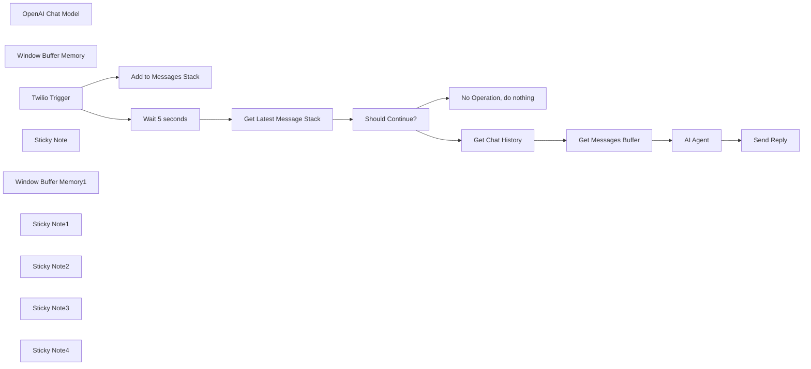

## Fluxo (.json) :

```json
{
  "meta": {
    "instanceId": "26ba763460b97c249b82942b23b6384876dfeb9327513332e743c5f6219c2b8e"
  },
  "nodes": [
    {
      "id": "d61d8ff3-532a-4b0d-a5a7-e02d2e79ddce",
      "name": "OpenAI Chat Model",
      "type": "@n8n/n8n-nodes-langchain.lmChatOpenAi",
      "position": [
        2660,
        480
      ],
      "parameters": {
        "options": {}
      },
      "credentials": {
        "openAiApi": {
          "id": "8gccIjcuf3gvaoEr",
          "name": "OpenAi account"
        }
      },
      "typeVersion": 1
    },
    {
      "id": "b6d5c1cf-b4a1-4901-b001-0c375747ee63",
      "name": "No Operation, do nothing",
      "type": "n8n-nodes-base.noOp",
      "position": [
        1660,
        520
      ],
      "parameters": {},
      "typeVersion": 1
    },
    {
      "id": "f4e08e32-bb96-4b5d-852e-26ad6fec3c8c",
      "name": "Add to Messages Stack",
      "type": "n8n-nodes-base.redis",
      "position": [
        1340,
        200
      ],
      "parameters": {
        "list": "=chat-buffer:{{ $json.From }}",
        "tail": true,
        "operation": "push",
        "messageData": "={{ $json.Body }}"
      },
      "credentials": {
        "redis": {
          "id": "zU4DA70qSDrZM1El",
          "name": "Redis account"
        }
      },
      "typeVersion": 1
    },
    {
      "id": "181ae99e-ebe7-4e99-b5a5-999acc249621",
      "name": "Should Continue?",
      "type": "n8n-nodes-base.if",
      "position": [
        1660,
        360
      ],
      "parameters": {
        "options": {},
        "conditions": {
          "options": {
            "leftValue": "",
            "caseSensitive": true,
            "typeValidation": "strict"
          },
          "combinator": "and",
          "conditions": [
            {
              "id": "ec39573f-f92a-4fe4-a832-0a137de8e7d0",
              "operator": {
                "type": "string",
                "operation": "equals"
              },
              "leftValue": "={{ $('Get Latest Message Stack').item.json.messages.last() }}",
              "rightValue": "={{ $('Twilio Trigger').item.json.Body }}"
            }
          ]
        }
      },
      "typeVersion": 2
    },
    {
      "id": "640c63ca-2798-48a9-8484-b834c1a36301",
      "name": "Window Buffer Memory",
      "type": "@n8n/n8n-nodes-langchain.memoryBufferWindow",
      "position": [
        2780,
        480
      ],
      "parameters": {
        "sessionKey": "=chat-debouncer:{{ $('Twilio Trigger').item.json.From }}",
        "sessionIdType": "customKey"
      },
      "typeVersion": 1.2
    },
    {
      "id": "123c35c5-f7b2-4b4d-b220-0e5273e25115",
      "name": "Twilio Trigger",
      "type": "n8n-nodes-base.twilioTrigger",
      "position": [
        940,
        360
      ],
      "webhookId": "0ca3da0e-e4e1-4e94-8380-06207bf9b429",
      "parameters": {
        "updates": [
          "com.twilio.messaging.inbound-message.received"
        ]
      },
      "credentials": {
        "twilioApi": {
          "id": "TJv4H4lXxPCLZT50",
          "name": "Twilio account"
        }
      },
      "typeVersion": 1
    },
    {
      "id": "f4e86455-7f4d-4401-8f61-a859be1433a9",
      "name": "Get Latest Message Stack",
      "type": "n8n-nodes-base.redis",
      "position": [
        1500,
        360
      ],
      "parameters": {
        "key": "=chat-buffer:{{ $json.From }}",
        "keyType": "list",
        "options": {},
        "operation": "get",
        "propertyName": "messages"
      },
      "credentials": {
        "redis": {
          "id": "zU4DA70qSDrZM1El",
          "name": "Redis account"
        }
      },
      "typeVersion": 1,
      "alwaysOutputData": false
    },
    {
      "id": "02f8e7f5-12b4-4a5a-9ce9-5f0558e447aa",
      "name": "Sticky Note",
      "type": "n8n-nodes-base.stickyNote",
      "position": [
        1232.162872321277,
        -50.203627749982275
      ],
      "parameters": {
        "color": 7,
        "width": 632.8309394802918,
        "height": 766.7069233634998,
        "content": "## Step 2. Buffer Incoming Messages\n[Learn more about using Redis](https://docs.n8n.io/integrations/builtin/app-nodes/n8n-nodes-base.redis)\n\n* New messages are captured into a list.\n* After X seconds, we get a fresh copy of this list\n* If the last message on the list is the same as the incoming message, then we know no new follow-on messages were sent within the last 5 seconds. Hence the user should be waiting and it is safe to reply.\n* But if the reverse is true, then we will abort the execution here."
      },
      "typeVersion": 1
    },
    {
      "id": "311c0d69-a735-4435-91b6-e80bf7d4c012",
      "name": "Send Reply",
      "type": "n8n-nodes-base.twilio",
      "position": [
        3000,
        320
      ],
      "parameters": {
        "to": "={{ $('Twilio Trigger').item.json.From }}",
        "from": "={{ $('Twilio Trigger').item.json.To }}",
        "message": "={{ $json.output }}",
        "options": {}
      },
      "credentials": {
        "twilioApi": {
          "id": "TJv4H4lXxPCLZT50",
          "name": "Twilio account"
        }
      },
      "typeVersion": 1
    },
    {
      "id": "c0e0cd08-66e3-4ca3-9441-8436c0d9e664",
      "name": "Wait 5 seconds",
      "type": "n8n-nodes-base.wait",
      "position": [
        1340,
        360
      ],
      "webhookId": "d486979c-8074-4ecb-958e-fcb24455086b",
      "parameters": {},
      "typeVersion": 1.1
    },
    {
      "id": "c7959fa2-69a5-46b4-8e67-1ef824860f4e",
      "name": "Get Chat History",
      "type": "@n8n/n8n-nodes-langchain.memoryManager",
      "position": [
        2000,
        280
      ],
      "parameters": {
        "options": {
          "groupMessages": true
        }
      },
      "typeVersion": 1.1
    },
    {
      "id": "55933c54-5546-4770-8b36-a31496163528",
      "name": "Window Buffer Memory1",
      "type": "@n8n/n8n-nodes-langchain.memoryBufferWindow",
      "position": [
        2000,
        420
      ],
      "parameters": {
        "sessionKey": "=chat-debouncer:{{ $('Twilio Trigger').item.json.From }}",
        "sessionIdType": "customKey"
      },
      "typeVersion": 1.2
    },
    {
      "id": "459c0181-d239-4eec-88b6-c9603868d518",
      "name": "Sticky Note1",
      "type": "n8n-nodes-base.stickyNote",
      "position": [
        774.3250485705519,
        198.07493876489747
      ],
      "parameters": {
        "color": 7,
        "width": 431.1629802181097,
        "height": 357.49804533541777,
        "content": "## Step 1. Listen for Twilio Messages\n[Read more about Twilio Trigger](https://docs.n8n.io/integrations/builtin/trigger-nodes/n8n-nodes-base.twiliotrigger)\n\nIn this example, we'll use the sender's phone number as the session ID. This will be important in retrieving chat history."
      },
      "typeVersion": 1
    },
    {
      "id": "e06313a9-066a-4387-a36c-a6c6ff57d6f9",
      "name": "Sticky Note2",
      "type": "n8n-nodes-base.stickyNote",
      "position": [
        1900,
        80
      ],
      "parameters": {
        "color": 7,
        "width": 618.970917763344,
        "height": 501.77420646931444,
        "content": "## Step 3. Get Messages Since Last Reply\n[Read more about using Chat Memory](https://docs.n8n.io/integrations/builtin/cluster-nodes/sub-nodes/n8n-nodes-langchain.memorymanager)\n\nOnce conditions are met and we allow the agent to reply, we'll need to find the bot's last reply and work out the buffer of user messages since then. We can do this by looking using chat memory and comparing this to the latest message in our redis messages stack."
      },
      "typeVersion": 1
    },
    {
      "id": "601a71f6-c6f8-4b73-98c7-cfa11b1facaa",
      "name": "Get Messages Buffer",
      "type": "n8n-nodes-base.set",
      "position": [
        2320,
        280
      ],
      "parameters": {
        "options": {},
        "assignments": {
          "assignments": [
            {
              "id": "01434acb-c224-46d2-99b0-7a81a2bb50c5",
              "name": "messages",
              "type": "string",
              "value": "={{\n$('Get Latest Message Stack').item.json.messages\n  .slice(\n    $('Get Latest Message Stack').item.json.messages.lastIndexOf(\n      $('Get Chat History').item.json.messages.last().human\n      || $('Twilio Trigger').item.json.chatInput\n    ),\n    $('Get Latest Message Stack').item.json.messages.length\n  )\n  .join('\\n')\n}}"
            }
          ]
        }
      },
      "typeVersion": 3.4
    },
    {
      "id": "9e49f2de-89e6-4152-8e9c-ed47c5fc4654",
      "name": "Sticky Note3",
      "type": "n8n-nodes-base.stickyNote",
      "position": [
        2549,
        120
      ],
      "parameters": {
        "color": 7,
        "width": 670.2274698011594,
        "height": 522.5993538768389,
        "content": "## Step 4. Send Single Agent Reply For Many Messages\n[Learn more about using AI Agents](https://docs.n8n.io/integrations/builtin/cluster-nodes/root-nodes/n8n-nodes-langchain.agent)\n\nFinally, our buffered messages are sent to the AI Agent that can formulate a single response for all. This could potentially improve the conversation experience if the chat interaction is naturally more rapid and spontaneous. A drawback however is that responses could be feel much slower - tweak the wait threshold to suit your needs!"
      },
      "typeVersion": 1
    },
    {
      "id": "be13c74a-467c-4ab1-acca-44878c68dba4",
      "name": "Sticky Note4",
      "type": "n8n-nodes-base.stickyNote",
      "position": [
        380,
        80
      ],
      "parameters": {
        "width": 375.55385425077225,
        "height": 486.69228315530853,
        "content": "## Try It Out!\n### This workflow demonstrates a simple approach to stagger an AI Agent's reply if users often send in a sequence of partial messages and in short bursts.\n\n* Twilio webhook receives user's messages which are recorded in a message stack powered by Redis.\n* The execution is immediately paused for 5 seconds and then another check is done against the message stack for the latest message.\n* The purpose of this check lets use know if the user is sending more messages or if they are waiting for a reply.\n* The execution is aborted if the latest message on the stack differs from the incoming message and continues if they are the same.\n* For the latter, the agent receives buffered messages and is able to respond to all in a single reply."
      },
      "typeVersion": 1
    },
    {
      "id": "334d38e1-ec16-46f2-a57d-bf531adb8d3d",
      "name": "AI Agent",
      "type": "@n8n/n8n-nodes-langchain.agent",
      "position": [
        2660,
        320
      ],
      "parameters": {
        "text": "={{ $json.messages }}",
        "agent": "conversationalAgent",
        "options": {},
        "promptType": "define"
      },
      "typeVersion": 1.6
    }
  ],
  "pinData": {},
  "connections": {
    "AI Agent": {
      "main": [
        [
          {
            "node": "Send Reply",
            "type": "main",
            "index": 0
          }
        ]
      ]
    },
    "Twilio Trigger": {
      "main": [
        [
          {
            "node": "Add to Messages Stack",
            "type": "main",
            "index": 0
          },
          {
            "node": "Wait 5 seconds",
            "type": "main",
            "index": 0
          }
        ]
      ]
    },
    "Wait 5 seconds": {
      "main": [
        [
          {
            "node": "Get Latest Message Stack",
            "type": "main",
            "index": 0
          }
        ]
      ]
    },
    "Get Chat History": {
      "main": [
        [
          {
            "node": "Get Messages Buffer",
            "type": "main",
            "index": 0
          }
        ]
      ]
    },
    "Should Continue?": {
      "main": [
        [
          {
            "node": "Get Chat History",
            "type": "main",
            "index": 0
          }
        ],
        [
          {
            "node": "No Operation, do nothing",
            "type": "main",
            "index": 0
          }
        ]
      ]
    },
    "OpenAI Chat Model": {
      "ai_languageModel": [
        [
          {
            "node": "AI Agent",
            "type": "ai_languageModel",
            "index": 0
          }
        ]
      ]
    },
    "Get Messages Buffer": {
      "main": [
        [
          {
            "node": "AI Agent",
            "type": "main",
            "index": 0
          }
        ]
      ]
    },
    "Window Buffer Memory": {
      "ai_memory": [
        [
          {
            "node": "AI Agent",
            "type": "ai_memory",
            "index": 0
          }
        ]
      ]
    },
    "Window Buffer Memory1": {
      "ai_memory": [
        [
          {
            "node": "Get Chat History",
            "type": "ai_memory",
            "index": 0
          }
        ]
      ]
    },
    "Get Latest Message Stack": {
      "main": [
        [
          {
            "node": "Should Continue?",
            "type": "main",
            "index": 0
          }
        ]
      ]
    }
  }
}
```

<a id="template-2584"></a>

## Template 2584 - Backup diário de workflows para Bitbucket

- **Nome:** Backup diário de workflows para Bitbucket
- **Descrição:** Faz backup diário dos workflows do ambiente para um repositório Bitbucket, criando ou atualizando arquivos JSON com o conteúdo dos workflows.
- **Funcionalidade:** • Agendamento diário: Executa o processo automaticamente todos os dias às 02:00.
• Coleta de workflows: Recupera todos os workflows existentes no ambiente para processamento.
• Processamento em lote: Itera sobre os workflows em lotes para controlar o fluxo de execução.
• Verificação no repositório: Consulta o repositório remoto para verificar se o arquivo do workflow já existe.
• Detecção de alteração: Compara o conteúdo atual do workflow com o arquivo no repositório para identificar novos ou alterados.
• Upload/commit de arquivos: Envia novos arquivos ou atualizações para o repositório com mensagem contendo timestamp.
• Gerenciamento de limite de requisições: Lê cabeçalhos de rate limit da API e calcula um tempo de espera adaptativo (com limite máximo) entre operações para evitar bloqueios.
• Continuidade em erros: Permite que falhas de leitura no repositório não interrompam o fluxo, seguindo para as próximas operações.
- **Ferramentas:** • Bitbucket: Repositório Git remoto usado para armazenar os arquivos de backup dos workflows e receber commits via API.


## Fluxo visual

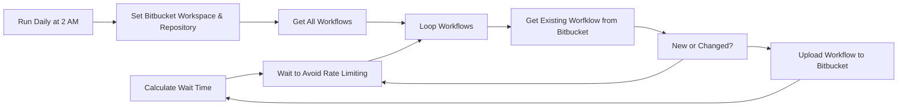

## Fluxo (.json) :

```json
{
  "id": "23GPrqZjHnIVvTEa",
  "meta": {
    "instanceId": "[instance id auto generated]",
    "templateCredsSetupCompleted": true
  },
  "name": "Backup n8n Workflows to Bitbucket",
  "tags": [],
  "nodes": [
    {
      "id": "b3363b9d-ea6e-47b7-99f9-f48a21805886",
      "name": "Calculate Wait Time",
      "type": "n8n-nodes-base.code",
      "position": [
        1400,
        -260
      ],
      "parameters": {
        "jsCode": "// Get all input items and ensure we have data\nif ($input.all().length === 0 || !$input.all()[0].headers) {\n  // If no headers available, return default wait time\n  return { waitTime: 1 };\n}\n\n// Check rate limit headers from previous request\nconst headers = $input.all()[0].headers;\nlet waitTime = 1; // Default 1 second\n\n// Check if we have rate limit information (safely)\nconst remaining = parseInt(headers['x-ratelimit-remaining']) || null;\nconst reset = parseInt(headers['x-ratelimit-reset']) || null;\n\n// Only adjust wait time if we have valid rate limit info\nif (remaining !== null && reset !== null) {\n  // If we're running low on requests, calculate a longer wait time\n  if (remaining < 100) {\n    // Calculate seconds until reset\n    const now = Math.floor(Date.now() / 1000);\n    const timeUntilReset = reset - now;\n    \n    // Spread remaining requests over time until reset\n    // Add 10% buffer to be safe\n    waitTime = Math.ceil((timeUntilReset / remaining) * 1.1);\n  } else if (remaining < 500) {\n    // Start slowing down earlier\n    waitTime = 2;\n  }\n}\n\n// Cap maximum wait time at 30 seconds\nwaitTime = Math.min(waitTime, 30);\n\nreturn { waitTime };"
      },
      "typeVersion": 2
    },
    {
      "id": "3cbc2287-b36f-4839-87b7-be4a7eadcf79",
      "name": "Run Daily at 2 AM",
      "type": "n8n-nodes-base.scheduleTrigger",
      "position": [
        -120,
        -20
      ],
      "parameters": {
        "rule": {
          "interval": [
            {
              "triggerAtHour": 2
            }
          ]
        }
      },
      "typeVersion": 1.2
    },
    {
      "id": "09b396aa-61e8-4631-8aae-7126fbd609e6",
      "name": "Get All Workflows",
      "type": "n8n-nodes-base.n8n",
      "position": [
        320,
        -20
      ],
      "parameters": {
        "filters": {},
        "requestOptions": {}
      },
      "credentials": {
        "n8nApi": {
          "id": "[n8n-api-credential-id]",
          "name": "n8n Development Environment"
        }
      },
      "typeVersion": 1
    },
    {
      "id": "c46b50cd-432f-4714-ac68-b6f92663b592",
      "name": "Loop Workflows",
      "type": "n8n-nodes-base.splitInBatches",
      "position": [
        540,
        -20
      ],
      "parameters": {
        "options": {}
      },
      "typeVersion": 3
    },
    {
      "id": "2a27e85d-51c0-4f45-a7d6-6422fc8a439b",
      "name": "Get Existing Worfklow from Bitbucket",
      "type": "n8n-nodes-base.httpRequest",
      "onError": "continueRegularOutput",
      "position": [
        780,
        -20
      ],
      "parameters": {
        "url": "=https://api.bitbucket.org/2.0/repositories/{{ $('Set Bitbucket Workspace & Repository').item.json.WorkspaceSlug }}/{{ $('Set Bitbucket Workspace & Repository').item.json.RepositorySlug }}/src/main/{{ $json.name.replace(/[^a-zA-Z0-9]/g, '-').toLowerCase() }}",
        "options": {
          "response": {
            "response": {
              "fullResponse": true
            }
          },
          "allowUnauthorizedCerts": true
        },
        "authentication": "genericCredentialType",
        "genericAuthType": "httpBasicAuth"
      },
      "credentials": {
        "httpBasicAuth": {
          "id": "[bitbucket-credential-id]",
          "name": "Bitbucket"
        }
      },
      "retryOnFail": false,
      "typeVersion": 4.2,
      "alwaysOutputData": false
    },
    {
      "id": "eeb52f03-dd60-46ae-ad86-1cabf7f6c20f",
      "name": "New or Changed?",
      "type": "n8n-nodes-base.if",
      "position": [
        980,
        -20
      ],
      "parameters": {
        "options": {
          "ignoreCase": true
        },
        "conditions": {
          "options": {
            "version": 2,
            "leftValue": "",
            "caseSensitive": false,
            "typeValidation": "strict"
          },
          "combinator": "or",
          "conditions": [
            {
              "id": "2d5da90e-0f1d-436b-84d4-d82deaaa4b58",
              "operator": {
                "type": "number",
                "operation": "equals"
              },
              "leftValue": "={{ $json.error.status }}",
              "rightValue": 404
            },
            {
              "id": "b7b9a48d-8954-4cc4-bf7a-ab30439ad930",
              "operator": {
                "type": "string",
                "operation": "notEquals"
              },
              "leftValue": "={{ $('Get Existing Worfklow from Bitbucket').item.json.data }}",
              "rightValue": "={{ JSON.stringify($('Loop Workflows').item.json, null, 2) }}"
            }
          ]
        }
      },
      "typeVersion": 2.2
    },
    {
      "id": "04400827-d331-4ee2-8a67-1238ea2dc969",
      "name": "Upload Workflow to Bitbucket",
      "type": "n8n-nodes-base.httpRequest",
      "position": [
        1200,
        -260
      ],
      "parameters": {
        "url": "=https://api.bitbucket.org/2.0/repositories/{{ $('Set Bitbucket Workspace & Repository').item.json.WorkspaceSlug }}/{{ $('Set Bitbucket Workspace & Repository').item.json.RepositorySlug }}/src",
        "method": "POST",
        "options": {
          "redirect": {
            "redirect": {
              "maxRedirects": 5
            }
          },
          "response": {
            "response": {
              "fullResponse": true
            }
          }
        },
        "sendBody": true,
        "sendHeaders": true,
        "authentication": "genericCredentialType",
        "bodyParameters": {
          "parameters": [
            {
              "name": "message",
              "value": "={{ $('Loop Workflows').item.json.name + ' [' + $now.format('yyyy-MM-dd HH:mm:ss') +']' }}"
            },
            {
              "name": "={{ $('Loop Workflows').item.json.name.replace(/[^a-zA-Z0-9]/g, '-').toLowerCase() }}",
              "value": "={{ JSON.stringify($('Loop Workflows').item.json, null, 2) }}"
            }
          ]
        },
        "genericAuthType": "httpBasicAuth",
        "headerParameters": {
          "parameters": [
            {
              "name": "Content-Type",
              "value": "application/x-www-form-urlencoded"
            }
          ]
        }
      },
      "credentials": {
        "httpBasicAuth": {
          "id": "[bitbucket-credential-id]",
          "name": "Bitbucket"
        }
      },
      "typeVersion": 4.2
    },
    {
      "id": "5f198366-3bcf-4a96-ae60-da7cc9403a6f",
      "name": "Wait to Avoid Rate Limiting",
      "type": "n8n-nodes-base.wait",
      "position": [
        1620,
        -20
      ],
      "webhookId": "793d7525-d166-4487-a71f-d48da7c66662",
      "parameters": {
        "amount": "={{ $json.waitTime || 1 }}"
      },
      "typeVersion": 1.1
    },
    {
      "id": "adc37b33-c5af-4a44-ba87-9806efe25603",
      "name": "Set Bitbucket Workspace & Repository",
      "type": "n8n-nodes-base.set",
      "position": [
        100,
        -20
      ],
      "parameters": {
        "options": {},
        "assignments": {
          "assignments": [
            {
              "id": "37f2ddba-188d-4bc1-98b3-5c5fa31d2d62",
              "name": "WorkspaceSlug",
              "type": "string",
              "value": "[workspace-slug]"
            },
            {
              "id": "303f25f0-bba8-4977-8f4f-33961e2e7e8c",
              "name": "RepositorySlug",
              "type": "string",
              "value": "[repository-slug]"
            }
          ]
        }
      },
      "typeVersion": 3.4
    }
  ],
  "active": true,
  "pinData": {},
  "settings": {
    "executionOrder": "v1"
  },
  "versionId": "f21887f2-e885-42c6-a934-4f7617e267dd",
  "connections": {
    "Loop Workflows": {
      "main": [
        [],
        [
          {
            "node": "Get Existing Worfklow from Bitbucket",
            "type": "main",
            "index": 0
          }
        ]
      ]
    },
    "New or Changed?": {
      "main": [
        [
          {
            "node": "Upload Workflow to Bitbucket",
            "type": "main",
            "index": 0
          }
        ],
        [
          {
            "node": "Wait to Avoid Rate Limiting",
            "type": "main",
            "index": 0
          }
        ]
      ]
    },
    "Get All Workflows": {
      "main": [
        [
          {
            "node": "Loop Workflows",
            "type": "main",
            "index": 0
          }
        ]
      ]
    },
    "Run Daily at 2 AM": {
      "main": [
        [
          {
            "node": "Set Bitbucket Workspace & Repository",
            "type": "main",
            "index": 0
          }
        ]
      ]
    },
    "Calculate Wait Time": {
      "main": [
        [
          {
            "node": "Wait to Avoid Rate Limiting",
            "type": "main",
            "index": 0
          }
        ]
      ]
    },
    "Wait to Avoid Rate Limiting": {
      "main": [
        [
          {
            "node": "Loop Workflows",
            "type": "main",
            "index": 0
          }
        ]
      ]
    },
    "Upload Workflow to Bitbucket": {
      "main": [
        [
          {
            "node": "Calculate Wait Time",
            "type": "main",
            "index": 0
          }
        ]
      ]
    },
    "Get Existing Worfklow from Bitbucket": {
      "main": [
        [
          {
            "node": "New or Changed?",
            "type": "main",
            "index": 0
          }
        ]
      ]
    },
    "Set Bitbucket Workspace & Repository": {
      "main": [
        [
          {
            "node": "Get All Workflows",
            "type": "main",
            "index": 0
          }
        ]
      ]
    }
  }
}
```

<a id="template-2585"></a>

## Template 2585 - Resumo diário de podcasts

- **Nome:** Resumo diário de podcasts
- **Descrição:** Gera resumos diários dos episódios principais de uma categoria de podcasts, transformando áudio em texto, resumindo e enviando tudo por email.
- **Funcionalidade:** • Agendamento diário: Executa o fluxo em um horário programado para gerar o resumo diário.
• Seleção de gênero: Define a categoria de podcasts (ex.: TECHNOLOGY) a ser analisada.
• Consulta de charts: Recupera a lista dos principais episódios por gênero a partir de um serviço de charts.
• Download de áudio: Baixa os arquivos de áudio dos episódios listados.
• Corte de áudio remoto: Solicita recorte de trechos específicos dos episódios antes da análise.
• Verificação e espera: Verifica se os cortes estão prontos e espera até que o arquivo recortado esteja disponível.
• Transcrição automática: Envia o áudio recortado para transcrição em texto.
• Resumo por IA: Gera um resumo sucinto e focado do conteúdo transcrito (3–4 parágrafos).
• Montagem de conteúdo: Agrupa os resumos e metadados (nome do podcast, episódio e link) em HTML formatado.
• Envio por email: Envia o resumo final em HTML para o destinatário configurado por email.
- **Ferramentas:** • Taddy (api.taddy.org): Serviço que fornece os charts/top podcasts por gênero e país.
• Aspose Audio Cutter (products.aspose.app): Serviço para cortar/recortar trechos do arquivo de áudio remotamente.
• OpenAI (Whisper + modelo de chat): Transcrição de áudio (Whisper) e geração de resumos com modelo de linguagem.
• Gmail (conta Google): Serviço de envio de email para entregar o resumo final em formato HTML.


## Fluxo visual

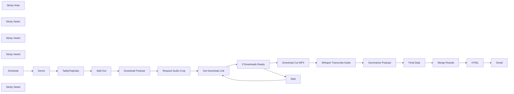

## Fluxo (.json) :

```json
{
  "meta": {
    "instanceId": "7858a8e25b8fc4dae485c1ef345e6fe74effb1f5060433ef500b4c186c965c18"
  },
  "nodes": [
    {
      "id": "49ab7596-665e-4a0f-bb8b-9dc04525ce88",
      "name": "Gmail",
      "type": "n8n-nodes-base.gmail",
      "position": [
        2340,
        1440
      ],
      "parameters": {
        "message": "={{ $json.html }}",
        "options": {},
        "subject": "Podcast Review"
      },
      "credentials": {
        "gmailOAuth2": {
          "id": "1MUdv1HbrQUFABiZ",
          "name": "Gmail account"
        }
      },
      "typeVersion": 2.1
    },
    {
      "id": "40aa23f4-69d6-46e5-84a2-b46a64a3f0af",
      "name": "TaddyTopDaily",
      "type": "n8n-nodes-base.httpRequest",
      "position": [
        1620,
        820
      ],
      "parameters": {
        "url": "https://api.taddy.org/",
        "method": "POST",
        "options": {},
        "sendBody": true,
        "sendHeaders": true,
        "bodyParameters": {
          "parameters": [
            {
              "name": "query",
              "value": "=query {   getTopChartsByGenres(          limitPerPage:10,     filterByCountry:UNITED_STATES_OF_AMERICA,     taddyType:PODCASTEPISODE,      genres:PODCASTSERIES_{{ $json.genre }}){     topChartsId      podcastEpisodes{       uuid       name audioUrl      podcastSeries{         uuid         name       }     }   } }"
            }
          ]
        },
        "headerParameters": {
          "parameters": [
            {
              "name": "X-USER-ID"
            },
            {
              "name": "X-API-KEY"
            }
          ]
        }
      },
      "typeVersion": 4.2
    },
    {
      "id": "42eea23b-b09c-49ee-af5b-12abb3960390",
      "name": "Genre",
      "type": "n8n-nodes-base.set",
      "position": [
        1420,
        820
      ],
      "parameters": {
        "options": {},
        "assignments": {
          "assignments": [
            {
              "id": "e995cd5b-b91c-4a9d-8215-44d7dfe3f52f",
              "name": "genre",
              "type": "string",
              "value": "TECHNOLOGY"
            }
          ]
        }
      },
      "typeVersion": 3.4
    },
    {
      "id": "da256fbf-ed7b-4a26-9fa8-33d1c2b717a5",
      "name": "Split Out",
      "type": "n8n-nodes-base.splitOut",
      "position": [
        1840,
        820
      ],
      "parameters": {
        "options": {},
        "fieldToSplitOut": "data.getTopChartsByGenres.podcastEpisodes"
      },
      "typeVersion": 1
    },
    {
      "id": "069ab68c-dcd6-406f-8e7f-2597f62a04f5",
      "name": "Whisper Transcribe Audio",
      "type": "n8n-nodes-base.httpRequest",
      "position": [
        1880,
        1120
      ],
      "parameters": {
        "url": "https://api.openai.com/v1/audio/transcriptions",
        "method": "POST",
        "options": {},
        "sendBody": true,
        "contentType": "multipart-form-data",
        "authentication": "predefinedCredentialType",
        "bodyParameters": {
          "parameters": [
            {
              "name": "model",
              "value": "whisper-1"
            },
            {
              "name": "file",
              "parameterType": "formBinaryData",
              "inputDataFieldName": "data"
            }
          ]
        },
        "nodeCredentialType": "openAiApi"
      },
      "credentials": {
        "openAiApi": {
          "id": "tTOOlpAaNT3QoKbQ",
          "name": "OpenAi account"
        }
      },
      "typeVersion": 3
    },
    {
      "id": "ffa67b8d-8601-4e1d-8f72-b6266e6b3327",
      "name": "Final Data",
      "type": "n8n-nodes-base.set",
      "position": [
        2320,
        1120
      ],
      "parameters": {
        "mode": "raw",
        "options": {},
        "jsonOutput": "={\n\"podcast\": \"{{ $('TaddyTopDaily').item.json.data.getTopChartsByGenres.podcastEpisodes[$itemIndex].podcastSeries.name }}\",\n\"name\": \"{{ $('TaddyTopDaily').item.json.data.getTopChartsByGenres.podcastEpisodes[$itemIndex].name.replace(/\\\"/g,'\\\"') }}\",\n \"url\":\"{{ $('TaddyTopDaily').item.json.data.getTopChartsByGenres.podcastEpisodes[$itemIndex].audioUrl.replace(/\"/g,'') }}\",\n\"summary\":\"{{ $json.message.content.replace(/\\/g, '\\\\\\\\').replace(/\"/g, '\\\\\"').replace(/\\n/g, '<br/>').replace(/\\r/g, '\\\\r').replace(/\\t/g, '\\\\t') }}\"\n  \n}\n"
      },
      "typeVersion": 3.4
    },
    {
      "id": "88cd1fa5-07ae-4dcd-b4f8-85cbf7c98d73",
      "name": "Merge Results",
      "type": "n8n-nodes-base.code",
      "position": [
        1900,
        1440
      ],
      "parameters": {
        "jsCode": "return [{fields:$input.all().map(x=>x.json)}]"
      },
      "typeVersion": 2
    },
    {
      "id": "4c2c80d1-750f-42f1-a0f1-343dec325b0f",
      "name": "HTML",
      "type": "n8n-nodes-base.html",
      "position": [
        2120,
        1440
      ],
      "parameters": {
        "html": "<!DOCTYPE html>\n<html>\n<head>\n  <meta charset=\"UTF-8\" />\n</head>\n<body>\n  <table>\n    <tr> \n      {{ ['Podcast', 'Episode', 'Summary'].map(propname=>'<td><h4>'+propname+'</h4></td>').join('')  }}\n    </tr>\n    {{ $json.fields.map(ep=>{ return `<tr><td>${ep.podcast}</td><td><a href=\"${ep.url}\">${ep.name}</a></td><td>${ep.summary}</td><td></td></tr>`} ) }}\n  </table>\n</body>\n</html>\n\n<style>\ntr { \n     border: 1px solid #000;    \n     padding: 8px;   \n }\n.container {\n  background-color: #ffffff;\n  text-align: center;\n  padding: 16px;\n  border-radius: 8px;\n}\n\nh1 {\n  color: #ff6d5a;\n  font-size: 24px;\n  font-weight: bold;\n  padding: 8px;\n}\n\nh2 {\n  color: #909399;\n  font-size: 18px;\n  font-weight: bold;\n  padding: 8px;\n}\n</style>\n"
      },
      "executeOnce": true,
      "typeVersion": 1.2
    },
    {
      "id": "f1d13556-2c3a-48e5-84a1-5b82f338c6ba",
      "name": "Sticky Note",
      "type": "n8n-nodes-base.stickyNote",
      "position": [
        340,
        760
      ],
      "parameters": {
        "color": 4,
        "width": 547.952991050529,
        "height": 683.5200847858991,
        "content": "## Daily Podcast Summary\n### This workflow will summarize the content in the day's top podcasts for a certain genre, then send you the podcasts with summaries by email\n\n## Setup:\n 1. Create a free API key on Taddy here: https://taddy.org/signup/developers\n 2. Input your user number and API key into the `TaddyTopDaily` node in the header parameters X-USER-ID and X-API-KEY respectively.\n 3. Create access credentials for your Gmail as described here: https://developers.google.com/workspace/guides/create-credentials. Use the credentials from your *client_secret.json* in the `Gmail` node.\n 4. In the `Genre` node, set the genre of podcasts you want a summary for. Valid values are: TECHNOLOGY, NEWS, ARTS, COMEDY, SPORTS, FICTION, etc. Look at api.taddy.org for the full list (they will be displayed in the help docs as PODCASTSERIES_TECHNOLOGY, PODCASTSERIES_NEWS, etc.)\n 5. Enter your email address in the `Gmail` node.\n 6. Change the schedule time for sending email from `Schedule` to whichever time you want to receive the email.\n \n\n## Test:\n- Link a `Test Workflow` node in place of the `Schedule` node.\n- Hit Test Workflow.\n- Check your email for the results."
      },
      "typeVersion": 1
    },
    {
      "id": "5aee7279-349e-47cd-99dc-7a32677b5a20",
      "name": "Sticky Note1",
      "type": "n8n-nodes-base.stickyNote",
      "position": [
        1820,
        1060
      ],
      "parameters": {
        "width": 651.4454343326669,
        "height": 252.64899257060446,
        "content": "### Whisper transcribes and Open AI summarizes the podcast"
      },
      "typeVersion": 1
    },
    {
      "id": "f8b4a203-b27f-4a11-90ef-a7e1561219f5",
      "name": "Sticky Note2",
      "type": "n8n-nodes-base.stickyNote",
      "position": [
        1100,
        760
      ],
      "parameters": {
        "width": 1189.7320416038633,
        "height": 249.2202456997519,
        "content": "### Get daily list of top podcasts (according to Apple charts) and download audio, then crop for OpenAI"
      },
      "typeVersion": 1
    },
    {
      "id": "7045c9c8-5509-4dc0-b167-ddd4d6c90c22",
      "name": "Sticky Note3",
      "type": "n8n-nodes-base.stickyNote",
      "position": [
        1825,
        1384
      ],
      "parameters": {
        "width": 645.0210885124873,
        "height": 227.94126205257731,
        "content": "### Finally, send the email!"
      },
      "typeVersion": 1
    },
    {
      "id": "8dc9583b-cec3-4ac0-a74a-329f6c3b4801",
      "name": "Summarize Podcast",
      "type": "n8n-nodes-base.openAi",
      "position": [
        2140,
        1120
      ],
      "parameters": {
        "model": "gpt-4o-mini",
        "prompt": {
          "messages": [
            {
              "content": "=Summarize the major points of the following podcast: {{ $json.text }}. Start your answer by saying 'This episode focuses on', 'This episode is about', etc. Contain your answer to 3-4 paragraphs max, and focus on only key information. "
            }
          ]
        },
        "options": {
          "maxTokens": 500
        },
        "resource": "chat",
        "requestOptions": {}
      },
      "credentials": {
        "openAiApi": {
          "id": "tTOOlpAaNT3QoKbQ",
          "name": "OpenAi account"
        }
      },
      "typeVersion": 1
    },
    {
      "id": "e8d122f1-29f9-41ca-9c6b-b72269686fd6",
      "name": "Schedule",
      "type": "n8n-nodes-base.scheduleTrigger",
      "position": [
        1220,
        820
      ],
      "parameters": {
        "rule": {
          "interval": [
            {
              "triggerAtHour": 8
            }
          ]
        }
      },
      "typeVersion": 1.2
    },
    {
      "id": "67bc7a5b-8d0a-4de4-918d-410551dad4d7",
      "name": "Request Audio Crop",
      "type": "n8n-nodes-base.httpRequest",
      "position": [
        1000,
        1220
      ],
      "parameters": {
        "url": "https://api.products.aspose.app/audio/cutter/api/cutter",
        "method": "POST",
        "options": {},
        "sendBody": true,
        "contentType": "multipart-form-data",
        "sendHeaders": true,
        "bodyParameters": {
          "parameters": [
            {
              "name": "1",
              "parameterType": "formBinaryData",
              "inputDataFieldName": "data"
            },
            {
              "name": "convertOption",
              "value": "{\"startTime\":\"00:08:00\",\"endTime\":\"00:24:00\",\"audioFormat\":\"mp3\"}"
            }
          ]
        },
        "headerParameters": {
          "parameters": [
            {
              "name": "Accept",
              "value": "*/*("
            },
            {
              "name": "Connection",
              "value": "keep-alive"
            },
            {
              "name": "Origin",
              "value": "https://products.aspose.app"
            },
            {
              "name": "Referer",
              "value": "https://products.aspose.app"
            },
            {
              "name": "Sec-Fetch-Dest",
              "value": "empty"
            },
            {
              "name": "Sec-Fetch-Mode",
              "value": "cors"
            },
            {
              "name": "Sec-Fetch-Site",
              "value": "same-site"
            }
          ]
        }
      },
      "typeVersion": 4.2
    },
    {
      "id": "0dc62507-3fea-45d7-a0dc-e92fb8e2600f",
      "name": "Get Download Link",
      "type": "n8n-nodes-base.httpRequest",
      "position": [
        1200,
        1220
      ],
      "parameters": {
        "url": "=https://api.products.aspose.app/audio/cutter/api/cutter/HandleStatus?fileRequestId={{ $('Request Audio Crop').item.json.Data.FileRequestId }}",
        "options": {},
        "sendHeaders": true,
        "headerParameters": {
          "parameters": [
            {
              "name": "Accept",
              "value": "application/json, text/javascript, */*; q=0.01"
            },
            {
              "name": "Connection",
              "value": "keep-alive"
            },
            {
              "name": "Origin",
              "value": "https://products.aspose.app"
            },
            {
              "name": "Referer",
              "value": "https://products.aspose.app"
            },
            {
              "name": "Sec-Fetch-Dest",
              "value": "empty"
            },
            {
              "name": "Sec-Fetch-Dest",
              "value": "cors"
            },
            {
              "name": "Sec-Fetch-Dest",
              "value": "same-site"
            }
          ]
        }
      },
      "typeVersion": 4.2
    },
    {
      "id": "8aa65189-2a4b-4ac4-9915-45ccd679a5da",
      "name": "Download Cut MP3",
      "type": "n8n-nodes-base.httpRequest",
      "position": [
        1660,
        1140
      ],
      "parameters": {
        "url": "={{ $json.Data.DownloadLink }}",
        "options": {}
      },
      "typeVersion": 4.2
    },
    {
      "id": "4e7318df-dbaa-4d9f-858d-4455ead763c1",
      "name": "Download Podcast",
      "type": "n8n-nodes-base.httpRequest",
      "position": [
        2060,
        820
      ],
      "parameters": {
        "url": "={{ $json.audioUrl }}",
        "options": {}
      },
      "typeVersion": 4.2
    },
    {
      "id": "ab4601c6-7387-4f2f-a2f3-4256f88c0b3e",
      "name": "Wait",
      "type": "n8n-nodes-base.wait",
      "position": [
        1600,
        1360
      ],
      "webhookId": "bc28bc57-d9ea-430e-88db-78d088a058cb",
      "parameters": {},
      "typeVersion": 1.1
    },
    {
      "id": "a0b300b9-aaad-48f1-8319-a03700e0d298",
      "name": "Sticky Note4",
      "type": "n8n-nodes-base.stickyNote",
      "position": [
        920,
        1100
      ],
      "parameters": {
        "width": 898.7483569555845,
        "height": 387.3779915472271,
        "content": "### Crop the podcast down before analysis"
      },
      "typeVersion": 1
    },
    {
      "id": "34ca89fe-4ed1-491f-b3b9-32e97040959b",
      "name": "If Downloads Ready",
      "type": "n8n-nodes-base.if",
      "position": [
        1380,
        1180
      ],
      "parameters": {
        "options": {},
        "conditions": {
          "options": {
            "leftValue": "",
            "caseSensitive": true,
            "typeValidation": "loose"
          },
          "combinator": "and",
          "conditions": [
            {
              "id": "49440938-0cb3-41c8-bcab-b7ad96973f77",
              "operator": {
                "type": "boolean",
                "operation": "true",
                "singleValue": true
              },
              "leftValue": "={{ $input.all().map(x=>x.json.Data.DownloadLink).reduce((accumulator, currentValue) => accumulator && currentValue, true)\n}}",
              "rightValue": ""
            }
          ]
        },
        "looseTypeValidation": true
      },
      "typeVersion": 2.1
    }
  ],
  "pinData": {},
  "connections": {
    "HTML": {
      "main": [
        [
          {
            "node": "Gmail",
            "type": "main",
            "index": 0
          }
        ]
      ]
    },
    "Wait": {
      "main": [
        [
          {
            "node": "Get Download Link",
            "type": "main",
            "index": 0
          }
        ]
      ]
    },
    "Genre": {
      "main": [
        [
          {
            "node": "TaddyTopDaily",
            "type": "main",
            "index": 0
          }
        ]
      ]
    },
    "Schedule": {
      "main": [
        [
          {
            "node": "Genre",
            "type": "main",
            "index": 0
          }
        ]
      ]
    },
    "Split Out": {
      "main": [
        [
          {
            "node": "Download Podcast",
            "type": "main",
            "index": 0
          }
        ]
      ]
    },
    "Final Data": {
      "main": [
        [
          {
            "node": "Merge Results",
            "type": "main",
            "index": 0
          }
        ]
      ]
    },
    "Merge Results": {
      "main": [
        [
          {
            "node": "HTML",
            "type": "main",
            "index": 0
          }
        ]
      ]
    },
    "TaddyTopDaily": {
      "main": [
        [
          {
            "node": "Split Out",
            "type": "main",
            "index": 0
          }
        ]
      ]
    },
    "Download Cut MP3": {
      "main": [
        [
          {
            "node": "Whisper Transcribe Audio",
            "type": "main",
            "index": 0
          }
        ]
      ]
    },
    "Download Podcast": {
      "main": [
        [
          {
            "node": "Request Audio Crop",
            "type": "main",
            "index": 0
          }
        ]
      ]
    },
    "Get Download Link": {
      "main": [
        [
          {
            "node": "If Downloads Ready",
            "type": "main",
            "index": 0
          }
        ]
      ]
    },
    "Summarize Podcast": {
      "main": [
        [
          {
            "node": "Final Data",
            "type": "main",
            "index": 0
          }
        ]
      ]
    },
    "If Downloads Ready": {
      "main": [
        [
          {
            "node": "Download Cut MP3",
            "type": "main",
            "index": 0
          }
        ],
        [
          {
            "node": "Wait",
            "type": "main",
            "index": 0
          }
        ]
      ]
    },
    "Request Audio Crop": {
      "main": [
        [
          {
            "node": "Get Download Link",
            "type": "main",
            "index": 0
          }
        ]
      ]
    },
    "Whisper Transcribe Audio": {
      "main": [
        [
          {
            "node": "Summarize Podcast",
            "type": "main",
            "index": 0
          }
        ]
      ]
    }
  }
}
```

<a id="template-2586"></a>

## Template 2586 - Salvar Relatórios Qualys no TheHive

- **Nome:** Salvar Relatórios Qualys no TheHive
- **Descrição:** Automatiza a captura de relatórios finalizados do Qualys e os armazena como casos com anexos na plataforma TheHive, evitando duplicações por meio de um timestamp.
- **Funcionalidade:** • Agendamento horário: Executa a rotina a cada hora para verificar novos relatórios.
• Coleta de relatórios Qualys: Consulta a API do Qualys para listar relatórios no estado "Finished".
• Conversão XML para JSON: Converte a resposta em XML para JSON para facilitar o processamento.
• Separação e filtragem de relatórios: Separa a lista de relatórios em itens individuais e filtra apenas os criados após o último timestamp processado.
• Criação de caso no TheHive: Gera um novo caso por relatório novo, incluindo título, descrição e tags.
• Download de relatório: Faz o download do relatório específico via API usando o ID do relatório.
• Anexar relatório ao caso: Adiciona o arquivo baixado como anexo ao caso criado no TheHive.
• Atualização de timestamp: Atualiza uma marca de tempo armazenada após o processamento para evitar duplicações futuras.
• Controle de taxa/sincronização: Introduz uma pequena espera entre operações para reduzir risco de limites de taxa ou conflitos.
- **Ferramentas:** • Qualys: Plataforma de varredura de vulnerabilidades; utilizada aqui via API para listar e baixar relatórios.
• TheHive: Plataforma de gerenciamento de incidentes/casos; utilizada para criar casos e anexar os relatórios como evidências.


## Fluxo visual

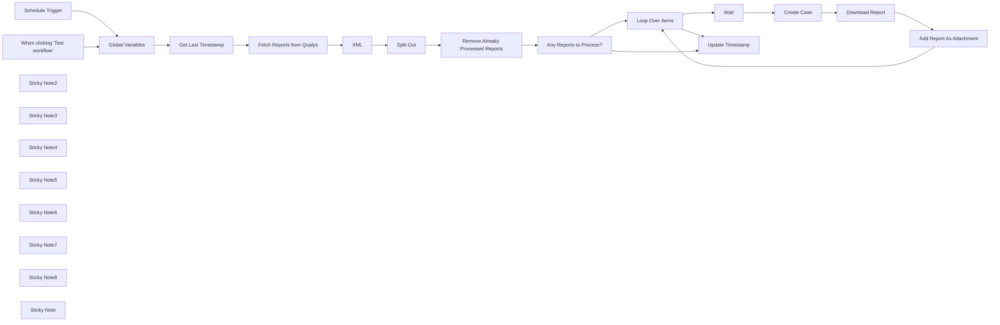

## Fluxo (.json) :

```json
{
  "meta": {
    "instanceId": "03e9d14e9196363fe7191ce21dc0bb17387a6e755dcc9acc4f5904752919dca8"
  },
  "nodes": [
    {
      "id": "f97d8638-b081-4b09-9a83-265f8f99d2dc",
      "name": "When clicking \"Test workflow\"",
      "type": "n8n-nodes-base.manualTrigger",
      "position": [
        460,
        400
      ],
      "parameters": {},
      "typeVersion": 1
    },
    {
      "id": "2df27d6b-b89b-4af0-bdbf-4bc1e0dfc95a",
      "name": "Global Variables",
      "type": "n8n-nodes-base.set",
      "position": [
        780,
        460
      ],
      "parameters": {
        "options": {},
        "assignments": {
          "assignments": [
            {
              "id": "6a8a0cbf-bf3e-4702-956e-a35966d8b9c5",
              "name": "base_url",
              "type": "string",
              "value": "https://qualysapi.qg3.apps.qualys.com"
            },
            {
              "id": "fa441581-e50e-4766-adb1-e791b3031aac",
              "name": "newtimestamp",
              "type": "string",
              "value": "={{ $now.toUTC().toString() }}"
            }
          ]
        }
      },
      "typeVersion": 3.3
    },
    {
      "id": "f280aaec-10e1-4d4f-9233-75130f7e2601",
      "name": "Fetch Reports from Qualys",
      "type": "n8n-nodes-base.httpRequest",
      "position": [
        1180,
        460
      ],
      "parameters": {
        "": "",
        "url": "={{ $json.base_url }}/api/2.0/fo/report",
        "method": "GET",
        "options": {},
        "sendBody": false,
        "sendQuery": true,
        "curlImport": "",
        "infoMessage": "",
        "sendHeaders": false,
        "specifyQuery": "keypair",
        "authentication": "predefinedCredentialType",
        "queryParameters": {
          "parameters": [
            {
              "name": "action",
              "value": "list"
            },
            {
              "name": "state",
              "value": "Finished"
            }
          ]
        },
        "httpVariantWarning": "",
        "nodeCredentialType": "qualysApi",
        "provideSslCertificates": false
      },
      "credentials": {
        "qualysApi": {
          "id": "KdkmNjVYkDUzHAvw",
          "name": "Qualys account"
        }
      },
      "typeVersion": 4.2,
      "extendsCredential": "qualysApi"
    },
    {
      "id": "481066cc-8ac2-4382-9203-33b78f76af77",
      "name": "Remove Already Processed Reports",
      "type": "n8n-nodes-base.filter",
      "position": [
        1700,
        460
      ],
      "parameters": {
        "options": {},
        "conditions": {
          "options": {
            "leftValue": "",
            "caseSensitive": true,
            "typeValidation": "strict"
          },
          "combinator": "and",
          "conditions": [
            {
              "id": "10408e4e-fa76-4e35-bb23-5c34f698f4b4",
              "operator": {
                "type": "dateTime",
                "operation": "after"
              },
              "leftValue": "={{ $json.LAUNCH_DATETIME }}",
              "rightValue": "={{ $('Get Last Timestamp').item.json[\"timestamp\"] || $today.minus({year: 50}).toUTC() }}"
            }
          ]
        }
      },
      "typeVersion": 2,
      "alwaysOutputData": true
    },
    {
      "id": "4dfdb8c9-ab22-48a4-ada0-d1edd30b9460",
      "name": "Any Reports to Process?",
      "type": "n8n-nodes-base.if",
      "position": [
        1880,
        460
      ],
      "parameters": {
        "options": {},
        "conditions": {
          "options": {
            "leftValue": "",
            "caseSensitive": true,
            "typeValidation": "strict"
          },
          "combinator": "and",
          "conditions": [
            {
              "id": "0d2bcbb2-e2b8-476e-8090-2ad350dd58d2",
              "operator": {
                "type": "string",
                "operation": "exists",
                "singleValue": true
              },
              "leftValue": "={{ $json.ID }}",
              "rightValue": ""
            }
          ]
        }
      },
      "typeVersion": 2
    },
    {
      "id": "94e678e8-669f-47ee-9530-4652ff11b99f",
      "name": "Loop Over Items",
      "type": "n8n-nodes-base.splitInBatches",
      "position": [
        2120,
        520
      ],
      "parameters": {
        "options": {}
      },
      "typeVersion": 3
    },
    {
      "id": "28dc3495-5af2-4b31-ac20-a3c7ee11f19f",
      "name": "Wait",
      "type": "n8n-nodes-base.wait",
      "position": [
        2380,
        540
      ],
      "webhookId": "9b6f1b01-42f9-4f51-b0f5-47262da9c9ca",
      "parameters": {},
      "typeVersion": 1.1
    },
    {
      "id": "06e5daf2-334a-430e-8dbf-c8feeb20d015",
      "name": "Update Timestamp",
      "type": "n8n-nodes-base.n8n",
      "position": [
        2380,
        380
      ],
      "parameters": {
        "operation": "update",
        "workflowId": {
          "__rl": true,
          "mode": "list",
          "value": "n9Vh6tvRs0Y2y7V9",
          "cachedResultName": "Timestamp Storage Qualys (#n9Vh6tvRs0Y2y7V9)"
        },
        "requestOptions": {},
        "workflowObject": "={\n  \"name\": \"Timestamp Storage\",\n  \"nodes\": [\n    {\n      \"parameters\": {\n        \"assignments\": {\n          \"assignments\": [\n            {\n              \"id\": \"9ff52fe4-011e-4460-a8c5-a38bff47966a\",\n              \"name\": \"timestamp\",\n              \"value\": \"{{ $('Global Variables').item.json[\"newtimestamp\"] }}\",\n              \"type\": \"string\"\n            }\n          ]\n        },\n        \"includeOtherFields\": true,\n        \"options\": {}\n      },\n      \"id\": \"8903e1d5-e9cd-4694-94d8-502ecbe58ebe\",\n      \"name\": \"Set Timestamp\",\n      \"type\": \"n8n-nodes-base.set\",\n      \"typeVersion\": 3.3,\n      \"position\": [\n        1020,\n        220\n      ]\n    },\n    {\n      \"parameters\": {},\n      \"id\": \"ca615aab-24e4-4f25-81ad-3e697426c236\",\n      \"name\": \"Execute Workflow Trigger\",\n      \"type\": \"n8n-nodes-base.executeWorkflowTrigger\",\n      \"typeVersion\": 1,\n      \"position\": [\n        800,\n        220\n      ]\n    }\n  ],\n  \"connections\": {\n    \"Execute Workflow Trigger\": {\n      \"main\": [\n        [\n          {\n            \"node\": \"Set Timestamp\",\n            \"type\": \"main\",\n            \"index\": 0\n          }\n        ]\n      ]\n    }\n  },\n  \"settings\": {\n   \n  },\n  \"staticData\": null\n}\n"
      },
      "credentials": {
        "n8nApi": {
          "id": "61",
          "name": "n8n account"
        }
      },
      "typeVersion": 1
    },
    {
      "id": "387c0d2a-09e0-4227-8910-f0a30106787a",
      "name": "Get Last Timestamp",
      "type": "n8n-nodes-base.executeWorkflow",
      "position": [
        980,
        460
      ],
      "parameters": {
        "options": {},
        "workflowId": "n9Vh6tvRs0Y2y7V9"
      },
      "typeVersion": 1
    },
    {
      "id": "6c0d8608-da13-4fa1-a612-aa43ac607af6",
      "name": "XML",
      "type": "n8n-nodes-base.xml",
      "position": [
        1340,
        460
      ],
      "parameters": {
        "options": {}
      },
      "typeVersion": 1
    },
    {
      "id": "511d290e-5cad-4d34-b54c-de45b11dab45",
      "name": "Split Out",
      "type": "n8n-nodes-base.splitOut",
      "position": [
        1520,
        460
      ],
      "parameters": {
        "options": {},
        "fieldToSplitOut": "REPORT_LIST_OUTPUT.RESPONSE.REPORT_LIST.REPORT"
      },
      "typeVersion": 1
    },
    {
      "id": "45f7c06b-63c0-4bae-b301-33633e751a61",
      "name": "Create Case",
      "type": "n8n-nodes-base.theHiveProject",
      "position": [
        2640,
        540
      ],
      "parameters": {
        "resource": "case",
        "caseFields": {
          "value": {
            "tlp": 2,
            "flag": false,
            "tags": "Qualys Scan",
            "title": "={{ $json.TITLE }}",
            "description": "=- **ID:** {{ $json[\"ID\"] }}\n- **Type:** {{ $json[\"TYPE\"] }}\n- **User Login:** {{ $json[\"USER_LOGIN\"] }}\n- **Launch Datetime:** {{ $json[\"LAUNCH_DATETIME\"] }}\n- **Output Format:** {{ $json[\"OUTPUT_FORMAT\"] }}\n- **Size:** {{ $json[\"OUTPUT_FORMAT\"] }}\n- **Status:** {{ $json[\"STATUS\"][\"STATE\"] }}\n- **Expiration Datetime:** {{ $json[\"EXPIRATION_DATETIME\"] }}\n"
          },
          "schema": [
            {
              "id": "title",
              "type": "string",
              "display": true,
              "removed": false,
              "required": true,
              "displayName": "Title",
              "defaultMatch": false
            },
            {
              "id": "description",
              "type": "string",
              "display": true,
              "removed": false,
              "required": true,
              "displayName": "Description",
              "defaultMatch": false
            },
            {
              "id": "severity",
              "type": "options",
              "display": true,
              "options": [
                {
                  "name": "Low",
                  "value": 1
                },
                {
                  "name": "Medium",
                  "value": 2
                },
                {
                  "name": "High",
                  "value": 3
                },
                {
                  "name": "Critical",
                  "value": 4
                }
              ],
              "removed": true,
              "required": false,
              "displayName": "Severity (Severity of information)",
              "defaultMatch": false
            },
            {
              "id": "startDate",
              "type": "dateTime",
              "display": true,
              "removed": true,
              "required": false,
              "displayName": "Start Date",
              "defaultMatch": false
            },
            {
              "id": "endDate",
              "type": "dateTime",
              "display": true,
              "removed": true,
              "required": false,
              "displayName": "End Date",
              "defaultMatch": false
            },
            {
              "id": "tags",
              "type": "string",
              "display": true,
              "removed": false,
              "required": false,
              "displayName": "Tags",
              "defaultMatch": false
            },
            {
              "id": "flag",
              "type": "boolean",
              "display": true,
              "removed": true,
              "required": false,
              "displayName": "Flag",
              "defaultMatch": false
            },
            {
              "id": "tlp",
              "type": "options",
              "display": true,
              "options": [
                {
                  "name": "White",
                  "value": 0
                },
                {
                  "name": "Green",
                  "value": 1
                },
                {
                  "name": "Amber",
                  "value": 2
                },
                {
                  "name": "Red",
                  "value": 3
                }
              ],
              "removed": false,
              "required": false,
              "displayName": "TLP (Confidentiality of information)",
              "defaultMatch": false
            },
            {
              "id": "pap",
              "type": "options",
              "display": true,
              "options": [
                {
                  "name": "White",
                  "value": 0
                },
                {
                  "name": "Green",
                  "value": 1
                },
                {
                  "name": "Amber",
                  "value": 2
                },
                {
                  "name": "Red",
                  "value": 3
                }
              ],
              "removed": true,
              "required": false,
              "displayName": "PAP (Level of exposure of information)",
              "defaultMatch": false
            },
            {
              "id": "summary",
              "type": "string",
              "display": true,
              "removed": true,
              "required": false,
              "displayName": "Summary",
              "defaultMatch": false
            },
            {
              "id": "status",
              "type": "options",
              "display": true,
              "options": [
                {
                  "name": "Duplicated",
                  "value": "Duplicated",
                  "description": "Stage: Closed"
                },
                {
                  "name": "FalsePositive",
                  "value": "FalsePositive",
                  "description": "Stage: Closed"
                },
                {
                  "name": "Indeterminate",
                  "value": "Indeterminate",
                  "description": "Stage: Closed"
                },
                {
                  "name": "InProgress",
                  "value": "InProgress",
                  "description": "Stage: InProgress"
                },
                {
                  "name": "New",
                  "value": "New",
                  "description": "Stage: New"
                },
                {
                  "name": "Other",
                  "value": "Other",
                  "description": "Stage: Closed"
                },
                {
                  "name": "TruePositive",
                  "value": "TruePositive",
                  "description": "Stage: Closed"
                }
              ],
              "removed": true,
              "required": false,
              "displayName": "Status",
              "defaultMatch": false
            },
            {
              "id": "assignee",
              "type": "options",
              "display": true,
              "options": [
                {
                  "name": "Angel",
                  "value": "angel@n8n.io"
                },
                {
                  "name": "John Smith",
                  "value": "john@n8n.io"
                }
              ],
              "removed": true,
              "required": false,
              "displayName": "Assignee",
              "defaultMatch": false
            },
            {
              "id": "caseTemplate",
              "type": "options",
              "display": true,
              "options": [],
              "removed": true,
              "required": false,
              "displayName": "Case Template",
              "defaultMatch": false
            },
            {
              "id": "tasks",
              "type": "array",
              "display": true,
              "removed": true,
              "required": false,
              "displayName": "Tasks",
              "defaultMatch": false
            },
            {
              "id": "sharingParameters",
              "type": "array",
              "display": true,
              "removed": true,
              "required": false,
              "displayName": "Sharing Parameters",
              "defaultMatch": false
            },
            {
              "id": "observableRule",
              "type": "string",
              "display": true,
              "removed": true,
              "required": false,
              "displayName": "Observable Rule",
              "defaultMatch": false
            }
          ],
          "mappingMode": "defineBelow",
          "matchingColumns": []
        }
      },
      "credentials": {
        "theHiveProjectApi": {
          "id": "6O5aPdkMaQmc8I9B",
          "name": "The Hive 5 account"
        }
      },
      "typeVersion": 1
    },
    {
      "id": "b38d3176-2c87-4460-b22c-e08ccae93e44",
      "name": "Download Report",
      "type": "n8n-nodes-base.httpRequest",
      "position": [
        3060,
        540
      ],
      "parameters": {
        "": "",
        "url": "={{ $('Global Variables').item.json.base_url }}/api/2.0/fo/report/",
        "method": "GET",
        "options": {},
        "sendBody": false,
        "sendQuery": true,
        "curlImport": "",
        "infoMessage": "",
        "sendHeaders": false,
        "specifyQuery": "keypair",
        "authentication": "predefinedCredentialType",
        "queryParameters": {
          "parameters": [
            {
              "name": "action",
              "value": "fetch"
            },
            {
              "name": "id",
              "value": "={{ $('Loop Over Items').item.json.ID }}"
            }
          ]
        },
        "httpVariantWarning": "",
        "nodeCredentialType": "qualysApi",
        "provideSslCertificates": false
      },
      "credentials": {
        "qualysApi": {
          "id": "KdkmNjVYkDUzHAvw",
          "name": "Qualys account"
        }
      },
      "typeVersion": 4.2,
      "extendsCredential": "qualysApi"
    },
    {
      "id": "9b005b38-be40-4f36-954e-ef829b894436",
      "name": "Add Report As Attachment",
      "type": "n8n-nodes-base.theHiveProject",
      "position": [
        3420,
        540
      ],
      "parameters": {
        "caseId": {
          "__rl": true,
          "mode": "id",
          "value": "={{ $('Create Case').item.json._id }}"
        },
        "options": {},
        "resource": "case",
        "operation": "addAttachment",
        "attachmentsUi": {
          "values": [
            {}
          ]
        }
      },
      "credentials": {
        "theHiveProjectApi": {
          "id": "6O5aPdkMaQmc8I9B",
          "name": "The Hive 5 account"
        }
      },
      "typeVersion": 1
    },
    {
      "id": "8a1fda04-2028-41a0-95db-3aa958fc7446",
      "name": "Schedule Trigger",
      "type": "n8n-nodes-base.scheduleTrigger",
      "position": [
        460,
        560
      ],
      "parameters": {
        "rule": {
          "interval": [
            {
              "field": "hours"
            }
          ]
        }
      },
      "typeVersion": 1.2
    },
    {
      "id": "25f91441-f95a-4da8-9d62-acecc22b6789",
      "name": "Sticky Note2",
      "type": "n8n-nodes-base.stickyNote",
      "position": [
        2920,
        164.82441481723265
      ],
      "parameters": {
        "color": 7,
        "width": 361.5043838490178,
        "height": 550.0452010151306,
        "content": "\nCreate a new case in TheHive\nIn this section, we create a new case in TheHive as a container for our PDF report. The case must be created first to have a case ID to use to upload the file as an attachment. \n\nEach new report generates a case in TheHive, ensuring that the report is properly attached to the created case for better tracking and organization.\n\nFor more information about this endpoint, visit the [API quick reference](https://cdn2.qualys.com/docs/qualys-api-quick-reference.pdf)"
      },
      "typeVersion": 1
    },
    {
      "id": "3f84b5c8-4f1c-4dc9-a9ce-8f8936bfbf98",
      "name": "Sticky Note3",
      "type": "n8n-nodes-base.stickyNote",
      "position": [
        1140,
        20
      ],
      "parameters": {
        "color": 7,
        "width": 318.2931356227883,
        "height": 698.5851033452675,
        "content": "\n## Fetch reports from Qualys\nFor more information about this endpoint, visit the [API quick reference](https://cdn2.qualys.com/docs/qualys-api-quick-reference.pdf). The results of the api call are converted from XML to JSON."
      },
      "typeVersion": 1
    },
    {
      "id": "a3843690-484f-4ff4-b47b-1b8fc76e93de",
      "name": "Sticky Note4",
      "type": "n8n-nodes-base.stickyNote",
      "position": [
        320,
        20
      ],
      "parameters": {
        "color": 7,
        "width": 400.5192406950739,
        "height": 694.6109995985548,
        "content": "\n## Run every hour\nThe first time the workflow runs, no timestamp will exist in the subworkflow, so it will query all the Qualys scans to generate reports for all of them. Otherwise it will check only for newer scans. \n\nThis schedule allows for an organization to create a running export of their reports and store them somewhere operational both for historical purposes and for tracking and accountability purposes. "
      },
      "typeVersion": 1
    },
    {
      "id": "21c4c9ae-203d-480e-8459-c36726d57d92",
      "name": "Sticky Note5",
      "type": "n8n-nodes-base.stickyNote",
      "position": [
        720,
        20
      ],
      "parameters": {
        "color": 7,
        "width": 400.5192406950739,
        "height": 696.1026552732698,
        "content": "\n## Set time Stamp\nTo ensure we do not duplicate data in TheHive, we set a timestamp like a bookmark for every time we run this workflow. We then use the previous timestamp if available to only get the newest scan results from Qualys. "
      },
      "typeVersion": 1
    },
    {
      "id": "ef250f59-304d-4710-80e8-e8e81e4a4f68",
      "name": "Sticky Note6",
      "type": "n8n-nodes-base.stickyNote",
      "position": [
        1460,
        20
      ],
      "parameters": {
        "color": 7,
        "width": 1067.9843739266996,
        "height": 696.1026552732698,
        "content": "\n## Split out all reports to ensure they are all processed. \nWhen we get the response from Qualys, multiple reports are embedded in the JSON, so we use the split out node to process all the reports at once. Before the reports can be saved however, they must go through a filter, checking the time of creation against the time stamp at the beginning. Any that are newer than the timestamp are copied to TheHive.\nA wait node is added for a second to ensure that there are no rate request issues when querying TheHive.\nThe timestamp node updates the value in the subworkflow that stores the timestamp value. "
      },
      "typeVersion": 1
    },
    {
      "id": "3dff5dc9-95a6-48f5-aee7-d839a385578f",
      "name": "Sticky Note7",
      "type": "n8n-nodes-base.stickyNote",
      "position": [
        2540,
        160.4112877153152
      ],
      "parameters": {
        "color": 7,
        "width": 361.5043838490178,
        "height": 554.458328117048,
        "content": "\n## Create a new case in TheHive\nIn this section, we create a new case in TheHive as a container for our PDF report. The case must be created first to have a case ID to use to upload the file as an attachment. Each new report generates a case in TheHive, ensuring that the report is properly attached to the created case for better tracking and organization."
      },
      "typeVersion": 1
    },
    {
      "id": "5509f907-e2bb-4045-864e-283d3da5d5ce",
      "name": "Sticky Note8",
      "type": "n8n-nodes-base.stickyNote",
      "position": [
        3300,
        200
      ],
      "parameters": {
        "color": 7,
        "width": 361.5043838490178,
        "height": 514.8696158323633,
        "content": "\nHere we attach the PDF file as an attachment to the Case in TheHive. \n\nThis step automates the attachment of the downloaded report to the created case, ensuring all relevant information is consolidated in one place.\n\n "
      },
      "typeVersion": 1
    },
    {
      "id": "d0a7d953-91de-448b-adfb-72d8c52b9efe",
      "name": "Sticky Note",
      "type": "n8n-nodes-base.stickyNote",
      "position": [
        -340,
        20
      ],
      "parameters": {
        "width": 646.7396383244529,
        "height": 1327.6335333503064,
        "content": "\n\n# Automate Report Generation with n8n & Qualys\n\n## Introducing the Save Qualys Reports to TheHive Workflow—a robust solution designed to automate the retrieval and storage of Qualys reports in TheHive.\n\nThis workflow fetches reports from Qualys, filters out already processed reports, and creates cases in TheHive for the new reports. It runs every hour to ensure continuous monitoring and up-to-date vulnerability management, making it ideal for Security Operations Centers (SOCs).\n\n**How It Works:**\n\n- **Set Global Variables:** Initializes necessary global variables like `base_url` and `newtimestamp`. This step ensures that the workflow operates with the correct configuration and up-to-date timestamps. Ensure to change the `Global Variables` to match your environment. \n  \n- **Fetch Reports from Qualys:** Sends a GET request to the Qualys API to retrieve finished reports. Automating this step ensures timely updates and consistent data retrieval.\n  \n- **Convert XML to JSON:** Converts the XML response to JSON format for easier data manipulation. This transformation simplifies further processing and integration into TheHive.\n  \n- **Filter Reports:** Checks if the reports have already been processed using their creation timestamps. This filtering ensures that only new reports are handled, avoiding duplicates.\n  \n- **Process Each Report:** Loops through the list of new reports, ensuring each is processed individually. This step-by-step handling prevents issues related to bulk processing and improves reliability.\n  \n- **Create Case in TheHive:** Generates a new case in TheHive for each report, serving as a container for the report data. Automating case creation improves efficiency and ensures that all relevant data is captured.\n  \n- **Download and Attach Report:** Downloads the report from Qualys and attaches it to the respective case in TheHive. This automation ensures that all data is properly archived and easily accessible for review.\n\n\n**Get Started:**\n\n- Ensure your [Qualys](https://docs.n8n.io/integrations/builtin/core-nodes/n8n-nodes-base.httprequest/?utm_source=n8n_app&utm_medium=node_settings_modal-credential_link&utm_campaign=n8n-creds-base.qualysApi) and [TheHive](https://docs.n8n.io/integrations/builtin/app-nodes/n8n-nodes-base.thehiveproject/?utm_source=n8n_app&utm_medium=node_settings_modal-credential_link&utm_campaign=n8n-nodes-base.theHiveProject) integrations are properly set up.\n- Customize the workflow to fit your specific vulnerability management needs.\n\n\n**Need Help?**\n\n- Join the discussion on our Forum or check out resources on Discord!\n\n\nDeploy this workflow to streamline your vulnerability management process, improve response times, and enhance the efficiency of your security operations."
      },
      "typeVersion": 1
    }
  ],
  "pinData": {},
  "connections": {
    "XML": {
      "main": [
        [
          {
            "node": "Split Out",
            "type": "main",
            "index": 0
          }
        ]
      ]
    },
    "Wait": {
      "main": [
        [
          {
            "node": "Create Case",
            "type": "main",
            "index": 0
          }
        ]
      ]
    },
    "Split Out": {
      "main": [
        [
          {
            "node": "Remove Already Processed Reports",
            "type": "main",
            "index": 0
          }
        ]
      ]
    },
    "Create Case": {
      "main": [
        [
          {
            "node": "Download Report",
            "type": "main",
            "index": 0
          }
        ]
      ]
    },
    "Download Report": {
      "main": [
        [
          {
            "node": "Add Report As Attachment",
            "type": "main",
            "index": 0
          }
        ]
      ]
    },
    "Loop Over Items": {
      "main": [
        [
          {
            "node": "Update Timestamp",
            "type": "main",
            "index": 0
          }
        ],
        [
          {
            "node": "Wait",
            "type": "main",
            "index": 0
          }
        ]
      ]
    },
    "Global Variables": {
      "main": [
        [
          {
            "node": "Get Last Timestamp",
            "type": "main",
            "index": 0
          }
        ]
      ]
    },
    "Schedule Trigger": {
      "main": [
        [
          {
            "node": "Global Variables",
            "type": "main",
            "index": 0
          }
        ]
      ]
    },
    "Get Last Timestamp": {
      "main": [
        [
          {
            "node": "Fetch Reports from Qualys",
            "type": "main",
            "index": 0
          }
        ]
      ]
    },
    "Any Reports to Process?": {
      "main": [
        [
          {
            "node": "Loop Over Items",
            "type": "main",
            "index": 0
          }
        ],
        [
          {
            "node": "Update Timestamp",
            "type": "main",
            "index": 0
          }
        ]
      ]
    },
    "Add Report As Attachment": {
      "main": [
        [
          {
            "node": "Loop Over Items",
            "type": "main",
            "index": 0
          }
        ]
      ]
    },
    "Fetch Reports from Qualys": {
      "main": [
        [
          {
            "node": "XML",
            "type": "main",
            "index": 0
          }
        ]
      ]
    },
    "When clicking \"Test workflow\"": {
      "main": [
        [
          {
            "node": "Global Variables",
            "type": "main",
            "index": 0
          }
        ]
      ]
    },
    "Remove Already Processed Reports": {
      "main": [
        [
          {
            "node": "Any Reports to Process?",
            "type": "main",
            "index": 0
          }
        ]
      ]
    }
  }
}
```

<a id="template-2587"></a>

## Template 2587 - Iniciar subfluxos em paralelo com callback

- **Nome:** Iniciar subfluxos em paralelo com callback
- **Descrição:** Fluxo principal que inicia várias execuções de um subfluxo em paralelo e aguarda, de forma pseudo-síncrona, até que todas reportem conclusão via callback para prosseguir.
- **Funcionalidade:** • Geração de múltiplas tarefas: Simula ou recebe uma lista de itens que representam trabalhos a serem executados em paralelo.
• Disparo assíncrono de subfluxos: Envia requisições HTTP para iniciar um subfluxo separado para cada item, incluindo um cabeçalho de callback.
• Inicialização de controle de conclusão: Cria e mantém um conjunto (finishedSet) para rastrear quais itens já finalizaram.
• Espera baseada em webhook/callback: Pausa a execução principal aguardando callbacks que indicam a finalização de subfluxos.
• Registro incremental de finalizados: Atualiza o conjunto de itens finalizados a cada callback recebido.
• Confirmação rápida ao subfluxo: Responde imediatamente ao subfluxo que chamou o webhook, reduzindo latência percebida.
• Reintentos e mitigação de condições de corrida: O subfluxo que chama o callback implementa tentativas e atraso para reduzir problemas quando múltiplos callbacks chegam simultaneamente.
• Continuação condicional: Só prossegue quando a quantidade de itens marcados como finalizados é maior ou igual ao número de itens iniciados.
- **Ferramentas:** • Endpoints HTTP / Webhooks: Usados para iniciar subfluxos e receber callbacks de conclusão.
• URL de callback interno (variável de ambiente): URL base interna configurada no ambiente para que subfluxos consigam chamar de volta o fluxo principal (ex.: serviço interno do cluster).
• Serviço HTTP do subfluxo alvo: Endpoint que executa o trabalho paralelo e em seguida chama o callback informando o item finalizado.


## Fluxo visual

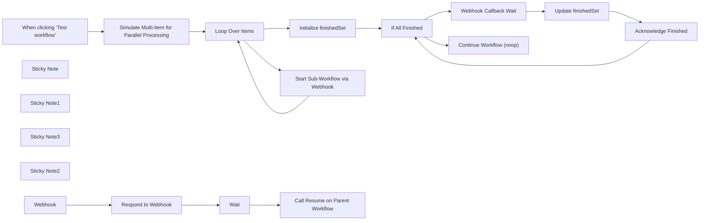

## Fluxo (.json) :

```json
{
  "nodes": [
    {
      "id": "0d911b91-bb9a-4177-8cd5-12ddddf1bc61",
      "name": "When clicking ‘Test workflow’",
      "type": "n8n-nodes-base.manualTrigger",
      "position": [
        580,
        405
      ],
      "parameters": {},
      "typeVersion": 1
    },
    {
      "id": "d13f78f7-4093-435f-8b38-722f4a5c7a1f",
      "name": "Loop Over Items",
      "type": "n8n-nodes-base.splitInBatches",
      "position": [
        1020,
        405
      ],
      "parameters": {
        "options": {}
      },
      "typeVersion": 3
    },
    {
      "id": "97d26220-a85f-4c40-b97c-b36f2d235776",
      "name": "Webhook Callback Wait",
      "type": "n8n-nodes-base.wait",
      "position": [
        1720,
        445
      ],
      "webhookId": "5cd058b4-48c8-449a-9c09-959a5b8a2b48",
      "parameters": {
        "resume": "webhook",
        "options": {},
        "httpMethod": "POST",
        "responseMode": "responseNode"
      },
      "typeVersion": 1.1
    },
    {
      "id": "ee02d5cb-8151-4b24-a630-77a677b1434a",
      "name": "Update finishedSet",
      "type": "n8n-nodes-base.code",
      "position": [
        1940,
        445
      ],
      "parameters": {
        "jsCode": "let json = $('If All Finished').first().json;\nif (!json.finishedSet) json.finishedSet = [];\nlet finishedItemId = $('Webhook Callback Wait').item.json.body.finishedItemId;\nif (!json.finishedSet[finishedItemId]) json.finishedSet.push(finishedItemId);\nreturn [json];"
      },
      "typeVersion": 2
    },
    {
      "id": "09f1cf3f-9e32-43f2-9e57-d7a33970dac4",
      "name": "Initialize finishedSet",
      "type": "n8n-nodes-base.set",
      "position": [
        1240,
        285
      ],
      "parameters": {
        "options": {},
        "assignments": {
          "assignments": [
            {
              "id": "193ab8f1-0e23-491c-914e-b8b26b0160f7",
              "name": "finishedSet",
              "type": "array",
              "value": "[]"
            }
          ]
        }
      },
      "executeOnce": true,
      "typeVersion": 3.4
    },
    {
      "id": "105d8f64-8ade-4e02-8722-587a35f2b046",
      "name": "Simulate Multi-Item for Parallel Processing",
      "type": "n8n-nodes-base.code",
      "position": [
        780,
        405
      ],
      "parameters": {
        "jsCode": "return [\n  {requestId: 'req4567'},\n  {requestId: 'req8765'},\n  {requestId: 'req1234'}\n];"
      },
      "typeVersion": 2
    },
    {
      "id": "c5f72fa0-693e-4134-910f-8fd0767861d1",
      "name": "If All Finished",
      "type": "n8n-nodes-base.if",
      "position": [
        1460,
        285
      ],
      "parameters": {
        "options": {},
        "conditions": {
          "options": {
            "version": 1,
            "leftValue": "",
            "caseSensitive": true,
            "typeValidation": "strict"
          },
          "combinator": "and",
          "conditions": [
            {
              "id": "385c3149-3623-4dd2-9022-770c32f82421",
              "operator": {
                "type": "number",
                "operation": "gte"
              },
              "leftValue": "={{ $json.finishedSet.length }}",
              "rightValue": "={{ $('Simulate Multi-Item for Parallel Processing').all().length }}"
            }
          ]
        }
      },
      "typeVersion": 2
    },
    {
      "id": "20d16393-8573-4cc1-adc0-034f0f1def70",
      "name": "Start Sub-Workflow via Webhook",
      "type": "n8n-nodes-base.httpRequest",
      "position": [
        1180,
        645
      ],
      "parameters": {
        "url": "={{ $env.WEBHOOK_URL }}/webhook/parallel-subworkflow-target",
        "method": "POST",
        "options": {},
        "sendBody": true,
        "sendHeaders": true,
        "bodyParameters": {
          "parameters": [
            {
              "name": "requestItemId",
              "value": "={{ $json.requestId }}"
            }
          ]
        },
        "headerParameters": {
          "parameters": [
            {
              "name": "callbackurl",
              "value": "={{ $execution.resumeUrl }}"
            }
          ]
        }
      },
      "typeVersion": 4.2
    },
    {
      "id": "4ad48520-39b3-4016-a6a9-dd789c079e08",
      "name": "Acknowledge Finished",
      "type": "n8n-nodes-base.respondToWebhook",
      "position": [
        1780,
        665
      ],
      "parameters": {
        "options": {}
      },
      "typeVersion": 1.1
    },
    {
      "id": "ad1018a1-3b9d-4613-b23f-136763a514ba",
      "name": "Sticky Note",
      "type": "n8n-nodes-base.stickyNote",
      "position": [
        720,
        605
      ],
      "parameters": {
        "color": 3,
        "width": 390,
        "height": 109,
        "content": "### Start Multiple Sub-Workflows Asynchronously\n* Note: Callback/Webhook \"internal\" Base-URL should be configured in the n8n instance to reference the k8s service name and internal port."
      },
      "typeVersion": 1
    },
    {
      "id": "f4171d39-8bfe-4e3a-9b94-87d969abda2d",
      "name": "Sticky Note1",
      "type": "n8n-nodes-base.stickyNote",
      "position": [
        1740,
        365
      ],
      "parameters": {
        "color": 3,
        "width": 283,
        "height": 80,
        "content": "### Pseudo-Synchronously Wait for All Sub-Workflows to finish"
      },
      "typeVersion": 1
    },
    {
      "id": "98657cd3-968c-4d66-aea0-4e3180f8508f",
      "name": "Continue Workflow (noop)",
      "type": "n8n-nodes-base.noOp",
      "position": [
        1780,
        205
      ],
      "parameters": {},
      "typeVersion": 1
    },
    {
      "id": "5a9518ea-456e-4975-bf6f-71bf9ed0a6e1",
      "name": "Sticky Note3",
      "type": "n8n-nodes-base.stickyNote",
      "position": [
        540,
        180
      ],
      "parameters": {
        "width": 1577.931818181817,
        "height": 684.1818181818179,
        "content": "## Main/Parent Workflow\n* This starts multiple executions of the sub-workflow in parallel and then loops until they all report back."
      },
      "typeVersion": 1
    },
    {
      "id": "13ad3423-c3bf-4144-b76d-03daa8877bed",
      "name": "Sticky Note2",
      "type": "n8n-nodes-base.stickyNote",
      "position": [
        560,
        900
      ],
      "parameters": {
        "width": 1477.331211260329,
        "height": 189.2194473140495,
        "content": "### Sub-Workflow\n**Cut/Paste this into a separate workflow, and activate it!!!**"
      },
      "typeVersion": 1
    },
    {
      "id": "e92865b0-b3e9-4195-ae16-5c199875a04b",
      "name": "Wait",
      "type": "n8n-nodes-base.wait",
      "position": [
        1440,
        940
      ],
      "webhookId": "2d62e5c2-ad4a-4e90-a075-7ca5212e015a",
      "parameters": {},
      "typeVersion": 1.1
    },
    {
      "id": "710456c8-394d-4c45-8d8e-16e0a4095dc3",
      "name": "Call Resume on Parent Workflow",
      "type": "n8n-nodes-base.httpRequest",
      "notes": "The callback resumes the parent workflow and reports which item finished.  There could be a race condition if the parent workflow was just resumed by a different sub-workflow but hasn't entered a webhook-wait again yet.  The delay and retry mitigates for the possibility that multiple subtasks complete and call back at once.",
      "position": [
        1660,
        940
      ],
      "parameters": {
        "url": "={{ $('Webhook').item.json.headers.callbackurl }}",
        "method": "POST",
        "options": {},
        "sendBody": true,
        "bodyParameters": {
          "parameters": [
            {
              "name": "finishedItemId",
              "value": "={{ $('Webhook').item.json.body.requestItemId }}"
            }
          ]
        }
      },
      "retryOnFail": true,
      "typeVersion": 4.2,
      "waitBetweenTries": 3000
    },
    {
      "id": "2ee41b1a-89f0-4d2f-b2ff-74aef5baaa70",
      "name": "Respond to Webhook",
      "type": "n8n-nodes-base.respondToWebhook",
      "position": [
        1220,
        940
      ],
      "parameters": {
        "options": {},
        "respondWith": "json",
        "responseBody": "={{ \n{\n  \"finishedItemId\": $json.body.requestItemId\n}\n}}"
      },
      "typeVersion": 1.1
    },
    {
      "id": "04445a9a-61f9-468e-8589-3eeb403f2553",
      "name": "Webhook",
      "type": "n8n-nodes-base.webhook",
      "position": [
        1000,
        940
      ],
      "webhookId": "14776b45-77d7-4220-808f-2d0a38bec4de",
      "parameters": {
        "path": "parallel-subworkflow-target",
        "options": {},
        "httpMethod": "POST",
        "responseMode": "responseNode"
      },
      "typeVersion": 2
    }
  ],
  "pinData": {},
  "connections": {
    "Wait": {
      "main": [
        [
          {
            "node": "Call Resume on Parent Workflow",
            "type": "main",
            "index": 0
          }
        ]
      ]
    },
    "Webhook": {
      "main": [
        [
          {
            "node": "Respond to Webhook",
            "type": "main",
            "index": 0
          }
        ]
      ]
    },
    "If All Finished": {
      "main": [
        [
          {
            "node": "Continue Workflow (noop)",
            "type": "main",
            "index": 0
          }
        ],
        [
          {
            "node": "Webhook Callback Wait",
            "type": "main",
            "index": 0
          }
        ]
      ]
    },
    "Loop Over Items": {
      "main": [
        [
          {
            "node": "Initialize finishedSet",
            "type": "main",
            "index": 0
          }
        ],
        [
          {
            "node": "Start Sub-Workflow via Webhook",
            "type": "main",
            "index": 0
          }
        ]
      ]
    },
    "Respond to Webhook": {
      "main": [
        [
          {
            "node": "Wait",
            "type": "main",
            "index": 0
          }
        ]
      ]
    },
    "Update finishedSet": {
      "main": [
        [
          {
            "node": "Acknowledge Finished",
            "type": "main",
            "index": 0
          }
        ]
      ]
    },
    "Acknowledge Finished": {
      "main": [
        [
          {
            "node": "If All Finished",
            "type": "main",
            "index": 0
          }
        ]
      ]
    },
    "Webhook Callback Wait": {
      "main": [
        [
          {
            "node": "Update finishedSet",
            "type": "main",
            "index": 0
          }
        ]
      ]
    },
    "Initialize finishedSet": {
      "main": [
        [
          {
            "node": "If All Finished",
            "type": "main",
            "index": 0
          }
        ]
      ]
    },
    "Start Sub-Workflow via Webhook": {
      "main": [
        [
          {
            "node": "Loop Over Items",
            "type": "main",
            "index": 0
          }
        ]
      ]
    },
    "When clicking ‘Test workflow’": {
      "main": [
        [
          {
            "node": "Simulate Multi-Item for Parallel Processing",
            "type": "main",
            "index": 0
          }
        ]
      ]
    },
    "Simulate Multi-Item for Parallel Processing": {
      "main": [
        [
          {
            "node": "Loop Over Items",
            "type": "main",
            "index": 0
          }
        ]
      ]
    }
  }
}
```

<a id="template-2588"></a>

## Template 2588 - Mensagem de boas-vindas a novos seguidores BlueSky

- **Nome:** Mensagem de boas-vindas a novos seguidores BlueSky
- **Descrição:** Verifica periodicamente novos seguidores no BlueSky e envia a cada novo seguidor uma mensagem privada de boas-vindas com um link, mantendo um arquivo local com a lista atualizada de seguidores.
- **Funcionalidade:** • Agendamento periódico: Executa a verificação a cada 60 minutos.
• Autenticação: Cria sessão usando credenciais (app password) para acessar a API do serviço.
• Listagem de seguidores com paginação: Recupera a lista completa de seguidores e suporta paginação controlada.
• Leitura/gravação de arquivo local: Lê a lista de seguidores previamente salva e grava a lista atualizada ao final.
• Detecção de novos seguidores: Compara seguidores atuais com os do arquivo e identifica apenas os novos.
• Processamento em lotes: Itera sobre novos seguidores em lotes para controlar envio e limitações.
• Envio de mensagem privada: Obtém/abre conversas com o seguidor e envia uma mensagem personalizada contendo texto e link com facet de link.
• Mensagem configurável: Permite definir o texto de boas-vindas e o link a ser enviado.
• Fluxo inicial requerido: Requer uma gravação manual inicial do arquivo de seguidores antes da primeira execução para evitar envios duplicados.
- **Ferramentas:** • BlueSky / AT Protocol API: API do serviço para autenticação, listar seguidores, obter/conversas e enviar mensagens privadas.
• Sistema de arquivos local: Armazena e recupera um arquivo JSON com a lista de seguidores para comparação entre execuções.

## Fluxo visual

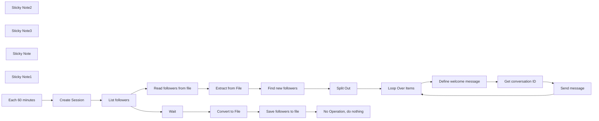

## Fluxo (.json) :

```json
{
  "nodes": [
    {
      "id": "6aa059e4-e78f-4bbd-a707-994a39840f97",
      "name": "Create Session",
      "type": "n8n-nodes-base.httpRequest",
      "position": [
        -520,
        240
      ],
      "parameters": {
        "url": "https://bsky.social/xrpc/com.atproto.server.createSession",
        "method": "POST",
        "options": {},
        "sendBody": true,
        "bodyParameters": {
          "parameters": [
            {
              "name": "identifier",
              "value": "youruser.bsky.social"
            },
            {
              "name": "password",
              "value": "your-app-passord-here"
            }
          ]
        }
      },
      "notesInFlow": true,
      "typeVersion": 4.1
    },
    {
      "id": "143e37b0-de79-4329-99a2-51484c9609a8",
      "name": "List followers",
      "type": "n8n-nodes-base.httpRequest",
      "position": [
        -280,
        240
      ],
      "parameters": {
        "url": "https://bsky.social/xrpc/app.bsky.graph.getFollowers",
        "options": {
          "response": {
            "response": {
              "responseFormat": "json"
            }
          },
          "pagination": {
            "pagination": {
              "parameters": {
                "parameters": [
                  {
                    "name": "cursor",
                    "value": "={{ $response.body.cursor }}"
                  }
                ]
              },
              "maxRequests": 2,
              "requestInterval": 250,
              "limitPagesFetched": true
            }
          }
        },
        "sendQuery": true,
        "sendHeaders": true,
        "queryParameters": {
          "parameters": [
            {
              "name": "actor",
              "value": "={{ $json.did }}"
            },
            {
              "name": "limit",
              "value": "100"
            }
          ]
        },
        "headerParameters": {
          "parameters": [
            {
              "name": "Authorization",
              "value": "=Bearer {{ $item(\"0\").$node[\"Create Session\"].json[\"accessJwt\"] }}"
            }
          ]
        }
      },
      "typeVersion": 4.2
    },
    {
      "id": "f1436a63-a23f-4082-9209-12c21a26ad91",
      "name": "Convert to File",
      "type": "n8n-nodes-base.convertToFile",
      "position": [
        100,
        620
      ],
      "parameters": {
        "options": {
          "fileName": "followers-basuracero.json"
        },
        "operation": "toJson"
      },
      "typeVersion": 1.1
    },
    {
      "id": "f8beea47-6f36-4dfb-b2e7-bf94adb63e66",
      "name": "Extract from File",
      "type": "n8n-nodes-base.extractFromFile",
      "position": [
        100,
        240
      ],
      "parameters": {
        "options": {},
        "operation": "fromJson"
      },
      "typeVersion": 1
    },
    {
      "id": "41658372-3054-4909-850b-3bffd1b1b79c",
      "name": "Split Out",
      "type": "n8n-nodes-base.splitOut",
      "position": [
        520,
        240
      ],
      "parameters": {
        "options": {
          "destinationFieldName": "did"
        },
        "fieldToSplitOut": "newDids"
      },
      "typeVersion": 1
    },
    {
      "id": "c94aa8e9-06db-4b24-a20a-5615b7129023",
      "name": "Loop Over Items",
      "type": "n8n-nodes-base.splitInBatches",
      "position": [
        740,
        240
      ],
      "parameters": {
        "options": {}
      },
      "typeVersion": 3
    },
    {
      "id": "4d1c6a2f-3acd-4783-96d4-693ced06fd97",
      "name": "Wait",
      "type": "n8n-nodes-base.wait",
      "position": [
        -100,
        620
      ],
      "webhookId": "b1608475-db84-4f23-acd6-d003f5094afd",
      "parameters": {},
      "typeVersion": 1.1
    },
    {
      "id": "e4125cb8-8eb5-4cf0-b00d-e7ce4ec8236e",
      "name": "Find new followers",
      "type": "n8n-nodes-base.code",
      "position": [
        280,
        240
      ],
      "parameters": {
        "jsCode": "// Datos de entrada\nconst listFollowers = $('List followers').all()[0].json.followers;\nconst extractFromFile = $('Extract from File').all()[0].json.data[0].followers;\n\n// Verificar que tenemos acceso a los datos\nconsole.log('listFollowers length:', Array.isArray(listFollowers) ? listFollowers.length : 'no es array');\nconsole.log('extractFromFile length:', Array.isArray(extractFromFile) ? extractFromFile.length : 'no es array');\n\n// Mostrar algunos ejemplos de cada lista\nconsole.log('Ejemplo de listFollowers:', listFollowers?.slice(0, 2));\nconsole.log('Ejemplo de extractFromFile:', extractFromFile?.slice(0, 2));\n\n// Crear conjunto de DIDs del archivo extraído\nconst existingDids = new Set(extractFromFile?.map(item => item.did) || []);\nconsole.log('DIDs existentes:', Array.from(existingDids).slice(0, 5));\n\n// Filtrar listFollowers\nconst newFollowers = listFollowers?.filter(follower => !existingDids.has(follower.did)) || [];\n\nreturn {\n  json: {\n    debug: {\n      listFollowersCount: listFollowers?.length || 0,\n      extractFromFileCount: extractFromFile?.length || 0,\n      existingDidsCount: existingDids.size,\n      newFollowersCount: newFollowers.length\n    },\n    newFollowers,\n    newDids: newFollowers.map(follower => follower.did),\n    count: newFollowers.length\n  }\n}"
      },
      "typeVersion": 2,
      "alwaysOutputData": true
    },
    {
      "id": "a28accb5-ee47-431f-83e4-376425e9899e",
      "name": "Read followers from file",
      "type": "n8n-nodes-base.readWriteFile",
      "position": [
        -80,
        240
      ],
      "parameters": {
        "options": {},
        "fileSelector": "=followers-{{ $('Create Session').item.json.handle }}.json"
      },
      "typeVersion": 1
    },
    {
      "id": "aa2ab5e1-eb6f-4657-9a9a-66417ffa421e",
      "name": "Save followers to file",
      "type": "n8n-nodes-base.readWriteFile",
      "position": [
        280,
        620
      ],
      "parameters": {
        "options": {
          "append": false
        },
        "fileName": "=followers-{{ $('Create Session').item.json.handle }}.json",
        "operation": "write"
      },
      "typeVersion": 1
    },
    {
      "id": "9a4fb5e5-f2f6-4aa1-846e-8d6460ad7765",
      "name": "Define welcome message",
      "type": "n8n-nodes-base.set",
      "position": [
        980,
        260
      ],
      "parameters": {
        "options": {},
        "assignments": {
          "assignments": [
            {
              "id": "afe7fe9b-3bd4-4429-afe9-81e5fe934e07",
              "name": "text",
              "type": "string",
              "value": "Hello, thanks for your follow. You can read more about my over my site:"
            },
            {
              "id": "97590cd1-9d85-442b-baa3-bad849ff9be0",
              "name": "link",
              "type": "string",
              "value": "https://yoursite.com"
            }
          ]
        }
      },
      "typeVersion": 3.4
    },
    {
      "id": "594ce66f-acbd-4c31-806c-382aa9a98ed0",
      "name": "Sticky Note2",
      "type": "n8n-nodes-base.stickyNote",
      "position": [
        920,
        160
      ],
      "parameters": {
        "width": 230,
        "height": 266,
        "content": "### 2. Define your welcome message and link here"
      },
      "typeVersion": 1
    },
    {
      "id": "c24a7971-11a7-4164-9f2d-78335264f250",
      "name": "Sticky Note3",
      "type": "n8n-nodes-base.stickyNote",
      "position": [
        220,
        460
      ],
      "parameters": {
        "width": 231,
        "height": 338,
        "content": "### 3. **Important** \n\nYou need to manually run \"Save followers to file\" once before the first time so you populate your list of existing followers"
      },
      "typeVersion": 1
    },
    {
      "id": "c6e766cf-a118-4db0-8e3c-32662c40737b",
      "name": "Send message",
      "type": "n8n-nodes-base.httpRequest",
      "position": [
        1360,
        260
      ],
      "parameters": {
        "url": "={{ $item(\"0\").$node[\"Create Session\"].json.didDoc.service[0].serviceEndpoint }}/xrpc/chat.bsky.convo.sendMessage",
        "method": "POST",
        "options": {},
        "jsonBody": "={\n  \"convoId\" : \"{{ $json.convo.id }}\",\n  \"message\" : {\n    \"text\" : \"{{ $('Define welcome message').item.json.text }}\\n\\n{{ $('Define welcome message').item.json.link }}\",\n    \"facets\" : [\n     {\n      \"index\" : {\n        \"byteStart\": {{ $('Define welcome message').item.json.text.length }},\n        \"byteEnd\": {{ $('Define welcome message').item.json.text.length + 3 + $('Define welcome message').item.json.link.length}}\n      },\n      \"features\": [\n          {\n            \"$type\": \"app.bsky.richtext.facet#link\",\n            \"uri\": \"{{ $('Define welcome message').item.json.link }}\"\n          }\n        ]\n      }\n    ]\n  }\n}",
        "sendBody": true,
        "sendHeaders": true,
        "specifyBody": "json",
        "headerParameters": {
          "parameters": [
            {
              "name": "Authorization",
              "value": "=Bearer {{ $item(\"0\").$node[\"Create Session\"].json[\"accessJwt\"] }}"
            },
            {
              "name": "Atproto-Proxy",
              "value": "did:web:api.bsky.chat#bsky_chat"
            }
          ]
        }
      },
      "typeVersion": 4.2
    },
    {
      "id": "33aa7e0c-58fe-4527-a94e-49bec0e06325",
      "name": "Get conversation ID",
      "type": "n8n-nodes-base.httpRequest",
      "position": [
        1200,
        260
      ],
      "parameters": {
        "url": "={{ $item(\"0\").$node[\"Create Session\"].json.didDoc.service[0].serviceEndpoint }}/xrpc/chat.bsky.convo.getConvoForMembers",
        "options": {},
        "sendQuery": true,
        "sendHeaders": true,
        "queryParameters": {
          "parameters": [
            {
              "name": "members",
              "value": "={{ $('Split Out').item.json.did }}"
            }
          ]
        },
        "headerParameters": {
          "parameters": [
            {
              "name": "Authorization",
              "value": "=Bearer {{ $item(\"0\").$node[\"Create Session\"].json[\"accessJwt\"] }}"
            },
            {
              "name": "Atproto-Proxy",
              "value": "did:web:api.bsky.chat#bsky_chat"
            }
          ]
        }
      },
      "typeVersion": 4.2
    },
    {
      "id": "066f1d0d-319a-4676-9c0a-5b00d206ffd2",
      "name": "Sticky Note",
      "type": "n8n-nodes-base.stickyNote",
      "position": [
        -40,
        -100
      ],
      "parameters": {
        "color": 5,
        "width": 479,
        "height": 307,
        "content": "## Send a welcome private message to your new BlueSky followers\n\nThis flow will save your current followers in a file and check for new ones on the next execution, sending them the Defined message an link as a private message.\n\nOnce messages are sent, the new list of followers will be saved into the file.\n\n**Important: Follow the yellow notes in order before enabling the full flow for the first time**"
      },
      "typeVersion": 1
    },
    {
      "id": "a61e301e-a0ca-48e9-9a46-05975662aa90",
      "name": "Sticky Note1",
      "type": "n8n-nodes-base.stickyNote",
      "position": [
        -560,
        40
      ],
      "parameters": {
        "width": 181,
        "height": 364,
        "content": "### 1. Define your Bluesky user and app password first\n\nThe App password should have access to private messages"
      },
      "typeVersion": 1
    },
    {
      "id": "1b1dcd74-7a71-49e4-99e8-c079b692aca5",
      "name": "Each 60 minutes",
      "type": "n8n-nodes-base.scheduleTrigger",
      "position": [
        -720,
        240
      ],
      "parameters": {
        "rule": {
          "interval": [
            {
              "field": "minutes",
              "minutesInterval": 60
            }
          ]
        }
      },
      "typeVersion": 1.2
    },
    {
      "id": "6acf153c-cdc6-42c1-85f9-2692c8777eef",
      "name": "No Operation, do nothing",
      "type": "n8n-nodes-base.noOp",
      "position": [
        520,
        620
      ],
      "parameters": {},
      "typeVersion": 1
    }
  ],
  "pinData": {},
  "connections": {
    "Wait": {
      "main": [
        [
          {
            "node": "Convert to File",
            "type": "main",
            "index": 0
          }
        ]
      ]
    },
    "Split Out": {
      "main": [
        [
          {
            "node": "Loop Over Items",
            "type": "main",
            "index": 0
          }
        ]
      ]
    },
    "Send message": {
      "main": [
        [
          {
            "node": "Loop Over Items",
            "type": "main",
            "index": 0
          }
        ]
      ]
    },
    "Create Session": {
      "main": [
        [
          {
            "node": "List followers",
            "type": "main",
            "index": 0
          }
        ]
      ]
    },
    "List followers": {
      "main": [
        [
          {
            "node": "Read followers from file",
            "type": "main",
            "index": 0
          },
          {
            "node": "Wait",
            "type": "main",
            "index": 0
          }
        ]
      ]
    },
    "Convert to File": {
      "main": [
        [
          {
            "node": "Save followers to file",
            "type": "main",
            "index": 0
          }
        ]
      ]
    },
    "Each 60 minutes": {
      "main": [
        [
          {
            "node": "Create Session",
            "type": "main",
            "index": 0
          }
        ]
      ]
    },
    "Loop Over Items": {
      "main": [
        [],
        [
          {
            "node": "Define welcome message",
            "type": "main",
            "index": 0
          }
        ]
      ]
    },
    "Extract from File": {
      "main": [
        [
          {
            "node": "Find new followers",
            "type": "main",
            "index": 0
          }
        ]
      ]
    },
    "Find new followers": {
      "main": [
        [
          {
            "node": "Split Out",
            "type": "main",
            "index": 0
          }
        ]
      ]
    },
    "Get conversation ID": {
      "main": [
        [
          {
            "node": "Send message",
            "type": "main",
            "index": 0
          }
        ]
      ]
    },
    "Define welcome message": {
      "main": [
        [
          {
            "node": "Get conversation ID",
            "type": "main",
            "index": 0
          }
        ]
      ]
    },
    "Save followers to file": {
      "main": [
        [
          {
            "node": "No Operation, do nothing",
            "type": "main",
            "index": 0
          }
        ]
      ]
    },
    "Read followers from file": {
      "main": [
        [
          {
            "node": "Extract from File",
            "type": "main",
            "index": 0
          }
        ]
      ]
    }
  }
}
```
