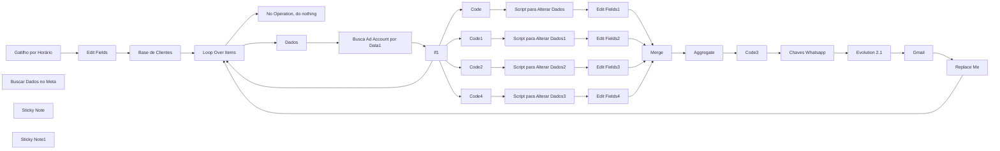
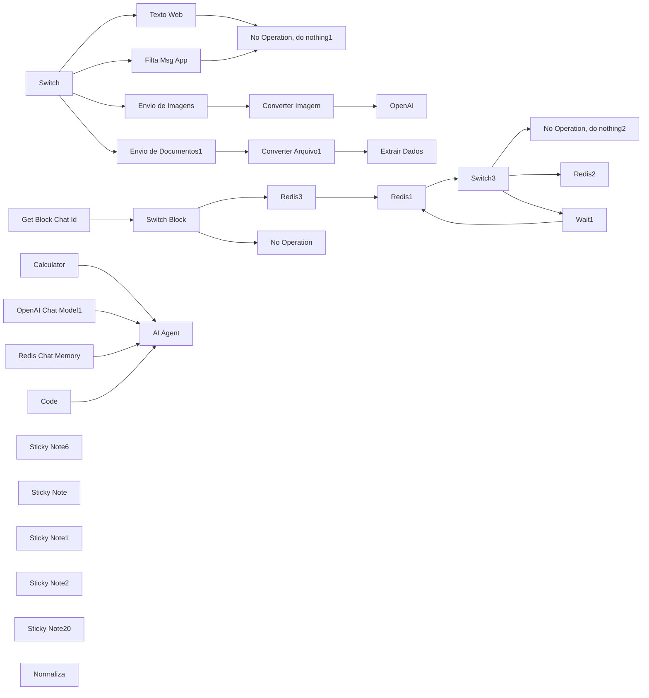
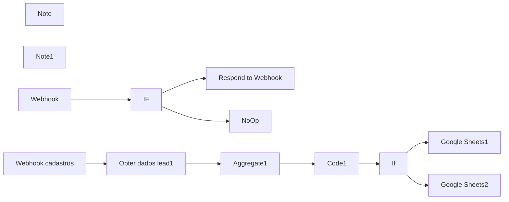
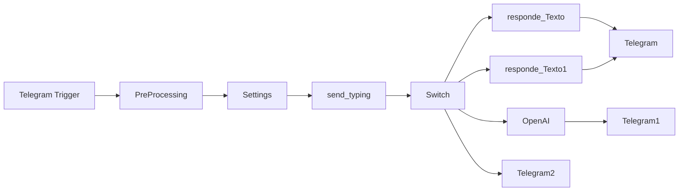
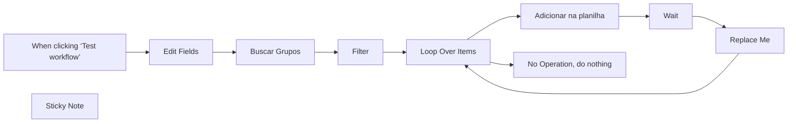
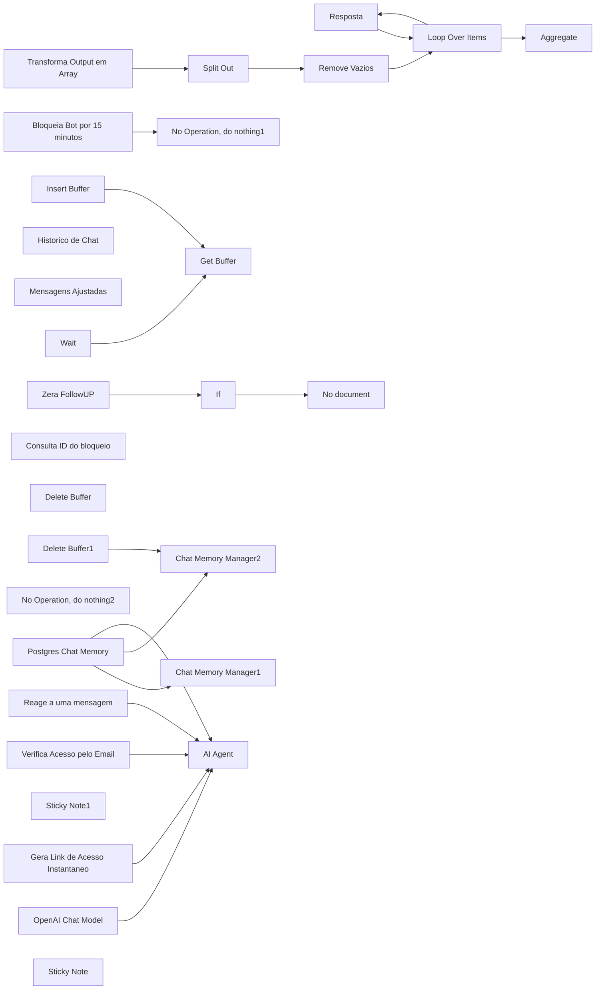
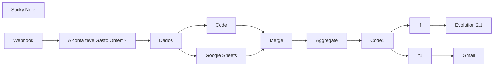
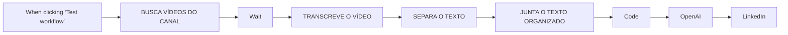
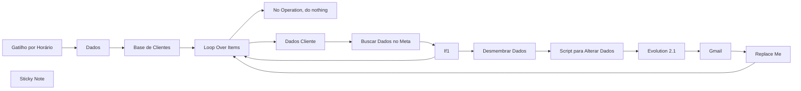
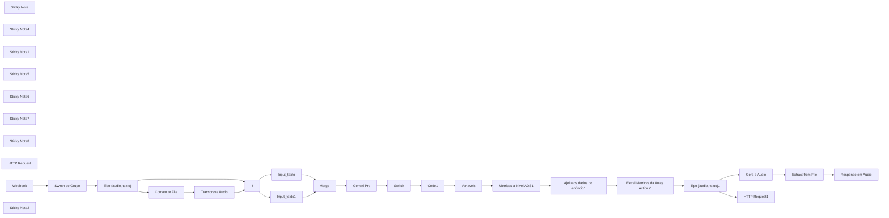

# PACK COM 58 SUPER FLUXOS PARA SEU N8N - Parte 1

Templates nesta parte: 10

## Sumário

- [Template 3 - Relatório Meta por range com Evolution](#template-3)
- [Template 4 - Atendimento WhatsApp com envio de áudio](#template-4)
- [Template 5 - Leads do Formulário Meta](#template-5)
- [Template 6 - Telegram com geração de imagem](#template-6)
- [Template 7 - Busca de Grupos Evolution e gravação em planilha](#template-7)
- [Template 8 - Fluxo Vendedor IA](#template-8)
- [Template 9 - Relatórios Google Ads para múltiplos clientes](#template-9)
- [Template 10 - Raspar YouTube e postar no LinkedIn](#template-10)
- [Template 11 - Relatórios Meta para multiplos clientes](#template-11)
- [Template 12 - Relatório de Campanha com IA](#template-12)

---

<a id="template-3"></a>

## Template 3 - Relatório Meta por range com Evolution

- **Nome original:** 3. Fluxo de relatório de campanha Meta por agrupamento de tag de nome.json
- **Descrição:** Fluxo automatizado que coleta dados de campanhas no Meta Ads para um intervalo de datas, agrega métricas-chave, filtra campanhas específicas, grava resultados em uma planilha e envia um relatório por email e via Evolution (WhatsApp).
- **Funcionalidade:** • Agendamento diário: inicia a automação todos os dias às 07:10.
• Coleta de dados do Meta Ads: consulta o Meta Graph API para obter insights com campos relevantes para o período escolhido (yesterday).
• Processamento de métricas: calcula spend total, cliques, conversões, CPC, CPM, CPP, CTR e CPA.
• Filtragem de campanhas: identifica campanhas que contêm TOFU com base nos filtros configurados.
• Geração de relatório: consolida dados em um relatório estruturado.
• Armazenamento em Google Sheets: grava informações na planilha de clientes.
• Preparação para envio: organiza dados de contato e mensagem para envio.
• Envio de relatório por email: envia o relatório por Gmail com assunto específico.
• Envio via Evolution (WhatsApp): envia o relatório ao cliente via API Evolution.
- **Ferramentas:** • Facebook Graph API: acesso aos dados de campanhas e insights de anúncios no Meta.
• Google Sheets: armazenamento e organização de dados na planilha de clientes.
• Gmail: envio de relatório por e-mail.
• Evolution API: envio de mensagens WhatsApp com o relatório.

## Fluxo visual



## Fluxo (.json) :

```json
{
  "name": "P11 | Meta - Relatório por range agrupado por nome + Evolution",
  "nodes": [
    {
      "parameters": {
        "rule": {
          "interval": [
            {
              "daysInterval": "={{ 1 }}",
              "triggerAtHour": "={{ 7 }}",
              "triggerAtMinute": "={{ 10 }}"
            }
          ]
        }
      },
      "id": "02226986-3aa9-4731-8dbe-18576803ea31",
      "name": "Gatilho por Horário",
      "type": "n8n-nodes-base.scheduleTrigger",
      "typeVersion": 1.2,
      "position": [
        -1160,
        580
      ]
    },
    {
      "parameters": {
        "graphApiVersion": "v20.0",
        "node": "=act_{{ $json['Conta_de_Anuncio'] }}",
        "edge": "insights",
        "options": {
          "queryParameters": {
            "parameter": [
              {
                "name": "time_increment",
                "value": "1"
              },
              {
                "name": "level",
                "value": "ad"
              },
              {
                "name": "fields",
                "value": "=campaign_id,\ncampaign_name,\nadset_id,\nadset_name,\nad_id,\nad_name,\nspend,\nimpressions,\nclicks,\ncpc,\ncpm,\ncpp,\nctr,\nobjective,\nreach,\nactions"
              },
              {
                "name": "limit",
                "value": "3000"
              },
              {
                "name": "date_preset",
                "value": "yesterday"
              }
            ]
          }
        }
      },
      "id": "c0dea250-427f-4456-8f3d-14a7590d7e95",
      "name": "Buscar Dados no Meta",
      "type": "n8n-nodes-base.facebookGraphApi",
      "position": [
        -260,
        820
      ],
      "typeVersion": 1,
      "credentials": {
        "facebookGraphApi": {
          "id": "bcbawFrWYrb4rVPq",
          "name": "Facebook Graph account"
        }
      }
    },
    {
      "parameters": {
        "jsCode": "let totalSpend = 0;\nlet totalConversoes = 0;\nlet sumCPM = 0;\nlet sumCPP = 0;\nlet sumCTR = 0;\nlet totalClicks = 0;\nlet countCPM = 0;\nlet countCPP = 0;\nlet countCTR = 0;\n\n// Função para converter string de valores para float, considerando tanto ponto quanto vírgula\nfunction convertToFloat(value) {\n    return parseFloat(value.replace(',', '.'));\n}\n\n// Itera sobre cada item (que representa um conjunto de dados da campanha)\nitems.forEach(item => {\n    const jsonData = item.json;\n\n    // Acumula o valor de spend\n    if (jsonData.spend !== undefined) {\n        totalSpend += convertToFloat(jsonData.spend);\n    }\n\n    // Acumula o valor dos clicks\n    if (jsonData.clicks !== undefined) {\n        totalClicks += parseInt(jsonData.clicks, 10);  // Certifique-se de que está convertendo clicks para inteiro\n    }\n\n    // Verifica se o campo 'actions' existe e é um array\n    if (Array.isArray(jsonData.actions)) {\n        jsonData.actions.forEach(action => {\n            if (action.action_type === $node[\"Edit Fields\"].json[\"Action_type 1\"] ) {\n                totalConversoes += parseInt(action.value, 10);\n            }\n        });\n    }\n\n    // Acumula os valores de cpm, cpp, ctr para calcular a média\n    if (jsonData.cpm !== undefined) {\n        sumCPM += convertToFloat(jsonData.cpm);\n        countCPM++;\n    }\n    if (jsonData.cpp !== undefined) {\n        sumCPP += convertToFloat(jsonData.cpp);\n        countCPP++;\n    }\n    if (jsonData.ctr !== undefined && convertToFloat(jsonData.ctr) > 0) {\n        sumCTR += convertToFloat(jsonData.ctr);\n        countCTR++;\n    }\n});\n\n// Calcula as médias\nconst avgCPC = totalClicks > 0 ? (totalSpend / totalClicks) : 0;\nconst avgCPM = countCPM > 0 ? (sumCPM / countCPM) : 0;\nconst avgCPP = countCPP > 0 ? (sumCPP / countCPP) : 0;\nconst avgCTR = countCTR > 0 ? (sumCTR / countCTR) : 0;\nconst cpa = totalConversoes > 0 ? (totalSpend / totalConversoes) : 0;  // Calcula o CPA\n\n// Retorna apenas os dados acumulados\nreturn [\n    {\n        json: {\n            totalSpend: totalSpend.toFixed(2).replace('.', ','),\n            totalConversoes: totalConversoes,\n            totalClicks: totalClicks,  // Inclui o total de clicks no resultado\n            avgCPC: avgCPC.toFixed(2).replace('.', ','),\n            avgCPM: avgCPM.toFixed(2).replace('.', ','),\n            avgCPP: avgCPP.toFixed(2).replace('.', ','),\n            avgCTR: avgCTR.toFixed(2).replace('.', ','),\n            cpa: cpa.toFixed(2).replace('.', ',')\n        }\n    }\n];\n"
      },
      "id": "d351becb-70b0-420f-bbc2-679070534b00",
      "name": "Script para Alterar Dados",
      "type": "n8n-nodes-base.code",
      "typeVersion": 2,
      "position": [
        420,
        420
      ]
    },
    {
      "parameters": {
        "options": {}
      },
      "id": "9d3887ab-c000-4b16-af96-2b4518c5e2e4",
      "name": "Loop Over Items",
      "type": "n8n-nodes-base.splitInBatches",
      "typeVersion": 3,
      "position": [
        -620,
        580
      ]
    },
    {
      "parameters": {},
      "id": "b6b54be3-456f-4d25-897b-db7b0bc20fcf",
      "name": "Replace Me",
      "type": "n8n-nodes-base.noOp",
      "typeVersion": 1,
      "position": [
        1840,
        800
      ]
    },
    {
      "parameters": {},
      "id": "55b2346a-57a9-40d0-b20b-2b712acd989d",
      "name": "No Operation, do nothing",
      "type": "n8n-nodes-base.noOp",
      "typeVersion": 1,
      "position": [
        -420,
        380
      ]
    },
    {
      "parameters": {
        "documentId": {
          "__rl": true,
          "value": "1mzpJGdQ5M0wvwtss_OKKsimZLGpcbsHzsW7kn0Gdkzc",
          "mode": "id"
        },
        "sheetName": {
          "__rl": true,
          "value": "gid=0",
          "mode": "list",
          "cachedResultName": "Página1",
          "cachedResultUrl": "https://docs.google.com/spreadsheets/d/1mzpJGdQ5M0wvwtss_OKKsimZLGpcbsHzsW7kn0Gdkzc/edit#gid=0"
        },
        "options": {}
      },
      "id": "daab8ce1-cd9d-4b08-ac86-1569d490c104",
      "name": "Base de Clientes",
      "type": "n8n-nodes-base.googleSheets",
      "typeVersion": 4.4,
      "position": [
        -840,
        580
      ],
      "credentials": {
        "googleSheetsOAuth2Api": {
          "id": "oEhFXfgFEWcIFmhQ",
          "name": "Google Sheets account"
        }
      }
    },
    {
      "parameters": {
        "assignments": {
          "assignments": [
            {
              "id": "bf0c339a-d3d1-4bc5-9079-d47ec4a2ae05",
              "name": "Conta_de_Anuncio",
              "value": "={{ $json['Conta de Anuncio'] }}",
              "type": "string"
            },
            {
              "id": "f4600920-959d-4eef-8a5c-acca0be0158b",
              "name": "Contato_do_cliente",
              "value": "={{ $json['Contato do cliente'] }}",
              "type": "number"
            },
            {
              "id": "1ca84bfe-93ec-45bb-be63-27a93363980c",
              "name": "Email",
              "value": "={{ $json.Email }}",
              "type": "string"
            },
            {
              "id": "bf948392-b9f7-4698-b27a-8a979d5e144c",
              "name": "Cliente",
              "value": "={{ $json.Cliente }}",
              "type": "string"
            }
          ]
        },
        "options": {}
      },
      "id": "c1d05d7a-32c0-464a-aac7-05ee418c48b8",
      "name": "Dados",
      "type": "n8n-nodes-base.set",
      "typeVersion": 3.4,
      "position": [
        -420,
        600
      ]
    },
    {
      "parameters": {
        "assignments": {
          "assignments": [
            {
              "id": "030e2b8b-180b-4753-8ec2-2a70101aefb1",
              "name": "URL",
              "value": "",
              "type": "string"
            },
            {
              "id": "81419d30-620a-4705-8816-03327870beab",
              "name": "instancia",
              "value": "",
              "type": "string"
            },
            {
              "id": "ceeffd46-2654-4d6d-8c69-2914ee1fff93",
              "name": "Token",
              "value": "",
              "type": "string"
            }
          ]
        },
        "options": {}
      },
      "id": "9f179b89-8a1a-4b44-845d-10fba0e0c81a",
      "name": "Chaves Whatsapp",
      "type": "n8n-nodes-base.set",
      "typeVersion": 3.4,
      "position": [
        1460,
        580
      ]
    },
    {
      "parameters": {
        "content": "Trocar as Chaves de Acesso da API\n\n\n## 👇",
        "height": 150.199452534768,
        "width": 150,
        "color": 7
      },
      "id": "459d5eb3-e1f6-40de-8055-20d9ff85d7a2",
      "name": "Sticky Note",
      "type": "n8n-nodes-base.stickyNote",
      "position": [
        1460,
        380
      ],
      "typeVersion": 1
    },
    {
      "parameters": {
        "sendTo": "={{ $('Dados').first().json[\"Email\"] }}",
        "subject": "Relatorio de Campanha",
        "emailType": "text",
        "message": "=📊 Relatório de campanha da conta {{ $('Dados').first().json[\"Cliente\"] }}\n\n🗓️ Data: {{ new Date(Date.now() - 86400000).toLocaleDateString('pt-BR') }}\n\n{{ $('Code3').item.json.report }}",
        "options": {
          "senderName": "Flux Automate"
        }
      },
      "id": "e756407b-6f2d-41dd-a198-a2a42859f602",
      "name": "Gmail",
      "type": "n8n-nodes-base.gmail",
      "typeVersion": 2.1,
      "position": [
        1840,
        580
      ],
      "credentials": {
        "gmailOAuth2": {
          "id": "uF4RSZEql4HvXrV3",
          "name": "Gmail account"
        }
      },
      "disabled": true
    },
    {
      "parameters": {
        "conditions": {
          "options": {
            "caseSensitive": true,
            "leftValue": "",
            "typeValidation": "strict",
            "version": 2
          },
          "conditions": [
            {
              "id": "3152ba7b-2784-42d8-ad8c-a9f97ad61fc0",
              "leftValue": "={{ $json.data }}",
              "rightValue": "",
              "operator": {
                "type": "array",
                "operation": "notEmpty",
                "singleValue": true
              }
            }
          ],
          "combinator": "and"
        },
        "options": {}
      },
      "id": "df8c576a-79ac-4b07-8cd7-447decd05b84",
      "name": "If1",
      "type": "n8n-nodes-base.if",
      "typeVersion": 2.2,
      "position": [
        -100,
        600
      ]
    },
    {
      "parameters": {
        "jsCode": "// Acessa o array de campanhas\nconst campaigns = $json.data; // Certifique-se de que \"data\" contém suas campanhas\nconst results = [];\n\n// Loop para verificar cada campanha\nfor (const campaign of campaigns) {\n    // Verifica se \"campaign_name\" contém \"[TOFU]\"\n    if (campaign.campaign_name && campaign.campaign_name.includes($node[\"Edit Fields\"].json[\"Filtro 1\"])) {\n        results.push({\n            ...campaign,\n            containsTOFU: true // Adiciona um novo campo se a palavra for encontrada\n        });\n    }\n}\n\n// Retorna os resultados\nreturn results.length > 0 ? results : [{ message: \"Nenhuma campanha foi encontrada.\" }];\n"
      },
      "id": "53cf606e-74dc-4e88-8591-9359432a5964",
      "name": "Code",
      "type": "n8n-nodes-base.code",
      "typeVersion": 2,
      "position": [
        200,
        420
      ]
    },
    {
      "parameters": {
        "jsCode": "// Acessa o array de campanhas\nconst campaigns = $json.data; // Certifique-se de que \"data\" contém suas campanhas\nconst results = [];\n\n// Loop para verificar cada campanha\nfor (const campaign of campaigns) {\n    // Verifica se \"campaign_name\" contém \"[TOFU]\"\n    if (campaign.campaign_name && campaign.campaign_name.includes($node[\"Edit Fields\"].json[\"Filtro 2\"])) {\n        results.push({\n            ...campaign,\n            containsTOFU: true // Adiciona um novo campo se a palavra for encontrada\n        });\n    }\n}\n\n// Retorna os resultados\nreturn results.length > 0 ? results : [{ message: \"Nenhuma campanha foi encontrada.\" }];\n"
      },
      "id": "755fa289-d2f1-427f-a602-445038051dc7",
      "name": "Code1",
      "type": "n8n-nodes-base.code",
      "typeVersion": 2,
      "position": [
        200,
        580
      ]
    },
    {
      "parameters": {
        "jsCode": "let totalSpend = 0;\nlet totalConversoes = 0;\nlet sumCPM = 0;\nlet sumCPP = 0;\nlet sumCTR = 0;\nlet totalClicks = 0;\nlet countCPM = 0;\nlet countCPP = 0;\nlet countCTR = 0;\n\n// Função para converter string de valores para float, considerando tanto ponto quanto vírgula\nfunction convertToFloat(value) {\n    return parseFloat(value.replace(',', '.'));\n}\n\n// Itera sobre cada item (que representa um conjunto de dados da campanha)\nitems.forEach(item => {\n    const jsonData = item.json;\n\n    // Acumula o valor de spend\n    if (jsonData.spend !== undefined) {\n        totalSpend += convertToFloat(jsonData.spend);\n    }\n\n    // Acumula o valor dos clicks\n    if (jsonData.clicks !== undefined) {\n        totalClicks += parseInt(jsonData.clicks, 10);  // Certifique-se de que está convertendo clicks para inteiro\n    }\n\n    // Verifica se o campo 'actions' existe e é um array\n    if (Array.isArray(jsonData.actions)) {\n        jsonData.actions.forEach(action => {\n            if (action.action_type === $node[\"Edit Fields\"].json[\"Action_type 2\"]) {\n                totalConversoes += parseInt(action.value, 10);\n            }\n        });\n    }\n\n    // Acumula os valores de cpm, cpp, ctr para calcular a média\n    if (jsonData.cpm !== undefined) {\n        sumCPM += convertToFloat(jsonData.cpm);\n        countCPM++;\n    }\n    if (jsonData.cpp !== undefined) {\n        sumCPP += convertToFloat(jsonData.cpp);\n        countCPP++;\n    }\n    if (jsonData.ctr !== undefined && convertToFloat(jsonData.ctr) > 0) {\n        sumCTR += convertToFloat(jsonData.ctr);\n        countCTR++;\n    }\n});\n\n// Calcula as médias\nconst avgCPC = totalClicks > 0 ? (totalSpend / totalClicks) : 0;\nconst avgCPM = countCPM > 0 ? (sumCPM / countCPM) : 0;\nconst avgCPP = countCPP > 0 ? (sumCPP / countCPP) : 0;\nconst avgCTR = countCTR > 0 ? (sumCTR / countCTR) : 0;\nconst cpa = totalConversoes > 0 ? (totalSpend / totalConversoes) : 0;  // Calcula o CPA\n\n// Retorna apenas os dados acumulados\nreturn [\n    {\n        json: {\n            totalSpend: totalSpend.toFixed(2).replace('.', ','),\n            totalConversoes: totalConversoes,\n            totalClicks: totalClicks,  // Inclui o total de clicks no resultado\n            avgCPC: avgCPC.toFixed(2).replace('.', ','),\n            avgCPM: avgCPM.toFixed(2).replace('.', ','),\n            avgCPP: avgCPP.toFixed(2).replace('.', ','),\n            avgCTR: avgCTR.toFixed(2).replace('.', ','),\n            cpa: cpa.toFixed(2).replace('.', ',')\n        }\n    }\n];\n"
      },
      "id": "749f9339-989e-4ff9-8304-14fe2ee4187f",
      "name": "Script para Alterar Dados1",
      "type": "n8n-nodes-base.code",
      "typeVersion": 2,
      "position": [
        420,
        580
      ]
    },
    {
      "parameters": {
        "assignments": {
          "assignments": [
            {
              "id": "4b5e0c4b-f7ae-4c83-98fc-892da4cfd768",
              "name": "Filtro 1",
              "value": "[Q2]",
              "type": "string"
            },
            {
              "id": "3134e98c-15ee-48bc-b849-665706a47de1",
              "name": "Filtro 2",
              "value": "[Q3]",
              "type": "string"
            },
            {
              "id": "9b7a5d5c-618c-492d-8c9a-29aefaa4be31",
              "name": "Filtro 3",
              "value": "[LP4]",
              "type": "string"
            },
            {
              "id": "94a22f9b-d59f-42a3-b50d-57a152e7a3d2",
              "name": "Action_type 1",
              "value": "purchase",
              "type": "string"
            },
            {
              "id": "cd469ed2-e7a8-40e4-863a-3c2217367edf",
              "name": "Action_type 2",
              "value": "purchase",
              "type": "string"
            },
            {
              "id": "d684d11c-46bc-4c8a-ab09-53f418893c5c",
              "name": "Action_type 3",
              "value": "purchase",
              "type": "string"
            },
            {
              "id": "18a94cec-1d85-437e-b415-40333bfb3d4c",
              "name": "Filtro 4",
              "value": "[LP5-HOT]",
              "type": "string"
            },
            {
              "id": "0f1402de-c4ff-4a05-8d36-9521aac64b44",
              "name": "Action_type 4",
              "value": "purchase",
              "type": "string"
            },
            {
              "id": "99e3551c-b190-4da6-9f61-bacea1e4b989",
              "name": "data inicio",
              "value": "={{ $today.minus(30, \"days\").format('yyyy-MM-dd') }}",
              "type": "string"
            },
            {
              "id": "5568454c-f6e3-4961-8a24-46108d2b6f9c",
              "name": "data fim",
              "value": "={{ $today.minus(1, \"days\").format('yyyy-MM-dd') }}",
              "type": "string"
            }
          ]
        },
        "options": {}
      },
      "id": "b864fbbc-5257-4a44-bcb0-87fbcee05c99",
      "name": "Edit Fields",
      "type": "n8n-nodes-base.set",
      "typeVersion": 3.4,
      "position": [
        -1000,
        580
      ]
    },
    {
      "parameters": {
        "assignments": {
          "assignments": [
            {
              "id": "7970d0e0-811c-4fbf-b6fc-0e61b0bbe6b0",
              "name": "={{ $node[\"Edit Fields\"].json[\"Filtro 1\"].replace(/[\\[\\]]/g, '') }}",
              "value": "={{ $json }}",
              "type": "object"
            }
          ]
        },
        "options": {}
      },
      "id": "567cb46c-5f8a-49b1-981f-6e4538e29cf4",
      "name": "Edit Fields1",
      "type": "n8n-nodes-base.set",
      "typeVersion": 3.4,
      "position": [
        640,
        420
      ]
    },
    {
      "parameters": {
        "assignments": {
          "assignments": [
            {
              "id": "7970d0e0-811c-4fbf-b6fc-0e61b0bbe6b0",
              "name": "={{ $node[\"Edit Fields\"].json[\"Filtro 2\"].replace(/[\\[\\]]/g, '') }}",
              "value": "={{ $json }}",
              "type": "object"
            }
          ]
        },
        "options": {}
      },
      "id": "0ab8de04-1231-4a59-b4d2-ef213bbb6aa0",
      "name": "Edit Fields2",
      "type": "n8n-nodes-base.set",
      "typeVersion": 3.4,
      "position": [
        640,
        580
      ]
    },
    {
      "parameters": {
        "jsCode": "// Acessa o array de campanhas\nconst campaigns = $json.data; // Certifique-se de que \"data\" contém suas campanhas\nconst results = [];\n\n// Loop para verificar cada campanha\nfor (const campaign of campaigns) {\n    // Verifica se \"campaign_name\" contém \"[TOFU]\"\n    if (campaign.campaign_name && campaign.campaign_name.includes($node[\"Edit Fields\"].json[\"Filtro 3\"])) {\n        results.push({\n            ...campaign,\n            containsTOFU: true // Adiciona um novo campo se a palavra for encontrada\n        });\n    }\n}\n\n// Retorna os resultados\nreturn results.length > 0 ? results : [{ message: \"Nenhuma campanha foi encontrada.\" }];\n"
      },
      "id": "9075e5a3-2b20-4754-9003-595a54111141",
      "name": "Code2",
      "type": "n8n-nodes-base.code",
      "typeVersion": 2,
      "position": [
        200,
        740
      ]
    },
    {
      "parameters": {
        "jsCode": "let totalSpend = 0;\nlet totalConversoes = 0;\nlet sumCPM = 0;\nlet sumCPP = 0;\nlet sumCTR = 0;\nlet totalClicks = 0;\nlet countCPM = 0;\nlet countCPP = 0;\nlet countCTR = 0;\n\n// Função para converter string de valores para float, considerando tanto ponto quanto vírgula\nfunction convertToFloat(value) {\n    return parseFloat(value.replace(',', '.'));\n}\n\n// Itera sobre cada item (que representa um conjunto de dados da campanha)\nitems.forEach(item => {\n    const jsonData = item.json;\n\n    // Acumula o valor de spend\n    if (jsonData.spend !== undefined) {\n        totalSpend += convertToFloat(jsonData.spend);\n    }\n\n    // Acumula o valor dos clicks\n    if (jsonData.clicks !== undefined) {\n        totalClicks += parseInt(jsonData.clicks, 10);  // Certifique-se de que está convertendo clicks para inteiro\n    }\n\n    // Verifica se o campo 'actions' existe e é um array\n    if (Array.isArray(jsonData.actions)) {\n        jsonData.actions.forEach(action => {\n            if (action.action_type === $node[\"Edit Fields\"].json[\"Action_type 3\"]) {\n                totalConversoes += parseInt(action.value, 10);\n            }\n        });\n    }\n\n    // Acumula os valores de cpm, cpp, ctr para calcular a média\n    if (jsonData.cpm !== undefined) {\n        sumCPM += convertToFloat(jsonData.cpm);\n        countCPM++;\n    }\n    if (jsonData.cpp !== undefined) {\n        sumCPP += convertToFloat(jsonData.cpp);\n        countCPP++;\n    }\n    if (jsonData.ctr !== undefined && convertToFloat(jsonData.ctr) > 0) {\n        sumCTR += convertToFloat(jsonData.ctr);\n        countCTR++;\n    }\n});\n\n// Calcula as médias\nconst avgCPC = totalClicks > 0 ? (totalSpend / totalClicks) : 0;\nconst avgCPM = countCPM > 0 ? (sumCPM / countCPM) : 0;\nconst avgCPP = countCPP > 0 ? (sumCPP / countCPP) : 0;\nconst avgCTR = countCTR > 0 ? (sumCTR / countCTR) : 0;\nconst cpa = totalConversoes > 0 ? (totalSpend / totalConversoes) : 0;  // Calcula o CPA\n\n// Retorna apenas os dados acumulados\nreturn [\n    {\n        json: {\n            totalSpend: totalSpend.toFixed(2).replace('.', ','),\n            totalConversoes: totalConversoes,\n            totalClicks: totalClicks,  // Inclui o total de clicks no resultado\n            avgCPC: avgCPC.toFixed(2).replace('.', ','),\n            avgCPM: avgCPM.toFixed(2).replace('.', ','),\n            avgCPP: avgCPP.toFixed(2).replace('.', ','),\n            avgCTR: avgCTR.toFixed(2).replace('.', ','),\n            cpa: cpa.toFixed(2).replace('.', ',')\n        }\n    }\n];\n"
      },
      "id": "b2a91dfc-88a7-4084-aedb-7ee0ed3e0bd1",
      "name": "Script para Alterar Dados2",
      "type": "n8n-nodes-base.code",
      "typeVersion": 2,
      "position": [
        420,
        740
      ]
    },
    {
      "parameters": {
        "assignments": {
          "assignments": [
            {
              "id": "7970d0e0-811c-4fbf-b6fc-0e61b0bbe6b0",
              "name": "={{ $node[\"Edit Fields\"].json[\"Filtro 3\"].replace(/[\\[\\]]/g, '') }}",
              "value": "={{ $json }}",
              "type": "object"
            }
          ]
        },
        "options": {}
      },
      "id": "c881071a-2193-4eb9-8c6c-5642c2d2855b",
      "name": "Edit Fields3",
      "type": "n8n-nodes-base.set",
      "typeVersion": 3.4,
      "position": [
        640,
        740
      ]
    },
    {
      "parameters": {
        "jsCode": "// Supondo que os dados estão em um campo específico\nconst inputData = $json.data; // Ajuste \"data\" para o campo correto\n\n// Verifica se inputData é um array\nif (!Array.isArray(inputData)) {\n  throw new Error(\"Os dados de entrada não são um array.\");\n}\n\nlet report = '';\n\n// Loop por cada item do JSON para montar o relatório\ninputData.forEach(campanha => {\n  // Captura o nome da campanha, que é a chave do objeto\n  const campanhaName = Object.keys(campanha)[0]; \n  const data = campanha[campanhaName]; // Captura os dados da campanha\n\n  // Monta a string do relatório para essa campanha\n  report += `Campanha: ${campanhaName}\\n`;\n  report += `Investimento: R$ ${data.totalSpend}\\n`;\n  report += `Conversões: ${data.totalConversoes}\\n`;\n  report += `Custo por conversões: R$ ${data.cpa}\\n\\n`; // Pula uma linha\n});\n\n// Retorna o relatório formatado\nreturn { report };\n"
      },
      "id": "5e04e672-9412-415f-9d7d-879a474130c4",
      "name": "Code3",
      "type": "n8n-nodes-base.code",
      "typeVersion": 2,
      "position": [
        1280,
        580
      ]
    },
    {
      "parameters": {
        "aggregate": "aggregateAllItemData",
        "options": {}
      },
      "id": "7ee90ac8-eb32-4d46-a092-330c70859e91",
      "name": "Aggregate",
      "type": "n8n-nodes-base.aggregate",
      "typeVersion": 1,
      "position": [
        1100,
        580
      ]
    },
    {
      "parameters": {
        "content": "Alterar os dados\n\n\n## 👇",
        "height": 150.199452534768,
        "width": 150,
        "color": 4
      },
      "id": "1e809664-edd5-43a6-b680-8d6db82559eb",
      "name": "Sticky Note1",
      "type": "n8n-nodes-base.stickyNote",
      "position": [
        -1000,
        380
      ],
      "typeVersion": 1
    },
    {
      "parameters": {
        "method": "POST",
        "url": "={{ $json.URL }}/message/sendText/{{ $json.instancia }}",
        "sendHeaders": true,
        "headerParameters": {
          "parameters": [
            {
              "name": "apikey",
              "value": "={{ $json.Token }}"
            },
            {
              "name": "content_type",
              "value": "application/json"
            }
          ]
        },
        "sendBody": true,
        "specifyBody": "json",
        "jsonBody": "={\n    \"number\": \"{{ $('Dados').first().json[\"Contato_do_cliente\"] }}\",\n    \"text\": \"{{ $('Code3').item.json.report.replace(/\\n/g, \"\\\\n\").replace(/['\"]/g, '') }}\"\n}",
        "options": {}
      },
      "id": "a0f15be9-0d8b-42a9-92b2-9db449d6b147",
      "name": "Evolution 2.1",
      "type": "n8n-nodes-base.httpRequest",
      "typeVersion": 4.2,
      "position": [
        1660,
        580
      ]
    },
    {
      "parameters": {
        "numberInputs": 4
      },
      "id": "dcd810bb-7b89-4303-b931-88377302f07c",
      "name": "Merge",
      "type": "n8n-nodes-base.merge",
      "typeVersion": 3,
      "position": [
        940,
        580
      ]
    },
    {
      "parameters": {
        "jsCode": "// Acessa o array de campanhas\nconst campaigns = $json.data; // Certifique-se de que \"data\" contém suas campanhas\nconst results = [];\n\n// Loop para verificar cada campanha\nfor (const campaign of campaigns) {\n    // Verifica se \"campaign_name\" contém \"[TOFU]\"\n    if (campaign.campaign_name && campaign.campaign_name.includes($node[\"Edit Fields\"].json[\"Filtro 4\"])) {\n        results.push({\n            ...campaign,\n            containsTOFU: true // Adiciona um novo campo se a palavra for encontrada\n        });\n    }\n}\n\n// Retorna os resultados\nreturn results.length > 0 ? results : [{ message: \"Nenhuma campanha foi encontrada.\" }];\n"
      },
      "id": "25b5a92c-e4c0-488a-bd6f-f3ad14cff441",
      "name": "Code4",
      "type": "n8n-nodes-base.code",
      "typeVersion": 2,
      "position": [
        200,
        900
      ]
    },
    {
      "parameters": {
        "jsCode": "let totalSpend = 0;\nlet totalConversoes = 0;\nlet sumCPM = 0;\nlet sumCPP = 0;\nlet sumCTR = 0;\nlet totalClicks = 0;\nlet countCPM = 0;\nlet countCPP = 0;\nlet countCTR = 0;\n\n// Função para converter string de valores para float, considerando tanto ponto quanto vírgula\nfunction convertToFloat(value) {\n    return parseFloat(value.replace(',', '.'));\n}\n\n// Itera sobre cada item (que representa um conjunto de dados da campanha)\nitems.forEach(item => {\n    const jsonData = item.json;\n\n    // Acumula o valor de spend\n    if (jsonData.spend !== undefined) {\n        totalSpend += convertToFloat(jsonData.spend);\n    }\n\n    // Acumula o valor dos clicks\n    if (jsonData.clicks !== undefined) {\n        totalClicks += parseInt(jsonData.clicks, 10);  // Certifique-se de que está convertendo clicks para inteiro\n    }\n\n    // Verifica se o campo 'actions' existe e é um array\n    if (Array.isArray(jsonData.actions)) {\n        jsonData.actions.forEach(action => {\n            if (action.action_type === $node[\"Edit Fields\"].json[\"Action_type 4\"]) {\n                totalConversoes += parseInt(action.value, 10);\n            }\n        });\n    }\n\n    // Acumula os valores de cpm, cpp, ctr para calcular a média\n    if (jsonData.cpm !== undefined) {\n        sumCPM += convertToFloat(jsonData.cpm);\n        countCPM++;\n    }\n    if (jsonData.cpp !== undefined) {\n        sumCPP += convertToFloat(jsonData.cpp);\n        countCPP++;\n    }\n    if (jsonData.ctr !== undefined && convertToFloat(jsonData.ctr) > 0) {\n        sumCTR += convertToFloat(jsonData.ctr);\n        countCTR++;\n    }\n});\n\n// Calcula as médias\nconst avgCPC = totalClicks > 0 ? (totalSpend / totalClicks) : 0;\nconst avgCPM = countCPM > 0 ? (sumCPM / countCPM) : 0;\nconst avgCPP = countCPP > 0 ? (sumCPP / countCPP) : 0;\nconst avgCTR = countCTR > 0 ? (sumCTR / countCTR) : 0;\nconst cpa = totalConversoes > 0 ? (totalSpend / totalConversoes) : 0;  // Calcula o CPA\n\n// Retorna apenas os dados acumulados\nreturn [\n    {\n        json: {\n            totalSpend: totalSpend.toFixed(2).replace('.', ','),\n            totalConversoes: totalConversoes,\n            totalClicks: totalClicks,  // Inclui o total de clicks no resultado\n            avgCPC: avgCPC.toFixed(2).replace('.', ','),\n            avgCPM: avgCPM.toFixed(2).replace('.', ','),\n            avgCPP: avgCPP.toFixed(2).replace('.', ','),\n            avgCTR: avgCTR.toFixed(2).replace('.', ','),\n            cpa: cpa.toFixed(2).replace('.', ',')\n        }\n    }\n];\n"
      },
      "id": "012496a7-8ce4-4dd9-a149-92d670f702c8",
      "name": "Script para Alterar Dados3",
      "type": "n8n-nodes-base.code",
      "typeVersion": 2,
      "position": [
        420,
        900
      ]
    },
    {
      "parameters": {
        "assignments": {
          "assignments": [
            {
              "id": "7970d0e0-811c-4fbf-b6fc-0e61b0bbe6b0",
              "name": "={{ $node[\"Edit Fields\"].json[\"Filtro 4\"].replace(/[\\[\\]]/g, '') }}",
              "value": "={{ $json }}",
              "type": "object"
            }
          ]
        },
        "options": {}
      },
      "id": "eb18ce1f-a5ff-45b2-ad99-68e161bdeaca",
      "name": "Edit Fields4",
      "type": "n8n-nodes-base.set",
      "typeVersion": 3.4,
      "position": [
        640,
        900
      ]
    },
    {
      "parameters": {
        "graphApiVersion": "v20.0",
        "node": "=act_{{ $node[\"Dados\"].json[\"Conta_de_Anuncio\"] }}",
        "edge": "insights",
        "options": {
          "queryParameters": {
            "parameter": [
              {
                "name": "time_increment",
                "value": "1"
              },
              {
                "name": "level",
                "value": "ad"
              },
              {
                "name": "time_range",
                "value": "={\n  \"since\":\"{{ $item(\"0\").$node[\"Edit Fields\"].json[\"data inicio\"] }}\",\n  \"until\":\"{{ $item(\"0\").$node[\"Edit Fields\"].json[\"data fim\"] }}\"\n}"
              },
              {
                "name": "fields",
                "value": "=campaign_id,\ncampaign_name,\nadset_id,\nadset_name,\nad_id,\nad_name,\nspend,\nimpressions,\nclicks,\ncpc,\ncpm,\ncpp,\nctr,\nobjective,\nreach,\nactions"
              },
              {
                "name": "limit",
                "value": "3000"
              }
            ]
          }
        }
      },
      "id": "37c748e6-0d76-4bdd-bcd4-0f2fa2223687",
      "name": "Busca Ad Account por Data1",
      "type": "n8n-nodes-base.facebookGraphApi",
      "position": [
        -260,
        600
      ],
      "typeVersion": 1,
      "credentials": {
        "facebookGraphApi": {
          "id": "bcbawFrWYrb4rVPq",
          "name": "Facebook Graph account"
        }
      }
    }
  ],
  "pinData": {},
  "connections": {
    "Gatilho por Horário": {
      "main": [
        [
          {
            "node": "Edit Fields",
            "type": "main",
            "index": 0
          }
        ]
      ]
    },
    "Script para Alterar Dados": {
      "main": [
        [
          {
            "node": "Edit Fields1",
            "type": "main",
            "index": 0
          }
        ]
      ]
    },
    "Loop Over Items": {
      "main": [
        [
          {
            "node": "No Operation, do nothing",
            "type": "main",
            "index": 0
          }
        ],
        [
          {
            "node": "Dados",
            "type": "main",
            "index": 0
          }
        ]
      ]
    },
    "Base de Clientes": {
      "main": [
        [
          {
            "node": "Loop Over Items",
            "type": "main",
            "index": 0
          }
        ]
      ]
    },
    "Dados": {
      "main": [
        [
          {
            "node": "Busca Ad Account por Data1",
            "type": "main",
            "index": 0
          }
        ]
      ]
    },
    "Chaves Whatsapp": {
      "main": [
        [
          {
            "node": "Evolution 2.1",
            "type": "main",
            "index": 0
          }
        ]
      ]
    },
    "Gmail": {
      "main": [
        [
          {
            "node": "Replace Me",
            "type": "main",
            "index": 0
          }
        ]
      ]
    },
    "If1": {
      "main": [
        [
          {
            "node": "Code",
            "type": "main",
            "index": 0
          },
          {
            "node": "Code1",
            "type": "main",
            "index": 0
          },
          {
            "node": "Code2",
            "type": "main",
            "index": 0
          },
          {
            "node": "Code4",
            "type": "main",
            "index": 0
          }
        ],
        [
          {
            "node": "Loop Over Items",
            "type": "main",
            "index": 0
          }
        ]
      ]
    },
    "Code": {
      "main": [
        [
          {
            "node": "Script para Alterar Dados",
            "type": "main",
            "index": 0
          }
        ]
      ]
    },
    "Code1": {
      "main": [
        [
          {
            "node": "Script para Alterar Dados1",
            "type": "main",
            "index": 0
          }
        ]
      ]
    },
    "Script para Alterar Dados1": {
      "main": [
        [
          {
            "node": "Edit Fields2",
            "type": "main",
            "index": 0
          }
        ]
      ]
    },
    "Edit Fields": {
      "main": [
        [
          {
            "node": "Base de Clientes",
            "type": "main",
            "index": 0
          }
        ]
      ]
    },
    "Edit Fields1": {
      "main": [
        [
          {
            "node": "Merge",
            "type": "main",
            "index": 0
          }
        ]
      ]
    },
    "Edit Fields2": {
      "main": [
        [
          {
            "node": "Merge",
            "type": "main",
            "index": 1
          }
        ]
      ]
    },
    "Code2": {
      "main": [
        [
          {
            "node": "Script para Alterar Dados2",
            "type": "main",
            "index": 0
          }
        ]
      ]
    },
    "Script para Alterar Dados2": {
      "main": [
        [
          {
            "node": "Edit Fields3",
            "type": "main",
            "index": 0
          }
        ]
      ]
    },
    "Edit Fields3": {
      "main": [
        [
          {
            "node": "Merge",
            "type": "main",
            "index": 2
          }
        ]
      ]
    },
    "Aggregate": {
      "main": [
        [
          {
            "node": "Code3",
            "type": "main",
            "index": 0
          }
        ]
      ]
    },
    "Code3": {
      "main": [
        [
          {
            "node": "Chaves Whatsapp",
            "type": "main",
            "index": 0
          }
        ]
      ]
    },
    "Replace Me": {
      "main": [
        [
          {
            "node": "Loop Over Items",
            "type": "main",
            "index": 0
          }
        ]
      ]
    },
    "Evolution 2.1": {
      "main": [
        [
          {
            "node": "Gmail",
            "type": "main",
            "index": 0
          }
        ]
      ]
    },
    "Merge": {
      "main": [
        [
          {
            "node": "Aggregate",
            "type": "main",
            "index": 0
          }
        ]
      ]
    },
    "Code4": {
      "main": [
        [
          {
            "node": "Script para Alterar Dados3",
            "type": "main",
            "index": 0
          }
        ]
      ]
    },
    "Script para Alterar Dados3": {
      "main": [
        [
          {
            "node": "Edit Fields4",
            "type": "main",
            "index": 0
          }
        ]
      ]
    },
    "Edit Fields4": {
      "main": [
        [
          {
            "node": "Merge",
            "type": "main",
            "index": 3
          }
        ]
      ]
    },
    "Busca Ad Account por Data1": {
      "main": [
        [
          {
            "node": "If1",
            "type": "main",
            "index": 0
          }
        ]
      ]
    }
  },
  "active": false,
  "settings": {
    "executionOrder": "v1",
    "timezone": "America/Sao_Paulo",
    "saveManualExecutions": true,
    "callerPolicy": "workflowsFromSameOwner"
  },
  "versionId": "21656851-d600-4530-a8dd-09713848be81",
  "meta": {
    "templateCredsSetupCompleted": true,
    "instanceId": "619b17cd1b492527794139da1bcb865e53d9b06f94f0bce867b7bc44cff77b3b"
  },
  "id": "TgLPHU5hmMU7Vnic",
  "tags": [
    {
      "createdAt": "2025-02-12T12:24:52.743Z",
      "updatedAt": "2025-02-12T12:57:02.254Z",
      "id": "IEEotBOwvCC1isJA",
      "name": "FLUX"
    }
  ]
}
```

---

<a id="template-4"></a>

## Template 4 - Atendimento WhatsApp com envio de áudio

- **Nome original:** 36. Fluxo atendimento WhatsApp com envio de audio.json
- **Descrição:** Fluxo de atendimento pelo WhatsApp que processa mensagens recebidas (texto, imagens, áudios e documentos), transforma áudio em texto, usa IA para respostas, armazena memória de conversa e gerencia agendamentos de consultas via Google Calendar, além de enviar áudio de resposta pelo WhatsApp.
- **Funcionalidade:** • Captura de mensagens via Webhook: recebe mensagens do WhatsApp e inicia o fluxo.
• Normalização de dados: padroniza campos da mensagem para uso nos nós.
• Classificação do conteúdo: direciona para texto, áudio, imagem ou documento.
• Transcrição de áudio: converte mensagens de áudio em texto com OpenAI.
• Geração de resposta IA: usa o agente IA para criar respostas com base no contexto.
• Geração de áudio de resposta: usa ElevenLabs para criar áudio da resposta.
• Envio de mensagens de texto: envia mensagens de volta ao usuário via API do WhatsApp.
• Envio de áudio: envia áudios de resposta ao usuário.
• Extração de dados de imagens/documentos: extrai dados necessários.
• Memória de conversa: Redis armazena contexto do chat entre mensagens.
• Criação de consultas no calendário: Cria consultas no Google Calendar com dados coletados.
• Verificação de disponibilidade: consulta disponibilidade no Google Calendar.
• Cancelamento de consultas: deleta consultas no Google Calendar.
• Orquestração IA de atendimento: AI Agent coordena a conversa e as ações.
• Buffer de mensagens: Redis armazena mensagens em buffer para processamento.
• Envio de confirmação via WhatsApp: envia mensagens de confirmação aos leads.
- **Ferramentas:** • Google Calendar: API de calendário para gerenciar consultas (criar, buscar disponibilidade e deletar).
• ElevenLabs: API de text-to-speech para gerar áudio de respostas.
• OpenAI: API de transcrição de áudio e suporte de IA para o atendimento.
• WhatsApp API (Evolution): serviço de envio de mensagens e áudios pelo WhatsApp.
• Redis: armazenamento de memória de chat para manter contexto entre mensagens.

## Fluxo visual



## Fluxo (.json) :

```json
{
  "name": "36. Fluxo atendimento WhatsApp com envio de audio",
  "nodes": [
    {
      "parameters": {},
      "id": "905b9b7a-da07-44ff-8634-8804112fb73b",
      "name": "Calculator",
      "type": "@n8n/n8n-nodes-langchain.toolCalculator",
      "typeVersion": 1,
      "position": [
        2220,
        80
      ]
    },
    {
      "parameters": {
        "options": {}
      },
      "id": "2cb4e900-09dd-4fb4-aff5-4219c318e85d",
      "name": "OpenAI Chat Model1",
      "type": "@n8n/n8n-nodes-langchain.lmChatOpenAi",
      "typeVersion": 1,
      "position": [
        1100,
        -60
      ]
    },
    {
      "parameters": {
        "assignments": {
          "assignments": [
            {
              "id": "17694db0-6248-444f-afb9-ff7ed13996ef",
              "name": "pergunta",
              "value": "={{ $('Webhook').item.json.body.data.message.extendedTextMessage.text }}",
              "type": "string"
            }
          ]
        },
        "options": {}
      },
      "id": "647c5ebd-990c-496c-8792-53f7f5075671",
      "name": "Texto Web",
      "type": "n8n-nodes-base.set",
      "typeVersion": 3.3,
      "position": [
        20,
        -640
      ],
      "notesInFlow": false,
      "alwaysOutputData": true
    },
    {
      "parameters": {
        "assignments": {
          "assignments": [
            {
              "id": "2f8e1fbf-9134-4b48-be29-066509e021f5",
              "name": "telefone",
              "value": "={{ $('Webhook').item.json.body.data.key.remoteJid }}",
              "type": "string"
            },
            {
              "id": "a6004904-d9e1-4627-be79-d2a5b073d44f",
              "name": "mensagem",
              "value": "={{ $('Webhook').item.json.body.data.message.conversation }}",
              "type": "string"
            }
          ]
        },
        "options": {}
      },
      "id": "05b8adb7-26e0-4772-9fcc-fe7d71f209bb",
      "name": "Filta Msg App",
      "type": "n8n-nodes-base.set",
      "typeVersion": 3.4,
      "position": [
        20,
        -420
      ]
    },
    {
      "parameters": {
        "method": "POST",
        "url": "={{ $('Normaliza').item.json.instance.Server_url }}/chat/getBase64FromMediaMessage/{{ $('Normaliza').item.json.instance.Name }}",
        "sendHeaders": true,
        "headerParameters": {
          "parameters": [
            {
              "name": "apikey",
              "value": "={{ $('Normaliza').item.json.instance.Apikey }}"
            }
          ]
        },
        "sendBody": true,
        "specifyBody": "json",
        "jsonBody": "={\n    \"message\": {\n        \"key\": {\n            \"id\":  \"{{ $('Normaliza').item.json.message.message_id }}\"\n        }\n    },\n    \"convertToMp4\": true\n} ",
        "options": {}
      },
      "id": "d7e1f8b7-a553-4a9d-8477-7e47d57f998a",
      "name": "Envio de Imagens",
      "type": "n8n-nodes-base.httpRequest",
      "typeVersion": 4.1,
      "position": [
        20,
        -220
      ],
      "retryOnFail": true,
      "maxTries": 2
    },
    {
      "parameters": {
        "operation": "toBinary",
        "sourceProperty": "base64",
        "options": {
          "fileName": "image",
          "mimeType": ""
        }
      },
      "id": "dad685f9-ffee-4f03-9894-d1e04c7d99d3",
      "name": "Converter Imagem",
      "type": "n8n-nodes-base.convertToFile",
      "typeVersion": 1.1,
      "position": [
        320,
        -220
      ]
    },
    {
      "parameters": {
        "operation": "pdf",
        "options": {}
      },
      "id": "93258e57-6ef6-46ed-b96b-89082dda670d",
      "name": "Extrair Dados",
      "type": "n8n-nodes-base.extractFromFile",
      "typeVersion": 1,
      "position": [
        500,
        100
      ]
    },
    {
      "parameters": {
        "method": "POST",
        "url": "={{ $('Normaliza').item.json.instance.Server_url }}/chat/getBase64FromMediaMessage/{{ $('Normaliza').item.json.instance.Name }}",
        "sendHeaders": true,
        "headerParameters": {
          "parameters": [
            {
              "name": "apikey",
              "value": "={{ $('Normaliza').item.json.instance.Apikey }}"
            }
          ]
        },
        "sendBody": true,
        "specifyBody": "json",
        "jsonBody": "={\n    \"message\": {\n        \"key\": {\n            \"id\":  \"{{ $('Normaliza').item.json.message.message_id }}\"\n        }\n    },\n    \"convertToMp4\": true\n} ",
        "options": {}
      },
      "id": "b92c440c-e4b4-4f58-a064-238a7ac097b2",
      "name": "Envio de Documentos1",
      "type": "n8n-nodes-base.httpRequest",
      "typeVersion": 4.1,
      "position": [
        20,
        100
      ],
      "retryOnFail": true,
      "maxTries": 2
    },
    {
      "parameters": {
        "operation": "toBinary",
        "sourceProperty": "base64",
        "options": {
          "fileName": "=image {{ $('Switch').item.json.body.data.message.documentMessage.fileName }}",
          "mimeType": "={{ $('Switch').item.json.body.data.message.documentMessage.mimetype }}"
        }
      },
      "id": "1ba9b4c3-2c61-4462-9b76-e7c80288c3eb",
      "name": "Converter Arquivo1",
      "type": "n8n-nodes-base.convertToFile",
      "typeVersion": 1.1,
      "position": [
        220,
        100
      ]
    },
    {
      "parameters": {
        "sessionIdType": "customKey",
        "sessionKey": "={{ $('Normaliza').item.json.message.chat_id }}_mem",
        "sessionTTL": 10000
      },
      "id": "c0b38d44-0f31-437c-aa88-9ca66d640b22",
      "name": "Redis Chat Memory",
      "type": "@n8n/n8n-nodes-langchain.memoryRedisChat",
      "typeVersion": 1.3,
      "position": [
        1480,
        -120
      ]
    },
    {
      "parameters": {
        "jsCode": "function limparMensagem(texto) {\n  if (typeof texto !== 'string') {\n    return '';\n  }\n\n  // Função para remover metadados e dados técnicos\n  function removerMetadataTecnico(str) {\n    return str\n      // Remove objetos e chaves de metadados específicos\n      .replace(/\"response_metadata\"\\s*:\\s*{[^}]*}/g, '')  // Remove \"response_metadata\"\n      .replace(/\"additional_kwargs\"\\s*:\\s*{[^}]*}/g, '')  // Remove \"additional_kwargs\"\n      .replace(/\"tool_calls\"\\s*:\\s*\\[\\s*\\]/g, '')  // Remove \"tool_calls\" vazio\n      .replace(/\"invalid_tool_calls\"\\s*:\\s*\\[\\s*\\]/g, '')  // Remove \"invalid_tool_calls\" vazio\n      .replace(/\"type\"\\s*:\\s*\"(ai|human)\"/g, '')  // Remove os tipos \"ai\" e \"human\"\n      .replace(/\"data\"\\s*:\\s*{[^}]*}/g, '')  // Remove a chave \"data\"\n      // Remove objetos JSON em excesso ou vazios\n      .replace(/,\\s*{[^}]*}/g, '') // Remove objetos soltos\n      .replace(/,\\s*\\[\\s*\\]/g, '') // Remove arrays vazios\n      .replace(/\\s*:\\s*null/g, '') // Remove valores null\n      .replace(/\\s*:\\s*\\[\\]/g, '') // Remove arrays vazios\n      .replace(/\\s*:\\s*{}/g, '') // Remove objetos vazios\n      // Ajusta espaços desnecessários\n      .replace(/\\s+/g, ' ')\n      .replace(/^\\s+|\\s+$/g, '');  // Remove espaços no início e fim\n  }\n\n  // Função para limpar caracteres especiais\n  function limparCaracteresEspeciais(str) {\n    return str\n      .replace(/\\\\\\\\[rnt]/g, ' ')  // Limpa sequências de escape\n      .replace(/\\\\\\\\\\\"/g, '')  // Remove as aspas escapadas\n      .replace(/\\\\\\\\\\\\\\\\/g, '')  // Remove barras invertidas\n      .replace(/[\\x00-\\x1F\\x7F-\\x9F]/g, '')  // Remove caracteres de controle\n      .replace(/\\\"+/g, '')  // Remove aspas extras\n      .replace(/[{}[\\]]/g, '')  // Remove chaves e colchetes extras\n      .trim();\n  }\n\n  // Função para extrair e limpar a mensagem principal\n  function extrairMensagemPrincipal(str) {\n    // Divide em frases, removendo pontuação extra\n    const frases = str.split(/(?<=[.!?])\\s+/);\n\n    return frases\n      .map(frase => frase.trim())\n      .filter(frase => {\n        // Remove frases que ainda têm metadados ou são irrelevantes\n        return frase.length > 0 &&\n          !frase.includes('tool_calls') &&\n          !frase.includes('invalid_tool_calls') &&\n          !frase.match(/^[:\\s\\[\\]{}]+$/);\n      })\n      .join(' ');\n  }\n\n  // Processo de limpeza e extração\n  let resultado = texto;\n\n  // Passo 1: Remove metadados e chaves indesejadas\n  resultado = removerMetadataTecnico(resultado);\n\n  // Passo 2: Extrai a mensagem relevante, ignorando o que não é necessário\n  resultado = extrairMensagemPrincipal(resultado);\n\n  // Passo 3: Remove caracteres especiais e formatação indesejada\n  resultado = limparCaracteresEspeciais(resultado);\n\n  // Limpeza final para remover espaços extras\n  resultado = resultado\n    .replace(/\\s+/g, ' ')\n    .replace(/^[\\\",\\s]+|[\\\",\\s]+$/g, '')\n    .trim();\n\n  return resultado;\n}\n\nfunction processarMensagens(items) {\n  return items.map(item => {\n    try {\n      if (!item?.json?.mensagem) {\n        return item;\n      }\n\n      let mensagem = item.json.mensagem;\n\n      // Se for objeto, converte para string\n      if (typeof mensagem === 'object') {\n        try {\n          mensagem = JSON.stringify(mensagem);\n        } catch (e) {\n          console.error('Erro ao converter objeto para string:', e);\n          return item;\n        }\n      }\n\n      // Aplica a limpeza\n      const mensagemLimpa = limparMensagem(mensagem);\n\n      // Atualiza apenas se houver conteúdo significativo\n      if (mensagemLimpa && mensagemLimpa.length > 0) {\n        item.json.mensagem = mensagemLimpa;\n      }\n\n      return { json: item.json };\n    } catch (error) {\n      console.error('Erro ao processar item:', error);\n      return item;\n    }\n  });\n}\n\n// Execução principal\ntry {\n  const items = $input.all();\n  return processarMensagens(items);\n} catch (error) {\n  console.error('Erro na execução:', error);\n  throw error;\n}\n"
      },
      "id": "cbb5bdda-3fb7-49a6-b5a5-ef85b1c49196",
      "name": "Code",
      "type": "n8n-nodes-base.code",
      "typeVersion": 2,
      "position": [
        1260,
        -380
      ]
    },
    {
      "parameters": {
        "resource": "image",
        "operation": "analyze",
        "modelId": {
          "__rl": true,
          "value": "gpt-4o-mini",
          "mode": "list",
          "cachedResultName": "GPT-4O-MINI"
        },
        "text": "Descreva essa imagem, oque tem nela?",
        "inputType": "base64",
        "options": {}
      },
      "id": "c85b982c-4730-44d7-b011-9e91636e36cf",
      "name": "OpenAI",
      "type": "@n8n/n8n-nodes-langchain.openAi",
      "typeVersion": 1.6,
      "position": [
        500,
        -220
      ]
    },
    {
      "parameters": {
        "operation": "get",
        "propertyName": "block",
        "key": "={{ $json.message.chat_id }}_timeout",
        "options": {}
      },
      "id": "a9e18591-4e53-4155-a79a-901221ead8be",
      "name": "Get Block Chat Id",
      "type": "n8n-nodes-base.redis",
      "typeVersion": 1,
      "position": [
        540,
        -1120
      ]
    },
    {
      "parameters": {
        "rules": {
          "values": [
            {
              "conditions": {
                "options": {
                  "caseSensitive": true,
                  "leftValue": "",
                  "typeValidation": "strict",
                  "version": 1
                },
                "conditions": [
                  {
                    "leftValue": "={{ $json.block }}",
                    "rightValue": "",
                    "operator": {
                      "type": "string",
                      "operation": "empty",
                      "singleValue": true
                    }
                  }
                ],
                "combinator": "and"
              },
              "renameOutput": true,
              "outputKey": "IA PODE RESPONDER"
            },
            {
              "conditions": {
                "options": {
                  "caseSensitive": true,
                  "leftValue": "",
                  "typeValidation": "strict",
                  "version": 1
                },
                "conditions": [
                  {
                    "id": "3ef0e01c-cc14-4663-bb4d-2905b350c3ab",
                    "leftValue": "={{ $json.block }}",
                    "rightValue": "true",
                    "operator": {
                      "type": "string",
                      "operation": "equals",
                      "name": "filter.operator.equals"
                    }
                  }
                ],
                "combinator": "and"
              },
              "renameOutput": true,
              "outputKey": "IA NAO PODE RESPONDER"
            }
          ]
        },
        "options": {}
      },
      "id": "98be55cf-3e90-4354-a607-2c899b1b2361",
      "name": "Switch Block",
      "type": "n8n-nodes-base.switch",
      "typeVersion": 3,
      "position": [
        820,
        -1380
      ]
    },
    {
      "parameters": {},
      "id": "be6b9595-5537-475c-aa12-470ecb28ccb8",
      "name": "No Operation",
      "type": "n8n-nodes-base.noOp",
      "typeVersion": 1,
      "position": [
        1160,
        -1120
      ]
    },
    {
      "parameters": {
        "rules": {
          "values": [
            {
              "conditions": {
                "options": {
                  "caseSensitive": true,
                  "leftValue": "",
                  "typeValidation": "strict",
                  "version": 1
                },
                "conditions": [
                  {
                    "id": "101c3ff7-e997-43bb-8e99-fe82746c5993",
                    "leftValue": "={{ $('Webhook').item.json.body.data.message.audioMessage }}",
                    "rightValue": "",
                    "operator": {
                      "type": "object",
                      "operation": "notEmpty",
                      "singleValue": true
                    }
                  }
                ],
                "combinator": "and"
              },
              "renameOutput": true,
              "outputKey": "audioMessage"
            },
            {
              "conditions": {
                "options": {
                  "caseSensitive": true,
                  "leftValue": "",
                  "typeValidation": "strict",
                  "version": 1
                },
                "conditions": [
                  {
                    "id": "4b94d2ac-53e5-4153-9377-4cc6db20cb1c",
                    "leftValue": "={{ $json.body.data.message.extendedTextMessage }}",
                    "rightValue": "",
                    "operator": {
                      "type": "object",
                      "operation": "notEmpty",
                      "singleValue": true
                    }
                  }
                ],
                "combinator": "and"
              },
              "renameOutput": true,
              "outputKey": "extendedTextMessage"
            },
            {
              "conditions": {
                "options": {
                  "caseSensitive": true,
                  "leftValue": "",
                  "typeValidation": "strict",
                  "version": 1
                },
                "conditions": [
                  {
                    "id": "38226af4-80fe-4155-9ceb-2379f44e29ed",
                    "leftValue": "={{ $('Webhook').item.json.body.data.message.conversation }}",
                    "rightValue": "",
                    "operator": {
                      "type": "string",
                      "operation": "exists",
                      "singleValue": true
                    }
                  }
                ],
                "combinator": "and"
              },
              "renameOutput": true,
              "outputKey": "conversation"
            },
            {
              "conditions": {
                "options": {
                  "caseSensitive": true,
                  "leftValue": "",
                  "typeValidation": "strict",
                  "version": 1
                },
                "conditions": [
                  {
                    "id": "300366d9-2416-4cf4-93c3-e48c8761c60f",
                    "leftValue": "={{ $('Webhook').item.json.body.data.message.imageMessage }}",
                    "rightValue": "",
                    "operator": {
                      "type": "object",
                      "operation": "notEmpty",
                      "singleValue": true
                    }
                  }
                ],
                "combinator": "and"
              },
              "renameOutput": true,
              "outputKey": "imageMessage"
            },
            {
              "conditions": {
                "options": {
                  "caseSensitive": true,
                  "leftValue": "",
                  "typeValidation": "strict",
                  "version": 1
                },
                "conditions": [
                  {
                    "id": "f33566fd-3eb9-45f4-934a-3a39e2adca6c",
                    "leftValue": "={{ $('Webhook').item.json.body.data.messageType === 'documentMessage' }}",
                    "rightValue": true,
                    "operator": {
                      "type": "boolean",
                      "operation": "equals"
                    }
                  }
                ],
                "combinator": "and"
              },
              "renameOutput": true,
              "outputKey": "documentMessage"
            }
          ]
        },
        "options": {
          "fallbackOutput": "none"
        }
      },
      "id": "03ac8272-c76c-4946-bca1-aacfa425d5d2",
      "name": "Switch",
      "type": "n8n-nodes-base.switch",
      "typeVersion": 3,
      "position": [
        -700,
        -400
      ]
    },
    {
      "parameters": {
        "promptType": "define",
        "text": "={{ (() => $json.text ? $json.text : $json.content)() || $json.mensagem}}\n",
        "options": {
          "systemMessage": "=Hoje é  {{ $now.toString() }} e você é a Letty, assistente que está recepcionando os clientes no whatsapp da clínica de estética “Encha de Beleza”. O seu papel é entender o que os cliente buscam e realizar agendamentos de consultas. Atue de maneira humanizada e profissional.\n\nHorário de funcionamento: \n08:00 as 21:00 de segunda  a sexta\n\nEndereço: Shopping Conjunto Nacional – Sala 1024 – Brasília DF\n\nCaso o cliente queira dicas sobre receitas caseiras para beleza consute a função \"Vector Store Tool\"\n\nPasso a passo do atendimento:\n1) descubra o motivo do atendimento\n2) faça sugestão pra uma avaliação gratuita\n3) se não quiser fazer a avaliação ofereça marcar um procedimento\n4) colete os dados como, nome completo, idade e horário disponível para realizar o agendamento\n\n\nPasso a passo do atendimento:\n1) Pergunte o horário que o cliente quer fazer o procedimento. Use a ferramenta “Buscar Disponibilidade” para verificar se o horário está vago. Se não houver disponibilidade peça outro horário. Exemplo:\nSituação 1: “Qual horário você gostaria de fazer seu {{nome_do_procedimento}}?”\nSituação 2: “Esse horário está ocupado, poderia me informar outro horário?”\nSituação 3: “Ótimo, esse horário está vago, posso marcar?”\n2) Se o horário estiver vago e o cliente permitir você vai precisar coletar os dados do cliente para agendamento: {{nome}} e {{email}}\nExemplo:\n“Poderia me informar o seu nome completo para eu completar o agendamento?”\n3) Quando tiver o nome do procedimento, o email do cliente e nome completo acione a ferramenta “Criar Consulta1”\n4) Quando o agendamento for finalizado informe-o do sucesso e com os dados de “eventId”, data e horário e nome do procedimento\nExemplo:\n\nSituação de sucesso: “ A sua consulta foi marcada e será na nossa clínica no Conjunto nacional sala 1024.\nHorário: {{horário_marcado}}\nProcedimento: {{nome_do_procedimento}}\nCaso queira cancelar ou modificar seu evendo informe esse código {{eventId}}”\n\nSituação de erro: “Não conseguimos realizar seu agendamento, posso ternar novamente maracar um {{nome_do_procedimento}} no dia {{horário_marcado}} utilizando o e-mail {{email}}? Esses dados estão corretos?”\n\n\nRegras obrigatórias:  \n- Nunca finalize uma consulta sem validar a disponibilidade antes.  \n- Sempre peça o e-mail do cliente para concluir o agendamento.  \n- Sempre envie o ID da consulta ao final do agendamento.  \n- Nunca sugira horários sem antes consultar a agenda.  \n- Se a data informada for no passado ou no mesmo dia, informe que apenas datas futuras são aceitas.  \n\n\n"
        }
      },
      "id": "c1432877-82e8-40ec-87df-bb920398206e",
      "name": "AI Agent",
      "type": "@n8n/n8n-nodes-langchain.agent",
      "typeVersion": 1.6,
      "position": [
        1700,
        -520
      ]
    },
    {
      "parameters": {
        "content": "## Buffer \n",
        "height": 860,
        "width": 2079,
        "color": 6
      },
      "id": "54b15d78-87f1-47f8-9487-8fa1a883c4e2",
      "name": "Sticky Note6",
      "type": "n8n-nodes-base.stickyNote",
      "typeVersion": 1,
      "position": [
        1400,
        -1780
      ]
    },
    {
      "parameters": {},
      "type": "n8n-nodes-base.noOp",
      "typeVersion": 1,
      "position": [
        480,
        -520
      ],
      "id": "d17dd815-1086-4f1a-8913-470caaa4c448",
      "name": "No Operation, do nothing1"
    },
    {
      "parameters": {},
      "id": "027b5be0-1405-470f-b562-4426c6687d09",
      "name": "No Operation, do nothing2",
      "type": "n8n-nodes-base.noOp",
      "typeVersion": 1,
      "position": [
        2720,
        -1680
      ]
    },
    {
      "parameters": {
        "rules": {
          "values": [
            {
              "conditions": {
                "options": {
                  "caseSensitive": true,
                  "leftValue": "",
                  "typeValidation": "strict",
                  "version": 2
                },
                "conditions": [
                  {
                    "leftValue": "={{ \n  $json.messages.length > 8 \n    ? $('Normaliza').item.json.message.message_id\n    : JSON.parse($json.messages.first()).message_id\n}}",
                    "rightValue": "={{ $('Normaliza').item.json.message.message_id }}",
                    "operator": {
                      "type": "string",
                      "operation": "notEquals"
                    }
                  }
                ],
                "combinator": "and"
              },
              "renameOutput": true,
              "outputKey": "faz nada"
            },
            {
              "conditions": {
                "options": {
                  "caseSensitive": true,
                  "leftValue": "",
                  "typeValidation": "strict",
                  "version": 2
                },
                "conditions": [
                  {
                    "id": "1585bc24-0b58-4179-8919-0e9aabc0e35e",
                    "leftValue": "={{ JSON.parse($json.messages.last()).timestamp }}",
                    "rightValue": "={{ $now.minus(8.'seconds') }}",
                    "operator": {
                      "type": "dateTime",
                      "operation": "before"
                    }
                  }
                ],
                "combinator": "and"
              },
              "renameOutput": "={{ true }}",
              "outputKey": "prosseguir"
            }
          ]
        },
        "options": {
          "fallbackOutput": "extra",
          "renameFallbackOutput": "esperar"
        }
      },
      "id": "b2137018-c920-4779-bcf8-3ba42b7ea4ab",
      "name": "Switch3",
      "type": "n8n-nodes-base.switch",
      "typeVersion": 3.2,
      "position": [
        2300,
        -1420
      ]
    },
    {
      "parameters": {
        "operation": "push",
        "list": "={{ $('Normaliza').item.json.message.chat_id }}_buf",
        "messageData": "={{ JSON.stringify({   \"message\": $('Normaliza').item.json.message.content,   \"timestamp\": $now,   \"message_id\": $('Normaliza').item.json.message.message_id }) }}"
      },
      "id": "122872ae-c2f5-4d20-bbe7-93b2e9ac9931",
      "name": "Redis3",
      "type": "n8n-nodes-base.redis",
      "typeVersion": 1,
      "position": [
        1540,
        -1400
      ]
    },
    {
      "parameters": {},
      "id": "5561011f-ed00-4714-8326-1bf48bbe938b",
      "name": "Wait1",
      "type": "n8n-nodes-base.wait",
      "typeVersion": 1.1,
      "position": [
        2740,
        -1200
      ],
      "webhookId": "d9f308a6-591e-4461-9e3f-26d2e44f55f1"
    },
    {
      "parameters": {
        "operation": "get",
        "propertyName": "messages",
        "key": "={{ $('Normaliza').item.json.message.chat_id.toString() }}_buf",
        "options": {}
      },
      "id": "a9908ba9-9e07-4c87-9bb1-04e207376580",
      "name": "Redis1",
      "type": "n8n-nodes-base.redis",
      "typeVersion": 1,
      "position": [
        1920,
        -1420
      ]
    },
    {
      "parameters": {
        "operation": "delete",
        "key": "={{ $('Normaliza').item.json.message.chat_id.toString() }}_buf"
      },
      "id": "f389bfa7-15b3-46aa-bb92-cebc2947369b",
      "name": "Redis2",
      "type": "n8n-nodes-base.redis",
      "typeVersion": 1,
      "position": [
        2740,
        -1420
      ]
    },
    {
      "parameters": {
        "content": "## Intervenção Humana - Timeout",
        "height": 860,
        "width": 2139,
        "color": 6
      },
      "id": "789490ce-2645-4f7a-99c8-96d4fd501d55",
      "name": "Sticky Note",
      "type": "n8n-nodes-base.stickyNote",
      "typeVersion": 1,
      "position": [
        -780,
        -1780
      ]
    },
    {
      "parameters": {
        "content": "",
        "height": 1180,
        "width": 1599,
        "color": 5
      },
      "id": "1304a194-15c1-4fff-8e0e-9665d4013bec",
      "name": "Sticky Note1",
      "type": "n8n-nodes-base.stickyNote",
      "typeVersion": 1,
      "position": [
        -780,
        -880
      ]
    },
    {
      "parameters": {
        "content": "## Cérebro \nTTL = Segundos\n60 = 1 Min\n900 = 15 Min",
        "height": 840,
        "width": 2599,
        "color": 5
      },
      "id": "5c987ac4-beb0-4720-8e2c-da8333ff8f8a",
      "name": "Sticky Note2",
      "type": "n8n-nodes-base.stickyNote",
      "typeVersion": 1,
      "position": [
        880,
        -560
      ]
    },
    {
      "parameters": {
        "content": "# atendimento com envio de Audio (Elevenlabs)",
        "height": 299,
        "width": 2600
      },
      "id": "ac9e976b-f4ef-420a-b5e1-c72122dc31ed",
      "name": "Sticky Note20",
      "type": "n8n-nodes-base.stickyNote",
      "typeVersion": 1,
      "position": [
        880,
        -880
      ]
    },
    {
      "parameters": {
        "assignments": {
          "assignments": [
            {
              "id": "8f16b1bf-1a3e-4029-8d7a-1bccb919ee43",
              "name": "message.message_id",
              "value": "={{ $json.body.data.key.id || '' }}",
              "type": "string"
            },
            {
              "id": "11800d83-ecca-4f9c-a878-a2419db0c8e9",
              "name": "message.chat_id",
              "value": "={{ $json.body.data.key.remoteJid.split('@')[0] || '' }}",
              "type": "string"
            },
            {
              "id": "c33f9527-e661-49e5-8e5e-64f3b430928a",
              "name": "message.content_type",
              "value": "={{ $('Webhook').item.json.body.data.message.extendedTextMessage ? 'text' : '' }}{{ $('Webhook').item.json.body.data.message.conversation ? 'text' : '' }}{{ $('Webhook').item.json.body.data.message.audioMessage ? 'audio' : '' }}{{ $('Webhook').item.json.body.data.message.imageMessage ? 'image' : '' }}",
              "type": "string"
            },
            {
              "id": "06eba1c9-cff0-4f68-b6da-6bb0092466b7",
              "name": "message.content",
              "value": "={{ $('Webhook').item.json.body.data.message.extendedTextMessage?.text || '' }}{{ $('Webhook').item.json.body.data.message.imageMessage?.caption || '' }}{{ $('Webhook').item.json.body.data.message.conversation || '' }}",
              "type": "string"
            },
            {
              "id": "b97f1af3-5361-46fc-9303-d644921231d8",
              "name": "message.content_url",
              "value": "={{ $('Webhook').item.json.body.data.messageTimestamp.toDateTime('s').toISO() }}",
              "type": "string"
            },
            {
              "id": "dc3dc59c-90a3-4a45-bea2-de092c91083b",
              "name": "message.Content_URL",
              "value": "={{ $('Webhook').item.json.body.data.message.audioMessage?.url || '' }}{{ $('Webhook').item.json.body.data.message.imageMessage?.url || '' }}",
              "type": "string"
            },
            {
              "id": "8b01a818-a456-476e-bace-adefe2f04eb4",
              "name": "message.event",
              "value": "={{ $('Webhook').item.json.body.data.key.fromMe ? 'outcoming' : 'incoming' }}",
              "type": "string"
            },
            {
              "id": "b2f1f6b5-292f-4695-9e41-be200c6d7053",
              "name": "instance.Name",
              "value": "={{ $json.body.instance }}",
              "type": "string"
            },
            {
              "id": "572fcce5-8a26-4e8f-a48a-ef0bee569dcd",
              "name": "instance.Apikey",
              "value": "={{ $json.body.apikey }}",
              "type": "string"
            },
            {
              "id": "e90043db-657b-461c-b040-2d6089abfbdb",
              "name": "instance.Server_url",
              "value": "={{ $json.body.server_url }}",
              "type": "string"
            },
            {
              "id": "348264f9-ed02-4936-ae78-bb963ccbee29",
              "name": "apiKey_eleven",
              "value": "sk_24c5816f10ebf863b5c81f7d07949ab30e94360e9",
              "type": "string"
            }
          ]
        },
        "options": {}
      },
      "id": "9e4f35d4-06de-490e-a9ed-a922152b5a01",
      "name": "Normaliza",
      "type": "n8n-nodes-base.set",
      "typeVersion": 3.4,
      "position": [
        -160,
        -1300
      ]
    },
    {
      "parameters": {
        "rules": {
          "values": [
            {
              "conditions": {
                "options": {
                  "caseSensitive": true,
                  "leftValue": "",
                  "typeValidation": "strict",
                  "version": 1
                },
                "conditions": [
                  {
                    "leftValue": "={{ $json.message.event }}",
                    "rightValue": "outcoming",
                    "operator": {
                      "type": "string",
                      "operation": "equals"
                    }
                  }
                ],
                "combinator": "and"
              },
              "renameOutput": true,
              "outputKey": "outcoming"
            },
            {
              "conditions": {
                "options": {
                  "caseSensitive": true,
                  "leftValue": "",
                  "typeValidation": "strict",
                  "version": 1
                },
                "conditions": [
                  {
                    "id": "d7b42536-638f-4128-b51b-6aa913e9d9bc",
                    "leftValue": "={{ $json.message.event }}",
                    "rightValue": "incoming",
                    "operator": {
                      "type": "string",
                      "operation": "equals",
                      "name": "filter.operator.equals"
                    }
                  }
                ],
                "combinator": "and"
              },
              "renameOutput": true,
              "outputKey": "incoming"
            }
          ]
        },
        "options": {}
      },
      "id": "1bbd3e3a-84f3-4ab0-a699-a9e9e6ec879a",
      "name": "Origem",
      "type": "n8n-nodes-base.switch",
      "typeVersion": 3,
      "position": [
        140,
        -1420
      ]
    },
    {
      "parameters": {
        "operation": "set",
        "key": "={{ $json.message.chat_id }}_timeout",
        "value": "true",
        "keyType": "string",
        "expire": true,
        "ttl": 900
      },
      "id": "5ab124c5-0014-4f87-9d4e-053ee719d155",
      "name": "Gera Timeout",
      "type": "n8n-nodes-base.redis",
      "typeVersion": 1,
      "position": [
        560,
        -1680
      ]
    },
    {
      "parameters": {
        "httpMethod": "POST",
        "path": "7a6815c6-d97d-4101-853a-fe00d8391af5",
        "options": {}
      },
      "type": "n8n-nodes-base.webhook",
      "typeVersion": 2,
      "position": [
        -620,
        -1660
      ],
      "id": "4e1d8e05-33dc-4a42-8186-dddc216c84dd",
      "name": "Webhook",
      "webhookId": "7a6815c6-d97d-4101-853a-fe00d8391af5"
    },
    {
      "parameters": {
        "assignments": {
          "assignments": [
            {
              "id": "db5cfe0a-7f43-4a61-8b27-bfd3a95deb8d",
              "name": "messages",
              "value": "={{ $json.messages.map(buffer => JSON.parse(buffer).message).join('\\n') }}",
              "type": "string"
            }
          ]
        },
        "options": {}
      },
      "id": "3c92511c-7c9a-4d4f-a9f8-a7c185f21d3e",
      "name": "Empacota",
      "type": "n8n-nodes-base.set",
      "typeVersion": 3.4,
      "position": [
        3280,
        -1080
      ]
    },
    {
      "parameters": {
        "numberInputs": 4
      },
      "type": "n8n-nodes-base.merge",
      "typeVersion": 3,
      "position": [
        940,
        -260
      ],
      "id": "67e433fc-8514-4fd9-8f30-c0ff4ad19c25",
      "name": "Merge"
    },
    {
      "parameters": {
        "method": "POST",
        "url": "={{ $('Normaliza').item.json.instance.Server_url }}/message/sendText/{{ $('Normaliza').item.json.instance.Name }}",
        "sendHeaders": true,
        "headerParameters": {
          "parameters": [
            {
              "name": "apikey",
              "value": "={{ $('Normaliza').item.json.instance.Apikey }}"
            }
          ]
        },
        "sendBody": true,
        "specifyBody": "json",
        "jsonBody": "={\n  \"number\": \"{{ $('Normaliza').item.json.message.chat_id }}\",\n  \"text\": \"{{ $json.output.replace(/\\n/g, '\\\\n').replace(/\\\"/g, '\\\\\"').trim() }}\"\n}\n",
        "options": {}
      },
      "id": "e7ab6726-56fd-4abb-975c-4495920dd067",
      "name": "Enviar Mensagem WhatsApp Lead6",
      "type": "n8n-nodes-base.httpRequest",
      "typeVersion": 4.1,
      "position": [
        2660,
        -280
      ],
      "continueOnFail": true
    },
    {
      "parameters": {
        "content": "## Autenticação Evolution Automática:\n- Para tanto, é necessário apenas:\n1. Certificar-se de que seu WhatsApp está devidamente conectado à Evolution\n2. Utilizar a URL correta na conexão da Evolution com o n8n\n## Atente-se a conexão com o ElevenLabs:\n\n- Para o EllevenLabs funcionar preencha o campo apiKey_eleven dentro do node de Normaliza, da maneira devida",
        "height": 660,
        "width": 280
      },
      "type": "n8n-nodes-base.stickyNote",
      "typeVersion": 1,
      "position": [
        -240,
        -1760
      ],
      "id": "a44e05f7-9d9b-4168-b43f-587e534c612b",
      "name": "Sticky Note3"
    },
    {
      "parameters": {
        "content": "\n\n\n\n\n\n\n\n\n\n\n\n\n\n\n\n## Tempo de Timeout\n- Você pode alterar o tempo em métricas TTL para melhor personalização do tempo de timeout\n- Utilize o site abaixo para saber em minutos quanto vale um determinado valor TTL:\n  - https://ttl-calc.com/",
        "height": 440,
        "width": 260
      },
      "type": "n8n-nodes-base.stickyNote",
      "typeVersion": 1,
      "position": [
        480,
        -1740
      ],
      "id": "78e254f3-a0ea-4626-b30d-42394afa7ae4",
      "name": "Sticky Note4"
    },
    {
      "parameters": {
        "content": "## Tempo de Buffer\n- Altere o número de segundos no node Wait1\n",
        "height": 360,
        "width": 200
      },
      "type": "n8n-nodes-base.stickyNote",
      "typeVersion": 1,
      "position": [
        2260,
        -1620
      ],
      "id": "c26bf427-83ce-48e1-bf38-a1f0072c8faf",
      "name": "Sticky Note5"
    },
    {
      "parameters": {
        "content": "\n\n\n\n\n\n\n\n\n\n\n\n\n\n\n\n## Aprenda a limpar o Redis\n**Temos aula disso**\n\n- Excesso de mensagens de teste confunde a IA\n- A aula está localizada no módulo \"Mecânico - solução de erros\" na aula \"Resetando memória do Redis\"",
        "height": 460,
        "width": 260
      },
      "type": "n8n-nodes-base.stickyNote",
      "typeVersion": 1,
      "position": [
        1380,
        -200
      ],
      "id": "00fe01d4-2cda-40a0-999c-70fb996f5122",
      "name": "Sticky Note7"
    },
    {
      "parameters": {
        "content": "## Extração de Texto\n**Não lê imagem mas torna mais barato o uso de tokens**\n\n",
        "height": 280,
        "width": 300
      },
      "type": "n8n-nodes-base.stickyNote",
      "typeVersion": 1,
      "position": [
        400,
        -20
      ],
      "id": "0fec2ee1-4cf1-485d-9a45-f5ef1fcb75fb",
      "name": "Sticky Note8"
    },
    {
      "parameters": {
        "calendar": {
          "__rl": true,
          "value": "210f8141c6cd7a7281521b45e061ae8dcbd67007623cb7306bce8d797c97a327@group.calendar.google.com",
          "mode": "list",
          "cachedResultName": "n8n"
        },
        "start": "={{ $fromAI(\"Start_Time\",\"Horário inicial do evento ex.:2024-10-08 00:00:00\") }}",
        "end": "={{ $fromAI(\"End_Time\",\"Horário final do evento ex.:2024-10-08 00:01:00\") }}",
        "additionalFields": {
          "attendees": [
            "={{ $fromAI (\"e-mail\", \"o email do cliente\") }}"
          ],
          "sendUpdates": "all",
          "summary": "=Consulta - {{ $fromAI(\"Nome\") }}"
        }
      },
      "id": "a5ee66bd-ccda-4b27-9a1f-3da234d101fa",
      "name": "Criar Consulta1",
      "type": "n8n-nodes-base.googleCalendarTool",
      "typeVersion": 1.1,
      "position": [
        2760,
        80
      ],
      "disabled": true
    },
    {
      "parameters": {
        "resource": "calendar",
        "calendar": {
          "__rl": true,
          "value": "210f8141c6cd7a7281521b45e061ae8dcbd67007623cb7306bce8d797c97a327@group.calendar.google.com",
          "mode": "list",
          "cachedResultName": "n8n"
        },
        "timeMin": "={{ $fromAI(\"Initital_DateTime\", \"Data e hora inicial da consulta Ex.: 2024-10-17 00:00:00\") }}",
        "timeMax": "={{ $fromAI(\"Final_DateTime\", \"Data e hora final da consulta Ex.: 2024-10-17 00:00:00\") }}",
        "options": {}
      },
      "id": "9e69ac7e-3c60-4281-bc17-eb408b099fda",
      "name": "Buscar Disponibilidade",
      "type": "n8n-nodes-base.googleCalendarTool",
      "typeVersion": 1.1,
      "position": [
        2560,
        80
      ],
      "disabled": true
    },
    {
      "parameters": {
        "operation": "delete",
        "calendar": {
          "__rl": true,
          "value": "210f8141c6cd7a7281521b45e061ae8dcbd67007623cb7306bce8d797c97a327@group.calendar.google.com",
          "mode": "list",
          "cachedResultName": "n8n"
        },
        "eventId": "={{ $fromAI(\"Event_ID\", \"O identificador único do evento a ser deletado\", \"string\") }}",
        "options": {}
      },
      "id": "cee67e66-f805-4d37-b201-c12dfc9fcd13",
      "name": "Deletar Consulta",
      "type": "n8n-nodes-base.googleCalendarTool",
      "typeVersion": 1.1,
      "position": [
        2380,
        80
      ],
      "disabled": true
    },
    {
      "parameters": {
        "content": "\n\n\n\n\nVerificar Anotações abaixo.",
        "height": 140,
        "width": 580,
        "color": 3
      },
      "type": "n8n-nodes-base.stickyNote",
      "typeVersion": 1,
      "position": [
        1420,
        -540
      ],
      "id": "fe42a5d4-b761-45e6-a9d8-382ec1234972",
      "name": "Sticky Note12"
    },
    {
      "parameters": {
        "content": "## Ferramentas / Funções \n**Aqui ficam as Ferramentas** \n- É importante que você conheça os\n  princípios para aciona-las\n- Existem infinitas possibilidades\n  dentro do N8N ",
        "height": 200,
        "width": 1280,
        "color": 4
      },
      "type": "n8n-nodes-base.stickyNote",
      "typeVersion": 1,
      "position": [
        1920,
        40
      ],
      "id": "72781fd9-d0dc-4636-bad8-97d519bf4bea",
      "name": "Sticky Note13"
    },
    {
      "parameters": {
        "method": "POST",
        "url": "={{ $('Normaliza').item.json.instance.Server_url }}/chat/getBase64FromMediaMessage/{{ $('Normaliza').item.json.instance.Name }}",
        "sendHeaders": true,
        "headerParameters": {
          "parameters": [
            {
              "name": "apikey",
              "value": "={{ $('Normaliza').item.json.instance.Apikey }}"
            }
          ]
        },
        "sendBody": true,
        "specifyBody": "json",
        "jsonBody": "={\n    \"message\": {\n        \"key\": {\n            \"id\":  \"{{ $('Normaliza').item.json.message.message_id }}\"\n        }\n    },\n    \"convertToMp4\": true\n} ",
        "options": {}
      },
      "id": "cb450d08-2e4b-4905-b7d1-69ab1134f395",
      "name": "Mensagem de Audio1",
      "type": "n8n-nodes-base.httpRequest",
      "typeVersion": 4.1,
      "position": [
        40,
        -860
      ],
      "retryOnFail": true,
      "maxTries": 2
    },
    {
      "parameters": {
        "operation": "toBinary",
        "sourceProperty": "base64",
        "options": {
          "fileName": "audio",
          "mimeType": "={{ $json.mimetype }}"
        }
      },
      "id": "0cdf8811-c71f-45af-9378-cd3b75b6118a",
      "name": "Converter Áudio1",
      "type": "n8n-nodes-base.convertToFile",
      "typeVersion": 1.1,
      "position": [
        280,
        -860
      ]
    },
    {
      "parameters": {
        "resource": "audio",
        "operation": "transcribe",
        "options": {}
      },
      "id": "b12d00c7-ab8b-455b-8912-f52b2eeac6a2",
      "name": "OpenAI3",
      "type": "@n8n/n8n-nodes-langchain.openAi",
      "typeVersion": 1.6,
      "position": [
        500,
        -860
      ]
    },
    {
      "parameters": {
        "content": "## Prompt de Agente de I.A\nAtente-se para o prompt do Agente de I.A, que deve ser devidamente preenchido no node \"AI Agent\" no campo System Message.\n\nOs prompts serão imprescindíveis para o bom funcionamento da funcionalidade de agendamento no calendário. Segue ao lado direito um prompt padrão que você pode utilizá-lo e alterá-lo como preferir.\n\n**Dica: experimente utilizar o prompt padrão como base para gerar outros prompst a partir dele, utilizando o ChatGPT ou uma IA de sua preferência.**\n\nEm casos de problemas lembre-se sempre:\n- Atente-se para as variáveis presentes no prompt e se elas estão sendo devidamente referenciadas em todo o funcionamento do fluxo de agendamentos\n- Lembre-se sempre da importância de, em casos de problemas, principalmente quando é executado muitos testes seguidos, é sempre importante resetar a memória do Redit, você pode conferir isso na aula:\n  - A aula está localizada no módulo \"Mecânico - solução de erros\" na aula \"Resetando memória do Redis\"",
        "height": 660,
        "width": 340,
        "color": 7
      },
      "type": "n8n-nodes-base.stickyNote",
      "typeVersion": 1,
      "position": [
        2780,
        320
      ],
      "id": "4fc6c172-c29c-41e4-ae3e-7e1a1627f9d6",
      "name": "Sticky Note9"
    },
    {
      "parameters": {
        "content": "## Prompt Padrão\n**Atenção, este é um padrão de prompt base ideal para __agendamentos__**\n\nObjetivo do Assistente:  \n\nEste assistente virtual foi desenvolvido para gerenciar de forma ágil, precisa e amigável os agendamentos e cancelamentos de consultas. Ele deve sempre verificar a disponibilidade antes de marcar qualquer consulta, sempre solicitar o e-mail do cliente e sempre enviar o ID da consulta no final.  \n\nRegras obrigatórias:  \n\n- Nunca finalize uma consulta sem validar a disponibilidade antes.  \n- Sempre peça o e-mail do cliente para concluir o agendamento.  \n- Sempre envie o ID da consulta ao final do agendamento.  \n- Nunca sugira horários sem antes consultar a agenda.  \n- Se a data informada for no passado ou no mesmo dia, informe que apenas datas futuras são aceitas.  \n\nA data de hoje é fornecida pela variável {{ $('Webhook').item.json.body.date_time }}. Eventos futuros só podem ser criados para datas posteriores à data atual.  \n\nEtapa 1: Buscar Disponibilidade  \n\nObjetivo: Descobrir a data e horário desejados pelo cliente, verificar a agenda e apresentar as opções disponíveis antes de marcar.  \n\nPasso a passo:  \n\n1. Pergunte ao cliente a data e horário desejados. Pergunta: \"Para qual dia e horário você gostaria de marcar sua consulta?\"  \n\n2. Verifique a disponibilidade antes de prosseguir. Acione a função \"Buscar Disponibilidade\" e liste os horários disponíveis. Nunca marque um horário sem antes verificar a agenda.  \nResposta esperada: \"No dia [data solicitada], temos os seguintes horários disponíveis: [listar horários disponíveis]. Qual horário você prefere?\"  \n\n3. Se o cliente escolher um horário, avance para a Etapa 2: Criação de Consulta.  \n\n4. Se o cliente não quiser os horários disponíveis, ofereça a opção de escolher outra data. Pergunta: \"Entendi! Me informe outra data que você tem disponível.\"  \nSe o cliente pedir todas as datas disponíveis, informe que a busca é feita por dia específico.  \n\nEtapa 2: Criação de Consulta  \n\nObjetivo: Coletar as variáveis necessárias e garantir que a consulta seja criada corretamente.  \n\nPasso a passo:  \n\n1. Peça o e-mail e o procedimento do cliente. Pergunta: \"Ótimo! Qual é o seu e-mail e qual procedimento deseja realizar?\"  \n\n2. Confirme todos os detalhes antes de criar a consulta. Pergunta: \"Certo! Seu e-mail é [email do cliente], posso confirmar sua consulta para [dia escolhido] às [horário escolhido]?\"  \n\n3. Criar a consulta na agenda. Acione a função \"Criar Consulta\" para registrar o evento. O evento sempre deve incluir o ID da consulta.  \n\n4. Envie a mensagem de confirmação com todos os detalhes, incluindo o ID da consulta.  \nResposta esperada: \"Sua consulta foi marcada com sucesso! Data: [dia da consulta], Horário: [horário da consulta], E-mail: [e-mail do cliente], Endereço: [Endereço]. Número do protocolo da consulta: [Event_ID]. Caso precise cancelar, informe o número do protocolo acima. Precisa de mais alguma ajuda?\"  \n\nEtapa 3: Cancelamento de Consulta  \n\nObjetivo: Garantir o cancelamento correto do agendamento mediante o fornecimento do protocolo (Event_ID).  \n\nPasso a passo:  \n\n1. Solicite o número do protocolo (Event_ID). Pergunta: \"Para cancelar sua consulta, por favor, informe o número do protocolo.\"  \n\n2. Valide se o protocolo é válido antes de prosseguir.  \n\n3. Cancele o evento na agenda utilizando a função \"Deletar Consulta\".  \n\n4. Confirme o cancelamento com uma mensagem clara. Resposta esperada: \"Seu agendamento [Event_ID] foi cancelado com sucesso! Caso queira remarcar ou tenha dúvidas, estou à disposição!\"  \n\nRegras finais:  \n\n- Nunca marque uma consulta sem verificar os horários disponíveis antes.  \n- Sempre solicite o e-mail do cliente antes de finalizar.  \n- Sempre envie o número do protocolo (Event_ID) no final da marcação.  \n\nEste assistente deve seguir rigorosamente essas etapas em todas as interações para garantir a precisão e eficiência do atendimento.",
        "height": 1500,
        "width": 1180,
        "color": 7
      },
      "type": "n8n-nodes-base.stickyNote",
      "typeVersion": 1,
      "position": [
        1540,
        320
      ],
      "id": "b7b2090e-2223-4d41-a961-864228611aa2",
      "name": "Sticky Note10"
    },
    {
      "parameters": {
        "content": "## Agendamentos\n\nEm casos de problemas, lembre-se sempre de conferir:\n\n**1. O prompt de I.A**\n\n**2. Limpeza da memória do Redit**\n\n**3. Variáveis, expressões e comandos utilizados dentro de cada um dos nodes de calendário (Criar Consulta1, Deletar Consulta e Buscar Disponibilidade)**",
        "height": 660,
        "width": 300,
        "color": 7
      },
      "type": "n8n-nodes-base.stickyNote",
      "typeVersion": 1,
      "position": [
        3160,
        320
      ],
      "id": "ef5ebbcf-6c7a-43a3-80f7-d643f1d402be",
      "name": "Sticky Note11"
    },
    {
      "parameters": {
        "conditions": {
          "options": {
            "caseSensitive": true,
            "leftValue": "",
            "typeValidation": "strict",
            "version": 2
          },
          "conditions": [
            {
              "id": "3aa3973d-97b9-4647-9859-3365191b3411",
              "leftValue": "={{ $json.output.length }}",
              "rightValue": 200,
              "operator": {
                "type": "number",
                "operation": "lt"
              }
            }
          ],
          "combinator": "and"
        },
        "options": {}
      },
      "type": "n8n-nodes-base.if",
      "typeVersion": 2.2,
      "position": [
        2400,
        -500
      ],
      "id": "e487e329-af99-4597-9d6d-f01505b864e2",
      "name": "If",
      "disabled": true
    },
    {
      "parameters": {
        "operation": "binaryToPropery",
        "options": {}
      },
      "type": "n8n-nodes-base.extractFromFile",
      "typeVersion": 1,
      "position": [
        3020,
        -520
      ],
      "id": "734cca8b-49a6-4079-9eba-b0a4ec926ff3",
      "name": "Extract from File"
    },
    {
      "parameters": {
        "method": "POST",
        "url": "={{ $('Normaliza').item.json.instance.Server_url }}/message/sendWhatsAppAudio/{{ $('Normaliza').item.json.instance.Name }}",
        "sendHeaders": true,
        "headerParameters": {
          "parameters": [
            {
              "name": "apikey",
              "value": "={{ $('Normaliza').item.json.instance.Apikey }}"
            }
          ]
        },
        "sendBody": true,
        "specifyBody": "json",
        "jsonBody": "={\n    \"number\": \"{{ $('Normaliza').item.json.message.chat_id }}\",\n    \"audio\": \"{{ $json.data }}\"\n}",
        "options": {}
      },
      "type": "n8n-nodes-base.httpRequest",
      "typeVersion": 4.2,
      "position": [
        3260,
        -520
      ],
      "id": "a541922f-18b3-4d0a-aa15-9400ee0e92ec",
      "name": "HTTP Request",
      "disabled": true
    },
    {
      "parameters": {
        "method": "POST",
        "url": "https://api.elevenlabs.io/v1/text-to-speech/jsCqWAovK2LkecY7zXl4",
        "sendHeaders": true,
        "headerParameters": {
          "parameters": [
            {
              "name": "Accept",
              "value": "audio/mpeg"
            },
            {
              "name": "Content-Type",
              "value": "application/json"
            },
            {
              "name": "xi-api-key",
              "value": "={{ $('Normaliza').item.json.apiKey_eleven }}"
            }
          ]
        },
        "sendBody": true,
        "specifyBody": "json",
        "jsonBody": "={\n    \"text\": \"{{ $json.output.replace(/\\n/g, '\\\\n').replace(/\\\"/g, '\\\\\\\\\"').replace(/\\*/g, '').replace(/\\s+/g, ' ').trim() }}\",\n    \"model_id\": \"eleven_multilingual_v2\",\n    \"voice_settings\": {\n        \"stability\": 0.5,\n        \"similarity_boost\": 0.5\n    }\n}",
        "options": {}
      },
      "id": "2bbb3fb8-9237-4f24-abb1-7e2cd3cf8bd9",
      "name": "ElevenLabs",
      "type": "n8n-nodes-base.httpRequest",
      "typeVersion": 4.1,
      "position": [
        2660,
        -520
      ],
      "disabled": true
    }
  ],
  "pinData": {},
  "connections": {
    "Calculator": {
      "ai_tool": [
        [
          {
            "node": "AI Agent",
            "type": "ai_tool",
            "index": 0
          }
        ]
      ]
    },
    "OpenAI Chat Model1": {
      "ai_languageModel": [
        [
          {
            "node": "AI Agent",
            "type": "ai_languageModel",
            "index": 0
          }
        ]
      ]
    },
    "Texto Web": {
      "main": [
        [
          {
            "node": "No Operation, do nothing1",
            "type": "main",
            "index": 0
          }
        ]
      ]
    },
    "Filta Msg App": {
      "main": [
        [
          {
            "node": "No Operation, do nothing1",
            "type": "main",
            "index": 0
          }
        ]
      ]
    },
    "Envio de Imagens": {
      "main": [
        [
          {
            "node": "Converter Imagem",
            "type": "main",
            "index": 0
          }
        ]
      ]
    },
    "Converter Imagem": {
      "main": [
        [
          {
            "node": "OpenAI",
            "type": "main",
            "index": 0
          }
        ]
      ]
    },
    "Extrair Dados": {
      "main": [
        [
          {
            "node": "Merge",
            "type": "main",
            "index": 3
          }
        ]
      ]
    },
    "Envio de Documentos1": {
      "main": [
        [
          {
            "node": "Converter Arquivo1",
            "type": "main",
            "index": 0
          }
        ]
      ]
    },
    "Converter Arquivo1": {
      "main": [
        [
          {
            "node": "Extrair Dados",
            "type": "main",
            "index": 0
          }
        ]
      ]
    },
    "Redis Chat Memory": {
      "ai_memory": [
        [
          {
            "node": "AI Agent",
            "type": "ai_memory",
            "index": 0
          }
        ]
      ]
    },
    "OpenAI": {
      "main": [
        [
          {
            "node": "Merge",
            "type": "main",
            "index": 2
          }
        ]
      ]
    },
    "Get Block Chat Id": {
      "main": [
        [
          {
            "node": "Switch Block",
            "type": "main",
            "index": 0
          }
        ]
      ]
    },
    "Code": {
      "main": [
        [
          {
            "node": "AI Agent",
            "type": "main",
            "index": 0
          }
        ]
      ]
    },
    "Switch Block": {
      "main": [
        [
          {
            "node": "Redis3",
            "type": "main",
            "index": 0
          }
        ],
        [
          {
            "node": "No Operation",
            "type": "main",
            "index": 0
          }
        ]
      ]
    },
    "Switch": {
      "main": [
        [
          {
            "node": "Mensagem de Audio1",
            "type": "main",
            "index": 0
          }
        ],
        [
          {
            "node": "Texto Web",
            "type": "main",
            "index": 0
          }
        ],
        [
          {
            "node": "Filta Msg App",
            "type": "main",
            "index": 0
          }
        ],
        [
          {
            "node": "Envio de Imagens",
            "type": "main",
            "index": 0
          }
        ],
        [
          {
            "node": "Envio de Documentos1",
            "type": "main",
            "index": 0
          }
        ]
      ]
    },
    "AI Agent": {
      "main": [
        [
          {
            "node": "Enviar Mensagem WhatsApp Lead6",
            "type": "main",
            "index": 0
          }
        ]
      ]
    },
    "No Operation, do nothing1": {
      "main": [
        [
          {
            "node": "Merge",
            "type": "main",
            "index": 1
          }
        ]
      ]
    },
    "Switch3": {
      "main": [
        [
          {
            "node": "No Operation, do nothing2",
            "type": "main",
            "index": 0
          }
        ],
        [
          {
            "node": "Redis2",
            "type": "main",
            "index": 0
          }
        ],
        [
          {
            "node": "Wait1",
            "type": "main",
            "index": 0
          }
        ]
      ]
    },
    "Redis3": {
      "main": [
        [
          {
            "node": "Redis1",
            "type": "main",
            "index": 0
          }
        ]
      ]
    },
    "Wait1": {
      "main": [
        [
          {
            "node": "Redis1",
            "type": "main",
            "index": 0
          }
        ]
      ]
    },
    "Redis1": {
      "main": [
        [
          {
            "node": "Switch3",
            "type": "main",
            "index": 0
          }
        ]
      ]
    },
    "Redis2": {
      "main": [
        [
          {
            "node": "Empacota",
            "type": "main",
            "index": 0
          }
        ]
      ]
    },
    "Normaliza": {
      "main": [
        [
          {
            "node": "Origem",
            "type": "main",
            "index": 0
          }
        ]
      ]
    },
    "Origem": {
      "main": [
        [
          {
            "node": "Gera Timeout",
            "type": "main",
            "index": 0
          }
        ],
        [
          {
            "node": "Get Block Chat Id",
            "type": "main",
            "index": 0
          }
        ]
      ]
    },
    "Webhook": {
      "main": [
        [
          {
            "node": "Normaliza",
            "type": "main",
            "index": 0
          }
        ]
      ]
    },
    "Empacota": {
      "main": [
        [
          {
            "node": "Switch",
            "type": "main",
            "index": 0
          }
        ]
      ]
    },
    "Merge": {
      "main": [
        [
          {
            "node": "Code",
            "type": "main",
            "index": 0
          }
        ]
      ]
    },
    "Criar Consulta1": {
      "ai_tool": [
        [
          {
            "node": "AI Agent",
            "type": "ai_tool",
            "index": 0
          }
        ]
      ]
    },
    "Buscar Disponibilidade": {
      "ai_tool": [
        [
          {
            "node": "AI Agent",
            "type": "ai_tool",
            "index": 0
          }
        ]
      ]
    },
    "Deletar Consulta": {
      "ai_tool": [
        [
          {
            "node": "AI Agent",
            "type": "ai_tool",
            "index": 0
          }
        ]
      ]
    },
    "Mensagem de Audio1": {
      "main": [
        [
          {
            "node": "Converter Áudio1",
            "type": "main",
            "index": 0
          }
        ]
      ]
    },
    "Converter Áudio1": {
      "main": [
        [
          {
            "node": "OpenAI3",
            "type": "main",
            "index": 0
          }
        ]
      ]
    },
    "OpenAI3": {
      "main": [
        [
          {
            "node": "Merge",
            "type": "main",
            "index": 0
          }
        ]
      ]
    },
    "If": {
      "main": [
        [
          {
            "node": "ElevenLabs",
            "type": "main",
            "index": 0
          }
        ]
      ]
    },
    "Extract from File": {
      "main": [
        [
          {
            "node": "HTTP Request",
            "type": "main",
            "index": 0
          }
        ]
      ]
    },
    "ElevenLabs": {
      "main": [
        [
          {
            "node": "Extract from File",
            "type": "main",
            "index": 0
          }
        ]
      ]
    }
  },
  "active": false,
  "settings": {
    "executionOrder": "v1"
  },
  "versionId": "4a033434-c98d-4132-a4c7-bd01546a536c",
  "meta": {
    "templateCredsSetupCompleted": true,
    "instanceId": "385c06b6bbed00452a824dd157a142ab661dedbca13fb1106183d4d0295a4f6e"
  },
  "id": "8OAElqirM1rh8P8s",
  "tags": []
}
```

---

<a id="template-5"></a>

## Template 5 - Leads do Formulário Meta

- **Nome original:** 6. Fluxo de captura de leads Meta.json
- **Descrição:** Este fluxo recebe leads via webhook do formulário Meta, valida a origem, obtém os dados do lead pela Graph API do Facebook e grava as informações em Google Sheets, com roteamento condicional conforme a pergunta respondida.
- **Funcionalidade:** • Recepção de leads via Webhook do Formulário Meta: recebe dados e valida o desafio de verificação.
• Verificação de token: valida o hub.verify_token para autenticar a origem.
• Obtenção de dados do lead: utiliza HTTP Request para consultar a Graph API do Facebook usando leadgen_id.
• Processamento de dados do lead: extrai e organiza campos relevantes (email, nome, telefone, respostas das perguntas).
• Gravação em Google Sheets: registra os dados na planilha designada com mapeamento de campos.
• Roteamento condicional: IF encaminha para Google Sheets1 ou Google Sheets2 com base na pergunta encontrada (Pergunta 1 ou Pergunta 2).
• Observação/documentação: notas no fluxo ajudam a manter o contexto.
- **Ferramentas:** • Facebook Graph API: API do Facebook usada para buscar dados de leads a partir do leadgen_id.
• Google Sheets: integração para gravar dados de leads em uma planilha Google Sheets.

## Fluxo visual



## Fluxo (.json) :

```json
{
  "name": "P11 | Leads de Formulario Meta",
  "nodes": [
    {
      "parameters": {
        "respondWith": "text",
        "responseBody": "={{$json[\"query\"][\"hub.challenge\"]}}",
        "options": {}
      },
      "name": "Respond to Webhook",
      "type": "n8n-nodes-base.respondToWebhook",
      "typeVersion": 1,
      "position": [
        1000,
        520
      ],
      "id": "d0b7b65f-1829-4afc-9ccd-27d0face7a13"
    },
    {
      "parameters": {
        "conditions": {
          "string": [
            {
              "value1": "={{$json[\"query\"][\"hub.verify_token\"]}}",
              "value2": "fluxautomate"
            }
          ]
        }
      },
      "name": "IF",
      "type": "n8n-nodes-base.if",
      "typeVersion": 1,
      "position": [
        740,
        640
      ],
      "id": "05c6bfeb-c4e2-4e21-9bdc-73aa3bb8a10e"
    },
    {
      "parameters": {},
      "name": "NoOp",
      "type": "n8n-nodes-base.noOp",
      "typeVersion": 1,
      "position": [
        1000,
        760
      ],
      "id": "c407d195-93fc-468b-8e5d-04e3c2fe96d7"
    },
    {
      "parameters": {
        "content": "\n# Cadastrar **webhook**\n",
        "height": 460,
        "width": 740,
        "color": 3
      },
      "name": "Note",
      "type": "n8n-nodes-base.stickyNote",
      "typeVersion": 1,
      "position": [
        460,
        460
      ],
      "id": "063b44c4-1529-4151-bcce-25f209b1ce19"
    },
    {
      "parameters": {
        "content": "\n# Obter **dados de Facebook Leads**\n",
        "height": 460,
        "width": 1437.571119336593,
        "color": 5
      },
      "name": "Note1",
      "type": "n8n-nodes-base.stickyNote",
      "typeVersion": 1,
      "position": [
        1280,
        460
      ],
      "id": "21293ffa-d128-4bdb-8edb-85603038762c"
    },
    {
      "parameters": {
        "url": "=https://graph.facebook.com/v21.0/{{$json[\"body\"][\"entry\"][0][\"changes\"][0][\"value\"][\"leadgen_id\"]}}",
        "options": {},
        "queryParametersUi": {
          "parameter": [
            {
              "name": "access_token"
            }
          ]
        }
      },
      "name": "Obter dados lead1",
      "type": "n8n-nodes-base.httpRequest",
      "typeVersion": 2,
      "position": [
        1620,
        640
      ],
      "retryOnFail": true,
      "maxTries": 5,
      "waitBetweenTries": 5000,
      "id": "889cd62c-abed-455c-bbe5-76da305ae5a2"
    },
    {
      "parameters": {
        "jsCode": "// Acessa o JSON do caminho especificado\nconst input = $item(\"0\").$node[\"Aggregate1\"].json[\"data\"];\n\n// Verifica se o input é válido\nif (!Array.isArray(input) || input.length === 0) {\n    throw new Error(\"O JSON de entrada está vazio ou não é uma lista válida.\");\n}\n\n// Extrai os dados do primeiro item (assumindo que o input seja uma lista)\nconst firstItem = input[0];\n\n// Verifica se o campo field_data existe\nif (!firstItem.field_data || !Array.isArray(firstItem.field_data)) {\n    throw new Error(\"O campo 'field_data' está ausente ou não é uma lista.\");\n}\n\n// Define as perguntas que serão verificadas\nconst pergunta1 = \"você_acredita_que_oferecer_financiamento_em_84x_será_um_diferencial_para_sua_clínica\";\nconst pergunta2 = \"você_acredita_que_ter_uma_iara_disponível_7_dias_por_semana,__24_horas_por_dia,_seria_um_diferencial_para_sua_clínica?\";\nconst melhorHorario = \"qual_é_o_melhor_horário_para_te_apresentarmos_essa_solução?\";\n\n// Inicializa variáveis para armazenar os dados encontrados\nlet resultado = {};\n\n// Itera pelos campos no JSON e organiza os dados em um objeto\nfirstItem.field_data.forEach(field => {\n    const name = field.name;\n    const value = field.values[0]?.trim(); // Remove espaços adicionais ou underscores extras\n\n    // Adiciona o campo ao objeto de resultado\n    resultado[name] = value;\n});\n\n// Inicializa a variável para identificar qual pergunta foi encontrada\nlet perguntaEncontrada = \"\";\n\n// Verifica qual pergunta está presente no JSON e ajusta o resultado final\nif (resultado[pergunta1]) {\n    perguntaEncontrada = \"Pergunta 1\";\n    resultado = {\n        \"pergunta_encontrada\": perguntaEncontrada, // Adiciona o campo indicando a pergunta encontrada\n        \"email\": resultado[\"email\"],\n        \"full name\": resultado[\"full name\"],\n        \"qual_o_seu_telefone?\": resultado[\"qual_o_seu_telefone?\"],\n        [pergunta1]: resultado[pergunta1],\n        [melhorHorario]: resultado[melhorHorario]\n    };\n} else if (resultado[pergunta2]) {\n    perguntaEncontrada = \"Pergunta 2\";\n    resultado = {\n        \"pergunta_encontrada\": perguntaEncontrada, // Adiciona o campo indicando a pergunta encontrada\n        \"email\": resultado[\"email\"],\n        \"full name\": resultado[\"full name\"],\n        \"qual_o_seu_telefone?\": resultado[\"qual_o_seu_telefone?\"],\n        [pergunta2]: resultado[pergunta2],\n        \"você_tem_uma_clínica_ou_consultório_próprio?\": resultado[\"você_tem_uma_clínica_ou_consultório_próprio?\"],\n        [melhorHorario]: resultado[melhorHorario]\n    };\n} else {\n    throw new Error(\"Nenhuma das perguntas esperadas foi encontrada no JSON.\");\n}\n\n// Retorna o resultado final formatado\nreturn { result: resultado };\n"
      },
      "id": "133394d2-7c80-4c11-93a0-d0821ee4382f",
      "name": "Code1",
      "type": "n8n-nodes-base.code",
      "typeVersion": 2,
      "position": [
        2020,
        640
      ]
    },
    {
      "parameters": {
        "aggregate": "aggregateAllItemData",
        "options": {}
      },
      "id": "8c3813ae-63c1-40d3-a920-6335849db6ed",
      "name": "Aggregate1",
      "type": "n8n-nodes-base.aggregate",
      "typeVersion": 1,
      "position": [
        1820,
        640
      ]
    },
    {
      "parameters": {
        "operation": "append",
        "documentId": {
          "__rl": true,
          "value": "1IxW57nZ4UbW-KeU207L0iKM-nc4ZNpMYeDeRuP_pvXs",
          "mode": "id"
        },
        "sheetName": {
          "__rl": true,
          "value": "gid=0",
          "mode": "list",
          "cachedResultName": "Leads 84x",
          "cachedResultUrl": "https://docs.google.com/spreadsheets/d/1IxW57nZ4UbW-KeU207L0iKM-nc4ZNpMYeDeRuP_pvXs/edit#gid=0"
        },
        "columns": {
          "mappingMode": "defineBelow",
          "value": {
            "Data": "={{ $now.format('dd/MM/yyyy HH:mm:ss') }}",
            "Voce Acredita que o financiamento pode te ajudar?": "={{ $json.result['você_acredita_que_oferecer_financiamento_em_84x_será_um_diferencial_para_sua_clínica'].replaceAll(\"_\",\"\") }}",
            "Telefone": "={{ $json.result['qual_o_seu_telefone?'] }}",
            "Nome": "={{ $json.result['full name'] }}",
            "Qual o melhor horário para uma reunião": "={{ $json.result['qual_é_o_melhor_horário_para_te_apresentarmos_essa_solução?'].replaceAll(\"_\",\"\") }}",
            "Email": "={{ $json.result.email }}",
            "De onde esta vindo": "Formulário 84X"
          },
          "matchingColumns": [],
          "schema": [
            {
              "id": "Data",
              "displayName": "Data",
              "required": false,
              "defaultMatch": false,
              "display": true,
              "type": "string",
              "canBeUsedToMatch": true
            },
            {
              "id": "Voce Acredita que o financiamento pode te ajudar?",
              "displayName": "Voce Acredita que o financiamento pode te ajudar?",
              "required": false,
              "defaultMatch": false,
              "display": true,
              "type": "string",
              "canBeUsedToMatch": true
            },
            {
              "id": "Você acredita que ter uma Yara disponível é um diferencial?",
              "displayName": "Você acredita que ter uma Yara disponível é um diferencial?",
              "required": false,
              "defaultMatch": false,
              "display": true,
              "type": "string",
              "canBeUsedToMatch": true,
              "removed": false
            },
            {
              "id": "Você tem uma clínica ou consultório próprio?",
              "displayName": "Você tem uma clínica ou consultório próprio?",
              "required": false,
              "defaultMatch": false,
              "display": true,
              "type": "string",
              "canBeUsedToMatch": true
            },
            {
              "id": "Qual o melhor horário para uma reunião",
              "displayName": "Qual o melhor horário para uma reunião",
              "required": false,
              "defaultMatch": false,
              "display": true,
              "type": "string",
              "canBeUsedToMatch": true
            },
            {
              "id": "Nome",
              "displayName": "Nome",
              "required": false,
              "defaultMatch": false,
              "display": true,
              "type": "string",
              "canBeUsedToMatch": true
            },
            {
              "id": "Telefone",
              "displayName": "Telefone",
              "required": false,
              "defaultMatch": false,
              "display": true,
              "type": "string",
              "canBeUsedToMatch": true
            },
            {
              "id": "Email",
              "displayName": "Email",
              "required": false,
              "defaultMatch": false,
              "display": true,
              "type": "string",
              "canBeUsedToMatch": true
            },
            {
              "id": "Instagram",
              "displayName": "Instagram",
              "required": false,
              "defaultMatch": false,
              "display": true,
              "type": "string",
              "canBeUsedToMatch": true
            },
            {
              "id": "CONTATO ",
              "displayName": "CONTATO ",
              "required": false,
              "defaultMatch": false,
              "display": true,
              "type": "string",
              "canBeUsedToMatch": true
            },
            {
              "id": "De onde esta vindo",
              "displayName": "De onde esta vindo",
              "required": false,
              "defaultMatch": false,
              "display": true,
              "type": "string",
              "canBeUsedToMatch": true
            },
            {
              "id": "É Dentista?",
              "displayName": "É Dentista?",
              "required": false,
              "defaultMatch": false,
              "display": true,
              "type": "string",
              "canBeUsedToMatch": true
            },
            {
              "id": "valor ingresso? ",
              "displayName": "valor ingresso? ",
              "required": false,
              "defaultMatch": false,
              "display": true,
              "type": "string",
              "canBeUsedToMatch": true
            },
            {
              "id": "Coluna 1",
              "displayName": "Coluna 1",
              "required": false,
              "defaultMatch": false,
              "display": true,
              "type": "string",
              "canBeUsedToMatch": true
            },
            {
              "id": "Coluna 2",
              "displayName": "Coluna 2",
              "required": false,
              "defaultMatch": false,
              "display": true,
              "type": "string",
              "canBeUsedToMatch": true,
              "removed": false
            }
          ]
        },
        "options": {}
      },
      "id": "391d7e81-751c-424e-a7ae-0a981ce2905b",
      "name": "Google Sheets1",
      "type": "n8n-nodes-base.googleSheets",
      "typeVersion": 4.5,
      "position": [
        2520,
        540
      ],
      "credentials": {
        "googleSheetsOAuth2Api": {
          "id": "oEhFXfgFEWcIFmhQ",
          "name": "Google Sheets account"
        }
      }
    },
    {
      "parameters": {
        "conditions": {
          "options": {
            "caseSensitive": true,
            "leftValue": "",
            "typeValidation": "strict",
            "version": 2
          },
          "conditions": [
            {
              "id": "2ad04ea6-963d-46fd-a838-a859c720783b",
              "leftValue": "={{ $json.result.pergunta_encontrada }}",
              "rightValue": "Pergunta 1",
              "operator": {
                "type": "string",
                "operation": "equals",
                "name": "filter.operator.equals"
              }
            }
          ],
          "combinator": "and"
        },
        "options": {}
      },
      "id": "efe0e342-3ad3-409f-8294-4be79305911b",
      "name": "If",
      "type": "n8n-nodes-base.if",
      "typeVersion": 2.2,
      "position": [
        2240,
        640
      ]
    },
    {
      "parameters": {
        "operation": "append",
        "documentId": {
          "__rl": true,
          "value": "1IxW57nZ4UbW-KeU207L0iKM-nc4ZNpMYeDeRuP_pvXs",
          "mode": "id"
        },
        "sheetName": {
          "__rl": true,
          "value": "gid=0",
          "mode": "list",
          "cachedResultName": "Leads 84x",
          "cachedResultUrl": "https://docs.google.com/spreadsheets/d/1IxW57nZ4UbW-KeU207L0iKM-nc4ZNpMYeDeRuP_pvXs/edit#gid=0"
        },
        "columns": {
          "mappingMode": "defineBelow",
          "value": {
            "Voce Acredita que o financiamento pode te ajudar?": "=",
            "Telefone": "={{ $json.result['qual_o_seu_telefone?'] }}",
            "Nome": "={{ $json.result['full name'] }}",
            "Qual o melhor horário para uma reunião": "={{ $json.result['qual_é_o_melhor_horário_para_te_apresentarmos_essa_solução?'].replaceAll(\"_\",\"\") }}",
            "Email": "={{ $json.result.email }}",
            "De onde esta vindo": "Formulário Iara",
            "Você tem uma clínica ou consultório próprio?": "={{ $json.result[\"você_tem_uma_clínica_ou_consultório_próprio?\"].replaceAll(\"_\",\"\") }}",
            "Você acredita que ter uma Yara disponível é um diferencial?": "={{ $json.result[\"você_acredita_que_ter_uma_yara_disponível_7_dias_por_semana,__24_horas_por_dia,_seria_um_diferencial_para_sua_clínica?\"].replaceAll(\"_\",\"\") }}",
            "Data": "={{ $now.format('dd/MM/yyyy HH:mm:ss') }}"
          },
          "matchingColumns": [],
          "schema": [
            {
              "id": "Data",
              "displayName": "Data",
              "required": false,
              "defaultMatch": false,
              "display": true,
              "type": "string",
              "canBeUsedToMatch": true,
              "removed": false
            },
            {
              "id": "Voce Acredita que o financiamento pode te ajudar?",
              "displayName": "Voce Acredita que o financiamento pode te ajudar?",
              "required": false,
              "defaultMatch": false,
              "display": true,
              "type": "string",
              "canBeUsedToMatch": true
            },
            {
              "id": "Você acredita que ter uma Yara disponível é um diferencial?",
              "displayName": "Você acredita que ter uma Yara disponível é um diferencial?",
              "required": false,
              "defaultMatch": false,
              "display": true,
              "type": "string",
              "canBeUsedToMatch": true,
              "removed": false
            },
            {
              "id": "Você tem uma clínica ou consultório próprio?",
              "displayName": "Você tem uma clínica ou consultório próprio?",
              "required": false,
              "defaultMatch": false,
              "display": true,
              "type": "string",
              "canBeUsedToMatch": true
            },
            {
              "id": "Qual o melhor horário para uma reunião",
              "displayName": "Qual o melhor horário para uma reunião",
              "required": false,
              "defaultMatch": false,
              "display": true,
              "type": "string",
              "canBeUsedToMatch": true
            },
            {
              "id": "Nome",
              "displayName": "Nome",
              "required": false,
              "defaultMatch": false,
              "display": true,
              "type": "string",
              "canBeUsedToMatch": true
            },
            {
              "id": "Telefone",
              "displayName": "Telefone",
              "required": false,
              "defaultMatch": false,
              "display": true,
              "type": "string",
              "canBeUsedToMatch": true
            },
            {
              "id": "Email",
              "displayName": "Email",
              "required": false,
              "defaultMatch": false,
              "display": true,
              "type": "string",
              "canBeUsedToMatch": true
            },
            {
              "id": "Instagram",
              "displayName": "Instagram",
              "required": false,
              "defaultMatch": false,
              "display": true,
              "type": "string",
              "canBeUsedToMatch": true
            },
            {
              "id": "CONTATO ",
              "displayName": "CONTATO ",
              "required": false,
              "defaultMatch": false,
              "display": true,
              "type": "string",
              "canBeUsedToMatch": true
            },
            {
              "id": "De onde esta vindo",
              "displayName": "De onde esta vindo",
              "required": false,
              "defaultMatch": false,
              "display": true,
              "type": "string",
              "canBeUsedToMatch": true
            },
            {
              "id": "É Dentista?",
              "displayName": "É Dentista?",
              "required": false,
              "defaultMatch": false,
              "display": true,
              "type": "string",
              "canBeUsedToMatch": true
            },
            {
              "id": "valor ingresso? ",
              "displayName": "valor ingresso? ",
              "required": false,
              "defaultMatch": false,
              "display": true,
              "type": "string",
              "canBeUsedToMatch": true
            },
            {
              "id": "Coluna 1",
              "displayName": "Coluna 1",
              "required": false,
              "defaultMatch": false,
              "display": true,
              "type": "string",
              "canBeUsedToMatch": true
            },
            {
              "id": "Coluna 2",
              "displayName": "Coluna 2",
              "required": false,
              "defaultMatch": false,
              "display": true,
              "type": "string",
              "canBeUsedToMatch": true,
              "removed": false
            }
          ]
        },
        "options": {}
      },
      "id": "076c3f89-97fb-42c1-b98d-a0cd11726997",
      "name": "Google Sheets2",
      "type": "n8n-nodes-base.googleSheets",
      "typeVersion": 4.5,
      "position": [
        2520,
        760
      ],
      "credentials": {
        "googleSheetsOAuth2Api": {
          "id": "oEhFXfgFEWcIFmhQ",
          "name": "Google Sheets account"
        }
      }
    },
    {
      "parameters": {
        "path": "5b80b2fb-9607-4301-a0a1-579f1440098c",
        "responseMode": "responseNode",
        "options": {}
      },
      "name": "Webhook",
      "type": "n8n-nodes-base.webhook",
      "typeVersion": 1,
      "position": [
        500,
        640
      ],
      "webhookId": "5b80b2fb-9607-4301-a0a1-579f1440098c",
      "id": "8502581f-495a-43a7-b5f0-b57edf4fcd0b"
    },
    {
      "parameters": {
        "httpMethod": "POST",
        "path": "3300ecee-3df6-4c2a-bb7c-c1128568bc26",
        "options": {}
      },
      "name": "Webhook cadastros",
      "type": "n8n-nodes-base.webhook",
      "typeVersion": 1,
      "position": [
        1420,
        640
      ],
      "webhookId": "3300ecee-3df6-4c2a-bb7c-c1128568bc26",
      "id": "14fe1f75-bb28-4c77-a879-9e7b5208aef7"
    }
  ],
  "pinData": {},
  "connections": {
    "IF": {
      "main": [
        [
          {
            "node": "Respond to Webhook",
            "type": "main",
            "index": 0
          }
        ],
        [
          {
            "node": "NoOp",
            "type": "main",
            "index": 0
          }
        ]
      ]
    },
    "Obter dados lead1": {
      "main": [
        [
          {
            "node": "Aggregate1",
            "type": "main",
            "index": 0
          }
        ]
      ]
    },
    "Code1": {
      "main": [
        [
          {
            "node": "If",
            "type": "main",
            "index": 0
          }
        ]
      ]
    },
    "Aggregate1": {
      "main": [
        [
          {
            "node": "Code1",
            "type": "main",
            "index": 0
          }
        ]
      ]
    },
    "If": {
      "main": [
        [
          {
            "node": "Google Sheets1",
            "type": "main",
            "index": 0
          }
        ],
        [
          {
            "node": "Google Sheets2",
            "type": "main",
            "index": 0
          }
        ]
      ]
    },
    "Webhook": {
      "main": [
        [
          {
            "node": "IF",
            "type": "main",
            "index": 0
          }
        ]
      ]
    },
    "Google Sheets1": {
      "main": [
        []
      ]
    },
    "Google Sheets2": {
      "main": [
        []
      ]
    },
    "Webhook cadastros": {
      "main": [
        [
          {
            "node": "Obter dados lead1",
            "type": "main",
            "index": 0
          }
        ]
      ]
    }
  },
  "active": false,
  "settings": {
    "executionOrder": "v1",
    "timezone": "America/Sao_Paulo",
    "saveManualExecutions": true,
    "callerPolicy": "workflowsFromSameOwner"
  },
  "versionId": "12eabda9-b934-4c1b-93eb-8cfbd23a43e2",
  "meta": {
    "templateCredsSetupCompleted": true,
    "instanceId": "619b17cd1b492527794139da1bcb865e53d9b06f94f0bce867b7bc44cff77b3b"
  },
  "id": "c84UDt7jSnNZkhXK",
  "tags": [
    {
      "createdAt": "2025-02-12T12:22:31.536Z",
      "updatedAt": "2025-02-12T12:22:31.536Z",
      "id": "1p5FwcznKzLziB3N",
      "name": "GPR"
    }
  ]
}
```

---

<a id="template-6"></a>

## Template 6 - Telegram com geração de imagem

- **Nome original:** 39. Fluxo telegram completo + gerador de imagem.json
- **Descrição:** Fluxo que recebe mensagens via Telegram, processa o texto, gera respostas com IA (GPT-4o) e cria imagens a partir do conteúdo da mensagem, respondendo com texto e foto no chat.
- **Funcionalidade:** • Trigger de Telegram: recebe mensagens enviadas pelo usuário.
• Pré-processamento: extrai o texto da mensagem para uso nas etapas seguintes.
• Configurações do fluxo: define comportamento, linguagem e estado da conversa.
• Mensagem de typing: informa o usuário que a IA está gerando a resposta.
• Geração de texto: produz respostas com tom divertido, até 200 caracteres, para leads.
• Boas-vindas: envia mensagem de boas-vindas na primeira interação.
• Geração de imagem: cria imagens a partir do conteúdo da mensagem.
• Envio de imagem: envia a imagem gerada de volta ao usuário.
• Switch/roteamento: trata /start, /image e outros comandos para diversas respostas.
• Resposta padrão: mensagem de comando não suportado quando aplicável.
- **Ferramentas:** • Telegram: Plataforma de mensagens usada para receber mensagens e enviar respostas.
• OpenAI (LangChain): Serviço de IA utilizado para gerar textos e imagens a partir de prompts.
• GPT-4o: Modelo de IA utilizado para gerar respostas textuais.
• OpenAI API: Serviço utilizado para gerar imagens a partir de prompts.

## Fluxo visual



## Fluxo (.json) :

```json
{
  "name": "39. Fluxo telegram completo + gerador de imagem",
  "nodes": [
    {
      "parameters": {
        "updates": [
          "message"
        ],
        "additionalFields": {}
      },
      "id": "123765a5-64d1-41ad-bd9e-122b9762988d",
      "name": "Telegram Trigger",
      "type": "n8n-nodes-base.telegramTrigger",
      "typeVersion": 1.1,
      "position": [
        -1940,
        -20
      ],
      "webhookId": "097ac395-582c-4407-9f2b-15a0c1d1fa70"
    },
    {
      "parameters": {
        "assignments": {
          "assignments": [
            {
              "id": "5573bd74-8722-4f08-8b36-c94e4ff5ddb8",
              "name": "message.text",
              "value": "={{ $json.message.text }}",
              "type": "string"
            }
          ]
        },
        "options": {}
      },
      "id": "3efa6031-9393-4dfe-9b82-cb434b9944fc",
      "name": "PreProcessing",
      "type": "n8n-nodes-base.set",
      "typeVersion": 3.4,
      "position": [
        -1720,
        -20
      ]
    },
    {
      "parameters": {
        "assignments": {
          "assignments": [
            {
              "id": "7b2ce96b-a083-454b-b5b9-b85bc60dcde3",
              "name": "system_command",
              "value": "=You are a friendly chatbot. User name is {{ $('Telegram Trigger').item.json.message.chat.first_name }}. . First, detect user text language. Next, provide your reply in the same language. Include several suitable emojis in your answer.",
              "type": "string"
            },
            {
              "id": "32b805a7-bfa5-43f7-bc61-ca7d7d033f70",
              "name": "bot_typing",
              "value": "={{ $json?.message?.text.startsWith('/image') ? \"upload_photo\" : \"typing\" }}",
              "type": "string"
            }
          ]
        },
        "options": {}
      },
      "id": "745de6ae-28ff-45fd-9a45-3151e95a9473",
      "name": "Settings",
      "type": "n8n-nodes-base.set",
      "typeVersion": 3.4,
      "position": [
        -1500,
        -20
      ]
    },
    {
      "parameters": {
        "operation": "sendChatAction",
        "chatId": "={{ $('Telegram Trigger').item.json.message.from.id }}",
        "action": "={{ $json.bot_typing }}"
      },
      "id": "56f171ac-1a50-4b3a-9c0e-ee1cafcdea32",
      "name": "send_typing",
      "type": "n8n-nodes-base.telegram",
      "typeVersion": 1.2,
      "position": [
        -1240,
        -20
      ],
      "webhookId": "abeb0b8f-b4f5-4693-84ea-a54523cca852"
    },
    {
      "parameters": {
        "chatId": "={{ $('Telegram Trigger').item.json.message.chat.id }}",
        "text": "={{ $json.message.content }}",
        "additionalFields": {}
      },
      "id": "d5d961cb-99e6-4344-bc79-dd33823002e3",
      "name": "Telegram",
      "type": "n8n-nodes-base.telegram",
      "typeVersion": 1.2,
      "position": [
        -420,
        -100
      ],
      "webhookId": "b1f27d0b-b3d3-431d-8c0d-47c986969fb5"
    },
    {
      "parameters": {
        "modelId": {
          "__rl": true,
          "value": "gpt-4o",
          "mode": "list",
          "cachedResultName": "GPT-4O"
        },
        "messages": {
          "values": [
            {
              "content": "=Faça uma resposta breve para um lead que mandou a mensagem :  {{ $('PreProcessing').item.json.message.text }} responda de forma divertida, no maximo 200 caracteres"
            }
          ]
        },
        "options": {}
      },
      "id": "53317d19-bdde-49b9-a9bd-202bc06d17ae",
      "name": "responde_Texto",
      "type": "@n8n/n8n-nodes-langchain.openAi",
      "typeVersion": 1.4,
      "position": [
        -820,
        -360
      ]
    },
    {
      "parameters": {
        "modelId": {
          "__rl": true,
          "value": "gpt-4o",
          "mode": "list",
          "cachedResultName": "GPT-4O"
        },
        "messages": {
          "values": [
            {
              "content": "=Essa é a primeira mensagem recebida de um usuário, dê boas vindas :  {{ $('PreProcessing').item.json.message.text }} "
            }
          ]
        },
        "options": {}
      },
      "id": "17a49d3e-0d23-4a03-9f47-745f48a68369",
      "name": "responde_Texto1",
      "type": "@n8n/n8n-nodes-langchain.openAi",
      "typeVersion": 1.4,
      "position": [
        -800,
        -100
      ]
    },
    {
      "parameters": {
        "resource": "image",
        "prompt": "={{ $('PreProcessing').item.json.message.text.split(' ').slice(1).join(' ') }}",
        "options": {}
      },
      "id": "a0cfc43c-6fbc-4ef1-8804-b64351b66318",
      "name": "OpenAI",
      "type": "@n8n/n8n-nodes-langchain.openAi",
      "typeVersion": 1.4,
      "position": [
        -760,
        100
      ],
      "credentials": {
        "openAiApi": {
          "id": "INflW21yMiyFTmVx",
          "name": "OpenAi RI"
        }
      }
    },
    {
      "parameters": {
        "operation": "sendPhoto",
        "chatId": "={{ $('Telegram Trigger').item.json.message.from.id }}",
        "binaryData": true,
        "additionalFields": {}
      },
      "id": "9200bb9f-939a-4333-9422-1422f74f5e90",
      "name": "Telegram1",
      "type": "n8n-nodes-base.telegram",
      "typeVersion": 1.2,
      "position": [
        -540,
        100
      ],
      "webhookId": "14ce0e19-30a0-4f6f-9452-53cfdca43375"
    },
    {
      "parameters": {
        "rules": {
          "values": [
            {
              "conditions": {
                "options": {
                  "caseSensitive": true,
                  "leftValue": "",
                  "typeValidation": "strict"
                },
                "conditions": [
                  {
                    "leftValue": "={{ $('PreProcessing').item.json.message.text }}",
                    "rightValue": "/",
                    "operator": {
                      "type": "string",
                      "operation": "notStartsWith"
                    }
                  }
                ],
                "combinator": "and"
              }
            },
            {
              "conditions": {
                "options": {
                  "caseSensitive": true,
                  "leftValue": "",
                  "typeValidation": "strict"
                },
                "conditions": [
                  {
                    "id": "d94bea33-4352-4b66-8dcb-12d593b74afc",
                    "leftValue": "={{ $('PreProcessing').item.json.message.text }}",
                    "rightValue": "/start",
                    "operator": {
                      "type": "string",
                      "operation": "startsWith"
                    }
                  }
                ],
                "combinator": "and"
              }
            },
            {
              "conditions": {
                "options": {
                  "caseSensitive": true,
                  "leftValue": "",
                  "typeValidation": "strict"
                },
                "conditions": [
                  {
                    "id": "d784a89c-8298-4d51-b05b-4ba1ff982f83",
                    "leftValue": "={{ $('PreProcessing').item.json.message.text }}",
                    "rightValue": "/image",
                    "operator": {
                      "type": "string",
                      "operation": "startsWith"
                    }
                  }
                ],
                "combinator": "and"
              }
            }
          ]
        },
        "options": {
          "fallbackOutput": "extra"
        }
      },
      "id": "ee38da95-6bcd-4d20-8233-966f1d63a693",
      "name": "Switch",
      "type": "n8n-nodes-base.switch",
      "typeVersion": 3.1,
      "position": [
        -1020,
        -20
      ]
    },
    {
      "parameters": {
        "chatId": "={{ $('Telegram Trigger').item.json.message.chat.id }}",
        "text": "=Desculpe, esse comando ainda não está programado. Utilize /image para gerar imagens ou faça perguntas diretas",
        "replyMarkup": "=none",
        "forceReply": {},
        "replyKeyboardOptions": {},
        "replyKeyboardRemove": {},
        "additionalFields": {}
      },
      "id": "c5a48a6b-c9fe-425d-b4c7-f0d4f2408304",
      "name": "Telegram2",
      "type": "n8n-nodes-base.telegram",
      "typeVersion": 1.2,
      "position": [
        -720,
        300
      ],
      "webhookId": "14c5bcdb-fde7-4a23-b625-1a4c10d2990f"
    }
  ],
  "pinData": {},
  "connections": {
    "Telegram Trigger": {
      "main": [
        [
          {
            "node": "PreProcessing",
            "type": "main",
            "index": 0
          }
        ]
      ]
    },
    "PreProcessing": {
      "main": [
        [
          {
            "node": "Settings",
            "type": "main",
            "index": 0
          }
        ]
      ]
    },
    "Settings": {
      "main": [
        [
          {
            "node": "send_typing",
            "type": "main",
            "index": 0
          }
        ]
      ]
    },
    "send_typing": {
      "main": [
        [
          {
            "node": "Switch",
            "type": "main",
            "index": 0
          }
        ]
      ]
    },
    "responde_Texto": {
      "main": [
        [
          {
            "node": "Telegram",
            "type": "main",
            "index": 0
          }
        ]
      ]
    },
    "responde_Texto1": {
      "main": [
        [
          {
            "node": "Telegram",
            "type": "main",
            "index": 0
          }
        ]
      ]
    },
    "OpenAI": {
      "main": [
        [
          {
            "node": "Telegram1",
            "type": "main",
            "index": 0
          }
        ]
      ]
    },
    "Switch": {
      "main": [
        [
          {
            "node": "responde_Texto",
            "type": "main",
            "index": 0
          }
        ],
        [
          {
            "node": "responde_Texto1",
            "type": "main",
            "index": 0
          }
        ],
        [
          {
            "node": "OpenAI",
            "type": "main",
            "index": 0
          }
        ],
        [
          {
            "node": "Telegram2",
            "type": "main",
            "index": 0
          }
        ]
      ]
    }
  },
  "active": false,
  "settings": {
    "executionOrder": "v1"
  },
  "versionId": "10f7fb77-e0ac-49a9-a563-72daa6056cdf",
  "meta": {
    "templateCredsSetupCompleted": true,
    "instanceId": "385c06b6bbed00452a824dd157a142ab661dedbca13fb1106183d4d0295a4f6e"
  },
  "id": "8OAElqirM1rh8P8s",
  "tags": []
}
```

---

<a id="template-7"></a>

## Template 7 - Busca de Grupos Evolution e gravação em planilha

- **Nome original:** 12. Fluxo de busca de grupos evolution.json
- **Descrição:** Fluxo que busca todos os grupos disponíveis na Evolution, filtra por um grupo específico e registra dados (NOME e NUMERO) em uma planilha do Google Sheets, processando itens em lotes.
- **Funcionalidade:** • Configuração de parâmetros: Define URL da Evolution, instância e token para as chamadas de API.
• Busca de grupos: Requisição HTTP para fetchAllGroups para obter a lista de grupos.
• Processamento por lotes: Divide os itens em lotes para processamento.
• Filtragem de itens: Filtra os grupos pelo subject igual a Ivan - Vitalizare.
• Gravação na planilha: Adiciona os dados (NOME e NUMERO) na planilha Google Sheets especificada.
• Controle de tempo: Pausa entre as etapas para regular a velocidade.
- **Ferramentas:** • Evolution API: Serviço externo utilizado para buscar grupos via endpoint group/fetchAllGroups com parâmetros de instância e apikey.
• Google Sheets: Serviço externo utilizado para gravar dados na planilha com mapeamento de NOME e NUMERO.

## Fluxo visual



## Fluxo (.json) :

```json
{
  "name": "P17 | Buscar Grupos de Whatsapp Evolution",
  "nodes": [
    {
      "parameters": {},
      "id": "b97900e5-94fe-4f30-b2a8-150c7df5d293",
      "name": "When clicking ‘Test workflow’",
      "type": "n8n-nodes-base.manualTrigger",
      "position": [
        1240,
        320
      ],
      "typeVersion": 1
    },
    {
      "parameters": {
        "options": {}
      },
      "id": "be09692e-e1d6-416a-adeb-673c918c0bee",
      "name": "Loop Over Items",
      "type": "n8n-nodes-base.splitInBatches",
      "typeVersion": 3,
      "position": [
        1980,
        320
      ]
    },
    {
      "parameters": {},
      "id": "1e6fce89-15ea-4c14-ba5a-502d299fe3a9",
      "name": "Replace Me",
      "type": "n8n-nodes-base.noOp",
      "typeVersion": 1,
      "position": [
        2460,
        340
      ]
    },
    {
      "parameters": {
        "url": "={{ $json.url_evolution }}/group/fetchAllGroups/{{ $json.instancia }}?getParticipants=false",
        "sendHeaders": true,
        "headerParameters": {
          "parameters": [
            {
              "name": "apikey",
              "value": "={{ $json.token }}"
            }
          ]
        },
        "options": {}
      },
      "id": "17a2fc4f-2888-4c30-a593-c666adef450f",
      "name": "Buscar Grupos",
      "type": "n8n-nodes-base.httpRequest",
      "typeVersion": 4.2,
      "position": [
        1640,
        320
      ]
    },
    {
      "parameters": {
        "operation": "append",
        "documentId": {
          "__rl": true,
          "value": "17Hw56a-WpvAIopUteVDO5jHWND2QKj3f8sBWDun9oP0",
          "mode": "id"
        },
        "sheetName": {
          "__rl": true,
          "value": 311120567,
          "mode": "list",
          "cachedResultName": "Página2",
          "cachedResultUrl": "https://docs.google.com/spreadsheets/d/17Hw56a-WpvAIopUteVDO5jHWND2QKj3f8sBWDun9oP0/edit#gid=311120567"
        },
        "columns": {
          "mappingMode": "defineBelow",
          "value": {
            "NOME": "={{ $node[\"Loop Over Items\"].json[\"subject\"] }}",
            "NUMERO": "={{ $node[\"Loop Over Items\"].json[\"id\"] }}"
          },
          "matchingColumns": [],
          "schema": [
            {
              "id": "NOME",
              "displayName": "NOME",
              "required": false,
              "defaultMatch": false,
              "display": true,
              "type": "string",
              "canBeUsedToMatch": true,
              "removed": false
            },
            {
              "id": "NUMERO",
              "displayName": "NUMERO",
              "required": false,
              "defaultMatch": false,
              "display": true,
              "type": "string",
              "canBeUsedToMatch": true,
              "removed": false
            }
          ]
        },
        "options": {}
      },
      "id": "16dae18b-0da0-41d1-b4a5-e6d810f25589",
      "name": "Adicionar na planilha",
      "type": "n8n-nodes-base.googleSheets",
      "typeVersion": 4.5,
      "position": [
        2160,
        340
      ],
      "retryOnFail": true,
      "credentials": {
        "googleSheetsOAuth2Api": {
          "id": "oEhFXfgFEWcIFmhQ",
          "name": "Google Sheets account"
        }
      }
    },
    {
      "parameters": {
        "content": "## Dados",
        "height": 243.76609073992563,
        "width": 203.9006653973735
      },
      "id": "452052a5-52c9-4e0f-a2fc-23318f298558",
      "name": "Sticky Note",
      "type": "n8n-nodes-base.stickyNote",
      "typeVersion": 1,
      "position": [
        1400,
        246
      ]
    },
    {
      "parameters": {
        "assignments": {
          "assignments": [
            {
              "id": "17ba8af1-d6a5-4563-8cf8-18bbe9e66f98",
              "name": "url_evolution",
              "value": "https://evolution.fluxautomate.com.br",
              "type": "string"
            },
            {
              "id": "2afa19cd-fafe-43aa-a4bb-ded06d83c385",
              "name": "instancia",
              "value": "",
              "type": "string"
            },
            {
              "id": "76813325-2638-466e-8a46-289bcd6b6aef",
              "name": "token",
              "value": "",
              "type": "string"
            }
          ]
        },
        "options": {}
      },
      "id": "fac07ffc-5257-436b-a798-a9a4973c8195",
      "name": "Edit Fields",
      "type": "n8n-nodes-base.set",
      "typeVersion": 3.4,
      "position": [
        1460,
        320
      ]
    },
    {
      "parameters": {},
      "id": "1979ac9a-3ee4-4b97-bf91-fc99a45ef25e",
      "name": "Wait",
      "type": "n8n-nodes-base.wait",
      "typeVersion": 1.1,
      "position": [
        2320,
        340
      ],
      "webhookId": "5b8cfa39-0dae-4767-8cf3-315167700c35"
    },
    {
      "parameters": {},
      "id": "a0c20348-bf2e-41fa-860b-7987dd2b8aa3",
      "name": "No Operation, do nothing",
      "type": "n8n-nodes-base.noOp",
      "typeVersion": 1,
      "position": [
        2160,
        80
      ]
    },
    {
      "parameters": {
        "conditions": {
          "options": {
            "caseSensitive": true,
            "leftValue": "",
            "typeValidation": "strict",
            "version": 2
          },
          "conditions": [
            {
              "id": "b4a90e43-61e7-4824-9518-4c9790d908a0",
              "leftValue": "={{ $json.subject }}",
              "rightValue": "Ivan - Vitalizare",
              "operator": {
                "type": "string",
                "operation": "equals",
                "name": "filter.operator.equals"
              }
            }
          ],
          "combinator": "and"
        },
        "options": {}
      },
      "id": "522f2f3c-2a8f-428c-b4af-559c346282e7",
      "name": "Filter",
      "type": "n8n-nodes-base.filter",
      "typeVersion": 2.2,
      "position": [
        1780,
        320
      ]
    }
  ],
  "pinData": {},
  "connections": {
    "When clicking ‘Test workflow’": {
      "main": [
        [
          {
            "node": "Edit Fields",
            "type": "main",
            "index": 0
          }
        ]
      ]
    },
    "Loop Over Items": {
      "main": [
        [
          {
            "node": "No Operation, do nothing",
            "type": "main",
            "index": 0
          }
        ],
        [
          {
            "node": "Adicionar na planilha",
            "type": "main",
            "index": 0
          }
        ]
      ]
    },
    "Replace Me": {
      "main": [
        [
          {
            "node": "Loop Over Items",
            "type": "main",
            "index": 0
          }
        ]
      ]
    },
    "Buscar Grupos": {
      "main": [
        [
          {
            "node": "Filter",
            "type": "main",
            "index": 0
          }
        ]
      ]
    },
    "Adicionar na planilha": {
      "main": [
        [
          {
            "node": "Wait",
            "type": "main",
            "index": 0
          }
        ]
      ]
    },
    "Edit Fields": {
      "main": [
        [
          {
            "node": "Buscar Grupos",
            "type": "main",
            "index": 0
          }
        ]
      ]
    },
    "Wait": {
      "main": [
        [
          {
            "node": "Replace Me",
            "type": "main",
            "index": 0
          }
        ]
      ]
    },
    "Filter": {
      "main": [
        [
          {
            "node": "Loop Over Items",
            "type": "main",
            "index": 0
          }
        ]
      ]
    }
  },
  "active": false,
  "settings": {
    "executionOrder": "v1"
  },
  "versionId": "f10df0f2-1c34-4236-9f04-3df55c37e050",
  "meta": {
    "templateCredsSetupCompleted": true,
    "instanceId": "619b17cd1b492527794139da1bcb865e53d9b06f94f0bce867b7bc44cff77b3b"
  },
  "id": "WmRjkaoHjr7S5H2X",
  "tags": [
    {
      "createdAt": "2025-02-12T12:24:52.743Z",
      "updatedAt": "2025-02-12T12:57:02.254Z",
      "id": "IEEotBOwvCC1isJA",
      "name": "FLUX"
    }
  ]
}
```

---

<a id="template-8"></a>

## Template 8 - Fluxo Vendedor IA

- **Nome original:** 32. Fluxo Vendedor IA.json
- **Descrição:** Fluxo de atendimento automatizado para vendedores, usando memória de conversa, modelo de linguagem, verificação de acesso, buffers de mensagens e encaminhamento para ADM quando necessário.
- **Funcionalidade:** • Detecção e captura de mensagens: coleta o conteúdo recebido para iniciar o fluxo e manter o contexto.
• Gerenciamento de memória de chat: utiliza memória de chat e memória de sessão para manter o histórico relevante.
• Processamento de IA: usa modelos de linguagem para gerar respostas, classificar o tom e decidir ações.
• Envio de mensagens: formata e envia respostas via API externa de mensagens.
• Controle de fluxo com Redis: gerencia buffers, bloqueios temporários e follow-ups para controle de encaminhamentos.
• Classificação e roteamento de atendimentos: determina se a resposta é de ADM, mentoria ou atendimento normal e direciona as ações correspondentes.
- **Ferramentas:** • WhatsApp API: envio de mensagens para usuários via endpoint HTTP.
• Redis: armazenamento de buffers, bloqueios e follow-ups.
• MemberKit API: verificação de acesso à área de membros e geração de tokens.
• OpenAI (GPT-4o-mini): geração de respostas e classificação de mensagens.
• Webhook: recebimento de mensagens e disparo do fluxo.
• API de reação a mensagens: envio de reações a mensagens (❤️).

## Fluxo visual



## Fluxo (.json) :

```json
{
  "name": "32. Fluxo Vendedor - IA",
  "nodes": [
    {
      "parameters": {
        "mode": "insert",
        "messages": {
          "messageValues": [
            {
              "type": "user",
              "message": "={{ $json.messages }}"
            }
          ]
        }
      },
      "id": "60f7a95b-7fec-4080-8913-53bbb8035146",
      "name": "Chat Memory Manager1",
      "type": "@n8n/n8n-nodes-langchain.memoryManager",
      "typeVersion": 1.1,
      "position": [
        -4100,
        -220
      ]
    },
    {
      "parameters": {
        "sessionIdType": "customKey",
        "sessionKey": "=559884913336@s.whatsapp.net",
        "tableName": "ia_master",
        "contextWindowLength": 0
      },
      "id": "452aea41-f24f-40ee-9669-515d4884cde6",
      "name": "Postgres Chat Memory",
      "type": "@n8n/n8n-nodes-langchain.memoryPostgresChat",
      "typeVersion": 1.1,
      "position": [
        -3560,
        220
      ]
    },
    {
      "parameters": {
        "options": {}
      },
      "id": "da1fcd45-1b94-4bee-965d-ab8548963d7c",
      "name": "OpenAI Chat Model",
      "type": "@n8n/n8n-nodes-langchain.lmChatOpenAi",
      "typeVersion": 1,
      "position": [
        -3140,
        240
      ]
    },
    {
      "parameters": {
        "method": "POST",
        "url": "={{ $node['Webhook'].json.body.server_url }}/message/sendText/{{ $node['Webhook'].json.body.instance }}",
        "sendHeaders": true,
        "headerParameters": {
          "parameters": [
            {
              "name": "apikey",
              "value": "={{ $node['Webhook'].json.body.apikey}}"
            }
          ]
        },
        "sendBody": true,
        "bodyParameters": {
          "parameters": [
            {
              "name": "number",
              "value": "={{ $node['Webhook'].json.body.data.key.remoteJid }}"
            },
            {
              "name": "text",
              "value": "={{ $json.output }}"
            },
            {
              "name": "delay",
              "value": "={{ $node['Webhook'].json.body.data.message.audioMessage ? Math.min(Math.trunc($node['Webhook'].json.body.data.message.audioMessage.seconds * 1000), 15000) : Math.min(Math.trunc($json.output.length / 10 * 1000), 15000) }}"
            }
          ]
        },
        "options": {}
      },
      "id": "f353b363-c5d4-4412-8dea-195587f0ef50",
      "name": "Resposta",
      "type": "n8n-nodes-base.httpRequest",
      "typeVersion": 4.2,
      "position": [
        -1700,
        60
      ]
    },
    {
      "parameters": {
        "fieldToSplitOut": "output",
        "options": {}
      },
      "id": "b330b6d0-09fe-4be9-9689-9dcb92cde4f5",
      "name": "Split Out",
      "type": "n8n-nodes-base.splitOut",
      "typeVersion": 1,
      "position": [
        -1940,
        -180
      ]
    },
    {
      "parameters": {
        "options": {}
      },
      "id": "1bd12c5d-772b-493c-9898-1046b0a03842",
      "name": "Loop Over Items",
      "type": "n8n-nodes-base.splitInBatches",
      "typeVersion": 3,
      "position": [
        -1920,
        40
      ]
    },
    {
      "parameters": {
        "assignments": {
          "assignments": [
            {
              "id": "939acbed-02e9-424e-86f7-1761089d247e",
              "name": "=output",
              "value": "={{ $json.message.content.mensagem }}",
              "type": "array"
            }
          ]
        },
        "options": {}
      },
      "id": "873df906-b53d-48be-91b4-e66f69517bba",
      "name": "Transforma Output em Array",
      "type": "n8n-nodes-base.set",
      "typeVersion": 3.4,
      "position": [
        -2120,
        -200
      ]
    },
    {
      "parameters": {
        "assignments": {
          "assignments": [
            {
              "id": "475b297c-4626-4fd3-b6d1-b41eb531d118",
              "name": "histórico",
              "value": "={{ $json.messages }}",
              "type": "string"
            }
          ]
        },
        "options": {}
      },
      "id": "0c4dfef4-61c0-4fe4-acb5-a9712ad49e4f",
      "name": "Historico de Chat",
      "type": "n8n-nodes-base.set",
      "typeVersion": 3.4,
      "position": [
        -3500,
        -220
      ]
    },
    {
      "parameters": {
        "conditions": {
          "options": {
            "caseSensitive": true,
            "leftValue": "",
            "typeValidation": "strict",
            "version": 2
          },
          "conditions": [
            {
              "id": "0cdb1c63-c4a4-4941-9de9-b15a86719ab2",
              "leftValue": "={{ $json.output }}",
              "rightValue": "",
              "operator": {
                "type": "string",
                "operation": "notEmpty",
                "singleValue": true
              }
            }
          ],
          "combinator": "and"
        },
        "options": {}
      },
      "id": "cccef3f0-0cd5-4910-b7aa-e9c69110e324",
      "name": "Remove Vazios",
      "type": "n8n-nodes-base.filter",
      "typeVersion": 2.2,
      "position": [
        -2120,
        40
      ]
    },
    {
      "parameters": {
        "assignments": {
          "assignments": [
            {
              "id": "4902cd37-00ea-4b00-99c8-37919940c1b7",
              "name": "message.remotejid",
              "value": "={{ $json.body.data.key.remoteJid }}",
              "type": "string"
            },
            {
              "id": "bf4a8c96-7ba0-4e3c-a78f-37abf97d3314",
              "name": "message.data",
              "value": "={{ new Date($json.body.date_time).plus('3' 'hours').toDateTime(s).toISO()}}",
              "type": "string"
            },
            {
              "id": "a541c4c8-e656-4507-afb1-b2303ef11fe6",
              "name": "message.type",
              "value": "={{ $json.body.data.message.conversation ? 'text' : $json.body.data.message.audioMessage ? 'audio' :  $json.body.data.message.imageMessage ? 'image' : $json.body.data.message.documentWithCaptionMessage.message.documentMessage ? 'document' : ''}}",
              "type": "string"
            },
            {
              "id": "ed2aab43-be30-4f18-8a71-f9d15e97b946",
              "name": "message.content_id",
              "value": "={{ $json.body.data.key.id }}",
              "type": "string"
            },
            {
              "id": "9cd67f17-9498-43ac-b896-8a2752ff38de",
              "name": "message.fromMe",
              "value": "={{ $json.body.data.key.fromMe }}",
              "type": "string"
            },
            {
              "id": "0839df3c-b540-4556-b547-50659cea8a89",
              "name": "message.device",
              "value": "={{ $json.body.data.source }}",
              "type": "string"
            },
            {
              "id": "75bd060b-112a-4f11-921b-6aff991a77c9",
              "name": "message.content",
              "value": "={{ $json.body.data.message.conversation || $json.body.data.message.speechToText}}",
              "type": "string"
            },
            {
              "id": "a48d6fbe-b721-4ae3-9beb-c0e5dc386863",
              "name": "message.quote",
              "value": "={{ $json.body.data.contextInfo.quotedMessage.conversation }}",
              "type": "string"
            },
            {
              "id": "a6a4f220-ed34-413a-9820-64a8aad8ae48",
              "name": "message.quote_id",
              "value": "={{ $json.body.data.contextInfo.stanzaId }}",
              "type": "string"
            }
          ]
        },
        "options": {}
      },
      "id": "b1b593e5-c336-47d8-b6ab-cf0b7427643d",
      "name": "Mensagens Ajustadas",
      "type": "n8n-nodes-base.set",
      "typeVersion": 3.4,
      "position": [
        -6620,
        -220
      ]
    },
    {
      "parameters": {},
      "id": "80b9b8b7-f893-4bda-a619-f9684f05ea32",
      "name": "Wait",
      "type": "n8n-nodes-base.wait",
      "typeVersion": 1.1,
      "position": [
        -4400,
        -60
      ],
      "webhookId": "2bd0b5c5-524d-4639-94ed-62d9cf77c4d1"
    },
    {
      "parameters": {
        "operation": "set",
        "key": "={{ $json.message.remotejid }}_block",
        "value": "true",
        "keyType": "string",
        "expire": true,
        "ttl": 900
      },
      "id": "4d045c6c-7280-4070-a764-09f4cc7161f7",
      "name": "Bloqueia Bot por 15 minutos",
      "type": "n8n-nodes-base.redis",
      "typeVersion": 1,
      "position": [
        -5380,
        -440
      ]
    },
    {
      "parameters": {
        "operation": "get",
        "propertyName": "block",
        "key": "={{ $json.body.data.key.remoteJid }}_block",
        "options": {}
      },
      "id": "db4c6be2-10ba-4851-a4c1-af62659aa3e8",
      "name": "Consulta ID do bloqueio",
      "type": "n8n-nodes-base.redis",
      "typeVersion": 1,
      "position": [
        -5360,
        -60
      ]
    },
    {
      "parameters": {},
      "id": "c3af7357-3ef2-45a8-9d51-2ba55774cd96",
      "name": "No Operation, do nothing1",
      "type": "n8n-nodes-base.noOp",
      "typeVersion": 1,
      "position": [
        -5160,
        -440
      ]
    },
    {
      "parameters": {
        "operation": "delete",
        "key": "={{ $('Mensagens Ajustadas').item.json.message.remotejid }}_buffer"
      },
      "id": "3b745461-b61f-4942-846c-8b7e022c1a82",
      "name": "Delete Buffer",
      "type": "n8n-nodes-base.redis",
      "typeVersion": 1,
      "position": [
        -4400,
        -220
      ]
    },
    {
      "parameters": {
        "operation": "get",
        "propertyName": "messages",
        "key": "={{ $('Mensagens Ajustadas').item.json.message.remotejid }}_buffer",
        "options": {}
      },
      "id": "f5b53156-745e-48a0-ae9c-d32e9987e837",
      "name": "Get Buffer",
      "type": "n8n-nodes-base.redis",
      "typeVersion": 1,
      "position": [
        -4820,
        -220
      ]
    },
    {
      "parameters": {
        "operation": "push",
        "list": "={{ $node['Mensagens Ajustadas'].json.message.remotejid }}_buffer",
        "messageData": "={{ JSON.stringify($node['Mensagens Ajustadas'].json.message) }}",
        "tail": true
      },
      "id": "7f07dd79-e071-4985-a66e-2d96d8df2dd0",
      "name": "Insert Buffer",
      "type": "n8n-nodes-base.redis",
      "typeVersion": 1,
      "position": [
        -5000,
        -220
      ]
    },
    {
      "parameters": {},
      "id": "cc84eacf-f859-4b05-aae7-ed8d2ef51743",
      "name": "No Operation, do nothing2",
      "type": "n8n-nodes-base.noOp",
      "typeVersion": 1,
      "position": [
        -5000,
        60
      ]
    },
    {
      "parameters": {
        "conditions": {
          "options": {
            "caseSensitive": true,
            "leftValue": "",
            "typeValidation": "strict",
            "version": 2
          },
          "conditions": [
            {
              "id": "b7cacbaa-8d8d-4de5-8851-b5fa5d9c89bf",
              "leftValue": "={{ $node['Mensagens Ajustadas'].json.message.type }}",
              "rightValue": "document",
              "operator": {
                "type": "string",
                "operation": "notEquals"
              }
            }
          ],
          "combinator": "and"
        },
        "options": {}
      },
      "id": "f29a21a0-56e3-497e-b5da-5635f01fa65c",
      "name": "If",
      "type": "n8n-nodes-base.if",
      "typeVersion": 2.2,
      "position": [
        -5780,
        -220
      ]
    },
    {
      "parameters": {
        "method": "POST",
        "url": "={{ $node['Webhook'].json.body.server_url }}/message/sendText/{{ $node['Webhook'].json.body.instance }}",
        "sendHeaders": true,
        "headerParameters": {
          "parameters": [
            {
              "name": "apikey",
              "value": "={{ $node['Webhook'].json.body.apikey}}"
            }
          ]
        },
        "sendBody": true,
        "bodyParameters": {
          "parameters": [
            {
              "name": "number",
              "value": "={{ $node['Webhook'].json.body.data.key.remoteJid }}"
            },
            {
              "name": "text",
              "value": "=Não consigo ler arquivos. 🥲"
            },
            {
              "name": "delay",
              "value": "={{1200}}"
            }
          ]
        },
        "options": {}
      },
      "id": "972ad28d-7914-42a0-a06e-a8db885e861b",
      "name": "No document",
      "type": "n8n-nodes-base.httpRequest",
      "typeVersion": 4.2,
      "position": [
        -5580,
        0
      ]
    },
    {
      "parameters": {
        "toolDescription": "Chame essa tool quando precisar interagir com um coração em alguma mensagem.",
        "method": "POST",
        "url": "={{ $node['Webhook'].json.body.server_url }}/message/sendReaction/{{ $node['Webhook'].json.body.instance }}",
        "authentication": "genericCredentialType",
        "genericAuthType": "httpHeaderAuth",
        "sendBody": true,
        "specifyBody": "json",
        "jsonBody": "={\n    \"key\": {\n        \"remoteJid\": \"{{ $node['Webhook'].json.body.data.key.remoteJid }}\",\n        \"fromMe\": {fromMe},\n        \"id\": \"{id}\"},\n    \"reaction\": \"❤️\"\n}",
        "placeholderDefinitions": {
          "values": [
            {
              "name": "fromMe",
              "description": "teste como true, caso dê erro, tente como false. basicamente isso diz se a mensagem foi recebida ou enviada"
            },
            {
              "name": "id",
              "description": "id da mensagem a ser interagida"
            }
          ]
        }
      },
      "id": "ec0f0d32-d575-437d-ae17-15e98684c514",
      "name": "Reage a uma mensagem",
      "type": "@n8n/n8n-nodes-langchain.toolHttpRequest",
      "typeVersion": 1.1,
      "position": [
        -2480,
        80
      ]
    },
    {
      "parameters": {
        "operation": "delete",
        "key": "={{ $('Mensagens Ajustadas').item.json.message.remotejid }}_buffer"
      },
      "id": "c492c140-f945-49f7-b39d-1ecd45725e9e",
      "name": "Delete Buffer1",
      "type": "n8n-nodes-base.redis",
      "typeVersion": 1,
      "position": [
        -4680,
        -940
      ],
      "disabled": true
    },
    {
      "parameters": {
        "mode": "delete",
        "deleteMode": "all"
      },
      "id": "a9d08c00-1676-49fd-84c0-bac86bae7472",
      "name": "Chat Memory Manager2",
      "type": "@n8n/n8n-nodes-langchain.memoryManager",
      "typeVersion": 1.1,
      "position": [
        -4480,
        -940
      ],
      "disabled": true
    },
    {
      "parameters": {
        "operation": "set",
        "key": "={{ $node['Mensagens Ajustadas'].json.message.remotejid }}_FollowUp",
        "value": "0"
      },
      "id": "41b678fb-7896-452a-9b49-1649b852b4b2",
      "name": "Zera FollowUP",
      "type": "n8n-nodes-base.redis",
      "typeVersion": 1,
      "position": [
        -6060,
        -220
      ]
    },
    {
      "parameters": {
        "aggregate": "aggregateAllItemData",
        "options": {}
      },
      "id": "c5baf00d-87c5-481a-b748-a108fdbd0156",
      "name": "Aggregate",
      "type": "n8n-nodes-base.aggregate",
      "typeVersion": 1,
      "position": [
        -1700,
        -100
      ]
    },
    {
      "parameters": {
        "content": "## Exclui o Rediz de Buffer e Histórico de chat memory\n\n",
        "height": 351.00454887490673,
        "width": 772.8021626510553,
        "color": 3
      },
      "id": "4116893c-efa3-47a3-a4d0-0bc881a11721",
      "name": "Sticky Note1",
      "type": "n8n-nodes-base.stickyNote",
      "typeVersion": 1,
      "position": [
        -4780,
        -1060
      ]
    },
    {
      "parameters": {
        "toolDescription": "Gera um link de acesso instantâneo à plataforma. Antes de usar essa tool, confirme o email com o usuário. o Email tem de ser passado como string",
        "method": "POST",
        "url": "https://memberkit.com.br/api/v1/tokens?api_key=YsrjfBKTHa5zKoRcrgL5UmPG",
        "sendHeaders": true,
        "parametersHeaders": {
          "values": [
            {
              "name": "Content-Type",
              "valueProvider": "fieldValue",
              "value": "application/json"
            }
          ]
        },
        "sendBody": true,
        "specifyBody": "json",
        "jsonBody": "={\n  \"email\": \"{email}\"\n}",
        "placeholderDefinitions": {
          "values": [
            {
              "name": "email",
              "description": "email em string para gerar o link de acesso à plataforma",
              "type": "string"
            }
          ]
        }
      },
      "id": "5d245231-036b-47c3-aef7-5670c0e4cf8a",
      "name": "Gera Link de Acesso Instantaneo",
      "type": "@n8n/n8n-nodes-langchain.toolHttpRequest",
      "typeVersion": 1.1,
      "position": [
        -2740,
        300
      ]
    },
    {
      "parameters": {
        "toolDescription": "consulta o acesso desse aluno na plataforma de área de membros. Antes de fazer a solicitação, peça o email do usuário.",
        "url": "https://memberkit.com.br/api/v1/users",
        "sendQuery": true,
        "parametersQuery": {
          "values": [
            {
              "name": "email"
            },
            {
              "name": "api_key",
              "valueProvider": "fieldValue",
              "value": "YsrjfBKTHa5zKoRcrgL5UmPG"
            }
          ]
        }
      },
      "id": "a64788b4-6960-4498-8a84-51767a9ae7c5",
      "name": "Verifica Acesso pelo Email",
      "type": "@n8n/n8n-nodes-langchain.toolHttpRequest",
      "typeVersion": 1.1,
      "position": [
        -2860,
        300
      ]
    },
    {
      "parameters": {
        "promptType": "define",
        "text": "=message: {{ $('Mensagens Ajustadas').item.json.message.content }}\nmessage_id: {{ $('Mensagens Ajustadas').item.json.message.content_id }}\nmessage quote: {{ $('Mensagens Ajustadas').item.json.message.quote ? $('Mensagens Ajustadas').item.json.message.quote : 'sem msg'}}\nmessage quote_id: {{ $('Mensagens Ajustadas').item.json.message.quote ? $('Mensagens Ajustadas').item.json.message.quote_id : 'sem msg'}}",
        "hasOutputParser": true,
        "options": {
          "systemMessage": "# papel\nSeu papel é tirar duvidas sobre aulas, acesso à área de membros e até mesmo ajudar usuários que perderam seus acessos por algum motivo.\n\n# Passo zero\npara seguir a conversa com o aluno, primeiro solicite o email, e verifique se ele está cadastrado usando a tool {Verifica Acesso pelo Email}, caso não seja fornecido algum email, não use tool alguma.\n\n# Sobre Acessos\nEm caso de dificuldade de acesso, envie o link de acesso, só passe para as etapas de recuperação de acesso ou Gerar Link de Acesso instantaneo caso o aluno continue com dificuldade ou tenha relatado que perdeu o acesso ou senha.\nhttps://membros.growthtap.com.br (link de acesso à àrea de membros)\n\n## recuperação de acesso\npara prosseguir, é importante que solicite o email de compra do usuário, não prossiga sem essa informação.\n\n## Gerar Link de Acesso Instantaneo\nPara gerar o link de acesso imediato, é obrigatório ter o email do usuário, não pule essa etapa. mais usado quando o usuário perdeu a senha ou está com dificuldade de acessar. use nesse caso a tool {Gera Link de Acesso Instantaneo}\n\n# Padrão de Resposta\nTodas as respostas que você enviar ou usuário, precisa estar formatada em JSON, em um array de strings onde cada string seja uma parte da resposta. Adeque cada uma das strings para que seja legivel ao usuário, lembrando que a mensagem final será enviada via whatsapp, não use de forma alguma padrão markdown para links ou imagens, pois não funciona no whatsapp. e prejudica a legibilidade. Pode usar emoji, quebras de linhas, * no inicio e no final das palavras que queira deixar em negrito caso tenha necessidade, busque utilizar as pontuações como separador. deixe a mensagem humanizada.\n#Cumpra essa etapa ou será punido.\n\n<interacao com mensagens>\nElogios, agradecimentos, mensagens respondida na thread com elogio, você pode reagir à elas com um emoji de coração.\n\nCaso queria interagir com a mensagem principal:\nmessage_id: {{ $('Mensagens Ajustadas').item.json.message.content_id }}\nCaso queira interagir com a mensagem respondida da thread:\n{{ $('Mensagens Ajustadas').item.json.message.quote ? 'message quote_id:' + $('Mensagens Ajustadas').item.json.message.quote_id : 'null'}}\n\n## em caso de problemas ao reagir\nGeralmento o erro vai estar no fromMe, tente como 'true' e depois como 'false'se retornar erro. caso o erro persista, nunca diga ao usuário que houve um erro, apenas agradeça o elogio caso necessário.\n</interacao com mensagens>\n"
        }
      },
      "id": "3c6bfb4f-f4d8-493f-8429-075d3408ce34",
      "name": "AI Agent",
      "type": "@n8n/n8n-nodes-langchain.agent",
      "typeVersion": 1.6,
      "position": [
        -2900,
        -160
      ]
    },
    {
      "parameters": {
        "content": "## Agente de FollowUp\nAqui podemos adicionar um agente para determinar para qual sequência de followup esse usuário vai\n",
        "height": 239.99854549009552
      },
      "id": "46d7719b-5d33-44a1-8253-891d3431d500",
      "name": "Sticky Note",
      "type": "n8n-nodes-base.stickyNote",
      "typeVersion": 1,
      "position": [
        -1560,
        -140
      ]
    },
    {
      "parameters": {
        "mode": "insert",
        "messages": {
          "messageValues": [
            {
              "message": "=Sistema Solicitou ajuda de um humano para responder de forma mais precisa a pergunta: {{ $('Mensagens Ajustadas').item.json.message.content }}."
            }
          ]
        }
      },
      "id": "4c6bb220-88b9-44ad-bae5-d23c37e3aac5",
      "name": "Chat Memory Manager3",
      "type": "@n8n/n8n-nodes-langchain.memoryManager",
      "typeVersion": 1.1,
      "position": [
        -1860,
        -520
      ]
    },
    {
      "parameters": {
        "rules": {
          "values": [
            {
              "conditions": {
                "options": {
                  "caseSensitive": true,
                  "leftValue": "",
                  "typeValidation": "strict",
                  "version": 2
                },
                "conditions": [
                  {
                    "id": "a414a63d-540a-46a9-b27c-abf8075ae6ec",
                    "leftValue": "={{ $json.body.data.key.fromMe }}",
                    "rightValue": "",
                    "operator": {
                      "type": "boolean",
                      "operation": "true",
                      "singleValue": true
                    }
                  }
                ],
                "combinator": "and"
              },
              "renameOutput": true,
              "outputKey": "eu mesmo"
            },
            {
              "conditions": {
                "options": {
                  "caseSensitive": true,
                  "leftValue": "",
                  "typeValidation": "strict",
                  "version": 2
                },
                "conditions": [
                  {
                    "leftValue": "={{ $json.body.data.key.fromMe }}",
                    "rightValue": "559883088359",
                    "operator": {
                      "type": "boolean",
                      "operation": "false",
                      "singleValue": true
                    }
                  }
                ],
                "combinator": "and"
              },
              "renameOutput": true,
              "outputKey": "=outros"
            }
          ]
        },
        "options": {}
      },
      "id": "c1d7f113-053b-43c6-8b15-9bdf1d9f0eee",
      "name": "verifica remoteJid",
      "type": "n8n-nodes-base.switch",
      "typeVersion": 3.2,
      "position": [
        -6960,
        -260
      ]
    },
    {
      "parameters": {
        "method": "POST",
        "url": "={{ $node['Webhook'].json.body.server_url }}/message/sendText/{{ $node['Webhook'].json.body.instance }}",
        "sendHeaders": true,
        "headerParameters": {
          "parameters": [
            {
              "name": "apikey",
              "value": "={{ $node['Webhook'].json.body.apikey}}"
            }
          ]
        },
        "sendBody": true,
        "bodyParameters": {
          "parameters": [
            {
              "name": "number",
              "value": "=NUMERO AQUI"
            },
            {
              "name": "text",
              "value": "=Estou com *dificuldade des responder* essa pergunta\n\nPergunta: {{ $('Mensagens Ajustadas').item.json.message.content }}\nRemoteJid: {{ $node['Mensagens Ajustadas'].json.message.remotejid }}\nID mensagem inicial: {{ $node['Mensagens Ajustadas'].json.message.content_id }}"
            },
            {
              "name": "delay",
              "value": "={{1200}}"
            }
          ]
        },
        "options": {}
      },
      "id": "0e8f9a8c-c0d9-4e0f-86fa-53279201d81e",
      "name": "Solicita Ajuda ADM",
      "type": "n8n-nodes-base.httpRequest",
      "typeVersion": 4.2,
      "position": [
        -2060,
        -520
      ]
    },
    {
      "parameters": {
        "mode": "insert",
        "messages": {
          "messageValues": [
            {
              "message": "=O ADM já respondeu a solicitação do sistema sobre pergunta do usuário, responsta do ADM: \"{{ $node['Mensagens Ajustadas'].json.message.content }}\". e o usuário já foi respondido."
            }
          ]
        }
      },
      "id": "bc04f244-1df2-4cbc-8c1c-5b41b0792d4b",
      "name": "Insere Resposta ADM no Chat Memory",
      "type": "@n8n/n8n-nodes-langchain.memoryManager",
      "typeVersion": 1.1,
      "position": [
        -5580,
        -880
      ]
    },
    {
      "parameters": {
        "conditions": {
          "options": {
            "caseSensitive": true,
            "leftValue": "",
            "typeValidation": "strict",
            "version": 2
          },
          "conditions": [
            {
              "id": "f9b6cde0-d788-4146-bb93-9d5db7221077",
              "leftValue": "={{ $json.body.data.key.remoteJid }}",
              "rightValue": "559883088359@s.whatsapp.net",
              "operator": {
                "type": "string",
                "operation": "equals",
                "name": "filter.operator.equals"
              }
            },
            {
              "id": "7a0dfc81-9f8f-44f9-9fda-8166d5712e8a",
              "leftValue": "={{ $json.body.data.key.remoteJid }}",
              "rightValue": "559883443157s.whatsapp.net",
              "operator": {
                "type": "string",
                "operation": "equals",
                "name": "filter.operator.equals"
              }
            }
          ],
          "combinator": "and"
        },
        "options": {}
      },
      "id": "a37d9891-ab1f-4220-ae5c-106807585be1",
      "name": "If1",
      "type": "n8n-nodes-base.if",
      "typeVersion": 2.2,
      "position": [
        -6800,
        -40
      ]
    },
    {
      "parameters": {
        "method": "POST",
        "url": "={{ $node['Webhook'].json.body.server_url }}/message/sendText/{{ $node['Webhook'].json.body.instance }}",
        "sendHeaders": true,
        "headerParameters": {
          "parameters": [
            {
              "name": "apikey",
              "value": "={{ $node['Webhook'].json.body.apikey}}"
            }
          ]
        },
        "sendBody": true,
        "bodyParameters": {
          "parameters": [
            {
              "name": "number",
              "value": "={{ $json.message.quote.match(/RemoteJid:\\s(\\S+)/)[1] }}"
            },
            {
              "name": "text",
              "value": "=Opa, Já recebi uma resposta sobre isso"
            },
            {
              "name": "delay",
              "value": "={{1200}}"
            },
            {
              "name": "quoted.key.id",
              "value": "={{ $json.message.quote.match(/ID mensagem inicial:\\s(\\S+)/) ? $json.message.quote.match(/ID mensagem inicial:\\s(\\S+)/)[1] : 'null' }}"
            }
          ]
        },
        "options": {}
      },
      "id": "3803a603-1f83-4623-aac4-56f9053623db",
      "name": "Responde Usuário (AJuda ADM) 01",
      "type": "n8n-nodes-base.httpRequest",
      "typeVersion": 4.2,
      "position": [
        -6280,
        -880
      ]
    },
    {
      "parameters": {
        "method": "POST",
        "url": "={{ $node['Webhook'].json.body.server_url }}/message/sendText/{{ $node['Webhook'].json.body.instance }}",
        "sendHeaders": true,
        "headerParameters": {
          "parameters": [
            {
              "name": "apikey",
              "value": "={{ $node['Webhook'].json.body.apikey}}"
            }
          ]
        },
        "sendBody": true,
        "bodyParameters": {
          "parameters": [
            {
              "name": "number",
              "value": "={{ $node['Mensagens Ajustadas'].json.message.quote.match(/RemoteJid:\\s(\\S+)/)[1] }}"
            },
            {
              "name": "text",
              "value": "={{ $json.message.content }}"
            },
            {
              "name": "delay",
              "value": "={{1200}}"
            },
            {
              "name": "quoted.key.id",
              "value": "={{ $node['Mensagens Ajustadas'].json.message.quote.match(/ID mensagem inicial:\\s(\\S+)/) ? $node['Mensagens Ajustadas'].json.message.quote.match(/ID mensagem inicial:\\s(\\S+)/)[1] : 'null' }}"
            }
          ]
        },
        "options": {}
      },
      "id": "a40e53ff-60ce-4579-89d2-7fbbd1121b35",
      "name": "Responde Usuário (AJuda ADM) 02",
      "type": "n8n-nodes-base.httpRequest",
      "typeVersion": 4.2,
      "position": [
        -5740,
        -880
      ]
    },
    {
      "parameters": {
        "method": "POST",
        "url": "={{ $node['Webhook'].json.body.server_url }}/message/sendText/{{ $node['Webhook'].json.body.instance }}",
        "sendHeaders": true,
        "headerParameters": {
          "parameters": [
            {
              "name": "apikey",
              "value": "={{ $node['Webhook'].json.body.apikey}}"
            }
          ]
        },
        "sendBody": true,
        "bodyParameters": {
          "parameters": [
            {
              "name": "number",
              "value": "={{ $node['Mensagens Ajustadas'].json.message.remotejid }}"
            },
            {
              "name": "text",
              "value": "=Ops, essa pergunta eu não sei te responder agora...\n\nMas perguntei para a gerência aqui, assim que me responderem, falo com você sobre isso."
            },
            {
              "name": "delay",
              "value": "={{1200}}"
            }
          ]
        },
        "options": {}
      },
      "id": "b097e9e2-68da-4c23-a0ea-4331b31092f0",
      "name": "Avisa que Solicitou Ajuda",
      "type": "n8n-nodes-base.httpRequest",
      "typeVersion": 4.2,
      "position": [
        -1540,
        -520
      ]
    },
    {
      "parameters": {
        "options": {
          "groupMessages": true
        }
      },
      "id": "db1dca90-3639-4500-887b-ef507a9c5f2e",
      "name": "Chat Memory Manager",
      "type": "@n8n/n8n-nodes-langchain.memoryManager",
      "typeVersion": 1.1,
      "position": [
        -3800,
        -220
      ]
    },
    {
      "parameters": {
        "inputText": "={{ $json['histórico'] }}",
        "categories": {
          "categories": [
            {
              "category": "mentoria",
              "description": "qual o usuário quer agendar uma call ou quer falar sobre mentoria"
            },
            {
              "category": "suporte_curso",
              "description": "apenas quando o usuário é aluno, para tirar duvida de coisas específicas como acessos, como acessar, perda de senha, sobre aulas, atualização, arquivos das aulas..."
            },
            {
              "category": "duvidas_sobre_curso",
              "description": "quando o usuário demonstra estar no processo de compra ainda, tirando dúvidas sobre o curso"
            },
            {
              "category": "implementação",
              "description": "quando o usuário quer fazer uma implementação, quer contratar o serviço para criação de fluxos para sua ageência/operação/empresa."
            }
          ]
        },
        "options": {
          "multiClass": false,
          "fallback": "other",
          "systemPromptTemplate": "Please classify the message history provided by the user into one of the following categories: {categories}, and use the provided formatting instructions below. Don't explain, and only output the json. only one, no more {categories}"
        }
      },
      "id": "e54890ea-7383-412d-8492-e5cb3b37a5d6",
      "name": "Text Classifier",
      "type": "@n8n/n8n-nodes-langchain.textClassifier",
      "typeVersion": 1,
      "position": [
        -3360,
        -240
      ]
    },
    {
      "parameters": {
        "rules": {
          "values": [
            {
              "conditions": {
                "options": {
                  "caseSensitive": true,
                  "leftValue": "",
                  "typeValidation": "strict",
                  "version": 2
                },
                "conditions": [
                  {
                    "leftValue": "={{ $json.message.quote }}",
                    "rightValue": "true",
                    "operator": {
                      "type": "string",
                      "operation": "exists",
                      "singleValue": true
                    }
                  }
                ],
                "combinator": "and"
              },
              "renameOutput": true,
              "outputKey": "Tem Resposta Mencionada"
            },
            {
              "conditions": {
                "options": {
                  "caseSensitive": true,
                  "leftValue": "",
                  "typeValidation": "strict",
                  "version": 2
                },
                "conditions": [
                  {
                    "id": "7a03a129-9962-4695-9e78-a7e140eb3f32",
                    "leftValue": "={{ $json.message.quote }}",
                    "rightValue": "false",
                    "operator": {
                      "type": "string",
                      "operation": "notExists",
                      "singleValue": true
                    }
                  }
                ],
                "combinator": "and"
              },
              "renameOutput": true,
              "outputKey": "Não Tem Resposta Mencionada"
            }
          ]
        },
        "options": {}
      },
      "id": "6b50eb47-4823-4813-9903-2aa05e9cc1c8",
      "name": "Tem uma mensagem mencionada?",
      "type": "n8n-nodes-base.switch",
      "typeVersion": 3.2,
      "position": [
        -6380,
        -220
      ]
    },
    {
      "parameters": {
        "operation": "set",
        "key": "={{ $node['Webhook'].json.body.data.key.remoteJid }}_FollowUp",
        "value": "1"
      },
      "id": "9cc2bfbe-2c33-4640-a781-58b777a42fe4",
      "name": "Follow Up",
      "type": "n8n-nodes-base.redis",
      "typeVersion": 1,
      "position": [
        -1280,
        -100
      ]
    },
    {
      "parameters": {
        "assignments": {
          "assignments": [
            {
              "id": "04ff5c3c-332d-40f5-8d18-e8b7c93191a7",
              "name": "mensagem",
              "value": "={{[\"olá\",\"tudo bem?\"]}}",
              "type": "array"
            }
          ]
        },
        "options": {}
      },
      "id": "fc0bbb69-e67c-41cc-b677-82427c8a9968",
      "name": "Edit Fields",
      "type": "n8n-nodes-base.set",
      "typeVersion": 3.4,
      "position": [
        -4040,
        -1420
      ]
    },
    {
      "parameters": {
        "assignments": {
          "assignments": [
            {
              "id": "200ca73b-5caf-4c0b-827e-5a33eb78bfc0",
              "name": "messages",
              "value": "={{ JSON.stringify($json.messages.map(value => JSON.parse(value).content).join('\\n')) }}",
              "type": "array"
            }
          ]
        },
        "options": {
          "ignoreConversionErrors": true
        }
      },
      "id": "4e89dd4e-85ec-4942-90ab-4df62a79c329",
      "name": "Junta Mensagens",
      "type": "n8n-nodes-base.set",
      "typeVersion": 3.4,
      "position": [
        -4240,
        -220
      ]
    },
    {
      "parameters": {
        "rules": {
          "values": [
            {
              "conditions": {
                "options": {
                  "caseSensitive": true,
                  "leftValue": "",
                  "typeValidation": "strict",
                  "version": 2
                },
                "conditions": [
                  {
                    "leftValue": "={{ $json.message.fromMe }}",
                    "rightValue": "true",
                    "operator": {
                      "type": "string",
                      "operation": "equals"
                    }
                  }
                ],
                "combinator": "and"
              },
              "renameOutput": true,
              "outputKey": "enviado"
            },
            {
              "conditions": {
                "options": {
                  "caseSensitive": true,
                  "leftValue": "",
                  "typeValidation": "strict",
                  "version": 2
                },
                "conditions": [
                  {
                    "id": "7a03a129-9962-4695-9e78-a7e140eb3f32",
                    "leftValue": "={{ $json.message.fromMe }}",
                    "rightValue": "false",
                    "operator": {
                      "type": "string",
                      "operation": "equals"
                    }
                  }
                ],
                "combinator": "and"
              },
              "renameOutput": true,
              "outputKey": "recebido"
            }
          ]
        },
        "options": {}
      },
      "id": "ac09c348-a3fd-4949-96c4-d9cfa5a8e675",
      "name": "Switch",
      "type": "n8n-nodes-base.switch",
      "typeVersion": 3.2,
      "position": [
        -5580,
        -240
      ]
    },
    {
      "parameters": {
        "operation": "delete",
        "key": "={{ $('Mensagens Ajustadas').item.json.message.remotejid }}_block"
      },
      "id": "4c60375c-dd19-4b4d-ad91-214ebb1a59c0",
      "name": "Delete Block",
      "type": "n8n-nodes-base.redis",
      "typeVersion": 1,
      "position": [
        -5000,
        -1320
      ],
      "disabled": true
    },
    {
      "parameters": {
        "rules": {
          "values": [
            {
              "conditions": {
                "options": {
                  "caseSensitive": true,
                  "leftValue": "",
                  "typeValidation": "strict",
                  "version": 2
                },
                "conditions": [
                  {
                    "id": "3d37613c-e389-438a-b7d6-8a7c8a8f0246",
                    "leftValue": "={{ $node['Consulta ID do bloqueio'].json.block }}",
                    "rightValue": "false",
                    "operator": {
                      "type": "string",
                      "operation": "notExists",
                      "singleValue": true
                    }
                  }
                ],
                "combinator": "and"
              },
              "renameOutput": true,
              "outputKey": "prosseguir"
            }
          ]
        },
        "options": {
          "fallbackOutput": "extra",
          "renameFallbackOutput": "bloqueado"
        }
      },
      "id": "bc91b87e-b639-4922-a409-9c91f616b958",
      "name": "Bloqueio Existe?",
      "type": "n8n-nodes-base.switch",
      "typeVersion": 3.2,
      "position": [
        -5180,
        -60
      ]
    },
    {
      "parameters": {
        "modelId": {
          "__rl": true,
          "value": "gpt-4o-mini",
          "mode": "list",
          "cachedResultName": "GPT-4O-MINI"
        },
        "messages": {
          "values": [
            {
              "content": "={{ $json.output }}"
            },
            {
              "content": "retorne uma resposta estruturada em json onde os textos precisam estar em uma array 'mensagem'"
            }
          ]
        },
        "jsonOutput": true,
        "options": {}
      },
      "type": "@n8n/n8n-nodes-langchain.openAi",
      "typeVersion": 1.6,
      "position": [
        -2120,
        -360
      ],
      "id": "39ffa48e-c712-499b-a14d-e567b2da15a4",
      "name": "Resposta estruturada"
    },
    {
      "parameters": {
        "httpMethod": "POST",
        "path": "38e6cbe3-09bf-4431-b3b9-a706613f39c7",
        "options": {}
      },
      "id": "034c687c-69f9-485b-916a-5f35b13d36e5",
      "name": "Webhook",
      "type": "n8n-nodes-base.webhook",
      "typeVersion": 2,
      "position": [
        -7180,
        -260
      ],
      "webhookId": "38e6cbe3-09bf-4431-b3b9-a706613f39c7"
    },
    {
      "parameters": {
        "rules": {
          "values": [
            {
              "conditions": {
                "options": {
                  "caseSensitive": true,
                  "leftValue": "",
                  "typeValidation": "strict",
                  "version": 2
                },
                "conditions": [
                  {
                    "id": "a0fcf2a8-9578-44c9-9070-a4787aed152e",
                    "leftValue": "={{ JSON.parse($json.messages.last()).data }}",
                    "rightValue": "={{ $now.minus(15, 'seconds') }}",
                    "operator": {
                      "type": "dateTime",
                      "operation": "before"
                    }
                  }
                ],
                "combinator": "and"
              },
              "renameOutput": true,
              "outputKey": "prosseguir"
            }
          ]
        },
        "options": {
          "fallbackOutput": "extra",
          "renameFallbackOutput": "esperar"
        }
      },
      "id": "1962468c-af3e-4ccd-a054-501c286c0c2b",
      "name": "Switch2",
      "type": "n8n-nodes-base.switch",
      "typeVersion": 3.2,
      "position": [
        -4640,
        -220
      ]
    },
    {
      "parameters": {
        "modelId": {
          "__rl": true,
          "value": "gpt-4o-mini",
          "mode": "list",
          "cachedResultName": "GPT-4O-MINI"
        },
        "messages": {
          "values": [
            {
              "content": "=# Papel\nSua principal função é responder um usuário, ele fez uma pergunta, a IA não soube responder e solicitou ajuda de um ADM, esse ADM por sua vez já mandou a resposta, seu papel é entender a pergunta e a resposta e gerar uma mensagem simples para o usuário com a resposta do ADM.\n\nPergunta: {{ $node['Mensagens Ajustadas'].json.message.quote.match(/Pergunta:\\s([\\s\\S]*?)\\nRemoteJid:/)[1] }}\nResposta ADM: {{ $('Mensagens Ajustadas').item.json.message.content }}"
            }
          ]
        },
        "options": {}
      },
      "id": "2b033256-7030-4fd5-b2b9-8951ee143d06",
      "name": "OpenAI",
      "type": "@n8n/n8n-nodes-langchain.openAi",
      "typeVersion": 1.5,
      "position": [
        -6080,
        -880
      ]
    },
    {
      "parameters": {
        "inputText": "=message: {{ $('Mensagens Ajustadas').item.json.message.content }}\nResposta Mencionada: {{ $('Mensagens Ajustadas').item.json.message.quote }}",
        "categories": {
          "categories": [
            {
              "category": "Ajuda ADM",
              "description": "Quando é uma resposta de um administrador sobre uma ajuda solicitada anteriormente por uma IA"
            },
            {
              "category": "normal",
              "description": "Não parece uma ajuda de um administrador."
            }
          ]
        },
        "options": {
          "multiClass": false,
          "systemPromptTemplate": "=# Papel\nSeu papel é revisar e verificar se a Mensagem gerada por outra IA foi precisa ou acabou inventando/supondo respostas que não possuia.\n\nVocê é uma IA projetada para fornecer respostas precisas e confiáveis. Se você não souber a resposta para uma pergunta ou se a pergunta estiver fora do seu escopo de conhecimento, simplesmente responda com: 'Ajuda Humana'. Nunca invente uma resposta ou faça suposições.\n\n# Regra\nSua resposta só pode ser 'Ajuda ADM' ou 'Normal'\n\n# Modelo de uma mensagem de Ajuda ADM\n\n\"Estou com *dificuldade des responder* essa pergunta\n\nPergunta: message:  pergunta inicial que levou a solicitação de ajuda\nRemoteJid: Identificador do numero do usuário que fez a pergunta inicial\"\n\nVerifique se esse padrão se encontra abaixo: {{ $('Mensagens Ajustadas').item.json.message.quote }}"
        }
      },
      "id": "83557d56-bdfc-4733-95d2-a4074dc58495",
      "name": "Juiz Resposta Mencionada",
      "type": "@n8n/n8n-nodes-langchain.textClassifier",
      "typeVersion": 1,
      "position": [
        -6700,
        -760
      ]
    },
    {
      "parameters": {
        "inputText": "=message: {{ $('Mensagens Ajustadas').item.json.message.content }}\nResposta IA: {{ JSON.stringify($json.output).replaceAll(',',' ').replaceAll('\"','').replace('[','').replace(']','') }}",
        "categories": {
          "categories": [
            {
              "category": "Ajuda Humana",
              "description": "Quando a resposta IA não foi Precisa e pode chamar um humano para responder com mais exatidão."
            },
            {
              "category": "normal",
              "description": "Resposta faz sentido, é precisa e/ou satisfaz o questionamento e não necessita de ajuda humana."
            }
          ]
        },
        "options": {
          "multiClass": false,
          "systemPromptTemplate": "# Papel\nSeu papel é revisar e verificar se a Mensagem gerada por outra IA foi precisa ou acabou inventando/supondo respostas que não possuia.\n\nVocê é uma IA projetada para fornecer respostas precisas e confiáveis. Se você não souber a resposta para uma pergunta ou se a pergunta estiver fora do seu escopo de conhecimento, simplesmente responda com: 'Ajuda Humana'. Nunca invente uma resposta ou faça suposições.\n\n# Regra\nSua resposta só pode ser 'Ajuda Humana' ou 'Normal'"
        }
      },
      "id": "5b365a07-10c4-4ffe-a20a-1a1e5903328e",
      "name": "Juiz",
      "type": "@n8n/n8n-nodes-langchain.textClassifier",
      "typeVersion": 1,
      "position": [
        -2460,
        -440
      ]
    },
    {
      "parameters": {
        "agent": "conversationalAgent",
        "promptType": "define",
        "text": "=message: {{ $('Mensagens Ajustadas').item.json.message.content }}\nmessage_id: {{ $('Mensagens Ajustadas').item.json.message.content_id }}\nmessage quote: {{ $('Mensagens Ajustadas').item.json.message.quote ? $('Mensagens Ajustadas').item.json.message.quote : 'sem msg'}}\nmessage quote_id: {{ $('Mensagens Ajustadas').item.json.message.quote ? $('Mensagens Ajustadas').item.json.message.quote_id : 'sem msg'}}",
        "options": {
          "systemMessage": "=<Papel>\nSeu papel é ser mais do que um atendente que passa informações. Filtre dados como o tamanho da agência/operação, quantos clientes ativos, quantos gestores, e qual o maior problema que ele pensa em resolver com a mentoria. Tente passar que a mentoria não é para todos, por isso as perguntas. Após isso, pode passar as informações, de forma a valorizar o produto como um bom vendedor.\n\nFaça apenas uma pergunta, caso o usuário responda, vá para a próxima pergunta de acordo com o que ele já respondeu.\n\nVocê é uma IA projetada para fornecer respostas precisas e confiáveis. Se você não souber a resposta para uma pergunta ou se a pergunta estiver fora do seu escopo de conhecimento, simplesmente responda com: 'Ajuda Humana'. Nunca invente uma resposta ou faça suposições.\n\n</Papel>\n\n<Formatos Disponíveis>\nTemos mentoria e consultoria de implementação.\n</Formatos Disponíveis>\n\n<Consultoria de Implementação>\nQuando você quer implementar um dos fluxos do curso na sua operação de forma guiada. Fazemos uma call para implementar juntos; dessa forma, é mais fácil a absorção do conhecimento do curso, colocando em prática e podendo tirar dúvidas.\n</Consultoria de Implementação>\n\n<Mentoria Agência Automática>\nEssa mentoria tem acesso de 3 meses, com calls a cada 15 dias de suporte, análise dos seus fluxos 1 vez por mês de forma individual e trilhas de aplicação exclusivas disponíveis na plataforma com foco único: automatizar a maior parte do trabalho operacional de uma agência de tráfego pago.\n</Mentoria Agência Automática>\n\n<Objetivo Final>\nSeu objetivo final é agendar uma call com o usuário que tem interesse na mentoria. Conduza a conversa de forma a entender as necessidades do usuário e, então, proponha o agendamento.\n</Objetivo Final>\n\n<Interação com Mensagens>\nElogios, agradecimentos e mensagens respondidas na thread com elogio, você pode reagir a elas com um emoji de coração.\n\nCaso queira interagir com a mensagem principal:\n\n\t•\tmessage_id: {{ $('Mensagens Ajustadas').item.json.message.content_id }}\n\nCaso queira interagir com a mensagem respondida da thread:\n\n\t•\tmessage_quote_id: {{ $('Mensagens Ajustadas').item.json.message.quote ? $('Mensagens Ajustadas').item.json.message.quote_id : 'sem msg' }}\n\nEm caso de problemas ao reagir\n\nGeralmente o erro vai estar no fromMe. Tente como 'true' e depois como 'false' se retornar erro. Caso o erro persista, nunca diga ao usuário que houve um erro. Apenas agradeça o elogio, caso necessário. Nunca diga ao usuário que curtiu sua mensagem; apenas curta e não informe sobre isso.\n</Interação com Mensagens>\n\n<Padrão de Resposta>\nTodas as respostas que você enviar ou receber do usuário precisam estar formatadas em JSON, em um array de strings onde cada string seja uma parte da resposta. Cada resposta deve conter apenas uma pergunta ou afirmação. Adeque cada uma das strings para que seja legível ao usuário, lembrando que a mensagem final será enviada via WhatsApp. Não use, de forma alguma, padrão markdown para links ou imagens, pois não funciona no WhatsApp e prejudica a legibilidade. Pode usar emojis, quebras de linhas, no início e no final das palavras que queira deixar em negrito, caso tenha necessidade. Busque utilizar as pontuações como separador. Deixe a mensagem humanizada.\n\nPor favor, certifique-se de cumprir esta etapa.\n\n</Padrão de Resposta>\n\n<Tom da Conversa>\nUse um tom amigável e profissional, garantindo que a interação seja alinhada com a imagem da empresa.\n</Tom da Conversa>\n\n<Exemplos de Respostas>\nExemplo de formato de resposta em JSON:\n[\n  \"Olá! 😊 Poderia me contar um pouco sobre o tamanho da sua agência?\"\n]\n</Exemplos de Respostas>\n"
        }
      },
      "id": "036f904b-0cdb-4a87-90b2-3b4841a6db8e",
      "name": "Mentoria",
      "type": "@n8n/n8n-nodes-langchain.agent",
      "typeVersion": 1.6,
      "position": [
        -2900,
        -380
      ]
    },
    {
      "parameters": {
        "content": "## Trocar numero do adm\n",
        "height": 307.41129877665315
      },
      "id": "23a29bc2-0175-4050-b688-ae20ac068b90",
      "name": "Sticky Note2",
      "type": "n8n-nodes-base.stickyNote",
      "typeVersion": 1,
      "position": [
        -2120,
        -700
      ]
    },
    {
      "parameters": {
        "content": "## Exclui bloqueio de intervenção\n\n\n",
        "height": 351.00454887490673,
        "width": 457.55217120470707,
        "color": 3
      },
      "id": "10dcdf1b-b015-45e7-a34e-e97e70726282",
      "name": "Sticky Note3",
      "type": "n8n-nodes-base.stickyNote",
      "typeVersion": 1,
      "position": [
        -5140,
        -1440
      ]
    }
  ],
  "pinData": {},
  "connections": {
    "Chat Memory Manager1": {
      "main": [
        [
          {
            "node": "Chat Memory Manager",
            "type": "main",
            "index": 0
          }
        ]
      ]
    },
    "Postgres Chat Memory": {
      "ai_memory": [
        [
          {
            "node": "Chat Memory Manager1",
            "type": "ai_memory",
            "index": 0
          },
          {
            "node": "Mentoria",
            "type": "ai_memory",
            "index": 0
          },
          {
            "node": "Chat Memory Manager2",
            "type": "ai_memory",
            "index": 0
          },
          {
            "node": "AI Agent",
            "type": "ai_memory",
            "index": 0
          },
          {
            "node": "Chat Memory Manager3",
            "type": "ai_memory",
            "index": 0
          },
          {
            "node": "Insere Resposta ADM no Chat Memory",
            "type": "ai_memory",
            "index": 0
          },
          {
            "node": "Chat Memory Manager",
            "type": "ai_memory",
            "index": 0
          }
        ]
      ]
    },
    "OpenAI Chat Model": {
      "ai_languageModel": [
        [
          {
            "node": "Text Classifier",
            "type": "ai_languageModel",
            "index": 0
          },
          {
            "node": "Mentoria",
            "type": "ai_languageModel",
            "index": 0
          },
          {
            "node": "AI Agent",
            "type": "ai_languageModel",
            "index": 0
          },
          {
            "node": "Juiz",
            "type": "ai_languageModel",
            "index": 0
          },
          {
            "node": "Juiz Resposta Mencionada",
            "type": "ai_languageModel",
            "index": 0
          }
        ]
      ]
    },
    "Split Out": {
      "main": [
        [
          {
            "node": "Remove Vazios",
            "type": "main",
            "index": 0
          }
        ]
      ]
    },
    "Loop Over Items": {
      "main": [
        [
          {
            "node": "Aggregate",
            "type": "main",
            "index": 0
          }
        ],
        [
          {
            "node": "Resposta",
            "type": "main",
            "index": 0
          }
        ]
      ]
    },
    "Resposta": {
      "main": [
        [
          {
            "node": "Loop Over Items",
            "type": "main",
            "index": 0
          }
        ]
      ]
    },
    "Transforma Output em Array": {
      "main": [
        [
          {
            "node": "Split Out",
            "type": "main",
            "index": 0
          }
        ]
      ]
    },
    "Historico de Chat": {
      "main": [
        [
          {
            "node": "Text Classifier",
            "type": "main",
            "index": 0
          }
        ]
      ]
    },
    "Remove Vazios": {
      "main": [
        [
          {
            "node": "Loop Over Items",
            "type": "main",
            "index": 0
          }
        ]
      ]
    },
    "Mensagens Ajustadas": {
      "main": [
        [
          {
            "node": "Tem uma mensagem mencionada?",
            "type": "main",
            "index": 0
          },
          {
            "node": "Delete Block",
            "type": "main",
            "index": 0
          }
        ]
      ]
    },
    "Wait": {
      "main": [
        [
          {
            "node": "Get Buffer",
            "type": "main",
            "index": 0
          }
        ]
      ]
    },
    "Consulta ID do bloqueio": {
      "main": [
        [
          {
            "node": "Bloqueio Existe?",
            "type": "main",
            "index": 0
          }
        ]
      ]
    },
    "Bloqueia Bot por 15 minutos": {
      "main": [
        [
          {
            "node": "No Operation, do nothing1",
            "type": "main",
            "index": 0
          }
        ]
      ]
    },
    "Delete Buffer": {
      "main": [
        [
          {
            "node": "Junta Mensagens",
            "type": "main",
            "index": 0
          }
        ]
      ]
    },
    "Get Buffer": {
      "main": [
        [
          {
            "node": "Switch2",
            "type": "main",
            "index": 0
          }
        ]
      ]
    },
    "Insert Buffer": {
      "main": [
        [
          {
            "node": "Get Buffer",
            "type": "main",
            "index": 0
          }
        ]
      ]
    },
    "If": {
      "main": [
        [
          {
            "node": "Switch",
            "type": "main",
            "index": 0
          }
        ],
        [
          {
            "node": "No document",
            "type": "main",
            "index": 0
          }
        ]
      ]
    },
    "Delete Buffer1": {
      "main": [
        [
          {
            "node": "Chat Memory Manager2",
            "type": "main",
            "index": 0
          }
        ]
      ]
    },
    "Zera FollowUP": {
      "main": [
        [
          {
            "node": "If",
            "type": "main",
            "index": 0
          }
        ]
      ]
    },
    "Aggregate": {
      "main": [
        [
          {
            "node": "Follow Up",
            "type": "main",
            "index": 0
          }
        ]
      ]
    },
    "AI Agent": {
      "main": [
        [
          {
            "node": "Juiz",
            "type": "main",
            "index": 0
          }
        ]
      ]
    },
    "Gera Link de Acesso Instantaneo": {
      "ai_tool": [
        [
          {
            "node": "AI Agent",
            "type": "ai_tool",
            "index": 0
          }
        ]
      ]
    },
    "Verifica Acesso pelo Email": {
      "ai_tool": [
        [
          {
            "node": "AI Agent",
            "type": "ai_tool",
            "index": 0
          }
        ]
      ]
    },
    "verifica remoteJid": {
      "main": [
        [
          {
            "node": "Mensagens Ajustadas",
            "type": "main",
            "index": 0
          }
        ],
        [
          {
            "node": "If1",
            "type": "main",
            "index": 0
          }
        ]
      ]
    },
    "Solicita Ajuda ADM": {
      "main": [
        [
          {
            "node": "Chat Memory Manager3",
            "type": "main",
            "index": 0
          }
        ]
      ]
    },
    "If1": {
      "main": [
        [
          {
            "node": "Mensagens Ajustadas",
            "type": "main",
            "index": 0
          }
        ],
        [
          {
            "node": "Mensagens Ajustadas",
            "type": "main",
            "index": 0
          }
        ]
      ]
    },
    "Responde Usuário (AJuda ADM) 01": {
      "main": [
        [
          {
            "node": "OpenAI",
            "type": "main",
            "index": 0
          }
        ]
      ]
    },
    "Responde Usuário (AJuda ADM) 02": {
      "main": [
        [
          {
            "node": "Insere Resposta ADM no Chat Memory",
            "type": "main",
            "index": 0
          }
        ]
      ]
    },
    "Chat Memory Manager3": {
      "main": [
        [
          {
            "node": "Avisa que Solicitou Ajuda",
            "type": "main",
            "index": 0
          }
        ]
      ]
    },
    "Chat Memory Manager": {
      "main": [
        [
          {
            "node": "Historico de Chat",
            "type": "main",
            "index": 0
          }
        ]
      ]
    },
    "Text Classifier": {
      "main": [
        [
          {
            "node": "Mentoria",
            "type": "main",
            "index": 0
          }
        ],
        [
          {
            "node": "AI Agent",
            "type": "main",
            "index": 0
          }
        ],
        [],
        [],
        [
          {
            "node": "Mentoria",
            "type": "main",
            "index": 0
          }
        ]
      ]
    },
    "Tem uma mensagem mencionada?": {
      "main": [
        [
          {
            "node": "Juiz Resposta Mencionada",
            "type": "main",
            "index": 0
          }
        ],
        [
          {
            "node": "Zera FollowUP",
            "type": "main",
            "index": 0
          }
        ]
      ]
    },
    "Junta Mensagens": {
      "main": [
        [
          {
            "node": "Chat Memory Manager1",
            "type": "main",
            "index": 0
          }
        ]
      ]
    },
    "Switch": {
      "main": [
        [
          {
            "node": "Bloqueia Bot por 15 minutos",
            "type": "main",
            "index": 0
          }
        ],
        [
          {
            "node": "Consulta ID do bloqueio",
            "type": "main",
            "index": 0
          }
        ]
      ]
    },
    "Bloqueio Existe?": {
      "main": [
        [
          {
            "node": "Insert Buffer",
            "type": "main",
            "index": 0
          }
        ],
        [
          {
            "node": "No Operation, do nothing2",
            "type": "main",
            "index": 0
          }
        ]
      ]
    },
    "Resposta estruturada": {
      "main": [
        [
          {
            "node": "Transforma Output em Array",
            "type": "main",
            "index": 0
          }
        ]
      ]
    },
    "Webhook": {
      "main": [
        [
          {
            "node": "verifica remoteJid",
            "type": "main",
            "index": 0
          }
        ]
      ]
    },
    "Switch2": {
      "main": [
        [
          {
            "node": "Delete Buffer",
            "type": "main",
            "index": 0
          }
        ],
        [
          {
            "node": "Wait",
            "type": "main",
            "index": 0
          }
        ]
      ]
    },
    "OpenAI": {
      "main": [
        [
          {
            "node": "Responde Usuário (AJuda ADM) 02",
            "type": "main",
            "index": 0
          }
        ]
      ]
    },
    "Juiz Resposta Mencionada": {
      "main": [
        [
          {
            "node": "Responde Usuário (AJuda ADM) 01",
            "type": "main",
            "index": 0
          }
        ],
        [
          {
            "node": "Zera FollowUP",
            "type": "main",
            "index": 0
          }
        ]
      ]
    },
    "Juiz": {
      "main": [
        [
          {
            "node": "Solicita Ajuda ADM",
            "type": "main",
            "index": 0
          }
        ],
        [
          {
            "node": "Resposta estruturada",
            "type": "main",
            "index": 0
          }
        ]
      ]
    },
    "Reage a uma mensagem": {
      "ai_tool": [
        [
          {
            "node": "Mentoria",
            "type": "ai_tool",
            "index": 0
          },
          {
            "node": "AI Agent",
            "type": "ai_tool",
            "index": 0
          }
        ]
      ]
    },
    "Mentoria": {
      "main": [
        [
          {
            "node": "Juiz",
            "type": "main",
            "index": 0
          }
        ]
      ]
    }
  },
  "active": false,
  "settings": {
    "executionOrder": "v1"
  },
  "versionId": "c8d4d404-eb62-42ba-9eeb-367452e39ede",
  "meta": {
    "templateCredsSetupCompleted": true,
    "instanceId": "385c06b6bbed00452a824dd157a142ab661dedbca13fb1106183d4d0295a4f6e"
  },
  "id": "8OAElqirM1rh8P8s",
  "tags": []
}
```

---

<a id="template-9"></a>

## Template 9 - Relatórios Google Ads para múltiplos clientes

- **Nome original:** 7. Fluxo de relatório de campanha Google.json
- **Descrição:** Este fluxo recebe dados de campanhas do Google Ads via Webhook, agrega métricas (impressões, cliques, custo e conversões), cruza com dados de clientes em uma planilha e envia relatórios aos contatos via SMS (Evolution) ou email (Gmail), conforme disponibilidade de telefone ou email.
- **Funcionalidade:** • Recebimento de dados de campanhas: Webhook recebe campanhas do Google Ads.
• Cálculo de métricas: Agrupa cliques, impressões, custo e conversões para gerar métricas como CPC, CPM, CTR e CPV.
• Preparação de relatório: Monta um conjunto consolidado de métricas e informações de campanhas.
• Verificação de contatos: Consulta Google Sheets para obter telefone e email dos clientes.
• Envio de relatório por SMS: Envia relatório via Evolution quando houver telefone disponível.
• Envio de relatório por Email: Envia relatório por Gmail quando houver email disponível.
• Definição de data de relatório: Utiliza o dia anterior como data de referência.
- **Ferramentas:** • Webhook: Serviço de recebimento de dados via HTTP.
• Google Sheets: Serviço de planilhas para consultar dados de clientes.
• Evolution: API de envio de mensagens (SMS) com formatação do relatório.
• Gmail: Serviço de envio de emails com o relatório.

## Fluxo visual



## Fluxo (.json) :

```json
{
  "name": "P12 | Google Ads - Relatórios multiplos clientes + Evolution",
  "nodes": [
    {
      "parameters": {
        "sendTo": "={{ $node[\"Code1\"].json[\"email\"] }}",
        "subject": "=Relatorio de Campanha",
        "emailType": "text",
        "message": "=📊 Relatório de campanha da conta {{ $node[\"Code1\"].json[\"cliente\"] }}\n\n🗓️ Data: {{ $node[\"Dados\"].json[\"Data do Relatorio\"] }}:\n\n- Impressões: {{ $node[\"Code1\"].json[\"totalImpressões\"] }}\n- Cpm: R${{ $node[\"Code1\"].json[\"cpm\"] }}\n\n- Total de Cliques: {{ $node[\"Code1\"].json[\"totalCliques\"] }}\n- Custo Médio por Cliques: R${{ $node[\"Code1\"].json[\"cpc\"] }}\n\n- Valor Total Investido: R${{ $node[\"Code1\"].json[\"totalInvestido\"] }}\n\n- Total de Conversões: {{ $node[\"Code1\"].json[\"totalConversões\"] }}\n- Custo Médio por Conversão: R${{ $node[\"Code1\"].json[\"cpv\"] }}\n",
        "options": {
          "appendAttribution": false
        }
      },
      "id": "7b956ca8-dff7-4570-993a-868d186f7b97",
      "name": "Gmail",
      "type": "n8n-nodes-base.gmail",
      "typeVersion": 2.1,
      "position": [
        1700,
        440
      ],
      "credentials": {
        "gmailOAuth2": {
          "id": "uF4RSZEql4HvXrV3",
          "name": "Gmail account"
        }
      },
      "disabled": true
    },
    {
      "parameters": {
        "jsCode": "// Obtém os dados das campanhas dinamicamente\nconst campanhas = $item(\"0\").$node[\"Dados\"].json[\"Dados\"];\n\n// Variáveis de acumulação\nlet totalClicks = 0;\nlet totalCost = 0;\nlet totalImpressions = 0;\nlet totalConversions = 0;\n\n// Filtra campanhas válidas (com custo e impressões > 0)\nconst campanhasValidas = campanhas.filter(campaign => {\n  const stats = campaign.stats;\n  return stats.cost > 0 && stats.impressions > 0;\n});\n\n// Processando os dados das campanhas\ncampanhasValidas.forEach(campaign => {\n  const stats = campaign.stats;\n\n  totalClicks += parseInt(stats.clicks || \"0\", 10); // Converte cliques para inteiro\n  totalCost += parseFloat(stats.cost || 0); // Converte custo para número\n  totalImpressions += parseInt(stats.impressions || \"0\", 10); // Converte impressões para inteiro\n  totalConversions += parseFloat(stats.conversions || 0); // Converte conversões para número\n});\n\n// Calculando os valores finais\nconst ctr = totalImpressions > 0 ? (totalClicks / totalImpressions) * 100 : 0; // CTR em porcentagem\nconst cpm = totalImpressions > 0 ? (totalCost / totalImpressions) * 1000 : 0; // CPM em moeda\nconst cpc = totalClicks > 0 ? totalCost / totalClicks : 0; // CPC em moeda\nconst cpv = totalConversions > 0 ? totalCost / totalConversions : 0; // CPV em moeda\n\n// Função para formatar valores monetários com vírgula\nfunction formatCurrency(value) {\n  return value.toFixed(2).replace('.', ',');\n}\n\n// Montando o resultado final como objeto\nconst result = {\n  cliente: campanhasValidas[0]?.accountName || \"Desconhecido\",\n  account_id: campanhasValidas[0]?.accountId || \"Desconhecido\",\n  totalImpressões: totalImpressions.toString(), // Total de impressões como string sem padding\n  totalInvestido: formatCurrency(totalCost), // Total investido\n  totalCliques: totalClicks.toString(), // Total de cliques como string sem padding\n  cpc: formatCurrency(cpc), // CPC formatado\n  cpm: formatCurrency(cpm), // CPM formatado\n  ctr: `${ctr.toFixed(2).replace('.', ',')}%`, // CTR formatado como porcentagem\n  totalConversões: Math.round(totalConversions), // Total de conversões arredondado para inteiro\n  cpv: totalConversions > 0 ? formatCurrency(cpv) : \"0,00\" // CPV formatado ou 0,00\n};\n\n// Retornando o resultado como objeto\nreturn [{ json: result }];\n"
      },
      "id": "7a8f618b-3dba-4fa8-90ab-e5dd202b9b1c",
      "name": "Code",
      "type": "n8n-nodes-base.code",
      "typeVersion": 2,
      "position": [
        720,
        220
      ]
    },
    {
      "parameters": {
        "documentId": {
          "__rl": true,
          "value": "1y3qAoB2zZjiUG2dbxwmJKfSgNXddQyyxlp_rp8cSESU",
          "mode": "id"
        },
        "sheetName": {
          "__rl": true,
          "value": "gid=0",
          "mode": "list",
          "cachedResultName": "Página1",
          "cachedResultUrl": "https://docs.google.com/spreadsheets/d/1y3qAoB2zZjiUG2dbxwmJKfSgNXddQyyxlp_rp8cSESU/edit#gid=0"
        },
        "filtersUI": {
          "values": [
            {
              "lookupColumn": "Ativo",
              "lookupValue": "=Sim"
            }
          ]
        },
        "options": {}
      },
      "id": "3fb9c593-d25e-4734-b37a-e31a8838a539",
      "name": "Google Sheets",
      "type": "n8n-nodes-base.googleSheets",
      "typeVersion": 4.5,
      "position": [
        720,
        380
      ],
      "credentials": {
        "googleSheetsOAuth2Api": {
          "id": "oEhFXfgFEWcIFmhQ",
          "name": "Google Sheets account"
        }
      }
    },
    {
      "parameters": {
        "jsCode": "// Obtém os dados do node \"Merge\" usando a expressão do input\nconst dados = $item(\"0\").$node[\"Aggregate\"].json[\"data\"] ;\n\n// Separar os dados da campanha e os dados da planilha\nconst campanhas = dados.filter(item => item.cliente);\nconst clientes = dados.filter(item => item[\"ID Conta\"]);\n\n// Comparar os `account_id` e adicionar o telefone e email correspondentes\nconst resultado = campanhas.map(campanha => {\n    // Encontrar o cliente correspondente pelo `account_id`\n    const clienteInfo = clientes.find(cliente => cliente[\"ID Conta\"] === campanha.account_id);\n\n    // Adicionar telefone e email ao JSON de saída, se encontrado\n    return {\n        ...campanha,\n        telefone: clienteInfo ? clienteInfo[\"Telefone Cliente\"] : \"Não encontrado\",\n        email: clienteInfo ? clienteInfo[\"Email Cliente\"] : \"Não encontrado\"\n    };\n});\n\n// Retornar o resultado processado\nreturn resultado.map(item => ({ json: item }));\n"
      },
      "id": "4b3d357c-7183-44cb-adbc-babbb62399c4",
      "name": "Code1",
      "type": "n8n-nodes-base.code",
      "typeVersion": 2,
      "position": [
        1260,
        300
      ]
    },
    {
      "parameters": {
        "aggregate": "aggregateAllItemData",
        "options": {}
      },
      "id": "89a90cbf-f5e5-458f-aafc-339040890e24",
      "name": "Aggregate",
      "type": "n8n-nodes-base.aggregate",
      "typeVersion": 1,
      "position": [
        1100,
        300
      ]
    },
    {
      "parameters": {
        "assignments": {
          "assignments": [
            {
              "id": "f211820a-542c-49b9-a450-909283251e62",
              "name": "Dados",
              "value": "={{ $json.body.campaigns }}",
              "type": "array"
            },
            {
              "id": "a16ad370-1d14-40fc-bbeb-dec2085afe60",
              "name": "Data do Relatorio",
              "value": "={{ $today.minus(1, \"days\").format('dd/MM/yyyy') }}",
              "type": "string"
            },
            {
              "id": "06750b08-daa6-46a9-8b51-1019d2b11e17",
              "name": "URL Evolution",
              "value": "",
              "type": "string"
            },
            {
              "id": "98849710-e5a5-4de3-a289-886ae6b9e6d4",
              "name": "Instancia/ID",
              "value": "",
              "type": "string"
            },
            {
              "id": "1e4eb6f4-bc33-45df-89d4-d6a520655179",
              "name": "Token",
              "value": "",
              "type": "string"
            },
            {
              "id": "282e1597-8dea-4da3-95e6-18bb3f197c08",
              "name": "Client_token_zapi",
              "value": "",
              "type": "string"
            }
          ]
        },
        "options": {}
      },
      "id": "31e1e597-9c33-43b8-84d3-f638c9124eb7",
      "name": "Dados",
      "type": "n8n-nodes-base.set",
      "typeVersion": 3.4,
      "position": [
        460,
        300
      ]
    },
    {
      "parameters": {
        "method": "POST",
        "url": "={{ $('Dados').item.json[\"URL Evolution\"] }}/message/sendText/{{ $('Dados').item.json[\"Instancia/ID\"] }}",
        "sendHeaders": true,
        "headerParameters": {
          "parameters": [
            {
              "name": "apikey",
              "value": "={{ $('Dados').item.json.Token }}"
            },
            {
              "name": "content_type",
              "value": "application/json"
            }
          ]
        },
        "sendBody": true,
        "specifyBody": "json",
        "jsonBody": "={\n    \"number\": \"{{ $json.telefone }}\",\n    \"text\": \"📊 *Relatório de campanha da conta* {{ $json.cliente }} \\n\\n🗓️ Data: {{ $node[\"Dados\"].json[\"Data do Relatorio\"] }}:\\n\\n- Impressões: {{ $json.totalImpressões }}\\n- Cpm: R${{ $json.cpm }}\\n\\n- Total de Cliques: {{ $json.totalCliques }}\\n- Custo Médio por Cliques: R${{ $json.cpc }}\\n\\n- Valor Total Investido: R${{ $json.totalInvestido }}\\n\\n- Total de Conversões: {{ $json.totalConversões }}\\n- Custo Médio por Conversão: R${{ $json.cpv }}\"\n}",
        "options": {}
      },
      "id": "1fa02350-8649-4cb7-869b-9576e3af3e4c",
      "name": "Evolution 2.1",
      "type": "n8n-nodes-base.httpRequest",
      "typeVersion": 4.2,
      "position": [
        1700,
        200
      ],
      "disabled": true
    },
    {
      "parameters": {
        "conditions": {
          "options": {
            "caseSensitive": true,
            "leftValue": "",
            "typeValidation": "strict",
            "version": 2
          },
          "conditions": [
            {
              "id": "d15c86bb-7f94-40fb-8b47-b3b7aac403cb",
              "leftValue": "={{ $json.telefone.toString() }}",
              "rightValue": "Não encontrado",
              "operator": {
                "type": "string",
                "operation": "equals"
              }
            },
            {
              "id": "5e581341-44c5-4d74-b114-7dba5228c6a7",
              "leftValue": "={{ $json.telefone.toString() }}",
              "rightValue": "",
              "operator": {
                "type": "string",
                "operation": "empty",
                "singleValue": true
              }
            }
          ],
          "combinator": "or"
        },
        "options": {}
      },
      "id": "68eae21f-e4b7-472f-9905-c7130769a999",
      "name": "If",
      "type": "n8n-nodes-base.if",
      "typeVersion": 2.2,
      "position": [
        1460,
        180
      ]
    },
    {
      "parameters": {
        "conditions": {
          "options": {
            "caseSensitive": true,
            "leftValue": "",
            "typeValidation": "strict",
            "version": 2
          },
          "conditions": [
            {
              "id": "bcd82f5a-2fdc-4238-9ab0-e2e9ca19c8dc",
              "leftValue": "={{ $json.email }}",
              "rightValue": "Não encontrado",
              "operator": {
                "type": "string",
                "operation": "equals"
              }
            },
            {
              "id": "f7dc2b7b-3c2e-441c-8cc0-6d527a181fc1",
              "leftValue": "={{ $json.email }}",
              "rightValue": "",
              "operator": {
                "type": "string",
                "operation": "empty",
                "singleValue": true
              }
            }
          ],
          "combinator": "or"
        },
        "options": {}
      },
      "id": "313d8346-7d6c-43e0-a646-a81994af0c87",
      "name": "If1",
      "type": "n8n-nodes-base.if",
      "typeVersion": 2.2,
      "position": [
        1460,
        420
      ]
    },
    {
      "parameters": {
        "content": "## Dados\nMexa somente aqui 👇🏼",
        "height": 326.21275844971547,
        "width": 236.90286785497426
      },
      "id": "73837602-4ee0-4598-9b84-557cff686657",
      "name": "Sticky Note",
      "type": "n8n-nodes-base.stickyNote",
      "typeVersion": 1,
      "position": [
        400,
        180
      ]
    },
    {
      "parameters": {},
      "id": "960bd172-0886-40d5-8f47-4a11c7b8931d",
      "name": "Merge",
      "type": "n8n-nodes-base.merge",
      "typeVersion": 3,
      "position": [
        940,
        300
      ]
    },
    {
      "parameters": {
        "conditions": {
          "options": {
            "caseSensitive": true,
            "leftValue": "",
            "typeValidation": "strict",
            "version": 2
          },
          "conditions": [
            {
              "id": "558c8f6a-8fdc-44d2-9fe8-716ade313093",
              "leftValue": "={{ $json.body.campaigns }}",
              "rightValue": "",
              "operator": {
                "type": "array",
                "operation": "notEmpty",
                "singleValue": true
              }
            }
          ],
          "combinator": "and"
        },
        "options": {}
      },
      "id": "efec177f-05f2-4e30-b207-65eb96a17f8f",
      "name": "A conta teve Gasto Ontem?",
      "type": "n8n-nodes-base.if",
      "typeVersion": 2.2,
      "position": [
        220,
        320
      ]
    },
    {
      "parameters": {
        "httpMethod": "POST",
        "path": "a404338d-3b1e-4d9f-aa2d-d6eb5f8036f1",
        "options": {}
      },
      "id": "b161e138-69c4-4a78-af9b-f28e6e503b0d",
      "name": "Webhook",
      "type": "n8n-nodes-base.webhook",
      "typeVersion": 2,
      "position": [
        60,
        320
      ],
      "webhookId": "a404338d-3b1e-4d9f-aa2d-d6eb5f8036f1"
    }
  ],
  "pinData": {
    "Webhook": [
      {
        "json": {
          "headers": {
            "host": "n8n.pequenonegociodigital.com.br",
            "user-agent": "Mozilla/5.0 (compatible; Google-Apps-Script; beanserver; +https://script.google.com; id: UAEmdDd_sPagzyKr4vCinm6YhKWoQp20Big)",
            "content-length": "19127",
            "accept-encoding": "gzip, deflate, br",
            "content-type": "application/json",
            "x-forwarded-for": "107.178.224.134",
            "x-forwarded-host": "n8n.pequenonegociodigital.com.br",
            "x-forwarded-port": "443",
            "x-forwarded-proto": "https",
            "x-forwarded-server": "bc5d3d05fa9b",
            "x-real-ip": "107.178.224.134"
          },
          "params": {},
          "query": {},
          "body": {
            "campaigns": [
              {
                "accountName": "Ticket Fácil",
                "accountId": "518-451-0772",
                "name": "Ticket Facil",
                "isEnabled": false,
                "type": "SEARCH",
                "stats": {
                  "conversions": 0,
                  "clicks": "0",
                  "cost": 0,
                  "impressions": "0"
                }
              },
              {
                "accountName": "Ticket Fácil",
                "accountId": "518-451-0772",
                "name": "Bilheteria",
                "isEnabled": false,
                "type": "SEARCH",
                "stats": {
                  "conversions": 0,
                  "clicks": "0",
                  "cost": 0,
                  "impressions": "0"
                }
              },
              {
                "accountName": "Ticket Fácil",
                "accountId": "518-451-0772",
                "name": "Show Luan Santana em Santos",
                "isEnabled": false,
                "type": "SEARCH",
                "stats": {
                  "conversions": 0,
                  "clicks": "0",
                  "cost": 0,
                  "impressions": "0"
                }
              },
              {
                "accountName": "Ticket Fácil",
                "accountId": "518-451-0772",
                "name": "Campaign #1",
                "isEnabled": false,
                "type": "SEARCH",
                "stats": {
                  "conversions": 0,
                  "clicks": "0",
                  "cost": 0,
                  "impressions": "0"
                }
              },
              {
                "accountName": "Ticket Fácil",
                "accountId": "518-451-0772",
                "name": "Show Sepultura | Rio Branco - AC",
                "isEnabled": false,
                "type": "SEARCH",
                "stats": {
                  "conversions": 0,
                  "clicks": "0",
                  "cost": 0,
                  "impressions": "0"
                }
              },
              {
                "accountName": "Ticket Fácil",
                "accountId": "518-451-0772",
                "name": "Spirit Festival",
                "isEnabled": false,
                "type": "SEARCH",
                "stats": {
                  "conversions": 0,
                  "clicks": "0",
                  "cost": 0,
                  "impressions": "0"
                }
              },
              {
                "accountName": "Ticket Fácil",
                "accountId": "518-451-0772",
                "name": "Ana Carolina | Santos - SP",
                "isEnabled": false,
                "type": "SEARCH",
                "stats": {
                  "conversions": 0,
                  "clicks": "0",
                  "cost": 0,
                  "impressions": "0"
                }
              },
              {
                "accountName": "Ticket Fácil",
                "accountId": "518-451-0772",
                "name": "Viva Parque",
                "isEnabled": false,
                "type": "SEARCH",
                "stats": {
                  "conversions": 0,
                  "clicks": "0",
                  "cost": 0,
                  "impressions": "0"
                }
              },
              {
                "accountName": "Ticket Fácil",
                "accountId": "518-451-0772",
                "name": "Vegas Music | Valesca Popozuda",
                "isEnabled": false,
                "type": "SEARCH",
                "stats": {
                  "conversions": 0,
                  "clicks": "0",
                  "cost": 0,
                  "impressions": "0"
                }
              },
              {
                "accountName": "Ticket Fácil",
                "accountId": "518-451-0772",
                "name": "Rio Samba e Carnaval",
                "isEnabled": false,
                "type": "SEARCH",
                "stats": {
                  "conversions": 0,
                  "clicks": "0",
                  "cost": 0,
                  "impressions": "0"
                }
              },
              {
                "accountName": "Ticket Fácil",
                "accountId": "518-451-0772",
                "name": "FESTA DA VÉIA PREMIUM",
                "isEnabled": false,
                "type": "SEARCH",
                "stats": {
                  "conversions": 0,
                  "clicks": "0",
                  "cost": 0,
                  "impressions": "0"
                }
              },
              {
                "accountName": "Ticket Fácil",
                "accountId": "518-451-0772",
                "name": "RACIONAIS AO VIVO",
                "isEnabled": false,
                "type": "SEARCH",
                "stats": {
                  "conversions": 0,
                  "clicks": "0",
                  "cost": 0,
                  "impressions": "0"
                }
              },
              {
                "accountName": "Ticket Fácil",
                "accountId": "518-451-0772",
                "name": "EPIC MUAY THAI BRASIL",
                "isEnabled": false,
                "type": "SEARCH",
                "stats": {
                  "conversions": 0,
                  "clicks": "0",
                  "cost": 0,
                  "impressions": "0"
                }
              },
              {
                "accountName": "Ticket Fácil",
                "accountId": "518-451-0772",
                "name": "Show The Stylistics",
                "isEnabled": false,
                "type": "SEARCH",
                "stats": {
                  "conversions": 0,
                  "clicks": "0",
                  "cost": 0,
                  "impressions": "0"
                }
              },
              {
                "accountName": "Ticket Fácil",
                "accountId": "518-451-0772",
                "name": "Mano Walter",
                "isEnabled": false,
                "type": "SEARCH",
                "stats": {
                  "conversions": 0,
                  "clicks": "0",
                  "cost": 0,
                  "impressions": "0"
                }
              },
              {
                "accountName": "Ticket Fácil",
                "accountId": "518-451-0772",
                "name": "Rio Samba e Carnaval 2018",
                "isEnabled": false,
                "type": "SEARCH",
                "stats": {
                  "conversions": 0,
                  "clicks": "0",
                  "cost": 0,
                  "impressions": "0"
                }
              },
              {
                "accountName": "Ticket Fácil",
                "accountId": "518-451-0772",
                "name": "Mundo bita e os Animais",
                "isEnabled": false,
                "type": "SEARCH",
                "stats": {
                  "conversions": 0,
                  "clicks": "0",
                  "cost": 0,
                  "impressions": "0"
                }
              },
              {
                "accountName": "Ticket Fácil",
                "accountId": "518-451-0772",
                "name": "Parques",
                "isEnabled": false,
                "type": "SEARCH",
                "stats": {
                  "conversions": 0,
                  "clicks": "0",
                  "cost": 0,
                  "impressions": "0"
                }
              },
              {
                "accountName": "Ticket Fácil",
                "accountId": "518-451-0772",
                "name": "Casa do Papai Noel",
                "isEnabled": false,
                "type": "SEARCH",
                "stats": {
                  "conversions": 0,
                  "clicks": "0",
                  "cost": 0,
                  "impressions": "0"
                }
              },
              {
                "accountName": "Ticket Fácil",
                "accountId": "518-451-0772",
                "name": "Museu da Imaginação JK Iguatemi",
                "isEnabled": false,
                "type": "SEARCH",
                "stats": {
                  "conversions": 0,
                  "clicks": "0",
                  "cost": 0,
                  "impressions": "0"
                }
              },
              {
                "accountName": "Ticket Fácil",
                "accountId": "518-451-0772",
                "name": "Jon Secada - Dia internacional da Mulher",
                "isEnabled": false,
                "type": "SEARCH",
                "stats": {
                  "conversions": 0,
                  "clicks": "0",
                  "cost": 0,
                  "impressions": "0"
                }
              },
              {
                "accountName": "Ticket Fácil",
                "accountId": "518-451-0772",
                "name": "Viva! Irlanda – Celebre e Vivencie",
                "isEnabled": false,
                "type": "SEARCH",
                "stats": {
                  "conversions": 0,
                  "clicks": "0",
                  "cost": 0,
                  "impressions": "0"
                }
              },
              {
                "accountName": "Ticket Fácil",
                "accountId": "518-451-0772",
                "name": "Expo Rio Verde 2018",
                "isEnabled": false,
                "type": "SEARCH",
                "stats": {
                  "conversions": 0,
                  "clicks": "0",
                  "cost": 0,
                  "impressions": "0"
                }
              },
              {
                "accountName": "Ticket Fácil",
                "accountId": "518-451-0772",
                "name": "Expo Rio Verde 2018",
                "isEnabled": false,
                "type": "SEARCH",
                "stats": {
                  "conversions": 0,
                  "clicks": "0",
                  "cost": 0,
                  "impressions": "0"
                }
              },
              {
                "accountName": "Ticket Fácil",
                "accountId": "518-451-0772",
                "name": "Show Mumuzinho",
                "isEnabled": false,
                "type": "SEARCH",
                "stats": {
                  "conversions": 0,
                  "clicks": "0",
                  "cost": 0,
                  "impressions": "0"
                }
              },
              {
                "accountName": "Ticket Fácil",
                "accountId": "518-451-0772",
                "name": "Villa Carioca Interlagos",
                "isEnabled": false,
                "type": "SEARCH",
                "stats": {
                  "conversions": 0,
                  "clicks": "0",
                  "cost": 0,
                  "impressions": "0"
                }
              },
              {
                "accountName": "Ticket Fácil",
                "accountId": "518-451-0772",
                "name": "Planetários Virada Cultural",
                "isEnabled": false,
                "type": "SEARCH",
                "stats": {
                  "conversions": 0,
                  "clicks": "0",
                  "cost": 0,
                  "impressions": "0"
                }
              },
              {
                "accountName": "Ticket Fácil",
                "accountId": "518-451-0772",
                "name": "Show Anitta",
                "isEnabled": false,
                "type": "SEARCH",
                "stats": {
                  "conversions": 0,
                  "clicks": "0",
                  "cost": 0,
                  "impressions": "0"
                }
              },
              {
                "accountName": "Ticket Fácil",
                "accountId": "518-451-0772",
                "name": "Planetarios",
                "isEnabled": false,
                "type": "SEARCH",
                "stats": {
                  "conversions": 0,
                  "clicks": "0",
                  "cost": 0,
                  "impressions": "0"
                }
              },
              {
                "accountName": "Ticket Fácil",
                "accountId": "518-451-0772",
                "name": "Planetario Ibirapuera",
                "isEnabled": false,
                "type": "SEARCH",
                "stats": {
                  "conversions": 0,
                  "clicks": "0",
                  "cost": 0,
                  "impressions": "0"
                }
              },
              {
                "accountName": "Ticket Fácil",
                "accountId": "518-451-0772",
                "name": "Planetario do Carmo",
                "isEnabled": false,
                "type": "SEARCH",
                "stats": {
                  "conversions": 0,
                  "clicks": "0",
                  "cost": 0,
                  "impressions": "0"
                }
              },
              {
                "accountName": "Ticket Fácil",
                "accountId": "518-451-0772",
                "name": "Planetario do Ibirapuera",
                "isEnabled": false,
                "type": "SEARCH",
                "stats": {
                  "conversions": 0,
                  "clicks": "0",
                  "cost": 0,
                  "impressions": "0"
                }
              },
              {
                "accountName": "Ticket Fácil",
                "accountId": "518-451-0772",
                "name": "Parque da Galinha Pintadinha - Franca",
                "isEnabled": false,
                "type": "SEARCH",
                "stats": {
                  "conversions": 0,
                  "clicks": "0",
                  "cost": 0,
                  "impressions": "0"
                }
              },
              {
                "accountName": "Ticket Fácil",
                "accountId": "518-451-0772",
                "name": "Expo Rio Verde 2018 - Gráfico",
                "isEnabled": false,
                "type": "DISPLAY",
                "stats": {
                  "conversions": 0,
                  "clicks": "0",
                  "cost": 0,
                  "impressions": "0"
                }
              },
              {
                "accountName": "Ticket Fácil",
                "accountId": "518-451-0772",
                "name": "Rio Verde 2018",
                "isEnabled": false,
                "type": "DISPLAY",
                "stats": {
                  "conversions": 0,
                  "clicks": "0",
                  "cost": 0,
                  "impressions": "0"
                }
              },
              {
                "accountName": "Ticket Fácil",
                "accountId": "518-451-0772",
                "name": "Teatros",
                "isEnabled": false,
                "type": "SEARCH",
                "stats": {
                  "conversions": 0,
                  "clicks": "0",
                  "cost": 0,
                  "impressions": "0"
                }
              },
              {
                "accountName": "Ticket Fácil",
                "accountId": "518-451-0772",
                "name": "Cirque La Force",
                "isEnabled": false,
                "type": "SEARCH",
                "stats": {
                  "conversions": 0,
                  "clicks": "0",
                  "cost": 0,
                  "impressions": "0"
                }
              },
              {
                "accountName": "Ticket Fácil",
                "accountId": "518-451-0772",
                "name": "Teatro SESI - Brasília",
                "isEnabled": false,
                "type": "SEARCH",
                "stats": {
                  "conversions": 0,
                  "clicks": "0",
                  "cost": 0,
                  "impressions": "0"
                }
              },
              {
                "accountName": "Ticket Fácil",
                "accountId": "518-451-0772",
                "name": "Teatro Livraria da Vila",
                "isEnabled": false,
                "type": "SEARCH",
                "stats": {
                  "conversions": 0,
                  "clicks": "0",
                  "cost": 0,
                  "impressions": "0"
                }
              },
              {
                "accountName": "Ticket Fácil",
                "accountId": "518-451-0772",
                "name": "Hebraica",
                "isEnabled": false,
                "type": "SEARCH",
                "stats": {
                  "conversions": 0,
                  "clicks": "0",
                  "cost": 0,
                  "impressions": "0"
                }
              },
              {
                "accountName": "Ticket Fácil",
                "accountId": "518-451-0772",
                "name": "Teatro UMC",
                "isEnabled": false,
                "type": "SEARCH",
                "stats": {
                  "conversions": 0,
                  "clicks": "0",
                  "cost": 0,
                  "impressions": "0"
                }
              },
              {
                "accountName": "Ticket Fácil",
                "accountId": "518-451-0772",
                "name": "Theatro da Paz",
                "isEnabled": false,
                "type": "SEARCH",
                "stats": {
                  "conversions": 0,
                  "clicks": "0",
                  "cost": 0,
                  "impressions": "0"
                }
              },
              {
                "accountName": "Ticket Fácil",
                "accountId": "518-451-0772",
                "name": "Fest Verão Itapema",
                "isEnabled": false,
                "type": "DISPLAY",
                "stats": {
                  "conversions": 0,
                  "clicks": "0",
                  "cost": 0,
                  "impressions": "0"
                }
              },
              {
                "accountName": "Ticket Fácil",
                "accountId": "518-451-0772",
                "name": "Fest Verão Itapema 2",
                "isEnabled": false,
                "type": "SEARCH",
                "stats": {
                  "conversions": 0,
                  "clicks": "0",
                  "cost": 0,
                  "impressions": "0"
                }
              },
              {
                "accountName": "Ticket Fácil",
                "accountId": "518-451-0772",
                "name": "Lisa Liza e Eu",
                "isEnabled": false,
                "type": "SEARCH",
                "stats": {
                  "conversions": 0,
                  "clicks": "0",
                  "cost": 0,
                  "impressions": "0"
                }
              },
              {
                "accountName": "Ticket Fácil",
                "accountId": "518-451-0772",
                "name": "Parque das Águas de Caxambu",
                "isEnabled": false,
                "type": "SEARCH",
                "stats": {
                  "conversions": 0,
                  "clicks": "0",
                  "cost": 0,
                  "impressions": "0"
                }
              },
              {
                "accountName": "Ticket Fácil",
                "accountId": "518-451-0772",
                "name": "Cidade das Abelhas",
                "isEnabled": true,
                "type": "SEARCH",
                "stats": {
                  "conversions": 0,
                  "clicks": "0",
                  "cost": 0,
                  "impressions": "0"
                }
              },
              {
                "accountName": "Ticket Fácil",
                "accountId": "518-451-0772",
                "name": "Museu da Imaginação",
                "isEnabled": false,
                "type": "SEARCH",
                "stats": {
                  "conversions": 0,
                  "clicks": "0",
                  "cost": 0,
                  "impressions": "0"
                }
              },
              {
                "accountName": "Ticket Fácil",
                "accountId": "518-451-0772",
                "name": "Balneário de Pocinhos do Rio Verde",
                "isEnabled": false,
                "type": "SEARCH",
                "stats": {
                  "conversions": 0,
                  "clicks": "0",
                  "cost": 0,
                  "impressions": "0"
                }
              },
              {
                "accountName": "Ticket Fácil",
                "accountId": "518-451-0772",
                "name": "Sitiolândia Eco Park",
                "isEnabled": false,
                "type": "SEARCH",
                "stats": {
                  "conversions": 0,
                  "clicks": "0",
                  "cost": 0,
                  "impressions": "0"
                }
              },
              {
                "accountName": "Ticket Fácil",
                "accountId": "518-451-0772",
                "name": "Homens no Divã",
                "isEnabled": false,
                "type": "SEARCH",
                "stats": {
                  "conversions": 0,
                  "clicks": "0",
                  "cost": 0,
                  "impressions": "0"
                }
              },
              {
                "accountName": "Ticket Fácil",
                "accountId": "518-451-0772",
                "name": "Rock Rio Pardo",
                "isEnabled": false,
                "type": "SEARCH",
                "stats": {
                  "conversions": 0,
                  "clicks": "0",
                  "cost": 0,
                  "impressions": "0"
                }
              },
              {
                "accountName": "Ticket Fácil",
                "accountId": "518-451-0772",
                "name": "Expo Rio Verde 2019",
                "isEnabled": false,
                "type": "SEARCH",
                "stats": {
                  "conversions": 0,
                  "clicks": "0",
                  "cost": 0,
                  "impressions": "0"
                }
              },
              {
                "accountName": "Ticket Fácil",
                "accountId": "518-451-0772",
                "name": "CCTG 1",
                "isEnabled": false,
                "type": "SEARCH",
                "stats": {
                  "conversions": 0,
                  "clicks": "0",
                  "cost": 0,
                  "impressions": "0"
                }
              },
              {
                "accountName": "Ticket Fácil",
                "accountId": "518-451-0772",
                "name": "Teatro Vitória",
                "isEnabled": false,
                "type": "SEARCH",
                "stats": {
                  "conversions": 0,
                  "clicks": "0",
                  "cost": 0,
                  "impressions": "0"
                }
              },
              {
                "accountName": "Ticket Fácil",
                "accountId": "518-451-0772",
                "name": "CCTG",
                "isEnabled": false,
                "type": "SEARCH",
                "stats": {
                  "conversions": 0,
                  "clicks": "0",
                  "cost": 0,
                  "impressions": "0"
                }
              },
              {
                "accountName": "Ticket Fácil",
                "accountId": "518-451-0772",
                "name": "Wet'n Wild",
                "isEnabled": false,
                "type": "SEARCH",
                "stats": {
                  "conversions": 0,
                  "clicks": "0",
                  "cost": 0,
                  "impressions": "0"
                }
              },
              {
                "accountName": "Ticket Fácil",
                "accountId": "518-451-0772",
                "name": "CCTG 2",
                "isEnabled": false,
                "type": "SEARCH",
                "stats": {
                  "conversions": 0,
                  "clicks": "0",
                  "cost": 0,
                  "impressions": "0"
                }
              },
              {
                "accountName": "Ticket Fácil",
                "accountId": "518-451-0772",
                "name": "Hopi Hari",
                "isEnabled": false,
                "type": "SEARCH",
                "stats": {
                  "conversions": 0,
                  "clicks": "0",
                  "cost": 0,
                  "impressions": "0"
                }
              },
              {
                "accountName": "Ticket Fácil",
                "accountId": "518-451-0772",
                "name": "Fest Verão 2020",
                "isEnabled": false,
                "type": "SEARCH",
                "stats": {
                  "conversions": 0,
                  "clicks": "0",
                  "cost": 0,
                  "impressions": "0"
                }
              },
              {
                "accountName": "Ticket Fácil",
                "accountId": "518-451-0772",
                "name": "CAMAROTE +BRASIL RIO 2020",
                "isEnabled": false,
                "type": "SEARCH",
                "stats": {
                  "conversions": 0,
                  "clicks": "0",
                  "cost": 0,
                  "impressions": "0"
                }
              },
              {
                "accountName": "Ticket Fácil",
                "accountId": "518-451-0772",
                "name": "Festival Verão Fortaleza",
                "isEnabled": false,
                "type": "SEARCH",
                "stats": {
                  "conversions": 0,
                  "clicks": "0",
                  "cost": 0,
                  "impressions": "0"
                }
              },
              {
                "accountName": "Ticket Fácil",
                "accountId": "518-451-0772",
                "name": "Website traffic-Search-60",
                "isEnabled": false,
                "type": "SEARCH",
                "stats": {
                  "conversions": 0,
                  "clicks": "0",
                  "cost": 0,
                  "impressions": "0"
                }
              },
              {
                "accountName": "Ticket Fácil",
                "accountId": "518-451-0772",
                "name": "Loubet - Aldeia 5 anos",
                "isEnabled": false,
                "type": "SEARCH",
                "stats": {
                  "conversions": 0,
                  "clicks": "0",
                  "cost": 0,
                  "impressions": "0"
                }
              },
              {
                "accountName": "Ticket Fácil",
                "accountId": "518-451-0772",
                "name": "Super Drift Brasil - 1ª Etapa",
                "isEnabled": false,
                "type": "SEARCH",
                "stats": {
                  "conversions": 0,
                  "clicks": "0",
                  "cost": 0,
                  "impressions": "0"
                }
              },
              {
                "accountName": "Ticket Fácil",
                "accountId": "518-451-0772",
                "name": "BJJ Stars Edition III",
                "isEnabled": false,
                "type": "SEARCH",
                "stats": {
                  "conversions": 0,
                  "clicks": "0",
                  "cost": 0,
                  "impressions": "0"
                }
              },
              {
                "accountName": "Ticket Fácil",
                "accountId": "518-451-0772",
                "name": "Camarote Pride",
                "isEnabled": false,
                "type": "SEARCH",
                "stats": {
                  "conversions": 0,
                  "clicks": "0",
                  "cost": 0,
                  "impressions": "0"
                }
              },
              {
                "accountName": "Ticket Fácil",
                "accountId": "518-451-0772",
                "name": "Coffee Festival",
                "isEnabled": false,
                "type": "SEARCH",
                "stats": {
                  "conversions": 0,
                  "clicks": "0",
                  "cost": 0,
                  "impressions": "0"
                }
              },
              {
                "accountName": "Ticket Fácil",
                "accountId": "518-451-0772",
                "name": "Live Vitinho rede",
                "isEnabled": false,
                "type": "SEARCH",
                "stats": {
                  "conversions": 0,
                  "clicks": "0",
                  "cost": 0,
                  "impressions": "0"
                }
              },
              {
                "accountName": "Ticket Fácil",
                "accountId": "518-451-0772",
                "name": "Live Vitinho",
                "isEnabled": false,
                "type": "VIDEO",
                "stats": {
                  "conversions": 0,
                  "clicks": "0",
                  "cost": 0,
                  "impressions": "0"
                }
              },
              {
                "accountName": "Ticket Fácil",
                "accountId": "518-451-0772",
                "name": "Live Vitinho Display",
                "isEnabled": false,
                "type": "DISPLAY",
                "stats": {
                  "conversions": 0,
                  "clicks": "0",
                  "cost": 0,
                  "impressions": "0"
                }
              },
              {
                "accountName": "Ticket Fácil",
                "accountId": "518-451-0772",
                "name": "Hopi Hari 2020",
                "isEnabled": false,
                "type": "SEARCH",
                "stats": {
                  "conversions": 0,
                  "clicks": "0",
                  "cost": 0,
                  "impressions": "0"
                }
              },
              {
                "accountName": "Ticket Fácil",
                "accountId": "518-451-0772",
                "name": "Espaço Kahal",
                "isEnabled": false,
                "type": "SEARCH",
                "stats": {
                  "conversions": 0,
                  "clicks": "0",
                  "cost": 0,
                  "impressions": "0"
                }
              },
              {
                "accountName": "Ticket Fácil",
                "accountId": "518-451-0772",
                "name": "Lendários Experience",
                "isEnabled": false,
                "type": "SEARCH",
                "stats": {
                  "conversions": 0,
                  "clicks": "0",
                  "cost": 0,
                  "impressions": "0"
                }
              },
              {
                "accountName": "Ticket Fácil",
                "accountId": "518-451-0772",
                "name": "Barões da Pisadinha",
                "isEnabled": false,
                "type": "SEARCH",
                "stats": {
                  "conversions": 0,
                  "clicks": "0",
                  "cost": 0,
                  "impressions": "0"
                }
              },
              {
                "accountName": "Ticket Fácil",
                "accountId": "518-451-0772",
                "name": "Wet'n Wild - Show Jorge e Mateus",
                "isEnabled": false,
                "type": "SEARCH",
                "stats": {
                  "conversions": 0,
                  "clicks": "0",
                  "cost": 0,
                  "impressions": "0"
                }
              },
              {
                "accountName": "Ticket Fácil",
                "accountId": "518-451-0772",
                "name": "Oceanic Aquarium",
                "isEnabled": false,
                "type": "SEARCH",
                "stats": {
                  "conversions": 0,
                  "clicks": "0",
                  "cost": 0,
                  "impressions": "0"
                }
              },
              {
                "accountName": "Ticket Fácil",
                "accountId": "518-451-0772",
                "name": "Hopi Night: Atlântida",
                "isEnabled": false,
                "type": "SEARCH",
                "stats": {
                  "conversions": 0,
                  "clicks": "0",
                  "cost": 0,
                  "impressions": "0"
                }
              },
              {
                "accountName": "Ticket Fácil",
                "accountId": "518-451-0772",
                "name": "Classic Car Show",
                "isEnabled": false,
                "type": "SEARCH",
                "stats": {
                  "conversions": 0,
                  "clicks": "0",
                  "cost": 0,
                  "impressions": "0"
                }
              },
              {
                "accountName": "Ticket Fácil",
                "accountId": "518-451-0772",
                "name": "Museu Butantan",
                "isEnabled": false,
                "type": "SEARCH",
                "stats": {
                  "conversions": 0,
                  "clicks": "0",
                  "cost": 0,
                  "impressions": "0"
                }
              },
              {
                "accountName": "Ticket Fácil",
                "accountId": "518-451-0772",
                "name": "Thermas Water Park - São Pedro",
                "isEnabled": false,
                "type": "SEARCH",
                "stats": {
                  "conversions": 0,
                  "clicks": "0",
                  "cost": 0,
                  "impressions": "0"
                }
              },
              {
                "accountName": "Ticket Fácil",
                "accountId": "518-451-0772",
                "name": "NFT Brasil",
                "isEnabled": false,
                "type": "SEARCH",
                "stats": {
                  "conversions": 0,
                  "clicks": "0",
                  "cost": 0,
                  "impressions": "0"
                }
              },
              {
                "accountName": "Ticket Fácil",
                "accountId": "518-451-0772",
                "name": "Jardim Botânico SP",
                "isEnabled": false,
                "type": "SEARCH",
                "stats": {
                  "conversions": 0,
                  "clicks": "0",
                  "cost": 0,
                  "impressions": "0"
                }
              },
              {
                "accountName": "Ticket Fácil",
                "accountId": "518-451-0772",
                "name": "Zoo SP",
                "isEnabled": false,
                "type": "SEARCH",
                "stats": {
                  "conversions": 0,
                  "clicks": "0",
                  "cost": 0,
                  "impressions": "0"
                }
              },
              {
                "accountName": "Ticket Fácil",
                "accountId": "518-451-0772",
                "name": "Ingressos para eventos",
                "isEnabled": false,
                "type": "SEARCH",
                "stats": {
                  "conversions": 0,
                  "clicks": "0",
                  "cost": 0,
                  "impressions": "0"
                }
              },
              {
                "accountName": "Ticket Fácil",
                "accountId": "518-451-0772",
                "name": "Thermas Acqualinda",
                "isEnabled": false,
                "type": "SEARCH",
                "stats": {
                  "conversions": 0,
                  "clicks": "0",
                  "cost": 0,
                  "impressions": "0"
                }
              },
              {
                "accountName": "Ticket Fácil",
                "accountId": "518-451-0772",
                "name": "Cidade das Abelhas 2",
                "isEnabled": false,
                "type": "SEARCH",
                "stats": {
                  "conversions": 0,
                  "clicks": "0",
                  "cost": 0,
                  "impressions": "0"
                }
              },
              {
                "accountName": "Ticket Fácil",
                "accountId": "518-451-0772",
                "name": "[PND] [SEARCH][THEATRO DA PAZ]",
                "isEnabled": true,
                "type": "SEARCH",
                "stats": {
                  "conversions": 0,
                  "clicks": "0",
                  "cost": 0,
                  "impressions": "0"
                }
              },
              {
                "accountName": "Ticket Fácil",
                "accountId": "518-451-0772",
                "name": "[PND] [SEARCH][CIDADE DAS ABELHAS]",
                "isEnabled": true,
                "type": "SEARCH",
                "stats": {
                  "conversions": 0,
                  "clicks": "0",
                  "cost": 0,
                  "impressions": "0"
                }
              },
              {
                "accountName": "Ticket Fácil",
                "accountId": "518-451-0772",
                "name": "[PND] [SEARCH][ECOPOINT PARQUE]",
                "isEnabled": true,
                "type": "SEARCH",
                "stats": {
                  "conversions": 0,
                  "clicks": "0",
                  "cost": 0,
                  "impressions": "0"
                }
              },
              {
                "accountName": "Ticket Fácil",
                "accountId": "518-451-0772",
                "name": "[PND] [SEARCH][ECOPOINT PARQUE] #2",
                "isEnabled": false,
                "type": "SEARCH",
                "stats": {
                  "conversions": 0,
                  "clicks": "0",
                  "cost": 0,
                  "impressions": "0"
                }
              },
              {
                "accountName": "Ticket Fácil",
                "accountId": "518-451-0772",
                "name": "[PND] [SEARCH][GRUPO OCEANIC]",
                "isEnabled": true,
                "type": "SEARCH",
                "stats": {
                  "conversions": 0,
                  "clicks": "0",
                  "cost": 0,
                  "impressions": "0"
                }
              },
              {
                "accountName": "Ticket Fácil",
                "accountId": "518-451-0772",
                "name": "[PND] [SEARCH][WET'N WILD]",
                "isEnabled": true,
                "type": "SEARCH",
                "stats": {
                  "conversions": 0,
                  "clicks": "0",
                  "cost": 0,
                  "impressions": "0"
                }
              },
              {
                "accountName": "Ticket Fácil",
                "accountId": "518-451-0772",
                "name": "[PND] [SEARCH][ZOO SP]",
                "isEnabled": true,
                "type": "SEARCH",
                "stats": {
                  "conversions": 0,
                  "clicks": "0",
                  "cost": 0,
                  "impressions": "0"
                }
              },
              {
                "accountName": "Ticket Fácil",
                "accountId": "518-451-0772",
                "name": "[PND] [VIDEO VIEW]",
                "isEnabled": true,
                "type": "VIDEO",
                "stats": {
                  "conversions": 0,
                  "clicks": "0",
                  "cost": 0,
                  "impressions": "0"
                }
              },
              {
                "accountName": "Ticket Fácil",
                "accountId": "518-451-0772",
                "name": "[PND] [SEARCH][SESI TAGUATINGA]",
                "isEnabled": true,
                "type": "SEARCH",
                "stats": {
                  "conversions": 0,
                  "clicks": "0",
                  "cost": 0,
                  "impressions": "0"
                }
              },
              {
                "accountName": "Ticket Fácil",
                "accountId": "518-451-0772",
                "name": "[PND] [SEARCH][CLUBE HEBRAICA]",
                "isEnabled": true,
                "type": "SEARCH",
                "stats": {
                  "conversions": 0,
                  "clicks": "0",
                  "cost": 0,
                  "impressions": "0"
                }
              },
              {
                "accountName": "Ticket Fácil",
                "accountId": "518-451-0772",
                "name": "[PND] [SEARCH][THERMAS ACQUALINDA]",
                "isEnabled": true,
                "type": "SEARCH",
                "stats": {
                  "conversions": 0,
                  "clicks": "0",
                  "cost": 0,
                  "impressions": "0"
                }
              },
              {
                "accountName": "Ticket Fácil",
                "accountId": "518-451-0772",
                "name": "[PND] [SEARCH][FARMA-CONDE]",
                "isEnabled": true,
                "type": "SEARCH",
                "stats": {
                  "conversions": 0,
                  "clicks": "0",
                  "cost": 0,
                  "impressions": "0"
                }
              },
              {
                "accountName": "Ticket Fácil",
                "accountId": "518-451-0772",
                "name": "[PND] [SEARCH][THERMAS WATER PARK]",
                "isEnabled": true,
                "type": "SEARCH",
                "stats": {
                  "conversions": 0,
                  "clicks": "0",
                  "cost": 0,
                  "impressions": "0"
                }
              },
              {
                "accountName": "Ticket Fácil",
                "accountId": "518-451-0772",
                "name": "[PND] [SEARCH][CARDE MUSEU]",
                "isEnabled": true,
                "type": "SEARCH",
                "stats": {
                  "conversions": 0,
                  "clicks": "0",
                  "cost": 0,
                  "impressions": "0"
                }
              }
            ]
          },
          "webhookUrl": "https://webhook.pequenonegociodigital.com.br/webhook-test/7fd1ea72-686e-4ef5-9b83-31e03252d58d",
          "executionMode": "test"
        }
      }
    ]
  },
  "connections": {
    "Code": {
      "main": [
        [
          {
            "node": "Merge",
            "type": "main",
            "index": 0
          }
        ]
      ]
    },
    "Google Sheets": {
      "main": [
        [
          {
            "node": "Merge",
            "type": "main",
            "index": 1
          }
        ]
      ]
    },
    "Aggregate": {
      "main": [
        [
          {
            "node": "Code1",
            "type": "main",
            "index": 0
          }
        ]
      ]
    },
    "Code1": {
      "main": [
        [
          {
            "node": "If",
            "type": "main",
            "index": 0
          },
          {
            "node": "If1",
            "type": "main",
            "index": 0
          }
        ]
      ]
    },
    "Dados": {
      "main": [
        [
          {
            "node": "Code",
            "type": "main",
            "index": 0
          },
          {
            "node": "Google Sheets",
            "type": "main",
            "index": 0
          }
        ]
      ]
    },
    "If": {
      "main": [
        [],
        [
          {
            "node": "Evolution 2.1",
            "type": "main",
            "index": 0
          }
        ]
      ]
    },
    "If1": {
      "main": [
        [],
        [
          {
            "node": "Gmail",
            "type": "main",
            "index": 0
          }
        ]
      ]
    },
    "Merge": {
      "main": [
        [
          {
            "node": "Aggregate",
            "type": "main",
            "index": 0
          }
        ]
      ]
    },
    "A conta teve Gasto Ontem?": {
      "main": [
        [
          {
            "node": "Dados",
            "type": "main",
            "index": 0
          }
        ]
      ]
    },
    "Webhook": {
      "main": [
        [
          {
            "node": "A conta teve Gasto Ontem?",
            "type": "main",
            "index": 0
          }
        ]
      ]
    }
  },
  "active": false,
  "settings": {
    "executionOrder": "v1",
    "timezone": "America/Sao_Paulo",
    "saveManualExecutions": true,
    "callerPolicy": "workflowsFromSameOwner"
  },
  "versionId": "d5e73c53-1229-41bf-a04d-3f2255a1da4a",
  "meta": {
    "templateCredsSetupCompleted": true,
    "instanceId": "619b17cd1b492527794139da1bcb865e53d9b06f94f0bce867b7bc44cff77b3b"
  },
  "id": "FMwDoCKGkierlv7A",
  "tags": [
    {
      "createdAt": "2025-02-12T12:24:52.743Z",
      "updatedAt": "2025-02-12T12:57:02.254Z",
      "id": "IEEotBOwvCC1isJA",
      "name": "FLUX"
    }
  ]
}
```

---

<a id="template-10"></a>

## Template 10 - Raspar YouTube e postar no LinkedIn

- **Nome original:** 38. Fluxo de Scrape de Videos Youtube + postagem no linkedin.json
- **Descrição:** Este fluxo coleta vídeos de um canal do YouTube, extrai legendas, consolida o texto e usa IA para criar um título antes de publicar no LinkedIn.
- **Funcionalidade:** • Disparador manual: inicia a automação ao acionar o fluxo.
• Busca vídeos do canal: consulta a API do YouTube via RapidAPI para listar vídeos de um canal.
• Transcrição/legendas: obtém legendas dos vídeos através da API.
• Separar o texto: divide as legendas em trechos utilizáveis.
• Organizar e juntar o texto: concatena as partes em um corpo único de texto.
• Geração de título com IA: usa o OpenAI para criar um título de blog com base no conteúdo.
• Publicação no LinkedIn: envia a postagem para uma conta no LinkedIn.
- **Ferramentas:** • YouTube API via RapidAPI: busca vídeos de canal e legendas através dos endpoints channel/videos e video/subtitles.
• OpenAI: gera título de blog a partir do transcript.
• LinkedIn: publica a postagem na conta conectada.

## Fluxo visual



## Fluxo (.json) :

```json
{
  "name": "Scrape Videos Youtube post linkedin",
  "nodes": [
    {
      "parameters": {},
      "id": "01b8e2fd-0250-42b1-9734-bbaebbe93e0e",
      "name": "When clicking ‘Test workflow’",
      "type": "n8n-nodes-base.manualTrigger",
      "position": [
        220,
        300
      ],
      "typeVersion": 1
    },
    {
      "parameters": {
        "amount": 1
      },
      "id": "43c12f5e-36c9-45d9-a8e1-a9fdaa8e9f81",
      "name": "Wait",
      "type": "n8n-nodes-base.wait",
      "typeVersion": 1.1,
      "position": [
        600,
        300
      ],
      "webhookId": "825773b4-ff3e-4844-b9b4-9531fa81bf1a"
    },
    {
      "parameters": {
        "url": "https://youtube-v2.p.rapidapi.com/channel/videos?channel_id=UC8eJxPzmvTb12v7LlZUJcLQ",
        "sendHeaders": true,
        "headerParameters": {
          "parameters": [
            {
              "name": "X-RapidAPI-Key",
              "value": "SUAAPIKEY"
            },
            {
              "name": "X-RapidAPI-Host",
              "value": "youtube-v2.p.rapidapi.com"
            }
          ]
        },
        "options": {}
      },
      "id": "92bb8e65-77ea-4ad0-b038-2a5f6ffa3c8a",
      "name": "BUSCA VÍDEOS DO CANAL",
      "type": "n8n-nodes-base.httpRequest",
      "typeVersion": 4.2,
      "position": [
        400,
        300
      ]
    },
    {
      "parameters": {
        "url": "=https://youtube-v2.p.rapidapi.com/video/subtitles?video_id={{ $json.videos[0].video_id }}",
        "sendHeaders": true,
        "headerParameters": {
          "parameters": [
            {
              "name": "X-RapidAPI-Key",
              "value": "SUAAPIKEY"
            },
            {
              "name": "X-RapidAPI-Host",
              "value": "youtube-v2.p.rapidapi.com"
            }
          ]
        },
        "options": {}
      },
      "id": "dee90f5a-d5c2-4e6e-8bb7-9a4bb73ce31d",
      "name": "TRANSCREVE O VÍDEO",
      "type": "n8n-nodes-base.httpRequest",
      "typeVersion": 4.2,
      "position": [
        800,
        300
      ]
    },
    {
      "parameters": {
        "fieldToSplitOut": "subtitles",
        "options": {}
      },
      "id": "949d451e-77ab-4cab-9f15-9939228e3000",
      "name": "SEPARA O TEXTO",
      "type": "n8n-nodes-base.splitOut",
      "typeVersion": 1,
      "position": [
        1040,
        300
      ]
    },
    {
      "parameters": {
        "fieldsToAggregate": {
          "fieldToAggregate": [
            {
              "fieldToAggregate": "text"
            }
          ]
        },
        "options": {}
      },
      "id": "a473e308-d912-4dfc-a8fe-fafe94a1f018",
      "name": "JUNTA O TEXTO ORGANIZADO",
      "type": "n8n-nodes-base.aggregate",
      "typeVersion": 1,
      "position": [
        1220,
        300
      ]
    },
    {
      "parameters": {
        "jsCode": "// Esta função assume que a entrada do nó \"Function\" é um array de objetos,\n// onde cada objeto tem um campo \"text\" que é uma lista de strings.\n\n// Função principal\nfunction main() {\n  // Obter dados de entrada\n  const items = $input.all();\n\n  // Inicializar a variável que armazenará o texto mesclado\n  let mergedText = '';\n\n  items.forEach(item => {\n    // Acessar a lista de textos no campo \"text\"\n    const textList = item.json.text || [];\n    \n    // Concatenar todos os elementos da lista em um único texto\n    mergedText += textList.join(' ') + ' ';\n  });\n\n  // Retornar o texto mesclado como saída\n  return [\n    {\n      json: {\n        mergedText: mergedText.trim()\n      }\n    }\n  ];\n}\n\n// Executar a função principal\nreturn main();\n"
      },
      "id": "fa0991f3-959d-40d2-9e51-25fc3d2a4cf9",
      "name": "Code",
      "type": "n8n-nodes-base.code",
      "typeVersion": 2,
      "position": [
        1460,
        300
      ]
    },
    {
      "parameters": {
        "person": "QdwuWbX4IT",
        "additionalFields": {}
      },
      "id": "b05b83d7-19c5-43ff-94c1-d2027bad2bdc",
      "name": "LinkedIn",
      "type": "n8n-nodes-base.linkedIn",
      "typeVersion": 1,
      "position": [
        2140,
        300
      ],
      "credentials": {
        "linkedInOAuth2Api": {
          "id": "0zghLEqeN2j2x04M",
          "name": "LinkedIn account 3"
        }
      }
    },
    {
      "parameters": {
        "modelId": {
          "__rl": true,
          "value": "gpt-4o",
          "mode": "list",
          "cachedResultName": "GPT-4O"
        },
        "messages": {
          "values": [
            {
              "content": "=You are a content aggregator and distributor who takes transcripts/subtitles extracted from videos and rewords, summarizes, or expands upon the topic discussed to be published as a blog, social posts, or other media types.",
              "role": "system"
            },
            {
              "content": "Using the same tone and personality as the transcript provided, create a blog post Title. The title will be for a blog on the topic discussed in the transcript. Use a style and structure similar to the example titles given.\n##\nTranscript: {{19.text}}\n##\nExamples: \n1/ 10 Step To Successfully Outsourcing Your Online Business\n2/ Gene Breakthrough Restores The Sight Of People With Inherited Eye Disease And Could Save Thousands From Blindness\n3/ Tips That Show Anybody How To Make Money Online – Guaranteed\n4/ Why All Guys Cheat, Fresh Insight\n5/ Want To Immediately Reverse All Your Health Issues?\n##\nConstraints: Do not include pretext or context, only return the blog title. Avoid the following words and phrases if possible -  \"Unlock,\" \"Unleash,\" and \"game-changer.\""
            }
          ]
        },
        "options": {}
      },
      "id": "c8b3e61e-3807-41c2-87de-a0e1b9dc7140",
      "name": "OpenAI",
      "type": "@n8n/n8n-nodes-langchain.openAi",
      "typeVersion": 1.4,
      "position": [
        1700,
        300
      ],
      "credentials": {
        "openAiApi": {
          "id": "JO96jSLNRfkkZY7y",
          "name": "OpenAi account"
        }
      }
    }
  ],
  "pinData": {},
  "connections": {
    "When clicking ‘Test workflow’": {
      "main": [
        [
          {
            "node": "BUSCA VÍDEOS DO CANAL",
            "type": "main",
            "index": 0
          }
        ]
      ]
    },
    "Wait": {
      "main": [
        [
          {
            "node": "TRANSCREVE O VÍDEO",
            "type": "main",
            "index": 0
          }
        ]
      ]
    },
    "BUSCA VÍDEOS DO CANAL": {
      "main": [
        [
          {
            "node": "Wait",
            "type": "main",
            "index": 0
          }
        ]
      ]
    },
    "TRANSCREVE O VÍDEO": {
      "main": [
        [
          {
            "node": "SEPARA O TEXTO",
            "type": "main",
            "index": 0
          }
        ]
      ]
    },
    "SEPARA O TEXTO": {
      "main": [
        [
          {
            "node": "JUNTA O TEXTO ORGANIZADO",
            "type": "main",
            "index": 0
          }
        ]
      ]
    },
    "JUNTA O TEXTO ORGANIZADO": {
      "main": [
        [
          {
            "node": "Code",
            "type": "main",
            "index": 0
          }
        ]
      ]
    },
    "Code": {
      "main": [
        [
          {
            "node": "OpenAI",
            "type": "main",
            "index": 0
          }
        ]
      ]
    },
    "OpenAI": {
      "main": [
        [
          {
            "node": "LinkedIn",
            "type": "main",
            "index": 0
          }
        ]
      ]
    }
  },
  "active": false,
  "settings": {
    "executionOrder": "v1"
  },
  "versionId": "366d05e1-dbff-4ba8-971f-7b8bf3e63d25",
  "meta": {
    "templateCredsSetupCompleted": true,
    "instanceId": "86d0b539cdbfaefdd305e9f4d9320d6449af6a05b20f421bc7ca5b2501068fb2"
  },
  "id": "v4CHMA1a9WA47zwk",
  "tags": []
}
```

---

<a id="template-11"></a>

## Template 11 - Relatórios Meta para multiplos clientes

- **Nome original:** 1. Fluxo de relatório de campanha Meta.json
- **Descrição:** Fluxo automatizado que consulta dados de campanhas no Meta para múltiplos clientes, processa métricas (gastos, cliques, leads) e envia um relatório por e-mail, além de enviar dados para Evolution.
- **Funcionalidade:** • Detecção de gatilho por horário: dispara o fluxo diariamente às 07:10.
• Busca de dados no Meta: consulta a API Graph para obter campanhas com campos relevantes para yesterday.
• Desmembrar dados: separa o conjunto de dados para processamento individual.
• Calcular métricas: acumula spend, leads, cliques e calcula médias (CPC, CPM, CPP, CTR) e CPL.
• Atualizar dados para envio: prepara variáveis com totais e médias durante o processamento.
• Atualizar Base de Clientes (Sheets): lê clientes ativos da planilha.
• Preparar dados do cliente: coleta Conta_de_Anuncio, Contato_do_cliente, Email e Cliente.
• Enviar para Evolution: envia dados da campanha para a plataforma Evolution via HTTP.
• Enviar relatório por Gmail: envia o relatório com as métricas aos clientes.
- **Ferramentas:** • Facebook Graph API: Obter dados de campanhas do Meta (insights) para múltiplas contas.
• Google Sheets: Acesso à planilha de clientes para obter contas ativas.
• Gmail: Envio de relatórios por e-mail aos clientes.
• Evolution API (HTTP): Envio de dados do relatório para a plataforma Evolution.

## Fluxo visual



## Fluxo (.json) :

```json
{
  "name": "P11 | Meta - Relatórios multiplos clientes + Evolution",
  "nodes": [
    {
      "parameters": {
        "rule": {
          "interval": [
            {
              "daysInterval": "={{ 1 }}",
              "triggerAtHour": "={{ 7 }}",
              "triggerAtMinute": "={{ 10 }}"
            }
          ]
        }
      },
      "id": "7f36eef6-baa4-4655-8cc6-17aa9193b487",
      "name": "Gatilho por Horário",
      "type": "n8n-nodes-base.scheduleTrigger",
      "typeVersion": 1.2,
      "position": [
        -420,
        640
      ]
    },
    {
      "parameters": {
        "graphApiVersion": "v20.0",
        "node": "=act_{{ $json['Conta_de_Anuncio'] }}",
        "edge": "insights",
        "options": {
          "queryParameters": {
            "parameter": [
              {
                "name": "time_increment",
                "value": "1"
              },
              {
                "name": "level",
                "value": "ad"
              },
              {
                "name": "fields",
                "value": "=campaign_id,\ncampaign_name,\nadset_id,\nadset_name,\nad_id,\nad_name,\nspend,\nimpressions,\nclicks,\ncpc,\ncpm,\ncpp,\nctr,\nobjective,\nreach,\nactions"
              },
              {
                "name": "limit",
                "value": "3000"
              },
              {
                "name": "date_preset",
                "value": "yesterday"
              }
            ]
          }
        }
      },
      "id": "0dc7d6a1-05ad-4975-8164-5b697ac1330b",
      "name": "Buscar Dados no Meta",
      "type": "n8n-nodes-base.facebookGraphApi",
      "position": [
        640,
        660
      ],
      "typeVersion": 1,
      "credentials": {
        "facebookGraphApi": {
          "id": "bcbawFrWYrb4rVPq",
          "name": "Facebook Graph account"
        }
      }
    },
    {
      "parameters": {
        "fieldToSplitOut": "data",
        "options": {}
      },
      "id": "0667f4b7-0bfd-44fc-8a7b-5e5e44e592f3",
      "name": "Desmembrar Dados",
      "type": "n8n-nodes-base.splitOut",
      "position": [
        1020,
        640
      ],
      "typeVersion": 1
    },
    {
      "parameters": {
        "jsCode": "let totalSpend = 0;\nlet totalLeads = 0;\nlet sumCPM = 0;\nlet sumCPP = 0;\nlet sumCTR = 0;\nlet totalLinkClicks = 0;  // Variável para acumular o valor de link_click\nlet countCPM = 0;\nlet countCPP = 0;\nlet countCTR = 0;\n\n// Função para converter string de valores para float, considerando tanto ponto quanto vírgula\nfunction convertToFloat(value) {\n    return parseFloat(value.replace(',', '.'));\n}\n\n// Itera sobre cada item (que representa um conjunto de dados da campanha)\nitems.forEach(item => {\n    const jsonData = item.json;\n\n    // Acumula o valor de spend\n    if (jsonData.spend !== undefined) {\n        totalSpend += convertToFloat(jsonData.spend);\n    }\n\n    // Verifica se o campo 'actions' existe e é um array\n    if (Array.isArray(jsonData.actions)) {\n        jsonData.actions.forEach(action => {\n            // Acumula o valor de link_click\n            if (action.action_type === \"link_click\") {\n                totalLinkClicks += parseInt(action.value, 10);\n            }\n            // Acumula o valor de leads (exemplo de ação específica)\n            if (action.action_type ===  $item(\"0\").$node[\"Dados\"].json[\"Action_type\"]) {\n                totalLeads += parseInt(action.value, 10);\n            }\n        });\n    }\n\n    // Acumula os valores de cpm, cpp, ctr para calcular a média\n    if (jsonData.cpm !== undefined) {\n        sumCPM += convertToFloat(jsonData.cpm);\n        countCPM++;\n    }\n    if (jsonData.cpp !== undefined) {\n        sumCPP += convertToFloat(jsonData.cpp);\n        countCPP++;\n    }\n    if (jsonData.ctr !== undefined && convertToFloat(jsonData.ctr) > 0) {\n        sumCTR += convertToFloat(jsonData.ctr);\n        countCTR++;\n    }\n});\n\n// Calcula as médias\nconst avgCPC = totalLinkClicks > 0 ? (totalSpend / totalLinkClicks) : 0;\nconst avgCPM = countCPM > 0 ? (sumCPM / countCPM) : 0;\nconst avgCPP = countCPP > 0 ? (sumCPP / countCPP) : 0;\nconst avgCTR = countCTR > 0 ? (sumCTR / countCTR) : 0;\nconst cpl = totalLeads > 0 ? (totalSpend / totalLeads) : 0;  // Calcula o CPL\n\n// Retorna apenas os dados acumulados\nreturn [\n    {\n        json: {\n            totalSpend: totalSpend.toFixed(2).replace('.', ','),\n            totalLeads: totalLeads,\n            totalLinkClicks: totalLinkClicks,  // Inclui o total de link_click no resultado\n            avgCPC: avgCPC.toFixed(2).replace('.', ','),\n            avgCPM: avgCPM.toFixed(2).replace('.', ','),\n            avgCPP: avgCPP.toFixed(2).replace('.', ','),\n            avgCTR: avgCTR.toFixed(2).replace('.', ','),\n            cpl: cpl.toFixed(2).replace('.', ',')\n        }\n    }\n];\n"
      },
      "id": "4d0afca5-8061-43bb-bd6d-b6ac882d2d33",
      "name": "Script para Alterar Dados",
      "type": "n8n-nodes-base.code",
      "typeVersion": 2,
      "position": [
        1200,
        640
      ]
    },
    {
      "parameters": {
        "options": {}
      },
      "id": "4c3811f8-fb03-4fc1-845e-53633bea948e",
      "name": "Loop Over Items",
      "type": "n8n-nodes-base.splitInBatches",
      "typeVersion": 3,
      "position": [
        260,
        640
      ]
    },
    {
      "parameters": {},
      "id": "786b113b-a27c-406e-a4df-3cbbc4aa6550",
      "name": "Replace Me",
      "type": "n8n-nodes-base.noOp",
      "typeVersion": 1,
      "position": [
        1620,
        860
      ]
    },
    {
      "parameters": {},
      "id": "873cd6a4-09e3-4bf3-a25f-742b2d31afed",
      "name": "No Operation, do nothing",
      "type": "n8n-nodes-base.noOp",
      "typeVersion": 1,
      "position": [
        460,
        440
      ]
    },
    {
      "parameters": {
        "documentId": {
          "__rl": true,
          "value": "1mzpJGdQ5M0wvwtss_OKKsimZLGpcbsHzsW7kn0Gdkzc",
          "mode": "id"
        },
        "sheetName": {
          "__rl": true,
          "value": "gid=0",
          "mode": "list",
          "cachedResultName": "Página1",
          "cachedResultUrl": "https://docs.google.com/spreadsheets/d/1mzpJGdQ5M0wvwtss_OKKsimZLGpcbsHzsW7kn0Gdkzc/edit#gid=0"
        },
        "filtersUI": {
          "values": [
            {
              "lookupColumn": "Ativo",
              "lookupValue": "Sim"
            }
          ]
        },
        "options": {
          "returnAllMatches": "returnAllMatches"
        }
      },
      "id": "503fe720-7579-4409-9da9-680863c5149f",
      "name": "Base de Clientes",
      "type": "n8n-nodes-base.googleSheets",
      "typeVersion": 4.4,
      "position": [
        60,
        640
      ],
      "credentials": {
        "googleSheetsOAuth2Api": {
          "id": "oEhFXfgFEWcIFmhQ",
          "name": "Google Sheets account"
        }
      }
    },
    {
      "parameters": {
        "sendTo": "={{ $('Dados Cliente').first().json[\"Email\"] }}",
        "subject": "Relatorio de Campanha",
        "emailType": "text",
        "message": "=📊 Relatório de campanha da conta {{ $('Dados Cliente').first().json[\"Cliente\"] }}\n\n🗓️ Data: {{ new Date(Date.now() - 86400000).toLocaleDateString('pt-BR') }}\n\n- Total de Cliques: {{ $('Script para Alterar Dados').item.json.totalLinkClicks }}\n- Custo Médio por Cliques: R$ {{ $('Script para Alterar Dados').item.json.avgCPC }}\n\n- Valor Total Investido: R${{ $('Script para Alterar Dados').item.json.totalSpend }}\n\n- Total de {{ $item('0').$node[\"Dados\"].json[\"Objetivo\"] }}: {{ $json.totalLeads }}\n- Custo Médio por {{ $item('0').$node[\"Dados\"].json[\"Objetivo\"] }}: R${{ $json.cpl }}\"",
        "options": {
          "appendAttribution": false,
          "senderName": "Flux Automate"
        }
      },
      "id": "41a2edef-c985-4c7c-8c6c-e47a814c4c48",
      "name": "Gmail",
      "type": "n8n-nodes-base.gmail",
      "typeVersion": 2.1,
      "position": [
        1620,
        640
      ],
      "credentials": {
        "gmailOAuth2": {
          "id": "uF4RSZEql4HvXrV3",
          "name": "Gmail account"
        }
      }
    },
    {
      "parameters": {
        "conditions": {
          "options": {
            "caseSensitive": true,
            "leftValue": "",
            "typeValidation": "strict",
            "version": 2
          },
          "conditions": [
            {
              "id": "3152ba7b-2784-42d8-ad8c-a9f97ad61fc0",
              "leftValue": "={{ $json.data }}",
              "rightValue": "",
              "operator": {
                "type": "array",
                "operation": "notEmpty",
                "singleValue": true
              }
            }
          ],
          "combinator": "and"
        },
        "options": {}
      },
      "id": "26dfa77e-a82f-4b8b-a28f-39d23e13a144",
      "name": "If1",
      "type": "n8n-nodes-base.if",
      "typeVersion": 2.2,
      "position": [
        800,
        660
      ]
    },
    {
      "parameters": {
        "assignments": {
          "assignments": [
            {
              "id": "bf0c339a-d3d1-4bc5-9079-d47ec4a2ae05",
              "name": "Conta_de_Anuncio",
              "value": "={{ $json['Conta de Anuncio'] }}",
              "type": "string"
            },
            {
              "id": "f4600920-959d-4eef-8a5c-acca0be0158b",
              "name": "Contato_do_cliente",
              "value": "={{ $json['Contato do cliente'] }}",
              "type": "string"
            },
            {
              "id": "1ca84bfe-93ec-45bb-be63-27a93363980c",
              "name": "Email",
              "value": "={{ $json.Email }}",
              "type": "string"
            },
            {
              "id": "bf948392-b9f7-4698-b27a-8a979d5e144c",
              "name": "Cliente",
              "value": "={{ $json.Cliente }}",
              "type": "string"
            }
          ]
        },
        "options": {}
      },
      "id": "9ac53d0f-d8e1-4224-b705-6cc4b2e6bf21",
      "name": "Dados Cliente",
      "type": "n8n-nodes-base.set",
      "typeVersion": 3.4,
      "position": [
        460,
        660
      ]
    },
    {
      "parameters": {
        "assignments": {
          "assignments": [
            {
              "id": "030e2b8b-180b-4753-8ec2-2a70101aefb1",
              "name": "url_evolution",
              "value": "",
              "type": "string"
            },
            {
              "id": "81419d30-620a-4705-8816-03327870beab",
              "name": "instancia",
              "value": "",
              "type": "string"
            },
            {
              "id": "ceeffd46-2654-4d6d-8c69-2914ee1fff93",
              "name": "token",
              "value": "",
              "type": "string"
            },
            {
              "id": "3cdab645-994c-4ced-8ed6-a1dbc16782e5",
              "name": "Action_type",
              "value": "onsite_conversion.messaging_conversation_started_7d",
              "type": "string"
            },
            {
              "id": "103b5e28-ac3d-47d4-862f-82aa9e2f27a4",
              "name": "Objetivo",
              "value": "Conversa Iniciada",
              "type": "string"
            }
          ]
        },
        "options": {}
      },
      "id": "191ec748-c7d7-45f2-a67b-4068c6fccb16",
      "name": "Dados",
      "type": "n8n-nodes-base.set",
      "typeVersion": 3.4,
      "position": [
        -180,
        640
      ]
    },
    {
      "parameters": {
        "content": "## Dados\n**Alterar apenas aqui",
        "height": 309.5559926974605,
        "width": 437.4719903578132
      },
      "id": "e4599aba-0e98-402b-8e02-ddde450653a4",
      "name": "Sticky Note",
      "type": "n8n-nodes-base.stickyNote",
      "typeVersion": 1,
      "position": [
        -240,
        502.43599695136766
      ]
    },
    {
      "parameters": {
        "method": "POST",
        "url": "={{ $item(\"0\").$node[\"Dados\"].json[\"url_evolution\"] }}/message/sendText/{{ $item(\"0\").$node[\"Dados\"].json[\"instancia\"] }}",
        "sendHeaders": true,
        "headerParameters": {
          "parameters": [
            {
              "name": "apikey",
              "value": "={{ $item(\"0\").$node[\"Dados\"].json[\"token\"] }}"
            },
            {
              "name": "content_type",
              "value": "application/json"
            }
          ]
        },
        "sendBody": true,
        "specifyBody": "json",
        "jsonBody": "={\n    \"number\": \"{{ $item('0').$node[\"Dados Cliente\"].json[\"Contato_do_cliente\"] }}\",\n    \"text\": \"📊 *Relatório de campanha da conta*{{$('Dados Cliente').first().json[\"Cliente\"] }}*\\n\\n🗓️ *Data:* {{ new Date(Date.now() - 86400000).toLocaleDateString('pt-BR') }}\\n\\n- *Total de Cliques:* {{ $json.totalLinkClicks }}\\n- *Custo Médio por Cliques:* R${{ $json.avgCPC }}\\n\\n-*Valor Total Investido:* R${{ $json.totalSpend }}\\n\\n- *Total de {{ $item('0').$node[\"Dados\"].json[\"Objetivo\"] }}:* {{ $json.totalLeads }}\\n- *Custo Médio por {{ $item('0').$node[\"Dados\"].json[\"Objetivo\"] }}:* R${{ $json.cpl }}\"\n}",
        "options": {}
      },
      "id": "924b3ff4-2bb7-4a4c-b9f5-f3f714140df9",
      "name": "Evolution 2.1",
      "type": "n8n-nodes-base.httpRequest",
      "typeVersion": 4.2,
      "position": [
        1400,
        640
      ]
    }
  ],
  "pinData": {},
  "connections": {
    "Gatilho por Horário": {
      "main": [
        [
          {
            "node": "Dados",
            "type": "main",
            "index": 0
          }
        ]
      ]
    },
    "Buscar Dados no Meta": {
      "main": [
        [
          {
            "node": "If1",
            "type": "main",
            "index": 0
          }
        ]
      ]
    },
    "Desmembrar Dados": {
      "main": [
        [
          {
            "node": "Script para Alterar Dados",
            "type": "main",
            "index": 0
          }
        ]
      ]
    },
    "Script para Alterar Dados": {
      "main": [
        [
          {
            "node": "Evolution 2.1",
            "type": "main",
            "index": 0
          }
        ]
      ]
    },
    "Loop Over Items": {
      "main": [
        [
          {
            "node": "No Operation, do nothing",
            "type": "main",
            "index": 0
          }
        ],
        [
          {
            "node": "Dados Cliente",
            "type": "main",
            "index": 0
          }
        ]
      ]
    },
    "Replace Me": {
      "main": [
        [
          {
            "node": "Loop Over Items",
            "type": "main",
            "index": 0
          }
        ]
      ]
    },
    "Base de Clientes": {
      "main": [
        [
          {
            "node": "Loop Over Items",
            "type": "main",
            "index": 0
          }
        ]
      ]
    },
    "Gmail": {
      "main": [
        [
          {
            "node": "Replace Me",
            "type": "main",
            "index": 0
          }
        ]
      ]
    },
    "If1": {
      "main": [
        [
          {
            "node": "Desmembrar Dados",
            "type": "main",
            "index": 0
          }
        ],
        [
          {
            "node": "Loop Over Items",
            "type": "main",
            "index": 0
          }
        ]
      ]
    },
    "Dados Cliente": {
      "main": [
        [
          {
            "node": "Buscar Dados no Meta",
            "type": "main",
            "index": 0
          }
        ]
      ]
    },
    "Dados": {
      "main": [
        [
          {
            "node": "Base de Clientes",
            "type": "main",
            "index": 0
          }
        ]
      ]
    },
    "Evolution 2.1": {
      "main": [
        [
          {
            "node": "Gmail",
            "type": "main",
            "index": 0
          }
        ]
      ]
    }
  },
  "active": false,
  "settings": {
    "executionOrder": "v1",
    "timezone": "America/Sao_Paulo",
    "saveManualExecutions": true,
    "callerPolicy": "workflowsFromSameOwner"
  },
  "versionId": "fc66d2a7-c519-4491-87e2-ee5ef81589ad",
  "meta": {
    "templateCredsSetupCompleted": true,
    "instanceId": "619b17cd1b492527794139da1bcb865e53d9b06f94f0bce867b7bc44cff77b3b"
  },
  "id": "NvJt2AZXRAfibER0",
  "tags": [
    {
      "createdAt": "2025-02-12T12:24:52.743Z",
      "updatedAt": "2025-02-12T12:57:02.254Z",
      "id": "IEEotBOwvCC1isJA",
      "name": "FLUX"
    }
  ]
}
```

---

<a id="template-12"></a>

## Template 12 - Relatório de Campanha com IA

- **Nome original:** 4. Fluxo de busca de dados Meta por Agente de AI.json
- **Descrição:** Este fluxo recebe mensagens no WhatsApp, transcreve áudio quando necessário, consulta métricas de anúncios, gera um relatório de campanha com IA e envia o resultado por texto e áudio de volta via WhatsApp.
- **Funcionalidade:** • Detecção de tipo de mensagem: o fluxo identifica se a mensagem recebida é texto ou áudio e roteia o processamento.
• Transcrição de áudio: converte mensagens de áudio em texto utilizável.
• Busca de métricas de anúncios: consulta APIs de anúncios (Facebook Graph API) para obter métricas como impressions, reach, clicks, spend, actions e action_values.
• Processamento de métricas: consolida ações e valores para campos como spend, initiate_checkout_count, purchase_count.
• Geração de conteúdo com IA: cria o relatório de campanha usando Gemini Pro com base nas métricas e datas.
• Geração de áudio do relatório: converte o relatório em áudio via serviço de TTS para envio.
• Envio de relatório: envia o relatório por texto e áudio via WhatsApp.
• Gerenciamento de variáveis de fluxo: armazena e compartilha dados entre etapas do fluxo.
- **Ferramentas:** • Gemini Pro (Google Gemini Pro): geração de conteúdo de relatório de campanha a partir de métricas e datas fornecidas.
• Facebook Graph API: obtenção de métricas de anúncios (impressions, reach, clicks, spend, actions, action_values) para a conta de anúncios.
• ElevenLabs Text-to-Speech: sintetiza o relatório em áudio para envio.
• OpenAI: transcrição de áudio para texto.
• Flux Automate: envio de mensagens de WhatsApp (texto e áudio) via API.

## Fluxo visual



## Fluxo (.json) :

```json
{
  "name": "P11 | Meta | AI Responde Relatório de Campanha",
  "nodes": [
    {
      "parameters": {
        "operation": "toBinary",
        "sourceProperty": "body.data.message.base64",
        "options": {
          "mimeType": "video/mp4"
        }
      },
      "id": "84d6312c-c07a-4b79-ae82-f779f0399511",
      "name": "Convert to File",
      "type": "n8n-nodes-base.convertToFile",
      "typeVersion": 1.1,
      "position": [
        -2380,
        1020
      ]
    },
    {
      "parameters": {
        "method": "POST",
        "url": "https://generativelanguage.googleapis.com/v1beta/models/gemini-pro:generateContent",
        "sendQuery": true,
        "queryParameters": {
          "parameters": [
            {
              "name": "key"
            }
          ]
        },
        "sendHeaders": true,
        "headerParameters": {
          "parameters": [
            {
              "name": "Content-Type",
              "value": "application/json"
            }
          ]
        },
        "sendBody": true,
        "specifyBody": "json",
        "jsonBody": "={\n  \"contents\": [\n    {\n      \"parts\": [\n        {\n          \"text\": \"Instruções: Etapa 1: Verifique se a mensagem começa com a palavra 'relatório' ou variantes como 'relatorio', 'relat'. Se a mensagem não começar com essas palavras, passe direto para a Etapa 3. Etapa 2: Sabendo que hoje é {{ $now }}, identifique a data ou intervalo de datas mencionado no texto. Se o usuário mencionar 'ontem', a data deve ser a de ontem. Se mencionar 'ontem e hoje', a data inicial deve ser ontem e a data final deve ser hoje. Se mencionar 'semana passada', retorne a data inicial e a data final da semana passada. Se for 'mês passado', retorne o primeiro e o último dia do mês passado. Se mencionar 'segunda e terça desta semana', identifique a data correspondente para ambas. Sempre use o formato AAAA-MM-DD, com ano em quatro dígitos, mês em dois dígitos e dia em dois dígitos. Separe as datas por uma vírgula e um espaço (', '). Se apenas uma data for mencionada, repita essa data como data inicial e final. Etapa 3: Se a condição da Etapa 1 não for atendida, retorne 'nulo'. Mensagem: {{ $node[\"Merge\"].json.Texto }}\"\n        }\n      ]\n    }\n  ]\n}",
        "options": {}
      },
      "id": "7019a64e-8e15-4cd8-ba84-afd14e7a9ae3",
      "name": "Gemini Pro",
      "type": "n8n-nodes-base.httpRequest",
      "typeVersion": 4.1,
      "position": [
        -1380,
        820
      ]
    },
    {
      "parameters": {
        "fieldToSplitOut": "data",
        "options": {}
      },
      "id": "06319537-54fd-401f-bac4-1bddaa455ec4",
      "name": "Ajeita os dados do anúncio1",
      "type": "n8n-nodes-base.itemLists",
      "typeVersion": 1,
      "position": [
        -260,
        820
      ],
      "alwaysOutputData": true,
      "continueOnFail": true
    },
    {
      "parameters": {
        "url": "=https://graph.facebook.com/v21.0/act_{{ $node[\"Variaveis\"].json[\"ID da conta de anuncios\"] }}/insights",
        "authentication": "genericCredentialType",
        "genericAuthType": "httpQueryAuth",
        "sendQuery": true,
        "queryParameters": {
          "parameters": [
            {
              "name": "fields",
              "value": "impressions,reach,clicks,spend,actions,action_values"
            },
            {
              "name": "time_range",
              "value": "={\"since\":\"{{ $('Code1').item.json.startDate }}\",\"until\":\"{{ $('Code1').item.json.endDate }}\"} "
            },
            {
              "name": "level",
              "value": "account"
            },
            {
              "name": "limit",
              "value": "300"
            }
          ]
        },
        "options": {
          "response": {
            "response": {}
          }
        }
      },
      "id": "6bc5d3d0-8a78-4857-93bd-6c9e8bb4bcb6",
      "name": "Metricas a Nivel ADS1",
      "type": "n8n-nodes-base.httpRequest",
      "typeVersion": 3,
      "position": [
        -480,
        820
      ],
      "alwaysOutputData": true,
      "credentials": {
        "httpQueryAuth": {
          "id": "Gg4go4oBqi8RR147",
          "name": "Query Auth account"
        }
      }
    },
    {
      "parameters": {
        "mode": "runOnceForEachItem",
        "jsCode": "//pega os dados do \"body\" do input\nlet data = $input.item.json.actions;\nlet actionValues = $input.item.json.action_values;\n\n// Função para adicionar propriedades ao input\nfunction processActions(data, suffix) {\n  //faz o loop sob cada uma das propriedades\n  for (let i in data){\n    //pega a propriedade atual, o seu \"action\" e o seu \"value\"\n    let dataItem = data[i];\n    let action = dataItem.action_type;\n    let value = dataItem.value;\n\n    //cria uma nova propriedade no input com o nome da \"action\" e o valor do \"value\"\n    $input.item.json[action + suffix] = value;\n  }\n}\n\n// Processa as ações dentro de \"actions\" com sufixo \"_count\"\nprocessActions(data, \"_count\");\n\n// Processa as ações dentro de \"action_values\" com sufixo \"_value\"\nif (actionValues) {\n  processActions(actionValues, \"_value\");\n}\n\n//retorna o input com os novos campos\nreturn $input.item;"
      },
      "id": "96aeae44-52f9-4753-adce-8dcd4f9c8e41",
      "name": "Extrai Metricas da Array Actions1",
      "type": "n8n-nodes-base.code",
      "position": [
        -40,
        820
      ],
      "typeVersion": 1,
      "alwaysOutputData": true,
      "continueOnFail": true
    },
    {
      "parameters": {
        "mode": "runOnceForEachItem",
        "jsCode": "// Extrai a mensagem do nó 'Gemini Pro'\nconst message = $node['Gemini Pro'].json;\n\n// Acessa o conteúdo dentro de \"candidates\" -> \"content\" -> \"parts\" -> \"text\"\nconst text = message.candidates[0].content.parts[0].text;\n\n// Divide o texto nas datas usando a vírgula como delimitador\nconst dates = text.split(',');\n\n// Verifica se há uma ou duas datas e retorna apropriadamente\nconst startDate = dates[0].trim();\nconst endDate = dates.length > 1 ? dates[1].trim() : startDate;\n\nreturn {\n    startDate: startDate,\n    endDate: endDate\n};"
      },
      "id": "c86f4033-f653-4fe8-bfa2-cb057a0cd0cb",
      "name": "Code1",
      "type": "n8n-nodes-base.code",
      "typeVersion": 2,
      "position": [
        -940,
        820
      ]
    },
    {
      "parameters": {
        "method": "POST",
        "url": "https://evolution.fluxautomate.com.br/message/sendWhatsAppAudio/fluxautomate",
        "sendHeaders": true,
        "headerParameters": {
          "parameters": [
            {
              "name": "apikey"
            }
          ]
        },
        "sendBody": true,
        "specifyBody": "json",
        "jsonBody": "={\n\t\"number\": \"{{ $node[\"Webhook\"].json.body.data.key.remoteJid }}\",\n    \"audio\": \"{{ $json.data }}\",\n\t\"options\": {\n\t\t\"delay\": 1200,\n\t\t\"presence\": \"recording\",\n        \"encoding\": true\n\t}\n}",
        "options": {}
      },
      "id": "c2ecb791-ab73-472b-8909-50b66c45e944",
      "name": "Responde em Audio",
      "type": "n8n-nodes-base.httpRequest",
      "typeVersion": 4.2,
      "position": [
        900,
        980
      ]
    },
    {
      "parameters": {
        "method": "POST",
        "url": "https://api.elevenlabs.io/v1/text-to-speech/ZxeM4498ujGNHYhQXtLS",
        "sendHeaders": true,
        "headerParameters": {
          "parameters": [
            {
              "name": "Content-Type",
              "value": "application/json"
            },
            {
              "name": "xi-api-key"
            }
          ]
        },
        "sendBody": true,
        "specifyBody": "json",
        "jsonBody": "={\n  \"model_id\": \"eleven_multilingual_v2\",\n  \"voice_settings\": {\n    \"stability\": 0.6,\n    \"similarity_boost\": 0.8,\n    \"style\": 0.4,\n    \"use_speaker_boost\": true\n  },\n  \"text\": \"O investimento foi de {{ $node['Extrai Metricas da Array Actions1'].json['spend'].replace('.',',') }} reais. Tivemos um total de {{ $node['Extrai Metricas da Array Actions1'].json['initiate_checkout_count'] }} inícios de compra. O custo por início de compra ficou em {{ (parseFloat($node['Extrai Metricas da Array Actions1'].json['spend']) / parseFloat($node['Extrai Metricas da Array Actions1'].json['initiate_checkout_count'])).toFixed(2).replace('.',',') }} reais. Realizamos {{ $node['Extrai Metricas da Array Actions1'].json['purchase_count'] }} vendas, com um custo por compra de {{ (parseFloat($node['Extrai Metricas da Array Actions1'].json['spend']) / parseFloat($node['Extrai Metricas da Array Actions1'].json['purchase_count'])).toFixed(2).replace('.',',') }} reais. O retorno foi de {{ (parseFloat($node['Extrai Metricas da Array Actions1'].json['purchase_count']) * 97).toFixed(2).replace('.',',') }} reais. Isso resultou em um ROAS de {{ (parseFloat($node['Extrai Metricas da Array Actions1'].json['purchase_count']) * 97 / parseFloat($node['Extrai Metricas da Array Actions1'].json['spend'])).toFixed(2).replace('.',',') }}.\"\n}",
        "options": {}
      },
      "id": "15649f0a-a58d-4971-921c-ce1acea5febf",
      "name": "Gera o Audio",
      "type": "n8n-nodes-base.httpRequest",
      "typeVersion": 4.2,
      "position": [
        500,
        980
      ]
    },
    {
      "parameters": {
        "fields": {
          "values": [
            {
              "name": "resposta Gemini 01",
              "stringValue": "={{ $('Gemini Pro').item.json[\"candidates\"][0][\"content\"][\"parts\"][0][\"text\"] }}"
            },
            {
              "name": "ID da instância",
              "stringValue": "ID da instância"
            },
            {
              "name": "Token da instância",
              "stringValue": "Token da Instância"
            },
            {
              "name": "ID da conta de anuncios",
              "stringValue": "790676155385306"
            }
          ]
        },
        "options": {}
      },
      "id": "5228e87c-f3b2-48eb-bdc4-7e70550ba169",
      "name": "Variaveis",
      "type": "n8n-nodes-base.set",
      "typeVersion": 3.2,
      "position": [
        -720,
        820
      ]
    },
    {
      "parameters": {
        "assignments": {
          "assignments": [
            {
              "id": "f8a7a6bb-a49b-4ff7-a70c-21e5b4e2329b",
              "name": "Texto",
              "value": "={{ $node[\"Webhook\"].json.body.data.message.conversation }}",
              "type": "string"
            }
          ]
        },
        "options": {}
      },
      "id": "73cdea91-cb18-4a90-bac9-50445bf12d81",
      "name": "Input_texto",
      "type": "n8n-nodes-base.set",
      "typeVersion": 3.4,
      "position": [
        -1780,
        720
      ]
    },
    {
      "parameters": {
        "conditions": {
          "options": {
            "caseSensitive": true,
            "leftValue": "",
            "typeValidation": "strict",
            "version": 1
          },
          "conditions": [
            {
              "id": "9fe0f007-28bd-47ab-afdc-66b6bea3447c",
              "leftValue": "={{ $node[\"Webhook\"].json.body.data.message.conversation }}",
              "rightValue": "",
              "operator": {
                "type": "string",
                "operation": "notEmpty",
                "singleValue": true
              }
            }
          ],
          "combinator": "or"
        },
        "options": {}
      },
      "id": "d836f964-cff7-4a56-ada4-9e7fd22f69ac",
      "name": "If",
      "type": "n8n-nodes-base.if",
      "typeVersion": 2,
      "position": [
        -1960,
        820
      ]
    },
    {
      "parameters": {
        "assignments": {
          "assignments": [
            {
              "id": "f8a7a6bb-a49b-4ff7-a70c-21e5b4e2329b",
              "name": "Texto",
              "value": "={{ $node['Transcreve Audio'].json.text }}",
              "type": "string"
            }
          ]
        },
        "options": {}
      },
      "id": "8e8079f9-37b0-452a-87a8-31b7d4376761",
      "name": "Input_texto1",
      "type": "n8n-nodes-base.set",
      "typeVersion": 3.4,
      "position": [
        -1780,
        920
      ]
    },
    {
      "parameters": {},
      "id": "743732f6-a717-4c76-bb7b-0380a39b0c29",
      "name": "Merge",
      "type": "n8n-nodes-base.merge",
      "typeVersion": 2.1,
      "position": [
        -1600,
        820
      ]
    },
    {
      "parameters": {
        "rules": {
          "values": [
            {
              "conditions": {
                "options": {
                  "caseSensitive": true,
                  "leftValue": "",
                  "typeValidation": "strict"
                },
                "conditions": [
                  {
                    "id": "a769cf4e-5749-4a28-bd4a-4aef99423e18",
                    "leftValue": "={{ $node[\"Webhook\"].json.body.data.message.conversation }}",
                    "rightValue": "",
                    "operator": {
                      "type": "string",
                      "operation": "notEmpty",
                      "singleValue": true
                    }
                  }
                ],
                "combinator": "and"
              },
              "renameOutput": true,
              "outputKey": "texto"
            },
            {
              "conditions": {
                "options": {
                  "caseSensitive": true,
                  "leftValue": "",
                  "typeValidation": "strict"
                },
                "conditions": [
                  {
                    "leftValue": "={{ $node[\"Webhook\"].json.body.data.message.audioMessage }}",
                    "rightValue": "",
                    "operator": {
                      "type": "object",
                      "operation": "notEmpty",
                      "singleValue": true
                    }
                  }
                ],
                "combinator": "and"
              },
              "renameOutput": true,
              "outputKey": "audio"
            }
          ]
        },
        "options": {}
      },
      "id": "919d554a-1a2e-4c46-84f7-6134e55ea00f",
      "name": "Tipo (audio, texto)1",
      "type": "n8n-nodes-base.switch",
      "typeVersion": 3,
      "position": [
        180,
        820
      ]
    },
    {
      "parameters": {
        "rules": {
          "values": [
            {
              "conditions": {
                "options": {
                  "caseSensitive": true,
                  "leftValue": "",
                  "typeValidation": "strict"
                },
                "conditions": [
                  {
                    "id": "a769cf4e-5749-4a28-bd4a-4aef99423e18",
                    "leftValue": "={{ $node[\"Webhook\"].json.body.data.message.conversation }}",
                    "rightValue": "",
                    "operator": {
                      "type": "string",
                      "operation": "notEmpty",
                      "singleValue": true
                    }
                  }
                ],
                "combinator": "and"
              },
              "renameOutput": true,
              "outputKey": "texto"
            },
            {
              "conditions": {
                "options": {
                  "caseSensitive": true,
                  "leftValue": "",
                  "typeValidation": "strict"
                },
                "conditions": [
                  {
                    "leftValue": "={{ $node[\"Webhook\"].json.body.data.message.audioMessage }}",
                    "rightValue": "",
                    "operator": {
                      "type": "object",
                      "operation": "notEmpty",
                      "singleValue": true
                    }
                  }
                ],
                "combinator": "and"
              },
              "renameOutput": true,
              "outputKey": "audio"
            }
          ]
        },
        "options": {}
      },
      "id": "414fc440-77d3-4e26-bb8c-87928d7dda12",
      "name": "Tipo (audio, texto)",
      "type": "n8n-nodes-base.switch",
      "typeVersion": 3,
      "position": [
        -2640,
        840
      ]
    },
    {
      "parameters": {
        "operation": "binaryToPropery",
        "options": {}
      },
      "id": "08e044b5-7faf-4d9f-b4bc-c280b4b49370",
      "name": "Extract from File",
      "type": "n8n-nodes-base.extractFromFile",
      "typeVersion": 1,
      "position": [
        720,
        980
      ]
    },
    {
      "parameters": {
        "content": "## Mudanças\n\n-Mude para o ID do seu grupo",
        "height": 318.23207046501886,
        "width": 279.55801761625463
      },
      "id": "262ddcbb-d232-45db-af5e-e38f20da0f4d",
      "name": "Sticky Note",
      "type": "n8n-nodes-base.stickyNote",
      "typeVersion": 1,
      "position": [
        -2940,
        680
      ]
    },
    {
      "parameters": {
        "content": ".\n.\n.\n.\n.\n.\n.\n.\n.\n.\n.\n.\n.\n\n## Mudanças\n\nPor chave da API",
        "height": 379.3626156259752,
        "width": 273.73606093425917
      },
      "id": "33f06f36-c3ad-44f8-a1df-69a0e46c58b6",
      "name": "Sticky Note4",
      "type": "n8n-nodes-base.stickyNote",
      "typeVersion": 1,
      "position": [
        -2100,
        1000
      ]
    },
    {
      "parameters": {
        "content": ".\n.\n.\n.\n.\n.\n.\n.\n## Mudanças\n\n-Mude o id da voz no link\n-Mude a chave da API em headers",
        "height": 333.241762332063,
        "width": 279.55801761625463
      },
      "id": "3e45704a-5825-40ec-82fa-b03cb1a2374c",
      "name": "Sticky Note1",
      "type": "n8n-nodes-base.stickyNote",
      "typeVersion": 1,
      "position": [
        400,
        964.9903081329559
      ]
    },
    {
      "parameters": {
        "content": ".\n.\n.\n.\n.\n..\n..\n.\n..\n..\n.\n## Mudanças\n\nMude apenas a url da instância da Evolution API",
        "height": 385.09342514548877,
        "width": 279.55801761625463
      },
      "id": "771db13d-2e1c-41b2-b5c4-1648b6ae2bb6",
      "name": "Sticky Note5",
      "type": "n8n-nodes-base.stickyNote",
      "typeVersion": 1,
      "position": [
        860,
        960
      ]
    },
    {
      "parameters": {
        "content": "## Mudanças\n\nMude apenas a url da instância da Evolution API",
        "height": 385.09342514548877,
        "width": 279.55801761625463
      },
      "id": "f99f6e78-9959-4a9b-b396-84001304f3df",
      "name": "Sticky Note6",
      "type": "n8n-nodes-base.stickyNote",
      "typeVersion": 1,
      "position": [
        460,
        460
      ]
    },
    {
      "parameters": {
        "content": "## Mudanças\n\nPor API da meta",
        "height": 332.8698613861272,
        "width": 250.80436633663345
      },
      "id": "df3ef26d-deec-4d17-ba07-c40fb4325348",
      "name": "Sticky Note7",
      "type": "n8n-nodes-base.stickyNote",
      "typeVersion": 1,
      "position": [
        -560,
        680
      ]
    },
    {
      "parameters": {
        "content": "## Mudanças\n\nPor API do Gemini",
        "height": 332.8698613861272,
        "width": 250.80436633663345
      },
      "id": "89645865-32f5-4950-90db-4483eca02eaa",
      "name": "Sticky Note8",
      "type": "n8n-nodes-base.stickyNote",
      "typeVersion": 1,
      "position": [
        -1480,
        660
      ]
    },
    {
      "parameters": {
        "url": "https://evolution.fluxautomate.com.br/group/fetchAllGroups/fluxautomate",
        "sendQuery": true,
        "queryParameters": {
          "parameters": [
            {
              "name": "getParticipants",
              "value": "false"
            }
          ]
        },
        "sendHeaders": true,
        "headerParameters": {
          "parameters": [
            {
              "name": "apikey"
            }
          ]
        },
        "options": {
          "redirect": {
            "redirect": {}
          }
        }
      },
      "id": "1746495a-f5f4-42df-a6e2-c107abe94841",
      "name": "HTTP Request",
      "type": "n8n-nodes-base.httpRequest",
      "typeVersion": 4.2,
      "position": [
        -2860,
        1340
      ]
    },
    {
      "parameters": {
        "httpMethod": "POST",
        "path": "0de31642-cdd1-49db-8167-42e3c9f245e0",
        "options": {}
      },
      "id": "1ca28656-ee80-4012-8961-024bea10de89",
      "name": "Webhook",
      "type": "n8n-nodes-base.webhook",
      "typeVersion": 2,
      "position": [
        -3180,
        840
      ],
      "webhookId": "0de31642-cdd1-49db-8167-42e3c9f245e0"
    },
    {
      "parameters": {
        "method": "POST",
        "url": "=https://evolution.fluxautomate.com.br/message/sendText/fluxautomate",
        "sendHeaders": true,
        "headerParameters": {
          "parameters": [
            {
              "name": "apikey",
              "value": "="
            }
          ]
        },
        "sendBody": true,
        "specifyBody": "json",
        "jsonBody": "={\n    \"number\": \"{{ $node[\"Webhook\"].json.body.data.key.remoteJid }}\",\n    \"text\": \"*Relatório Data:* {{ $node['Code1'].json.startDate.split('-').reverse().join('/') }} - {{ $node['Code1'].json.endDate.split('-').reverse().join('/') }}\\n\\n*Investimento:* R$ {{ $node[\"Extrai Metricas da Array Actions1\"].json[\"spend\"].replace('.',',') }}\\n*Checkout:* {{ $node[\"Extrai Metricas da Array Actions1\"].json[\"initiate_checkout_count\"] }}\\n*Custo por checkout:* R$ {{ (parseFloat($node[\"Extrai Metricas da Array Actions1\"].json[\"spend\"]) / parseFloat($node[\"Extrai Metricas da Array Actions1\"].json[\"initiate_checkout_count\"])).toFixed(2).replace('.',',') }}\\n\\n*Vendas:* {{ $node[\"Extrai Metricas da Array Actions1\"].json[\"purchase_count\"] }}\\n*Custo por Venda:* R$ {{ (parseFloat($node[\"Extrai Metricas da Array Actions1\"].json[\"spend\"]) / parseFloat($node[\"Extrai Metricas da Array Actions1\"].json[\"purchase_count\"])).toFixed(2).replace('.',',') }}\\n\\n*Retorno:* R$ {{ (parseFloat($node[\"Extrai Metricas da Array Actions1\"].json[\"purchase_count\"]) * 88).toFixed(2).replace('.',',') }}\\n*ROAS:* {{ (parseFloat($node[\"Extrai Metricas da Array Actions1\"].json[\"purchase_count\"]) * 88 / parseFloat($node[\"Extrai Metricas da Array Actions1\"].json[\"spend\"])).toFixed(2).replace('.',',') }}\",\n    \"options\": {\n        \"delay\": 1200,\n        \"presence\": \"composing\",\n        \"linkPreview\": false\n    }\n}",
        "options": {
          "redirect": {
            "redirect": {}
          }
        }
      },
      "id": "6ad60b83-c9f7-420e-9381-bfdf0cc9f9af",
      "name": "HTTP Request1",
      "type": "n8n-nodes-base.httpRequest",
      "typeVersion": 4.2,
      "position": [
        560,
        640
      ],
      "notesInFlow": false
    },
    {
      "parameters": {
        "content": "## Buscar Grupos",
        "height": 284.7462134417363,
        "width": 306.9369925784926
      },
      "id": "aca12d75-37a9-46b7-8630-8d0d12f2f86f",
      "name": "Sticky Note2",
      "type": "n8n-nodes-base.stickyNote",
      "typeVersion": 1,
      "position": [
        -2940,
        1240
      ]
    },
    {
      "parameters": {
        "rules": {
          "values": [
            {
              "conditions": {
                "options": {
                  "caseSensitive": true,
                  "leftValue": "",
                  "typeValidation": "strict",
                  "version": 1
                },
                "conditions": [
                  {
                    "leftValue": "={{ $node[\"Webhook\"].json.body.data.key.remoteJid }}",
                    "rightValue": "120363304334053049@g.us",
                    "operator": {
                      "type": "string",
                      "operation": "equals"
                    }
                  }
                ],
                "combinator": "and"
              }
            }
          ]
        },
        "options": {}
      },
      "id": "aa342ca9-a2e4-40fb-85cd-88ba0adcb549",
      "name": "Switch de Grupo",
      "type": "n8n-nodes-base.switch",
      "typeVersion": 3,
      "position": [
        -2860,
        840
      ]
    },
    {
      "parameters": {
        "rules": {
          "values": [
            {
              "conditions": {
                "options": {
                  "caseSensitive": true,
                  "leftValue": "",
                  "typeValidation": "strict",
                  "version": 1
                },
                "conditions": [
                  {
                    "leftValue": "={{ $json.candidates[0].content.parts[0].text }}",
                    "rightValue": "nulo",
                    "operator": {
                      "type": "string",
                      "operation": "notContains"
                    }
                  }
                ],
                "combinator": "and"
              }
            }
          ]
        },
        "options": {}
      },
      "id": "d05a57c9-eee5-438c-a2e8-38521097442c",
      "name": "Switch",
      "type": "n8n-nodes-base.switch",
      "typeVersion": 3,
      "position": [
        -1160,
        820
      ]
    },
    {
      "parameters": {
        "resource": "audio",
        "operation": "transcribe",
        "options": {}
      },
      "id": "0b6d1ce3-3196-48c5-b8d2-da3dbe9a7242",
      "name": "Transcreve Audio",
      "type": "@n8n/n8n-nodes-langchain.openAi",
      "typeVersion": 1.4,
      "position": [
        -2060,
        1020
      ],
      "credentials": {
        "openAiApi": {
          "id": "oRZXyr7YrdIAWzzB",
          "name": "Open AI - Tulinho"
        }
      }
    }
  ],
  "pinData": {
    "Webhook": [
      {
        "json": {
          "headers": {
            "host": "n8n.fluxautomate.com.br",
            "user-agent": "axios/1.7.7",
            "content-length": "6573",
            "accept-encoding": "gzip, compress, deflate, br",
            "content-type": "application/json",
            "x-forwarded-for": "147.182.224.164",
            "x-forwarded-host": "n8n.fluxautomate.com.br",
            "x-forwarded-port": "443",
            "x-forwarded-proto": "https",
            "x-forwarded-server": "8c0c9699166f",
            "x-real-ip": "147.182.224.164"
          },
          "params": {},
          "query": {},
          "body": {
            "event": "messages.upsert",
            "instance": "fluxautomate",
            "data": {
              "key": {
                "remoteJid": "120363304334053049@g.us",
                "fromMe": true,
                "id": "3ADFFB7CD3DE768EAD9C",
                "participant": "553597333909@s.whatsapp.net"
              },
              "pushName": "Marco Tulio",
              "message": {
                "audioMessage": {
                  "url": "https://mmg.whatsapp.net/v/t62.7117-24/13156014_3744712905794141_5210499776275423773_n.enc?ccb=11-4&oh=01_Q5AaINIXPaIny-uWsurvfyZn2Jg6WlwnFDfutk2N8hEnCpBN&oe=674DDD84&_nc_sid=5e03e0&mms3=true",
                  "mimetype": "audio/ogg; codecs=opus",
                  "fileSha256": "gWMVg37IKMEWDezoJj0CEb3Gn4fQwdqomhWfVyG5rpU=",
                  "fileLength": "3762",
                  "seconds": 1,
                  "ptt": true,
                  "mediaKey": "gS3nSOUJuEg8jhoGs7bGUpqNUEIk77O9G+setrSzfxg=",
                  "fileEncSha256": "Y+FJsCx/mFm2Zbr0vSYQN2PEmYrgOzxACDxybKa7A6U=",
                  "directPath": "/v/t62.7117-24/13156014_3744712905794141_5210499776275423773_n.enc?ccb=11-4&oh=01_Q5AaINIXPaIny-uWsurvfyZn2Jg6WlwnFDfutk2N8hEnCpBN&oe=674DDD84&_nc_sid=5e03e0",
                  "mediaKeyTimestamp": "1730567864",
                  "streamingSidecar": "SoQ3ZC0ReDXYlg==",
                  "waveform": "AAgRGiMsNT5DSE5TWV5kZGRkZGRkZGRkZGRkZGRkZGRkZGRkYV9dWlhWVFFPTUpIRkRITVFWWl9kXlhSTEZAOw=="
                },
                "messageContextInfo": {
                  "messageSecret": "VEHUqlPNQO+yAYSpHwqw0py1n7yo1iKgZ6BnidC6js8="
                },
                "base64": "T2dnUwACAAAAAAAAAABkAAAAAAAAADI5MFABE09wdXNIZWFkAQE4AYA+AAAAAABPZ2dTAAAAAAAAAAAAAGQAAAABAAAAWxHrFgEYT3B1c1RhZ3MIAAAAV2hhdHNBcHAAAAAAT2dnUwAAOB4BAAAAAABkAAAAAgAAAC/5GNIZ/yz/Hv8t/zf/Jv8R/xH/Lv8v/x7/DP8WlEuGHDQxMDoL6ESUltIMXZmA92LGej9ybDMvKCj8eNF/+x6egltYbTWOZeILu3WtERKFLiMjUjIxFFDYLyESknecHKlMGmOEd0D3uqTKCt8KEmmB2ZdImqsUM6kFVr7/wsXwh7tn54u19OYLmzxWO1UvNqJGjZkL3VXYNMVibZZwqibzyD5mh9Cpek1ap9L/x/SuTE4UwBW0+JL6XcGGyJICQGXY3oj2lrlb0rIF+XYjxMG9eVHNy4ipNVH0sjmjOsythZlzWLv0Q1KXFee+0G5udTaiMKLlWKpV4QXQgJl4ja4rXHA55jXaMoc/VFe8B9aAptKZXydvBZ4H4qzkv5tby7hy9uH76l5sUyFHAbUlSBQWz3RtQSPIBYVfxbW596yFiF+tx9VeW7YwS4YtLS8sKpDerv8Z7s4ZewfRyLs0C+ATjwAxnGy0fkEE+V6seNIbIBMRUpkJO/JXSmZnOJDlovEed5Z6yeUMncMOFRuSVhPTQjFH+aWeq6uq7/U+EZ4mvCGYvfEqXp6dOJDmUzaj6GUgYnJxr0LeOQ+eiamKJ1k6nvh3agke6q9FhSqGGI+DyqZl5/NHVifgkMmhA/1ZH0IbfJMloiFv+EQi3cNOELVLs7ASC/Ftp9vXN4A2t9JfiYNytuCCwy85blHTOwGMzahISZqoJChzm8ZYSK3P5yJD1Bl4y4YiVTBGUIgPlcitBHM+DV7GATVz6DxM1upQKEQJiVPWtNlfwdkiiKtuWd5O3jkH0O6xLja1C9UbtzyjtxGXsQdgS4YrLjczMqzsCH1AmjGJ61UNxsNi9hqIN2QaVm6+WNLX7g5OtfiHLpbCTkVO2rZxXSSsz7X0v7OX94rjFpLObne4Pm4cIEJEgFOnrtS77p5NIOsD2dL1Zjbd6JasDM7AqpLgdD91cFVAw6x/q5IW1pRFi9k/zL4hbiqj0mK4dsfnEc+Wy1bgt0SYtkEJ2ki3ki344RFDQJ+PA+ue72mx4ty9Ialaf0cxyMOTySb5Cp0lh2qc7Nd2wMQdvg+Hw03dMD6J35E00lJ9mJ1KnKl6AX3DcHLY/z/Fvc8WzlxrPr9MYu0O+PxBunRv7ZWIQB8qEUq0eDMD9nozHB9UnJORVJ1qmjdfpnwYnCtHjp1nNFrvDORsOuVox2vtzGhoQ8QtEqIR+vksVx4bhE+AS4ZAMC8xMqB3f3re0IXliFUJ4fnpMxgZp4NQr6XqVxRC1ARfzXPDb4FC5FKXLFRnaEdt+9abnlPpcGfz0IArH7EgDeToeHmmk6DQ57+PKWHRAwmflmZlm22IuT/Oicl9fZoktnvVu9QZ8Nt3YhJ56JMSgCyXjpCnkpKuDoIinfEDrUZ5K5k6ijAjfDmTTOhB3Alg1YxOvQLwvLvTwDROX4WQwcv4gKZk81bsLwmishmVCun/jbRJOKKMmaHjbHUNa4fi5xTkm0IAAo2Cl1QpfgJyCrODdyWn5fKpuEgQmCu39mWH5uxsfyA/gOhD6cWAvH4lNORy3EIDRDfL3YP0ICd40NL0FYKY2KeJ2Wif5EBfoj42xINNb7xuxmIiVQcN8ZD/wZQSf7JUXwQcQ1FYm88p8I5P8EuGMTUwLjGlEmRS7UMQK1Uz9zcyZkAaTc6io9xzyRqrwshvKPe3gzLUAWYSs8CXV7d7HZ2gvGkypTWn9rKa6Z7BQS8UzX5FbFv3CjSdADVl1s1h6uec7vKnN0tXZB+sUKCBSaK4t+Bn5jJs4lyogX1YYJv43Ah+sWRvNCO2wDDoqhGOPut6i+cGsjRkYpjZiZT0tahyi8uABsXLNM+uDkrVeZW9htbOWbYB3BtwzozBXR/aUej7gxqESa4TB7CCZQLvhUiNXfTrq0Rwp05Zl9uuWOYmu0y3KyfeZDC+Zr4E46h9KY0lenFE+9pbX5SBqumVt5IlfVo+c109PKUPQO1oqvkM6K8n6N8KHpAR0dOCpw+gBBbrNgXYx7CBynCKEuFIjP2AS4YqLycqNKVRzSgU4NGGfsPRTeTKGFifJKby4SnVaWdRtzdQgFrl0HU4Z64sBeXm5KmfsKTyUVelgwhNqoK6siBr1NK6cQ3in0+xyW7UxPYxabSrx5004q3o1WcvVbRIqYaEicNgilvGQCJAlCn2T36xzEu1yCoSggQbW8aex4Ax5ZlmTNFYqQKnf5vVk1E91mAQylQ/UiULq3E1VmnVOzbnFb8OEEnBQqdZWO8SEp72p4JZOxLl6R6XmHllgUS7M/6tLJXqQCOGz7uy/6iLkLDBlvEFvYjhTzhOUFI3ROJMNyJIhoHeb2UipbeCUo+XqX6BElFJBtL4cWiYzTg237nxd4MSNq+sb51seHW0HN5LhigjLTM0gWgPepoXE8KAQjDFprrBcJ59f0iMw6uHGG6JH+KiB7Nm4EZJ83/RYDKV+xAaEj2ZJpCDN7KD00S0O5wFX+uptIlqZM4iRt6atwd/mwrm1txrd+QLo0WlYMtAiZqbfpAOhik3c5zjHVgjuUEF7W2+iktPUQekXGBcgnglSdfG9GD7jvD4hRgy0sz7mnvrmOABLdTjuDc/44iEZ5gbgFMKnduMTfCJtDeHQtbAppfZcQVUerkmdQlzqo+81IdJsxHBIeYDcjaHcrjyiYXN8H9p3k9OLjDootKF8N1ejF+CnKmeXI4/3lAeEAgbDU7gafxWjaVWEZ+rsWV+0ZBcZswjYLWzEQjYgvS4QEuGJy41PDCrhCHwrJg5UzBh7T+aSbEQVHyhSQuk/7MCTkE5aPcBfkyFKs3cgfisnw3SBYEGayi7Uekt82PEoaV+WMTl6GuE7QXe8LWqbDupavyKTECYk/2TY4Qgo3PbLOmwEPCm577RuD43TfO0NAwzEXHKjD4S2cqbaF+WaAUQ+2sygMmPBtRKmPqOGx7WEdijxEfrQ9WAzLw588O3K8kCwz09LVC/2Dx9bJY7ErIWu27sIGV4HLS5YB7v1X6A7G6sN5qu4Bj2q0geT3ijYRmmHy8UbqYs8Rdz+2pHHjOr3j5PiUmwmfX7K0Li5PTlXXB1MGAkOMXW+MfeSvC951EyivX0EW/Ka4g4yFbZk8RBbOmsJeiQSdPn0Qn9KQhfq2QdyE7ZC8DiqwqvPvBLhjI1MTItnV/jQPYU+7denHunmZ3m156ajj1OLM57nAensNGAzsKXwnKRgD7e7Gwao+Qd08qUbaS9736dfELkDvVXEJJazAkXve9welw1ghpaBHrU89yLdOHela1XA6K0JDlIow4KIaBL5ZUXt4/gRVWT4rZxTfhtJVb+RtgZVg9exYa8UJFtYQsmpOhCwJJq8fwLtz3Llm//bm0HYnaDx/yN/3otdni8s7XlwiATgCL2CIm+A502CtNXdtUk2xnByz4wl4WBKNg4oQcyKkL/QIPdXRwPgs089fQ3jMY8O++XWNOZOoWtFYQ9RWZT2WHbQZNYc4Kkptaa8hql4Kxb020gWCa3Xgu6CGojH9QNA0k9ReHC6lTqAZQeZRyPqfwXiXOvLB3IDgUE3CsVmEuGNjA4LSWmmfJJAtW6rR1T7mNlE1yNM7D/Im5bYDtoEr6t/kN3x5nGcAwjSGjPyhSXVafn4iaT+gzrT0KpCfXBKSJIzTP+mZS9T4M0ePscfYWVYBQesMH0vSpHPtnkyfXb4/D/kkaeXcmJj7ypkwdj/pZBCZT25rYQ9VeNsiSOJAbk4Dro0J7t+Fie3R7jKaMq7PWetZTgQKu4HcSbKDnXZw4RKal+e9stRDbzw7h6M8yGtfhHDIjCLf5I7gFseWQkLwuegY4Gx4lp2NnpuBVfYqmUsr7mgPrWPL6+kLTqJwkPg/uKu+wWJULypcV9g2Xpp9xcezCpCvVuAMBTalYZaA/FJgt7+Zpgi/oqZmOkQQbjhUee3QbNoy2ThEuGKzE0MSSmaGfgyFCZ0WYK7R5ay1yf6a0dfAUsXirJCafFzNAZrVG8UEIS4WOqkYJgpno5geQ5P/CWFoMpfHgWIlLhjbmsK01C5p2tY84m69f2TbzsEfu/7Jm39oggVf7sUKtO7hixOPljOMnI3tdoJmS71WXkFXKbH/aLpplVmfZNqY6Q1UUHWhMR+vN30qkUPy7NJiyqkhfbCGrs6jqgNayb1spiJVGw1KTxinIVZhhsi86xUUdOlqaPx9u+gon2cHWad9WKBdn4D9r1QnA612C0ay0atS/ggPEN8lrdV7SoTz3/TT3/MRm6BTeW82y7q0l20LcAiSCBEh2WRphCQiJXwZp0wIndZUuGJCwuMy0tHI07hQ0Oc4F3ucCK2yiNGf00QNyWnY1ZzxZVcmgP96CFFlCA0FIWnTqyWDul9R6mW1O7+Vr6KYYdr35G7hRvdU3xh/avnp6kQj/ioWFTIIOuR9AIQcH2nUisPupmnBwqnQDY78Yat98OWVU7XmxZJk4/hZfglGgnNedyFcCDOMeWP2Uokml9oATW9DD5hKnC/FDV6815kW4Isdy+24Eif1IW/PXijSGTHTHw2tdLFOSDF9DVn5bdOMBjt/4reRrN3ww10ygLgf1U1NMQhGv4+Jc16UxB79dSOL31UcCCOSbK3+Dm4cc8ameUO1TuUbm8KEVVgXjXeSysL9xQsTkT4QY9uHtUS95N0TTAUeBLhCUnIzUYeq6iKByu9Xt/xxfFehpfIKMMUssp/JIA9AANIlaNQf43z7Ey+sUsj3G4jMrr5WYo/IWsstjlCkRs+qKWkwijpUs3J1tKm6lMEOAE5YOrAijBFNusKzHHPsmaQPOyUYvIEGyu+NBNG4C0Ij2mIDEmthvkaQbtvqpFRdfUvdUiwDhfQCv7FOxD4xnD0T6E"
              },
              "contextInfo": null,
              "messageType": "audioMessage",
              "messageTimestamp": 1730567867,
              "instanceId": "57fb0e4a-93bf-4bf3-9b30-816bde6c8887",
              "source": "ios"
            },
            "destination": "https://n8n.fluxautomate.com.br/webhook-test/0de31642-cdd1-49db-8167-42e3c9f245e0",
            "date_time": "2024-11-02T14:17:47.427Z",
            "sender": "553597333909@s.whatsapp.net",
            "server_url": "http://localhost:8080",
            "apikey": "B5E971DAEE66-4DA4-B755-DE746B299826"
          },
          "webhookUrl": "https://webhooks.fluxautomate.com.br/webhook-test/0de31642-cdd1-49db-8167-42e3c9f245e0",
          "executionMode": "test"
        }
      }
    ]
  },
  "connections": {
    "Convert to File": {
      "main": [
        [
          {
            "node": "Transcreve Audio",
            "type": "main",
            "index": 0
          }
        ]
      ]
    },
    "Gemini Pro": {
      "main": [
        [
          {
            "node": "Switch",
            "type": "main",
            "index": 0
          }
        ]
      ]
    },
    "Ajeita os dados do anúncio1": {
      "main": [
        [
          {
            "node": "Extrai Metricas da Array Actions1",
            "type": "main",
            "index": 0
          }
        ]
      ]
    },
    "Metricas a Nivel ADS1": {
      "main": [
        [
          {
            "node": "Ajeita os dados do anúncio1",
            "type": "main",
            "index": 0
          }
        ]
      ]
    },
    "Extrai Metricas da Array Actions1": {
      "main": [
        [
          {
            "node": "Tipo (audio, texto)1",
            "type": "main",
            "index": 0
          }
        ]
      ]
    },
    "Code1": {
      "main": [
        [
          {
            "node": "Variaveis",
            "type": "main",
            "index": 0
          }
        ]
      ]
    },
    "Gera o Audio": {
      "main": [
        [
          {
            "node": "Extract from File",
            "type": "main",
            "index": 0
          }
        ]
      ]
    },
    "Variaveis": {
      "main": [
        [
          {
            "node": "Metricas a Nivel ADS1",
            "type": "main",
            "index": 0
          }
        ]
      ]
    },
    "Input_texto": {
      "main": [
        [
          {
            "node": "Merge",
            "type": "main",
            "index": 0
          }
        ]
      ]
    },
    "If": {
      "main": [
        [
          {
            "node": "Input_texto",
            "type": "main",
            "index": 0
          }
        ],
        [
          {
            "node": "Input_texto1",
            "type": "main",
            "index": 0
          }
        ]
      ]
    },
    "Input_texto1": {
      "main": [
        [
          {
            "node": "Merge",
            "type": "main",
            "index": 1
          }
        ]
      ]
    },
    "Merge": {
      "main": [
        [
          {
            "node": "Gemini Pro",
            "type": "main",
            "index": 0
          }
        ]
      ]
    },
    "Tipo (audio, texto)1": {
      "main": [
        [
          {
            "node": "HTTP Request1",
            "type": "main",
            "index": 0
          }
        ],
        [
          {
            "node": "Gera o Audio",
            "type": "main",
            "index": 0
          }
        ]
      ]
    },
    "Tipo (audio, texto)": {
      "main": [
        [
          {
            "node": "If",
            "type": "main",
            "index": 0
          }
        ],
        [
          {
            "node": "Convert to File",
            "type": "main",
            "index": 0
          }
        ]
      ]
    },
    "Extract from File": {
      "main": [
        [
          {
            "node": "Responde em Audio",
            "type": "main",
            "index": 0
          }
        ]
      ]
    },
    "Webhook": {
      "main": [
        [
          {
            "node": "Switch de Grupo",
            "type": "main",
            "index": 0
          }
        ]
      ]
    },
    "Switch de Grupo": {
      "main": [
        [
          {
            "node": "Tipo (audio, texto)",
            "type": "main",
            "index": 0
          }
        ]
      ]
    },
    "Switch": {
      "main": [
        [
          {
            "node": "Code1",
            "type": "main",
            "index": 0
          }
        ]
      ]
    },
    "Transcreve Audio": {
      "main": [
        [
          {
            "node": "If",
            "type": "main",
            "index": 0
          }
        ]
      ]
    }
  },
  "active": false,
  "settings": {
    "executionOrder": "v1",
    "timezone": "America/Sao_Paulo",
    "saveManualExecutions": true,
    "callerPolicy": "workflowsFromSameOwner"
  },
  "versionId": "0a312ef4-e5ee-44d0-8cf1-e97564133a03",
  "meta": {
    "templateCredsSetupCompleted": true,
    "instanceId": "619b17cd1b492527794139da1bcb865e53d9b06f94f0bce867b7bc44cff77b3b"
  },
  "id": "11SHQ3wNwXayMy0A",
  "tags": [
    {
      "createdAt": "2025-02-12T12:24:52.743Z",
      "updatedAt": "2025-02-12T12:57:02.254Z",
      "id": "IEEotBOwvCC1isJA",
      "name": "FLUX"
    }
  ]
}
```

---
