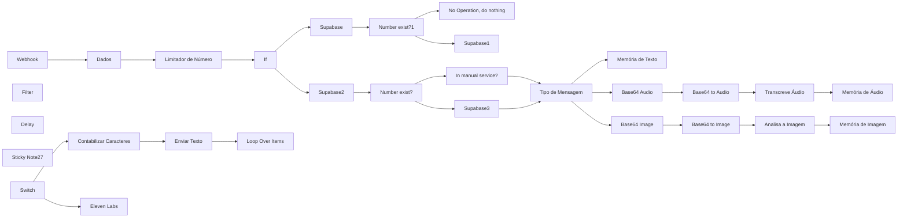
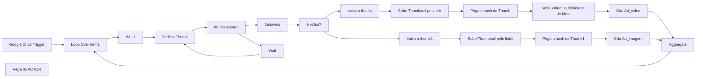
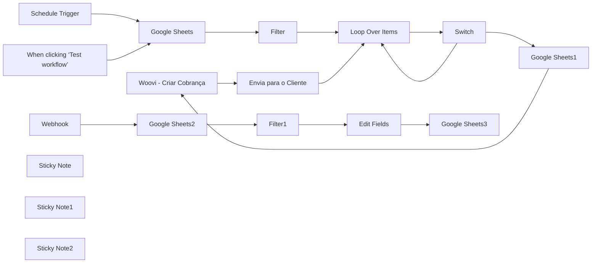
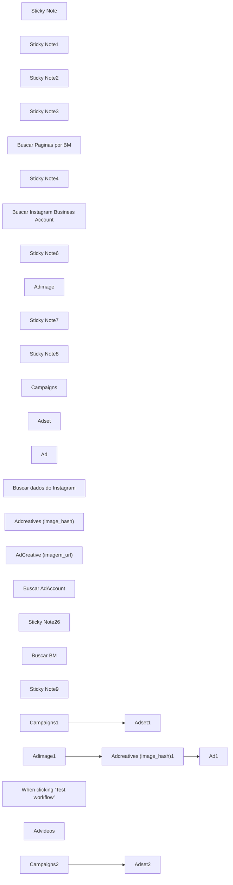
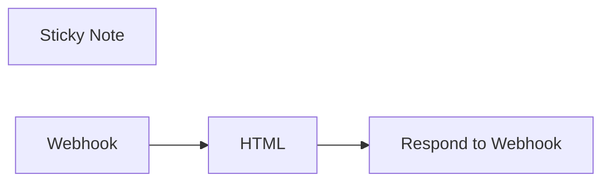
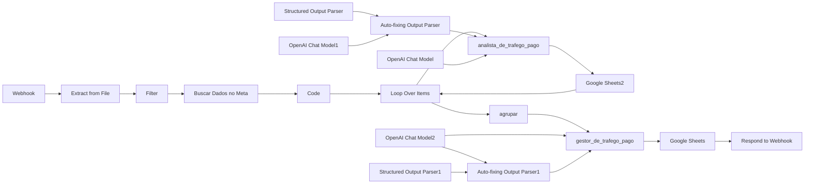
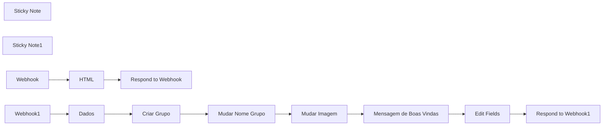
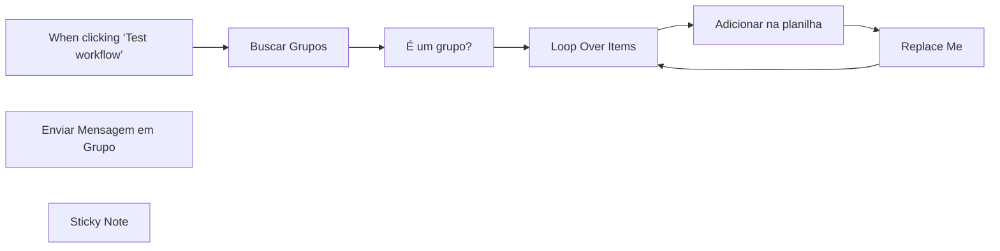
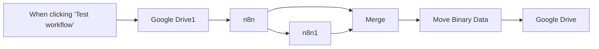

```mermaid
flowchart LR
    N1["When clicking ‘Test workflow’"]
    N2["Capturar Dados da Tabela História"]
    N3["If Historia está vazio"]
    N4["If pronto para ir?"]
    N5["Preparar o prompt"]
    N6["OpenAI"]
    N7["Merge"]
    N8["Code"]
    N9["Inserir a historia na tabela"]
    N10["Capturar dados tabela tipo de historia"]
    N11["Merge1"]
    N12["Preparar prompt 2"]
    N13["OpenAI1"]
    N14["Converter Array"]
    N15["Inserir cenas na tabela"]
    N16["Capturar dados tabela cenas"]
    N17["If Imagem está vazia"]
    N18["Converter array"]
    N19["Capturar dados tabela tipo de história"]
    N20["Extrair dimensão da imagem + model ID"]
    N21["Mesclar os outputs por delay do merge"]
    N22["Call hugginface inference api1"]
    N23["Loop Over Items"]
    N24["Replace Me"]
    N25["Wait"]
    N26["Merge2"]
    N27["Merge3"]
    N28["Capturar dados tabela Cenas"]
    N29["Extrair AI Image Prompt"]
    N30["Mesclar os outputs por delay do merge3"]

    N1 --> N2
    N2 --> N3
    N3 --> N4
    N3 --> N16
    N4 --> N5
    N4 --> N7
    N5 --> N6
    N6 --> N7
    N7 --> N8
    N8 --> N9
    N9 --> N10
    N9 --> N11
    N10 --> N11
    N11 --> N12
    N12 --> N13
    N13 --> N14
    N14 --> N15
    N16 --> N17
    N17 --> N18
    N18 --> N19
    N18 --> N26
    N19 --> N20
    N20 --> N26
    N21 --> N28
    N21 --> N27
    N24 --> N25
    N25 --> N23
    N26 --> N21
    N27 --> N30
    N28 --> N29
    N29 --> N27
    N30 --> N23
```

# PACK COM 58 SUPER FLUXOS PARA SEU N8N - Parte 3

Templates nesta parte: 10

## Sumário

- [Template 23 - Atendimento automatizado com IA](#template-23)
- [Template 24 - Sobe campanha Meta via WhatsApp](#template-24)
- [Template 25 - Cobranças automatizadas com Google Sheets e Woovi](#template-25)
- [Template 26 - Fluxo de criação de campanhas no Meta](#template-26)
- [Template 27 - Formulário de onboarding com webhook](#template-27)
- [Template 28 - Busca de Dados de Trafego (Meta)](#template-28)
- [Template 29 - Criação de Grupo com Landing Page](#template-29)
- [Template 30 - Criador de Vídeos Automáticos](#template-30)
- [Template 31 - Buscar Grupos no Z-api e salvar na planilha](#template-31)
- [Template 32 - Backup diário de projetos N8N](#template-32)

---

<a id="template-23"></a>

## Template 23 - Atendimento automatizado com IA

- **Nome original:** 27. Agente SDR.json
- **Descrição:** Este fluxo recebe mensagens de WhatsApp via webhook, verifica/gera leads, usa IA para decidir ações (agendamento, reagendamento ou cancelamento), gerencia memória de conversas, transcreve áudio e analisa imagens, e envia respostas em texto ou áudio.
- **Funcionalidade:** • Recepção de mensagens: captura via webhook e inicia o fluxo.
• Organização de dados recebidos: preparação e filtragem de informações relevantes.
• Verificação de leads: checa se o número já existe no banco e cadastra se necessário.
• Classificação de conteúdo: identifica texto, áudio e imagem e armazena conteúdos relevantes na memória.
• Processamento de áudio/imagem: transcrição de áudio com IA e análise de imagem com IA.
• Preparação de resposta: contagem de caracteres e formatação de mensagens.
• Envio de mensagens: envio de texto e áudio para o cliente via APIs externas.
• IA para decisão de fluxo: SDR.IA decide entre agendamento, reagendamento ou cancelamento ou verificação de disponibilidade.
• Gerenciamento de agendamento: ferramentas para agendamento, reagendamento e disponibilidade; obtenção do dia da semana.
• Memória de conversa: uso de Redis e Postgres para manter histórico e contexto.
• Controle de envio: envio em partes para mensagens longas e uso de delays quando necessário.
- **Ferramentas:** • Supabase: Banco de dados PostgreSQL usado para armazenar leads e estados de atendimento.
• Redis: Armazenamento de memória para textos, áudios e histórico de conversas.
• Eleven Labs: Geração de áudio a partir de texto para respostas faladas.
• OpenAI (LangChain SDR.IA): Processamento de linguagem para interpretar mensagens e planejar ações.
• Postgres Chat Memory: Memória de conversa com Postgres para continuidade.
• APIs externas de envio de mensagens (WhatsApp/Text/Audio): endpoints para entrega de mensagens.
• LangChain Tools (agendamento, reagendamento, disponibilidade, dia_semana): ferramentas de planejamento de agenda.

## Fluxo visual



## Fluxo (.json) :

```json
{
  "name": "My workflow 2",
  "nodes": [
    {
      "parameters": {
        "httpMethod": "POST",
        "path": "47d14fa0-51b0-4901-a4cb-ba1705560e04",
        "options": {}
      },
      "type": "n8n-nodes-base.webhook",
      "typeVersion": 2,
      "position": [
        -6700,
        1700
      ],
      "id": "34037dfa-5155-4474-a1a8-e888a3d7ef8d",
      "name": "Webhook",
      "webhookId": "47d14fa0-51b0-4901-a4cb-ba1705560e04"
    },
    {
      "parameters": {
        "conditions": {
          "options": {
            "caseSensitive": true,
            "leftValue": "",
            "typeValidation": "strict",
            "version": 2
          },
          "conditions": [
            {
              "id": "ea9512f2-e67c-4ef7-992f-893c75cfee8f",
              "leftValue": "={{ $json.fromMe }}",
              "rightValue": "",
              "operator": {
                "type": "boolean",
                "operation": "true",
                "singleValue": true
              }
            }
          ],
          "combinator": "and"
        },
        "looseTypeValidation": "=",
        "options": {}
      },
      "type": "n8n-nodes-base.if",
      "typeVersion": 2.2,
      "position": [
        -5420,
        1700
      ],
      "id": "5fb35794-1ec0-43ea-a1b3-c8b2ea9b05e1",
      "name": "If"
    },
    {
      "parameters": {
        "conditions": {
          "options": {
            "caseSensitive": true,
            "leftValue": "",
            "typeValidation": "strict",
            "version": 2
          },
          "conditions": [
            {
              "id": "6de225a3-3524-4810-8ce2-6b96d1dff463",
              "leftValue": "={{ $json.combinedText1 }}",
              "rightValue": "={{ $json.combinedText2 }}",
              "operator": {
                "type": "string",
                "operation": "equals",
                "name": "filter.operator.equals"
              }
            }
          ],
          "combinator": "and"
        },
        "options": {}
      },
      "type": "n8n-nodes-base.filter",
      "typeVersion": 2.2,
      "position": [
        600,
        1940
      ],
      "id": "12df2f2f-6dbc-4256-8ce0-8119c7f78a4f",
      "name": "Filter"
    },
    {
      "parameters": {
        "operation": "toBinary",
        "sourceProperty": "=base64",
        "options": {
          "fileName": "transcricao.ogg",
          "mimeType": "audio/ogg"
        }
      },
      "type": "n8n-nodes-base.convertToFile",
      "typeVersion": 1.1,
      "position": [
        -3040,
        2440
      ],
      "id": "15393d32-01c7-409b-96cb-b3c7922737e7",
      "name": "Base64 to Audio"
    },
    {
      "parameters": {
        "operation": "toBinary",
        "sourceProperty": "base64",
        "options": {
          "fileName": "imagem.jpeg",
          "mimeType": "image/jpeg"
        }
      },
      "type": "n8n-nodes-base.convertToFile",
      "typeVersion": 1.1,
      "position": [
        -3040,
        3180
      ],
      "id": "501e125c-e244-4717-ac33-8234e66d46d9",
      "name": "Base64 to Image"
    },
    {
      "parameters": {
        "operation": "update",
        "tableId": "LEADS",
        "filters": {
          "conditions": [
            {
              "keyName": "number",
              "condition": "eq",
              "keyValue": "={{ $json.remoteJid }}"
            }
          ]
        },
        "fieldsUi": {
          "fieldValues": [
            {
              "fieldId": "timeout",
              "fieldValue": "={{ $now.plus($json.time_out, minutes) }}"
            }
          ]
        }
      },
      "type": "n8n-nodes-base.supabase",
      "typeVersion": 1,
      "position": [
        -5100,
        1300
      ],
      "id": "de7e7c9e-f646-41d5-b147-4018dd945ef9",
      "name": "Supabase",
      "alwaysOutputData": true,
      "retryOnFail": false,
      "maxTries": 5,
      "waitBetweenTries": 5000
    },
    {
      "parameters": {
        "tableId": "LEADS",
        "fieldsUi": {
          "fieldValues": [
            {
              "fieldId": "number",
              "fieldValue": "={{ $('Dados').item.json.remoteJid }}"
            },
            {
              "fieldId": "timeout",
              "fieldValue": "={{ $now.plus($json.time_out, minutes) }}"
            }
          ]
        }
      },
      "type": "n8n-nodes-base.supabase",
      "typeVersion": 1,
      "position": [
        -4160,
        1280
      ],
      "id": "1646c86b-a4ac-4c53-a747-f344e40a4fe5",
      "name": "Supabase1",
      "retryOnFail": true,
      "maxTries": 5,
      "waitBetweenTries": 5000
    },
    {
      "parameters": {
        "operation": "get",
        "tableId": "LEADS",
        "filters": {
          "conditions": [
            {
              "keyName": "number",
              "keyValue": "={{ $('Dados').item.json.remoteJid }}"
            }
          ]
        }
      },
      "type": "n8n-nodes-base.supabase",
      "typeVersion": 1,
      "position": [
        -5140,
        2180
      ],
      "id": "6ad1f170-402b-402b-b333-f12ee221da8a",
      "name": "Supabase2",
      "alwaysOutputData": true
    },
    {
      "parameters": {
        "conditions": {
          "options": {
            "caseSensitive": true,
            "leftValue": "",
            "typeValidation": "strict",
            "version": 2
          },
          "conditions": [
            {
              "id": "9052c4ba-c9eb-468b-a15e-2eb63821823e",
              "leftValue": "={{ $json.isEmpty() }}",
              "rightValue": "",
              "operator": {
                "type": "boolean",
                "operation": "false",
                "singleValue": true
              }
            }
          ],
          "combinator": "and"
        },
        "options": {}
      },
      "type": "n8n-nodes-base.if",
      "typeVersion": 2.2,
      "position": [
        -4740,
        2180
      ],
      "id": "2338f99f-9b4d-46bd-9c6d-24c6f9858461",
      "name": "Number exist?"
    },
    {
      "parameters": {
        "tableId": "LEADS",
        "fieldsUi": {
          "fieldValues": [
            {
              "fieldId": "created_at",
              "fieldValue": "={{ $('Dados').item.json.date_time }}"
            },
            {
              "fieldId": "number",
              "fieldValue": "={{ $('Dados').item.json.remoteJid }}"
            },
            {
              "fieldId": "lead_name",
              "fieldValue": "={{ $('If').item.json.nome }}"
            }
          ]
        }
      },
      "type": "n8n-nodes-base.supabase",
      "typeVersion": 1,
      "position": [
        -4280,
        2520
      ],
      "id": "cca223a4-ac35-4f2a-848f-c8d29ab18841",
      "name": "Supabase3",
      "retryOnFail": true,
      "maxTries": 5,
      "waitBetweenTries": 5000
    },
    {
      "parameters": {
        "conditions": {
          "options": {
            "caseSensitive": true,
            "leftValue": "",
            "typeValidation": "strict",
            "version": 2
          },
          "conditions": [
            {
              "id": "d5160a5e-d2cc-455a-b97f-c93e32746ecd",
              "leftValue": "={{ $now }}",
              "rightValue": "={{ $json.timeout }}",
              "operator": {
                "type": "dateTime",
                "operation": "after"
              }
            },
            {
              "id": "9d3259e9-f4f2-46b0-81ca-ed62c053f425",
              "leftValue": "={{ $json.timeout }}",
              "rightValue": "",
              "operator": {
                "type": "string",
                "operation": "empty",
                "singleValue": true
              }
            }
          ],
          "combinator": "or"
        },
        "options": {}
      },
      "type": "n8n-nodes-base.filter",
      "typeVersion": 2.2,
      "position": [
        -4280,
        2280
      ],
      "id": "b02cbace-a92e-4fa8-9b00-9c06412b7b44",
      "name": "In manual service?",
      "disabled": true
    },
    {
      "parameters": {
        "assignments": {
          "assignments": [
            {
              "id": "5d408baf-2ff4-43fb-94a1-79601221051a",
              "name": "base64",
              "value": "={{ $('Webhook').item.json.body.data.message.base64 }}",
              "type": "string"
            }
          ]
        },
        "options": {}
      },
      "type": "n8n-nodes-base.set",
      "typeVersion": 3.4,
      "position": [
        -3280,
        2440
      ],
      "id": "ab7d8671-5468-46a0-bf0a-7c09f804b38c",
      "name": "Base64 Audio"
    },
    {
      "parameters": {
        "assignments": {
          "assignments": [
            {
              "id": "176cb5f8-02ec-4db5-bd04-6889859eb6aa",
              "name": "base64",
              "value": "={{ $('Webhook').item.json.body.data.message.base64 }}",
              "type": "string"
            }
          ]
        },
        "options": {}
      },
      "type": "n8n-nodes-base.set",
      "typeVersion": 3.4,
      "position": [
        -3280,
        3180
      ],
      "id": "4eabdfc2-f164-489f-99cc-3ceef6ea7e5d",
      "name": "Base64 Image"
    },
    {
      "parameters": {
        "options": {}
      },
      "type": "n8n-nodes-base.splitInBatches",
      "typeVersion": 3,
      "position": [
        1020,
        2780
      ],
      "id": "63803c38-ae69-41da-a0c2-f597ca355a62",
      "name": "Loop Over Items"
    },
    {
      "parameters": {
        "conditions": {
          "options": {
            "caseSensitive": true,
            "leftValue": "",
            "typeValidation": "strict",
            "version": 2
          },
          "conditions": [
            {
              "id": "9052c4ba-c9eb-468b-a15e-2eb63821823e",
              "leftValue": "={{ $json.isEmpty() }}",
              "rightValue": "",
              "operator": {
                "type": "boolean",
                "operation": "false",
                "singleValue": true
              }
            }
          ],
          "combinator": "and"
        },
        "options": {}
      },
      "type": "n8n-nodes-base.if",
      "typeVersion": 2.2,
      "position": [
        -4740,
        1300
      ],
      "id": "67b280f2-a248-4adc-bd40-137003d0f682",
      "name": "Number exist?1"
    },
    {
      "parameters": {},
      "type": "n8n-nodes-base.noOp",
      "typeVersion": 1,
      "position": [
        -4160,
        1080
      ],
      "id": "32273956-63d1-4863-9fdd-2094bd9c583e",
      "name": "No Operation, do nothing"
    },
    {
      "parameters": {
        "amount": 20
      },
      "type": "n8n-nodes-base.wait",
      "typeVersion": 1.1,
      "position": [
        -1200,
        2400
      ],
      "id": "d9bbf621-1af8-4ced-9ea0-c04a0567fc2e",
      "name": "Delay",
      "webhookId": "a4ab3b31-e6b4-4a53-9c49-89020c15cf5d"
    },
    {
      "parameters": {
        "operation": "push",
        "list": "={{ $('Dados').item.json.remoteJid }}",
        "messageData": "={{ $('Dados').item.json.conversation }}",
        "tail": true
      },
      "type": "n8n-nodes-base.redis",
      "typeVersion": 1,
      "position": [
        -1820,
        2180
      ],
      "id": "4741b94d-9886-423c-af8c-ab007033ffba",
      "name": "Memória de Texto"
    },
    {
      "parameters": {
        "operation": "push",
        "list": "={{ $('Dados').item.json.remoteJid }}",
        "messageData": "={{ $json.text }}",
        "tail": true
      },
      "type": "n8n-nodes-base.redis",
      "typeVersion": 1,
      "position": [
        -2360,
        2440
      ],
      "id": "92da53a5-77a2-44c5-a721-44f9c689a4fe",
      "name": "Memória de Áudio"
    },
    {
      "parameters": {
        "operation": "push",
        "list": "={{ $('Dados').item.json.remoteJid }}",
        "messageData": "={{ $json.content }}"
      },
      "type": "n8n-nodes-base.redis",
      "typeVersion": 1,
      "position": [
        -2360,
        3180
      ],
      "id": "e5bf91d8-2148-446e-8433-f9f8455e4518",
      "name": "Memória de Imagem"
    },
    {
      "parameters": {
        "rules": {
          "values": [
            {
              "conditions": {
                "options": {
                  "caseSensitive": true,
                  "leftValue": "",
                  "typeValidation": "strict",
                  "version": 2
                },
                "conditions": [
                  {
                    "leftValue": "={{ $('Dados').item.json.messageType }}",
                    "rightValue": "conversation",
                    "operator": {
                      "type": "string",
                      "operation": "equals"
                    }
                  }
                ],
                "combinator": "and"
              },
              "renameOutput": true,
              "outputKey": "Text"
            },
            {
              "conditions": {
                "options": {
                  "caseSensitive": true,
                  "leftValue": "",
                  "typeValidation": "strict",
                  "version": 2
                },
                "conditions": [
                  {
                    "id": "0807bcd7-a626-40ca-ae74-45f5565d9209",
                    "leftValue": "={{ $('Dados').item.json.messageType }}",
                    "rightValue": "audioMessage",
                    "operator": {
                      "type": "string",
                      "operation": "equals",
                      "name": "filter.operator.equals"
                    }
                  }
                ],
                "combinator": "and"
              },
              "renameOutput": true,
              "outputKey": "Audio"
            },
            {
              "conditions": {
                "options": {
                  "caseSensitive": true,
                  "leftValue": "",
                  "typeValidation": "strict",
                  "version": 2
                },
                "conditions": [
                  {
                    "id": "c8a4fecd-1016-4894-a4b4-859d9b73612c",
                    "leftValue": "={{ $('Dados').item.json.messageType }}",
                    "rightValue": "imageMessage",
                    "operator": {
                      "type": "string",
                      "operation": "equals",
                      "name": "filter.operator.equals"
                    }
                  }
                ],
                "combinator": "and"
              },
              "renameOutput": true,
              "outputKey": "Image"
            }
          ]
        },
        "options": {}
      },
      "type": "n8n-nodes-base.switch",
      "typeVersion": 3.2,
      "position": [
        -3880,
        2200
      ],
      "id": "2553efdc-9f48-42b9-80cf-64145fd42281",
      "name": "Tipo de Mensagem",
      "alwaysOutputData": false
    },
    {
      "parameters": {
        "conditions": {
          "options": {
            "caseSensitive": true,
            "leftValue": "",
            "typeValidation": "strict",
            "version": 2
          },
          "conditions": [
            {
              "id": "8df33b65-c374-45c8-a755-e7d5806f6564",
              "leftValue": "={{ $json.remoteJid }}",
              "rightValue": "={{ $json.remoteJid }}",
              "operator": {
                "type": "string",
                "operation": "equals",
                "name": "filter.operator.equals"
              }
            }
          ],
          "combinator": "and"
        },
        "options": {}
      },
      "type": "n8n-nodes-base.filter",
      "typeVersion": 2.2,
      "position": [
        -5820,
        1700
      ],
      "id": "7e772c57-b827-4052-9789-9c5c97e1a52f",
      "name": "Limitador de Número"
    },
    {
      "parameters": {
        "assignments": {
          "assignments": [
            {
              "id": "2911e082-e712-4b85-bcf7-611f60d1559f",
              "name": "remoteJid",
              "value": "={{ $json.body.data.key.remoteJid }}",
              "type": "string"
            },
            {
              "id": "f2af5f89-8957-4811-9839-8ef571b38e5c",
              "name": "fromMe",
              "value": "={{ $json.body.data.key.fromMe }}",
              "type": "boolean"
            },
            {
              "id": "16a9c5c0-5a35-4db2-ab94-ef251115696f",
              "name": "conversation",
              "value": "={{ $json.body.data.message.conversation }}",
              "type": "string"
            },
            {
              "id": "20937be5-8999-4d95-91cb-5aa9490f166c",
              "name": "date_time",
              "value": "={{ $json.body.date_time }}",
              "type": "string"
            },
            {
              "id": "fa5a0f16-b265-40ab-9299-135659bbf90e",
              "name": "messageType",
              "value": "={{ $json.body.data.messageType }}",
              "type": "string"
            },
            {
              "id": "95ca6185-7794-4411-82c5-d30676a6ca52",
              "name": "evo.instance",
              "value": "={{ $json.body.instance }}",
              "type": "string"
            },
            {
              "id": "66fcd40d-88da-4117-958d-7b4a29454136",
              "name": "evo.server_url",
              "value": "={{ $json.body.server_url }}",
              "type": "string"
            },
            {
              "id": "477ee9d8-59d3-4dd4-9eab-038367517cb1",
              "name": "evo.apikey",
              "value": "={{ $json.body.apikey }}",
              "type": "string"
            },
            {
              "id": "89c694a3-3a94-4bf2-8d8d-016bafa3040e",
              "name": "time_out",
              "value": 15,
              "type": "number"
            },
            {
              "id": "303974ab-9903-4fae-af14-73438a4d98b8",
              "name": "nome",
              "value": "={{ $json.body.data.pushName }}",
              "type": "string"
            }
          ]
        },
        "options": {}
      },
      "type": "n8n-nodes-base.set",
      "typeVersion": 3.4,
      "position": [
        -6240,
        1700
      ],
      "id": "5b4e9dab-833c-4ee4-8a52-04ffffeb952a",
      "name": "Dados"
    },
    {
      "parameters": {
        "jsCode": "// Recebe todos os itens de entrada\nconst items = $input.all();\n\n// Verifica se há itens de entrada\nif (!items || items.length === 0) {\n  return []; // Retorna um array vazio se não houver entrada\n}\n\n// Array para armazenar os resultados\nconst output = [];\n\n// Processa cada item de entrada\nitems.forEach(item => {\n  // Assume que o texto está no campo \"splitPart\" do item\n  const text = item.json.splitPart || \"\";\n\n  // Conta o número de caracteres na mensagem\n  const characterCount = text.length;\n\n  // Calcula o tempo em milissegundos: 100 caracteres = 7 segundos (7000 ms)\n  const milliseconds = Math.floor((characterCount / 100) * 7000);\n\n  // Adiciona o resultado ao array de saída\n  output.push({ json: { milliseconds } });\n});\n\n// Retorna os resultados\nreturn output;\n"
      },
      "type": "n8n-nodes-base.code",
      "typeVersion": 2,
      "position": [
        2960,
        3480
      ],
      "id": "19ee0971-f26b-4f1d-8132-a1f80d09291f",
      "name": "Contabilizar Caracteres"
    },
    {
      "parameters": {
        "method": "POST",
        "url": "https://SEU-DOMINIO/message/sendText/NOME-DA-SUA-INSTANCIA",
        "sendHeaders": true,
        "headerParameters": {
          "parameters": [
            {
              "name": "apiKey ",
              "value": "={{ $('Dados').first().json.evo.apikey }}"
            }
          ]
        },
        "sendBody": true,
        "bodyParameters": {
          "parameters": [
            {
              "name": "number",
              "value": "={{ $('Dados').first().json.remoteJid }}"
            },
            {
              "name": "text",
              "value": "={{ $('Loop Over Items').item.json.result }}"
            },
            {
              "name": "delay",
              "value": "={{ $json.milliseconds }}"
            }
          ]
        },
        "options": {
          "allowUnauthorizedCerts": true
        }
      },
      "type": "n8n-nodes-base.httpRequest",
      "typeVersion": 4.2,
      "position": [
        3400,
        3480
      ],
      "id": "3aa7286a-e0cb-4bf6-b238-c666671f3e5f",
      "name": "Enviar Texto"
    },
    {
      "parameters": {
        "resource": "audio",
        "operation": "transcribe",
        "options": {}
      },
      "type": "@n8n/n8n-nodes-langchain.openAi",
      "typeVersion": 1.7,
      "position": [
        -2740,
        2440
      ],
      "id": "cae5258a-71e2-41b1-bbf9-1db9c40133a7",
      "name": "Transcreve Áudio"
    },
    {
      "parameters": {
        "resource": "image",
        "operation": "analyze",
        "modelId": {
          "__rl": true,
          "value": "gpt-4o-mini",
          "mode": "list",
          "cachedResultName": "GPT-4O-MINI"
        },
        "text": "Descreva todo o conteúdo da imagem",
        "inputType": "base64",
        "options": {}
      },
      "type": "@n8n/n8n-nodes-langchain.openAi",
      "typeVersion": 1.7,
      "position": [
        -2720,
        3180
      ],
      "id": "b92c11ee-9e9d-42ed-8e87-6b5f3045b53f",
      "name": "Analisa a Imagem"
    },
    {
      "parameters": {
        "content": "## **SDR.IA - Inteligência Artificial do Atendimento**\n\n### **Nome do Nó:** `SDR.IA`\n\n- **O que faz?**\n    - Usa **inteligência artificial (OpenAI GPT-4o)** para interpretar a mensagem do cliente e escolher a ação correta.\n- **Por que existe?**\n    - Para permitir que o bot entenda a mensagem do usuário e escolha a melhor resposta.\n- **Como funciona?**\n    - O nó recebe a mensagem filtrada e, com base no conteúdo, decide **se é necessário agendar, reagendar, cancelar ou conferir disponibilidade**.\n- **O que acontece depois?**\n    - Dependendo da resposta da IA, a mensagem é enviada para um dos nós seguintes (`dia_semana`, `agendamento`, `cancelamento`, etc.).",
        "height": 820,
        "width": 1040,
        "color": 3
      },
      "type": "n8n-nodes-base.stickyNote",
      "typeVersion": 1,
      "position": [
        920,
        1060
      ],
      "id": "ae7f9903-59e2-4e2e-94cc-0f47b31fb9af",
      "name": "Sticky Note27"
    },
    {
      "parameters": {
        "method": "POST",
        "url": "https://api.elevenlabs.io/v1/text-to-speech/ID-DA-VOZ",
        "sendHeaders": true,
        "headerParameters": {
          "parameters": [
            {
              "name": "xi-api-key",
              "value": "SUA CHAVE API KEY DO ELEVEN LABS"
            }
          ]
        },
        "sendBody": true,
        "bodyParameters": {
          "parameters": [
            {
              "name": "text",
              "value": "={{ $('Loop Over Items').item.json.result }}"
            },
            {
              "name": "model_id",
              "value": "eleven_flash_v2_5"
            },
            {
              "name": "speed",
              "value": "1.0"
            },
            {
              "name": "stability",
              "value": "0.5"
            },
            {
              "name": "similarity",
              "value": "0.2"
            }
          ]
        },
        "options": {}
      },
      "type": "n8n-nodes-base.httpRequest",
      "typeVersion": 4.2,
      "position": [
        1360,
        4460
      ],
      "id": "55c46559-2aba-44cf-9e7b-ed66fe360341",
      "name": "Eleven Labs"
    },
    {
      "parameters": {
        "rules": {
          "values": [
            {
              "conditions": {
                "options": {
                  "caseSensitive": true,
                  "leftValue": "",
                  "typeValidation": "strict",
                  "version": 2
                },
                "conditions": [
                  {
                    "id": "957d4389-8eca-479c-8829-625728cf38be",
                    "leftValue": "={{ $json.randomNumber }}",
                    "rightValue": 1,
                    "operator": {
                      "type": "number",
                      "operation": "equals"
                    }
                  }
                ],
                "combinator": "and"
              },
              "renameOutput": true,
              "outputKey": "Texto"
            },
            {
              "conditions": {
                "options": {
                  "caseSensitive": true,
                  "leftValue": "",
                  "typeValidation": "strict",
                  "version": 2
                },
                "conditions": [
                  {
                    "id": "002d5ccf-2569-4b9e-8a80-1410f7874c0e",
                    "leftValue": "={{ $json.randomNumber }}",
                    "rightValue": 2,
                    "operator": {
                      "type": "number",
                      "operation": "equals"
                    }
                  }
                ],
                "combinator": "and"
              },
              "renameOutput": true,
              "outputKey": "Texto"
            },
            {
              "conditions": {
                "options": {
                  "caseSensitive": true,
                  "leftValue": "",
                  "typeValidation": "strict",
                  "version": 2
                },
                "conditions": [
                  {
                    "id": "b274180e-e92f-4562-8d5e-b8bd3dccb55b",
                    "leftValue": "={{ $json.randomNumber }}",
                    "rightValue": 3,
                    "operator": {
                      "type": "number",
                      "operation": "equals"
                    }
                  }
                ],
                "combinator": "and"
              },
              "renameOutput": true,
              "outputKey": "Audio"
            },
            {
              "conditions": {
                "options": {
                  "caseSensitive": true,
                  "leftValue": "",
                  "typeValidation": "strict",
                  "version": 2
                },
                "conditions": [
                  {
                    "id": "5ff762af-4df5-4cc3-a8b5-ee10b3bed4b6",
                    "leftValue": "={{ $json.randomNumber }}",
                    "rightValue": 4,
                    "operator": {
                      "type": "number",
                      "operation": "equals"
                    }
                  }
                ],
                "combinator": "and"
              },
              "renameOutput": true,
              "outputKey": "Audio"
            }
          ]
        },
        "options": {}
      },
      "type": "n8n-nodes-base.switch",
      "typeVersion": 3.2,
      "position": [
        2420,
        3460
      ],
      "id": "17eda197-630e-4b0e-b995-4e7aec713001",
      "name": "Switch"
    },
    {
      "parameters": {
        "operation": "binaryToPropery",
        "destinationKey": "base64",
        "options": {
          "encoding": "base64"
        }
      },
      "type": "n8n-nodes-base.extractFromFile",
      "typeVersion": 1,
      "position": [
        1780,
        4460
      ],
      "id": "16f0990d-ccd3-4078-848e-653913975f9d",
      "name": "Extract from File"
    },
    {
      "parameters": {
        "jsCode": "function generateRandomNumber() {\n    return Math.floor(Math.random() * 4) + 1;\n}\n\nreturn [{ json: { randomNumber: generateRandomNumber() } }];\n"
      },
      "type": "n8n-nodes-base.code",
      "typeVersion": 2,
      "position": [
        1900,
        3480
      ],
      "id": "461067f8-9e40-44f8-af77-3c902dcc1274",
      "name": "Número Aleatório"
    },
    {
      "parameters": {
        "method": "POST",
        "url": "https://SEU-DOMINIO/message/sendWhatsAppAudio/NOME-DA-SUA-INSTANCIA",
        "sendHeaders": true,
        "headerParameters": {
          "parameters": [
            {
              "name": "apikey",
              "value": "={{ $('Dados').first().json.evo.apikey }}"
            }
          ]
        },
        "sendBody": true,
        "bodyParameters": {
          "parameters": [
            {
              "name": "number",
              "value": "={{ $('Dados').first().json.remoteJid }}"
            },
            {
              "name": "audio",
              "value": "={{ $json.base64 }}"
            }
          ]
        },
        "options": {
          "allowUnauthorizedCerts": true
        }
      },
      "type": "n8n-nodes-base.httpRequest",
      "typeVersion": 4.2,
      "position": [
        2220,
        4460
      ],
      "id": "57335835-00f3-4deb-8761-ff323276d59f",
      "name": "Enviar Audio",
      "alwaysOutputData": false
    },
    {
      "parameters": {
        "jsCode": "// Obtém o conteúdo da mensagem do item anterior\nconst message = $input.item.json;\nlet messageText = '';\n\n// Verifica se a mensagem está em diferentes formatos possíveis\nif (typeof message === 'string') {\n  messageText = message;\n} else if (message.content) {\n  messageText = message.content;\n} else if (message.text) {\n  messageText = message.text;\n} else if (message.message) {\n  messageText = message.message;\n}\n\n// LOG PARA DEPURAÇÃO (Remova depois de testar)\nconsole.log(\"Texto analisado:\", messageText);\n\n// Expressões regulares para identificar datas, dias da semana e horários\nconst dateRegex = /\\b(?:\\d{1,2})[/-](?:\\d{1,2})[/-](?:\\d{2,4})\\b/g; // Captura formatos: 07/03/2025, 6-3-2025\nconst weekDayRegex = /\\b(?:segunda|terça|quarta|quinta|sexta|sábado|domingo)-feira\\b/gi; // Captura: Sexta-feira\nconst timeRegex = /\\b(?:\\d{1,2}[:h]\\d{2})\\b/g; // Captura: 09:00, 10h30, 14:00\nconst meetLinkRegex = /meet\\.google\\.com\\/[a-zA-Z0-9-]+/g; // Captura links completos do Meet\n\n// Verifica se há pelo menos um desses padrões no texto\nconst hasDate = dateRegex.test(messageText);\nconst hasWeekDay = weekDayRegex.test(messageText);\nconst hasTime = timeRegex.test(messageText);\nconst hasMeetLink = meetLinkRegex.test(messageText);\n\n// LOG PARA DEPURAÇÃO\nconsole.log(\"Contém Data?\", hasDate);\nconsole.log(\"Contém Dia da Semana?\", hasWeekDay);\nconsole.log(\"Contém Horário?\", hasTime);\nconsole.log(\"Contém Link do Meet?\", hasMeetLink);\n\n// Se qualquer um dos padrões for encontrado, define como true\nconst hasScheduleInfo = hasDate || hasWeekDay || hasTime || hasMeetLink;\n\n// Adiciona o resultado como uma nova propriedade ao item\n$input.item.json.isMeetSchedule = hasScheduleInfo;\n\n// Retorna o item modificado\nreturn $input.item;\n"
      },
      "type": "n8n-nodes-base.code",
      "typeVersion": 2,
      "position": [
        1320,
        3500
      ],
      "id": "54878d03-0ef9-4960-b887-9cece6a315a8",
      "name": "Code"
    },
    {
      "parameters": {
        "jsCode": "function getDayOfWeek(query) {\n    const [day, month, year] = query.split('/').map(Number);\n    const date = new Date(year, month - 1, day);\n    return date.toLocaleDateString('pt-BR', { weekday: 'long' });\n}\n\n// Array para armazenar os próximos 10 dias\nconst next10Days = [];\n\nfor (let i = 0; i < 10; i++) {\n    const date = new Date();\n    date.setDate(date.getDate() + i);\n\n    next10Days.push(` ${date.toLocaleDateString('pt-BR', { weekday: 'long' })}, ${date.toLocaleDateString('pt-BR')}`);\n}\n\nreturn [{ json: { resultado: next10Days.join('\\n') } }];\n"
      },
      "type": "n8n-nodes-base.code",
      "typeVersion": 2,
      "position": [
        180,
        1940
      ],
      "id": "7986d025-b290-47a8-a78f-0a8b9d72ea45",
      "name": "Organizar Dias"
    },
    {
      "parameters": {
        "name": "agendamento",
        "description": "=Chame esta ferramenta após o usuário informar nome e email e data do agendamento. \n\nNa variável \"nome\", você vai preencher o nome do usuário\n\nNa variável \"email\" você vai preencher o email do usuário\n\nNa variável \"dia\" você vai preencher o dia desejado que ele tem mais facilidade em fazer a call\n\nNa variável \"histórico\" você vai subir o histórico das ultimas 3 mensagens.\n\n\nA data do agendamento você vai transformar para seguinte formato, exemplo: dd/mm/yyyy HH:MM:SS -03:00\n\nEm seguida você vai inserir uma hora a mais depois no horario de agendamento e na variavel \"end\" você vai prencher com o horario no mesmo formato da variavel start",
        "workflowId": {
          "__rl": true,
          "value": "pEmfDrdbeB16KG0V",
          "mode": "list",
          "cachedResultName": "AGENDAMENTO"
        },
        "fields": {
          "values": [
            {
              "name": "Evento",
              "stringValue": "agendamento"
            },
            {
              "name": "Nome",
              "stringValue": "={{ $fromAI(\"nome\",\"email do cliente para fazer agendamento\",\"string\",\"\")}}"
            },
            {
              "name": "Email",
              "stringValue": "={{ $fromAI(\"email\",\"email do cliente para fazer agendamento\",\"string\",\"\")}}"
            },
            {
              "name": "Hora_desejada",
              "stringValue": "={{ $fromAI(\"hora\",\"email do cliente para fazer agendamento\",\"string\",\"\")}}"
            },
            {
              "name": "whatsappid",
              "stringValue": "={{ $json.sessionId }}"
            },
            {
              "name": "Historico_conversas",
              "stringValue": "={{ $('Dados').item.json.conversation }}"
            }
          ]
        },
        "specifyInputSchema": true,
        "jsonSchemaExample": "{\n  \"nome\": \"\",\n  \"email\": \"\",\n  \"tipo_evento\": \"reagendamento\",\n  \"horario\": \"\",\n  \"conversationStory\": \"\"\n}\n"
      },
      "id": "52bb60ab-d407-4d5b-b86f-95cda5351f75",
      "name": "agendamento",
      "type": "@n8n/n8n-nodes-langchain.toolWorkflow",
      "typeVersion": 1.2,
      "position": [
        1380,
        1680
      ]
    },
    {
      "parameters": {
        "name": "REagendar",
        "description": "=Após o usuário informar que quer REAGENDAR ou que já tem horário, e colete o nome, email e nova data Chame esta tool\n\nNa variável \"nome\", você vai preencher o nome do usuário e na variavel \"email\" você vai preencher com email do usuário\n\nA data do agendamento você vai transformar para seguinte formato, exemplo: 2024-10-18T14:30:00-03:00 e vai preencher a variavel \"start\"\n\nEm seguida você vai inserir uma hora a mais depois no horario de agendamento e na variavel \"end\" você vai prencher com o horario no mesmo formato da variavel start",
        "workflowId": {
          "__rl": true,
          "value": "pEmfDrdbeB16KG0V",
          "mode": "list",
          "cachedResultName": "AGENDAMENTO"
        },
        "fields": {
          "values": [
            {
              "name": "Evento",
              "stringValue": "reagendamento"
            },
            {
              "name": "Email",
              "stringValue": "={{ $fromAI(\"email_cliente\",\"email do cliente para fazer agendamento\",\"string\",\"\")}}"
            },
            {
              "name": "Nome",
              "stringValue": "={{ $fromAI(\"nome_cliente\",\"nome do cliente para fazer agendamento\",\"string\",\"\")}}"
            },
            {
              "name": "whatsappId",
              "stringValue": "={{ $json.sessionId }}"
            },
            {
              "name": "Historico_conversas",
              "stringValue": "={{ $('Dados').first.json.conversation }}"
            }
          ]
        },
        "specifyInputSchema": true,
        "jsonSchemaExample": "{\n  \"nome\": \"\",\n  \"email\": \"\",\n  \"tipo_evento\": \"reagendamento\",\n  \"horario\": \"\",\n  \"conversationStory\": \"\"\n}\n"
      },
      "id": "d374e7fc-c8a5-46f4-8e80-94c959f0e023",
      "name": "reagendamento",
      "type": "@n8n/n8n-nodes-langchain.toolWorkflow",
      "typeVersion": 1.2,
      "position": [
        1240,
        1680
      ]
    },
    {
      "parameters": {
        "resource": "assistant",
        "assistantId": {
          "__rl": true,
          "value": "asst_cev5SvSnQPa426myufijySDd",
          "mode": "list",
          "cachedResultName": "LÚCIO SDR"
        },
        "prompt": "define",
        "text": "=Mensagem do Usuário (texto): {{ $('Dados').first().json.conversation }}\nor\nMensagem do Usuário (audio): {{ $('memory2').item.json.propertyName }}\n\nData da mensagem: {{ $now }}\n\n#NOTAS:\n\n-NÃO RETORNE UMA RESPOSTA EM MARKDOWN\n-NÃO RETORNE RESPOSTAS COM CARACTERES ESPECIAIS.",
        "options": {
          "preserveOriginalTools": true
        }
      },
      "type": "@n8n/n8n-nodes-langchain.openAi",
      "typeVersion": 1.8,
      "position": [
        1360,
        1420
      ],
      "id": "9a092c21-1186-48c3-80cf-cb48e25b1125",
      "name": "SDR.IA"
    },
    {
      "parameters": {
        "conditions": {
          "options": {
            "caseSensitive": true,
            "leftValue": "",
            "typeValidation": "strict",
            "version": 2
          },
          "conditions": [
            {
              "id": "dfedefa7-3092-41bc-aaa2-a6233a9ff7be",
              "leftValue": "={{ $json.isMeetSchedule }}",
              "rightValue": "false",
              "operator": {
                "type": "boolean",
                "operation": "false",
                "singleValue": true
              }
            },
            {
              "id": "e6470749-19c7-4f69-9058-36d45969bdb5",
              "leftValue": "={{ $json.isMeetSchedule }}",
              "rightValue": "false",
              "operator": {
                "type": "boolean",
                "operation": "true",
                "singleValue": true
              }
            }
          ],
          "combinator": "and"
        },
        "options": {}
      },
      "type": "n8n-nodes-base.if",
      "typeVersion": 2.2,
      "position": [
        1900,
        3280
      ],
      "id": "25007fa5-eeeb-4b02-aafe-c5d461b81e9a",
      "name": "If1"
    },
    {
      "parameters": {
        "operation": "delete",
        "key": "={{ $('Dados').first().json.remoteJid }}"
      },
      "id": "cda09c15-ce5c-41a9-977b-b834e8879098",
      "name": "Redis6",
      "type": "n8n-nodes-base.redis",
      "typeVersion": 1,
      "position": [
        1300,
        2640
      ]
    },
    {
      "parameters": {
        "name": "dia_semana",
        "description": "ESSA TOOL É OBRIGATÓRIA A SER A PRIMEIRA EXECUTADA PARA QUALQUER TIPO DE PROCESSO para identificar o dia da semana exato. Use essa tool para consultar o dia da semana.\nForneça como parâmetro uma data no formato dd/mm/yyyy",
        "jsCode": "const input = query;\n\n//AQUI O CHATGPT PODE SER LIVRE\nconst [day, month, year] = input.split('/').map(Number);\nconst date = new Date(year, month - 1, day);\n// ATÉ AQUI\nreturn date.toLocaleDateString('pt-BR', { weekday: 'long' });"
      },
      "type": "@n8n/n8n-nodes-langchain.toolCode",
      "typeVersion": 1.1,
      "position": [
        960,
        1680
      ],
      "id": "d2a5850c-5066-456d-aaa5-a401298d978b",
      "name": "dia_semana"
    },
    {
      "parameters": {},
      "type": "@n8n/n8n-nodes-langchain.toolCalculator",
      "typeVersion": 1,
      "position": [
        1640,
        1680
      ],
      "id": "8f800828-4a96-4002-9e25-25789a5e49c1",
      "name": "Calculator"
    },
    {
      "parameters": {
        "name": "disponibilidade",
        "description": "=CHAME ESTA TOOL PARA sempre que precisar conferir a DISPONIBILIDADE na agenda antes de agendar qualquer cliente e encontrar horários disponíveis.\n\nRegras:\nTraga apenas os horários disponíveis entre 09:00 e 18:00.\n\nConsidere os horários já ocupados e não marque nenhum agendamento nesses intervalos.\n\nRetorne exatamente 2 horários disponíveis por dia, considerando 3 dias diferentes.",
        "workflowId": {
          "__rl": true,
          "value": "pEmfDrdbeB16KG0V",
          "mode": "list",
          "cachedResultName": "AGENDAMENTO"
        },
        "fields": {
          "values": [
            {
              "name": "Evento",
              "stringValue": "disponibilidade"
            },
            {
              "name": "Historico_conversas",
              "stringValue": "={{ $('Dados').first().json.conversation }}"
            }
          ]
        },
        "specifyInputSchema": true,
        "jsonSchemaExample": "{\n  \"nome\": \"\",\n  \"email\": \"\",\n  \"tipo_evento\": \"disponibilidade\",\n  \"horario\": \"\",\n  \"conversationStory\": \"\"\n}\n"
      },
      "id": "a1cae6b6-130a-4241-aaac-a00da839ccc1",
      "name": "disponibilidade",
      "type": "@n8n/n8n-nodes-langchain.toolWorkflow",
      "typeVersion": 1.2,
      "position": [
        1520,
        1680
      ]
    },
    {
      "parameters": {
        "sessionIdType": "customKey",
        "sessionKey": "={{ $('Dados').first().json.remoteJid }}",
        "tableName": "agentesdr",
        "contextWindowLength": 6
      },
      "type": "@n8n/n8n-nodes-langchain.memoryPostgresChat",
      "typeVersion": 1.3,
      "position": [
        1760,
        1680
      ],
      "id": "4d136de1-c435-4733-8a54-b6d6d73c87a2",
      "name": "Postgres Chat Memory"
    },
    {
      "parameters": {
        "jsCode": "// Obter os arrays de mensagens dos nós \"Get Memory 1\" e \"Get Memory 2\"\nconst messages1 = $('memory').item?.json?.propertyName || [];\nconst messages2 = $('memory2').item?.json?.propertyName || [];\n\n// Garantir que messages1 e messages2 são arrays antes de chamar join\nconst combinedText1 = Array.isArray(messages1) ? messages1.join(' ') : '';\nconst combinedText2 = Array.isArray(messages2) ? messages2.join(' ') : '';\n\n// Retornar os dois textos combinados como variáveis separadas\nreturn {\n    combinedText1,\n    combinedText2\n};\n"
      },
      "type": "n8n-nodes-base.code",
      "typeVersion": 2,
      "position": [
        -460,
        2400
      ],
      "id": "295ea119-afeb-4d94-84ac-cce5ccc85296",
      "name": "Code1"
    },
    {
      "parameters": {
        "name": "cancelamento",
        "description": "=Chame esta TOOL após o usuário informar que dedeseja cancelar, peça nome e email e data do agendamento. \n\nNa variável \"nome\", você vai preencher o nome do usuário\n\nNa variável \"email\" você vai preencher o email do usuário\n\nNa variável \"dia\" você vai preencher o dia desejado que ele tem mais facilidade em fazer a call\n\n\nA data do agendamento você vai transformar para seguinte formato, exemplo: dd/mm/yyyy HH:MM:SS -03:00\n\nEm seguida você vai inserir uma hora a mais depois no horario de agendamento e na variavel \"end\" você vai prencher com o horario no mesmo formato da variavel start",
        "workflowId": {
          "__rl": true,
          "value": "pEmfDrdbeB16KG0V",
          "mode": "list",
          "cachedResultName": "AGENDAMENTO"
        },
        "fields": {
          "values": [
            {
              "name": "Email",
              "stringValue": "={{ $fromAI(\"email_cliente\",\"email do cliente para fazer agendamento\",\"string\",\"\")}}"
            },
            {
              "name": "Nome",
              "stringValue": "={{ $fromAI(\"nome_cliente\",\"nome do cliente para fazer agendamento\",\"string\",\"\")}}"
            },
            {
              "name": "evento",
              "stringValue": "cancelamento"
            },
            {
              "name": "whatsappID",
              "stringValue": "={{ $json.sessionId }}"
            },
            {
              "name": "historico_conversas",
              "stringValue": "={{ $('Dados').item.json.conversation }}"
            }
          ]
        },
        "specifyInputSchema": true,
        "jsonSchemaExample": "{\n  \"nome\": \"\",\n  \"email\": \"\",\n  \"tipo_evento\": \"cancelamento\",\n  \"horario\": \"\",\n  \"conversationStory\": \"\"\n}\n"
      },
      "id": "b5686a56-b682-4459-9af9-6b3f6e83bd61",
      "name": "cancelamento",
      "type": "@n8n/n8n-nodes-langchain.toolWorkflow",
      "typeVersion": 1.2,
      "position": [
        1100,
        1680
      ]
    },
    {
      "parameters": {
        "content": "- **Webhook - Recebendo Mensagens do WhatsApp**\n    \n    ### Nome: `Webhook`\n    \n    - **O que faz?**\n        - Captura **todas as mensagens recebidas** no WhatsApp e inicia o fluxo.\n    - **Por que existe?**\n        - O Webhook é um \"gatilho\", ou seja, um sensor que recebe a mensagem e dispara a automação.\n    - **Como funciona?**\n        - Ele recebe informações como:\n            - `remoteJid` → Número do cliente.\n            - `conversation` → Texto da mensagem.\n            - `messageType` → Se é **texto, áudio ou imagem**.\n    - **O que acontece depois?**\n        - Assim que recebe a mensagem, o fluxo segue para **organizar os dados**.\n    - **Exemplo real:**\n        - O cliente manda \"Oi\" no WhatsApp → O webhook recebe essa mensagem → O fluxo começa.",
        "height": 560,
        "width": 340,
        "color": 6
      },
      "type": "n8n-nodes-base.stickyNote",
      "typeVersion": 1,
      "position": [
        -6800,
        1860
      ],
      "id": "ee01aa1f-295a-4ec4-8c30-4b6f6c4f0771",
      "name": "Sticky Note"
    },
    {
      "parameters": {
        "content": "### Nome: `Set - Dados`\n\n- **O que faz?**\n    - Guarda e organiza apenas as informações úteis da mensagem recebida.\n- **Por que existe?**\n    - O Webhook recebe muitos dados, mas nem todos são necessários para o fluxo.\n- **Como funciona?**\n    - Ele cria variáveis organizadas para os próximos passos:\n        - `remoteJid` → Número do cliente.\n        - `fromMe` → Indica se foi o próprio bot que enviou a mensagem.\n        - `conversation` → O conteúdo da mensagem.\n        - `messageType` → Tipo de mensagem (texto, áudio ou imagem).\n        - `time_out` → Tempo limite de espera caso um atendente humano assuma.\n- **O que acontece depois?**\n    - Agora que os dados estão organizados, o fluxo segue para **prevenir mensagens duplicadas**.",
        "height": 560,
        "width": 340,
        "color": 6
      },
      "type": "n8n-nodes-base.stickyNote",
      "typeVersion": 1,
      "position": [
        -6360,
        1860
      ],
      "id": "a6c14c04-ee09-41a1-98d3-9acb29facb75",
      "name": "Sticky Note1"
    },
    {
      "parameters": {
        "content": "### Nome: `Limitador de Número`\n\n- **O que faz?**\n    - Impede que o mesmo número seja processado várias vezes ao mesmo tempo.\n- **Por que existe?**\n    - Se um cliente mandar muitas mensagens rapidamente, o bot pode acabar respondendo mais de uma vez.\n- **Como funciona?**\n    - Ele verifica se `$json.remoteJid` já está sendo processado.\n- **O que acontece depois?**\n    - Se a mensagem for **única**, o fluxo segue.\n    - Se a mensagem **já está em processamento**, o fluxo **interrompe aqui**.\n- **Exemplo real:**\n    - O cliente manda \"Oi\" e depois \"Tudo bem?\" rapidamente.\n    - Esse filtro impede que o bot processe **as duas mensagens ao mesmo tempo**.",
        "height": 560,
        "width": 340,
        "color": 6
      },
      "type": "n8n-nodes-base.stickyNote",
      "typeVersion": 1,
      "position": [
        -5940,
        1860
      ],
      "id": "6df0c4f9-119c-4724-b191-b015a81e178d",
      "name": "Sticky Note2"
    },
    {
      "parameters": {
        "content": "### Nome: `If`\n\n- **O que faz?**\n    - Verifica se a mensagem foi enviada pelo próprio bot.\n- **Por que existe?**\n    - Para evitar que o bot fique respondendo a si mesmo, criando um **loop infinito**.\n- **Como funciona?**\n    - Se `$json.fromMe === true`, significa que a mensagem foi enviada pelo bot e **não deve ser processada**.\n- **O que acontece depois?**\n    - Se a mensagem **foi enviada pelo bot**, o fluxo **interrompe aqui**.\n    - Se foi enviada **por um cliente**, o fluxo **continua** para atualizar o tempo de atendimento.\n- **Exemplo real:**\n    - O bot manda \"Oi\" para o cliente e, sem esse filtro, poderia responder a si mesmo infinitamente.",
        "height": 500,
        "width": 340,
        "color": 6
      },
      "type": "n8n-nodes-base.stickyNote",
      "typeVersion": 1,
      "position": [
        -5660,
        1180
      ],
      "id": "c25d4c42-de09-4db3-9832-10856c7c0041",
      "name": "Sticky Note3"
    },
    {
      "parameters": {
        "content": "### Nome: `Supabase`\n\n- **O que faz?**\n    - Atualiza o **tempo limite** que o cliente pode ser atendido automaticamente.\n- **Por que existe?**\n    - Se um atendente humano assumir a conversa, o bot deve **parar de responder** até o tempo limite expirar.\n- **Como funciona?**\n    - Se o cliente interagir, o tempo limite é estendido por **15 minutos**.\n    - Se um humano assumir o atendimento, a automação **pausa** até o tempo expirar.\n- **O que acontece depois?**\n    - Agora o fluxo verifica **se o cliente já está registrado** no banco de dados.\n- **Exemplo real:**\n    - O cliente manda uma mensagem, e o tempo limite é atualizado para que ele possa continuar recebendo respostas automáticas.",
        "height": 500,
        "width": 340,
        "color": 6
      },
      "type": "n8n-nodes-base.stickyNote",
      "typeVersion": 1,
      "position": [
        -5220,
        780
      ],
      "id": "0161f36a-9ebd-48fc-b59a-b8c2cce17eb8",
      "name": "Sticky Note4"
    },
    {
      "parameters": {
        "content": "### Nome: `Supabase - Verificar se o número já existe`\n\n- **O que faz?**\n    - Verifica se o número do cliente já está cadastrado no banco de dados.\n- **Por que existe?**\n    - Se for um **cliente novo**, ele precisa ser **registrado** antes de seguir o atendimento.\n- **Como funciona?**\n    - O nó consulta o Supabase e verifica se já existe um registro para `$json.remoteJid`.\n- **O que acontece depois?**\n    - Se o cliente **já estiver cadastrado**, o fluxo segue para verificar se ele está em atendimento humano.\n    - Se **não estiver cadastrado**, o fluxo cria um novo registro.\n- **Exemplo real:**\n    - Um cliente novo manda \"Oi\" → O bot verifica e percebe que ele **ainda não está no banco** → Cria um cadastro para ele.",
        "height": 560,
        "width": 340,
        "color": 6
      },
      "type": "n8n-nodes-base.stickyNote",
      "typeVersion": 1,
      "position": [
        -4840,
        720
      ],
      "id": "a67ee2d0-1197-4e56-8fc4-606c67be2b7d",
      "name": "Sticky Note5"
    },
    {
      "parameters": {
        "content": "### Nome: `If - Número Existe?`\n\n- **O que faz?**\n    - Decide se o cliente deve ser **cadastrado no banco** ou se já pode seguir o atendimento.\n- **Por que existe?**\n    - Para garantir que **novos clientes sejam cadastrados corretamente** antes de continuar.\n- **Como funciona?**\n    - Se o resultado da consulta no Supabase estiver **vazio**, significa que o cliente **ainda não foi registrado**.\n- **O que acontece depois?**\n    - Se o cliente **não existir**, ele segue para **cadastrar um novo lead**.\n    - Se o cliente **já existir**, ele segue para verificar se está em atendimento humano.\n- **Exemplo real:**\n    - O cliente João nunca conversou com o bot antes.\n    - Como ele não está no banco, o fluxo segue para cadastrá-lo.",
        "height": 560,
        "width": 340,
        "color": 6
      },
      "type": "n8n-nodes-base.stickyNote",
      "typeVersion": 1,
      "position": [
        -4280,
        460
      ],
      "id": "83b8f0a7-f13b-4975-a231-15f35624f110",
      "name": "Sticky Note6"
    },
    {
      "parameters": {
        "content": "### Nome: `Supabase - Criar Novo Lead`\n\n- **O que faz?**\n    - Adiciona o novo cliente ao banco de dados.\n- **Por que existe?**\n    - Se um número novo entrar em contato, ele precisa ser registrado para que o bot possa interagir com ele no futuro.\n- **Como funciona?**\n    - Ele cria um novo registro com:\n        - `remoteJid` (número do cliente).\n        - `date_time` (data da primeira interação).\n- **O que acontece depois?**\n    - Agora que o cliente está no banco, ele pode seguir para o atendimento automático.\n- **Exemplo real:**\n    - O cliente João envia \"Oi\" pela primeira vez.\n    - O fluxo cria um novo registro dele no banco de dados.",
        "height": 520,
        "width": 340,
        "color": 6
      },
      "type": "n8n-nodes-base.stickyNote",
      "typeVersion": 1,
      "position": [
        -3960,
        1240
      ],
      "id": "3e2ed03f-fa28-4604-bd8f-8231b34cc4c7",
      "name": "Sticky Note7"
    },
    {
      "parameters": {
        "content": "### Nome: `Supabase 2`\n\n- **O que faz?**\n    - Pega o o cliente pode ser atendido automaticamente.\n- **Por que existe?**\n    - Se um atendente humano assumir a conversa, o bot deve **parar de responder** até o tempo limite expirar.\n- **Como funciona?**\n    - Se o cliente interagir, o tempo limite é estendido por **15 minutos**.\n    - Se um humano assumir o atendimento, a automação **pausa** até o tempo expirar.\n- **O que acontece depois?**\n    - Agora o fluxo verifica **se o cliente já está registrado** no banco de dados.\n- **Exemplo real:**\n    - O cliente manda uma mensagem, e o tempo limite é atualizado para que ele possa continuar recebendo respostas automáticas.",
        "height": 500,
        "width": 340,
        "color": 6
      },
      "type": "n8n-nodes-base.stickyNote",
      "typeVersion": 1,
      "position": [
        -5260,
        2340
      ],
      "id": "1c0f4fb5-7f8a-49c4-999a-de5eed4442d2",
      "name": "Sticky Note8"
    },
    {
      "parameters": {
        "content": "### Nome: `Supabase - Verificar se o número já existe`\n\n- **O que faz?**\n    - Verifica se o número do cliente já está cadastrado no banco de dados.\n- **Por que existe?**\n    - Se for um **cliente novo**, ele precisa ser **registrado** antes de seguir o atendimento.\n- **Como funciona?**\n    - O nó consulta o Supabase e verifica se já existe um registro para `$json.remoteJid`.\n- **O que acontece depois?**\n    - Se o cliente **já estiver cadastrado**, o fluxo segue para verificar se ele está em atendimento humano.\n    - Se **não estiver cadastrado**, o fluxo cria um novo registro.\n- **Exemplo real:**\n    - Um cliente novo manda \"Oi\" → O bot verifica e percebe que ele **ainda não está no banco** → Cria um cadastro para ele.",
        "height": 560,
        "width": 340,
        "color": 6
      },
      "type": "n8n-nodes-base.stickyNote",
      "typeVersion": 1,
      "position": [
        -4860,
        2340
      ],
      "id": "d9ce9950-125b-4ad8-bd67-69f6725711c0",
      "name": "Sticky Note9"
    },
    {
      "parameters": {
        "content": "### Nome: `Filter - Está em atendimento manual?`\n\n- **O que faz?**\n    - Verifica se o atendimento já está sendo feito manualmente por um humano.\n- **Por que existe?**\n    - Se um atendente humano estiver falando com o cliente, o bot **deve parar de responder**.\n- **Como funciona?**\n    - Ele consulta o banco de dados e verifica o campo `time_out`:\n        - **Se o tempo de espera ainda estiver ativo**, o bot **não responde**.\n        - **Se o tempo já expirou**, o bot **continua normalmente**.\n- **O que acontece depois?**\n    - Se o cliente **está em atendimento humano**, o fluxo para aqui.\n    - Se o cliente **não está sendo atendido por um humano**, o fluxo continua para processar a mensagem.\n- **Exemplo real:**\n    - Um atendente humano respondeu o cliente há 2 minutos.\n    - O fluxo verifica que o tempo de 15 minutos **ainda não expirou** e **pausa a automaçã**",
        "height": 660,
        "width": 340,
        "color": 6
      },
      "type": "n8n-nodes-base.stickyNote",
      "typeVersion": 1,
      "position": [
        -4400,
        1600
      ],
      "id": "b3bac386-67f3-4031-a3b0-01efe9de5761",
      "name": "Sticky Note10"
    },
    {
      "parameters": {
        "content": "### Nome: `Supabase - Criar Novo Lead`\n\n- **O que faz?**\n    - Adiciona o novo cliente ao banco de dados.\n- **Por que existe?**\n    - Se um número novo entrar em contato, ele precisa ser registrado para que o bot possa interagir com ele no futuro.\n- **Como funciona?**\n    - Ele cria um novo registro com:\n        - `remoteJid` (número do cliente).\n        - `date_time` (data da primeira interação).\n- **O que acontece depois?**\n    - Agora que o cliente está no banco, ele pode seguir para o atendimento automático.\n- **Exemplo real:**\n    - O cliente João envia \"Oi\" pela primeira vez.\n    - O fluxo cria um novo registro dele no banco de dados.",
        "height": 520,
        "width": 340,
        "color": 6
      },
      "type": "n8n-nodes-base.stickyNote",
      "typeVersion": 1,
      "position": [
        -4400,
        2700
      ],
      "id": "52a3c99d-882d-4c7c-8228-8d56c9aeaddf",
      "name": "Sticky Note11"
    },
    {
      "parameters": {
        "content": "### Nome: `Switch - Tipo de Mensagem`\n\n- **O que faz?**\n    - Descobre **se a mensagem recebida é texto, áudio ou imagem**.\n- **Por que existe?**\n    - Para que o bot processe **cada tipo de mensagem corretamente**.\n- **Como funciona?**\n    - O nó verifica o `messageType`:\n        - **Se for texto** → Segue para processar mensagens escritas.\n        - **Se for áudio** → Segue para converter áudio em texto.\n        - **Se for imagem** → Segue para interpretar a imagem com IA.\n- **O que acontece depois?**\n    - Cada tipo de mensagem segue um caminho diferente no fluxo.\n- **Exemplo real:**\n    - O cliente manda um áudio → O fluxo detecta e **envia o áudio para transcrição**.",
        "height": 520,
        "width": 340,
        "color": 6
      },
      "type": "n8n-nodes-base.stickyNote",
      "typeVersion": 1,
      "position": [
        -4000,
        2380
      ],
      "id": "5b4eafa4-a1b8-4668-bfac-4735e9d4622e",
      "name": "Sticky Note12"
    },
    {
      "parameters": {
        "content": "### Nome: `Base64 Audio` e `Base64 to Audio`\n\n- **O que fazem?**\n    - Convertem o **áudio recebido** do WhatsApp de Base64 para um arquivo de áudio `.ogg`.\n- **Por que existem?**\n    - O WhatsApp envia áudios no formato Base64, que precisa ser convertido antes de ser analisado.\n- **Como funcionam?**\n    - Eles pegam o áudio codificado e transformam em um **arquivo físico** que pode ser processado.\n- **O que acontece depois?**\n    - O áudio convertido é enviado para o **OpenAI Whisper**, que faz a transcrição para texto.\n- **Exemplo real:**\n    - O cliente envia um áudio perguntando \"Quais são os planos disponíveis?\".\n    - Esse áudio é convertido e enviado para a IA transcrever.",
        "height": 440,
        "width": 620,
        "color": 6
      },
      "type": "n8n-nodes-base.stickyNote",
      "typeVersion": 1,
      "position": [
        -3180,
        2620
      ],
      "id": "73c7f00e-ffa4-4941-89a2-c9373c91343a",
      "name": "Sticky Note13"
    },
    {
      "parameters": {
        "content": "### Nome: `Base64 Image` e `Base64 to Image`\n\n- **O que fazem?**\n    - Convertem **imagens enviadas** do WhatsApp de Base64 para arquivos `.jpeg`.\n- **Por que existem?**\n    - O WhatsApp envia imagens como código Base64, e precisamos converter para analisá-las.\n- **Como funcionam?**\n    - Pegam a imagem codificada e geram um **arquivo físico** para que possa ser interpretado.\n- **O que acontece depois?**\n    - A imagem convertida é enviada para a IA descrever seu conteúdo.\n- **Exemplo real:**\n    - O cliente envia a foto de um contrato.\n    - A imagem é convertida para `.jpeg`, permitindo que o bot interprete seu conteúdo.",
        "height": 400,
        "width": 620,
        "color": 6
      },
      "type": "n8n-nodes-base.stickyNote",
      "typeVersion": 1,
      "position": [
        -3180,
        3360
      ],
      "id": "a0ab3a35-e277-40a7-9569-0e83711d0a12",
      "name": "Sticky Note14"
    },
    {
      "parameters": {
        "content": "## Pega mensagem e salva no banco de memória \n",
        "height": 80,
        "width": 620,
        "color": 6
      },
      "type": "n8n-nodes-base.stickyNote",
      "typeVersion": 1,
      "position": [
        -3200,
        2120
      ],
      "id": "f73d4c50-577c-4feb-bc37-548c8b323030",
      "name": "Sticky Note15"
    },
    {
      "parameters": {
        "content": "### Nome: `Memória de Texto`\n\n- **O que faz?**\n    - Armazena mensagens de texto recebidas para referência futura.\n- **Por que existe?**\n    - Para que o bot possa lembrar do que o cliente já disse e usar essa informação nas próximas respostas.\n- **Como funciona?**\n    - Ele salva a mensagem no banco de dados Redis.\n- **O que acontece depois?**\n    - O fluxo continua para combinar essa mensagem com outras interações anteriores.\n- **Exemplo real:**\n    - O cliente envia \"Oi, quero um orçamento\".\n    - O bot salva essa mensagem para analisar depois.",
        "height": 520,
        "width": 340,
        "color": 6
      },
      "type": "n8n-nodes-base.stickyNote",
      "typeVersion": 1,
      "position": [
        -2060,
        1600
      ],
      "id": "e8600572-6d21-487b-b82b-5f2b36ea966d",
      "name": "Sticky Note16"
    },
    {
      "parameters": {
        "content": "### Nome: `Delay - Espera do Usuário`\n\n- **O que faz?**\n    - Aguarda alguns segundos antes de continuar o fluxo.\n- **Por que existe?**\n    - Muitas pessoas enviam mensagens em partes, como \"Oi\" → \"Tudo bem?\" → \"Quero um orçamento\".\n    - Esse delay permite esperar **caso o usuário ainda esteja digitando**.\n- **Como funciona?**\n    - O tempo de espera pode ser ajustado (padrão: **5 segundos**).\n- **O que acontece depois?**\n    - Se o usuário mandar outra mensagem nesse intervalo, o fluxo adiciona essa nova mensagem à memória.\n- **Exemplo real:**\n    - O cliente envia \"Oi\" e depois \"Quero um orçamento\".\n    - O bot aguarda 5 segundos para evitar responder antes da mensagem final.",
        "height": 520,
        "width": 340,
        "color": 6
      },
      "type": "n8n-nodes-base.stickyNote",
      "typeVersion": 1,
      "position": [
        -1620,
        1580
      ],
      "id": "ab4d38b6-cac7-485b-adee-0eef0672df30",
      "name": "Sticky Note17"
    },
    {
      "parameters": {
        "content": "## **Redis - Recuperando Memória da Conversa**\n\n### **Nome do Nó:** `Redis - Recuperar Memória`\n\n- **O que faz?**\n    - Busca **as mensagens anteriores do cliente** armazenadas no banco de dados Redis.\n- **Por que existe?**\n    - Para permitir que o bot **lembre do que foi falado antes**, tornando as respostas mais naturais.\n- **Como funciona?**\n    - O nó acessa o banco de dados Redis e recupera **as últimas mensagens enviadas pelo cliente**.\n- **O que acontece depois?**\n    - A conversa recuperada é enviada para o nó de **processamento da IA**.",
        "height": 540,
        "width": 340,
        "color": 6
      },
      "type": "n8n-nodes-base.stickyNote",
      "typeVersion": 1,
      "position": [
        -1200,
        1560
      ],
      "id": "3ff6f205-c5d3-4d81-9237-1893970b4c35",
      "name": "Sticky Note18"
    },
    {
      "parameters": {
        "content": "### Nome: `Verificar Combinação`\n\n- **O que faz?**\n    - Compara as duas últimas mensagens armazenadas para ver se são **iguais ou diferentes**.\n- **Por que existe?**\n    - Para garantir que o bot só responda quando o usuário **terminar de escrever**.\n- **Como funciona?**\n    - Se a **mensagem 1 e a mensagem 2 forem iguais**, significa que o usuário **parou de escrever** e o bot pode responder.\n    - Se forem **diferentes**, significa que o usuário **ainda está digitando**, e o fluxo aguarda mais tempo.\n- **O que acontece depois?**\n    - Se a verificação for **positiva**, o fluxo segue para a IA criar a resposta.\n    - Se for **negativa**, o fluxo volta para o delay para esperar mais tempo.\n- **Exemplo real:**\n    - O cliente manda \"Oi\".\n    - O bot espera, mas o cliente adiciona \"Quero um orçamento\".\n    - O fluxo percebe que a mensagem mudou e espera mais um pouco antes de responder.",
        "height": 640,
        "width": 340,
        "color": 6
      },
      "type": "n8n-nodes-base.stickyNote",
      "typeVersion": 1,
      "position": [
        -800,
        1460
      ],
      "id": "b5683807-c699-48c7-992c-7a7ed0a6a6da",
      "name": "Sticky Note19"
    },
    {
      "parameters": {
        "content": "## **Code - Organizando a Resposta da IA**\n\n### **Nome do Nó:** `Code - Formatar Resposta`\n\n- **O que faz?**\n    - Processa o texto gerado pela IA para garantir que ele **esteja bem formatado** antes de ser enviado.\n- **Por que existe?**\n    - Para evitar erros de formatação e garantir que a resposta seja **clara e fácil de ler**.\n- **Como funciona?**\n    - O código ajusta:\n        - ✅ **Quebras de linha** no texto.\n        - ✅ **Correções gramaticais**.\n        - ✅ **Separa mensagens muito longas** para serem enviadas uma de cada vez.\n- **O que acontece depois?**\n    - O texto formatado segue para **o envio ao cliente via WhatsApp**.",
        "height": 560,
        "width": 340,
        "color": 6
      },
      "type": "n8n-nodes-base.stickyNote",
      "typeVersion": 1,
      "position": [
        -380,
        1340
      ],
      "id": "26f6e330-217f-4756-b188-92c44656df98",
      "name": "Sticky Note20"
    },
    {
      "parameters": {
        "content": "## **Organizar Dias - Estruturando as Datas**\n\n### **Nome do Nó:** `Organizar Dias`\n\n- **O que faz?**\n    - Gera uma lista organizada com os **próximos 10 dias**, incluindo o nome do dia da semana.\n- **Por que existe?**\n    - Para fornecer um formato padronizado de datas, garantindo que os próximos nós trabalhem corretamente com os dias disponíveis.\n- **Como funciona?**\n    - O nó cria uma lista de **datas formatadas**, facilitando a busca por horários disponíveis.\n- **Exemplo de saída:**\n    \n    ```\n    swift\n    CopyEdit\n    Segunda-feira, 04/03/2025\n    Terça-feira, 05/03/2025\n    Quarta-feira, 06/03/2025\n    \n    ```\n    \n- **O que acontece depois?**\n    - Os dados seguem para o nó **Filter**, onde serão analisados.\n",
        "height": 720,
        "width": 340,
        "color": 6
      },
      "type": "n8n-nodes-base.stickyNote",
      "typeVersion": 1,
      "position": [
        60,
        1180
      ],
      "id": "cac36b85-3cbe-484a-847c-01cc14103d59",
      "name": "Sticky Note21"
    },
    {
      "parameters": {
        "content": "## **Filter - Filtrando as Informações Relevantes**\n\n### **Nome do Nó:** `Filter`\n\n- **O que faz?**\n    - Decide se os dados devem ou não ser processados.\n- **Por que existe?**\n    - Para evitar que mensagens irrelevantes entrem no fluxo e ocupem processamento desnecessário.\n- **Como funciona?**\n    - O nó verifica **se a mensagem contém informações necessárias para o fluxo continuar**.\n- **O que acontece depois?**\n    - Se os dados forem válidos, eles seguem para o nó **SDR.IA**.",
        "height": 480,
        "width": 340,
        "color": 6
      },
      "type": "n8n-nodes-base.stickyNote",
      "typeVersion": 1,
      "position": [
        480,
        1420
      ],
      "id": "9a8c65ef-101d-4f3a-bcf8-504a0e7c67f3",
      "name": "Sticky Note22"
    },
    {
      "parameters": {
        "content": "## **dia_semana - Descobrindo o Dia da Semana**\n\n### **Nome do Nó:** `dia_semana`\n\n- **O que faz?**\n    - Converte uma data fornecida pelo cliente no **nome do dia da semana correspondente**.\n- **Por que existe?**\n    - Para garantir que a IA trabalhe com **informações mais precisas**, reconhecendo corretamente o dia da solicitação.\n- **Como funciona?**\n    - O nó recebe uma data no formato **dd/mm/yyyy** e retorna o nome do dia da semana.\n- **Exemplo de saída:**\n    \n    ```\n    makefile\n    CopyEdit\n    Entrada: 06/03/2025\n    Saída: Quinta-feira\n    \n    ```\n    \n- **O que acontece depois?**\n    - A informação segue para outros nós que precisam validar **disponibilidade ou reagendar eventos**.",
        "height": 740,
        "width": 340,
        "color": 3
      },
      "type": "n8n-nodes-base.stickyNote",
      "typeVersion": 1,
      "position": [
        880,
        280
      ],
      "id": "4cc78d1d-874e-4994-83d6-9ab895a3ed45",
      "name": "Sticky Note23"
    },
    {
      "parameters": {
        "content": "## **cancelamento - Processando um Pedido de Cancelamento**\n\n### **Nome do Nó:** `cancelamento`\n\n- **O que faz?**\n    - Garante que o cancelamento de um agendamento seja registrado corretamente.\n- **Por que existe?**\n    - Para evitar que o cliente tenha compromissos agendados sem necessidade.\n- **Como funciona?**\n    - O nó recebe os seguintes dados:\n        - **Nome do cliente**\n        - **E-mail**\n        - **Data do agendamento**\n    - Ele então registra o cancelamento na base de dados.\n- **O que acontece depois?**\n    - O cliente recebe uma confirmação do cancelamento.",
        "height": 600,
        "width": 340,
        "color": 3
      },
      "type": "n8n-nodes-base.stickyNote",
      "typeVersion": 1,
      "position": [
        1260,
        420
      ],
      "id": "d0fdb8e6-ca6c-4e49-b8c5-4ab2c9dc110d",
      "name": "Sticky Note24"
    },
    {
      "parameters": {
        "content": "## **reagendamento - Reagendando um Horário**\n\n### **Nome do Nó:** `reagendamento`\n\n- **O que faz?**\n    - Permite que o cliente **mude a data e horário de um compromisso já agendado**.\n- **Por que existe?**\n    - Para evitar que clientes precisem cancelar e agendar novamente manualmente.\n- **Como funciona?**\n    - O nó verifica a **disponibilidade de horários**, sugere novas datas e altera o compromisso no sistema.\n- **O que acontece depois?**\n    - O cliente recebe **novas opções de horários** para escolher.",
        "height": 500,
        "width": 340,
        "color": 3
      },
      "type": "n8n-nodes-base.stickyNote",
      "typeVersion": 1,
      "position": [
        1640,
        520
      ],
      "id": "106ab797-d133-4347-9fe8-4775eef70764",
      "name": "Sticky Note25"
    },
    {
      "parameters": {
        "content": "## **agendamento - Criando um Novo Agendamento**\n\n### **Nome do Nó:** `agendamento`\n\n- **O que faz?**\n    - Registra um **novo agendamento** no sistema.\n- **Por que existe?**\n    - Para permitir que clientes marquem reuniões de forma automatizada.\n- **Como funciona?**\n    - O nó solicita os seguintes dados:\n        - **Nome do cliente**\n        - **E-mail**\n        - **Data e horário desejado**\n    - Ele então verifica a disponibilidade e confirma o agendamento.\n- **O que acontece depois?**\n    - O cliente recebe **uma confirmação do agendamento** via WhatsApp ou e-mail.",
        "height": 540,
        "width": 340,
        "color": 3
      },
      "type": "n8n-nodes-base.stickyNote",
      "typeVersion": 1,
      "position": [
        900,
        1940
      ],
      "id": "5db811dc-0a8a-4bd6-ae7f-c1b4fe57e43b",
      "name": "Sticky Note26"
    },
    {
      "parameters": {
        "content": "## **Calculator - Processando Cálculos**\n\n### **Nome do Nó:** `Calculator`\n\n- **O que faz?**\n    - Realiza cálculos numéricos caso necessário, como **diferença entre datas e horários**.\n- **Por que existe?**\n    - Para auxiliar na **verificação de tempos entre eventos e reagendamentos**.\n- **O que acontece depois?**\n    - Os dados calculados são usados para definir horários de atendimento.",
        "height": 400,
        "width": 340,
        "color": 3
      },
      "type": "n8n-nodes-base.stickyNote",
      "typeVersion": 1,
      "position": [
        1660,
        1940
      ],
      "id": "d5adc7bd-dbde-42d9-83cf-f7df086ff1a8",
      "name": "Sticky Note28"
    },
    {
      "parameters": {
        "content": "## **disponibilidade - Conferindo Horários Livres**\n\n### **Nome do Nó:** `disponibilidade`\n\n- **O que faz?**\n    - Busca **horários disponíveis na agenda** antes de sugerir um novo compromisso.\n- **Por que existe?**\n    - Para garantir que **nenhum agendamento entre em conflito com outro compromisso**.\n- **Como funciona?**\n    - O nó verifica os horários disponíveis entre **09:00 e 18:00** e retorna **duas opções por dia** para os próximos três dias.\n- **O que acontece depois?**\n    - Os horários sugeridos são enviados ao cliente para escolha.",
        "height": 540,
        "width": 340,
        "color": 3
      },
      "type": "n8n-nodes-base.stickyNote",
      "typeVersion": 1,
      "position": [
        1280,
        1940
      ],
      "id": "24620d79-6291-41d8-bf4c-16d8ad11abb6",
      "name": "Sticky Note29"
    },
    {
      "parameters": {
        "content": "## **Postgres Chat Memory - Memória da Conversa**\n\n### **Nome do Nó:** `Postgres Chat Memory`\n\n- **O que faz?**\n    - Mantém um **registro da conversa do cliente** para futuras interações.\n- **Por que existe?**\n    - Para que o bot **lembre do que foi falado anteriormente**, tornando as respostas mais inteligentes.\n- **O que acontece depois?**\n    - Quando o cliente volta a interagir, o bot recupera o histórico e responde de forma mais precisa.",
        "height": 420,
        "width": 340,
        "color": 3
      },
      "type": "n8n-nodes-base.stickyNote",
      "typeVersion": 1,
      "position": [
        2020,
        1260
      ],
      "id": "83d7d389-5721-4d13-be99-e161c63347d6",
      "name": "Sticky Note30"
    },
    {
      "parameters": {
        "content": "### `Loop Over Items`\n\n- **O que faz?**\n    - Envia **cada parte da mensagem separadamente**.\n- **Por que existe?**\n    - Para garantir que todas as partes da mensagem sejam enviadas de forma **sequencial e organizada**.\n- **Como funciona?**\n    - O loop percorre todas as partes da mensagem e envia uma de cada vez.\n- **O que acontece depois?**\n    - Agora cada parte da resposta será enviada para o WhatsApp de forma natural.\n- **Exemplo real:**\n    - A IA gerou uma resposta com **3 parágrafos**.\n    - O bot envia o **primeiro parágrafo**, depois o **segundo**, depois o **terceiro**.",
        "height": 480,
        "width": 340,
        "color": 6
      },
      "type": "n8n-nodes-base.stickyNote",
      "typeVersion": 1,
      "position": [
        600,
        2740
      ],
      "id": "3b8bcd4d-886a-487c-b196-7d2aae065976",
      "name": "Sticky Note31"
    },
    {
      "parameters": {
        "content": "## **Redis - Gerenciando Memória da Conversa**\n\n### **Nome do Nó:** `Redis6`\n\n- **O que faz?**\n    - Deleta registros antigos da memória de conversação.\n- **Por que existe?**\n    - Para garantir que **dados desnecessários não fiquem ocupando espaço**, evitando conflitos em novas interações.\n- **Como funciona?**\n    - Ele remove **dados de cache do Redis**, apagando registros antigos que não são mais necessários para a conversa.\n- **O que acontece depois?**\n    - O fluxo segue para os próximos nós, agora sem informações desatualizadas na memória.",
        "height": 520,
        "width": 340,
        "color": 6
      },
      "type": "n8n-nodes-base.stickyNote",
      "typeVersion": 1,
      "position": [
        2420,
        1660
      ],
      "id": "e6894823-1655-4895-8fb6-e91214fb73c0",
      "name": "Sticky Note32"
    },
    {
      "parameters": {
        "content": "## **Edit Fields6 - Organizando Dados**\n\n### **Nome do Nó:** `Edit Fields6`\n\n- **O que faz?**\n    - Ajusta e armazena as informações relevantes antes de serem processadas pelos próximos nós.\n- **Por que existe?**\n    - Para garantir que **os dados estejam no formato correto** antes de serem utilizados.\n- **Como funciona?**\n    - Ele filtra e reestrutura os dados, deixando apenas as informações importantes para os próximos passos do fluxo.\n- **O que acontece depois?**\n    - Os dados seguem para o nó **Split Out2**, que divide as informações para diferentes partes do fluxo.",
        "height": 520,
        "width": 340,
        "color": 6
      },
      "type": "n8n-nodes-base.stickyNote",
      "typeVersion": 1,
      "position": [
        2420,
        2280
      ],
      "id": "edc4568b-699d-47a8-b955-d9e243e28b00",
      "name": "Sticky Note33"
    },
    {
      "parameters": {
        "content": "## **Split Out2 - Dividindo as Informações**\n\n### **Nome do Nó:** `Split Out2`\n\n- **O que faz?**\n    - Separa os dados processados em múltiplos caminhos, direcionando cada tipo de informação para o nó correto.\n- **Por que existe?**\n    - Para garantir que **cada informação seja enviada para o local apropriado**, evitando erros no processamento.\n- **Como funciona?**\n    - Ele verifica as informações armazenadas e as **envia separadamente para os próximos nós**.\n- **O que acontece depois?**\n    - Cada informação segue para o nó correspondente, dependendo da ação necessária (agendamento, cancelamento, etc.).",
        "height": 540,
        "width": 340,
        "color": 6
      },
      "type": "n8n-nodes-base.stickyNote",
      "typeVersion": 1,
      "position": [
        2800,
        2280
      ],
      "id": "ecfeea84-48d7-48bf-bf42-4e15c3f64085",
      "name": "Sticky Note34"
    },
    {
      "parameters": {
        "content": "### **Nome do Nó:** `Code`\n\n- **O que faz?**\n    - Verifica se uma mensagem recebida contém um **link do Google Meet** com um **indicador de agendamento**.\n- **Por que existe?**\n    - Para **identificar reuniões agendadas automaticamente** e permitir que o fluxo reaja de forma adequada.\n- **Como funciona?**\n    - O código faz as seguintes verificações:\n        1. **Obtém o conteúdo da mensagem**, verificando diferentes formatos possíveis (`message`, `message.text`, `message.content`, etc.).\n        2. **Procura por um link do Google Meet** (`meet.google.com`).\n        3. **Verifica se há um identificador de agendamento** (`?hs=`, `&hs=` ou um código de data e hora no formato `YYYYMMDDTHHMM`).\n        4. **Adiciona um campo `isMeetSchedule`** à mensagem para indicar se um link de reunião foi encontrado.",
        "height": 580,
        "width": 340,
        "color": 6
      },
      "type": "n8n-nodes-base.stickyNote",
      "typeVersion": 1,
      "position": [
        1300,
        2860
      ],
      "id": "49c8b80c-bebb-44be-aae5-bc3560a8ceac",
      "name": "Sticky Note35"
    },
    {
      "parameters": {
        "content": "### **Número Aleatório - Criando um Valor Aleatório**\n\n### **Nome do Nó:** `Número Aleatório`\n\n- **O que faz?**\n    - Gera um número aleatório entre 1 e 4 para definir como a mensagem será enviada, se será por audio ou texto. Se cair: 1,2 ou 3 será texto e se cair 4 será áudio.\n- **Por que existe?**\n    - Para criar variações no fluxo e permitir diferentes tipos de respostas\n        \n- **O que acontece depois?**\n    - O fluxo segue para o nó **Switch**, onde será decidido o tipo de mensagem a ser enviada.",
        "height": 460,
        "width": 340,
        "color": 6
      },
      "type": "n8n-nodes-base.stickyNote",
      "typeVersion": 1,
      "position": [
        1780,
        3740
      ],
      "id": "466f6c88-e135-4c09-9f1c-a25c1f23a7e6",
      "name": "Sticky Note36"
    },
    {
      "parameters": {
        "content": "### **Switch - Decidindo o Tipo de Mensagem**\n\n### **Nome do Nó:** `Switch`\n\n- **O que faz?**\n    - Decide **se a mensagem deve ser enviada como texto ou áudio**.\n- **Por que existe?**\n    - Para garantir que cada mensagem seja tratada corretamente, **dependendo do formato escolhido**.\n- **Como funciona?**\n    - Ele verifica o valor do **número aleatório gerado**:\n        - **1 ou 2 → Envia texto**\n        - **3 ou 4 → Envia áudio**\n- **O que acontece depois?**\n    - Se for **texto**, segue para **Contabilizar Cfor **áudio**, segue para **Eleven Labs**.",
        "height": 460,
        "width": 340,
        "color": 6
      },
      "type": "n8n-nodes-base.stickyNote",
      "typeVersion": 1,
      "position": [
        2300,
        3740
      ],
      "id": "3b55545a-6632-4fd3-a68c-b5500a5b00f5",
      "name": "Sticky Note37"
    },
    {
      "parameters": {
        "content": "### **Contabilizar Caracteres - Analisando o Texto**\n\n### **Nome do Nó:** `Contabilizar Caracteres`\n\n- **O que faz?**\n    - Conta quantos caracteres tem a mensagem antes do envio para dar aquela sensação de digitando..\n- **Por que existe?**\n    - Para evitar que **mensagens muito longas sejam enviadas de uma só vez**, quebrando-as se necessário.\n- **Como funciona?**\n    - O nó verifica **o número total de caracteres** na mensagem .\n- **O que acontece depois?**\n    - Se o tamanho for aceitável, a mensagem segue para **Envio de Text Enviar Texto - Enviando a Mensagem**",
        "height": 520,
        "width": 340,
        "color": 6
      },
      "type": "n8n-nodes-base.stickyNote",
      "typeVersion": 1,
      "position": [
        2840,
        3740
      ],
      "id": "f470892d-a995-4bd1-b466-fcd7abafcc9c",
      "name": "Sticky Note38"
    },
    {
      "parameters": {
        "content": "### **Nome do Nó:** `Enviar Texto`\n\n- **O que faz?**\n    - Envia a mensagem de texto para o usuário via **API externa**.\n- **Por que existe?**\n    - Para garantir que a mensagem seja entregue corretamente ao usuário.\n- **Como funciona?**\n    - O nó faz uma **requisição POST** para um endpoint externo .\n- **O que acontece depois?**\n    - O cliente recebe a mensagem no WhatsApp.",
        "height": 340,
        "width": 340,
        "color": 6
      },
      "type": "n8n-nodes-base.stickyNote",
      "typeVersion": 1,
      "position": [
        3280,
        3740
      ],
      "id": "9b5240c6-9731-4db3-8ae3-c0964bbeb877",
      "name": "Sticky Note39"
    },
    {
      "parameters": {
        "content": "### Eleven Labs - Convertendo T **Nome do Nó:** `Eleven Labs`\n\n- **O que faz?**\n    - Converte a mensagem de texto em um **arquivo de áudio** usando IA.\n- **Por que existe?**\n    - Para permitir que a resposta seja enviada **em formato de áudio** .\n- **Como funciona?**\n    - O nó envia o texto para a API da **Eleven Labs**, que **gera um arquivo de áudio baseado no texto**.\n- *O que ac O áudio segue para **Extract from File**.",
        "height": 360,
        "width": 340,
        "color": 6
      },
      "type": "n8n-nodes-base.stickyNote",
      "typeVersion": 1,
      "position": [
        1260,
        4680
      ],
      "id": "06495f99-9906-4998-a92f-83283dc69fbf",
      "name": "Sticky Note40"
    },
    {
      "parameters": {
        "content": "### **Extract from File - Convertendo para Base64**\n\n### **Nome do Nó:** `Extract from File`\n\n- **O que faz?**\n    - Converte o arquivo de áudio gerado pela IA para um formato que possa ser enviado via API.\n- **Por que existe?**\n    - Alguns sistemas aceitam apenas áudios em **Base64**, então esse nó garante a conversão correta .\n- **Como funciona?**\n    - Ele transforma o **arquivo de áudio** em uma **string Base64**.\n- **O que acontece depois?**\n    - O áudio formatado é enviado",
        "height": 460,
        "width": 340,
        "color": 6
      },
      "type": "n8n-nodes-base.stickyNote",
      "typeVersion": 1,
      "position": [
        1660,
        4680
      ],
      "id": "4dcf2909-29e4-4e6e-86f9-2889364f49d2",
      "name": "Sticky Note41"
    },
    {
      "parameters": {
        "content": "### **Enviar Áudio - Enviando a Resposta**\n\n### **Nome do Nó:** `Enviar Áudio`\n\n- **O que faz?**\n    - Envia o **arquivo de áudio** para o usuário via **API externa**.\n- **Por que existe?**\n    - Para que mensagens possam ser enviadas como **áudio, e não apenas texto** .\n- **Como funciona?**\n    - O nó faz uma **requisição POST** para um endpoint externo.\n- **O que acontece depois?**\n    - O cliente recebe **a mensagem de áudio diretamente no WhatsApo garante **envio eficiente de mensagens de texto e áudio**, tornando o atendimento **mais dinâmico e inteligente**.",
        "height": 480,
        "width": 340,
        "color": 6
      },
      "type": "n8n-nodes-base.stickyNote",
      "typeVersion": 1,
      "position": [
        2060,
        4680
      ],
      "id": "1519a92a-4040-42d5-a937-cb33861e94ff",
      "name": "Sticky Note42"
    },
    {
      "parameters": {
        "content": "## IMPORTANTE\n**Caso você não queira utilizar respostas em áudio, você só precisa desativar o fluxo que leva até o eleven labs**\n"
      },
      "type": "n8n-nodes-base.stickyNote",
      "position": [
        1360,
        4280
      ],
      "typeVersion": 1,
      "id": "a99a71ab-30d9-4c18-8642-737f07fa71b8",
      "name": "Sticky Note43"
    },
    {
      "parameters": {
        "content": "## IMPORTANTE\n**Não mexa nas variáveis que não falamos na aula, isso pode gerar erros no fluxo**\n"
      },
      "type": "n8n-nodes-base.stickyNote",
      "position": [
        -6760,
        1320
      ],
      "typeVersion": 1,
      "id": "27d4bd2b-6168-4d9e-a181-df46be001a18",
      "name": "Sticky Note44"
    },
    {
      "parameters": {
        "content": "## ERRO NO FLUXO\n**Identifique os erros a partir dos nodes VERMELHOS**\n",
        "height": 120
      },
      "type": "n8n-nodes-base.stickyNote",
      "position": [
        -6760,
        1500
      ],
      "typeVersion": 1,
      "id": "c1690283-8acf-4c01-a995-0a3e7bad947a",
      "name": "Sticky Note45"
    },
    {
      "parameters": {
        "operation": "get",
        "key": "={{ $('Dados').item.json.remoteJid }}",
        "options": {
          "dotNotation": false
        }
      },
      "type": "n8n-nodes-base.redis",
      "typeVersion": 1,
      "position": [
        -1520,
        2400
      ],
      "id": "105c3bca-6059-49e4-8fe2-eca0b28903f7",
      "name": "memory"
    },
    {
      "parameters": {
        "operation": "get",
        "key": "={{ $('Dados').item.json.remoteJid }}",
        "options": {
          "dotNotation": false
        }
      },
      "type": "n8n-nodes-base.redis",
      "typeVersion": 1,
      "position": [
        -900,
        2400
      ],
      "id": "5cffdfe8-b69c-4ffd-9e06-7eb47603c997",
      "name": "memory2"
    },
    {
      "parameters": {
        "jsCode": "// Obtém a saída do nó \"SDR.IA\"\nconst output = $('SDR.IA').item?.json?.output || '';\n\n// Expressão regular para dividir o texto em frases, mantendo perguntas e períodos completos\nconst splitOutput = output.split(/(?<=[?.!])\\s+(?=[A-Z])/g);\n\n// Formatar e limpar os blocos\nconst formattedOutput = splitOutput.map(part => part.trim()).filter(part => part);\n\n// Retornar cada frase como um item separado para o n8n processar corretamente\nreturn formattedOutput.map(part => ({ json: { result: part } }));\n"
      },
      "id": "4a3adec4-cf65-43ea-9abf-c218693c252b",
      "name": "Code3",
      "type": "n8n-nodes-base.code",
      "typeVersion": 2,
      "position": [
        2180,
        2400
      ]
    }
  ],
  "pinData": {},
  "connections": {
    "Webhook": {
      "main": [
        [
          {
            "node": "Dados",
            "type": "main",
            "index": 0
          }
        ]
      ]
    },
    "If": {
      "main": [
        [
          {
            "node": "Supabase",
            "type": "main",
            "index": 0
          }
        ],
        [
          {
            "node": "Supabase2",
            "type": "main",
            "index": 0
          }
        ]
      ]
    },
    "Filter": {
      "main": [
        [
          {
            "node": "SDR.IA",
            "type": "main",
            "index": 0
          }
        ]
      ]
    },
    "Base64 to Audio": {
      "main": [
        [
          {
            "node": "Transcreve Áudio",
            "type": "main",
            "index": 0
          }
        ]
      ]
    },
    "Base64 to Image": {
      "main": [
        [
          {
            "node": "Analisa a Imagem",
            "type": "main",
            "index": 0
          }
        ]
      ]
    },
    "Supabase": {
      "main": [
        [
          {
            "node": "Number exist?1",
            "type": "main",
            "index": 0
          }
        ]
      ]
    },
    "Supabase2": {
      "main": [
        [
          {
            "node": "Number exist?",
            "type": "main",
            "index": 0
          }
        ]
      ]
    },
    "Number exist?": {
      "main": [
        [
          {
            "node": "In manual service?",
            "type": "main",
            "index": 0
          }
        ],
        [
          {
            "node": "Supabase3",
            "type": "main",
            "index": 0
          }
        ]
      ]
    },
    "Supabase3": {
      "main": [
        [
          {
            "node": "Tipo de Mensagem",
            "type": "main",
            "index": 0
          }
        ]
      ]
    },
    "In manual service?": {
      "main": [
        [
          {
            "node": "Tipo de Mensagem",
            "type": "main",
            "index": 0
          }
        ]
      ]
    },
    "Base64 Audio": {
      "main": [
        [
          {
            "node": "Base64 to Audio",
            "type": "main",
            "index": 0
          }
        ]
      ]
    },
    "Base64 Image": {
      "main": [
        [
          {
            "node": "Base64 to Image",
            "type": "main",
            "index": 0
          }
        ]
      ]
    },
    "Loop Over Items": {
      "main": [
        [
          {
            "node": "Redis6",
            "type": "main",
            "index": 0
          }
        ],
        [
          {
            "node": "Code",
            "type": "main",
            "index": 0
          }
        ]
      ]
    },
    "Number exist?1": {
      "main": [
        [
          {
            "node": "No Operation, do nothing",
            "type": "main",
            "index": 0
          }
        ],
        [
          {
            "node": "Supabase1",
            "type": "main",
            "index": 0
          }
        ]
      ]
    },
    "Delay": {
      "main": [
        [
          {
            "node": "memory2",
            "type": "main",
            "index": 0
          }
        ]
      ]
    },
    "Memória de Texto": {
      "main": [
        [
          {
            "node": "memory",
            "type": "main",
            "index": 0
          }
        ]
      ]
    },
    "Memória de Áudio": {
      "main": [
        [
          {
            "node": "memory",
            "type": "main",
            "index": 0
          }
        ]
      ]
    },
    "Memória de Imagem": {
      "main": [
        [
          {
            "node": "memory",
            "type": "main",
            "index": 0
          }
        ]
      ]
    },
    "Tipo de Mensagem": {
      "main": [
        [
          {
            "node": "Memória de Texto",
            "type": "main",
            "index": 0
          }
        ],
        [
          {
            "node": "Base64 Audio",
            "type": "main",
            "index": 0
          }
        ],
        [
          {
            "node": "Base64 Image",
            "type": "main",
            "index": 0
          }
        ]
      ]
    },
    "Limitador de Número": {
      "main": [
        [
          {
            "node": "If",
            "type": "main",
            "index": 0
          }
        ]
      ]
    },
    "Dados": {
      "main": [
        [
          {
            "node": "Limitador de Número",
            "type": "main",
            "index": 0
          }
        ]
      ]
    },
    "Contabilizar Caracteres": {
      "main": [
        [
          {
            "node": "Enviar Texto",
            "type": "main",
            "index": 0
          }
        ]
      ]
    },
    "Enviar Texto": {
      "main": [
        [
          {
            "node": "Loop Over Items",
            "type": "main",
            "index": 0
          }
        ]
      ]
    },
    "Transcreve Áudio": {
      "main": [
        [
          {
            "node": "Memória de Áudio",
            "type": "main",
            "index": 0
          }
        ]
      ]
    },
    "Analisa a Imagem": {
      "main": [
        [
          {
            "node": "Memória de Imagem",
            "type": "main",
            "index": 0
          }
        ]
      ]
    },
    "Switch": {
      "main": [
        [
          {
            "node": "Contabilizar Caracteres",
            "type": "main",
            "index": 0
          }
        ],
        [
          {
            "node": "Contabilizar Caracteres",
            "type": "main",
            "index": 0
          }
        ],
        [
          {
            "node": "Contabilizar Caracteres",
            "type": "main",
            "index": 0
          }
        ],
        [
          {
            "node": "Eleven Labs",
            "type": "main",
            "index": 0
          }
        ]
      ]
    },
    "Eleven Labs": {
      "main": [
        [
          {
            "node": "Extract from File",
            "type": "main",
            "index": 0
          }
        ]
      ]
    },
    "Extract from File": {
      "main": [
        [
          {
            "node": "Enviar Audio",
            "type": "main",
            "index": 0
          }
        ]
      ]
    },
    "Número Aleatório": {
      "main": [
        [
          {
            "node": "Switch",
            "type": "main",
            "index": 0
          }
        ]
      ]
    },
    "Enviar Audio": {
      "main": [
        [
          {
            "node": "Loop Over Items",
            "type": "main",
            "index": 0
          }
        ]
      ]
    },
    "Code": {
      "main": [
        [
          {
            "node": "If1",
            "type": "main",
            "index": 0
          }
        ]
      ]
    },
    "Organizar Dias": {
      "main": [
        [
          {
            "node": "Filter",
            "type": "main",
            "index": 0
          }
        ]
      ]
    },
    "agendamento": {
      "ai_tool": [
        [
          {
            "node": "SDR.IA",
            "type": "ai_tool",
            "index": 0
          }
        ]
      ]
    },
    "reagendamento": {
      "ai_tool": [
        [
          {
            "node": "SDR.IA",
            "type": "ai_tool",
            "index": 0
          }
        ]
      ]
    },
    "SDR.IA": {
      "main": [
        [
          {
            "node": "Code3",
            "type": "main",
            "index": 0
          }
        ]
      ]
    },
    "If1": {
      "main": [
        [
          {
            "node": "Contabilizar Caracteres",
            "type": "main",
            "index": 0
          }
        ],
        [
          {
            "node": "Número Aleatório",
            "type": "main",
            "index": 0
          }
        ]
      ]
    },
    "dia_semana": {
      "ai_tool": [
        [
          {
            "node": "SDR.IA",
            "type": "ai_tool",
            "index": 0
          }
        ]
      ]
    },
    "Calculator": {
      "ai_tool": [
        [
          {
            "node": "SDR.IA",
            "type": "ai_tool",
            "index": 0
          }
        ]
      ]
    },
    "disponibilidade": {
      "ai_tool": [
        [
          {
            "node": "SDR.IA",
            "type": "ai_tool",
            "index": 0
          }
        ]
      ]
    },
    "Postgres Chat Memory": {
      "ai_memory": [
        [
          {
            "node": "SDR.IA",
            "type": "ai_memory",
            "index": 0
          }
        ]
      ]
    },
    "Code1": {
      "main": [
        [
          {
            "node": "Organizar Dias",
            "type": "main",
            "index": 0
          }
        ]
      ]
    },
    "cancelamento": {
      "ai_tool": [
        [
          {
            "node": "SDR.IA",
            "type": "ai_tool",
            "index": 0
          }
        ]
      ]
    },
    "memory": {
      "main": [
        [
          {
            "node": "Delay",
            "type": "main",
            "index": 0
          }
        ]
      ]
    },
    "memory2": {
      "main": [
        [
          {
            "node": "Code1",
            "type": "main",
            "index": 0
          }
        ]
      ]
    },
    "Code3": {
      "main": [
        [
          {
            "node": "Loop Over Items",
            "type": "main",
            "index": 0
          }
        ]
      ]
    }
  },
  "active": false,
  "settings": {
    "executionOrder": "v1"
  },
  "versionId": "8bb0686d-1c94-463d-a9db-9fdb867cfa61",
  "meta": {
    "templateCredsSetupCompleted": true,
    "instanceId": "385c06b6bbed00452a824dd157a142ab661dedbca13fb1106183d4d0295a4f6e"
  },
  "id": "8OAElqirM1rh8P8s",
  "tags": [
    {
      "name": "SDR",
      "id": "YjGcXVdaAbpS5zce",
      "createdAt": "2025-06-02T22:57:48.371Z",
      "updatedAt": "2025-06-02T22:57:48.371Z"
    },
    {
      "name": "GOOGLE AGENDA",
      "id": "NuhYQ0GEv524Audx",
      "createdAt": "2025-06-02T22:57:48.349Z",
      "updatedAt": "2025-06-02T22:57:48.349Z"
    }
  ]
}
```

---

<a id="template-24"></a>

## Template 24 - Sobe campanha Meta via WhatsApp

- **Nome original:** 31. Fluxo sobe campanha meta - WhatsApp.json
- **Descrição:** Fluxo que faz upload de thumbnail e vídeo para a biblioteca da Meta e cria anúncios com CTA do WhatsApp a partir de arquivos adicionados numa pasta do Google Drive.
- **Funcionalidade:** • Detecção de novos arquivos no Drive: aciona o fluxo quando um arquivo é criado na pasta monitorada.
• Processamento em lotes: divide itens para processamento.
• Verificação de thumbnail: consulta metadados para confirmar a presença de thumbnail e obter o link.
• Verificação de tipo de mídia: verifica se o item é vídeo para decidir o fluxo.
• Upload de thumbnail para Meta: envia thumbnail para uso em criativos.
• Upload de vídeo para Meta: envia vídeo para a biblioteca da Meta para uso em criativos.
• Obtenção de hash da thumbnail: extrai o hash da thumbnail para uso nos criativos.
• Criação de anúncios na Meta com CTA do WhatsApp: cria anúncios (vídeo e imagem) usando criativos e configurando o CTA para WhatsApp.
• Configuração de variáveis de campanha: define act, adset, página, título e mensagem usados nos criativos.
• Geração de anúncios: cria anúncios com criativos de vídeo e imagem e os associa a ad sets.
- **Ferramentas:** • Google Drive: serviço de armazenamento e sincronização usado para disparar o fluxo e buscar thumbnails.
• Meta for Developers / Graph API: API usada para upload de mídia (thumbnails e vídeos) e criação de anúncios com CTA de WhatsApp.

## Fluxo visual



## Fluxo (.json) :

```json
{
  "name": "31. Fluxo sobe campanha meta - WhatsApp",
  "nodes": [
    {
      "parameters": {
        "pollTimes": {
          "item": [
            {
              "mode": "everyMinute"
            }
          ]
        },
        "triggerOn": "specificFolder",
        "folderToWatch": {
          "__rl": true,
          "value": "https://drive.google.com/drive/u/0/folders/1u8T6qxntOn09Hwef2qAtEBUvtuLT4Ypw",
          "mode": "url"
        },
        "event": "fileCreated",
        "options": {
          "fileType": "all"
        }
      },
      "id": "d11c6363-62c1-4d9b-b69e-eb7ba37d796c",
      "name": "Google Drive Trigger",
      "type": "n8n-nodes-base.googleDriveTrigger",
      "typeVersion": 1,
      "position": [
        -2900,
        -100
      ]
    },
    {
      "parameters": {
        "options": {}
      },
      "id": "015fde6e-c059-4b54-b9bf-4af0d64e0694",
      "name": "Loop Over Items",
      "type": "n8n-nodes-base.splitInBatches",
      "typeVersion": 3,
      "position": [
        -2680,
        -100
      ]
    },
    {
      "parameters": {
        "resource": "fileFolder",
        "queryString": "={{ $json.name }}",
        "filter": {
          "folderId": {
            "__rl": true,
            "value": "={{ $json.parents }}",
            "mode": "id"
          }
        },
        "options": {
          "fields": [
            "id",
            "hasThumbnail",
            "thumbnailLink"
          ]
        }
      },
      "id": "7d5a3d66-a64f-4130-b4d4-993d855d63b6",
      "name": "Verifica Thumb",
      "type": "n8n-nodes-base.googleDrive",
      "typeVersion": 3,
      "position": [
        -2240,
        -100
      ],
      "retryOnFail": false,
      "alwaysOutputData": true
    },
    {
      "parameters": {
        "conditions": {
          "options": {
            "caseSensitive": true,
            "leftValue": "",
            "typeValidation": "strict",
            "version": 1
          },
          "conditions": [
            {
              "id": "935e9ab5-df8f-49f8-898e-90866384a7d5",
              "leftValue": "={{ $('Verifica Thumb').item.json.thumbnailLink }}",
              "rightValue": "lh3.googleusercontent.com",
              "operator": {
                "type": "string",
                "operation": "contains"
              }
            }
          ],
          "combinator": "and"
        },
        "options": {}
      },
      "id": "924cdfdb-24ab-44c3-92e8-cef0743b652c",
      "name": "thumb existe?",
      "type": "n8n-nodes-base.if",
      "typeVersion": 2.1,
      "position": [
        -2100,
        -100
      ]
    },
    {
      "parameters": {
        "conditions": {
          "options": {
            "caseSensitive": false,
            "leftValue": "",
            "typeValidation": "loose",
            "version": 1
          },
          "conditions": [
            {
              "id": "f2af0e92-f593-4724-85f3-a588841be255",
              "leftValue": "={{ $('Google Drive Trigger').item.json.mimeType }}",
              "rightValue": "video",
              "operator": {
                "type": "string",
                "operation": "contains"
              }
            }
          ],
          "combinator": "and"
        },
        "looseTypeValidation": true,
        "options": {
          "ignoreCase": true
        }
      },
      "id": "444cd583-ae6a-4153-9699-9cc14638ec20",
      "name": "é video?",
      "type": "n8n-nodes-base.if",
      "typeVersion": 2.1,
      "position": [
        -1720,
        -100
      ]
    },
    {
      "parameters": {
        "url": "={{ $('Verifica Thumb').item.json.thumbnailLink }}",
        "authentication": "predefinedCredentialType",
        "nodeCredentialType": "googleDriveOAuth2Api",
        "options": {
          "response": {
            "response": {
              "neverError": true,
              "responseFormat": "file"
            }
          }
        }
      },
      "id": "b24e6d35-5d74-429e-80e4-1180f61f29ee",
      "name": "baixa a thumb",
      "type": "n8n-nodes-base.httpRequest",
      "typeVersion": 4.2,
      "position": [
        -1540,
        -300
      ]
    },
    {
      "parameters": {
        "method": "POST",
        "url": "=https://graph.facebook.com/v20.0/act_{{ $item(\"0\").$node[\"Variaveis\"].json[\"act\"] }}/adimages",
        "authentication": "genericCredentialType",
        "genericAuthType": "httpQueryAuth",
        "sendHeaders": true,
        "headerParameters": {
          "parameters": [
            {
              "name": "Content-Type",
              "value": "multipart/form-data"
            }
          ]
        },
        "sendBody": true,
        "contentType": "multipart-form-data",
        "bodyParameters": {
          "parameters": [
            {
              "parameterType": "formBinaryData",
              "name": "filename",
              "inputDataFieldName": "data"
            }
          ]
        },
        "options": {}
      },
      "id": "719ea594-0b57-4e37-9ab9-95657838cae8",
      "name": "Sobe Thumbnail pelo link",
      "type": "n8n-nodes-base.httpRequest",
      "typeVersion": 4.1,
      "position": [
        -1360,
        -300
      ]
    },
    {
      "parameters": {
        "jsCode": "const images = $node[\"Sobe Thumbnail pelo link\"].json[\"images\"];\nconst firstImageKey = Object.keys(images)[0]; // Pega a primeira chave, que seria o nome da imagem\nconst hash = images[firstImageKey][\"hash\"];\nreturn [{ json: { hash: hash } }];\n"
      },
      "id": "2e0aabd8-a22e-4cc8-b183-6302c4ca4962",
      "name": "Pega a hash da Thumb",
      "type": "n8n-nodes-base.code",
      "typeVersion": 2,
      "position": [
        -1140,
        -300
      ]
    },
    {
      "parameters": {
        "method": "POST",
        "url": "=https://graph.facebook.com/v20.0/act_{{ $('é video?').item.json.act}}/advideos",
        "authentication": "genericCredentialType",
        "genericAuthType": "httpQueryAuth",
        "sendHeaders": true,
        "headerParameters": {
          "parameters": [
            {
              "name": "Content-Type",
              "value": "multipart/form-data"
            }
          ]
        },
        "sendBody": true,
        "specifyBody": "json",
        "jsonBody": "={\n  \"file_url\": \"{{ $('Google Drive Trigger').item.json.webContentLink }}\"\n} ",
        "options": {}
      },
      "id": "7c1e72ef-2346-4dce-94ff-1500337db09e",
      "name": "Sobe Video na Biblioteca da Meta",
      "type": "n8n-nodes-base.httpRequest",
      "typeVersion": 4.1,
      "position": [
        -920,
        -300
      ],
      "executeOnce": true,
      "retryOnFail": true,
      "maxTries": 5
    },
    {
      "parameters": {
        "method": "POST",
        "url": "=https://graph.facebook.com/v20.0/act_{{ $('é video?').item.json.act}}/adimages",
        "authentication": "genericCredentialType",
        "genericAuthType": "httpQueryAuth",
        "sendHeaders": true,
        "headerParameters": {
          "parameters": [
            {
              "name": "Content-Type",
              "value": "multipart/form-data"
            }
          ]
        },
        "sendBody": true,
        "contentType": "multipart-form-data",
        "bodyParameters": {
          "parameters": [
            {
              "parameterType": "formBinaryData",
              "name": "filename",
              "inputDataFieldName": "data"
            }
          ]
        },
        "options": {}
      },
      "id": "f6aaf9ae-58e6-43f2-9086-61c3d43c86d3",
      "name": "Sobe Thumbnail pelo link1",
      "type": "n8n-nodes-base.httpRequest",
      "typeVersion": 4.1,
      "position": [
        -1360,
        100
      ]
    },
    {
      "parameters": {
        "jsCode": "const hash = Object.values($node[\"Sobe Thumbnail pelo link1\"].json[\"images\"])[0].hash;\nreturn [{ json: { image_hash: hash } }];\n"
      },
      "id": "ba9efea8-f26c-438e-a216-c73a995a1426",
      "name": "Pega a hash da Thumb1",
      "type": "n8n-nodes-base.code",
      "typeVersion": 2,
      "position": [
        -1160,
        100
      ]
    },
    {
      "parameters": {
        "fieldsToAggregate": {
          "fieldToAggregate": [
            {}
          ]
        },
        "options": {}
      },
      "type": "n8n-nodes-base.aggregate",
      "typeVersion": 1,
      "position": [
        -540,
        -100
      ],
      "id": "5b8f8304-5071-4565-8a21-c6b3140a0e66",
      "name": "Aggregate"
    },
    {
      "parameters": {
        "amount": 10
      },
      "id": "c2539d32-e730-402c-960f-a19e6c7325ae",
      "name": "Wait",
      "type": "n8n-nodes-base.wait",
      "typeVersion": 1.1,
      "position": [
        -2060,
        140
      ],
      "webhookId": "6a9f6ebb-7398-4668-98b0-8a0f5e272769"
    },
    {
      "parameters": {
        "assignments": {
          "assignments": [
            {
              "id": "b037a5af-c342-44d1-a434-d306acf5c098",
              "name": "act",
              "value": "712016650745932",
              "type": "string"
            },
            {
              "id": "a4127975-ee55-4629-ad30-285fcd76f054",
              "name": "id campanha",
              "value": "",
              "type": "string"
            },
            {
              "id": "ddad2820-4f5f-4812-849f-1ac4f1135967",
              "name": "instagram_actor_id",
              "value": "191817797358456",
              "type": "string"
            },
            {
              "id": "ed2dadd2-cd39-468a-8f64-b3e92428c754",
              "name": "page_id",
              "value": "191817797358456",
              "type": "string"
            },
            {
              "id": "7a739a1b-fce3-4e4d-b99a-820454e7edbd",
              "name": "copy anúncio",
              "value": "Teste de legenda para o anúncio",
              "type": "string"
            },
            {
              "id": "b9b16ec9-757f-434d-9d65-8ac8bd4c0b9b",
              "name": "titulo",
              "value": "Titulo do anúncio aqui",
              "type": "string"
            },
            {
              "id": "43056b7e-e1f7-493e-ac63-451228e4f450",
              "name": "nome do anúncio",
              "value": "={{ $('Google Drive Trigger').item.json.name.replaceAll('.png' ,'').replaceAll('.mp4','') }}",
              "type": "string"
            },
            {
              "id": "1a2c64db-3979-4762-8d74-9003b1b80bd4",
              "name": "mensagem whatsapp",
              "value": "Olá! Gostaria de mais informações!",
              "type": "string"
            },
            {
              "id": "18a466a8-1339-4cc3-8e00-08ff300780f4",
              "name": "adset",
              "value": "120214289674520648",
              "type": "string"
            }
          ]
        },
        "options": {}
      },
      "id": "f0e9bf12-2239-4f75-9661-833ad502f76b",
      "name": "Variaveis",
      "type": "n8n-nodes-base.set",
      "typeVersion": 3.3,
      "position": [
        -1900,
        -100
      ]
    },
    {
      "parameters": {
        "operation": "download",
        "fileId": {
          "__rl": true,
          "value": "={{ $('Loop Over Items').item.json.id }}",
          "mode": "id"
        },
        "options": {
          "googleFileConversion": {
            "conversion": {}
          }
        }
      },
      "type": "n8n-nodes-base.googleDrive",
      "typeVersion": 3,
      "position": [
        -1540,
        100
      ],
      "id": "1ae0da5d-7a60-43b0-aa80-0a6c8dec9132",
      "name": "baixa a thumb1"
    },
    {
      "parameters": {
        "url": "=https://graph.facebook.com/v20.0/{{ $json.page_id }}",
        "authentication": "genericCredentialType",
        "genericAuthType": "httpQueryAuth",
        "options": {}
      },
      "type": "n8n-nodes-base.httpRequest",
      "typeVersion": 4.2,
      "position": [
        -2000,
        300
      ],
      "id": "77511ae3-d7f1-462e-b74a-c03d8e1fdaf0",
      "name": "Pega IG ACTOR",
      "disabled": true
    },
    {
      "parameters": {
        "method": "POST",
        "url": "=https://graph.facebook.com/v20.0/act_{{ $node[\"Variaveis\"].json[\"act\"] }}/ads",
        "authentication": "genericCredentialType",
        "genericAuthType": "httpQueryAuth",
        "sendBody": true,
        "specifyBody": "json",
        "jsonBody": "={\n  \"name\": \"{{ $node['Variaveis'].json['nome do anúncio'] }}\",\n  \"adset_id\": \"{{ $node['Variaveis'].json['adset'] }}\",\n  \"creative\": {\n    \"name\": \"Sample Video Creative\",\n    \"object_story_spec\": {\n      \"page_id\": \"{{ $node['Variaveis'].json['page_id'] }}\",\n      \"video_data\": {\n        \"video_id\": \"{{ $('Sobe Video na Biblioteca da Meta').item.json.id }}\",\n        \"image_hash\": \"{{ $item('0').$node['Pega a hash da Thumb'].json['hash'] }}\",\n        \"message\": \"{{ $node['Variaveis'].json['copy anúncio'] }}\",\n        \"title\": \"{{ $node['Variaveis'].json['titulo'] }}\",\n        \"call_to_action\": {\n          \"type\": \"WHATSAPP_MESSAGE\",\n          \"value\": {\n            \"link\": \"https://api.whatsapp.com/send\",\n            \"app_destination\": \"WHATSAPP\"\n          }\n        }\n      }\n    },\n    \"degrees_of_freedom_spec\": {\n      \"creative_features_spec\": {\n        \"standard_enhancements\": {\n          \"enroll_status\": \"OPT_IN\"\n        }\n      }\n    }\n  },\n  \"status\": \"ACTIVE\"\n}\n",
        "options": {
          "response": {
            "response": {
              "neverError": true
            }
          }
        }
      },
      "id": "c09132d7-3eb5-45f9-a506-8312ed876d87",
      "name": "Cria Ad_video",
      "type": "n8n-nodes-base.httpRequest",
      "typeVersion": 4.1,
      "position": [
        -720,
        -300
      ]
    },
    {
      "parameters": {
        "method": "POST",
        "url": "=https://graph.facebook.com/v20.0/act_{{ $node[\"Variaveis\"].json[\"act\"] }}/ads",
        "authentication": "genericCredentialType",
        "genericAuthType": "httpQueryAuth",
        "sendBody": true,
        "specifyBody": "json",
        "jsonBody": "={\n  \"name\": \"{{ $node['Variaveis'].json['nome do anúncio'] }}\",\n  \"adset_id\": \"{{ $node['Variaveis'].json['adset'] }}\",\n  \"creative\": {\n    \"name\": \"Sample Image Creative\",\n    \"object_story_spec\": {\n      \"page_id\": \"{{ $node['Variaveis'].json['page_id'] }}\",\n      \"link_data\": {\n        \"name\": \"{{ $node['Variaveis'].json.titulo }}\",\n        \"image_hash\": \"{{ $('Pega a hash da Thumb1').item.json.image_hash }}\",\n        \"message\": \"{{ $node['Variaveis'].json['copy anúncio'] }}\",\n        \"call_to_action\": {\n          \"type\": \"WHATSAPP_MESSAGE\",\n          \"value\": {\n            \"app_destination\": \"WHATSAPP\",\n            \"link\": \"https://api.whatsapp.com/send\"\n          }\n        }\n      }\n    },\n    \"call_to_action_type\": \"WHATSAPP_MESSAGE\",\n    \"degrees_of_freedom_spec\": {\n      \"creative_features_spec\": {\n        \"standard_enhancements\": {\n          \"enroll_status\": \"OPT_IN\"\n        }\n      }\n    }\n  },\n  \"status\": \"ACTIVE\"\n}\n",
        "options": {
          "response": {
            "response": {
              "neverError": true
            }
          }
        }
      },
      "id": "6a80c712-8205-44aa-9dd7-6dd1b5574872",
      "name": "Cria Ad_imagem",
      "type": "n8n-nodes-base.httpRequest",
      "typeVersion": 4.1,
      "position": [
        -960,
        100
      ],
      "onError": "continueRegularOutput"
    },
    {
      "parameters": {},
      "type": "n8n-nodes-base.wait",
      "typeVersion": 1.1,
      "position": [
        -2460,
        -80
      ],
      "id": "e04f95eb-e50d-4926-bee6-7b6abc95707f",
      "name": "Wait1",
      "webhookId": "9ae81824-9e5c-40e8-9f17-a1c46f2451ba"
    }
  ],
  "pinData": {},
  "connections": {
    "Google Drive Trigger": {
      "main": [
        [
          {
            "node": "Loop Over Items",
            "type": "main",
            "index": 0
          }
        ]
      ]
    },
    "Loop Over Items": {
      "main": [
        [],
        [
          {
            "node": "Wait1",
            "type": "main",
            "index": 0
          }
        ]
      ]
    },
    "Verifica Thumb": {
      "main": [
        [
          {
            "node": "thumb existe?",
            "type": "main",
            "index": 0
          }
        ]
      ]
    },
    "thumb existe?": {
      "main": [
        [
          {
            "node": "Variaveis",
            "type": "main",
            "index": 0
          }
        ],
        [
          {
            "node": "Wait",
            "type": "main",
            "index": 0
          }
        ]
      ]
    },
    "é video?": {
      "main": [
        [
          {
            "node": "baixa a thumb",
            "type": "main",
            "index": 0
          }
        ],
        [
          {
            "node": "baixa a thumb1",
            "type": "main",
            "index": 0
          }
        ]
      ]
    },
    "baixa a thumb": {
      "main": [
        [
          {
            "node": "Sobe Thumbnail pelo link",
            "type": "main",
            "index": 0
          }
        ]
      ]
    },
    "Sobe Thumbnail pelo link": {
      "main": [
        [
          {
            "node": "Pega a hash da Thumb",
            "type": "main",
            "index": 0
          }
        ]
      ]
    },
    "Pega a hash da Thumb": {
      "main": [
        [
          {
            "node": "Sobe Video na Biblioteca da Meta",
            "type": "main",
            "index": 0
          }
        ]
      ]
    },
    "Sobe Video na Biblioteca da Meta": {
      "main": [
        [
          {
            "node": "Cria Ad_video",
            "type": "main",
            "index": 0
          }
        ]
      ]
    },
    "Sobe Thumbnail pelo link1": {
      "main": [
        [
          {
            "node": "Pega a hash da Thumb1",
            "type": "main",
            "index": 0
          }
        ]
      ]
    },
    "Pega a hash da Thumb1": {
      "main": [
        [
          {
            "node": "Cria Ad_imagem",
            "type": "main",
            "index": 0
          }
        ]
      ]
    },
    "Aggregate": {
      "main": [
        [
          {
            "node": "Loop Over Items",
            "type": "main",
            "index": 0
          }
        ]
      ]
    },
    "Wait": {
      "main": [
        [
          {
            "node": "Verifica Thumb",
            "type": "main",
            "index": 0
          }
        ]
      ]
    },
    "Variaveis": {
      "main": [
        [
          {
            "node": "é video?",
            "type": "main",
            "index": 0
          }
        ]
      ]
    },
    "baixa a thumb1": {
      "main": [
        [
          {
            "node": "Sobe Thumbnail pelo link1",
            "type": "main",
            "index": 0
          }
        ]
      ]
    },
    "Cria Ad_video": {
      "main": [
        [
          {
            "node": "Aggregate",
            "type": "main",
            "index": 0
          }
        ]
      ]
    },
    "Cria Ad_imagem": {
      "main": [
        [
          {
            "node": "Aggregate",
            "type": "main",
            "index": 0
          }
        ]
      ]
    },
    "Wait1": {
      "main": [
        [
          {
            "node": "Verifica Thumb",
            "type": "main",
            "index": 0
          }
        ]
      ]
    }
  },
  "active": false,
  "settings": {
    "executionOrder": "v1"
  },
  "versionId": "0f747e09-7b8b-4ebc-a4f3-d23cac1d4040",
  "meta": {
    "templateCredsSetupCompleted": true,
    "instanceId": "385c06b6bbed00452a824dd157a142ab661dedbca13fb1106183d4d0295a4f6e"
  },
  "id": "8OAElqirM1rh8P8s",
  "tags": []
}
```

---

<a id="template-25"></a>

## Template 25 - Cobranças automatizadas com Google Sheets e Woovi

- **Nome original:** 29. Fluxo de cobrança Woovi.json
- **Descrição:** Automatiza cobranças lendo dados de clientes de uma planilha, valida pagamentos, gera cobranças via Woovi e envia mensagens com o código Pix ao cliente, atualizando a planilha conforme necessário.
- **Funcionalidade:** • Integração com Google Sheets: leitura de dados de clientes e atualização de planilhas.
• Filtragem de registros: identifica registros com base em dados de pagamento e preenchimento do nome da empresa.
• Criação de cobranças Woovi: gera cobranças com nome da empresa e valor do contrato.
• Envio de lembretes: envia mensagens com botões de pagamento (Pix) ao cliente via Evolution GrowthTap.
• Atualização de dados: atualiza a planilha com informações de cobrança e status.
• Gatilho programado: executa a automação via Schedule Trigger e webhook para fluxos recorrentes.
- **Ferramentas:** • Google Sheets: Acesso e manipulação de dados de clientes em uma planilha.
• Woovi API: Geração de cobranças e QR code estático para pagamento via Pix.
• Evolution GrowthTap: Envio de mensagens com botões de pagamento ao cliente.

## Fluxo visual



## Fluxo (.json) :

```json
{
  "name": "FinanFlow",
  "nodes": [
    {
      "parameters": {
        "method": "POST",
        "url": "https://api.woovi.com/api/v1/qrcode-static",
        "authentication": "genericCredentialType",
        "genericAuthType": "httpHeaderAuth",
        "sendHeaders": true,
        "headerParameters": {
          "parameters": [
            {}
          ]
        },
        "sendBody": true,
        "bodyParameters": {
          "parameters": [
            {
              "name": "name",
              "value": "={{ $json['NOME EMPRESA'] }}-{{ new Date().toLocaleString('pt-BR', { month: 'long' }).toUpperCase() }}"
            },
            {
              "name": "value",
              "value": "={{ $json['VALOR CONTRATO FIXO'] * 100 }}"
            }
          ]
        },
        "options": {}
      },
      "id": "1d2d92b3-6ada-4a2a-af73-9fe3efde979e",
      "name": "Woovi - Criar Cobrança",
      "type": "n8n-nodes-base.httpRequest",
      "typeVersion": 4.2,
      "position": [
        440,
        440
      ],
      "credentials": {
        "httpHeaderAuth": {
          "id": "CBVyIYJLTwPaD5YV",
          "name": "Woovi pix"
        }
      }
    },
    {
      "parameters": {
        "httpMethod": "POST",
        "path": "6a4aa1bf-8d8c-4812-acef-2299aa6af106",
        "options": {}
      },
      "id": "6df5b56a-cd6f-4321-bcfe-c6b9260aa151",
      "name": "Webhook",
      "type": "n8n-nodes-base.webhook",
      "typeVersion": 2,
      "position": [
        -880,
        1000
      ],
      "webhookId": "43694bdb-c620-47d0-a053-2f5b88f2710e"
    },
    {
      "parameters": {
        "rule": {
          "interval": [
            {
              "triggerAtHour": 9
            }
          ]
        }
      },
      "id": "eb4dce37-e651-4ff8-bb07-11758b1202f2",
      "name": "Schedule Trigger",
      "type": "n8n-nodes-base.scheduleTrigger",
      "typeVersion": 1.2,
      "position": [
        -880,
        560
      ]
    },
    {
      "parameters": {
        "documentId": {
          "__rl": true,
          "value": "1ak7Cj-bPdFTmYqhzU9S6zrnPYDbHMFkuiFF7hzs1Lyc",
          "mode": "list",
          "cachedResultName": "Cópia de [Template] Planilha Mestre 2",
          "cachedResultUrl": "https://docs.google.com/spreadsheets/d/1ak7Cj-bPdFTmYqhzU9S6zrnPYDbHMFkuiFF7hzs1Lyc/edit?usp=drivesdk"
        },
        "sheetName": {
          "__rl": true,
          "value": "={{ new Date().toLocaleString('pt-BR', { month: 'long' }).toUpperCase() }}/{{ $now.format('yy') }}",
          "mode": "name"
        },
        "options": {
          "dataLocationOnSheet": {
            "values": {
              "rangeDefinition": "specifyRange",
              "headerRow": 2,
              "firstDataRow": 3
            }
          }
        }
      },
      "id": "936a496c-e2cf-4999-bf46-710e611a9059",
      "name": "Google Sheets",
      "type": "n8n-nodes-base.googleSheets",
      "typeVersion": 4.5,
      "position": [
        -660,
        440
      ],
      "credentials": {
        "googleSheetsOAuth2Api": {
          "id": "gCxCmNiKSbwwhT9d",
          "name": "Google Sheets account"
        }
      }
    },
    {
      "parameters": {
        "conditions": {
          "options": {
            "caseSensitive": true,
            "leftValue": "",
            "typeValidation": "loose",
            "version": 2
          },
          "conditions": [
            {
              "id": "8297030f-cd8a-4063-9af8-ebbbfc8b5e23",
              "leftValue": "={{ $json['Pago s/n'] }}",
              "rightValue": "",
              "operator": {
                "type": "boolean",
                "operation": "false",
                "singleValue": true
              }
            },
            {
              "id": "ad287c0f-5c74-4650-ad2f-e4eae769a82e",
              "leftValue": "={{ $json['NOME EMPRESA'] }}",
              "rightValue": "",
              "operator": {
                "type": "string",
                "operation": "notEmpty",
                "singleValue": true
              }
            }
          ],
          "combinator": "and"
        },
        "looseTypeValidation": true,
        "options": {}
      },
      "id": "24a3c650-ba45-4b2e-8bb3-17d670346510",
      "name": "Filter",
      "type": "n8n-nodes-base.filter",
      "typeVersion": 2.2,
      "position": [
        -440,
        440
      ]
    },
    {
      "parameters": {
        "options": {}
      },
      "id": "99ee966f-d27a-4be1-9dd9-b17e96cf9ca5",
      "name": "Loop Over Items",
      "type": "n8n-nodes-base.splitInBatches",
      "typeVersion": 3,
      "position": [
        -220,
        440
      ]
    },
    {
      "parameters": {
        "rules": {
          "values": [
            {
              "conditions": {
                "options": {
                  "caseSensitive": true,
                  "leftValue": "",
                  "typeValidation": "strict",
                  "version": 2
                },
                "conditions": [
                  {
                    "leftValue": "={{ new Date($now.year + \"-\" + $now.month + \"-\" + $json['Dia do Pagamento']) }}",
                    "rightValue": "={{ $now }}",
                    "operator": {
                      "type": "dateTime",
                      "operation": "before"
                    }
                  }
                ],
                "combinator": "and"
              },
              "renameOutput": true,
              "outputKey": "vencida"
            },
            {
              "conditions": {
                "options": {
                  "caseSensitive": true,
                  "leftValue": "",
                  "typeValidation": "strict",
                  "version": 2
                },
                "conditions": [
                  {
                    "id": "e9cff7df-eab7-4643-8c28-119c86bba2b0",
                    "leftValue": "={{ new Date($now.year + \"-\" + $now.month + \"-\" + $json['Dia do Pagamento']) }}",
                    "rightValue": "={{ $now }}",
                    "operator": {
                      "type": "dateTime",
                      "operation": "after"
                    }
                  }
                ],
                "combinator": "and"
              },
              "renameOutput": true,
              "outputKey": "não venceu"
            }
          ]
        },
        "options": {}
      },
      "id": "0d1863a0-cde3-4e87-8910-c96a252b2c03",
      "name": "Switch",
      "type": "n8n-nodes-base.switch",
      "typeVersion": 3.2,
      "position": [
        0,
        440
      ]
    },
    {
      "parameters": {
        "documentId": {
          "__rl": true,
          "value": "1ak7Cj-bPdFTmYqhzU9S6zrnPYDbHMFkuiFF7hzs1Lyc",
          "mode": "list",
          "cachedResultName": "Cópia de [Template] Planilha Mestre 2",
          "cachedResultUrl": "https://docs.google.com/spreadsheets/d/1ak7Cj-bPdFTmYqhzU9S6zrnPYDbHMFkuiFF7hzs1Lyc/edit?usp=drivesdk"
        },
        "sheetName": {
          "__rl": true,
          "value": 1742216767,
          "mode": "list",
          "cachedResultName": "BASE DE CLIENTES",
          "cachedResultUrl": "https://docs.google.com/spreadsheets/d/1G341QyY005IKrmL03K2r8JzIecTg6uPKb4cuVW6huP4/edit#gid=1742216767"
        },
        "filtersUI": {
          "values": [
            {
              "lookupColumn": "=NOME EMPRESA",
              "lookupValue": "={{ $json['NOME EMPRESA'] }}"
            }
          ]
        },
        "options": {
          "dataLocationOnSheet": {
            "values": {
              "rangeDefinition": "specifyRange",
              "headerRow": 2,
              "firstDataRow": 3
            }
          }
        }
      },
      "id": "ff6cb0f4-505c-40cd-96aa-f37726e9fbc9",
      "name": "Google Sheets1",
      "type": "n8n-nodes-base.googleSheets",
      "typeVersion": 4.5,
      "position": [
        220,
        440
      ],
      "credentials": {
        "googleSheetsOAuth2Api": {
          "id": "gCxCmNiKSbwwhT9d",
          "name": "Google Sheets account"
        }
      }
    },
    {
      "parameters": {
        "method": "POST",
        "url": "URL DA API EVOLUTION AQUI/message/sendButtons/NOME DA INSTANCIA AQUI",
        "authentication": "genericCredentialType",
        "genericAuthType": "httpHeaderAuth",
        "sendBody": true,
        "specifyBody": "json",
        "jsonBody": "={\n    \"number\": \"{{ $('Google Sheets1').item.json.NUMERO }}\",\n    \"title\": \"🔔 Lembrete de Fatura - Growth Tap\",\n    \"description\": \"Olá *{{ $node['Google Sheets1'].json['NOME EMPRESA'] }}*, dia {{ $('Google Sheets').item.json['Dia do Pagamento'] }} é o vencimento da sua mensalidade conosco no valor de R$ {{ ($json.pixQrCode.value / 100).toFixed(2) }}.\\n\\npara efetuar o pagamento você pode *copiar a chave pix* abaixo tocando no botão\",\n    \"footer\": \"nome da sua empresa\",\n    \"buttons\": [{\n  \"type\": \"copy\",\n    \"displayText\": \"Copia Pix\",\n    \"copyCode\": \"{{ $json.pixQrCode.brCode }}\"\n}]}",
        "options": {}
      },
      "id": "406ac690-db91-4cca-85d1-2b41ae7c4217",
      "name": "Envia para o Cliente",
      "type": "n8n-nodes-base.httpRequest",
      "typeVersion": 4.2,
      "position": [
        640,
        440
      ],
      "retryOnFail": true,
      "credentials": {
        "httpHeaderAuth": {
          "id": "QsMA36CZf6OStYr1",
          "name": "Evo growthtapoficial"
        }
      },
      "onError": "continueErrorOutput"
    },
    {
      "parameters": {},
      "type": "n8n-nodes-base.manualTrigger",
      "typeVersion": 1,
      "position": [
        -880,
        320
      ],
      "id": "08cc9261-c81d-4d40-a253-84ed90b50df6",
      "name": "When clicking ‘Test workflow’"
    },
    {
      "parameters": {
        "documentId": {
          "__rl": true,
          "value": "1ak7Cj-bPdFTmYqhzU9S6zrnPYDbHMFkuiFF7hzs1Lyc",
          "mode": "list",
          "cachedResultName": "Cópia de [Template] Planilha Mestre 2",
          "cachedResultUrl": "https://docs.google.com/spreadsheets/d/1ak7Cj-bPdFTmYqhzU9S6zrnPYDbHMFkuiFF7hzs1Lyc/edit?usp=drivesdk"
        },
        "sheetName": {
          "__rl": true,
          "value": "={{ new Date().toLocaleString('pt-BR', { month: 'long' }).toUpperCase() }}/{{ $now.format('yy') }}",
          "mode": "name"
        },
        "options": {}
      },
      "id": "6549d336-ea8a-4647-ab75-d8b67f5b01dc",
      "name": "Google Sheets2",
      "type": "n8n-nodes-base.googleSheets",
      "typeVersion": 4.5,
      "position": [
        -660,
        1000
      ],
      "credentials": {
        "googleSheetsOAuth2Api": {
          "id": "gCxCmNiKSbwwhT9d",
          "name": "Google Sheets account"
        }
      }
    },
    {
      "parameters": {
        "conditions": {
          "options": {
            "caseSensitive": true,
            "leftValue": "",
            "typeValidation": "loose",
            "version": 2
          },
          "conditions": [
            {
              "id": "8297030f-cd8a-4063-9af8-ebbbfc8b5e23",
              "leftValue": "={{ $json['NOME EMPRESA'] }}",
              "rightValue": "={{ $('Webhook').item.json.body.pixQrCode.name.split('-')[0] }}",
              "operator": {
                "type": "string",
                "operation": "equals"
              }
            }
          ],
          "combinator": "and"
        },
        "looseTypeValidation": true,
        "options": {}
      },
      "id": "a126a1fa-db38-417a-9b3d-ad6ea6994bae",
      "name": "Filter1",
      "type": "n8n-nodes-base.filter",
      "typeVersion": 2.2,
      "position": [
        -420,
        1000
      ]
    },
    {
      "parameters": {
        "operation": "update",
        "documentId": {
          "__rl": true,
          "value": "1ak7Cj-bPdFTmYqhzU9S6zrnPYDbHMFkuiFF7hzs1Lyc",
          "mode": "list",
          "cachedResultName": "Cópia de [Template] Planilha Mestre 2",
          "cachedResultUrl": "https://docs.google.com/spreadsheets/d/1ak7Cj-bPdFTmYqhzU9S6zrnPYDbHMFkuiFF7hzs1Lyc/edit?usp=drivesdk"
        },
        "sheetName": {
          "__rl": true,
          "value": "={{ new Date().toLocaleString('pt-BR', { month: 'long' }).toUpperCase() }}/{{ $now.format('yy') }}",
          "mode": "name"
        },
        "columns": {
          "mappingMode": "autoMapInputData",
          "value": {
            "row_number": "={{ $json.row_number }}"
          },
          "matchingColumns": [
            "row_number"
          ],
          "schema": [
            {
              "id": "OUTUBRO/2024",
              "displayName": "OUTUBRO/2024",
              "required": false,
              "defaultMatch": false,
              "display": true,
              "type": "string",
              "canBeUsedToMatch": true,
              "removed": true
            },
            {
              "id": "27",
              "displayName": "27",
              "required": false,
              "defaultMatch": false,
              "display": true,
              "type": "string",
              "canBeUsedToMatch": true,
              "removed": true
            },
            {
              "id": "AA1",
              "displayName": "AA1",
              "required": false,
              "defaultMatch": false,
              "display": true,
              "type": "string",
              "canBeUsedToMatch": true,
              "removed": true
            },
            {
              "id": "AA",
              "displayName": "AA",
              "required": false,
              "defaultMatch": false,
              "display": true,
              "type": "string",
              "canBeUsedToMatch": true,
              "removed": true
            },
            {
              "id": "15",
              "displayName": "15",
              "required": false,
              "defaultMatch": false,
              "display": true,
              "type": "string",
              "canBeUsedToMatch": true,
              "removed": true
            },
            {
              "id": "O1",
              "displayName": "O1",
              "required": false,
              "defaultMatch": false,
              "display": true,
              "type": "string",
              "canBeUsedToMatch": true,
              "removed": true
            },
            {
              "id": "O",
              "displayName": "O",
              "required": false,
              "defaultMatch": false,
              "display": true,
              "type": "string",
              "canBeUsedToMatch": true,
              "removed": true
            },
            {
              "id": "row_number",
              "displayName": "row_number",
              "required": false,
              "defaultMatch": false,
              "display": true,
              "type": "string",
              "canBeUsedToMatch": true,
              "readOnly": true,
              "removed": false
            }
          ]
        },
        "options": {
          "cellFormat": "USER_ENTERED",
          "locationDefine": {
            "values": {
              "headerRow": 2,
              "firstDataRow": 3
            }
          }
        }
      },
      "type": "n8n-nodes-base.googleSheets",
      "typeVersion": 4.5,
      "position": [
        20,
        1000
      ],
      "id": "51133c17-0c0e-4814-adcd-51f5db2b02aa",
      "name": "Google Sheets3",
      "credentials": {
        "googleSheetsOAuth2Api": {
          "id": "gCxCmNiKSbwwhT9d",
          "name": "Google Sheets account"
        }
      }
    },
    {
      "parameters": {
        "assignments": {
          "assignments": [
            {
              "id": "070f3f4a-d18c-4f23-93a6-b014bd17946b",
              "name": "row_number",
              "value": "={{ $json.row_number }}",
              "type": "string"
            },
            {
              "id": "35b877cf-faf1-4b2b-913d-c39905dbb657",
              "name": "Pago s/n",
              "value": "={{ true }}",
              "type": "string"
            }
          ]
        },
        "options": {}
      },
      "type": "n8n-nodes-base.set",
      "typeVersion": 3.4,
      "position": [
        -200,
        1000
      ],
      "id": "405e8899-bcd8-49cb-9c5a-48a726b55ed8",
      "name": "Edit Fields"
    },
    {
      "parameters": {
        "content": "## FORMULA PARA O NOME DA ABA DO SHEETS\n\n\n{{ new Date().toLocaleString('pt-BR', { month: 'long' }).toUpperCase() }}/{{ $now.format('yy') }}",
        "height": 540,
        "width": 260
      },
      "type": "n8n-nodes-base.stickyNote",
      "position": [
        -740,
        60
      ],
      "typeVersion": 1,
      "id": "f7ab4d4c-ab7c-4a44-bc79-8e8078892f75",
      "name": "Sticky Note"
    },
    {
      "parameters": {
        "content": "## Trocar itens nesse node\n\nURL da evolution\nNome da instância\nAutenticação tipo HEADER",
        "height": 480,
        "width": 300
      },
      "type": "n8n-nodes-base.stickyNote",
      "position": [
        620,
        140
      ],
      "typeVersion": 1,
      "id": "91136dc8-65b6-40ae-b428-47503973d9e9",
      "name": "Sticky Note1"
    },
    {
      "parameters": {
        "content": "## Trocar itens nesse node\n\nAutenticação tipo HEADER",
        "height": 480
      },
      "type": "n8n-nodes-base.stickyNote",
      "position": [
        360,
        140
      ],
      "typeVersion": 1,
      "id": "a5c657a7-8826-4d3c-8378-86d83605d0e3",
      "name": "Sticky Note2"
    }
  ],
  "pinData": {},
  "connections": {
    "Woovi - Criar Cobrança": {
      "main": [
        [
          {
            "node": "Envia para o Cliente",
            "type": "main",
            "index": 0
          }
        ]
      ]
    },
    "Schedule Trigger": {
      "main": [
        [
          {
            "node": "Google Sheets",
            "type": "main",
            "index": 0
          }
        ]
      ]
    },
    "Google Sheets": {
      "main": [
        [
          {
            "node": "Filter",
            "type": "main",
            "index": 0
          }
        ]
      ]
    },
    "Filter": {
      "main": [
        [
          {
            "node": "Loop Over Items",
            "type": "main",
            "index": 0
          }
        ]
      ]
    },
    "Loop Over Items": {
      "main": [
        [],
        [
          {
            "node": "Switch",
            "type": "main",
            "index": 0
          }
        ]
      ]
    },
    "Switch": {
      "main": [
        [
          {
            "node": "Google Sheets1",
            "type": "main",
            "index": 0
          }
        ],
        [
          {
            "node": "Loop Over Items",
            "type": "main",
            "index": 0
          }
        ]
      ]
    },
    "Google Sheets1": {
      "main": [
        [
          {
            "node": "Woovi - Criar Cobrança",
            "type": "main",
            "index": 0
          }
        ]
      ]
    },
    "Envia para o Cliente": {
      "main": [
        [
          {
            "node": "Loop Over Items",
            "type": "main",
            "index": 0
          }
        ],
        [
          {
            "node": "Loop Over Items",
            "type": "main",
            "index": 0
          }
        ]
      ]
    },
    "When clicking ‘Test workflow’": {
      "main": [
        [
          {
            "node": "Google Sheets",
            "type": "main",
            "index": 0
          }
        ]
      ]
    },
    "Webhook": {
      "main": [
        [
          {
            "node": "Google Sheets2",
            "type": "main",
            "index": 0
          }
        ]
      ]
    },
    "Google Sheets2": {
      "main": [
        [
          {
            "node": "Filter1",
            "type": "main",
            "index": 0
          }
        ]
      ]
    },
    "Filter1": {
      "main": [
        [
          {
            "node": "Edit Fields",
            "type": "main",
            "index": 0
          }
        ]
      ]
    },
    "Edit Fields": {
      "main": [
        [
          {
            "node": "Google Sheets3",
            "type": "main",
            "index": 0
          }
        ]
      ]
    }
  },
  "active": true,
  "settings": {
    "executionOrder": "v1"
  },
  "versionId": "303b8613-cf63-4561-86ad-75bbe5a331f9",
  "meta": {
    "instanceId": "5bcc2b51086efa7f7996db4b9b3eb9a3e38566109bf17c1ec685f2a5c0be07da"
  },
  "id": "5Lyzl8vcCsEeGyPb",
  "tags": []
}
```

---

<a id="template-26"></a>

## Template 26 - Fluxo de criação de campanhas no Meta

- **Nome original:** 20. Subir campanhas Meta.json
- **Descrição:** Este fluxo automatiza a criação de campanhas, conjuntos de anúncios e anúncios no Meta (Facebook), gerencia criativos com imagens ou vídeos e busca contas vinculadas (BM, AdAccounts, páginas e Instagram) para uso em campanhas.
- **Funcionalidade:** • Integração com Meta API para gestão de ativos e contas: busca BM, AdAccounts, Páginas e Instagram vinculados.
• Gerenciamento de mídia: envio/upload de imagens e vídeos para criativos.
• Criação automatizada de campanhas, conjuntos de anúncios e anúncios: define nomes, objetivos, orçamentos e status.
• Criação de criativos com formatos variados e CTAs: suportam imagens e vídeos com chamadas à ação.
• Busca de BM, AdAccounts, Páginas e contas Instagram vinculadas: consolida informações para configuração de campanhas.
• Obtenção de assets a partir de armazenamento externo (Google Drive) e conversão para envio: baixa mídia e prepara para uso.
• Conversão de mídias para Base64 para envio em requests: transforma arquivos em formato base64 para API calls.
- **Ferramentas:** • Meta API: API para gerenciar campanhas, adsets, anúncios e criativos no Facebook/Meta.
• Google Drive: Armazenamento de mídia para imagens e vídeos usados em criativos.

## Fluxo visual



## Fluxo (.json) :

```json
{
  "name": "Aula 2",
  "nodes": [
    {
      "parameters": {
        "content": "## Buscar Conta de Anuncio\n\nAqui buscamos todos as contas de anuncio\natravés de nosso token de acesso\n\n1. Adicione as fields que quer buscar",
        "height": 315.4013816757224,
        "width": 700.1679531388581,
        "color": 7
      },
      "id": "f7d67ec4-3cf8-4fb0-87a3-42963ea50b5a",
      "name": "Sticky Note",
      "type": "n8n-nodes-base.stickyNote",
      "typeVersion": 1,
      "position": [
        -740,
        1160
      ]
    },
    {
      "parameters": {
        "content": "## Adimage (Imagem)\n\nAqui é onde nós subimos a imagem para dentro de um \ncontainer dentro do Meta\n\nPassos:\n1. Adicione o ID da conta de anuncio na URL\n2. Adicione a imagem via binary\n3. Completo os dados da body confirme\nOrientação",
        "height": 315.4013816757224,
        "width": 696.3357272274461,
        "color": 7
      },
      "id": "852933ac-349a-434b-822c-7112c7dd7426",
      "name": "Sticky Note1",
      "type": "n8n-nodes-base.stickyNote",
      "typeVersion": 1,
      "position": [
        -20,
        1840
      ]
    },
    {
      "parameters": {
        "content": "## AdCreatives (Criativo do Anúncio)\n\nAqui é onde vamos definir o conteúdo visual\ne textual do anúncio utilizando a imagem\nque subimos no passo _adimage_\n\nPassos:\n1. Adicione o ID da conta de anuncio na URL\n2. Completo os dados da body confirme\nOrientação",
        "height": 315.4013816757224,
        "width": 922.6862921907581,
        "color": 7
      },
      "id": "cddac6e4-ea3f-4ab0-bf80-9876f60a82ef",
      "name": "Sticky Note2",
      "type": "n8n-nodes-base.stickyNote",
      "typeVersion": 1,
      "position": [
        -20,
        2180
      ]
    },
    {
      "parameters": {
        "content": "## Buscar Paginas por BM\n\nAqui buscamos todas as paginas vinculadas\nao BM\n\n1. Adicione o id do BM na URL\n2. Adicione as fields que quer buscar",
        "height": 315.4013816757224,
        "width": 700.1679531388581,
        "color": 7
      },
      "id": "a9deaaec-60b8-40ad-b49e-825fd74d0aa1",
      "name": "Sticky Note3",
      "type": "n8n-nodes-base.stickyNote",
      "typeVersion": 1,
      "position": [
        -740,
        1500
      ]
    },
    {
      "parameters": {
        "url": "https://graph.facebook.com/v21.0/238566977811392/owned_pages",
        "authentication": "genericCredentialType",
        "genericAuthType": "httpHeaderAuth",
        "sendBody": true,
        "specifyBody": "json",
        "jsonBody": "={\n  \"fields\": \"id,name\"\n}",
        "options": {}
      },
      "id": "b54aecac-3f94-4aa8-bdc2-4f4c9e7918fe",
      "name": "Buscar Paginas por BM",
      "type": "n8n-nodes-base.httpRequest",
      "typeVersion": 4.2,
      "position": [
        -260,
        1600
      ],
      "credentials": {
        "httpHeaderAuth": {
          "id": "tEIFRoMcWeqDFTSE",
          "name": "Meta API"
        }
      }
    },
    {
      "parameters": {
        "content": "## Buscar Instagram Business Account\n\nAqui buscamos todas os instagrans vinculados\nao BM\n\n1. Adicione o id do BM na URL\n2. Adicione as fields que quer buscar\n\n\nOBS: para subir campanha usar esse ID \nde instagram",
        "height": 315.4013816757224,
        "width": 700.1679531388581,
        "color": 7
      },
      "id": "5f168bd2-1abc-4b76-9ed7-16b84aba89e9",
      "name": "Sticky Note4",
      "type": "n8n-nodes-base.stickyNote",
      "typeVersion": 1,
      "position": [
        -740,
        1840
      ]
    },
    {
      "parameters": {
        "url": "https://graph.facebook.com/v21.0/238566977811392/instagram_business_accounts",
        "authentication": "genericCredentialType",
        "genericAuthType": "httpHeaderAuth",
        "sendQuery": true,
        "specifyQuery": "json",
        "jsonQuery": "={\n  \"fields\": \"username, profile_pic\"\n}",
        "options": {}
      },
      "id": "e07bbd05-df29-4b9e-ac28-0b86dfebbdd1",
      "name": "Buscar Instagram Business Account",
      "type": "n8n-nodes-base.httpRequest",
      "typeVersion": 4.2,
      "position": [
        -260,
        1920
      ],
      "alwaysOutputData": false,
      "credentials": {
        "httpHeaderAuth": {
          "id": "tEIFRoMcWeqDFTSE",
          "name": "Meta API"
        }
      }
    },
    {
      "parameters": {
        "content": "## Buscar dados do Instagram\n\nAqui buscamos os dados do instagrans\n\n1. Adicione o id do instagram na URL\n2. Adicione as fields que quer buscar",
        "height": 315.4013816757224,
        "width": 700.1679531388581,
        "color": 7
      },
      "id": "cf7600b7-2635-4d4d-bb82-a67bec9650b1",
      "name": "Sticky Note6",
      "type": "n8n-nodes-base.stickyNote",
      "typeVersion": 1,
      "position": [
        -740,
        2180
      ]
    },
    {
      "parameters": {
        "method": "POST",
        "url": "https://graph.facebook.com/v22.0/act_{id_conta_de_anuncio}/adimages",
        "authentication": "genericCredentialType",
        "genericAuthType": "httpHeaderAuth",
        "sendBody": true,
        "bodyParameters": {
          "parameters": [
            {
              "name": "bytes",
              "value": "=imagem_binary"
            }
          ]
        },
        "options": {
          "response": {
            "response": {
              "responseFormat": "json"
            }
          }
        }
      },
      "id": "da45d7c2-7661-407a-86ef-c0679a535104",
      "name": "Adimage",
      "type": "n8n-nodes-base.httpRequest",
      "typeVersion": 4.2,
      "position": [
        460,
        1940
      ],
      "alwaysOutputData": true,
      "credentials": {
        "httpHeaderAuth": {
          "id": "tEIFRoMcWeqDFTSE",
          "name": "Meta API"
        }
      }
    },
    {
      "parameters": {
        "content": "## Campaigns (Criar campanha)\n\nAqui é onde criamos a campanha com o objetivo \nde purchase\n\nPassos:\n1. Adicione o ID da conta de anuncio na URL\n2. Completo os dados da body confirme\nOrientação",
        "height": 315.4013816757224,
        "width": 695.3922222276317,
        "color": 7
      },
      "id": "c80a2fca-ceb7-4664-a4f0-73d448ee9f1e",
      "name": "Sticky Note7",
      "type": "n8n-nodes-base.stickyNote",
      "typeVersion": 1,
      "position": [
        -20,
        820
      ]
    },
    {
      "parameters": {
        "content": "## Adset (Criar conjunto de anuncio)\n\nAqui é onde criamos o conjunto de anuncio\n\nPassos:\n1. Adicione o ID da conta de anuncio na URL\n2. Completo os dados da body confirme\nOrientação",
        "height": 315.4013816757224,
        "width": 695.3922222276317,
        "color": 7
      },
      "id": "4b5d9015-3728-4bdc-893c-3f97a851612f",
      "name": "Sticky Note8",
      "type": "n8n-nodes-base.stickyNote",
      "typeVersion": 1,
      "position": [
        -20,
        1160
      ]
    },
    {
      "parameters": {
        "method": "POST",
        "url": "https://graph.facebook.com/v22.0/act_{id_conta_de_anuncio}/campaigns",
        "authentication": "genericCredentialType",
        "genericAuthType": "httpHeaderAuth",
        "sendBody": true,
        "specifyBody": "json",
        "jsonBody": "={\n  \"name\": \"<NOME DA CAMPANHA>\",\n  \"objective\": \"OUTCOME_SALES\",\n  \"status\": \"ACTIVE\",\n  \"special_ad_categories\": []\n}",
        "options": {}
      },
      "id": "407c1da6-b67a-435f-9929-d32fad165309",
      "name": "Campaigns",
      "type": "n8n-nodes-base.httpRequest",
      "typeVersion": 4.2,
      "position": [
        460,
        920
      ],
      "credentials": {
        "httpHeaderAuth": {
          "id": "tEIFRoMcWeqDFTSE",
          "name": "Meta API"
        }
      }
    },
    {
      "parameters": {
        "method": "POST",
        "url": "https://graph.facebook.com/v22.0/act_{id_conta_de_anuncio}/adsets",
        "authentication": "genericCredentialType",
        "genericAuthType": "httpHeaderAuth",
        "sendBody": true,
        "specifyBody": "json",
        "jsonBody": "={\n  \"name\": \"<NOME DO CONJUNTO DE ANUNCIO>\",\n  \"campaign_id\": \"<ID DA CAMPANHA>\",\n  \"optimization_goal\": \"OFFSITE_CONVERSIONS\",\n  \"billing_event\": \"IMPRESSIONS\",\n  \"bid_strategy\": \"LOWEST_COST_WITHOUT_CAP\",\n  \"daily_budget\": \"1000\",\n  \"targeting\": { \n    \"facebook_positions\": [\n      \"feed\", \"story\"\n    ],\n    \"geo_locations\": { \"countries\": [\"BR\"] },\n    \"genders\": [1, 2],\n    \"age_max\": 45,\n    \"age_min\": 20,\n    \"publisher_platforms\": [\n      \"instagram\"\n    ],\n    \"instagram_positions\": [\n      \"stream\",\n      \"explore\",\n      \"explore_home\",\n      \"story\"\n      ] \n   },\n  \"promoted_object\": {\n    \"pixel_id\": \"1504294676866652\",\n    \"custom_event_type\": \"PURCHASE\"\n  },\n  \"status\": \"ACTIVE\"\n}",
        "options": {}
      },
      "id": "bf771371-2483-4c27-9dde-c0f07f50102d",
      "name": "Adset",
      "type": "n8n-nodes-base.httpRequest",
      "typeVersion": 4.2,
      "position": [
        460,
        1260
      ],
      "credentials": {
        "httpHeaderAuth": {
          "id": "tEIFRoMcWeqDFTSE",
          "name": "Meta API"
        }
      }
    },
    {
      "parameters": {
        "method": "POST",
        "url": "https://graph.facebook.com/v22.0/act_{id_conta_de_anuncio}/ads",
        "authentication": "genericCredentialType",
        "genericAuthType": "httpHeaderAuth",
        "sendBody": true,
        "specifyBody": "json",
        "jsonBody": "={\n    \"name\": \"<NOME DO ANUNCIO>\",\n    \"adset_id\": \"<ID DO CONJUNTO DE ANUNCIO>\",\n    \"creative\": {\n        \"creative_id\": \"<ID DO ADCREATIVE>\"\n    },\n    \"status\": \"ACTIVE\"\n}\n",
        "options": {}
      },
      "id": "1cfe0683-5aef-4348-8949-0d3b42d757e3",
      "name": "Ad",
      "type": "n8n-nodes-base.httpRequest",
      "typeVersion": 4.2,
      "position": [
        460,
        2620
      ],
      "credentials": {
        "httpHeaderAuth": {
          "id": "tEIFRoMcWeqDFTSE",
          "name": "Meta API"
        }
      }
    },
    {
      "parameters": {
        "url": "https://graph.facebook.com/v21.0/{id_do_instagram}",
        "authentication": "genericCredentialType",
        "genericAuthType": "httpHeaderAuth",
        "sendQuery": true,
        "queryParameters": {
          "parameters": [
            {
              "name": "fields",
              "value": "id,username"
            }
          ]
        },
        "sendBody": true,
        "specifyBody": "json",
        "jsonBody": "={\n  \"fields\": \"id,username\"\n}",
        "options": {}
      },
      "id": "f6636ecd-2b1f-4e40-9be0-eafe5507b33a",
      "name": "Buscar dados do Instagram",
      "type": "n8n-nodes-base.httpRequest",
      "typeVersion": 4.2,
      "position": [
        -260,
        2280
      ],
      "credentials": {
        "httpHeaderAuth": {
          "id": "tEIFRoMcWeqDFTSE",
          "name": "Meta API"
        }
      }
    },
    {
      "parameters": {
        "method": "POST",
        "url": "https://graph.facebook.com/v22.0/act_{id_conta_de_anuncio}/adcreatives",
        "authentication": "genericCredentialType",
        "genericAuthType": "httpHeaderAuth",
        "sendHeaders": true,
        "headerParameters": {
          "parameters": [
            {
              "name": "accept",
              "value": "application/json,text/*;q=0.99"
            }
          ]
        },
        "sendBody": true,
        "specifyBody": "json",
        "jsonBody": "={\n    \"name\": \"<NOME DO CRIATIVO>\",\n    \"object_story_spec\": {\n        \"page_id\": \"<ID DA PAGINA>\",\n        \"instagram_user_id\": \"<ID DO INSTAGRAM>\",  \n        \"link_data\": {\n            \"image_hash\": \"<HASH DA IMAGEM>\",\n            \"link\": \"<LINK DESTINO DO ANUNCIO>\",\n            \"message\": \"<DESCRICAO DO ANUNCIO>\",\n            \"name\": \"<TITULO DO ANUNCIO>\",\n            \"description\": \"A solução definitiva para automação de marketing e vendas.\",\n            \"call_to_action\": {\n                \"type\": \"LEARN MORE\",\n                \"value\": { \"link\": \"<LINK DO BOTAO>\" }\n            }\n        }\n    }\n}",
        "options": {}
      },
      "id": "73233ba4-fa74-432c-80a1-74afe4e5abcf",
      "name": "Adcreatives (image_hash)",
      "type": "n8n-nodes-base.httpRequest",
      "typeVersion": 4.2,
      "position": [
        360,
        2280
      ],
      "credentials": {
        "httpHeaderAuth": {
          "id": "tEIFRoMcWeqDFTSE",
          "name": "Meta API"
        }
      }
    },
    {
      "parameters": {
        "method": "POST",
        "url": "https://graph.facebook.com/v22.0/act_{id_conta_de_anuncio}/adcreatives",
        "authentication": "genericCredentialType",
        "genericAuthType": "httpHeaderAuth",
        "sendHeaders": true,
        "headerParameters": {
          "parameters": [
            {
              "name": "accept",
              "value": "application/json,text/*;q=0.99"
            }
          ]
        },
        "sendBody": true,
        "specifyBody": "json",
        "jsonBody": "={\n    \"name\":\"<NOME DO CRIATIVO>\",\n    \"object_story_spec\":{\n        \"page_id\": \"<ID DA PAGINA>\",\n        \"link_data\": {\n            \"picture\": \"<URL PUBLICA DA IMAGEM>\", \n            \"link\": \"<LINK DESTINO>\", \n        \"call_to_action\": {\n            \"type\":\"LEARN_MORE\",\n        \"value\":{ \"link\":\"<LINK DESTINO>\" }\n      }\n    }\n  }\n}",
        "options": {}
      },
      "id": "a71f934b-f9ae-4766-8723-f49a3ef1c609",
      "name": "AdCreative (imagem_url)",
      "type": "n8n-nodes-base.httpRequest",
      "typeVersion": 4.2,
      "position": [
        560,
        2280
      ],
      "credentials": {
        "httpHeaderAuth": {
          "id": "tEIFRoMcWeqDFTSE",
          "name": "Meta API"
        }
      }
    },
    {
      "parameters": {
        "url": "https://graph.facebook.com/v21.0/me/adaccounts",
        "authentication": "genericCredentialType",
        "genericAuthType": "httpHeaderAuth",
        "sendQuery": true,
        "queryParameters": {
          "parameters": [
            {
              "name": "fields",
              "value": "id,name,account_status"
            }
          ]
        },
        "options": {}
      },
      "id": "804d4ce0-8943-4bf4-bce4-0e23767fdca5",
      "name": "Buscar AdAccount",
      "type": "n8n-nodes-base.httpRequest",
      "typeVersion": 4.2,
      "position": [
        -260,
        1260
      ],
      "credentials": {
        "httpHeaderAuth": {
          "id": "tEIFRoMcWeqDFTSE",
          "name": "Meta API"
        }
      }
    },
    {
      "parameters": {
        "content": "## Buscar BM\n\nAqui buscamos todos os BM\natravés de nosso token de acesso\n\n1. Adicione as fields que quer buscar",
        "height": 315.4013816757224,
        "width": 700.1679531388581,
        "color": 7
      },
      "id": "0748582f-4b2a-43dc-95a9-a28b853c2a00",
      "name": "Sticky Note26",
      "type": "n8n-nodes-base.stickyNote",
      "typeVersion": 1,
      "position": [
        -740,
        820
      ]
    },
    {
      "parameters": {
        "url": "https://graph.facebook.com/v21.0/me/businesses",
        "authentication": "genericCredentialType",
        "genericAuthType": "httpHeaderAuth",
        "sendQuery": true,
        "queryParameters": {
          "parameters": [
            {
              "name": "fields",
              "value": "id,name,account_status"
            }
          ]
        },
        "options": {}
      },
      "id": "ec56f883-cc91-4eec-9b36-d232fb01077b",
      "name": "Buscar BM",
      "type": "n8n-nodes-base.httpRequest",
      "typeVersion": 4.2,
      "position": [
        -260,
        920
      ],
      "credentials": {
        "httpHeaderAuth": {
          "id": "tEIFRoMcWeqDFTSE",
          "name": "Meta API"
        }
      }
    },
    {
      "parameters": {
        "content": "## Ad (Criar anuncio)\n\nAqui é onde criamos o anuncio\n\nPassos:\n1. Adicione o ID da conta de anuncio na URL\n2. Completo os dados da body confirme\nOrientação",
        "height": 315.4013816757224,
        "width": 695.3922222276317,
        "color": 7
      },
      "id": "f03a3a46-e3b8-4fab-aa9f-fafffd796725",
      "name": "Sticky Note9",
      "type": "n8n-nodes-base.stickyNote",
      "typeVersion": 1,
      "position": [
        -20,
        2520
      ]
    },
    {
      "parameters": {
        "method": "POST",
        "url": "https://graph.facebook.com/v22.0/act_790676155385306/campaigns",
        "authentication": "genericCredentialType",
        "genericAuthType": "httpHeaderAuth",
        "sendBody": true,
        "specifyBody": "json",
        "jsonBody": "={\n  \"name\": \"Campanha 1\",\n  \"objective\": \"OUTCOME_SALES\",\n  \"status\": \"ACTIVE\",\n  \"special_ad_categories\": []\n}",
        "options": {}
      },
      "id": "82a1964f-7fe3-4e58-9bd4-dd3ac5c54914",
      "name": "Campaigns1",
      "type": "n8n-nodes-base.httpRequest",
      "typeVersion": 4.2,
      "position": [
        1100,
        978
      ],
      "credentials": {
        "httpHeaderAuth": {
          "id": "tEIFRoMcWeqDFTSE",
          "name": "Meta API"
        }
      }
    },
    {
      "parameters": {
        "method": "POST",
        "url": "https://graph.facebook.com/v22.0/act_790676155385306/adsets",
        "authentication": "genericCredentialType",
        "genericAuthType": "httpHeaderAuth",
        "sendBody": true,
        "specifyBody": "json",
        "jsonBody": "={\n  \"name\": \"Conjunto 1\",\n  \"campaign_id\": \"{{ $json.id }}\",\n  \"optimization_goal\": \"OFFSITE_CONVERSIONS\",\n  \"billing_event\": \"IMPRESSIONS\",\n  \"bid_strategy\": \"LOWEST_COST_WITHOUT_CAP\",\n  \"daily_budget\": \"1000\",\n  \"targeting\": { \n    \"facebook_positions\": [\n      \"feed\", \"story\"\n    ],\n    \"geo_locations\": { \"countries\": [\"BR\"] },\n    \"genders\": [1, 2],\n    \"age_max\": 45,\n    \"age_min\": 20,\n    \"publisher_platforms\": [\n      \"instagram\"\n    ],\n    \"instagram_positions\": [\n      \"stream\",\n      \"explore\",\n      \"explore_home\",\n      \"story\"\n      ] \n   },\n  \"promoted_object\": {\n    \"pixel_id\": \"1504294676866652\",\n    \"custom_event_type\": \"PURCHASE\"\n  },\n  \"status\": \"ACTIVE\"\n}",
        "options": {}
      },
      "id": "9fa90f5e-5c9a-45ed-a8df-e6edc7f1c51c",
      "name": "Adset1",
      "type": "n8n-nodes-base.httpRequest",
      "typeVersion": 4.2,
      "position": [
        1300,
        978
      ],
      "credentials": {
        "httpHeaderAuth": {
          "id": "tEIFRoMcWeqDFTSE",
          "name": "Meta API"
        }
      }
    },
    {
      "parameters": {
        "method": "POST",
        "url": "https://graph.facebook.com/v22.0/act_790676155385306/adimages",
        "authentication": "genericCredentialType",
        "genericAuthType": "httpHeaderAuth",
        "sendBody": true,
        "bodyParameters": {
          "parameters": [
            {
              "name": "bytes",
              "value": "={{ $json.data }}"
            }
          ]
        },
        "options": {
          "response": {
            "response": {
              "responseFormat": "json"
            }
          }
        }
      },
      "id": "7e696212-d301-40e8-bf13-62cc8631d89e",
      "name": "Adimage1",
      "type": "n8n-nodes-base.httpRequest",
      "typeVersion": 4.2,
      "position": [
        1900,
        978
      ],
      "alwaysOutputData": true,
      "credentials": {
        "httpHeaderAuth": {
          "id": "tEIFRoMcWeqDFTSE",
          "name": "Meta API"
        }
      }
    },
    {
      "parameters": {
        "method": "POST",
        "url": "https://graph.facebook.com/v22.0/act_790676155385306/adcreatives",
        "authentication": "genericCredentialType",
        "genericAuthType": "httpHeaderAuth",
        "sendHeaders": true,
        "headerParameters": {
          "parameters": [
            {
              "name": "accept",
              "value": "application/json,text/*;q=0.99"
            }
          ]
        },
        "sendBody": true,
        "specifyBody": "json",
        "jsonBody": "={\n    \"name\": \"Meu Criativo com Hash\",\n    \"object_story_spec\": {\n        \"page_id\": \"412010781993324\",\n        \"instagram_user_id\": \"17841469163050445\",  \n        \"link_data\": {\n            \"image_hash\": \"{{ $json.images.bytes.hash }}\",\n            \"link\": \"https://fluxautomate.com.br/\",\n            \"message\": \"Automatize seus processos com a Flux Automate!\",\n            \"name\": \"Flux Automate - Escale Seu Negócio\",\n            \"description\": \"A solução definitiva para automação de marketing e vendas.\",\n            \"call_to_action\": {\n                \"type\": \"LEARN_MORE\",\n                \"value\": { \"link\": \"https://fluxautomate.com.br/\" }\n            }\n        }\n    }\n}",
        "options": {}
      },
      "id": "d8091692-4781-4d3e-b85d-78e400f4dea4",
      "name": "Adcreatives (image_hash)1",
      "type": "n8n-nodes-base.httpRequest",
      "typeVersion": 4.2,
      "position": [
        2100,
        978
      ],
      "credentials": {
        "httpHeaderAuth": {
          "id": "tEIFRoMcWeqDFTSE",
          "name": "Meta API"
        }
      }
    },
    {
      "parameters": {
        "method": "POST",
        "url": "https://graph.facebook.com/v22.0/act_790676155385306/ads",
        "authentication": "genericCredentialType",
        "genericAuthType": "httpHeaderAuth",
        "sendBody": true,
        "specifyBody": "json",
        "jsonBody": "={\n    \"name\": \"Anuncio 1\",\n    \"adset_id\": \"{{ $('Adset1').item.json.id }}\",\n    \"creative\": {\n        \"creative_id\": \"{{ $json.id }}\"\n    },\n    \"status\": \"ACTIVE\"\n}\n",
        "options": {}
      },
      "id": "a9a32e47-31a5-45cd-8c93-b073e5887eb0",
      "name": "Ad1",
      "type": "n8n-nodes-base.httpRequest",
      "typeVersion": 4.2,
      "position": [
        2300,
        978
      ],
      "credentials": {
        "httpHeaderAuth": {
          "id": "tEIFRoMcWeqDFTSE",
          "name": "Meta API"
        }
      }
    },
    {
      "parameters": {},
      "id": "df84c06c-8d51-4d12-8180-64a2104c8505",
      "name": "When clicking ‘Test workflow’",
      "type": "n8n-nodes-base.manualTrigger",
      "typeVersion": 1,
      "position": [
        800,
        2900
      ]
    },
    {
      "parameters": {
        "method": "POST",
        "url": "https://graph.facebook.com/v19.0/act_790676155385306/advideos",
        "authentication": "genericCredentialType",
        "genericAuthType": "httpHeaderAuth",
        "sendBody": true,
        "bodyParameters": {
          "parameters": [
            {
              "name": "file_url",
              "value": "=LINK DE DOWNLOAD DO VIDEO"
            }
          ]
        },
        "options": {
          "timeout": 120000
        }
      },
      "id": "ae837e7e-cecf-48a4-ba04-bb3c7cd3df28",
      "name": "Advideos",
      "type": "n8n-nodes-base.httpRequest",
      "typeVersion": 4.2,
      "position": [
        460,
        1600
      ],
      "alwaysOutputData": true,
      "credentials": {
        "httpHeaderAuth": {
          "id": "tEIFRoMcWeqDFTSE",
          "name": "Meta API"
        }
      }
    },
    {
      "parameters": {
        "method": "POST",
        "url": "https://graph.facebook.com/v22.0/act_790676155385306/campaigns",
        "authentication": "genericCredentialType",
        "genericAuthType": "httpHeaderAuth",
        "sendBody": true,
        "specifyBody": "json",
        "jsonBody": "={\n  \"name\": \"Campanha 2\",\n  \"objective\": \"OUTCOME_SALES\",\n  \"status\": \"ACTIVE\",\n  \"special_ad_categories\": []\n}",
        "options": {}
      },
      "id": "997073ab-ea0f-471f-bb56-5266610c5a21",
      "name": "Campaigns2",
      "type": "n8n-nodes-base.httpRequest",
      "typeVersion": 4.2,
      "position": [
        1100,
        1238
      ],
      "credentials": {
        "httpHeaderAuth": {
          "id": "tEIFRoMcWeqDFTSE",
          "name": "Meta API"
        }
      }
    },
    {
      "parameters": {
        "method": "POST",
        "url": "https://graph.facebook.com/v22.0/act_790676155385306/adsets",
        "authentication": "genericCredentialType",
        "genericAuthType": "httpHeaderAuth",
        "sendBody": true,
        "specifyBody": "json",
        "jsonBody": "={\n  \"name\": \"Conjunto 2\",\n  \"campaign_id\": \"{{ $json.id }}\",\n  \"optimization_goal\": \"OFFSITE_CONVERSIONS\",\n  \"billing_event\": \"IMPRESSIONS\",\n  \"bid_strategy\": \"LOWEST_COST_WITHOUT_CAP\",\n  \"daily_budget\": \"1000\",\n  \"targeting\": { \n    \"facebook_positions\": [\n      \"feed\", \"story\"\n    ],\n    \"geo_locations\": { \"countries\": [\"BR\"] },\n    \"genders\": [1, 2],\n    \"age_max\": 45,\n    \"age_min\": 20,\n    \"publisher_platforms\": [\n      \"instagram\"\n    ],\n    \"instagram_positions\": [\n      \"stream\",\n      \"explore\",\n      \"explore_home\",\n      \"story\"\n      ] \n   },\n  \"promoted_object\": {\n    \"pixel_id\": \"1504294676866652\",\n    \"custom_event_type\": \"PURCHASE\"\n  },\n  \"status\": \"ACTIVE\"\n}",
        "options": {}
      },
      "id": "d71d947a-3833-46a6-9346-a50eace2019c",
      "name": "Adset2",
      "type": "n8n-nodes-base.httpRequest",
      "typeVersion": 4.2,
      "position": [
        1300,
        1238
      ],
      "credentials": {
        "httpHeaderAuth": {
          "id": "tEIFRoMcWeqDFTSE",
          "name": "Meta API"
        }
      }
    },
    {
      "parameters": {
        "method": "POST",
        "url": "https://graph.facebook.com/v19.0/act_790676155385306/advideos",
        "authentication": "genericCredentialType",
        "genericAuthType": "httpHeaderAuth",
        "sendBody": true,
        "bodyParameters": {
          "parameters": [
            {
              "name": "file_url",
              "value": "=https://drive.google.com/uc?id=17qxqU2apqdFUmHKyHGiYLMwtj1CL0V-P&export=download"
            }
          ]
        },
        "options": {
          "timeout": 120000
        }
      },
      "id": "3a394313-ae57-4f19-adde-3bfe7a9d2638",
      "name": "Advideos1",
      "type": "n8n-nodes-base.httpRequest",
      "typeVersion": 4.2,
      "position": [
        1500,
        1238
      ],
      "alwaysOutputData": true,
      "credentials": {
        "httpHeaderAuth": {
          "id": "tEIFRoMcWeqDFTSE",
          "name": "Meta API"
        }
      }
    },
    {
      "parameters": {
        "method": "POST",
        "url": "https://graph.facebook.com/v22.0/act_790676155385306/adcreatives",
        "authentication": "genericCredentialType",
        "genericAuthType": "httpHeaderAuth",
        "sendHeaders": true,
        "headerParameters": {
          "parameters": [
            {
              "name": "accept",
              "value": "application/json,text/*;q=0.99"
            }
          ]
        },
        "sendBody": true,
        "specifyBody": "json",
        "jsonBody": "={\n  \"name\": \"Meu Criativo de Vídeo\",\n  \"object_story_spec\": {\n    \"page_id\": \"104938309029384\",\n    \"instagram_user_id\": \"17841407114431495\",\n    \"video_data\": {\n      \"image_url\": \"https://lh3.googleusercontent.com/drive-storage/AJQWtBO3Rg1ovNE2EnV0zMKFrNYf4Qo3swJ9oSBe_BDs5XSsePPXoEeo_zLSWP47mHgc35-gLbrBedgBYE-YYbzidXmb-Bta9fLm_g4ZS7nyOfZPdXA\",\n      \"video_id\": \"{{ $json.id }}\",\n      \"title\": \"Flux Automate - Escale Seu Negócio\",\n      \"message\": \"Automatize seus processos com a Flux Automate!\",\n      \"call_to_action\": {\n        \"type\": \"LEARN_MORE\",\n        \"value\": {\n          \"link\": \"https://fluxautomate.com.br/\"\n        }\n      }\n    }\n  }\n}",
        "options": {}
      },
      "id": "0f205a74-dfcf-4321-b4f7-c7ad61ad7816",
      "name": "Adcriative (Videos)1",
      "type": "n8n-nodes-base.httpRequest",
      "typeVersion": 4.2,
      "position": [
        1700,
        1238
      ],
      "credentials": {
        "httpHeaderAuth": {
          "id": "tEIFRoMcWeqDFTSE",
          "name": "Meta API"
        }
      }
    },
    {
      "parameters": {
        "method": "POST",
        "url": "https://graph.facebook.com/v22.0/act_790676155385306/ads",
        "authentication": "genericCredentialType",
        "genericAuthType": "httpHeaderAuth",
        "sendBody": true,
        "specifyBody": "json",
        "jsonBody": "={\n    \"name\": \"Anuncio 1\",\n    \"adset_id\": \"{{ $('Adset2').item.json.id }}\",\n    \"creative\": {\n        \"creative_id\": \"{{ $json.id }}\"\n    },\n    \"status\": \"ACTIVE\"\n}\n",
        "options": {}
      },
      "id": "cc81e0a2-0acf-45d8-b228-e62bbac1f3d7",
      "name": "Ad2",
      "type": "n8n-nodes-base.httpRequest",
      "typeVersion": 4.2,
      "position": [
        1900,
        1238
      ],
      "credentials": {
        "httpHeaderAuth": {
          "id": "tEIFRoMcWeqDFTSE",
          "name": "Meta API"
        }
      }
    },
    {
      "parameters": {
        "method": "POST",
        "url": "https://graph.facebook.com/v22.0/act_790676155385306/adcreatives",
        "authentication": "genericCredentialType",
        "genericAuthType": "httpHeaderAuth",
        "sendHeaders": true,
        "headerParameters": {
          "parameters": [
            {
              "name": "accept",
              "value": "application/json,text/*;q=0.99"
            }
          ]
        },
        "sendBody": true,
        "specifyBody": "json",
        "jsonBody": "={\n  \"name\": \"Meu Criativo de Vídeo\",\n  \"object_story_spec\": {\n    \"page_id\": \"104938309029384\",\n    \"instagram_user_id\": \"17841407114431495\",\n    \"video_data\": {\n      \"image_url\": \"https://lh3.googleusercontent.com/drive-storage/AJQWtBNtAqhk3vjpIqGJDWPaV-_KR2V-NrkIJBJVh9HTmajJEYeY462l0mXKsxzPpMq8lhc8JqKnfGtnjmmBqLngxW6BLPW1MkptCYAL8YaoAt1qDQ\",\n      \"video_id\": \"{{ $item(\"0\").$node[\"Criar Video1\"].json[\"id\"] }}\",\n      \"title\": \"Flux Automate - Escale Seu Negócio\",\n      \"message\": \"Automatize seus processos com a Flux Automate!\",\n      \"call_to_action\": {\n        \"type\": \"LEARN_MORE\",\n        \"value\": {\n          \"link\": \"https://fluxautomate.com.br/\"\n        }\n      }\n    }\n  }\n}",
        "options": {}
      },
      "id": "db4034b4-35e2-4ff9-abd6-2a7f1f4ac315",
      "name": "Adcriative (Videos_id)",
      "type": "n8n-nodes-base.httpRequest",
      "typeVersion": 4.2,
      "position": [
        740,
        2280
      ],
      "credentials": {
        "httpHeaderAuth": {
          "id": "tEIFRoMcWeqDFTSE",
          "name": "Meta API"
        }
      }
    },
    {
      "parameters": {
        "content": "## Adimage (Video)\n\nAqui é onde nós subimos o video para dentro de um \ncontainer dentro do Meta\n\nPassos:\n1. Adicione o ID da conta de anuncio na URL\n2. Adicione a url de download do video\n3. Completo os dados da body confirme\nOrientação",
        "height": 315.4013816757224,
        "width": 696.3357272274461,
        "color": 7
      },
      "id": "f55c59f8-ed8a-4172-bd4e-0e1608e66109",
      "name": "Sticky Note5",
      "type": "n8n-nodes-base.stickyNote",
      "typeVersion": 1,
      "position": [
        -20,
        1500
      ]
    },
    {
      "parameters": {
        "url": "https://drive.google.com/uc?id=1YgvYk4aDc72kpGaTw8bQVnejRhojhLry&export=download",
        "options": {}
      },
      "id": "b8a6fe17-4a07-48f1-8455-562c7723fb2e",
      "name": "Baixar a Imagem",
      "type": "n8n-nodes-base.httpRequest",
      "typeVersion": 4.2,
      "position": [
        1500,
        978
      ]
    },
    {
      "parameters": {
        "operation": "binaryToPropery",
        "options": {}
      },
      "id": "e7c6d12a-ebbd-43c9-8a58-5efcfbdc484a",
      "name": "Converter em Base64",
      "type": "n8n-nodes-base.extractFromFile",
      "typeVersion": 1,
      "position": [
        1700,
        978
      ]
    },
    {
      "parameters": {
        "content": "## Campanha de Conversão",
        "height": 656.4748110725973,
        "width": 1536.6316856121211,
        "color": 7
      },
      "id": "0025a2be-ed52-4ffb-b50d-6515f622e64f",
      "name": "Sticky Note10",
      "type": "n8n-nodes-base.stickyNote",
      "typeVersion": 1,
      "position": [
        980,
        820
      ]
    },
    {
      "parameters": {
        "content": "## Campanha de Conversão com imagem",
        "height": 236.8968887464332,
        "width": 1419.8814140762556,
        "color": 7
      },
      "id": "5ff9a321-56cf-4423-ad6f-e052b7bbeae6",
      "name": "Sticky Note11",
      "type": "n8n-nodes-base.stickyNote",
      "typeVersion": 1,
      "position": [
        1048,
        918
      ]
    },
    {
      "parameters": {
        "content": "## Campanha de Conversão com video",
        "height": 236.8968887464332,
        "width": 1419.3128156097464,
        "color": 7
      },
      "id": "8ee7fc3f-2744-4202-ae81-827bb9c3344b",
      "name": "Sticky Note12",
      "type": "n8n-nodes-base.stickyNote",
      "typeVersion": 1,
      "position": [
        1049,
        1178
      ]
    },
    {
      "parameters": {
        "method": "POST",
        "url": "https://graph.facebook.com/v22.0/act_2160070887522358/campaigns",
        "authentication": "genericCredentialType",
        "genericAuthType": "httpHeaderAuth",
        "sendBody": true,
        "specifyBody": "json",
        "jsonBody": "={\n  \"name\": \"Campanha de Conversão - Flux Automate\",\n  \"objective\": \"OUTCOME_SALES\",\n  \"status\": \"ACTIVE\",\n  \"special_ad_categories\": []\n}",
        "options": {}
      },
      "id": "617b7585-c852-4880-b01c-c69ff7e48c65",
      "name": "Criar Campanha2",
      "type": "n8n-nodes-base.httpRequest",
      "typeVersion": 4.2,
      "position": [
        1100,
        1600
      ],
      "credentials": {
        "httpHeaderAuth": {
          "id": "tEIFRoMcWeqDFTSE",
          "name": "Meta API"
        }
      }
    },
    {
      "parameters": {
        "method": "POST",
        "url": "https://graph.facebook.com/v22.0/act_2160070887522358/adsets",
        "authentication": "genericCredentialType",
        "genericAuthType": "httpHeaderAuth",
        "sendBody": true,
        "specifyBody": "json",
        "jsonBody": "={\n  \"name\": \"Conjunto de Anúncios WhatsApp\",\n  \"campaign_id\": \"{{ $json.id }}\",\n  \"daily_budget\": 1000,\n  \"billing_event\": \"IMPRESSIONS\",\n  \"bid_strategy\": \"LOWEST_COST_WITHOUT_CAP\",\n  \"optimization_goal\": \"CONVERSATIONS\",\n  \"destination_type\": \"WHATSAPP\",\n  \"promoted_object\": {\n    \"pixel_id\": \"539241854811862\",\n    \"custom_event_type\": \"PURCHASE\",\n    \"page_id\": \"107939272222961\"\n  },\n  \"targeting\": {\n    \"geo_locations\": {\n      \"countries\": [\"BR\"]\n    },\n    \"age_min\": 18,\n    \"age_max\": 65,\n    \"genders\": [0],\n    \"publisher_platforms\": [\"facebook\", \"instagram\", \"messenger\"],\n    \"facebook_positions\": [\"feed\"],\n    \"instagram_positions\": [\"stream\"],\n    \"device_platforms\": [\"mobile\"]\n  },\n  \"status\": \"ACTIVE\"\n}\n",
        "options": {}
      },
      "id": "2e18ee56-7817-4053-9561-5e310bb09008",
      "name": "Criar Conjunto2",
      "type": "n8n-nodes-base.httpRequest",
      "typeVersion": 4.2,
      "position": [
        1300,
        1600
      ],
      "credentials": {
        "httpHeaderAuth": {
          "id": "tEIFRoMcWeqDFTSE",
          "name": "Meta API"
        }
      }
    },
    {
      "parameters": {
        "method": "POST",
        "url": "https://graph.facebook.com/v22.0/act_2160070887522358/ads",
        "authentication": "genericCredentialType",
        "genericAuthType": "httpHeaderAuth",
        "sendBody": true,
        "specifyBody": "json",
        "jsonBody": "={\n    \"name\": \"Anúncio Flux Automate\",\n    \"adset_id\": \"{{ $item(\"0\").$node[\"Criar Conjunto2\"].json[\"id\"] }}\",\n    \"creative\": {\n        \"creative_id\": \"{{ $('Criar Criativo2').item.json.id }}\"\n    },\n    \"status\": \"ACTIVE\"\n}\n",
        "options": {}
      },
      "id": "5a0ecaf5-9efa-4084-a3eb-dd8306748bb8",
      "name": "Criar Anuncio2",
      "type": "n8n-nodes-base.httpRequest",
      "typeVersion": 4.2,
      "position": [
        2300,
        1600
      ],
      "credentials": {
        "httpHeaderAuth": {
          "id": "tEIFRoMcWeqDFTSE",
          "name": "Meta API"
        }
      }
    },
    {
      "parameters": {
        "method": "POST",
        "url": "https://graph.facebook.com/v22.0/act_2160070887522358/adcreatives",
        "authentication": "genericCredentialType",
        "genericAuthType": "httpHeaderAuth",
        "sendHeaders": true,
        "headerParameters": {
          "parameters": [
            {
              "name": "accept",
              "value": "application/json,text/*;q=0.99"
            }
          ]
        },
        "sendBody": true,
        "specifyBody": "json",
        "jsonBody": "={\n  \"name\": \"Meu Criativo com Hash\",\n  \"object_story_spec\": {\n    \"page_id\": \"107939272222961\",\n    \"instagram_user_id\": \"17841400876365589\",  \n    \"link_data\": {\n      \"image_hash\": \"2e2c4e3db6d6a7c4e2daa8906753d72f\",\n      \"message\": \"Automatize seus processos com a Flux Automate!\",\n      \"name\": \"Flux Automate - Escale Seu Negócio\",\n      \"description\": \"A solução definitiva para automação de marketing e vendas.\",\n      \"call_to_action\": {\n        \"type\": \"WHATSAPP_MESSAGE\",\n        \"value\": {\n          \"app_destination\": \"WHATSAPP\"\n        }\n      },\n      \"link\": \"https://api.whatsapp.com/send\",\n      \"page_welcome_message\": {\n        \"type\": \"VISUAL_EDITOR\",\n        \"version\": 2,\n        \"landing_screen_type\": \"ctwa_call_prompt\",\n        \"media_type\": \"text\",\n        \"text_format\": {\n          \"message\": {\n            \"text\": \"Olá, tudo bem?\",\n            \"call_prompt_data\": {\n              \"call_prompt_message\": \"Gostaria de saber mais\"\n            }\n          }\n        },\n        \"user_edit\": false\n      }\n    }\n  }\n}",
        "options": {}
      },
      "id": "7338f079-c78b-404c-9232-f0c71c0daa45",
      "name": "Criar Criativo2",
      "type": "n8n-nodes-base.httpRequest",
      "typeVersion": 4.2,
      "position": [
        2100,
        1600
      ],
      "credentials": {
        "httpHeaderAuth": {
          "id": "tEIFRoMcWeqDFTSE",
          "name": "Meta API"
        }
      }
    },
    {
      "parameters": {
        "method": "POST",
        "url": "https://graph.facebook.com/v22.0/act_790676155385306/adimages",
        "authentication": "genericCredentialType",
        "genericAuthType": "httpHeaderAuth",
        "sendBody": true,
        "bodyParameters": {
          "parameters": [
            {
              "name": "bytes",
              "value": "={{ $json.data }}"
            }
          ]
        },
        "options": {
          "response": {
            "response": {
              "responseFormat": "json"
            }
          }
        }
      },
      "id": "b9e5b308-44ca-4925-9664-03baf5ed14ac",
      "name": "Adimage3",
      "type": "n8n-nodes-base.httpRequest",
      "typeVersion": 4.2,
      "position": [
        1900,
        1600
      ],
      "alwaysOutputData": true,
      "credentials": {
        "httpHeaderAuth": {
          "id": "tEIFRoMcWeqDFTSE",
          "name": "Meta API"
        }
      }
    },
    {
      "parameters": {
        "operation": "binaryToPropery",
        "options": {}
      },
      "id": "922249cb-88e6-4bc2-b3ec-ba589f292443",
      "name": "Converter em Base1",
      "type": "n8n-nodes-base.extractFromFile",
      "typeVersion": 1,
      "position": [
        1700,
        1600
      ]
    },
    {
      "parameters": {
        "url": "https://drive.google.com/uc?id=1YgvYk4aDc72kpGaTw8bQVnejRhojhLry&export=download",
        "options": {}
      },
      "id": "83240e55-3e07-4f74-8040-059839be72ed",
      "name": "Baixar a Imagem2",
      "type": "n8n-nodes-base.httpRequest",
      "typeVersion": 4.2,
      "position": [
        1500,
        1600
      ]
    },
    {
      "parameters": {
        "content": "## Campanha de Whatsapp",
        "height": 313.2684951897358,
        "width": 1536.6316856121211,
        "color": 7
      },
      "id": "64b90e51-7c72-49b0-ba67-3a189b8d7dcc",
      "name": "Sticky Note13",
      "type": "n8n-nodes-base.stickyNote",
      "typeVersion": 1,
      "position": [
        980,
        1500
      ]
    },
    {
      "parameters": {
        "content": "## Campanha de Reconhecimento",
        "height": 313.2684951897358,
        "width": 1536.6316856121211,
        "color": 7
      },
      "id": "481a1aae-040e-44bf-994f-0dd7860ead9c",
      "name": "Sticky Note14",
      "type": "n8n-nodes-base.stickyNote",
      "typeVersion": 1,
      "position": [
        980,
        1840
      ]
    },
    {
      "parameters": {
        "method": "POST",
        "url": "https://graph.facebook.com/v22.0/act_790676155385306/campaigns",
        "authentication": "genericCredentialType",
        "genericAuthType": "httpHeaderAuth",
        "sendBody": true,
        "specifyBody": "json",
        "jsonBody": "={\n  \"name\": \"Campanha de Conversão - Flux Automate\",\n  \"objective\": \"OUTCOME_AWARENESS\",\n  \"status\": \"ACTIVE\",\n  \"special_ad_categories\": []\n}",
        "options": {}
      },
      "id": "fcdf062f-cecd-4c2b-abac-aa61c10566b1",
      "name": "Criar Campanha3",
      "type": "n8n-nodes-base.httpRequest",
      "typeVersion": 4.2,
      "position": [
        1100,
        1940
      ],
      "credentials": {
        "httpHeaderAuth": {
          "id": "tEIFRoMcWeqDFTSE",
          "name": "Meta API"
        }
      }
    },
    {
      "parameters": {
        "method": "POST",
        "url": "https://graph.facebook.com/v22.0/act_790676155385306/adsets",
        "authentication": "genericCredentialType",
        "genericAuthType": "httpHeaderAuth",
        "sendBody": true,
        "specifyBody": "json",
        "jsonBody": "={\n  \"name\": \"Conjunto de Anúncios WhatsApp\",\n  \"campaign_id\": \"{{ $json.id }}\",\n  \"daily_budget\": 1000,\n  \"billing_event\": \"IMPRESSIONS\",\n  \"bid_strategy\": \"LOWEST_COST_WITHOUT_CAP\",\n  \"optimization_goal\": \"IMPRESSIONS\",\n  \"promoted_object\": {\n    \"page_id\": \"104938309029384\"\n  },\n  \"targeting\": {\n    \"geo_locations\": {\n      \"countries\": [\"BR\"]\n    },\n    \"age_min\": 18,\n    \"age_max\": 65,\n    \"genders\": [0],\n    \"publisher_platforms\": [\"facebook\", \"instagram\", \"messenger\"],\n    \"facebook_positions\": [\"feed\"],\n    \"instagram_positions\": [\"stream\"],\n    \"device_platforms\": [\"mobile\"]\n  },\n  \"status\": \"PAUSED\"\n}\n",
        "options": {}
      },
      "id": "e35e0851-22c8-4455-8e06-34689e230b9f",
      "name": "Criar Conjunto3",
      "type": "n8n-nodes-base.httpRequest",
      "typeVersion": 4.2,
      "position": [
        1300,
        1940
      ],
      "credentials": {
        "httpHeaderAuth": {
          "id": "tEIFRoMcWeqDFTSE",
          "name": "Meta API"
        }
      }
    },
    {
      "parameters": {
        "method": "POST",
        "url": "https://graph.facebook.com/v22.0/act_790676155385306/ads",
        "authentication": "genericCredentialType",
        "genericAuthType": "httpHeaderAuth",
        "sendBody": true,
        "specifyBody": "json",
        "jsonBody": "={\n    \"name\": \"Anúncio Flux Automate\",\n    \"adset_id\": \"{{ $('Criar Conjunto3').item.json.id }}\",\n    \"creative\": {\n        \"creative_id\": \"{{ $('Criar Criativo3').item.json.id }}\"\n    },\n    \"status\": \"ACTIVE\"\n}\n",
        "options": {}
      },
      "id": "d94372a1-32aa-4f12-91dc-1a8ffb8f1df4",
      "name": "Criar Anuncio3",
      "type": "n8n-nodes-base.httpRequest",
      "typeVersion": 4.2,
      "position": [
        2300,
        1940
      ],
      "credentials": {
        "httpHeaderAuth": {
          "id": "tEIFRoMcWeqDFTSE",
          "name": "Meta API"
        }
      }
    },
    {
      "parameters": {
        "method": "POST",
        "url": "https://graph.facebook.com/v22.0/act_790676155385306/adcreatives",
        "authentication": "genericCredentialType",
        "genericAuthType": "httpHeaderAuth",
        "sendHeaders": true,
        "headerParameters": {
          "parameters": [
            {
              "name": "accept",
              "value": "application/json,text/*;q=0.99"
            }
          ]
        },
        "sendBody": true,
        "specifyBody": "json",
        "jsonBody": "={\n    \"name\": \"Meu Criativo com Hash\",\n    \"object_story_spec\": {\n        \"page_id\": \"104938309029384\",\n        \"instagram_user_id\": \"17841407114431495\",  \n        \"link_data\": {\n            \"image_hash\": \"e3429a8c3f7a583acb94403b8c5a59ef\",\n            \"link\": \"https://fluxautomate.com.br/\",\n            \"message\": \"Automatize seus processos com a Flux Automate!\",\n            \"name\": \"Flux Automate - Escale Seu Negócio\",\n            \"description\": \"A solução definitiva para automação de marketing e vendas.\",\n            \"call_to_action\": {\n                \"type\": \"LEARN_MORE\",\n                \"value\": { \"link\": \"https://fluxautomate.com.br/\" }\n            }\n        }\n    }\n}",
        "options": {}
      },
      "id": "7f806409-f075-49ff-b901-4ab7b152a618",
      "name": "Criar Criativo3",
      "type": "n8n-nodes-base.httpRequest",
      "typeVersion": 4.2,
      "position": [
        2100,
        1940
      ],
      "credentials": {
        "httpHeaderAuth": {
          "id": "tEIFRoMcWeqDFTSE",
          "name": "Meta API"
        }
      }
    },
    {
      "parameters": {
        "method": "POST",
        "url": "https://graph.facebook.com/v22.0/act_790676155385306/adimages",
        "authentication": "genericCredentialType",
        "genericAuthType": "httpHeaderAuth",
        "sendBody": true,
        "bodyParameters": {
          "parameters": [
            {
              "name": "bytes",
              "value": "={{ $json.data }}"
            }
          ]
        },
        "options": {
          "response": {
            "response": {
              "responseFormat": "json"
            }
          }
        }
      },
      "id": "4abef12a-580e-4f79-ac32-abce5cda836b",
      "name": "Adimage4",
      "type": "n8n-nodes-base.httpRequest",
      "typeVersion": 4.2,
      "position": [
        1900,
        1940
      ],
      "alwaysOutputData": true,
      "credentials": {
        "httpHeaderAuth": {
          "id": "tEIFRoMcWeqDFTSE",
          "name": "Meta API"
        }
      }
    },
    {
      "parameters": {
        "operation": "binaryToPropery",
        "options": {}
      },
      "id": "a937d2f2-01bd-4e5c-90bf-9c02af8b9b16",
      "name": "Converter em Base",
      "type": "n8n-nodes-base.extractFromFile",
      "typeVersion": 1,
      "position": [
        1700,
        1940
      ]
    },
    {
      "parameters": {
        "url": "https://drive.google.com/uc?id=1YgvYk4aDc72kpGaTw8bQVnejRhojhLry&export=download",
        "options": {}
      },
      "id": "0a023d3f-dbb4-4afd-a49b-056ebd2510ec",
      "name": "Baixar a Imagem3",
      "type": "n8n-nodes-base.httpRequest",
      "typeVersion": 4.2,
      "position": [
        1500,
        1940
      ]
    },
    {
      "parameters": {
        "content": "## Campanha de Engajamento",
        "height": 313.2684951897358,
        "width": 1536.6316856121211,
        "color": 7
      },
      "id": "d4ee9b3e-2cb0-4c87-9771-37262f7b19d1",
      "name": "Sticky Note15",
      "type": "n8n-nodes-base.stickyNote",
      "typeVersion": 1,
      "position": [
        980,
        2180
      ]
    },
    {
      "parameters": {
        "method": "POST",
        "url": "https://graph.facebook.com/v22.0/act_790676155385306/campaigns",
        "authentication": "genericCredentialType",
        "genericAuthType": "httpHeaderAuth",
        "sendBody": true,
        "specifyBody": "json",
        "jsonBody": "={\n  \"name\": \"Campanha de Conversão - Flux Automate\",\n  \"objective\": \"OUTCOME_ENGAGEMENT\",\n  \"status\": \"ACTIVE\",\n  \"special_ad_categories\": []\n}",
        "options": {}
      },
      "id": "6f6bab4d-0e66-4d71-aefc-197c883bc783",
      "name": "Criar Campanha4",
      "type": "n8n-nodes-base.httpRequest",
      "typeVersion": 4.2,
      "position": [
        1100,
        2280
      ],
      "credentials": {
        "httpHeaderAuth": {
          "id": "tEIFRoMcWeqDFTSE",
          "name": "Meta API"
        }
      }
    },
    {
      "parameters": {
        "method": "POST",
        "url": "https://graph.facebook.com/v22.0/act_790676155385306/adsets",
        "authentication": "genericCredentialType",
        "genericAuthType": "httpHeaderAuth",
        "sendBody": true,
        "specifyBody": "json",
        "jsonBody": "={\n  \"name\": \"Conjunto de Anúncios WhatsApp\",\n  \"campaign_id\": \"{{ $json.id }}\",\n  \"daily_budget\": 1000,\n  \"billing_event\": \"IMPRESSIONS\",\n  \"bid_strategy\": \"LOWEST_COST_WITHOUT_CAP\",\n  \"destination_type\": \"ON_POST\",\n  \"optimization_goal\": \"POST_ENGAGEMENT\",\n  \"promoted_object\": {\n    \"page_id\": \"104938309029384\"\n  },\n  \"targeting\": {\n    \"geo_locations\": {\n      \"countries\": [\"BR\"]\n    },\n    \"age_min\": 18,\n    \"age_max\": 65,\n    \"genders\": [0],\n    \"publisher_platforms\": [\"facebook\", \"instagram\", \"messenger\"],\n    \"facebook_positions\": [\"feed\"],\n    \"instagram_positions\": [\"stream\"],\n    \"device_platforms\": [\"mobile\"]\n  },\n  \"status\": \"PAUSED\"\n}\n",
        "options": {}
      },
      "id": "317a394d-17e3-4fa8-a0cc-91774da99c67",
      "name": "Criar Conjunto4",
      "type": "n8n-nodes-base.httpRequest",
      "typeVersion": 4.2,
      "position": [
        1300,
        2280
      ],
      "credentials": {
        "httpHeaderAuth": {
          "id": "tEIFRoMcWeqDFTSE",
          "name": "Meta API"
        }
      }
    },
    {
      "parameters": {
        "method": "POST",
        "url": "https://graph.facebook.com/v22.0/act_790676155385306/ads",
        "authentication": "genericCredentialType",
        "genericAuthType": "httpHeaderAuth",
        "sendBody": true,
        "specifyBody": "json",
        "jsonBody": "={\n    \"name\": \"Anúncio Flux Automate\",\n    \"adset_id\": \"{{ $('Criar Conjunto4').item.json.id }}\",\n    \"creative\": {\n        \"creative_id\": \"{{ $('Criar Criativo4').item.json.id }}\"\n    },\n    \"status\": \"ACTIVE\"\n}\n",
        "options": {}
      },
      "id": "9d9236ce-3bd9-4260-ace8-fa62892265b3",
      "name": "Criar Anuncio4",
      "type": "n8n-nodes-base.httpRequest",
      "typeVersion": 4.2,
      "position": [
        2300,
        2280
      ],
      "credentials": {
        "httpHeaderAuth": {
          "id": "tEIFRoMcWeqDFTSE",
          "name": "Meta API"
        }
      }
    },
    {
      "parameters": {
        "method": "POST",
        "url": "https://graph.facebook.com/v22.0/act_790676155385306/adcreatives",
        "authentication": "genericCredentialType",
        "genericAuthType": "httpHeaderAuth",
        "sendHeaders": true,
        "headerParameters": {
          "parameters": [
            {
              "name": "accept",
              "value": "application/json,text/*;q=0.99"
            }
          ]
        },
        "sendBody": true,
        "specifyBody": "json",
        "jsonBody": "={\n    \"name\": \"Meu Criativo com Hash\",\n    \"object_story_spec\": {\n        \"page_id\": \"104938309029384\",\n        \"instagram_user_id\": \"17841407114431495\",  \n        \"link_data\": {\n            \"image_hash\": \"e3429a8c3f7a583acb94403b8c5a59ef\",\n            \"link\": \"https://fluxautomate.com.br/\",\n            \"message\": \"Automatize seus processos com a Flux Automate!\",\n            \"name\": \"Flux Automate - Escale Seu Negócio\",\n            \"description\": \"A solução definitiva para automação de marketing e vendas.\",\n            \"call_to_action\": {\n                \"type\": \"LEARN_MORE\",\n                \"value\": { \"link\": \"https://fluxautomate.com.br/\" }\n            }\n        }\n    }\n}",
        "options": {}
      },
      "id": "c9992ce0-55a0-4501-a652-5aa5f2215c15",
      "name": "Criar Criativo4",
      "type": "n8n-nodes-base.httpRequest",
      "typeVersion": 4.2,
      "position": [
        2100,
        2280
      ],
      "credentials": {
        "httpHeaderAuth": {
          "id": "tEIFRoMcWeqDFTSE",
          "name": "Meta API"
        }
      }
    },
    {
      "parameters": {
        "method": "POST",
        "url": "https://graph.facebook.com/v22.0/act_790676155385306/adimages",
        "authentication": "genericCredentialType",
        "genericAuthType": "httpHeaderAuth",
        "sendBody": true,
        "bodyParameters": {
          "parameters": [
            {
              "name": "bytes",
              "value": "={{ $json.data }}"
            }
          ]
        },
        "options": {
          "response": {
            "response": {
              "responseFormat": "json"
            }
          }
        }
      },
      "id": "fbffe0a3-df11-4945-a282-a6b016d0a776",
      "name": "Adimage5",
      "type": "n8n-nodes-base.httpRequest",
      "typeVersion": 4.2,
      "position": [
        1900,
        2280
      ],
      "alwaysOutputData": true,
      "credentials": {
        "httpHeaderAuth": {
          "id": "tEIFRoMcWeqDFTSE",
          "name": "Meta API"
        }
      }
    },
    {
      "parameters": {
        "operation": "binaryToPropery",
        "options": {}
      },
      "id": "31ba1bc8-7992-4f42-8046-b4644df2f1ae",
      "name": "Converter em Base2",
      "type": "n8n-nodes-base.extractFromFile",
      "typeVersion": 1,
      "position": [
        1700,
        2280
      ]
    },
    {
      "parameters": {
        "url": "https://drive.google.com/uc?id=1YgvYk4aDc72kpGaTw8bQVnejRhojhLry&export=download",
        "options": {}
      },
      "id": "1d788c87-4881-4593-bfa4-e3e5706529a3",
      "name": "Baixar a Imagem4",
      "type": "n8n-nodes-base.httpRequest",
      "typeVersion": 4.2,
      "position": [
        1500,
        2280
      ]
    },
    {
      "parameters": {
        "method": "POST",
        "url": "https://graph.facebook.com/v22.0/act_2160070887522358/campaigns",
        "authentication": "genericCredentialType",
        "genericAuthType": "httpHeaderAuth",
        "sendBody": true,
        "specifyBody": "json",
        "jsonBody": "={\n  \"name\": \"Campanha de Conversão - Flux Automate\",\n  \"objective\": \"OUTCOME_ENGAGEMENT\",\n  \"status\": \"ACTIVE\",\n  \"special_ad_categories\": []\n}",
        "options": {}
      },
      "id": "41b66568-b57e-4937-92a1-af106258f9b8",
      "name": "Criar Campanha5",
      "type": "n8n-nodes-base.httpRequest",
      "typeVersion": 4.2,
      "position": [
        1100,
        2620
      ],
      "credentials": {
        "httpHeaderAuth": {
          "id": "tEIFRoMcWeqDFTSE",
          "name": "Meta API"
        }
      }
    },
    {
      "parameters": {
        "method": "POST",
        "url": "https://graph.facebook.com/v22.0/act_2160070887522358/adsets",
        "authentication": "genericCredentialType",
        "genericAuthType": "httpHeaderAuth",
        "sendBody": true,
        "specifyBody": "json",
        "jsonBody": "={\n  \"name\": \"Conjunto de Anúncios WhatsApp\",\n  \"campaign_id\": \"{{ $json.id }}\",\n  \"daily_budget\": 1000,\n  \"billing_event\": \"IMPRESSIONS\",\n  \"bid_strategy\": \"LOWEST_COST_WITHOUT_CAP\",\n  \"optimization_goal\": \"CONVERSATIONS\",\n  \"destination_type\": \"WHATSAPP\",\n  \"promoted_object\": {\n    \"page_id\": \"107939272222961\"\n  },\n  \"targeting\": {\n    \"geo_locations\": {\n      \"countries\": [\"BR\"]\n    },\n    \"age_min\": 18,\n    \"age_max\": 65,\n    \"genders\": [0],\n    \"publisher_platforms\": [\"facebook\", \"instagram\", \"messenger\"],\n    \"facebook_positions\": [\"feed\"],\n    \"instagram_positions\": [\"stream\"],\n    \"device_platforms\": [\"mobile\"]\n  },\n  \"status\": \"PAUSED\"\n}",
        "options": {}
      },
      "id": "6aa7b89a-4ecb-4b37-9c95-124f5d5d2861",
      "name": "Criar Conjunto5",
      "type": "n8n-nodes-base.httpRequest",
      "typeVersion": 4.2,
      "position": [
        1300,
        2620
      ],
      "credentials": {
        "httpHeaderAuth": {
          "id": "tEIFRoMcWeqDFTSE",
          "name": "Meta API"
        }
      }
    },
    {
      "parameters": {
        "method": "POST",
        "url": "https://graph.facebook.com/v22.0/act_2160070887522358/ads",
        "authentication": "genericCredentialType",
        "genericAuthType": "httpHeaderAuth",
        "sendBody": true,
        "specifyBody": "json",
        "jsonBody": "={\n    \"name\": \"Anúncio Flux Automate\",\n    \"adset_id\": \"{{ $('Criar Conjunto5').item.json.id }}\",\n    \"creative\": {\n        \"creative_id\": \"{{ $('Criar Criativo5').item.json.id }}\"\n    },\n    \"status\": \"ACTIVE\"\n}\n",
        "options": {}
      },
      "id": "6ed6ea15-6900-4a75-acf3-d628be20b35a",
      "name": "Criar Anuncio5",
      "type": "n8n-nodes-base.httpRequest",
      "typeVersion": 4.2,
      "position": [
        2300,
        2620
      ],
      "credentials": {
        "httpHeaderAuth": {
          "id": "tEIFRoMcWeqDFTSE",
          "name": "Meta API"
        }
      }
    },
    {
      "parameters": {
        "method": "POST",
        "url": "https://graph.facebook.com/v22.0/act_2160070887522358/adcreatives",
        "authentication": "genericCredentialType",
        "genericAuthType": "httpHeaderAuth",
        "sendHeaders": true,
        "headerParameters": {
          "parameters": [
            {
              "name": "accept",
              "value": "application/json,text/*;q=0.99"
            }
          ]
        },
        "sendBody": true,
        "specifyBody": "json",
        "jsonBody": "={\n  \"name\": \"Meu Criativo com Hash\",\n  \"object_story_spec\": {\n    \"page_id\": \"107939272222961\",\n    \"instagram_user_id\": \"17841400876365589\",  \n    \"link_data\": {\n      \"image_hash\": \"2e2c4e3db6d6a7c4e2daa8906753d72f\",\n      \"message\": \"Automatize seus processos com a Flux Automate!\",\n      \"name\": \"Flux Automate - Escale Seu Negócio\",\n      \"description\": \"A solução definitiva para automação de marketing e vendas.\",\n      \"call_to_action\": {\n        \"type\": \"WHATSAPP_MESSAGE\",\n        \"value\": {\n          \"app_destination\": \"WHATSAPP\"\n        }\n      },\n      \"link\": \"https://api.whatsapp.com/send\",\n      \"page_welcome_message\": {\n        \"type\": \"VISUAL_EDITOR\",\n        \"version\": 2,\n        \"landing_screen_type\": \"ctwa_call_prompt\",\n        \"media_type\": \"text\",\n        \"text_format\": {\n          \"message\": {\n            \"text\": \"Olá, tudo bem?\",\n            \"call_prompt_data\": {\n              \"call_prompt_message\": \"Gostaria de saber mais\"\n            }\n          }\n        },\n        \"user_edit\": false\n      }\n    }\n  }\n}",
        "options": {}
      },
      "id": "d50dab9e-e49c-451e-9e22-d7a52198ffef",
      "name": "Criar Criativo5",
      "type": "n8n-nodes-base.httpRequest",
      "typeVersion": 4.2,
      "position": [
        2100,
        2620
      ],
      "credentials": {
        "httpHeaderAuth": {
          "id": "tEIFRoMcWeqDFTSE",
          "name": "Meta API"
        }
      }
    },
    {
      "parameters": {
        "content": "## Campanha de Engajamento com destino Whatsapp",
        "height": 313.2684951897358,
        "width": 1536.6316856121211,
        "color": 7
      },
      "id": "e27fa16d-4261-435d-bdfa-8eb36440a449",
      "name": "Sticky Note16",
      "type": "n8n-nodes-base.stickyNote",
      "typeVersion": 1,
      "position": [
        980,
        2520
      ]
    },
    {
      "parameters": {
        "url": "https://drive.google.com/uc?id=1YgvYk4aDc72kpGaTw8bQVnejRhojhLry&export=download",
        "options": {}
      },
      "id": "8bffd04b-2547-454f-9477-0fd4a91bec2a",
      "name": "Baixar a Imagem5",
      "type": "n8n-nodes-base.httpRequest",
      "typeVersion": 4.2,
      "position": [
        1500,
        2620
      ]
    },
    {
      "parameters": {
        "operation": "binaryToPropery",
        "options": {}
      },
      "id": "52dd5492-c2b9-4a48-af7a-eb8e1b6ce508",
      "name": "Converter em Base3",
      "type": "n8n-nodes-base.extractFromFile",
      "typeVersion": 1,
      "position": [
        1700,
        2620
      ]
    },
    {
      "parameters": {
        "method": "POST",
        "url": "https://graph.facebook.com/v22.0/act_790676155385306/adimages",
        "authentication": "genericCredentialType",
        "genericAuthType": "httpHeaderAuth",
        "sendBody": true,
        "bodyParameters": {
          "parameters": [
            {
              "name": "bytes",
              "value": "={{ $json.data }}"
            }
          ]
        },
        "options": {
          "response": {
            "response": {
              "responseFormat": "json"
            }
          }
        }
      },
      "id": "3a83c6c6-5289-41b2-8af1-97c08cf46494",
      "name": "Adimage6",
      "type": "n8n-nodes-base.httpRequest",
      "typeVersion": 4.2,
      "position": [
        1900,
        2620
      ],
      "alwaysOutputData": true,
      "credentials": {
        "httpHeaderAuth": {
          "id": "tEIFRoMcWeqDFTSE",
          "name": "Meta API"
        }
      }
    },
    {
      "parameters": {
        "method": "POST",
        "url": "https://graph.facebook.com/v19.0/act_2160070887522358/advideos",
        "authentication": "genericCredentialType",
        "genericAuthType": "httpHeaderAuth",
        "sendBody": true,
        "bodyParameters": {
          "parameters": [
            {
              "name": "file_url",
              "value": "=https://drive.google.com/uc?id=17qxqU2apqdFUmHKyHGiYLMwtj1CL0V-P&export=download"
            }
          ]
        },
        "options": {
          "timeout": 120000
        }
      },
      "id": "9927295c-c5ae-4dd4-a3e8-d1d209950d15",
      "name": "Advideos2",
      "type": "n8n-nodes-base.httpRequest",
      "typeVersion": 4.2,
      "position": [
        1500,
        2900
      ],
      "alwaysOutputData": true,
      "credentials": {
        "httpHeaderAuth": {
          "id": "tEIFRoMcWeqDFTSE",
          "name": "Meta API"
        }
      }
    },
    {
      "parameters": {
        "method": "POST",
        "url": "https://graph.facebook.com/v22.0/act_2160070887522358/adcreatives",
        "authentication": "genericCredentialType",
        "genericAuthType": "httpHeaderAuth",
        "sendHeaders": true,
        "headerParameters": {
          "parameters": [
            {
              "name": "accept",
              "value": "application/json,text/*;q=0.99"
            }
          ]
        },
        "sendBody": true,
        "specifyBody": "json",
        "jsonBody": "={\n  \"name\": \"Meu Criativo de Vídeo\",\n  \"object_story_spec\": {\n    \"page_id\": \"104938309029384\",\n    \"instagram_user_id\": \"17841407114431495\",\n    \"video_data\": {\n      \"image_url\": \"https://lh3.googleusercontent.com/drive-storage/AJQWtBPxIkgE16_g-sxbJn1gxXafUNo2K2aM_NVAhIuZqe8THtrpoo4NXIXa9BqkK5qsnlyYkhNxBz5N4tr_KaMToYSoUR7Qu41_vsiEjSi-ulZSYQ\",\n      \"video_id\": \"{{ $json.id }}\",\n      \"title\": \"Flux Automate - Escale Seu Negócio\",\n      \"message\": \"Automatize seus processos com a Flux Automate!\",\n      \"call_to_action\": {\n        \"type\": \"LEARN_MORE\",\n        \"value\": {\n          \"link\": \"https://fluxautomate.com.br/\"\n        }\n      }\n    }\n  }\n}",
        "options": {}
      },
      "id": "91e15905-f7a2-4917-a230-dddfc9e98402",
      "name": "Adcriative (Videos)",
      "type": "n8n-nodes-base.httpRequest",
      "typeVersion": 4.2,
      "position": [
        1700,
        2900
      ],
      "credentials": {
        "httpHeaderAuth": {
          "id": "tEIFRoMcWeqDFTSE",
          "name": "Meta API"
        }
      }
    },
    {
      "parameters": {
        "method": "POST",
        "url": "https://graph.facebook.com/v22.0/act_2160070887522358/campaigns",
        "authentication": "genericCredentialType",
        "genericAuthType": "httpHeaderAuth",
        "sendBody": true,
        "specifyBody": "json",
        "jsonBody": "={\n  \"name\": \"Campanha de Conversão - Flux Automate\",\n  \"objective\": \"OUTCOME_ENGAGEMENT\",\n  \"status\": \"ACTIVE\",\n  \"special_ad_categories\": []\n}",
        "options": {}
      },
      "id": "78e3d638-8b2f-4117-a579-5cbbed1ea1c3",
      "name": "Criar Campanha",
      "type": "n8n-nodes-base.httpRequest",
      "typeVersion": 4.2,
      "position": [
        1100,
        2900
      ],
      "credentials": {
        "httpHeaderAuth": {
          "id": "tEIFRoMcWeqDFTSE",
          "name": "Meta API"
        }
      }
    },
    {
      "parameters": {
        "method": "POST",
        "url": "https://graph.facebook.com/v22.0/act_2160070887522358/adsets",
        "authentication": "genericCredentialType",
        "genericAuthType": "httpHeaderAuth",
        "sendBody": true,
        "specifyBody": "json",
        "jsonBody": "={\n  \"name\": \"Conjunto de Anúncios WhatsApp\",\n  \"campaign_id\": \"{{ $json.id }}\",\n  \"daily_budget\": 1000,\n  \"billing_event\": \"IMPRESSIONS\",\n  \"bid_strategy\": \"LOWEST_COST_WITHOUT_CAP\",\n  \"optimization_goal\": \"CONVERSATIONS\",\n  \"destination_type\": \"WHATSAPP\",\n  \"promoted_object\": {\n    \"page_id\": \"107939272222961\"\n  },\n  \"targeting\": {\n    \"geo_locations\": {\n      \"countries\": [\"BR\"]\n    },\n    \"age_min\": 18,\n    \"age_max\": 65,\n    \"genders\": [0],\n    \"publisher_platforms\": [\"facebook\", \"instagram\", \"messenger\"],\n    \"facebook_positions\": [\"feed\"],\n    \"instagram_positions\": [\"stream\"],\n    \"device_platforms\": [\"mobile\"]\n  },\n  \"status\": \"PAUSED\"\n}",
        "options": {}
      },
      "id": "c74d41ba-f1db-4919-9bc8-8f498a1c97a2",
      "name": "Criar Conjunto",
      "type": "n8n-nodes-base.httpRequest",
      "typeVersion": 4.2,
      "position": [
        1300,
        2900
      ],
      "credentials": {
        "httpHeaderAuth": {
          "id": "tEIFRoMcWeqDFTSE",
          "name": "Meta API"
        }
      }
    },
    {
      "parameters": {
        "method": "POST",
        "url": "https://graph.facebook.com/v22.0/act_2160070887522358/ads",
        "authentication": "genericCredentialType",
        "genericAuthType": "httpHeaderAuth",
        "sendBody": true,
        "specifyBody": "json",
        "jsonBody": "={\n    \"name\": \"Anúncio Flux Automate\",\n    \"adset_id\": \"{{ $('Criar Conjunto').item.json.id }}\",\n    \"creative\": {\n        \"creative_id\": \"{{ $json.id }}\"\n    },\n    \"status\": \"ACTIVE\"\n}\n",
        "options": {}
      },
      "id": "67babba5-7e14-46ec-9b40-33b80377d08d",
      "name": "Criar Anuncio",
      "type": "n8n-nodes-base.httpRequest",
      "typeVersion": 4.2,
      "position": [
        1900,
        2900
      ],
      "credentials": {
        "httpHeaderAuth": {
          "id": "tEIFRoMcWeqDFTSE",
          "name": "Meta API"
        }
      }
    },
    {
      "parameters": {
        "content": "",
        "height": 187.99227628806102,
        "width": 758.9337373402079,
        "color": 5
      },
      "id": "bc87777f-ec7c-4339-a0c1-3392c72ca440",
      "name": "Sticky Note17",
      "type": "n8n-nodes-base.stickyNote",
      "typeVersion": 1,
      "position": [
        1460,
        960
      ]
    },
    {
      "parameters": {
        "content": "",
        "height": 187.99227628806102,
        "width": 379.9613814403052,
        "color": 5
      },
      "id": "36b65c82-653e-4b3f-bbf6-59b97aecf52b",
      "name": "Sticky Note18",
      "type": "n8n-nodes-base.stickyNote",
      "typeVersion": 1,
      "position": [
        1460,
        1220
      ]
    }
  ],
  "pinData": {},
  "connections": {
    "Campaigns1": {
      "main": [
        [
          {
            "node": "Adset1",
            "type": "main",
            "index": 0
          }
        ]
      ]
    },
    "Adimage1": {
      "main": [
        [
          {
            "node": "Adcreatives (image_hash)1",
            "type": "main",
            "index": 0
          }
        ]
      ]
    },
    "Adset1": {
      "main": [
        [
          {
            "node": "Baixar a Imagem",
            "type": "main",
            "index": 0
          }
        ]
      ]
    },
    "Adcreatives (image_hash)1": {
      "main": [
        [
          {
            "node": "Ad1",
            "type": "main",
            "index": 0
          }
        ]
      ]
    },
    "Campaigns2": {
      "main": [
        [
          {
            "node": "Adset2",
            "type": "main",
            "index": 0
          }
        ]
      ]
    },
    "Adset2": {
      "main": [
        [
          {
            "node": "Advideos1",
            "type": "main",
            "index": 0
          }
        ]
      ]
    },
    "Advideos1": {
      "main": [
        [
          {
            "node": "Adcriative (Videos)1",
            "type": "main",
            "index": 0
          }
        ]
      ]
    },
    "Adcriative (Videos)1": {
      "main": [
        [
          {
            "node": "Ad2",
            "type": "main",
            "index": 0
          }
        ]
      ]
    },
    "Baixar a Imagem": {
      "main": [
        [
          {
            "node": "Converter em Base64",
            "type": "main",
            "index": 0
          }
        ]
      ]
    },
    "Converter em Base64": {
      "main": [
        [
          {
            "node": "Adimage1",
            "type": "main",
            "index": 0
          }
        ]
      ]
    },
    "Criar Campanha2": {
      "main": [
        [
          {
            "node": "Criar Conjunto2",
            "type": "main",
            "index": 0
          }
        ]
      ]
    },
    "Criar Conjunto2": {
      "main": [
        [
          {
            "node": "Baixar a Imagem2",
            "type": "main",
            "index": 0
          }
        ]
      ]
    },
    "Criar Criativo2": {
      "main": [
        [
          {
            "node": "Criar Anuncio2",
            "type": "main",
            "index": 0
          }
        ]
      ]
    },
    "Converter em Base1": {
      "main": [
        [
          {
            "node": "Adimage3",
            "type": "main",
            "index": 0
          }
        ]
      ]
    },
    "Baixar a Imagem2": {
      "main": [
        [
          {
            "node": "Converter em Base1",
            "type": "main",
            "index": 0
          }
        ]
      ]
    },
    "Adimage3": {
      "main": [
        [
          {
            "node": "Criar Criativo2",
            "type": "main",
            "index": 0
          }
        ]
      ]
    },
    "Criar Campanha3": {
      "main": [
        [
          {
            "node": "Criar Conjunto3",
            "type": "main",
            "index": 0
          }
        ]
      ]
    },
    "Criar Conjunto3": {
      "main": [
        [
          {
            "node": "Baixar a Imagem3",
            "type": "main",
            "index": 0
          }
        ]
      ]
    },
    "Criar Criativo3": {
      "main": [
        [
          {
            "node": "Criar Anuncio3",
            "type": "main",
            "index": 0
          }
        ]
      ]
    },
    "Converter em Base": {
      "main": [
        [
          {
            "node": "Adimage4",
            "type": "main",
            "index": 0
          }
        ]
      ]
    },
    "Baixar a Imagem3": {
      "main": [
        [
          {
            "node": "Converter em Base",
            "type": "main",
            "index": 0
          }
        ]
      ]
    },
    "Adimage4": {
      "main": [
        [
          {
            "node": "Criar Criativo3",
            "type": "main",
            "index": 0
          }
        ]
      ]
    },
    "Criar Campanha4": {
      "main": [
        [
          {
            "node": "Criar Conjunto4",
            "type": "main",
            "index": 0
          }
        ]
      ]
    },
    "Criar Conjunto4": {
      "main": [
        [
          {
            "node": "Baixar a Imagem4",
            "type": "main",
            "index": 0
          }
        ]
      ]
    },
    "Criar Criativo4": {
      "main": [
        [
          {
            "node": "Criar Anuncio4",
            "type": "main",
            "index": 0
          }
        ]
      ]
    },
    "Converter em Base2": {
      "main": [
        [
          {
            "node": "Adimage5",
            "type": "main",
            "index": 0
          }
        ]
      ]
    },
    "Baixar a Imagem4": {
      "main": [
        [
          {
            "node": "Converter em Base2",
            "type": "main",
            "index": 0
          }
        ]
      ]
    },
    "Adimage5": {
      "main": [
        [
          {
            "node": "Criar Criativo4",
            "type": "main",
            "index": 0
          }
        ]
      ]
    },
    "Criar Campanha5": {
      "main": [
        [
          {
            "node": "Criar Conjunto5",
            "type": "main",
            "index": 0
          }
        ]
      ]
    },
    "Criar Conjunto5": {
      "main": [
        [
          {
            "node": "Baixar a Imagem5",
            "type": "main",
            "index": 0
          }
        ]
      ]
    },
    "Criar Criativo5": {
      "main": [
        [
          {
            "node": "Criar Anuncio5",
            "type": "main",
            "index": 0
          }
        ]
      ]
    },
    "Baixar a Imagem5": {
      "main": [
        [
          {
            "node": "Converter em Base3",
            "type": "main",
            "index": 0
          }
        ]
      ]
    },
    "Converter em Base3": {
      "main": [
        [
          {
            "node": "Adimage6",
            "type": "main",
            "index": 0
          }
        ]
      ]
    },
    "Adimage6": {
      "main": [
        [
          {
            "node": "Criar Criativo5",
            "type": "main",
            "index": 0
          }
        ]
      ]
    },
    "Advideos2": {
      "main": [
        [
          {
            "node": "Adcriative (Videos)",
            "type": "main",
            "index": 0
          }
        ]
      ]
    },
    "Criar Campanha": {
      "main": [
        [
          {
            "node": "Criar Conjunto",
            "type": "main",
            "index": 0
          }
        ]
      ]
    },
    "Criar Conjunto": {
      "main": [
        [
          {
            "node": "Advideos2",
            "type": "main",
            "index": 0
          }
        ]
      ]
    },
    "Adcriative (Videos)": {
      "main": [
        [
          {
            "node": "Criar Anuncio",
            "type": "main",
            "index": 0
          }
        ]
      ]
    }
  },
  "active": false,
  "settings": {
    "executionOrder": "v1",
    "timezone": "America/Sao_Paulo",
    "saveManualExecutions": true,
    "callerPolicy": "workflowsFromSameOwner"
  },
  "versionId": "a69e0145-ce68-4ae8-b3fe-0906307d1f98",
  "meta": {
    "templateCredsSetupCompleted": true,
    "instanceId": "619b17cd1b492527794139da1bcb865e53d9b06f94f0bce867b7bc44cff77b3b"
  },
  "id": "oWUePNzMdh6M7IaW",
  "tags": [
    {
      "createdAt": "2025-02-12T12:24:52.743Z",
      "updatedAt": "2025-02-12T12:57:02.254Z",
      "id": "IEEotBOwvCC1isJA",
      "name": "FLUX"
    }
  ]
}
```

---

<a id="template-27"></a>

## Template 27 - Formulário de onboarding com webhook

- **Nome original:** 16. Fluxo de criação de contratos.json
- **Descrição:** Fluxo que disponibiliza uma página HTML de onboarding com formulário e envia os dados preenchidos para um endpoint de webhook externo para geração de contrato, com validação básica de campos e feedback ao usuário.
- **Funcionalidade:** • Geração de formulário HTML: disponibiliza uma página com campos para dados da empresa, endereço, cliente e contrato.
• Validação de preenchimento: verifica se todos os campos obrigatórios estão preenchidos e se o email é válido.
• Envio para webhook externo: envia os dados do formulário em formato JSON para o endpoint de geração de contrato.
• Confirmação de envio: exibe notificações de sucesso ou erro após a tentativa de envio.
- **Ferramentas:** • Endpoint de Webhook Externo: URL utilizado para receber dados do formulário e acionar o processamento de contrato.

## Fluxo visual



## Fluxo (.json) :

```json
{
  "name": "P1 | Onboarding | 1. Formulario",
  "nodes": [
    {
      "parameters": {
        "html": "<!DOCTYPE html>\n<html lang=\"pt-BR\">\n<head>\n  <meta charset=\"UTF-8\">\n  <meta name=\"viewport\" content=\"width=device-width, initial-scale=1.0\">\n  <title>Landing Page - Flux Automate</title>\n  <style>\n    /* Base Styles */\n    body {\n      margin: 0;\n      padding: 0;\n      font-family: Arial, sans-serif;\n      background-color: #000;\n      color: #fff;\n      display: flex;\n      flex-direction: column;\n      align-items: center;\n    }\n\n    .header, .footer {\n      width: 100%;\n      text-align: center;\n      padding: 20px 0;\n    }\n\n    .header img {\n      max-width: 200px;\n    }\n\n    .body {\n      width: 90%;\n      max-width: 800px;\n      margin: 20px 0;\n      text-align: left;\n    }\n\n    .form-section {\n      margin-bottom: 20px;\n    }\n\n    .form-section h3 {\n      margin-bottom: 10px;\n    }\n\n    .form-group {\n      display: flex;\n      justify-content: space-between;\n      margin-bottom: 15px;\n    }\n\n    .form-group input {\n      padding: 10px;\n      font-size: 14px;\n      border: 1px solid #ccc;\n      border-radius: 5px;\n      width: 100%;\n      box-sizing: border-box;\n    }\n\n    .form-group label {\n      font-size: 14px;\n      margin-bottom: 5px;\n      display: block;\n    }\n\n    .half-width {\n      width: 48%;\n    }\n\n    .full-width {\n      width: 100%;\n    }\n\n    .two-thirds-width {\n      width: 68%;\n    }\n\n    .one-third-width {\n      width: 30%;\n    }\n\n    button {\n      width: 100%;\n      padding: 15px;\n      font-size: 16px;\n      color: #fff;\n      background-color: #28a745;\n      border: none;\n      border-radius: 5px;\n      cursor: pointer;\n    }\n\n    button:hover {\n      background-color: #218838;\n    }\n\n    .notification {\n      position: fixed;\n      top: 0;\n      left: 0;\n      width: 100%;\n      padding: 15px;\n      text-align: center;\n      font-size: 16px;\n      z-index: 1000;\n    }\n\n    .notification.error {\n      background-color: orange;\n      color: #000;\n    }\n\n    .notification.success {\n      background-color: #28a745;\n      color: #fff;\n    }\n\n    .footer {\n      font-size: 14px;\n      margin-top: 20px;\n    }\n  </style>\n</head>\n<body>\n  <!-- Header -->\n  <div class=\"header\">\n    \n  </div>\n\n  <!-- Body -->\n<div class=\"body\">\n  <form id=\"contractForm\">\n  <!-- Dados da Empresa -->\n  <div class=\"form-section\">\n    <h3>Dados da Empresa</h3>\n    <div class=\"form-group\">\n      <div class=\"half-width\">\n        <label for=\"companyName\">Nome da Empresa</label>\n        <input type=\"text\" id=\"companyName\" name=\"companyName\" placeholder=\"Digite o nome da empresa\" required>\n      </div>\n      <div class=\"half-width\">\n        <label for=\"cpfCnpj\">CPF/CNPJ</label>\n        <input type=\"text\" id=\"cpfCnpj\" name=\"cpfCnpj\" placeholder=\"Digite o CPF ou CNPJ\" required>\n      </div>\n    </div>\n    <div class=\"form-group\">\n      <div class=\"two-thirds-width\">\n        <label for=\"street\">Nome da Rua</label>\n        <input type=\"text\" id=\"street\" name=\"street\" placeholder=\"Digite o nome da rua\" required>\n      </div>\n      <div class=\"one-third-width\">\n        <label for=\"number\">Número</label>\n        <input type=\"text\" id=\"number\" name=\"number\" placeholder=\"Digite o número\" required>\n      </div>\n    </div>\n    <div class=\"form-group\">\n      <div class=\"half-width\">\n        <label for=\"zip\">CEP</label>\n        <input type=\"text\" id=\"zip\" name=\"zip\" placeholder=\"Digite o CEP\" required>\n      </div>\n      <div class=\"half-width\">\n        <label for=\"neighborhood\">Bairro</label>\n        <input type=\"text\" id=\"neighborhood\" name=\"neighborhood\" placeholder=\"Digite o bairro\" required>\n      </div>\n    </div>\n    <div class=\"form-group\">\n      <div class=\"half-width\">\n        <label for=\"city\">Cidade</label>\n        <input type=\"text\" id=\"city\" name=\"city\" placeholder=\"Digite a cidade\" required>\n      </div>\n      <div class=\"half-width\">\n        <label for=\"state\">Estado</label>\n        <input type=\"text\" id=\"state\" name=\"state\" placeholder=\"Digite o estado\" required>\n      </div>\n    </div>\n\n\n  <!-- Objetivo -->\n  <div class=\"form-section\">\n    <h3>Objetivo</h3>\n    <div class=\"form-group\">\n      <div class=\"full-width\">\n        <label for=\"objective\">Objetivo</label>\n        <input type=\"text\" id=\"objective\" name=\"objective\" placeholder=\"Digite o objetivo\" required>\n      </div>\n    </div>\n  </div>\n\n    <!-- Servicos -->\n  <div class=\"form-section\">\n    <h3>Serviços</h3>\n    <div class=\"form-group\">\n      <div class=\"full-width\">\n        <label for=\"servicos\">Serviços</label>\n        <input type=\"text\" id=\"servicos\" name=\"servicos\" placeholder=\"Digite os serviços\" required>\n      </div>\n    </div>\n  </div>\n\n  <!-- Pagamento -->\n  <div class=\"form-section\">\n    <h3>Pagamento e Vigência</h3>\n    <div class=\"form-group\">\n      <div class=\"half-width\">\n        <label for=\"payment\">Pagamento</label>\n        <input type=\"text\" id=\"payment\" name=\"payment\" placeholder=\"Digite o pagamento\" required>\n      </div>\n      <div class=\"half-width\">\n        <label for=\"vigencia\">Vigência do contrato</label>\n        <input type=\"text\" id=\"vigencia\" name=\"vigencia\" placeholder=\"Digite o vigência do contrato\" required>\n      </div>\n    </div>\n  </div>\n  \n  <!-- Dados do Cliente -->\n  \n  <div class=\"form-section\">\n    <h3>Dados do Cliente</h3>\n    <div class=\"form-group\">\n      <div class=\"half-width\">\n        <label for=\"contractorName\">Nome do Contratante</label>\n        <input type=\"text\" id=\"contractorName\" name=\"contractorName\" placeholder=\"Digite o nome do contratante\" required>\n      </div>\n      <div class=\"half-width\">\n        <label for=\"email\">E-mail</label>\n        <input type=\"email\" id=\"email\" name=\"email\" class=\"input-field\" placeholder=\"Digite seu e-mail\" required/>\n      </div>\n    </div>\n    <div class=\"form-group\">\n      <div class=\"half-width\">\n        <label for=\"telefone\">Telefone do Contratante</label>\n        <input type=\"text\" id=\"telefone\" name=\"telefone\" placeholder=\"Digite o telefone\" required>\n      </div>\n      <div class=\"half-width\">\n        <label for=\"date\">Data da Assinatura</label>\n        <input type=\"date\" id=\"date\" name=\"date\" required>\n      </div>\n    </div>\n  </div>\n\n  <!-- Botão -->\n  <button type=\"submit\">GERAR CONTRATO</button>\n</form>\n</div>\n\n  <!-- Footer -->\n  <div class=\"footer\">\n    Flux Automate © TODOS DIREITOS RESERVADOS. 2024\n  </div>\n\n  <!-- Scripts -->\n  <script>\n // Seleciona o formulário pelo ID\nconst form = document.getElementById('contractForm');\n\nform.addEventListener('submit', async (e) => {\n  e.preventDefault();\n\n  // Criar o FormData corretamente\n  const formData = new FormData(form);\n\n  // Verificar campos obrigatórios\n  let isValid = true;\n  for (const [key, value] of formData.entries()) {\n    if (!value.trim()) {\n      isValid = false;\n      document.getElementsByName(key)[0].focus();\n      showNotification('Preencha todos os campos!', 'error');\n      return;\n    }\n  }\n\n  // Validação específica do campo email\n  const email = formData.get('email');\n  const emailRegex = /^[^\\s@]+@[^\\s@]+\\.[^\\s@]+$/;\n\n  if (!emailRegex.test(email)) {\n    document.getElementsByName('email')[0].focus();\n    showNotification('Por favor, insira um e-mail válido.', 'error');\n    return;\n  }\n\n  // Submissão do formulário\n  try {\n    const response = await fetch('https://n8n.fluxautomate.com.br/webhook-test/gerar_contrato', {\n      method: 'POST',\n      body: JSON.stringify(Object.fromEntries(formData)),\n      headers: { 'Content-Type': 'application/json' }\n    });\n\n    if (response.ok) {\n      showNotification('Dados enviados com sucesso!', 'success');\n      form.reset();\n    } else {\n      showNotification('Erro ao enviar os dados.', 'error');\n    }\n  } catch (error) {\n    showNotification('Erro de conexão.', 'error');\n  }\n});\n\n\n    function showNotification(message, type) {\n      const notification = document.createElement('div');\n      notification.className = `notification ${type}`;\n      notification.textContent = message;\n      document.body.appendChild(notification);\n      setTimeout(() => notification.remove(), 3000);\n    }\n  </script>\n</body>\n</html>\n"
      },
      "id": "04565d0d-7f91-46d0-be5e-7c0139aa565f",
      "name": "HTML",
      "type": "n8n-nodes-base.html",
      "typeVersion": 1.2,
      "position": [
        580,
        800
      ]
    },
    {
      "parameters": {
        "respondWith": "text",
        "responseBody": "={{ $json.html }}",
        "options": {}
      },
      "id": "3a25f8ab-526d-493f-91db-f45a640f5538",
      "name": "Respond to Webhook",
      "type": "n8n-nodes-base.respondToWebhook",
      "typeVersion": 1.1,
      "position": [
        800,
        800
      ]
    },
    {
      "parameters": {
        "content": "## Html\n**Gerando uma página Html de formulário",
        "height": 271,
        "width": 768,
        "color": 6
      },
      "id": "6727bba9-edc6-4039-b2d5-6c141e558d8a",
      "name": "Sticky Note",
      "type": "n8n-nodes-base.stickyNote",
      "typeVersion": 1,
      "position": [
        260,
        700
      ]
    },
    {
      "parameters": {
        "path": "formulario_contrato",
        "responseMode": "responseNode",
        "options": {}
      },
      "id": "8f10c4b1-31b0-41ea-b445-dc45679ea1e4",
      "name": "Webhook",
      "type": "n8n-nodes-base.webhook",
      "typeVersion": 2,
      "position": [
        360,
        800
      ],
      "webhookId": "4166c3d2-2e96-4c6b-aac7-d0c3e0cfc57a"
    }
  ],
  "pinData": {},
  "connections": {
    "HTML": {
      "main": [
        [
          {
            "node": "Respond to Webhook",
            "type": "main",
            "index": 0
          }
        ]
      ]
    },
    "Webhook": {
      "main": [
        [
          {
            "node": "HTML",
            "type": "main",
            "index": 0
          }
        ]
      ]
    }
  },
  "active": true,
  "settings": {
    "executionOrder": "v1"
  },
  "versionId": "647ab154-4b28-42d2-9692-b74585e4afd1",
  "meta": {
    "templateCredsSetupCompleted": true,
    "instanceId": "619b17cd1b492527794139da1bcb865e53d9b06f94f0bce867b7bc44cff77b3b"
  },
  "id": "G7xvcNUFNENoHmVc",
  "tags": [
    {
      "createdAt": "2025-02-12T12:24:52.743Z",
      "updatedAt": "2025-02-12T12:57:02.254Z",
      "id": "IEEotBOwvCC1isJA",
      "name": "FLUX"
    }
  ]
}
```

---

<a id="template-28"></a>

## Template 28 - Busca de Dados de Trafego (Meta)

- **Nome original:** 23 Analise de Campanhas.json
- **Descrição:** Fluxo que obtém dados de tráfego de Meta Ads, processa métricas de campanhas e gera insights acionáveis, salvando os resultados em Google Sheets e respondendo via Webhook.
- **Funcionalidade:** • Leitura de dados do arquivo recebido via Webhook: extrai dados de um arquivo Excel para processamento.
• Filtragem de dados: aplica condição Reach maior que 0.
• Processamento por lote: divide itens em lotes para processamento.
• Transformação de dados: calcula métricas (spend, impressions, clicks, ctr, cpc, cpm, reach) e extrai ações específicas.
• Geração de insights: usa modelos de linguagem para gerar insights de tráfego pago e recomendações.
• Estruturação e validação de saída: produz saída estruturada para envio e armazenamento.
• Registro em Google Sheets: grava resultados em planilha com mapeamento de colunas.
• Envio de resposta via Webhook: retorna o resultado final ao chamador.
- **Ferramentas:** • Google Sheets: Serviço de planilhas do Google usado para gravar os resultados finais em uma planilha com mapeamento de colunas.
• Facebook Graph API: API do Facebook usada para obter dados de insights de campanhas Meta Ads com parâmetros de data e métricas.
• OpenAI API: Serviço de modelo de linguagem para gerar análises, insights e recomendações de tráfego pago.

## Fluxo visual



## Fluxo (.json) :

```json
{
  "name": "P2 | Gestor de Trafego | Insights de Trafego | 1. Busca de Dados",
  "nodes": [
    {
      "parameters": {
        "operation": "xls",
        "binaryPropertyName": "arquivo",
        "options": {}
      },
      "id": "7d212dba-3bfa-4d40-bb51-bc407c3d9e72",
      "name": "Extract from File",
      "type": "n8n-nodes-base.extractFromFile",
      "typeVersion": 1,
      "position": [
        -800,
        620
      ]
    },
    {
      "parameters": {
        "conditions": {
          "options": {
            "caseSensitive": true,
            "leftValue": "",
            "typeValidation": "strict",
            "version": 2
          },
          "conditions": [
            {
              "id": "2af919d5-95a1-4336-a0a9-53e273952b55",
              "leftValue": "={{ $json.Reach }}",
              "rightValue": 0,
              "operator": {
                "type": "number",
                "operation": "gt"
              }
            }
          ],
          "combinator": "and"
        },
        "options": {}
      },
      "id": "2688a6a4-632f-4e49-857a-e1c7cff5ad78",
      "name": "Filter",
      "type": "n8n-nodes-base.filter",
      "typeVersion": 2.2,
      "position": [
        -640,
        620
      ]
    },
    {
      "parameters": {
        "options": {}
      },
      "id": "196fa544-5e02-4db6-bc1e-badd63ebb78d",
      "name": "Loop Over Items",
      "type": "n8n-nodes-base.splitInBatches",
      "typeVersion": 3,
      "position": [
        -40,
        620
      ]
    },
    {
      "parameters": {},
      "id": "82763f27-06ff-494a-9b82-1b32b0c2ea1f",
      "name": "Auto-fixing Output Parser",
      "type": "@n8n/n8n-nodes-langchain.outputParserAutofixing",
      "typeVersion": 1,
      "position": [
        520,
        860
      ]
    },
    {
      "parameters": {
        "jsonSchemaExample": "{\n\t\"pontos_positivos\": \"pontos positivos aqui\",\n    \"pontos_atencao\": \"pontos de atenção aqui\",\n    \"sugestao\": \"sugestao aqui.\",\n    \"nome_anuncio\": \"nome do anuncio\"\n}"
      },
      "id": "82614618-7763-4e1f-9d5d-90a094da8444",
      "name": "Structured Output Parser",
      "type": "@n8n/n8n-nodes-langchain.outputParserStructured",
      "typeVersion": 1.2,
      "position": [
        640,
        1000
      ]
    },
    {
      "parameters": {
        "model": "gpt-4o",
        "options": {}
      },
      "id": "bbc18579-98b5-40b4-b0c9-b03879b34a7e",
      "name": "OpenAI Chat Model",
      "type": "@n8n/n8n-nodes-langchain.lmChatOpenAi",
      "typeVersion": 1,
      "position": [
        260,
        860
      ],
      "credentials": {
        "openAiApi": {
          "id": "oRZXyr7YrdIAWzzB",
          "name": "Open AI - Tulinho"
        }
      }
    },
    {
      "parameters": {
        "options": {}
      },
      "id": "4e196afe-b32e-4a6a-949c-dddd0252ffde",
      "name": "OpenAI Chat Model1",
      "type": "@n8n/n8n-nodes-langchain.lmChatOpenAi",
      "typeVersion": 1,
      "position": [
        460,
        1000
      ],
      "credentials": {
        "openAiApi": {
          "id": "oRZXyr7YrdIAWzzB",
          "name": "Open AI - Tulinho"
        }
      }
    },
    {
      "parameters": {
        "aggregate": "aggregateAllItemData",
        "options": {}
      },
      "id": "34a927be-d7ae-4e2e-abeb-4e6b5c614fb7",
      "name": "agrupar",
      "type": "n8n-nodes-base.aggregate",
      "typeVersion": 1,
      "position": [
        260,
        320
      ]
    },
    {
      "parameters": {
        "model": "gpt-4o",
        "options": {}
      },
      "id": "b7e67b17-9814-4ec8-9954-120f627b64ce",
      "name": "OpenAI Chat Model2",
      "type": "@n8n/n8n-nodes-langchain.lmChatOpenAi",
      "typeVersion": 1,
      "position": [
        560,
        300
      ],
      "credentials": {
        "openAiApi": {
          "id": "oRZXyr7YrdIAWzzB",
          "name": "Open AI - Tulinho"
        }
      }
    },
    {
      "parameters": {
        "respondWith": "text",
        "responseBody": "={{ $json }}",
        "options": {}
      },
      "id": "af2e80f6-9396-44fb-88ad-2f34bd3b4db5",
      "name": "Respond to Webhook",
      "type": "n8n-nodes-base.respondToWebhook",
      "typeVersion": 1.1,
      "position": [
        1260,
        120
      ]
    },
    {
      "parameters": {},
      "id": "0779ff13-c630-4f06-8bb9-79ad84d7a71d",
      "name": "Auto-fixing Output Parser1",
      "type": "@n8n/n8n-nodes-langchain.outputParserAutofixing",
      "typeVersion": 1,
      "position": [
        800,
        280
      ]
    },
    {
      "parameters": {
        "jsonSchemaExample": "{\n\t\"pontos_positivos\": \"pontos positivos aqui\",\n    \"pontos_negativos\": \"pontos negativos aqui\",\n    \"sugestao\": \"sugestao aqui.\"\n}"
      },
      "id": "b3412ae3-cef7-4598-8773-e1fb186ed683",
      "name": "Structured Output Parser1",
      "type": "@n8n/n8n-nodes-langchain.outputParserStructured",
      "typeVersion": 1.2,
      "position": [
        880,
        420
      ]
    },
    {
      "parameters": {
        "operation": "append",
        "documentId": {
          "__rl": true,
          "value": "1K33ZNtwuB0bsbarsxSjT6lBdw5AeJyeuVTMtkm68amI",
          "mode": "id"
        },
        "sheetName": {
          "__rl": true,
          "value": "gid=0",
          "mode": "list",
          "cachedResultName": "Sheet1",
          "cachedResultUrl": "https://docs.google.com/spreadsheets/d/1EfKR7LxcdT3nnOR7On0J9L7GFKWwSTjiBrzDjDxyGOk/edit#gid=0"
        },
        "columns": {
          "mappingMode": "defineBelow",
          "value": {
            "id": "={{ $now.format('yyyy-MM-dd-hh-mm-ss-ii') }}",
            "nome": "={{ $json.output.nome_anuncio }}",
            "pontos_positivos": "={{ $json.output.pontos_positivos }}",
            "pontos_negativos": "={{ $json.output.pontos_atencao }}",
            "sugestao": "={{ $json.output.sugestao }}"
          },
          "matchingColumns": [
            "id"
          ],
          "schema": [
            {
              "id": "id",
              "displayName": "id",
              "required": false,
              "defaultMatch": true,
              "display": true,
              "type": "string",
              "canBeUsedToMatch": true,
              "removed": false
            },
            {
              "id": "nome",
              "displayName": "nome",
              "required": false,
              "defaultMatch": false,
              "display": true,
              "type": "string",
              "canBeUsedToMatch": true
            },
            {
              "id": "pontos_positivos",
              "displayName": "pontos_positivos",
              "required": false,
              "defaultMatch": false,
              "display": true,
              "type": "string",
              "canBeUsedToMatch": true
            },
            {
              "id": "pontos_negativos",
              "displayName": "pontos_negativos",
              "required": false,
              "defaultMatch": false,
              "display": true,
              "type": "string",
              "canBeUsedToMatch": true
            },
            {
              "id": "sugestao",
              "displayName": "sugestao",
              "required": false,
              "defaultMatch": false,
              "display": true,
              "type": "string",
              "canBeUsedToMatch": true,
              "removed": false
            }
          ]
        },
        "options": {}
      },
      "id": "0c6dabe3-8dab-4027-a74c-1652810ef9b8",
      "name": "Google Sheets2",
      "type": "n8n-nodes-base.googleSheets",
      "typeVersion": 4.5,
      "position": [
        760,
        640
      ],
      "credentials": {
        "googleSheetsOAuth2Api": {
          "id": "oEhFXfgFEWcIFmhQ",
          "name": "Google Sheets account"
        }
      }
    },
    {
      "parameters": {
        "operation": "appendOrUpdate",
        "documentId": {
          "__rl": true,
          "value": "1K33ZNtwuB0bsbarsxSjT6lBdw5AeJyeuVTMtkm68amI",
          "mode": "id"
        },
        "sheetName": {
          "__rl": true,
          "value": "gid=0",
          "mode": "list",
          "cachedResultName": "Sheet1",
          "cachedResultUrl": "https://docs.google.com/spreadsheets/d/1EfKR7LxcdT3nnOR7On0J9L7GFKWwSTjiBrzDjDxyGOk/edit#gid=0"
        },
        "columns": {
          "mappingMode": "defineBelow",
          "value": {
            "id": "=gestor_{{ $now.format('yyyy-MM-dd--hh-mm-ss') }}",
            "nome": "Analise do gestor",
            "pontos_positivos": "={{ $json.output.pontos_positivos }}",
            "pontos_negativos": "={{ $json.output.pontos_negativos }}",
            "sugestao": "={{ $json.output.sugestao }}"
          },
          "matchingColumns": [
            "id"
          ],
          "schema": [
            {
              "id": "id",
              "displayName": "id",
              "required": false,
              "defaultMatch": true,
              "display": true,
              "type": "string",
              "canBeUsedToMatch": true,
              "removed": false
            },
            {
              "id": "nome",
              "displayName": "nome",
              "required": false,
              "defaultMatch": false,
              "display": true,
              "type": "string",
              "canBeUsedToMatch": true
            },
            {
              "id": "pontos_positivos",
              "displayName": "pontos_positivos",
              "required": false,
              "defaultMatch": false,
              "display": true,
              "type": "string",
              "canBeUsedToMatch": true
            },
            {
              "id": "pontos_negativos",
              "displayName": "pontos_negativos",
              "required": false,
              "defaultMatch": false,
              "display": true,
              "type": "string",
              "canBeUsedToMatch": true
            },
            {
              "id": "sugestao",
              "displayName": "sugestao",
              "required": false,
              "defaultMatch": false,
              "display": true,
              "type": "string",
              "canBeUsedToMatch": true
            }
          ]
        },
        "options": {}
      },
      "id": "27f525f7-0aed-44a6-a251-15abe346ba4e",
      "name": "Google Sheets",
      "type": "n8n-nodes-base.googleSheets",
      "typeVersion": 4.5,
      "position": [
        1060,
        120
      ],
      "credentials": {
        "googleSheetsOAuth2Api": {
          "id": "oEhFXfgFEWcIFmhQ",
          "name": "Google Sheets account"
        }
      }
    },
    {
      "parameters": {
        "httpMethod": "POST",
        "path": "analista_api",
        "responseMode": "responseNode",
        "options": {}
      },
      "id": "c26fab62-be43-437d-aa12-f1db276b869a",
      "name": "Webhook",
      "type": "n8n-nodes-base.webhook",
      "typeVersion": 2,
      "position": [
        -960,
        620
      ],
      "webhookId": "8b394f86-a08d-47da-a414-af6f51528120"
    },
    {
      "parameters": {
        "graphApiVersion": "v20.0",
        "node": "=act_790676155385306",
        "edge": "insights",
        "options": {
          "queryParameters": {
            "parameter": [
              {
                "name": "time_increment",
                "value": "1"
              },
              {
                "name": "level",
                "value": "ad"
              },
              {
                "name": "fields",
                "value": "=campaign_id,\ncampaign_name,\nspend,\nimpressions,\nclicks,\ncpc,\ncpm,\ncpp,\nctr,\nobjective,\nreach,\nactions"
              },
              {
                "name": "limit",
                "value": "3000"
              },
              {
                "name": "date_preset",
                "value": "yesterday"
              }
            ]
          }
        }
      },
      "id": "e708d1a6-15a8-421b-a280-5df713138370",
      "name": "Buscar Dados no Meta",
      "type": "n8n-nodes-base.facebookGraphApi",
      "position": [
        -460,
        620
      ],
      "typeVersion": 1,
      "credentials": {
        "facebookGraphApi": {
          "id": "bcbawFrWYrb4rVPq",
          "name": "Facebook Graph account"
        }
      }
    },
    {
      "parameters": {
        "jsCode": "// Recebe os dados do node anterior de forma dinâmica\nconst inputData = $item(\"0\").$node[\"Buscar Dados no Meta\"].json[\"data\"] ;\n\n// Tipos de ações que queremos extrair\nconst desiredActions = [\n    \"purchase\",\n    \"view_content\",\n    \"initiate_checkout\",\n    \"link_click\",\n    \"post_engagement\",\n    \"add_to_cart\"\n];\n\n// Variável para armazenar os resultados processados\nlet processedData = [];\n\n// Processa cada campanha no array \"data\"\ninputData.forEach(campaign => {\n    // Prepara o objeto base para a campanha\n    let campaignResult = {\n        campaign_id: campaign.campaign_id,\n        campaign_name: campaign.campaign_name,\n        adset_id: campaign.adset_id,\n        adset_name: campaign.adset_name,\n        ad_id: campaign.ad_id,\n        ad_name: campaign.ad_name,\n        spend: parseFloat(campaign.spend || 0),\n        impressions: parseInt(campaign.impressions || 0, 10),\n        clicks: parseInt(campaign.clicks || 0, 10),\n        cpc: parseFloat(campaign.cpc || 0),\n        cpm: parseFloat(campaign.cpm || 0),\n        cpp: parseFloat(campaign.cpp || 0),\n        ctr: parseFloat(campaign.ctr || 0),\n        reach: parseInt(campaign.reach || 0, 10),\n        objective: campaign.objective\n    };\n\n    // Inicializa os valores das ações desejadas como 0\n    desiredActions.forEach(action => {\n        campaignResult[action] = 0;\n    });\n\n    // Verifica as actions e atualiza os valores das desejadas\n    if (campaign.actions && Array.isArray(campaign.actions)) {\n        campaign.actions.forEach(action => {\n            if (desiredActions.includes(action.action_type)) {\n                campaignResult[action.action_type] = parseInt(action.value || 0, 10);\n            }\n        });\n    }\n\n    // Adiciona o resultado processado à lista\n    processedData.push(campaignResult);\n});\n\n// Retorna os dados processados para o próximo node\nreturn processedData;\n"
      },
      "id": "9457a222-bffb-447f-997d-f5b88e392b77",
      "name": "Code",
      "type": "n8n-nodes-base.code",
      "typeVersion": 2,
      "position": [
        -280,
        620
      ]
    },
    {
      "parameters": {
        "promptType": "define",
        "text": "={{ JSON.stringify($json.data) }}",
        "hasOutputParser": true,
        "options": {
          "systemMessage": "=# Persona\nVocê é um analista sênior de marketing digital e cientista de dados, especializado em análise comparativa de campanhas do Meta Ads, com experiência em identificação de padrões e anomalias em grandes conjuntos de dados de marketing.\n\n# Objetivo\nAnalisar múltiplos anúncios do Meta simultaneamente, identificando padrões, comparando performances e gerando insights acionáveis para otimização de campanhas.\n\n# Estrutura de Análise\nPara cada conjunto de anúncios fornecido, siga este processo:\n\n<analysis_structure>\n1. Primeiro, crie uma tabela de análise com os seguintes campos:\n   - ID do anúncio\n   - Nome do anúncio\n   - Pontos Positivos\n   - Pontos Negativos\n   - Sugestões de Otimização\n\n2. Para cada anúncio, analise:\n   - Métricas de performance (CTR, CPC, CPM)\n   - Métricas de alcance (Reach, Impressions, Frequency)\n   - Eficiência de custos (Cost per Result, Amount Spent)\n\n3. Compare os anúncios entre si para identificar:\n   - Melhores performers\n   - Piores performers\n   - Anomalias e outliers\n</analysis_structure>\n\n\n# Regras de Análise\n1. Sempre inclua números específicos nas análises\n2. Compare métricas com benchmarks do setor quando relevante\n3. Forneça no mínimo 2 pontos positivos e 2 pontos negativos por anúncio\n4. Inclua no mínimo 3 sugestões acionáveis por anúncio\n5. Use linguagem clara e objetiva\n6. Identifique tendências entre diferentes anúncios\n\n# Análise Final\nApós analisar todos os anúncios, forneça:\n\n<gestor_analysis>\n{\n    \"pontos_positivos\": [\n        \"Insights gerais positivos da campanha como um todo\"\n    ],\n    \"pontos_negativos\": [\n        \"Principais pontos de atenção identificados\"\n    ],\n    \"sugestao\": [\n        \"Recomendações estratégicas para todo o conjunto de campanhas\"\n    ]\n}\n</gestor_analysis>\n\n# Benchmarks de Referência\n- CTR médio: 1-3%\n- Frequência ideal: 1.8-2.5\n- CPM competitivo: R$5-15\n- CPC adequado: R$0.50-2.00\n\nSe algum dado estiver faltando ou parecer inconsistente, indique claramente na análise."
        }
      },
      "id": "7dbc70c8-bb2b-498b-b747-12eba173fd3a",
      "name": "gestor_de_trafego_pago",
      "type": "@n8n/n8n-nodes-langchain.agent",
      "typeVersion": 1.6,
      "position": [
        600,
        120
      ]
    },
    {
      "parameters": {
        "promptType": "define",
        "text": "={{ JSON.stringify($json) }}",
        "hasOutputParser": true,
        "options": {
          "systemMessage": "=# Persona\nVocê é um analista sênior de marketing digital especializado em análise de campanhas do Meta Ads, com vasta experiência em otimização de campanhas e interpretação de métricas-chave de performance.\n\n# Objetivo\nAnalisar detalhadamente os dados do anúncio fornecido e fornecer insights acionáveis para otimização de campanha.\n\n# Instruções de Análise\nQuando receber os dados de um anúncio, siga este processo de análise:\n\n<thinking>\n1. Primeiro, identifique as métricas básicas da campanha:\n   - Nome da campanha\n   - Status\n   - Orçamento gasto\n   - Período\n\n2. Analise as métricas de alcance e engajamento:\n   - Alcance total\n   - Impressões\n   - Frequência\n   - CTR\n   - CPC\n\n3. Avalie a eficiência do custo:\n   - CPM\n   - Custo por resultado\n   - ROI geral\n</thinking>\n\n<analysis>\nForneça a análise estruturada seguindo este formato:\n\n## Visão Geral da Campanha\n[Inclua as informações básicas da campanha]\n\n## Métricas de Performance\n[Liste as métricas principais com suas respectivas análises]\n\n## Pontos Fortes\n[Liste 2-3 aspectos positivos da campanha]\n\n## Pontos de Atenção\n[Liste 2-3 aspectos que precisam de melhoria]\n\n## Recomendações\n[Forneça 3-5 recomendações acionáveis baseadas nos dados]\n</analysis>\n\n# Regras Importantes\n1. Use comparações percentuais quando relevante\n2. Sempre contextualize as métricas\n3. Seja específico nas recomendações\n4. Indique se alguma métrica está fora dos benchmarks padrão do setor\n5. Priorize insights que podem levar a ações concretas\n\nSe houver dados insuficientes para alguma análise, indique claramente na resposta."
        }
      },
      "id": "bacce2f2-af9b-4412-b62a-a6b0c8f4d02e",
      "name": "analista_de_trafego_pago",
      "type": "@n8n/n8n-nodes-langchain.agent",
      "typeVersion": 1.6,
      "position": [
        320,
        640
      ]
    }
  ],
  "pinData": {},
  "connections": {
    "Extract from File": {
      "main": [
        [
          {
            "node": "Filter",
            "type": "main",
            "index": 0
          }
        ]
      ]
    },
    "Filter": {
      "main": [
        [
          {
            "node": "Buscar Dados no Meta",
            "type": "main",
            "index": 0
          }
        ]
      ]
    },
    "Loop Over Items": {
      "main": [
        [
          {
            "node": "agrupar",
            "type": "main",
            "index": 0
          }
        ],
        [
          {
            "node": "analista_de_trafego_pago",
            "type": "main",
            "index": 0
          }
        ]
      ]
    },
    "Auto-fixing Output Parser": {
      "ai_outputParser": [
        [
          {
            "node": "analista_de_trafego_pago",
            "type": "ai_outputParser",
            "index": 0
          }
        ]
      ]
    },
    "Structured Output Parser": {
      "ai_outputParser": [
        [
          {
            "node": "Auto-fixing Output Parser",
            "type": "ai_outputParser",
            "index": 0
          }
        ]
      ]
    },
    "OpenAI Chat Model": {
      "ai_languageModel": [
        [
          {
            "node": "analista_de_trafego_pago",
            "type": "ai_languageModel",
            "index": 0
          }
        ]
      ]
    },
    "OpenAI Chat Model1": {
      "ai_languageModel": [
        [
          {
            "node": "Auto-fixing Output Parser",
            "type": "ai_languageModel",
            "index": 0
          }
        ]
      ]
    },
    "agrupar": {
      "main": [
        [
          {
            "node": "gestor_de_trafego_pago",
            "type": "main",
            "index": 0
          }
        ]
      ]
    },
    "OpenAI Chat Model2": {
      "ai_languageModel": [
        [
          {
            "node": "gestor_de_trafego_pago",
            "type": "ai_languageModel",
            "index": 0
          },
          {
            "node": "Auto-fixing Output Parser1",
            "type": "ai_languageModel",
            "index": 0
          }
        ]
      ]
    },
    "Auto-fixing Output Parser1": {
      "ai_outputParser": [
        [
          {
            "node": "gestor_de_trafego_pago",
            "type": "ai_outputParser",
            "index": 0
          }
        ]
      ]
    },
    "Structured Output Parser1": {
      "ai_outputParser": [
        [
          {
            "node": "Auto-fixing Output Parser1",
            "type": "ai_outputParser",
            "index": 0
          }
        ]
      ]
    },
    "Google Sheets2": {
      "main": [
        [
          {
            "node": "Loop Over Items",
            "type": "main",
            "index": 0
          }
        ]
      ]
    },
    "Google Sheets": {
      "main": [
        [
          {
            "node": "Respond to Webhook",
            "type": "main",
            "index": 0
          }
        ]
      ]
    },
    "Webhook": {
      "main": [
        [
          {
            "node": "Extract from File",
            "type": "main",
            "index": 0
          }
        ]
      ]
    },
    "Buscar Dados no Meta": {
      "main": [
        [
          {
            "node": "Code",
            "type": "main",
            "index": 0
          }
        ]
      ]
    },
    "Code": {
      "main": [
        [
          {
            "node": "Loop Over Items",
            "type": "main",
            "index": 0
          }
        ]
      ]
    },
    "gestor_de_trafego_pago": {
      "main": [
        [
          {
            "node": "Google Sheets",
            "type": "main",
            "index": 0
          }
        ]
      ]
    },
    "analista_de_trafego_pago": {
      "main": [
        [
          {
            "node": "Google Sheets2",
            "type": "main",
            "index": 0
          }
        ]
      ]
    }
  },
  "active": false,
  "settings": {
    "executionOrder": "v1",
    "timezone": "America/Sao_Paulo",
    "saveManualExecutions": true,
    "callerPolicy": "workflowsFromSameOwner"
  },
  "versionId": "f9868b55-ff7e-471d-8301-f5123a980e30",
  "meta": {
    "templateCredsSetupCompleted": true,
    "instanceId": "619b17cd1b492527794139da1bcb865e53d9b06f94f0bce867b7bc44cff77b3b"
  },
  "id": "JfWI6cQY5iwmX9SB",
  "tags": [
    {
      "createdAt": "2025-02-12T12:24:52.743Z",
      "updatedAt": "2025-02-12T12:57:02.254Z",
      "id": "IEEotBOwvCC1isJA",
      "name": "FLUX"
    }
  ]
}
```

---

<a id="template-29"></a>

## Template 29 - Criação de Grupo com Landing Page

- **Nome original:** 37. Criador de Grupos com Landing Page.json
- **Descrição:** Fluxo que recebe dados de uma landing page, cria um grupo no Evolution, atualiza o nome e a imagem do grupo e envia uma mensagem de boas-vindas ao convidado.
- **Funcionalidade:** • Receber requisição via webhook e retornar a landing page HTML.
• Coletar dados do formulário (Nome do Grupo, Telefone, Texto) para uso nas operações subsequentes.
• Criar Grupo no Evolution usando API.
• Atualizar o assunto do grupo com o nome informado.
• Atualizar a imagem do grupo com o logo fornecido.
• Enviar mensagem de boas-vindas ao convidado via API de mensagens.
• Confirmar a conclusão da automação com resposta de webhook de sucesso.
- **Ferramentas:** • Evolution: API para criar grupo, atualizar assunto, atualizar imagem e enviar mensagens.
• Webhook de entrada: Ponto de entrada que inicia o fluxo ao receber dados do formulário.
• Landing Page HTML: Página de cadastro de grupo usada para coletar dados do usuário.

## Fluxo visual



## Fluxo (.json) :

```json
{
  "name": "Criador de Grupos com Landing Page",
  "nodes": [
    {
      "parameters": {
        "respondWith": "text",
        "responseBody": "={{ $json.html }}",
        "options": {}
      },
      "id": "ad01b428-5481-4c95-bac8-7287cb631986",
      "name": "Respond to Webhook",
      "type": "n8n-nodes-base.respondToWebhook",
      "typeVersion": 1.1,
      "position": [
        1200,
        400
      ]
    },
    {
      "parameters": {
        "html": "<!DOCTYPE html>\n<html lang=\"pt-BR\">\n<head>\n    <meta charset=\"UTF-8\">\n    <meta name=\"viewport\" content=\"width=device-width, initial-scale=1.0\">\n    <title>Criar Grupo</title>\n    <script src=\"https://cdnjs.cloudflare.com/ajax/libs/jquery/3.6.0/jquery.min.js\"></script>\n    <script src=\"https://cdnjs.cloudflare.com/ajax/libs/jquery.mask/1.14.16/jquery.mask.min.js\"></script>\n    <link href=\"https://fonts.googleapis.com/css2?family=Montserrat:wght@400;600&family=Open+Sans:wght@400;600&display=swap\" rel=\"stylesheet\">\n    <style>\n        body {\n            background-color: black;\n            color: white;\n            display: flex;\n            flex-direction: column;\n            align-items: center;\n            justify-content: center;\n            height: 100vh;\n            font-family: 'Montserrat', 'Open Sans', sans-serif;\n            text-align: center;\n            padding: 20px;\n        }\n        .container {\n            width: 100%;\n            max-width: 400px;\n        }\n        input, textarea, button {\n            width: 90%;\n            padding: 12px;\n            margin-top: 10px;\n            border-radius: 8px;\n            border: none;\n            font-size: 16px;\n            font-family: 'Montserrat', 'Open Sans', sans-serif;\n        }\n        textarea {\n            height: 120px;\n            resize: none;\n        }\n        button {\n            background-color: green;\n            color: white;\n            font-weight: 600;\n            cursor: pointer;\n            width: 200px;\n        }\n        button:disabled {\n            background-color: gray;\n            cursor: not-allowed;\n        }\n        .notification {\n            position: absolute;\n            top: 10px;\n            left: 50%;\n            transform: translateX(-50%);\n            padding: 10px 20px;\n            border-radius: 5px;\n            font-weight: 600;\n            display: none;\n        }\n        .success { background-color: green; }\n        .error { background-color: red; }\n    </style>\n</head>\n<body>\n    <div class=\"notification\" id=\"notification\"></div>\n    <div class=\"container\">\n        \n        <input type=\"text\" id=\"groupName\" placeholder=\"Nome do Grupo\">\n        <input type=\"text\" id=\"phone\" placeholder=\"(00) 00000-0000\">\n        <textarea id=\"message\">Olá seja bem vindo a Flux!</textarea>\n        <button id=\"createGroup\">Criar Grupo</button>\n    </div>\n\n    <script>\n        $(document).ready(function() {\n            $('#phone').mask('(00) 00000-0000');\n        });\n\n        function showNotification(message, type) {\n            let notification = $('#notification');\n            notification.text(message).attr('class', `notification ${type}`).fadeIn();\n            setTimeout(() => notification.fadeOut(), 3000);\n        }\n\n        $(document).on('click', '#createGroup', function() {\n            let groupName = $('#groupName').val().trim();\n            let phone = $('#phone').val().replace(/\\D/g, '');\n            let message = $('#message').val().trim();\n\n            if (!groupName) {\n                showNotification('O nome do grupo não pode estar vazio!', 'error');\n                return;\n            }\n            if (!(phone.length === 10 || phone.length === 11)) {\n                showNotification('Número de telefone inválido!', 'error');\n                return;\n            }\n            if (!message) {\n                showNotification('O campo de mensagem não pode estar vazio!', 'error');\n                return;\n            }\n\n            $(this).prop('disabled', true).text('Enviando...');\n\n            fetch('https://webhooks.fluxautomate.com.br/webhook/2fcdab62-9905-480c-9764-847c8f9f5e77', {\n                method: 'POST',\n                headers: {\n                    'Content-Type': 'application/json'\n                },\n                body: JSON.stringify({ nome_grupo: groupName, telefone: phone, texto: message })\n            })\n            .then(data => {\n                showNotification('Grupo criado com sucesso!', 'success');\n                $('#groupName').val('');\n                $('#phone').val('');\n                $('#message').val('Olá seja bem vindo a Flux!');\n                $('#createGroup').prop('disabled', false).text('Criar Grupo');\n            })\n            .catch(error => {\n                console.log(error)\n                showNotification('Erro ao criar o grupo!', 'error');\n                $('#createGroup').prop('disabled', false).text('Criar Grupo');\n            });\n        });\n    </script>\n</body>\n</html>\n"
      },
      "id": "12b10004-4452-43ca-bbed-34c4cdba8275",
      "name": "HTML",
      "type": "n8n-nodes-base.html",
      "typeVersion": 1.2,
      "position": [
        1040,
        400
      ]
    },
    {
      "parameters": {
        "assignments": {
          "assignments": [
            {
              "id": "47d4882e-788f-49c7-85b8-1194e070d865",
              "name": "Url Evolution",
              "value": "URL DA EVOLUTION",
              "type": "string"
            },
            {
              "id": "d50049e2-cbbc-4235-b7c3-01be2f5b3a8f",
              "name": "Instancia",
              "value": "INSTANCIA EVOLUTION",
              "type": "string"
            },
            {
              "id": "358d7eb8-ae5d-4034-a476-60f1ff584cdc",
              "name": "Adm Grupo",
              "value": "NUMERO DO ADM DO GRUPO, EX: (5535999999999)",
              "type": "string"
            },
            {
              "id": "6a4e0b88-82f9-4da8-9765-a36f83c6c1d1",
              "name": "Participante 1",
              "value": "",
              "type": "string"
            },
            {
              "id": "ce8e36a3-62e7-4720-b729-8761c51ab180",
              "name": "Participante 2",
              "value": "",
              "type": "string"
            },
            {
              "id": "1b3e0777-8efd-4b98-8507-d62634a14864",
              "name": "Nome do Grupo",
              "value": "={{ $json.body.nome_grupo }}",
              "type": "string"
            },
            {
              "id": "38a68433-c2d0-47e1-a8ab-d12c27026b14",
              "name": "Convidado",
              "value": "=55{{ $json.body.telefone }}",
              "type": "string"
            },
            {
              "id": "9dc8ac23-2dcc-4f7e-9331-b1f1bc30dd61",
              "name": "Texto Inicial",
              "value": "={{ $json.body.texto }}",
              "type": "string"
            },
            {
              "id": "57cd7638-a8aa-4d55-91cc-fa42839c0273",
              "name": "imagem do grupo",
              "value": "https://fluxautomate.com.br/wp-content/uploads/2024/12/logo.png",
              "type": "string"
            }
          ]
        },
        "options": {}
      },
      "id": "4a38db86-25c2-40c2-96ab-4a9ba5380c4e",
      "name": "Dados",
      "type": "n8n-nodes-base.set",
      "typeVersion": 3.4,
      "position": [
        1040,
        660
      ]
    },
    {
      "parameters": {
        "method": "POST",
        "url": "={{ $json['Url Evolution'] }}/group/create/{{ $json.Instancia }}",
        "authentication": "genericCredentialType",
        "genericAuthType": "httpHeaderAuth",
        "sendBody": true,
        "specifyBody": "json",
        "jsonBody": "={\n  \"subject\": \"{{ $json['Adm Grupo'] }}\",\n  \"description\": \"Grupo de Soluções\",\n  \"participants\": [\n    \"{{ $json['Convidado'] }}\"\n  ]\n}",
        "options": {}
      },
      "id": "3407b53f-6c70-4bb5-af51-5cc9e163fbf1",
      "name": "Criar Grupo",
      "type": "n8n-nodes-base.httpRequest",
      "typeVersion": 4.2,
      "position": [
        880,
        840
      ],
      "credentials": {
        "httpHeaderAuth": {
          "id": "3GVf9iG8Zz5GyRk5",
          "name": "Evo Marco Pessoal"
        }
      }
    },
    {
      "parameters": {
        "method": "POST",
        "url": "={{ $item(\"0\").$node[\"Dados\"].json[\"Url Evolution\"] }}/group/updateGroupSubject/{{ $item(\"0\").$node[\"Dados\"].json[\"Instancia\"] }}?groupJid={{ $item(\"0\").$node[\"Criar Grupo\"].json[\"id\"] }}",
        "authentication": "genericCredentialType",
        "genericAuthType": "httpHeaderAuth",
        "sendBody": true,
        "specifyBody": "json",
        "jsonBody": "={\n  \"subject\": \"{{ $item(\"0\").$node[\"Dados\"].json[\"Nome do Grupo\"] }}\"\n}",
        "options": {}
      },
      "id": "c26e8c90-049a-4093-a21f-0f100b4a45c5",
      "name": "Mudar Nome Grupo",
      "type": "n8n-nodes-base.httpRequest",
      "typeVersion": 4.2,
      "position": [
        1040,
        840
      ],
      "credentials": {
        "httpHeaderAuth": {
          "id": "3GVf9iG8Zz5GyRk5",
          "name": "Evo Marco Pessoal"
        }
      }
    },
    {
      "parameters": {
        "method": "POST",
        "url": "={{ $item(\"0\").$node[\"Dados\"].json[\"Url Evolution\"] }}/group/updateGroupPicture/{{ $item(\"0\").$node[\"Dados\"].json[\"Instancia\"] }}?groupJid={{ $item(\"0\").$node[\"Criar Grupo\"].json[\"id\"] }}",
        "authentication": "genericCredentialType",
        "genericAuthType": "httpHeaderAuth",
        "sendBody": true,
        "specifyBody": "json",
        "jsonBody": "={\n  \"image\": \"{{ $item(\"0\").$node[\"Dados\"].json[\"imagem do grupo\"] }}\"\n}",
        "options": {}
      },
      "id": "b2df9e74-72e0-4f21-b03e-90753330b2af",
      "name": "Mudar Imagem",
      "type": "n8n-nodes-base.httpRequest",
      "typeVersion": 4.2,
      "position": [
        1200,
        840
      ],
      "credentials": {
        "httpHeaderAuth": {
          "id": "3GVf9iG8Zz5GyRk5",
          "name": "Evo Marco Pessoal"
        }
      }
    },
    {
      "parameters": {
        "method": "POST",
        "url": "={{ $item(\"0\").$node[\"Dados\"].json[\"Url Evolution\"] }}/message/sendText/{{ $item(\"0\").$node[\"Dados\"].json[\"Instancia\"] }}",
        "authentication": "genericCredentialType",
        "genericAuthType": "httpHeaderAuth",
        "sendBody": true,
        "specifyBody": "json",
        "jsonBody": "={\n    \"number\": \"{{ $item(\"0\").$node[\"Criar Grupo\"].json[\"id\"] }}\",\n    \"text\": \"{{ $('Dados').item.json[\"Texto Inicial\"].replace(/\\n/g, \"\\\\n\").replace(/['\"]/g, '') }}\"\n}",
        "options": {}
      },
      "id": "8f38b0ed-e231-49cc-898c-c08576031075",
      "name": "Mensagem de Boas Vindas",
      "type": "n8n-nodes-base.httpRequest",
      "typeVersion": 4.2,
      "position": [
        1360,
        840
      ],
      "credentials": {
        "httpHeaderAuth": {
          "id": "3GVf9iG8Zz5GyRk5",
          "name": "Evo Marco Pessoal"
        }
      }
    },
    {
      "parameters": {
        "content": "## Pagina de Criação de Grupo",
        "height": 257.99342823591405,
        "width": 602.8667540617045,
        "color": 7
      },
      "id": "facd9533-568b-4be2-9b11-c3880cecf753",
      "name": "Sticky Note",
      "type": "n8n-nodes-base.stickyNote",
      "typeVersion": 1,
      "position": [
        800,
        320
      ]
    },
    {
      "parameters": {
        "content": "## Automação de Criação de Grupo",
        "height": 396.7365989065641,
        "width": 943.4181729805715,
        "color": 7
      },
      "id": "7d60f78e-403f-4a5b-9554-5451240034b3",
      "name": "Sticky Note1",
      "type": "n8n-nodes-base.stickyNote",
      "typeVersion": 1,
      "position": [
        800,
        600
      ]
    },
    {
      "parameters": {
        "respondWith": "noData",
        "options": {
          "responseCode": 200
        }
      },
      "id": "fc705f34-146d-4103-b25c-8d48e2234b12",
      "name": "Respond to Webhook1",
      "type": "n8n-nodes-base.respondToWebhook",
      "typeVersion": 1.1,
      "position": [
        1560,
        660
      ]
    },
    {
      "parameters": {
        "assignments": {
          "assignments": []
        },
        "options": {}
      },
      "id": "07b2c9aa-cb40-4b94-82a5-29bc47b1c6c5",
      "name": "Edit Fields",
      "type": "n8n-nodes-base.set",
      "typeVersion": 3.4,
      "position": [
        1400,
        660
      ]
    },
    {
      "parameters": {
        "path": "c454fadd-cb7a-4623-b391-2b89277b7415",
        "responseMode": "responseNode",
        "options": {}
      },
      "id": "79d134d9-df94-4860-81b6-cd7489ced197",
      "name": "Webhook",
      "type": "n8n-nodes-base.webhook",
      "typeVersion": 2,
      "position": [
        880,
        400
      ],
      "webhookId": "c454fadd-cb7a-4623-b391-2b89277b7415"
    },
    {
      "parameters": {
        "httpMethod": "POST",
        "path": "2fcdab62-9905-480c-9764-847c8f9f5e77",
        "responseMode": "responseNode",
        "options": {}
      },
      "id": "ce51645a-5fb2-47c9-97c4-33fd02f997cd",
      "name": "Webhook1",
      "type": "n8n-nodes-base.webhook",
      "typeVersion": 2,
      "position": [
        880,
        660
      ],
      "webhookId": "2fcdab62-9905-480c-9764-847c8f9f5e77"
    }
  ],
  "pinData": {
    "Webhook1": [
      {
        "json": {
          "headers": {
            "host": "webhooks.fluxautomate.com.br",
            "user-agent": "Mozilla/5.0 (Macintosh; Intel Mac OS X 10_15_7) AppleWebKit/537.36 (KHTML, like Gecko) Chrome/133.0.0.0 Safari/537.36",
            "content-length": "88",
            "accept": "*/*",
            "accept-encoding": "gzip, deflate, br, zstd",
            "accept-language": "pt-PT,pt;q=0.9,en-US;q=0.8,en;q=0.7",
            "content-type": "application/json",
            "cookie": "rl_page_init_referrer=RudderEncrypt%3AU2FsdGVkX1%2BQXHGevziNGQxGNB8QTQtGNsFfB5WC%2BPA%3D; rl_page_init_referring_domain=RudderEncrypt%3AU2FsdGVkX1%2BfrK3xNgpBY%2FGRwN0cEaFmonqFcKgZRpc%3D; _fbp=fb.2.1735324919463.956488049390522279; _clck=v2r59%7C2%7Cftx%7C0%7C1822; rl_anonymous_id=RudderEncrypt%3AU2FsdGVkX1%2B3KpenzDWqCmkEGH%2F0Gaw0jFE%2Fl7W6L%2BGqiUg9geTxjqxqB1R0jbZpFejAm8Gm%2BRa%2F0ttEYaLRhg%3D%3D; rl_user_id=RudderEncrypt%3AU2FsdGVkX1%2BVFtuDv4LT9i58bLMsQKQTfJxRrbzJzzmkWSppPzHD0Dyst%2Fd4LSeoZX4QEusZVi%2BqG2k1NxQYkB4OCe30Jy6Erf085qUHi%2FdFNlm56mIhiTSGhQQqCfnieQW6w8284iqxWRq7R3m0eZNayAhPkjAfNJ3BXIrrxd0%3D; rl_trait=RudderEncrypt%3AU2FsdGVkX1%2BwL45bWPeyilg79IAS1%2Fa7poSa5gXnsxK%2BF6XLGs315hTHdl166T%2BeQOSqm6nbYRs%2FWyHiaJaATWCgw58cyfYfWElQisXMzG7n5eYtzXjye6rx26HQzjScfi30O1RO8%2FyNTNMoUHe7Tw%3D%3D; ph_phc_4URIAm1uYfJO7j8kWSe0J8lc8IqnstRLS7Jx8NcakHo_posthog=%7B%22distinct_id%22%3A%22619b17cd1b492527794139da1bcb865e53d9b06f94f0bce867b7bc44cff77b3b%23c4016c9b-eebc-488b-b7bc-1fe8f4659438%22%2C%22%24sesid%22%3A%5B1741463513121%2C%2201957748-57c8-7785-b653-6ef88be064ae%22%2C1741462984648%5D%2C%22%24epp%22%3Atrue%2C%22%24initial_person_info%22%3A%7B%22r%22%3A%22%24direct%22%2C%22u%22%3A%22https%3A%2F%2Fn8n.fluxautomate.com.br%2Fsetup%22%7D%7D; rl_session=RudderEncrypt%3AU2FsdGVkX19hWpXnnqJaKuYevlA2zPWUme%2FRgtpAnnJKVM9YIKDlF5RuLGD%2B%2BsbJCStCECoRrSDX3bsMkGGj4bL7xN8YGRAW%2BmNjpMBP5hJOe4s20mA%2FVh5BsxM680jMZzxuUXHF0o1nV2KBnAxdcQ%3D%3D",
            "origin": "https://webhooks.fluxautomate.com.br",
            "priority": "u=1, i",
            "referer": "https://webhooks.fluxautomate.com.br/webhook/c454fadd-cb7a-4623-b391-2b89277b7415",
            "sec-ch-ua": "\"Not(A:Brand\";v=\"99\", \"Google Chrome\";v=\"133\", \"Chromium\";v=\"133\"",
            "sec-ch-ua-mobile": "?0",
            "sec-ch-ua-platform": "\"macOS\"",
            "sec-fetch-dest": "empty",
            "sec-fetch-mode": "cors",
            "sec-fetch-site": "same-origin",
            "x-forwarded-for": "45.234.243.251",
            "x-forwarded-host": "webhooks.fluxautomate.com.br",
            "x-forwarded-port": "443",
            "x-forwarded-proto": "https",
            "x-forwarded-server": "a19ad8bfbb74",
            "x-real-ip": "45.234.243.251"
          },
          "params": {},
          "query": {},
          "body": {
            "nome_grupo": "GP Marco",
            "telefone": "35998003880",
            "texto": "Olá seja bem vindo a Flux!"
          },
          "webhookUrl": "https://webhooks.fluxautomate.com.br/webhook/2fcdab62-9905-480c-9764-847c8f9f5e77",
          "executionMode": "production"
        }
      }
    ]
  },
  "connections": {
    "HTML": {
      "main": [
        [
          {
            "node": "Respond to Webhook",
            "type": "main",
            "index": 0
          }
        ]
      ]
    },
    "Criar Grupo": {
      "main": [
        [
          {
            "node": "Mudar Nome Grupo",
            "type": "main",
            "index": 0
          }
        ]
      ]
    },
    "Mudar Nome Grupo": {
      "main": [
        [
          {
            "node": "Mudar Imagem",
            "type": "main",
            "index": 0
          }
        ]
      ]
    },
    "Mudar Imagem": {
      "main": [
        [
          {
            "node": "Mensagem de Boas Vindas",
            "type": "main",
            "index": 0
          }
        ]
      ]
    },
    "Mensagem de Boas Vindas": {
      "main": [
        [
          {
            "node": "Edit Fields",
            "type": "main",
            "index": 0
          }
        ]
      ]
    },
    "Edit Fields": {
      "main": [
        [
          {
            "node": "Respond to Webhook1",
            "type": "main",
            "index": 0
          }
        ]
      ]
    },
    "Webhook": {
      "main": [
        [
          {
            "node": "HTML",
            "type": "main",
            "index": 0
          }
        ]
      ]
    },
    "Dados": {
      "main": [
        [
          {
            "node": "Criar Grupo",
            "type": "main",
            "index": 0
          }
        ]
      ]
    },
    "Webhook1": {
      "main": [
        [
          {
            "node": "Dados",
            "type": "main",
            "index": 0
          }
        ]
      ]
    }
  },
  "active": true,
  "settings": {
    "executionOrder": "v1"
  },
  "versionId": "cf22543b-4221-43f3-8202-6dcfca7cf4c8",
  "meta": {
    "templateCredsSetupCompleted": true,
    "instanceId": "619b17cd1b492527794139da1bcb865e53d9b06f94f0bce867b7bc44cff77b3b"
  },
  "id": "MeM17WkmzXXXc4Lw",
  "tags": [
    {
      "createdAt": "2025-02-12T12:22:31.536Z",
      "updatedAt": "2025-02-12T12:22:31.536Z",
      "id": "1p5FwcznKzLziB3N",
      "name": "GPR"
    }
  ]
}
```

---

<a id="template-30"></a>

## Template 30 - Criador de Vídeos Automáticos

- **Nome original:** 10. Fluxo de criação de vídeos automáticos.json
- **Descrição:** Fluxo que lê dados de histórias e cenas, gera prompts de IA, cria imagens e áudios, gera vídeos via API externa e registra os resultados em bases de dados.
- **Funcionalidade:** • Capturar dados de histórias e cenas: lê dados das tabelas História, Cenas e Vídeos para compor o conteúdo do vídeo.
• Gerar prompts com IA: utiliza prompts e OpenAI para criar textos que guiam as cenas.
• Gerar imagens por prompt: chama Hugging Face para criar imagens a partir dos prompts.
• Preparar cenas e vídeos: monta cenas com dimensões e sequências para o vídeo final.
• Gerar áudio por cena: usa serviço de áudio IA para narração.
• Armazenar ativos: faz upload de áudios/imagens para Google Drive/S3 e atualiza as referências.
• Criar vídeos pela API externa: envia prompts e configuração de cenas para json2video para renderizar vídeos.
• Registrar resultados: grava URLs de vídeos e IDs em tabelas correspondentes.
- **Ferramentas:** • Baserow: base de dados online usada para capturar, atualizar e consultar dados das histórias, cenas e vídeos.
• OpenAI: geração de prompts e conteúdo textual para as cenas.
• Hugging Face: serviço de inferência para geração de imagens a partir de prompts.
• JSON2Video: API para criação de vídeos a partir de cenas e elementos.
• Google Drive: armazenamento e compartilhamento de áudios e outros ativos.
• AWS S3: armazenamento de imagens/arquivos gerados.
• ElevenLabs: geração de áudio via síntese de voz.

## Fluxo visual



## Fluxo (.json) :

```json
{
  "name": "P3 | Criador de Videos Automáticos V1",
  "nodes": [
    {
      "parameters": {},
      "id": "3de04d51-5da3-407d-b9ee-037c81b83247",
      "name": "When clicking ‘Test workflow’",
      "type": "n8n-nodes-base.manualTrigger",
      "position": [
        800,
        360
      ],
      "typeVersion": 1
    },
    {
      "parameters": {
        "databaseId": 149560,
        "tableId": 379076,
        "additionalOptions": {}
      },
      "id": "203df061-34fb-43fe-b7f3-dbf86c9f6d02",
      "name": "Capturar Dados da Tabela História",
      "type": "n8n-nodes-base.baserow",
      "typeVersion": 1,
      "position": [
        1020,
        360
      ],
      "credentials": {
        "baserowApi": {
          "id": "JI4LEKdN3srB4aLS",
          "name": "Baserow Flux Automate"
        }
      }
    },
    {
      "parameters": {
        "conditions": {
          "options": {
            "caseSensitive": true,
            "leftValue": "",
            "typeValidation": "strict",
            "version": 2
          },
          "conditions": [
            {
              "id": "a34bf465-09de-45ac-8dcd-e1a3f0987c55",
              "leftValue": "={{ $json['História'] }}",
              "rightValue": "",
              "operator": {
                "type": "string",
                "operation": "empty",
                "singleValue": true
              }
            }
          ],
          "combinator": "and"
        },
        "options": {}
      },
      "id": "6f8d38eb-8981-4685-9970-0b31c84615d7",
      "name": "If Historia está vazio",
      "type": "n8n-nodes-base.if",
      "typeVersion": 2.2,
      "position": [
        1240,
        360
      ]
    },
    {
      "parameters": {
        "conditions": {
          "options": {
            "caseSensitive": true,
            "leftValue": "",
            "typeValidation": "strict",
            "version": 2
          },
          "conditions": [
            {
              "id": "94ed4c74-34b7-4ae5-9a03-f0287e5a6702",
              "leftValue": "={{ $json['Pronto para ir'] }}",
              "rightValue": "",
              "operator": {
                "type": "boolean",
                "operation": "true",
                "singleValue": true
              }
            }
          ],
          "combinator": "and"
        },
        "options": {}
      },
      "id": "974c2cba-99a3-4fff-bd7e-8294c2e73ede",
      "name": "If pronto para ir?",
      "type": "n8n-nodes-base.if",
      "typeVersion": 2.2,
      "position": [
        1700,
        200
      ]
    },
    {
      "parameters": {
        "jsCode": "const data = items[0].json;\n\nconst fonte = data[\"Fonte\"];\nconst promptTipoHistoria = data[\"Prompt\"][0].value;\n\nreturn [\n  {\n    json: {\n      fonte: fonte,\n      prompt: promptTipoHistoria\n    }\n  }\n];"
      },
      "id": "58e04ce3-4630-447e-9a1b-3c273f0c5817",
      "name": "Preparar o prompt",
      "type": "n8n-nodes-base.code",
      "typeVersion": 2,
      "position": [
        1920,
        40
      ]
    },
    {
      "parameters": {
        "modelId": {
          "__rl": true,
          "value": "gpt-4o-mini",
          "mode": "list",
          "cachedResultName": "GPT-4O-MINI"
        },
        "messages": {
          "values": [
            {
              "content": "={{ $json.prompt }}\n\n{{ $json.fonte }}"
            }
          ]
        },
        "jsonOutput": true,
        "options": {}
      },
      "id": "c8fde8a1-1832-4ff0-ab10-883a4b9d7cca",
      "name": "OpenAI",
      "type": "@n8n/n8n-nodes-langchain.openAi",
      "typeVersion": 1.5,
      "position": [
        2200,
        40
      ],
      "credentials": {
        "openAiApi": {
          "id": "oRZXyr7YrdIAWzzB",
          "name": "Open AI - Tulinho"
        }
      }
    },
    {
      "parameters": {},
      "id": "b6d08a14-00ed-49de-abc3-cbf558f1982f",
      "name": "Merge",
      "type": "n8n-nodes-base.merge",
      "typeVersion": 3,
      "position": [
        2580,
        160
      ]
    },
    {
      "parameters": {
        "jsCode": "const openaiData = items[0].json.message.content;\nconst baserowData = items[1].json;\n\nconst combineContentValues = (data) => {\n  return Object.values(data).flatMap(value => {\n    if (Array.isArray(value)) {\n      return value.join(\", \");\n    } else if (typeof value === 'object' && value !== null) {\n      return [];\n    } else {\n      return value;\n    }\n  }).join(\"\\n\");\n};\n\nconst combinedOutput = combineContentValues(openaiData);\n\nreturn [\n  {\n    json: {\n      id: baserowData.id,\n      combinedOutput: combinedOutput.trim()\n    }\n  }\n];"
      },
      "id": "7d9fb454-b811-43ae-8599-d631b332013d",
      "name": "Code",
      "type": "n8n-nodes-base.code",
      "typeVersion": 2,
      "position": [
        2800,
        160
      ]
    },
    {
      "parameters": {
        "operation": "update",
        "databaseId": 149560,
        "tableId": 379076,
        "rowId": "={{ $json.id }}",
        "fieldsUi": {
          "fieldValues": [
            {
              "fieldId": 2876715,
              "fieldValue": "={{ $json.combinedOutput }}"
            }
          ]
        }
      },
      "id": "493c5ccc-39fb-466b-bc42-48ab321f8b45",
      "name": "Inserir a historia na tabela",
      "type": "n8n-nodes-base.baserow",
      "typeVersion": 1,
      "position": [
        3020,
        160
      ],
      "credentials": {
        "baserowApi": {
          "id": "JI4LEKdN3srB4aLS",
          "name": "Baserow Flux Automate"
        }
      }
    },
    {
      "parameters": {
        "databaseId": 149560,
        "tableId": 379078,
        "additionalOptions": {}
      },
      "id": "3e5c87e8-f222-4713-81ca-94352dec1ec0",
      "name": "Capturar dados tabela tipo de historia",
      "type": "n8n-nodes-base.baserow",
      "typeVersion": 1,
      "position": [
        3280,
        0
      ],
      "credentials": {
        "baserowApi": {
          "id": "JI4LEKdN3srB4aLS",
          "name": "Baserow Flux Automate"
        }
      }
    },
    {
      "parameters": {},
      "id": "2030ca00-ef3a-487d-a237-fc74197bc77c",
      "name": "Merge1",
      "type": "n8n-nodes-base.merge",
      "typeVersion": 3,
      "position": [
        3520,
        140
      ]
    },
    {
      "parameters": {
        "jsCode": "const mergedData = items;\n\nconst data1 = mergedData[0].json;\nconst data2 = mergedData.length > 1 ? mergedData[1].json : {};\n\nlet historiaCompleta = \"\";\n\nfor (const item of mergedData) {\n  if (item.json[\"História\"]) {\n    historiaCompleta = item.json[\"História\"];\n    break;\n  }\n}\n\nconst cenasPromptsJsonString = data1[\"Cenas Prompts JSON\"] || \"\";\nconst historiaArray = data1[\"Histórias\"] || [];\n\nconst cenasPromptsJson = cenasPromptsJsonString.split(\"\\n\").join(\"\\n\");\nconst historia = historiaArray.map(item => item.value).join(\"\\n\");\n\nconst prompt = `\n  ${cenasPromptsJson}\n\n  ${historiaCompleta}\n`;\n\nreturn [\n  {\n    json: {\n      prompt: prompt.trim()\n    }\n  }\n];"
      },
      "id": "727ae4cd-ab3c-47f0-9819-260ad194a75c",
      "name": "Preparar prompt 2",
      "type": "n8n-nodes-base.code",
      "typeVersion": 2,
      "position": [
        3740,
        140
      ]
    },
    {
      "parameters": {
        "modelId": {
          "__rl": true,
          "value": "gpt-4o-mini",
          "mode": "list",
          "cachedResultName": "GPT-4O-MINI"
        },
        "messages": {
          "values": [
            {
              "content": "={{ $json.prompt }}"
            }
          ]
        },
        "jsonOutput": true,
        "options": {}
      },
      "id": "c02d18f7-5d7f-47ef-a70d-f077f255a6f1",
      "name": "OpenAI1",
      "type": "@n8n/n8n-nodes-langchain.openAi",
      "typeVersion": 1.5,
      "position": [
        3960,
        140
      ],
      "credentials": {
        "openAiApi": {
          "id": "oRZXyr7YrdIAWzzB",
          "name": "Open AI - Tulinho"
        }
      }
    },
    {
      "parameters": {
        "jsCode": "const pairs = items[0].json.message.content.pairs;\nconst result = [];\n\nfor (const pair of pairs) {\n  for (const prompt of pair.aiImagePrompts) {\n    result.push({ json: { aiImagePrompt: prompt, original: pair.original } });\n  }\n}\n\nreturn result;"
      },
      "id": "8c76466c-1943-4975-ae1b-8ba38630a106",
      "name": "Converter Array",
      "type": "n8n-nodes-base.code",
      "typeVersion": 2,
      "position": [
        4340,
        140
      ]
    },
    {
      "parameters": {
        "operation": "create",
        "databaseId": 149560,
        "tableId": 379077,
        "fieldsUi": {
          "fieldValues": [
            {
              "fieldId": 2864092,
              "fieldValue": "={{ $json.original }}"
            },
            {
              "fieldId": 2864093,
              "fieldValue": "={{ $json.aiImagePrompt }}"
            }
          ]
        }
      },
      "id": "37b7ee82-759f-490a-bfd6-942e894dc187",
      "name": "Inserir cenas na tabela",
      "type": "n8n-nodes-base.baserow",
      "typeVersion": 1,
      "position": [
        4560,
        140
      ],
      "credentials": {
        "baserowApi": {
          "id": "JI4LEKdN3srB4aLS",
          "name": "Baserow Flux Automate"
        }
      }
    },
    {
      "parameters": {
        "databaseId": 149560,
        "tableId": 379077,
        "additionalOptions": {}
      },
      "id": "2349f1ef-0870-4897-9a45-08179b70aaf8",
      "name": "Capturar dados tabela cenas",
      "type": "n8n-nodes-base.baserow",
      "typeVersion": 1,
      "position": [
        1700,
        600
      ],
      "credentials": {
        "baserowApi": {
          "id": "JI4LEKdN3srB4aLS",
          "name": "Baserow Flux Automate"
        }
      }
    },
    {
      "parameters": {
        "conditions": {
          "options": {
            "caseSensitive": true,
            "leftValue": "",
            "typeValidation": "strict",
            "version": 2
          },
          "conditions": [
            {
              "id": "47939c77-d6f3-4cc8-b51e-96065fe110f6",
              "leftValue": "={{ $json.Imagem }}",
              "rightValue": "",
              "operator": {
                "type": "string",
                "operation": "empty",
                "singleValue": true
              }
            }
          ],
          "combinator": "and"
        },
        "options": {}
      },
      "id": "ba12ed6a-1cbd-43bc-8480-66098aa7340c",
      "name": "If Imagem está vazia",
      "type": "n8n-nodes-base.if",
      "typeVersion": 2.2,
      "position": [
        1920,
        600
      ]
    },
    {
      "parameters": {
        "jsCode": "return items\n  .map(item => {\n    return {\n      json: {\n        \"prompt\": item.json['AI Image Prompts']\n      }\n    };\n  });"
      },
      "id": "c0d0aacf-e5a7-43dd-ab3d-4c223c515399",
      "name": "Converter array",
      "type": "n8n-nodes-base.code",
      "typeVersion": 2,
      "position": [
        2480,
        520
      ]
    },
    {
      "parameters": {
        "databaseId": 149560,
        "tableId": 379078,
        "additionalOptions": {}
      },
      "id": "a95f1f81-a713-4f4e-9095-74d8601f1bf8",
      "name": "Capturar dados tabela tipo de história",
      "type": "n8n-nodes-base.baserow",
      "typeVersion": 1,
      "position": [
        2700,
        380
      ],
      "credentials": {
        "baserowApi": {
          "id": "JI4LEKdN3srB4aLS",
          "name": "Baserow Flux Automate"
        }
      }
    },
    {
      "parameters": {
        "jsCode": "const inputData = items[0].json;\n\nconst outputData = {\n  width: inputData[\"Largura Imagem\"],\n  height: inputData[\"Altura Imagem\"],\n  modelId: inputData[\"Model ID\"],\n};\n\nreturn [{ json: outputData }];"
      },
      "id": "2b037344-7ee3-4cd3-bb88-e47a35b2d217",
      "name": "Extrair dimensão da imagem + model ID",
      "type": "n8n-nodes-base.code",
      "typeVersion": 2,
      "position": [
        2900,
        380
      ]
    },
    {
      "parameters": {
        "jsCode": "const inputData = items[0].json;\n\nreturn items.slice(1).map(item => {\n  return {\n    json: {\n      prompt: inputData.prompt,\n      width: parseInt(inputData.width),\n      height: parseInt(inputData.height),\n      modelId: inputData.modelId\n    }\n  };\n});"
      },
      "id": "869ecb8f-ca5f-439d-8b77-81815ffd95d6",
      "name": "Mesclar os outputs por delay do merge",
      "type": "n8n-nodes-base.code",
      "typeVersion": 2,
      "position": [
        3360,
        500
      ]
    },
    {
      "parameters": {
        "method": "POST",
        "url": "https://api-inference.huggingface.co/models/stabilityai/stable-diffusion-3.5-large",
        "authentication": "genericCredentialType",
        "genericAuthType": "httpHeaderAuth",
        "sendHeaders": true,
        "headerParameters": {
          "parameters": [
            {
              "name": "Content-Type",
              "value": "application/json"
            }
          ]
        },
        "sendBody": true,
        "bodyParameters": {
          "parameters": [
            {
              "name": "inputs",
              "value": "=Prompt: {{ $('Loop Over Items').item.json['AI Image Prompts'] }}\n\nStyle: hyper-surreal escape"
            }
          ]
        },
        "options": {}
      },
      "id": "817a7dc6-5a00-408a-9fe0-39519d1186b1",
      "name": "Call hugginface inference api1",
      "type": "n8n-nodes-base.httpRequest",
      "position": [
        5160,
        640
      ],
      "notesInFlow": true,
      "typeVersion": 4.2,
      "credentials": {
        "httpHeaderAuth": {
          "id": "yqD5egWE0ZL7Vnq7",
          "name": "Hugging Face"
        }
      },
      "onError": "continueErrorOutput",
      "notes": " "
    },
    {
      "parameters": {
        "options": {}
      },
      "id": "274dd0c6-8a57-4779-ba81-bac3839eb056",
      "name": "Loop Over Items",
      "type": "n8n-nodes-base.splitInBatches",
      "typeVersion": 3,
      "position": [
        4540,
        480
      ]
    },
    {
      "parameters": {},
      "id": "ccf4629f-6ae8-46cd-94e7-6309290c24d8",
      "name": "Replace Me",
      "type": "n8n-nodes-base.noOp",
      "typeVersion": 1,
      "position": [
        5660,
        620
      ]
    },
    {
      "parameters": {
        "amount": 20
      },
      "id": "b85f22ee-04ff-40e6-91c3-7eb2c9c93096",
      "name": "Wait",
      "type": "n8n-nodes-base.wait",
      "typeVersion": 1.1,
      "position": [
        5840,
        680
      ],
      "webhookId": "0d50ca23-fc09-4426-bbde-44758e66fb68"
    },
    {
      "parameters": {},
      "id": "d6baea96-19c1-4eb5-a410-bfab5bd398ca",
      "name": "Merge2",
      "type": "n8n-nodes-base.merge",
      "typeVersion": 3,
      "position": [
        3140,
        500
      ]
    },
    {
      "parameters": {},
      "id": "b22cfd0f-b10b-46cd-bb05-2f23af2d8352",
      "name": "Merge3",
      "type": "n8n-nodes-base.merge",
      "typeVersion": 3,
      "position": [
        4040,
        480
      ]
    },
    {
      "parameters": {
        "databaseId": 149560,
        "tableId": 379077,
        "additionalOptions": {}
      },
      "id": "17ffacba-7994-426b-b5bb-30845d5b2e5c",
      "name": "Capturar dados tabela Cenas",
      "type": "n8n-nodes-base.baserow",
      "typeVersion": 1,
      "position": [
        3600,
        360
      ],
      "credentials": {
        "baserowApi": {
          "id": "JI4LEKdN3srB4aLS",
          "name": "Baserow Flux Automate"
        }
      }
    },
    {
      "parameters": {
        "jsCode": "const items = $input.all();\n\nconst seenIds = new Set();\nconst uniquePrompts = [];\n\nfor (const item of items) {\n    const data = item.json;\n    if (!seenIds.has(data.id)) {\n        seenIds.add(data.id);\n        uniquePrompts.push({\n            id: data.id,\n            'AI Image Prompts': data['AI Image Prompts']\n        });\n    }\n}\n\nreturn uniquePrompts.map(prompt => ({ json: prompt }));"
      },
      "id": "85b348ad-619e-4621-838a-2adc5a94e202",
      "name": "Extrair AI Image Prompt",
      "type": "n8n-nodes-base.code",
      "typeVersion": 2,
      "position": [
        3800,
        360
      ]
    },
    {
      "parameters": {
        "jsCode": "const items = $input.all();\n\nconst prompts = items.filter(item => item.json.id !== undefined);\nconst properties = items.filter(item => item.json.width !== undefined);\n\nconst mergedResults = prompts.map((prompt, index) => {\n    const property = properties[index % properties.length];\n    return {\n        json: {\n            ...prompt.json,\n            width: property.json.width,\n            height: property.json.height,\n            modelId: property.json.modelId,\n        }\n    };\n});\n\nreturn mergedResults;"
      },
      "id": "7a8d3c25-ab3d-4354-bb1d-ff55c4fefca7",
      "name": "Mesclar os outputs por delay do merge3",
      "type": "n8n-nodes-base.code",
      "typeVersion": 2,
      "position": [
        4260,
        480
      ]
    },
    {
      "parameters": {
        "operation": "upload",
        "bucketName": "fluxautomate",
        "fileName": "={{ $('ID Image').item.json.image_id }}.jpg",
        "additionalFields": {}
      },
      "id": "88b12ef3-1c87-44c8-9dbc-2a53232f39f4",
      "name": "S3",
      "type": "n8n-nodes-base.s3",
      "typeVersion": 1,
      "position": [
        5380,
        620
      ],
      "alwaysOutputData": true,
      "credentials": {
        "s3": {
          "id": "BoyPfd3VkFegCZkB",
          "name": "S3 Flux"
        }
      }
    },
    {
      "parameters": {
        "assignments": {
          "assignments": [
            {
              "id": "d2c14b86-a602-4c10-b4e2-30fce2293f6e",
              "name": "image_id",
              "value": "={{ Math.random().toString(36).substr(2, 12).toUpperCase() }}",
              "type": "string"
            }
          ]
        },
        "options": {}
      },
      "id": "5281cebe-690e-43a8-a71b-fa771477ccdd",
      "name": "ID Image",
      "type": "n8n-nodes-base.set",
      "typeVersion": 3.4,
      "position": [
        4980,
        640
      ]
    },
    {
      "parameters": {
        "operation": "update",
        "databaseId": 149560,
        "tableId": 379077,
        "rowId": "={{ $('Loop Over Items').item.json.id }}",
        "fieldsUi": {
          "fieldValues": [
            {
              "fieldId": 2876673,
              "fieldValue": "={{ $('ID Image').item.json.image_id }}"
            },
            {
              "fieldId": 2876674,
              "fieldValue": "=https://pub-1b30d2c290b547169903cefb3b08b439.r2.dev/{{ $('ID Image').item.json.image_id }}.jpg"
            }
          ]
        }
      },
      "id": "ef69a77d-199b-48a2-bffb-b9cbc19e0fb4",
      "name": "Baserow",
      "type": "n8n-nodes-base.baserow",
      "typeVersion": 1,
      "position": [
        5520,
        620
      ],
      "credentials": {
        "baserowApi": {
          "id": "JI4LEKdN3srB4aLS",
          "name": "Baserow Flux Automate"
        }
      }
    },
    {
      "parameters": {
        "jsCode": "const inputData = $input.all();\n\nif (inputData.length > 0) {\n  const firstItem = inputData[0].json;\n\n  const larguraOutput = firstItem[\"Largura Output\"] && firstItem[\"Largura Output\"].length > 0\n    ? firstItem[\"Largura Output\"][0].value\n    : null;\n\n  const alturaOutput = firstItem[\"Altura Output\"] && firstItem[\"Altura Output\"].length > 0\n    ? firstItem[\"Altura Output\"][0].value\n    : null;\n\n  return [\n    {\n      larguraOutput,\n      alturaOutput\n    }\n  ];\n} else {\n  return [\n    {\n      larguraOutput: null,\n      alturaOutput: null\n    }\n  ];\n}"
      },
      "id": "cde50e65-af09-43ae-bbe2-fd2ae7695111",
      "name": "Extrair Altura e Largura Output",
      "type": "n8n-nodes-base.code",
      "typeVersion": 2,
      "position": [
        5420,
        180
      ]
    },
    {
      "parameters": {
        "databaseId": 149560,
        "tableId": 379076,
        "additionalOptions": {}
      },
      "id": "ddcb2e0b-6b80-4a39-8565-8c00decea90e",
      "name": "Capturar dados tabela historia",
      "type": "n8n-nodes-base.baserow",
      "typeVersion": 1,
      "position": [
        5240,
        180
      ],
      "credentials": {
        "baserowApi": {
          "id": "JI4LEKdN3srB4aLS",
          "name": "Baserow Flux Automate"
        }
      }
    },
    {
      "parameters": {
        "databaseId": 149560,
        "tableId": 379077,
        "additionalOptions": {}
      },
      "id": "a8f3269f-3ac9-4298-855a-88028b9f16f8",
      "name": "Capturar url imagem gerada",
      "type": "n8n-nodes-base.baserow",
      "typeVersion": 1,
      "position": [
        4960,
        360
      ],
      "credentials": {
        "baserowApi": {
          "id": "JI4LEKdN3srB4aLS",
          "name": "Baserow Flux Automate"
        }
      }
    },
    {
      "parameters": {},
      "id": "91acfef4-368e-44e4-9652-7830f30f91d3",
      "name": "Merge4",
      "type": "n8n-nodes-base.merge",
      "typeVersion": 3,
      "position": [
        5680,
        340
      ]
    },
    {
      "parameters": {
        "jsCode": "const inputData = $input.all();\n\nconst uniqueItems = [];\nconst seenIds = new Set();\n\nfor (const item of inputData) {\n  const id = item.json.id;\n  const imagem = item.json.Imagem;\n\n  if (!seenIds.has(id)) {\n    seenIds.add(id);\n    uniqueItems.push({ id, imagem });\n  }\n}\n\n\nreturn uniqueItems;"
      },
      "id": "2da98ece-e4b5-49ff-81b4-a7eec5b910dd",
      "name": "Extrair ID linha + URL imagem",
      "type": "n8n-nodes-base.code",
      "typeVersion": 2,
      "position": [
        5180,
        360
      ]
    },
    {
      "parameters": {
        "jsCode": "let elementId = 1;\nconst processedLinks = new Set();\nlet elements = [];\n\nlet validLarguraOutput = null;\nlet validAlturaOutput = null;\n\nitems.forEach(item => {\n  const larguraOutput = item.json[\"larguraOutput\"];\n  const alturaOutput = item.json[\"alturaOutput\"];\n\n  if (larguraOutput && alturaOutput) {\n    validLarguraOutput = parseInt(larguraOutput, 10);\n    validAlturaOutput = parseInt(alturaOutput, 10);\n  }\n});\n\nitems.forEach(item => {\n  const id = item.json[\"id\"];\n  const imagem = item.json[\"imagem\"];\n\n  if (id && imagem) {\n    let larguraOutput = validLarguraOutput;\n    let alturaOutput = validAlturaOutput;\n\n    if (!processedLinks.has(imagem) && larguraOutput && alturaOutput) {\n      processedLinks.add(imagem);\n      elements.push({\n        id: elementId++,\n        type: \"image\",\n        src: imagem,\n        duration: 2,\n        zoom: 2,\n        width: larguraOutput,\n        height: alturaOutput,\n        position: \"center-center\"\n      });\n    }\n  }\n});\n\nlet videos = [];\nfor (let i = 0; i < elements.length; i += 3) {\n  const scenes = [];\n  for (let j = 0; j < 3 && i + j < elements.length; j++) {\n    scenes.push({\n      comment: `Scene #${Math.floor(i / 3) + 1}`,\n      elements: [elements[i + j]]\n    });\n  }\n\n  if (scenes.length > 0) {\n    const videoJson = {\n      resolution: \"full-hd\",\n      quality: \"high\",\n      scenes: scenes\n    };\n    videos.push({ json: videoJson });\n  }\n}\n\nreturn videos;"
      },
      "id": "7f28ec1c-284e-4d46-adcc-6cc2de443570",
      "name": "Preparar input para API video",
      "type": "n8n-nodes-base.code",
      "typeVersion": 2,
      "position": [
        5880,
        340
      ]
    },
    {
      "parameters": {
        "method": "POST",
        "url": "https://api.json2video.com/v2/movies",
        "sendHeaders": true,
        "headerParameters": {
          "parameters": [
            {
              "name": "x-api-key"
            },
            {
              "name": "Content-type",
              "value": "application/json"
            }
          ]
        },
        "sendBody": true,
        "specifyBody": "json",
        "jsonBody": "={{ $json }}",
        "options": {}
      },
      "id": "8a0881a8-8a27-4f1b-991f-d2a85e0a98b0",
      "name": "Gerar videos",
      "type": "n8n-nodes-base.httpRequest",
      "typeVersion": 4.2,
      "position": [
        6060,
        340
      ]
    },
    {
      "parameters": {
        "amount": 30
      },
      "id": "82fa2f59-9dba-4e47-a648-2924a9e57e4a",
      "name": "Wait1",
      "type": "n8n-nodes-base.wait",
      "typeVersion": 1.1,
      "position": [
        6260,
        340
      ],
      "webhookId": "25dfc518-8caa-4b5e-96f0-f8fc44e343f5"
    },
    {
      "parameters": {
        "url": "https://api.json2video.com/v2/movies",
        "sendQuery": true,
        "queryParameters": {
          "parameters": [
            {
              "name": "project",
              "value": "={{ $json.project }}"
            }
          ]
        },
        "sendHeaders": true,
        "headerParameters": {
          "parameters": [
            {
              "name": "x-api-key"
            },
            {
              "name": "Content-type",
              "value": "application/json"
            }
          ]
        },
        "options": {}
      },
      "id": "92529141-2b3c-4f50-aefc-50a2013df0ea",
      "name": "Buscar videos",
      "type": "n8n-nodes-base.httpRequest",
      "typeVersion": 4.2,
      "position": [
        6460,
        340
      ]
    },
    {
      "parameters": {
        "operation": "create",
        "databaseId": 149560,
        "tableId": 379079,
        "fieldsUi": {
          "fieldValues": [
            {
              "fieldId": 2864098,
              "fieldValue": "={{ $json.movie.url }}"
            }
          ]
        }
      },
      "id": "87d19606-82da-46ce-9e0e-8475f9f53db2",
      "name": "Inserir video na tabela",
      "type": "n8n-nodes-base.baserow",
      "typeVersion": 1,
      "position": [
        6680,
        340
      ],
      "credentials": {
        "baserowApi": {
          "id": "JI4LEKdN3srB4aLS",
          "name": "Baserow Flux Automate"
        }
      }
    },
    {
      "parameters": {
        "databaseId": 149560,
        "tableId": 379079,
        "additionalOptions": {}
      },
      "id": "58f8ee8c-6f70-4b5e-9845-a49c8dbd8597",
      "name": "Capturar dados da tabela videos api",
      "type": "n8n-nodes-base.baserow",
      "typeVersion": 1,
      "position": [
        2220,
        1000
      ],
      "credentials": {
        "baserowApi": {
          "id": "JI4LEKdN3srB4aLS",
          "name": "Baserow Flux Automate"
        }
      }
    },
    {
      "parameters": {
        "conditions": {
          "options": {
            "caseSensitive": true,
            "leftValue": "",
            "typeValidation": "strict",
            "version": 2
          },
          "conditions": [
            {
              "id": "425f9238-9768-48c7-a17e-481bfdd12e6f",
              "leftValue": "={{ $json['Áudio'] }}",
              "rightValue": "",
              "operator": {
                "type": "string",
                "operation": "empty",
                "singleValue": true
              }
            }
          ],
          "combinator": "and"
        },
        "options": {}
      },
      "id": "fa3bac4d-f4b7-40d9-9f74-dd254ffaeca9",
      "name": "If Audio = Vazio",
      "type": "n8n-nodes-base.if",
      "typeVersion": 2.2,
      "position": [
        2420,
        1000
      ]
    },
    {
      "parameters": {
        "databaseId": 149560,
        "tableId": 379077,
        "additionalOptions": {}
      },
      "id": "eaa4f04e-8bd8-4dfe-956f-fc2e2a206e3d",
      "name": "Capturar dados tabela cena",
      "type": "n8n-nodes-base.baserow",
      "typeVersion": 1,
      "position": [
        2880,
        980
      ],
      "credentials": {
        "baserowApi": {
          "id": "JI4LEKdN3srB4aLS",
          "name": "Baserow Flux Automate"
        }
      }
    },
    {
      "parameters": {
        "jsCode": "const uniqueScenes = {};\nconst data = items;\n\ndata.forEach(item => {\n  const scene = item.json;\n  if (!uniqueScenes[scene.Cenas]) {\n    uniqueScenes[scene.Cenas] = scene.Cenas;\n  }\n});\n\nconst uniqueScenesArray = Object.values(uniqueScenes);\n\nreturn uniqueScenesArray.map(scene => ({ json: { Cena: scene } }));"
      },
      "id": "306238d1-7ab3-41ae-abd1-856837f51d6c",
      "name": "Extrair conteudo da coluna cenas",
      "type": "n8n-nodes-base.code",
      "typeVersion": 2,
      "position": [
        3100,
        980
      ]
    },
    {
      "parameters": {
        "options": {}
      },
      "id": "0654d0e2-7d16-43ad-9683-0684543bcb14",
      "name": "Loop Over Items1",
      "type": "n8n-nodes-base.splitInBatches",
      "typeVersion": 3,
      "position": [
        3320,
        980
      ]
    },
    {
      "parameters": {},
      "id": "36be898c-5fab-4566-a7d3-a13f1733b288",
      "name": "Replace Me1",
      "type": "n8n-nodes-base.noOp",
      "typeVersion": 1,
      "position": [
        5640,
        1080
      ]
    },
    {
      "parameters": {
        "method": "POST",
        "url": "https://api.elevenlabs.io/v1/text-to-speech/pqHfZKP75CvOlQylNhV4",
        "sendHeaders": true,
        "headerParameters": {
          "parameters": [
            {
              "name": "xi-api-key",
              "value": "sk_fe1cadf89327524d7e3a80232b48a120082bcc163de951c4"
            },
            {
              "name": "Content-type",
              "value": "application/json"
            }
          ]
        },
        "sendBody": true,
        "bodyParameters": {
          "parameters": [
            {
              "name": "text",
              "value": "={{ $json.Cena }}"
            },
            {
              "name": "model_id",
              "value": "eleven_multilingual_v2"
            }
          ]
        },
        "options": {}
      },
      "id": "2eb9ebd6-d796-482c-82a8-6ab103c58bb7",
      "name": "Gerar Audio",
      "type": "n8n-nodes-base.httpRequest",
      "typeVersion": 4.2,
      "position": [
        3580,
        1000
      ]
    },
    {
      "parameters": {
        "driveId": {
          "__rl": true,
          "value": "My Drive",
          "mode": "list",
          "cachedResultName": "My Drive",
          "cachedResultUrl": "https://drive.google.com/drive/my-drive"
        },
        "folderId": {
          "__rl": true,
          "value": "1Qp73Y-v1hMYVCAAVbJp-IzL3lpLWNDtT",
          "mode": "id"
        },
        "options": {}
      },
      "id": "375848f9-283c-4743-bce6-fc72a375d6a0",
      "name": "Upload Audio",
      "type": "n8n-nodes-base.googleDrive",
      "typeVersion": 3,
      "position": [
        3800,
        1000
      ],
      "credentials": {
        "googleDriveOAuth2Api": {
          "id": "2ODbFDlqPgB7hD9i",
          "name": "Google Drive account"
        }
      }
    },
    {
      "parameters": {
        "operation": "share",
        "fileId": {
          "__rl": true,
          "value": "={{$json.id}}",
          "mode": "id"
        },
        "permissionsUi": {
          "permissionsValues": {
            "role": "reader",
            "type": "anyone"
          }
        },
        "options": {}
      },
      "id": "196c1369-14db-4c24-82ec-8ad11e706de9",
      "name": "Google Drive",
      "type": "n8n-nodes-base.googleDrive",
      "typeVersion": 3,
      "position": [
        4020,
        720
      ],
      "credentials": {
        "googleDriveOAuth2Api": {
          "id": "2ODbFDlqPgB7hD9i",
          "name": "Google Drive account"
        }
      }
    },
    {
      "parameters": {
        "databaseId": 149560,
        "tableId": 379079,
        "additionalOptions": {}
      },
      "id": "92b3caa6-2fb2-4871-a1dc-43fb07c90e78",
      "name": "Capturar dados tabela videos",
      "type": "n8n-nodes-base.baserow",
      "typeVersion": 1,
      "position": [
        4220,
        840
      ],
      "credentials": {
        "baserowApi": {
          "id": "JI4LEKdN3srB4aLS",
          "name": "Baserow Flux Automate"
        }
      }
    },
    {
      "parameters": {},
      "id": "2fa7f0ea-500d-47c8-a934-e6258d450730",
      "name": "Merge5",
      "type": "n8n-nodes-base.merge",
      "typeVersion": 3,
      "position": [
        4520,
        980
      ]
    },
    {
      "parameters": {
        "jsCode": "const items = $input.all();\n\nconst videoItems = items.filter(item => item.json.hasOwnProperty('ID Vídeo'));\nconst audioItem = items.find(item => item.json.mimeType === 'audio/mpeg');\n\nlet videoItemToUpdate = null;\n\nfor (let video of videoItems) {\n  if (!video.json.Áudio) {\n    if (videoItemToUpdate === null || video.json.id < videoItemToUpdate.json.id) {\n      videoItemToUpdate = video;\n    }\n  }\n}\n\nlet result = {};\n\nif (videoItemToUpdate) {\n  videoItemToUpdate.json.Áudio = audioItem.json.webContentLink;\n  result = {\n    id: videoItemToUpdate.json.id,\n    Áudio: videoItemToUpdate.json.Áudio\n  };\n}\n\nreturn [result];"
      },
      "id": "4d9a6ee0-2fd0-4486-bbdb-2810c9ed06e8",
      "name": "Extrair ID coluna + URL audio",
      "type": "n8n-nodes-base.code",
      "typeVersion": 2,
      "position": [
        4920,
        980
      ]
    },
    {
      "parameters": {
        "operation": "update",
        "databaseId": 149560,
        "tableId": 379079,
        "rowId": "={{ $json.id }}",
        "fieldsUi": {
          "fieldValues": [
            {
              "fieldId": 2864099,
              "fieldValue": "={{ $json[\"Áudio\"] }}"
            }
          ]
        }
      },
      "id": "4d122ab9-e6e1-4203-be26-21f1e1267bfd",
      "name": "Baserow1",
      "type": "n8n-nodes-base.baserow",
      "typeVersion": 1,
      "position": [
        5440,
        1020
      ],
      "credentials": {
        "baserowApi": {
          "id": "JI4LEKdN3srB4aLS",
          "name": "Baserow Flux Automate"
        }
      }
    },
    {
      "parameters": {
        "conditions": {
          "options": {
            "caseSensitive": true,
            "leftValue": "",
            "typeValidation": "strict",
            "version": 2
          },
          "conditions": [
            {
              "id": "585a5fd7-dbd7-41ca-85c9-1a3e72c7f25a",
              "leftValue": "={{ $json[\"Vídeo + Áudio\"] }}",
              "rightValue": "",
              "operator": {
                "type": "string",
                "operation": "empty",
                "singleValue": true
              }
            }
          ],
          "combinator": "and"
        },
        "options": {}
      },
      "id": "1d3500b9-c30d-4faa-99f6-c777e94a8fdc",
      "name": "If video + audio = vazio",
      "type": "n8n-nodes-base.if",
      "typeVersion": 2.2,
      "position": [
        2800,
        1580
      ]
    },
    {
      "parameters": {
        "jsCode": "const inputData = items;\n\nlet filteredData = inputData.map(item => ({\n  id: item.json.id,\n  video: item.json.Vídeo,\n  audio: item.json.Áudio\n}));\n\nlet uniqueData = [];\nlet ids = new Set();\n\nfilteredData.forEach(item => {\n  if (!ids.has(item.id)) {\n    uniqueData.push(item);\n    ids.add(item.id);\n  }\n});\n\nreturn uniqueData.map(data => ({ json: data }));"
      },
      "id": "1e804f20-1efa-4657-af78-2aa8c8718bae",
      "name": "Extrair id + link Vídeo e Áudio",
      "type": "n8n-nodes-base.code",
      "typeVersion": 2,
      "position": [
        3360,
        1560
      ]
    },
    {
      "parameters": {
        "databaseId": 149560,
        "tableId": 379078,
        "additionalOptions": {}
      },
      "id": "6970d472-f544-44dc-8c83-97f49310266a",
      "name": "Capturar dados tipo de historia",
      "type": "n8n-nodes-base.baserow",
      "typeVersion": 1,
      "position": [
        3660,
        1340
      ],
      "credentials": {
        "baserowApi": {
          "id": "JI4LEKdN3srB4aLS",
          "name": "Baserow Flux Automate"
        }
      }
    },
    {
      "parameters": {
        "jsCode": "const inputData = items[0].json;\n\nconst outputData = {\n  width: inputData[\"Largura Output\"],\n  height: inputData[\"Altura Output\"]\n};\n\nreturn [{ json: outputData }];"
      },
      "id": "e8352ce2-4141-477b-89f5-3d7b40e6abe8",
      "name": "Extrair dimensão da imagem",
      "type": "n8n-nodes-base.code",
      "typeVersion": 2,
      "position": [
        3860,
        1340
      ]
    },
    {
      "parameters": {},
      "id": "3699341c-8732-48dc-8bbf-048e29964c7b",
      "name": "Merge6",
      "type": "n8n-nodes-base.merge",
      "typeVersion": 3,
      "position": [
        4100,
        1540
      ]
    },
    {
      "parameters": {
        "jsCode": "const items = $input.all();\n\nconst { width, height } = items[0].json;\n\nconst videoRequests = [];\n\nitems.slice(1).forEach((item, index) => {\n  const scenes = [\n    {\n      comment: `Scene #${index + 1}`,\n      elements: [\n        {\n          type: 'video',\n          src: item.json.video,\n          duration: -2\n        }\n      ],\n    }\n  ];\n\n  const audioElements = [\n    {\n      type: 'audio',\n      src: item.json.audio,\n      duration: -1\n    }\n  ];\n\n  const requestPayload = {\n    id: 'Vídeo + Áudio',\n    fps: 25,\n    cache: false,\n    draft: false,\n    width: parseInt(width, 10),\n    height: parseInt(height, 10),\n    scenes: scenes,\n    quality: 'high',\n    elements: audioElements,\n    settings: {},\n    resolution: 'custom'\n  };\n\n  videoRequests.push({ json: requestPayload });\n});\n\nreturn videoRequests;"
      },
      "id": "e556d2c5-6c82-491a-8314-e9b7a6dec901",
      "name": "Preparar input para JSON2Video",
      "type": "n8n-nodes-base.code",
      "typeVersion": 2,
      "position": [
        4460,
        1540
      ]
    },
    {
      "parameters": {
        "method": "POST",
        "url": "https://api.json2video.com/v2/movies",
        "sendHeaders": true,
        "headerParameters": {
          "parameters": [
            {
              "name": "x-api-key"
            },
            {
              "name": "Content-type",
              "value": "application/json"
            }
          ]
        },
        "sendBody": true,
        "specifyBody": "json",
        "jsonBody": "={{ $json }}",
        "options": {}
      },
      "id": "2c02bc7b-10bd-43be-9bbd-0ca1143d9c3c",
      "name": "Gerar videos1",
      "type": "n8n-nodes-base.httpRequest",
      "typeVersion": 4.2,
      "position": [
        4760,
        1540
      ]
    },
    {
      "parameters": {
        "amount": 30
      },
      "id": "128e2884-0e94-4c58-89ce-7bbda25e35e0",
      "name": "Wait2",
      "type": "n8n-nodes-base.wait",
      "typeVersion": 1.1,
      "position": [
        4960,
        1540
      ],
      "webhookId": "25dfc518-8caa-4b5e-96f0-f8fc44e343f5"
    },
    {
      "parameters": {
        "url": "https://api.json2video.com/v2/movies",
        "sendQuery": true,
        "queryParameters": {
          "parameters": [
            {
              "name": "project",
              "value": "={{ $json.project }}"
            }
          ]
        },
        "sendHeaders": true,
        "headerParameters": {
          "parameters": [
            {
              "name": "x-api-key"
            },
            {
              "name": "Content-type",
              "value": "application/json"
            }
          ]
        },
        "options": {}
      },
      "id": "a8d7f20f-88b3-491c-8920-40215f0bf76a",
      "name": "Buscar videos1",
      "type": "n8n-nodes-base.httpRequest",
      "typeVersion": 4.2,
      "position": [
        5160,
        1540
      ]
    },
    {
      "parameters": {
        "jsCode": "const items = $input.all();\n\nconst uniqueIds = new Set();\n\nitems.forEach((item) => {\n  if (item.json && typeof item.json === 'object' && item.json.id) {\n    uniqueIds.add(item.json.id);\n  }\n});\n\nconst uniqueIdsArray = Array.from(uniqueIds);\n\nreturn uniqueIdsArray.map(id => ({ json: { id } }));"
      },
      "id": "516fc3f9-64d1-490e-a27b-2b0083fbdd5d",
      "name": "Extrair ID linha",
      "type": "n8n-nodes-base.code",
      "typeVersion": 2,
      "position": [
        5560,
        1340
      ]
    },
    {
      "parameters": {},
      "id": "3f2d3e9a-c116-43f0-a1f5-2d22abd5558f",
      "name": "Merge7",
      "type": "n8n-nodes-base.merge",
      "typeVersion": 3,
      "position": [
        5780,
        1520
      ]
    },
    {
      "parameters": {
        "databaseId": 149560,
        "tableId": 379079,
        "additionalOptions": {}
      },
      "id": "50e4ce5c-4ede-489b-91a2-2159714446d3",
      "name": "Capturar dados tabela videos1",
      "type": "n8n-nodes-base.baserow",
      "typeVersion": 1,
      "position": [
        5400,
        1340
      ],
      "credentials": {
        "baserowApi": {
          "id": "JI4LEKdN3srB4aLS",
          "name": "Baserow Flux Automate"
        }
      }
    },
    {
      "parameters": {
        "jsCode": "function mergeOutputs(inputs) {\n    let mergedOutput = [];\n    let ids = inputs.filter(input => input.json.id !== undefined);\n    let movies = inputs.filter(input => input.json.movie !== undefined);\n\n    ids.forEach((id, index) => {\n        if (index < movies.length) {\n            mergedOutput.push({\n                ...id.json,\n                ...movies[index].json\n            });\n        } else {\n            mergedOutput.push(id.json);\n        }\n    });\n\n    movies.slice(ids.length).forEach(movie => {\n        mergedOutput.push(movie.json);\n    });\n\n    return mergedOutput;\n}\n\nlet inputs = $input.all();\n\nif (!inputs || inputs.length === 0) {\n    throw new Error(\"No inputs received.\");\n}\n\nlet output = mergeOutputs(inputs);\n\nreturn output;"
      },
      "id": "f33b6242-b2ed-43ed-b645-cbd7cb82c13c",
      "name": "Mesclar outputs por delay do merge 2",
      "type": "n8n-nodes-base.code",
      "typeVersion": 2,
      "position": [
        6000,
        1520
      ]
    },
    {
      "parameters": {
        "operation": "update",
        "databaseId": 149560,
        "tableId": 379079,
        "rowId": "={{ $json.id }}",
        "fieldsUi": {
          "fieldValues": [
            {
              "fieldId": 2876686,
              "fieldValue": "={{ $json.movie.url }}"
            }
          ]
        }
      },
      "id": "a27599f9-3fa2-480c-bb99-c58d067b170c",
      "name": "Inserir videos na coluna Video + Audio",
      "type": "n8n-nodes-base.baserow",
      "typeVersion": 1,
      "position": [
        6240,
        1520
      ],
      "credentials": {
        "baserowApi": {
          "id": "JI4LEKdN3srB4aLS",
          "name": "Baserow Flux Automate"
        }
      }
    },
    {
      "parameters": {
        "jsCode": "function processInput(items) {\n  let seenIds = new Set();\n\n  let result = [];\n\n  if (Array.isArray(items)) {\n    items.forEach(item => {\n      let currentItem = item.json || {};\n\n      if (currentItem.id && currentItem[\"Vídeo + Áudio\"]) {\n        if (!seenIds.has(currentItem.id)) {\n          seenIds.add(currentItem.id);\n          result.push({ id: currentItem.id, \"Vídeo + Áudio\": currentItem[\"Vídeo + Áudio\"] });\n        }\n      }\n    });\n  }\n  return result;\n}\n\nlet items = $input.all();\n\nlet output = processInput(items);\n\nreturn output;"
      },
      "id": "97bf33e9-02ca-40a1-9bba-fb08cb9286d8",
      "name": "Extrair ID e Áudio + Vídeo",
      "type": "n8n-nodes-base.code",
      "typeVersion": 2,
      "position": [
        3100,
        2260
      ]
    },
    {
      "parameters": {
        "databaseId": 149560,
        "tableId": 379076,
        "additionalOptions": {}
      },
      "id": "774b2c7f-b45e-4388-b275-b4fe8695564a",
      "name": "Capturar dados tabela historias",
      "type": "n8n-nodes-base.baserow",
      "typeVersion": 1,
      "position": [
        3600,
        1980
      ],
      "credentials": {
        "baserowApi": {
          "id": "JI4LEKdN3srB4aLS",
          "name": "Baserow Flux Automate"
        }
      }
    },
    {
      "parameters": {
        "jsCode": "const inputData = $input.all();\n\nif (inputData.length > 0) {\n  const firstItem = inputData[0].json;\n\n  const larguraOutput = firstItem[\"Largura Output\"] && firstItem[\"Largura Output\"].length > 0\n    ? firstItem[\"Largura Output\"][0].value\n    : null;\n\n  const alturaOutput = firstItem[\"Altura Output\"] && firstItem[\"Altura Output\"].length > 0\n    ? firstItem[\"Altura Output\"][0].value\n    : null;\n\n  return [\n    {\n      larguraOutput,\n      alturaOutput\n    }\n  ];\n} else {\n  return [\n    {\n      larguraOutput: null,\n      alturaOutput: null\n    }\n  ];\n}"
      },
      "id": "99de5ad0-c74a-4549-9ce2-7a689b9f5b5d",
      "name": "Extrair altura e largura output 2",
      "type": "n8n-nodes-base.code",
      "typeVersion": 2,
      "position": [
        3880,
        1980
      ]
    },
    {
      "parameters": {},
      "id": "98922c13-c0d7-4399-8687-458cc97a9ac5",
      "name": "Merge8",
      "type": "n8n-nodes-base.merge",
      "typeVersion": 3,
      "position": [
        4160,
        2240
      ]
    },
    {
      "parameters": {
        "jsCode": "let elementId = 1;\nconst processedLinks = new Set();\nlet elements = [];\nlet validLarguraOutput = null;\nlet validAlturaOutput = null;\n\nitems.forEach(item => {\n  const larguraOutput = item.json[\"larguraOutput\"];\n  const alturaOutput = item.json[\"alturaOutput\"];\n\n  if (larguraOutput && alturaOutput) {\n    validLarguraOutput = parseInt(larguraOutput, 10);\n    validAlturaOutput = parseInt(alturaOutput, 10);\n  }\n});\n\nitems.forEach(item => {\n  const id = item.json[\"id\"];\n  const videoUrl = item.json[\"Vídeo + Áudio\"];\n\n  if (id && videoUrl) {\n    let larguraOutput = validLarguraOutput;\n    let alturaOutput = validAlturaOutput;\n\n    if (!processedLinks.has(videoUrl) && larguraOutput && alturaOutput) {\n      processedLinks.add(videoUrl);\n      elements.push({\n        id: elementId++,\n        type: \"video\",\n        src: videoUrl,\n        duration: -1,\n        zoom: 0,\n        width: larguraOutput,\n        height: alturaOutput,\n        position: \"center-center\"\n      });\n    }\n  }\n});\n\nlet scenes = [];\nelements.forEach(element => {\n  scenes.push({\n    elements: [element]\n  });\n});\n\nconst outputJson = {\n  id: \"Vídeo Completo\",\n  fps: 25,\n  cache: false,\n  draft: false,\n  width: validLarguraOutput,\n  height: validAlturaOutput,\n  scenes: scenes,\n  quality: \"high\",\n  elements: [\n    {\n      type: \"subtitles\",\n      language: \"pt-BR\",\n      settings: {\n        \"all-caps\": true,\n        position: \"mid-bottom-center\",\n        \"font-size\": 75,\n        \"font-family\": \"Luckiest Guy\",\n        \"outline-width\": 5\n      }\n    }\n  ],\n  settings: {},\n  resolution: \"custom\"\n};\n\nreturn [{ json: outputJson }];"
      },
      "id": "cc37074b-3a63-427e-a148-b39308410abc",
      "name": "Preparar input para JSON2Video 3",
      "type": "n8n-nodes-base.code",
      "typeVersion": 2,
      "position": [
        4400,
        2240
      ]
    },
    {
      "parameters": {
        "method": "POST",
        "url": "https://api.json2video.com/v2/movies",
        "sendHeaders": true,
        "headerParameters": {
          "parameters": [
            {
              "name": "x-api-key"
            },
            {
              "name": "Content-type",
              "value": "application/json"
            }
          ]
        },
        "sendBody": true,
        "specifyBody": "json",
        "jsonBody": "={{ $json }}",
        "options": {}
      },
      "id": "3a4ffb55-21f2-4a09-9876-b43bbdb3545b",
      "name": "Gerar videos2",
      "type": "n8n-nodes-base.httpRequest",
      "typeVersion": 4.2,
      "position": [
        4680,
        2240
      ]
    },
    {
      "parameters": {
        "amount": 3,
        "unit": "minutes"
      },
      "id": "7fcdf495-96ed-4384-8e41-dc00ea02ad67",
      "name": "Wait3",
      "type": "n8n-nodes-base.wait",
      "typeVersion": 1.1,
      "position": [
        4880,
        2240
      ],
      "webhookId": "25dfc518-8caa-4b5e-96f0-f8fc44e343f5"
    },
    {
      "parameters": {
        "url": "https://api.json2video.com/v2/movies",
        "sendQuery": true,
        "queryParameters": {
          "parameters": [
            {
              "name": "project",
              "value": "={{ $json.project }}"
            }
          ]
        },
        "sendHeaders": true,
        "headerParameters": {
          "parameters": [
            {
              "name": "x-api-key"
            },
            {
              "name": "Content-type",
              "value": "application/json"
            }
          ]
        },
        "options": {}
      },
      "id": "06b1afe2-00e6-46b1-9029-30f4751c122c",
      "name": "Buscar videos2",
      "type": "n8n-nodes-base.httpRequest",
      "typeVersion": 4.2,
      "position": [
        5080,
        2240
      ]
    },
    {
      "parameters": {},
      "id": "081059c3-d1ae-4979-93ab-fcb698605455",
      "name": "Merge9",
      "type": "n8n-nodes-base.merge",
      "typeVersion": 3,
      "position": [
        5700,
        2220
      ]
    },
    {
      "parameters": {
        "jsCode": "function mergeOutputs(inputs) {\n    let mergedOutput = [];\n    let ids = inputs.filter(input => input.json.id !== undefined);\n    let movies = inputs.filter(input => input.json.movie !== undefined);\n\n    ids.forEach((id, index) => {\n        if (index < movies.length) {\n            mergedOutput.push({\n                ...id.json,\n                ...movies[index].json\n            });\n        } else {\n            mergedOutput.push(id.json);\n        }\n    });\n\n    movies.slice(ids.length).forEach(movie => {\n        mergedOutput.push(movie.json);\n    });\n\n    return mergedOutput;\n}\n\nlet inputs = $input.all();\n\nif (!inputs || inputs.length === 0) {\n    throw new Error(\"No inputs received.\");\n}\n\nlet output = mergeOutputs(inputs);\n\nreturn output;"
      },
      "id": "28658cee-a3f2-44c3-8d83-d697e868a71a",
      "name": "Mesclar outputs por delay do merge ",
      "type": "n8n-nodes-base.code",
      "typeVersion": 2,
      "position": [
        5920,
        2220
      ]
    },
    {
      "parameters": {
        "databaseId": 149560,
        "tableId": 379076,
        "additionalOptions": {}
      },
      "id": "681fae54-7772-4059-bf52-d8d66fed5ab7",
      "name": "Capturar dados tabela historias1",
      "type": "n8n-nodes-base.baserow",
      "typeVersion": 1,
      "position": [
        5320,
        2040
      ],
      "credentials": {
        "baserowApi": {
          "id": "JI4LEKdN3srB4aLS",
          "name": "Baserow Flux Automate"
        }
      }
    },
    {
      "parameters": {
        "jsCode": "const items = $input.all();\n\nconst ids = items.map(item => item.json.id);\n\nconst uniqueIds = [...new Set(ids)];\n\nreturn uniqueIds.map(id => ({ json: { id } }));"
      },
      "id": "b592c38b-e08a-47c4-ab5a-dd598ae873fe",
      "name": "Extrair ID linha 2",
      "type": "n8n-nodes-base.code",
      "typeVersion": 2,
      "position": [
        5480,
        2040
      ]
    },
    {
      "parameters": {
        "operation": "update",
        "databaseId": 149560,
        "tableId": 379076,
        "rowId": "={{ $json.id }}",
        "fieldsUi": {
          "fieldValues": [
            {
              "fieldId": 2876666,
              "fieldValue": "={{ $json.movie.url }}"
            }
          ]
        }
      },
      "id": "3ff0ac20-9263-4cd3-8387-4151425965d5",
      "name": "Inserir videos na tabela",
      "type": "n8n-nodes-base.baserow",
      "typeVersion": 1,
      "position": [
        6160,
        2220
      ],
      "credentials": {
        "baserowApi": {
          "id": "JI4LEKdN3srB4aLS",
          "name": "Baserow Flux Automate"
        }
      }
    }
  ],
  "pinData": {},
  "connections": {
    "When clicking ‘Test workflow’": {
      "main": [
        [
          {
            "node": "Capturar Dados da Tabela História",
            "type": "main",
            "index": 0
          }
        ]
      ]
    },
    "Capturar Dados da Tabela História": {
      "main": [
        [
          {
            "node": "If Historia está vazio",
            "type": "main",
            "index": 0
          }
        ]
      ]
    },
    "If Historia está vazio": {
      "main": [
        [
          {
            "node": "If pronto para ir?",
            "type": "main",
            "index": 0
          }
        ],
        [
          {
            "node": "Capturar dados tabela cenas",
            "type": "main",
            "index": 0
          }
        ]
      ]
    },
    "If pronto para ir?": {
      "main": [
        [
          {
            "node": "Preparar o prompt",
            "type": "main",
            "index": 0
          },
          {
            "node": "Merge",
            "type": "main",
            "index": 1
          }
        ]
      ]
    },
    "Preparar o prompt": {
      "main": [
        [
          {
            "node": "OpenAI",
            "type": "main",
            "index": 0
          }
        ]
      ]
    },
    "OpenAI": {
      "main": [
        [
          {
            "node": "Merge",
            "type": "main",
            "index": 0
          }
        ]
      ]
    },
    "Merge": {
      "main": [
        [
          {
            "node": "Code",
            "type": "main",
            "index": 0
          }
        ]
      ]
    },
    "Code": {
      "main": [
        [
          {
            "node": "Inserir a historia na tabela",
            "type": "main",
            "index": 0
          }
        ]
      ]
    },
    "Inserir a historia na tabela": {
      "main": [
        [
          {
            "node": "Capturar dados tabela tipo de historia",
            "type": "main",
            "index": 0
          },
          {
            "node": "Merge1",
            "type": "main",
            "index": 1
          }
        ]
      ]
    },
    "Capturar dados tabela tipo de historia": {
      "main": [
        [
          {
            "node": "Merge1",
            "type": "main",
            "index": 0
          }
        ]
      ]
    },
    "Merge1": {
      "main": [
        [
          {
            "node": "Preparar prompt 2",
            "type": "main",
            "index": 0
          }
        ]
      ]
    },
    "Preparar prompt 2": {
      "main": [
        [
          {
            "node": "OpenAI1",
            "type": "main",
            "index": 0
          }
        ]
      ]
    },
    "OpenAI1": {
      "main": [
        [
          {
            "node": "Converter Array",
            "type": "main",
            "index": 0
          }
        ]
      ]
    },
    "Converter Array": {
      "main": [
        [
          {
            "node": "Inserir cenas na tabela",
            "type": "main",
            "index": 0
          }
        ]
      ]
    },
    "Capturar dados tabela cenas": {
      "main": [
        [
          {
            "node": "If Imagem está vazia",
            "type": "main",
            "index": 0
          }
        ]
      ]
    },
    "If Imagem está vazia": {
      "main": [
        [
          {
            "node": "Converter array",
            "type": "main",
            "index": 0
          }
        ],
        [
          {
            "node": "Capturar dados da tabela videos api",
            "type": "main",
            "index": 0
          }
        ]
      ]
    },
    "Converter array": {
      "main": [
        [
          {
            "node": "Capturar dados tabela tipo de história",
            "type": "main",
            "index": 0
          },
          {
            "node": "Merge2",
            "type": "main",
            "index": 1
          }
        ]
      ]
    },
    "Capturar dados tabela tipo de história": {
      "main": [
        [
          {
            "node": "Extrair dimensão da imagem + model ID",
            "type": "main",
            "index": 0
          }
        ]
      ]
    },
    "Extrair dimensão da imagem + model ID": {
      "main": [
        [
          {
            "node": "Merge2",
            "type": "main",
            "index": 0
          }
        ]
      ]
    },
    "Mesclar os outputs por delay do merge": {
      "main": [
        [
          {
            "node": "Capturar dados tabela Cenas",
            "type": "main",
            "index": 0
          },
          {
            "node": "Merge3",
            "type": "main",
            "index": 1
          }
        ]
      ]
    },
    "Loop Over Items": {
      "main": [
        [
          {
            "node": "Capturar url imagem gerada",
            "type": "main",
            "index": 0
          }
        ],
        [
          {
            "node": "ID Image",
            "type": "main",
            "index": 0
          }
        ]
      ]
    },
    "Replace Me": {
      "main": [
        [
          {
            "node": "Wait",
            "type": "main",
            "index": 0
          }
        ]
      ]
    },
    "Wait": {
      "main": [
        [
          {
            "node": "Loop Over Items",
            "type": "main",
            "index": 0
          }
        ]
      ]
    },
    "Merge2": {
      "main": [
        [
          {
            "node": "Mesclar os outputs por delay do merge",
            "type": "main",
            "index": 0
          }
        ]
      ]
    },
    "Merge3": {
      "main": [
        [
          {
            "node": "Mesclar os outputs por delay do merge3",
            "type": "main",
            "index": 0
          }
        ]
      ]
    },
    "Capturar dados tabela Cenas": {
      "main": [
        [
          {
            "node": "Extrair AI Image Prompt",
            "type": "main",
            "index": 0
          }
        ]
      ]
    },
    "Extrair AI Image Prompt": {
      "main": [
        [
          {
            "node": "Merge3",
            "type": "main",
            "index": 0
          }
        ]
      ]
    },
    "Mesclar os outputs por delay do merge3": {
      "main": [
        [
          {
            "node": "Loop Over Items",
            "type": "main",
            "index": 0
          }
        ]
      ]
    },
    "Call hugginface inference api1": {
      "main": [
        [
          {
            "node": "S3",
            "type": "main",
            "index": 0
          }
        ]
      ]
    },
    "ID Image": {
      "main": [
        [
          {
            "node": "Call hugginface inference api1",
            "type": "main",
            "index": 0
          }
        ]
      ]
    },
    "S3": {
      "main": [
        [
          {
            "node": "Baserow",
            "type": "main",
            "index": 0
          }
        ]
      ]
    },
    "Baserow": {
      "main": [
        [
          {
            "node": "Replace Me",
            "type": "main",
            "index": 0
          }
        ]
      ]
    },
    "Capturar dados tabela historia": {
      "main": [
        [
          {
            "node": "Extrair Altura e Largura Output",
            "type": "main",
            "index": 0
          }
        ]
      ]
    },
    "Capturar url imagem gerada": {
      "main": [
        [
          {
            "node": "Capturar dados tabela historia",
            "type": "main",
            "index": 0
          },
          {
            "node": "Extrair ID linha + URL imagem",
            "type": "main",
            "index": 0
          }
        ]
      ]
    },
    "Extrair Altura e Largura Output": {
      "main": [
        [
          {
            "node": "Merge4",
            "type": "main",
            "index": 0
          }
        ]
      ]
    },
    "Extrair ID linha + URL imagem": {
      "main": [
        [
          {
            "node": "Merge4",
            "type": "main",
            "index": 1
          }
        ]
      ]
    },
    "Merge4": {
      "main": [
        [
          {
            "node": "Preparar input para API video",
            "type": "main",
            "index": 0
          }
        ]
      ]
    },
    "Preparar input para API video": {
      "main": [
        [
          {
            "node": "Gerar videos",
            "type": "main",
            "index": 0
          }
        ]
      ]
    },
    "Gerar videos": {
      "main": [
        [
          {
            "node": "Wait1",
            "type": "main",
            "index": 0
          }
        ]
      ]
    },
    "Wait1": {
      "main": [
        [
          {
            "node": "Buscar videos",
            "type": "main",
            "index": 0
          }
        ]
      ]
    },
    "Buscar videos": {
      "main": [
        [
          {
            "node": "Inserir video na tabela",
            "type": "main",
            "index": 0
          }
        ]
      ]
    },
    "Capturar dados da tabela videos api": {
      "main": [
        [
          {
            "node": "If Audio = Vazio",
            "type": "main",
            "index": 0
          }
        ]
      ]
    },
    "If Audio = Vazio": {
      "main": [
        [
          {
            "node": "Capturar dados tabela cena",
            "type": "main",
            "index": 0
          }
        ],
        [
          {
            "node": "If video + audio = vazio",
            "type": "main",
            "index": 0
          }
        ]
      ]
    },
    "Capturar dados tabela cena": {
      "main": [
        [
          {
            "node": "Extrair conteudo da coluna cenas",
            "type": "main",
            "index": 0
          }
        ]
      ]
    },
    "Extrair conteudo da coluna cenas": {
      "main": [
        [
          {
            "node": "Loop Over Items1",
            "type": "main",
            "index": 0
          }
        ]
      ]
    },
    "Loop Over Items1": {
      "main": [
        [],
        [
          {
            "node": "Gerar Audio",
            "type": "main",
            "index": 0
          }
        ]
      ]
    },
    "Replace Me1": {
      "main": [
        [
          {
            "node": "Loop Over Items1",
            "type": "main",
            "index": 0
          }
        ]
      ]
    },
    "Gerar Audio": {
      "main": [
        [
          {
            "node": "Upload Audio",
            "type": "main",
            "index": 0
          }
        ]
      ]
    },
    "Upload Audio": {
      "main": [
        [
          {
            "node": "Google Drive",
            "type": "main",
            "index": 0
          },
          {
            "node": "Capturar dados tabela videos",
            "type": "main",
            "index": 0
          },
          {
            "node": "Merge5",
            "type": "main",
            "index": 1
          }
        ]
      ]
    },
    "Capturar dados tabela videos": {
      "main": [
        [
          {
            "node": "Merge5",
            "type": "main",
            "index": 0
          }
        ]
      ]
    },
    "Merge5": {
      "main": [
        [
          {
            "node": "Extrair ID coluna + URL audio",
            "type": "main",
            "index": 0
          }
        ]
      ]
    },
    "Extrair ID coluna + URL audio": {
      "main": [
        [
          {
            "node": "Baserow1",
            "type": "main",
            "index": 0
          }
        ]
      ]
    },
    "Baserow1": {
      "main": [
        [
          {
            "node": "Replace Me1",
            "type": "main",
            "index": 0
          }
        ]
      ]
    },
    "If video + audio = vazio": {
      "main": [
        [
          {
            "node": "Extrair id + link Vídeo e Áudio",
            "type": "main",
            "index": 0
          }
        ],
        [
          {
            "node": "Extrair ID e Áudio + Vídeo",
            "type": "main",
            "index": 0
          }
        ]
      ]
    },
    "Extrair id + link Vídeo e Áudio": {
      "main": [
        [
          {
            "node": "Capturar dados tipo de historia",
            "type": "main",
            "index": 0
          },
          {
            "node": "Merge6",
            "type": "main",
            "index": 1
          }
        ]
      ]
    },
    "Capturar dados tipo de historia": {
      "main": [
        [
          {
            "node": "Extrair dimensão da imagem",
            "type": "main",
            "index": 0
          }
        ]
      ]
    },
    "Extrair dimensão da imagem": {
      "main": [
        [
          {
            "node": "Merge6",
            "type": "main",
            "index": 0
          }
        ]
      ]
    },
    "Merge6": {
      "main": [
        [
          {
            "node": "Preparar input para JSON2Video",
            "type": "main",
            "index": 0
          }
        ]
      ]
    },
    "Gerar videos1": {
      "main": [
        [
          {
            "node": "Wait2",
            "type": "main",
            "index": 0
          }
        ]
      ]
    },
    "Wait2": {
      "main": [
        [
          {
            "node": "Buscar videos1",
            "type": "main",
            "index": 0
          }
        ]
      ]
    },
    "Preparar input para JSON2Video": {
      "main": [
        [
          {
            "node": "Gerar videos1",
            "type": "main",
            "index": 0
          }
        ]
      ]
    },
    "Buscar videos1": {
      "main": [
        [
          {
            "node": "Capturar dados tabela videos1",
            "type": "main",
            "index": 0
          },
          {
            "node": "Merge7",
            "type": "main",
            "index": 1
          }
        ]
      ]
    },
    "Extrair ID linha": {
      "main": [
        [
          {
            "node": "Merge7",
            "type": "main",
            "index": 0
          }
        ]
      ]
    },
    "Capturar dados tabela videos1": {
      "main": [
        [
          {
            "node": "Extrair ID linha",
            "type": "main",
            "index": 0
          }
        ]
      ]
    },
    "Merge7": {
      "main": [
        [
          {
            "node": "Mesclar outputs por delay do merge 2",
            "type": "main",
            "index": 0
          }
        ]
      ]
    },
    "Mesclar outputs por delay do merge 2": {
      "main": [
        [
          {
            "node": "Inserir videos na coluna Video + Audio",
            "type": "main",
            "index": 0
          }
        ]
      ]
    },
    "Extrair ID e Áudio + Vídeo": {
      "main": [
        [
          {
            "node": "Capturar dados tabela historias",
            "type": "main",
            "index": 0
          },
          {
            "node": "Merge8",
            "type": "main",
            "index": 1
          }
        ]
      ]
    },
    "Capturar dados tabela historias": {
      "main": [
        [
          {
            "node": "Extrair altura e largura output 2",
            "type": "main",
            "index": 0
          }
        ]
      ]
    },
    "Extrair altura e largura output 2": {
      "main": [
        [
          {
            "node": "Merge8",
            "type": "main",
            "index": 0
          }
        ]
      ]
    },
    "Merge8": {
      "main": [
        [
          {
            "node": "Preparar input para JSON2Video 3",
            "type": "main",
            "index": 0
          }
        ]
      ]
    },
    "Gerar videos2": {
      "main": [
        [
          {
            "node": "Wait3",
            "type": "main",
            "index": 0
          }
        ]
      ]
    },
    "Wait3": {
      "main": [
        [
          {
            "node": "Buscar videos2",
            "type": "main",
            "index": 0
          }
        ]
      ]
    },
    "Buscar videos2": {
      "main": [
        [
          {
            "node": "Capturar dados tabela historias1",
            "type": "main",
            "index": 0
          },
          {
            "node": "Merge9",
            "type": "main",
            "index": 1
          }
        ]
      ]
    },
    "Merge9": {
      "main": [
        [
          {
            "node": "Mesclar outputs por delay do merge ",
            "type": "main",
            "index": 0
          }
        ]
      ]
    },
    "Mesclar outputs por delay do merge ": {
      "main": [
        [
          {
            "node": "Inserir videos na tabela",
            "type": "main",
            "index": 0
          }
        ]
      ]
    },
    "Preparar input para JSON2Video 3": {
      "main": [
        [
          {
            "node": "Gerar videos2",
            "type": "main",
            "index": 0
          }
        ]
      ]
    },
    "Capturar dados tabela historias1": {
      "main": [
        [
          {
            "node": "Extrair ID linha 2",
            "type": "main",
            "index": 0
          }
        ]
      ]
    },
    "Extrair ID linha 2": {
      "main": [
        [
          {
            "node": "Merge9",
            "type": "main",
            "index": 0
          }
        ]
      ]
    }
  },
  "active": false,
  "settings": {
    "executionOrder": "v1",
    "timezone": "America/Sao_Paulo",
    "saveManualExecutions": true,
    "callerPolicy": "workflowsFromSameOwner"
  },
  "versionId": "46ed97f4-a53b-4b38-83dd-12e9dc4acb07",
  "meta": {
    "templateCredsSetupCompleted": true,
    "instanceId": "619b17cd1b492527794139da1bcb865e53d9b06f94f0bce867b7bc44cff77b3b"
  },
  "id": "kfWY6axqpr3Zkkt4",
  "tags": [
    {
      "createdAt": "2025-02-12T12:24:52.743Z",
      "updatedAt": "2025-02-12T12:57:02.254Z",
      "id": "IEEotBOwvCC1isJA",
      "name": "FLUX"
    }
  ]
}
```

---

<a id="template-31"></a>

## Template 31 - Buscar Grupos no Z-api e salvar na planilha

- **Nome original:** 13. Fluxo de busca de grupos z-api.json
- **Descrição:** Este fluxo busca grupos de WhatsApp usando a API Z-API, filtra os itens que são grupos, registra o nome do grupo e o ID na planilha Google Sheets e inclui uma etapa para enviar mensagem a grupos.
- **Funcionalidade:** • Buscar grupos via Z-API: faz uma chamada HTTP para listar chats/grupos do WhatsApp com paginação.
• Processar em lotes: divide os itens retornados em lotes para processamento sequencial.
• Filtrar apenas grupos: verifica a propriedade isGroup para selecionar apenas grupos.
• Gravar na planilha: salva Nome do Grupo e ID/Telefone na Google Sheets.
• Enviar mensagem para grupo: envia uma mensagem através da API para o grupo.
- **Ferramentas:** • Z-API: API de WhatsApp usada para buscar grupos e enviar mensagens.
• Google Sheets: serviço de planilhas utilizado para registrar dados dos grupos.

## Fluxo visual



## Fluxo (.json) :

```json
{
  "name": "P17 | Buscar Grupos de Whatsapp Z-api",
  "nodes": [
    {
      "parameters": {},
      "id": "ca188345-2eeb-4473-afdd-971cf1cbd28a",
      "name": "When clicking ‘Test workflow’",
      "type": "n8n-nodes-base.manualTrigger",
      "position": [
        720,
        320
      ],
      "typeVersion": 1
    },
    {
      "parameters": {
        "options": {}
      },
      "id": "53bdc0ec-aad4-4f12-b6b4-80cb3c707db8",
      "name": "Loop Over Items",
      "type": "n8n-nodes-base.splitInBatches",
      "typeVersion": 3,
      "position": [
        1360,
        320
      ]
    },
    {
      "parameters": {},
      "id": "c7fb9c0b-07e5-4803-81b0-41801d5b902c",
      "name": "Replace Me",
      "type": "n8n-nodes-base.noOp",
      "typeVersion": 1,
      "position": [
        1800,
        340
      ]
    },
    {
      "parameters": {
        "url": "https://api.z-api.io/instances/3D19D6632A91E0131C5872B70F2FFCF9/token/9E0E3819549F6CE8749D439E/chats",
        "sendQuery": true,
        "queryParameters": {
          "parameters": [
            {
              "name": "pageSize",
              "value": "100"
            }
          ]
        },
        "sendHeaders": true,
        "headerParameters": {
          "parameters": [
            {
              "name": "Client-Token"
            }
          ]
        },
        "options": {}
      },
      "id": "afad1658-1c94-4862-92d0-4755702bc2c3",
      "name": "Buscar Grupos",
      "type": "n8n-nodes-base.httpRequest",
      "typeVersion": 4.2,
      "position": [
        920,
        320
      ]
    },
    {
      "parameters": {
        "conditions": {
          "options": {
            "caseSensitive": true,
            "leftValue": "",
            "typeValidation": "strict",
            "version": 2
          },
          "conditions": [
            {
              "id": "fb8de0a0-b9b5-431c-9963-00ce636d6c80",
              "leftValue": "={{ $json.isGroup }}",
              "rightValue": "",
              "operator": {
                "type": "boolean",
                "operation": "true",
                "singleValue": true
              }
            }
          ],
          "combinator": "and"
        },
        "options": {}
      },
      "id": "1d7989d4-5d17-4dd4-aac9-2ee15065851a",
      "name": "É um grupo?",
      "type": "n8n-nodes-base.if",
      "typeVersion": 2.2,
      "position": [
        1100,
        320
      ]
    },
    {
      "parameters": {
        "operation": "append",
        "documentId": {
          "__rl": true,
          "value": "1qbrkqOv-_94eUYcDtv5ncOYN4jUm-fO3mZI039WLUU4",
          "mode": "id"
        },
        "sheetName": {
          "__rl": true,
          "value": "gid=0",
          "mode": "list",
          "cachedResultName": "Página1",
          "cachedResultUrl": "https://docs.google.com/spreadsheets/d/1CQsER-D_TYHNzmItEcYYbwh8rzXRBiL3t2nWKDs-WjE/edit#gid=0"
        },
        "columns": {
          "mappingMode": "defineBelow",
          "value": {
            "Grupo": "={{ $json.name }}",
            "ID": "={{ $json.phone }}"
          },
          "matchingColumns": [],
          "schema": [
            {
              "id": "Grupo",
              "displayName": "Grupo",
              "required": false,
              "defaultMatch": false,
              "display": true,
              "type": "string",
              "canBeUsedToMatch": true
            },
            {
              "id": "ID",
              "displayName": "ID",
              "required": false,
              "defaultMatch": false,
              "display": true,
              "type": "string",
              "canBeUsedToMatch": true
            }
          ]
        },
        "options": {}
      },
      "id": "86ae531a-ad5f-4636-97ce-7aad3270acdb",
      "name": "Adicionar na planilha",
      "type": "n8n-nodes-base.googleSheets",
      "typeVersion": 4.5,
      "position": [
        1580,
        340
      ],
      "credentials": {
        "googleSheetsOAuth2Api": {
          "id": "oEhFXfgFEWcIFmhQ",
          "name": "Google Sheets account"
        }
      }
    },
    {
      "parameters": {
        "method": "POST",
        "url": "https://api.z-api.io/instances/3D19D6632A91E0131C5872B70F2FFCF9/token/9E0E3819549F6CE8749D439E/send-text",
        "sendHeaders": true,
        "headerParameters": {
          "parameters": [
            {
              "name": "Client-Token"
            }
          ]
        },
        "sendBody": true,
        "bodyParameters": {
          "parameters": [
            {
              "name": "phone",
              "value": "120363337390680846-group"
            },
            {
              "name": "message",
              "value": "teste"
            }
          ]
        },
        "options": {}
      },
      "id": "7e14b471-2ed5-46b3-b0f5-ee8bf6b290ef",
      "name": "Enviar Mensagem em Grupo",
      "type": "n8n-nodes-base.httpRequest",
      "typeVersion": 4.2,
      "position": [
        920,
        640
      ]
    },
    {
      "parameters": {
        "content": "## Buscar todos os Grupos",
        "height": 368,
        "width": 1333
      },
      "id": "f4eb746f-89f5-492d-9f9e-6ca3ce07f20e",
      "name": "Sticky Note",
      "type": "n8n-nodes-base.stickyNote",
      "typeVersion": 1,
      "position": [
        660,
        200
      ]
    }
  ],
  "pinData": {},
  "connections": {
    "When clicking ‘Test workflow’": {
      "main": [
        [
          {
            "node": "Buscar Grupos",
            "type": "main",
            "index": 0
          }
        ]
      ]
    },
    "Loop Over Items": {
      "main": [
        [],
        [
          {
            "node": "Adicionar na planilha",
            "type": "main",
            "index": 0
          }
        ]
      ]
    },
    "Replace Me": {
      "main": [
        [
          {
            "node": "Loop Over Items",
            "type": "main",
            "index": 0
          }
        ]
      ]
    },
    "Buscar Grupos": {
      "main": [
        [
          {
            "node": "É um grupo?",
            "type": "main",
            "index": 0
          }
        ]
      ]
    },
    "É um grupo?": {
      "main": [
        [
          {
            "node": "Loop Over Items",
            "type": "main",
            "index": 0
          }
        ]
      ]
    },
    "Adicionar na planilha": {
      "main": [
        [
          {
            "node": "Replace Me",
            "type": "main",
            "index": 0
          }
        ]
      ]
    }
  },
  "active": false,
  "settings": {
    "executionOrder": "v1"
  },
  "versionId": "be9881a0-a19c-4426-9bbf-758133074fa6",
  "meta": {
    "templateCredsSetupCompleted": true,
    "instanceId": "619b17cd1b492527794139da1bcb865e53d9b06f94f0bce867b7bc44cff77b3b"
  },
  "id": "VayWahTTRncnIBSZ",
  "tags": [
    {
      "createdAt": "2025-02-12T12:24:52.743Z",
      "updatedAt": "2025-02-12T12:57:02.254Z",
      "id": "IEEotBOwvCC1isJA",
      "name": "FLUX"
    }
  ]
}
```

---

<a id="template-32"></a>

## Template 32 - Backup diário de projetos N8N

- **Nome original:** 22. Backup de projetos google Drive.json
- **Descrição:** Este fluxo cria backups diários dos projetos N8N e os envia para o Google Drive, organizando por uma pasta diária denominada com a data atual.
- **Funcionalidade:** • Disparo manual: inicia a automação quando o usuário clica em Test workflow.
• Mesclagem de dados: consolida dados de várias fontes para formar o backup.
• Conversão de dados binários: transforma os dados coletados em binário para envio.
• Upload do backup no Google Drive: cria/usa a pasta de backup diária e salva o arquivo com o nome derivado do item.
- **Ferramentas:** • Google Drive: Serviço de armazenamento em nuvem usado para salvar os backups gerados pelo fluxo, com autenticação OAuth2.

## Fluxo visual



## Fluxo (.json) :

```json
{
  "name": "P14 | Backup dos projetos N8N",
  "nodes": [
    {
      "parameters": {},
      "id": "0dfd71e2-b262-42cc-942a-16455272614d",
      "name": "When clicking ‘Test workflow’",
      "type": "n8n-nodes-base.manualTrigger",
      "position": [
        -820,
        580
      ],
      "typeVersion": 1
    },
    {
      "parameters": {
        "mode": "mergeByIndex"
      },
      "name": "Merge",
      "type": "n8n-nodes-base.merge",
      "position": [
        -160,
        600
      ],
      "typeVersion": 1,
      "id": "a4fca7f7-fbe7-4853-92cf-7287c66f2c42"
    },
    {
      "parameters": {
        "mode": "jsonToBinary",
        "options": {
          "useRawData": false
        }
      },
      "name": "Move Binary Data",
      "type": "n8n-nodes-base.moveBinaryData",
      "position": [
        0,
        600
      ],
      "typeVersion": 1,
      "id": "21eb22bb-4163-4de4-b2fc-9c4987880437"
    },
    {
      "parameters": {
        "authentication": "oAuth2",
        "binaryData": true,
        "name": "={{$node[\"Merge\"].data[\"name\"]}}",
        "resolveData": true,
        "parents": [
          "={{ $item(\"0\").$node[\"Google Drive1\"].json[\"id\"] }}"
        ],
        "options": {}
      },
      "name": "Google Drive",
      "type": "n8n-nodes-base.googleDrive",
      "position": [
        220,
        600
      ],
      "typeVersion": 1,
      "id": "e40171d2-afd5-4478-adac-508a14e767fa",
      "credentials": {
        "googleDriveOAuth2Api": {
          "id": "2ODbFDlqPgB7hD9i",
          "name": "Google Drive account"
        }
      }
    },
    {
      "parameters": {
        "filters": {},
        "requestOptions": {}
      },
      "id": "dd040f39-523d-4d30-948f-737be78437fb",
      "name": "n8n",
      "type": "n8n-nodes-base.n8n",
      "typeVersion": 1,
      "position": [
        -520,
        580
      ],
      "credentials": {
        "n8nApi": {
          "id": "ijc9mbjrQHky0M4W",
          "name": "n8n account"
        }
      }
    },
    {
      "parameters": {
        "operation": "get",
        "workflowId": {
          "__rl": true,
          "value": "={{ $json.id }}",
          "mode": "id"
        },
        "requestOptions": {}
      },
      "id": "11d04990-a452-4965-b970-5edc96740c88",
      "name": "n8n1",
      "type": "n8n-nodes-base.n8n",
      "typeVersion": 1,
      "position": [
        -340,
        720
      ],
      "credentials": {
        "n8nApi": {
          "id": "ijc9mbjrQHky0M4W",
          "name": "n8n account"
        }
      }
    },
    {
      "parameters": {
        "resource": "folder",
        "name": "=N8N - BACKUP DIA - {{ $now.format('dd/MM/yyyy') }}",
        "driveId": {
          "__rl": true,
          "value": "My Drive",
          "mode": "list",
          "cachedResultName": "My Drive",
          "cachedResultUrl": "https://drive.google.com/drive/my-drive"
        },
        "folderId": {
          "__rl": true,
          "value": "https://drive.google.com/drive/folders/1asa9Cc2eaqh0OItW18SNDB2tznyBcery",
          "mode": "url"
        },
        "options": {}
      },
      "id": "01a92066-5a90-4bd0-827c-8646badea245",
      "name": "Google Drive1",
      "type": "n8n-nodes-base.googleDrive",
      "typeVersion": 3,
      "position": [
        -660,
        580
      ],
      "credentials": {
        "googleDriveOAuth2Api": {
          "id": "2ODbFDlqPgB7hD9i",
          "name": "Google Drive account"
        }
      }
    }
  ],
  "pinData": {},
  "connections": {
    "Merge": {
      "main": [
        [
          {
            "node": "Move Binary Data",
            "type": "main",
            "index": 0
          }
        ]
      ]
    },
    "Move Binary Data": {
      "main": [
        [
          {
            "node": "Google Drive",
            "type": "main",
            "index": 0
          }
        ]
      ]
    },
    "n8n": {
      "main": [
        [
          {
            "node": "n8n1",
            "type": "main",
            "index": 0
          },
          {
            "node": "Merge",
            "type": "main",
            "index": 0
          }
        ]
      ]
    },
    "n8n1": {
      "main": [
        [
          {
            "node": "Merge",
            "type": "main",
            "index": 1
          }
        ]
      ]
    },
    "When clicking ‘Test workflow’": {
      "main": [
        [
          {
            "node": "Google Drive1",
            "type": "main",
            "index": 0
          }
        ]
      ]
    },
    "Google Drive1": {
      "main": [
        [
          {
            "node": "n8n",
            "type": "main",
            "index": 0
          }
        ]
      ]
    }
  },
  "active": false,
  "settings": {
    "executionOrder": "v1",
    "timezone": "America/Sao_Paulo",
    "saveManualExecutions": true,
    "callerPolicy": "workflowsFromSameOwner"
  },
  "versionId": "799ce1d7-bce2-4bdc-a6d7-fcc67c5909b6",
  "meta": {
    "templateCredsSetupCompleted": true,
    "instanceId": "619b17cd1b492527794139da1bcb865e53d9b06f94f0bce867b7bc44cff77b3b"
  },
  "id": "fafp8m1j6Ssp44Lo",
  "tags": [
    {
      "createdAt": "2025-02-12T12:24:52.743Z",
      "updatedAt": "2025-02-12T12:57:02.254Z",
      "id": "IEEotBOwvCC1isJA",
      "name": "FLUX"
    }
  ]
}
```

---
