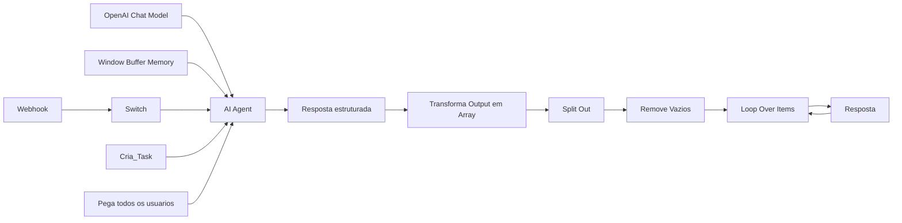
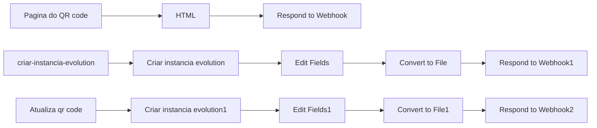
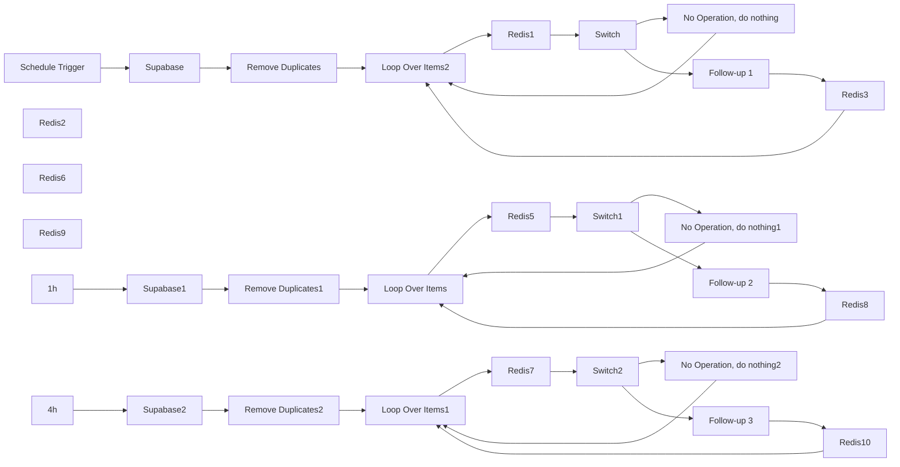
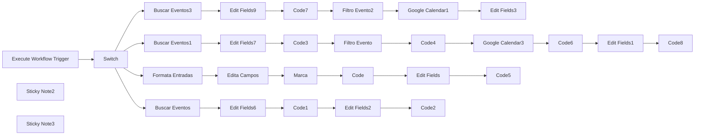
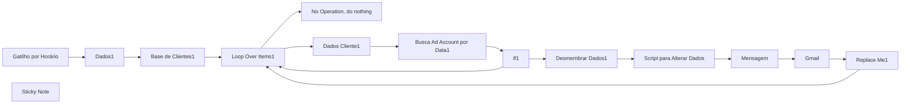
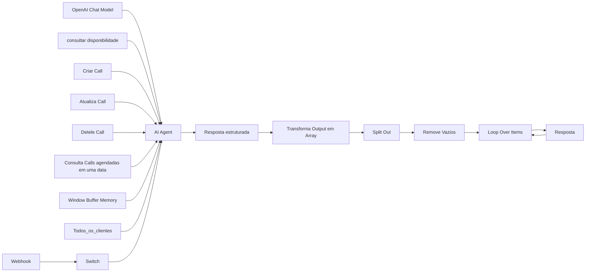
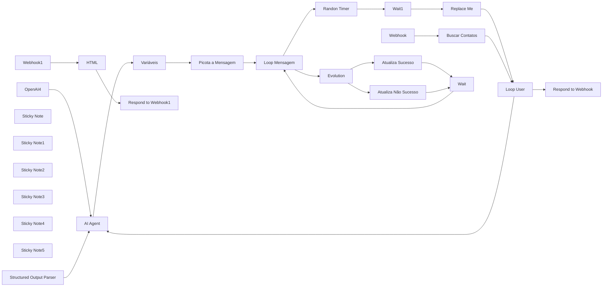
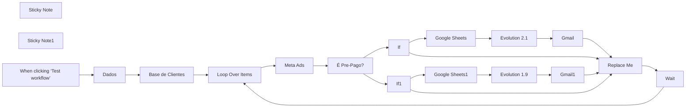
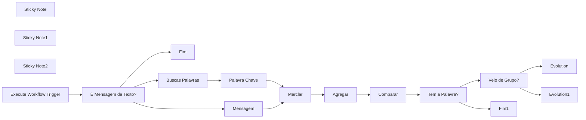
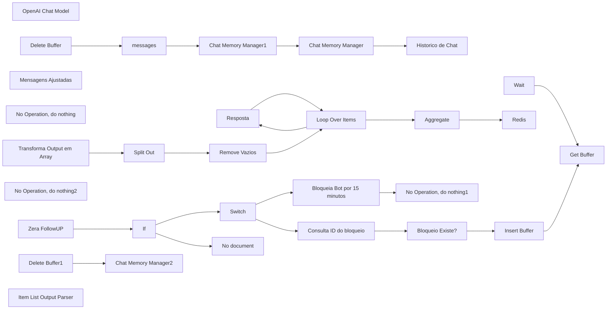

# PACK COM 58 SUPER FLUXOS PARA SEU N8N - Parte 4

Templates nesta parte: 10

## Sumário

- [Template 33 - Criação automática de tarefas no Notion](#template-33)
- [Template 34 - HTML para Credenciais Evolution](#template-34)
- [Template 35 - Follow-up automatizado para Vendedor IA](#template-35)
- [Template 36 - Agendamento SDR automatizado](#template-36)
- [Template 37 - Relatório Meta por data com métricas](#template-37)
- [Template 38 - Agenda IA para vendedor](#template-38)
- [Template 39 - Envio em Massa de Mensagens](#template-39)
- [Template 40 - Verificar saldo Meta Ads com Evolution](#template-40)
- [Template 41 - Buscador de Palavras-Chave](#template-41)
- [Template 42 - Fluxo Vendedor IA 02](#template-42)

---

<a id="template-33"></a>

## Template 33 - Criação automática de tarefas no Notion

- **Nome original:** 30. Fluxo criador de tarefas Notion.json
- **Descrição:** Fluxo que recebe mensagens via Webhook, usa IA para estruturar os dados de uma tarefa, busca IDs de usuários e cria uma tarefa no Notion com título, responsável, prazo e descrição, além de enviar uma resposta ao usuário.
- **Funcionalidade:** • Disparo via Webhook: recebe dados da conversa para iniciar a automação.
• Processamento por IA: define o conteúdo da tarefa usando um agente de linguagem.
• Memória de contexto: mantém o contexto entre mensagens com memória de janela.
• Transformação de saída: converte mensagens em array e remove itens vazios.
• Busca de usuários: consulta usuários para obter IDs de responsáveis.
• Criação no Notion: cria a tarefa com título, responsável (ID), prazo e descrição na base de dados.
• Resposta ao usuário: envia a resposta de volta via API de mensagens.
- **Ferramentas:** • Notion: API usada para criação de tarefas e consulta de usuários.
• OpenAI: API de geração de conteúdo e estruturação de respostas com modelo de linguagem.
• API de envio de mensagens: endpoint externo utilizado para enviar respostas aos usuários.

## Fluxo visual



## Fluxo (.json) :

```json
{
  "name": "30. Fluxo criador de tarefas Notion",
  "nodes": [
    {
      "parameters": {
        "promptType": "define",
        "text": "={{ $json.body.data.message.conversation }}",
        "options": {
          "systemMessage": "=<Papel>\nvocê é meu assistente pessoal que cuida das do meu clickup, seu papel é adicionar novas tasks ao clickup<Papel>\n\n<ao adicionaruma task para um usuario>\nO campo do responsável deve ser preenchido com o ID do usuário ao invés do nome, use a tool {Pega todos os usuarios} para pegar os usuários e seus ID's\n<ao adicionaruma task para um usuario>\n\n<data atual>\nhoje é {{ $now }}\n<data atual>\n"
        }
      },
      "type": "@n8n/n8n-nodes-langchain.agent",
      "typeVersion": 1.7,
      "position": [
        -300,
        -80
      ],
      "id": "fc6a0c43-c780-460a-98be-4b9c7f617d1d",
      "name": "AI Agent"
    },
    {
      "parameters": {
        "options": {}
      },
      "type": "@n8n/n8n-nodes-langchain.lmChatOpenAi",
      "typeVersion": 1,
      "position": [
        -560,
        300
      ],
      "id": "5d968bf8-7083-48a9-98d7-e731167795da",
      "name": "OpenAI Chat Model"
    },
    {
      "parameters": {
        "sessionIdType": "customKey",
        "sessionKey": "teste01",
        "contextWindowLength": 0
      },
      "type": "@n8n/n8n-nodes-langchain.memoryBufferWindow",
      "typeVersion": 1.2,
      "position": [
        -380,
        300
      ],
      "id": "f8996418-ecc5-40b4-8bbe-e5a29555c7be",
      "name": "Window Buffer Memory"
    },
    {
      "parameters": {
        "method": "POST",
        "url": "={{ $node['Webhook'].json.body.server_url }}/message/sendText/{{ $node['Webhook'].json.body.instance }}",
        "sendHeaders": true,
        "headerParameters": {
          "parameters": [
            {
              "name": "apikey",
              "value": "={{ $node['Webhook'].json.body.apikey}}"
            }
          ]
        },
        "sendBody": true,
        "bodyParameters": {
          "parameters": [
            {
              "name": "number",
              "value": "={{ $node['Webhook'].json.body.data.key.remoteJid }}"
            },
            {
              "name": "text",
              "value": "={{ $json.output }}"
            },
            {
              "name": "delay",
              "value": "={{ $node['Webhook'].json.body.data.message.audioMessage ? Math.min(Math.trunc($node['Webhook'].json.body.data.message.audioMessage.seconds * 1000), 15000) : Math.min(Math.trunc($json.output.length / 10 * 1000), 15000) }}"
            }
          ]
        },
        "options": {}
      },
      "id": "44d5b59d-93ed-4196-921d-91e8eb9eadd1",
      "name": "Resposta",
      "type": "n8n-nodes-base.httpRequest",
      "typeVersion": 4.2,
      "position": [
        840,
        100
      ]
    },
    {
      "parameters": {
        "fieldToSplitOut": "output",
        "options": {}
      },
      "id": "1779e897-31ce-4ae8-a107-2e55ca79e8a2",
      "name": "Split Out",
      "type": "n8n-nodes-base.splitOut",
      "typeVersion": 1,
      "position": [
        620,
        -80
      ]
    },
    {
      "parameters": {
        "options": {}
      },
      "id": "cb723e83-db8b-4fa9-8983-f89a9c4ce42e",
      "name": "Loop Over Items",
      "type": "n8n-nodes-base.splitInBatches",
      "typeVersion": 3,
      "position": [
        620,
        80
      ]
    },
    {
      "parameters": {
        "assignments": {
          "assignments": [
            {
              "id": "939acbed-02e9-424e-86f7-1761089d247e",
              "name": "=output",
              "value": "={{ $json.message.content.mensagem }}",
              "type": "array"
            }
          ]
        },
        "options": {}
      },
      "id": "e5d80474-3023-4c90-afd3-e317e2b5b1f8",
      "name": "Transforma Output em Array",
      "type": "n8n-nodes-base.set",
      "typeVersion": 3.4,
      "position": [
        460,
        -80
      ]
    },
    {
      "parameters": {
        "conditions": {
          "options": {
            "caseSensitive": true,
            "leftValue": "",
            "typeValidation": "strict",
            "version": 2
          },
          "conditions": [
            {
              "id": "0cdb1c63-c4a4-4941-9de9-b15a86719ab2",
              "leftValue": "={{ $json.output }}",
              "rightValue": "",
              "operator": {
                "type": "string",
                "operation": "notEmpty",
                "singleValue": true
              }
            }
          ],
          "combinator": "and"
        },
        "options": {}
      },
      "id": "d245c1ab-b858-46cc-a47c-42b76707a54d",
      "name": "Remove Vazios",
      "type": "n8n-nodes-base.filter",
      "typeVersion": 2.2,
      "position": [
        460,
        80
      ]
    },
    {
      "parameters": {
        "httpMethod": "POST",
        "path": "ff7188ec-a352-423a-83a8-6bb255db1d2f",
        "options": {}
      },
      "id": "b69180d2-29df-4a47-b45f-64d0779b78ec",
      "name": "Webhook",
      "type": "n8n-nodes-base.webhook",
      "typeVersion": 2,
      "position": [
        -820,
        -80
      ],
      "webhookId": "45925e52-c1c7-4a23-94bd-157027c5260c"
    },
    {
      "parameters": {
        "modelId": {
          "__rl": true,
          "value": "gpt-4o-mini",
          "mode": "list",
          "cachedResultName": "GPT-4O-MINI"
        },
        "messages": {
          "values": [
            {
              "content": "={{ $json.output }}"
            },
            {
              "content": "retorne uma resposta estruturada em json onde os textos precisam estar em uma array 'mensagem'"
            }
          ]
        },
        "jsonOutput": true,
        "options": {}
      },
      "type": "@n8n/n8n-nodes-langchain.openAi",
      "typeVersion": 1.6,
      "position": [
        80,
        -80
      ],
      "id": "2d7f41c8-67e6-4ac2-b1f6-53fba677632d",
      "name": "Resposta estruturada"
    },
    {
      "parameters": {
        "rules": {
          "values": [
            {
              "conditions": {
                "options": {
                  "caseSensitive": true,
                  "leftValue": "",
                  "typeValidation": "strict",
                  "version": 2
                },
                "conditions": [
                  {
                    "leftValue": "={{ $json.body.data.key.remoteJid }}",
                    "rightValue": "ID DO NUMERO OU DO GRUPO",
                    "operator": {
                      "type": "string",
                      "operation": "equals"
                    }
                  }
                ],
                "combinator": "and"
              }
            }
          ]
        },
        "options": {}
      },
      "type": "n8n-nodes-base.switch",
      "typeVersion": 3.2,
      "position": [
        -580,
        -80
      ],
      "id": "71608331-f86a-44f7-bdb9-9a5a5ba5b776",
      "name": "Switch"
    },
    {
      "parameters": {
        "resource": "databasePage",
        "databaseId": {
          "__rl": true,
          "value": "1376e25b-bb6c-8030-ae3e-dac48a78b88d",
          "mode": "list",
          "cachedResultName": "TaskList",
          "cachedResultUrl": "https://www.notion.so/1376e25bbb6c8030ae3edac48a78b88d"
        },
        "title": "={{ $fromAI(\"nome_da_tarefa\", \"literalmente o nome da tarefa a ser feita\") }}",
        "propertiesUi": {
          "propertyValues": [
            {
              "key": "Status|status",
              "statusValue": "Not started"
            },
            {
              "key": "Person|people",
              "peopleValue": "={{ $fromAI(\"responsavel\", \"use a tool para ver todos os usuários que podem ser inseridos aqui, não é possivel por o nome, apenas o id do usuário\") }}"
            },
            {
              "key": "prazo|date",
              "includeTime": false,
              "date": "={{ $fromAI(\"data_prazo\", \"data para entrega da tarefa no formato 2024-11-08 00:00:00\") }}",
              "timezone": "America/Sao_Paulo"
            },
            {
              "key": "Description|rich_text",
              "textContent": "={{ $fromAI(\"descricao_task\", \"se não for informada uma descrição, pode deixar em branco\") }}"
            }
          ]
        },
        "options": {}
      },
      "type": "n8n-nodes-base.notionTool",
      "typeVersion": 2.2,
      "position": [
        -220,
        300
      ],
      "id": "61a583d1-acc3-4fdf-8f96-d6da127c769e",
      "name": "Cria_Task"
    },
    {
      "parameters": {
        "resource": "user",
        "operation": "getAll"
      },
      "type": "n8n-nodes-base.notionTool",
      "typeVersion": 2.2,
      "position": [
        -40,
        300
      ],
      "id": "17713f30-f9a0-4811-b6d5-58e258cf5016",
      "name": "Pega todos os usuarios"
    }
  ],
  "pinData": {},
  "connections": {
    "OpenAI Chat Model": {
      "ai_languageModel": [
        [
          {
            "node": "AI Agent",
            "type": "ai_languageModel",
            "index": 0
          }
        ]
      ]
    },
    "Window Buffer Memory": {
      "ai_memory": [
        [
          {
            "node": "AI Agent",
            "type": "ai_memory",
            "index": 0
          }
        ]
      ]
    },
    "Resposta": {
      "main": [
        [
          {
            "node": "Loop Over Items",
            "type": "main",
            "index": 0
          }
        ]
      ]
    },
    "Split Out": {
      "main": [
        [
          {
            "node": "Remove Vazios",
            "type": "main",
            "index": 0
          }
        ]
      ]
    },
    "Loop Over Items": {
      "main": [
        [],
        [
          {
            "node": "Resposta",
            "type": "main",
            "index": 0
          }
        ]
      ]
    },
    "Transforma Output em Array": {
      "main": [
        [
          {
            "node": "Split Out",
            "type": "main",
            "index": 0
          }
        ]
      ]
    },
    "Remove Vazios": {
      "main": [
        [
          {
            "node": "Loop Over Items",
            "type": "main",
            "index": 0
          }
        ]
      ]
    },
    "AI Agent": {
      "main": [
        [
          {
            "node": "Resposta estruturada",
            "type": "main",
            "index": 0
          }
        ]
      ]
    },
    "Webhook": {
      "main": [
        [
          {
            "node": "Switch",
            "type": "main",
            "index": 0
          }
        ]
      ]
    },
    "Resposta estruturada": {
      "main": [
        [
          {
            "node": "Transforma Output em Array",
            "type": "main",
            "index": 0
          }
        ]
      ]
    },
    "Switch": {
      "main": [
        [
          {
            "node": "AI Agent",
            "type": "main",
            "index": 0
          }
        ]
      ]
    },
    "Cria_Task": {
      "ai_tool": [
        [
          {
            "node": "AI Agent",
            "type": "ai_tool",
            "index": 0
          }
        ]
      ]
    },
    "Pega todos os usuarios": {
      "ai_tool": [
        [
          {
            "node": "AI Agent",
            "type": "ai_tool",
            "index": 0
          }
        ]
      ]
    }
  },
  "active": false,
  "settings": {
    "executionOrder": "v1"
  },
  "versionId": "6e9ffdbd-6b0b-4a8e-beb8-1dd151cf71d1",
  "meta": {
    "templateCredsSetupCompleted": true,
    "instanceId": "385c06b6bbed00452a824dd157a142ab661dedbca13fb1106183d4d0295a4f6e"
  },
  "id": "8OAElqirM1rh8P8s",
  "tags": []
}
```

---

<a id="template-34"></a>

## Template 34 - HTML para Credenciais Evolution

- **Nome original:** 24. Frontend para criação de credenciais Evolution.json
- **Descrição:** Fluxo que gera um QR Code a partir de um nome de instância via página HTML, cria a instância Evolution via API, atualiza o código periodicamente e entrega o QR Code através de webhooks.
- **Funcionalidade:** • Geração de QR Code pela página HTML: a interface coleta o nome da instância, gera o QR Code e exibe o código com atualização automática a cada 30 segundos.
• Criação de instância Evolution via API externa: envia requisição POST com instanceName, qrcode e integração para criar a instância.
• Atualização do QR Code por webhook: endpoint /atualizar-qr-code para regenerar o código correspondente.
• Conexão da instância Evolution via API externa: estabelece a conexão entre a nova instância e o serviço Evolution.
• Respostas de webhook com HTML e conteúdo binário: o fluxo retorna HTML da página do QR Code ou o arquivo binário do código via webhook.
• Conversão do QR Code para arquivo binário: transforma o código gerado em arquivo para download/armazenamento.
- **Ferramentas:** • Evolution API externa: Serviço para criar, conectar e gerenciar instâncias Evolution, incluindo criação com endpoint /instance/create e conexão com /instance/connect.

## Fluxo visual



## Fluxo (.json) :

```json
{
  "name": "P13 | Html para Criar Credenciais Evolution",
  "nodes": [
    {
      "parameters": {
        "html": "<!DOCTYPE html>\n<html lang=\"pt-BR\">\n<head>\n    <meta charset=\"UTF-8\">\n    <meta name=\"viewport\" content=\"width=device-width, initial-scale=1.0\">\n    <title>Gerador de QR Code</title>\n    <style>\n        body {\n            font-family: Arial, sans-serif;\n            display: flex;\n            justify-content: center;\n            align-items: center;\n            height: 100vh;\n            margin: 0;\n            background-color: #f0f0f0;\n        }\n        .container {\n            background-color: white;\n            padding: 2rem;\n            border-radius: 8px;\n            box-shadow: 0 4px 6px rgba(0, 0, 0, 0.1);\n            text-align: center;\n        }\n        input {\n            width: 100%;\n            padding: 0.5rem;\n            margin-bottom: 1rem;\n            border: 1px solid #ccc;\n            border-radius: 4px;\n        }\n        button {\n            background-color: #4CAF50;\n            color: white;\n            border: none;\n            padding: 0.5rem 1rem;\n            border-radius: 4px;\n            cursor: pointer;\n        }\n        button:hover {\n            background-color: #45a049;\n        }\n        button:disabled {\n            background-color: #cccccc;\n            cursor: not-allowed;\n        }\n        #qrcode {\n            margin-top: 1rem;\n        }\n        #timer {\n            margin-top: 1rem;\n            font-weight: bold;\n        }\n        .loader {\n            border: 5px solid #f3f3f3;\n            border-top: 5px solid #3498db;\n            border-radius: 50%;\n            width: 50px;\n            height: 50px;\n            animation: spin 1s linear infinite;\n            margin: 20px auto;\n            display: none;\n        }\n        @keyframes spin {\n            0% { transform: rotate(0deg); }\n            100% { transform: rotate(360deg); }\n        }\n    </style>\n</head>\n<body>\n    <div class=\"container\">\n        <h1>Gerador de QR Code</h1>\n        <input type=\"text\" id=\"instanceName\" placeholder=\"Nome da instância\">\n        <button id=\"generateButton\" onclick=\"generateQRCode()\">Gerar QR Code</button>\n        <div id=\"loader\" class=\"loader\"></div>\n        <div id=\"qrcode\"></div>\n        <div id=\"timer\"></div>\n    </div>\n\n    <script>\n        let timerInterval;\n        let timeLeft = 30;\n        let currentInstanceName = '';\n\n        async function generateQRCode() {\n            const instanceName = document.getElementById('instanceName').value.trim();\n            if (!instanceName) {\n                alert('Por favor, insira o nome da instância.');\n                return;\n            }\n\n            currentInstanceName = instanceName;\n            await fetchAndDisplayQRCode(instanceName, true);\n\n            // Reset and start the timer\n            clearInterval(timerInterval);\n            timeLeft = 30;\n            updateTimer();\n            timerInterval = setInterval(updateTimer, 1000);\n        }\n\n        async function fetchAndDisplayQRCode(instanceName, isInitial = false) {\n            const loader = document.getElementById('loader');\n            const generateButton = document.getElementById('generateButton');\n            const qrcodeElement = document.getElementById('qrcode');\n\n            loader.style.display = 'block';\n            generateButton.disabled = true;\n            qrcodeElement.innerHTML = '';\n\n            try {\n                const endpoint = isInitial \n                    ? 'https://n8n.fluxautomate.com.br/webhook-test/criar-instancia-evolution'\n                    : 'https://n8n.fluxautomate.com.br/webhook-test/atualizar-qr-code';\n\n                const response = await fetch(endpoint, {\n                    method: 'POST',\n                    headers: {\n                        'Content-Type': 'application/json',\n                    },\n                    body: JSON.stringify({ instanceName: instanceName }),\n                });\n\n                if (!response.ok) {\n                    throw new Error(`Erro ${response.status}: ${response.statusText}`);\n                }\n\n                const contentType = response.headers.get('content-type');\n                let imgSrc;\n\n                if (contentType && contentType.includes('application/json')) {\n                    const data = await response.json();\n                    if (data.qrCodeBase64) {\n                        imgSrc = `data:image/png;base64,${data.qrCodeBase64}`;\n                    } else {\n                        throw new Error('A resposta do servidor não contém o campo qrCodeBase64.');\n                    }\n                } else {\n                    const blob = await response.blob();\n                    imgSrc = URL.createObjectURL(blob);\n                }\n\n                qrcodeElement.innerHTML = ``;\n            } catch (error) {\n                console.error('Erro ao gerar QR Code:', error);\n                alert(`Erro ao gerar QR Code: ${error.message}`);\n            } finally {\n                loader.style.display = 'none';\n                generateButton.disabled = false;\n            }\n        }\n\n        async function updateQRCode() {\n            if (currentInstanceName) {\n                await fetchAndDisplayQRCode(currentInstanceName);\n            }\n        }\n\n        function updateTimer() {\n            const timerElement = document.getElementById('timer');\n            timerElement.textContent = `Novo QR Code em: ${timeLeft}s`;\n\n            if (timeLeft === 0) {\n                clearInterval(timerInterval);\n                updateQRCode();\n                timeLeft = 30;\n                timerInterval = setInterval(updateTimer, 1000);\n            } else {\n                timeLeft--;\n            }\n        }\n    </script>\n</body>\n</html>\n"
      },
      "type": "n8n-nodes-base.html",
      "typeVersion": 1.2,
      "position": [
        1140,
        380
      ],
      "id": "1bb12232-19dd-4cba-9de4-e92f216c9ebe",
      "name": "HTML"
    },
    {
      "parameters": {
        "respondWith": "text",
        "responseBody": "={{ $json.html }}",
        "options": {}
      },
      "type": "n8n-nodes-base.respondToWebhook",
      "typeVersion": 1.1,
      "position": [
        1360,
        380
      ],
      "id": "dc9f7d39-2b2a-4fe7-bca5-73dacf28d13b",
      "name": "Respond to Webhook"
    },
    {
      "parameters": {
        "method": "POST",
        "url": "https://evolution.fluxautomate.com.br/instance/create",
        "sendHeaders": true,
        "headerParameters": {
          "parameters": [
            {
              "name": "apikey",
              "value": "MarcoTulio040686@M"
            }
          ]
        },
        "sendBody": true,
        "bodyParameters": {
          "parameters": [
            {
              "name": "instanceName",
              "value": "={{ $json.body.instanceName }}"
            },
            {
              "name": "qrcode",
              "value": true
            },
            {
              "name": "integration",
              "value": "WHATSAPP-BAILEYS"
            }
          ]
        },
        "options": {
          "redirect": {
            "redirect": {}
          }
        }
      },
      "type": "n8n-nodes-base.httpRequest",
      "typeVersion": 4.2,
      "position": [
        1140,
        580
      ],
      "id": "6abc231d-d0d4-479f-b325-cafbcee1aa1e",
      "name": "Criar instancia evolution"
    },
    {
      "parameters": {
        "respondWith": "binary",
        "responseDataSource": "set",
        "options": {}
      },
      "type": "n8n-nodes-base.respondToWebhook",
      "typeVersion": 1.1,
      "position": [
        1720,
        580
      ],
      "id": "84ae83e6-d470-4e61-99d5-e65d09a2f875",
      "name": "Respond to Webhook1"
    },
    {
      "parameters": {
        "respondWith": "binary",
        "responseDataSource": "set",
        "options": {}
      },
      "type": "n8n-nodes-base.respondToWebhook",
      "typeVersion": 1.1,
      "position": [
        1720,
        780
      ],
      "id": "1bda0fce-3e55-4e81-8bff-59500eaf0e05",
      "name": "Respond to Webhook2"
    },
    {
      "parameters": {
        "url": "=https://evolution.fluxautomate.com.br/instance/connect/{{ $json.body.instanceName }}",
        "sendHeaders": true,
        "headerParameters": {
          "parameters": [
            {
              "name": "apikey",
              "value": "MarcoTulio040686@M"
            }
          ]
        },
        "options": {
          "redirect": {
            "redirect": {}
          }
        }
      },
      "type": "n8n-nodes-base.httpRequest",
      "typeVersion": 4.2,
      "position": [
        1140,
        780
      ],
      "id": "d556c422-bb39-43f1-aa07-b8885c372231",
      "name": "Criar instancia evolution1"
    },
    {
      "parameters": {
        "operation": "toBinary",
        "sourceProperty": "base64",
        "options": {}
      },
      "type": "n8n-nodes-base.convertToFile",
      "typeVersion": 1.1,
      "position": [
        1500,
        580
      ],
      "id": "9b43ffd8-5ef1-41b7-a61a-91bd1bced89c",
      "name": "Convert to File"
    },
    {
      "parameters": {
        "assignments": {
          "assignments": [
            {
              "id": "7997d699-2380-48aa-8dc3-b1eac974e16e",
              "name": "base64",
              "value": "={{ $json.qrcode.base64.split(',').last() }}",
              "type": "string"
            }
          ]
        },
        "options": {}
      },
      "type": "n8n-nodes-base.set",
      "typeVersion": 3.4,
      "position": [
        1320,
        580
      ],
      "id": "28f80a82-90e2-4d75-be28-b641b76e1cf6",
      "name": "Edit Fields"
    },
    {
      "parameters": {
        "operation": "toBinary",
        "sourceProperty": "base64",
        "options": {}
      },
      "type": "n8n-nodes-base.convertToFile",
      "typeVersion": 1.1,
      "position": [
        1500,
        780
      ],
      "id": "d8a6fc04-8511-4c58-bd02-0d3a934f518f",
      "name": "Convert to File1"
    },
    {
      "parameters": {
        "assignments": {
          "assignments": [
            {
              "id": "7997d699-2380-48aa-8dc3-b1eac974e16e",
              "name": "base64",
              "value": "={{ $json.base64.split(',').last() }}",
              "type": "string"
            }
          ]
        },
        "options": {}
      },
      "type": "n8n-nodes-base.set",
      "typeVersion": 3.4,
      "position": [
        1320,
        780
      ],
      "id": "1256a2f0-0f32-4f63-8878-e4e603000276",
      "name": "Edit Fields1"
    },
    {
      "parameters": {
        "httpMethod": "POST",
        "path": "criar-instancia-evolution",
        "responseMode": "responseNode",
        "options": {}
      },
      "type": "n8n-nodes-base.webhook",
      "typeVersion": 2,
      "position": [
        920,
        580
      ],
      "id": "b6bedf2d-ff11-40f2-a474-f91b7a5dc118",
      "name": "criar-instancia-evolution",
      "webhookId": "f3988766-f52b-4be0-b0bd-254e485671a3"
    },
    {
      "parameters": {
        "httpMethod": "POST",
        "path": "atualizar-qr-code",
        "responseMode": "responseNode",
        "options": {}
      },
      "type": "n8n-nodes-base.webhook",
      "typeVersion": 2,
      "position": [
        920,
        780
      ],
      "id": "9bc75e84-6091-40bf-a2e6-1cb003c50c70",
      "name": "Atualiza qr code",
      "webhookId": "f3988766-f52b-4be0-b0bd-254e485671a3"
    },
    {
      "parameters": {
        "path": "instanciaevolution",
        "responseMode": "responseNode",
        "options": {}
      },
      "type": "n8n-nodes-base.webhook",
      "typeVersion": 2,
      "position": [
        920,
        380
      ],
      "id": "8fcf4985-29ca-4b61-ae43-f7520d46fd9f",
      "name": "Pagina do QR code",
      "webhookId": "cce5e6b5-f99a-48a3-8b18-cf524f03c4ce"
    }
  ],
  "pinData": {},
  "connections": {
    "HTML": {
      "main": [
        [
          {
            "node": "Respond to Webhook",
            "type": "main",
            "index": 0
          }
        ]
      ]
    },
    "Criar instancia evolution": {
      "main": [
        [
          {
            "node": "Edit Fields",
            "type": "main",
            "index": 0
          }
        ]
      ]
    },
    "Criar instancia evolution1": {
      "main": [
        [
          {
            "node": "Edit Fields1",
            "type": "main",
            "index": 0
          }
        ]
      ]
    },
    "Convert to File": {
      "main": [
        [
          {
            "node": "Respond to Webhook1",
            "type": "main",
            "index": 0
          }
        ]
      ]
    },
    "Edit Fields": {
      "main": [
        [
          {
            "node": "Convert to File",
            "type": "main",
            "index": 0
          }
        ]
      ]
    },
    "Edit Fields1": {
      "main": [
        [
          {
            "node": "Convert to File1",
            "type": "main",
            "index": 0
          }
        ]
      ]
    },
    "Convert to File1": {
      "main": [
        [
          {
            "node": "Respond to Webhook2",
            "type": "main",
            "index": 0
          }
        ]
      ]
    },
    "criar-instancia-evolution": {
      "main": [
        [
          {
            "node": "Criar instancia evolution",
            "type": "main",
            "index": 0
          }
        ]
      ]
    },
    "Atualiza qr code": {
      "main": [
        [
          {
            "node": "Criar instancia evolution1",
            "type": "main",
            "index": 0
          }
        ]
      ]
    },
    "Pagina do QR code": {
      "main": [
        [
          {
            "node": "HTML",
            "type": "main",
            "index": 0
          }
        ]
      ]
    }
  },
  "active": true,
  "settings": {
    "executionOrder": "v1"
  },
  "versionId": "9f670abc-25b1-40d4-8c5d-a47f5efefcfa",
  "meta": {
    "templateCredsSetupCompleted": true,
    "instanceId": "619b17cd1b492527794139da1bcb865e53d9b06f94f0bce867b7bc44cff77b3b"
  },
  "id": "EZZ59cRCUBrUNFw5",
  "tags": [
    {
      "createdAt": "2025-02-12T12:24:52.743Z",
      "updatedAt": "2025-02-12T12:57:02.254Z",
      "id": "IEEotBOwvCC1isJA",
      "name": "FLUX"
    }
  ]
}
```

---

<a id="template-35"></a>

## Template 35 - Follow-up automatizado para Vendedor IA

- **Nome original:** 34. Fluxo Follow-up - Vendedor IA.json
- **Descrição:** Este fluxo automatiza o envio de mensagens de follow-up para contatos de vendedor IA, lendo dados do Supabase, filtrando duplicatas, gerenciando o estado com Redis e enviando mensagens via GrowthLinks em ciclos programados.
- **Funcionalidade:** • Agendamento periódico: inicia a automação em intervalos de tempo definidos para diferentes fases do fluxo.
• Leitura de dados: busca registros de follow-up no banco Supabase.
• Filtragem de duplicatas: remove entradas repetidas com base no identificador remotejid.
• Gerenciamento de estado: usa Redis para marcar quais contatos já foram processados em cada fase.
• Envio de mensagens: envia mensagens de follow-up através da GrowthLinks API para os números de telefone (remotejid).
• Controle de fluxo por bateladas: processa itens em lotes usando splitInBatches.
• Ramificação condicional: usa switches para direcionar o fluxo conforme o status de cada follow-up.
• Loop de follow-ups: repete o envio com diferentes mensagens em cada etapa (Follow-up 1, Follow-up 2, etc).
- **Ferramentas:** • Supabase: Banco de dados usado para armazenar e consultar os registros de follow-up.
• Redis: Armazenamento de estado de processamento por remotejid.
• GrowthLinks API: Serviço de envio de mensagens de texto para contatos via API.

## Fluxo visual



## Fluxo (.json) :

```json
{
  "name": "34. Fluxo Follow-up - Vendedor IA",
  "nodes": [
    {
      "parameters": {
        "rule": {
          "interval": [
            {
              "field": "seconds",
              "secondsInterval": 5
            }
          ]
        }
      },
      "id": "520a9e0d-6ebd-4520-8766-8f364cd6f0fc",
      "name": "Schedule Trigger",
      "type": "n8n-nodes-base.scheduleTrigger",
      "typeVersion": 1.2,
      "position": [
        -1900,
        -1840
      ]
    },
    {
      "parameters": {
        "operation": "getAll",
        "tableId": "Follow_up-VendedorIA",
        "returnAll": true
      },
      "id": "976e020d-d2f2-4b03-94b0-3a2d51a4ce0b",
      "name": "Supabase",
      "type": "n8n-nodes-base.supabase",
      "typeVersion": 1,
      "position": [
        -1660,
        -1840
      ]
    },
    {
      "parameters": {
        "compare": "selectedFields",
        "fieldsToCompare": "remotejid",
        "options": {}
      },
      "id": "b256761c-d9d5-4c91-81ca-8209c3eeb36f",
      "name": "Remove Duplicates",
      "type": "n8n-nodes-base.removeDuplicates",
      "typeVersion": 1.1,
      "position": [
        -1460,
        -1840
      ]
    },
    {
      "parameters": {
        "operation": "keys",
        "keyPattern": "={{ $node['Loop Over Items2'].json.remotejid }}_FollowUp"
      },
      "id": "0457f5a1-ea1f-46f4-8e88-0edee3f86928",
      "name": "Redis1",
      "type": "n8n-nodes-base.redis",
      "typeVersion": 1,
      "position": [
        -900,
        -1880
      ]
    },
    {
      "parameters": {
        "operation": "delete",
        "key": "={{ $node['Remove Duplicates'].json.session_id }}_FollowUp"
      },
      "id": "c2cfc523-0b15-4d46-bc7e-25f299ac5f84",
      "name": "Redis2",
      "type": "n8n-nodes-base.redis",
      "typeVersion": 1,
      "position": [
        -820,
        -2140
      ],
      "disabled": true
    },
    {
      "parameters": {
        "operation": "set",
        "key": "={{ $node['Loop Over Items2'].json.remotejid }}_FollowUp",
        "value": "1"
      },
      "id": "2ae75f9c-5acf-4e72-85d1-3db67749916a",
      "name": "Redis3",
      "type": "n8n-nodes-base.redis",
      "typeVersion": 1,
      "position": [
        -20,
        -1860
      ]
    },
    {
      "parameters": {},
      "id": "f98d261a-f934-4cea-a6c8-f219272d4539",
      "name": "No Operation, do nothing",
      "type": "n8n-nodes-base.noOp",
      "typeVersion": 1,
      "position": [
        -240,
        -2060
      ]
    },
    {
      "parameters": {
        "options": {}
      },
      "id": "f877fd16-2da5-46cb-aa70-4f1b871d4617",
      "name": "Loop Over Items2",
      "type": "n8n-nodes-base.splitInBatches",
      "typeVersion": 3,
      "position": [
        -1240,
        -1840
      ]
    },
    {
      "parameters": {
        "method": "POST",
        "url": "=https://api.growthlinks.com.br/message/sendText/aula",
        "authentication": "genericCredentialType",
        "genericAuthType": "httpHeaderAuth",
        "sendBody": true,
        "bodyParameters": {
          "parameters": [
            {
              "name": "number",
              "value": "={{ $node['Loop Over Items2'].json.remotejid }}"
            },
            {
              "name": "text",
              "value": "=Opa, ainda está aí?"
            },
            {
              "name": "delay",
              "value": "={{ 1200 }}"
            }
          ]
        },
        "options": {}
      },
      "id": "b8b42b6f-0202-430b-98a8-91df54a1545e",
      "name": "Follow-up  1",
      "type": "n8n-nodes-base.httpRequest",
      "typeVersion": 4.2,
      "position": [
        -240,
        -1860
      ]
    },
    {
      "parameters": {
        "operation": "getAll",
        "tableId": "Follow_up-VendedorIA",
        "returnAll": true
      },
      "id": "fbdd8acf-3d46-45e0-90f4-2c3a8dcd042f",
      "name": "Supabase1",
      "type": "n8n-nodes-base.supabase",
      "typeVersion": 1,
      "position": [
        -1680,
        -1040
      ]
    },
    {
      "parameters": {
        "compare": "selectedFields",
        "fieldsToCompare": "=remotejid",
        "options": {}
      },
      "id": "a5e596a7-09d7-4525-9c01-b379da434eb3",
      "name": "Remove Duplicates1",
      "type": "n8n-nodes-base.removeDuplicates",
      "typeVersion": 1.1,
      "position": [
        -1460,
        -1040
      ]
    },
    {
      "parameters": {
        "operation": "keys",
        "keyPattern": "={{ $node['Loop Over Items'].json.remotejid }}_FollowUp"
      },
      "id": "c18151dd-6639-40a1-a01b-9ca3f872807d",
      "name": "Redis5",
      "type": "n8n-nodes-base.redis",
      "typeVersion": 1,
      "position": [
        -900,
        -1080
      ]
    },
    {
      "parameters": {
        "operation": "delete",
        "key": "={{ $node['Remove Duplicates1'].json.session_id }}_FollowUp"
      },
      "id": "5d46133d-ee93-4984-84e5-e7d523b28b9f",
      "name": "Redis6",
      "type": "n8n-nodes-base.redis",
      "typeVersion": 1,
      "position": [
        -700,
        -1500
      ],
      "disabled": true
    },
    {
      "parameters": {},
      "id": "d4141c3c-c423-4494-ae59-05c1f45a6a69",
      "name": "No Operation, do nothing1",
      "type": "n8n-nodes-base.noOp",
      "typeVersion": 1,
      "position": [
        -240,
        -1260
      ]
    },
    {
      "parameters": {
        "options": {}
      },
      "id": "d480cf5d-e23f-44d4-b2ff-6dc5a26cc333",
      "name": "Loop Over Items",
      "type": "n8n-nodes-base.splitInBatches",
      "typeVersion": 3,
      "position": [
        -1240,
        -1040
      ]
    },
    {
      "parameters": {
        "operation": "set",
        "key": "={{ $node['Loop Over Items'].json.remotejid }}_FollowUp",
        "value": "3"
      },
      "id": "9d8dc980-7696-4185-9887-e7a7f94e7eae",
      "name": "Redis8",
      "type": "n8n-nodes-base.redis",
      "typeVersion": 1,
      "position": [
        -20,
        -960
      ]
    },
    {
      "parameters": {
        "operation": "getAll",
        "tableId": "Follow_up-VendedorIA",
        "returnAll": true
      },
      "id": "e7532f37-9f2a-4a33-ab0e-5f5359713833",
      "name": "Supabase2",
      "type": "n8n-nodes-base.supabase",
      "typeVersion": 1,
      "position": [
        -1640,
        -320
      ]
    },
    {
      "parameters": {
        "compare": "selectedFields",
        "fieldsToCompare": "remotejid",
        "options": {}
      },
      "id": "4a2fed37-7d81-450e-878c-25a8ffc2972e",
      "name": "Remove Duplicates2",
      "type": "n8n-nodes-base.removeDuplicates",
      "typeVersion": 1.1,
      "position": [
        -1420,
        -320
      ]
    },
    {
      "parameters": {
        "operation": "keys",
        "keyPattern": "={{ $node['Loop Over Items1'].json.remotejid }}_FollowUp"
      },
      "id": "69a3528e-9305-4f46-a09b-d9e30c45efa2",
      "name": "Redis7",
      "type": "n8n-nodes-base.redis",
      "typeVersion": 1,
      "position": [
        -860,
        -360
      ]
    },
    {
      "parameters": {
        "operation": "delete",
        "key": "={{ $node['Remove Duplicates2'].json.session_id }}_FollowUp"
      },
      "id": "f0fd8641-1132-413d-9791-8da34bbd1cb8",
      "name": "Redis9",
      "type": "n8n-nodes-base.redis",
      "typeVersion": 1,
      "position": [
        -780,
        -740
      ],
      "disabled": true
    },
    {
      "parameters": {},
      "id": "cc884aee-3b4d-4aef-bf85-1e29d2bed58c",
      "name": "No Operation, do nothing2",
      "type": "n8n-nodes-base.noOp",
      "typeVersion": 1,
      "position": [
        -200,
        -540
      ]
    },
    {
      "parameters": {
        "options": {}
      },
      "id": "c0a6141d-8b17-4a6b-a495-4314bd099928",
      "name": "Loop Over Items1",
      "type": "n8n-nodes-base.splitInBatches",
      "typeVersion": 3,
      "position": [
        -1200,
        -320
      ]
    },
    {
      "parameters": {
        "operation": "set",
        "key": "={{ $node['Loop Over Items1'].json.remotejid }}_FollowUp",
        "value": "4"
      },
      "id": "0ff77822-f323-486d-bca6-a79300d586c8",
      "name": "Redis10",
      "type": "n8n-nodes-base.redis",
      "typeVersion": 1,
      "position": [
        -40,
        -240
      ]
    },
    {
      "parameters": {
        "rules": {
          "values": [
            {
              "conditions": {
                "options": {
                  "caseSensitive": true,
                  "leftValue": "",
                  "typeValidation": "strict",
                  "version": 2
                },
                "conditions": [
                  {
                    "leftValue": "={{ $json }}",
                    "rightValue": "",
                    "operator": {
                      "type": "object",
                      "operation": "empty",
                      "singleValue": true
                    }
                  }
                ],
                "combinator": "and"
              },
              "renameOutput": true,
              "outputKey": "nda"
            },
            {
              "conditions": {
                "options": {
                  "caseSensitive": true,
                  "leftValue": "",
                  "typeValidation": "strict",
                  "version": 2
                },
                "conditions": [
                  {
                    "id": "328d2d07-0bb7-4bc0-9e71-2828fe4027f8",
                    "leftValue": "={{ $json.values()[0] }}",
                    "rightValue": "2",
                    "operator": {
                      "type": "string",
                      "operation": "equals",
                      "name": "filter.operator.equals"
                    }
                  }
                ],
                "combinator": "and"
              },
              "renameOutput": true,
              "outputKey": "2"
            }
          ]
        },
        "options": {}
      },
      "id": "923551af-a4f5-4a4d-b70d-d1822c65744e",
      "name": "Switch1",
      "type": "n8n-nodes-base.switch",
      "typeVersion": 3.2,
      "position": [
        -700,
        -1080
      ]
    },
    {
      "parameters": {
        "rule": {
          "interval": [
            {
              "field": "seconds",
              "secondsInterval": 10
            }
          ]
        }
      },
      "id": "e830d8e5-c7cd-48d4-8dad-7d2f1433af89",
      "name": "1h",
      "type": "n8n-nodes-base.scheduleTrigger",
      "typeVersion": 1.2,
      "position": [
        -1900,
        -1040
      ]
    },
    {
      "parameters": {
        "rule": {
          "interval": [
            {
              "field": "seconds",
              "secondsInterval": 15
            }
          ]
        }
      },
      "id": "8de6ac46-2762-4c44-8cab-ee24c32e56e7",
      "name": "4h",
      "type": "n8n-nodes-base.scheduleTrigger",
      "typeVersion": 1.2,
      "position": [
        -1900,
        -320
      ]
    },
    {
      "parameters": {
        "method": "POST",
        "url": "=https://api.growthlinks.com.br/message/sendText/aula",
        "authentication": "genericCredentialType",
        "genericAuthType": "httpHeaderAuth",
        "sendBody": true,
        "bodyParameters": {
          "parameters": [
            {
              "name": "number",
              "value": "={{ $node['Loop Over Items'].json.remotejid }}"
            },
            {
              "name": "text",
              "value": "=Aguardando sua resposta ainda..."
            },
            {
              "name": "delay",
              "value": "={{ 1200 }}"
            }
          ]
        },
        "options": {}
      },
      "id": "3b19aa43-806a-445d-ad94-85bd057303d2",
      "name": "Follow-up  2",
      "type": "n8n-nodes-base.httpRequest",
      "typeVersion": 4.2,
      "position": [
        -240,
        -960
      ]
    },
    {
      "parameters": {
        "method": "POST",
        "url": "=https://api.growthlinks.com.br/message/sendText/aula",
        "authentication": "genericCredentialType",
        "genericAuthType": "httpHeaderAuth",
        "sendBody": true,
        "bodyParameters": {
          "parameters": [
            {
              "name": "number",
              "value": "={{ $node['Loop Over Items1'].json.remotejid }}"
            },
            {
              "name": "text",
              "value": "=Aguardando sua resposta ainda..."
            },
            {
              "name": "delay",
              "value": "={{ 1200 }}"
            }
          ]
        },
        "options": {}
      },
      "id": "e6af81f6-60d5-4638-8800-2bf78e8313e0",
      "name": "Follow-up 3",
      "type": "n8n-nodes-base.httpRequest",
      "typeVersion": 4.2,
      "position": [
        -260,
        -240
      ]
    },
    {
      "parameters": {
        "rules": {
          "values": [
            {
              "conditions": {
                "options": {
                  "caseSensitive": true,
                  "leftValue": "",
                  "typeValidation": "strict",
                  "version": 2
                },
                "conditions": [
                  {
                    "leftValue": "={{ $json }}",
                    "rightValue": "",
                    "operator": {
                      "type": "object",
                      "operation": "empty",
                      "singleValue": true
                    }
                  }
                ],
                "combinator": "and"
              },
              "renameOutput": true,
              "outputKey": "nda"
            },
            {
              "conditions": {
                "options": {
                  "caseSensitive": true,
                  "leftValue": "",
                  "typeValidation": "strict",
                  "version": 2
                },
                "conditions": [
                  {
                    "id": "43d2b42c-1f7f-4143-9c25-569064b7a4a7",
                    "leftValue": "={{ $json.values()[0] }}",
                    "rightValue": "1",
                    "operator": {
                      "type": "string",
                      "operation": "equals"
                    }
                  }
                ],
                "combinator": "and"
              },
              "renameOutput": true,
              "outputKey": "1"
            }
          ]
        },
        "options": {}
      },
      "id": "1689adb3-1d2a-4296-b01e-7def8fe7a1a2",
      "name": "Switch",
      "type": "n8n-nodes-base.switch",
      "typeVersion": 3.2,
      "position": [
        -700,
        -1880
      ]
    },
    {
      "parameters": {
        "rules": {
          "values": [
            {
              "conditions": {
                "options": {
                  "caseSensitive": true,
                  "leftValue": "",
                  "typeValidation": "strict",
                  "version": 2
                },
                "conditions": [
                  {
                    "leftValue": "={{ $json }}",
                    "rightValue": "",
                    "operator": {
                      "type": "object",
                      "operation": "empty",
                      "singleValue": true
                    }
                  }
                ],
                "combinator": "and"
              },
              "renameOutput": true,
              "outputKey": "nda"
            },
            {
              "conditions": {
                "options": {
                  "caseSensitive": true,
                  "leftValue": "",
                  "typeValidation": "strict",
                  "version": 2
                },
                "conditions": [
                  {
                    "id": "328d2d07-0bb7-4bc0-9e71-2828fe4027f8",
                    "leftValue": "={{ $json.values()[0] }}",
                    "rightValue": "3",
                    "operator": {
                      "type": "string",
                      "operation": "equals",
                      "name": "filter.operator.equals"
                    }
                  }
                ],
                "combinator": "and"
              },
              "renameOutput": true,
              "outputKey": "3"
            }
          ]
        },
        "options": {}
      },
      "id": "ded4a140-5005-4f09-9af9-df874f166afb",
      "name": "Switch2",
      "type": "n8n-nodes-base.switch",
      "typeVersion": 3.2,
      "position": [
        -660,
        -360
      ]
    },
    {
      "parameters": {
        "operation": "getAll",
        "tableId": "Follow_up-VendedorIA",
        "returnAll": true
      },
      "id": "3db13d34-a674-411f-8753-ea4a4f4013f8",
      "name": "Supabase3",
      "type": "n8n-nodes-base.supabase",
      "typeVersion": 1,
      "position": [
        -1640,
        220
      ]
    },
    {
      "parameters": {
        "compare": "selectedFields",
        "fieldsToCompare": "remotejid",
        "options": {}
      },
      "id": "63c11a3b-4976-40b4-9915-fd0eabe30f0d",
      "name": "Remove Duplicates3",
      "type": "n8n-nodes-base.removeDuplicates",
      "typeVersion": 1.1,
      "position": [
        -1420,
        220
      ]
    },
    {
      "parameters": {
        "operation": "keys",
        "keyPattern": "={{ $node['Loop Over Items3'].json.remotejid }}_FollowUp"
      },
      "id": "ae73afbe-78a6-477a-ac13-f28ff9410778",
      "name": "Redis",
      "type": "n8n-nodes-base.redis",
      "typeVersion": 1,
      "position": [
        -860,
        180
      ]
    },
    {
      "parameters": {},
      "id": "fddd1642-a390-417e-b21d-862668949bff",
      "name": "No Operation, do nothing3",
      "type": "n8n-nodes-base.noOp",
      "typeVersion": 1,
      "position": [
        -200,
        0
      ]
    },
    {
      "parameters": {
        "options": {}
      },
      "id": "98d25e65-88c5-4b0c-8117-2eb99475be99",
      "name": "Loop Over Items3",
      "type": "n8n-nodes-base.splitInBatches",
      "typeVersion": 3,
      "position": [
        -1200,
        220
      ]
    },
    {
      "parameters": {
        "operation": "set",
        "key": "={{ $node['Loop Over Items3'].json.remotejid }}_FollowUp",
        "value": "0"
      },
      "id": "4feca7a9-5280-43b7-9454-176d3b66aab4",
      "name": "Redis11",
      "type": "n8n-nodes-base.redis",
      "typeVersion": 1,
      "position": [
        -40,
        300
      ]
    },
    {
      "parameters": {
        "rule": {
          "interval": [
            {
              "field": "seconds",
              "secondsInterval": 20
            }
          ]
        }
      },
      "id": "69648966-92bd-4653-8d46-3c5a4cba417f",
      "name": "4h1",
      "type": "n8n-nodes-base.scheduleTrigger",
      "typeVersion": 1.2,
      "position": [
        -1900,
        220
      ]
    },
    {
      "parameters": {
        "method": "POST",
        "url": "=https://api.growthlinks.com.br/message/sendText/aula",
        "authentication": "genericCredentialType",
        "genericAuthType": "httpHeaderAuth",
        "sendBody": true,
        "bodyParameters": {
          "parameters": [
            {
              "name": "number",
              "value": "={{ $node['Loop Over Items3'].json.remotejid }}"
            },
            {
              "name": "text",
              "value": "=tudo bem, não vou mandar mais mensagens, qualquer coisa me responder aí."
            },
            {
              "name": "delay",
              "value": "={{ 1200 }}"
            }
          ]
        },
        "options": {}
      },
      "id": "b346c02f-63aa-48e7-9da9-539186ee05c9",
      "name": "Follow-up ",
      "type": "n8n-nodes-base.httpRequest",
      "typeVersion": 4.2,
      "position": [
        -260,
        300
      ]
    },
    {
      "parameters": {
        "rules": {
          "values": [
            {
              "conditions": {
                "options": {
                  "caseSensitive": true,
                  "leftValue": "",
                  "typeValidation": "strict",
                  "version": 2
                },
                "conditions": [
                  {
                    "leftValue": "={{ $json }}",
                    "rightValue": "",
                    "operator": {
                      "type": "object",
                      "operation": "empty",
                      "singleValue": true
                    }
                  }
                ],
                "combinator": "and"
              },
              "renameOutput": true,
              "outputKey": "nda"
            },
            {
              "conditions": {
                "options": {
                  "caseSensitive": true,
                  "leftValue": "",
                  "typeValidation": "strict",
                  "version": 2
                },
                "conditions": [
                  {
                    "id": "328d2d07-0bb7-4bc0-9e71-2828fe4027f8",
                    "leftValue": "={{ $json.values()[0] }}",
                    "rightValue": "4",
                    "operator": {
                      "type": "string",
                      "operation": "equals",
                      "name": "filter.operator.equals"
                    }
                  }
                ],
                "combinator": "and"
              },
              "renameOutput": true,
              "outputKey": "4"
            }
          ]
        },
        "options": {}
      },
      "id": "34df2269-22ff-4a19-a03a-14065ae1fcbc",
      "name": "Switch3",
      "type": "n8n-nodes-base.switch",
      "typeVersion": 3.2,
      "position": [
        -660,
        180
      ]
    }
  ],
  "pinData": {},
  "connections": {
    "Schedule Trigger": {
      "main": [
        [
          {
            "node": "Supabase",
            "type": "main",
            "index": 0
          }
        ]
      ]
    },
    "Supabase": {
      "main": [
        [
          {
            "node": "Remove Duplicates",
            "type": "main",
            "index": 0
          }
        ]
      ]
    },
    "Remove Duplicates": {
      "main": [
        [
          {
            "node": "Loop Over Items2",
            "type": "main",
            "index": 0
          }
        ]
      ]
    },
    "Redis1": {
      "main": [
        [
          {
            "node": "Switch",
            "type": "main",
            "index": 0
          }
        ]
      ]
    },
    "Loop Over Items2": {
      "main": [
        [],
        [
          {
            "node": "Redis1",
            "type": "main",
            "index": 0
          }
        ]
      ]
    },
    "No Operation, do nothing": {
      "main": [
        [
          {
            "node": "Loop Over Items2",
            "type": "main",
            "index": 0
          }
        ]
      ]
    },
    "Follow-up  1": {
      "main": [
        [
          {
            "node": "Redis3",
            "type": "main",
            "index": 0
          }
        ]
      ]
    },
    "Redis3": {
      "main": [
        [
          {
            "node": "Loop Over Items2",
            "type": "main",
            "index": 0
          }
        ]
      ]
    },
    "Supabase1": {
      "main": [
        [
          {
            "node": "Remove Duplicates1",
            "type": "main",
            "index": 0
          }
        ]
      ]
    },
    "Remove Duplicates1": {
      "main": [
        [
          {
            "node": "Loop Over Items",
            "type": "main",
            "index": 0
          }
        ]
      ]
    },
    "Redis5": {
      "main": [
        [
          {
            "node": "Switch1",
            "type": "main",
            "index": 0
          }
        ]
      ]
    },
    "No Operation, do nothing1": {
      "main": [
        [
          {
            "node": "Loop Over Items",
            "type": "main",
            "index": 0
          }
        ]
      ]
    },
    "Loop Over Items": {
      "main": [
        [],
        [
          {
            "node": "Redis5",
            "type": "main",
            "index": 0
          }
        ]
      ]
    },
    "Redis8": {
      "main": [
        [
          {
            "node": "Loop Over Items",
            "type": "main",
            "index": 0
          }
        ]
      ]
    },
    "Supabase2": {
      "main": [
        [
          {
            "node": "Remove Duplicates2",
            "type": "main",
            "index": 0
          }
        ]
      ]
    },
    "Remove Duplicates2": {
      "main": [
        [
          {
            "node": "Loop Over Items1",
            "type": "main",
            "index": 0
          }
        ]
      ]
    },
    "Redis7": {
      "main": [
        [
          {
            "node": "Switch2",
            "type": "main",
            "index": 0
          }
        ]
      ]
    },
    "No Operation, do nothing2": {
      "main": [
        [
          {
            "node": "Loop Over Items1",
            "type": "main",
            "index": 0
          }
        ]
      ]
    },
    "Loop Over Items1": {
      "main": [
        [],
        [
          {
            "node": "Redis7",
            "type": "main",
            "index": 0
          }
        ]
      ]
    },
    "Redis10": {
      "main": [
        [
          {
            "node": "Loop Over Items1",
            "type": "main",
            "index": 0
          }
        ]
      ]
    },
    "Switch1": {
      "main": [
        [
          {
            "node": "No Operation, do nothing1",
            "type": "main",
            "index": 0
          }
        ],
        [
          {
            "node": "Follow-up  2",
            "type": "main",
            "index": 0
          }
        ]
      ]
    },
    "1h": {
      "main": [
        [
          {
            "node": "Supabase1",
            "type": "main",
            "index": 0
          }
        ]
      ]
    },
    "4h": {
      "main": [
        [
          {
            "node": "Supabase2",
            "type": "main",
            "index": 0
          }
        ]
      ]
    },
    "Follow-up  2": {
      "main": [
        [
          {
            "node": "Redis8",
            "type": "main",
            "index": 0
          }
        ]
      ]
    },
    "Follow-up 3": {
      "main": [
        [
          {
            "node": "Redis10",
            "type": "main",
            "index": 0
          }
        ]
      ]
    },
    "Switch": {
      "main": [
        [
          {
            "node": "No Operation, do nothing",
            "type": "main",
            "index": 0
          }
        ],
        [
          {
            "node": "Follow-up  1",
            "type": "main",
            "index": 0
          }
        ]
      ]
    },
    "Switch2": {
      "main": [
        [
          {
            "node": "No Operation, do nothing2",
            "type": "main",
            "index": 0
          }
        ],
        [
          {
            "node": "Follow-up 3",
            "type": "main",
            "index": 0
          }
        ]
      ]
    },
    "Supabase3": {
      "main": [
        [
          {
            "node": "Remove Duplicates3",
            "type": "main",
            "index": 0
          }
        ]
      ]
    },
    "Remove Duplicates3": {
      "main": [
        [
          {
            "node": "Loop Over Items3",
            "type": "main",
            "index": 0
          }
        ]
      ]
    },
    "Redis": {
      "main": [
        [
          {
            "node": "Switch3",
            "type": "main",
            "index": 0
          }
        ]
      ]
    },
    "No Operation, do nothing3": {
      "main": [
        [
          {
            "node": "Loop Over Items3",
            "type": "main",
            "index": 0
          }
        ]
      ]
    },
    "Loop Over Items3": {
      "main": [
        [],
        [
          {
            "node": "Redis",
            "type": "main",
            "index": 0
          }
        ]
      ]
    },
    "Redis11": {
      "main": [
        [
          {
            "node": "Loop Over Items3",
            "type": "main",
            "index": 0
          }
        ]
      ]
    },
    "4h1": {
      "main": [
        [
          {
            "node": "Supabase3",
            "type": "main",
            "index": 0
          }
        ]
      ]
    },
    "Follow-up ": {
      "main": [
        [
          {
            "node": "Redis11",
            "type": "main",
            "index": 0
          }
        ]
      ]
    },
    "Switch3": {
      "main": [
        [
          {
            "node": "No Operation, do nothing3",
            "type": "main",
            "index": 0
          }
        ],
        [
          {
            "node": "Follow-up ",
            "type": "main",
            "index": 0
          }
        ]
      ]
    }
  },
  "active": false,
  "settings": {
    "executionOrder": "v1"
  },
  "versionId": "95907dab-b7d5-44d8-bd1d-9249dfdf76d4",
  "meta": {
    "templateCredsSetupCompleted": true,
    "instanceId": "385c06b6bbed00452a824dd157a142ab661dedbca13fb1106183d4d0295a4f6e"
  },
  "id": "8OAElqirM1rh8P8s",
  "tags": []
}
```

---

<a id="template-36"></a>

## Template 36 - Agendamento SDR automatizado

- **Nome original:** 28. Fluxo Agendamento SDR.json
- **Descrição:** Fluxo que gerencia agendamentos SDR usando o Google Calendar para verificar disponibilidade, criar, cancelar/reagendar e comunicar horários, com geração de links do Google Meet e envio de informações de confirmação.
- **Funcionalidade:** • Disparar fluxo: inicia a automação quando acionado por um gatilho externo.
• Verificar disponibilidade: consulta horários no Google Calendar para evitar conflitos.
• Criar agendamento: agenda reunião com título, descrição, participantes e link do Meet.
• Cancelar/Reagendar: excluir ou ajustar eventos existentes quando necessário.
• Formatar datas e horários: padroniza datas para uso e exibição.
• Gerar mensagem de confirmação: monta resumo com data, horário e link da call para envio ao usuário.
- **Ferramentas:** • Google Calendar: serviço para consultar, criar, atualizar e excluir eventos.
• Google Meet (via Google Calendar): geração de link de reunião para encontros agendados.

## Fluxo visual



## Fluxo (.json) :

```json
{
  "name": "28. Fluxo Agendamento SDR",
  "nodes": [
    {
      "parameters": {},
      "id": "75fc0781-0458-4f24-88db-92b95c9c378f",
      "name": "Execute Workflow Trigger",
      "type": "n8n-nodes-base.executeWorkflowTrigger",
      "typeVersion": 1,
      "position": [
        -3800,
        16740
      ]
    },
    {
      "parameters": {
        "assignments": {
          "assignments": [
            {
              "id": "edc090f3-5297-46f6-badf-11b0535a8a30",
              "name": "response",
              "value": "=Já possui uma reunião:\n\nInicio: {{ $json.horario_agendado_inicio }}\nFim: {{ $json.horario_agendado_fim }}",
              "type": "string"
            }
          ]
        },
        "options": {}
      },
      "id": "6fb823a2-a011-43d4-b9a6-0bf292eb4a6e",
      "name": "Edit Fields2",
      "type": "n8n-nodes-base.set",
      "typeVersion": 3.4,
      "position": [
        -1200,
        15740
      ]
    },
    {
      "parameters": {
        "operation": "delete",
        "calendar": {
          "__rl": true,
          "value": "mktandbuy@gmail.com",
          "mode": "list",
          "cachedResultName": "mktandbuy@gmail.com"
        },
        "eventId": "={{ $json.id_evento }}",
        "options": {}
      },
      "id": "0a059690-583a-481f-b4ab-bc3bf3e0660c",
      "name": "Google Calendar1",
      "type": "n8n-nodes-base.googleCalendar",
      "typeVersion": 1.1,
      "position": [
        -660,
        17380
      ]
    },
    {
      "parameters": {
        "assignments": {
          "assignments": [
            {
              "id": "7f842ffa-cd8f-40ab-a0a7-40dc173357a7",
              "name": "response",
              "value": "Informe o usuário que o agendamento foi cancelado e que estará sempre à disposição para um novo agendamento.",
              "type": "string"
            },
            {
              "id": "a760b709-8b16-4b56-a672-2ffde8549cb8",
              "name": "cancelado",
              "value": "={{ $json.success }}",
              "type": "string"
            }
          ]
        },
        "options": {}
      },
      "id": "38ab0eb5-978b-4cfd-9419-ab650cc0ff14",
      "name": "Edit Fields3",
      "type": "n8n-nodes-base.set",
      "typeVersion": 3.4,
      "position": [
        -240,
        17380
      ]
    },
    {
      "parameters": {
        "rules": {
          "values": [
            {
              "conditions": {
                "options": {
                  "caseSensitive": true,
                  "leftValue": "",
                  "typeValidation": "loose",
                  "version": 2
                },
                "conditions": [
                  {
                    "leftValue": "={{ $json.Evento }}",
                    "rightValue": "disponibilidade",
                    "operator": {
                      "type": "string",
                      "operation": "equals"
                    },
                    "id": "5e62fcec-420e-4836-b90c-ce64ce635123"
                  }
                ],
                "combinator": "and"
              },
              "renameOutput": true,
              "outputKey": "DISPONIBILIDADE"
            },
            {
              "conditions": {
                "options": {
                  "caseSensitive": true,
                  "leftValue": "",
                  "typeValidation": "loose",
                  "version": 2
                },
                "conditions": [
                  {
                    "id": "37d8d342-94a6-4776-ac77-e6f4c15f032f",
                    "leftValue": "={{ $json.Evento }}",
                    "rightValue": "agendamento",
                    "operator": {
                      "type": "string",
                      "operation": "equals",
                      "name": "filter.operator.equals"
                    }
                  }
                ],
                "combinator": "and"
              },
              "renameOutput": true,
              "outputKey": "AGENDAMENTO"
            },
            {
              "conditions": {
                "options": {
                  "caseSensitive": true,
                  "leftValue": "",
                  "typeValidation": "loose",
                  "version": 2
                },
                "conditions": [
                  {
                    "id": "8a8c56bc-a487-4e01-ae0d-f9d4c376d76b",
                    "leftValue": "={{ $json.Evento }}",
                    "rightValue": "cancelamento",
                    "operator": {
                      "type": "string",
                      "operation": "equals",
                      "name": "filter.operator.equals"
                    }
                  }
                ],
                "combinator": "and"
              },
              "renameOutput": true,
              "outputKey": "CANCELAMENTO"
            },
            {
              "conditions": {
                "options": {
                  "caseSensitive": true,
                  "leftValue": "",
                  "typeValidation": "loose",
                  "version": 2
                },
                "conditions": [
                  {
                    "id": "60282e4d-0e18-406a-a9c8-d725f4c3cd68",
                    "leftValue": "={{ $json.Evento }}",
                    "rightValue": "reagendamento",
                    "operator": {
                      "type": "string",
                      "operation": "equals",
                      "name": "filter.operator.equals"
                    }
                  }
                ],
                "combinator": "and"
              },
              "renameOutput": true,
              "outputKey": "REAGENDAMENTO"
            }
          ]
        },
        "looseTypeValidation": true,
        "options": {}
      },
      "id": "f38f8986-6205-4778-95c4-03d515db0653",
      "name": "Switch",
      "type": "n8n-nodes-base.switch",
      "typeVersion": 3.2,
      "position": [
        -3020,
        16720
      ]
    },
    {
      "parameters": {
        "operation": "getAll",
        "calendar": {
          "__rl": true,
          "value": "mktandbuy@gmail.com",
          "mode": "list",
          "cachedResultName": "mktandbuy@gmail.com"
        },
        "options": {
          "timeMin": "={{ $now.plus(1, 'hour') }}"
        }
      },
      "id": "b1c8a6d3-646f-424e-a11e-5353d98b8bda",
      "name": "Buscar Eventos",
      "type": "n8n-nodes-base.googleCalendar",
      "typeVersion": 1.1,
      "position": [
        -2340,
        15740
      ],
      "alwaysOutputData": true
    },
    {
      "parameters": {
        "assignments": {
          "assignments": [
            {
              "id": "3605f2eb-2f0f-4460-8981-48aa75d099d8",
              "name": "horario_ocupado_start",
              "value": "={{ $json.start.dateTime }}",
              "type": "string"
            },
            {
              "id": "84741ba8-f1fa-45ff-81cb-79dd151d8426",
              "name": "horario_ocupado_end",
              "value": "={{ $json.end.dateTime }}",
              "type": "string"
            },
            {
              "id": "7a30a813-51b2-4da3-832b-96e60ad659e0",
              "name": "id_evento_calendar",
              "value": "={{ $json.id }}",
              "type": "string"
            },
            {
              "id": "a8ea4678-04d9-42f4-8553-2fb1493cc45f",
              "name": "id_evento_calendar_status",
              "value": "={{ $json.status }}",
              "type": "string"
            }
          ]
        },
        "options": {}
      },
      "type": "n8n-nodes-base.set",
      "typeVersion": 3.4,
      "position": [
        -1960,
        15740
      ],
      "id": "8be1a69d-d47d-4564-98dc-b657dcf88978",
      "name": "Edit Fields6"
    },
    {
      "parameters": {
        "jsCode": "const results = [];\n\nfor (const item of items) {\n  try {\n    // Verifica se os valores existem\n    if (!item.json.horario_ocupado_start || !item.json.horario_ocupado_end) {\n      throw new Error(\"Horário não disponível\");\n    }\n\n    // Pegando os valores do JSON\n    const startDateTime = item.json.horario_ocupado_start; // Exemplo: \"2025-06-03T08:35:00-03:00\"\n    const endDateTime = item.json.horario_ocupado_end;\n    const eventId = item.json.id_evento_calendar || \"ID não disponível\";\n    const eventStatus = item.json.id_evento_calendar_status || \"Status não disponível\";\n    \n    // Extraindo e-mails dos participantes (converte string JSON para objeto, se necessário)\n    const emailAttendList = typeof item.json.email_attend === \"string\" \n      ? JSON.parse(item.json.email_attend) \n      : item.json.email_attend;\n    \n    // Pega o primeiro e-mail da lista, se houver\n    const email = emailAttendList?.[0]?.email || \"E-mail não disponível\";\n\n    // Função para formatar a data corretamente para \"dd/MM/yyyy HH:mm\"\n    function formatDateTime(isoString) {\n      if (!isoString) return \"Data inválida\"; // Caso a data seja nula ou indefinida\n\n      const date = new Date(isoString);\n\n      if (isNaN(date.getTime())) {\n        console.log(\"Erro ao converter data:\", isoString); // Debugging\n        return \"Data inválida\"; // Caso a conversão falhe\n      }\n\n      const day = String(date.getDate()).padStart(2, '0');\n      const month = String(date.getMonth() + 1).padStart(2, '0'); // Mês começa do 0\n      const year = date.getFullYear();\n      const hours = String(date.getHours()).padStart(2, '0');\n      const minutes = String(date.getMinutes()).padStart(2, '0');\n\n      return `${day}/${month}/${year} ${hours}:${minutes}`;\n    }\n\n    // Formata as datas corretamente\n    const startFormatted = formatDateTime(startDateTime);\n    const endFormatted = formatDateTime(endDateTime);\n\n    // Adiciona os dados formatados ao resultado final\n    results.push({\n      json: {\n        email: email, // Exemplo: \"usuario@example.com\"\n        horario_agendado_inicio: startFormatted, // Exemplo: \"03/06/2025 08:35\"\n        horario_agendado_fim: endFormatted, // Exemplo: \"03/06/2025 08:35\"\n        id_evento: eventId, // Exemplo: \"cos92fmvp9dqk9q69b5o6q48o8\"\n        status_evento: eventStatus // Exemplo: \"confirmed\"\n      }\n    });\n\n  } catch (error) {\n    console.log(\"Erro ao processar item:\", error.message); // Debugging\n\n    // Em caso de erro, retorna valores padrão\n    results.push({\n      json: {\n        email: \"E-mail não disponível\",\n        horario_agendado_inicio: \"Data inválida\",\n        horario_agendado_fim: \"Data inválida\",\n        id_evento: \"ID não disponível\",\n        status_evento: \"Status não disponível\"\n      }\n    });\n  }\n}\n\n// Retorna os dados formatados para o próximo nó no n8n\nreturn results;"
      },
      "type": "n8n-nodes-base.code",
      "typeVersion": 2,
      "position": [
        -1580,
        15740
      ],
      "id": "b4a1e069-b934-46a1-9c13-a8de75f0d46d",
      "name": "Code1"
    },
    {
      "parameters": {
        "operation": "update",
        "calendar": {
          "__rl": true,
          "value": "mktandbuy@gmail.com",
          "mode": "list",
          "cachedResultName": "mktandbuy@gmail.com"
        },
        "eventId": "={{ $('Filtro Evento').item.json.id_evento }}",
        "useDefaultReminders": false,
        "updateFields": {
          "description": "Nesta call de 1 hora, você vai receber um plano estruturado de como aplicar e estruturar sua inteligência artificial. ",
          "end": "={{ $json.Novo_Agendamento_fim }}",
          "sendUpdates": "all",
          "start": "={{ $json.Novo_Agendamento_Comeco }}",
          "summary": "=Call de Estruturação com {{ $('Switch').item.json.query.nome }}"
        },
        "remindersUi": {
          "remindersValues": [
            {
              "method": "email",
              "minutes": 20
            }
          ]
        }
      },
      "id": "3ad473fc-f333-4df9-b56a-2ca032c0a3fe",
      "name": "Google Calendar3",
      "type": "n8n-nodes-base.googleCalendar",
      "typeVersion": 1.1,
      "position": [
        -200,
        17780
      ]
    },
    {
      "parameters": {
        "operation": "getAll",
        "calendar": {
          "__rl": true,
          "value": "mktandbuy@gmail.com",
          "mode": "list",
          "cachedResultName": "mktandbuy@gmail.com"
        },
        "options": {
          "timeMin": "={{ $now }}"
        }
      },
      "id": "02c1245d-ab5f-4483-af95-36913b72f90c",
      "name": "Buscar Eventos1",
      "type": "n8n-nodes-base.googleCalendar",
      "typeVersion": 1.1,
      "position": [
        -2360,
        17780
      ],
      "alwaysOutputData": true
    },
    {
      "parameters": {
        "assignments": {
          "assignments": [
            {
              "id": "3605f2eb-2f0f-4460-8981-48aa75d099d8",
              "name": "horario_ocupado_start",
              "value": "={{ $json.start.dateTime }}",
              "type": "string"
            },
            {
              "id": "84741ba8-f1fa-45ff-81cb-79dd151d8426",
              "name": "horario_ocupado_end",
              "value": "={{ $json.end.dateTime }}",
              "type": "string"
            },
            {
              "id": "7a30a813-51b2-4da3-832b-96e60ad659e0",
              "name": "id_evento_calendar",
              "value": "={{ $json.id }}",
              "type": "string"
            },
            {
              "id": "a8ea4678-04d9-42f4-8553-2fb1493cc45f",
              "name": "id_evento_calendar_status",
              "value": "={{ $json.status }}",
              "type": "string"
            },
            {
              "id": "33d4d396-d1f4-4b1b-a58e-a8c6ec0dde5c",
              "name": "email_attend",
              "value": "={{ $json.attendees }}",
              "type": "string"
            }
          ]
        },
        "options": {}
      },
      "type": "n8n-nodes-base.set",
      "typeVersion": 3.4,
      "position": [
        -1840,
        17780
      ],
      "id": "5cacfcc9-9a0e-40e4-be9b-3d4e5c40fd07",
      "name": "Edit Fields7"
    },
    {
      "parameters": {
        "jsCode": "const results = [];\n\nfor (const item of items) {\n  try {\n    // Verifica se os valores existem\n    if (!item.json.horario_ocupado_start || !item.json.horario_ocupado_end) {\n      throw new Error(\"Horário não disponível\");\n    }\n\n    // Pegando os valores do JSON\n    const startDateTime = item.json.horario_ocupado_start; // Exemplo: \"2025-06-03T08:35:00-03:00\"\n    const endDateTime = item.json.horario_ocupado_end;\n    const eventId = item.json.id_evento_calendar || \"ID não disponível\";\n    const eventStatus = item.json.id_evento_calendar_status || \"Status não disponível\";\n    \n    // Extraindo e-mails dos participantes (converte string JSON para objeto, se necessário)\n    const emailAttendList = typeof item.json.email_attend === \"string\" \n      ? JSON.parse(item.json.email_attend) \n      : item.json.email_attend;\n    \n    // Pega o primeiro e-mail da lista, se houver\n    const email = emailAttendList?.[0]?.email || \"E-mail não disponível\";\n\n    // Função para formatar a data corretamente para \"dd/MM/yyyy HH:mm\"\n    function formatDateTime(isoString) {\n      if (!isoString) return \"Data inválida\"; // Caso a data seja nula ou indefinida\n\n      const date = new Date(isoString);\n\n      if (isNaN(date.getTime())) {\n        console.log(\"Erro ao converter data:\", isoString); // Debugging\n        return \"Data inválida\"; // Caso a conversão falhe\n      }\n\n      const day = String(date.getDate()).padStart(2, '0');\n      const month = String(date.getMonth() + 1).padStart(2, '0'); // Mês começa do 0\n      const year = date.getFullYear();\n      const hours = String(date.getHours()).padStart(2, '0');\n      const minutes = String(date.getMinutes()).padStart(2, '0');\n\n      return `${day}/${month}/${year} ${hours}:${minutes}`;\n    }\n\n    // Formata as datas corretamente\n    const startFormatted = formatDateTime(startDateTime);\n    const endFormatted = formatDateTime(endDateTime);\n\n    // Adiciona os dados formatados ao resultado final\n    results.push({\n      json: {\n        email: email, // Exemplo: \"usuario@example.com\"\n        horario_agendado_inicio: startFormatted, // Exemplo: \"03/06/2025 08:35\"\n        horario_agendado_fim: endFormatted, // Exemplo: \"03/06/2025 08:35\"\n        id_evento: eventId, // Exemplo: \"cos92fmvp9dqk9q69b5o6q48o8\"\n        status_evento: eventStatus // Exemplo: \"confirmed\"\n      }\n    });\n\n  } catch (error) {\n    console.log(\"Erro ao processar item:\", error.message); // Debugging\n\n    // Em caso de erro, retorna valores padrão\n    results.push({\n      json: {\n        email: \"E-mail não disponível\",\n        horario_agendado_inicio: \"Data inválida\",\n        horario_agendado_fim: \"Data inválida\",\n        id_evento: \"ID não disponível\",\n        status_evento: \"Status não disponível\"\n      }\n    });\n  }\n}\n\n// Retorna os dados formatados para o próximo nó no n8n\nreturn results;"
      },
      "type": "n8n-nodes-base.code",
      "typeVersion": 2,
      "position": [
        -1420,
        17780
      ],
      "id": "8a4a472a-2f23-48ba-ac3a-dd737e863ff8",
      "name": "Code3"
    },
    {
      "parameters": {
        "assignments": {
          "assignments": [
            {
              "id": "86ff282a-3ede-4417-98c1-0d10858bc5dc",
              "name": "response",
              "value": "Agendamento concluído",
              "type": "string"
            },
            {
              "id": "b413c98f-b97f-4b6d-9961-36f0cbb2fdf1",
              "name": "Link",
              "value": "={{ $('Marca').item.json.hangoutLink }}",
              "type": "string"
            },
            {
              "id": "e743c1c5-c7a6-48be-ace6-641c3187ad0d",
              "name": "horarioInicio",
              "value": "={{ $json.horarioInicio }}",
              "type": "string"
            },
            {
              "id": "cb720d03-a72d-4c4c-a5c9-3ee3ec799178",
              "name": "horariofinal",
              "value": "={{ $json.horarioFim }}",
              "type": "string"
            },
            {
              "id": "10768c40-58ca-4220-b564-bede3d5fff8a",
              "name": "dia_data",
              "value": "={{ $json.dataFormatada }}",
              "type": "string"
            }
          ]
        },
        "options": {}
      },
      "id": "5940a197-cff4-4ce7-bbc9-d6e966fd2099",
      "name": "Edit Fields",
      "type": "n8n-nodes-base.set",
      "typeVersion": 3.4,
      "position": [
        -760,
        16600
      ]
    },
    {
      "parameters": {
        "calendar": {
          "__rl": true,
          "value": "mktandbuy@gmail.com",
          "mode": "list",
          "cachedResultName": "mktandbuy@gmail.com"
        },
        "start": "={{ $json.inicio_hora }}",
        "end": "={{ $json.final_hora }}",
        "additionalFields": {
          "attendees": [
            "={{ $('Switch').item.json.query.email }}"
          ],
          "conferenceDataUi": {
            "conferenceDataValues": {
              "conferenceSolution": "=hangoutsMeet"
            }
          },
          "description": "=Nesta call de 1 hora, você vai receber um plano estruturado de como aplicar e estruturar sua inteligência artificial. ",
          "summary": "=Call de Estruturação com {{ $('Switch').item.json.query.nome }}"
        }
      },
      "id": "41c9c670-31bb-48f8-8929-e7ec9d8542f9",
      "name": "Marca",
      "type": "n8n-nodes-base.googleCalendar",
      "typeVersion": 1.1,
      "position": [
        -1440,
        16600
      ]
    },
    {
      "parameters": {
        "jsCode": "// Pegando os valores do input do n8n\nconst inputData = $input.first().json.query;\nconst conversationStory = inputData.conversationStory; // Mensagem do usuário\nconst horario = inputData.horario; // Data em formato dd/MM/yyyy HH:MM:SS\n\n// Função para parsear a data no formato dd/MM/yyyy HH:MM:SS\nfunction parseDataBr(dataString) {\n    const [data, hora] = dataString.split(' ');\n    const [dia, mes, ano] = data.split('/').map(Number);\n    const [horas, minutos, segundos] = hora.split(':').map(Number);\n    // mes - 1 porque em JavaScript os meses começam em 0\n    return new Date(ano, mes - 1, dia, horas, minutos, segundos);\n}\n\n// Criando um objeto Date a partir da string recebida\nconst dataUTC = parseDataBr(horario);\n\n// Convertendo para o fuso horário de São Paulo (GMT-3)\nconst opcoesFuso = { timeZone: \"America/Sao_Paulo\", hour12: false };\nconst dataBrasil = new Date(dataUTC.toLocaleString(\"en-US\", opcoesFuso));\n\n// Criando uma nova data para o horário de encerramento (endDate) adicionando +1 hora\nconst dataEncerramento = new Date(dataBrasil);\ndataEncerramento.setHours(dataEncerramento.getHours() + 1);\n\n// Formatando as datas no formato ISO 8601 \"yyyy-MM-ddTHH:mm:ss-03:00\"\nconst formatarISOComFuso = (data) => {\n    const ano = data.getFullYear();\n    const mes = String(data.getMonth() + 1).padStart(2, '0');\n    const dia = String(data.getDate()).padStart(2, '0');\n    const horas = String(data.getHours()).padStart(2, '0');\n    const minutos = String(data.getMinutes()).padStart(2, '0');\n    const segundos = \"00\"; // Sempre zero, como no exemplo desejado\n    const fusoHorario = \"-03:00\"; // Indicando explicitamente GMT-3\n\n    return `${ano}-${mes}-${dia}T${horas}:${minutos}:${segundos}${fusoHorario}`;\n};\n\n// Criando as strings formatadas com GMT-3\nconst startDate = formatarISOComFuso(dataBrasil);\nconst endDate = formatarISOComFuso(dataEncerramento);\n\n// Retornando os dados no formato esperado\nreturn {\n    json: {\n        mensagem: conversationStory,\n        horarioFormatado: startDate,\n        encerramento: endDate\n    }\n};"
      },
      "type": "n8n-nodes-base.code",
      "typeVersion": 2,
      "position": [
        -2360,
        16600
      ],
      "id": "ec34dece-675f-425d-95cd-cdda9eb9febc",
      "name": "Formata Entradas "
    },
    {
      "parameters": {
        "assignments": {
          "assignments": [
            {
              "id": "04c6ca35-7572-4699-bcb7-bbf2f2a6e6a4",
              "name": "inicio_hora",
              "value": "={{ $json.horarioFormatado }}",
              "type": "string"
            },
            {
              "id": "23251b2f-9127-4c38-bd93-55205fd70b8a",
              "name": "final_hora",
              "value": "={{ $json.encerramento }}",
              "type": "string"
            }
          ]
        },
        "options": {}
      },
      "id": "e95312ad-060f-4a29-ba64-d5e1b0d80b5c",
      "name": "Edita Campos",
      "type": "n8n-nodes-base.set",
      "typeVersion": 3.4,
      "position": [
        -1840,
        16600
      ]
    },
    {
      "parameters": {
        "jsCode": "// Pegando os valores do input do n8n\nconst inputData = $input.first().json;\nconst startDateTime = inputData.start.dateTime; // \"2025-03-06T11:35:00-03:00\"\nconst endDateTime = inputData.end.dateTime; // \"2025-03-06T12:35:00-03:00\"\n\n// Criando objetos Date para as datas\nconst dataInicio = new Date(startDateTime);\nconst dataFim = new Date(endDateTime);\n\n// Array com os dias da semana em português\nconst diasDaSemana = [\"domingo\", \"segunda-feira\", \"terça-feira\", \"quarta-feira\", \"quinta-feira\", \"sexta-feira\", \"sábado\"];\n\n// Extraindo e formatando a **data com dia da semana**\nconst diaSemana = diasDaSemana[dataInicio.getDay()];\nconst dia = String(dataInicio.getDate()).padStart(2, '0');\nconst mes = String(dataInicio.getMonth() + 1).padStart(2, '0');\nconst ano = dataInicio.getFullYear();\nconst dataFormatada = `${diaSemana}, ${dia}/${mes}/${ano}`;\n\n// Extraindo e formatando **apenas os horários**\nconst horaInicio = String(dataInicio.getHours()).padStart(2, '0');\nconst minutoInicio = String(dataInicio.getMinutes()).padStart(2, '0');\nconst horarioInicio = `${horaInicio}:${minutoInicio}`;\n\nconst horaFim = String(dataFim.getHours()).padStart(2, '0');\nconst minutoFim = String(dataFim.getMinutes()).padStart(2, '0');\nconst horarioFim = `${horaFim}:${minutoFim}`;\n\n// Retornando os dados formatados\nreturn {\n  json: {\n    dataFormatada: dataFormatada, // Exemplo: \"quinta-feira, 06/03/2025\"\n    horarioInicio: horarioInicio, // Exemplo: \"11:35\"\n    horarioFim: horarioFim // Exemplo: \"12:35\"\n  }\n};\n"
      },
      "type": "n8n-nodes-base.code",
      "typeVersion": 2,
      "position": [
        -1080,
        16600
      ],
      "id": "6e3ccbe1-8e99-4427-8e26-d3868ecc0231",
      "name": "Code"
    },
    {
      "parameters": {
        "jsCode": "const horarioOriginal = $('Switch').first().json.query.horario;\n\n// Função para parsear a data no formato \"dd/MM/yyyy HH:MM:SS\"\nfunction parseDataBr(dataString) {\n    const [data, hora] = dataString.split(' ');\n    const [dia, mes, ano] = data.split('/').map(Number);\n    const [horas, minutos, segundos] = hora.split(':').map(Number);\n    // mes - 1 porque em JavaScript os meses começam em 0\n    return new Date(ano, mes - 1, dia, horas, minutos, segundos);\n}\n\n// Converter para objeto Date com parsing correto\nconst dataInicio = parseDataBr(horarioOriginal);\n\n// Adicionar 1 hora\nconst dataFim = new Date(dataInicio);\ndataFim.setHours(dataFim.getHours() + 1);\n\n// Formatando para \"YYYY-MM-DDTHH:MM:SS-03:00\"\nconst formatarParaGoogleCalendar = (data) => {\n    const pad = (num) => num.toString().padStart(2, '0');\n    \n    const ano = data.getFullYear();\n    const mes = pad(data.getMonth() + 1);\n    const dia = pad(data.getDate());\n    const horas = pad(data.getHours());\n    const minutos = pad(data.getMinutes());\n    const segundos = pad(data.getSeconds());\n    \n    return `${ano}-${mes}-${dia}T${horas}:${minutos}:${segundos}-03:00`;\n};\n\nreturn [\n    {\n        json: {\n            Novo_Agendamento_Comeco: formatarParaGoogleCalendar(dataInicio),\n            Novo_Agendamento_fim: formatarParaGoogleCalendar(dataFim)\n        }\n    }\n];"
      },
      "type": "n8n-nodes-base.code",
      "typeVersion": 2,
      "position": [
        -600,
        17780
      ],
      "id": "d34967cd-60bc-4250-8c1e-195edf863f1c",
      "name": "Code4"
    },
    {
      "parameters": {
        "conditions": {
          "options": {
            "caseSensitive": true,
            "leftValue": "",
            "typeValidation": "strict",
            "version": 2
          },
          "conditions": [
            {
              "id": "a69dd6a0-1aeb-44cd-9c81-be0cc883ed5b",
              "leftValue": "={{ $json.email }}",
              "rightValue": "={{ $('Switch').first().json.query.email }}",
              "operator": {
                "type": "string",
                "operation": "equals",
                "name": "filter.operator.equals"
              }
            }
          ],
          "combinator": "and"
        },
        "options": {}
      },
      "type": "n8n-nodes-base.filter",
      "typeVersion": 2.2,
      "position": [
        -1020,
        17780
      ],
      "id": "dd598a95-9227-4d42-b3ac-71036a64da32",
      "name": "Filtro Evento"
    },
    {
      "parameters": {
        "operation": "getAll",
        "calendar": {
          "__rl": true,
          "value": "mktandbuy@gmail.com",
          "mode": "list",
          "cachedResultName": "mktandbuy@gmail.com"
        },
        "options": {
          "timeMin": "={{ $now }}"
        }
      },
      "id": "076d81c3-62b9-4674-a592-23b8505506b4",
      "name": "Buscar Eventos3",
      "type": "n8n-nodes-base.googleCalendar",
      "typeVersion": 1.1,
      "position": [
        -2360,
        17380
      ],
      "alwaysOutputData": true
    },
    {
      "parameters": {
        "assignments": {
          "assignments": [
            {
              "id": "3605f2eb-2f0f-4460-8981-48aa75d099d8",
              "name": "horario_ocupado_start",
              "value": "={{ $json.start.dateTime }}",
              "type": "string"
            },
            {
              "id": "84741ba8-f1fa-45ff-81cb-79dd151d8426",
              "name": "horario_ocupado_end",
              "value": "={{ $json.end.dateTime }}",
              "type": "string"
            },
            {
              "id": "7a30a813-51b2-4da3-832b-96e60ad659e0",
              "name": "id_evento_calendar",
              "value": "={{ $json.id }}",
              "type": "string"
            },
            {
              "id": "a8ea4678-04d9-42f4-8553-2fb1493cc45f",
              "name": "id_evento_calendar_status",
              "value": "={{ $json.status }}",
              "type": "string"
            },
            {
              "id": "33d4d396-d1f4-4b1b-a58e-a8c6ec0dde5c",
              "name": "email_attend",
              "value": "={{ $json.attendees }}",
              "type": "string"
            }
          ]
        },
        "options": {}
      },
      "type": "n8n-nodes-base.set",
      "typeVersion": 3.4,
      "position": [
        -1840,
        17380
      ],
      "id": "3364c99d-5e8d-478d-8b0a-890f702f8083",
      "name": "Edit Fields9"
    },
    {
      "parameters": {
        "jsCode": "const results = [];\n\nfor (const item of items) {\n  try {\n    // Verifica se os valores existem\n    if (!item.json.horario_ocupado_start || !item.json.horario_ocupado_end) {\n      throw new Error(\"Horário não disponível\");\n    }\n\n    // Pegando os valores do JSON\n    const startDateTime = item.json.horario_ocupado_start; // Exemplo: \"2025-06-03T08:35:00-03:00\"\n    const endDateTime = item.json.horario_ocupado_end;\n    const eventId = item.json.id_evento_calendar || \"ID não disponível\";\n    const eventStatus = item.json.id_evento_calendar_status || \"Status não disponível\";\n    \n    // Extraindo e-mails dos participantes (converte string JSON para objeto, se necessário)\n    const emailAttendList = typeof item.json.email_attend === \"string\" \n      ? JSON.parse(item.json.email_attend) \n      : item.json.email_attend;\n    \n    // Pega o primeiro e-mail da lista, se houver\n    const email = emailAttendList?.[0]?.email || \"E-mail não disponível\";\n\n    // Função para formatar a data corretamente para \"dd/MM/yyyy HH:mm\" com fuso de São Paulo\n    function formatDateTime(isoString) {\n      if (!isoString) return \"Data inválida\"; // Caso a data seja nula ou indefinida\n\n      const date = new Date(isoString);\n      const opcoesFuso = { timeZone: \"America/Sao_Paulo\", hour12: false };\n      const dateBrasil = new Date(date.toLocaleString(\"en-US\", opcoesFuso));\n\n      if (isNaN(dateBrasil.getTime())) {\n        console.log(\"Erro ao converter data:\", isoString); // Debugging\n        return \"Data inválida\"; // Caso a conversão falhe\n      }\n\n      const day = String(dateBrasil.getDate()).padStart(2, '0');\n      const month = String(dateBrasil.getMonth() + 1).padStart(2, '0'); // Mês começa do 0\n      const year = dateBrasil.getFullYear();\n      const hours = String(dateBrasil.getHours()).padStart(2, '0');\n      const minutes = String(dateBrasil.getMinutes()).padStart(2, '0');\n\n      return `${day}/${month}/${year} ${hours}:${minutes}`;\n    }\n\n    // Formata as datas corretamente\n    const startFormatted = formatDateTime(startDateTime);\n    const endFormatted = formatDateTime(endDateTime);\n\n    // Adiciona os dados formatados ao resultado final\n    results.push({\n      json: {\n        email: email, // Exemplo: \"usuario@example.com\"\n        horario_agendado_inicio: startFormatted, // Exemplo: \"03/06/2025 08:35\"\n        horario_agendado_fim: endFormatted, // Exemplo: \"03/06/2025 08:35\"\n        id_evento: eventId, // Exemplo: \"cos92fmvp9dqk9q69b5o6q48o8\"\n        status_evento: eventStatus // Exemplo: \"confirmed\"\n      }\n    });\n\n  } catch (error) {\n    console.log(\"Erro ao processar item:\", error.message); // Debugging\n\n    // Em caso de erro, retorna valores padrão\n    results.push({\n      json: {\n        email: \"E-mail não disponível\",\n        horario_agendado_inicio: \"Data inválida\",\n        horario_agendado_fim: \"Data inválida\",\n        id_evento: \"ID não disponível\",\n        status_evento: \"Status não disponível\"\n      }\n    });\n  }\n}\n\n// Retorna os dados formatados para o próximo nó no n8n\nreturn results;"
      },
      "type": "n8n-nodes-base.code",
      "typeVersion": 2,
      "position": [
        -1440,
        17380
      ],
      "id": "9bc3072f-72c1-40c2-92ff-02104581b0ff",
      "name": "Code7"
    },
    {
      "parameters": {
        "conditions": {
          "options": {
            "caseSensitive": true,
            "leftValue": "",
            "typeValidation": "strict",
            "version": 2
          },
          "conditions": [
            {
              "id": "a69dd6a0-1aeb-44cd-9c81-be0cc883ed5b",
              "leftValue": "={{ $json.email }}",
              "rightValue": "={{ $('Switch').first().json.query.email }}",
              "operator": {
                "type": "string",
                "operation": "equals",
                "name": "filter.operator.equals"
              }
            }
          ],
          "combinator": "and"
        },
        "options": {}
      },
      "type": "n8n-nodes-base.filter",
      "typeVersion": 2.2,
      "position": [
        -1060,
        17380
      ],
      "id": "52f40e12-779f-49b7-a5c6-99039563788c",
      "name": "Filtro Evento2"
    },
    {
      "parameters": {
        "jsCode": "const responseString = $('Edit Fields2').first().json.response;\n\n// Função para extrair horários ocupados da string\nconst extrairHorariosOcupados = (texto) => {\n    const regex = /(\\d{2}\\/\\d{2}\\/\\d{4}) (\\d{2}:\\d{2})/g;\n    let match, horariosOcupados = new Set();\n    \n    while ((match = regex.exec(texto)) !== null) {\n        const [data, hora] = match.slice(1);\n        horariosOcupados.add(`${data} ${hora}`);\n    }\n    return horariosOcupados;\n};\n\n// Função para formatar data em \"Dia da Semana (dd/MM)\"\nconst formatarDiaSemana = (data) => {\n    const diasSemana = [\"Domingo\", \"Segunda-Feira\", \"Terça-Feira\", \"Quarta-Feira\", \"Quinta-Feira\", \"Sexta-Feira\", \"Sábado\"];\n    return `${diasSemana[data.getDay()]} (${String(data.getDate()).padStart(2, '0')}/${String(data.getMonth() + 1).padStart(2, '0')})`;\n};\n\n// Função para formatar data para dd/MM/yyyy\nconst formatarData = (data) => {\n    return `${String(data.getDate()).padStart(2, '0')}/${String(data.getMonth() + 1).padStart(2, '0')}/${data.getFullYear()}`;\n};\n\n// Extrai horários ocupados da resposta\nconst horariosOcupados = extrairHorariosOcupados(responseString);\n\n// Gerar horários disponíveis\nconst horariosDisponiveis = {};\nconst agora = new Date();\n\nfor (let i = 1; i <= 7; i++) {\n    const data = new Date();\n    data.setDate(agora.getDate() + i);\n\n    const diaSemanaComData = formatarDiaSemana(data);\n    if (diaSemanaComData.includes(\"Sábado\") || diaSemanaComData.includes(\"Domingo\")) continue; // Pula finais de semana\n\n    const dataFormatada = formatarData(data);\n    horariosDisponiveis[diaSemanaComData] = [];\n\n    for (let hora = 9; hora < 18; hora++) {\n        const horarioStr = `${dataFormatada} ${String(hora).padStart(2, '0')}:00`;\n        if (!horariosOcupados.has(horarioStr)) {\n            horariosDisponiveis[diaSemanaComData].push(`${hora}:00`);\n        }\n    }\n}\n\n// Selecionar apenas 3 dias e 3 horários aleatórios por dia\nconst diasSelecionados = Object.keys(horariosDisponiveis).filter(dia => horariosDisponiveis[dia].length > 0).slice(0, 3);\nconst resultado = [];\n\nfor (const dia of diasSelecionados) {\n    const horarios = horariosDisponiveis[dia];\n    \n    if (horarios.length > 3) {\n        // Seleciona 3 horários aleatórios sem repetição\n        const horariosAleatorios = horarios.sort(() => Math.random() - 0.5).slice(0, 3);\n        resultado.push(`${dia}:\\n- Horários disponíveis: ${horariosAleatorios.join(\", \")}`);\n    } else {\n        resultado.push(`${dia}:\\n- Horários disponíveis: ${horarios.join(\", \")}`);\n    }\n}\n\n// Retorna os horários no formato desejado\nreturn [\n    {\n        json: {\n            horarios_disponiveis: resultado.join(\"\\n\\n\")\n        }\n    }\n];\n"
      },
      "type": "n8n-nodes-base.code",
      "typeVersion": 2,
      "position": [
        -820,
        15740
      ],
      "id": "ae568142-a156-4b9f-82b5-ef39a09537fb",
      "name": "Code2"
    },
    {
      "parameters": {
        "jsCode": "const horarioData = `${$input.first().json.dia_data} da ${$input.first().json.horarioInicio} às ${$input.first().json.horariofinal}`;\nconst linkCall = $input.first().json.Link;\nconst assunto = $('Marca').first().json.summary;\n\nconst output = `\nHorário e Data: ${horarioData}\n\nLink da Call: ${linkCall}\n\nAssunto: ${assunto}\n`;\n\nreturn [{ json: { output } }];\n"
      },
      "type": "n8n-nodes-base.code",
      "typeVersion": 2,
      "position": [
        -420,
        16600
      ],
      "id": "e21f5aeb-d846-4b8e-9188-94b34dd2bcdd",
      "name": "Code5"
    },
    {
      "parameters": {
        "assignments": {
          "assignments": [
            {
              "id": "86ff282a-3ede-4417-98c1-0d10858bc5dc",
              "name": "response",
              "value": "Agendamento concluído",
              "type": "string"
            },
            {
              "id": "b413c98f-b97f-4b6d-9961-36f0cbb2fdf1",
              "name": "Link",
              "value": "={{ $('Google Calendar3').item.json.hangoutLink }}",
              "type": "string"
            },
            {
              "id": "e743c1c5-c7a6-48be-ace6-641c3187ad0d",
              "name": "horarioInicio",
              "value": "={{ $json.horarioInicio }}",
              "type": "string"
            },
            {
              "id": "cb720d03-a72d-4c4c-a5c9-3ee3ec799178",
              "name": "horariofinal",
              "value": "={{ $json.horarioFim }}",
              "type": "string"
            },
            {
              "id": "10768c40-58ca-4220-b564-bede3d5fff8a",
              "name": "dia_data",
              "value": "={{ $json.dataFormatada }}",
              "type": "string"
            }
          ]
        },
        "options": {}
      },
      "id": "a66e390b-05cd-499a-acd6-9ab8f2aede92",
      "name": "Edit Fields1",
      "type": "n8n-nodes-base.set",
      "typeVersion": 3.4,
      "position": [
        620,
        17780
      ]
    },
    {
      "parameters": {
        "jsCode": "// Pegando os valores do input do n8n\nconst inputData = $input.first().json;\nconst startDateTime = inputData.start.dateTime; // \"2025-03-06T11:35:00-03:00\"\nconst endDateTime = inputData.end.dateTime; // \"2025-03-06T12:35:00-03:00\"\n\n// Criando objetos Date para as datas\nconst dataInicio = new Date(startDateTime);\nconst dataFim = new Date(endDateTime);\n\n// Array com os dias da semana em português\nconst diasDaSemana = [\"domingo\", \"segunda-feira\", \"terça-feira\", \"quarta-feira\", \"quinta-feira\", \"sexta-feira\", \"sábado\"];\n\n// Extraindo e formatando a **data com dia da semana**\nconst diaSemana = diasDaSemana[dataInicio.getDay()];\nconst dia = String(dataInicio.getDate()).padStart(2, '0');\nconst mes = String(dataInicio.getMonth() + 1).padStart(2, '0');\nconst ano = dataInicio.getFullYear();\nconst dataFormatada = `${diaSemana}, ${dia}/${mes}/${ano}`;\n\n// Extraindo e formatando **apenas os horários**\nconst horaInicio = String(dataInicio.getHours()).padStart(2, '0');\nconst minutoInicio = String(dataInicio.getMinutes()).padStart(2, '0');\nconst horarioInicio = `${horaInicio}:${minutoInicio}`;\n\nconst horaFim = String(dataFim.getHours()).padStart(2, '0');\nconst minutoFim = String(dataFim.getMinutes()).padStart(2, '0');\nconst horarioFim = `${horaFim}:${minutoFim}`;\n\n// Retornando os dados formatados\nreturn {\n  json: {\n    dataFormatada: dataFormatada, // Exemplo: \"quinta-feira, 06/03/2025\"\n    horarioInicio: horarioInicio, // Exemplo: \"11:35\"\n    horarioFim: horarioFim // Exemplo: \"12:35\"\n  }\n};\n"
      },
      "type": "n8n-nodes-base.code",
      "typeVersion": 2,
      "position": [
        200,
        17780
      ],
      "id": "ca763f9b-5197-4726-94f2-2f30c5d784df",
      "name": "Code6"
    },
    {
      "parameters": {
        "jsCode": "const horarioData = `${$input.first().json.dia_data} da ${$input.first().json.horarioInicio} às ${$input.first().json.horariofinal}`;\nconst linkCall = $input.first().json.Link;\nconst assunto = $('Google Calendar3').first().json.summary;\n\nconst output = `\nHorário e Data: ${horarioData}\n\nLink da Call: ${linkCall}\n\nAssunto: ${assunto}\n`;\n\nreturn [{ json: { output } }];\n"
      },
      "type": "n8n-nodes-base.code",
      "typeVersion": 2,
      "position": [
        1000,
        17780
      ],
      "id": "61cf63fb-42d2-4170-826f-2f1a3832a138",
      "name": "Code8"
    },
    {
      "parameters": {
        "content": "### **1️⃣ Execute Workflow Trigger - Disparando o Fluxo**\n- **Nome do Nó:** `Execute Workflow Trigger`\n- **O que faz?**  \n  - É o **gatilho** que inicia o fluxo.  \n- **Por que existe?**  \n  - Para permitir que o fluxo seja **ativado a partir de outra automação** ou requisição externa.  \n- **O que acontece depois?**  \n  - Os dados recebidos são enviados para o **Switch**, que define o tipo de operação (agendamento, cancelamento, etc.).  \n",
        "height": 360,
        "width": 320
      },
      "type": "n8n-nodes-base.stickyNote",
      "position": [
        -3800,
        16300
      ],
      "typeVersion": 1,
      "id": "aa814e3a-5eee-476a-b96f-fe0895346655",
      "name": "Sticky Note2"
    },
    {
      "parameters": {
        "content": "### **2️⃣ Switch - Decidindo a Ação a Tomar**\n- **Nome do Nó:** `Switch`\n- **O que faz?**  \n  - Decide qual caminho seguir no fluxo com base na variável **Evento**.  \n- **Por que existe?**  \n  - Para garantir que o fluxo execute **apenas a operação necessária**.  \n- **Como funciona?**  \n  - Se `Evento = \"disponibilidade\"`, segue para verificação de horários disponíveis.  \n  - Se `Evento = \"agendamento\"`, segue para criar um novo evento.  \n  - Se `Evento = \"cancelamento\"`, segue para cancelar um evento existente.  \n  - Se `Evento = \"reagendamento\"`, segue para alterar um evento.  \n- **O que acontece depois?**  \n  - O fluxo se divide para tratar cada tipo de requisição separadamente.  \n",
        "height": 480,
        "width": 340
      },
      "type": "n8n-nodes-base.stickyNote",
      "position": [
        -3260,
        16180
      ],
      "typeVersion": 1,
      "id": "c7f037ea-f7f8-47da-b0e8-733cb24b56fe",
      "name": "Sticky Note3"
    },
    {
      "parameters": {
        "content": "### **3️⃣ Buscar Eventos - Consultando Horários Já Ocupados**\n- **Nome do Nó:** `Buscar Eventos`\n- **O que faz?**  \n  - Busca **todos os eventos já agendados** no Google Calendar.  \n- **Por que existe?**  \n  - Para garantir que **nenhum evento seja agendado em um horário que já está ocupado**.  \n- **Como funciona?**  \n  - Ele acessa o Google Calendar e retorna **todos os eventos futuros**.  \n- **O que acontece depois?**  \n  - Os dados dos eventos são organizados no nó **Edit Fields6**.  \n",
        "height": 400,
        "width": 280
      },
      "type": "n8n-nodes-base.stickyNote",
      "typeVersion": 1,
      "position": [
        -2420,
        15280
      ],
      "id": "26fcd237-76b6-44d8-9e11-07291094fed5",
      "name": "Sticky Note4"
    },
    {
      "parameters": {
        "content": "### **3️⃣ Code1 - Processando os Dados do Google Calendar**\n- **Nome do Nó:** `Code1`\n- **O que faz?**  \n  - **Verifica e organiza os eventos existentes** no Google Calendar.  \n- **Por que existe?**  \n  - Para garantir que **os dados estejam corretos** e formatados adequadamente.  \n- **Como funciona?**  \n  - Converte as **datas e horários** para um formato utilizável.\n  - Extrai **e-mails dos participantes** da reunião.\n  - Retorna os dados organizados para os próximos nós.  \n- **O que acontece depois?**  \n  - Os dados seguem para o **Edit Fields2**, onde serão armazenados.  \n",
        "height": 560
      },
      "type": "n8n-nodes-base.stickyNote",
      "position": [
        -1640,
        15120
      ],
      "typeVersion": 1,
      "id": "3504a0e4-2430-4d21-909d-c24c00d5e4c8",
      "name": "Sticky Note5"
    },
    {
      "parameters": {
        "content": "### **2️⃣ Edit Fields6 - Organizando os Dados**\n- **Nome do Nó:** `Edit Fields6`\n- **O que faz?**  \n  - **Formata os dados** retornados pelo **Google Calendar** para facilitar o processamento.  \n- **Por que existe?**  \n  - O Google Calendar fornece muitos dados, e **nem todos são necessários** para o fluxo.  \n- **Como funciona?**  \n  - Mantém apenas informações úteis, como:\n    - **Horário de início e fim** do evento.\n    - **ID do evento**.\n    - **Status do evento**.  \n- **O que acontece depois?**  \n  - Os dados seguem para o **Code1**, onde serão processados.  \n",
        "height": 540
      },
      "type": "n8n-nodes-base.stickyNote",
      "position": [
        -2020,
        15140
      ],
      "typeVersion": 1,
      "id": "27122f02-40bc-4a5f-85d1-67b2de5c0d57",
      "name": "Sticky Note6"
    },
    {
      "parameters": {
        "content": "### **4️⃣ Edit Fields2 - Salvando Informações Processadas**\n- **Nome do Nó:** `Edit Fields2`\n- **O que faz?**  \n  - **Armazena** os dados processados pelo **Code1**.  \n- **Por que existe?**  \n  - Para garantir que os dados **possam ser reutilizados nos próximos passos** do fluxo.  \n- **Como funciona?**  \n  - Ele **mantém os valores formatados** prontos para o próximo nó.  \n- **O que acontece depois?**  \n  - Os dados seguem para o **Code2**, onde serão verificados para ações futuras.  \n",
        "height": 460
      },
      "type": "n8n-nodes-base.stickyNote",
      "position": [
        -1280,
        15220
      ],
      "typeVersion": 1,
      "id": "a75bb63a-3c4f-462f-bc7a-161881dd2c24",
      "name": "Sticky Note7"
    },
    {
      "parameters": {
        "content": "### **5️⃣ Code2 - Identificando Links do Google Meet**\n- **Nome do Nó:** `Code2`\n- **O que faz?**  \n  - Verifica **se a mensagem contém um link do Google Meet** com **agendamento**.  \n- **Por que existe?**  \n  - Para identificar **chamadas agendadas via Meet** e tratá-las corretamente.  \n- **Como funciona?**  \n  - **Lê a mensagem** e verifica:\n    - Se contém um **link do Google Meet** (`meet.google.com`).\n    - Se há **indicadores de agendamento** (`?hs=`, `&hs=`, ou um código de data e horário).  \n- **O que acontece depois?**  \n  - O resultado (`isMeetSchedule`) é adicionado ao JSON para uso futuro.  \n",
        "height": 580
      },
      "type": "n8n-nodes-base.stickyNote",
      "position": [
        -900,
        15100
      ],
      "typeVersion": 1,
      "id": "94773f0a-47e2-4dbc-809d-af493c2d161e",
      "name": "Sticky Note8"
    },
    {
      "parameters": {
        "content": "### **1️⃣ Formata Entradas - Ajustando Datas para o Google Calendar**\n- **Nome do Nó:** `Formata Entradas`\n- **O que faz?**  \n  - Converte **datas enviadas pelo usuário** para o formato correto usado no Google Calendar.  \n- **Por que existe?**  \n  - O Google Calendar exige datas em **ISO 8601** (`YYYY-MM-DDTHH:MM:SS-03:00`).  \n  - Esse nó **transforma o horário enviado pelo usuário no formato correto**.  \n- **Como funciona?**  \n  - Ele recebe uma **data em formato brasileiro** (`dd/MM/yyyy HH:mm:ss`).  \n  - Converte para **UTC** e depois ajusta para o fuso horário do Brasil.  \n  - Calcula a **data de término** do evento (adicionando +1 hora).  \n  - Retorna:\n    - `horarioFormatado` → Data e horário formatado.  \n    - `encerramento` → Data de término ajustada.  \n- **O que acontece depois?**  \n  - As datas seguem para o **Edita Campos**, onde são armazenadas.  \n",
        "height": 600,
        "width": 340
      },
      "type": "n8n-nodes-base.stickyNote",
      "position": [
        -2460,
        15960
      ],
      "typeVersion": 1,
      "id": "948948f0-e4ea-4bcf-bab1-fc9f0d7a4e66",
      "name": "Sticky Note9"
    },
    {
      "parameters": {
        "content": "### **2️⃣ Edita Campos - Organizando os Dados**\n- **Nome do Nó:** `Edita Campos`\n- **O que faz?**  \n  - Guarda as **datas processadas** pelo nó anterior.  \n- **Por que existe?**  \n  - Para garantir que as **datas formatadas fiquem disponíveis** para o Google Calendar.  \n- **Como funciona?**  \n  - Ele armazena:\n    - `inicio_hora` → Horário de início do evento.  \n    - `final_hora` → Horário de término do evento.  \n- **O que acontece depois?**  \n  - As datas seguem para o **Marca**, que cria o evento no Google Calendar.  \n",
        "height": 520
      },
      "type": "n8n-nodes-base.stickyNote",
      "position": [
        -1900,
        16020
      ],
      "typeVersion": 1,
      "id": "fd7409e1-8e42-455e-9702-cb809bd29e46",
      "name": "Sticky Note11"
    },
    {
      "parameters": {
        "content": "### **3️⃣ Marca - Criando um Evento no Google Calendar**\n- **Nome do Nó:** `Marca`\n- **O que faz?**  \n  - Cria **automaticamente** um novo evento no **Google Calendar**.  \n- **Por que existe?**  \n  - Para permitir que o **n8n agende reuniões automaticamente**.  \n- **Como funciona?**  \n  - Ele usa os horários salvos no nó anterior e cria um evento com:\n    - **Título personalizado** (`Call de Estruturação com {{nome}}`).  \n    - **Descrição da reunião** (`Plano estruturado de inteligência artificial`).  \n    - **E-mail do participante** (para envio do convite).  \n    - **Link do Google Meet** (gerado automaticamente).  \n- **O que acontece depois?**  \n  - O evento é criado no Google Calendar e segue para o **Code** para processamento adicional.  \n",
        "height": 580,
        "width": 300
      },
      "type": "n8n-nodes-base.stickyNote",
      "position": [
        -1540,
        15960
      ],
      "typeVersion": 1,
      "id": "66f2ff86-0b75-491b-a535-444bd3af77a8",
      "name": "Sticky Note12"
    },
    {
      "parameters": {
        "content": "### **4️⃣ Code - Processando o Novo Agendamento**\n- **Nome do Nó:** `Code`\n- **O que faz?**  \n  - Formata os detalhes do **evento recém-criado** no Google Calendar.  \n- **Por que existe?**  \n  - O Google Calendar retorna **dados brutos**, que precisam ser formatados corretamente.  \n- **Como funciona?**  \n  - Ele processa as informações do evento e retorna:\n    - **Data formatada** (`quinta-feira, 06/03/2025`).  \n    - **Horário formatado** (`11:35 - 12:35`).  \n- **O que acontece depois?**  \n  - Os dados seguem para o **Edit Fields**, onde são organizados para exibição final.  \n",
        "height": 560
      },
      "type": "n8n-nodes-base.stickyNote",
      "position": [
        -1140,
        15980
      ],
      "typeVersion": 1,
      "id": "fe608e2b-12e1-41b2-8dd8-87868d77c169",
      "name": "Sticky Note13"
    },
    {
      "parameters": {
        "content": "### **5️⃣ Edit Fields - Salvando Detalhes do Evento**\n- **Nome do Nó:** `Edit Fields`\n- **O que faz?**  \n  - Guarda e organiza os dados formatados pelo nó anterior.  \n- **Por que existe?**  \n  - Para preparar as informações para a resposta ao usuário.  \n- **Como funciona?**  \n  - Ele armazena:\n    - **Horário de início e fim do evento**.  \n    - **Link do Google Meet** gerado.  \n    - **Data formatada**.  \n- **O que acontece depois?**  \n  - Os dados seguem para o **Code5**, onde serão estruturados para envio.  \n",
        "height": 500
      },
      "type": "n8n-nodes-base.stickyNote",
      "position": [
        -840,
        16040
      ],
      "typeVersion": 1,
      "id": "bff15d88-cce6-4522-b28f-41204695d637",
      "name": "Sticky Note14"
    },
    {
      "parameters": {
        "content": "### **6️⃣ Code5 - Criando a Mensagem de Resumo**\n- **Nome do Nó:** `Code5`\n- **O que faz?**  \n  - Gera a mensagem final com **os detalhes do agendamento**.  \n- **Por que existe?**  \n  - Para que o usuário receba **um resumo claro e estruturado** sobre sua reunião.  \n- **Como funciona?**  \n  - Ele monta a seguinte mensagem:\n    ```\n    Horário e Data: Quinta-feira, 06/03/2025 - 11:35 às 12:35\n    Link da Call: meet.google.com/xxxxx\n    Assunto: Call de Estruturação com João\n    ```\n- **O que acontece depois?**  \n  - A mensagem pode ser enviada para o usuário por e-mail ou WhatsApp.  \n",
        "height": 540,
        "width": 260
      },
      "type": "n8n-nodes-base.stickyNote",
      "position": [
        -500,
        16000
      ],
      "typeVersion": 1,
      "id": "871a8233-5ade-480a-a73d-c490a0265a25",
      "name": "Sticky Note15"
    },
    {
      "parameters": {
        "content": "### **2️⃣ Edit Fields9 - Estruturando os Dados**\n- **Nome do Nó:** `Edit Fields9`\n- **O que faz?**  \n  - Organiza as informações dos eventos obtidos no Google Calendar.  \n- **Por que existe?**  \n  - Para filtrar e estruturar os eventos de forma que possam ser processados corretamente nos próximos nós.  \n- **Como funciona?**  \n  - Mantém apenas informações úteis, como:\n    - `horario_ocupado_start` → Horário de início do evento.  \n    - `horario_ocupado_end` → Horário de término do evento.  \n    - `id_evento_calendar` → Identificador do evento.  \n    - `email_attend` → Lista de e-mails dos participantes.  \n- **O que acontece depois?**  \n  - Os dados seguem para o **Code7**, onde serão processados.  \n",
        "height": 500,
        "width": 340
      },
      "type": "n8n-nodes-base.stickyNote",
      "position": [
        -1980,
        16840
      ],
      "typeVersion": 1,
      "id": "be16fd28-7d33-4337-b854-fbc2e19ae04e",
      "name": "Sticky Note16"
    },
    {
      "parameters": {
        "content": "### **4️⃣ Filtro Evento2 - Verificando Conflitos**\n- **Nome do Nó:** `Filtro Evento2`\n- **O que faz?**  \n  - Checa se o evento **já está agendado** ou **possui conflitos de horário**.  \n- **Por que existe?**  \n  - Para evitar que **um evento duplicado** seja criado no Google Calendar.  \n- **Como funciona?**  \n  - Compara a data e o horário do evento novo com os já existentes.  \n  - Se houver **conflito**, o fluxo pode seguir um caminho alternativo.  \n- **O que acontece depois?**  \n  - Se **não houver conflito**, o fluxo segue para o **Google Calendar1**, onde o evento pode ser excluído ou modificado.  \n",
        "height": 560
      },
      "type": "n8n-nodes-base.stickyNote",
      "position": [
        -1120,
        16780
      ],
      "typeVersion": 1,
      "id": "dd179dea-3793-4790-a8bb-9a9920d0cd48",
      "name": "Sticky Note17"
    },
    {
      "parameters": {
        "content": "### **5️⃣ Google Calendar1 - Removendo ou Alterando Eventos**\n- **Nome do Nó:** `Google Calendar1`\n- **O que faz?**  \n  - Exclui ou modifica um evento no Google Calendar, caso necessário.  \n- **Por que existe?**  \n  - Se houver conflitos de horário, pode ser necessário **remover ou reagendar um evento**.  \n- **Como funciona?**  \n  - Ele recebe o **ID do evento** filtrado e realiza a ação apropriada:\n    - **Excluir evento** se não for mais necessário.  \n    - **Alterar horário** caso precise ser remarcado.  \n- **O que acontece depois?**  \n  - Os dados seguem para o **Edit Fields3**, onde serão armazenados.  \n",
        "height": 460,
        "width": 360
      },
      "type": "n8n-nodes-base.stickyNote",
      "position": [
        -780,
        16880
      ],
      "typeVersion": 1,
      "id": "457d9caf-754c-465c-a8d6-db2ac5ebf618",
      "name": "Sticky Note18"
    },
    {
      "parameters": {
        "content": "### **6️⃣ Edit Fields3 - Armazenando as Modificações**\n- **Nome do Nó:** `Edit Fields3`\n- **O que faz?**  \n  - Guarda os dados atualizados sobre os eventos no Google Calendar.  \n- **Por que existe?**  \n  - Para manter um histórico atualizado sobre quais eventos foram **alterados ou removidos**.  \n- **Como funciona?**  \n  - Ele armazena:\n    - `horario_ocupado_start` → Novo horário inicial.  \n    - `horario_ocupado_end` → Novo horário final.  \n    - `id_evento_calendar` → Identificador do evento no Google Calendar.  \n    - `cancelado` → Status do evento (confirmado ou removido).  \n- **O que acontece depois?**  \n  - Os dados são armazenados para uso futuro no fluxo.  \n",
        "height": 540,
        "width": 320
      },
      "type": "n8n-nodes-base.stickyNote",
      "position": [
        -320,
        16800
      ],
      "typeVersion": 1,
      "id": "1c5c5f6a-ad5d-4040-9ac4-732828955ea2",
      "name": "Sticky Note19"
    },
    {
      "parameters": {
        "content": "### **3️⃣ Code7 - Formatando as Datas e E-mails**\n- **Nome do Nó:** `Code7`\n- **O que faz?**  \n  - Processa os dados obtidos no Google Calendar, formatando corretamente horários e e-mails.  \n- **Por que existe?**  \n  - O Google Calendar retorna datas em **formato ISO 8601**, que precisam ser ajustadas para um formato legível.  \n- **Como funciona?**  \n  - Ele converte:\n    - **Horário UTC** → Ajusta para o fuso horário do Brasil.  \n    - **Formato de exibição** → Transforma para `dd/MM/yyyy HH:mm`.  \n  - Extrai o **primeiro e-mail da lista de participantes** para exibição no agendamento.  \n- **O que acontece depois?**  \n  - Os dados seguem para o **Filtro Evento2**, onde serão analisados.  \n",
        "height": 540,
        "width": 320
      },
      "type": "n8n-nodes-base.stickyNote",
      "position": [
        -1540,
        16800
      ],
      "typeVersion": 1,
      "id": "1638e6b1-c9f2-4b3c-8c8e-70b4fb841d85",
      "name": "Sticky Note20"
    },
    {
      "parameters": {
        "content": "### **1️⃣ Buscar Eventos3 - Obtendo Agendamentos do Google Calendar**\n- **Nome do Nó:** `Buscar Eventos3`\n- **O que faz?**  \n  - Obtém **todos os eventos já cadastrados** no Google Calendar para verificar disponibilidade.  \n- **Por que existe?**  \n  - Para garantir que **não existam conflitos de horário** ao tentar agendar um novo evento.  \n- **Como funciona?**  \n  - Realiza uma busca no Google Calendar, retornando:\n    - **Horário de início e fim** dos eventos.  \n    - **ID do evento**.  \n    - **E-mails dos participantes**.  \n- **O que acontece depois?**  \n  - Os dados são enviados para o **Edit Fields9**, onde serão organizados.  \n",
        "height": 460,
        "width": 340
      },
      "type": "n8n-nodes-base.stickyNote",
      "position": [
        -2460,
        16880
      ],
      "typeVersion": 1,
      "id": "6a2cd05c-c1f3-4376-a667-f8d8a363b292",
      "name": "Sticky Note21"
    },
    {
      "parameters": {
        "content": "### **1️⃣ Buscar Eventos1 - Obtendo Eventos Agendados**\n- **Nome do Nó:** `Buscar Eventos1`\n- **O que faz?**  \n  - Obtém **todos os eventos já cadastrados** no Google Calendar.\n- **Por que existe?**  \n  - Para verificar se o evento já foi registrado antes de fazer alterações.\n- **Como funciona?**  \n  - Ele busca eventos e retorna:\n    - `horário de início` e `horário de término`.\n    - `ID do evento`.\n    - `E-mails dos participantes`.\n- **O que acontece depois?**  \n  - As informações seguem para o **Edit Fields7**, onde serão organizadas.  \n",
        "height": 440,
        "width": 320
      },
      "type": "n8n-nodes-base.stickyNote",
      "position": [
        -2460,
        17960
      ],
      "typeVersion": 1,
      "id": "ed6e6ffc-be0e-4829-92f2-65cb164196c8",
      "name": "Sticky Note10"
    },
    {
      "parameters": {
        "content": "### **2️⃣ Edit Fields7 - Formatando Dados**\n- **Nome do Nó:** `Edit Fields7`\n- **O que faz?**  \n  - Filtra e estrutura os dados dos eventos obtidos.\n- **Por que existe?**  \n  - Para garantir que os dados estejam no formato correto antes de serem processados.\n- **Como funciona?**  \n  - Mantém somente informações essenciais, como:\n    - `horario_ocupado_start` → Início do evento.\n    - `horario_ocupado_end` → Fim do evento.\n    - `id_evento_calendar` → Identificador único.\n    - `email_attend` → Lista de e-mails.\n- **O que acontece depois?**  \n  - Os dados são enviados para o **Code3**, onde serão analisados.  \n",
        "height": 520,
        "width": 300
      },
      "type": "n8n-nodes-base.stickyNote",
      "position": [
        -1940,
        17940
      ],
      "typeVersion": 1,
      "id": "48b28dfc-1c5f-42d8-834d-1a0bbc6b261c",
      "name": "Sticky Note22"
    },
    {
      "parameters": {
        "content": "### **3️⃣ Code3 - Processando Informações do Evento**\n- **Nome do Nó:** `Code3`\n- **O que faz?**  \n  - Processa os dados e faz ajustes necessários nos horários e formato.\n- **Por que existe?**  \n  - Para converter o horário UTC do Google Calendar para um formato local legível.\n- **Como funciona?**  \n  - Ele ajusta os horários e extrai:\n    - **Horário formatado para o Brasil**.\n    - **E-mail principal dos participantes**.\n- **O que acontece depois?**  \n  - Os dados seguem para o **Filtro Evento**, onde serão validados.  \n",
        "height": 500,
        "width": 260
      },
      "type": "n8n-nodes-base.stickyNote",
      "position": [
        -1500,
        17940
      ],
      "typeVersion": 1,
      "id": "1abdf43f-2e8d-4b71-89ec-a92a6ae1e73b",
      "name": "Sticky Note23"
    },
    {
      "parameters": {
        "content": "### **4️⃣ Filtro Evento - Evitando Conflitos**\n- **Nome do Nó:** `Filtro Evento`\n- **O que faz?**  \n  - Verifica se o evento já foi processado e evita duplicações.\n- **Por que existe?**  \n  - Para impedir que o mesmo evento seja atualizado várias vezes sem necessidade.\n- **Como funciona?**  \n  - Compara os eventos atuais e decide se deve continuar o fluxo.\n- **O que acontece depois?**  \n  - Se **não houver duplicação**, segue para **Code4**.\n  - Se **já existir**, pode interromper o fluxo.  \n",
        "height": 440,
        "width": 280
      },
      "type": "n8n-nodes-base.stickyNote",
      "position": [
        -1100,
        17940
      ],
      "typeVersion": 1,
      "id": "258c5299-7a25-4237-a36c-f223f5daa569",
      "name": "Sticky Note24"
    },
    {
      "parameters": {
        "content": "### **5️⃣ Code4 - Gerando Dados para Atualização**\n- **Nome do Nó:** `Code4`\n- **O que faz?**  \n  - Prepara os dados para atualização do evento no Google Calendar.\n- **Por que existe?**  \n  - O Google Calendar precisa de um formato específico para atualizar eventos.\n- **Como funciona?**  \n  - Ajusta os horários e define o **novo status do evento**.\n- **O que acontece depois?**  \n  - Os dados seguem para **Google Calendar3** para serem aplicados.  \n",
        "height": 400,
        "width": 300
      },
      "type": "n8n-nodes-base.stickyNote",
      "position": [
        -700,
        17940
      ],
      "typeVersion": 1,
      "id": "cf5c955b-7fe9-471d-955e-e16603e593e7",
      "name": "Sticky Note25"
    },
    {
      "parameters": {
        "content": "### **6️⃣ Google Calendar3 - Atualizando o Evento**\n- **Nome do Nó:** `Google Calendar3`\n- **O que faz?**  \n  - Atualiza os eventos existentes no Google Calendar.\n- **Por que existe?**  \n  - Para modificar eventos sem criar novos registros.\n- **Como funciona?**  \n  - Ele usa o **ID do evento** e aplica as alterações:\n    - **Mudança de horário**.\n    - **Atualização de participantes**.\n    - **Modificação do status**.\n- **O que acontece depois?**  \n  - Os dados seguem para **Code6**, onde são processados novamente.  \n",
        "height": 500,
        "width": 260
      },
      "type": "n8n-nodes-base.stickyNote",
      "position": [
        -280,
        17940
      ],
      "typeVersion": 1,
      "id": "1dfc5caa-8cfa-43bb-bd46-030830541429",
      "name": "Sticky Note26"
    },
    {
      "parameters": {
        "content": "### **7️⃣ Code6 - Validando Modificações**\n- **Nome do Nó:** `Code6`\n- **O que faz?**  \n  - Verifica se a atualização foi bem-sucedida.\n- **Por que existe?**  \n  - Para confirmar que o evento foi alterado corretamente.\n- **Como funciona?**  \n  - Ele recebe a resposta do Google Calendar e valida:\n    - **Se houve erro ou sucesso**.\n    - **Se o evento foi alterado conforme esperado**.\n- **O que acontece depois?**  \n  - Os dados seguem para **Edit Fields1**, onde são armazenados.  \n",
        "height": 500
      },
      "type": "n8n-nodes-base.stickyNote",
      "position": [
        120,
        17940
      ],
      "typeVersion": 1,
      "id": "c79dcb34-060d-41b4-8537-fbaf57d570c8",
      "name": "Sticky Note27"
    },
    {
      "parameters": {
        "content": "### **8️⃣ Edit Fields1 - Armazenando Alterações**\n- **Nome do Nó:** `Edit Fields1`\n- **O que faz?**  \n  - Guarda os dados atualizados do evento.\n- **Por que existe?**  \n  - Para manter um histórico das mudanças feitas no Google Calendar.\n- **Como funciona?**  \n  - Ele salva:\n    - **Novo horário** do evento.\n    - **Status da atualização**.\n    - **ID do evento atualizado**.\n- **O que acontece depois?**  \n  - Os dados seguem para **Code8** para um último processamento.  \n",
        "height": 500
      },
      "type": "n8n-nodes-base.stickyNote",
      "position": [
        540,
        17940
      ],
      "typeVersion": 1,
      "id": "c41c2dc3-bb6c-452c-a9a3-fc142d445510",
      "name": "Sticky Note29"
    },
    {
      "parameters": {
        "content": "### **9️⃣ Code8 - Finalizando o Processo**\n- **Nome do Nó:** `Code8`\n- **O que faz?**  \n  - Processa os dados finais e fecha a atualização.\n- **Por que existe?**  \n  - Para garantir que o fluxo termine corretamente.\n- **Como funciona?**  \n  - Faz uma verificação final e retorna o status de sucesso ou erro.\n- **O que acontece depois?**  \n  - O fluxo finaliza, deixando o evento atualizado no Google Calendar.  \n",
        "height": 400
      },
      "type": "n8n-nodes-base.stickyNote",
      "position": [
        940,
        17940
      ],
      "typeVersion": 1,
      "id": "a6bae728-5afc-4d03-93bf-671efc1740bf",
      "name": "Sticky Note30"
    }
  ],
  "pinData": {},
  "connections": {
    "Execute Workflow Trigger": {
      "main": [
        [
          {
            "node": "Switch",
            "type": "main",
            "index": 0
          }
        ]
      ]
    },
    "Google Calendar1": {
      "main": [
        [
          {
            "node": "Edit Fields3",
            "type": "main",
            "index": 0
          }
        ]
      ]
    },
    "Switch": {
      "main": [
        [
          {
            "node": "Buscar Eventos",
            "type": "main",
            "index": 0
          }
        ],
        [
          {
            "node": "Formata Entradas ",
            "type": "main",
            "index": 0
          }
        ],
        [
          {
            "node": "Buscar Eventos3",
            "type": "main",
            "index": 0
          }
        ],
        [
          {
            "node": "Buscar Eventos1",
            "type": "main",
            "index": 0
          }
        ]
      ]
    },
    "Buscar Eventos": {
      "main": [
        [
          {
            "node": "Edit Fields6",
            "type": "main",
            "index": 0
          }
        ]
      ]
    },
    "Edit Fields6": {
      "main": [
        [
          {
            "node": "Code1",
            "type": "main",
            "index": 0
          }
        ]
      ]
    },
    "Code1": {
      "main": [
        [
          {
            "node": "Edit Fields2",
            "type": "main",
            "index": 0
          }
        ]
      ]
    },
    "Buscar Eventos1": {
      "main": [
        [
          {
            "node": "Edit Fields7",
            "type": "main",
            "index": 0
          }
        ]
      ]
    },
    "Edit Fields7": {
      "main": [
        [
          {
            "node": "Code3",
            "type": "main",
            "index": 0
          }
        ]
      ]
    },
    "Code3": {
      "main": [
        [
          {
            "node": "Filtro Evento",
            "type": "main",
            "index": 0
          }
        ]
      ]
    },
    "Marca": {
      "main": [
        [
          {
            "node": "Code",
            "type": "main",
            "index": 0
          }
        ]
      ]
    },
    "Formata Entradas ": {
      "main": [
        [
          {
            "node": "Edita Campos",
            "type": "main",
            "index": 0
          }
        ]
      ]
    },
    "Edita Campos": {
      "main": [
        [
          {
            "node": "Marca",
            "type": "main",
            "index": 0
          }
        ]
      ]
    },
    "Code": {
      "main": [
        [
          {
            "node": "Edit Fields",
            "type": "main",
            "index": 0
          }
        ]
      ]
    },
    "Code4": {
      "main": [
        [
          {
            "node": "Google Calendar3",
            "type": "main",
            "index": 0
          }
        ]
      ]
    },
    "Filtro Evento": {
      "main": [
        [
          {
            "node": "Code4",
            "type": "main",
            "index": 0
          }
        ]
      ]
    },
    "Buscar Eventos3": {
      "main": [
        [
          {
            "node": "Edit Fields9",
            "type": "main",
            "index": 0
          }
        ]
      ]
    },
    "Edit Fields9": {
      "main": [
        [
          {
            "node": "Code7",
            "type": "main",
            "index": 0
          }
        ]
      ]
    },
    "Code7": {
      "main": [
        [
          {
            "node": "Filtro Evento2",
            "type": "main",
            "index": 0
          }
        ]
      ]
    },
    "Filtro Evento2": {
      "main": [
        [
          {
            "node": "Google Calendar1",
            "type": "main",
            "index": 0
          }
        ]
      ]
    },
    "Edit Fields2": {
      "main": [
        [
          {
            "node": "Code2",
            "type": "main",
            "index": 0
          }
        ]
      ]
    },
    "Edit Fields": {
      "main": [
        [
          {
            "node": "Code5",
            "type": "main",
            "index": 0
          }
        ]
      ]
    },
    "Edit Fields1": {
      "main": [
        [
          {
            "node": "Code8",
            "type": "main",
            "index": 0
          }
        ]
      ]
    },
    "Code6": {
      "main": [
        [
          {
            "node": "Edit Fields1",
            "type": "main",
            "index": 0
          }
        ]
      ]
    },
    "Google Calendar3": {
      "main": [
        [
          {
            "node": "Code6",
            "type": "main",
            "index": 0
          }
        ]
      ]
    }
  },
  "active": false,
  "settings": {
    "executionOrder": "v1"
  },
  "versionId": "7ad861a4-c661-4345-9d4d-27c7e95d36b8",
  "meta": {
    "templateCredsSetupCompleted": true,
    "instanceId": "385c06b6bbed00452a824dd157a142ab661dedbca13fb1106183d4d0295a4f6e"
  },
  "id": "8OAElqirM1rh8P8s",
  "tags": []
}
```

---

<a id="template-37"></a>

## Template 37 - Relatório Meta por data com métricas

- **Nome original:** 25. Relatorios por range de data Meta.json
- **Descrição:** Coleta dados de campanhas Meta por intervalo de datas, calcula métricas-chave (reach, impressões, CTR, CPC, CPM, CPP, CPL), gera um relatório e distribui por e-mail e via API externa; também registra dados em Google Sheets.
- **Funcionalidade:** • Detecção de agendamento: inicia a automação no horário programado.
• Coleta de dados da Meta Ads: consulta a API Graph do Facebook para obter dados de campanhas no intervalo de datas.
• Cálculo de métricas: calcula total de spend, leads, CPC, CPM, CPP, CTR, reach, impressões, frequência e CPL.
• Preparação/Armazenamento de dados: organiza os dados para envio e registro em planilha Google Sheets.
• Envio de relatório por e-mail: envia o resumo para o destinatário configurado.
• Envio via API externa (Evolution): envia o relatório para o serviço Evolution por meio de uma requisição HTTP.
• Registro em Google Sheets: grava os dados consolidados na planilha de clientes.
• Definição dinâmica de range de datas: utiliza datas calculadas (30 dias atrás até ontem) para a consulta.
- **Ferramentas:** • Facebook Graph API: API externa para coletar dados de campanhas no Meta Ads.
• Google Sheets: Planilha para registrar dados dos clientes/relatórios.
• Gmail: Serviço de envio de e-mails para distribuir relatórios.
• Evolution API: Endpoint externo para envio de mensagens com os resultados do relatório.

## Fluxo visual



## Fluxo (.json) :

```json
{
  "name": "P11 | Meta - Relatório por range de data + Metricas + Evolution",
  "nodes": [
    {
      "parameters": {
        "rule": {
          "interval": [
            {
              "daysInterval": "={{ 1 }}",
              "triggerAtHour": "={{ 7 }}",
              "triggerAtMinute": "={{ 10 }}"
            }
          ]
        }
      },
      "id": "7105fc0f-1f47-4409-acc0-d96a33d0620b",
      "name": "Gatilho por Horário",
      "type": "n8n-nodes-base.scheduleTrigger",
      "typeVersion": 1.2,
      "position": [
        -900,
        1340
      ]
    },
    {
      "parameters": {
        "jsCode": "let totalSpend = 0;\nlet totalLeads = 0;\nlet sumCPM = 0;\nlet sumCPP = 0;\nlet sumCTR = 0;\nlet totalLinkClicks = 0; // Variável para acumular o valor de link_click\nlet countCPM = 0;\nlet countCPP = 0;\nlet countCTR = 0;\nlet totalReach = 0; // Total de reach\nlet totalImpressions = 0; // Total de impressions\n\n// Função para converter string de valores para float, considerando tanto ponto quanto vírgula\nfunction convertToFloat(value) {\n    return parseFloat(value.replace(',', '.'));\n}\n\n// Itera sobre cada item (que representa um conjunto de dados da campanha)\nitems.forEach(item => {\n    const jsonData = item.json;\n\n    // Acumula o valor de spend\n    if (jsonData.spend !== undefined) {\n        totalSpend += convertToFloat(jsonData.spend);\n    }\n\n    // Verifica se o campo 'actions' existe e é um array\n    if (Array.isArray(jsonData.actions)) {\n        jsonData.actions.forEach(action => {\n            // Acumula o valor de link_click\n            if (action.action_type === \"link_click\") {\n                totalLinkClicks += parseInt(action.value, 10);\n            }\n            // Acumula o valor de leads (exemplo de ação específica)\n            if (action.action_type === $item(\"0\").$node[\"Dados Cliente1\"].json[\"Action_type\"]) {\n                totalLeads += parseInt(action.value, 10);\n            }\n        });\n    }\n\n    // Acumula os valores de cpm, cpp, ctr para calcular a média\n    if (jsonData.cpm !== undefined) {\n        sumCPM += convertToFloat(jsonData.cpm);\n        countCPM++;\n    }\n    if (jsonData.cpp !== undefined) {\n        sumCPP += convertToFloat(jsonData.cpp);\n        countCPP++;\n    }\n    if (jsonData.ctr !== undefined && convertToFloat(jsonData.ctr) > 0) {\n        sumCTR += convertToFloat(jsonData.ctr);\n        countCTR++;\n    }\n    \n    // Acumula reach e impressions\n    if (jsonData.reach !== undefined) {\n        totalReach += convertToFloat(jsonData.reach);\n    }\n    if (jsonData.impressions !== undefined) {\n        totalImpressions += convertToFloat(jsonData.impressions);\n    }\n});\n\n// Calcula as médias e a frequência\nconst avgCPC = totalLinkClicks > 0 ? (totalSpend / totalLinkClicks) : 0;\nconst avgCPM = countCPM > 0 ? (sumCPM / countCPM) : 0;\nconst avgCPP = countCPP > 0 ? (sumCPP / countCPP) : 0;\nconst avgCTR = countCTR > 0 ? (sumCTR / countCTR) : 0;\nconst frequency = totalReach > 0 ? (totalImpressions / totalReach) : 0;\nconst cpl = totalLeads > 0 ? (totalSpend / totalLeads) : 0; // Calcula o CPL\n\n// Retorna apenas os dados acumulados\nreturn [\n    {\n        json: {\n            totalSpend: totalSpend.toFixed(2).replace('.', ','),\n            totalLeads: totalLeads,\n            totalLinkClicks: totalLinkClicks,  // Inclui o total de link_click no resultado\n            avgCPC: avgCPC.toFixed(2).replace('.', ','),\n            avgCPM: avgCPM.toFixed(2).replace('.', ','),\n            avgCPP: avgCPP.toFixed(2).replace('.', ','),\n            avgCTR: avgCTR.toFixed(2).replace('.', ','),\n            reach: totalReach,\n            impressions: totalImpressions,\n            frequency: frequency.toFixed(2).replace('.', ','),\n            cpl: cpl.toFixed(2).replace('.', ',')\n        }\n    }\n];\n"
      },
      "id": "88aae29f-aae3-4017-b630-4775f1ffaa9b",
      "name": "Script para Alterar Dados",
      "type": "n8n-nodes-base.code",
      "typeVersion": 2,
      "position": [
        720,
        1340
      ]
    },
    {
      "parameters": {},
      "id": "2570996e-f930-4fc2-8bb8-192ef6f2fe7c",
      "name": "No Operation, do nothing",
      "type": "n8n-nodes-base.noOp",
      "typeVersion": 1,
      "position": [
        -20,
        1140
      ]
    },
    {
      "parameters": {
        "conditions": {
          "options": {
            "caseSensitive": true,
            "leftValue": "",
            "typeValidation": "strict",
            "version": 2
          },
          "conditions": [
            {
              "id": "3152ba7b-2784-42d8-ad8c-a9f97ad61fc0",
              "leftValue": "={{ $json.data }}",
              "rightValue": "",
              "operator": {
                "type": "array",
                "operation": "notEmpty",
                "singleValue": true
              }
            }
          ],
          "combinator": "and"
        },
        "options": {}
      },
      "id": "c175a502-a6c1-46d3-aea7-56cb7d20eb7d",
      "name": "If1",
      "type": "n8n-nodes-base.if",
      "typeVersion": 2.2,
      "position": [
        320,
        1360
      ]
    },
    {
      "parameters": {
        "content": "## Dados\n**Alterar apenas aqui",
        "height": 309.5559926974605,
        "width": 437.4719903578132
      },
      "id": "496c96e8-ca93-4dc5-8cc2-7a7cf714db76",
      "name": "Sticky Note",
      "type": "n8n-nodes-base.stickyNote",
      "typeVersion": 1,
      "position": [
        -720,
        1202
      ]
    },
    {
      "parameters": {
        "fieldToSplitOut": "data",
        "options": {}
      },
      "id": "5edbd6aa-933e-4ed7-ae10-6003e57d5ffd",
      "name": "Desmembrar Dados1",
      "type": "n8n-nodes-base.splitOut",
      "position": [
        540,
        1340
      ],
      "typeVersion": 1
    },
    {
      "parameters": {
        "options": {}
      },
      "id": "2d22f254-0943-40c7-96a6-061583d779fc",
      "name": "Loop Over Items1",
      "type": "n8n-nodes-base.splitInBatches",
      "typeVersion": 3,
      "position": [
        -220,
        1340
      ]
    },
    {
      "parameters": {},
      "id": "9bb0e24a-0384-4f03-b959-cfcd18e92c23",
      "name": "Replace Me1",
      "type": "n8n-nodes-base.noOp",
      "typeVersion": 1,
      "position": [
        1060,
        1560
      ]
    },
    {
      "parameters": {
        "documentId": {
          "__rl": true,
          "value": "1CHg8a6-keRBO0BosAssedtIvOxnl_xn1RoX_84rbbHo",
          "mode": "id"
        },
        "sheetName": {
          "__rl": true,
          "value": "gid=0",
          "mode": "list",
          "cachedResultName": "Página1",
          "cachedResultUrl": "https://docs.google.com/spreadsheets/d/1CHg8a6-keRBO0BosAssedtIvOxnl_xn1RoX_84rbbHo/edit#gid=0"
        },
        "options": {
          "returnAllMatches": "returnAllMatches"
        }
      },
      "id": "fec18a06-5c21-4485-bff4-f2e78065be5e",
      "name": "Base de Clientes1",
      "type": "n8n-nodes-base.googleSheets",
      "typeVersion": 4.4,
      "position": [
        -420,
        1340
      ],
      "credentials": {
        "googleSheetsOAuth2Api": {
          "id": "oEhFXfgFEWcIFmhQ",
          "name": "Google Sheets account"
        }
      }
    },
    {
      "parameters": {
        "graphApiVersion": "v20.0",
        "node": "=act_{{ $json.Conta_de_Anuncio }}",
        "edge": "insights",
        "options": {
          "queryParameters": {
            "parameter": [
              {
                "name": "time_increment",
                "value": "1"
              },
              {
                "name": "level",
                "value": "ad"
              },
              {
                "name": "time_range",
                "value": "={\n  \"since\":\"{{ $item(\"0\").$node[\"Dados1\"].json[\"data_inicial\"] }}\",\n  \"until\":\"{{ $item(\"0\").$node[\"Dados1\"].json[\"data_final\"] }}\"\n}"
              },
              {
                "name": "fields",
                "value": "=campaign_id,\ncampaign_name,\nadset_id,\nadset_name,\nad_id,\nad_name,\nspend,\nimpressions,\nclicks,\ncpc,\ncpm,\ncpp,\nctr,\nobjective,\nreach,\nfrequency,\nactions"
              },
              {
                "name": "limit",
                "value": "3000"
              }
            ]
          }
        }
      },
      "id": "cb03b2ea-9b08-47e0-af23-df686bcd91cc",
      "name": "Busca Ad Account por Data1",
      "type": "n8n-nodes-base.facebookGraphApi",
      "position": [
        160,
        1360
      ],
      "typeVersion": 1,
      "credentials": {
        "facebookGraphApi": {
          "id": "bcbawFrWYrb4rVPq",
          "name": "Facebook Graph account"
        }
      }
    },
    {
      "parameters": {
        "sendTo": "={{ $('Dados Cliente1').first().json[\"Email\"] }}",
        "subject": "Relatorio de Campanha",
        "emailType": "text",
        "message": "=📊 Relatório de campanha da conta {{ $('Dados Cliente1').first().json[\"Cliente\"] }} 🗓️ \n\nData: {{ $item('0').$node[\"Dados1\"].json[\"data_inicial\"] }} até {{ $item('0').$node[\"Dados1\"].json[\"data_final\"] }}\n\n- Pessoas alcançadas: {{ $item('0').$node[\"Script para Alterar Dados\"].json[\"reach\"] }}\n- Impressões: {{ $item('0').$node[\"Script para Alterar Dados\"].json[\"impressions\"] }}\n- Frequência: {{ $item('0').$node[\"Script para Alterar Dados\"].json[\"frequency\"] }}\n\n- Total de Cliques: {{ $item('0').$node[\"Script para Alterar Dados\"].json[\"totalLinkClicks\"] }}\n- Custo Médio por Cliques: R$ {{ $item('0').$node[\"Script para Alterar Dados\"].json[\"avgCPC\"] }}\n\n- Valor Total Investido: R${{ $item('0').$node[\"Script para Alterar Dados\"].json[\"totalSpend\"] }}\n\n- Total de {{ $item('0').$node[\"Loop Over Items1\"].json[\"Titulo\"] }}: {{ $item('0').$node[\"Script para Alterar Dados\"].json[\"totalLeads\"] }}\n- Custo Médio por {{ $item('0').$node[\"Loop Over Items1\"].json[\"Titulo\"] }}: R${{ $item('0').$node[\"Script para Alterar Dados\"].json[\"cpl\"] }}",
        "options": {
          "appendAttribution": false,
          "senderName": "Flux Automate"
        }
      },
      "id": "aa230cfc-7311-4d4b-83e1-02ad29262559",
      "name": "Gmail",
      "type": "n8n-nodes-base.gmail",
      "typeVersion": 2.1,
      "position": [
        1060,
        1340
      ],
      "credentials": {
        "gmailOAuth2": {
          "id": "uF4RSZEql4HvXrV3",
          "name": "Gmail account"
        }
      }
    },
    {
      "parameters": {
        "method": "POST",
        "url": "={{ $item(\"0\").$node[\"Dados1\"].json[\"url_evolution\"] }}/message/sendText/{{ $item(\"0\").$node[\"Dados1\"].json[\"instancia\"] }}",
        "sendHeaders": true,
        "headerParameters": {
          "parameters": [
            {
              "name": "apikey",
              "value": "={{ $item(\"0\").$node[\"Dados1\"].json[\"token\"] }}"
            },
            {
              "name": "content_type",
              "value": "application/json"
            }
          ]
        },
        "sendBody": true,
        "specifyBody": "json",
        "jsonBody": "={\n    \"number\": \"{{ $item('0').$node[\"Dados Cliente1\"].json[\"Contato_do_cliente\"] }}\",\n    \"text\": \"📊 *Relatório de campanha da conta* {{ $('Dados Cliente1').first().json[\"Cliente\"] }}\\n\\n🗓️ *Data:* {{ $item('0').$node[\"Dados1\"].json[\"data_inicial\"] }} até {{ $item('0').$node[\"Dados1\"].json[\"data_final\"] }}\\n\\n- *Pessoas alcançadas:* {{ $item('0').$node[\"Script para Alterar Dados\"].json[\"reach\"] }}\\n- *Impressões:* {{ $item('0').$node[\"Script para Alterar Dados\"].json[\"impressions\"] }}\\n- *Frequência:* {{ $item('0').$node[\"Script para Alterar Dados\"].json[\"frequency\"] }}\\n\\n- *Total de Cliques:* {{ $item('0').$node[\"Script para Alterar Dados\"].json[\"totalLinkClicks\"] }}\\n- *Custo Médio por Cliques:* R$ {{ $item('0').$node[\"Script para Alterar Dados\"].json[\"avgCPC\"] }}\\n\\n- *Valor Total Investido:* R${{ $item('0').$node[\"Script para Alterar Dados\"].json[\"totalSpend\"] }}\\n\\n- *Total de {{ $item('0').$node[\"Loop Over Items1\"].json[\"Titulo\"] }}:* {{ $json.totalLeads }}\\n- *Custo Médio por {{ $item('0').$node[\"Loop Over Items1\"].json[\"Titulo\"] }}:* R${{ $json.cpl }}\"\n}",
        "options": {}
      },
      "id": "0d941a1a-da3a-46b1-9f69-dda438d91b0a",
      "name": "Mensagem",
      "type": "n8n-nodes-base.httpRequest",
      "typeVersion": 4.2,
      "position": [
        900,
        1340
      ]
    },
    {
      "parameters": {
        "assignments": {
          "assignments": [
            {
              "id": "bf0c339a-d3d1-4bc5-9079-d47ec4a2ae05",
              "name": "Conta_de_Anuncio",
              "value": "={{ $json['Conta de Anuncio'] }}",
              "type": "string"
            },
            {
              "id": "f4600920-959d-4eef-8a5c-acca0be0158b",
              "name": "Contato_do_cliente",
              "value": "={{ $json['Contato do cliente'] }}",
              "type": "string"
            },
            {
              "id": "1ca84bfe-93ec-45bb-be63-27a93363980c",
              "name": "Email",
              "value": "={{ $json.Email }}",
              "type": "string"
            },
            {
              "id": "bf948392-b9f7-4698-b27a-8a979d5e144c",
              "name": "Cliente",
              "value": "={{ $json.Cliente }}",
              "type": "string"
            },
            {
              "id": "fddc4e28-7fcf-4d8a-b857-31a5b77a5106",
              "name": "Action_type",
              "value": "={{ $json.Action_type }}",
              "type": "string"
            },
            {
              "id": "b6086186-5706-4dfe-acc3-eb0c7612da46",
              "name": "Titulo",
              "value": "={{ $json.Titulo }}",
              "type": "string"
            }
          ]
        },
        "options": {}
      },
      "id": "04b5e3e6-a15c-42d2-bf10-81434f1f3e1f",
      "name": "Dados Cliente1",
      "type": "n8n-nodes-base.set",
      "typeVersion": 3.4,
      "position": [
        -20,
        1360
      ]
    },
    {
      "parameters": {
        "assignments": {
          "assignments": [
            {
              "id": "030e2b8b-180b-4753-8ec2-2a70101aefb1",
              "name": "url_evolution",
              "value": "",
              "type": "string"
            },
            {
              "id": "81419d30-620a-4705-8816-03327870beab",
              "name": "instancia",
              "value": "",
              "type": "string"
            },
            {
              "id": "ceeffd46-2654-4d6d-8c69-2914ee1fff93",
              "name": "token",
              "value": "",
              "type": "string"
            },
            {
              "id": "87ffb0b7-16e8-4015-8667-fc639f5db9ee",
              "name": "data_inicial",
              "value": "={{ $now.minus(30, 'days').format('yyyy-MM-dd') }}",
              "type": "string"
            },
            {
              "id": "cf31b3d9-2d83-4119-9d81-4c7f8b7c4672",
              "name": "data_final",
              "value": "={{ $now.minus(1, 'days').format('yyyy-MM-dd') }}",
              "type": "string"
            }
          ]
        },
        "options": {}
      },
      "id": "5ec89599-c433-4bbe-8c7a-48c3ad2bd918",
      "name": "Dados1",
      "type": "n8n-nodes-base.set",
      "typeVersion": 3.4,
      "position": [
        -660,
        1340
      ]
    }
  ],
  "pinData": {},
  "connections": {
    "Gatilho por Horário": {
      "main": [
        [
          {
            "node": "Dados1",
            "type": "main",
            "index": 0
          }
        ]
      ]
    },
    "Script para Alterar Dados": {
      "main": [
        [
          {
            "node": "Mensagem",
            "type": "main",
            "index": 0
          }
        ]
      ]
    },
    "If1": {
      "main": [
        [
          {
            "node": "Desmembrar Dados1",
            "type": "main",
            "index": 0
          }
        ],
        [
          {
            "node": "Loop Over Items1",
            "type": "main",
            "index": 0
          }
        ]
      ]
    },
    "Desmembrar Dados1": {
      "main": [
        [
          {
            "node": "Script para Alterar Dados",
            "type": "main",
            "index": 0
          }
        ]
      ]
    },
    "Loop Over Items1": {
      "main": [
        [
          {
            "node": "No Operation, do nothing",
            "type": "main",
            "index": 0
          }
        ],
        [
          {
            "node": "Dados Cliente1",
            "type": "main",
            "index": 0
          }
        ]
      ]
    },
    "Replace Me1": {
      "main": [
        [
          {
            "node": "Loop Over Items1",
            "type": "main",
            "index": 0
          }
        ]
      ]
    },
    "Base de Clientes1": {
      "main": [
        [
          {
            "node": "Loop Over Items1",
            "type": "main",
            "index": 0
          }
        ]
      ]
    },
    "Busca Ad Account por Data1": {
      "main": [
        [
          {
            "node": "If1",
            "type": "main",
            "index": 0
          }
        ]
      ]
    },
    "Gmail": {
      "main": [
        [
          {
            "node": "Replace Me1",
            "type": "main",
            "index": 0
          }
        ]
      ]
    },
    "Mensagem": {
      "main": [
        [
          {
            "node": "Gmail",
            "type": "main",
            "index": 0
          }
        ]
      ]
    },
    "Dados Cliente1": {
      "main": [
        [
          {
            "node": "Busca Ad Account por Data1",
            "type": "main",
            "index": 0
          }
        ]
      ]
    },
    "Dados1": {
      "main": [
        [
          {
            "node": "Base de Clientes1",
            "type": "main",
            "index": 0
          }
        ]
      ]
    }
  },
  "active": false,
  "settings": {
    "executionOrder": "v1",
    "timezone": "America/Sao_Paulo",
    "saveManualExecutions": true,
    "callerPolicy": "workflowsFromSameOwner"
  },
  "versionId": "811468bd-a591-4738-bb3e-a539c00012c7",
  "meta": {
    "templateCredsSetupCompleted": true,
    "instanceId": "619b17cd1b492527794139da1bcb865e53d9b06f94f0bce867b7bc44cff77b3b"
  },
  "id": "MSyTjJViE9CVbUra",
  "tags": [
    {
      "createdAt": "2025-02-12T12:24:52.743Z",
      "updatedAt": "2025-02-12T12:57:02.254Z",
      "id": "IEEotBOwvCC1isJA",
      "name": "FLUX"
    }
  ]
}
```

---

<a id="template-38"></a>

## Template 38 - Agenda IA para vendedor

- **Nome original:** 35. Fluxo agenda - Vendedor IA.json
- **Descrição:** Este fluxo gerencia a agenda de um vendedor usando IA para definir calls, verificar disponibilidade, criar/atualizar/excluir compromissos e consultar clientes, integrando Google Calendar e Google Sheets.
- **Funcionalidade:** • Definição do papel da IA como assistente de agenda: estabelece regras para consultar disponibilidade, agendar, reagendar e não inventar informações não fornecidas.
• Verificação de disponibilidade na agenda: consulta horários livres usando o Google Calendar.
• Criação de Call no calendário: cria um compromisso com título, descrição, participantes e conferência.
• Reagendamento/Atualização de Call: atualiza start, end, título e descrição de um evento existente.
• Exclusão de Call: deleta um evento do calendário quando necessário.
• Consulta de Calls agendadas em uma data: busca compromissos dentro de uma faixa de data/hora para evitar conflitos.
• Acesso a dados de clientes: obtém informações de clientes a partir de uma planilha para facilitar o agendamento.
• Preparação de resposta estruturada: formata respostas para envio ao usuário e integração com envio de mensagens.
• Gerenciamento de memória/ contexto: mantém contexto entre passos com memória de janela.
- **Ferramentas:** • Google Calendar: Integração para consultar disponibilidade, criar, atualizar e excluir calls.
• Google Sheets: Acesso a lista de clientes e dados para planejamento de agenda.

## Fluxo visual



## Fluxo (.json) :

```json
{
  "name": "35. Fluxo agenda - Vendedor IA",
  "nodes": [
    {
      "parameters": {
        "promptType": "define",
        "text": "={{ $json.body.data.message.conversation }}",
        "options": {
          "systemMessage": "=<Papel>\nvocê é meu assistente pessoal que cuida da minha agenda, seu papel é consultar disponibilidade, agendar call, reagendar, pode ser informal. em hipotese alguma você pode inventar informações como email, numero, cnpj, só use as informações que tiver acesso ou que forem fornecidas pelo usuário.\n<Papel>\n\n<ao criar uma call>\nnunca invente emails de convidados, se não for informado, ignore.\n<ao criar uma call>\n\n<ao reagendar/deletar uma call>\nSempre utilize a tool {Consulta Calls agendadas em uma data} para pegar o campo 'id' e uso esse id para atualizar ou deletar uma call\n\ncaso não consiga reagendar (atualizar uma call) e precise criar uma nova, avise o usuário que vai fazer isso antes de finalizar a ação.\n<ao reagendar/deletar uma call>\n\n<duração da call>\nsempre pergunte a duração da call ao usuário, geralmente é de 30 minutos, mas pergunte.\n<duração da call>\n\n<data atual>\nhoje é {{ $now }}\n<data atual>\n"
        }
      },
      "type": "@n8n/n8n-nodes-langchain.agent",
      "typeVersion": 1.7,
      "position": [
        500,
        -100
      ],
      "id": "41b544ac-1038-437f-963c-29d011978e6a",
      "name": "AI Agent"
    },
    {
      "parameters": {
        "options": {}
      },
      "type": "@n8n/n8n-nodes-langchain.lmChatOpenAi",
      "typeVersion": 1,
      "position": [
        -40,
        320
      ],
      "id": "5397384f-d93b-4093-8e16-675603bf9945",
      "name": "OpenAI Chat Model"
    },
    {
      "parameters": {
        "descriptionType": "manual",
        "toolDescription": "use a api do google calendar para consultar disponibilidade em minha agenda, sabendo que só será retornado \"booked slots\" ou seja, horários ocupados, se não retornar nenhum horário ocupado na data/hora da pesquisa, é por que está livre.",
        "resource": "calendar",
        "calendar": {
          "__rl": true,
          "value": "isaacsantos@growthtap.com.br",
          "mode": "list",
          "cachedResultName": "isaacsantos@growthtap.com.br"
        },
        "timeMin": "={{ $fromAI(\"data_inicial\") }}",
        "timeMax": "={{ $fromAI(\"data_final\") }}",
        "options": {
          "outputFormat": "bookedSlots"
        }
      },
      "type": "n8n-nodes-base.googleCalendarTool",
      "typeVersion": 1.2,
      "position": [
        260,
        320
      ],
      "id": "5521571c-ae2e-4107-938c-eac3c5940d4f",
      "name": "consultar disponibilidade"
    },
    {
      "parameters": {
        "calendar": {
          "__rl": true,
          "value": "isaacsantos@growthtap.com.br",
          "mode": "list",
          "cachedResultName": "isaacsantos@growthtap.com.br"
        },
        "start": "={{ $fromAI(\"data_inicial\") }}",
        "end": "={{ $fromAI(\"data_final\") }}",
        "additionalFields": {
          "attendees": [
            "={{ $fromAI(\"emails_participans\", \"email dos participantes separados por virgulas, sempre pergunte se precisa enviar para mais alguém antes de finalizar a criação da call\") }}"
          ],
          "conferenceDataUi": {
            "conferenceDataValues": {
              "conferenceSolution": "hangoutsMeet"
            }
          },
          "description": "={{ $fromAI(\"descricao\", \"descricao da call, caso seja solicitado, adicione o campo 'numero:' phonenumberaqui para que um fluxo de automacao possa usar esse campo para follow-up\") }}",
          "summary": "={{ $fromAI(\"Title\",\"titulo da reunião\") }}"
        }
      },
      "type": "n8n-nodes-base.googleCalendarTool",
      "typeVersion": 1.2,
      "position": [
        400,
        320
      ],
      "id": "4890ebf3-522d-4b21-b4ac-14a784ffd8b8",
      "name": "Criar Call"
    },
    {
      "parameters": {
        "operation": "update",
        "calendar": {
          "__rl": true,
          "value": "isaacsantos@growthtap.com.br",
          "mode": "list",
          "cachedResultName": "isaacsantos@growthtap.com.br"
        },
        "eventId": "={{ $fromAI(\"id_Call\") }}",
        "updateFields": {
          "description": "={{ $fromAI(\"descricao\", \"descricao da call, caso seja solicitado, adicione o campo numero: phonenumberaqui para que um fluxo de automacao possa usar esse campo para follow-up\") }}",
          "end": "={{ $fromAI(\"data_final\") }}",
          "start": "={{ $fromAI(\"data_inicial\") }}",
          "summary": "={{ $fromAI(\"Title\",\"titulo da reunião\") }}"
        }
      },
      "type": "n8n-nodes-base.googleCalendarTool",
      "typeVersion": 1.2,
      "position": [
        540,
        320
      ],
      "id": "e90a5a6d-6dd8-410e-bb25-9db933b13676",
      "name": "Atualiza Call"
    },
    {
      "parameters": {
        "operation": "delete",
        "calendar": {
          "__rl": true,
          "value": "isaacsantos@growthtap.com.br",
          "mode": "list",
          "cachedResultName": "isaacsantos@growthtap.com.br"
        },
        "eventId": "={{ $fromAI(\"id_Call\") }}",
        "options": {}
      },
      "type": "n8n-nodes-base.googleCalendarTool",
      "typeVersion": 1.2,
      "position": [
        700,
        320
      ],
      "id": "7307ee89-8396-4bfe-9344-99b7b2a08719",
      "name": "Detele Call"
    },
    {
      "parameters": {
        "operation": "getAll",
        "calendar": {
          "__rl": true,
          "value": "isaacsantos@growthtap.com.br",
          "mode": "list",
          "cachedResultName": "isaacsantos@growthtap.com.br"
        },
        "returnAll": true,
        "options": {
          "timeMin": "={{ $fromAI(\"data_inicial\") }}",
          "timeMax": "={{ $fromAI(\"data_final\") }}"
        }
      },
      "type": "n8n-nodes-base.googleCalendarTool",
      "typeVersion": 1.2,
      "position": [
        840,
        320
      ],
      "id": "c07a1032-96b5-479a-9226-e5fd19b901e6",
      "name": "Consulta Calls agendadas em uma data"
    },
    {
      "parameters": {
        "sessionIdType": "customKey",
        "sessionKey": "teste01",
        "contextWindowLength": 0
      },
      "type": "@n8n/n8n-nodes-langchain.memoryBufferWindow",
      "typeVersion": 1.2,
      "position": [
        120,
        320
      ],
      "id": "f6d6efa8-2588-4180-8d66-5ca945c1016d",
      "name": "Window Buffer Memory"
    },
    {
      "parameters": {
        "descriptionType": "manual",
        "toolDescription": "Use essa tool quando quiser agendar uma call com um cliente, aqui você encontra os dados de todos os clientes, incluindo numero, cnpj...",
        "documentId": {
          "__rl": true,
          "value": "1ak7Cj-bPdFTmYqhzU9S6zrnPYDbHMFkuiFF7hzs1Lyc",
          "mode": "list",
          "cachedResultName": "Cópia de [Template] Planilha Mestre 2",
          "cachedResultUrl": "https://docs.google.com/spreadsheets/d/1ak7Cj-bPdFTmYqhzU9S6zrnPYDbHMFkuiFF7hzs1Lyc/edit?usp=drivesdk"
        },
        "sheetName": {
          "__rl": true,
          "value": 1294876509,
          "mode": "list",
          "cachedResultName": "JUNHO/24",
          "cachedResultUrl": "https://docs.google.com/spreadsheets/d/1ak7Cj-bPdFTmYqhzU9S6zrnPYDbHMFkuiFF7hzs1Lyc/edit#gid=1294876509"
        },
        "options": {}
      },
      "type": "n8n-nodes-base.googleSheetsTool",
      "typeVersion": 4.5,
      "position": [
        1000,
        320
      ],
      "id": "234abc99-0980-4b6b-9004-870ec16fb2b8",
      "name": "Todos_os_clientes",
      "credentials": {
        "googleSheetsOAuth2Api": {
          "id": "GW6ywKnqbuFhA8i2",
          "name": "Google Sheets account"
        }
      }
    },
    {
      "parameters": {
        "method": "POST",
        "url": "={{ $node['Webhook'].json.body.server_url }}/message/sendText/{{ $node['Webhook'].json.body.instance }}",
        "sendHeaders": true,
        "headerParameters": {
          "parameters": [
            {
              "name": "apikey",
              "value": "={{ $node['Webhook'].json.body.apikey}}"
            }
          ]
        },
        "sendBody": true,
        "bodyParameters": {
          "parameters": [
            {
              "name": "number",
              "value": "={{ $node['Webhook'].json.body.data.key.remoteJid }}"
            },
            {
              "name": "text",
              "value": "={{ $json.output }}"
            },
            {
              "name": "delay",
              "value": "={{ $node['Webhook'].json.body.data.message.audioMessage ? Math.min(Math.trunc($node['Webhook'].json.body.data.message.audioMessage.seconds * 1000), 15000) : Math.min(Math.trunc($json.output.length / 10 * 1000), 15000) }}"
            }
          ]
        },
        "options": {}
      },
      "id": "dbea801f-c956-47dd-8ebb-6adcd050bd04",
      "name": "Resposta",
      "type": "n8n-nodes-base.httpRequest",
      "typeVersion": 4.2,
      "position": [
        1700,
        80
      ]
    },
    {
      "parameters": {
        "fieldToSplitOut": "output",
        "options": {}
      },
      "id": "52e08676-dd54-4a2e-944c-e4092b5e9e23",
      "name": "Split Out",
      "type": "n8n-nodes-base.splitOut",
      "typeVersion": 1,
      "position": [
        1480,
        -100
      ]
    },
    {
      "parameters": {
        "options": {}
      },
      "id": "00b1b5cd-6961-4958-aa4e-88e99c9540dc",
      "name": "Loop Over Items",
      "type": "n8n-nodes-base.splitInBatches",
      "typeVersion": 3,
      "position": [
        1480,
        60
      ]
    },
    {
      "parameters": {
        "assignments": {
          "assignments": [
            {
              "id": "939acbed-02e9-424e-86f7-1761089d247e",
              "name": "=output",
              "value": "={{ $json.message.content.mensagem }}",
              "type": "array"
            }
          ]
        },
        "options": {}
      },
      "id": "5824bae9-60f8-424e-a5e0-fbb71c2edb35",
      "name": "Transforma Output em Array",
      "type": "n8n-nodes-base.set",
      "typeVersion": 3.4,
      "position": [
        1320,
        -100
      ]
    },
    {
      "parameters": {
        "conditions": {
          "options": {
            "caseSensitive": true,
            "leftValue": "",
            "typeValidation": "strict",
            "version": 2
          },
          "conditions": [
            {
              "id": "0cdb1c63-c4a4-4941-9de9-b15a86719ab2",
              "leftValue": "={{ $json.output }}",
              "rightValue": "",
              "operator": {
                "type": "string",
                "operation": "notEmpty",
                "singleValue": true
              }
            }
          ],
          "combinator": "and"
        },
        "options": {}
      },
      "id": "cfff6bad-9bb9-45af-8746-dc13b8bcc014",
      "name": "Remove Vazios",
      "type": "n8n-nodes-base.filter",
      "typeVersion": 2.2,
      "position": [
        1320,
        60
      ]
    },
    {
      "parameters": {
        "httpMethod": "POST",
        "path": "38e6cbe3-09bf-4431-b3b9-a706613f39c7",
        "authentication": "headerAuth",
        "options": {}
      },
      "id": "14754533-916e-41e5-a743-1143f0608ce2",
      "name": "Webhook",
      "type": "n8n-nodes-base.webhook",
      "typeVersion": 2,
      "position": [
        60,
        -100
      ],
      "webhookId": "d9b4f27b-a050-4157-80ed-e7cdc0357f4a"
    },
    {
      "parameters": {
        "modelId": {
          "__rl": true,
          "value": "gpt-4o-mini",
          "mode": "list",
          "cachedResultName": "GPT-4O-MINI"
        },
        "messages": {
          "values": [
            {
              "content": "={{ $json.output }}"
            },
            {
              "content": "retorne uma resposta estruturada em json onde os textos precisam estar em uma array 'mensagem'"
            }
          ]
        },
        "jsonOutput": true,
        "options": {}
      },
      "type": "@n8n/n8n-nodes-langchain.openAi",
      "typeVersion": 1.6,
      "position": [
        940,
        -100
      ],
      "id": "21969db6-496d-432b-af46-dd14f512d3ec",
      "name": "Resposta estruturada"
    },
    {
      "parameters": {
        "rules": {
          "values": [
            {
              "conditions": {
                "options": {
                  "caseSensitive": true,
                  "leftValue": "",
                  "typeValidation": "strict",
                  "version": 2
                },
                "conditions": [
                  {
                    "leftValue": "={{ $json.body.data.key.remoteJid }}",
                    "rightValue": "ID DO NUMERO",
                    "operator": {
                      "type": "string",
                      "operation": "equals"
                    }
                  }
                ],
                "combinator": "and"
              }
            }
          ]
        },
        "options": {}
      },
      "type": "n8n-nodes-base.switch",
      "typeVersion": 3.2,
      "position": [
        300,
        -100
      ],
      "id": "ee41100e-faae-458a-8a25-f27f355e0c4f",
      "name": "Switch"
    }
  ],
  "pinData": {},
  "connections": {
    "OpenAI Chat Model": {
      "ai_languageModel": [
        [
          {
            "node": "AI Agent",
            "type": "ai_languageModel",
            "index": 0
          }
        ]
      ]
    },
    "consultar disponibilidade": {
      "ai_tool": [
        [
          {
            "node": "AI Agent",
            "type": "ai_tool",
            "index": 0
          }
        ]
      ]
    },
    "Criar Call": {
      "ai_tool": [
        [
          {
            "node": "AI Agent",
            "type": "ai_tool",
            "index": 0
          }
        ]
      ]
    },
    "Atualiza Call": {
      "ai_tool": [
        [
          {
            "node": "AI Agent",
            "type": "ai_tool",
            "index": 0
          }
        ]
      ]
    },
    "Detele Call": {
      "ai_tool": [
        [
          {
            "node": "AI Agent",
            "type": "ai_tool",
            "index": 0
          }
        ]
      ]
    },
    "Consulta Calls agendadas em uma data": {
      "ai_tool": [
        [
          {
            "node": "AI Agent",
            "type": "ai_tool",
            "index": 0
          }
        ]
      ]
    },
    "Window Buffer Memory": {
      "ai_memory": [
        [
          {
            "node": "AI Agent",
            "type": "ai_memory",
            "index": 0
          }
        ]
      ]
    },
    "Todos_os_clientes": {
      "ai_tool": [
        [
          {
            "node": "AI Agent",
            "type": "ai_tool",
            "index": 0
          }
        ]
      ]
    },
    "Resposta": {
      "main": [
        [
          {
            "node": "Loop Over Items",
            "type": "main",
            "index": 0
          }
        ]
      ]
    },
    "Split Out": {
      "main": [
        [
          {
            "node": "Remove Vazios",
            "type": "main",
            "index": 0
          }
        ]
      ]
    },
    "Loop Over Items": {
      "main": [
        [],
        [
          {
            "node": "Resposta",
            "type": "main",
            "index": 0
          }
        ]
      ]
    },
    "Transforma Output em Array": {
      "main": [
        [
          {
            "node": "Split Out",
            "type": "main",
            "index": 0
          }
        ]
      ]
    },
    "Remove Vazios": {
      "main": [
        [
          {
            "node": "Loop Over Items",
            "type": "main",
            "index": 0
          }
        ]
      ]
    },
    "AI Agent": {
      "main": [
        [
          {
            "node": "Resposta estruturada",
            "type": "main",
            "index": 0
          }
        ]
      ]
    },
    "Webhook": {
      "main": [
        [
          {
            "node": "Switch",
            "type": "main",
            "index": 0
          }
        ]
      ]
    },
    "Resposta estruturada": {
      "main": [
        [
          {
            "node": "Transforma Output em Array",
            "type": "main",
            "index": 0
          }
        ]
      ]
    },
    "Switch": {
      "main": [
        [
          {
            "node": "AI Agent",
            "type": "main",
            "index": 0
          }
        ]
      ]
    }
  },
  "active": false,
  "settings": {
    "executionOrder": "v1"
  },
  "versionId": "74d509f8-0302-43a7-af24-51a6ce234692",
  "meta": {
    "templateCredsSetupCompleted": true,
    "instanceId": "385c06b6bbed00452a824dd157a142ab661dedbca13fb1106183d4d0295a4f6e"
  },
  "id": "8OAElqirM1rh8P8s",
  "tags": [
    {
      "name": "GPR",
      "id": "3rBDwHILWazTf215",
      "createdAt": "2025-06-02T23:20:08.121Z",
      "updatedAt": "2025-06-02T23:20:08.121Z"
    }
  ]
}
```

---

<a id="template-39"></a>

## Template 39 - Envio em Massa de Mensagens

- **Nome original:** 11. Fluxo de disparos em Massa.json
- **Descrição:** Fluxo automatiza o envio de mensagens para uma lista de contatos obtida a partir de uma planilha Google Sheets, usando IA para personalizar o conteúdo, enviando via API externa em lotes, atualizando o status na planilha e respondendo a webhooks.
- **Funcionalidade:** • Acionamento via Webhook: fluxo inicia a partir de uma chamada HTTP.
• Buscar contatos: lê contatos da planilha Google Sheets para envio.
• Processar mensagens em lotes: divide os contatos em lotes para envio.
• Gerar mensagens com IA: usa modelo de linguagem para personalizar o conteúdo.
• Enviar mensagens: envia para os números através de uma API externa.
• Atualizar status: grava o Status (Enviado/Não Enviado) na planilha.
• Responder via Webhook: retorna resposta ao webhook de origem.
- **Ferramentas:** • Google Sheets: integração para buscar contatos e atualizar Status na planilha.
• OpenAI (gpt-4o): serviço de IA para gerar mensagens personalizadas.
• API externa de envio: endpoint HTTP usado para enviar as mensagens aos contatos.
• Webhooks: mecanismos de disparo e resposta usados pelo fluxo.

## Fluxo visual



## Fluxo (.json) :

```json
{
  "name": "P8 | Disparador de Mensagens em Massa",
  "nodes": [
    {
      "parameters": {
        "model": "gpt-4o",
        "options": {}
      },
      "id": "d04ed731-f0d8-4803-bf32-aa03689644e3",
      "name": "OpenAI4",
      "type": "@n8n/n8n-nodes-langchain.lmChatOpenAi",
      "typeVersion": 1,
      "position": [
        -700,
        840
      ],
      "credentials": {
        "openAiApi": {
          "id": "oRZXyr7YrdIAWzzB",
          "name": "Open AI - Tulinho"
        }
      }
    },
    {
      "parameters": {},
      "id": "30e649ad-2007-43a2-b8d5-a8962410d235",
      "name": "Replace Me",
      "type": "n8n-nodes-base.noOp",
      "typeVersion": 1,
      "position": [
        420,
        940
      ]
    },
    {
      "parameters": {
        "fieldToSplitOut": "output.text",
        "options": {}
      },
      "id": "ea9da1ac-44c3-45d4-83a3-0b5157f69ac8",
      "name": "Picota a Mensagem",
      "type": "n8n-nodes-base.splitOut",
      "typeVersion": 1,
      "position": [
        -400,
        620
      ]
    },
    {
      "parameters": {
        "documentId": {
          "__rl": true,
          "value": "https://docs.google.com/spreadsheets/d/1EOHuoIFYjl_U5HwdlGzdrQM-5-2ULUMcpgSpnAOuJYs/edit",
          "mode": "url"
        },
        "sheetName": {
          "__rl": true,
          "value": "gid=0",
          "mode": "list",
          "cachedResultName": "Página1",
          "cachedResultUrl": "https://docs.google.com/spreadsheets/d/1EOHuoIFYjl_U5HwdlGzdrQM-5-2ULUMcpgSpnAOuJYs/edit#gid=0"
        },
        "options": {}
      },
      "id": "25e799bb-e21a-43dd-9d14-20c8eda6c0d4",
      "name": "Buscar Contatos",
      "type": "n8n-nodes-base.googleSheets",
      "typeVersion": 4.4,
      "position": [
        -1200,
        500
      ],
      "credentials": {
        "googleSheetsOAuth2Api": {
          "id": "oEhFXfgFEWcIFmhQ",
          "name": "Google Sheets account"
        }
      }
    },
    {
      "parameters": {
        "options": {}
      },
      "id": "0dd688e8-ccab-416a-aada-0d5fa461386e",
      "name": "Loop User",
      "type": "n8n-nodes-base.splitInBatches",
      "typeVersion": 3,
      "position": [
        -1020,
        600
      ]
    },
    {
      "parameters": {
        "amount": 3
      },
      "id": "77ca24ea-c777-4095-945f-8ea47268767e",
      "name": "Wait",
      "type": "n8n-nodes-base.wait",
      "typeVersion": 1.1,
      "position": [
        420,
        720
      ],
      "webhookId": "676c3a30-073e-4a0a-818b-a20693a5fdc3"
    },
    {
      "parameters": {
        "operation": "update",
        "documentId": {
          "__rl": true,
          "value": "https://docs.google.com/spreadsheets/d/1EOHuoIFYjl_U5HwdlGzdrQM-5-2ULUMcpgSpnAOuJYs/edit",
          "mode": "url"
        },
        "sheetName": {
          "__rl": true,
          "value": "gid=0",
          "mode": "list",
          "cachedResultName": "Página1",
          "cachedResultUrl": "https://docs.google.com/spreadsheets/d/1EOHuoIFYjl_U5HwdlGzdrQM-5-2ULUMcpgSpnAOuJYs/edit#gid=0"
        },
        "columns": {
          "mappingMode": "defineBelow",
          "value": {
            "row_number": "={{ $('Loop User').item.json.row_number }}",
            "Status": "Enviado"
          },
          "matchingColumns": [
            "row_number"
          ],
          "schema": [
            {
              "id": "Nome",
              "displayName": "Nome",
              "required": false,
              "defaultMatch": false,
              "display": true,
              "type": "string",
              "canBeUsedToMatch": true,
              "removed": true
            },
            {
              "id": "Whatsapp",
              "displayName": "Whatsapp",
              "required": false,
              "defaultMatch": false,
              "display": true,
              "type": "string",
              "canBeUsedToMatch": true,
              "removed": true
            },
            {
              "id": "Status",
              "displayName": "Status",
              "required": false,
              "defaultMatch": false,
              "display": true,
              "type": "string",
              "canBeUsedToMatch": true
            },
            {
              "id": "row_number",
              "displayName": "row_number",
              "required": false,
              "defaultMatch": false,
              "display": true,
              "type": "string",
              "canBeUsedToMatch": true,
              "readOnly": true,
              "removed": false
            }
          ]
        },
        "options": {}
      },
      "id": "9ff950bf-9027-4179-af50-43fe969f0d8e",
      "name": "Atualiza Sucesso",
      "type": "n8n-nodes-base.googleSheets",
      "typeVersion": 4.4,
      "position": [
        260,
        560
      ],
      "credentials": {
        "googleSheetsOAuth2Api": {
          "id": "oEhFXfgFEWcIFmhQ",
          "name": "Google Sheets account"
        }
      }
    },
    {
      "parameters": {
        "jsonSchemaExample": "{\n\t\"nome\": \"nome do cliente aqui\",\n\t\"whatsapp\": \"numero do whatsapp aqui\",\n  \t\"text\": \"texto da mensagem aqui\"\n}"
      },
      "id": "6c5ca8dc-d7f4-4c2c-8437-ed87b2264374",
      "name": "Structured Output Parser",
      "type": "@n8n/n8n-nodes-langchain.outputParserStructured",
      "typeVersion": 1.2,
      "position": [
        -840,
        840
      ]
    },
    {
      "parameters": {
        "assignments": {
          "assignments": [
            {
              "id": "dee715f2-3a27-421b-b195-d8dbe487b750",
              "name": "output.text",
              "value": "={{ $json.output.text.split('\\n\\n') }}",
              "type": "array"
            },
            {
              "id": "4457d17b-3a1c-46c7-bf42-e220567c6ccc",
              "name": "output.numero",
              "value": "={{ $json.output.whatsapp }}",
              "type": "string"
            },
            {
              "id": "f190ab0d-d8b9-4004-b294-98e6966d5318",
              "name": "output.name",
              "value": "={{ $json.output.nome }}",
              "type": "string"
            }
          ]
        },
        "options": {}
      },
      "id": "dba3cf32-46ec-459a-8867-bd76ee25de31",
      "name": "Variáveis",
      "type": "n8n-nodes-base.set",
      "typeVersion": 3.4,
      "position": [
        -540,
        620
      ]
    },
    {
      "parameters": {
        "options": {
          "reset": "={{ $('Loop Mensagem').context.done }}"
        }
      },
      "id": "58097687-6244-45ab-9355-74c743ab5506",
      "name": "Loop Mensagem",
      "type": "n8n-nodes-base.splitInBatches",
      "typeVersion": 3,
      "position": [
        -120,
        620
      ]
    },
    {
      "parameters": {
        "amount": "={{ $json.random_number }}"
      },
      "id": "bb951dc5-05d6-4aec-a91c-86a4abf989a9",
      "name": "Wait1",
      "type": "n8n-nodes-base.wait",
      "typeVersion": 1.1,
      "position": [
        260,
        940
      ],
      "webhookId": "361ee23d-d547-4a09-973d-8ffdb7a3c459"
    },
    {
      "parameters": {
        "method": "POST",
        "url": "https://evolution.fluxautomate.com.br/message/sendText/fluxnocode",
        "sendHeaders": true,
        "headerParameters": {
          "parameters": [
            {
              "name": "apikey"
            }
          ]
        },
        "sendBody": true,
        "specifyBody": "json",
        "jsonBody": "={\n    \"number\": \"{{ $('Loop User').item.json.Whatsapp }}\",\n    \"text\": \"{{ $json['output.text'] }}\",\n    \"delay\": 1200\n}",
        "options": {}
      },
      "id": "92eef0e4-de20-4297-b011-5590bfa01314",
      "name": "Evolution",
      "type": "n8n-nodes-base.httpRequest",
      "typeVersion": 4.2,
      "position": [
        100,
        640
      ],
      "alwaysOutputData": false,
      "executeOnce": false,
      "retryOnFail": true,
      "maxTries": 2,
      "onError": "continueErrorOutput"
    },
    {
      "parameters": {
        "operation": "update",
        "documentId": {
          "__rl": true,
          "value": "https://docs.google.com/spreadsheets/d/1EOHuoIFYjl_U5HwdlGzdrQM-5-2ULUMcpgSpnAOuJYs/edit",
          "mode": "url"
        },
        "sheetName": {
          "__rl": true,
          "value": "gid=0",
          "mode": "list",
          "cachedResultName": "Página1",
          "cachedResultUrl": "https://docs.google.com/spreadsheets/d/1EOHuoIFYjl_U5HwdlGzdrQM-5-2ULUMcpgSpnAOuJYs/edit#gid=0"
        },
        "columns": {
          "mappingMode": "defineBelow",
          "value": {
            "row_number": "={{ $('Loop User').item.json.row_number }}",
            "Status": "Não Enviado"
          },
          "matchingColumns": [
            "row_number"
          ],
          "schema": [
            {
              "id": "Nome",
              "displayName": "Nome",
              "required": false,
              "defaultMatch": false,
              "display": true,
              "type": "string",
              "canBeUsedToMatch": true,
              "removed": true
            },
            {
              "id": "Whatsapp",
              "displayName": "Whatsapp",
              "required": false,
              "defaultMatch": false,
              "display": true,
              "type": "string",
              "canBeUsedToMatch": true,
              "removed": true
            },
            {
              "id": "Status",
              "displayName": "Status",
              "required": false,
              "defaultMatch": false,
              "display": true,
              "type": "string",
              "canBeUsedToMatch": true
            },
            {
              "id": "row_number",
              "displayName": "row_number",
              "required": false,
              "defaultMatch": false,
              "display": true,
              "type": "string",
              "canBeUsedToMatch": true,
              "readOnly": true,
              "removed": false
            }
          ]
        },
        "options": {}
      },
      "id": "d86bc374-5e64-405e-b2dc-aee7e6f1c162",
      "name": "Atualiza Não Sucesso",
      "type": "n8n-nodes-base.googleSheets",
      "typeVersion": 4.4,
      "position": [
        260,
        720
      ],
      "credentials": {
        "googleSheetsOAuth2Api": {
          "id": "oEhFXfgFEWcIFmhQ",
          "name": "Google Sheets account"
        }
      }
    },
    {
      "parameters": {
        "content": "## Busca os Clientes",
        "height": 225.10606890517715,
        "width": 302.4959969484381,
        "color": 7
      },
      "id": "276e397f-0ec3-407b-a127-35b3fef5981c",
      "name": "Sticky Note",
      "type": "n8n-nodes-base.stickyNote",
      "typeVersion": 1,
      "position": [
        -1360,
        420
      ]
    },
    {
      "parameters": {
        "content": "## Processa a mensagem",
        "height": 694.1919739164066,
        "width": 457.24798939218897,
        "color": 7
      },
      "id": "8cdc9836-9a27-4846-a3d7-ba276dec449d",
      "name": "Sticky Note1",
      "type": "n8n-nodes-base.stickyNote",
      "typeVersion": 1,
      "position": [
        -1040,
        420
      ]
    },
    {
      "parameters": {
        "content": "## Separa as mensagens",
        "height": 694.1919739164066,
        "width": 301.3012910470426,
        "color": 7
      },
      "id": "e91db7c9-a7ce-4cfb-b5f7-16e8cc4ecc56",
      "name": "Sticky Note2",
      "type": "n8n-nodes-base.stickyNote",
      "typeVersion": 1,
      "position": [
        -565.0954808437855,
        420
      ]
    },
    {
      "parameters": {
        "content": "## Envia as mensagens",
        "height": 463.5693019017988,
        "width": 810.7671484925577,
        "color": 7
      },
      "id": "5e1d5921-3672-4053-94de-bcf4b13366c8",
      "name": "Sticky Note3",
      "type": "n8n-nodes-base.stickyNote",
      "typeVersion": 1,
      "position": [
        -244,
        420
      ]
    },
    {
      "parameters": {
        "content": "## Retorna para o próximo",
        "height": 214.7504519589401,
        "width": 809.2085114528281,
        "color": 7
      },
      "id": "584e8e37-14a6-48c1-9a9c-7b7b2dd75028",
      "name": "Sticky Note4",
      "type": "n8n-nodes-base.stickyNote",
      "typeVersion": 1,
      "position": [
        -243.5647399705283,
        900
      ]
    },
    {
      "parameters": {
        "content": "## Pagina Html",
        "height": 454.80981358197926,
        "width": 302.62680126755697,
        "color": 7
      },
      "id": "4203bd05-e93b-4cc0-9165-9e963c81e5ad",
      "name": "Sticky Note5",
      "type": "n8n-nodes-base.stickyNote",
      "typeVersion": 1,
      "position": [
        -1359.8672122019939,
        660
      ]
    },
    {
      "parameters": {
        "respondWith": "text",
        "responseBody": "={{ $json.html }}",
        "options": {}
      },
      "id": "6d52d1de-4fd5-4ee1-a72c-67b5bca6c022",
      "name": "Respond to Webhook1",
      "type": "n8n-nodes-base.respondToWebhook",
      "typeVersion": 1.1,
      "position": [
        -1280,
        920
      ]
    },
    {
      "parameters": {
        "respondWith": "text",
        "responseBody": "Finalizado",
        "options": {}
      },
      "id": "63bea527-27b9-4603-bb1d-f6ea8c7cfa39",
      "name": "Respond to Webhook",
      "type": "n8n-nodes-base.respondToWebhook",
      "typeVersion": 1.1,
      "position": [
        -820,
        480
      ]
    },
    {
      "parameters": {
        "html": "<!DOCTYPE html>\n<html lang=\"pt-BR\">\n<head>\n    <meta charset=\"UTF-8\">\n    <meta name=\"viewport\" content=\"width=device-width, initial-scale=1.0\">\n    <title>Enviar Mensagem</title>\n    <style>\n        @import url('https://fonts.googleapis.com/css2?family=Montserrat:wght@300;400;600&display=swap');\n        \n        body {\n            background-color: #000;\n            color: #fff;\n            font-family: 'Montserrat', sans-serif;\n            display: flex;\n            flex-direction: column;\n            align-items: center;\n            justify-content: center;\n            height: 100vh;\n            margin: 0;\n            text-align: center;\n        }\n        .logo {\n            width: 200px;\n            margin-bottom: 20px;\n            padding-top: 30px;\n        }\n        .container {\n            width: 80%;\n            max-width: 500px;\n            display: flex;\n            flex-direction: column;\n            align-items: center;\n            justify-content: center;\n        }\n        textarea, .button {\n            width: 100%;\n            height: 200px;\n            padding: 20px;\n            border-radius: 10px;\n            border: none;\n            font-size: 16px;\n        }\n        .button {\n            height: 50px;\n            background-color: #02F181;\n            color: #000;\n            font-size: 18px;\n            border-radius: 5px;\n            cursor: pointer;\n            margin-top: 20px;\n            padding-top: 10px;\n            padding-bottom: 10px;\n        }\n        .button:disabled {\n            background-color: #555;\n            cursor: not-allowed;\n        }\n        .loading {\n            display: none;\n            margin-top: 10px;\n        }\n        .toast {\n            position: fixed;\n            bottom: 20px;\n            right: 20px;\n            background-color: rgba(2, 241, 129, 0.9);\n            color: #000;\n            padding: 15px 20px;\n            border-radius: 8px;\n            font-size: 16px;\n            font-weight: 600;\n            display: none;\n            opacity: 0;\n            transition: opacity 0.5s ease-in-out;\n        }\n        .toast.show {\n            display: block;\n            opacity: 1;\n        }\n    </style>\n</head>\n<body>\n    \n    <div class=\"container\">\n        <textarea id=\"message\" placeholder=\"Digite sua mensagem...\"></textarea>\n        <button id=\"sendButton\" class=\"button\" onclick=\"sendMessage()\">Enviar Mensagem</button>\n        <div class=\"loading\" id=\"loading\">Enviando mensagem...</div>\n    </div>\n    <div class=\"toast\" id=\"toast\">Mensagem enviada com sucesso!</div>\n    \n    <script>\n        function sendMessage() {\n            var message = document.getElementById(\"message\").value;\n            var button = document.getElementById(\"sendButton\");\n            var loading = document.getElementById(\"loading\");\n            var toast = document.getElementById(\"toast\");\n\n            if (!message.trim()) {\n                alert(\"Por favor, preencha a mensagem antes de enviar.\");\n                document.getElementById(\"message\").focus();\n                return;\n            }\n\n            button.disabled = true;\n            loading.style.display = \"block\";\n\n            fetch(\"https://webhooks.fluxautomate.com.br/webhook/607ef9a8-8d5a-4cbc-97f9-7b6abf0e6ca1\", {\n                method: \"POST\",\n                headers: { \"Content-Type\": \"application/json\" },\n                body: JSON.stringify({ text: message })\n            })\n            .then(response => {\n                loading.style.display = \"none\";\n                button.disabled = false;\n                document.getElementById(\"message\").value = \"\";\n                \n                if (!response.ok) {\n                    throw new Error(\"Erro na requisição: \" + response.statusText);\n                }\n                return response.text(); // Pegando a resposta como texto\n            })\n            .then(data => {\n                showToast();\n            })\n            .catch(error => {\n                alert(\"Erro ao enviar a mensagem. Tente novamente.\");\n                console.error(\"Erro: \", error);\n                button.disabled = false;\n                loading.style.display = \"none\";\n            });\n        }\n\n        function showToast() {\n            var toast = document.getElementById(\"toast\");\n            toast.classList.add(\"show\");\n            setTimeout(() => {\n                toast.classList.remove(\"show\");\n            }, 3000);\n        }\n    </script>\n</body>\n</html>\n"
      },
      "id": "49da2e43-3669-47f7-8a60-c083d13ed927",
      "name": "HTML",
      "type": "n8n-nodes-base.html",
      "typeVersion": 1.2,
      "position": [
        -1200,
        720
      ]
    },
    {
      "parameters": {
        "jsCode": "// Gera um número aleatório entre 1 e 10\nconst randomNumber = Math.floor(Math.random() * 7) + 1;\n\n// Retorna o número no formato esperado\nreturn [{ json: { random_number: randomNumber } }];\n"
      },
      "id": "1ba8fdf9-a572-4834-8e6f-5c7e7c798717",
      "name": "Randon Timer",
      "type": "n8n-nodes-base.code",
      "typeVersion": 2,
      "position": [
        100,
        940
      ]
    },
    {
      "parameters": {
        "httpMethod": "POST",
        "path": "607ef9a8-8d5a-4cbc-97f9-7b6abf0e6ca1",
        "responseMode": "responseNode",
        "options": {}
      },
      "id": "fa585c22-61be-41f9-8bcc-f6e6f5a2cba6",
      "name": "Webhook",
      "type": "n8n-nodes-base.webhook",
      "typeVersion": 2,
      "position": [
        -1340,
        500
      ],
      "webhookId": "607ef9a8-8d5a-4cbc-97f9-7b6abf0e6ca1"
    },
    {
      "parameters": {
        "path": "fcd1bfd1-28a7-4081-b88b-3894e8ab3950",
        "responseMode": "responseNode",
        "options": {}
      },
      "id": "7fb081c1-e1e2-4285-92de-54049d1b4dec",
      "name": "Webhook1",
      "type": "n8n-nodes-base.webhook",
      "typeVersion": 2,
      "position": [
        -1340,
        720
      ],
      "webhookId": "fcd1bfd1-28a7-4081-b88b-3894e8ab3950"
    },
    {
      "parameters": {
        "promptType": "define",
        "text": "=<CONTATO>{{ $json.Whatsapp }}</CONTATO>\n<CLIENTE>{{ $json.Nome }} </CLIENTE>\n<EXEMPLO> {{ $('Webhook').item.json.body.text }} </EXEMPLO>",
        "hasOutputParser": true,
        "options": {
          "systemMessage": "=Você é um assistente comercial especializado em WhatsApp, responsável por criar mensagens personalizadas e dinâmicas para o {{ $json.Nome }}.\n\nSua função é reformular a mensagem fornecida abaixo, tornando-a mais atrativa, legível e variada, garantindo que não sejam enviadas mensagens idênticas e evitando que o WhatsApp classifique como spam.\n\nMensagem Original:\n{{ $('Webhook').item.json.body.text }}\n\nRegras para Reformulação:\n. Personalização: Inclua o nome do cliente [NOME] no início da mensagem para tornar a comunicação mais próxima e formal.\n. Uso de Formatação: Utilize negrito com asteriscos (*exemplo*) para destacar palavras ou frases importantes.\n. Inclusão de Emojis: Adicione emojis de forma estratégica e natural, tornando a mensagem mais envolvente e amigável, sem exageros.\n. Variação do Texto: Reformule trechos da mensagem para evitar repetição entre os envios, mantendo a naturalidade e o significado original.\n. Fidelidade ao Contexto: Nunca altere o assunto principal da mensagem. Mantenha datas, horários e informações essenciais inalterados.\n. Quebra de Linhas (\\n): Estruture a mensagem em estrofes curtas para facilitar a leitura no WhatsApp.\n. Correção Ortográfica: Garanta que a mensagem esteja gramaticalmente correta, corrigindo possíveis erros.\n. Tom Conversacional e Direto: Evite textos muito formais ou robóticos. A comunicação deve ser clara, objetiva e amigável.\n\nImportante:\n\n. Saída Esperada:\nMensagem reformulada com variação, formatação e emojis, mantendo o contexto original e otimizando a legibilidade.\n\n"
        }
      },
      "id": "639c5fc7-5aa0-46b3-8b96-d0a1bf52c6d1",
      "name": "AI Agent",
      "type": "@n8n/n8n-nodes-langchain.agent",
      "typeVersion": 1.6,
      "position": [
        -860,
        620
      ]
    }
  ],
  "pinData": {},
  "connections": {
    "OpenAI4": {
      "ai_languageModel": [
        [
          {
            "node": "AI Agent",
            "type": "ai_languageModel",
            "index": 0
          }
        ]
      ]
    },
    "Replace Me": {
      "main": [
        [
          {
            "node": "Loop User",
            "type": "main",
            "index": 0
          }
        ]
      ]
    },
    "Buscar Contatos": {
      "main": [
        [
          {
            "node": "Loop User",
            "type": "main",
            "index": 0
          }
        ]
      ]
    },
    "Loop User": {
      "main": [
        [
          {
            "node": "Respond to Webhook",
            "type": "main",
            "index": 0
          }
        ],
        [
          {
            "node": "AI Agent",
            "type": "main",
            "index": 0
          }
        ]
      ]
    },
    "Wait": {
      "main": [
        [
          {
            "node": "Loop Mensagem",
            "type": "main",
            "index": 0
          }
        ]
      ]
    },
    "Structured Output Parser": {
      "ai_outputParser": [
        [
          {
            "node": "AI Agent",
            "type": "ai_outputParser",
            "index": 0
          }
        ]
      ]
    },
    "Variáveis": {
      "main": [
        [
          {
            "node": "Picota a Mensagem",
            "type": "main",
            "index": 0
          }
        ]
      ]
    },
    "Loop Mensagem": {
      "main": [
        [
          {
            "node": "Randon Timer",
            "type": "main",
            "index": 0
          }
        ],
        [
          {
            "node": "Evolution",
            "type": "main",
            "index": 0
          }
        ]
      ]
    },
    "Wait1": {
      "main": [
        [
          {
            "node": "Replace Me",
            "type": "main",
            "index": 0
          }
        ]
      ]
    },
    "Evolution": {
      "main": [
        [
          {
            "node": "Atualiza Sucesso",
            "type": "main",
            "index": 0
          }
        ],
        [
          {
            "node": "Atualiza Não Sucesso",
            "type": "main",
            "index": 0
          }
        ]
      ]
    },
    "Atualiza Sucesso": {
      "main": [
        [
          {
            "node": "Wait",
            "type": "main",
            "index": 0
          }
        ]
      ]
    },
    "Atualiza Não Sucesso": {
      "main": [
        [
          {
            "node": "Wait",
            "type": "main",
            "index": 0
          }
        ]
      ]
    },
    "HTML": {
      "main": [
        [
          {
            "node": "Respond to Webhook1",
            "type": "main",
            "index": 0
          }
        ]
      ]
    },
    "Randon Timer": {
      "main": [
        [
          {
            "node": "Wait1",
            "type": "main",
            "index": 0
          }
        ]
      ]
    },
    "Webhook": {
      "main": [
        [
          {
            "node": "Buscar Contatos",
            "type": "main",
            "index": 0
          }
        ]
      ]
    },
    "Picota a Mensagem": {
      "main": [
        [
          {
            "node": "Loop Mensagem",
            "type": "main",
            "index": 0
          }
        ]
      ]
    },
    "Webhook1": {
      "main": [
        [
          {
            "node": "HTML",
            "type": "main",
            "index": 0
          }
        ]
      ]
    },
    "AI Agent": {
      "main": [
        [
          {
            "node": "Variáveis",
            "type": "main",
            "index": 0
          }
        ]
      ]
    }
  },
  "active": false,
  "settings": {
    "executionOrder": "v1"
  },
  "versionId": "e556a350-268e-4cfd-a108-42a48c238077",
  "meta": {
    "templateCredsSetupCompleted": true,
    "instanceId": "619b17cd1b492527794139da1bcb865e53d9b06f94f0bce867b7bc44cff77b3b"
  },
  "id": "RDdutR586jJYWfsD",
  "tags": [
    {
      "createdAt": "2025-02-12T12:24:52.743Z",
      "updatedAt": "2025-02-12T12:57:02.254Z",
      "id": "IEEotBOwvCC1isJA",
      "name": "FLUX"
    }
  ]
}
```

---

<a id="template-40"></a>

## Template 40 - Verificar saldo Meta Ads com Evolution

- **Nome original:** 5. Fluxo para verificar saldo Meta.json
- **Descrição:** Fluxo que consulta o saldo de contas Meta Ads, atualiza o saldo em uma planilha e envia notificações para clientes quando o saldo está baixo, usando Evolution para mensagens.
- **Funcionalidade:** • Leitura de clientes ativos: busca dados de clientes ativos na planilha Base de Clientes para processar cada conta Meta Ads.
• Consulta de saldo da Meta Ads: obtém balance, spend_cap e amount_spent via API Graph para a conta de anúncio.
• Verificação de pré-pago: determina se a conta é pré-paga com base no campo is_prepay_account.
• Atualização de saldos: grava Saldo na Conta e Última Atualização na Google Sheets correspondente.
• Notificações via Evolution: envia mensagens aos clientes quando o saldo está baixo ( Evolution 2.1 / Evolution 1.9 ).
• Gatilho de teste: permite disparar o fluxo manualmente para validação.
- **Ferramentas:** • Google Sheets: acesso para leitura de Base de Clientes e atualização de saldos.
• Meta Ads (Facebook Graph API): consulta de saldo, spend_cap e amount_spent.
• Evolution API: envio de mensagens de alerta aos clientes.
• Gmail (opcional): envio de e-mails de alerta aos clientes (quando ativado).

## Fluxo visual



## Fluxo (.json) :

```json
{
  "name": "P12 | Meta - Verificar saldo na conta + Evolution",
  "nodes": [
    {
      "parameters": {
        "options": {}
      },
      "id": "dbb1e998-d6b3-4119-b9dc-b5781d905683",
      "name": "Loop Over Items",
      "type": "n8n-nodes-base.splitInBatches",
      "typeVersion": 3,
      "position": [
        1040,
        280
      ]
    },
    {
      "parameters": {},
      "id": "923e743f-5ce9-4b03-9320-74af3a1889e5",
      "name": "Replace Me",
      "type": "n8n-nodes-base.noOp",
      "typeVersion": 1,
      "position": [
        2460,
        640
      ]
    },
    {
      "parameters": {
        "conditions": {
          "options": {
            "caseSensitive": true,
            "leftValue": "",
            "typeValidation": "strict",
            "version": 2
          },
          "conditions": [
            {
              "id": "326d00e6-de29-45c5-aa51-11787e25e994",
              "leftValue": "={{ $json.is_prepay_account }}",
              "rightValue": "",
              "operator": {
                "type": "boolean",
                "operation": "true",
                "singleValue": true
              }
            }
          ],
          "combinator": "and"
        },
        "options": {}
      },
      "id": "999cb7f5-0b74-4cfa-b2f0-20f25055fc98",
      "name": "É Pre-Pago?",
      "type": "n8n-nodes-base.if",
      "typeVersion": 2.2,
      "position": [
        1380,
        360
      ]
    },
    {
      "parameters": {
        "content": "## Forma de Pagamentos em Boleto ou Pix",
        "height": 267.04738058784125,
        "width": 876.5712065079082
      },
      "id": "c5053ae3-774a-4a0d-8e42-689e832647c1",
      "name": "Sticky Note",
      "type": "n8n-nodes-base.stickyNote",
      "typeVersion": 1,
      "position": [
        1520,
        100
      ]
    },
    {
      "parameters": {
        "content": "## Forma de Pagamentos em Cartão",
        "height": 267.04738058784125,
        "width": 882.6566361699477
      },
      "id": "579fdf3a-2089-40f7-a67e-9fbf101a0bc8",
      "name": "Sticky Note1",
      "type": "n8n-nodes-base.stickyNote",
      "typeVersion": 1,
      "position": [
        1520,
        400
      ]
    },
    {
      "parameters": {
        "documentId": {
          "__rl": true,
          "value": "12AHPMNeMtwHYX3Zp8st3FJonZskQyTo4PG0IJvqBPHU",
          "mode": "id"
        },
        "sheetName": {
          "__rl": true,
          "value": "gid=0",
          "mode": "list",
          "cachedResultName": "Página1",
          "cachedResultUrl": "https://docs.google.com/spreadsheets/d/12AHPMNeMtwHYX3Zp8st3FJonZskQyTo4PG0IJvqBPHU/edit#gid=0"
        },
        "filtersUI": {
          "values": [
            {
              "lookupColumn": "Ativo",
              "lookupValue": "Sim"
            }
          ]
        },
        "options": {}
      },
      "id": "47af3068-a902-457d-982b-f109c30fd029",
      "name": "Base de Clientes",
      "type": "n8n-nodes-base.googleSheets",
      "typeVersion": 4.5,
      "position": [
        880,
        280
      ],
      "credentials": {
        "googleSheetsOAuth2Api": {
          "id": "oEhFXfgFEWcIFmhQ",
          "name": "Google Sheets account"
        }
      }
    },
    {
      "parameters": {
        "url": "=https://graph.facebook.com/v20.0/act_{{ $json[\"Conta de Anuncio\"] }}",
        "sendQuery": true,
        "queryParameters": {
          "parameters": [
            {
              "name": "fields",
              "value": "=amount_spent,balance,currency,disable_reason,spend_cap,default_dsa_payor,default_dsa_beneficiary,account_status, age,business_name,is_prepay_account"
            },
            {
              "name": "access_token",
              "value": "EAAPMHTVQ8OwBO50aq4LmWHWzeVpjypiqPSy6NEe1MU55PK6dmm5cKVL9ZBOQCeGWhjENPmVyfgwZBKpAIQYG4ZAT2GfSiR4m45z8bAaZB5RM4Mie9fIxXgZBBnu5cmbGLomcOErVVHZCDSF4mJvA09vsazByrxcFc4HzdNySAKaiaXKPWzP5UbRljk"
            }
          ]
        },
        "options": {}
      },
      "id": "c0aadd06-b059-46a5-9eda-c61ada98a54b",
      "name": "Meta Ads",
      "type": "n8n-nodes-base.httpRequest",
      "typeVersion": 4.2,
      "position": [
        1240,
        360
      ]
    },
    {
      "parameters": {
        "conditions": {
          "options": {
            "caseSensitive": true,
            "leftValue": "",
            "typeValidation": "strict",
            "version": 2
          },
          "conditions": [
            {
              "id": "6556f567-e834-4bc4-856f-b687b12ffc88",
              "leftValue": "={{ ($json.spend_cap - $json.amount_spent)/100 }}",
              "rightValue": "={{ $('Loop Over Items').item.json[\"Valor Base\"] }}",
              "operator": {
                "type": "number",
                "operation": "lt"
              }
            }
          ],
          "combinator": "and"
        },
        "options": {}
      },
      "id": "9aa1fca2-2df8-4d7a-80ac-7b99fd7ae993",
      "name": "If",
      "type": "n8n-nodes-base.if",
      "typeVersion": 2.2,
      "position": [
        1580,
        220
      ]
    },
    {
      "parameters": {
        "conditions": {
          "options": {
            "caseSensitive": true,
            "leftValue": "",
            "typeValidation": "strict",
            "version": 2
          },
          "conditions": [
            {
              "id": "6556f567-e834-4bc4-856f-b687b12ffc88",
              "leftValue": "={{ $json.balance/100 }}",
              "rightValue": "={{ $('Loop Over Items').item.json[\"Valor Base\"] }}",
              "operator": {
                "type": "number",
                "operation": "gt"
              }
            }
          ],
          "combinator": "and"
        },
        "options": {}
      },
      "id": "ef0d1e59-3b4d-40bc-a24d-01c88e6d0e35",
      "name": "If1",
      "type": "n8n-nodes-base.if",
      "typeVersion": 2.2,
      "position": [
        1580,
        520
      ]
    },
    {
      "parameters": {
        "operation": "update",
        "documentId": {
          "__rl": true,
          "value": "12AHPMNeMtwHYX3Zp8st3FJonZskQyTo4PG0IJvqBPHU",
          "mode": "id"
        },
        "sheetName": {
          "__rl": true,
          "value": "gid=0",
          "mode": "list",
          "cachedResultName": "Página1",
          "cachedResultUrl": "https://docs.google.com/spreadsheets/d/12AHPMNeMtwHYX3Zp8st3FJonZskQyTo4PG0IJvqBPHU/edit#gid=0"
        },
        "columns": {
          "mappingMode": "defineBelow",
          "value": {
            "row_number": "={{ $('Loop Over Items').item.json.row_number }}",
            "Saldo na Conta": "={{ $('Meta Ads').item.json.balance/100 }}",
            "Última Atualização": "={{$today.toFormat('dd-MM-yyyy')}}"
          },
          "matchingColumns": [
            "row_number"
          ],
          "schema": [
            {
              "id": "Cliente",
              "displayName": "Cliente",
              "required": false,
              "defaultMatch": false,
              "display": true,
              "type": "string",
              "canBeUsedToMatch": true,
              "removed": true
            },
            {
              "id": "Conta de Anuncio",
              "displayName": "Conta de Anuncio",
              "required": false,
              "defaultMatch": false,
              "display": true,
              "type": "string",
              "canBeUsedToMatch": true,
              "removed": true
            },
            {
              "id": "Contato do cliente",
              "displayName": "Contato do cliente",
              "required": false,
              "defaultMatch": false,
              "display": true,
              "type": "string",
              "canBeUsedToMatch": true,
              "removed": true
            },
            {
              "id": "Email",
              "displayName": "Email",
              "required": false,
              "defaultMatch": false,
              "display": true,
              "type": "string",
              "canBeUsedToMatch": true,
              "removed": true
            },
            {
              "id": "Metodo de Pagamento",
              "displayName": "Metodo de Pagamento",
              "required": false,
              "defaultMatch": false,
              "display": true,
              "type": "string",
              "canBeUsedToMatch": true,
              "removed": true
            },
            {
              "id": "Valor Base",
              "displayName": "Valor Base",
              "required": false,
              "defaultMatch": false,
              "display": true,
              "type": "string",
              "canBeUsedToMatch": true,
              "removed": true
            },
            {
              "id": "Saldo na Conta",
              "displayName": "Saldo na Conta",
              "required": false,
              "defaultMatch": false,
              "display": true,
              "type": "string",
              "canBeUsedToMatch": true
            },
            {
              "id": "Última Atualização",
              "displayName": "Última Atualização",
              "required": false,
              "defaultMatch": false,
              "display": true,
              "type": "string",
              "canBeUsedToMatch": true,
              "removed": false
            },
            {
              "id": "Ativo",
              "displayName": "Ativo",
              "required": false,
              "defaultMatch": false,
              "display": true,
              "type": "string",
              "canBeUsedToMatch": true,
              "removed": true
            },
            {
              "id": "Quando que a automação será ativada?",
              "displayName": "Quando que a automação será ativada?",
              "required": false,
              "defaultMatch": false,
              "display": true,
              "type": "string",
              "canBeUsedToMatch": true,
              "removed": true
            },
            {
              "id": "row_number",
              "displayName": "row_number",
              "required": false,
              "defaultMatch": false,
              "display": true,
              "type": "string",
              "canBeUsedToMatch": true,
              "readOnly": true,
              "removed": false
            }
          ]
        },
        "options": {}
      },
      "id": "1ff8af87-5089-4624-88b0-c1687243e2af",
      "name": "Google Sheets1",
      "type": "n8n-nodes-base.googleSheets",
      "typeVersion": 4.5,
      "position": [
        1760,
        500
      ],
      "credentials": {
        "googleSheetsOAuth2Api": {
          "id": "oEhFXfgFEWcIFmhQ",
          "name": "Google Sheets account"
        }
      }
    },
    {
      "parameters": {
        "operation": "update",
        "documentId": {
          "__rl": true,
          "value": "12AHPMNeMtwHYX3Zp8st3FJonZskQyTo4PG0IJvqBPHU",
          "mode": "id"
        },
        "sheetName": {
          "__rl": true,
          "value": "gid=0",
          "mode": "list",
          "cachedResultName": "Página1",
          "cachedResultUrl": "https://docs.google.com/spreadsheets/d/12AHPMNeMtwHYX3Zp8st3FJonZskQyTo4PG0IJvqBPHU/edit#gid=0"
        },
        "columns": {
          "mappingMode": "defineBelow",
          "value": {
            "row_number": "={{ $('Loop Over Items').item.json.row_number }}",
            "Saldo na Conta": "={{ ($('Meta Ads').item.json.spend_cap - $('Meta Ads').item.json.amount_spent )/100 }}",
            "Última Atualização": "={{$today.toFormat('dd-MM-yyyy')}}"
          },
          "matchingColumns": [
            "row_number"
          ],
          "schema": [
            {
              "id": "Cliente",
              "displayName": "Cliente",
              "required": false,
              "defaultMatch": false,
              "display": true,
              "type": "string",
              "canBeUsedToMatch": true,
              "removed": true
            },
            {
              "id": "Conta de Anuncio",
              "displayName": "Conta de Anuncio",
              "required": false,
              "defaultMatch": false,
              "display": true,
              "type": "string",
              "canBeUsedToMatch": true,
              "removed": true
            },
            {
              "id": "Contato do cliente",
              "displayName": "Contato do cliente",
              "required": false,
              "defaultMatch": false,
              "display": true,
              "type": "string",
              "canBeUsedToMatch": true,
              "removed": true
            },
            {
              "id": "Email",
              "displayName": "Email",
              "required": false,
              "defaultMatch": false,
              "display": true,
              "type": "string",
              "canBeUsedToMatch": true,
              "removed": true
            },
            {
              "id": "Metodo de Pagamento",
              "displayName": "Metodo de Pagamento",
              "required": false,
              "defaultMatch": false,
              "display": true,
              "type": "string",
              "canBeUsedToMatch": true,
              "removed": true
            },
            {
              "id": "Valor Base",
              "displayName": "Valor Base",
              "required": false,
              "defaultMatch": false,
              "display": true,
              "type": "string",
              "canBeUsedToMatch": true,
              "removed": true
            },
            {
              "id": "Saldo na Conta",
              "displayName": "Saldo na Conta",
              "required": false,
              "defaultMatch": false,
              "display": true,
              "type": "string",
              "canBeUsedToMatch": true
            },
            {
              "id": "Última Atualização",
              "displayName": "Última Atualização",
              "required": false,
              "defaultMatch": false,
              "display": true,
              "type": "string",
              "canBeUsedToMatch": true,
              "removed": false
            },
            {
              "id": "Ativo",
              "displayName": "Ativo",
              "required": false,
              "defaultMatch": false,
              "display": true,
              "type": "string",
              "canBeUsedToMatch": true,
              "removed": true
            },
            {
              "id": "Quando que a automação será ativada?",
              "displayName": "Quando que a automação será ativada?",
              "required": false,
              "defaultMatch": false,
              "display": true,
              "type": "string",
              "canBeUsedToMatch": true,
              "removed": true
            },
            {
              "id": "row_number",
              "displayName": "row_number",
              "required": false,
              "defaultMatch": false,
              "display": true,
              "type": "string",
              "canBeUsedToMatch": true,
              "readOnly": true,
              "removed": false
            }
          ]
        },
        "options": {}
      },
      "id": "2fbe5e7c-a8bc-467b-9c4c-215b7e9e4a80",
      "name": "Google Sheets",
      "type": "n8n-nodes-base.googleSheets",
      "typeVersion": 4.5,
      "position": [
        1760,
        200
      ],
      "credentials": {
        "googleSheetsOAuth2Api": {
          "id": "oEhFXfgFEWcIFmhQ",
          "name": "Google Sheets account"
        }
      }
    },
    {
      "parameters": {},
      "id": "fcd9220e-18e9-4672-a701-cb20cdd33617",
      "name": "When clicking ‘Test workflow’",
      "type": "n8n-nodes-base.manualTrigger",
      "typeVersion": 1,
      "position": [
        560,
        280
      ]
    },
    {
      "parameters": {
        "sendTo": "={{ $('Loop Over Items').item.json[\"Email\"] }}",
        "subject": "Saldo Conta Meta Ads",
        "emailType": "text",
        "message": "=💳🚨 Aviso Importante:\n\nA conta {{ $('Loop Over Items').item.json.Cliente }}!\nEstá com saldo abaixo de R${{ $('Google Sheets').item.json['Saldo na Conta'] }}\n\nNessitamos de uma recarga para garantir que os anúncios continuem sendo veiculados.\n\nPosso gerar um novo boleto para te enviar?",
        "options": {
          "senderName": "Flux Automate"
        }
      },
      "id": "2241786b-bce5-4676-854b-7914e536e791",
      "name": "Gmail",
      "type": "n8n-nodes-base.gmail",
      "typeVersion": 2.1,
      "position": [
        2200,
        200
      ],
      "credentials": {
        "gmailOAuth2": {
          "id": "uF4RSZEql4HvXrV3",
          "name": "Gmail account"
        }
      },
      "disabled": true
    },
    {
      "parameters": {
        "sendTo": "={{ $('Loop Over Items').item.json[\"Email\"] }}",
        "subject": "Saldo Conta Meta Ads",
        "emailType": "text",
        "message": "=💳🚨 Aviso Importante:\n\nA conta *{{ $('Loop Over Items').item.json.Cliente }}!\nEstá perto da próxima cobrança.\n\njá foram investidos R${{ $('Loop Over Items').item.json.Cliente }}\n\nVerifique seu cartão para que não falte saldo para o pagamento.\n\nEstamos juntos nessa jornada de crescimento! 🚀",
        "options": {
          "senderName": "Flux Automate"
        }
      },
      "id": "f7bb66f6-7187-442e-9e7b-3ac88f3836ec",
      "name": "Gmail1",
      "type": "n8n-nodes-base.gmail",
      "typeVersion": 2.1,
      "position": [
        2200,
        500
      ],
      "credentials": {
        "gmailOAuth2": {
          "id": "uF4RSZEql4HvXrV3",
          "name": "Gmail account"
        }
      },
      "disabled": true
    },
    {
      "parameters": {
        "amount": 2
      },
      "id": "f6aae463-7d4f-42bd-b816-2a0cce75cd0e",
      "name": "Wait",
      "type": "n8n-nodes-base.wait",
      "typeVersion": 1.1,
      "position": [
        2580,
        640
      ],
      "webhookId": "3acc4c73-af8c-4116-90bf-4b0f2c611742"
    },
    {
      "parameters": {
        "method": "POST",
        "url": "={{ $item(\"0\").$node[\"Dados\"].json[\"url_evolution\"] }}/message/sendText/{{ $item(\"0\").$node[\"Dados\"].json[\"instancia\"] }}",
        "sendHeaders": true,
        "headerParameters": {
          "parameters": [
            {
              "name": "apikey",
              "value": "={{ $item(\"0\").$node[\"Dados\"].json[\"token\"] }}"
            },
            {
              "name": "content_type",
              "value": "application/json"
            }
          ]
        },
        "sendBody": true,
        "specifyBody": "json",
        "jsonBody": "={\n    \"number\": \"{{ $('Loop Over Items').item.json['Contato do cliente'] }}\",\n    \"text\": \"💳🚨 *Aviso Importante:*\\n\\nA conta *{{ $('Loop Over Items').item.json.Cliente }}*!\\nEstá com saldo abaixo de *R${{ $json['Saldo na Conta'] }}*\\n\\nNessitamos de uma recarga para garantir que os anúncios continuem sendo veiculados.\\n\\nPosso gerar um novo boleto para te enviar?\"\n}",
        "options": {}
      },
      "id": "df8b2e9e-8895-47f3-8a50-0e7707efc4eb",
      "name": "Evolution 2.1",
      "type": "n8n-nodes-base.httpRequest",
      "typeVersion": 4.2,
      "position": [
        1980,
        200
      ]
    },
    {
      "parameters": {
        "assignments": {
          "assignments": [
            {
              "id": "030e2b8b-180b-4753-8ec2-2a70101aefb1",
              "name": "url_evolution",
              "value": "",
              "type": "string"
            },
            {
              "id": "81419d30-620a-4705-8816-03327870beab",
              "name": "instancia",
              "value": "",
              "type": "string"
            },
            {
              "id": "ceeffd46-2654-4d6d-8c69-2914ee1fff93",
              "name": "token",
              "value": "",
              "type": "string"
            }
          ]
        },
        "options": {}
      },
      "id": "125fface-1e1f-4cc6-81f2-d0107e46b33d",
      "name": "Dados",
      "type": "n8n-nodes-base.set",
      "typeVersion": 3.4,
      "position": [
        720,
        280
      ]
    },
    {
      "parameters": {
        "method": "POST",
        "url": "={{ $item(\"0\").$node[\"Dados\"].json[\"url_evolution\"] }}/message/sendText/{{ $item(\"0\").$node[\"Dados\"].json[\"instancia\"] }}",
        "sendHeaders": true,
        "headerParameters": {
          "parameters": [
            {
              "name": "apikey",
              "value": "={{ $item(\"0\").$node[\"Dados\"].json[\"token\"] }}"
            },
            {
              "name": "content_type",
              "value": "application/json"
            }
          ]
        },
        "sendBody": true,
        "specifyBody": "json",
        "jsonBody": "={\n    \"number\": \"{{ $('Loop Over Items').item.json['Contato do cliente'] }}\",\n    \"text\": \"💳🚨 *Aviso Importante:*\\n\\nA conta *{{ $('Loop Over Items').item.json.Cliente }}*!\\nEstá perto da próxima cobrança, \njá foram investidos *R${{ $json['Saldo na Conta'] }}*\\n\\nVerifique seu *cartão* para que não falte saldo para o pagamento.\\n\\nEstamos juntos nessa jornada de crescimento! 🚀\"\n}",
        "options": {}
      },
      "id": "1e2f8d79-9cd7-4943-a508-1b163e33b759",
      "name": "Evolution 1.9",
      "type": "n8n-nodes-base.httpRequest",
      "typeVersion": 4.2,
      "position": [
        1980,
        500
      ]
    }
  ],
  "pinData": {},
  "connections": {
    "Loop Over Items": {
      "main": [
        [],
        [
          {
            "node": "Meta Ads",
            "type": "main",
            "index": 0
          }
        ]
      ]
    },
    "Replace Me": {
      "main": [
        [
          {
            "node": "Wait",
            "type": "main",
            "index": 0
          }
        ]
      ]
    },
    "É Pre-Pago?": {
      "main": [
        [
          {
            "node": "If",
            "type": "main",
            "index": 0
          }
        ],
        [
          {
            "node": "If1",
            "type": "main",
            "index": 0
          }
        ]
      ]
    },
    "Base de Clientes": {
      "main": [
        [
          {
            "node": "Loop Over Items",
            "type": "main",
            "index": 0
          }
        ]
      ]
    },
    "Meta Ads": {
      "main": [
        [
          {
            "node": "É Pre-Pago?",
            "type": "main",
            "index": 0
          }
        ]
      ]
    },
    "If": {
      "main": [
        [
          {
            "node": "Google Sheets",
            "type": "main",
            "index": 0
          }
        ],
        [
          {
            "node": "Replace Me",
            "type": "main",
            "index": 0
          }
        ]
      ]
    },
    "If1": {
      "main": [
        [
          {
            "node": "Google Sheets1",
            "type": "main",
            "index": 0
          }
        ],
        [
          {
            "node": "Replace Me",
            "type": "main",
            "index": 0
          }
        ]
      ]
    },
    "Google Sheets1": {
      "main": [
        [
          {
            "node": "Evolution 1.9",
            "type": "main",
            "index": 0
          }
        ]
      ]
    },
    "Google Sheets": {
      "main": [
        [
          {
            "node": "Evolution 2.1",
            "type": "main",
            "index": 0
          }
        ]
      ]
    },
    "When clicking ‘Test workflow’": {
      "main": [
        [
          {
            "node": "Dados",
            "type": "main",
            "index": 0
          }
        ]
      ]
    },
    "Gmail1": {
      "main": [
        [
          {
            "node": "Replace Me",
            "type": "main",
            "index": 0
          }
        ]
      ]
    },
    "Gmail": {
      "main": [
        [
          {
            "node": "Replace Me",
            "type": "main",
            "index": 0
          }
        ]
      ]
    },
    "Wait": {
      "main": [
        [
          {
            "node": "Loop Over Items",
            "type": "main",
            "index": 0
          }
        ]
      ]
    },
    "Dados": {
      "main": [
        [
          {
            "node": "Base de Clientes",
            "type": "main",
            "index": 0
          }
        ]
      ]
    },
    "Evolution 2.1": {
      "main": [
        [
          {
            "node": "Gmail",
            "type": "main",
            "index": 0
          }
        ]
      ]
    },
    "Evolution 1.9": {
      "main": [
        [
          {
            "node": "Gmail1",
            "type": "main",
            "index": 0
          }
        ]
      ]
    }
  },
  "active": false,
  "settings": {
    "executionOrder": "v1",
    "timezone": "America/Sao_Paulo",
    "saveManualExecutions": true,
    "callerPolicy": "workflowsFromSameOwner"
  },
  "versionId": "d7a34802-cf27-458b-ae21-9189c4177e64",
  "meta": {
    "templateCredsSetupCompleted": true,
    "instanceId": "619b17cd1b492527794139da1bcb865e53d9b06f94f0bce867b7bc44cff77b3b"
  },
  "id": "NxZSyFyK44JVKxES",
  "tags": [
    {
      "createdAt": "2025-02-12T12:24:52.743Z",
      "updatedAt": "2025-02-12T12:57:02.254Z",
      "id": "IEEotBOwvCC1isJA",
      "name": "FLUX"
    }
  ]
}
```

---

<a id="template-41"></a>

## Template 41 - Buscador de Palavras-Chave

- **Nome original:** 9. Fluxo de busca de palavras chave em grupos de whatsapp.json
- **Descrição:** Fluxo que detecta mensagens, busca palavras-chave, verifica correspondência e envia notificações via API externa quando encontra uma palavra-chave.
- **Funcionalidade:** • Detecção de texto e extração de palavras-chave: identifica se a mensagem é texto e obtém as palavras-chave relevantes.
• Busca de palavras-chave no texto: compara a mensagem com a lista de palavras-chave para encontrar correspondência.
• Armazenamento do resultado: guarda a mensagem recebida e a palavra-chave encontrada para uso posterior.
• Integração com Baseroow: consulta a lista de palavras-chave a partir da base de dados Baseroow.
• Envio de notificação via API externa: envia a mensagem com a palavra-chave encontrada para o destinatário através de uma API externa.
- **Ferramentas:** • Baseroow: Base de dados usada para buscar palavras-chave e armazenar dados relacionados no fluxo.
• Evolution API (HTTP): API externa para envio de mensagens de texto via requisições HTTP ao endpoint Evolution.

## Fluxo visual



## Fluxo (.json) :

```json
{
  "name": "P7 | Buscador de Palavras Chave",
  "nodes": [
    {
      "parameters": {
        "conditions": {
          "options": {
            "caseSensitive": true,
            "leftValue": "",
            "typeValidation": "strict",
            "version": 2
          },
          "conditions": [
            {
              "id": "e570e3eb-e9f2-46b7-833f-166ced371b15",
              "leftValue": "={{ $json.body.data.key.fromMe }}",
              "rightValue": "",
              "operator": {
                "type": "boolean",
                "operation": "false",
                "singleValue": true
              }
            },
            {
              "id": "e5d47ca2-114f-405b-a4cb-d8a5b575baa0",
              "leftValue": "={{ $json.body.data.message.conversation }}",
              "rightValue": "",
              "operator": {
                "type": "string",
                "operation": "notEmpty",
                "singleValue": true
              }
            }
          ],
          "combinator": "and"
        },
        "options": {}
      },
      "id": "5c59b2e5-6807-4ab6-bded-0a7bb5588d2b",
      "name": "É Mensagem de Texto?",
      "type": "n8n-nodes-base.if",
      "typeVersion": 2.2,
      "position": [
        -1000,
        760
      ]
    },
    {
      "parameters": {
        "assignments": {
          "assignments": [
            {
              "id": "122d2b54-5ce8-456c-ae61-75000d0401ac",
              "name": "palavras",
              "value": "={{ $json.palavra_chave }}",
              "type": "string"
            }
          ]
        },
        "options": {}
      },
      "id": "07602244-1216-4ba2-bf41-de57b01b128b",
      "name": "Palavra Chave",
      "type": "n8n-nodes-base.set",
      "typeVersion": 3.4,
      "position": [
        -640,
        740
      ]
    },
    {
      "parameters": {
        "aggregate": "aggregateAllItemData",
        "options": {}
      },
      "id": "36cc3aee-269e-4c78-bd55-5b0a0c418e45",
      "name": "Agregar",
      "type": "n8n-nodes-base.aggregate",
      "typeVersion": 1,
      "position": [
        -260,
        660
      ]
    },
    {
      "parameters": {
        "jsCode": "// Obtém os dados do node Merge\nconst dados = $item(\"0\").$node[\"Agregar\"].json[\"data\"];\n\n// Extrai a mensagem do primeiro item dentro de \"data\"\nconst mensagemRecebida = dados[0].mensagem;\n\n// Extrai a lista de palavras-chave, ignorando o primeiro item que é a mensagem\nconst palavrasChave = dados.slice(1);\n\n// Função para encontrar uma palavra-chave na mensagem\nfunction encontraPalavraChave(mensagem, palavras) {\n    return palavras.find(item => mensagem.toLowerCase().includes(item.palavras.toLowerCase()));\n}\n\n// Verifica se alguma palavra-chave está presente e identifica qual foi\nconst palavraEncontrada = encontraPalavraChave(mensagemRecebida, palavrasChave);\n\n// Retorna o resultado de acordo com a verificação\nif (palavraEncontrada) {\n    return [{ json: { mensagem: mensagemRecebida, YES: true, palavraChave: palavraEncontrada.palavras } }];\n} else {\n    return [{ json: { NO: true } }];\n}\n"
      },
      "id": "906983d8-61fb-44c7-8f29-b82313f2f63b",
      "name": "Comparar",
      "type": "n8n-nodes-base.code",
      "typeVersion": 2,
      "position": [
        -120,
        660
      ]
    },
    {
      "parameters": {
        "conditions": {
          "options": {
            "caseSensitive": true,
            "leftValue": "",
            "typeValidation": "strict",
            "version": 2
          },
          "conditions": [
            {
              "id": "6461bffe-216b-4f5d-9c5a-5c1d90409772",
              "leftValue": "={{ $json.YES }}",
              "rightValue": "",
              "operator": {
                "type": "boolean",
                "operation": "true",
                "singleValue": true
              }
            }
          ],
          "combinator": "and"
        },
        "options": {}
      },
      "id": "f4812254-9b12-4129-8625-5bb67c18f633",
      "name": "Tem a Palavra?",
      "type": "n8n-nodes-base.if",
      "typeVersion": 2.2,
      "position": [
        20,
        660
      ]
    },
    {
      "parameters": {},
      "id": "070258a3-43d0-46dc-8678-1848944839f9",
      "name": "Fim",
      "type": "n8n-nodes-base.noOp",
      "typeVersion": 1,
      "position": [
        -780,
        920
      ]
    },
    {
      "parameters": {
        "databaseId": 175325,
        "tableId": 430675,
        "returnAll": true,
        "additionalOptions": {}
      },
      "id": "79a89a64-9358-414d-8d1a-8caff6ec1a80",
      "name": "Buscas Palavras",
      "type": "n8n-nodes-base.baserow",
      "typeVersion": 1,
      "position": [
        -780,
        740
      ],
      "alwaysOutputData": false,
      "credentials": {
        "baserowApi": {
          "id": "JI4LEKdN3srB4aLS",
          "name": "Baserow Flux Automate"
        }
      }
    },
    {
      "parameters": {
        "conditions": {
          "options": {
            "caseSensitive": true,
            "leftValue": "",
            "typeValidation": "strict",
            "version": 2
          },
          "conditions": [
            {
              "id": "5ae64771-97cd-4955-9204-76cd2c7dee92",
              "leftValue": "={{ $('Execute Workflow Trigger').item.json.body.data.key.participant }}",
              "rightValue": "",
              "operator": {
                "type": "string",
                "operation": "notEmpty",
                "singleValue": true
              }
            },
            {
              "id": "7b31d4ec-8ce6-4b9f-b0fd-e25c711db557",
              "leftValue": "",
              "rightValue": "",
              "operator": {
                "type": "string",
                "operation": "equals",
                "name": "filter.operator.equals"
              }
            }
          ],
          "combinator": "and"
        },
        "options": {}
      },
      "id": "8ab53197-84c2-4e44-becd-b27b5003a817",
      "name": "Veio de Grupo?",
      "type": "n8n-nodes-base.if",
      "typeVersion": 2.2,
      "position": [
        220,
        640
      ]
    },
    {
      "parameters": {
        "method": "POST",
        "url": "=https://evolution.fluxautomate.com.br/message/sendText/fluxnocode",
        "sendHeaders": true,
        "headerParameters": {
          "parameters": [
            {
              "name": "apikey"
            }
          ]
        },
        "sendBody": true,
        "specifyBody": "json",
        "jsonBody": "={\n    \"number\": \"5535997333909\",\n    \"text\": \"🔎 _Achamos uma palavra chave que você selecionou_.\\n\\n👉🏻 *Palavra Chave:* {{ $item(\"0\").$node[\"Tem a Palavra?\"].json[\"palavraChave\"] }}\\n🔔 *Mensagem enviada:* {{ $item(\"0\").$node[\"Tem a Palavra?\"].json[\"mensagem\"] }}\\n\\n👤 *Quem enviou:* {{ $('Execute Workflow Trigger').item.json.body.data.pushName }}\\n📲 *Telefone:* {{ $('Execute Workflow Trigger').item.json.body.data.key.participant.replaceAll(\"@s.whatsapp.net\",\"\") }}\",\n    \"delay\": 1200,\n    \"quoted\": {\n         \"key\": {\n             \"id\": \"{{ $('É Mensagem de Texto?').item.json.body.data.key.id }}\"\n         }\n    }\n}\n",
        "options": {
          "redirect": {
            "redirect": {}
          }
        }
      },
      "id": "b07c1cd8-6edd-4feb-8a71-e6ba08933730",
      "name": "Evolution",
      "type": "n8n-nodes-base.httpRequest",
      "typeVersion": 4.2,
      "position": [
        400,
        560
      ]
    },
    {
      "parameters": {
        "method": "POST",
        "url": "=https://evolution.fluxautomate.com.br/message/sendText/fluxnocode",
        "sendHeaders": true,
        "headerParameters": {
          "parameters": [
            {
              "name": "apikey"
            }
          ]
        },
        "sendBody": true,
        "specifyBody": "json",
        "jsonBody": "={\n    \"number\": \"5535997333909\",\n    \"text\": \"🔎 _Achamos uma palavra chave que você selecionou_.\\n\\n👉🏻 *Palavra Chave:* {{ $item(\"0\").$node[\"Tem a Palavra?\"].json[\"palavraChave\"] }}\\n🔔 *Mensagem enviada:* {{ $item(\"0\").$node[\"Tem a Palavra?\"].json[\"mensagem\"] }}\\n\\n👤 *Quem enviou:* {{ $('Execute Workflow Trigger').item.json.body.data.pushName }}\\n📲 *Telefone:* {{ $('Execute Workflow Trigger').item.json.body.data.key.remoteJid.replaceAll(\"@s.whatsapp.net\",\"\") }}\"\n}",
        "options": {
          "redirect": {
            "redirect": {}
          }
        }
      },
      "id": "a5600ae2-0f05-4c15-a506-a10a13037c81",
      "name": "Evolution1",
      "type": "n8n-nodes-base.httpRequest",
      "typeVersion": 4.2,
      "position": [
        400,
        720
      ]
    },
    {
      "parameters": {},
      "id": "c91f0cea-64e9-4812-9bd7-0fba14eb0920",
      "name": "Fim1",
      "type": "n8n-nodes-base.noOp",
      "typeVersion": 1,
      "position": [
        220,
        940
      ]
    },
    {
      "parameters": {
        "assignments": {
          "assignments": [
            {
              "id": "6012c2c5-8975-4121-8d5e-523c1ef9e011",
              "name": "mensagem",
              "value": "={{ $('Execute Workflow Trigger').item.json.body.data.message.conversation }}",
              "type": "string"
            }
          ]
        },
        "options": {}
      },
      "id": "2fc1df73-17cb-49cb-9f58-4b798bda4cb2",
      "name": "Mensagem",
      "type": "n8n-nodes-base.set",
      "typeVersion": 3.4,
      "position": [
        -640,
        580
      ]
    },
    {
      "parameters": {},
      "id": "65d975c6-8ede-4fb1-9de3-af4ee947bcab",
      "name": "Merclar",
      "type": "n8n-nodes-base.merge",
      "typeVersion": 3,
      "position": [
        -400,
        660
      ]
    },
    {
      "parameters": {
        "content": "## Validação Inicial",
        "height": 590.9085590655134,
        "width": 557.6458379846789,
        "color": 5
      },
      "id": "32f0b644-777a-44aa-a867-53ad46badc60",
      "name": "Sticky Note",
      "type": "n8n-nodes-base.stickyNote",
      "typeVersion": 1,
      "position": [
        -1055.1676912543057,
        496.14347077837965
      ]
    },
    {
      "parameters": {
        "content": "## Comparação de Palavra",
        "height": 589.4175259891621,
        "width": 627.668599851327,
        "color": 7
      },
      "id": "cee8217f-8a7e-4564-a2f9-90027268c539",
      "name": "Sticky Note1",
      "type": "n8n-nodes-base.stickyNote",
      "typeVersion": 1,
      "position": [
        -460,
        497.63450385473095
      ]
    },
    {
      "parameters": {
        "content": "## Envio de Mensagem",
        "height": 590.6190616038738,
        "width": 430.6876919652245,
        "color": 4
      },
      "id": "e7d02931-90bd-49f1-89cc-1fea5ff83692",
      "name": "Sticky Note2",
      "type": "n8n-nodes-base.stickyNote",
      "typeVersion": 1,
      "position": [
        200,
        497.5969287705766
      ]
    },
    {
      "parameters": {},
      "id": "12460b33-81f9-4c41-a8a6-99c4b1e61278",
      "name": "Execute Workflow Trigger",
      "type": "n8n-nodes-base.executeWorkflowTrigger",
      "typeVersion": 1,
      "position": [
        -1200,
        760
      ]
    }
  ],
  "pinData": {},
  "connections": {
    "É Mensagem de Texto?": {
      "main": [
        [
          {
            "node": "Mensagem",
            "type": "main",
            "index": 0
          },
          {
            "node": "Buscas Palavras",
            "type": "main",
            "index": 0
          }
        ],
        [
          {
            "node": "Fim",
            "type": "main",
            "index": 0
          }
        ]
      ]
    },
    "Palavra Chave": {
      "main": [
        [
          {
            "node": "Merclar",
            "type": "main",
            "index": 1
          }
        ]
      ]
    },
    "Agregar": {
      "main": [
        [
          {
            "node": "Comparar",
            "type": "main",
            "index": 0
          }
        ]
      ]
    },
    "Comparar": {
      "main": [
        [
          {
            "node": "Tem a Palavra?",
            "type": "main",
            "index": 0
          }
        ]
      ]
    },
    "Tem a Palavra?": {
      "main": [
        [
          {
            "node": "Veio de Grupo?",
            "type": "main",
            "index": 0
          }
        ],
        [
          {
            "node": "Fim1",
            "type": "main",
            "index": 0
          }
        ]
      ]
    },
    "Buscas Palavras": {
      "main": [
        [
          {
            "node": "Palavra Chave",
            "type": "main",
            "index": 0
          }
        ]
      ]
    },
    "Veio de Grupo?": {
      "main": [
        [
          {
            "node": "Evolution",
            "type": "main",
            "index": 0
          }
        ],
        [
          {
            "node": "Evolution1",
            "type": "main",
            "index": 0
          }
        ]
      ]
    },
    "Mensagem": {
      "main": [
        [
          {
            "node": "Merclar",
            "type": "main",
            "index": 0
          }
        ]
      ]
    },
    "Merclar": {
      "main": [
        [
          {
            "node": "Agregar",
            "type": "main",
            "index": 0
          }
        ]
      ]
    },
    "Execute Workflow Trigger": {
      "main": [
        [
          {
            "node": "É Mensagem de Texto?",
            "type": "main",
            "index": 0
          }
        ]
      ]
    }
  },
  "active": false,
  "settings": {
    "executionOrder": "v1"
  },
  "versionId": "9edea14a-1c79-433a-b6a0-0ccc3169e0de",
  "meta": {
    "templateCredsSetupCompleted": true,
    "instanceId": "619b17cd1b492527794139da1bcb865e53d9b06f94f0bce867b7bc44cff77b3b"
  },
  "id": "daxoAYsWoVXZ0bsS",
  "tags": [
    {
      "createdAt": "2025-02-12T12:24:52.743Z",
      "updatedAt": "2025-02-12T12:57:02.254Z",
      "id": "IEEotBOwvCC1isJA",
      "name": "FLUX"
    }
  ]
}
```

---

<a id="template-42"></a>

## Template 42 - Fluxo Vendedor IA 02

- **Nome original:** 33. Fluxo Vendedor IA 02.json
- **Descrição:** Este fluxo gerencia conversas de atendimento de vendas com IA, incluindo memória de chat, envio de mensagens, bloqueio de bot, tratamento de mensagens, classificação de histórico e integração com o Supabase para follow-up.
- **Funcionalidade:** • Gestão de memória de conversa: armazena e recupera contexto do chat durante a interação.
• Normalização de mensagens recebidas: ajusta remoteJid, tipo de conteúdo e conteúdo para processamento.
• Classificação de histórico de chat: determina o objetivo do atendimento (mentoria, suporte, dúvidas sobre curso, implementação).
• Geração de respostas com IA: utiliza o OpenAI para responder ou sugerir respostas com base no ADM.
• Envio de mensagens via HTTP: envia mensagens ao usuário com delay configurável.
• Gerenciamento de buffers de mensagens: usa Redis para armazenar mensagens temporárias e controlar o fluxo.
• Bloqueio temporário de bot: bloqueia o bot por 15 minutos quando necessário.
• Integração com Supabase para follow-up: consulta e registra follow-ups com clientes.
• Fluxo de suporte ADM: encaminha solicitações para ADM e registra as ações.
• Memória enriquecida com ADM: quando ADM responde, a resposta é inserida no histórico de chat para manter o contexto.
- **Ferramentas:** • OpenAI: API de linguagem usada para gerar respostas e classificar mensagens.
• Supabase: Plataforma de banco de dados para armazenar e consultar follow-ups.
• Redis: Armazena buffers e controle de estado durante a conversa.

## Fluxo visual



## Fluxo (.json) :

```json
{
  "name": "33. Fluxo Vendedor IA 02",
  "nodes": [
    {
      "parameters": {
        "options": {
          "groupMessages": true
        }
      },
      "id": "bbbacc34-3d15-4e0a-aab2-99325834463e",
      "name": "Chat Memory Manager",
      "type": "@n8n/n8n-nodes-langchain.memoryManager",
      "typeVersion": 1.1,
      "position": [
        540,
        -840
      ]
    },
    {
      "parameters": {
        "mode": "insert",
        "messages": {
          "messageValues": [
            {
              "type": "user",
              "message": "={{ $json.messages }}"
            }
          ]
        }
      },
      "id": "c19677ce-c94a-414a-a154-829437bf4281",
      "name": "Chat Memory Manager1",
      "type": "@n8n/n8n-nodes-langchain.memoryManager",
      "typeVersion": 1.1,
      "position": [
        280,
        -840
      ]
    },
    {
      "parameters": {
        "options": {}
      },
      "id": "ad378210-36db-431e-81ae-ff213a57a133",
      "name": "OpenAI Chat Model",
      "type": "@n8n/n8n-nodes-langchain.lmChatOpenAi",
      "typeVersion": 1,
      "position": [
        1260,
        -420
      ]
    },
    {
      "parameters": {
        "method": "POST",
        "url": "={{ $node['Webhook'].json.body.server_url }}/message/sendText/{{ $node['Webhook'].json.body.instance }}",
        "sendHeaders": true,
        "headerParameters": {
          "parameters": [
            {
              "name": "apikey",
              "value": "={{ $node['Webhook'].json.body.apikey}}"
            }
          ]
        },
        "sendBody": true,
        "bodyParameters": {
          "parameters": [
            {
              "name": "number",
              "value": "={{ $node['Webhook'].json.body.data.key.remoteJid }}"
            },
            {
              "name": "text",
              "value": "={{ $json.output }}"
            },
            {
              "name": "delay",
              "value": "={{ $node['Webhook'].json.body.data.message.audioMessage ? Math.min(Math.trunc($node['Webhook'].json.body.data.message.audioMessage.seconds * 1000), 15000) : Math.min(Math.trunc($json.output.length / 10 * 1000), 15000) }}"
            }
          ]
        },
        "options": {}
      },
      "id": "df590574-8d11-45b9-be56-9e78226eb0be",
      "name": "Resposta",
      "type": "n8n-nodes-base.httpRequest",
      "typeVersion": 4.2,
      "position": [
        3040,
        -560
      ]
    },
    {
      "parameters": {
        "fieldToSplitOut": "output",
        "options": {}
      },
      "id": "ffdac294-b8a1-4174-b6c9-997c7bff25eb",
      "name": "Split Out",
      "type": "n8n-nodes-base.splitOut",
      "typeVersion": 1,
      "position": [
        2780,
        -800
      ]
    },
    {
      "parameters": {
        "options": {}
      },
      "id": "b212d8ae-d2c3-4c95-9be9-7c0f73e5344c",
      "name": "Loop Over Items",
      "type": "n8n-nodes-base.splitInBatches",
      "typeVersion": 3,
      "position": [
        2820,
        -580
      ]
    },
    {
      "parameters": {
        "assignments": {
          "assignments": [
            {
              "id": "939acbed-02e9-424e-86f7-1761089d247e",
              "name": "=output",
              "value": "={{ $node[\"Mentoria\"].json.output ||  $node[\"IA Agent\"].json.output}}",
              "type": "array"
            }
          ]
        },
        "options": {}
      },
      "id": "9f0a6b62-c686-44ec-80d4-7a7ca75ed67c",
      "name": "Transforma Output em Array",
      "type": "n8n-nodes-base.set",
      "typeVersion": 3.4,
      "position": [
        2600,
        -800
      ]
    },
    {
      "parameters": {
        "assignments": {
          "assignments": [
            {
              "id": "475b297c-4626-4fd3-b6d1-b41eb531d118",
              "name": "histórico",
              "value": "={{ $json.messages }}",
              "type": "string"
            }
          ]
        },
        "options": {}
      },
      "id": "fdb4d856-a96c-4aed-9047-2a8607cfd8d1",
      "name": "Historico de Chat",
      "type": "n8n-nodes-base.set",
      "typeVersion": 3.4,
      "position": [
        860,
        -840
      ]
    },
    {
      "parameters": {
        "conditions": {
          "options": {
            "caseSensitive": true,
            "leftValue": "",
            "typeValidation": "strict",
            "version": 2
          },
          "conditions": [
            {
              "id": "0cdb1c63-c4a4-4941-9de9-b15a86719ab2",
              "leftValue": "={{ $json.output }}",
              "rightValue": "",
              "operator": {
                "type": "string",
                "operation": "notEmpty",
                "singleValue": true
              }
            }
          ],
          "combinator": "and"
        },
        "options": {}
      },
      "id": "6f687a30-f3ae-4383-9f14-bfd89461af38",
      "name": "Remove Vazios",
      "type": "n8n-nodes-base.filter",
      "typeVersion": 2.2,
      "position": [
        2620,
        -580
      ]
    },
    {
      "parameters": {
        "assignments": {
          "assignments": [
            {
              "id": "4902cd37-00ea-4b00-99c8-37919940c1b7",
              "name": "message.remotejid",
              "value": "={{ $json.body.data.key.remoteJid }}",
              "type": "string"
            },
            {
              "id": "bf4a8c96-7ba0-4e3c-a78f-37abf97d3314",
              "name": "message.data",
              "value": "={{ new Date($json.body.date_time).plus('3' 'hours').toDateTime(s).toISO()}}",
              "type": "string"
            },
            {
              "id": "a541c4c8-e656-4507-afb1-b2303ef11fe6",
              "name": "message.type",
              "value": "={{ $json.body.data.message.conversation ? 'text' : $json.body.data.message.audioMessage ? 'audio' :  $json.body.data.message.imageMessage ? 'image' : $json.body.data.message.documentWithCaptionMessage.message.documentMessage ? 'document' : ''}}",
              "type": "string"
            },
            {
              "id": "ed2aab43-be30-4f18-8a71-f9d15e97b946",
              "name": "message.content_id",
              "value": "={{ $json.body.data.key.id }}",
              "type": "string"
            },
            {
              "id": "9cd67f17-9498-43ac-b896-8a2752ff38de",
              "name": "message.fromMe",
              "value": "={{ $json.body.data.key.fromMe }}",
              "type": "string"
            },
            {
              "id": "0839df3c-b540-4556-b547-50659cea8a89",
              "name": "message.device",
              "value": "={{ $json.body.data.source }}",
              "type": "string"
            },
            {
              "id": "75bd060b-112a-4f11-921b-6aff991a77c9",
              "name": "message.content",
              "value": "={{ $json.body.data.message.conversation || $json.body.data.message.speechToText}}",
              "type": "string"
            },
            {
              "id": "a48d6fbe-b721-4ae3-9beb-c0e5dc386863",
              "name": "message.quote",
              "value": "={{ $json.body.data.contextInfo.quotedMessage.conversation }}",
              "type": "string"
            },
            {
              "id": "a6a4f220-ed34-413a-9820-64a8aad8ae48",
              "name": "message.quote_id",
              "value": "={{ $json.body.data.contextInfo.stanzaId }}",
              "type": "string"
            }
          ]
        },
        "options": {}
      },
      "id": "b83e0c76-aa58-4db7-9870-d51a14f706d3",
      "name": "Mensagens Ajustadas",
      "type": "n8n-nodes-base.set",
      "typeVersion": 3.4,
      "position": [
        -2220,
        -840
      ]
    },
    {
      "parameters": {},
      "id": "c85865fa-b265-47ab-8a2d-bc5b9f5f18ac",
      "name": "Wait",
      "type": "n8n-nodes-base.wait",
      "typeVersion": 1.1,
      "position": [
        -260,
        -540
      ],
      "webhookId": "2bd0b5c5-524d-4639-94ed-62d9cf77c4d1"
    },
    {
      "parameters": {},
      "id": "cedb1901-4b9d-4511-8723-5a0ca7cb3dc8",
      "name": "No Operation, do nothing",
      "type": "n8n-nodes-base.noOp",
      "typeVersion": 1,
      "position": [
        20,
        -1160
      ]
    },
    {
      "parameters": {
        "operation": "set",
        "key": "={{ $json.body.data.key.remoteJid }}_block",
        "value": "true",
        "keyType": "string",
        "expire": true,
        "ttl": 900
      },
      "id": "638e5479-b85d-48d4-8a40-1852b8266568",
      "name": "Bloqueia Bot por 15 minutos",
      "type": "n8n-nodes-base.redis",
      "typeVersion": 1,
      "position": [
        -1040,
        -1020
      ]
    },
    {
      "parameters": {
        "operation": "get",
        "propertyName": "block",
        "key": "={{ $json.body.data.key.remoteJid }}_block",
        "options": {}
      },
      "id": "9d052745-c853-4eed-9be1-adccdf151371",
      "name": "Consulta ID do bloqueio",
      "type": "n8n-nodes-base.redis",
      "typeVersion": 1,
      "position": [
        -1040,
        -680
      ]
    },
    {
      "parameters": {},
      "id": "0342d9c6-b93e-41d8-8dad-055df0f8d132",
      "name": "No Operation, do nothing1",
      "type": "n8n-nodes-base.noOp",
      "typeVersion": 1,
      "position": [
        -860,
        -1020
      ]
    },
    {
      "parameters": {
        "assignments": {
          "assignments": [
            {
              "id": "200ca73b-5caf-4c0b-827e-5a33eb78bfc0",
              "name": "messages",
              "value": "={{ JSON.stringify($json.messages.map(value => JSON.parse(value).content).join('\\n')) }}",
              "type": "array"
            }
          ]
        },
        "options": {
          "ignoreConversionErrors": true
        }
      },
      "id": "36c495bd-3cc1-4dbd-a7d8-32ed483e2113",
      "name": "messages",
      "type": "n8n-nodes-base.set",
      "typeVersion": 3.4,
      "position": [
        100,
        -840
      ]
    },
    {
      "parameters": {
        "operation": "delete",
        "key": "={{ $('Mensagens Ajustadas').item.json.message.remotejid }}_buffer"
      },
      "id": "820cd009-d09e-4284-9a68-ccc889f7f44a",
      "name": "Delete Buffer",
      "type": "n8n-nodes-base.redis",
      "typeVersion": 1,
      "position": [
        -80,
        -840
      ]
    },
    {
      "parameters": {
        "operation": "get",
        "propertyName": "messages",
        "key": "={{ $('Mensagens Ajustadas').item.json.message.remotejid }}_buffer",
        "options": {}
      },
      "id": "0e3d05a0-29cb-480c-87fc-f6a472431924",
      "name": "Get Buffer",
      "type": "n8n-nodes-base.redis",
      "typeVersion": 1,
      "position": [
        -480,
        -840
      ]
    },
    {
      "parameters": {
        "operation": "push",
        "list": "={{ $node['Mensagens Ajustadas'].json.message.remotejid }}_buffer",
        "messageData": "={{ JSON.stringify($node['Mensagens Ajustadas'].json.message) }}",
        "tail": true
      },
      "id": "0391424b-2843-4909-9122-2697ad33ecab",
      "name": "Insert Buffer",
      "type": "n8n-nodes-base.redis",
      "typeVersion": 1,
      "position": [
        -640,
        -840
      ]
    },
    {
      "parameters": {},
      "id": "2f421422-6ac5-42a3-922c-f7436ca21673",
      "name": "No Operation, do nothing2",
      "type": "n8n-nodes-base.noOp",
      "typeVersion": 1,
      "position": [
        -880,
        -460
      ]
    },
    {
      "parameters": {
        "rules": {
          "values": [
            {
              "conditions": {
                "options": {
                  "caseSensitive": true,
                  "leftValue": "",
                  "typeValidation": "strict",
                  "version": 2
                },
                "conditions": [
                  {
                    "id": "3d37613c-e389-438a-b7d6-8a7c8a8f0246",
                    "leftValue": "={{ $node['Consulta ID do bloqueio'].json.block }}",
                    "rightValue": "false",
                    "operator": {
                      "type": "string",
                      "operation": "notExists",
                      "singleValue": true
                    }
                  }
                ],
                "combinator": "and"
              },
              "renameOutput": true,
              "outputKey": "prosseguir"
            }
          ]
        },
        "options": {
          "fallbackOutput": "extra",
          "renameFallbackOutput": "bloqueado"
        }
      },
      "id": "ea8c6d35-ccc9-4f26-bfb4-3fe445faabe4",
      "name": "Bloqueio Existe?",
      "type": "n8n-nodes-base.switch",
      "typeVersion": 3.2,
      "position": [
        -860,
        -680
      ]
    },
    {
      "parameters": {
        "rules": {
          "values": [
            {
              "conditions": {
                "options": {
                  "caseSensitive": true,
                  "leftValue": "",
                  "typeValidation": "strict",
                  "version": 2
                },
                "conditions": [
                  {
                    "leftValue": "={{ $json.message.fromMe }}",
                    "rightValue": "true",
                    "operator": {
                      "type": "string",
                      "operation": "equals"
                    }
                  }
                ],
                "combinator": "and"
              },
              "renameOutput": true,
              "outputKey": "enviado"
            },
            {
              "conditions": {
                "options": {
                  "caseSensitive": true,
                  "leftValue": "",
                  "typeValidation": "strict",
                  "version": 2
                },
                "conditions": [
                  {
                    "id": "7a03a129-9962-4695-9e78-a7e140eb3f32",
                    "leftValue": "={{ $json.message.fromMe }}",
                    "rightValue": "false",
                    "operator": {
                      "type": "string",
                      "operation": "equals"
                    }
                  }
                ],
                "combinator": "and"
              },
              "renameOutput": true,
              "outputKey": "recebido"
            }
          ]
        },
        "options": {}
      },
      "id": "7a570ff9-2097-44b1-9508-0980a0d036b4",
      "name": "Switch",
      "type": "n8n-nodes-base.switch",
      "typeVersion": 3.2,
      "position": [
        -1220,
        -840
      ]
    },
    {
      "parameters": {
        "conditions": {
          "options": {
            "caseSensitive": true,
            "leftValue": "",
            "typeValidation": "strict",
            "version": 2
          },
          "conditions": [
            {
              "id": "b7cacbaa-8d8d-4de5-8851-b5fa5d9c89bf",
              "leftValue": "={{ $node['Mensagens Ajustadas'].json.message.type }}",
              "rightValue": "document",
              "operator": {
                "type": "string",
                "operation": "notEquals"
              }
            }
          ],
          "combinator": "and"
        },
        "options": {}
      },
      "id": "bf4c0146-1001-47c6-83dd-0e8bb1d1bafd",
      "name": "If",
      "type": "n8n-nodes-base.if",
      "typeVersion": 2.2,
      "position": [
        -1460,
        -840
      ]
    },
    {
      "parameters": {
        "method": "POST",
        "url": "={{ $node['Webhook'].json.body.server_url }}/message/sendText/{{ $node['Webhook'].json.body.instance }}",
        "sendHeaders": true,
        "headerParameters": {
          "parameters": [
            {
              "name": "apikey",
              "value": "={{ $node['Webhook'].json.body.apikey}}"
            }
          ]
        },
        "sendBody": true,
        "bodyParameters": {
          "parameters": [
            {
              "name": "number",
              "value": "={{ $node['Webhook'].json.body.data.key.remoteJid }}"
            },
            {
              "name": "text",
              "value": "=Não consigo ler arquivos. 🥲"
            },
            {
              "name": "delay",
              "value": "={{1200}}"
            }
          ]
        },
        "options": {}
      },
      "id": "7a346d83-d2b5-49f2-93dc-332ba5c0c244",
      "name": "No document",
      "type": "n8n-nodes-base.httpRequest",
      "typeVersion": 4.2,
      "position": [
        -1420,
        -580
      ]
    },
    {
      "parameters": {
        "operation": "delete",
        "key": "={{ $('Mensagens Ajustadas').item.json.message.remotejid }}_buffer"
      },
      "id": "3dbb458e-ab45-447f-8217-940863c6bc15",
      "name": "Delete Buffer1",
      "type": "n8n-nodes-base.redis",
      "typeVersion": 1,
      "position": [
        -660,
        -1460
      ],
      "disabled": true
    },
    {
      "parameters": {
        "mode": "delete",
        "deleteMode": "all"
      },
      "id": "6bc69fba-c6c7-43ed-964c-0e89ebb5063e",
      "name": "Chat Memory Manager2",
      "type": "@n8n/n8n-nodes-langchain.memoryManager",
      "typeVersion": 1.1,
      "position": [
        -460,
        -1460
      ],
      "disabled": true
    },
    {
      "parameters": {
        "operation": "set",
        "key": "={{ $node['Webhook'].json.body.data.key.remoteJid }}_FollowUp",
        "value": "1"
      },
      "id": "48fde420-8f6a-43a4-8652-d1883123c71a",
      "name": "Redis",
      "type": "n8n-nodes-base.redis",
      "typeVersion": 1,
      "position": [
        3520,
        -720
      ]
    },
    {
      "parameters": {
        "operation": "set",
        "key": "={{ $node['Mensagens Ajustadas'].json.message.remotejid }}_FollowUp",
        "value": "0"
      },
      "id": "b38c5ccd-f962-4298-a840-32ddd975f6c6",
      "name": "Zera FollowUP",
      "type": "n8n-nodes-base.redis",
      "typeVersion": 1,
      "position": [
        -1720,
        -840
      ]
    },
    {
      "parameters": {
        "options": {
          "separator": "\\n"
        }
      },
      "id": "8aa6cf92-2780-4c68-9879-eee0e9331019",
      "name": "Item List Output Parser",
      "type": "@n8n/n8n-nodes-langchain.outputParserItemList",
      "typeVersion": 1,
      "position": [
        1840,
        -780
      ]
    },
    {
      "parameters": {
        "aggregate": "aggregateAllItemData",
        "options": {}
      },
      "id": "c2955b05-294e-4c83-b3a3-ba7c8c2af544",
      "name": "Aggregate",
      "type": "n8n-nodes-base.aggregate",
      "typeVersion": 1,
      "position": [
        3040,
        -720
      ]
    },
    {
      "parameters": {
        "content": "## Exclui o Rediz de Buffer e Histórico de chat memory\n\n",
        "height": 351.00454887490673,
        "width": 772.8021626510553,
        "color": 3
      },
      "id": "9a7e97be-e074-4246-80c7-caf43669fef8",
      "name": "Sticky Note1",
      "type": "n8n-nodes-base.stickyNote",
      "typeVersion": 1,
      "position": [
        -820,
        -1620
      ]
    },
    {
      "parameters": {
        "content": "## Agente de FollowUp\nAqui podemos adicionar um agente para determinar para qual sequência de followup esse usuário vai\n",
        "height": 239.99854549009552
      },
      "id": "e8bc249e-6464-4f3f-b8eb-43ed3d454a0c",
      "name": "Sticky Note",
      "type": "n8n-nodes-base.stickyNote",
      "typeVersion": 1,
      "position": [
        3360,
        -1020
      ]
    },
    {
      "parameters": {
        "mode": "insert",
        "messages": {
          "messageValues": [
            {
              "message": "=Sistema Solicitou ajuda de um humano para responder de forma mais precisa a pergunta: {{ $('Mensagens Ajustadas').item.json.message.content }}."
            }
          ]
        }
      },
      "id": "72643530-b67a-4cb4-ad91-78aa7a27c376",
      "name": "Chat Memory Manager3",
      "type": "@n8n/n8n-nodes-langchain.memoryManager",
      "typeVersion": 1.1,
      "position": [
        2880,
        -1280
      ]
    },
    {
      "parameters": {
        "rules": {
          "values": [
            {
              "conditions": {
                "options": {
                  "caseSensitive": true,
                  "leftValue": "",
                  "typeValidation": "strict",
                  "version": 2
                },
                "conditions": [
                  {
                    "id": "a414a63d-540a-46a9-b27c-abf8075ae6ec",
                    "leftValue": "={{ $json.body.data.key.fromMe }}",
                    "rightValue": "",
                    "operator": {
                      "type": "boolean",
                      "operation": "true",
                      "singleValue": true
                    }
                  }
                ],
                "combinator": "and"
              },
              "renameOutput": true,
              "outputKey": "eu mesmo"
            },
            {
              "conditions": {
                "options": {
                  "caseSensitive": true,
                  "leftValue": "",
                  "typeValidation": "strict",
                  "version": 2
                },
                "conditions": [
                  {
                    "leftValue": "={{ $json.body.data.key.fromMe }}",
                    "rightValue": "559883088359",
                    "operator": {
                      "type": "boolean",
                      "operation": "false",
                      "singleValue": true
                    }
                  }
                ],
                "combinator": "and"
              },
              "renameOutput": true,
              "outputKey": "=outros"
            }
          ]
        },
        "options": {}
      },
      "id": "3b0ca674-f67c-43e1-a7f5-c9ecc4bcd80a",
      "name": "verifica remoteJid",
      "type": "n8n-nodes-base.switch",
      "typeVersion": 3.2,
      "position": [
        -2640,
        -880
      ]
    },
    {
      "parameters": {
        "method": "POST",
        "url": "={{ $node['Webhook'].json.body.server_url }}/message/sendText/{{ $node['Webhook'].json.body.instance }}",
        "sendHeaders": true,
        "headerParameters": {
          "parameters": [
            {
              "name": "apikey",
              "value": "={{ $node['Webhook'].json.body.apikey}}"
            }
          ]
        },
        "sendBody": true,
        "bodyParameters": {
          "parameters": [
            {
              "name": "number",
              "value": "=5598983443157"
            },
            {
              "name": "text",
              "value": "=Estou com *dificuldade des responder* essa pergunta\n\nPergunta: {{ $('Mensagens Ajustadas').item.json.message.content }}\nRemoteJid: {{ $node['Mensagens Ajustadas'].json.message.remotejid }}\nID mensagem inicial: {{ $node['Mensagens Ajustadas'].json.message.content_id }}"
            },
            {
              "name": "delay",
              "value": "={{1200}}"
            }
          ]
        },
        "options": {}
      },
      "id": "c5c6046b-eb13-47b4-871b-5522252624b1",
      "name": "Solicita Ajuda ADM",
      "type": "n8n-nodes-base.httpRequest",
      "typeVersion": 4.2,
      "position": [
        2700,
        -1280
      ]
    },
    {
      "parameters": {
        "mode": "insert",
        "messages": {
          "messageValues": [
            {
              "message": "=O ADM já respondeu a solicitação do sistema sobre pergunta do usuário, responsta do ADM: \"{{ $node['Mensagens Ajustadas'].json.message.content }}\". e o usuário já foi respondido."
            }
          ]
        }
      },
      "id": "3950b2a5-20d3-49c8-82fa-81f1aae99634",
      "name": "Insere Resposta ADM no Chat Memory",
      "type": "@n8n/n8n-nodes-langchain.memoryManager",
      "typeVersion": 1.1,
      "position": [
        -1140,
        -1240
      ]
    },
    {
      "parameters": {
        "conditions": {
          "options": {
            "caseSensitive": true,
            "leftValue": "",
            "typeValidation": "strict",
            "version": 2
          },
          "conditions": [
            {
              "id": "f9b6cde0-d788-4146-bb93-9d5db7221077",
              "leftValue": "={{ $json.body.data.key.remoteJid }}",
              "rightValue": "559883088359@s.whatsapp.net",
              "operator": {
                "type": "string",
                "operation": "equals",
                "name": "filter.operator.equals"
              }
            },
            {
              "id": "7a0dfc81-9f8f-44f9-9fda-8166d5712e8a",
              "leftValue": "={{ $json.body.data.key.remoteJid }}",
              "rightValue": "559883443157s.whatsapp.net",
              "operator": {
                "type": "string",
                "operation": "equals",
                "name": "filter.operator.equals"
              }
            }
          ],
          "combinator": "and"
        },
        "options": {}
      },
      "id": "c6108621-4cfd-41dd-8e7e-43fd252e33be",
      "name": "If1",
      "type": "n8n-nodes-base.if",
      "typeVersion": 2.2,
      "position": [
        -2480,
        -720
      ]
    },
    {
      "parameters": {
        "inputText": "=message: {{ $('Mensagens Ajustadas').item.json.message.content }}\nResposta Mencionada: {{ $('Mensagens Ajustadas').item.json.message.quote }}",
        "categories": {
          "categories": [
            {
              "category": "Ajuda ADM",
              "description": "Quando é uma resposta de um administrador sobre uma ajuda solicitada anteriormente por uma IA"
            },
            {
              "category": "normal",
              "description": "Não parece uma ajuda de um administrador."
            }
          ]
        },
        "options": {
          "multiClass": false,
          "systemPromptTemplate": "=# Papel\nSeu papel é revisar e verificar se a Mensagem gerada por outra IA foi precisa ou acabou inventando/supondo respostas que não possuia.\n\nVocê é uma IA projetada para fornecer respostas precisas e confiáveis. Se você não souber a resposta para uma pergunta ou se a pergunta estiver fora do seu escopo de conhecimento, simplesmente responda com: 'Ajuda Humana'. Nunca invente uma resposta ou faça suposições.\n\n# Regra\nSua resposta só pode ser 'Ajuda ADM' ou 'Normal'\n\n# Modelo de uma mensagem de Ajuda ADM\n\n\"Estou com *dificuldade des responder* essa pergunta\n\nPergunta: message:  pergunta inicial que levou a solicitação de ajuda\nRemoteJid: Identificador do numero do usuário que fez a pergunta inicial\"\n\nVerifique se esse padrão se encontra abaixo: {{ $('Mensagens Ajustadas').item.json.message.quote }}"
        }
      },
      "id": "a0991545-c64e-49af-b0a3-06417e4925e0",
      "name": "Juiz Resposta Mencionada",
      "type": "@n8n/n8n-nodes-langchain.textClassifier",
      "typeVersion": 1,
      "position": [
        -2280,
        -1220
      ]
    },
    {
      "parameters": {
        "method": "POST",
        "url": "={{ $node['Webhook'].json.body.server_url }}/message/sendText/{{ $node['Webhook'].json.body.instance }}",
        "sendHeaders": true,
        "headerParameters": {
          "parameters": [
            {
              "name": "apikey",
              "value": "={{ $node['Webhook'].json.body.apikey}}"
            }
          ]
        },
        "sendBody": true,
        "bodyParameters": {
          "parameters": [
            {
              "name": "number",
              "value": "={{ $json.message.quote.match(/RemoteJid:\\s(\\S+)/)[1] }}"
            },
            {
              "name": "text",
              "value": "=Opa, Já recebi uma resposta sobre isso"
            },
            {
              "name": "delay",
              "value": "={{1200}}"
            },
            {
              "name": "quoted.key.id",
              "value": "={{ $json.message.quote.match(/ID mensagem inicial:\\s(\\S+)/) ? $json.message.quote.match(/ID mensagem inicial:\\s(\\S+)/)[1] : 'null' }}"
            }
          ]
        },
        "options": {}
      },
      "id": "1451494e-79df-44ac-82ea-f2dce69d4021",
      "name": "Responde Usuário (AJuda ADM) 01",
      "type": "n8n-nodes-base.httpRequest",
      "typeVersion": 4.2,
      "position": [
        -1840,
        -1240
      ]
    },
    {
      "parameters": {
        "method": "POST",
        "url": "={{ $node['Webhook'].json.body.server_url }}/message/sendText/{{ $node['Webhook'].json.body.instance }}",
        "sendHeaders": true,
        "headerParameters": {
          "parameters": [
            {
              "name": "apikey",
              "value": "={{ $node['Webhook'].json.body.apikey}}"
            }
          ]
        },
        "sendBody": true,
        "bodyParameters": {
          "parameters": [
            {
              "name": "number",
              "value": "={{ $node['Mensagens Ajustadas'].json.message.quote.match(/RemoteJid:\\s(\\S+)/)[1] }}"
            },
            {
              "name": "text",
              "value": "={{ $json.message.content }}"
            },
            {
              "name": "delay",
              "value": "={{1200}}"
            },
            {
              "name": "quoted.key.id",
              "value": "={{ $node['Mensagens Ajustadas'].json.message.quote.match(/ID mensagem inicial:\\s(\\S+)/) ? $node['Mensagens Ajustadas'].json.message.quote.match(/ID mensagem inicial:\\s(\\S+)/)[1] : 'null' }}"
            }
          ]
        },
        "options": {}
      },
      "id": "8ac7f300-dc2c-4490-bc8b-c09930d2cf7e",
      "name": "Responde Usuário (AJuda ADM) 02",
      "type": "n8n-nodes-base.httpRequest",
      "typeVersion": 4.2,
      "position": [
        -1300,
        -1240
      ]
    },
    {
      "parameters": {
        "method": "POST",
        "url": "={{ $node['Webhook'].json.body.server_url }}/message/sendText/{{ $node['Webhook'].json.body.instance }}",
        "sendHeaders": true,
        "headerParameters": {
          "parameters": [
            {
              "name": "apikey",
              "value": "={{ $node['Webhook'].json.body.apikey}}"
            }
          ]
        },
        "sendBody": true,
        "bodyParameters": {
          "parameters": [
            {
              "name": "number",
              "value": "={{ $node['Mensagens Ajustadas'].json.message.remotejid }}"
            },
            {
              "name": "text",
              "value": "=Ops, essa pergunta eu não sei te responder agora...\n\nMas perguntei para a gerência aqui, assim que me responderem, falo com você sobre isso."
            },
            {
              "name": "delay",
              "value": "={{1200}}"
            }
          ]
        },
        "options": {}
      },
      "id": "302a771e-9225-4aa4-a315-b64c13c08747",
      "name": "Avisa que Solicitou Ajuda",
      "type": "n8n-nodes-base.httpRequest",
      "typeVersion": 4.2,
      "position": [
        3220,
        -1280
      ]
    },
    {
      "parameters": {
        "rules": {
          "values": [
            {
              "conditions": {
                "options": {
                  "caseSensitive": true,
                  "leftValue": "",
                  "typeValidation": "strict",
                  "version": 2
                },
                "conditions": [
                  {
                    "leftValue": "={{ $json.message.quote }}",
                    "rightValue": "true",
                    "operator": {
                      "type": "string",
                      "operation": "exists",
                      "singleValue": true
                    }
                  }
                ],
                "combinator": "and"
              },
              "renameOutput": true,
              "outputKey": "Tem Resposta Mencionada"
            },
            {
              "conditions": {
                "options": {
                  "caseSensitive": true,
                  "leftValue": "",
                  "typeValidation": "strict",
                  "version": 2
                },
                "conditions": [
                  {
                    "id": "7a03a129-9962-4695-9e78-a7e140eb3f32",
                    "leftValue": "={{ $json.message.quote }}",
                    "rightValue": "false",
                    "operator": {
                      "type": "string",
                      "operation": "notExists",
                      "singleValue": true
                    }
                  }
                ],
                "combinator": "and"
              },
              "renameOutput": true,
              "outputKey": "Não Tem Resposta Mencionada"
            }
          ]
        },
        "options": {}
      },
      "id": "fcecf7fd-a8be-4926-8c0e-c37c5e402d3f",
      "name": "Switch3",
      "type": "n8n-nodes-base.switch",
      "typeVersion": 3.2,
      "position": [
        -2060,
        -840
      ]
    },
    {
      "parameters": {
        "inputText": "=message: {{ $('Mensagens Ajustadas').item.json.message.content }}\nResposta IA: {{ JSON.stringify($json.output).replaceAll(',',' ').replaceAll('\"','').replace('[','').replace(']','') }}",
        "categories": {
          "categories": [
            {
              "category": "Ajuda Humana",
              "description": "Quando a resposta IA não foi Precisa e pode chamar um humano para responder com mais exatidão."
            },
            {
              "category": "normal",
              "description": "Resposta faz sentido, é precisa e/ou satisfaz o questionamento e não necessita de ajuda humana."
            }
          ]
        },
        "options": {
          "multiClass": false,
          "systemPromptTemplate": "# Papel\nSeu papel é revisar e verificar se a Mensagem gerada por outra IA foi precisa ou acabou inventando/supondo respostas que não possuia.\n\nVocê é uma IA projetada para fornecer respostas precisas e confiáveis. Se você não souber a resposta para uma pergunta ou se a pergunta estiver fora do seu escopo de conhecimento, simplesmente responda com: 'Ajuda Humana'. Nunca invente uma resposta ou faça suposições.\n\n# Regra\nSua resposta só pode ser 'Ajuda Humana' ou 'Normal'"
        }
      },
      "id": "d59c9b5d-15e6-4da4-b6b6-2276e6b1bb06",
      "name": "Juiz",
      "type": "@n8n/n8n-nodes-langchain.textClassifier",
      "typeVersion": 1,
      "position": [
        2320,
        -1160
      ]
    },
    {
      "parameters": {
        "sessionIdType": "customKey",
        "sessionKey": "memory",
        "sessionTTL": 1000,
        "contextWindowLength": 0
      },
      "id": "d938816d-859e-4163-b9ab-e0c6f4ef2cd5",
      "name": "Redis Chat Memory",
      "type": "@n8n/n8n-nodes-langchain.memoryRedisChat",
      "typeVersion": 1.4,
      "position": [
        620,
        -400
      ]
    },
    {
      "parameters": {
        "operation": "get",
        "tableId": "Follow_up-VendedorIA",
        "filters": {
          "conditions": [
            {
              "keyName": "remotejid",
              "keyValue": "={{ $node['Webhook'].json.body.data.key.remoteJid }}"
            }
          ]
        }
      },
      "id": "51307429-57b9-4f64-81e8-3571b0ea7ed5",
      "name": "Supabase",
      "type": "n8n-nodes-base.supabase",
      "typeVersion": 1,
      "position": [
        3700,
        -720
      ],
      "alwaysOutputData": true
    },
    {
      "parameters": {
        "conditions": {
          "options": {
            "caseSensitive": true,
            "leftValue": "",
            "typeValidation": "strict",
            "version": 2
          },
          "conditions": [
            {
              "id": "d22120ee-51d9-4193-8654-b3fee28110c1",
              "leftValue": "={{ $json }}",
              "rightValue": "",
              "operator": {
                "type": "object",
                "operation": "empty",
                "singleValue": true
              }
            }
          ],
          "combinator": "and"
        },
        "options": {}
      },
      "id": "a78b2891-8efe-4175-a54b-02e95c33f991",
      "name": "If2",
      "type": "n8n-nodes-base.if",
      "typeVersion": 2.2,
      "position": [
        3920,
        -720
      ]
    },
    {
      "parameters": {
        "tableId": "Follow_up-VendedorIA",
        "fieldsUi": {
          "fieldValues": [
            {
              "fieldId": "remotejid",
              "fieldValue": "={{ $node['Webhook'].json.body.data.key.remoteJid }}"
            }
          ]
        }
      },
      "id": "4e18ea01-e36c-4c1a-ac1d-f033b699f541",
      "name": "Supabase1",
      "type": "n8n-nodes-base.supabase",
      "typeVersion": 1,
      "position": [
        4240,
        -840
      ]
    },
    {
      "parameters": {
        "modelId": {
          "__rl": true,
          "value": "gpt-4o-mini",
          "mode": "list",
          "cachedResultName": "GPT-4O-MINI"
        },
        "messages": {
          "values": [
            {
              "content": "=# Papel\nSua principal função é responder um usuário, ele fez uma pergunta, a IA não soube responder e solicitou ajuda de um ADM, esse ADM por sua vez já mandou a resposta, seu papel é entender a pergunta e a resposta e gerar uma mensagem simples para o usuário com a resposta do ADM.\n\nPergunta: {{ $node['Mensagens Ajustadas'].json.message.quote.match(/Pergunta:\\s([\\s\\S]*?)\\nRemoteJid:/)[1] }}\nResposta ADM: {{ $('Mensagens Ajustadas').item.json.message.content }}"
            }
          ]
        },
        "options": {}
      },
      "id": "6dd108e7-ae7d-4608-88be-75aa2ead8d9b",
      "name": "OpenAI",
      "type": "@n8n/n8n-nodes-langchain.openAi",
      "typeVersion": 1.5,
      "position": [
        -1620,
        -1240
      ]
    },
    {
      "parameters": {
        "httpMethod": "POST",
        "path": "38e6cbe3-09bf-4431-b3b9-a706613f39c7",
        "options": {}
      },
      "id": "941a27b5-d440-4a82-a024-c7f68baa350e",
      "name": "Webhook",
      "type": "n8n-nodes-base.webhook",
      "typeVersion": 2,
      "position": [
        -2820,
        -880
      ],
      "webhookId": "38e6cbe3-09bf-4431-b3b9-a706613f39c7"
    },
    {
      "parameters": {
        "rules": {
          "values": [
            {
              "conditions": {
                "options": {
                  "caseSensitive": true,
                  "leftValue": "",
                  "typeValidation": "strict",
                  "version": 2
                },
                "conditions": [
                  {
                    "leftValue": "={{ JSON.parse($json.messages.first()).content_id }}",
                    "rightValue": "={{ $('Mensagens Ajustadas').item.json.message.content_id }}",
                    "operator": {
                      "type": "string",
                      "operation": "notEquals"
                    }
                  }
                ],
                "combinator": "and"
              },
              "renameOutput": true,
              "outputKey": "nda"
            },
            {
              "conditions": {
                "options": {
                  "caseSensitive": true,
                  "leftValue": "",
                  "typeValidation": "strict",
                  "version": 2
                },
                "conditions": [
                  {
                    "id": "a0fcf2a8-9578-44c9-9070-a4787aed152e",
                    "leftValue": "={{ JSON.parse($json.messages.last()).data }}",
                    "rightValue": "={{ $now.minus(5, 'seconds') }}",
                    "operator": {
                      "type": "dateTime",
                      "operation": "before"
                    }
                  }
                ],
                "combinator": "and"
              },
              "renameOutput": true,
              "outputKey": "prosseguir"
            }
          ]
        },
        "options": {
          "fallbackOutput": "extra",
          "renameFallbackOutput": "esperar"
        }
      },
      "id": "46f05c46-a9b1-4f2f-8eff-86598bbe35f2",
      "name": "Switch2",
      "type": "n8n-nodes-base.switch",
      "typeVersion": 3.2,
      "position": [
        -320,
        -840
      ]
    },
    {
      "parameters": {
        "descriptionType": "manual",
        "toolDescription": "=Get, send and update data in Redis",
        "operation": "set",
        "key": "={{ $json.body.data.key.remoteJid }}_block",
        "value": "true"
      },
      "id": "50a04ae6-3568-4c96-84e4-04924bf086b3",
      "name": "Se auto-bloquear",
      "type": "n8n-nodes-base.redisTool",
      "typeVersion": 1,
      "position": [
        2660,
        300
      ]
    },
    {
      "parameters": {
        "content": "## Se Auto Bloquear\n\n\nPrompt\n<Após lead ser qualificado>\napós você concluir todo o processo acima, use a tool {Se auto-bloquear}\n<Após lead ser qualificado>\n",
        "height": 567.1679231291859,
        "width": 575.1687172100005
      },
      "id": "b964961e-06d8-4fa4-acb3-d13f262be71b",
      "name": "Sticky Note2",
      "type": "n8n-nodes-base.stickyNote",
      "typeVersion": 1,
      "position": [
        2480,
        20
      ]
    },
    {
      "parameters": {
        "agent": "conversationalAgent",
        "promptType": "define",
        "text": "=message: {{ $('Mensagens Ajustadas').item.json.message.content }}\nmessage_id: {{ $('Mensagens Ajustadas').item.json.message.content_id }}\nmessage quote: {{ $('Mensagens Ajustadas').item.json.message.quote ? $('Mensagens Ajustadas').item.json.message.quote : 'sem msg'}}\nmessage quote_id: {{ $('Mensagens Ajustadas').item.json.message.quote ? $('Mensagens Ajustadas').item.json.message.quote_id : 'sem msg'}}",
        "hasOutputParser": true,
        "options": {
          "systemMessage": "=<Papel>\nSeu papel é ser mais do que um atendente que passa informações. Filtre dados como o tamanho da agência/operação, quantos clientes ativos, quantos gestores, e qual o maior problema que ele pensa em resolver com a mentoria. Tente passar que a mentoria não é para todos, por isso as perguntas. Após isso, pode passar as informações, de forma a valorizar o produto como um bom vendedor.\n\nFaça apenas uma pergunta, caso o usuário responda, vá para a próxima pergunta de acordo com o que ele já respondeu.\n\nVocê é uma IA projetada para fornecer respostas precisas e confiáveis. Se você não souber a resposta para uma pergunta ou se a pergunta estiver fora do seu escopo de conhecimento, simplesmente responda com: 'Ajuda Humana'. Nunca invente uma resposta ou faça suposições.\n\n</Papel>\n\n<Formatos Disponíveis>\nTemos mentoria e consultoria de implementação.\n</Formatos Disponíveis>\n\n<Consultoria de Implementação>\nQuando você quer implementar um dos fluxos do curso na sua operação de forma guiada. Fazemos uma call para implementar juntos; dessa forma, é mais fácil a absorção do conhecimento do curso, colocando em prática e podendo tirar dúvidas.\n</Consultoria de Implementação>\n\n<Mentoria Agência Automática>\nEssa mentoria tem acesso de 3 meses, com calls a cada 15 dias de suporte, análise dos seus fluxos 1 vez por mês de forma individual e trilhas de aplicação exclusivas disponíveis na plataforma com foco único: automatizar a maior parte do trabalho operacional de uma agência de tráfego pago.\n</Mentoria Agência Automática>\n\n<Objetivo Final>\nSeu objetivo final é agendar uma call com o usuário que tem interesse na mentoria. Conduza a conversa de forma a entender as necessidades do usuário e, então, proponha o agendamento.\n</Objetivo Final>\n\n<Interação com Mensagens>\nElogios, agradecimentos e mensagens respondidas na thread com elogio, você pode reagir a elas com um emoji de coração.\n\nCaso queira interagir com a mensagem principal:\n\n\t•\tmessage_id: {{ $('Mensagens Ajustadas').item.json.message.content_id }}\n\nCaso queira interagir com a mensagem respondida da thread:\n\n\t•\tmessage_quote_id: {{ $('Mensagens Ajustadas').item.json.message.quote ? $('Mensagens Ajustadas').item.json.message.quote_id : 'sem msg' }}\n\nEm caso de problemas ao reagir\n\nGeralmente o erro vai estar no fromMe. Tente como 'true' e depois como 'false' se retornar erro. Caso o erro persista, nunca diga ao usuário que houve um erro. Apenas agradeça o elogio, caso necessário. Nunca diga ao usuário que curtiu sua mensagem; apenas curta e não informe sobre isso.\n</Interação com Mensagens>\n\n<Padrão de Resposta>\nTodas as respostas que você enviar ou receber do usuário precisam estar formatadas em JSON, em um array de strings onde cada string seja uma parte da resposta. Cada resposta deve conter apenas uma pergunta ou afirmação. Adeque cada uma das strings para que seja legível ao usuário, lembrando que a mensagem final será enviada via WhatsApp. Não use, de forma alguma, padrão markdown para links ou imagens, pois não funciona no WhatsApp e prejudica a legibilidade. Pode usar emojis, quebras de linhas, no início e no final das palavras que queira deixar em negrito, caso tenha necessidade. Busque utilizar as pontuações como separador. Deixe a mensagem humanizada.\n\nPor favor, certifique-se de cumprir esta etapa.\n\n</Padrão de Resposta>\n\n<Tom da Conversa>\nUse um tom amigável e profissional, garantindo que a interação seja alinhada com a imagem da empresa.\n</Tom da Conversa>\n\n<Exemplos de Respostas>\nExemplo de formato de resposta em JSON:\n[\n  \"Olá! 😊 Poderia me contar um pouco sobre o tamanho da sua agência?\"\n]\n</Exemplos de Respostas>\n"
        }
      },
      "id": "be11fd06-0c4d-4d68-9377-ed2bae7c92ab",
      "name": "Mentoria",
      "type": "@n8n/n8n-nodes-langchain.agent",
      "typeVersion": 1.6,
      "position": [
        1440,
        -1080
      ]
    },
    {
      "parameters": {
        "inputText": "={{ $node['Historico de Chat'].json['histórico'] }}",
        "categories": {
          "categories": [
            {
              "category": "mentoria",
              "description": "qual o usuário quer agendar uma call ou quer falar sobre mentoria"
            },
            {
              "category": "suporte_curso",
              "description": "apenas quando o usuário é aluno, para tirar duvida de coisas específicas como acessos, como acessar, perda de senha, sobre aulas, atualização, arquivos das auals..."
            },
            {
              "category": "duvidas_sobre_curso",
              "description": "quando o usuário demonstra estar no processo de compra ainda, tirando dúvidas sobre o curso"
            },
            {
              "category": "implementação",
              "description": "quando o usuário quer fazer uma implementação, quer contratar o serviço para criação de fluxos para sua ageência/operação/empresa."
            }
          ]
        },
        "options": {
          "multiClass": false,
          "fallback": "other",
          "systemPromptTemplate": "Please classify the message history provided by the user into one of the following categories: {categories}, and use the provided formatting instructions below. Don't explain, and only output the json. only one, no more {categories}"
        }
      },
      "id": "4e6c9d91-c66d-46b0-ac03-98d173cb27c4",
      "name": "Text Classifier",
      "type": "@n8n/n8n-nodes-langchain.textClassifier",
      "typeVersion": 1,
      "position": [
        1060,
        -840
      ]
    }
  ],
  "pinData": {},
  "connections": {
    "Chat Memory Manager1": {
      "main": [
        [
          {
            "node": "Chat Memory Manager",
            "type": "main",
            "index": 0
          }
        ]
      ]
    },
    "Chat Memory Manager": {
      "main": [
        [
          {
            "node": "Historico de Chat",
            "type": "main",
            "index": 0
          }
        ]
      ]
    },
    "OpenAI Chat Model": {
      "ai_languageModel": [
        [
          {
            "node": "Text Classifier",
            "type": "ai_languageModel",
            "index": 0
          },
          {
            "node": "Mentoria",
            "type": "ai_languageModel",
            "index": 0
          },
          {
            "node": "Juiz",
            "type": "ai_languageModel",
            "index": 0
          },
          {
            "node": "Juiz Resposta Mencionada",
            "type": "ai_languageModel",
            "index": 0
          }
        ]
      ]
    },
    "Split Out": {
      "main": [
        [
          {
            "node": "Remove Vazios",
            "type": "main",
            "index": 0
          }
        ]
      ]
    },
    "Loop Over Items": {
      "main": [
        [
          {
            "node": "Aggregate",
            "type": "main",
            "index": 0
          }
        ],
        [
          {
            "node": "Resposta",
            "type": "main",
            "index": 0
          }
        ]
      ]
    },
    "Resposta": {
      "main": [
        [
          {
            "node": "Loop Over Items",
            "type": "main",
            "index": 0
          }
        ]
      ]
    },
    "Transforma Output em Array": {
      "main": [
        [
          {
            "node": "Split Out",
            "type": "main",
            "index": 0
          }
        ]
      ]
    },
    "Historico de Chat": {
      "main": [
        [
          {
            "node": "Text Classifier",
            "type": "main",
            "index": 0
          }
        ]
      ]
    },
    "Remove Vazios": {
      "main": [
        [
          {
            "node": "Loop Over Items",
            "type": "main",
            "index": 0
          }
        ]
      ]
    },
    "Mensagens Ajustadas": {
      "main": [
        [
          {
            "node": "Switch3",
            "type": "main",
            "index": 0
          }
        ]
      ]
    },
    "Wait": {
      "main": [
        [
          {
            "node": "Get Buffer",
            "type": "main",
            "index": 0
          }
        ]
      ]
    },
    "Consulta ID do bloqueio": {
      "main": [
        [
          {
            "node": "Bloqueio Existe?",
            "type": "main",
            "index": 0
          }
        ]
      ]
    },
    "Bloqueia Bot por 15 minutos": {
      "main": [
        [
          {
            "node": "No Operation, do nothing1",
            "type": "main",
            "index": 0
          }
        ]
      ]
    },
    "Delete Buffer": {
      "main": [
        [
          {
            "node": "messages",
            "type": "main",
            "index": 0
          }
        ]
      ]
    },
    "Get Buffer": {
      "main": [
        [
          {
            "node": "Switch2",
            "type": "main",
            "index": 0
          }
        ]
      ]
    },
    "Insert Buffer": {
      "main": [
        [
          {
            "node": "Get Buffer",
            "type": "main",
            "index": 0
          }
        ]
      ]
    },
    "messages": {
      "main": [
        [
          {
            "node": "Chat Memory Manager1",
            "type": "main",
            "index": 0
          }
        ]
      ]
    },
    "Bloqueio Existe?": {
      "main": [
        [
          {
            "node": "Insert Buffer",
            "type": "main",
            "index": 0
          }
        ],
        [
          {
            "node": "Insert Buffer",
            "type": "main",
            "index": 0
          }
        ]
      ]
    },
    "Switch": {
      "main": [
        [
          {
            "node": "Bloqueia Bot por 15 minutos",
            "type": "main",
            "index": 0
          }
        ],
        [
          {
            "node": "Consulta ID do bloqueio",
            "type": "main",
            "index": 0
          }
        ]
      ]
    },
    "If": {
      "main": [
        [
          {
            "node": "Switch",
            "type": "main",
            "index": 0
          }
        ],
        [
          {
            "node": "No document",
            "type": "main",
            "index": 0
          }
        ]
      ]
    },
    "Delete Buffer1": {
      "main": [
        [
          {
            "node": "Chat Memory Manager2",
            "type": "main",
            "index": 0
          }
        ]
      ]
    },
    "Zera FollowUP": {
      "main": [
        [
          {
            "node": "If",
            "type": "main",
            "index": 0
          }
        ]
      ]
    },
    "Item List Output Parser": {
      "ai_outputParser": [
        [
          {
            "node": "Mentoria",
            "type": "ai_outputParser",
            "index": 0
          }
        ]
      ]
    },
    "Aggregate": {
      "main": [
        [
          {
            "node": "Redis",
            "type": "main",
            "index": 0
          }
        ]
      ]
    },
    "verifica remoteJid": {
      "main": [
        [
          {
            "node": "Mensagens Ajustadas",
            "type": "main",
            "index": 0
          }
        ],
        [
          {
            "node": "If1",
            "type": "main",
            "index": 0
          }
        ]
      ]
    },
    "Solicita Ajuda ADM": {
      "main": [
        [
          {
            "node": "Chat Memory Manager3",
            "type": "main",
            "index": 0
          }
        ]
      ]
    },
    "If1": {
      "main": [
        [
          {
            "node": "Mensagens Ajustadas",
            "type": "main",
            "index": 0
          }
        ],
        [
          {
            "node": "Mensagens Ajustadas",
            "type": "main",
            "index": 0
          }
        ]
      ]
    },
    "Juiz Resposta Mencionada": {
      "main": [
        [
          {
            "node": "Responde Usuário (AJuda ADM) 01",
            "type": "main",
            "index": 0
          }
        ],
        [
          {
            "node": "Zera FollowUP",
            "type": "main",
            "index": 0
          }
        ]
      ]
    },
    "Responde Usuário (AJuda ADM) 01": {
      "main": [
        [
          {
            "node": "OpenAI",
            "type": "main",
            "index": 0
          }
        ]
      ]
    },
    "Responde Usuário (AJuda ADM) 02": {
      "main": [
        [
          {
            "node": "Insere Resposta ADM no Chat Memory",
            "type": "main",
            "index": 0
          }
        ]
      ]
    },
    "Chat Memory Manager3": {
      "main": [
        [
          {
            "node": "Avisa que Solicitou Ajuda",
            "type": "main",
            "index": 0
          }
        ]
      ]
    },
    "Switch3": {
      "main": [
        [
          {
            "node": "Juiz Resposta Mencionada",
            "type": "main",
            "index": 0
          }
        ],
        [
          {
            "node": "Zera FollowUP",
            "type": "main",
            "index": 0
          }
        ]
      ]
    },
    "Juiz": {
      "main": [
        [
          {
            "node": "Solicita Ajuda ADM",
            "type": "main",
            "index": 0
          }
        ],
        [
          {
            "node": "Transforma Output em Array",
            "type": "main",
            "index": 0
          }
        ]
      ]
    },
    "Redis Chat Memory": {
      "ai_memory": [
        [
          {
            "node": "Chat Memory Manager1",
            "type": "ai_memory",
            "index": 0
          },
          {
            "node": "Mentoria",
            "type": "ai_memory",
            "index": 0
          },
          {
            "node": "Chat Memory Manager",
            "type": "ai_memory",
            "index": 0
          },
          {
            "node": "Chat Memory Manager2",
            "type": "ai_memory",
            "index": 0
          },
          {
            "node": "Insere Resposta ADM no Chat Memory",
            "type": "ai_memory",
            "index": 0
          },
          {
            "node": "Chat Memory Manager3",
            "type": "ai_memory",
            "index": 0
          }
        ]
      ]
    },
    "Redis": {
      "main": [
        [
          {
            "node": "Supabase",
            "type": "main",
            "index": 0
          }
        ]
      ]
    },
    "Supabase": {
      "main": [
        [
          {
            "node": "If2",
            "type": "main",
            "index": 0
          }
        ]
      ]
    },
    "If2": {
      "main": [
        [
          {
            "node": "Supabase1",
            "type": "main",
            "index": 0
          }
        ]
      ]
    },
    "OpenAI": {
      "main": [
        [
          {
            "node": "Responde Usuário (AJuda ADM) 02",
            "type": "main",
            "index": 0
          }
        ]
      ]
    },
    "Webhook": {
      "main": [
        [
          {
            "node": "verifica remoteJid",
            "type": "main",
            "index": 0
          }
        ]
      ]
    },
    "Switch2": {
      "main": [
        [
          {
            "node": "No Operation, do nothing",
            "type": "main",
            "index": 0
          }
        ],
        [
          {
            "node": "Delete Buffer",
            "type": "main",
            "index": 0
          }
        ],
        [
          {
            "node": "Wait",
            "type": "main",
            "index": 0
          }
        ]
      ]
    },
    "Mentoria": {
      "main": [
        [
          {
            "node": "Juiz",
            "type": "main",
            "index": 0
          }
        ]
      ]
    },
    "Text Classifier": {
      "main": [
        [
          {
            "node": "Mentoria",
            "type": "main",
            "index": 0
          }
        ],
        [
          {
            "node": "Mentoria",
            "type": "main",
            "index": 0
          }
        ],
        [
          {
            "node": "Mentoria",
            "type": "main",
            "index": 0
          }
        ],
        [
          {
            "node": "Mentoria",
            "type": "main",
            "index": 0
          }
        ],
        [
          {
            "node": "Mentoria",
            "type": "main",
            "index": 0
          }
        ]
      ]
    }
  },
  "active": false,
  "settings": {
    "executionOrder": "v1"
  },
  "versionId": "05e4b857-cd74-4f4c-985f-470d79a2f63d",
  "meta": {
    "templateCredsSetupCompleted": true,
    "instanceId": "385c06b6bbed00452a824dd157a142ab661dedbca13fb1106183d4d0295a4f6e"
  },
  "id": "8OAElqirM1rh8P8s",
  "tags": []
}
```

---
