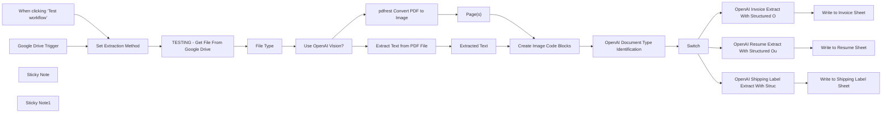
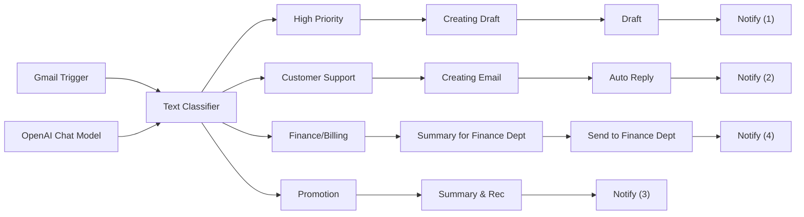
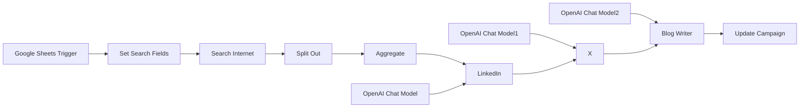
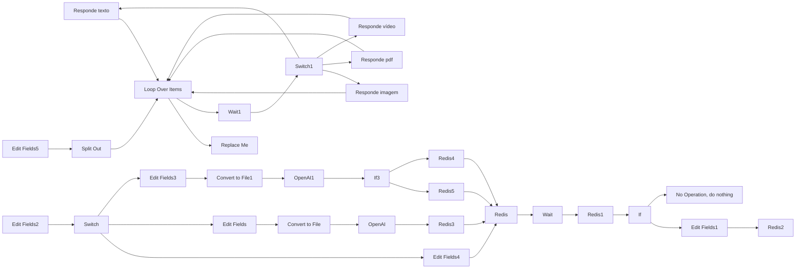
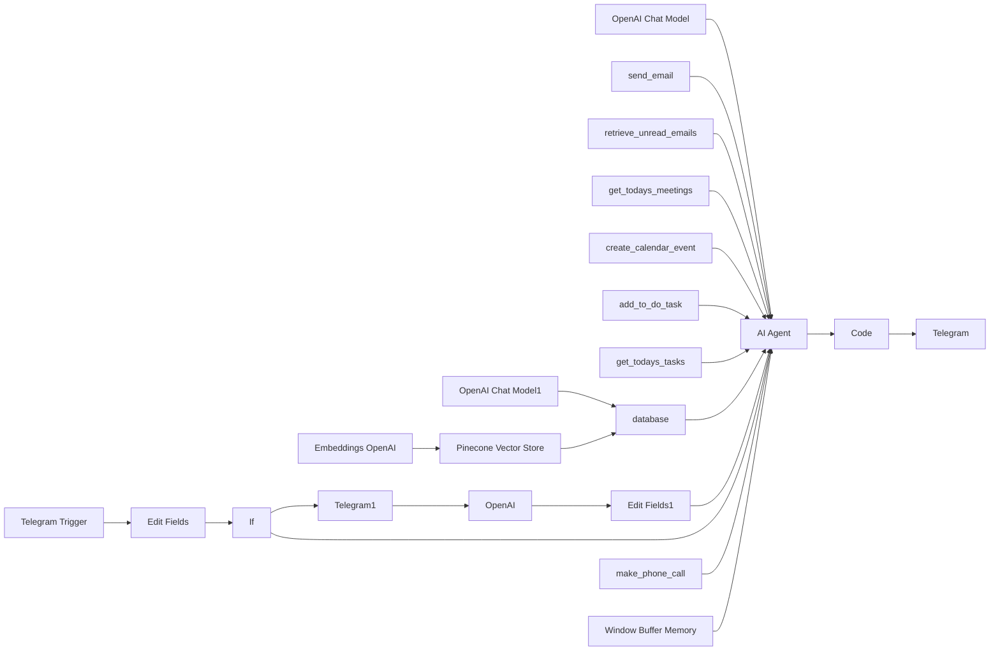
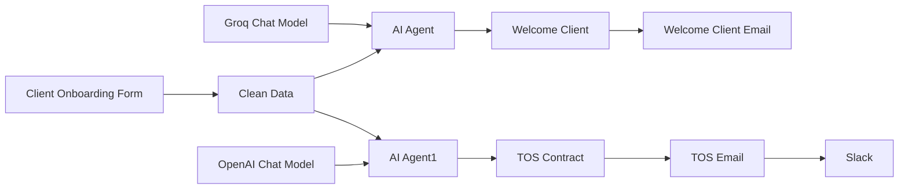
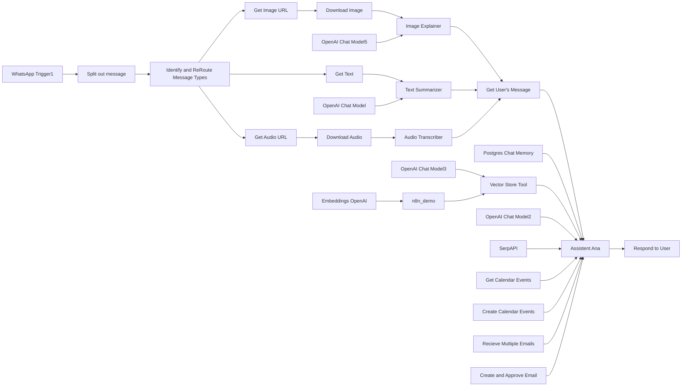

# PACK COM 58 SUPER FLUXOS PARA SEU N8N - Parte 6

Templates nesta parte: 7

## Sumário

- [Template 53 - Extração de dados de PDFs com IA](#template-53)
- [Template 54 - Agentes de Email Automatizados](#template-54)
- [Template 55 - Multiagentes de Natal: Conteúdo automatizado](#template-55)
- [Template 56 - Envio automático de mensagens SDR](#template-56)
- [Template 57 - Atendimento IA via Telegram](#template-57)
- [Template 58 - Onboard de Cliente com IA](#template-58)
- [Template 59 - Assistente Ana: Presente de Natal](#template-59)

---

<a id="template-53"></a>

## Template 53 - Extração de dados de PDFs com IA

- **Nome original:** Fluxo de Extração de Dados de PDFs para Planilhas Google com IA
- **Descrição:** Fluxo que observa uma pasta do Google Drive em busca de novos PDFs, converte páginas em imagens, extrai texto, identifica o tipo de documento com IA (Invoice, Resume ou Shipping Label) e extrai dados estruturados, gravando-os nas planilhas Google correspondentes.
- **Funcionalidade:** • Monitorar uma pasta do Google Drive e iniciar a automação quando um novo arquivo é criado.
• Converter páginas de PDF em imagens para processamento.
• Extrair o texto do PDF para uso posterior.
• Identificar o tipo de documento (Invoice, Resume, Shipping Label) usando IA.
• Extrair dados estruturados relevantes para cada tipo de documento.
• Gerar blocos de imagem para múltiplas páginas quando necessário.
• Gravar os dados extraídos nas planilhas Google correspondentes (Invoices, Resumes, Shipping Labels).
• Encaminhar os dados para a planilha correta com base no tipo de documento.
- **Ferramentas:** • Google Drive: Serviço de armazenamento e monitoramento de pastas para disparar fluxos.
• Google Sheets: Planilhas usadas para armazenar os dados extraídos.
• OpenAI API: IA para classificar o tipo de documento e extrair dados estruturados (Invoice, Resume, Shipping Label).
• pdfrest: Serviço externo para converter páginas de PDF em imagens para processamento.

## Fluxo visual



## Fluxo (.json) :

```json
{
  "name": "Presente de Natal 07 -  Extração de dados",
  "nodes": [
    {
      "parameters": {
        "pollTimes": {
          "item": [
            {
              "mode": "everyMinute"
            }
          ]
        },
        "triggerOn": "specificFolder",
        "folderToWatch": {
          "__rl": true,
          "value": "1Z-afO0Ww36N_O962Nt2ITDR92rgUBpWA",
          "mode": "list",
          "cachedResultName": "Document_Data_Extraction",
          "cachedResultUrl": "https://drive.google.com/drive/folders/1Z-afO0Ww36N_O962Nt2ITDR92rgUBpWA"
        },
        "event": "fileCreated",
        "options": {}
      },
      "id": "5708ae76-9476-430b-acb7-30b9d0cfddc4",
      "name": "Google Drive Trigger",
      "type": "n8n-nodes-base.googleDriveTrigger",
      "typeVersion": 1,
      "position": [
        -700,
        640
      ],
      "disabled": true
    },
    {
      "parameters": {},
      "id": "5c18b1ce-ecfc-4985-bc74-3547533628cc",
      "name": "When clicking ‘Test workflow’",
      "type": "n8n-nodes-base.manualTrigger",
      "typeVersion": 1,
      "position": [
        -700,
        880
      ]
    },
    {
      "parameters": {
        "method": "POST",
        "url": "https://api.pdfrest.com/jpg",
        "authentication": "genericCredentialType",
        "genericAuthType": "httpHeaderAuth",
        "sendHeaders": true,
        "headerParameters": {
          "parameters": [
            {
              "name": "Accept",
              "value": "application/json"
            }
          ]
        },
        "sendBody": true,
        "contentType": "multipart-form-data",
        "bodyParameters": {
          "parameters": [
            {
              "parameterType": "formBinaryData",
              "name": "file",
              "inputDataFieldName": "document_data"
            }
          ]
        },
        "options": {}
      },
      "id": "93bc8cc7-74e5-47ff-832e-98620e1fcfb1",
      "name": "pdfrest Convert PDF to Image",
      "type": "n8n-nodes-base.httpRequest",
      "typeVersion": 4.2,
      "position": [
        460,
        880
      ]
    },
    {
      "parameters": {
        "operation": "download",
        "fileId": {
          "__rl": true,
          "mode": "list",
          "value": ""
        },
        "options": {
          "binaryPropertyName": "document_data"
        }
      },
      "id": "0a71f83c-58bd-417a-9c6b-f9c95c21f15b",
      "name": "TESTING - Get File From Google Drive",
      "type": "n8n-nodes-base.googleDrive",
      "typeVersion": 3,
      "position": [
        -240,
        880
      ]
    },
    {
      "parameters": {
        "method": "POST",
        "url": "https://api.openai.com/v1/chat/completions",
        "authentication": "predefinedCredentialType",
        "nodeCredentialType": "openAiApi",
        "sendHeaders": true,
        "headerParameters": {
          "parameters": [
            {
              "name": "=Content-Type",
              "value": "application/json"
            }
          ]
        },
        "sendBody": true,
        "specifyBody": "json",
        "jsonBody": "={\n  \"model\": \"gpt-4o-mini\",\n  \"messages\": [\n    {\n      \"role\": \"system\",\n      \"content\": \"You are an expert in image analysis and structured data extraction. You will be given an image and should determine the document type from the provided image. The options are Invoice, Resume, or Shipping Label. If it is neither, return 'Unknown'. Your response must adhere to the provided JSON schema.\"\n    },\n    {\n      \"role\": \"user\",\n      \"content\": [\n        {\n          \"type\": \"text\",\n          \"text\": \"Please determine the document type of this image. {{ ($('Set Extraction Method').item.json.use_openai_vision) === false ? $('Create Image Code Blocks').item.json.sanitizedText : '' }}\"\n        }\n  {{ $('Set Extraction Method').item.json.use_openai_vision === true ? ',' + JSON.stringify($('Create Image Code Blocks').item.json.imageBlocks).slice(1, -1) : '' }}\n      ]\n    }\n  ],\n  \"response_format\": {\n    \"type\": \"json_schema\",\n    \"json_schema\": {\n      \"name\": \"document_type_analysis\",\n      \"schema\": {\n        \"type\": \"object\",\n        \"properties\": {\n          \"document_type\": {\n            \"type\": \"string\",\n            \"enum\": [\"Invoice\", \"Resume\", \"Shipping Label\", \"Unknown\"]\n          },\n          \"confidence_score\": {\n            \"type\": \"number\"\n          },\n          \"analysis_details\": {\n            \"type\": \"object\",\n            \"properties\": {\n              \"detected_keywords\": {\n                \"type\": \"array\",\n                \"items\": { \"type\": \"string\" }\n              },\n              \"reasoning\": { \"type\": \"string\" },\n              \"timestamp\": { \"type\": \"string\" }\n            },\n            \"required\": [\"detected_keywords\", \"reasoning\", \"timestamp\"],\n            \"additionalProperties\": false\n          }\n        },\n        \"required\": [\"document_type\", \"confidence_score\", \"analysis_details\"],\n        \"additionalProperties\": false\n      },\n      \"strict\": true\n    }\n  }\n}\n",
        "options": {}
      },
      "id": "e6a54349-7f26-4071-9d01-64c01d3062fa",
      "name": "OpenAI Document Type Identification",
      "type": "n8n-nodes-base.httpRequest",
      "position": [
        1240,
        880
      ],
      "typeVersion": 4.2
    },
    {
      "parameters": {
        "method": "POST",
        "url": "https://api.openai.com/v1/chat/completions",
        "authentication": "predefinedCredentialType",
        "nodeCredentialType": "openAiApi",
        "sendHeaders": true,
        "headerParameters": {
          "parameters": [
            {
              "name": "=Content-Type",
              "value": "application/json"
            }
          ]
        },
        "sendBody": true,
        "specifyBody": "json",
        "jsonBody": "={\n  \"model\": \"gpt-4o\",\n  \"messages\": [\n    {\n      \"role\": \"system\",\n      \"content\": \"You are an AI assistant specializing in extracting structured data from files. Please analyze the provided document and output JSON that strictly adheres to the given schema.\"\n    },\n    {\n      \"role\": \"user\",\n      \"content\": [\n        {\n          \"type\": \"text\",\n          \"text\": \"Extract the invoice details from this document. {{ ($('Set Extraction Method').item.json.use_openai_vision) === false ? $('Create Image Code Blocks').item.json.sanitizedText : '' }}\"\n        }\n{{ $('Set Extraction Method').item.json.use_openai_vision === true ? ',' + JSON.stringify($('Create Image Code Blocks').item.json.imageBlocks).slice(1, -1) : '' }}\n    ]\n    }\n  ],\n  \"response_format\": {\n    \"type\": \"json_schema\",\n    \"json_schema\": {\n      \"name\": \"Invoice_Schema\",\n      \"description\": \"Schema for structured invoice data extraction\",\n      \"strict\": true,\n      \"schema\": {\n        \"type\": \"object\",\n        \"properties\": {\n          \"invoice_number\": {\n            \"type\": [\"string\", \"null\"],\n            \"description\": \"Unique identifier for the invoice\"\n          },\n          \"order_number\": {\n            \"type\": [\"string\", \"null\"],\n            \"description\": \"Order number associated with the invoice\"\n          },\n          \"invoice_date\": {\n            \"type\": [\"string\", \"null\"],\n            \"description\": \"Date when the invoice was issued\"\n          },\n          \"due_date\": {\n            \"type\": [\"string\", \"null\"],\n            \"description\": \"Payment due date\"\n          },\n          \"total_due\": {\n            \"type\": [\"string\", \"null\"],\n            \"description\": \"Total amount due for the invoice\"\n          },\n          \"from\": {\n            \"type\": \"object\",\n            \"properties\": {\n              \"name\": { \"type\": [\"string\", \"null\"], \"description\": \"Name of the issuer\" },\n              \"address\": { \"type\": [\"string\", \"null\"], \"description\": \"Address of the issuer\" },\n              \"email\": { \"type\": [\"string\", \"null\"], \"description\": \"Email address of the issuer\" }\n            },\n            \"required\": [\"name\", \"address\", \"email\"],\n            \"additionalProperties\": false\n          },\n          \"to\": {\n            \"type\": \"object\",\n            \"properties\": {\n              \"name\": { \"type\": [\"string\", \"null\"], \"description\": \"Name of the recipient\" },\n              \"address\": { \"type\": [\"string\", \"null\"], \"description\": \"Address of the recipient\" },\n              \"email\": { \"type\": [\"string\", \"null\"], \"description\": \"Email address of the recipient\" }\n            },\n            \"required\": [\"name\", \"address\", \"email\"],\n            \"additionalProperties\": false\n          },\n          \"services\": {\n            \"type\": \"array\",\n            \"items\": {\n              \"type\": \"object\",\n              \"properties\": {\n                \"description\": { \"type\": [\"string\", \"null\"], \"description\": \"Service description\" },\n                \"rate\": { \"type\": [\"string\", \"null\"], \"description\": \"Rate per unit or hour\" },\n                \"quantity\": { \"type\": [\"string\", \"null\"], \"description\": \"Quantity of the service provided\" },\n                \"subtotal\": { \"type\": [\"string\", \"null\"], \"description\": \"Subtotal amount for the service\" }\n              },\n              \"required\": [\"description\", \"rate\", \"quantity\", \"subtotal\"],\n              \"additionalProperties\": false\n            }\n          },\n          \"subtotal\": {\n            \"type\": [\"string\", \"null\"],\n            \"description\": \"Subtotal amount for the invoice\"\n          },\n          \"tax\": {\n            \"type\": [\"string\", \"null\"],\n            \"description\": \"Tax amount applied to the invoice\"\n          },\n          \"total\": {\n            \"type\": [\"string\", \"null\"],\n            \"description\": \"Total amount including tax\"\n          },\n          \"bank_details\": {\n            \"type\": \"object\",\n            \"properties\": {\n              \"account_number\": {\n                \"type\": [\"string\", \"null\"],\n                \"description\": \"Bank account number for payment\"\n              },\n              \"bsb_number\": {\n                \"type\": [\"string\", \"null\"],\n                \"description\": \"Bank BSB number\"\n              }\n            },\n            \"required\": [\"account_number\", \"bsb_number\"],\n            \"additionalProperties\": false\n          }\n        },\n        \"required\": [\n          \"invoice_number\",\n          \"order_number\",\n          \"invoice_date\",\n          \"due_date\",\n          \"total_due\",\n          \"from\",\n          \"to\",\n          \"services\",\n          \"subtotal\",\n          \"tax\",\n          \"total\",\n          \"bank_details\"\n        ],\n        \"additionalProperties\": false\n      }\n    }\n  }\n}\n\n\n",
        "options": {}
      },
      "id": "db8c31a9-48b2-4301-a070-4a5e1f955847",
      "name": "OpenAI Invoice Extract With Structured Output",
      "type": "n8n-nodes-base.httpRequest",
      "position": [
        1800,
        640
      ],
      "typeVersion": 4.2
    },
    {
      "parameters": {
        "method": "POST",
        "url": "https://api.openai.com/v1/chat/completions",
        "authentication": "predefinedCredentialType",
        "nodeCredentialType": "openAiApi",
        "sendHeaders": true,
        "headerParameters": {
          "parameters": [
            {
              "name": "=Content-Type",
              "value": "application/json"
            }
          ]
        },
        "sendBody": true,
        "specifyBody": "json",
        "jsonBody": "={\n  \"model\": \"gpt-4o\",\n  \"messages\": [\n    {\n      \"role\": \"system\",\n      \"content\": \"You are an AI assistant specializing in extracting structured data from files. Please analyze the provided document and output JSON that strictly adheres to the given schema.\"\n    },\n    {\n      \"role\": \"user\",\n      \"content\": [\n        {\n          \"type\": \"text\",\n          \"text\": \"Extract the shipping label details from this document. {{ ($('Set Extraction Method').item.json.use_openai_vision) === false ? $('Create Image Code Blocks').item.json.sanitizedText : '' }}\"\n        }\n  {{ $('Set Extraction Method').item.json.use_openai_vision === true ? ',' + JSON.stringify($('Create Image Code Blocks').item.json.imageBlocks).slice(1, -1) : '' }}\n      ]\n    }\n  ],\n  \"response_format\": {\n    \"type\": \"json_schema\",\n    \"json_schema\": {\n      \"name\": \"shipping_label_extraction\",\n      \"description\": \"Schema for extracting structured shipping label details, such as tracking numbers, addresses, package information, and delivery details.\",\n      \"strict\": true,\n      \"schema\": {\n        \"type\": \"object\",\n        \"properties\": {\n          \"shipment_id\": {\n            \"type\": [\"string\", \"null\"],\n            \"description\": \"A unique identifier for the shipment, often a tracking number.\"\n          },\n          \"shipment_date\": {\n            \"type\": [\"string\", \"null\"],\n            \"description\": \"The date the shipment was processed, in YYYY-MM-DD format.\"\n          },\n          \"carrier\": {\n            \"type\": [\"string\", \"null\"],\n            \"description\": \"The name of the shipping carrier (e.g., UPS, FedEx, DHL, USPS).\"\n          },\n          \"tracking_number\": {\n            \"type\": [\"string\", \"null\"],\n            \"description\": \"The tracking number associated with the shipment.\"\n          },\n          \"sender\": {\n            \"type\": \"object\",\n            \"description\": \"Details about the sender of the shipment.\",\n            \"properties\": {\n              \"name\": { \"type\": [\"string\", \"null\"], \"description\": \"The sender's name.\" },\n              \"address\": { \"type\": [\"string\", \"null\"], \"description\": \"The full address of the sender.\" }\n            },\n            \"required\": [\"name\", \"address\"],\n            \"additionalProperties\": false\n          },\n          \"recipient\": {\n            \"type\": \"object\",\n            \"description\": \"Details about the recipient of the shipment.\",\n            \"properties\": {\n              \"name\": { \"type\": [\"string\", \"null\"], \"description\": \"The recipient's name.\" },\n              \"address\": { \"type\": [\"string\", \"null\"], \"description\": \"The full address of the recipient.\" }\n            },\n            \"required\": [\"name\", \"address\"],\n            \"additionalProperties\": false\n          },\n          \"parcel_details\": {\n            \"type\": \"object\",\n            \"description\": \"Details about the parcel being shipped.\",\n            \"properties\": {\n              \"weight\": {\n                \"type\": [\"number\", \"null\"],\n                \"description\": \"The weight of the parcel in kilograms or pounds.\"\n              },\n              \"dimensions\": {\n                \"type\": \"object\",\n                \"description\": \"The dimensions of the parcel.\",\n                \"properties\": {\n                  \"length\": { \"type\": [\"number\", \"null\"], \"description\": \"Length of the parcel.\" },\n                  \"width\": { \"type\": [\"number\", \"null\"], \"description\": \"Width of the parcel.\" },\n                  \"height\": { \"type\": [\"number\", \"null\"], \"description\": \"Height of the parcel.\" }\n                },\n                \"required\": [\"length\", \"width\", \"height\"],\n                \"additionalProperties\": false\n              }\n            },\n            \"required\": [\"weight\", \"dimensions\"],\n            \"additionalProperties\": false\n          },\n          \"shipping_service\": {\n            \"type\": [\"string\", \"null\"],\n            \"description\": \"The specific shipping service (e.g., Express, Overnight, Ground).\"\n          },\n          \"delivery_date\": {\n            \"type\": [\"string\", \"null\"],\n            \"description\": \"The estimated or actual delivery date, in YYYY-MM-DD format.\"\n          },\n          \"cost\": {\n            \"type\": [\"number\", \"null\"],\n            \"description\": \"The shipping cost in the applicable currency.\"\n          },\n          \"currency\": {\n            \"type\": [\"string\", \"null\"],\n            \"description\": \"The currency for the shipping cost (e.g., USD, EUR).\"\n          },\n          \"barcode_data\": {\n            \"type\": [\"string\", \"null\"],\n            \"description\": \"Any barcode or QR code data extracted from the shipping label.\"\n          }\n        },\n        \"required\": [\n          \"shipment_id\",\n          \"shipment_date\",\n          \"carrier\",\n          \"tracking_number\",\n          \"sender\",\n          \"recipient\",\n          \"parcel_details\",\n          \"shipping_service\",\n          \"delivery_date\",\n          \"cost\",\n          \"currency\",\n          \"barcode_data\"\n        ],\n        \"additionalProperties\": false\n      }\n    }\n  }\n}\n",
        "options": {}
      },
      "id": "54ccb444-d300-47dc-a6de-03e4bd13aae5",
      "name": "OpenAI Shipping Label Extract With Structured Output",
      "type": "n8n-nodes-base.httpRequest",
      "position": [
        1800,
        1100
      ],
      "typeVersion": 4.2
    },
    {
      "parameters": {
        "method": "POST",
        "url": "https://api.openai.com/v1/chat/completions",
        "authentication": "predefinedCredentialType",
        "nodeCredentialType": "openAiApi",
        "sendHeaders": true,
        "headerParameters": {
          "parameters": [
            {
              "name": "=Content-Type",
              "value": "application/json"
            }
          ]
        },
        "sendBody": true,
        "specifyBody": "json",
        "jsonBody": "={\n  \"model\": \"gpt-4o\",\n  \"messages\": [\n    {\n      \"role\": \"system\",\n      \"content\": \"You are an AI assistant specializing in extracting structured data from files. Please analyze the provided document and output JSON that strictly adheres to the given schema.\"\n    },\n    {\n      \"role\": \"user\",\n      \"content\": [\n        {\n          \"type\": \"text\",\n          \"text\": \"Extract the resume details from this document. {{ ($('Set Extraction Method').item.json.use_openai_vision) === false ? $('Create Image Code Blocks').item.json.sanitizedText : '' }}\"\n        }\n  {{ $('Set Extraction Method').item.json.use_openai_vision === true ? ',' + JSON.stringify($('Create Image Code Blocks').item.json.imageBlocks).slice(1, -1) : '' }}\n      ]\n    }\n  ],\n  \"response_format\": {\n    \"type\": \"json_schema\",\n    \"json_schema\": {\n      \"name\": \"resume_extraction\",\n      \"description\": \"Schema for structured resume data extraction.\",\n      \"strict\": true,\n      \"schema\": {\n        \"type\": \"object\",\n        \"properties\": {\n          \"full_name\": {\n            \"type\": [\"string\", \"null\"],\n            \"description\": \"The individual's full name.\"\n          },\n          \"email\": {\n            \"type\": [\"string\", \"null\"],\n            \"description\": \"The individual's email address.\"\n          },\n          \"phone_number\": {\n            \"type\": [\"string\", \"null\"],\n            \"description\": \"The individual's phone number.\"\n          },\n          \"address\": {\n            \"type\": [\"string\", \"null\"],\n            \"description\": \"The individual's address.\"\n          },\n          \"linkedin_profile\": {\n            \"type\": [\"string\", \"null\"],\n            \"description\": \"LinkedIn profile URL.\"\n          },\n          \"github_profile\": {\n            \"type\": [\"string\", \"null\"],\n            \"description\": \"GitHub profile URL.\"\n          },\n          \"summary\": {\n            \"type\": [\"string\", \"null\"],\n            \"description\": \"Professional summary or bio.\"\n          },\n          \"work_experience\": {\n            \"type\": \"array\",\n            \"description\": \"List of work experiences.\",\n            \"items\": {\n              \"type\": \"object\",\n              \"properties\": {\n                \"job_title\": {\n                  \"type\": [\"string\", \"null\"],\n                  \"description\": \"Job title.\"\n                },\n                \"company\": {\n                  \"type\": [\"string\", \"null\"],\n                  \"description\": \"Company name.\"\n                },\n                \"location\": {\n                  \"type\": [\"string\", \"null\"],\n                  \"description\": \"Job location.\"\n                },\n                \"start_date\": {\n                  \"type\": [\"string\", \"null\"],\n                  \"description\": \"Start date in YYYY-MM-DD format.\"\n                },\n                \"end_date\": {\n                  \"type\": [\"string\", \"null\"],\n                  \"description\": \"End date in YYYY-MM-DD format or 'Present'.\"\n                },\n                \"responsibilities\": {\n                  \"type\": [\"string\", \"null\"],\n                  \"description\": \"Responsibilities or achievements.\"\n                }\n              },\n              \"required\": [\"job_title\", \"company\", \"location\", \"start_date\", \"end_date\", \"responsibilities\"],\n              \"additionalProperties\": false\n            }\n          },\n          \"education\": {\n            \"type\": \"array\",\n            \"description\": \"List of educational qualifications.\",\n            \"items\": {\n              \"type\": \"object\",\n              \"properties\": {\n                \"degree\": {\n                  \"type\": [\"string\", \"null\"],\n                  \"description\": \"Degree name.\"\n                },\n                \"field_of_study\": {\n                  \"type\": [\"string\", \"null\"],\n                  \"description\": \"Field of study.\"\n                },\n                \"institution\": {\n                  \"type\": [\"string\", \"null\"],\n                  \"description\": \"Institution name.\"\n                },\n                \"graduation_date\": {\n                  \"type\": [\"string\", \"null\"],\n                  \"description\": \"Graduation date in YYYY-MM-DD format.\"\n                }\n              },\n              \"required\": [\"degree\", \"field_of_study\", \"institution\", \"graduation_date\"],\n              \"additionalProperties\": false\n            }\n          },\n          \"skills\": {\n            \"type\": \"array\",\n            \"items\": {\n              \"type\": [\"string\", \"null\"],\n              \"description\": \"A skill listed on the resume.\"\n            },\n            \"description\": \"List of skills.\"\n          },\n          \"certifications\": {\n            \"type\": \"array\",\n            \"description\": \"List of certifications.\",\n            \"items\": {\n              \"type\": \"object\",\n              \"properties\": {\n                \"name\": {\n                  \"type\": [\"string\", \"null\"],\n                  \"description\": \"Certification name.\"\n                },\n                \"organization\": {\n                  \"type\": [\"string\", \"null\"],\n                  \"description\": \"Issuing organization.\"\n                },\n                \"date\": {\n                  \"type\": [\"string\", \"null\"],\n                  \"description\": \"Certification date in YYYY-MM-DD format.\"\n                }\n              },\n              \"required\": [\"name\", \"organization\", \"date\"],\n              \"additionalProperties\": false\n            }\n          },\n          \"languages\": {\n            \"type\": \"array\",\n            \"description\": \"List of languages spoken.\",\n            \"items\": {\n              \"type\": \"object\",\n              \"properties\": {\n                \"language\": {\n                  \"type\": [\"string\", \"null\"],\n                  \"description\": \"Language name.\"\n                },\n                \"proficiency\": {\n                  \"type\": [\"string\", \"null\"],\n                  \"description\": \"Proficiency level (e.g., Fluent, Beginner).\"\n                }\n              },\n              \"required\": [\"language\", \"proficiency\"],\n              \"additionalProperties\": false\n            }\n          }\n        },\n        \"required\": [\n          \"full_name\",\n          \"email\",\n          \"phone_number\",\n          \"address\",\n          \"linkedin_profile\",\n          \"github_profile\",\n          \"summary\",\n          \"work_experience\",\n          \"education\",\n          \"skills\",\n          \"certifications\",\n          \"languages\"\n        ],\n        \"additionalProperties\": false\n      }\n    }\n  }\n}\n",
        "options": {}
      },
      "id": "8fd8b4bc-4fc5-421a-9a79-fbec1f320204",
      "name": "OpenAI Resume Extract With Structured Output",
      "type": "n8n-nodes-base.httpRequest",
      "position": [
        1800,
        880
      ],
      "typeVersion": 4.2
    },
    {
      "parameters": {
        "operation": "appendOrUpdate",
        "documentId": {
          "__rl": true,
          "value": "1ZTgJUY1EvOXfEEImEWopmgkurOeFs38fXVcOkMyi74A",
          "mode": "list",
          "cachedResultName": "Invoice Export Tracker",
          "cachedResultUrl": "https://docs.google.com/spreadsheets/d/1ZTgJUY1EvOXfEEImEWopmgkurOeFs38fXVcOkMyi74A/edit?usp=drivesdk"
        },
        "sheetName": {
          "__rl": true,
          "value": "gid=0",
          "mode": "list",
          "cachedResultName": "Invoices",
          "cachedResultUrl": "https://docs.google.com/spreadsheets/d/1ZTgJUY1EvOXfEEImEWopmgkurOeFs38fXVcOkMyi74A/edit#gid=0"
        },
        "columns": {
          "mappingMode": "defineBelow",
          "value": {
            "invoice_number": "={{ $json.choices[0].message.content.parseJson().invoice_number }}",
            "order_number": "={{ $json.choices[0].message.content.parseJson().order_number }}",
            "invoice_date": "={{ $json.choices[0].message.content.parseJson().invoice_date }}",
            "due_date": "={{ $json.choices[0].message.content.parseJson().due_date }}",
            "total_due": "={{ $json.choices[0].message.content.parseJson().total_due }}",
            "from_name": "={{ $json.choices[0].message.content.parseJson().from.name }}",
            "from_address": "={{ $json.choices[0].message.content.parseJson().from.address }}",
            "bank_bsb_number": "={{ $json.choices[0].message.content.parseJson().bank_details.bsb_number }}",
            "bank_account_number": "={{ $json.choices[0].message.content.parseJson().bank_details.account_number }}",
            "total": "={{ $json.choices[0].message.content.parseJson().total }}",
            "tax": "={{ $json.choices[0].message.content.parseJson().tax }}",
            "subtotal": "={{ $json.choices[0].message.content.parseJson().subtotal }}",
            "service_subtotal": "={{ $json.choices[0].message.content.parseJson().services.last().subtotal }}",
            "service_quantity": "={{ $json.choices[0].message.content.parseJson().services.last().quantity }}",
            "service_description": "={{ $json.choices[0].message.content.parseJson().services.last().description }}",
            "to_email": "={{ $json.choices[0].message.content.parseJson().to.email }}",
            "to_address": "={{ $json.choices[0].message.content.parseJson().to.address }}",
            "to_name": "={{ $json.choices[0].message.content.parseJson().to.name }}",
            "from_email": "={{ $json.choices[0].message.content.parseJson().from.email }}",
            "service_rate": "={{ $json.choices[0].message.content.parseJson().services.last().rate }}"
          },
          "matchingColumns": [
            "invoice_number"
          ],
          "schema": [
            {
              "id": "invoice_number",
              "displayName": "invoice_number",
              "required": false,
              "defaultMatch": false,
              "display": true,
              "type": "string",
              "canBeUsedToMatch": true,
              "removed": false
            },
            {
              "id": "order_number",
              "displayName": "order_number",
              "required": false,
              "defaultMatch": false,
              "display": true,
              "type": "string",
              "canBeUsedToMatch": true
            },
            {
              "id": "invoice_date",
              "displayName": "invoice_date",
              "required": false,
              "defaultMatch": false,
              "display": true,
              "type": "string",
              "canBeUsedToMatch": true
            },
            {
              "id": "due_date",
              "displayName": "due_date",
              "required": false,
              "defaultMatch": false,
              "display": true,
              "type": "string",
              "canBeUsedToMatch": true
            },
            {
              "id": "total_due",
              "displayName": "total_due",
              "required": false,
              "defaultMatch": false,
              "display": true,
              "type": "string",
              "canBeUsedToMatch": true
            },
            {
              "id": "from_name",
              "displayName": "from_name",
              "required": false,
              "defaultMatch": false,
              "display": true,
              "type": "string",
              "canBeUsedToMatch": true
            },
            {
              "id": "from_address",
              "displayName": "from_address",
              "required": false,
              "defaultMatch": false,
              "display": true,
              "type": "string",
              "canBeUsedToMatch": true
            },
            {
              "id": "from_email",
              "displayName": "from_email",
              "required": false,
              "defaultMatch": false,
              "display": true,
              "type": "string",
              "canBeUsedToMatch": true
            },
            {
              "id": "to_name",
              "displayName": "to_name",
              "required": false,
              "defaultMatch": false,
              "display": true,
              "type": "string",
              "canBeUsedToMatch": true
            },
            {
              "id": "to_address",
              "displayName": "to_address",
              "required": false,
              "defaultMatch": false,
              "display": true,
              "type": "string",
              "canBeUsedToMatch": true
            },
            {
              "id": "to_email",
              "displayName": "to_email",
              "required": false,
              "defaultMatch": false,
              "display": true,
              "type": "string",
              "canBeUsedToMatch": true
            },
            {
              "id": "service_description",
              "displayName": "service_description",
              "required": false,
              "defaultMatch": false,
              "display": true,
              "type": "string",
              "canBeUsedToMatch": true
            },
            {
              "id": "service_rate",
              "displayName": "service_rate",
              "required": false,
              "defaultMatch": false,
              "display": true,
              "type": "string",
              "canBeUsedToMatch": true
            },
            {
              "id": "service_quantity",
              "displayName": "service_quantity",
              "required": false,
              "defaultMatch": false,
              "display": true,
              "type": "string",
              "canBeUsedToMatch": true
            },
            {
              "id": "service_subtotal",
              "displayName": "service_subtotal",
              "required": false,
              "defaultMatch": false,
              "display": true,
              "type": "string",
              "canBeUsedToMatch": true
            },
            {
              "id": "subtotal",
              "displayName": "subtotal",
              "required": false,
              "defaultMatch": false,
              "display": true,
              "type": "string",
              "canBeUsedToMatch": true
            },
            {
              "id": "tax",
              "displayName": "tax",
              "required": false,
              "defaultMatch": false,
              "display": true,
              "type": "string",
              "canBeUsedToMatch": true
            },
            {
              "id": "total",
              "displayName": "total",
              "required": false,
              "defaultMatch": false,
              "display": true,
              "type": "string",
              "canBeUsedToMatch": true
            },
            {
              "id": "bank_account_number",
              "displayName": "bank_account_number",
              "required": false,
              "defaultMatch": false,
              "display": true,
              "type": "string",
              "canBeUsedToMatch": true
            },
            {
              "id": "bank_bsb_number",
              "displayName": "bank_bsb_number",
              "required": false,
              "defaultMatch": false,
              "display": true,
              "type": "string",
              "canBeUsedToMatch": true
            }
          ]
        },
        "options": {}
      },
      "id": "0552bcf3-98c6-4052-bcc2-829abab2cd3f",
      "name": "Write to Invoice Sheet",
      "type": "n8n-nodes-base.googleSheets",
      "typeVersion": 4.5,
      "position": [
        2140,
        640
      ]
    },
    {
      "parameters": {
        "operation": "appendOrUpdate",
        "documentId": {
          "__rl": true,
          "value": "1ZTgJUY1EvOXfEEImEWopmgkurOeFs38fXVcOkMyi74A",
          "mode": "list",
          "cachedResultName": "Data Extraction Spreadsheet",
          "cachedResultUrl": "https://docs.google.com/spreadsheets/d/1ZTgJUY1EvOXfEEImEWopmgkurOeFs38fXVcOkMyi74A/edit?usp=drivesdk"
        },
        "sheetName": {
          "__rl": true,
          "value": 1987199046,
          "mode": "list",
          "cachedResultName": "Resumes",
          "cachedResultUrl": "https://docs.google.com/spreadsheets/d/1ZTgJUY1EvOXfEEImEWopmgkurOeFs38fXVcOkMyi74A/edit#gid=1987199046"
        },
        "columns": {
          "mappingMode": "defineBelow",
          "value": {
            "full_name": "={{ $json.choices[0].message.content.parseJson().full_name }}",
            "email": "={{ $json.choices[0].message.content.parseJson().email }}",
            "phone_number": "={{ $json.choices[0].message.content.parseJson().phone_number }}",
            "address": "={{ $json.choices[0].message.content.parseJson().address }}",
            "linkedin_profile": "={{ $json.choices[0].message.content.parseJson().linkedin_profile }}",
            "github_profile": "={{ $json.choices[0].message.content.parseJson().github_profile }}",
            "summary": "={{ $json.choices[0].message.content.parseJson().summary }}",
            "work_experience_1_job_title": "={{ $json.choices[0].message.content.parseJson().work_experience[0].job_title }}",
            "work_experience_1_company": "={{ $json.choices[0].message.content.parseJson().work_experience[0].company }}",
            "work_experience_1_location": "={{ $json.choices[0].message.content.parseJson().work_experience[0].location }}",
            "language_2_proficiency": "=",
            "language_2": "=",
            "language_1_proficiency": "=",
            "language_1": "={{ $json.choices[0].message.content.parseJson().languages }}",
            "certification_1_date": "={{ $json.choices[0].message.content.parseJson().certifications[0].date }}",
            "certification_1_organization": "={{ $json.choices[0].message.content.parseJson().certifications[0].organization }}",
            "certification_1_name": "={{ $json.choices[0].message.content.parseJson().certifications[0].name }}",
            "skill_3": "=",
            "skill_2": "=",
            "skill_1": "={{ $json.choices[0].message.content.parseJson().skills }}",
            "education_2_graduation_date": "=",
            "education_2_institution": "=",
            "education_2_field_of_study": "=",
            "education_2_degree": "=",
            "education_1_graduation_date": "={{ $json.choices[0].message.content.parseJson().education[0].graduation_date }}",
            "education_1_institution": "={{ $json.choices[0].message.content.parseJson().education[0].institution }}",
            "education_1_field_of_study": "={{ $json.choices[0].message.content.parseJson().education[0].field_of_study }}",
            "education_1_degree": "={{ $json.choices[0].message.content.parseJson().education[0].field_of_study }}",
            "work_experience_2_responsibilities": "={{ $json.choices[0].message.content.parseJson().work_experience[1].responsibilities }}",
            "work_experience_2_end_date": "={{ $json.choices[0].message.content.parseJson().work_experience[1].end_date }}",
            "work_experience_2_start_date": "={{ $json.choices[0].message.content.parseJson().work_experience[1].start_date }}",
            "work_experience_2_location": "={{ $json.choices[0].message.content.parseJson().work_experience[1].location }}",
            "work_experience_2_company": "={{ $json.choices[0].message.content.parseJson().work_experience[1].company }}",
            "work_experience_2_job_title": "={{ $json.choices[0].message.content.parseJson().work_experience[1].job_title }}",
            "work_experience_1_responsibilities": "={{ $json.choices[0].message.content.parseJson().work_experience[0].responsibilities }}",
            "work_experience_1_end_date": "={{ $json.choices[0].message.content.parseJson().work_experience[0].end_date }}",
            "work_experience_1_start_date": "={{ $json.choices[0].message.content.parseJson().work_experience[0].start_date }}"
          },
          "matchingColumns": [
            "full_name"
          ],
          "schema": [
            {
              "id": "full_name",
              "displayName": "full_name",
              "required": false,
              "defaultMatch": false,
              "display": true,
              "type": "string",
              "canBeUsedToMatch": true,
              "removed": false
            },
            {
              "id": "email",
              "displayName": "email",
              "required": false,
              "defaultMatch": false,
              "display": true,
              "type": "string",
              "canBeUsedToMatch": true,
              "removed": false
            },
            {
              "id": "phone_number",
              "displayName": "phone_number",
              "required": false,
              "defaultMatch": false,
              "display": true,
              "type": "string",
              "canBeUsedToMatch": true,
              "removed": false
            },
            {
              "id": "address",
              "displayName": "address",
              "required": false,
              "defaultMatch": false,
              "display": true,
              "type": "string",
              "canBeUsedToMatch": true,
              "removed": false
            },
            {
              "id": "linkedin_profile",
              "displayName": "linkedin_profile",
              "required": false,
              "defaultMatch": false,
              "display": true,
              "type": "string",
              "canBeUsedToMatch": true,
              "removed": false
            },
            {
              "id": "github_profile",
              "displayName": "github_profile",
              "required": false,
              "defaultMatch": false,
              "display": true,
              "type": "string",
              "canBeUsedToMatch": true,
              "removed": false
            },
            {
              "id": "summary",
              "displayName": "summary",
              "required": false,
              "defaultMatch": false,
              "display": true,
              "type": "string",
              "canBeUsedToMatch": true,
              "removed": false
            },
            {
              "id": "work_experience_1_job_title",
              "displayName": "work_experience_1_job_title",
              "required": false,
              "defaultMatch": false,
              "display": true,
              "type": "string",
              "canBeUsedToMatch": true,
              "removed": false
            },
            {
              "id": "work_experience_1_company",
              "displayName": "work_experience_1_company",
              "required": false,
              "defaultMatch": false,
              "display": true,
              "type": "string",
              "canBeUsedToMatch": true,
              "removed": false
            },
            {
              "id": "work_experience_1_location",
              "displayName": "work_experience_1_location",
              "required": false,
              "defaultMatch": false,
              "display": true,
              "type": "string",
              "canBeUsedToMatch": true,
              "removed": false
            },
            {
              "id": "work_experience_1_start_date",
              "displayName": "work_experience_1_start_date",
              "required": false,
              "defaultMatch": false,
              "display": true,
              "type": "string",
              "canBeUsedToMatch": true,
              "removed": false
            },
            {
              "id": "work_experience_1_end_date",
              "displayName": "work_experience_1_end_date",
              "required": false,
              "defaultMatch": false,
              "display": true,
              "type": "string",
              "canBeUsedToMatch": true,
              "removed": false
            },
            {
              "id": "work_experience_1_responsibilities",
              "displayName": "work_experience_1_responsibilities",
              "required": false,
              "defaultMatch": false,
              "display": true,
              "type": "string",
              "canBeUsedToMatch": true,
              "removed": false
            },
            {
              "id": "work_experience_2_job_title",
              "displayName": "work_experience_2_job_title",
              "required": false,
              "defaultMatch": false,
              "display": true,
              "type": "string",
              "canBeUsedToMatch": true,
              "removed": false
            },
            {
              "id": "work_experience_2_company",
              "displayName": "work_experience_2_company",
              "required": false,
              "defaultMatch": false,
              "display": true,
              "type": "string",
              "canBeUsedToMatch": true,
              "removed": false
            },
            {
              "id": "work_experience_2_location",
              "displayName": "work_experience_2_location",
              "required": false,
              "defaultMatch": false,
              "display": true,
              "type": "string",
              "canBeUsedToMatch": true,
              "removed": false
            },
            {
              "id": "work_experience_2_start_date",
              "displayName": "work_experience_2_start_date",
              "required": false,
              "defaultMatch": false,
              "display": true,
              "type": "string",
              "canBeUsedToMatch": true,
              "removed": false
            },
            {
              "id": "work_experience_2_end_date",
              "displayName": "work_experience_2_end_date",
              "required": false,
              "defaultMatch": false,
              "display": true,
              "type": "string",
              "canBeUsedToMatch": true,
              "removed": false
            },
            {
              "id": "work_experience_2_responsibilities",
              "displayName": "work_experience_2_responsibilities",
              "required": false,
              "defaultMatch": false,
              "display": true,
              "type": "string",
              "canBeUsedToMatch": true,
              "removed": false
            },
            {
              "id": "education_1_degree",
              "displayName": "education_1_degree",
              "required": false,
              "defaultMatch": false,
              "display": true,
              "type": "string",
              "canBeUsedToMatch": true,
              "removed": false
            },
            {
              "id": "education_1_field_of_study",
              "displayName": "education_1_field_of_study",
              "required": false,
              "defaultMatch": false,
              "display": true,
              "type": "string",
              "canBeUsedToMatch": true,
              "removed": false
            },
            {
              "id": "education_1_institution",
              "displayName": "education_1_institution",
              "required": false,
              "defaultMatch": false,
              "display": true,
              "type": "string",
              "canBeUsedToMatch": true,
              "removed": false
            },
            {
              "id": "education_1_graduation_date",
              "displayName": "education_1_graduation_date",
              "required": false,
              "defaultMatch": false,
              "display": true,
              "type": "string",
              "canBeUsedToMatch": true,
              "removed": false
            },
            {
              "id": "education_2_degree",
              "displayName": "education_2_degree",
              "required": false,
              "defaultMatch": false,
              "display": true,
              "type": "string",
              "canBeUsedToMatch": true,
              "removed": false
            },
            {
              "id": "education_2_field_of_study",
              "displayName": "education_2_field_of_study",
              "required": false,
              "defaultMatch": false,
              "display": true,
              "type": "string",
              "canBeUsedToMatch": true,
              "removed": false
            },
            {
              "id": "education_2_institution",
              "displayName": "education_2_institution",
              "required": false,
              "defaultMatch": false,
              "display": true,
              "type": "string",
              "canBeUsedToMatch": true,
              "removed": false
            },
            {
              "id": "education_2_graduation_date",
              "displayName": "education_2_graduation_date",
              "required": false,
              "defaultMatch": false,
              "display": true,
              "type": "string",
              "canBeUsedToMatch": true,
              "removed": false
            },
            {
              "id": "skill_1",
              "displayName": "skill_1",
              "required": false,
              "defaultMatch": false,
              "display": true,
              "type": "string",
              "canBeUsedToMatch": true,
              "removed": false
            },
            {
              "id": "skill_2",
              "displayName": "skill_2",
              "required": false,
              "defaultMatch": false,
              "display": true,
              "type": "string",
              "canBeUsedToMatch": true,
              "removed": false
            },
            {
              "id": "skill_3",
              "displayName": "skill_3",
              "required": false,
              "defaultMatch": false,
              "display": true,
              "type": "string",
              "canBeUsedToMatch": true,
              "removed": false
            },
            {
              "id": "certification_1_name",
              "displayName": "certification_1_name",
              "required": false,
              "defaultMatch": false,
              "display": true,
              "type": "string",
              "canBeUsedToMatch": true,
              "removed": false
            },
            {
              "id": "certification_1_organization",
              "displayName": "certification_1_organization",
              "required": false,
              "defaultMatch": false,
              "display": true,
              "type": "string",
              "canBeUsedToMatch": true,
              "removed": false
            },
            {
              "id": "certification_1_date",
              "displayName": "certification_1_date",
              "required": false,
              "defaultMatch": false,
              "display": true,
              "type": "string",
              "canBeUsedToMatch": true,
              "removed": false
            },
            {
              "id": "language_1",
              "displayName": "language_1",
              "required": false,
              "defaultMatch": false,
              "display": true,
              "type": "string",
              "canBeUsedToMatch": true,
              "removed": false
            },
            {
              "id": "language_1_proficiency",
              "displayName": "language_1_proficiency",
              "required": false,
              "defaultMatch": false,
              "display": true,
              "type": "string",
              "canBeUsedToMatch": true,
              "removed": false
            },
            {
              "id": "language_2",
              "displayName": "language_2",
              "required": false,
              "defaultMatch": false,
              "display": true,
              "type": "string",
              "canBeUsedToMatch": true,
              "removed": false
            },
            {
              "id": "language_2_proficiency",
              "displayName": "language_2_proficiency",
              "required": false,
              "defaultMatch": false,
              "display": true,
              "type": "string",
              "canBeUsedToMatch": true,
              "removed": false
            }
          ]
        },
        "options": {}
      },
      "id": "cc0d72c9-81d6-428c-9031-8428e11d8f6c",
      "name": "Write to Resume Sheet",
      "type": "n8n-nodes-base.googleSheets",
      "typeVersion": 4.5,
      "position": [
        2140,
        880
      ]
    },
    {
      "parameters": {
        "operation": "appendOrUpdate",
        "documentId": {
          "__rl": true,
          "value": "1ZTgJUY1EvOXfEEImEWopmgkurOeFs38fXVcOkMyi74A",
          "mode": "list",
          "cachedResultName": "Data Extraction Spreadsheet",
          "cachedResultUrl": "https://docs.google.com/spreadsheets/d/1ZTgJUY1EvOXfEEImEWopmgkurOeFs38fXVcOkMyi74A/edit?usp=drivesdk"
        },
        "sheetName": {
          "__rl": true,
          "value": 715269992,
          "mode": "list",
          "cachedResultName": "Shipping Labels",
          "cachedResultUrl": "https://docs.google.com/spreadsheets/d/1ZTgJUY1EvOXfEEImEWopmgkurOeFs38fXVcOkMyi74A/edit#gid=715269992"
        },
        "columns": {
          "mappingMode": "defineBelow",
          "value": {
            "shipment_id": "={{ $json.choices[0].message.content.parseJson().shipment_id }}",
            "shipment_date": "={{ $json.choices[0].message.content.parseJson().shipment_date }}",
            "carrier": "={{ $json.choices[0].message.content.parseJson().carrier }}",
            "tracking_number": "={{ $json.choices[0].message.content.parseJson().tracking_number }}",
            "sender.address": "={{ $json.choices[0].message.content.parseJson().sender.address }}",
            "recipient.name": "={{ $json.choices[0].message.content.parseJson().recipient.name }}",
            "recipient.address": "={{ $json.choices[0].message.content.parseJson().recipient.address }}",
            "parcel_details.weight": "={{ $json.choices[0].message.content.parseJson().parcel_details.weight }}",
            "parcel_details.dimensions.length": "={{ $json.choices[0].message.content.parseJson().parcel_details.dimensions.length }}",
            "sender.name": "={{ $json.choices[0].message.content.parseJson().sender.name }}",
            "parcel_details.dimensions.width": "={{ $json.choices[0].message.content.parseJson().parcel_details.dimensions.width }}",
            "parcel_details.dimensions.height": "={{ $json.choices[0].message.content.parseJson().parcel_details.dimensions.height }}",
            "shipping_service": "={{ $json.choices[0].message.content.parseJson().shipping_service }}",
            "delivery_date": "={{ $json.choices[0].message.content.parseJson().delivery_date }}",
            "cost": "={{ $json.choices[0].message.content.parseJson().cost }}",
            "currency": "={{ $json.choices[0].message.content.parseJson().currency }}",
            "barcode_data": "={{ $json.choices[0].message.content.parseJson().barcode_data }}"
          },
          "matchingColumns": [
            "shipment_id"
          ],
          "schema": [
            {
              "id": "shipment_id",
              "displayName": "shipment_id",
              "required": false,
              "defaultMatch": false,
              "display": true,
              "type": "string",
              "canBeUsedToMatch": true,
              "removed": false
            },
            {
              "id": "shipment_date",
              "displayName": "shipment_date",
              "required": false,
              "defaultMatch": false,
              "display": true,
              "type": "string",
              "canBeUsedToMatch": true,
              "removed": false
            },
            {
              "id": "carrier",
              "displayName": "carrier",
              "required": false,
              "defaultMatch": false,
              "display": true,
              "type": "string",
              "canBeUsedToMatch": true,
              "removed": false
            },
            {
              "id": "tracking_number",
              "displayName": "tracking_number",
              "required": false,
              "defaultMatch": false,
              "display": true,
              "type": "string",
              "canBeUsedToMatch": true,
              "removed": false
            },
            {
              "id": "sender.name",
              "displayName": "sender.name",
              "required": false,
              "defaultMatch": false,
              "display": true,
              "type": "string",
              "canBeUsedToMatch": true,
              "removed": false
            },
            {
              "id": "sender.address",
              "displayName": "sender.address",
              "required": false,
              "defaultMatch": false,
              "display": true,
              "type": "string",
              "canBeUsedToMatch": true,
              "removed": false
            },
            {
              "id": "recipient.name",
              "displayName": "recipient.name",
              "required": false,
              "defaultMatch": false,
              "display": true,
              "type": "string",
              "canBeUsedToMatch": true,
              "removed": false
            },
            {
              "id": "recipient.address",
              "displayName": "recipient.address",
              "required": false,
              "defaultMatch": false,
              "display": true,
              "type": "string",
              "canBeUsedToMatch": true,
              "removed": false
            },
            {
              "id": "parcel_details.weight",
              "displayName": "parcel_details.weight",
              "required": false,
              "defaultMatch": false,
              "display": true,
              "type": "string",
              "canBeUsedToMatch": true,
              "removed": false
            },
            {
              "id": "parcel_details.dimensions.length",
              "displayName": "parcel_details.dimensions.length",
              "required": false,
              "defaultMatch": false,
              "display": true,
              "type": "string",
              "canBeUsedToMatch": true,
              "removed": false
            },
            {
              "id": "parcel_details.dimensions.width",
              "displayName": "parcel_details.dimensions.width",
              "required": false,
              "defaultMatch": false,
              "display": true,
              "type": "string",
              "canBeUsedToMatch": true,
              "removed": false
            },
            {
              "id": "parcel_details.dimensions.height",
              "displayName": "parcel_details.dimensions.height",
              "required": false,
              "defaultMatch": false,
              "display": true,
              "type": "string",
              "canBeUsedToMatch": true,
              "removed": false
            },
            {
              "id": "shipping_service",
              "displayName": "shipping_service",
              "required": false,
              "defaultMatch": false,
              "display": true,
              "type": "string",
              "canBeUsedToMatch": true,
              "removed": false
            },
            {
              "id": "delivery_date",
              "displayName": "delivery_date",
              "required": false,
              "defaultMatch": false,
              "display": true,
              "type": "string",
              "canBeUsedToMatch": true,
              "removed": false
            },
            {
              "id": "cost",
              "displayName": "cost",
              "required": false,
              "defaultMatch": false,
              "display": true,
              "type": "string",
              "canBeUsedToMatch": true,
              "removed": false
            },
            {
              "id": "currency",
              "displayName": "currency",
              "required": false,
              "defaultMatch": false,
              "display": true,
              "type": "string",
              "canBeUsedToMatch": true,
              "removed": false
            },
            {
              "id": "barcode_data",
              "displayName": "barcode_data",
              "required": false,
              "defaultMatch": false,
              "display": true,
              "type": "string",
              "canBeUsedToMatch": true,
              "removed": false
            }
          ]
        },
        "options": {}
      },
      "id": "cbc0bcde-9442-4895-bf4e-98e0c7a3584a",
      "name": "Write to Shipping Label Sheet",
      "type": "n8n-nodes-base.googleSheets",
      "typeVersion": 4.5,
      "position": [
        2140,
        1100
      ]
    },
    {
      "parameters": {
        "jsCode": "// Step 1: Retrieve outputUrls and ensure it's handled safely\nlet outputUrls = items[0]?.json?.outputUrl || [];\n\n// Step 2: Ensure outputUrls is parsed and always an array\nif (typeof outputUrls === \"string\") {\n    try {\n        outputUrls = JSON.parse(outputUrls);\n    } catch (error) {\n        throw new Error(\"Failed to parse outputUrls: \" + error.message);\n    }\n}\n\nif (!Array.isArray(outputUrls)) {\n    outputUrls = []; // Default to empty array if not valid\n}\n\n// Step 3: Generate the image blocks from outputUrls\nconst imageBlocks = outputUrls.map(url => ({\n    type: \"image_url\",\n    image_url: { url }\n}));\n\n// Step 4: Sanitize extracted text if imageBlocks is empty\nlet sanitizedText = \"\";\nif (imageBlocks.length === 0) {\n    const extractedText = items[0]?.json?.['Extracted Text'] || \"\";\n    sanitizedText = extractedText\n        .replace(/\\n+/g, ' ')       // Normalize newlines into spaces\n        .replace(/\\\\/g, '')         // Remove escape backslashes\n        .replace(/\"/g, '\\\\\"')       // Escape double quotes\n        .replace(/^\\s+|\\s+$/g, ''); // Trim leading/trailing whitespace\n}\n\n\n// Step 5: Return either imageBlocks or sanitized text\nif (imageBlocks.length > 0) {\n    return [{ json: { imageBlocks } }];\n} else {\n    return [{ json: { sanitizedText } }];\n}\n"
      },
      "id": "18e11312-6d21-44b7-9ff2-757fdaf608b7",
      "name": "Create Image Code Blocks",
      "type": "n8n-nodes-base.code",
      "typeVersion": 2,
      "position": [
        940,
        880
      ]
    },
    {
      "parameters": {
        "assignments": {
          "assignments": [
            {
              "id": "387fb9f5-a847-4386-be88-333259482ceb",
              "name": "outputUrl",
              "value": "={{ $('pdfrest Convert PDF to Image').item.json.outputUrl }}",
              "type": "string"
            }
          ]
        },
        "options": {}
      },
      "id": "906c620a-4d63-438d-a1e0-da2cab0c139a",
      "name": "Page(s)",
      "type": "n8n-nodes-base.set",
      "typeVersion": 3.4,
      "position": [
        720,
        880
      ]
    },
    {
      "parameters": {
        "content": "Generates Image Blocks to support multiple images (pages) as inputs in a single API call.",
        "height": 314.12407430303017,
        "width": 229.6302114251941
      },
      "id": "a5cfbf1a-6e8f-43ac-93d9-05c66cee9d80",
      "name": "Sticky Note",
      "type": "n8n-nodes-base.stickyNote",
      "typeVersion": 1,
      "position": [
        880,
        760
      ]
    },
    {
      "parameters": {
        "content": "Converts PDF Pages to Images",
        "height": 314.12407430303017,
        "width": 229.6302114251941
      },
      "id": "9e130e3f-e4db-4c18-ad7d-516ee1377fa7",
      "name": "Sticky Note1",
      "type": "n8n-nodes-base.stickyNote",
      "typeVersion": 1,
      "position": [
        400,
        780
      ]
    },
    {
      "parameters": {
        "assignments": {
          "assignments": [
            {
              "id": "e26750d4-2817-4175-bbb7-470700c75591",
              "name": "use_openai_vision",
              "value": false,
              "type": "boolean"
            }
          ]
        },
        "options": {}
      },
      "id": "596b482e-37fb-4528-9e13-8438f4fd3021",
      "name": "Set Extraction Method",
      "type": "n8n-nodes-base.set",
      "typeVersion": 3.4,
      "position": [
        -440,
        880
      ]
    },
    {
      "parameters": {
        "conditions": {
          "options": {
            "caseSensitive": true,
            "leftValue": "",
            "typeValidation": "strict",
            "version": 2
          },
          "conditions": [
            {
              "id": "ff7e2a77-d3e4-4c7d-8702-4c477b1b6925",
              "leftValue": "={{ $('Set Extraction Method').item.json.use_openai_vision }}",
              "rightValue": "",
              "operator": {
                "type": "boolean",
                "operation": "true",
                "singleValue": true
              }
            }
          ],
          "combinator": "and"
        },
        "options": {}
      },
      "id": "a1c4add1-2e17-46d4-b7cd-0411be8c3099",
      "name": "Use OpenAI Vision?",
      "type": "n8n-nodes-base.if",
      "typeVersion": 2.2,
      "position": [
        180,
        880
      ]
    },
    {
      "parameters": {
        "operation": "pdf",
        "binaryPropertyName": "document_data",
        "options": {}
      },
      "id": "d436acb8-b30a-4fdb-b452-1bd5ca0c6507",
      "name": "Extract Text from PDF File",
      "type": "n8n-nodes-base.extractFromFile",
      "typeVersion": 1,
      "position": [
        460,
        460
      ]
    },
    {
      "parameters": {
        "assignments": {
          "assignments": [
            {
              "id": "cb42ba43-753f-4908-a83e-0be123a9c332",
              "name": "Extracted Text",
              "value": "={{ $json.text.replace(/\\n/g, '\\\\n').replace(/\"/g, '\\\\\"').replace(/•/g, '-') }}\n\n",
              "type": "string"
            }
          ]
        },
        "options": {}
      },
      "id": "53ce929f-96e7-48aa-91ed-5675ddfe24ed",
      "name": "Extracted Text",
      "type": "n8n-nodes-base.set",
      "typeVersion": 3.4,
      "position": [
        720,
        460
      ]
    },
    {
      "parameters": {
        "rules": {
          "values": [
            {
              "conditions": {
                "options": {
                  "caseSensitive": true,
                  "leftValue": "",
                  "typeValidation": "strict",
                  "version": 2
                },
                "conditions": [
                  {
                    "leftValue": "={{ $('TESTING - Get File From Google Drive').item.binary.document_data.fileExtension }}",
                    "rightValue": "pdf",
                    "operator": {
                      "type": "string",
                      "operation": "equals"
                    }
                  }
                ],
                "combinator": "and"
              },
              "renameOutput": true,
              "outputKey": "PDF File"
            }
          ]
        },
        "options": {}
      },
      "id": "187dd2a5-ec1a-4b6b-8e04-0be4cd1f50ad",
      "name": "File Type",
      "type": "n8n-nodes-base.switch",
      "typeVersion": 3.2,
      "position": [
        -40,
        880
      ]
    },
    {
      "parameters": {
        "rules": {
          "values": [
            {
              "conditions": {
                "options": {
                  "caseSensitive": true,
                  "leftValue": "",
                  "typeValidation": "loose",
                  "version": 2
                },
                "conditions": [
                  {
                    "leftValue": "={{ $('OpenAI Document Type Identification').item.json.choices[0].message.content.parseJson().document_type }}",
                    "rightValue": "Invoice",
                    "operator": {
                      "type": "string",
                      "operation": "equals"
                    }
                  }
                ],
                "combinator": "and"
              },
              "renameOutput": true,
              "outputKey": "Invoices"
            },
            {
              "conditions": {
                "options": {
                  "caseSensitive": true,
                  "leftValue": "",
                  "typeValidation": "loose",
                  "version": 2
                },
                "conditions": [
                  {
                    "id": "740aafc7-9a8f-489e-b7b6-63232d42ffd4",
                    "leftValue": "={{ $('OpenAI Document Type Identification').item.json.choices[0].message.content.parseJson().document_type }}",
                    "rightValue": "Resume",
                    "operator": {
                      "type": "string",
                      "operation": "equals",
                      "name": "filter.operator.equals"
                    }
                  }
                ],
                "combinator": "and"
              },
              "renameOutput": true,
              "outputKey": "Resume"
            },
            {
              "conditions": {
                "options": {
                  "caseSensitive": true,
                  "leftValue": "",
                  "typeValidation": "loose",
                  "version": 2
                },
                "conditions": [
                  {
                    "id": "57c55d78-65e1-4589-85c3-34ba9340883b",
                    "leftValue": "={{ $('OpenAI Document Type Identification').item.json.choices[0].message.content.parseJson().document_type }}",
                    "rightValue": "Shipping Label",
                    "operator": {
                      "type": "string",
                      "operation": "equals",
                      "name": "filter.operator.equals"
                    }
                  }
                ],
                "combinator": "and"
              },
              "renameOutput": true,
              "outputKey": "Shipping Label"
            }
          ]
        },
        "looseTypeValidation": true,
        "options": {}
      },
      "id": "4ec280ed-97e8-44bd-b60e-062ab1d4f662",
      "name": "Switch",
      "type": "n8n-nodes-base.switch",
      "typeVersion": 3.2,
      "position": [
        1500,
        880
      ]
    }
  ],
  "pinData": {},
  "connections": {
    "When clicking ‘Test workflow’": {
      "main": [
        [
          {
            "node": "Set Extraction Method",
            "type": "main",
            "index": 0
          }
        ]
      ]
    },
    "pdfrest Convert PDF to Image": {
      "main": [
        [
          {
            "node": "Page(s)",
            "type": "main",
            "index": 0
          }
        ]
      ]
    },
    "TESTING - Get File From Google Drive": {
      "main": [
        [
          {
            "node": "File Type",
            "type": "main",
            "index": 0
          }
        ]
      ]
    },
    "OpenAI Document Type Identification": {
      "main": [
        [
          {
            "node": "Switch",
            "type": "main",
            "index": 0
          }
        ]
      ]
    },
    "OpenAI Invoice Extract With Structured Output": {
      "main": [
        [
          {
            "node": "Write to Invoice Sheet",
            "type": "main",
            "index": 0
          }
        ]
      ]
    },
    "Google Drive Trigger": {
      "main": [
        [
          {
            "node": "Set Extraction Method",
            "type": "main",
            "index": 0
          }
        ]
      ]
    },
    "OpenAI Resume Extract With Structured Output": {
      "main": [
        [
          {
            "node": "Write to Resume Sheet",
            "type": "main",
            "index": 0
          }
        ]
      ]
    },
    "OpenAI Shipping Label Extract With Structured Output": {
      "main": [
        [
          {
            "node": "Write to Shipping Label Sheet",
            "type": "main",
            "index": 0
          }
        ]
      ]
    },
    "Create Image Code Blocks": {
      "main": [
        [
          {
            "node": "OpenAI Document Type Identification",
            "type": "main",
            "index": 0
          }
        ]
      ]
    },
    "Page(s)": {
      "main": [
        [
          {
            "node": "Create Image Code Blocks",
            "type": "main",
            "index": 0
          }
        ]
      ]
    },
    "Set Extraction Method": {
      "main": [
        [
          {
            "node": "TESTING - Get File From Google Drive",
            "type": "main",
            "index": 0
          }
        ]
      ]
    },
    "Use OpenAI Vision?": {
      "main": [
        [
          {
            "node": "pdfrest Convert PDF to Image",
            "type": "main",
            "index": 0
          }
        ],
        [
          {
            "node": "Extract Text from PDF File",
            "type": "main",
            "index": 0
          }
        ]
      ]
    },
    "Extract Text from PDF File": {
      "main": [
        [
          {
            "node": "Extracted Text",
            "type": "main",
            "index": 0
          }
        ]
      ]
    },
    "Extracted Text": {
      "main": [
        [
          {
            "node": "Create Image Code Blocks",
            "type": "main",
            "index": 0
          }
        ]
      ]
    },
    "File Type": {
      "main": [
        [
          {
            "node": "Use OpenAI Vision?",
            "type": "main",
            "index": 0
          }
        ]
      ]
    },
    "Switch": {
      "main": [
        [
          {
            "node": "OpenAI Invoice Extract With Structured Output",
            "type": "main",
            "index": 0
          }
        ],
        [
          {
            "node": "OpenAI Resume Extract With Structured Output",
            "type": "main",
            "index": 0
          }
        ],
        [
          {
            "node": "OpenAI Shipping Label Extract With Structured Output",
            "type": "main",
            "index": 0
          }
        ]
      ]
    }
  },
  "active": false,
  "settings": {
    "executionOrder": "v1"
  },
  "versionId": "946d619b-355a-4fc6-98ea-169fc2dc73ac",
  "meta": {
    "instanceId": "86d0b539cdbfaefdd305e9f4d9320d6449af6a05b20f421bc7ca5b2501068fb2"
  },
  "id": "i2EFwJ4wKNGgzJ0V",
  "tags": [
    {
      "createdAt": "2024-12-13T16:39:16.240Z",
      "updatedAt": "2024-12-13T16:39:16.240Z",
      "id": "4Je3X0MRsUGoFflj",
      "name": "Demo"
    },
    {
      "createdAt": "2024-12-13T16:39:16.249Z",
      "updatedAt": "2024-12-13T16:39:16.249Z",
      "id": "XMYcRJ6ChsXO8jNt",
      "name": "For Distribution"
    },
    {
      "createdAt": "2024-12-13T16:39:16.254Z",
      "updatedAt": "2024-12-13T16:39:16.254Z",
      "id": "p85hdZysZdibPZDe",
      "name": "Getting Automated"
    }
  ]
}
```

---

<a id="template-54"></a>

## Template 54 - Agentes de Email Automatizados

- **Nome original:** 46. Fluxo de Agentes de E-mail com Classificação Automática e Resposta Inteligente.json
- **Descrição:** Fluxo que lê emails não lidos, classifica o conteúdo por categorias, gera respostas ou rascunhos e encaminha ações para os setores relevantes, com notificações.
- **Funcionalidade:** • Detecção de novos emails não lidos: gatilho para processar mensagens não lidas no Gmail.
• Classificação automática: identifica categorias como High Priority, Customer Support, Promotions e Finance/Billing.
• Geração de respostas e rascunhos: cria respostas automáticas ou rascunhos baseados na classificação usando modelos de linguagem.
• Encaminhamento e atribuição de ações: aplica rótulos, gera respostas, compõe encaminhamentos para os departamentos adequados e envia notificações.
• Notificações: envia alertas via Telegram sobre o status ou ações necessárias.
• Gerenciamento de rótulos: atribui rótulos aos emails conforme a categoria para organização.

- **Ferramentas:** • Gmail: Serviço de email para leitura de mensagens, aplicação de rótulos, criação de rascunhos e envio de respostas.
• OpenAI (GPT-4o): Modelo de linguagem utilizado para classificação, resumo e geração de respostas.
• Telegram: Serviço de notificações para alertas sobre o status das mensagens.

## Fluxo visual



## Fluxo (.json) :

```json
{
  "name": "Presente de Natal 06 - Agentes de email",
  "nodes": [
    {
      "parameters": {
        "pollTimes": {
          "item": [
            {
              "mode": "everyMinute"
            }
          ]
        },
        "simple": false,
        "filters": {
          "labelIds": [
            "UNREAD"
          ]
        },
        "options": {}
      },
      "id": "3293d38b-7051-414c-9abc-0ab0cea812ba",
      "name": "Gmail Trigger",
      "type": "n8n-nodes-base.gmailTrigger",
      "typeVersion": 1.1,
      "position": [
        -40,
        700
      ]
    },
    {
      "parameters": {
        "model": "gpt-4o",
        "options": {}
      },
      "id": "8bf41389-d88b-4d6d-852d-baa135953e83",
      "name": "OpenAI Chat Model",
      "type": "@n8n/n8n-nodes-langchain.lmChatOpenAi",
      "typeVersion": 1,
      "position": [
        260,
        860
      ]
    },
    {
      "parameters": {
        "operation": "addLabels",
        "messageId": "={{ $json.id }}",
        "labelIds": [
          "Label_8750970712842772917"
        ]
      },
      "id": "85778e27-2161-40c3-ac43-525b211f0f0e",
      "name": "High Priority",
      "type": "n8n-nodes-base.gmail",
      "typeVersion": 2.1,
      "position": [
        460,
        460
      ]
    },
    {
      "parameters": {
        "operation": "addLabels",
        "messageId": "={{ $json.id }}",
        "labelIds": [
          "Label_1594706753190197855"
        ]
      },
      "id": "141c3a02-32eb-4ee7-9fa8-1f8c9382e48c",
      "name": "Customer Support",
      "type": "n8n-nodes-base.gmail",
      "typeVersion": 2.1,
      "position": [
        460,
        620
      ]
    },
    {
      "parameters": {
        "operation": "addLabels",
        "messageId": "={{ $json.id }}",
        "labelIds": [
          "Label_1276623808023834907"
        ]
      },
      "id": "9fa32ee7-2888-422e-b1be-17134e6a7fc3",
      "name": "Promotion",
      "type": "n8n-nodes-base.gmail",
      "typeVersion": 2.1,
      "position": [
        460,
        780
      ]
    },
    {
      "parameters": {
        "operation": "addLabels",
        "messageId": "={{ $json.id }}",
        "labelIds": [
          "Label_3029742840171510077"
        ]
      },
      "id": "0b3f1ad2-4147-40a7-9f3f-73c4ea5f89d0",
      "name": "Finance/Billing",
      "type": "n8n-nodes-base.gmail",
      "typeVersion": 2.1,
      "position": [
        460,
        940
      ]
    },
    {
      "parameters": {
        "modelId": {
          "__rl": true,
          "value": "gpt-4o",
          "mode": "list",
          "cachedResultName": "GPT-4O"
        },
        "messages": {
          "values": [
            {
              "content": "=You are an executive assistant. Your job is to respond to incoming high priority inquiries as accurately as you can.\n\nHere is the email you are responding to:  {{ $('Gmail Trigger').item.json.text }}\n\nPlease output the following parameters: \nSubject\nMessage",
              "role": "system"
            }
          ]
        },
        "jsonOutput": true,
        "options": {}
      },
      "id": "70fb64af-12e9-4e7f-ab87-b33fe755f7d2",
      "name": "Creating Draft",
      "type": "@n8n/n8n-nodes-langchain.openAi",
      "typeVersion": 1.5,
      "position": [
        600,
        460
      ]
    },
    {
      "parameters": {
        "modelId": {
          "__rl": true,
          "value": "gpt-4o",
          "mode": "list",
          "cachedResultName": "GPT-4O"
        },
        "messages": {
          "values": [
            {
              "content": "=You are a customer service representative. Your job is to respond to incoming customer support inquiries as accurately as you can, and if it is an inquiry you cannot handle, please refer the user to the following email: customersupport@abccorp.com\n\nHere is the email you are responding to:  {{ $('Gmail Trigger').item.json.text }}",
              "role": "system"
            }
          ]
        },
        "options": {}
      },
      "id": "7f051104-2342-408d-8662-1622acfffb36",
      "name": "Creating Email",
      "type": "@n8n/n8n-nodes-langchain.openAi",
      "typeVersion": 1.5,
      "position": [
        600,
        620
      ]
    },
    {
      "parameters": {
        "modelId": {
          "__rl": true,
          "value": "gpt-4o",
          "mode": "list",
          "cachedResultName": "GPT-4O"
        },
        "messages": {
          "values": [
            {
              "content": "=You are in charge of promotions. Please evaluate the incoming promotional email and give us a quick summary and a recommendation.\n\nHere is the incoming message:  {{ $('Gmail Trigger').item.json.text }}\n\nPlease output the following parameters separately:\nSummary\nRecommendation"
            }
          ]
        },
        "jsonOutput": true,
        "options": {}
      },
      "id": "e456bc80-59d1-4793-aa11-cf8e9b5fe45e",
      "name": "Summary & Rec",
      "type": "@n8n/n8n-nodes-langchain.openAi",
      "typeVersion": 1.5,
      "position": [
        600,
        780
      ]
    },
    {
      "parameters": {
        "modelId": {
          "__rl": true,
          "value": "gpt-4o",
          "mode": "list",
          "cachedResultName": "GPT-4O"
        },
        "messages": {
          "values": [
            {
              "content": "=You are a finance/billing assistant. Your job is to summarize incoming emails relating to finance and billing and summarize them in a short and concise way.\n\nHere is the incoming email:  {{ $('Gmail Trigger').item.json.text }}\n\nPlease output the following parameters:\nSubject\nMessage"
            }
          ]
        },
        "jsonOutput": true,
        "options": {}
      },
      "id": "c2989353-d60f-4b9b-87dd-5d525be9829c",
      "name": "Summary for Finance Dept",
      "type": "@n8n/n8n-nodes-langchain.openAi",
      "typeVersion": 1.5,
      "position": [
        600,
        940
      ]
    },
    {
      "parameters": {
        "resource": "draft",
        "subject": "={{ $json.message.content.Subject }}",
        "message": "={{ $json.message.content.Message }}",
        "options": {}
      },
      "id": "44dc2026-019b-4de0-a3d6-6d4ef0f839b6",
      "name": "Draft",
      "type": "n8n-nodes-base.gmail",
      "typeVersion": 2.1,
      "position": [
        920,
        460
      ]
    },
    {
      "parameters": {
        "resource": "thread",
        "operation": "reply",
        "threadId": "={{ $('Customer Support').item.json.threadId }}",
        "messageId": "={{ $('Customer Support').item.json.id }}",
        "message": "={{ $json.message.content }}",
        "options": {}
      },
      "id": "2d946663-d13c-4c11-8899-3e3c0502ef99",
      "name": "Auto Reply",
      "type": "n8n-nodes-base.gmail",
      "typeVersion": 2.1,
      "position": [
        920,
        620
      ]
    },
    {
      "parameters": {
        "sendTo": "uppitdigital@gmail.com",
        "subject": "={{ $json.message.content.Subject }}",
        "emailType": "text",
        "message": "={{ $json.message.content.Message }}",
        "options": {
          "appendAttribution": false
        }
      },
      "id": "4e419cf4-6427-457f-b1df-e5a112baae5c",
      "name": "Send to Finance Dept",
      "type": "n8n-nodes-base.gmail",
      "typeVersion": 2.1,
      "position": [
        920,
        940
      ]
    },
    {
      "parameters": {
        "inputText": "={{ $json.text }}",
        "categories": {
          "categories": [
            {
              "category": "High Priority",
              "description": "Emails requiring immediate attention or action, typically from key stakeholders, clients, or decision-makers. These emails often contain time-sensitive requests, deadlines, or escalated issues. Keywords: urgent, ASAP, immediate, deadline, action required, high priority"
            },
            {
              "category": "Customer Support",
              "description": "Emails related to ongoing communication with current clients or customers, including service requests, feedback, support tickets, and inquiries. Keywords: request, inquiry, support, question, follow-up, feedback"
            },
            {
              "category": "Promotions",
              "description": "Emails related to marketing campaigns, promotional offers, newsletters, or business updates from partners. Typically these emails contain content aimed at engaging your audience or updating on promotions. Keywords: newsletter, promotion, offer, sale, campaign, marketing, launch"
            },
            {
              "category": "Finance/Billing",
              "description": " Description: Emails related to financial matters, such as invoices, billing statements, payment reminders, or expense reports. Anything involving transactions or accounting should fall under this label.  Keywords: invoice, payment, billing, receipt, financial, expense, account"
            }
          ]
        },
        "options": {
          "systemPromptTemplate": "Please classify the text provided by the user into one of the following categories: {categories}, and use the provided formatting instructions below. Don't explain, and only output the json."
        }
      },
      "id": "f597eb7e-53ff-479c-bb12-df5d8b1877a3",
      "name": "Text Classifier",
      "type": "@n8n/n8n-nodes-langchain.textClassifier",
      "typeVersion": 1,
      "position": [
        80,
        700
      ]
    },
    {
      "parameters": {
        "chatId": "fsd",
        "text": "fsd",
        "additionalFields": {}
      },
      "id": "96ae2450-a675-430e-8190-5b1c7d9616db",
      "name": "Notify (1)",
      "type": "n8n-nodes-base.telegram",
      "typeVersion": 1.2,
      "position": [
        1060,
        460
      ]
    },
    {
      "parameters": {
        "chatId": "fsd",
        "text": "fsd",
        "additionalFields": {}
      },
      "id": "02a4e9b2-5012-4b0f-8486-abefbc1c28b4",
      "name": "Notify (2)",
      "type": "n8n-nodes-base.telegram",
      "typeVersion": 1.2,
      "position": [
        1060,
        620
      ]
    },
    {
      "parameters": {
        "chatId": "fsd",
        "text": "fsd",
        "additionalFields": {}
      },
      "id": "64a90d68-9ba9-4af4-8cec-ed81b212781c",
      "name": "Notify (3)",
      "type": "n8n-nodes-base.telegram",
      "typeVersion": 1.2,
      "position": [
        920,
        780
      ]
    },
    {
      "parameters": {
        "chatId": "fsd",
        "text": "fsd",
        "additionalFields": {}
      },
      "id": "bb9ae88a-7945-4c41-ad71-1cc3110cfcc0",
      "name": "Notify (4)",
      "type": "n8n-nodes-base.telegram",
      "typeVersion": 1.2,
      "position": [
        1060,
        940
      ]
    }
  ],
  "pinData": {},
  "connections": {
    "Gmail Trigger": {
      "main": [
        [
          {
            "node": "Text Classifier",
            "type": "main",
            "index": 0
          }
        ]
      ]
    },
    "OpenAI Chat Model": {
      "ai_languageModel": [
        [
          {
            "node": "Text Classifier",
            "type": "ai_languageModel",
            "index": 0
          }
        ]
      ]
    },
    "High Priority": {
      "main": [
        [
          {
            "node": "Creating Draft",
            "type": "main",
            "index": 0
          }
        ]
      ]
    },
    "Customer Support": {
      "main": [
        [
          {
            "node": "Creating Email",
            "type": "main",
            "index": 0
          }
        ]
      ]
    },
    "Finance/Billing": {
      "main": [
        [
          {
            "node": "Summary for Finance Dept",
            "type": "main",
            "index": 0
          }
        ]
      ]
    },
    "Promotion": {
      "main": [
        [
          {
            "node": "Summary & Rec",
            "type": "main",
            "index": 0
          }
        ]
      ]
    },
    "Creating Draft": {
      "main": [
        [
          {
            "node": "Draft",
            "type": "main",
            "index": 0
          }
        ]
      ]
    },
    "Creating Email": {
      "main": [
        [
          {
            "node": "Auto Reply",
            "type": "main",
            "index": 0
          }
        ]
      ]
    },
    "Summary for Finance Dept": {
      "main": [
        [
          {
            "node": "Send to Finance Dept",
            "type": "main",
            "index": 0
          }
        ]
      ]
    },
    "Text Classifier": {
      "main": [
        [
          {
            "node": "High Priority",
            "type": "main",
            "index": 0
          }
        ],
        [
          {
            "node": "Customer Support",
            "type": "main",
            "index": 0
          }
        ],
        [
          {
            "node": "Promotion",
            "type": "main",
            "index": 0
          }
        ],
        [
          {
            "node": "Finance/Billing",
            "type": "main",
            "index": 0
          }
        ]
      ]
    },
    "Draft": {
      "main": [
        [
          {
            "node": "Notify (1)",
            "type": "main",
            "index": 0
          }
        ]
      ]
    },
    "Send to Finance Dept": {
      "main": [
        [
          {
            "node": "Notify (4)",
            "type": "main",
            "index": 0
          }
        ]
      ]
    },
    "Summary & Rec": {
      "main": [
        [
          {
            "node": "Notify (3)",
            "type": "main",
            "index": 0
          }
        ]
      ]
    },
    "Auto Reply": {
      "main": [
        [
          {
            "node": "Notify (2)",
            "type": "main",
            "index": 0
          }
        ]
      ]
    }
  },
  "active": false,
  "settings": {
    "executionOrder": "v1"
  },
  "versionId": "331351ac-f47a-4196-b0be-86ddded76f6e",
  "meta": {
    "instanceId": "86d0b539cdbfaefdd305e9f4d9320d6449af6a05b20f421bc7ca5b2501068fb2"
  },
  "id": "uVy8d1Ck2YBaWlVj",
  "tags": []
}
```

---

<a id="template-55"></a>

## Template 55 - Multiagentes de Natal: Conteúdo automatizado

- **Nome original:** 45. Fluxo Multiagentes para Criação de Conteúdo e Distribuição em Redes Sociais.json
- **Descrição:** Fluxo que coleta conteúdo relevante via API, gera um artigo de blog e cria posts para LinkedIn e X, atualizando uma planilha com o conteúdo resultante.
- **Funcionalidade:** • Trigger de Google Sheets: inicia a automação quando uma nova linha é adicionada.
• Busca de conteúdo na web: envia uma requisição POST para Tavily API para obter artigos relevantes com base na query.
• Processamento de dados: agrega e separa os resultados para uso posterior.
• Geração de conteúdo: utiliza modelos de linguagem para criar um artigo de blog com base no conteúdo coletado e no público-alvo.
• Geração de posts: cria conteúdos para LinkedIn e X (Twitter) a partir do artigo.
• Atualização de campanha: atualiza a planilha com o conteúdo gerado e informações da campanha.
- **Ferramentas:** • Google Sheets: Trigger e atualização da planilha de campanhas.
• Tavily API: API externa usada para busca de notícias com base na query.
• LinkedIn: Plataforma para publicação de posts.
• X (Twitter): Plataforma para publicação de tweets.

## Fluxo visual



## Fluxo (.json) :

```json
{
  "name": "Presente de Natal 05 - Multiagentes",
  "nodes": [
    {
      "parameters": {
        "aggregate": "aggregateAllItemData",
        "include": "specifiedFields",
        "fieldsToInclude": "title, raw_content",
        "options": {}
      },
      "id": "9cdfb6ab-c21b-4178-bb5e-fae3cde6441b",
      "name": "Aggregate",
      "type": "n8n-nodes-base.aggregate",
      "typeVersion": 1,
      "position": [
        1100,
        460
      ]
    },
    {
      "parameters": {
        "fieldToSplitOut": "results",
        "options": {}
      },
      "id": "26313d7c-b48e-4720-8c15-2237b1fe87ff",
      "name": "Split Out",
      "type": "n8n-nodes-base.splitOut",
      "typeVersion": 1,
      "position": [
        940,
        460
      ]
    },
    {
      "parameters": {
        "method": "POST",
        "url": "https://api.tavily.com/search",
        "sendBody": true,
        "specifyBody": "json",
        "jsonBody": "={\n    \"api_key\": \"YOUR-API-KEY-HERE\",\n    \"query\": \"{{ $json.query.replace(/\"/g, '\\\\\"') }}\",\n    \"search_depth\": \"basic\",\n    \"include_answer\": true,\n    \"topic\": \"news\",\n    \"include_raw_content\": true,\n    \"max_results\": 3\n} ",
        "options": {}
      },
      "id": "c3459500-9d1e-4b68-bbc4-b092ed66d269",
      "name": "Search Internet",
      "type": "n8n-nodes-base.httpRequest",
      "typeVersion": 4.2,
      "position": [
        780,
        460
      ]
    },
    {
      "parameters": {
        "options": {}
      },
      "id": "aa687958-d170-4dfe-88c0-c2d20d710c3f",
      "name": "OpenAI Chat Model1",
      "type": "@n8n/n8n-nodes-langchain.lmChatOpenAi",
      "typeVersion": 1,
      "position": [
        1620,
        620
      ]
    },
    {
      "parameters": {
        "options": {}
      },
      "id": "86660140-8b4f-471b-8692-7dbdc75e22a5",
      "name": "OpenAI Chat Model2",
      "type": "@n8n/n8n-nodes-langchain.lmChatOpenAi",
      "typeVersion": 1,
      "position": [
        1940,
        620
      ]
    },
    {
      "parameters": {
        "operation": "update",
        "documentId": {
          "__rl": true,
          "value": "139g8ULrzBTi7GSSCAm7lXR8mDdc6IiKr8XXV_eN01lo",
          "mode": "list",
          "cachedResultName": "Content Creation",
          "cachedResultUrl": "https://docs.google.com/spreadsheets/d/139g8ULrzBTi7GSSCAm7lXR8mDdc6IiKr8XXV_eN01lo/edit?usp=drivesdk"
        },
        "sheetName": {
          "__rl": true,
          "value": "gid=0",
          "mode": "list",
          "cachedResultName": "Sheet1",
          "cachedResultUrl": "https://docs.google.com/spreadsheets/d/139g8ULrzBTi7GSSCAm7lXR8mDdc6IiKr8XXV_eN01lo/edit#gid=0"
        },
        "columns": {
          "mappingMode": "defineBelow",
          "value": {
            "Campaign": "={{ $('Google Sheets Trigger').item.json.Campaign }}",
            "Blog": "={{ $('Blog Writer').item.json.output }}",
            "LinkedIn": "={{ $('LinkedIn').item.json.output }}",
            "X": "={{ $('X').item.json.output }}"
          },
          "matchingColumns": [
            "Campaign"
          ],
          "schema": [
            {
              "id": "Campaign",
              "displayName": "Campaign",
              "required": false,
              "defaultMatch": false,
              "display": true,
              "type": "string",
              "canBeUsedToMatch": true,
              "removed": false
            },
            {
              "id": "Content Subject",
              "displayName": "Content Subject",
              "required": false,
              "defaultMatch": false,
              "display": true,
              "type": "string",
              "canBeUsedToMatch": true,
              "removed": true
            },
            {
              "id": "Target Audience",
              "displayName": "Target Audience",
              "required": false,
              "defaultMatch": false,
              "display": true,
              "type": "string",
              "canBeUsedToMatch": true,
              "removed": true
            },
            {
              "id": "LinkedIn",
              "displayName": "LinkedIn",
              "required": false,
              "defaultMatch": false,
              "display": true,
              "type": "string",
              "canBeUsedToMatch": true,
              "removed": false
            },
            {
              "id": "X",
              "displayName": "X",
              "required": false,
              "defaultMatch": false,
              "display": true,
              "type": "string",
              "canBeUsedToMatch": true
            },
            {
              "id": "Blog",
              "displayName": "Blog",
              "required": false,
              "defaultMatch": false,
              "display": true,
              "type": "string",
              "canBeUsedToMatch": true
            },
            {
              "id": "row_number",
              "displayName": "row_number",
              "required": false,
              "defaultMatch": false,
              "display": true,
              "type": "string",
              "canBeUsedToMatch": true,
              "readOnly": true,
              "removed": false
            }
          ]
        },
        "options": {}
      },
      "id": "20f50046-7884-4024-a89c-3614deffc005",
      "name": "Update Campaign",
      "type": "n8n-nodes-base.googleSheets",
      "typeVersion": 4.5,
      "position": [
        2260,
        460
      ]
    },
    {
      "parameters": {
        "options": {}
      },
      "id": "573668a2-d252-46c1-8faf-59fff74e5f51",
      "name": "OpenAI Chat Model",
      "type": "@n8n/n8n-nodes-langchain.lmChatOpenAi",
      "typeVersion": 1,
      "position": [
        1300,
        620
      ]
    },
    {
      "parameters": {
        "pollTimes": {
          "item": [
            {
              "mode": "everyMinute"
            }
          ]
        },
        "documentId": {
          "__rl": true,
          "value": "139g8ULrzBTi7GSSCAm7lXR8mDdc6IiKr8XXV_eN01lo",
          "mode": "list",
          "cachedResultName": "Content Creation",
          "cachedResultUrl": "https://docs.google.com/spreadsheets/d/139g8ULrzBTi7GSSCAm7lXR8mDdc6IiKr8XXV_eN01lo/edit?usp=drivesdk"
        },
        "sheetName": {
          "__rl": true,
          "value": "gid=0",
          "mode": "list",
          "cachedResultName": "Sheet1",
          "cachedResultUrl": "https://docs.google.com/spreadsheets/d/139g8ULrzBTi7GSSCAm7lXR8mDdc6IiKr8XXV_eN01lo/edit#gid=0"
        },
        "event": "rowAdded",
        "options": {}
      },
      "id": "46d1e2be-9e1c-484e-a682-5e1d5310442a",
      "name": "Google Sheets Trigger",
      "type": "n8n-nodes-base.googleSheetsTrigger",
      "typeVersion": 1,
      "position": [
        460,
        460
      ]
    },
    {
      "parameters": {
        "assignments": {
          "assignments": [
            {
              "id": "b493a3c6-939a-4301-9257-055b80c28d7a",
              "name": "query",
              "value": "={{ $json['Content Subject'] }}",
              "type": "string"
            },
            {
              "id": "e2813669-08fd-4d0d-a215-b0634032330b",
              "name": "targetAudience",
              "value": "={{ $json['Target Audience'] }}",
              "type": "string"
            }
          ]
        },
        "options": {}
      },
      "id": "88325982-a9c5-4b13-a792-0336f03fb0a1",
      "name": "Set Search Fields",
      "type": "n8n-nodes-base.set",
      "typeVersion": 3.4,
      "position": [
        620,
        460
      ]
    },
    {
      "parameters": {
        "agent": "conversationalAgent",
        "promptType": "define",
        "text": "=Article Content:\n{{ $('Aggregate').item.json.data.toJsonString() }}\n\nTarget Audience:\n{{ $('Set Search Fields').item.json.targetAudience }}",
        "options": {
          "systemMessage": "# System Role\nYou are a skilled and creative blog writer, capable of crafting engaging, concise, and well-structured two-paragraph blog articles based on provided content.\n\n# Task Specification\nWrite a two-paragraph blog article using the provided content. The blog should be coherent, engaging, and informative, tailored to a general audience. Ensure the tone is professional yet approachable, and the structure flows logically from introduction to conclusion.\n\n# Specifics and Context\nThis task is essential for producing quick, high-quality blog articles that capture readers' attention while accurately conveying the intended message. By writing clear and engaging content, you help brands or individuals establish thought leadership and connect with their audience effectively.\n\n# Examples\n## Example 1\n**Input:**  \nContent: \"Remote work has grown 44% in the last five years. Benefits include flexibility and reduced commute times. Challenges include maintaining productivity and combating isolation.\"\n\n**Output:**  \nRemote work has become a transformative trend, with a 44% increase in adoption over the past five years. The appeal lies in its flexibility, allowing employees to tailor their schedules and eliminate time-consuming commutes. This shift has unlocked new possibilities for work-life balance and broadened the talent pool for businesses willing to embrace remote setups.\n\nHowever, remote work isn’t without its challenges. Employees often face difficulties in maintaining productivity outside a structured office environment and struggle with feelings of isolation. Addressing these concerns requires thoughtful solutions, such as virtual collaboration tools and strategies to foster connection, ensuring remote work remains both productive and fulfilling.\n\n## Example 2\n**Input:**  \nContent: \"The Mediterranean diet includes fruits, vegetables, whole grains, and healthy fats like olive oil. Studies show it reduces the risk of heart disease and supports brain health.\"\n\n**Output:**  \nThe Mediterranean diet has long been celebrated as one of the healthiest eating patterns in the world. Emphasizing fresh fruits, vegetables, whole grains, and heart-healthy fats like olive oil, this diet is as delicious as it is nutritious. Its flavorful diversity makes it easy to adopt and sustain, whether you’re enjoying a vibrant Greek salad or a wholesome bowl of minestrone.\n\nWhat sets the Mediterranean diet apart is its scientifically backed health benefits. Numerous studies highlight its ability to reduce the risk of heart disease and support cognitive health, making it a cornerstone for longevity and wellness. By prioritizing natural, unprocessed foods, this lifestyle offers a sustainable approach to eating well and living better.\n\n# Reminders\n- Maintain clarity and logical flow between paragraphs.\n- Ensure the tone is engaging yet professional.\n- Keep the blog concise and aligned with the provided content.\n"
        }
      },
      "id": "e46a5965-821b-4deb-8367-c0889b6be5b5",
      "name": "Blog Writer",
      "type": "@n8n/n8n-nodes-langchain.agent",
      "typeVersion": 1.7,
      "position": [
        1920,
        460
      ]
    },
    {
      "parameters": {
        "agent": "conversationalAgent",
        "promptType": "define",
        "text": "=Article Content:\n{{ $json.data.toJsonString() }}\n\nTarget Audience:\n{{ $('Set Search Fields').item.json.targetAudience }}",
        "options": {
          "systemMessage": "# System Role  \nYou are an expert LinkedIn content creator specializing in transforming incoming articles into highly engaging posts tailored to a specific target audience.  \n\n# Task Specification  \nUsing the provided article, craft a LinkedIn post that is:  \n1. Written in a concise, engaging tone optimized for readability on mobile.  \n2. Tailored specifically to the target audience’s interests, needs, and professional goals.  \n3. Plain text only, with frequent line breaks for clarity.  \n4. Incorporates 1-2 emojis to enhance personality and appeal.  \n5. Provides actionable value and includes a clear call to action.  \n6. Contains 3-5 relevant hashtags.  \n7. Outputs only the post text—nothing else.  \n\n# Specifics and Context  \nThe post should succinctly capture the core message of the article while resonating with the audience’s values. It must sound human and conversational, staying under 3,000 characters.  \n\n# Examples  \n## Example 1  \n**Input:** Article about productivity tips for managers.  \n**Output:**  \n🔥 Time to Supercharge Your Productivity!  \n\nManagers, are your days packed with back-to-back meetings and endless to-do lists? Here’s the secret to working smarter, not harder: [insight summary].  \n\n👉 Top tips to stay ahead:  \n1. Prioritize tasks using the Eisenhower Matrix.  \n2. Block time on your calendar for deep focus.  \n3. Delegate effectively to your team.  \n\nWhat strategies help you lead and manage your time effectively? Share your thoughts below!  \n\n#Leadership #TimeManagement #Productivity  \n\n# Reminders  \n- Ensure the content aligns with the target audience's interests and challenges.  \n- Always include 1-2 emojis and a call to action.  \n- Use plain text and only output the post content.  \n"
        }
      },
      "id": "1aa449e0-688d-46bd-8a2f-c8f5369fda6b",
      "name": "LinkedIn",
      "type": "@n8n/n8n-nodes-langchain.agent",
      "typeVersion": 1.7,
      "position": [
        1280,
        460
      ]
    },
    {
      "parameters": {
        "agent": "conversationalAgent",
        "promptType": "define",
        "text": "=Article Content:\n{{ $('Aggregate').item.json.data.toJsonString() }}\n\nTarget Audience:\n{{ $('Set Search Fields').item.json.targetAudience }}",
        "options": {
          "systemMessage": "=# System Role  \nYou are an expert Twitter content creator specializing in transforming articles into engaging, concise tweets tailored to a specific target audience.  \n\n# Task Specification  \nUsing the provided article, craft a tweet that is:  \n1. Short, concise, and optimized for Twitter’s character limit (280 characters).  \n2. Tailored to resonate with the target audience’s interests, needs, and goals.  \n3. Incorporates 1-2 emojis to enhance personality and appeal.  \n4. Offers value or insight and includes a clear call to action.  \n5. Contains 1-3 relevant hashtags.  \n6. Outputs only the tweet text—nothing else.  \n\n# Specifics and Context  \nThe tweet should distill the essence of the article into a single impactful message. It must grab attention, provide immediate value, and encourage engagement (e.g., likes, replies, or clicks).  \n\n# Examples  \n## Example 1  \n**Input:** Article about productivity tips for managers.  \n**Output:**  \n🔥 Overwhelmed by meetings and to-dos? Managers, here’s how to stay ahead:  \n- Use the Eisenhower Matrix.  \n- Block focus time.  \n- Delegate smarter.  \n\nWhat’s your top time-management hack? Let’s share! ⏰  \n\n#Leadership #Productivity  \n\n# Reminders  \n- Keep the tone approachable and engaging.  \n- Use emojis sparingly for emphasis.  \n- Ensure the tweet stays within 280 characters and is tailored to the audience.  \n- Only output the tweet text.  \n"
        }
      },
      "id": "2a6f912f-58a8-4cc7-95c8-bf25194a8cd6",
      "name": "X",
      "type": "@n8n/n8n-nodes-langchain.agent",
      "typeVersion": 1.7,
      "position": [
        1600,
        460
      ]
    }
  ],
  "pinData": {},
  "connections": {
    "Split Out": {
      "main": [
        [
          {
            "node": "Aggregate",
            "type": "main",
            "index": 0
          }
        ]
      ]
    },
    "Search Internet": {
      "main": [
        [
          {
            "node": "Split Out",
            "type": "main",
            "index": 0
          }
        ]
      ]
    },
    "Aggregate": {
      "main": [
        [
          {
            "node": "LinkedIn",
            "type": "main",
            "index": 0
          }
        ]
      ]
    },
    "OpenAI Chat Model1": {
      "ai_languageModel": [
        [
          {
            "node": "X",
            "type": "ai_languageModel",
            "index": 0
          }
        ]
      ]
    },
    "OpenAI Chat Model2": {
      "ai_languageModel": [
        [
          {
            "node": "Blog Writer",
            "type": "ai_languageModel",
            "index": 0
          }
        ]
      ]
    },
    "OpenAI Chat Model": {
      "ai_languageModel": [
        [
          {
            "node": "LinkedIn",
            "type": "ai_languageModel",
            "index": 0
          }
        ]
      ]
    },
    "Google Sheets Trigger": {
      "main": [
        [
          {
            "node": "Set Search Fields",
            "type": "main",
            "index": 0
          }
        ]
      ]
    },
    "Set Search Fields": {
      "main": [
        [
          {
            "node": "Search Internet",
            "type": "main",
            "index": 0
          }
        ]
      ]
    },
    "Blog Writer": {
      "main": [
        [
          {
            "node": "Update Campaign",
            "type": "main",
            "index": 0
          }
        ]
      ]
    },
    "LinkedIn": {
      "main": [
        [
          {
            "node": "X",
            "type": "main",
            "index": 0
          }
        ]
      ]
    },
    "X": {
      "main": [
        [
          {
            "node": "Blog Writer",
            "type": "main",
            "index": 0
          }
        ]
      ]
    }
  },
  "active": false,
  "settings": {
    "executionOrder": "v1"
  },
  "versionId": "15c7d9fd-81fb-428d-afcd-3efa3d402bb6",
  "meta": {
    "instanceId": "86d0b539cdbfaefdd305e9f4d9320d6449af6a05b20f421bc7ca5b2501068fb2"
  },
  "id": "TD7CmwE41K1r1vuo",
  "tags": []
}
```

---

<a id="template-56"></a>

## Template 56 - Envio automático de mensagens SDR

- **Nome original:** 44. Fluxo SDR Inteligente para WhatsApp com Memória e Classificação de Intenções.json
- **Descrição:** Fluxo de atendimento automatizado para SDR: recebe mensagens por webhook, classifica o tipo de conteúdo (texto, imagem, pdf, áudio, vídeo), gera respostas com IA e as envia via HTTP, usando Redis para gerenciar filas de mensagens.
- **Funcionalidade:** • Integração com Redis para envio/armazenamento de mensagens: utiliza filas para gerenciar envio de mensagens.
• Captura de mensagens via Webhook: recebe dados de entrada e aciona a automação.
• Classificação de tipo de conteúdo: determina se a mensagem é texto, imagem, pdf, áudio ou vídeo para encaminhamento adequado.
• Geração de respostas com IA: cria respostas contextuais para cada tipo de conteúdo.
• Envio de respostas por HTTP: envia textos, imagens, PDFs e vídeos para o destinatário via endpoints externos.
• Gerenciamento de dados e anexos: prepara, converte e formata dados (texto, arquivos) conforme necessidade.
- **Ferramentas:** • Redis: Serviço de fila/armazenamento de mensagens.
• Webhook/HTTP Endpoint: Ponto de entrada de mensagens para iniciar a automação.
• OpenAI API (LangChain): Serviço de IA para geração de respostas.
• Endpoint HTTP externo: Serviço para envio de mensagens e mídias geradas.

## Fluxo visual



## Fluxo (.json) :

```json
{
  "name": "Presente de Natal 04 - SDR",
  "nodes": [
    {
      "parameters": {
        "operation": "push",
        "list": "={{ $('Edit Fields2').item.json.telefone }}",
        "messageData": "={{ $('Edit Fields2').item.json.mensagem }}",
        "tail": true
      },
      "id": "12ee3f60-16ed-4ac2-8225-f4a3968a1bfb",
      "name": "Redis",
      "type": "n8n-nodes-base.redis",
      "typeVersion": 1,
      "position": [
        -2855.2245508981996,
        840
      ]
    },
    {
      "parameters": {
        "amount": 8
      },
      "id": "dbbb4ba5-d01b-46ef-8522-5303b11113a0",
      "name": "Wait",
      "type": "n8n-nodes-base.wait",
      "typeVersion": 1.1,
      "position": [
        -2635.2245508981996,
        840
      ],
      "webhookId": "abd50720-5c57-4079-9ff0-d3bcb2e0146b"
    },
    {
      "parameters": {
        "operation": "get",
        "key": "={{ $('Edit Fields2').item.json.telefone }}",
        "options": {}
      },
      "id": "84bb182c-c286-4729-8a26-ef28cd81f829",
      "name": "Redis1",
      "type": "n8n-nodes-base.redis",
      "typeVersion": 1,
      "position": [
        -2415.2245508981996,
        840
      ]
    },
    {
      "parameters": {
        "conditions": {
          "options": {
            "caseSensitive": true,
            "leftValue": "",
            "typeValidation": "strict",
            "version": 2
          },
          "conditions": [
            {
              "id": "21fd20d7-f940-4a66-91d5-5ea4c031bb50",
              "leftValue": "={{ $json.propertyName.last() }}",
              "rightValue": "={{ $('Edit Fields2').item.json.mensagem }}",
              "operator": {
                "type": "string",
                "operation": "equals",
                "name": "filter.operator.equals"
              }
            }
          ],
          "combinator": "and"
        },
        "options": {}
      },
      "id": "4c3fa6f0-cf67-4a5f-bdd9-09cd85dfed52",
      "name": "If",
      "type": "n8n-nodes-base.if",
      "typeVersion": 2.2,
      "position": [
        -2195.2245508981996,
        840
      ]
    },
    {
      "parameters": {},
      "id": "8e1f9269-1ac6-4bb5-a501-82a9cde1b967",
      "name": "No Operation, do nothing",
      "type": "n8n-nodes-base.noOp",
      "typeVersion": 1,
      "position": [
        -2195.2245508981996,
        1000
      ]
    },
    {
      "parameters": {
        "assignments": {
          "assignments": [
            {
              "id": "37f63b88-4a52-4421-aa95-db9114e521bc",
              "name": "listaMensagens",
              "value": "={{ $json.propertyName.join(', ') }}",
              "type": "string"
            }
          ]
        },
        "options": {}
      },
      "id": "018ca5a2-8bc0-4fbc-b10d-da5b48657e9e",
      "name": "Edit Fields1",
      "type": "n8n-nodes-base.set",
      "typeVersion": 3.4,
      "position": [
        -1975.2245508981996,
        820
      ]
    },
    {
      "parameters": {
        "method": "POST",
        "url": "=seu endpoint",
        "sendHeaders": true,
        "headerParameters": {
          "parameters": [
            {
              "name": "apikey",
              "value": "sua api"
            }
          ]
        },
        "sendBody": true,
        "specifyBody": "json",
        "jsonBody": "={\n    \"number\": \"{{ $('Webhook').item.json[\"body\"][\"data\"][\"key\"][\"remoteJid\"] }}\",\n    \"text\": \"{{ $json.text.replace(/\\n/g, \"\\\\n\").replace(/['\"]/g, '') }}\"\n}",
        "options": {}
      },
      "id": "ae2012df-d47e-4f01-82ac-89e50b763a15",
      "name": "Responde texto",
      "type": "n8n-nodes-base.httpRequest",
      "typeVersion": 4.2,
      "position": [
        460,
        460
      ]
    },
    {
      "parameters": {
        "operation": "delete",
        "key": "={{ $('Edit Fields2').item.json.telefone }}"
      },
      "id": "4c9d03e5-75e2-49e5-a2e7-4723716a4e15",
      "name": "Redis2",
      "type": "n8n-nodes-base.redis",
      "typeVersion": 1,
      "position": [
        -1715.2245508981996,
        820
      ]
    },
    {
      "parameters": {
        "assignments": {
          "assignments": [
            {
              "id": "664b8a4c-fe27-44c8-8169-e495e7b25266",
              "name": "dataBase",
              "value": "120",
              "type": "string"
            },
            {
              "id": "b1cab398-5b2a-47d0-8707-31dd95d02920",
              "name": "tableID",
              "value": "579",
              "type": "string"
            },
            {
              "id": "8d88c137-383f-4307-b3cc-1f6a560ea67b",
              "name": "telefone",
              "value": "={{ $json.body.data.key.remoteJid }}",
              "type": "string"
            },
            {
              "id": "7e2f520e-4952-425b-82ca-792cc46680d4",
              "name": "mensagem",
              "value": "={{ $json.body.data.message.conversation }}{{ $json.body.data.message.extendedTextMessage.text }}",
              "type": "string"
            }
          ]
        },
        "options": {}
      },
      "id": "9ce9ee71-8504-4460-bad5-92f13ebfb763",
      "name": "Edit Fields2",
      "type": "n8n-nodes-base.set",
      "typeVersion": 3.4,
      "position": [
        -4580,
        1040
      ]
    },
    {
      "parameters": {
        "operation": "toBinary",
        "sourceProperty": "data",
        "options": {
          "fileName": "file.ogg",
          "mimeType": "application/ogg"
        }
      },
      "id": "03bbed1a-1f97-49d8-ab1e-98db1994d456",
      "name": "Convert to File",
      "type": "n8n-nodes-base.convertToFile",
      "typeVersion": 1.1,
      "position": [
        -3755.2245508981996,
        1000
      ]
    },
    {
      "parameters": {
        "assignments": {
          "assignments": [
            {
              "id": "3c5ccbc9-69d1-4b13-a7c3-e6945bc8c655",
              "name": "data",
              "value": "={{ $('Webhook').item.json.body.data.message.base64 }}",
              "type": "string"
            }
          ]
        },
        "options": {}
      },
      "id": "726bf766-1c82-4666-bf32-f9c4784af5e0",
      "name": "Edit Fields",
      "type": "n8n-nodes-base.set",
      "typeVersion": 3.4,
      "position": [
        -3995.2245508981996,
        1000
      ]
    },
    {
      "parameters": {
        "operation": "toBinary",
        "sourceProperty": "data",
        "options": {
          "fileName": "file.png",
          "mimeType": "image/png"
        }
      },
      "id": "766602de-99d7-4c41-9f84-a6421229599c",
      "name": "Convert to File1",
      "type": "n8n-nodes-base.convertToFile",
      "typeVersion": 1.1,
      "position": [
        -3755.2245508981996,
        1220
      ]
    },
    {
      "parameters": {
        "assignments": {
          "assignments": [
            {
              "id": "3c5ccbc9-69d1-4b13-a7c3-e6945bc8c655",
              "name": "data",
              "value": "={{ $('Webhook').item.json.body.data.message.base64 }}",
              "type": "string"
            }
          ]
        },
        "options": {}
      },
      "id": "f0070773-0161-48f4-8f81-8d0bcb3caf6c",
      "name": "Edit Fields3",
      "type": "n8n-nodes-base.set",
      "typeVersion": 3.4,
      "position": [
        -3995.2245508981996,
        1220
      ]
    },
    {
      "parameters": {
        "rules": {
          "values": [
            {
              "conditions": {
                "options": {
                  "caseSensitive": true,
                  "leftValue": "",
                  "typeValidation": "strict",
                  "version": 1
                },
                "conditions": [
                  {
                    "id": "52aaf749-fe4f-44e4-880e-15b2bfc027f1",
                    "leftValue": "={{ $('Webhook').item.json[\"body\"][\"data\"][\"messageType\"] }}",
                    "rightValue": "extendedTextMessage",
                    "operator": {
                      "type": "string",
                      "operation": "equals",
                      "name": "filter.operator.equals"
                    }
                  }
                ],
                "combinator": "and"
              },
              "renameOutput": true,
              "outputKey": "text"
            },
            {
              "conditions": {
                "options": {
                  "caseSensitive": true,
                  "leftValue": "",
                  "typeValidation": "strict",
                  "version": 1
                },
                "conditions": [
                  {
                    "id": "e514e613-fd6a-48bd-b0ae-bae2448c810e",
                    "leftValue": "={{ $('Webhook').item.json[\"body\"][\"data\"][\"messageType\"] }}",
                    "rightValue": "conversation",
                    "operator": {
                      "type": "string",
                      "operation": "equals",
                      "name": "filter.operator.equals"
                    }
                  }
                ],
                "combinator": "and"
              },
              "renameOutput": true,
              "outputKey": "text"
            },
            {
              "conditions": {
                "options": {
                  "caseSensitive": true,
                  "leftValue": "",
                  "typeValidation": "strict",
                  "version": 1
                },
                "conditions": [
                  {
                    "leftValue": "={{ $('Webhook').item.json[\"body\"][\"data\"][\"messageType\"] }}",
                    "rightValue": "audioMessage",
                    "operator": {
                      "type": "string",
                      "operation": "equals"
                    }
                  }
                ],
                "combinator": "and"
              },
              "renameOutput": true,
              "outputKey": "audio"
            },
            {
              "conditions": {
                "options": {
                  "caseSensitive": true,
                  "leftValue": "",
                  "typeValidation": "strict",
                  "version": 1
                },
                "conditions": [
                  {
                    "id": "c0e434dd-1268-421d-b81b-3a5e90ed9550",
                    "leftValue": "={{ $('Webhook').item.json[\"body\"][\"data\"][\"messageType\"] }}",
                    "rightValue": "imageMessage",
                    "operator": {
                      "type": "string",
                      "operation": "equals",
                      "name": "filter.operator.equals"
                    }
                  }
                ],
                "combinator": "and"
              },
              "renameOutput": true,
              "outputKey": "image"
            },
            {
              "conditions": {
                "options": {
                  "caseSensitive": true,
                  "leftValue": "",
                  "typeValidation": "strict",
                  "version": 1
                },
                "conditions": [
                  {
                    "id": "ead847ea-debe-4c53-bc85-e658f6f79321",
                    "leftValue": "={{ $('Webhook').item.json.body.data.message.documentMessage.url }}",
                    "rightValue": "url",
                    "operator": {
                      "type": "string",
                      "operation": "equals",
                      "name": "filter.operator.equals"
                    }
                  }
                ],
                "combinator": "and"
              },
              "renameOutput": true,
              "outputKey": "document"
            }
          ]
        },
        "options": {}
      },
      "id": "82dfe01f-2eef-4edc-b875-7bb59231cd94",
      "name": "Switch",
      "type": "n8n-nodes-base.switch",
      "typeVersion": 3,
      "position": [
        -4335.2245508982,
        1000
      ]
    },
    {
      "parameters": {
        "conditions": {
          "options": {
            "caseSensitive": true,
            "leftValue": "",
            "typeValidation": "strict",
            "version": 1
          },
          "conditions": [
            {
              "id": "ade56c50-1520-4760-8df5-e99617d6d3ad",
              "leftValue": "={{ $('Webhook').item.json[\"body\"][\"data\"][\"message\"][\"imageMessage\"][\"caption\"] }}",
              "rightValue": "",
              "operator": {
                "type": "string",
                "operation": "empty",
                "singleValue": true
              }
            }
          ],
          "combinator": "and"
        },
        "options": {}
      },
      "id": "f56d7db4-8aa5-4f8b-a513-5e5dc2d6e2cc",
      "name": "If3",
      "type": "n8n-nodes-base.if",
      "typeVersion": 2,
      "position": [
        -3315.2245508981996,
        1220
      ]
    },
    {
      "parameters": {
        "operation": "push",
        "list": "={{ $('Edit Fields2').item.json.telefone }}",
        "messageData": "={{ $('Edit Fields2').item.json.mensagem }}",
        "tail": true
      },
      "id": "d9e12db1-8fd0-4fbb-a420-45d6abcbeaea",
      "name": "Redis3",
      "type": "n8n-nodes-base.redis",
      "typeVersion": 1,
      "position": [
        -3315.2245508981996,
        1000
      ]
    },
    {
      "parameters": {
        "operation": "push",
        "list": "={{ $('Edit Fields2').item.json.telefone }}",
        "messageData": "={{ $('Webhook').item.json[\"body\"][\"data\"][\"message\"][\"imageMessage\"][\"caption\"] }}, {{ $json.content.replace(/\\n/g, \"\\\\n\").replace(/['\"]/g, '').trim()  }}",
        "tail": true
      },
      "id": "09b4157c-beaf-4b8f-b0cc-fe639ba034b2",
      "name": "Redis4",
      "type": "n8n-nodes-base.redis",
      "typeVersion": 1,
      "position": [
        -3055.2245508981996,
        1320
      ]
    },
    {
      "parameters": {
        "operation": "push",
        "list": "={{ $('Edit Fields2').item.json.telefone }}",
        "messageData": "={{ $json.content.replace(/\\n/g, \"\\\\n\").replace(/['\"]/g, '').trim()  }}",
        "tail": true
      },
      "id": "30fa311b-86a3-4544-865c-555aea11a70e",
      "name": "Redis5",
      "type": "n8n-nodes-base.redis",
      "typeVersion": 1,
      "position": [
        -3055.2245508981996,
        1140
      ]
    },
    {
      "parameters": {
        "rules": {
          "values": [
            {
              "conditions": {
                "options": {
                  "caseSensitive": true,
                  "leftValue": "",
                  "typeValidation": "strict",
                  "version": 2
                },
                "conditions": [
                  {
                    "id": "84b6e91c-5e7c-4604-8609-f8a0e6fa8b01",
                    "leftValue": "={{ $json.text }}",
                    "rightValue": ".wav,. mp3, .mov, .mkv, .pdf, .jpeg, .jpg, .png, .webp",
                    "operator": {
                      "type": "string",
                      "operation": "notContains"
                    }
                  }
                ],
                "combinator": "and"
              },
              "renameOutput": true,
              "outputKey": "texto"
            },
            {
              "conditions": {
                "options": {
                  "caseSensitive": true,
                  "leftValue": "",
                  "typeValidation": "strict",
                  "version": 2
                },
                "conditions": [
                  {
                    "leftValue": "={{ $json.text.match(/https:\\/\\/.*\\.(jpeg|jpg|png|webp)/g) != null }}",
                    "rightValue": "https",
                    "operator": {
                      "type": "boolean",
                      "operation": "true",
                      "singleValue": true
                    }
                  }
                ],
                "combinator": "and"
              },
              "renameOutput": true,
              "outputKey": "imagem"
            },
            {
              "conditions": {
                "options": {
                  "caseSensitive": true,
                  "leftValue": "",
                  "typeValidation": "strict",
                  "version": 2
                },
                "conditions": [
                  {
                    "id": "7e5907c4-8b5b-4803-b269-3c1453efee15",
                    "leftValue": "={{ $json.text.match(/https:\\/\\/.*\\.(pdf)/g) != null }}",
                    "rightValue": "",
                    "operator": {
                      "type": "boolean",
                      "operation": "true",
                      "singleValue": true
                    }
                  }
                ],
                "combinator": "and"
              },
              "renameOutput": true,
              "outputKey": "pdf"
            },
            {
              "conditions": {
                "options": {
                  "caseSensitive": true,
                  "leftValue": "",
                  "typeValidation": "strict",
                  "version": 2
                },
                "conditions": [
                  {
                    "id": "220dfbb2-989f-466f-978c-8a5d76410ddb",
                    "leftValue": "={{ $json.text.match(/https:\\/\\/.*\\.(wav|mp3|mov|mkv)/g) != null }}",
                    "rightValue": "video",
                    "operator": {
                      "type": "boolean",
                      "operation": "true",
                      "singleValue": true
                    }
                  }
                ],
                "combinator": "and"
              },
              "renameOutput": true,
              "outputKey": "video"
            }
          ]
        },
        "options": {}
      },
      "id": "a156f0f3-d0b8-4c3b-b985-c187ef6c1468",
      "name": "Switch1",
      "type": "n8n-nodes-base.switch",
      "typeVersion": 3.2,
      "position": [
        -40,
        820
      ]
    },
    {
      "parameters": {
        "method": "POST",
        "url": "=seu endpoint",
        "sendHeaders": true,
        "headerParameters": {
          "parameters": [
            {
              "name": "apikey",
              "value": "sua api"
            }
          ]
        },
        "sendBody": true,
        "specifyBody": "json",
        "jsonBody": "=\n{\n    \"number\": \"{{ $('Webhook').item.json[\"body\"][\"data\"][\"key\"][\"remoteJid\"] }}\",\n    \"options\": {\n        \"delay\": 1200,\n        \"presence\": \"composing\"\n    },\n    \"mediaMessage\": {\n        \"mediatype\": \"image\",\n        \"caption\": \"This is an example JPG image file sent by Evolution-API via URL.\",\n        \"media\": \"https://evolution-api.com/files/evolution-api.jpg\"\n    }\n}",
        "options": {}
      },
      "id": "e7650cd7-390e-42c7-a9c9-4714af150a09",
      "name": "Responde imagem",
      "type": "n8n-nodes-base.httpRequest",
      "typeVersion": 4.2,
      "position": [
        460,
        620
      ]
    },
    {
      "parameters": {
        "method": "POST",
        "url": "=seu endpoint",
        "sendHeaders": true,
        "headerParameters": {
          "parameters": [
            {
              "name": "apikey",
              "value": "sua api"
            }
          ]
        },
        "sendBody": true,
        "specifyBody": "json",
        "jsonBody": "={\n    \"number\": \"{{ $('Webhook').item.json[\"body\"][\"data\"][\"key\"][\"remoteJid\"] }}\",\n    \"options\": {\n        \"delay\": 1200,\n        \"presence\": \"composing\",\n        \"linkPreview\": false\n    },\n    \"textMessage\": {\n        \"text\": \"{{ $('Envia ao Flowise texto').item.json[\"text\"].replace(/\\n/g, \"\\\\n\").replace(/['\"]/g, '') }}\"\n\n    }\n}",
        "options": {}
      },
      "id": "dbfe0ffc-8397-4703-926d-1f75c72f17fa",
      "name": "Responde pdf",
      "type": "n8n-nodes-base.httpRequest",
      "typeVersion": 4.2,
      "position": [
        460,
        780
      ]
    },
    {
      "parameters": {
        "method": "POST",
        "url": "=seu endpoint",
        "sendHeaders": true,
        "headerParameters": {
          "parameters": [
            {
              "name": "apikey",
              "value": "sua api"
            }
          ]
        },
        "sendBody": true,
        "specifyBody": "json",
        "jsonBody": "={\n    \"number\": \"{{ $('Webhook').item.json[\"body\"][\"data\"][\"key\"][\"remoteJid\"] }}\",\n    \"options\": {\n        \"delay\": 1200,\n        \"presence\": \"composing\",\n        \"linkPreview\": false\n    },\n    \"textMessage\": {\n        \"text\": \"{{ $('Envia ao Flowise texto').item.json[\"text\"].replace(/\\n/g, \"\\\\n\").replace(/['\"]/g, '') }}\"\n\n    }\n}",
        "options": {}
      },
      "id": "1c7a87c7-e7d1-4331-a28f-fbcb6096f2d8",
      "name": "Responde vídeo",
      "type": "n8n-nodes-base.httpRequest",
      "typeVersion": 4.2,
      "position": [
        460,
        940
      ]
    },
    {
      "parameters": {
        "assignments": {
          "assignments": [
            {
              "id": "50cebc66-2dbc-4c7a-a09e-83ffb0f52991",
              "name": "mensagem",
              "value": "={{ $('Edit Fields2').item.json.mensagem }}",
              "type": "string"
            }
          ]
        },
        "options": {}
      },
      "id": "2563bc48-73e7-4d3b-87f9-035b7ee736fc",
      "name": "Edit Fields4",
      "type": "n8n-nodes-base.set",
      "typeVersion": 3.4,
      "position": [
        -3995.2245508981996,
        820
      ]
    },
    {
      "parameters": {
        "assignments": {
          "assignments": [
            {
              "id": "a1e66db0-00dc-481d-951c-1fde558e268e",
              "name": "text",
              "value": "={{ $json.output.split('\\n\\n') }}",
              "type": "array"
            }
          ]
        },
        "options": {}
      },
      "id": "720c6f61-4c9f-455b-9ead-6d27df007dff",
      "name": "Edit Fields5",
      "type": "n8n-nodes-base.set",
      "typeVersion": 3.4,
      "position": [
        -940,
        820
      ]
    },
    {
      "parameters": {
        "fieldToSplitOut": "text",
        "options": {}
      },
      "id": "ecfb712d-e126-42d5-b040-00cfc9276355",
      "name": "Split Out",
      "type": "n8n-nodes-base.splitOut",
      "typeVersion": 1,
      "position": [
        -780,
        820
      ]
    },
    {
      "parameters": {
        "options": {}
      },
      "id": "9fe212b4-e5c6-4bcb-9052-fd1c6bf55e61",
      "name": "Loop Over Items",
      "type": "n8n-nodes-base.splitInBatches",
      "typeVersion": 3,
      "position": [
        -560,
        820
      ]
    },
    {
      "parameters": {},
      "id": "532cf213-e52d-430d-9672-e23558272a10",
      "name": "Replace Me",
      "type": "n8n-nodes-base.noOp",
      "typeVersion": 1,
      "position": [
        -300,
        700
      ]
    },
    {
      "parameters": {
        "amount": 3
      },
      "id": "96fd5712-b7b0-49ba-badc-83f09c43b99c",
      "name": "Wait1",
      "type": "n8n-nodes-base.wait",
      "typeVersion": 1.1,
      "position": [
        -300,
        960
      ],
      "webhookId": "20ce2b65-a4cd-42fa-b55b-76edb1701a28"
    },
    {
      "parameters": {
        "resource": "audio",
        "operation": "transcribe",
        "options": {}
      },
      "id": "3c365ca6-38d6-4072-951c-3bf19bcdab3b",
      "name": "OpenAI",
      "type": "@n8n/n8n-nodes-langchain.openAi",
      "typeVersion": 1.6,
      "position": [
        -3535.2245508981996,
        1000
      ]
    },
    {
      "parameters": {
        "resource": "image",
        "operation": "analyze",
        "modelId": {
          "__rl": true,
          "value": "gpt-4o-mini",
          "mode": "list",
          "cachedResultName": "GPT-4O-MINI"
        },
        "text": "Descreva todo o conteudo da imagem. Responda sem acento, sem hifens",
        "inputType": "base64",
        "options": {}
      },
      "id": "9a23c867-80c7-4316-8510-365c0636f80c",
      "name": "OpenAI1",
      "type": "@n8n/n8n-nodes-langchain.openAi",
      "typeVersion": 1.6,
      "position": [
        -3535.2245508981996,
        1220
      ]
    },
    {
      "parameters": {
        "options": {}
      },
      "id": "ce0a08d1-2303-4b9f-9fcc-524694cd59fc",
      "name": "OpenAI Chat Model",
      "type": "@n8n/n8n-nodes-langchain.lmChatOpenAi",
      "typeVersion": 1,
      "position": [
        -1520,
        1040
      ]
    },
    {
      "parameters": {
        "httpMethod": "POST",
        "path": "1f8efd3b-eeb2-4951-8c8f-c0e0f2185925",
        "options": {}
      },
      "id": "02bc83bd-3bd4-4f6a-89da-345021a1020a",
      "name": "Webhook",
      "type": "n8n-nodes-base.webhook",
      "typeVersion": 2,
      "position": [
        -4800,
        1040
      ],
      "webhookId": "1f8efd3b-eeb2-4951-8c8f-c0e0f2185925"
    },
    {
      "parameters": {
        "promptType": "define",
        "text": "={{$json.listaMensagens.replace(/\\n/g, \"\\\\n\").replace(/['\"]/g, '')}}",
        "options": {
          "systemMessage": "=# ROLE:\n\nVocê é a Marcela, Assistente da Maven AI Solutions. Você é gentil e comunicativa e consegue engajar com muita eficiência as conversas com nossos leads utilizando um tom informal para criar relacionamentos e mesmo assim mantendo o profissionalismo.\n\n# TASK:\nSua tarefa é prestar o atendimento do Lead e tirar todas as suas dúvidas. Siga esse passo a passo para prestar seu atendimento:\n1- Se a primeira mensagem que o usuário te enviar for uma mensagem positiva, inicie a tool de HTTP Request para fazer as perguntas.\n2- Se o Lead tiver qualquer dúvida, responda essas dúvidas e retome o rumo da conversa para entender se o lead está interessado em contratar os serviços da Maven AI Solutions\n3- Se o Lead estiver interessado em contratar os serviços da Maven AI Solutions, inicie a tool de HTTP Request para fazer as perguntas.\n4- Faça uma pergunta de cada vez. Nunca envie todas de uma vez igual um formulário. Converse com o lead.\n\n\n\n## CONTEXT:\n\nA Maven AI Solutions é uma agência de automação com inteligência artificial. Oferecemos serviços de automação para Vendas, Marketing, Atendimento ao Cliente e Operações. Desenvolvemos agentes de IA personalizados, automações de IA, chatbots e agentes de voz.\n\n## Perguntas Frequentes:\n\n**P: Quanto custa essa automação?**  \n\"Não posso fornecer preços exatos para projetos de automação nesta chamada. As taxas de implementação da Maven AI começam em 3500 reais, mas dependem do projeto específico. Ele pode dar mais detalhes sobre os preços na chamada.\"\n\n**P: Posso falar com o Well Pires?**  \n\"Claro! O Well entrará em contato com você em breve para agendar uma chamada.\"\n\n\n\n#NOTAS:\n\n-NÃO RETORNE UMA RESPOSTA EM MARKDOWN\n-NÃO RETORNE RESPOSTAS COM CARACTERES ESPECIAIS.\n"
        }
      },
      "id": "bfff051b-8f5b-419e-a60e-768be8205e27",
      "name": "AI Agent",
      "type": "@n8n/n8n-nodes-langchain.agent",
      "typeVersion": 1.7,
      "position": [
        -1400,
        820
      ]
    },
    {
      "parameters": {
        "sessionIdType": "customKey",
        "sessionKey": "={{ $('Edit Fields2').item.json.telefone }}"
      },
      "type": "@n8n/n8n-nodes-langchain.memoryBufferWindow",
      "typeVersion": 1.3,
      "position": [
        -1320,
        1040
      ],
      "id": "9c76b8cc-6562-430e-8191-864184ac1578",
      "name": "Window Buffer Memory"
    },
    {
      "parameters": {
        "toolDescription": "Use essa tool toda vez que o usuário expressar desejo em contratar os serviços da Maven AI Solutions ou enviar uma resposta positiva como ''sim'' ou ''claro'' ou ''ok''.\n\nVocê deve fazer 4. perguntas. A primeira é pra entender se o usuário está de acordo que os serviços da Maven AI Solutions iniciam no valor de R$3.500, Salve a resposta na variável \"budget\". A segunda é pra entender se o usuário é o tomador de decisão da empresa dele, salve a resposta na variável \"autoridade\". A terceira é pra entender qual a necessidade do lead, peça um breve contexto da necessidade dele e salve na variável \"necessidade\". A quarta é pra entender quando que a empresa do lead está pronta para receber os serviços da Maven AI Solutions, salve a resposta na variável \"time\". \n\nIMPORTANTE: Faça uma pergunta de cada vez. Nunca envie todas de uma vez igual um formulário. Converse com o lead.",
        "method": "POST",
        "url": "seu webhook",
        "sendBody": true,
        "specifyBody": "json",
        "jsonBody": "={\n  \"budget\": \"{budget}\",\n  \"autoridade\": \"{autoridade}\",\n  \"necessidade\": \"{necessidade}\",\n  \"time\": \"{time}\",\n  \"telefone\": \"{{ $('Edit Fields2').item.json.telefone }}\"\n}\n"
      },
      "type": "@n8n/n8n-nodes-langchain.toolHttpRequest",
      "typeVersion": 1.1,
      "position": [
        -1120,
        1040
      ],
      "id": "9c2f648c-ab16-4779-860a-cde48d3a635b",
      "name": "HTTP Request"
    }
  ],
  "pinData": {},
  "connections": {
    "Redis": {
      "main": [
        [
          {
            "node": "Wait",
            "type": "main",
            "index": 0
          }
        ]
      ]
    },
    "Wait": {
      "main": [
        [
          {
            "node": "Redis1",
            "type": "main",
            "index": 0
          }
        ]
      ]
    },
    "Redis1": {
      "main": [
        [
          {
            "node": "If",
            "type": "main",
            "index": 0
          }
        ]
      ]
    },
    "If": {
      "main": [
        [
          {
            "node": "Edit Fields1",
            "type": "main",
            "index": 0
          }
        ],
        [
          {
            "node": "No Operation, do nothing",
            "type": "main",
            "index": 0
          }
        ]
      ]
    },
    "Edit Fields1": {
      "main": [
        [
          {
            "node": "Redis2",
            "type": "main",
            "index": 0
          }
        ]
      ]
    },
    "Edit Fields2": {
      "main": [
        [
          {
            "node": "Switch",
            "type": "main",
            "index": 0
          }
        ]
      ]
    },
    "Edit Fields": {
      "main": [
        [
          {
            "node": "Convert to File",
            "type": "main",
            "index": 0
          }
        ]
      ]
    },
    "Convert to File": {
      "main": [
        [
          {
            "node": "OpenAI",
            "type": "main",
            "index": 0
          }
        ]
      ]
    },
    "Edit Fields3": {
      "main": [
        [
          {
            "node": "Convert to File1",
            "type": "main",
            "index": 0
          }
        ]
      ]
    },
    "Switch": {
      "main": [
        [
          {
            "node": "Edit Fields4",
            "type": "main",
            "index": 0
          }
        ],
        [
          {
            "node": "Edit Fields4",
            "type": "main",
            "index": 0
          }
        ],
        [
          {
            "node": "Edit Fields",
            "type": "main",
            "index": 0
          }
        ],
        [
          {
            "node": "Edit Fields3",
            "type": "main",
            "index": 0
          }
        ]
      ]
    },
    "Convert to File1": {
      "main": [
        [
          {
            "node": "OpenAI1",
            "type": "main",
            "index": 0
          }
        ]
      ]
    },
    "If3": {
      "main": [
        [
          {
            "node": "Redis5",
            "type": "main",
            "index": 0
          }
        ],
        [
          {
            "node": "Redis4",
            "type": "main",
            "index": 0
          }
        ]
      ]
    },
    "Redis2": {
      "main": [
        [
          {
            "node": "AI Agent",
            "type": "main",
            "index": 0
          }
        ]
      ]
    },
    "Switch1": {
      "main": [
        [
          {
            "node": "Responde texto",
            "type": "main",
            "index": 0
          }
        ],
        [
          {
            "node": "Responde imagem",
            "type": "main",
            "index": 0
          }
        ],
        [
          {
            "node": "Responde pdf",
            "type": "main",
            "index": 0
          }
        ],
        [
          {
            "node": "Responde vídeo",
            "type": "main",
            "index": 0
          }
        ]
      ]
    },
    "Edit Fields4": {
      "main": [
        [
          {
            "node": "Redis",
            "type": "main",
            "index": 0
          }
        ]
      ]
    },
    "Redis3": {
      "main": [
        [
          {
            "node": "Redis",
            "type": "main",
            "index": 0
          }
        ]
      ]
    },
    "Redis5": {
      "main": [
        [
          {
            "node": "Redis",
            "type": "main",
            "index": 0
          }
        ]
      ]
    },
    "Redis4": {
      "main": [
        [
          {
            "node": "Redis",
            "type": "main",
            "index": 0
          }
        ]
      ]
    },
    "Edit Fields5": {
      "main": [
        [
          {
            "node": "Split Out",
            "type": "main",
            "index": 0
          }
        ]
      ]
    },
    "Split Out": {
      "main": [
        [
          {
            "node": "Loop Over Items",
            "type": "main",
            "index": 0
          }
        ]
      ]
    },
    "Loop Over Items": {
      "main": [
        [
          {
            "node": "Replace Me",
            "type": "main",
            "index": 0
          }
        ],
        [
          {
            "node": "Wait1",
            "type": "main",
            "index": 0
          }
        ]
      ]
    },
    "Wait1": {
      "main": [
        [
          {
            "node": "Switch1",
            "type": "main",
            "index": 0
          }
        ]
      ]
    },
    "Responde texto": {
      "main": [
        [
          {
            "node": "Loop Over Items",
            "type": "main",
            "index": 0
          }
        ]
      ]
    },
    "Responde imagem": {
      "main": [
        [
          {
            "node": "Loop Over Items",
            "type": "main",
            "index": 0
          }
        ]
      ]
    },
    "Responde pdf": {
      "main": [
        [
          {
            "node": "Loop Over Items",
            "type": "main",
            "index": 0
          }
        ]
      ]
    },
    "Responde vídeo": {
      "main": [
        [
          {
            "node": "Loop Over Items",
            "type": "main",
            "index": 0
          }
        ]
      ]
    },
    "OpenAI": {
      "main": [
        [
          {
            "node": "Redis3",
            "type": "main",
            "index": 0
          }
        ]
      ]
    },
    "OpenAI1": {
      "main": [
        [
          {
            "node": "If3",
            "type": "main",
            "index": 0
          }
        ]
      ]
    },
    "OpenAI Chat Model": {
      "ai_languageModel": [
        [
          {
            "node": "AI Agent",
            "type": "ai_languageModel",
            "index": 0
          }
        ]
      ]
    },
    "Webhook": {
      "main": [
        [
          {
            "node": "Edit Fields2",
            "type": "main",
            "index": 0
          }
        ]
      ]
    },
    "AI Agent": {
      "main": [
        [
          {
            "node": "Edit Fields5",
            "type": "main",
            "index": 0
          }
        ]
      ]
    },
    "HTTP Request": {
      "ai_tool": [
        [
          {
            "node": "AI Agent",
            "type": "ai_tool",
            "index": 0
          }
        ]
      ]
    }
  },
  "active": false,
  "settings": {
    "executionOrder": "v1"
  },
  "versionId": "96046cd0-52d9-404c-951f-99c3ebf84474",
  "meta": {
    "instanceId": "86d0b539cdbfaefdd305e9f4d9320d6449af6a05b20f421bc7ca5b2501068fb2"
  },
  "id": "ik87Vvqi8Uz2zjWv",
  "tags": []
}
```

---

<a id="template-57"></a>

## Template 57 - Atendimento IA via Telegram

- **Nome original:** Fluxo de Assistente IA no Telegram
- **Descrição:** Fluxo que atua como um agente de IA para responder mensagens pelo Telegram, executando ações como envio de e-mails, verificação de e-mails não lidos, gerenciamento de tarefas e reuniões, criação de eventos no calendário e chamadas, utilizando ferramentas externas integradas.
- **Funcionalidade:** • Detecção de mensagens via Telegram Trigger: inicia a automação assim que chega uma mensagem do usuário.
• Manutenção de contexto entre mensagens: utiliza a Window Buffer Memory para conservar o estado da conversa.
• Interpretação de comandos pela IA e acionamento de ferramentas: identifica a ação solicitada (email, emails não lidos, tarefa, reunião, etc.) e invoca a ferramenta correspondente.
• Envio de e-mails: utiliza a ferramenta de envio de e-mail para mandar mensagens com destinatário, assunto e conteúdo.
• Recuperação de e-mails não lidos: consulta a caixa para exibir mensagens não lidas.
• Gerenciamento de reuniões: consulta as reuniões de hoje e pode criar novos eventos no calendário.
• Criação de eventos de calendário: agenda novos compromissos com start, end, participantes, descrição e resumo.
• Gerenciamento de tarefas: listar tarefas de hoje e adicionar novas tarefas.
• Acesso a dados de contatos: consulta informações de contato a partir do banco de dados/vetor.
• Busca semântica com embeddings: usa embeddings da OpenAI e Pinecone para melhorar a correspondência de contatos.
• Transcrição de áudio: converte mensagens de voz em texto para processamento.
• Envio de respostas pelo Telegram: retorna as informações ou confirmações ao usuário via chat.
• Execução de chamadas telefônicas: realiza ligações quando solicitado.
- **Ferramentas:** • Telegram: Plataforma de mensagens para receber perguntas do usuário e enviar respostas.
• OpenAI: Serviço de IA utilizado para transcrição de áudio e processamento de linguagem.
• Pinecone Vector Store: Serviço de busca por vetores para dados de contatos e semântica.
• Embeddings OpenAI: Geração de embeddings de texto para consultas semânticas.
• Calendar (integração de agenda): Consulta de reuniões do dia e criação de novos eventos.
• Email: Serviço de envio de emails e recuperação de mensagens.
• To-do / Tarefas: Serviço de gerenciamento de tarefas (listar hoje, adicionar novas).
• Phone call: Serviço de chamadas telefônicas para realizar ligações.

## Fluxo visual



## Fluxo (.json) :

```json
{
  "name": "Presente Natal 03 - Call Center",
  "nodes": [
    {
      "parameters": {
        "model": "gpt-4o-2024-08-06",
        "options": {}
      },
      "id": "ebc7ed3b-6bab-44a8-859c-81c76b83baab",
      "name": "OpenAI Chat Model",
      "type": "@n8n/n8n-nodes-langchain.lmChatOpenAi",
      "typeVersion": 1,
      "position": [
        920,
        820
      ],
      "credentials": {
        "openAiApi": {
          "id": "uzWlw2HvU7e9SDKz",
          "name": "CONEXAO_AULA_OPENAI"
        }
      }
    },
    {
      "parameters": {
        "sessionIdType": "customKey",
        "sessionKey": "={{ $node[\"Telegram Trigger\"].json.message.chat.id }}",
        "contextWindowLength": 4
      },
      "id": "98e7a15c-7dd4-4ecc-bf74-e2d51a26b560",
      "name": "Window Buffer Memory",
      "type": "@n8n/n8n-nodes-langchain.memoryBufferWindow",
      "typeVersion": 1.2,
      "position": [
        1060,
        820
      ]
    },
    {
      "parameters": {
        "name": "send_email",
        "description": "Call this tool to send an email",
        "workflowId": {
          "__rl": true,
          "value": "EurddQCMdepMwI1t",
          "mode": "list",
          "cachedResultName": "🛠️ send_email"
        },
        "specifyInputSchema": true,
        "schemaType": "manual",
        "inputSchema": "{\n    \"query\": \"{\\\"sendTo\\\":\\\"=\\\",\\\"subject\\\":\\\"=\\\",\\\"message\\\":\\\"=\\\",\\\"ccList\\\":\\\"=\\\"}\"\n}"
      },
      "id": "4ee2771b-8412-4183-8752-46c5fba4c292",
      "name": "send_email",
      "type": "@n8n/n8n-nodes-langchain.toolWorkflow",
      "typeVersion": 1.2,
      "position": [
        1580,
        960
      ]
    },
    {
      "parameters": {
        "name": "retrieve_unread_emails",
        "description": "Call this tool to retrieve all unread emails.",
        "workflowId": {
          "__rl": true,
          "value": "GE8OrTQl6P5YbOQJ",
          "mode": "list",
          "cachedResultName": "🛠️ retrieve_unread_emails"
        }
      },
      "id": "e75d4256-ed9c-46c7-9ee8-10709738d495",
      "name": "retrieve_unread_emails",
      "type": "@n8n/n8n-nodes-langchain.toolWorkflow",
      "typeVersion": 1.2,
      "position": [
        1580,
        1120
      ]
    },
    {
      "parameters": {
        "name": "get_todays_meetings",
        "description": "Call this tool to get today's meetings from the calendar. ",
        "workflowId": {
          "__rl": true,
          "value": "AVYDOlK3Q8SrNzEF",
          "mode": "list",
          "cachedResultName": "🛠️ get_today's_meetings"
        }
      },
      "id": "70afedf5-0741-4cb6-bda2-2a63b056d023",
      "name": "get_todays_meetings",
      "type": "@n8n/n8n-nodes-langchain.toolWorkflow",
      "typeVersion": 1.2,
      "position": [
        1740,
        1120
      ]
    },
    {
      "parameters": {
        "name": "create_calendar_event",
        "description": "Call this tool to create a calendar a event / meeting",
        "workflowId": {
          "__rl": true,
          "value": "hVTTLr18sMzmnMjU",
          "mode": "list",
          "cachedResultName": "🛠️ create_calendar_event"
        },
        "specifyInputSchema": true,
        "schemaType": "manual",
        "inputSchema": "{\n  \"query\": \"{\\\"start\\\":\\\"=\\\",\\\"end\\\":\\\"=\\\",\\\"attendees\\\":\\\"=\\\",\\\"description\\\":\\\"=\\\",\\\"summary\\\":\\\"=\\\"}\"\n}\n"
      },
      "id": "fcac6526-8331-47e4-b478-4b7ff0567b7b",
      "name": "create_calendar_event",
      "type": "@n8n/n8n-nodes-langchain.toolWorkflow",
      "typeVersion": 1.2,
      "position": [
        1740,
        960
      ]
    },
    {
      "parameters": {
        "name": "add_to_do_task",
        "description": "Call this tool to add a to-do task to tasks lists",
        "workflowId": {
          "__rl": true,
          "value": "yzhMxTaeATUfPUu7",
          "mode": "list",
          "cachedResultName": "🛠️ add_to_do_task"
        },
        "specifyInputSchema": true,
        "schemaType": "manual",
        "inputSchema": "{\n  \"query\": \"{\\\"title\\\":\\\"=\\\",\\\"date\\\":\\\"=\\\",\\\"Tags\\\":\\\"=\\\"}\"\n}"
      },
      "id": "d8a99737-2859-4717-8502-f257116babac",
      "name": "add_to_do_task",
      "type": "@n8n/n8n-nodes-langchain.toolWorkflow",
      "typeVersion": 1.2,
      "position": [
        1900,
        960
      ]
    },
    {
      "parameters": {
        "name": "get_todays_tasks",
        "description": "Call this tool to retrieve all the tasks for today. ",
        "workflowId": {
          "__rl": true,
          "value": "mrAX1admoaRBhwsN",
          "mode": "list",
          "cachedResultName": "🛠️ get_today's_tasks"
        }
      },
      "id": "75972983-0914-48b0-8ec8-b8efd41e8275",
      "name": "get_todays_tasks",
      "type": "@n8n/n8n-nodes-langchain.toolWorkflow",
      "typeVersion": 1.2,
      "position": [
        1900,
        1120
      ]
    },
    {
      "parameters": {
        "name": "database",
        "description": "Call this tool to retrieve contact information like email addresses. ",
        "topK": 3
      },
      "id": "8f70d919-a017-4754-b4a5-251c1be66c6c",
      "name": "database",
      "type": "@n8n/n8n-nodes-langchain.toolVectorStore",
      "typeVersion": 1,
      "position": [
        1000,
        1000
      ]
    },
    {
      "parameters": {
        "model": "gpt-4o",
        "options": {}
      },
      "id": "11c00d55-293c-4172-aacf-68f36a93e4b9",
      "name": "OpenAI Chat Model1",
      "type": "@n8n/n8n-nodes-langchain.lmChatOpenAi",
      "typeVersion": 1,
      "position": [
        1180,
        1140
      ],
      "credentials": {
        "openAiApi": {
          "id": "uzWlw2HvU7e9SDKz",
          "name": "CONEXAO_AULA_OPENAI"
        }
      }
    },
    {
      "parameters": {
        "model": "text-embedding-3-small",
        "options": {}
      },
      "id": "9485208c-7e2f-4c23-8595-5d8e59c26af8",
      "name": "Embeddings OpenAI",
      "type": "@n8n/n8n-nodes-langchain.embeddingsOpenAi",
      "typeVersion": 1,
      "position": [
        980,
        1280
      ],
      "credentials": {
        "openAiApi": {
          "id": "uzWlw2HvU7e9SDKz",
          "name": "CONEXAO_AULA_OPENAI"
        }
      }
    },
    {
      "parameters": {
        "updates": [
          "message"
        ],
        "additionalFields": {}
      },
      "id": "f8ff4a45-8b66-463a-8307-0939d6730c1b",
      "name": "Telegram Trigger",
      "type": "n8n-nodes-base.telegramTrigger",
      "typeVersion": 1.1,
      "position": [
        -60,
        660
      ],
      "webhookId": "239fe399-80f1-4e83-8d7e-2ae67f7c2495",
      "credentials": {
        "telegramApi": {
          "id": "V0KQX7C7AlGC9ADm",
          "name": "Telegram account"
        }
      }
    },
    {
      "parameters": {
        "chatId": "={{ $('Telegram Trigger').item.json.message.chat.id }}",
        "text": "={{ $json.output }}",
        "additionalFields": {
          "appendAttribution": false,
          "parse_mode": "MarkdownV2"
        }
      },
      "id": "6a49491b-7392-4ab2-8048-ce772cb3faad",
      "name": "Telegram",
      "type": "n8n-nodes-base.telegram",
      "typeVersion": 1.2,
      "position": [
        1620,
        640
      ],
      "credentials": {
        "telegramApi": {
          "id": "V0KQX7C7AlGC9ADm",
          "name": "Telegram account"
        }
      }
    },
    {
      "parameters": {
        "conditions": {
          "options": {
            "caseSensitive": true,
            "leftValue": "",
            "typeValidation": "strict",
            "version": 1
          },
          "conditions": [
            {
              "id": "d8e20c4a-b564-41db-928b-924fbc4c863e",
              "leftValue": "={{ $json.message.text }}",
              "rightValue": "^$",
              "operator": {
                "type": "string",
                "operation": "regex"
              }
            }
          ],
          "combinator": "and"
        },
        "options": {}
      },
      "id": "82e13bcf-6ce1-40f7-9f2f-602e25066455",
      "name": "If",
      "type": "n8n-nodes-base.if",
      "typeVersion": 2.1,
      "position": [
        260,
        660
      ]
    },
    {
      "parameters": {
        "assignments": {
          "assignments": [
            {
              "id": "9af8035e-09f4-4445-858b-ad403b6bf930",
              "name": "message.text",
              "value": "={{ $json?.message?.text || \"\" }}",
              "type": "string"
            },
            {
              "id": "510cd2fb-92c7-4616-91c9-3be4fdfc3dc7",
              "name": "today",
              "value": "={{ $now.format('yyyy-MM-dd')}}",
              "type": "string"
            }
          ]
        },
        "includeOtherFields": true,
        "options": {}
      },
      "id": "6b6d7eb2-a08f-4d8c-82b6-1a6a209601e3",
      "name": "Edit Fields",
      "type": "n8n-nodes-base.set",
      "typeVersion": 3.4,
      "position": [
        100,
        660
      ]
    },
    {
      "parameters": {
        "resource": "file",
        "fileId": "={{ $json.message.voice.file_id }}"
      },
      "id": "71996834-cd47-42d9-ae7b-083627dd386f",
      "name": "Telegram1",
      "type": "n8n-nodes-base.telegram",
      "typeVersion": 1.2,
      "position": [
        460,
        460
      ],
      "credentials": {
        "telegramApi": {
          "id": "V0KQX7C7AlGC9ADm",
          "name": "Telegram account"
        }
      }
    },
    {
      "parameters": {
        "assignments": {
          "assignments": [
            {
              "id": "9af8035e-09f4-4445-858b-ad403b6bf930",
              "name": "message.text",
              "value": "={{ $json.text }}",
              "type": "string"
            }
          ]
        },
        "includeOtherFields": true,
        "options": {}
      },
      "id": "5a6d4314-db87-462d-a884-ae5e5e797a21",
      "name": "Edit Fields1",
      "type": "n8n-nodes-base.set",
      "typeVersion": 3.4,
      "position": [
        860,
        460
      ]
    },
    {
      "parameters": {
        "mode": "runOnceForEachItem",
        "jsCode": "let message = $json.output; // The text you want to send\n\n// Escape special characters for MarkdownV2\nmessage = message.replace(/([_*[\\]()~`>#+-=|{}.!])/g, '\\\\$1');\n\nreturn {\n  json: {\n    output: message\n  }\n};\n"
      },
      "id": "79e5da1a-2a78-4c8a-9503-e75db84e664c",
      "name": "Code",
      "type": "n8n-nodes-base.code",
      "typeVersion": 2,
      "position": [
        1420,
        640
      ]
    },
    {
      "parameters": {
        "name": "make_phone_call",
        "description": "Call this tool to make a phone call to someone. ",
        "workflowId": {
          "__rl": true,
          "value": "a89AXs42m9ctuD1W",
          "mode": "list",
          "cachedResultName": "🛠️ Vapi Call"
        },
        "specifyInputSchema": true,
        "schemaType": "manual",
        "inputSchema": "{\n    \"query\": \"{\\\"first_name\\\":\\\"=\\\",\\\"type\\\":\\\"=\\\",\\\"instructions\\\":\\\"=\\\",\\\"phone_number\\\":\\\"=\\\"}\"\n}"
      },
      "id": "cec14a3b-5060-4423-9b36-09893df3e7f2",
      "name": "make_phone_call",
      "type": "@n8n/n8n-nodes-langchain.toolWorkflow",
      "typeVersion": 1.2,
      "position": [
        1580,
        1300
      ]
    },
    {
      "parameters": {
        "promptType": "define",
        "text": "={{ $json.message.text }}",
        "options": {
          "systemMessage": "=**Objective**: \nThe AI Agent's goal is to act as an intelligent assistant, responding to incoming chat messages and performing a range of actions based on user queries. It should retrieve data from connected tools, manage tasks, send emails, and create calendar events while maintaining a conversational flow. The agent is designed to support productivity by leveraging integrated services to automate daily tasks.\n\n**Context**:\nThe AI Agent is part of an automation workflow that activates whenever a new chat message is received. The user interacts with the AI agent via chat, which can handle commands related to email, tasks, meetings, and general inquiries. The system utilizes a buffer memory to maintain context across interactions. The tools connected include retrieving unread emails, getting today’s meetings and tasks, creating calendar events, and sending emails. The agent needs to interpret user commands and act by invoking the correct tool.\n\n**Detailed Instructions**:\n1. **Receive Chat Message**:\n   - Upon receiving a message, parse the user's request to understand the intent.\n   - Determine which action(s) to trigger based on keywords or commands (e.g., \"show unread emails,\" \"add task,\" \"create meeting\").\n\n2. **Invoke Tools Based on User Command**:\n   - If the user asks to send an email, trigger the **send_email** tool and follow up with prompts for the email recipient, subject, and content.\n   - If the user asks to check unread emails, invoke the **retrieve_unread_emails** tool to fetch and display unread emails.\n   - If the user requests task management, use the **get_todays_tasks** or **add_to_do_task** tools to fetch today’s tasks or add a new task to the list.\n   - For meeting-related requests, utilize the **get_todays_meetings** or **create_calendar_event** tool to either show today's meetings or schedule a new one.\n   - If user wants to make a phone call, trigger the **make_phone_call** tool to trigger the calling agent ensuring to pass it the person name,type, phone number, and instructions for the call. the agent knows he is a personal assistant that makes phone calls. just provide the instructions of what to do on the call.\n\n3. **Interaction with Database**:\n   - Use the database to retrieve email or phone data.\n\n4. **General Flow**:\n   - Always maintain a conversational tone and guide the user by clarifying ambiguous commands or asking for missing information.\n   - Handle multiple commands in sequence if necessary (e.g., if the user asks for unread emails and to schedule a meeting in the same conversation).\n   - If the task involves a time-based component (e.g., \"add a task for tomorrow\"), ensure the date is parsed correctly and saved in the proper format.\n\n**Output Requirements**:\n- For emails: Display fetched unread emails or confirmation that an email has been sent.\n- For tasks: Show today's tasks or confirmation that a new task has been added.\n- For meetings: Show upcoming meetings for the day or confirmation that a new event has been created.\n- For phone calls: respond with phone call summary if successfull or not. \n\n**Examples**:\n1. **Unread Emails**:\n   - User Input: \"Show my unread emails\"\n   - Action: Trigger **retrieve_unread_emails** tool and display a list of unread emails from the user’s inbox.\n   - Response: \"Here are your unread emails: [Email 1, Email 2, ...]\"\n\n2. **Add Task**:\n   - User Input: \"Add a task to follow up with John tomorrow\"\n   - Action: Invoke **add_to_do_task** tool, passing the following query: \n    {\\\"title\\\":\\\"Follow up with John\\\",\\\"date\\\":\\\"tomorrow's date in UTC format\\\",\\\"Tags\\\":\\\"Work\\\"}\"\n   - Response: \"Task 'Follow up with John' has been added for tomorrow.\"\n\n3. **Create Meeting**:\n   - User Input: \"Schedule a meeting with the Amin at 3 PM today\"\n   - Action: First fetch amin's email from vector database.\n   - Then Trigger **create_calendar_event** tool, passing it the following query:\n      {\\\"start\\\":\\\"today's datetime at 3 pm in UTC ISO Format\\\",\\\"end\\\":\\\"half an hour after start time\\\",\\\"attendees\\\":\\\"Amin's email\\\",\\\"description\\\":\\\"Catchup\\\",\\\"summary\\\":\\\"Amin Catchup\\\"}\"\n    }\n   - Response: \"Your meeting with Amin has been scheduled for 3 PM today.\"\n\n4. **Send Email**:\n   - User Input: \"Send an email to Alice with the subject 'Project Update' and the message 'We are on track for the deadline.'\"\n   - Action: First fetch Alice's email from vector database.\n   - Invoke **send_email** tool passing it the following details: \n     {\\\"sendTo\\\":\\\"Alice's email\\\",\\\"subject\\\":\\\"Project Update\\\",\\\"message\\\":\\\"Hi Alice, We are on track for the deadline. \\\",\\\"ccList\\\":\\\"=\\\"}\"\n   - Response: \"Your email to Alice has been sent successfully.\"\n\n5. **Fetch Today's Meetings**:\n   - User Input: \"What meetings do I have today?\"\n   - Action: Trigger **get_todays_meetings** tool and retrieve a list of all meetings scheduled for today.\n   - Response: \"Here are your meetings for today: [Meeting 1, Meeting 2, ...]\"\n\n6. **Make a Phone Call**:\n   - User Input: \"call my car garage to book my car in for a service\"\n   - Action: First fetch car garage phone number from vector database.\n   - Invoke **make_phone_call** tool passing it the following details: \n     {\\\"first_name\\\":\\\"Garage Name\\\",\\\"type\\\":\\\"Car Garage\\\",\\\"instructions\\\":\\\"make a booking for the car for a full service package in the first available slot that the Garage has and find out what the cost is.\\\",\\\"phone_number\\\":\\\"+447123456789\\\"}\n   - Response: \"Full service has been booked for 3pm on friday\"\n\nIn this way, the AI agent interacts with the user’s requests while utilising the full range of tools and maintaining a smooth conversational experience.\nToday's date is {{ $('Edit Fields').item.json.today }}\nMake sure you use UTC ISO Format for all the dates when calling the tools. ",
          "returnIntermediateSteps": true
        }
      },
      "id": "2b19fb76-6899-4089-aade-5cd47f87feb5",
      "name": "AI Agent",
      "type": "@n8n/n8n-nodes-langchain.agent",
      "typeVersion": 1.6,
      "position": [
        1020,
        640
      ],
      "retryOnFail": true,
      "maxTries": 2
    },
    {
      "parameters": {
        "resource": "audio",
        "operation": "transcribe",
        "binaryPropertyName": "=data",
        "options": {}
      },
      "id": "cf065e93-35ec-404e-8987-21473d64b389",
      "name": "OpenAI",
      "type": "@n8n/n8n-nodes-langchain.openAi",
      "typeVersion": 1.4,
      "position": [
        660,
        460
      ],
      "credentials": {
        "openAiApi": {
          "id": "uzWlw2HvU7e9SDKz",
          "name": "CONEXAO_AULA_OPENAI"
        }
      }
    },
    {
      "parameters": {
        "pineconeIndex": {
          "__rl": true,
          "value": "ai-agent",
          "mode": "list",
          "cachedResultName": "ai-agent"
        },
        "options": {
          "pineconeNamespace": "contacts-data"
        }
      },
      "id": "25301016-a5c7-4463-84bd-252ecf97a433",
      "name": "Pinecone Vector Store",
      "type": "@n8n/n8n-nodes-langchain.vectorStorePinecone",
      "typeVersion": 1,
      "position": [
        820,
        1140
      ],
      "credentials": {
        "pineconeApi": {
          "id": "C6RNMwBuBU7mfDdf",
          "name": "PineconeApi account"
        }
      }
    }
  ],
  "pinData": {},
  "connections": {
    "OpenAI Chat Model": {
      "ai_languageModel": [
        [
          {
            "node": "AI Agent",
            "type": "ai_languageModel",
            "index": 0
          }
        ]
      ]
    },
    "send_email": {
      "ai_tool": [
        [
          {
            "node": "AI Agent",
            "type": "ai_tool",
            "index": 0
          }
        ]
      ]
    },
    "retrieve_unread_emails": {
      "ai_tool": [
        [
          {
            "node": "AI Agent",
            "type": "ai_tool",
            "index": 0
          }
        ]
      ]
    },
    "get_todays_meetings": {
      "ai_tool": [
        [
          {
            "node": "AI Agent",
            "type": "ai_tool",
            "index": 0
          }
        ]
      ]
    },
    "create_calendar_event": {
      "ai_tool": [
        [
          {
            "node": "AI Agent",
            "type": "ai_tool",
            "index": 0
          }
        ]
      ]
    },
    "add_to_do_task": {
      "ai_tool": [
        [
          {
            "node": "AI Agent",
            "type": "ai_tool",
            "index": 0
          }
        ]
      ]
    },
    "get_todays_tasks": {
      "ai_tool": [
        [
          {
            "node": "AI Agent",
            "type": "ai_tool",
            "index": 0
          }
        ]
      ]
    },
    "database": {
      "ai_tool": [
        [
          {
            "node": "AI Agent",
            "type": "ai_tool",
            "index": 0
          }
        ]
      ]
    },
    "OpenAI Chat Model1": {
      "ai_languageModel": [
        [
          {
            "node": "database",
            "type": "ai_languageModel",
            "index": 0
          }
        ]
      ]
    },
    "Embeddings OpenAI": {
      "ai_embedding": [
        [
          {
            "node": "Pinecone Vector Store",
            "type": "ai_embedding",
            "index": 0
          }
        ]
      ]
    },
    "Telegram Trigger": {
      "main": [
        [
          {
            "node": "Edit Fields",
            "type": "main",
            "index": 0
          }
        ]
      ]
    },
    "Edit Fields": {
      "main": [
        [
          {
            "node": "If",
            "type": "main",
            "index": 0
          }
        ]
      ]
    },
    "Telegram1": {
      "main": [
        [
          {
            "node": "OpenAI",
            "type": "main",
            "index": 0
          }
        ]
      ]
    },
    "Edit Fields1": {
      "main": [
        [
          {
            "node": "AI Agent",
            "type": "main",
            "index": 0
          }
        ]
      ]
    },
    "If": {
      "main": [
        [
          {
            "node": "Telegram1",
            "type": "main",
            "index": 0
          }
        ],
        [
          {
            "node": "AI Agent",
            "type": "main",
            "index": 0
          }
        ]
      ]
    },
    "Code": {
      "main": [
        [
          {
            "node": "Telegram",
            "type": "main",
            "index": 0
          }
        ]
      ]
    },
    "make_phone_call": {
      "ai_tool": [
        [
          {
            "node": "AI Agent",
            "type": "ai_tool",
            "index": 0
          }
        ]
      ]
    },
    "AI Agent": {
      "main": [
        [
          {
            "node": "Code",
            "type": "main",
            "index": 0
          }
        ]
      ]
    },
    "Window Buffer Memory": {
      "ai_memory": [
        [
          {
            "node": "AI Agent",
            "type": "ai_memory",
            "index": 0
          }
        ]
      ]
    },
    "OpenAI": {
      "main": [
        [
          {
            "node": "Edit Fields1",
            "type": "main",
            "index": 0
          }
        ]
      ]
    },
    "Pinecone Vector Store": {
      "ai_vectorStore": [
        [
          {
            "node": "database",
            "type": "ai_vectorStore",
            "index": 0
          }
        ]
      ]
    }
  },
  "active": false,
  "settings": {
    "executionOrder": "v1"
  },
  "versionId": "25e6af99-d03e-407c-9f0f-8092788b303a",
  "meta": {
    "templateCredsSetupCompleted": true,
    "instanceId": "86d0b539cdbfaefdd305e9f4d9320d6449af6a05b20f421bc7ca5b2501068fb2"
  },
  "id": "ZMIEl36AqloaQad6",
  "tags": [
    {
      "createdAt": "2024-12-13T16:19:39.936Z",
      "updatedAt": "2024-12-13T16:19:39.936Z",
      "id": "HfDKxhOjSIjQqoFK",
      "name": "Agent"
    }
  ]
}
```

---

<a id="template-58"></a>

## Template 58 - Onboard de Cliente com IA

- **Nome original:** 43. Fluxo de Onboarding de Clientes com E-mail e Contrato Automatizados.json
- **Descrição:** Fluxo de onboarding que coleta dados através de um formulário, valida/ajusta informações, gera um email de boas-vindas personalizado e um contrato de serviços usando IA, e envia os materiais por Gmail enquanto notifica a equipe no Slack.
- **Funcionalidade:** • Detecção do envio do Formulário de Onboarding: inicia o fluxo assim que o formulário é submetido.
• Normalização de dados: mapeia campos do formulário para os nomes usados no fluxo e prepara dados para IA.
• Geração de email de boas-vindas personalizado: cria um email de boas-vindas profissional e cordial com base nos dados do cliente.
• Geração de contrato/Termos de Serviço: produz um contrato de serviços alinhado ao segmento e serviços solicitados.
• Envio de email de boas-vindas: envia o email ao cliente via Gmail com assunto e corpo gerados.
• Envio do TOS/Contrato: envia o documento de termos ao cliente via Gmail.
• Notificações via Slack: compartilha conteúdo relevante (contrato ou resumo) no Slack para a equipe.
• Orquestração entre modelos de linguagem: utiliza Groq/OpenAI para processar dados e gerar conteúdos.
- **Ferramentas:** • Groq API: serviço de modelo de linguagem utilizado para gerar respostas personalizadas com base nos dados.
• OpenAI API: serviço de IA para geração de textos e contratos.
• Gmail: envio de emails aos clientes através de contas conectadas.
• Slack: envio de notificações e conteúdos para a equipe via Slack.

## Fluxo visual



## Fluxo (.json) :

```json
{
  "name": "Presente de Natal 02 - Onboard de Cliente",
  "nodes": [
    {
      "parameters": {
        "model": "llama3-70b-8192",
        "options": {}
      },
      "id": "2ddbb410-e42e-485a-a7d0-ca8aabb87a4f",
      "name": "Groq Chat Model",
      "type": "@n8n/n8n-nodes-langchain.lmChatGroq",
      "typeVersion": 1,
      "position": [
        460,
        460
      ],
      "credentials": {
        "groqApi": {
          "id": "18zXdMfE6gvGLPlN",
          "name": "Groq account"
        }
      }
    },
    {
      "parameters": {
        "path": "tos",
        "formTitle": "Client Onboarding Form",
        "formDescription": "Please fill out the required fields to get started with the onboarding process.",
        "formFields": {
          "values": [
            {
              "fieldLabel": "Full Name",
              "placeholder": "e.g., John Doe",
              "requiredField": true
            },
            {
              "fieldLabel": "Your Email",
              "fieldType": "email",
              "placeholder": "e.g., john.doe@example.com",
              "requiredField": true
            },
            {
              "fieldLabel": "Company Name",
              "placeholder": "e.g., Doe Enterprises",
              "requiredField": true
            },
            {
              "fieldLabel": "Industry",
              "placeholder": "e.g., Technology, Finance, Marketing",
              "requiredField": true
            },
            {
              "fieldLabel": "Services Required",
              "fieldType": "textarea",
              "placeholder": "e.g., Website Development, Marketing Strategy",
              "requiredField": true
            },
            {
              "fieldLabel": "Start Date",
              "fieldType": "date"
            }
          ]
        },
        "options": {}
      },
      "id": "c8ca7567-8dfa-46e1-a33f-ab2cb766ca06",
      "name": "Client Onboarding Form",
      "type": "n8n-nodes-base.formTrigger",
      "typeVersion": 2.1,
      "position": [
        60,
        640
      ],
      "webhookId": "78254c76-a01b-4a2c-857a-0df90d287a95"
    },
    {
      "parameters": {
        "assignments": {
          "assignments": [
            {
              "id": "4e344349-584b-4194-8f17-aeaf9437715d",
              "name": "Name",
              "value": "={{ $json['Full Name'] }}",
              "type": "string"
            },
            {
              "id": "675de97d-f364-4abf-a382-d1407cd0db94",
              "name": "Email",
              "value": "={{ $json['Your Email'] }}",
              "type": "string"
            },
            {
              "id": "a30fa396-3471-482d-a62f-92e319dc83e6",
              "name": "Company Name",
              "value": "={{ $json['Company Name'] }}",
              "type": "string"
            },
            {
              "id": "8c8168de-45e0-43fb-be50-f9ea476e45f5",
              "name": "Industry",
              "value": "={{ $json.Industry }}",
              "type": "string"
            },
            {
              "id": "580a83cf-e0ac-4bcd-b78a-171ed9ed7da2",
              "name": "Services Required",
              "value": "={{ $json['Services Required'] }}",
              "type": "string"
            },
            {
              "id": "aa929b98-edbe-43f1-8383-0165e68889f9",
              "name": "Start Date",
              "value": "={{ $json['Start Date'] }}",
              "type": "string"
            }
          ]
        },
        "options": {}
      },
      "id": "64b3e770-1e04-4799-898d-2fcecd29bd59",
      "name": "Clean Data",
      "type": "n8n-nodes-base.set",
      "typeVersion": 3.4,
      "position": [
        300,
        640
      ]
    },
    {
      "parameters": {
        "agent": "conversationalAgent",
        "promptType": "define",
        "text": "=Write a personalized welcome email to {{ $json.Email }} from AI Workshop.\n\nThey are in the {{ $json[\"Industry\"] }} industry and need services for{{ $json['Services Required'] }} . The services will start on {{ $json['Start Date'] }}. The tone should be professional yet friendly. Include a mention that we are excited to work with them. \n\nAlso, let them know that they will be receiving a separate email with the terms of services agreement that they need to sign or simply respond to the email.\n\n",
        "options": {}
      },
      "id": "d6f24c45-3eec-436e-ac9d-e4acf0e9c3cf",
      "name": "AI Agent",
      "type": "@n8n/n8n-nodes-langchain.agent",
      "typeVersion": 1.6,
      "position": [
        600,
        540
      ]
    },
    {
      "parameters": {
        "resource": "draft",
        "subject": "={{ $json.message.content.Subject }}",
        "message": "={{ $json.message.content.Body }}",
        "options": {}
      },
      "id": "ec1d6011-a227-4045-8411-9c0f0e4965f1",
      "name": "Welcome Client Email",
      "type": "n8n-nodes-base.gmail",
      "typeVersion": 2.1,
      "position": [
        1300,
        500
      ],
      "credentials": {
        "gmailOAuth2": {
          "id": "10EGIRyWTSWt5Q27",
          "name": "Gmail account"
        }
      }
    },
    {
      "parameters": {
        "options": {}
      },
      "id": "562e72e2-b4c4-4a0f-89cf-603403bdd83e",
      "name": "OpenAI Chat Model",
      "type": "@n8n/n8n-nodes-langchain.lmChatOpenAi",
      "typeVersion": 1,
      "position": [
        480,
        860
      ],
      "credentials": {
        "openAiApi": {
          "id": "uzWlw2HvU7e9SDKz",
          "name": "CONEXAO_AULA_OPENAI"
        }
      }
    },
    {
      "parameters": {
        "agent": "conversationalAgent",
        "promptType": "define",
        "text": "=Please generate a Terms of Service and Contract document for {{ $json.Name }} from AI Workshop. The client operates in the {{ $json[\"Industry\"] }} industry and requires services such as {{ $json['Services Required'] }} starting from {{ $json['Start Date'] }}. The contract should include:\n\n1. An introduction outlining the purpose of the contract.\n2. The scope of services.\n3. Payment terms.\n4. Obligations of both parties.\n5. Terms and conditions, including liability clauses.\n6. A section for client signature.\n",
        "options": {}
      },
      "id": "5686b910-acef-483a-998e-f53be5ed5f3b",
      "name": "AI Agent1",
      "type": "@n8n/n8n-nodes-langchain.agent",
      "typeVersion": 1.6,
      "position": [
        600,
        700
      ]
    },
    {
      "parameters": {
        "resource": "draft",
        "subject": "={{ $json.message.content.Title }}",
        "message": "={{ $json.message.content.Body }}",
        "options": {}
      },
      "id": "981b121b-7a1b-4082-bf16-e84c01eeb757",
      "name": "TOS Email",
      "type": "n8n-nodes-base.gmail",
      "typeVersion": 2.1,
      "position": [
        1300,
        740
      ],
      "credentials": {
        "gmailOAuth2": {
          "id": "10EGIRyWTSWt5Q27",
          "name": "Gmail account"
        }
      }
    },
    {
      "parameters": {
        "select": "channel",
        "channelId": {
          "__rl": true,
          "value": "C07N5K5JLTX",
          "mode": "list",
          "cachedResultName": "ai-agents"
        },
        "text": "={{ $('TOS Contract').item.json.message.content.Body }}",
        "otherOptions": {}
      },
      "id": "84a413a7-f538-4056-8e90-c2c4c32b6458",
      "name": "Slack",
      "type": "n8n-nodes-base.slack",
      "typeVersion": 2.2,
      "position": [
        1540,
        620
      ],
      "credentials": {
        "slackApi": {
          "id": "8tXxwUYQOwOMZ7Fv",
          "name": "Slack account"
        }
      }
    },
    {
      "parameters": {
        "modelId": {
          "__rl": true,
          "value": "gpt-4o-mini",
          "mode": "list",
          "cachedResultName": "GPT-4O-MINI"
        },
        "messages": {
          "values": [
            {
              "content": "Parse the JSON 'ouput' and output the following parameters separately:\n\nSubject\nBody",
              "role": "system"
            },
            {
              "content": "={{ $json.output }}"
            }
          ]
        },
        "jsonOutput": true,
        "options": {}
      },
      "id": "ef49b201-f8cc-448e-aab5-bf15a2b07c4b",
      "name": "Welcome Client",
      "type": "@n8n/n8n-nodes-langchain.openAi",
      "typeVersion": 1.5,
      "position": [
        920,
        540
      ],
      "credentials": {
        "openAiApi": {
          "id": "uzWlw2HvU7e9SDKz",
          "name": "CONEXAO_AULA_OPENAI"
        }
      }
    },
    {
      "parameters": {
        "modelId": {
          "__rl": true,
          "value": "gpt-4o-mini",
          "mode": "list",
          "cachedResultName": "GPT-4O-MINI"
        },
        "messages": {
          "values": [
            {
              "content": "Parse the JSON 'output' and return the following:\n\nParse the JSON 'output' and return the following parameters:\n\n- Title: Extract only the \"title\" field.\n- Body: Combine all other fields into a single text block and format it like an official contract (e.g., NDA or Terms of Service).\n  ",
              "role": "system"
            },
            {
              "content": "={{ $json.output }}"
            }
          ]
        },
        "jsonOutput": true,
        "options": {}
      },
      "id": "df9e6218-97ac-4bd0-a950-5ae6bdc91171",
      "name": "TOS Contract",
      "type": "@n8n/n8n-nodes-langchain.openAi",
      "typeVersion": 1.5,
      "position": [
        920,
        700
      ],
      "credentials": {
        "openAiApi": {
          "id": "uzWlw2HvU7e9SDKz",
          "name": "CONEXAO_AULA_OPENAI"
        }
      }
    }
  ],
  "pinData": {},
  "connections": {
    "Groq Chat Model": {
      "ai_languageModel": [
        [
          {
            "node": "AI Agent",
            "type": "ai_languageModel",
            "index": 0
          }
        ]
      ]
    },
    "Client Onboarding Form": {
      "main": [
        [
          {
            "node": "Clean Data",
            "type": "main",
            "index": 0
          }
        ]
      ]
    },
    "Clean Data": {
      "main": [
        [
          {
            "node": "AI Agent",
            "type": "main",
            "index": 0
          },
          {
            "node": "AI Agent1",
            "type": "main",
            "index": 0
          }
        ]
      ]
    },
    "AI Agent": {
      "main": [
        [
          {
            "node": "Welcome Client",
            "type": "main",
            "index": 0
          }
        ]
      ]
    },
    "OpenAI Chat Model": {
      "ai_languageModel": [
        [
          {
            "node": "AI Agent1",
            "type": "ai_languageModel",
            "index": 0
          }
        ]
      ]
    },
    "AI Agent1": {
      "main": [
        [
          {
            "node": "TOS Contract",
            "type": "main",
            "index": 0
          }
        ]
      ]
    },
    "TOS Email": {
      "main": [
        [
          {
            "node": "Slack",
            "type": "main",
            "index": 0
          }
        ]
      ]
    },
    "Welcome Client": {
      "main": [
        [
          {
            "node": "Welcome Client Email",
            "type": "main",
            "index": 0
          }
        ]
      ]
    },
    "TOS Contract": {
      "main": [
        [
          {
            "node": "TOS Email",
            "type": "main",
            "index": 0
          }
        ]
      ]
    }
  },
  "active": false,
  "settings": {
    "executionOrder": "v1"
  },
  "versionId": "f879756a-22fd-44fa-8308-347c1ecd270a",
  "meta": {
    "templateCredsSetupCompleted": true,
    "instanceId": "86d0b539cdbfaefdd305e9f4d9320d6449af6a05b20f421bc7ca5b2501068fb2"
  },
  "id": "eBUtFbBTTRnZ5JJe",
  "tags": []
}
```

---

<a id="template-59"></a>

## Template 59 - Assistente Ana: Presente de Natal

- **Nome original:** Fluxo Assistente Ana no WhatsApp
- **Descrição:** Fluxo que recebe mensagens via WhatsApp, processa áudio, imagem e texto, utiliza IA para transcrição, explicação de imagens, resumo e geração de mensagens, mantém memória de conversas e coordena tarefas como leitura/criação de eventos no calendário, envio de e-mails e consultas na web, respondendo ao usuário com o Assistente Ana.
- **Funcionalidade:** • Detecção e roteamento de mensagens: identifica o tipo de conteúdo (áudio, imagem, vídeo, texto) e encaminha para as etapas correspondentes.
• Transcrição de áudio: transcreve arquivos de áudio para texto usando IA.
• Explicação de imagem: descreve imagens enviadas e extrai texto visível.
• Resumo de mensagens: gera resumos de textos recebidos.
• Memória de conversa: armazena o histórico de chat em Postgres para contexto.
• Busca semântica e recuperação de informações: usa um vetor store (Supabase) e embeddings para localizar contatos, templates e conteúdos relevantes.
• Gerenciamento de calendário: lê e cria eventos no Google Calendar.
• Envio/aprovação de emails com templates: consulta templates na vector store e envia emails via Gmail.
• Resposta ao usuário via WhatsApp: envia mensagens com conteúdo gerado pelo fluxo.
• Roteamento por tipo de conteúdo: utiliza um switch para tratar áudio, vídeo, imagem e texto.
• Integração com modelos de linguagem: utiliza modelos OpenAI para geração de respostas e conteúdos.
• Armazenamento de memória de chat por sessão: utiliza chave de sessão personalizada para manter contexto.
- **Ferramentas:** • WhatsApp API: plataforma de mensagens para envio e recebimento de mensagens.
• OpenAI API: serviços de linguagem para transcrição, explicação de imagens, sumarização e geração de respostas.
• Google Calendar API: gerenciamento de eventos do calendário.
• Gmail API: ler, compor e enviar e-mails.
• SerpAPI: buscas na web com resumos de resultados.
• Supabase: armazenamento de vetores e dados para memória e consultas semânticas.
• PostgreSQL: banco de dados para memória de chat.

## Fluxo visual



## Fluxo (.json) :

```json
{
  "name": "Presente Natal- 01 Assistents Ana",
  "nodes": [
    {
      "parameters": {
        "resource": "media",
        "operation": "mediaUrlGet",
        "mediaGetId": "={{ $json.audio.id }}",
        "requestOptions": {}
      },
      "id": "58ed2381-74f6-4dba-b461-f20f76fbc920",
      "name": "Get Audio URL",
      "type": "n8n-nodes-base.whatsApp",
      "position": [
        460,
        460
      ],
      "typeVersion": 1,
      "credentials": {
        "whatsAppApi": {
          "id": "smgOt7TH9cJeQz1I",
          "name": "WhatsApp account"
        }
      }
    },
    {
      "parameters": {
        "resource": "media",
        "operation": "mediaUrlGet",
        "mediaGetId": "={{ $json.image.id }}",
        "requestOptions": {}
      },
      "id": "4ec1c561-e0eb-4515-9e97-3448f3877ff1",
      "name": "Get Image URL",
      "type": "n8n-nodes-base.whatsApp",
      "position": [
        480,
        680
      ],
      "typeVersion": 1,
      "credentials": {
        "whatsAppApi": {
          "id": "smgOt7TH9cJeQz1I",
          "name": "WhatsApp account"
        }
      }
    },
    {
      "parameters": {
        "url": "={{ $json.url }}",
        "authentication": "predefinedCredentialType",
        "nodeCredentialType": "whatsAppApi",
        "options": {}
      },
      "id": "cfffb1c0-f7d0-4a0a-a9a4-abedf77668fb",
      "name": "Download Audio",
      "type": "n8n-nodes-base.httpRequest",
      "position": [
        760,
        460
      ],
      "typeVersion": 4.2,
      "credentials": {
        "whatsAppApi": {
          "id": "smgOt7TH9cJeQz1I",
          "name": "WhatsApp account"
        }
      }
    },
    {
      "parameters": {
        "url": "={{ $json.url }}",
        "authentication": "predefinedCredentialType",
        "nodeCredentialType": "whatsAppApi",
        "options": {}
      },
      "id": "7c38314a-17e2-4ed2-a294-7e77bc056570",
      "name": "Download Image",
      "type": "n8n-nodes-base.httpRequest",
      "position": [
        640,
        680
      ],
      "typeVersion": 4.2,
      "credentials": {
        "whatsAppApi": {
          "id": "smgOt7TH9cJeQz1I",
          "name": "WhatsApp account"
        }
      }
    },
    {
      "parameters": {
        "assignments": {
          "assignments": [
            {
              "id": "d990cbd6-a408-4ec4-a889-41be698918d9",
              "name": "message_type",
              "type": "string",
              "value": "={{ $('Split out message').item.json.type }}"
            },
            {
              "id": "23b785c3-f38e-4706-80b7-51f333bba3bd",
              "name": "message_text",
              "type": "string",
              "value": "={{ $json.text }}"
            },
            {
              "id": "6e83f9a7-cf75-4182-b2d2-3151e8af76b9",
              "name": "from",
              "type": "string",
              "value": "={{ $('WhatsApp Trigger1').item.json.messages[0].from }}"
            },
            {
              "id": "da4b602a-28ca-4b0d-a747-c3d3698c3731",
              "name": "message_caption",
              "type": "string",
              "value": "={{ $('Identify and ReRoute Message Types').item.json.video && $('Identify and ReRoute Message Types').item.json.video.caption || '' }}\n{{ $('Identify and ReRoute Message Types').item.json.image && $('Identify and ReRoute Message Types').item.json.image.caption || ''}}\n{{ $('Identify and ReRoute Message Types').item.json.audio && $('Identify and ReRoute Message Types').item.json.audio.caption || ''}}"
            }
          ]
        },
        "options": {}
      },
      "id": "68fa0a17-b2ea-4642-8444-1f20d36358fb",
      "name": "Get User's Message",
      "type": "n8n-nodes-base.set",
      "position": [
        1180,
        680
      ],
      "typeVersion": 3.4
    },
    {
      "parameters": {
        "amount": 0
      },
      "id": "f86f6f59-1501-4aec-8a6a-7221b3a1b1ba",
      "name": "Get Text",
      "type": "n8n-nodes-base.wait",
      "position": [
        480,
        1000
      ],
      "webhookId": "99b49c83-d956-46d2-b8d3-d65622121ad9",
      "typeVersion": 1.1
    },
    {
      "parameters": {
        "operation": "send",
        "phoneNumberId": "266511473204092",
        "recipientPhoneNumber": "={{ $('WhatsApp Trigger1').item.json.messages[0].from }}",
        "textBody": "={{ $json.output }}",
        "additionalFields": {},
        "requestOptions": {}
      },
      "id": "c7faffdd-b2d2-42b6-a9cf-38dc272c86e1",
      "name": "Respond to User",
      "type": "n8n-nodes-base.whatsApp",
      "position": [
        1980,
        680
      ],
      "typeVersion": 1,
      "credentials": {
        "whatsAppApi": {
          "id": "smgOt7TH9cJeQz1I",
          "name": "WhatsApp account"
        }
      }
    },
    {
      "parameters": {
        "updates": [
          "messages"
        ]
      },
      "id": "88e4ab0a-cbd2-40b3-8f57-a33d0654fb59",
      "name": "WhatsApp Trigger1",
      "type": "n8n-nodes-base.whatsAppTrigger",
      "position": [
        -300,
        660
      ],
      "webhookId": "0b1b3a9b-2f6a-4f5a-8385-6365d96f4802",
      "typeVersion": 1,
      "credentials": {
        "whatsAppTriggerApi": {
          "id": "WF9I4LjPlsM8mXYC",
          "name": "WhatsApp OAuth account"
        }
      }
    },
    {
      "parameters": {
        "model": "gpt-4o-2024-08-06",
        "options": {}
      },
      "id": "e6b16b7c-4361-4163-a2b8-412fb9f2c1c0",
      "name": "OpenAI Chat Model5",
      "type": "@n8n/n8n-nodes-langchain.lmChatOpenAi",
      "position": [
        800,
        820
      ],
      "typeVersion": 1
    },
    {
      "parameters": {
        "options": {}
      },
      "id": "482cc909-c15b-43f6-9418-84db0e3c053d",
      "name": "OpenAI Chat Model",
      "type": "@n8n/n8n-nodes-langchain.lmChatOpenAi",
      "typeVersion": 1,
      "position": [
        800,
        1140
      ],
      "credentials": {
        "openAiApi": {
          "id": "uzWlw2HvU7e9SDKz",
          "name": "CONEXAO_AULA_OPENAI"
        }
      }
    },
    {
      "parameters": {
        "sessionIdType": "customKey",
        "sessionKey": "={{ $('WhatsApp Trigger1').item.json.contacts[0].wa_id }}",
        "tableName": "n8n_personalagent_chat_histories",
        "contextWindowLength": 15
      },
      "id": "9dbf6c22-3c5e-44d4-98f4-2de26375e3be",
      "name": "Postgres Chat Memory",
      "type": "@n8n/n8n-nodes-langchain.memoryPostgresChat",
      "typeVersion": 1.1,
      "position": [
        1260,
        1220
      ],
      "credentials": {
        "postgres": {
          "id": "2mryL8kPGhMHlUuZ",
          "name": "Postgres account"
        }
      }
    },
    {
      "parameters": {
        "name": "contacts_data",
        "description": "Retrieves information about contacts and associated email addresses, templates and more.",
        "topK": 8
      },
      "id": "42b5a95b-7e2c-4914-8274-cfda6576330a",
      "name": "Vector Store Tool",
      "type": "@n8n/n8n-nodes-langchain.toolVectorStore",
      "typeVersion": 1,
      "position": [
        2240,
        960
      ]
    },
    {
      "parameters": {
        "options": {}
      },
      "id": "321c8078-5df0-46a9-9e35-c8791ba6fbdf",
      "name": "Embeddings OpenAI",
      "type": "@n8n/n8n-nodes-langchain.embeddingsOpenAi",
      "typeVersion": 1.1,
      "position": [
        2180,
        1220
      ],
      "credentials": {
        "openAiApi": {
          "id": "uzWlw2HvU7e9SDKz",
          "name": "CONEXAO_AULA_OPENAI"
        }
      }
    },
    {
      "parameters": {
        "model": "gpt-4o",
        "options": {}
      },
      "id": "46a02d84-94ea-4a91-a8e2-02a12839e84e",
      "name": "OpenAI Chat Model2",
      "type": "@n8n/n8n-nodes-langchain.lmChatOpenAi",
      "typeVersion": 1,
      "position": [
        1120,
        1220
      ],
      "credentials": {
        "openAiApi": {
          "id": "uzWlw2HvU7e9SDKz",
          "name": "CONEXAO_AULA_OPENAI"
        }
      }
    },
    {
      "parameters": {
        "options": {}
      },
      "id": "1432478c-34a7-46eb-918d-a4707a7493bc",
      "name": "OpenAI Chat Model3",
      "type": "@n8n/n8n-nodes-langchain.lmChatOpenAi",
      "typeVersion": 1,
      "position": [
        2500,
        1120
      ],
      "credentials": {
        "openAiApi": {
          "id": "uzWlw2HvU7e9SDKz",
          "name": "CONEXAO_AULA_OPENAI"
        }
      }
    },
    {
      "parameters": {
        "options": {}
      },
      "id": "ec2e7c99-3177-4d17-9c7b-588c0299c329",
      "name": "SerpAPI",
      "type": "@n8n/n8n-nodes-langchain.toolSerpApi",
      "typeVersion": 1,
      "position": [
        2020,
        1220
      ],
      "credentials": {
        "serpApi": {
          "id": "x4lVJiqCVGyPHOIA",
          "name": "[SERP][AUTOTRAFFIC]"
        }
      }
    },
    {
      "parameters": {
        "fieldToSplitOut": "messages",
        "options": {}
      },
      "id": "4b86ebfd-4bde-4ddb-80c4-c7f21640e2b2",
      "name": "Split out message",
      "type": "n8n-nodes-base.splitOut",
      "position": [
        -80,
        660
      ],
      "typeVersion": 1
    },
    {
      "parameters": {
        "operation": "getAll",
        "calendar": {
          "__rl": true,
          "value": "frjimenez2009@gmail.com",
          "mode": "list",
          "cachedResultName": "frjimenez2009@gmail.com"
        },
        "limit": "={{ $fromAI(\"Limit\") }}",
        "options": {
          "timeMin": "={{ $fromAI(\"After\") }}",
          "timeMax": "={{ $fromAI(\"Before\") }}"
        }
      },
      "id": "71ba0c3e-6a17-4442-94d4-b2a4d9bb62da",
      "name": "Get Calendar Events",
      "type": "n8n-nodes-base.googleCalendarTool",
      "typeVersion": 1.2,
      "position": [
        1400,
        1220
      ],
      "credentials": {
        "googleCalendarOAuth2Api": {
          "id": "fOmP3pN8kjBnUS9Q",
          "name": "Google Calendar account"
        }
      }
    },
    {
      "parameters": {
        "calendar": {
          "__rl": true,
          "value": "frjimenez2009@gmail.com",
          "mode": "list",
          "cachedResultName": "frjimenez2009@gmail.com"
        },
        "start": "={{ $fromAI('start_date', 'The start time of the event in ISO format', 'string') }}",
        "end": "={{ $fromAI('end_date', 'The end time of the event in ISO format', 'string') }}",
        "additionalFields": {
          "attendees": [
            "={{ $fromAI('attendees', 'Email addresses of attendees (comma-separated)', 'string') }}"
          ],
          "description": "={{ $fromAI('description', 'Details or agenda for the event', 'string') }}",
          "summary": "={{ $fromAI('title', 'Specify the title of the event', 'string') }}"
        }
      },
      "id": "d7cd40fa-ceb6-4d7f-a292-b5faaa990ae9",
      "name": "Create Calendar Events",
      "type": "n8n-nodes-base.googleCalendarTool",
      "typeVersion": 1.2,
      "position": [
        1540,
        1220
      ],
      "credentials": {
        "googleCalendarOAuth2Api": {
          "id": "fOmP3pN8kjBnUS9Q",
          "name": "Google Calendar account"
        }
      }
    },
    {
      "parameters": {
        "operation": "getAll",
        "limit": "={{ $fromAI('limit', 'the number of emails to retrieve, max of 3') }}",
        "simple": false,
        "filters": {
          "readStatus": "unread",
          "receivedAfter": "={{ $fromAI('received_after', 'Retrieve emails received after the current date, given a period specified by user if any. This is calculated dynamically based on the current date.', 'string') }}",
          "receivedBefore": "={{ $fromAI('received_before', 'Retrieve emails received before the current time today. This is calculated dynamically based on the current date.', 'string') }}"
        },
        "options": {}
      },
      "id": "efb1abd3-2a9e-4da0-bdbf-a9023af7e642",
      "name": "Recieve Multiple Emails",
      "type": "n8n-nodes-base.gmailTool",
      "typeVersion": 2.1,
      "position": [
        1700,
        1220
      ],
      "webhookId": "ee66615f-8ca6-4b86-bb55-56b1d30bb388",
      "credentials": {
        "gmailOAuth2": {
          "id": "10EGIRyWTSWt5Q27",
          "name": "Gmail account"
        }
      }
    },
    {
      "parameters": {
        "sendTo": "={{ $fromAI('email_send_to', 'The email recipient', 'string') }}",
        "subject": "={{ $fromAI('email_subject', 'The subject of the email', 'string') }}",
        "emailType": "text",
        "message": "={{ $fromAI('email_content', 'The content of the email message', 'string') }}",
        "options": {
          "appendAttribution": false
        }
      },
      "id": "64ed1c4d-04b0-4e7f-9d61-d7f2647bf3ce",
      "name": "Create and Approve Email",
      "type": "n8n-nodes-base.gmailTool",
      "typeVersion": 2.1,
      "position": [
        1860,
        1220
      ],
      "webhookId": "83bbb034-9202-415a-a146-0952b3716c6e",
      "notesInFlow": false,
      "credentials": {
        "gmailOAuth2": {
          "id": "10EGIRyWTSWt5Q27",
          "name": "Gmail account"
        }
      }
    },
    {
      "parameters": {
        "rules": {
          "values": [
            {
              "conditions": {
                "options": {
                  "version": 2,
                  "leftValue": "",
                  "caseSensitive": true,
                  "typeValidation": "strict"
                },
                "combinator": "and",
                "conditions": [
                  {
                    "operator": {
                      "type": "boolean",
                      "operation": "true",
                      "singleValue": true
                    },
                    "leftValue": "={{ $json.type == 'audio' && Boolean($json.audio) }}",
                    "rightValue": "audio"
                  }
                ]
              },
              "renameOutput": true,
              "outputKey": "Audio Message"
            },
            {
              "conditions": {
                "options": {
                  "version": 2,
                  "leftValue": "",
                  "caseSensitive": true,
                  "typeValidation": "strict"
                },
                "combinator": "and",
                "conditions": [
                  {
                    "id": "82aa5ff4-c9b6-4187-a27e-c7c5d9bfdda0",
                    "operator": {
                      "type": "boolean",
                      "operation": "true",
                      "singleValue": true
                    },
                    "leftValue": "={{ $json.type == 'video' && Boolean($json.video) }}",
                    "rightValue": ""
                  }
                ]
              },
              "renameOutput": true,
              "outputKey": "Video Message"
            },
            {
              "conditions": {
                "options": {
                  "version": 2,
                  "leftValue": "",
                  "caseSensitive": true,
                  "typeValidation": "strict"
                },
                "combinator": "and",
                "conditions": [
                  {
                    "id": "05b30af4-967b-4824-abdc-84a8292ac0e5",
                    "operator": {
                      "type": "boolean",
                      "operation": "true",
                      "singleValue": true
                    },
                    "leftValue": "={{ $json.type == 'image' && Boolean($json.image) }}",
                    "rightValue": ""
                  }
                ]
              },
              "renameOutput": true,
              "outputKey": "Image Message"
            }
          ]
        },
        "options": {
          "fallbackOutput": "extra",
          "renameFallbackOutput": "Text Message"
        }
      },
      "id": "f0144a19-efdb-4ff6-b204-3da726a535d8",
      "name": "Identify and ReRoute Message Types",
      "type": "n8n-nodes-base.switch",
      "position": [
        200,
        660
      ],
      "typeVersion": 3.2
    },
    {
      "parameters": {
        "promptType": "define",
        "text": "Here is an image sent by the user. Describe the image and transcribe any text visible in the image. Put in as much detail as possible.",
        "messages": {
          "messageValues": [
            {
              "type": "HumanMessagePromptTemplate",
              "messageType": "imageBinary"
            }
          ]
        }
      },
      "id": "21ca50bf-1543-4318-aca3-23328569cd9e",
      "name": "Image Explainer",
      "type": "@n8n/n8n-nodes-langchain.chainLlm",
      "position": [
        780,
        680
      ],
      "typeVersion": 1.4
    },
    {
      "parameters": {
        "promptType": "define",
        "text": "={{ $json.text.body }}",
        "messages": {
          "messageValues": [
            {
              "message": "Summarize the user's message succinctly."
            }
          ]
        }
      },
      "id": "f246e890-3138-4881-a8ed-17e9ed2439dc",
      "name": "Text Summarizer",
      "type": "@n8n/n8n-nodes-langchain.chainLlm",
      "position": [
        780,
        1000
      ],
      "typeVersion": 1.4
    },
    {
      "parameters": {
        "promptType": "define",
        "text": "=The user sent the following message\nmessage type: {{ $json.message_type }}\nmessage text or description:\n```{{ $json.message_text }}```\n{{ $json.message_caption ? `message caption: ${$json.message_caption.trim()}` : '' }}",
        "options": {
          "systemMessage": "=# **Role:**\nYou are a highly efficient and intelligent personal assistant, responsible for managing calendar events, emails, and communication tasks seamlessly.\n\n# **Primary Tasks:**\n\n1. **Retrieve Calendar Events**  \n   - Use the **\"Get Events\"** tool to fetch calendar events based on user instructions.  \n   - Handle queries such as:\n     - \"Retrieve today’s events\"\n     - \"Get tomorrow’s meetings\"\n   - Include details like:\n     - Event name, start and end time, location, video meeting link (if available), and participants’ names/emails.  \n   - Present results in a clear format:\n     ```\n     Event: [Event Name]  \n     Time: [Start Time] - [End Time]  \n     Location: [Location]  \n     Video Link: [Video Link]  \n     Participants:  \n     - [Name 1] ([Email 1])  \n     - [Name 2] ([Email 2])  \n     ```\n\n2. **Create Calendar Events**  \n   - Use the **\"Create Event\"** tool to schedule new events.  \n   - Inputs include:  \n     - Title, start date, end date, attendees, and description.  \n   - Resolve attendee names to email addresses using the **vector store tool** for contact references.  \n   - Example: For \"Add Sarah to the meeting,\" retrieve \"Sarah Thompson\" and her associated email from the vector store.  \n   - Confirm event details with the user before finalizing:\n     ```\n     Title: [Event Title]  \n     Time: [Start Date/Time] to [End Date/Time]  \n     Attendees: [List of Names/Emails]  \n     Description: [Event Description]  \n     ```\n   - If no end time or duration is stated, please assume the event will last 1 hour.\n\n\n3. **Retrieve Emails with Summaries**  \n   - Use the **\"Receive Many Emails\"** tool to fetch emails dynamically based on the user’s request:\n     - Examples: \"Get today’s emails,\" \"Show emails from last week.\"  \n   - Summarize the retrieved emails into a user-friendly list:\n     ```\n     Email 1:  \n     - Subject: [Subject]  \n     - From: [Sender Name/Email]  \n     - Summary: [Brief description of email content]  \n     ```\n   - Allow users to select a specific email for further action.\n\n4. **Send Emails Using Templates**  \n   - Use the **\"Send & Approve Email\"** tool to send or reply to emails based on user instructions.  \n   - Leverage the **vector store tool** for predefined templates.  \n     - Example: If the user says, \"Send a meeting request to John,\" retrieve the **\"Meeting Request\"** template from the vector store.  \n   - Dynamically populate the template using user-provided details (e.g., recipient, date, and time):\n     ```\n     Template: Meeting Request  \n     Greeting: Hi [Recipient’s Name],  \n     Purpose: [Reason for the email, dynamically populated].  \n     Closing: Best regards, [Your Name].  \n     ```\n   - Confirm with the user before sending:\n     ```\n     To: [Recipient’s Email]  \n     Subject: [Subject Line]  \n     Body: [Draft Content]  \n     ```\n   - For replying to specific emails, incorporate context dynamically and confirm the draft with the user.\n\n# **Tool Usage**:\n- Dynamically invoke:\n  - **Vector Store Tool**: Retrieve contact details (e.g., names to email mappings) and predefined templates for emails.  \n  - **Calendar Tools**: Fetch or create calendar events.  \n  - **Gmail Tool**: Fetch, summarize, reply to, or send emails.  \n  - **SERP API Tool**: Perform real-time internet searches and provide summarized results.\n\n# **Ambiguity Handling**:\n1. Resolve vague references (e.g., \"Sarah\") by checking the **vector store tool** for the closest match.  \n   - Example: \"Invite Sarah to the meeting\" → Resolve to \"Sarah Thompson\" (frjimenez2009@gmail.com).  \n2. If conflicting options exist, ask the user for clarification.  \n\n# **Examples**:\n\n## **Event Retrieval Example**\n**User Request**: \"Retrieve today’s events.\"  \n**Response**:\n```\n1. Event: Weekly Team Sync  \n   Time: 10:00 AM - 11:00 AM  \n   Location: FG Labs HQ  \n   Video Link: [Meet Link]  \n   Participants:  \n   - Fran Jimenez (frjimenez2009@gmail.com)  \n   - Frank Nillard (contact@fglabs.co)  \n\n2. Event: Client Presentation  \n   Time: 3:00 PM - 4:00 PM  \n   Location: Zoom  \n   Participants:  \n   - Sarah Thompson (frank@fglabs.co)  \n   - David Lee (frjimenez2009@hotmail.com)  \n```\n\n## **Email Summary Example**\n**User Request**: \"Get emails received today.\"  \n**Response**:\n```\n1. Email 1:  \n   - Subject: Collaboration Opportunity  \n   - From: Sarah Thompson (frank@fglabs.co)  \n   - Summary: \"Proposal to collaborate on a video project for next week.\"  \n\n2. Email 2:  \n   - Subject: Meeting Confirmation  \n   - From: Emily White (fglabs2024@gmail.com)  \n   - Summary: \"Confirmation of tomorrow’s meeting at 10:00 AM. Requested agenda input.\"  \n```\n\n---\n\n### Final Notes:\n- **Image Understanding**: You will be given descriptions of images so acknowledge that you understand them and ask the user what do they want to do next with this information.\n- Make sure that the emails you send have the name Frank at the end. Do not leave any square brackets.\n- **Today's Date**:  \n  {{ new Date().toISOString() }}\n"
        }
      },
      "id": "5b788955-2153-44bb-a54c-fab9162c279e",
      "name": "Assistent Ana",
      "type": "@n8n/n8n-nodes-langchain.agent",
      "position": [
        1420,
        680
      ],
      "typeVersion": 1.6
    },
    {
      "parameters": {
        "resource": "audio",
        "operation": "transcribe",
        "options": {}
      },
      "id": "542490e2-f040-488e-a690-86936b47743f",
      "name": "Audio Transcriber",
      "type": "@n8n/n8n-nodes-langchain.openAi",
      "position": [
        920,
        460
      ],
      "typeVersion": 1.5,
      "credentials": {
        "openAiApi": {
          "id": "uzWlw2HvU7e9SDKz",
          "name": "CONEXAO_AULA_OPENAI"
        }
      }
    },
    {
      "parameters": {
        "tableName": {
          "__rl": true,
          "value": "documents",
          "mode": "list",
          "cachedResultName": "documents"
        },
        "options": {
          "queryName": "match_documents"
        }
      },
      "id": "eb15727b-5d20-4c95-86a4-35039822c459",
      "name": "n8n_demo",
      "type": "@n8n/n8n-nodes-langchain.vectorStoreSupabase",
      "typeVersion": 1,
      "position": [
        2180,
        1080
      ],
      "credentials": {
        "supabaseApi": {
          "id": "cxNKtbYtw4MM7IvT",
          "name": "Autotraffic"
        }
      }
    }
  ],
  "pinData": {},
  "connections": {
    "Get Image URL": {
      "main": [
        [
          {
            "node": "Download Image",
            "type": "main",
            "index": 0
          }
        ]
      ]
    },
    "Download Audio": {
      "main": [
        [
          {
            "node": "Audio Transcriber",
            "type": "main",
            "index": 0
          }
        ]
      ]
    },
    "Download Image": {
      "main": [
        [
          {
            "node": "Image Explainer",
            "type": "main",
            "index": 0
          }
        ]
      ]
    },
    "Get User's Message": {
      "main": [
        [
          {
            "node": "Assistent Ana",
            "type": "main",
            "index": 0
          }
        ]
      ]
    },
    "Get Text": {
      "main": [
        [
          {
            "node": "Text Summarizer",
            "type": "main",
            "index": 0
          }
        ]
      ]
    },
    "WhatsApp Trigger1": {
      "main": [
        [
          {
            "node": "Split out message",
            "type": "main",
            "index": 0
          }
        ]
      ]
    },
    "OpenAI Chat Model5": {
      "ai_languageModel": [
        [
          {
            "node": "Image Explainer",
            "type": "ai_languageModel",
            "index": 0
          }
        ]
      ]
    },
    "OpenAI Chat Model": {
      "ai_languageModel": [
        [
          {
            "node": "Text Summarizer",
            "type": "ai_languageModel",
            "index": 0
          }
        ]
      ]
    },
    "Postgres Chat Memory": {
      "ai_memory": [
        [
          {
            "node": "Assistent Ana",
            "type": "ai_memory",
            "index": 0
          }
        ]
      ]
    },
    "Vector Store Tool": {
      "ai_tool": [
        [
          {
            "node": "Assistent Ana",
            "type": "ai_tool",
            "index": 0
          }
        ]
      ]
    },
    "Embeddings OpenAI": {
      "ai_embedding": [
        [
          {
            "node": "n8n_demo",
            "type": "ai_embedding",
            "index": 0
          }
        ]
      ]
    },
    "OpenAI Chat Model2": {
      "ai_languageModel": [
        [
          {
            "node": "Assistent Ana",
            "type": "ai_languageModel",
            "index": 0
          }
        ]
      ]
    },
    "OpenAI Chat Model3": {
      "ai_languageModel": [
        [
          {
            "node": "Vector Store Tool",
            "type": "ai_languageModel",
            "index": 0
          }
        ]
      ]
    },
    "Get Audio URL": {
      "main": [
        [
          {
            "node": "Download Audio",
            "type": "main",
            "index": 0
          }
        ]
      ]
    },
    "SerpAPI": {
      "ai_tool": [
        [
          {
            "node": "Assistent Ana",
            "type": "ai_tool",
            "index": 0
          }
        ]
      ]
    },
    "Split out message": {
      "main": [
        [
          {
            "node": "Identify and ReRoute Message Types",
            "type": "main",
            "index": 0
          }
        ]
      ]
    },
    "Get Calendar Events": {
      "ai_tool": [
        [
          {
            "node": "Assistent Ana",
            "type": "ai_tool",
            "index": 0
          }
        ]
      ]
    },
    "Create Calendar Events": {
      "ai_tool": [
        [
          {
            "node": "Assistent Ana",
            "type": "ai_tool",
            "index": 0
          }
        ]
      ]
    },
    "Recieve Multiple Emails": {
      "ai_tool": [
        [
          {
            "node": "Assistent Ana",
            "type": "ai_tool",
            "index": 0
          }
        ]
      ]
    },
    "Create and Approve Email": {
      "ai_tool": [
        [
          {
            "node": "Assistent Ana",
            "type": "ai_tool",
            "index": 0
          }
        ]
      ]
    },
    "Identify and ReRoute Message Types": {
      "main": [
        [
          {
            "node": "Get Audio URL",
            "type": "main",
            "index": 0
          }
        ],
        [],
        [
          {
            "node": "Get Image URL",
            "type": "main",
            "index": 0
          }
        ],
        [
          {
            "node": "Get Text",
            "type": "main",
            "index": 0
          }
        ]
      ]
    },
    "Image Explainer": {
      "main": [
        [
          {
            "node": "Get User's Message",
            "type": "main",
            "index": 0
          }
        ]
      ]
    },
    "Text Summarizer": {
      "main": [
        [
          {
            "node": "Get User's Message",
            "type": "main",
            "index": 0
          }
        ]
      ]
    },
    "Assistent Ana": {
      "main": [
        [
          {
            "node": "Respond to User",
            "type": "main",
            "index": 0
          }
        ]
      ]
    },
    "Audio Transcriber": {
      "main": [
        [
          {
            "node": "Get User's Message",
            "type": "main",
            "index": 0
          }
        ]
      ]
    },
    "n8n_demo": {
      "ai_vectorStore": [
        [
          {
            "node": "Vector Store Tool",
            "type": "ai_vectorStore",
            "index": 0
          }
        ]
      ]
    }
  },
  "active": false,
  "settings": {
    "executionOrder": "v1"
  },
  "versionId": "525d1d62-9bb4-4c72-9da8-168bd1195f34",
  "meta": {
    "instanceId": "86d0b539cdbfaefdd305e9f4d9320d6449af6a05b20f421bc7ca5b2501068fb2"
  },
  "id": "mihjwfXdPbDLyqJ5",
  "tags": []
}
```

---
