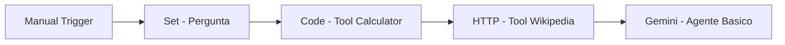
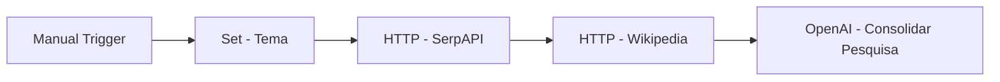
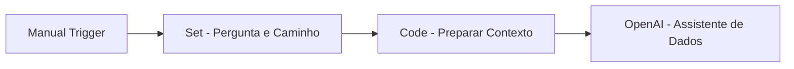
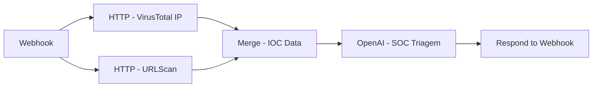

| O **Kensei AI Foundations** e uma jornada pratica para quem quer entrar no universo de **IA, dados, programacao e automacao**, mesmo comecando do zero. Aqui, o foco nao e so teoria: voce aprende construindo projetos reais, usando IA como copiloto e desenvolvendo as competencias que o mercado ja exige. Ao longo de 8 semanas, voce evolui com desafios mao na massa, apoio da comunidade e um portfolio que prova sua capacidade de resolver problemas reais. Se o objetivo e construir uma carreira **AI-first** com base solida e visao aplicada para tecnologia e cybersecurity, este curso e o ponto de partida. |
|:---:|
| |
|  <a href="https://kensei.seg.br/lab" target="_blank"></a> |

---

<p align="center">
    
</p>

---

# SEMANA 6 - n8n + IA (Agentes Inteligentes)

> Da automacao de tarefas para automacao de decisoes.

Nesta semana, o foco e transformar workflows tradicionais em **agentes de IA** capazes de:

- interpretar contexto
- escolher o melhor caminho de execucao
- usar ferramentas externas (APIs)
- responder em formato estruturado para automacao SOC

---

## Objetivos da Semana (baseado no PDF)

1. Entender a diferenca entre workflow fixo e fluxo agentico.
2. Aprender a anatomia de um agente: **LLM + prompt + tools + memoria**.
3. Integrar n8n com IA para triagem, classificacao e resposta operacional.
4. Entregar workflows reutilizaveis em JSON para cenarios reais de SOC.

---

## Conceitos-Chave

- **Agente de IA**: nao apenas executa etapas; ele decide o proximo passo.
- **Workflow tradicional**: caminho previsivel e fixo.
- **Workflow agentico**: caminho dinamico conforme entrada e contexto.
- **Saida estruturada**: JSON para consumo por SIEM, SOAR e outras automacoes.
- **Fallback de parse**: protecao para respostas mal formatadas da IA.

---

## Projetos da Aula (PDF)

| Projeto no PDF | Foco |
|---|---|
| Agente Basico | Chat Trigger + AI Agent + tools simples (Calculator/Wikipedia) |
| Agente Pesquisador Web | Pesquisa e consolidacao com SerpAPI, HTTP Request e Wikipedia |
| Converse com Seus Dados (CSV) | Analise de CSV via Code Tool (Python/Pandas) com perguntas em linguagem natural |
| SOC Triagem Agent | Investigacao de IOC (IP/URL) com APIs como VirusTotal e URLScan |

Arquivo-base da aula: `Kensei_AI_Foundations_S06_n8n_IA_Agentes.pptx.pdf`.

---

## Implementacao deste Repositorio (adaptacao pratica)

| Arquivo | Como se conecta ao PDF |
|---|---|
| `01_agente_basico.json` | Implementa agente basico com pergunta + tools (calculadora e wikipedia) |
| `02_agente_pesquisador_web.json` | Implementa pesquisa web com SerpAPI + Wikipedia + consolidacao com IA |
| `03_converse_com_seus_dados_csv.json` | Implementa template de conversa com dados CSV via contexto para Code Tool |
| `04_soc_triagem_agent.json` | Implementa triagem SOC de IOC com VirusTotal + URLScan + IA |

### Como funciona o 01_agente_basico.json

Este workflow demonstra a base de um agente com tools no n8n: ele recebe uma pergunta, executa uma conta simples, consulta um resumo de referencia e pede para o modelo gerar a resposta final.



### 1) Manual Trigger

- Papel: inicia a execucao do workflow manualmente.
- Entrada: nenhuma.
- Saida: libera o fluxo para o node seguinte.

### 2) Set - Pergunta

- Papel: cria a pergunta que sera processada.
- Entrada: execucao do trigger.
- Saida: campo `pergunta` no JSON.
- Exemplo: `Quanto e 47 * 893 e o que e CVE-2024-3094?`

### 3) Code - Tool Calculator

- Papel: funciona como tool de calculadora simples.
- Entrada: texto em `pergunta`.
- Processamento: detecta operacao matematica com regex (`+`, `-`, `*`, `/`).
- Saida: campo `tool_calculator` com resultado numerico, `sem_calculo` ou `divisao_por_zero`.

### 4) HTTP - Tool Wikipedia

- Papel: busca contexto externo de seguranca.
- Entrada: item do node anterior.
- Processamento: consulta endpoint REST da Wikipedia com header `User-Agent` e `Accept: application/json`.
- Saida: resposta JSON da Wikipedia, principalmente o campo `extract`.

### 5) Gemini - Agente Basico

- Papel: sintetiza a resposta final do agente.
- Entrada:
  - `pergunta` (Set - Pergunta)
  - `tool_calculator` (Code - Tool Calculator)
  - `extract` (HTTP - Tool Wikipedia)
- Processamento: envia prompt consolidado para o Gemini (`gemini-2.5-flash`) via HTTP Request.
- Saida: texto final com resposta curta e objetiva.

Em termos praticos, este exemplo ensina o padrao de agente com tools:

- **entrada** (pergunta)
- **ferramentas** (code + http)
- **sintese final por LLM**

Esse padrao e a base para os proximos workflows mais avancados da semana.

### Como funciona o 02_agente_pesquisador_web.json

Este workflow faz pesquisa orientada por tema e consolida os achados em uma resposta unica para contexto SOC.



### 1) Manual Trigger (02)

- Papel: inicia a execucao do fluxo de pesquisa.
- Entrada: nenhuma.
- Saida: libera a cadeia de pesquisa.

### 2) Set - Tema (02)

- Papel: define o tema de consulta.
- Entrada: execucao manual.
- Saida: campo `tema` no item.
- Exemplo: Top ameacas de ransomware para SOC.

### 3) HTTP - SerpAPI (02)

- Papel: coleta resultados de busca na web.
- Entrada: `tema`.
- Processamento: consulta `serpapi.com/search.json` com parametros de idioma/regiao.
- Saida: resultados organicos em JSON (ex.: `organic_results`).

### 4) HTTP - Wikipedia (02)

- Papel: adiciona contexto enciclopedico sobre ransomware.
- Entrada: item com dados da SerpAPI.
- Processamento: consulta resumo da pagina Ransomware na Wikipedia.
- Saida: campo `extract` para enriquecimento semantico.

### 5) OpenAI - Consolidar Pesquisa (02)

- Papel: sintetiza os achados em resposta operacional.
- Entrada:
  - `tema`
  - resumo da Wikipedia (`extract`)
  - top resultados da SerpAPI
- Processamento: cria prompt consolidado para gerar contexto, riscos e acoes recomendadas.
- Saida: resposta final da consolidacao.

### Como funciona o 03_converse_com_seus_dados_csv.json

Este workflow cria um assistente para perguntas sobre dados CSV, preparando contexto antes da resposta da IA.



### 1) Manual Trigger (03)

- Papel: inicia o fluxo de conversa com dados.
- Entrada: nenhuma.
- Saida: ativa o pipeline.

### 2) Set - Pergunta e Caminho (03)

- Papel: define os parametros principais da consulta.
- Entrada: execucao manual.
- Saida:
  - `pergunta` (o que analisar)
  - `csv_path` (caminho do arquivo)

### 3) Code - Preparar Contexto (03)

- Papel: adiciona orientacao de contexto para analise.
- Entrada: `pergunta` e `csv_path`.
- Processamento: injeta observacao indicando uso de Code Tool/Python para CSV.
- Saida: campo `observacao` junto ao restante dos dados.

### 4) OpenAI - Assistente de Dados (03)

- Papel: gerar resposta orientando analise de dados.
- Entrada:
  - `pergunta`
  - `csv_path`
  - `observacao`
- Processamento: cria resposta no formato passos, metricas e consulta sugerida.
- Saida: orientacao textual para analise do CSV.

### Como funciona o 04_soc_triagem_agent.json

Este workflow recebe IOCs via webhook, consulta fontes externas e devolve triagem estruturada para uso SOC.



### 1) Webhook (04)

- Papel: ponto de entrada HTTP do fluxo.
- Entrada: payload JSON com IOC (ex.: `ip`, `url`, contexto).
- Saida: dados da entrada para os ramos de consulta.

### 2) HTTP - VirusTotal IP (04)

- Papel: consultar reputacao do IP.
- Entrada: `ip` recebido no webhook.
- Processamento: chamada na API v3 do VirusTotal com `x-apikey`.
- Saida: resposta JSON de inteligencia para IP.

### 3) HTTP - URLScan (04)

- Papel: consultar sinais do dominio/URL.
- Entrada: `url` recebido no webhook.
- Processamento: busca no URLScan por dominio usando `API-Key`.
- Saida: resposta JSON com indicadores relacionados.

### 4) Merge - IOC Data (04)

- Papel: unificar os dois ramos de coleta.
- Entrada: saidas de VirusTotal e URLScan.
- Processamento: modo `combine` para juntar os dados.
- Saida: item unico com `input1` e `input2`.

### 5) OpenAI - SOC Triagem (04)

- Papel: classificar risco e recomendar acao.
- Entrada:
  - entrada original do webhook
  - dados combinados de VirusTotal e URLScan
- Processamento: solicita resposta em JSON com prioridade, score de risco, resumo e acoes imediatas.
- Saida: analise SOC estruturada.

### 6) Respond to Webhook (04)

- Papel: devolver resposta para quem chamou o endpoint.
- Entrada: resultado da triagem.
- Processamento: monta JSON final com `ok`, `entrada`, `analise`, timestamp e nome do workflow.
- Saida: resposta HTTP 200 em JSON.

### Pasta bonus

Os arquivos anteriores foram preservados em `bonus/`:

- `bonus/01_agente_triagem_incidentes.json`
- `bonus/02_agente_webhook_soc.json`
- `bonus/03_agente_threat_intel.json`
- `bonus/04_orquestrador_multiagente_soc.json`
- `bonus/05_agente_antiphishing.json`

Em resumo: o PDF mostra os fundamentos de agentes; na raiz ficaram os projetos alinhados ao material da aula e os anteriores ficaram em bonus.

---

## Endpoints Utilizados

- `POST /webhook/soc-triagem-agent`

---

## Como Importar no n8n

1. Abra o n8n em `http://localhost:5678`
2. Clique em `New Workflow`
3. Menu `...` -> `Import from file`
4. Selecione um dos arquivos `.json` desta pasta
5. Configure as variaveis de ambiente (`.env`) e credenciais externas
6. Salve e execute

---

## Credenciais e Ferramentas

### Obrigatoria no repositorio atual

| Credencial | Obrigatorio | Onde usa |
|---|---|---|
| Google Gemini API (`GOOGLE_API_KEY`) | Sim | Todos os workflows da semana |

### Mencionadas no PDF (expansao de agentes)

- SerpAPI
- VirusTotal API
- URLScan.io
- HTTP Request para pesquisa web

### Arquivos de ambiente

- `.env_temporal` -> template rapido para configuracao
- `.env` -> variaveis efetivas usadas localmente

---

## Teste Rapido (SOC Triagem Agent)

```bash
curl -X POST http://localhost:5678/webhook/soc-triagem-agent \
  -H "Content-Type: application/json" \
  -d '{
    "ip": "185.220.101.45",
    "url": "example-malicious-domain.com",
    "contexto": "alerta de IOC vindo do SIEM"
  }'
```

---

## Boas Praticas de Agentes no n8n

- prompts objetivos e com formato de saida claro
- exigir JSON valido sempre que houver integracao
- implementar fallback no node Code
- monitorar custo, latencia e taxa de erro
- versionar workflows e prompts no Git

---

## Resultado da Semana

Ao final da semana 06, voce tera:

- 4 workflows principais alinhados ao PDF
- 1 endpoint de triagem SOC (`soc-triagem-agent`)
- 5 workflows anteriores preservados em `bonus/`
