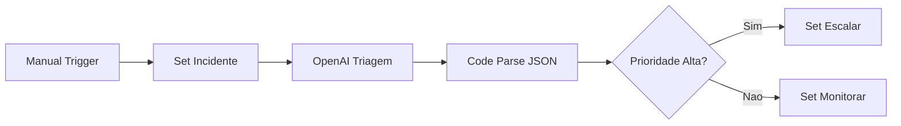
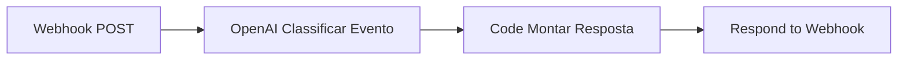
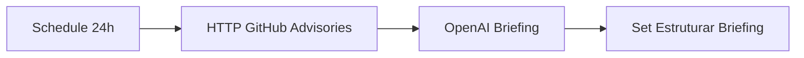
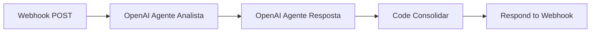
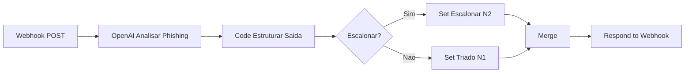

| O **Kensei AI Foundations** e uma jornada pratica para quem quer entrar no universo de **IA, dados, programacao e automacao**, mesmo comecando do zero. Aqui, o foco nao e so teoria: voce aprende construindo projetos reais, usando IA como copiloto e desenvolvendo as competencias que o mercado ja exige. Ao longo de 8 semanas, voce evolui com desafios mao na massa, apoio da comunidade e um portfolio que prova sua capacidade de resolver problemas reais. Se o objetivo e construir uma carreira **AI-first** com base solida e visao aplicada para tecnologia e cybersecurity, este curso e o ponto de partida. |
|:---:|
| |
|  <a href="https://kensei.seg.br/lab" target="_blank"></a> |

---

<p align="center">
    
</p>

---

# SEMANA 6 - n8n + IA (Agentes Inteligentes)


> Da automacao de tarefas para automacao de decisoes.

Nesta semana, o foco e criar **agentes de IA no n8n** para operar cenarios de SOC:

- triagem automatica de incidentes
- API de classificacao via webhook
- briefing diario de threat intel
- orquestracao multiagente (analista + resposta)

## Sumario

- [O Que Muda da Semana 5 para a Semana 6](#o-que-muda-da-semana-5-para-a-semana-6)
- [Arquivos da Semana](#arquivos-da-semana)
- [Workflow 01 - Agente de Triagem de Incidentes](#workflow-01---agente-de-triagem-de-incidentes)
- [Workflow 02 - Agente Webhook SOC](#workflow-02---agente-webhook-soc)
- [Workflow 03 - Agente de Threat Intel Diario](#workflow-03---agente-de-threat-intel-diario)
- [Workflow 04 - Orquestrador Multiagente SOC](#workflow-04---orquestrador-multiagente-soc)
- [Workflow 05 - Agente Anti-Phishing](#workflow-05---agente-anti-phishing)
- [Como Importar no n8n](#como-importar-no-n8n)
- [Credenciais Necessarias](#credenciais-necessarias)
- [Boas Praticas de Agentes no n8n](#boas-praticas-de-agentes-no-n8n)
- [Resultado da Semana](#resultado-da-semana)

---

## O Que Muda da Semana 5 para a Semana 6

Na semana 5, os workflows executavam acoes em cadeia.

Na semana 6, os workflows passam a:

1. interpretar contexto
2. tomar decisao orientada por prompt
3. retornar saida estruturada (JSON)
4. permitir escalonamento automatico

Em resumo: sai o fluxo "mecanico" e entra o fluxo "agentico".

---

## Arquivos da Semana

| Arquivo | Objetivo |
|---|---|
| `01_agente_triagem_incidentes.json` | Classificar incidente e decidir escalonamento |
| `02_agente_webhook_soc.json` | Expor um endpoint de triagem para outras ferramentas |
| `03_agente_threat_intel.json` | Gerar briefing diario com base em advisories |
| `04_orquestrador_multiagente_soc.json` | Encadear dois agentes (diagnostico e resposta) |
| `05_agente_antiphishing.json` | Triar e-mails suspeitos e devolver playbook de acao |

---

## Workflow 01 - Agente de Triagem de Incidentes

**Arquivo:** `01_agente_triagem_incidentes.json`

**Fluxo:**

`Manual Trigger -> Set Incidente -> OpenAI Triagem -> Code Parse JSON -> IF Prioridade -> Acao`




```json
{
  "name": "01 - Agente de Triagem de Incidentes",
  "nodes": [
    {
      "parameters": {},
      "id": "b1c2d3e4-0001-4000-8000-000000000001",
      "name": "Manual Trigger",
      "type": "n8n-nodes-base.manualTrigger",
      "typeVersion": 1,
      "position": [220, 300]
    },
    {
      "parameters": {
        "values": {
          "string": [
            {
              "name": "titulo",
              "value": "Múltiplas tentativas de login falho em VPN"
            },
            {
              "name": "origem",
              "value": "SIEM"
            },
            {
              "name": "descricao",
              "value": "Foram detectadas 218 tentativas de autenticação falha no intervalo de 5 minutos para 3 contas administrativas."
            }
          ]
        },
        "options": {}
      },
      "id": "b1c2d3e4-0001-4000-8000-000000000002",
      "name": "Set - Incidente",
      "type": "n8n-nodes-base.set",
      "typeVersion": 2,
      "position": [440, 300]
    },
    {
      "parameters": {
        "resource": "chat",
        "operation": "complete",
        "model": "gpt-4o-mini",
        "messages": {
          "values": [
            {
              "role": "system",
              "content": "Você é um analista SOC N1. Classifique incidentes em baixa, media ou alta. Responda APENAS em JSON com as chaves: prioridade, tipo_incidente, acao_imediata, justificativa."
            },
            {
              "role": "user",
              "content": "={{ `Titulo: ${$json.titulo}\\nOrigem: ${$json.origem}\\nDescricao: ${$json.descricao}` }}"
            }
          ]
        }
      },
      "id": "b1c2d3e4-0001-4000-8000-000000000003",
      "name": "OpenAI - Triagem",
      "type": "n8n-nodes-base.openAi",
      "typeVersion": 1,
      "position": [670, 300],
      "credentials": {
        "openAiApi": {
          "id": "CONFIGURE_AQUI",
          "name": "OpenAI API"
        }
      }
    },
    {
      "parameters": {
        "jsCode": "const raw = $json.message?.content || '{}';\nlet parsed;\ntry {\n  parsed = JSON.parse(raw);\n} catch (e) {\n  parsed = {\n    prioridade: 'media',\n    tipo_incidente: 'indefinido',\n    acao_imediata: 'Revisar manualmente a resposta do modelo',\n    justificativa: 'Falha ao interpretar JSON da IA'\n  };\n}\n\nreturn [{ json: { ...$json, ...parsed, processado_em: new Date().toISOString() } }];"
      },
      "id": "b1c2d3e4-0001-4000-8000-000000000004",
      "name": "Code - Estruturar Saida",
      "type": "n8n-nodes-base.code",
      "typeVersion": 2,
      "position": [900, 300]
    },
    {
      "parameters": {
        "conditions": {
          "string": [
            {
              "value1": "={{ ($json.prioridade || '').toLowerCase() }}",
              "operation": "equal",
              "value2": "alta"
            }
          ]
        }
      },
      "id": "b1c2d3e4-0001-4000-8000-000000000005",
      "name": "IF - Prioridade Alta?",
      "type": "n8n-nodes-base.if",
      "typeVersion": 2,
      "position": [1130, 300]
    },
    {
      "parameters": {
        "values": {
          "string": [
            {
              "name": "status",
              "value": "ESCALONAR_IMEDIATO"
            }
          ]
        },
        "options": {}
      },
      "id": "b1c2d3e4-0001-4000-8000-000000000006",
      "name": "Set - Escalar",
      "type": "n8n-nodes-base.set",
      "typeVersion": 2,
      "position": [1360, 220]
    },
    {
      "parameters": {
        "values": {
          "string": [
            {
              "name": "status",
              "value": "MONITORAR_E_DOCUMENTAR"
            }
          ]
        },
        "options": {}
      },
      "id": "b1c2d3e4-0001-4000-8000-000000000007",
      "name": "Set - Monitorar",
      "type": "n8n-nodes-base.set",
      "typeVersion": 2,
      "position": [1360, 380]
    }
  ],
  "connections": {
    "Manual Trigger": {
      "main": [
        [
          {
            "node": "Set - Incidente",
            "type": "main",
            "index": 0
          }
        ]
      ]
    },
    "Set - Incidente": {
      "main": [
        [
          {
            "node": "OpenAI - Triagem",
            "type": "main",
            "index": 0
          }
        ]
      ]
    },
    "OpenAI - Triagem": {
      "main": [
        [
          {
            "node": "Code - Estruturar Saida",
            "type": "main",
            "index": 0
          }
        ]
      ]
    },
    "Code - Estruturar Saida": {
      "main": [
        [
          {
            "node": "IF - Prioridade Alta?",
            "type": "main",
            "index": 0
          }
        ]
      ]
    },
    "IF - Prioridade Alta?": {
      "main": [
        [
          {
            "node": "Set - Escalar",
            "type": "main",
            "index": 0
          }
        ],
        [
          {
            "node": "Set - Monitorar",
            "type": "main",
            "index": 0
          }
        ]
      ]
    }
  },
  "active": false,
  "settings": {
    "executionOrder": "v1"
  },
  "versionId": "semana06-v1",
  "meta": {
    "templateCredsSetupCompleted": false,
    "instanceId": "kensei-ai-foundations-semana06"
  },
  "id": "workflow-01-kensei-s06",
  "tags": [
    {
      "name": "kensei-s06"
    },
    {
      "name": "agent"
    },
    {
      "name": "soc"
    }
  ]
}
```


**O que aprende:**

- como definir um prompt de triagem SOC
- como obrigar resposta em JSON
- como tratar erro de parsing no node Code
- como ramificar acao via IF

---

## Workflow 02 - Agente Webhook SOC

**Arquivo:** `02_agente_webhook_soc.json`

**Fluxo:**

`Webhook POST -> OpenAI Classificacao -> Code Estruturar -> Respond JSON`




```json
{
  "name": "02 - Agente Webhook SOC",
  "nodes": [
    {
      "parameters": {
        "httpMethod": "POST",
        "path": "soc-triagem",
        "responseMode": "responseNode"
      },
      "id": "c1d2e3f4-0001-4000-8000-000000000001",
      "name": "Webhook",
      "type": "n8n-nodes-base.webhook",
      "typeVersion": 2,
      "position": [240, 300],
      "webhookId": "kensei-s06-soc-triagem"
    },
    {
      "parameters": {
        "resource": "chat",
        "operation": "complete",
        "model": "gpt-4o-mini",
        "messages": {
          "values": [
            {
              "role": "system",
              "content": "Você é um agente SOC para triagem automática. Retorne APENAS JSON com: prioridade, tipo_evento, acao_recomendada, resumo."
            },
            {
              "role": "user",
              "content": "={{ `Recebi este evento via webhook:\\n${JSON.stringify($json, null, 2)}` }}"
            }
          ]
        }
      },
      "id": "c1d2e3f4-0001-4000-8000-000000000002",
      "name": "OpenAI - Classificar Evento",
      "type": "n8n-nodes-base.openAi",
      "typeVersion": 1,
      "position": [500, 300],
      "credentials": {
        "openAiApi": {
          "id": "CONFIGURE_AQUI",
          "name": "OpenAI API"
        }
      }
    },
    {
      "parameters": {
        "jsCode": "const raw = $json.message?.content || '{}';\nlet parsed;\ntry {\n  parsed = JSON.parse(raw);\n} catch (e) {\n  parsed = {\n    prioridade: 'media',\n    tipo_evento: 'indefinido',\n    acao_recomendada: 'Validar payload e prompt',\n    resumo: raw\n  };\n}\n\nreturn [{\n  json: {\n    ok: true,\n    entrada: $json,\n    analise: parsed,\n    processado_em: new Date().toISOString(),\n    workflow: '02_agente_webhook_soc'\n  }\n}];"
      },
      "id": "c1d2e3f4-0001-4000-8000-000000000003",
      "name": "Code - Montar Resposta",
      "type": "n8n-nodes-base.code",
      "typeVersion": 2,
      "position": [760, 300]
    },
    {
      "parameters": {
        "respondWith": "json",
        "responseBody": "={{ $json }}",
        "options": {
          "responseCode": 200
        }
      },
      "id": "c1d2e3f4-0001-4000-8000-000000000004",
      "name": "Respond to Webhook",
      "type": "n8n-nodes-base.respondToWebhook",
      "typeVersion": 1,
      "position": [1020, 300]
    }
  ],
  "connections": {
    "Webhook": {
      "main": [
        [
          {
            "node": "OpenAI - Classificar Evento",
            "type": "main",
            "index": 0
          }
        ]
      ]
    },
    "OpenAI - Classificar Evento": {
      "main": [
        [
          {
            "node": "Code - Montar Resposta",
            "type": "main",
            "index": 0
          }
        ]
      ]
    },
    "Code - Montar Resposta": {
      "main": [
        [
          {
            "node": "Respond to Webhook",
            "type": "main",
            "index": 0
          }
        ]
      ]
    }
  },
  "active": false,
  "settings": {
    "executionOrder": "v1"
  },
  "versionId": "semana06-v1",
  "meta": {
    "templateCredsSetupCompleted": false,
    "instanceId": "kensei-ai-foundations-semana06"
  },
  "id": "workflow-02-kensei-s06",
  "tags": [
    {
      "name": "kensei-s06"
    },
    {
      "name": "webhook"
    },
    {
      "name": "soc"
    }
  ]
}
```


**Endpoint:**

`POST /webhook/soc-triagem`

**Teste com curl:**

```bash
curl -X POST http://localhost:5678/webhook/soc-triagem \
  -H "Content-Type: application/json" \
  -d '{
    "evento": "anomalia_autenticacao",
    "host": "vpn-gateway-01",
    "tentativas": 218,
    "janela_minutos": 5,
    "usuario_alvo": "admin_financeiro"
  }'
```

---

## Workflow 03 - Agente de Threat Intel Diario

**Arquivo:** `03_agente_threat_intel.json`

**Fluxo:**

`Schedule 24h -> HTTP Advisories -> OpenAI Briefing -> Set Estruturar`




```json
{
  "name": "03 - Agente de Threat Intel Diario",
  "nodes": [
    {
      "parameters": {
        "rule": {
          "interval": [
            {
              "field": "hours",
              "hoursInterval": 24
            }
          ]
        }
      },
      "id": "d1e2f3a4-0001-4000-8000-000000000001",
      "name": "Schedule Trigger",
      "type": "n8n-nodes-base.scheduleTrigger",
      "typeVersion": 1,
      "position": [220, 300]
    },
    {
      "parameters": {
        "url": "https://api.github.com/advisories?per_page=5",
        "sendHeaders": true,
        "headerParameters": {
          "parameters": [
            {
              "name": "Accept",
              "value": "application/vnd.github+json"
            }
          ]
        },
        "options": {}
      },
      "id": "d1e2f3a4-0001-4000-8000-000000000002",
      "name": "HTTP - GitHub Advisories",
      "type": "n8n-nodes-base.httpRequest",
      "typeVersion": 4,
      "position": [470, 300]
    },
    {
      "parameters": {
        "resource": "chat",
        "operation": "complete",
        "model": "gpt-4o-mini",
        "messages": {
          "values": [
            {
              "role": "system",
              "content": "Você é um analista de threat intelligence. Gere um briefing em português para SOC com: resumo executivo, top riscos, recomendações acionáveis e IOCs citados."
            },
            {
              "role": "user",
              "content": "={{ `Analise estas advisories e gere briefing:\\n${JSON.stringify($json, null, 2)}` }}"
            }
          ]
        }
      },
      "id": "d1e2f3a4-0001-4000-8000-000000000003",
      "name": "OpenAI - Briefing",
      "type": "n8n-nodes-base.openAi",
      "typeVersion": 1,
      "position": [730, 300],
      "credentials": {
        "openAiApi": {
          "id": "CONFIGURE_AQUI",
          "name": "OpenAI API"
        }
      }
    },
    {
      "parameters": {
        "values": {
          "string": [
            {
              "name": "briefing",
              "value": "={{ $json.message.content }}"
            },
            {
              "name": "gerado_em",
              "value": "={{ $now.toISO() }}"
            }
          ]
        },
        "options": {}
      },
      "id": "d1e2f3a4-0001-4000-8000-000000000004",
      "name": "Set - Estruturar Briefing",
      "type": "n8n-nodes-base.set",
      "typeVersion": 2,
      "position": [990, 300]
    }
  ],
  "connections": {
    "Schedule Trigger": {
      "main": [
        [
          {
            "node": "HTTP - GitHub Advisories",
            "type": "main",
            "index": 0
          }
        ]
      ]
    },
    "HTTP - GitHub Advisories": {
      "main": [
        [
          {
            "node": "OpenAI - Briefing",
            "type": "main",
            "index": 0
          }
        ]
      ]
    },
    "OpenAI - Briefing": {
      "main": [
        [
          {
            "node": "Set - Estruturar Briefing",
            "type": "main",
            "index": 0
          }
        ]
      ]
    }
  },
  "active": false,
  "settings": {
    "executionOrder": "v1"
  },
  "versionId": "semana06-v1",
  "meta": {
    "templateCredsSetupCompleted": false,
    "instanceId": "kensei-ai-foundations-semana06"
  },
  "id": "workflow-03-kensei-s06",
  "tags": [
    {
      "name": "kensei-s06"
    },
    {
      "name": "threat-intel"
    },
    {
      "name": "agent"
    }
  ]
}
```


**Fonte de exemplo usada:**

- GitHub Security Advisories API

**Saida esperada:**

- resumo executivo
- top riscos
- recomendacoes acionaveis
- IOCs citados

---

## Workflow 04 - Orquestrador Multiagente SOC

**Arquivo:** `04_orquestrador_multiagente_soc.json`

**Problema que resolve:**

Quando chega um incidente mais complexo, um unico prompt costuma ficar superficial.
Este workflow separa o trabalho em dois agentes com papeis claros:

- Agente 1 (Analista): faz diagnostico tecnico inicial e levanta hipoteses.
- Agente 2 (Resposta): usa o diagnostico para montar plano de acao pratico.

Isso melhora consistencia e reduz respostas genericas no SOC.

**Fluxo logico (em linguagem simples):**

1. Recebe incidente via webhook.
2. Agente Analista interpreta contexto e retorna JSON tecnico.
3. Agente Resposta cria plano de resposta com base no JSON anterior.
4. Node Code consolida as duas saidas em um unico objeto.
5. API devolve resultado final para o sistema chamador.

**Endpoint:**

`POST /webhook/soc-multiagente`

**Exemplo de entrada (payload):**

```json
{
  "alerta": "Possivel execucao de script suspeito via powershell",
  "hostname": "ws-223",
  "usuario": "joao.silva",
  "hash": "1d56f4a8b8f8a03d9e61a8d27f12de10",
  "origem": "EDR"
}
```

**Exemplo de saida (estrutura):**

```json
{
  "incidente": {"...": "payload original"},
  "agente_analista": {
    "diagnostico": "...",
    "hipoteses": ["..."],
    "evidencias_faltantes": ["..."]
  },
  "agente_resposta": {
    "passos_imediatos": ["..."],
    "comunicacao": "...",
    "mitigacao": ["..."],
    "proxima_revisao_minutos": 30
  },
  "consolidado_em": "timestamp"
}
```

**Teste rapido com curl:**

```bash
curl -X POST http://localhost:5678/webhook/soc-multiagente \
  -H "Content-Type: application/json" \
  -d '{
    "alerta": "Possivel execucao de script suspeito via powershell",
    "hostname": "ws-223",
    "usuario": "joao.silva",
    "hash": "1d56f4a8b8f8a03d9e61a8d27f12de10",
    "origem": "EDR"
  }'
```

**Quando usar este workflow:**

- incidentes com contexto incompleto e necessidade de raciocinio por etapas
- casos onde voce quer separar diagnostico de acao
- integracao com SIEM/SOAR via webhook para triagem automatica




```json
{
  "name": "04 - Orquestrador Multiagente SOC",
  "nodes": [
    {
      "parameters": {
        "httpMethod": "POST",
        "path": "soc-multiagente",
        "responseMode": "responseNode"
      },
      "id": "e1f2a3b4-0001-4000-8000-000000000001",
      "name": "Webhook",
      "type": "n8n-nodes-base.webhook",
      "typeVersion": 2,
      "position": [220, 300],
      "webhookId": "kensei-s06-soc-multiagente"
    },
    {
      "parameters": {
        "resource": "chat",
        "operation": "complete",
        "model": "gpt-4o-mini",
        "messages": {
          "values": [
            {
              "role": "system",
              "content": "Você é o Agente 1 (Analista). Faça diagnóstico técnico inicial do incidente. Retorne APENAS JSON com: diagnostico, hipoteses, evidencias_faltantes."
            },
            {
              "role": "user",
              "content": "={{ `Dados do incidente:\\n${JSON.stringify($json, null, 2)}` }}"
            }
          ]
        }
      },
      "id": "e1f2a3b4-0001-4000-8000-000000000002",
      "name": "OpenAI - Agente Analista",
      "type": "n8n-nodes-base.openAi",
      "typeVersion": 1,
      "position": [470, 300],
      "credentials": {
        "openAiApi": {
          "id": "CONFIGURE_AQUI",
          "name": "OpenAI API"
        }
      }
    },
    {
      "parameters": {
        "resource": "chat",
        "operation": "complete",
        "model": "gpt-4o-mini",
        "messages": {
          "values": [
            {
              "role": "system",
              "content": "Você é o Agente 2 (Resposta). Com base no diagnóstico do Agente 1, proponha plano de resposta. Retorne APENAS JSON com: passos_imediatos, comunicacao, mitigacao, proxima_revisao_minutos."
            },
            {
              "role": "user",
              "content": "={{ `Entrada original: ${JSON.stringify($('Webhook').item.json, null, 2)}\\nSaida do agente analista: ${$json.message.content}` }}"
            }
          ]
        }
      },
      "id": "e1f2a3b4-0001-4000-8000-000000000003",
      "name": "OpenAI - Agente Resposta",
      "type": "n8n-nodes-base.openAi",
      "typeVersion": 1,
      "position": [730, 300],
      "credentials": {
        "openAiApi": {
          "id": "CONFIGURE_AQUI",
          "name": "OpenAI API"
        }
      }
    },
    {
      "parameters": {
        "jsCode": "const analistaRaw = $('OpenAI - Agente Analista').item.json.message?.content || '{}';\nconst respostaRaw = $json.message?.content || '{}';\n\nfunction safeParse(value, fallback) {\n  try {\n    return JSON.parse(value);\n  } catch (e) {\n    return fallback;\n  }\n}\n\nconst analista = safeParse(analistaRaw, { bruto: analistaRaw });\nconst resposta = safeParse(respostaRaw, { bruto: respostaRaw });\n\nreturn [{\n  json: {\n    incidente: $('Webhook').item.json,\n    agente_analista: analista,\n    agente_resposta: resposta,\n    consolidado_em: new Date().toISOString(),\n    fluxo: '04_orquestrador_multiagente_soc'\n  }\n}];"
      },
      "id": "e1f2a3b4-0001-4000-8000-000000000004",
      "name": "Code - Consolidar",
      "type": "n8n-nodes-base.code",
      "typeVersion": 2,
      "position": [990, 300]
    },
    {
      "parameters": {
        "respondWith": "json",
        "responseBody": "={{ $json }}",
        "options": {
          "responseCode": 200
        }
      },
      "id": "e1f2a3b4-0001-4000-8000-000000000005",
      "name": "Respond to Webhook",
      "type": "n8n-nodes-base.respondToWebhook",
      "typeVersion": 1,
      "position": [1240, 300]
    }
  ],
  "connections": {
    "Webhook": {
      "main": [
        [
          {
            "node": "OpenAI - Agente Analista",
            "type": "main",
            "index": 0
          }
        ]
      ]
    },
    "OpenAI - Agente Analista": {
      "main": [
        [
          {
            "node": "OpenAI - Agente Resposta",
            "type": "main",
            "index": 0
          }
        ]
      ]
    },
    "OpenAI - Agente Resposta": {
      "main": [
        [
          {
            "node": "Code - Consolidar",
            "type": "main",
            "index": 0
          }
        ]
      ]
    },
    "Code - Consolidar": {
      "main": [
        [
          {
            "node": "Respond to Webhook",
            "type": "main",
            "index": 0
          }
        ]
      ]
    }
  },
  "active": false,
  "settings": {
    "executionOrder": "v1"
  },
  "versionId": "semana06-v1",
  "meta": {
    "templateCredsSetupCompleted": false,
    "instanceId": "kensei-ai-foundations-semana06"
  },
  "id": "workflow-04-kensei-s06",
  "tags": [
    {
      "name": "kensei-s06"
    },
    {
      "name": "multi-agent"
    },
    {
      "name": "soc"
    }
  ]
}
```

---

## Workflow 05 - Agente Anti-Phishing

**Arquivo:** `05_agente_antiphishing.json`

**Problema que resolve:**

Receber relato de email suspeito e responder automaticamente com:

- classificacao (`phishing`, `suspeito` ou `legitimo`)
- prioridade e score de risco
- sinais detectados
- playbook de acao imediata
- mensagem curta para retorno ao usuario
- decisao de escalonamento (N1/N2)

**Fluxo:**

`Webhook -> OpenAI Analise -> Code Parse/Fallback -> IF Escalonar -> Respond JSON`

**Endpoint:**

`POST /webhook/phishing-triagem`

**Teste com curl:**

```bash
curl -X POST http://localhost:5678/webhook/phishing-triagem \
  -H "Content-Type: application/json" \
  -d '{
    "remetente": "financeiro@empresa-pagamentos.com",
    "assunto": "URGENTE: regularizacao de boleto em atraso",
    "texto": "Clique no link para evitar bloqueio da sua conta hoje.",
    "urls": ["http://empresa-pagamentos-verificacao.com/login"],
    "anexo": "boleto_abril.zip",
    "reportado_por": "colaborador@empresa.com"
  }'
```



```json
{
  "name": "05 - Agente Anti-Phishing (Triagem + Playbook)",
  "nodes": [
    {
      "parameters": {
        "httpMethod": "POST",
        "path": "phishing-triagem",
        "responseMode": "responseNode"
      },
      "id": "f1a2b3c4-0001-4000-8000-000000000001",
      "name": "Webhook",
      "type": "n8n-nodes-base.webhook",
      "typeVersion": 2,
      "position": [220, 300],
      "webhookId": "kensei-s06-phishing-triagem"
    },
    {
      "parameters": {
        "resource": "chat",
        "operation": "complete",
        "model": "gpt-4o-mini",
        "messages": {
          "values": [
            {
              "role": "system",
              "content": "Voce e um agente SOC especialista em phishing. Analise o payload e responda APENAS em JSON valido com as chaves: classificacao (phishing|suspeito|legitimo), prioridade (baixa|media|alta), score_risco (0-100), sinais_detectados (array), acao_imediata (array), resposta_usuario (string curta e clara), precisa_escalonar (true|false)."
            },
            {
              "role": "user",
              "content": "={{ `Analise este caso:\\n${JSON.stringify($json, null, 2)}` }}"
            }
          ]
        }
      },
      "id": "f1a2b3c4-0001-4000-8000-000000000002",
      "name": "OpenAI - Analisar Phishing",
      "type": "n8n-nodes-base.openAi",
      "typeVersion": 1,
      "position": [480, 300],
      "credentials": {
        "openAiApi": {
          "id": "CONFIGURE_AQUI",
          "name": "OpenAI API"
        }
      }
    },
    {
      "parameters": {
        "jsCode": "const raw = $json.message?.content || '{}';\nlet analise;\n\ntry {\n  analise = JSON.parse(raw);\n} catch (e) {\n  analise = {\n    classificacao: 'suspeito',\n    prioridade: 'media',\n    score_risco: 50,\n    sinais_detectados: ['falha_ao_parsear_saida_da_ia'],\n    acao_imediata: ['revisar_manual'],\n    resposta_usuario: 'Recebemos seu reporte e vamos analisar manualmente.',\n    precisa_escalonar: false\n  };\n}\n\nconst prioridade = String(analise.prioridade || 'media').toLowerCase();\nconst score = Number(analise.score_risco || 0);\n\nconst sla_minutos = prioridade === 'alta' || score >= 80 ? 15 : prioridade === 'media' ? 60 : 240;\n\nreturn [{\n  json: {\n    entrada: $('Webhook').item.json,\n    analise,\n    sla_minutos,\n    processado_em: new Date().toISOString(),\n    workflow: '05_agente_antiphishing'\n  }\n}];"
      },
      "id": "f1a2b3c4-0001-4000-8000-000000000003",
      "name": "Code - Estruturar Saida",
      "type": "n8n-nodes-base.code",
      "typeVersion": 2,
      "position": [740, 300]
    },
    {
      "parameters": {
        "conditions": {
          "boolean": [
            {
              "value1": "={{ !!$json.analise.precisa_escalonar }}"
            }
          ]
        }
      },
      "id": "f1a2b3c4-0001-4000-8000-000000000004",
      "name": "IF - Escalonar?",
      "type": "n8n-nodes-base.if",
      "typeVersion": 2,
      "position": [990, 300]
    },
    {
      "parameters": {
        "values": {
          "string": [
            {
              "name": "status",
              "value": "ESCALONADO_SOC_N2"
            }
          ]
        },
        "options": {}
      },
      "id": "f1a2b3c4-0001-4000-8000-000000000005",
      "name": "Set - Escalonar",
      "type": "n8n-nodes-base.set",
      "typeVersion": 2,
      "position": [1240, 220]
    },
    {
      "parameters": {
        "values": {
          "string": [
            {
              "name": "status",
              "value": "TRIADO_N1"
            }
          ]
        },
        "options": {}
      },
      "id": "f1a2b3c4-0001-4000-8000-000000000006",
      "name": "Set - N1",
      "type": "n8n-nodes-base.set",
      "typeVersion": 2,
      "position": [1240, 380]
    },
    {
      "parameters": {
        "mode": "append"
      },
      "id": "f1a2b3c4-0001-4000-8000-000000000007",
      "name": "Merge",
      "type": "n8n-nodes-base.merge",
      "typeVersion": 3,
      "position": [1470, 300]
    },
    {
      "parameters": {
        "respondWith": "json",
        "responseBody": "={{ { ...$json, dica: 'Se for phishing confirmado, bloqueie remetente e URL no gateway.' } }}",
        "options": {
          "responseCode": 200
        }
      },
      "id": "f1a2b3c4-0001-4000-8000-000000000008",
      "name": "Respond to Webhook",
      "type": "n8n-nodes-base.respondToWebhook",
      "typeVersion": 1,
      "position": [1700, 300]
    }
  ],
  "connections": {
    "Webhook": {
      "main": [
        [
          {
            "node": "OpenAI - Analisar Phishing",
            "type": "main",
            "index": 0
          }
        ]
      ]
    },
    "OpenAI - Analisar Phishing": {
      "main": [
        [
          {
            "node": "Code - Estruturar Saida",
            "type": "main",
            "index": 0
          }
        ]
      ]
    },
    "Code - Estruturar Saida": {
      "main": [
        [
          {
            "node": "IF - Escalonar?",
            "type": "main",
            "index": 0
          }
        ]
      ]
    },
    "IF - Escalonar?": {
      "main": [
        [
          {
            "node": "Set - Escalonar",
            "type": "main",
            "index": 0
          }
        ],
        [
          {
            "node": "Set - N1",
            "type": "main",
            "index": 0
          }
        ]
      ]
    },
    "Set - Escalonar": {
      "main": [
        [
          {
            "node": "Merge",
            "type": "main",
            "index": 0
          }
        ]
      ]
    },
    "Set - N1": {
      "main": [
        [
          {
            "node": "Merge",
            "type": "main",
            "index": 1
          }
        ]
      ]
    },
    "Merge": {
      "main": [
        [
          {
            "node": "Respond to Webhook",
            "type": "main",
            "index": 0
          }
        ]
      ]
    }
  },
  "active": false,
  "settings": {
    "executionOrder": "v1"
  },
  "versionId": "semana06-v1",
  "meta": {
    "templateCredsSetupCompleted": false,
    "instanceId": "kensei-ai-foundations-semana06"
  },
  "id": "workflow-05-kensei-s06",
  "tags": [
    {
      "name": "kensei-s06"
    },
    {
      "name": "phishing"
    },
    {
      "name": "agent"
    }
  ]
}
```


**Endpoint:**

`POST /webhook/soc-multiagente`

**Teste com curl:**

```bash
curl -X POST http://localhost:5678/webhook/soc-multiagente \
  -H "Content-Type: application/json" \
  -d '{
    "alerta": "Possivel execucao de script suspeito via powershell",
    "hostname": "ws-223",
    "usuario": "joao.silva",
    "hash": "1d56f4a8b8f8a03d9e61a8d27f12de10",
    "origem": "EDR"
  }'
```

---

## Como Importar no n8n

1. Abra o n8n em `http://localhost:5678`
2. Clique em `New Workflow`
3. Menu `...` -> `Import from file`
4. Selecione um dos arquivos JSON desta pasta
5. Configure a credencial `OpenAI API`
6. Salve e execute

---

## Credenciais Necessarias

| Credencial | Obrigatorio | Onde usa |
|---|---|---|
| OpenAI API | Sim | Todos os 5 workflows |

Observacao:

- os fluxos com webhook funcionam melhor com o workflow ativo (toggle `Active`)
- para producao, adicione autenticacao no webhook (header/token)

---

## Boas Praticas de Agentes no n8n

- use prompts curtos e especificos
- sempre solicite resposta estruturada em JSON
- implemente fallback no node Code para erro de formato
- versionar prompts e workflows em Git
- monitorar custo por execucao e latencia


---

## Resultado da Semana

Ao final da semana 06, voce tera:

- 5 workflows agenticos funcionais
- 3 endpoints SOC com IA via webhook
- 1 pipeline diario de threat intel

