| O **Kensei AI Foundations** e uma jornada pratica para quem quer entrar no universo de **IA, dados, programacao e automacao**, mesmo comecando do zero. Aqui, o foco nao e so teoria: voce aprende construindo projetos reais, usando IA como copiloto e desenvolvendo as competencias que o mercado ja exige. Ao longo de 8 semanas, voce evolui com desafios mao na massa, apoio da comunidade e um portfolio que prova sua capacidade de resolver problemas reais. Se o objetivo e construir uma carreira **AI-first** com base solida e visao aplicada para tecnologia e cybersecurity, este curso e o ponto de partida. |
|:---:|
| |
|  <a href="https://kensei.seg.br/lab" target="_blank"></a> |

---

<p align="center">
    
</p>

---

# SEMANA 7 - Streamlit na pratica (projetos do PDF)

> Transformando scripts Python em apps web reais com IA e integracao.

Nesta semana o foco e construir os projetos oficiais da aula:

- projeto 1: calculadora IMC
- projeto 2: dashboard de cyber attacks
- projeto 3: chatbot web com IA
- projeto 4: analisador de PDF com IA
- projeto 5: Streamlit + agente n8n
- projeto 6: Grey Hack - simulação de hacking estilo CTF

---

## O que voce vai construir

| Arquivo | Objetivo |
|---|---|
| `01_calculadora_imc.py` | Calcula IMC e classifica automaticamente |
| `02_dashboard_cyber_attacks.py` | Dashboard com dados reais de ataques ciberneticos |
| `03_chatbot_web_ia.py` | Chatbot web moderno com historico de conversas e Gemini |
| `04_analisador_pdf_ia.py` | Upload de PDF + extracao de texto + resumo com IA |
| `05_soc_streamlit_n8n.py` | Interface Streamlit para chamar webhook n8n |
| `06_gamer_hack.py` | Jogo de hacking estilo Grey Hack com terminal interativo e missões CTF |
| `requirements.txt` | Dependencias do projeto |
| `.streamlit/config.toml` | Configuracao visual e de servidor do Streamlit |

---

## Projeto 1 - Calculadora IMC

Arquivo: `01_calculadora_imc.py`

Conceitos:
- `st.number_input` para dados numericos
- calculo de IMC com validacao
- classificacao por faixa

Rodar:

```bash
streamlit run 01_calculadora_imc.py
```

---

## Projeto 2 - Dashboard de Cyber Attacks

Arquivo: `02_dashboard_cyber_attacks.py`

Conceitos:
- leitura do dataset `Global_Cybersecurity_Threats_2015-2024.csv`
- `@st.cache_data` para performance
- dark mode com layout moderno
- filtros por tipo de ataque, pais, setor e periodo
- KPIs de perdas financeiras e usuarios afetados
- mapa mundial interativo com detalhes por pais
- graficos com Plotly (barra, linha, treemap, scatter e heatmap)

Rodar:

```bash
streamlit run 02_dashboard_cyber_attacks.py
```
<p align="center">
    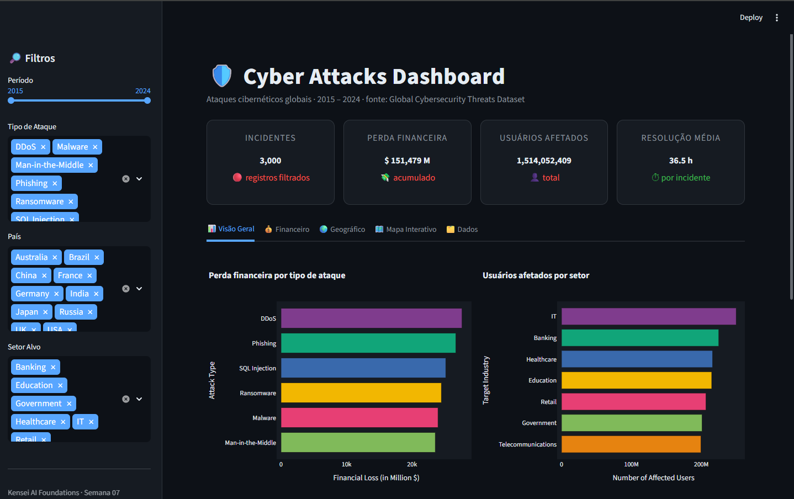
    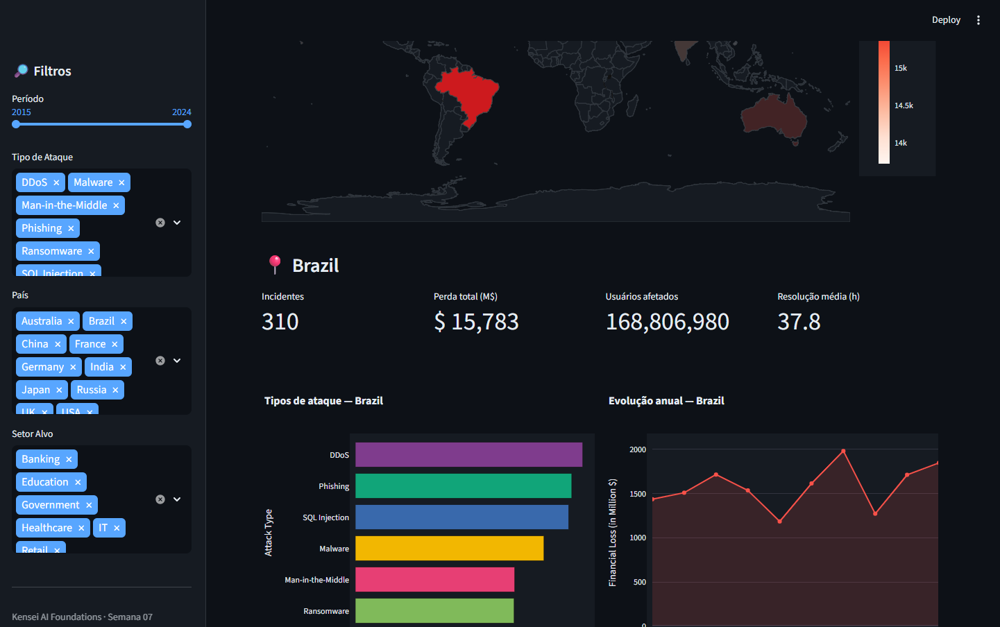
</p>

---

## Projeto 3 - Chatbot Web com IA

Arquivo: `03_chatbot_web_ia.py`

Conceitos:
- `st.chat_message` e `st.chat_input`
- gerenciamento de conversas na sidebar
- sugestoes clicaveis de perguntas
- integracao com Google Gemini (com fallback demo sem chave)
- continuacao automatica de respostas longas

Rodar:

```bash
streamlit run 03_chatbot_web_ia.py
```

<p align="center">
    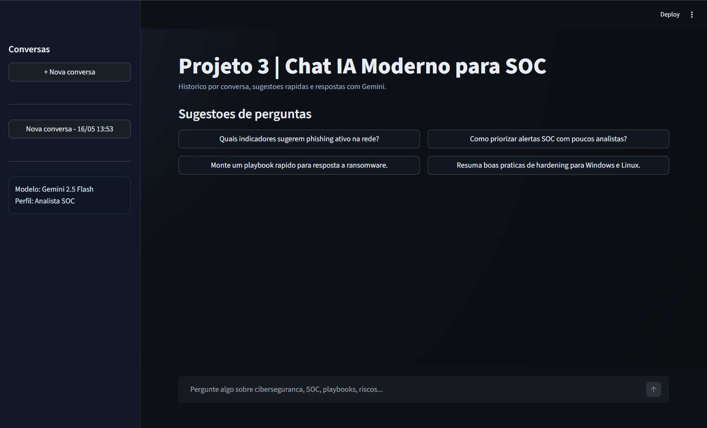
    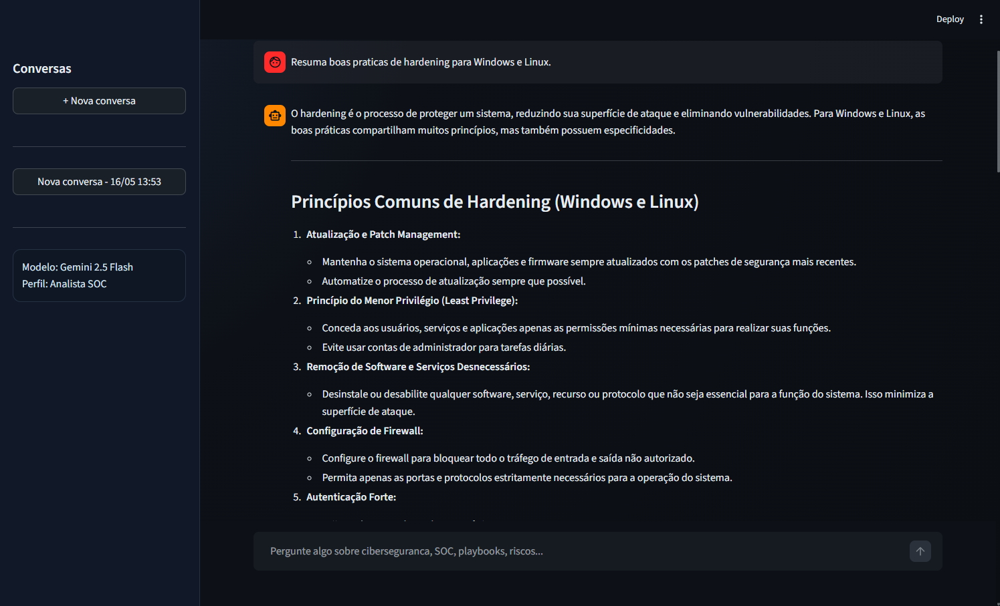
</p>

---

## Projeto 4 - Analisador de PDF com IA

Arquivo: `04_analisador_pdf_ia.py`

Conceitos:
- upload de arquivo com `st.file_uploader`
- extracao de texto com `pypdf`
- resumo com Google Gemini (quando `GOOGLE_API_KEY` estiver definida)

Rodar:

```bash
streamlit run 04_analisador_pdf_ia.py
```

<p align="center">
    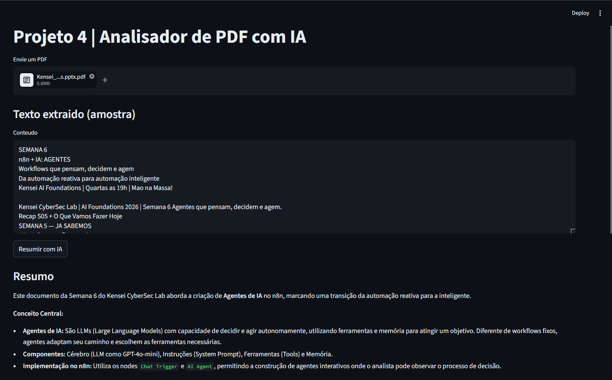
</p>

---

## Projeto 5 - Streamlit + n8n + Gemini Modernizado

Arquivo: `05_soc_streamlit_n8n.py`  
Workflow n8n (importável): `05_agente_n8n_soc_webhook.json`

### 🛠️ Conceitos e Funcionalidades
- **Interface Dark Theme**: UI moderna com CSS personalizado para uma experiência SOC profissional.
- **Alert Icons**: Feedback visual imediato usando ícones de status (🔴 Crítico, 🟡 Atenção, 🟢 Normal).
- **Performance Testing**: Monitoramento do tempo de resposta da integração entre Streamlit e n8n.
- **Integração Gemini**: O agente n8n utiliza o Google Gemini para análise inteligente de incidentes.

### 📥 Como Importar no n8n
1. No n8n, clique em **Add Workflow** -> **Import from File**.
2. Selecione o arquivo `05_agente_n8n_soc_webhook.json`.
3. Configure suas credenciais do Google Gemini no nó correspondente.
4. Clique em **Execute Workflow** (para testes) ou **Activate** (para produção).
5. Copie a **Webhook URL** gerada.

### ⚙️ Configuração do `.env`
Crie ou edite o arquivo `.env` na raiz da pasta `semana-07`:
```env
N8N_SOC_WEBHOOK_URL=https://seu-n8n.instancia.com/webhook/id-do-seu-webhook
GOOGLE_API_KEY=sua_chave_aqui
```

### 📋 Exemplos de Payload e Response

**Payload enviado pelo Streamlit:**
```json
{
  "event_type": "Brute Force Attack",
  "severity": "High",
  "source_ip": "192.168.1.100",
  "description": "Multiple failed login attempts detected in 5 minutes."
}
```

**Response recebido do n8n (Gerado pelo Gemini):**
```json
{
  "status": "Analysed",
  "risk_score": 85,
  "recommendation": "🔴 Immediate Action: Block source IP and trigger password reset for affected user.",
  "analysis": "The incident pattern matches a classic brute force attempt. Gemini suggests increasing MFA enforcement."
}
```

### 🚀 Rodar o Projeto
```bash
streamlit run 05_soc_streamlit_n8n.py
```

<p align="center">
    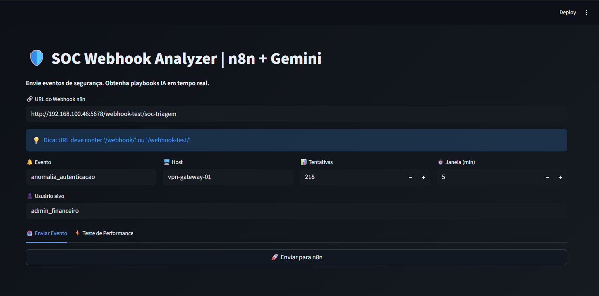
    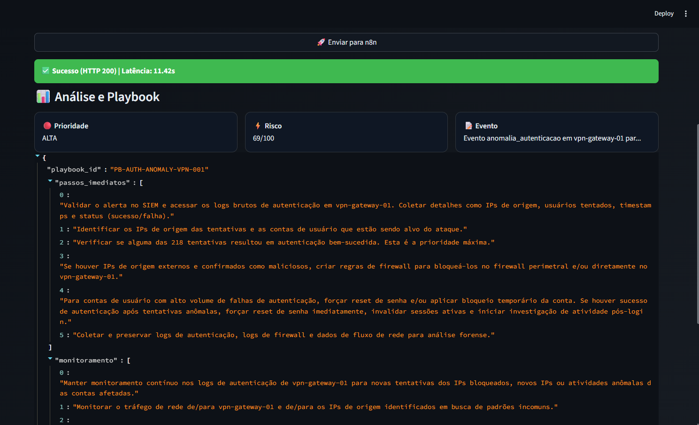
    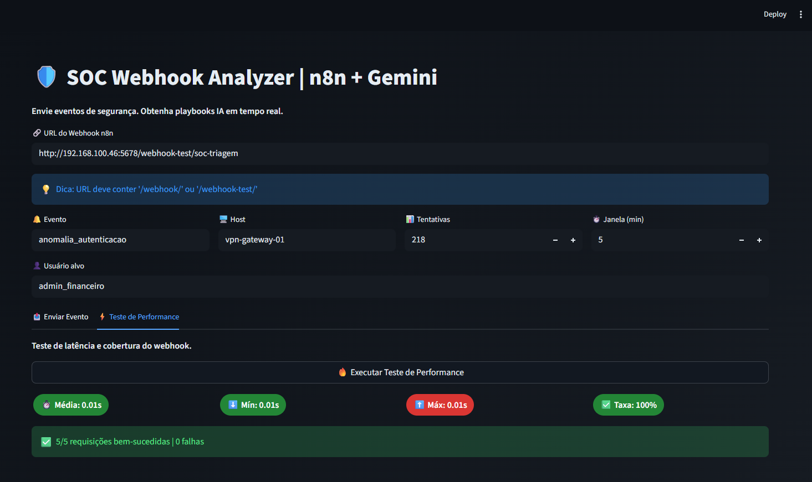
    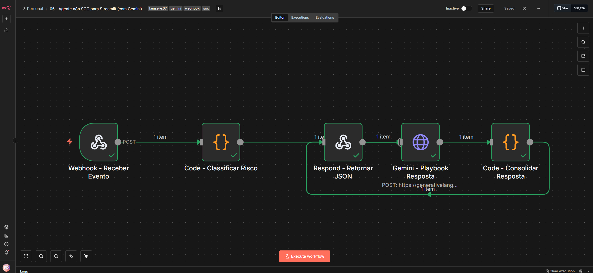
</p>

---

## Projeto 6 - Grey Hack (Simulação CTF)

Arquivo: `06_gamer_hack.py`

### 🎮 Sobre o Jogo

Simulação educacional de hacking estilo **Grey Hack** com terminal interativo, missões progressivas e sistema de recompensas. Todos os hosts, IPs e vulnerabilidades são **completamente fictícios**.

Link de acesso rápido: [Kensei GAME HACK](https://kensei-game-hack-claudio.streamlit.app)

### 🖥️ Funcionalidades

- **Terminal interativo** com ~15 comandos reais: `nmap`, `exploit`, `crack`, `dump`, `pivot`, `ls`, `download`, `buy`
- **12 hosts fictícios** distribuídos em 3 subredes (192.168.1.x, 192.168.2.x, 10.0.0.x)
- **5 missões** com dificuldade progressiva (★☆☆☆☆ até ★★★★★)
- **Sistema de XP e Level Up** com barra de progresso
- **Mercado negro** com 8 ferramentas compráveis (nmap e hydra gratuitos)
- **Network Map** visual com status de cada host
- **Atalhos rápidos** para os comandos mais comuns

### 📋 Missões

| Missão | Dificuldade | Objetivo | Recompensa |
|--------|-------------|----------|------------|
| FIRST CONTACT    | ★☆☆☆☆ | Escanear 5 hosts na rede | 200¢ |
| DATA BREACH      | ★★☆☆☆ | Comprometer servidor MySQL | 800¢ |
| GHOST PROTOCOL   | ★★★☆☆ | Infiltrar servidor de e-mail | 1.500¢ |
| ZERO DAY         | ★★★★☆ | Dominar o Domain Controller | 3.000¢ |
| KING OF THE HILL | ★★★★★ | Controlar o firewall | 10.000¢ |

### 🗺️ Topologia da Rede (Fictícia)

```
FIREWALL (10.0.0.5)
    ├── SIEM (10.0.0.15)
    ├── DMZ 192.168.1.x
    │       ├── gateway-01 (.10), web-srv-prod (.20), db-mysql-01 (.30)
    │       ├── mail-srv (.40), hr-workstation (.50), file-srv-01 (.60)
    │       └── dev-jenkins (.70), vpn-concentrator (.80)
    └── CORP 192.168.2.x
            └── dc-ad-01 (.10), backup-srv (.20)
```

### 🔧 Abas da Interface

1. **🖥️ Terminal** — CLI com input livre e atalhos rápidos
2. **🗺️ Network** — mapa visual com status dos hosts e ações rápidas
3. **📋 Missions** — quadro de missões com hints desbloqueáveis
4. **🔧 Toolkit** — arsenal + compra de ferramentas
5. **📄 Briefing** — topologia e referência completa de comandos

Rodar:

```bash
streamlit run 06_gamer_hack.py
```
<p align="center">
    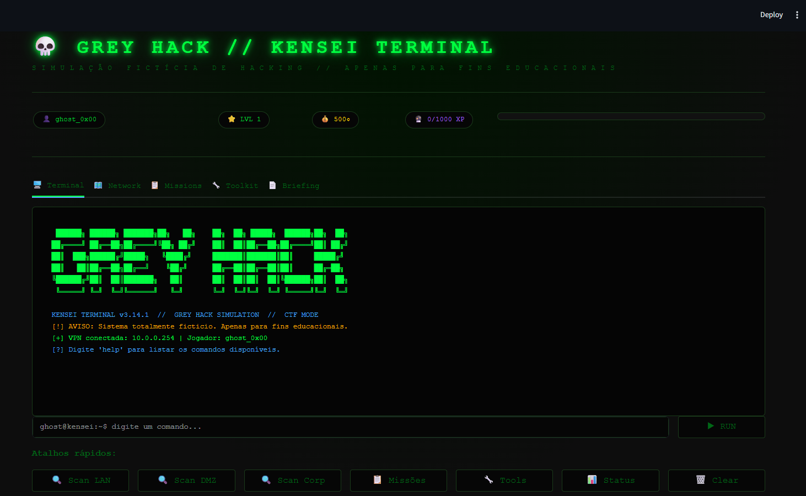
    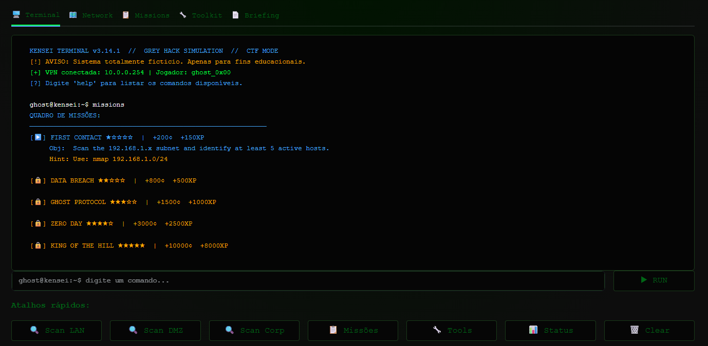
    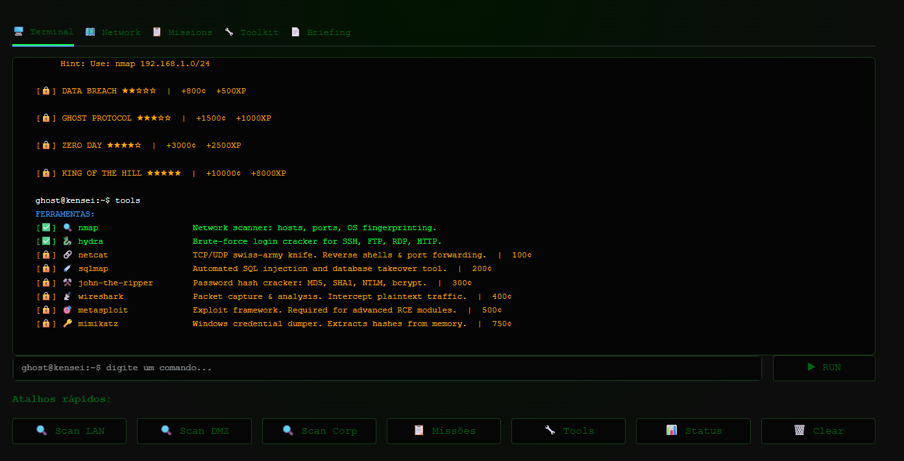
</p>
---

## Instalar dependencias

```bash
pip install -r requirements.txt
```

Variaveis de ambiente opcionais:

- `GOOGLE_API_KEY` para projetos 3 e 4 (obtenha em [Google AI Studio](https://aistudio.google.com/app/apikey))
- `N8N_SOC_WEBHOOK_URL` para projeto 5

---

## Deploy rapido (Streamlit Community Cloud)

1. Suba o repositorio no GitHub
2. Acesse share.streamlit.io
3. Clique em `New app`
4. Selecione o repo e um app principal (ex.: `semana-07/02_dashboard_cyber_attacks.py`)
5. Deploy

Dica:
- Se usar APIs, configure segredos no painel da plataforma em vez de hardcode no codigo.

---

## Resultado da semana

Ao final da semana 07, voce tera:

- 6 apps implementados (5 oficiais + 1 bônus)
- dashboard real de cyber attacks com Plotly
- chatbot e analisador de PDF integrados ao Google Gemini
- agente n8n com webhook + Gemini gerando playbooks SOC
- jogo de hacking estilo Grey Hack com terminal CTF interativo
