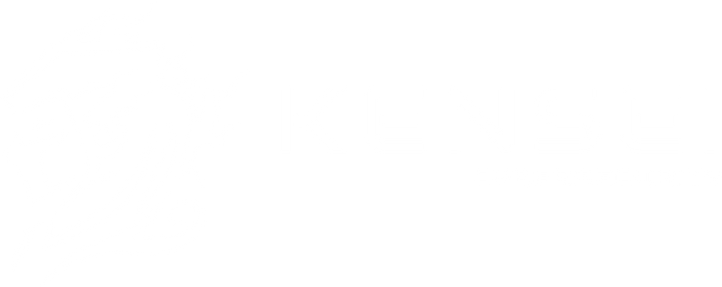
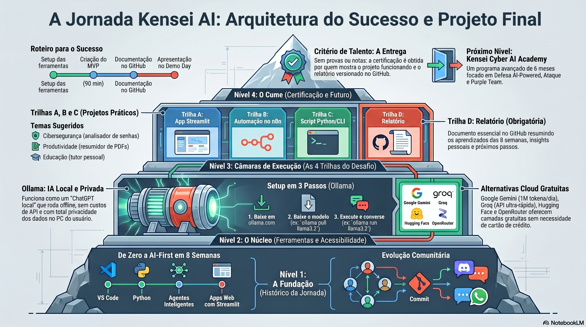
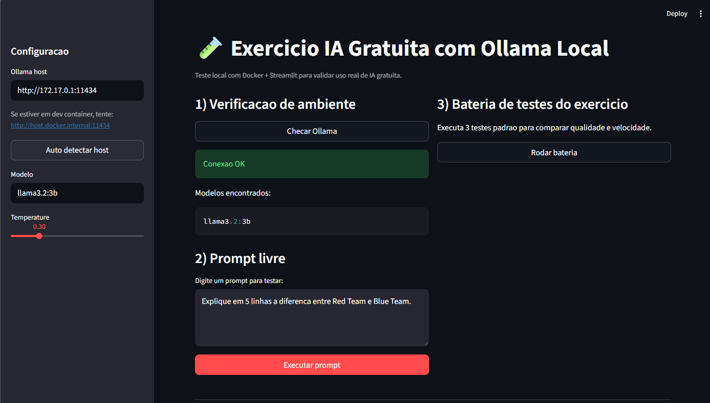
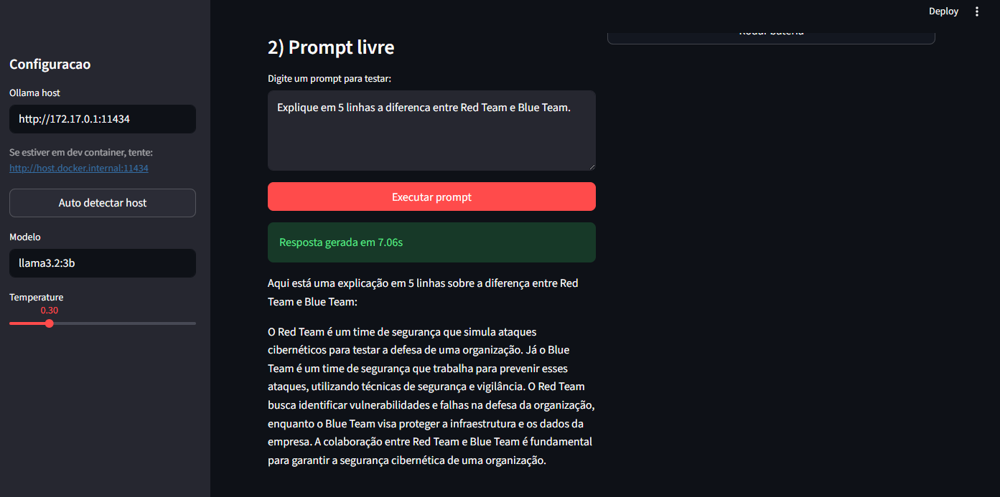
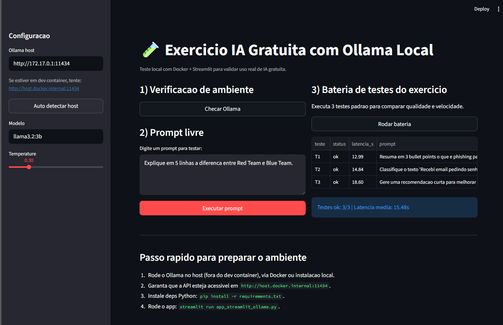

| O **Kensei AI Foundations** e uma jornada pratica para quem quer entrar no universo de **IA, dados, programacao e automacao**, mesmo comecando do zero. Aqui, o foco nao e so teoria: voce aprende construindo projetos reais, usando IA como copiloto e desenvolvendo as competencias que o mercado ja exige. Ao longo de 8 semanas, voce evolui com desafios mao na massa, apoio da comunidade e um portfolio que prova sua capacidade de resolver problemas reais. Se o objetivo e construir uma carreira **AI-first** com base solida e visao aplicada para tecnologia e cybersecurity, este curso e o ponto de partida. |
|:---:|
| |
|  <a href="https://kensei.seg.br/lab" target="_blank"></a> |

---

<p align="center">
    
</p>

---

# SEMANA 8 - Exercicio: IA Gratuita

Este README resume o exercicio de IA gratuita da Semana 8 e apresenta o direcionamento do projeto final.

- Exercicio prático: [exercicio-ia-gratuita-ollama](./exercicio-ia-gratuita-ollama/README.md)
- Projeto final (documentacao completa): [projeto-final](./projeto-final/README.md)

## Objetivo

Escolher e testar pelo menos 1 provedor de IA gratuita para validar um caso de uso real e simples.

## Exercicio

1. Use Ollama local com Docker (provedor gratuito escolhido para este exercicio).
2. Suba o container do Ollama e baixe um modelo local.
3. Rode os testes em Python com o app Streamlit.
4. Execute um prompt livre e uma bateria de 3 testes padrao.
5. Registre evidencias (respostas, latencia e conclusao final).

### Executando o exercicio (Ollama + Docker + Streamlit)

Pasta do exercicio: [exercicio-ia-gratuita-ollama](./exercicio-ia-gratuita-ollama/README.md)

Se voce estiver em dev container: rode o Ollama no host (fora do container) e use `http://host.docker.internal:11434` no campo **Ollama host** do app.

1. Subir Ollama no host:

```bash
cd exercicio-ia-gratuita-ollama
docker compose up -d
```

2. Baixar modelo sugerido:

```bash
ollama pull llama3.2:3b
```

3. Instalar dependencias Python:

```bash
pip install -r requirements.txt
```

4. Rodar testes no Streamlit:

```bash
streamlit run app_streamlit_ollama.py
```

No app, use os botoes **Checar Ollama**, **Executar prompt** e **Rodar bateria**.

### Resultado da validacao

O exercicio foi executado com sucesso com o modelo `llama3.2:3b`.

- 3 testes executados com status `ok`
- Latencia media observada: 15.48 s
- Evidencias visuais e exportacao em CSV foram geradas na pasta do exercicio

## Entrega sugerida

- Print da tela com status do ollama conectado

<p align="center">
	
</p>


- Prompt livre e resposta gerada

<p align="center">
	
</p>

- Latencia  e status da bateria de testes

<p align="center">
	
</p>

## Entrega esperada

- Nome do provedor escolhido
- Prompt de teste
- Resultado obtido
- Analise rapida (pontos fortes e fracos)
- Decisao final

## Material da aula

- `Kensei_AI_Foundations_S08_Projeto_Final.pptx.pdf`

## Projeto final

Toda a documentacao do projeto final esta em [projeto-final](./projeto-final/README.md).

### Como deve ser o projeto final

O projeto final precisa ser simples, funcional e publicavel. A ideia e mostrar aplicacao real de IA em um problema claro.

### Requisitos minimos

- Escolher 1 trilha principal:
	- Trilha A: app Streamlit com IA
	- Trilha B: workflow ou agente no n8n
	- Trilha C: script Python ou CLI com IA
- Ter um MVP funcionando de ponta a ponta
- Usar pelo menos 1 provedor de IA (local ou em nuvem)
- Ter README com objetivo, setup e execucao
- Publicar no GitHub com estrutura organizada

### Estrutura recomendada de entrega

- Codigo-fonte principal do projeto
- Arquivo de dependencias (`requirements.txt` ou equivalente)
- README completo com:
	- problema que o projeto resolve
	- como instalar
	- como executar
	- exemplos de uso
	- limitacoes atuais
	- proximos passos
- Evidencias de funcionamento (prints, GIFs ou logs)

### Qualidade esperada

- Fluxo claro para quem for testar
- Nomes de arquivos e pastas coerentes
- Erros tratados de forma minima (mensagens compreensiveis)
- Sem segredos expostos (nao subir chaves de API)
- Resultado reproduzivel por outra pessoa

### Checklist rapido antes de publicar

1. O projeto roda sem ajustes manuais complexos?
2. O README explica o passo a passo completo?
3. As dependencias estao declaradas?
4. Existe evidencia de que a IA foi realmente usada?
5. O repositorio esta limpo e organizado?

---

## Resumo Pessoal

Nesta semana eu consegui fechar o ciclo do curso entendendo melhor como validar uma solucao de IA e como apresentar um projeto final de forma organizada. As explicacoes me ajudaram porque nao ficaram apenas na ideia do projeto: mostraram tambem como testar, medir resultado, registrar evidencia e tomar uma decisao tecnica.

No comeco da criacao do projeto final, eu enfrentei algumas dificuldades para definir a estrutura, organizar as etapas e transformar a ideia em algo executavel. Em alguns momentos, parecia que faltava clareza sobre por onde seguir. Depois que ajustei o plano e comecei a quebrar o projeto em partes menores, o desenvolvimento seguiu bem e o fluxo ficou muito mais natural.

Ao executar o exercicio com Ollama e evoluir o projeto final, eu percebi na pratica como escolher ferramenta, testar latencia, revisar resultado e documentar tudo de forma clara. Isso me fez enxergar que desenvolver com IA tambem envolve criterio, validacao e capacidade de explicar o que foi construido.

O mais importante para mim foi terminar essa etapa sentindo que nao fiquei apenas estudando conteudo isolado. Eu consegui aplicar o que aprendi nas semanas anteriores em algo mais completo, com mais autonomia e mais clareza sobre como transformar aprendizado em portfolio real.
